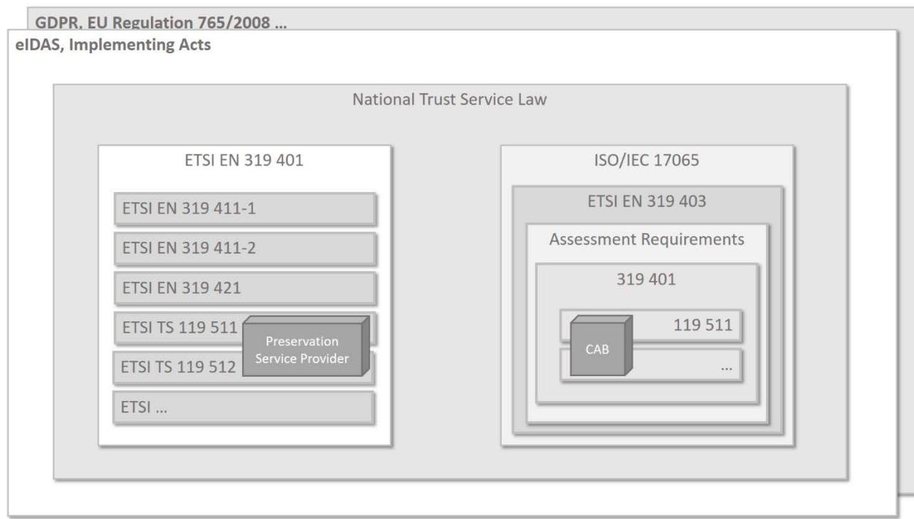
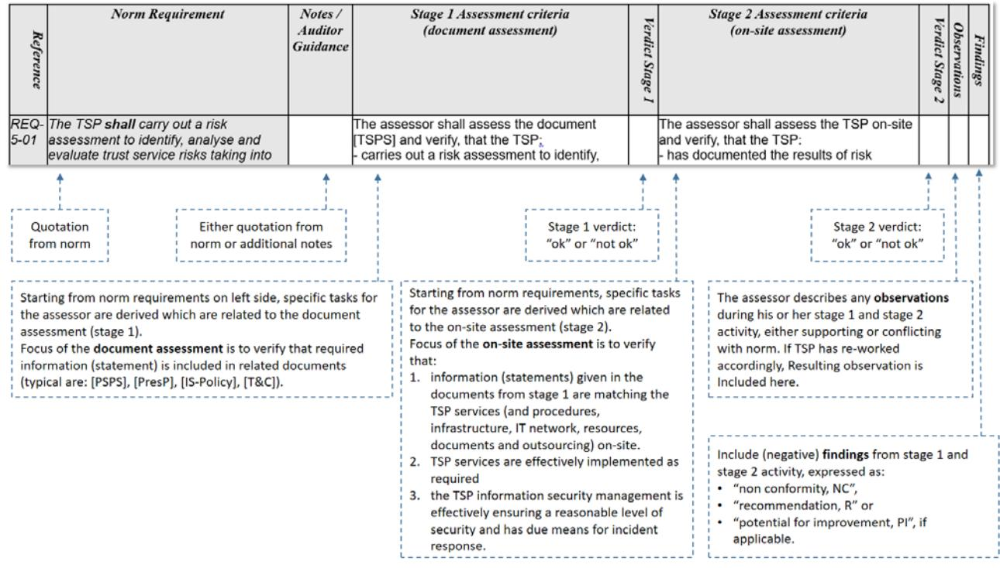

Part 1: Assessment Criteria for all TSP – ETSI EN 319 401

Federal Office for Information Security P.O.B. 20 03 63 D-53133 Bonn (Germany) Phone: +49 228 99 9582-0 E-mail: [tresor@bsi.bund.de](mailto:tresor@bsi.bund.de) Internet: [https://www.bsi.bund.de](https://www.bsi.bund.de/) © Federal Office for Information Security (BSI) 2019

## **Table of Contents**

## Inhalt

| 1              | Introduction                                          | 5       |
|----------------|-------------------------------------------------------|---------|
| 1.1            | Purpose                                               | 5       |
| 2              | Scope of Document                                     | 5       |
| 2.1            | Assessment Framework                                  | 6       |
| 2.2            | Document Overview                                     | 7       |
| 3              | Assessment Approach                                   | 9       |
| 3.1            | Assessment Pre-Requisites                             | 9       |
| 3.2            | Strictness of Assessment Criteria                     | 9       |
| 3.2.1 3.2.2 | Requirements Assessment Criteria                   | 9 10 |
| 3.3            | Structure of the Assessment Criteria                  | 10      |
| 3.4            | Assessment Stages and Assessor Activities             | 11      |
| 3.4.1          | Identification of Assessment Criteria                 | 12      |
|                |                                                       |         |
| 4              | Structure of Assessment Criteria and Report Template  | 13      |
| 5              | Assessment Criteria for Risk Assessment               | 14      |
| 6              | Assessment criteria for Policies and Practices        | 17      |
| 6.1            | Trust Service Practice Statement                      | 17      |
| 6.2            | Terms and Conditions                                  | 20      |
| 6.3            | Information Security Policy                           | 23      |
| 7              | Assessment criteria for TSP Management and Operations | 26      |
| 7.1            | Internal organization                                 | 26      |
| 7.1.1          | Organization reliability                              | 26      |
| 7.1.2          | Segregation of duties                                 | 30      |
| 7.2            | Human resources                                       | 30      |
| 7.3            | Asset management                                      | 37      |
| 7.3.1          | General requirements                                  | 37      |
| 7.3.2          | Media handling                                        | 38      |
| 7.4            | Access control                                        | 38      |
| 7.5            | Cryptographic controls                                | 42      |
| 7.6            | Physical and environmental security                   | 42      |
| 7.7            | Operation security                                    | 45      |
| 7.8            | Network security                                      | 49      |
| 7.9            | Incident management                                   | 55      |
| 7.10           | Collection of evidence                                | 60      |
| 7.11           | Business continuity management                        | 64      |
| 7.12           | TSP termination and termination plans                 | 65      |
| 7.13           | Compliance                                            | 73      |
| 8              | Appendix                                              | 75      |
| 9              | References                                            | 76      |

| 9.1 | Normative References       | 76 |
|-----|----------------------------|----|
| 9.2 | Informative References     | 78 |
| 10  | Keywords and Abbreviations | 80 |

## **Table of Figures**

| Figure 2: ETSI Assessment Framework 7                           |  |
|--------------------------------------------------------------------|--|
| Figure 3: Structure of Assessment Criteria and Report Template  13 |  |

## **Table List**

| Table 1: Types of (qualified) Trust Services 6 |  |
|---------------------------------------------------|--|
| Table 2: Normative References  77                 |  |
| Table 3: Informative References  79               |  |
| Table 4: Keywords and Abbreviations  81        |  |

## **1 Introduction**

## **1.1 Purpose**

Trust services, as specified in Regulation (EU) No 910/2014 **[eIDAS]** (short: eIDAS), shall give participants of electronic commerce confidence in the security of these trust services. This confidence is expected to result from a set of procedures, processes and security measures, the TSP has established in order to minimize the operational and financial threats and risks associated.

eIDAS distinguishes two trust levels with respect to trust services and providers of trust services:

- (normal) trust services and trust service providers (TSP) and
- **qualified** trust services and trust service providers (**QTSPs**), that need to fulfil additional legal requirements and are subject to periodical independent third party conformity assessments by accredited conformity assessment bodies (CAB).

## (Q)TSP means TSP or QTSP.

Especially **qualified** trust services and QTSPs will fulfil such high expectations of participants.

**[ETSI EN 319 401]** defines general policy requirements for operation and management practices of a TSP regardless the service it provides. **[ETSI EN 319 401]** does not specify **how** the requirements can be assessed by an independent party and what kind of information and documents shall be subject of such a conformity assessment. **[ETSI EN 319 401]** refers to **[ETSI EN 319 403]** "Requirements for Conformity Assessment Bodies Assessing Trust Service Providers", which is applicable to CABs and which supplements the international standard **[ISO/IEC 17065]**, which accredited CABs must fulfil. **[ETSI EN 319 403]** poses general requirements on CABs assessing (qualified) trust services and does neither distinguish between different trust services nor define dedicated assessment criteria for the application of standards like **[ETSI EN 319 401]** or standards for dedicated trust services of the ETSI EN 310 4x1 series.

More specifically, **[ETSI EN 319 401]** defines general requirements on the TSP's public documentation (e.g. the Trust Service Practice Statement and the Terms and Conditions) and on the TSP management and operation (e.g. human resources, asset management, access control, physical and environmental security, operation and network security). Assessment criteria, derived one-byone from **[ETSI EN 319 401]** requirements, are neither intended nor included.

In summary, neither the TSP specific standards (ETSI EN 319 4x1) nor the CAB specific standard **[ETSI EN 319 403]** provide dedicated assessment criteria for application for the conformity assessment of TSP. The present document has the goal to bridge this gap with respect to **[ETSI EN 319 401]**. It specifies assessment criteria to be used by accredited conformity assessment bodies (CAB) to assess the conformity of qualified trust service providers ((Q)TSPs) against the standard **[ETSI EN 319 401]**.

## **2 Scope of Document**

This **Part 1** of the assessment criteria is the first module for a conformity assessment of TSPs that fulfils the requirements of **[ETSI EN 319 401]**. The assessment criteria are directly derived from the general policy requirements given by **[ETSI EN 319 401]**. CAB shall apply all criteria set out in Part 1 to be conformant to this document.

In addition to Part 1,

there exist further parts of assessment criteria based on **[ETSI EN 319 401]** for other specific trust services. Such assessment criteria will always be additional to those set out in Part 1. Currently, e.g. the following norms and specifications are available to specific types of (qualified) trust services as defined in **[eIDAS]**:

| Type of (Qualified) Trust Service                 | Related Norms and Technical Specifications  |
|---------------------------------------------------|---------------------------------------------|
| creation of qualified certificates for electronic | ETSI EN 319 411-2 together with ETSI EN 319 |
| signatures or electronic seals                    | 411-1                                       |
| creation of qualified certificates for web site   | ETSI EN 319 411-2 together with ETSI EN 319 |
| authentication                                    | 411-1                                       |
| creation of qualified electronic time stamps      | ETSI EN 319 421                             |
| validation of qualified electronic signature and  | ETSI TS 119 441                             |
| seals                                             |                                             |
| electronic registered delivery                    | ETSI EN 319 521 and ETSI EN 319 531         |
| signing service                                   | ETSI TS 119 431-1 and ETSI TS 119 431-2     |
| preservation service                              | ETSI TS 119 511 and ETSI TS 119 512         |

#### **Table 1: Types of (qualified) Trust Services**

**Not** addressed in this Part 1 are organisational activities of the CAB and its assessors like contract gathering aspects and project management, assessor qualification and audit planning, reporting specific aspects or non-conformity tracking. These aspects are in the scope of **[ISO/IEC 17065]** and **[ETSI EN 319 403]** which are normative to the CAB.

### **2.1 Assessment Framework**

Derived assessment criteria are embedded in the European regulatory framework. On EU-level, each TSP underlies especially the eIDAS regulation **[eIDAS]** and the General Data Protection Regulation (GDPR). Conformity Assessment Bodies (CAB) shall comply also with **[EU regulation 765/2008]**. Furthermore, EU implementing acts and national trust service laws apply to both. The ETSI series related to trusted services apply to TSPs in the same way, as related to ISO and ETSI norms and standards or specifications apply to CABs. The following figure sketches hierarchy of documented regulatory framework and shows the relation to a Preservation Service Provider (as an example of a TSP) and a CAB as acting entities. The assessment criteria are applicable to CAB only.

**Figure 1: ETSI Assessment Framework**

**[ETSI EN 319 401]** specifies general policy requirements on the operation and management practices of a TSP regardless of the service the TSP provides.

Subordinated **[ETSI EN 319 411-1]** or **[ETSI TS 119 511]** specify specific policy requirements, depending on the specific service of the TSP. So, other than **[ETSI EN 319 401]**, only those norms and specifications from ETSI series apply, which are required for the specific type of trust service. As an example, **[ETSI EN 319 411-1]** applies to TSPs issuing certificates for natural or legal persons. In the same way, **[ETSI TS 119 511]** applies to Preservation Service Providers.

The regulatory framework for CABs is based on **[ISO/IEC 17065]** as accreditation norm, amended by **[ETSI EN 319 403]**.

The assessment requirements are then based on the standards, the TSP has to conform to. For example, the"Policy and Security Requirements for Trust Service Providers e.g. providing long-term Preservation of digital Signatures or general Data using digital Signature Techniques" are based on **[ETSI EN 319 401]** and **[ETSI TS 119 511]**.

### **2.2 Document Overview**

The following **chapter 3** specifies the assessment approach. It gives the frame for applying the criteria found in the following chapters.

In **chapter 4,** the present document describes the structure and explains the content of the tables, which contain norm requirements together with detailed assessment criteria. The last column provides space to fill in observations, verdicts and finding, as a result of an assessment.

Subsequent **chapters 5 to 7** define the assessment criteria for conformity assessment against **[ETSI EN 319 401],** following its document structure.

The assessment criteria are written in such a way that the present document (or the respective parts of it) could be used as **template** for the documentation of the results of a conformity assessment. An utilisation of the tables within a spreadsheet might be helpful for an actual assessment.

## **3 Assessment Approach**

## **3.1 Assessment Pre-Requisites**

For demonstrating conformance to **[ETSI EN 319 401]** all assessment criteria in this document shall be applied.

Pre-requisites for such a conformance assessment are the following aspects:

- Due to the public nature of the provided trust services, the TSP has to **document** its implementing practices, together with legal terms and conditions. These documents target public audiences, who can be any party relying on the provided trust services. With those documents, the TSP shows, what and how it is doing to fulfil the applicable norm requirements, here **[ETSI EN 319 401]**.
- The TSP has to **implement** all trust service practices laid down in its publicly**[1](#page-8-4)** available documents. Clearly, its implementation must fully conform to its own public documents.

The CAB will assess the TSP as an organisation with its documentation and its implemented trust services based on the assessment criteria from the present document. The main task of the assessor is to determine if all mandatory assessment criteria are fulfilled. In this case conformance to **[ETSI EN 319 401]** is implied.

Before starting a conformity assessment, a contract between the accredited CAB and the TSP needs to be established. Further pre-requisites on the assessment process result from the accreditation of the CAB against **[ISO/IEC 17065]** and **[ETSI EN 319 403]** (e.g. audit team, assessment plan). They are out of scope of the present document, which focusses on the assessment activities itself and – in detail – on the expected results.

## **3.2 Strictness of Assessment Criteria**

For a better understanding of the strictness of the assessment criteria within this document, it is necessary to clearly separate between the two different types of rules to be followed:

- "Requirements" are applicable to TSPs and directly originate from the related ETSI documents (**[ETSI EN 319 401]**, **[ETSI EN 319 411-1]**, etc.).
- The assessment "criteria" are applicable to the CAB and its assessors and mainly derived from those ETSI documents applicable to TSPs.

### **3.2.1 Requirements**

Requirements from TSP related ETSI documents use the modal verbs terminology of ETSI Drafting Rules, clause 3.2 (Verbal forms for the expression of provisions): "shall", "shall not", "should", "should not", "may", "need not", "will", "will not", "can" and "cannot".

Whenever the assessor identifies a "shall" requirement not being fulfilled by a TSP, a **nonconformity (NC)** results. Such a NC may result in a stop of business for the TSP. Any decision about the severeness of non-conformities is up to the CAB, the assessor is working for and resides outside the scope of this document.

1

Mandatory public documents of the TSP are its TSPS and terms & conditions.

Likewise, if a "SHOULD" requirement is unfulfilled by a TSP, a **recommendation (R)** results and further audits by the CAB are necessary.

A "SHOULD" requires from the TSP either to fulfil the requirement exactly as it is specified or respective test cases should demonstrate the specified behaviour to make evident that it`s equivalent to the requirements and to the required security levels.

Remark: not related to the strictness are so called **potentials for improvement (PI),** an assessor may identify. These PI are only informative to the TSP.

#### **3.2.2 Assessment Criteria**

Regarding the assessment criteria, this document uses the following three major classes of assessment criteria (cf. [RFC 2119])

- MAY: These criteria are just hints or optional activites of the assessor. These criteria will not result in mandatory assessment activities.
- SHOULD: These criteria are strong recommendations. Respective assessment activities should be performed by the assessor. Alternatively, the assessor explains why he or she uses a different approach and why this activity assures the same assessment result as the original activity.
- SHALL (or synonymously MUST): These are strict criteria. It is not allowed to use different assessment activities.

The strictness of the assessment criteria applicable to the CAB and its assessors is to be specified by the applicable accreditation and certification scheme and resides outside the scope of this document.

### **3.3 Structure of the Assessment Criteria**

The order of the assessment criteria follows the document structure (chapters, sections) of norm **[ETSI EN 319 401]**. For each individual norm requirement, assessment criteria are derived for either stage 1 document assessment or/and stage 2 on-site assessment, as applicable. A conformant design of the provided trust services, laid-out in the TSP documents (stage 1) is a pre-requisite for starting to audit the actual implementation on-site (stage 2).

Norm chapters address specific aspects, a (Q)TSP and/or its trust service(s) need to fulfil. Such aspects range

- from sole **document** related requirements, which the documents of a (Q)TSP need to conform with;
- through requirements related to **organisational** structure and processes and its procedures;
- down to **infrastructural** requirements, both physical and logical (i. e. building infrastructure and IT infrastructure).

Such a broad range of aspects is due to the overarching nature of "policy" requirements. A reason for such an approach are current **information security management practices.** To handle security, the purpose of business and applied processes need to be understood. Then immanent risks in the type of business and processes (to be implemented) need to be identified and treated assuring an acceptable level of security. Such treatment is structured along security measures. There are four generic types of **security measures:**

• **Physical** security measures,

- **Organisational** security measures,
- **Personnel** related security measures, and
- **Technology** related security measures.

In a similar way, all assessment criteria are related to both, **functional and security aspects,** often at the same time and regardless of being related to (Q)TSP documentation and/or to actual implementation of provided trust service(s). The basic nature of trust service is trust, so functional aspects like the generation of certificates or signatures are actually security functions, using cryptography and implementing security objectives as integrity, confidentiality or authenticity. A sharp distinction between functional and security aspects is therefore at least difficult, if not impossible. The assessment must consider functional and security aspects always at the same time.

## **3.4 Assessment Stages and Assessor Activities**

The **assessment** of a (Q)TSP is performed by an accredited CAB on the basis of **[EN 319 403]** and split into two stages (see also **[ETSI EN 319 403]**):

- **Stage 1** Document Assessment: the CAB assesses the documentation of the (Q)TSP for conformance with the requirements laid out in the applicable ETSI standard(s);
- **Stage 2** On Site Assessment**[2](#page-10-1)** (Audit): the CAB assesses the (Q)TSP management, organisation, processes, documentation, facilities and infrastructures on site, i.e. at the (Q)TSP premises, for conformance with the requirements laid out in the applicable ETSI standard(s).

At each stage, the CAB assessment includes **analytic, conclusive and reporting activities.** So the CAB assessor will

- analyse documents,
- ask questions and perform interviews,
- Inspect and has an eye on-site.

Based on this the assessor:

- wants to understand the organisation and its services,
- identifies potential gaps or non-conformities,
- concludes whether the (Q)TSP fulfils its requirements, and finally
- prepares a report on its findings and observations.

The assessment criteria require from the assessor to perform certain activities and to check the expected results, with respect to the requirements. Per stage, the assessor describes the observations during his or her activity and gives per criterion a verdict (either "OK" or "not OK"). Also, he or she includes (negative) findings, expressed as non-conformities, recommendations or potentials for improvement.

The assessor must document all results of assessor activities. For this, the tables in chapter 5 to 7 SHOULD be used as a template for logging. Finally, an assessment report SHALL be written. See

 2 Pre-assessment condition: see **[EN 319 403]**, chapter 7.4.5.3: In every case, the document review (stage 1) shall be completed prior to the commencement of audit, stage 2.

### **[ETSI TS 119 403-3]** for details.

### **3.4.1 Identification of Assessment Criteria**

Each assessment criterion relates to a norm requirement identified by its unique identifier:

<the 3 letters REQ> - < the clause number> - <2 digit number - incremental>

Specific criterions are splitted into documentation related (stage 1) and implementation related aspects (stage 2, audit). Normally, stage 2 related criteria base on the results of stage 1 assessment. Some aspects are only relevant for stage 1, like some detailed content of the terms and conditions. Those will **not** be addressed in stage 2. Nevertheless, most aspects from stage 1 need to be mirrored and/or inspected on-site during stage 2.

Trust Service specific aspects are out of scope of the present document. Nevertheless, for **[ETSI EN 319 401]** assessments, the assessor has **to tune** his or her activities to the specific trust services provided by (Q)TSP. Such an obvious case is a trust service, where no specific ETSI norm or specification is available. Then, the assessor needs to include trust service specific assessment activities in addition to **[ETSI EN 319 401]**.

# **4 Structure of Assessment Criteria and Report Template**

The following figure describes the structure and content of the tables used for assessment criteria as contained in chapter 5 to 7. The tables could be utilised as a template for a reporting of the assessment, as well. For that purpose, the use of a customised spreadsheet is advisable.

**Figure 2: Structure of Assessment Criteria and Report Template**

Notes and auditor guidance may origin from the norm itself or may be additional to that.

If the text is quoted from norm, the text in the table is set in *slanted* format.

The content of the column "Notes/auditor/Guidance" in the Figure 2: "Structure of Assessment Criteria and Report Template" is informative.

Assessment criteria request assessor activities per each TSP requirement. Usually, the criteria text starts with a standard sentence and is followed by the specific assessor activities (indicated by hyphens "-"), and – in case – further detailed (indicated by plus signs "+" or "+").

Example *REQ-6.1-01*:

*The assessor shall assess the provided public TSP documents and verify, that - the TSP documented the set of: + policies + practices* for the trust services it is providing *- the chosen policies and practices are appropriate for the provided trust services.* 

## **5 Assessment Criteria for Risk Assessment**

NOTE: See **ISO/IEC 27005** [i.5] for guidance on information security risk management as part of an information security management system.

#### Assessment criteria for TSP Management and Operations

|          | R ef er en ce | Norm Requirement                                                                                                                                                                                                                                                                   | Notes / Auditor Guidance | Stage 1 Assessment criteria (document assessment)                                                                                                                                                                                                                                                                                                                                | Ve rd ic t S ta ge 1 | Stage 2 Assessment criteria (on-site assessment)                                                                                                                                                                                                                                                      | Ve rd ic t S ta ge 2 | O bs er va tio ns | F in di ng s |
|----------|---------------------------|------------------------------------------------------------------------------------------------------------------------------------------------------------------------------------------------------------------------------------------------------------------------------------|-----------------------------|-------------------------------------------------------------------------------------------------------------------------------------------------------------------------------------------------------------------------------------------------------------------------------------------------------------------------------------------------------------------------------------|----------------------------------------|----------------------------------------------------------------------------------------------------------------------------------------------------------------------------------------------------------------------------------------------------------------------------------------------------------|----------------------------------------|----------------------------------|--------------------------|
| REQ-5-01 |                           | The TSP shall carry out a risk assessment to identify, analyse and evaluate trust service risks taking into account business and technical issues.                                                                                                               |                             | The assessor shall assess the document [TSPS] and verify that the TSP: - stated that the TSP carries out a risk assessment to identify, analyse and evaluate trust service risks taking into account business and technical issues.                                                                                                                            |                                        | The assessor shall assess the TSP on-site and verify that the TSP: - documented the results of a risk assessment, including business and technical aspects.                                                                                                                                     |                                        |                                  |                          |
| REQ-5-02 |                           | The TSP shall select the appropriate risk treatment measures, taking account of the risk assessment results. The risk treatment measures shall ensure that the level of security is commensurate to the degree of risk.                                       |                             | The assessor shall assess the document [TSPS] and verify that the TSP: - stated that the TSP selects appropriate risk treatment measures based on risk assessment results, ensuring a level of security commensurate to the degree of risk.                                                                                                                       |                                        | The assessor shall assess the TSP on-site and verify that the TSP: - implemented the selected risk treatment measures (based on risk assessment results), which are sufficient to reach an acceptable level of security.                                                                  |                                        |                                  |                          |
| REQ-5-03 |                           | The TSP shall determine all security requirements and operational procedures that are necessary to implement the risk treatment measures chosen, as documented in the information security policy and the trust service practice statement (see clause 6). |                             | The assessor shall assess the document [TSPS] and verify that the TSP: - determined all security requirements and operational procedures necessary to fully implement its risk treatment measures and the assessor shall check, - that these requirements and procedures are completely documented in the [TSPS] and the information security policy. |                                        | The assessor shall assess the TSP on-site and verify that the TSP: - implemented a set of determined security requirements and operational procedures, which are sufficient to implement the chosen risk treatment measures and which are documented in the [IS-Policy] and [TSPS]. |                                        |                                  |                          |
| REQ-5-04 |                           | The risk assessment shall be regularly reviewed and revised                                                                                                                                                                                                                  |                             | The assessor shall assess the document [TSPS] and verify that the TSP: - stated that the TSP regularly reviews and revises its risk assessment.                                                                                                                                                                                                                         |                                        | The assessor shall assess the TSP on-site and verify that the TSP: - has kept the risk assessment up to date.                                                                                                                                                                                   |                                        |                                  |                          |

#### Part 1: Assessment Criteria for all TSP – ETSI EN 319 401

| R ef er en ce | Norm Requirement                                                                                         | Notes / Auditor Guidance | Stage 1 Assessment criteria (document assessment)                                                                                                                                       | Ve rd ic t S ta ge 1 | Stage 2 Assessment criteria (on-site assessment)                                                                                                                  | Ve rd ic t S ta ge 2 | O bs er va tio ns | F in di ng s |
|---------------------------|----------------------------------------------------------------------------------------------------------|-----------------------------|--------------------------------------------------------------------------------------------------------------------------------------------------------------------------------------------|----------------------------------------|----------------------------------------------------------------------------------------------------------------------------------------------------------------------|----------------------------------------|----------------------------------|--------------------------|
| REQ-5-05                  | The TSP's management shall approve the risk assessment and accept the residual risk identified. |                             | The assessor shall assess the document [TSPS] and verify that the TSP: - stated that the TSP management approves its risk assessment and accepts identified residual risks. |                                        | The assessor shall assess the TSP on-site and verify that the TSP: - management approved the risk assessment and accepted the identified residual risks. |                                        |                                  |                          |

## **6 Assessment criteria for Policies and Practices**

## **6.1 Trust Service Practice Statement**

| R ef er en ce | Norm Requirement                                                                                                                                                  | Notes / Auditor Guidance | Stage 1 Assessment criteria (document assessment)                                                                                                                                                                                                                                        | Ve rd ic t S ta ge 1 | Stage 2 Assessment criteria (on-site assessment)                                                                                                                        | Ve rd ic t S ta ge 2 | O bs er va tio ns | F in di ng s |
|---------------------------|-------------------------------------------------------------------------------------------------------------------------------------------------------------------|-----------------------------|---------------------------------------------------------------------------------------------------------------------------------------------------------------------------------------------------------------------------------------------------------------------------------------------|----------------------------------------|----------------------------------------------------------------------------------------------------------------------------------------------------------------------------|----------------------------------------|----------------------------------|--------------------------|
| REQ-6.1-01                | The TSP shall specify the set of policies and practices appropriate for the trust services it is providing.                                              |                             | The assessor shall assess the provided public TSP documents and verify that - the TSP documented the set of: + policies, + practices for the trust services it is providing, - the chosen policies and practices are appropriate for provided trust services. |                                        | not applicable3                                                                                                                                                            |                                        |                                  |                          |
| REQ-6.1-02                | The set of policies and practices shall be approved by management, published and communicated to employees and external parties as relevant. |                             | REMARK: This requirement is fulfilled, if all derived requirements REQ-6.1-03 to REQ-6.1- 11 are fulfilled. No additional stage 1 assessment activity is required.                                                                                                                 |                                        | REMARK: This requirement is fulfilled, if all derived requirements REQ-6.1-03 to REQ-6.1-11 are fulfilled. No additional stage 2 assessment activity is required. |                                        |                                  |                          |

3 Implementation of applied set of policies and practices is assessed through the assessment of all other **[ETSI EN 319 401]** requirements.

| R ef er en ce | Norm Requirement                                                                                                                                                                                         | Notes / Auditor Guidance                                                                                                       | Stage 1 Assessment criteria (document assessment)                                                                                                                                                                                                                                                                                                                                                                                                                                                                                                                                                                                      | Ve rd ic t S ta ge 1 | Stage 2 Assessment criteria (on-site assessment)                                                                                                                                                                                                                                                                                                                | Ve rd ic t S ta ge 2 | O bs er va tio ns | F in di ng s |
|---------------------------|----------------------------------------------------------------------------------------------------------------------------------------------------------------------------------------------------------|-----------------------------------------------------------------------------------------------------------------------------------|-------------------------------------------------------------------------------------------------------------------------------------------------------------------------------------------------------------------------------------------------------------------------------------------------------------------------------------------------------------------------------------------------------------------------------------------------------------------------------------------------------------------------------------------------------------------------------------------------------------------------------------------|----------------------------------------|--------------------------------------------------------------------------------------------------------------------------------------------------------------------------------------------------------------------------------------------------------------------------------------------------------------------------------------------------------------------|----------------------------------------|----------------------------------|--------------------------|
| REQ-6.1-03                | In particular: The TSP shall have a statement of the practices and procedures used to address all the requirements identified for the applicable TSP's policy.                         | NOTE: The present document makes no requirement as to the structure of the trust service practice statement. | The assessor shall assess the document [TSPS] and verify that the TSP: - included its practices and procedures used to address all the requirements identified for the applicable TSP policy, - clarified which policy or policies the TSP follows and what the relations between practices and procedures and the policy or policies are. Remark: The trust service policy contains all (mandatory) rules applicable for the specific Trust Service and defines the nominal conditions. The TSPS describes implementation of the policy, i. e. how the TSP fulfils the TSP policy. |                                        | not applicable                                                                                                                                                                                                                                                                                                                                                     |                                        |                                  |                          |
| REQ-6.1-04                | The TSP's trust service practice statement shall identify the obligations of all external organizations supporting the TSP's services including the applicable policies and practices. |                                                                                                                                   | The assessor shall assess the document [TSPS] and verify that the TSP: - identified all external organisations supporting the TSP service, - named all obligations applicable to these organisations and - included in those obligations all applicable policies and practices.                                                                                                                                                                                                                                                                                                                    |                                        | The assessor shall assess the TSP on-site and verify that the TSP: - named all external organisations, - identified all obligations of external organisations within contract, - uses the services of these external organisations as described in the trust service practice statement. [ASS 319 401, REQ-7.1.1-07]. See also |                                        |                                  |                          |

|            | R Norm Requirement ef er en ce                                                                                                                                                         | Notes / Auditor Guidance | Stage 1 Assessment criteria (document assessment)                                                                                                                                                                                                                                                                                                                                           | Ve rd ic t S ta ge 1 | Stage 2 Assessment criteria (on-site assessment)                                                                                                                                                                                                                      | Ve rd ic t S ta ge 2 | O bs er va tio ns | F in di ng s |
|------------|-------------------------------------------------------------------------------------------------------------------------------------------------------------------------------------------------------|-----------------------------|------------------------------------------------------------------------------------------------------------------------------------------------------------------------------------------------------------------------------------------------------------------------------------------------------------------------------------------------------------------------------------------------|----------------------------------------|--------------------------------------------------------------------------------------------------------------------------------------------------------------------------------------------------------------------------------------------------------------------------|----------------------------------------|----------------------------------|--------------------------|
| REQ-6.1-05 | The TSP shall make available to subscribers and relying parties its practice statement, and other relevant documentation, as necessary to assess conformance to the service policy. |                             | The assessor shall assess the document [TSPS] and verify that the TSP: - stated that the TSP + makes available its [TSPS] to subscribers and relying parties, ++including other documentation, which are necessary to assess conformance to the service policy and ++describing how the [TSPS] is made available to subscribers and relying parties. |                                        | The assessor shall assess the TSP on-site and verify that the TSP: - published its [TSPS] and related public documents e.g. on its website. The assessor shall verify, -that the [TSPS] and the other information can be retrieved.                    |                                        |                                  |                          |
| REQ-6.1-06 | The TSP shall have a management body with overall responsibility for the TSP with final authority for approving the TSP's practice statement.                                          |                             | The assessor shall assess the document [TSPS] and verify that the TSP: - has a management body with overall responsibility for the TSP and - with final authority for approving the [TSPS].                                                                                                                                                                                  |                                        | The assessor shall assess the TSP on-site and verify that the TSP: - management body has: + an appointment certificate, appointing overall responsibility and + final authority for approving the [TSPS], - management body approved the [TSPS]. |                                        |                                  |                          |
| REQ-6.1-07 | The TSP's management shall implement the practices.                                                                                                                                                |                             | The assessor shall assess the document [TSPS] and verify that the TSP: - stated that the TSP management implements the practices.                                                                                                                                                                                                                                                  |                                        | The assessor shall assess the TSP on-site and verify that the TSP: - fully implemented the [TSPS].                                                                                                                                                              |                                        |                                  |                          |
| REQ-6.1-08 | The TSP shall define a review process for the practices including responsibilities for maintaining the TSP's practice statement.                                                          |                             | The assessor shall assess the document [TSPS] and verify that the TSP: – stated that the TSP + defined a review process for the [TSPS] and + included responsibilities for the [TSPS] maintenance.                                                                                                                                                                     |                                        | The assessor shall assess the TSP on-site and verify that the TSP: - defined a review process for the [TSPS], - assigned personnel for reviewing and maintaining [TSPS], - performed [TSPS] reviews in the past, if applicable.               |                                        |                                  |                          |
| REQ-6.1-09 | The TSP shall notify notice of changes it intends to make in its practice statement.                                                                                                            |                             | The assessor shall assess the document [TSPS] and verify that the TSP: - stated that the TSP will notify its stakeholders (subscribers, relying parties) about intended changes in the [TSPS].                                                                                                                                                                                  |                                        | The assessor shall assess the TSP on-site and verify that the TSP: - notified intended changes of [TSPS], if applicable.                                                                                                                                     |                                        |                                  |                          |

| R ef er en ce | Norm Requirement                                                                                                                                                                   | Notes / Auditor Guidance | Stage 1 Assessment criteria (document assessment)                                                                                                                                                                                 | Ve rd ic t S ta ge 1 | Stage 2 Assessment criteria (on-site assessment)                                                                                                                   | Ve rd ic t S ta ge 2 | O bs er va tio ns | F in di ng s |
|---------------------------|------------------------------------------------------------------------------------------------------------------------------------------------------------------------------------|-----------------------------|--------------------------------------------------------------------------------------------------------------------------------------------------------------------------------------------------------------------------------------|----------------------------------------|-----------------------------------------------------------------------------------------------------------------------------------------------------------------------|----------------------------------------|----------------------------------|--------------------------|
| REQ-6.1-10                | The TSP shall, following approval as in REQ-6.1-06 above, make the revised TSP's practice statement immediately available as required under REQ-6.1-05 above. |                             | The assessor shall assess the document [TSPS] and verify that the TSP: - stated that the TSP + will approve changed [TSPS] and + make the revised [TSPS] immediately available to subscribers and relying parties. |                                        | The assessor shall assess the TSP on-site and verify that the TSP: - published newly approved [TSPS], e.g. on its website, if applicable.                 |                                        |                                  |                          |
| REQ-6.1-11                | The TSP shall state in its practices the provisions made for termination of service (see clause 7.12).                                                                    |                             | The assessor shall assess the document [TSPS] and verify that the TSP: - stated its provisions made for termination of service.                                                                                       |                                        | The assessor shall assess the TSP on-site and verify that the TSP: - provisions made in [TSPS] for termination of service are implemented according 7.12. |                                        |                                  |                          |

### **6.2 Terms and Conditions**

| R ef er en ce | Norm Requirement                                                                                                                 | Notes / Auditor Guidance | Stage 1 Assessment criteria (document assessment)                                                                                                                               | Ve rd ic t S ta ge 1 | Stage 2 Assessment criteria (on-site assessment)                                                                                                                                            | Ve rd ic t S ta ge 2 | O bs er va tio ns | F in di ng s |
|---------------------------|----------------------------------------------------------------------------------------------------------------------------------|-----------------------------|------------------------------------------------------------------------------------------------------------------------------------------------------------------------------------|----------------------------------------|------------------------------------------------------------------------------------------------------------------------------------------------------------------------------------------------|----------------------------------------|----------------------------------|--------------------------|
| REQ-6.2-01                | The TSP shall make the terms and conditions regarding its services available to all subscribers and relying parties. |                             | The assessor shall assess the document [T&C] and verify that the TSP: - stated where [T&C] are available to all subscribers and relying parties.                    |                                        | The assessor shall assess the TSP on-site and verify that the TSP: - made available [T&C] related to each trust service policy, e.g. on its website, in the current version(s). |                                        |                                  |                          |
| REQ-6.2-02                | The terms and conditions shall at least specify for each trust service policy supported by the TSP the following:       |                             | REMARK: This requirement is fulfilled, if all derived requirements REQ-6.2-02, a) to REQ 6.2-02, k) are fulfilled. No additional stage 1 assessment activity is required. |                                        | REMARK: This requirement is fulfilled, if all derived requirements REQ-6.2-02, a) to REQ 6.2-02, k) are fulfilled. No additional stage 2 assessment activity is required.             |                                        |                                  |                          |
| REQ-6.2-02, a)            | the trust service policy being applied;                                                                                       |                             | The assessor shall assess the document [T&C] and verify that the TSP: - named the applied trust service policy.                                                        |                                        | not applicable                                                                                                                                                                                 |                                        |                                  |                          |

| R ef er en ce | Norm Requirement                                                                                                                                                    | Notes / Auditor Guidance                                                                                                                                              | Stage 1 Assessment criteria (document assessment)                                                                                                       | Ve rd ic t S ta ge 1 | Stage 2 Assessment criteria (on-site assessment)                                                                                                                                                   | Ve rd ic t S ta ge 2 | O bs er va tio ns | F in di ng s |
|---------------------------|---------------------------------------------------------------------------------------------------------------------------------------------------------------------|--------------------------------------------------------------------------------------------------------------------------------------------------------------------------|------------------------------------------------------------------------------------------------------------------------------------------------------------|----------------------------------------|-------------------------------------------------------------------------------------------------------------------------------------------------------------------------------------------------------|----------------------------------------|----------------------------------|--------------------------|
| REQ-6.2-02, b)            | any limitations on the use of the service provided including the limitation for damages arising from the use of services exceeding such limitations; | EXAMPLE 1: The expected life-time of public key certificates.                                                                                                | The assessor shall assess the document [T&C] and verify that the TSP: - included any limitations on the use of the service.                 |                                        | The assessor shall assess the TSP on-site and verify that the TSP: - implementation of trust services matches the limitations on the use of trust service given in [T&C]               |                                        |                                  |                          |
| REQ-6.2-02, c)            | the subscriber's obligations, if any;                                                                                                                            |                                                                                                                                                                          | The assessor shall assess the document [T&C] and verify that the TSP: - included subscriber's obligations, if applicable                    |                                        | The assessor shall assess the TSP on-site and verify that the TSP: – implemented the subscriber obligations, included in [T&C], which are sufficient from a security point of view.    |                                        |                                  |                          |
| REQ-6.2-02, d)            | information for parties relying on the trust service;                                                                                                            | EXAMPLE 2: How to verify the trust service token, any possible limitations on the validity period associated with the trust service token. | The assessor shall assess the document [T&C] and verify that the TSP: - included information for parties relying on the trust service    |                                        | The assessor shall assess the TSP on-site and verify that the TSP: - implementation of trust services matches the information for parties relying on the trust service given in [T&C]. |                                        |                                  |                          |
| REQ-6.2-02, e)            | the period of time during which TSP's event logs are retained;                                                                                                |                                                                                                                                                                          | The assessor shall assess the document [T&C] and verify that the TSP: - stated the period of time during which TSP event logs are retained. |                                        | The assessor shall assess the TSP on-site and verify that the TSP: - retains TSP event logs for the period of time given in [T&C].                                                        |                                        |                                  |                          |
| REQ-6.2-02, f)            | limitations of liability;                                                                                                                                           |                                                                                                                                                                          | The assessor shall assess the document [T&C] and verify that the TSP: - stated the limitations of liability.                                   |                                        | not applicable                                                                                                                                                                                        |                                        |                                  |                          |
| REQ-6.2-02, g)            | the applicable legal system;                                                                                                                                        |                                                                                                                                                                          | The assessor shall assess the document [T&C] and verify that the TSP: - referred the applicable legal system.                                  |                                        | not applicable                                                                                                                                                                                        |                                        |                                  |                          |

| R ef er en ce | Norm Requirement                                                                                                                                                                                             | Notes / Auditor Guidance | Stage 1 Assessment criteria (document assessment)                                                                                                                                                                                                         | Ve rd ic t S ta ge 1 | Stage 2 Assessment criteria (on-site assessment)                                                                                                                                                                                                                      | Ve rd ic t S ta ge 2 | O bs er va tio ns | F in di ng s |
|---------------------------|--------------------------------------------------------------------------------------------------------------------------------------------------------------------------------------------------------------|-----------------------------|--------------------------------------------------------------------------------------------------------------------------------------------------------------------------------------------------------------------------------------------------------------|----------------------------------------|--------------------------------------------------------------------------------------------------------------------------------------------------------------------------------------------------------------------------------------------------------------------------|----------------------------------------|----------------------------------|--------------------------|
| REQ-6.2-02, h)            | procedures for complaints and dispute settlement;                                                                                                                                                         |                             | The assessor shall assess the document [T&C] and verify that the TSP: - included procedures for complaints and dispute settlement.                                                                                                         |                                        | The assessor shall assess the TSP on-site and verify that the TSP: - implemented its procedures for complaints and dispute settlement.                                                                                                                       |                                        |                                  |                          |
| REQ-6.2-02, i)            | whether the TSP's trust service has been assessed to be conformant with the trust service policy, and if so through which conformity assessment scheme;                                       |                             | The assessor shall assess the document [T&C] and verify that the TSP: - has a conformance statement.                                                                                                                                                |                                        | not applicable                                                                                                                                                                                                                                                           |                                        |                                  |                          |
| REQ-6.2-02, j)            | the TSP's contact information; and                                                                                                                                                                        |                             | The assessor shall assess the document [T&C] and verify that the TSP: - gave contact information.                                                                                                                                                   |                                        | The assessor shall assess the TSP on-site and verify that the TSP: - contact information in [T&C] is correct                                                                                                                                                    |                                        |                                  |                          |
| REQ-6.2-02, k)            | any undertaking regarding availability.                                                                                                                                                                   |                             | The assessor shall assess the document [T&C] and verify that the TSP: - stated the availability of TSP services                                                                                                                                  |                                        | The assessor shall assess the TSP on-site and verify that the TSP: - implemented means to assure availability of TSP service according [T&C]                                                                                                              |                                        |                                  |                          |
| REQ-6.2-03                | Subscribers and parties relying on the trust service shall be informed of precise terms and conditions, including the items listed above, before entering into a contractual relationship. |                             | The assessor shall assess the TSP public available resources for gathering precise terms and conditions applicable to subscribers and relying parties. Also the assessor may assess whether [T&C] are available beforehand contracting. |                                        | The assessor shall assess the TSP on-site and verify that the TSP: - implemented means to assure the availability of information of precise terms and conditions for the subscribers and relying parties before entering in a contractual relationship |                                        |                                  |                          |
| REQ-6.2-04                | Terms and conditions shall be made available through a durable means of communication.                                                                                                              |                             | The assessor shall assess the TSP public available resources whether [T&C] are available through a durable means of communication.                                                                                                            |                                        | The assessor shall assess the TSP on-site and verify that the TSP: - made [T&C] available through a durable means of communication. The assessor shall verify, -that the [T&C] can be retrieved through a durable means of communication.           |                                        |                                  |                          |

| R ef er en ce | Norm Requirement                                                                       | Notes / Auditor Guidance | Stage 1 Assessment criteria (document assessment)                                                                                                                           | Ve rd ic t S ta ge 1 | Stage 2 Assessment criteria (on-site assessment) | Ve rd ic t S ta ge 2 | O bs er va tio ns | F in di ng s |
|---------------------------|----------------------------------------------------------------------------------------|-----------------------------|--------------------------------------------------------------------------------------------------------------------------------------------------------------------------------|----------------------------------------|-----------------------------------------------------|----------------------------------------|----------------------------------|--------------------------|
| REQ-6.2-05                | Terms and conditions shall be available in a readily understandable language. |                             | The assessor shall assess the document [T&C] and verify that the TSP: - uses in [T&C] a for contractual partners (i.e. subscriber) readily understandable language |                                        | not applicable                                      |                                        |                                  |                          |
| REQ-6.2-06                | Terms and conditions may be transmitted electronically.                          |                             | No assessment activity is required.                                                                                                                                            |                                        | No assessment activity is required.                 |                                        |                                  |                          |

#### **6.3 Information Security Policy**

|            | R Norm Requirement ef er en ce                                                                                                                                                                                                      | Notes / Auditor Guidance                                                       | Stage 1 Assessment criteria (document assessment)                                                                                                                                                                                                  | Ve rd ic t S ta ge 1 | Stage 2 Assessment criteria (on-site assessment)                                                                                                                                             | V er d ic t S ta g e 2 | O bs er va ti on s | F in di ng s |
|------------|----------------------------------------------------------------------------------------------------------------------------------------------------------------------------------------------------------------------------------------------------|-----------------------------------------------------------------------------------|-------------------------------------------------------------------------------------------------------------------------------------------------------------------------------------------------------------------------------------------------------|----------------------------------------|-------------------------------------------------------------------------------------------------------------------------------------------------------------------------------------------------|------------------------------------------------|--------------------------------------|--------------------------|
| REQ-6.3-01 | The TSP shall define an information security policy which is approved by management and which sets out the organization's approach to managing its information security.                                                         | NOTE 1: See clause 5.1.1 of ISO/IEC 27002:2013 [i.3] for guidance. | The assessor shall assess the document [TSPS] and verify that the TSP: - stated the existence of a management approved [IS-Policy], defining the TSPs approach to manage information security.                                         |                                        | The assessor shall assess the TSP on-site and verify that the TSP: - management approves [IS-Policy], - information security management is in accordance with [IS-Policy]. |                                                |                                      |                          |
| REQ-6.3-02 | Changes to the information security policy shall be communicated to third parties, where applicable. This includes subscribers, relying parties, assessment bodies, supervisory or other regulatory bodies. In particular: |                                                                                   | The assessor shall assess the document [TSPS] and verify that the TSP: - stated that changes of the [IS-Policy] will be communicated to subscribers, relying parties, assessment bodies, supervisory or other regulatory bodies. |                                        | The assessor shall assess the TSP on-site and verify that the TSP: - communicates changes of [IS-Policy], e.g. on its website, if applicable.                                       |                                                |                                      |                          |

| R ef er en ce | Norm Requirement                                                                                                                                                                                                                                  | Notes / Auditor Guidance                                                       | Stage 1 Assessment criteria (document assessment)                                                                                                                                                                                                                                                                              | Ve rd ic t S ta ge 1 | Stage 2 Assessment criteria (on-site assessment)                                                                                                                                                                                                                                                                                    | V er d ic t S ta g e 2 | O bs er va ti on s | F in di ng s |
|---------------------------|---------------------------------------------------------------------------------------------------------------------------------------------------------------------------------------------------------------------------------------------------|-----------------------------------------------------------------------------------|-----------------------------------------------------------------------------------------------------------------------------------------------------------------------------------------------------------------------------------------------------------------------------------------------------------------------------------|----------------------------------------|----------------------------------------------------------------------------------------------------------------------------------------------------------------------------------------------------------------------------------------------------------------------------------------------------------------------------------------|------------------------------------------------|--------------------------------------|--------------------------|
| REQ-6.3-03                | A TSP's information security policy shall be documented, implemented and maintained including the security controls and operating procedures for TSP's facilities, systems and information assets providing the services. |                                                                                   | The assessor shall assess the document [IS Policy] and verify that the TSP: - stated that the security controls and operating procedures for TSP facilities, systems and information assets providing the service are documented, implemented and maintained.                                             |                                        | The assessor shall assess the TSP on-site and verify that the TSP: - implemented and maintains the security controls and operating procedures for TSP facilities, systems and information assets providing the service as stated in the [IS-Policy], - communicates the [IS-Policy] to all impacted employees. |                                                |                                      |                          |
| REQ-6.3-04                | The TSP shall publish and communicate the information security policy to all employees who are impacted by it.                                                                                                                     | NOTE 1: See clause 5.1.1 of ISO/IEC 27002:2013 [i.3] for guidance. | not applicable                                                                                                                                                                                                                                                                                                                    |                                        | The assessor shall assess the TSP on-site and verify that the TSP: - communicates the [IS-Policy] to all impacted employees.                                                                                                                                                                                               |                                                |                                      |                          |
| REQ-6.3-05                | The TSP shall retain overall responsibility for conformance with the procedures prescribed in its information security policy, even when the TSP's functionality is undertaken by outsourcers.                                  |                                                                                   | The assessor shall assess the document [IS Policy] and verify that the TSP: - stated that overall responsibility for conformance with the procedures prescribed in its [IS-Policy], even when the TSP functionality is outsourced, is retained by the TSP, - defined the outsourcer's liability. |                                        | The assessor shall assess the TSP on-site and verify that the TSP: - included in its contracts with outsourcers that overall responsibility for conformance with the procedures of [IS-Policy] is retained by the TSP.                                                                                            |                                                |                                      |                          |
| REQ-6.3-06                | TSP shall define the outsourcers' liability and ensure that outsourcer are bound to implement any controls required by the TSP.                                                                                                       |                                                                                   | The assessor shall assess the document [IS Policy] and verify that the TSP: - defined the outsourcers' liability.                                                                                                                                                                                                  |                                        | The assessor shall assess the TSP on-site and verify that the TSP: - contractually agreed outsourcer liabilities, - contractually agreed with the outsourcers that the outsourcers implement any controls required by the TSP.                                                                                 |                                                |                                      |                          |

| ef er en ce | R Norm Requirement                                                                                                                                                                                                                                                      | Notes / Auditor Guidance                                                                                                               | Stage 1 Assessment criteria (document assessment)                                                                                                                                                                                                                                                                                                                                              | Ve rd ic t S ta ge 1 | Stage 2 Assessment criteria (on-site assessment)                                                                                                                                                                                                                                                                                                                                                                                                      | V er d ic t S ta g e 2 | O bs er va ti on s | F in di ng s |
|----------------------|----------------------------------------------------------------------------------------------------------------------------------------------------------------------------------------------------------------------------------------------------------------------------|-------------------------------------------------------------------------------------------------------------------------------------------|---------------------------------------------------------------------------------------------------------------------------------------------------------------------------------------------------------------------------------------------------------------------------------------------------------------------------------------------------------------------------------------------------|----------------------------------------|----------------------------------------------------------------------------------------------------------------------------------------------------------------------------------------------------------------------------------------------------------------------------------------------------------------------------------------------------------------------------------------------------------------------------------------------------------|------------------------------------------------|--------------------------------------|--------------------------|
| REQ-6.3-07           | The TSP's information security policy and inventory of assets for information security (see clause 7.3) shall be reviewed at planned intervals or if significant changes occur to ensure their continuing suitability, adequacy and effectiveness. |                                                                                                                                           | The assessor shall assess the document [IS Policy] and verify that the TSP: - stated that +the [IS-Policy] and the inventory of assets for information security at planned intervals or in case of significant changes are regularly reviewed and + the TSP system configurations for changes violating the security policies are regularly checked. |                                        | The assessor shall assess the TSP on-site and verify that the TSP: - has regularly reviewed its [IS-Policy], - has kept its [IS-Policy] up to date, ensuring continuing suitability, adequacy and effectiveness, - has management approval of [IS-Policy], if changes impact on the level of security provided, - has regularly checked TSP system configurations for changes violating the security policies. |                                                |                                      |                          |
| REQ-6.3-08           | Any changes that will impact on the level of security provided shall be approved by the management body referred to in REQ-6.1-07.                                                                                                                             |                                                                                                                                           | not applicable                                                                                                                                                                                                                                                                                                                                                                                    |                                        | The assessor shall assess the TSP on-site and verify that the TSP: - has management approval of [IS-Policy], if changes impact on the level of security provided.                                                                                                                                                                                                                                                                            |                                                |                                      |                          |
| REQ-6.3-09           | The configuration of the TSPs systems shall be regularly checked for changes which violate the TSPs security policies.                                                                                                                                         |                                                                                                                                           | The assessor shall assess the document [IS Policy] and verify that the TSP: - stated that the TSP regularly checks TSP system configurations for changes violating the security policies.                                                                                                                                                                                          |                                        | The assessor shall assess the TSP on-site and verify that the TSP: - has regularly checked TSP system configurations for changes violating the security policies.                                                                                                                                                                                                                                                                         |                                                |                                      |                          |
| REQ-6.3-10           | The maximum interval between two checks shall be documented in the trust service practice statement.                                                                                                                                                        | NOTE 2: Further specific recommendation s are given in the CA/Browser Forum network security guide [i.7], item 1. | The assessor shall assess the document [TSPS] and verify that the TSP: - stated the maximum interval between two checks of the TSP system configurations violating the security policies.                                                                                                                                                                                       |                                        | The assessor shall assess the TSP on-site and verify that the TSP: - has _not_ exceeded in the past the maximum interval between two checks of the TSP system configurations violating the security policies, as specified by [TSPS].                                                                                                                                                                                                  |                                                |                                      |                          |

## **7 Assessment criteria for TSP Management and Operations**

## **7.1 Internal organization**

#### **7.1.1 Organization reliability**

| R ef er en ce | Norm Requirement           | Notes / Auditor Guidance | Stage 1 Assessment criteria (document assessment) | Ve rd ic t S ta ge 1 | Stage 2 Assessment criteria (on-site assessment) | 2 V er d ic t S ta g e | O bs er va ti on s | F in di ng s |
|---------------------------|----------------------------|-----------------------------|------------------------------------------------------|----------------------------------------|-----------------------------------------------------|------------------------------------------------|--------------------------------------|--------------------------|
| REQ-7.1.1-01              | The TSP organization shall |                             | REMARK: This requirement is fulfilled, if all        |                                        | REMARK: This requirement is fulfilled, if all       |                                                |                                      |                          |
|                           | be reliable.               |                             | derived requirements REQ-7.1.1-02 to REQ             |                                        | derived requirements REQ-7.1.1-02 to REQ            |                                                |                                      |                          |
|                           | In particular:             |                             | 7.1.1-07 are fulfilled. No additional stage 1        |                                        | 7.1.1-07 are fulfilled. No additional stage 2       |                                                |                                      |                          |
|                           |                            |                             | assessment activity is required.                     |                                        | assessment activity is required.                    |                                                |                                      |                          |

| R ef er en ce | Norm Requirement                                                                        | Notes / Auditor Guidance                                                                                                                                                                                                                                                                                                                                                                                                                                                                     | Stage 1 Assessment criteria (document assessment)                                                                                      | Ve rd ic t S ta ge 1 | Stage 2 Assessment criteria (on-site assessment) | 2 V er d ic t S ta g e | O bs er va ti on s | F in di ng s |
|---------------------------|-----------------------------------------------------------------------------------------|-------------------------------------------------------------------------------------------------------------------------------------------------------------------------------------------------------------------------------------------------------------------------------------------------------------------------------------------------------------------------------------------------------------------------------------------------------------------------------------------------|-------------------------------------------------------------------------------------------------------------------------------------------|----------------------------------------|-----------------------------------------------------|------------------------------------------------|--------------------------------------|--------------------------|
| REQ-7.1.1-02              | Trust service practices under which the TSP operates shall be non-discriminatory. | NOTE: See following EU directives: - [Directive 2000/43/EC] against discrimination on grounds of race and ethnic origin. - [Directive 2004/113/EC] equal treatment for men and women in the access to and supply of goods and services. - [Directive Proposal (COM(2008)46 against 2)] discrimination based on age, disability, sexual orientation and religion or belief beyond the workplace. | The assessor shall assess the document [TSPS] and verify that the TSP: - has only non-discriminatory trust service practices. |                                        | not applicable                                      |                                                |                                      |                          |

| R ef er en ce | Norm Requirement                                                                                                                                                                                                                             | Notes / Auditor Guidance                                                                                                                                                                                                                                               | Stage 1 Assessment criteria (document assessment)                                                                                                                                                                                                                                                           | Ve rd ic t S ta ge 1 | Stage 2 Assessment criteria (on-site assessment)                                                                                                                                                                                                            | 2 V er d ic t S ta g e | O bs er va ti on s | F in di ng s |
|---------------------------|----------------------------------------------------------------------------------------------------------------------------------------------------------------------------------------------------------------------------------------------|---------------------------------------------------------------------------------------------------------------------------------------------------------------------------------------------------------------------------------------------------------------------------|----------------------------------------------------------------------------------------------------------------------------------------------------------------------------------------------------------------------------------------------------------------------------------------------------------------|----------------------------------------|----------------------------------------------------------------------------------------------------------------------------------------------------------------------------------------------------------------------------------------------------------------|------------------------------------------------|--------------------------------------|--------------------------|
| REQ-7.1.1-03              | The TSP should make its services accessible to all applicants whose activities fall within its declared field of operation and that agree to abide by their obligations as specified in the TSP's terms and conditions. |                                                                                                                                                                                                                                                                           | The assessor shall assess the document [TSPS] and verif, that the TSP: - stated that the TSP makes its services accessible, if an applicant falls within the declared field of operation and agrees to fulfil the obligations as stated in [T&C].                                         |                                        | The assessor shall assess the TSP on-site and verify that the TSP: - makes its services accessible, if an applicant falls within the declared field of operation and agrees to fulfil the obligations as stated in [T&C]                        |                                                |                                      |                          |
| REQ-7.1.1-04              | The TSP shall maintain sufficient financial resources and/or obtain appropriate liability insurance, in accordance with applicable law, to cover liabilities arising from its operations and/or activities.             | NOTE: - For liability of TSPs operating in EU, see article 13 of the Regulation (EU) No 910/2014 [i.2]. - As a member state example, see § 10 of German Trust Service Act [VDG] (German: Vertrauensdienst egesetz). | The assessor shall assess the document [TSPS] and verify that the TSP: - stated that the TSP maintains sufficient financial resources and/or obtain appropriate liability insurance, in accordance with national law, to cover liabilities arising from its operations and/or activities. |                                        | The assessor shall assess the TSP on-site and verify that the TSP: - documented evidence of appropriate liability insurance and - maintains sufficient financial resources.                                                                  |                                                |                                      |                          |
| REQ-7.1.1-05              | The TSP shall have the financial stability and resources required to operate in conformity with this policy.                                                                                                                        |                                                                                                                                                                                                                                                                           | The assessor shall assess the document [TSPS] and verify that the TSP: - stated his financial stability and that operation of required resources conforms to his "policy".                                                                                                                      |                                        | The assessor shall assess the TSP on-site and verify that the TSP: - has the necessary financial means to operate the trust services in conformity with its policy, - presents evidence, which could be (the yearly) financial statement. |                                                |                                      |                          |

| R ef er en ce | Norm Requirement                                                                                                                                                                                                                    | Notes / Auditor Guidance | Stage 1 Assessment criteria (document assessment)                                                                                                                                                                                                                                                                             | Ve rd ic t S ta ge 1 | Stage 2 Assessment criteria (on-site assessment)                                                                                                                                                                                               | 2 V er d ic t S ta g e | O bs er va ti on s | F in di ng s |
|---------------------------|-------------------------------------------------------------------------------------------------------------------------------------------------------------------------------------------------------------------------------------|-----------------------------|----------------------------------------------------------------------------------------------------------------------------------------------------------------------------------------------------------------------------------------------------------------------------------------------------------------------------------|----------------------------------------|---------------------------------------------------------------------------------------------------------------------------------------------------------------------------------------------------------------------------------------------------|------------------------------------------------|--------------------------------------|--------------------------|
| REQ-7.1.1-06              | The TSP shall have policies and procedures for the resolution of complaints and disputes received from customers or other relying parties about the provisioning of the services or any other related matters. |                             | The assessor shall assess the documents [TSPS] and [TSPolicy] and verify that the TSP: - has policies and procedures for the resolution of complaints and disputes received from customers or other relying parties about the provisioning of the services or any other related matters.                 |                                        | The assessor shall assess the TSP on-site and verify that the TSP: - implemented an effective and timely complaint management.                                                                                                        |                                                |                                      |                          |
| REQ-7.1.1-07              | The TSP shall have a documented agreement and contractual relationship in place where the provisioning of services involves subcontracting, outsourcing or other third party arrangements.                     |                             | The assessor shall assess the documents [TSPS] and [TSPolicy] and verify that the TSP: - has a documented agreement and contractual relationship in place where the provisioning of services involves subcontracting, outsourcing or other third party arrangements. See also [ASS 319 401, REQ-6.1-04]. |                                        | The assessor shall assess the TSP on-site and verify that the TSP: - documented agreement and contractual relationship in place to all parties involved in the provisioning of services. See also [ASS 319 401, REQ-6.1-04]. |                                                |                                      |                          |

#### **7.1.2 Segregation of duties**

| R ef er en ce | Norm Requirement                                                                                                                                                                              | Notes / Auditor Guidance | Stage 1 Assessment criteria (document assessment)                                                                                                                                                                                                                                                                                      | V er d ic t S ta g e 1 | Stage 2 Assessment criteria (on-site assessment)                                                                                                                        | V er d ic t S ta g e 2 | O bs er va ti on s | F in di ng s |
|---------------------------|-----------------------------------------------------------------------------------------------------------------------------------------------------------------------------------------------|--------------------------------|-------------------------------------------------------------------------------------------------------------------------------------------------------------------------------------------------------------------------------------------------------------------------------------------------------------------------------------------|------------------------------------------------|----------------------------------------------------------------------------------------------------------------------------------------------------------------------------|------------------------------------------------|--------------------------------------|--------------------------|
| REQ-7.1.2-01              | Conflicting duties and areas of responsibility shall be segregated to reduce opportunities for unauthorized or unintentional modification or misuse of the TSP's assets. |                                | The assessor shall assess the documents [TSPS], [TSPolicy] and [IS-Policy] and verify that the TSP: - stated that the TSP has segregated conflicting duties and areas of responsibilities and with that - reduced opportunities for unauthorized or unintentional modification or misuse of the TSP assets. |                                                | The assessor shall assess the TSP on-site and verify that the TSP: - effectively implemented the segregation of conflicting duties and areas of responsibilities. |                                                |                                      |                          |

### **7.2 Human resources**

| R ef er en ce | Norm Requirement               | Notes / Auditor Guidance | Stage 1 Assessment criteria (document assessment) | 1 V er d ic t S ta g e | Stage 2 Assessment criteria (on-site assessment) | 2 V er d ic t S ta g e | O bs er va ti on s | F in di ng s |
|---------------------------|--------------------------------|--------------------------------|------------------------------------------------------|------------------------------------------------|-----------------------------------------------------|------------------------------------------------|--------------------------------------|--------------------------|
| REQ-7.2-01                | The TSP shall ensure that      | NOTE 1: See                    | REMARK: This requirement is fulfilled, if all        |                                                | REMARK: This requirement is fulfilled, if all       |                                                |                                      |                          |
|                           | employees and contractors      | clauses 6.1.1                  | derived requirements REQ-7.2-02 to REQ-7.2-          |                                                | derived requirements REQ-7.2-02 to REQ-7.2-17       |                                                |                                      |                          |
|                           | support the trustworthiness of | and 7 of                       | 17 are fulfilled. No additional stage 1              |                                                | are fulfilled. No additional stage 2 assessment     |                                                |                                      |                          |
|                           | the TSP's operations.          | ISO/IEC                        | assessment activity is required.                     |                                                | activity is required.                               |                                                |                                      |                          |
|                           | In particular:                 | 27002:2013                     |                                                      |                                                |                                                     |                                                |                                      |                          |
|                           |                                | [i.3] for                      |                                                      |                                                |                                                     |                                                |                                      |                          |
|                           |                                | guidance.                      |                                                      |                                                |                                                     |                                                |                                      |                          |

| ef er en ce | R Norm Requirement                                                                                                                                                                                                                                                                                                            | Notes / Auditor Guidance | Stage 1 Assessment criteria (document assessment)                                                                                                                                                                                                                                                                                                                                                                                                                                                                             | 1 V er d ic t S ta g e | Stage 2 Assessment criteria (on-site assessment)                                                                                                                                                                                                                           | 2 V er d ic t S ta g e | O bs er va ti on s | F in di ng s |
|----------------------|----------------------------------------------------------------------------------------------------------------------------------------------------------------------------------------------------------------------------------------------------------------------------------------------------------------------------------|--------------------------------|----------------------------------------------------------------------------------------------------------------------------------------------------------------------------------------------------------------------------------------------------------------------------------------------------------------------------------------------------------------------------------------------------------------------------------------------------------------------------------------------------------------------------------|------------------------------------------------|-------------------------------------------------------------------------------------------------------------------------------------------------------------------------------------------------------------------------------------------------------------------------------|------------------------------------------------|--------------------------------------|--------------------------|
| REQ-7.2-02           | The TSP shall employ staff and, if applicable, subcontractors, who possess the necessary expertise, reliability, experience, and qualifications and who have received training regarding security and personal data protection rules as appropriate for the offered services and the job function. |                                | The assessor shall assess the document [TSPS] and verify that the TSP: - stated that the TSP only employs staff (and subcontractors) + with necessary expertise, reliability, experience, and qualifications related to the supported business processes, information security (and its management) as well as data privacy and document control, + who are trained regarding security and personal data protection rules as appropriate for the offered services and the job function |                                                | The assessor shall assess the TSP on-site and verify that the TSP: - has appointed only qualified, well trained personnel in the specific trusted roles for the provided services including information security and personal data protection requirements. |                                                |                                      |                          |
| REQ-7.2-03           | TSP personnel should be able to fulfil the requirement of "expert knowledge, experience and qualifications" through formal training and credentials, or actual experience, or a combination of the two.                                                                                                  |                                | The assessor shall assess the document [TSPS] and verify that the TSP: - stated that the TSP has minimum requirements regarding formal training and/or experience for its TSP personnel, - assures at least yearly update trainings on new threats and current security practices.                                                                                                                                                                                                                       |                                                | The assessor shall assess the TSP on-site and verify that the TSP: - has assured sufficient formal training and/or experience of its TSP personnel, - has necessary evidences of trainings and/or experience.                                            |                                                |                                      |                          |

| R ef er en ce | Norm Requirement                                                                                                       | Notes / Auditor Guidance                                                                                                                                                                                                                                                                        | Stage 1 Assessment criteria (document assessment)                                                                                                                                                             | 1 V er d ic t S ta g e | Stage 2 Assessment criteria (on-site assessment)                                                                                                                                                                                                                                                   | 2 V er d ic t S ta g e | O bs er va ti on s | F in di ng s |
|---------------------------|------------------------------------------------------------------------------------------------------------------------|-------------------------------------------------------------------------------------------------------------------------------------------------------------------------------------------------------------------------------------------------------------------------------------------------------|------------------------------------------------------------------------------------------------------------------------------------------------------------------------------------------------------------------|------------------------------------------------|-------------------------------------------------------------------------------------------------------------------------------------------------------------------------------------------------------------------------------------------------------------------------------------------------------|------------------------------------------------|--------------------------------------|--------------------------|
| REQ-7.2-04                | This should include regular (at least every 12 months) updates on new threats and current security practices. | NOTE 2: Personnel employed by a TSP include individual personnel contractually engaged in performing functions in support of the TSP's services. Personnel who can be involved in monitoring the TSP's services need not be TSP's personnel. | The assessor shall assess the document [TSPS] and verify that the TSP: - stated that the TSP assures at least yearly update trainings on new threats and current security practices.              |                                                | The assessor shall assess the TSP on-site and verify that the TSP: - has assured sufficient formal training and/or experience of its TSP personnel, - has evidences of yearly update trainings on new threats and current security practices for its TSP personnel.           |                                                |                                      |                          |
| REQ-7.2-05                | Appropriate disciplinary sanctions shall be applied to personnel violating TSP's policies or procedures.   | NOTE 3: See clause 7.2.3 of ISO/IEC 27002:2013 [i.3] for guidance.                                                                                                                                                                                                                     | The assessor shall assess the document [TSPS] and verify that the TSP: - stated that the TSP has appropriate disciplinary sanctions applied to personnel violating TSP policies or procedures. |                                                | The assessor shall assess the TSP on-site and verify that the TSP: - effectively implemented appropriate disciplinary sanctions applied to personnel violating TSP policies or procedures - has evidence of existing cases of TSP policy or procedure violations, – if any –. |                                                |                                      |                          |

|            | R Norm Requirement ef er en ce                                                                                                                                                                  | Notes / Auditor Guidance                                                                                                                                                     | Stage 1 Assessment criteria (document assessment)                                                                                                                                                                                                                                                | 1 V er d ic t S ta g e | Stage 2 Assessment criteria (on-site assessment)                                                                                                                                       | 2 V er d ic t S ta g e | O bs er va ti on s | F in di ng s |
|------------|----------------------------------------------------------------------------------------------------------------------------------------------------------------------------------------------------------------|------------------------------------------------------------------------------------------------------------------------------------------------------------------------------------|-----------------------------------------------------------------------------------------------------------------------------------------------------------------------------------------------------------------------------------------------------------------------------------------------------|------------------------------------------------|-------------------------------------------------------------------------------------------------------------------------------------------------------------------------------------------|------------------------------------------------|--------------------------------------|--------------------------|
| REQ-7.2-06 | Security roles and responsibilities, as specified in the TSP's information security policy, shall be documented in job descriptions or in documents available to all concerned personnel. |                                                                                                                                                                                    | The assessor shall assess the documents [TSPS], [TSPolicy] and [IS-Policy] and verify that the TSP: - documented defined security roles and responsibilities from [IS-Policy] in job descriptions (or equivalent) and makes them internally available to related personnel. |                                                | not applicable                                                                                                                                                                            |                                                |                                      |                          |
| REQ-7.2-07 | Trusted roles, on which the security of the TSP's operation is dependent, shall be clearly identified.                                                                                                |                                                                                                                                                                                    | The assessor shall assess the documents [TSPS], [TSPolicy] and [IS-Policy] and verify that the TSP: - clearly identifies its trusted roles on which the security of the TSP operation relies                                                                                         |                                                | not applicable                                                                                                                                                                            |                                                |                                      |                          |
| REQ-7.2-08 | Trusted roles shall be named by the management.                                                                                                                                                             |                                                                                                                                                                                    | The assessor shall assess the documents [TSPS], [TSPolicy] and [IS-Policy] and verify that the TSP: - stated that the TSP management clearly named to person its trusted roles on which the security of the TSP operation relies                                               |                                                | The assessor shall assess the TSP on-site and verify that the TSP: - has evidence, showing that personnel trusted roles were named by management                           |                                                |                                      |                          |
| REQ-7.2-09 | Trusted roles shall be accepted by the management and the person to fulfil the role.                                                                                                                  | NOTE 4: See clause 7.2.1 of ISO/IEC 27002:2013 [i.3] for further guidance on management responsibilities in establishing roles and responsibilities. | The assessor shall assess the documents [TSPS], [TSPolicy] and [IS-Policy] and verify that the TSP: - assures acceptance of trusted roles by both, management and person responsible to fulfil                                                                                       |                                                | The assessor shall assess the TSP on-site and verify that the TSP: - has evidence, showing named personnel and management have accepted trusted roles and responsibilities |                                                |                                      |                          |

|            | R Norm Requirement ef er en ce                                                                                                                                                                                                                                                                                                                         | Notes / Auditor Guidance                                                                                                                                                     | Stage 1 Assessment criteria (document assessment)                                                                                                                                                                                                                                                                                                                                                                                      | 1 V er d ic t S ta g e | Stage 2 Assessment criteria (on-site assessment)                                                                                                                                                                                                                                                                                                                                                                                                                                                              | 2 V er d ic t S ta g e | O bs er va ti on s | F in di ng s |
|------------|-----------------------------------------------------------------------------------------------------------------------------------------------------------------------------------------------------------------------------------------------------------------------------------------------------------------------------------------------------------------------|------------------------------------------------------------------------------------------------------------------------------------------------------------------------------------|-------------------------------------------------------------------------------------------------------------------------------------------------------------------------------------------------------------------------------------------------------------------------------------------------------------------------------------------------------------------------------------------------------------------------------------------|------------------------------------------------|------------------------------------------------------------------------------------------------------------------------------------------------------------------------------------------------------------------------------------------------------------------------------------------------------------------------------------------------------------------------------------------------------------------------------------------------------------------------------------------------------------------|------------------------------------------------|--------------------------------------|--------------------------|
| REQ-7.2-10 | TSP's personnel (both temporary and permanent) shall have job descriptions defined from the view point of roles fulfilled with segregation of duties and least privilege (see clause 7.1.2), determining position sensitivity based on the duties and access levels, background screening and employee training and awareness. |                                                                                                                                                                                    | The assessor shall assess the documents [TSPS], [TSPolicy] and [IS-Policy] and verify that the TSP: - has job descriptions of TSP personnel (temporary and permanent), which are conformant to the [IS-Policy]: + following principles of 'segregation of duties' and 'least privilege' and + matching position sensitivity with duties, access levels, background screening, training and awareness. |                                                | The assessor shall assess the TSP on-site and verify that the TSP: - documented for each person involved in TSP functions a job description appointed to and agreed by the person (temporary or permanent worker), - specified necessary position requirements, considering experience, expertise, skills, training and awareness, - specified the position tasks, responsibilities and duties as well as privileges and access levels conformant with the TSPs role concept |                                                |                                      |                          |
| REQ-7.2-11 | Where appropriate, job descriptions shall differentiate between general functions and TSP's specific functions. These should include skills and experience requirements.                                                                                                                                                                            | NOTE 5: See clause 7.2.1 of ISO/IEC 27002:2013 [i.3] for further guidance on management responsibilities in establishing roles and responsibilities. | The assessor shall assess the documents [TSPS], [TSPolicy] and [IS-Policy] and verify that the TSP: - has job descriptions of TSP personnel (temporary and permanent), which are separating general functions from TSP's specific functions added by skills and experience requirements                                                                                                                           |                                                | The assessor shall assess the TSP on-site and verify that the TSP: - has documented evidences, that each person (temporary or permanent, with either general or TSP's special functions) fulfils his or her position skills and experience requirements                                                                                                                                                                                                                                        |                                                |                                      |                          |

| R ef er en ce | Norm Requirement                                                                                                                                                                                                                                                                                                                         | Notes / Auditor Guidance                                                                                                                                                     | Stage 1 Assessment criteria (document assessment)                                                                                                                                                                                                                                                                                                                                                             | 1 V er d ic t S ta g e | Stage 2 Assessment criteria (on-site assessment)                                                                                                                                                                                                                                          | 2 V er d ic t S ta g e | O bs er va ti on s | F in di ng s |
|---------------------------|------------------------------------------------------------------------------------------------------------------------------------------------------------------------------------------------------------------------------------------------------------------------------------------------------------------------------------------|------------------------------------------------------------------------------------------------------------------------------------------------------------------------------------|------------------------------------------------------------------------------------------------------------------------------------------------------------------------------------------------------------------------------------------------------------------------------------------------------------------------------------------------------------------------------------------------------------------|------------------------------------------------|----------------------------------------------------------------------------------------------------------------------------------------------------------------------------------------------------------------------------------------------------------------------------------------------|------------------------------------------------|--------------------------------------|--------------------------|
| REQ-7.2-12                | Personnel shall exercise administrative and management procedures and processes that are in line with the TSP's information security management procedures.                                                                                                                                                            | NOTE 6: See clause 7.2.1 of ISO/IEC 27002:2013 [i.3] for further guidance on management responsibilities in establishing roles and responsibilities. | The assessor shall assess the documents [TSPS], [TSPolicy] and [IS-Policy] and verify that the TSP: - designed its administrative and management procedures and processes in line with the TSP's information security management procedures.                                                                                                                                                      |                                                | The assessor shall assess the TSP on-site and verify that the TSP: - has documented evidence showing that its personnel exercises administrative and management procedures as specified are in line with the TSP's information security management procedures. |                                                |                                      |                          |
| REQ-7.2-13                | Managerial personnel shall possess experience or training with respect to the trust service that is provided, familiarity with security procedures for personnel with security responsibilities and experience with information security and risk assessment sufficient to carry out management functions. |                                                                                                                                                                                    | The assessor shall assess the documents [TSPS], [TSPolicy] and [IS-Policy] and verify that the managerial personnel of the TSP: - has sufficient experience or training related to provided trust services, - is familiar with security procedures for personnel with security responsibilities, - has sufficient experienced with information security and risk assessment. |                                                | The assessor shall assess the TSP on-site and verify that the TSP: - has documented evidence showing its managerial personnel is capable to carry out management functions by fulfilling defined job prerequisites.                                                        |                                                |                                      |                          |
| REQ-7.2-14                | All TSP's personnel in trusted roles shall be free from conflict of interest that might prejudice the impartiality of the TSP's operations.                                                                                                                                                                                  | NOTE 7: See clause 6.1.2 of ISO/IEC 27002:2013 [i.3] for guidance.                                                                                                  | The assessor shall assess the documents [TSPS], [TSPolicy] and [IS-Policy] and verify that the TSP: - assigns only TSP personnel to trusted roles, if they are free from conflict of interest regarding impartiality of TSP operations.                                                                                                                                                        |                                                | The assessor shall assess the TSP on-site and verify that the TSP: - has effective means assuring freedom from conflict of interest of its TSP personnel in trusted roles.                                                                                                    |                                                |                                      |                          |

| R ef er en ce | Norm Requirement                                                                                                                                                                                                                                                                                                                                                                                                                                                                                                                                                                                                                      | Notes / Auditor Guidance                                                                                                                                                                                                        | Stage 1 Assessment criteria (document assessment)                                                                                                                                                                                                                                                                                                                                                                                                                                                                                                                                        | 1 V er d ic t S ta g e | Stage 2 Assessment criteria (on-site assessment)                                                                                                                                                                                                                                                                                                        | 2 V er d ic t S ta g e | O bs er va ti on s | F in di ng s |
|---------------------------|---------------------------------------------------------------------------------------------------------------------------------------------------------------------------------------------------------------------------------------------------------------------------------------------------------------------------------------------------------------------------------------------------------------------------------------------------------------------------------------------------------------------------------------------------------------------------------------------------------------------------------------|---------------------------------------------------------------------------------------------------------------------------------------------------------------------------------------------------------------------------------------|---------------------------------------------------------------------------------------------------------------------------------------------------------------------------------------------------------------------------------------------------------------------------------------------------------------------------------------------------------------------------------------------------------------------------------------------------------------------------------------------------------------------------------------------------------------------------------------------|------------------------------------------------|------------------------------------------------------------------------------------------------------------------------------------------------------------------------------------------------------------------------------------------------------------------------------------------------------------------------------------------------------------|------------------------------------------------|--------------------------------------|--------------------------|
| REQ-7.2-15                | Trusted roles shall include roles that involve the following responsibilities: a) Security Officers: Overall responsibility for administering the implementation of the security practices. b) System Administrators: Authorized to install, configure and maintain the TSP's trustworthy systems for service management. c) System Operators: Responsible for operating the TSP's trustworthy systems on a day-to-day basis. Authorized to perform system backup. d) System Auditors: Authorized to view archives and audit logs of the TSP's trustworthy systems. | NOTE 8: This {REMARK: system administrators' responsibilitiy} includes recovery of the system. NOTE 9: Additional application specific roles can be required for particular trust services. | The assessor shall assess the documents [TSPS], [TSPolicy] and [IS-Policy] and verify that the TSP: - documented that the trusted roles include the following (with responsibilities: + Security Officers (administer the implementation of the security practices), + System Administrators (install, configure, maintain and recover TSP trustworthy systems), + System Operators (operate the TSP trustworthy systems and perform system backups of it), + System Auditors (view archives and audit logs of the TSP trustworthy systems) |                                                | The assessor shall assess the TSP on-site and verify that the TSP: - has documented evidence, that following trusted roles are assigned to TSP personnel + Security Officers, + System Administrators, + System Operators, + System Auditors, - equipped assigned personnel with authority to fulfil their responsibilities. |                                                |                                      |                          |
| REQ-7.2-16                | TSP's personnel shall be formally appointed to trusted roles by senior management responsible for security requiring the principle of "least privilege" when accessing or when configuring access privileges.                                                                                                                                                                                                                                                                                                                                                                                                    |                                                                                                                                                                                                                                       | The assessor shall assess the documents [TSPS], [TSPolicy] and [IS-Policy] and verify that the TSP: - documented that +senior management responsible for security formally appoints TSP personnel to trusted roles - applies the principle of 'least privilege' when accessing or configuring access privileges.                                                                                                                                                                                                                                              |                                                | The assessor shall assess the TSP on-site and verify that the TSP: - has documented evidence, that senior management responsible for security has formally appointed all TSP personnel to their trusted roles, - enforces the principle of 'least privilege' when accessing or configuring access privileges.                   |                                                |                                      |                          |

| R ef er en ce | Norm Requirement                                                                                            | Notes / Auditor Guidance                                                                                                                                                     | Stage 1 Assessment criteria (document assessment)                                                                                                                                                                                                                  | 1 V er d ic t S ta g e | Stage 2 Assessment criteria (on-site assessment)                                                                                                                                                                                                                                                                               | 2 V er d ic t S ta g e | O bs er va ti on s | F in di ng s |
|---------------------------|-------------------------------------------------------------------------------------------------------------|------------------------------------------------------------------------------------------------------------------------------------------------------------------------------------|-----------------------------------------------------------------------------------------------------------------------------------------------------------------------------------------------------------------------------------------------------------------------|------------------------------------------------|-----------------------------------------------------------------------------------------------------------------------------------------------------------------------------------------------------------------------------------------------------------------------------------------------------------------------------------|------------------------------------------------|--------------------------------------|--------------------------|
| REQ-7.2-17                | Personnel shall not have access to the trusted functions until the necessary checks are completed. | NOTE 10: In some countries it is not possible for TSP to obtain information on past convictions without the collaboration of the candidate employee. | The assessor shall assess the documents [TSPS], [TSPolicy] and [IS-Policy] and verify that the TSP: - stated that the TSP does not allow personnel to access trusted function before all necessary checks are positively completed, i.e. passed. |                                                | The assessor shall assess the TSP on-site and verify that the TSP: - effectively protects trusted functions from access of personnel not having successfully completed all necessary checks, - denies personnel to have access to trusted functions, if one or more of all necessary checks failed. |                                                |                                      |                          |

### **7.3 Asset management**

#### **7.3.1 General requirements**

| R ef er en ce | Norm Requirement                                                                                                               | Notes / Auditor Guidance                                                   | Stage 1 Assessment criteria (document assessment)                                                                                                                                                                                                                                | Ve rd ic t S ta ge 1 | Stage 2 Assessment criteria (on-site assessment)                                                                                                                                 | V er d ic t S ta g e 2 | O bs er va ti on s | F in di ng s |
|---------------------------|--------------------------------------------------------------------------------------------------------------------------------|-------------------------------------------------------------------------------|----------------------------------------------------------------------------------------------------------------------------------------------------------------------------------------------------------------------------------------------------------------------------------------|----------------------------------------|-------------------------------------------------------------------------------------------------------------------------------------------------------------------------------------|------------------------------------------------|--------------------------------------|--------------------------|
| REQ-7.3.1-01              | The TSP shall ensure an appropriate level of protection of its assets including information assets. In particular: | NOTE 1: See clause 8 of ISO/IEC 27002:2013 [i.3] for guidance. | The assessor shall assess the documents [TSPS], [TSPolicy] and [IS-Policy] and verify that the TSP: - stated that the TSP appropriately protects its assets by applying security requirements and operational procedures in-line with risk treatment measures. |                                        | The assessor shall assess the TSP on-site and verify that the TSP: - implemented security requirements and operational procedures to appropriately protects its assets. |                                                |                                      |                          |

| R ef er en ce | Norm Requirement                                                                                                                                 | Notes / Auditor Guidance                                                       | Stage 1 Assessment criteria (document assessment)                                                                                                                                                                                                                                            | Ve rd ic t S ta ge 1 | Stage 2 Assessment criteria (on-site assessment)                                                                                                                                                                                                                                  | V er d ic t S ta g e 2 | O bs er va ti on s | F in di ng s |
|---------------------------|--------------------------------------------------------------------------------------------------------------------------------------------------|-----------------------------------------------------------------------------------|----------------------------------------------------------------------------------------------------------------------------------------------------------------------------------------------------------------------------------------------------------------------------------------------------|----------------------------------------|--------------------------------------------------------------------------------------------------------------------------------------------------------------------------------------------------------------------------------------------------------------------------------------|------------------------------------------------|--------------------------------------|--------------------------|
| REQ-7.3.1-02              | The TSP shall maintain an inventory of all information assets and shall assign a classification consistent with the risk assessment. | NOTE 2: See clause 8.1.1 of ISO/IEC 27002:2013 [i.3] for guidance. | The assessor shall assess the documents [TSPS], [TSPolicy] and [IS-Policy] and verify that the TSP: - stated that the TSP + maintains an inventory of all information assets + classifies these information assets conformant with the results from risk assessment. |                                        | The assessor shall assess the TSP on-site and verify that the TSP: - identified and correctly classified all relevant assets, - has its information asset inventory up-to-date, - uses a classification scheme conformant to the risk assessment results. |                                                |                                      |                          |

#### **7.3.2 Media handling**

| R ef er en ce | Norm Requirement                                                                                                                                                                                                          | Notes / Auditor Guidance                                                  | Stage 1 Assessment criteria (document assessment)                                                                                                                                                                                                                                                                                                                               | V er d ic t S ta g e 1 | Stage 2 Assessment criteria (on-site assessment)                                                                                                                                                                                                    | V er d ic t S ta g e 2 | O bs er va ti on s | F in di ng s |
|---------------------------|---------------------------------------------------------------------------------------------------------------------------------------------------------------------------------------------------------------------------|---------------------------------------------------------------------------------|------------------------------------------------------------------------------------------------------------------------------------------------------------------------------------------------------------------------------------------------------------------------------------------------------------------------------------------------------------------------------------|------------------------------------------------|--------------------------------------------------------------------------------------------------------------------------------------------------------------------------------------------------------------------------------------------------------|------------------------------------------------|--------------------------------------|--------------------------|
| REQ-7.3.2-01              | All media shall be handled securely in accordance with requirements of the information classification scheme. Media containing sensitive data shall be securely disposed of when no longer required. | NOTE 3: See clause 8.3 of ISO/IEC 27002:2013 [i.3] for guidance. | The assessor shall assess the documents [TSPS], [TSPolicy] and [IS-Policy] and verify that the TSP: - stated that the TSP + has procedures for secure handling of any (data storage) media in place conformant with the information classification scheme requirements, + assures secure media disposal after need, if containing sensitive data. |                                                | The assessor shall assess the TSP on-site and verify that the TSP: - trained its TSP personnel regarding secure handling of (all different types of) classified media, - effective means to dispose media containing sensitive data. |                                                |                                      |                          |

## **7.4 Access control**

*NOTE: See clause 8 of ISO/IEC 27002:2013 [i.3] for guidance.*

|            | R Norm Requirement ef er en ce                                                                                                                         | Notes / Auditor Guidance | Stage 1 Assessment criteria (document assessment)                                                                                                                                                                                                                                       | 1 V er d ic t S ta g e | Stage 2 Assessment criteria (on-site assessment)                                                                                                                                                                                                                                                                                                                                                                                     | 2 V er d ic t S ta g e | O bs er va ti on s | F in di ng s |
|------------|-----------------------------------------------------------------------------------------------------------------------------------------------------------------------|--------------------------------|--------------------------------------------------------------------------------------------------------------------------------------------------------------------------------------------------------------------------------------------------------------------------------------------|------------------------------------------------|-----------------------------------------------------------------------------------------------------------------------------------------------------------------------------------------------------------------------------------------------------------------------------------------------------------------------------------------------------------------------------------------------------------------------------------------|------------------------------------------------|--------------------------------------|--------------------------|
| REQ-7.4-01 | The TSP's system access shall be limited to authorized individuals. In particular:                                                                           |                                | REMARK: This requirement is fulfilled, if all derived requirements REQ-7.4-02 to REQ-7.4- 10 are fulfilled. No additional stage 1 assessment activity is required.                                                                                                                |                                                | REMARK: This requirement is fulfilled, if all derived requirements REQ-7.4-02 to REQ-7.4-10 are fulfilled. No additional stage 2 assessment activity is required.                                                                                                                                                                                                                                                              |                                                |                                      |                          |
| REQ-7.4-02 | Controls (e.g. firewalls) shall protect the TSP's internal network domains from unauthorized access including access by subscribers and third parties. |                                | The assessor shall assess the documents [TSPS], [TSPolicy] and [IS-Policy] and verify that the TSP: - stated that the TSP uses controls like firewalls to protect the TSP internal network domains from unauthorised access also by subscribers and third parties. |                                                | The assessor shall assess the TSP on-site and verify that the TSP: - enforces access control via e.g. by firewalls in order to protect its internal network domains on a need to have basis, - applies a hardening concept to its network components.                                                                                                                                                        |                                                |                                      |                          |
| REQ-7.4-03 | Firewalls should also be configured to prevent all protocols and accesses not required for the operation of the TSP.                                      |                                | The assessor shall assess the documents [TSPS], [TSPolicy] and [IS-Policy] and verify that the TSP: - stated that the TSP's firewalls block unnecessary protocols and accesses.                                                                                          |                                                | The assessor shall assess the TSP on-site and verify that the TSP: - has implemented firewall rules allowing only necessary protocols and accesses.                                                                                                                                                                                                                                                                         |                                                |                                      |                          |
| REQ-7.4-04 | The TSP shall administer user access of operators, administrators and system auditors.                                                                       |                                | The assessor shall assess the documents [TSPS], [TSPolicy] and [IS-Policy] and verify that the TSP: - stated that the TSP administers user access of following trusted roles: operators, administrators and system auditors.                                          |                                                | The assessor shall assess the TSP on-site and verify that the TSP: - has documented evidence that only necessary user accounts are set-up and are based on the TSP role concept, - segregates duties for the following trusted roles: operators, administrators and system auditors, especially by 'approval for granting access rights to a person' from 'set-up or adjustment of a user account'. |                                                |                                      |                          |
| REQ-7.4-05 | The administration shall include user account management and timely modification or removal of access.                                                 |                                | The assessor shall assess the documents [TSPS], [TSPolicy] and [IS-Policy] and verify that the TSP: - stated that the TSP +has a user account management and + keeps user accounts up-to-date                                                                      |                                                | The assessor shall assess the TSP on-site and verify that the TSP: - operates a user account management, assuring up-to-date user accounts and access rules.                                                                                                                                                                                                                                                             |                                                |                                      |                          |

| R ef er en ce | Norm Requirement                                                                                                                                                                                                                                                                                                                    | Notes / Auditor Guidance | Stage 1 Assessment criteria (document assessment)                                                                                                                                                                                                                                                                                                                        | 1 V er d ic t S ta g e | Stage 2 Assessment criteria (on-site assessment)                                                                                                                                                                                                                                                                                                                                        | 2 V er d ic t S ta g e | O bs er va ti on s | F in di ng s |
|---------------------------|-------------------------------------------------------------------------------------------------------------------------------------------------------------------------------------------------------------------------------------------------------------------------------------------------------------------------------------|--------------------------------|-----------------------------------------------------------------------------------------------------------------------------------------------------------------------------------------------------------------------------------------------------------------------------------------------------------------------------------------------------------------------------|------------------------------------------------|--------------------------------------------------------------------------------------------------------------------------------------------------------------------------------------------------------------------------------------------------------------------------------------------------------------------------------------------------------------------------------------------|------------------------------------------------|--------------------------------------|--------------------------|
| REQ-7.4-06                | Access to information and application system functions shall be restricted in accordance with the access control policy.                                                                                                                                                                                             |                                | The assessor shall assess the documents [TSPS], [TSPolicy] and [IS-Policy] and verify that the TSP: - stated that the TSP grants access to information and application system functions conformant to the access control policy.                                                                                                                       |                                                | The assessor shall assess the TSP on-site and verify that the TSP: - has an access control policy in-line with the [IS-Policy] and its role concept, - has effective 'access restrictions' to information and application system functions.                                                                                                                           |                                                |                                      |                          |
| REQ-7.4-07                | The TSP's system shall provide sufficient computer security controls for the separation of trusted roles identified in TSP's practices, including the separation of security administration and operation functions. Particularly, use of system utility programs shall be restricted and controlled. |                                | The assessor shall assess the documents [TSPS], [TSPolicy] and [IS-Policy] and verify that the TSP: - stated that the TSP +provides sufficient computer security controls for the separation of trusted roles, + separates security administration from operation functions, + restricts and controls use of system utility programs |                                                | The assessor shall assess the TSP on-site and verify that the TSP: - technically enforces trusted role separation (security administration, operation), - allows only necessary roles for the use of system utility programs.                                                                                                                                      |                                                |                                      |                          |
| REQ-7.4-08                | TSP's personnel shall be identified and authenticated before using critical applications related to the service.                                                                                                                                                                                                        |                                | The assessor shall assess the documents [TSPS], [TSPolicy] and [IS-Policy] and verify that the TSP: - stated that the TSP allows only identified and authenticated personnel to have access to critical applications related to the service.                                                                                                           |                                                | The assessor shall assess the TSP on-site and verify that the TSP: - has implemented a system user concept, requiring successful user identification & authentication before granting access to service critical applications, - monitors failed user identification & authentication and limits the number of consecutive false log-ins (account blocking). |                                                |                                      |                          |

| R ef er en ce | Norm Requirement                                                                                                                                                     | Notes / Auditor Guidance                                                                                                                                                                                                                  | Stage 1 Assessment criteria (document assessment)                                                                                                                                                                                                                                                                                                     | 1 V er d ic t S ta g e | Stage 2 Assessment criteria (on-site assessment)                                                                                                                                                                                                                                                                                                              | 2 V er d ic t S ta g e | O bs er va ti on s | F in di ng s |
|---------------------------|----------------------------------------------------------------------------------------------------------------------------------------------------------------------|-------------------------------------------------------------------------------------------------------------------------------------------------------------------------------------------------------------------------------------------------|----------------------------------------------------------------------------------------------------------------------------------------------------------------------------------------------------------------------------------------------------------------------------------------------------------------------------------------------------------|------------------------------------------------|------------------------------------------------------------------------------------------------------------------------------------------------------------------------------------------------------------------------------------------------------------------------------------------------------------------------------------------------------------------|------------------------------------------------|--------------------------------------|--------------------------|
| REQ-7.4-09                | TSP's personnel shall be accountable for their activities.                                                                                                     | EXAMPLE: By retaining event logs.                                                                                                                                                                                                         | The assessor shall assess the documents [TSPS], [TSPolicy] and [IS-Policy] and verify that the TSP: - documented that the TSP's personnel are accountable for their activities                                                                                                                                                            |                                                | The assessor shall assess the TSP on-site and verify that the TSP: - has documented evidence that the TSP's personnel is accountable for their TSP service related activities - has documented such cases, where TSP's personnel was to be disciplined, – if any –                                                                    |                                                |                                      |                          |
| REQ-7.4-10                | Sensitive data shall be protected against being revealed through re-used storage objects (e.g. deleted files) being accessible to unauthorized users. | NOTE 1: See clause 9 of ISO/IEC 27002:2013 [i.3] for guidance. NOTE 2: Further recommendation s regarding authentication are given in the CA/Browser Forum network security guide [i.7], clause 2. | The assessor shall assess the documents [TSPS], [TSPolicy] and [IS-Policy] and verify that the TSP: - stated that the TSP assures that storage information objects, which contain(ed) sensitive data, are only allowed to be re-used e.g. after data deletion, if sensitive data will not be disclosed to unauthorised users. |                                                | The assessor shall assess the TSP on-site and verify that the TSP: - implemented technical means to erase sensitive data contained in storage information objects before unauthorised users may be allowed to re use these storage information objects, - can present (test) evidence of the effectiveness of chosen technical means. |                                                |                                      |                          |

| R ef er en ce | Norm Requirement                                                                                                                                                      | Notes / Auditor Guidance                                               | Stage 1 Assessment criteria (document assessment)                                                                                                                                                                          | 1 V er d ic t S ta g e | Stage 2 Assessment criteria (on-site assessment)                                                                                                                                                                                                                                                                                                                                                                                                                                                                                                                                                    | 2 V er d ic t S ta g e | O bs er va ti on s | F in di ng s |
|---------------------------|-----------------------------------------------------------------------------------------------------------------------------------------------------------------------|------------------------------------------------------------------------------|-------------------------------------------------------------------------------------------------------------------------------------------------------------------------------------------------------------------------------|------------------------------------------------|--------------------------------------------------------------------------------------------------------------------------------------------------------------------------------------------------------------------------------------------------------------------------------------------------------------------------------------------------------------------------------------------------------------------------------------------------------------------------------------------------------------------------------------------------------------------------------------------------------|------------------------------------------------|--------------------------------------|--------------------------|
| REQ-7.5-01                | Appropriate security controls shall be in place for the management of any cryptographic keys and any cryptographic devices throughout their lifecycle. | NOTE: See clause 10 of ISO/IEC 27002:2013 [i.3] for guidance. | The assessor shall assess the documents [TSPS], [TSPolicy] and [IS-Policy] and verify that the TSP: - documented that the TSP manages cryptographic means (keys, devices) throughout their whole lifecycle. |                                                | The assessor shall assess the TSP on-site and verify that the TSP: - safeguards cryptographic credentials as well as HSMs, smart cards etc. throughout the whole lifecycle, - covering all lifecycle phases of + devices: typical are purchase, handling and storage, installation, generation, start-up, operation, key-change, re-assignment with key erase, maintenance, repair, end-of-use and disposal and + keys: typical are generation, transfer and storage, usage, cloning, certification, distribution, end-of-use and erase or deletion |                                                |                                      |                          |

## **7.5 Cryptographic controls**

#### **7.6 Physical and environmental security**

| R ef er en ce | Norm Requirement                                                                                                                                                                                                                  | Notes / Auditor Guidance                                                 | Stage 1 Assessment criteria (document assessment)                                                                                                                           | 1 V er d ic t S ta g e | Stage 2 Assessment criteria (on-site assessment)                                                                                                                        | 2 V er d ic t S ta g e | O bs er va ti on s | F in di ng s |
|---------------------------|-----------------------------------------------------------------------------------------------------------------------------------------------------------------------------------------------------------------------------------|--------------------------------------------------------------------------------|--------------------------------------------------------------------------------------------------------------------------------------------------------------------------------|------------------------------------------------|----------------------------------------------------------------------------------------------------------------------------------------------------------------------------|------------------------------------------------|--------------------------------------|--------------------------|
| REQ-7.6-01                | The TSP shall control physical access to components of the TSP's system whose security is critical to the provision of its trust services and minimize risks related to physical security. In particular: | NOTE 1: See clause 11 of ISO/IEC 27002:2013 [i.3] for guidance. | REMARK: This requirement is fulfilled, if all derived requirements REQ-7.6-02 to REQ-7.6- 05 are fulfilled. No additional stage 1 assessment activity is required. |                                                | REMARK: This requirement is fulfilled, if all derived requirements REQ-7.6-02 to REQ-7.6-05 are fulfilled. No additional stage 2 assessment activity is required. |                                                |                                      |                          |

|            | R Norm Requirement ef er en ce                                                                                                                                  | Notes / Auditor Guidance                                                                                                                                                | Stage 1 Assessment criteria (document assessment)                                                                                                                                                                                                                                                                                                                                    | 1 V er d ic t S ta g e | Stage 2 Assessment criteria (on-site assessment)                                                                                                                                                                                                                                                       | 2 V er d ic t S ta g e | O bs er va ti on s | F in di ng s |
|------------|--------------------------------------------------------------------------------------------------------------------------------------------------------------------------------|-------------------------------------------------------------------------------------------------------------------------------------------------------------------------------|-----------------------------------------------------------------------------------------------------------------------------------------------------------------------------------------------------------------------------------------------------------------------------------------------------------------------------------------------------------------------------------------|------------------------------------------------|-----------------------------------------------------------------------------------------------------------------------------------------------------------------------------------------------------------------------------------------------------------------------------------------------------------|------------------------------------------------|--------------------------------------|--------------------------|
| REQ-7.6-02 | Physical access to components of the TSP's system whose security is critical to the provision of its trust services shall be limited to authorized individuals. | NOTE 2: Criticality is identified through risk assessment, or through application security requirements, as requiring a security protection. | The assessor shall assess the documents [TSPS], [TSPolicy] and [IS-Policy] and verify that the TSP: - stated that the TSP limits physical access to TSP system components being security critical only to authorised individuals, either by risk assessment or by component specification (e.g. via guidance documentation).                                 |                                                | The assessor shall assess the TSP on-site and verify that the TSP: - grants physical access to security critical TSP systems only to personnel being authorised on a need-to-have basis.                                                                                                   |                                                |                                      |                          |
| REQ-7.6-03 | Controls shall be implemented to avoid loss, damage or compromise of assets and interruption to business activities.                                               |                                                                                                                                                                               | The assessor shall assess the documents [TSPS], [TSPolicy] and [IS-Policy] and verify that the TSP: - stated that the TSP +implements controls helping to avoid loss, damage or compromise of physically protected assets, + implements business continuity controls to avoid intolerable interruption of physically protected business activities. |                                                | The assessor shall assess the TSP on-site and verify that the TSP: - has effective controls in place to protect assets from loss, damage or compromise, - has a business continuity management in place limiting potential interruption of business activities to the inevitable. |                                                |                                      |                          |
| REQ-7.6-04 | Controls shall be implemented to avoid compromise or theft of information and information processing facilities.                                                   |                                                                                                                                                                               | The assessor shall assess the documents [TSPS], [TSPolicy] and [IS-Policy] and verify that the TSP: - stated that the TSP implements controls helping to avoid compromise or theft of physically protected information or information processing facilities.                                                                                                    |                                                | The assessor shall assess the TSP on-site and verify that the TSP: - has effective controls in place to protect information and information processing facilities from compromise or theft.                                                                                                |                                                |                                      |                          |

| R ef er en ce | Norm Requirement                                                                                                                                                                                                                                                                       | Notes / Auditor Guidance                                                                 | Stage 1 Assessment criteria (document assessment)                                                                                                                                                                                                                                                                                                                         | 1 V er d ic t S ta g e | Stage 2 Assessment criteria (on-site assessment)                                                                                                                                                                                                                                                                                                                                                                                                                                                                                                                                                                                                                                                                                                                                                                                                                                                                                                                                                                                                                                                                                                                                                                                                                                                                                                                                             | 2 V er d ic t S ta g e | O bs er va ti on s | F in di ng s |
|---------------------------|----------------------------------------------------------------------------------------------------------------------------------------------------------------------------------------------------------------------------------------------------------------------------------------|------------------------------------------------------------------------------------------------|------------------------------------------------------------------------------------------------------------------------------------------------------------------------------------------------------------------------------------------------------------------------------------------------------------------------------------------------------------------------------|------------------------------------------------|-------------------------------------------------------------------------------------------------------------------------------------------------------------------------------------------------------------------------------------------------------------------------------------------------------------------------------------------------------------------------------------------------------------------------------------------------------------------------------------------------------------------------------------------------------------------------------------------------------------------------------------------------------------------------------------------------------------------------------------------------------------------------------------------------------------------------------------------------------------------------------------------------------------------------------------------------------------------------------------------------------------------------------------------------------------------------------------------------------------------------------------------------------------------------------------------------------------------------------------------------------------------------------------------------------------------------------------------------------------------------------------------------|------------------------------------------------|--------------------------------------|--------------------------|
| REQ-7.6-05                | Components that are critical for the secure operation of the trust service shall be located in a protected security perimeter with physical protection against intrusion, controls on access through the security perimeter and alarms to detect intrusion. | NOTE 3: See ISO/IEC 27002:2013 [i.3], clause 11.1 for guidance on secure areas. | The assessor shall assess the documents [TSPS], [TSPolicy] and [IS-Policy] and verify that the TSP: - documented that the TSP locates all security critical TSP system components in a protected security perimeter with physical protection against intrusion, controls on access through the security perimeter and alarms to detect intrusion. |                                                | The assessor shall assess the TSP on-site and verify that the TSP: - does store and operate all security critical TSP system components exclusively within physical security zones (minimum: second zone) having limited access only to authorised personnel, - has implemented sufficient physical means to protect this security zone along with the 'onion principle', including means for + prevention (typical are enforced doors, windows and walls, ceilings and floors, use of sluices, access control systems following 'knowledge', 'possession' and 'property', visible company badges, guards at check-points), + detection (typical are cameras for video surveillance, sensors for movement, infra-red sensors, door and window contact sensors, reliable alarming system put through guards and external security services or even police), + response (check, if enough resources are available throughout 7x24, esp. night and weekends, sufficient response time, specific contracts with external security services, frequency of practices alarms, contracts with alarm system provider) - has carefully taken measures to protect access even in the case of an emergency (typical to consider are paramedic services, fire ladders, emergency exits or fire alarms) |                                                |                                      |                          |

| 7.7                       | Operation security                                                                                                                                                                                                      |                                                                                                                                                                                                                                                                                                                                                      |                                                                                                                                                                                |                                                |                                                                                                                                                                            |                                                |                                      |                          |
|---------------------------|-------------------------------------------------------------------------------------------------------------------------------------------------------------------------------------------------------------------------|------------------------------------------------------------------------------------------------------------------------------------------------------------------------------------------------------------------------------------------------------------------------------------------------------------------------------------------------------|--------------------------------------------------------------------------------------------------------------------------------------------------------------------------------|------------------------------------------------|----------------------------------------------------------------------------------------------------------------------------------------------------------------------------|------------------------------------------------|--------------------------------------|--------------------------|
| R ef er en ce | Norm Requirement                                                                                                                                                                                                        | Notes / Auditor Guidance                                                                                                                                                                                                                                                                                                                       | Stage 1 Assessment criteria (document assessment)                                                                                                                           | 1 V er d ic t S ta g e | Stage 2 Assessment criteria (on-site assessment)                                                                                                                        | 2 V er d ic t S ta g e | O bs er va ti on s | F in di ng s |
| REQ-7.7-01                | The TSP shall use trustworthy systems and products that are protected against modification and ensure the technical security and reliability of the processes supported by them. In particular: | NOTE 1: See clause 12 of ISO/IEC 27002:2013 [i.3] for guidance. NOTE 2: See clause 14 of ISO/IEC 27002:2013 [i.3] for guidance on systems acquisition, development and maintenance. NOTE 3: See clause 15 of ISO/IEC 27002:2013 [i.3] for guidance on supplier relationship. | REMARK: This requirement is fulfilled, if all derived requirements REQ-7.7-02 to REQ-7.7- 09 are fulfilled. No additional stage 1 assessment activity is required. |                                                | REMARK: This requirement is fulfilled, if all derived requirements REQ-7.7-02 to REQ-7.4-09 are fulfilled. No additional stage 2 assessment activity is required. |                                                |                                      |                          |

|            | R Norm Requirement ef er en ce                                                                                                                                                                                                                              | Notes / Auditor Guidance                                                 | Stage 1 Assessment criteria (document assessment)                                                                                                                                                                                                                                                                                                                                                                                     | 1 V er d ic t S ta g e | Stage 2 Assessment criteria (on-site assessment)                                                                                                                                                                                                                                                                                                                                                                                                                                                                 | 2 V er d ic t S ta g e | O bs er va ti on s | F in di ng s |
|------------|----------------------------------------------------------------------------------------------------------------------------------------------------------------------------------------------------------------------------------------------------------------------------|--------------------------------------------------------------------------------|------------------------------------------------------------------------------------------------------------------------------------------------------------------------------------------------------------------------------------------------------------------------------------------------------------------------------------------------------------------------------------------------------------------------------------------|------------------------------------------------|---------------------------------------------------------------------------------------------------------------------------------------------------------------------------------------------------------------------------------------------------------------------------------------------------------------------------------------------------------------------------------------------------------------------------------------------------------------------------------------------------------------------|------------------------------------------------|--------------------------------------|--------------------------|
| REQ-7.7-02 | An analysis of security requirements shall be carried out at the design and requirements specification stage of any systems development project undertaken by the TSP or on behalf of the TSP to ensure that security is built into IT systems. |                                                                                | The assessor shall assess the documents [TSPS], [TSPolicy] and [IS-Policy] and verify that the TSP: - stated that the TSP assures a 'security by design' approach for the development of its TSP system architecture and applications.                                                                                                                                                                              |                                                | The assessor shall assess the TSP on-site and verify that the TSP: - has documented evidence of its security requirements being input to the development of its TSP systems during the system requirements definition and design phase, - has contractually bound its system suppliers to implement the security requirements.                                                                                                                                                           |                                                |                                      |                          |
| REQ-7.7-03 | Change control procedures shall be applied for releases, modifications and emergency software fixes of any operational software and changes to the configuration which applies the TSP's security policy.                                             |                                                                                | The assessor shall assess the documents [TSPS], [TSPolicy] and [IS-Policy] and verify that the TSP: - stated that the TSP + maintains a change control process, + defines changes of any operational software as: ++ releases, ++ modifications or ++ emergency software fixes, like security patches, + includes changes of security policy implementing system configurations |                                                | The assessor shall assess the TSP on-site and verify that the TSP: - installed segregated duties according to a change control for releases, modification and emergency software fixes, e.g.: + suggest, document and implement a change, + approval to implement a change , if implementation (i.e. software development or change of network architecture) is necessary, + testing of a(n implemented) change, + approval (to deploy) a change, + deploy a change |                                                |                                      |                          |
| REQ-7.7-04 | The procedures shall include documentation of the changes.                                                                                                                                                                                                           | NOTE 4: See clause 14 of ISO/IEC 27002:2013 [i.3] for guidance. | The assessor shall assess the documents [TSPS], [TSPolicy] and [IS-Policy] and verify that the TSP: - stated that the TSP maintains a change control process that documents changes                                                                                                                                                                                                                                    |                                                | The assessor shall assess the TSP on-site and verify that the TSP: - has documented evidence of its TSP software and configuration changes                                                                                                                                                                                                                                                                                                                                                              |                                                |                                      |                          |

| R ef er en ce | Norm Requirement                                                                                                                                           | Notes / Auditor Guidance | Stage 1 Assessment criteria (document assessment)                                                                                                                                                                                                                                                                                                                                                                                                                                                                                                   | 1 V er d ic t S ta g e | Stage 2 Assessment criteria (on-site assessment)                                                                                                                                                                                                                                                                                                                                                                                                                                                                                                                                                        | 2 V er d ic t S ta g e | O bs er va ti on s | F in di ng s |
|---------------------------|------------------------------------------------------------------------------------------------------------------------------------------------------------|--------------------------------|--------------------------------------------------------------------------------------------------------------------------------------------------------------------------------------------------------------------------------------------------------------------------------------------------------------------------------------------------------------------------------------------------------------------------------------------------------------------------------------------------------------------------------------------------------|------------------------------------------------|------------------------------------------------------------------------------------------------------------------------------------------------------------------------------------------------------------------------------------------------------------------------------------------------------------------------------------------------------------------------------------------------------------------------------------------------------------------------------------------------------------------------------------------------------------------------------------------------------------|------------------------------------------------|--------------------------------------|--------------------------|
| REQ-7.7-05                | The integrity of TSP's systems and information shall be protected against viruses, malicious and unauthorized software.                        |                                | The assessor shall assess the documents [TSPS], [TSPolicy] and [IS-Policy] and verify that the TSP: - stated that the TSP +strictly regulates deployment (installation) of software; only authorised software is allowed to be installed, + does malware scans on a continuous basis and on demand always with recent malware signatures.                                                                                                                                                                          |                                                | The assessor shall assess the TSP on-site and verify that the TSP: - implemented malware scanners for DMZ, network, and all servers and all clients, online or stand-alone, if reasonable and possible, - has durable and timely distribution channels for malware signature updates, - has at minimum two different types of scanners in use, whenever information can be accessed online, e.g. for e-mails different scanner on e mail server and on client, - has segregation of duties for the roles 'system operation' and 'system administration' |                                                |                                      |                          |
| REQ-7.7-06                | Media used within the TSP's systems shall be securely handled to protect media from damage, theft, unauthorized access and obsolescence. |                                | The assessor shall assess the documents [TSPS], [TSPolicy] and [IS-Policy] and verify that the TSP: - stated that the TSP +applies a secure media handling regulation addressing potential media damage, theft, disclosure or obsolescence (i.e. loss of information due to ageing effects of the media like), + uses typical media as there are e.g.: CDs, DVDs, Blue Rays, USB-Sticks or USB-Drives, hard-drives, SD-Cards and variants, and in some cases even access (smart) cards or video tapes. |                                                | The assessor shall assess the TSP on-site and verify that the TSP: - has categorised media according to its information classification scheme - has protected data against disclosure by strong encryption, especially if media are transferred to physical security zones with a lower security level or even to the outside of a building, - has procedures for secure storage of and access to media, - assures authenticity of media before their use REMARK: for obsolescence and deterioration of media, see REQ-7.7-07                           |                                                |                                      |                          |

| ef er en ce | R Norm Requirement                                                                                                                                                              | Notes / Auditor Guidance | Stage 1 Assessment criteria (document assessment)                                                                                                                                                                                                                                                                                                                                                                                                                                                                                                                                                 | 1 V er d ic t S ta g e | Stage 2 Assessment criteria (on-site assessment)                                                                                                                                                                                                                                                                                                                                                                                                                                                                                                  | 2 V er d ic t S ta g e | O bs er va ti on s | F in di ng s |
|----------------------|------------------------------------------------------------------------------------------------------------------------------------------------------------------------------------|--------------------------------|------------------------------------------------------------------------------------------------------------------------------------------------------------------------------------------------------------------------------------------------------------------------------------------------------------------------------------------------------------------------------------------------------------------------------------------------------------------------------------------------------------------------------------------------------------------------------------------------------|------------------------------------------------|------------------------------------------------------------------------------------------------------------------------------------------------------------------------------------------------------------------------------------------------------------------------------------------------------------------------------------------------------------------------------------------------------------------------------------------------------------------------------------------------------------------------------------------------------|------------------------------------------------|--------------------------------------|--------------------------|
| REQ-7.7-07           | Media management procedures shall protect against obsolescence and deterioration of media within the period of time that records are required to be retained. |                                | The assessor shall assess the documents [TSPS], [TSPolicy] and [IS-Policy] and verify that the TSP: - stated that the TSP +protects against information loss or data corruption due to obsolescence or deterioration of storage media by monitoring media lifetime and handling requirements based on known industry standards: ++ environmental requirements like humidity, light sensitivity, ++ life time expectations due to aging effects, ++ balancing with time for records to be retained, + prepares back-up copies, if necessary. |                                                | The assessor shall assess the TSP on-site and verify that the TSP: - has continuously monitored the need for protection of media against obsolescence and deterioration; this includes to know minimum life period of time (time of durability) of all used types of media, - has assured safe and secure handling and storage of media, - has measures in place to replace or substitute media before obsolescence or deterioration may take place, - has back-up copies available, if necessary |                                                |                                      |                          |
| REQ-7.7-08           | Procedures shall be established and implemented for all trusted and administrative roles that impact on the provision of services.                                  |                                | The assessor shall assess the documents [TSPS], [TSPolicy] and [IS-Policy] and verify that the TSP: - stated that the TSP +specified procedures for all trusted and administrative roles who take part in the provision of the service.                                                                                                                                                                                                                                                                                                                                      |                                                | The assessor shall assess the TSP on-site and verify that the TSP: - specified and implemented procedures for all trusted and administrative roles to ensure: + the technical security and + reliability of the processes supported by the TSP trustworthy products and systems.                                                                                                                                                                                                                                                |                                                |                                      |                          |

| R ef er en ce | Norm Requirement                                                                                                                                                                                                                                                                                                                                                                                                       | Notes / Auditor Guidance                                                                                                           | Stage 1 Assessment criteria (document assessment)                                                                                                                                                                                                                                                                                                                                                                                                                                                                            | 1 V er d ic t S ta g e | Stage 2 Assessment criteria (on-site assessment)                                                                                                                                                                                                                                                                            | 2 V er d ic t S ta g e | O bs er va ti on s | F in di ng s |
|---------------------------|------------------------------------------------------------------------------------------------------------------------------------------------------------------------------------------------------------------------------------------------------------------------------------------------------------------------------------------------------------------------------------------------------------------------|------------------------------------------------------------------------------------------------------------------------------------------|---------------------------------------------------------------------------------------------------------------------------------------------------------------------------------------------------------------------------------------------------------------------------------------------------------------------------------------------------------------------------------------------------------------------------------------------------------------------------------------------------------------------------------|------------------------------------------------|--------------------------------------------------------------------------------------------------------------------------------------------------------------------------------------------------------------------------------------------------------------------------------------------------------------------------------|------------------------------------------------|--------------------------------------|--------------------------|
| REQ-7.7-09                | The TSP shall specify and apply procedures for ensuring that: a) security patches are applied within a reasonable time after they come available; b) security patches are not applied if they introduce additional vulnerabilities or instabilities that outweigh the benefits of applying them; and c) the reasons for not applying any security patches are documented. | NOTE 5: Further specific recommendation s are given in the CA/Browser Forum network security guide [i.7], item 1 l. | The assessor shall assess the documents [TSPS], [TSPolicy] and [IS-Policy] and verify that the TSP: - stated that the TSP +specifies and applies following patching procedures: ++ only reliable security patches are to be applied and in a timely manner, ++ no security patching if the result is an introduction of additional vulnerabilities or instabilities worsening the situation of the TSP, ++ skipped security patching needs to be reasoned and documented. |                                                | The assessor shall assess the TSP on-site and verify that the TSP: - applied its own security patching procedures, including testing of their reliability with the TSP trusted system - applied security patches in a timely manner - documented evidences of reasons for not installing security patches |                                                |                                      |                          |

## **7.8 Network security**

*NOTE: See clause 13 of ISO/IEC 27002:2013 [i.3] for guidance.*

| R ef er en ce | Norm Requirement             | Notes / Auditor Guidance | Stage 1 Assessment criteria (document assessment) | Ve rd ic t S ta ge 1 | Stage 2 Assessment criteria (on-site assessment) | Ve rd ic t S ta ge 2 | O bs er va ti on s | F in di ng s |
|---------------------------|------------------------------|-----------------------------|------------------------------------------------------|----------------------------------------|-----------------------------------------------------|----------------------------------------|--------------------------------------|--------------------------|
| REQ-7.8-01                | The TSP shall protect its |                             | REMARK: This requirement is fulfilled, if all        |                                        | REMARK: This requirement is fulfilled, if all       |                                        |                                      |                          |
|                           | network and systems from     |                             | derived requirements REQ-7.8-02 to REQ-7.8-          |                                        | derived requirements REQ-7.8-02 to REQ-7.8-15    |                                        |                                      |                          |
|                           | attack.                      |                             | 15 are fulfilled. No additional stage 1              |                                        | are fulfilled. No additional stage 2 assessment     |                                        |                                      |                          |
|                           | In particular:               |                             | assessment activity is required.                     |                                        | activity is required.                               |                                        |                                      |                          |

| R ef er en ce | Norm Requirement                                                                                                                                                                                                                    | Notes / Auditor Guidance | Stage 1 Assessment criteria (document assessment)                                                                                                                                                                                                                                                                                                                                                                                                                                                                                           | Ve rd ic t S ta ge 1 | Stage 2 Assessment criteria (on-site assessment)                                                                                                                                                                                                                                                                                                                                                                                                                                                                                                                         | Ve rd ic t S ta ge 2 | O bs er va ti on s | F in di ng s |
|---------------------------|-------------------------------------------------------------------------------------------------------------------------------------------------------------------------------------------------------------------------------------|-----------------------------|------------------------------------------------------------------------------------------------------------------------------------------------------------------------------------------------------------------------------------------------------------------------------------------------------------------------------------------------------------------------------------------------------------------------------------------------------------------------------------------------------------------------------------------------|----------------------------------------|-----------------------------------------------------------------------------------------------------------------------------------------------------------------------------------------------------------------------------------------------------------------------------------------------------------------------------------------------------------------------------------------------------------------------------------------------------------------------------------------------------------------------------------------------------------------------------|----------------------------------------|--------------------------------------|--------------------------|
| REQ-7.8-02                | The TSP shall segment its systems into networks or zones based on risk assessment considering functional, logical, and physical (including location) relationship between trustworthy systems and services. |                             | The assessor shall assess the documents [TSPS], [TSPolicy] and [IS-Policy] and verify that the TSP: - stated that the TSP - applies a multi-zone concept for its different IT networks and systems (office LAN, development and testing, production, DMZ, and stand-alone with galvanic separation to other networks), + matches the level of security per each zone with the results of the risk assessment, + reflects functional, logical and physical aspects to derive security controls. |                                        | The assessor shall assess the TSP on-site and verify that the TSP: - tailored its systems and network addressing at minimum: + front-end, publicly available, e.g. E-Mail or Web Server or OCSP Responder, + back-end with e.g. data bases, + production network with applications, + office LAN with clients, + network management, + separation of domains e.g. via VLAN, with use of switches, routers and firewalls, + back-up systems and networks, + stand-alone systems e.g. for root certification, + physical protection |                                        |                                      |                          |
| REQ-7.8-03                | The TSP shall apply the same security controls to all systems co-located in the same zone.                                                                                                                                 |                             | The assessor shall assess the documents [TSPS], [TSPolicy] and [IS-Policy] and verify that the TSP: - stated that the TSP + applies the same security controls to systems co-located in the same zone.                                                                                                                                                                                                                                                                                                                    |                                        | The assessor shall assess the TSP on-site and verify that the TSP: - implemented the same security controls to all systems co-located in the same security zone.                                                                                                                                                                                                                                                                                                                                                                                                   |                                        |                                      |                          |
| REQ-7.8-04                | The TSP shall restrict access and communications between zones to those necessary for the operation of theTSP.                                                                                                          |                             | The assessor shall assess the documents [TSPS], [TSPolicy] and [IS-Policy] and verify that the TSP: - stated that the TSP + establishes access and communication rules based on technical procedures allowing only necessary interaction between network security zones and with outside / internet.                                                                                                                                                                                                                   |                                        | The assessor shall assess the TSP on-site and verify that the TSP: - implemented the documented TSP access and communication rules, - performs regular internal audits of the TSP network and systems against defined access and communication rules.                                                                                                                                                                                                                                                                                               |                                        |                                      |                          |

|            | R Norm Requirement ef er en ce                                                                                                                             | Notes / Auditor Guidance | Stage 1 Assessment criteria (document assessment)                                                                                                                                                                                                                                                             | Ve rd ic t S ta ge 1 | Stage 2 Assessment criteria (on-site assessment)                                                                                                                                                                                         | Ve rd ic t S ta ge 2 | O bs er va ti on s | F in di ng s |
|------------|---------------------------------------------------------------------------------------------------------------------------------------------------------------------------|-----------------------------|------------------------------------------------------------------------------------------------------------------------------------------------------------------------------------------------------------------------------------------------------------------------------------------------------------------|----------------------------------------|---------------------------------------------------------------------------------------------------------------------------------------------------------------------------------------------------------------------------------------------|----------------------------------------|--------------------------------------|--------------------------|
| REQ-7.8-05 | The TSP shall explicitly forbid or deactivate not needed connections and services.                                                                               |                             | The assessor shall assess the documents [TSPS], [TSPolicy] and [IS-Policy] and verify that the TSP: - stated that the TSP +hardens the TSP network and systems by deactivating (or forbidding) connections, ports, protocols, services and applications not necessary for TSP operation. |                                        | The assessor shall assess the TSP on-site and verify that the TSP: - implemented the documented TSP hardening rules, - performs regular internal auditing of the TSP network and systems against defined hardening rules. |                                        |                                      |                          |
| REQ-7.8-06 | The TSP shall review the established rule set on a regular basis.                                                                                             |                             | The assessor shall assess the documents [TSPS], [TSPolicy] and [IS-Policy] and verify that the TSP: - stated that the TSP +performs regular reviews for its set of access, communication and hardening rules for network security zones and systems.                                           |                                        | The assessor shall assess the TSP on-site and verify that the TSP: - performs regular reviews of its documented access, communication and hardening rules for the network security zones and systems.                        |                                        |                                      |                          |
| REQ-7.8-07 | The TSP shall keep all systems that are critical to the TSP's operation in one or more secured zone(s) (e.g. Root CA systems see ETSI EN 319 411-1 [i.9]). |                             | The assessor shall assess the documents [TSPS], [TSPolicy] and [IS-Policy] and verify that the TSP: - stated that the TSP + operates all systems that are critical to the TSP operation solely in secure zone(s).                                                                        |                                        | The assessor shall assess the TSP on-site and verify that the TSP: - identified all systems, which are critical to the TSP operation, - clearly assigned all these systems to and kept them in their security zone(s).    |                                        |                                      |                          |

| R ef er en ce | Norm Requirement                                                                                                                                                                  | Notes / Auditor Guidance | Stage 1 Assessment criteria (document assessment)                                                                                                                                                                                                                                                                                                                                                                                             | Ve rd ic t S ta ge 1 | Stage 2 Assessment criteria (on-site assessment)                                                                                                                                                                                                                                                            | Ve rd ic t S ta ge 2 | O bs er va ti on s | F in di ng s |
|---------------------------|-----------------------------------------------------------------------------------------------------------------------------------------------------------------------------------|-----------------------------|--------------------------------------------------------------------------------------------------------------------------------------------------------------------------------------------------------------------------------------------------------------------------------------------------------------------------------------------------------------------------------------------------------------------------------------------------|----------------------------------------|----------------------------------------------------------------------------------------------------------------------------------------------------------------------------------------------------------------------------------------------------------------------------------------------------------------|----------------------------------------|--------------------------------------|--------------------------|
| REQ-7.8-08                | The TSP shall separate dedicated network for administration of IT systems and TSP's operational network.                                                              |                             | The assessor shall assess the documents [TSPS], [TSPolicy] and [IS-Policy] and verify that the TSP: - stated that the TSP + uses dedicated IT networks for: ++ TSP's operational network (for development, testing and production), ++ administration of IT systems, ++ galvanic separated networks, if necessary (e.g. root CA system), + assures a reasonable separation of these networks. |                                        | The assessor shall assess the TSP on-site and verify that the TSP: - a network topology chosen with + a separate operation network (for development, testing and production), ++ that has its own administration network, ++ which is supported by the network communication rules. |                                        |                                      |                          |
| REQ-7.8-09                | The TSP shall not use systems used for administration of the security policy implementation for other purposes.                                                    |                             | The assessor shall assess the documents [TSPS], [TSPolicy] and [IS-Policy] and verify that the TSP: - stated that the TSP + uses systems for administration of the security policy implementation not for other purposes.                                                                                                                                                                                                |                                        | The assessor shall assess the TSP on-site and verify that the TSP: - strictly limits use of administration systems for security policy implementation, - applies hardening rules enforcing this limitation of use.                                                                     |                                        |                                      |                          |
| REQ-7.8-10                | The TSP shall separate the production systems for the TSP's services from systems used in development and testing (e.g. development, test and staging systems). |                             | The assessor shall assess the documents [TSPS], [TSPolicy] and [IS-Policy] and verify that the TSP: - stated that the TSP + separates its IT production systems for provides TSP's services from development and testing systems.                                                                                                                                                                                           |                                        | The assessor shall assess the TSP on-site and verify that the TSP: - has a network topology chosen, + which separates production from development and testing, + which is supported by the network communication rules.                                                                   |                                        |                                      |                          |

|            | R Norm Requirement ef er en ce                                                                                                                                                                                                                                                                                                              | Notes / Auditor Guidance                                                                                                              | Stage 1 Assessment criteria (document assessment)                                                                                                                                                                                                                                                                                                                                                                                       | Ve rd ic t S ta ge 1 | Stage 2 Assessment criteria (on-site assessment)                                                                                                                                                                                                                                                                                                                                                                                                                                                                         | Ve rd ic t S ta ge 2 | O bs er va ti on s | F in di ng s |
|------------|------------------------------------------------------------------------------------------------------------------------------------------------------------------------------------------------------------------------------------------------------------------------------------------------------------------------------------------------------------|------------------------------------------------------------------------------------------------------------------------------------------|--------------------------------------------------------------------------------------------------------------------------------------------------------------------------------------------------------------------------------------------------------------------------------------------------------------------------------------------------------------------------------------------------------------------------------------------|----------------------------------------|-----------------------------------------------------------------------------------------------------------------------------------------------------------------------------------------------------------------------------------------------------------------------------------------------------------------------------------------------------------------------------------------------------------------------------------------------------------------------------------------------------------------------------|----------------------------------------|--------------------------------------|--------------------------|
| REQ-7.8-11 | The TSP shall establish communication between distinct trustworthy systems only through trusted channels that are logically distinct from other communication channels and provide assured identification of its end points and protection of the channel data from modification or disclosure.                           |                                                                                                                                          | The assessor shall assess the documents [TSPS], [TSPolicy] and [IS-Policy] and verify that the TSP: - stated that the TSP + assures identification of end points, before establishing communication between distinct trustworthy systems, + only uses trusted channels, logically separated from other communication channels, + protects communication data integrity and confidentiality.      |                                        | The assessor shall assess the TSP on-site and verify that the TSP: - implemented: + identified and authenticated trusted channels, ++ using encryption and ++ integrity protection for the communication between distinct trustworthy systems.                                                                                                                                                                                                                                                   |                                        |                                      |                          |
| REQ-7.8-12 | If a high level of availability of external access to the trust service is required, the external network connection shall be redundant to ensure availability of the services in case of a single failure.                                                                                                                              |                                                                                                                                          | The assessor shall assess the documents [TSPS], [TSPolicy] and [IS-Policy] and verify that the TSP: - stated that the TSP + uses redundant external network connection, if high level of availability of the trust services is required.                                                                                                                                                                           |                                        | The assessor shall assess the TSP on-site and verify that the TSP: - implemented a durable redundant external network connection, if necessary, - has periodic failure tests of its external network connection.                                                                                                                                                                                                                                                                                          |                                        |                                      |                          |
| REQ-7.8-13 | The TSP shall undergo or perform a regular vulnerability scan on public and private IP addresses identified by the TSP and record evidence that each vulnerability scan was performed by a person or entity with the skills, tools, proficiency, code of ethics, and independence necessary to provide a reliable report. | NOTE 1: See item 4c of the CA/Browser Forum network security guide [i.7] for guidance regarding the time period. | The assessor shall assess the documents [TSPS], [TSPolicy] and [IS-Policy] and verify that the TSP: - stated that the TSP + performs or undergoes periodic vulnerability scans on public and private IP addresses of the TSP, + assures necessary skills, tools, proficiency, code of ethics and independence of the person or entity performing and documenting each vulnerability scan performed. |                                        | The assessor shall assess the TSP on-site and verify that the TSP: - performed or underwent periodic vulnerability scans on relevant public and private IP addresses - has documented evidence of: + the results of vulnerability scans (reports), + necessary skills, tools, proficiency, code of ethics and independence of person or entity who or which has performed the scans, - fixed those identified vulnerabilities, which provide an unacceptable level of risk for the TSP. |                                        |                                      |                          |

| R ef er en ce | Norm Requirement                                                                                                                                                                                                               | Notes / Auditor Guidance                                                                                                              | Stage 1 Assessment criteria (document assessment)                                                                                                                                                                                                                                                                                                                                   | Ve rd ic t S ta ge 1 | Stage 2 Assessment criteria (on-site assessment)                                                                                                                                                                                                                                                                         | Ve rd ic t S ta ge 2 | O bs er va ti on s | F in di ng s |
|---------------------------|--------------------------------------------------------------------------------------------------------------------------------------------------------------------------------------------------------------------------------|------------------------------------------------------------------------------------------------------------------------------------------|----------------------------------------------------------------------------------------------------------------------------------------------------------------------------------------------------------------------------------------------------------------------------------------------------------------------------------------------------------------------------------------|----------------------------------------|-----------------------------------------------------------------------------------------------------------------------------------------------------------------------------------------------------------------------------------------------------------------------------------------------------------------------------|----------------------------------------|--------------------------------------|--------------------------|
| REQ-7.8-14                | The TSP shall undergo a penetration test on the TSP's systems at set up and after infrastructure or application upgrades or modifications that the TSP determines are significant.                        | NOTE 2: See item 4d of the CA/Browser Forum network security guide [i.7] for guidance regarding the time period. | The assessor shall assess the documents [TSPS], [TSPolicy] and [IS-Policy] and verify that the TSP: - stated that the TSP + undergoes regular penetration tests of the TSP systems (to perform by TSP itself is not sufficient) + assures testing: ++ at set-up, ++ after upgrades or modifications of infrastructure or applications. |                                        | The assessor shall assess the TSP on-site and verify that the TSP: - underwent regular penetration tests of the TSP systems, - has documented evidence of the penetration test results (reports), - fixed those identified weaknesses, which provide an in-acceptable level of risk for the TSP. |                                        |                                      |                          |
| REQ-7.8-15                | The TSP shall record evidence that eachpenetration test was performed by a person or entity with the skills, tools, proficiency, code of ethics, and independence necessary to provide a reliable report. |                                                                                                                                          | The assessor shall assess the documents [TSPS], [TSPolicy] and [IS-Policy] and verify that the TSP: - stated that the TSP + assures necessary skills, tools, proficiency, code of ethics and independence of the person or entity performing and documenting each penetration test performed.                                                                  |                                        | The assessor shall assess the TSP on-site and verify that the TSP: - documented evidence of skills, tools, proficiency, code of ethics and independence of the person or entity who or which has performed the tests.                                                                                        |                                        |                                      |                          |

|            | R Norm Requirement ef er en ce                                                                                                                                 | Notes / Auditor Guidance                                                                                            | Stage 1 Assessment criteria (document assessment)                                                                                                                                                                                                                                                                                                                                                                            | Ve rd ic t S ta ge 1 | Stage 2 Assessment criteria (on-site assessment)                                                                                                                                                                                                                                                                                                        | V er d ic t S ta g e | O bs er va ti on s | F in di ng s |
|------------|-------------------------------------------------------------------------------------------------------------------------------------------------------------------------------|------------------------------------------------------------------------------------------------------------------------|---------------------------------------------------------------------------------------------------------------------------------------------------------------------------------------------------------------------------------------------------------------------------------------------------------------------------------------------------------------------------------------------------------------------------------|----------------------------------------|------------------------------------------------------------------------------------------------------------------------------------------------------------------------------------------------------------------------------------------------------------------------------------------------------------------------------------------------------------|-------------------------------------------|--------------------------------------|--------------------------|
| REQ-7.9-01 | System activities concerning access to IT systems, use of IT systems, and service requests shall be monitored. In particular:                               | NOTE 1: See clause 16 of ISO/IEC 27002:2013 [i.3] for guidance.                                         | REMARK: This requirement is fulfilled, if all derived requirements REQ-7.9-02 to REQ-7.9- 12 are fulfilled. No additional stage 1 assessment activity is required.                                                                                                                                                                                                                                                     |                                        | REMARK: This requirement is fulfilled, if all derived requirements REQ-7.9-02 to REQ-7.9-12 are fulfilled. No additional stage 2 assessment activity is required.                                                                                                                                                                                 | 2                                         |                                      |                          |
| REQ-7.9-02 | Monitoring activities should take account of the sensitivity of any information collected or analysed.                                                               |                                                                                                                        | The assessor shall assess the documents [TSPS], [TSPolicy] and [IS-Policy] and verify that the TSP: - stated that the TSP + only monitors system activities necessary to identify potential security violation, + protects collected information from unauthorised access or manipulation, + analyses collected information only for the purpose to identify or prove security breaches. |                                        | The assessor shall assess the TSP on-site and verify that the TSP: - established a monitoring process with segregated duties (system operation and administration separate from information collection and analysis), - has a monitoring concept with strict rules for collecting and analysing information and further use. |                                           |                                      |                          |
| REQ-7.9-03 | Abnormal system activities that indicate a potential security violation, including intrusion into the TSP's network, shall be detected and reported as alarms. | NOTE 2: Abnormal network system activities can comprise (external) network scans or packet drops. | The assessor shall assess the documents [TSPS], [TSPolicy] and [IS-Policy] and verify that the TSP: - stated that the TSP + applies technical and organisational means to detect abnormal system activities like intrusion into the TSP network, + reports detections as alarms.                                                                                                                     |                                        | The assessor shall assess the TSP on-site and verify that the TSP: - implemented a detection system to identify abnormal system activities like port scans, packet drops or mass online requests (i.e. denial-of service attacks) or unsuccessful log-ins, - has documented evidence of reported alarms, – if any –                |                                           |                                      |                          |

#### **7.9 Incident management**

| R ef er en ce | Norm Requirement                                                                                                                                                                                                       | Notes / Auditor Guidance | Stage 1 Assessment criteria (document assessment)                                                                                                                                                                                                                                                                                 | Ve rd ic t S ta ge 1 | Stage 2 Assessment criteria (on-site assessment)                                                                                                                                                                                                                                                                                                    | V er d ic t S ta g e 2 | O bs er va ti on s | F in di ng s |
|---------------------------|------------------------------------------------------------------------------------------------------------------------------------------------------------------------------------------------------------------------|-----------------------------|--------------------------------------------------------------------------------------------------------------------------------------------------------------------------------------------------------------------------------------------------------------------------------------------------------------------------------------|----------------------------------------|--------------------------------------------------------------------------------------------------------------------------------------------------------------------------------------------------------------------------------------------------------------------------------------------------------------------------------------------------------|------------------------------------------------|--------------------------------------|--------------------------|
| REQ-7.9-04                | The TSP IT systems shall monitor the following events: a) start-up and shutdown of the logging functions; and b) availability and utilization of needed services with the TSP's network.             |                             | The assessor shall assess the documents [TSPS], [TSPolicy] and [IS-Policy] and verify that the TSP: - stated that the TSP + monitors with its IT systems following events: ++ start-up and shutdown of logging functions, ++ availability and utilisation (i.e. current load) of needed services.   |                                        | The assessor shall assess the TSP on-site and verify that the TSP: - implemented (and has evidence of) monitoring of following events: + start and stop of logging functions, + service availability and network utilisation (current load).                                                                                         |                                                |                                      |                          |
| REQ-7.9-05                | The TSP shall act in a timely and co-ordinated manner in order to respond quickly to incidents and to limit the impact of breaches of security.                                                         |                             | The assessor shall assess the documents [TSPS], [TSPolicy] and [IS-Policy] and verify that the TSP: - stated that the TSP + responds in a timely and co-ordinated manner to incidents, + limits the impact of breaches of security.                                                                          |                                        | The assessor shall assess the TSP on-site and verify that the TSP: - defined the procedures, roles and responsibilities of an incident response team to limit the potential impact in case of a serious incident, - has sufficient trusted role personnel (alarm team) available throughout whole service hours of the TSP. |                                                |                                      |                          |
| REQ-7.9-06                | The TSP shall appoint trusted role personnel to follow up on alerts of potentially critical security events and ensure that relevant incidents are reported in line with the TSP's procedures. |                             | The assessor shall assess the documents [TSPS], [TSPolicy] and [IS-Policy] and verify that the TSP: - stated that the TSP + appoints trusted role personnel to analyse alerts for their security relevance (i.e. if the alarms may be serious incidents) and follow-up those incidents, including reporting. |                                        | The assessor shall assess the TSP on-site and verify that the TSP: - appointed trusted role personnel (alarm team) to follow up on alerts potentially critical security events, - documented evidences of identified incidents, – if any –.                                                                                       |                                                |                                      |                          |

|            | R Norm Requirement ef er en ce                                                                                                                                                                                                                                                                                                             | Notes / Auditor Guidance                                                                                                                                                                                                                                                                                | Stage 1 Assessment criteria (document assessment)                                                                                                                                                                                                                                                                                                                                                                                                                                                                             | Ve rd ic t S ta ge 1 | Stage 2 Assessment criteria (on-site assessment)                                                                                                                                                                                                                                                                                                                                                                                                                                                                       | V er d ic t S ta g e 2 | O bs er va ti on s | F in di ng s |
|------------|-----------------------------------------------------------------------------------------------------------------------------------------------------------------------------------------------------------------------------------------------------------------------------------------------------------------------------------------------------------|------------------------------------------------------------------------------------------------------------------------------------------------------------------------------------------------------------------------------------------------------------------------------------------------------------|----------------------------------------------------------------------------------------------------------------------------------------------------------------------------------------------------------------------------------------------------------------------------------------------------------------------------------------------------------------------------------------------------------------------------------------------------------------------------------------------------------------------------------|----------------------------------------|---------------------------------------------------------------------------------------------------------------------------------------------------------------------------------------------------------------------------------------------------------------------------------------------------------------------------------------------------------------------------------------------------------------------------------------------------------------------------------------------------------------------------|------------------------------------------------|--------------------------------------|--------------------------|
| REQ-7.9-07 | The TSP shall establish procedures to notify the appropriate parties in line with the applicable regulatory rules of any breach of security or loss of integrity that has a significant impact on the trust service provided and on the personal data maintained therein within 24 hours of the breach being identified. | NOTE 3: TSPs operating within the European Union can contact the appropriate supervisory body and/or other competent authorities for further guidance on implementing notification procedures as per article 19.2 of Regulation (EU) No 910/2014 [i.2]. | The assessor shall assess the documents [TSPS], [TSPolicy] and [IS-Policy] and verify that the TSP: - stated that the TSP + establishes notification procedures in line with applicable regulatory rules, + notifies any breach of security or integrity loss, that has a significant impact on the trust service provided or personal data maintained, + assures all affected parties are notified, + assures a notification within 24 hours after breach identification. |                                        | The assessor shall assess the TSP on-site and verify that the TSP: - established a notification procedure for security breaches or loss of integrity with significant impact on the provided trust services, - appointed a notification team allowing notification within 24 hours after identification or the breach, - has maintained a list of 'appropriate parties' who, in principle, may have to be notified, - has documented evidences of past notifications, – if any. |                                                |                                      |                          |
| REQ-7.9-08 | Where the breach of security or loss of integrity is likely to adversely affect a natural or legal person to whom the trusted service has been provided, the TSP shall also notify the natural or legal person of the breach of security or loss of integrity without undue delay.                                          |                                                                                                                                                                                                                                                                                                            | The assessor shall assess the documents [TSPS], [TSPolicy] and [IS-Policy] and verify that the TSP: - stated that the TSP + notifies also a natural or legal person of a security breach or loss of integrity, if the breach is likely to adversely affect this person, + notifies these people without undue delay (i.e. as soon as possible).                                                                                                                                                    |                                        | The assessor shall assess the TSP on-site and verify that the TSP: - included in its notification procedure to notify also adversely affected natural or legal people of a security breach, - is capable to notify those people without undue delay - has documented evidences of past notifications, – if any –.                                                                                                                                                                        |                                                |                                      |                          |

| R ef er en ce | Norm Requirement                                                                                                                                                                                                                                                                          | Notes / Auditor Guidance | Stage 1 Assessment criteria (document assessment)                                                                                                                                                                                                                                                                                                                                                   | Ve rd ic t S ta ge 1 | Stage 2 Assessment criteria (on-site assessment)                                                                                                                                                                                                                                | V er d ic t S ta g e 2 | O bs er va ti on s | F in di ng s |
|---------------------------|-------------------------------------------------------------------------------------------------------------------------------------------------------------------------------------------------------------------------------------------------------------------------------------------|-----------------------------|--------------------------------------------------------------------------------------------------------------------------------------------------------------------------------------------------------------------------------------------------------------------------------------------------------------------------------------------------------------------------------------------------------|----------------------------------------|------------------------------------------------------------------------------------------------------------------------------------------------------------------------------------------------------------------------------------------------------------------------------------|------------------------------------------------|--------------------------------------|--------------------------|
| REQ-7.9-09                | The TSP's systems shall be monitored including the monitoring or regular review of audit logs to identify evidence of malicious activity implementing automatic mechanisms to process the audit logs and alert personnel of possible critical security events. |                             | The assessor shall assess the documents [TSPS], [TSPolicy] and [IS-Policy] and verify that the TSP: - stated that the TSP + monitors its systems and audit logs (or regularly reviews the latter) to identify evidence of malicious activity, + implements automatic mechanisms to process audit logs and to alert personnel of possible critical security events. |                                        | The assessor shall assess the TSP on-site and verify that the TSP: - implemented monitoring of TSP systems for malicious activity, - has automated audit log analysis and alerting appointed personnel of possible critical security events (i.e. incidents). |                                                |                                      |                          |
| REQ-7.9-10                | The TSP shall address any critical vulnerability not previously addressed by the TSP, within a period of 48 hours after its discovery.                                                                                                                                     |                             | The assessor shall assess the documents [TSPS], [TSPolicy] and [IS-Policy] and verify that the TSP: - stated that the TSP + addresses critical vulnerabilities within 48 hours after discovery by the TSP.                                                                                                                                                                           |                                        | The assessor shall assess the TSP on-site and verify that the TSP: - appointed a notification team allowing to address critical vulnerabilities within 48 hours after discovery by the TSP.                                                                            |                                                |                                      |                          |

| R ef er en ce | Norm Requirement                                                                                                                                                                                                                                                                             | Notes / Auditor Guidance                                                                                                                                                                                                                                                                                                           | Stage 1 Assessment criteria (document assessment)                                                                                                                                                                                                                                                                                                                                                         | Ve rd ic t S ta ge 1 | Stage 2 Assessment criteria (on-site assessment)                                                                                                                                                                                                                                                                                                                                                                                                 | V er d ic t S ta g e 2 | O bs er va ti on s | F in di ng s |
|---------------------------|----------------------------------------------------------------------------------------------------------------------------------------------------------------------------------------------------------------------------------------------------------------------------------------------|---------------------------------------------------------------------------------------------------------------------------------------------------------------------------------------------------------------------------------------------------------------------------------------------------------------------------------------|--------------------------------------------------------------------------------------------------------------------------------------------------------------------------------------------------------------------------------------------------------------------------------------------------------------------------------------------------------------------------------------------------------------|----------------------------------------|-----------------------------------------------------------------------------------------------------------------------------------------------------------------------------------------------------------------------------------------------------------------------------------------------------------------------------------------------------------------------------------------------------------------------------------------------------|------------------------------------------------|--------------------------------------|--------------------------|
| REQ-7.9-11                | For any vulnerability, given the potential impact, the TSP shall [CHOICE]: - create and implement a plan to mitigate the vulnerability; or - document the factual basis for the TSP's determination that the vulnerability does not require remediation. | EXAMPLE: The TSP can determine that the vulnerability does not require remediation when the cost of the potential impact does not warrant the cost of mitigation. NOTE 4: Further recommendation s are given in the CA/Browser Forum network security guide [i.7] item 4 f). | The assessor shall assess the documents [TSPS], [TSPolicy] and [IS-Policy] and verify that the TSP: - stated that the TSP + mitigates critical vulnerabilities, if this is cost effective in comparison to the impact, + either creates and implements a plan to mitigate the vulnerability, + or documents factual reasons not to remediate the vulnerability. |                                        | The assessor shall assess the TSP on-site and verify that the TSP: - planned and implemented mitigation of those critical vulnerabilities, which are cost effective compared to the potential impact, - documented reasons of any vulnerabilities not remediated.                                                                                                                                                                 |                                                |                                      |                          |
| REQ-7.9-12                | Incident reporting and response procedures shall be employed in such a way that damage from security incidents and malfunctions are minimized.                                                                                                                             |                                                                                                                                                                                                                                                                                                                                       | The assessor shall assess the documents [TSPS], [TSPolicy] and [IS-Policy] and verify that the TSP: - stated that the TSP +assures, that the reporting of incidents and the incident response procedures are used to minimise factual damage from security incidents and malfunctions.                                                                                            |                                        | The assessor shall assess the TSP on-site and verify that the TSP: - implemented its incident reporting and incident response procedures + to keep the time, damage may occur from incident, as short as possible and + to limit damage to the inevitable by containing the incident, avoiding spread-out of malicious activity or infection to further TSP systems and networks or subscribers or other relying parties |                                                |                                      |                          |

| 7.10 Collection of evidence |
|--------------------------------|
|--------------------------------|

| R ef er en ce | Norm Requirement                                                                                                                                                                                                                                                                                                                                                                                          | Notes / Auditor Guidance                                                        | Stage 1 Assessment criteria (document assessment)                                                                                                                               | Ve rd ic t S ta ge 1 | Stage 2 Assessment criteria (on-site assessment)                                                                                                                           | Ve rd ic t S ta ge 2 | O bs er va ti on s | F in di ng s |
|---------------------------|-----------------------------------------------------------------------------------------------------------------------------------------------------------------------------------------------------------------------------------------------------------------------------------------------------------------------------------------------------------------------------------------------------------|---------------------------------------------------------------------------------|------------------------------------------------------------------------------------------------------------------------------------------------------------------------------------|----------------------------------------|-------------------------------------------------------------------------------------------------------------------------------------------------------------------------------|----------------------------------------|--------------------------------------|--------------------------|
| REQ-7.10-01               | The TSP shall record and keep accessible for an appropriate period of time, including after the activities of the TSP have ceased, all relevant information concerning data issued and received by the TSP, in particular, for the purpose of providing evidence in legal proceedings and for the purpose of ensuring continuity of the service. In particular: | NOTE: See requirement REQ-7.13- 05. See [ISO-15489]. See [TR-ESOR]. | REMARK: This requirement is fulfilled, if all derived requirements REQ-7.10-02 to REQ-7.10-08 are fulfilled. No additional stage 1 assessment activity is required. |                                        | REMARK: This requirement is fulfilled, if all derived requirements REQ-7.10-02 to REQ-7.10- 08 are fulfilled. No additional stage 2 assessment activity is required. |                                        |                                      |                          |

| R ef er en ce | Norm Requirement                                                                                                                                          | Notes / Auditor Guidance                                                                                                                                    | Stage 1 Assessment criteria (document assessment)                                                                                                                                                                                                                                                                                                                                               | Ve rd ic t S ta ge 1 | Stage 2 Assessment criteria (on-site assessment)                                                                                                                                                                                                                                                                                                                                                                                                                                                                                                                                                                                                                                                                                                                               | Ve rd ic t S ta ge 2 | O bs er va ti on s | F in di ng s |
|---------------------------|-----------------------------------------------------------------------------------------------------------------------------------------------------------|-------------------------------------------------------------------------------------------------------------------------------------------------------------|----------------------------------------------------------------------------------------------------------------------------------------------------------------------------------------------------------------------------------------------------------------------------------------------------------------------------------------------------------------------------------------------------|----------------------------------------|-----------------------------------------------------------------------------------------------------------------------------------------------------------------------------------------------------------------------------------------------------------------------------------------------------------------------------------------------------------------------------------------------------------------------------------------------------------------------------------------------------------------------------------------------------------------------------------------------------------------------------------------------------------------------------------------------------------------------------------------------------------------------------------|----------------------------------------|--------------------------------------|--------------------------|
| REQ-7.10-02               | The confidentiality and integrity of current and archived records concerning operation of services shall be maintained.                       | See: Clauses 8.2, 9 & 10 of [ISO/IEC 27002] and chap. 6.2-6.3, 8.3 -8.5 , 9.5 and 9.9 of [ISO-15489] and [TR-ESOR] for guidance. | The assessor shall assess the documents [TSPS] and [IS-Policy] and verify that the TSP: - stated that the TSP + protects confidentiality and integrity of its current and archived records, which are related to the operation of services, + defined clear asks, responsibilities and processes regarding management of electronic records. |                                        | The assessor shall assess the TSP on-site and verify that the TSP: - categorised its records related to the operation of services according to the information classification scheme, - implemented appropriate measures to observe and monitor retention periods and deletion policies, - defined appropriate confidentiality and deletion classes, - defined an appropriate measures to ensure confidentiality and integrity for the defined retention period, - applied security measures to current and archived records in line with the applicable information classification, - enforces confidentiality and integrity of its records regardless of whether the information is on paper or in electronic form. |                                        |                                      |                          |
| REQ-7.10-03               | Records concerning the operation of services shall be completely and confidentially archived in accordance with disclosed business practices. | See Clauses 9, 12.3, 18.1.3 of [ISO/IEC 27002] and chap. 9.6-9.9 of [ISO 15489] for guidance.                                                | The assessor shall assess the documents [TSPS], [TSPolicy] and [IS-Policy] and verify that the TSP: - stated that the TSP + assures completeness and confidentiality of its archived records, + applies its disclosed business practices to archived records.                                                                                                     |                                        | The assessor shall assess the TSP on-site and verify that the TSP: - implemented a procedure to assure completeness and negotiability4 of archived records, even in the case, (parts of) archived records will be taken out of the archive (for further processing) or if moved to other (or final) archive(s) - applied to its paper archive physical security measures, e.g. access control and, if electronic records are archived, logical security measures to the IT archive system                                                                                                                                                                                                                                                        |                                        |                                      |                          |

 4 Data / documents are "negotiable" if they (and the associated signatures and verification data) are available and exchangable in formats that a typical user can read and

| R ef er en ce | Norm Requirement                                                                                                                                                                                                            | Notes / Auditor Guidance                                                                                                                                                                               | Stage 1 Assessment criteria (document assessment)                                                                                                                                                                                                                                                                           | Ve rd ic t S ta ge 1 | Stage 2 Assessment criteria (on-site assessment)                                                                                                                                                                                                                                                                                                                                                                                                                                                                                                                                               | Ve rd ic t S ta ge 2 | O bs er va ti on s | F in di ng s |
|---------------------------|-----------------------------------------------------------------------------------------------------------------------------------------------------------------------------------------------------------------------------|--------------------------------------------------------------------------------------------------------------------------------------------------------------------------------------------------------|--------------------------------------------------------------------------------------------------------------------------------------------------------------------------------------------------------------------------------------------------------------------------------------------------------------------------------|----------------------------------------|---------------------------------------------------------------------------------------------------------------------------------------------------------------------------------------------------------------------------------------------------------------------------------------------------------------------------------------------------------------------------------------------------------------------------------------------------------------------------------------------------------------------------------------------------------------------------------------------------|----------------------------------------|--------------------------------------|--------------------------|
| REQ-7.10-04               | Records concerning the operation of services shall be made available if required for the purposes of providing evidence of the correct operation of the services for the purpose of legal proceedings. | See Clause 9 & 18.1 of [ISO/IEC 27002], chap. 9.7 of [ISO-15489], BSI TR03125 (main document [TR-ESOR] & annex F [TR-ESOR-F]) and K15, K19 of [DIN31644]for guidance. | The assessor shall assess the documents [TSPS], [TSPolicy] and [IS-Policy] and verify that the TSP: - stated that the TSP + follows judicial demands for the purpose of legal proceedings and provides (current or archived) records related to the correctness of operation of the services. |                                        | The assessor shall assess the TSP on-site and verify that the TSP: - established a formalised response procedure to judicial demands for handing over (current or archived) records as evidence for its corrects operation of the services for use in legal proceedings, - established appropriate measures to ensure access on records in negotiable and usable format or structure, able to make integrity evident against 3rd parties, - established appropriate measures to preserve negotiability and availability for the defined retention periods. |                                        |                                      |                          |
| REQ-7.10-05               | The precise time of significant TSP's environmental, key management, access, clock synchronization events shall be recorded.                                                                                 | See Clause 10 of [ISO/IEC 27002] for guidance.                                                                                                                                                | The assessor shall assess the documents [TSPS], [TSPolicy] and [IS-Policy] and verify that the TSP: - stated that the TSP + records the precise time of following significant TSP events: ++ environmental, ++ key management, ++ clock synchronisation.                                |                                        | The assessor shall assess the TSP on-site and verify that the TSP: - implemented (by automated means) to assign precise time into audit logs for significant TSP events (environment, clock sync, key management).                                                                                                                                                                                                                                                                                                                                                                 |                                        |                                      |                          |

interpret at the time of use thus at least until the end of the retention period with typical standard IT equipment, and in doing so consistency with the original is guaranteed and that authenticity and integrity can be make evident only by the self-contained data/document.

| R ef er en ce | Norm Requirement                                                                                                                                                                                                          | Notes / Auditor Guidance                                                                                                                                                                                                                                                                                                              | Stage 1 Assessment criteria (document assessment)                                                                                                                                                                                                                                      | Ve rd ic t S ta ge 1 | Stage 2 Assessment criteria (on-site assessment)                                                                                                                                                                                             | Ve rd ic t S ta ge 2 | O bs er va ti on s | F in di ng s |
|---------------------------|---------------------------------------------------------------------------------------------------------------------------------------------------------------------------------------------------------------------------|---------------------------------------------------------------------------------------------------------------------------------------------------------------------------------------------------------------------------------------------------------------------------------------------------------------------------------------|-------------------------------------------------------------------------------------------------------------------------------------------------------------------------------------------------------------------------------------------------------------------------------------------|----------------------------------------|-------------------------------------------------------------------------------------------------------------------------------------------------------------------------------------------------------------------------------------------------|----------------------------------------|--------------------------------------|--------------------------|
| REQ-7.10-06               | The time used to record events as required in the audit log shall be synchronized with UTC at least once a day                                                                                                |                                                                                                                                                                                                                                                                                                                                       | The assessor shall assess the documents [TSPS], [CP] and [IS Policy] and verify that the TSP: - stated that the TSP + synchronises time (to record significant events in audit logs) with UTC at minimum once a day                                                  |                                        | The assessor shall assess the TSP on-site and verify that the TSP: - assured - at minimum - daily sync of event time for audit logs with UTC time source.                                                                        |                                        |                                      |                          |
| REQ-7.10-07               | Records concerning services shall be held for a period of time as appropriate for providing necessary legal evidence and as notified in the TSP's terms and conditions (see clause 6.3).                | See Clause 8+9 of [ISO15489] and [TR-ESOR] for guidance.                                                                                                                                                                                                                                                               | The assessor shall assess the documents [TSPS] and [IS-Policy] and verify that the TSP: - stated that the TSP +holds records as legal evidence for {the correctness of} TSP services as long as specified in the [T&C].                                        |                                        | The assessor shall assess the TSP on-site and verify that the TSP: - implemented an appropriate management for the relevant electronic records, - implemented an appropriate preservation of evidence of electronic records.     |                                        |                                      |                          |
| REQ-7.10-08               | The events shall be logged in a way that they cannot be easily deleted or destroyed (except if reliably transferred to long term media) within the period of time that they are required to be held. | EXAMPLE: This can be achieved, for example, through the use of write-only media, a record of each removable media used and the use of off-site backup or by parallel storage of the information at several (e.g. 2 or 3) independent sites. See also BSI TR-03125 ([TR-ESOR]) for guidance. | The assessor shall assess the documents [TSPS] and [IS-Policy] and verify that the TSP: - stated that the TSP + describes how the TSP prevents the deletion or destruction of the logging data within the period of time that they are required to be held. |                                        | The assessor shall assess the TSP on-site and verify that the TSP: - implemented an appropriate measures to prevent the deletion or destruction of the logging data within the period of time that they are required to be held. |                                        |                                      |                          |

| R ef er en ce | Norm Requirement                                                                                                                                                                                                                                                                                                                                                                      | Notes / Auditor Guidance                                                                                                                                                                                                                                                              | Stage 1 Assessment criteria (document assessment)                                                                                                                                                                                                                                                                                                                       | V er d ic t S ta g e 1 | Stage 2 Assessment criteria (on-site assessment)                                                                                                                                                                                                                                                                                                                                                                                                                                                                                                                 | V er d ic t S ta g e 2 | O bs er va ti on s | F in di ng s |
|---------------------------|---------------------------------------------------------------------------------------------------------------------------------------------------------------------------------------------------------------------------------------------------------------------------------------------------------------------------------------------------------------------------------------|---------------------------------------------------------------------------------------------------------------------------------------------------------------------------------------------------------------------------------------------------------------------------------------------|----------------------------------------------------------------------------------------------------------------------------------------------------------------------------------------------------------------------------------------------------------------------------------------------------------------------------------------------------------------------------|------------------------------------------------|---------------------------------------------------------------------------------------------------------------------------------------------------------------------------------------------------------------------------------------------------------------------------------------------------------------------------------------------------------------------------------------------------------------------------------------------------------------------------------------------------------------------------------------------------------------------|------------------------------------------------|--------------------------------------|--------------------------|
| REQ-7.11-01               | The TSP shall define and maintain a continuity plan to enact in case of a disaster.                                                                                                                                                                                                                                                                                             |                                                                                                                                                                                                                                                                                             | The assessor shall assess the documents [TSPS], [TSPolicy] and [IS-Policy] and verify that the TSP: - stated that the TSP + defines and maintains a continuity plan to enact in case of a disaster.                                                                                                                                                      |                                                | The assessor shall assess the TSP on-site and verify that the TSP: - has kept its continuity plan up-to-date by, at minimum, yearly reviews and revisions and in case of substantial changes (e.g. new services, use of new technologies, change of shareholders, change of organisational structure, new outsourcing partners, moving of TSP critical infrastructure or systems to other sites).                                                                                                                                        |                                                |                                      |                          |
| REQ-7.11-02               | In the event of a disaster, including compromise of a private signing key or compromise of some other credential of the TSP, operations shall be restored within the delay established in the continuity plan, having addressed any cause for the disaster which may recur (e.g. a security vulnerability) with appropriate remediation measures. | NOTE 1: See clause 17 of ISO/IEC 27002:2013 [i.3] for guidance in the event of a disaster. NOTE 2: Other disaster situations include failure of critical components of a TSP's trustworthy system, including hardware and software | The assessor shall assess the documents [TSPS], [TSPolicy] and [IS-Policy] and verify that the TSP: - stated that the TSP + considers compromise scenarios, e.g. of private signing keys, in its continuity plan, + states provisioned restoration time, + remediates recurrence of disaster causes, e.g. by a security vulnerability. |                                                | The assessor shall assess the TSP on-site and verify that the TSP: - assigned roles of the emergency, disaster and recovery teams to personnel - performs regular testing of its alarming, response and recovery procedures at minimum once a year - documented evidence of disasters from past – if any – with + a description of disaster, + enacted continuity plan, + effective restoration times, + root cause analysis and + remediation measures preventing from recurrence of such disaster, if applicable. |                                                |                                      |                          |

### **7.11 Business continuity management**

| R ef er en ce | Norm Requirement                                                                                                                                                                                                                                                                                            | Notes / Auditor Guidance                                    | Stage 1 Assessment criteria (document assessment)                                                                                                                         | Ve rd ic t S ta ge 1 | Stage 2 Assessment criteria (on-site assessment)                                                                                                                           | 2 V er d ic t S ta g e | O bs er va ti on s | F in di ng s |
|---------------------------|-------------------------------------------------------------------------------------------------------------------------------------------------------------------------------------------------------------------------------------------------------------------------------------------------------------|----------------------------------------------------------------|------------------------------------------------------------------------------------------------------------------------------------------------------------------------------|----------------------------------------|-------------------------------------------------------------------------------------------------------------------------------------------------------------------------------|------------------------------------------------|--------------------------------------|--------------------------|
| REQ-7.12-01               | Potential disruptions to subscribers and relying parties shall be minimized as a result of the cessation of the TSP's services, and in particular continued maintenance of information required to verify the correctness of trust services shall be provided. In particular: | Conditional in Germany: See [VDG]/[VDV] for guidance. | REMARK: This requirement is fulfilled, if all derived requirements REQ-7.12-02 to REQ 7.12-11 are fulfilled. No additional stage 1 assessment activity is required. |                                        | REMARK: This requirement is fulfilled, if all derived requirements REQ-7.12-02 to REQ-7.12- 11 are fulfilled. No additional stage 2 assessment activity is required. |                                                |                                      |                          |

### **7.12 TSP termination and termination plans**

| R ef er en ce | Norm Requirement                                                                                                                               | Notes / Auditor Guidance | Stage 1 Assessment criteria (document assessment)                                                                                                                                                                                                                                                                                                                                                                                                                                                                                                                                                                                                                                                                                                                                                                    | Ve rd ic t S ta ge 1 | Stage 2 Assessment criteria (on-site assessment)                                                                                                                                                                                                                                                                                                                                                                                                                                                                                                                                                                                  | 2 V er d ic t S ta g e | O bs er va ti on s | F in di ng s |
|---------------------------|------------------------------------------------------------------------------------------------------------------------------------------------|-----------------------------|-------------------------------------------------------------------------------------------------------------------------------------------------------------------------------------------------------------------------------------------------------------------------------------------------------------------------------------------------------------------------------------------------------------------------------------------------------------------------------------------------------------------------------------------------------------------------------------------------------------------------------------------------------------------------------------------------------------------------------------------------------------------------------------------------------------------------|----------------------------------------|--------------------------------------------------------------------------------------------------------------------------------------------------------------------------------------------------------------------------------------------------------------------------------------------------------------------------------------------------------------------------------------------------------------------------------------------------------------------------------------------------------------------------------------------------------------------------------------------------------------------------------------|------------------------------------------------|--------------------------------------|--------------------------|
| REQ-7.12-02               | The TSP shall have an up-to date termination plan. Before the TSP terminates its services at least the following procedures apply: |                             | The assessor shall assess the documents [TSPS], [TSPolicy] and [IS-Policy] and verify that the TSP: - stated that the TSP +reviews and revises its termination plan: ++ on a yearly basis and ++ in case of substantial changes to the TSP organisation, service or system. Conditional in Germany: According to German legislation, the assessor shall verify that qualified TSPs issuing qualified certificates assure following in specific: The termination plan considers following termination scenarios: a) termination of service (regular case) b) revocation of its qualification status c) application for opening insolvency proceedings, if service provision will not be continued according to [VDG], article 16 paragraph 1. |                                        | The assessor shall assess the TSP on-site and verify that the TSP: - has kept its termination plan up-to-date by, at minimum, yearly reviews and revisions and in case of substantial changes (e.g. new services, use of new technologies, change of shareholders, change of organisational structure, new outsourcing partners, moving of TSP critical infrastructure or systems to other sites). Conditional in Germany: According to German legislation, the assessor shall verify that qualified TSPs has implemented a proper measures according to [VDG], article 16 paragraph 1. |                                                |                                      |                          |

| R ef er en ce | Norm Requirement                                                                                                                                                                                                                                                                                                                    | Notes / Auditor Guidance | Stage 1 Assessment criteria (document assessment)                                                                                                                                                                                                                                                                                                                                                                                                                                                                                                                                                                                                                                                                                                                                                                                                                                                                                                                                                                                     | Ve rd ic t S ta ge 1 | Stage 2 Assessment criteria (on-site assessment)                                                                                                                                                                                                                                                                                                                                                                                                                                                                                                                         | 2 V er d ic t S ta g e | O bs er va ti on s | F in di ng s |
|---------------------------|-------------------------------------------------------------------------------------------------------------------------------------------------------------------------------------------------------------------------------------------------------------------------------------------------------------------------------------|-----------------------------|------------------------------------------------------------------------------------------------------------------------------------------------------------------------------------------------------------------------------------------------------------------------------------------------------------------------------------------------------------------------------------------------------------------------------------------------------------------------------------------------------------------------------------------------------------------------------------------------------------------------------------------------------------------------------------------------------------------------------------------------------------------------------------------------------------------------------------------------------------------------------------------------------------------------------------------------------------------------------------------------------------------------------------------|----------------------------------------|-----------------------------------------------------------------------------------------------------------------------------------------------------------------------------------------------------------------------------------------------------------------------------------------------------------------------------------------------------------------------------------------------------------------------------------------------------------------------------------------------------------------------------------------------------------------------------|------------------------------------------------|--------------------------------------|--------------------------|
| REQ-7.12-03               | Before the TSP terminates its services, the TSP shall inform the following of the termination: all subscribers and other entities with which the TSP has agreements or other form of established relations, among which relying parties, TSPs and relevant authorities such as supervisory bodies. |                             | The assessor shall assess the documents [TSPS], [TSPolicy] and [IS-Policy] and verify that the TSP: - stated that the TSP + informs all subscribers, other entities like relying parties, TSPs and e.g. supervisory bodies, with which the TSP has agreements or other form of established relations before termination of its TSP services. Conditional in Germany: According to German legislation, the assessor shall verify that qualified TSPs fulfil the requirements according to [VDG], article 16 paragraph 2): 1. National Supervisory Body "Bundesnetzagentur" is to be notified about intended termination of qualified certification service without undue delay 2 Subscriber (and subject) of qualified certificates are to be informed of planned termination of qualified certification services and hand-over of qualified certificates as far as possible no less than two months beforehand according to [VDG], article 16 paragraph 2. |                                        | The assessor shall assess the TSP on-site and verify that the TSP: - established termination procedures assuring that: + all subscribers and other relying parties (with which the TSP has agreements or other form of established relations) will be informed before termination of TSP services, e.g. via mail, e-mail or other way. Conditional in Germany: According to German legislation, the assessor shall verify that qualified TSPs has implemented a proper measures according to [VDG], article 16 paragraph 2. |                                                |                                      |                          |
| REQ-7.12-04               | Before the TSP terminates its services, the TSP shall make the information of the termination available to other relying parties.                                                                                                                                                                                       |                             | The assessor shall assess the documents [TSPS], [TSPolicy] and [IS-Policy] and verify that the TSP: - stated that the TSP + informs other relying parties before termination of its TSP services.                                                                                                                                                                                                                                                                                                                                                                                                                                                                                                                                                                                                                                                                                                                                                                                                                      |                                        | The assessor shall assess the TSP on-site and verify that the TSP: - established termination procedures assuring that: + all other relying parties will be informed before termination of TSP services, e.g. via mail, e-mail or other way.                                                                                                                                                                                                                                                                                                            |                                                |                                      |                          |

| R ef er en ce | Norm Requirement                                                                                                                                        | Notes / Auditor Guidance | Stage 1 Assessment criteria (document assessment)                                                                                                                               | Ve rd ic t S ta ge 1 | Stage 2 Assessment criteria (on-site assessment)                                                                                                                                                                                | 2 V er d ic t S ta g e | O bs er va ti on s | F in di ng s |
|---------------------------|---------------------------------------------------------------------------------------------------------------------------------------------------------|-----------------------------|------------------------------------------------------------------------------------------------------------------------------------------------------------------------------------|----------------------------------------|------------------------------------------------------------------------------------------------------------------------------------------------------------------------------------------------------------------------------------|------------------------------------------------|--------------------------------------|--------------------------|
| REQ-7.12-05               | Before the TSP terminates its services, the TSP shall terminate authorization of all subcontractors to act on behalf of the TSP in carrying |                             | The assessor shall assess the documents [TSPS], [TSPolicy] and [IS-Policy] and verify that the TSP: - stated that the TSP + applies following procedures in case of |                                        | The assessor shall assess the TSP on-site and verify that the TSP: - has termination procedures assuring that: + authorisations of all subcontractors involved in issuance of trust service tokens will be |                                                |                                      |                          |
|                           | out any functions relating to the process of issuing trust service tokens.                                                                        |                             | termination of service: ++ terminate authorisation of all subcontractors involved in issuing trust service tokens.                                                     |                                        | terminated no later than the termination date.                                                                                                                                                                                  |                                                |                                      |                          |

| R ef er en ce | Norm Requirement                                                                                                                                                                                                                                                                                                               | Notes / Auditor Guidance | Stage 1 Assessment criteria (document assessment)                                                                                                                                                                                                                                                                                                                                                                                                                                                                                                                                                                                                                                                                                                                                                                                                                                                                                                                                                                                                                                 | Ve rd ic t S ta ge 1 | Stage 2 Assessment criteria (on-site assessment)                                                                                                                                                                                                                                                                                                                                                                                                                                                                            | 2 V er d ic t S ta g e | O bs er va ti on s | F in di ng s |
|---------------------------|--------------------------------------------------------------------------------------------------------------------------------------------------------------------------------------------------------------------------------------------------------------------------------------------------------------------------------|-----------------------------|--------------------------------------------------------------------------------------------------------------------------------------------------------------------------------------------------------------------------------------------------------------------------------------------------------------------------------------------------------------------------------------------------------------------------------------------------------------------------------------------------------------------------------------------------------------------------------------------------------------------------------------------------------------------------------------------------------------------------------------------------------------------------------------------------------------------------------------------------------------------------------------------------------------------------------------------------------------------------------------------------------------------------------------------------------------------------------------|----------------------------------------|--------------------------------------------------------------------------------------------------------------------------------------------------------------------------------------------------------------------------------------------------------------------------------------------------------------------------------------------------------------------------------------------------------------------------------------------------------------------------------------------------------------------------------|------------------------------------------------|--------------------------------------|--------------------------|
| REQ-7.12-06               | Before the TSP terminates its services, the TSP shall transfer obligations to a reliable party for maintaining all information necessary to provide evidence of the operation of the TSP for a reasonable period, unless it can be demonstrated that the TSP does not hold any such information. |                             | The assessor shall assess the documents [TSPS], [TSPolicy] and [IS-Policy] and verify that the TSP: - stated that the TSP + applies following procedures in case of termination of service: ++ transfer obligations to a reliable third party for maintaining all information necessary to provide evidences of the TSP operation for a reasonable period of time, if applicable. Conditional in Germany: According to German legislation, the assessor shall verify that qualified TSPs issuing qualified certificates or providing qualified time stamps assure the following in specific: Obligations for maintaining - all issued qualified certificates, - together with related certificate signer certificates, - its signer certificates for time stamps and - revocation status information are to be transferred either to a different qualified TSP or to the National Supervisory Body "Bundesnetzagentur" according to [VDG], article 16 paragraph 1, esp. no. 1 and 2. |                                        | The assessor shall assess the TSP on-site and verify that the TSP: - has termination procedures assuring that: + all information necessary to provide evidences of the TSP operation will be securely transferred to a reliable party such that it is protected from disclosure and manipulation. Conditional in Germany: According to German legislation, the assessor shall verify that qualified TSPs has implemented a proper measures according. to [VDG], article 16 paragraph 1. |                                                |                                      |                          |

| R ef er en ce | Norm Requirement                                                                                                                                                                                                                                                                                                | Notes / Auditor Guidance | Stage 1 Assessment criteria (document assessment)                                                                                                                                                                                                                                                                                       | Ve rd ic t S ta ge 1 | Stage 2 Assessment criteria (on-site assessment)                                                                                                                                                                                                                                                           | 2 V er d ic t S ta g e | O bs er va ti on s | F in di ng s |
|---------------------------|-----------------------------------------------------------------------------------------------------------------------------------------------------------------------------------------------------------------------------------------------------------------------------------------------------------------|-----------------------------|--------------------------------------------------------------------------------------------------------------------------------------------------------------------------------------------------------------------------------------------------------------------------------------------------------------------------------------------|----------------------------------------|---------------------------------------------------------------------------------------------------------------------------------------------------------------------------------------------------------------------------------------------------------------------------------------------------------------|------------------------------------------------|--------------------------------------|--------------------------|
| REQ-7.12-07               | Before the TSP terminates its services, the TSP's private keys, including backup copies, shall be destroyed, or withdrawn from use, in a manner such that the private keys cannot be retrieved.                                                                                            |                             | The assessor shall assess the documents [TSPS], [TSPolicy] and [IS-Policy] and verify that the TSP: - stated that the TSP + applies following procedures in case of termination of service: ++ destroy or withdraw from use the TSP private keys and backup copies (retrieval shall not be possible).        |                                        | The assessor shall assess the TSP on-site and verify that the TSP: - has termination procedures assuring that: + TSP private keys and their backup copies cannot be retrieved after destruction or withdrawal from use.                                                               |                                                |                                      |                          |
| REQ-7.12-08               | Before the TSP terminates its services, where possible TSP should make arrangements to transfer provision of trust services for its existing customers to another TSP.                                                                                                                           |                             | The assessor shall assess the documents [TSPS], [TSPolicy] and [IS-Policy] and verify that the TSP: - stated that the TSP + applies following procedures in case of termination of service: ++ transfer of provision of trust services for its existing customers to another TSP, where this is possible. |                                        | The assessor shall assess the TSP on-site and verify that the TSP: - has termination procedures assuring that: + arrangements are made with another TSP, so that provision of trust services for its existing customers can be transferred, where this is possible.                   |                                                |                                      |                          |
| REQ-7.12-09               | The TSP shall have an arrangement to cover the costs to fulfil these minimum requirements in case the TSP becomes bankrupt or for other reasons is unable to cover the costs by itself, as far as possible within the constraints of applicable legislation regarding bankruptcy. |                             | The assessor shall assess the documents [TSPS], [TSPolicy] and [IS-Policy] and verify that the TSP: - stated that the TSP + has arrangements in place, covering costs for termination as far as possible according to its termination plan also in the case of e.g. bankruptcy.                                 |                                        | The assessor shall assess the TSP on-site and verify that the TSP: - has documented evidence for up-to-date and effective arrangements (e.g. insurance, guarantee from an independent third party = patronage) covering costs for termination of service e.g. in case of TSP bankruptcy. |                                                |                                      |                          |

| R ef er en ce | Norm Requirement                                                                                                                                                                                                                | Notes / Auditor Guidance | Stage 1 Assessment criteria (document assessment)                                                                                                                                                                                                                                                                                                                                                                                                                                                                                                                                                                                                                                                                                                                                                                                                                                                                                                                                                                                                                                                                                                                                                                                                                                                                                                                                                  | Ve rd ic t S ta ge 1 | Stage 2 Assessment criteria (on-site assessment)                                                                                                                                                                                                                                                                                                                                                                                                  | 2 V er d ic t S ta g e | O bs er va ti on s | F in di ng s |
|---------------------------|---------------------------------------------------------------------------------------------------------------------------------------------------------------------------------------------------------------------------------|-----------------------------|-------------------------------------------------------------------------------------------------------------------------------------------------------------------------------------------------------------------------------------------------------------------------------------------------------------------------------------------------------------------------------------------------------------------------------------------------------------------------------------------------------------------------------------------------------------------------------------------------------------------------------------------------------------------------------------------------------------------------------------------------------------------------------------------------------------------------------------------------------------------------------------------------------------------------------------------------------------------------------------------------------------------------------------------------------------------------------------------------------------------------------------------------------------------------------------------------------------------------------------------------------------------------------------------------------------------------------------------------------------------------------------------------------|----------------------------------------|------------------------------------------------------------------------------------------------------------------------------------------------------------------------------------------------------------------------------------------------------------------------------------------------------------------------------------------------------------------------------------------------------------------------------------------------------|------------------------------------------------|--------------------------------------|--------------------------|
| REQ-7.12-10               | The TSP shall state in its practices the provisions made for termination of service. This shall include: a) notification of affected entities; and b) transferring the TSP's obligations to other parties. |                             | The assessor shall assess the document [TSPS] and verify that the TSP: - states in the [TSPS] its provisions regarding: + notification of affected entities, + transfer of TSP obligations to other parties. Conditional in Germany: According to German legislation, the assessor shall verify that qualified TSPs issuing qualified certificates or providing qualified time stamps assure the following in specific: a) National Supervisory Body "Bundesnetzagentur" is to be notified about intended termination of qualified certification service without undue delay acc. article 4 paragraph 3 [VDV]. Subscriber (and subject) of qualified certificates are to be informed of planned termination of qualified certification services and hand-over of qualified certificates as far as possible no less than two months beforehand acc. Article 16 paragraph 2 [VDG]. b) Obligations for maintaining - all issued qualified certificates, - together with related certificate signer certificates, - its signer certificates for time stamps and, and - revocation status information are to be transferred either to a different qualified TSP or to the National Supervisory Body "Bundesnetzagentur" according to article [VDG], 16 paragraph 1, esp. no. 1 and 2. |                                        | The assessor shall assess the TSP on-site and verify that the TSP: - has termination procedures assuring that: + TSP private keys and their backup copies can not be retrieved after destruction or withdrawal from use. Conditional in Germany: According to German legislation, the assessor shall verify that qualified TSPs has implemented a proper measures according to [VDG], article 16 paragraph 1. |                                                |                                      |                          |

| R ef        | Norm Requirement                                                                                                                                                                                  | Notes / Auditor | Stage 1 Assessment criteria                                                                                                                                                                                                                                                                                                                                                                                                                                                                                                                                                                                                                                                                                                                                                                                                                                                                                                                                                                                                                                                    | Ve rd                   | Stage 2 Assessment criteria                                                                                                                                                                                                                                                                                                                                                                                                                                                                                                                                                             | 2 V er                   | O bs                   | F in       |
|----------------|---------------------------------------------------------------------------------------------------------------------------------------------------------------------------------------------------|-----------------|--------------------------------------------------------------------------------------------------------------------------------------------------------------------------------------------------------------------------------------------------------------------------------------------------------------------------------------------------------------------------------------------------------------------------------------------------------------------------------------------------------------------------------------------------------------------------------------------------------------------------------------------------------------------------------------------------------------------------------------------------------------------------------------------------------------------------------------------------------------------------------------------------------------------------------------------------------------------------------------------------------------------------------------------------------------------------------|----------------------------|-----------------------------------------------------------------------------------------------------------------------------------------------------------------------------------------------------------------------------------------------------------------------------------------------------------------------------------------------------------------------------------------------------------------------------------------------------------------------------------------------------------------------------------------------------------------------------------------|--------------------------------|---------------------------|---------------|
| er en ce |                                                                                                                                                                                                   | Guidance        | (document assessment)                                                                                                                                                                                                                                                                                                                                                                                                                                                                                                                                                                                                                                                                                                                                                                                                                                                                                                                                                                                                                                                          | ic t S ta ge 1 | (on-site assessment)                                                                                                                                                                                                                                                                                                                                                                                                                                                                                                                                                                    | d ic t S ta g e | er va ti on s | di ng s |
| REQ-7.12-11    | The TSP shall maintain or transfer to a reliable party its obligations to make available its public key or its trust service tokens to relying parties for a reasonable period. |                 | The assessor shall assess the documents [TSPS], [TSPolicy] and [IS-Policy] and verify that the TSP: - stated that the TSP + either maintains by itself its obligations to make available its public keys or its trust service tokens to relying parties for a reasonable period of time {after the termination of service} + or transfers these obligations to a reliable party. Conditional in Germany: According to German legislation, the assessor shall verify that qualified TSPs issuing qualified certificates or providing qualified time stamps assure the following in specific: Either the qualified TSP maintains itself or transfers its obligations to make available - its certificate signer certificates, - its signer certificates for time stamps. If the obligations are transferred, this will be either to a different qualified TSP or to the National Supervisory Body "Bundesnetzagentur" according to [VDG], article 16 paragraph 1, esp. no. 1 and 2. |                            | The assessor shall assess the TSP on-site and verify that the TSP: - has durable means to make available its public keys or its trust service tokens for a reasonable period of time (after the termination of service) - either maintains its obligations by itself or is prepared to make arrangements to transfer these obligations to a reliable party Conditional in Germany: According to German legislation, the assessor shall verify that qualified TSPs has implemented a proper measures according. to [VDG], article 16 paragraph 1. |                                |                           |               |

| 7.13 R ef er en ce | Compliance Norm Requirement                                                                                                                                              | Notes / Auditor Guidance | Stage 1 Assessment criteria (document assessment)                                                                                                                                                                                  | Ve rd ic t S ta ge 1 | Stage 2 Assessment criteria (on-site assessment)                                                                                                                                                                                                                                                                                                                                                                                                                              | V er d ic t S ta g e 2 | O bs er va ti on s | F in di ng s |
|-----------------------------------|-----------------------------------------------------------------------------------------------------------------------------------------------------------------------------|-----------------------------|---------------------------------------------------------------------------------------------------------------------------------------------------------------------------------------------------------------------------------------|----------------------------------------|----------------------------------------------------------------------------------------------------------------------------------------------------------------------------------------------------------------------------------------------------------------------------------------------------------------------------------------------------------------------------------------------------------------------------------------------------------------------------------|------------------------------------------------|--------------------------------------|--------------------------|
| REQ-7.13-01                       | The TSP shall ensure that it operates in a legal and trustworthy manner. In particular:                                                                            |                             | REMARK: This requirement is fulfilled, if all derived requirements REQ-7.13-02 to REQ 7.13-05 are fulfilled. No additional stage 1 assessment activity is required.                                                       |                                        | REMARK: This requirement is fulfilled, if all derived requirements REQ-7.13-02 to REQ-7.13- 05 are fulfilled. No additional stage 2 assessment activity is required.                                                                                                                                                                                                                                                                                                    |                                                |                                      |                          |
| REQ-7.13-02                       | The TSP shall provide evidence on how it meets the applicable legal requirements.                                                                                  |                             | The assessor shall assess the documents [TSPS] and verify that the TSP: - stated in its [TSPS] how it meets the applicable legal requirements.                                                                               |                                        | The assessor shall assess the TSP on-site and verify that the TSP: - has up-to-date knowledge of its applicable legal requirements and - has sufficient measures in place to comply with                                                                                                                                                                                                                                                                       |                                                |                                      |                          |
| REQ-7.13-03                       | Trust services provided and end user products used in the provision of those services shall be made accessible for persons with disabilities, where feasible |                             | The assessor shall assess the documents [TSPS], [TSPolicy] and [IS-Policy] and verify that the TSP: - stated that the TSP + provides its trust services such that they are accessible for people with disabilities. |                                        | The assessor shall assess the TSP on-site and verify that the TSP: - made its trust services accessible for people with disabilities, e.g.: + web-sites display (at least on demand) content in text format instead of pictures, + e-mails are in such format that typical applications (e.g. outlook), maybe supported by plug-ins, can be used to non-visually read the contained information (e.g. by voice reader), - tested the accessibility |                                                |                                      |                          |
| REQ-7.13-04                       | Applicable standards on accessibility such as ETSI EN 301 549 [i.10] should be taken into account.                                                                 |                             | The assessor shall assess the documents [TSPS], [TSPolicy] and [IS-Policy] and verify that the TSP: stated that the TSP - took ETSI EN 301 549 as an accessibility standard or a corresponding standard.               |                                        | not applicable                                                                                                                                                                                                                                                                                                                                                                                                                                                                   |                                                |                                      |                          |

### Federal Office for Information Security 73

| REQ-7.13-05 | Appropriate technical and organizational measures shall be taken against unauthorized or unlawful processing of personal data and against accidental loss or destruction of, or damage to, personal data. | NOTE: TSPs operating in Europe are required to ensure that personal data is processed in accordance with Directive 95/46/EC [i.1] until 25 May 2018, and from 25 May 2018 in accordance with Regulation (EU) 2016/679 [i.12] that repeals the Directive 95/46/EC. In this respect, authentication for a service online concerns processing of only those identification data which are adequate, relevant and not excessive to grant access to that service online. | The assessor shall assess the documents [TSPS], [TSPolicy] and [IS-Policy] and verify that the TSP: - stated that the TSP + applies technical and organisational measures to meet data protection requirements, at minimum protection: ++ against unauthorised or unlawful processing of personal data and ++ against accidental loss or destruction of, or damage to, personal data. | The assessor shall assess the TSP on-site and verify that the TSP: - has technical and organisational measures for data protection which are sufficient to: + abide unauthorised or unlawful processing of personal data, esp. through legitimate authorisation of personal data related processes, roles and applications (software), + assure integrity and availability of personal data. |  |  |  |
|-------------|--------------------------------------------------------------------------------------------------------------------------------------------------------------------------------------------------------------------------------|------------------------------------------------------------------------------------------------------------------------------------------------------------------------------------------------------------------------------------------------------------------------------------------------------------------------------------------------------------------------------------------------------------------------------------------------------------------------------------------------------------------------------------------------------------------------|------------------------------------------------------------------------------------------------------------------------------------------------------------------------------------------------------------------------------------------------------------------------------------------------------------------------------------------------------------------------------------------------------------------------------|-------------------------------------------------------------------------------------------------------------------------------------------------------------------------------------------------------------------------------------------------------------------------------------------------------------------------------------------------------------------------------------------------------------------------------|--|--|--|
|-------------|--------------------------------------------------------------------------------------------------------------------------------------------------------------------------------------------------------------------------------|------------------------------------------------------------------------------------------------------------------------------------------------------------------------------------------------------------------------------------------------------------------------------------------------------------------------------------------------------------------------------------------------------------------------------------------------------------------------------------------------------------------------------------------------------------------------|------------------------------------------------------------------------------------------------------------------------------------------------------------------------------------------------------------------------------------------------------------------------------------------------------------------------------------------------------------------------------------------------------------------------------|-------------------------------------------------------------------------------------------------------------------------------------------------------------------------------------------------------------------------------------------------------------------------------------------------------------------------------------------------------------------------------------------------------------------------------|--|--|--|

## **8 Appendix**

## **9 References**

## **9.1 Normative References**

References are either specific (identified by the date of publication and/or edition number or version number) or non-specific. For specific references, only the cited version applies. For non-specific references, the latest version of the referenced document (including any amendments) applies.

Referenced documents, which are not found to be publicly available in the expected location, might be found at https://docbox.etsi.org/Reference. The following referenced documents are necessary for the application of the present document.

| Reference                                                  | Document Title, Version / Date                                                                                                                                                                                                                                           |  |  |
|------------------------------------------------------------|--------------------------------------------------------------------------------------------------------------------------------------------------------------------------------------------------------------------------------------------------------------------------|--|--|
| ASS 319 401                                             | BSI Criteria for Assessing: Criteria for Assessing Trust Service Providers against ETSI Policy Requirements, Part 1: Assessment Criteria for all TSP - ETSI EN 319 401.                                                                                            |  |  |
| ETSI EN 319 401                                            | ETSI EN 319 401 V2.2.1 (2018-04), Electronic Signatures and Infrastructures (ESI); General Policy Requirements for Trust Service Providers.                                                                                                                           |  |  |
| ETSI EN 319 403                                            | ETSI EN 319 403 V2.2.2 (2015-08), Electronic Signatures and Infrastructures (ESI); Trust Service Provider Conformity Assessment - Requirements for conformity assessment bodies assessing Trust Service Providers.                                                 |  |  |
| ETSI TS 119 403-3                                          | TS 119 403-3 V1.1.1 (2019-03), Requirements for Conformity Assessment Bodies assessing QTSP against eIDAS.                                                                                                                                                      |  |  |
| ISO/IEC 17065                                              | ISO/IEC 17065:2012: Conformity assessment -- Requirements for bodies certifying products, processes and services.                                                                                                                                               |  |  |
| eIDAS [eIDAS (Regulation (EU) No 910/2014)) | Regulation (EU) No 910/2014 of the European Parliament and of the Council of 23 July 2014 on electronic identification and trust services for electronic transactions in the internal market and repealing Directive 1999/93/EC. OJ L 257, 28.8.2014, p. 73-114.   |  |  |
| Directive 2000/43/EC                                       | Council Directive 2000/43/EC of 29 June 2000 implementing the principle of equal treatment between persons irrespective of racial or ethnic origin, 29.6.2000.                                                                                                     |  |  |
| Directive 2004/113/EC                                      | COUNCIL DIRECTIVE 2004/113/EC of 13 December 2004 - implementing the principle of equal treatment between men and women in the access to and supply of goods and services, 13.12.2004.                                                                          |  |  |
| Directive Proposal (COM(2008)462)                    | Proposal for a Council Directive on implementing the principle of equal treatment between persons irrespective of religion or belief, disability, age or sexual orientation {SEC(2008) 2180} {SEC(2008) 2181} /* COM/2008/0426 final - CNS 2008/0140 */, 2.7.2008. |  |  |

| Reference | Document Title, Version / Date                                                                                    |  |  |  |
|-----------|-------------------------------------------------------------------------------------------------------------------|--|--|--|
| VDG       | Vertrauensdienstegesetz (VDG), 18.07.2017, https://www.gesetze-im internet.de/vdg/BJNR274510017.html. |  |  |  |
| VDV       | Vertrauensdiensteverordnung, 15.02.2019, https://dejure.org/BGBl/2019/BGBl._I_S._114.                       |  |  |  |

#### **Table 2: Normative References**

## **9.2 Informative References**

References are either specific (identified by the date of publication and/or edition number or version number) or non-specific. For specific references, only the cited version applies. For non-specific references, the latest version of the referenced document (including any amendments) applies.

The following referenced documents are not necessary for the application of the present document but they assist the user with regard to a particular subject area.

| Reference                | Document Title, Version / Date                                                                                                                                                                                                                                    |
|--------------------------|-------------------------------------------------------------------------------------------------------------------------------------------------------------------------------------------------------------------------------------------------------------------|
| DIN31644                 | DIN 31644 (2012-04), Information and documentation - Criteria for trustworthy digital archives, 04.2012, https://www.beuth.de/de/norm/din-31644/147058907.                                                                                               |
| Directive 95/46/EC       | Directive 95/46/EC of the European Parliament and of the Council of 24 October 1995 on the protection of individuals with regard to the processing of personal data and on the free movement of such data.                                            |
| Regulation (EU) 2016/679 | Regulation (EU) 2016/679 of the European Parliament and of the Council of 27 April 2016 on the protection of natural persons with regard to the processing of personal data and on the free movement of such data, and repealing Directive 95/46/EC.  |
| ETSI EN 319 411-1        | ETSI EN 319 411-1 V1.2.2 (2018-04), Electronic Signatures and Infrastructures (ESI); Policy and security requirements for Trust Service Providers issuing certificates; Part 1: General requirements.                                                       |
| ETSI EN 319 411-2        | ETSI EN 319 411-2 V2.2.2 (2018-04), Electronic Signatures and Infrastructures (ESI); Policy and security requirements for Trust Service Providers issuing certificates; Part 2: Requirements for trust service providers issuing EU qualified certificates. |
| ETSI EN 319 421          | ETSI EN 319 421 V1.1.1 (2016-03), Electronic Signatures and Infrastructures (ESI); Policy and Security Requirements for Trust Service Providers issuing Time-Stamps.                                                                                           |
| ETSI TS 119 511          | ETSI TS 119 511 V1.1.1 (2019-06, Electronic Signatures and Infrastructures (ESI); Policy and security requirements for trust service providers providing long-term preservation of digital signatures or general data using digital signature techniques.   |
| ETSI TS 119 512          | ETSI TS 119 512 V1.1.1 (2019-07), Electronic Signatures and Infrastructures (ESI); Policy and security requirements for trust service providers providing long-term data preservation services.                                                             |
| ISO-15489                | ISO 15489-1 (2016): Information and documentation — Records management — Part 1: Concepts and principles.                                                                                                                                             |
| ISO 27001                | ISO/IEC 27001 (2013): Information technology - Security techniques - Information security management systems – Requirements.                                                                                                                          |

| Reference | Document Title, Version / Date                                                                                                         |
|-----------|----------------------------------------------------------------------------------------------------------------------------------------|
| ISO 27002 | ISO/IEC 27002 (2013): Information technology - Security techniques - Code of practice for information security management. |
| ISO 27005 | ISO/IEC 27005 (2011): Information technology - Security techniques - Information security risk management.                 |
| TR-ESOR   | BSI Technical Guideline 03125: Preservation of Evidence of Cryptographically Signed Documents – TR-ESOR.                            |
|           | NOTE: Available in English at https://www.bsi.bund.de/EN/tr-esor, in German at https://www.bsi.bund.de/tr-esor.                  |
| TR-ESOR-F | BSI Technical Guideline 03125: Preservation of Evidence of Cryptographically Signed Documents: Annex TR-ESOR-F Formats, V1.2.2.  |

#### **Table 3: Informative References**

## **10 Keywords and Abbreviations**

| Abbreviation | Keyword                                                                                                                                                                                                                                       |
|--------------|-----------------------------------------------------------------------------------------------------------------------------------------------------------------------------------------------------------------------------------------------|
| [ABC]        | for: document ABC                                                                                                                                                                                                                             |
| CA           | Certificate Authority                                                                                                                                                                                                                         |
| CAB          | Conformity Assessment Body                                                                                                                                                                                                                    |
| eIDAS        | REGULATION (EU) No 910/2014 OF THE EUROPEAN PARLIAMENT AND OF THE COUNCIL of 23 July 2014 on electronic identification and trust service for electronic transactions in the internal market and repealing Directive 1999/93/EC |
| EU           | European Union                                                                                                                                                                                                                                |
| GDPR         | General Data Protection Regulation                                                                                                                                                                                                            |
| IS-Policy    | Information Security Policy (see e.g. EN 319 401, chapter 6.3)                                                                                                                                                                       |
| IT           | Information Technology                                                                                                                                                                                                                        |
| TSPolicy     | Trust Service Policy                                                                                                                                                                                                                          |
| NC           | Non-Conformity                                                                                                                                                                                                                                |
| OCSP         | Online Certificate Status Protocol                                                                                                                                                                                                            |
| QTSP         | Qualified Trust Service Provider                                                                                                                                                                                                              |
| (Q)TPS       | TSP or QTSP                                                                                                                                                                                                                                   |
| QPSP         | Qualified Preservation Service Provider                                                                                                                                                                                                       |
| (Q)PSP       | PSP or QPSP                                                                                                                                                                                                                                   |
| T&C          | Terms and Conditions, EN 319 401, chapter 6.2                                                                                                                                                                                                 |
| TR-ESOR      | DE: DE: Technische Richtlinie zur Beweiserhaltung kryptographisch signierter Dokumente EN: Preservation of Evidence of Cryptographically Signed Documents                                                                         |
| TSPS         | Trust Service Practice Statement, EN 319 401, chapter 6.1                                                                                                                                                                                  |
| UTC          | Coordinated Universal Time                                                                                                                                                                                                                    |

**Table 4: Keywords and Abbreviations**