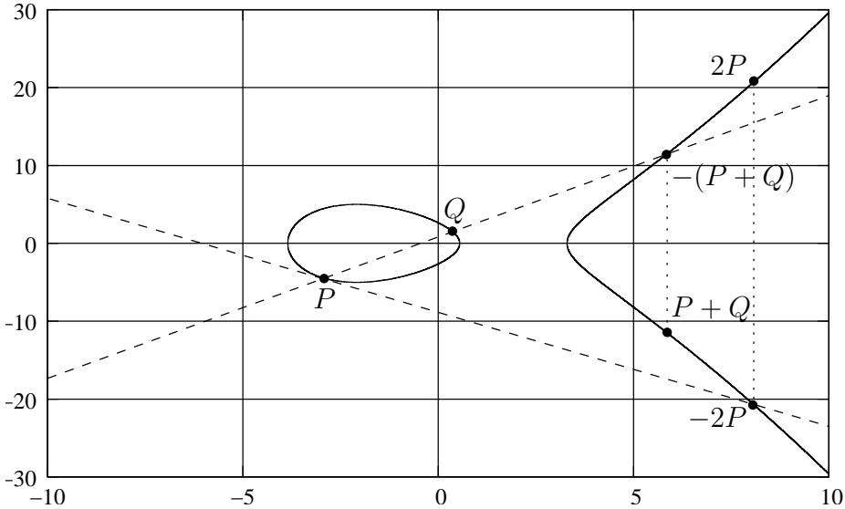

Technical Guideline TR-03111

# Elliptic Curve Cryptography

Version 2.0

## History

| Version | Date       | Comment                                                                 |
|---------|------------|-------------------------------------------------------------------------|
| 1.00    | 2007-02-14 | Initial public version.                                                 |
| 1.10    | 2009-02-03 | Enhancements, corrections, and clarifications.                          |
| 1.11    | 2009-04-17 | Bug fixes.                                                              |
| 2.00    | 2012-06-28 | Extension by further algorithms and protocols, corrections and updates. |

Bundesamt fur Sicherheit in der Informationstechnik ¨ Postfach 20 03 63, 53133 Bonn, Germany Email: [EllipticCurveCrypto@bsi.bund.de](mailto:EllipticCurveCrypto@bsi.bund.de) Internet: <http://www.bsi.bund.de> c Bundesamt fur Sicherheit in der Informationstechnik 2012 ¨

# Contents

| 1. |      | Introduction                                                                  | 7  |
|----|------|-------------------------------------------------------------------------------|----|
|    | 1.1. | Patents and side-channel attacks<br>.                                         | 7  |
|    | 1.2. | Standards<br>.                                                                | 7  |
|    | 1.3. | Symbols and Abbreviations<br>.                                                | 8  |
|    | 1.4. | Terminology                                                                   | 9  |
| 2. |      | Mathematical Foundations                                                      | 10 |
|    | 2.1. | Modular Arithmetic<br>.                                                       | 10 |
|    | 2.2. | Groups and Finite Fields<br>.                                                 | 11 |
|    |      | 2.2.1.<br>Groups<br>.                                                         | 11 |
|    |      | 2.2.2.<br>Group Order and Generators<br>.                                     | 11 |
|    |      | 2.2.3.<br>Subgroups                                                           | 11 |
|    |      | 2.2.4.<br>Finite Fields<br>.                                                  | 12 |
|    |      | 2.2.5.<br>The Discrete Logarithm Problem (DLP)                                | 12 |
|    | 2.3. | Elliptic Curves over prime fields                                             | 12 |
|    |      | 2.3.1.<br>Elliptic Curve Groups<br>.                                          | 12 |
|    |      | 2.3.2.<br>Elliptic Curve Domain Parameters<br>.                               | 13 |
|    |      | 2.3.3.<br>Elliptic Curve Discrete Logarithm Problem<br>.                      | 14 |
|    |      | Fp<br>2.3.4.<br>Cryptographically Strong EC Domain Parameters over<br>.       | 14 |
|    |      |                                                                               |    |
| 3. |      | Data Types and Data Conversion                                                | 16 |
|    | 3.1. | Conversion Routines<br>.                                                      | 16 |
|    |      | 3.1.1.<br>Conversion between Bit Strings and Octet Strings<br>.               | 16 |
|    |      | 3.1.2.<br>Conversion between Integers and Octet Strings<br>.                  | 17 |
|    |      | 3.1.3.<br>Conversion between Field Elements and Octet Strings<br>.            | 18 |
|    | 3.2. | Encoding Elliptic Curve Points<br>.                                           | 18 |
|    |      | 3.2.1.<br>Uncompressed Encoding                                               | 18 |
|    |      | 3.2.2.<br>Compressed Encoding<br>.                                            | 19 |
| 4. |      | Elliptic Curve Cryptography Algorithms                                        | 20 |
|    | 4.1. | Auxiliary Functions and Algorithms<br>.                                       | 20 |
|    |      | 4.1.1.<br>Random and Pseudo-Random Number Generators<br>.                     | 20 |
|    |      | 4.1.2.<br>Cryptographically Strong Hash Functions<br>.                        | 21 |
|    |      | 4.1.3.<br>Elliptic Curve Key Pair Generation – ECKeyPair                      | 22 |
|    | 4.2. | Elliptic Curve Based Signature Algorithms<br>.                                | 22 |
|    |      | 4.2.1.<br>The Elliptic Curve Digital Signature Algorithm – ECDSA              | 22 |
|    |      | 4.2.1.1.<br>Signature Algorithm                                               | 22 |
|    |      | 4.2.1.2.<br>Verification Algorithm                                            | 23 |
|    |      | 4.2.2.<br>The Elliptic Curve German Digital Signature Algorithm - ECGDSA<br>. | 23 |
|    |      | 4.2.2.1.<br>Signature Algorithm                                               | 23 |
|    |      | 4.2.2.2.<br>Verification Algorithm                                            | 24 |
|    |      | 4.2.3.<br>The Elliptic Curve Based Schnorr Signature Algorithm - EC-Schnorr   | 24 |
|    |      | 4.2.3.1.<br>Signature Algorithm                                               | 24 |
|    |      | 4.2.3.2.<br>Verification Algorithm                                            | 25 |

|    | 4.3.     |        | The Elliptic Curve Key Agreement Algorithm – ECKA<br>.             | 25 |
|----|----------|--------|--------------------------------------------------------------------|----|
|    |          | 4.3.1. | Key Agreement Algorithm                                            | 26 |
|    |          | 4.3.2. | The Key Agreement Protocols ECKA-DH and ECKA-EG                    | 26 |
|    |          |        | 4.3.2.1.<br>Anonymous Diffie-Hellman Key Agreement (ECKA-DH).<br>. | 26 |
|    |          |        | 4.3.2.2.<br>ElGamal Key Agreement (ECKA-EG).<br>.                  | 26 |
|    |          | 4.3.3. | Key Derivation Functions<br>.                                      | 27 |
|    |          |        | 4.3.3.1.<br>Key Derivation for DES.<br>.                           | 28 |
|    |          |        | 4.3.3.2.<br>Key Derivation for AES.<br>.                           | 28 |
|    | 4.4.     |        | The Password Authenticated Connection Establishment – PACE<br>.    | 28 |
|    |          | 4.4.1. | The Generic Mapping – GMap()<br>.                                  | 29 |
| 5. |          |        | Input and Output Formats                                           | 30 |
|    | 5.1.     |        | Public Key Format                                                  | 30 |
|    |          | 5.1.1. | X9.62 Format                                                       | 30 |
|    |          | 5.1.2. | ISO 7816 Format                                                    | 32 |
|    | 5.2.     |        | Signature Format                                                   | 32 |
|    |          | 5.2.1. | Plain Format<br>.                                                  | 33 |
|    |          |        | 5.2.1.1.<br>ECDSA                                                  | 33 |
|    |          |        | 5.2.1.2.<br>ECGDSA                                                 | 33 |
|    |          |        | 5.2.1.3.<br>EC-Schnorr                                             | 33 |
|    |          | 5.2.2. | X9.62 Format                                                       | 33 |
|    | 5.3.     |        | Key Agreement                                                      | 34 |
|    |          | 5.3.1. | ElGamal Key Agreement<br>.                                         | 34 |
|    |          |        | 5.3.1.1.<br>Message Format<br>.                                    | 34 |
|    |          |        | 5.3.1.2.<br>Authentication                                         | 35 |
|    |          |        | 5.3.1.3.<br>Encryption<br>.                                        | 35 |
|    |          | 5.3.2. | Anonymous Diffie-Hellman Key Agreement<br>.                        | 35 |
|    | 5.4.     | PACE   | .                                                                  | 35 |
|    |          | 5.4.1. | PACE on Smartcards<br>.                                            | 36 |
| 6. |          |        | Standardized Domain Parameters                                     | 37 |
|    |          |        |                                                                    |    |
|    | Appendix |        |                                                                    | 39 |
|    | A.       |        | The Signature Algorithm – EC-KCDSA (Informative)<br>.              | 39 |
|    |          | A.1.   | Signature Algorithm<br>.                                           | 39 |
|    |          | A.2.   | Verification Algorithm                                             | 39 |

# List of Figures

| 2.1. | Operations on an elliptic curve |  |  |  | E(R). |  |  |  | . |  |  |  |  |  |  |  |  |  |  |  |  |  |  |  |  |  | 14 |  |
|------|---------------------------------|--|--|--|-------|--|--|--|---|--|--|--|--|--|--|--|--|--|--|--|--|--|--|--|--|--|----|--|
|------|---------------------------------|--|--|--|-------|--|--|--|---|--|--|--|--|--|--|--|--|--|--|--|--|--|--|--|--|--|----|--|

# List of Tables

| 1.1.                                 | Symbols and abbreviations.<br>.                                                                                            | 9                          |
|--------------------------------------|----------------------------------------------------------------------------------------------------------------------------|----------------------------|
| 2.1.                                 | Fp.<br>Elliptic curve domain parameters over<br>.                                                                          | 14                         |
| 3.1.                                 | Conversion routines for data types used in this guideline.<br>.                                                            | 16                         |
| 4.1.<br>4.2.<br>4.3.<br>4.4.<br>4.5. | Supported hash functions.<br>ECKA-DH.<br>.<br>ECKA-EG.<br>.<br>PACE.<br>Generic Mapping.                                   | 21<br>26<br>27<br>29<br>29 |
| 5.1.<br>5.2.                         | Fp.<br>Tags for elliptic curve public keys and domain parameters over<br>.<br>Tags for messages protected by ECKA-EG.<br>. | 32<br>35                   |
|                                      |                                                                                                                            |                            |

# <span id="page-6-0"></span>1. Introduction

Elliptic curve cryptography (ECC) is a very efficient technology to realise public key cryptosystems and public key infrastructures (PKI). The security of a public key system using elliptic curves is based on the difficulty of computing discrete logarithms in the group of points on an elliptic curve defined over a finite field. The elliptic curve discrete logarithm problem (ECDLP), described in Section [2.3.3,](#page-13-0) is currently believed to be asymptotically harder than the factorization of integers or the computation of discrete logarithms in the multiplicative group of a finite field (DLP), described in Section [2.2.5.](#page-11-1) As a matter of fact key sizes of cryptosystems based on elliptic curves are short compared to cryptosystems based on integer factorization at the same level of security.

The aim of this technical guideline is to facilitate the application of elliptic curve cryptography by giving recommendations on the secure deployment of elliptic curve cryptography in commercial applications. For that purpose, this guideline compiles

- mathematical foundations of elliptic curves and
- algorithms based on elliptic curves in one document.

Furthermore, this guideline sets requirements on the suitable deployment of ECC in the context of official German documents.

The algorithms described here are the elliptic curve based signature algorithms ECDSA, ECGDSA, EC-Schnorr and EC-KCDSA for generating and verifying digital signatures, the Elliptic Curve Key Agreement Algorithm (ECKA) for key establishment and the Password Authenticated Connection Establishment (PACE).

The requirements that must be fulfilled by qualified electronic signatures according to the German signature law (cf. [\[14\]](#page-41-0)) may differ in some details. The deployment of ECC to classified information is not in the scope of this guideline.

## <span id="page-6-1"></span>1.1. Patents and side-channel attacks

In implementations, patents and side-channel attacks play an important role.

The algorithms described in this guideline have been carefully selected to allow patent-free and/or license-free implementations. Nevertheless, some of the described algorithms or its particular implementations may be subject of patent rights. The BSI shall not be held responsible for identifying any or all such patent rights.

Implementors and security evaluators shall also pay attention to [\[6\]](#page-40-0), which gives a general guidance to assess the side-channel resistance of implementations on smartcards.

## <span id="page-6-2"></span>1.2. Standards

This document refers to a number of international standards related to elliptic curve cryptography. Many national and international organizations have standardized the use of elliptic curves in cryptography. The most important organizations and the corresponding standards are:

1. The International Organization for Standardization (ISO) has issued the following relevant standards:

• ISO 15946 [\[24\]](#page-41-1) (Information technology – Security techniques – Cryptographic techniques based on elliptic curves) [1](#page-7-2)

– Part 1 (General) [\[22\]](#page-41-2)

- ISO 14888 (Information technology Security techniques Digital signatures with appendix )
	- Part 3, including Amendment 1 (Discrete logarithm based techniques) [\[20\]](#page-41-3), [\[21\]](#page-41-4)
- ISO 11770 (Information technology Security techniques Key Management)
	- Part 3 (Mechanisms using asymmetric techniques) [\[19\]](#page-41-5)
- 2. The American National Standards Institute (ANSI) has standardized protocols for digital signatures and for key agreement. The following standards are relevant:
	- X9.62 (Public Key Cryptography For The Financial Services Industry The Elliptic Curve Digital Signature Algorithm (ECDSA)) [\[4\]](#page-40-1).
	- X9.63 (Public Key Cryptography For The Financial Services Industry Key Agreement and Key Transport Using Elliptic Curve Cryptography) [\[5\]](#page-40-2).
- 3. The Institute of Electrical and Electronics Engineers (IEEE) has issued the standard P1363 (Standard Specifications for Public Key Cryptography) [\[15\]](#page-41-6) and its amendment P1363a [\[16\]](#page-41-7). The standards describe commonly used cryptosystems like RSA, DSA, and cryptosystems based on elliptic curves.
- 4. The IETF published in RFC 5639 (Elliptic Curve Cryptography (ECC) Brainpool Standard Curves and Curve Generation) [\[32\]](#page-42-0) an set of domain parameters defining cryptographically strong groups on elliptic curves.

## <span id="page-7-0"></span>1.3. Symbols and Abbreviations

The following notations and abbreviations are used in this document:

| Symbol | Comments                                                                                              |
|--------|-------------------------------------------------------------------------------------------------------|
| N      | The set of all natural numbers (without 0).                                                           |
| Z      | The set of all integers.                                                                              |
| Zm     | The set of all integers modulo<br>m.                                                                  |
| p      | A prime number.                                                                                       |
| Fp     | The finite field of<br>p<br>elements.                                                                 |
| F2m    | N.<br>The finite field of 2m elements, with<br>m<br>∈                                                 |
| E      | An elliptic curve defined by a Weierstraß equation.<br>If<br>E<br>is                                  |
|        | defined over a finite field of characteristic<br>p ><br>3, then the                                   |
|        | Weierstraß equation is of the form                                                                    |
|        | 2 =<br>3 +<br>Fp<br>3 + 27b<br>2<br>y<br>x<br>ax<br>+<br>b,<br>a, b<br>∈<br>,<br>4a<br>6= 0.<br>(1.1) |
|        | Essentially, this technical guideline considers elliptic curves                                       |
|        | over prime fields of characteristic<br>p ><br>3.                                                      |
|        | continued on next page                                                                                |

<span id="page-7-2"></span><span id="page-7-1"></span><sup>1</sup>Notice that parts of the ISO-standard 15946 are no longer relevant since they were replaced by other standards. Part 2-Digital signatures [\[23\]](#page-41-8) has been withdrawn as the content was incorporated into ISO 14888-3, and Part 3-Key establishment [\[24\]](#page-41-1) has been withdrawn since the information was incorporated into ISO 11770-3.

| continued from page 8 |                                                                                    |  |  |  |
|-----------------------|------------------------------------------------------------------------------------|--|--|--|
| Symbol                | Comments                                                                           |  |  |  |
| E(Fp)                 | Fp<br>An elliptic curve group over the field<br>consisting of all                  |  |  |  |
|                       | F<br>2<br>points (x, y)<br>∈<br>solving the Weierstraß equation of<br>E<br>to<br>p |  |  |  |
|                       | gether with the point at infinity<br>O.                                            |  |  |  |
| #E(Fp)                | E(Fp).<br>The order (or cardinality) of the group                                  |  |  |  |
| O                     | The point at infinity. It is the identity element of the group                     |  |  |  |
|                       | E(Fp) and can not be described in affine coordinates.                              |  |  |  |
| P,<br>Q               | E(Fp).<br>Points on the elliptic curve                                             |  |  |  |
| xP<br>,<br>yP         | The<br>x- and<br>y-coordinates of<br>P<br>in affine representation, if<br>P        |  |  |  |
|                       | is different from<br>O                                                             |  |  |  |
| P<br>+<br>Q           | E(Fp).<br>The sum of two points<br>P<br>and<br>Q<br>in                             |  |  |  |
| [k]P                  | E(Fp), i.e. [k]P<br>∈<br>The<br>k-th multiple of a point<br>P<br>=<br>P<br>+P<br>+ |  |  |  |
|                       | · · ·<br>+<br>P,<br>k<br>addends.                                                  |  |  |  |
| G                     | E(Fp).<br>The base point is a generator of a subgroup of                           |  |  |  |
| n                     | The order of the base point<br>G. Typically,<br>n<br>is a prime of bit             |  |  |  |
|                       | length<br>≥<br>224.                                                                |  |  |  |
| A                     | The sender of a cryptographic message.                                             |  |  |  |
| B                     | The receiver of a cryptographic message.                                           |  |  |  |
| dA                    | The private key of entity<br>A. This is an integer in the set                      |  |  |  |
|                       | {1, , n<br>−<br>1}.                                                                |  |  |  |
| PA                    | E(Fp).<br>The public key of entity<br>A. This is a point on<br>The                 |  |  |  |
|                       | relation between<br>dA<br>and<br>PA<br>is given by the equation<br>PA<br>=         |  |  |  |
|                       | [dA]G<br>except for the signature schemes ECGDSA and EC                            |  |  |  |
|                       | −1<br>0<br>KCDSA, where the relation is<br>P<br>A = [d<br>mod<br>n]G.<br>A         |  |  |  |
| PfA                   | An ephemeral public key of entity<br>A.                                            |  |  |  |
| H(M)                  | Hash value (digest) of the message<br>M.                                           |  |  |  |
| Hl(M)                 | Truncated hash value of the message<br>M. The hash value is                        |  |  |  |
|                       | cropped to the<br>l<br>leftmost bits of H(M).                                      |  |  |  |
| `                     | Bit length of the output of a hash function.                                       |  |  |  |
| κ                     | Bit length of a symmetric key or key stream.                                       |  |  |  |
| τ                     | Bit length of the order of the base point, i.e.<br>τ<br>=<br>dlog2<br>ne.          |  |  |  |
| R<br>⊕<br>S           | Bitwise sum of two octet or bit strings<br>R,<br>S.                                |  |  |  |

Table 1.1.: Symbols and abbreviations.

# <span id="page-8-0"></span>1.4. Terminology

The key words "MUST", "MUST NOT", "REQUIRED", "SHALL", "SHALL NOT", "SHOULD", "SHOULD NOT", "RECOMMENDED", "MAY", and "OPTIONAL" in this document are to be interpreted as described in RFC 2119 [\[10\]](#page-40-3).

# <span id="page-9-0"></span>2. Mathematical Foundations

This section introduces the mathematical foundations required to understand elliptic curve cryptography: First an overview on modular arithmetic is given in Section [2.1.](#page-9-1) Then the basic properties of groups and finite fields are introduced in Section [2.2.](#page-10-0) Finally, elliptic curves over finite fields F<sup>p</sup> are described in Section [2.3.](#page-11-2)

## <span id="page-9-1"></span>2.1. Modular Arithmetic

The following description is based on P1363 [\[15\]](#page-41-6). However, this guideline makes use of a slightly different notation.

Modular arithmetic fixes an integer m > 1 called the modulus. The fundamental operation in the context of modular arithmetic is the reduction modulo m. Given an integer a, one divides a by m and takes the remainder r as the result of the reduction. Therefore, r is in the range 0 ≤ r ≤ m − 1. The operation is written as

$$r = a \bmod m.\tag{2.1}$$

Let a and b be two integers with remainders r<sup>1</sup> and r2, respectively. Then a and b are said to be congruent modulo m, if and only if r<sup>1</sup> = r2. This relationship is written as a ≡ b mod m. The following two properties of congruences can easily be seen:

- 1. Integers a and b are congruent modulo m if and only if b − a is divisible by m.
- 2. If r = a mod m then r ≡ a mod m.

The integers modulo m are the possible remainders modulo m. They are denoted by Zm. Thus the set of integers modulo m is

$$\mathbb{Z}\_m = \{0, 1, \ldots, m-1\}.$$

Next, we enumerate properties of addition, subtraction, multiplication, and division in Zm. Let a0, b0, a1, b<sup>1</sup> be integers with a<sup>0</sup> ≡ b<sup>0</sup> mod m and a<sup>1</sup> ≡ b<sup>1</sup> mod m. Thus, a<sup>0</sup> mod m and b<sup>0</sup> mod m represent the same element in Zm. The same holds for a<sup>1</sup> and b1.

$$a\_0 + a\_1 \equiv \ \ ^\quad b\_0 + b\_1 \bmod m\tag{2.2}$$

<span id="page-9-2"></span>
$$a\_0 - a\_1 \equiv \ \ ^\circ \ b\_0 - b\_1 \bmod m \tag{2.3}$$

$$a\_0 \cdot a\_1 \equiv \ \ ^\m b\_0 \cdot b\_1 \bmod m \tag{2.4}$$

Equation [\(2.2\)](#page-9-2) shows that the order of adding and reducing modulo m may be exchanged. Equations [\(2.3\)](#page-9-2) and [\(2.4\)](#page-9-2) show the same property for subtraction and multiplication modulo m, respectively.

Typically, one performs addition, subtraction, and multiplication in Z<sup>m</sup> by performing the corresponding integer operation and reducing the result modulo m. Then, all computations take place in the set {0, 1, . . . ,(m − 1)2}, i.e. the largest number appearing in an intermediate result before reduction is (m − 1)<sup>2</sup> .

## <span id="page-10-0"></span>2.2. Groups and Finite Fields

## <span id="page-10-1"></span>2.2.1. Groups

A group (G, ◦) is a set G with a binary operation ◦ : G × G → G such that the following four axioms are satisfied:

Associativity: For all a, b, c ∈ G the equation (a ◦ b) ◦ c = a ◦ (b ◦ c) holds.

Identity element: There is an element e ∈ G such that for all a ∈ G the equation e◦a = a◦e = a holds.

Inverse element: For each a ∈ G there exists an element b ∈ G such that a ◦ b = b ◦ a = e.

It is easy to see that for a group the identity element e is unique – and so is the inverse for each element of the group.

If (G, ◦) is a group, then ◦ is called the group law. Often a group satisfies a ◦ b = b ◦ a for all a, b ∈ G. Then G is said to be commutative or Abelian.

In practice, the group law is commonly written as an addition or a multiplication:

Additive Notation. The identity is denoted by 0. If g is an element of G, the inverse element is denoted by −g. We define [k]g = P<sup>k</sup> 1 g, k ∈ N, as the sum of k times the element g.

Multiplicative Notation. The identity is denoted by 1. If g is an element of G, the inverse element is denoted by g −1 . We define g <sup>k</sup> = Q<sup>k</sup> 1 g, k ∈ N, as the product of k times the element g.

## <span id="page-10-2"></span>2.2.2. Group Order and Generators

Let G be a finite group, i.e. G contains n elements, n ∈ N. The number n is called the group order and #G = n. As G is finite, for every g ∈ G an integer s with 1 ≤ s ≤ n exists such that [s]g = 0. The smallest such number is written as #g, called the order of g in G. If s denotes the order of g in G, then the following properties hold:

- 1. The order of the group is a multiple of the order of all its elements, i.e. s divides n.
- 2. For g 6= 1, the representation [k]g is unique, i.e. [k1]g = [k2]g if and only if k<sup>1</sup> ≡ k<sup>2</sup> mod s.

A finite group (G, +) of order n is called cyclic, if there is a group element g ∈ G with

$$\mathbf{G} = \{g, [2]g, [3]g, \dots, [n-1]g, [n]g\}.$$

In this case, the element g is called a generator of (G, +).

## <span id="page-10-3"></span>2.2.3. Subgroups

Let (G, +) be a finite group. A non-empty subset S ⊆ G is called a subgroup, if for any two elements a, b ∈ S it holds that a − b ∈ S. Due to Lagrange's theorem, #S is a divisor of #G .

For every a ∈ G the set

$$\langle a \rangle = \{ [k]a; 1 \le k \le \#a \}$$

is a cyclic subgroup of G.

## <span id="page-11-0"></span>2.2.4. Finite Fields

A field (F, +, ·) is a set F together with two operations + and · such that

- 1. + : F × F → F and · : F × F → F,
- 2. (F, +) is an Abelian group,
- 3. (F \ {0}, ·) is an Abelian group,
- 4. (a + b) · c = a · c + b · c holds for all a, b, c ∈ F.

A finite field is a field with finitely many elements. It is a fundamental theorem of the theory of finite fields that a finite field of q elements exists if and only if q is a prime power, i.e. q = p m where p is a prime and m is an integer with m ≥ 1. In addition, for a given prime power q there exists up to isomorphism only one finite field consisting of q elements. In the following, this field is denoted by GF(q) or Fq.

As of today, two families of finite fields are used for elliptic curve cryptography in practice:

Prime fields: Finite fields F<sup>p</sup> of p elements with p prime. In this case F<sup>p</sup> is isomorphic to (Zp, +, ·) (cf. Section [2.1\)](#page-9-1), therefore in this Technical Guideline elements of F<sup>p</sup> will be regarded as integers in {0, 1, . . . , p − 1}.

Extension fields of characteristic 2: Finite fields F2<sup>m</sup> of 2<sup>m</sup> elements.

In this technical guideline, we focus mainly on elliptic curve cryptography over prime fields.

#### <span id="page-11-1"></span>2.2.5. The Discrete Logarithm Problem (DLP)

The discrete logarithm problem (DLP) is defined as follows: Let G be a cyclic group of order n with generator g. The discrete logarithm of h ∈ G to the base g, denoted by log<sup>g</sup> h, is the unique integer k, 0 ≤ k ≤ n − 1, such that [k]g = h.

Given g and h, the discrete logarithm problem is to find k, which is assumed to be computationally intractable for the relevant groups in ECC for large n (cf. Section [2.3.3\)](#page-13-0).

## <span id="page-11-2"></span>2.3. Elliptic Curves over prime fields

According to this guideline, it is RECOMMENDED to use elliptic curves over prime fields F<sup>p</sup> where p ≡ 3 mod 4 (cf. Section [3.2.2\)](#page-18-0).

The security of elliptic curve cryptography is based on the hardness of the elliptic curve discrete logarithm problem (cf. Section [2.3.3\)](#page-13-0).

#### <span id="page-11-3"></span>2.3.1. Elliptic Curve Groups

We introduce the basic facts of elliptic curves over a finite field Fp. Let E be an elliptic curve over Fp. In this section it is assumed, that p 6= 2, 3. Then E may be described in terms of the Weierstraß equation

<span id="page-11-4"></span>
$$y^2 = x^3 + ax + b, \qquad a, b \in \mathbb{F}\_p, \quad 4a^3 + 27b^2 \neq 0. \tag{2.5}$$

The requirement 4a <sup>3</sup> + 27b <sup>2</sup> 6= 0 ensures that E is non-singular, this means in particular that one may compute the tangent in every point on the curve.

Several different representations for elliptic curves exist. Within this guideline only the affine representation (cf. Equation [\(2.5\)](#page-11-4)) is used.

The set of rational points in E over F<sup>p</sup> denoted by E(Fp) is

$$E(\mathbb{F}\_p) = \{(x, y) \in \mathbb{F}\_p^2 : y^2 = x^3 + ax + b\} \cup \{\mathcal{O}\},\tag{2.6}$$

where O is the point at infinity. It is the projective closure of the equation y <sup>2</sup> = x <sup>3</sup> + ax + b and may not be described in terms of two coordinates in Fp.

E(Fp) carries a group structure with the point at infinity acting as the identity element. The binary operation of rational points in E(Fp) is commonly denoted as an addition. It turns out that the addition of points in E(Fp) has a simple geometric interpretation, as shown in Figure [2.1,](#page-13-2) visualizing the operations on a elliptic curve defined over R.

Let P ∈ E(Fp) and Q ∈ E(Fp) be points on the elliptic curve. The addition law uses the chord-tangent process where the following different cases have to be distinguished:

- 1. Let P + O = O + P = P for all P ∈ E(Fp). Thus O acts as the identity element in the group E(Fp).
- 2. Let P 6= O and P = (x<sup>P</sup> , y<sup>P</sup> ). The point (x<sup>P</sup> , −y<sup>P</sup> ) is an element of E(Fp) \ {O} and one defines −P = (x<sup>P</sup> , −y<sup>P</sup> ). Additionally, one sets −O = O. The identity P + (−P) = O holds for all P ∈ E(Fp).
- 3. Let P 6= O, and Q 6= O such that P 6= ±Q, i.e. P and Q have different x-coordinates. The line through P and Q intersects E(Fp) in a third point R ∈ E(Fp) \ {O}. One sets P + Q = −R.

This definition leads to the following addition rule: Set λ = (y<sup>Q</sup> − y<sup>P</sup> )/(x<sup>Q</sup> − x<sup>P</sup> ) and P + Q = (xR, yR) (the denominator is different from zero, as x<sup>P</sup> 6= xQ). Then x<sup>R</sup> and y<sup>R</sup> may be computed by the formulae

$$x\_R = \lambda^2 - x\_P - x\_Q, \qquad y\_R = \lambda(x\_P - x\_R) - y\_P.$$

4. Let P 6= O, P 6= −P. The tangent to E(Fp) in P intersects E(Fp) in R ∈ E(Fp) \ {O}, and we set [2]P = −R.

This description leads to the following doubling rule: Set λ = (3x 2 <sup>P</sup> + a)/(2y<sup>P</sup> ) and [2]P = (xR, yR). Then x<sup>R</sup> and y<sup>R</sup> may be computed by the formulae

$$x\_R = \lambda^2 - 2x\_P, \qquad y\_R = \lambda(x\_P - x\_R) - y\_P.$$

The chord-tangent process for an elliptic curve over real numbers is shown in Figure [2.1.](#page-13-2) With the definitions above (E(Fp), +) is an Abelian group.

The order of E(Fp) may be estimated due to a theorem of Hasse:

$$p + 1 - 2\sqrt{p} \le \#E(\mathbb{F}\_p) \le p + 1 + 2\sqrt{p}.\tag{2.7}$$

Hasse's theorem shows #E(Fp) ≈ p, i.e. p and #E(Fp) are of same order of magnitude.

#### <span id="page-12-0"></span>2.3.2. Elliptic Curve Domain Parameters

Elliptic curve domain parameters yield a set of information for communicating parties to identify a certain elliptic curve group for use in cryptography. The domain parameters comprise the finite field Fp, the coefficients a and b of the Weierstraß equation, a base point G ∈ E(Fp), its order n, and finally the cofactor h = #E(Fp) n . The base point G generates a cyclic subgroup of order n in E(Fp) denoted by hGi, i.e.:

$$\langle G \rangle = \{ G, [2]G, [3]G, \dots, [n-1]G, [n]G \}.$$

Table [2.1](#page-13-3) summarizes the domain parameters of an elliptic curve defined over F<sup>p</sup> with p > 3.

<span id="page-13-2"></span>

Figure 2.1.: Operations on an elliptic curve E(R).

<span id="page-13-3"></span>

| Parameter | Comment                                                 |
|-----------|---------------------------------------------------------|
| p         | Fp.<br>A prime number specifying the underlying field   |
| a         | The first coefficient of the Weierstraß equation<br>E.  |
| b         | The second coefficient of the Weierstraß equation<br>E. |
| G         | E(Fp).<br>A base point in                               |
| n         | E(Fp).<br>The order of<br>G<br>in                       |
| h         | E(Fp).<br>The cofactor of<br>G<br>in                    |

Table 2.1.: Elliptic curve domain parameters over Fp.

## <span id="page-13-0"></span>2.3.3. Elliptic Curve Discrete Logarithm Problem

The elliptic curve discrete logarithm problem (ECDLP) is defined as follows: Given the elliptic curve domain parameters as described above and a point P ∈ hGi, find the unique integer k, 0 ≤ k ≤ n − 1 such that P = [k]G.

This is a special case of the general discrete logarithm problem as explained in Section [2.2.5.](#page-11-1)

An elliptic curve group is called cryptographically strong if the underlying ECDLP is considered to be computationally intractable for the application in use.

Cryptographically strong elliptic curve groups for different security levels are published by various standardization bodies (e.g. ANSI, ISO, IETF, NIST).

## <span id="page-13-1"></span>2.3.4. Cryptographically Strong Elliptic Curve Domain Parameters over F<sup>p</sup>

Cryptographically strong elliptic curve domain parameters SHALL be used (see also [\[7\]](#page-40-4), [\[9\]](#page-40-5) and [\[32\]](#page-42-0) for the generation of suitable curves). The ECDLP is currently considered to be intractable, if at least the following conditions hold :

- 1. The order n of the base point G MUST be a prime of at least 224 bits.
- 2. To avoid the elliptic curve to be anomalous the order n MUST be different from p.
- 3. The ECDLP MUST NOT be reducible to the DLP in a multiplicative group F<sup>p</sup> <sup>r</sup> for a 'small' integer r. Thus, it is REQUIRED that p <sup>r</sup> 6≡ 1 mod n for all 1 ≤ r ≤ 10<sup>4</sup> .

4. The class number of the principal order belonging to the endomorphism ring of E SHOULD be at least 200. [1](#page-14-0)

However, as the generation and validation of domain parameters is non-trivial (cf. for example [\[7\]](#page-40-4)), it is RECOMMENDED to use standardized domain parameters, generated by trusted third parties. Cryptographically strong domain parameters can be found in Section [6.](#page-36-0)

<span id="page-14-0"></span><sup>1</sup> If an elliptic curve is generated at random, this curve respects this requirement with a very high probability (cf. [\[7\]](#page-40-4), [\[9\]](#page-40-5) and [\[32\]](#page-42-0) for the generation and validation of domain parameters, and the calculation of class numbers).

# <span id="page-15-0"></span>3. Data Types and Data Conversion

The cryptographic algorithms specified in this guideline involve operations using several different data types. These data types are considered as abstract data types consisting of distinct sets of elements, e.g. an octet string is regarded as distinct from a bit string. This distinction helps to clarify the requirements placed on implementations and helps to avoid subtle coding errors.

In all, five data types are employed in this document:

- 1. Octet strings (OS)
- 2. Bit strings (BS)
- 3. Integers (I)
- 4. Field elements (FE)
- 5. Elliptic curve points (ECP)

<span id="page-15-3"></span>It is often necessary to convert one data type into another one. Section [3.1](#page-15-1) describes the conversion routines as summarized in Table [3.1.](#page-15-3) Section [3.2](#page-17-1) describes two encoding mechanisms for elliptic curve points.

| Conversion routine                   | Abbreviation | Section |
|--------------------------------------|--------------|---------|
| Bit String to Octet String           | BS2OS        | 3.1.1   |
| Octet String to Bit String           | OS2BS        | 3.1.1   |
| Integer to Octet String              | I2OS         | 3.1.2   |
| Octet String to Integer              | OS2I         | 3.1.2   |
| Finite Field Element to Octet String | FE2OS        | 3.1.3   |
| Octet String to Finite Field Element | OS2FE        | 3.1.3   |

Table 3.1.: Conversion routines for data types used in this guideline.

## <span id="page-15-1"></span>3.1. Conversion Routines

The big endian notation is assumed to be used in the following conversion routines.

#### <span id="page-15-2"></span>3.1.1. Conversion between Bit Strings and Octet Strings

#### BS2OS

The data conversion primitive that converts a bit string to an octet string is called Bit String to Octet String Conversion Primitive or BS2OS. It takes a bit string of length d as input and outputs the corresponding octet string of length l = dd/8e. The bit string and the octet string are written as bd−<sup>1</sup> bd−<sup>2</sup> · · · b<sup>1</sup> b<sup>0</sup> and Ml−<sup>1</sup> Ml−<sup>2</sup> · · · M<sup>1</sup> M0, respectively.

The conversion is quite simple: One simply pads enough zeros on the left of the bit string to make its length a multiple of 8, and then chops the padded bit string up into octets. More precisely, one proceeds as follows:

- 1. l = dd/8e.
- 2. For 0 ≤ i ≤ l − 2 do M<sup>i</sup> = b8i+7 b8i+6 · · · b8i+2 b8i+1 b8<sup>i</sup> .
- 3. Ml−<sup>1</sup> = 0 · · · 0 bd−<sup>1</sup> · · · b8(l−1)+1 b8(l−1), where the number of zeros at the left of Ml−<sup>1</sup> is equal to 8l − d.
- 4. Output Ml−<sup>1</sup> Ml−<sup>2</sup> · · · M<sup>1</sup> M0.

#### OS2BS

The data conversion primitive that converts an octet string to a bit string is called Octet String to Bit String Conversion Primitive or OS2BS. It takes an octet string of length l as input and outputs the corresponding bit string of length d = 8l. Assume that the octet string and the bit string are written as Ml−<sup>1</sup> Ml−<sup>2</sup> · · · M<sup>1</sup> M<sup>0</sup> and bd−<sup>1</sup> bd−<sup>2</sup> · · · b<sup>1</sup> b0, respectively.

Each octet is interpreted as a bit string of length 8. The result is then the concatenation of these bit strings. More precisely, one proceeds as follows:

- 1. d = 8l.
- 2. For 0 ≤ i ≤ l − 1 do b8i+7 b8i+6 · · · b8i+2 b8i+1 b8<sup>i</sup> = M<sup>i</sup> .
- 3. Output bd−<sup>1</sup> bd−<sup>2</sup> · · · b<sup>1</sup> b0.

#### <span id="page-16-0"></span>3.1.2. Conversion between Integers and Octet Strings

#### I2OS

The data conversion primitive that converts integers to octet strings is called Integer to Octet String Conversion Primitive or I2OS. It takes a non-negative integer x and the desired length l of the octet string as input. The length l has to satisfy 256<sup>l</sup> > x. I2OS outputs the corresponding octet string. If 256<sup>l</sup> ≤ x, the conversion algorithm SHALL output error.

The idea is to write a non-negative integer x in its unique l-digit representation to the base 256:

$$x = x\_{l-1} \cdot 256^{l-1} + x\_{l-2} \cdot 256^{l-2} + \dots + x\_1 \cdot 256 + x\_0, \quad 0 \le x\_i < 256 \text{ for } 0 \le i \le l - 1.$$

As usual, the leftmost bit in each digit x<sup>i</sup> is the most significant bit. We denote the octet string by Ml−<sup>1</sup> Ml−<sup>2</sup> · · · M<sup>1</sup> M0. One sets M<sup>i</sup> = x<sup>i</sup> for 0 ≤ i ≤ l − 1.

Note: One or more leading digits will be zero if x < 256l−<sup>1</sup> .

#### OS2I

The primitive that converts octet strings to integers is called Octet String to Integer Conversion Primitive or OS2I. It takes a non-empty octet string of length l ∈ N as input and outputs the corresponding integer x as explained below. In addition, for empty octet strings, i.e. l = 0, this guideline defines x = 0.

Let the octet string be Ml−<sup>1</sup> Ml−<sup>2</sup> · · · M<sup>1</sup> M0. Each octet is interpreted as a non-negative integer to the base 256, where the leftmost bit is the most significant one, i.e. one sets x<sup>i</sup> = M<sup>i</sup> for 0 ≤ i ≤ l − 1. Then

$$x = x\_{l-1} \cdot 256^{l-1} + x\_{l-2} \cdot 256^{l-2} + \cdots + x\_1 \cdot 256 + x\_0.$$

Note: The octet string of length zero (the empty octet string) is converted to the integer 0.

## <span id="page-17-0"></span>3.1.3. Conversion between Field Elements and Octet Strings

## FE2OS

The primitive that converts field elements to octet strings is called Field Element to Octet String Conversion Primitive or FE2OS. It takes a field element as input and outputs the corresponding octet string.

A field element x ∈ F<sup>p</sup> is converted to an octet string of length l = dlog<sup>256</sup> pe by applying the conversion function I2OS as described in Section [3.1.2](#page-16-0) with parameter l, i.e. FE2OS(x) = I2OS(x, l). Here the element x ∈ F<sup>p</sup> is represented as an integer x ∈ {0, 1, . . . , p − 1} (cf. Section [2.2.4\)](#page-11-0).

## OS2FE

The primitive that converts octet strings to field elements is called Octet String to Field Element Conversion Primitive or OS2FE. It takes an octet string as input and outputs the corresponding field element.

An octet string X is converted to a field element by applying the conversion function OS2I as described in Section [3.1.2](#page-16-0) and reducing the output modulo p, i.e. OS2FE(X) = OS2I(X) mod p.

## <span id="page-17-1"></span>3.2. Encoding Elliptic Curve Points

Let p be a prime p 6= 2, 3 and let E be an elliptic curve over F<sup>p</sup> given by its Weierstraß equation y <sup>2</sup> = x <sup>3</sup> + ax + b. Let P ∈ E(Fp) be a point on the elliptic curve. This guideline represents the point P by an octet string:

- If P 6= O, the point is represented by its affine coordinate(s). Either a compressed (PC) or an uncompressed (P<sup>U</sup> ) encoding is used.
- If P = O, the point is always represented by the single octet 0x00 independent of the encoding.

## <span id="page-17-2"></span>3.2.1. Uncompressed Encoding

In uncompressed encoding the point P is represented by two field elements, its x-coordinate denoted by x<sup>P</sup> and its y-coordinate denoted by y<sup>P</sup> . If b is the bit length of p, storing (x<sup>P</sup> , y<sup>P</sup> ) requires 2b bits (excluding additional data required for the encoding).

## Encoding

The uncompressed encoding P<sup>U</sup> is defined as P<sup>U</sup> = C k X k Y , where

- C = 0x04
- X = FE2OS(x<sup>P</sup> )
- Y = FE2OS(y<sup>P</sup> )

## Decoding

Given P<sup>U</sup> the point P is recovered as P = (OS2FE(X), OS2FE(Y )). Before using P it MUST be validated that P is indeed a point on the elliptic curve E by checking that y 2 <sup>P</sup> = x 3 <sup>P</sup> + ax<sup>P</sup> + b.

## <span id="page-18-0"></span>3.2.2. Compressed Encoding

In compressed encoding the point P is represented by its x-coordinate x<sup>P</sup> and an additional bit to uniquely identify the y-coordinate y<sup>P</sup> . More precisely, the bit y 0 P is defined to be the rightmost bit of y<sup>P</sup> , i.e. y 0 <sup>P</sup> = 0 if and only if y<sup>P</sup> is even.

## Encoding

The compressed encoding P<sup>C</sup> is defined as P<sup>C</sup> = C k X, where

- If y 0 <sup>P</sup> = 0, set C = 0x02
- If y 0 <sup>P</sup> = 1, set C = 0x03
- X = FE2OS(x<sup>P</sup> )

## Decoding

Given P<sup>C</sup> the point P is recovered as P = (OS2FE(X), y<sup>P</sup> ), where the following algorithm is used to calculate y<sup>P</sup> :

- 1. Set α = x 3 <sup>P</sup> + ax<sup>P</sup> + b.
- 2. Check whether α is a square in Fp. If α is a non-square, output error and terminate.
- 3. If α = 0, then y<sup>P</sup> = 0. Output y<sup>P</sup> and terminate.
- 4. Compute a square root β ∈ F<sup>p</sup> of α in Fp.
- 5. If the rightmost bit of β is equal to y 0 P , then y<sup>P</sup> = β. Otherwise, y<sup>P</sup> = p − β. Output y<sup>P</sup> and terminate.

To efficiently check whether α is a square in Fp, the Legendre-Symbol

$$\left(\frac{\alpha}{p}\right) \equiv \alpha^{(p-1)/2} \bmod p$$

can be used. More precisely, <sup>α</sup> is a square in <sup>F</sup><sup>p</sup> if and only if α p = 1.

Note: According to this guideline primes p ≡ 3 mod 4 are RECOMMENDED. In this case, the square roots ±β of α can be efficiently computed as β = α (p+1)/<sup>4</sup> mod p.

# <span id="page-19-0"></span>4. Elliptic Curve Cryptography Algorithms

This section specifies cryptographic algorithms for elliptic curves: Section [4.1](#page-19-1) provides definitions for auxiliary functions, i.e. random number generators, hash functions, and key generation. In Section [4.2,](#page-21-1) the elliptic curve based digital signature algorithms ECDSA, ECGDSA and EC-Schnorr are specified. Subsequently, the key agreement algorithm ECKA and PACE are described in Sections [4.3](#page-24-1) and [4.4,](#page-27-2) respectively.

## <span id="page-19-1"></span>4.1. Auxiliary Functions and Algorithms

### <span id="page-19-2"></span>4.1.1. Random and Pseudo-Random Number Generators

Random number generators are often based on physical processes like radioactive decay or unpredictable events like the time between two strikes on a keyboard.

In practice, pseudo-random number generators (non-physical) are often used for efficiency reasons. Roughly speaking, the output of a pseudo-random number generator should be indistinguishable from the output of a true random number generator.

Functionality classes and evaluation methodologies for pseudo-random number generators and physical random number generators are published in an appendix to AIS 20/31 [\[3\]](#page-40-6). This document replaces the former appendices of AIS 20 [\[1\]](#page-40-7) and AIS 31 [\[2\]](#page-40-8), respectively.

In this technical guideline, the notation RNG({1, 2, . . . , n−1}) is used to denote both a random number generator and a pseudo-random number generator. The input of the function RNG is a finite set of positive integers, its output is a number randomly or pseudo-randomly chosen from this set.

The outputs of RNG({1, 2, . . . , n − 1}) SHALL be (almost) uniformly distributed within {1, 2, . . . , n − 1}. For the generation of nonces and cryptographical keys (including ephemeral keys), it is RECOMMENDED to use a (pseudo-)random number generator of one of the following classes:

- Pseudo-random number generators:
	- DRG.2,
	- DRG.3,
	- DRG.4.
- Physical random number generators:

– PTG.3.

Note: Beside the listed generators, also random number generators evaluated according to the former version (AIS 20 [\[1\]](#page-40-7), AIS 31 [\[2\]](#page-40-8)) of AIS20/31 MAY be used. Then, it is RECOM-MENDED to take a pseudo-random number generator of the class K4 or a physical random number generator of the class P2 whose output is mathematical post-processed.

In many applications RNG({1, 2, . . . , n − 1}) is derived from RNG({0, 1, 2, . . . , 2 <sup>k</sup> − 1}) with 2 <sup>k</sup> ≥ n. In this case the implementor MUST ensure that the (almost) uniform distribution of RNG({0, 1, 2, . . . , 2 <sup>k</sup> −1}) is maintained in RNG({1, 2, . . . , n−1}). The following two algorithms are provided as an example. More information and additional algorithms can be found in TR-02102 [\[11\]](#page-40-9).

Algorithm 1: This algorithm maintains uniform distribution but has probabilistic run-time.

- 1. r = RNG({0, 1, 2, . . . , 2 <sup>k</sup> − 1})
- 2. If (r < n) and (r > 0), output r else goto 1.

Algorithm 2: This algorithm has deterministic run-time but does not fully maintain uniform distribution.

- 1. r = RNG({0, 1, 2, . . . , 2 <sup>k</sup>+64 − 1})
- 2. Output (r mod (n − 1)) + 1

Note: The usage of a non-uniformly distributed RNG({1, 2, . . . , n−1}) can enable an attack on signature algorithms (cf. Bleichenbacher's attack on DSA, described e.g. in [\[29\]](#page-41-9)). Algorithm 2 does not provide uniform distribution. It is however assumed that the deviation from uniform distribution produced by Algorithm 2 is too small to be exploited by an attacker.

#### <span id="page-20-0"></span>4.1.2. Cryptographically Strong Hash Functions

A hash function H maps a message M to a hash value (digest) D = H(M). The message M is an octet string of arbitrary length[1](#page-20-2) and the hash value D is an octet string of fixed length d`/8e, where ` is the bit length of the hash values produced by H():

$$\text{H: } \{0, \ldots, 255\}^\* \mapsto \{0, \ldots, 255\}^{\lceil \ell/8 \rceil}$$

In some cases the hash values have to be truncated. Let Hl(M) be the truncated hash value of M, i.e. the hash value H(M) is cropped to the l leftmost bits. Hl(M) SHALL be encoded as octet string using the BS2OS conversion.

A hash function suitable for cryptography, has to satisfy the following requirements:

- Preimage resistance: For any hash value D, it is computationally infeasible to find a message M with H(M) = D.
- Second preimage resistance: For any message M, it is computationally infeasible to find a message M<sup>0</sup> with M 6= M<sup>0</sup> and H(M) = H(M<sup>0</sup> ).
- Collision resistance: It is computationally infeasible to find arbitrary messages M and M<sup>0</sup> with M 6= M<sup>0</sup> and H(M) = H(M<sup>0</sup> ).

If H fulfills all these requirements, it is said to be cryptographically strong.

<span id="page-20-1"></span>Hash functions with an output length ` ≥ 224 SHALL be used. Some hash functions are weaker than previously believed (cf. [\[34\]](#page-42-1)). The hash functions listed in Table [4.1](#page-20-1) are supported by this specification.

| Hash Function | Hash Length (bit) | Reference |
|---------------|-------------------|-----------|
| SHA-224       | 224               | [13]      |
| SHA-256       | 256               | [13]      |
| SHA-384       | 384               | [13]      |
| SHA-512       | 512               | [13]      |

Table 4.1.: Supported hash functions.

For session key derivation (cf. section [4.3.3\)](#page-26-0), also the hash functions SHA-1 and RIPEMD-160 (cf. [\[13\]](#page-41-10), [\[18\]](#page-41-11)) MAY be used.

<span id="page-20-2"></span><sup>1</sup>Most hash functions have a restriction on the length of M.

## <span id="page-21-0"></span>4.1.3. Elliptic Curve Key Pair Generation – ECKeyPair

An elliptic curve key pair consists of a public key P and a private key d. A key pair is generated as follows.

Input: Cryptographically strong elliptic curve domain parameters (p, a, b, G, n, h).

Output: The key pair (d, P).

Actions: The following actions are performed:

1. d = RNG({1, 2, . . . , n − 1}) 2. P = [d]G (If P is generated for ECGDSA or ECKCDSA, set P = [d <sup>−</sup><sup>1</sup> mod n]G instead). 3. Output (d, P)

## <span id="page-21-1"></span>4.2. Elliptic Curve Based Signature Algorithms

This section specifies the signature algorithms ECDSA, ECGDSA and EC-Schnorr. For that purpose, it is assumed in the following that A sends B a message M and the corresponding signature (r, s). Furthermore, it is assumed that the message M also includes information identifying the public key, the signature algorithm and the hash function H() to be used for the verification of the signature. An example for such a signature format is given in Section [5.2.](#page-31-1)

Note: It is RECOMMENDED to use a hash function H() (cf. Section [4.1.2\)](#page-20-0) with an output length ` = τ , i.e. the output length of the hash function and the bit length of the order of the base point G SHOULD be equal. If for any reason the hash function has to be chosen such that ` > τ , the hash value SHALL be truncated to H<sup>τ</sup> (M), the τ leftmost bits of H(M).

The hash function SHOULD NOT be chosen such that ` < τ .

## <span id="page-21-2"></span>4.2.1. The Elliptic Curve Digital Signature Algorithm – ECDSA

This section describes the Elliptic Curve Digital Signature Algorithm abbreviated by ECDSA. The description is in conformance with [\[4\]](#page-40-1).

## <span id="page-21-3"></span>4.2.1.1. Signature Algorithm

A proceeds as follows to generate the ECDSA signature (r, s) on the message M.

Input: The following inputs are needed:

- 1. A's private key d<sup>A</sup> and the elliptic curve domain parameters (p, a, b, G, n, h).
- 2. The message M to be signed.

Output: The ECDSA signature (r, s) over M.

Actions: The following actions are performed:

- 1. k = RNG({1, 2, . . . , n − 1}) 2. Q = [k]G
- 3. r = OS2I(FE2OS(xQ)) mod n
	- If r = 0 goto 1.
- 4. kinv = k <sup>−</sup><sup>1</sup> mod n
- 5. s = kinv · (r · d<sup>A</sup> + OS2I(H<sup>τ</sup> (M))) mod n If s = 0 goto 1.
- 6. Output (r, s)

Note: The signature depends on the random number k. If A signs the same document M twice, both signatures differ with a very high probability.

#### <span id="page-22-0"></span>4.2.1.2. Verification Algorithm

B proceeds as follows to verify the received ECDSA signature (r, s) on M.

Input: The following inputs are needed:

- 1. A's authentic public key P<sup>A</sup> and the domain parameters (p, a, b, G, n, h).
- 2. The signed message M.
- 3. The ECDSA signature (r, s).

Output: True, if the signature is valid, and False otherwise.

Actions: The following actions are performed:

1. Verify that r, s ∈ {1, 2, . . . , n − 1}

If the check fails, output False and terminate.

- 2. sinv = s <sup>−</sup><sup>1</sup> mod n
- 3. u<sup>1</sup> = sinv · OS2I(H<sup>τ</sup> (M)) mod n
	- u<sup>2</sup> = sinv · r mod n
- 4. Q = [u1]G + [u2]P<sup>A</sup>

If Q = O, output Error and terminate.

- 5. v = OS2I(FE2OS(xQ)) mod n
- 6. Output True if v = r, and False otherwise.

#### <span id="page-22-1"></span>4.2.2. The Elliptic Curve German Digital Signature Algorithm - ECGDSA

This section introduces the Elliptic Curve German Digital Signature Algorithm. The specification matches with [\[23\]](#page-41-8). In the ECGDSA scheme, the elliptic curve point P 0 A := [d −1 <sup>A</sup> mod n]G is used as public key. As a consequence, the signature creation requires no computation of a multiplicative inverse mod n.

#### <span id="page-22-2"></span>4.2.2.1. Signature Algorithm

A proceeds as follows to generate the ECGDSA signature (r, s) on a message M.

Input: The following information is required as input:

- 1. A's private key d<sup>A</sup> and the elliptic curve domain parameters (p, a, b, G, n, h).
- 2. The message M to be signed.

Output: The ECGDSA signature (r, s) over M.

Actions: The following actions are performed:

1. k = RNG({1, 2, . . . , n − 1})

2. Q = [k]G 3. r = OS2I(FE2OS(xQ)) mod n If r = 0 goto 1. 4. s = (k · r − OS2I(H<sup>τ</sup> (M))) · d<sup>A</sup> mod n If s = 0 goto 1. 5. Output (r, s)

Note: The signature depends on the random number k. If A signs the same document M twice, both signatures differ with a very high probability.

## <span id="page-23-0"></span>4.2.2.2. Verification Algorithm

To verify the received ECGDSA signature (e, s) on a message M, B has to proceed as follows.

Input: The following inputs are needed:

- 1. A's authentic public key P<sup>A</sup> and the domain parameters (p, a, b, G, n, h).
- 2. The signed message M.
- 3. The ECGDSA signature (r, s).

Output: True, if the signature is valid, and False otherwise.

Actions: The following actions are performed:

1. Verify that r, s ∈ {1, 2, . . . , n − 1}

If the check fails, output False and terminate.

- 2. rinv = r <sup>−</sup><sup>1</sup> mod n
- 3. u<sup>1</sup> = rinv · OS2I(H<sup>τ</sup> (M)) mod n
	- u<sup>2</sup> = rinv · s mod n
- 4. Q = [u1]G + [u2]P<sup>A</sup>

If Q = O, output Error and terminate.

- 5. v = OS2I(FE2OS(xQ)) mod n
- 6. Output True if v = r, and False otherwise.

## <span id="page-23-1"></span>4.2.3. The Elliptic Curve Based Schnorr Signature Algorithm - EC-Schnorr

This section describes the Elliptic Curve Based Schnorr Signature Algorithm (EC-Schnorr)[2](#page-23-3) , which is described in the following. The scheme requires no computation of a multiplicative inverse modulo n during the siganture creation.

#### <span id="page-23-2"></span>4.2.3.1. Signature Algorithm

A proceeds as follows to generate the EC-Schnorr signature (r, s) on a message M.

Input: The following information is required as input:

- 1. A's private key d<sup>A</sup> and the elliptic curve domain parameters (p, a, b, G, n, h).
- 2. The message M to be signed.

<span id="page-23-3"></span><sup>2</sup>For the Schnorr signature, see also [\[33\]](#page-42-2).

Output: The EC-Schnorr signature (r, s) over M.

Actions: The following actions are performed:

1. k = RNG({1, 2, . . . , n − 1}) 2. Q = [k]G 3. r = OS2I(H<sup>τ</sup> (M k FE2OS(xQ))) If r = 0 mod n, goto 1. 4. s = k − r · d<sup>A</sup> mod n If s = 0 goto 1. 5. Output (r, s)

Note: The signature depends on the random number k. If A signs the same document M twice, both signatures differ with a very high probability.

#### <span id="page-24-0"></span>4.2.3.2. Verification Algorithm

Given a EC-Schnorr signature (r, s) on a message M, the verification procedure is the following

Input: The following inputs are needed:

- 1. A's authentic public key P<sup>A</sup> and the domain parameters (p, a, b, G, n, h).
- 2. The signed message M.
- 3. The EC-Schnorr signature (r, s).

Output: True, if the signature is valid, and False otherwise.

Actions: The following actions are performed:

1. Verify that r ∈ {0, . . . , 2 <sup>τ</sup> − 1} and s ∈ {1, 2, . . . , n − 1}.

If the check fails, output False and terminate.

2. Q = [s]G + [r]P<sup>A</sup>

If Q = O, output Error and terminate.

- 3. v = OS2I(H<sup>τ</sup> (M k FE2OS(xQ)))
- 4. Output True if v = r, and False otherwise.

## <span id="page-24-1"></span>4.3. The Elliptic Curve Key Agreement Algorithm – ECKA

This section describes the Elliptic Curve Key Agreement Algorithm (ECKA), key derivation functions, and the key agreement protocols of Diffie-Hellman (ECKA-DH) and ElGamal (ECKA-EG). The description of ECKA is in conformance with [\[5\]](#page-40-2).

Note: To prevent attacks based on invalid (ephemeral) public keys it MUST be checked that a received public key is indeed a point on the elliptic curve. This validation is already part of the point decoding algorithms (cf. Section [3.2\)](#page-17-1). In addition to this, small subgroup attacks are prevented by using (compatible) cofactor multiplication in the key agreement algorithms.

## <span id="page-25-0"></span>4.3.1. Key Agreement Algorithm

A and B proceed as follows to generate a shared secret point SAB:

Input: The private key <sup>d</sup>b, the public key <sup>P</sup>b, and the elliptic curve domain parameters (p, a, b, G, n, h). The private key <sup>d</sup><sup>b</sup> and the public key <sup>P</sup><sup>b</sup> SHALL be either both ephemeral (ECKA-DH, cf. Section [4.3.2.1\)](#page-25-2) or ephemeral-static (ECKA-EG, cf. Section [4.3.2.2\)](#page-25-3).

Output: The output consists of:

- 1. The shared secret point SAB.
- 2. The shared secret value ZAB (OPTIONAL).

Actions: The following actions are performed:

- 1. l = h <sup>−</sup><sup>1</sup> mod n
- 2. <sup>Q</sup> = [h]P<sup>b</sup>
- 3. <sup>S</sup>AB = [db· <sup>l</sup> mod <sup>n</sup>]<sup>Q</sup>

If SAB = O, output Error and terminate.

- 4. ZAB = FE2OS(xSAB ) (OPTIONAL)
- 5. Output SAB and conditionally ZAB

Note: To derive keys for symmetric encryption and/or integrity protection the OPTIONAL generation of ZAB MUST be performed. The shared secret value ZAB MUST NOT be used directly for encryption or integrity protection, key derivation functions are described in Section [4.3.3.](#page-26-0)

## <span id="page-25-1"></span>4.3.2. The Key Agreement Protocols ECKA-DH and ECKA-EG

To interactively generate a shared secret point SAB (or a shared secret value ZAB), A and B may use one of the following protocols.

## <span id="page-25-2"></span>4.3.2.1. Anonymous Diffie-Hellman Key Agreement (ECKA-DH).

Both A and B agree on the domain parameters (p, a, b, G, n, h), the key derivation algorithm, the cipher and/or message authentication code to be used and perform the following steps:

<span id="page-25-4"></span>

| Initiator<br>A                                |     | Recipient<br>B                                |
|-----------------------------------------------|-----|-----------------------------------------------|
| (dfA,<br>PfA) = ECKeyPair(p, a, b, G, n, h)   | PfA | (dfB,<br>PfB) = ECKeyPair(p, a, b, G, n, h)   |
| SAB<br>= ECKA(dfA,<br>PfB,(p, a, b, G, n, h)) | PfB | SAB<br>= ECKA(dfB,<br>PfA,(p, a, b, G, n, h)) |

## <span id="page-25-3"></span>4.3.2.2. ElGamal Key Agreement (ECKA-EG).

The recipient B must make the static public key P<sup>B</sup> including the corresponding domain parameters (p, a, b, G, n, h) publicly available in an authentic form and performs the steps of table [4.3.](#page-26-1)

<span id="page-26-1"></span>

| Initiator<br>A                              |                | Recipient<br>B                               |
|---------------------------------------------|----------------|----------------------------------------------|
| (dfA,<br>PfA) = ECKeyPair(p, a, b, G, n, h) |                |                                              |
| SAB<br>= ECKA(dfA, PB,(p, a, b, G, n, h))   | M=(PfA,)<br>−→ | SAB<br>= ECKA(dB,<br>PfA,(p, a, b, G, n, h)) |

Table 4.3.: ECKA-EG.

To send B an encrypted and/or integrity protected message M, A MUST include the ephemeral public key <sup>P</sup>f<sup>A</sup> and information identifying the key derivation algorithm, the cipher and/or the message authentication code to be used. An example for a message format is given in Section [5.3.1.1.](#page-33-2)

## <span id="page-26-0"></span>4.3.3. Key Derivation Functions

The following algorithms are RECOMMENDED to derive keys from the shared secret value ZAB:

X9.63 Key Derivation Function. ANSI X9.63 [\[5\]](#page-40-2) describes a method for converting a shared secret to a cryptographic key. The algorithm KDFX9.63() requires to select a hash function H() from Section [4.1.2.](#page-20-0) Let ` denote the bit length of the hash value.

Input: The following inputs are needed:

- 1. An octet string ZAB, which is the shared secret value.
- 2. An integer κ < ` · (2<sup>32</sup> − 1), which is the bit length of the keying data to be generated.
- 3. An octet string SharedInfo, which consists of some information shared between A and B (OPTIONAL).

Output: The octet string KeyData of length k = dκ/8e.

Actions: The following actions are performed:

- 1. Let counter be a 32 bit, big-endian integer, initialized with 0x00000001.
- 2. j = dκ/`e
- 3. For i = 1 to j − 1 do the following:
	- a) H<sup>i</sup> = H(ZAB k counter k [SharedInfo])
	- b) counter = counter + 1
	- c) i = i + 1
- 4. l = κ − (` · (j − 1))
- 5. H<sup>j</sup> = Hl(ZAB k counter k [SharedInfo])
- 6. KeyData = H<sup>1</sup> k H<sup>2</sup> k · · · k Hj−<sup>1</sup> k H<sup>j</sup>
- 7. Output KeyData

<span id="page-26-2"></span>Key Derivation Function for Session Keys. This paragraph describes a method for deriving cryptographic session keys of bit length κ, i.e. keys for symmetric encryption and for computing message authentication codes (MAC). The algorithm KDFSession requires to select a hash function H() from Section [4.1.2](#page-20-0) with bit length ` ≥ κ.

Input: The following inputs are needed:

- 1. An octet string ZAB, which is a shared secret value.
- 2. A 32-bit, big-endian integer counter, which is initiated as follows:
	- a) Default key used for encryption: counter = 0x00000001
	- b) Default key used for authentication: counter = 0x00000002
	- c) Alternative key used for encryption: counter = 0x00000003
	- d) Alternative key used for authentication: counter = 0x00000004
	- e) ...
- 3. A nonce r encoded as octet string (OPTIONAL).

Output: An octet string KeyData.

Actions: The following actions are performed:

- 1. D = ZAB k r k counter
- 2. KeyData = Hκ(D)
- 3. Output KeyData

## <span id="page-27-0"></span>4.3.3.1. Key Derivation for DES.

To derive 112-bit 3DES keys the hash function SHA-1 SHALL be used with κ = 112. The parity bits of KeyData MAY be adjusted to form correct DES keys.

## <span id="page-27-1"></span>4.3.3.2. Key Derivation for AES.

- To derive 128-bit AES keys the hash function SHA-1 with κ = 128 SHALL be used.
- To derive 192-bit AES keys the hash function SHA-256 with κ = 192 SHALL be used.
- To derive 256-bit AES keys the hash function SHA-256 with κ = 256 SHALL be used.

## <span id="page-27-2"></span>4.4. The Password Authenticated Connection Establishment – PACE

This section describes the Password Authenticated Connection Establishment protocol, abbreviated by PACE. The protocol establishes a secure channel with strong session keys based on an authentication by means of a secret password (which MAY have low entropy).

A and B choose a key derivation function KDFSession (e.g. the one of the section [4.3.3\)](#page-26-2). Furthermore, they agree on a suitable mapping function Map() (e.g. the mapping function GMap() of section [4.4.1\)](#page-28-0), a symmetric cipher (with encryption and decryption denoted by E() and E−<sup>1</sup> (), respectively), the message authentication code MAC(). Keys, input and output values of E() and MAC() are assumed to be octet strings. Let v be a fixed multiple of the block size of E().

<span id="page-28-1"></span>

|     | Initiator<br>A                                                      |            | Recipient<br>B                               |
|-----|---------------------------------------------------------------------|------------|----------------------------------------------|
| 0.  | Kπ<br>= KDFSession(π,<br>3)                                         |            | Kπ<br>= KDFSession(π,<br>3)                  |
| 1.  | v −<br>= RNG({0, ,<br>1})<br>s<br>2                                 |            |                                              |
| 2.  | z<br>= E(Kπ,<br>FE2OS(s))                                           |            |                                              |
| 3.  | Send<br>z                                                           | z −→       |                                              |
| 4.  |                                                                     |            | OS2FE(E−1<br>s<br>=<br>(Kπ, z))              |
| 5.  | De = (p, a, b,<br>G, n, h<br>e ) = Map(D, s)                        |            | De = (p, a, b,<br>G, n, h<br>e ) = Map(D, s) |
| 6.  | (yfA,<br>YfA) = ECKeyPair(De)                                       | YfA<br>YfB | (yfB,<br>YfB) = ECKeyPair(De)                |
| 7.  | (SAB, ZAB) = ECKA(yfA, YB,<br>De)                                   |            | (SAB, ZAB) = ECKA(yB,<br>YfA,<br>De)         |
| 8.  | KEnc<br>= KDFSession(ZAB,<br>1)                                     |            | KEnc<br>= KDFSession(ZAB,<br>1)              |
| 9.  | KMac<br>= KDFSession(ZAB,<br>2)                                     |            | KMac<br>= KDFSession(ZAB,<br>2)              |
| 10. |                                                                     |            | TB<br>= MAC(KMac,<br>YfA)                    |
| 11. |                                                                     | ←−         | Send<br>TB                                   |
| 12. | If<br>TB<br>6= MAC(KMac,<br>YfA),<br>output<br>Error and terminate. | TB         |                                              |
| 13. | TA<br>= MAC(KMac,<br>YfB)                                           |            |                                              |
| 14. | Send<br>TA                                                          | −→<br>TA   |                                              |
| 15. |                                                                     |            | If<br>TA<br>6= MAC(KMac,<br>YfB),            |
|     |                                                                     |            | output<br>Error and terminate.               |

As input, the PACE protocol requires the shared password π and the elliptic curve domain parameters D = (p, a, b, G, n, h). The following actions are performed to establish the secure channel:

Table 4.4.: PACE.

A detailed specification for an implementation of PACE on smartcards is contained in [\[12\]](#page-40-10), a security proof of the protocol can be found in [\[8\]](#page-40-11).

Note: For the generation of nonces in the PACE protocol, a (pseudo-)random number generator belonging to the classes K4, DRG.3, DRG.4 or PTG.3 MUST be used.

## <span id="page-28-0"></span>4.4.1. The Generic Mapping – GMap()

To map a nonce s to a point of the elliptic curve A and B SHOULD use the generic mapping GM ap(). It is based on an anonynous Diffie-Hellman key agreement. The required input for the generic mapping are the domain parameters (p, a, b, G, n, h) of the curve and the nonce s that shall be mapped. Then, the protocol produces ephemeral domain parameters <sup>D</sup><sup>e</sup> <sup>=</sup> GM ap(D, s) by computing a new base point <sup>G</sup><sup>e</sup> of the curve.

<span id="page-28-2"></span>

|          | Initiator<br>A                                                                                          |            | Recipient<br>B                                                                                          |
|----------|---------------------------------------------------------------------------------------------------------|------------|---------------------------------------------------------------------------------------------------------|
| 1.       | (dfA,<br>PfA) = ECKeyPair(p, a, b, G, n, h)                                                             | PfA<br>PfB | (dfB,<br>PfB) = ECKeyPair(p, a, b, G, n, h)                                                             |
| 2.<br>3. | H<br>= ECKA(dfA,<br>PfB,(p, a, b, G, n, h))<br>De =<br>GM ap(D, s) = (p, a, b,<br>[s]G<br>+<br>H, n, h) |            | H<br>= ECKA(dfB,<br>PfA,(p, a, b, G, n, h))<br>De =<br>GM ap(D, s) = (p, a, b,<br>[s]G<br>+<br>H, n, h) |

| Table 4.5.: |  | Generic Mapping. |
|-------------|--|------------------|
|-------------|--|------------------|

# <span id="page-29-0"></span>5. Input and Output Formats

This section specifies data structures and object identifiers for in- and output of public keys, signatures, and key agreement.

The object identifier bsi-de represents the root of the subtree containing all objects defined in this specification:

```
bsi-de OBJECT IDENTIFIER ::= {
  itu-t(0) identified-organization(4) etsi(0)
  reserved(127) etsi-identified-organization(0) 7
}
```
The root identifier for elliptic curve cryptography is:

```
id-ecc OBJECT IDENTIFIER ::= { bsi-de algorithms(1) 1 }
```
This guideline also supports the data structures and object identifiers specified in ANSI X9.62 [\[4\]](#page-40-1). The root identifier for ANSI X9.62 is:

```
ansi-X9-62 OBJECT IDENTIFIER ::= {
  iso(1) member-body(2) us(840) 10045 }
```
## <span id="page-29-1"></span>5.1. Public Key Format

It is RECOMMENDED to store and exchange elliptic curve public keys in X9.62 format. In this case the data structures and object identifiers specified by X9.62 [\[4\]](#page-40-1) SHALL be used.

If, however, elliptic curve cryptography is performed on smartcards, public keys SHALL be encoded as data objects as defined in ISO 7816-8 [\[26\]](#page-41-12).

#### <span id="page-29-2"></span>5.1.1. X9.62 Format

Public keys represented in X.509 syntax have the following ASN.1 structure:

```
SubjectPublicKeyInfo ::= SEQUENCE {
 algorithm AlgorithmIdentifier,
 subjectPublicKey BIT STRING
}
```
The component algorithm of type AlgorithmIdentifier specifies the type of the public key and its associated parameters. The component subjectPublicKey of type BIT STRING specifies the actual value of the public key.

The elliptic curve public key is a value of type ECPoint, which is simply an OCTET STRING as defined in Section [3.2.](#page-17-1) The conversion routine OS2BS SHALL be used to map the value to a BIT STRING.

Public keys in X9.62 format are identified by the object identifier id-ecPublicKey which is specified as follows:

```
id-publicKeyType OBJECT IDENTIFIER ::= { ansi-X9-62 keyType(2) }
id-ecPublicKey OBJECT IDENTIFIER ::= { id-publicKeyType 1 }
```
The public key parameters contained in the AlgorithmIdentifier are defined as a choice of three alternatives:

```
Parameters ::= CHOICE {
 ecParameters ECParameters,
 namedCurve OBJECT IDENTIFIER,
 implicitlyCA NULL
}
```
ecParameters: The domain parameters are explicitly described.

namedCurve: Standardized domain parameters identified by an object identifier are used.

implicitlyCA: The domain parameters are inherited or implicitly known.

It is RECOMMENDED to use the alternatives ecParameters or namedCurve unless ephemeral public keys are exchanged. In this case implicitlyCA SHOULD be used instead.

Note: These recommendations deviate from [\[31\]](#page-42-3), 2.1.1. Implementations that strive for conformance to [\[31\]](#page-42-3) MUST only support namedCurve.

The structure ECParameters is used to describe domain parameters explicitly. Version 1 MUST be used. It is specified as follows:

```
ECParameters ::= SEQUENCE {
  version INTEGER{ecpVer1(1)} (ecpVer1),
  fieldID FieldID,
  curve Curve,
  base ECPoint,
  order INTEGER,
  cofactor INTEGER OPTIONAL,
  ...
}
Curve ::= SEQUENCE {
  a FieldElement,
  b FieldElement,
  seed BIT STRING OPTIONAL
}
FieldElement ::= OCTET STRING
ECPoint ::= OCTET STRING
FieldID ::= SEQUENCE {
  fieldType OBJECT IDENTIFIER,
  parameters ANY DEFINED BY fieldType
}
id-fieldType OBJECT IDENTIFER ::= { ansi-X9-62 fieldType(1) }
prime-field OBJECT IDENTIFIER ::= { id-fieldType 1 }
Prime-p ::= INTEGER
If FieldID refers to a prime-field, Prime-p SHALL be used as parameter.
```
## <span id="page-31-0"></span>5.1.2. ISO 7816 Format

For smartcards public keys and domain parameters MUST be exchanged as TLV (Tag-Length-Value) encoded data objects as described in ISO 7816-8 [\[26\]](#page-41-12). The tags and the encodings for data objects relevant to elliptic curves are given in Table [5.1.](#page-31-2)

According to this guideline the data object for domain parameters MUST either be all present or all absent. Especially for ephemeral public keys the domain parameters are usually implicitly known and MUST be all absent.

Public keys and domain parameters MUST be encapsulated in a constructed public key data object identified by tag 0x7F49 unless the domain parameters and the key type are implicitly known and omitted.

Unrestricted public keys data objects are identified by the object identifier id-ecTLVPublicKey which is specified as follows:

```
id-ecTLVKeyFormat OBJECT IDENTIFIER ::= { id-ecc keyType(2) 2}
id-ecTLVPublicKey OBJECT IDENTIFIER ::= { id-ecTLVKeyFormat unrestricted(1) }
```
<span id="page-31-2"></span>A restricted public key type for usage with dedicated ECC algorithms (for instance ECDSA, ECGDSA) may be defined in a later version of this specification.

| Object                  | Type              | Symbol | Tag  |
|-------------------------|-------------------|--------|------|
| Algorithm               | Object Identifier | –      | 0x06 |
| Prime modulus           | Integer           | p      | 0x81 |
| First coefficient       | Integer           | a      | 0x82 |
| Second coefficient      | Integer           | b      | 0x83 |
| Base point              | Point             | G      | 0x84 |
| Order of the base point | Integer           | n      | 0x85 |
| Public Key              | Point             | P      | 0x86 |
| Cofactor                | Integer           | h      | 0x87 |

Table 5.1.: Tags for elliptic curve public keys and domain parameters over Fp.

Note: This guideline deviates from ISO 7816 in the encoding of elliptic curve points.

## <span id="page-31-1"></span>5.2. Signature Format

While this guideline supports the signature format specified by ANSI X9.62 [\[4\]](#page-40-1) for ECDSA, the usage of the plain format is RECOMMENDED for all applications. The plain format MUST be used if the signature is generated or verified by a smartcard.

The signature algorithm and the signature format are identified by an AlgorithmIdentifier, the hash function to be used is either referenced directly by the object identifier or by the parameters of the AlgorithmIdentifier.

It is RECOMMENDED to reference the hash function to be used directly in the object identifier. In this case the parameters MAY be either absent or null. The recipient MUST be able to interpret both variants.[1](#page-31-3)

<span id="page-31-3"></span><sup>1</sup>According to RFC 5480 [\[31\]](#page-42-3), the parameters MUST be absent for algorithms identified by ecdsa-with-SHAxxx. According to ANSI X9.62 [\[4\]](#page-40-1) the parameters SHOULD be absent, but implementations SHALL accept NULL parameters. This guideline explicitly allows both variants.

Note: Signature algorithms with hash functions SHA-1 or RIPEMD-160 SHALL NOT be used anymore and are only included for backwards compatibility.

#### <span id="page-32-0"></span>5.2.1. Plain Format

In plain format the signature (r, s) is encoded as octet string R k S, i.e. as concatenation of the octet strings R = I2OS(r, l) and S = I2OS(s, l) with l = dlog<sup>256</sup> ne. Thus, the signature has a fixed length of 2l octets.

To embed the signature in a BIT STRING the conversion routine OS2BS SHALL be used.

The signature algorithm including the hash function to be used and the signature format is identified by the following object identifiers:

#### <span id="page-32-1"></span>5.2.1.1. ECDSA

```
ecdsa-plain-signatures OBJECT IDENTIFIER ::= { id-ecc signatures(4) 1 }
ecdsa-plain-SHA1 OBJECT IDENTIFIER ::= { ecdsa-plain-signatures 1 }
ecdsa-plain-SHA224 OBJECT IDENTIFIER ::= { ecdsa-plain-signatures 2 }
ecdsa-plain-SHA256 OBJECT IDENTIFIER ::= { ecdsa-plain-signatures 3 }
ecdsa-plain-SHA384 OBJECT IDENTIFIER ::= { ecdsa-plain-signatures 4 }
ecdsa-plain-SHA512 OBJECT IDENTIFIER ::= { ecdsa-plain-signatures 5 }
ecdsa-plain-RIPEMD160 OBJECT IDENTIFIER ::= { ecdsa-plain-signatures 6 }
```
#### <span id="page-32-2"></span>5.2.1.2. ECGDSA

| ecgdsa-plain-signatures |  | OBJECT IDENTIFIER ::= { id-ecc signatures(4) 2 }    |
|-------------------------|--|-----------------------------------------------------|
| ecgdsa-plain-SHA224     |  | OBJECT IDENTIFIER ::= { ecgdsa-plain-signatures 1 } |
| ecgdsa-plain-SHA256     |  | OBJECT IDENTIFIER ::= { ecgdsa-plain-signatures 2 } |
| ecgdsa-plain-SHA384     |  | OBJECT IDENTIFIER ::= { ecgdsa-plain-signatures 3 } |
| ecgdsa-plain-SHA512     |  | OBJECT IDENTIFIER ::= { ecgdsa-plain-signatures 4 } |

#### <span id="page-32-3"></span>5.2.1.3. EC-Schnorr

```
ecschnorr-plain-signatures OBJECT IDENTIFIER ::= { id-ecc signatures(4) 3 }
ecschnorr-plain-SHA224 OBJECT IDENTIFIER ::= { ecschnorr-plain-signatures 1 }
ecschnorr-plain-SHA256 OBJECT IDENTIFIER ::= { ecschnorr-plain-signatures 2 }
ecschnorr-plain-SHA384 OBJECT IDENTIFIER ::= { ecschnorr-plain-signatures 3 }
ecschnorr-plain-SHA512 OBJECT IDENTIFIER ::= { ecschnorr-plain-signatures 4 }
```
#### <span id="page-32-4"></span>5.2.2. X9.62 Format

In X9.62 format the ECDSA-signature (r, s) is encoded as ASN.1 structure with the following syntax:

```
ECDSA-Sig-Value ::= SEQUENCE {
  r INTEGER,
  s INTEGER
}
```
To embed the signature in a BIT STRING the DER encoded ECDSA-Sig-Value SHALL be the value of the bit string (including tag and length field).

The following object identifiers are defined in X9.62 [\[4\]](#page-40-1).

```
id-ecSigType OBJECT IDENTIFIER ::= { ansi-x9-62 signatures(4) }
ecdsa-with-Sha1 OBJECT IDENTIFIER ::= { id-ecSigType 1 }
ecdsa-with-Specified OBJECT IDENTIFIER ::= { id-ecSigType 3 }
ecdsa-with-Sha224 OBJECT IDENTIFIER ::= { ecdsa-with-Specified 1 }
ecdsa-with-Sha256 OBJECT IDENTIFIER ::= { ecdsa-with-Specified 2 }
ecdsa-with-Sha384 OBJECT IDENTIFIER ::= { ecdsa-with-Specified 3 }
ecdsa-with-Sha512 OBJECT IDENTIFIER ::= { ecdsa-with-Specified 4 }
```
For ecdsa-with-Specified the object identifier of the hash function to be used MUST be provided as parameter in the AlgorithmIdentifier.

Note: X9.62 also provides ecdsa-with-Recommended which refers to ECDSA with "the natural size" hash function. This alternative is not supported by this guideline and MUST NOT be used.

## <span id="page-33-0"></span>5.3. Key Agreement

This section gives the object identifiers that SHALL be used for key agreement. Notice that the key agreement algorithms with block cipher 3DES SHOULD NOT be used in new applications and are only included for backward compatibility.

## <span id="page-33-1"></span>5.3.1. ElGamal Key Agreement

The object identifier for the ElGamal key agreement protocol (ECKA-EG) is:

```
ecka-eg OBJECT IDENTIFIER ::= { id-ecc key-establishment(5) 1 }
```
The object identifiers for ECKA-EG with specified key derivation functions are:

```
ecka-eg-X963KDF OBJECT IDENTIFIER ::= { ecka-eg 1 }
ecka-eg-X963KDF-SHA1 OBJECT IDENTIFIER ::= { ecka-eg-X963KDF 1 }
ecka-eg-X963KDF-SHA224 OBJECT IDENTIFIER ::= { ecka-eg-X963KDF 2 }
ecka-eg-X963KDF-SHA256 OBJECT IDENTIFIER ::= { ecka-eg-X963KDF 3 }
ecka-eg-X963KDF-SHA384 OBJECT IDENTIFIER ::= { ecka-eg-X963KDF 4 }
ecka-eg-X963KDF-SHA512 OBJECT IDENTIFIER ::= { ecka-eg-X963KDF 5 }
ecka-eg-X963KDF-RIPEMD160 OBJECT IDENTIFIER ::= { ecka-eg-X963KDF 6 }
ecka-eg-SessionKDF OBJECT IDENTIFIER ::= { ecka-eg 2 }
ecka-eg-SessionKDF-3DES OBJECT IDENTIFIER ::= { ecka-eg-SessionKDF 1 }
ecka-eg-SessionKDF-AES128 OBJECT IDENTIFIER ::= { ecka-eg-SessionKDF 2 }
ecka-eg-SessionKDF-AES192 OBJECT IDENTIFIER ::= { ecka-eg-SessionKDF 3 }
ecka-eg-SessionKDF-AES256 OBJECT IDENTIFIER ::= { ecka-eg-SessionKDF 4 }
```
#### <span id="page-33-2"></span>5.3.1.1. Message Format

The object identifiers beneath SessionKDF SHALL be associated with the message format as specified in Table [5.2](#page-34-4) using the respective block cipher for encryption and authentication.

Note: The message format is compatible to ISO 7816-4 Secure Messaging [\[25\]](#page-41-13).

<span id="page-34-4"></span>

| Object                           | Type         | Symbol       | Tag  |
|----------------------------------|--------------|--------------|------|
| Ephemeral Public Key             | ECPoint      | PfA          | 0x97 |
| Padding indicator and ciphertext | Octet String | E(KEnc, M)   | 0x87 |
| Integrity Protection             | Octet String | MAC(KMac, M) | 0x8E |

Table 5.2.: Tags for messages protected by ECKA-EG.

#### <span id="page-34-0"></span>5.3.1.2. Authentication

For message authentication the block cipher SHALL be used in CMAC-mode [\[28\]](#page-41-14) with KMac = KDFSession(ZAB, 2).

#### <span id="page-34-1"></span>5.3.1.3. Encryption

For message encryption the block cipher SHALL be used in CBC-mode [\[17\]](#page-41-15) with key KEnc = KDFSession(ZAB, 1) and IV = E(KEnc, 0).

## <span id="page-34-2"></span>5.3.2. Anonymous Diffie-Hellman Key Agreement

The object identifier for the anonymous Diffie-Hellman key agreement protocol (ECKA-DH) is:

ecka-dh OBJECT IDENTIFIER ::= { id-ecc key-establishment(5) 2 }

The object identifiers for ECKA-DH with specified key derivation functions are:

```
ecka-dh-X963KDF OBJECT IDENTIFIER ::= { ecka-dh 1 }
ecka-dh-X963KDF-SHA1 OBJECT IDENTIFIER ::= { ecka-dh-X963KDF 1 }
ecka-dh-X963KDF-SHA224 OBJECT IDENTIFIER ::= { ecka-dh-X963KDF 2 }
ecka-dh-X963KDF-SHA256 OBJECT IDENTIFIER ::= { ecka-dh-X963KDF 3 }
ecka-dh-X963KDF-SHA384 OBJECT IDENTIFIER ::= { ecka-dh-X963KDF 4 }
ecka-dh-X963KDF-SHA512 OBJECT IDENTIFIER ::= { ecka-dh-X963KDF 5 }
ecka-dh-X963KDF-RIPEMD160 OBJECT IDENTIFIER ::= { ecka-dh-X963KDF 6 }
ecka-dh-SessionKDF OBJECT IDENTIFIER ::= { ecka-dh 2 }
ecka-dh-SessionKDF-3DES OBJECT IDENTIFIER ::= { ecka-dh-SessionKDF 1 }
ecka-dh-SessionKDF-AES128 OBJECT IDENTIFIER ::= { ecka-dh-SessionKDF 2 }
ecka-dh-SessionKDF-AES192 OBJECT IDENTIFIER ::= { ecka-dh-SessionKDF 3 }
ecka-dh-SessionKDF-AES256 OBJECT IDENTIFIER ::= { ecka-dh-SessionKDF 4 }
```
## <span id="page-34-3"></span>5.4. PACE

This section gives the object identifiers that SHALL be used for PACE. Notice that the object identifier with block cipher 3DES SHOULD NOT be used in new applications and is only included for backward compatibility.

The object identifiers for the PACE protocol with generic mapping are:

```
id-PACE-KA OBJECT IDENTIFIER ::= { id-ecc key-establishment(5) 3 }
id-PACE-KA-GM OBJECT IDENTIFIER ::= { id-PACE-KA 1 }
id-PACE-KA-GM-SessionKDF-3DES OBJECT IDENTIFIER ::= { id-PACE-KA-GM 1 }
id-PACE-KA-GM-SessionKDF-AES-128 OBJECT IDENTIFIER ::= { id-PACE-KA-GM 2 }
id-PACE-KA-GM-SessionKDF-AES-192 OBJECT IDENTIFIER ::= { id-PACE-KA-GM 3 }
id-PACE-KA-GM-SessionKDF-AES-256 OBJECT IDENTIFIER ::= { id-PACE-KA-GM 4 }
```
Here, public keys SHALL be structured according to section [5.1](#page-29-1) and nonces SHALL be encoded as octet strings. The used encoding for the elliptic curve points MUST be negotiated in advance by the protocol parties.

## <span id="page-35-0"></span>5.4.1. PACE on Smartcards

For smartcards, Part 2 of the Technical Guideline [\[12\]](#page-40-10) gives a detailed specification of PACE. Implementations according to that specification SHALL use the corresponding object identifiers.

```
id-PACE OBJECT IDENTIFIER ::= { bsi-de protocols(2) smartcards(2) 4 }
```
For PACE with generic mapping and specified symmetric ciphers, [\[12\]](#page-40-10) defines the following object identifiers:

```
id-PACE-ECDH-GM OBJECT IDENTIFIER ::= { id-PACE 2 }
id-PACE-ECDH-GM-3DES-CBC-CBC OBJECT IDENTIFIER ::= { id-PACE-ECDH-GM 1 }
id-PACE-ECDH-GM-AES-CBC-CMAC-128 OBJECT IDENTIFIER ::= { id-PACE-ECDH-GM 2 }
id-PACE-ECDH-GM-AES-CBC-CMAC-192 OBJECT IDENTIFIER ::= { id-PACE-ECDH-GM 3 }
id-PACE-ECDH-GM-AES-CBC-CMAC-256 OBJECT IDENTIFIER ::= { id-PACE-ECDH-GM 4 }
```
Here, elliptic curve points are always represented in uncompressed encoding.

# <span id="page-36-0"></span>6. Standardized Domain Parameters

While this guideline supports domain parameters standardized by X9.62 [\[4\]](#page-40-1) it is RECOM-MENDED to use the domain parameters of the ECC Brainpool working group, which are standardized by the IETF RFC 5639 [\[32\]](#page-42-0):

```
BrainpoolCurveNames CURVES ::= {
  {ID brainpoolP160r1} | {ID brainpoolP160t1} |
  {ID brainpoolP192r1} | {ID brainpoolP192t1} |
  {ID brainpoolP224r1} | {ID brainpoolP224t1} |
  {ID brainpoolP256r1} | {ID brainpoolP256t1} |
  {ID brainpoolP320r1} | {ID brainpoolP320t1} |
  {ID brainpoolP384r1} | {ID brainpoolP384t1} |
  {ID brainpoolP512r1} | {ID brainpoolP512t1}
  ...
}
```
The identifier brainpoolPLrj and brainpoolPLtj depend on two parameters:

- 1. The integer L denotes the bit length of the prime p which is also the bit length of the order n of the base point.
- 2. The integer j denotes the j-th elliptic curve defined by Brainpool. Currently, only curves for j = 1 are specified.

The curve with curve identifier name brainpoolPLrj is Fp-isomorphic to the twisted curve with curve name brainpoolPLtj with coefficient a = −3 mod p.

Note: In accordance to chapter [2.3.4,](#page-13-1) the subset of domain parameters with L ≥ 224 SHALL be used.

The object identifier versionOne represents the tree containing the object identifiers for each set of elliptic curve domain parameters as specified in [\[32\]](#page-42-0). The object identifier has the following value:

```
ecStdCurvesAndGeneration OBJECT IDENTIFIER ::= {
 iso(1) identified-organization(3) teletrust(36) algorithm(3)
 signature-algorithm(3) ecSign(2) ecStdCurvesAndGeneration(8)
}
ellipticCurve OBJECT IDENTIFIER ::= { ecStdCurvesAndGeneration 1 }
versionOne OBJECT IDENTIFIER ::= { ellipticCurve 1 }
brainpoolP160r1 OBJECT IDENTIFIER ::= { versionOne 1 }
brainpoolP160t1 OBJECT IDENTIFIER ::= { versionOne 2 }
brainpoolP192r1 OBJECT IDENTIFIER ::= { versionOne 3 }
brainpoolP192t1 OBJECT IDENTIFIER ::= { versionOne 4 }
```

| brainpoolP224r1 |  | OBJECT IDENTIFIER ::= { versionOne 5 }  |  |
|-----------------|--|-----------------------------------------|--|
| brainpoolP224t1 |  | OBJECT IDENTIFIER ::= { versionOne 6 }  |  |
| brainpoolP256r1 |  | OBJECT IDENTIFIER ::= { versionOne 7 }  |  |
| brainpoolP256t1 |  | OBJECT IDENTIFIER ::= { versionOne 8 }  |  |
| brainpoolP320r1 |  | OBJECT IDENTIFIER ::= { versionOne 9 }  |  |
| brainpoolP320t1 |  | OBJECT IDENTIFIER ::= { versionOne 10 } |  |
| brainpoolP384r1 |  | OBJECT IDENTIFIER ::= { versionOne 11 } |  |
| brainpoolP384t1 |  | OBJECT IDENTIFIER ::= { versionOne 12 } |  |
| brainpoolP512r1 |  | OBJECT IDENTIFIER ::= { versionOne 13 } |  |
| brainpoolP512t1 |  | OBJECT IDENTIFIER ::= { versionOne 14 } |  |

# Appendix

# <span id="page-38-0"></span>A. The Signature Algorithm – EC-KCDSA (Informative)

For informative reasons, this appendix describes the Elliptic Curve Korean Certificate Based Digital Signature Algorithm in conformance to [\[20\]](#page-41-3). The algorithm uses the public key P 0 A := [d −1 <sup>A</sup> mod n]G. Let the value z<sup>A</sup> be defined as l leftmost bits of the sequence FE2OS(xP<sup>A</sup> ) k FE2OS(yP<sup>A</sup> ). In the following, l(b) denotes the length of a bit string b.

## <span id="page-38-1"></span>A.1. Signature Algorithm

A proceeds as follows to generate the EC-KCDSA signature (r, s) on a message M.

Input: The following information is required as input:

- 1. A's private key d<sup>A</sup> and the elliptic curve domain parameters (p, a, b, G, n, h).
- 2. The hash value z<sup>A</sup> of the A's certification data.
- 3. The message M to be signed.

Output: The EC-KCDSA signature (r, s) over M.

Actions: The following actions are performed:

$$\begin{aligned} \text{0. } &e = \text{H}\_{\tau}(z\_{\mathsf{A}} \parallel M) \\ \text{1. } &k = \text{RNG}(\{1, 2, \dots, n - 1\}) \\ \text{2. } &Q = [k]G \\ \text{3. } &c = \text{H}\_{\tau}(\text{FE20S}(x\_{Q})) \\ \text{4. } &r = \text{0S2I}(c) \\ \text{5. } &w = \text{0S2I}(c \oplus e) \\ \text{If } &w \ge n, \text{ set } w = w - n. \\ \text{6. } &s = (k - w)d\_{\mathsf{A}} \text{ mod } n \\ &\text{If } s = 0 \text{ goto } 1. \end{aligned}$$

Note: The signature depends on the random number k. If A signs the same document M twice, both signatures differ with a very high probability.

## <span id="page-38-2"></span>A.2. Verification Algorithm

B proceeds as follows to verify the received EC-KCDSA signature (r, s) on M.

Input: The following input is necessary:

- 1. A's authentic public key P 0 A and the domain parameters (p, a, b, G, n, h).
- 2. The hash value z<sup>A</sup> of the A's certification data.
- 3. The signed message M.

4. The EC-KCDSA signature (r, s).

Output: True, if the signature is valid, and False otherwise.

Actions: The following actions are performed:

- 1. Verify that s ∈ {1, 2, . . . , n − 1} and l(OS2BS(I2OS(r))) ≤ τ. If this is not the case, output False and terminate.
- 2. e = H<sup>τ</sup> (z<sup>A</sup> k M)
- 3. w = OS2I(I2OS(r) ⊕ e) mod n
- 4. Q = [w]G + [s]P<sup>A</sup>
- 5. c = FE2OS(xQ))
- 6. v = H<sup>τ</sup> (c)
- 7. Output True if v = r, and False otherwise.

# Bibliography

- <span id="page-40-7"></span>[1] BSI AIS 20. Functionality classes and evaluation methodology for deterministic random number generators (Replaced by [\[3\]](#page-40-6)). Federal Office for Information Security, 1999. Available at [https://www.bsi.bund.de/SharedDocs/Downloads/DE/BSI/](https://www.bsi.bund.de/SharedDocs/Downloads/DE/BSI/Zertifizierung/Interpretationen/ais20e_pdf.pdf?__blob=publicationFile) [Zertifizierung/Interpretationen/ais20e\\_pdf.pdf?\\_\\_blob=publicationFile](https://www.bsi.bund.de/SharedDocs/Downloads/DE/BSI/Zertifizierung/Interpretationen/ais20e_pdf.pdf?__blob=publicationFile).
- <span id="page-40-8"></span>[2] BSI AIS 31. Functionality classes and evaluation methodology for physical random number generators (Replaced by [\[3\]](#page-40-6)). Federal Office for Information Security, 2001. Available at [https://www.bsi.bund.de/SharedDocs/Downloads/DE/BSI/](https://www.bsi.bund.de/SharedDocs/Downloads/DE/BSI/Zertifizierung/Interpretationen/ais31e_pdf.pdf?__blob=publicationFile) [Zertifizierung/Interpretationen/ais31e\\_pdf.pdf?\\_\\_blob=publicationFile](https://www.bsi.bund.de/SharedDocs/Downloads/DE/BSI/Zertifizierung/Interpretationen/ais31e_pdf.pdf?__blob=publicationFile)
- <span id="page-40-6"></span>[3] BSI. Appendix to AIS 20/31. A proposal for: Functionality classes for random number generators. Federal Office for Information Security, 2011. Available at [https://www.bsi.](https://www.bsi.bund.de/SharedDocs/Downloads/EN/BSI/Zertifizierung/Interpretationen/AIS20_Functionality_classes_for_random_numbers_generators.pdf) [bund.de/SharedDocs/Downloads/EN/BSI/Zertifizierung/Interpretationen/AIS20\\_](https://www.bsi.bund.de/SharedDocs/Downloads/EN/BSI/Zertifizierung/Interpretationen/AIS20_Functionality_classes_for_random_numbers_generators.pdf) [Functionality\\_classes\\_for\\_random\\_numbers\\_generators.pdf](https://www.bsi.bund.de/SharedDocs/Downloads/EN/BSI/Zertifizierung/Interpretationen/AIS20_Functionality_classes_for_random_numbers_generators.pdf)
- <span id="page-40-1"></span>[4] ANSI X9.62. Public Key Cryptography for the Financial Services Industry: The Elliptic Curve Digital Signature Algorithm (ECDSA), 2005.
- <span id="page-40-2"></span>[5] ANSI X9.63. Public Key Cryptography for the Financial Services Industry: Key Agreement and Key Transport Using Elliptic Curve Cryptography, 2011.
- <span id="page-40-0"></span>[6] BSI. Appendix to AIS 46. Minimum Requirements for Evaluating Side-channel Attack Resistance of Elliptice Curve Implementations. Available at [https:](https://www.bsi.bund.de/SharedDocs/Downloads/EN/BSI/Zertifierung/Interpretation/ECC-Guide.pdf?_blob=publicationFile) [//www.bsi.bund.de/SharedDocs/Downloads/EN/BSI/Zertifierung/Interpretation/](https://www.bsi.bund.de/SharedDocs/Downloads/EN/BSI/Zertifierung/Interpretation/ECC-Guide.pdf?_blob=publicationFile) [ECC-Guide.pdf?\\_blob=publicationFile](https://www.bsi.bund.de/SharedDocs/Downloads/EN/BSI/Zertifierung/Interpretation/ECC-Guide.pdf?_blob=publicationFile)
- <span id="page-40-4"></span>[7] R. M. Avanzi, H. Cohen, C. Doche, G. Frey, T. Lange, K. Nguyen, and F. Vercauteren. Handbook of Elliptic and Hyperelliptic Curve Cryptography. Chapman & Hall/CRC, 2005.
- <span id="page-40-11"></span>[8] J. Bender, M. Fischlin, D. Kugler. Security Analysis of the PACEv2 Key Agreement Pro- ¨ tocol. ISC 2009. Lecture Notes in Computer Science. Springer Verlag, 2009.
- <span id="page-40-5"></span>[9] I. F. Blake, G. Seroussi, N. P. Smart. Elliptic Curve Cryptography. Cambridge University Press, 1999.
- <span id="page-40-3"></span>[10] S. Bradner. Key words for use in RFCs to indicate requirement levels (RFC2119), 1999. Available at <http://www.ietf.org/rfc/rfc2119.txt>.
- <span id="page-40-9"></span>[11] BSI TR-02102. Kryptographische Verfahren: Empfehlungen und Schlussell ¨ ¨angen, Version 1.0. Federal Office for Information Security, 2008. Available at [https://www.bsi.bund.](https://www.bsi.bund.de/SharedDocs/Downloads/DE/BSI/Publikationen/TechnischeRichtlinien/TR02102/BSI-TR-02102_V1_0_pdf.pdf?__blob=publicationFile) [de/SharedDocs/Downloads/DE/BSI/Publikationen/TechnischeRichtlinien/TR02102/](https://www.bsi.bund.de/SharedDocs/Downloads/DE/BSI/Publikationen/TechnischeRichtlinien/TR02102/BSI-TR-02102_V1_0_pdf.pdf?__blob=publicationFile) [BSI-TR-02102\\_V1\\_0\\_pdf.pdf?\\_\\_blob=publicationFile](https://www.bsi.bund.de/SharedDocs/Downloads/DE/BSI/Publikationen/TechnischeRichtlinien/TR02102/BSI-TR-02102_V1_0_pdf.pdf?__blob=publicationFile).
- <span id="page-40-10"></span>[12] BSI TR-03110. Advanced Security Mechanisms for Machine Readable Travel Documents, Version 2.1, Parts 1-3. Federal Office for Information Security, 2012 Available at [https://www.bsi.bund.de/ContentBSI/EN/Publications/](https://www.bsi.bund.de/ContentBSI/EN/Publications/Techguidelines/TR03110/BSITR03110.html) [Techguidelines/TR03110/BSITR03110.html](https://www.bsi.bund.de/ContentBSI/EN/Publications/Techguidelines/TR03110/BSITR03110.html)
- <span id="page-41-10"></span>[13] Federal Information Processing Standards Publication 180-3 (FIPS PUB 180-3). Secure Hash Standard (SHS), 2008. Available at [http://csrc.nist.gov/publications/fips/](http://csrc.nist.gov/publications/fips/fips180-3/fips180-3_final.pdf) [fips180-3/fips180-3\\_final.pdf](http://csrc.nist.gov/publications/fips/fips180-3/fips180-3_final.pdf).
- <span id="page-41-0"></span>[14] Geeignete Kryptoalgorithmen. Bekanntmachung zur elektronischen Signatur nach dem Signaturgesetz und der Signaturverordnung (Ubersicht ¨ uber geeignete Algorithmen) ¨ . Bundesnetzagentur (Federal Network Agency for Electricity, Gas, Telecommunications, Post and Railway) Available at [http://www.bundesnetzagentur.de/cln\\_1912/EN/Areas/](http://www.bundesnetzagentur.de/cln_1912/EN/Areas/ElectronicSignature/Publications/SuitableAlgorithms/suitable_algorithms_node.html) [ElectronicSignature/Publications/SuitableAlgorithms/suitable\\_algorithms\\_](http://www.bundesnetzagentur.de/cln_1912/EN/Areas/ElectronicSignature/Publications/SuitableAlgorithms/suitable_algorithms_node.html) [node.html](http://www.bundesnetzagentur.de/cln_1912/EN/Areas/ElectronicSignature/Publications/SuitableAlgorithms/suitable_algorithms_node.html).
- <span id="page-41-6"></span>[15] IEEE P1363. Standard Specifications for Public Key Cryptography, 2000.
- <span id="page-41-7"></span>[16] IEEE P1363a. Standard Specifications for Public Key Cryptography - Amendment 1: Additional Techniques, 2004.
- <span id="page-41-15"></span>[17] ISO/IEC 10116-2006. Information technology – Security techniques – Modes of operation for an n-bit block cipher, 2006.
- <span id="page-41-11"></span>[18] ISO/IEC 10118-3-2004. Information technology – Security techniques – Hash functions – Part 3: Dedicated hash functions, 2003.
- <span id="page-41-5"></span>[19] ISO/IEC 11770-3-2008. Information technology – Security techniques – Key management – Part 3: Mechanisms using asymmetric techniques, 2008.
- <span id="page-41-3"></span>[20] ISO/IEC 14888-3-2006. Information technology – Security techniques – Digital signatures with appendix – Part 3: Discrete logarithm based Mechanisms, 2006.
- <span id="page-41-4"></span>[21] ISO/IEC 14888-3-2006/Amd 1-2010. Elliptic Curve Russian Digital Signature Algorithm, Schnorr Digital Signature Algorithm, Elliptic Curve Schnorr Digital Signature Algorithm, and Elliptic Curve Full Schnorr Digital Signature Algorithm, 2010.
- <span id="page-41-2"></span>[22] ISO/IEC 15946-1-2008. Information technology – Security techniques – Cryptographic techniques based on elliptic curves – Part 1: General, 2008.
- <span id="page-41-8"></span>[23] ISO/IEC 15946-2-2002 (Withdrawn). Information technology – Security techniques – Cryptographic techniques based on elliptic curves – Part 2: Digital signatures, 2002.
- <span id="page-41-1"></span>[24] ISO/IEC 15946-3-2002 (Withdrawn). Information technology – Security techniques – Cryptographic techniques based on elliptic curves – Part 3: Key establishment, 2002.
- <span id="page-41-13"></span>[25] ISO/IEC 7816-4-2005. Identification cards – Integrated circuit cards – Part 4: Organization, security and commands for interchange, 2005.
- <span id="page-41-12"></span>[26] ISO/IEC 7816-8-2004. Identification cards – Integrated circuit cards – Part 8: Commands for security operations, 2004.
- [27] A. Menezes. Elliptic Curve Public Key Cryptosystems. Kluwer Academic Publishers, 1993.
- <span id="page-41-14"></span>[28] NIST. Recommendation for Block Cipher Modes of Operation: The CMAC Mode for Authentication, Special Publication 800-38B, 2005. Available at [http://csrc.nist.gov/](http://csrc.nist.gov/publications/nistpubs/800-38B/SP_800-38B.pdf) [publications/nistpubs/800-38B/SP\\_800-38B.pdf](http://csrc.nist.gov/publications/nistpubs/800-38B/SP_800-38B.pdf).
- <span id="page-41-9"></span>[29] P. Nguyen and I. Shparlinski. The insecurity of the elliptic curve signature algorithm with partially known nonces. Designs, Codes and Cryptography, 30(2):201–217, 2003.
- [30] W. Polk, R. Housley, and L. Bassham. Algorithms and Identifiers for the Internet X.509 Public Key Infrastructure Certificate and Certificate Revocation List (CRL) Profile (RFC3279), 2002. Available at <http://www.ietf.org/rfc/rfc3279.txt>.
- <span id="page-42-3"></span>[31] S. Turner, D. Brown, K. Yiu, R. Housley and T. Polk. Elliptic Curve Cryptography Subject Public Key Information (RFC5480), 2009. Available at [http://www.ietf.org/rfc/](http://www.ietf.org/rfc/rfc5480.txt) [rfc5480.txt](http://www.ietf.org/rfc/rfc5480.txt).
- <span id="page-42-0"></span>[32] M. Lochter, J. Merkle. Elliptic Curve Cryptography (ECC) Brainpool Standard Curves and Curve Generation (RFC5639), 2010. Available at [http://www.ietf.org/rfc/rfc5639.](http://www.ietf.org/rfc/rfc5639.txt) [txt](http://www.ietf.org/rfc/rfc5639.txt).
- <span id="page-42-2"></span>[33] C. P. Schnorr. Efficient Signature Generation on Smart Cards. Journal of Cryptology 4(4), pp. 161-174, 1991.
- <span id="page-42-1"></span>[34] X. Wang, Y.L. Yin, and H. Yu. Collision search attacks on SHA-1. In Proceedings of Crypto 2005. Springer Verlag, 2005.