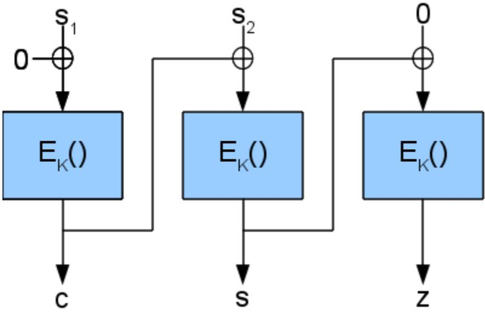

# Technische Richtlinie BSI TR-03116 Kryptographische Vorgaben für Projekte der Bundesregierung

# Teil 2: Hoheitliche und eID-Dokumente

Stand 2023 Datum: 8. März 2023

Bundesamt für Sicherheit in der Informationstechnik Postfach 20 03 63 53133 Bonn

E-Mail: [eid@bsi.bund.de](mailto:eid@bsi.bund.de) Internet: [https://www.bsi.bund.de](https://www.bsi.bund.de/) © Bundesamt für Sicherheit in der Informationstechnik 2023

| 1              | Einleitung 5                                                                   |  |
|----------------|--------------------------------------------------------------------------------|--|
| 1.1            | Hoheitliche und eID-Dokumente 5                                                |  |
| 1.2            | eIDAS-Verordnung 6                                                             |  |
| 1.3            | Kryptographische Verfahren und Standards6                                      |  |
| 1.3.1          | Internationale Anforderungen 6                                                 |  |
| 1.3.2          | Europäische Anforderungen 7                                                    |  |
| 1.3.3          | Nationale Anforderungen 8                                                      |  |
| 1.4            | Kryptographische Algorithmen 8                                                 |  |
| 1.4.1 1.4.2 | Basisverfahren 8 Domainparameter für Elliptische Kurven9                    |  |
| 1.4.3          | Zufallszahlengeneratoren 9                                                     |  |
|                |                                                                                |  |
| 2              | Public Key Infrastrukturen 10                                                  |  |
| 2.1 2.1.1   | Dokumenten-PKI 10 CSCA 10                                                   |  |
| 2.1.2          | Passive Authentisierung 11                                                     |  |
| 2.1.3          | Digitale Siegel für Änderungsaufkleber von Personalausweisen und Reisepässen11 |  |
| 2.1.4          | Digitale Siegel für VISA-Aufkleber12                                           |  |
| 2.1.5          | Digitale Siegel für Ankunftsnachweise12                                        |  |
| 2.2            | Terminal Authentisierung 12                                                    |  |
| 2.3            | Metadaten-Signer-Zertifikate 13                                                |  |
| 2.3.1          | MDS-Root- und MDS-SubCA-Zertifikate13                                          |  |
| 2.3.2          | MDS-Zertifikate 13                                                             |  |
| 2.3.3          | Signatur der Metadaten 14                                                      |  |
| 3              | Zugriffskontrolle und sichere Kommunikation15                                  |  |
| 3.1            | Basic Access Control 15                                                        |  |
| 3.2            | PACE 15                                                                        |  |
| 3.3            | Extended Access Control 16                                                     |  |
| 4              | Identifikation des Dokuments 17                                                |  |
| 4.1            | Dokumentennummer 17                                                            |  |
| 4.2            | Chip Authentisierung 17                                                        |  |
| 4.2.1          | Weitere europäische Vorgaben 18                                                |  |
| 4.3            | Restricted Identification 18                                                   |  |
| 5              | Qualifizierte elektronische Signatur 20                                        |  |
| 5.1            | Signaturerzeugung 20                                                           |  |
| 5.2            | Kennzeichnung der kryptographischen Verfahren20                                |  |
| 6              | Profile 21                                                                     |  |
| 6.1            | Elektronischer Reisepass 21                                                    |  |
| 6.1.1          | Unterstützte Verfahren 21                                                      |  |
| 6.1.2          | Nicht unterstützte Verfahren 21                                                |  |
| 6.2            | Elektronischer Personalausweis 21                                              |  |
| 6.2.1          | Unterstützte Verfahren 21                                                      |  |
| 6.2.2          | Nicht unterstützte Verfahren 22                                                |  |
|                |                                                                                |  |
| 6.3 6.3.1   | Elektronischer Aufenthaltstitel 22 Unterstützte Verfahren 22                |  |

| 6.3.2 6.4 | Nicht unterstützte Verfahren 23                                                                      |  |
|--------------|------------------------------------------------------------------------------------------------------|--|
|              |                                                                                                      |  |
|              | eID-Karte für Unionsbürger 23                                                                        |  |
| 6.4.1        | Unterstützte Verfahren 23                                                                            |  |
| 6.4.2        | Nicht unterstützte Verfahren 23                                                                      |  |
| 6.5          | Smart-eID 23                                                                                         |  |
| 6.5.1        | Unterstützte Verfahren 24                                                                            |  |
| 6.5.2        | Nicht unterstützte Verfahren 24                                                                      |  |
| 6.6          | Adressaufkleber für den Personalausweis24                                                            |  |
| 6.7          | Wohnortaufkleber für den Reisepass24                                                                 |  |
| 6.8          | VISA-Aufkleber 24                                                                                    |  |
| 6.9          | Ankunftsnachweis 24                                                                                  |  |
| 7            | Zertifizierung der Dokumente 25                                                                      |  |
| 7.1          | Elektronischer Reisepass 25                                                                          |  |
| 7.2          | Elektronischer Personalausweis, elektronischer Aufenthaltstitel und eID-Karte für Unionsbürger 25 |  |
| 8            | Terminals 26                                                                                         |  |
| 8.1          | Algorithmen und Schlüssellängen 26                                                                   |  |
| 8.2          | Basic Access Control 26                                                                              |  |
|              | PACE 26                                                                                              |  |
| 8.3          |                                                                                                      |  |
| 8.4          | Terminal- und Chipauthentisierung26                                                                  |  |

| Tabelle 1: Kryptographische Verfahren 6                                                       |  |
|-----------------------------------------------------------------------------------------------|--|
| Tabelle 2: Kryptographische Algorithmen 8                                                     |  |
| Tabelle 3: CSCA 10                                                                            |  |
| Tabelle 4: Passive Authentisierung 11                                                         |  |
| Tabelle 5: Digitale Siegel für Änderungsaufkleber für den Personalausweis und den Reisepass11 |  |
| Tabelle 6: Digitale Siegel für VISA-Aufkleber12                                               |  |
| Tabelle 7: Digitale Siegel für Ankunftsnachweise12                                            |  |
| Tabelle 8: Terminal Authentisierung 12                                                        |  |
| Tabelle 9: MDS-Root- und MDS-SubCA-Zertifikate13                                              |  |
| Tabelle 10: MDS-Zertifikate 13                                                                |  |
| Tabelle 11: Signatur von Metadaten 14                                                         |  |
| Tabelle 12: Basic Access Control 15                                                           |  |
| Tabelle 13: PACE 15                                                                           |  |
| Tabelle 14: Chip Authentisierung in Version 1 (Nationale Anwendung)17                         |  |
| Tabelle 15: Chip Authentisierung in Version 2 (Nationale Anwendung)18                         |  |
| Tabelle 16: Chip Authentisierung in Version 3 (Nationale Anwendung)18                         |  |
| Tabelle 17: Chip Authentisierung (Europäische Vorgaben)18                                     |  |
| Tabelle 18: Restricted Identification 19                                                      |  |
| Tabelle 19: Erzeugung von qualifizierten elektronischen Signaturen20                          |  |
|                                                                                               |  |

# 1 Einleitung

Die Technische Richtlinie BSI TR-03116 stellt eine Vorgabe für Projekte des Bundes dar. Die Technische Richtlinie ist in sechs Teile gegliedert:

- Teil 1 der Technischen Richtlinie beschreibt die Sicherheitsanforderungen für den Einsatz kryptographischer Verfahren im Gesundheitswesen für die elektronische Gesundheitskarte (eGK), den Heilberufeausweis (HBA) und der technischen Komponenten der Telematikinfrastruktur.
- Der vorliegende Teil 2 der Technischen Richtlinie beschreibt die Sicherheitsanforderungen für den Einsatz kryptographischer Verfahren in hoheitlichen Dokumenten und eID-Dokumenten basierend auf Extended Access Control, zurzeit für den elektronischen Reisepass, den elektronischen Personalausweis, den elektronischen Aufenthaltstitel, die eID-Karte für Unionsbürger, die Smart-eID, Änderungsaufkleber hoheitlicher Dokumente, VISA-Aufkleber und den Ankunftsnachweis.
- Teil 3 der Technischen Richtlinie beschreibt die Sicherheitsanforderungen für den Einsatz kryptographischer Verfahren in der Infrastruktur intelligenter Messsysteme im Energiesektor.
- Teil 4 der Technischen Richtlinie beschreibt die Sicherheitsanforderungen für den Einsatz der Kommunikationsverfahren SSL/TLS, S/MIME, SAML/XML Security und OpenPGP in Anwendungen des Bundes.
- Teil 5 der Technischen Richtlinie beschreibt die Sicherheitsanforderungen für den Einsatz kryptographischer Verfahren in Anwendungen der Secure Element API (wie Technischen Sicherheitseinrichtungen elektronischer Aufzeichnungssysteme).
- Teil 6 der Technischen Richtlinie beschreibt die Sicherheitsanforderungen für den Einsatz kryptographischer Verfahren in der Infrastruktur kooperativer intelligenter Verkehrssysteme (Cooperative Intelligent Transport Systems / C-ITS).

Die Vorgaben des vorliegenden Teils 2 der Technischen Richtlinie basieren auf Prognosen über die Sicherheit der in hoheitlichen und eID-Dokumenten verwendeten kryptographischen Verfahren. Aufgrund der langen Gültigkeitszeit solcher Dokumente erfolgt die Prognose für die Verwendung in der Ausgabe von Dokumenten über einen Zeitraum von 4 Jahren, zurzeit bis einschließlich 2026. Eine weitere Verwendung des Verfahrens über diesen Zeitraum hinaus ist nicht ausgeschlossen und wird mit 2026+ gekennzeichnet.

Unabhängig davon besteht die Möglichkeit den elektronischen Teil bereits ausgegebener hoheitlicher Dokumente und eID-Dokumente durch Rückruf des verwendeten Document Signer Zertifikates (vgl. Abschnitt [2.1](#page-9-1)) zu sperren. Ein physikalisches Dokument behält jedoch auch in diesem Fall seine Gültigkeit.

# 1.1 Hoheitliche und eID-Dokumente

Die Technische Richtlinie legt verbindlich die Vorgaben für den Einsatz von kryptographischen Verfahren basierend auf der TR-02102-1 [1] für folgende Dokumente fest:

- Elektronischer Reisepass
- Elektronischer Personalausweis
- Elektronischer Aufenthaltstitel
- eID-Karte für Unionsbürger
- Smart-eID
- Änderungsaufkleber hoheitlicher Dokumente
	- für den Personalausweis (Adressaufkleber) und
	- für den Reisepass (Wohnortaufkleber)
- VISA-Aufkleber
- Ankunftsnachweis

Darüber hinaus enthält diese Technische Richtlinie Empfehlungen für Terminals, welche von den verbindlichen Vorgaben für hoheitliche und eID-Dokumente abweichen können.

# 1.2 eIDAS-Verordnung

Die eIDAS-Verordnung [2] regelt die Rahmenbedingungen für die gegenseitige Anerkennung von elektronischen Identifizierungsmitteln im Europäischen Wirtschaftsraum. Hierbei können Mitgliedsstaaten ihre nationalen Systeme zur Identifizierung von natürlichen oder juristischen Personen bei der Kommission *notifizieren*.

Die Anerkennung von notifizierten elektronischen Identifizierungsmitteln durch öffentliche Stellen ist entsprechend der Regelungen der eIDAS-Verordnung [2] seit dem 29.09.2018 verpflichtend. Die Interoperabilität wird über das Interoperability Framework [3] realisiert.

# 1.3 Kryptographische Verfahren und Standards

Hoheitliche und eID-Dokumente sind durch eine Reihe von internationalen, europäischen und nationalen Standards festgelegt. [Tabelle 1](#page-5-0) gibt einen Überblick über die kryptographischen Verfahren.

| Standard                | Kryptographisches Verfahren                     |  |  |
|-------------------------|-------------------------------------------------|--|--|
| ICAO Doc 9303           | Basic Access Control                            |  |  |
|                         | Passive Authentisierung                         |  |  |
|                         | Aktive Authentisierung                          |  |  |
|                         | Password Authenticated Connection Establishment |  |  |
| BSI TR-03110, Parts 1-3 | Extended Access Control Versionen 1 & 2         |  |  |
|                         | Chip Authentisierung Versionen 1 & 2 & 3 –   |  |  |
|                         | Terminal Authentisierung Versionen 1 & 2 –   |  |  |
|                         | Password Authenticated Connection Establishment |  |  |
|                         | Restricted Identification                       |  |  |
| BSI TR-03137-1          | Digital Seal                                    |  |  |

Tabelle 1: Kryptographische Verfahren

## 1.3.1 Internationale Anforderungen

Der elektronische Reisepass und der elektronische Aufenthaltstitel (nach Vorgaben der EU-Kommission) unterliegen internationalen Anforderungen.

Der internationale Standard für Reisedokumente wird von der ICAO in der ICAO Doc 9303 [4][1](#page-6-0) festgelegt. Unter den von der ICAO standardisierten kryptographischen Verfahren sind:

- Password Authenticated Connection Establishment,
	- Generic Mapping
	- Chip Authentication Mapping
- Basic Access Control,
- Passive Authentisierung und
- Aktive Authentisierung.

### 1.3.2 Europäische Anforderungen

Die EU hat über die Verordnungen (EC) No 2252/2004 [6] und (EG) 1030/2002 [7], geändert durch (EU) 2017/1954 [8], die Kommission mit der Standardisierung von zusätzlichen Verfahren zur Integration von Fingerabdrücken in europäischen Reisedokumenten beauftragt.

Die Technischen Spezifikationen wurden in den Kommissionsentscheidungen C(2006) 2909 [9], C(2011) 5478 [10], C(2011) 5499 [11], C(2013) 6178 [12], C(2013) 6181 [13] und C(2018) 7767 [14] dargelegt, mit Verweis auf die Technische Richtlinie BSI TR-03110 und den ICAO Technical Report [15], welcher von der ICAO in ICAO Doc 9303 [4] integriert wurde.

Der elektronische Reisepass und der elektronische Aufenthaltstitel (nach Vorgaben der EU-Kommission) unterliegen den Anforderungen für europäische Reisedokumente.

Daneben hat die EU über die Verordnung (EU) 2019/1157 [16] Anforderungen an europäische Personalausweise definiert. Der elektronische Personalausweis in Deutschland unterliegt diesen Anforderungen seit dem 2. August 2021.

Folgende der in der Technischen Richtlinie TR-03110-1 [5] spezifizierten kryptographischen Verfahren sind für die Erfüllung der europäischen Anforderungen relevant:

- Extended Access Control Version 1, d.h.
	- Chip Authentisierung Version 1[2](#page-6-1)
	- Terminal Authentisierung Version 1

Folgende der im ICAO Doc 9303 [4] spezifizierten kryptographischen Verfahren sind für europäische Reisedokumente relevant:

- Passive Authentisierung
- Password Authenticated Connection Establishment
	- Generic Mapping (kompatibel zur TR-03110-1 [5])
	- Chip Authentication Mapping

Die europäischen Anforderungen sind für die eID-Karte für Unionsbürger nicht verbindlich. Allerdings wird die eID-Karte für Unionsbürger analog zum Personalausweis ausgestaltet. Daher sind die kryptographischen Verfahren auch für diese Karte relevant.

- 1 Das Verfahren Password Authenticated Connection Establishment (PACE) gemäß ICAO Doc 9303 [4] ist kompatibel zur Technischen Richtlinie TR-03110-1 [5] und stammt ursprünglich aus einer älteren Version der BSI TR-03110.
- 2 Version 1 der Chip Authentisierung wurde von der ICAO auch in die ICAO Doc 9303 [4] aufgenommen.

### 1.3.3 Nationale Anforderungen

Neben den internationalen und europäischen Anforderungen gibt es nationale Anforderungen an hoheitliche und eID-Dokumente, die nicht notwendigerweise konform zu den Spezifikationen für Reisedokumente und europäische Personalausweise sind. Der elektronische Personalausweis, der elektronische Aufenthaltstitel, die eID-Karte für Unionsbürger und die Smart-eID unterliegen nationalen Anforderungen.

Folgende der in der Technische Richtlinie TR-03110-2 [17] spezifizierten kryptographischen Verfahren sind für die Erfüllung der nationalen Anforderungen relevant:

- Extended Access Control Version 2, d.h.
	- Chip Authentisierung Versionen 2 & 3
	- Terminal Authentisierung Version 2
- Passive Authentisierung
- Password Authenticated Connection Establishment
	- Generic Mapping
- Restricted Identification.

# 1.4 Kryptographische Algorithmen

### 1.4.1 Basisverfahren

[Tabelle 2](#page-7-0) gibt einen Überblick über die in hoheitlichen und eID-Dokumenten verwendeten kryptographischen Basisverfahren.

| Verfahren                                        | Algorithmus                                             |
|--------------------------------------------------|---------------------------------------------------------|
| Digitale Signatur                                | ECDSA [19]                                              |
| Pseudonyme Signatur                              | PSA EC-Schnorr [17], [25]                               |
| Schlüsseleinigung                                | ECKA [19]                                               |
| Blockchiffre Verschlüsselungsmodi MAC-Modi | AES [18] - CBC-Mode [22] - CMAC Mode [23]         |
| Blockchiffre Verschlüsselungsmodi MAC-Modi | 2-Key-3DES [21] - CBC-Mode [22] - Retail MAC [24] |
| Hash                                             | SHA-2 [20]                                              |

Tabelle 2: Kryptographische Algorithmen

Das Verfahren 2-Key-3DES wird in der Technischen Richtlinie TR-02102-1 [1] nicht mehr empfohlen. Die Aufnahme dieses Verfahrens in dieser Technischen Richtlinie gilt nur für den elektronischen Reisepass und den elektronischen Aufenthaltstitel aufgrund der internationalen bzw. europäischen Standardisierung.

### 1.4.2 Domainparameter für Elliptische Kurven

Für kryptographische Algorithmen basierend auf Elliptischen Kurven (d.h. ECDSA und ECKA) sind die Brainpool Domain Parameter gemäß RFC 5639 [26] in den entsprechenden Bitlängen zu verwenden. Eventuelle Abweichungen werden explizit genannt.

### 1.4.3 Zufallszahlengeneratoren

Für die Erzeugung von Zufallszahlen und kryptographischen Schlüsseln (inkl. ephemeren Schlüsseln) sind in allen verwendeten kryptographischen Protokollen Zufallszahlengeneratoren aus einer der folgenden Klassen (siehe AIS 20/31 [27]) zu verwenden:

- **•** DRG.4
- **•** PTG.2 oder höher.

Bei der Verwendung von PTG.2 muss ggf. eine anwendungsspezifische kryptographische Nachbearbeitung der Zufallszahlen erfolgen, um eine mögliche Schiefe der Zufallszahlen zu verhindern. Es wird empfohlen, einen Zufallszahlengenerator der Klasse PTG.3 zu verwenden.

### 1.4.3.1 PTG.2 - Nachbearbeitung bei PACE

Bei PACE wird eine 128 Bit Zufallszahl s erzeugt und anschließend zu z=EK(s) verschlüsselt. Wird hierbei ein Zufallszahlengenerator der Klasse PTG.2 verwendet, so muss die Erzeugung von s unter Einbeziehung einer zur Klasse DRG.3 konformen kryptographischen Nachbearbeitung erfolgen.

Alternativ kann folgende Variante des PACE-Algorithmus verwendet werden:

- **•** Es werden zwei 128 Bit Zufallszahlen s1 und s2 mit einem Zufallszahlengenerator der Klasse PTG.2 erzeugt.
- **•** Anschließend wird der Chiffretext (c||s||z) = EK(s1||s2||0) wie in [Abbildung 1](#page-8-0) dargestellt berechnet.
- **•** Der Wert c wird verworfen, die Werte s und z (=EK(s)) werden wie bisher verwendet.

*Abbildung 1: Alternative Verschlüsselung der PACE Nonce*

Sofern eine andere Nachbearbeitung verwendet wird, muss diese mit dem BSI abgestimmt werden.

# 2 Public Key Infrastrukturen

Es werden zwei unterschiedliche Arten von Public Key Infrastrukturen verwendet:

- Eine Public Key Infrastruktur (*Dokumenten-PKI*) zur Überprüfung der Authentizität hoheitlicher und eID-Dokumente bzw. der enthaltenen relevanten Daten (Passive Authentisierung bzw. Digitales Siegel).
- Mehrere anwendungsspezifische Public Key Infrastrukturen (Berechtigungs-PKIen) zur Festlegung von Berechtigungen von Lesegeräten (Terminal Authentisierung).

Außerdem werden für die grenzüberschreitende Verwendung von Online-Diensten im Kontext der eIDAS-Verordnung [2] so genannte *eIDAS-Knoten* (*eIDAS-Konnektoren* und *eIDAS-Services*) (vgl. Interoperability Framework [3], eIDAS Technical Specifications - Interoperability Architecture [28]) eingesetzt.

Hierfür werden innerhalb der Berechtigungs-PKI für die eID-Anwendung *Metadaten-Signer-Zertifikate* (*MDS-Zertifikate*) ausgegeben, welche zur grenzüberschreitenden Überprüfung der Authentizität der Metadaten von Online-Diensten in Deutschland durch eIDAS-Services anderer Mitgliedsstaaten dienen.

## 2.1 Dokumenten-PKI

Die Authentizität des elektronischen Teils von hoheitlichen und eID-Dokumenten kann durch die Passive Authentisierung (in Verbindung mit der Chip Authentisierung) geprüft werden. Änderungsaufkleber für den Personalausweis (Adressaufkleber) und den Reisepass (Wohnortaufkleber), zukünftige VISA-Aufkleber sowie Ankunftsnachweise enthalten anstelle eines Chips ein digitales Siegel als zusätzliches Sicherheitsmerkmal, mit dem darauf enthaltene Identitätsdaten des Inhabers authentifiziert werden.

Die Passive Authentisierung und die digitalen Siegel basieren auf der Dokumenten-PKI bestehend aus einer *Country Signing Certification Authority* als nationale Wurzelinstanz sowie mindestens einem *Document Signer* für jeden autorisierten Herausgeber des jeweiligen hoheitlichen oder eID-Dokuments.

### 2.1.1 CSCA

Das Signaturverfahren, mit dem die X.509-Zertifikate signiert werden, wird durch die Country Signing Certification Authority festgelegt. Die Country Signing Certification Authority wird vom BSI betrieben.

[Tabelle 3](#page-9-2) legt die von der CSCA für die Ausstellung von Zertifikaten zu verwendenden kryptographischen Verfahren verbindlich fest. Die Verwendungszeiträume beziehen sich auf die Dokumentenproduktion.

| Verfahren          | Algorithmus | Länge | Verwendung von | Verwendung bis |  |  |  |  |
|--------------------|-------------|-------|-------------------|-------------------|--|--|--|--|
| Country Signing CA |             |       |                   |                   |  |  |  |  |
| Signatur           | ECDSA       | 256   |                   | 2011              |  |  |  |  |
|                    |             | 384   | 2011              | 2019              |  |  |  |  |
|                    |             | 512   | 2019              | 2026+             |  |  |  |  |
| Hash               | SHA-256     | 256   |                   | 2011              |  |  |  |  |
|                    | SHA-384     | 384   | 2011              | 2019              |  |  |  |  |
|                    | SHA-512     | 512   | 2019              | 2026+             |  |  |  |  |

Tabelle 3: CSCA

### 2.1.2 Passive Authentisierung

[Tabelle 4](#page-10-2) legt die für die Passive Authentisierung zu verwendenden kryptographischen Verfahren verbindlich fest. Die Verwendungszeiträume beziehen sich auf die Dokumentenproduktion.

| Verfahren               | Algorithmus                                   | Länge | Verwendung von | Verwendung bis |  |  |
|-------------------------|-----------------------------------------------|-------|-------------------|-------------------|--|--|
|                         | Document Signer (Signatur der Security Infos) |       |                   |                   |  |  |
| Signatur                | ECDSA                                         | 224   |                   | 2010              |  |  |
|                         |                                               | 256   | 2010              | 2019              |  |  |
|                         |                                               | 384   | 20193             | 2026+             |  |  |
| Hash                    | SHA-224                                       | 224   |                   | 2010              |  |  |
|                         | SHA-256                                       | 256   | 2010              | 2019              |  |  |
|                         | SHA-384                                       | 384   | 20193             | 2026+             |  |  |
| Passive Authentisierung |                                               |       |                   |                   |  |  |
| Hash von Datengruppen   | SHA-1                                         | 160   |                   | 2010              |  |  |
|                         | SHA-256                                       | 256   | 2010              | 2019              |  |  |
|                         | SHA-384                                       | 384   | 20193             | 2026+             |  |  |

Tabelle 4: Passive Authentisierung

### 2.1.3 Digitale Siegel für Änderungsaufkleber von Personalausweisen und Reisepässen

[Tabelle 5](#page-10-0) legt die zu verwendenden kryptographischen Verfahren für die Erstellung digitaler Siegel von Änderungsaufklebern für den Personalausweis (Adressaufkleber) und den Reisepass (Wohnortaufkleber) verbindlich fest. Die Verwendungszeiträume beziehen sich auf die Siegelerstellung.

| Verfahren                                                  | Algorithmus | Länge | Verwendung von | Verwendung bis |  |
|------------------------------------------------------------|-------------|-------|-------------------|-------------------|--|
| Barcode Signer für Adressaufkleber für den Personalausweis |             |       |                   |                   |  |
| Signatur                                                   | ECDSA       | 224   | 2021              | 2026+             |  |
| Hash                                                       | SHA-224     | 224   | 2021              | 2026+             |  |

Tabelle 5: Digitale Siegel für Änderungsaufkleber für den Personalausweis und den Reisepass

3 Die Umstellung erfolgte mit dem Wechsel der Schlüssellänge im übergeordneten CSCA-Zertifikat.

## 2.1.4 Digitale Siegel für VISA-Aufkleber

[Tabelle 6](#page-11-2) legt die zu verwendenden kryptographischen Verfahren für die Erstellung digitaler Siegel von VI-SA-Aufklebern verbindlich fest. Die Verwendungszeiträume beziehen sich auf die Siegelerstellung.

| Verfahren                         | Algorithmus | Länge | Verwendung von | Verwendung bis |  |
|-----------------------------------|-------------|-------|-------------------|-------------------|--|
| Barcode Signer für VISA-Aufkleber |             |       |                   |                   |  |
| Signatur                          | ECDSA       | 224   | 2021              | 2026+             |  |
| Hash                              | SHA-224     | 224   | 2021              | 2026+             |  |

Tabelle 6: Digitale Siegel für VISA-Aufkleber

### 2.1.5 Digitale Siegel für Ankunftsnachweise

[Tabelle 7](#page-11-1) legt die zu verwendenden kryptographischen Verfahren für die Erstellung digitaler Siegel von Ankunftsnachweisen verbindlich fest. Die Verwendungszeiträume beziehen sich auf die Siegelerstellung.

| Verfahren                            | Algorithmus | Länge | Verwendung von | Verwendung bis |  |
|--------------------------------------|-------------|-------|-------------------|-------------------|--|
| Barcode Signer für Ankunftsnachweise |             |       |                   |                   |  |
| Signatur                             | ECDSA       | 256   | 2016              | 2026+             |  |
| Hash                                 | SHA-256     | 256   | 2016              | 2026+             |  |

Tabelle 7: Digitale Siegel für Ankunftsnachweise

# 2.2 Terminal Authentisierung

Die Berechtigung zum Lesen und Schreiben von bestimmten Daten auf dem Chip muss ein Lesegerät über die Terminal Authentisierung nachweisen. Die Terminal Authentisierung basiert auf einer Public Key Infrastruktur bestehend aus einer *Country Verifying Certification Authority* als nationale Wurzelinstanz, einem *Document Verifier* für jeden Betreiber von Lesegeräten sowie den *Terminals*.

Das Signaturverfahren einschließlich der Schlüssellängen, mit dem die kartenverifizierbaren Zertifikate (Card Verifiable Certificate) signiert werden, wird durch die Country Verifying Certification Authority festgelegt. Die Country Verifying Certification Authority wird vom BSI betrieben.

[Tabelle 8](#page-11-0) legt die zu verwendenden kryptographischen Verfahren verbindlich fest. Die Verwendungszeiträume beziehen sich auf die Zertifikatserzeugung.

| Verfahren | Algorithmus | Länge | Verwendung von | Verwendung bis |
|-----------|-------------|-------|-------------------|-------------------|
| Signatur  | ECDSA       | 224   |                   | 2010              |
|           |             | 256   | 2010              | 2026+             |
| Hash      | SHA-224     | 224   |                   | 2010              |
|           | SHA-256     | 256   | 2010              | 2026+             |

Tabelle 8: Terminal Authentisierung

# 2.3 Metadaten-Signer-Zertifikate

Die Hierarchie der Metadaten-Signer-Zertifikate besteht aus dem *MDS-Root-Zertifikat* als nationalem Vertrauensanker, den *MDS-SubCA-Zertifikaten* sowie den *MDS-Zertifikaten*, welche die Metadaten der Diensteanbieter signieren. Die Country Verifying Certificate Authority (CVCA) stellt, zusätzlich zum CVCA Zertifikat und den DV-Zertifikaten, ein selbst signiertes MDS-Root-Zertifikat sowie MDS-SubCA-Zertifikate für die Document Verifier aus. Ein DV stellt für jeden bei ihm registrierten Diensteanbieter ein MDS-Zertifikat aus, sofern der Diensteanbieter eIDAS-Anwendungen anbietet. Erzeugung, Besitz und Nutzung der entsprechenden privaten Schlüssel erfolgt analog zu den privaten Schlüsseln der Terminal-Zertifikate. Für diesen Zweck werden in der CVCA-PKI zusätzliche X.509-Zertifikate (MDS-Zertifikate) ausgestellt.

### 2.3.1 MDS-Root- und MDS-SubCA-Zertifikate

[Tabelle 9](#page-12-1) legt die von der CVCA für die Ausstellung von MDS-Root- und MDS-SubCA-Zertifikaten zu verwendenden kryptographischen Verfahren verbindlich fest. Die Verwendungszeiträume beziehen sich auf die Ausstellung der Zertifikate.

| Verfahren         | Algorithmus                  | Länge      | Verwendung von | Verwendung bis |
|-------------------|------------------------------|------------|-------------------|-------------------|
| CVCA              |                              |            |                   |                   |
| Signatur          | ECDSA                        | 384        | 2017              | 2026+             |
| Hash              | SHA-384                      | 384        | 2017              | 2026+             |
| Elliptische Kurve | brainpoolP384r1 secp384r1 | 384 384 | 2017 2019      | 2019 2026+     |

Tabelle 9: MDS-Root- und MDS-SubCA-Zertifikate

### 2.3.2 MDS-Zertifikate

[Tabelle 10](#page-12-0) legt die von den DVs für die Ausstellung von MDS-Zertifikaten zu verwendenden kryptographischen Verfahren verbindlich fest. Die Verwendungszeiträume beziehen sich auf die Ausstellung der Zertifikate.

| Verfahren         | Algorithmus                  | Länge      | Verwendung von | Verwendung bis |
|-------------------|------------------------------|------------|-------------------|-------------------|
| DV                |                              |            |                   |                   |
| Signatur          | ECDSA                        | 256        | 2017              | 2026+             |
| Hash              | SHA-256                      | 256        | 2017              | 2026+             |
| Elliptische Kurve | brainpoolP256r1 secp256r1 | 256 256 | 2017 2019      | 2019 2026+     |

Tabelle 10: MDS-Zertifikate

### 2.3.3 Signatur der Metadaten

[Tabelle 11](#page-13-0) legt die von Diensteanbietern für die Signatur von Metadaten zu verwendenden kryptographischen Verfahren verbindlich fest. Die Verwendungszeiträume beziehen sich auf die Ausstellung der jeweiligen Metadaten.

| Verfahren        | Algorithmus                  | Länge      | Verwendung von | Verwendung bis |  |
|------------------|------------------------------|------------|-------------------|-------------------|--|
| Diensteanbieter  |                              |            |                   |                   |  |
| Signatur         | ECDSA                        | 256        | 2017              | 2026+             |  |
| Hash             | SHA-256                      | 256        | 2017              | 2026+             |  |
| Ellipische Kurve | brainpoolP256r1 secp256r1 | 256 256 | 2017 2019      | 2019 2026+     |  |

Tabelle 11: Signatur von Metadaten

Für die SAML-Kommunikation gelten die kryptographischen Vorgaben der eIDAS Technical Specifications - Crypto Requirements [29]. Seit dem Jahr 2021 sind von Diensteanbietern für neue eigene Schlüssel für die SAML-Kommunikation hierbei Verfahren basierend auf elliptischen Kurven zu verwenden.

# 3 Zugriffskontrolle und sichere Kommunikation

Alle auf dem Chip gespeicherten Daten (mit Ausnahme einiger administrativer Daten) sind mit einem Schutz gegen unberechtigten Zugriff zu versehen.

# 3.1 Basic Access Control

Basic Access Control ist ein von der ICAO in der ICAO Doc 9303 [4] standardisierter Zugriffsschutz. Dieses Verfahren basiert auf symmetrischer Kryptographie (die Schlüssel werden aus der maschinenlesbaren Zone erzeugt) und setzt keine Infrastruktur voraus. Basic Access Control wurde auf neuen Dokumenten schrittweise bis 2021 durch PACE ersetzt, da PACE deutlich bessere kryptographische Eigenschaften besitzt.

[Tabelle 12](#page-14-2) legt die auf bereits ausgestellten Dokumenten verwendeten kryptographischen Verfahren verbindlich fest. Die Verwendungszeiträume beziehen sich auf die Dokumentenausstellung.

| Verfahren            | Algorithmus         | Länge | Verwendung von | Verwendung bis                           |
|----------------------|---------------------|-------|-------------------|---------------------------------------------|
| Verschlüsselung      | 2-Key-3DES CBC-Mode | 112   | 2005              | 31.10.2019 (eAT) Juli 2021 (ePass) |
| Integritätssicherung | 3DES Retail MAC     | 112   | 2005              | 31.10.2019 (eAT) Juli 2021 (ePass) |

Tabelle 12: Basic Access Control

### 3.2 PACE

PACE (Password Authenticated Connection Establishment) nach TR-03110-2 [17] bzw. ICAO Doc 9303 [4] ist ein kryptographisches Verfahren mit den gleichen Zielen wie Basic Access Control, basiert aber auf asymmetrischer Kryptographie und kann mit mehreren, auch kurzen Passwörtern (PINs) verwendet werden.

[Tabelle 13](#page-14-1) legt die zu verwendenden kryptographischen Verfahren verbindlich fest. Die Verwendungszeiträume beziehen sich auf die Dokumentenausstellung.

| Verfahren            | Algorithmus                 | Länge | Verwendung von | Verwendung bis |
|----------------------|-----------------------------|-------|-------------------|-------------------|
| Schlüsseleinigung    | ECKA                        | 256   | 2010              | 2026+             |
| Permutation          | AES CBC-Mode                | 128   | 2010              | 2026+             |
| Mapping              | Generic ECKA                | 256   | 2010              | 2026+             |
|                      | Chip Authentication Mapping | 256   | 2019              | 2026+             |
| Verschlüsselung      | AES CBC-Mode                | 128   | 2010              | 2026+             |
| Integritätssicherung | AES CMAC                    | 128   | 2010              | 2026+             |

Tabelle 13: PACE

# 3.3 Extended Access Control

Extended Access Control nach TR-03110-1 [5] bzw. TR-03110-2 [17] ist ein PKI-basiertes Zugriffskontrollverfahren, das sich aus den Bestandteilen Chip Authentisierung (siehe Abschnitt [4.2](#page-16-1)) und Terminal Authentisierung (siehe Abschnitt [2.2](#page-11-3)) zusammensetzt.

# 4 Identifikation des Dokuments

Das Dokument kann über die Dokumentennummer, die Chip Authentisierung oder die Restricted Identification identifiziert werden.

# 4.1 Dokumentennummer

Die Dokumentennummer bietet eine eindeutige Identifizierung des Dokumententyps. Die Dokumentennummer ist eine 9-stellige alphanumerische, pseudozufällige Nummer. Sie ist aus folgenden Zeichen zu bilden: 1, 2, 3, 4, 5, 6, 7, 8, 9, C, F, G, H, J, K, L, M, N, P, R, T, V, W, X, Y, Z. Hierbei können einzelne Zeichenkombinationen ausgenommen sein. Zusätzlich können Mindestanforderungen bezüglich des Vorhandenseins einzelner Zeichen bzw. Zeichenfamilien gelten. Die Dokumentennummer kann zentral (beim Produzenten) oder dezentral erzeugt werden. Es wird empfohlen, die Dokumentennummer durch das Warbler-Verfahren aus einer sequentiell vergebenen Nummer zu erzeugen, siehe Margraf [30].

# 4.2 Chip Authentisierung

Die Chip Authentisierung nach TR-03110-1 [5] bzw. TR-03110-2 [17] ist ein kryptographisches Verfahren, mit dem die Echtheit des Chips durch den Aufbau einer starken Sitzungsverschlüsselung und -integritätssicherung nachgewiesen wird.

Chip Authentisierung Version 1 und 2 basieren auf einer ephemer-statischen Diffie-Hellman Schlüsseleinigung. Bei der Chip Authentisierung in Version 1 muss das Schlüsselpaar des Dokuments chipindividuell erzeugt werden, ab der Version 2 kann ein Schlüsselpaar für alle Dokumente einer Generation verwendet werden. Für die hoheitliche Nutzung muss zusätzlich ein chipindividuelles Schlüsselpaar verwendet werden.

Chip Authentisierung Version 3 ist eine Alternative zu Chip Authentisierung Version 2, kombiniert mit Restricted Identification. Es basiert auf einer rein ephemeren Diffie-Hellman Schlüsseleinigung und einer Pseudonymen Signatur und ermöglicht Pseudonymität auch ohne die Verwendung von Gruppenschlüsseln.

[Tabelle 14](#page-16-2) legt die zu verwendenden kryptographischen Verfahren für Chip Authentisierung in Version 1 verbindlich fest. Die Verwendungszeiträume beziehen sich auf die Dokumentenausstellung.

| Verfahren            | Algorithmus         | Länge | Verwendung von | Verwendung bis  |
|----------------------|---------------------|-------|-------------------|-----------------|
| Schlüsseleinigung    | ECKA                | 256   | 2010              | 2026+           |
| Verschlüsselung      | 2-Key-3DES CBC-Mode | 112   | 2010              | 3. Quartal 2012 |
|                      | AES CBC-Mode        | 128   | 3. Quartal 2012   | 2026+           |
| Integritätssicherung | 3DES Retail MAC     | 112   | 2010              | 3. Quartal 2012 |
|                      | AES CMAC            | 128   | 3. Quartal 2012   | 2026+           |

Tabelle 14: Chip Authentisierung in Version 1 (Nationale Anwendung)

[Tabelle 15](#page-17-0) legt die zu verwendenden kryptographischen Verfahren für Chip Authentisierung in Version 2 verbindlich fest. Die Verwendungszeiträume beziehen sich auf die Dokumentenausstellung.

| Verfahren         | Algorithmus  | Länge | Verwendung von | Verwendung bis |
|-------------------|--------------|-------|-------------------|----------------|
| Schlüsseleinigung | ECKA         | 256   | 2010              | 2026+          |
| Verschlüsselung   | AES CBC-Mode | 128   | 2010              | 2026+          |

#### 4 Identifikation des Dokuments

| Verfahren            | Algorithmus | Länge | Verwendung von | Verwendung bis |
|----------------------|-------------|-------|-------------------|----------------|
| Integritätssicherung | AES CMAC    | 128   | 2010              | 2026+          |

Tabelle 15: Chip Authentisierung in Version 2 (Nationale Anwendung)

[Tabelle 16](#page-17-2) legt die zu verwendenden kryptographischen Verfahren für Chip Authentisierung in Version 3 verbindlich fest. Die Verwendungszeiträume beziehen sich auf die Dokumentenausstellung.

| Verfahren            | Algorithmus    | Länge | Verwendung von | Verwendung bis |
|----------------------|----------------|-------|-------------------|----------------|
| Schlüsseleinigung    | ECKA           | 256   | 2019              | 2026+          |
| Verschlüsselung      | AES CBC-Mode   | 128   | 2019              | 2026+          |
| Integritätssicherung | AES CMAC       | 128   | 2019              | 2026+          |
| Pseudonyme Signatur  | PSA EC-Schnorr | 256   | 2019              | 2026+          |

Tabelle 16: Chip Authentisierung in Version 3 (Nationale Anwendung)

### 4.2.1 Weitere europäische Vorgaben

[Tabelle 17](#page-17-1) stellt die kryptographischen Verfahren dar, die nach übergeordneten EU-Vorgaben in der Vergangenheit für Chip Authentisierung in Version 1 für den elektronischen Reisepass und den elektronischen Aufenthaltstitel zusätzlich zu den nationalen Vorgaben implementiert werden mussten.

| Verfahren            | Algorithmus         | Länge | Verwendung von | Verwendung bis |
|----------------------|---------------------|-------|-------------------|-------------------|
| Verschlüsselung      | 2-Key-3DES CBC-Mode | 112   | 2010              | 2019              |
| Integritätssicherung | 3DES Retail MAC     | 112   | 2010              | 2019              |

Tabelle 17: Chip Authentisierung (Europäische Vorgaben)

# 4.3 Restricted Identification

Die Restricted Identification nach TR-03110-2 [17] ist ein kryptographisches Verfahren zur Erzeugung von sektorspezifischen Kennungen.

[Tabelle 18](#page-18-0) legt die zu verwendenden kryptographischen Verfahren verbindlich fest. Die Verwendungszeiträume beziehen sich auf die Dokumentenausstellung.

| Verfahren                                               | Algorithmus | Länge | Verwendung von | Verwendung bis |
|---------------------------------------------------------|-------------|-------|-------------------|-------------------|
| Schlüsseleinigung                                       | ECKA        | 256   | 2010              | 2026+             |
| Hash zur Erzeugung von sek torspezifischen Kennungen | SHA-256     | 256   | 2010              | 2026+             |
| Hash zur Erzeugung von Sperr summen                  | SHA-256     | 256   | 2010              | 2026+             |

Tabelle 18: Restricted Identification

# 5 Qualifizierte elektronische Signatur

Sofern das Dokument eine Signaturfunktion unterstützt, muss diese als qualifizierte Signatur ausgestaltet sein. Es sind folgende Vorgaben einzuhalten.

# 5.1 Signaturerzeugung

Für die Signaturerzeugung sind die Vorgaben aus SOG-IS Agreed Cryptographic Mechanisms [31] einzuhalten. [Tabelle 19](#page-19-1) legt die zu verwendenden kryptographischen Verfahren darüber hinaus verbindlich fest. Die Verwendungszeiträume beziehen sich auf die Zertifikatsausstellung.

| Verfahren         | Algorithmus                                                                                                                                                           | Länge | Verwendung von | Verwendung bis |
|-------------------|-----------------------------------------------------------------------------------------------------------------------------------------------------------------------|-------|-------------------|-------------------|
| Signaturverfahren | ECDSA                                                                                                                                                                 | 256   | 2010              | 2026+             |
| Hash              | Der Hash ist extern zu berech nen. Dabei sind nach SOG-IS [31] geeignete Hashfunktionen mit einer Outputlänge von mindestens 256 Bit zu verwen den. |       |                   |                   |

Tabelle 19: Erzeugung von qualifizierten elektronischen Signaturen

# 5.2 Kennzeichnung der kryptographischen Verfahren

Die eSign-Anwendung wird durch eine Cryptographic Information Application ergänzt, die über die Verwendbarkeit des Signaturschlüssels Auskunft gibt. Es müssen folgende Object Identifier nach TR-03111 [19] zur Kennzeichnung der Verfahren verwendet werden:

- Signaturverfahren: ecdsa-plain-signatures
- Schlüssel in X.509 Zertifikaten: id-ecPublicKey
- Schlüssel im TLV-Format: id-ecTLVPublicKey

Das Signaturverfahren wird ohne Angabe des extern zu erzeugenden Hashes angegeben. Die Signaturanwendungskomponente kann die von der Karte erstellte Signatur im plain-Format in das X9.62-Format (einschließlich des verwendeten Hashes) umwandeln.

# 6 Profile

## 6.1 Elektronischer Reisepass

Der elektronische Reisepass beinhaltet die ePass-Anwendung [4].

### 6.1.1 Unterstützte Verfahren

Der elektronische Reisepass unterstützt folgende kryptographischen Verfahren:

- Passive Authentisierung
- Basic Access Control[4](#page-20-2)
- Password Authenticated Connection Establishment[5](#page-20-3)
- Extended Access Control Version 1
	- Chip Authentisierung Version 1
	- Terminal Authentisierung Version 1

Seit 2013 muss PACE (gemäß ICAO Technical Report [15]) mit Generic Mapping vom elektronischen Reisepass unterstützt werden. Seit Juli 2021 darf Basic Access Control bei neuen Dokumenten nicht mehr unterstützt werden. Seit Juli 2021 muss darüber hinaus auch PACE mit Chip Authentication Mapping unterstützt werden.

Die Absicherung der Kommunikation zwischen Chip und Lesegerät erfolgt über Secure Messaging, welches über Basic Access Control / Password Authenticated Connection Establishment und Chip Authentisierung vereinbart wird.

### 6.1.2 Nicht unterstützte Verfahren

Der elektronische Reisepass unterstützt keine Aktive Authentisierung.

## 6.2 Elektronischer Personalausweis

Der elektronische Personalausweis beinhaltet die folgenden drei Anwendungen: ePass nach ICAO Doc 9303 [4], eID nach TR-03110-2 [17] und eSign nach TR-03117 [32].

### 6.2.1 Unterstützte Verfahren

Der elektronische Personalausweis unterstützt folgende kryptographischen Verfahren:

- Passive Authentisierung
- Password Authenticated Connection Establishment (gemäß TR-03110-2 [17])
- Extended Access Control (Version 1[6](#page-20-1) und Version 2)
	- Chip Authentisierung Versionen 1[6](#page-20-1) & 2 & 3
	- Terminal Authentisierung Versionen 1[6](#page-20-1) & 2
- 4 Die Verwendung von Basic Access Control beim elektronischen Reisepass ist auf neuen Dokumenten bis Juli 2021 schrittweise vollständig durch PACE ersetzt worden.
- 5 Die Einführung erfolgte im Jahr 2013.
- 6 Die Einführung erfolgte zum 2. August 2021.
- Restricted Identification
- Qualifizierte elektronische Signatur

Der Zugriff auf die ePass-Anwendung muss durch PACE mit Generic Mapping (gemäß TR-03110-2 [17]) und Extended Access Control in Version 2 geschützt sein. Zusätzlich muss für den Zugriff auf die Pass-Anwendung seit dem 2. August 2021 PACE (gemäß ICAO Technical Report [15]) mit Generic Mapping und Chip Authentication Mapping sowie bei Zugriff auf Fingerabdrücke Extended Access Control in Version 1 unterstützt werden.

Für den Zugriff auf die eID- und eSign-Anwendung muss PACE mit Generic Mapping (gemäß TR-03110-2 [17]) und Extended Access Control in Version 2 verwendet werden.

Alle Chips einer Generation müssen das gleiche Schlüsselpaar für die Chip Authentisierung Version 2 verwenden, zusätzlich müssen chipindividuelle Schlüssel vorhanden sein.

### 6.2.2 Nicht unterstützte Verfahren

Der elektronische Personalausweis unterstützt folgende kryptographischen Verfahren nicht:

- Basic Access Control
- Aktive Authentisierung

# 6.3 Elektronischer Aufenthaltstitel

Der elektronische Aufenthaltstitel beinhaltet die folgenden drei Anwendungen: ePass nach ICAO Doc 9303 [4], eID nach TR-03110-2 [17] und eSign nach TR-03117 [32].

### 6.3.1 Unterstützte Verfahren

Der elektronische Aufenthaltstitel unterstützt folgende kryptographischen Verfahren:

- Passive Authentisierung
- Basic Access Control[7](#page-21-0)
- Password Authenticated Connection Establishment
- Extended Access Control (Version 1 und Version 2)
	- Chip Authentisierung Versionen 1 & 2 & 3
	- Terminal Authentisierung Versionen 1 & 2
- Restricted Identification
- Qualifizierte elektronische Signatur

Der Zugriff auf die Pass-Anwendung muss durch PACE mit Generic Mapping (gemäß TR-03110-2 [17]) und Extended Access Control in Version 2 geschützt sein. Zusätzlich muss für den Zugriff auf die ePass-Anwendung Password Authenticated Connection Establishment (gemäß ICAO Technical Report [15]) und bei Zugriff auf Fingerabdrücke Extended Access Control in Version 1 unterstützt werden. Hierbei muss PACE (gemäß ICAO Technical Report [15]) mit Generic Mapping und seit 1.11.2019 zudem PACE mit Chip Authentication Mapping unterstützt werden. Seit dem 1.11.2019 darf Basic Access Control durch den elektronischen Aufenthaltstitel nicht mehr unterstützt werden.

7 Seit 1.11.2019 darf Basic Access Control für neue Dokumente nicht mehr unterstützt werden.

Für den Zugriff auf die eID- und eSign-Anwendung muss PACE mit Generic Mapping (gemäß TR-03110-2 [17]) und Extended Access Control in Version 2 verwendet werden.

Alle Chips einer Generation müssen das gleiche Schlüsselpaar für die Chip Authentisierung Version 2 verwenden, zusätzlich müssen chipindividuelle Schlüssel vorhanden sein.

### 6.3.2 Nicht unterstützte Verfahren

Der elektronische Aufenthaltstitel unterstützt keine Aktive Authentisierung.

### 6.4 eID-Karte für Unionsbürger

Die eID-Karte für Unionsbürger beinhaltet die folgenden drei Anwendungen: ePass nach ICAO Doc 9303 [4], eID nach TR-03110-2 [17] und eSign nach TR-03117 [32]. In der Pass-Anwendung sind jedoch keine personenbezogenen Daten gespeichert, vgl. TR-03127 [33].

### 6.4.1 Unterstützte Verfahren

Die eID-Karte für Unionsbürger unterstützt folgende kryptographischen Verfahren:

- Passive Authentisierung
- Password Authenticated Connection Establishment (gemäß TR-03110-2 [17])
- Extended Access Control (Version 1[8](#page-22-0) und Version 2)
	- Chip Authentisierung Versionen 1[8](#page-22-0)& 2 & 3
	- Terminal Authentisierung Versionen 1[8](#page-22-0)& 2
- Restricted Identification
- Qualifizierte elektronische Signatur

Der Zugriff auf die ePass-Anwendung muss durch PACE mit Generic Mapping (gemäß TR-03110-2 [17]) und Extended Access Control in Version 2 geschützt werden. Seit 2022 muss für den Zugriff auf die Pass-Anwendung zusätzlich PACE (gemäß ICAO Technical Report [15]) mit Generic Mapping und Chip Authentication Mapping sowie bei Zugriff auf Fingerabdrücke Extended Access Control in Version 1 unterstützt werden.

Für den Zugriff auf die eID- und eSign-Anwendung muss PACE mit Generic Mapping (gemäß TR-03110-2 [17]) und Extended Access Control in Version 2 verwendet werden.

Alle Chips einer Generation müssen das gleiche Schlüsselpaar für die Chip Authentisierung Version 2 verwenden, zusätzlich müssen chipindividuelle Schlüssel vorhanden sein.

### 6.4.2 Nicht unterstützte Verfahren

Die eID-Karte für Unionsbürger unterstützt folgende kryptographischen Verfahren nicht:

- Basic Access Control
- Aktive Authentisierung

### 6.5 Smart-eID

Die Smart-eID beinhaltet ausschließlich eine eID-Anwendung nach TR-03110-2 [17].

#### 8 Die Einführung erfolgte im Laufe des Jahres 2022.

## 6.5.1 Unterstützte Verfahren

Die Smart-eID unterstützt folgende kryptographische Verfahren:

- Passive Authentisierung
- Password Authenticated Connection Establishment (gemäß TR-03110-2 [17])
- Extended Access Control (Version 2)
	- Chip Authentisierung Version 2
	- Terminal Authentisierung Version 2
- Restricted Identification

Für den Zugriff auf die eID-Anwendung muss PACE mit Generic Mapping (gemäß TR-03110-2 [17]) und Extended Access Control in Version 2 verwendet werden.

Die Smart-eID verwendet chipindividuelle Schlüsselpaare für die Chip Authentisierung Version 2.

### 6.5.2 Nicht unterstützte Verfahren

Die Smart-eID unterstützt folgende kryptographischen Verfahren nicht:

- Basic Access Control
- Aktive Authentisierung
- Chip Authentisierung Version 3
- Qualifizierte elektronische Signatur

# 6.6 Adressaufkleber für den Personalausweis

Ein Adressaufkleber ist ein Papieraufkleber für den deutschen Personalausweis, der keinen Chip enthält. Im Rahmen einer Online-Ummeldung erstellte Adressaufkleber enthalten ein gedrucktes digitales Siegel gemäß TR-03137 [34].

# 6.7 Wohnortaufkleber für den Reisepass

Ein Wohnortaufkleber ist ein Papieraufkleber für den deutschen Reisepass, der keinen Chip enthält. Im Rahmen einer Online-Ummeldung erstellte Wohnortaufkleber enthalten ein gedrucktes digitales Siegel gemäß TR-03137 [34].

## 6.8 VISA-Aufkleber

Ein VISA-Aufkleber gemäß Commission Implementing Decision C(2020) 2672 [35] ist ein Papieraufkleber für Reisedokumente, der keinen Chip enthält. Der VISA-Aufkleber enthält ein gedrucktes digitales Siegel gemäß TR-03137 [34].

## 6.9 Ankunftsnachweis

Der Ankunftsnachweis ist ein Papierdokument, das keinen Chip enthält. Der Ankunftsnachweis enthält ein gedrucktes digitales Siegel gemäß TR-03137 [34].

# 7 Zertifizierung der Dokumente

Der Chip des elektronischen Reisepasses, des elektronischen Personalausweises, des elektronischen Aufenthaltstitels sowie der eID-Karte für Unionsbürger muss nach den Common Criteria [36] zertifiziert sein. Das Common Criteria Zertifikat muss einen Hinweis enthalten, dass bei der Evaluierung des Dokumentes die Anforderungen dieser Technischen Richtlinie berücksichtigt wurden.

# 7.1 Elektronischer Reisepass

Im Rahmen der erforderlichen Zertifizierung muss die Konformität zu folgenden Schutzprofilen nachgewiesen werden:

• BSI-CC-PP-0087-V2-2016 (MR.ED [37]) und BSI-CC-PP-0090-2016 (MR.ED-ON [38])

In der Vergangenheit konnte alternativ die Zertifizierung des elektronischen Reisepasses nach BSI-CC-PP-0056-V2-2012 (EAC mit PACE [39]) durchgeführt werden.

Zudem müssen bis 2021 ausgegebene elektronische Reisepässe, welche Basic Access Control unterstützen, zusätzlich über eine Zertifizierung nach BSI-CC-PP-0055-2009 [40] verfügen.

Die Produktionsschritte *Initialisierung und Pre-Personalisierung* sind Teil des zu zertifizierenden Lebenszyklus eines hoheitlichen Dokuments bzw. der eID-Karte für Unionsbürger. Die *Antennenmontage* ist nicht Teil des zu zertifizierenden Lebenszyklus, sofern diese nach der Initialisierung und der Pre-Personalisierung stattfindet.

Außerdem soll der Chip Maßnahmen vorsehen, so dass die Dauer eines erfolgreichen Brute-Force-Angriffs auf ein nicht-blockierendes Passwort (MRZ, CAN) im Durchschnitt 30 Tage nicht wesentlich unterschreitet.

# 7.2 Elektronischer Personalausweis, elektronischer Aufenthaltstitel und eID-Karte für Unionsbürger

Im Rahmen der erforderlichen Zertifizierung muss die Konformität zu folgenden Schutzprofilen nachgewiesen werden:

• BSI-CC-PP-0087-V2-2016 (MR.ED [37]) und BSI-CC-PP-0090-2016 (MR.ED-ON [38])

In der Vergangenheit konnte alternativ die Zertifizierung des elektronischen Personalausweises nach BSI-CC-PP-0061-2009 [41] durchgeführt werden.

In der Vergangenheit konnte alternativ die Zertifizierung des elektronischen Aufenthaltstitels nach BSI-CC-PP-0069-2010 [42] durchgeführt werden.

Zudem müssen bis 2019 ausgegebene elektronische Aufenthaltstitel, welche Basic Access Control unterstützen, zusätzlich über eine Zertifizierung nach BSI-CC-PP-0055-2009 [40] verfügen.

Die Produktionsschritte *Initialisierung und Pre-Personalisierung* sind Teil des zu zertifizierenden Lebenszyklus eines hoheitlichen Dokuments bzw. der eID-Karte für Unionsbürger. Die *Antennenmontage* ist nicht Teil des zu zertifizierenden Lebenszyklus, sofern diese nach der Initialisierung und der Pre-Personalisierung stattfindet.

Die gespeicherten kryptographischen Schlüssel *Chip Authentication Private Keys*, *PSA Private Keys*, *Restricted Identification Private Keys* und der *private Schlüssel für qualifizierte Signaturen* müssen durch geeignete Maßnahmen zusätzlich geschützt werden. Diese Maßnahmen sind im Einzelnen mit dem BSI abzustimmen.

Außerdem soll der Chip Maßnahmen vorsehen, so dass die Dauer eines erfolgreichen Brute-Force-Angriffs auf ein nicht-blockierendes Passwort (MRZ, CAN) im Durchschnitt 30 Tage nicht wesentlich unterschreitet.

# 8 Terminals

Dieses Kapitel enthält Empfehlungen für Terminals, die mit einem hoheitlichen Dokument kommunizieren. Diese sind für nach Common Criteria [36] zertifizierte Lesegeräte verbindlich zu beachten. Das Zertifikat kann einen Hinweis enthalten, dass die Anforderungen dieser Richtlinie erfüllt wurden.

# 8.1 Algorithmen und Schlüssellängen

Die durch ein Terminal mindestens zu unterstützenden Algorithmen und Schlüssellängen ergeben sich aus den zu unterstützenden Dokumenten.

# 8.2 Basic Access Control

Basic Access Control sollte vom Terminal nur dann verwendet werden, wenn das auszulesende Dokument die Verwendung von PACE nicht unterstützt.

## 8.3 PACE

Für die Erzeugung der notwendigen ephemeren Schlüssel ist ein Zufallszahlengenerator aus einer der folgenden Klassen (siehe AIS 20/31 [27]) zu verwenden:

- **•** DRG.2 oder höher,
- **•** PTG.2 oder höher,
- **•** NTG.1.

# 8.4 Terminal- und Chipauthentisierung

Für die Erzeugung der Nonce für die Signaturerzeugung als Bestandteil der Terminalauthentisierung und die Erzeugung des ephemeren Schlüssels für die Chipauthentisierung ist ein Zufallszahlengenerator aus einer der folgenden Klassen (siehe AIS 20/31 [27]) zu verwenden:

- **•** DRG.3 oder höher,
- **•** PTG.2 oder höher,
- **•** NTG.1.

# Literaturverzeichnis

| [1]        | BSI TR-02102-1, Kryptographische Verfahren: Empfehlungen und Schlüssellängen, Ver sion 2023-01, 2023                                                                                                                                                                                                                                                                                                                                                                                                      |
|------------|--------------------------------------------------------------------------------------------------------------------------------------------------------------------------------------------------------------------------------------------------------------------------------------------------------------------------------------------------------------------------------------------------------------------------------------------------------------------------------------------------------------|
| [2]        | Das Europäische Parlament und der Rat der Europäischen Union, Verordnung (EU) Nr. 910/2014 der Europäischen Parlaments und des Rates vom 23. Juli 2014 über elektroni sche Identifizierung und Vertrauensdienste für elektronische Transaktionen im Binnen                                                                                                                                                                                                                                             |
|            | markt und zur Aufhebung der Richtlinie 1999/93/EG (http://eur-lex.europa.eu/legal content/DE/ALL/?uri=CELEX:32014R0910), 23. Juli 2014                                                                                                                                                                                                                                                                                                                                                                    |
| [3]        | EU Kommission, Durchführungsverordnung (EU) 2015/1501 der Kommission vom 8. September 2015 über den Interoperabilitätsrahmen gemäß Artikel 12 Absatz 8 der Ver ordnung (EU) Nr. 910/2014 des Europäischen Parlaments und des Rates über elektroni sche Identifizierung und Vertrauensdienste für elektronische Transaktionen im Binnen                                                                                                                                                              |
|            | markt, 2015                                                                                                                                                                                                                                                                                                                                                                                                                                                                                                  |
| [4] [5] | ICAO 9303, Machine Readable Travel Documents, 8th edition, 2021 BSI TR-03110-1, Advanced Security Mechanisms for Machine Readable Travel Docu                                                                                                                                                                                                                                                                                                                                                             |
|            | ments and eIDAS Token - Part 1, Version 2.20, 2015                                                                                                                                                                                                                                                                                                                                                                                                                                                           |
| [6]        | Rat der EU, Standards for security features and biometrics in passports and travel docu ments issued by Member States, 13. Dezember 2004                                                                                                                                                                                                                                                                                                                                                                  |
| [7]        | Der Rat der Europäischen Union, VERORDNUNG (EG) Nr. 1030/2002 DES RATES vom 13. Juni 2002 zur einheitlichen Gestaltung des Aufenthaltstitels für Drittstaatenangehöri ge, 13. Juni 2001                                                                                                                                                                                                                                                                                                                |
| [8]        | Das Europäische Parlament und der Rat der Europäischen Union, VERORDNUNG (EU) 2017/1954 DES EUROPÄISCHEN PARLAMENTS UND DES RATES vom 25. Oktober 2017 zur Änderung der Verordnung (EG) Nr. 1030/2002 des Rates zur einheitlichen Gestaltung des Aufenthaltstitels für Drittstaatenangehörige, 25. Oktober 2017                                                                                                                                                                                     |
| [9]        | EU Kommission, Technical specifications on the standards for security features and bio metrics in passports and travel documents issued by Member States, 28. Juni 2006                                                                                                                                                                                                                                                                                                                                   |
| [10]       | EU Kommission, Technical specifications for the uniform format for residence permits for third country nationals, 4. August 2011                                                                                                                                                                                                                                                                                                                                                                          |
| [11]       | EU Kommission, Amendment to C(2011) 2909 laying down the technical specifications                                                                                                                                                                                                                                                                                                                                                                                                                            |
|            | on the standards for security features and biometrics in passports and travel documents issued by member states, 4. August 2011                                                                                                                                                                                                                                                                                                                                                                           |
| [12]       | EU Kommission, Amendment to Commission Decision C(2002) 3069 laying down the technical specifications for the uniform format for residence permits for third country nationals, 30. September 2013                                                                                                                                                                                                                                                                                                     |
| [13]       | EU Kommission, Amendment to C(2006) 2909 final laying down the technical specificati ons on the standards for security features and biometrics in passports and travel docu ments issued by Member States and C(2008) 8657 laying down a certificate policy as re quired in the technical specifications on the standards for security features and biome trics in passports and travel documents issued by Member States and updating the nor mative reference documents, 30. September 2013 |
| [14]       | EU Kommission, COMMISSION IMPLEMENTING DECISION of 30.11.2018 laying down the technical specifications for the uniform format for residence permits for third coun try nationals and repealing Decision C(2002) 3069, 30.11.2018                                                                                                                                                                                                                                                                       |
| [15]       | ICAO Technical Report, Supplemental Access Control for Machine Readable Travel Do cuments, Version 1.01, 2010                                                                                                                                                                                                                                                                                                                                                                                             |
| [16]       | Das Europäische Parlament und der Rat der Europäischen Union, VERORDNUNG (EU) 2019/1157 DES EUROPÄISCHEN PARLAMENTS UND DES RATES vom 20. Juni 2019 zur Erhöhung der Sicherheit der Personalausweise von Unionsbürgern und der Aufenthalts dokumente, die Unionsbürgern und deren Familienangehörigen ausgestellt werden, die ihr Recht auf Freizügigkeit ausüben, 20. Juni 2019                                                                                                                 |

| [17] | BSI TR-03110-2, Advanced Security Mechanisms for Machine Readable Travel Docu                                                                                   |
|------|-----------------------------------------------------------------------------------------------------------------------------------------------------------------|
|      | ments and eIDAS Token - Part 2, Version 2.21, 2016                                                                                                              |
| [18] | NIST FIPS PUB 197, Specification for the Advanced Encryption Standard (AES), 2001                                                                               |
| [19] | BSI TR-03111, Elliptic Curve Cryptography (ECC) Version 2.10, 2018                                                                                              |
| [20] | NIST FIPS PUB 180-4, Secure Hash Standard (SHS), 2015                                                                                                           |
| [21] | NIST Special Publication 800-67, Recommendation for the Triple Data Encryption Algo rithm (TDEA) Block Cipher, Revision 2, 2017                              |
| [22] | ISO/IEC 10116:2017, Information technology - Security techniques - Modes of operation for an n-bit block cipher, 2017                                        |
| [23] | NIST Special Publication 800-38B, Recommendation for Block Cipher Modes of Operati on: The CMAC Mode for Authentication, 2016                                |
| [24] | ISO/IEC 9797-1:2011, Information technology - Security techniques - Message Authenti cation Codes (MACs), Part 1: Mechanisms using a block cipher, 2011      |
| [25] | BSI TR-03110-3, Advanced Security Mechanisms for Machine Readable Travel Docu                                                                                   |
|      | ments and eIDAS Token - Part 3 Common Specifications,                                                                                                           |
| [26] | IETF RFC 5639, M. Lochter, J. Merkle, Elliptic Curve Cryptography (ECC) Brainpool Stan                                                                          |
|      | dard Curves and Curve Generation, 2010                                                                                                                          |
| [27] | BSI AIS 20/31, A proposal for: Functionality classes for random number generators, Ver sion 2.0, 2011                                                        |
| [28] | eIDAS Technical Subgroup, eIDAS Technical Specifications - Interoperability Architec ture,                                                                   |
| [29] | eIDAS Technical Subgroup , eIDAS Technical Specifications - Crypto Requirements, Ver                                                                            |
|      | sion 1.2, 2019                                                                                                                                                  |
| [30] | Margraf, Marian, Beschreibung und Einsatz der Verschlüsselungsfunktion Warbler, 2006                                                                            |
| [31] | SOG-IS , Agreed Cryptographic Mechanisms, Version 1.2, Stand 2020,                                                                                              |
| [32] | BSI TR-03117, eCards mit kontaktloser Schnittstelle als sichere Signaturerstellungsein heit, 2017                                                            |
| [33] | BSI TR-03127, eID-Dokumente basierend auf Extended Access Control, 2021                                                                                         |
| [34] | BSI TR-03137, Optically Verifiable Cryptographic Protection of non-electronic Docu                                                                              |
|      | ments (Digital Seal), Version 2.5, 2021                                                                                                                         |
| [35] | European Commission, Commission Implementing Decision C(2020) 2672 final of 30.04.2020 introducting a digital seal on the uniform format for visas, 2020     |
| [36] | Common Criteria, Common Critera for Information Technology Evaluation Security,                                                                                 |
|      | Parts 1-3                                                                                                                                                       |
| [37] | BSI CC-PP-0087, Common Criteria Protection Profile BSI-CC-PP-0087, Machine-Reada ble Electronic Documents based on BSI TR-03110 for Official Use (MR.ED-PP), |
| [38] | BSI CC-PP-0090, Common Criteria Protection CC-PP-0090 - Profile Configuration Ma                                                                                |
|      | chine Readable Electronic Documents - Optionales Nachladen (MR.ED-ON-PP),                                                                                       |
| [39] | BSI CC-PP-0056, Machine Readable Travel Document with "ICAO Application", Exten                                                                                 |
|      | ded Access Control with PACE, 2012                                                                                                                              |
| [40] | BSI CC-PP-0055, Machine Readable Travel Document with "ICAO Application" Basic Ac                                                                               |
|      | cess Control, 2009                                                                                                                                              |
| [41] | BSI CC-PP-0061-2009, Common Criteria Protection Profile - Electronic Identity Card                                                                              |
|      | (ID_Card PP) Version 1.03, 2009                                                                                                                                 |
| [42] | BSI CC-PP-0069-2010, Common Criteria Protection Profile Electronic Residence Permit                                                                             |
|      | Card (RP_Card PP), 2010                                                                                                                                         |