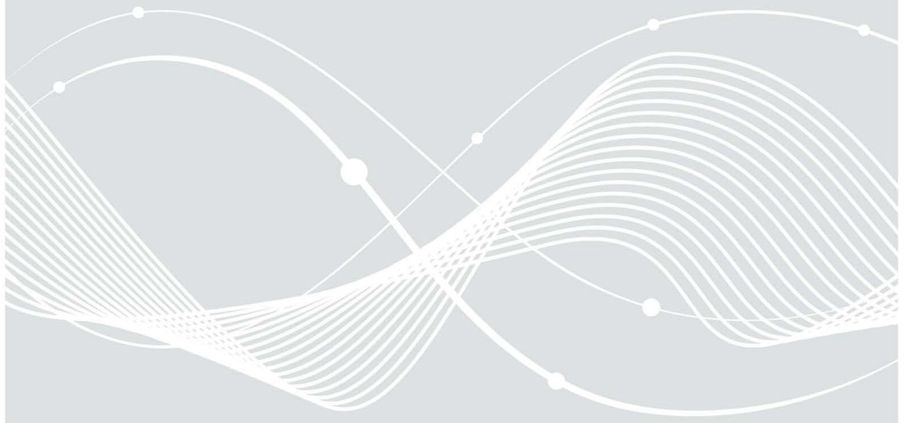
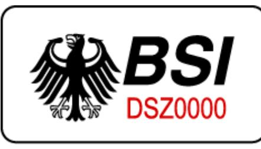

# Sichere Kartenterminalidentität

Technische Richtlinie BSI TR-03120

## Änderungshistorie

| Version | Datum      | Name | Beschreibung                                                                                                                                      |
|---------|------------|------|---------------------------------------------------------------------------------------------------------------------------------------------------|
| 1.0     | 23.10.2007 |      | Erste Fassung                                                                                                                                     |
| 1.1     | 09.07.2010 |      | Aktualisierung, Zusammenführung TR03120 vom 1.0 23.10.2007 und Anhang 1.0.2 vom 04.04.2008, Hinzufügung mobile Kartenterminals. |
|         |            |      | Neues Design und Korrektur von Rechtschreibfehlern                                                                                          |

Bundesamt für Sicherheit in der Informationstechnik Postfach 20 03 63 53133 Bonn Tel.: +49 22899 9582-0 E-Mail: referat-di24@bsi.bund.de Internet: https://www.bsi.bund.de © Bundesamt für Sicherheit in der Informationstechnik 2020

### Vorwort

Das Leben im 21. Jahrhundert wird immer mehr von der Informations- und Kommunikationstechnik geprägt. Digitale Prozesse ersetzen nicht nur Papierlösungen, sondern tragen auch wesentlich dazu bei, sichere und schnelle Methoden zur Identifikation und Authentifikation zu schaffen.

Die elektronische Gesundheitskarte (eGK) und der Heilberufsausweis (HBA) sind Beispiele dieser neuen Prozesse, die ohne Medienbrüche zu einer schnellen und zuverlässigen Patientenverwaltung und insbesondere der papierlosen elektronischen Rezepterstellung beitragen sollen.

Hierzu werden hohe Anforderungen an Funktionalität und Sicherheit an die eingesetzten Komponenten gestellt. Zum Schutz der Information, zur Wahrung der Vertraulichkeit, der Integrität und der Verfügbarkeit müssen sichere IT-Produkte eingesetzt werden.

Das Bundesamt für Sicherheit in der Informationstechnik (BSI) bietet bereits seit vielen Jahren Informationen und Hilfestellungen rund um das Thema IT-Sicherheit.

| 1 |            |       | Einleitung  6                                                                  |  |  |
|---|------------|-------|--------------------------------------------------------------------------------|--|--|
| 2 |            |       | Ziel 7                                                                         |  |  |
| 3 | Formate  9 |       |                                                                                |  |  |
|   | 3.1        |       | Referenzen  9                                                                  |  |  |
|   | 3.2        |       | Abkürzungen 10                                                                 |  |  |
| 4 |            |       | Verfahrensentwicklung zur Kartenterminalidentität Listen mit Aufzählzeichen 11 |  |  |
|   | 4.1        |       | Sicherheitsziele 11                                                            |  |  |
|   | 4.2        |       | Bedrohung11                                                                    |  |  |
|   | 4.3        |       | Generische Maßnahmen11                                                         |  |  |
|   | 4.4        |       | Annahmen11                                                                     |  |  |
|   | 4.5        |       | Sicherheitsmechanismen12                                                       |  |  |
| 5 |            |       | Betriebskonzept13                                                              |  |  |
|   | 5.1        |       | Basis13                                                                        |  |  |
|   | 5.2        |       | Inbetriebnahme13                                                               |  |  |
|   | 5.3        |       | Betrieb14                                                                      |  |  |
| 6 |            |       | Abwehr der Bedrohungen15                                                       |  |  |
| A |            |       | Anhang: Kartenterminalschutz18                                                 |  |  |
|   | A 1        |       | Stationäres Kartenterminal18                                                   |  |  |
|   |            | A 1.1 | Generische Anforderungen 19                                                    |  |  |
|   |            | A 1.2 | Annahmen 19                                                                    |  |  |
|   |            | A 1.3 | Sicherheitsziele 20                                                            |  |  |
|   |            | A 1.4 | Bedrohung 20                                                                   |  |  |
|   |            | A 1.5 | Sicherheitsmaßnahmen21                                                         |  |  |
|   |            | A 1.6 | Implementierungsdetails22                                                      |  |  |
|   | A 2        |       | Versiegelung stationärer Kartenterminals23                                     |  |  |
|   |            | A 2.1 | Allgemeine Anforderungen24                                                     |  |  |
|   |            | A 2.2 | Gehäusesiegel 25                                                               |  |  |
|   |            | A 2.3 | Slot-Siegel27                                                                  |  |  |
|   | A 3        |       | Mobiles Kartenterminal28                                                       |  |  |
|   |            | A 3.1 | Annahmen 28                                                                    |  |  |
|   |            | A 3.2 | Sicherheitsziele 29                                                            |  |  |
|   |            | A 3.3 | Bedrohung 30                                                                   |  |  |
|   |            | A 3.4 | Sicherheitsmaßnahmen30                                                         |  |  |
|   |            | A 3.5 | Implementierungsdetails31                                                      |  |  |
|   | A 4        |       | Versiegelung des mobilen Kartenterminals32                                     |  |  |
|   |            | A 4.1 | Siegelqualität32                                                               |  |  |

| A 4.2 | Fälschungssicherheit des Siegels 32                               |  |
|-------|-------------------------------------------------------------------|--|
| A 4.3 | Siegel-Sichtbarkeit32                                             |  |
| A 4.4 | Siegelhaftung auf dem Gerätegehäuse 32                            |  |
| A 4.5 | Siegelanbringung auf dem Gehäuse 33                               |  |
| A 4.6 | Beschreibung Siegelbeschaffung, -auslieferung und –aufbringung 33 |  |
| A 4.7 | Siegelbedruckung (Logo)33                                         |  |
| A 5   | Versiegelungsalternativen34                                       |  |
| A 5.1 | Schalterkonzept34                                                 |  |

### 1 Einleitung

Speziell im deutschen Gesundheitswesen sollen mehrere stationäre Kartenterminals in einem Netzwerk mit einem Host (hier Konnektor) vertraulich kommunizieren. Dabei soll gleichzeitig gewährleistet werden, dass die eindeutige Zuordnung des Kartenterminals sichergestellt wird und der Konnektor somit nur mit dem vorbestimmten, authentischen Kartenterminal kommuniziert.

Ein Netzwerk kann nicht in allen Fällen physisch abgesichert sein, da es sich über Raum- und Gebäudegrenzen hinaus erstrecken kann. Zum Schutz der Anwendung sind Maßnahmen erforderlich, die eine gesicherte und authentische Kommunikation zwischen den Kommunikationspartnern Kartenterminal und (ansteuerndem) Konnektor gewährleisten. Diese benötigen eine eindeutige Identität, was durch Zertifikate und geheime Schlüssel abgebildet wird. Die Wahrung der Identität muss auch nach einer Veränderung der Firmware durch Upgrades/Fehlerkorrekturen und ohne Audit des gesamten Firmware Source Codes gewährleistet sein.

Es kommen auch mobile Kartenterminals zum Einsatz, die nicht unmittelbar mit einem Netzwerk verbunden sind. Bei dieser Art von Kartenterminals sind es sensible Patientendaten, die temporär im Lesegerät gespeichert werden und die gemäß dem Bundesdatenschutzgesetz ein schützenswertes Gut darstellen. Daher muss auch hier sichergestellt werden, dass das mobile Kartenterminal nachweislich die ursprünglich angedachten Funktionen ausführt und Hard- und Software unverfälscht sind (authentisch).

Eine spezielle Anforderung, die mit authentischen Kartenterminals einhergeht, ist der physikalische Kartenterminalschutz.

### 2 Ziel

Diese Technische Richtlinie beschreibt in einem Betriebskonzept zunächst ein Verfahren für eine gesicherte Terminalidentität für stationäre Kartenterminals. Spezielle Verfahren und Anforderungen zum Kartenterminalschutz, die auch für mobile Kartenterminals gelten, sind in einem Anhang zu dieser Technischen Richtlinie dargestellt. Globale Anforderungen an Sicherheitsziele der eHealth Anwendung sind neben dem Schutz der digitalen Signatur des Heilberufsausweises vor unautorisierter Nutzung und dem Schutz der Daten der eGK gegen Ausspähung auch der Schutz der Infrastruktur gegen unautorisierte Inbetriebnahme von Komponenten. Weitere Sicherheitsziele, insbesondere im Kontext der digitalen Signatur, erfordern eine umfangreichere Betrachtung (Sicherheitsevaluierung) und sind nicht Gegenstand dieser Dokumentation. Ziel ist es, ein Verfahren zu beschreiben, bei dem es möglich ist, eine vertrauenswürdige Zuordnung (authentische Identität), sowie eine abhörsichere (vertrauliche) und manipulationssichere (integere) Verbindung zwischen stationären Kartenterminal und Konnektor herzustellen. Hierbei werden die Schutzmechanismen der Chipkartenbetriebssysteme gegen Angriffe auf die Daten einer Chipkarte als Stand der Technik vorausgesetzt und hier nicht weiter betrachtet. Allgemeine Anforderungen, die durch das Signaturgesetz (SigG) bzw. der Signaturverordnung (SigV) bedingt sind (z. B. sichere PIN-Eingabe), werden ebenfalls an dieser Stelle nicht betrachtet. Grundlegende sicherheitstechnische Betrachtungen sind im Schutzprofil (Protection Profile) [BSI\_CC-PP-0032] nachzulesen.

Das in dieser TR beschriebene Verfahren beruht auf Methoden, die durch vorangegangenen Spezifikationen der SICCT-Terminalhersteller [Auth06] und des BMG/BSI [WP1.6] abgestimmt und untersucht worden sind. Es werden nur Sicherheitsaspekte zur Terminalidentität eines stationären Kartenterminals in Relation zum Konnektor betrachtet. Das gilt sowohl für Terminals am Netzwerk direkt als auch für Terminals, die über den Proxy eines PCs verbunden sind. Für eine eindeutige Identität werden kryptographische Verfahren verwendet, die ein Zertifikat mit privaten Schlüsseln in einem sicheren Schlüsselspeicher nutzen.

Bei diesem Verfahrenen wird ein Sicherheitsmodul im Kartenterminal (SM-KT) benötigt, der als sicherer Schlüsselspeicher fungiert. Dieses SM-KT kann als separate Chipkarte (oft ID-000, SMC) realisiert sein. Es kann aber auch die Funktion der SM-KT mit alternativen Medien verwirklicht werden. Ist die SM-KT eine separate Karte, so stellt sie eine Sonderform einer SMC-A dar. Mittels einer Kennzeichnung im Attributszertifikat wird der Unterschied verdeutlicht. Wenn organisatorische und sicherheitstechnische Belange zufrieden stellend dargelegt werden können und sofern auch die damit verbundenen funktionellen Prozesse voneinander unbeeinflusst sind, dann könnten durchaus die Funktionen der SM-KT in die Hardware der SMC-A oder SMC-B oder alternativen Sicherheitsmodulen integriert werden.

Da jedoch noch ungeklärte Fragen zur Prozesstrennung bei der Personalisierung, zum sicheren Auslieferungsprozess, der Aufbewahrung und des Betriebs existieren wird in den folgenden Ausführungen eine getrennte SM-KT in Form einer sicherheitsevaluierten Prozessorchipkarte angenommen. Damit kann auf bereits zertifizierte Komponenten und etablierte Standardprozesse für Produktion und Distribution dieser Komponente zurückgegriffen werden. Wie später zu erkennen ist, führt dieser Formfaktor zur einer besonderen Sicherung (Stichwort: "Slot-Siegel").

Das in dieser TR beschriebene Betriebskonzept geht von einer nicht automatischen Inbetriebnahme durch Unterstützung eines Administrators des Konnektors oder eines geschulten Servicepersonals aus. Damit können auch große Installationen mit vielen Terminals von einer zentralen Stelle aus administriert werden. Insbesondere durch die Nutzung der qualifizierten elektronischen Signatur gibt es hohe Anforderungen an die Sicherheit des eHealth Kartenterminals. Insbesondere muss einem hohen Angriffspotential begegnet werden. Eine wichtige Maßnahme ist daher die physikalische Sicherung des Kartenterminals. Gemäß der Signaturverordnung § 15 (4) müssen insbesondere sicherheitstechnische Veränderungen an technischen Komponenten nach den Absätzen 1 bis 3 ((2) Signaturanwendungs-komponenten) dem Nutzer erkennbar werden. Das bedeutet, dass unautorisierte Veränderungen durch geeignete Maßnahmen erst gar nicht möglich sind oder dass der Nutzer des Kartenterminals erkennen muss, dass Veränderungen zum Zwecke der Manipulation am Kartenterminal stattgefunden haben.

Im Anhang dieser TR werden dem Hersteller geeignete Maßnahmen zum Schutz von stationären und mobilen eHealth Kartenterminals, bzw. dessen Hard- und Firmware vor unbemerkten Zugriffen und Manipulation, vorgeschlagen. Ein klassisches Verfahren, speziell aus dem Kontext von Kartenterminals für die qualifizierte elektronische Signatur, ist die Kartenterminalversiegelung. Die Versiegelung des Gerätes ist eine Möglichkeit die Anforderung zu erfüllen; sie ist nicht verpflichtend. Andere Maßnahmen sind möglich und exemplarisch in Kapitel A 1.5 dargestellt.

Wird jedoch die Versiegelungstechnik verwendet, so sind einige besonderen Anforderungen zu erfüllen, die hierzu im Anhang beschrieben sind. Hierzu sind für stationäre und für mobile Kartenterminals, in getrennten Kapiteln, beispielhafte Maßnahmen aber auch verbindliche Vorgaben dargestellt. Alternative Maßnahmen, die in diesem Dokument nicht beschrieben sind, sind grundsätzlich statthaft, benötigen jedoch eine gesonderte Bewertung durch die Zertifizierungs- und Bestätigungsstelle. Vor Beginn einer Bestätigung nach dem Signaturgesetz und der Zertifizierung nach CC sollten die Schutzmaßnahmen durch die Zertifizierungsstelle/Bestätigungsstelle des BSI abgenommen sein.

Diese TR ist verbindlich für stationäre und mobile Kartenterminals des Gesundheitswesens.

### 3 Formate

#### 3.1 Referenzen

| [SICCT]          | SICCT TeleTrusT; Secure Interoperable ChipCard Terminal; V1.20, 19.11.2007                                                                                                                                      |
|------------------|-----------------------------------------------------------------------------------------------------------------------------------------------------------------------------------------------------------------|
| [Auth06]         | TeleTrusT; Authentisierung und Schlüsselmanagement für SICCT eHealth Terminals; V1.01, 19.09.2006                                                                                                            |
| [WP1.6]          | Whitepaper BMG/BSI; Betriebskonzept zur Nutzung der SM-KT zur eindeutigen kryptographisch gesicherten Kommunikation; V1.6, 01.06.2007                                                                        |
| [SIGG]           | Bundesgesetz (Signaturgesetz); Gesetz über Rahmenbedingungen für elektronische Signaturen; Art. 4 G vom 17. Juli 2009 (BGBl. I S. 2091, 2095)                                                                |
| [SIGV]           | Bundesrechtsverordnung (Signaturverordnung); Verordnung zur elektronischen Signatur Art. 1 ÄndVO vom 17. Dezember 2009 (BGBl. I S. 3932)                                                                     |
| [GEM-01]         | gematik; ehealth KT Spezifikation, V2.6.2, 25.08.2008                                                                                                                                                           |
| [SIEGEL]         | Bundesamt für Sicherheit in der Informationstechnik (BSI); Druckschrift7500: Produkte für die materielle Sicherheit, TL 03400; November 2007                                                                 |
| [SIEGEL-Pr]      | Bundesamt für Sicherheit in der Informationstechnik (BSI); Druckschrift7586: Anforderungen und Prüfbedingungen für Sicherheitsetiketten, BSI-Technische Leitlinie (TL) 03415, Version 1.0, September 2005 |
| [AnhangTR3120]   | Bundesamt für Sicherheit in der Informationstechnik (BSI); Anhang zur Technischen Richtlinie BSI TR-03120; Kartenterminalversiegelung, V1.0.2, 04.04.2008                                                 |
| [BSI-CC-PP-0032] | Bundesamt für Sicherheit in der Informationstechnik (BSI); Common Criteria Protection Profile, Electronic Health Card Terminal (eHCT), V1.73, 29.11.2007, BSI CC-PP-0032                                  |
| [BSI-CC-PP-0052] | Bundesamt für Sicherheit in der Informationstechnik (BSI); Common Criteria Protection Profile, mobile Card Terminal for German HealthcareSystem (MobCT), V1.0.0, 25.02.2010, BSI-CC-PP-0052               |

### 3.2 Abkürzungen

| BSI    | Bundesamt für Sicherheit in der Informationstechnik  |
|--------|------------------------------------------------------|
| CC     | Common Criteria                                      |
| EAL    | Evaluation Assurance Level                           |
| ICC    | Integrated Circuit Card                              |
| IT     | Informationstechnik                                  |
| KT     | Kartenterminal                                       |
| MobKT  | Mobiles Kartenterminal                               |
| PIN    | Persönliche Identifikationsnummer                    |
| PKI    | Public Key Infrastructure                            |
| QES    | Qualifizierte Elektronische Signatur                 |
| SigG   | Signaturgesetz                                       |
| SigV   | Signaturverordnung                                   |
| SMC    | Secure Module Card                                   |
| SM     | Secure Module/Security Module                        |
| SSL    | secure socket layer                                  |
| SICCT  | Secure Interoperable Chipcard Terminal               |
| TCP/IP | Transmission Control Protocol over Internet Protocol |
| TLS    | Transport Layer Security                             |
| TR     | Technische Richtlinie                                |
|        |                                                      |

### 4 Verfahrensentwicklung zur Kartenterminalidentität Listen mit Aufzählzeichen

Wie in den oben aufgeführten globalen Zielen schon erwähnt, soll eine abhörsichere (vertrauliche) und manipulationssichere (integere) Verbindung zwischen stationären Kartenterminal und Konnektor hergestellt werden. Um ein geeignetes Verfahren zu finden und entsprechenden Maßnahmen zu definieren, werden zunächst die Sicherheitsziele und die daraus erwachsenen Bedrohungen fixiert. Anschließend werden daraus Sicherheitsmechanismen entwickelt, die in einem Betriebskonzept gezielt zum Einsatz kommen und in einem konkreten Verfahren detailliert beschrieben werden.

### 4.1 Sicherheitsziele

- S01.) Schutz der Kommunikation gegen Datenmanipulation.
- S02.) Schutz der Kommunikation vor Ausspähen.
- S03.) Schutz vor Vortäuschung einer falschen Identität des Kommunikationspartners.

### 4.2 Bedrohung

- B01.) Mitlesen der Kommunikation zwischen Kartenterminal und Konnektor.
- B02.) Angriff auf eine Kommunikation durch Unterschieben nicht autorisierter Daten.
- B03.) Umlenkung der Kommunikation über einen unautorisierten Dritten (man in the middle).
- B04.) Nutzung eines manipulierten Terminals.
- B05.) Unautorisierte Erzeugung einer Terminalidentität.
- B06.) Diebstahl der Terminalidentität und Nutzung in einem anderen Kartenterminal.
- B07.) Diebstahl eines Terminals und Wiedereinbringung mit kompromittierter Funktion.
- B08.) Unautorisierte Anmeldung eines Kartenterminals am Konnektor.

### 4.3 Generische Maßnahmen

- M01.) Als Schutz vor Datenmanipulation wird die Authentisierungsfunktion einer SSL/TLS Verbindung zwischen Kartenterminal und Konnektor genutzt.
- M02.) Als Schutz vor Ausspähen von Daten wird die Verschlüsselungseigenschaft einer SSL/TLS Verbindung genutzt.
- M03.) Als Schutz vor Vortäuschung einer falschen Identität des Kommunikationspartners wird eine fälschungssichere kryptographische Identität verwendet.
- M04.) Als Schutz der Firmware und Daten im Kartenterminal wird das Gehäuse in geeigneter Form versiegelt.
- M05.) Als Schutz vor Manipulation an der SM-KT wird der zugriffsgesicherte sicherheitsevaluierte Speicher einer Prozessorkarte genutzt.
- M06.) Als Schutz vor Diebstahl und/oder irregulären Verwendung der SM-KT wird die SM-KT durch einen Pairingprozess logisch mit dem Kartenterminal gekoppelt.

#### 4.4 Annahmen

- A01.) Die Inbetriebnahme bzw. der Einsatz des Kartenterminals erfolgen generell in einer kontrollierten Umgebung.
- A02.) Die Inbetriebnahme des Terminals und damit die Schaffung der Identität erfolgt in einer durch den Administrator überwachten Umgebung.
- A03.) Der Betrieb des Kartenterminals erfolgt über eine ansteuernde Instanz (Konnektor).
- A04.) Das Kartenterminal verfügt über die Möglichkeit zur Transportsicherung auf Basis SSL/TLS.
- A05.) Das SSL/TLS Verfahren benötigt Zufallszahlen. Wird ein SM-KT in Form meiner Chipkarte verwendet, so kann dieser Zufallszahlengenerator verwendet werden, da dieser eine ausreichende Qualität und Güte besitzt. Softwarelösungen sind statthaft, müssen jedoch die erforderliche Qualität und Güte gesondert nachweisen.
- A06.) Das Kartenterminal kann so konfiguriert werden, dass nur (SSL) gesicherte Kommunikationen möglich sind.
- A07.) Kartenterminal und Konnektor bilden einen kryptographisch gesicherten Kanal.
- A08.) Die Sicherheit des sicheren Kanals beruht auf dem Austausch beglaubigter Zertifikate. Die Beglaubigung kann durch einen Administrator nach Prüfung der Sicherheitskriterien wie Authentizität des Gerätes und Unversehrtheit der Sicherheitssiegel erfolgen.
- A09.) Das Kartenterminal verfügt eine einmalige interne und gleichzeitig von außen sichtbare MAC-Adresse.
- A10.) Die SM-KT verfügt über eine sichtbar aufgebrachte einmalige Identifikationsnummer oder einen Fingerprint des öffentlichen Schlüssels.
- A11.) Es wird eine einmalige Kartenterminalidentität genutzt.
- A12.) Kartenterminal, SM-KT und Konnektor werden gepaart, so dass die Kartenterminalidentität an die Hardwarekombination Kartenterminal+SM-KT gebunden ist.
- A13.) Für den Aufbau der TLS Verbindung werden sowohl auf Konnektorseite als auch auf Terminalseite X509 Zertifikate benötigt. Es wird davon ausgegangen, dass die verwendeten Schlüssellängen nach einigen Jahren als unsicher eingestuft werden und die Gerätezertifikate ersetzt werden müssen.
- A14.) Das Kartenterminal gibt bestimmte Daten nur über eine kryptographisch gesicherte Verbindung heraus.
- A15.) Der Nutzer und Administrator kontrollieren die Unversehrtheit des Kartenterminals.

#### 4.5 Sicherheitsmechanismen

- 1. Verschlüsselung der Kommunikation zwischen Kartenterminal und Konnektor.
- 2. Authentisierung des Terminals durch den Konnektor durch Nutzung einer SM-KT.
- 3. Authentische Kommunikation zwischen Kartenterminal und Konnektor (beidseitige Authentisierung mit Überprüfung des Zertifikates bzw. der Root).
- 4. Versiegelung des Kartenterminalgehäuses.
- 5. Erzeugung eines Kartenterminal-individuellen Authentisierungsdatensatzes im Konnektor aus SM-KT Identität und Terminalkennung die individuell, nicht vorhersagbar und eindeutig ist.
- 6. Authentisierungsdaten bestehen aus einer kryptographischen Identität in der SM-KT und einmaligen Daten der beteiligten Komponenten.
- 7. Aufbau einer TLS Verbindung zur verschlüsselten Übertragung der Authentisierungsdaten.
- 8. Inbetriebnahme/Initialisierung des Terminals am Konnektor erfolgt durch einen Administrator.
- 9. Die Initialisierung eines Terminals mit Hilfe des Konnektors erfolgt in einer überschaubar sicheren räumlichen Umgebung. So ist z.B. administrativ sicher zu stellen, dass in dieser Zeit kein Publikumsverkehr in der räumlichen Umgebung der Initialisierung stattfindet.
- 10. Abmeldung (Deregistrierung) defekter oder entwendeter Terminals im Konnektor durch einen Administrator.
- 11. Automatisches Abmelden des Terminals im Konnektor bei fehlerhafter Terminalidentität mit Notwendigkeit der Neuanmeldung und eines administratorgestützten Pairingprozesses.

### 5 Betriebskonzept

#### 5.1 Basis

Für die kryptographische Identität wird im Folgenden angenommen, dass für das Sicherheitsmodul (SM-KT) eine steckbare Chipkarte (im ID-000 Format) verwendet wird. Damit verbunden ist dann auch die im Anhang beschriebene Versiegelung des Slots.

Wenn mit Hilfe des Zertifikates in der SM-KT eine TLS verschlüsselte Verbindung zum Konnektor aufgebaut werden, ist das Zertifikat zunächst keinem bestimmten Kartenterminal zugeordnet. Das SM-KT wird erst durch einen Paarungsprozess (Pairing) logisch mit der Hard- und Software des Kartenterminals verbunden. Eine einzelne SM-KT oder auch eine entwendete SM-KT ist daher nicht brauchbar. Zudem kann die SM-KT beim Endnutzer vor Ort in einem Inbetriebnahmeprozess von einem Administrator eingebracht werden.

Die Einbringung der SM-KT durch einen Administrator bei Aufstellung der Kartenterminals ist sicherer und praktikabler als eine Einbringung beim Hersteller weil:

- es keinen unkontrollierten Verbleib von Terminalidentitäten im Warenversand und Service gibt,
- die Identität bei Defektgeräten oder Reparaturaustausch entnommen und in der Obhut des Administrators verbleiben kann,
- die SM-KT bei unzureichender Schlüssellänge gegen eine neue ausgetauscht werden kann (Nutzungsdauer des Terminals übersteigt die durch den Algorithmenkatalog zugelassene Nutzungsdauer der Algorithmen bei angewandten Schlüssellängen).
- Es können die etablierten Vertriebsstrukturen der SMC verwendet werden.

### 5.2 Inbetriebnahme

Mit der Anlieferung der Kartenterminals bei den Leistungserbringern erfolgt der Übergang der Verantwortung auf die Leistungserbringer. Der Leistungserbringer selbst oder ein von ihm beauftragter Administrator führt die Inbetriebnahme der vom Hersteller versiegelten Geräte durch. Über etablierte Vertriebswege werden die SM-KT vom Administrator beschafft. Die SM-KT enthalten X.509 Zertifikate, die von einer Root signiert wurden und die von den Konnektoren geprüft werden können. Zusätzlich ist auf der SM-KT ein Fingerprint (zum Public Key) aufgedruckt oder es existiert eine direkt mit individuellen Merkmalen der SM-KT verbundene Verknüpfung zu einem Fingerprint.

Der Administrator muss durch Augenschein, Prüfung der Transportsiegel und Lieferinformationen den Originalzustand eines gelieferten Terminals beurteilen und nur Geräte die der Beschreibung des Herstellers entsprechen und mit unversehrten Siegeln versehen sind in Betrieb nehmen.

Wichtig ist bei allen Verfahren, dass das Siegel vom Administrator bei der Initialisierung und auch vom Endnutzer (Heilberufler) bei der ersten Nutzung, unter Verwendung aller Sicherheitsmerkmale (s. Annahmen, Kapitel [4.4\)](#page-10-4), auf Unversehrtheit überprüft wird, um kein manipuliertes Kartenterminal am Konnektor anzumelden, bzw. die Anwendung mit einem manipulierten Kartenterminal zu beginnen.

- 1. Der Administrator steckt das SM-KT ins Kartenterminal (bzw. verschieden SM-KTs in mehrere Terminals), notiert sich die (aufgedruckte und angezeigte) MAC-Adresse des Kartenterminals und ordnet den Fingerprint des eingesteckten SM-KT dem jeweiligen Kartenterminal/MAC-Adresse zu.
- 2. Der Administrator startet die Kartenterminalverwaltung am Konnektor.
- 3. Der Konnektor zeigt die MAC-Adressen aller im Netz befindlicher Kartenterminals an
- 4. Der Administrator wählt nun die MAC Adresse des (ersten) Kartenterminals aus.
- 5. Der Konnektor baut eine TLS Verbindung zum ausgewählten Kartenterminal auf und erhält dabei das Zertifikat (aus der SM-KT) welches er in Bezug auf die Root überprüft.
- 6. Der Konnektor zeigt dem Administrator den Fingerprint des erhaltenen Zertifikats (Public Keys) an.
- 7. Damit die SM-KT nur in genau dem einen KT verwendet werden kann, ist eine weitere Kopplung zwischen KT und SM-KT erforderlich (Pairing).
- 8. Der eigentliche Pairingprozess beginnt, indem der Administrator den korrekten Fingerprint bestätigt.
- 9. Zunächst wird mittels eines speziellen Pairingkommandos vom Konnektor eine 16 Byte lange Terminalkennung erzeugt und zusammen mit einer Displaymeldung über die TLS gesicherte Verbindung an das Kartenterminal gesendet.
- 10. Der Administrator MUSS den Abschluss dieses halbautomatischen Pairingprozesses am Kartenterminal, nach Überprüfung des authentischen Gerätezustands und der Displayanzeige, auslösen.
- 11.Vor der Speicherung der Terminalkennung im geschützten Bereich des Kartenterminals führt das Terminal eine Zertifikatsprüfung gegenüber der Konnektor-Root durch
- 12.In der Antwort auf das Pairingkommando wird die von der SM-KT signierte Terminalkennung an den Konnektor zurückgesendet.
- 13. Der Konnektor kann mit dieser Antwort abschließend noch kontrollieren ob die Terminalkennung der zugeordneten Kombination aus MAC-Adresse und SM-KT entspricht.
- 14.Weitere Terminals können gleichartig, beginnend mit Schritt 3. angemeldet werden.

Die vom Konnektor generierte Terminalkennung verhindert eine Nutzung der SM-KT in einem anderen, möglicherweise modifizierten Kartenterminal. Kartenterminal und SM-KT sind damit logisch verbunden. Wenn die SM-KT entnommen (entwendet) wird und eine neue SM-KT eingesetzt wird, ist ein erneutes Pairing erforderlich. Ein neues (halbautomatisches) Pairing mit der gleichen SM-KT kann erst durch eine Administratorhandlung am Konnektor erfolgen.

#### 5.3 Betrieb

Nach jedem neuen Aufbau einer SSL/TLS Session, wird die Kartenterminalidentität vom Konnektor abgefragt und mit den gespeicherten Informationen verglichen. Wenn der Vergleich negativ ausfällt wird eine weitere Kommunikation zum Kartenterminal unterbunden. Im Konnektor wird das Ereignis protokolliert und dem Administrator die Empfehlung einer Neuinitialisierung angezeigt. Dazu werden individuelle und zufällige Daten verwendet. Es wird hierzu vom Konnektor mittels eines speziellen Kartenterminalkommandos eine Zufallszahl an das Kartenterminal gesendet. Das Kartenterminal antwortet mit der von der SM-KT signierten Kombination aus Terminalkennung und gesendeten Zufallszahl. Der Konnektor überprüft, dass es sich nicht um einen Replay-Angriff handelt (aktuelle Zufallszahl) und verifiziert die korrekte Terminalkennung.

Sollte dem Nutzer eine Unregelmäßigkeit am Kartenterminal auffallen, so ist die Unversehrtheit des Gehäuses zu überprüfen. Es darf kein neuer Pairingprozess vom Nutzer ohne eine Interaktion mit dem Konnektor vorgenommen werden. Wenn der Konnektor keine eindeutige Zuordnung zum Kartenterminal vornehmen kann, muss ein neuer Pairingprozess angestoßen werden. Hierzu sind alle Maßnahmen bzw. Vorkehrungen aus dem Prozess der Inbetriebnahme anzuwenden.

Hinweis: Aufgrund einer TLS-Renegotiation-Schwachstelle im Design des SSL/TLS-Protokolls muss eine zusätzliche Maßnahme ergriffen werden. Daher ist entweder die Renegotiation abzuschalten oder eine alternative geeignete Maßnahme nachzuweisen (beispielsweise durch "Transport Layer Security (TLS) Renegotiation Indication Extension"). Diese Maßnahme muss die Man-in-the-Middle-Attacke, die während einer Neuverhandlung einer verschlüsselten Verbindung, eigene Inhalte einschleuste, wirksam verhindern.

### 6 Abwehr der Bedrohungen

Das Mitlesen der Kommunikation zwischen Kartenterminal und Konnektor wird durch eine TLS/SSL Verbindung verhindert. Auch der Angriff auf eine Kommunikation durch Unterschieben nicht autorisierter Daten und ein "man in the middle" Angriff wird durch die Etablierung eines authentischen und kryptographisch gesicherten Kanals unterbunden.

Ein manipuliertes Terminal wird durch Veränderungen am Gehäuse oder an Veränderungen an den Sicherheitssiegeln erkennbar. Eine unautorisierte Erzeugung einer Terminalidentität wird durch den aktiven Einsatz eines Administrators mit Zugriffsrechten am Konnektor verhindert.

Der Diebstahl der Terminalidentität und die Nutzung in einem anderen Kartenterminal werden durch die SM-KT und das Pairing (Erzeugen und Nutzung einer Terminalkennung) verhindert. Der Angreifer kann die SM-KT aus dem Kartenterminal stehlen. Dann fehlt ihm immer noch die Terminalkennung. Der Angreifer kann das ganze Kartenterminal stehlen - das fällt auf und ein Nutzer oder Administrator wird das Kartenterminal dann aus der Liste im Konnektor austragen. Eine befristete Entwendung über Nacht wird aufgrund der "kontrollierten Einsatzumgebung" verhindert (Zutrittsschutz). Sollten Zweifel bestehen, so ist vor der Erstverwendung (am Morgen) die Unversehrtheit des Gehäuses genau zu überprüfen.

Sollte versucht werden, ein Kartenterminal auszutauschen, so ist neben dem Besitz der SM-KT zusätzlich noch die Kenntnis der generierten Terminalkennung erforderlich. Das erfordert einen mehrstündigen Zugriff auf das auszutauschende Kartenterminal und ein aufwändiges "Reverse-Engineering" der Kartenterminalsoftware. Ein Einlöten des Sicherheitsmoduls oder ähnliche mechanische Maßnahmen sind daher nicht gesondert notwendig. Ein "Reverse-Engineering" ist zudem aufwändiger als ein Auslöten oder Aussägen des Sicherheitsmoduls.

Der Angreifer könnte versuchen, einen Konnektor im Netzwerk zu simulieren um in den Besitz der Daten (Terminalkennung) zur Terminalidentität zu gelangen. Da er die SSL/TLS Verbindung zum Kartenterminal nicht aufbauen kann, können die Informationen nicht gelesen werden. Zudem verhindert die Verschlüsselung mit dem Public Key des (rechtmäßigen) Konnektors die Kenntnisnahme der Daten.

Wenn es dem Angreifer gelingt die Kommunikationsleitung des SM-KT mitzuschneiden, kann er trotzdem die SSL Session nicht abhören, da der SSL Sessionkey aus zwei Komponenten besteht von denen nur eine über das SM-KT verschlüsselt wird. Der Angreifer ist also weiterhin gezwungen das Kartenterminal selbst zu manipulieren. Auch die Terminalkennung ist nicht abgreifbar da sie verschlüsselt übertragen wird.

Der Zugriff über die Schnittstellen des Kartenterminals auf den Flash Speicher (externer Zugriff) ist nicht möglich. Der Inhalt des Flash Speichers ist ohne Verletzung der Gehäusesiegel nicht auslesbar.

Eine nachträgliche Rückentwicklung (Reverse-Engineering) zur Ermittlung der Terminalkennung würde eine nahezu vollständige Rückentwicklung des Betriebssystems des Terminals erfordern und ist damit äußerst aufwändig. Der erlangte Schlüssel würde auch nur die Identität eines einzelnen Kartenterminals an einem bestimmten Konnektor kompromittieren und ist daher nur von begrenzter Tragweite. Jeder Versuch auf die im Kartenterminal beständig (persistent) gespeicherten Informationen zuzugreifen ist mit einer sichtbaren Zerstörung der Gehäusesiegel verbunden. Auch eine durch Reverse-Engineering gewonnene Information muss in ein zweites bzw. manipuliertes KT eingebracht werden, bei dem die Manipulation ebenfalls durch eine fehlende oder nicht ordnungsgemäße Versiegelung festgestellt werden kann.

Der in dieser TR beschriebene Prozess gilt für den Einsatz eines Terminals in einer kontrollierten Umgebung. Bei Terminals in nicht kontrollierten Umgebungen kann durch gesonderte Maßnahmen eine Löschung der beständigen Daten bei einem Sabotageversuch unternommen werden, so dass der pure Besitz der SM-KT nutzlos ist.

Vorteile dieses Verfahrens sind, dass

• die Übertragung der Terminalkennung ist unbeobachtbar und zwangsläufig nur zwischen dem vom Administrator ausgewählten Kartenterminal und administrierten Konnektor möglich,

- der Administrator durch Augenschein, Prüfung der Transportsiegel und Lieferinformationen den Originalzustand eines gelieferten Terminals beurteilen kann und nur unverdächtige Geräte in Betrieb nimmt,
- ein aus einer Praxis gestohlenes Gerät durch die Terminalkennung nur am gleichen Konnektor als authentisch bekannt ist und kann daher in keiner anderen Anwendungsumgebung für einen Angriff genutzt werden kann,
- gestohlene Geräte aus der Whitelist eines Konnektors gelöscht werden, so dass ein "Wiederauftauchen" in (kompromittierter) Form wirkungslos ist,
- fabrikneue Geräte können ebenfalls nicht ins System eingeschleust werden können, da kein (passendes) SM-KT vorhanden ist,
- der Administrationszugang zu einem Konnektor abgesichert ist, wodurch unerwünschte Authentisierungen verhindert werden,
- die Terminalkennung ist an Kartenterminal, MAC-Adresse und SM-KT gebunden ist und damit ein "Transplantat" sofort erkannt wird,
- die sicherheitssensitive SM-KT nicht allein ausreicht, was die Anforderungen an Überwachung, Protokollierung und Vertriebswege für SM-KTs reduziert,
- das Verfahren keine Kosten für zusätzliche Hardware erfordert,
- das vorgestellte Verfahren durchaus vergleichbar mit dem Einbuchen von schnurlosen Telefonen, Bluetooth Komponenten oder einer WLAN Schlüsseleingabe ist und damit vielen Administratoren durchaus geläufig ist,
- keine aufwändigen Bedienvorgänge am Kartenterminal nötig sind, nachdem das SM-KT eingebracht worden ist.

Die Rolle des Administrators gibt es in der Konnektor- und auch in der SICCT Spezifikation. Bei jeder Inbetriebnahme sind Eingaben am Kartenterminal und auch am Konnektor nötig, wie z. B. Friendly Names und Workplace ID. Die zusätzliche Initialisierung der Terminalkennung ist kein großer Mehraufwand und kann nach Bestätigung durch den Administrator halbautomatisch erfolgen.

Durch organisatorische Vorgaben kann erreicht werden, dass entwendete Geräte im Konnektor gelöscht werden.

Anzuwendende Mechanismen:

- M01.) Verschlüsseln der Kommunikation mittels SSL/TLS Transportsicherung.
- M02.) Zertifikatsbasierte Authentifikation (X.509-Zertifikate).
- M03.) Nutzung individueller Schlüssel (TLS Sessionkey pro Kartenterminal).
- M04.) Erzeugung der Terminalidentität mit Hilfe des Konnektors.
- M05.) Pairing der SM-KT mit dem Terminal und damit Untrennbarkeit.
- M06.) TLS Verbindung zwischen Kartenterminal und Konnektor mittels des mit der SM-KT gespeicherten Zertifikates und kryptografischen Geheimnisses.
- M07.) Einbringung der Terminalidentität in das Kartenterminal über die verschlüsselte SSL Verbindung.
- M08.) Nutzung einer Terminalkennung und der MAC-Adresse.
- M09.) Authentisierung mittels der Terminalidentität (Terminalkennung+ SM-KT) zu Beginn jeder TLS Session.
- M10.) Versiegelung des Terminals mittels vom BSI zertifizierter Siegel.

#### Der geeignete physikalische Schutz des Kartenterminals, wie es in diesem Fall durch eine Gehäuseversiegelung realisiert wird, ist daher ein elementares Element bei der sicheren Nutzung des Flash Speichers und der Terminal-Firmware.

Ein Angriff erfordert das Brechen der Siegel des Terminals mit nachfolgendem Reverse-Engineering zur Erlangung der Terminalkennung. Um die gewonnene Information zu nutzen, muss daraufhin der Angreifer ein kompromittiertes Kartenterminal in die Ursprungsumgebung einbringen und darauf hoffen, dass das zeitweise Fehlen des Gerätes und die gebrochenen Siegel nicht auffallen. Unter diesen Voraussetzungen wäre vermutlich eine Nutzung des manipulierten Betriebssystems direkt zur Informationsgewinnung lohnender und ein Angriff auf die Authentisierungsinformationen nicht mehr nötig. Das Terminal ist CC / EAL3+ evaluiert und besitzt ausreichende Mechanismen zum Schutz der internen Komponenten (Betriebssystem, interne Speicher). Wenn mit gleichem Aufwand (Reverse-Engineering) für die Überwindung der Terminalauthentisierung gleichzeitig weiterreichende Angriffsmöglichkeiten eröffnet werden, so wird die Terminalauthentisierung nicht mehr primär das Ziel des Angreifers.

Hinweis: Die aktuelle Version der gematik Spezifikation [GEM-01] beinhaltet weitere spezielle Anforderungen an die Kartenterminalidentität, stellt somit eine Verfeinerung des Konzepts dar und ist verbindlich zu verwenden.

### A Anhang: Kartenterminalschutz

Im Kontext der Gesundheitsanwendung werden nicht nur reine signaturgesetzkonforme Kartenterminals eingesetzt; sie haben darüber hinaus weitere funktionelle Eigenschaften, die gegen Missbrauch geschützt werden müssen. Im Hauptteil der dieser Technischen Richtlinie wurde schon ausdrücklich darauf hingewiesen, dass der physikalische Schutz des Kartenterminals unabdingbar ist.

Klassische Verfahren zum Schutz von Kartenterminals zielten bisher vornehmlich darauf ab, die Firmware (Software) und die Elektronik (Hardware) vor Manipulation zu schützen um sicherheitsrelevante Daten wie Schlüssel und PIN zu schützen. Hierzu wurde neben der Sicherung von physikalischen Schnittstellen (gesicherter Download) auch darauf geachtet, dass unverschlüsselte Daten und persönliche Identifikationsnummern (PIN) durch bauliche Maßnahmen nicht ausforschbar waren. Versiegelte Gehäuse verhinderten den physikalischen Zugriff auf Elektronik und die Firmware und ließen eine Öffnung des Gehäuses nach einer Manipulation erkennen. In dieser TR ist die Versiegelung auch eine Option, jedoch erfordern der Gebrauch von Kartenterminals beim Arzt und eine spezielle Anwendung (Remote-PIN) weiterführende Betrachtungen und Anforderungen.

Beim stationären Kartenterminal birgt die Nutzung einer SMC-A für die Remote-PIN die Gefahr, dass Daten von der SMC-A abgehört werden können. Ein effizienter Schutz wird durch den Umstand erschwert, dass die SMC-A erst vom Heilberufler oder vom Administrator am Einsatzort eingebracht wird. Hierzu ist folgerichtig eine gesonderte Öffnung (Slot) am Gehäuse erforderlich. Daher sind geeignete Maßnahmen mit ausreichend sicheren Mechanismen erforderlich, die eine Manipulation an der SMC-A verhindern oder ersichtlich machen.

Das mobile Kartenterminal signiert zwar in der derzeitigen Ausprägung keine digitalen Rezepte, noch ist es online mit der Telematik-Infrastruktur verbunden, jedoch liest und speichert es sensible Patientendaten und erfordert daher ebenfalls geeignete Sicherheitsmaßnahmen.

Um zu verdeutlichen, welche Sicherheitsmaßnahmen für die einzelnen Terminaltypen erforderlich sind, soll veranschaulicht werden, welche Motivationen und Gefahren mit dem Betrieb des einzelnen Kartenterminals einhergehen. Hierzu werden für die beiden oben genannten Terminaltypen zunächst die Sicherheitsziele definiert und damit verbundene Bedrohungen aufgelistet. Den Bedrohungen sollen Gegenmaßnahmen entgegenwirken. Hierzu sind geeignete Sicherheitsmaßnahmen zu verwenden, die einzeln oder in Kombination mit administrativen oder organisatorischen Maßnahmen wirksamen Schutz bieten. Durch die detaillierte Betrachtung ist der Hersteller in der Lage, entweder die im Folgenden vorgeschlagenen Mechanismen zu nutzen oder selbst geeignete Mechanismen einzusetzen, die das Sicherheitsziel erfüllen und den Bedrohungen wirksam entgegenwirken.

Wie schon im Hauptteil erwähnt, ist der beispielhaft beschriebene Mechanismus die Versiegelung des Gerätes ist eine Möglichkeit die Anforderung zu erfüllen und ist nicht verpflichtend. Wird jedoch die Versiegelungstechnik verwendet, so sind die nachfolgend beschriebenen Anforderungen vollständig zu erfüllen.

### A 1 Stationäres Kartenterminal

Beim stationären Kartenterminal wird eine SMC-A Karte genutzt. Die SMC-A-Karte dient zur Authentifizierung zwischen Karten und der Sicherung von Kartenkommunikation. Sie enthält Zertifikate für die Authentifizierung der Rolle des Verwenders gegenüber anderen Karten. Verwendet werden können diese Zertifikate nur nach Card-to-Card Authentisierung, die Karte muss also mittels eines HBA oder einer SMC-B-Karte freigeschaltet werden. Die SMC-A kann eine sichere Verbindung zu anderen Karten (in anderen Kartenterminals) aufbauen und eine PIN für diese anderen Karten sicher übermitteln (Remote-PIN). Die Rolle der CVC-Identität der SMC-A-Karte ist dabei die der Authentisierung, denn diese anderen Karten dürfen eine PIN nur aus vertrauenswürdiger Quelle akzeptieren. Zu diesem Zweck erhält die SMC-A die PIN im Klartext und verschlüsselt diese.

Da die PIN im Klartext an den HBA gesendet wird, ergeben sich daraus nachfolgend aufgezählte Ziele und Bedrohungen, die es mit geeigneten Maßnahmen zu begegnen gilt. Die Gegenmaßnahen können zwar differieren, wird jedoch der Mechanismus der Versiegelung gewählt, so sind wohldefinierte Anforderungen zu erfüllen. Dabei wird in Gehäuse-Siegel und Slot-Siegel unterschieden. Gehäusesiegel werden schon während der Produktion aufgebracht, während Slot-Siegel erst nach Einlegen der SMC-A (durch Arzt oder Administrator) verwendet werden.

Das Protection Profile [BSI-CC-PP-0032] zeigt alle Sicherheitsziele des stationären Kartenterminals auf, die insbesondere auf Aspekte im Rahmen einer qualifizieren Signatur elektronischer Rezepte abzielen. Die folgenden Ausführungen beschränken sich auf Aspekte, die den Schutz des Kartenterminals zum Ziel haben. Wird als Schutz eine Versiegelung gewählt, so sind die nachfolgenden speziellen Anforderungen zu berücksichtigen.

#### A 1.1 Generische Anforderungen

Die Gehäuseform sowie muss so beschaffen sein, dass eine unbemerkte Manipulation durch gewaltsames Öffnen des Gehäuses (Bohrungen, Ausschnitte) oder durch Ausnutzung vorhandener Gehäuseöffnungen (Slots) auszuschließen sind.

Geeignete Maßnahmen zeigen dem Nutzer eine Manipulation, insbesondere zum Einbringen von Abhörmodulen oder zum Anzapfen von sicherheitsrelevanten Kontakten oder Datenleitungen, an.

Durch die hohe Anzahl von unterschriebenen Rezepten oder anderen Dokumenten ist es nicht zumutbar, dass der Nutzer größeren Aufwand betreiben muss, um die Unversehrtheit des Kartenterminals zu prüfen. Eine kurze Sichtprüfung muss ausreichen, ohne dass der Nutzer jedes Mal dazu das Kartenterminal umdrehen muss um eine Unversehrtheit von Gehäuse und oder Verschraubung festzustellen.

Die Schlitze (Slots) zum Einführen der Chipkarten in die Leseeinheiten (eGK, HBA, SMC-A und SM-KT) müssen so angelegt und konstruiert sein, dass ein unbemerktes Kontaktieren der Chipkarten im gesteckten Zustand oder vor dem Stecken der Chipkarten ausgeschlossen werden kann.

#### A 1.2 Annahmen

#### A 1.2.1 Kontrollierte Einsatzumgebung

Die an dieser Stelle betrachteten eHealth-Kartenterminals sind für den stationären Einsatz konzipiert und werden in Praxen, Apotheken aber auch in Krankenhäusern eingesetzt. Die Einsatzumgebung wird als kontrollierte Einsatzumgebung angenommen (siehe hierzu auch die Definition in der gematik eHealth KT Spezifikation [GEM-01]).

#### A 1.2.2 Sicherheitsprüfung bei Inbetriebnahme

Es wird angenommen, dass sich der Heilberufler oder der Administrator vor einer ersten Inbetriebnahme des Terminals durch die Kontrolle der Unversehrtheit der dokumentierten Sicherheitsmerkmale (z.B. Siegel) am Terminal davon überzeugt, dass keine sicherheitsrelevanten Veränderungen am Terminal bzw. an der Verkabelung vorgenommen wurden.

#### A 1.2.3 Schnittstellen

Es wird angenommen, dass das Terminal keine undefinierten Schnittstellen besitzt, welches einen unautorisierten Zugriff auf Objekte und auf die Software (Daten) im Inneren des Gehäuses ermöglicht.

#### A 1.2.4 Beachtung sicherer PIN/Passwort-Eingabe

Es wird angenommen, dass der Benutzer sicherheitskritische Daten wie PIN, PUK oder Konfigurationspasswort über das Tastenfeld des Terminals eingibt und dabei auch kontrolliert, dass der sichere Eingabemodus aktiv ist. Gleichzeitig wird angenommen, dass der Benutzer eine von Zweiten unbeobachtete Eingabe von PIN, PUK oder Konfigurationspasswort vornimmt. Es wird durch andere Maßnahmen, die nicht Teil dieses Dokumentes sind, sichergestellt, dass PIN, PUK und Konfigurationspasswort nicht das Terminal verlassen.

#### A 1.2.5 Geschultes Personal

Es wird angenommen, dass der Benutzer des Terminals mit den Sicherheitsvorkehrungen, die zum Schutz des Terminals notwendig sind, vertraut gemacht und geschult wurde.

#### A 1.2.6 Schutz der Konfigurations-Daten

Es wird angenommen, dass das Terminal über einen lokalen (Admin-)Passwortschutz für Konfigurationsdaten verfügt. Änderungen an den Konfigurationsdaten sind nur nach erfolgreicher Passwort-Prüfung möglich. Die Anzeige von Konfigurationsdaten erfolgt selektiv durch das Terminal und nur für sicherheitsunkritische Daten.

#### A 1.2.7 Sicherheitsprüfung

Es wird angenommen, dass sich der Benutzer bei sichtbaren Veränderungen oder nach einer Alarmauslösung des Terminals durchKontrolle des gesamtenGehäuses und der Sicherheitsmerkmale (z.B. Siegel) am Terminal davon überzeugt, dass keine sicherheitsrelevanten Veränderungen am Terminal bzw. an der Verkabelung vorgenommen wurden, bevor der Alarm zurückgesetzt wird und das Terminal wieder in Betrieb genommen wird.

#### A 1.2.8 Sichere Verwahrung einer PUK

Es wird angenommen, dass der Benutzer eine PUK (wenn vorhanden), zur Entsperrung einer PIN oder eines Konfigurationspasswortes des Terminals bei Inbetriebnahme, sicher verwahrt, falls diese in Schriftform existiert.

#### A 1.3 Sicherheitsziele

Die nachfolgenden Sicherheitsziele demonstrieren gleichzeitig die schützenswerten Objekte

- S1 Schutz vor Abhören der Signatur-PIN (an den SMC-A- und HBA Kontaktiereinheiten) durch eine Abhöreinrichtung an den Datenleitungen.
- S2 Schutz vor Mitscheiden der PIN (an die SMC-A) durch Einbringung einer manipulierten SMC-A.
- S3 Schutz des Shared Secret gegen Ausspähung.
- S4 Schutz der Terminalelektronik und Terminalfirmware vor Manipulation.

#### A 1.4 Bedrohung

- B1 Mittels eines Adapters könnte eine Abhöreinrichtung zum Zwecke der Speicherung oder zur Versendung signifikanter Daten zwischen Kontaktiereinheit und Karte eingebracht werden.
- B2 Eine SMC-A könnte ohne Vergrößerung der mechanischen Abmessungen einer ID-000 Karte modifiziert und wieder in den Slot eingebracht oder gegen eine modifizierte SMC-A ausgetauscht werden.
- B3 Die Lötpunkte der SMC-A- und der HBA-Kontaktiereinheiten könnten kontaktiert werden.
- B4 Das Terminal könnte geöffnet werden, um Daten aus dem Speicher auszulesen (z.B. Shared Secret).
- B5 Das Terminal könnte geöffnet werden, um die Software (Firmware) oder Tastatur oder Datenleitungen zu manipulieren.
- B6 Aus gleichem Grund wie B4 und B5 könnten Öffnungen am Gehäuse genutzt oder vorgenommen werden.
- B7 Ein Terminal könnte durch ein manipuliertes Terminal gleicher Bauart ausgetauscht werden.

#### Anmerkungen:

Die hier aufgeführten Sicherheitsziele und Bedrohungen, zielen direkt auf die HW-Ausprägung des Terminals und nicht auf die Einsatzumgebung und weiteren Sicherheitsfunktionen des Terminals. Sie decken nur einen Teil der Sicherheitsziele und Bedrohungen aus dem Protection Profile [BSI-CC-PP-0032] ab.

Die Sicherheitsziele und Bedrohungen sind festliegende Größen, die sich nur dann ändern, wenn sich der Zweck (Funktionalität) des Terminals und/oder die Sicherheitspolicy ändern sollten. Die Angriffswege bzw. Angriffsszenarien, die durch die Bedrohungen vorgezeichnet sind, können sich hingegen jeder Zeit ändern.

Zur Durchsetzung der Sicherheitsziele müssen die Angriffsszenarien durch Sicherheitsfunktionen und Sicherheitsmaßnahmen abgewehrt werden.

Die unten aufgeführten Sicherheitsmaßnahmen stellen daher nach dem heutigen Kenntnisstand eine aktuelle Sammlung von wirksamen Gegenmaßnahmen dar. Änderungen vorbehalten.

#### A 1.5 Sicherheitsmaßnahmen

Um den Angriffsszenarien der Bedrohungen wirksam entgegenwirken zu können, müssen geeignete Sicherheitsmaßnahmen und Sicherheitsfunktionen mit der Mechanismenstärke "hoch" verwendet werden. Die folgenden Sicherheitsmaßnahmen bieten teilweise erst in Kombination mit weiteren technischen, organisatorischen und personellen Maßnahmen einen wirksamen Schutz. Kurze anschließende Erläuterungen versuchen die Sicherheitsmaßnahmen zu verdeutlichen und verweisen auf Implementierungsdetails im nachfolgenden Kapitel.

Diese Maßnahmen sind unter dem Aspekt einer Bestätigung nach dem Signaturgesetz [SIGG] betrachtet worden und gelten als bestätigungsfähige Maßnahmen. Andere Sicherheitsmaßnahmen, die hier nicht benannt werden und die zur Abwehr der Bedrohungen generell geeignet sind, werden gegenüber den hier aufgeführten Maßnahmen nicht ausgeschlossen. Vor Beginn einer Bestätigung nach dem Signaturgesetz und der Zertifizierung sollten die genauen Maßnahmen, Mechanismen und Kombinationen zur Gehäusesicherheit betrachtet und durch die Zertifizierungsstelle/Bestätigungsstelle des BSI abgenommen sein.

- M1 Der unautorisierte Zugriff auf signifikante Punkte der Kontaktiereinheiten (Karten) wird verhindert oder bemerkt und signalisiert.
- M2 Die unautorisierte Entnahme der SMC-A wird verhindert oder bemerkt und ist für den Nutzer erkennbar.
- M3 Die sicherheitsrelevanten Daten- und Signalleitungen sind nicht von außen zugänglich.
- M4 Ein unautorisiertes Öffnen des Gehäuses in nicht sichtbaren Bereichen (bei betriebsbereiter Aufstellung des Terminals) z. B. Bodenpartien, wird verhindert oder bemerkt und signalisiert.
- M5 Ein unautorisiertes Öffnen an sichtbaren oder verborgenen Stellen des Gehäuses durch Entfernen von Klappen oder abnehmbaren Aufbauten muss verhindert werden oder erkennbar sein.
- M6 Ein Austausch des originalen Kartenterminals durch ein manipuliertes Gerät ist feststellbar oder sicherheitsrelevante Funktionen werden vom Kartenterminal nicht mehr durchgeführt.

#### M7 Die Unversehrtheit und Echtheit des Terminals muss erkennbar gemacht werden.

#### Zu M1:

Eine Möglichkeit, die Kontaktiereinheiten und relevante I/O-Leitungen vor unerlaubten Zugriff zu schützen, ist das Versiegeln des Terminals und des SMC-A-Slots. Das Einbringen eines Adapters (zum Abhören der PIN) oder das Anlegen von kleinen Leitungen an die Kontaktiereinheiten der HBA oder SMC-A muss verhindert werden oder eine Beschädigung des Siegels nach sich ziehen. Weitere Implementierungsdetails, siehe Kapitel [A 2.](#page-22-0) Das Gleiche gilt für die Sicherung der Gehäuse-Abdeckung durch Schalter, die ein Einbringen eines Adapters oder eine Manipulation der Leitungen erkennen lassen. Auch hierzu geben Implementierungsdetails in Kapitel [A 2](#page-22-0) weitere Informationen.

#### Zu M2:

Das unautorisierte Entnehmen und Austauschen der SMC-A durch eine Manipulierte kann durch eine Versiegelung des entsprechenden Slots oder einen SIM-Card-Entnahmeschalter (durch den Nutzer) erkannt werden. Wird die Versiegelung gewählt, so sind Details aus Kapite[l A 2](#page-22-0) zu berücksichtigen.

#### Zu M3:

Die sicherheitsrelevanten Daten- und Signalleitungen liegen an unzugänglichen geschützten Stellen innerhalb des Gehäuses. Weitere Implementierungsdetails in Kap. [A 1.6.](#page-21-0) 

#### Zu M4:

Bei diesem Angriffsszenarium wird davon ausgegangen, dass vom Angreifer versucht wird, in nicht sichtbaren Bereichen des Gehäuses Öffnungen zu schaffen, um sicherheitsrelavante Datenleitungen oder die Kontaktiereinheiten anzugreifen. Diese Art von Angriffen muss verhindert werden, wenn davon ausgegangen werden kann, dass das Terminal für kurze Zeit unbeaufsichtigt ist und der Angreifer das Terminal für einen aufwendigeren Angriff vom Netz oder vom Arbeitsplatz-PC abklemmen kann. Weitere Implementierungsdetails in Kap. [A 1.6.1.](#page-22-1)

#### Zu M5:

Es gelten die gleichen Angriffszenarien wie oben zu M4. Ergänzende Anforderungen aus Kapitel [A 1.6.2](#page-22-2) sind hierbei zu beachten.

#### Zu M6:

Ein unautorisiertes Austauschen des originalen Kartenterminals durch ein baugleiches (modifiziertes) Gerät wird durch die Versiegelung des Terminal-Gehäuses und die Verwendung der SM-KT, mit dem zuvor durchgeführten Pairing, erkennbar.

#### Zu M7:

Vor der Inbetriebnahme der Kartenterminals durch den Administrator muss durch den Administrator die Unversehrtheit und Echtheit des Gerätes festgestellt werden. Der Nachweis wird durch die Geräteversiegelung des Herstellers sichergestellt.

#### A 1.6 Implementierungsdetails

Um den Anforderungen einer Evaluierung mit einer hohen Mechanismenstärke entsprechen zu können, müssen Details berücksichtigt werden und sind anwendungsspezifische Auflagen oder Maßnahmen zu erfüllen.

#### A 1.6.1 Bauliche Maßnahme

Es muss wirksam verhindert werden, dass durch eine elektrische oder mechanische Manipulation am Gehäuse ein Angriff auf die Datenleitung von HBA und SMC-A oder deren Kontaktiereinheiten durchgeführt werden kann.

Die Maßnahmen müssen eine Manipulation unterbinden, erkennbar machen oder eine weiterführende Tätigkeit am Kartenterminal blockieren.

Ein Mitlesen der Kommunikation des HBAs und der SMC-A muss auch dann verhindert werden, wenn der Angreifer über einen längeren Zeitraum unbeobachtet ist.

Da die Gehäuseformen häufig so gestaltet sind, dass Gehäuseöffnungen/Bohrungen, insbesondere an der Unterseite im Betrieb nicht erkennbar sind, müssen weitere Maßnahmen ergriffen werden (z.B. Bohrschutzfolie).

#### A 1.6.2 Aufschriften/Aufkleber

Werden Firmen-Etikette nicht direkt auf das Gehäuse gedruckt (vorzugsweise im Bodenbereich) oder werden nicht fälschungssichere Aufkleber verwendet, so darf es nicht möglich sein, dass diese Aufkleber, die möglicherweise von Angreifer illegal beschafft werden können, zum Überkleben von z. B. Bohrungen oder Ausschnitten im Gehäuse genutzt werden können. Entweder die Hersteller wählen eine direkte Bedruckung des Etiketts auf das Gehäuse oder es werden fälschungssichere Aufkleber verwendet.

#### A 1.6.3 Sekundäre Gehäuseöffnung

Auf- und Einbauten (z.B. Display und Tastatur) und auch Klebe- und Fräskanten, die einen Zugang zum Inneren des Gehäuses ermöglichen, müssen so konstruiert oder gesichert werden, dass ein Gehäusezugang nicht oder nicht ohne sichtbare Beschädigungen möglich ist.

#### A 2 Versiegelung stationärer Kartenterminals

Die Gehäuseform sowie die Anordnung der innen liegenden sicherheitsrelevanten Bauteile einschließlich sicherheitsrelevanter Datenleitungen müssen so beschaffen bzw. angeordnet sein, dass eine bösartige Manipulation durch gewaltsames Öffnen des Gehäuses (Bohrungen, Ausschnitte) oder durch funktionell bedingte Gehäuseöffnungen (z.B. Chipkartenschlitze) auszuschließen sind. Geeignete Maßnahmen zeigen dem Nutzer eine Manipulation, insbesondere zum Einbringen von Abhörmodulen oder zum Anzapfen von sicherheitsrelevanten Kontakten oder Datenleitungen, an. Durch die hohe Anzahl von unterschriebenen Rezepten oder anderen Dokumenten ist es nicht zumutbar, dass der Nutzer größeren Aufwand betreiben muss, um die Unversehrtheit des Kartenterminals zu prüfen. Eine kurze Sichtprüfung muss ausreichen, ohne dass der Nutzer jedes Mal dazu das Kartenterminal umdrehen muss um eine Unversehrtheit von Gehäuse und oder Verschraubung festzustellen. Die Schlitze (Slots) zum Einführen der Chipkarten in die Leseeinheiten (eGK, HBA, SMC-A und SM-KT) müssen so angelegt und konstruiert sein, dass ein unbemerktes Kontaktieren der Chipkarten im gesteckten Zustand oder vor dem Stecken der Chipkarten ausgeschlossen werden kann.

Wenn die Versiegelung aus technischen Gründen vorgezogen wird, sind bestimmte Anforderungen hinsichtlich der Siegelqualität, Siegelhaftung auf dem Gerät, Ort der Siegelanbringung, Siegelbeschaffung, - Verteilung und - Aufbringung zu erfüllen.

Bei der Umsetzung der Maßnahmen ist zu berücksichtigen, dass die Versiegelung Schutz gegen ein "hohes Angriffspotential" bieten muss. Das bedeutet nach der Definition der Common Criteria, dass ein erfolgreicher Angriff eines Experten mit hohem technischen Equipment und Ressourcenpraktisch nicht möglich sein darf.

Zu unterscheiden sind:

- Gehäuseversiegelung und
- Slotversiegelung.

Damit die Versiegelung Schutz gegen ein hohes Angriffspotential bietet, müssen nachfolgende Anforderungen hinsichtlich der Siegelqualität, Siegelhaftung auf dem Gerät, Ort der Siegelanbringung, Siegelbeschaffung, - Verteilung und - Aufbringung erfüllt werden. Die Sicherheit der eHealth-Terminals steht und fällt mit der Versiegelung der Geräte und der Qualität und sicheren und kontrollierten Verteilung der Siegel. Wenn ein Angreifer sich Siegel aus einem "unkontrollierten" Siegelmanagement beschafft und diese eine ähnliche Bedruckung wie die Gerätesiegel hätten, so können die Gerätesiegel durch Slot-Siegel ersetzt werden. Ein Angriff kann nicht mehr bemerkt werden. Diese Möglichkeit muss verhindert werden.

Entgegen früheren Vorstellungen, wird es kein gemeinsames Siegel BSI/gematik geben.

#### A 2.1 Allgemeine Anforderungen

#### A 2.1.1 Siegelqualität

Die Siegelqualität (Materialeigenschaften des Siegels) für beide Siegelkonzepte muss die Anforderungen, die das BSI zur Siegelzulassung aufgestellt hat, erfüllen.

Der Nachweis zur Erfüllung dieser Anforderungen kann

- durch eine Siegelzulassung durch das BSI (s. BSI Druckschrift 7500 [SIEGEL]) oder
- durch die Evaluierung des Siegelmaterials nach den oben genannten Prüfkriterien [SIEGEL-Pr] im Rahmen der CC-Evaluierung

erbracht werden.

#### A 2.1.2 Fälschungssicherheit des Siegels

Die eingesetzten Siegel sind fälschungssicher, weist Echtheitsmerkmale auf und erfüllen die Sicherheitsstufe 1. Gehäusesiegel müssen die Stufe 2 der TL 03415 [SIEGEL-Pr] erfüllen. Für Details siehe TL 03415 [SIEGEL-Pr], entsprechend der BSI 7500 Druckschrift "Produkte für die materielle Sicherheit" [SIEGEL].

#### A 2.1.3 Siegel-Sichtbarkeit

Das Siegel sowie die Bruchstelle (Erkennbarkeit der Siegelbeschädigung) des Siegels müssen bei einer normalen Nutzung des Terminals für den Nutzer im sichtbaren Bereich liegen. D. h. auf der Oberseite, der Vorderseite, an den Seitenflächen links und rechts kann das Siegel oder die Siegel angebracht werden. Auch die Rückseite kann dafür geeignet sein, wenn sie nach vorne geneigt ist. Die Anbringung des Siegels an die Unterseite oder in einem Bereich, der im Normalbetrieb des Terminals durch den Nutzer nicht eingesehen werden kann, ist nicht zulässig.

Von der oben beschriebenen Anforderung der "Sichtbarkeit der Siegel" kann bei der Geräteversiegelung abgewichen werden, wenn beim Öffnen des Gerätes (Gehäuses) das vorherige Ziehen der SMC-A- und SM-KT-Chipkarten erzwungen wird. In diesem Fall kann das Siegel (oder die Siegel) in einem nicht "sichtbaren Bereich", also auch z. B. an der Unterseite des Gerätes angebracht werden. Der Bruch der SMC-A- und SM-KT-Slot-Siegel, die sich im "sichtbaren Bereich" befinden, lassen eine unautorisierte Manipulation am Gerät durch den Nutzer erkennen.

#### A 2.2 Gehäusesiegel

Die Gehäuseversiegelung wird im vollen Umfang in die CC-Evaluierung eingebunden. Also Siegelmaterial, Echtheitsmerkmale, Siegellage und -Haftung, Siegelaufbringung beim Hersteller, Siegelhandhabung und - Verteilung beim Hersteller und Beschaffung werden evaluiert, der Prozess wird kontrolliert.

#### A 2.2.1 Siegelhaftung auf dem Gerätegehäuse

Für das Gehäusesiegel wird im Rahmen der Produktevaluierung nach CC wird die Wirkung der Siegelhaftung, d.h. Klebewirkung des Siegels auf dem Material des Gehäuses geprüft. Das Siegel darf nicht schadensfrei vom Gehäuse abgelöst werden können. Es sind alle bekannten Verfahren zur Ablösung des Siegels durchzuführen. Zur Erschwerung des Ablösens ist das Siegel in einer Vertiefung aufzubringen.

#### A 2.2.2 Siegelanbringung auf dem Gehäuse

Das Siegel muss an einer Stelle des Gehäuses angebracht werden, an der zwei Gehäuseteile zusammengefügt werden und derart angebracht werden, dass beim Öffnen, Anhebeln und Aufklappen der Gehäusehälften ein Beschädigen des Siegels unvermeidlich ist. Zusätzlich muss darauf geachtet werden, dass das Siegel an einer Stelle angebracht wird, wo es durch normale Benutzung des Terminals durch den Nutzer nicht beschädigt wird. Des Weiteren ist darauf zu achten, dass ein Angreifer nicht Gehäuseteile nach deren Beschädigung durch Teile aus Zweitgeräten (Zweitgeräte dienen als Ersatzteilbeschaffung) ersetzten kann. Auch diese Gehäuseteile müssen versiegelt oder das Austauschen konstruktiv ausgeschlossen werden.

Um Schnittangriffe (z.B. mittels Skalpell) zu erschweren bzw. um die Erkennung von Manipulationen besser erkennen zu können, dürfen Bereiche des Siegels die keinen Manipulationsschutz aufweisen (z.B. Hologramme) nicht über Schnittkanten gelegt werden. Um ein Ausschneiden dieses Bereichs zu erschweren darf die Form keine trivialen geometrischen Formen (Kreis, Rechteck, Dreieck) darstellen, sondern beispielsweise abgerundete Ecken, komplexere Grundflächen oder Aussparungen aufweisen. Derartige Bereiche dürfen sich zudem nicht über eine komplette Siegelbreite oder -länge erstrecken.

Das Gehäuse muss gemeinsam mit dem Siegel Maßnahmen bieten, die Schnittangriffen entgegenwirken. Hierzu darf die Kante, an der die Gehäuseteile aufeinanderstoßen, keine einfache Gerade darstellen, die einen Schnittangriff nicht nur erleichtern, sondern auch nach dem Zusammenfügen der Gehäuseteile den Schnitt nur schwer erkennen lassen. Eine Wellenform, eine Dreiecksform oder eine Trapezform unter dem Siegel erschweren den Schnittangriff erheblich.

Alternative Maßnahmen, die ein geschnittenes Siegel erkennen lassen sind statthaft. So kann das Siegel auch über eine ganzflächige Vertiefung an der Gehäusekante geklebt werden, wenn nach einem Zusammenfügen der Gehäuseteile das Siegel nicht wieder "glattflächig" zusammengeführt werden kann und die Durchtrennung in jedem Fall sichtbar ist.

#### A 2.2.3 Beschreibung Siegelbeschaffung, -auslieferung und –aufbringung

Die Verfahren für die Siegelbeschaffung, -auslieferung und -aufbringung (beim Gehäuse i.d.R. durch den Hersteller) müssen beschrieben sein und müssen erkennen lassen, dass nur geprüfte und zugelassene Siegel beschafft werden und die Siegel nur in autorisierter Weise verteilt und auf die "korrekten" Geräte aufgebracht werden. Missbräuche müssen mit hoher Zuverlässigkeit ausgeschlossen werden können. Die Verfahren werden in den CC-Evaluierungsprozess mit eingebunden.

Die Siegel, die auf die Geräte aufgebracht werden, sind im Maßstab 1:1 oder mit Maß-Angaben und in farbgetreuer Wiedergabe in den Bedienungsanleitungen abzubilden.

Auslieferungsprozess und Gerät (inkl. Siegel) müssen gewährleisten, dass der Manipulationsschutz bei Inbetriebnahme intakt ist. Ein vorzeitiges Auslösen des Manipulationsschutzes durch Transport muss ausgeschlossen werden können. Eine teilweise Ablösung des Siegels (z.B. Ecken) ist nicht zulässig.

#### A 2.2.4 Siegelbedruckung (Logo)

Für die Siegelgröße ist eine Mindestgröße einzuhalten, bei der die Angaben und die Logos des BSI auf dem Siegel noch (für den Normalgebrauch der Terminals) im ausreichenden Abstand von 50 bis 80 cm gelesen werden können. Die minimale Größe des Siegels beträgt 10x20 mm. Die Abrundung einer Ecke darf sich über maximal 20% der kürzeren Siegelseite erstrecken. Die tatsächliche Siegelgröße, die dann auf die Terminals aufgebracht werden, kann vom Hersteller selbst bestimmt werden (sie darf aber die Mindestgröße nicht unterschreiten).

#### A 2.2.5 Bedruckung des Siegels mit BSI-Logo:

Das BSI-Logo (Bundesadler und BSI-Schriftzug) ergänzt um die Zertifizierungs-ID des Produktes muss gemäß Vorlage 1 oder 2 genutzt werden. Die Zertifizierungs-ID (ohne Jahreszahl) muss hierbei in der Schriftart "Arial\_Narrow" in schwarzer Farbe abgebildet sein (in der Vorlage der rote Platzhalter, der zu ersetzen ist). Es ist darauf zu achten, dass Merkmale des Siegeluntergrundes, die auf eine Versehrtheit oder Unversehrtheit schließen lassen (Manipulationsschutz), ausreichend erkennbar sind. Dies wäre etwa ein VOID-Aufdruck, der bei Manipulation sichtbar wird.

#### Vorlage 1:

Das BSI-Logo (Bundesadler und BSI-Schriftzug) muss schwarz abgedruckt werden. Das Echtheitsmerkmal wird separat vom BSI-Logo im rechten Bereich des Siegels realisiert. Sofern die Anforderungen der Stufe 2 der TL 03415 erfüllt werden, bleiben Art und Form des verwendeten Echtheitsmerkmals dem Hersteller überlassen.

Vorlage 1: Echtheitsmerkmal separat (vergrößert)

#### Vorlage 2:

Die Echtheitsmerkmale werden durch das BSI-Logo (Bundesadler und BSI-Schriftzug) realisiert.

Vorlage 2: Echtheitsmerkmal im Logo (vergrößert)

Die technische Realisierung wird hier nicht vorgeschrieben. Hierbei müssen jedoch Bundesadler und BSI-Schriftzug weiterhin eindeutig erkennbar bleiben.

#### Ergänzungen:

Das Aufbringen weiterer Informationen des Herstellers, etwa einem Barcode oder einer fortlaufenden Nummer, ist möglich. Eine deutliche Trennung von BSI- und Herstellerbestandteilen muss jedoch grundsätzlich gegeben sein. Beide BSI-Logo Vorgaben können vergrößert, nicht jedoch verkleinert werden. Wie schon erwähnt müssen die Siegel aus einer Entfernung von 50 bis 80 cm erkennbar sein. Das BSI-Logo (Bundesadler und BSI-Schriftzug) darf nicht verändert oder beschädigt (etwa durch produktionsbedingte Unschärfe oder Verlaufen der Farben) dargestellt sein. Das Verhältnis und die relative Position der Bestandteile des BSI-Logos müssen erhalten bleiben. TIFF-Dateien dieser Vorlagen können allen Herstellern zur Verfügung gestellt werden.

#### A 2.3 Slot-Siegel

Die Siegel für die Slots und deren Verteilung erfolgt auf anderen Wegen, die nicht nach CC evaluiert werden. Hier wird eine andere Siegelbedruckung gefordert, weil die Prozesse nicht evaluiert werden. Die Implementierung und Wirksamkeit der Maßnahmen stehen unter keiner Kontrolle. Ein Slot-Siegel dient dazu eingebrachte SMCs (meistens in Form einer ID-000 Chipkarte) gegen unbefugte Entnahme zu schützen, bzw. dem Nutzer eine unbefugte Entnahme zu signalisieren.

#### A 2.3.1 Ort der Siegelanbringung

Damit Siegel so aufgebracht werden können, dass eine Zerstörung oder eine Manipulation am Siegel vom Nutzer unmittelbar (ohne Hilfsmittel oder Umdrehen des Gerätes) ersichtlich ist (s. [A 2.1.3](#page-23-1) ), sind die Slots in sichtbaren Bereichen anzuordnen. Das Siegel wird über die SMC geklebt, so dass eine Entnahme zur Beschädigung des Siegels führt.

#### A 2.3.2 Eigenhändige Siegelanbringung

Da Slot-Siegel meist erst nach dem Produktionsprozess eigenhändig durch den Administrator aufgebracht werden, wie zum Beispiel nach Einbringung der SMC-A (und ggf. SM-KT), müssen diese durch individuelle Merkmale von Siegeln von baugleichen Geräten unterscheidbar sein. Dieses kann beispielsweise durch eine auffällige, gut unterscheidbare Nummerierung oder durch eine handschriftliche Kennzeichnung erfolgen. Obgleich das Pairing einer SM-KT-Karte einen einfachen Ersatz oder Austausch verhindert, wird die Versiegelung des SM-KT-Slots empfohlen. Ein Ziehen einer nicht versiegelten SM-KT Karte und das anschließende Stecken der gleichen SM-KT-Karte im gleichen, dann manipulierten Terminal, wird vom Terminal nicht erkannt.

#### A 2.3.3 Siegelbeschaffung, -verteilung und –aufbringung

Die Verfahren für die Siegelbeschaffung, - verteilung und - aufbringung müssen beschrieben sein und müssen erkennen lassen, dass nur geprüfte, zugelassenen Siegel beschafft werden und die Siegel nur in autorisierter Weise verteilt und ggf. kurz vor der Aufbringung mit individuellen Merkmalen versehen, über die Slots geklebt werden. Missbräuche müssen mit hoher Zuverlässigkeit ausgeschlossen werden können. Die Siegel, die auf die Slots aufgebracht werden, sind im Maßstab 1:1 oder mit Maß-Angaben und in farbgetreuer Wiedergabe in den Bedienungsanleitungen abzubilden.

#### A 2.3.4 Siegelbedruckung (Logo)

Die minimale Größe des Slot-Siegels ist 10x20 mm. Diese Mindestmaße können je nach Bedruckung aber noch variieren. Die tatsächliche Siegelgröße, die dann auf die Terminals aufgebracht werden, kann vom Hersteller selbst bestimmt werden (sie darf aber die Mindestgröße nicht unterschreiten). Bei Slot-Siegeln darf nicht das Symbol des Bundesadlers oder der BSI-Schriftzug verwendet werden!

### A 3 Mobiles Kartenterminal

Das mobile Kartenterminal (mobKT) soll es Ärzten ermöglichen, die für sie abrechnungsrelevanten Versichertenstammdaten und optional auch die zu Behandlungszwecken relevanten Notfalldaten zu lesen und zwischenzuspeichern, um sie später an ihr Primärsystem zu übertragen. Das mobile Kartenterminal ist nicht dafür vorgesehen, eVerordnungen/eRezepte bzw. qualifizierte elektronische Signaturen zu erstellen und es besteht auch keine Anbindung an die Telematik-Infrastruktur.

Um Zugriff auf die geschützten Bereiche der elektronischen Gesundheitskarte (eGK) zu erlangen, wird diese durch eine berechtigte Karte (HBA oder SMC-B für den mobilen Einsatz) frei geschaltet. Da sich derzeit zudem noch Krankenversichertenkarten (KVK) im Einsatz befinden, muss das mobile Kartenterminal in der Lage sein, vier Kartentypen (KVK, eGK, HBA und SMC) zu verarbeiten. Zur Freischaltung der berechtigten Karte ist eine PIN-Eingabe des Heilberuflers erforderlich, daher muss das mobile Kartenterminal über eine PIN-Tastatur sowie ein Display zur PIN-Eingabe verfügen und entsprechende Sicherheitsanforderungen zum Schutz der PIN sowie der medizinischen Daten erfüllen.

Im Zuge der Zwischenspeicherung protokolliert das mobKT den Erfassungszeitpunkt und stellt vor der Speicherung sicher, dass die Daten konsistent sind. Nach der Speicherung sind die zwischengespeicherten Daten vor unbefugtem Auslesen, Missbrauch und Manipulation geschützt. Zwischengespeicherte Daten können am mobKT angezeigt und ebenso optional ausgedruckt werden. Die Übertragung der zwischengespeicherten Versichertenstammdaten bzw. Notfalldaten an das Primärsystem des Arztes wird über eine geeignete Schnittstelle zwischen mobKT und Primärsystem realisiert.

Um den Schutz der Patientendaten gewährleisten zu können und auch um die unbefugte Kenntnisnahme der geheimen PIN des Heilberuflers zu verhindern sind gezielte Schutzmaßnahmen notwendig. Das Protection Profile [BSI-CC-PP-0052] zeigt alle Sicherheitsziele des mobKT auf und ermöglicht Gegenmaßnahmen zu den angenommenen Bedrohungen.

In dieser TR werden nur relevante Aspekte zur Gehäusesicherheit betrachtet. Hierbei werden die zugehörigen Sicherheitsziele betrachtet, Gegenmaßnahmen zu möglichen Bedrohungen definiert und mit zwei Vorschlägen konkrete Mechanismen vorgestellt, welche die Sicherheitsziele erfüllen. Wie auch beim stationären Terminal können auch andere Lösungen zur Gerätesicherheit gewählt werden, wenn diese ebenfalls die Sicherheitsziele erfüllen unter Berücksichtigung des gesamten Protection Profiles [BSI-CC-PP-0052] explizit evaluiert werden.

#### A 3.1 Annahmen

Unter Berücksichtigung des Protection Profils [BSI-CC-PP-0052] und des Nachtrags "Supplement BSI CC PP -0052" werden folgende Annahmen getroffen.

#### A 3.1.1 Primärsystem

Das mobKT wird direkt per Kabel (kein Netzwerkanschluss) am Primärsystem angeschlossen. Der Heilberufler benutzt nur das vom Hersteller mitgelieferte Anschlusskabel und kann während des Ansteckens die korrekte Verbindung augenscheinlich feststellen. Diese Aktion unterliegt der alleinigen Kontrolle des Heilberuflers. Eine Aufzeichnung der Daten auf dem Kabelweg wird daher ausgeschlossen.

#### A 3.1.2 Einsatzumgebung

Das mobKT wird auch außerhalb der kontrollierten Einatzumgebung (z.B. außerhalb der Praxis) des Heilberuflers eingesetzt. Das mobKT ist jedoch während des außerhäusigen Einsatzes unter der alleinigen Kontrolle des Heilberuflers.

#### A 3.1.3 Sicherheitsprüfung bei Inbetriebnahme und Nutzung

Es wird angenommen, dass sich der Heilberufler oder der Administrator vor einer ersten Inbetriebnahme des Terminals durch die Kontrolle der Unversehrtheit der dokumentierten Sicherheitsmerkmale (z.B. Siegel) am Terminal davon überzeugt, dass keine sicherheitsrelevanten Veränderungen am Terminal bzw. an der Verkabelung vorgenommen wurden. Aufgrund der Handhabbarkeit des mobKT wird angenommen, dass auch vor der Nutzung die gleiche Unversehrtheitsprüfung vorgenommen wird.

#### A 3.1.4 Schnittstellen

Es wird angenommen, dass das Terminal keine undefinierten Schnittstellen besitzt (z.B. Servicefunktion oder Funkverbindung), welche einen unautorisierten Zugriff auf Objekte und auf die Software (Daten) im Inneren des Gehäuses ermöglichen.

#### A 3.1.5 Schutz der Konfigurations-Daten

Es wird angenommen, dass das Terminal über einen lokalen (Admin-)Passwortschutz für Konfigurationsdaten verfügt. Änderungen an den Konfigurationsdaten sind nur nach erfolgreicher Passwort-Prüfung möglich. Die Anzeige von Konfigurationsdaten erfolgt selektiv durch das Terminal und nur für sicherheitsunkritische Daten.

#### A 3.1.6 Beachtung sicherer PIN/Passwort-Eingabe

Es wird angenommen, dass der Heilberufler sicherheitskritische Daten wie PIN, PUK oder Konfigurationspasswort über das Tastenfeld des mobKT eingibt. Gleichzeitig wird angenommen, dass der Heilberufler eine von Zweiten unbeobachtete Eingabe von PIN, PUK oder Konfigurationspasswort vornimmt.

#### A 3.1.7 Geschultes Personal

Es wird angenommen, dass der Benutzer des mobKTs mit den Sicherheitsvorkehrungen, die zum Schutz des Gerätes notwendig sind, vertraut gemacht und geschult wurde.

#### A 3.1.8 Sicherheitsprüfung

Es wird angenommen, dass sich der Benutzer bei sichtbaren Veränderungen oder nach einer Alarmauslösung des mobKT durch Kontrolle des gesamten Gehäuses und der Sicherheitsmerkmale (z.B. Siegel) am mobKT davon überzeugt, dass keine sicherheitsrelevanten Veränderungen am mobKT bzw. an der Verkabelung vorgenommen wurden, bevor der Alarm zurückgesetzt wird und das Terminal wieder in Betrieb genommen wird.

#### A 3.1.9 Sichere Verwahrung einer PUK

Es wird angenommen, dass der Benutzer eine PUK, zur Entsperrung einer PIN oder eines Konfigurationspasswortes des mobKT bei Inbetriebnahme, sicher verwahrt, falls diese in Schriftform existiert.

#### A 3.2 Sicherheitsziele

Die Sicherheitsziele sind analog zu den Ausführungen des Common Criteria Protection Profiles [BSI-CC-PP-0052] und insbesondere zum Nachtrag "Supplement BSI-CC-PP-0052 MobCT Physical Protection":

- S1 Eine Manipulation nach einem Diebstahl oder der Austausch durch ein manipuliertes Gerät sind nicht möglich oder bleiben nicht unbemerkt.
- S2 Schutz vor Abhören der PIN des rechtmäßigen Karteninhabers (HBA oder SMC-B) oder der Patientendaten durch eine Abhöreinrichtung an den Datenleitungen.

#### A 3.3 Bedrohung

- B1 Das Terminal könnte geöffnet werden, um Daten aus dem Speicher auszulesen (z.B. Patientendaten).
- B2 Das Terminal könnte geöffnet werden, um die Software (Firmware) oder Tastatur oder die Datenleitungen zu manipulieren.
- B3 Aus gleichem Grund wie B1 und B2 könnten Öffnungen am Gehäuse genutzt oder vorgenommen werden.
- B4 Ein Terminal könnte durch ein manipuliertes Terminal gleicher Bauart ausgetauscht werden.
- B5 Eine SMC-B oder ein HBA könnten ohne Vergrößerung der mechanischen Abmessungen modifiziert und wieder eingebracht oder gegen eine modifizierte Karte ausgetauscht werden.
- B6 Mittels eines Adapters könnte eine Abhöreinrichtung zum Zwecke des Aufzeichnens des PIN oder der Patientendaten zwischen Karte und Kontaktiereinheit eingebracht werden.

#### Anmerkungen:

Die Sicherheitsziele und Bedrohungen sind festliegende Größen, die sich nur dann ändern, wenn sich der Zweck (Funktionalität) des Terminals und/oder die Sicherheitspolicy ändern sollte. Die Angriffswege bzw. Angriffsszenarien, die durch die Bedrohungen vorgezeichnet sind, können sich hingegen jeder Zeit ändern.

Zur Durchsetzung der Sicherheitsziele müssen die Angriffsszenarien durch Sicherheitsfunktionen und Sicherheitsmaßnahmen abgewehrt werden.

Die im Folgenden dargestellten Sicherheitsmaßnahmen stellen, nach dem heutigen Kenntnisstand, eine aktuelle Sammlung von wirksamen Gegenmaßnahmen dar. Änderungen vorbehalten.

#### A 3.4 Sicherheitsmaßnahmen

Es ist von einem hohen Angriffspotential auszugehen, welches zwar nicht den Anforderungen für qualifizierte elektronische Signaturen, jedoch den teilweise brisanten Patientendaten und den damit verbundenen Datenschutzanforderungen geschuldet ist. Die folgenden Sicherheitsmaßnahmen bieten teilweise erst in Kombination mit weiteren technischen, organisatorischen und personellen Maßnahmen einen wirksamen Schutz. Kurze anschließende Erläuterungen versuchen die Sicherheitsmaßnahmen zu verdeutlichen und verweisen auf Implementierungsdetails im nachfolgenden Kapitel. Wie schon bei stationären Terminals erwähnt, werden alternative Sicherheitsmaßnahmen, die zur Abwehr der Bedrohungen generell geeignet sind, gegenüber den hier aufgeführten Maßnahmen nicht ausgeschlossen. Schon vor Beginn einer Evaluation nach dem Protection Profile [BSI-CC-PP-0052] sollten die genauen Maßnahmen, Mechanismen und Kombinationen zur Gehäusesicherheit betrachtet und durch die Zertifizierungsstelle des BSI abgenommen sein.

- M1 Die Unversehrtheit und Echtheit des Terminals muss leicht erkennbar sein.
- M2 "Gewaltsames" Öffnen des Gehäuses auch Entfernen von Klappen oder abnehmbare Aufbauten müssen verhindert werden oder erkennbar sein.
- M3 Die Signalleitungen sind nicht von außen zugänglich.
- M4 Ein Austausch des originalen Kartenterminals durch ein manipuliertes Gerät ist feststellbar oder sicherheitsrelevante Funktionen werden vom Kartenterminal nicht mehr durchgeführt.
- M5 Der unautorisierte Zugriff auf signifikante Punkte der Karten-Kontaktiereinheiten wird verhindert oder bemerkt und signalisiert.

#### Zu M1:

Vor der Inbetriebnahme der Kartenterminals durch den Administrator und vor jeder Benutzung durch den Heilberufler muss die Unversehrtheit und Echtheit des Gerätes festgestellt werden. Der Nachweis wird beispielsweise durch die unversehrte Geräteversiegelung erkannt. Wird eine Gehäuseversiegelung genutzt, so sind weitere Anforderungen verpflichtend einzuhalten. Das Kapitel [A 4](#page-31-0) benennt die zugehörigen Anforderungen.

#### Zu M2:

Bei diesem Angriffsszenarium wird davon ausgegangen, dass vom Angreifer versucht wird, Öffnungen (z.B. Bohrungen) in das Gehäuse einzubringen, um Manipulationen vorzunehmen. Diese Art von Angriffen muss verhindert oder bemerkt werden können. Hierzu sind auch weitere Implementierungsdetails aus Kapitel [A](#page-30-0)  [3.5](#page-30-0) zu beachten.

#### Zu M3:

Die sicherheitsrelevanten Daten- und Signalleitungen liegen an unzugänglichen geschützten Stellen innerhalb des Gehäuses oder sind nur durch große, auffällige Gehäuseöffnungen erreichbar. Einzuhalten sind auch die in diesem Zusammenhang relevanten Implementierungsdetails in Kapite[l A 3.5.](#page-30-0)

#### Zu M4:

Ein unautorisiertes Austauschen des originalen Kartenterminals durch ein baugleiches (modifiziertes) Gerät ist, als Empfehlung, durch die Versiegelung des Gehäuses erkennbar. Auch in diesem Fall bedingt eine Verwendung der Versiegelungstechnik die verpflichtende Anwendung weitere Anforderungen, die in Kapitel [A 4](#page-31-0) aufgezählt sind.

#### Zu M5:

Es muss wirksam verhindert werden, dass durch eine elektrische oder mechanische Manipulation am Gehäuse ein Angriff auf die Datenleitung aller Karten durchgeführt werden kann oder der Angriff ist erkennbar und eine weiterführende Tätigkeit am mobKT wird temporär blockiert. Das Einbringen eines Adapters (zum Abhören der PIN oder der Patientendaten) oder das Anlegen von kleinen Leitungen an die Kontaktiereinheiten aller Karten muss verhindert werden.

Ist die Kontaktiereinheit für die Karten, wie nahezu ausnahmslos für die Patientenkarte, durch das umgebende Gehäuse geschützt und nicht erreichbar, ist eine Gehäuseversiegelung zu empfehlen. Dann sind weitere Anforderungen verpflichtend einzuhalten. Das Kapitel [A 4](#page-31-0) benennt die zugehörigen Anforderungen.

Sind die Kontakte der Kontaktiereinheit frei zugänglich so ist durch weitere effiziente Mechanismen sicherzustellen, dass keine Daten an den Kontakten abgegriffen werden können. Dieses kann aus praktischen Gründen nicht durch eine Slot-Versiegelung geschehen. Hierzu müssten Manipulationen an der frei zugänglichen Kontaktiereinheit und deren unmittelbaren Umgebung mit bloßem Auge erkennbar sein.

Auch Schalterlösungen wie in Kapitel [A 5.1](#page-33-1) ansatzweise beschrieben sind möglich. Insbesondere dann, wenn eine Sichtung durch Deckel oder Klappen behindert wird.

#### A 3.5 Implementierungsdetails

Um den Anforderungen einer Evaluierung mit einem hohen Angriffspotential entsprechen zu können, sind nachfolgende anwendungsspezifische Auflagen oder Maßnahmen zu erfüllen.

#### A 3.5.1 Aufschriften/Aufkleber

Werden Firmen-Etikette nicht direkt auf das Gehäuse gedruckt (vorzugsweise im Bodenbereich) oder werden nicht fälschungssichere Aufkleber verwendet, so darf es nicht möglich sein, dass diese Aufkleber, die möglicherweise von Angreifer illegal beschafft werden können, zum Überkleben von z. B. Bohrungen oder Ausschnitten im Gehäuse genutzt werden können. Entweder die Hersteller wählen eine direkte Bedruckung des Etiketts auf das Gehäuse oder es werden fälschungssichere Aufkleber verwendet.

#### A 3.5.2 Sekundäre Gehäuseöffnung

Auf- und Einbauten (z.B. Display und Tastatur) und auch Klebe- und Fräskanten, die einen Zugang zum Inneren des Gehäuses ermöglichen, müssen so konstruiert oder gesichert werden, dass ein Gehäusezugang nicht oder nicht ohne sichtbare Beschädigungen möglich ist.

### A 4 Versiegelung des mobilen Kartenterminals

Die Gehäuseform sowie die Anordnung der innen liegenden sicherheitsrelevanten Bauteile einschließlich sicherheitsrelevanter Datenleitungen müssen so beschaffen bzw. angeordnet sein, dass eine bösartige Manipulation durch gewaltsames Öffnen des Gehäuses (Bohrungen, Ausschnitte) oder durch funktionell bedingte Gehäuseöffnungen (z.B. Chipkartenschlitze) auszuschließen sind. Geeignete Maßnahmen zeigen dem Nutzer eine Manipulation, insbesondere zum Einbringen von Abhörmodulen oder zum Anzapfen von sicherheitsrelevanten Kontakten oder Datenleitungen, an. Durch die Handlichkeit des mobKT ist eine Sichtprüfung vor der Nutzung zumutbar, auch wenn das mobKT dazu umgedreht werden muss, um die Unversehrtheit festzustellen. Daher wird eine Versiegelung des Gehäuses empfohlen. Es sind dann spezielle Anforderungen hinsichtlich der Siegelqualität, Siegelhaftung auf dem Gerät, Ort der Siegelanbringung, Siegelbeschaffung, -verteilung und -aufbringung zu erfüllen.

#### A 4.1 Siegelqualität

Die Siegelqualität (Materialeigenschaften des Siegels) für beide Siegelkonzepte muss die Anforderungen, die das BSI zur Siegelzulassung aufgestellt hat, erfüllen. Der Nachweis zur Erfüllung dieser Anforderungen kann

- durch eine Siegelzulassung durch das BSI (s. BSI Druckschrift 7500 [SIEGEL]) oder
- durch die Evaluierung des Siegelmaterials nach den oben genannten Prüfkriterien [SIEGEL-Pr] im Rahmen der CC-Evaluierung

erbracht werden.

#### A 4.2 Fälschungssicherheit des Siegels

Die eingesetzten Siegel sind fälschungssicher, weisen Echtheitsmerkmale auf. Gehäusesiegel müssen die Stufe 2 der TL 03415 [SIEGEL-Pr] erfüllen. Für Details siehe TL 03415 [SIEGEL-Pr], entsprechend der BSI 7500 Druckschrift "Produkte für die materielle Sicherheit" [SIEGEL].

#### A 4.3 Siegel-Sichtbarkeit

Das Siegel sowie die Bruchstelle (Erkennbarkeit der Siegelbeschädigung) des Siegels müssen bei einer normalen Nutzung des Terminals für den Nutzer im sichtbaren Bereich liegen. D. h. auf der Oberseite, der Vorderseite, an den Seitenflächen links und rechts kann das Siegel oder die Siegel angebracht werden. Auch die Rückseite kann dafür geeignet sein.

#### A 4.4 Siegelhaftung auf dem Gerätegehäuse

Für das Gehäusesiegel wird im Rahmen der Produktevaluierung nach CC wird die Wirkung der Siegelhaftung, d.h. Klebewirkung des Siegels auf dem Material des Gehäuses geprüft. Das Siegel darf nicht schadensfrei vom Gehäuse abgelöst werden können. Es sind alle bekannten Verfahren zur Ablösung des Siegels durchzuführen. Zur Erschwerung des Ablösens ist das Siegel in einer Vertiefung aufzubringen.

#### A 4.5 Siegelanbringung auf dem Gehäuse

Das Siegel muss an einer Stelle des Gehäuses angebracht werden, an der zwei Gehäuseteile zusammengefügt werden und derart angebracht werden, dass beim Öffnen, Anhebeln und Aufklappen der Gehäusehälften ein Beschädigen des Siegels unvermeidlich ist. Zusätzlich muss darauf geachtet werden, dass das Siegel an einer Stelle angebracht wird, wo es durch normale Benutzung des Terminals durch den Nutzer nicht beschädigt wird. Des Weiteren ist darauf zu achten, dass ein Angreifer nicht Gehäuseteile nach deren Beschädigung durch Teile aus Zweitgeräten (Zweitgeräte dienen als Ersatzteilbeschaffung) ersetzten kann. Auch diese Gehäuseteile müssen versiegelt oder das Austauschen konstruktiv ausgeschlossen werden.

Um Schnittangriffe (z.B. mittels Skalpell) zu erschweren bzw. um die Erkennung von Manipulationen besser erkennen zu können, dürfen Bereiche des Siegels die keinen Manipulationsschutz aufweisen (z.B. Hologramme) nicht über Schnittkanten gelegt werden. Um ein Ausschneiden dieses Bereichs zu erschweren darf die Form keine trivialen geometrischen Formen (Kreis, Rechteck, Dreieck) darstellen, sondern beispielsweise abgerundete Ecken, komplexere Grundflächen oder Aussparungen aufweisen. Derartige Bereiche dürfen sich zudem nicht über eine komplette Siegelbreite oder -länge erstrecken.

Das Gehäuse muss gemeinsam mit dem Siegel Maßnahmen bieten, die Schnittangriffen entgegenwirken. Hierzu darf die Kante, an der die Gehäuseteile aufeinanderstoßen, keine einfache Gerade darstellen, die einen Schnittangriff nicht nur erleichtern, sondern auch nach dem Zusammenfügen der Gehäuseteile den Schnitt nur schwer erkennen lassen. Eine Wellenform, eine Dreiecksform oder eine Trapezform unter dem Siegel erschweren den Schnittangriff erheblich.

Alternative Maßnahmen, die ein geschnittenes Siegel erkennen lassen sind statthaft. So kann das Siegel auch über eine ganzflächige Vertiefung an der Gehäusekante geklebt werden, wenn nach einem Zusammenfügen der Gehäuseteile das Siegel nicht wieder "glatt" zusammengeführt werden kann.

#### A 4.6 Beschreibung Siegelbeschaffung, -auslieferung und –aufbringung

Die Verfahren für die Siegelbeschaffung, -auslieferung und -aufbringung (beim Gehäuse i.d.R. durch den Hersteller) müssen beschrieben sein und müssen erkennen lassen, dass nur geprüfte und zugelassene Siegel beschafft werden und die Siegel nur in autorisierter Weise verteilt und auf die "korrekten" Geräte aufgebracht werden. Missbräuche müssen mit hoher Zuverlässigkeit ausgeschlossen werden können. Die Verfahren werden in den CC-Evaluierungsprozess mit eingebunden.

Die Siegel, die auf die Geräte aufgebracht werden, sind im Maßstab 1:1 oder mit Maß-Angaben und in farbgetreuer Wiedergabe in den Bedienungsanleitungen abzubilden.

Auslieferungsprozess und Gerät (inkl. Siegel) müssen gewährleisten, dass der Manipulationsschutz bei Inbetriebnahme intakt ist. Ein vorzeitiges Auslösen des Manipulationsschutzes durch Transport muss ausgeschlossen werden können. Eine teilweise Ablösung des Siegels (z.B. Ecken) ist nicht zulässig.

#### A 4.7 Siegelbedruckung (Logo)

Für die Siegelgröße ist eine Mindestgröße einzuhalten, bei der die Angaben und die Logos des BSI auf dem Siegel noch (für den Normalgebrauch der Terminals) im ausreichenden Abstand von 50 bis 80 cm gelesen werden können. Die minimale Größe des Siegels beträgt 10x15 mm. Die Abrundung einer Ecke darf sich über maximal 20% der kürzeren Siegelseite erstrecken. Die tatsächliche Siegelgröße, die dann auf die Terminals aufgebracht werden, kann vom Hersteller selbst bestimmt werden (sie darf aber die Mindestgröße nicht unterschreiten).

### A 5 Versiegelungsalternativen

Es können durchaus auch andere Maßnahmen zur Gehäusesicherung durchgeführt werden, als die im Detail aufgezeichnete Lösung durch eine Versiegelung. Gerade bei Kartenterminals aus dem Bankenumfeld gibt es Lösungen die einem manipulationssicheren Ansatz (tamper evident, tamper responsive) mit aktiver Überwachung fordern. Dabei spielt die Überwachung mit Gehäuseschaltern, Kontakten und Bohrschutzmaßnahmen eine wesentliche Rolle. Jedoch muss sich hier in jedem Fall an den Sicherheitszielen orientiert werden, um die aufgezählten Bedrohungen wirksam abwehren zu können.

Wird eine Gehäuseöffnung wirksam verhindert und das Gerät ist nach einer Öffnung in der ursprünglichen Funktion blockiert oder dem Nutzer wird die Öffnung unmittelbar und unmissverständlich anzeigt, so kann auf eine Versiegelung verzichtet werden. Die Wirksamkeit muss im Zuge einer Evaluierung nachgewiesen werden. Ebenso kann auf eine Versiegelung des Karten Slots verzichtet werden, wenn geeignete und evaluierte Sicherheitsmaßnahmen ergriffen werden, die ein unautorisiertes Entnehmen der SMC aktiv verhindern oder – wie oben - dem Nutzer unmittelbar und unmissverständlich die Manipulation oder den Manipulationsversuch anzeigen.

Wird eine Überwachung durch ein Schalterkonzeptrealisiert, so sind einige besonderen Forderungen aus den nachfolgenden Kapiteln zu beachten.

#### A 5.1 Schalterkonzept

#### A 5.1.1 Permanente Überwachung

Bei Verwendung eines Entnahme-Schalters ist die Überwachung auch während eines stromlosen Zustands des Terminals aufrecht zu erhalten.

#### A 5.1.2 Zugangsschutz

Ein Angriff auf den Kartenschalter wird dadurch verhindert, dass dieser tief im Slot verborgen und durch die eingesteckte SMC-A verdeckt ist. Ein Gehäuseschalter darf nicht durch andere Gehäuseöffnungen außer Kraft gesetzt werden können.

#### A 5.1.3 Meldungen

Jedes Auslösen eines Entnahme-Schalters führt sofort zu einer Blockierung der Funktionalität des Kartenterminals und zu einer Warnung mit Aufforderung, das Gehäuse und/oder Slots zu kontrollieren und eine autorisierte Funktion durchzuführen.

#### A 5.1.4 Aktionen

Die Sperre bleibt auch nach einem Neustart des Gerätes aktiviert. Erst nach einer, nur von autorisierten Personen durchzuführenden, Aktion (z.B. Eingabe eines Konfigurationspasswortes) wird die Warnung entfernt. Die Anzahl der Fehlversuche ist begrenzt und wird durch die Evaluierung festgelegt. Das Konfigurationspasswort kann durch eine PUK ergänzt werden, mit der die Sperre des Konfigurationsdatenspeichers wieder aufgehoben werden kann. Das Passwort ist im geschützten Speicher des Terminals abzulegen.