# TR 03126 - Technische Richtlinie für den sicheren RFID-Einsatz

TR 03126-1: Einsatzgebiet "eTicketing im öffentlichen Personenverkehr"

Autoren:

Cord Bartels, NXP Harald Kelter, BSI Rainer Oberweis, BSI Birger Rosenberg, NXP

Bundesamt für Sicherheit in der Informationstechnik Postfach 20 03 63 53133 Bonn Tel.: +49 (0) 228 99 9582 0 E-Mail: [rfid@bsi.bund.de](mailto:rfid@bsi.bund.de) Internet: http://www.bsi.bund.de © Bundesamt für Sicherheit in der Informationstechnik 2008

# **Inhaltsverzeichnis**

| 1     | Beschreibung des Einsatzgebiets "eTicketing für den öffentlichen Personenverkehr"                | 13 |
|-------|-----------------------------------------------------------------------------------------------------|----|
| 2     | Beschreibung der Dienste, Produkte und Trägermedien                                                 | 15 |
| 2.1   | Die Produkte unterscheiden sich durch besondere Merkmale:                                           | 15 |
| 3     | Vereinbarungen                                                                                      | 20 |
| 3.1   | Definition von Begriffen                                                                            | 20 |
| 3.2   | Generische Modellierung von Rollen und Entitäten                                                    | 21 |
| 3.3   | Zuordnung der Rollen und Entitäten im Einsatzgebiet eTicketing im ÖPV                               | 24 |
| 3.4   | Beziehung zwischen Trägermedien, Anwendungen und Berechtigungen                                     | 25 |
| 4     | Generelle Anforderungen                                                                             | 27 |
| 4.1   | Funktion                                                                                            | 27 |
| 4.1.1 | Anforderungen des Kunden                                                                            | 27 |
| 4.1.2 | Anforderungen des Produktanbieters und des Dienstleisters                                           | 27 |
| 4.2   | Wirtschaftlichkeit                                                                                  | 28 |
| 4.3   | Sicherheit                                                                                          | 28 |
| 5     | Methodik zur Ermittlung der Sicherheitsanforderungen                                                | 29 |
| 5.1   | Zielsetzung                                                                                         | 29 |
| 5.2   | Methodik                                                                                            | 29 |
| 5.2.1 | Erwägungen zum Umfang der Systembetrachtung                                                         | 29 |
| 5.2.2 | Skalierbarkeit und Flexibilität                                                                     | 30 |
| 5.2.3 | Aufbau der Technischen Richtlinie                                                                   | 32 |
| 5.2.4 | Erläuterung des Sicherheitskonzepts                                                                 | 33 |
| 6     | Generische Geschäftsprozesse                                                                        | 36 |
| 6.1   | Prozess P1 "Anmeldung und Bestellung"                                                               | 36 |
| 6.1.1 | Anlegen eines Kundenkontos, Erwerb von personalisierten Kundenmedien und Berechtigungen          | 36 |
| 6.1.2 | Erwerb von unpersonalisierten Trägermedien und Berechtigungen                                       | 38 |
| 6.2   | Prozess P2 "Erstellung und Auslieferung von Produkten"                                              | 40 |
| 6.2.1 | Prozess P2A "Erstellung und Auslieferung von personalisierten Trägermedien und Berechtigungen"   | 40 |
| 6.2.2 | Prozess P2B "Erstellung und Auslieferung von unpersonalisierten Trägermedien und Berechtigungen" | 41 |
| 6.3   | Prozess P3 "Verwendung der Berechtigung"                                                            | 42 |
| 6.4   | Prozess P4 "Sperrung von Berechtigungen, Anwendungen und Trägermedien"                              | 43 |
| 7     | Use Cases                                                                                           | 45 |
|       |                                                                                                     |    |

| 7.1    | Use Case "Identifikation bei Anmeldung und Bestellung"                        | 45 |
|--------|-------------------------------------------------------------------------------|----|
| 7.2    | Use Case "Initialisieren des Trägermediums"                                   | 45 |
| 7.3    | Use Case "Nachladen der Anwendung"                                            | 46 |
| 7.4    | Use Case "Einbringen der Berechtigung"                                        | 47 |
| 7.5    | Use Case "Auslieferung"                                                       | 48 |
| 7.6    | Use Case "Check-in"                                                           | 48 |
| 7.7    | Use Case "Check-out"                                                          | 49 |
| 7.8    | Use Case "Kontrolle"                                                          | 50 |
| 7.9    | Use Case "Sperrung"                                                           | 51 |
| 7.10   | Use Cases " Schlüsselmanagement "                                             | 52 |
| 7.10.1 | Schlüsselmanagement für das Initialisieren der Trägermedien                   | 53 |
| 7.10.2 | Schlüsselmanagement für das Aufbringen und Personalisieren der Anwendungen | 53 |
| 7.10.3 | Schlüsselmanagement für das Einbringen der Berechtigungen                     | 54 |
| 7.10.4 | Schlüsselmanagement für die Nutzung beim Dienstleister                        | 55 |
| 8      | Sicherheitsbetrachtungen                                                      | 56 |
| 8.1    | Definitionen zum Thema Sicherheit und Datenschutz                             | 56 |
| 8.2    | Definition der Sicherheitsziele                                               | 58 |
| 8.2.1  | Spezifische Sicherheitsziele des Kunden                                       | 58 |
|        | 8.2.1.1 Funktionssicherheit                                                | 59 |
|        | 8.2.1.2 Informationssicherheit                                             | 59 |
|        | 8.2.1.3 Schutz der Privatsphäre                                            | 60 |
| 8.2.2  | Spezifische Sicherheitsziele des Produktanbieters (z. B. des KA KVP)          | 60 |
|        | 8.2.2.1 Funktionssicherheit                                                | 60 |
|        | 8.2.2.2 Informationssicherheit                                             | 61 |
|        | 8.2.2.3 Schutz der Privatsphäre                                            | 62 |
| 8.2.3  | Spezifische Sicherheitsziele des Dienstleisters                               | 62 |
|        | 8.2.3.1 Funktionssicherheit                                                | 62 |
|        | 8.2.3.2 Informationssicherheit                                             | 63 |
|        | 8.2.3.3 Schutz der Privatsphäre                                            | 63 |
| 8.2.4  | Zusammenfassung der Sicherheitsziele der Entitäten                            | 64 |
| 8.2.5  | Bildung von Schutzbedarfsklassen                                              | 64 |
| 8.3    | Gefährdungen                                                                  | 66 |
| 8.3.1  | Gefährdungen der kontaktlosen Schnittstelle                                   | 67 |
| 8.3.2  | Gefährdungen des Trägermediums                                                | 67 |
| 8.3.3  | Gefährdungen des Lesegerätes                                                  | 69 |
| 8.3.4  | Gefährdungen des Schlüsselmanagements                                         | 70 |
| 8.3.5  | Gefährdungen der Verkaufs-, Kontroll- und Hintergrundsysteme                  | 71 |

| 8.4                           | Maßnahmen                                                                                         | 72  |
|-------------------------------|---------------------------------------------------------------------------------------------------|-----|
| 8.4.1                         | Auswahl kryptographischer Verfahren                                                               | 73  |
| 8.4.2                         | Maßnahmen zum Schutz des Gesamtsystems                                                            | 73  |
| 8.4.3                         | Maßnahmen in Bezug auf das Trägermedium                                                           | 83  |
| 8.4.4                         | Maßnahmen in Bezug auf die Lesegeräte                                                             | 95  |
| 8.4.5                         | Maßnahmen in Bezug auf das Schlüsselmanagement                                                    | 98  |
| 9                             | Definition produktspezifischer Einsatzszenarien                                                   | 107 |
| 9.1                           | Einsatzszenario "Mehrfahrtenberechtigung Nahbereich"                                              | 107 |
| 9.2                           | Einsatzszenario "EFS Zeitkarte"                                                                   | 109 |
| 9.3                           | Einsatzszenario "Interfunktionsfähige Dauerberechtigung mit automatischer Fahrpreisermittlung" | 111 |
| 10                            | Umsetzungsvorschläge zum Gesamtsystem                                                             | 113 |
| 10.1                          | Umsetzungsvorschläge zur eTicketing-Infrastruktur                                                 | 114 |
| 10.1.1                        | Ermittlung des Schutzbedarfs für die eTicketing-Infrastruktur                                     | 114 |
| 10.1.2                        | Schnittstellen des Gesamtsystems                                                                  | 116 |
|                               | 10.1.2.1 Relevante Gefährdungen für die eTicketing Infrastruktur                               | 116 |
|                               | 10.1.2.2 Definition von Schutzmaßnahmen für die Schnittstellen des Gesamtsystems            | 118 |
|                               | 10.1.2.3 Verbleibende Risiken                                                                  | 120 |
| 10.1.3                        | Lesegeräte                                                                                        | 120 |
|                               | 10.1.3.1 Relevante Gefährdungen für das Lesegerät                                              | 121 |
|                               | 10.1.3.2 Definition von Schutzmaßnahmen für das Lesegerät und dessen Anwendungen            | 123 |
|                               | 10.1.3.3 Verbleibende Risiken                                                                  | 124 |
| 10.1.4                        | Verkaufs-, Kontroll- und Managementsysteme                                                        | 124 |
|                               | 10.1.4.1 Verkaufssysteme                                                                       | 124 |
|                               | 10.1.4.2 Ticketsystem                                                                          | 127 |
|                               | 10.1.4.3 Zentrales Kontrollsystem                                                              | 128 |
|                               | 10.1.4.4 Terminals                                                                             | 129 |
|                               | 10.1.4.5 Service-Desk                                                                          | 130 |
|                               | 10.1.4.6 Managementsystem für Trägermedien und Anwendungen                                     | 130 |
|                               | 10.1.4.7 Relevante Gefährdungen für die Verkaufs-, Kontroll- und Managementsysteme          | 131 |
|                               | 10.1.4.8 Definition von Schutzmaßnahmen für die Verkaufs-, Kontroll- und Managementsysteme  | 133 |
|                               | 10.1.4.9 Verbleibende Risiken                                                                  | 135 |
| 10.1.5 Schlüsselmanagement |                                                                                                   | 135 |
|                               | 10.1.5.1 Schlüsselmanagement beim ÖPV-Dienstleister / SAM für Dienstleister                    | 136 |
|                               | 10.1.5.2 Relevante Gefährdungen für das Schlüsselmanagement                                    | 136 |

| 10.1.5.3 Definition von Schutzmaßnahmen für das Schlüsselmanagement                                    | 137 |
|-----------------------------------------------------------------------------------------------------------|-----|
| 10.1.5.4 Verbleibende Risiken                                                                          | 138 |
| 10.2 Umsetzungsvorschläge zu den Trägermedien                                                          | 139 |
| 10.2.1 Initialisierung von Trägermedien und Anwendungen                                                | 141 |
| 10.2.2 Personalisierung von Trägermedien und Anwendungen                                               | 142 |
| 10.2.3 Ermittlung des Schutzbedarfs für die Trägermedien                                               | 142 |
| 10.2.4 Gefährdungen für das Trägermedium                                                               | 142 |
| 10.2.5 Definition spezifischer Maßnahmen                                                               | 143 |
| 11 Umsetzungsvorschläge zu den produktspezifischen Einsatzszenarien                                    | 144 |
| 11.1 Einsatzszenario "Mehrfahrtenberechtigung Nahbereich"                                              | 144 |
| 11.1.1 Ermittlung der Schutzbedarfklasse                                                               | 144 |
| 11.1.2 Relevante Gefährdungen                                                                          | 146 |
| 11.1.3 Definition spezifischer Maßnahmen                                                               |     |
| 11.1.3.1 Maßnahmen bei Nutzung des Trägermediums "Smart Ticket"                                        | 148 |
| 11.1.3.2 Restrisiken bei Nutzung des Trägermediums "Smart Ticket"                                      | 150 |
| 11.1.3.3 Maßnahmen bei Nutzung des Trägermediums "Multiapplikationskarte"                              | 150 |
| 11.1.3.4 Restrisiken bei Nutzung des Trägermediums "Multiapplikationskarte"                            | 152 |
| 11.1.3.5 Maßnahmen bei Nutzung des Trägermediums "NFC Mobile Device"                                   | 152 |
| 11.1.3.6 Restrisiken bei Nutzung des Trägermediums "NFC Mobile Device"                                 | 154 |
| 11.2 EFS Zeitkarte                                                                                     | 154 |
| 11.2.1 Ermittlung der Schutzbedarfsklasse                                                              | 154 |
| 11.2.2 Relevante Gefährdungen                                                                          | 157 |
| 11.2.3 Definition spezifischer Maßnahmen                                                               | 158 |
| 11.2.3.1 Maßnahmen bei Nutzung des Trägermediums "Sichere Chipkarte"                                   | 159 |
| 11.2.3.2 Restrisiken bei Nutzung des Trägermediums "Sichere Chipkarte"                                 | 161 |
| 11.2.3.3 Maßnahmen bei Nutzung des Trägermediums "Multiapplikationskarte"                              | 162 |
| 11.2.3.4 Restrisiken bei Nutzung des Trägermediums "Multiapplikationskarte"                            | 164 |
| 11.2.3.5 Maßnahmen bei Nutzung des Trägermediums "NFC Mobile Device"                                   | 164 |
| 11.2.3.6 Restrisiken bei Nutzung des Trägermediums "NFC Mobile Device"                                 | 167 |
| 11.3 Einsatzszenario "Interfunktionsfähige Dauerberechtigung mit automatischer Fahrpreisermittlung" | 167 |
| 11.3.1 Ermittlung der Schutzbedarfsklasse                                                              | 167 |
| 11.3.2 Relevante Gefährdungen                                                                          | 170 |
| 11.3.3 Definition spezifischer Maßnahmen                                                               | 171 |
| 11.3.3.1 Maßnahmen bei Nutzung des Trägermediums "Multiapplikationskarte"                              | 172 |
| 11.3.3.2 Restrisiken bei Nutzung des Trägermediums "Multiapplikationskarte"                            | 174 |
| 11.3.3.3 Maßnahmen bei Nutzung des Trägermediums "NFC Mobile Device"                                   | 175 |
| 11.3.3.4 Restrisiken bei Nutzung des Trägermediums "NFC Mobile Device"                                 | 177 |

| 12 | Referenzimplementierung VDV Kernapplikation | 178 |
|----|---------------------------------------------|-----|
| 13 | Literaturverzeichnis                        | 179 |
| 14 | Abkürzungsverzeichnis                       | 181 |

# **Tabellenverzeichnis**

| Tabelle 2–1 Übersicht über Vertriebsformen und deren Eigenschaften                                         | 17 |
|------------------------------------------------------------------------------------------------------------|----|
| Tabelle 5–1 Aufbau der Technischen Richtlinien                                                             | 33 |
| Tabelle 8–1 Kodierungsschema der Sicherheitsziele                                                          | 58 |
| Tabelle 8–2 Sicherheitsziele des Kunden zur Funktionssicherheit                                            | 59 |
| Tabelle 8–3 Sicherheitsziele des Kunden zur Informationssicherheit                                         | 60 |
| Tabelle 8–4 Sicherheitsziele des Kunden zum Schutz der Privatsphäre                                        | 60 |
| Tabelle 8–5 Sicherheitsziele des Produktanbieters zur Funktionssicherheit                                  | 61 |
| Tabelle 8–6 Sicherheitsziele des Produktanbieters zur Informationssicherheit                               | 61 |
| Tabelle 8–7 Sicherheitsziele des Produktanbieters zum Schutz der Privatsphäre                              | 62 |
| Tabelle 8–8 Sicherheitsziele des Dienstleisters zur Funktionssicherheit                                    | 62 |
| Tabelle 8–9 Sicherheitsziele des Dienstleisters zur Informationssicherheit                                 | 63 |
| Tabelle 8–10 Sicherheitsziele des Dienstleisters zum Schutz der Privatsphäre                               | 64 |
| Tabelle 8–11 Übersicht über die Sicherheitsziele der Entitäten                                             | 64 |
| Tabelle 8–12 Definition von Schutzbedarfsklassen                                                           | 66 |
| Tabelle 8–13 Kodierungsschema der Gefährdungen                                                             | 67 |
| Tabelle 8–14 Gefährdungen der kontaktlosen Schnittstelle                                                   | 67 |
| Tabelle 8–15 Gefährdungen des Trägermediums                                                                | 69 |
| Tabelle 8–16 Gefährdungen des Lesegerätes                                                                  | 70 |
| Tabelle 8–17 Gefährdungen des Schlüsselmanagements                                                         | 71 |
| Tabelle 8–18 Gefährdungen der Verkaufs-, Kontroll- und Hintergrundsysteme                                  | 72 |
| Tabelle 8–19 Kodierungsschema der Maßnahmen                                                                | 73 |
| Tabelle 8–20 Schutz des Gesamtsystems durch Einführung von Schnittstellentests und Freigabeverfahren    | 74 |
| Tabelle 8–21 Schutz des Gesamtsystems durch Sicherung der Vertraulichkeit der Kommunikation             | 75 |
| Tabelle 8–22 Schutz des Gesamtsystems durch Einführung der kontaktlosen Schnittstelle nach ISO/IEC14443 | 75 |
| Tabelle 8–23 Schutz des Gesamtsystems durch Definition von Rückfalllösungen                                | 76 |
| Tabelle 8–24 Schutz des Gesamtsystems durch Sicherung der Vertraulichkeit von Daten                     | 76 |
| Tabelle 8–25 Schutz des Gesamtsystems durch vertrauliche Speicherung von Daten                             | 77 |
| Tabelle 8–26 Schutz des Gesamtsystems durch Sicherung der Datenintegrität bei der Datenübertragung      | 77 |
| Tabelle 8–27 Schutz des Gesamtsystems durch Sicherung der Datenintegrität bei der Datenspeicherung      | 78 |
| Tabelle 8–28 Schutz des Gesamtsystems durch Sicherung der Systemfunktionen gegen DoS-Angriffe           | 78 |

| Tabelle 8–29 Schutz des Gesamtsystems durch Sicherung der Funktion des Systems gegen Fehlbedienung     | 79  |
|-----------------------------------------------------------------------------------------------------------|-----|
| Tabelle 8–30 Schutz des Gesamtsystems durch Sicherung der Funktion des Systems gegen technische Fehler | 79  |
| Tabelle 8–31 Schutz des Gesamtsystems durch Spezifikation des Systems und der Komponenten              | 80  |
| Tabelle 8–32 Schutz des Gesamtsystems durch ergonomische Benutzerführung                                  | 81  |
| Tabelle 8–33 Schutz des Gesamtsystems durch Support                                                       | 81  |
| Tabelle 8–34 Schutz des Gesamtsystems durch Trennung von Applikationen                                    | 81  |
| Tabelle 8–35 Schutz des Gesamtsystems durch Identifikation des Kunden                                     | 82  |
| Tabelle 8–36 Schutz des Gesamtsystems durch Umsetzung des Gebots der Datensparsamkeit                  | 82  |
| Tabelle 8–37 Schutz des Transponders durch Zugriffsschutz für den EPC                                     | 83  |
| Tabelle 8–38 Schutz des Transponders vor Klonen                                                           | 84  |
| Tabelle 8–39 Schutz des Transponders vor Emulation                                                        | 85  |
| Tabelle 8–40 Schutz von personenbezogenen Daten im Transponder                                            | 86  |
| Tabelle 8–41 Schutz von Abrechnungsdaten im Transponder                                                   | 87  |
| Tabelle 8–42 Schutz durch Trennung von Anwendungen im Transponder                                         | 88  |
| Tabelle 8–43 Schutz durch Spezifikation des Trägermediums                                                 | 88  |
| Tabelle 8–44 Schutz durch Einführung der Nahbereichstechnik nach ISO/IEC14443                             | 89  |
| Tabelle 8–45 Schutz durch Rückfalllösung bei Fehlfunktion des Trägermediums                               | 89  |
| Tabelle 8–46 Schutz durch Sichern von Authentizität und Integrität beim Nachladen von Anwendungen      | 92  |
| Tabelle 8–47 Schutz durch Sichern von Vertraulichkeit beim Nachladen von Anwendungen                   | 92  |
| Tabelle 8–48 Schutz durch Sichern von Authentizität und Integrität beim Nachladen von Berechtigungen   | 94  |
| Tabelle 8–49 Schutz durch Sichern von Vertraulichkeit beim Nachladen von Berechtigungen                | 95  |
| Tabelle 8–50 Schutz der Lesegeräte durch Einführung von Schnittstellentests                               | 95  |
| Tabelle 8–51 Schutz durch Schützen der Referenzinformationen                                              | 97  |
| Tabelle 8–52 Schutz des Lesegerätes gegen Fehlfunktion                                                    | 98  |
| Tabelle 8–53 Schutz durch sichere Erzeugung und Einbringung von Schlüsseln                                | 99  |
| Tabelle 8–54 Schutz durch Einführung eines Schlüsselmanagements                                           | 101 |
| Tabelle 8–55 Schutz durch Zugriffsschutz auf kryptographische Schlüssel                                   | 102 |
| Tabelle 8–56 Schutz durch Sicherung der Funktion der Sicherheitskomponenten                               | 102 |
| Tabelle 8–57 Schutz durch Verfügbarkeit des Schlüsselmanagements                                          | 103 |
| Tabelle 8–58 Schutz durch Definition des Verhaltens bei Kompromittierung von Schlüsseln                | 104 |
| Tabelle 8–59 Schutz durch Trennung von Schlüsseln                                                         | 104 |

| Tabelle 8–60 Schutz durch Sicherung der Authentizität und Integrität beim Nachladen von Schlüsseln                         | 106 |
|-------------------------------------------------------------------------------------------------------------------------------|-----|
| Tabelle 9–1 Trägermedien für die Nutzung der Mehrfahrtenberechtigung Nahbereich                                               | 108 |
| Tabelle 9–2 Relevante Prozesse                                                                                                | 109 |
| Tabelle 9–3 Trägermedien für die Nutzung von EFS als Zeitkarten                                                               | 110 |
| Tabelle 9–4 Relevante Prozesse                                                                                                | 110 |
| Tabelle 9–5 Trägermedien für die Nutzung der "Interfunktionsfähig Dauerberechtigung mit automatischer Fahrpreisermittlung" | 111 |
| Tabelle 9–6 Relevante Prozesse                                                                                                | 112 |
| Tabelle 10–1 Schutzbedarf des Systems                                                                                         | 116 |
| Tabelle 10–2 Relevante Gefährdungen der kontaktlosen Schnittstelle                                                            | 117 |
| Tabelle 10–3 Relevante Gefährdungen des Systems                                                                               | 118 |
| Tabelle 10–4 Schutzmaßnahmen für das Gesamtsystem                                                                             | 120 |
| Tabelle 10–5 Relevante Gefährdungen der kontaktlosen Schnittstelle                                                            | 122 |
| Tabelle 10–6 Relevante Gefährdungen des Lesegeräts                                                                            | 123 |
| Tabelle 10–7 Schutzmaßnahmen für das Lesegerät und dessen Anwendungen                                                         | 124 |
| Tabelle 10–8 Relevante Gefährdungen für die Verkaufs, Kontroll- und Managementsysteme                                      | 133 |
| Tabelle 10–9 Schutzmaßnahmen für die Verkaufs-, Kontroll- und Managementsysteme                                               | 135 |
| Tabelle 10–10 Relevante Gefährdungen des Schlüsselmanagements                                                                 | 137 |
| Tabelle 10–11 Schutzmaßnahmen für das Schlüsselmanagement                                                                     | 138 |
| Tabelle 10–12 Kategorisierung der Trägermedien                                                                                | 140 |
| Tabelle 10–13 Kategorisierung der Chipprodukte                                                                                | 141 |
| Tabelle 10–14 Relevante Gefährdungen für das Trägermedium                                                                     | 143 |
| Tabelle 11–1 Schutzbedarf Einsatzszenario "Mehrfahrtenberechtigung Nahbereich"                                                | 146 |
| Tabelle 11–2 Relevante Gefährdungen Einsatzszenario "Mehrfahrtenberechtigung Nahbereich"                                   | 147 |
| Tabelle 11–3 Relevante Use Cases Einsatzszenario "Mehrfahrtenberechtigung Nahbereich"                                      | 148 |
| Tabelle 11–4 Maßnahmen bei Verwendung des Smart Ticket                                                                        | 150 |
| Tabelle 11–5 Maßnahmen bei Verwendung der Multiapplikationskarte                                                              | 152 |
| Tabelle 11–6 Maßnahmen bei Verwendung des NFC Mobile Device                                                                   | 154 |
| Tabelle 11–7 Schutzbedarf Einsatzszenario "EFS Zeitkarte"                                                                     | 157 |
| Tabelle 11–8 Relevante Gefährdungen Einsatzszenario "EFS Zeitkarte"                                                           | 158 |
| Tabelle 11–9 Relevante Use Cases Einsatzszenario "EFS Zeitkarte"                                                              | 159 |
| Tabelle 11–10 Maßnahmen zur Berechtigung "EFS Zeitkarte" auf einer "Sicheren Chipkarte"                                    | 161 |
| Tabelle 11–11 Maßnahmen zur Berechtigung "EFS Zeitkarte" auf einer "Multiapplikationskarte"                                | 164 |
| Tabelle 11–12 Maßnahmen zur Berechtigung "EFS Zeitkarte" auf einem "NFC Mobile Device"                                     | 167 |

| Tabelle 11–13 Schutzbedarf Einsatzszenario " Interfunktionsfähig Dauerberechtigung mit Fahrpreisermittlung"          | 170 |
|-------------------------------------------------------------------------------------------------------------------------|-----|
| Tabelle 11–14 Relevante Gefährdungen Einsatzszenario "Interfunktionsfähig Dauerberechtigung mit Fahrpreisermittlung" | 171 |
| Tabelle 11–15 Relevante Use Cases Einsatzszenario "Interfunktionsfähig Dauerberechtigung mit Fahrpreisermittlung"    | 172 |
| Tabelle 11–16 Maßnahmen zur "Dauerberechtigung mit Fahrpreisermittlung" auf einer "Multiapplikationskarte"           | 174 |
| Tabelle 11–17 Maßnahmen zur Berechtigung "Dauerberechtigung" auf einem "NFC Mobile Device"                           | 177 |

# **Abbildungsverzeichnis**

| Abbildung 3-1 Entitäten eines Einsatzgebiets nach ISO 24014 (erweitert um Entitäten des Kundenmediums)         | 21  |
|-------------------------------------------------------------------------------------------------------------------|-----|
| Abbildung 3-2 Entitäten des Einsatzgebiets "eTicketing für den öffentlichen                                       |     |
| Personenverkehr"                                                                                                  | 24  |
| Abbildung 3-3 Entitäten des Einsatzszenarios "VDV Kernapplikation"                                                | 25  |
| Abbildung 3-4 Trägermedien, Anwendungen und Berechtigungen                                                        | 26  |
| Abbildung 5-1 Beispiel: Bestimmung RFID-relevanter Use Cases für eTicketing                                       | 30  |
| Abbildung 5-2 Beispiel für Einsatzszenarios und relevante Use Cases für eTicketing im ÖPV                      | 31  |
| Abbildung 5-3 Hierarchisches Konzept für Medien, Anwendungen und Tickets beim eTicketing                       | 31  |
| Abbildung 5-4 Sicherheitsbewertungskonzept                                                                        | 34  |
| Abbildung 5-5 Generische Sicherheitsziele                                                                         | 35  |
| Abbildung 6-1 Prozessdarstellung P1A "Anmeldung und Bestellung"                                                   | 38  |
| Abbildung 6-2 Prozessdarstellung P1B "Erwerb von unpersonalisierten Trägermedien und Berechtigungen"           | 39  |
| Abbildung 6-3 Prozess P2A "Erstellung und Auslieferung von personalisierten Trägermedien und Berechtigungen"   | 40  |
| Abbildung 6-4 Prozess P2B "Erstellung und Auslieferung von unpersonalisierten Trägermedien und Berechtigungen" | 41  |
| Abbildung 6-5 Prozessdarstellung P3 "Verwendung der CICO-Berechtigung"                                            | 43  |
| Abbildung 7-1 Use Case "Initialisierung des Trägermediums"                                                        | 46  |
| Abbildung 7-2 Use Case "Nachladen der Anwendung"                                                                  | 47  |
| Abbildung 7-3 Use Case "Einbringen der Berechtigung"                                                              | 48  |
| Abbildung 7-4 Use Case "Check-in"                                                                                 | 49  |
| Abbildung 7-5 Use Case "Check-out"                                                                                | 50  |
| Abbildung 7-6 Use Case "Kontrolle"                                                                                | 51  |
| Abbildung 7-7 Use Case "Sperrung"                                                                                 | 52  |
| Abbildung 7-8 Use Case "Schlüsselmanagement für Trägermedien"                                                     | 53  |
| Abbildung 7-9 Use Case "Schlüsselmanagement für Anwendungen"                                                      | 54  |
| Abbildung 7-10 Use Case "Schlüsselmanagement für Berechtigungen/Produkte"                                         | 55  |
| Abbildung 10-1 Gesamtsystem                                                                                       | 113 |
| Abbildung 10-2 Beispiel eines Lesegeräts mit Smart Card bzw. Smart Label                                          | 121 |
| Abbildung 10-3 Exemplarisches Ticketsystem mit möglichem Prozessablauf                                            | 128 |

# **1 Beschreibung des Einsatzgebiets "eTicketing für den öffentlichen Personenverkehr"**

Für die Nutzung von öffentlichen Verkehrsmitteln benötigt der Fahrgast eine Berechtigung, auch Ticket genannt. Diese Berechtigung wird klassisch als Papierticket ausgeführt, das bei Ausgabe bzw. Fahrtantritt durch den Fahrgast mit einem Gültigkeitsmerkmal (Validieren, Entwerten) versehen wird und ggf. durch einen Kontrolleur im Fahrzeug oder auf dem Bahnsteig geprüft wird.

Während in Deutschland Ende der Fünfziger Jahre die Zugangsbarrieren in Bahnhöfen aus Kostengründen abgebaut wurden, ist weltweit an vielen Orten eine elektro-mechanische Zutrittstechnik eingeführt worden Der Zutritt zum Bahnsteig ist dort nur über Zutrittssperren, die eine Berechtigung auswerten, möglich. Es kamen dabei zunächst einfache Verfahren wie Wertmünzen (z. B. New York) oder Magnetstreifenkarten (Singapur, London) zum Einsatz. Mittlerweile sind viele dieser ersten Implementierungen durch kontaktlose Nahbereichschiptechnik abgelöst worden. Weitere wichtige Referenzen wie z. B. Peking, Seoul, Moskau, Paris, Warschau und Oslo kamen hinzu. Die kontaktlose Chiptechnik nach ISO/IEC14443 hat sich als zuverlässigste, leistungsstärkste und kostengünstigste Lösung für Massenanwendungen im ÖPV erwiesen. Die weltweite Akzeptanz für den Standard ISO/IEC14443 resultiert im wesentlichen aus den positiven Erfahrungen aus diesen Projekten.

Fast alle großen internationalen Implementierungen verwenden zurzeit relativ preisgünstige Chipkarten mit kontaktlosen Speicherchips. Diese Projekte liegen oftmals in der alleinigen Zuständigkeit eines Verkehrsunternehmens. Sofern mehr als ein Verkehrsunternehmen beteiligt ist, gibt es ein vertraglich geregeltes Kooperationsverhältnis zwischen den Anbietern und eine darauf basierende organisatorische Zusammenarbeit, die Themen wie Produkte, Tarife und das Clearing im Detail regelt.

In Deutschland stellt sich die Situation zurzeit etwas anders dar. Zunächst gibt es keine Implementierungen von elektro-mechanischen Zutrittssperren in Bahnhöfen. Des Weiteren sind ca. 360 öffentliche und ca. 4500 private Verkehrsunternehmen in Deutschland aktiv. Es gibt keine verkehrsstarken Gebiete, die nur von einem Verkehrsunternehmen bedient werden. Seit Einführung der Verkehrsverbünde in den 70'er Jahren ist die generelle Situation für große Teile der Fahrgäste so, dass Sie die Dienste mehrerer Unternehmen mit nur einer interfunktionsfähigen Berechtigung nutzen. Es gibt also den Bedarf, die Vergütung der Fahrgastbeförderung – das "Clearing"- für die Unternehmen gerecht zu bewerkstelligen.

Für den Fahrgast ist diese heterogene Dienstleistungssituation mit Unannehmlichkeiten verbunden, die sich als Nutzungshemmnisse auswirken. Jeder Verkehrsverbund hat unterschiedliche Tarifsysteme und eigene Tickets. Es ist bis auf die Ausnahme gewisser Fernbahntickets nicht möglich, eine Reise inklusive des lokalen Nahverkehrs durchgängig auf einem Ticket zu buchen. Vielmehr muss sich der Reisende am Zielort normalerweise mit komplexen Tarifsystemen und unbekannten Verkaufsautomaten befassen.

Vor diesem Hintergrund hat der Verband Deutscher Verkehrsunternehmen (VDV) ein auf der kontaktlosen Chiptechnik basierendes interfunktionsfähiges elektronisches Fahrgeldmanagement (IFM), die VDV Kernapplikation (KA), entwickelt. Die KA ist der deutschlandweite Standard für IFM. Die KA strebt folgende Ziele an:

- 1 Verbesserung der Attraktivität des ÖPV für den Kunden durch Einführung folgender Maßnahmen und Dienste:
	- a Einführung eines deutschlandweit interfunktionsfähigen Kundenmediums, das der Kunde in jedem Verkehrsunternehmen bzw. -verbund einsetzen kann, wenn diese KA-konforme Systeme betreiben.
- b Automatische Fahrpreisberechnung unter Berücksichtigung der in Anspruch genommenen Verkehrsleistung.
- 2 Stärkung der Verkehrsunternehmen durch:
	- a Bekämpfung von Betrug durch Fälschungen
	- b Unterstützung von Einnahmenaufteilung zwischen den Untenehmen
	- c Stärkung des Wettbewerbs: Schaffung einer interfunktionsfähigen Dienstleistungsplattform, die den Unternehmen Flexibilität bei der Tarifpolitik bietet.

Die ersten Implementierungen der KA sind im Gange. Dabei werden Medien mit der Schnittstelle nach ISO/IEC14443 eingesetzt.

Die europäische Standardisierung hat zur Unterstützung der entstehenden IFM-Systeme zurzeit drei Standards entwickelt:

- 1 Die funktionale Systemarchitektur mit den Einsatzszenarien von IFM-Systemen werden im Standard ISO EN 24014-1 beschrieben. Dieser Standard wurde in der Arbeitsgruppe CEN TC 278 WG3 SG5 konzipiert.
- 2 Die Beschreibung der auf dem Medium zu verwendenden Datenelemente und die Strukturierung der Datenelemente (Applikation) wurden im CEN TC 224 WG11 SG1 erarbeitet.
- 3 Die Norm EN 1545 beschreibt die Datenelemente und die Norm EN 15320 beschreibt die Datenstrukturierung (IOPTA, Interfunktionsfähig Public Transport Application).

Die VDV Kernapplikation implementiert die vorhandenen internationalen Systemstandards in einer gesamten technischen Systemspezifikation.

Dies soll die Ausgangsbasis für die weiteren Betrachtungen sein.

# **2 Beschreibung der Dienste, Produkte und Trägermedien**

Die Betrachtung von Produkten und Trägermedien soll zunächst -wie auch in [IOPTA] vorgesehen- den aktuellen und erwarteten Stand in Europa wiedergeben. Ein besonderer Schwerpunkt soll jedoch auf die Check-in/Check-out-Variante der KA (CICO) gelegt werden, da diese das am weitesten entwickelte, leistungsfähigste und flexibelste Einsatzszenario der [IOP-TA] darstellt. Beim Check-in/Check-out-Verfahren meldet sich der Fahrgast vor Antritt der Beförderung mit Hilfe des Mediums bewusst an und nach Erreichen des Ziels bewusst ab.

Dem Kunden werden Dienstleistungen durch Verkehrsunternehmen gewährt. Mit Hilfe des eTicketing werden dazu folgende Produkte angeboten:

- 1 Elektronischer Fahrschein EFS (Einzelfahrschein, Tages-, Monats-, Jahres- und Netzkarten mit definierter räumlicher Gültigkeit sowie Fahrscheine für den Regional- und Fernverkehr)
- 2 Mehrfahrtenberechtigungen (Streifenkarte, Werteinheiten)
- 3 Upgrade/Aufladen einer Mehrfachberechtigung um weitere Einzelberechtigungen.
- 4 Dauerberechtigungen (Automatische Fahrpreisberechnung, CICO, EFS-Abovertrag)

# **2.1 Die Produkte unterscheiden sich durch besondere Merkmale:**

- 1 Interfunktionsfähig oder nicht interfunktionsfähig Nutzung
- 2 Wert der Berechtigung:
	- EFS ca. 1€ … 15000 €; z. B. VRR: 6000€, DB AG: 15.000€ ,
	- WES … 150€
	- Dauerberechtigungen … >1000€
- 3 personengebunden personalisiert, personenungebunden personalisiert, anonym
- 4 zeitliche und räumliche Gültigkeit / nicht reglementierte Berechtigungen
- 5 Abrechnungsvarianten (Kontoberechtigungen {Pre-/Postpaid}, Werteinheiten-Berechtigungen, …)
- 6 Zeitpunkt der Fahrpreisermittlung (pre-, trip- und post-pricing)

Interfunktionsfähigkeit ist dabei so definiert, dass mehrere Unternehmen eine Berechtigung/Produkt akzeptieren (Schnittstellen der Akzeptanzterminals müssen standardisiert sein, in der VDV-KA sind ist dies die ISO-14443 sowie die spezifizierten Datenschnittstellen) und die in Anspruch genommenen Leistungen und zugehörige Einnahmen untereinander verrechnen. Dies ist heute in Deutschland in jedem Verbund bereits gegeben. Aus Kundensicht bedeutet Interfunktionalität, dass er sein Medium und seine Dauerberechtigungen bei verschiedenen Dienstleistern einsetzen kann.

Zur automatischen Fahrpreisberechnung erfolgt ein Anmelden bei Beginn (Check-in) als auch ein Abmelden bei Beendigung der Fahrt (Check-out). Dazu ist eine entsprechende Infrastruktur, die CICO-Infrastruktur, erforderlich. Bei Systemen, die Zutrittssperren verwenden, kann diese dafür genutzt werden. Sollte das nicht der Fall sein (z. B. in Deutschland), dann ist eine CICO-Infrastruktur bestehend aus An- und Abmeldeterminals auf den Bahnsteigen oder in den Fahrzeugen zu installieren.

Folgende Trägermedien kommen für den Einsatz im ÖPV generell in Frage:

- 1 Papierticket
- 2 Magnetstreifenkarte
- 3 Smart Ticket mit kontaktloser Nahbereichschnittstelle nach ISO/IEC14443
- 4 Kontaktlose Chipkarte mit Nahbereichschnittstelle nach ISO/IEC14443
- 5 Kontaktlose, hochsichere Multiapplikationskarte mit Nahbereichschnittstelle nach I-SO/IEC14443
- 6 Sicheres NFC Mobile Device

Die Produkte werden über folgende Kanäle vertrieben:

- 1 Direkter Vertrieb durch den Produktanbieter:
	- a Kundenzentrum, Automat, Lokale Verkaufsstelle z. B. am Bahnhof.
	- b Internetvertrieb
- 2 Vertrieb über Wiederverkäufer:
	- a Reisebüros, Hotels, etc.
	- b Internetvertrieb

Die verschiedenen Vertriebskanäle und ihre Eigenschaften sind in der folgenden Tabelle beschrieben:

| Vertriebskanal                                                      | Anlegen eines Kun denkontos | Zuverlässige Identifika tion | Initialisieren von Kun medien vor Ort den | Direkte Ausgabe von medien Kunden | Zustellung von Medien per Post | rechtigungen auf ex. Aufbringen von Be medien Kunden | Erstellung & Ausgabe von Papiertickets | men Bezahlfor                               | Verkaufspersonal vor handen | m Verkauf in sichere Bereich | Mobiler Betrieb | dung an Verkaufs- und Mana me n yste nbi A ments nline ge O |
|---------------------------------------------------------------------|--------------------------------|---------------------------------|-------------------------------------------------|-----------------------------------------|-----------------------------------|---------------------------------------------------------------|-------------------------------------------|------------------------------------------------|--------------------------------|------------------------------------|-----------------|-------------------------------------------------------------------------------------------|
| Kundenzent rum                                                   | +                              | +                               | +                                               | +                                       | +                                 | +                                                             | +                                         | mspezifischen Bezahl                           | +                              | +                                  | -               | +                                                                                         |
| Lokale Ver kaufsstelle                                           | +                              | +                               | -                                               | +                                       | +                                 | +                                                             | +                                         |                                                | +                              | -                                  | +/ -         | +/-                                                                                       |
| Reisebüro, Hotel, etc                                            | +                              | +                               | -                                               | +                                       | +                                 | +                                                             | +                                         |                                                | +                              | -                                  | +/ -         | +/-                                                                                       |
| Stationärer Automat                                              | -                              | -                               | +                                               | -/ ⊕                                    | -                                 | +                                                             | +                                         |                                                | -                              | -                                  | -               | +/-                                                                                       |
| Stationärer Automat mit Leser für Kun den- / eID Medium | +                              | +                               | -                                               | +                                       | +                                 | +                                                             | +                                         | Cash, Karten, Lastschrift, Akzeptanz von syste | -                              | -                                  | -               | +                                                                                         |
| Verkauf durch Fahrer                                             | -                              | -                               | -                                               | -/ ⊕                                    | -                                 | +                                                             | +                                         |                                                | +                              | +                                  | +               | -                                                                                         |
| Verkauf durch Zugbegleiter                                       | -                              | -                               | -                                               | -/ ⊕                                    | -                                 | +                                                             | +                                         | verfahren                                      | +                              | -                                  | +               | -                                                                                         |

| Vertriebskanal                                      | Anlegen eines Kun denkontos | Zuverlässige Identifika tion | Initialisieren von Kun medien vor Ort den | Direkte Ausgabe von medien Kunden | Zustellung von Medien per Post | rechtigungen auf ex. Aufbringen von Be medien Kunden | Erstellung & Ausgabe von Papiertickets | men Bezahlfor                                                      | Verkaufspersonal vor handen | m Verkauf in sichere Bereich | Mobiler Betrieb | dung an Verkaufs- und Mana me n yste nbi A ments nline ge O |
|-----------------------------------------------------|--------------------------------|---------------------------------|-------------------------------------------------|-----------------------------------------|-----------------------------------|---------------------------------------------------------------|-------------------------------------------|-----------------------------------------------------------------------|--------------------------------|------------------------------------|-----------------|-------------------------------------------------------------------------------------------|
| Automat im Fahrzeug                              | -                              | -                               | -                                               | -/ ⊕                                    | -                                 | +                                                             | +                                         |                                                                       | -                              | -                                  | +               | -                                                                                         |
| Internet                                            | +                              | -                               | -                                               | -                                       | +                                 | -                                                             | +                                         | mspezifi                                                              | -                              | -                                  | +               | +                                                                                         |
| Internet mit Heimleser / NFC Mobile Device | +                              | +                               | +                                               | -                                       | +                                 | +                                                             | +                                         | schen Bezahlverfahren Karten, Lastschrift, Ak zeptanz von syste | -                              | -                                  | +               | +                                                                                         |

### **Tabelle 2–1 Übersicht über Vertriebsformen und deren Eigenschaften**

"⊕" kennzeichnet die künftig erwarteten Entwicklungen.

"+" zeigt an, dass die Funktion oder Eigenschaft für den Vertriebskanal zu berücksichtigen ist.

"-" zeigt an, dass keine relevante Beziehung zwischen Funktion/Eigenschaft und dem speziellen Vertriebskanal existiert.

### 1 Verkauf durch Personal

Beim Vertrieb über Kundenzentren, lokale Verkaufsstellen, Zugbegleiter und Fahrer findet eine direkte Interaktion zwischen dem Kunden und dem Personal des Produktanbieters (KVP) statt.

Gemeinsamkeiten dieser Vertriebswege sind die Möglichkeit der Identifikation des Kunden durch das Personal (z. B. Personalausweis) und die flexible Handhabung von Bezahlverfahren, etc.

Unterschiede ergeben sich aus den verschiedenen technischen Möglichkeiten.

Die Initialisierung von Kundenmedien ist nur möglich, wenn online auf die entsprechenden Hintergrundsysteme zugegriffen werden kann und die entsprechenden Geräte vor Ort vorhanden sind. Dies ist zurzeit nicht immer der Fall. Oftmals werden Kundenmedien in Kundenzentren- oder Verkaufsstellen bestellt und dann per Post zugestellt. Alternativ kann das fertige Medium auch zu Abholung im Kundenzentrum bereitgelegt werden. Beim mobilen Verkauf kann dieser Prozess nicht abgebildet werden, da aus zeitlichen Gründen kein Kundenkonto angelegt werden kann.

Künftig wird es die Möglichkeit zum Aufbringen von Anwendungen und deren Personalisierung im Kundenzentrum (wie auch über das Internet mit Heimleser und Over-the-air bei NFC-Handies) geben.

Das Aufbringen von Berechtigungen auf existierende personalisierte und unpersonalisierte Medien erfordert eine direkte Kommunikation zwischen dem Kundenmedium und dem Verkaufssystem über ein geeignetes Lesegerät. Dies ist zur Zeit in Kundenzentren und lokalen Verkaufsstellen für personalisierte und unpersonalisierte Produkte unterstützt. Unpersonalisierte Produkte können auch offline über Secure Authentication Module (SAM) verkauft werden. Das ist auch im Offline-Bereich (mobil / stationär) möglich.

### 2 Stationäre und mobile Automaten

Automaten werden bereits heute umfangreich benutzt. Normalerweise befinden sich diese stationär im Bahnhof bzw. an der Haltestelle oder sind in die Fahrzeuge eingebaut.

Stationäre Automaten können über eine Online-Verbindung and das Verkaufs- und die Managementsysteme angeschlossen werden. Dadurch wäre per Automat sogar die Initialisierung und Personalisierung von Kundenmedien möglich. In Fahrzeugen besteht keine kontinuierliche Online-Verbindung.

Am Automaten wird zurzeit keine Anmeldung des Kunden angeboten, da keine zuverlässige Möglichkeit zur Identifikation besteht. Damit kann auch kein Kundenkonto angelegt und kein personalisiertes Medium beantragt werden.

Deshalb werden heute mit Hilfe von Automaten lediglich Produkte anonym verkauft. Ein Aufbringen von Berechtigungen auf existierende Kundenmedien wird technisch möglich sein, sofern die Automaten mit einem passenden Lesegerät mit SAM ausgerüstet sind.

Künftig werden dem Kunden z. B. durch einen elektronischen Identitätsnachweis sichere und bequeme Möglichkeiten der Identifikation und Authentifikation zur Verfügung stehen. Dadurch wäre dann auch ein Anmelden an einem Automaten machbar.

### 3 Internet

Der Kunde übergibt die persönlichen Informationen, die Bestellung und Zahlungsinformationen per Internet (Webpage) an ein zentrales Servicecenter. Bei der Bestellung im Internet kann meistens die Verfügbarkeit des Produkts und ggf. die Sitzplatzreservierung direkt geklärt werden. Die Bezahlung erfolgt per Kreditkarte, per Lastschrift, etc. Produkte und Kundenmedien werden per Post zugesendet oder könnten zur Abholung im Kundenzentrum bereitgestellt werden.

Die durch Eingabe auf der Webpage erhaltenen Angaben zur Person und zur Adresse sind nicht grundsätzlich als vertrauenswürdig anzusehen. Eine belastbare Überprüfung kann nur mit erheblichem zusätzlichem Aufwand erfolgen. Üblicherweise wird lediglich ein Abgleich mit einer aktuellen Adressdatenbank und eine Bonitätsprüfung durchgeführt.

4 Internet unter Verwendung von Kartenleser / Over-the-air und sicherem elektronischen Identitätsnachweis

In Zukunft kann ggf. eine zusätzliche Option zur Anmeldung und Bestellung umgesetzt werden.

Dabei übergibt der Kunde die Bestellung und die Zahlungsinformationen per Internet (Webpage) an ein zentrales Servicecenter. Die Identifikation und Übergabe von personenbezogenen Daten (sofern erforderlich) erfolgt online über eine direkte Kommunikation zwischen dem Anwendungsserver des Ticketanbieters und einer sicheren Bürgerkarte (eID). Dies kann z. B. möglicherweise durch den künftigen elektronischen Personalausweis (ePA) realisiert werden.

Bei der Bestellung im Internet kann meistens die Verfügbarkeit des Produkts und z. B. die Sitzplatzwahl direkt geklärt werden. Die Bezahlung erfolgt per Kreditkarte, per Lastschrift, etc. Produkte und Kundenmedien werden per Post zugesendet oder zur Abholung (Verkaufsstelle, Automat) bereitgestellt.

Die durch Kommunikation mit dem eID erhaltenen Angaben zur Person und zur Adresse sind grundsätzlich als vertrauenswürdig und belastbar anzusehen. Eine weitere Überprüfung ist nicht erforderlich.

Die anonyme Nutzung des ÖPV kann über diesen Vertriebskanal ebenfalls angeboten werden. In diesem Fall wird ein anonymes Medium verwendet und eine nicht personalisierte Berechtigung aufgebracht. Die Dienstleistung wird über Werteinheiten, die auf dem Medium gespeichert sind, verrechnet. Die Werteinheiten können an der Verkaufsinfrastruktur über anonyme Bezahlverfahren erworben werden.

# **3 Vereinbarungen**

# **3.1 Definition von Begriffen**

| Einsatzgebiet           | Bereich, in dem die technische Richtlinie Anwendung finden soll. Höchste Einheit in der Begriffsstruktur. Umfasst eine oder mehrere Anwendungen, die jeweilig zugehörigen Produk te/Dienste und den daraus resultierenden Einsatzszenarien.                                                                                                                                                                                                                                                                                                                                                                                                                                                                                          |  |  |
|-------------------------|-----------------------------------------------------------------------------------------------------------------------------------------------------------------------------------------------------------------------------------------------------------------------------------------------------------------------------------------------------------------------------------------------------------------------------------------------------------------------------------------------------------------------------------------------------------------------------------------------------------------------------------------------------------------------------------------------------------------------------------------------|--|--|
| Einsatzszenario         | Spezielle Betrachtung des Einsatzgebiets im Hinblick auf die Implementierung spezifischer Produkte bzw. Dienste.                                                                                                                                                                                                                                                                                                                                                                                                                                                                                                                                                                                                                           |  |  |
| Betriebsprozess         | Umfassender betrieblicher Ablauf des eTicketing. Beispiele sind der Verkaufsprozess, Nutzung der Berechtigung, Clearing, etc.                                                                                                                                                                                                                                                                                                                                                                                                                                                                                                                                                                                                              |  |  |
| Use Case/ Nutzungsfall  | Detaillierte Beschreibung einer Aktivität- bzw. eines Hand lungsablaufs, der Teil eines Betriebsprozesses ist. Beispiele sind die Initialisierung eines Trägermediums oder das Nachla dens einer Berechtigung.                                                                                                                                                                                                                                                                                                                                                                                                                                                                                                                       |  |  |
|                         | Check-in / Check-out (CICO) Bei Nutzung des Produkts "automatischen Fahrpreisberech nung" erfolgt ein Anmelden bei Beginn (Check-in) als auch ein Abmelden bei Beendigung der Fahrt (Check-out). Dazu ist eine entsprechende Infrastruktur, die CICO-Infrastruktur, erforder lich. Bei Systemen, die Zutrittssperren verwenden, können die se genutzt werden. Sonst ist eine CICO-Infrastruktur bestehend aus An- und Abmeldeterminals (CICO-Terminals) auf den Bahnsteigen, an den Haltestellen oder in den Fahrzeugen zu installieren.                                                                                                                                                                              |  |  |
| Interfunktionsfähigkeit | Interfunktionsfähigkeit bedeutet, dass der Kunde eine Berechti gung bei mehreren Dienstleistern einlösen kann. Die jeweils er brachten Leistungen werden den Dienstleistern vom Produktei gentümer vergütet. Die Forderung nach Interfunktionsfähigkeit entsteht zwischen Verbünden aber auch innerhalb eines Ver bundes zwischen den einzelnen Verkehrsunternehmen. Die Ab rechnungsgenauigkeit ist dabei ein zentrales Element, da hier durch die Einnahmen der Dienstleister bestimmt werden. In der Vergangenheit basierte die Verteilung in Verbünden auf Ver kehrsflussanalysen, Statistiken und Schätzungen. Mit Einfüh rung der CICO-Technik kann technisch Abrechnungsgenauig keit erreicht werden. |  |  |
| Nutzungsdaten           | Die Abrechnung des Produkts "Automatische Fahrpreisberech nung" basiert auf Daten, die bei der Nutzung des Dienstes durch den Kunden erhoben werden. Dazu meldet sich der Kun de mit seinem Kundenmedium an einem Terminal an (Check in) und nach der Nutzung wieder ab (Check-out). Die dabei ge wonnenen Nutzungsdaten werden im Terminal und dem Kun denmedium gespeichert. Die Verlässlichkeit dieser Daten ist die Basis für eine verlässliche Rechnungsstellung an den Kunden und die Interfunktionsfähigkeit zwischen Dienstleistern.                                                                                                                                                                          |  |  |

| Abrechnungsdaten | Der zur Abrechnung verwendete Teil der Nutzungsdaten wird Abrechnungsdaten genannt. Die Abrechnungsdaten enthalten z. B. Informationen zur Berechtigung, den Produkteigentümer, den Dienstleister, den Ort und die Zeit des Check-in / Check out. Je nachdem ob eine personalisierte oder anonyme Berech tigung verwendet wird, können die Daten dem Kunden zuge ordnet werden. Die Abrechnungsdaten werden vom Dienstleister, der sie in den CICO-Terminals sammelt, an den Produkteigentümer weitergeleitet. Die Authentizität, Integrität und Vertraulichkeit der Abrechnungsdaten ist sowohl für den Kunden als auch für die Dienstleister von großer Bedeutung.                                                                                                                                           |
|------------------|----------------------------------------------------------------------------------------------------------------------------------------------------------------------------------------------------------------------------------------------------------------------------------------------------------------------------------------------------------------------------------------------------------------------------------------------------------------------------------------------------------------------------------------------------------------------------------------------------------------------------------------------------------------------------------------------------------------------------------------------------------------------------------------------------------------------------------------------|
| Statistikdaten   | Statistikdaten geben Aufschluss über die generelle Nutzung eines Produkts, einer Linie, eines Fahrzeugs, etc. Bei der Be rechtigung "Automatische Fahrpreisberechnung" können die Statistikdaten aus den Nutzungsdaten gewonnen werden. Bei anderen Produkten können Nutzungsdaten bei der Prüfung der Berechtigung vor dem Zutritt erhoben werden. Statistikdaten werden in anonymisierter und statistisch aufbereiteter Form ge speichert und verwendet. Statistikdaten werden nicht für die Ab rechnung eines Dienstes mit dem Kunden sondern für Pla nungszwecke des Dienstleisters oder Produkteigentümers ver wendet. Deshalb liegen sie nur in anonymisierter Form vor. Sta tistikdaten können allerdings für die generelle Aufteilung von Einnahmen zwischen Dienstleistern herangezogen werden. |

# **3.2 Generische Modellierung von Rollen und Entitäten**

Die Beschreibung der Rollen- und Verantwortlichkeiten soll in Anlehnung an die Norm ISO 24014 erfolgen.

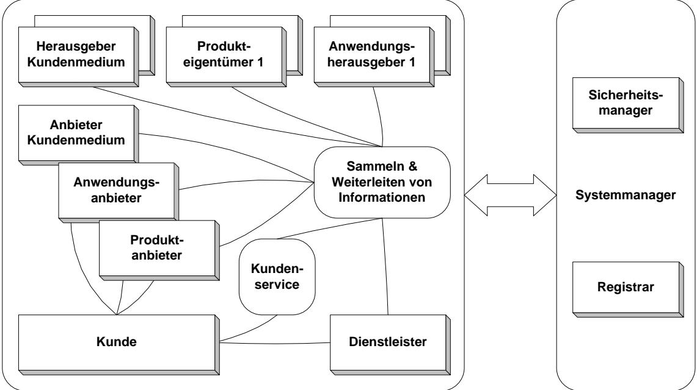

**Abbildung 3-1 Entitäten eines Einsatzgebiets nach ISO 24014 (erweitert um Entitäten des Kundenmediums)** 

In der ISO 24014 werden Entitäten definiert und diesen Rollen und Verantwortlichkeiten zugewiesen. Die Implementierung für die Einsatzgebiete eTicketing ist im Folgenden beschrieben:

| Akteur                                                                                                                                                                                                         | Entitäten, die entsprechend der zugewiesenen Rolle handeln.                                                                                                                                                                                                                                                                                                                                                                                                                                                                                                                                              |  |  |  |  |
|----------------------------------------------------------------------------------------------------------------------------------------------------------------------------------------------------------------|----------------------------------------------------------------------------------------------------------------------------------------------------------------------------------------------------------------------------------------------------------------------------------------------------------------------------------------------------------------------------------------------------------------------------------------------------------------------------------------------------------------------------------------------------------------------------------------------------------|--|--|--|--|
| Kunde                                                                                                                                                                                                          | Käufer für Produkte und Nutzer der damit verbundenen Diens te. Erhält gegen Bezahlung vom Produktanbieter die Berechti gung zur Nutzung von Diensten. Löst diese Berechtigung beim Dienstleister ein.                                                                                                                                                                                                                                                                                                                                                                                           |  |  |  |  |
| Kundenmedium                                                                                                                                                                                                   | Das Kundenmedium ist ein Datenträger in dem die elektroni sche Berechtigung gespeichert werden kann. Das Kundenme dium ist im Besitz des Kunden und wird von diesem zur Nut zung der Berechtigung benötigt. Weitere übliche Bezeichnun gen sind Nutzermedium und Trägermedium. Ausprägungen des Kundenmediums sind z. B. das Smart Ticket, eine Chipkarte oder ein NFC Mobile Device.                                                                                                                                                                                                  |  |  |  |  |
| Herausgeber Kundenmedium                                                                                                                                                                                       | Der Herausgeber des Kundenmediums konfiguriert die ses für die weitere Nutzung. Der Herausgeber vermarktet das Kundenmedium ggf. über Anbieter von Kundenmedien(z. B. ein Verkehrsunternehmen). Zwischen Herausgeber des Kunden mediums, Anwendungsherausgeber und Systemmanager ist eine enge Abstimmung und vertragliche Bindung erforderlich.                                                                                                                                                                                                                                          |  |  |  |  |
| Anbieter Kundenmedium                                                                                                                                                                                          | Der Anbieter des Kundenmediums (z. B. ein Verkehrsunter nehmen oder ein Mobilfunkprovider) vermarktet das Kunden medium, die er vom Herausgeber des Kundenmediums erhal ten hat. Der Anbieter des Kundenmediums implementiert übli cherweise mit der Ausgabe auch eine Anwendung.                                                                                                                                                                                                                                                                                                            |  |  |  |  |
| Anwendung                                                                                                                                                                                                      | Die Anwendung (oft auch Applikation genannt) unterstützt ein oder mehrere Produkte durch die Bereitstellung von Funktionen und Strukturen zur Aufnahme von z. B. Berechtigungen auf dem Trägermedium, im Verkaufssystem und im Hintergrund system. Die Implementierung folgt der Anwendungsspezifikati on, die üblicherweise dem Anwendungsherausgeber gehört. Der Anwendungsherausgeber vermarktet die Anwendung ggf. über Anwendungsanbieter (z. B. einen Verkehrsverbund). Ne ben den Produkten kann eine Anwendung z. B. auch kunden spezifische Informationen enthalten. |  |  |  |  |
| Anwendungsherausgeber                                                                                                                                                                                          | Der Anwendungsherausgeber ist der Eigentümer der Anwen dungsspezifikation. Der Anwendungsherausgeber vermarktet die Anwendung ggf. über Anwendungsanbieter (z. B. ein Ver kehrsunternehmen).                                                                                                                                                                                                                                                                                                                                                                                                    |  |  |  |  |
| Anwendungsanbieter                                                                                                                                                                                             | Der Anwendungsanbieter (z. B. ein Verkehrsunternehmen oder ein Stadionbetreiber) implementiert und vermarktet die Anwen dung, die er vom Anwendungsherausgeber erhalten (z. B. li zenziert) hat. Der Anwendungsanbieter gibt üblicherweise mit der Anwendungsimplementierung auch das Trägermedium aus und ist damit z. B. bei Anwendungen aus dem Einsatzgebiet 'eTicketing' der Vertragspartner des Kunden.                                                                                                                                                                          |  |  |  |  |
| Produkt/Berechtigung/Dienst Das Produkt ist das Leistungsangebot eines Produkteigentü mers, das der Kunde gegen Bezahlung in Anspruch nehmen kann. Das Produkt gehört dem Produkteigentümer (z. B. einem |                                                                                                                                                                                                                                                                                                                                                                                                                                                                                                                                                                                                          |  |  |  |  |

|                    | Veranstalter von Konzerten) und wird direkt oder ggf. über ei nen Produktanbieter (z. B. Reisebüro oder Vorverkaufsstelle) dem Kunden angeboten. Bei Kauf des Produktes erhält der Kunde eine Berechtigung zur Benutzung eines Dienstes, die er beim Dienstanbieter (z. B. Verkehrsunternehmen) einlösen kann.                                                                                                                                                                                                                                                                                                                                                                                                                                                                                                        |
|--------------------|--------------------------------------------------------------------------------------------------------------------------------------------------------------------------------------------------------------------------------------------------------------------------------------------------------------------------------------------------------------------------------------------------------------------------------------------------------------------------------------------------------------------------------------------------------------------------------------------------------------------------------------------------------------------------------------------------------------------------------------------------------------------------------------------------------------------------------------|
| Produkteigentümer  | Eigentümer des Produkts (z. B. Einzelzutritt zu einem Bundesli gaspiel). Der Produkteigentümer definiert und vermarktet das Produkt ggf. über Produktanbieter (z. B. eine Vorverkaufsstel le). In einfachen Szenarien ist es jedoch üblich, dass der Pro dukteigentümer auch die Rolle des Produktanbieters innehat. Um sicherzustellen, dass die Anwendung das Produkt unter stützen kann, muss der Produkteigentümer bei der Definition des Produktes den Spezifikationen des Anwendungsherausge bers folgen. Weiterhin ist eine enge Abstimmung zwischen dem Produkteigentümer und dem Dienstleister, der die mit dem Pro dukt versprochene Leistung erbringen soll, erforderlich. Zwi schen Produkteigentümer, Produktanbieter und Dienstleister ist eine vertragliche Bindung erforderlich. |
| Produktanbieter    | Vermarktet das Produkt im Auftrag des Produkteigentümers gegen eine Gebühr. Der Produktanbieter empfängt die Zahlung des Kunden und ist damit die einzige Schnittstelle für Zahlun gen. Dies erfordert eine direkte Abstimmung und vertragliche Bindung mit dem Produkteigentümer. Der Produktanbieter bringt das Produkt (z. B. eine Berechtigung) in die Anwendung auf dem Trägermedium ein. Der Produktanbieter ist der Ver tragspartner des Kunden bezüglich der verkauften Berechti gungen zur Nutzung von Diensten. Organisatorisch bedient der Produkteigentümer oft auch die Rolle des Produktanbieters.                                                                                                                                                                                          |
| Dienstleister      | z. B. Stadionbetreiber oder Verkehrsunternehmen. Gewährt dem Kunden gegen Vorlage der vom Produktanbieter gekauf ten Berechtigung eine Dienstleistung (z. B. Zutritt zu einem Sta dion). Dies erfordert eine direkte Abstimmung und vertragliche Bindung mit dem Produktanbieter und dem Produkteigentümer.                                                                                                                                                                                                                                                                                                                                                                                                                                                                                                              |
| Systemmanager      | Der Systemmanager sorgt für die Einhaltung der Regeln des Systems. Hierzu bedient er sich der funktionalen Entitäten Si cherheitsmanager und Registrar.                                                                                                                                                                                                                                                                                                                                                                                                                                                                                                                                                                                                                                                                        |
| Registrar          | Der Registrar sorgt für die Vergabe eineindeutiger Identifikati onsmerkmale im System. Wird benötigt für eineindeutige Identi fikation der Entitäten, Trägermedien, Anwendungen und Pro dukte/Berechtigungen.                                                                                                                                                                                                                                                                                                                                                                                                                                                                                                                                                                                                               |
| Sicherheitsmanager | Etabliert und koordiniert die Sicherheitsregeln im System. Ist verantwortlich für die Zulassung der Komponenten des Sys tems. Überwacht die Durchführung von sicherheitsrelevanten Funktionen (z. B. Schlüsselmanagement).                                                                                                                                                                                                                                                                                                                                                                                                                                                                                                                                                                                                  |

# **3.3 Zuordnung der Rollen und Entitäten im Einsatzgebiet eTicketing im ÖPV**

Die Umsetzung der in Kapitel [2](#page-14-1) beschriebenen Dienste erfordert in der Maximalkonfiguration ein Zusammenwirken verschiedener und wechselnder Akteure. Zum Beispiel muss ein Dienstleister in die Lage versetzt werden, Produkte verschiedener Produkteigentümer und Anbieter zu verarbeiten und die Abrechnung entsprechend zu unterstützen.

Die Zuordnung der Entitäten dieses Einsatzgebietes ist identisch zur generischen Beschreibung aus Kapitel [3.2](#page-20-1). In der folgenden Abbildung sind zusätzlich exemplarisch die wesentlichen Akteure entsprechend der Definitionen der VDV Kernapplikation benannt:

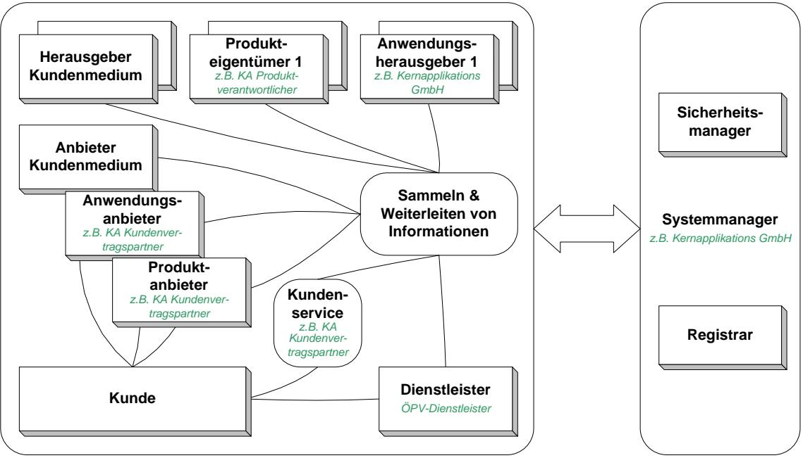

### **Abbildung 3-2 Entitäten des Einsatzgebiets "eTicketing für den öffentlichen Personenverkehr"**

In der Spezifikation zur VDV Kernapplikation können einige der Rollen zusammengefasst werden:

- 1 Der Kundenvertragspartner (KVP) übernimmt die Rollen des Anbieters für Kundenmedium, Anwendung und Produkt.
- 2 Die VDV KA GmbH übernimmt die Rollen des Systemmanagers (inkl. Sicherheitsmanager und Registrar) und auch des Anwendungsherausgebers.

Darauf basierend wird die generische [Abbildung 3-2](#page-23-1) in die folgende spezifische Darstellung überführt:

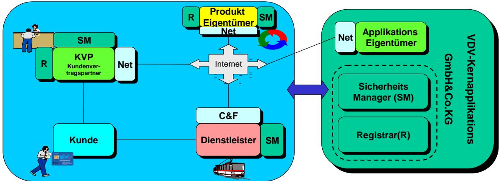

**Abbildung** 3**-**3 **Entitäten des Einsatzszenarios "VDV Kernapplikation"** 

# **3.4 Beziehung zwischen Trägermedien, Anwendungen und Berechtigungen**

Das Modell aus den Kapiteln [3.2](#page-20-1) und [3.3](#page-23-2) erlaubt die Unterstützung von jeweils mehreren Produktanbietern, Dienstleistern, Anwendungsherausgebern, usw.

Dementsprechend sind auch eine große Zahl verschiedener Trägermedien, Anwendungen und Produkte denkbar.

Das Kunden- oder Trägermedium ist der Datenträger des Kunden, auf dem er seine Berechtigungen speichert und mit dessen Hilfe er die zugeordneten Dienste in Anspruch nimmt.

Anwendungen stellen die Strukturen und Funktionen für das Aufbringen und die Nutzung von Berechtigungen auf Trägermedien bereit. Anwendungsimplementierungen müssen deshalb den Eigenschaften spezifischer Trägermedien und Berechtigungen Rechnung tragen.

Berechtigungen können vom Kunden beim Dienstleister in Leistungen umgetauscht werden.

Folgende Regeln gelten für die Beziehungen zwischen Trägermedien, Anwendungen und Berechtigungen:

- 1 Ein Trägermedium kann mindestens eine Anwendung aufnehmen. Sofern mehr als eine Anwendung sicher aufgebracht werden kann, spricht man von multiapplikationsfähigen Trägermedien.
- 2 Eine Anwendung kann mindestens eine Berechtigung aufnehmen. Bei der Anwendung VDV Kernapplikation können verschiedene Berechtigungen verschiedenen Typs, die von verschiedenen Produktanbietern stammen können, gleichzeitig unterstützt werden. Personenbezogene Daten und Check-in / Check-out Daten werden ggf. in der Anwendung gespeichert.
- 3 Anwendungen auf einem Trägermedium können von verschiedenen Anwendungsherausgebern bzw. -anbietern stammen.
- 4 Berechtigungen in einer Anwendung können von verschiedenen Produkteigentümern bzw. -anbietern stammen.
- 5 Berechtigungen des gleichen Typs können in verschiedene Anwendungen eingebracht werden.

Die folgende Abbildung zeigt ein Beispiel für die Beziehungen zwischen Trägermedien, Anwendungen und Berechtigungen.

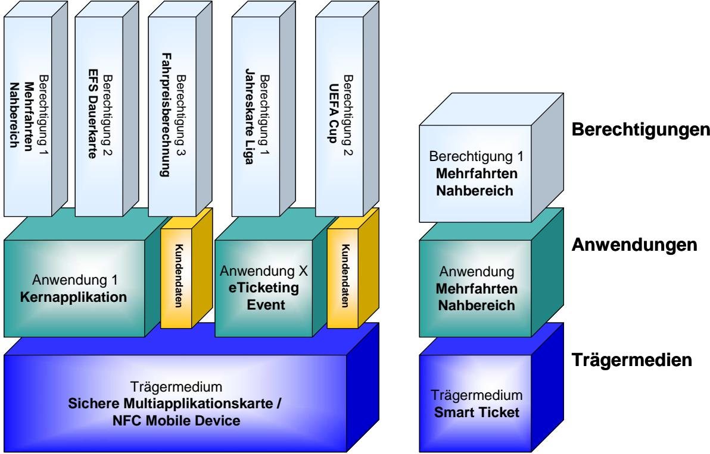

**Abbildung 3-4 Trägermedien, Anwendungen und Berechtigungen** 

# **4 Generelle Anforderungen**

Die Anforderungen an das Gesamtsystem und dessen Prozesse und Komponenten lassen sich in drei Kategorien gliedern.

# **4.1 Funktion**

# **4.1.1 Anforderungen des Kunden**

Aus Sicht des Kunden sollten z. B. die folgenden Eigenschaften umgesetzt werden:

- Die Kundenmedien und Systeme und müssen einfach zu handhaben sein.
- Das Kundenmedium muss robust und zuverlässig sein und mit der geforderten Arbeitsgeschwindigkeit funktionieren.
- Die Berechtigung bzw. das Kundenmedium muss ggf. bei verschiedenen Dienstleistern einfach und zuverlässig zu nutzen sein.
- Die Abrechung bei Produkten "Automatische Fahrpreisberechnung" muss zuverlässig und nachvollziehbar sein.
- Abhanden gekommene Berechtigungen sollten gegen eine Aufwandsentschädigung ersetzt werden können. Gleiches sollte für den Umtausch von Berechtigungen gelten.
- Der Kauf von anonymen Berechtigungen muss optional möglich sein.
- Die personenbezogenen Daten (so vorhanden) müssen angemessen geschützt sein.

Generell sollte der Kunde beim Einsatz der kontaktlosen Chiptechnik über die verwendeten personenbezogenen Daten, die Verwendung dieser Daten, Maßnahmen zum Datenschutz und verbleibende Risiken offen informiert werden.

# **4.1.2 Anforderungen des Produktanbieters und des Dienstleisters**

Funktionalität

- Die Verwendung der Kundenmedium und Systeme muss den Kunden und dem eigenen Personal mit wenig Erklärungsaufwand vermittelbar sein.
- Die Umsetzung der Systemkomponenten und Prozesse muss den besonderen Bedingungen des ÖPV Rechnung tragen. Z. B. kann in Fahrzeugen kein permanenter Datenzugang zum Gesamtsystem sichergestellt werden. Deshalb muss z. B. der Erwerb von Berechtigungen sowie Entwertung bzw. Check-in / Check-out und die Kontrolle auch möglich sein, wenn die jeweiligen Terminals nicht online sind.
- Sperrung und Ersatzausstellung von personalisierten Berechtigungen und Kundenmedien muss unterstützt werden.
- Generell muss bei Zutrittssperren und Check-in/Check-out-Systemen der erforderliche Durchsatz gewährleistet sein. Eine typische Anforderung bei fest installierten Systemen ist eine Verarbeitungszeit von 300ms.

Technische Kompatibilität

Die Kompatibilität der Systemkomponenten muss auch dann sichergestellt sein, wenn Trägermedien, Systeme und Komponenten von unterschiedlichen Hersteller und Anbietern kommen und bei verschiedenen Dienstleistern zum Einsatz gebracht werden.

# **4.2 Wirtschaftlichkeit**

Ein wirtschaftlicher Betrieb des eTicketing-Systems erfordert, dass der kommerzielle Nutzen in jeder Ausbaustufe größer als die Kosten für Prozesse, Systeme und Sicherheit ist. Dies muss für alle Akteure, die in den Aufbau des Systems investieren, gelten.

Das Gesamtsystem und dessen Komponenten sollte daher so ausgelegt werden, dass die Anforderungen der relevanten Einsatzszenarien möglichst effizient erfüllt werden. Deshalb sind zunächst diese Anforderungen möglichst exakt zu bestimmen.

# **4.3 Sicherheit**

Auf Anforderungen zur Sicherheit wird in diesem Dokument ab Kapitel [8.2](#page-57-1) speziell eingegangen.

# **5 Methodik zur Ermittlung der Sicherheitsanforderungen**

# **5.1 Zielsetzung**

Die Technische Richtlinie RFID soll folgenden Zielen dienen:

- Leitfaden für Systemlieferanten und Systemanwender zur sachgerechten Implementierung von spezifischen RFID-Systemlösungen bzgl. Funktions- und Informationssicherheit und Datenschutz
- Schaffung von Aufmerksamkeit und Transparenz in Bezug auf Sicherheitsaspekte.
- Basis für eine Konformitätserklärung der Systemlieferanten oder Betreiber und die Vergabe eines Gütesiegels durch eine Zertifizierungsstelle.

Zur Umsetzung dieser Ziele sind folgende Informationen erforderlich:

- Ermittlung der Sicherheitsanforderungen an ein RFID-System eines Einsatzgebietes.
- Benennung der spezifischen Gefährdungen, geeigneter Gegenmaßnahmen und des möglicherweise verbleibenden Restrisikos.
- Definition der Kriterien für eine Konformitätserklärung bzw. Zertifizierung.

Bei der Definition von Maßnahmen und Systemvorschlägen sind nicht nur Sicherheitsaspekte relevant. Vielmehr müssen alle in Kapitel [4](#page-26-1) benannten Anforderungen berücksichtigt werden.

# **5.2 Methodik**

# **5.2.1 Erwägungen zum Umfang der Systembetrachtung**

RFID-basierte Systeme können sehr komplex sein. In den meisten Fällen gehören zur Systemlösung auch viele Komponenten, die nicht mit RFID ausgestattet sind. Auf der anderen Seite dürfen bei der Betrachtung der Systemsicherheit nicht nur das Medium/das Tag und die Lesegerät berücksichtigt werden.

Die Technische Richtlinie muss alle für RFID relevanten Sicherheitsaspekte im Detail einbeziehen. Diese Aspekte hängen stark vom Einsatzgebiet und der jeweiligen Implementierung der Systemlösung ab. Diese Technische Richtlinie enthält daher detaillierte Angaben über das Einsatzgebiet und die dazugehörenden Betriebsprozesse (einschließlich der Vertriebskanäle und -prozesse). Die Prozesse decken den gesamten Lebenszyklus eines Trägermediums oder Transponders ab. Basierend auf diesen Prozessen werden Use Cases bestimmt, die aus für die Sicherheitsbetrachtung des RFID-Systems relevant sind. Diese Use Cases werden dann als Grundlage für die Ermittlung von Gefährdungen und eine detaillierte, systemspezifische Sicherheitsbewertung für die mit RFID im Zusammenhang stehenden Bereiche des Systems genutzt. [Abbildung 5-1](#page-29-1) zeigt diese Vorgehensweise am Beispiel des eTicketing im ÖPV.

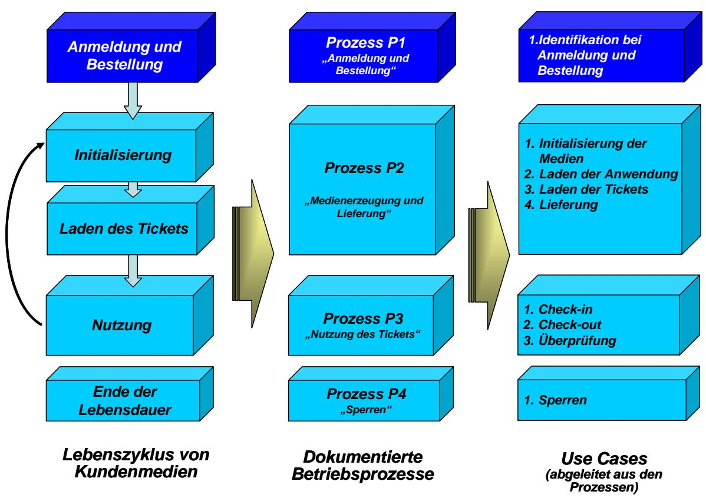

**Abbildung 5-1 Beispiel: Bestimmung RFID-relevanter Use Cases für eTicketing** 

Alle anderen Systemkomponenten werden nur allgemein behandelt. Die vorgeschlagenen Sicherheitsmaßnahmen basieren auf offenen IT-Sicherheitsstandards.

Dieses Konzept legt den Schwerpunkt der Betrachtung auf die für RFID relevanten Systemteile und gewährleistet dennoch die Berücksichtigung aller Sicherheitsaspekte. Auf der anderen Seite lässt die Technische Richtlinie auch Raum für individuelle und anwendereigene IT-Implementierungen (Back Offices, Vertriebs- und Logistiksysteme etc.). Dies unterstützt insbesondere die Erweiterung bestehender Systeme um die RFID-Technologie.

# **5.2.2 Skalierbarkeit und Flexibilität**

Diese Technischen Richtlinien sollen in erster Linie Sicherheitsfragen behandeln. Parallel muss für alle Implementierungen, die auf dieser Richtlinie aufsetzen, ein wirtschaftlicher Betrieb möglich werden. Daher sollen die folgenden Anforderungen an die Methodologie der Richtlinie berücksichtigt werden:

- 1 Es muss möglich sein, Systeme so zu implementieren, dass eine Ausgewogenheit von Kosten und Nutzen erreicht wird. Dies bedeutet in der Praxis, dass die Schutzmaßnahmen den ermittelten Schutzbedarf zwar erfüllen aber nicht übertreffen müssen. Beispiel: Werden nur preiswerte Produkte verwendet, die eine relativ niedrige Sicherheitsanforderung haben, sollten die Schutzmaßnahmen entsprechend gestaltet werden. Dies ermöglicht beispielsweise die Verwendung preiswerter Medien, wodurch sich die Kosten für die Systemimplementierung und den Betrieb verringern.
- 2 Die für die Technische Richtlinie ausgewählten Einsatzszenarios umfassen eine große Bandbreite, von kleinen bis zu landesweiten oder sogar grenzüberschreitenden Anwendungen. Wichtig ist, dass das in der Richtlinie verwendete Konzept für Systemlösungen aller Größen und verschiedener Komplexität genutzt werden kann.

3 In vielen Fällen lässt sich die Wirtschaftlichkeit einer Systemlösung wesentlich leichter durch die Kooperation mit Geschäftspartnern erreichen. Dies gilt insbesondere für eTicketing-Anwendungen, bei denen es sehr vorteilhaft sein kann, wenn bereits beim Kunden verfügbare Medien (z. B. Karten mit Mehrfachanwendung oder NFC-fähige Telefone) für zusätzliche Anwendungen, Produkte und damit verbundene Dienstleistungen wiederverwendet werden können.

Die folgenden Abbildungen zeigen Beispiele von eTicketing für eine system- und anwendungsübergreifende Nutzung von Kundenmedien und -infrastruktur.

[Abbildung 5-2](#page-30-1) zeigt, dass u. U. verschiedene Produkte bzw. Einsatzszenarios in einem System unterstützt werden müssen. Dabei werden diese Produkte möglicherweise auf verschiedene Trägermedien aufgebracht.

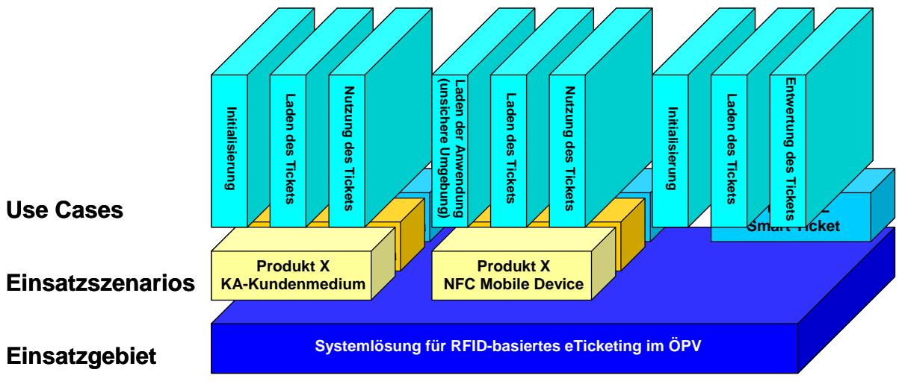

**Abbildung 5-2 Beispiel für Einsatzszenarios und relevante Use Cases für eTicketing im ÖPV** 

[Abbildung 5-3](#page-30-2) zeigt ein Beispiel eines Kundenmediums für eTicketing, das Anwendungen aus zwei Einsatzgebieten unterstützt.

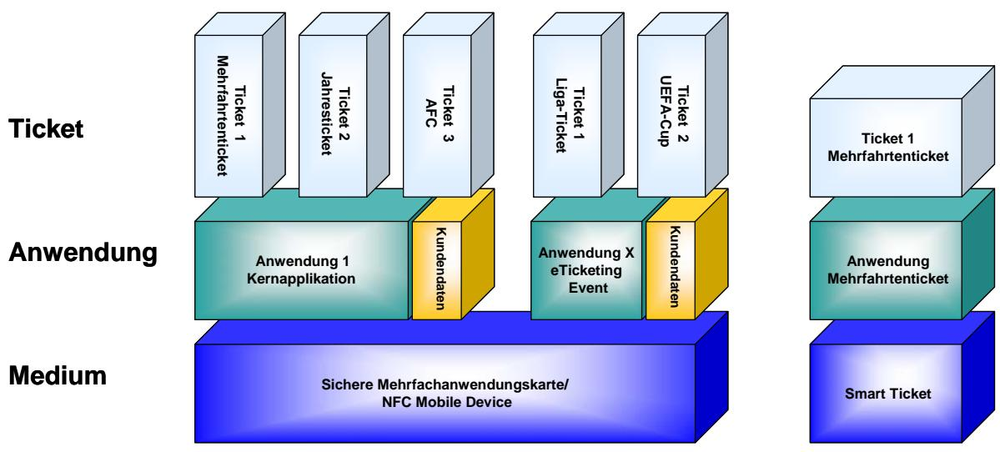

### **Abbildung 5-3 Hierarchisches Konzept für Medien, Anwendungen und Tickets beim eTicketing**

Um die genannten Anforderungen zu erfüllen, wird für diese Technische Richtlinie folgendes Konzept verwendet:

- 1 Ein passendes Rollenmodell und die Struktur einiger Hauptelemente (Produkte, Applikationen und Medien) wurden in Kapitel 3 beschrieben. Dieses Modell unterstützt einen in skalierbaren und erweiterbaren Ansatz.
- 2 Die Technische Richtlinie muss Sicherheitskonzepte anbieten, die alle in einer Infrastruktur verwendeten Kombinationen von Einsatzszenarios und Medien umfassen. Dies wird durch individuelle Sicherheitsbewertungen, die auf den relevanten Use Cases basieren, erreicht.
- 3 Gleiche Einsatzgebiete (insbesondere im eTicketing), die die Möglichkeit für anwendungsübergreifende Partnerschaften bieten, werden in den entsprechenden Technischen Richtlinien mit so viel Kommunalität wie möglich behandelt. Die Sicherheitsbewertung basiert auf ähnlichen Sicherheitszielen. Die Schutzmaßnahmen verwenden wenn möglich die gleichen Mechanismen.
- 4 Eine besondere Herausforderung besteht bei system- und anwendungsübergreifenden Partnerschaften im Hinblick auf die Systemsicherheit. Es muss gewährleistet sein, dass die Sicherheit eines Systems nicht von Schwächen eines anderen Systems untergraben wird. Dies erfordert normalerweise eine umfassende Sicherheitsbewertung beider Systeme.

Die Technischen Richtlinien widmen sich diesem Problem durch Einführung eines skalierbaren und transparenten Konzepts für die Anwendung von Schutzmaßnahmen gegenüber den festgestellten Gefährdungen, den "Schutzbedarfsklassen". Insgesamt werden drei Klassen von 1 (normale Anforderung) bis zu 3 (hohe Anforderung) verwendet. Alle Schutzmaßnahmen werden entsprechend in drei Stufen definiert, von normalem Schutz bis zu erweitertem Schutz.

Bei jeder individuellen Systemimplementierung wird zuallererst die Schutzanforderungskategorie für jedes Sicherheitsziel definiert. Daraus ergibt sich der Umfang der zu treffenden Schutzmaßnahmen.

Dieses Konzept bietet eine einfache Möglichkeit zur Installation einer sicheren Systemkooperation. Es muss lediglich sichergestellt werden, dass die Schutzbedarfsklassen beider Systeme zusammenpassen.

# **5.2.3 Aufbau der Technischen Richtlinie**

| • | Kapitel                             | • | Inhalt                                                                                                 |
|---|-------------------------------------|---|--------------------------------------------------------------------------------------------------------|
| • | Beschreibung des Einsatz gebiets | • | Beschreibung des Einsatzgebiets: Aufbau, Leis tungen, spezielle Randbedingungen etc.                |
| • | Produkte und Leistungen             | • | Beschreibung von Beispielprodukten und - leistungen sowie Vertriebskanälen                          |
| • | Definitionen                        | • | Modelle, Begriffsdefinitionen                                                                          |
| • | Einführung in die Methodo logie  | • | Vorstellung des für die Sicherheitsbewertung ver wendeten Konzepts sowie der Methoden               |
| • | Allgemeine Anforderungen            | • | Allgemeine Anforderungen der beteiligten Parteien, beachtenswerte Aspekte etc.                      |
| • | Betriebsprozesse                    | • | Beschreibung von Betriebsprozessen, die für den Lebenszyklus von Trägermedien von Bedeutung sind |

[Tabelle 5–1](#page-32-1) zeigt den Aufbau aller bisher erstellten Technischen Richtlinien.

| • | Kapitel                                                 | • | Inhalt                                                                                                                                                                                                                                                                                         |
|---|---------------------------------------------------------|---|------------------------------------------------------------------------------------------------------------------------------------------------------------------------------------------------------------------------------------------------------------------------------------------------|
| • | Use Cases                                               | • | Definition von RFID-relevanten Use Cases                                                                                                                                                                                                                                                       |
| • | Sicherheitsbewertung                                    | • | Einführung in die IT-Sicherheit                                                                                                                                                                                                                                                                |
|   |                                                         | • | Definition spezieller Sicherheitsziele, Schutzbe darfsklassen und Gefährdungen                                                                                                                                                                                                              |
|   |                                                         | • | Vorgeschlagene Schutzmaßnahmen                                                                                                                                                                                                                                                                 |
| • | Definition von Einsatzszena rios                     | • | Definition von Beispielen für Einsatzszenarios. Diese Beispiele decken die gesamte Bandbreite relevanter Parameter ab, die in einem bestimmten Einsatzgebiet auftreten kann. Der Nutzer der tech nischen Richtlinie kann diese Szenarios seinen ei genen Bedürfnissen anpassen. |
| • | Implementierungsvorschlag für die Systemlösung       | • | Generische Systembeschreibung mit Beispielen zur Durchführung einer Gefährdungsanalyse und machbarer Schutzmaßnahmen für die System komponenten                                                                                                                                       |
| • | Implementierungsvorschlag einzelner Einsatzszenarios | • | Beispiele für die Verwendung des Konzepts zur Sicherheitsbewertung                                                                                                                                                                                                                          |

**Tabelle 5–1 Aufbau der Technischen Richtlinien** 

# **5.2.4 Erläuterung des Sicherheitskonzepts**

Jede Technische Richtlinie enthält Beispiele zur Durchführung der Sicherheitsbewertung in bestimmten Einsatzszenarios. Diese können an die Anforderungen und Randbedingungen der speziellen Systemimplementierung angepasst werden.

[Abbildung 5-4](#page-33-1) zeigt das in allen Technischen Richtlinien verwendete Konzept der Sicherheitsbewertung.

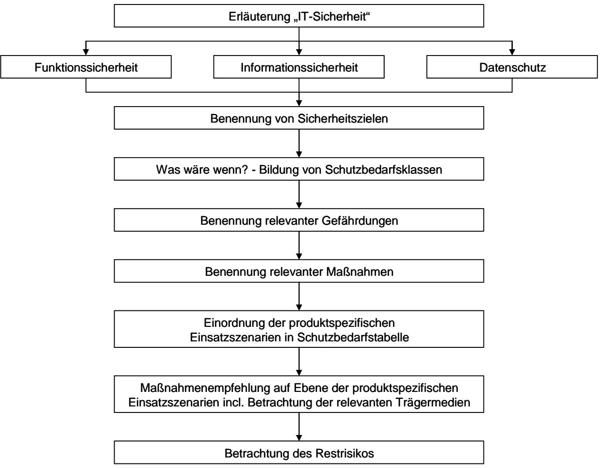

**Abbildung 5-4 Sicherheitsbewertungskonzept** 

Alle Erwägungen basieren auf der klassischen Definition von Sicherheitszielen, die in [Abbildung 5-5](#page-34-1) gezeigt wird.

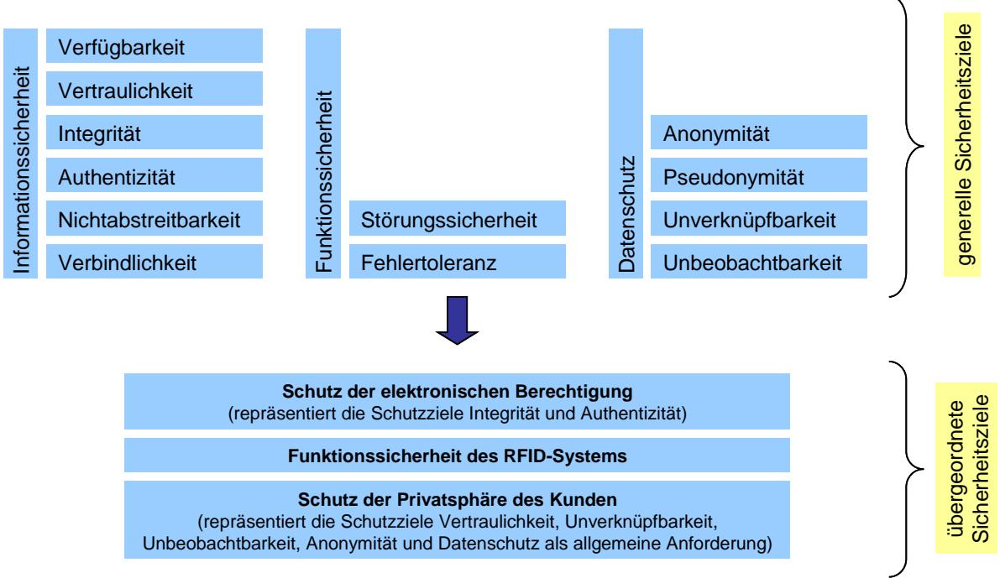

**Abbildung 5-5 Generische Sicherheitsziele** 

# **6 Generische Geschäftsprozesse**

# **6.1 Prozess P1 "Anmeldung und Bestellung"**

## **6.1.1 Anlegen eines Kundenkontos, Erwerb von personalisierten Kundenmedien und Berechtigungen**

Zum Anlegen eines Kundenkontos und zum Erwerb einer personalisierten oder unpersonalisierten Berechtigung wendet sich der Kunde an den Produktanbieter (bzw. Kundenvertragspartner für VDV Kernapplikation) Falls der Kunde nicht im Besitz eines Trägermediums sein sollte, das mit einer geeigneten Anwendung versehenen ist, kann der Kunde über den Produktanbieter ein solches beziehen**[1](#page-35-0)**. Dazu arbeitet der Produktanbieter mit den Anbietern der Anwendung und des Kundenmediums zusammen.

Der Erwerb von kundenbezogenen Berechtigungen, Anwendungen und Trägermedien erfordert die Anmeldung des Kunden. Dabei übergibt der Kunde die geforderten persönlichen Daten (z. B. Name, Postadresse, Zahlungsinformationen) und bestellt das gewünschte Gut.

Normalerweise liegt es im Ermessen des Produktanbieters, welche Daten vom Kunden zwecks Identitäts- und Adressenfeststellung sowie Bonitätsprüfung verlangt werden.

Für die Anmeldung und Bestellung sollen exemplarisch folgende Prozesse betrachtet werden:

1 Bestellung im Kundenzentrum oder einer lokalen Verkaufsstelle Der Kunde sucht die Verkaufsstelle (z. B. das Kundenzentrum eines Verkehrsunternehmens, eine Verkaufsstelle am Bahnhof oder ein Reisebüro) auf und bestellt das Produkt. Die Bezahlung erfolgt vor Ort. Im Idealfall verfügt die Verkaufsstelle über einen Direktzugang zum eTicketing-System und kann Produkte und Kundenmedien vor Ort ausgeben. Ansonsten wird beides per Post zugestellt. Personenbezogene Daten sind nur gefordert, wenn ein kundenspezifisches Produkt oder ein Produkt mit KA-Bezahlverfahren per Lastschrift bestellt wird oder Postversand erforderlich ist.

Die Überprüfung der Identität und der personenbezogenen Daten erfolgt, sofern erforderlich, z. B. durch Vorlage des Personalausweises.

2 Servicecenter

Der Kunde übergibt die benötigten persönlichen Informationen, die Bestellung und Zahlungsinformationen per Fax, per schriftlichem Antrag oder telefonisch an ein zentrales Servicecenter. Bei der telefonischen Bestellung kann meistens die Verfügbarkeit des Produkts und z. B. die Sitzplatzwahl direkt geklärt werden. Die Bezahlung erfolgt per Kreditkarte, per Lastschrift, etc. Produkte und Kundenmedien werden per Post zugesendet oder zur Abholung (Verkaufsstelle, Automat) bereitgestellt.

Die per Fax oder Telefon erhaltenen Angaben zur Person und zur Adresse sind nicht grundsätzlich als vertrauenswürdig anzusehen. Eine belastbare Überprüfung kann nur mit zusätzlichem Aufwand erfolgen. Üblicherweise wird lediglich ein Abgleich mit einer aktuellen Adressdatenbank und eine Bonitätsprüfung durchgeführt.

**1** Der Fall, dass ein Kunde nur ein Kundenmedium mit einer Anwendung ohne ein Produkt erwerben möchte, erscheint nicht relevant und soll hier nicht betrachtet werden.

Ein Beispiel für die Bestellung im Service Center per Bestellformular findet sich z. B. unter<http://www.kolibricard.de/bestellung.html>.

3 Internet

Der Kunde übergibt die persönlichen Informationen, die Bestellung und Zahlungsinformationen per Internet (Webpage) an ein zentrales Servicecenter. Bei der Bestellung im Internet kann meistens die Verfügbarkeit des Produkts und ggf. die Sitzplatzreservierung direkt geklärt werden. Die Bezahlung erfolgt per Kreditkarte, per Lastschrift, etc. Produkte und Kundenmedien werden per Post zugesendet oder könnten zur Abholung im Kundenzentrum bereitgestellt werden.

Die durch Eingabe auf der Webpage erhaltenen Angaben zur Person und zur Adresse sind nicht grundsätzlich als vertrauenswürdig anzusehen. Eine belastbare Überprüfung kann nur mit zusätzlichem Aufwand erfolgen. Üblicherweise wird lediglich ein Abgleich mit einer aktuellen Adressdatenbank und eine Bonitätsprüfung durchgeführt.

### 4 Internet unter Verwendung von Kartenleser und eID

In Zukunft kann ggf. eine zusätzliche Option zur Anmeldung und Bestellung umgesetzt werden.

Dabei übergibt der Kunde die Bestellung und die Zahlungsinformationen per Internet (Webpage) an ein zentrales Servicecenter. Die Identifikation und Übergabe von personenbezogenen Daten (sofern erforderlich) erfolgt online über eine direkte Kommunikation zwischen dem Anwendungsserver des Ticketanbieters und einem sicheren elektronischen Identitätsnachweis.

Bei der Bestellung im Internet kann meistens die Verfügbarkeit des Produkts und z. B. die Sitzplatzwahl direkt geklärt werden. Die Bezahlung erfolgt per Kreditkarte, per Lastschrift, etc. Produkte und Kundenmedien werden per Post zugesendet oder zur Abholung (Verkaufsstelle, Automat) bereitgestellt.

Die durch Kommunikation mit dem eID erhaltenen Angaben zur Person und zur Adresse sind grundsätzlich als vertrauenswürdig und belastbar anzusehen. Eine weitere Überprüfung ist nicht erforderlich.

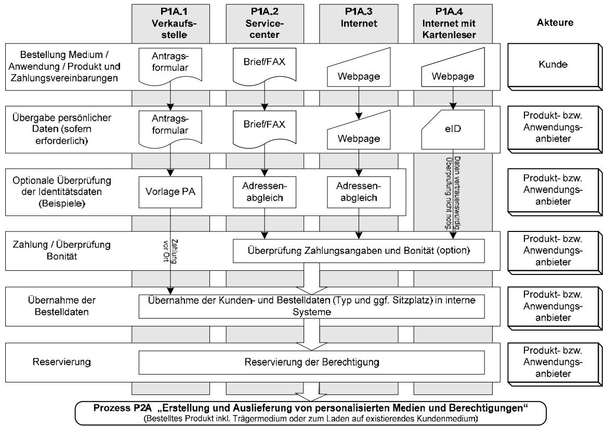

**Abbildung 6-1 Prozessdarstellung P1A "Anmeldung und Bestellung"** 

## **6.1.2 Erwerb von unpersonalisierten Trägermedien und Berechtigungen**

Eine besondere Bedeutung kommt im ÖPV dem anonymen Verkauf und dem Verkauf von unpersonalisierten Produkten zu. In diesen Fällen wird kein Kundenkonto angelegt. Das Produkt wird auf einem speziell erzeugten, unpersonalisierten Trägermedium geliefert oder auf eine existierende Kundenkarte anonym aufgebracht.

Der Kunde muss grundsätzlich vor der Übergabe des Produkts die Zahlung leisten.

Der anonyme Verkauf erfordert, dass die Zahlung sofort erfolgt, die Berechtigung sofort erstellt wird und vom Kunden auf einem speziell erstellten Trägermedium oder auf seinem vorhandenen Kundenmedium mitgenommen werden kann.

Folgende Vertriebskanäle können genutzt werden:

1 Verkaufsstelle/Kundenzentrum, Reisebüro

Der Verkauf von unpersonalisierten Fahrscheinen in der Verkaufsstelle ist gängige Praxis für Papiertickets. In Zukunft könnten unpersonalisierte Kundenmedien vor Ort erstellt oder auch Berechtigungen auf existierende Kundenmedien aufgeladen werden. Die Zahlung erfolgt in bar oder per Karte.

2 Fahrer / Zugbegleiter

Der Verkauf von Fahrscheinen beim Fahrer oder Zugbegleiter ist gängige Praxis für Papiertickets. In Zukunft könnten auf diesem Wege auch Berechtigungen auf existierende Kundenmedien aufgeladen werden. Die Zahlung erfolgt in bar oder per Karte.

3 Automat

Der Verkauf von Fahrscheinen durch Automaten ist gängige Praxis für Papiertickets.

Ebenso können unpersonalisierte Kundenmedien durch Automaten erstellt oder Berechtigungen auf existierende Kundenmedien aufgeladen werden.

Die Zahlung erfolgt in bar oder per Karte.

4 Internet unter Verwendung von Kartenleser und eID

Auch wenn unpersonalisierte Trägermedien bzw. das Ticket über das Internet bestellt und z. B. per Post ausgeliefert werden sollen, müssen z. B. Name und Anschrift des Kunden an der Produktanbieter übergeben werden. Dazu kann ggf. eine zusätzliche Option zur Anmeldung und Bestellung umgesetzt werden.

Dabei übergibt der Kunde die Bestellung und die Zahlungsinformationen per Internet (Webpage) an ein zentrales Servicecenter. Die Identifikation und Übergabe von personenbezogenen Daten (sofern erforderlich) erfolgt online über eine direkte Kommunikation zwischen dem Anwendungsserver des Ticketanbieters und einem sicheren elektronischen Identitätsnachweis.

Bei der Bestellung im Internet kann meistens die Verfügbarkeit des Produkts und z. B. die Sitzplatzwahl direkt geklärt werden. Die Bezahlung erfolgt per Kreditkarte, per Lastschrift, etc. Produkte und Kundenmedien werden per Post zugesendet oder zur Abholung (Verkaufsstelle, Automat) bereitgestellt. Produkt und Trägermedium selbst enthalten keine personenbezogenen Daten.

Die durch Kommunikation mit dem eID erhaltenen Angaben zur Person und zur Adresse sind grundsätzlich als vertrauenswürdig und belastbar anzusehen. Eine weitere Überprüfung ist nicht erforderlich.

Die folgende Abbildung zeigt den Prozess P1B "Erwerb von unpersonalisierten Trägermedien und Berechtigungen":

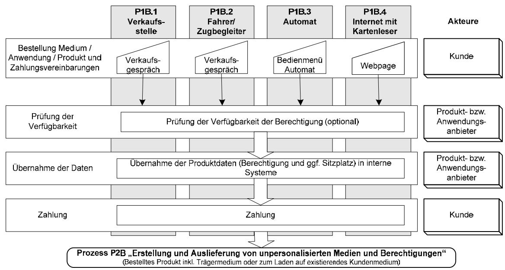

**Abbildung 6-2 Prozessdarstellung P1B "Erwerb von unpersonalisierten Trägermedien und Berechtigungen"** 

# **6.2 Prozess P2 "Erstellung und Auslieferung von Produkten"**

# **6.2.1 Prozess P2A "Erstellung und Auslieferung von personalisierten Trägermedien und Berechtigungen"**

Bei der Beschreibung des Prozesses sind zwei wesentliche Fälle zu unterscheiden:

- 1 Die Erstellung und Auslieferung der Berechtigung zusammen mit einem speziell erstellten Trägermedium.
- 2 Das Aufladen einer Berechtigung auf ein bereits im Besitz des Kunden befindlichen kundenbezogenen Mediums (z. B. sichere Multiapplikationskarte, NFC Mobile Device).

In der folgenden [Abbildung 6-3](#page-39-1) findet sich die Darstellung des Prozesses P2A mit 4 Unterprozessen, die die möglichen Wege der Zustellung des Produkts repräsentieren.

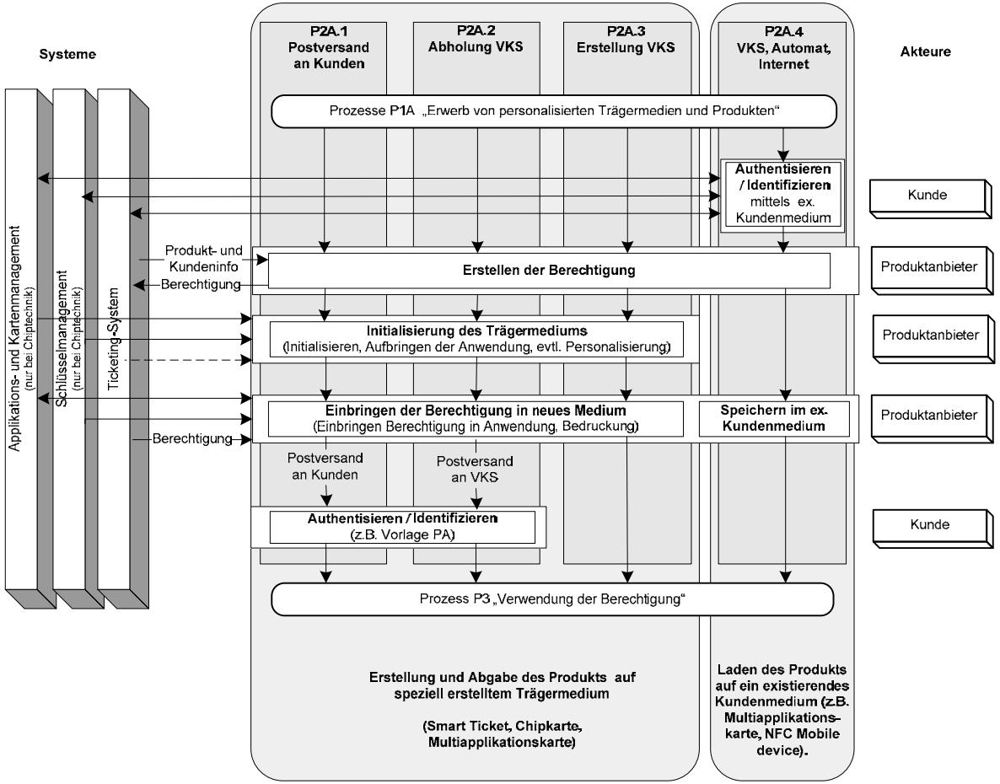

### **Abbildung 6-3 Prozess P2A "Erstellung und Auslieferung von personalisierten Trägermedien und Berechtigungen"**

Bei den Prozessen P2A.1 bis P2A.3 wird die bestellte Berechtigung auf einem speziell gefertigten Trägermedium an den Kunden ausgeliefert.

Beim Prozess P2A.4 wird davon ausgegangen, dass der Kunde bereits ein geeignetes Kundenmedium besitzt. Dabei kann es sich um eine sichere Chipkarte, eine Multiapplikationskarte oder ein NFC Mobile Device handeln.

Das Kundenmedium dient zunächst zur elektronischen Identifikation und Authentifikation des Kunden. Sofern keine geeignete Anwendung auf dem Kundenmedium vorhanden sein sollte, muss diese vor dem Aufbringen der Berechtigung geladen werden.

## **6.2.2 Prozess P2B "Erstellung und Auslieferung von unpersonalisierten Trägermedien und Berechtigungen"**

Bei der Beschreibung sind zwei wesentliche Fälle zu unterscheiden:

- 1 Die Erstellung und Auslieferung der Berechtigung zusammen mit einem speziell erstellten Trägermedium.
- 2 Das Aufladen einer Berechtigung auf ein bereits im Besitz des Kunden befindlichen kundenbezogenen Mediums (z. B. sichere Multiapplikationskarte, NFC Mobile Device).

In der folgenden [Abbildung 6-4](#page-40-1) findet sich die Darstellung des Prozesses P2B mit 3 Unterprozessen, die die möglichen Wege der Zustellung des Produkts repräsentieren.

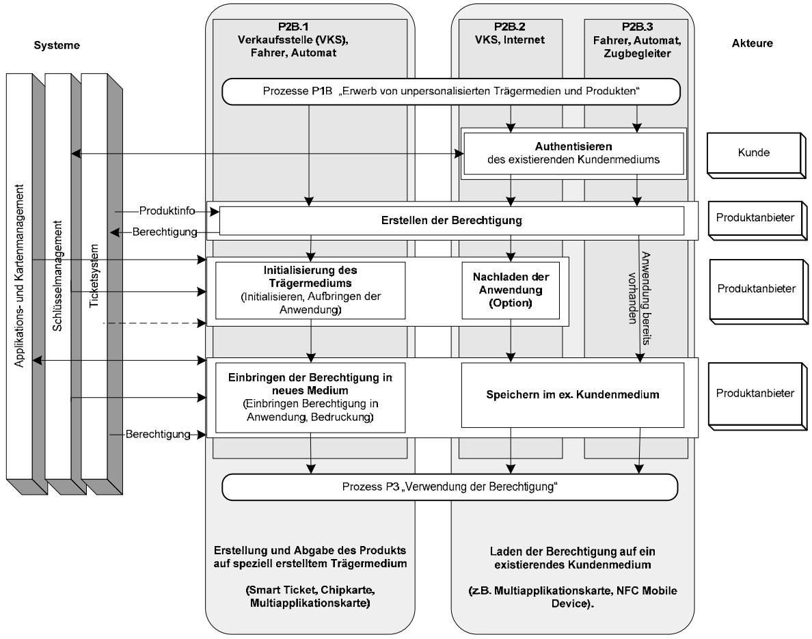

**Abbildung 6-4 Prozess P2B "Erstellung und Auslieferung von unpersonalisierten Trägermedien und Berechtigungen"** 

Beim Prozess P2B.1 wird die bestellte Berechtigung auf einem speziell gefertigten Trägermedium an den Kunden ausgeliefert. Sofern eine klare Trennung der personenbezogenen Daten auf Trägermedium und Applikation besteht, kann eine unpersonalisierte Berechtigung ggf. auch ein personalisiertes Trägermedium aufgebracht werden.

Beim Prozess P2B.2 wird davon ausgegangen, dass der Kunde bereits ein geeignetes Kundenmedium besitzt. Dabei kann es sich um eine sichere Chipkarte, eine Multiapplikationskarte oder ein NFC Mobile Device handeln. Sofern keine geeignete Anwendung auf dem Kundenmedium vorhanden sein sollte, so wird diese vor dem Aufbringen der Berechtigung geladen.

Der Prozess P2B.3 entspricht dem P2B.2. Allerdings kann hier keine Anwendung auf das Trägermedium aufgebracht werden. Als Vorbedingung der Nutzung des Prozesses durch

den Kunden muss das Kundenmedium bereits komplett zur Aufnahme der Berechtigung konfiguriert sein.

# **6.3 Prozess P3 "Verwendung der Berechtigung"**

Der Kunde muss ein Trägermedium mit einer zulässigen Anwendung und gültiger Berechtigung besitzen, um die Beförderung in Anspruch nehmen zu können. Die Berechtigung wird vom Kunden gegen eine Dienstleistung eingelöst.

Ja nach Produkt wird die Berechtigung bei Antritt der Fahrt entwertet oder beim Zutritt ein Check-in und beim Beenden der Nutzung ein Check-out vom Kunden durchgeführt (CICO). Die dazu benötigte Infrastruktur wird vom Dienstleister verantwortet.

Zum Betrieb hat der ÖPV-Dienstleister umfangreiche Vorarbeiten zu leisten, um die Funktion zu gewährleisten:

- 1 Die lokale Kontrollinfrastruktur muss an die akzeptierten Anwendungen und die Berechtigungen angepasst werden.
- 2 Die spezifischen Schlüsselinformationen zum Lesen der Berechtigungen und dem Schreiben der Nutzungsdaten müssen in das Schlüsselmanagement integriert werden.
- 3 Die Liste der gesperrten Medien, Applikationen und Berechtigungen (Black List) muss vom Ticketsystem in die Kontrollinfrastruktur übernommen werden. Dazu muss eine Datenschnittstelle zur Kontrollinfrastruktur des Dienstleisters vereinbart und installiert werden, die eine Aktualisierung der Daten in einem sinnvollen zeitlichen Abstand erlaubt.

Der Zutritt erfolgt über die Anmeldung an stationären oder mobilen Terminals. Alternativ ist es möglich, mobile Kontrollgeräte, die von Kontrollkräften geführt werden, in den Fahrzeugen einzusetzen. Die Terminals sollen auch dann funktionsfähig sein, wenn die Datenverbindung zum Server ausfallen sollte. Alle Terminals müssen deshalb auch offline (einige evtl. nur zeitweise) arbeiten können.

Beim Zutritt soll die Berechtigung kontrolliert und ggf. entwertet werden. Sofern ein Produkt "automatische Fahrpreisberechnung" verwendet wird, ist darüber hinaus ein Abmelden bei Beendigung der Fahrt erforderlich. Zu beiden Zeitpunkten werden abrechnungsrelevante Daten im Terminal und im Trägermedium gespeichert.

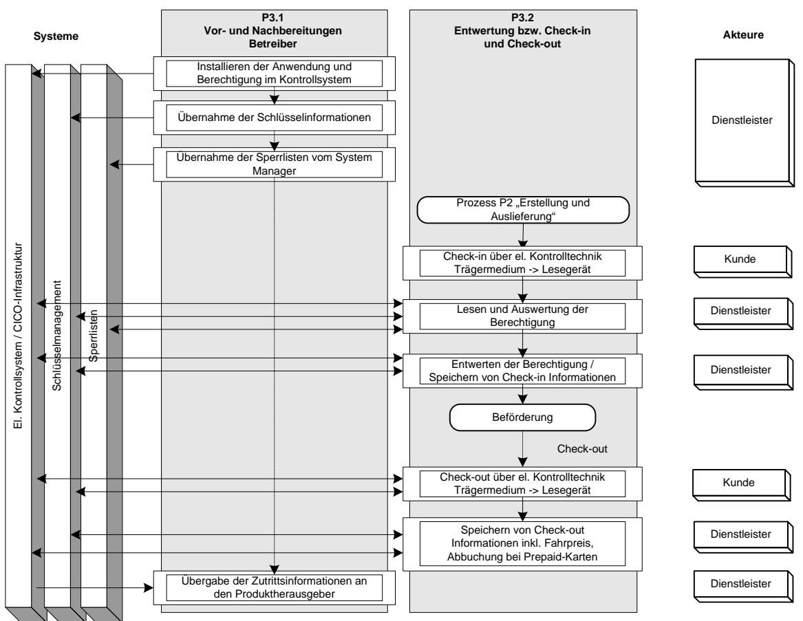

Die folgende Abbildung zeigt den Prozess P3:

**Abbildung 6-5 Prozessdarstellung P3 "Verwendung der CICO-Berechtigung"** 

Der Fehlerfall ist hier nicht berücksichtigt.

# **6.4 Prozess P4 "Sperrung von Berechtigungen, Anwendungen und Trägermedien"**

Aufgrund des hohen Grads an Fälschungssicherheit, der bei chipbasierten Trägermedien bei sachgerechter Implementierung erreicht werden kann, ist die sichere Sperrung von Berechtigungen, Anwendungen und Trägermedien möglich. Das unterstützt das Stornieren und den Umtausch von Trägermedien und Berechtigungen und gestattet den Ersatz von verloren gegangenen Medien.

Dabei sind folgende Fälle möglich:

- 1 Defekte Trägermedien werden eingezogen und vernichtet. Dabei ist vor Ausgabe eines Ersatzmediums sicherzustellen, dass keine Fälschung zum Umtausch vorgelegt bzw. als defektes Medium deklariert und eingereicht wurde.
- 2 Verlorengegangene Trägermedien können in der Praxis nur gesperrt und ersetzt werden, sofern diese personalisiert und einem Kundenkonto (siehe Anmeldung) bei einem Produktanbieter zugeordnet sind. In diesem Fall könnte sich der Besitzer gegenüber dem Produktanbieter, über den er das Medium erhalten hat, identifizieren und das zu sperrende Trägermedium benennen. Ebenso kann bei der Stornierung von Berechtigungen verfahren werden.
- 3 Der Ersatz von verloren gegangenen personalisierten Trägermedien und der gespeicherten Berechtigungen kann erfolgen, sofern eine Sperrung aller gespeicherten Be-

rechtigungen durchgeführt werden konnte. Dabei ist zu berücksichtigen, dass ggf. mehrere Anwendungen auf dem Trägermedium vorhanden sind, die wiederum Berechtigungen verschiedener Produktherausgeber und -anbieter enthalten können.

# **7 Use Cases**

Die folgenden Unterkapitel enthalten Beschreibungen von Use Cases, die für die weitere Betrachtung der kontaktlosen Chiptechnik im Einsatzgebiet von Bedeutung sind. Die Use Cases wurden aus den generischen Betriebsprozessen in Kapitel [6](#page-35-1) abgeleitet.

Bei der Beschreibung der Use Cases wurde von einer exemplarischen Systemarchitektur ausgegangen, die in Kapitel [10](#page-112-1) näher beschrieben ist.

# **7.1 Use Case "Identifikation bei Anmeldung und Bestellung"**

Die Qualität der Authentifikation und Identifikation des Kunden ist entscheidend für die Verlässlichkeit der Daten, die dem Prozess P1 "Anmeldung und Bestellung" zugrunde liegen. Zur Betrachtung können die Prozessbeschreibungen P1A.1 – P1A.4 herangezogen werden. Die Verwendung eines zuverlässigen Verfahrens wie z. B. durch ein sicheres personalisiertes Kundenmedium oder einen elektronischen Identitätsnachweis (eID) würde einen Gewinn an Sicherheit und Funktionalität bedeuten.

# **7.2 Use Case "Initialisieren des Trägermediums"**

Der in [Abbildung 7-1](#page-45-1) dargestellte Use Case "Initialisieren des Trägermediums" deckt die folgenden Arbeitsschritte ab:

- 1 Initialisieren des Trägermediums
	- a Funktionale und sicherheitstechnische Voreinstellungen
	- b Setzen spezifischer Schlüssel
	- c Setzen einer ID, die das Trägermedium eindeutig kennzeichnet
- 2 Aufbringen der Anwendungen
	- a Aufbringen der anwendungsspezifischen Software
	- b Zuordnung von Ressourcen des Trägermediums (Anlegen von Dateisystemen, etc)
	- c Setzen anwendungsspezifischer Schlüssel pro Anwendung
- 3 Einbringen der anwendungsspezifischer Daten
	- a Einbringen der Kundendaten (sofern gefordert)
	- b Einbringen der ID des Anwendungsanbieters

Mit dem Fortgang der Arbeitsschritte zur Initialisierung des Trägermediums muss der Informationsstand im Managementsystem für Trägermedien und Anwendungen aktualisiert werden.

Die verschiedenen verwendeten Schlüsselinformationen, Zertifikate, etc. werden über ein Schlüsselmanagement erzeugt und zugeführt. Dieses liegt in der Zuständigkeit des Systemmanagers (konkret des Sicherheitsmanagers und des Registrars). Sollten bei der Initialisierung öffentliche Schlüssel vom Chip des Trägermediums erzeugt werden, so sind diese in das Schlüsselmanagementsystem einzupflegen.

Üblicherweise erfolgt das Initialisieren des Trägermediums in einer sicheren Umgebung (z. B. bei einem Massenpersonalisierer oder in einem Automaten).

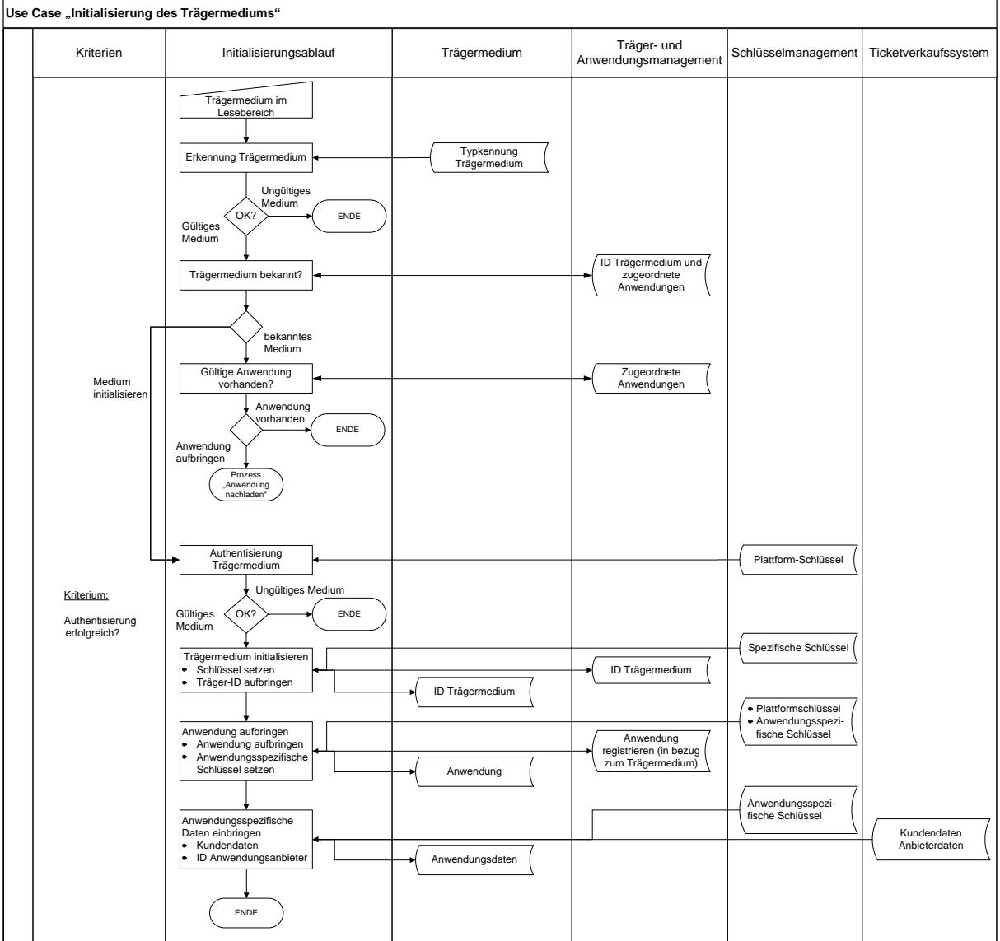

**Abbildung 7-1 Use Case "Initialisierung des Trägermediums"** 

# **7.3 Use Case "Nachladen der Anwendung"**

Die Darstellung des Use Case "Nachladen der Anwendung" in [Abbildung 7-2](#page-46-1) deckt den Sonderfall des Nachladens einer Anwendung auf ein bereits im Besitz des Kunden befindliches Trägermedium ab. Dabei kann es sich um eine kontaktlose Chipkarte oder ein NFC Mobile Device handeln.

Beim Nachladen einer Anwendung kann es verschiedene Szenarien geben:

- 1 Nachladen der Anwendung über die kontaktlose Schnittstelle in einer vertrauenswürdigen Umgebung
- 2 Nachladen der Anwendung über die kontaktlose Schnittstelle in einer unsicheren Umgebung. Dieser Fall kann z. B. beim Laden einer Anwendung auf eine kontaktlose Chipkarte über ein Lesegerät am Heim-PC oder in einer Vorverkaufsstelle eintreten.
- 3 Nachladen einer Anwendung "Over-the-Air" bei NFC Mobile Devices.

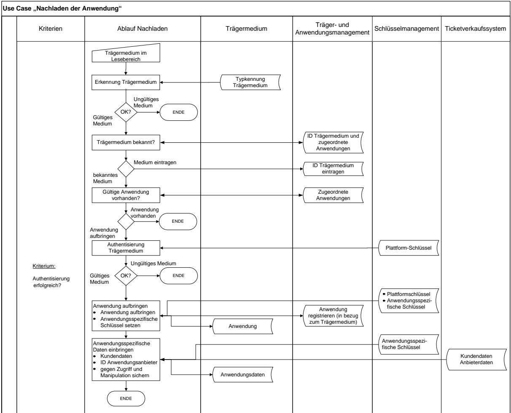

**Abbildung 7-2 Use Case "Nachladen der Anwendung"** 

# **7.4 Use Case "Einbringen der Berechtigung"**

Sobald das Trägermedium initialisiert und die Anwendungen installiert sind, können Berechtigungen in die Anwendungen geladen werden.

Der Verkauf der Produkte ist direkt von der sicheren und kundenfreundlichen Abwicklung dieses Use Case abhängig. Er ist deshalb für den Anbieter und den Kunden von elementarer Bedeutung. Bei der Betrachtung des in [Abbildung 7-3](#page-47-1) dargestellten Use Case "Einbringen der Berechtigung" müssen alle Vertriebskanäle aus den Prozessbeschreibungen P2A und P2B (Kapitel [6.2](#page-39-2)) entsprechend berücksichtigt werden.

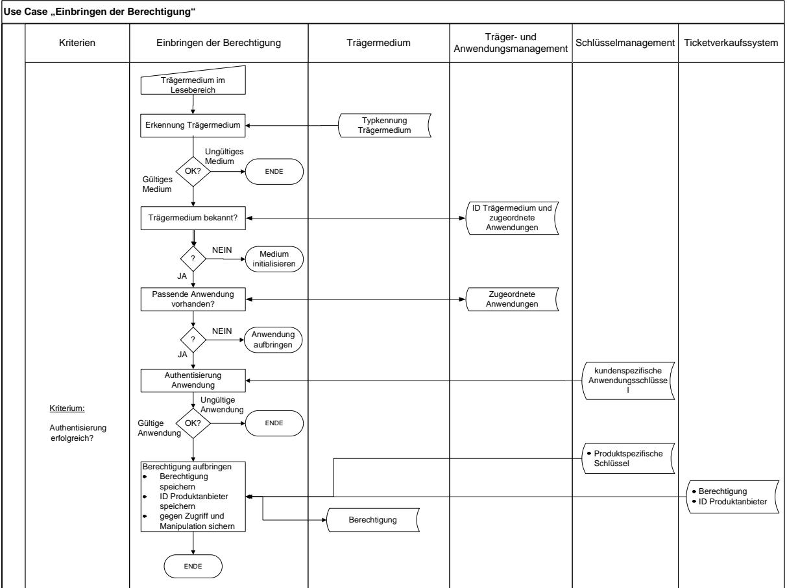

**Abbildung 7-3 Use Case "Einbringen der Berechtigung"** 

Es muss zwischen dem Einbringen der Berechtigung bei der Erstausgabe des Trägermediums und dem Nachladen der Berechtigung unterschieden werden. Letzteres kann über das Internet per Heimleser, "Over-the-Air" in ein NFC Mobile Device oder lokal in der Verkaufsstelle und am Automaten erfolgen.

# **7.5 Use Case "Auslieferung"**

Initialisierte und mit Berechtigungen versehene Trägermedien müssen nach P2A.1 und P2A.2 an den Kunden oder die Ausgabestelle ausgeliefert werden.

Mit der Auslieferung müssen vom Produktanbieter sicherheitsrelevante Informationen der Sendung im Ticketsystem dokumentiert werden. Dazu gehören:

- 1 Adressat
- 2 ID der Trägermedien, ID Produkte
- 3 Versender
- 4 Abgabestelle, spezielle Vereinbarungen zur Übergabe

# **7.6 Use Case "Check-in"**

Der Use Case "Check-in" bildet den ersten Teil des Prozesses P3.2 im Detail ab. Die konkrete Umsetzung ist von der jeweiligen Anwendung den damit verbundenen Datenmodellen und Algorithmen abhängig. Die folgende Abbildung zeigt den Ablauf.

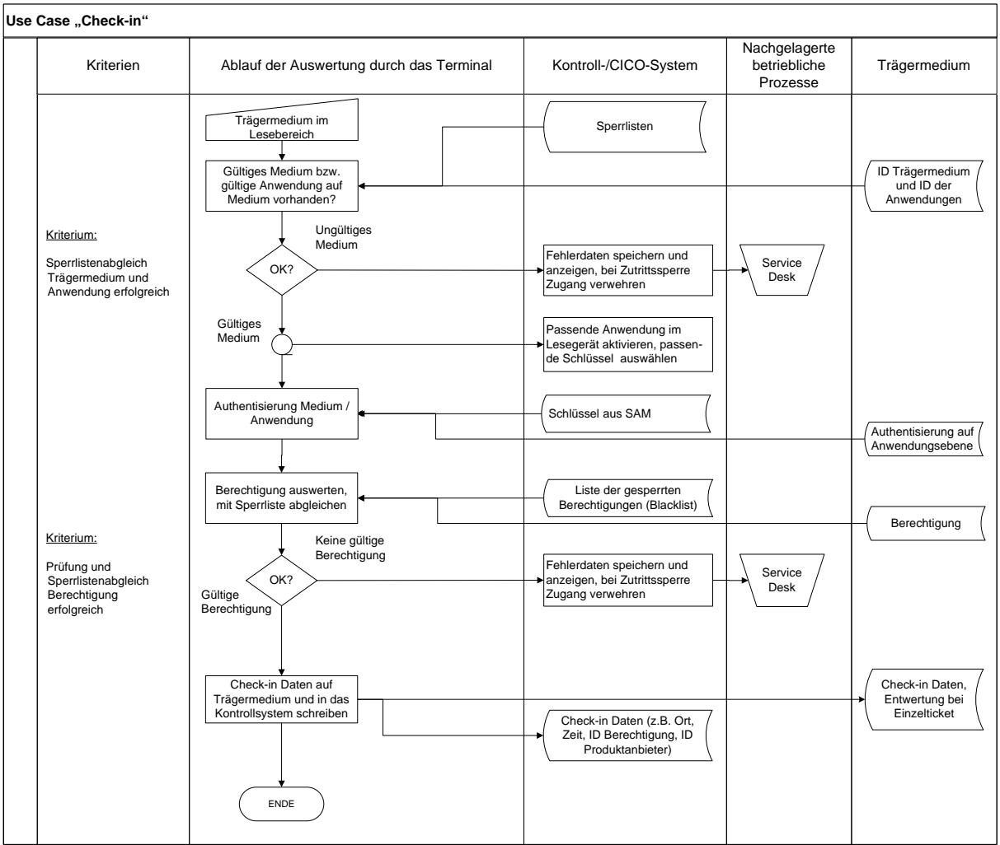

**Abbildung 7-4 Use Case "Check-in"** 

Im Fehlerfall wird an einen Service Desk verwiesen. Üblicherweise wird der Kunde dazu ein Kundenzentrum aufsuchen. Dort kann ggf. ein defektes Trägermedium umgetauscht werden.

# **7.7 Use Case "Check-out"**

Der Use Case "Check-out" bildet den zweiten Teil des Prozesses P3.2 im Detail ab. Die konkrete Umsetzung ist von der jeweiligen Anwendung und den damit verbundenen Datenmodellen und Algorithmen abhängig. Die folgende Abbildung zeigt den Ablauf.

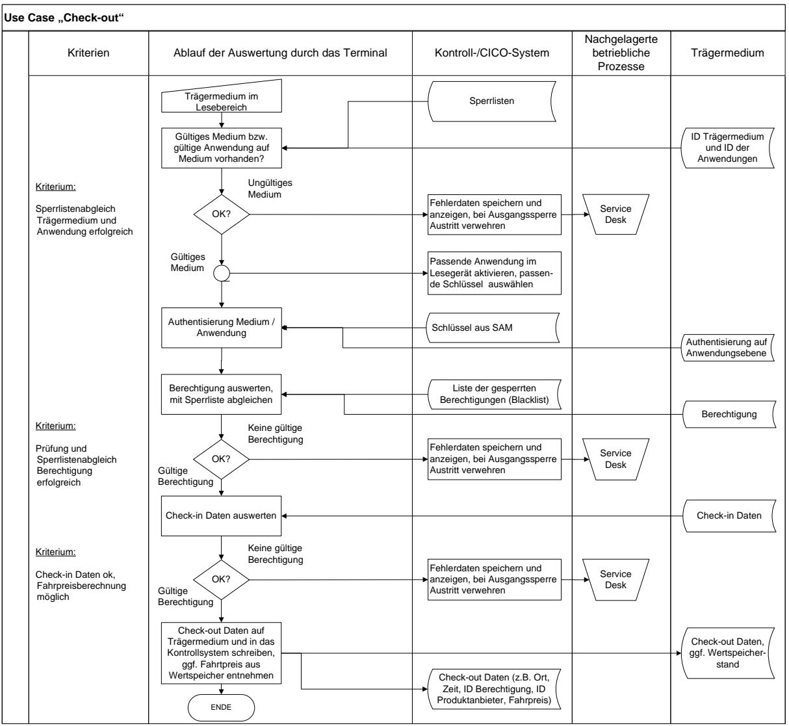

**Abbildung 7-5 Use Case "Check-out"** 

Im Fehlerfall wird an einen Service Desk verwiesen. Üblicherweise wird der Kunde dazu ein Kundenzentrum aufsuchen. Dort kann ggf. ein defektes Trägermedium gegen ein neues umgetauscht werden.

# **7.8 Use Case "Kontrolle"**

Der Use Case "Kontrolle" bildet den technischen Ablauf der Kontrolle der Fahrtberechtigung durch einen Kontrolleur ab. Der technische Ablauf ist zum großen Teil mit dem Use Case "Check-in" identisch. Die konkrete Umsetzung ist von der jeweiligen Anwendung und den damit verbundenen Datenmodellen und Algorithmen abhängig. Die folgende Abbildung zeigt den Ablauf.

Die Kontrolle wird üblicherweise mit einem mobilen Kontrollterminal ausgeführt, das mit den nötigen SAM und Sperrlisten versehen ist.

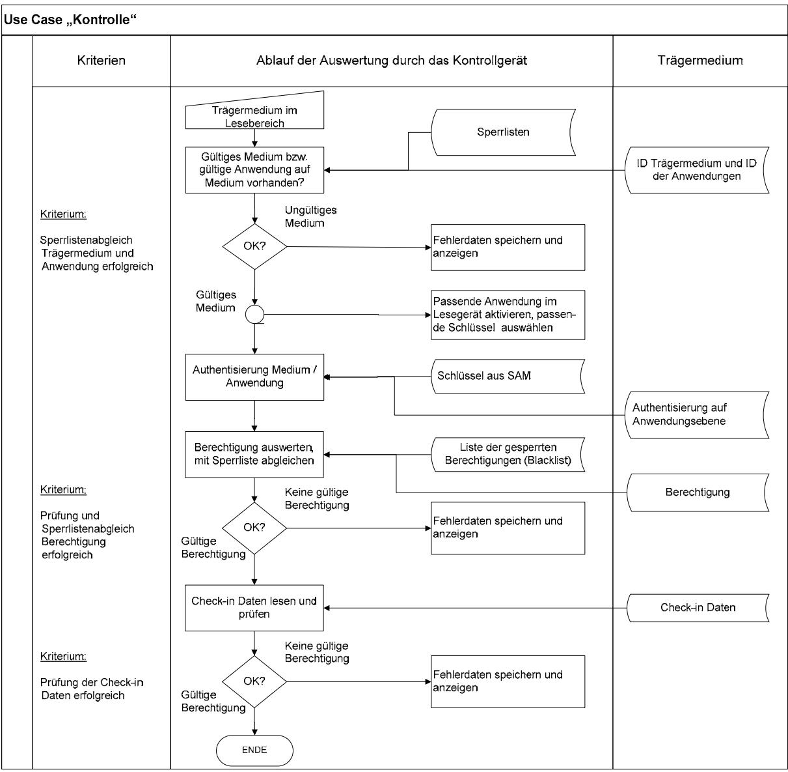

## **Abbildung 7-6 Use Case "Kontrolle"**

Im Fehlerfall wird normalerweise eine Sichtkontrolle erfolgen.

# **7.9 Use Case "Sperrung"**

Trägermedien, die abhanden gekommen sind, müssen gesperrt werden. Das gleiche gilt für defekte Medien oder Produkte sofern diese nicht eingezogen und vernichtet werden können.

Die Sperrung eines Mediums und/oder der darauf gespeicherten Berechtigung ist die Voraussetzung für die Ausstellung eines Ersatzmediums bzw. für die Überschreibung einer Berechtigung auf einen neuen Eigentümer mit einem anderen Kundenmedium.

Eine Sperrung kann nur erfolgen, wenn hinreichend sicher ist, dass der Kunde, der dieses wünscht, der rechtmäßige Besitzer des Mediums bzw. der Berechtigung ist. Deshalb ist eine Sperrung durch den Kunden nur in folgenden alternativen Fällen möglich:

- 1 Die Kundendaten sind beim Kauf gespeichert worden. Die Sperrung erfolgt aufgrund einer zuverlässigen Identifikation und einer rechtsverbindliche Willenserklärung des Kunden.
- 2 Das Medium mit der Berechtigung wird vorgelegt. Die Echtheit kann sicher festgestellt werden.

Alternativ zur Sperrung durch den Kunden können auch andere Entitäten des Systems die Sperrung beantragen. Dazu werden für diese Entitäten im Gesamtsystem Verantwortlichkeiten und Prozesse definiert.

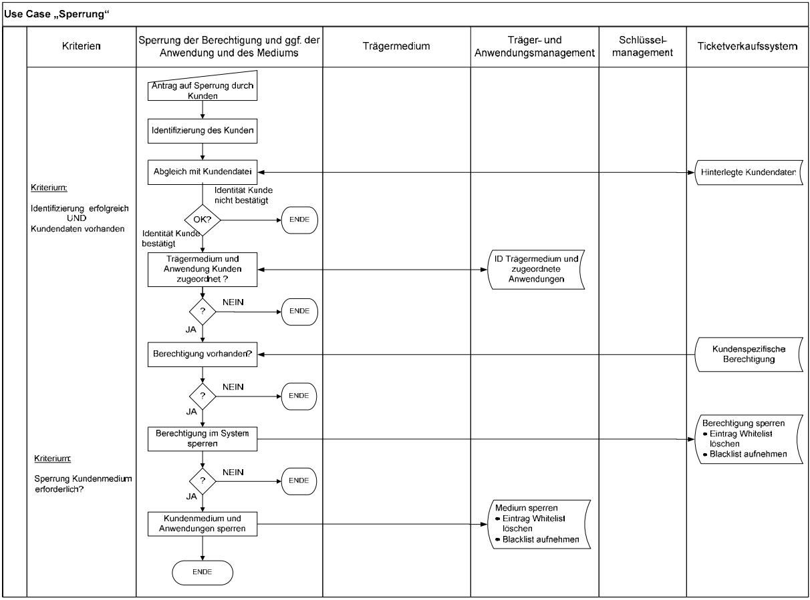

**Abbildung 7-7 Use Case "Sperrung"** 

# **7.10 Use Cases " Schlüsselmanagement "**

Zum Schutz der Berechtigungen auf Trägermedien kommen aus Gründen der Performanz überwiegend Verfahren zum Einsatz, die symmetrische Schlüssel nutzen. Die Sicherheit und Funktionsfähigkeit des Gesamtsystems hängt damit entscheidend von der sicheren Bereitstellung und Verwahrung der Schlüssel ab. Diese Aufgabe muss durch das Schlüsselmanagement und dessen zugeordnete Prozesse geleistet werden.

In den folgenden Darstellungen der Use Cases wird mit **Secure Authentication Modules** (**SAM**) als sicheren Speichern für Schlüsselinformationen, Sicherheitsmechanismen und Diversifikationsalgorithmen gearbeitet. Prinzipiell sind auch andere Verfahren denkbar.

Zum Initialisieren des Trägermediums und beim Aufbringen der Berechtigungen ist ein Schlüsselmanagement erforderlich, dass die hierarchische Beziehung von Trägermedium, Anwendungen und Produkten/Berechtigungen berücksichtigt.

# **7.10.1 Schlüsselmanagement für das Initialisieren der Trägermedien**

Die Darstellung in [Abbildung 7-8](#page-52-1) beschreibt den Use Case zum Schlüsselmanagement für das Initialisieren der Trägermedien. Die hier definierten Schlüssel und Verfahren sind auch für das Aufbringen von Anwendungen erforderlich.

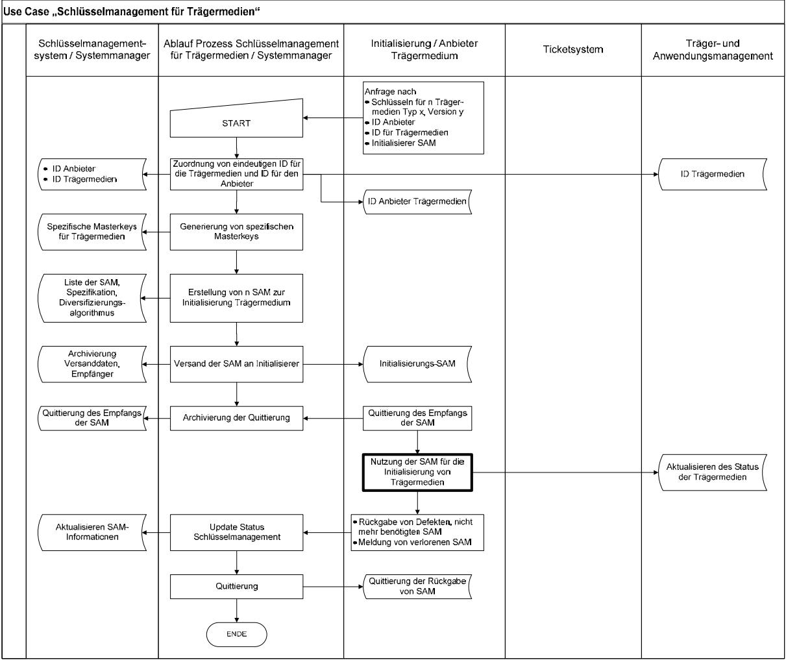

**Abbildung 7-8 Use Case "Schlüsselmanagement für Trägermedien"** 

# **7.10.2 Schlüsselmanagement für das Aufbringen und Personalisieren der Anwendungen**

Zur Sicherung von Anwendungen, die bei der Erstellung der Trägermedien oder im Nachhinein aufgebracht werden, sind spezielle Schlüssel und Kennungen für die Anwendung zu erstellen.

[Abbildung 7-9](#page-53-1) zeigt den entsprechenden Use Case. Beim Aufbringen der Anwendung auf das Trägermedium muss das Schlüsselmanagement für Trägermedien ebenfalls zur Verfügung stehen.

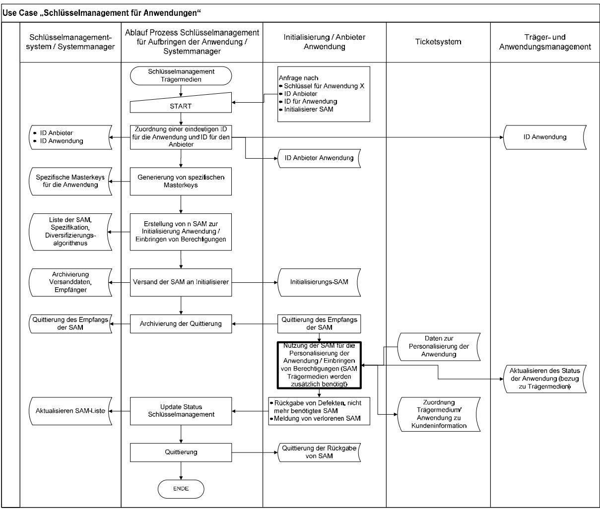

**Abbildung 7-9 Use Case "Schlüsselmanagement für Anwendungen"** 

# **7.10.3 Schlüsselmanagement für das Einbringen der Berechtigungen**

Zur Sicherung von Berechtigungen, die bei der Erstellung der Trägermedien oder im Nachhinein aufgebracht werden, sind spezielle Schlüssel und Kennungen für die Produkte zu erstellen.

[Abbildung 7-10](#page-54-1) zeigt den entsprechenden Use Case. Beim Einbringen der Berechtigung in die Anwendung muss das Schlüsselmanagement für Anwendungen ebenfalls zur Verfügung stehen.

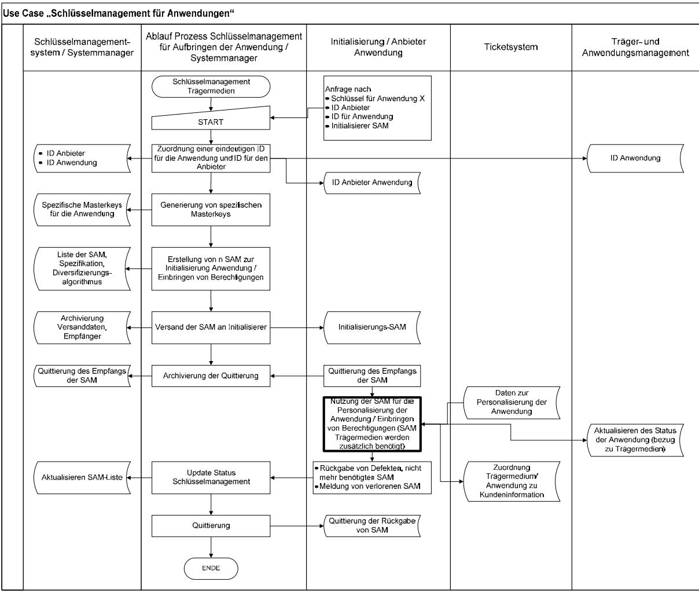

**Abbildung 7-10 Use Case "Schlüsselmanagement für Berechtigungen/Produkte"** 

# **7.10.4 Schlüsselmanagement für die Nutzung beim Dienstleister**

Die Anbieter und Herausgeber benötigen ein Schlüsselmanagement für die Initialisierung der Trägermedien, das Aufbringen von Anwendungen und das Ausstellen der Berechtigungen.

Der ÖPV-Dienstleister ist auf die Schlüssel und andere Informationen zum Lesen und zur Auswertung der Berechtigungen angewiesen. Diese Informationen müssen im Kontrollsystem vorliegen.

Zu diesem Zweck werden vom Sicherheitsmanager über das Schlüsselmanagement üblicherweise spezifische SAM (Dienstleister-SAM) für den Dienstleister erstellt und übergeben. Dienstleister-SAM können Schlüsselinformationen mehrerer Anbieter von Produkten, Anwendungen und Trägermedien enthalten. Die Zusammenstellung der Auswahl erfolgt durch den Sicherheitsmanager nach den Bedürfnissen des Dienstleisters.

# **8 Sicherheitsbetrachtungen**

# **8.1 Definitionen zum Thema Sicherheit und Datenschutz**

Es existieren drei Aspekte oder Unterscheidungsbereiche der Sicherheit, die im Rahmen dieses Dokuments betrachtet werden sollen. Es sind dies:

- Funktionssicherheit (Safety)
- Informationssicherheit (Security)
- Datenschutz (Privacy).

Diese Unterscheidungsbereiche lassen sich wie im Folgenden dargestellt untergliedern:

1 Funktionssicherheit

Funktionssicherheit wird vielfach mit Zuverlässigkeit/Korrektheit oder Quality of Service verwechselt. Zuverlässigkeit bedeutet, dass das System entsprechend seiner Spezifikation korrekt arbeitet. Die Erfahrung zeigt, dass jedes technische System fehleranfällig ist. Unter Funktionssicherheit wird nun die Eigenschaft eines Systems verstanden, trotz aufgetretener Systemfehler nicht in unkontrollierbare Systemzustände zu geraten, in denen das System selbst oder seine Umwelt in Gefahr gebracht werden (FailSafe). Zugleich soll das System noch weitestgehend konform seiner Spezifikation reagieren (Fault Tolerance). D. h. unter Funktionssicherheit wird im Wesentlichen der Schutz vor unbeabsichtigten Ereignissen verstanden.

2 Informationssicherheit

Informationssicherheit betrachtet im Gegensatz zur Funktionssicherheit den Schutz vor beabsichtigten Angriffen.

Im Bereich Informationssicherheit lassen sich Sicherheitsziele in folgenden Klassen formulieren:

- a Vertraulichkeit: Vertraulichkeit ist der Schutz vor unbefugter Preisgabe von Informationen. Vertrauliche Daten und Informationen dürfen ausschließlich Befugten in der zulässigen Weise zugänglich sein. Als Schutzziel formuliert bedeutet dies: Gespeicherte bzw. zu kommunizierende Informationen sind vor dem Zugriff von Unbefugten zu schützen.
- b Integrität: Integrität bezeichnet die Sicherstellung der Korrektheit (Unversehrtheit) von Daten und der korrekten Funktionsweise von Systemen. Als Schutzziel formuliert bedeutet dies: Gespeicherte bzw. zu kommunizierende Informationen sind vor unberechtigter Veränderung zu schützen
- c Verfügbarkeit: Die Verfügbarkeit von Dienstleistungen, Funktionen eines IT-Systems, IT-Anwendungen oder IT-Netzen oder auch von Informationen ist vorhanden, wenn diese den Benutzern stets wie gewünscht zur Verfügung stehen. Als Schutzziel formuliert bedeutet dies: Informationen und Betriebsmittel sind vor unbefugter Vorenthaltung zu schützen.
- d Unverknüpfbarkeit: Unverknüpfbarkeit zweier Kommunikationselemente innerhalb eines Systems bedeutet, dass diese Kommunikationselemente nicht mehr oder weniger miteinander in Beziehung stehen, als es schon durch ein Vorwissen bekannt ist. Innerhalb des Systems können keine weiteren Informationen über die Beziehung zwischen diesen Kommunikationselementen erlangt werden. Praktisch bedeutet dies z. B., dass ein und derselbe Benutzer Dienste oder Ressourcen mehrmalig in Anspruch nehmen kann, wobei Dritte nicht erkennen können, dass

diese Anfragen (im Kommunikationsmodell: Nachrichten) über den Benutzer in Verbindung stehen.

- e Unbeobachtbarkeit: Unbeobachtbarkeit eines Ereignisses ist derjenige Zustand, in dem nicht zu entscheiden ist, ob dieses Ereignis stattfindet oder nicht. Somit kann bei Sender-Unbeobachtbarkeit nicht erkannt werden, ob überhaupt gesendet wird. Empfänger-Unbeobachtbarkeit ist analog definiert, es kann nicht festgestellt werden ob empfangen wird oder nicht. Beziehungs-Unbeobachtbarkeit bedeutet, dass nicht erkennbar ist, ob aus der Menge der möglichen Sender zur Menge der möglichen Empfänger gesendet wird.
- f Anonymität: Anonymität ist der Zustand, in dem man innerhalb seiner Anonymitätsgruppe nicht identifizierbar ist. Mit Hilfe des Begriffs Unverknüpfbarkeit lässt sich Anonymität nun präzisieren zu Unverknüpfbarkeit zwischen der Identität des Benutzers und des von ihm ausgelösten Ereignisses. Somit gibt es Sender-Anonymität als Unverknüpfbarkeit zwischen Sender und Nachricht und Empfänger-Anonymität entsprechend als Unverknüpfbarkeit zwischen Nachricht und Empfänger.
- g Authentizität: Mit dem Begriff Authentizität wird die Eigenschaft bezeichnet, die gewährleistet, dass ein Kommunikationspartner tatsächlich derjenige ist, der er vorgibt zu sein. Bei authentischen Informationen ist sichergestellt, dass sie von der angegebenen Quelle erstellt wurden. Der Begriff wird nicht nur verwendet, wenn die Identität von Personen geprüft wird, sondern auch bei IT-Komponenten oder Anwendungen.
- h Nichtabstreitbarkeit: Das Versenden bzw. Empfangen von Nachrichten durch authentisch festgestellte Personen ist gegen Abstreiten zu schützen.
- i Verbindlichkeit: Unter Verbindlichkeit werden die IT-Sicherheitsziele Authentizität und Nichtabstreitbarkeit zusammengefasst. Bei der Übertragung von Informationen bedeutet dies, dass die Informationsquelle ihre Identität bewiesen hat und der Empfang der Nachricht nicht in Abrede gestellt werden kann.
- 3 Datenschutz

Zweck des Datenschutzes ist es, den Einzelnen davor zu schützen, dass er durch den Umgang mit seinen personenbezogenen Daten in seinen Persönlichkeitsrechten beeinträchtigt wird.

Mit Datenschutz wird der Schutz personenbezogener Daten vor etwaigem Missbrauch durch Dritte bezeichnet (nicht zu verwechseln mit Datensicherheit).

Weiterhin sollen die folgenden Begrifflichkeiten einheitlich verwendet werden:

1 Sicherheitsziele

Sicherheitsziele sind sicherheitsrelevante Ziele bei der Realisierung eines IT-Systems. Im Rahmen dieses Dokuments werden spezifische Sicherheitsziele innerhalb von Einsatzgebieten und Einsatzszenarien festgelegt. Eine Verletzung der Sicherheitsziele erzeugt unmittelbaren Schaden für die Entität, deren Sicherheitsziel verletzt wird.

2 Gefährdungen

Gefährdungen sind unmittelbare Gefahren für die Sicherheitsziele der Anwendung.

Diese können als Folge eines aktiven Angriffs auf eines oder mehrere Sicherheitsziele oder in Form von möglichen Schwächen des Systems, wie z. B. dem Fehlen einer Rückfalllösung, auftreten.

3 Maßnahmen

Maßnahmen sind konkrete Handlungsempfehlungen, die gegen eine oder mehrere Gefährdungen wirken. Die in diesem Dokument genannten Maßnahmen sollen sinnvoll und bedarfsgerecht sein, d. h. sie werden unter den Gesichtspunkten Wirtschaftlichkeit und

Manipulationsfestigkeit (Wie aufwändig ist eine Maßnahme und welche finanzielle Schadenshöhe kann damit begrenzt oder verhindert werden) empfohlen.

4 Restrisiko

Es ist in der Regel nicht möglich, allen Gefährdungen so entgegenzuwirken, dass ein System die perfekte Sicherheit bietet. Das Restrisiko ist daher das Risiko, das verbleibt, wenn eine Menge von Maßnahmen umgesetzt wurde und trotzdem noch Angriffe möglich sind. Die Höhe des Risikos hängt davon ab, welche Gegenmaßnahmen getroffen werden können, wie komplex diese sind und vor allem, welches Ergebnis eine Kosten – Nutzen-Rechnung der jeweiligen Entität erbringt. Das Restrisiko muss von der Entität explizit getragen werden.

# **8.2 Definition der Sicherheitsziele**

Im seltensten Fall sind alle im Bereich Funktionssicherheit, Informationssicherheit und Datenschutz genannten Sicherheitsaspekte für ein gegebenes Einsatzszenario gleichwichtig bzw. überhaupt relevant. Die Herausforderung bei der Konzeption eines sicheren RFID-Einsatzes liegt zuerst dementsprechend in der Formulierung spezifischer Sicherheitsziele.

Innerhalb der Einsatzgebiete zum eTicketing sind basierend auf den vorgenannten generischen Sicherheitszielen *übergeordnete* einsatzgebietsspezifische Sicherheitsziele zu erkennen:

- 1 Schutz der elektronischen Berechtigung (repräsentiert die Schutzziele Integrität und Authentizität)
- 2 Funktionssicherheit des RFID-Systems
- 3 Schutz der Privatsphäre des Kunden (repräsentiert die Schutzziele Vertraulichkeit, Unverknüpfbarkeit, Unbeobachtbarkeit, Anonymität und Datenschutz als allgemeine Anforderung)

Aus den Betrachtungen der Sicherheitsziele der Entitäten in den folgenden Unterkapiteln ergeben sich die *untergeordneten* Sicherheitsziele, die in Kapitel [8.2.4](#page-63-1) aufgeführt sind.

Die folgende Tabelle zeigt das Kodierungsschema der Sicherheitsziele sowie die verwendeten Abkürzungen.

| Feldnummer | 1                   | 2                        | 3                                                | 4         |
|------------|---------------------|--------------------------|--------------------------------------------------|-----------|
| Feld       | Sicherheits ziel | Zugeordnete Entität      | Zugeordnetes gene risches Sicherheits ziel | Zählindex |
| Inhalt     | S                   | K := Kunde               | F := Funktionssi cherheit                     |           |
|            |                     | P := Produktanbie ter | I := Informationssi cherheit                  | 1,  , n   |
|            |                     | D := Dienstleister       | P := Privatsphäre                                |           |

**Tabelle 8–1 Kodierungsschema der Sicherheitsziele** 

# **8.2.1 Spezifische Sicherheitsziele des Kunden**

Die spezifischen Sicherheitsziele des Kunden sind in den folgenden Unterkapiteln aufgeführt.

| Kurzbezeichnung des Sicherheitsziels |                                            | Beschreibung des Sicherheitsziels                                                                                                                                                                                                                                                                                                                                                               |
|-----------------------------------------|--------------------------------------------|-------------------------------------------------------------------------------------------------------------------------------------------------------------------------------------------------------------------------------------------------------------------------------------------------------------------------------------------------------------------------------------------------|
| SKF1                                    | Technische Kompatibilität               | Die Interaktion zwischen Kundenmedium und Lesegerät muss wie spezifiziert funktionieren. Dies muss für alle zugelassenen Kundenmedien an allen Lesegeräten in der gesamten Systeminf rastruktur gelten. Dabei ist zu berücksichtigen, dass Trägerme dien und Infrastruktur von verschiedenen Herstellern geliefert und von verschiedenen Dienstleistern betrieben werden können. |
| SKF2                                    | Rückfalllösung bei Fehlfunkti onen   | Die Nutzung der Dienstleistung muss für Berechtigte auch dann möglich sein, wenn das Kundenmedium oder die Systeminfra struktur nicht einwandfrei funktionieren.                                                                                                                                                                                                                          |
| SKF3                                    | Intuitive, fehler tolerante Nut zung | Nutzung muss möglichst selbsterklärend bzw. einfach zu erlernen sein Der Kunde muss zu jedem Zeitpunkt wissen, welchen Stand der Nutzungsprozess aufweist.                                                                                                                                                                                                                             |

## **8.2.1.1 Funktionssicherheit**

### **Tabelle 8–2 Sicherheitsziele des Kunden zur Funktionssicherheit**

### **8.2.1.2 Informationssicherheit**

| Kurzbezeichnung des Sicherheitsziels |                                            | Beschreibung des Sicherheitsziels                                                                                                                                                                                                                                                                                                                                                                                                                                     |
|-----------------------------------------|--------------------------------------------|-----------------------------------------------------------------------------------------------------------------------------------------------------------------------------------------------------------------------------------------------------------------------------------------------------------------------------------------------------------------------------------------------------------------------------------------------------------------------|
| SKI1                                    | Schutz der per sonenbezoge nen Daten | Die im System und/oder im Kundenmedium gespeicherten Kun dendaten dienen zur Identifikation des Kunden, zur Zahlung, zum Zustellen von Berechtigungen, etc. Eine missbräuchliche Verwendung, Manipulation oder Weiterga be an Unberechtigte wäre für den Kunden ggf. mit kommerziellen Risiken und Verlust der Funktionssicherheit verbunden und soll vermieden werden.                                                                             |
| SKI2                                    | Schutz der Be rechtigungen              | Berechtigungen sind möglicherweise DoS-Angriffen bzw. Manipu lation durch Dritte ausgesetzt. Dies wäre für den Kunden mit Un annehmlichkeiten bzw. einem Schaden verbunden. Dieser Scha den ist normalerweise begrenzt, da üblicherweise der Dienst in Anspruch genommen werden kann, sofern der Kunde nachwei sen kann, dass er eine gültige Berechtigung erstanden hat. Mani pulation der Berechtigung durch Unbefugte soll vermieden wer den. |
| SKI3                                    | Schutz der Nut zungsdaten               | Nutzungsdaten dienen zur Abrechnung für die Nutzung des Pro dukts "Automatische Fahrpreisberechnung". Die Daten müssen deshalb verlässlich sein.                                                                                                                                                                                                                                                                                                                |
| SKI4                                    | Zuverlässige Abrechnung                 | Bei Nutzung muss der Zeitpunkt,der Entwertung und bei Check-in / Check-out der Zeitpunkt, der Ort und Dienstleister für den Kun den erkennbar sein. Die Abrechnungsdaten (Pricing) müssen nachvollziehbar und                                                                                                                                                                                                                                                |
|                                         |                                            | zuverlässig sein.                                                                                                                                                                                                                                                                                                                                                                                                                                                     |

| Kurzbezeichnung des Sicherheitsziels |                                                     | Beschreibung des Sicherheitsziels                                                                                                                                                                                                                                                                                                                                                                                                                                                              |
|-----------------------------------------|-----------------------------------------------------|------------------------------------------------------------------------------------------------------------------------------------------------------------------------------------------------------------------------------------------------------------------------------------------------------------------------------------------------------------------------------------------------------------------------------------------------------------------------------------------------|
|                                         |                                                     |                                                                                                                                                                                                                                                                                                                                                                                                                                                                                                |
| SKI5                                    | Schutz von Anwendungen und Berechti gungen | Kundenmedien können mehr als eine Anwendung aufnehmen. Diese Anwendungen können verschiedenen Anwendungsher ausgebern gehören. Weiterhin kann eine Anwendung mehrere Berechtigungen aufnehmen, die von verschiedenen Produktei gentümern geliefert wurden. Es muss sichergestellt sein, dass Anwendungen und Berechtigungen technisch zuverlässig ge trennt sind oder Vereinbarungen zwischen den Entitäten beste hen, die die mehrseitige Nutzung oder Konflikte regeln. |

### **Tabelle 8–3 Sicherheitsziele des Kunden zur Informationssicherheit**

## **8.2.1.3 Schutz der Privatsphäre**

| Kurzbezeichnung des Sicherheitsziels |                                                          | Beschreibung des Sicherheitsziels                                                                                                                                                                    |  |
|-----------------------------------------|----------------------------------------------------------|------------------------------------------------------------------------------------------------------------------------------------------------------------------------------------------------------|--|
| SKP1                                    | Schutz der per sonenbezoge ne Daten                | Personenbezogene Daten, die dem Produktanbieter (KVP) über geben wurden, müssen vertraulich behandelt werden und dürfen nur für die vereinbarten Zwecke eingesetzt werden.                     |  |
| SKP2                                    | Schutz der Nut zungsdaten                             | Nicht anonymisierte, personenbezogene Daten über die Nutzung des Dienstes dürfen nur nach Zustimmung des Kunden für Zwe cke des Produktanbieters oder des Dienstleisters verwendet wer den. |  |
| SKP3                                    | Schutz vor der Erzeugung von Bewegungspro filen | Es ist zu verhindern, dass Dritte durch Nutzung der RFID Technologie personenbezogene Bewegungsprofile erstellen kön nen.                                                                      |  |

**Tabelle 8–4 Sicherheitsziele des Kunden zum Schutz der Privatsphäre** 

# **8.2.2 Spezifische Sicherheitsziele des Produktanbieters (z. B. des KA KVP)**

Die spezifischen Sicherheitsziele des Produktanbieters sind in den folgenden Unterkapitels aufgeführt.

## **8.2.2.1 Funktionssicherheit**

| Kurzbezeichnung des Sicherheitsziels |                              | Beschreibung des Sicherheitsziels                                                                                                                                                                                                                                                                                                                                                               |
|-----------------------------------------|------------------------------|-------------------------------------------------------------------------------------------------------------------------------------------------------------------------------------------------------------------------------------------------------------------------------------------------------------------------------------------------------------------------------------------------|
| SPF1                                    | Technische Kompatibilität | Die Interaktion zwischen Kundenmedium und Lesegerät muss wie spezifiziert funktionieren. Dies muss für alle zugelassenen Kun denmedien an allen Lesegeräten in der gesamten Systeminfra struktur gelten. Dabei ist zu berücksichtigen, dass Trägermedien und Infrastruktur von verschiedenen Herstellern geliefert und von verschiedenen Dienstleistern betrieben werden können. |
| SPF2                                    | Rückfalllösung               | Die Erbringung der Dienstleistung für den Kunden sollte auch                                                                                                                                                                                                                                                                                                                                    |

| Kurzbezeichnung des Sicherheitsziels |                                            | Beschreibung des Sicherheitsziels                                                                                                                                                      |
|-----------------------------------------|--------------------------------------------|----------------------------------------------------------------------------------------------------------------------------------------------------------------------------------------|
|                                         | bei Fehlfunktio nen                     | dann möglich sein, wenn das Kundenmedium oder die Systeminf rastruktur nicht einwandfrei funktionieren.                                                                             |
| SPF3                                    | Intuitive, fehler tolerante Nut zung | Fehlerfreie Nutzung durch den Kunden muss mit geringem Erklä rungsaufwand möglich sein. Der Kunde muss zu jedem Zeitpunkt wissen, welchen Stand der Nutzungsprozess aufweist. |

#### **Tabelle 8–5 Sicherheitsziele des Produktanbieters zur Funktionssicherheit**

## **8.2.2.2 Informationssicherheit**

| Kurzbezeichnung des Sicherheitsziels |                                                     | Beschreibung des Sicherheitsziels                                                                                                                                                                                                                                                                                                                                                                                                                                                              |
|-----------------------------------------|-----------------------------------------------------|------------------------------------------------------------------------------------------------------------------------------------------------------------------------------------------------------------------------------------------------------------------------------------------------------------------------------------------------------------------------------------------------------------------------------------------------------------------------------------------------|
| SPI1                                    | Schutz der per sonenbezoge nen Daten          | Die im System und im Kundenmedium gespeicherten Kundenda ten dienen zur Identifikation des Kunden, zur Zahlung, zum Zu stellen von Berechtigungen, etc.                                                                                                                                                                                                                                                                                                                                  |
|                                         |                                                     | Eine missbräuchliche Verwendung, Manipulation oder Weiterga be an Unberechtigte wäre für den Produktanbieter z. B. mit kom merziellen Risiken oder Verlust der Kundenakzeptanz verbunden und würde ggf. als Gesetzesverstoß geahndet werden. Dies muss vermieden werden.                                                                                                                                                                                                           |
| SPI2                                    | Schutz der Be rechtigungen                       | Die Manipulation, die Störung und insbesondere die Fälschung von Berechtigungen wären für den Produktanbieter, den Pro dukteigentümer und den Dienstleister ggf. mit erheblichem kom merziellem Schaden verbunden.                                                                                                                                                                                                                                                                    |
|                                         |                                                     | Die Fälschungssicherheit von Berechtigungen ist ein wichtiges Ziel des Produkteigentümers.                                                                                                                                                                                                                                                                                                                                                                                                  |
| SPI3                                    | Schutz der Nut zungsdaten                        | Die Verfügbarkeit und Integrität der Nutzungsdaten ist für den Produktanbieter, den Produkteigentümer und den Dienstleister von großem Wert. Sie dienen zur Abrechnung, zur Planung von Produkten, Kapazitäten und zur Kundenbindung.                                                                                                                                                                                                                                                 |
| SPI4                                    | Zuverlässige Abrechnung                          | Die richtige Zuordnung der Erlöse aus dem Verkauf von Berech tigungen durch den Produktanbieter zu den vom Dienstleister erbrachten Beförderungsleistungen ist sicherzustellen.                                                                                                                                                                                                                                                                                                          |
| SPI5                                    | Schutz von Anwendungen und Berechti gungen | Kundenmedien können mehr als eine Anwendung aufnehmen. Diese Anwendungen können verschiedenen Anwendungsher ausgebern gehören. Weiterhin kann eine Anwendung mehrere Berechtigungen aufnehmen, die von verschiedenen Produktei gentümern geliefert wurden. Es muss sichergestellt sein, dass Anwendungen und Berechtigungen technisch zuverlässig ge trennt sind oder Vereinbarungen zwischen den Entitäten beste hen, die die mehrseitige Nutzung oder Konflikte regeln. |

#### **Tabelle 8–6 Sicherheitsziele des Produktanbieters zur Informationssicherheit**

## **8.2.2.3 Schutz der Privatsphäre**

| Kurzbezeichnung des Sicherheitsziels |                                          | Beschreibung des Sicherheitsziels                                                                                                                                                                                                                                                                                                      |
|-----------------------------------------|------------------------------------------|----------------------------------------------------------------------------------------------------------------------------------------------------------------------------------------------------------------------------------------------------------------------------------------------------------------------------------------|
| SPP1                                    | Schutz der per sonenbezogene Daten | Eine missbräuchliche Verwendung, Manipulation oder Weitergabe an Unberechtigte wäre für den Kundenvertragspartner ggf. mit kommerziellen Risiken oder Verlust der Kundenakzeptanz ver bunden und würde ggf. als Gesetzesverstoß geahndet werden.                                                                              |
| SPP2                                    | Schutz der Nut zungsdaten             | Nicht anonymisierte, personenbezogene Daten über die Nutzung des Dienstes dürfen nur nach Zustimmung des Kunden für Zwe cke des Produktanbieters verwendet werden. Das Ziel ist, für ge wisse Produkte (automatische Fahrpreisfindung CICO, etc) diese Zustimmung zu erhalten um z. B. eine Abrechnung zu ermögli chen. |
| SPP4                                    | Datensparsam keit                     | Es dürfen nicht mehr Daten gesammelt und gespeichert werden, als für den spezifischen Zweck nötig ist.                                                                                                                                                                                                                              |

**Tabelle 8–7 Sicherheitsziele des Produktanbieters zum Schutz der Privatsphäre** 

# **8.2.3 Spezifische Sicherheitsziele des Dienstleisters**

Die spezifischen Sicherheitsziele des Dienstleisters sind in den folgenden Unterkapiteln aufgeführt.

### **8.2.3.1 Funktionssicherheit**

| Kurzbezeichnung des Sicherheitsziels |                                            | Beschreibung des Sicherheitsziels                                                                                                                                                                                                                                                                                                                                  |
|-----------------------------------------|--------------------------------------------|--------------------------------------------------------------------------------------------------------------------------------------------------------------------------------------------------------------------------------------------------------------------------------------------------------------------------------------------------------------------|
| SDF1                                    | Technische Kompatibilität               | Die in den verschiedenen Kundenmedien gespeicherten Berechti gungen müssen wie spezifiziert funktionieren. Dies muss für alle zugelassenen Kundenmedien an allen Lesegeräten in der gesam ten Systeminfrastruktur des Dienstleisters gelten. Dabei ist zu be rücksichtigen dass Trägermedien von verschiedenen Herstellern geliefert werden können. |
| SDF2                                    | Rückfalllösung bei Fehlfunktio nen   | Die Erbringung der Dienstleistung muss auch dann möglich sein, wenn das Kundenmedium oder die Systeminfrastruktur nicht ein wandfrei funktionieren. Das Vorhandensein einer Berechtigung muss nachweisbar sein.                                                                                                                                           |
| SDF3                                    | Intuitive, fehler tolerante Nut zung | Nutzung durch den Kunden muss mit geringer Fehlerquote möglich sein. Der Kunde muss zu jedem Zeitpunkt wissen, welchen Stand der Nutzungsprozess aufweist.                                                                                                                                                                                                |

### **Tabelle 8–8 Sicherheitsziele des Dienstleisters zur Funktionssicherheit**

## **8.2.3.2 Informationssicherheit**

| Kurzbezeichnung des Sicherheitsziels |                                                     | Beschreibung des Sicherheitsziels                                                                                                                                                                                                                                                                                                                                                                                                                                                              |
|-----------------------------------------|-----------------------------------------------------|------------------------------------------------------------------------------------------------------------------------------------------------------------------------------------------------------------------------------------------------------------------------------------------------------------------------------------------------------------------------------------------------------------------------------------------------------------------------------------------------|
| SDI1                                    | Schutz der per sonenbezoge nen Daten          | Die im System und im Kundenmedium gespeicherten Kundenda ten dienen zur Identifikation des Kunden, zur Zahlung, zum Zu stellen von Berechtigungen, etc.                                                                                                                                                                                                                                                                                                                                  |
|                                         |                                                     | Eine missbräuchliche Verwendung, Manipulation oder Weiterga be an Unberechtigte wäre für den Dienstleister ggf. mit kommer ziellen Risiken, Verlust der Kundenakzeptanz und würde ggf. als Gesetzesverstoß geahndet werden.                                                                                                                                                                                                                                                           |
| SDI2                                    | Schutz der Be rechtigungen                       | Die Manipulation, die Störung und insbesondere die Fälschung von Berechtigungen wäre für für den Produktanbieter, den Pro dukteigentümer und den Dienstleister ggf. mit erheblichem kom merziellem Schaden verbunden.                                                                                                                                                                                                                                                                 |
|                                         |                                                     | Die Fälschungssicherheit von Berechtigungen ist ein wichtiges Ziel des Dienstleisters. Zusätzlich erfolgt die Nutzung der Berech tigungen in der Systeminfrastruktur des Dienstleisters. Auch hier muss der Schutz der Berechtigung gewährleistet sein.                                                                                                                                                                                                                               |
| SDI3                                    | Schutz der Nut zungsdaten                        | Nutzungsdaten sind für den für den Dienstleister von großem Wert. Sie dienen zur Abrechnung und zur Planung von Kapazitä ten.                                                                                                                                                                                                                                                                                                                                                            |
|                                         |                                                     | Kundenspezifische Nutzungsdaten sind aus Sicht des Kunden und aufgrund gesetzlicher Vorschriften vom Dienstleister vertrau lich zu behandeln. Zuwiderhandlung hätte den Verlust der Kun denakzeptanz zur Folge und würde ggf. als Gesetzesverstoß geahndet werden.                                                                                                                                                                                                                 |
| SDI4                                    | Zuverlässige Abrechnung                          | Die richtige Zuordnung der Erlöse aus dem Verkauf von Berech tigungen durch den Produktanbieter zu den vom Dienstleister erbrachten Beförderungsleistungen ist sicherzustellen.                                                                                                                                                                                                                                                                                                          |
| SDI5                                    | Schutz von Anwendungen und Berechti gungen | Kundenmedien können mehr als eine Anwendung aufnehmen. Diese Anwendungen können verschiedenen Anwendungsher ausgebern gehören. Weiterhin kann eine Anwendung mehrere Berechtigungen aufnehmen, die von verschiedenen Produktei gentümern geliefert wurden. Es muss sichergestellt sein, dass Anwendungen und Berechtigungen technisch zuverlässig ge trennt sind oder Vereinbarungen zwischen den Entitäten beste hen, die die mehrseitige Nutzung oder Konflikte regeln. |

**Tabelle 8–9 Sicherheitsziele des Dienstleisters zur Informationssicherheit** 

## **8.2.3.3 Schutz der Privatsphäre**

| Kurzbezeichnung des Sicherheitsziels |                               | Beschreibung des Sicherheitsziels                                                                                                   |
|-----------------------------------------|-------------------------------|-------------------------------------------------------------------------------------------------------------------------------------|
| SDP                                     | Schutz der per sonenbezoge | Eine missbräuchliche Verwendung, Manipulation oder Weitergabe an Unberechtigte wäre für den Dienstleister ggf. mit kommerziellen |

| Kurzbezeichnung des Sicherheitsziels |                              | Beschreibung des Sicherheitsziels                                                                                                                                                                                                                                                                                               |  |
|-----------------------------------------|------------------------------|---------------------------------------------------------------------------------------------------------------------------------------------------------------------------------------------------------------------------------------------------------------------------------------------------------------------------------|--|
| 1                                       | nen Daten                    | Risiken, Verlust der Kundenakzeptanz verbunden und würde ggf. als Gesetzesverstoß geahndet werden.                                                                                                                                                                                                                           |  |
| SDP 2                                | Schutz der Nut zungsdaten | Nicht anonymisierte, personenbezogene Daten über die Nutzung des Dienstes dürfen nur nach Zustimmung des Kunden für Zwecke des Dienstleisters verwendet werden. Das Ziel ist, für gewisse Produkte (automatische Fahrpreisfindung CICO, etc) diese Zu stimmung zu erhalten um z. B. eine Abrechnung zu ermöglichen. |  |
| SDP 4                                | Datensparsam keit         | Es dürfen nicht mehr Daten gesammelt und gespeichert werden, als für den spezifischen Zweck nötig ist.                                                                                                                                                                                                                       |  |

**Tabelle 8–10 Sicherheitsziele des Dienstleisters zum Schutz der Privatsphäre** 

# **8.2.4 Zusammenfassung der Sicherheitsziele der Entitäten**

Die folgende Tabelle fasst die vorstehend genannten Sicherheitsziele der verschiedenen Akteure zusammen.

|     | Sicherheitsziel                                             | Ziele Kunde         | Ziele Produkt anbieter | Ziele Dienstleister |
|-----|-------------------------------------------------------------|---------------------|---------------------------|------------------------|
| SF1 | Technische Kompatibilität                                   | SKF1                | SPF1                      | SDF1                   |
| SF2 | Rückfalllösung bei Fehlfunktio nen                       | SKF2                | SPF2                      | SDF2                   |
| SF3 | Intuitive, fehlertolerante Nutzung                          | SKF3                | SPF3                      | SDF3                   |
| SI1 | Schutz der personenbezogenen Daten                       | SKI1, SKP1          | SPI1, SPP1                | SDI1, SDP1             |
| SI2 | Schutz der Berechtigungen                                   | SKI2                | SPI2                      | SDI2                   |
| SI3 | Schutz der Logistikdaten (ano nymisierten Nutzungsdaten) |                     | SPI3                      | SDI3                   |
| SI4 | Zuverlässige Abrechnung                                     | SKI3, SKI4, SKP2 | SPI3, SPI4, SPP2       | SDI3, SDI4, SDP2    |
| SI5 | Schutz von Anwendungen und Berechtigungen                | SKI5                | SPI5                      | SDI5                   |
| SP3 | Schutz vor der Erzeugung von Bewegungsprofilen           | SKP3                |                           |                        |
| SP4 | Datensparsamkeit                                            |                     | SPP4                      | SDP4                   |

**Tabelle 8–11 Übersicht über die Sicherheitsziele der Entitäten** 

# **8.2.5 Bildung von Schutzbedarfsklassen**

Basierend auf den Sicherheitszielen aus Kapitel [8.2.4](#page-63-1) werden 3 Schutzbedarfsklassen gebildet. Klasse 1 repräsentiert den geringsten Schutzbedarf, Klasse 3 den höchsten.

Die in der folgenden Tabelle angeführten Kriterien zur Zuordnung des Schutzbedarfs in eine Schutzbedarfsklasse basieren auf der Annahme der Situation im Falle, dass keine Schutzmassnahmen ergriffen werden.

|     | Sicherheitsziel                                                                                                                | Schutz bedarfs | Kriterien zur Einordnung in Schutzbedarfsklassen                                                                                                                  |
|-----|--------------------------------------------------------------------------------------------------------------------------------|-------------------|-------------------------------------------------------------------------------------------------------------------------------------------------------------------|
|     |                                                                                                                                | klasse            |                                                                                                                                                                   |
| SF1 | Technische Kom patibilität                                                                                                  | 1                 | Alle Systemkomponenten sind vom gleichen Liefe ranten. Der Lieferant sorgt für Kompatibilität.                                                                 |
|     |                                                                                                                                | 2                 | System muss mit Komponenten von wenigen defi nierten Lieferanten funktionieren. Der Systemma nager oder ein Systemintegrator sorgen für Kompa tibilität. |
|     |                                                                                                                                | 3                 | Offenes System, dass mit Komponenten von allen Marktteilnehmern funktionieren soll.                                                                            |
| SF2 | Rückfalllösung bei Fehlfunktionen                                                                                           | 1                 | Fehlfunktion betrifft einzelne Kunden                                                                                                                             |
|     |                                                                                                                                | 2                 | Fehlfunktion betrifft größere Kundenmenge                                                                                                                         |
|     |                                                                                                                                | 3                 | Fehlfunktion betrifft eine großen Teil der Kunden                                                                                                                 |
| SF3 | Intuitive, fehlertole rante Nutzung                                                                                         | 1                 | Intuitiv nicht bedienbar von einzelnen Kunden                                                                                                                     |
|     |                                                                                                                                | 2                 | Intuitiv nicht bedienbar von größerer Kundenmenge                                                                                                                 |
|     |                                                                                                                                | 3                 | Intuitiv nicht bedienbar von einem großen Teil der Kunden                                                                                                      |
| SI1 | Schutz der perso nenbezogenen Daten (inkl. perso nenbezogene Nut zungsdaten) – Da ten werden dritten bekannt | 1                 | Kunde wird in seinem Ansehen geschädigt                                                                                                                           |
|     |                                                                                                                                | 2                 | Kunde wird in seiner sozialen Existenz geschädigt                                                                                                                 |
|     |                                                                                                                                | 3                 | Kunde wird in seiner physischen Existenz geschä digt                                                                                                           |
| SI2 | Schutz der Berech tigungen                                                                                                  | 1                 | Erwarteter produktbezogener Umsatzverlust durch Fälschung, Stören oder Manipulation <0,5 %                                                                     |
|     |                                                                                                                                | 2                 | Erwarteter produktbezogener Umsatzverlust durch Fälschung, Stören oder Manipulation <3%                                                                        |
|     |                                                                                                                                | 3                 | Erwarteter produktbezogener Umsatzverlust durch Fälschung, Stören oder Manipulation >3%                                                                        |
| SI3 | Schutz der Logis                                                                                                               | 1                 | Daten werden Dritten bekannt                                                                                                                                      |
|     | tikdaten (anonymi sierte Nutzungsda ten) interne Ab rechnung                                                          | 2                 | Daten gehen verloren                                                                                                                                              |
|     |                                                                                                                                | 3                 | Daten werden verfälscht                                                                                                                                           |
| SI4 | Zuverlässige Ab rechnung                                                                                                    | 1                 | Daten sind nicht verfügbar                                                                                                                                        |
|     |                                                                                                                                | 2                 | Daten sind verloren                                                                                                                                               |
|     |                                                                                                                                | 3                 | Daten werden verfälscht, missbraucht, etc                                                                                                                         |

|     | Sicherheitsziel                                        | Schutz bedarfs klasse | Kriterien zur Einordnung in Schutzbedarfsklassen                                                                                                                                                                                                                                                   |
|-----|--------------------------------------------------------|-----------------------------|----------------------------------------------------------------------------------------------------------------------------------------------------------------------------------------------------------------------------------------------------------------------------------------------------|
| SI5 | Schutz von An wendungen und Berechtigungen       | 1                           | Anwendungen werden vom selben Anwendungs herausgeber und Berechtigungen vom selben Pro dukteigentümer herausgegeben.                                                                                                                                                                         |
|     |                                                        | 2                           | Anwendungen werden von einem Anwendungsher ausgeber, aber unterschiedlichen Anwendungsan bietern und Berechtigungen von unterschiedlichen Produkteigentümern, Produktanbietern und Dienstleistern herausgegeben. Mehrere Unterneh men kooperieren und "vertrauen" sich gegenseitig. |
|     |                                                        | 3                           | Anwendungen werden von unterschiedlichen An wendungsanbietern und Berechtigungen von unter schiedlichen Produkteigentümern, Produktanbietern und Dienstleistern herausgegeben. Mehrere Unter nehmen kooperieren und "vertrauen" sich nicht ge genseitig.                            |
| SP3 | Schutz vor der Er zeugung von Be wegungsprofilen | 1                           | Kunde wird in seinem Ansehen geschädigt                                                                                                                                                                                                                                                            |
|     |                                                        | 2                           | Kunde wird in seiner sozialen Existenz geschädigt                                                                                                                                                                                                                                                  |
|     |                                                        | 3                           | Kunde wird in seiner physischen Existenz geschä digt                                                                                                                                                                                                                                            |
| SP4 | Datensparsamkeit                                       | 1                           | Es werden keine personenbezogenen Daten ver wendet.                                                                                                                                                                                                                                             |
|     |                                                        | 2                           | Es werden personenbezogenen Daten verwendet, aber keine Nutzungsdaten gesammelt.                                                                                                                                                                                                                |
|     |                                                        | 3                           | Es werden personenbezogenen Daten sowie Nut zungs- und Abrechnungsdaten verwendet.                                                                                                                                                                                                              |

**Tabelle 8–12 Definition von Schutzbedarfsklassen** 

# **8.3 Gefährdungen**

In diesem Kapitel werden potentielle Gefährdungen für die in Kapitel [8.2](#page-57-1) benannten Sicherheitsziele benannt. Dabei wird nach Gefährdungen für die kontaktlose Schnittstelle, das Trägermedium, das Lesegerät, das Schlüsselmanagement und das Gesamtsystem unterschieden.

Die folgende Tabelle zeigt das Kodierungsschema der Gefährdungen und die verwendeten Abkürzungen.

| Feldnummer  | 1          | 2                                           | 3         |
|-------------|------------|---------------------------------------------|-----------|
| Feld        | Gefährdung | Zugeordnete Komponente                      | Zählindex |
| Inhalt G |            | IF := kontaktlose Schnittstelle (Interface) | 1,  , n   |
|             |            | T := Trägermedium                           |           |

| Feldnummer | 1 | 2                                                    | 3 |
|------------|---|------------------------------------------------------|---|
|            |   | R := Lesegerät (Reader)                              |   |
|            |   | K := Schlüsselmanagement (key manage ment)        |   |
|            |   | S := Verkaufs-, Kontroll- und Hintergrundsys teme |   |

**Tabelle 8–13 Kodierungsschema der Gefährdungen** 

# **8.3.1 Gefährdungen der kontaktlosen Schnittstelle**

| Kurzbezeichnung der Gefährdung |                                                                                        | Bedrohte Sicherheits ziele | Beschreibung der Gefährdung                                                                                                                                                                                                                                                                       |
|-----------------------------------|----------------------------------------------------------------------------------------|----------------------------------|---------------------------------------------------------------------------------------------------------------------------------------------------------------------------------------------------------------------------------------------------------------------------------------------------|
| GIF1                              | Mangelnde Kompatibilität der Schnittstel len Trägerme dium -– Lesegerät | SF1                              | Mangelnde Kompatibilität der Schnittstellen führt zu Nichtfunktion beim Aufbringen und der Nutzung von Berechtigungen, der Kontrolle, etc. Das Resul tat ist ähnlich einer DoS-Angriff auf das System. Eine Vielzahl von Kunden bzw. Berechtigungen wäre möglicherweise betroffen. |
| GIF2                              | Abhören                                                                                | SI1, SI2, SI5                 | Unberechtigtes Belauschen der Kommunikation zwischen einem Trägermedium und einem Lese gerät.                                                                                                                                                                                               |
| GIF3                              | DoS-Angriff auf die RF Schnittstelle                                             | SF1, SF2, SF3                 | Stören der RF-Kommunikation (Jamming) Stören des Antikollisionsmechanismus zur Selek tierung des Trägermediums (Blocker Tag) Abschirmung des elektromagnetischen Feldes des Lesegerätes (Shielding) Verstimmen der Resonanzfrequenz von Reader oder Trägermedium (De-Tuning)    |

**Tabelle 8–14 Gefährdungen der kontaktlosen Schnittstelle** 

# **8.3.2 Gefährdungen des Trägermediums**

| Kurzbezeichnung der Gefährdung |                                                            | Bedrohte Sicherheits ziele | Beschreibung der Gefährdung                              |
|-----------------------------------|------------------------------------------------------------|----------------------------------|----------------------------------------------------------|
| GT1                               | Unerlaubtes Auslesen der Berechtigung                | SI2, SI5                         | Unerlaubtes aktives Auslesen des Trägermedi ums.      |
| GT2                               | Unerlaubtes Schreiben / Manipulieren der Berechti | SI2, SI5, SI4                 | Unerlaubtes Schreiben von Daten in das Träger medium. |

| Kurzbezeichnung der Gefährdung |                                                                                                               | Bedrohte Sicherheits ziele | Beschreibung der Gefährdung                                                                                                                                                      |
|-----------------------------------|---------------------------------------------------------------------------------------------------------------|----------------------------------|----------------------------------------------------------------------------------------------------------------------------------------------------------------------------------|
|                                   | gung                                                                                                          |                                  |                                                                                                                                                                                  |
| GT3                               | Klonen des Mediums inkl. Berechtigung                                                                   | SI2, SI5, SI4                 | Möglichst exaktes Nachbilden von Trägermedien, Anwendungen oder Berechtigungen                                                                                                |
| GT4                               | Emulieren der Anwendung und Berechti gung                                                            | SI2, SI5, SI4                 | Nachbilden der elektrischen Funktion des Träger mediums über ein programmierbares Gerät                                                                                       |
| GT5                               | Unerlaubtes Auslesen der personenbezo genen Daten                                                    | SI1                              | Unerlaubtes aktives Auslesen von in der Anwen dung auf dem Trägermedium gespeicherten per sonenbezogenen Daten.                                                            |
| GT6                               | Unerlaubtes Schreiben / Manipulieren der personen bezogenen Daten                              | SI1                              | Unerlaubtes Schreiben von personenbezogenen Daten in das Trägermedium. Umfasst auch die Nutzungsdaten, die im Medium gespeichert sein können (aut. Fahrpreisermittlung) |
| GT7                               | Unerlaubtes Auslesen der Abrechnungs daten                                                           | SI4                              | Unerlaubtes aktives Auslesen der Abrechnungsda ten                                                                                                                            |
| GT8                               | Unerlaubtes Schreiben / Manipulieren der Abrech nungsdaten                                        | SI4                              | Unerlaubtes Schreiben von Abrechnungsdaten in das Trägermedium zum Zwecke der Manipulation bzw. Kompromittierung.                                                          |
| GT9                               | Gefährdung durch unzurei chenden Schutz von zusätzlichen Anwendungen und Berechti gungen | SI5                              | Sofern mehrere Berechtigungen und Anwendun gen auf einem Trägermedium vorhanden sind, könnten diese bei wechselseitiger Benutzung be einflusst oder beschädigt werden.  |
| GT10                              | Fehlfunktion des Trägerme diums                                                                         | SF1, SF2                         | Fehlfunktionen des Trägermediums können durch technische Fehler, Fehlbedienung oder DoS Angriffe in verschiedenen Szenarien herbeigeführt werden:                       |
|                                   |                                                                                                               |                                  | Störung der kontaktlose Schnittstelle                                                                                                                                            |
|                                   |                                                                                                               |                                  | Störung der Referenzinformationen (Schlüssel, etc)                                                                                                                            |
|                                   |                                                                                                               |                                  | Störung der Anwendungsimplementierung                                                                                                                                            |

| Kurzbezeichnung der Gefährdung |                                                              | Bedrohte Sicherheits ziele | Beschreibung der Gefährdung                                                                                                                                                                                                                                                                                   |
|-----------------------------------|--------------------------------------------------------------|----------------------------------|---------------------------------------------------------------------------------------------------------------------------------------------------------------------------------------------------------------------------------------------------------------------------------------------------------------|
|                                   |                                                              |                                  | Störung der Berechtigungen                                                                                                                                                                                                                                                                                    |
|                                   |                                                              |                                  | Physische Zerstörung                                                                                                                                                                                                                                                                                          |
| GT11                              | Tracking durch unberechtigtes Auslesen durch Dritte | SP3                              | Der Antikollisionsmechanismus des Trägermedi ums sendet eine Kennung unverschlüsselt an je den anfragenden Leser. Das kann von Unberech tigten zum Auslesen von Kennungen des Träger mediums und ggf. zur Erstellung von Bewegungs profilen basierend auf dieser Kennung ausgenutzt werden. |
| GT12                              | Fehlen einer Rückfalllösung bei Fehlfunktion           | SF2                              | Fehlen einer sicheren Möglichkeit zur Bewertung der Echtheit bzw. Identifikation des Mediums bei defektem Chip kann zu Problemen bei der Sper rung und Ersatz führen.                                                                                                                                |

**Tabelle 8–15 Gefährdungen des Trägermediums** 

# **8.3.3 Gefährdungen des Lesegerätes**

| Kurzbezeichnung der Gefährdung |                                                                | Bedrohte Si cherheitsziele | Beschreibung der Gefährdung                                                                                                                                                                                  |
|-----------------------------------|----------------------------------------------------------------|-------------------------------|--------------------------------------------------------------------------------------------------------------------------------------------------------------------------------------------------------------|
| GR1                               | Unberechtigte Manipulation der Referenzin formationen | SI1, SI2, SI3, SI4, SI5    | Manipulation der Referenzinformationen (Schlüssel, Auswertealgorithmen, Black- oder Whitelists) kann zur unberechtigten Nutzung oder zu DoS verwendet werden.                                       |
| GR2                               | Unberechtigtes Auslesen der Referenzinfor mationen    | SI1, SI2, SI4, SI5         | Auslesen der Referenzinformationen (Schlüs sel, Auswertealgorithmen, Black- oder White lists) kann zur unberechtigten Nutzung (Z. B. Fälschung von Berechtigungen) oder zu DoS verwendet werden. |
| GR3                               | Fehlfunktion des Lesegerät                                  | SF1, SF2                      | Fehlfunktionen des Lesegeräts können durch technische Fehler, Fehlbedienung oder DoS Angriffe in verschiedenen Szenarien herbeige führt werden:                                                     |
|                                   |                                                                |                               | Störung der kontaktlose Schnittstelle                                                                                                                                                                        |
|                                   |                                                                |                               | Störung der Referenzinformationen (Schlüssel, Sperrlisten, etc)                                                                                                                                           |
|                                   |                                                                |                               | Störung der Anwendungsimplementierung                                                                                                                                                                        |
|                                   |                                                                |                               | Störung der Auswertealgorithmen für Berechti gungen                                                                                                                                                       |
|                                   |                                                                |                               | Fehler in der Stromversorgung                                                                                                                                                                                |
|                                   |                                                                |                               | Unterbrechung der Anbindung an das Zentral system                                                                                                                                                         |

| Kurzbezeichnung der Gefährdung |                                  | Bedrohte Si cherheitsziele | Beschreibung der Gefährdung                                                                                                                                     |
|-----------------------------------|----------------------------------|-------------------------------|-----------------------------------------------------------------------------------------------------------------------------------------------------------------|
|                                   |                                  |                               | Physische Zerstörung Störung der Funktionen zur Nutzerführung                                                                                                |
| GR4                               | Mangelnde Bedienerfüh rung | SF3                           | Mangelnde Bedienerfreundlichkeit an Automa ten und Terminals für Entwertung bzw. Check in / Check-out kann zu erheblichen operativen Problemen führen. |

**Tabelle 8–16 Gefährdungen des Lesegerätes** 

# **8.3.4 Gefährdungen des Schlüsselmanagements**

| Kurzbezeichnung der Gefährdung |                                                    | Bedrohte Si cherheitsziele | Beschreibung der Gefährdung                                                                                                                                                                                                                                                                                                                                                                                                                                                                                                 |  |
|-----------------------------------|----------------------------------------------------|-------------------------------|-----------------------------------------------------------------------------------------------------------------------------------------------------------------------------------------------------------------------------------------------------------------------------------------------------------------------------------------------------------------------------------------------------------------------------------------------------------------------------------------------------------------------------|--|
| GK1                               | Qualität der Schlüsseldaten                     | SI1, SI2, SI3, SI4, SI5    | Mangelnde Qualität der Schlüssel steigert die Erfolgschancen von Angriffen.                                                                                                                                                                                                                                                                                                                                                                                                                                              |  |
| GK2                               | Unberechtigtes Auslesen von Schlüsseldaten   | SI1, SI2, SI3, SI4, SI5    | Das Auslesen von Schlüsseldaten durch Unbe rechtigte kann das Systems diskreditieren und z. B. Angriffe auf alle kryptografisch geschütz ten Daten und Funktionen begünstigen.                                                                                                                                                                                                                                                                                                                                     |  |
| GK3                               | Manipulieren von Schlüssel daten             | SI1, SI2, SI3, SI4, SI5    | Manipulation von Schlüsseldaten kann das Sicherheitskonzept des Systems diskreditieren und z. B. Angriffe auf alle kryptografisch ge schützten Daten und Funktionen begünstigen. Die Manipulation kann die Erstellung von Schlüsseln, die Erstellung von Schlüsselträ gern, die Übertragung von Schlüsseln und die lokale Nutzung von Schlüsseln betreffen.                                                                                                                                            |  |
| GK4                               | Fehlfunktion des Schlüsselmana gementsystems | SF1, SF2                      | Fehlfunktionen des Schlüsselmanagements können durch technische Fehler, Fehlbedie nung oder DoS-Angriffe in verschiedenen Sze narien herbeigeführt werden: Störung der lokalen und zentralen Systeme Mangelnde Verfügbarkeit der lokalen und zent ralen Systeme Störung der Datenspeicher Störung der spezifischen Anwendungsimple mentierung Störung der Auswertealgorithmen für Berechti gungen Fehler in der Stromversorgung Unterbrechung der Anbindung an das Zentral system |  |

| Kurzbezeichnung der Gefährdung |                                | Bedrohte Si cherheitsziele | Beschreibung der Gefährdung                                                                                                                                                                                                                          |
|-----------------------------------|--------------------------------|-------------------------------|------------------------------------------------------------------------------------------------------------------------------------------------------------------------------------------------------------------------------------------------------|
|                                   |                                |                               | Physische Zerstörung                                                                                                                                                                                                                                 |
| GK5                               | Fehlen einer Rückfalllösung | SF2                           | Die Verfügbarkeit der benötigten Schlüsselin formationen ist die Grundvoraussetzung für die Funktion des Gesamtsystems. Bei Fehlfunktio nen des Schlüsselmanagement wäre ohne Rückfalllösung die Funktion des Gesamtsys tems bedroht. |

**Tabelle 8–17 Gefährdungen des Schlüsselmanagements** 

# **8.3.5 Gefährdungen der Verkaufs-, Kontroll- und Hintergrundsysteme**

| Kurzbezeichnung der Ge fährdung             |                                                 | Bedrohte Si cherheitsziele   | Beschreibung der Gefährdung                                                                                                                                                                                                                                                                                   |
|------------------------------------------------|-------------------------------------------------|---------------------------------|---------------------------------------------------------------------------------------------------------------------------------------------------------------------------------------------------------------------------------------------------------------------------------------------------------------|
| GS1                                            | Fehlen einer Rückfalllösung                  | SF2, SI4                        | Das Fehlen einer Rückfalllösung beim Ausfall von Systemkomponenten wie Ticketverkaufs system, Verwaltungssystem für Trägermedien und Berechtigungen, Kontrollsystem kann zu Komplettausfällen von Services führen (Ver kauf, Abrechnung, Akzeptanz, etc)                                       |
| GS2                                            | Unberechtigtes Auslesen von Referenzdaten | SF1, SI1, SI2, SI3, SI4, SI5 | In den Hintergrundsystemen sind Informatio nen zu den Medien, den Berechtigungen, der Nutzung sowie ggf. personenbezogene Daten und Abrechnungsdaten gespeichert. Das Aus lesen dieser Daten durch Unberechtigte würde das System diskreditieren und die Möglichkeit für Angriffe schaffen. |
| GS3                                            | Manipulieren von Referenzdaten im System  | SF1, SI1, SI2, SI3, SI4, SI5 | In den Hintergrundsystemen sind Informatio nen zu den Medien, den Berechtigungen, der Nutzung sowie ggf. personenbezogene Daten und Abrechnungsdaten gespeichert. Das Ma nipulieren dieser Daten durch Unberechtigte ist ein schwerwiegender Angriff.                                          |
| GS4 Fehlfunktion des SF1, SF2 Systems |                                                 |                                 | Fehlfunktionen einzelner Systemkomponenten können durch technische Fehler, Fehlbedie nung oder DoS-Angriffe in verschiedenen Szenarien herbeigeführt werden:                                                                                                                                         |
|                                                |                                                 |                                 | Störung der lokalen und zentralen Systeme                                                                                                                                                                                                                                                                     |
|                                                |                                                 |                                 | Mangelnde Verfügbarkeit der lokalen und zentralen Systeme                                                                                                                                                                                                                                                  |
|                                                |                                                 |                                 | Störung der Datenspeicher                                                                                                                                                                                                                                                                                     |
|                                                |                                                 |                                 | Fehler in der Stromversorgung                                                                                                                                                                                                                                                                                 |
|                                                |                                                 |                                 | Unterbrechung der Anbindung an das Zentral system                                                                                                                                                                                                                                                          |

| Kurzbezeichnung der Ge fährdung |                                                                                        | Bedrohte Si cherheitsziele | Beschreibung der Gefährdung                                                                                                                                                                                                                         |
|------------------------------------|----------------------------------------------------------------------------------------|-------------------------------|-----------------------------------------------------------------------------------------------------------------------------------------------------------------------------------------------------------------------------------------------------|
|                                    |                                                                                        |                               | Physische Zerstörung                                                                                                                                                                                                                                |
| GS5                                | Mangelnde Kom patibilität der Schnittstellen                                     | SF1                           | Mangelnde Kompatibilität der Schnittstellen führt zu Fehlfunktion. Das Resultat ist ähnlich einer DoS-Angriff auf das System. Eine Viel zahl von Kunden bzw. Berechtigungen wäre möglicherweise betroffen.                              |
| GS6                                | Unerlaubtes Aus lesen der Ver kaufs- und Ab rechnungsdaten                    | SI4                           | Unerlaubtes aktives Auslesen der personen bezogenen Daten (z. B. Kundenkonto, Ab rechnungsdaten)                                                                                                                                              |
| GS7                                | Unerlaubtes Schreiben / Mani pulieren der Ver kaufs- und Ab rechnungsdaten | SI4                           | Unerlaubtes Schreiben von personenbezoge nen Daten (z. B. Kundendaten, Abrechnungs daten) in das Hintergrundsysteme zum Zwe cke der Manipulation bzw. Kompromittierung.                                                                    |
| GS8                                | Schutz von man dantenspezifi schen Anwen dungen und Be rechtigungen        | SI5                           | Sofern mehrere Entitäten mit Verkaufsdaten, Berechtigung und Anwendungen von den Sys temen unterstützt werden, könnten diese bei wechselseitiger Benutzung beeinflusst oder beschädigt werden.                                          |
| GS9                                | Fälschung von Identifikationsda ten                                              | SI2                           | Beim Kauf oder Abholung eines Produktes ist ggf. eine Identifikation erforderlich. Das Vor täuschen einer falschen Identität erlaubt z. B. das Erschleichen von Berechtigungen zu Las ten anderer Kunden oder des Produktanbie ters. |
| GS10                               | Ungerechtfertigtes Sammeln und Speichern von Daten                            | SP4                           | Verstoß gegen das Gebot zur Datensparsam keit durch ungerechtfertigtes Sammeln und Speichern von Daten                                                                                                                                        |

## **Tabelle 8–18 Gefährdungen der Verkaufs-, Kontroll- und Hintergrundsysteme**

# **8.4 Maßnahmen**

In diesem Kapitel werden Maßnahmen benannt, die den in Kapitel [8.3](#page-65-1) benannten Gefährdungen entgegen gestellt werden können. Dabei werden die Maßnahmen so definiert, dass sie aufeinander aufbauend stufenweise höhere Sicherheit bringen, sofern eine Abstufung möglich ist. Stufe 1 stellt dabei die niedrigste Sicherheitsstufe dar, Stufe 3 die höchste.

Als 3+ werden zusätzlich mögliche Maßnahmen eingestuft, die die Sicherheit des Systems zwar steigern, jedoch den Aufwand im Vergleich zum zusätzlichen Sicherheitsgewinn unverhältnismäßig steigern können.

Die Sicherheitsstufen orientieren sich dabei an den Schutzbedarfsklassen des Systems. Einer Gefährdung eines Sicherheitsziels, welches in Schutzbedarfsklasse 3 eingestuft wurde, soll dabei durch Maßnahmen der Sicherheitsstufe 3 begegnet werden. Generell kann eine

Gefährdung einer bestimmten Schutzbedarfsklasse mit Maßnahmen der gleichen oder einer höheren Schutzklasse kompensiert werden.

Die folgenden Maßnahmen sind in der Regel nicht als Einzelmaßnahmen definiert worden, sondern vielmehr als "Maßnahmenpakete" zu verstehen. In der Regel kann die Sicherheit von Komponenten und Schnittstellen sowie des Gesamtsystems nur dann sinnvoll erhöht werden, wenn Maßnahmen als solche Pakete flächendeckend umgesetzt werden. Des Weiteren werden innerhalb der Sicherheitsstufen alternative Möglichkeiten gekennzeichnet, beispielsweise kann eine sichere Einsatzumgebung (in der Regel nicht gegeben) eine verschlüsselte Speicherung von Daten ersetzen.

Die folgende Tabelle zeigt das Kodierungsschema der Maßnahmen und die verwendeten Abkürzungen.

| Feldnummer | 1        | 2                                                   | 3         |  |
|------------|----------|-----------------------------------------------------|-----------|--|
| Feld       | Maßnahme | Zugeordnete Komponente                              | Zählindex |  |
|            |          | IF := kontaktlose Schnittstelle (Interface)         |           |  |
|            |          | T := Trägermedium                                   |           |  |
|            |          | R := Lesegerät (Reader)                             | 1,  , n   |  |
| Inhalt     | M        | K := Schlüsselmanagement (key manage ment)       |           |  |
|            |          | S := Verkaufs-, Kontroll- und Managementsys teme |           |  |

**Tabelle 8–19 Kodierungsschema der Maßnahmen** 

# **8.4.1 Auswahl kryptographischer Verfahren**

In den folgenden Maßnahmenbeschreibungen werden für neue Implementierungen kryptographische Verfahren gemäß [ALGK\_BSI] gefordert. In [ALGK\_BSI] werden geeignete Verfahren, geeignete Schlüssellängen und die erwartete Lebensdauer dieser Verfahren genannt. [ALGK\_BSI] wird in geeigneten Abständen überarbeitet und durch das BSI veröffentlicht werden.

Bereits bestehende Implementierungen sollen grundsätzlich [ALGK\_BSI] oder [TR\_eCARD] genügen. Mit dem nächsten Evolutionsschritt der jeweiligen Implementierung soll [ALGK\_BSI] angewendet werden. Dieser Schritt muss in einem angemessenen Zeitraum durchgeführt werden.

Die Anwendung des TDES-Algorithmus ist für Bestandssysteme für die Authentifikation, die Verschlüsselung und die MAC-Bildung unter vorstehend genannten Randbedingungen zulässig.

# **8.4.2 Maßnahmen zum Schutz des Gesamtsystems**

Die folgenden Maßnahmen beziehen sich auf das Gesamtsystem. Der Schwerpunkt liegt dabei auf den Verkaufs-, Kontroll- und Managementsystemen inklusive der zugehörigen Schnittstellen.

Auf die RF-Schnittstelle, Lesegeräte, die in Terminals, Automaten, etc eingebaut sind, Trägermedien und das Schlüsselmanagement wird zusätzlich gesondert eingegangen.

| MS1           | Kurzbezeichnung der Maßnahmen                                                                                                                                                                                                                                                                                  | Adressierte Gefährdungen |  |  |  |
|---------------|----------------------------------------------------------------------------------------------------------------------------------------------------------------------------------------------------------------------------------------------------------------------------------------------------------------|--------------------------|--|--|--|
|               | Einführung von Schnittstellentests und Freiga GS5, GIF1 beverfahren                                                                                                                                                                                                                                      |                          |  |  |  |
| Allge mein | Durch die Einführung von schnittstellenbasierter Testspezifikationen und entspre chender Tests für alle Komponenten soll die Kompatibilität der Komponenten er reicht und überprüfbar gemacht werden. Dabei sind alle Ebenen der Schnittstellen (OSI-Modell) inklusive der Fehlerfälle zu betrachten. |                          |  |  |  |
|               | Schnittstellentest                                                                                                                                                                                                                                                                                             |                          |  |  |  |
|               | • Verwendung von existierenden Prüfvorschriften (insbesondere [BSI_PICC_TestSpec] und [BSI_PCD_TestSpec]) für die kontaktlose Schnitt stelle nach ISO/IEC14443.                                                                                                                                       |                          |  |  |  |
| 1             | • Erstellung und Verwendung von spezifischen Testvorschriften für die anwen dungsspezifischen Funktionen der Schnittstellen von Trägermedien und Le segeräten                                                                                                                                         |                          |  |  |  |
|               | • Erstellung und Verwendung von spezifischen Testvorschriften für die Proto kolle und anwendungsspezifischen Funktionen der Schnittstellen zwischen den übrigen Systemkomponenten.                                                                                                                    |                          |  |  |  |
| 2             | Komponentenfreigabe                                                                                                                                                                                                                                                                                            |                          |  |  |  |
|               | s. o., zusätzlich Komponentenfreigabe (Trägermedium, Lesegeräte, Schlüsselma nagement)                                                                                                                                                                                                                      |                          |  |  |  |
|               | Zertifizierung                                                                                                                                                                                                                                                                                                 |                          |  |  |  |
| 3             | s. o., zusätzlich Zertifizierung durch unabhängiges Institut für Trägermedien, Le segeräte und bei Bedarf auch anderer Komponenten.                                                                                                                                                                         |                          |  |  |  |

### **Tabelle 8–20 Schutz des Gesamtsystems durch Einführung von Schnittstellentests und Freigabeverfahren**

|               | Kurzbezeichnung der Maßnahmen                                                                                                                                                                                                                                                                                                                                                                              | Adressierte Gefährdungen |
|---------------|------------------------------------------------------------------------------------------------------------------------------------------------------------------------------------------------------------------------------------------------------------------------------------------------------------------------------------------------------------------------------------------------------------|--------------------------|
| MS2           | Sicherung der Vertraulichkeit der Kommunikati on zwischen Trägermedium und Lesegerät zur Abwehr von Abhören                                                                                                                                                                                                                                                                                          | GIF2                     |
| Allge mein | Die Maßnahme betrifft alle Implementierungen der kontaktlosen Schnittstelle zwi schen dem jeweiligen Trägermedium und Lesegeräten, die z. B. in Automaten, Verkaufsterminals, Ticketdrucker und CICO-Terminals eingebaut sind.                                                                                                                                                                       |                          |
|               | Übertragungssicherung:                                                                                                                                                                                                                                                                                                                                                                                     |                          |
| 1             | Sofern kein sicherer Kanal nach MS2.2 oder MS2.3 aufgebaut werden kann, wer den die Daten terminalseitig verschlüsselt und an die Trägermedien übertragen.                                                                                                                                                                                                                                              |                          |
|               | Bei den Trägermedien kann es sich um einfache Speichermedien handeln.                                                                                                                                                                                                                                                                                                                                      |                          |
|               | Gegenseitige Authentifikation bei der Übertragung:                                                                                                                                                                                                                                                                                                                                                         |                          |
| 2             | Vor der Übertragung von Daten wird eine gegenseitige Authentifikation mit festen symmetrischen Schlüsseln zur Aushandlung eines gemeinsamen Verschlüsse lungsschlüssels durchgeführt. Der ausgehandelte Schlüssel wird zur Verschlüsse lung mittels AES128, TDES oder eines vergleichbaren offenen Verfahrens ver wendet. Die Art und Stärke des Mechanismus ist an künftige Entwicklungen ent |                          |

| MS2 | Kurzbezeichnung der Maßnahmen                                                                                                                                                                                                                                                                          | Adressierte Gefährdungen |  |
|-----|--------------------------------------------------------------------------------------------------------------------------------------------------------------------------------------------------------------------------------------------------------------------------------------------------------|--------------------------|--|
|     | Sicherung der Vertraulichkeit der Kommunikati on zwischen Trägermedium und Lesegerät zur Abwehr von Abhören                                                                                                                                                                                      | GIF2                     |  |
|     | sprechend [ALGK_BSI] anzupassen.                                                                                                                                                                                                                                                                       |                          |  |
|     | Gegenseitige, dynamische Authentifikation bei der Übertragung:                                                                                                                                                                                                                                         |                          |  |
|     | Implementierung eines dynamischen Verschlüsselungsverfahrens. Dabei wird vor Übertragung von Daten zwischen Trägermedium und Lesegerät gegenseitig mit Hilfe eines geeigneten Challenge- und Response-Verfahrens ein gemeinsamer Schlüssel ausgehandelt, der zur Kommunikation genutzt wird.  |                          |  |
| 3   | Die Algorithmen und Schlüssellängen sind hierbei so zu wählen, dass Sie dem aktuellen Stand der Technik entsprechen. Aktuell können verwendet werden: TDES-Verschlüsselung, AES128 oder vergleichbare offene Verfahren. Für RSA und ECC gelten die jeweils aktuellen Vorgaben des [ALGK_BSI]. |                          |  |
|     | Die Art und Stärke des Mechanismus ist an künftige Entwicklungen entsprechend [ALGK_BSI] anzupassen.                                                                                                                                                                                                |                          |  |

### **Tabelle 8–21 Schutz des Gesamtsystems durch Sicherung der Vertraulichkeit der Kommunikation**

| MS3 | Kurzbezeichnung der Maßnahmen                                                           | Adressierte Gefährdungen |  |
|-----|-----------------------------------------------------------------------------------------|--------------------------|--|
|     | Einführung der kontaktlosen Schnittstelle nach ISO/IEC14443 oder von Felddetektoren. | GIF2, GIF3               |  |
| 1   |                                                                                         |                          |  |
| 2   | Einführung der kontaktlosen Nahbereichsschnittstelle nach ISO/IEC14443.                 |                          |  |
| 3   |                                                                                         |                          |  |
| 3+  | Es werden zusätzlich Felddetektoren eingesetzt.                                         |                          |  |

#### **Tabelle 8–22 Schutz des Gesamtsystems durch Einführung der kontaktlosen Schnittstelle nach ISO/IEC14443**

| MS4 | Kurzbezeichnung der Maßnahmen                                                                                                                                            | Adressierte Gefährdungen |
|-----|--------------------------------------------------------------------------------------------------------------------------------------------------------------------------|--------------------------|
|     | Definition von Rückfalllösungen beim Ausfall von Systemschnittstellen und Systemkompo nenten                                                                       | GS1, GS4                 |
| 1   | Definition von geeigneten Betriebsprozessen, Offline-Fähigkeit und Backup:                                                                                               |                          |
|     | • Systemkomponenten müssen prinzipiell (zumindest temporär) auch autark ohne Hintergrundsystem bzw. bei Ausfall von Systemschnittstellen funktionie ren können. |                          |
| 2   | • Es ist ein regelmäßiges Backup von Daten durchzuführen, so dass ein Total verlust auszuschließen ist.                                                            |                          |
|     | • Der Austausch defekter Komponenten ist zu regeln.                                                                                                                   |                          |
|     | • Es müssen für alle Komponenten und Schnittstellen Rückfallprozesse aufge-                                                                                           |                          |

| MS4 | Kurzbezeichnung der Maßnahmen                                                                                                                                                                                   | Adressierte Gefährdungen |
|-----|-----------------------------------------------------------------------------------------------------------------------------------------------------------------------------------------------------------------|--------------------------|
|     | Definition von Rückfalllösungen beim Ausfall von Systemschnittstellen und Systemkompo nenten                                                                                                              | GS1, GS4                 |
|     | setzt werden, die operative Probleme, die nach Ausfall einer Komponente entstehen können, durch betriebliche Maßnahmen beseitigen oder mildern.                                                              |                          |
|     | • Rückfalllösungen müssen in den vertraglichen Vereinbarungen zwischen Kunden, Dienstleistern und Anbietern benannt und deren Folgen berücksich tigt werden.                                           |                          |
|     | Umsetzung nach Rückfallkonzept:                                                                                                                                                                                 |                          |
| 3   | Zusätzlich zu 1, 2:                                                                                                                                                                                             |                          |
|     | • Es muss ein Systemkonzept erstellt werden, das die Verfügbarkeit und Rück falllösungen mit Verfügbarkeitszeiten und Rückfallintervallen explizit festlegt.                                              |                          |
|     | • Kritische Komponenten müssen über eine USV und weitere Sicherungsme chanismen (wie RAID) verfügen, so dass der Ausfall von Teilkomponenten die Verfügbarkeit des Gesamtsystems nicht beeinträchtigt. |                          |
|     | • Ggf. muss eine ausreichende Anzahl von Austausch-Systemkomponenten zur Verfügung stehen, so dass die geforderte Verfügbarkeit erfüllt werden kann.                                                   |                          |

### **Tabelle 8–23 Schutz des Gesamtsystems durch Definition von Rückfalllösungen**

| MS5 | Kurzbezeichnung der Maßnahmen                                                                                                                                                                                                                                                                                                                                                                                                                                                                                                                                | Adressierte Gefährdungen |
|-----|--------------------------------------------------------------------------------------------------------------------------------------------------------------------------------------------------------------------------------------------------------------------------------------------------------------------------------------------------------------------------------------------------------------------------------------------------------------------------------------------------------------------------------------------------------------|--------------------------|
|     | Sicherung der Vertraulichkeit von Daten bei der Kommunikation innerhalb des Systems                                                                                                                                                                                                                                                                                                                                                                                                                                                                       | GS2, GS6                 |
| 1   | Statische Verschlüsselung bei interner Kommunikation:                                                                                                                                                                                                                                                                                                                                                                                                                                                                                                        |                          |
| 2   | Daten werden verschlüsselt übertragen. Als Verfahren kommen statische Ver schlüsselungsverfahren zum Einsatz. Alternativ kann anstelle einer generellen Datenverschlüsselung die Datenübertragung über dedizierte Netze (abgeschlos sene Lösung) erfolgen, in denen nur berechtigte Nutzer administriert und zugelas sen sind. Das Netz ist über geeignete Maßnahmen (z. B. Grundschutzmaßnah men) physikalisch vor Zugriffen von Außen zu schützen und einhergehend kon form zu einem hierfür geeigneten Sicherheitskonzept zu betreiben. |                          |
| 3   | Sicherer Kommunikationskanal: Die Kommunikation zwischen den Komponenten des Systems erfolgt über VPNs oder eine vergleichbare (abgeschirmte) Lösung. Dazu wird vor der Kommunikati on eine Authentisierung mit Schlüsselaushandlung zwischen Sender und Emp fänger durchgeführt. Der ausgehandelte Schlüssel wird dann zur Kommunikation verwendet.                                                                                                                                                                                          |                          |

**Tabelle 8–24 Schutz des Gesamtsystems durch Sicherung der Vertraulichkeit von Daten** 

| MS6                                                                                                                                                                                                               | Kurzbezeichnung der Maßnahmen                                                                                                                                                                                                                                                    | Adressierte Gefährdungen |  |
|-------------------------------------------------------------------------------------------------------------------------------------------------------------------------------------------------------------------|----------------------------------------------------------------------------------------------------------------------------------------------------------------------------------------------------------------------------------------------------------------------------------|--------------------------|--|
|                                                                                                                                                                                                                   | Vertrauliche Speicherung von Daten                                                                                                                                                                                                                                               | GS2, GS3, GS6, GS7, GS8  |  |
|                                                                                                                                                                                                                   | Einführung eines mandantenfähigen Zugriffsschutz:                                                                                                                                                                                                                                |                          |  |
| • Auf gespeicherte Daten (personenbezogene Daten, Verkaufsdaten, Nut 1 zungsdaten, Abrechnungsdaten, Sperrlisten, Freigabelisten etc.) darf nur ein bestimmter legitimierter Personenkreis zugreifen. |                                                                                                                                                                                                                                                                                  |                          |  |
|                                                                                                                                                                                                                   | • Daten werden in einem gegen unbefugte Zugriffe geschützten Umfeld ge speichert. Kann der Zugriffsschutz nicht gewährleistet werden, so sind die                                                                                                                          |                          |  |
|                                                                                                                                                                                                                   | Daten auf einem verschlüsselten Datenträger zu speichern (Einsatz von Festplattenverschlüsselungswerkzeugen).                                                                                                                                                                 |                          |  |
| 2                                                                                                                                                                                                                 | Alternativ können andere gleichwertige Verschlüsselungsmechanismen zum Ein satz kommen. Die Algorithmenstärke muss zumindest der des TDES-Algorithmus entsprechen. Die Art und Stärke des Mechanismus ist an künftige Entwicklungen entsprechend [ALGK_BSI] anzupassen. |                          |  |
|                                                                                                                                                                                                                   | Einführung eines mandantenfähigen Zugriffsschutz mit definiertem Rollenmodell.                                                                                                                                                                                                   |                          |  |
| 3                                                                                                                                                                                                                 | Siehe 1-2, außerdem:                                                                                                                                                                                                                                                             |                          |  |
|                                                                                                                                                                                                                   | • Es ist ein Mandantenkonzept in Form eines Rollenmodells zu etablieren.                                                                                                                                                                                                      |                          |  |

### **Tabelle 8–25 Schutz des Gesamtsystems durch vertrauliche Speicherung von Daten**

| MS7 | Kurzbezeichnung der Maßnahmen                                                                                                                                        | Adressierte Gefährdungen |
|-----|----------------------------------------------------------------------------------------------------------------------------------------------------------------------|--------------------------|
|     | Sicherung der Datenintegrität zum Schutz vor Manipulationen bei der Datenübertragung in nerhalb des Systems                                                    | GS3, GS7                 |
| 1   | Kryptographische Integritätssicherung:                                                                                                                               |                          |
| 2   | Die Integrität der Datenübertragung wird durch MAC-Sicherung gewährleistet. Die Algorithmen sind gemäß [ALGK_BSI] zu wählen.                                      |                          |
|     | Die Art und Stärke des Mechanismus ist an künftige Entwicklungen entsprechend [ALGK_BSI] anzupassen.                                                              |                          |
|     | MAC oder Signaturen:                                                                                                                                                 |                          |
| 3   | Die Integrität der Datenübertragung wird durch MAC-Sicherung oder durch Signa turen gewährleistet. MAC- und Signaturverfahren sind nach [ALGK_BSI] zu wäh len. |                          |
|     | Die Art und Stärke des Mechanismus ist an künftige Entwicklungen entsprechend [ALGK_BSI] anzupassen.                                                              |                          |

### **Tabelle 8–26 Schutz des Gesamtsystems durch Sicherung der Datenintegrität bei der Datenübertragung**

| MS8 | Kurzbezeichnung der Maßnahmen                                           | Adressierte Gefährdungen |
|-----|-------------------------------------------------------------------------|--------------------------|
|     | Sicherung der Datenintegrität bei der Speiche rung von Daten         | GS3, GS7                 |
| 1   | Daten werden gemäß MS6 zugriffsgeschützt in einem gesicherten Umfeld ge |                          |

| MS8 | Kurzbezeichnung der Maßnahmen                                                                                                                                                         | Adressierte Gefährdungen |
|-----|---------------------------------------------------------------------------------------------------------------------------------------------------------------------------------------|--------------------------|
|     | Sicherung der Datenintegrität bei der Speiche rung von Daten                                                                                                                       | GS3, GS7                 |
| 2   | speichert.                                                                                                                                                                            |                          |
|     | Checksummen:                                                                                                                                                                          |                          |
| 3   | Zum Schutz gegen technisch bedingte Integritätsfehler wird eine Checksumme (CRC, Hamming Codes, ) verwendet, die auch vom jeweiligen Betriebssystem bereitgestellt werden kann. |                          |

#### **Tabelle 8–27 Schutz des Gesamtsystems durch Sicherung der Datenintegrität bei der Datenspeicherung**

| MS9           | Kurzbezeichnung der Maßnahmen                                                                                                                                                                                                                                 | Adressierte Gefährdungen |
|---------------|---------------------------------------------------------------------------------------------------------------------------------------------------------------------------------------------------------------------------------------------------------------|--------------------------|
|               | Sicherung der Systemfunktionen gegen DoS Angriffe an den Schnittstellen                                                                                                                                                                                    | GS4                      |
| Allge mein | Das System kann durch bauliche, technische und organisatorische Maßnahmen gegen DoS-Angriffe an den Systemschnittstellen bzw. den Übertragungswegen gesichert werden. Je nach Sicherheitsstufe können hier verschiedene Maßnah men Anwendung finden. |                          |
|               | Einfache bauliche, technische und organisatorische Maßnahmen:                                                                                                                                                                                                 |                          |
| 1             | Bauliche Maßnahmen: Schutz der Übertragungswege gegen mutwillige Zerstö rung, z. B. durch Verwendung zerstörungsresistenter Materialien oder Abschir mung der Datenleitungen. Schaffung gesicherter Bereiche,                                           |                          |
|               | Organisatorische Maßnahmen: Einfache Zutrittskontrolle zu gesicherten Berei chen (Lichtbildausweis)                                                                                                                                                        |                          |
|               | Erweiterte bauliche, technische und organisatorische Maßnahmen:                                                                                                                                                                                               |                          |
| 2             | Zusätzliche organisatorische Maßnahmen, wie z. B. Einführung eines Rollenmo dells mit einhergehendem Berechtigungskonzept. Aufwändigere mechanische Absicherung.                                                                                        |                          |
|               | Sicherheitskonzeption                                                                                                                                                                                                                                         |                          |
| 3             | Siehe 1, außerdem                                                                                                                                                                                                                                             |                          |
|               | Umsetzung baulicher und technischer Maßnahmen gemäß Sicherheitskonzeption.                                                                                                                                                                                    |                          |
|               | Technische Maßnahmen: Technische Sicherung der Zutrittskontrolle                                                                                                                                                                                              |                          |

#### **Tabelle 8–28 Schutz des Gesamtsystems durch Sicherung der Systemfunktionen gegen DoS-Angriffe**

| MS10 | Kurzbezeichnung der Maßnahmen                                                          | Adressierte Gefährdungen |
|------|----------------------------------------------------------------------------------------|--------------------------|
|      | Sicherung der Funktion des Systems gegen Fehlbedienung durch Mitarbeiter und Nutzer | GS4                      |
| 1    | Tests, Personal und Benutzerführung:                                                   |                          |

| MS10 | Kurzbezeichnung der Maßnahmen                                                                                                                                       | Adressierte Gefährdungen |
|------|---------------------------------------------------------------------------------------------------------------------------------------------------------------------|--------------------------|
|      | Sicherung der Funktion des Systems gegen Fehlbedienung durch Mitarbeiter und Nutzer                                                                              | GS4                      |
| 2    | Definition von Anforderungen an die Benutzerführung, Überprüfung der Kompo nenten anhand der Anforderungen, empirische Tests, Einsatz fachkundigen Per sonals |                          |
| 3    |                                                                                                                                                                     |                          |

### **Tabelle 8–29 Schutz des Gesamtsystems durch Sicherung der Funktion des Systems gegen Fehlbedienung**

|                              | Kurzbezeichnung der Maßnahmen                                                                                                                                                                                                                                                                           | Adressierte Gefährdungen |
|------------------------------|---------------------------------------------------------------------------------------------------------------------------------------------------------------------------------------------------------------------------------------------------------------------------------------------------------|--------------------------|
| MS11                         | Sicherung der Funktion des Systems zur Ver meidung technischer Fehler von Komponenten und Übertragungswegen                                                                                                                                                                                       | GS4, GS5                 |
|                              | Herstellererklärung:                                                                                                                                                                                                                                                                                    |                          |
| 1                            | Gewährleistung der Funktionssicherheit entsprechend der Spezifikation durch interne Qualitätssicherung beim Hersteller.                                                                                                                                                                              |                          |
| 2                            | Prüfen nach Prüfspezifikation: • Ausarbeitung von Prüfspezifikationen für die einzelnen Systemkomponenten. • Technische Überprüfung der Komponenten nach den jeweiligen Prüfvorschrif ten. • Spezifikation und Durchführung von Integrationstests in Test- und Wirkumge bungen. |                          |
| Evaluierung von Komponenten: |                                                                                                                                                                                                                                                                                                         |                          |
| 3                            | Siehe 2, außerdem:                                                                                                                                                                                                                                                                                      |                          |
|                              | • Die Überprüfung relevanter Systemkomponenten (zumindest Lesegerät und Trägermedien) erfolgt durch unabhängige Prüflabore.                                                                                                                                                                       |                          |
|                              | • Es erfolgt eine Zertifizierung der relevanten Systemkomponenten durch ein unabhängiges Institut.                                                                                                                                                                                                |                          |
|                              | • Etablierung eines Freigabeprozesses für die Systemkomponenten                                                                                                                                                                                                                                      |                          |

### **Tabelle 8–30 Schutz des Gesamtsystems durch Sicherung der Funktion des Systems gegen technische Fehler**

| MS12          | Kurzbezeichnung der Maßnahmen                                                                                                                                                                                                                                                                                                                                                                                                                                                                                                                                                                                                                                 | Adressierte Gefährdungen |
|---------------|---------------------------------------------------------------------------------------------------------------------------------------------------------------------------------------------------------------------------------------------------------------------------------------------------------------------------------------------------------------------------------------------------------------------------------------------------------------------------------------------------------------------------------------------------------------------------------------------------------------------------------------------------------------|--------------------------|
|               | Spezifikation Systemkonzept und Anforderun gen an die Komponenten                                                                                                                                                                                                                                                                                                                                                                                                                                                                                                                                                                                          | GS4, GS5                 |
| Allge mein | Die Eigenschaften eines Systems bezüglich der wesentlichen Betriebsprozesse sind zu spezifizieren und sicherzustellen. Dabei ist zu beachten, dass oftmals existierende Komponenten integriert werden müssen. Nichtsdestoweniger müs sen die wesentlichen Parameter und Eigenschaften des Gesamtsystems spezifi ziert und erreicht werden. Dies gilt insbesondere für die Performanz oder die Ver fügbarkeit gewisser Prozesse. Um eine diesbezügliche Integration in das Ge samtsystem zu ermöglichen, müssen die Anforderungen in Bezug auf die Interak tion mit dem Gesamtsystem für jede Systemkomponente spezifiziert sein und ein- |                          |

| MS12 | Kurzbezeichnung der Maßnahmen                                                                       | Adressierte Gefährdungen |  |
|------|-----------------------------------------------------------------------------------------------------|--------------------------|--|
|      | Spezifikation Systemkonzept und Anforderun gen an die Komponenten                                | GS4, GS5                 |  |
|      | gehalten werden.                                                                                    |                          |  |
|      | Ein besonderer Schwerpunkt soll auf das Einbringen neuer Anwendungen und Produkte gelegt werden. |                          |  |
|      | Herstellererklärung                                                                                 |                          |  |
| 1    | Die Einhaltung der Spezifikation wird vom Hersteller zugesichert.                                   |                          |  |
|      | Integrationstest sowie Konformitätserklärung:                                                       |                          |  |
| 2    | • Ausarbeitung von Integrationstests (vgl. MS11) sowie deren Durchführung                        |                          |  |
|      | • Etablierung eines Freigabeprozesses                                                            |                          |  |
|      | • Die Konformität ist anhand von Integrationstests nachzuweisen.                                 |                          |  |
|      | Kompatibilitätstests nach Testkonzeption, Evaluierung:                                              |                          |  |
| 3    | • Ausarbeitung von Integrationstests (vgl. MS11) sowie deren Durchführung                        |                          |  |
|      | • Etablierung eines Freigabeprozesses                                                            |                          |  |
|      | • Evaluierung der Komponenten durch unabhängige Prüflabore                                       |                          |  |
|      | • Zertifizierung der Komponenten                                                                 |                          |  |

### **Tabelle 8–31 Schutz des Gesamtsystems durch Spezifikation des Systems und der Komponenten**

| MS13          | Kurzbezeichnung der Maßnahmen                                                                                                                                                                                                                                                                                                                   | Adressierte Gefährdungen |  |
|---------------|-------------------------------------------------------------------------------------------------------------------------------------------------------------------------------------------------------------------------------------------------------------------------------------------------------------------------------------------------|--------------------------|--|
|               | Ergonomische Benutzerführung                                                                                                                                                                                                                                                                                                                    | GS4, GR4                 |  |
| Allge mein | Das Design aller Hardwarekomponenten hat ergonomischen Gesichtspunkten zu genügen. Zu den ergonomischen Anforderungen gehören neben Forderungen an die Optik (Wiedererkennbarkeit, Farbe der Tastatur, Lesbarkeit von Displays, ) auch Forderungen an die Bedienbarkeit (auch für Schwerbehinderte) und die Ver letzungssicherheit. |                          |  |
|               | Herstellererklärung                                                                                                                                                                                                                                                                                                                             |                          |  |
| 1             | • Hersteller erklärt, dass ergonomische Prinzipien angewendet wurden.                                                                                                                                                                                                                                                                        |                          |  |
|               | • Abbildung der relevanten Use Cases der generischen Betriebsprozesse (z. B. Verkauf, Check-in, etc) bei der Nutzerführung für Kunden und Personal durch den Hersteller                                                                                                                                                                |                          |  |
|               | Praxistest                                                                                                                                                                                                                                                                                                                                      |                          |  |
| 2             | • Hersteller erklärt, dass ergonomische Prinzipien angewendet wurden.                                                                                                                                                                                                                                                                        |                          |  |
|               | • Überprüfung der Akzeptanz der Nutzer in einem Praxistest                                                                                                                                                                                                                                                                                   |                          |  |

| MS13 | Kurzbezeichnung der Maßnahmen                                                                                                                                                                                                              | Adressierte Gefährdungen |  |
|------|--------------------------------------------------------------------------------------------------------------------------------------------------------------------------------------------------------------------------------------------|--------------------------|--|
|      | Ergonomische Benutzerführung                                                                                                                                                                                                               | GS4, GR4                 |  |
|      | Spezifikation, Umsetzung und Test eines Gesamtkonzepts zur Ergonomie und Nutzerführung:                                                                                                                                                 |                          |  |
| 3    | • Es sind systemweite Festlegungen bzgl. Ergonomie und Benutzerführung zu treffen. Diese sollen gewährleisten, dass alle Komponenten innerhalb des Systems denselben Standards genügen. Eine sukzessive Umsetzung ist möglich. |                          |  |
|      | • Umsetzung einheitlicher Benutzerführungen pro Anwendung                                                                                                                                                                               |                          |  |
|      | • Praxistest zur Prüfung der Nutzerakzeptanz • Freigabeprozedur zur Gesamt- und Komponentenspezifikation                                                                                                                          |                          |  |
|      |                                                                                                                                                                                                                                            |                          |  |

### **Tabelle 8–32 Schutz des Gesamtsystems durch ergonomische Benutzerführung**

| MS14 | Kurzbezeichnung der Maßnahmen                                                                                                                                                                                                                                                                             | Adressierte Gefährdungen |
|------|-----------------------------------------------------------------------------------------------------------------------------------------------------------------------------------------------------------------------------------------------------------------------------------------------------------|--------------------------|
|      | Support                                                                                                                                                                                                                                                                                                   | GS4, GS5                 |
| 1    | Herstellersupport Der Hersteller der Systemkomponente hat Maßnahmen zu ergreifen, die Nutzer im Betrieb zu unterstützen (z. B. Helpdesk, 1st, 2nd, 3rd-Level-Support, …). Der Support unterliegt bilateralen vertraglichen Regelungen (SLAs) zwischen Herstel ler und Dienstleister.          |                          |
| 2    | Entitätsweiter Support Festlegungen eines Supportkonzepts, für das System einer Entität (z. B. Dienstlei ter, Produktanbieter)                                                                                                                                                                      |                          |
| 3    | Systemweiter Support Festlegungen eines übergreifenden Supportkonzepts, das jeweils die Systeme der einzelnen Entitäten abdeckt (siehe 2) und zusätzlich definierte Schnittstellen zu den anderen Entitäten ausweist. Ziel ist es, systemweite Probleme in definier ter Zeit lösen zu können. |                          |

### **Tabelle 8–33 Schutz des Gesamtsystems durch Support**

| MS15 | Kurzbezeichnung der Maßnahmen                                                                                                                              | Adressierte Gefährdungen |
|------|------------------------------------------------------------------------------------------------------------------------------------------------------------|--------------------------|
|      | Trennung von Applikationen                                                                                                                                 | GS2, GS3, GS6, GS7, GS8  |
| 1    | Getrennte Speicherung und Verarbeitung von Daten                                                                                                           |                          |
| 2    | Um Fehlfunktionen und den Missbrauch von Schlüsselmaterial und Daten zu ver meiden, sind die Applikationen in allen Komponenten des Systems voneinander |                          |
| 3    | zu trennen. Chipbasierte Komponenten (Trägermedien, SAM) werden an anderer Stelle betrachtet.                                                           |                          |

### **Tabelle 8–34 Schutz des Gesamtsystems durch Trennung von Applikationen**

| MS16                                                                       | Kurzbezeichnung der Maßnahmen                                                                                                                                 | Adressierte Gefährdungen |  |
|----------------------------------------------------------------------------|---------------------------------------------------------------------------------------------------------------------------------------------------------------|--------------------------|--|
|                                                                            | Identifikation des Kunden bei Verkauf und Pro duktübergabe                                                                                                 | GS9                      |  |
| Allge mein                                                              | Beim Anlegen eines Kundenkontos, der Bestellung und Abholen personalisierter Produkte und bei deren Sperrung muss die Identität des Kunden geklärt sein.   |                          |  |
| 1                                                                          | Erklärung des Kunden:                                                                                                                                         |                          |  |
|                                                                            | Der Kunde übergibt die Angaben zu seiner Identität mündlich oder per Internet                                                                                 |                          |  |
|                                                                            | Antragsformular, Kundenkarten:                                                                                                                                |                          |  |
|                                                                            | • Der Kunde erklärt sich schriftlich und bestätigt die Richtigkeit durch Unter schrift. Der Produktanbieter überprüft die Angaben mit normalen Mitteln: |                          |  |
| 2                                                                          | • Adressüberprüfung                                                                                                                                        |                          |  |
|                                                                            | • Versendung des Kundenmediums an die angegebene Anschrift                                                                                                 |                          |  |
|                                                                            | • Die Identitätsdaten werden aus einem existierenden sicheren Kundenmedium ins System übernommen (Internet, Automat)                                    |                          |  |
| Ausweiskontrolle beim Anlegen eines Kundenkontos und Übergabe der Berechti |                                                                                                                                                               |                          |  |
|                                                                            | gung                                                                                                                                                          |                          |  |
| 3                                                                          | • Es wird ein sicherer Identitätsnachweis mit Lichtbild vorgelegt                                                                                          |                          |  |
|                                                                            | • Die Identitätsdaten werden aus einem sicheren elektronischen Identitäts nachweis (eID) ins System übernommen.                                         |                          |  |

### **Tabelle 8–35 Schutz des Gesamtsystems durch Identifikation des Kunden**

| MS17          | Kurzbezeichnung der Maßnahmen                                                                                                                                                                                                                                                      | Adressierte Gefährdungen |
|---------------|------------------------------------------------------------------------------------------------------------------------------------------------------------------------------------------------------------------------------------------------------------------------------------|--------------------------|
|               | Umsetzung des Gebots zur Datensparsamkeit                                                                                                                                                                                                                                          | GS10                     |
| Allge mein | Umsetzung des Gebots zur Datensparsamkeit gemäß der jeweils gültigen gesetz lichen Grundlagen zum Datenschutz.                                                                                                                                                                  |                          |
| 1             | Umsetzung der gesetzlichen Anforderungen:                                                                                                                                                                                                                                          |                          |
| 2             | Bei der Definition der Prozesse und Systeme des Gesamtsystems wird das Prin zip der Datensparsamkeit entsprechend der gesetzlichen Grundlagen umgesetzt. Dazu gehört insbesondere auch die Festlegung von Fristen zur Löschung von Daten, die nicht mehr benötigt werden. |                          |
|               | Besondere Maßnahmen                                                                                                                                                                                                                                                                |                          |
|               | Zusätzlich zu den in MS17.2 genannten, werden folgende Maßnahmen ergriffen:                                                                                                                                                                                                        |                          |
| 3             | • Exakte zweckbezogene Definition der Dateninhalte, der Gewinnung und Speicherung der Daten und der Zugriffs- und Verwendungsberechtigungen unter Verwendung des Rollenmodells des Gesamtsystems                                                                          |                          |
|               | • Unterrichtung des Kunden über die zweckbezogene Gewinnung, Speicherung und Nutzung von personenbezogenen Daten.                                                                                                                                                            |                          |

#### **Tabelle 8–36 Schutz des Gesamtsystems durch Umsetzung des Gebots der Datensparsamkeit**

# **8.4.3 Maßnahmen in Bezug auf das Trägermedium**

| MT1 | Kurzbezeichnung der Maßnahmen                                                                                                                                                                                                                                                                                                                                                  | Adressierte Gefährdungen                        |
|-----|--------------------------------------------------------------------------------------------------------------------------------------------------------------------------------------------------------------------------------------------------------------------------------------------------------------------------------------------------------------------------------|-------------------------------------------------|
|     | Hard- und Software-Zugriffsschutz (Lese- und Schreibzugriff)                                                                                                                                                                                                                                                                                                                | GT1, GT2, GT3, GT4, GT5, GT6, GT7, GT8, GT10 |
|     | Schreibschutz                                                                                                                                                                                                                                                                                                                                                                  |                                                 |
| 1   | • Die Berechtigungsdaten und die Entwertungsdaten werden nach dem Ein bringen in die jeweiligen Speicherbereiche irreversibel gegen Überschreiben geschützt. Ein Leseschutz besteht nicht.                                                                                                                                                                            |                                                 |
|     | Einfacher Zugriffsschutz                                                                                                                                                                                                                                                                                                                                                       |                                                 |
|     | • Alternativ oder zusätzlich wird ein einfacher Zugriffsschutz eingesetzt. Der Zugriffsschutz wird über einen Passwortschutz oder einen Authentifikations mechanismen realisiert.                                                                                                                                                                                     |                                                 |
| 2   | Spezifischer Zugriffsschutz                                                                                                                                                                                                                                                                                                                                                    |                                                 |
|     | • Durchführung einer gegenseitigen Authentifikation mit dem Lesegerät auf Basis von Zufallszahlen und im Trägermedium gespeicherten geheimen Schlüsseln vor jedem Zugriff.                                                                                                                                                                                            |                                                 |
|     | • Einführung von anwendungs- und berechtigungsspezifischen Zugriffsrechten und Schlüsseln                                                                                                                                                                                                                                                                                |                                                 |
|     | • Verwendung von diversifizierten Schlüsseln                                                                                                                                                                                                                                                                                                                                |                                                 |
|     | • Als Verfahren zur Authentifikation kommen TDES, AES128 oder vergleichba re offene Verfahren in Frage Die Art und Stärke des Mechanismus ist an künftige Entwicklungen entsprechend [ALGK_BSI] anzupassen.                                                                                                                                                           |                                                 |
|     | Erweiterter Zugriffsschutz                                                                                                                                                                                                                                                                                                                                                     |                                                 |
|     | • Durchführung einer gegenseitigen Authentifikation mit dem Lesegerät auf Basis von Zufallszahlen und im Trägermedium gespeicherten geheimen Schlüsseln vor jedem Zugriff.                                                                                                                                                                                            |                                                 |
|     | • Einführung von anwendungs- und berechtigungsspezifischen, hierarchischen Zugriffsrechten und Schlüsseln                                                                                                                                                                                                                                                                |                                                 |
| 3   | • Verwendung von diversifizierten Schlüsseln                                                                                                                                                                                                                                                                                                                                |                                                 |
|     | Als Authentifikationsmechanismen kommen standardisierte symmetrische Verfah ren (TDES, AES128 oder vergleichbare offene Verfahren) oder asymmetrische Verfahren (RSA, ECC) in Betracht. Für RSA und ECC gelten die jeweils aktuellen Vorgaben des [ALGK_BSI]. Die Art und Stärke des Mechanismus ist an künftige Entwicklungen entsprechend [ALGK_BSI] anzupassen. |                                                 |
|     | • Schutzmechanismen gegen Hardware-Attacken sind gefordert.                                                                                                                                                                                                                                                                                                                 |                                                 |
|     | • Der Chip wird nach[HW_PP1] oder [HW_PP2] zertifiziert.                                                                                                                                                                                                                                                                                                                    |                                                 |

### **Tabelle 8–37 Schutz des Transponders durch Zugriffsschutz für den EPC**

| MT2 | Kurzbezeichnung der Maßnahmen                                                                                                  | Adressierte Gefährdungen |
|-----|--------------------------------------------------------------------------------------------------------------------------------|--------------------------|
|     | Schutz vor Klonen des Trägermediums inkl. Berechtigung                                                                      | GT3                      |
| 1   | Einfacher Schutz vor dem Klonen des Trägermediums • Implementierung des Zugriffsschutzes nach MT1.1 zur Verhinderung des |                          |
|     |                                                                                                                                |                          |

| MT2 | Kurzbezeichnung der Maßnahmen                                                                                                                                                                                                                                                                                                                                                                | Adressierte Gefährdungen                                     |  |
|-----|----------------------------------------------------------------------------------------------------------------------------------------------------------------------------------------------------------------------------------------------------------------------------------------------------------------------------------------------------------------------------------------------|--------------------------------------------------------------|--|
|     | Schutz vor Klonen des Trägermediums inkl. Berechtigung                                                                                                                                                                                                                                                                                                                                    | GT3                                                          |  |
|     | Auslesens des Dateninhalts. • Nutzung der UID, eine weltweit eindeutige, unveränderbare Kennung des Chips zur Verhinderung von Duplikaten des Trägermediums und der Berech tigung durch Integration der UID in die kryptografische Sicherung der Berech tigung. • Optionale Einführung einer Authentifikation auf Basis eines nicht auslesbaren geheimen Schlüssels. |                                                              |  |
|     |                                                                                                                                                                                                                                                                                                                                                                                              |                                                              |  |
|     |                                                                                                                                                                                                                                                                                                                                                                                              |                                                              |  |
|     | • Verwendung einfacher optischer Sicherheitsmerkmale (z. B. Hologramm)                                                                                                                                                                                                                                                                                                                    |                                                              |  |
|     | • Einführung eines Zero-Balance – Verfahrens bei der Verwaltung von unper sonalisierten, bedruckten Trägermedien.                                                                                                                                                                                                                                                                      |                                                              |  |
|     |                                                                                                                                                                                                                                                                                                                                                                                              | Schutz vor dem Klonen des Trägermediums und des Dateninhalts |  |
| 2   | • Implementierung des Zugriffsschutzes nach MT1.2 zur Verhinderung des Auslesens des Dateninhalts.                                                                                                                                                                                                                                                                                     |                                                              |  |
|     | • Nutzung der UID, eine weltweit eindeutige, unveränderbare Kennung des Chips zur Verhinderung von Duplikaten des Trägermediums, der Anwendun gen und der Berechtigungen durch Integration der UID in das Konzept zur Zugriffssicherung.                                                                                                                                         |                                                              |  |
|     | • Verwendung optischer Sicherheitsmerkmale bei der Gestaltung des Karten körpers                                                                                                                                                                                                                                                                                                       |                                                              |  |
|     | • Die Einführung einer Authentifikation auf Basis eines nicht auslesbaren, ge heimen Schlüssels gewährleistet einen Kopierschutz.                                                                                                                                                                                                                                                      |                                                              |  |
|     | • Einführung eines Zero-Balance – Verfahrens bei der Verwaltung von unper sonalisierten, bedruckten Trägermedien.                                                                                                                                                                                                                                                                      |                                                              |  |
|     | Erweiterter Schutz vor dem Klonen des Trägermediums                                                                                                                                                                                                                                                                                                                                          |                                                              |  |
| 3   | • Implementierung des Zugriffsschutzes nach MT1.3 zur Verhinderung des Auslesens des Dateninhalts.                                                                                                                                                                                                                                                                                     |                                                              |  |
|     | • Nutzung der UID, eine weltweit eindeutige, unveränderbare Kennung des Chips zur Verhinderung von Duplikaten des Trägermediums, der Anwendun gen und der Berechtigungen durch Integration der UID in das Konzept zur Zugriffssicherung.                                                                                                                                         |                                                              |  |
|     | • Verwendung optischer Sicherheitsmerkmale bei der Gestaltung des Karten körpers                                                                                                                                                                                                                                                                                                       |                                                              |  |
|     | • Einführung eines Zero-Balance – Verfahrens bei der Verwaltung von unper sonalisierten, bedruckten Trägermedien                                                                                                                                                                                                                                                                       |                                                              |  |

### **Tabelle 8–38 Schutz des Transponders vor Klonen**

| MT3           |                                                                                                                                                                                                                                                                |     |
|---------------|----------------------------------------------------------------------------------------------------------------------------------------------------------------------------------------------------------------------------------------------------------------|-----|
|               | Schutz vor Emulation                                                                                                                                                                                                                                           | GT4 |
| Allge mein | Die Funktionalität des Trägermediums und der Berechtigung kann theoretisch von programmierbaren Geräten (z. B. PDA) mit kontaktloser Schnittstelle nachgebildet werden. Voraussetzung für die Emulation ist die Auslesbarkeit des kompletten Datenin- |     |

| MT3 | Kurzbezeichnung der Maßnahmen                                                                                                                                                                                                                                     | Adressierte Gefährdungen |  |
|-----|-------------------------------------------------------------------------------------------------------------------------------------------------------------------------------------------------------------------------------------------------------------------|--------------------------|--|
|     | Schutz vor Emulation                                                                                                                                                                                                                                              | GT4                      |  |
|     | halts und der vollen Funktion des Trägermediums inklusive der UID.                                                                                                                                                                                                |                          |  |
|     | Eine Emulation einfacher Speicherchips durch programmierbare kontaktlose Chips mit COS ist mit handelsüblichen Controllerchips nicht möglich, da die UID nicht programmiert werden kann. Mit speziell entwickelter Hardware ist eine Emu lation denkbar. |                          |  |
|     | Einfacher Emulationsschutz                                                                                                                                                                                                                                        |                          |  |
| 1   | • Passwortschutz zur Verhinderung des Auslesens der Daten oder                                                                                                                                                                                                 |                          |  |
|     | • Einführung einer Authentifikation auf Basis eines nicht auslesbaren geheimen Schlüssels zur Verhinderung der Emulation -> Authentifikation schlägt bei Emulation aufgrund des Fehlens des geheimen Schlüssels fehl.                                    |                          |  |
|     | • Verhinderung von Transfers der Anwendungen und der Berechtigungen auf eine programmierbare Chipkarte durch Integration der UID in das Konzept zur Zugriffssicherung.                                                                                   |                          |  |
|     | • Operative Maßnahmen zur Kontrolle des Trägermediums: z. B. Kontrolle durch Personal, Nutzung des Trägermediums im Sichtbereich des Fahrers. Wirkt nicht bei Nutzung z. B. von NFC Mobile Devices als legales Trägerme dium.                         |                          |  |
|     | Emulationsschutz                                                                                                                                                                                                                                                  |                          |  |
|     | • Implementierung des Zugriffsschutzes nach MT1.2 zur Verhinderung des Auslesens des Dateninhalts.                                                                                                                                                          |                          |  |
|     | • Nutzung von geheimen, nicht auslesbaren Schlüsseln zur Authentifikation.                                                                                                                                                                                     |                          |  |
| 2   | • Verhinderung von Transfers der Anwendungen und der Berechtigungen auf eine programmierbare Chipkarte durch Integration der UID in das Konzept zur Zugriffssicherung.                                                                                   |                          |  |
|     | • Monitoring der Trägermedien im Systembetrieb                                                                                                                                                                                                                 |                          |  |
|     | • Operative Maßnahmen zur Kontrolle des Trägermediums: z. B. Kontrolle durch Personal, Nutzung des Trägermediums im Sichtbereich des Fahrers. Wirkt nicht bei Nutzung z. B. von NFC Mobile Devices als legales Trägerme dium.                         |                          |  |
|     | Erweiterter Emulationsschutz                                                                                                                                                                                                                                      |                          |  |
| 3   | • Implementierung des Zugriffsschutzes nach MT1.3 zur Verhinderung des Auslesens des Dateninhalts.                                                                                                                                                          |                          |  |
|     | • Nutzung von geheimen, nicht auslesbaren Schlüsseln zur Authentifikation.                                                                                                                                                                                     |                          |  |
|     | • Verhinderung von Transfers der Anwendungen und der Berechtigungen auf eine programmierbare Chipkarte durch Integration der UID in das Konzept zur Zugriffssicherung.                                                                                   |                          |  |
|     | • Monitoring der Trägermedien im Systembetrieb                                                                                                                                                                                                                 |                          |  |
|     | • Operative Maßnahmen zur Kontrolle des Trägermediums: z. B. Kontrolle durch Personal, Nutzung des Trägermediums im Sichtbereich des Fahrers. Wirkt nicht bei Nutzung z. B. von NFC Mobile Devices als legales Trägerme dium.                         |                          |  |

### **Tabelle 8–39 Schutz des Transponders vor Emulation**

| MT4   |                                                                                                                          | Kurzbezeichnung der Maßnahmen                                                                                                                                                                                                                                                                                                                    | Adressierte Gefährdungen |  |
|-------|--------------------------------------------------------------------------------------------------------------------------|--------------------------------------------------------------------------------------------------------------------------------------------------------------------------------------------------------------------------------------------------------------------------------------------------------------------------------------------------|--------------------------|--|
|       |                                                                                                                          | Schutz der personenbezogenen Daten gegen Auslesen und Schreiben/Manipulation                                                                                                                                                                                                                                                                  | GT5, GT6                 |  |
|       | Personenbezogene Daten sind:                                                                                             |                                                                                                                                                                                                                                                                                                                                                  |                          |  |
| Allge | •                                                                                                                        | Informationen zur Person                                                                                                                                                                                                                                                                                                                         |                          |  |
| mein  | •                                                                                                                        | Abrechnungsdaten                                                                                                                                                                                                                                                                                                                                 |                          |  |
|       | •                                                                                                                        | andere personenbezogene Nutzungsdaten, die mit Hilfe der Berechtigung erzeugt und ggf. auf dem Trägermedium in der Anwendung abgelegt werden                                                                                                                                                                                                  |                          |  |
|       | Schutz personenbezogener Daten:                                                                                          |                                                                                                                                                                                                                                                                                                                                                  |                          |  |
|       | •                                                                                                                        | Schreibschutz oder Zugriffschutz entsprechend MT1.1                                                                                                                                                                                                                                                                                              |                          |  |
| 1     | •                                                                                                                        | Wenn seitens des Chips nur Schreibschutz bestehen sollte, muss als Mecha nismus für den Schutz der Informationen zur Person nach heutigem Stand TDES, AES128 oder ein offenes Verfahren vergleichbarer Stärke angewandt werden. Die Art und Stärke des Mechanismus ist an künftige Entwicklungen entsprechend [ALGK_BSI] anzupassen. |                          |  |
|       | •                                                                                                                        | Daten werden entsprechend MS2.1 verschlüsselt übertragen und im Chip abgelegt. Personenbezogene Daten und Berechtigungen werden mit ver schiedenen Schlüsseln geschützt.                                                                                                                                                                   |                          |  |
|       | • Diversifikation von Schlüsseln                                                                                      |                                                                                                                                                                                                                                                                                                                                                  |                          |  |
|       | Spezifischer Zugriffschutz auf personenbezogene Daten:                                                                   |                                                                                                                                                                                                                                                                                                                                                  |                          |  |
|       | •                                                                                                                        | Zugriffschutz entsprechend MT1.2                                                                                                                                                                                                                                                                                                                 |                          |  |
|       | •                                                                                                                        | Daten werden entsprechend MS2.2 gesichert übertragen und anwendungs                                                                                                                                                                                                                                                                              |                          |  |
| 2     | spezifisch im Chip abgelegt. Personenbezogene Daten und Berechtigungen werden mit verschiedenen Schlüsseln geschützt. |                                                                                                                                                                                                                                                                                                                                                  |                          |  |
|       | •                                                                                                                        | Gegebenenfalls werden die Daten systemseitig gegen Manipulation gesichert (z. B. durch MAC)                                                                                                                                                                                                                                                   |                          |  |
|       | •                                                                                                                        | Diversifikation von Schlüsseln                                                                                                                                                                                                                                                                                                                   |                          |  |
|       | Erweiterter Zugriffschutz auf personenbezogene Daten, Interfunktionsfähigkeit:                                           |                                                                                                                                                                                                                                                                                                                                                  |                          |  |
| 3     | •                                                                                                                        | Zugriffschutz entsprechend MT1.3                                                                                                                                                                                                                                                                                                                 |                          |  |
|       | •                                                                                                                        | Daten werden entsprechend MS2.3 gesichert übertragen und anwendungs spezifisch im Chip abgelegt. Personenbezogene Daten und Berechtigungen werden mit verschiedenen Schlüsseln geschützt.                                                                                                                                                  |                          |  |
|       | •                                                                                                                        | Gegebenenfalls. werden die Daten systemseitig gegen Manipulation gesi chert (z. B. durch MAC, Signaturen). Dies gilt insbesondere für Abrechnungs daten, wenn Interfunktionsfähigkeit gefordert ist.                                                                                                                                       |                          |  |
|       | •                                                                                                                        | Diversifikation von Schlüsseln                                                                                                                                                                                                                                                                                                                   |                          |  |

### **Tabelle 8–40 Schutz von personenbezogenen Daten im Transponder**

| MT5           | Kurzbezeichnung der Maßnahmen                                                                                                                                                                                                                | Adressierte Gefährdungen |
|---------------|----------------------------------------------------------------------------------------------------------------------------------------------------------------------------------------------------------------------------------------------|--------------------------|
|               | Schutz der Abrechnungsdaten gegen Auslesen und Schreiben/Manipulation                                                                                                                                                                     | GT7, GT8                 |
| Allge mein | Abrechnungsdaten werden aus den personenbezogenen Nutzungsdaten generiert und dienen zur Abrechnung der Vergütung für die Leistung des Dienstleisters. Bei Produkten mit automatischer Fahrpreisberechnung dienen die Abrechnungsdaten |                          |

| MT5 | Kurzbezeichnung der Maßnahmen                                                                                                                                                                                                                                                      | Adressierte Gefährdungen |  |
|-----|------------------------------------------------------------------------------------------------------------------------------------------------------------------------------------------------------------------------------------------------------------------------------------|--------------------------|--|
|     | Schutz der Abrechnungsdaten gegen Auslesen und Schreiben/Manipulation                                                                                                                                                                                                           | GT7, GT8                 |  |
|     | auch zur Erstellung der Rechnung des Kunden.                                                                                                                                                                                                                                       |                          |  |
|     | Bei einfacheren Produkten kann die im Trägermedium zur Berechtigung gespei cherte Entwertungsinformation auch als Abrechnungsdatum angesehen werden.                                                                                                                            |                          |  |
|     | Abrechnungsdaten werden beim Zutritt oder beim An- oder Abmelden im Träger medium und im Terminal abgelegt. Sofern Interfunktionsfähigkeit gefordert ist, müssen Abrechnungsdaten auch ge gen interne Angriffe geschützt werden.                                          |                          |  |
|     |                                                                                                                                                                                                                                                                                    |                          |  |
|     | Schutz von Abrechnungsdaten:                                                                                                                                                                                                                                                       |                          |  |
| 1   | • Schreibschutz oder Zugriffschutz entsprechend MT1.1                                                                                                                                                                                                                           |                          |  |
|     | • Daten werden entsprechend MS2.1 verschlüsselt übertragen und im Chip abgelegt. Abrechnungsdaten und Berechtigungen werden mit verschiedenen Schlüsseln geschützt.                                                                                                       |                          |  |
|     | • Diversifikation von Schlüsseln                                                                                                                                                                                                                                                |                          |  |
|     | Spezifischer Zugriffs- und Manipulationsschutz:                                                                                                                                                                                                                                    |                          |  |
| 2   | • Zugriffschutz entsprechend MT1.2                                                                                                                                                                                                                                              |                          |  |
|     | • Daten werden entsprechend MS2.2 gesichert übertragen und anwendungs spezifisch im Chip abgelegt. Abrechnungsdaten und Berechtigungen werden mit verschiedenen Schlüsseln geschützt.                                                                                     |                          |  |
|     | • Gegebenenfalls. werden die Abrechnungsdaten systemseitig gegen Manipu lation gesichert (z. B. durch MAC)                                                                                                                                                                   |                          |  |
|     | • Diversifikation von Schlüsseln                                                                                                                                                                                                                                                |                          |  |
|     | Zugriffs- und Manipulationsschutz bei Interfunktionsfähigkeit:                                                                                                                                                                                                                     |                          |  |
|     | • Zugriffschutz entsprechend MT1.3                                                                                                                                                                                                                                              |                          |  |
| 3   | • Daten werden entsprechend MS2.3 gesichert übertragen und anwendungs spezifisch im Chip abgelegt. Die verschiedenen Abrechnungsdaten werden nach festgelegtem Rollenmodell mit definierten Zugriffsrechten und spezifi schen, unterschiedlichen Schlüsseln geschützt. |                          |  |
|     | • Sofern Interfunktionsfähigkeit im System gefordert ist, werden die Abrech nungsdaten systemseitig gegen Manipulation gesichert (z. B. durch MAC, Signaturen).                                                                                                           |                          |  |
|     | • Diversifikation von Schlüsseln                                                                                                                                                                                                                                                |                          |  |

### **Tabelle 8–41 Schutz von Abrechnungsdaten im Transponder**

| MT6 | Kurzbezeichnung der Maßnahmen                                | Adressierte Gefährdungen |
|-----|--------------------------------------------------------------|--------------------------|
|     | Trennung von Anwendungen                                     | GT6, GT9                 |
| 1   | Es wird keine besondere Trennung von Anwendungen unterstützt |                          |
| 2   | Trennung von Anwendungen:                                    |                          |
|     | • Aufbringen von Anwendungen in sicherer Umgebung.        |                          |

| MT6 | Kurzbezeichnung der Maßnahmen                                                                                                                                                              | Adressierte Gefährdungen |
|-----|--------------------------------------------------------------------------------------------------------------------------------------------------------------------------------------------|--------------------------|
|     | Trennung von Anwendungen                                                                                                                                                                   | GT6, GT9                 |
|     | • Implementierung eines anwendungsspezifischen Zugriffskonzepts entspre chend MT1.2. Schlüssel- und Rechtevergabe entsprechend des Rollenmo dels der Entitäten des Gesamtsystems. |                          |
|     | • Diversifikation von Schlüsseln                                                                                                                                                        |                          |
|     | Sichere Trennung von Anwendungen:                                                                                                                                                          |                          |
| 3   | • Implementierung eines anwendungsspezifischen Zugriffskonzepts entspre chend MT1.3. Schlüssel- und Rechtevergabe entsprechend des Rollenmo dels der Entitäten des Gesamtsystems. |                          |
|     | • Anwendung der Maßnahme MT10a.3 sowie ggf. MT10b.3 zum sicheren Nachladen von Anwendungen.                                                                                          |                          |
|     | • Diversifikation von Schlüsseln                                                                                                                                                        |                          |

### **Tabelle 8–42 Schutz durch Trennung von Anwendungen im Transponder**

| MT7                            | Kurzbezeichnung der Maßnahmen                                                                                                                                                       | Adressierte Gefährdungen |
|--------------------------------|-------------------------------------------------------------------------------------------------------------------------------------------------------------------------------------|--------------------------|
|                                | Spezifikation der Eigenschaften des Trägerme diums                                                                                                                               | GT10                     |
| Allge mein                  | Die Eigenschaften des Trägermediums bezüglich der zu unterstützenden Anwen dungen und Betriebsprozesse sind zu spezifizieren und sicherzustellen. Dies gilt insbesondere für: |                          |
|                                | • Leistungsfähigkeit                                                                                                                                                             |                          |
|                                | • Haltbarkeit bei mechanischer Belastung                                                                                                                                         |                          |
| • Schutz gegen DoS-Angriffe |                                                                                                                                                                                     |                          |
| 1                              | Herstellererklärung: • Die Einhaltung der Spezifikation wird vom Hersteller zugesichert.                                                                                      |                          |
|                                |                                                                                                                                                                                     |                          |
|                                | Tests sowie Konformitätserklärung:                                                                                                                                                  |                          |
| 2                              | • Ausarbeitung von Prüfvorschriften und Durchführung der Prüfungen. •                                                                                                         |                          |
|                                | Etablierung eines Freigabeprozesses                                                                                                                                                 |                          |
| 3                              | Kompatibilitätstests nach Testkonzeption, Evaluierung: • Ausarbeitung von Prüfvorschriften                                                                                    |                          |
|                                | • Etablierung eines Freigabeprozesses                                                                                                                                            |                          |
|                                | • Evaluierung des Trägermediums durch unabhängige Prüflabore                                                                                                                     |                          |
|                                | • Zertifizierung der Komponenten durch ein unabhängiges Institut.                                                                                                                |                          |

### **Tabelle 8–43 Schutz durch Spezifikation des Trägermediums**

| MT8 | Kurzbezeichnung der Maßnahmen                          | Adressierte Gefährdungen |
|-----|--------------------------------------------------------|--------------------------|
|     | Einführung der Nahbereichstechnik nach ISO/IEC14443 | GT11                     |
| 1   | Einführung der Nahbereichstechnik nach ISO/IEC14443    |                          |

|   | Kurzbezeichnung der Maßnahmen                                             | Adressierte Gefährdungen |
|---|---------------------------------------------------------------------------|--------------------------|
| 2 |                                                                           |                          |
| 3 | Erhöhter Schutz:                                                          |                          |
|   | • Verwendung einer zufälligen Kennummer zur Antikollision (Random-UID) |                          |
|   | • Deaktivieren des RF-Interfaces bei NFC Mobile Devices                |                          |

**Tabelle 8–44 Schutz durch Einführung der Nahbereichstechnik nach ISO/IEC14443** 

| MT9   | Kurzbezeichnung der Maßnahmen                                                                                                                                                                    | Adressierte Gefährdungen |
|-------|--------------------------------------------------------------------------------------------------------------------------------------------------------------------------------------------------|--------------------------|
|       | Rückfalllösung bei Fehlfunktion des Trägerme diums                                                                                                                                            | GT12                     |
| Allge | Im Falle von Fehlfunktionen können elektronische Maßnahmen auf Seiten des Trägermediums für den Notfall nicht greifen, da ein Auslesen der Chipdaten nicht mehr gewährleistet werden kann. |                          |
| mein  | Um die Sicherheitsziele nicht zu gefährden, ist zunächst festzustellen, ob der Kunde im Besitz einer gültigen Berechtigung ist.                                                               |                          |
|       | Einführung von geeigneten Rückfalllösungen:                                                                                                                                                      |                          |
| 1     | • Einführung optischer Sicherheitsmerkmale zur Prüfung der Echtheit des Me diums bei defektem Chip.                                                                                        |                          |
|       | • Bei personalisierten Trägermedien: Optische Personalisierung                                                                                                                                |                          |
|       | • Bereitstellung eines operativen Rückfallprozesses (z. B. Regelungen zur Nut zung des Dienstes, Service Desk für den Kunden)                                                              |                          |
|       | • Rückfalllösungen müssen in den vertraglichen Vereinbarungen zwischen Kunden, Dienstleistern und Anbietern benannt und deren Folgen berücksich tigt werden.                            |                          |
| 2     | • Hinreichende Dimensionierung der Kapazität der Rückfalllösung zur Abwehr von DoS-Angriffen über die Überlastung der Rückfalllösung                                                       |                          |
|       | • Speicherung der Nutzungs- und Abrechnungsdaten im System                                                                                                                                    |                          |
|       | • Backup der im Trägermedium gespeicherten Anwendungen und Berechti gungen (inkl. der personenbezogenen Daten) im System.                                                                  |                          |
|       | Umsetzung nach Rückfallkonzept, zusätzlich zu 1, 2:                                                                                                                                              |                          |
| 3     | • Es muss eine Systemkonzept erstellt werden, dass die Rückfalllösungen mit Verfügbarkeitszeiten explizit festlegt.                                                                        |                          |
|       | • Gegebenenfalls muss eine ausreichende Anzahl von Austausch Trägermedien zur Verfügung stehen, so dass die geforderte Verfügbarkeit er füllt werden kann.                              |                          |

### **Tabelle 8–45 Schutz durch Rückfalllösung bei Fehlfunktion des Trägermediums**

| MT10a | Kurzbezeichnung der Maßnahmen                                                                       | Adressierte Gefährdungen |
|-------|-----------------------------------------------------------------------------------------------------|--------------------------|
|       | Nachladen von Anwendungen - Sichern der Anwendungen hinsichtlich Authentizität und Integrität | GT9                      |
| 1     | Kein Nachlademechanismus:                                                                           |                          |

| MT10a | Kurzbezeichnung der Maßnahmen                                                                                                                                                                                                                                                                                                                                                | Adressierte Gefährdungen |  |
|-------|------------------------------------------------------------------------------------------------------------------------------------------------------------------------------------------------------------------------------------------------------------------------------------------------------------------------------------------------------------------------------|--------------------------|--|
|       | Nachladen von Anwendungen - Sichern der Anwendungen hinsichtlich Authentizität und Integrität                                                                                                                                                                                                                                                                          | GT9                      |  |
|       | • Es wird kein Nachlademechanismus angeboten. Anwendungen werden nur einzeln ausgegeben. Multiapplikationsfähigkeit ist nicht gegeben.                                                                                                                                                                                                                                 |                          |  |
| 2     | Implementieren eines Nachlademechanismus gem. ISO 7816-13 mit Secure Mes saging:                                                                                                                                                                                                                                                                                          |                          |  |
|       | I. Vorbemerkung                                                                                                                                                                                                                                                                                                                                                              |                          |  |
|       | Beim Nachladen von Anwendungen sind                                                                                                                                                                                                                                                                                                                                          |                          |  |
|       | • Datenstrukturen für die Anwendungsdaten und Kundendaten und                                                                                                                                                                                                                                                                                                             |                          |  |
|       | • Anwendungsschlüssel aufzubringen. Die erforderliche Trennung von Applikationen setzt Trägermedien voraus, die in der Lage sind, eine solche Trennung (security boundaries) zu ermöglichen. Hierzu muss das Trägermedium eine geeignete card management application enthalten, die in der Lage ist, die in ISO 7816-13 definierten Kommandos zu verarbeiten. |                          |  |
|       | Für ein Nachladen einer Applikation muss diese beim Anwendungsanbieter vorle gen. Hierzu ist diese gesichert und auf Aktualität, Integrität und Authentizität ge prüft zu übertragen.                                                                                                                                                                                  |                          |  |
|       | II Ausführung des Nachladens                                                                                                                                                                                                                                                                                                                                                 |                          |  |
|       | Zum Nachladen von Anwendungen werden Kommandosequenzen gemäß dem Standard ISO 7816-13 verwendet. Im Standard werden die folgenden Komman dos definiert:                                                                                                                                                                                                                |                          |  |
| 3     | • Application management request – Einleiten einer Nachladeprozedur                                                                                                                                                                                                                                                                                                       |                          |  |
|       | • Load Application – Nachladen einer Anwendung                                                                                                                                                                                                                                                                                                                            |                          |  |
|       | • Remove Application – Enfernen einer Anwendung                                                                                                                                                                                                                                                                                                                           |                          |  |
|       | Zum Aufbringen einer Applikation werden daher die beiden Kommandos Applica tion management request und Load Application benötigt.                                                                                                                                                                                                                                         |                          |  |
|       | Die Ausführung der Kommandos aus ISO 7816-13 wird mit secure messaging vorgeschrieben. Dadurch wird sichergestellt, dass die neue Applikation authen tisch eingebracht und sicher betrieben werden kann. In den folgenden Abschnitten wird die Anwendung des ISO-Standards für diesen use case näher erläutert.                                                     |                          |  |
|       | Hinweis: Grundsätzlich können neue Applikationen auch ohne SM eingebracht wer den. Dies beeinflusst die Sicherheit der vorhandene Applikationen nicht, si chert jedoch nicht die Authentizität der neuen Anwendung.                                                                                                                                                 |                          |  |
|       | Da der Standard ISO7816-13 nur den Rahmen vorgibt, in dem Applikationen auf hierfür geeignete Trägermedien eingebracht werden können, sind für diesen Use Case folgende Festlegungen konkret zu treffen:                                                                                                                                                               |                          |  |
|       | • Um eine eindeutige Trennung zwischen den Anwendungen zu gewährleisten, ist jeder Anwendung eine Anwendungs-ID zuzuordnen. • Ferner sind allen Organisationen eindeutige Organisations-IDs zuzuweisen,                                                                                                                                                          |                          |  |

| MT10a | Kurzbezeichnung der Maßnahmen                                                                                                                                                                                                                                                                                                                                                                                                                                                                                                                                                                                                                                                                            | Adressierte Gefährdungen |
|-------|----------------------------------------------------------------------------------------------------------------------------------------------------------------------------------------------------------------------------------------------------------------------------------------------------------------------------------------------------------------------------------------------------------------------------------------------------------------------------------------------------------------------------------------------------------------------------------------------------------------------------------------------------------------------------------------------------------|--------------------------|
|       | Nachladen von Anwendungen - Sichern der Anwendungen hinsichtlich Authentizität und Integrität                                                                                                                                                                                                                                                                                                                                                                                                                                                                                                                                                                                                      | GT9                      |
|       | die eine eindeutige Zuordnung von Schlüsseln und Anwendungsdaten ermög licht.                                                                                                                                                                                                                                                                                                                                                                                                                                                                                                                                                                                                                         |                          |
|       | • Anwendungen werden nur beim Anwendungsherausgeber ausgegeben, also nicht von beliebigen weiteren Instanzen.                                                                                                                                                                                                                                                                                                                                                                                                                                                                                                                                                                                      |                          |
|       | • Der für die Durchführung von secure messaging notwendige secure messa ging-Schlüssel muss bei der ersten Personalisierung des Trägermediums in diesem (applikationsübergreifend) gespeichert werden, damit die Ausführung der Kommandos möglich wird. Gleichermaßen muss der Anwendungsanbie ter (resp. der Anwendungsherausgeber) diesen Schlüssel ebenfalls besitzen. Trägermedien, die diesen Schlüssel nicht besitzen, können keine Session keys mit dem Anwendungsanbieter aushandeln und eine Übertragung von Daten im Rahmen des Kommandos Load Application ist nicht möglich. III Anmerkungen zur Sicherung der Anwendungen bzgl. Authentizität und Integri tät. |                          |
|       |                                                                                                                                                                                                                                                                                                                                                                                                                                                                                                                                                                                                                                                                                                          |                          |
|       | • Die Verwendung des Secure Messaging Mechanismus setzt eine online Verbindung zum Applikationsanbieter (resp. Anwendungsherausgeber) vor aus bzw. zu der Stelle, die den SM-Schlüssel zum Applikationsdownload be sitzt. Eine sichere Betriebsumgebung ist hierzu nicht erforderlich                                                                                                                                                                                                                                                                                                                                                                                                        |                          |
|       | • Im Rahmen des Keymanagements des in diesem Dokument benannten use cases muss sichergestellt werden, dass die gegenseitige Authentifikation zwi schen Anwendungsanbieter (also der "aufspielenden Stelle") und dem Trä germedium erfolgen kann. Dies kann einerseits dadurch realisiert werden, dass der SM-Schlüssel zum Applikationsnachladen vom Anwendungsher ausgeber an den Anwendungsanbieter verteilt wird (oder beide Instanzen identisch sind) oder indem eine vertrauenswürdige dritte Instanz diesen Schlüssel erzeugt und dieser im Vorfeld in Sicherheitsmodule und Trägerme dien eingebracht wird. IV Beispiel für eine Kommandosequenz:                   |                          |
|       |                                                                                                                                                                                                                                                                                                                                                                                                                                                                                                                                                                                                                                                                                                          |                          |
|       | 1 Select <<card manager AID>> Selektieren der card manager Anwendung über die AID                                                                                                                                                                                                                                                                                                                                                                                                                                                                                                                                                                                                                  |                          |
|       | 2 Get Data <<management service template>>                                                                                                                                                                                                                                                                                                                                                                                                                                                                                                                                                                                                                                                            |                          |
|       | Auslesen des Card management service template, welches Informationen hierüber enthält, in welchem Status des Lebenszyklus sich die Applikation be findet und in welchen anderen Status sie übergehen kann.                                                                                                                                                                                                                                                                                                                                                                                                                                                                                         |                          |
|       | 3 Select <<AID übergeordnete Anwendung>>                                                                                                                                                                                                                                                                                                                                                                                                                                                                                                                                                                                                                                                              |                          |
|       | 4 Authenticate Je nach Sicherheitsstufe (der Applikation) kann im Anschluss eine gegensei tige Authentifikation erfolgen.                                                                                                                                                                                                                                                                                                                                                                                                                                                                                                                                                                       |                          |
|       | 5 Application Management Request Mögliche Übergabe der AID der zu managenden Anwendung zusammen mit Zertifikat und Hashwert über die Anwendungsdaten, herausgegeben vom Kartenherausgeber. Dabei können weitere Daten wie z. B. Anwendungsher-                                                                                                                                                                                                                                                                                                                                                                                                                                               |                          |

| MT10a |                                                                                                                                                                                                                                                                                                                                                                                                                                                                                                                                                                                                                                                                                                     | Kurzbezeichnung der Maßnahmen                                                                                                                                                                                                           | Adressierte Gefährdungen |
|-------|-----------------------------------------------------------------------------------------------------------------------------------------------------------------------------------------------------------------------------------------------------------------------------------------------------------------------------------------------------------------------------------------------------------------------------------------------------------------------------------------------------------------------------------------------------------------------------------------------------------------------------------------------------------------------------------------------------|-----------------------------------------------------------------------------------------------------------------------------------------------------------------------------------------------------------------------------------------|--------------------------|
|       | Nachladen von Anwendungen - Sichern der Anwendungen hinsichtlich Authentizität und Integrität                                                                                                                                                                                                                                                                                                                                                                                                                                                                                                                                                                                                 |                                                                                                                                                                                                                                         | GT9                      |
|       | ausgeber-ID, Kartenherausgeber-ID, etc. an die Karte gesendet werden 6 Load Application Mehrteiliges Kommando zum tatsächlichen Laden der Applikation. Das Kommando Load Application enthält im Datenfeld Kommandos zum Anlegen der Applikationsstruktur. Da die einzubringenden Anwendungen unterschied lich definiert sein können und auch unterschiedliche Anforderungen an Si cherheit, Berechtigungen etc. haben, enthält das Kommand je nach Applikati on unterschiedliche Dateninhalte (respektive Chipkartenkommandos) Die Umsetzung dieses Kommandos ist stark vom zugrundeliegenden Betriebs system abhängig und von der Art der einzubringenden Anwendung. |                                                                                                                                                                                                                                         |                          |
|       |                                                                                                                                                                                                                                                                                                                                                                                                                                                                                                                                                                                                                                                                                                     |                                                                                                                                                                                                                                         |                          |
|       |                                                                                                                                                                                                                                                                                                                                                                                                                                                                                                                                                                                                                                                                                                     |                                                                                                                                                                                                                                         |                          |
|       | 7                                                                                                                                                                                                                                                                                                                                                                                                                                                                                                                                                                                                                                                                                                   | Application Management Request Setzen des Status auf "operational activated", damit die Anwendung in Be trieb genommen werden kann und die damit verbundenen spezifischen Si cherheitszustände im Trägermedium gesetzt werden. |                          |
|       | Für das Entfernen von Anwendungen auf bereits ausgegebenen Karten kann ana log vorgegangen werden. Hierzu ist im Standard das Kommando Remove Appli cation definiert, was in die oben genannten Sequenzen eingebettet wird.                                                                                                                                                                                                                                                                                                                                                                                                                                                                   |                                                                                                                                                                                                                                         |                          |

#### **Tabelle 8–46 Schutz durch Sichern von Authentizität und Integrität beim Nachladen von Anwendungen**

| MT10b | Kurzbezeichnung der Maßnahmen                                                                                                                                                                                                                                                                                                       | Adressierte Gefährdungen |  |
|-------|-------------------------------------------------------------------------------------------------------------------------------------------------------------------------------------------------------------------------------------------------------------------------------------------------------------------------------------|--------------------------|--|
|       | Nachladen von Anwendungen - Sichern der Anwendungen hinsichtlich Vertraulichkeit                                                                                                                                                                                                                                                 | GT9                      |  |
|       | Kein Nachlademechanismus:                                                                                                                                                                                                                                                                                                           |                          |  |
| 1     | • Es wird kein Nachlademechanismus angeboten. Anwendungen werden nur einzeln ausgegeben. Multiapplikationsfähigkeit ist nicht gegeben. Da die Auf bringung der einzigen Applikation in einer sicheren Umgebung erfolgt, ist die Vertraulichkeit der Anwendungsdaten per se gegeben.                                     |                          |  |
| 2     | Implementieren eines Nachlademechanismus gem. ISO 7816-13 mit Secure Mes saging:                                                                                                                                                                                                                                                 |                          |  |
| 3     | Siehe MT10a. Im Rahmen von Secure messaging wird nicht nur die Authentizität durch MACs sondern zusätzlich auch die Vertraulichkeit durch Verschlüsselung gesichert.                                                                                                                                                          |                          |  |
|       | Anmerkung:                                                                                                                                                                                                                                                                                                                          |                          |  |
|       | Beim Nachladen von Anwendungen werden neben öffentlichen Daten in der Regel auch kryptographische Geheimnisse übertragen. Daher werden übli cherweise die Maßnahmen MT10a und MT10b zusammen verwendet (secure messaging mit Aushandlung je eines Sessionkeys zur Authentifikationssiche rung und zur Verschlüsselung). |                          |  |

### **Tabelle 8–47 Schutz durch Sichern von Vertraulichkeit beim Nachladen von Anwendungen**

| MT11a         | Kurzbezeichnung der Maßnahmen                                                                                                                                                                                                                                                                                                                                                                                                                                                                                                    | Adressierte Gefährdungen |  |
|---------------|----------------------------------------------------------------------------------------------------------------------------------------------------------------------------------------------------------------------------------------------------------------------------------------------------------------------------------------------------------------------------------------------------------------------------------------------------------------------------------------------------------------------------------|--------------------------|--|
|               | Nachladen von Berechtigung - Sichern der Be rechtigungen hinsichtlich Authentizität und In tegrität                                                                                                                                                                                                                                                                                                                                                                                                                        | GT2, GT9                 |  |
|               | Anmerkungen zu Stufe 2 und 3:                                                                                                                                                                                                                                                                                                                                                                                                                                                                                                    |                          |  |
| Allge mein | • Es wird vorausgesetzt, dass die Applikation, für die Berechtigungen nachzu laden sind, bereits existiert. Existiert diese noch nicht, so lässt sich der Fall "Nachladen von Berechtigungen" auf den Fall "Nachladen von Applikationen" zurückführen.                                                                                                                                                                                                                                                               |                          |  |
|               | • Es ist zu gewährleisten, dass Berechtigungen eindeutig referenzierbar auf dem Trägermedium hinterlegt werden.                                                                                                                                                                                                                                                                                                                                                                                                            |                          |  |
|               | • Sind Berechtigungsschlüssel auf das Trägermedium aufzubringen, so ist in jedem Fall eine Verschlüsselung der Daten erforderlich (vgl. MT11b).                                                                                                                                                                                                                                                                                                                                                                            |                          |  |
|               | Kein Nachlademechanismus:                                                                                                                                                                                                                                                                                                                                                                                                                                                                                                        |                          |  |
| 1             | • Es wird kein Nachlademechanismus zum Nachladen von Berechtigungen angeboten; Berechtigungen werden nur einzeln ausgegeben.                                                                                                                                                                                                                                                                                                                                                                                               |                          |  |
|               | Kryptographische Sicherung des Nachladens:                                                                                                                                                                                                                                                                                                                                                                                                                                                                                       |                          |  |
| 2             | • Die Integrität der Übertragung der Berechtigungsdaten wird durch MAC Sicherung mit statischen MAC-Schlüsseln gewährleistet. MAC-Verfahren sind nach [ALGK_BSI] zu wählen.                                                                                                                                                                                                                                                                                                                                             |                          |  |
|               | Komplexes symmetrisches Authentifikationskonzept mit Aushandlung der Session Keys:                                                                                                                                                                                                                                                                                                                                                                                                                                            |                          |  |
| 3             | • Die Integrität der Datenübertragung wird durch MAC-Sicherung mit einem zwischen dem Nachladeterminal und dem Trägermedium mittels eines star ken standardisierten Authentifikationsverfahrens ausgehandelten symmetri schen MAC-Schlüssel gewährleistet. Die Kommunikation zwischen Terminal und Trägermedium kann dabei z. B. über Secure-Messaging-gesicherte Stan dardkommandos wie Update Record oder Update Binary erfolgen.                                                                            |                          |  |
|               | • Mögliche symmetrische Algorithmen: Standardisierte symmetrische Authenti fikation mit Aushandlung der Session Keys nach [ALGK_BSI]. MAC Verfahren sind ebenfalls nach [ALGK_BSI] zu wählen.                                                                                                                                                                                                                                                                                                                           |                          |  |
|               | • Die Art und Stärke des zum Nachladen verwendeten Mechanismus ist an künftige Entwicklungen entsprechend [ALGK_BSI] anzupassen.                                                                                                                                                                                                                                                                                                                                                                                           |                          |  |
| 3+            | Komplexes asymmetrischen Authentifikationskonzept mit Aushandlung der Sessi on Keys, Einführung einer Public Key Infrastruktur (PKI):                                                                                                                                                                                                                                                                                                                                                                                         |                          |  |
|               | • Jede Entität des ÖPV-Systems erhält einen eigenen asymmetrischen Authen tifikationsschlüssel, der von einer Certification Authority (CA) zertifiziert wur de. Das gesamte System untersteht einer gemeinsamen Root-CA.                                                                                                                                                                                                                                                                                                |                          |  |
|               | • Vor einer Authentifikation müssen das Trägermedium auf der einen und das Sicherheitsmodul (SAM) im System des Anwendungsanbieters auf der ande ren Seite die Zertifikate ihrer öffentlichen Authentifikationsschlüssel austau schen, diese gegenseitig (z. B. mit Verify Certificate) verifizieren und damit den jeweiligen öffentlichen Schlüssel der jeweils anderen Entität ein bringen. Die Authentifikation erfolgt dann mittels eines standardisierten asym metrischen Authentifikationsverfahrens. |                          |  |
|               | • Wie in Stufe 3 werden die Berechtigungsdaten mittels des zwischen den Par teien ausgehandelten Sessionkeys MAC-gesichert.                                                                                                                                                                                                                                                                                                                                                                                                |                          |  |

| MT11a | Kurzbezeichnung der Maßnahmen                                                                                                                                                                                                                                                                                                                                                                                                                                                       |                                                                                                                                                                                                                                                                                                                           | Adressierte Gefährdungen |
|-------|-------------------------------------------------------------------------------------------------------------------------------------------------------------------------------------------------------------------------------------------------------------------------------------------------------------------------------------------------------------------------------------------------------------------------------------------------------------------------------------|---------------------------------------------------------------------------------------------------------------------------------------------------------------------------------------------------------------------------------------------------------------------------------------------------------------------------|--------------------------|
|       | Nachladen von Berechtigung - Sichern der Be rechtigungen hinsichtlich Authentizität und In tegrität                                                                                                                                                                                                                                                                                                                                                                           |                                                                                                                                                                                                                                                                                                                           | GT2, GT9                 |
|       | • Auswahl der Algorithmen: Authentifikation mit RSA oder ECC (Schlüssellän gen gemäß [ALGK_BSI] für Authentifikations- und CA-Schlüssel); MAC Sicherung gemäß [ALGK_BSI]. • Auch in Stufe 3+ ist die Art und Stärke des zum Nachladen verwendeten Me chanismus an künftige Entwicklungen entsprechend [ALGK_BSI] anzupas sen. Beispiel VDV-Kernapplikation:                                                                                                 |                                                                                                                                                                                                                                                                                                                           |                          |
|       |                                                                                                                                                                                                                                                                                                                                                                                                                                                                                     |                                                                                                                                                                                                                                                                                                                           |                          |
|       |                                                                                                                                                                                                                                                                                                                                                                                                                                                                                     |                                                                                                                                                                                                                                                                                                                           |                          |
|       | • Die VDV-Kernapplikation basiert auf einer komplexen PKI, bei der jede Entität (d. h. u. A. auch jedes VDV-SAM und jedes Nutzermedium) ein eigenes, von einer CA signiertes Zertifikat für ihren Authentifikationsschlüssel beinhaltet.                                                                                                                                                                                                                                   |                                                                                                                                                                                                                                                                                                                           |                          |
|       | •                                                                                                                                                                                                                                                                                                                                                                                                                                                                                   | Bei der Ausgabe einer Berechtigung wird zunächst eine ein- oder mehrstufige Zertifikatsverifikation mit anschließender asymmetrische Authentifikation zwi schen dem VDV-Nutzermedium und dem VDV-SAM durchgeführt, bei der gemeinsame Sessionkeys zur MAC-Sicherung und Verschlüsselung ausge handelt werden. |                          |
|       | • Eine Berechtigung besteht dann aus eindeutigen Berechtigungsdaten und symmetrischen Berechtigungsschlüsseln. Diese wird nach der Authentifikati on mittels des Standardkommandos Put Data Secure-Messaging-gesichert auf das Trägermedium aufgebracht. Das VDV-SAM ist hierbei in der Lage, die zugehörigen Kommandonachrichten für die Nutzermedien zu generieren. Vgl. hierzu die Spezifikation des Kundenmediums der VDV-Kernapplikation, siehe [VDV_KM]. |                                                                                                                                                                                                                                                                                                                           |                          |

#### **Tabelle 8–48 Schutz durch Sichern von Authentizität und Integrität beim Nachladen von Berechtigungen**

| MT11b         | Kurzbezeichnung der Maßnahmen                                                                                                                                                                                               | Adressierte Gefährdungen |  |
|---------------|-----------------------------------------------------------------------------------------------------------------------------------------------------------------------------------------------------------------------------|--------------------------|--|
|               | Nachladen von Berechtigungen - Sichern der GT2, GT9 Berechtigungen hinsichtlich Vertraulichkeit                                                                                                                       |                          |  |
|               | Anmerkung zu Stufe 2 und 3:                                                                                                                                                                                                 |                          |  |
| Allge mein | • Da beim Nachladen Berechtigungen neben öffentlichen Daten oftmals auch kryptographische Geheimnisse übertragen werden, sind MT11a und MT11b in der Regel zusammen umzusetzen.                                    |                          |  |
|               | Kein Nachlademechanismus:                                                                                                                                                                                                   |                          |  |
| 1             | • Es wird kein Nachlademechanismus angeboten. Berechtigungen werden nur einzeln ausgegeben. Da die Berechtigung dann bereits auf dem Trägermedi um gespeichert ist, ist die Vertraulichkeit per se gegeben.        |                          |  |
|               | Proprietäre kryptographische Sicherung des Nachladens:                                                                                                                                                                      |                          |  |
| 2             | • Siehe MT11a; bei der Kommunikation zwischen dem Trägermedium und der externen Komponente wird nicht nur die Authentizität durch MACs sondern zusätzlich auch die Vertraulichkeit durch Verschlüsselung gesichert |                          |  |
|               | • Mögliche symmetrische Algorithmen: Verschlüsselung mit TDES, AES128 oder vergleichbare offene Verfahren.                                                                                                            |                          |  |

| MT11b | Kurzbezeichnung der Maßnahmen                                                                                                                                                                                                                                                     | Adressierte Gefährdungen |
|-------|-----------------------------------------------------------------------------------------------------------------------------------------------------------------------------------------------------------------------------------------------------------------------------------|--------------------------|
|       | Nachladen von Berechtigungen - Sichern der Berechtigungen hinsichtlich Vertraulichkeit                                                                                                                                                                                         | GT2, GT9                 |
|       | Komplexes symmetrisches Authentifikationskonzept mit Aushandlung der Session Keys:                                                                                                                                                                                             |                          |
| 3     | • Siehe MT11a; im Rahmen der Authentifikation zwischen Trägermedium und der externen Komponente wird neben dem MAC- auch ein Verschlüsselungs schlüssel ausgehandelt und damit ein sicherer Kanal aufgebaut.                                                             |                          |
|       | • Mögliche symmetrische Algorithmen: Standardisierte symmetrische Authenti fikation mit Aushandlung der Session Keys mittels TDES, AES128 oder ei nem vergleichbaren offenen Verfahren; Verschlüsselung mit TDES, AES128 oder einem vergleichbaren offenen Verfahren. |                          |
|       | • Die Art und Stärke des zum Nachladen verwendeten Mechanismus ist an künftige Entwicklungen entsprechend [ALGK_BSI] anzupassen.                                                                                                                                            |                          |

### **Tabelle 8–49 Schutz durch Sichern von Vertraulichkeit beim Nachladen von Berechtigungen**

# **8.4.4 Maßnahmen in Bezug auf die Lesegeräte**

| MR1 | Kurzbezeichnung der Maßnahmen                                                                                                                   | Adressierte Gefährdungen |  |
|-----|-------------------------------------------------------------------------------------------------------------------------------------------------|--------------------------|--|
|     | Einführung von Schnittstellentests und Freiga beverfahren                                                                                    | GIF1, GR3                |  |
|     | Schnittstellentest:                                                                                                                             |                          |  |
| 1   | • Prüfen der kontaktlosen Schnittstelle des PCD nach [BSI_PCD_TestSpec].                                                                     |                          |  |
|     | • Erstellung und Verwendung von spezifischen Testvorschriften für die anwen dungsspezifischen Funktionen der Schnittstelle des Lesegeräts |                          |  |
|     | Komponentenfreigabe:                                                                                                                            |                          |  |
| 2   | • s. o., zusätzlich Komponentenfreigabe (Trägermedium, Lesegeräte, Schlüs selmanagement)                                                  |                          |  |
|     | Zertifizierung:                                                                                                                                 |                          |  |
| 3   | • s. o., zusätzlich Zertifizierung durch unabhängiges Institut für Trägermedium, Lesegeräte                                               |                          |  |

### **Tabelle 8–50 Schutz der Lesegeräte durch Einführung von Schnittstellentests**

| MR2           | Kurzbezeichnung der Maßnahmen                                                                                                                                                                                                                                          | Adressierte Gefährdungen |  |
|---------------|------------------------------------------------------------------------------------------------------------------------------------------------------------------------------------------------------------------------------------------------------------------------|--------------------------|--|
|               | Schützen der Referenzinformationen gegen Auslesen, Datenfehler und Manipulationen                                                                                                                                                                                   | GR1, GR2                 |  |
| Allge mein | Referenzinformationen werden z. B. zur Kommunikation mit den Trägermedien, zum Aufbringen und Auswertung von Berechtigungen und zur Generierung und Speicherung von Nutzungsdaten (CICO-Daten, Verkaufsdaten) benötigt: • Kennungen (ID) • Schlüssel |                          |  |

| MR2                 | Kurzbezeichnung der Maßnahmen                                                                                                                                                                                         | Adressierte Gefährdungen |  |
|---------------------|-----------------------------------------------------------------------------------------------------------------------------------------------------------------------------------------------------------------------|--------------------------|--|
|                     | Schützen der Referenzinformationen gegen Auslesen, Datenfehler und Manipulationen                                                                                                                                  | GR1, GR2                 |  |
|                     | • Sperrlisten oder White Lists                                                                                                                                                                                     |                          |  |
|                     | • Algorithmen zur Auswertung                                                                                                                                                                                       |                          |  |
|                     | Referenzinformationen und Nutzungsdaten können sich in Abhängigkeit von An wendungen und Berechtigungen unterscheiden.                                                                                             |                          |  |
|                     |                                                                                                                                                                                                                       |                          |  |
| 1                   | • Angemessener physikalischer Zugriffschutz auf die Geräte (z. B. gekapseltes Gehäuse, mechanischer Abtrennungsschutz von LAN-Kabeln)                                                                           |                          |  |
|                     | • Prüfsummen bei Datenübernahme zur Vermeidung von Übertragungsfehlern – schützt nicht vor Manipulationen, da Prüfsummen durch fast jede Software automatisch berechnet werden und ohne Geheimnis auskommen. |                          |  |
|                     | • Speicherung der kryptographischen Schlüssel und Algorithmen in SAM oder in einem geschützten Bereich der Software.                                                                                            |                          |  |
|                     | • Einführung eines Zugriffschutz für Daten und Verwaltungsfunktionen des Le segeräts                                                                                                                            |                          |  |
|                     | Authentifikation, gesicherte Übertragung:                                                                                                                                                                             |                          |  |
| 2                   | • Mechanismen zur Erkennung von Datenmanipulationen im Gerät, wie z. B. MAC-gesicherte Speicherung.                                                                                                             |                          |  |
|                     | • Übernahmen von Daten von Hintergrundsystemen im Lesegerät nur nach vorheriger gegenseitiger Authentifikation, mindestens jedoch einseitiger Au thentifikation der an das Lesegerät übertragenden Instanz   |                          |  |
|                     | • Geschützte Datenübertragung zum Trägermedium, sofern diese zu überneh men sind.                                                                                                                               |                          |  |
|                     | • Anwendungsspezifische Trennung von Algorithmen, Referenzdaten, Nut zungsdaten und Schlüsseln.                                                                                                                 |                          |  |
|                     | • Speicherung der Schlüssel in SAM oder in einem geschützten Bereich der Software.                                                                                                                              |                          |  |
|                     | • Einführung eines anwendungsspezifischen Zugriffschutz für Daten und Ver waltungsfunktionen des Lesegeräts                                                                                                     |                          |  |
| Erweiterter Schutz: |                                                                                                                                                                                                                       |                          |  |
|                     | • Mechanismen zur Erkennung von Datenmanipulationen im Gerät, wie z. B. MAC-gesicherte Speicherung.                                                                                                             |                          |  |
|                     | • Übernahmen von Daten von Hintergrundsystemen im Lesegerät nur nach vorheriger gegenseitiger Authentifikation des Lesegeräts mit der jeweiligen Instanz, mit der es kommuniziert.                           |                          |  |
| 3                   | • Geschützte Datenübertragung zum Trägermedium.                                                                                                                                                                    |                          |  |
|                     | • Anwendungsspezifische Trennung von Algorithmen, Referenzdaten, Nut zungsdaten und Schlüsseln.                                                                                                                 |                          |  |
|                     | • Speicherung der Schlüssel in anwendungsspezifischen SAM                                                                                                                                                          |                          |  |
|                     | • Speicherung und Ausführung kryptographischer Algorithmen in anwendungs spezifischen SAM                                                                                                                       |                          |  |
|                     | • Einführung eines mandantenfähigen, anwendungsspezifischen Zugriffschutz für Daten und Verwaltungsfunktionen des Lesegeräts entsprechend des Rol-                                                              |                          |  |

| MR2 | Kurzbezeichnung der Maßnahmen                                                        | Adressierte Gefährdungen |
|-----|--------------------------------------------------------------------------------------|--------------------------|
|     | Schützen der Referenzinformationen gegen Auslesen, Datenfehler und Manipulationen | GR1, GR2                 |
|     | lenmodells.                                                                          |                          |

### **Tabelle 8–51 Schutz durch Schützen der Referenzinformationen**

| MR3           | Kurzbezeichnung der Maßnahmen                                                                                                                                                                                                       | Adressierte Gefährdungen |
|---------------|-------------------------------------------------------------------------------------------------------------------------------------------------------------------------------------------------------------------------------------|--------------------------|
|               | Schutz des Lesegeräts gegen Fehlfunktionen                                                                                                                                                                                          | GR3                      |
| Allge mein | Allgemeine Maßnahmen sind:                                                                                                                                                                                                          |                          |
|               | • Erstellung einer Spezifikation, die die Eigenschaften des Lesegeräts bzgl. Performanz, Verfügbarkeit, Ablaufsteuerung und Funktion beschreibt.                                                                              |                          |
|               | • Erstellung einer Testspezifikation                                                                                                                                                                                             |                          |
|               | • Offlinefähigkeit sofern Datennetzanbindung nicht garantiert ist.                                                                                                                                                               |                          |
|               | • Referenzdaten und Nutzungsdaten müssen lokal gesichert gespeichert wer den können. Kapazität muss entsprechend den Einsatzgegebenheiten ausge legt werden.                                                               |                          |
|               | • Einführung einer Unterbrechungsfreie Stromversorgung (USV) sofern externe Netzversorgung nicht garantiert ist.                                                                                                              |                          |
|               | • Die USV muss mindestens in der Lage sein, einen spezifizierten Zeit raum zu überbrücken.                                                                                                                                    |                          |
|               | Spezifikationsgemäße Umsetzung:                                                                                                                                                                                                     |                          |
|               | • Spezifikationsgemäße Umsetzung der Systemeigenschaften insbesondere hinsichtlich Performanz, Verfügbarkeit, Ablaufsteuerung und Funktion. (Dies setzt das Vorhandensein einer hinreichend genauen Spezifikation voraus.) |                          |
| 1             | Einfache Integritätssicherung von Systemsoftware zum Feststellen von Mani pulationen an Softwaremodulen (z. B. der Berechtigungsprüfung)                                                                                         |                          |
|               | • Physikalischer Schutz der Geräte (z. B. gekapseltes Gehäuse, mechanischer Abtrennungsschutz von LAN-Kabeln)                                                                                                                 |                          |
|               | Einfacher Zugriffsschutz in Form von Passwörtern und ID auf Lesegeräte für sensitive Aufgaben wie z. B. de, Einspielen neuer Softwareversionen                                                                                   |                          |
|               | • Spezifizieren und Implementieren eines Verfahrens zur Unterstützung neuer Berechtigungen und Trägermedien.                                                                                                                  |                          |
|               | Umsetzungsnachweis:                                                                                                                                                                                                                 |                          |
|               | • Integritätssicherung von Systemsoftware zum Feststellen von Manipulationen an Softwaremodulen (z. B. der Berechtigungsprüfung)                                                                                              |                          |
|               | • Physikalischer Schutz der Geräte (z. B. gekapseltes Gehäuse, mechanischer Abtrennungsschutz von LAN-Kabeln)                                                                                                                 |                          |
| 2             | • Zugriffsschutz in Form von Passwörtern und ID auf Lesegeräte für sensitive Aufgaben wie z. B. Einspielen neuer Softwareversionen                                                                                            |                          |
|               | • Spezifizieren und Implementieren eines Verfahrens zur Unterstützung neuer Trägermedien, Anwendungen und Berechtigungen.                                                                                                     |                          |
|               | • Nachweis der korrekten Umsetzung der spezifizierten Eigenschaften hinsicht lich Performanz, Verfügbarkeit, Ablaufsteuerung, Funktion durch Tests, die gezielt Fehlfunktionen oder Fehlbedienungen provozieren.           |                          |

| MR3 | Kurzbezeichnung der Maßnahmen                                                                                                                                                                                   | Adressierte Gefährdungen |
|-----|-----------------------------------------------------------------------------------------------------------------------------------------------------------------------------------------------------------------|--------------------------|
|     | Schutz des Lesegeräts gegen Fehlfunktionen                                                                                                                                                                      | GR3                      |
|     | Evaluierung:                                                                                                                                                                                                    |                          |
| 3   | • Vereinbarung von Service Level und Sicherstellen von Support im Fehlerfall, damit die Auswirkungen von Fehlfunktionen begrenzt werden können.                                                           |                          |
|     | • Integritätssicherung von Systemsoftware zum Feststellen von Manipulationen an Softwaremodulen (z. B. der Berechtigungsprüfung); Signaturen oder MAC geeigneter Mechanismenstärke und Schlüssellänge. |                          |
|     | • Physikalischer Schutz der Geräte (z. B. gekapseltes Gehäuse, mechanischer Abtrennungsschutz von LAN-Kabeln)                                                                                             |                          |
|     | • Zugriff auf alle Verwaltungsfunktionen des Terminals, wie z. B. Softwareupda tes nur nach Authentifikation der anfragenden Instanz                                                                      |                          |
|     | • Spezifizieren und Implementieren eines Verfahrens zur Unterstützung neuer Trägermedien, Anwendungen und Berechtigungen.                                                                                 |                          |
|     | • Evaluierung und Zertifizierung von Systemsoftware und Hardware durch un abhängige Prüflabore nach festgelegten Kriterien.                                                                               |                          |

**Tabelle 8–52 Schutz des Lesegerätes gegen Fehlfunktion** 

Weitere Maßnahmen in Bezug auf die Lesegeräte sind in Abschnitt [8.4.2](#page-72-1) benannt.

# **8.4.5 Maßnahmen in Bezug auf das Schlüsselmanagement**

| MK1           | Kurzbezeichnung der Maßnahmen                                                                                                                                                                                                                                                  | Adressierte Gefährdungen |
|---------------|--------------------------------------------------------------------------------------------------------------------------------------------------------------------------------------------------------------------------------------------------------------------------------|--------------------------|
|               | Sichere Erzeugung und Einbringung von Schlüsseln                                                                                                                                                                                                                            | GK1                      |
| Allge mein | Spezifikation der erforderlichen Schlüssel und Schlüsseleigenschaften bezogen auf Trägermedien, Anwendungen, Berechtungen unter Berücksichtigung des gül tigen Rollenmodells.                                                                                            |                          |
|               | Schlüsselerzeugung gemäß Spezifikation:                                                                                                                                                                                                                                        |                          |
|               | • Einsatz eines geeigneten Schlüsselgenerators gemäß [GSHB].                                                                                                                                                                                                                |                          |
|               | • Sämtliche Schlüssel sind in einer sicheren Umgebung zu erzeugen, kryp tographisch gesichert zu speichern und -abgesehen von definierten Ausnah men mit speziellen zusätzlichen Schutzmassnahmen- in der gesicherten Um gebung auf das Trägermedium aufzubringen. |                          |
| 1             | • Erzeugung spezifischer Schlüssel mit definierten Eigenschaften entsprechend der Spezifikation                                                                                                                                                                          |                          |
|               | • Unterstützung des Diversifizierens von Schlüsseln für die Anwendung mit Trägermedien und dort gespeicherten Informationen (Spezifikation, Imple mentierung, Prüfung und Bereitstellung der spezifischen Algorithmen)                                                |                          |
|               | • Einbringen der Schlüssel in spezifische SAM:                                                                                                                                                                                                                              |                          |
|               | • SAM basieren auf sicherer Chip-HW nach CC EAL5+                                                                                                                                                                                                                           |                          |
|               | • SAM können nicht ausgelesen werden                                                                                                                                                                                                                                        |                          |
|               | • Zur Aktivierung des SAM ist eine Authentifikation erforderlich                                                                                                                                                                                                            |                          |

| MK1 | Kurzbezeichnung der Maßnahmen                                                                                                                                                                                                                                                        | Adressierte Gefährdungen |
|-----|--------------------------------------------------------------------------------------------------------------------------------------------------------------------------------------------------------------------------------------------------------------------------------------|--------------------------|
|     | Sichere Erzeugung und Einbringung von Schlüsseln                                                                                                                                                                                                                                  | GK1                      |
|     | Evaluierung durch Prüflabor:                                                                                                                                                                                                                                                         |                          |
| 2   | • Einsatz eines geeigneten Schlüsselgenerators gemäß [GSHB].                                                                                                                                                                                                                      |                          |
|     | • Sämtliche Schlüssel sind in einer sicheren Umgebung zu erzeugen, kryp tographisch gesichert zu speichern und -abgesehen von definierten Ausnah men mit speziellen zusätzlichen Schutzmassnahmen- in der gesicherten Um gebung auf das Trägermedium aufzubringen.       |                          |
|     | • Erzeugung spezifischer Schlüssel mit definierten Eigenschaften entsprechend der Spezifikation                                                                                                                                                                                |                          |
|     | • Unterstützung des Diversifizierens von Schlüsseln für die Anwendung mit Trägermedien und dort gespeicherten Informationen (Spezifikation, Imple mentierung, Prüfung und Bereitstellung der spezifischen Algorithmen) • Einbringen der Schlüssel in spezifische SAM: |                          |
|     | • SAM basieren auf sicherer Chip-HW nach CC EAL5+                                                                                                                                                                                                                                 |                          |
|     | • SAM können nicht ausgelesen werden                                                                                                                                                                                                                                              |                          |
|     | • Zur Aktivierung des SAM ist eine Authentifikation erforderlich                                                                                                                                                                                                                  |                          |
|     | Die Güte des Schlüsselgenerators ist von einem unabhängigen Prüflabor zu bes tätigen.                                                                                                                                                                                             |                          |
|     | Evaluierung und Zertifizierung nach CC oder einem gleichwertigen Verfahren:                                                                                                                                                                                                          |                          |
|     | • Einsatz eines geeigneten Schlüsselgenerators gemäß [GSHB].                                                                                                                                                                                                                      |                          |
| 3   | • Sämtliche Schlüssel sind in einer sicheren Umgebung zu erzeugen, kryp tographisch gesichert zu speichern und -abgesehen von definierten Ausnah men mit speziellen zusätzlichen Schutzmassnahmen- in der gesicherten Um gebung auf das Trägermedium aufzubringen.       |                          |
|     | • Erzeugung spezifischer Schlüssel mit definierten Eigenschaften entsprechend der Spezifikation                                                                                                                                                                                |                          |
|     | • Unterstützung des Diversifizierens von Schlüsseln für die Anwendung mit Trägermedien und dort gespeicherten Informationen (Spezifikation, Imple mentierung, Prüfung und Bereitstellung der spezifischen Algorithmen)                                                      |                          |
|     | • Einbringen der Schlüssel in spezifische SAM:                                                                                                                                                                                                                                    |                          |
|     | • SAM basieren auf sicherer Chip-HW nach CC EAL5+                                                                                                                                                                                                                                 |                          |
|     | • SAM können nicht ausgelesen werden                                                                                                                                                                                                                                              |                          |
|     | • Zur Aktivierung des SAM ist eine Authentifikation erforderlich Sämtliche Anforderungen sind zu evaluieren und nach CC EAL4 Mechanis menstärke hoch oder einem vergleichbaren Verfahren zu zertifizieren.                                                                  |                          |

**Tabelle 8–53 Schutz durch sichere Erzeugung und Einbringung von Schlüsseln** 

| MK2            | Kurzbezeichnung der Maßnahmen                                                                                                                                                                                                                                                                                                                                                                                                                                                                                                                                                                                                                                                                              | Adressierte Gefährdungen |  |
|----------------|------------------------------------------------------------------------------------------------------------------------------------------------------------------------------------------------------------------------------------------------------------------------------------------------------------------------------------------------------------------------------------------------------------------------------------------------------------------------------------------------------------------------------------------------------------------------------------------------------------------------------------------------------------------------------------------------------------|--------------------------|--|
|                | Einführung eines Schlüsselmanagement für symmetrische und asymmetrische Schlüssel mit ausreichender Schlüssellänge                                                                                                                                                                                                                                                                                                                                                                                                                                                                                                                                                                                   | Alle GK                  |  |
|                | Ein Schlüsselmanagement ist bestimmt durch folgende Parameter:                                                                                                                                                                                                                                                                                                                                                                                                                                                                                                                                                                                                                                             |                          |  |
|                | • Schlüssellänge                                                                                                                                                                                                                                                                                                                                                                                                                                                                                                                                                                                                                                                                                        |                          |  |
|                | • Verwendeter Algorithmus                                                                                                                                                                                                                                                                                                                                                                                                                                                                                                                                                                                                                                                                               |                          |  |
| Allge mein: | • Schlüsselspeicherung (siehe auch MK7)                                                                                                                                                                                                                                                                                                                                                                                                                                                                                                                                                                                                                                                                 |                          |  |
|                | • Erzeugung von Schlüsseln (siehe MK1)                                                                                                                                                                                                                                                                                                                                                                                                                                                                                                                                                                                                                                                                  |                          |  |
|                | • Schlüsselverteilung                                                                                                                                                                                                                                                                                                                                                                                                                                                                                                                                                                                                                                                                                   |                          |  |
|                | • Identifikation von Schlüsseln                                                                                                                                                                                                                                                                                                                                                                                                                                                                                                                                                                                                                                                                         |                          |  |
|                | • Technische und organisatorische Verzahnung der Maßnahmen                                                                                                                                                                                                                                                                                                                                                                                                                                                                                                                                                                                                                                              |                          |  |
|                | Schlüsselmanagementkonzept und Umsetzung:                                                                                                                                                                                                                                                                                                                                                                                                                                                                                                                                                                                                                                                                  |                          |  |
|                | • Schlüssel werden über IDs eindeutig identifiziert                                                                                                                                                                                                                                                                                                                                                                                                                                                                                                                                                                                                                                                     |                          |  |
|                | • Der Zweck des Schlüssels sowie dessen zugehörige Entität wird eindeutig identifiziert (z. B. Produktanbieter-ID, Anwendungs-ID, Dienstleister-ID)                                                                                                                                                                                                                                                                                                                                                                                                                                                                                                                                                  |                          |  |
|                | • Algorithmen zur Erzeugung von Schlüsseln sind entsprechend [ALGK_BSI] (vorrangig) und [TR_ECARD] zu wählen.                                                                                                                                                                                                                                                                                                                                                                                                                                                                                                                                                                                        |                          |  |
|                | • Statische Schlüssel können generell nur in abgegrenzten, überschaubaren Bereichen verwendet werden, wo ein Schlüsseltausch der Hauptkomponen ten einfach möglich und die Anzahl an nach dem Tausch nicht mehr ver wendbaren Trägermedien gering ist. Sollte ein statisches Verfahren zum Ein satz kommen, muss einhergehend ein sicherer Schlüsselnachladeprozess definiert werden, der den Austausch der Schlüssel auf dem Trägermedium ermöglicht. Die Empfehlung ist daher, der Einsatz abgeleiteter Schlüssel unter Verwen dung von eindeutigen Identifikationsnummern (z. B. Chipkarten-ID, UID und einem Masterkey). Dies erzeugt komponentenindividuelle Schlüssel. |                          |  |
| 1              | • Die eingesetzte Schlüssellänge wird für die jeweiligen Funktionen individuell bestimmt und spezifiziert. Grundsätzlich soll [ALGK_BSI] angewendet wer den.                                                                                                                                                                                                                                                                                                                                                                                                                                                                                                                                      |                          |  |
|                | • Schlüssel sollten in Lesegeräten generell in gekapselten Sicherheitsmodulen (SAM) gespeichert werden. Dies gilt insbesondere für offline-fähige Termi nals, Kontrollgeräte und Automaten. Auch für die Hintergrundsysteme emp fiehlt sich eine Speicherung in Sicherheitsmodulen wie z. B. SAM.                                                                                                                                                                                                                                                                                                                                                                                              |                          |  |
|                | • Schlüsselverteilung kann auf zwei Wegen erfolgen:                                                                                                                                                                                                                                                                                                                                                                                                                                                                                                                                                                                                                                                     |                          |  |
|                | a Personalisierung von Schlüsseln in Trägermedien und Komponenten in sicherer Umgebung und                                                                                                                                                                                                                                                                                                                                                                                                                                                                                                                                                                                                           |                          |  |
|                | b Nachladen von Schlüsseln (siehe dazu MK8 - Nachladeprozess)                                                                                                                                                                                                                                                                                                                                                                                                                                                                                                                                                                                                                                           |                          |  |
|                | • Das Schlüsselmanagement wird vom Systemmanager konzipiert. Die beteilig ten Entitäten setzen ein Schlüsselmanagementkonzept um. Dazu gehört auch, dass Verantwortliche für das Schlüsselmanagement existieren, um auf korrekte Umsetzung zu achten sowie aktuelle Entwicklungen der Kryptogra phie zu beobachten, um Gefährdungen des Gesamtsystems frühzeitig entge genzuwirken.                                                                                                                                                                                                                                                                                                      |                          |  |
| 2              | Schlüsselmanagementkonzept und Umsetzung (hochwertigere Verfahren)                                                                                                                                                                                                                                                                                                                                                                                                                                                                                                                                                                                                                                         |                          |  |

| MK2 | Kurzbezeichnung der Maßnahmen                                                                                                                                                                                  | Adressierte Gefährdungen |  |  |  |  |  |  |
|-----|----------------------------------------------------------------------------------------------------------------------------------------------------------------------------------------------------------------|--------------------------|--|--|--|--|--|--|
|     | Einführung eines Schlüsselmanagement für symmetrische und asymmetrische Schlüssel mit ausreichender Schlüssellänge                                                                                       | Alle GK                  |  |  |  |  |  |  |
|     | Zusätzlich zu den in 1 definierten Punkten werden in Stufe 2 in der Regel folgende Punkte umgesetzt:                                                                                                        |                          |  |  |  |  |  |  |
|     | • Zusätzlich zur Erzeugung komponentenindividueller Schlüssel können zur Kommunikation Einmalschlüssel ausgehandelt werden, die auf Basis änder barer Daten (z. B. Zufallszahlen) dynamisiert werden. |                          |  |  |  |  |  |  |
|     | Sicheres, flexibles Schlüsselmanagementkonzept                                                                                                                                                                 |                          |  |  |  |  |  |  |
| 3   | Zusätzlich zu den in 1 und 2 definierten Punkten kann für Stufe 3 folgendes sinn voll sein:                                                                                                                 |                          |  |  |  |  |  |  |
|     | • Es wird ein asymmetrisches Schlüsselmanagement-Verfahren mit einer Root CA, mehreren Sub-CAs und zertifizierten Authentifikations- und Verschlüsse lungsschlüsseln eingesetzt.                      |                          |  |  |  |  |  |  |
|     | • Die Längen der asymmetrischen Schlüssel sollen grundsätzlich [ALGK_BSI] (vorrangig) und [TR_ECARD] folgen.                                                                                             |                          |  |  |  |  |  |  |
|     | Die Art und Stärke des zum Nachladen verwendeten Mechanismus ist an künftige Entwicklungen entsprechend [ALGK_BSI] anzupassen.                                                                              |                          |  |  |  |  |  |  |

### **Tabelle 8–54 Schutz durch Einführung eines Schlüsselmanagements**

| MK3           | Kurzbezeichnung der Maßnahmen                                                                                                                                                                                                                                                                                                                                                                                                                                                                            | Adressierte Gefährdungen |  |  |  |  |  |
|---------------|----------------------------------------------------------------------------------------------------------------------------------------------------------------------------------------------------------------------------------------------------------------------------------------------------------------------------------------------------------------------------------------------------------------------------------------------------------------------------------------------------------|--------------------------|--|--|--|--|--|
|               | Zugriffschutz auf kryptographische Schlüssel GK2, GK3 (Lese- und Schreibzugriff)                                                                                                                                                                                                                                                                                                                                                                                                                   |                          |  |  |  |  |  |
| Allge mein | Spezifikation der Erfordernisse bzgl. Zugriffschutzes für alle Einsatzorte von Schlüsseln unter Berücksichtigung des gültigen Rollenmodells.                                                                                                                                                                                                                                                                                                                                                          |                          |  |  |  |  |  |
| 1             | Herstellererklärung: • Schlüssel und Passwörter auf den Trägermedien sind gegen das Auslesen und Manipulationsangriffe geschützt. • Nach der Speicherung in SAM oder anderen sicheren Speichern für Schlüs sel in Systemkomponenten wird das Auslesen von Schlüssel durch Soft waremaßnahmen unveränderbar gesperrt. • Nachladen von Schlüsseln wird gemäß MK8 ausgeführt. Der Zugriffsschutz ist anhand von Herstellererklärungen zu belegen.                             |                          |  |  |  |  |  |
| 2             | Evaluierung durch Prüflabor: • Schlüssel und Passwörter auf den Trägermedien sind gegen das Auslesen und Manipulationsangriffe geschützt. • Nach der Speicherung in SAM oder anderen sicheren Speichern für Schlüs sel in Systemkomponenten wird das Auslesen von Schlüssel durch Soft waremaßnahmen unveränderbar gesperrt. • Nachladen von Schlüsseln wird gemäß MK8 ausgeführt. Der Zugriffsschutz ist anhand von Prüfberichten unabhängiger Prüflabore zu be legen. |                          |  |  |  |  |  |

| MK3 | Kurzbezeichnung der Maßnahmen                                                                                                                                                               | Adressierte Gefährdungen |  |  |  |  |
|-----|---------------------------------------------------------------------------------------------------------------------------------------------------------------------------------------------|--------------------------|--|--|--|--|
|     | Zugriffschutz auf kryptographische Schlüssel (Lese- und Schreibzugriff)                                                                                                                  | GK2, GK3                 |  |  |  |  |
|     | Evaluierung und Zertifizierung nach CC oder einem gleichwertigen Verfahren:                                                                                                                 |                          |  |  |  |  |
| 3   | • Schlüssel und Passwörter auf den Trägermedien sind gegen das Auslesen und Manipulationsangriffe geschützt.                                                                          |                          |  |  |  |  |
|     | • Nach der Speicherung in SAM oder anderen sicheren Speichern für Schlüs sel in Systemkomponenten wird das Auslesen von Schlüssel durch Soft waremaßnahmen unveränderbar gesperrt. |                          |  |  |  |  |
|     | • Nachladen von Schlüsseln wird gemäß MK8 ausgeführt.                                                                                                                                    |                          |  |  |  |  |
|     | Der Zugriffsschutz ist anhand von Prüfberichten unabhängiger Prüflabore zu be legen. Für Trägermedien und SAM wird eine Zertifizierung der Hardware nach CC EAL5+ durchgeführt.       |                          |  |  |  |  |

|  |  | Tabelle 8–55 Schutz durch Zugriffsschutz auf kryptographische Schlüssel |  |  |  |
|--|--|-------------------------------------------------------------------------|--|--|--|
|  |  |                                                                         |  |  |  |
|  |  |                                                                         |  |  |  |

| MK4           | Kurzbezeichnung der Maßnahmen                                                                                                                                                                                                                                                     | Adressierte Gefährdungen |  |  |  |  |  |
|---------------|-----------------------------------------------------------------------------------------------------------------------------------------------------------------------------------------------------------------------------------------------------------------------------------|--------------------------|--|--|--|--|--|
|               | Sicherung der Funktion der Sicherheitskompo nenten                                                                                                                                                                                                                             | GK4                      |  |  |  |  |  |
| Allge mein | Komponenten, die zur Speicherung und Verarbeitung von Schlüsseln - im Fol genden auch Sicherheitskomponenten genannt - verwendet werden, sind hinsicht lich Ihrer Vertrauenswürdigkeit zu überprüfen. Hierzu stehen je nach Stufe ver schiedene Maßnahmen zur Verfügung. |                          |  |  |  |  |  |
| 1             | Herstellererklärungen:                                                                                                                                                                                                                                                            |                          |  |  |  |  |  |
|               | • Gewährleistung der Funktionssicherheit entsprechend der Spezifikation durch interne Qualitätssicherung beim Hersteller.                                                                                                                                                   |                          |  |  |  |  |  |
|               | Prüfen nach Prüfspezifikation:                                                                                                                                                                                                                                                    |                          |  |  |  |  |  |
|               | • Ausarbeitung von Prüfspezifikationen für die einzelnen Sicherheitskomponen ten.                                                                                                                                                                                           |                          |  |  |  |  |  |
| 2             | • Technische Überprüfung der Komponenten nach den jeweiligen Prüfvorschrif ten.                                                                                                                                                                                             |                          |  |  |  |  |  |
|               | • Spezifikation und Durchführung von Integrationstests in Test- und Wirkumge bungen.                                                                                                                                                                                        |                          |  |  |  |  |  |
|               | Evaluierung                                                                                                                                                                                                                                                                       |                          |  |  |  |  |  |
| 3             | Siehe 2, außerdem:                                                                                                                                                                                                                                                                |                          |  |  |  |  |  |
|               | • Die Überprüfung der Sicherheitskomponenten erfolgt durch unabhängige Prüflabore.                                                                                                                                                                                          |                          |  |  |  |  |  |
|               | • Es erfolgt eine Zertifizierung der relevanten Sicherheitskomponenten durch ein unabhängiges Institut.                                                                                                                                                                     |                          |  |  |  |  |  |
|               | • Etablierung eines Freigabeprozesses für die Sicherheitskomponenten                                                                                                                                                                                                           |                          |  |  |  |  |  |

### **Tabelle 8–56 Schutz durch Sicherung der Funktion der Sicherheitskomponenten**

| MK5 |                                                                                                                                                                                                                                                                                                                                          | Kurzbezeichnung der Maßnahmen                                                                                                                                                       | Adressierte Gefährdungen |  |  |  |  |  |
|-----|------------------------------------------------------------------------------------------------------------------------------------------------------------------------------------------------------------------------------------------------------------------------------------------------------------------------------------------|-------------------------------------------------------------------------------------------------------------------------------------------------------------------------------------|--------------------------|--|--|--|--|--|
|     | Verfügbarkeit des Schlüsselmanagements GK4, GK5 (Rückfalllösung)                                                                                                                                                                                                                                                                   |                                                                                                                                                                                     |                          |  |  |  |  |  |
| 1   | Offlinefähigkeit und sicheres Backup:                                                                                                                                                                                                                                                                                                    |                                                                                                                                                                                     |                          |  |  |  |  |  |
| 2   | • Schlüssel müssen prinzipiell (zumindest temporär) auch autark ohne Hinter grundsystem bzw. bei Ausfall von Systemschnittstellen verfügbar sein. • Systemweite Schlüssel sind an mindestens zwei verschiedenen Stellen (Ori ginal und Backup) räumlich getrennt voneinander in gesicherten Umgebun gen zu speichern.2 |                                                                                                                                                                                     |                          |  |  |  |  |  |
|     | • Es ist zu gewährleisten, dass das Backup den gleichen Sicherheitsanforde rungen wie das Original genügt.                                                                                                                                                                                                                         |                                                                                                                                                                                     |                          |  |  |  |  |  |
|     | • Der Austausch defekter Schlüsselkomponenten ist zu regeln.                                                                                                                                                                                                                                                                          |                                                                                                                                                                                     |                          |  |  |  |  |  |
|     | Umsetzung nach Rückfallkonzept und Backup von Schlüsseln im Trustcenter                                                                                                                                                                                                                                                                  |                                                                                                                                                                                     |                          |  |  |  |  |  |
|     | Siehe 1, zudem:                                                                                                                                                                                                                                                                                                                          |                                                                                                                                                                                     |                          |  |  |  |  |  |
|     | •                                                                                                                                                                                                                                                                                                                                        | Es muss ein Systemkonzept erstellt werden, dass die Verfügbarkeit und Rückfalllösungen mit Verfügbarkeitszeiten sowie die Abstimmung zwischen den Entitäten explizit festlegt |                          |  |  |  |  |  |
| 3   | • Kritische Komponenten müssen über eine USV und weitere Sicherungsme chanismen (wie RAID) verfügen, so dass der Ausfall von Teilkomponenten die Verfügbarkeit des Gesamtsystems nicht beeinträchtigt.                                                                                                                          |                                                                                                                                                                                     |                          |  |  |  |  |  |
|     | • Es muss eine ausreichende Anzahl von Austausch-Systemkomponenten (im Cold- oder Warm-Standby) zur Verfügung stehen, so dass die geforderte Ver fügbarkeit erfüllt werden kann.                                                                                                                                                |                                                                                                                                                                                     |                          |  |  |  |  |  |
|     | • Das Backup der systemweiten Schlüssel ist durch das Trustcenter zu realisie ren.                                                                                                                                                                                                                                                 |                                                                                                                                                                                     |                          |  |  |  |  |  |

| Tabelle 8–57 Schutz durch Verfügbarkeit des Schlüsselmanagements |  |
|------------------------------------------------------------------|--|
|------------------------------------------------------------------|--|

|               | Kurzbezeichnung der Maßnahmen                                                                                                                                                                                                                                            | Adressierte Gefährdungen  |
|---------------|--------------------------------------------------------------------------------------------------------------------------------------------------------------------------------------------------------------------------------------------------------------------------|---------------------------|
| MK6           | Definition des Verhaltens im Kompromittie rungsfall von Schlüsseln                                                                                                                                                                                                    | GK5, allgemeines Vorgehen |
| Allge mein | Die Maßnahme ist unabhängig von möglichen Maßnahmen zur Unterbindung der Kompromittierung zu sehen.                                                                                                                                                                   |                           |
| 1             | Kompromittierung von diversifizierten Schlüsseln:                                                                                                                                                                                                                        |                           |
|               | • Das betroffene Kundenmedium wird eingezogen und gesperrt.                                                                                                                                                                                                           |                           |
| 2             | Kompromittierung von nicht diversifizierten Schlüsseln:                                                                                                                                                                                                                  |                           |
| 3             | • Auf den SAMs und Trägermedien werden zu jedem Schlüssel Regulär- und Notfallversion hinterlegt. Im Kompromittierungsfall werden die Schlüssel auf den Sicherheitsmodulen umgeschaltet, so dass ab dann nur noch die Notfall version verwendet werden kann. |                           |
|               | • Bei jeder Kommunikation eines RFID-Trägermediums mit dem Terminal wird                                                                                                                                                                                              |                           |

2 Unter systemweiten Schlüsseln sind alle symmetrischen Schlüssel sowie die nichtkartenindividuellen asymmetrischen Schlüssel zu verstehen.

| MK6 | Kurzbezeichnung der Maßnahmen                                                                                                                                                                                                                                                                                                                                                                                                                                                                                                                                                                                | Adressierte Gefährdungen  |
|-----|--------------------------------------------------------------------------------------------------------------------------------------------------------------------------------------------------------------------------------------------------------------------------------------------------------------------------------------------------------------------------------------------------------------------------------------------------------------------------------------------------------------------------------------------------------------------------------------------------------------|---------------------------|
|     | Definition des Verhaltens im Kompromittie rungsfall von Schlüsseln                                                                                                                                                                                                                                                                                                                                                                                                                                                                                                                                        | GK5, allgemeines Vorgehen |
|     | – sofern noch nicht geschehen – im Trägermedium anstelle der Regulärversi on die Notfallversion verwendet. Hierzu sind im Trägermedium geeignete Me chanismen bereit zu halten, die eine spätere Verwendung der Regulärversion unterbinden. • Sind die Sicherheitsmodule insgesamt kompromittiert und ist keine Notfallver sion der Schlüssel vorhanden, so sind die Sicherheitsmodule und damit auch die Trägermedien umgehend auszutauschen. Bis zum kompletten Austausch der Sicherheitsmodule und Trägermedien sind die Daten im System als nicht vertrauenswürdig anzusehen. |                           |
|     |                                                                                                                                                                                                                                                                                                                                                                                                                                                                                                                                                                                                              |                           |

#### **Tabelle 8–58 Schutz durch Definition des Verhaltens bei Kompromittierung von Schlüsseln**

| MK7 | Kurzbezeichnung der Maßnahmen                                                                                                                                       | Adressierte Gefährdungen |
|-----|---------------------------------------------------------------------------------------------------------------------------------------------------------------------|--------------------------|
|     | Trennung von Schlüsseln                                                                                                                                             | GK2, GK3                 |
| 1   | Getrennte Speicherung und Verarbeitung von Schlüsseln:                                                                                                              |                          |
| 2   | • Um Fehlfunktionen und den Missbrauch von Schlüsselmaterial zu vermeiden, sind die Applikationen in allen Komponenten des Systems voneinander zu trennen. |                          |
| 3   |                                                                                                                                                                     |                          |

### **Tabelle 8–59 Schutz durch Trennung von Schlüsseln**

|               | Kurzbezeichnung der Maßnahmen                                                                                                                                                                                                                                                                                                            | Adressierte Gefährdungen |  |
|---------------|------------------------------------------------------------------------------------------------------------------------------------------------------------------------------------------------------------------------------------------------------------------------------------------------------------------------------------------|--------------------------|--|
| MK8           | Nachladen von Schlüsseln - Sichern der Be rechtigungen hinsichtlich Authentizität und In tegrität                                                                                                                                                                                                                                  | GK3                      |  |
| Allge mein | Schlüssel sollten eindeutig mit einer Anwendung oder einer Berechtigung verbun den sein und im Rahmen des Aufbringens der Anwendung bzw. Berechtigung vom SAM abgeleitet in das Trägermedium einbebracht werden. Ein autarker Nachladeprozess für Schlüssel ist insbesondere für SAMs relevant und in allen Stufen sinnvoll. |                          |  |
|               | Einfaches Authentifikationskonzept:                                                                                                                                                                                                                                                                                                      |                          |  |
| 1             | I. Vorbemerkung                                                                                                                                                                                                                                                                                                                          |                          |  |
|               | 1 Schlüsseln muss eine eindeutige Kennung zugewiesen werden. Diese muss eine Information zur herausgebenden Organisation, eine eindeutige ID und eine Versionsnummer beinhalten.                                                                                                                                                |                          |  |
|               | 2 Es sollte Möglichkeiten geben, aufgebrachte Schlüssel zu löschen oder zu sperren.                                                                                                                                                                                                                                                |                          |  |
|               | 3 Das Nachladen von Schlüsseln auf das SAM wird vom Systemmanager oder dessen Beauftragten von einem Schlüsselmanagement durchgeführt und setzt zwangsläufig eine Onlineverbindung voraus.                                                                                                                                      |                          |  |
| 2             | 4 Schlüssel sind in jedem Fall vertraulich einzubringen. Hierzu muss ein Ent schlüsselungsschlüssel auf dem SAM vorliegen.                                                                                                                                                                                                         |                          |  |

| MK8 | Kurzbezeichnung der Maßnahmen                                                                                                                                                                                                                                  | Adressierte Gefährdungen |  |
|-----|----------------------------------------------------------------------------------------------------------------------------------------------------------------------------------------------------------------------------------------------------------------|--------------------------|--|
|     | Nachladen von Schlüsseln - Sichern der Be rechtigungen hinsichtlich Authentizität und In tegrität                                                                                                                                                        | GK3                      |  |
|     | 5 Zum Nachladen wird ein symmetrisches Verfahren verwendet. Beim Schlüs selherausgeber liegt hierzu ein symmetrischer Masterschlüssel KM_Storekey vor und in den SAMs sind hieraus abgeleitete kartenindividuelle Schlüssel hinterlegt (siehe II.) |                          |  |
|     | II. Allgemeine Vorgehensweise                                                                                                                                                                                                                                  |                          |  |
|     | Das Nachladen von Schlüsseln erfolgt nach folgendem Schema:                                                                                                                                                                                                    |                          |  |
|     | 1 Das Trägermedium sendet seine ID an das Terminal, das diese an das SAM weiterleitet. 2 Das SAM leitet hiermit aus dem Masterschlüssel KM_Storekey den kartenin dividuellen Schlüssel K_Storekey ab.                                           |                          |  |
|     |                                                                                                                                                                                                                                                                |                          |  |
|     | 3 Mittels des Schlüssels K_Storekey wird eine Authentifikation zwischen SAM und Kundenmedium durchgeführt. Hierbei wird ein gemeinsamer Sessionkey vereinbart.                                                                                        |                          |  |
|     | 4 Nach erfolgreicher Authentifikation werden die Schlüssel mit dem Sessionkey verschlüsselt in das SAM eingebracht.                                                                                                                                      |                          |  |
|     | Komplexes Authentifikationskonzept:                                                                                                                                                                                                                            |                          |  |
|     | I. Vorbemerkung                                                                                                                                                                                                                                                |                          |  |
| 3   | 1 Schlüsseln muss eine eindeutige Kennung zugewiesen werden. Diese muss eine Information zur herausgebenden Organisation, eine eindeutige ID und eine Versionsnummer beinhalten.                                                                      |                          |  |
|     | 2 Es sollte Möglichkeiten geben, aufgebrachte Schlüssel zu löschen oder zu sperren.                                                                                                                                                                      |                          |  |
|     | 3 Das Nachladen von Schlüsseln auf das SAM wird vom Systemmanager oder dessen Beauftragten von einem Schlüsselmanagement durchgeführt und setzt zwangsläufig eine Onlineverbindung voraus.                                                            |                          |  |
|     | 4 Schlüssel sind in jedem Fall vertraulich einzubringen. Hierzu muss ein Ent schlüsselungsschlüssel auf dem SAM vorliegen.                                                                                                                               |                          |  |
|     | 5 Das Nachladen von Schlüsseln in ein SAM wird ein asymmetrisches Verfah ren verwendet. Hierzu ist eine PKI mit einer CA zu etablieren, durch die alle asymmetrischen Schlüssel zertifiziert werden.                                                  |                          |  |
|     | II. Allgemeine Vorgehensweise                                                                                                                                                                                                                                  |                          |  |
|     | Das Nachladen von Schlüsseln kann z. B. nach folgendem Verfahren erfolgen:                                                                                                                                                                                     |                          |  |
|     | 1 Der Schlüsselherausgeber (bzw. Schlüsselmanagement) sendet seinen von einer CA zertifizierten öffentlichen Schlüssel an das Terminal                                                                                                                   |                          |  |
|     | 2 Das SAM verifiziert das Zertifikat (z. B. mit Verify Certificate) und speichert den öffentlichen Schlüssel des Schlüsselherausgebers temporär.                                                                                                         |                          |  |
|     | 3 Der Schlüsselherausgeber verschlüsselt den einzubringenden Schlüssel so wie dessen Zusatzinformationen (Schlüssel-ID, Schlüsselversion, Bedienzäh ler, …) mit dem öffentlichen Verschlüsselungsschlüssel des SAM, signiert das                      |                          |  |

|                                                                                                                                                                                                                                                                                               | Kurzbezeichnung der Maßnahmen                                                                           |                                                                                                   | Adressierte Gefährdungen |
|-----------------------------------------------------------------------------------------------------------------------------------------------------------------------------------------------------------------------------------------------------------------------------------------------|---------------------------------------------------------------------------------------------------------|---------------------------------------------------------------------------------------------------|--------------------------|
| MK8                                                                                                                                                                                                                                                                                           | Nachladen von Schlüsseln - Sichern der Be rechtigungen hinsichtlich Authentizität und In tegrität |                                                                                                   | GK3                      |
|                                                                                                                                                                                                                                                                                               |                                                                                                         | Kryptogramm mit dem eigenen privaten Schlüssel und sendet Kryptogramm und Signatur an das SAM. |                          |
| 4 Das SAM prüft die Signatur mit dem öffentlichen Signaturschlüssel des Schlüsselherausgebers, entschlüsselt nach erfolgreicher Signaturprüfung das Kryptogramm mit seinem privaten Entschlüsselungsschlüssel und speichert Schlüssel und Schlüsselzusatzinformationen permanent. |                                                                                                         |                                                                                                   |                          |

**Tabelle 8–60 Schutz durch Sicherung der Authentizität und Integrität beim Nachladen von Schlüsseln** 

# **9 Definition produktspezifischer Einsatzszenarien**

Die in den Kapiteln [6](#page-35-1) und [7](#page-44-1) beschriebenen Prozesse sollen für die Umsetzung spezieller Produkte exemplarisch betrachtet werden.

Dabei soll ein Produktmix verwendet werden, wie er bei einem Verkehrsverbund üblicherweise auftreten kann.

Folgende Produkte sollen betrachtet werden:

- 1 Mehrfahrtenberechtigung Nahbereich (Wert von max. 20€, nicht interfunktionsfähig)
- 2 EFS (interfunktionsfähig und nicht interfunktionsfähig)
- 3 Interfunktionsfähig Fahrpreisermittlung und Multiapplikationsfähigkeit

Diese Kombination deckt einen Großteil der möglichen Szenarien ab.

In Kapitel sollen die ausgewählten Einsatzszenarien für diese Produkte näher beschrieben werden.

# **9.1 Einsatzszenario "Mehrfahrtenberechtigung Nahbereich"**

### Berechtigung

Der Erwerb des Produkts berechtigt zur mehrfachen Nutzung für Einzelfahrten im Nahverkehr innerhalb eines Verbundes. Interfunktionsfähigkeit ist hier nicht gefordert. Die Berechtigung ist nicht personalisiert.

### Kommerzieller Wert

Der kommerzielle Wert beträgt normalerweise weniger als 20 €. Sollte dieser Wert überschritten werden, dann sollten entsprechende Lösungen für die Komponenten zum Einsatz kommen.

### Trägermedien

Folgende Trägermedien werden üblicherweise zur Nutzung der Berechtigung eingesetzt:

| Trägermedium                       | Verwendungsmodell                                                                                                                                                                                               | Eigenschaften                                                                                                       |
|------------------------------------|-----------------------------------------------------------------------------------------------------------------------------------------------------------------------------------------------------------------|---------------------------------------------------------------------------------------------------------------------|
| Smart Ticket                       | Elektronisches Einzelticket. Univer sell zu nutzen für Einzelberechti gungen und Mehrfachberechtigun gen sofern der Wert bzw. die Sys temsicherheit keine sichere Chipkar te erforderlich macht. | Gespeicherte Daten: 1 Anwendung, 1 Berechti gung, Aufgedruckte Daten: Gültigkeitsbereich und – dauer |
| Sichere Multiap plikationskarte | Kunde besitzt bereits ein sicheres multiapplikationsfähiges Trägerme dium (z. B. KA Chipkarte)                                                                                                            | Gespeicherte Daten: Anwendung inkl. personen bezogener Daten, 1 Berech tigung, Sitzplatzinfo, etc. Wei     |

| Trägermedium          | Verwendungsmodell                                                                                                                                                                                                                            | Eigenschaften                                                                                                                                                                                                                      |
|-----------------------|----------------------------------------------------------------------------------------------------------------------------------------------------------------------------------------------------------------------------------------------|------------------------------------------------------------------------------------------------------------------------------------------------------------------------------------------------------------------------------------|
|                       | Laden der personalisierten Anwen dung und von Berechtigungen in den sicheren Speicher. Nachladen von Anwendungen im Kundenzent rum und via Internet möglich. Nach laden von Produkten auch am Au tomaten oder im Fahrzeug. | tere Anwendungen vorhan den -> Multiapplikation Aufgedruckte Daten: Name                                                                                                                                                  |
| NFC Mobile De vice | Laden der personalisierten Anwen dung, der Berechtigung und der Sitzplatzdaten in den sicheren Spei cher normalerweise Over-the-Air.                                                                                                | Gespeicherte Daten: Anwendung inkl. personenbezo gener Daten, 1 Berechtigung. Weitere Anwendungen evtl. vor handen -> Multiapplikation Im Display angezeigte Daten: Gültigkeitsbereich und –dauer, Entwertung |

### **Tabelle 9–1 Trägermedien für die Nutzung der Mehrfahrtenberechtigung Nahbereich**

Die Kosten für Trägermedien sind für den Produktanbieter von großer Bedeutung. Die Kosten des Trägers müssen in einem angemessenen Verhältnis zum Wert der Berechtigung stehen. Bei Trägern, die nur eine Anwendung aufnehmen können, gehen diese Kosten voll ein.

Das Nachladen von Anwendungen und Berechtigungen auf bereits vorhandene Kundenmedien vermeidet Kosten für das Medium gänzlich. Allerdings erfordert das Laden der zusätzlichen Anwendung auf eine Multiapplikationskarte besondere Sicherheitsvorkehrungen und eine besondere Infrastruktur.

## Relevante Prozesse

Folgende Prozesse aus Kapitel [6](#page-35-1) müssen pro Trägermedium betrachtet werden:

| Trägermedium  | Prozessnummern             | Bemerkungen                                                                                                                                                                                                  |
|---------------|----------------------------|--------------------------------------------------------------------------------------------------------------------------------------------------------------------------------------------------------------|
| Smart Ticket  | P1B.1, P1B.2, P1B.3, P1B.4 | Ausgabe eines unpersonalisierten Smart Ticket zusammen mit der Berechtigung.                                                                                                                           |
|               | P2B.1, P2B.2, P2B.3        |                                                                                                                                                                                                              |
|               | P3.2                       |                                                                                                                                                                                                              |
| NFC Mobile De | P1B.1, P1B.2, P1B.3, P1B.4 | Existierendes personalisiertes NFC Mobile Device. Nachladen der Anwendung und Berechtigung nach P2B.2 "Over-the Air" oder via NFC. Über P2B.3 Nachladen der Berechtigung via NFC mög lich. |
| vice          | P2B.2, P2B.3               |                                                                                                                                                                                                              |
|               | P3.2                       |                                                                                                                                                                                                              |
|               |                            |                                                                                                                                                                                                              |

| Trägermedium                       | Prozessnummern                             | Bemerkungen                                                                                     |
|------------------------------------|--------------------------------------------|-------------------------------------------------------------------------------------------------|
| Sichere Multiap plikationskarte | P1B.1, P1B.2, P1B.3, P1B.4 P2B.2, P2B.3 | Existierende personalisierte Kun denkarte. Nachladen der Anwen dung und Berechtigung nach |
|                                    | P3.2                                       | P2B.2. Über P2B.3 Nachladen der Berechtigung möglich.                                        |

**Tabelle 9–2 Relevante Prozesse** 

# **9.2 Einsatzszenario "EFS Zeitkarte"**

Dieses Einsatzszenarium soll jeweils für ein interfunktionsfähiges und ein nicht interfunktionsfähiges, personalisiertes Produkt betrachtet werden.

## Berechtigung

Der Erwerb des Produkts berechtigt während eines definierten Zeitraums zur Inanspruchnahme der Beförderungsleistung in einem gewissen Gebiet oder auf einer bestimmten Strecke. Die Beförderung findet innerhalb des Bereiches eines Dienstleisters oder in Bereichen bereits verbundener Dienstleister statt. Ein Anwendungsbeispiel ist z. B. eine Schülermonatskarte.

### Kommerzieller Wert

Der kommerzielle Wert einer Einzelberechtigung kann je nach Produkt zwischen 20 und 500 € betragen (siehe Kapitel [2](#page-14-1)). Bei der interfunktionsfähign Variante ist bei der Betrachtung des kommerziellen Schadens im Falle eines erfolgreichen Angriffs ist auch der Schaden zwischen den Partnern des IFM zu berücksichtigen.

### Trägermedien

Folgende Trägermedien können zur Nutzung der Berechtigung eingesetzt werden:

| Trägermedium                       | Verwendungsmodell                                                                                                                                                                                      | Eigenschaften                                                                                                                                                          |
|------------------------------------|--------------------------------------------------------------------------------------------------------------------------------------------------------------------------------------------------------|------------------------------------------------------------------------------------------------------------------------------------------------------------------------|
| Kontaktlose si chere Chipkarte  | Speziell erstellt Kundenkarte mit Anwendung und Berechtigung. Nachladen von gleichen Berechti gungen (z. B. bei Monatsberechti gungen) möglich.                                            | Gespeicherte Daten: Anwendung inkl. personen bezogener Daten, Berechti gung, Weitere Anwendungen evtl. vor Ausgabe zuladbar Aufgedruckte Daten: Name |
| Sichere Multiap plikationskarte | Kunde besitzt ein sicheres multiap plikationsfähiges Trägermedium (z. B. KA Chipkarte) Laden der personalisierten Anwen dung und von Berechtigungen in den sicheren Speicher. Nachladen | Gespeicherte Daten: Anwendung inkl. personen bezogener Daten, 1 Berechti gung, etc. Weitere Anwen dungen ggf. vorhanden -> Multiapplikation             |

| Trägermedium          | Verwendungsmodell                                                                                                                                                                                                                                      | Eigenschaften                                                                                                                                                                                                                          |
|-----------------------|--------------------------------------------------------------------------------------------------------------------------------------------------------------------------------------------------------------------------------------------------------|----------------------------------------------------------------------------------------------------------------------------------------------------------------------------------------------------------------------------------------|
|                       | von Anwendungen im Kundenzent rum und via Internet möglich. Nach laden von Berechtigungen auch am Automaten oder im Fahrzeug.                                                                                                                 | Aufgedruckte Daten: Name                                                                                                                                                                                                            |
| NFC Mobile De vice | Laden der personalisierten Anwen dung, der Berechtigung und ggf. der Sitzplatzdaten in den sicheren Spei cher. Nachladen von Anwendungen und Berechtigungen normalerweise Over-the-Air aber auch über die NFC-Schnittstelle möglich. | Gespeicherte Daten: Anwendung inkl. personen bezogener Daten, 1 Berechti gung. Weitere Anwendungen evtl. vorhanden -> Multiapplikation Im Display angezeigte Daten: Gültigkeitsbereich und – dauer, Entwertung |

**Tabelle 9–3 Trägermedien für die Nutzung von EFS als Zeitkarten** 

## Relevante Prozesse

Folgende Prozesse aus Kapitel [6](#page-35-1) müssen pro Trägermedium betrachtet werden:

| Trägermedium                       | Prozessnummern Bemerkungen |                                                                                                                                                            |  |
|------------------------------------|-------------------------------|------------------------------------------------------------------------------------------------------------------------------------------------------------|--|
| Sichere Chipkar te              | P1A.1, P1A.2, P1A.3, P1A.4    | Personalisierte Kundenkarte.                                                                                                                               |  |
|                                    | P2A.1, P2A.2, P2A.3, P2A.4    | Nachladen der Berechtigung nicht jedoch von Anwendungen unter stützt.                                                                                |  |
|                                    | P3.2                          |                                                                                                                                                            |  |
| Sichere Multiap plikationskarte | P1A.1, P1A.2, P1A.3, P1A.4    | Personalisierte Kundenkarte. Nachladen der Berechtigung und von Anwendungen wird unter                                                               |  |
|                                    | P2A.1, P2A.2, P2A.3, P2A.4    |                                                                                                                                                            |  |
|                                    | P3.2                          | stützt.                                                                                                                                                    |  |
| Sicheres NFC Mobile Device      | P1A.1, P1A.2, P1A.3, P1A.4    | Nachladen von Anwendung und                                                                                                                                |  |
|                                    | P2A.1, P2A.2, P2A.3, P2A.4    | Produkten "Over-the-Air" und über die NFC-Schnittstelle.                                                                                                |  |
|                                    | P3.2                          | Die Prozesse P2A.1 – P2A.3 sind nur relevant, wenn ein initialisier tes und mit Berechtigung verse henes NFC Mobile Device ausge liefert wird. |  |

**Tabelle 9–4 Relevante Prozesse** 

# **9.3 Einsatzszenario "Interfunktionsfähige Dauerberechtigung mit automatischer Fahrpreisermittlung"**

## Produkt

Der Erwerb dieses personalisierten Produkts berechtigt zur Inanspruchnahme jeder beliebigen Beförderungsleistung in jedem Gebiet und auf jeder Strecke. Die Berechtigung ist interfunktionsfähig. Das heißt, sie gilt zu jeder Zeit bei allen Dienstleistern, die die spezielle Anwendung unterstützen. Der Kunde muss sich bei Beginn der Fahrt mit seinem Kundenmedium an einem Terminal anmelden und nach Beendigung der Fahrt wieder abmelden. Der Fahrpreis wird automatisch entsprechend der lokalen Tarife ermittelt.

Das Implementierungsbeispiel für dieses Produkt liefert die VDV Kernapplikation. Der Kunde kann bei allen ÖPV-Dienstleistern, die kompatible Kontrolltechnik einsetzen, ohne Kenntnis der Tarife und Zonen die Beförderungsleistung in Anspruch nehmen.

### Kommerzieller Wert

Der kommerzielle Wert der Berechtigung kann zwischen einigen 10 und mehreren 1000€ variieren.

### Trägermedien

| Trägermedium                       | Verwendungsmodell                                                                                                                                                                                                                              | Eigenschaften                                                                                                                                                                                                                          |
|------------------------------------|------------------------------------------------------------------------------------------------------------------------------------------------------------------------------------------------------------------------------------------------|----------------------------------------------------------------------------------------------------------------------------------------------------------------------------------------------------------------------------------------|
| Sichere Multiap plikationskarte | Kunde erhält ein sicheres multiappli kationsfähiges Trägermedium (z. B. KA Chipkarte) mit der speziellen Anwendung und Berechtigung. Nachladen von Anwendungen und Produkten im Kundenzentrum und über das Internet möglich. | Gespeicherte Daten: Anwendung inkl. personen bezogener Daten, 1 Berechti gung, etc. Weitere Anwen dungen ggf. vorhanden -> Multiapplikation Aufgedruckte Daten: Name, Anwendung                                   |
| NFC Mobile De vice              | Laden der personalisierten Anwen dung, der Berechtigung und der Sitzplatzdaten in den sicheren Spei cher. Nachladen von Anwendungen und Produkten im Feld erforderlich.                                                            | Gespeicherte Daten: Anwendung inkl. personen bezogener Daten, 1 Berechti gung. Weitere Anwendungen evtl. vorhanden -> Multiapplikation Im Display angezeigte Daten: Gültigkeitsbereich und – dauer, Entwertung |

Folgende Trägermedien können zur Nutzung der Berechtigung eingesetzt werden:

#### **Tabelle 9–5 Trägermedien für die Nutzung der "Interfunktionsfähig Dauerberechtigung mit automatischer Fahrpreisermittlung"**

### Relevante Prozesse

Folgende Prozesse aus Kapitel [6](#page-35-1) müssen pro Trägermedium betrachtet werden:

| Trägermedium                       | Relevante Prozesse         | Bemerkungen                                                                                                                                                |
|------------------------------------|----------------------------|------------------------------------------------------------------------------------------------------------------------------------------------------------|
| Sichere Multiap plikationskarte | P1A.1, P1A.2, P1A.3, P1A.4 | Personalisierte Kundenkarte.                                                                                                                               |
|                                    | P2A.1, P2A.2, P2A.3, P2A.4 | Nachladen der Anwendung und Berechtigung möglich.                                                                                                       |
|                                    | P3.2                       |                                                                                                                                                            |
| Sicheres NFC Mobile Device      | P1A.1, P1A.2, P1A.3, P1A.4 | Nachladen von Anwendung und                                                                                                                                |
|                                    | P2A.1, P2A.2, P2A.3, P2A.4 | Produkten "Over-the-Air" und über die NFC-Schnittstelle.                                                                                                |
|                                    | P3.2                       | Die Prozesse P2A.1 – P2A.3 sind nur relevant, wenn ein initialisier tes und mit Berechtigung verse henes NFC Mobile Device ausge liefert wird. |

**Tabelle 9–6 Relevante Prozesse** 

# **10 Umsetzungsvorschläge zum Gesamtsystem**

In diesem Kapitel wird as Gesamtsystem für das Einsatzgebiet "eTicketing für den ÖPV" exemplarisch beschrieben.

Das Gesamtsystem besteht aus der eTicketing-Infrastruktur und den Trägermedien. Unter dem Begriff eTicketing-Infrastruktur werden alle von den Produktanbietern, den Dienstleistern und dem Systemmanager installierten Systemkomponenten und deren Schnittstellen zusammengefasst.

Die hier vorgestellte Lösung kann die vorstehend genannten Rollenbeschreibungen, Prozesse und Einsatzszenarien in der maximalen Komplexität abdecken. Bei speziellen Implementierungen im Feld sind auch andere Varianten denkbar. Insbesondere werden Vereinfachungen im Rollenmodell, bei der Anzahl der verschiedenen Medien, Anwendungen, Produkte und Zahl der involvierten ÖPV-Entitäten auch Vereinfachungen im System und den Prozessen zur Folge haben.

Der Schwerpunkt der Betrachtung und der Vorschläge zu Schutzmaßnahmen liegt auf der Implementierung der RF-Schnittstelle und der direkt verbundenen Komponenten Trägermedium und Lesegerät. Die Schutzmaßnahmen für Trägermedien sind stark von den jeweiligen Einsatzszenarien abhängig und werden in Kapitel [11](#page-143-1) in verschiedenen Varianten dargelegt. In Kapitel [10.2](#page-138-1) sind generelle Informationen zu Trägermedien zu finden.

**Anwendungsmanagement Schlüsselmanagement Dienstleister Drehkreuz RFID Drehkreuz RFID Drehkreuz RFID Drehkreuz RFID Drehsperre RFID Drehkreuz RFID Drehkreuz RFID Drehkreuz RFID Drehkreuz RFID Kontrollgerät RFID Drehkreuz RFID Drehkreuz RFID Drehkreuz RFID Drehkreuz RFID CICO-Terminal RFID** Netzwerk **Serverinfrastruktur Anwendungssoftware el. Kontrollsystem Datenbereich el. Kontrollsystem Fire wall Internet / PTN Internet / PTN Ticketsystem Bedienstationen Kontrollsystem / Service Desk Schlüsselerzeugung / SAM- Personalisierer POS (VKS, Internet)** Betreiber **SAM** Betreiber **SAM** Betreiber **SAM Personalisierer SAM Trägermedium RF DI Übergabe SAM** Produktanbieter Systemmanager Dienstleister Anbieter Trägermedium **Initialisierung Trägermedium Initialisierung SAM Kunde Zuordnung der Entitäten**

Die folgende Abbildung zeigt das Gesamtsystem und dessen wesentliche Komponenten.

**Abbildung 10-1 Gesamtsystem** 

# **10.1 Umsetzungsvorschläge zur eTicketing-Infrastruktur**

# **10.1.1 Ermittlung des Schutzbedarfs für die eTicketing-Infrastruktur**

Für die eTicketing-Infrastruktur sollen folgende Randbedingungen gelten, die in die Bestimmung des Schutzbedarfs einfließen sollen:

- 1 Die Systeme aus [Abbildung 10-1](#page-112-2) sollen verschiedene Produkte und Trägermedien entsprechend den vorgeschlagenen Einsatzszenarien gleichzeitig unterstützen.
- 2 Personenbezogenen Daten müssen verwaltet und bearbeitet werden.
- 3 Nutzungsdaten fallen an und müssen verarbeitet werden.
- 4 Abrechnungsdaten müssen erhoben und weitergeleitet werden sofern Anwendungen und Produkte "Automatische Fahrpreisberechnung" unterstützt werden. Interfunktionsfähigkeit ist gefordert.
- 5 Optional soll auch der Fall betrachtet werden, bei dem Interfunktionsfähigkeit durch Vereinbarungen der Entitäten sichergestellt wird.

Basierend auf den in Kapitel [8.2.5](#page-63-2) dargelegten Kriterien kann die eTicketing-Infrastruktur folgenden Schutzbedarfsklassen zugeordnet werden:

| Sicherheits ziel                          | Schutz bedarfs klasse | Kriterien zur Einordnung in Schutzbedarfsklassen                                                                                                          |
|----------------------------------------------|-----------------------------|-----------------------------------------------------------------------------------------------------------------------------------------------------------|
| Technische Kompatibilität                 | 1                           | Alle Systemkomponenten sind vom gleichen Lieferanten. Der Lieferant sorgt für Kompatibilität.                                                          |
|                                              | 2                           | System muss mit Komponenten von wenigen definierten Liefe ranten funktionieren. Der Systemmanager oder ein SI sorgen für Kompatibilität.            |
|                                              | 3                           | Offenes System, dass mit Komponenten von allen Marktteil nehmern funktionieren soll.                                                                   |
|                                              |                             | System wird üblicherweise durch eine offene Ausschreibung beschafft.                                                                                   |
| Rückfalllö sung bei Fehlfunktio nen | 1                           | Fehlfunktion betrifft einzelne Kunden                                                                                                                     |
|                                              | 2                           | Fehlfunktion betrifft größere Kundenmenge                                                                                                                 |
|                                              |                             | Fehlfunktion betrifft eine großen Teil der Kunden                                                                                                         |
|                                              | 3                           | Fehlfunktionen des Systems (Verkaufssystem, Reader, Kon trollsystem, Schlüsselmanagement) betreffen eine große Men ge an Kunden und Berechtigungen. |
| Intuitive, feh lertolerante Nutzung    | 1                           | Intuitiv nicht bedienbar von einzelne Kunden                                                                                                              |
|                                              | 2                           | Intuitiv nicht bedienbar von größeren Kundenmengen                                                                                                        |
|                                              | 3                           | Intuitiv nicht bedienbar von einem großen Teil der Kunden                                                                                                 |
| Schutz der                                   | 1                           | Kunde wird in seinem Ansehen geschädigt.                                                                                                                  |

| Sicherheits ziel                                                                | Schutz bedarfs klasse | Kriterien zur Einordnung in Schutzbedarfsklassen                                                                                                                                                                                                                             |
|------------------------------------------------------------------------------------|-----------------------------|------------------------------------------------------------------------------------------------------------------------------------------------------------------------------------------------------------------------------------------------------------------------------|
| personenbe zogenen Da ten (inkl. per sonenbezo gene Nut zungsdaten) | 2                           | Kunde wird in seiner sozialen Existenz geschädigt. Sofern im System gespeicherte personengebundenen Abrech nungsinformationen oder Zahlungsdaten entwendet oder mani puliert werden, können erhebliche kommerzielle und soziale Folgen für den Kunden eintreten. |
|                                                                                    | 3                           | Kunde wird in seiner physischen Existenz geschädigt.                                                                                                                                                                                                                         |
|                                                                                    | 1                           | Erwarteter produktbezogener Umsatzverlust durch Fälschung, Stören oder Manipulation <1%                                                                                                                                                                                   |
| Schutz der                                                                         | 2                           | Erwarteter produktbezogener Umsatzverlust durch Fälschung, Stören oder Manipulation <3%                                                                                                                                                                                   |
| Berechtigun gen                                                                 |                             | Erwarteter produktbezogener Umsatzverlust durch Fälschung, Stören oder Manipulation >3%                                                                                                                                                                                   |
|                                                                                    | 3                           | DoS-Angriffe auf das System können zur Störung des gesam ten Betriebs führen und damit erhebliche kommerzielle Einbus sen verursachen.                                                                                                                                 |
|                                                                                    | 1                           | Daten werden Dritten bekannt                                                                                                                                                                                                                                                 |
| Schutz der Logistikdaten (anonymisier te Nutzungs                         | 2                           | Daten gehen verloren Der Verlust der Logistikdaten kann auch durch technische De fekte auftreten und zu betrieblichen Schwierigkeiten führen.                                                                                                                          |
| daten)                                                                             | 3                           | Daten werden verfälscht.                                                                                                                                                                                                                                                     |
|                                                                                    | 1                           | Daten sind zeitweise nicht verfügbar                                                                                                                                                                                                                                         |
| Zuverlässige                                                                       | 2                           | Daten sind verloren                                                                                                                                                                                                                                                          |
| Abrechnung (personali siert)                                                 | 3                           | Daten wurden verfälscht, missbraucht, etc In einem System mit mehreren Akteuren, die sich nicht vertrau en, ist Abrechnungsbetrug zwischen den Akteuren nicht auszu schließen.                                                                                      |
| Schutz von Anwendun gen und Be rechtigungen                               | 1                           | Anwendungen werden vom selben Anwendungsherausgeber und Berechtigungen vom selben Produkteigentümer herausge geben.                                                                                                                                                    |
|                                                                                    | 2                           | Anwendungen werden von unterschiedlichen Anwendungsher ausgebern und Berechtigungen von unterschiedlichen Produkt eigentümern, Produktanbietern und Dienstleistern herausgege ben. Mehrere Unternehmen kooperieren und "vertrauen" sich gegenseitig.             |
|                                                                                    | 3                           | Anwendungen werden von unterschiedlichen Anwendungsan bietern und Berechtigungen von unterschiedlichen Produktei gentümern, Produktanbietern und Dienstleistern herausgege ben. Mehrere Unternehmen kooperieren und "vertrauen" sich nicht gegenseitig.          |

| Sicherheits ziel                                          | Schutz bedarfs klasse | Kriterien zur Einordnung in Schutzbedarfsklassen                                                                                                                                                        |
|--------------------------------------------------------------|-----------------------------|---------------------------------------------------------------------------------------------------------------------------------------------------------------------------------------------------------|
|                                                              |                             | Beim Aufbringen der Berechtigung auf Multiapplikationskarten oder NFC Mobile Devices ist grundsätzlich davon auszugehen, dass sich Anwendungen fremder Akteure auf dem Kundenme dium befinden. |
| Datenspar samkeit                                         | 1                           | Es werden keine personenbezogenen Daten verwendet.                                                                                                                                                      |
|                                                              | 2                           | Es werden personenbezogene Daten verwendet, aber keine Nutzungsdaten gesammelt.                                                                                                                      |
|                                                              | 3                           | Es werden personenbezogene Daten und Nutzungs- und Ab rechnungsdaten verwendet.                                                                                                                      |
| Schutz vor der Erzeu gung von Bewegungs profilen | 1                           | Kunde wird in seinem Ansehen geschädigt                                                                                                                                                                 |
|                                                              | 2                           | Kunde wird in seiner sozialen Existenz geschädigt                                                                                                                                                       |
|                                                              | 3                           | Kunde wird in seiner physischen Existenz geschädigt                                                                                                                                                     |

**Tabelle 10–1 Schutzbedarf des Systems** 

# **10.1.2 Schnittstellen des Gesamtsystems**

Das in [Abbildung 10-1](#page-112-2) dargestellte System ist auf ein Zusammenspiel aller Systemkomponenten angewiesen. Um die in Kapitel [6](#page-35-1) dargestellten Geschäftsprozesse abbilden zu können, müssen die technischen Schnittstellen und die operative Interaktion zwischen den Komponenten spezifiziert werden.

Weiterhin sind Vereinbarungen zwischen den Entitäten zu treffen, die die Verantwortlichkeiten und die betrieblichen Abläufe regeln.

# **10.1.2.1 Relevante Gefährdungen für die eTicketing Infrastruktur**

Aufgrund der Sicherheitsziele zur Ermittlung des Schutzbedarfs aus Kapitel [10.1.1](#page-113-1) lassen sich für die Schnittstellen des Gesamtsystems folgende relevanten Gefährdungen benennen.

|      | Gefährdungen der kon taktlose Schnittstelle                             | Schutz bedarf | Bemerkungen                                                                                                                                                                                                                                                                                          |
|------|----------------------------------------------------------------------------|------------------|------------------------------------------------------------------------------------------------------------------------------------------------------------------------------------------------------------------------------------------------------------------------------------------------------|
| GIF1 | Mangelnde Kompatibilität der Schnittstellen Trä germedium -Lesegerät | 3                | Mangelnde Kompatibilität der Schnittstellen führt zu Nichtfunktion beim Aufbringen und der Nutzung von Berechtigungen, der Kon trolle, etc. Das Resultat ist ähnlich einer DoS-Angriff auf das System. Eine Vielzahl von Kunden bzw. Berechtigungen wäre möglicherweise betroffen. |
| GIF2 | Abhören                                                                    | 3                | Unberechtigtes Belauschen der Kommuni kation zwischen einem Trägermedium und einem Lesegerät.                                                                                                                                                                                                  |

| Gefährdungen der kon Schutz Bemerkungen taktlose Schnittstelle bedarf                                                                                                                                                                                                                                                                                                     |  |
|---------------------------------------------------------------------------------------------------------------------------------------------------------------------------------------------------------------------------------------------------------------------------------------------------------------------------------------------------------------------------------------|--|
| GIF3 DoS-Angriff auf die RF 1 1 Stören der RFID-Kommunikation (Jam Schnittstelle ming) 2 Stören des Antikollisionsmechanismus zur Selektierung des Trägermediums (Blocker Tag) 3 Abschirmung des elektromagnetischen Feldes des Lesegerätes (Shielding) 4 Verstimmen der Resonanzfrequenz von Reader oder Trägermedium (De Tuning) |  |

### **Tabelle 10–2 Relevante Gefährdungen der kontaktlosen Schnittstelle**

|     | Gefährdungen des Ge samtsystems           | Schutz bedarf | Bemerkungen                                                                                                                                                                                                                                                                                                                                                  |
|-----|----------------------------------------------|------------------|--------------------------------------------------------------------------------------------------------------------------------------------------------------------------------------------------------------------------------------------------------------------------------------------------------------------------------------------------------------|
| GS1 | Fehlen einer Rückfalllö sung              | 3                | Das Fehlen einer Rückfalllösung beim Aus fall von Systemschnittstellen wie Ticketver kaufssystem, Verwaltungssystem für Trä germedien und Berechtigungen, Kontrollsys tem kann zu Komplettausfällen von Services führen (Verkauf, Abrechnung, Akzeptanz, etc)                                                                              |
| GS2 | Unberechtigtes Auslesen von Referenzdaten | 3                | Zwischen den Systemkomponenten werden Schlüssel sowie Informationen zu den Me dien, den Berechtigungen, der Nutzung so wie ggf. personenbezogene Daten und Ab rechnungsdaten über Schnittstellen übertra gen. Das Auslesen dieser Daten durch Un berechtigte würde das System diskreditieren und die Möglichkeit für Angriffe schaffen. |
| GS3 | Manipulieren von Refe renzdaten im System | 3                | Zwischen den Systemkomponenten werden Schlüssel sowie Informationen zu den Me dien, den Berechtigungen, der Nutzung so wie ggf. personenbezogene Daten und Ab rechnungsdaten über Schnittstellen übertra gen. Das Manipulieren dieser Daten durch Unberechtigte ist ein schwerwiegender An griff.                                       |
| GS4 | Fehlfunktion des Sys tems                 | 3                | Fehlfunktionen der Schnittstellen zwischen den Systemen können durch technische Fehler, Fehlbedienung oder DoS-Angriffe in verschiedenen Szenarien herbeigeführt werden: 1 Störung der Schnittstellen 2 Mangelnde Verfügbarkeit der Schnitt stellen 3 Fehler in der Stromversorgung                                         |

|      | Gefährdungen des Ge samtsystems                        | Schutz bedarf | Bemerkungen                                                                                                                                                                                                            |
|------|-----------------------------------------------------------|------------------|------------------------------------------------------------------------------------------------------------------------------------------------------------------------------------------------------------------------|
|      |                                                           |                  | 4 Unterbrechung der Anbindung an das Netz 5 Physische Zerstörung                                                                                                                                           |
| GS5  | Mangelnde Kompatibilität der Schnittstellen            | 3                | Mangelnde Kompatibilität der Schnittstellen führt zu Fehlfunktion. Das Resultat ist ähn lich einer DoS-Angriff auf das System. Eine Vielzahl von Kunden bzw. Berechtigungen wäre möglicherweise betroffen. |
| GS10 | Ungerechtfertigtes Sam meln und Speichern von Daten | 3                | Das Konzept der automatischen Fahrpreis ermittlung verwendet personenbezogene Nutzungs- und Abrechnungsdaten.                                                                                                    |

### **Tabelle 10–3 Relevante Gefährdungen des Systems**

### **10.1.2.2 Definition von Schutzmaßnahmen für die Schnittstellen des Gesamtsystems**

Ausgehend von den relevanten Gefährdungen aus dem vorangegangenen Kapitel werden hier generelle Umsetzungsvorschläge und Schutzmaßnahmen für das Gesamtsystem und die Systemkomponenten definiert. Diese Maßnahmen sind in Kapitel [8.4](#page-71-1) im Detail beschrieben.

| Gefährdung                                                                 | Maß nahmen            | Maßnahme                                                                                                                                                                                                                                                                        |
|----------------------------------------------------------------------------|--------------------------|---------------------------------------------------------------------------------------------------------------------------------------------------------------------------------------------------------------------------------------------------------------------------------|
| Mangelnde Kompatibilität der Schnittstellen Trä germedium -Lesegerät | MS1.3                    | 1 Einführung von Schnittstellentests und Freigabeverfahren - Zertifizierung                                                                                                                                                                                               |
| Abhören                                                                    | MS2.3 MS3.3           | 1 Sicherung der Vertraulichkeit der Kom munikation zwischen RFID Trägermedium und Terminal zur Ab wehr von Abhören – Gegenseitige, dy namische Authentifikation bei der Über tragung. 2 Einführung der kontaktlosen Schnittstel le nach ISO/IEC14443 |
| DoS-Angriff auf die RF Schnittstelle                                    | MS3.1                    | 1 Einführung der kontaktlosen Schnittstel le nach ISO/IEC14443                                                                                                                                                                                                            |
| Fehlen einer Rückfalllö sung                                            | MS4.3                    | 1 Definition von Rückfalllösungen beim Ausfall von Systemschnittstellen und Systemkomponenten - Umsetzung nach Rückfallkonzept                                                                                                                                      |
| Unberechtigtes Auslesen von Referenzdaten                               | MS5.3 MS6.3 MS15.3 | 1 Sicherung der Vertraulichkeit von Daten bei der Kommunikation innerhalb des Systems – Sicherer Kommunikations kanal 2 Vertrauliche Speicherung von Daten - Einhaltung Datenschutz durch mandan-                                                          |
|                                                                            |                          |                                                                                                                                                                                                                                                                                 |

|     | Gefährdung                                     | Maß nahmen | Maßnahme                                                                                                                                               |
|-----|------------------------------------------------|---------------|--------------------------------------------------------------------------------------------------------------------------------------------------------|
|     |                                                |               | tenfähigen Zugriffsschutz                                                                                                                              |
|     |                                                |               | 3 Trennung von Anwendungen – Ge trennte Speicherung und Verarbeitung von Daten                                                                |
| GS3 | Manipulieren von Refe renzdaten im System   |               | 1 Vertrauliche Speicherung von Daten - Mandantenfähigen Zugriffsschutz, Rol lenmodell                                                         |
|     |                                                | MS6.3         | 2 Sicherung der Datenintegrität zum Schutz vor Manipulationen bei der Da                                                                         |
|     |                                                | MS7.3         | tenübertragung innerhalb des Systems                                                                                                                   |
|     |                                                | MS8.3         | – MAC oder Signaturen                                                                                                                                  |
|     |                                                | MS15.3        | 3 Sicherung der Datenintegrität bei der Speicherung von Daten – Checksum men                                                                  |
|     |                                                |               | 4 Trennung von Applikationen – Getrenn te Speicherung und Verarbeitung von Daten                                                              |
| GS4 | Fehlfunktion des Sys tems                   |               | 1 Spezifikation Systemkonzept und An forderungen an die Komponenten - Kompatibilitätstests nach Testkonzepti on, Evaluierung               |
|     |                                                | MS12.3        | 2 Definition einer Rückfalllösung beim Ausfall von Systemschnittstellen und                                                                      |
|     |                                                | MS4.3         | Systemkomponenten – Umsetzung nach Ausfallkonzept                                                                                                   |
|     |                                                | MS9.3         | 3 Sicherung der Systemfunktionen gegen DOS-Angriffe an den Schnittstellen - Si                                                                   |
|     |                                                | MS10.3        | cherheitskonzeption                                                                                                                                    |
|     |                                                | MS11.3        | 4 Sicherung der Funktion des Systems gegen Fehlbedienung durch Mitarbeiter                                                                       |
|     |                                                | MS13.3        | und Nutzer - Tests, Personal und Be nutzerführung.                                                                                                  |
|     |                                                | MS14.3        | 5 Sicherung der Funktion des Systems zur Vermeidung technischer Fehler von Komponenten und Übertragungswegen - Evaluierung von Komponenten |
|     |                                                |               | 6 Ergonomische Benutzerführung                                                                                                                      |
|     |                                                |               | 7 Support -Systemweiter Support                                                                                                                     |
| GS5 | Mangelnde Kompatibilität der Schnittstellen |               | 1 Einführung von Schnittstellentests und Freigabeverfahren - Zertifizierung                                                                      |
|     |                                                | MS1.3         | 2 Sicherung der Funktion des Systems zur Vermeidung technischer Fehler von                                                                       |
|     |                                                | MS11.3        | Komponenten und Übertragungswegen - Evaluierung von Komponenten                                                                                     |
|     |                                                | MS12.3        | 3 Spezifikation Systemkonzept und An forderungen an die Komponenten - Kompatibilitätstests nach Testkonzepti on, Evaluierung               |

|      | Gefährdung                                                | Maß nahmen | Maßnahme                                                                 |
|------|-----------------------------------------------------------|---------------|--------------------------------------------------------------------------|
| GS10 | Ungerechtfertigtes Sam meln und Speichern von Daten | MS17.3        | 1 Umsetzung des Gebots zur Datenspar samkeit – Besondere Maßnahmen |

### **Tabelle 10–4 Schutzmaßnahmen für das Gesamtsystem**

## **10.1.2.3 Verbleibende Risiken**

Aus technischen oder wirtschaftlichen Gründen ist es nicht immer möglich, Gefährdungen durch Maßnahmen vollständig zu neutralisieren. In solchen Fällen verbleibt ein Risiko bestehen.

Das Restrisiko ist im Laufe der Planung der konkreten Implementierung zu bestimmen und zu dokumentieren.

# **10.1.3 Lesegeräte**

Lesegeräte steuern den Informationsfluss zum Lesen oder Schreiben über das kontaktlose Kommunikationsprotokoll mit dem Trägermedium. Dem Lesegerät (PCD nach ISO/IEC14443) fällt dabei die aktive Rolle (Master) zu. Das Trägermedium (PICC nach ISO/IEC14443) agiert passiv (Slave).

Lesegeräte sind in verschiedenen Systemkomponenten integriert:

- 1 Verkaufssysteme in Vertriebsstellen
- 2 Verkaufsautomaten
- 3 Service Desk
- 4 CICO- und Entwertungsterminals zur An- und Abmeldung bei Nutzung der Berechtigung.
- 5 Mobile Kontrollgeräte

Die CICO- und Entwertungsterminals müssen folgende Eigenschaften aufweisen:

- 1 Kontaktloses Lese-/Schreibgerät mit Schnittstelle nach ISO/IEC14443A/B Teil 1-4.
- 2 Fähigkeit zur Speicherung aller Nutzungsdaten für die Dauer bis zum nächsten Datenaustausch mit dem Zentralsystem.
- 3 Parallele Unterstützung mehrerer Trägermedien, Anwendungen und Produkte (Selektion über ID)
- 4 Kryptographische Grundfunktionen.
- 5 Unterstützung von SAM. Es sollten mehrere SAM-Slots verfügbar sein (üblich sind heute 4).
- 6 Das Ergebnis der Auswertung muss optisch dargestellt werden.
- 7 Die Dauer der Auswertung bis zur Signalisierung der Freigabe bzw. dem Entriegeln sollte bei Drehsperren 300 ms nicht überschreiten. Die Leistungsfähigkeit des Lesegeräts wie auch der übrigen involvierten Komponenten muss entsprechend ausgelegt werden.

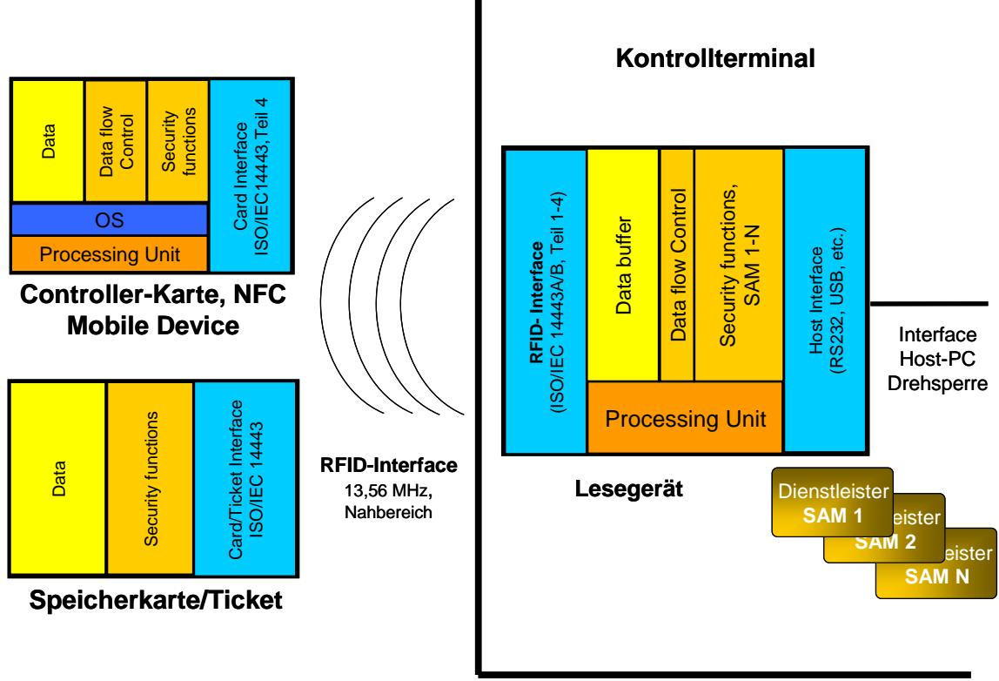

## **Abbildung 10-2 Beispiel eines Lesegeräts mit Smart Card bzw. Smart Label**

# **10.1.3.1 Relevante Gefährdungen für das Lesegerät**

Aufgrund der Annahmen zur Ermittlung des Schutzbedarfs aus Kapitel [10.1.1](#page-113-1) lassen sich für die Schnittstellen des Gesamtsystems folgende relevanten Gefährdungen benennen.

|      | Gefährdungen der kon taktlose Schnittstelle                             | Schutz bedarf | Bemerkungen                                                                                                                                                                                                                                                                                           |
|------|----------------------------------------------------------------------------|------------------|-------------------------------------------------------------------------------------------------------------------------------------------------------------------------------------------------------------------------------------------------------------------------------------------------------|
| GIF1 | Mangelnde Kompatibilität der Schnittstellen Trä germedium -Lesegerät | 3                | Mangelnde Kompatibilität der Schnittstellen führt zu Nichtfunktion beim Aufbringen und der Nutzung von Berechtigungen, der Kon trolle, etc. Das Resultat ist ähnlich eines DoS-Angriffs auf das System. Eine Vielzahl von Kunden bzw. Berechtigungen wäre möglicherweise betroffen. |
| GIF2 | Abhören                                                                    | 3                | Unberechtigtes Belauschen der Kommuni kation zwischen einem Trägermedium und einem Lesegerät.                                                                                                                                                                                                   |

|      | Gefährdungen der kon taktlose Schnittstelle | Schutz bedarf | Bemerkungen                                                                                      |
|------|------------------------------------------------|------------------|--------------------------------------------------------------------------------------------------|
| GIF3 | DoS-Angriff auf die RF Schnittstelle        | 3                | 1 Stören der RFID-Kommunikation (Jam ming)                                                 |
|      |                                                |                  | 2 Stören des Antikollisionsmechanismus zur Selektierung des Trägermediums (Blocker Tag) |
|      |                                                |                  | 3 Abschirmung des elektromagnetischen Feldes des Lesegerätes (Shielding)                   |
|      |                                                |                  | 4 Verstimmen der Resonanzfrequenz von Reader oder Trägermedium (De Tuning)              |

### **Tabelle 10–5 Relevante Gefährdungen der kontaktlosen Schnittstelle**

|     | Gefährdung des Lesege räts                                | Schutz bedarf | Bemerkungen                                                                                                                                                                                                |
|-----|--------------------------------------------------------------|------------------|------------------------------------------------------------------------------------------------------------------------------------------------------------------------------------------------------------|
| GR1 | Unberechtigte Manipula tion der Referenzinfor mationen | 3                | Manipulation der Referenzinformationen (Schlüssel, Auswertealgorithmen, Black oder Whitelists) kann zur unberechtigten Nutzung oder zu DoS verwendet werden.                                      |
| GR2 | Unberechtigtes Auslesen der Referenzinformatio nen     | 3                | Auslesen der Referenzinformationen (Schlüssel, Auswertealgorithmen, Black oder Whitelists) kann zur unberechtigten Nutzung (Z. B. Fälschung von Berechtigun gen) oder zu DoS verwendet werden. |
| GR3 | Fehlfunktion des Lesege rät                               | 3                | Fehlfunktionen des Lesegeräts können durch technische Fehler, Fehlbedienung oder DoS-Angriffe in verschiedenen Szena rien herbeigeführt werden:                                                   |
|     |                                                              |                  | Störung der kontaktlosen Schnittstelle                                                                                                                                                                     |
|     |                                                              |                  | Störung der Referenzinformationen (Schlüs sel, Sperrlisten, etc)                                                                                                                                        |
|     |                                                              |                  | Störung der Anwendungsimplementierung                                                                                                                                                                      |
|     |                                                              |                  | Störung der Auswertealgorithmen für Be rechtigungen                                                                                                                                                     |
|     |                                                              |                  | Fehler in der Stromversorgung                                                                                                                                                                              |
|     |                                                              |                  | Unterbrechung der Anbindung an das Zent ralsystem                                                                                                                                                       |
|     |                                                              |                  | Physische Zerstörung                                                                                                                                                                                       |
|     |                                                              |                  | Störung der Funktionen zur Nutzerführung                                                                                                                                                                   |
| GR4 | Mangelnde Bedienerfüh rung                                | 3                | Mangelnde Bedienerfreundlichkeit an Auto maten und Terminals für Entwertung bzw. Check-in / Check-out kann zu erheblichen                                                                            |

|     | Gefährdung des Lesege räts                  | Schutz bedarf | Bemerkungen                                                                                                                                                                                                                                                             |
|-----|------------------------------------------------|------------------|-------------------------------------------------------------------------------------------------------------------------------------------------------------------------------------------------------------------------------------------------------------------------|
|     |                                                |                  | operativen Problemen führen.                                                                                                                                                                                                                                            |
| GS1 | Fehlen einer Rückfalllö sung                | 3                | Das Fehlen einer Rückfalllösung beim Aus fall von Systemschnittstellen wie Ticketver kaufssystem, Verwaltungssystem für Trä germedien und Berechtigungen, Kontrollsys tem kann zu Komplettausfällen von Services führen (Verkauf, Abrechnung, CICO, etc) |
| GS5 | Mangelnde Kompatibilität der Schnittstellen | 3                | Mangelnde Kompatibilität der Schnittstellen führt zu Fehlfunktion. Das Resultat ist ähn lich eines DoS-Angriffs auf das System. Ei ne Vielzahl von Kunden bzw. Berechtigun gen wäre möglicherweise betroffen.                                               |

**Tabelle 10–6 Relevante Gefährdungen des Lesegeräts** 

### **10.1.3.2 Definition von Schutzmaßnahmen für das Lesegerät und dessen Anwendungen**

Ausgehend von den relevanten Gefährdungen aus dem vorangegangenen Kapitel werden hier generelle Umsetzungsvorschläge und Schutzmaßnahmen für das Lesegerät und dessen Anwendungen definiert. Diese Maßnahmen sind in Kapitel [8.4](#page-71-1) im Detail beschrieben.

|      | Gefährdung                                                                 | Maß nahmen  | Maßnahme                                                                                                                                                                                                                                                |
|------|----------------------------------------------------------------------------|----------------|---------------------------------------------------------------------------------------------------------------------------------------------------------------------------------------------------------------------------------------------------------|
| GIF1 | Mangelnde Kompatibilität der Schnittstellen Trä germedium -Lesegerät | MS1.3 MR1.3 | 1 Einführung von Schnittstellentests und Freigabeverfahren - Zertifizierung                                                                                                                                                                       |
| GIF2 | Abhören                                                                    | MS2.3 MS3.3 | 1 Sicherung der Vertraulichkeit der Kom munikation zwischen RFID Trägermedium und Terminal zur Ab wehr von Abhören – Gegenseitige, dy namische Authentifikation bei der Über tragung. 2 Einführung der kontaktlosen Schnittstel |
| GIF3 | DoS-Angriff auf die RF Schnittstelle                                    | MS3.1          | le nach ISO/IEC14443 1 Einführung der kontaktlosen Schnittstel le nach ISO/IEC14443                                                                                                                                                            |
| GR1  | Unberechtigte Manipula tion der Referenzinfor mationen               | MR2.3          | 1 Schützen der Referenzinformationen gegen Auslesen, Datenfehler und Mani pulationen - Erweiterter Schutz                                                                                                                                      |
| GR2  | Unberechtigtes Auslesen der Referenzinformatio nen                   | MR2.3          | 1 Schützen der Referenzinformationen gegen Auslesen, Datenfehler und Mani pulationen - Erweiterter Schutz                                                                                                                                      |
| GR3  | Fehlfunktion des Lesege rät                                             | MR3.3          | 1 Schutz des Lesegeräts gegen Fehlfunk tionen - Evaluierung                                                                                                                                                                                       |

|     | Gefährdung                                     | Maß nahmen             | Maßnahme                                                                                                                                                                                                                                                                                                                                   |
|-----|------------------------------------------------|---------------------------|--------------------------------------------------------------------------------------------------------------------------------------------------------------------------------------------------------------------------------------------------------------------------------------------------------------------------------------------|
| GR4 | Mangelnde Bedienerfüh rung                  | MS13.3                    | 1 Ergonomische Benutzerführung                                                                                                                                                                                                                                                                                                          |
| GS1 | Fehlen einer Rückfalllö sung                | MS4.3                     | 1 Definition von Rückfalllösungen beim Ausfall von Systemschnittstellen und Systemkomponenten - Umsetzung nach Rückfallkonzept                                                                                                                                                                                                 |
| GS5 | Mangelnde Kompatibilität der Schnittstellen | MS1.3 MS11.3 MS12.3 | 1 Einführung von Schnittstellentests und Freigabeverfahren - Zertifizierung 2 Sicherung der Funktion des Systems zur Vermeidung technischer Fehler von Komponenten und Übertragungswegen - Evaluierung von Komponenten 3 Spezifikation Systemkonzept und An forderungen an die Komponenten - Eva luierung |

## **10.1.3.3 Verbleibende Risiken**

Aus technischen oder wirtschaftlichen Gründen ist es nicht immer möglich, Gefährdungen durch Maßnahmen vollständig zu neutralisieren. In solchen Fällen verbleibt ein Risiko bestehen.

Das Restrisiko ist im Laufe der Planung der konkreten Implementierung zu bestimmen und zu dokumentieren.

## **10.1.4 Verkaufs-, Kontroll- und Managementsysteme**

### **10.1.4.1 Verkaufssysteme**

Der Zugang zu den Produkten muss für alle potentiellen Kunden einfach und kostengünstig möglich sein. Deshalb sind verschiedene Vertriebsschnittstellen zum Kunden zu unterstützen. Diese sind im Folgenden beschrieben:

### **Verkaufsstelle (VKS)**

Hierbei handelt es sich z. B. um die Geschäftsstelle eines Verkehrsunternehmens (*z. B. KA Kundenvertragspartner*) oder ein Reisebüro.

### Verkaufsvorgang

Der Kunde sucht die VKS persönlich auf und wickelt den Kauf vor Ort ab:

- Die Identifikation, wenn erforderlich, erfolgt durch Vorlage des Ausweises.
- Die Buchung erfolgt im Dialog mit dem Kunden vor Ort.
- Die Bezahlung erfolgt direkt in der VKS.

Sofern das Trägermedium vor Ort erstellt oder die Berechtigung auf ein existierendes Kundenmedium aufgebracht werden kann (siehe "*Technische Ausstattung*"), kann der Kunde das Produkt direkt mitnehmen. Ansonsten wird das Produkt mit dem Trägermedium per Post zugestellt oder liegt zu einem späteren Zeitpunkt zur Abholung in der VKS bereit.

### Technische Ausstattung

Die VKS hat einen Direktzugang zum Ticketverkaufssystem. Dies ist die Voraussetzung für die direkte Buchung von z. B. Sitzplatzreservierungen.

In vielen Fällen ist eine Ausstattung mit einem RFID-Ticketdrucker, der bestimmte Trägermedien initialisieren und die Berechtigung aufbringen kann, kommerziell sinnvoll. Weiterhin kann in der VKS durch ein einfaches kontaktloses Lesegerät kostengünstig die Möglichkeit zum Nachladen einer Berechtigung auf ein existierendes Kundenmedium geschaffen werden. Wenn ein solches kontaktloses Lesegerät vorhanden ist, könnte künftig ggf. ein elektronischer Identitätsnachweis für eine sichere, automatisierte Übernahme der personenbezogen Daten in das Ticketsystem (z. B. zum Zwecke des Anlegen eines Kundenkontos) oder zur sicheren Identifikation verwendet werden.

Personal und IT-Infrastruktur in der Verkaufsstelle sind nicht immer vertrauenswürdig.

### **Verkaufs- oder Abholautomat**

Am Verkaufsautomaten werden der Verkauf und die Ausgabe des Produkts in direkter Interaktion zwischen dem Automaten und dem Kunden abgewickelt.

Automaten werden im Kundenzentrum, im Bahnhof, an der Haltestelle und auch mobil im Fahrzeug eingesetzt. Sie eignen sich insbesondere für den Vertrieb von Produkten, die häufig verlangt werden, die keine komplexen Abläufe bei Bestellung und Erstellung verlangen.

Bei Automaten, die mobil eingesetzt werden, ist generell Offline-Fähigkeit gefordert. Der Datenaustausch mit einem Verkaufssystem ist nur in gewissen Intervallen möglich.

### Verkauf personalisierter Produkte

Zurzeit besteht keine Möglichkeit zur sicheren, automatisierten Erstidentifikation eines Kunden. Demnach kann am Automaten keine Anmeldung nach Prozess P1A erfolgen und kein Kundenkonto angelegt werden. Dies ändert sich künftig evtl. durch Verwendung eines elektronischen Identitätsnachweises.

Es ist jedoch möglich, bekannten Kunden, die bereits ein bekanntes personalisiertes Kundenmedium besitzen, neue Berechtigungen auf deren Kundenmedien nachzuladen. Die Identifikation könnte in einem solchen Fall über das existierende Kundenmedium selbst erfolgen.

### Verkauf anonymer Produkte

Im einfachsten Fall werden anonyme Trägermedien und Berechtigungen über Automaten vertrieben.

Der Kunde wickelt den Kauf oder die Abholung am Automaten ab:

- Die Buchung erfolgt am Automaten.
- Die Bezahlung erfolgt direkt z. B. über Maestro- oder Kreditkarte.
- Die Identifikation bei Abholung erfolgt durch das eigene Kundenmedium oder andere elektronische Identitätsnachweise.

Das Trägermedium für das gekaufte Produkt wird vor Ort erstellt. Alternativ kann die Berechtigung auf ein existierendes Kundenmedium aufgebracht werden kann (siehe "*Technische Ausstattung*"). Der Kunde kann das Produkt direkt mitnehmen.

### Abholen von vorbestellten Produkten

Automaten können als Ausgabestelle für im Internet oder telefonisch bestellte Produkte dienen.

Wird der Automat zum Abholen von vorbestellten Berechtigungen eingesetzt, so ist immer eine Identifikation des Bestellers erforderlich. Besitzt der Kunde ein eigenes Kundenmedium, dann kann dieses zur Identifikation und zum Speichern der Berechtigung benutzt werden. Ansonsten müssen andere Verfahren zur Identifikation genutzt werden (z. B. Kreditkarte).

### Technische Ausstattung

Der Automat benötigt zumindest zeitweise einen Direktzugang zum Ticketverkaufssystem. Eine weitere Voraussetzung ist eine Ausstattung mit einem Ticketdrucker mit eingebautem Lesegerät, der die auszugebenden Trägermedien initialisieren und die Berechtigung aufbringen kann.

Sofern das Nachladen von Berechtigungen auf existierende Kundenmedien unterstützt werden soll, ist ein ständiger Zugriff auf das Ticketverkaufssystem und das Managementsystem für Träger und Anwendungen erforderlich. Außerdem muss ein kompatibles Lesegerät im Automaten eingebaut sein.

### **Internet, Call Center, Bestellung per Post**

### Verkaufsvorgang

Der Kunde wickelt die Bestellung von jedem beliebigen Ort via Telefon, im Internet oder per Fax ab:

- Die Buchung, die Sitzplatzwahl, etc. kann bei Nutzung des Internet oder telefonisch in direkter Interaktion erfolgen. Bei einer schriftlichen Bestellung ist dies nicht möglich.
- Die Bezahlung erfolgt über Maestro, Kreditkarte oder per Lastschrift.
- Zur sicheren Identifikation ist ggf. eine Überprüfung der vom Kunden übermittelt personenbezogenen Daten erforderlich.

Das Trägermedium und das Produkt werden zentral erstellt und per Post zugestellt. Alternativ kann auch Abholung des Produkts z. B. an einer Ausgabestelle oder einem Automaten (siehe [0](#page-124-0)) vereinbart werden.

#### Technische Ausstattung

Der Produktanbieter benötigt eine Internet-Vertriebsplattform bzw. ein Call Center. Der Kunde benötigt keine besondere technische Ausstattung.

Die Erstellung des Trägermediums und des Produkts können bei einem Massenpersonalisierer in sicherer Umgebung erfolgen.

### **Internet**

### Verkaufsvorgang

Der Kunde wickelt die Bestellung via Internet von jedem beliebigen Ort (z. B. von zuhause) interaktiv ab.

Wenn der Kunde über ein Kundenmedium verfügt, das die erforderliche Anwendung bereits besitzt, so kann das gewünschte Produkt nachgeladen werden. Bei Nutzung einer Chipkarte ist dazu ein kontaktloses Lesegerät z. B. am Heim-PC erforderlich. Sofern ein NFC Mobile Device als Kundenmedium genutzt werden soll, kann das Produkt auch Over-The-Air nachgeladen werden:

- Die Buchung, *die Sitzplatzwahl,* etc kann bei Nutzung des Internet in direkter Interaktion erfolgen.
- Die Identifikation erfolgt über das Kundenmedium mittels der in der Anwendung gespeicherten Personenbezogenen Daten.
- Die Bezahlung erfolgt über Maestro, Kreditkarte oder per Lastschrift.

Die Berechtigung wird direkt in die Anwendung auf dem Kundenmedium geladen.

Falls noch kein Kundenmedium, jedoch ein kontaktloses Lesegerät vorhanden ist, kann künftig ggf. mit Hilfe eines elektronischen Identitätsnachweises eine sichere Identifikation des Kunden erfolgen und dadurch die Bestellung eines Kundenmediums sicher und bequem getätigt werden.

### Technische Ausstattung

Der Produktanbieter benötigt eine Internet-Vertriebsplattform, die wiederum mit dem Schlüssel- und Träger- und Anwendungsmanagement verbunden ist. Der Kunde benötigt ein Kundenmedium, auf dem die passende Anwendung bereits aufgebracht ist und –bei Nutzung von Chipkarten oder eID - ein kontaktloses Heimlesegerät.

Sowohl das Nachladen von Produkten auf das existierende Kundenmedium als auch die Anmeldung und Bestellung (siehe P1.4) weisen bei Wahl beeigneter Medien, Leser und Protokolle keine Schwachstellen auf.

## **10.1.4.2 Ticketsystem**

Das Ticketsystem unterstützt wesentliche Prozesse des Verkaufs und der Abwicklung:

- 1 Anmeldung/Registrierung und Bestellung
- 2 Erstellung der Berechtigung
- 3 Zahlung und Überprüfung der Bonität
- 4 Verwaltung der verkauften Berechtigungen
- 5 Übergabe der erforderlichen Daten an das Kontrollsystem

Im Ticketsystem werden die Kundendaten und die Bestellungen abgelegt. Sofern die Beförderungsdienstleistung und das Produkt dieses vorsehen, ist mittels hinterlegter Sitzpläne des Fahrzeugs eine Sitzplatzzuordnung möglich. Das Ticketsystem umfasst weiterhin eine Ablaufsteuerung, die z. B. für einen Adressabgleich und eine Zahlungsabwicklung mit Bonitätsprüfung sorgt und die Trägermedien und Berechtigungen erstellen und versenden lässt.

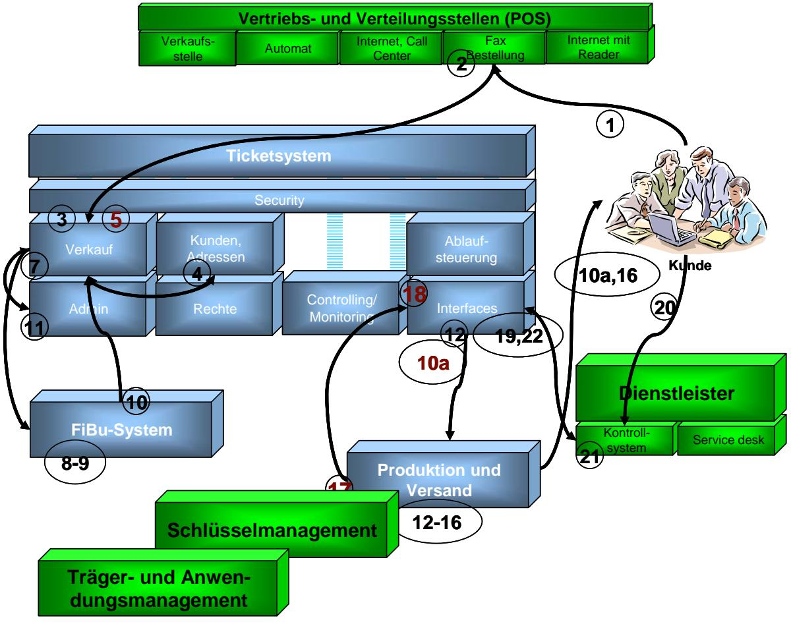

## **Abbildung 10-3 Exemplarisches Ticketsystem mit möglichem Prozessablauf**

Ein Ticketsystem verfügt über Schnittstellen zum Schlüsselmanagement und zum Verwaltungssystem für Trägermedien und Anwendungen. Alle zum Zutritt einer speziellen Veranstaltung erforderlichen Informationen (außer denjenigen, die im Schlüsselmanagement übergeben werden) werden vom Ticketsystem zusammengeführt und über eine definierte Schnittstelle an den Dienstleister übergeben.

Weitere Schnittstellen existieren zu den Vertriebsstellen und zu den Produktionsstätten für die Trägermedien. Dies umfasst auch den Vertrieb und die Steuerung des Aufbringens von Anwendungen und Produkten auf existierende Medien über das Internet.

Es kann davon ausgegangen werden, dass ein Ticketsystem in einer sicheren Umgebung untergebracht ist. Personalisierer-SAM müssen angeschlossen werden, um Berechtigungen erstellen und auf Trägermedien aufbringen zu können.

Aus Sicht des Dienstleisters kann mehr als ein Ticketsystem zum Einsatz kommen.

## **10.1.4.3 Zentrales Kontrollsystem**

Das Kontrollsystem hilft dem Dienstleister, die Fahrtberechtigungen der Kunden zu kontrollieren und die abrechnungsrelevanten Informationen zu sammeln und weiterzuleiten. Dazu sind folgende Funktionen erforderlich:

- 1 Unterstützung des Prozesses P3 zu Check-in, Check-out und ggf. Entwertung
- 2 Unterstützung der spezifischen Trägermedien, Anwendungen und Produkte
	- a Implementierung der technischen Verfahren, die zur Unterstützung der Trägermedien, Anwendungen und Produkte erforderlich sind.
- b Implementierung und Steuerung der SAM
- 3 Steuerung der Terminals (CICO-Terminals, Zugangssperren, mobile Kontrollterminals, etc).
- 4 Übernahme, Verteilung und Nutzung der von den Ticketsystemen bereitgestellten Informationen.
- 5 Übernahme , Verteilung und Nutzung der vom Systemmanager und Registrar bereitgestellten Schlüssel und Kennungen.
- 6 Rückmeldung der abrechnungsrelevanten Daten und der Nutzungshistorie an die Ticketsysteme

Im ÖPV sind die Terminals üblicherweise nicht ständig in das Datennetz eingebunden. Dies gilt insbesondere für Terminals in den Fahrzeugen. Das bedeutet, dass alle für den Zutritt, die Aus- und Entwertung der Berechtigungen und ggf. der Fahrpreisermittlung nötigen Informationen lokal in den Terminals vorgehalten werden müssen.

## **10.1.4.4 Terminals**

Die Terminals haben die Aufgabe, die Berechtigung beim Check-in/Check-out zu lesen, auszuwerten und ggf. zu entwerten. Im Terminal ist ein kontaktloses Lesegerät integriert.

Im Normalbetrieb sind stationäre Terminals täglich zumindest für eine gewisse Zeit über ein Datennetz (LAN oder WLAN) mit dem zentralen Kontrollsystem verbunden. Informationen, die zum Auswerten der Berechtigungen nötig sind, werden auf diesem Weg ständig aktualisiert. Auch CICO-Daten werden so vom Terminal an das Zentralsystem berichtet. Bei mobilen Geräten oder Geräten in Fahrzeugen können auch längere Intervalle vorkommen. Der Datenaustausch erfolgt zum Teil auch über Datenträger.

Da die Terminals nur zeitweise mit dem Gesamtsystem verbunden sind, müssen alle Funktionen, die zur Kommunikation mit dem Trägermedium und der Anwendung nötig sind, lokal im Terminal unterstützt werden. Daraus kann sich ein erheblicher Aufwand bei der Einführung neuer Techniken ergeben. Bei der Definition von Anwendungen macht es deshalb Sinn, bei Kommunikationsprotokollen, kryptographischen Methoden, etc grundsätzlich auf offene, standardisierte Verfahren und flexible, hardware-unabhängige Implementierungen zu setzen.

Neben den anwendungsspezifischen Funktionen müssen alle veranstaltungsspezifischen Informationen, die zur Auswertung der Berechtigung nötig sind (ID Dienstleister, Sperrlisten, ID Trägermedium, ID Anwendung, IP Produkt, Schlüssel verschiedenen Ebenen, etc) lokal im Terminal vorliegen. Auch die Zugangshistorie muss im Terminal zwischengespeichert werden können.

Die sicherheitsrelevanten Maßnahmen zum Lesegerät, das Teil des Terminals ist, finden sich in Kapitel [10.1.3.2.](#page-121-1)

Man kann grundsätzlich zwischen fest installierten und mobilen Geräten unterscheiden.

1 Fest installierte Geräte

CICO-Terminals werden teilweise fest im Bahnsteigbereich oder an der Haltestelle installiert. Diese Geräte sind üblicherweise über ein LAN an das zentrale Kontrollsystem angeschlossen.

In einigen europäischen Großstädten gibt es fest installierte Drehsperren, die den Zutritt zum Bahnsteig regeln. In diese Drehsperren sind Terminals mit Lesegeräten entsprechend integriert und über ein LAN an das zentrale Kontrollsystem angeschlossen. Der Zutritt wird nach erfolgreicher Auswertung der Berechtigung durch Entriegelung und Andrehen der Drehsperre gewährt. Die Drehsperren befinden sich im Zugangsbereich des Bahnsteigs.

- 2 Mobile Geräte
	- a Mobile Terminals

CICO-Terminals werden teilweise im Fahrzeug installiert. Diese Geräte können nur zeitweise Daten mit dem zentralen Kontrollsystem austauschen. Die Geräte sind mit Dienstleister-SAM ausgestattet.

b Kontrollgeräte

Weiterhin gibt es tragbare Kontrollgeräte, die z. B. von Zugbegleitern zur Durchführung des Kontrollprozesses und auch zu Verkaufszwecken verwendet werden. Diese müssen ebenfalls komplett offline-fähig sein. Die Geräte sind mit Personalisierer-SAM und Dienstleister-SAM ausgestattet.

# **10.1.4.5 Service-Desk**

Im realen Betrieb muss mit einem gewissen Anteil von defekten Kundenmedien, nicht sachgerechter Bedienung, Angriffen auf die Sicherheit und auch Betrugsversuchen gerechnet werden. Der Service-Desk dient als Anlaufstelle bei Problemen beim Check-in.

Gültige Berechtigung verfallen bei Fehlfunktionen der Kontrolltechnik, des Kundenmediums und auch bei Fehlverhalten des Kunden nicht. Über den Service-Desk der vom Dienstleister oder vom Produktanbieter betrieben wird, wird dem Kunden eine Ersatzberechtigung ausgestellt oder Erstattung geleistet.

Dazu ist es erforderlich den Prozess P4 "Sperrung von Berechtigungen und Trägermedien" und die Ausgabe eines Ersatzmediums a effizient und schnell durchführen zu können.

Am Service Desk werden folgende Aufgaben ausgeführt:

- 1 Überprüfen der Funktion des Trägermediums und des Status der Berechtigung. Bei Fehlverhalten folgt:
- 2 Überprüfung der Echtheit des Mediums und / oder Überprüfung der Identität des Kunden. Bei positivem Resultat folgt:
- 3 Sperrung des vorgelegten Mediums und der Berechtigung.
- 4 Ausstellung eines Ersatzmediums mit neuer Berechtigung.
- 5 Update der Informationen im Ticketsystem und dem Träger- und Anwendungsmanagement.
- 6 Übertragung der Informationen vom Ticketsystem an das Kontrollsystem.

Die Notfallszenarien bei Fehlfunktion eines Kontrollsystems, das Zutrittssperren verwendet, basieren auf dem Ordnungspersonal und dem Service-Desk. Diesen kommt deshalb eine entscheidende Bedeutung für die Systemsicherheit zu. Gelingt es einem Angreifer Fehlfunktionen herbeizuführen, die das Ordnungspersonal und den Service-Desk erheblich überlasten, dann kommt dies einem erfolgreichen DoS-Angriff auf das gesamte Kontrollsystem gleich.

# **10.1.4.6 Managementsystem für Trägermedien und Anwendungen**

Für die Prozesse des Aufbringens von Anwendungen und Berechtigungen und für die Prozesse bei denen das Kundenmedium für die Identifikation und die Nutzung von Verkehrsmitteln genutzt wird, ist es wichtig, den Status des jeweilig benutzten Trägermediums und der auf ihm gespeicherten Anwendungen zu kennen.

Aus diesem Grund muss der Lebenszyklus eines Trägermediums, das im Bereich des Systems verwendet werden soll, zuverlässig dokumentiert werden. Dazu wird eine Datenbank verwendet, die mit dem Ticketsystem und dem Schlüsselmanagement durch Schnittstellen verbunden ist. Hier werden für jedes Trägermedium z. B. folgende Informationen eingetragen:

- ID Trägermedium
- Typ, Version
- Anbieter des Trägermediums (ID via Registrar)
- Herausgeber des Trägermediums (ID via Registrar)
- Kunde
- Status (z. B. neu/aktiv/gesperrt)
- Gespeicherte Anwendungen (siehe unten)
- etc.

In gleicher Weise muss auch der Lebenszyklus der auf dem Trägermedium gespeicherten Anwendungen dokumentiert werden. Es können mehrere verschiedene Anwendungen gespeichert sein.

- ID Anwendung
- Typ, Version
- Anwendungsanbieter (ID via Registrar)
- Anwendungsherausgeber (ID via Registrar)
- Kunde
- Status (z. B. neu/aktiv/gesperrt/löschen)
- Gespeicherte Berechtigungen inkl. ID des Produktanbieters
- Aktive Berechtigungen / löschbare Berechtigungen

### **10.1.4.7 Relevante Gefährdungen für die Verkaufs-, Kontroll- und Managementsysteme**

Aufgrund der Annahmen zur Ermittlung des Schutzbedarfs aus Kapitel [10.1.1](#page-113-1) lassen sich für die Schnittstellen des Gesamtsystems folgende relevanten Gefährdungen benennen.

|     | Gefährdungen der Ver kaufs,- Kontroll- und Ma nagementsysteme | Schutz bedarf | Bemerkungen                                                                                                                                                                                                                                                                                                   |
|-----|---------------------------------------------------------------------|------------------|---------------------------------------------------------------------------------------------------------------------------------------------------------------------------------------------------------------------------------------------------------------------------------------------------------------|
| GS1 | Fehlen einer Rückfalllö sung                                     | 3                | Das Fehlen einer Rückfalllösung beim Aus fall von Systemkomponenten wie Ticketver kaufssystem, Verwaltungssystem für Trä germedien und Berechtigungen, Kontrollsys tem kann zu Komplettausfällen von Services führen (Verkauf, Abrechnung, CICO, etc)                                          |
| GS2 | Unberechtigtes Auslesen von Referenzdaten                        | 3                | In den Hintergrundsystemen sind Informati onen zu den Medien, den Berechtigungen, der Nutzung sowie ggf. personenbezogene Daten und Abrechnungsdaten gespeichert. Das Auslesen dieser Daten durch Unbe rechtigte würde das System diskreditieren und die Möglichkeit für Angriffe schaffen. |
| GS3 | Manipulieren von Refe renzdaten im System                        | 3                | In den Hintergrundsystemen sind Informati onen zu den Medien, den Berechtigungen, der Nutzung sowie ggf. personenbezogene Daten und den Abrechnungsdaten gespei                                                                                                                                      |

|     | Gefährdungen der Ver kaufs,- Kontroll- und Ma nagementsysteme                | Schutz bedarf | Bemerkungen                                                                                                                                                                                                                                                                                                                              |
|-----|------------------------------------------------------------------------------------|------------------|------------------------------------------------------------------------------------------------------------------------------------------------------------------------------------------------------------------------------------------------------------------------------------------------------------------------------------------|
|     |                                                                                    |                  | chert. Das Manipulieren dieser Daten durch Unberechtigte ist ein schwerwiegender An griff.                                                                                                                                                                                                                                         |
| GS4 | Fehlfunktion des Sys tems                                                       | 3                | Fehlfunktionen einzelner Systemkomponen ten können durch technische Fehler, Fehl bedienung oder DoS-Angriffe in verschiede nen Szenarien herbeigeführt werden:                                                                                                                                                                  |
|     |                                                                                    |                  | Störung der lokalen und zentralen Systeme                                                                                                                                                                                                                                                                                                |
|     |                                                                                    |                  | Mangelnde Verfügbarkeit der lokalen und zentralen Systeme                                                                                                                                                                                                                                                                             |
|     |                                                                                    |                  | Störung der Datenspeicher                                                                                                                                                                                                                                                                                                                |
|     |                                                                                    |                  | Fehler in der Stromversorgung                                                                                                                                                                                                                                                                                                            |
|     |                                                                                    |                  | Unterbrechung der Anbindung an das Zent ralsystem                                                                                                                                                                                                                                                                                     |
|     |                                                                                    |                  | Schutz gegen physikalische Angriffe (De montage, Zerstörung)                                                                                                                                                                                                                                                                          |
| GS5 | Mangelnde Kompatibilität der Schnittstellen                                     | 3                | Mangelnde Kompatibilität der Schnittstellen führt zu Fehlfunktion. Das Resultat ist ähn lich eines DoS-Angriffs auf das System. Ei ne Vielzahl von Kunden bzw. Berechtigun gen wäre möglicherweise betroffen.                                                                                                                |
| GS6 | Unerlaubtes Auslesen der Verkaufs- und Ab rechnungsdaten                     | 3                | Unerlaubtes aktives Auslesen der Abrech nungsdaten                                                                                                                                                                                                                                                                                    |
| GS7 | Unerlaubtes Schreiben / Manipulieren der Ver kaufs- und Abrech nungsdaten | 3                | Unerlaubtes Schreiben von Abrechnungsda ten in das Trägermedium zum Zwecke der Manipulation bzw. Kompromittierung.                                                                                                                                                                                                                 |
| GS8 | Schutz von mandanten spezifischen Anwendun gen und Berechtigungen            | 3                | Sofern mehrere Entitäten mit Verkaufsdaten, Berechtigung und Anwendungen von den Systemen unterstützt werden, könnten diese bei wechselseitiger Benutzung beeinflusst oder beschädigt werden.                                                                                                                                |
| GS9 | Fälschung von Identifika tionsdaten                                             | 2                | Beim Anlegen eines Kundenkontos, Kauf oder Abholung eines Produktes ist ggf. eine Identifikation des Kunden erforderlich. Das Vortäuschen einer falschen Identität erlaubt z. B. das Erschleichen von Berechtigungen zu Lasten anderer Kunden oder des Pro duktanbieters. Der Schutzbedarf bzgl. SI2 (Schutz der Be |
|     |                                                                                    |                  | rechtigungen) ist hier als 2 eingestuft, da Angriffe nur auf einzelne Berechtigungen                                                                                                                                                                                                                                                  |

|      | Gefährdungen der Ver kaufs,- Kontroll- und Ma nagementsysteme | Schutz bedarf | Bemerkungen                                                                                                         |
|------|---------------------------------------------------------------------|------------------|---------------------------------------------------------------------------------------------------------------------|
|      |                                                                     |                  | wirken.                                                                                                             |
| GS10 | Ungerechtfertigtes Sam meln und Speichern von Daten           | 3                | Das Konzept der automatischen Fahrpreis ermittlung verwendet personenbezogene Nutzungs- und Abrechnungsdaten. |

#### **Tabelle 10–8 Relevante Gefährdungen für die Verkaufs, Kontroll- und Managementsysteme**

### **10.1.4.8 Definition von Schutzmaßnahmen für die Verkaufs-, Kontroll- und Managementsysteme**

Ausgehend von den relevanten Gefährdungen aus dem vorangegangenen Kapitel werden hier generelle Umsetzungsvorschläge und Schutzmaßnahmen definiert. Diese Maßnahmen sind in Kapitel [8.4](#page-71-1) im Detail beschrieben.

|     | Gefährdung                                   | Maß nahmen                     | Maßnahme                                                                                                                                                                                                                                                                                                                                                                                                                                 |
|-----|----------------------------------------------|-----------------------------------|------------------------------------------------------------------------------------------------------------------------------------------------------------------------------------------------------------------------------------------------------------------------------------------------------------------------------------------------------------------------------------------------------------------------------------------|
| GS1 | Fehlen einer Rückfalllö sung              | MS4.3                             | Definition einer Rückfalllösung beim Ausfall von Systemschnittstellen und Systemkom ponenten - Umsetzung nach Rückfallkon zept                                                                                                                                                                                                                                                                                                  |
| GS2 | Unberechtigtes Auslesen von Referenzdaten | MS5.3 MS6.3 MS15.3          | Sicherung der Vertraulichkeit von Daten bei der Kommunikation innerhalb des Systems – Sicherer Kommunikationskanal Vertrauliche Speicherung von Daten - Ein führung mandantenfähigen Zugriffsschutz, Rollenmodell Trennung von Anwendungen – Getrennte Speicherung und Verarbeitung von Daten                                                                                                                       |
| GS3 | Manipulieren von Refe renzdaten im System | MS6.3 MS7.3 MS8.3 MS15.3 | Vertrauliche Speicherung von Daten - Ein haltung Datenschutz durch mandantenfähi gen Zugriffsschutz, Rollenmodell Sicherung der Datenintegrität zum Schutz vor Manipulationen bei der Datenübertra gung innerhalb des Systems – MAC oder Signaturen Sicherung der Datenintegrität bei der Spei cherung von Daten – Checksummen Trennung von Anwendungen – Getrennte Speicherung und Verarbeitung von Daten |
| GS4 | Fehlfunktion des Sys tems                 | MS4.3 MS9.3 MS10.3          | Definition einer Rückfalllösung beim Ausfall von Systemschnittstellen und Systemkom ponenten – Umsetzung nach Ausfallkonzept Sicherung der Systemfunktionen gegen                                                                                                                                                                                                                                                               |
|     |                                              |                                   |                                                                                                                                                                                                                                                                                                                                                                                                                                          |

|     | Gefährdung                                                                         | Maß nahmen                                           | Maßnahme                                                                                                                                                                                                                                                                                                                                                                                                                                                                                                                                                                                                                                                                                                                                                                                                                                                            |
|-----|------------------------------------------------------------------------------------|---------------------------------------------------------|---------------------------------------------------------------------------------------------------------------------------------------------------------------------------------------------------------------------------------------------------------------------------------------------------------------------------------------------------------------------------------------------------------------------------------------------------------------------------------------------------------------------------------------------------------------------------------------------------------------------------------------------------------------------------------------------------------------------------------------------------------------------------------------------------------------------------------------------------------------------|
| GS5 | Mangelnde Kompatibilität der Schnittstellen                                     | MS11.3 MS13.3 MS14.3 MS1.3 MS11.3 MS12.3 | DOS-Angriffe an den Schnittstellen - Sicher heitskonzeption Sicherung der Funktion des Systems gegen Fehlbedienung durch Mitarbeiter und Nutzer - Tests, Personal und Benutzerführung. Sicherung der Funktion des Systems zur Vermeidung technischer Fehler von Kompo nenten und Übertragungswegen - Evaluie rung von Komponenten Ergonomische Nutzerführung Support – Systemweiter Support Einführung von Schnittstellentests und Frei gabeverfahren - Zertifizierung Sicherung der Funktion des Systems zur Vermeidung technischer Fehler von Kompo nenten und Übertragungswegen - Evaluie rung von Komponenten Spezifikation Systemkonzept und Anforde rungen an die Komponenten mit dem Ziel der Integration und Interfunktionsfähigkeit - Kompatibilitätstests nach Testkonzeption, Evaluierung |
| GS6 | Unerlaubtes Auslesen der Verkaufs- und Ab rechnungsdaten                     | MS5.3 MS6.3 MS15.3                                | Sicherung der Vertraulichkeit von Daten bei der Kommunikation innerhalb des Systems – VPN o.ä. Vertrauliche Speicherung von Daten – Ein führung eines mandantenfähigen Zugriffs schutz entsprechend Rollenmodell Trennung von Applikationen – Getrennte Speicherung und Verarbeitung von Daten                                                                                                                                                                                                                                                                                                                                                                                                                                                                                                                                                 |
| GS7 | Unerlaubtes Schreiben / Manipulieren der Ver kaufs- und Abrech nungsdaten | MS6.3 MS7.3 MS8.3 MS15.3                       | Vertrauliche Speicherung von Daten – Ein führung eines mandantenfähigen Zugriffs schutz entsprechend Rollenmodell Sicherung der Datenintegrität zum Schutz vor Manipulationen bei der Datenübertra gung innerhalb des Systems – MAC oder Signaturen Sicherung der Datenintegrität bei der Spei cherung von Daten – Checksummen Trennung von Applikationen – Getrennte Speicherung und Verarbeitung von Daten                                                                                                                                                                                                                                                                                                                                                                                                                          |
| GS8 | Schutz von mandanten-                                                              | MS6.3                                                   | Vertrauliche Speicherung von Daten - Ein-                                                                                                                                                                                                                                                                                                                                                                                                                                                                                                                                                                                                                                                                                                                                                                                                                           |

|      | Gefährdung                                                | Maß nahmen | Maßnahme                                                                         |
|------|-----------------------------------------------------------|---------------|----------------------------------------------------------------------------------|
|      | spezifischen Anwendun gen und Berechtigungen           | MS15.3        | haltung Datenschutz durch mandanten fähigen Zugriffsschutz, Rollenmodell      |
|      |                                                           |               | Trennung von Applikationen – Getrennte Speicherung und Verarbeitung von Daten |
| GS9  | Fälschung von Identifika tionsdaten                    | MS16.2        | Identifikation des Kunden – Antragsformular, Kundenmedium                     |
| GS10 | Ungerechtfertigtes Sam meln und Speichern von Daten | MS17.3        | Umsetzung des Gebots zur Datensparsam keit – Besondere Maßnahmen              |

**Tabelle 10–9 Schutzmaßnahmen für die Verkaufs-, Kontroll- und Managementsysteme** 

## **10.1.4.9 Verbleibende Risiken**

Aus technischen oder wirtschaftlichen Gründen ist es nicht immer möglich, Gefährdungen durch Maßnahmen vollständig zu neutralisieren. In solchen Fällen verbleibt ein Risiko bestehen.

Das Restrisiko ist im Laufe der Planung der konkreten Implementierung zu bestimmen und zu dokumentieren.

# **10.1.5 Schlüsselmanagement**

Das Schlüsselmanagement hat die Aufgabe, Schlüssel, die von mehreren Entitäten genutzt werden, für alle im System verwendeten Trägermedien, Anwendungen und Produkte sicher und zuverlässig bereitzustellen. Das Schlüsselmanagement obliegt dem Sicherheitsmanager. Einige Use Cases sind in Kapitel [7.3](#page-45-2) beschrieben. Als generelle Anleitung zur Implementierung kann [GSHB] herangezogen werden.

Schlüssel werden für den jeweiligen Einsatzzweck individuell erzeugt. Dabei werden, sofern möglich, für die verschiedenen Formen der Interaktion (z. B. Aufbringen von Anwendungen, Schreiben von Berechtigungen, Lesen von Berechtigungen, Schreiben von Nutzungsdaten) individuell Schlüssel vergeben. Die genauen Eigenschaften müssen für jedes Einsatzszenario im Rahmen der Erstellung des spezifischen Sicherheitskonzepts im Einklang mit dem Rollenmodell ermittelt werden.

Die Schlüssel werden in einer sicheren Umgebung erzeugt und in einer sicheren Datenbank gespeichert. In dieser sicheren Umgebung werden auch die verschiedenen Formen von SAM erstellt. Die Dokumentation des Lebenszyklus der erstellten und ausgegebenen SAM ist ebenfalls Aufgabe des Schlüsselmanagement.

SAM und Schlüssel werden nach Bedarf des jeweiligen Nutzers vom Sicherheitsmanager oder dessen Beauftragten erstellt. Grundsätzlich werden folgende Arten von SAM unterstützt:

| Initialisierer-SAM  | Initialisierer-SAM werden zur Initialisierung von Trägermedien und zum Aufbringen von Anwendungen benötigt. |
|---------------------|----------------------------------------------------------------------------------------------------------------|
| Personalisierer-SAM | Personalisierer-SAM werden zum Einbringen von Berechtigun gen in passende Anwendungen benötigt.             |

Dienstleister-SAM Dienstleister-SAM werden vom Dienstleister zum Lesen und Entwerten der Berechtigungen und ggf. zum Einbringen der Nutzungsdaten in das Trägermedium benötigt.

Weiterhin kann es bei Bedarf besondere SAM geben, die helfen, die Produktkennung des Anbieters von Trägermedien, Anwendungen und Berechtigungen sicher auf das Trägermedium aufzubringen.

Üblicherweise werden in einem SAM Schlüsselinformationen nach Bedarf des Nutzers eingebracht. Ziel eines Initialisierers ist es z. B., alle in seinem Bereich anfallenden Trägermedien mit den geforderten Anwendungen ohne Wechsel des SAM initialisieren zu können.

Die Konfiguration solcher nutzerspezifischen SAM muss in Absprache zwischen Nutzer und dem Systemmanager erfolgen.

Das SAM soll das sichere Nachladen von Schlüsseln über ein Netzwerk unterstützen. Idealerweise könnte das Update dann direkt vom Sicherheitsmanager erfolgen.

# **10.1.5.1 Schlüsselmanagement beim ÖPV-Dienstleister / SAM für Dienstleister**

Zur Auswertung der Berechtigungen sind die spezifischen Schlüsselinformationen erforderlich. Die Zuverlässigkeit und Sicherheit des damit verbundenen Schlüsselmanagements ist von elementarer Bedeutung für das Gesamtkonzept. Stimmen die Schlüssel beim Dienstleister nicht mit denen der zum Zutritt verwendeten Trägermedien und Berechtigungen überein, dann funktioniert die Auswertung der Berechtigungen nicht. Gehen Schlüssel verloren oder werden diese öffentlich, dann ist das gesamte Sicherheitskonzept diskreditiert.

Nach dem vorliegenden Vorschlag werden dem Dienstleister als Betreiber des Kontrollsystems spezielle SAM zur Verfügung gestellt. Diese Dienstleister-SAM enthalten die für seine Dienstleistung relevanten Schlüsselinformationen und müssen in die Terminals integriert werden.

Bei der Verwendung von Dienstleister-SAM beschränkt sich das Schlüsselmanagement auf die Übernahme, die Handhabung und Verwaltung der SAM. Da die Schlüssel bei Verwendung von SAM nicht zugänglich sind, ist das Risiko und damit auch der Schutzaufwand begrenzt. Gleichzeitig reduziert die Verwendung von standardisierten SAM den Aufwand bei der Anpassung an neue Anwendungen.

## **10.1.5.2 Relevante Gefährdungen für das Schlüsselmanagement**

Aufgrund der Annahmen zur Ermittlung des Schutzbedarfs aus Kapitel [10.1.1](#page-113-1) lassen sich für die Schnittstellen des Gesamtsystems folgende relevanten Gefährdungen benennen.

|     | Gefährdungen des Schlüsselmanagements      | Schutz bedarf | Bemerkungen                                                                                                                                                                                  |
|-----|-----------------------------------------------|------------------|----------------------------------------------------------------------------------------------------------------------------------------------------------------------------------------------|
| GK1 | Mangelnde Qualität der Schlüsseldaten      | 3                | Mangelnde Qualität der Schlüssel steigert die Erfolgschancen von Angriffen.                                                                                                               |
| GK2 | Unberechtigtes Auslesen von Schlüsseldaten | 3                | Das Auslesen von Schlüsseldaten durch Unberechtigte kann das Systems diskreditie ren und z. B. Angriffe auf alle kryp tographisch geschützten Daten und Funkti onen begünstigen. |
| GK3 | Manipulieren von Schlüs-                      | 3                | Manipulation von Schlüsseldaten kann das Sicherheitskonzept des Systems diskreditie                                                                                                       |

|     | Gefährdungen des Schlüsselmanagements        | Schutz bedarf | Bemerkungen                                                                                                                                                                                                                                                                                 |
|-----|-------------------------------------------------|------------------|---------------------------------------------------------------------------------------------------------------------------------------------------------------------------------------------------------------------------------------------------------------------------------------------|
|     | seldaten                                        |                  | ren und z. B. Angriffe auf alle kryp tographisch geschützten Daten und Funkti onen begünstigen. Die Manipulation kann die Erstellung von Schlüsseln, die Erstellung von Schlüsselträgern, die Übertragung von Schlüsseln und die lokale Nutzung von Schlüsseln betreffen. |
| GK4 | Fehlfunktion des Schlüs selmanagementsystems | 3                | Fehlfunktionen des Schlüsselmanagements können durch technische Fehler, Fehlbedie nung oder DoS-Angriffe in verschiedenen Szenarien herbeigeführt werden: 1 Störung der lokalen und zentralen Sys                                                                            |
|     |                                                 |                  | teme 2 Mangelnde Verfügbarkeit der lokalen und zentralen Systeme                                                                                                                                                                                                                   |
|     |                                                 |                  | 3 Störung der Datenspeicher                                                                                                                                                                                                                                                              |
|     |                                                 |                  | 4 Störung der spezifischen Anwendungs implementierung                                                                                                                                                                                                                                 |
|     |                                                 |                  | 5 Störung der Auswertealgorithmen für Berechtigungen                                                                                                                                                                                                                                  |
|     |                                                 |                  | 6 Fehler in der Stromversorgung                                                                                                                                                                                                                                                          |
|     |                                                 |                  | 7 Unterbrechung der Anbindung an das Zentralsystem                                                                                                                                                                                                                                    |
|     |                                                 |                  | 8 Physische Zerstörung                                                                                                                                                                                                                                                                   |
| GK5 | Fehlen einer Rückfalllö sung                 | 3                | Die Verfügbarkeit der benötigten Schlüssel informationen ist die Grundvoraussetzung für die Funktion des Gesamtsystems. Bei Fehlfunktionen des Schlüsselmanagement wäre ohne Rückfalllösung die Funktion des Gesamtsystems bedroht.                                          |

**Tabelle 10–10 Relevante Gefährdungen des Schlüsselmanagements** 

# **10.1.5.3 Definition von Schutzmaßnahmen für das Schlüsselmanagement**

Ausgehend von den relevanten Gefährdungen aus dem vorangegangenen Kapitel werden hier generelle Umsetzungsvorschläge und Schutzmaßnahmen definiert. Diese Maßnahmen sind in Kapitel [8.4](#page-71-1) im Detail beschrieben.

|     | Gefährdung                               | Maß nahmen  | Maßnahme                                                                                                                                                                                                                                                          |
|-----|------------------------------------------|----------------|-------------------------------------------------------------------------------------------------------------------------------------------------------------------------------------------------------------------------------------------------------------------|
| GK1 | Mangelnde Qualität der Schlüsseldaten | MK1.3 MK2.3 | 1 Sichere Erzeugung und Einbringung von Schlüsseln - Evaluierung und Zerti fizierung nach CC oder einem gleich wertigen Verfahren 2 Einführung eines Schlüsselmanage ment für symmetrische und asymmetri sche Schlüssel mit ausreichender |

|     | Gefährdung                                      | Maß nahmen           | Maßnahme                                                                                                                                                                                                                                                                                                                                                                                                                 |  |
|-----|-------------------------------------------------|-------------------------|--------------------------------------------------------------------------------------------------------------------------------------------------------------------------------------------------------------------------------------------------------------------------------------------------------------------------------------------------------------------------------------------------------------------------|--|
|     |                                                 |                         | Schlüssellänge –Sicheres, flexibles Schlüsselmanagementkonzept                                                                                                                                                                                                                                                                                                                                                        |  |
| GK2 | Unberechtigtes Auslesen von Schlüsseldaten   | MK3.3 MK7.3          | 1 Zugriffschutz auf kryptographische Schlüssel (Lese- und Schreibzugriff) - Evaluierung und Zertifizierung nach CC oder einem gleichwertigen Verfahren 2 Trennung von Schlüsseln – Getrennte Speicherung und Verarbeitung von Schlüsseln                                                                                                                                                         |  |
| GK3 | Manipulieren von Schlüs seldaten             | MK3.3 MK7.3 MK8.3 | 1 Zugriffschutz auf kryptographische Schlüssel (Lese- und Schreibzugriff) - Evaluierung und Zertifizierung nach CC oder einem gleichwertigen Verfahren 2 Trennung von Schlüsseln – Getrennte Speicherung und Verarbeitung von Schlüsseln 3 Nachladen von Schlüsseln - Sichern der Berechtigungen hinsichtlich Authentizi tät und Integrität - Komplexes Authenti fikationskonzept |  |
| GK4 | Fehlfunktion des Schlüs selmanagementsystems | MK4.3 MK5.3          | 1 Spezifizieren der Performanz und der geforderte Sicherung der Funktion der Sicherheitskomponenten - Evaluierung 2 Verfügbarkeit des Schlüsselmanage ments (Rückfalllösung) - Umsetzung nach Ausfallkonzept und Backup von Schlüsseln im Trustcenter                                                                                                                                            |  |
| GK5 | Fehlen einer Rückfalllö sung                 | MK5.3 MK6.3          | 1 Verfügbarkeit des Schlüsselmanage ments (Rückfalllösung) - Umsetzung nach Rückfallkonzept und Backup von Schlüsseln im Trustcenter 2 Definition des Verhaltens im Kompro mittierungsfall – Kompromittierung von nicht diversifizierten Schlüsseln                                                                                                                                              |  |

| Tabelle 10–11 Schutzmaßnahmen für das Schlüsselmanagement |  |  |
|-----------------------------------------------------------|--|--|
|-----------------------------------------------------------|--|--|

# **10.1.5.4 Verbleibende Risiken**

Aus technischen oder wirtschaftlichen Gründen ist es nicht immer möglich, Gefährdungen durch Maßnahmen vollständig zu neutralisieren. In solchen Fällen verbleibt ein Risiko bestehen.

Das Restrisiko ist im Laufe der Planung der konkreten Implementierung zu bestimmen und zu dokumentieren.

# **10.2 Umsetzungsvorschläge zu den Trägermedien**

Die Vielzahl der Produkte des eTicketing für den ÖPV kann auf verschiedenen Trägermedien abgebildet werden. Für diese Trägermedien steht wiederum eine Vielzahl von Chips zur Verfügung.

In den beiden folgenden Tabellen wird eine Kategorisierung der Trägermedien und Chipprodukte eingeführt.

| Kategorie                                                 | Eigenschaften des Trägermedi ums                                                                                                                                                                                                                                                                             | Sicherheitsfunktionen des Kartenkörpers                                                                                                                                                                                                                                                                                                          | Passende Chipkategorie                                                  |
|-----------------------------------------------------------|-----------------------------------------------------------------------------------------------------------------------------------------------------------------------------------------------------------------------------------------------------------------------------------------------------------------|-----------------------------------------------------------------------------------------------------------------------------------------------------------------------------------------------------------------------------------------------------------------------------------------------------------------------------------------------------|----------------------------------------------------------------------------|
| Kontaktlo ses Smart Ticket                          | • Mehrlagiges, laminiertes Pa pierticket. Freie Formatwahl: IATA, ID1, etc mit ID1- Antenne • Kosten: < 20 € Cent ohne Chip • Typ. Gebrauchsdauer : ca. 3 Monate                                                                                                                  | • Einfache optische Sicherheitsmerkmale: z. B. Melierfasern, flu oreszierende Farben für Zutrittskontrolle • Optische Personalisie rung • Option: Abriss zur manuellen Entwertung als Rückfalllösung                                                                                                            | Kostengünsti ger Speicher chip, Klassi scher Spei cherchip     |
| Kontaktlo se sichere Chipkarte                      | • Kontaktlose PVC-Chipkarte. Freie Formatwahl: Üblicher weise ID1 mit ID1-Antenne • Kosten: < 1 € ohne Chip • Typ. Gebrauchsdauer : ca. 3 Jahre                                                                                                                                         | • Höhere optische Si cherheitsmerkmale: z. B. Hologramm, Mik roschrift; • Optische Personalisie rung • Keine Möglichkeit zur sichtbaren Entwertung da Mehrfachnutzung                                                                                                                                              | Sicherer, fle xibler Spei cherchip                                   |
| Kontaktlo se sichere Multiap plikati onskarte | • Kontaktlose PVC oder PC Chipkarte. Freie Formatwahl: Üblicherweise ID1, ID1- Antenne • Kosten: • < 1 € ohne Chip bei Stan dardaufbau oder < 3 € ohne Chip bei Kartenkörper mit hochwertigen optischen Si cherheitsfunktionen • Typ. Gebrauchsdauer : ca. 3 Jahre | • Kartenkörper wie "Kontaktlose sichere Chipkarte" oder hoch wertiger Kartenkörper (z. B. PC) mit opti schen Sicherheitsfea tures (z. B. Guillo chen, OVI, Prägung) möglich. • Optische Personalisie rung • Optional Display • Keine Möglichkeit zur sichtbaren Entwertung da Mehrfachnutzung | Sicherer Cont rollerchip mit Betriebs- und Anwendungs software |

| Kategorie                 | Eigenschaften des Trägermedi                                                                                                                                                                                                                                                                                                                 | Sicherheitsfunktionen des                                                                                                                                                                                                              | Passende                                                                   |
|---------------------------|----------------------------------------------------------------------------------------------------------------------------------------------------------------------------------------------------------------------------------------------------------------------------------------------------------------------------------------------|----------------------------------------------------------------------------------------------------------------------------------------------------------------------------------------------------------------------------------------|----------------------------------------------------------------------------|
|                           | ums                                                                                                                                                                                                                                                                                                                                          | Kartenkörpers                                                                                                                                                                                                                          | Chipkategorie                                                              |
| NFC Mo bile Devi ce | • Mobilgerät mit NFC Schnittstelle: • Display (Anzeige von rele vanten Informationen) • Tastatur • Möglichkeit zur Änderung von Applikationsdaten durch den Nutzer • Over-the-Air Applikations management (Aufbringen, Personalisieren, Löschen, Versionsmanagement) durch Dienstanbieter | • Ein- und Ausschalten der kontaktlosen Schnittstelle durch Nutzer • Identifikation und Au thentifikation durch SIM-Karte • Sperrung der Applika tion Over-the-Air durch Dienstanbieter möglich | Sicherer Cont rollerchip mit Betriebs- und Anwendungs software |

**Tabelle 10–12 Kategorisierung der Trägermedien** 

Chipprodukte der folgenden Kategorien können für die vorstehend genannten Trägermedien eingesetzt werden:

| Chipkategorie                        | Sicherheitsfunktionen                                                                                                                                                                                                                                                          | Funktionen                                                                                                                                                                                                                                                     | Kommerzielle Aspekte                                                                                                                                                                                                                                                                                                                 |
|--------------------------------------|--------------------------------------------------------------------------------------------------------------------------------------------------------------------------------------------------------------------------------------------------------------------------------|----------------------------------------------------------------------------------------------------------------------------------------------------------------------------------------------------------------------------------------------------------------|--------------------------------------------------------------------------------------------------------------------------------------------------------------------------------------------------------------------------------------------------------------------------------------------------------------------------------------|
| Kostengünsti ger Speicher chip | • Eindeutige Ken nung (UID) • OTP-Speicher • Schreibschutz von gewissen Spei cherbereichen • Zugriffsschutz für einzelne Speicher bereiche                                                                                                 | • Schnittstelle nach ISO14443 Teil 1-3 • Eindeutige Ken nung (UID) • Lese/ Schreib bereich in fes ten Blöcken or ganisiert. Ins gesamt < 1kByte • Datenhaltung max. 2 Jahre                                    | • Chipkosten < 50€ Cent • Proprietäre Schnitt stellen- und Anwen dungskommandos > ggf. Anpassungsauf wand am Lesegerät • Proprietäre, feste Speicheraufteilung > ggf. Anpassungsauf wand bei Berechti gungen. • Minimaler Zeitaufwand bei Initialisierung und Personalisierung |
| Sicherer Spei cherchip            | • Eindeutige Ken nung (UID) • Symmetrische Kryptographie (TDES, AES oder vergleichbare offe ne Verfahren). • Mutual authentica te • Sichere Kommuni kation ( geschützt mit MAC oder/und verschlüsselt) • Zugriffsschutz, | • Schnittstelle nach ISO14443 Teil 1-4 • Datensicherung bei Übertragung über kontaktlo se Schnittstelle • Lese/ Schreib bereich 1kByte 8kByte • Flexibles Datei handling • Fester Befehls satz mit hoher | • Chipkosten < 1 € • Ggf. proprietäre An wendungskommandos > Anpassungsauf wand am Lesegerät • Flexible Dateiformate > erlauben standardi sierte Formate für Be rechtigungen. • Moderater Zeitauf wand bei Initialisie rung und Personalisie rung                                    |

| Chipkategorie                           | Sicherheitsfunktionen                                                                                                                                                                                                                                                                                                                     | Funktionen                                                                                                                                                                                                                                                                                                                                     | Kommerzielle Aspekte                                                                                                                                                                                                                                                                       |  |
|-----------------------------------------|-------------------------------------------------------------------------------------------------------------------------------------------------------------------------------------------------------------------------------------------------------------------------------------------------------------------------------------------|------------------------------------------------------------------------------------------------------------------------------------------------------------------------------------------------------------------------------------------------------------------------------------------------------------------------------------------------|--------------------------------------------------------------------------------------------------------------------------------------------------------------------------------------------------------------------------------------------------------------------------------------------|--|
| Sicherer Cont roller-Chip mit COS | individueller Schutz für einzelne Dateien und Datei systeme • Eindeutige Ken nung (UID) • Random UID • Symmetrische Kryptographie (TDES, AES oder vergleichbare offe ne Verfahren) • Asymmetrische Kryptographie (RSA, ECC) • Mutual authentica te • Sichere Kommuni | Performanz • Multiapplikation • Datenhaltung min. 10 Jahre • Schnittstelle nach ISO14443 Teil 1-4 • Eindeutige Ken nung (UID) • Lese / Schreib bereich ca. 10kByte 150kByte • Flexibles Datei handling • COS/Anwendun gs-SW in ROM oder EEPROM • Befehlssatz mit | • Chipkosten < 3 € (oh ne SW-Lizenzkosten) • Kosten für COS und Anwendungssoftware • Kommandosatz durch COS bestimmt, er laubt Flexibilität • Flexible Speicherauf teilung • Hoher Initialaufwand für Initialisierung und Personalisierung |  |
|                                         | kation (geschützt mit MAC und/oder verschlüsselt) • Zugriffsschutz, individueller Schutz für einzelne Dateien und Datei systeme • Sensoren gegen Hardware Attacken • Sicheres HW Design • CC EAL5+ - Zertifizierung der Chip-Hardware nach [PP_HW1, [HW_PP2]].             | COS definierbar • Multiapplikation inkl. Sicherem Nachladen von Anwendungen im Feld (z. B. nach Global Platform) • Datenhaltung min. 10 Jahre                                                                                                                                                                 |                                                                                                                                                                                                                                                                                            |  |

**Tabelle 10–13 Kategorisierung der Chipprodukte** 

# **10.2.1 Initialisierung von Trägermedien und Anwendungen**

Die Initialisierung von Trägermedien folgt dem Prozess P2 und den Use Cases der Kapitel [7.2](#page-44-2), [7.3,](#page-45-2) [7.10.2](#page-52-2). Es gibt verschiedene Möglichkeiten der Umsetzung:

- 1 Initialisierung durch einen speziellen Dienstleister. Dies wird insbesondere bei der Ausgabe von größeren Mengen von Chipkarten genutzt.
- 2 Aus dem Ticketsystem gesteuerte Initialisierung im Automaten oder einem Ticketdrucker.
- 3 Aus dem Ticketsystem gesteuertes Aufbringen von Anwendungen auf existierende Kundenmedien.

Die entsprechenden Verfahren und Prozesse müssen in den Initialisierungssystemen entsprechend den Spezifikationen des Trägermediums und der Anwendungen implementiert werden. Für das Schlüsselmanagement kommen oftmals Initialisierer-SAM zum Einsatz, die in das Initialisierungssystem integriert werden müssen.

# **10.2.2 Personalisierung von Trägermedien und Anwendungen**

Das Aufbringen der Berechtigung folgt dem Prozess P2 und den Use Cases der Kapitel [7.4,](#page-46-2) [7.10.3.](#page-53-2) Es gibt verschiedene Möglichkeiten der Umsetzung:

- 1 Aufbringen der Berechtigung durch einen speziellen Dienstleister im Rahmen der Initialisierung. Dies wird insbesondere bei der Ausgabe von größeren Mengen von Chipkarten genutzt.
- 2 Aus dem Ticketsystem gesteuertes Laden der Berechtigung im Automaten oder einem Ticketdrucker.
- 3 Aus dem Ticketsystem gesteuertes Aufbringen von Berechtigungen in existierende Anwendungen bzw. Kundenmedien.

Die entsprechenden Verfahren und Prozesse müssen in den Personalisierungssystemen entsprechend den Spezifikationen des Trägermediums und der Anwendungen implementiert werden. Für das Schlüsselmanagement kommen Personalisierer-SAM zum Einsatz, die in das Personalisierungssystem integriert werden müssen.

# **10.2.3 Ermittlung des Schutzbedarfs für die Trägermedien**

Die Wahl der Schutzbedarfsklasse ist vom jeweiligen Einsatzszenario abhängig. Dies erfolgt deshalb in Kapitel [11](#page-143-1).

# **10.2.4 Gefährdungen für das Trägermedium**

Die folgende Tabelle enthält die Gefährdungen für das Trägermedium. Die Zuordnung von Schutzklassen ist stark vom unterstützten Produkt und damit vom jeweiligen Einsatzszenario abhängig. Dies erfolgt deshalb in Kapitel [11](#page-143-1).

|      |                                                                                | Trägermedium    |                          |                                |                         |                                  |
|------|--------------------------------------------------------------------------------|-----------------|--------------------------|--------------------------------|-------------------------|----------------------------------|
|      | Gefährdung                                                                     | Smart Ticket | Sichere Chip karte | Multiap plikati onskarte | NFC Mobile Device | Bemerkungen                      |
| GIF1 | Mangelnde Kompatibili tät der Schnittstellen Trägermedium - Lesegerät | 1               | 1                        | 1                              | 1                       |                                  |
| GIF2 | Abhören                                                                        |                 |                          |                                |                         | Abhängig vom Einsatzszenario. |
| GT1  | Unerlaubtes Auslesen der Berechtigung                                       |                 |                          |                                |                         | Abhängig vom Einsatzszenario  |
| GT2  | Unerlaubtes Schreiben / Manipulieren der Be rechtigung                   |                 |                          |                                |                         | Abhängig vom Einsatzszenario  |

|      |                                                                             |                 | Trägermedium             |                                |                         |                                 |
|------|-----------------------------------------------------------------------------|-----------------|--------------------------|--------------------------------|-------------------------|---------------------------------|
|      | Gefährdung                                                                  | Smart Ticket | Sichere Chip karte | Multiap plikati onskarte | NFC Mobile Device | Bemerkungen                     |
| GT3  | Klonen des Mediums inkl. Berechtigung                                    |                 |                          |                                |                         | Abhängig vom Einsatzszenario |
| GT4  | Emulieren der Anwen dung und Berechtigung                                |                 |                          |                                |                         | Abhängig vom Einsatzszenario |
| GT5  | Unerlaubtes Auslesen der personenbezoge nen Daten                     |                 |                          |                                |                         | Abhängig vom Einsatzszenario |
| GT6  | Unerlaubtes Schreiben / Manipulieren der per sonenbezogenen Da ten |                 |                          |                                |                         | Abhängig vom Einsatzszenario |
| GT7  | Unerlaubtes Auslesen der Abrechnungsdaten                                |                 |                          |                                |                         | Abhängig vom Einsatzszenario |
| GT8  | Unerlaubtes Schreiben / Manipulieren der Ab rechnungsdaten            |                 |                          |                                |                         | Abhängig vom Einsatzszenario |
| GT9  | Schutz von zusätzli chen Anwendungen und Berechtigungen               |                 |                          |                                |                         | Abhängig vom Einsatzszenario |
| GT10 | Fehlfunktion des Trä germediums                                          |                 |                          |                                |                         | Abhängig vom Einsatzszenario |
| GT11 | Tracking durch unbe rechtigtes Auslesen der UID                       | 1               | 1                        | 1                              | 1                       |                                 |
| GT12 | Fehlen einer Rückfall lösung bei Fehlfunktion                            |                 |                          |                                |                         | Abhängig vom Einsatzszenario |

**Tabelle 10–14 Relevante Gefährdungen für das Trägermedium** 

# **10.2.5 Definition spezifischer Maßnahmen**

Die Zuordnung von Schutzmassnahmen ist vom jeweiligen Einsatzszenario abhängig. Dies erfolgt deshalb in Kapitel [11.](#page-143-1)

# **11 Umsetzungsvorschläge zu den produktspezifischen Einsatzszenarien**

# **11.1 Einsatzszenario "Mehrfahrtenberechtigung Nahbereich"**

# **11.1.1 Ermittlung der Schutzbedarfklasse**

Für das Einsatzszenario "Mehrfahrtenberechtigung Nahbereich" gelten folgende Randbedingungen, die bei der Bestimmung des Schutzbedarfs beachtet werden sollen:

- 1 Geringer kommerzieller Wert (< 20€)
- 2 Keine personenbezogenen Daten
- 3 Keine Nutzungsdaten
- 4 Keine Abrechnungsdaten
- 5 Es erfolgt eine mehrmalige Nutzung. Dazwischen wird das Medium ständig mitgeführt.
- 6 Kombination mit anderen Einsatzszenarien bzw. Produkten. Produkt wird im Einsatzgebiet mit höherwertigen Produkten kombiniert. Bei der Ermittlung des Schutzbedarfs muss berücksichtigt werden, dass ggf. über dieses Szenarium höherwertigen Produkte gefährdet sein könnten.

Aus wirtschaftlichen Gründen wird üblicherweise nur das "Smart Ticket" speziell für dieses Produkt erstellt und mit der Berechtigung ausgegeben werden können. Bei allen anderen Trägermedien ist aus wirtschaftlichen Gründen nur das Hinzuladen der entsprechenden Anwendung und Berechtigung auf ein bereits beim Kunden existierendes Medium sinnvoll. Im Folgenden werden nur diese Fälle weiter betrachtet.

Basierend auf den in Kapitel [8.2.5](#page-63-2) dargelegten Kriterien kann das Einsatzszenario folgenden Schutzbedarfsklassen zugeordnet werden:

| Sicherheitsziel                                | Schutz bedarfs klasse | Kriterien zur Einordnung in Schutzbedarfsklassen                                                                                                                                      |  |
|------------------------------------------------|-----------------------------|---------------------------------------------------------------------------------------------------------------------------------------------------------------------------------------|--|
| Technische Kompatibilität                   | 1                           | Alle Systemkomponenten sind vom gleichen Lieferanten. Der Lieferant sorgt für Kompatibilität.                                                                                      |  |
|                                                | 2                           | System muss mit Komponenten von wenigen definierten Liefe ranten funktionieren. Der Systemmanager oder ein SI sorgen für Kompatibilität.                                        |  |
|                                                | 3                           | Offenes System, dass mit Komponenten von allen Marktteil nehmern funktionieren soll. System und Trägermedien werden üblicherweise durch eine offene Ausschreibung beschafft. |  |
| Rückfalllö sung bei Fehl 1 funktionen |                             | Fehlfunktion betrifft einzelne Kunden Fehlfunktionen bei einer Vielzahl von Medien sind nicht zu er warten. Eine hinreichende Verfügbarkeit des Systems wird vor ausgesetzt. |  |

| Sicherheitsziel                                        | Schutz bedarfs klasse | Kriterien zur Einordnung in Schutzbedarfsklassen                                                                                                                                     |  |  |  |  |
|--------------------------------------------------------|-----------------------------|--------------------------------------------------------------------------------------------------------------------------------------------------------------------------------------|--|--|--|--|
|                                                        | 2                           | Fehlfunktion betrifft größere Kundenmenge                                                                                                                                            |  |  |  |  |
|                                                        | 3                           | Fehlfunktion betrifft eine großen Teil der Kunden                                                                                                                                    |  |  |  |  |
|                                                        | 1                           | Intuitiv nicht bedienbar von einzelnen Kunden                                                                                                                                        |  |  |  |  |
| Intuitive, feh lertolerante                         |                             | Nur Entwertung erforderlich.                                                                                                                                                         |  |  |  |  |
| Nutzung                                                | 2                           | Intuitiv nicht bedienbar von größerer Kundenmenge                                                                                                                                    |  |  |  |  |
|                                                        | 3                           | Intuitiv nicht bedienbar von einem großen Teil der Kunden                                                                                                                            |  |  |  |  |
| Schutz der                                             | 1                           | Nicht relevant. Keine personenbezogenen Daten vorhanden.                                                                                                                             |  |  |  |  |
| personenbe zogenen Da                               | 2                           |                                                                                                                                                                                      |  |  |  |  |
| ten (inkl. per sonenbezo gene Nut zungsdaten) | 3                           |                                                                                                                                                                                      |  |  |  |  |
| Schutz der Berechtigun gen                       | 1                           | Erwarteter produktbezogener Umsatzverlust durch Fälschung, Stören oder Manipulation <1%                                                                                           |  |  |  |  |
|                                                        |                             | Aus Sicht eines Angreifers muss der Aufwand für eine Fäl schung deutlich unter dem Wert der Berechtigung (< 20€) lie gen. Dies lässt sich durch einfache Maßnahmen verhindern. |  |  |  |  |
|                                                        | 2                           | Erwarteter produktbezogener Umsatzverlust durch Fälschung, Stören oder Manipulation <3%                                                                                           |  |  |  |  |
|                                                        | 3                           | Erwarteter produktbezogener Umsatzverlust durch Fälschung, Stören oder Manipulation >3%                                                                                           |  |  |  |  |
| Schutz der                                             | 1                           | Nicht relevant. Keine Nutzungsdaten vorhanden.                                                                                                                                       |  |  |  |  |
| Logistikdaten (anonymisier                          | 2                           |                                                                                                                                                                                      |  |  |  |  |
| te Nutzungs daten)                                  | 3                           |                                                                                                                                                                                      |  |  |  |  |
| Zuverlässige                                           | 1                           | Nicht relevant. Keine Abrechnungsdaten vorhanden.                                                                                                                                    |  |  |  |  |
| Abrechnung (personali siert)                     | 2                           |                                                                                                                                                                                      |  |  |  |  |
|                                                        | 3                           |                                                                                                                                                                                      |  |  |  |  |
| Schutz von Anwendungen und Berechti gungen    | 1                           | Anwendungen werden vom selben Anwendungsherausgeber und Berechtigungen vom selben Produkteigentümer herausge geben.                                                            |  |  |  |  |
|                                                        | 2                           | Anwendungen werden von unterschiedlichen Anwendungsher ausgebern und Berechtigungen von unterschiedlichen Produkt eigentümern herausgegeben. Die Akteure vertrauen sich.       |  |  |  |  |
|                                                        | 3                           | Anwendungen werden von unterschiedlichen Anwendungsher ausgebern und Berechtigungen von unterschiedlichen Produkt eigentümern herausgegeben. Die Akteure vertrauen sich nicht. |  |  |  |  |

| Sicherheitsziel                                          | Schutz bedarfs klasse | Kriterien zur Einordnung in Schutzbedarfsklassen                                                                                                                                                        |  |  |  |
|----------------------------------------------------------|-----------------------------|---------------------------------------------------------------------------------------------------------------------------------------------------------------------------------------------------------|--|--|--|
|                                                          |                             | Beim Aufbringen der Berechtigung auf Multiapplikationskarten oder NFC Mobile Devices ist grundsätzlich davon auszugehen, dass sich Anwendungen fremder Akteure auf dem Kundenme dium befinden. |  |  |  |
| Datenspar samkeit                                     | 1                           | Für das Trägermedium nicht relevant.                                                                                                                                                                    |  |  |  |
|                                                          | 2                           |                                                                                                                                                                                                         |  |  |  |
|                                                          | 3                           |                                                                                                                                                                                                         |  |  |  |
| Schutz vor der Erzeugung von Bewe gungsprofilen | 1                           | Kunde wird maximal in seinem Ansehen geschädigt                                                                                                                                                         |  |  |  |
|                                                          | 2                           | Kunde wird in seiner sozialen Existenz geschädigt                                                                                                                                                       |  |  |  |
|                                                          | 3                           | Kunde wird in seiner physischen Existenz geschädigt                                                                                                                                                     |  |  |  |

**Tabelle 11–1 Schutzbedarf Einsatzszenario "Mehrfahrtenberechtigung Nahbereich"** 

# **11.1.2 Relevante Gefährdungen**

Die folgende Tabelle enthält die speziellen Gefährdungen für dieses Einsatzszenario.

|      |                                                                                |                 | Trägermedium             |                                |                         |                                                                                  |
|------|--------------------------------------------------------------------------------|-----------------|--------------------------|--------------------------------|-------------------------|----------------------------------------------------------------------------------|
|      | Gefährdung                                                                     | Smart Ticket | Sichere Chip karte | Multiap plikati onskarte | NFC Mobile Device | Bemerkungen                                                                      |
| GIF1 | Mangelnde Kompatibili tät der Schnittstellen Trägermedium - Lesegerät | 3               | -                        | 3                              | 3                       |                                                                                  |
| GIF2 | Abhören                                                                        | 1               | -                        | 1                              | 1                       |                                                                                  |
| GT1  | Unerlaubtes Auslesen der Berechtigung                                       | 1               | -                        | 3                              | 3                       | Klasse 3 auf grund Nutzung weiterer Anwen dungen und Be rechtigungen |
| GT2  | Unerlaubtes Schreiben / Manipulieren der Be rechtigung                   | 1               | -                        | 3                              | 3                       | Klasse 3 auf grund Nutzung weiterer Anwen dungen und Be rechtigungen |
| GT3  | Klonen des Mediums inkl. Berechtigung                                       | 1               | -                        | 3                              | 3                       | Klasse 3 auf grund Nutzung weiterer Anwen dungen und Be rechtigungen |

|      |                                                                             | Trägermedium    |                          |                                |                         |                                                                                  |
|------|-----------------------------------------------------------------------------|-----------------|--------------------------|--------------------------------|-------------------------|----------------------------------------------------------------------------------|
|      | Gefährdung                                                                  | Smart Ticket | Sichere Chip karte | Multiap plikati onskarte | NFC Mobile Device | Bemerkungen                                                                      |
| GT4  | Emulieren der Anwen dung und Berechtigung                                | 1               |                          | 1                              | 1                       |                                                                                  |
| GT5  | Unerlaubtes Auslesen der personenbezoge nen Daten                     | -               | -                        | -                              | -                       |                                                                                  |
| GT6  | Unerlaubtes Schreiben / Manipulieren der per sonenbezogenen Da ten | -               | -                        | -                              | -                       |                                                                                  |
| GT7  | Unerlaubtes Auslesen der Abrechnungsdaten                                | -               | -                        | -                              | -                       |                                                                                  |
| GT8  | Unerlaubtes Schreiben / Manipulieren der Ab rechnungsdaten            | -               | -                        | -                              | -                       |                                                                                  |
| GT9  | Schutz von zusätzli chen Anwendungen und Berechtigungen               | -               | -                        | 3                              | 3                       | Klasse 3 auf grund Nutzung weiterer Anwen dungen und Be rechtigungen |
| GT10 | Fehlfunktion des Trä germediums                                          | 1               | -                        | 1                              | 1                       |                                                                                  |
| GT11 | Tracking durch unbe rechtigtes Auslesen der UID                       | 1               | -                        | 1                              | 1                       |                                                                                  |
| GT12 | Fehlen einer Rückfall lösung bei Fehlfunktion                            | 1               | -                        | 1                              | 1                       |                                                                                  |

**Tabelle 11–2 Relevante Gefährdungen Einsatzszenario "Mehrfahrtenberechtigung Nahbereich"** 

# **11.1.3 Definition spezifischer Maßnahmen**

Ausgehend von den relevanten Gefährdungen aus dem vorangegangenen Kapitel werden hier spezifische Schutzmassnahmen definiert. Dabei sollen die benannten Gefährdungen für folgende Use Cases betrachtet werden:

|                                                   | Trägermedium    |                              |                                |                         |                                                                                                                               |
|---------------------------------------------------|-----------------|------------------------------|--------------------------------|-------------------------|-------------------------------------------------------------------------------------------------------------------------------|
| Use Case                                          | Smart Ticket | Siche re Chip karte | Multiap plikati onskarte | NFC Mobile Device | Bemerkungen                                                                                                                   |
| Identifikation bei Anmeldung und Bestellung | -               | -                            | -                              | -                       |                                                                                                                               |
| Initialisieren des Trägerme diums           | +               | -                            | -                              | -                       |                                                                                                                               |
| Nachladen der Anwendung                        | -               | -                            | +                              | +                       | Smart Ticket wird bei Ausgabe der Berechti gung erstellt. Bei ande ren Medien wird die Be rechtigung nachgeladen. |
| Einbringen der Berechtigung                    | +               | -                            | -                              | -                       |                                                                                                                               |
| Nachladen der Berechtigung                     | -               | -                            | +                              | +                       |                                                                                                                               |
| Auslieferung                                      | +               | -                            | -                              | -                       |                                                                                                                               |
| Check-in                                          |                 |                              | Entwertung                     |                         |                                                                                                                               |
| Check-out                                         |                 |                              | Nur bei Ausgangssperren        |                         |                                                                                                                               |
| Kontrolle                                         | +               | -                            | +                              | +                       |                                                                                                                               |
| Sperrung                                          | +               | -                            | +                              | +                       |                                                                                                                               |
| Schlüsselma nagement                           | +               | -                            | +                              | +                       |                                                                                                                               |

#### **Tabelle 11–3 Relevante Use Cases Einsatzszenario "Mehrfahrtenberechtigung Nahbereich"**

Für die einzelnen Trägermedien sollen in den folgenden Unterkapiteln auf Basis der benannten Gefährdungen und der relevanten Use Cases Maßnahmen definiert werden.

# **11.1.3.1 Maßnahmen bei Nutzung des Trägermediums "Smart Ticket"**

## Spezielle Randbedingungen

Berechtigungen des Produkttyps "Mehrfahrtenberechtigung Nahbereich" werden auf Trägermedien des Typs "Smart Ticket" ausgegeben. Das Trägermedium wird mit einer Anwendung initialisiert, die eine oder mehrere Berechtigung enthalten kann. Die Sicherheitsmechanismen des Chips beschränken sich auf das Sperren von Speicherbereichen und ggf. einen einfachen Zugriffsschutz (siehe Kapitel [10.2](#page-138-1)).

Die Initialisierung des Trägermediums erfolgt zusammen mit der Personalisierung der Berechtigung bei einem Massenpersonalisierer, in der Verkaufsstelle oder in einem Automaten. Bei Nutzung der Berechtigung ist eine Entwertung vor oder direkt nach Betreten des Fahrzeugs erforderlich. Bei Systemen mit Barrieren erfolgt die Entwertung beim Zutritt. Auch das Verlassen des abgesperrten Bereichs erfolgt mittels des Trägermediums und der Berechtigung.

Im Gesamtsystem wird das Produkt "Mehrfahrtenberechtigung Nahbereich" zusammen mit höherwertigen Produkten wie z. B. "Automatische Fahrpreisberechnung" eingesetzt. Es muss sichergestellt sein, dass keine Angriffe auf diese höherwertigen Produkte über Angriffe auf das Produkt "Mehrfahrtenberechtigung Nahbereich" möglich sind. Dies ist gewährleistet, wenn die Kosten für das Klonen, Fälschen oder Emulieren pro nutzbare Berechtigung über dem Kaufpreis liegen. Dadurch entsteht ein entsprechender Bedarf beim Schutz vor Fälschung, Klonen und Emulieren insbesondere beim Trägermedium "Smart Ticket".

In diesem Einsatzszenario sind Kundenmedien zugelassen, die in es potentiell erlauben, Berechtigungen zu emulieren (NFC Mobile Device). Dadurch entsteht ein entsprechender Schutzbedarf beim Emulationsschutz für das "Smart Ticket".

# Definition der Maßnahmen

In der folgenden Tabelle werden Maßnahmen den Gefährdungen aus [Tabelle 11–2](#page-146-1) Gegenmaßnahmen zugeordnet, die diese kompensieren sollen. Diese Maßnahmen sind in Kapitel [8.4](#page-71-1) beschrieben.

|      | Gefährdung                                                                    | Maßnahmen      | Maßnahme                                                                                                                                                                                                                 |
|------|-------------------------------------------------------------------------------|----------------|--------------------------------------------------------------------------------------------------------------------------------------------------------------------------------------------------------------------------|
| GIF1 | Mangelnde Kompa tibilität der Schnitt stelle Trägermedium -Lesegerät | MS1.3 MR1.3 | 1 Einführung von Schnittstellentests und Freigabeverfahren - Zertifizierung                                                                                                                                        |
| GIF2 | Abhören                                                                       | MS2.1 MS3.1 | 1 Sicherung der Vertraulichkeit der Kom munikation zwischen Trägermedium und Lesegerät zur Abwehr von Abhören - Übertragungssicherung 2 Einführung der kontaktlosen Schnittstelle nach ISO/IEC14443 |
| GT1  | Unerlaubtes Ausle sen der Berechti gung                                 | MT1.1          | 1 Hard- und Software-Zugriffsschutz (Lese und Schreibzugriff) – einfacher Zugriff schutz                                                                                                                        |
| GT2  | Unerlaubtes Schrei ben / Manipulieren der Berechtigung                  | MT1.1          | 1 Hard- und Software-Zugriffsschutz (Lese und Schreibzugriff) – einfacher Zugriff schutz                                                                                                                        |
| GT3  | Klonen des Medi ums inkl. Berechti gung                                 | MT1.1 MT2.1 | 1 Hard- und Software-Zugriffsschutz (Lese und Schreibzugriff) – einfacher Zugriff schutz 2 Schutz vor Klonen des Trägermediums inkl. Berechtigung – Einfacher Schutz                                   |
| GT4  | Emulieren der An wendung und Be rechtigung                              | MT1.1 MT3.1 | 1 Hard- und Software-Zugriffsschutz (Lese und Schreibzugriff) 2 Schutz vor Emulation – Einfacher Emula tionsschutz Authentifikation                                                                       |
| GT10 | Fehlfunktion des Trägermediums                                             | MT1.1 MT7.1 | 1 Hard- und Software-Zugriffsschutz (Lese und Schreibzugriff)                                                                                                                                                      |

|      | Gefährdung                                             | Maßnahmen | Maßnahme                                                                                                   |  |
|------|--------------------------------------------------------|-----------|------------------------------------------------------------------------------------------------------------|--|
|      |                                                        |           | 2 Spezifikation der Eigenschaften des Trä germediums.- Herstellerklärung                             |  |
| GT11 | Tracking durch un berechtigtes Ausle sen der UID | MT8.1     | 1 Einführung der Nahbereichstechnik nach ISO/IEC14443                                                |  |
| GT12 | Fehlen einer Rück falllösung bei Fehl funktion   | MT9.1     | 1 Rückfalllösung bei Fehlfunktion des Trä germediums - Einführung von geeigneten Rückfalllösungen |  |

### **Tabelle 11–4 Maßnahmen bei Verwendung des Smart Ticket**

### **11.1.3.2 Restrisiken bei Nutzung des Trägermediums "Smart Ticket"**

Aus technischen oder wirtschaftlichen Gründen ist es nicht immer möglich, Gefährdungen durch Maßnahmen vollständig zu neutralisieren. In solchen Fällen verbleibt ein Risiko bestehen.

Das Restrisiko ist im Laufe der Planung der konkreten Implementierung zu bestimmen und zu dokumentieren.

### **11.1.3.3 Maßnahmen bei Nutzung des Trägermediums "Multiapplikationskarte"**

### Spezielle Randbedingungen

Die Ausgabe des Trägermediumtyps "Multiapplikationskarte" ist aus Kostengründen mit dieser Berechtigung kaum darstellbar. Es wird deshalb in diesem Einsatzszenario davon ausgegangen, das Berechtigungen des Produkttyps "Mehrfahrtenberechtigung Nahbereich" auf ein Trägermedien des Typs "Multiapplikationskarte", das bereits im Besitz des Kunden ist, im Nachhinein aufgeladen werden. Das bedeutet, dass –sofern diese noch nicht vorhanden istauch eine entsprechende Anwendung auf die Karte nachgeladen werden muss.

Bei der Verwendung einer existierenden "Multiapplikationskarte" ist grundsätzlich davon auszugehen, dass bereits andere Anwendungen und Berechtigungen auf der Karte existieren. Diese anderen Anwendungen und Berechtigungen können von verschiedenen Entitäten stammen, die nicht notwendigerweise gemeinsame Nutzungs- und Verhaltensregeln vereinbart haben.

Das Aufbringen der Berechtigung und ggf. der Anwendung erfolgt in der Verkaufsstelle, an einem Automaten oder über das Internet sofern ein geeignetes Lesegerät vorhanden ist.

Bei Nutzung der Berechtigung ist eine Entwertung vor oder direkt nach Betreten des Fahrzeugs erforderlich. Bei Systemen mit Barrieren erfolgt die Entwertung beim Zutritt. Auch das Verlassen des abgesperrten Bereichs erfolgt mittels des Trägermediums und der Berechtigung.

### Definition der Maßnahmen

In der folgenden Tabelle werden Maßnahmen den Gefährdungen aus [Tabelle 11–2](#page-146-1) Gegenmaßnahmen zugeordnet, die diese kompensieren sollen. Diese Maßnahmen sind in Kapitel [8.4](#page-71-1) beschrieben.

|      | Gefährdung                                                                     | Maßnah men                 | Maßnahme                                                                                                                                                                                                                                                      |  |
|------|--------------------------------------------------------------------------------|-------------------------------|---------------------------------------------------------------------------------------------------------------------------------------------------------------------------------------------------------------------------------------------------------------|--|
| GIF1 | Mangelnde Kompati bilität der Schnittstel le Trägermedium - Lesegerät | MS1.3 MR1.3                | 1 Einführung von Schnittstellentests und Freigabeverfahren - Zertifizierung                                                                                                                                                                             |  |
| GIF2 | Abhören                                                                        | MS2.1 MS3.1                | 1 Sicherung der Vertraulichkeit der Kommu nikation zwischen Trägermedium und Le segerät zur Abwehr von Abhören – Über tragungssicherung 2 Einführung der kontaktlosen Schnittstelle nach ISO/IEC14443                                    |  |
| GT1  | Unerlaubtes Ausle sen der Berechtigung                                      | MT1.3                         | 1 Hard- und Software-Zugriffsschutz (Lese und Schreibzugriff) – Erweiterter Zugriff schutz                                                                                                                                                           |  |
| GT2  | Unerlaubtes Schrei ben / Manipulieren der Berechtigung                   | MT1.3 MT11a.3 MT11b.3   | 1 Hard- und Software-Zugriffsschutz (Lese und Schreibzugriff) – Erweiterter Zugriff schutz 2 Nachladen von Berechtigungen – Sichern der Berechtigung hinsichtlich Authentizität und Integrität – Komplexes Authentifikati onskonzept. |  |
|      |                                                                                |                               | 3 Nachladen von Berechtigungen – Sichern der Berechtigung hinsichtlich Vertraulich keit – Komplexes Authentifikationskonzept.                                                                                                                        |  |
| GT3  | Klonen des Mediums inkl. Berechtigung                                       | MT1.3 MT2.3                | 1 Hard- und Software-Zugriffsschutz (Lese und Schreibzugriff) – Erweiterter Zugriff schutz                                                                                                                                                           |  |
|      |                                                                                |                               | 2 Schutz vor Klonen des Trägermediums inkl. Berechtigung – Erweiterter Schutz                                                                                                                                                                           |  |
| GT4  | Emulieren der An wendung und Be                                             | MT1.1                         | 1 Hard- und Software-Zugriffsschutz (Lese und Schreibzugriff)                                                                                                                                                                                           |  |
|      | rechtigung                                                                     | MT3.1                         | 2 Schutz vor Emulation – Einfacher Emulati onsschutz Authentifikation                                                                                                                                                                                   |  |
| GT9  | Schutz von zusätzli chen Anwendungen                                        |                               | 1 Trennung von Anwendungen - Sichere Trennung von Anwendungen                                                                                                                                                                                           |  |
|      | und Berechtigungen                                                             | MT6.3                         | 2 Nachladen von Anwendungen - Sichern der Anwendungen hinsichtlich Authentizität und Integrität - Implementieren eines Nachlademechanismus gem. ISO 7816-13 mit SM                                                                             |  |
|      |                                                                                | MT10a.3 MT10b.3 MT11a.3 | 3 Nachladen von Anwendungen - Sichern der Anwendungen hinsichtlich Vertraulich keit - Implementieren eines Nachlademe chanismus gem. ISO 7816-13 mit SM                                                                                           |  |
|      |                                                                                | MT11b.3                       | 4 Nachladen von Berechtigungen - Sichern der Berechtigungen hinsichtlich Authentizi tät und Integrität- Komplexes symmetri sches Authentifikationskonzept mit Aus handlung der Einmalschlüssel 5 Nachladen von Berechtigungen - Sichern  |  |

|      | Gefährdung                                            | Maßnah men | Maßnahme                                                                                                                                         |
|------|-------------------------------------------------------|---------------|--------------------------------------------------------------------------------------------------------------------------------------------------|
|      |                                                       |               | der Berechtigungen hinsichtlich Vertrau lichkeit- Komplexes symmetrisches Au thentifikationskonzept mit Aushandlung der Einamlschlüssel |
| GT10 | Fehlfunktion des Trä germediums                    | MT7.1         | 1 Spezifikation der Eigenschaften des Trä germediums.- Herstellerklärung                                                                   |
| GT11 | Tracking durch unbe rechtigtes Auslesen der UID | MT8.1         | 1 Einführung der Nahbereichstechnik nach ISO/IEC14443                                                                                      |
| GT12 | Fehlen einer Rück falllösung bei Fehl funktion  | MT9.1         | 1 Rückfalllösung bei Fehlfunktion des Trä germediums - Einführung von geeigneten Rückfalllösungen                                       |

### **Tabelle 11–5 Maßnahmen bei Verwendung der Multiapplikationskarte**

## **11.1.3.4 Restrisiken bei Nutzung des Trägermediums "Multiapplikationskarte"**

Aus technischen oder wirtschaftlichen Gründen ist es nicht immer möglich, Gefährdungen durch Maßnahmen vollständig zu neutralisieren. In solchen Fällen verbleibt ein Risiko bestehen.

Das Restrisiko ist im Laufe der Planung der konkreten Implementierung zu bestimmen und zu dokumentieren.

## **11.1.3.5 Maßnahmen bei Nutzung des Trägermediums "NFC Mobile Device"**

## Spezielle Randbedingungen

Die Ausgabe des Trägermediumtyps "NFC Mobile Device" ist aufgrund der Kosten und operativer Gründe nicht darstellbar. Es wird deshalb in diesem Einsatzszenario davon ausgegangen, das Berechtigungen des Produkttyps "Mehrfahrtenberechtigung Nahbereich" auf ein Trägermedien des Typs "NFC Mobile Device", das bereits im Besitz des Kunden ist, im Nachhinein aufgeladen werden. Das bedeutet, dass –sofern diese noch nicht vorhanden istauch eine entsprechende Anwendung in den sicheren Speicher des NFC Mobile Device nachgeladen werden muss.

Bei der Verwendung eines existierenden "NFC Mobile Device" ist grundsätzlich davon auszugehen, dass bereits andere Anwendungen und Berechtigungen auf dem Trägermedium existieren. Diese anderen Anwendungen und Berechtigungen können von verschiedenen Entitäten stammen, die nicht notwendigerweise gemeinsame Nutzungs- und Verhaltensregeln vereinbart haben.

Das Aufbringen der Berechtigung und ggf. der Anwendung erfolgt "Over-The-Air", in der Verkaufsstelle oder an einem Automaten.

Bei Nutzung der Berechtigung ist eine Entwertung vor oder direkt nach Betreten des Fahrzeugs erforderlich. Bei Systemen mit Barrieren erfolgt die Entwertung beim Zutritt. Auch das Verlassen des abgesperrten Bereichs erfolgt mittels des Trägermediums und der Berechtigung.

## Definition der Maßnahmen

In der folgenden Tabelle werden Maßnahmen den Gefährdungen aus [Tabelle 11–2](#page-146-1) Gegenmaßnahmen zugeordnet, die diese kompensieren sollen. Diese Maßnahmen sind in Kapitel [8.4](#page-71-1) beschrieben).

|            | Gefährdung                                                                    | Maßnahmen                                         | Maßnahme                                                                                                                                                                                                                                                                                                                                                                                                                                                                                                          |
|------------|-------------------------------------------------------------------------------|---------------------------------------------------|-------------------------------------------------------------------------------------------------------------------------------------------------------------------------------------------------------------------------------------------------------------------------------------------------------------------------------------------------------------------------------------------------------------------------------------------------------------------------------------------------------------------|
| GIF1       | Mangelnde Kompa tibilität der Schnitt stelle Trägermedium -Lesegerät | MS1.3 MR1.3                                    | 1 Einführung von Schnittstellentests und Freigabeverfahren - Zertifizierung                                                                                                                                                                                                                                                                                                                                                                                                                                 |
| GIF2       | Abhören                                                                       | MS2.1 MS3.1                                    | 1 Sicherung der Vertraulichkeit der Kom munikation zwischen Trägermedium und Lesegerät zur Abwehr von Abhören - Übertragungssicherung 2 Einführung der kontaktlosen Schnittstelle nach ISO/IEC14443                                                                                                                                                                                                                                                                                          |
| GT1        | Unerlaubtes Ausle sen der Berechti gung                                 | MT1.3                                             | 1 Hard- und Software-Zugriffsschutz (Lese und Schreibzugriff) – Erweiterter Zugriff schutz                                                                                                                                                                                                                                                                                                                                                                                                               |
| GT2        | Unerlaubtes Schrei ben / Manipulieren der Berechtigung                  | MT1.3 MT11a.3 MT11b.3                       | 1 Hard- und Software-Zugriffsschutz (Lese und Schreibzugriff) – Erweiterter Zugriff schutz 2 Nachladen von Berechtigungen – Sichern der Berechtigung hinsichtlich Authentizität und Integrität – Komplexes symmetri sches Authentifikationskonzept mit Aus handlung der Session Keys 3 Nachladen von Berechtigungen – Sichern der Berechtigung hinsichtlich Vertraulich keit – Komplexes symmetrisches Authen tifikationskonzept mit Aushandlung der Einmalschlüssel |
| GT3 GT4 | Klonen des Medi ums inkl. Berechti gung Emulieren der An             | MT1.3 MT2.3                                    | 1 Hard- und Software-Zugriffsschutz (Lese und Schreibzugriff) – Erweiterter Zugriff schutz 2 Schutz vor Klonen des Trägermediums inkl. Berechtigung – Erweiterter Schutz 1 Hard- und Software-Zugriffsschutz (Lese                                                                                                                                                                                                                                                                        |
|            | wendung und Be rechtigung                                                  | MT1.1 MT3.1                                    | und Schreibzugriff) 2 Schutz vor Emulation – Einfacher Emula tionsschutz Authentifikation                                                                                                                                                                                                                                                                                                                                                                                                                |
| GT9        | Mangelnder Schutz von zusätzlichen Anwendungen und Berechtigungen    | MT6.3 MT10a.3 MT10b.3 MT11a.3 MT11b.3 | 1 Trennung von Anwendungen - Sichere Trennung von Anwendungen 2 Nachladen von Anwendungen - Sichern der Anwendungen hinsichtlich Authentizi tät und Integrität - Implementieren eines Nachlademechanismus gem. ISO 7816- 13 mit SM 3 Nachladen von Anwendungen - Sichern der Anwendungen hinsichtlich Vertrau                                                                                                                                                                    |

|      | Gefährdung                                             | Maßnahmen | Maßnahme                                                                                                                                                                                                      |
|------|--------------------------------------------------------|-----------|---------------------------------------------------------------------------------------------------------------------------------------------------------------------------------------------------------------|
|      |                                                        |           | lichkeit - Implementieren eines Nachla demechanismus gem. ISO 7816-13 mit SM                                                                                                                            |
|      |                                                        |           | 4 Nachladen von Berechtigungen - Sichern der Berechtigungen hinsichtlich Authenti zität und Integrität- Komplexes symmetri sches Authentifikationskonzept mit Aus handlung der Einmalschlüssel |
|      |                                                        |           | 5 Nachladen von Berechtigungen - Sichern der Berechtigungen hinsichtlich Vertrau lichkeit - Komplexes symmetrisches Au thentifikationskonzept mit Aushandlung der Einmalschlüssel              |
| GT10 | Fehlfunktion des Trägermediums                      | MT7.1     | 1 Spezifikation der Eigenschaften des Trä germediums.- Herstellerklärung                                                                                                                                |
| GT11 | Tracking durch un berechtigtes Ausle sen der UID | MT8.1     | 1 Einführung der Nahbereichstechnik nach ISO/IEC14443                                                                                                                                                   |
| GT12 | Fehlen einer Rück falllösung bei Fehl funktion   | MT9.1     | 1 Rückfalllösung bei Fehlfunktion des Trä germediums - Einführung von geeigneten Rückfalllösungen                                                                                                    |

**Tabelle 11–6 Maßnahmen bei Verwendung des NFC Mobile Device** 

## **11.1.3.6 Restrisiken bei Nutzung des Trägermediums "NFC Mobile Device"**

Aus technischen oder wirtschaftlichen Gründen ist es nicht immer möglich, Gefährdungen durch Maßnahmen vollständig zu neutralisieren. In solchen Fällen verbleibt ein Risiko bestehen.

Das Restrisiko ist im Laufe der Planung der konkreten Implementierung zu bestimmen und zu dokumentieren.

# **11.2 EFS Zeitkarte**

# **11.2.1 Ermittlung der Schutzbedarfsklasse**

Für das Einsatzszenario "EFS Zeitkarte" gelten folgende Randbedingungen, die bei der Bestimmung des Schutzbedarfs beachtet werden sollen:

- 1 Hoher kommerzieller Wert (20€ < EFS Zeitkarte < 500€). Extremfall Netzkarte DB.(>3000€)
- 2 Personenbezogenen Daten
- 3 Keine Nutzungsdaten
- 4 Keine Abrechnungsdaten
- 5 Es erfolgt eine ständige Nutzung. Dazwischen wird das Medium ständig mitgeführt.
- 6 Kombination mit anderen Einsatzszenarien bzw. Produkten. Produkt wird im Einsatzgebiet mit höherwertigen Produkten kombiniert. Bei der Ermittlung des Schutzbedarfs

muss berücksichtigt werden, dass ggf. über dieses Szenario höherwertigen Produkte gefährdet sein könnten.

Das Produkt "EFS Zeitkarte" wird üblicherweise auf den Trägermedien "Sichere Chipkarte" oder "Multiapplikationskarte" ausgegeben oder auf existierende Trägermedien "Multiapplikationskarte" oder "NFC Mobile Device" nachgeladen. Im Folgenden werden nur diese Fälle weiter betrachtet.

Sofern die Interfunktionsfähigkeit zwischen den Dienstleistern und Produktanbietern technisch sichergestellt werden musst, erfolgt die Ausgabe üblicherweise auf dem Trägermedium "Multiapplikationskarte". Ansonsten ist eine "Sichere Chipkarte" das in der Praxis am häufigsten eingesetzte Trägermedium.

Basierend auf den in Kapitel [8.2.5](#page-63-2) dargelegten Kriterien kann das Einsatzszenario folgenden Schutzbedarfsklassen zugeordnet werden:

| Sicherheitsziel                           | Schutz bedarfs klasse | Kriterien zur Einordnung in Schutzbedarfsklassen                                                                                                                                   |  |
|-------------------------------------------|-----------------------------|------------------------------------------------------------------------------------------------------------------------------------------------------------------------------------|--|
|                                           | 1                           | Alle Systemkomponenten sind vom gleichen Lieferanten. Der Lieferant sorgt für Kompatibilität.                                                                                   |  |
| Technische Kompatibilität              | 2                           | System muss mit Komponenten von wenigen definierten Liefe ranten funktionieren. Der Systemmanager oder ein SI sorgen für Kompatibilität.                                     |  |
|                                           | 3                           | Offenes System, dass mit Komponenten von allen Marktteil nehmern funktionieren soll.                                                                                            |  |
|                                           |                             | System und Trägermedien werden üblicherweise durch eine offene Ausschreibung beschafft.                                                                                         |  |
|                                           | 1                           | Fehlfunktion betrifft einzelne Kunden                                                                                                                                              |  |
| Rückfalllö sung bei Fehl funktionen |                             | Fehlfunktionen bei einer Vielzahl von Medien sind nicht zu er warten. Eine hinreichende Verfügbarkeit des Systems wird vor ausgesetzt.                                       |  |
|                                           | 2                           | Fehlfunktion betrifft größere Kundenmenge                                                                                                                                          |  |
|                                           | 3                           | Fehlfunktion betrifft eine großen Teil der Kunden                                                                                                                                  |  |
|                                           |                             | Intuitiv nicht bedienbar von einzelnen Kunden                                                                                                                                      |  |
| Intuitive, feh lertolerante            | 1                           | Nutzung nur bei Kontrolle und –produktabhängig- zum Check in.                                                                                                                   |  |
| Nutzung                                   | 2                           | Intuitiv nicht bedienbar von größerer Kundenmenge                                                                                                                                  |  |
|                                           | 3                           | Intuitiv nicht bedienbar von einem großen Teil der Kunden                                                                                                                          |  |
| Schutz der personenbe                  | 1                           | Kunde wird in seinem Ansehen geschädigt / Daten gehen ver loren                                                                                                                 |  |
| zogenen Da ten (inkl. per sonenbezo |                             | Kunde wird in seiner sozialen Existenz geschädigt / Daten wer den Dritten bekannt.                                                                                              |  |
| gene Nut zungsdaten)                   | 2                           | Sofern im System gespeicherte personengebundenen Abrech nungsinformationen oder Zahlungsdaten entwendet oder mani puliert werden, können erhebliche kommerzielle und soziale |  |

| Sicherheitsziel               | Schutz bedarfs klasse | Kriterien zur Einordnung in Schutzbedarfsklassen                                                                                                                                                        |  |
|-------------------------------|-----------------------------|---------------------------------------------------------------------------------------------------------------------------------------------------------------------------------------------------------|--|
|                               |                             | Folgen für den Kunden eintreten.                                                                                                                                                                        |  |
|                               | 3                           | Kunde wird in seiner physischen Existenz geschädigt / Daten werden missbraucht                                                                                                                       |  |
|                               | 1                           | Erwarteter produktbezogener Umsatzverlust durch Fälschung, Stören oder Manipulation <1%                                                                                                              |  |
| Schutz der                    |                             | Erwarteter produktbezogener Umsatzverlust durch Fälschung, Stören oder Manipulation <3%                                                                                                              |  |
| Berechtigun gen            | 2                           | Aus Sicht eines Angreifers muss der Aufwand für eine Fäl schung deutlich unter dem Wert der Berechtigung (< 500€) liegen. Dies lässt sich durch Maßnahmen der Stufe 2 verhin dern.             |  |
|                               | 3                           | Erwarteter produktbezogener Umsatzverlust durch Fälschung, Stören oder Manipulation >3%                                                                                                              |  |
| Schutz der                    | 1                           | Daten werden Dritten bekannt                                                                                                                                                                            |  |
| Logistikdaten (anonymisier | 2                           | Daten gehen verloren                                                                                                                                                                                    |  |
| te Nutzungs daten)         | 3                           | Daten werden missbraucht                                                                                                                                                                                |  |
|                               | 1                           |                                                                                                                                                                                                         |  |
|                               | 2                           |                                                                                                                                                                                                         |  |
| Zuverlässige                  |                             | Daten wurden missbraucht, geändert, etc                                                                                                                                                                 |  |
| Abrechnung                    |                             | Nur relevant bei Forderung nach Interfunktionsfähigkeit:                                                                                                                                                |  |
|                               | 3                           | In einem System mit mehreren Akteuren, die sich nicht vertrau en, ist Abrechnungsbetrug zwischen den Akteuren nicht auszu schließen.                                                              |  |
|                               | 1                           | Anwendungen werden vom selben Anwendungsherausgeber und Berechtigungen vom selben Produkteigentümer herausge geben.                                                                               |  |
| Schutz von Anwendungen     | 2                           | Anwendungen werden von unterschiedlichen Anwendungsher ausgebern und Berechtigungen von unterschiedlichen Produkt eigentümern herausgegeben. Die Akteure vertrauen sich.                          |  |
| und Berechti gungen        |                             | Anwendungen werden von unterschiedlichen Anwendungsher ausgebern und Berechtigungen von unterschiedlichen Produkt eigentümern herausgegeben. Die Akteure vertrauen sich nicht.                    |  |
|                               | 3                           | Beim Aufbringen der Berechtigung auf Multiapplikationskarten oder NFC Mobile Devices ist grundsätzlich davon auszugehen, dass sich Anwendungen fremder Akteure auf dem Kundenme dium befinden. |  |
| Datenspar-                    | 1                           | Für das Trägermedium nicht relevant.                                                                                                                                                                    |  |

| Sicherheitsziel       | Schutz bedarfs klasse | Kriterien zur Einordnung in Schutzbedarfsklassen    |
|-----------------------|-----------------------------|-----------------------------------------------------|
| samkeit               | 2                           |                                                     |
|                       | 3                           |                                                     |
| Schutz vor der        | 1                           | Kunde wird in seinem Ansehen geschädigt             |
| Erzeugung von Bewe | 2                           | Kunde wird in seiner sozialen Existenz geschädigt   |
| gungsprofilen         | 3                           | Kunde wird in seiner physischen Existenz geschädigt |

**Tabelle 11–7 Schutzbedarf Einsatzszenario "EFS Zeitkarte"** 

# **11.2.2 Relevante Gefährdungen**

Die folgende Tabelle enthält die speziellen Gefährdungen für dieses Einsatzszenario.

|      |                                                                                | Trägermedium    |                          |                                |                         |                                                                                  |
|------|--------------------------------------------------------------------------------|-----------------|--------------------------|--------------------------------|-------------------------|----------------------------------------------------------------------------------|
|      | Gefährdung                                                                     | Smart Ticket | Sichere Chip karte | Multiap plikati onskarte | NFC Mobile Device | Bemerkungen                                                                      |
| GIF1 | Mangelnde Kompatibili tät der Schnittstellen Trägermedium - Lesegerät | -               | 3                        | 3                              | 3                       |                                                                                  |
| GIF2 | Abhören                                                                        | -               | 2                        | 2                              | 2                       |                                                                                  |
| GT1  | Unerlaubtes Auslesen der Berechtigung                                       | -               | 2                        | 3                              | 3                       | Klasse 3 auf grund Nutzung weiterer Anwen dungen und Be rechtigungen |
| GT2  | Unerlaubtes Schreiben / Manipulieren der Be rechtigung                   | -               | 2                        | 3                              | 3                       | Klasse 3 auf grund Nutzung weiterer Anwen dungen und Be rechtigungen |
| GT3  | Klonen des Mediums inkl. Berechtigung                                       | -               | 2                        | 3                              | 3                       | Klasse 3 auf grund Nutzung weiterer Anwen dungen und Be rechtigungen |
| GT4  | Emulieren der Anwen dung und Berechtigung                                   | -               | 2                        | 2                              | 2                       |                                                                                  |
| GT5  | Unerlaubtes Auslesen der personenbezoge nen Daten                        | -               | 2                        | 2                              | 2                       |                                                                                  |

|      |                                                                             | Trägermedium    |                          |                                |                         |                                                                                  |
|------|-----------------------------------------------------------------------------|-----------------|--------------------------|--------------------------------|-------------------------|----------------------------------------------------------------------------------|
|      | Gefährdung                                                                  | Smart Ticket | Sichere Chip karte | Multiap plikati onskarte | NFC Mobile Device | Bemerkungen                                                                      |
| GT6  | Unerlaubtes Schreiben / Manipulieren der per sonenbezogenen Da ten | -               | 2                        | 2                              | 2                       |                                                                                  |
| GT7  | Unerlaubtes Auslesen der Abrechnungsdaten                                | -               | 3                        | 3                              | 3                       | Nur relevant so fern Interfunkti onsfähigkeit ge fordert ist            |
| GT8  | Unerlaubtes Schreiben / Manipulieren der Ab rechnungsdaten            | -               | 3                        | 3                              | 3                       | Nur relevant so fern Interfunkti onsfähigkeit ge fordert ist            |
| GT9  | Schutz von zusätzli chen Anwendungen und Berechtigungen               | -               | -                        | 3                              | 3                       | Klasse 3 auf grund Nutzung weiterer Anwen dungen und Be rechtigungen |
| GT10 | Fehlfunktion des Trä germediums                                          | -               | 1                        | 1                              | 1                       |                                                                                  |
| GT11 | Tracking durch unbe rechtigtes Auslesen der UID                       | -               | 1                        | 1                              | 1                       |                                                                                  |
| GT12 | Fehlen einer Rückfall lösung bei Fehlfunktion                            | -               | 1                        | 1                              | 1                       |                                                                                  |

**Tabelle 11–8 Relevante Gefährdungen Einsatzszenario "EFS Zeitkarte"** 

# **11.2.3 Definition spezifischer Maßnahmen**

Ausgehend von den relevanten Gefährdungen aus dem vorangegangenen Kapitel werden hier spezifische Schutzmassnahmen definiert. Dabei sollen die benannten Gefährdungen für folgende Use Cases betrachtet werden:

| Use Case                                          | Trägermedium    |                              |                                |                             |             |
|---------------------------------------------------|-----------------|------------------------------|--------------------------------|-----------------------------|-------------|
|                                                   | Smart Ticket | Siche re Chip karte | Multiap plikati onskarte | NFC Mobile Devi ce | Bemerkungen |
| Identifikation bei Anmeldung und Bestellung | -               | -                            | -                              | -                           |             |
| Initialisieren des Trägerme-                   | -               | +                            | +                              | -                           |             |

|          |                                | Trägermedium    |                              |                                         |                             |             |  |
|----------|--------------------------------|-----------------|------------------------------|-----------------------------------------|-----------------------------|-------------|--|
| Use Case |                                | Smart Ticket | Siche re Chip karte | Multiap plikati onskarte          | NFC Mobile Devi ce | Bemerkungen |  |
|          | diums                          |                 |                              |                                         |                             |             |  |
|          | Nachladen der Anwendung     | -               | -                            | +                                       | +                           |             |  |
|          | Einbringen der Berechtigung | -               | +                            | +                                       | -                           |             |  |
|          | Nachladen der Berechtigung  | -               | +                            | +                                       | +                           |             |  |
|          | Auslieferung                   | -               | +                            | +                                       | -                           |             |  |
|          | Check-in                       |                 |                              | Bei geforderter Interfunktionsfähigkeit |                             |             |  |
|          | Check-out                      |                 |                              | Bei geforderter Interfunktionsfähigkeit |                             |             |  |
|          | Kontrolle                      | -               | +                            | +                                       | +                           |             |  |
|          | Sperrung                       | -               | +                            | +                                       | +                           |             |  |
|          | Schlüsselma nagement        | -               | +                            | +                                       | +                           |             |  |

### **Tabelle 11–9 Relevante Use Cases Einsatzszenario "EFS Zeitkarte"**

Für die einzelnen Trägermedien sollen in den folgenden Unterkapiteln auf Basis der benannten Gefährdungen und der relevanten Use Cases Maßnahmen definiert werden.

## **11.2.3.1 Maßnahmen bei Nutzung des Trägermediums "Sichere Chipkarte"**

## Spezielle Randbedingungen

Berechtigungen des Produkttyps "EFS Zeitkarte" werden auf Trägermedien des Typs "Sichere Chipkarte" oder "Multiapplikationskarte" ausgegeben. Das Trägermedium wird mit einer Anwendung initialisiert, die eine oder mehrere Berechtigung enthalten kann. Die Sicherheitsmechanismen des Chips umfassen üblicherweise Authentifikation, Zugriffschutz und sichere Übertragung (siehe Kapitel [10.2\)](#page-138-1).

Die Initialisierung des Trägermediums erfolgt zusammen mit der Personalisierung der Berechtigung bei einem Massenpersonalisierer, in der Verkaufsstelle oder in einem Automaten.

Weiterhin wird in diesem Einsatzszenario davon ausgegangen, das Berechtigungen des Produkttyps "EFS Zeitkarte" auf ein Trägermedien des Typs "Sichere Chipkarte", das bereits im Besitz des Kunden ist, im nachhinein aufgeladen werden sollen. Die entsprechende Anwendung muss dazu auf der Karte bereits vorhanden sein. Das Nachladen von Anwendungen im Feld wird nicht gefordert.

Das Nachladen der Berechtigung erfolgt in der Verkaufsstelle, an einem Automaten oder über das Internet sofern ein geeignetes Lesegerät vorhanden ist.

Um die Abrechnung zwischen verschiedenen Dienstleistern zu unterstützen, kann auch bei diesem Einsatzszenario ein Check-in bzw. Check-out erforderlich sein.

Bei Systemen mit Barrieren erfolgt der Zutritt und das Verlassen des abgesperrten Bereichs mittels des Trägermediums und der Berechtigung.

### Definition der Maßnahmen

In der folgenden Tabelle werden Maßnahmen den Gefährdungen aus [Tabelle 11–8](#page-157-1) Gegenmaßnahmen zugeordnet. Diese Maßnahmen sind in Kapitel [8.4](#page-71-1) beschrieben.

|      | Gefährdung                                                | Maßnah         | Maßnahme                                                                                                                                                                                                                         |  |
|------|-----------------------------------------------------------|----------------|----------------------------------------------------------------------------------------------------------------------------------------------------------------------------------------------------------------------------------|--|
|      |                                                           | men            |                                                                                                                                                                                                                                  |  |
| GIF1 | Mangelnde Kompati                                         | MR1.3          | 1 Einführung von Schnittstellentests und                                                                                                                                                                                      |  |
|      | bilität der Schnittstel le Trägermedium - Lesegerät | MS1.3          | Freigabeverfahren - Zertifizierung                                                                                                                                                                                               |  |
| GIF2 | Abhören                                                   | MS2.2          | 1 Sicherung der Vertraulichkeit der Kommu                                                                                                                                                                                     |  |
|      |                                                           | MS3.2          | nikation zwischen Trägermedium und Le segerät zur Abwehr von Abhören - Gegen seitige implizite Authentifikation bei der Übertragung (Nachweis eines Geheimnis ses) 2 Einführung der kontaktlosen Schnittstelle |  |
|      |                                                           |                | nach ISO/IEC14443                                                                                                                                                                                                                |  |
| GT1  | Unerlaubtes Ausle sen der Berechtigung                 | MT1.2          | 1 Hard- und Software-Zugriffsschutz (Lese und Schreibzugriff) – Spezifischer Zugriffs schutz                                                                                                                            |  |
| GT2  | Unerlaubtes Schrei                                        | MT1.2          | 1 Hard- und Software-Zugriffsschutz (Lese                                                                                                                                                                                     |  |
|      | ben / Manipulieren der Berechtigung                    | MT11a.2        | und Schreibzugriff) – Spezifischer Zugriffs schutz                                                                                                                                                                            |  |
|      |                                                           | MT11b.2        | 2 Nachladen von Berechtigung – Sichern der Berechtigung hinsichtlich Authentizität und Integrität - Proprietäre Sicherung des Nachladens                                                                             |  |
|      |                                                           |                | 3 Nachladen von Berechtigung – Sichern der Berechtigung hinsichtlich Vertraulichkeit - Proprietäre kryptographische Sicherung des Nachladens                                                                         |  |
| GT3  | Klonen des Mediums inkl. Berechtigung                  | MT1.2 MT2.2 | 1 Hard- und Software-Zugriffsschutz (Lese und Schreibzugriff) – Spezifischer Zugriffs schutz                                                                                                                            |  |
|      |                                                           |                | 2 Schutz vor Klonen des Trägermediums inkl. Berechtigung - Schutz vor dem Klonen des Trägermediums und des Dateninhalts                                                                                                 |  |
| GT4  | Emulieren der An wendung und Be rechtigung          | MT1.2          | 1 Hard- und Software-Zugriffsschutz (Lese                                                                                                                                                                                     |  |
|      |                                                           | MT3.2          | und Schreibzugriff) – Spezifischer Zugriffs schutz                                                                                                                                                                            |  |
|      |                                                           |                | 2 Schutz vor Emulation - Emulationsschutz                                                                                                                                                                                     |  |
| GT5  | Unerlaubtes Ausle                                         | MT1.2          | 1 Hard- und Software-Zugriffsschutz (Lese                                                                                                                                                                                     |  |
|      | sen der personenbe zogenen Daten                       | MT4.2          | und Schreibzugriff) - Spezifischer Zugriffs schutz                                                                                                                                                                            |  |

|      | Gefährdung                                                                  | Maßnah men  | Maßnahme                                                                                                                                                                                                                                                      |  |
|------|-----------------------------------------------------------------------------|----------------|---------------------------------------------------------------------------------------------------------------------------------------------------------------------------------------------------------------------------------------------------------------|--|
|      |                                                                             |                | 2 Schutz der personenbezogenen Daten gegen Auslesen und Schrei ben/Manipulation - Spezifischer Zugriff schutz auf personenbezogene Daten                                                                                                          |  |
| GT6  | Unerlaubtes Schrei ben / Manipulieren der personenbezo genen Daten | MT1.2 MT4.2 | 1 Hard- und Software-Zugriffsschutz (Lese und Schreibzugriff) - Spezifischer Zugriffs schutz 2 Schutz der personenbezogenen Daten gegen Auslesen und Schrei ben/Manipulation - Spezifischer Zugriff schutz auf personenbezogene Daten |  |
| GT7  | Unerlaubtes Ausle sen der Abrech nungsdaten                           | MT1.3 MT5.3 | 1 Hard- und Software-Zugriffsschutz (Lese und Schreibzugriff) – Erweiterter Zugriffs schutz 2 Schutz der Abrechnungsdaten gegen Aus lesen und Schreiben/Manipulation - Zugriffs- und Manipulationsschutz bei Inter funktionsfähigkeit |  |
| GT8  | Unerlaubtes Schrei ben / Manipulieren der Abrechnungsda ten        | MT1.3 MT5.3 | 1 Hard- und Software-Zugriffsschutz (Lese und Schreibzugriff) – Erweiterter Zugriffs schutz 2 Schutz der Abrechnungsdaten gegen Aus lesen und Schreiben/Manipulation - Zugriffs- und Manipulationsschutz bei Inter funktionsfähigkeit |  |
| GT9  | Schutz von zusätzli chen Anwendungen und Berechtigungen               |                | Nicht relevant                                                                                                                                                                                                                                                |  |
| GT10 | Fehlfunktion des Trägermediums                                           | MT7.1          | 1 Spezifikation der Eigenschaften des Trä germediums – Herstellererklärung                                                                                                                                                                              |  |
| GT11 | Tracking durch unbe rechtigtes Auslesen der UID                       | MT8.1          | 1 Einführung der Nahbereichstechnik nach ISO/IEC14443                                                                                                                                                                                                   |  |
| GT12 | Fehlen einer Rück falllösung bei Fehl funktion                        | MT9.1          | 1 Rückfalllösung bei Fehlfunktion des Trä germediums - Einführung von geeigneten Rückfalllösungen                                                                                                                                                    |  |

### **Tabelle 11–10 Maßnahmen zur Berechtigung "EFS Zeitkarte" auf einer "Sicheren Chipkarte"**

# **11.2.3.2 Restrisiken bei Nutzung des Trägermediums "Sichere Chipkarte"**

Aus technischen oder wirtschaftlichen Gründen ist es nicht immer möglich, Gefährdungen durch Maßnahmen vollständig zu neutralisieren. In solchen Fällen verbleibt ein Risiko bestehen.

Das Restrisiko ist im Laufe der Planung der konkreten Implementierung zu bestimmen und zu dokumentieren.

### **11.2.3.3 Maßnahmen bei Nutzung des Trägermediums "Multiapplikationskarte"**

### Spezielle Randbedingungen

Üblicherweise wird eine Berechtigung "EFS Zeitkarte" auf dem Trägermedium "Multiapplikationskarte" ausgegeben, wenn die Interfunktionsfähigkeit technisch sichergestellt werden muss.

Weiterhin wird in diesem Einsatzszenario davon ausgegangen, das Berechtigungen des Produkttyps "EFS Zeitkarte" auf ein Trägermedien des Typs "Multiapplikationskarte", das bereits im Besitz des Kunden ist, im Nachhinein aufgeladen werden. Das bedeutet, dass – sofern diese noch nicht vorhanden ist- auch eine entsprechende Anwendung auf die Karte nachgeladen werden muss.

Bei der Verwendung einer existierenden "Multiapplikationskarte" ist grundsätzlich davon auszugehen, dass bereits andere Anwendungen und Berechtigungen auf der Karte existieren. Diese anderen Anwendungen und Berechtigungen können von verschiedenen Entitäten stammen, die nicht notwendigerweise gemeinsame Nutzungs- und Verhaltensregeln vereinbart haben.

Das Aufbringen der Berechtigung und ggf. der Anwendung erfolgt in der Verkaufsstelle, an einem Automaten oder über das Internet sofern ein geeignetes Lesegerät vorhanden ist.

Nur bei der Forderung nach Interfunktionsfähigkeit ist bei Nutzung der Berechtigung ist ein Check-in bzw. Check-out erforderlich um die Abrechnung zwischen den Dienstleistern zu unterstützen.

Bei Systemen mit Barrieren erfolgen der Zutritt und das Verlassen des abgesperrten Bereichs mittels des Trägermediums und der Berechtigung.

### Definition der Maßnahmen

In der folgenden Tabelle werden Maßnahmen den Gefährdungen aus [Tabelle 11–8](#page-157-1) Gegenmaßnahmen zugeordnet. Diese Maßnahmen sind in Kapitel [8.4](#page-71-1) beschrieben.

|      | Gefährdung                                                                     | Maßnah men    | Maßnahme                                                                                                                                                                                                                                                            |
|------|--------------------------------------------------------------------------------|------------------|---------------------------------------------------------------------------------------------------------------------------------------------------------------------------------------------------------------------------------------------------------------------|
| GIF1 | Mangelnde Kompati bilität der Schnittstel le Trägermedium - Lesegerät | MS1.3 MR1.3   | 1 Einführung von Schnittstellentests und Freigabeverfahren - Zertifizierung                                                                                                                                                                                   |
| GIF2 | Abhören                                                                        | MS2.2 MS3.2   | 1 Sicherung der Vertraulichkeit der Kommu nikation zwischen Trägermedium und Le segerät zur Abwehr von Abhören - Gegen seitige implizite Authentifikation bei der Übertragung 2 Einführung der kontaktlosen Schnittstelle nach ISO/IEC14443 |
| GT1  | Unerlaubtes Ausle sen der Berechtigung                                      | MT1.3            | 1 Hard- und Software-Zugriffsschutz (Lese und Schreibzugriff) – Erweiterter Zugriffs schutz                                                                                                                                                                |
| GT2  | Unerlaubtes Schrei ben / Manipulieren der Berechtigung                   | MT1.3 MT11a.3 | 1 Hard- und Software-Zugriffsschutz (Lese und Schreibzugriff) – Erweiterter Zugriffs schutz                                                                                                                                                                |

|     | Gefährdung                                                    | Maßnah men  |   | Maßnahme                                                                                                                                                                                          |
|-----|---------------------------------------------------------------|----------------|---|---------------------------------------------------------------------------------------------------------------------------------------------------------------------------------------------------|
|     |                                                               | MT11b.3        | 2 | Nachladen von Berechtigungen – Sichern der Berechtigung hinsichtlich Authentizität und Integrität – Komplexes symmetrisches Authentifikationskonzept mit Aushandlung der Session Keys |
|     |                                                               |                | 3 | Nachladen von Berechtigungen – Sichern der Berechtigung hinsichtlich Vertraulich keit - Komplexes symmetrisches Authenti fikationskonzept mit Aushandlung der Ses sion Keys           |
| GT3 | Klonen des Mediums inkl. Berechtigung                      | MT1.3 MT2.3 | 1 | Hard- und Software-Zugriffsschutz (Lese und Schreibzugriff) – Erweiterter Zugriffs schutz                                                                                                   |
|     |                                                               |                | 2 | Schutz vor Klonen des Trägermediums inkl. Berechtigung – Erweiterter Schutz vor dem Klonen des Trägermediums und des Dateninhalts                                                        |
| GT4 | Emulieren der An wendung und Be rechtigung              | MT1.2 MT3.2 | 1 | Hard- und Software-Zugriffsschutz (Lese und Schreibzugriff) – Spezifischer Zugriffs schutz                                                                                                  |
|     |                                                               |                | 2 | Schutz vor Emulation - Emulationsschutz                                                                                                                                                           |
| GT5 | Unerlaubtes Ausle sen der personenbe zogenen Daten      | MT1.2 MT4.2 | 1 | Hard- und Software-Zugriffsschutz (Lese und Schreibzugriff) - Spezifischer Zugriffs schutz                                                                                                  |
|     |                                                               |                | 2 | Schutz der personenbezogenen Daten gegen Auslesen und Schrei ben/Manipulation - Spezifischer Zugriff schutz auf personenbezogene Daten                                                   |
| GT6 | Unerlaubtes Schrei ben / Manipulieren der personenbezo  | MT1.2 MT4.2 | 1 | Hard- und Software-Zugriffsschutz (Lese und Schreibzugriff) - Spezifischer Zugriffs schutz                                                                                                  |
|     | genen Daten                                                   | MT6.2          | 2 | Schutz der personenbezogenen Daten gegen Auslesen und Schrei ben/Manipulation - Spezifischer Zugriff schutz auf personenbezogene Daten                                                   |
|     |                                                               |                | 3 | Trennung von Anwendungen                                                                                                                                                                          |
| GT7 | Unerlaubtes Ausle sen der Abrech nungsdaten             | MT1.3 MT5.3 | 1 | Hard- und Software-Zugriffsschutz (Lese und Schreibzugriff) – Erweiterter Zugriffs schutz                                                                                                   |
|     |                                                               |                | 2 | Schutz der Abrechnungsdaten gegen Aus lesen und Schreiben/Manipulation - Zugriffs- und Manipulationsschutz bei Inter funktionsfähigkeit                                                  |
| GT8 | Unerlaubtes Schrei ben / Manipulieren der Abrechnungsda | MT1.3 MT5.3 | 1 | Hard- und Software-Zugriffsschutz (Lese und Schreibzugriff) – Erweiterter Zugriffs schutz                                                                                                   |
|     | ten                                                           |                | 2 | Schutz der Abrechnungsdaten gegen Aus lesen und Schreiben/Manipulation - Zugriffs- und Manipulationsschutz bei Inter-                                                                       |

|      | Gefährdung                                                    | Maßnah men                                     | Maßnahme                                                                                                                                                                                                                                                                                                                                                                                                                                                                                                                                                                                                                                                                                                                                                                                                                                       |
|------|---------------------------------------------------------------|---------------------------------------------------|------------------------------------------------------------------------------------------------------------------------------------------------------------------------------------------------------------------------------------------------------------------------------------------------------------------------------------------------------------------------------------------------------------------------------------------------------------------------------------------------------------------------------------------------------------------------------------------------------------------------------------------------------------------------------------------------------------------------------------------------------------------------------------------------------------------------------------------------|
|      |                                                               |                                                   | funktionsfähigkeit                                                                                                                                                                                                                                                                                                                                                                                                                                                                                                                                                                                                                                                                                                                                                                                                                             |
| GT9  | Schutz von zusätzli chen Anwendungen und Berechtigungen | MT6.3 MT10a.3 MT10b.3 MT11a.3 MT11b.3 | 1 Trennung von Anwendungen - Sichere Trennung von Anwendungen 2 Nachladen von Anwendungen - Sichern der Anwendungen hinsichtlich Authentizität und Integrität - Implementieren eines Nach lademechanismus gem. ISO 7816-13 mit SM 3 Nachladen von Anwendungen - Sichern der Anwendungen hinsichtlich Vertraulich keit - Implementieren eines Nachlademe chanismus gem. ISO 7816-13 mit SM 4 Nachladen von Berechtigungen - Sichern der Berechtigungen hinsichtlich Authentizi tät und Integrität- Komplexes symmetri sches Authentifikationskonzept mit Aus handlung von Session Keys 5 Nachladen von Berechtigungen - Sichern der Berechtigungen hinsichtlich Vertrau lichkeit- Komplexes symmetrisches Au thentifikationskonzept mit Aushandlung von Session Keys |
| GT10 | Fehlfunktion des Trägermediums                             | MT7.1                                             | 1 Spezifikation der Eigenschaften des Trä germediums – Herstellererklärung                                                                                                                                                                                                                                                                                                                                                                                                                                                                                                                                                                                                                                                                                                                                                               |
| GT11 | Tracking durch unbe rechtigtes Auslesen der UID         | MT8.1                                             | 1 Einführung der Nahbereichstechnik nach ISO/IEC14443                                                                                                                                                                                                                                                                                                                                                                                                                                                                                                                                                                                                                                                                                                                                                                                    |
| GT12 | Fehlen einer Rück falllösung bei Fehl funktion          | MT9.1                                             | 1 Rückfalllösung bei Fehlfunktion des Trä germediums - Einführung von geeigneten Rückfalllösungen                                                                                                                                                                                                                                                                                                                                                                                                                                                                                                                                                                                                                                                                                                                                     |

**Tabelle 11–11 Maßnahmen zur Berechtigung "EFS Zeitkarte" auf einer "Multiapplikationskarte"** 

## **11.2.3.4 Restrisiken bei Nutzung des Trägermediums "Multiapplikationskarte"**

Aus technischen oder wirtschaftlichen Gründen ist es nicht immer möglich, Gefährdungen durch Maßnahmen vollständig zu neutralisieren. In solchen Fällen verbleibt ein Risiko bestehen.

Das Restrisiko ist im Laufe der Planung der konkreten Implementierung zu bestimmen und zu dokumentieren.

## **11.2.3.5 Maßnahmen bei Nutzung des Trägermediums "NFC Mobile Device"**

Spezielle Randbedingungen

Die Ausgabe des Trägermediumtyps "NFC Mobile Device" ist aufgrund der Kosten und operativer Gründe als Beigabe zu einer Berechtigung nicht darstellbar. Es wird deshalb in diesem Einsatzszenario davon ausgegangen, das Berechtigungen des Produkttyps "EFS Zeitkarte" auf ein Trägermedien des Typs "NFC Mobile Device", das bereits im Besitz des Kunden ist, im Nachhinein aufgeladen werden. Das bedeutet, dass –sofern diese noch nicht vorhanden ist- auch eine entsprechende Anwendung in den sicheren Speicher des NFC Mobile Device nachgeladen werden muss.

Bei der Verwendung eines existierenden "NFC Mobile Device" ist grundsätzlich davon auszugehen, dass bereits andere Anwendungen und Berechtigungen auf dem Trägermedium existieren. Diese anderen Anwendungen und Berechtigungen können von verschiedenen Entitäten stammen, die nicht notwendigerweise gemeinsame Nutzungs- und Verhaltensregeln vereinbart haben.

Das Aufbringen der Berechtigung und ggf. der Anwendung erfolgt "Over-The-Air", in der Verkaufsstelle oder an einem Automaten.

Bei Systemen mit Barrieren erfolgen der Zutritt und das Verlassen des abgesperrten Bereichs mittels des Trägermediums und der Berechtigung.

## Definition der Maßnahmen

In der folgenden Tabelle werden Maßnahmen den Gefährdungen aus [Tabelle 11–8](#page-157-1) Gegenmaßnahmen zugeordnet. Diese Maßnahmen sind in Kapitel [8.4](#page-71-1) beschrieben.

|      | Gefährdung                                                   | Maßnah men | Maßnahme                                                                                                                                               |
|------|--------------------------------------------------------------|---------------|--------------------------------------------------------------------------------------------------------------------------------------------------------|
| GIF1 | Mangelnde Kompati                                            | MS1.3         | 1 Einführung von Schnittstellentests und                                                                                                            |
|      | bilität der Schnittstel le Trägermedium - Lesegerät    | MR1.3         | Freigabeverfahren - Zertifizierung                                                                                                                     |
| GIF2 | Abhören                                                      | MS2.2         | 1 Sicherung der Vertraulichkeit der Kommu                                                                                                           |
|      |                                                              | MS3.2         | nikation zwischen Trägermedium und Le segerät zur Abwehr von Abhören - Gegen seitige implizite Authentifikation bei der Übertragung           |
|      |                                                              |               | 2 Einführung der kontaktlosen Schnittstelle nach ISO/IEC14443                                                                                    |
| GT1  | Unerlaubtes Ausle sen der Berechtigung                    | MT1.3         | 1 Hard- und Software-Zugriffsschutz (Lese und Schreibzugriff) – Erweiterter Zugriffs schutz                                                   |
| GT2  | Unerlaubtes Schrei ben / Manipulieren der Berechtigung | MT1.3         | 1 Hard- und Software-Zugriffsschutz (Lese                                                                                                           |
|      |                                                              | MT11a.3       | und Schreibzugriff) – Erweiterter Zugriffs schutz                                                                                                   |
|      |                                                              | MT11b.3       | 2 Nachladen von Berechtigungen – Sichern der Berechtigung hinsichtlich Authentizität und Integrität – Komplexes Authentifikati onskonzept. |
|      |                                                              |               | 3 Nachladen von Berechtigungen – Sichern der Berechtigung hinsichtlich Vertraulich keit – Komplexes Authentifikationskonzept                  |
| GT3  | Klonen des Mediums inkl. Berechtigung                     | MT1.3         | 1 Hard- und Software-Zugriffsschutz (Lese                                                                                                           |
|      |                                                              | MT2.3         | und Schreibzugriff) – Erweiterter Zugriffs schutz                                                                                                   |
|      |                                                              |               | 2 Schutz vor Klonen des Trägermediums                                                                                                               |

|     | Gefährdung                                                                  | Maßnah men                                     | Maßnahme                                                                                                                                                                                                                                                                                                                                                                                                                                                                                                                       |
|-----|-----------------------------------------------------------------------------|---------------------------------------------------|--------------------------------------------------------------------------------------------------------------------------------------------------------------------------------------------------------------------------------------------------------------------------------------------------------------------------------------------------------------------------------------------------------------------------------------------------------------------------------------------------------------------------------|
|     |                                                                             |                                                   | inkl. Berechtigung – Erweiterter Schutz vor dem Klonen des Trägermediums und des Dateninhalts                                                                                                                                                                                                                                                                                                                                                                                                                            |
| GT4 | Emulieren der An wendung und Be rechtigung                            | MT1.2 MT3.2                                    | 1 Hard- und Software-Zugriffsschutz (Lese und Schreibzugriff) – Spezifischer Zugriffs schutz 2 Schutz vor Emulation - Emulationsschutz                                                                                                                                                                                                                                                                                                                                                                          |
| GT5 | Unerlaubtes Ausle sen der personenbe zogenen Daten                    | MT1.2 MT4.2                                    | 1 Hard- und Software-Zugriffsschutz (Lese und Schreibzugriff) - Spezifischer Zugriffs schutz 2 Schutz der personenbezogenen Daten gegen Auslesen und Schrei ben/Manipulation - Spezifischer Zugriff schutz auf personenbezogene Daten                                                                                                                                                                                                                                                                  |
| GT6 | Unerlaubtes Schrei ben / Manipulieren der personenbezo genen Daten | MT1.2 MT4.2 MT6.2                           | 1 Hard- und Software-Zugriffsschutz (Lese und Schreibzugriff) - Spezifischer Zugriffs schutz 2 Schutz der personenbezogenen Daten gegen Auslesen und Schrei ben/Manipulation - Spezifischer Zugriff schutz auf personenbezogene Daten 3 Trennung von Anwendungen                                                                                                                                                                                                                                 |
| GT7 | Unerlaubtes Ausle sen der Abrech nungsdaten                           | MT1.3 MT5.3                                    | 1 Hard- und Software-Zugriffsschutz (Lese und Schreibzugriff) – Erweiterter Zugriffs schutz 2 Schutz der Abrechnungsdaten gegen Aus lesen und Schreiben/Manipulation - Zugriffs- und Manipulationsschutz bei Inter funktionsfähigkeit                                                                                                                                                                                                                                                                  |
| GT8 | Unerlaubtes Schrei ben / Manipulieren der Abrechnungsda ten        | MT1.3 MT5.3                                    | 1 Hard- und Software-Zugriffsschutz (Lese und Schreibzugriff) – Erweiterter Zugriffs schutz 2 Schutz der Abrechnungsdaten gegen Aus lesen und Schreiben/Manipulation - Zugriffs- und Manipulationsschutz bei Inter funktionsfähigkeit                                                                                                                                                                                                                                                                  |
| GT9 | Schutz von zusätzli chen Anwendungen und Berechtigungen               | MT6.3 MT10a.3 MT10b.3 MT11a.3 MT11b.3 | 1 Trennung von Anwendungen - Sichere Trennung von Anwendungen 2 Nachladen von Anwendungen - Sichern der Anwendungen hinsichtlich Authentizität und Integrität - Implementieren eines Nach lademechanismus gem. ISO 7816-13 mit SM 3 Nachladen von Anwendungen - Sichern der Anwendungen hinsichtlich Vertraulich keit - Implementieren eines Nachlademe chanismus gem. ISO 7816-13 mit SM 4 Nachladen von Berechtigungen - Sichern der Berechtigungen hinsichtlich Authentizi- |

|      | Gefährdung                                            | Maßnah men | Maßnahme                                                                                                                                                                                     |
|------|-------------------------------------------------------|---------------|----------------------------------------------------------------------------------------------------------------------------------------------------------------------------------------------|
|      |                                                       |               | tät und Integrität- Komplexes symmetri sches Authentifikationskonzept mit Aus handlung der Session Keys                                                                                |
|      |                                                       |               | 5 Nachladen von Berechtigungen - Sichern der Berechtigungen hinsichtlich Vertrau lichkeit- Komplexes symmetrisches Au thentifikationskonzept mit Aushandlung der Session Keys |
| GT10 | Fehlfunktion des Trägermediums                     | MT7.1         | 1 Spezifikation der Eigenschaften des Trä germediums – Herstellererklärung                                                                                                             |
| GT11 | Tracking durch unbe rechtigtes Auslesen der UID | MT8.1         | 1 Einführung der Nahbereichstechnik nach ISO/IEC14443                                                                                                                                  |
| GT12 | Fehlen einer Rück falllösung bei Fehl funktion  | MT9.1         | 1 Rückfalllösung bei Fehlfunktion des Trä germediums - Einführung von geeigneten Rückfalllösungen                                                                                   |

### **Tabelle 11–12 Maßnahmen zur Berechtigung "EFS Zeitkarte" auf einem "NFC Mobile Device"**

# **11.2.3.6 Restrisiken bei Nutzung des Trägermediums "NFC Mobile Device"**

Aus technischen oder wirtschaftlichen Gründen ist es nicht immer möglich, Gefährdungen durch Maßnahmen vollständig zu neutralisieren. In solchen Fällen verbleibt ein Risiko bestehen.

Das Restrisiko ist im Laufe der Planung der konkreten Implementierung zu bestimmen und zu dokumentieren.

# **11.3 Einsatzszenario "Interfunktionsfähige Dauerberechtigung mit automatischer Fahrpreisermittlung"**

# **11.3.1 Ermittlung der Schutzbedarfsklasse**

Für das Einsatzszenario "Dauerberechtigung mit Fahrpreisermittlung" gelten folgende Randbedingungen, die bei der Bestimmung des Schutzbedarfs beachtet werden sollen:

- 2 Hoher kommerzieller Wert (10€ bis mehr als 1000€)
- 3 Personenbezogenen Daten
- 4 Interfunktionsfähigkeit zwischen den Entitäten muss technisch gewährleistet werden:
	- a Verkaufsdaten
	- b Nutzungsdaten
	- c Abrechnungsdaten
- 5 Es erfolgt eine ständige Nutzung. Das Medium wird wahrscheinlich vom Nutzer ständig mitgeführt.
- 6 Kombination mit anderen Einsatzszenarien bzw. Produkten. Produkt wird im Einsatzgebiet mit Produkten geringeren Werts kombiniert. Bei der Ermittlung des Schutzbedarfs

muss berücksichtigt werden, dass dieses Szenario ggf. über andere Produktimplementierungen gefährdet sein könnten.

Das Produkt "Dauerberechtigung mit Fahrpreisermittlung" wird auf dem Trägermedien "Multiapplikationskarte" ausgegeben oder auf existierende Trägermedien "Multiapplikationskarte" oder "NFC Mobile Device" nachgeladen. Im Folgenden werden nur diese Fälle weiter betrachtet.

Basierend auf den in Kapitel [8.2.5](#page-63-2) dargelegten Kriterien kann das Einsatzszenario folgenden Schutzbedarfsklassen zugeordnet werden:

| Sicherheitsziel                                                                                  | Schutzbe darfsklas se | Kriterien zur Einordnung in Schutzbedarfsklassen                                                                                                                                                                       |  |  |  |  |
|--------------------------------------------------------------------------------------------------|-----------------------------|------------------------------------------------------------------------------------------------------------------------------------------------------------------------------------------------------------------------|--|--|--|--|
| Technische                                                                                       | 1                           | Alle Systemkomponenten sind vom gleichen Lieferanten. Der Lieferant sorgt für Kompatibilität.                                                                                                                       |  |  |  |  |
|                                                                                                  | 2                           | System muss mit Komponenten von wenigen definierten Liefe ranten funktionieren. Der Systemmanager oder ein SI sorgen für Kompatibilität.                                                                         |  |  |  |  |
| Kompatibilität                                                                                   |                             | Offenes System, dass mit Komponenten von allen Marktteil nehmern funktionieren soll.                                                                                                                                |  |  |  |  |
|                                                                                                  | 3                           | System und Trägermedien werden üblicherweise durch eine offene Ausschreibung beschafft.                                                                                                                             |  |  |  |  |
|                                                                                                  |                             | Fehlfunktion betrifft einzelne Kunden                                                                                                                                                                                  |  |  |  |  |
| Rückfalllösung bei Fehlfunkti                                                                 | 1                           | Fehlfunktionen bei einer Vielzahl von Medien sind nicht zu erwarten. Eine hinreichende Verfügbarkeit des Systems wird vorausgesetzt.                                                                             |  |  |  |  |
| onen                                                                                             | 2                           | Fehlfunktion betrifft größere Kundenmenge                                                                                                                                                                              |  |  |  |  |
|                                                                                                  | 3                           | Fehlfunktion betrifft eine großen Teil der Kunden                                                                                                                                                                      |  |  |  |  |
| Intuitive, feh lertolerante Nutzung                                                        | 1                           | Intuitiv nicht bedienbar von einzelnen Kunden                                                                                                                                                                          |  |  |  |  |
|                                                                                                  | 2                           | Intuitiv nicht bedienbar von größerer Kundenmenge                                                                                                                                                                      |  |  |  |  |
|                                                                                                  | 3                           | Intuitiv nicht bedienbar von einem großen Teil der Kunden                                                                                                                                                              |  |  |  |  |
|                                                                                                  | 1                           | Kunde wird in seinem Ansehen geschädigt / Daten gehen ver loren                                                                                                                                                     |  |  |  |  |
| Schutz der personenbe zogenen Da ten (inkl. per sonenbezoge ne Nutzungs daten) |                             | Kunde wird in seiner sozialen Existenz geschädigt / Daten werden Dritten bekannt.                                                                                                                                   |  |  |  |  |
|                                                                                                  | 2                           | Sofern im System gespeicherte personengebundenen Ab rechnungsinformationen oder Zahlungsdaten entwendet oder manipuliert werden, können erhebliche kommerzielle und so ziale Folgen für den Kunden eintreten. |  |  |  |  |
|                                                                                                  | 3                           | Kunde wird in seiner physischen Existenz geschädigt / Daten werden missbraucht                                                                                                                                      |  |  |  |  |
| Schutz der Berechtigun                                                                        | 1                           | Erwarteter produktbezogener Umsatzverlust durch Fälschung, Stören oder Manipulation <1%                                                                                                                             |  |  |  |  |

| Sicherheitsziel                                     | Schutzbe darfsklas se | Kriterien zur Einordnung in Schutzbedarfsklassen                                                                                                                                                         |  |  |  |  |  |
|-----------------------------------------------------|-----------------------------|----------------------------------------------------------------------------------------------------------------------------------------------------------------------------------------------------------|--|--|--|--|--|
| gen                                                 | 2                           | Erwarteter produktbezogener Umsatzverlust durch Fälschung, Stören oder Manipulation <3%                                                                                                               |  |  |  |  |  |
|                                                     |                             | Erwarteter produktbezogener Umsatzverlust durch Fälschung, Stören oder Manipulation >3%                                                                                                               |  |  |  |  |  |
|                                                     | 3                           | Aus Sicht eines Angreifers muss der Aufwand für eine Fäl schung deutlich unter dem Wert der Berechtigung (> 500€) liegen. Dies lässt sich durch Maßnahmen der Stufe 3 verhin dern.              |  |  |  |  |  |
| Schutz der                                          | 1                           | Daten werden Dritten bekannt                                                                                                                                                                             |  |  |  |  |  |
| Logistikdaten (anonymisierte                     | 2                           | Daten gehen verloren                                                                                                                                                                                     |  |  |  |  |  |
| Nutzungsda ten)                                  | 3                           | Daten werden missbraucht                                                                                                                                                                                 |  |  |  |  |  |
|                                                     | 1                           |                                                                                                                                                                                                          |  |  |  |  |  |
|                                                     | 2                           |                                                                                                                                                                                                          |  |  |  |  |  |
| Zuverlässige Abrechnung                          |                             | Daten wurden missbraucht, geändert, etc                                                                                                                                                                  |  |  |  |  |  |
|                                                     | 3                           | In einem System mit mehreren Akteuren, die sich nicht ver trauen, ist Abrechnungsbetrug zwischen den Akteuren nicht auszuschließen.                                                                |  |  |  |  |  |
|                                                     | 1                           | Anwendungen werden vom selben Anwendungsherausgeber und Berechtigungen vom selben Produkteigentümer heraus gegeben.                                                                                |  |  |  |  |  |
| Schutz von Anwendungen und Berechti gungen | 2                           | Anwendungen werden von unterschiedlichen Anwendungs herausgebern und Berechtigungen von unterschiedlichen Pro dukteigentümern herausgegeben. Die Akteure vertrauen sich.                           |  |  |  |  |  |
|                                                     | 3                           | Anwendungen werden von unterschiedlichen Anwendungs herausgebern und Berechtigungen von unterschiedlichen Pro dukteigentümern herausgegeben. Die Akteure vertrauen sich nicht.                  |  |  |  |  |  |
|                                                     |                             | Beim Aufbringen der Berechtigung auf Multiapplikationskarten oder NFC Mobile Devices ist grundsätzlich davon auszuge hen, dass sich Anwendungen fremder Akteure auf dem Kun denmedium befinden. |  |  |  |  |  |
| Datenspar                                           | 1                           | Für das Trägermedium nicht relevant.                                                                                                                                                                     |  |  |  |  |  |
| sam-keit                                            | 2                           |                                                                                                                                                                                                          |  |  |  |  |  |
|                                                     | 3                           |                                                                                                                                                                                                          |  |  |  |  |  |
| Schutz vor der                                      | 1                           | Kunde wird in seinem Ansehen geschädigt                                                                                                                                                                  |  |  |  |  |  |
| Erzeugung von Bewe                               | 2                           | Kunde wird in seiner sozialen Existenz geschädigt                                                                                                                                                        |  |  |  |  |  |
| gungsprofilen                                       | 3                           | Kunde wird in seiner physischen Existenz geschädigt                                                                                                                                                      |  |  |  |  |  |

### **Tabelle 11–13 Schutzbedarf Einsatzszenario " Interfunktionsfähig Dauerberechtigung mit Fahrpreisermittlung"**

# **11.3.2 Relevante Gefährdungen**

Die folgende Tabelle enthält die speziellen Gefährdungen für dieses Einsatzszenario.

|      |                                                                                |                 | Trägermedium             |                                |                         |             |
|------|--------------------------------------------------------------------------------|-----------------|--------------------------|--------------------------------|-------------------------|-------------|
|      | Gefährdung                                                                     | Smart Ticket | Sichere Chip karte | Multiap plikati onskarte | NFC Mobile Device | Bemerkungen |
| GIF1 | Mangelnde Kompatibili tät der Schnittstellen Trägermedium - Lesegerät | -               | -                        | 3                              | 3                       |             |
| GIF2 | Abhören                                                                        | -               | -                        | 3                              | 3                       |             |
| GT1  | Unerlaubtes Auslesen der Berechtigung                                       | -               | -                        | 3                              | 3                       |             |
| GT2  | Unerlaubtes Schreiben / Manipulieren der Be rechtigung                   | -               | -                        | 3                              | 3                       |             |
| GT3  | Klonen des Mediums inkl. Berechtigung                                       | -               | -                        | 3                              | 3                       |             |
| GT4  | Emulieren der Anwen dung und Berechtigung                                   | -               | -                        | 3                              | 3                       |             |
| GT5  | Unerlaubtes Auslesen der personenbezoge nen Daten                        | -               | -                        | 3                              | 3                       |             |
| GT6  | Unerlaubtes Schreiben / Manipulieren der per sonenbezogenen Da ten    | -               | -                        | 3                              | 3                       |             |
| GT7  | Unerlaubtes Auslesen der Abrechnungsdaten                                   | -               | -                        | 3                              | 3                       |             |
| GT8  | Unerlaubtes Schreiben / Manipulieren der Ab rechnungsdaten               | -               | -                        | 3                              | 3                       |             |
| GT9  | Schutz von zusätzli chen Anwendungen und Berechtigungen                  | -               | -                        | 3                              | 3                       |             |
| GT10 | Fehlfunktion des Trä germediums                                             | -               | -                        | 1                              | 1                       |             |
| GT11 | Tracking durch unbe rechtigtes Auslesen der                                 | -               | -                        | 1                              | 1                       |             |

|      |                                                  |                 | Trägermedium             |                                |                         |             |  |
|------|--------------------------------------------------|-----------------|--------------------------|--------------------------------|-------------------------|-------------|--|
|      | Gefährdung                                       | Smart Ticket | Sichere Chip karte | Multiap plikati onskarte | NFC Mobile Device | Bemerkungen |  |
|      | UID                                              |                 |                          |                                |                         |             |  |
| GT12 | Fehlen einer Rückfall lösung bei Fehlfunktion | -               | -                        | 1                              | 1                       |             |  |

### **Tabelle 11–14 Relevante Gefährdungen Einsatzszenario "Interfunktionsfähig Dauerberechtigung mit Fahrpreisermittlung"**

# **11.3.3 Definition spezifischer Maßnahmen**

Ausgehend von den relevanten Gefährdungen aus dem vorangegangenen Kapitel werden hier spezifische Schutzmassnahmen definiert. Dabei sollen die benannten Gefährdungen für folgende Use Cases betrachtet werden:

|          |                                                   | Trägermedium    |                          |                                |                         |                                                                                                   |  |
|----------|---------------------------------------------------|-----------------|--------------------------|--------------------------------|-------------------------|---------------------------------------------------------------------------------------------------|--|
| Use Case |                                                   | Smart Ticket | Sichere Chip karte | Multiap plikati onskarte | NFC Mobile Device | Bemerkungen                                                                                       |  |
|          | Identifikation bei Anmeldung und Bestellung | -               | -                        | -                              | -                       |                                                                                                   |  |
|          | Initialisieren des Trägerme diums           | -               | -                        | +                              | -                       |                                                                                                   |  |
|          | Nachladen der Anwendung                        | -               | -                        | +                              | +                       |                                                                                                   |  |
|          | Einbringen der Berechtigung                    | -               | -                        | +                              | +                       | GGF. sind auch vorkon figurierte NFC Mobile Devices über den Pro duktanbieter erhältlich |  |
|          | Nachladen der Berechtigung                     | -               | -                        | +                              | +                       |                                                                                                   |  |
|          | Auslieferung                                      | -               | -                        | +                              | +                       | GGF. sind auch vorkon figurierte NFC Mobile Devices über den Pro duktanbieter erhältlich |  |
|          | Check-in                                          |                 |                          | +                              | +                       |                                                                                                   |  |
|          | Check-out                                         | -               | -                        | +                              | +                       |                                                                                                   |  |
|          | Kontrolle                                         | -               | +                        | +                              | +                       |                                                                                                   |  |
|          | Sperrung                                          | -               | +                        | +                              | +                       |                                                                                                   |  |

|  | Use Case                | Trägermedium    |                          |                                |                         |             |
|--|-------------------------|-----------------|--------------------------|--------------------------------|-------------------------|-------------|
|  |                         | Smart Ticket | Sichere Chip karte | Multiap plikati onskarte | NFC Mobile Device | Bemerkungen |
|  | Schlüsselma nagement | -               | +                        | +                              | +                       |             |

#### **Tabelle 11–15 Relevante Use Cases Einsatzszenario "Interfunktionsfähig Dauerberechtigung mit Fahrpreisermittlung"**

Für die einzelnen Trägermedien sollen in den folgenden Unterkapiteln auf Basis der benannten Gefährdungen und der relevanten Use Cases Maßnahmen definiert werden.

## **11.3.3.1 Maßnahmen bei Nutzung des Trägermediums "Multiapplikationskarte"**

## Spezielle Randbedingungen

Üblicherweise wird eine Berechtigung "Dauerberechtigung mit Fahrpreisermittlung" auf dem Trägermedium "Multiapplikationskarte" ausgegeben.

Weiterhin wird in diesem Einsatzszenario davon ausgegangen, dass Berechtigungen des Produkttyps "Dauerberechtigung" auf ein Trägermedium des Typs "Multiapplikationskarte", das bereits im Besitz des Kunden ist, im Nachhinein aufgeladen werden. Das bedeutet, dass –sofern diese noch nicht vorhanden ist- auch eine entsprechende Anwendung auf die Karte nachgeladen werden muss.

Bei der Verwendung einer existierenden "Multiapplikationskarte" ist grundsätzlich davon auszugehen, dass bereits andere Anwendungen und Berechtigungen auf der Karte existieren. Diese anderen Anwendungen und Berechtigungen können von verschiedenen Entitäten stammen, die nicht notwendigerweise gemeinsame Nutzungs- und Verhaltensregeln vereinbart haben.

Das Aufbringen der Berechtigung und ggf. der Anwendung erfolgt in der Verkaufsstelle, an einem Automaten oder über das Internet sofern ein geeignetes Lesegerät vorhanden ist.

Bei Nutzung der Berechtigung ist ein Check-in bzw. Check-out erforderlich um die Abrechnung zwischen den Dienstleistern zu unterstützen.

Bei Systemen mit Barrieren erfolgen der Zutritt und das Verlassen des abgesperrten Bereichs mittels des Trägermediums und der Berechtigung.

### Definition der Maßnahmen

In der folgenden Tabelle werden Maßnahmen den Gefährdungen aus [Tabelle 11–14](#page-170-1) Gegenmaßnahmen zugeordnet. Diese Maßnahmen sind in Kapitel [8.4](#page-71-1) beschrieben.

|      | Gefährdung                                                                     | Maßnah men  | Maßnahme                                                                          |
|------|--------------------------------------------------------------------------------|----------------|-----------------------------------------------------------------------------------|
| GIF1 | Mangelnde Kompati bilität der Schnittstel le Trägermedium - Lesegerät | MS1.3 MR1.3 | 1 Einführung von Schnittstellentests und Freigabeverfahren – Zertifizierung |
| GIF2 | Abhören                                                                        | MS2.3          | 1 Sicherung der Vertraulichkeit der Kommu-                                     |

|     | Gefährdung                                                   | Maßnah men    | Maßnahme                                                                                                                                                                                                               |
|-----|--------------------------------------------------------------|------------------|------------------------------------------------------------------------------------------------------------------------------------------------------------------------------------------------------------------------|
|     |                                                              | MS3.3            | nikation zwischen Trägermedium und Le segerät zur Abwehr von Abhören - Gegen seitige, dynamische Authentifikation bei der Übertragung 2 Einführung der kontaktlosen Schnittstelle nach ISO/IEC14443. |
| GT1 | Unerlaubtes Ausle sen der Berechtigung                    | MT1.3            | 1 Hard- und Software-Zugriffsschutz (Lese und Schreibzugriff) – Erweiterter Zugriffs schutz                                                                                                                   |
| GT2 | Unerlaubtes Schrei ben / Manipulieren der Berechtigung | MT1.3 MT11a.3 | 1 Hard- und Software-Zugriffsschutz (Lese und Schreibzugriff) – Erweiterter Zugriffs schutz                                                                                                                   |
|     |                                                              | MT11b.3          | 2 Nachladen von Berechtigungen – Sichern der Berechtigung hinsichtlich Authentizität und Integrität – Komplexes Authentifikati onskonzept.                                                                 |
|     |                                                              |                  | 3 Nachladen von Berechtigungen – Sichern der Berechtigung hinsichtlich Vertraulich keit – Komplexes Authentifikationskonzept                                                                                  |
| GT3 | Klonen des Mediums inkl. Berechtigung                     | MT1.3 MT2.3   | 1 Hard- und Software-Zugriffsschutz (Lese und Schreibzugriff) – Erweiterter Zugriffs schutz                                                                                                                   |
|     |                                                              |                  | 2 Schutz vor Klonen des Trägermediums inkl. Berechtigung – Erweiterter Schutz vor dem Klonen des Trägermediums und des Dateninhalts                                                                        |
| GT4 | Emulieren der An wendung und Be rechtigung             | MT1.3 MT3.3   | 1 Hard- und Software-Zugriffsschutz (Lese und Schreibzugriff) – Erweiterter Zugriffs schutz                                                                                                                   |
|     |                                                              |                  | 2 Schutz vor Emulation - Erweiterter Emula tionsschutz                                                                                                                                                           |
| GT5 | Unerlaubtes Ausle sen der personenbe zogenen Daten     | MT1.3 MT4.3   | 1 Hard- und Software-Zugriffsschutz (Lese und Schreibzugriff) - Erweiterter Zugriffs schutz                                                                                                                   |
|     |                                                              |                  | 2 Schutz der personenbezogenen Daten gegen Auslesen und Schrei ben/Manipulation - Erweiterter Zugriff schutz auf personenbezogene Daten                                                                    |
| GT6 | Unerlaubtes Schrei ben / Manipulieren der personenbezo | MT1.3 MT4.3   | 1 Hard- und Software-Zugriffsschutz (Lese und Schreibzugriff) - Erweiterter Zugriffs schutz                                                                                                                   |
|     | genen Daten                                                  | MT6.3            | 2 Schutz der personenbezogenen Daten gegen Auslesen und Schrei ben/Manipulation - Erweiterter Zugriff schutz auf personenbezogene Daten                                                                    |
|     |                                                              |                  | 3 Sichere Trennung von Anwendungen                                                                                                                                                                                  |
| GT7 | Unerlaubtes Ausle sen der Abrech nungsdaten            | MT1.3 MT5.3   | 1 Hard- und Software-Zugriffsschutz (Lese und Schreibzugriff) – Erweiterter Zugriffs schutz                                                                                                                   |

|      | Gefährdung                                                           | Maßnah men                                     | Maßnahme                                                                                                                                                                                                                                                                                                                                                                                                                                                                                                                                                                                                                                                                                                                          |
|------|----------------------------------------------------------------------|---------------------------------------------------|-----------------------------------------------------------------------------------------------------------------------------------------------------------------------------------------------------------------------------------------------------------------------------------------------------------------------------------------------------------------------------------------------------------------------------------------------------------------------------------------------------------------------------------------------------------------------------------------------------------------------------------------------------------------------------------------------------------------------------------|
|      |                                                                      |                                                   | 2 Schutz der Abrechnungsdaten gegen Aus lesen und Schreiben/Manipulation - Zugriffs- und Manipulationsschutz bei Inter funktionsfähigkeit                                                                                                                                                                                                                                                                                                                                                                                                                                                                                                                                                                             |
| GT8  | Unerlaubtes Schrei ben / Manipulieren der Abrechnungsda ten | MT1.3 MT5.3                                    | 1 Hard- und Software-Zugriffsschutz (Lese und Schreibzugriff) – Erweiterter Zugriffs schutz 2 Schutz der Abrechnungsdaten gegen Aus lesen und Schreiben/Manipulation - Zugriffs- und Manipulationsschutz bei Inter funktionsfähigkeit                                                                                                                                                                                                                                                                                                                                                                                                                                                                     |
| GT9  | Schutz von zusätzli chen Anwendungen und Berechtigungen        | MT6.3 MT10a.3 MT10b.3 MT11a.3 MT11b.3 | 1 Trennung von Anwendungen - Sichere Trennung von Anwendungen 2 Nachladen von Anwendungen - Sichern der Anwendungen hinsichtlich Authentizität und Integrität Implementieren eines Nach lademechanismus gem. ISO 7816-13 mit SM Nachladen von Anwendungen - Si chern der Anwendungen hinsichtlich Ver traulichkeit - Implementieren eines Nachla demechanismus gem. ISO 7816-13 mit SM 3 Nachladen von Berechtigungen - Sichern der Berechtigungen hinsichtlich Authentizi tät und Integrität- Komplexes Authentifika tionskonzept 4 Nachladen von Berechtigungen - Sichern der Berechtigungen hinsichtlich Vertrau lichkeit - Komplexes Authentifikationskon zept |
| GT10 | Fehlfunktion des Trägermediums                                    | MT7.1                                             | 1 Spezifikation der Eigenschaften des Trä germediums – Herstellererklärung                                                                                                                                                                                                                                                                                                                                                                                                                                                                                                                                                                                                                                                  |
| GT11 | Tracking durch unbe rechtigtes Auslesen der UID                | MT8.1                                             | 1 Einführung der Nahbereichstechnik nach ISO/IEC14443                                                                                                                                                                                                                                                                                                                                                                                                                                                                                                                                                                                                                                                                       |
| GT12 | Fehlen einer Rück falllösung bei Fehl funktion                 | MT9.1                                             | 1 Rückfalllösung bei Fehlfunktion des Trä germediums - Einführung von geeigneten Rückfalllösungen                                                                                                                                                                                                                                                                                                                                                                                                                                                                                                                                                                                                                        |

**Tabelle 11–16 Maßnahmen zur "Dauerberechtigung mit Fahrpreisermittlung" auf einer "Multiapplikationskarte"** 

# **11.3.3.2 Restrisiken bei Nutzung des Trägermediums "Multiapplikationskarte"**

Aus technischen oder wirtschaftlichen Gründen ist es nicht immer möglich, Gefährdungen durch Maßnahmen vollständig zu neutralisieren. In solchen Fällen verbleibt ein Risiko bestehen.

Das Restrisiko ist im Laufe der Planung der konkreten Implementierung zu bestimmen und zu dokumentieren.

## **11.3.3.3 Maßnahmen bei Nutzung des Trägermediums "NFC Mobile Device"**

### Spezielle Randbedingungen

Die Ausgabe des Trägermediumtyps "NFC Mobile Device" ist aufgrund der Kosten und operativer Gründe als Beigabe zu einer Berechtigung nicht darstellbar. Es wird deshalb in diesem Einsatzszenario davon ausgegangen, das Berechtigungen des Produkttyps "Dauerberechtigung mit Fahrpreisermittlung" auf ein Trägermedien des Typs "NFC Mobile Device", das bereits im Besitz des Kunden ist, im nachhinein aufgeladen werden. Das bedeutet, dass –sofern diese noch nicht vorhanden ist- auch eine entsprechende Anwendung in den sicheren Speicher des NFC Mobile Device nachgeladen werden muss.

Bei der Verwendung eines existierenden "NFC Mobile Device" ist grundsätzlich davon auszugehen, dass bereits andere Anwendungen und Berechtigungen auf dem Trägermedium existieren. Diese anderen Anwendungen und Berechtigungen können von verschiedenen Entitäten stammen, die nicht notwendigerweise gemeinsame Nutzungs- und Verhaltensregeln vereinbart haben.

Das Aufbringen der Berechtigung und ggf. der Anwendung erfolgt "Over-The-Air", in der Verkaufsstelle oder an einem Automaten.

Bei Systemen mit Barrieren erfolgen der Zutritt und das Verlassen des abgesperrten Bereichs mittels des Trägermediums und der Berechtigung.

### Definition der Maßnahmen

In der folgenden Tabelle werden Maßnahmen den Gefährdungen aus [Tabelle 11–14](#page-170-1) Gegenmaßnahmen zugeordnet. Diese Maßnahmen sind in Kapitel [8.4](#page-71-1) beschrieben.

|      | Gefährdung                                                                     | Maßnah men    | Maßnahme                                                                                                                                                                                                                                                              |
|------|--------------------------------------------------------------------------------|------------------|-----------------------------------------------------------------------------------------------------------------------------------------------------------------------------------------------------------------------------------------------------------------------|
| GIF1 | Mangelnde Kompati bilität der Schnittstel le Trägermedium - Lesegerät | MS1.3 MR1.3   | 1 Einführung von Schnittstellentests und Freigabeverfahren - Zertifizierung                                                                                                                                                                                     |
| GIF2 | Abhören                                                                        | MS2.3 MS3.3   | 1 Sicherung der Vertraulichkeit der Kommu nikation zwischen Trägermedium und Le segerät zur Abwehr von Abhören - Gegen seitige, dynamische Authentifikation bei der Übertragung 2 Einführung der kontaktlosen Schnittstelle nach ISO/IEC14443 |
| GT1  | Unerlaubtes Ausle sen der Berechtigung                                      | MT1.3            | 1 Hard- und Software-Zugriffsschutz (Lese und Schreibzugriff) – Erweiterter Zugriffs schutz                                                                                                                                                                  |
| GT2  | Unerlaubtes Schrei ben / Manipulieren der Berechtigung                   | MT1.3 MT11a.3 | 1 Hard- und Software-Zugriffsschutz (Lese und Schreibzugriff) – Erweiterter Zugriffs schutz                                                                                                                                                                  |
|      |                                                                                | MT11b.3          | 2 Nachladen von Berechtigungen – Sichern der Berechtigung hinsichtlich Authentizität und Integrität – Komplexes Authentifikati onskonzept.                                                                                                                |
|      |                                                                                |                  | 3 Nachladen von Berechtigungen – Sichern                                                                                                                                                                                                                           |

|     | Gefährdung                                                    | Maßnah men  | Maßnahme                                                                                                                                              |
|-----|---------------------------------------------------------------|----------------|-------------------------------------------------------------------------------------------------------------------------------------------------------|
|     |                                                               |                | der Berechtigung hinsichtlich Vertraulich keit – Komplexes Authentifikationskonzept                                                                |
| GT3 | Klonen des Mediums inkl. Berechtigung                      | MT1.3 MT2.3 | 1 Hard- und Software-Zugriffsschutz (Lese und Schreibzugriff) – Erweiterter Zugriffs schutz 2 Schutz vor Klonen des Trägermediums      |
|     |                                                               |                | inkl. Berechtigung – Erweiterter Schutz vor dem Klonen des Trägermediums und des Dateninhalts                                                   |
| GT4 | Emulieren der An wendung und Be rechtigung              | MT1.3 MT3.3 | 1 Hard- und Software-Zugriffsschutz (Lese und Schreibzugriff) – Erweiterter Zugriffs schutz                                                  |
|     |                                                               |                | 2 Schutz vor Emulation - Erweiterter Emula tionsschutz                                                                                          |
| GT5 | Unerlaubtes Ausle sen der personenbe zogenen Daten      | MT1.3 MT4.3 | 1 Hard- und Software-Zugriffsschutz (Lese und Schreibzugriff) - Erweiterter Zugriffs schutz                                                  |
|     |                                                               |                | 2 Schutz der personenbezogenen Daten gegen Auslesen und Schrei ben/Manipulation - Erweiterter Zugriff schutz auf personenbezogene Daten   |
| GT6 | Unerlaubtes Schrei ben / Manipulieren der personenbezo  | MT1.3 MT4.3 | 1 Hard- und Software-Zugriffsschutz (Lese und Schreibzugriff) - Erweiterter Zugriffs schutz                                                  |
|     | genen Daten                                                   | MT6.3          | 2 Schutz der personenbezogenen Daten gegen Auslesen und Schrei ben/Manipulation - Erweiterter Zugriff schutz auf personenbezogene Daten   |
|     |                                                               |                | 3 Sichere Trennung von Anwendungen                                                                                                                 |
| GT7 | Unerlaubtes Ausle sen der Abrech nungsdaten             | MT1.3 MT5.3 | 1 Hard- und Software-Zugriffsschutz (Lese und Schreibzugriff) – Erweiterter Zugriffs schutz                                                  |
|     |                                                               |                | 2 Schutz der Abrechnungsdaten gegen Aus lesen und Schreiben/Manipulation - Zugriffs- und Manipulationsschutz bei Inter funktionsfähigkeit |
| GT8 | Unerlaubtes Schrei ben / Manipulieren der Abrechnungsda | MT1.3 MT5.3 | 1 Hard- und Software-Zugriffsschutz (Lese und Schreibzugriff) – Erweiterter Zugriffs schutz                                                  |
|     | ten                                                           |                | 2 Schutz der Abrechnungsdaten gegen Aus lesen und Schreiben/Manipulation - Zugriffs- und Manipulationsschutz bei Inter funktionsfähigkeit |
| GT9 | Schutz von zusätzli chen Anwendungen                       | MT6.3          | 1 Trennung von Anwendungen - Sichere Trennung von Anwendungen                                                                                   |
|     | und Berechtigungen                                            | MT10a.3        | 2 Nachladen von Anwendungen - Sichern                                                                                                              |
|     |                                                               | MT10b.3        | der Anwendungen hinsichtlich Authentizität und Integrität - Implementieren eines Nach                                                              |
|     |                                                               | MT11a.3        | lademechanismus gem. ISO 7816-13 mit                                                                                                                  |

|      | Gefährdung                                            | Maßnah men | Maßnahme                                                                                                                                                                                                                                                                                                                                                                                                                                                                    |
|------|-------------------------------------------------------|---------------|-----------------------------------------------------------------------------------------------------------------------------------------------------------------------------------------------------------------------------------------------------------------------------------------------------------------------------------------------------------------------------------------------------------------------------------------------------------------------------|
|      |                                                       | MT11b.3       | SM 3 Nachladen von Anwendungen - Sichern der Anwendungen hinsichtlich Vertraulich keit - Implementieren eines Nachlademe chanismus gem. ISO 7816-13 mit SM 4 Nachladen von Berechtigungen - Sichern der Berechtigungen hinsichtlich Authentizi tät und Integrität- Komplexes Authentifika tionskonzept 5 Nachladen von Berechtigungen - Sichern der Berechtigungen hinsichtlich Vertrau lichkeit - Komplexes Authentifikationskon |
| GT10 | Fehlfunktion des Trägermediums                     | MT7.1         | zept 1 Spezifikation der Eigenschaften des Trä germediums – Herstellererklärung                                                                                                                                                                                                                                                                                                                                                                                    |
| GT11 | Tracking durch unbe rechtigtes Auslesen der UID | MT8.1         | 1 Einführung der Nahbereichstechnik nach ISO/IEC14443                                                                                                                                                                                                                                                                                                                                                                                                                 |
| GT12 | Fehlen einer Rück falllösung bei Fehl funktion  | MT9.1         | 1 Rückfalllösung bei Fehlfunktion des Trä germediums - Einführung von geeigneten Rückfalllösungen                                                                                                                                                                                                                                                                                                                                                                  |

### **Tabelle 11–17 Maßnahmen zur Berechtigung "Dauerberechtigung" auf einem "NFC Mobile Device"**

## **11.3.3.4 Restrisiken bei Nutzung des Trägermediums "NFC Mobile Device"**

Aus technischen oder wirtschaftlichen Gründen ist es nicht immer möglich, Gefährdungen durch Maßnahmen vollständig zu neutralisieren. In solchen Fällen verbleibt ein Risiko bestehen.

Das Restrisiko ist im Laufe der Planung der konkreten Implementierung zu bestimmen und zu dokumentieren.

# **12 Referenzimplementierung VDV Kernapplikation**

Die Spezifikation der Systemlösung der VDV Kernapplikation wurde im Jahr 2004 abgeschlossen. Erste Implementierungen, die grundsätzlich den Einsatzszenarien "EFS Zeitkarte" und "Interfunktionsfähig Dauerberechtigung mit Fahrpreisermittlung" entsprechen, wurden ab 2005 bei mehreren Dienstleistern in den Echtbetrieb eingeführt. Für die VDV Kernapplikation gelten mithin die Aussagen zu Bestandsimplementierungen aus Kapitel [0.](#page-72-2)

Die vorhandenen Implementierungen der VDV Kernapplikation weichen in einigen Punkten von den in den Kapiteln [10](#page-112-1) und [11](#page-143-1) beschriebenen Beispielen ab:

- 1 Bei der Übertragung von Berechtigungen ist auf Schutzmaßnahmen gegen Abhören entsprechend MS2 verzichtet worden. Die Kernapplikation ermöglicht die strikte Trennung der personenbezogenen Daten von den Berechtigungsdaten, so dass dann insbesondere keine personenbezogene Daten mit den Berechtigungsdaten übertragen werden. Das Sicherheitsziel des Schutzes der Berechtigung wird bei der Implementierung der VDV KA auch dann erfüllt, wenn die Berechtigung lesbar vorliegen sollte. Dazu wurden folgende Maßnahmen implementiert:
	- a Jede Berechtigungen wird gegen Manipulation durch ein MAC-Verfahren geschützt.
	- b Das Aufbringen einer Berechtigung auf ein gültiges Trägermedium bzw. das Ändern oder Löschen setzt immer die erfolgreiche Authentifikation zwischen dem Trägermedium und dem verwendeten Lesegerät voraus.
	- c Die Nutzung einer Berechtigung am CICO-Terminal oder am Kontrollgerät setzt ebenfalls die erfolgreiche Authentifikation zwischen dem Trägermedium und dem verwendeten Lesegerät voraus
- 2 Damit ist nicht nur ein Schutz gegen die Manipulation sondern auch gegen das Kopieren und Emulieren von Berechtigungen gegeben.
- 3 Für die asymmetrische Authentifikation zwischen Trägermedium und Lesegerät wird das RSA-Verfahren mit 1024Bit Schlüssellänge verwendet. Der Root-Schlüssel hat eine Länge von mindestens 1984 Bit, die Sub-CA-Schlüssel eine Länge von 1536 Bit.
- 4 Für die symmetrische Authentifikation zwischen Trägermedium und Lesegerät wird das TDES-Verfahren mit mindestens 112 Bit Schlüssellänge verwendet.
- 5 Zur MAC-Sicherung kommt ein Retail-TDES-MAC mit einer Schlüssellänge von mindestens 112 Bit zum Einsatz.

Ohne das Ergebnis einer formalen Prüfung vorwegnehmen zu wollen, werden diese Abweichungen als unkritisch bewertet.. Allerdings sollten mit der nächsten Überarbeitung des Systems Verfahren gemäß [ALGK\_BSI] eingeführt werden.

# **13 Literaturverzeichnis**

# [RIKCHA]

Bundesamt für Sicherheit in der Informationstechnik: RFID – Security Aspects and Prospective Applications of RFID Systems,

[http://www.bsi.de/english/publications/studies/rfid/RIKCHA\\_en.htm](http://www.bsi.de/english/publications/studies/rfid/RIKCHA_en.htm), Abruf vom 15.09.2008

[GSHB]

Bundesamt für Sicherheit in der Informationstechnik: IT-Grundschutz Kataloge, [http://www.bsi.de/gshb/deutsch/index.htm,](http://www.bsi.de/gshb/deutsch/index.htm) Abruf vom 15.09.2008

[ISO 24014]

International Organization for Standardization: ISO 24014-1:2007 Public transport - Interoperable Fare Management System - Part 1: Architecture, [http://www.iso.org/iso/iso\\_catalogue.htm,](http://www.iso.org/iso/iso_catalogue.htm) Abruf vom 15.09.2008

## [IOPTA]

DIN EN15320:2008-02 Identifikationskartensysteme - Landgebundene Transportanwendungen - Interoperable Anwendungen für den öffentlichen Verkehr – Rahmenwerk (Interoperable Public Transport Application - IOPTA),

<http://www.beuth.de/langanzeige/DIN+EN+15320/de/97592959.html>, Abruf vom 15.09.2008

## [VDV\_KM]

Verband Deutscher Verkehrsunternehmen (VDV): Spezifikation des Kundenmediums der VDV-Kernapplikation

## [ISO 7816-13]

International Organization for Standardization: ISO 7816-13 Identification Cards - Integrated Circuit Cards - Part 13: Commands for application management in a multi-application environment, [http://www.iso.org/iso/iso\\_catalogue.htm](http://www.iso.org/iso/iso_catalogue.htm), Abruf vom 15.09.2008

## [ALGK\_BSI]

Bundesamt für Sicherheit in der Informationstechnik: Technische Richtlinie Kryptographische Verfahren: Empfehlungen und Schlüssellängen (BSI- TR-02102), <http://www.bsi.de/literat/tr/tr02102/index.htm>, Abruf vom 15.09.2008

## [TR\_eCARD]

Bundesamt für Sicherheit in der Informationstechnik: Technische Richtlinie für die eCard-Projekte der Bundesregierung (BSI-TR-03116), <http://www.bsi.de/literat/tr/tr03116/index.htm>, Abruf vom 15.09.2008

## [BSI\_PICC\_TestSpec]

Bundesamt für Sicherheit in der Informationstechnik: Prüfkriterien für elektronische Reisedokumente / ePassport Conformity Testing (BSI TR-03105), Teil 2 PICC - Prüfungen auf den Ebenen 1-4: Bitübertragungs-, Sicherungs-, Vermittlungs- und Transportschicht / Test Plan For ICAO Compliant MRTD with Secure Contactless Integrated Circuit - Version 1.03.1, <http://www.bsi.de/literat/tr/tr03105/index.htm>, Abruf vom 15.09.2008

[BSI\_PCD\_TestSpec]

Bundesamt für Sicherheit in der Informationstechnik: Prüfkriterien für elektronische Reisedokumente / ePassport Conformity Testing (BSI TR-03105), Teil 4 PCD - Prüfungen auf den Ebenen 1-4: Bitübertragungs-, Sicherungs-, Vermittlungs- und Transportschicht / Test Plan For ICAO Compliant Proximity Coupling Device (PCD) Layer 1-4 - Version 0.6, <http://www.bsi.de/literat/tr/tr03105/index.htm>, Abruf vom 15.09.2008

### [NFCIP2]

International Organization for Standardization: [ISO/IEC 21481:2005](http://standards.iso.org/ittf/PubliclyAvailableStandards/c040261_ISO_IEC_21481_2005(E).zip) Information technology - Telecommunications and information exchange between systems - Near Field Communication Interface and Protocol -2 (NFCIP-2), [http://www.iso.org/iso/iso\\_catalogue.htm](http://www.iso.org/iso/iso_catalogue.htm), Abruf vom 15.09.2008

### [HW\_PP1]

Bundesamt für Sicherheit in der Informationstechnik: Smartcard IC Platform Protection Profile BSI-PP-0002-2001 Version 1.0, [http://www.bsi.de/zertifiz/zert/reporte/pp0002a.pdf,](http://www.bsi.de/zertifiz/zert/reporte/pp0002a.pdf) Abruf vom 15.09.2008

### [HW\_PP2]

Bundesamt für Sicherheit in der Informationstechnik: Security IC Platform Protection Profile BSI-PP-0035-2007 Version 1.0,<http://www.bsi.de/zertifiz/zert/reporte/pp0035a.pdf>, Abruf vom 15.09.2008

# **14 Abkürzungsverzeichnis**

| CICO | Check-in / Check-out - Verfahren bei dem sich der Fahrgast vor Antritt der Beförderung mit Hilfe des Mediums aktiv anmeldet und nach Erreichen des Ziels aktiv abmeldet.      |
|------|-------------------------------------------------------------------------------------------------------------------------------------------------------------------------------------|
| DoS  | Denial of Service                                                                                                                                                                   |
| ECC  | Elliptic Curve Cryptography                                                                                                                                                         |
| EFS  | Elektronischer Fahrschein                                                                                                                                                           |
| eID  | Elektronischer Identitätsnachweis                                                                                                                                                   |
| ePA  | Elektronischer Personalausweis. Kann möglicherweise die Funktion der eID im Kontext dieser Richtlinie einnehmen.                                                                 |
| IFM  | Interfunktionsfähiges elektronisches Fahrgeldmanagement                                                                                                                             |
| KA   | Kernapplikation. Interfunktionsfähiges ÖPV-eTicketing - Kon zept des Verbands Deutscher Verkehrunternehmen.                                                                      |
| NFC  | Near Field Communication                                                                                                                                                            |
| NMD  | NFC Mobile Device, Kann als passives RF-Trägermedium ver wendet werden oder im "PCD-Mode" die Kommunikation über die kontaktlose Schnittstelle steuern.                       |
| ÖPV  | Öffentlicher Personenverkehr                                                                                                                                                        |
| OTA  | Over-The-Air. "Fern-Konfiguration" - Eine Möglichkeit Daten ohne Kabel oder Infrarot etc. auf das Handy zu senden. Die Da ten werden direkt über das Mobilfunknetz geschickt. |
| PA   | Personalausweis                                                                                                                                                                     |
| RF   | Radio Frequency                                                                                                                                                                     |
| RFID | Radio Frequency Identification                                                                                                                                                      |
| SAM  | Secure Authentification Module                                                                                                                                                      |
| UID  | Unique Identifier. Eindeutige, unveränderbare Kennung des Chip                                                                                                                   |
| USV  | Unterbrechungsfreie Stromversorgung                                                                                                                                                 |
| VDV  | Verband Deutscher Verkehrunternehmen                                                                                                                                                |