# TR 03126 - Technische Richtlinie für den sicheren RFID-Einsatz

TR 03126-4: Einsatzgebiet "Handelslogistik"

Autoren:

Cord Bartels, NXP Harald Kelter, BSI Rainer Oberweis, BSI Birger Rosenberg, NXP

Bundesamt für Sicherheit in der Informationstechnik Postfach 20 03 63 53133 Bonn Tel.: +49 (0) 228 99 9582 0 E-Mail: rfid@bsi.bund.de Internet: http://www.bsi.bund.de © Bundesamt für Sicherheit in der Informationstechnik 2009

# **Inhaltsverzeichnis**

| 1     | Beschreibung des Einsatzgebiets "Handelslogistik"                     | 13 |
|-------|-----------------------------------------------------------------------|----|
| 1.1   | Einführung                                                            | 13 |
| 1.2   | Abgrenzung der Richtlinie                                             | 14 |
| 1.3   | Prozessuales Zusammenspiel                                            | 14 |
| 2     | Prozessveränderungen durch EPC/RFID                                   | 16 |
| 2.1   | Prozesskette Logistik bis zur Handelsfiliale                          | 16 |
| 2.1.1 | Ausgangssituation                                                     |    |
| 2.1.2 | Umfang der Analysen                                                   | 16 |
| 2.1.3 | Analyse ausgewählter Logistikmodule                                   |    |
| 2.1.4 | Untersuchte Sortimente, Technologien und logistische Ebenen           |    |
| 2.1.5 | Annahmen                                                              | 19 |
| 2.1.6 | Ergebnisse im Überblick                                               | 19 |
| 2.1.7 | Schlussfolgerungen                                                    | 22 |
| 2.2   | Prozesskette Einzelhandel - Verbraucher                               | 23 |
| 2.2.1 | EPC/RFID-Einsatz bei Frischeware                                      | 24 |
| 2.2.2 | EPC/RFID-Einsatz bei Textilien/Bekleidung                             |    |
| 2.2.3 | EPC/RFID-Einsatz bei langlebigen Elektronikgütern                     | 26 |
| 2.3   | Technologisches Zusammenspiel – Das GS1 System                        |    |
| 2.3.1 | Ausrichtung des GS1-Systems                                           |    |
| 2.3.2 | Die Bausteine des GS1-Systems                                         |    |
|       | 2.3.2.1 Identifizierungssysteme                                    | 28 |
|       | 2.3.2.2 Datenträger                                                | 31 |
|       | 2.3.2.3 Datenkommunikation                                         | 34 |
|       | 2.3.2.4 Zusammenfassung                                            | 36 |
| 3     | Vereinbarungen                                                        | 38 |
| 3.1   | Definition von Begriffen                                              | 38 |
| 3.2   | Zuordnung der Rollen und Entitäten im Einsatzgebiet "Handelslogistik" | 41 |
| 3.2.1 | Prozesskette Logistik bis zur Handelsfiliale                          | 41 |
| 4     | Generelle Anforderungen                                               | 44 |
| 4.1   | Funktionale Anforderungen                                             | 44 |
| 4.1.1 | Produktspezifischer Einsatz von Transpondern am POS                   |    |
| 4.1.2 | Verhinderung von Produktfälschungen                                   | 44 |
| 4.2   | Wirtschaftlichkeit                                                    | 45 |
| 4.3   | Sicherheit                                                            |    |

| 5     | Methodik zur Ermittlung der Sicherheitsanforderungen                    | 46 |
|-------|-------------------------------------------------------------------------|----|
| 5.1   | Zielsetzung                                                             | 46 |
| 5.2   | Methodik                                                                | 46 |
| 5.2.1 | Erwägungen zum Umfang der Systembetrachtung                             | 46 |
| 5.2.2 | Skalierbarkeit und Flexibilität                                         | 47 |
| 5.2.3 | Aufbau der Technischen Richtlinie                                       | 49 |
| 5.2.4 | Erläuterung des Sicherheitskonzepts                                     | 50 |
| 6     | Generische Geschäftsprozesse                                            | 52 |
| 6.1   | Generische Beschreibung der Lieferkette                                 | 52 |
| 6.2   | Beantragung und Auslieferung des EPC-Manager                            | 52 |
| 6.3   | Individualisieren des Transponders                                      | 53 |
| 6.4   | Anbringen am Objekt                                                     | 54 |
| 6.5   | Wareneingang                                                            | 55 |
| 6.6   | Lagerhaltung                                                            | 55 |
| 6.7   | Kommissionierung                                                        | 56 |
| 6.8   | Warenausgang                                                            | 57 |
| 6.9   | Cross-Docking                                                           | 58 |
| 6.10  | Nutzung beim stationären Einzelhändler (kein Versandhandel)             | 58 |
| 6.11  | Verkaufsprozess                                                         | 60 |
| 6.12  | After-sales Services                                                    | 60 |
| 6.13  | Entsorgung                                                              | 62 |
| 7     | Anwendungsfälle                                                         | 63 |
| 7.1   | Anwendungsfall "Herstellung und Versand der Chips"                      | 63 |
| 7.2   | Anwendungsfall "Herstellung und Versand der Transponder"                | 64 |
| 7.2.1 | Herstellung des Inlays                                                  | 64 |
| 7.2.2 | Herstellung des Transponders                                            | 65 |
| 7.3   | Anwendungsfall "Erstellung und Vergabe des EPC-Manager"                 | 66 |
| 7.4   | Anwendungsfall "Individualisieren des Transponders"                     | 66 |
| 7.5   | Anwendungsfall "Setzen des Kill–Passwort"                               | 68 |
| 7.6   | Anwendungsfall "Anbringen des Transponders am Produkt"                  | 69 |
| 7.7   | Anwendungsfall "Lesen der im Transponder gespeicherten Daten"           | 69 |
| 7.8   | Anwendungsfall "Aktivieren des Kill-Kommandos"                          | 71 |
| 7.9   | Anwendungsfall "Authentifizieren des Transponders zur Echtheitsprüfung" | 71 |
| 7.10  | Anwendungsfall "Schlüsselmanagement"                                    | 72 |
| 8     | Sicherheitsbetrachtungen                                                | 74 |
| 8.1   | Definitionen zum Thema Sicherheit und Datenschutz                       | 74 |
| 8.2   | Definition der Sicherheitsziele                                         | 76 |
| 8.2.1 | Spezifische Sicherheitsziele des Konsumenten                            | 76 |

|        | 8.2.1.1                                            | Funktionssicherheit                                                                           | 77  |
|--------|----------------------------------------------------|-----------------------------------------------------------------------------------------------|-----|
|        | 8.2.1.2                                            | Informationssicherheit                                                                        | 77  |
|        | 8.2.1.3                                            | Schutz der Privatsphäre                                                                       | 77  |
| 8.2.2  |                                                    | Spezifische Sicherheitsziele des Einzelhändlers                                               | 78  |
|        | 8.2.2.1                                            | Funktionssicherheit                                                                           | 78  |
|        | 8.2.2.2                                            | Informationssicherheit                                                                        | 78  |
|        | 8.2.2.3                                            | Schutz der Privatsphäre                                                                       | 79  |
| 8.2.3  | Spezifische Sicherheitsziele des Inverkehrbringers |                                                                                               | 80  |
|        | 8.2.3.1                                            | Funktionssicherheit                                                                           | 80  |
|        | 8.2.3.2                                            | Informationssicherheit                                                                        | 80  |
|        | 8.2.3.3                                            | Schutz der Privatsphäre                                                                       | 81  |
| 8.2.4  |                                                    | Zusammenfassung der Sicherheitsziele der Entitäten                                            | 81  |
| 8.2.5  |                                                    | Bildung von Schutzbedarfsklassen                                                              | 82  |
| 8.3    |                                                    | Gefährdungen                                                                                  | 85  |
| 8.3.1  |                                                    | Gefährdungen der kontaktlosen Schnittstelle                                                   | 86  |
| 8.3.2  |                                                    | Gefährdungen des Transponders                                                                 | 87  |
| 8.3.3  |                                                    | Gefährdungen des Lesegeräts                                                                   | 89  |
| 8.3.4  | Gefährdungen des Schlüsselmanagement               |                                                                                               | 90  |
| 8.3.5  |                                                    | Gefährdungen der Hintergrundsysteme                                                           | 91  |
| 8.3.6  |                                                    | Gefährdungen der Kundendatensysteme                                                           | 92  |
| 8.4    |                                                    | Maßnahmen                                                                                     | 93  |
| 8.4.1  |                                                    | Maßnahmen zum Schutz des Gesamtsystems                                                        | 94  |
| 8.4.2  |                                                    | Maßnahmen in Bezug auf den Transponder                                                        | 103 |
| 8.4.3  |                                                    | Maßnahmen in Bezug auf die Lesegeräte                                                         | 110 |
| 8.4.4  |                                                    | Maßnahmen in Bezug auf das Schlüsselmanagement                                                | 113 |
| 8.4.5  |                                                    | Maßnahmen in Bezug auf Kundendatensysteme                                                     | 120 |
| 8.4.6  | EPCglobal                                          | Beispiele für nicht standardisierte Schutzmaßnahmen für Systeme nach                          | 122 |
|        | 8.4.6.1                                            | Beispiele zur Diversifizierung und für Schutzmaßnahmen von Passworten                      | 122 |
|        | 8.4.6.2                                            | Beispiel für die Verschlüsselung von Daten im erweiterten Speicherbereich des Transponders | 122 |
| 9      |                                                    | Definition spezifischer Einsatzszenarien                                                      | 124 |
| 9.1    |                                                    | Einsatzszenario "Fast moving consumer goods"                                                  | 124 |
| 9.2    | Einsatzszenario "Unterhaltungselektronik"          |                                                                                               | 125 |
| 9.3    | Einsatzszenario "Markenkleidung"                   |                                                                                               | 126 |
| 10     |                                                    | Umsetzungsvorschläge zum Gesamtsystem                                                         | 127 |
| 10.1   |                                                    | Umsetzungsvorschläge zur Infrastruktur                                                        | 128 |
| 10.1.1 |                                                    | Ermittlung des Schutzbedarfs für die Logistik-Infrastruktur                                   | 128 |
|        |                                                    |                                                                                               |     |

| 10.1.2 Schnittstellen des Gesamtsystems                                               |     |
|------------------------------------------------------------------------------------------|-----|
| 10.1.2.1 Relevante Gefährdungen für die Logistik-Infrastruktur                        | 131 |
| 10.1.2.2 Definition von Schutzmaßnahmen für die Schnittstellen des Gesamtsystems   | 133 |
| 10.1.2.3 Verbleibende Risiken                                                         | 135 |
| 10.1.3 Lesegeräte                                                                     |     |
| 10.1.3.1 Relevante Gefährdungen für das Lesegerät                                     | 135 |
| 10.1.3.2 Definition von Schutzmaßnahmen für das Lesegerät                             | 137 |
| 10.1.3.3 Verbleibende Risiken                                                         | 138 |
| 10.1.4 Hintergrundsysteme                                                             | 138 |
| 10.1.4.1 Relevante Gefährdungen für die Hintergrundsysteme                            | 138 |
| 10.1.4.2 Definition von Schutzmaßnahmen für die Hintergrundsysteme                    | 140 |
| 10.1.4.3 Verbleibende Risiken                                                         | 141 |
| 10.1.5 Kundendatensysteme                                                             | 141 |
| 10.1.5.1 Relevante Gefährdungen für das Kundendatensystem                             | 142 |
| 10.1.5.2 Definition von Schutzmaßnahmen für das Kundendatensystem                     | 143 |
| 10.1.5.3 Verbleibende Risiken                                                         | 145 |
| 10.1.6 Schlüsselmanagement                                                            | 145 |
| 10.1.6.1 Relevante Gefährdungen für das Schlüsselmanagement                           | 146 |
| 10.1.6.2 Definition von Schutzmaßnahmen für das Schlüsselmanagement                   | 147 |
| 10.1.6.3 Verbleibende Risiken                                                         | 148 |
| 10.2 Transponder                                                                      | 148 |
| 10.2.1 Initialisierung von Transpondern                                               | 148 |
| 10.2.2 Ermittlung des Schutzbedarfs für den Transponder                               | 148 |
| 10.2.3 Gefährdungen für den Transponder                                               | 149 |
| 10.2.4 Definition spezifischer Maßnahmen                                              | 150 |
| 11 Umsetzungsvorschläge zu den produktspezifischen Einsatzszenarien                   | 151 |
| 11.1 Einsatzszenario "Fast moving consumer goods"                                     | 151 |
| 11.1.1 Ermittlung der Schutzbedarfklasse                                              | 151 |
| 11.1.2 Relevante Gefährdungen                                                         | 153 |
| 11.1.3 Definition spezifischer Maßnahmen                                              | 155 |
| 11.1.4 Verbleibende Risiken                                                           | 157 |
| 11.2 Einsatzszenario "Unterhaltungselektronik"                                        | 158 |
| 11.2.1 Ermittlung der Schutzbedarfklasse                                              | 158 |
| 11.2.2 Relevante Gefährdungen                                                         | 160 |
| 11.2.3 Definition spezifischer Maßnahmen                                              | 162 |
| 11.2.4 Verbleibende Risiken                                                           | 164 |
| 11.2.4.1 Verbleibende Risiken durch "Unberechtigtes Deaktivieren des Transponders" | 165 |

| 11.3                           | Einsatzszenario "Markenkleidung"                                                         | 166 |
|--------------------------------|------------------------------------------------------------------------------------------|-----|
| 11.3.1                         | Ermittlung der Schutzbedarfklasse                                                        | 166 |
| 11.3.2                         | Relevante Gefährdungen                                                                   | 168 |
| 11.3.3                         | Definition spezifischer Maßnahmen                                                        | 170 |
| 11.3.4 Verbleibende Risiken |                                                                                          | 172 |
|                                | 11.3.4.1 Verbleibende Risiken durch "Unberechtigtes Deaktivieren des Transponders" | 173 |
|                                | 11.3.4.2 Verbleibende Risiken durch "Tracking"                                        | 174 |
| 12                             | Literaturverzeichnis                                                                     | 176 |
| 13                             | Abkürzungsverzeichnis                                                                    | 178 |

# **Tabellenverzeichnis**

| Tabelle 5–1  | Aufbau der Technischen Richtlinien                                                                    | 50 |
|--------------|-------------------------------------------------------------------------------------------------------|----|
| Tabelle 8–1  | Kodierungsschema der Sicherheitsziele                                                                 | 76 |
| Tabelle 8–2  | Sicherheitsziele des Konsumenten zur Funktionssicherheit                                              | 77 |
| Tabelle 8–3  | Sicherheitsziele des Konsumenten zur Informationssicherheit                                           | 77 |
| Tabelle 8–4  | Sicherheitsziele des Konsumenten zum Schutz der Privatsphäre                                          | 77 |
| Tabelle 8–5  | Sicherheitsziele des Einzelhändlers zur Funktionssicherheit                                           | 78 |
| Tabelle 8–6  | Sicherheitsziele des Einzelhändlers zur Informationssicherheit                                        | 79 |
| Tabelle 8–7  | Sicherheitsziele des Einzelhändlers zum Schutz der Privatsphäre                                       | 79 |
| Tabelle 8–8  | Sicherheitsziele des Inverkehrbringers zur Funktionssicherheit                                        | 80 |
| Tabelle 8–9  | Sicherheitsziele des Inverkehrbringers zur Informationssicherheit                                     | 81 |
| Tabelle 8–10 | Sicherheitsziele des Inverkehrbringers zum Schutz der Privatsphäre                                    | 81 |
| Tabelle 8–11 | Übersicht über die Sicherheitsziele der Entitäten                                                     | 82 |
| Tabelle 8–12 | Definition von Schutzbedarfsklassen                                                                   | 85 |
| Tabelle 8–13 | Kodierungsschema der Gefährdungen                                                                     | 86 |
| Tabelle 8–14 | Gefährdungen der kontaktlosen Schnittstelle                                                           | 87 |
| Tabelle 8–15 | Gefährdungen des Transponders                                                                         | 89 |
| Tabelle 8–16 | Gefährdungen des Lesegeräts                                                                           | 89 |
| Tabelle 8–17 | Gefährdungen des Schlüsselmanagements                                                                 | 90 |
| Tabelle 8–18 | Gefährdungen der Hintergrundssysteme                                                                  | 92 |
| Tabelle 8–19 | Gefährdungen der Kundendatensysteme                                                                   | 93 |
| Tabelle 8–20 | Kodierungsschema der Maßnahmen                                                                        | 94 |
| Tabelle 8–21 | Schutz des Gesamtsystems durch Einführung von Schnittstellentests und Freigabeverfahren            | 95 |
| Tabelle 8–22 | Schutz des Gesamtsystems durch Sicherung der Vertraulichkeit der Kommunikation                     | 96 |
| Tabelle 8–23 | Schutz des Gesamtsystems durch Sicherstellen der Zuverlässigkeit der kontaktlosen Datenübertragung | 96 |
| Tabelle 8–24 | Schutz des Gesamtsystems durch Definition von Rückfalllösungen                                        | 97 |
| Tabelle 8–25 | Schutz des Gesamtsystems durch Sicherung der Vertraulichkeit von Daten                             | 97 |
| Tabelle 8–26 | Schutz des Gesamtsystems durch vertrauliche Speicherung von Daten                                  | 98 |
| Tabelle 8–27 | Schutz des Gesamtsystems durch Sicherung der Datenintegrität bei der Datenübertragung              | 98 |
| Tabelle 8–28 | Schutz des Gesamtsystems durch Sicherung der Datenintegrität bei der Datenspeicherung              | 99 |
| Tabelle 8–29 | Schutz des Gesamtsystems durch Sicherung der Systemfunktionen gegen DoS-Angriffe                   | 99 |

| Tabelle 8–30 | Schutz des Gesamtsystems durch Sicherung der Funktion des Systems gegen Fehlbedienung     | 100 |
|--------------|----------------------------------------------------------------------------------------------|-----|
| Tabelle 8–31 | Schutz des Gesamtsystems durch Sicherung der Funktion des Systems gegen technische Fehler | 100 |
| Tabelle 8–32 | Schutz des Gesamtsystems durch Spezifikation des Systems und der Komponenten              | 101 |
| Tabelle 8–33 | Schutz des Gesamtsystems durch ergonomische Benutzerführung                                  | 102 |
| Tabelle 8–34 | Schutz des Gesamtsystems durch Support                                                       | 102 |
| Tabelle 8–35 | Schutz des Gesamtsystems durch Verwendung des EPC zur Fälschungssicherung                 | 103 |
| Tabelle 8–36 | Schutz des Transponders durch Zugriffsschutz für den EPC                                     | 103 |
| Tabelle 8–37 | Schutz des Transponders vor Klonen                                                           | 104 |
| Tabelle 8–38 | Schutz des Transponders vor Emulation                                                        | 105 |
| Tabelle 8–39 | Schutz des Transponders vor Entfernen                                                        | 105 |
| Tabelle 8–40 | Schutz des Transponders vor unberechtigtem Anbringen                                         | 106 |
| Tabelle 8–41 | Schutz des Transponders vor unberechtigtem Deaktivieren                                      | 106 |
| Tabelle 8–42 | Schutz des Transponders vor DoS-Attacken                                                     | 107 |
| Tabelle 8–43 | Schutz des Transponders durch Spezifikation der Eigenschaften                                | 108 |
| Tabelle 8–44 | Schutz durch Rückfalllösung bei Fehlfunktion des Transponders                                | 108 |
| Tabelle 8–45 | Schutz durch Verhinderung der Erstellung von Bewegungsprofilen                               | 109 |
| Tabelle 8–46 | Schutz durch Verhinderung der Zuordnung von Bewegungsprofilen                                | 109 |
| Tabelle 8–47 | Schutz der Lesegeräte durch Einführung von Schnittstellentests                               | 110 |
| Tabelle 8–48 | Schutz durch Schützen der Referenzinformationen                                              | 111 |
| Tabelle 8–49 | Schutz des Lesegerätes gegen Fehlfunktion                                                    | 112 |
| Tabelle 8–50 | Schutz durch sichere Erzeugung und Einbringung von Schlüsseln                                | 114 |
| Tabelle 8–51 | Schutz durch Einführung eines Schlüsselmanagements                                           | 115 |
| Tabelle 8–52 | Schutz durch Zugriffsschutz auf kryptographische Schlüssel                                   | 116 |
| Tabelle 8–53 | Schutz durch Sicherung der Funktion der Sicherheitskomponenten                               | 117 |
| Tabelle 8–54 | Schutz durch Verfügbarkeit des Schlüsselmanagements                                          | 118 |
| Tabelle 8–55 | Schutz durch Definition des Verhaltens bei Kompromittierung von Schlüsseln                | 118 |
| Tabelle 8–56 | Schutz durch Trennung von Schlüsseln                                                         | 119 |
| Tabelle 8–57 | Schutz durch Sicherung der Authentizität und Integrität beim Nachladen von Schlüsseln     | 120 |
| Tabelle 8–58 | Schutz durch Identifikation des Kunden                                                       | 121 |
| Tabelle 8–59 | Schutz durch Umsetzung des Gebots der Datensparsamkeit                                       | 121 |
| Tabelle 8–60 | Schutz durch Trennung von personenbezogenen Daten und Logistikdaten                       | 122 |
| Tabelle 10–1 | Schutzbedarf des Gesamtsystems der Logistik-Infrastruktur                                    | 131 |
| Tabelle 10–2 | Relevante Gefährdungen der kontaktlosen Schnittstelle                                        | 132 |
|              |                                                                                              |     |

| Tabelle 10–3  | Relevante Gefährdungen der Systemschnittstellen                                                                 | 133 |
|---------------|-----------------------------------------------------------------------------------------------------------------|-----|
| Tabelle 10–4  | Schutzmaßnahmen für die Schnittstellen des Gesamtsystems                                                        | 135 |
| Tabelle 10–5  | Relevante Gefährdungen der kontaktlosen Schnittstelle der Lesegeräte                                         | 136 |
| Tabelle 10–6  | Relevante Gefährdungen des Lesegeräts                                                                           | 137 |
| Tabelle 10–7  | Schutzmaßnahmen für das Lesegerät und dessen Anwendungen                                                        | 138 |
| Tabelle 10–8  | Relevante Gefährdungen für die Hintergrundsysteme                                                               | 140 |
| Tabelle 10–9  | Schutzmaßnahmen für die Hintergrundsysteme                                                                      | 141 |
| Tabelle 10–10 | Relevante Gefährdungen für das Kundendatensystem                                                                | 143 |
| Tabelle 10–11 | Schutzmaßnahmen für das Kundendatensystem                                                                       | 145 |
| Tabelle 10–12 | Relevante Gefährdungen des Schlüsselmanagements                                                                 | 146 |
| Tabelle 10–13 | Schutzmaßnahmen für das Schlüsselmanagement                                                                     | 147 |
| Tabelle 10–14 | Kategorisierung der Transponder "Logistik & Handel"                                                             | 148 |
| Tabelle 10–15 | Relevante Gefährdungen für den Transponder                                                                      | 149 |
| Tabelle 11–1  | Schutzbedarf im Einsatzszenario "Fast moving consumer goods"                                                    | 153 |
| Tabelle 11–2  | Relevante Gefährdungen Einsatzszenario " Fast moving consumer goods "                                        | 155 |
| Tabelle 11–3  | Relevante Anwendungsfälle Einsatzszenario " Fast moving consumer goods "                                     | 156 |
| Tabelle 11–4  | Maßnahmen Einsatzszenario "Fast moving consumer goods"                                                          | 157 |
| Tabelle 11–5  | Schutzbedarf im Einsatzszenario "Unterhaltungselektronik"                                                       | 160 |
| Tabelle 11–6  | Relevante Gefährdungen Einsatzszenario "Unterhaltungselektronik"                                                | 162 |
| Tabelle 11–7  | Relevante Anwendungsfälle Einsatzszenario "Unterhaltungselektronik"                                          | 163 |
| Tabelle 11–8  | Maßnahmen Einsatzszenario "Unterhaltungselektronik"                                                             | 164 |
| Tabelle 11–9  | Verbleibende Risken Einsatzszenario "Unterhaltungselektronik"                                                   | 165 |
| Tabelle 11–10 | Schutzbedarf im Einsatzszenario "Markenkleidung"                                                                | 168 |
| Tabelle 11–11 | Relevante Gefährdungen Einsatzszenario "Markenkleidung"                                                         | 170 |
| Tabelle 11–12 | Relevante Anwendungsfälle Einsatzszenario "Markenkleidung"                                                      | 171 |
| Tabelle 11–13 | Maßnahmen Einsatzszenario "Markenkleidung"                                                                      | 172 |
| Tabelle 11–14 | Verbleibende Risken durch "Unberechtigtes Deaktivieren des Transponders" im Einsatzszenario "Markenkleidung" | 173 |
| Tabelle 11–15 | Verbleibende Risken durch "Tracking" im Einsatzszenario "Markenkleidung"                                     | 175 |

# **Abbildungsverzeichnis**

| Abbildung 1–1  | Prognose des Einsatzes von Datenträgertechnologie [GS1-1]                                                                | 14 |
|----------------|--------------------------------------------------------------------------------------------------------------------------|----|
| Abbildung 1–2  | Typische beispielhafte Prozessketten in der Handelslogistik [GS1-4]                                                      |    |
| Abbildung 2–1  | Schematische Darstellung der betrachteten Prozesskette                                                                   | 16 |
| Abbildung 2–2  | Mehrdimensionalität der Einflussfaktoren, die in einer Prozessanalyse zu berücksichtigen sind                         | 17 |
| Abbildung 2–3  | Betrachtete Prozessvarianten einschließlich wesentlicher Merkmale                                                        | 18 |
| Abbildung 2–4  | Veränderungen und Effekte in den Logistikmodulen "Wareneingang" und "Lagerhaltung" im Vergleich zur Prozessvariante 1 | 20 |
| Abbildung 2–5  | Veränderungen und Effekte im Logistikmodul "Kommissionierung" im Vergleich zur Prozessvariante 1                      | 21 |
| Abbildung 2–6  | Veränderungen und Effekte im Logistikmodul "Warenausgang" im Vergleich zur Prozessvariante 1                          | 22 |
| Abbildung 2–7  | Anwendungsszenarien am POS (Quelle GS1 Germany)                                                                          | 24 |
| Abbildung 2–8  | Das GS1-Identsystem im Überblick                                                                                         | 29 |
| Abbildung 2–9  | Drei Beispiele für die Aufbereitung der EAN in unterschiedlichem technologischem Umfeld                               | 30 |
| Abbildung 2–10 | EPC-Struktur                                                                                                             | 30 |
| Abbildung 2–11 | GS1-Schlüsselident erschließt weiterführende Informationen                                                               | 31 |
| Abbildung 2–12 | Speicherebenen des EPC-Transponders der Generation 2                                                                     | 32 |
| Abbildung 2–13 | Das GS1-Datenbezeichnerkonzept                                                                                           | 34 |
| Abbildung 2–14 | Das GS1-Standardportfolio für den elektronischen Datenaustausch – Mittler zwischen den DV-Systemen                    | 34 |
| Abbildung 2–15 | Reibungslose Geschäftsprozessabwicklung mittels EANCOM®                                                                  | 35 |
| Abbildung 2–16 | Paradigmenwechsel von der Fremd- zur Selbststeuerung logistischer Prozesse                                            | 35 |
| Abbildung 2–17 | Das EPCglobal-Netzwerk: Echtzeit-Informationen auf Abruf                                                                 | 36 |
| Abbildung 2–18 | Das GS1-System                                                                                                           | 37 |
| Abbildung 3–1  | Entitäten des Einsatzgebiets "Handelslogistik"                                                                           | 41 |
| Abbildung 5–1  | Beispiel: Bestimmung RFID-relevanter Anwendungsfälle für eTicketing                                                   | 47 |
| Abbildung 5–2  | Beispiel für Einsatzszenarios und relevante Anwendungsfälle für eTicketing im ÖPV                                     | 48 |
| Abbildung 5–3  | Hierarchisches Konzept für Medien, Anwendungen und Tickets beim eTicketing                                            | 48 |
| Abbildung 5–4  | Sicherheitsbewertungskonzept                                                                                             | 51 |
| Abbildung 5–5  | Generische Sicherheitsziele                                                                                              | 51 |
| Abbildung 6–1  | Lieferkette                                                                                                              | 52 |
| Abbildung 6–2  | Prozess P1 "Beantragung und Auslieferung des EPC-Managers"                                                               | 53 |

| Abbildung 6–3  | Prozess P2 "Individualisieren des Transponders"                             | 54  |
|----------------|-----------------------------------------------------------------------------|-----|
| Abbildung 6–4  | Prozess P3 "Anbringen des Transponders am Objekt"                           | 54  |
| Abbildung 6–5  | Prozess P4 "Wareneingang"                                                   | 55  |
| Abbildung 6–6  | Prozess P5 "Lagerhaltung"                                                   | 56  |
| Abbildung 6–7  | Prozess P6 "Kommissionierung"                                               | 57  |
| Abbildung 6–8  | Prozess P7 "Warenausgang"                                                   | 58  |
| Abbildung 6–9  | Prozess P8 "Bestandsmanagement"                                             | 59  |
| Abbildung 6–10 | Prozess P9 "Verkauf"                                                        | 60  |
| Abbildung 6–11 | Prozesse P10.1 " Gewährleistung" und P10.2 "Wartung"                        | 61  |
| Abbildung 6–12 | Prozess P11 "Entsorgung"                                                    | 62  |
| Abbildung 7–1  | Anwendungsfall "Herstellung und Versand des Chips"                          | 63  |
| Abbildung 7–2  | Anwendungsfall "Herstellung des Inlays"                                     | 64  |
| Abbildung 7–3  | Anwendungsfall "Herstellung des Transponders"                               | 65  |
| Abbildung 7–4  | Anwendungsfall "Individualisieren des Transponders"                         | 67  |
| Abbildung 7–5  | Anwendungsfall "Setzen des Kill-Passwort"                                   | 68  |
| Abbildung 7–6  | Anwendungsfall "Lesen der im Transponder gespeicherten EPC - Daten"      | 70  |
| Abbildung 7–7  | Anwendungsfall "Aktivieren des Kill-Kommandos"                              | 71  |
| Abbildung 7–8  | Anwendungsfall "Beispiel Echtheitsprüfung mittels EPC-Transponder"          | 72  |
| Abbildung 7–9  | Anwendungsfall "Schlüsselmanagement"                                        | 73  |
| Abbildung 8–1  | Beispiel für die Verschlüsselung von sicherheitsrelevanten Informationen | 123 |
| Abbildung 10–1 | Abgrenzung verschiedener IT-Systeme                                         | 127 |
| Abbildung 10–2 | Systemsicht der logistischen Lieferkette                                    | 128 |
| Abbildung 10–3 | Datenaustausch zwischen Entitäten der logistischen Lieferkette              | 128 |

# **1 Beschreibung des Einsatzgebiets "Handelslogistik"** [1](#page-12-1)

# **1.1 Einführung**

Radiofrequenztechnik für Identifikationszwecke (RFID) entwickelt sich aktuell zu einer Schlüsseltechnologie im Einsatzgebiet Handelslogistik, um den Warenfluss noch schneller und transparenter und damit effizienter und sicherer zu gestalten. [2](#page-12-2) In zunehmendem Maße werden insbesondere Transportbehälter und logistische Einheiten mit RFID-Transpondern versehen. Künftig wird darüber hinaus mit dem Einsatz von RFID-Transpondern auf Umverpackungen gerechnet. Langfristig gewinnt zugleich die produktbezogene Kennzeichnung (Endverbrauchereinheiten) per RFID an Bedeutung. Auf einem Mikrochip, der mit einer Antenne verbunden ist (sog. Transponder), werden relevante Daten gespeichert und mittels elektromagnetischer Wellen zu einem Lesegerät übertragen. Da Radiofrequenzen Materialien durchdringen, können die Transponder geschützt hinter Klebefolien aufgebracht oder gar in der Verpackung oder im Produkt verbaut werden. Ein Sichtkontakt zum Lesegerät ist also nicht erforderlich.

Es wird davon ausgegangen, dass in diesen Anwendungsfeldern RFID den gegenwärtig gängigen Strichcodeeinsatz ablösen wird. Ein dauerhafter paralleler Einsatz verschiedener AutoID-Technologien führt zu einem Missverhältnis von Aufwand und Nutzen: In offenen Anwendungsumgebungen wüsste man nicht, welche der AutoID-Technologien an welcher Stelle zum Einsatz gelangt, weshalb eine doppelte Vorkehrung (Tranponder- und Strichcodeeinsatz auf Datenträgerseite bzw. RFID-Lesegerät und Scanner auf der Erfassungsseite) erforderlich werden würde. Ist der Verlässlichkeitsgrad der RFID-Technologie hoch genug, entfällt auch der Rückgriff auf eine Strichcodesicherung. Für diese ganz vereinzelten Fälle bei denen ein Backup zum Tragen käme, wäre z. B. eine Klarschriftinformation die wirtschaftlichere Variante. Für die Technologiemigration jedoch ist über längere Zeit ein Parallelbetrieb beider Technologien notwendig wie auch Strichcodes als Transponder-Backup dienen werden.

1 Siehe [GS1-1] und [GS1-2].

2 Zur Einordnung von RFID-Anwendungsfeldern siehe http://www.rfid-in-action.eu/public/workpackages/rfidreference-model-1/.

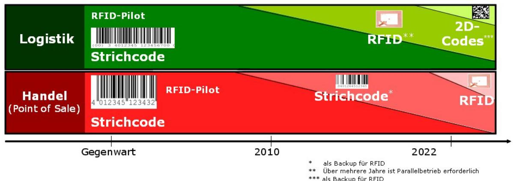

**Abbildung 1–1 Prognose des Einsatzes von Datenträgertechnologie [GS1-1][3](#page-13-1)**

# **1.2 Abgrenzung der Richtlinie**

Da es in dieser Richtlinie nur um Betrachtungen zum sicheren Einsatz RFID basierter Systeme in Prozessen des Handels gehen soll, wird auf andere AutoID Technologien beispielsweise verschiedene Formen von Barcodes nicht näher eingegangen. Alle Betrachtungen zum RFID Einsatz im Anwendungsgebiet der Handelslogistik werden hier am Beispiel von EPCglobal durchgeführt, wobei natürlich auch andere ähnlich aufgebaute Systeme zum Einsatz kommen können. Andererseits ist das System von EPCglobal auch in ähnlich gelagerten Anwendungsfeldern wie der Handelslogistik außerhalb dieser einsetzbar. Als weitere Einschränkungen werden nur Anwendungen betrachtet, die heute schon in der Praxis eingesetzt werden. Zukünftige Anwendungen werden dann in aktualisierte Versionen dieser Richtlinie einfließen.

# **1.3 Prozessuales Zusammenspiel**

Aus Sicht des Verbrauchers lassen sich zwei Prozessketten in der Warenversorgung grundsätzlich voneinander unterscheiden: Die Prozesskette Einzelhandel einerseits, mit der er selbst in Berührung kommt, wenn er Ware einkauft, sowie die dieser vorgelagerte Prozesskette Logistik andererseits.

3 Über den Zeitstrahl ist der Einsatzgrad verschiedener AutoID-Technologien im Verhältnis zueinander abgetragen, wie sie branchenübergreifend von Wirtschaftskreisen eingeschätzt wird. So kommen z. B. gegenwärtig in der Logistik primär lineare Strichcodes zum Einsatz. Es wird davon ausgegangen, dass RFID den linearen Strichcode immer weiter ablösen wird. Die Backup-Funktion des linearen Strichcodes für RFID wird zunehmend von 2D-Codes übernommen werden.

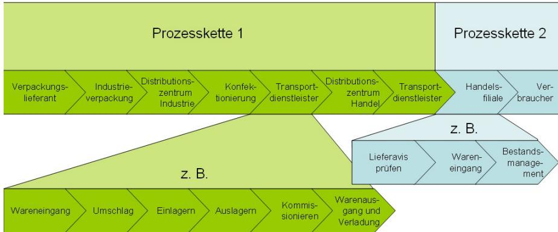

**Abbildung 1–2 Typische beispielhafte Prozessketten in der Handelslogistik [GS1-4]** 

Im nachfolgenden Kapitel werden diese beiden Prozessketten anhand ausgewählter Einsatzszenarien näher analysiert.

# **2 Prozessveränderungen durch EPC/RFID**

# **2.1 Prozesskette Logistik bis zur Handelsfiliale[4](#page-15-1)**

Die nachfolgenden Ausführungen gehen auf Untersuchung der Prozessauswirkung von EPC/RFID auf die Handelslogistik (Zentrallagerbelieferung) von GS1 Germany zurück.

### **2.1.1 Ausgangssituation**

Wie wird EPC/RFID die Prozesse der logistischen Kette verändern?

Erste Erfahrungen in internationalen und deutschen Pilotprojekten und Roll-outs wecken eine hohe Erwartungshaltung an die Nutzenpotenziale dieser Technologie. Insbesondere der Handel sieht vor dem Hintergrund kleiner Margen und eines intensiven Kostenwettbewerbes erhebliche Effizienzsteigerungen in den logistischen Abläufen sowie neue Möglichkeiten zur Unterstützung eines "Smart Shoppings".

Ein unternehmensübergreifender Einsatz von EPC/RFID in den Prozessen der Konsumgüterwirtschaft bietet nach heutigem Kenntnisstand viele Anwendungsmöglichkeiten - von der Warenvereinnahmung über die Kommissionierung, die Qualitätssicherung und das Bestandsmanagement bis hin zum Warenausgang. Zudem ist eine Auszeichnung mit RFID-Transpondern auf sämtlichen logistischen Ebenen möglich. Unterschieden werden in der Regel die Ebenen "Ladungsträger" (Pallet-Level), "Umkarton" (Case-Level) und "Einzelprodukt" (Item-Level).

### **2.1.2 Umfang der Analysen**

In die Prozessanalysen wird die logistische Kette vom Vorlieferanten zum Hersteller ("upstream") sowie vom Hersteller bis zum Handel ("downstream") - einbezogen. Hierbei liegt ein vereinfachter, zentrallagerorientierter Prozessablauf zu Grunde, der in der nachfolgenden Abbildung schematisch dargestellt ist.

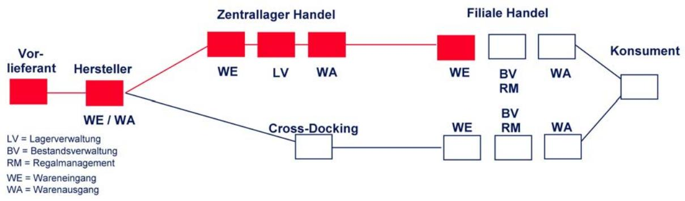

#### **Abbildung 2–1 Schematische Darstellung der betrachteten Prozesskette**

Die dunkel hinterlegten Flächen identifizieren die Prozessmodule, die in den Analysen berücksichtigt wurden. Nicht betrachtet wurden die sogenannte Strecken- bzw. Direktbelieferung und das Cross-Docking-Verfahren.

4 Siehe [GS1-3].

Die verschiedenen relevanten Einflussfaktoren auf die RFID-Prozesse gilt es zu berücksichtigen.

Die konkrete Ausprägung RFID-basierter Logistik- und Informationsprozesse ist abhängig vom jeweiligen Anwendungsbereich. Einfluss nehmen unter anderem

- die einbezogenen Sortimente bzw. Warengruppen aufgrund ihrer physikalischen Eigenschaften und RFID-Freundlichkeit,
- die zu unterstützenden Prozesse aufgrund ihrer prozessspezifischen Anforderungen und
- die mit einem Transponder ausgezeichnete bzw. "getaggte" logistische Ebene aufgrund der Verschiedenartigkeit der zu ihrer Bearbeitung benötigten Dateninhalte.

Werden die oben genannten Kriterien unterschiedlich kombiniert, ergeben sich teilweise voneinander abweichende Ablauforganisationen sowie unterschiedliche Anforderungen an die eingesetzten Informationsprozesse und die verwendete RFID-Technik.

Somit ergibt sich ein mehrdimensionales Konstrukt aus Einflussfaktoren, das eine weitere Grundlage für die vergleichenden Prozessanalysen bildet.

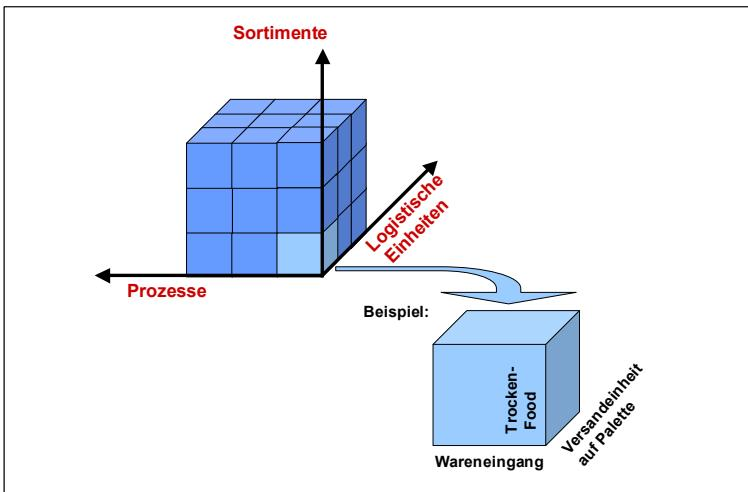

**Abbildung 2–2 Mehrdimensionalität der Einflussfaktoren, die in einer Prozessanalyse zu berücksichtigen sind** 

### **2.1.3 Analyse ausgewählter Logistikmodule**

Vor dem Hintergrund, dass verschiedene Kernprozesse innerhalb der Wertschöpfungskette immer wieder auftreten, werden aus der Prozesskette folgende vier Logistikmodule ausgewählt, die eine weitere Grundlage der Analyse bilden:

- Wareneingang
- Lagerhaltung
- Kommissionierung
- Warenausgang

Durch diese Vorgehensweise können unnötige Redundanzen in den Prozessbeschreibungen vermieden werden.

### **2.1.4 Untersuchte Sortimente, Technologien und logistische Ebenen**

Die durchgeführten Prozessbetrachtungen konzentrieren sich auf palettierbare Sortimentsbereiche, die aufgrund ihrer physikalischen Eigenschaften mittels RFID problemlos identifiziert werden können (z. B. Textilien, Lederware, Trocken-Food-Sortiment).

Die erarbeiteten Prozessvarianten unterscheiden sich insbesondere:

- in Bezug auf die verwendete Technik und Dateninhalte:
	- Barcodetechnologie in Verbindung mit elektronischem Datenaustausch (EDI) und der Nutzung einer NVE (Nummer der Versandeinheit ) zur Identifikation logistischer Einheiten
	- RFID-Technologie in Verbindung mit elektronischem Datenaustausch (EDI) und der Nutzung einer NVE zur Identifikation logistischer Einheiten bzw. einer seriellen EAN zur Identifikation von Handelseinheiten (Sekundärverpackungen)
- in Bezug auf logistische Hierarchien:
	- Ladungsträger/Palette (bzw. Tertiärverpackungen)
	- Umkarton/Umverpackungen (bzw. Sekundärverpackungen)

Die nachfolgende Matrix gibt einen Überblick über alle untersuchten Prozessvarianten. Jede Variante unterscheidet sich in ihrer Kombination aus Technologieform, codiertem Dateninhalt und getaggter logistischer Ebene. Bei allen Ausprägungen wird ein elektronischer Austausch von Stamm- und Bewegungsdaten mittels elektronischen Datenaustauschs (EDI) unterstellt.

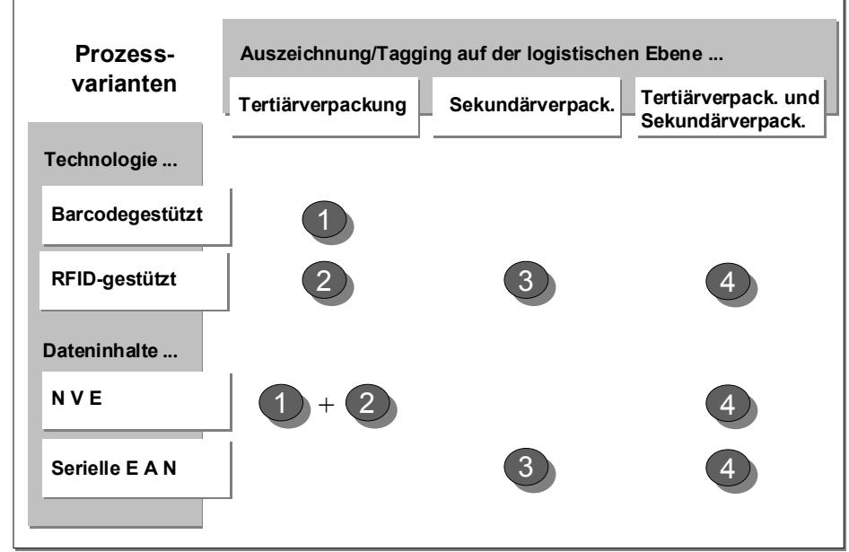

#### **Abbildung 2–3 Betrachtete Prozessvarianten einschließlich wesentlicher Merkmale**

Bei den Prozessvarianten (2) und (4) wird davon ausgegangen, dass u. a. logistische Einheiten mit einem RFID-Transponder ausgezeichnet und identifiziert werden (d. h. Ware einschließlich dem Ladungsträger der Ware). Die Identifikation der logistischen Einheit erfolgt mittels der Nummer der Versandeinheit (NVE). Wird Ware vom Ladungsträger entfernt oder neue hinzugefügt, wird eine neue logistische Einheit gebildet, für die eine neue NVE zu vergeben ist.

Im Gegensatz hierzu ist auch ein Tagging des eigentlichen Ladungsträgers möglich (z. B. zur Poolverwaltung von Mehrwegtransportverpackungen). Diese Variante wird in den dargestellten Analyseergebnissen nicht berücksichtigt.

#### **2.1.5 Annahmen**

Für die vergleichende Analyse der vorgenannten Prozessszenarien wurden folgende Annahmen getroffen:

- Fokus
	- Der Schwerpunkt der Betrachtung liegt in der Konsumgüterbranche
	- Unternehmensübergreifende Transportprozesse werden in den Analysen nicht betrachtet
- Prozessorientierte Rahmenbedingungen
	- Die Prozessvarianten sind als Best-Practice-Szenarien beschrieben worden, d. h. EAN 128-Transportetiketten, die Nummer der Versandeinheit (NVE) und elektronischer Datenaustausch (EDI) werden bereits genutzt.
	- Die Verfügbarkeit eines elektronischen Liefermeldung (DESADV) wird unterstellt.
	- Die EAN der Liefereinheiten entsprechen den EAN der bestellten Einheiten.
	- Es erfolgt insbesondere beim Wareneingang von Mischpaletten eine manuelle Mengenkontrolle (in Bezug auf die Anzahl Sekundärverpackungen).
- Technologieorientierte Rahmenbedingungen
	- Bei der Festlegung der Dateninhalte in den Prozessvarianten 2, 3 und 4 (Nutzung der RFID-Technologie) wurde der EPC-Datenstandard zu Grunde gelegt.
	- Die Verfügbarkeit von definierten Filterwerten für logistische Hierarchien wird unterstellt.
	- In allen Prozessvarianten wird eine 100-prozentige Lesesicherheit angestrebt.
	- Es wird eine funktionsfähige Anbindung der RFID-Hardware und -Software an interne Systeme unterstellt.

### **2.1.6 Ergebnisse im Überblick**

In den nachfolgenden Übersichten werden die Ergebnisse der Prozessanalysen zusammengefasst. Hierbei werden die Effekte und Veränderungen durch die Nutzung RFID-basierter Prozesse im Vergleich zur barcodebasierten Prozessvariante (1) dargestellt.

Aufgrund der Ähnlichkeit der Resultate bei Prozessvariante (3) (Einsatz getaggter Umkartons bzw. Sekundärverpackungen) und Prozessvariante (4) (kombinativer Einsatzes von getaggten Ladungsträgern und getaggten Umkartons) wird nur die Prozessvariante (4) in den Ergebnisübersichten berücksichtigt.

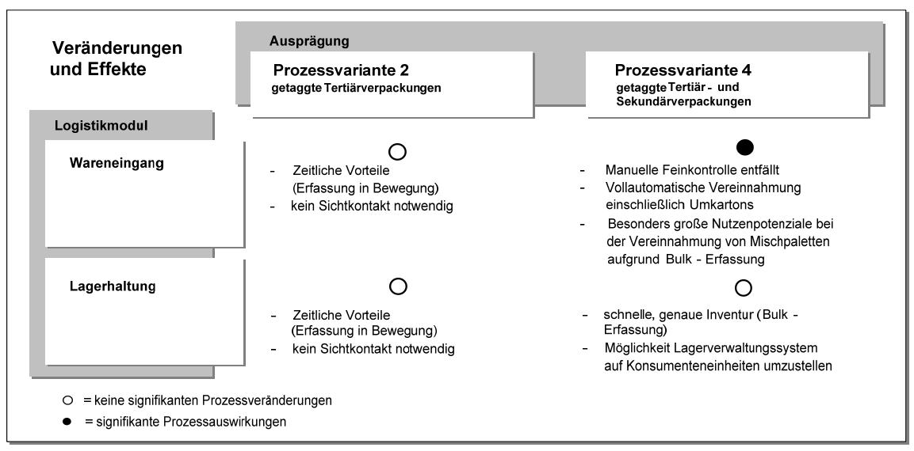

Logistikmodule "Wareneingang" und " Lagerhaltung"

#### **Abbildung 2–4 Veränderungen und Effekte in den Logistikmodulen "Wareneingang" und "Lagerhaltung" im Vergleich zur Prozessvariante 1**

In der Prozessvariante (2) (Getaggte Ladungsträger/logistische Einheiten) ergeben sich in den Modulen "Wareneingang" und Lagerhaltung" im Vergleich zur barcodebasierten Prozessvariante (1) keine signifikanten Veränderungen. In beiden Fällen wird die im Barcode oder Transponder verschlüsselte Nummer der Versandeinheit (NVE) erfasst und für die Identifikation der jeweiligen logistischen Einheit genutzt. Der RFID-basierte Prozess bietet die Vorteile, den Lesevorgang in einer Bewegung durchzuführen (d.h. den Ladungsträger durch ein RFID-Gate zu ziehen und direkt zum Bestimmungsort zu bringen). Des Weiteren ist es möglich, die im Transponder gespeicherten Daten zu lesen, ohne dass ein Sichtkontakt zwischen Lesegerät und Transponder notwendig ist.

In Prozessvariante (4) werden wesentliche Prozessveränderungen festgestellt, die ergänzend zu den Vorteilen in der Variante (2) signifikante Nutzenpotenziale mit sich bringen. So kann eine manuelle Feinkontrolle der auf dem Ladungsträger befindlichen Umverpackungen entfallen, da jede Sekundärverpackung durch das Auslesen ihres RFID-Transponders eindeutig identifiziert wird. Auf diese Weise ist nach einem vollautomatischem Abgleich mit dem elektronisch übermittelten Lieferavis (DESADV) eine automatische Verbuchung des Wareneingangs möglich. Für den Fall, dass beim Abgleich Abweichungen festgestellt werden, können Regeln definiert werden, wie weiter zu verfahren ist (Exception Management).

Logistikmodul "Kommissionierung"

#### **Abbildung 2–5 Veränderungen und Effekte im Logistikmodul "Kommissionierung" im Vergleich zur Prozessvariante 1**

In Prozessvariante (2) (Verarbeitung mit RFID-Transponder ausgezeichneter Ladungsträger) ergeben sich analog zu den Logistikmodulen "Wareneingang" und Lagerhaltung" im Vergleich zur barcodebasierten Prozessvariante (1) keine signifikanten Veränderungen.

Nutzenpotenziale bietet Variante (4) bei der Kommissionierung von Mischpaletten. Hier erfolgt eine eindeutige Erfassung der kommissionierten Umverpackungen im Prozess, ohne dass manuelle Eingriffe notwendig sind. Dies kann zum Beispiel beim Abstellen auf der Palette durch ein am Gabelstapler angebrachtes Lesegerät geschehen. Eine manuelle Bestätigung des Pickvorganges entfällt. Das Risiko von unerkannten Fehlkommissionierungen (z. B. Einlesen der richtigen Artikelnummer, Picken der falschen Ware) wird minimiert. Die Qualitätssicherung erfolgt während des Kommissionierprozesses, der nur bei Fehlkommissionierungen unterbrochen werden muss.

Die Kommissionierung von artikelreinen Paletten bzw. Ladungsträgern bietet keine entsprechenden Nutzenpotenziale. In der Regel wird die gesamte Palette zur Verladung bereitgestellt, ohne dass die logistische Einheit verändert wird.

Logistikmodul "Warenausgang"

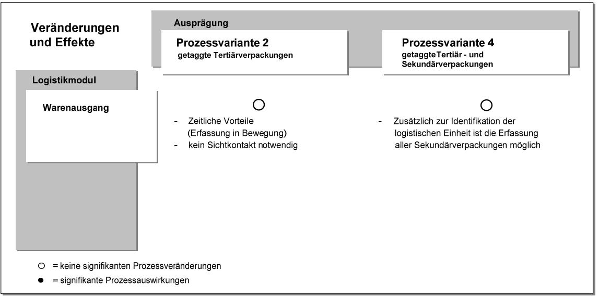

#### **Abbildung 2–6 Veränderungen und Effekte im Logistikmodul "Warenausgang" im Vergleich zur Prozessvariante 1**

In Prozessvariante (2) (Verarbeitung mit RFID-Transponder ausgezeichneter Ladungsträger) ergeben sich analog zu den vorgenannten Logistikmodulen keine signifikanten Veränderungen im Vergleich zur barcodebasierten Prozessvariante(1).

Die Prozessvariante (4) bietet die Möglichkeit ergänzend zur NVE der logistischen Einheit, jede einzelne auf dem Ladungsträger befindliche Sekundärverpackung eindeutig zu identifizieren. Diese Informationen können für einen finalen Abgleich mit Transportauftrag und Kommissionierdaten verwendet oder dem Empfänger zur Verfügung gestellt werden.

#### Zusammenfassung

Die vergleichenden Prozessanalysen ergaben, dass sich wesentliche Prozessveränderungen und Effekte insbesondere beim Einsatz mit RFID-Transpondern ausgezeichneter Sekundärverpackungen ergeben. Durch die Möglichkeit einer Pulkerfassung (d. h. alle Umverpackungen auf einer Palette können ohne Sichtkontakt in einem Auslesevorgang erfasst werden) kann eine neue Qualität automatisierter Zähl- und Buchungsprozesse erreicht werden. Dieser Vorteil wirkt sich insbesondere bei der Verarbeitung von Mischpaletten aus.

#### **2.1.7 Schlussfolgerungen**

Aufgrund der Ergebnisse der Prozessbetrachtungen werden die folgenden Schlussfolgerungen bezüglich der Voraussetzungen für eine Nutzung der RFID-Technologie in der logistischen Kette sowie deren Auswirkungen gezogen:

#### Voraussetzungen

- Parallele Verarbeitung von RFID und Barcode-Technologie ist im Übergang für einen längeren Zeitraum erforderlich.
- Organisatorische Backup-Lösungen sind notwendig (z. B. Klarschriftinformationen oder datentechnische Vorkehrungen).
- Eine Erweiterung der IT-Architektur sowie Lösungen zur Abbildung des Elektronischen Produkt-Codes (EPC) sind notwendig.

• RFID sollte in einem Gesamtzusammenhang gesehen werden, denn eine isolierte Nutzung in vereinzelten Anwendungsgebieten ermöglicht langfristig keinen optimalen Nutzen. Es kann jedoch mit einzelnen Bereichen begonnen werden.

Auswirkungen

- Kommunikationsstrukturen können sich verändern.
- Bei Vergleich eines RFID-basierten Prozesses mit einem noch nicht durch EDI unterstützten bzw. EAN 128-gestützten Prozess ergeben sich mit hoher Wahrscheinlichkeit wesentlich größere Nutzenpotenziale.
- Durch die Nutzung von RFID und Elektronischem Produkt-Code (EPC) wird eine neue Ebene der Datenhaltung erschlossen, die es ermöglicht, auf neue bzw. zukünftige Anforderungen und Verordnungen (z. B. Lebensmittelrückverfolgbarkeit) besser reagieren zu können.
- Grundsätzlich ist davon auszugehen, dass durch eine Ausweitung des Tagging bis auf Produktebene (Item-Level) ein überproportionaler Nutzenzuwachs erwartet werden kann.

# **2.2 Prozesskette Einzelhandel - Verbraucher**

Die Vorteile der Verwendung von RFID auf Produktebene in der Einzelhandelsfiliale können grob in die folgenden Kategorien eingeteilt werden: Kostenreduktion, qualitative Prozessverbesserungen, das Ermöglichen von mehr Umsatz durch neue Services sowie der Schutz vor Produktfälschungen und Markenpiraterie. Beispiele für diese Kategorie sind:

Kostenreduktion z. B. durch

- Warensicherung
- Einfacheres Bestandsmanagement

Prozessverbesserungen z. B. durch

- Regalmanagement
- Gezielte Rückführung bei Warenrückruf

#### Neue Services

- Informationsterminals
- Intelligente Regale
- Cross-selling-Angebote
- Self-Check-out
- Belegloser Umtausch
- Beleglose Garantieabwicklung

Schutz vor Produktfälschungen und Markenpiraterie

- Vermeidung von Umsatzeinbußen
- Schutz des Markenimages
- Schutz vor Problemen mit Produkthaftung, etc.

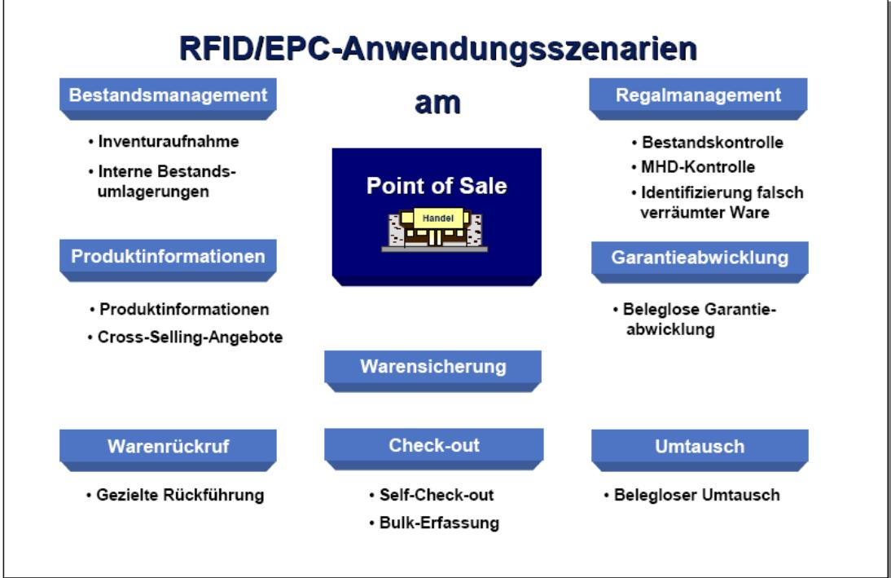

#### **Abbildung 2–7 Anwendungsszenarien am POS (Quelle GS1 Germany)**

Ein wichtiger Baustein zur erfolgreichen Einführung von RFID-Etiketten auf Produktebene ist die Ermöglichung eines direkt vom Kunden erfahrbaren Nutzens. Neben den vorstehend unter "Neue Services" aufgeführten neuen Diensten ist die Verifizierung der Echtheit eines Produktes hierfür ein Beispiel.

Aus diesen Anwendungen ergeben sich folgende Anforderungen an die RFID-Technik:

- 1 Der Einsatz von Transpondern ist immer auf Waren und nie auf eine Person bezogen. Es werden niemals personenbezogene Daten im Transponder gespeichert.
- 2 AutoID, das automatische, zuverlässige Identifizieren mittels der RFID-Technik, ist erwünscht. Die Reichweiten können dabei bis zu mehrere Meter betragen.
- 3 Es werden nur sehr begrenzte Datenmengen im Chip gespeichert. Diese Daten müssen nicht modifiziert werden.
- 4 Gerade der produktbezogene Einsatz von Transpondern erfordert aus Gründen der Wirtschaftlichkeit eine extrem kostengünstige Transponder-Lösung.

Je nach Produkt und Anwendungsbereich kann der Einsatz von RFID unterschiedliche Implikationen mit sich bringen. Im Nachfolgenden wird anhand von drei Beispielszenarien eine möglichst große Bandbreite hierzu illustriert.

#### **2.2.1 EPC/RFID-Einsatz bei Frischeware**

Frischeware ist leicht verderbliche Ware. Diese Lebensmittel werden innerhalb weniger Tage konsumiert. Mit einem Transponder versehene Ware oder Verpackung, sofern nicht bereits nach dem Kauf entfernt oder deaktiviert, verbliebe nur kurzfristig beim Verbraucher und würde über den Hausmüll entsorgt.

Unterschiedliche Ansatzpunkte eines RFID-Einsatzes bestehen:

• Im Verkaufsraum

Die Schnelligkeitsvorteile von RFID bei der Warenerfassung und –handling erhöht die Frische, mit der die Ware in den Einzelhandel gelangen kann und zugleich deren Verfügbarkeit.

Ebenfalls spielt das Vertrauen in die Qualität der Ware eine sehr wichtige Rolle. Über Info-Terminals könnte mittels des EPCglobal-Netzwerkes ein lückenloser Herkunftsnachweis dem Verbraucher gegenüber dokumentiert werden. Für die temperaturgeführte Logistik könnte darüber hinaus aufgrund der Kombinierbarkeit von RFID mit Sensorik für die gesamte Herkunftskette die Einhaltung der notwendigen Kühltemperatur belegt werden.

• An der Kasse

Wäre auf dem Transponder neben dem EPC auch das Mindesthaltbarkeitsdatum verschlüsselt oder wäre dies über die Lesung des EPC aus dem hinterlegten System abrufbar, ließe sich daran ein Rabattsystem ausrichten (Preisnachlässe bei kurzer Restlaufzeit).

• Verwendung nach dem Kauf

Sofern der Transponder nach dem Kauf nicht entfernt oder deaktiviert wird, könnte über intelligente elektronische Haushaltsgeräte (z. B. einen RFID-gestützten Kühlschrank) dem Verbraucher automatische Informationen (z. B. Hinweise über abzulaufen drohende Mindesthaltbarkeitsdaten (MHD), wenn dieses auf dem Transponder ebenfalls gespeichert oder über das EPCglobal-Netzwerk vom Hersteller bereitgestellt wird) bereitgestellt werden.

#### **2.2.2 EPC/RFID-Einsatz bei Textilien/Bekleidung**

Textilien sind modische Produkte, bei denen Gefallen und optimaler Sitz wichtig ist. Sie sind beratungsintensiver.

Transponder könnten entweder am Warenetikett angebracht oder mit dem Material verwoben sein. Mit einem Transponder versehene Ware, sofern nicht bereits nach dem Kauf entfernt oder deaktiviert, würde vom Kunden im Falle der Etikettenvariante zuhause von der Ware entfernt und über den Hausmüll entsorgt. Im anderen Fall verbliebe der Transponder über die Lebensdauer des Bekleidungsstücks an diesem, könnte aber auch zu einem späteren Zeitpunkt noch deaktiviert werden.

Wiederum gibt es ganz unterschiedliche Ansatzpunkte den Kauf durch RFID-Einsatz zu unterstützen:

• Im Verkaufsraum

Sind Regalflächen mit RFID ausgestattet, so kann eine Permanentinventur erfolgen. So kann einfach ermittelt werden, ob die Ware in der gewünschten Größe auf der Fläche oder im Lager verfügbar ist. Zudem fällt es auf, wenn Ware nicht am vorgesehenen Platz liegt, was dann leichter korrigiert werden kann.

Der Kunde kann mit Hilfe von Displays Informationen zu Waren seiner näheren Wahl (Größe, Preis, Pflegehinweise, etc.) bequem bekommen. Dies erspart das Suchen dieser Informationen an der Ware selbst. Über RFID-Umkleidekabinen können dem Kunden desweiteren direkt beratende Informationen an die Hand gegeben werden, indem er z. B. andere Farbvarianten oder Kombinationen zu den Produkten seiner Wahl vorgeschlagen bekommt. Zugleich könnte mittels des EPCglobal-Netzwerkes ein lückenloser Herkunftsnachweis dem Verbraucher gegenüber dokumentiert werden und so die Echtheit von Markenware belegt werden.

• An der Kasse

Die Ware kann schneller erfasst werden, wodurch die Serviceleistungen auf einem hohen Niveau gehalten werden können.

#### • Verwendung nach dem Kauf

Der Transponder an der Ware könnte als Beleg des Kaufes dienen. Sollte wider Erwarten die Ware zu einem späteren Zeitpunkt doch nicht gefallen oder passen, könnte ein möglicher Umtauschprozess vereinfacht werden. Auf eine gezielte Umtauschanfrage des Kunden hin könnte über den EPC ermittelt werden, dass die Ware zu einem früheren Zeitpunkt gekauft worden war.

Grundsätzlich ist dabei zu unterscheiden, ob Transponder in entfernbaren Warenetiketten angebracht sind, die vor Verwendung entfernt werden, oder ob Transponder in der Ware verbleiben. Nur für den Fall, dass der Transponder an der Ware verbleibt, könnte beim Tragen der Ware nach dem Kauf bei erneuten Verlassens des Geschäfts der Transponder an einer RFID-Ausgangsschleuse ausgelesen werden. An dieser Stelle darf im Rahmen der bestehenden gesetzlichen Bestimmungen zum Daten- und Verbraucherschutz lediglich festgestellt werden, dass der gelesene EPC nicht im aktuellen Bestand gebucht ist (was im umgekehrten Fall ein Hinweis auf einen möglichen Ladendiebstahl sein könnte). Ohne vorherige Einwilligung des Kunden dürfte der EPC in einem solchen Fall nicht gespeichert werden, weshalb auch keine Bewegungsprofile möglich sind.

Ein Transponder der mit dem Bekleidungsstück fest verbunden ist, ließe sich über intelligente elektronische Haushaltsgeräte nutzen. Eine RFID-gestützte Waschmaschine könnte bei nicht deaktivierten Transpondern z. B. Warnhinweise geben, wenn sich in der Waschtrommel Kleidungsteile befinden, die nicht miteinander gewaschen werden sollten oder wenn die Temperaturwahl zu hoch eingestellt wurde. Voraussetzung hierfür wäre, dass diese Zusatzinformationen entweder auf dem Transponder gespeichert sind oder vom Hersteller im Rahmen des EPCglobal-Netzwerkes zur Abrufung über eine Internetverbindung bereitgestellt würde.

Das EPC-Konzept sieht eine Speicherung personenbezogener Daten auf dem Transponder nicht vor.

### **2.2.3 EPC/RFID-Einsatz bei langlebigen Elektronikgütern**

Langlebigere Elektronikgüter wie z. B. ein Flachbildfernseher verfügen heute bereits in der Regel über eine Seriennummer, die auch strichcodiert an oder im Produkt angebracht ist, um sie nicht nur beim Herstellungsprozess, sondern im Bedarfsfall auch bei Reparaturarbeiten (bei manchen Produkten auch zu Wartungszwecken) automatisiert erfassen zu können.

- Verwendung im Verkaufsraum Über Info-Terminals könnte wiederum mittels des EPCglobal-Netzwerkes ein lückenloser Herkunftsnachweis dem Kunden gegenüber dokumentiert werden und so die Echtheit von Markenware belegt werden.
- Verwendung nach dem Kauf Der Transponder an der Ware könnte als Beleg des Kaufes dienen. Sollte wider Erwarten das Produkt nicht richtig funktionieren, könnte der nicht deaktivierte Transponder für Gewährleistungsansprüche herangezogen werden, da er als Kaufbeleg dienen kann.

# **2.3 Technologisches Zusammenspiel – Das GS1 System**

Der Einsatz von IT-Systemen als Absender und Empfänger von zwischenbetrieblichen Informationen kann nur dann reibungslos und effizient funktionieren, wenn alle miteinander "korrespondierenden" Computer einer Branche, eines Handelszweiges oder einer Informationskette das gleiche Organisationsmodell berücksichtigen. Das bedeutet beispielsweise: derselbe Aufbau der Datensätze, der Schlüsselgrößen und -inhalte, etc. Neben zwischenbetrieblichen Einigungen spielt die Standardisierung bestimmter Arbeitsabläufe und Organisationsinstrumente eine wichtige Rolle.

Weltweit nutzen über eine Million Unternehmen die GS1-Standards für Identifikations- und Kommunikationszwecken in wirtschaftlichen Prozessabläufen. Es sind die in Handelslogistik am meisten verbreiteten Standards. Die Regeln des Systems wurden von GS1 verbindlich festgelegt. Weiterentwicklungen, die das System abrunden und ergänzen, werden gemeinsam vorangetrieben.

### **2.3.1 Ausrichtung des GS1-Systems**

Das GS1-System ist technologische Grundlage unzähliger zwischenbetrieblicher elektronischer Datenverkehre in der ganzen Welt. Die Philosophie dieses Systems zieht eine Verbindungslinie zwischen der Datenerfassung und der Datenübermittlung.

• Die Automatische Datenerfassung (ADC = Automatic Data Capture) dient dazu, die Ware oder die Dienstleistung an einer betrieblichen Funktionsstelle (z. B. am Wareneingang, im Lager) zu identifizieren.

Die automatische Datenerfassung trägt dazu bei, die Abfertigung an den Kassen moderner Handelsbetriebe rationeller, schneller und billiger vornehmen zu können. Aber auch das Handling von Produkten in den Lagern der verschiedenen Marktteilnehmer sowie auf den Transportstrecken dazwischen wird mit Hilfe der automatischen Datenerfassung vereinfacht. Die wichtigsten Komponenten hierbei sind eindeutige, überschneidungsfreie Artikel- und Packstückidentnummern in Kombination mit standardisierter Strichcode- oder Radiofrequenz-Technik.

- Die Automatische Datenübermittlung (EDI = Electronic Data Interchange) ist das geeignete Medium, mit dem Stamm- und Bewegungsdaten zwischen einer Vielzahl von Anwendern ausgetauscht werden können, Daten also, die physische Vorgänge auslösen und diese begleiten, ihnen voraus- oder nachgesendet werden. Beim elektronischen Datenaustausch wird eine im sendenden Computersystem erstellte Nachricht - z. B. ein Auftrag oder eine Rechnung - unmittelbar in das empfangende Computersystem eingestellt. Für die Bearbeitung dieser Information ist keine neuerliche Erfassung der Daten erforderlich, wenn sich die korrespondierenden Unternehmen, die einen solchen bilateralen Datenaustausch vereinbaren, auf bestimmte Darstellungs- und Syntaxregeln einigen. Auch hier ist die Nutzung einheitlicher Nummernsysteme für Artikel und Standorte wichtige Bedingung eines Rationalisierungserfolges.
- Die Kombination ist hier mehr als die Summe ihrer Teile. Scannen bzw. radiofrequente Lesungen an vielen Stellen der gesamtlogistischen Kette und elektronische Kommunikation gehören für ein umfassendes und nachhaltiges Rationalisierungsinstrumentarium zusammen. Geschäftsdaten können durch diese Kombination von moderner Erfassungs- und Übertragungstechnik schnell, effizient und sicher ausgetauscht werden.
- Das GS1-System setzt also auf Flexibilität und Offenheit der Anwendung, die nur auf der Basis dieser Systemphilosophie zu erreichen ist. Damit grenzt EAN sich von Versuchen ab, die Identifikation selbst mit weiteren Informationen zu befrachten, die letztlich zu Hemmnissen und Begrenzungen (Insellösungen) führen.
- Das GS1-System ist ein weitverbreiteter Standard in grenzüberschreitenden Anwendungen. Er legt Lesetechnik und Dateninhalte genauso fest wie ein eindeutiges Nummernsystem. Die weltweite Überschneidungsfreiheit der Nummernsysteme erschließt breite Anwendungsbereiche. Die Standards haben sich international in der offenen Kommunikation in vielen Sektoren durchgesetzt.
- Die technischen GS1-Standards werden im Zuge der ECR-Initiative (ECR = Efficient Consumer Response) mehr und mehr um organisatorische Standards in den betrieblichen Arbeitsabläufen ergänzt. Diese Prozessvereinbarungen können in erheblichem Umfang die Anwendung der Standards fördern.

Die vier Basisprinzipien des GS1-Systems lauten:

- 1 Open Standards = Offene Standards Ziel ist ein offenes, bedarfsorientiertes, integriertes System von technischen Standards zur Identifikation und zum Informationstransfer, das ein effektives "Supply Chain Management" in jeglichem Unternehmen und jeglicher Branche überall auf der Welt erlaubt.
- 2 Differentiation = Übertragbarkeit Das System basiert auf Regeln, die - wenn befolgt - die weltweite überschneidungsfreie und eindeutige Identifikation von ganz unterschiedlichen Dingen wie beispielsweise Produkten, Transporteinheiten, Behältern, Objekten oder Standorten ermöglichen.
- 3 Transparency = Transparenz GS1-Standards sollten relevant für und anwendbar auf jegliche Versorgungskette sein, unabhängig davon, wer die Standards anwendet, empfängt und verarbeitet. Sie sollen zu einer Vereinheitlichung von Prozessen und damit zu Einsparmöglichkeiten im Interesse aller beteiligten Parteien führen. Neue Funktionen sind nur dann in den Standard aufzunehmen, wenn sie neue Anwendungsbereiche erschließen oder zu einer Verbesserung existierender Anwendungen führen.
- 4 Non-Significance = Keine Signifikanz ("nicht sprechend") Die weltweite Eindeutigkeit der EAN-Identifizierung kann nur dann garantiert werden, wenn die Standardnummern als ganzes verarbeitet werden. Beispielsweise sollten bestimmte Merkmale eines Artikels nicht in der Nummer selbst verschlüsselt werden, sondern mit Hilfe der EAN-Nummer als Zugriffsschlüssel aus einer Datei oder einer sonstigen Datenquelle herausgelesen werden.

Das GS1-System ist also ein umfassendes Werk von Regeln, das

- international ist
- branchenneutral ist (Multi-Industrie-Standard)
- von Nutzen ist für alle Stufen der Wertschöpfungskette (Vorlieferant, Lieferant, Transporteur, Großhandel, Einzelhandel bis hin zum Verbraucher)
- den Informationsfluss sowie auch den Warenfluss zu optimieren hilft
- verschiedenste Medien als Datenträger nutzt.

Dabei ist es zwar möglich, aber nicht unbedingt nötig, die unternehmensinterne Organisation komplett auf diese Regeln umzustellen. Sämtliche Komponenten des GS1-Systems können auch als "Übersetzung" der unternehmensinternen Sprache in eine unternehmensneutrale Verständigungsform verstanden werden, die vom Geschäftspartner wiederum in seine eigene Unternehmenswelt übernommen wird.

# **2.3.2 Die Bausteine des GS1-Systems**

Im Rahmen des GS1-Systems bestehen Bezüge zu RFID in mehrerlei Hinsicht: Zur Identifikation dient der Elektronische Produkt-Code (EPC), als Datenträger der EPC-Transponder und zur Datenkommunikation das EPCglobal-Netzwerk als ergänzende Bausteine innerhalb des GS1-Gesamtsystems.

### **2.3.2.1 Identifizierungssysteme**

Das GS1-Identsystem geht von dem Grundsatz aus, ein Objekt am besten über eine kurze, weltweit überschneidungsfreie, nichtsprechende Nummer zu identifizieren. Diese Nummer dient wiederum als Zugriffsschlüssel zu weitergehenden Informationen, die zu dieser Nummer, d. h. damit zum relevanten Objekt, in Datenbanken abgelegt sind.

Diese Konzeption macht Identifikationsprozesse einfach, sicher und schnell und hat sich deshalb über die letzten Jahrzehnte bewährt und durchgesetzt.

Da es einerseits unterschiedliche Arten von Objekten gibt (z. B. Standorte, Ladungsträger, Service-Produkte), andererseits diese in Abhängigkeit des Anwenders in ganz unterschiedlicher Anzahl und Kontext zu identifizieren sind, hat GS1 diesem mit einem Set an Identnummern mit unterschiedlich hohem Kapazitätsumfang Rechnung getragen.

#### Identnummern im Überblick

Allen GS1-Identnummern ist ihr einheitlicher Aufbau gemein: Zentral ist die GS1- Basisnummer, die dem Nutzer von GS1 zur Verfügung gestellt wird. Sie wird vom Anwender entweder um eine Objektreferenz, einen Serialteil oder beide Komponenten ergänzt.[5](#page-28-1) 

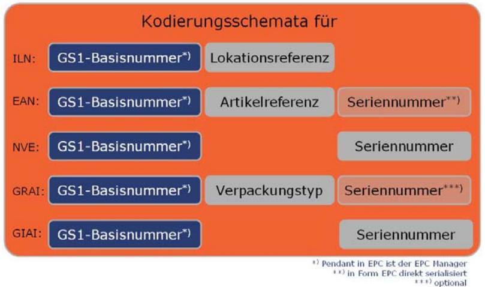

#### **Abbildung 2–8 Das GS1-Identsystem im Überblick**

Die Internationale Lokationsnummer (ILN) dient der Identifikation von Orten oder Adressen, die Internationale Artikelnummer (EAN) von Waren und Dienstleistungen, die Nummer der Versandeinheit (NVE) von logistischen Einheiten, die Identnummer für Mehrweg-Transportverpackungen (GRAI) von Mehrweg-Ladungsträgern und die EAN-Behälternummer (GIAI) von Behältnissen jeder Art. Jede dieser Nummern kann auch im EPC zum Tragen kommen.

Alle diese Nummern sind in den Strichcodes EAN, EAN 128, GS1 DataBar, EAN Composite, EAN Data Matrix und im EPC-Transponder darstellbar und gegen Verwechslungen geschützt. Die Verwaltung der internationalen Nummernkapazitäten erfolgt durch die Mitglieder von GS1, in Deutschland GS1 Germany.

#### Unterschiedliche Formate – identischer Inhalt

So wie "1,0", "100 %" und "1/1" drei unterschiedliche Aufbereitungen ein und derselben Information sind, so sind auch entsprechend ihres technologisch effektiven Einsatzes wegen unterschiedliche Formataufbereitungen an unterschiedlichen Stellen der Wertschöpfungskette notwendig. Dies heißt lediglich, dass die Information in eine Sprache übersetzt wird, die das jeweilige technische Gerät versteht. So kommt bei der GS1-Strichcodierung vornehmlich das Datenbezeichner-, bei den EDI-Nachrichten von GS1 ein Qualifier- und im Rahmen des EPCglobal-Netzwerkes ein Uniform Ressource Identifier-Konzept zum Tragen.

5 Aus Gründen der Sicherheit, insbesondere im Zusammenhang mit Barcodeanwendungen, besitzen einige GS1-Idente zudem eine abschließende Prüfziffer.

Dadurch wird es möglich, dieselbe Information, nämlich primär das GS1-Schlüsselident, über technologische und unternehmensbezogene Schnittstellen hinweg zwischen Geschäftspartnern kommunizieren zu können. Die folgende Abbildung zeigt einige Beispiele hierfür.

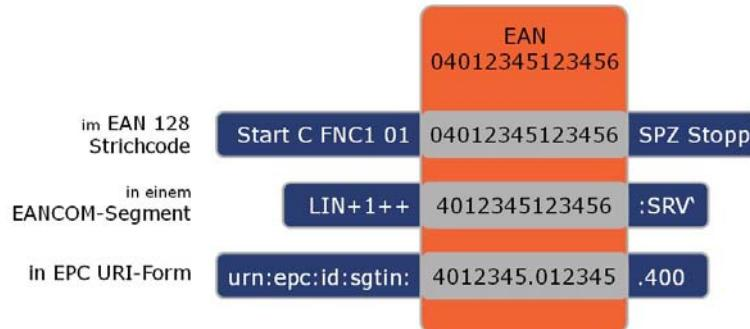

#### **Abbildung 2–9 Drei Beispiele für die Aufbereitung der EAN in unterschiedlichem technologischem Umfeld**

Für die Speicherung des EPC auf dem Transponder ist folgende Struktur vorgesehen:

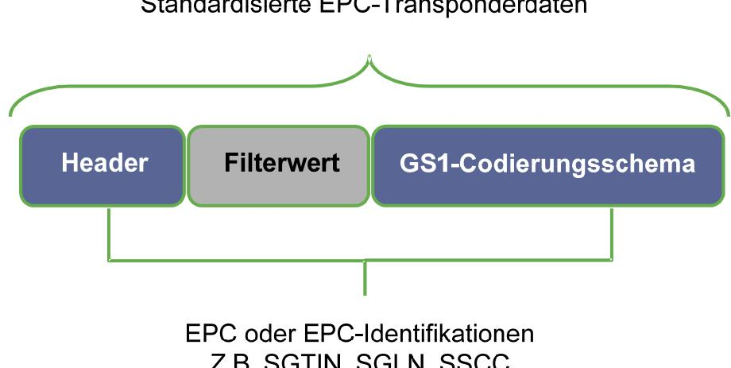

#### **Abbildung 2–10 EPC-Struktur**

Die Struktur des EPC, die mit einem definierten Header beginnt, ermöglicht, unterschiedliche Codierungsschemata für alle EPC-konformen Transponder eindeutig machen. Durch einen Filterwert, der nicht zur eigentlichen EPC-Identifikation gehört, kann selektives und damit schnelleres Filtern beim Lese- oder Beschreibvorgang ermöglicht werden.

#### Zwischen Schlüsselident und Zusatzinformationen unterscheiden

Um den Waren- und Datenfluss an den diversen Prozessschritten verarbeiten zu können, werden dafür relevante Informationen benötigt, auf die über unterschiedliche Informationsquellen zurückgegriffen werden kann (interne/externe Quellen). Um eine eindeutige Adressierung auf diese Daten vornehmen zu können, fungieren die GS1-Identenummern hierfür als Zugriffsschlüssel.

Wichtige Grundregel: Unternehmensübergreifend optimaler Ansatz ist und bleibt die Philosophie "Soviel wie nötig, aber so wenig wie möglich Informationen in den Datenträger". Das heißt: Die Identifikation wird im Strichcode oder Transponder verschlüsselt, alle übrigen Informationen werden, wo immer möglich, in den Stammdaten, der Ware vorauseilenden Vorabinformationen oder durch Datenabfrage in Echtzeit übermittelt. Nur so ist eine maximale Flexibilität der anwendungs- und unternehmensübergreifenden Kommunikation gewährleistet.

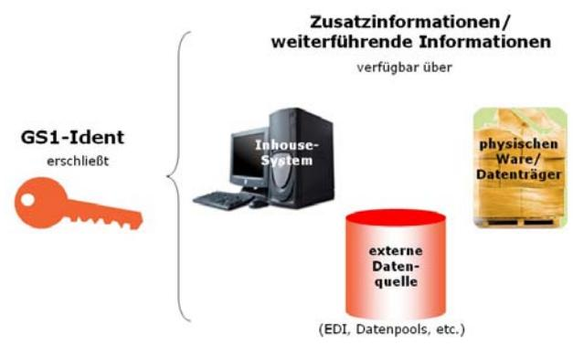

#### **Abbildung 2–11 GS1-Schlüsselident erschließt weiterführende Informationen**

#### **2.3.2.2 Datenträger**

Das GS1-System umfasst Strichcode- wie Transponderlösungen.

• EAN-13-Strichcode

Der EAN-13-Strichcode ist der älteste unter den GS1-Datenträgern. Nahezu jedes Konsumgut ist mit ihm ausgezeichnet. Er enthält immer eine EAN-Artikelnummer, d. h. er verschlüsselt kein anderes GS1-Ident und auch keine Zusatzinformationen. Der EAN-13 ist omnidirektional, d. h. richtungsunabhängig, lesbar.

• EAN 128-Strichcode

Der EAN 128-Strichcode wurde in den 90er Jahren in erster Linie eingeführt, um logistische Prozesse automatisiert abwickeln zu können. Für ihn wurde ursprünglich auch das Datenbezeichnerkonzept entwickelt. Der EAN 128-Standard in Verbindung mit dem Datenbezeichnerkonzept bieten damals wie heute höchste Flexibilität. Sie erlauben es, neben einer eindeutigen Identifikation, wie der NVE oder auch der EAN, zusätzliche warenbegleitende Informationen standardisiert im Strichcode auf dem Packstück oder dem Produkt aufzubringen - und sei es nur für eine Übergangsphase, bis EDI realisiert und die notwendigen Informationen elektronisch im Vorfeld ausgetauscht werden.[6](#page-30-1) 

Vor allem vor dem Hintergrund gewachsener Anforderungen an die Rückverfolgbarkeit von Produkten hat der EAN 128 in den letzten Jahren massiv an Bedeutung gewonnen.

• GS1 DataBar**[7](#page-30-2)**

Weil der EAN-13- und der EAN 128-Strichcode auf einem Etikett verhältnismäßig viel Platz benötigen, vor allem wenn es um die Kennzeichnung von Artikeln geht, und somit gewisse Anwendungen mit dem EAN-13 oder EAN 128 nicht abgedeckt werden können, wurde der GS1 DataBar entwickelt und von GS1 als weltweiter Standard etabliert. Zudem schließt er Lücken im Codierungssystem von Konsumenteneinheiten, bei denen neben der EAN-Artikelnummer zusätzliche Informationen für einen effizienten Prozessablauf benötigt werden, z. B. bei der eindeutigen Identifikation gewichtsvariabler Produkte wie Fleisch.

6 Grundsätzlich gilt, dass die auf der Ware aufgebrachte Identifikationsnummer immer als Referenz

auf Stammdaten oder die per EDI vorab übermittelten Informationen dienen sollte

7 siehe auch ISO/IEC 24724

• EAN Data Matrix

Der EAN Data Matrix ist der jüngste unter den GS1-Codes. Anders als die bisher genannten GS1-Symbologien handelt es sich beim EAN Data Matrix um eine 2D-Symbologie, in der sehr viele Informationen auf sehr kleinem Platz codiert werden können. Da es sich jedoch um einen 2D-Code handelt, ist der EAN Data Matrix nur für Anwendungen geeignet, bei denen entsprechende Lesesysteme zum Einsatz kommen. Diese basieren auf modernen Bildverarbeitungstechnologien, weshalb sie auch als Imagescanner bezeichnet werden.

• EPC/RFID

RFID ist ein alternativer Datenträger zum Barcode. Der elektronische Produkt-Code (EPC) steht als Überbegriff für eine serialisierte Kennzeichnung von Artikeln, Packstücken, Standorten etc., die mithilfe eines nach EPC-Spezifikationen standardisierten Transponders auf der Ware oder einem anderen Objekt aufgebracht wird. Basis hierfür sind wiederum die GS1-Idente ILN, EAN und NVE.

Die RFID-Technik und der EPC bieten folgende Vorteile:

- Sehr schneller Lesevorgang (Zeitersparnis)
- Kein Sichtkontakt mit dem Lesegerät erforderlich
- hohe Zuverlässigkeit, auch bei extremen Umwelteinflüssen wie Kälte oder Sonneneinstrahlung
- Ermöglichung von Permanentinventuren durch permanente Erfassung der Ware
- Ermöglichung von transparentem Informationsaustausch in Echtzeit in Kombination mit unternehmensübergreifenden Informationssystemen
- Pulkerfassungsmöglichkeit (schnelle Erfassung, hohe Detailtiefe)
- exakte Positionsbestimmung von Waren beziehungsweise optimiertes Timing bei der Warenauslieferung
- leichte Erweiterung der Identifikationsfunktion um zusätzliche elektronische Funktionalitäten wie elektronische Diebstahlsicherung oder Sensorik

Für eine Technologiemigration und aus Gründen des Backups ist davon auszugehen, dass RFID und Strichcode über längere Zeit parallel im Einsatz sein werden.

Die logische Speicherzuordnung im Transponder lässt sich in folgende Segmente untergliedern:

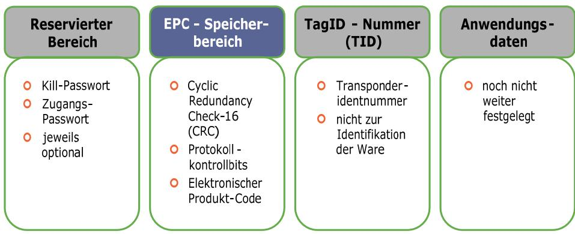

**Abbildung 2–12 Speicherebenen des EPC-Transponders der Generation 2** 

Im reservierten Speicherbereich können ein Zugangspasswort und ein Kill-Passwort gegen ein unberechtigtes Ausführen des Kill-Befehls gespeichert werden.

Der EPC-Speicherbereich enthält neben der eigentlichen Identifikationsnummer, dem Elektronischen Produkt-Code (EPC), eine Prüfsumme zur Sicherstellung der korrekten Datenübertragung (CRC-16) und Protokollkontrollbits, die z. B. die Länge der gespeicherten Daten angeben.

Die Transponder-Identifikationsnummer (Unique Tag ID) dient rein technischen Zwecken, z. B. bei der Herstellung der integrierten Schaltkreise. Außerdem findet sie Verwendung bei einigen Arten von Antikollisionsverfahren. Sie wird bei der Chipherstellung fest vergeben und muss danach unveränderlich sein.

In dem Anwendungsdatenbereich können weitere Daten abgespeichert werden. Für diesen Speicherbereich liegen derzeit noch keine Standards vor. Die Größe dieses Speicherbereichs hängt vom eingesetzten Transponder ab.

RFID-Systeme sind Funkanlagen, für welche die Vorschriften der Bundesnetzagentur für Elektrizität, Gas, Telekommunikation, Post und Eisenbahnen gelten. Es können nur wenige Frequenzbänder genutzt werden, die quer über das gesamte Spektrum vom Kurz- über den Ultrakurz- bis hin zum Mikrowellenbereich verteilt sind. In der Handelslogistik hat sich der Einsatz des Ultrahochfrequenzbandes (UHF) als besonders attraktiv herausgestellt. Die der Standardisierung von EPCglobal zugrunde liegende UHF-Band umfasst den Bereich 860– 960 MHz.

#### Das GS1-Datenbezeichnerkonzept

Durch die exakte Definition von Datenelementen lassen sich vielfältige Informationsbedürfnisse in strukturierter und automatisch erfassbarer Form in verschiedenen EAN-Strichcodeoder EPC-Transponderstandards abbilden. Betroffen sind in der Regel Daten, die über die reine Identifikation hinausgehen und einen hohen Mehrwert entlang der logistischen Kette bieten, wie Chargennummer, MHD etc. Inzwischen stehen mehr als 60 Datenelemente aus den Bereichen Identifikation, Warenverfolgung, Datumsangaben, Maßeinheiten und Adressidente zur Verfügung.

Das GS1-Datenbezeichnerkonzept basiert auf drei Säulen:

- Exakte Definition von Datenelementen (Dateninhalt)
- Festlegung ihrer Datenformate (Feldlänge, verfügbare Zeichen)
- Zuweisung qualifizierender Datenbezeichner

Jeder Datenbezeichner dient als Ankündiger der darauf folgenden Information, also des Datenelements, mit seinem jeweiligen Format. Er legt damit die Basis für eine fehlerfreie Weiterverarbeitung der Information. International genormt in ISO/IEC 15418 und eingebettet in die geschützten EAN-Strichcodesymbologien bietet das Datenbezeichnerkonzept höchste Interpretationssicherheit bei maximaler Datenqualität.

Zur automatischen Unterscheidung von GS1-Identen sowie der erforderlichen Zusatzinformationen wird in allen modernen GS1-Datenträgern, d. h. Strichcode und Transponder, ein einheitliches Verfahren genutzt, und zwar das hier umrissene Datenbezeichnerkonzept. Es legt fest, wie welche Daten im Strichcode oder Transponder verschlüsselt werden. Unabhängig von der Datenträgertechnologie sind die Dateninhalte stets in gleicher Weise zu verarbeiten. Die weltweit überschneidungsfreien Nummernsysteme ILN, EAN, NVE und der zu deren Codierung im Transponder entwickelte EPC dienen dabei als Referenz zu elektronisch übermittelten Nachrichten und Datenabfragen, wie z. B. der elektronischen Bestellung oder der Lieferavisierung per EANCOM® oder der Ereignissteuerung per EPCglobal Netzwerk. Das Datenbezeichnerkonzept verbindet die verschiedenen Informationsbausteine der GS1- Datenträger.

Dies heißt im Umkehrschluss, dass im Rahmen von EPC/RFID keine Informationen im Datenträger verschlüsselt sind, die nicht auch bereits bei der Strichcodierung zur Anwendung kommen.

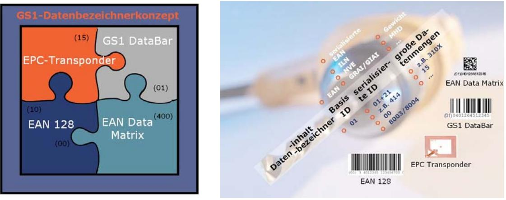

**Abbildung 2–13 Das GS1-Datenbezeichnerkonzept** 

# **2.3.2.3 Datenkommunikation**

Der elektronische Datenaustausch (EDI) – Bindeglied zwischen maschinenlesbarer Identifikation und Warenfluss

Die Identifikationssysteme und das Datenträgerportfolio von GS1 werden durch Standards für den elektronischen Datenaustausch komplettiert. Diese helfen Rationalisierunspotenziale im Geschäftsverkehr umfänglich zu erschließen. Die Identsysteme sind dabei regelmäßig Ausgangspunkt eines automatisierten Ablaufes, indem sie warenbegleitend auf der Ware aufgebracht und dem Geschäftspartner mit allen relevanten Begleitinformationen elektronisch übermittelt werden.

Elektronischer Datenaustausch (EDI) betreiben heißt, strukturierte Daten zwischen Computersystemen in einem standardisierten und maschinenlesbaren Format auszutauschen. Durch Vermeidung von Medienbrüchen erhöht EDI sowohl die Geschwindigkeit des Kommunikationsprozesses als auch die inhaltliche Verlässlichkeit übermittelter Nachrichten. Wirtschaftlich entscheidend ist nicht zuletzt der Wegfall von Mehrfacherfassungen und manuellen Eingabefehlern bei den Beteiligten der Logistikkette.

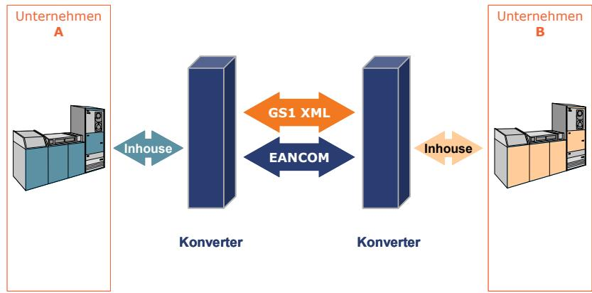

**Abbildung 2–14 Das GS1-Standardportfolio für den elektronischen Datenaustausch – Mittler zwischen den DV-Systemen** 

Mit EANCOM® steht dem Anwender ein Standardnachrichtenkatalog zur Verfügung, mit denen er komplette Geschäftsprozesse elektronisch abwickeln kann.

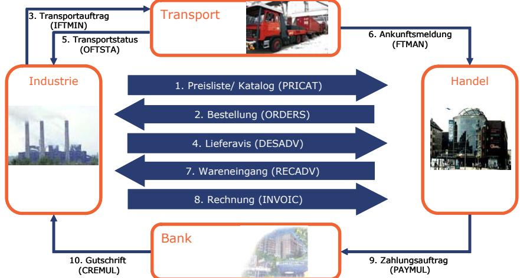

**Abbildung 2–15 Reibungslose Geschäftsprozessabwicklung mittels EANCOM®** 

EPCglobal-Netzwerk: Der Austausch von Echtzeit-Informationen über das Internet

Das EPCglobal-Netzwerk dient dazu, eine Vielzahl von Informationen mit hoher Granularität über Güterbewegungen und -Stati für alle Geschäftspartner verfügbar zu machen. Nicht beinhaltet ist in dem Konzept der Austausch von Prognosedaten, Ausschreibungen, Beschaffungsprozesse, Rechnungsverfahren etc. Diese werden wie bisher über etablierte EDI-Verfahren abgewickelt. Das heißt, das Netzwerk wird genutzt, um Datenabfragen über Artikel, Transporteinheiten oder sonstige Objekte zu starten. Damit stellt das EPCglobal-Netzwerk eine optimale Ergänzung zum EDI dar, indem es zusätzliche Nutzenvorteile einer elektronischen Kommunikation bietet.

Produktinformationen mithilfe des Internets jederzeit verfügbar zu machen zu können, ist die Grundidee des EPCglobal-Netzwerks. Es bildet damit eine spezifische Anwendung eines Konzepts das allgemein als "Internet der Dinge" bezeichnet wird. Das EPCglobal-Netzwerk verbindet dezentrale Server, die sämtliche relevanten EPC-Informationen (d. h. zu einem bestimmten EPC gehörende Stamm- oder Bewegungsdaten) enthalten. Die autorisierte Datenübermittlung wird mittels Internet realisiert. Steuerung der Server sowie Autorisierung und Zugang zu den Informationen übernehmen verschiedene Servicekomponenten des Netzwerks.

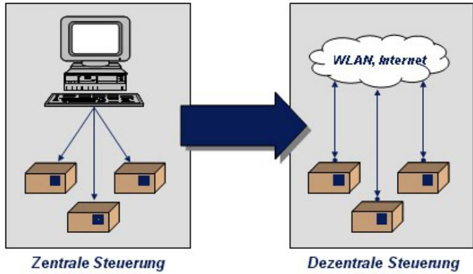

#### **Abbildung 2–16 Paradigmenwechsel von der Fremd- zur Selbststeuerung logistischer Prozesse**

Das EPCglobal-Netzwerk funktioniert über das Zusammenspiel verschiedener Komponenten, für die EPCglobal standardisierte Schnittstellen, darunter auch unternehmensinterne, bereithält. Der Schlüssel zum EPCglobal-Netzwerk ist der EPC. Um den EPC im EPCglobal-Netzwerk ausfindig zu machen, wird der Objektnamenservice (Object Name Service, ONS) genutzt. Er ermöglicht autorisierten Nutzern das Auffinden von Produktinformationen zu einem EPC in Datenbanken. Neben den Schnittstellen für RFID-Anwendungen funktionieren weiterverarbeitende Schnittstellen des Netzwerkes auch über GS1-Barcodevarianten.

Die Vorteile des EPCglobal-Netzwerkes sind:

- Die Bereitstellung von "Echtzeit-Informationen".
- Die Informationstransparenz entlang der gesamten Wertschöpfungskette. Ohne das Netzwerk kann Informationstransparenz nur partiell zwischen den "benachbarten" Schnittstellen erreicht werden.
- Standardisierte Schnittstellen an *allen* Datenübergabepunkten, d.h. vom Transponder zum Lesegerät, vom diesem zur Middleware, von dieser zur internen Applikation und von dieser zur unternehmensübergreifenden Anwendung.

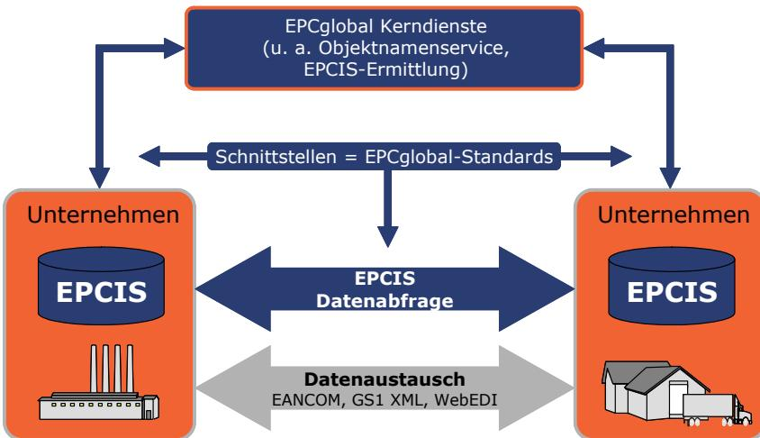

• Granulare Betrachtung des Warenflusses

**Abbildung 2–17 Das EPCglobal-Netzwerk: Echtzeit-Informationen auf Abruf** 

Alle weiteren Nutzenpotenziale, die mit dem Einsatz von RFID verbunden werden (z. B. Vermeidung von Diebstahl und Markenpiraterie, lückenlose Rückverfolgbarkeit, Zeitvorteile etc.) resultieren aus der Möglichkeit der "Echtzeit-Information" und der verbesserten Transparenz. Das bedeutet: Eine komplette Ausschöpfung der Potenziale der RFID-Technologie kann erst durch den Einsatz eines globalen Kommunikations- und Informationsnetzwerks erreicht werden, in dem autorisierte Nutzer entsprechen Daten austauschen können.

#### **2.3.2.4 Zusammenfassung**

Das GS1-System ist ein modular aufgebauter "Werkzeugkasten" zur Optimierung der Informations- und Warenflüsse zwischen Unternehmen. Der Mittelpunkt dieses Systems bilden die GS1-Identsysteme, die ergänzt werden um Datenträger wie Barcodes oder RFID sowie Verfahren zum elektronischen Datenaustausch. Alle Werkzeuge dieses Systems sind kompatibel zueinander und können sukzessive zu einer umfassender, integrative Gesamtlösung für reibungslose und effiziente Geschäftsprozesse zusammengefügt und implementiert werden.

Wichtig ist dabei, das GS1 nicht nur die Basiselemente wie Dateninhalt, Datenträger und Datenaustausch anbietet, sondern darüber hinaus auch weitere Services, die wiederum auf den Basiselementen aufbauen. Dazu zählen beispielsweise die Aktivitäten zu EDIINT AS2,

um den EDI-Datenaustausch über Internet sicherer zu machen, aber auch die Standardisierungsarbeiten im Bereich Klassifikation.

Auf diesen Instrumenten aufbauend, werden Empfehlungen für effiziente Geschäftsprozesse erarbeitet. Hier sind vor allem die Prozessempfehlungen, die im Rahmen der Efficient Consumer Response (ECR)-Initiative erarbeitet werden, hervorzuheben.

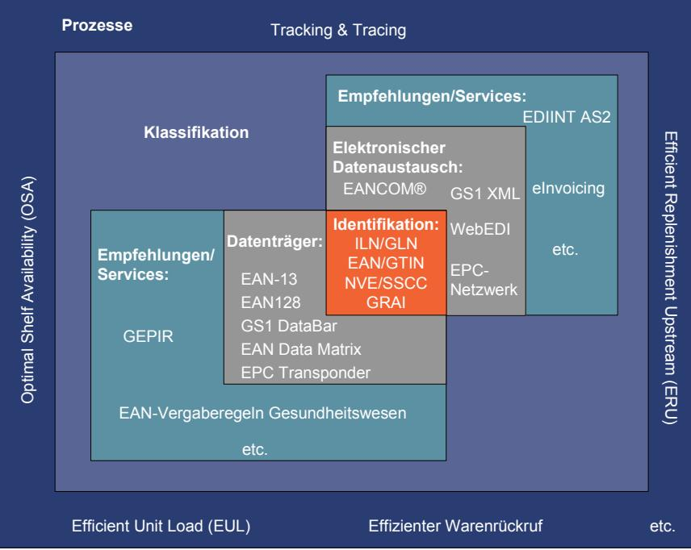

**Abbildung 2–18 Das GS1-System** 

Das GS1-System wird sich aufgrund neuer Technologien und Anforderungen aus der Praxis stetig weiterentwickeln. Erhalten bleibt bei allen Neuerungen des Systems jedoch die Kompatibilität der einzelnen Standards untereinander.

# **3 Vereinbarungen**

# **3.1 Definition von Begriffen**

#### Anwendung

Die Anwendung (oft auch Applikation genannt) unterstützt die spezifische Bereitstellung von Funktionen und Strukturen zur Aufnahme und Auslesung eines EPC im Transponder und Verwendung im Hintergrundsystem. Im vorliegenden Einsatzgebiet ist diese Anwendung von GS1/EPCglobal mit der Datenspezifikation für den Elektronischen Produkt-Code (EPC) und der Luftschnittstellenspezifikation EPCglobal Gen2 (entspricht ISO 18000-6 Rev1.2) definiert. Der Anwendungsherausgeber ist GS1 als Träger von EPCglobal.

#### Betriebsprozess

Umfassender betrieblicher Ablauf. Ein Beispiel ist die Abbildung der logistischen Lieferkette.

#### Cross-Selling

Querverweise auf andere Artikel/Produktkategorien.

#### EAN-Artikelnummer (GTIN, Gobal Trade Item Number)

Die Internationale Artikelnummer ist eine international abgestimmte, einheitliche und weltweit überschneidungsfreie 8-, 13- oder 14-stellige Artikelnummer für Produkte und Dienstleistungen. Sie bildet die Grundlage für den Einsatz der Scannertechnologie.

#### EANCOM®

EANCOM® ist ein Kunstwort aus EAN und COMmunication. Es bezeichnet einen Standard für den elektronischen Datenaustausch, der ein offizielles UN/EDIFACT-Subset.ist. Der Standard wurde von GS1 entwickelt und noch weiterentwickelt. EANCOM® ist empfohlener EDI-Standard für ECR.

#### Efficient Consumer Response (ECR)

ECR ist eine gemeinsame Initiative von Herstellern, Groß-/Einzelhändlern und weiteren Partnern der Versorgungskette mit dem Ziel, durch gemeinsame Anstrengungen die Abläufe zu verbessern und so den Konsumenten ein Optimum an Qualität, Service und Produktvielfalt wirtschaftlich anbieten zu können.

#### Einsatzgebiet

Bereich, in dem die Technische Richtlinie Anwendung finden soll. Höchste Einheit in der Begriffsstruktur. Umfasst eine oder mehrere Anwendungen, die jeweils unterstützten Produkte und Anwendungsziele und den daraus resultierenden Einsatzszenarien.

#### Einsatzszenario

Spezielle Betrachtung des Einsatzgebiets im Hinblick auf die Unterstützung spezifischer Anwendungsziele.

#### Elektronischer Produkt-Code (EPC)

Der EPC ist ein Nummerncode zur eindeutigen Kennzeichnung von Objekten. Der EPC wird auf einem Transponder gespeichert, der auf einem Artikel oder sonstigem Gut angebracht wird. Die entsprechenden Verknüpfungen im EPCglobal-Netzwerk erlauben es, weitere zu diesem Objekt gehörende Daten über das

Internet zu beziehen. In Handel und Logistik basiert der EPC primär auf den GS1-Nummernidenten.

#### EPCglobal

EPCglobal wurde von GS1 ins Leben gerufen. Die Nonprofit-Organisation entwickelt wirtschaftliche und technische Standards für das EPC-Netzwerk und führt diese im globalen Markt ein. National wird EPCglobal durch die jeweilige GS1- Länderorganisation vertreten (in Deutschland durch GS1 Germany).

#### EPC-Informationsservices

(EPCIS = EPC Information Services)

Der EPC-Informationsservices stellt die Verbindung eines Unternehmens zum EPCglobal-Netzwerk dar. Er speichert die im eigenen Unternehmen generierten EPC-Informationen und tauscht Daten zwischen den Systemanwendungen der Netzwerkteilnehmer und bestimmten Netzwerkkomponenten aus. Über Standardschnittstellen können Produktinformationen und Events gespeichert und den Netzwerkmitgliedern zur Verfügung gestellt werden.

#### EPCglobal-Netzwerk

Das EPCglobal-Netzwerk ist eine Infrastruktur, die es erlaubt, dezentral gehaltene Informationen zu einem EPC und dem hiermit verbundenen Objekt über das Internet weltweit verfügbar zu machen. Bestandteile des EPCglobal-Netzwerks sind u. a. EPC-Informationservices, EPC- Sicherheitsservices, EPC-Ermittlungsservices und der ONS.

#### EPC-Manager

Der EPC-Manager identifiziert einen Inverkehrbringer weltweit eindeutig und wird durch eine nationale EPCglobal-Repräsentanz (GS1-Mitgliedsorganisation) an das Unternehmen vergeben.

#### Gefahrenübergang

Logistischer Punkt, an dem Produkte von einer Firma and eine andere übergeben werden.

#### GS1

Internationale Organisation mit Sitz in Brüssel zur Förderung und Weiterentwicklung der GS1-Standards (EAN, ILN, NVE, EANCOM®). Angeschlossen sind über 100 nationale GS1-Organisationen weltweit, für Deutschland GS1 Germany.

#### GS1-Standards

GS1-Standards stehen für weltweit etablierte, standardisierte Identifikations- und Kommunikationsverfahren. Die Basiselemente des EAN-Systems sind:

#### **Identifikationssysteme**

(z. B. die Identnummern ILN, EAN, NVE)

#### **Auto-ID-Systeme**

(Automatische Datenerfassung auf Basis von EAN 13-, EAN 128-, RSS-Strichcodes und Radiofrequenztechnologie RFID etc.)

#### **Elektronische Kommunikationsstandards**

(z. B. EANCOM®, WebEDI, XML etc.)

#### Interfunktionsfähigkeit

Interfunktionsfähigkeit bedeutet, dass jedweder Transponder in jedweder Umgebung, die im Rahmen der definierten Betriebsprozesse der spezifischen Lösungsimplementierung vorkommen kann, funktionieren soll.

#### Liefermeldung (DESADV)

EANCOM®-Nachrichtenart. Die Liefermeldung enthält Einzelheiten zu Gütern, die aufgrund von vereinbarten Bedingungen versandt wurden. Sie soll dem Warenempfänger den detaillierten Inhalt einer Sendung ankündigen. Die Nachricht bezieht sich auf einen Versandort und einen oder mehrere Empfangsorte und kann mehrere unterschiedliche Einzelpositionen, Packstücke oder Bestellungen umfassen. Mit Hilfe dieser Nachricht weiß der Empfänger, wann welche Güter versandt wurden, er kann den Wareneingang vorbereiten und die Daten der Lieferung mit denen der Bestellung vergleichen.

#### Logistikdaten

Daten, die im Rahmen der definierten Betriebsprozesse der spezifischen Lösungsimplementierung im Zusammenhang mit der Nutzung der RFID-Funktion anfallen. Dies können z. B. Informationen über den Status oder den Aufenthaltsort einer Ware sein, die durch Lesen der RFID-Transponder gewonnen wurden.

#### Objekt

Im hier verwendeten Sinne der mit einem Transponder versehene Gegenstand, der im Rahmen der Handelslogistik relevant ist. Dieser kann z. B. das einzelne Produkt wie auch Warenträger, Paletten, Umverpackungen, Mehrwegbehälter, o. ä. sein.

#### Self-Checkout

Eine vom Kunden selbst bediente Kassenstation.

#### Serial Shipping Container Code (SSCC)

Der Serial Shipping Container Code (SSCC), in Deutschland "Nummer der Versandeinheit" (NVE) genannt, dient der eindeutigen und unverwechselbaren Identifikation einer Transporteinheit mit einer standardisierten 18-stelligen Nummernstruktur.

#### Statistikdaten

Statistikdaten geben Aufschluss über die generelle Nutzung eines Systems.

#### Tracking & Tracing

System zur Sendungsverfolgung. Tracking bezeichnet die Ermittlung des aktuellen Status, Tracing des Ex-post-Sendungsverlaufs.

#### Transponder

System bestehend aus einem passiven RFID-Chip mit Antenne entsprechend der Luftschnittstellenspezifikation EPCglobal Gen2 (entspricht ISO 18000-6 Rev1.2). Die Antenne kann auf unterschiedliche Weise implementiert und ggf. sogar Bestandteils des Produkts sein. Der Transponder kann auf verschiedene Materialien aufgebracht und in verschiedenen Formen realisiert werden.

#### Anwendungsfall / Nutzungsfall

Detaillierte Beschreibung einer Aktivität- bzw. eines Handlungsablaufs, der Teil eines Betriebsprozesses ist. Ein Beispiel ist die Initialisierung eines Transponders.

# **3.2 Zuordnung der Rollen und Entitäten im Einsatzgebiet "Handelslogistik"**

#### **3.2.1 Prozesskette Logistik bis zur Handelsfiliale**

Die Beschreibung der Rollen- und Verantwortlichkeiten soll in Anlehnung an die Spezifikationen und Empfehlungen von GS1 erfolgen.

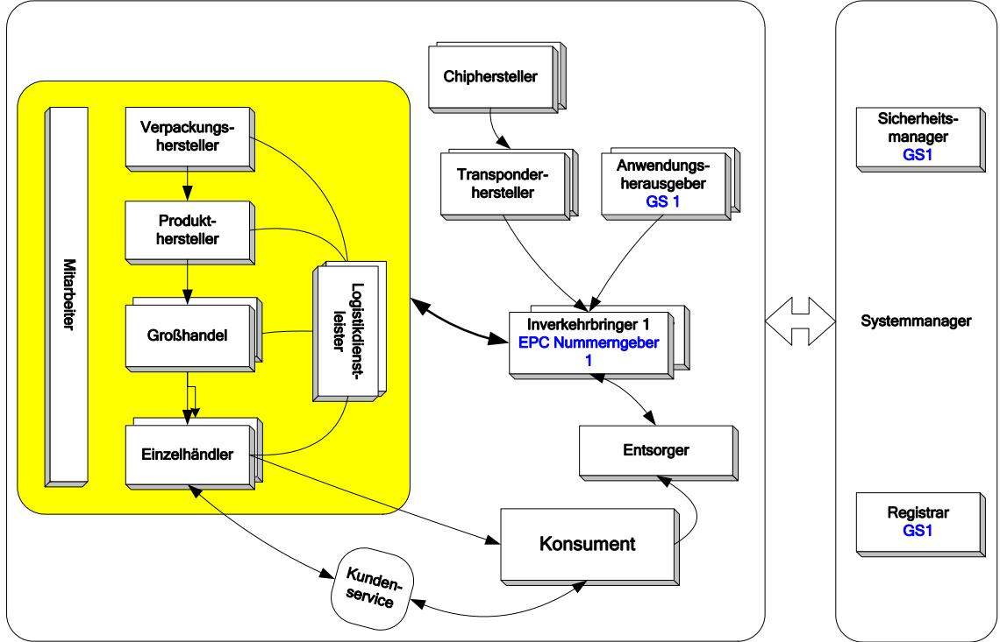

**Abbildung 3–1 Entitäten des Einsatzgebiets "Handelslogistik"** 

#### Akteur

Entitäten, die entsprechend der zugewiesenen Rolle handeln.

#### Anwendungsherausgeber

Im vorliegenden Einsatzgebiet Handelslogistik kommt die Anwendung EPCglobal im Transponder und den übrigen Komponenten des Gesamtsystems (Lesegeräte, Hintergrundsystem, etc) zum Einsatz. Der Anwendungsherausgeber ist GS1 als Träger von EPCglobal. Der Anwendungsherausgeber vermarktet die Anwendung.

#### Chiphersteller

Der Chiphersteller stellt den Chip, der im Transponder verwendet wird, entsprechend EPCglobal-Spezifikationen her. Der Chiphersteller vergibt ggf. die eindeutige Seriennummer des Chips und ggf. Schlüssel und Passworte zum Schutz des Chips.

#### Transponderhersteller

Der Transponderhersteller stellt den Transponder her. Der Transponderhersteller vergibt ggf. Schlüssel und Passworte zum Schutz des Chips.

#### Inverkehrbringer

Der Inverkehrbringer bringt den Transponder in die Lieferkette ein. Alle Entitäten der Lieferkette (Verpackungshersteller, Produkthersteller, Groß- und Einzelhändler) können die Rolle des Inverkehrbringers einnehmen. Der Transponderhersteller ist ein Zulieferer des Inverkehrbringers.

#### EPC-Vergeber

Bezeichnet den Inverkehrbringer in der Terminologie von GS1/EPCglobal. Innerhalb eines Nummernraums, der ihm von GS1 auf Antrag zugewiesen worden ist, vergibt der EPC-Vergeber den EPC des zu identifizierenden Objektes (z. B. eines Produktes oder einer logistischen Einheit). Die generelle Regel lautet dabei: Das Unternehmen, das Eigentümer des Markennamens des Produktes ist, unabhängig davon, durch wen und wo es hergestellt wurde, ist verantwortlich für die Vergabe des EPC. EPC-Vergeber kann daher:

- ...der Hersteller oder Lieferant sein, wenn das Produkt unter einem Markennamen verkauft wird, der ihm gehört.
- ...der Importeur oder Großhändler sein, wenn das Produkt in seinem Auftrag gefertigt wurde und unter einem ihm gehörenden Markennamen verkauft wird, oder wenn das Produkt (z. B. die Verpackung) von ihm geändert wird.
- ...das Handelsunternehmen selbst sein, wenn das Produkt in seinem Auftrag gefertigt wurde und er es unter einem ihm gehörenden Markennamen (Handelsmarke) verkauft.
- ...(allgemeiner gesprochen) ein Kunde sein, wenn das Produkt speziell für diesen Kunden angefertigt wurde und ausschließlich durch diesen bestellt werden kann.

#### Ausnahmen:

- 1 Artikel, die noch keine EPC durch den Markengeber erhalten haben. Beispiel: Kauft ein Importeur/Großhändler Waren, die - aus welchen Gründen auch immer - (noch) nicht herstellerseitig mit EPC codiert sind, besteht die Möglichkeit, (temporär) eine EPC mittels der Basisnummer des Importeurs/Großhändlers zu bilden. Wird dann seitens des Herstellers/Markengebers später doch das GS1-System eingeführt, so werden der "Übergangs-EPC" des Importeurs/Großhändlers durch den Hersteller-EPC ersetzt.
- 2 Artikel ohne Markennamen und generische Produkte: Artikel ohne Markennamen und generische Produkte werden "an der Quelle", d. h. durch den Hersteller mit einem EPC versehen. Insbesondere bei generischen Produkten kann dies dazu führen, dass Artikel, die identisch aussehen, unterschiedliche EPC haben: Dies kann Auswirkungen auf die Struktur der Datenbanken haben. Beispiele für solche Artikel sind: Kerzen, Trinkgläser etc.

#### Verpackungshersteller

Stellt die Verpackung des Produkts her. Sofern der Transponder mit der Verpackung und nicht mit dem Produkt selbst verbunden werden soll, wird u. U.. der Verpackungshersteller den Transponder anbringen und möglicherweise dabei auch mit dem EPC und weiteren Informationen wie z. B. einem Kill-Passwort versehen.

#### Hersteller

Stellt das Produkt her. Sofern der Transponder mit dem Produkt selbst verbunden werden soll, wird üblicherweise der Hersteller den Transponder anbringen und dabei auch mit dem EPC und weiteren Informationen wie z. B. einem Kill-Passwort versehen.

#### Logistikdienstleister

Der Logistikdienstleister transportiert, lagert oder verteilt das Produkt. Darüber

hinaus sind weitere Dienstleistungen möglich. In der Lieferkette eines Produkts können mehrere Logistikdienstleister eingesetzt sein um die verschiedenen Stationen zu verbinden.

#### Großhändler

Der Großhändler vermarktet das Produkt an verschiedene Einzelhändler. Der Großhändler ist oftmals auch Importeur des Produkts und kann in dieser Rolle auch als EPC-Vergeber auf Produktebene agieren.

#### Mitarbeiter

Mitarbeiter der verschiedenen Entitäten der Lieferkette.

#### Einzelhändler

Vermarktet das Produkt an den Konsumenten und wickelt den Kundenservice ab.

#### Konsument

Käufer und/oder Verbraucher der Produkte. Erhält gegen Bezahlung vom Einzelhändler das Produkt, das ggf. mit einem Transponder versehen ist.

#### Entsorger

Am Ende des Lebenszyklus werden Transponder und Produkte, die mit Transpondern versehen sind, dem Entsorger zugeführt. Dieser verantwortet die ordnungsgemäße Verwertung.

#### Systemmanager

GS1 als Systemmanager stellt die Regeln für die Systemanwendung auf (z. B. hinsichtlich der EPC-Vergabe) und verpflichtet die Systemteilnehmer zur Einhaltung der Regeln des Systems. Hierzu bedient er sich der funktionalen Entitäten Sicherheitsmanager und Registrar.

#### Registrar

GS1 als Registrar sorgt über die Verwaltung und Zuteilung von Nummernkontingenten für die Eineindeutigkeit des Identifikationssystems.

#### Sicherheitsmanager

GS1 als Sicherheitsmanager stellt Sicherheitsfunktionen bereit und begleitende Sicherheitsregeln auf. Die Kontrolle der regelkonformen Anwendung obliegt allen Systemteilnehmern.

# **4 Generelle Anforderungen**

In den folgenden beiden Unterkapiteln wird auf Besonderheiten hingewiesen, die bei produktspezifischer Verwendung von Transpondern sicherheitstechnisch besonders relevant sind.

# **4.1 Funktionale Anforderungen**

### **4.1.1 Produktspezifischer Einsatz von Transpondern am POS**

Sofern Produkte am POS mit Transpondern versehen oder sogar spezielle Dienste im nachvertrieblichen Bereich angeboten werden, dann sind Vorkehrungen zu treffen, die ein Entfernen oder Deaktivieren des Transponders nach dem Verkauf des Produktes erlauben, sofern der Konsument dieses wünscht.

Eine technische Deaktivierung ist dabei nur dann notwendig, wenn die Transponder nicht in entfernbaren Warenetiketten oder auf Umverpackungen angebracht sind, die vor Verwendung entfernt werden.

Eine Möglichkeit zur technischen Deaktivierung ist der Einsatz eines sogenannten "Kill-Kommandos". Das Kill-Kommando ist ein nicht umkehrbarer Vorgang, der den RFID-Chip in einen Zustand versetzt, in dem er keine Kommunikation mit einem Lesegerät mehr zulässt. Danach ist ein Lesen durch ein Lesegerät und eine Identifizierung des Produkts mittels des Transponders nicht mehr möglich. Demzufolge stehen dann auch alle nachvertrieblichen Dienste (z. B. belegloser Umtauch bzw. Garantieabwicklung) nicht mehr zur Verfügung.

Das Kill-Kommando sollte nur dann ausgelöst werden, wenn der Endkunde oder der Einzelhändler den Transponder deaktivieren möchte. In bestimmten Fällen kann das Kill-Kommando auch früher ausgelöst werden, wenn der Transponder in der weiteren Lieferkette nicht mehr benötigt wird oder eine Auslösung beim Kauf nicht gewährleistet werden kann.

Eine Auslösung des Kill-Kommandos durch Unbefugte in der Lieferkette oder im POS kann Schaden verursachen. Durch eine zu frühe Auslösung könnten spätere Prozesse, wie Inventur, SB-Kasse und Diebstahlschutz nicht ausgeführt werden. Erschwerend kommt hinzu, dass durch die relativ große Reichweite der verwendeten RFID-Technologien eine große Anzahl von Etiketten in kurzer Zeit zerstört werden könnten.

# **4.1.2 Verhinderung von Produktfälschungen**

Produktpiraterie ist weit verbreitetes, wachsendes und vielschichtiges Problem. Ein offensichtliches Beispiel sind gefälschte Handtaschen auf einem Straßenmarkt. Es werden aber auch an lizenzierten Produktionsstandorten in so genannten Geisterschichten mehr 'Originalprodukte' als angefordert produziert und verkauft. So hergestellte Produkte können auch in der Lieferkette umgeleitet werden, wenn es z. B. länderspezifische Preise gibt.

Durch die Kontrolle der Authentizität soll sichergestellt werden, dass die richtigen Produkte in der richtigen Anzahl über die richtige Lieferkette an den richtigen Händler geliefert werden. Diese Kontrollen können automatisch in der Lieferkette erfolgen, wenn die Produkte entlang der Lieferkette gelesen werden. Es können Kontrolleure mit mobilen Lesegeräten Stichproben machen. Oder der Endkunde selbst kann mit geeigneten Lesegeräten die Authentizität eines Produktes verifizieren.

Schützenswert ist dabei für den Markeninhaber:

- dass nur originale bzw. autorisierte Produkte vertrieben werden und
- dass die Produkte, die für einen bestimmten Markt produziert wurden, auch dort verkauft werden.

Schützenswert für den Endkunden ist:

- dass ein als Original gekauftes Produkt auch ein Original ist,
- dass ein Produkt in dem Land, in dem es gekauft wurde, zugelassen ist,
- dass keine Manipulation z. B. des Verfallsdatums stattgefunden hat und
- dass ein als 'neu' gekauftes Produkt auch neu ist.

# **4.2 Wirtschaftlichkeit**

Ein wirtschaftlicher Betrieb des Systems erfordert, dass der kommerzielle Nutzen in jeder Ausbaustufe größer als die Kosten für Prozesse, Systeme und Sicherheit ist. Dies muss für alle Akteure, die in den Aufbau des Systems investieren, gelten.

Das Gesamtsystem und dessen Komponenten sollte daher so ausgelegt werden, dass die Anforderungen der relevanten Einsatzszenarien möglichst effizient erfüllt werden. Deshalb sind zunächst diese Anforderungen möglichst exakt zu bestimmen.

# **4.3 Sicherheit**

Auf Anforderungen zur Sicherheit wird in diesem Dokument ab Kapitel [8](#page-73-1) speziell eingegangen.

# **5 Methodik zur Ermittlung der Sicherheitsanforderungen**

# **5.1 Zielsetzung**

Die Technische Richtlinie RFID soll folgenden Zielen dienen:

- Leitfaden für Systemlieferanten und Systemanwender zur sachgerechten Implementierung von spezifischen RFID-Systemlösungen bzgl. Funktions- und Informationssicherheit und Datenschutz.
- Schaffung von Aufmerksamkeit und Transparenz in Bezug auf Sicherheitsaspekte.
- Basis für eine Konformitätserklärung der Systemlieferanten oder Betreiber und die Vergabe eines Gütesiegels durch eine Zertifizierungsstelle.

Zur Umsetzung dieser Ziele sind folgende Informationen erforderlich:

- Ermittlung der Sicherheitsanforderungen an ein RFID-System eines Einsatzgebietes.
- Benennung der spezifischen Gefährdungen, geeigneter Gegenmaßnahmen und des möglicherweise verbleibenden Restrisikos.
- Definition der Kriterien für eine Konformitätserklärung bzw. Zertifizierung.

Bei der Definition von Maßnahmen und Systemvorschlägen sind nicht nur Sicherheitsaspekte relevant. Vielmehr müssen alle in Kapitel [4](#page-43-1) benannten Anforderungen berücksichtigt werden.

# **5.2 Methodik**

### **5.2.1 Erwägungen zum Umfang der Systembetrachtung**

RFID-basierte Systeme können sehr komplex sein. In den meisten Fällen gehören zur Systemlösung auch viele Komponenten, die nicht mit RFID ausgestattet sind. Auf der anderen Seite dürfen bei der Betrachtung der Systemsicherheit nicht nur das Medium/das Tag und die Lesegerät berücksichtigt werden.

Die Technische Richtlinie muss alle für RFID relevanten Sicherheitsaspekte im Detail einbeziehen. Diese Aspekte hängen stark vom Einsatzgebiet und der jeweiligen Implementierung der Systemlösung ab. Diese Technische Richtlinie enthält daher detaillierte Angaben über das Einsatzgebiet und die dazugehörenden Betriebsprozesse (einschließlich der Vertriebskanäle und -prozesse). Die Prozesse decken den gesamten Lebenszyklus eines Trägermediums oder Transponders ab. Basierend auf diesen Prozessen werden Anwendungsfälle bestimmt, die aus für die Sicherheitsbetrachtung des RFID-Systems relevant sind. Diese Anwendungsfälle werden dann als Grundlage für die Ermittlung von Gefährdungen und eine detaillierte, systemspezifische Sicherheitsbewertung für die mit RFID im Zusammenhang stehenden Bereiche des Systems genutzt. [Abbildung 5–1](#page-46-1) zeigt diese Vorgehensweise am Beispiel des eTicketing im ÖPV.

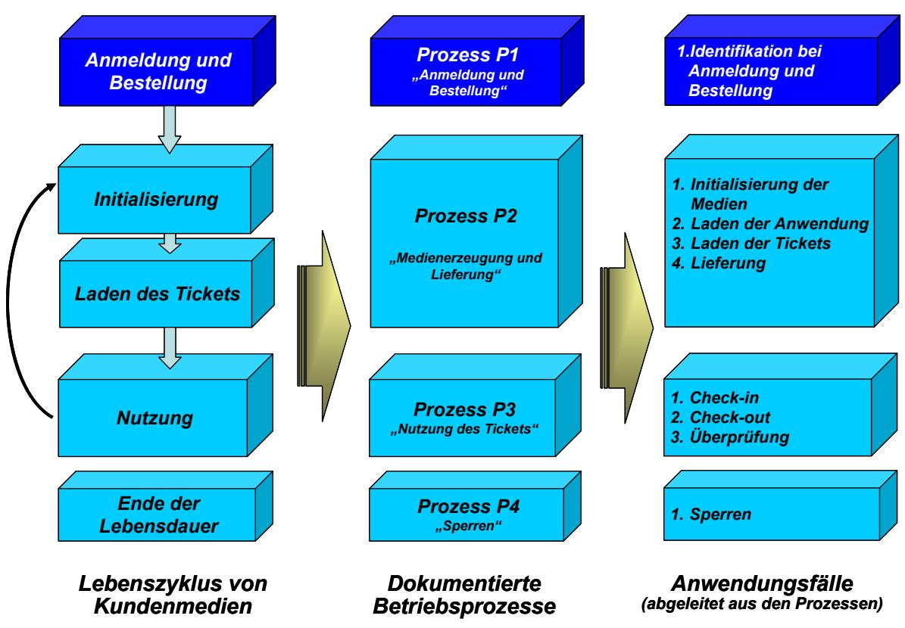

**Abbildung 5–1 Beispiel: Bestimmung RFID-relevanter Anwendungsfälle für eTicketing** 

Alle anderen Systemkomponenten werden nur allgemein behandelt. Die vorgeschlagenen Sicherheitsmaßnahmen basieren auf offenen IT-Sicherheitsstandards.

Dieses Konzept legt den Schwerpunkt der Betrachtung auf die für RFID relevanten Systemteile und gewährleistet dennoch die Berücksichtigung aller Sicherheitsaspekte. Auf der anderen Seite lässt die Technische Richtlinie auch Raum für individuelle und anwendereigene IT-Implementierungen (Back Offices, Vertriebs- und Logistiksysteme etc.). Dies unterstützt insbesondere die Erweiterung bestehender Systeme um die RFID-Technologie.

# **5.2.2 Skalierbarkeit und Flexibilität**

Diese Technischen Richtlinien sollen in erster Linie Sicherheitsfragen behandeln. Parallel muss für alle Implementierungen, die auf dieser Richtlinie aufsetzen, ein wirtschaftlicher Betrieb möglich werden. Daher sollen die folgenden Anforderungen an die Methodologie der Richtlinie berücksichtigt werden:

- 1 Es muss möglich sein, Systeme so zu implementieren, dass eine Ausgewogenheit von Kosten und Nutzen erreicht wird. Dies bedeutet in der Praxis, dass die Schutzmaßnahmen den ermittelten Schutzbedarf zwar erfüllen aber nicht übertreffen müssen. Beispiel: Werden nur preiswerte Produkte verwendet, die eine relativ niedrige Sicherheitsanforderung haben, sollten die Schutzmaßnahmen entsprechend gestaltet werden. Dies ermöglicht beispielsweise die Verwendung preiswerter Medien, wodurch sich die Kosten für die Systemimplementierung und den Betrieb verringern.
- 2 Die für die Technische Richtlinie ausgewählten Einsatzszenarios umfassen eine große Bandbreite, von kleinen bis zu landesweiten oder sogar grenzüberschreitenden Anwendungen. Wichtig ist, dass das in der Richtlinie verwendete Konzept für Systemlösungen aller Größen und verschiedener Komplexität genutzt werden kann.

3 In vielen Fällen lässt sich die Wirtschaftlichkeit einer Systemlösung wesentlich leichter durch die Kooperation mit Geschäftspartnern erreichen. Dies gilt insbesondere für eTicketing-Anwendungen, bei denen es sehr vorteilhaft sein kann, wenn bereits beim Kunden verfügbare Medien (z. B. Karten mit Mehrfachanwendung oder NFC-fähige Telefone) für zusätzliche Anwendungen, Produkte und damit verbundene Dienstleistungen wiederverwendet werden können.

Die folgenden Abbildungen zeigen Beispiele von eTicketing für eine system- und anwendungsübergreifende Nutzung von Kundenmedien und -infrastruktur.

[Abbildung 5–2](#page-47-1) zeigt, dass u. U. verschiedene Produkte bzw. Einsatzszenarios in einem System unterstützt werden müssen. Dabei werden diese Produkte möglicherweise auf verschiedene Trägermedien aufgebracht.

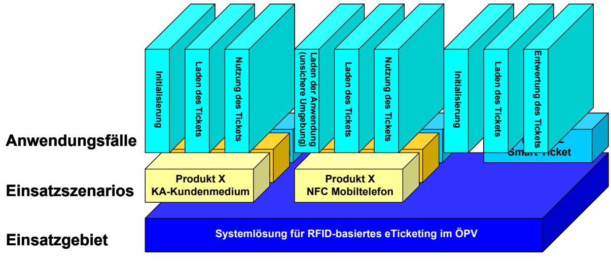

#### **Abbildung 5–2 Beispiel für Einsatzszenarios und relevante Anwendungsfälle für eTicketing im ÖPV**

[Abbildung 5–3](#page-47-2) zeigt ein Beispiel eines Kundenmediums für eTicketing, das Anwendungen aus zwei Einsatzgebieten unterstützt.

#### **Abbildung 5–3 Hierarchisches Konzept für Medien, Anwendungen und Tickets beim eTicketing**

Um die genannten Anforderungen zu erfüllen, wird für diese Technische Richtlinie folgendes Konzept verwendet:

- 1 Ein passendes Rollenmodell und die Struktur einiger Hauptelemente (Produkte, Applikationen und Medien) wurden in Kapitel 3 beschrieben. Dieses Modell unterstützt einen in skalierbaren und erweiterbaren Ansatz.
- 2 Die Technische Richtlinie muss Sicherheitskonzepte anbieten, die alle in einer Infrastruktur verwendeten Kombinationen von Einsatzszenarios und Medien umfassen. Dies wird durch individuelle Sicherheitsbewertungen, die auf den RFID-relevanten Anwendungsfällen basieren, erreicht.
- 3 Gleiche Einsatzgebiete (insbesondere im eTicketing), die die Möglichkeit für anwendungsübergreifende Partnerschaften bieten, werden in den entsprechenden Technischen Richtlinien mit so viel Kommunalität wie möglich behandelt. Die Sicherheitsbewertung basiert auf ähnlichen Sicherheitszielen. Die Schutzmaßnahmen verwenden wenn möglich die gleichen Mechanismen.
- 4 Eine besondere Herausforderung besteht bei system- und anwendungsübergreifenden Partnerschaften im Hinblick auf die Systemsicherheit. Es muss gewährleistet sein, dass die Sicherheit eines Systems nicht von Schwächen eines anderen Systems untergraben wird. Dies erfordert normalerweise eine umfassende Sicherheitsbewertung beider Systeme.

Die Technischen Richtlinien widmen sich diesem Problem durch Einführung eines skalierbaren und transparenten Konzepts für die Anwendung von Schutzmaßnahmen gegenüber den festgestellten Gefährdungen, den "Schutzbedarfsklassen". Insgesamt werden drei Klassen von 1 (normale Anforderung) bis zu 3 (hohe Anforderung) verwendet. Alle Schutzmaßnahmen werden entsprechend in drei Stufen definiert, von normalem Schutz bis zu erweitertem Schutz.

Bei jeder individuellen Systemimplementierung wird zuallererst die Schutzanforderungskategorie für jedes Sicherheitsziel definiert. Daraus ergibt sich der Umfang der zu treffenden Schutzmaßnahmen.

Dieses Konzept bietet eine einfache Möglichkeit zur Installation einer sicheren Systemkooperation. Es muss lediglich sichergestellt werden, dass die Schutzbedarfsklassen beider Systeme zusammenpassen.

# **5.2.3 Aufbau der Technischen Richtlinie**

| Kapitel                         | Inhalt                                                                                       |
|---------------------------------|----------------------------------------------------------------------------------------------|
| Beschreibung des Einsatzgebiets | Beschreibung des Einsatzgebiets: Aufbau, Leistungen, spezielle Randbedingungen etc.    |
| Produkte und Leistungen         | Beschreibung von Beispielprodukten und - leistungen sowie Vertriebskanälen                |
| Definitionen                    | Modelle, Begriffsdefinitionen                                                                |
| Einführung in die Methodologie  | Vorstellung des für die Sicherheitsbewer tung verwendeten Konzepts sowie der Me thoden |
| Allgemeine Anforderungen        | Allgemeine Anforderungen der beteiligten Parteien, beachtenswerte Aspekte etc.            |
| Betriebsprozesse                | Beschreibung von Betriebsprozessen, die für den Lebenszyklus von Trägermedien             |

[Tabelle 5–1](#page-49-1) zeigt den Aufbau aller bisher erstellten Technischen Richtlinien.

| Kapitel                                                 | Inhalt                                                                                                                                                                                                                                                                                            |
|---------------------------------------------------------|---------------------------------------------------------------------------------------------------------------------------------------------------------------------------------------------------------------------------------------------------------------------------------------------------|
|                                                         | von Bedeutung sind                                                                                                                                                                                                                                                                                |
| Anwendungsfälle                                         | Definition von RFID-relevanten Anwen dungsfällen                                                                                                                                                                                                                                               |
| Sicherheitsbewertung                                    | Einführung in die IT-Sicherheit                                                                                                                                                                                                                                                                   |
|                                                         | Definition spezieller Sicherheitsziele, Schutzbedarfsklassen und Gefährdungen                                                                                                                                                                                                                  |
|                                                         | Vorgeschlagene Schutzmaßnahmen                                                                                                                                                                                                                                                                    |
| Definition von Einsatzszenarios                         | Definition von Beispielen für Einsatzszena rios. Diese Beispiele decken die gesamte Bandbreite relevanter Parameter ab, die in einem bestimmten Einsatzgebiet auftreten kann. Der Nutzer der technischen Richtlinie kann diese Szenarios seinen eigenen Be dürfnissen anpassen. |
| Implementierungsvorschlag für die System lösung      | Generische Systembeschreibung mit Bei spielen zur Durchführung einer Gefähr dungsanalyse und machbarer Schutzmaß nahmen für die Systemkomponenten                                                                                                                                        |
| Implementierungsvorschlag einzelner Einsatzszenarios | Beispiele für die Verwendung des Konzepts zur Sicherheitsbewertung                                                                                                                                                                                                                             |

**Tabelle 5–1 Aufbau der Technischen Richtlinien** 

# **5.2.4 Erläuterung des Sicherheitskonzepts**

Jede Technische Richtlinie enthält Beispiele zur Durchführung der Sicherheitsbewertung in bestimmten Einsatzszenarios. Diese können an die Anforderungen und Randbedingungen der speziellen Systemimplementierung angepasst werden.

[Abbildung 5–4](#page-50-1) zeigt das in allen Technischen Richtlinien verwendete Konzept der Sicherheitsbewertung.

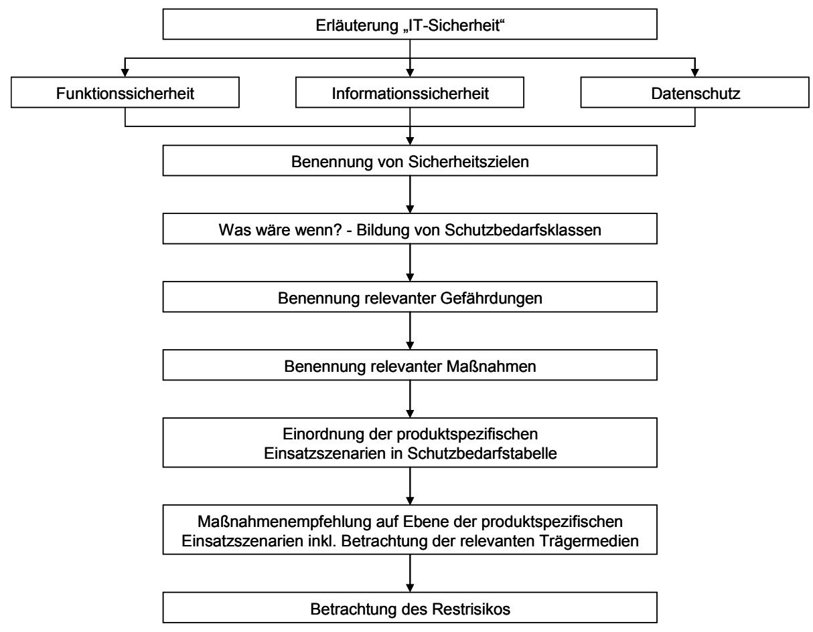

**Abbildung 5–4 Sicherheitsbewertungskonzept** 

Alle Erwägungen basieren auf der klassischen Definition von Sicherheitszielen, die in [Abbildung 5–5](#page-50-2) gezeigt wird.

**Abbildung 5–5 Generische Sicherheitsziele** 

# **6 Generische Geschäftsprozesse**

# **6.1 Generische Beschreibung der Lieferkette**

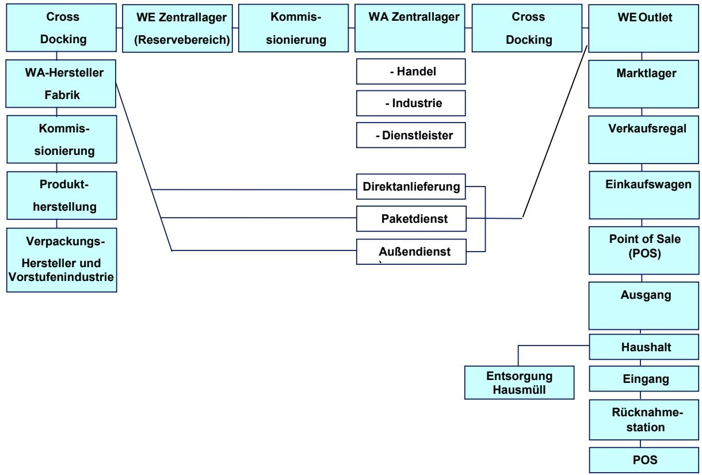

**Abbildung 6–1 Lieferkette** 

# **6.2 Beantragung und Auslieferung des EPC-Manager**

Der EPC-Manager ist ein Datum, über das ein Inverkehrbringer weltweit eindeutig identifiziert werden kann. Der EPC-Manager wird vom Anwendungsherausgeber – im EPCglobal-System ist dies GS1 - herausgegeben und verwaltet. Der Inverkehrbringer – im EPCglobal-System ist dies der EPC-Nummerngeber - beantragt seinen spezifischen EPC-Manager bei seiner lokalen GS1-Organisation und bekommt diesen von dort zugestellt.

Der EPC-Manager ist Bestandteil des EPC, der vom EPC-Nummerngeber den von ihm in Verkehr gebrachten Transpondern zugeordnet wird. Der EPC-Manager bestimmt somit den Nummernbereich, der dem EPC-Nummerngeber zur Verfügung steht.

|                                                                                          | P1.1 Bestellung über Servicecenter und Auslieferung                                        | Akteure                   |
|------------------------------------------------------------------------------------------|-----------------------------------------------------------------------------------------------|---------------------------|
| Bestellung EPC Manager / Akzeptieren der Bedingungen und Zahlungsvereinbarungen | Antrags FAX formular                                                                    | Inverkehrbringer          |
| Übergabe von Identitätsdaten des Inverkehrbringers                                 | Antrags FAX formular                                                                    | Inverkehrbringer          |
| Optionale Überprüfung der Identitätsdaten                                             | Prüfung der Identitätsdaten (z.B. Abgleich Adressen, Firmenregister, Ansprechpartner, etc) | Anwendungs herausgeber |
| Zahlung / Überprüfung Bonität                                                         | Überprüfung Zahlungsangaben und Bonität (option)                                              | Anwendungs herausgeber |
| Übernahme der Bestelldaten                                                            | Übernahme der Firmen- und Bestelldaten in interne Systeme                                     | Anwendungs herausgeber |
| Erstellung des EPC Manager                                                            | Erstellung und Zuweisung des eindeutigen EPC-Manager zum Inverkehrbringer                  | Anwendungs herausgeber |
| Auslieferung                                                                             | Auslieferung des EPC-Manager an den Inverkehrbringer                                          | Anwendungs herausgeber |
|                                                                                          | Ende                                                                                          |                           |

**Abbildung 6–2 Prozess P1 "Beantragung und Auslieferung des EPC-Managers"** 

# **6.3 Individualisieren des Transponders**

Der im Transponder integrierte Chip ist ab Werk für die Aufnahme von EPC, Passworten, etc gemäß den Spezifikationen von EPCglobal konfiguriert. Diese Daten sind jedoch noch nicht vorhanden.

Das Einbringen der transponderspezifischen Daten in den Chip bezeichnet man als Individualisieren. Das Individualisieren wird vom EPC-Nummerngeber oder seinen Beauftragten durchgeführt.

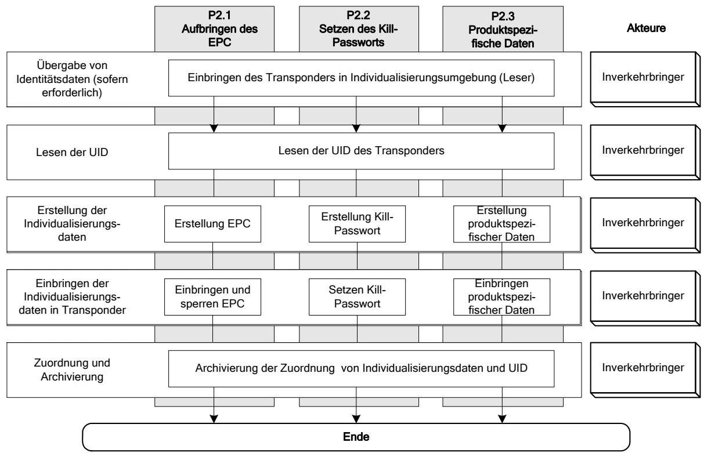

**Abbildung 6–3 Prozess P2 "Individualisieren des Transponders"** 

# **6.4 Anbringen am Objekt**

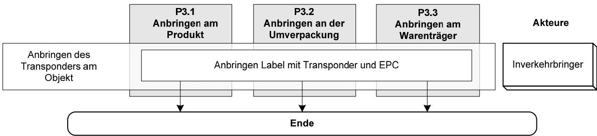

**Abbildung 6–4 Prozess P3 "Anbringen des Transponders am Objekt"** 

Abbildung 6.4 beschreibt den Prozess des Anbringens eines Transponders auf ein Objekt. Bei dem Objekt kann es sich sowohl um ein Produkt, eine Umverpackung oder um eine Palette handeln.

Die Transponder sind bereits initialisiert und mit einem EPC versehen. Dieser soll der jeweiligen Verpackungshierarchie entsprechen. Das Anbringen des Transponders auf der jeweiligen logistischen Einheit (Palette, Umverpackung oder Produkt) erfolgt jeweils durch den Inverkehrbringer oder dessen Beauftragten.

# **6.5 Wareneingang**

**Abbildung 6–5 Prozess P4 "Wareneingang"** 

Beim Prozess "Wareneingang" erfolgt zunächst die Anlieferung der mit Transponder versehenen ("getaggten") Objekte, die der elektronisch angekündigten Lieferung (Lieferavis) entsprechen. Die Objekte können auf Produkt-, Verpackungs-, oder Palettenebene gruppiert sein. Die Datenerfassung erfolgt über ein RFID Lesesystem. Dies ermöglicht eine schnelle Erfassung großer Datenmengen.

Die Kontrolle erfolgt, in dem die durch RFID erfassten Daten mit dem elektronischen Lieferavis verglichen werden. Sollte eine Differenz der inventarisierten Produkte zum Lieferavis bestehen, kommen korrigierende Maßnahmen zum Einsatz. Als entsprechende Akteure für diesen Vorgang kommt sowohl der Produkthersteller, der Großhandel (Wholesaler) als auch der Einzelhändler (Retailer) wie auch der Logistikdienstleister in Frage.

# **6.6 Lagerhaltung**

Der Einsatz von RFID ermöglicht bei der Lagerhaltung eine Echtzeiterfassung des Lagerbestandes und somit eine Echtzeitkontrolle. Die Datenerfassung durch RFID - Lesegeräte liefert einen "Ist" Wert. Der "Soll" Wert ergibt sich durch die errechnete Differenz von Wareneingang und Warenausgang. Somit sind Differenzen zwischen "Ist" und "Soll" grundsätzlich ausgeschlossen.

Die Anwendung von RFID - Lesesystemen in diesem Bereich ermöglicht an Stelle einer physischen Inventur eine elektronische vornehmen zu können. Als mögliche Akteure im Lagerhaltungsprozess kommen sowohl der Produkthersteller, der Großhandel (Wholesaler) als auch der Einzelhändler (Retailer) wie auch der Logistikdienstleister in Frage.

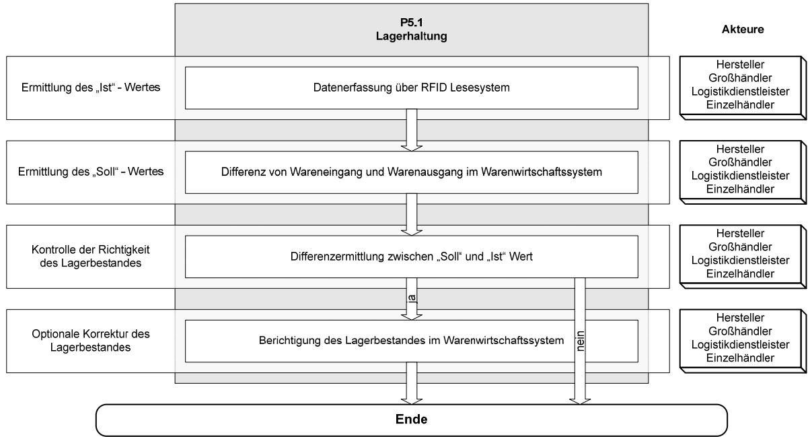

**Abbildung 6–6 Prozess P5 "Lagerhaltung"** 

# **6.7 Kommissionierung**

Die Kommissionierung erfolgt zeitlich zwischen den logistischen Prozessen "Wareneingang" und "Warenausgang". In [Abbildung 6–7](#page-56-1) ist die Kommissionierung als Teil des Warenausgangsprozesses definiert.

Bei der Kommissionierung werden aus dem Lager die für den jeweiligen nachfolgenden Akteur in der Lieferkette laut Kommissionierungsliste bestimmten Produkte konfiguriert. Eine fertig kommissionierte Ware für eine nachfolgende Entität der Lieferkette kann eine Mischung aus kompletten Paletten, Kartons, sowie Einzelprodukten darstellen. Sie wird üblicherweise in lokal abgegrenzten Bereichen für den Weitertransport (LKW, Container etc.) bereitgestellt.

Als mögliche Akteure im Kommissionierungsprozess kommen sowohl der Produkthersteller, der Großhandel (Wholesaler) als auch der Einzelhändler (Retailer) wie auch der Logistikdienstleister in Frage.

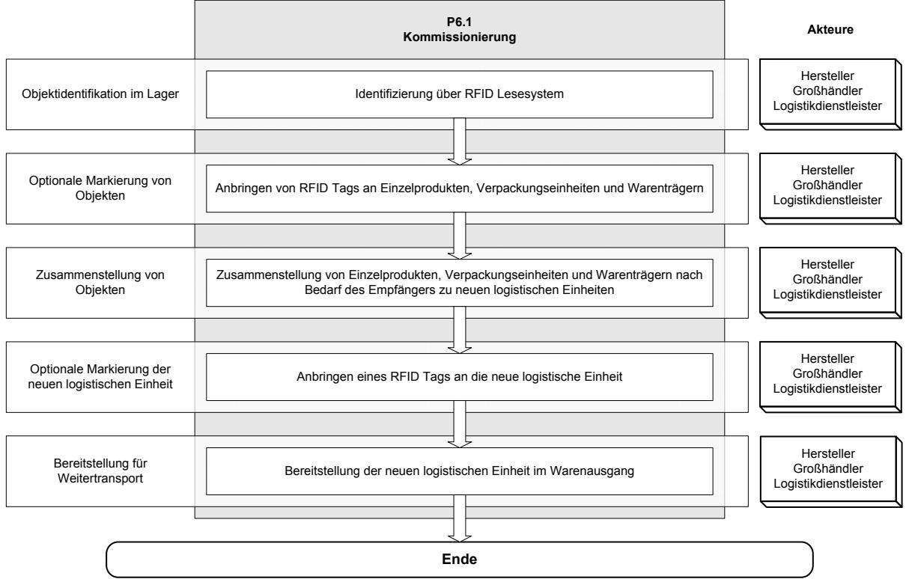

**Abbildung 6–7 Prozess P6 "Kommissionierung"** 

# **6.8 Warenausgang**

Je nach Inhalt der Kommissionierungsliste für den nächsten Akteur der Supply-Chain, die sowohl von einem Einzelhändler als auch von einem Großhändler stammen kann, werden zunächst beim Prozess "Warenausgang" die Objekte kommissioniert. Bei Objekten kann es sich um Produkte, Umverpackungen oder auch ganze Paletten handeln. Die Datenerfassung durch RFID ermöglicht eine rasche Fehlererkennung ("Kontrolle"). Sollten die erfassten Daten nicht mit der Kommissionierungsliste übereinstimmen, wird vor der Auslieferung noch korrigiert.

Als mögliche Akteure im Warenausgangsprozess kommen Produkthersteller, der Großhandel (Wholesaler) wie auch der Logistikdienstleister in Frage.

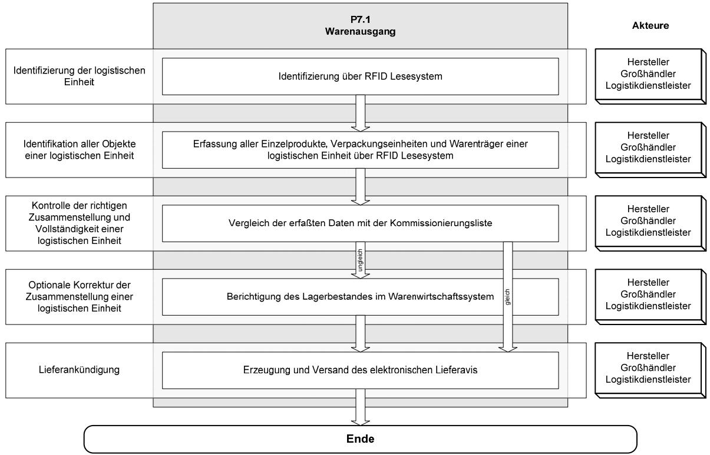

**Abbildung 6–8 Prozess P7 "Warenausgang"** 

# **6.9 Cross-Docking**

Prozesstechnisch erfolgen beim Cross Docking dieselben Schritte wie bei der in [Abbildung](#page-56-1)  [6–7](#page-56-1) beschriebenen Kommissionierung. Dabei kann zwischen einstufigem und zwei- (mehr) stufigem Cross-Docking unterschieden werden.

Beim einstufigen Cross-Docking kommissioniert der Lieferant die Waren als logistische Einheiten bezogen auf den Endempfänger (Einzelhandel oder Konsument). Diese logistischen Einheiten werden unverändert über einen oder mehrere Umschlagpunkte (Cross-Docking Punkte) an den Endempfänger geleitet.

Beim zweistufigen Cross-Docking kommissioniert der Lieferant die Waren als logistische Einheiten bezogen auf den Umschlagpunkt (Cross-Docking Punkt). Im zweistufigen Verfahren werden diese logistischen Einheiten unverändert nur bis zum Umschlagpunkt geleitet. Am Umschlagpunkt erfolgt durch eine weitere Kommissionierung die Bildung neuer logistischer Einheiten bezogen auf den Endempfänger (Einzelhandel oder Konsument). Weitere Kommissionierungsschritte an weiteren Umschlagpunkten sind möglich (mehrstufiges Cross-Docking).

# **6.10 Nutzung beim stationären Einzelhändler (kein Versandhandel)**

Der Einsatz von RFID auf Produktebene (Item Level Tagging – ILT) eröffnet eine Reihe neuer Möglichkeiten für Einzelhändler beziehungsweise Verbrauchern.

Vorteile für den Einzelhändler:

1 Echtzeitbestandsaufnahme: Durch intelligente RFID Infrastruktur kann der Einzelhändler zu jedem Zeitpunkt über seinen Warenbestand, und über Produktverfügbarkeiten informiert sein. Reduziert sich die Stückzahl eines bestimmten Produktes, kann das dahinterliegende Datenbank – basierende System automatisch die fehlende Menge rechtzeitig nachbestellen

- 2 Frischegarantie: Bei verderblicher Ware besteht die Möglichkeit, zusätzlich zur EPC Nummer das Verfallsdatum in den Speicher des Transponders zu programmieren. So kann über das Datenbanksystem dafür gesorgt werden, dass die Ware rechtzeitig verkauft wird.
- 3 Diebstahlschutz: Durch eine am Transponder integrierten EAS Lösung und einem RFID Lesesystem am Ausgang kann nicht bezahlte Ware einen Alarm auslösen.

Vorteile für den Verbraucher:

- 1 Produktinformation: Interessiert sich ein Verbraucher für ein Produkt, kann er sich schnell und einfach über Handhabung, eventuelle Zubehör und Verfügbarkeit von ähnlichen Modellen (andere Farbe, Größe) informieren.
- 2 Garantie (Handhabung von Kundenretouren): Auf Wunsch des Kunden kann der RFID Transponder auch nach dem Verkauf am Produkt gelassen werden (nicht zerstört). Zusatzinformationen wie zum Beispiel das Verkaufsdatum können auf den IC programmiert werden und es so dem Kunden ermöglichen, die Ware ohne Garantieschein zu retournieren.

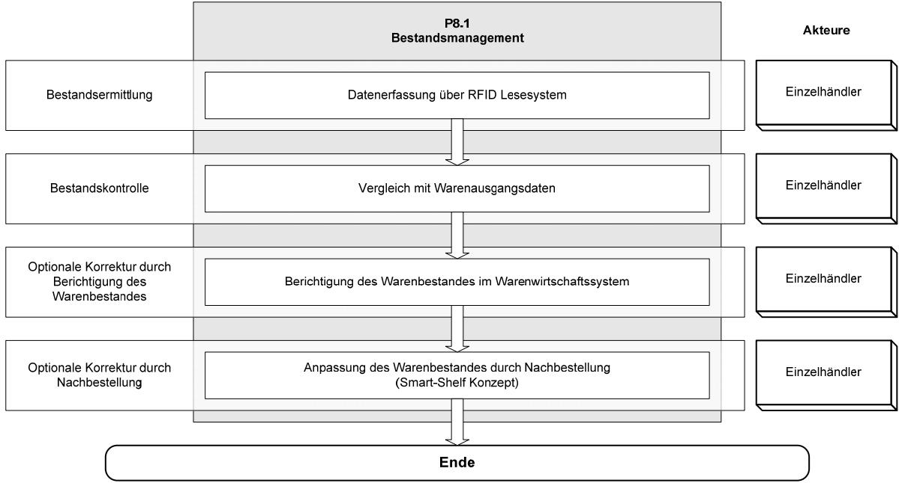

**Abbildung 6–9 Prozess P8 "Bestandsmanagement"** 

Exemplarisch ist der Prozess des Bestandsmanagements in [Abbildung 6–9](#page-58-1) dargestellt. Eine regelmäßige Bestandskontrolle erfolgt durch RFID Lesesysteme. Dies kann durch fix an den Verkaufsflächen installierte Systeme oder durch das Kaufhauspersonal durch manuelle Lesegeräte erfolgen. Eine Kontrolle des tatsächlichen Bestandes mit dem zu erwartenden Bestand durch bis dato verkaufte Ware erfolgt über die datentechnische Infrastruktur des Einzelhändlers. Bei Differenzen (z. B. Warenschwund oder falsch bonierte Ware) können Korrekturmaßnahmen eingeleitet werden. Ebenso möglich ist die Einleitung geeigneter Nachbestellung im Rahmen des Smart-Shelf-Konzeptes, falls die Anzahl eines bestimmten Produktes im Verkaufsraum einen festgelegten Schwellenwert unterschritten hat.

# **6.11 Verkaufsprozess**

Gemäß Einkaufsliste des Konsumenten und Übertragung in ein jeweiliges Tranportmedium erfolgt die Erfassung der Produkte durch ein RFID - Lesesystem an der Kasse. Dies kann entweder durch Einzelerkennung oder durch Bulk - Erfassung (automatisches Erfassen aller Produkte im Transportmedium) erfolgen.

Unter Umständen erfolgt nach dem Bezahlen der Ware das Deaktivieren des Transponders.

Der Bezahlvorgang wird über die gängigen Methoden (bargeldbasiert/ bargeldlos) vorgenommen. Wesentliche Akteure beim Verkaufsprozess sind der Konsument und der Einzelhändler.

|                                              | P9.1 Verkauf                                                                | Akteure       |
|----------------------------------------------|--------------------------------------------------------------------------------|---------------|
| Erfassung der Waren                          | Einzelerfassung über RFID Bulk-Erfassung über RFID Lesesystem Lesesystem | Einzelhändler |
|                                              |                                                                                |               |
| Ausgleich des Warenwertes                    | Bezahlung durch den Kunden                                                     | Konsument     |
|                                              |                                                                                |               |
| Optionale Entindividualisierung der Waren | Deaktivierung der RFID Tags                                                    | Einzelhändler |
|                                              |                                                                                |               |
| Ende                                         |                                                                                |               |

**Abbildung 6–10 Prozess P9 "Verkauf"** 

# **6.12 After-sales Services**

Unter die After-Sales Services fallen die folgenden Bereiche:

- 1 Intelligente Haushaltsgeräte ermöglichen z. B. selektives Aktivieren/Deaktivieren sowie das Optimieren der Funktion von Haushaltsgeräten aufgrund von Produktinformationen (z. B. Temperatur bei Kleidungswäsche).
- 2 Garantie und Gewährleistung

Zusatzinformationen wie zum Beispiel das Verkaufsdatum können auf den Transponder programmiert werden und es so dem Kunden ermöglichen, die Ware ohne Garantieschein zu retournieren.

3 Wartung

Information über zum Produkt gehörige Wartungsverträge können ebenfalls im Datenspeicher des Produktes hinterlegt werden und ein anonymes Warten des Produktes ermöglichen.

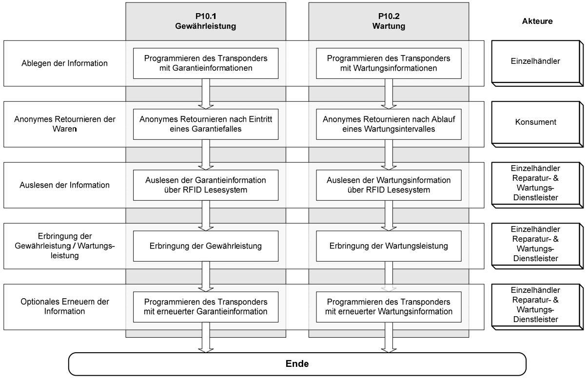

**Abbildung 6–11 Prozesse P10.1 " Gewährleistung" und P10.2 "Wartung"** 

Der Geschäftsprozess Wartung und Gewährleistung ist in [Abbildung 6–11](#page-60-1) exemplarisch dargestellt. Nach dem Bezahlvorgang erfolgt das Programmieren des Transponders mit Garantie- und Wartungsinformation. Dadurch wird der Konsument in die Lage versetzt, zu einem späteren Zeitpunkt die Ware zu retournieren und Gewährleistungen sowie Wartungsleistungen in Anspruch zu nehmen. Nach erfolgter Gewährleistung muss die entsprechende Information am Transponder erneuert werden. Dieser Vorgang ist natürlich nur möglich, falls der Transponder nach der Bezahlung nicht deaktiviert wurde.

# **6.13 Entsorgung**

**Abbildung 6–12 Prozess P11 "Entsorgung"** 

Ein anonymer Produktrückgabeprozess wird durch die Verwendung der RFID - Transponder Technologie ermöglicht. Durch diesen Prozess kann das jeweilige Produkt durch den Konsumenten zurückgegeben, optional ein Rückgabebonus eingelöst werden sowie nachfolgend die Weiterleitung zur umweltgerechten Entsorgung erfolgen.

Der Geschäftsprozess ist exemplarisch in [Abbildung 6–12](#page-61-1) dargestellt. Zuerst wird der EPC des Transponders gelesen und das Produkt auf Echtheit überprüft. Danach erfolgt das Auslesen der Rücknahmeinformation entweder aus der EPC - Datenbank oder aus dem Datenspeicher des Transponders. Schließlich kann der Rücknahmeprozess eingeleitet werden sowie eine optionale Bonusauszahlung erfolgen.

# **7 Anwendungsfälle**

# **7.1 Anwendungsfall "Herstellung und Versand der Chips"**

Der Anwendungsfall "Herstellung und Versand der Chips" beschreibt den Handlungsablauf der Konfigurierung des Chips und der Übermittlung der Chipprodukte und der objektbezogenen Daten zum Transponderhersteller.

Für die spätere Sicherheitsbetrachtung sind die folgenden Prozessschritten, von besonderer Bedeutung:

- 1 Erstellung , Vergabe, Programmierung und permanente Sperrung einer einzigartigen ID (TID, UID) auf den Chip.
- 2 Übermittlung der für die Assemblierung relevanten Waferdaten (Wafermap) an den Transponderhersteller.

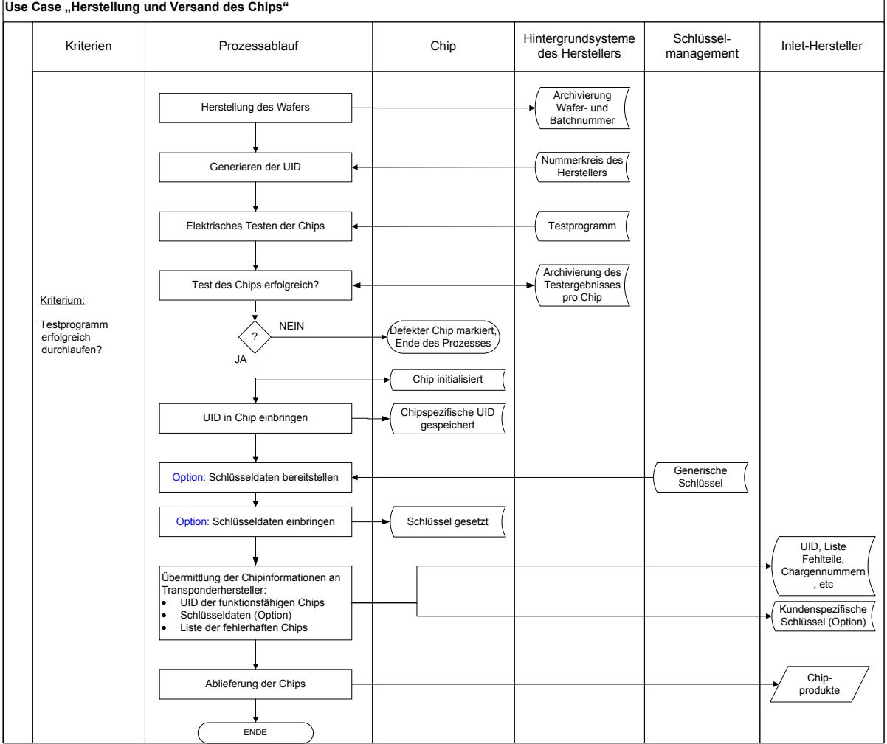

**Abbildung 7–1 Anwendungsfall "Herstellung und Versand des Chips"** 

# **7.2 Anwendungsfall "Herstellung und Versand der Transponder"**

Der Anwendungsfall "Herstellung und Versand der Transponder" umfasst die folgenden Schritte:

- 3 Die Herstellung des Inlays
- 4 Die Herstellung des Transponders

Darüber hinaus kann optional auch die Individualisierung des Transponders und das Setzen des Kill-Kommandos vom Transponderhersteller ausgeführt werden. Der Transponderhersteller agiert dann als Inverkehrbringer oder im Auftrag des Inverkehrbringers. Dieser Fall ist in den Kapiteln [7.4](#page-65-1) und [7.5](#page-67-1) beschrieben.

Unter Herstellung des Inlays ist im Wesentlichen die Assemblierung des Chips mit einer für die Applikation passenden Antenne auf ein geeignetes Trägersubstrat zu verstehen.

Die Herstellung des Transponders umfasst die Weiterverarbeitung des Inlays in das passende physikalische Ausführung des Transponders, das je nach der spezifischen End-Applikation eine Verpackung in Papier oder Plastik oder die Weiterverarbeitung in Form eines Klebe-Etikettes (Wet Inlay) bedeuten kann.

### **7.2.1 Herstellung des Inlays**

**Abbildung 7–2 Anwendungsfall "Herstellung des Inlays"** 

Die Inlay-Herstellung beginnt mit der Auswahl des für die Applikation passenden Typs. Verschiedene Anwendungen ( z. B. Verpackungskarton oder Label auf Kleidungsstücken) erfordern z. B. unterschiedliche Antennenkonfiguration, um eine optimale Leserate zu erzielen. Das Basismaterial für ein Inlay ist meist ein Kunststoff (z. B. PET), auf den die Antenne entweder durch Ätzen einer Kupferschicht, durch Bedrucken mit Silbertinte, oder Stanzen (Aluminium oder Kupfer) aufgebracht wird, Dieses Basismaterial wird meist in Rollenform geliefert. Bei der Inlay-Herstellung wird der Chip auf die jeweiligen Antennenkontakte appliziert. Alternativ zur direkten Applikation ist die Auslieferung des Chips auf einem Trägersubstrat mit Kupferkontakten (Strap-Format). Der Gurt mit Kontakten wird dann in Rollen-zu-Rollentechnik mit der Antenne verklebt oder mechanisch kontaktiert (Crimpen). Nach Assemblieren des Inlays erfolgt ein Testen des Inlays. Dabei wird das Ansprechen des Transponders mittels eines RFID-Lesegeräts verifiziert. Nicht funktionierende Inlays werden markiert, um diese den nachfolgenden Schritten aussortieren zu können. In diesem Stadium der Prozessierung sind die Transponder meist mit einem vorläufigen Test-EPC versehen, um das Testen zu ermöglichen. Die fertig prozessierten Inlays werden danach in Rollenform an den Transponderhersteller geliefert. Aufgrund der verschiedenen Prozessbedingungen sind Inlay-Herstellung (braucht Reinraumbedingungen) und Transponderherstellung üblicherweise in verschiedenen Produktionsräumen untergebracht.

# **7.2.2 Herstellung des Transponders**

**Abbildung 7–3 Anwendungsfall "Herstellung des Transponders"** 

Nach der Inlay-Herstellung werden die fertig prozessierten Inlays beim Transponderhersteller in das endgültige physikalische Format verarbeitet. Gängige Formate sind nichtklebende Papierlabel (dry labels)(z.B, bei Kleidungsstücken), Kunststofflabel, oder Klebe-Etiketten (besonders bei Kartons oder Einzelprodukten). Die Verarbeitung erfolgt im Rolle-zu-Rolle Verfahren. Für die abschließende Funktionsprüfung werden die Transponder ggf. mit einem vorläufigen Test-EPC ausgestattet.

# **7.3 Anwendungsfall "Erstellung und Vergabe des EPC-Manager"**

Der Inverkehrbringer beantragt bei GS1/EPCglobal den EPC-Manager. Nach Identifizierung des Antragstellers und Prüfung des Antrags vergibt EPCglobal einen eindeutigen EPC-Manager für den Inverkehrbringer.

Der Inverkehrbringer erhält von GS1/EPCglobal einen EPC-Manager. Dieser ermöglicht ihm, entsprechende EPC zu generieren. Er vergibt aus dem zur Verfügung gestellten Nummernkreis EPC für alle relevanten Objekte, die über RFID gekennzeichnet werden sollen (z. B. Palette, Umkarton, Item). Der Inverkehrbringer kommuniziert diese EPC und darüber in Bezug genommenen Informationen mit seinen Geschäftspartnern in der Wertschöpfungskette wo relevant.

# **7.4 Anwendungsfall "Individualisieren des Transponders"**

Der Anwendungsfall "Einbringens des EPC" beschreibt die Individualisierung des Transponders mittels des eindeutigen EPC. Die Individualisierung kann von verschiedenen Entitäten des Systems umgesetzt werden. Die Variante der Umsetzung durch den Transponderhersteller ist in Kapitel [7.2.2](#page-64-1) beschrieben worden. Üblicherweise erfolgt die Individualisierung eines Transponders zusammen mit dem Anbringen des Transponders am Produkt oder einer Umverpackung. Zuständig ist der Inverkehrbringer. Es kann aber auch vorkommen, dass z. B. ein Transponderhersteller oder Verpackungshersteller im Auftrag des Inverkehrbringers handelt.

[Abbildung 7–4](#page-66-1) zeigt den Anwendungsfall des Einbringens des EPC in den Transponder. Das Einbringen des EPC ist nach EPCglobal obligatorisch.

Nach einem optionalen Lesen der UID erfolgt die Vergabe der EPC für das jeweilige Produkt aus der Datenbank des Inverkehrbringers. Der EPC wird danach in den entsprechenden Bereich des Transponder-Speichers einprogrammiert.

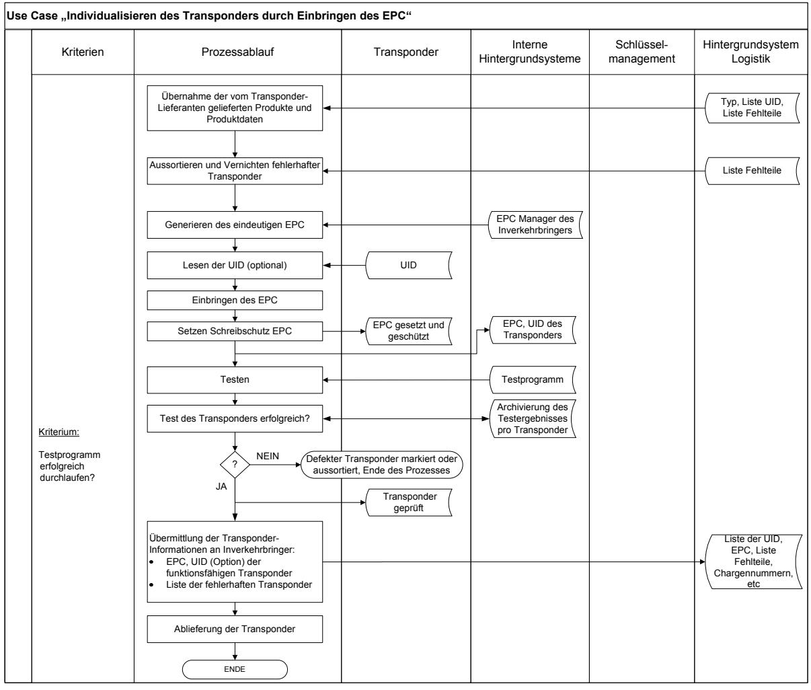

**Abbildung 7–4 Anwendungsfall "Individualisieren des Transponders"** 

In den folgenden optionalen Schritten werden das Kill-Passwort gesetzt (siehe Kapitel [7.5](#page-67-1)) und ggf. weitere Daten in den programmierbaren Speicherbereich des Transponders geschrieben.

Viele Einsatzszenarien würden sehr von einer Nutzung des freien Speicherbereiches des EPC-Chips für die Speicherung von produktspezifischen Informationen oder zusätzlichen Sicherheitsmaßnahmen profitieren. Es gibt eine Vielzahl von Ideen, wie dies umzusetzen wäre. In dieser Richtlinie soll dies zurzeit nicht im Detail besprochen werden, da EPCglobal dies noch nicht in den Standard aufgenommen hat, die existierenden Lösungen mithin als proprietär anzusehen sind.

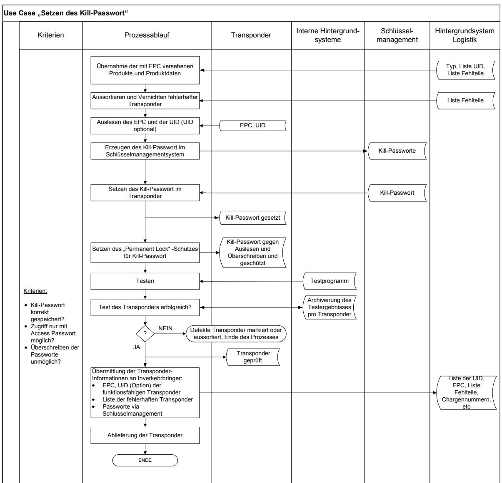

#### **Abbildung 7–5 Anwendungsfall "Setzen des Kill-Passwort"**

Um das Deaktivieren des Transponders nach dem Kauf des Produkts zu ermöglichen, sind EPCglobal-konforme Transponder mit einem Kill-Kommando ausgestattet. Das Auslösen des Kill-Kommando wird üblicherweise mit einem 32-bit Passwort geschützt, um ein Aktivieren des Kommandos und das Deaktivieren des Transponders durch Unberechtigte zu verhindern. Dieses Kill-Passwort wird im Chip des Transponders gespeichert. Das Aktivieren des Kill-Kommandos setzt nach [ISO18000-6] voraus, dass das Kill-Passwort auf einen Wert ungleich 0 gesetzt wurde.

Das Kill-Passwort wird im "Reserved Memory" des EPC-Chip gespeichert. Das "Reserved Memory" kann irreversibel gegen Auslesen und Überschreiben geschützt werden.

Die Anwendungsfälle zur Erstellung, Speicherung und Übermittlung von Passworten und Schlüsseln sind in Kapitel [7.10](#page-71-1) beschrieben.

# **7.6 Anwendungsfall "Anbringen des Transponders am Produkt"**

Das Anbringen des Transponders am Produkt erfolgt im Wesentlichen auf 3 verschiedene Arten: entweder als direktes Applizieren außen am Produkt (z. B. in Form eines Klebe-Etikettes), innerhalb der Verpackung oder als physikalisches Integrieren in das Produkt.

Beim direkten Anbringen am Produkt wird zuerst der Transponder individualisiert. Danach erfolgen die Vereinzelung (z. B. das Abtrennen von der Rolle) sowie das Aussortieren fehlerhafter Transponder, die bei der Individualisierung als fehlerhaft markiert wurden. Danach erfolgt das physikalische Anbringen am Produkt, das entweder durch Kleben (Wet Inlay), Einnähen (z. B. in ein Wäschestück) oder Schiessen (z. B. Etikett in der Kleidung) erfolgen kann. Das Anbringen am Produkt kann beim Produkthersteller, dem Hersteller der Verpackung oder auch bei einer späteren Station der Lieferkette erfolgen.

Alternativ kann auch eine physikalische Integration des Transponders in das Produkt sinnvoll sein (z. B. Embedding in eine Leiterplatte eines Elektrogerätes, Einnähen in ein Kleidungsstück). Es gilt allerdings zu bedenken, dass Fehler bei der Integration und Fehlfunktionen des Transponders zu erhöhtem Ausschuss bei der Fertigung des Produktes führen können. Die Anwendungsfälle "Individualisieren des Transponders" und "Setzen des Kill-Passwort" werden dann am integrierten Transponder, d.h. am Produkt, durchgeführt.

# **7.7 Anwendungsfall "Lesen der im Transponder gespeicherten Daten"**

Dieser Anwendungsfall beschreibt das Auslesen des im Transponder gespeicherten EPC und die Weiterverarbeitung der dabei entstehenden Logistikdaten im System nach EPCIS.

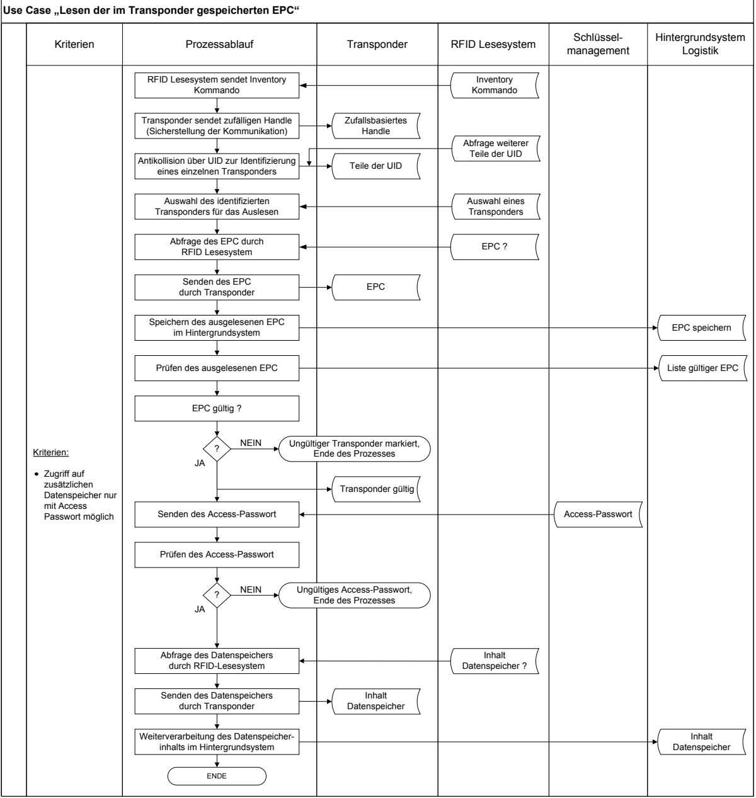

**Abbildung 7–6 Anwendungsfall "Lesen der im Transponder gespeicherten EPC - Daten"** 

Das Lesen der im Transponder gespeicherten Informationen ist exemplarisch in [Abbildung](#page-69-1)  [7–6](#page-69-1) dargestellt. Jegliche Kommunikation, wie zum Beispiel das Lesen des EPC erfolgt entsprechend der EPC Global Class 1 Generation 2 Spezifikation.

Optional können im zusätzlichen Speicherbereich des EPC-Chips weitere Daten gespeichert werden. Das für den EPC beschriebene Prinzip des Lesens gilt auch für das Lesen von Daten, die im zusätzlichen Speicherbereich des EPC-Chips gespeichert sind. Hier wird ggf. ein Zugangspasswort benötigt, um Zugriff zu erlangen. Des Weiteren ist hier nicht geregelt, inwieweit und in welcher Form diese Daten im Gesamtsystem zugänglich gemacht werden.

# **7.8 Anwendungsfall "Aktivieren des Kill-Kommandos"**

Das Deaktivieren des Transponders geschieht üblicherweise an einem speziellen Platz (z. B. am Point of Sales) auf Wunsch des Konsumenten nach Abschluss des Bezahlvorganges. Das Deaktivieren erfolgt über ein Lesegerät gemäß [Abbildung 7–7.](#page-70-1)

Nach Generierung des Kill-Passwort sendet das Lesegerät ein Kommando zum Kommunikationsaufbau. Der Tag sendet einen dementsprechenden Kommunikations-Code (Handle) zurück, über den weiter kommuniziert wird. Danach sendet der Reader das entsprechende Kill-Kommando mit dem Passwort an den Transponder. Danach ist der Transponder inaktiv gesetzt und reagiert nicht mehr auf Kommandos eines Lesegeräts.

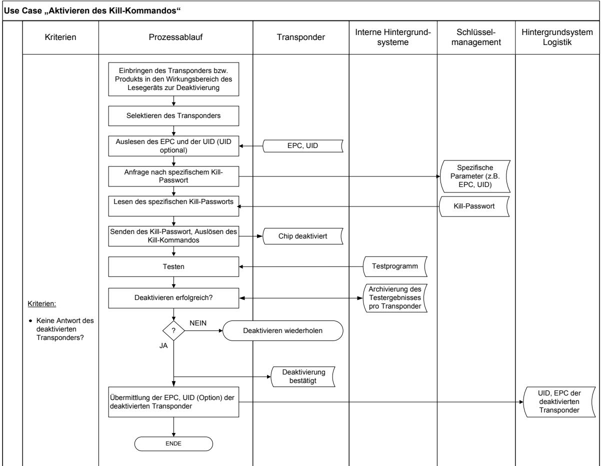

**Abbildung 7–7 Anwendungsfall "Aktivieren des Kill-Kommandos"** 

In der Praxis werden ggf. Verfahren des Schlüsselmanagements zum Einsatz kommen, die z. B. eine Diversifizierung der Schlüssel unterstützen. Dann müssen z. B. Verfahren zum Ableiten der spezifischen Schlüssel vom Schlüsselmanagement und den Lesegeräten abgebildet werden.

# **7.9 Anwendungsfall "Authentifizieren des Transponders zur Echtheitsprüfung"**

Die Authentifizierung des Transponders ist ein wesentlicher Vorgang, um sowohl Produktfälschungen oder (nicht für den konkreten Markt) fehlgeleiteten Produkten vorzubeugen. Durch die Vergabe einer weltweit einzigartigen, während der Chipherstellung vergeben und nicht wiederbeschreibbaren, UID kann durch Vergleich mit einer geeigneten Datenbank die Echtheit des Transponders am Point of Sales festgestellt werden. Neben der Eindeutigkeit des EPC kann zusätzlich auf die UID zurückgegriffen werden.

Ein exemplarischer Use-Case der Echtheitsprüfung ist in [Abbildung 7–8](#page-71-2) dargestellt. Die Prüfung basiert auf dem Abgleich des aus dem Transponder gelesenen EPC mit den im Hintergrundsystem verfügbaren Logistikdaten. Der Transponder gilt als authentisch wenn der EPC im Hintergrundsystem für den benannten Inverkehrbringer und das Zielprodukt bekannt ist. In einem zweiten Schritt wird geprüft, ob die Logistikdaten, die für den EPC im Hintergrundsystem gespeichert sind, plausibel sind.

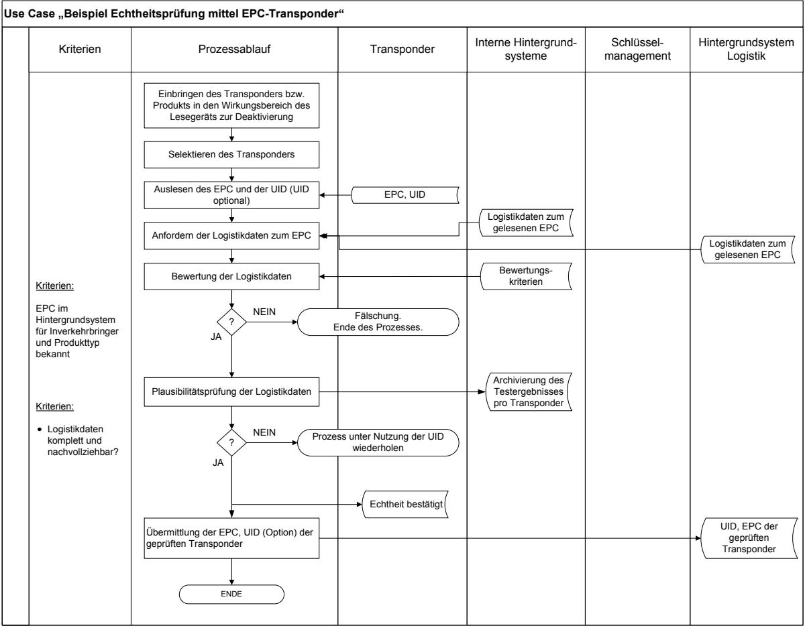

**Abbildung 7–8 Anwendungsfall "Beispiel Echtheitsprüfung mittels EPC-Transponder"** 

Falls bei der Prüfung Zweifel an der Echtheit des EPC aufkommen, kann der Prozess z. B. unter Nutzung der UID wiederholt werden.

# **7.10 Anwendungsfall "Schlüsselmanagement"**

Zum Schutz des Kill-Kommandos und des zusätzlichen Datenspeichers kommen nach den aktuellen Spezifikationen von EPCglobal Passworte zum Einsatz. Die Sicherheit und Funktionsfähigkeit des Gesamtsystems hängt damit entscheidend von der sicheren Bereitstellung und Verwahrung dieser Schlüssel ab. Diese Aufgabe muss durch das Schlüsselmanagement und dessen zugeordnete Prozesse geleistet werden.

In den folgenden Darstellungen der Anwendungsfälle wird exemplarisch mit **Secure Authentication Modules** (**SAM**) als sicheren Speichern für Schlüsselinformationen, Sicherheitsmechanismen und Diversifikationsalgorithmen gearbeitet. Prinzipiell sind auch andere Verfahren denkbar.

Die Darstellung in [Abbildung 7–9](#page-72-1) beschreibt exemplarisch den Anwendungsfall zum Schlüsselmanagement für das Individualisieren der Transponder.

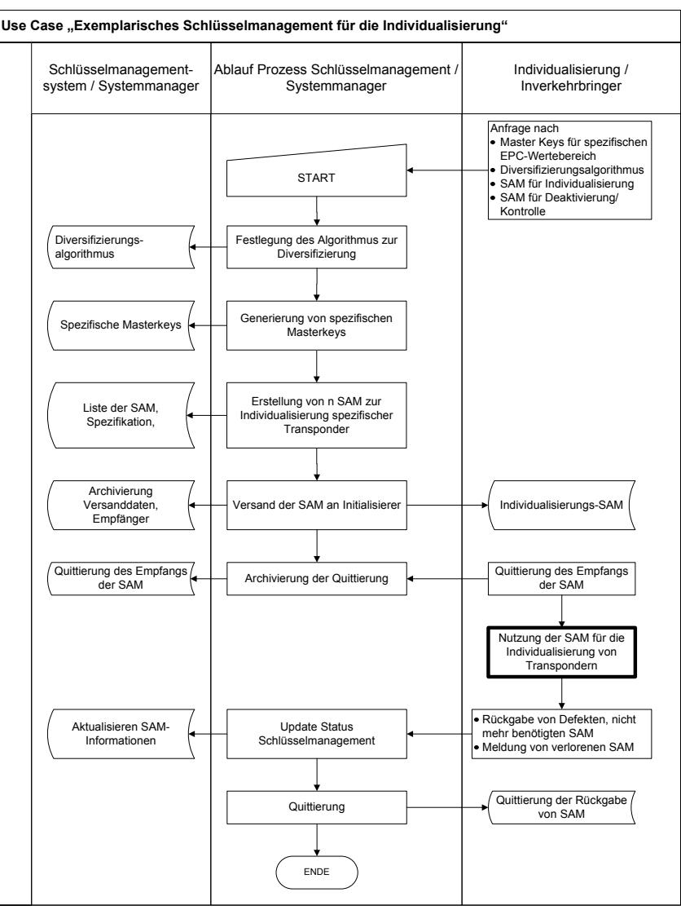

**Abbildung 7–9 Anwendungsfall "Schlüsselmanagement"** 

# **8 Sicherheitsbetrachtungen**

# **8.1 Definitionen zum Thema Sicherheit und Datenschutz**

Es existieren drei Aspekte oder Unterscheidungsbereiche der Sicherheit, die im Rahmen dieses Dokuments betrachtet werden sollen. Es sind dies:

- Funktionssicherheit (Safety)
- Informationssicherheit (Security)
- Datenschutz (Privacy).

Diese Unterscheidungsbereiche lassen sich wie im Folgenden dargestellt untergliedern:

1 Funktionssicherheit

Funktionssicherheit wird vielfach mit Zuverlässigkeit/Korrektheit oder Quality of Service verwechselt. Zuverlässigkeit bedeutet, dass das System entsprechend seiner Spezifikation korrekt arbeitet. Die Erfahrung zeigt, dass jedes technische System fehleranfällig ist. Unter Funktionssicherheit wird nun die Eigenschaft eines Systems verstanden, trotz aufgetretener Systemfehler nicht in unkontrollierbare Systemzustände zu geraten, in denen das System selbst oder seine Umwelt in Gefahr gebracht werden (FailSafe). Zugleich soll das System noch weitestgehend konform seiner Spezifikation reagieren (Fault Tolerance). D.h. unter Funktionssicherheit wird im Wesentlichen der Schutz vor unbeabsichtigten Ereignissen verstanden.

2 Informationssicherheit

Informationssicherheit betrachtet im Gegensatz zur Funktionssicherheit den Schutz vor beabsichtigten Angriffen.

Im Bereich Informationssicherheit lassen sich Sicherheitsziele in folgenden Klassen formulieren:

- a Vertraulichkeit: Vertraulichkeit ist der Schutz vor unbefugter Preisgabe von Informationen. Vertrauliche Daten und Informationen dürfen ausschließlich Befugten in der zulässigen Weise zugänglich sein. Als Schutzziel formuliert bedeutet dies: Gespeicherte bzw. zu kommunizierende Informationen sind vor dem Zugriff von Unbefugten zu schützen.
- b Integrität: Integrität bezeichnet die Sicherstellung der Korrektheit (Unversehrtheit) von Daten und der korrekten Funktionsweise von Systemen. Als Schutzziel formuliert bedeutet dies: Gespeicherte bzw. zu kommunizierende Informationen sind vor unberechtigter Veränderung zu schützen
- c Verfügbarkeit: Die Verfügbarkeit von Dienstleistungen, Funktionen eines IT-Systems, IT-Anwendungen oder IT-Netzen oder auch von Informationen ist vorhanden, wenn diese den Benutzern stets wie gewünscht zur Verfügung stehen. Als Schutzziel formuliert bedeutet dies: Informationen und Betriebsmittel sind vor unbefugter Vorenthaltung zu schützen.
- d Unverknüpfbarkeit: Unverknüpfbarkeit zweier Kommunikationselemente innerhalb eines Systems bedeutet, dass diese Kommunikationselemente nicht mehr oder weniger miteinander in Beziehung stehen, als es schon durch ein Vorwissen bekannt ist. Innerhalb des Systems können keine weiteren Informationen über die Beziehung zwischen diesen Kommunikationselementen erlangt werden. Praktisch bedeutet dies z. B., dass ein und derselbe Benutzer Dienste oder Ressourcen mehrmalig in Anspruch nehmen kann, wobei Dritte nicht erkennen können, dass

diese Anfragen (im Kommunikationsmodell: Nachrichten) über den Benutzer in Verbindung stehen.

- e Unbeobachtbarkeit: Unbeobachtbarkeit eines Ereignisses ist derjenige Zustand, in dem nicht zu entscheiden ist, ob dieses Ereignis stattfindet oder nicht. Somit kann bei Sender-Unbeobachtbarkeit nicht erkannt werden, ob überhaupt gesendet wird. Empfänger-Unbeobachtbarkeit ist analog definiert, es kann nicht festgestellt werden ob empfangen wird oder nicht. Beziehungs-Unbeobachtbarkeit bedeutet, dass nicht erkennbar ist, ob aus der Menge der möglichen Sender zur Menge der möglichen Empfänger gesendet wird.
- f Anonymität: Anonymität ist der Zustand, in dem man innerhalb seiner Anonymitätsgruppe nicht identifizierbar ist. Mit Hilfe des Begriffs Unverknüpfbarkeit lässt sich Anonymität nun präzisieren zu Unverknüpfbarkeit zwischen der Identität des Benutzers und des von ihm ausgelösten Ereignisses. Somit gibt es Sender-Anonymität als Unverknüpfbarkeit zwischen Sender und Nachricht und Empfänger-Anonymität entsprechend als Unverknüpfbarkeit zwischen Nachricht und Empfänger.
- g Authentizität: Mit dem Begriff Authentizität wird die Eigenschaft bezeichnet, die gewährleistet, dass ein Kommunikationspartner tatsächlich derjenige ist, der er vorgibt zu sein. Bei authentischen Informationen ist sichergestellt, dass sie von der angegebenen Quelle erstellt wurden. Der Begriff wird nicht nur verwendet, wenn die Identität von Personen geprüft wird, sondern auch bei IT-Komponenten oder Anwendungen.
- h Nichtabstreitbarkeit: Das Versenden bzw. Empfangen von Nachrichten durch authentisch festgestellte Personen ist gegen Abstreiten zu schützen.
- i Verbindlichkeit: Unter Verbindlichkeit werden die IT-Sicherheitsziele Authentizität und Nichtabstreitbarkeit zusammengefasst. Bei der Übertragung von Informationen bedeutet dies, dass die Informationsquelle ihre Identität bewiesen hat und der Empfang der Nachricht nicht in Abrede gestellt werden kann.
- 3 Datenschutz

Zweck des Datenschutzes ist es, den Einzelnen davor zu schützen, dass er durch den Umgang mit seinen personenbezogenen Daten in seinen Persönlichkeitsrechten beeinträchtigt wird.

Mit Datenschutz wird der Schutz personenbezogener Daten vor etwaigem Missbrauch durch Dritte bezeichnet (nicht zu verwechseln mit Datensicherheit).

Weiterhin sollen die folgenden Begrifflichkeiten einheitlich verwendet werden:

1 Sicherheitsziele

Sicherheitsziele sind sicherheitsrelevante Ziele bei der Realisierung eines IT-Systems. Im Rahmen dieses Dokuments werden spezifische Sicherheitsziele innerhalb von Einsatzgebieten und Einsatzszenarien festgelegt. Eine Verletzung der Sicherheitsziele erzeugt unmittelbaren Schaden für die Entität, deren Sicherheitsziel verletzt wird.

2 Gefährdungen

Gefährdungen sind unmittelbare Gefahren für die Sicherheitsziele der Anwendung. Diese können als Folge eines aktiven Angriffs auf eines oder mehrere Sicherheitsziele oder in Form von möglichen Schwächen des Systems, wie z. B. dem Fehlen einer Rückfalllösung, auftreten.

3 Maßnahmen

Maßnahmen sind konkrete Handlungsempfehlungen, die gegen eine oder mehrere Gefährdungen wirken. Die in diesem Dokument genannten Maßnahmen sollen sinnvoll und bedarfsgerecht sein, d.h. sie werden unter den Gesichtspunkten Wirtschaftlichkeit und

Manipulationsfestigkeit (Wie aufwändig ist eine Maßnahme und welche finanzielle Schadenshöhe kann damit begrenzt oder verhindert werden) empfohlen.

4 Restrisiko

Es ist in der Regel nicht möglich, allen Gefährdungen so entgegenzuwirken, dass ein System die perfekte Sicherheit bietet. Das Restrisiko ist daher das Risiko, das verbleibt, wenn eine Menge von Maßnahmen umgesetzt wurden und trotzdem noch Angriffe möglich sind. Die Höhe des Risikos hängt davon ab, welche Gegenmaßnahmen getroffen werden können, wie komplex diese sind und vor allem, welches Ergebnis eine Kosten – Nutzen-Rechnung der jeweiligen Entität erbringt. Das Restrisiko muss von der Entität explizit getragen werden.

# **8.2 Definition der Sicherheitsziele**

Im seltensten Fall sind alle im Bereich Funktionssicherheit, Informationssicherheit und Datenschutz genannten Sicherheitsaspekte für ein gegebenes Einsatzszenario gleichwichtig bzw. überhaupt relevant. Die Herausforderung bei der Konzeption eines sicheren RFID-Einsatzes liegt zuerst dementsprechend in der Formulierung spezifischer Sicherheitsziele.

Innerhalb der Einsatzgebiete der Handelslogistik sind basierend auf den vorgenannten generischen Sicherheitszielen *übergeordnete* einsatzgebietsspezifische Sicherheitsziele zu erkennen:

- 1 Schutz der elektronischen Objektkennung (EPC) (repräsentiert die Schutzziele Integrität und Authentizität)
- 2 Funktionssicherheit des RFID-Systems
- 3 Schutz der Privatsphäre des Kunden (repräsentiert die Schutzziele Vertraulichkeit, Unverknüpfbarkeit, Unbeobachtbarkeit, Anonymität und Datenschutz als allgemeine Anforderung)

Aus den Betrachtungen der Sicherheitsziele der Entitäten in den folgenden Unterkapiteln ergeben sich die *untergeordneten* Sicherheitsziele, die in Kapitel [8.2.4](#page-80-1) aufgeführt sind:

Die folgende Tabelle zeigt das Kodierungsschema der Sicherheitsziele sowie die verwendeten Abkürzungen.

| Feldnummer | 1                   | 2                    | 3                                                | 4         |
|------------|---------------------|----------------------|--------------------------------------------------|-----------|
| Feld       | Sicherheits ziel | Zugeordnete Entität  | Zugeordnetes gene risches Sicherheits ziel | Zählindex |
| Inhalt     | S                   | K := Kunde           | F := Funktionssi cherheit                     |           |
|            |                     | P := Produktanbieter | I := Informationssi cherheit                  | 1,  , n   |
|            |                     | D := Dienstleister   | P := Privatsphäre                                |           |

**Tabelle 8–1 Kodierungsschema der Sicherheitsziele** 

#### **8.2.1 Spezifische Sicherheitsziele des Konsumenten**

Die spezifischen Sicherheitsziele des Konsumenten sind in den folgenden Unterkapiteln aufgeführt.

| Kurzbezeichnung des Sicherheitsziels |                                          | Beschreibung des Sicherheitsziels                                                            |                                                                                                                                                                                                                        |
|-----------------------------------------|------------------------------------------|----------------------------------------------------------------------------------------------|------------------------------------------------------------------------------------------------------------------------------------------------------------------------------------------------------------------------|
| SKF1                                    | Rückfalllösung bei Fehlfunkti onen |                                                                                              | Die Nutzung der Dienstleistung (z. B. Check-out, Garantienach weis, Deaktivierung) muss für Berechtigte auch dann möglich sein, wenn der Transponder oder die Infrastruktur nicht ein wandfrei funktionieren. |
| SKF2                                    | Intuitive, feh lertolerante           | 1                                                                                            | Nutzung der Kill-Funktion muss möglichst selbsterklärend bzw. einfach zu erlernen sein.                                                                                                                             |
| Nutzung                                 | 2                                        | Nutzung des Self-Check-out muss möglichst selbsterklä rend bzw. einfach zu erlernen sein. |                                                                                                                                                                                                                        |
|                                         |                                          | 3                                                                                            | Der Kunde muss nach der Deaktivierung informiert werden, dass der Transponder erfolgreich deaktiviert wurde.                                                                                                        |

#### **8.2.1.1 Funktionssicherheit**

| Tabelle 8–2 | Sicherheitsziele des Konsumenten zur Funktionssicherheit |
|-------------|----------------------------------------------------------|
|             |                                                          |

#### **8.2.1.2 Informationssicherheit**

| Kurzbezeichnung des Sicherheitsziels |                                                                            | Beschreibung des Sicherheitsziels                                                                                                                                                                                                                                                                                                                                                                                                                                                                                                                   |
|-----------------------------------------|----------------------------------------------------------------------------|-----------------------------------------------------------------------------------------------------------------------------------------------------------------------------------------------------------------------------------------------------------------------------------------------------------------------------------------------------------------------------------------------------------------------------------------------------------------------------------------------------------------------------------------------------|
| SKI1                                    | Schutz von personenbe zogenen Da ten im Kun dendaten system | Auf den Transpondern, die Objekten zugeordnet sind, sind keine personenbezogenen Daten gespeichert. Ggf. liegen im Kundendatensystem des Einzelhändlers gespei cherte Kundendaten vor, die zur Abwicklung spezieller Bezahl arten (z. B. Rechnung), zum Zustellen von Produkten, etc die nen. Diese Daten sind vor nicht zulässiger Nutzung und vor dem Zugriff Unberechtigter zu schützen. Eine missbräuchliche Ver wendung, Manipulation oder Weitergabe an Unberechtigte wäre für den Kunden ggf. mit Risiken verbunden. |
| SKI2                                    | Schutz der Objektkennung                                                | Objektkennungen sind gegen DoS-Angriffe bzw. Manipulationen durch unberechtigte Dritte zu schützen.                                                                                                                                                                                                                                                                                                                                                                                                                                              |

**Tabelle 8–3 Sicherheitsziele des Konsumenten zur Informationssicherheit** 

#### **8.2.1.3 Schutz der Privatsphäre**

| Kurzbezeichnung des Sicherheitsziels |                                                          | Beschreibung des Sicherheitsziels                                                                                                                                                  |
|-----------------------------------------|----------------------------------------------------------|------------------------------------------------------------------------------------------------------------------------------------------------------------------------------------|
| SKP1                                    | Schutz der personenbe zogenen Da ten            | Personenbezogene Daten, die dem Einzelhändler übergeben wurden, müssen von diesem vertraulich behandelt werden und dürfen nur für die vereinbarten Zwecke eingesetzt werden. |
| SKP2                                    | Schutz vor der Erzeugung von Bewegungs profilen | Es ist zu verhindern, dass Dritte durch Nutzung der RFID Technologie personenbezogene Bewegungsprofile erstellen können.                                                     |

**Tabelle 8–4 Sicherheitsziele des Konsumenten zum Schutz der Privatsphäre** 

# **8.2.2 Spezifische Sicherheitsziele des Einzelhändlers**

Die spezifischen Sicherheitsziele des Einzelhändlers sind in den folgenden Unterkapitels aufgeführt.

#### **8.2.2.1 Funktionssicherheit**

| Kurzbezeichnung des Sicherheitsziels |                                           | Beschreibung des Sicherheitsziels                                                                                                                                                                                                                                                                                                                                                                                                                                                                                                       |
|-----------------------------------------|-------------------------------------------|-----------------------------------------------------------------------------------------------------------------------------------------------------------------------------------------------------------------------------------------------------------------------------------------------------------------------------------------------------------------------------------------------------------------------------------------------------------------------------------------------------------------------------------------|
| SEF1                                    | Technische Kompatibilität              | Die Interaktion zwischen Transponder und Lesegerät muss wie spezifiziert funktionieren. Dies muss für alle zugelassenen Transponder an allen Lesegeräten in der gesamten Systeminf rastruktur gelten. Dabei ist zu berücksichtigen, dass Transpon der und Infrastruktur von verschiedenen Herstellern geliefert und von verschiedenen Entitäten der Lieferkette weltweit betrieben werden könnten. Sofern Lesefehler nicht vermieden werden können, müssen die se durch geeignete Maßnahmen kompensiert werden. |
| SEF2                                    | Rückfalllösung bei Fehlfunkti onen  | Die Verfügbarkeit und Integrität der Logistikdaten sollte auch dann gewährleistet werden können, wenn der Transponder oder Teile der Systeminfrastruktur nicht einwandfrei funktionieren.                                                                                                                                                                                                                                                                                                                                         |
| SEF3                                    | Intuitive, feh lertolerante Nutzung | 1 Nutzung der Kill-Funktion muss möglichst selbsterklärend bzw. einfach zu erlernen sein. 2 Nutzung des Self-Check-out muss möglichst selbsterklä rend bzw. einfach zu erlernen sein. 3 Der Kunde muss nach der Deaktivierung informiert werden, dass der Transponder erfolgreich deaktiviert wurde.                                                                                                                                                                                                            |

#### **Tabelle 8–5 Sicherheitsziele des Einzelhändlers zur Funktionssicherheit**

#### **8.2.2.2 Informationssicherheit**

| Kurzbezeichnung des Sicherheitsziels |                                                                            | Beschreibung des Sicherheitsziels                                                                                                                                                                                                                                                                                                                                                               |
|-----------------------------------------|----------------------------------------------------------------------------|-------------------------------------------------------------------------------------------------------------------------------------------------------------------------------------------------------------------------------------------------------------------------------------------------------------------------------------------------------------------------------------------------|
| SEI1                                    | Schutz von personenbe zogenen Da ten im Kun dendaten system | Auf den Transpondern, die Objekten zugeordnet sind, sind keine personenbezogenen Daten gespeichert. Ggf. liegen im Kundendatensystem des Einzelhändlers gespei cherte Kundendaten vor, die zu speziellen Bezahlarten (z. B. Rechnung), zum Zustellen von Produkten, etc dienen. Diese Daten sind vor nicht zulässiger Nutzung und vor dem Zugriff Unberechtigter zu schützen. |
| SEI2                                    | Schutz der Objektkennung                                                | Die Manipulation und insbesondere die Fälschung von Objekt kennungen wären für den Einzelhändler, den Inverkehrbringer und die anderen Entitäten der Lieferkette ggf. mit erheblichem kommerziellem Schaden verbunden. Die Fälschungssicherheit von Objektkennungen ist ein wichtiges Ziel des Einzelhändlers.                                                                   |

| Kurzbezeichnung des Sicherheitsziels |                                                                      | Beschreibung des Sicherheitsziels                                                                                                                                                                                                                                                                                      |
|-----------------------------------------|----------------------------------------------------------------------|------------------------------------------------------------------------------------------------------------------------------------------------------------------------------------------------------------------------------------------------------------------------------------------------------------------------|
| SEI3                                    | Schutz der Zuordnung von Objekt und Objektkennung           | Die Aufhebung der korrekten Zuordnung von Objekt und Objekt kennungen wäre für den Einzelhändler, den Inverkehrbringer und die anderen Entitäten der Lieferkette ggf. mit erheblichem kommerziellem Schaden verbunden. Die korrekte Zuordnung von Objekt und Objektkennungen ist ein                       |
|                                         |                                                                      | wichtiges Ziel des Einzelhändlers.                                                                                                                                                                                                                                                                                     |
| SEI4                                    | Schutz der Logistikdaten                                          | Die Verfügbarkeit und Integrität der Logistikdatendaten ist für den Einzelhändler und den Inverkehrbringer von großem Wert. Sie dienen zur Überwachung der Lieferkette, zur Abrechnung und zur Planung von Kapazitäten.                                                                                       |
| SEI5                                    | Schutz vor DoS-Angriffen auf die RFID Systemkom ponenten | RFID-Systemkomponenten müssen gegen DoS-Angriffe ge schützt werden. Typische DoS-Angriffe sind: • Kill-Kommando • Störsender • Blockertag • EMP • Mechanische Zerstörung • Beeinträchtigung der Funktion von Lesegeräten                                                        |
| SEI6                                    | Schutz vor Ausspähung der Informatio nen zum Wa renfluss | Der Einzelhändler und der Inverkehrbringer sind auf die Vertrau lichkeit der Informationen zum Warenfluss angewiesen. Unbe rechtigte Dritte dürfen keinen Zugriff haben.                                                                                                                                         |
| SEI7                                    | Verfügbarkeit der EPC Daten                                    | Die Verfügbarkeit der Daten muss sichergestellt werden. Dabei sind u. a. folgende Anforderungen zu beachten: • Hinreichende Leserate • Hinreichende Zuverlässigkeit und Lebensdauer des Transponders. Dies gilt insbesondere wenn der Transpon der für Post-Sales Dienste eingesetzt werden soll. |

**Tabelle 8–6 Sicherheitsziele des Einzelhändlers zur Informationssicherheit** 

### **8.2.2.3 Schutz der Privatsphäre**

| Kurzbezeichnung des Sicherheitsziels |                                               | Beschreibung des Sicherheitsziels                                                                                                                                                  |
|-----------------------------------------|-----------------------------------------------|------------------------------------------------------------------------------------------------------------------------------------------------------------------------------------|
| SEP1                                    | Schutz der personenbe zogenen Da ten | Personenbezogene Daten, die dem Einzelhändler übergeben wurden, müssen von diesem vertraulich behandelt werden und dürfen nur für die vereinbarten Zwecke eingesetzt werden. |
| SEP2                                    | Datenspar samkeit                          | Es dürfen nicht mehr Daten gesammelt und gespeichert werden, als für den spezifischen Zweck nötig ist.                                                                          |

#### **Tabelle 8–7 Sicherheitsziele des Einzelhändlers zum Schutz der Privatsphäre**

### **8.2.3 Spezifische Sicherheitsziele des Inverkehrbringers**

Die spezifischen Sicherheitsziele des Inverkehrbringers sind in den folgenden Unterkapiteln aufgeführt.

#### **8.2.3.1 Funktionssicherheit**

| Kurzbezeichnung des Sicherheitsziels |                                          | Beschreibung des Sicherheitsziels                                                                                                                                                                                                                                                                                                                                                                                                                                                                                                       |
|-----------------------------------------|------------------------------------------|-----------------------------------------------------------------------------------------------------------------------------------------------------------------------------------------------------------------------------------------------------------------------------------------------------------------------------------------------------------------------------------------------------------------------------------------------------------------------------------------------------------------------------------------|
| SIF1                                    | Technische Kompatibilität             | Die Interaktion zwischen Transponder und Lesegerät muss wie spezifiziert funktionieren. Dies muss für alle zugelassenen Transponder an allen Lesegeräten in der gesamten Systeminf rastruktur gelten. Dabei ist zu berücksichtigen, dass Transpon der und Infrastruktur von verschiedenen Herstellern geliefert und von verschiedenen Entitäten der Lieferkette weltweit betrieben werden könnten. Sofern Lesefehler nicht vermieden werden können, müssen die se durch geeignete Maßnahmen kompensiert werden. |
| SIF2                                    | Rückfalllösung bei Fehlfunkti onen | Die Verfügbarkeit und Integrität der Logistikdaten sollte auch dann gewährleistet werden können, wenn der Transponder oder Teile der Systeminfrastruktur nicht einwandfrei funktionieren.                                                                                                                                                                                                                                                                                                                                         |

**Tabelle 8–8 Sicherheitsziele des Inverkehrbringers zur Funktionssicherheit** 

#### **8.2.3.2 Informationssicherheit**

| Kurzbezeichnung des Sicherheitsziels                            |                                                                            | Beschreibung des Sicherheitsziels                                                                                                                                                                                               |  |
|--------------------------------------------------------------------|----------------------------------------------------------------------------|---------------------------------------------------------------------------------------------------------------------------------------------------------------------------------------------------------------------------------|--|
| SII1                                                               | Schutz von personenbe zogenen Da ten im Kun dendaten system | Auf den Transpondern sind keine personenbezogenen Daten gespeichert.                                                                                                                                                         |  |
|                                                                    |                                                                            | Dieses Sicherheitsziel ist an dieser Stelle nur relevant, wenn Inverkehrbringer und Einzelhändler im konkreten Fall identisch sind. Es gilt dann die Zielsetzung aus SEI1.                                                |  |
| SII2                                                               | Schutz der Objektkennung                                                | Die Manipulation und insbesondere die Fälschung von Objekt kennungen wären für den Einzelhändler, den Inverkehrbringer und die anderen Entitäten der Lieferkette ggf. mit erheblichem kommerziellem Schaden verbunden. |  |
|                                                                    |                                                                            | Die Fälschungssicherheit von Objektkennungen ist ein wichtiges Ziel des Inverkehrbringers.                                                                                                                                   |  |
| SII3 Schutz der Zuordnung von Objekt und Objektkennung |                                                                            | Die Aufhebung der korrekten Zuordnung von Objekt und Objekt kennungen wäre für den Einzelhändler, den Inverkehrbringer und die anderen Entitäten der Lieferkette ggf. mit erheblichem kommerziellem Schaden verbunden. |  |
|                                                                    |                                                                            | Die korrekte Zuordnung von Objekt und Objektkennungen ist ein wichtiges Ziel des Inverkehrbringers.                                                                                                                          |  |
| SII4                                                               | Schutz der                                                                 | Die Verfügbarkeit und Integrität der Logistikdatendaten ist für den Einzelhändler und den Inverkehrbringer von großem Wert.                                                                                                  |  |

| Kurzbezeichnung des Sicherheitsziels |                                                                      | Beschreibung des Sicherheitsziels                                                                                                                                                                                                                                                                                      |  |  |
|-----------------------------------------|----------------------------------------------------------------------|------------------------------------------------------------------------------------------------------------------------------------------------------------------------------------------------------------------------------------------------------------------------------------------------------------------------|--|--|
|                                         | Logistikdaten                                                        | Sie dienen zur Überwachung der Lieferkette, zur Abrechnung und zur Planung von Kapazitäten.                                                                                                                                                                                                                         |  |  |
| SII5                                    | Schutz vor DoS-Angriffen auf die RFID Systemkom ponenten | RFID-Systemkomponenten müssen gegen DoS-Angriffe ge schützt werden. Typische DoS-Angriffe sind: • Kill-Kommando • Störsender • Blockertag • EMP • Mechanische Zerstörung • Beeinträchtigung der Funktion von Lesegeräten                                                        |  |  |
| SII6                                    | Schutz vor Ausspähung der Informatio nen zum Wa renfluss | Der Einzelhändler und der Inverkehrbringer sind auf die Vertrau lichkeit der Informationen zu Produktion und zum Warenfluss angewiesen. Unberechtigte Dritte dürfen keinen Zugriff haben.                                                                                                                        |  |  |
| SII7                                    | Verfügbarkeit der EPC Daten                                    | Die Verfügbarkeit der Daten muss sichergestellt werden. Dabei sind u. a. folgende Anforderungen zu beachten: • Hinreichende Leserate • Hinreichende Zuverlässigkeit und Lebensdauer des Transponders. Dies gilt insbesondere wenn der Transpon der für Post-Sales-Dienste eingesetzt werden soll. |  |  |

### **8.2.3.3 Schutz der Privatsphäre**

| Kurzbezeichnung des Sicherheitsziels |                                               | Beschreibung des Sicherheitsziels                                                                                                                                                                         |
|-----------------------------------------|-----------------------------------------------|-----------------------------------------------------------------------------------------------------------------------------------------------------------------------------------------------------------|
| SIP1                                    | Schutz der personenbe zogenen Da ten | Personenbezogene Daten, die vom Konsumenten an den Ein zelhändler übergeben wurden, müssen von diesem vertraulich behandelt werden und dürfen nur für die vereinbarten Zwecke eingesetzt werden. |
| SIP2                                    | Datenspar samkeit                          | Es dürfen nicht mehr Daten gesammelt und gespeichert werden, als für den spezifischen Zweck nötig ist.                                                                                                 |

**Tabelle 8–10 Sicherheitsziele des Inverkehrbringers zum Schutz der Privatsphäre** 

### **8.2.4 Zusammenfassung der Sicherheitsziele der Entitäten**

Die folgende Tabelle fasst die vorstehend genannten Sicherheitsziele der verschiedenen Akteure zusammen.

| Sicherheitsziel |                                                            | Ziele Kon sument | Ziele Ein zelhändler | Ziele Inver kehrbringer |
|-----------------|------------------------------------------------------------|---------------------|-------------------------|----------------------------|
| SF1             | Technische Kompatibilität                                  |                     | SEF1                    | SIF1                       |
| SF2             | Rückfalllösung bei Fehlfunktionen                          | SKF1                | SEF2                    | SIF2                       |
| SF3             | Intuitive, fehlertolerante Nutzung                         | SKF2                | SEF3                    |                            |
| SI1             | Schutz von personenbezogenen Daten im Kundendatensystem | SKI1                | SEI1                    | SII1                       |
| SI2             | Schutz der Objektkennung                                   | SKI2                | SEI2                    | SII2                       |
| SI3             | Schutz der Zuordnung von Objekt und Objektkennung       |                     | SEI3                    | SII3                       |
| SI4             | Schutz der Logistikdaten                                   |                     | SEI4                    | SII4                       |
| SI5             | Schutz vor DoS-Attacken auf die RF-Systemkomponenten    |                     | SEI5                    | SII5                       |
| SI6             | Schutz vor Ausspähung der Infor mationen zum Warenfluss |                     | SEI6                    | SII6                       |
| SI7             | Verfügbarkeit der EPC Daten                                |                     | SEI7                    | SII7                       |
| SP1             | Schutz der personenbezogenen Daten                      | SKI1, SKP1          | SEI1, SEP1              | SEI1, SIP1                 |
| SP2             | Datensparsamkeit                                           |                     | SEP2                    | SIP2                       |
| SP3             | Schutz vor der Erzeugung von Be wegungsprofilen         | SKP2                |                         |                            |

#### **Tabelle 8–11 Übersicht über die Sicherheitsziele der Entitäten**

### **8.2.5 Bildung von Schutzbedarfsklassen**

Basierend auf den Sicherheitszielen aus Kapitel [8.2.4](#page-80-1) werden 3 Schutzbedarfsklassen gebildet. Klasse 1 repräsentiert den geringsten Schutzbedarf, Klasse 3 den höchsten.

Die in der folgenden Tabelle angeführten Kriterien zur Zuordnung des Schutzbedarfs in eine Schutzbedarfsklasse basieren auf der Annahme der Situation im Falle, dass keine Schutzmaßnahmen ergriffen werden.

| Sicherheitsziel |                               | Schutz bedarfs klasse | Kriterien zur Einordnung in Schutzbedarfsklassen                                                                                               |
|-----------------|-------------------------------|-----------------------------|------------------------------------------------------------------------------------------------------------------------------------------------|
| SF1             | Technische Kom patibilität | 1                           | Alle Systemkomponenten sind vom gleichen Lie feranten. Der Lieferant sorgt für Kompatibilität.                                              |
|                 |                               | 2                           | System muss mit Komponenten von wenigen definierten Lieferanten funktionieren. Der Sys temmanager oder ein SI sorgen für Kompatibilität. |
|                 |                               | 3                           | Offenes System, dass mit Komponenten von allen Marktteilnehmern funktionieren soll.                                                         |

| Sicherheitsziel |                                                               | Schutz bedarfs klasse                      | Kriterien zur Einordnung in Schutzbedarfsklassen                                                                                                 |  |
|-----------------|---------------------------------------------------------------|--------------------------------------------------|--------------------------------------------------------------------------------------------------------------------------------------------------|--|
| SF2             | Rückfalllösung                                                | 1                                                | Fehlfunktion betrifft einzelne Transponder                                                                                                       |  |
|                 | bei Fehlfunktio nen                                        | 2                                                | Fehlfunktion betrifft größere Mengen von Transponder                                                                                          |  |
|                 |                                                               | 3                                                | Fehlfunktion betrifft eine großen Teil oder alle Transponder                                                                                  |  |
| SF3             | Intuitive, fehlerto lerante Nutzung                        | 1                                                | Intuitiv nicht bedienbar von einzelnen Konsumen ten.                                                                                          |  |
|                 |                                                               | 2                                                | Intuitiv nicht bedienbar von größerer Konsumen tenmenge.                                                                                      |  |
|                 |                                                               | 3                                                | Intuitiv nicht bedienbar von einem großen Teil der Konsumenten.                                                                               |  |
| SI1             | Schutz von per sonenbezogenen                              | 1                                                | Es fallen keine personenbezogenen Daten im Verkaufsprozess an.                                                                                |  |
|                 | Daten im Kun dendatensystem                                | 2                                                | Es wird beim Verkaufsprozess ein Personenbe zug über eine Kundenkartennummer hergestellt, aber keine Logistikdaten des Produkts verwendet. |  |
|                 |                                                               | 3                                                | Es werden beim Verkaufsprozess personenbezo gene Daten bzgl. spezieller Zahlungsarten (z. B. Rechnung) verwendet.                          |  |
| SI2             | Schutz der Ob jektkennung                                  | 1                                                | Geringe Gefahr von Produktfälschungen, Manipu lationen, DoS, etc vorhanden                                                                    |  |
|                 |                                                               | 2                                                | Produktfälschungen, Manipulationen, DoS, etc verursachen begrenzte Schäden von < 1% des Warenwerts.                                        |  |
|                 |                                                               | 3                                                | Produktfälschungen, Manipulationen, DoS, etc verursachen massive Schäden (Gefahr für Per sonen, große Umsatz- und Imageverluste, etc).     |  |
| SI3             | Schutz der Zu ordnung von Ob jekt und Objekt kennung | 1                                                | Keine Gefahr von Produktfälschungen, DoS, etc vorhanden.                                                                                      |  |
|                 |                                                               | 2                                                | Produktfälschungen, DoS, etc verursachen be grenzte Schäden von < 1% des Warenwerts.                                                          |  |
|                 |                                                               | 3                                                | Produktfälschungen, DoS, etc verursachen mas sive Schäden (Gefahr für Personen, große Um satz- und Imageverluste, etc)                     |  |
| SI4             | Schutz der Logis tikdaten                                  | 1                                                | Geringe Abhängigkeit von Logistikdaten                                                                                                           |  |
|                 |                                                               | 2                                                | Fehlerhafte oder fehlende Logistikdaten verursa chen begrenzte Schäden von < 1% des Waren werts.                                           |  |
|                 | 3                                                             | Fehlerhafte oder fehlende Logistikdaten verursa- |                                                                                                                                                  |  |

| Sicherheitsziel |                                                                   | Schutz bedarfs klasse | Kriterien zur Einordnung in Schutzbedarfsklassen                                                                                                                           |
|-----------------|-------------------------------------------------------------------|-----------------------------|----------------------------------------------------------------------------------------------------------------------------------------------------------------------------|
|                 |                                                                   |                             | chen massive Schäden von > 1% des Waren werts oder Gefahr für Personen, große Imagever luste, etc                                                                    |
| SI5             | Schutz vor DoS Attacken auf die RF Systemkompo nenten | 1                           | Geringes Risiko von DoS-Attacken                                                                                                                                           |
|                 |                                                                   | 2                           | Mittleres Risiko von DoS-Attacken / DoS-Attacken verursachen begrenzte Schäden von < 1% des Warenwerts.                                                              |
|                 |                                                                   | 3                           | Hohes Risiko von DoS-Attacken / DoS-Attacken verursachen massive Schäden von > 1% des Warenwerts oder Gefahr für Personen, große Imageverluste, etc.              |
| SI6             | Schutz vor Aus spähung der In formationen zum Warenfluss | 1                           | Geringes Risiko der Ausspähung                                                                                                                                             |
|                 |                                                                   | 2                           | Mittleres Risiko von Ausspähung / Ausspähung verursacht begrenzte Schäden von < 1% des Wa renwerts.                                                                  |
|                 |                                                                   | 3                           | Hohes Risiko von Ausspähung / Ausspähung verursacht massive Schäden von > 1% des Wa renwerts oder Gefahr für Personen, große Imageverluste, etc.                  |
| SI7             | Verfügbarkeit der EPC Daten                                    | 1                           | Geringes Risiko der Nichtverfügbarkeit                                                                                                                                     |
|                 |                                                                   | 2                           | Mittleres Risiko der Nichtverfügbarkeit / Nichtver fügbarkeit verursacht begrenzte Schäden von < 1% des Warenwerts                                                   |
|                 |                                                                   | 3                           | Hohes Risiko der Nichtverfügbarkeit / Nichtver fügbarkeit verursacht massive Schäden von > 1% des Warenwerts oder Gefahr für Personen, gro ße Imageverluste, etc. |
| SP1             | Schutz der per sonenbezogenen Daten                         | 1                           | Kunde wird in seinem Ansehen geschädigt.                                                                                                                                   |
|                 |                                                                   | 2                           | Kunde wird in seiner sozialen Existenz geschä digt.                                                                                                                     |
|                 |                                                                   | 3                           | Kunde wird in seiner physischen Existenz ge schädigt.                                                                                                                   |
| SP2             | Datensparsam keit                                              | 1                           | Es fallen keine personenbezogenen Daten im Verkaufsprozess an.                                                                                                          |
|                 |                                                                   | 2                           | Es wird beim Verkaufsprozess ein Personenbe zug über eine Kundenkartennummer hergestellt, aber keine Logistikdaten des Produkts verwendet.                           |
|                 |                                                                   | 3                           | Es werden beim Verkaufsprozess personenbezo gene Daten bzgl. spezieller Zahlungsarten (z. B. Rechnung) verwendet.                                                    |

| Sicherheitsziel |                                                          | Schutz- bedarfs klasse | Kriterien zur Einordnung in Schutzbedarfsklassen         |
|-----------------|----------------------------------------------------------|------------------------------|----------------------------------------------------------|
| SP3             | Schutz vor der Erzeugung von Bewegungsprofi len | 1                            | Kunde wird in seinem Ansehen geschädigt.                 |
|                 |                                                          | 2                            | Kunde wird in seiner sozialen Existenz geschä digt.   |
|                 |                                                          | 3                            | Kunde wird in seiner physischen Existenz ge schädigt. |

# **8.3 Gefährdungen**

In diesem Kapitel werden potentielle Gefährdungen für die in Kapitel [8.2](#page-75-1) benannten Sicherheitsziele benannt. Dabei wird nach Gefährdungen für die folgenden Systemkomponenten betrachtet:

Die folgende Tabelle zeigt das Kodierungsschema der Gefährdungen und die verwendeten Abkürzungen.

| Feldnummer                             | 1          | 2                                                                                                                                                                                                                                                                                       | 3         |
|----------------------------------------|------------|-----------------------------------------------------------------------------------------------------------------------------------------------------------------------------------------------------------------------------------------------------------------------------------------|-----------|
| Feld                                   | Gefährdung | Zugeordnete Komponente                                                                                                                                                                                                                                                                  | Zählindex |
| Inhalt G                            |            | IF := kontaktlose Schnittstelle (Interface) nach ISO/IEC18000-6C                                                                                                                                                                                                                     | 1,  , n   |
|                                        |            | T := Transponder (passiv) RFID-Transponder nach EPCglobal Gen2                                                                                                                                                                                                                       |           |
|                                        |            | R := Lesegerät (Reader) Lesegeräte werden im gesamten Lebens zyklus des Transponders und bei allen Entitäten der Lieferkette zur Kommunikati on mit dem Transponder eingesetzt.                                                                                             |           |
|                                        |            | K := Schlüsselmanagement (key manage ment) Schlüssel- und Passwortmanagement ist erforderlich sobald Passworte z. B. zum Schutz des Kill-Kommandos eingesetzt werden oder Authentitätsprüfung aufgrund von kryptographischen Verfahren vorge nommen werden sollen. |           |
|                                        |            | S := Hintergrundsysteme 1 IT-Systeme der Logistik, die den Fluss                                                                                                                                                                                                                  |           |
|                                        |            | der Logistikdaten zwischen den ver                                                                                                                                                                                                                                                      |           |
|                                        |            | schiedenen Entitäten entsprechend den Anforderungen der Anwendung                                                                                                                                                                                                                    |           |
| Bundesamt für Sicherheit in der Inform |            | und der spezifischen Einsatzszenarien ationstechnik                                                                                                                                                                                                                                  | 85        |

| Feldnummer | 1 | 2                                                                                                                                                                                                                                                                                                                       | 3 |
|------------|---|-------------------------------------------------------------------------------------------------------------------------------------------------------------------------------------------------------------------------------------------------------------------------------------------------------------------------|---|
|            |   | gemäß EPCIS, die Verwaltung von Terminals und Örtlichkeiten, Funktio nen zur Korrektur von Lesefehlern und die Bereitstellung von Informationen zur Detektierung von Produktfäl schungen. 2 IT-Systeme des Handels, die keine                                                                      |   |
|            |   | personenbezogenen Daten speichern und verarbeiten.                                                                                                                                                                                                                                                                   |   |
|            |   | V := Kundendatensysteme des Handels Die Kundendatensysteme des Handels sind die einzigen Komponenten im Sys tem, die in gewissen Fällen personenbe zogenen Daten verwenden und speichern. Deshalb treten hier besondere Gefährdun gen auf, die mit speziellen Maßnahmen kompensiert werden sollen. |   |
|            |   | In der konkreten Implementierung des Systems sind dies z. B. CRM-Systeme (z. B. mit Kundenkarten) Systeme zur Steuerung der Auslieferung, der Erstellung von Rechnungen, der Prüfung der Bonität, etc.                                                                                                   |   |

**Tabelle 8–13 Kodierungsschema der Gefährdungen** 

Die auf die jeweiligen Systemkomponenten bezogenen potentiellen Gefährdungen der Sicherheitsziele sind in den folgenden Tabellen dargestellt.

### **8.3.1 Gefährdungen der kontaktlosen Schnittstelle**

| Kurzbezeichnung der Ge fährdung |                                                       | Bedrohte Sicher heitsziele | Beschreibung der Gefährdung                                                                                                                                                                                                                                                                          |
|------------------------------------|-------------------------------------------------------|----------------------------------|------------------------------------------------------------------------------------------------------------------------------------------------------------------------------------------------------------------------------------------------------------------------------------------------------|
| GIF1                               | Mangelnde Kompatibilität der Schnittstel len | SF1                              | Mangelnde Kompatibilität der Schnittstellen zwischen den Transpondern und den Lesege räten. Das Resultat ist ähnlich einem DoS Angriff auf das System. Ggf. könnten keine Logistikdaten erhoben, kein Self-Check-out oder keine Deaktivierung des Transponders vorgenommen werden. |
| GIF2                               | Abhören                                               | SI4, SI6                         | Unberechtigtes Belauschen der Kommunikati on zwischen einem Transponder und einem Lesegerät.                                                                                                                                                                                                   |
| GIF3                               | DoS-Angriff auf die RF Schnittstelle            | SI5                              | DoS-Angriffe können auf verschiedene Weise erfolgen: 1 Missbrauch des Kill-Kommando 2 Störsender (Jamming)                                                                                                                                                                            |

|      |                                                              |     | 3 Blockertag 4 EMP Ggf. könnten keine Logistikdaten erhoben, kein Self-Check-out oder keine Deaktivierung des Transponders vorgenommen werden. |
|------|--------------------------------------------------------------|-----|------------------------------------------------------------------------------------------------------------------------------------------------------------------|
| GIF4 | Fremdeinflüsse über andere existierende Anwendungen | SI7 | Andere RF-Anwendungen benutzen zum Teil die gleichen oder benachbarte Arbeitsfrequen zen. Dies kann zu Beeinträchtigungen der Funktion führen.          |

**Tabelle 8–14 Gefährdungen der kontaktlosen Schnittstelle** 

# **8.3.2 Gefährdungen des Transponders**

| Kurzbezeichnung der Ge fährdung |                                                                  | Bedrohte Sicher heitsziele | Beschreibung der Gefährdung                                                                                                                                                                                         |
|------------------------------------|------------------------------------------------------------------|----------------------------------|---------------------------------------------------------------------------------------------------------------------------------------------------------------------------------------------------------------------|
| GT1                                | Unerlaubtes Auslesen der Objektkennung                     | SI4, SI6                         | Keine direkte Gefährdung. Indirekte Gefähr dungen, die das unerlaubte Auslesen der Ob jektkennung voraussetzen, sind in GT2, GT3, GT4 und GT10 beschrieben.                                                |
| GT2                                | Unerlaubtes Schreiben / Ma nipulieren der Objektkennung | SI2, SI3, SI4                 |                                                                                                                                                                                                                     |
| GT3                                | Klonen des Transponders                                       | SI2, SI3, SI4                 | Möglichst exaktes Nachbilden von Tags, Eti ketten, Label, etc                                                                                                                                                    |
| GT4                                | Emulieren des Transponders                                    | SI2, SI3, SI4                 | Nachbilden der elektrischen Funktion des Transponders über ein programmierbares Ge rät. Dadurch könnte z. B. ein Check-out eines getaggten Objekts vorgetäuscht werden.                                    |
| GT5                                | Entfernen des Transponders                                    | SI3, SI3, SI4                 | Durch Entfernen des Transponders kann die Zuordnung Objekt und Objektkennung aufge hoben werden. Beim Zusammenwirken von GT5 und GT6 wäre der Austausch von Objekt kennungen möglich.                   |
| GT6                                | Unberechtigtes Anbringen eines Transponders                | SI3, SI4                         | Durch das Anbringen eines neuen Transpon ders am Objekt ist es möglich, einem Objekt eine neue Kennung zuzuordnen. Beim Zu sammenwirken von GT5 und GT6 wäre der Austausch von Objektkennungen möglich. |
| GT7                                | Unberechtigtes Deaktivieren                                   | SI2, SI3, SI4, SI5, SI7    | Durch das unberechtigte Anwenden der Kill Funktion, wird der Transponder dauerhaft de aktiviert.                                                                                                              |
| GT8                                | DoS-Attacken                                                     | SI5                              | Neben dem Szenario aus GT7 kann ein Transponder z. B. durch mechanische Einwir kung oder EMP zerstört werden.                                                                                                 |

| Kurzbezeichnung der Ge fährdung |                                                              | Bedrohte Sicher heitsziele | Beschreibung der Gefährdung                                                                                                                                                                                                                                                                                                                                                              |
|------------------------------------|--------------------------------------------------------------|----------------------------------|------------------------------------------------------------------------------------------------------------------------------------------------------------------------------------------------------------------------------------------------------------------------------------------------------------------------------------------------------------------------------------------|
| GT9                                | Fehlfunktion des Transponders                             | SF1, SF2, SI5, SI7            | Fehlfunktionen des Transponders können durch technische Fehler, Fehlbedienung oder DoS-Angriffe in verschiedenen Szenarien her beigeführt werden: 1 Störung der kontaktlose Schnittstelle 2 Störung der Referenzinformationen (Schlüssel, etc) 3 Störung der Anwendungsimplementierung 4 Störung der Objektkennung                                   |
| GT10                               | Tracking durch unberechtigtes Auslesen durch Dritte | SP3                              | Der Antikollisionsmechanismus des Transpon ders sendet eine Kennung unverschlüsselt an jeden anfragenden Leser. Das kann von Unbe rechtigten zum Auslesen von Kennungen des Transponders und ggf. zur Erstellung von Be wegungsprofilen basierend auf dieser Kennung ausgenutzt werden.                                                                                |
| GT11                               | Fehlen einer Rückfalllösung bei Fehlfunktion           | SF2, SI7                         | 1 Logistikdaten über das Objekt stehen ggf. nicht zur Verfügung. 2 Self-Check-out oder Deaktivierung des Transponders funktioniert ggf. nicht. 3 Fehlen einer sicheren Möglichkeit zur Be wertung der Echtheit bzw. Identifizierung des Transponders bei defektem Chip kann zu Problemen bei der Feststellung der Au thentizität eines Objektes führen. |
| GT12                               | Manipulation der UID                                      | SI3, SI4                         | Manipulation oder Störung der UID und der UID-Funktion kann die Integrität der Logistik daten gefährden und insbesondere den Schutz gegen das Klonen von Transpondern gefähr den.                                                                                                                                                                                            |
| GT13                               | Fehlerhafte Er stellung der UID                           | SI3, SI4                         | Eine fehlerhafte Vergabe der UID kann die Integrität der Logistikdaten gefährden und ins besondere den Schutz gegen das Klonen von Transpondern gefährden. Gefährdungen ent stehen z. B. durch: 1 Nicht eindeutige Vergabe der UID 2 Fehlerhafter Aufbau 3 Fehlerhafter Herstellercode                                                                     |
| GT14                               | Unerlaubtes Auslesen der personenbezo genen Daten   | SI1, SP1                         | Nicht relevant, da keine personenbezogenen Daten auf Transponder gespeichert werden.                                                                                                                                                                                                                                                                                                  |

| Kurzbezeichnung der Ge fährdung |                                                                                | Bedrohte Sicher heitsziele | Beschreibung der Gefährdung                                                             |
|------------------------------------|--------------------------------------------------------------------------------|----------------------------------|-----------------------------------------------------------------------------------------|
| GT15                               | Unerlaubtes Schreiben / Ma nipulieren der personenbezo genen Daten | SI1, SP1                         | Nicht relevant, da keine personenbezogenen Daten auf Transponder gespeichert werden. |

**Tabelle 8–15 Gefährdungen des Transponders** 

### **8.3.3 Gefährdungen des Lesegeräts**

| Kurzbezeichnung der Ge fährdung |                                                                | Bedrohte Sicher heitsziele | Beschreibung der Gefährdung                                                                                                                                                                                                                                                                                                                                                                                                                                                                                                                                                                                                       |
|------------------------------------|----------------------------------------------------------------|----------------------------------|-----------------------------------------------------------------------------------------------------------------------------------------------------------------------------------------------------------------------------------------------------------------------------------------------------------------------------------------------------------------------------------------------------------------------------------------------------------------------------------------------------------------------------------------------------------------------------------------------------------------------------------|
| GR1                                | Unberechtigte Manipulation der Referenzinfor mationen | SI2, SI3, SI4, SI5, SI7    | Manipulation der Referenzinformationen (Schlüssel, Auswertealgorithmen, Black- oder Whitelists) kann zur unberechtigten Nutzung oder zu DoS verwendet werden.                                                                                                                                                                                                                                                                                                                                                                                                                                                            |
| GR2                                | Unberechtigtes Auslesen der Referenzinfor mationen    | SI2, SI4, SI5, SI7            | Auslesen der Referenzinformationen (Schlüs sel, Auswertealgorithmen, Black- oder White lists) kann zur unberechtigten Nutzung (z. B. Fälschung von Logistikdaten) oder zu DoS verwendet werden.                                                                                                                                                                                                                                                                                                                                                                                                                       |
| GR3                                | Fehlfunktion des Lesegeräts                                 | SF1, SF2, SI5, SI7            | Fehlfunktionen des Lesegeräts können durch technische Fehler, Fehlbedienung oder DoS Angriffe in verschiedenen Szenarien herbeige führt werden: 1 Störung der kontaktlose Schnittstelle 2 Störung der Referenzinformationen (Schlüssel, Sperrlisten, etc) 3 Störung der Anwendungsimplementierung 4 Störung der Auswertealgorithmen für Ob jektkennungen 5 Unterbrechen der Stromversorgung 6 Störsender (Jamming) 7 Blocker tag 8 Unterbrechung der Anbindung an das Zentralsystem 9 Physische Zerstörung 10 Störung der Funktionen zur Nutzerführung |
| GR4                                | Mangelnde Be dienerführung                                  | SF3                              | Mangelnde Bedienerfreundlichkeit an Check out oder Kill-Terminals kann zu erheblichen operativen Problemen führen.                                                                                                                                                                                                                                                                                                                                                                                                                                                                                                          |

**Tabelle 8–16 Gefährdungen des Lesegeräts** 

#### **8.3.4 Gefährdungen des Schlüsselmanagement**

| Kurzbezeichnung der Ge fährdung |                                                    | Bedrohte Sicher heitsziele | Beschreibung der Gefährdung                                                                                                                                                                                                                                                                                                                                                                                                                                                                                                                                                                  |  |
|------------------------------------|----------------------------------------------------|----------------------------------|----------------------------------------------------------------------------------------------------------------------------------------------------------------------------------------------------------------------------------------------------------------------------------------------------------------------------------------------------------------------------------------------------------------------------------------------------------------------------------------------------------------------------------------------------------------------------------------------|--|
| GK1                                | Qualität der Schlüsseldaten                     | SI2, SI3, SI4, SI5, SI6    | Mangelnde Qualität der Schlüssel steigert die Erfolgschancen von Angriffen.                                                                                                                                                                                                                                                                                                                                                                                                                                                                                                               |  |
| GK2                                | Unberechtigtes Auslesen von Schlüsseldaten   | SI2, SI3, SI4, SI5, SI6    | Das Auslesen von Schlüsseldaten durch Unbe rechtigte kann das Systems diskreditieren und z. B. Angriffe auf alle kryptographisch ge schützten Daten und Funktionen begünstigen.                                                                                                                                                                                                                                                                                                                                                                                                     |  |
| GK3                                | Manipulieren von Schlüssel daten             | SI2, SI3, SI4, SI5, SI6    | Manipulation von Schlüsseldaten kann das Sicherheitskonzept des Systems diskreditie ren und z. B. Angriffe auf alle kryptographisch geschützten Daten und Funktionen begünsti gen. Die Manipulation kann die Erstellung von Schlüsseln, die Erstellung von Schlüsselträ gern, die Übertragung von Schlüsseln und die lokale Nutzung von Schlüsseln betreffen.                                                                                                                                                                                                           |  |
| GK4                                | Fehlfunktion des Schlüsselmana gementsystems | SF1, SF2                         | Fehlfunktionen des Schlüsselmanagements können durch technische Fehler, Fehlbedie nung oder DoS-Angriffe in verschiedenen Szenarien herbeigeführt werden: 1 Störung der lokalen und zentralen Syste me 2 Mangelnde Verfügbarkeit der lokalen und zentralen Systeme 3 Störung der Datenspeicher 4 Störung der spezifischen Anwendungs implementierung 5 Störung der Auswertealgorithmen für Be rechtigungen 6 Fehler in der Stromversorgung 7 Unterbrechung der Anbindung an das Zentralsystem 8 Physische Zerstörung |  |
| GK5                                | Fehlen einer Rückfalllösung                     | SF2                              | Die Verfügbarkeit der benötigten Schlüsselin formationen ist die Grundvoraussetzung für die Funktion des Gesamtsystems. Bei Fehlfunktio nen des Schlüsselmanagement wäre ohne Rückfalllösung die Funktion des Gesamtsys tems bedroht.                                                                                                                                                                                                                                                                                                                                         |  |

**Tabelle 8–17 Gefährdungen des Schlüsselmanagements** 

# **8.3.5 Gefährdungen der Hintergrundsysteme**

| Kurzbezeichnung der Ge fährdung |                                                                  | Bedrohte Sicher heitsziele | Beschreibung der Gefährdung                                                                                                                                                                                                                                                                                                                                                                                                                                       |  |
|------------------------------------|------------------------------------------------------------------|----------------------------------|-------------------------------------------------------------------------------------------------------------------------------------------------------------------------------------------------------------------------------------------------------------------------------------------------------------------------------------------------------------------------------------------------------------------------------------------------------------------|--|
| GS1                                | Fehlen einer Rückfalllösung                                   | SF2, SI4, SI7                 | Das Fehlen einer Rückfalllösung beim Ausfall von Systemkomponenten kann zu Komplett ausfällen von Services führen (Gewinnung und Verteilung von Logistikdaten, etc)                                                                                                                                                                                                                                                                                      |  |
| GS2                                | Unberechtigtes Auslesen von Daten im Sys tem            | SF1, SI2, SI3, SI4, SI6    | In den Hintergrundsystemen sind Informatio nen zu den Objekten, den Objektkennungen, Lesegeräten, Lagerorten, etc. gespeichert. Das Auslesen dieser Daten durch Unberechtigte würde das System diskreditieren und die Mög lichkeit für Angriffe schaffen.                                                                                                                                                                                          |  |
| GS3                                | Manipulieren von Daten im System                           | SF1, SI2, SI3, SI4            | In den Hintergrundsystemen sind Informatio nen zu den Objekten, den Objektkennungen, Lesegeräten, Lagerorten, etc. gespeichert. Das Manipulieren dieser Daten durch Unberechtig te ist ein schwerwiegender Angriff.                                                                                                                                                                                                                                   |  |
| GS4                                | Fehlfunktion des Systems                                      | SF1, SF2                         | Fehlfunktionen einzelner Systemkomponenten können durch technische Fehler, Fehlbedie nung oder DoS-Angriffe in verschiedenen Szenarien herbeigeführt werden: 1 Störung der lokalen und zentralen Syste me 2 Mangelnde Verfügbarkeit der lokalen und zentralen Systeme 3 Störung der Datenspeicher 4 Fehler in der Stromversorgung 5 Unterbrechung der Anbindung an das Zentralsystem 6 Physische Zerstörung |  |
| GS5                                | Mangelnde Kompatibilität der Schnittstel len            | SF1                              | Mangelnde Kompatibilität der Schnittstellen führt zu Fehlfunktion. Das Resultat ist ähnlich einem DoS-Angriff auf das System. Eine Viel zahl von Objekten bzw. Objektkennungen wäre möglicherweise betroffen.                                                                                                                                                                                                                                         |  |
| GS6                                | Unerlaubtes Auslesen der Logistikdaten                     | SI4, SI6                         | Unerlaubtes aktives Auslesen der Logistikda ten                                                                                                                                                                                                                                                                                                                                                                                                                |  |
| GS7                                | Unerlaubtes Schreiben / Ma nipulieren der Logistikdaten | SI4                              | Unerlaubtes Schreiben von Logistikdaten in das Hintergrundsystem zum Zwecke der Mani pulation bzw. Kompromittierung. Insbesondere ist dabei auch der Header, der u. a. die Art der Daten beinhaltet, gefährdet.                                                                                                                                                                                                                                       |  |
| GS8                                | Schutz von mandantenspe                                       | SI2, SI3,                        | Sofern mehrere Entitäten mit Objekten und Anwendungen von den Systemen unterstützt                                                                                                                                                                                                                                                                                                                                                                             |  |

| Kurzbezeichnung der Ge fährdung |                                                      | Bedrohte Sicher heitsziele | Beschreibung der Gefährdung                                                                                                                                                                                                                                                      |
|------------------------------------|------------------------------------------------------|----------------------------------|----------------------------------------------------------------------------------------------------------------------------------------------------------------------------------------------------------------------------------------------------------------------------------|
|                                    | zifischen An wendungen und Objektkennun gen | SI4, SI6                         | werden, sind auch Gefährdungen durch Entitä ten des Systems denkbar (z. B. zum Zweck der Ermittlung von Wettbewerbsdaten). Es muss sichergestellt werden, dass die Vertrau lichkeit, Integrität und Verfügbarkeit der Daten auch mandantenspezifisch gegeben ist. |
| GS9                                | Produktfäl schungen                               | SI2, SI3, SI4                 | Produktfälschungen können erhebliche wirt schaftliche Schäden verursachen oder sogar Sicherheit und Gesundheit der Kunden bedro hen.                                                                                                                                    |

**Tabelle 8–18 Gefährdungen der Hintergrundssysteme** 

#### **8.3.6 Gefährdungen der Kundendatensysteme**

| Kurzbezeichnung der Ge fährdung |                                                               | Bedrohte Sicher heitsziele | Beschreibung der Gefährdung                                                                                                                                                                         |  |
|------------------------------------|---------------------------------------------------------------|----------------------------------|-----------------------------------------------------------------------------------------------------------------------------------------------------------------------------------------------------|--|
| GV1                                | Fehlen einer Rückfalllösung                                | SF2                              | Das Fehlen einer Rückfalllösung beim Ausfall kann zu Komplettausfällen des Services führen (Verkauf, Abrechnung, Bonusabrechnung, Ga rantieabwicklung, Zustellung des Produkts, etc)    |  |
| GV2 Fehlfunktion des Systems |                                                               | SF1, SF2                         | Fehlfunktionen des Kundendatensystems kön nen durch technische Fehler, Fehlbedienung oder DoS-Angriffe in verschiedenen Szenarien herbeigeführt werden:                                    |  |
|                                    |                                                               |                                  | 1 Störung der lokalen und zentralen Syste me 2 Mangelnde Verfügbarkeit der lokalen und zentralen Systeme                                                                             |  |
|                                    |                                                               |                                  | 3 Störung der Datenspeicher 4 Fehler in der Stromversorgung                                                                                                                                |  |
|                                    |                                                               |                                  | 5 Unterbrechung der Anbindung an das Zentralsystem 6 Physische Zerstörung                                                                                                               |  |
| GV3                                | Mangelnde Kompatibilität der Schnittstel len         | SF1                              | Mangelnde Kompatibilität der Schnittstellen führt zu Fehlfunktion. Das Resultat ist ähnlich einem DoS-Angriff auf das System. Eine Viel zahl von Kunden wäre möglicherweise betrof fen. |  |
| GV4                                | Unerlaubtes Auslesen der Verkaufs- und Abrechnungsda | SI1, SP1                         | Unerlaubtes aktives Auslesen der Abrech nungsdaten                                                                                                                                               |  |

| Kurzbezeichnung der Ge fährdung |                                                                                          | Bedrohte Sicher heitsziele | Beschreibung der Gefährdung                                                                                                                                                                                                                                              |
|------------------------------------|------------------------------------------------------------------------------------------|----------------------------------|--------------------------------------------------------------------------------------------------------------------------------------------------------------------------------------------------------------------------------------------------------------------------|
|                                    | ten                                                                                      |                                  |                                                                                                                                                                                                                                                                          |
| GV7                                | Unerlaubtes Schreiben / Ma nipulieren der Verkaufs- und Abrechnungsda ten | SI1, SP1                         | Unerlaubtes Schreiben von Abrechnungsdaten das Kundendatensystems zum Zwecke der Manipulation bzw. Kompromittierung.                                                                                                                                               |
| GV8                                | Unerlaubtes Auslesen der personenbezo genen Daten                               | SI1, SP1                         | Offenlegung von Kundendaten                                                                                                                                                                                                                                              |
| GV9                                | Unerlaubtes Schreiben / Ma nipulieren der personenbezo genen Daten           | SI1, SP1                         | Manipulieren von Kundendaten                                                                                                                                                                                                                                             |
| GV10                               | Fälschung von Identifikations daten                                                | SI1, SP1                         | Beim Zusenden oder Abholen eines Objektes ist ggf. eine Identifizierung der Person erforder lich. Das Vortäuschen einer falschen Identität erlaubt z. B. den Erhalt von Produkten und Dienstleistungen auf Kosten anderer Kunden oder des Einzelhändlers. |
| GV11                               | Unberechtigtes Sammeln und Speichern von Daten                                  | SP2                              | Verstoß gegen das Gebot zur Datensparsam keit durch ungerechtfertigtes Sammeln und Speichern von Daten                                                                                                                                                             |
| GV12                               | Unerlaubtes Verknüpfen von Daten                                                   | SP2                              | Unerlaubtes Verknüpfen von personenbezo genen Daten mit Abrechnungsdaten und/oder Logistikdaten                                                                                                                                                                    |

**Tabelle 8–19 Gefährdungen der Kundendatensysteme** 

# **8.4 Maßnahmen**

In diesem Kapitel werden Maßnahmen benannt, die den in Kapitel [8.3](#page-84-1) benannten Gefährdungen entgegen gestellt werden können. Dabei werden die Maßnahmen so definiert, dass sie aufeinander aufbauend stufenweise höhere Sicherheit bringen, sofern eine Abstufung möglich ist. Stufe 1 stellt dabei die niedrigste Sicherheitsstufe dar, Stufe 3 die höchste.

Als 3+ werden zusätzlich mögliche Maßnahmen eingestuft, die die Sicherheit des Systems zwar steigern, jedoch den Aufwand im Vergleich zum zusätzlichen Sicherheitsgewinn unverhältnismäßig steigern können.

Die Sicherheitsstufen orientieren sich dabei an den Schutzbedarfsklassen des Systems. Einer Gefährdung eines Sicherheitsziels, welches in Schutzbedarfsklasse 3 eingestuft wurde, soll dabei durch Maßnahmen der Sicherheitsstufe 3 begegnet werden.

Die folgenden Maßnahmen sind in der Regel nicht als Einzelmaßnahmen definiert worden, sondern vielmehr als "Maßnahmenpakete" zu verstehen. In der Regel kann die Sicherheit von Komponenten und Schnittstellen sowie des Gesamtsystems nur dann sinnvoll erhöht werden, wenn Maßnahmen als solche Pakete flächendeckend umgesetzt werden. Des Weiteren werden innerhalb der Sicherheitsstufen alternative Möglichkeiten gekennzeichnet, beispielsweise kann eine sichere Einsatzumgebung (in der Regel nicht gegeben) eine verschlüsselte Speicherung von Daten ersetzen.

Die folgende Tabelle zeigt das Kodierungsschema der Maßnahmen und die verwendeten Abkürzungen.

| Feldnummer | 1        | 2                                             | 3         |
|------------|----------|-----------------------------------------------|-----------|
| Feld       | Maßnahme | Zugeordnete Komponente                        | Zählindex |
|            | M        | IF := kontaktlose Schnittstelle (Interface)   | 1,  , n   |
|            |          | T := Transponder (passiv)                     |           |
|            |          | R := Lesegerät (Reader)                       |           |
| Inhalt     |          | K := Schlüsselmanagement (key manage ment) |           |
|            |          | S := Hintergrundsysteme                       |           |
|            |          | V := Kundendatensysteme                       |           |

**Tabelle 8–20 Kodierungsschema der Maßnahmen** 

#### **8.4.1 Maßnahmen zum Schutz des Gesamtsystems**

Die folgenden Maßnahmen beziehen sich auf das Gesamtsystem und sind grundsätzlich für alle Systemkomponenten anzuwenden. Der Schwerpunkt liegt dabei auf der RF-Schnittstelle und den Hintergrundsystemen inklusive der zugehörigen Schnittstellen.

Auf Lesegeräte, das Schlüsselmanagement und Kundendatensysteme wird zusätzlich gesondert eingegangen.

| MS1           | Kurzbezeichnung der Maßnahmen                                                                                                                                                                                                                                                                                  | Adressierte Gefährdungen |
|---------------|----------------------------------------------------------------------------------------------------------------------------------------------------------------------------------------------------------------------------------------------------------------------------------------------------------------|--------------------------|
|               | Einführung von Schnittstellentests und Frei gabeverfahren                                                                                                                                                                                                                                                   | GS5, GIF1, GV3           |
| Allge mein | Durch die Einführung von schnittstellenbasierter Testspezifikationen und ent sprechender Tests für alle Komponenten soll die Kompatibilität der Komponen ten erreicht und überprüfbar gemacht werden. Dabei sind alle Ebenen der Schnittstellen (OSI-Modell) inklusive der Fehlerfälle zu betrachten. |                          |
|               | Schnittstellentest:                                                                                                                                                                                                                                                                                            |                          |
| 1             | • Verwendung von existierenden Prüfvorschriften für die kontaktlose Schnitt stelle nach ISO/IEC18000-6C                                                                                                                                                                                                  |                          |
|               | • Erstellung und Verwendung von spezifischen Testvorschriften für die an wendungsspezifischen Funktionen der Schnittstellen von Transpondern und Lesegeräten                                                                                                                                          |                          |
|               | • Erstellung und Verwendung von spezifischen Testvorschriften für die Proto kolle und anwendungsspezifischen Funktionen der Schnittstellen zwischen                                                                                                                                                      |                          |

| MS1 | Kurzbezeichnung der Maßnahmen                                                                                                         | Adressierte Gefährdungen |
|-----|---------------------------------------------------------------------------------------------------------------------------------------|--------------------------|
|     | Einführung von Schnittstellentests und Frei gabeverfahren                                                                          | GS5, GIF1, GV3           |
|     | den übrigen Systemkomponenten.                                                                                                        |                          |
| 2   | Komponentenfreigabe:                                                                                                                  |                          |
|     | s. o., zusätzlich Komponentenfreigabe (Transponder, Lesegeräte, Schlüsselma nagement)                                              |                          |
|     | Zertifizierung:                                                                                                                       |                          |
| 3   | s. o., zusätzlich Zertifizierung durch unabhängiges Institut für Transponder, Le segeräte und bei Bedarf auch anderer Komponenten. |                          |

#### **Tabelle 8–21 Schutz des Gesamtsystems durch Einführung von Schnittstellentests und Freigabeverfahren**

| MS2           | Kurzbezeichnung der Maßnahmen                                                                                                                                                                                                                                                                                                                                                                                                                                                                                                                                                               | Adressierte Gefährdungen |
|---------------|---------------------------------------------------------------------------------------------------------------------------------------------------------------------------------------------------------------------------------------------------------------------------------------------------------------------------------------------------------------------------------------------------------------------------------------------------------------------------------------------------------------------------------------------------------------------------------------------|--------------------------|
|               | Verhinderung des Abhörens des Datenaus tauschs zwischen Transponder und Lesegerät                                                                                                                                                                                                                                                                                                                                                                                                                                                                                                        | GIF2                     |
| Allge mein | Die Maßnahme betrifft alle Implementierungen der kontaktlosen Schnittstelle zwischen dem jeweiligen Transpondern und Lesegeräten, die z. B. in Lagerhal len, Check-Out-Terminals und Kill-Terminals eingebaut sind. Grundsätzlich be steht nach den aktuellen EPCglobal-Spezifikationen keine Möglichkeit, Abhören durch kryptographische Maßnahmen zu vereiteln, da diese Mechanismen für Transponder im Bereich der Handelslogistik bisher nicht spezifiziert wurden. Zu ergreifen sind deshalb infrastrukturelle, personelle oder organisatorische Maß nahmen, wie: |                          |
|               | • das Verbot des Einsatzes von RFID-Readern in den Geschäftsräumen in nerhalb der AGB des Betreibers,                                                                                                                                                                                                                                                                                                                                                                                                                                                                                 |                          |
|               | • die Kontrolle der Geschäftsräume auf unberechtigt angebrachte Lesegeräte oder                                                                                                                                                                                                                                                                                                                                                                                                                                                                                                       |                          |
|               | • das Anbringen geeigneter Abschirmungen im Bereich der Reader Transponder-Kommunikation, soweit dies infrastrukturell (baulich sowie funktional) möglich ist.                                                                                                                                                                                                                                                                                                                                                                                                                     |                          |
| 1             | Die Daten werden unverschlüsselt zwischen Terminal und EPCglobal Transponder übertragen.                                                                                                                                                                                                                                                                                                                                                                                                                                                                                                 |                          |
|               | Infrastrukturelle, personelle und organisatorische Maßnahmen verhindern das Betreiben von Angriffs-Geräten in einer Entfernung von fünf Metern zum Lese gerät.                                                                                                                                                                                                                                                                                                                                                                                                                        |                          |
| 2             | Die Daten werden unverschlüsselt zwischen Terminal und EPCglobal Transponder übertragen.                                                                                                                                                                                                                                                                                                                                                                                                                                                                                                 |                          |
|               | Infrastrukturelle, personelle und organisatorische Maßnahmen verhindern das Betreiben von Angriffs-Geräten in einer Entfernung von zwanzig Metern zum Lesegerät.                                                                                                                                                                                                                                                                                                                                                                                                                      |                          |

| MS2 | Kurzbezeichnung der Maßnahmen                                                                                                                                                                                                                                               | Adressierte Gefährdungen |
|-----|-----------------------------------------------------------------------------------------------------------------------------------------------------------------------------------------------------------------------------------------------------------------------------|--------------------------|
|     | Verhinderung des Abhörens des Datenaus tauschs zwischen Transponder und Lesegerät                                                                                                                                                                                        | GIF2                     |
|     | Die Daten werden unverschlüsselt zwischen Terminal und EPCglobal Transponder übertragen. 3 Infrastrukturelle, personelle und organisatorische Maßnahmen verhindern das Betreiben von Angriffs-Geräten in einer Entfernung von fünfzig Metern zum Le segerät. |                          |
|     |                                                                                                                                                                                                                                                                             |                          |

#### **Tabelle 8–22 Schutz des Gesamtsystems durch Sicherung der Vertraulichkeit der Kommunikation**

|     | Kurzbezeichnung der Maßnahmen                                                                                                                                                                                                  | Adressierte Gefährdungen                                                |  |
|-----|--------------------------------------------------------------------------------------------------------------------------------------------------------------------------------------------------------------------------------|-------------------------------------------------------------------------|--|
| MS3 | Sicherstellen der zuverlässigen Übertragung von Daten zwischen Terminal und Transpon der                                                                                                                                 | GIF2, GIF3, GIF4                                                        |  |
|     | Dauertest und organisatorische Maßnahmen:                                                                                                                                                                                      |                                                                         |  |
|     | • betriebs.                                                                                                                                                                                                                 | Durchführung von realitätsgerechten Dauertest vor der Aufnahme des Wirk |  |
| 1   | • Die Örtlichkeit wird regelmäßig auf unberechtigt installierte Lesegeräte und Störgeräte überprüft.                                                                                                                     |                                                                         |  |
|     | • Mitarbeitern und Besuchern wird das Mitführen von Geräten, die für DoS Attacken verwendet werden könnten, untersagt. Kunden wird die Nutzung von Geräten, die für DoS-Attacken verwendet werden könnten, untersagt. |                                                                         |  |
| 2   | Vermessung:                                                                                                                                                                                                                    |                                                                         |  |
| 3   | Zusätzlich zu den Maßnahmen aus MS3.1 wird die Örtlichkeit im Hinblick auf Störfelder vor Aufnahme des Wirkbetriebs vermessen.                                                                                              |                                                                         |  |
| 3+  | Einsatz von Felddetektoren:                                                                                                                                                                                                    |                                                                         |  |
|     | Zusätzlich zu den Maßnahmen aus MS3.2 werden Felddetektoren zur Aufspü rung von temporären Störfeldern und von DoS-Attacken eingesetzt.                                                                                     |                                                                         |  |

#### **Tabelle 8–23 Schutz des Gesamtsystems durch Sicherstellen der Zuverlässigkeit der kontaktlosen Datenübertragung**

| MS4 | Kurzbezeichnung der Maßnahmen                                                                                                                                            | Adressierte Gefährdungen |
|-----|--------------------------------------------------------------------------------------------------------------------------------------------------------------------------|--------------------------|
|     | Definition von Rückfalllösungen beim Ausfall von Systemschnittstellen und Systemkompo nenten                                                                       | GS1, GS4, GV1, GV2       |
| 1   | Definition von geeigneten Betriebsprozessen, Offlinefähigkeit und Backup:                                                                                                |                          |
| 2   | • Systemkomponenten müssen prinzipiell (zumindest temporär) auch autark ohne Hintergrundsystem bzw. bei Ausfall von Systemschnittstellen funktio nieren können. |                          |
|     | • Es ist ein regelmäßiges Backup von Daten durchzuführen, so dass ein To talverlust auszuschließen ist.                                                            |                          |
|     | • Der Austausch defekter Komponenten ist zu regeln.                                                                                                                   |                          |

| MS4 | Kurzbezeichnung der Maßnahmen                                                                                                                                                                                                                                                                                                                                                                                     | Adressierte Gefährdungen |
|-----|-------------------------------------------------------------------------------------------------------------------------------------------------------------------------------------------------------------------------------------------------------------------------------------------------------------------------------------------------------------------------------------------------------------------|--------------------------|
|     | Definition von Rückfalllösungen beim Ausfall von Systemschnittstellen und Systemkompo nenten                                                                                                                                                                                                                                                                                                                | GS1, GS4, GV1, GV2       |
|     | • Es müssen für alle Komponenten und Schnittstellen Rückfallprozesse auf gesetzt werden, die operative Probleme, die nach Ausfall einer Komponen te entstehen können, durch betriebliche Maßnahmen beseitigen oder mil dern. • Rückfalllösungen müssen in den vertraglichen Vereinbarungen zwischen Kunden, Dienstleistern und Anbietern benannt und deren Folgen berück sichtigt werden. |                          |
|     | Umsetzung nach Rückfallkonzept:                                                                                                                                                                                                                                                                                                                                                                                   |                          |
|     | Zusätzlich zu MS4.1, 2:                                                                                                                                                                                                                                                                                                                                                                                           |                          |
| 3   | • Es muss ein System- und Prozesskonzept erstellt werden, das die Verfüg barkeit und Rückfalllösungen mit Verfügbarkeitszeiten und Rückfallinterval len explizit festlegt.                                                                                                                                                                                                                               |                          |
|     | • Kritische Komponenten müssen über eine USV und weitere Sicherungsme chanismen (wie RAID) verfügen, so dass der Ausfall von Teilkomponenten die Verfügbarkeit des Gesamtsystems nicht beeinträchtigt.                                                                                                                                                                                                   |                          |
|     | • Ggf. muss eine ausreichende Anzahl von Austausch-Systemkomponenten zur Verfügung stehen, so dass die geforderte Verfügbarkeit erfüllt werden kann.                                                                                                                                                                                                                                                     |                          |

| Tabelle 8–24 | Schutz des Gesamtsystems durch Definition von Rückfalllösungen |
|--------------|----------------------------------------------------------------|
|              |                                                                |

| MS5 | Kurzbezeichnung der Maßnahmen                                                                                                                                                                                                                                                                                                                                                                                                                                                             | Adressierte Gefährdungen |
|-----|-------------------------------------------------------------------------------------------------------------------------------------------------------------------------------------------------------------------------------------------------------------------------------------------------------------------------------------------------------------------------------------------------------------------------------------------------------------------------------------------|--------------------------|
|     | Sicherung der Vertraulichkeit von Daten bei der Kommunikation innerhalb des Systems                                                                                                                                                                                                                                                                                                                                                                                                    | GS2, GS6, GV4, GV8       |
| 1   | Verschlüsselung bei interner Kommunikation:                                                                                                                                                                                                                                                                                                                                                                                                                                               |                          |
| 2   | • Daten werden verschlüsselt übertragen. Alternativ kann anstelle einer gene rellen Datenverschlüsselung die Datenübertragung über dedizierte Netze (abgeschlossene Lösung) erfolgen, in denen nur berechtigte Nutzer admi nistriert und zugelassen sind. Das Netz ist über geeignete Maßnahmen (z. B. Grundschutzmaßnahmen) physikalisch vor Zugriffen von Außen zu schützen und einhergehend konform zu einem hierfür geeigneten Sicher heitskonzept zu betreiben. |                          |
| 3   | Sicherer Kommunikationskanal: • Die Kommunikation zwischen den Komponenten des Systems erfolgt über VPNs oder eine vergleichbare (abgeschirmte) Lösung. Dazu wird vor der Kommunikation eine Authentifikation mit Schlüsselaushandlung zwischen Sender und Empfänger durchgeführt. Der ausgehandelte Schlüssel wird dann zur Kommunikation verwendet.                                                                                                                   |                          |

#### **Tabelle 8–25 Schutz des Gesamtsystems durch Sicherung der Vertraulichkeit von Daten**

| MS6 | Kurzbezeichnung der Maßnahmen                                                                                                                                                                                                                                                             | Adressierte Gefährdungen                       |
|-----|-------------------------------------------------------------------------------------------------------------------------------------------------------------------------------------------------------------------------------------------------------------------------------------------|------------------------------------------------|
|     | Vertrauliche Speicherung von Daten                                                                                                                                                                                                                                                        | GS2, GS3, GS6, GS7, GS8, GV4, GV7, GV8, GV9 |
| 1   | Einführung eines mandantenfähigen Zugriffsschutz:                                                                                                                                                                                                                                         |                                                |
|     | • Auf gespeicherte Daten (personenbezogene Daten, Verkaufsdaten, Nut zungsdaten, Abrechnungsdaten, Sperrlisten, Freigabelisten etc.) darf nur ein bestimmter legitimierter Personenkreis zugreifen. • Daten werden in einem gegen unbefugte Zugriffe geschützten Umfeld ge |                                                |
| 2   | speichert. Kann der Zugriffsschutz nicht gewährleistet werden, so sind die Daten auf einem verschlüsselten Datenträger zu speichern (Einsatz von Festplattenverschlüsselungswerkzeugen).                                                                                            |                                                |
|     | Alternativ können andere gleichwertige Verschlüsselungsmechanismen zum Einsatz kommen. Die Algorithmenstärke muss zumindest der des 3DES Algorithmus entsprechen.                                                                                                                   |                                                |
|     | Die Art und Stärke des Mechanismus ist an künftige Entwicklungen entspre chend [ALGK_BSI] anzupassen.                                                                                                                                                                                  |                                                |
|     | Einführung eines mandantenfähigen Zugriffsschutz mit definiertem Rollenmo dell.                                                                                                                                                                                                        |                                                |
| 3   | Siehe 1-2, außerdem: • Es ist ein Mandantenkonzept in Form eines Rollenmodells zu etablieren.                                                                                                                                                                                       |                                                |
|     |                                                                                                                                                                                                                                                                                           |                                                |

#### **Tabelle 8–26 Schutz des Gesamtsystems durch vertrauliche Speicherung von Daten**

| MS7                                                                                                                                                                                                                                                                                                                   | Kurzbezeichnung der Maßnahmen                                                                                                                                                                                                                         | Adressierte Gefährdungen |
|-----------------------------------------------------------------------------------------------------------------------------------------------------------------------------------------------------------------------------------------------------------------------------------------------------------------------|-------------------------------------------------------------------------------------------------------------------------------------------------------------------------------------------------------------------------------------------------------|--------------------------|
|                                                                                                                                                                                                                                                                                                                       | Sicherung der Datenintegrität zum Schutz vor Manipulationen bei der Datenübertragung innerhalb des Systems                                                                                                                                      | GS3, GS7, GV7, GV9       |
| 1                                                                                                                                                                                                                                                                                                                     | Kryptographische Integritätssicherung:                                                                                                                                                                                                                |                          |
| 2                                                                                                                                                                                                                                                                                                                     | • Die Integrität der Datenübertragung wird durch MAC-Sicherung gewährleis tet. Die Algorithmen sind gemäß [ALGK_BSI] zu wählen • Die Art und Stärke des Mechanismus ist an künftige Entwicklungen ent sprechend [ALGK_BSI] anzupassen. |                          |
| MAC oder Signaturen: • Die Integrität der Datenübertragung wird durch MAC-Sicherung oder durch Signaturen gewährleistet. MAC- und Signaturverfahren sind nach 3 [ALGK_BSI] zu wählen. • Die Art und Stärke des Mechanismus ist an künftige Entwicklungen ent sprechend [ALGK_BSI] anzupassen. |                                                                                                                                                                                                                                                       |                          |
|                                                                                                                                                                                                                                                                                                                       |                                                                                                                                                                                                                                                       |                          |

**Tabelle 8–27 Schutz des Gesamtsystems durch Sicherung der Datenintegrität bei der Datenübertragung** 

| MS8 | Kurzbezeichnung der Maßnahmen                                                                                                                                                                | Adressierte Gefährdungen |
|-----|----------------------------------------------------------------------------------------------------------------------------------------------------------------------------------------------|--------------------------|
|     | Sicherung der Datenintegrität bei der Speiche rung von Daten                                                                                                                              | GS3, GS7, GV7, GV9       |
| 1   | Daten werden gemäß MS6 zugriffsgeschützt in einem gesicherten Umfeld ge speichert. Checksummen:                                                                                        |                          |
| 2   |                                                                                                                                                                                              |                          |
|     |                                                                                                                                                                                              |                          |
| 3   | • Zum Schutz gegen technisch bedingte Integritätsfehler wird eine Check summe (CRC, Hamming Codes, ) verwendet, die auch vom jeweiligen Be triebssystem bereitgestellt werden kann. |                          |

#### **Tabelle 8–28 Schutz des Gesamtsystems durch Sicherung der Datenintegrität bei der Datenspeicherung**

| MS9           | Kurzbezeichnung der Maßnahmen                                                                                                                                                                                                                                                                                                                                                                         | Adressierte Gefährdungen |
|---------------|-------------------------------------------------------------------------------------------------------------------------------------------------------------------------------------------------------------------------------------------------------------------------------------------------------------------------------------------------------------------------------------------------------|--------------------------|
|               | Sicherung der Systemfunktionen gegen DoS Angriffe an den Schnittstellen                                                                                                                                                                                                                                                                                                                            | GS4, GV2                 |
| Allge mein | Das System kann durch bauliche, technische und organisatorische Maßnahmen gegen DoS-Angriffe an den Systemschnittstellen bzw. den Übertragungswegen gesichert werden. Je nach Sicherheitsstufe können hier verschiedene Maßnah men Anwendung finden.                                                                                                                                         |                          |
| 1             | Einfache bauliche, technische und organisatorische Maßnahmen: • Bauliche Maßnahmen: Schutz der Übertragungswege gegen mutwillige Zerstörung, z. B. durch Verwendung zerstörungsresistenter Materialien oder Abschirmung der Datenleitungen. Schaffung gesicherter Bereiche. • Organisatorische Maßnahmen: Einfache Zutrittskontrolle zu gesicherten Bereichen (Lichtbildausweis) |                          |
| 2             | Erweiterte bauliche, technische und organisatorische Maßnahmen: • Zusätzliche organisatorische Maßnahmen, wie z. B. Einführung eines Rol lenmodells mit einhergehendem Berechtigungskonzept. Aufwändigere me chanische Absicherung.                                                                                                                                                       |                          |
| 3             | Sicherheitskonzeption Siehe 1, außerdem: • Umsetzung baulicher und technischer Maßnahmen gemäß Sicherheitskon zeption. Technische Maßnahmen: Technische Sicherung der Zutrittskontrolle                                                                                                                                                                                                |                          |
|               |                                                                                                                                                                                                                                                                                                                                                                                                       |                          |

#### **Tabelle 8–29 Schutz des Gesamtsystems durch Sicherung der Systemfunktionen gegen DoS-Angriffe**

| MS10 | Kurzbezeichnung der Maßnahmen                                                          | Adressierte Gefährdungen |
|------|----------------------------------------------------------------------------------------|--------------------------|
|      | Sicherung der Funktion des Systems gegen Fehlbedienung durch Mitarbeiter und Nutzer | GS4                      |
| 1    | Tests, Personal und Benutzerführung:                                                   |                          |

| MS10 | Kurzbezeichnung der Maßnahmen                                                               | Adressierte Gefährdungen |
|------|---------------------------------------------------------------------------------------------|--------------------------|
|      | Sicherung der Funktion des Systems gegen Fehlbedienung durch Mitarbeiter und Nutzer      | GS4                      |
| 2    | • Definition von Anforderungen an die Benutzerführung, Überprüfung der                   |                          |
| 3    | Komponenten anhand der Anforderungen, empirische Tests, Einsatz fach kundigen Personals. |                          |

#### **Tabelle 8–30 Schutz des Gesamtsystems durch Sicherung der Funktion des Systems gegen Fehlbedienung**

| MS11 | Kurzbezeichnung der Maßnahmen                                                                                                     | Adressierte Gefährdungen |
|------|-----------------------------------------------------------------------------------------------------------------------------------|--------------------------|
|      | Sicherung der Funktion des Systems zur Ver meidung technischer Fehler von Komponen ten und Übertragungswegen                | GS4, GS5, GV2, GV3       |
| 1    | Herstellererklärung:                                                                                                              |                          |
|      | • Gewährleistung der Funktionssicherheit entsprechend der Spezifikation durch interne Qualitätssicherung beim Hersteller.   |                          |
| 2    | Prüfen nach Prüfspezifikation:                                                                                                    |                          |
|      | • Ausarbeitung von Prüfspezifikationen für die einzelnen Systemkomponen ten.                                                |                          |
|      | • Technische Überprüfung der Komponenten nach den jeweiligen Prüfvor schriften.                                             |                          |
|      | • Spezifikation und Durchführung von Integrationstests in Test- und Wirkum gebungen.                                        |                          |
|      | Evaluierung von Komponenten:                                                                                                      |                          |
| 3    | Siehe 2, außerdem:                                                                                                                |                          |
|      | • Die Überprüfung relevanter Systemkomponenten (zumindest Lesegerät und Trägermedien) erfolgt durch unabhängige Prüflabore. |                          |
|      | • Es erfolgt eine Zertifizierung der relevanten Systemkomponenten durch ein unabhängiges Institut.                          |                          |
|      | • Etablierung eines Freigabeprozesses für die Systemkomponenten                                                                |                          |

#### **Tabelle 8–31 Schutz des Gesamtsystems durch Sicherung der Funktion des Systems gegen technische Fehler**

| MS12          | Kurzbezeichnung der Maßnahmen                                                                                                                                                                                                                                                                                                                                                                                                                                                                                                                                                                                                                     | Adressierte Gefährdungen |
|---------------|---------------------------------------------------------------------------------------------------------------------------------------------------------------------------------------------------------------------------------------------------------------------------------------------------------------------------------------------------------------------------------------------------------------------------------------------------------------------------------------------------------------------------------------------------------------------------------------------------------------------------------------------------|--------------------------|
|               | Spezifikation Systemkonzept und Anforderun gen an die Komponenten                                                                                                                                                                                                                                                                                                                                                                                                                                                                                                                                                                              | GS5, GV3                 |
| Allge mein | Die Eigenschaften eines Systems bezüglich der wesentlichen Betriebsprozesse sind zu spezifizieren und sicherzustellen. Dabei ist zu beachten, dass oftmals existierende Komponenten integriert werden müssen. Nichtsdestoweniger müs sen die wesentlichen Parameter und Eigenschaften des Gesamtsystems spezi fiziert und erreicht werden. Dies gilt insbesondere für die Performanz oder die Verfügbarkeit gewisser Prozesse. Um eine diesbezügliche Integration in das Gesamtsystem zu ermöglichen, müssen die Anforderungen in Bezug auf die Interaktion mit dem Gesamtsystem für jede Systemkomponente spezifiziert sein |                          |

| MS12 | Kurzbezeichnung der Maßnahmen                                                                      | Adressierte Gefährdungen |
|------|----------------------------------------------------------------------------------------------------|--------------------------|
|      | Spezifikation Systemkonzept und Anforderun gen an die Komponenten                               | GS5, GV3                 |
|      | und eingehalten werden.                                                                            |                          |
|      | Ein besonderer Schwerpunkt soll auf das Einbringen neuer Anwendungen und Objekte gelegt werden. |                          |
|      | Herstellererklärung:                                                                               |                          |
| 1    | • Die Einhaltung der Spezifikation wird vom Hersteller zugesichert.                             |                          |
| 2    | Integrationstest sowie Konformitätserklärung:                                                      |                          |
|      | • Ausarbeitung von Integrationstests (vgl. MS11) sowie deren Durchführung                       |                          |
|      | • Etablierung eines Freigabeprozesses                                                           |                          |
|      | • Die Konformität ist anhand von Integrationstests nachzuweisen.                                |                          |
|      | Interfunktionsfähigkeitstests nach Testkonzeption, Evaluierung:                                    |                          |
| 3    | • Ausarbeitung von Integrationstests (vgl. MS11) sowie deren Durchführung                       |                          |
|      | • Etablierung eines Freigabeprozesses                                                           |                          |
|      | • Evaluierung der Komponenten durch unabhängige Prüflabore                                      |                          |
|      | • Zertifizierung der Komponenten                                                                |                          |

#### **Tabelle 8–32 Schutz des Gesamtsystems durch Spezifikation des Systems und der Komponenten**

| MS13          | Kurzbezeichnung der Maßnahmen                                                                                                                                                                                                                                                                                                                    | Adressierte Gefährdungen |
|---------------|--------------------------------------------------------------------------------------------------------------------------------------------------------------------------------------------------------------------------------------------------------------------------------------------------------------------------------------------------|--------------------------|
|               | Ergonomische Benutzerführung                                                                                                                                                                                                                                                                                                                     | GS4, GR4, GV2            |
| Allge mein | Das Design aller Hardwarekomponenten hat ergonomischen Gesichtspunkten zu genügen. Zu den ergonomischen Anforderungen gehören neben Forderun gen an die Optik (Wiedererkennbarkeit, Farbe der Tastatur, Lesbarkeit von Dis plays, ) auch Forderungen an die Bedienbarkeit (auch für Schwerbehinderte) und die Verletzungssicherheit. |                          |
| 1             | Herstellererklärung: • Hersteller erklärt, dass ergonomische Prinzipien angewendet wurden. • Abbildung der relevanten Anwendungsfälle der generischen Betriebspro zesse (z. B. Verkauf, Self Check-out, Deaktivierung am Kill-Desk, etc) bei der Nutzerführung für Kunden und Personal durch den Hersteller                    |                          |
| 2             | Praxistest: • Hersteller erklärt, dass ergonomische Prinzipien angewendet wurden. • Überprüfung der Akzeptanz der Nutzer in einem Praxistest                                                                                                                                                                                         |                          |
| 3             | Spezifikation, Umsetzung und Test eines Gesamtkonzepts zur Ergonomie und Nutzerführung: • Es sind systemweite Festlegungen bzgl. Ergonomie und Benutzerführung zu treffen. Diese sollen gewährleisten, dass alle Komponenten innerhalb des Systems denselben Standards genügen. Eine sukzessive Umsetzung                         |                          |

| MS13 | Kurzbezeichnung der Maßnahmen                                  | Adressierte Gefährdungen |
|------|----------------------------------------------------------------|--------------------------|
|      | Ergonomische Benutzerführung                                   | GS4, GR4, GV2            |
|      | ist möglich.                                                   |                          |
|      | • Umsetzung einheitlicher Benutzerführungen pro Anwendung   |                          |
|      | • Praxistest zur Prüfung der Nutzerakzeptanz                |                          |
|      | • Freigabeprozedur zur Gesamt- und Komponentenspezifikation |                          |

#### **Tabelle 8–33 Schutz des Gesamtsystems durch ergonomische Benutzerführung**

| MS14 | Kurzbezeichnung der Maßnahmen                                                                                                                                                                                                                                                                                   | Adressierte Gefährdungen |
|------|-----------------------------------------------------------------------------------------------------------------------------------------------------------------------------------------------------------------------------------------------------------------------------------------------------------------|--------------------------|
|      | Support                                                                                                                                                                                                                                                                                                         | GS4, GS5, GV2, GV3       |
| 1    | Herstellersupport: • Der Hersteller der Systemkomponente hat Maßnahmen zu ergreifen, die Nutzer im Betrieb zu unterstützen (z. B. Helpdesk, 1st, 2nd, 3rd-Level Support, …). Der Support unterliegt bilateralen vertraglichen Regelungen (SLAs) zwischen Hersteller und Dienstleister.           |                          |
| 2    | Entitätsweiter Support: • Festlegungen eines Supportkonzepts, für das System einer Entität (z. B. Hersteller, Retailer)                                                                                                                                                                                |                          |
| 3    | Systemweiter Support: • Festlegungen eines übergreifenden Supportkonzepts, das jeweils die Sys teme der einzelnen Entitäten abdeckt (siehe 2) und zusätzlich definierte Schnittstellen zu den anderen Entitäten ausweist. Ziel ist es, systemweite Probleme in definierter Zeit lösen zu können. |                          |

| Tabelle 8–34 | Schutz des Gesamtsystems durch Support |
|--------------|----------------------------------------|
|--------------|----------------------------------------|

| MS15          | Kurzbezeichnung der Maßnahmen                                                                                                                                                                                                                                                                                                                                                                                                        | Adressierte Gefährdungen |
|---------------|--------------------------------------------------------------------------------------------------------------------------------------------------------------------------------------------------------------------------------------------------------------------------------------------------------------------------------------------------------------------------------------------------------------------------------------|--------------------------|
|               | Verwendung des EPC zur Fälschungssiche rung von Produkten                                                                                                                                                                                                                                                                                                                                                                         | GS9                      |
| Allge mein | Die Verhinderung von Produktfälschungen ist ein wesentlicher Anwendungsfall für RFID nach EPCglobal. Dazu kann der eindeutige EPC herangezogen wer den. Es ist dabei zu beachten, dass der EPC von jedem Anwender- und damit auch von jedem Angreifer – frei auf handelsübliche Transponder aufgebracht werden kann. Siehe auch [CFP_GS1]. Um die Fälschungssicherheit bei erhöhtem Schutzbedarf sicherzustellen, müs |                          |
|               | sen weitere Schutzmaßnahmen hinzugefügt werden.                                                                                                                                                                                                                                                                                                                                                                                      |                          |
| 1             | Verwendung der EPC des Chip                                                                                                                                                                                                                                                                                                                                                                                                          |                          |
| 2             | Zur Prüfung der Authentizität eines Transponders wird der eindeutige EPC je des Transponders herangezogen. Dazu sind folgende Voraussetzungen umzu setzen:                                                                                                                                                                                                                                                                     |                          |
|               | • Der EPC wird entsprechend den Vorgaben von EPCglobal für jedes zu schützende Produkt eindeutig erzeugt.                                                                                                                                                                                                                                                                                                                      |                          |
|               | • Der EPC wird nicht fortlaufend sondern nach dem Zufallsprinzip aus einem                                                                                                                                                                                                                                                                                                                                                        |                          |

| MS15 | Kurzbezeichnung der Maßnahmen                                                                                                                                                                                                       | Adressierte Gefährdungen |  |
|------|-------------------------------------------------------------------------------------------------------------------------------------------------------------------------------------------------------------------------------------|--------------------------|--|
|      | Verwendung des EPC zur Fälschungssiche rung von Produkten                                                                                                                                                                        | GS9                      |  |
|      | großen Nummerbereich erstellt. Auf diese Weise soll das Raten eines gülti gen EPC durch den Fälscher verhindert werden.                                                                                                          |                          |  |
|      | • Die Logistikdaten des Produkts werden für jeden Schritt der Lieferkette über das Hintergrundsystem verfügbar gemacht. Die Prüfung der Authentizität der Produkts erfolgt über die Prüfung der Authen tizität des EPC: |                          |  |
|      |                                                                                                                                                                                                                                     |                          |  |
|      | • Es wird geprüft, ob der EPC des Produkts in den Logistikdaten enthalten ist.                                                                                                                                                   |                          |  |
|      | • Es wird geprüft, ob der EPC in allen wesentlichen Schritten der Lieferkette in sinnvoller Weise vorhanden ist.                                                                                                              |                          |  |
|      | Wenn beide Bedingungen erfüllt sind, gilt der EPC als authentisch.                                                                                                                                                                  |                          |  |
|      | Zusätzliche Verwendung der UID:                                                                                                                                                                                                     |                          |  |
| 3    | Zusätzlich zu den Maßnahmen aus MS15.1, 2 sollen folgende Maßnahme um gesetzt werden:                                                                                                                                            |                          |  |
|      | • Prüfung der Authentizität der UID analog zur Prüfung des EPC in MS15.1, 2 • Die Erstellung und Implementierung der UID erfolgt gemäß MT2.                                                                                |                          |  |

#### **Tabelle 8–35 Schutz des Gesamtsystems durch Verwendung des EPC zur Fälschungssicherung**

### **8.4.2 Maßnahmen in Bezug auf den Transponder**

| MT1           | Kurzbezeichnung der Maßnahmen                                                                                                                                                                                                                                                                                                                                            | Adressierte Gefährdungen |
|---------------|--------------------------------------------------------------------------------------------------------------------------------------------------------------------------------------------------------------------------------------------------------------------------------------------------------------------------------------------------------------------------|--------------------------|
|               | Hard- und Software-Zugriffsschutz für den EPC (Schreibzugriff)                                                                                                                                                                                                                                                                                                        | GT2, GT3                 |
| Allge mein | Aktuell erlaubt die Spezifikation nach EPCglobal keinen Zugriffschutz oder kryp tographischen Schutz für den EPC. Erweiterte Schutzmaßnahmen wären nur mit proprietären Lösungen möglich. Aus diesem Grund kann für die Referenz implementierung nach EPCglobal für alle Schutzbedarfsklassen aktuell aus schließlich die u.g. Maßnahme durchgeführt werden. |                          |
| 1             | Schreibschutz für EPC:                                                                                                                                                                                                                                                                                                                                                   |                          |
| 2             | • Der EPC wird nach dem Einbringen in den spezifizierten Speicherbereich                                                                                                                                                                                                                                                                                              |                          |
| 3             | irreversibel gegen Überschreiben geschützt. Ein Leseschutz besteht nicht.                                                                                                                                                                                                                                                                                                |                          |

| Tabelle 8–36 | Schutz des Transponders durch Zugriffsschutz für den EPC |
|--------------|----------------------------------------------------------|
|              |                                                          |

| MT2 | Kurzbezeichnung der Maßnahmen                                                  | Adressierte Gefährdungen |
|-----|--------------------------------------------------------------------------------|--------------------------|
|     | Schutz vor Klonen des Transponders                                             | GT3, GT12, GT13          |
| 1   | Verwendung der UID des Chip zur Verhinderung des Klonens von Transpon dern: |                          |
|     | Zur Verhinderung des Klonens eines Transponders wird die eindeutige UID je-    |                          |

| MT2 | Kurzbezeichnung der Maßnahmen                                                                                                                                                                      | Adressierte Gefährdungen |  |
|-----|----------------------------------------------------------------------------------------------------------------------------------------------------------------------------------------------------|--------------------------|--|
|     | Schutz vor Klonen des Transponders                                                                                                                                                                 | GT3, GT12, GT13          |  |
|     | des Chips herangezogen. Der EPC ist dazu nicht ausreichend, da dieser von jedem Anwender - und damit auch von jedem Angreifer – frei auf handelsübliche Transponder aufgebracht werden kann. |                          |  |
|     | • Der Chiphersteller erzeugt die UID gemäß [ISO18000-6].                                                                                                                                        |                          |  |
|     | • Die UID wird vom Chiphersteller beim Wafertest eingebracht. Das Einbrin gen erfolgt in einer sicheren, nach Common Criteria zertifizierten Umge bung.                                   |                          |  |
|     | • Die UID wird nach dem Einbringen in den spezifizierten Speicherbereich irreversibel gegen Überschreiben geschützt.                                                                         |                          |  |
|     | • Einführung eines Zero-Balance – Verfahrens bei der Fertigung und Auslie ferung der Chips.                                                                                                  |                          |  |
|     | • Schlechtteile werden vernichtet oder markiert                                                                                                                                                 |                          |  |
|     | • Für die Suche nach geklonten Transpondern muss neben dem EPC auch die gültige UID des originalen Transponders verfügbar sein.                                                              |                          |  |
|     | Schutz des Transponders gegen Klonen:                                                                                                                                                              |                          |  |
|     | Zusätzlich zu den Maßnahmen aus MT2.1 sollen folgende Anforderungen um gesetzt werden:                                                                                                          |                          |  |
| 2   | • Einführung eines Zero-Balance – Verfahrens bei der Fertigung und Auslie ferung der Transponder.                                                                                            |                          |  |
|     | • Schlechtteile werden vernichtet                                                                                                                                                               |                          |  |
|     | • Die Liste der UID der Gutteile wird mit der Lieferung der Chips an den Inverkehrbringer abgeliefert                                                                                        |                          |  |
|     | • Einführung einfacher optischer Sicherheitsmerkmale des Transponders.                                                                                                                          |                          |  |
|     | Erweiterter Schutz des Transponders gegen Klonen:                                                                                                                                                  |                          |  |
| 3   | Zusätzlich zu den Maßnahmen aus MT2.2 sollen folgende Maßnahme umge setzt werden:                                                                                                               |                          |  |
|     | • Einführung von optischen Sicherheitsmerkmale für den Transponder (Holo gramme, etc).                                                                                                       |                          |  |

#### **Tabelle 8–37 Schutz des Transponders vor Klonen**

| MT3           | Kurzbezeichnung der Maßnahmen                                                                                                                                                                                                           | Adressierte Gefährdungen |
|---------------|-----------------------------------------------------------------------------------------------------------------------------------------------------------------------------------------------------------------------------------------|--------------------------|
|               | Schutz vor Emulation                                                                                                                                                                                                                    | GT4                      |
| Allge mein | Die Funktionalität des Transponders und der Berechtigung kann theoretisch von programmierbaren Geräten (z. B. PDA) mit kontaktloser Schnittstelle nachgebil det werden.                                                           |                          |
|               | Voraussetzung für die Emulation ist die Abbildung der vollen Funktion des Transponders inklusive der UID.                                                                                                                            |                          |
|               | Eine Emulation einfacher Speicherchips durch programmierbare kontaktlose Chips ist nicht möglich, da zur Zeit keine Chips im Markt erhältlich sind, bei de nen die Programmierbarkeit der UID nach der Chipfertigung möglich ist. |                          |
|               | Ein Emulationsschutz durch kryptographische Maßnahmen ist bei den                                                                                                                                                                       |                          |

| MT3 | Kurzbezeichnung der Maßnahmen                                                                                                                                                                                                                                                       | Adressierte Gefährdungen |
|-----|-------------------------------------------------------------------------------------------------------------------------------------------------------------------------------------------------------------------------------------------------------------------------------------|--------------------------|
|     | Schutz vor Emulation                                                                                                                                                                                                                                                                | GT4                      |
|     | Transpondern nach EPCglobal noch nicht spezifiziert. Die Umsetzung nicht standardisierter Maßnahmen wäre in begrenzter Stärke möglich.                                                                                                                                           |                          |
| 1   | Einfacher Emulationsschutz durch UID:                                                                                                                                                                                                                                               |                          |
| 2   | • Implementierung der Maßnahmen aus MT2.1                                                                                                                                                                                                                                        |                          |
|     | Erweiterter Emulationsschutz                                                                                                                                                                                                                                                        |                          |
| 3   | • Nutzung des zugriffsgeschützten optionalen Speicherbereichs verfügbarer EPC-Transponder zur Implementierung einfacher kryptographischer Maß nahmen (Verschlüsselung mittels abgeleiteter Schlüssel auf Basis der UID, Aufbringen einer elektronischen Signatur etc.). |                          |

| Tabelle 8–38 | Schutz des Transponders vor Emulation |  |
|--------------|---------------------------------------|--|
|              |                                       |  |

| MT4           | Kurzbezeichnung der Maßnahmen                                                                                                                                                                                                                                                                                                                                       | Adressierte Gefährdungen |  |
|---------------|---------------------------------------------------------------------------------------------------------------------------------------------------------------------------------------------------------------------------------------------------------------------------------------------------------------------------------------------------------------------|--------------------------|--|
|               | Schutz vor Entfernen des Transponders                                                                                                                                                                                                                                                                                                                               | GT5                      |  |
| Allge mein | Der Transponder wird mit dem Objekt je nach Einsatzszenario mehr oder weni ger solide verbunden. Insbesondere bei Gefahr von Produktfälschungen oder des Umetikettierens von Produkten ist ein solider Schutz vor Entfernung des Transponders erforderlich.                                                                                                |                          |  |
| 1             | Geringer Schutz: • Der Transponder wird angehängt (z. B. bei Bekleidung) oder in die Verpa ckung gelegt. • Der Transponder wird als Etikett ausgeführt und mit einem besonders reiß festen Faden oder Draht angehängt                                                                                                                             |                          |  |
| 2             | Feste Verbindung: • Der Transponder wird aufgeklebt                                                                                                                                                                                                                                                                                                           |                          |  |
| 3             | Besonders gesicherte Verbindung: • Der Transponder wird in das Produkt fest integriert. Eine Entfernung ist oh ne Beschädigung des Transponders und/oder des Produkts nicht möglich. Z. B. • Integration des Transponders in das Gehäuse • Einnähen des Transponders in ein Kleidungsstück • Aufkleben eines Transponders gemäß MT2.3 |                          |  |

#### **Tabelle 8–39 Schutz des Transponders vor Entfernen**

| MT5           | Kurzbezeichnung der Maßnahmen                                                                                                                                  | Adressierte Gefährdungen |
|---------------|----------------------------------------------------------------------------------------------------------------------------------------------------------------|--------------------------|
|               | Schutz vor dem unberechtigten Anbringen eines Transponders                                                                                                  | GT6                      |
| Allge mein | Das Unberechtigte Anbringen eines Transponders kann in Zusammenhang mit dem Entfernen oder Deaktivieren des Originaltransponders zu Gefährdungen führen. |                          |

| MT5 | Kurzbezeichnung der Maßnahmen                                                                                                                                                                                                                                                                                                                                                                                         | Adressierte Gefährdungen |  |
|-----|-----------------------------------------------------------------------------------------------------------------------------------------------------------------------------------------------------------------------------------------------------------------------------------------------------------------------------------------------------------------------------------------------------------------------|--------------------------|--|
|     | Schutz vor dem unberechtigten Anbringen eines Transponders                                                                                                                                                                                                                                                                                                                                                         | GT6                      |  |
| 1   | Geringer Schutz: • Der Originaltransponder wird gemäß MT4.1 mit dem Objekt verbunden. • Es wird per Augenschein überprüft, ob mehr als ein Transponder am Objekt angebracht sind.                                                                                                                                                                                                                      |                          |  |
| 2   | Einfacher Schutz: • Der Originaltransponder wird gemäß MT2.2 ausgeführt. • Der Originaltransponder wird gemäß MT4.2 mit dem Objekt verbunden. • Es wird per Augenschein überprüft, ob mehr als ein Transponder am Objekt angebracht sind.                                                                                                                                                        |                          |  |
| 3   | Starker Schutz: • Der Originaltransponder wird gemäß MT2.3 ausgeführt. • Der Originaltransponder wird gemäß MT4.3 mit dem Objekt verbunden. • Es wird per Augenschein überprüft, ob mehr als ein Transponder am Objekt angebracht sind. Sofern der Originaltransponder in das Produkt integriert ist, muss auf einen zusätzlich aufgeklebten oder angehängten Transponder geachtet werden. |                          |  |

| Tabelle 8–40 | Schutz des Transponders vor unberechtigtem Anbringen |
|--------------|------------------------------------------------------|
|              |                                                      |

| MT6           | Kurzbezeichnung der Maßnahmen                                                                                                                                                                                                                                                                                                                                                                                                                                                         | Adressierte Gefährdungen |  |
|---------------|---------------------------------------------------------------------------------------------------------------------------------------------------------------------------------------------------------------------------------------------------------------------------------------------------------------------------------------------------------------------------------------------------------------------------------------------------------------------------------------|--------------------------|--|
|               | Schutz vor dem unberechtigten Deaktivieren eines Transponders                                                                                                                                                                                                                                                                                                                                                                                                                      | GT7                      |  |
| Allge mein | EPC-Chips nach aktueller Spezifikation sind gegen die unberechtigte Auslösung des Kill-Kommandos durch Passworte von 32 bit Länge geschützt. Die Pass worte werden ungeschützt zwischen Terminal und Transponder übertragen. Erweiterte Schutzmaßnahmen wären nur mit proprietären Lösungen möglich. Aus diesem Grund kann für die Referenzimplementierung nach EPCglobal für alle Schutzbedarfsklassen aktuell ausschließlich die u. g. Maßnahme angeboten werden. |                          |  |
| 1             | Passwortschutz des Kill-Kommandos:                                                                                                                                                                                                                                                                                                                                                                                                                                                    |                          |  |
| 2             | • Implementierung des Passwortschutzes nach EPCglobal.                                                                                                                                                                                                                                                                                                                                                                                                                             |                          |  |
|               | • Diversifizierung des Kill-Passworts                                                                                                                                                                                                                                                                                                                                                                                                                                              |                          |  |
|               | • Anwendung der Maßnahmen für das Schlüsselmanagement MK1, MK3, MK4, MK5, MK6, MK7, MK8, MK9 in der entsprechenden Schutzbedarfs klasse.                                                                                                                                                                                                                                                                                                                                     |                          |  |
| 3             | • Infrastrukturelle, personelle oder organisatorische Maßnahmen, wie:                                                                                                                                                                                                                                                                                                                                                                                                              |                          |  |
|               | • das Verbot des Einsatzes von RFID-Lesern in den Geschäftsräumen innerhalb der AGB des Betreibers,                                                                                                                                                                                                                                                                                                                                                                             |                          |  |
|               | • die Kontrolle der Geschäftsräume auf unberechtigt angebrachte Lese geräte                                                                                                                                                                                                                                                                                                                                                                                                     |                          |  |

#### **Tabelle 8–41 Schutz des Transponders vor unberechtigtem Deaktivieren**

| MT7           | Kurzbezeichnung der Maßnahmen                                                                                                                                                                                                                                                                                                                                    | Adressierte Gefährdungen |
|---------------|------------------------------------------------------------------------------------------------------------------------------------------------------------------------------------------------------------------------------------------------------------------------------------------------------------------------------------------------------------------|--------------------------|
|               | Schutz vor DoS-Attacken auf den Transpon der                                                                                                                                                                                                                                                                                                                  | GT8, GT11                |
| Allge mein | DoS-Attacken können auf verschiedene Weise durchgeführt werden: • Mechanische Zerstörung der Antenne oder des Chips • Elektrische Zerstörung durch starke RF-Felder • Störung der Kommunikation zwischen Transponder und Lesegerät • Störung der Hintergrundsysteme, des Schlüsselmanagements, etc                                       |                          |
| 1             | Grundlegender Schutz des Transponders gegen DoS-Angriffe: • Implementierung der Maßnahmen aus MT8.1 • EMV-Prüfung und mechanische Prüfung des Transponders • Definition von Rückfallprozessen                                                                                                                                                  |                          |
| 2             | Zusätzlicher Schutz des Transponders gegen DoS-Angriffe: Zusätzlich zu den Maßnahmen aus MT7.1 sollen folgende Anforderungen um gesetzt werden: • Implementierung der Maßnahmen aus MT8.2 • Verwendung von Transpondern, die mechanische Zerstörung erschweren (z. B. Chipposition nicht sichtbar) • Definition von Rückfallprozessen |                          |
| 3             | Erweiterter Schutz des Transponders gegen DoS-Angriffe: • Implementierung der Maßnahmen aus MT8.3 • Integration des Transponders in das Produkt. • Definition von Rückfallprozessen                                                                                                                                                            |                          |

#### **Tabelle 8–42 Schutz des Transponders vor DoS-Attacken**

| MT8           | Kurzbezeichnung der Maßnahmen                                                                                                                                                                                                                                                               | Adressierte Gefährdungen |
|---------------|---------------------------------------------------------------------------------------------------------------------------------------------------------------------------------------------------------------------------------------------------------------------------------------------|--------------------------|
|               | Spezifikation der Eigenschaften des Transponders                                                                                                                                                                                                                                         | GT8, GT9                 |
| Allge mein | Die Eigenschaften des Transponders bezüglich der zu unterstützenden Einsatz szenarien und Betriebsprozesse sind zu spezifizieren und sicherzustellen. Dies gilt insbesondere für: • Performanz • Haltbarkeit bei mechanischer Belastung • Schutz gegen DoS-Angriffe |                          |
| 1             | Herstellererklärung: • Die Einhaltung der Spezifikation wird vom Hersteller zugesichert.                                                                                                                                                                                              |                          |
| 2             | Tests sowie Konformitätserklärung: • Ausarbeitung von Prüfvorschriften und Durchführung der Prüfungen.                                                                                                                                                                                |                          |

| MT8 | Kurzbezeichnung der Maßnahmen                                        | Adressierte Gefährdungen |
|-----|----------------------------------------------------------------------|--------------------------|
|     | Spezifikation der Eigenschaften des Transponders                  | GT8, GT9                 |
|     | Etablierung eines Freigabeprozesses •                             |                          |
|     | Interfunktionsfähigkeitstests nach Testkonzeption, Evaluierung:      |                          |
| 3   | Ausarbeitung von Prüfvorschriften •                               |                          |
|     | Etablierung eines Freigabeprozesses •                             |                          |
|     | Evaluierung des Transponders durch unabhängige Prüflabore •       |                          |
|     | Zertifizierung der Komponenten durch ein unabhängiges Institut. • |                          |

**Tabelle 8–43 Schutz des Transponders durch Spezifikation der Eigenschaften** 

| MT9           | Kurzbezeichnung der Maßnahmen                                                                                                                                                                                                                                                                                                                                                                                                                                                                                                                                                                                                                                                                                                | Adressierte Gefährdungen |
|---------------|------------------------------------------------------------------------------------------------------------------------------------------------------------------------------------------------------------------------------------------------------------------------------------------------------------------------------------------------------------------------------------------------------------------------------------------------------------------------------------------------------------------------------------------------------------------------------------------------------------------------------------------------------------------------------------------------------------------------------|--------------------------|
|               | Rückfalllösung bei Fehlfunktion des Transpon ders                                                                                                                                                                                                                                                                                                                                                                                                                                                                                                                                                                                                                                                                         | GT11                     |
| Allge mein | Im Falle von Fehlfunktionen können elektronische Maßnahmen auf Seiten des Transponders für den Notfall nicht greifen, da ein Auslesen der Chipdaten nicht mehr gewährleistet werden kann.                                                                                                                                                                                                                                                                                                                                                                                                                                                                                                                              |                          |
| 1             | Einführung von geeigneten Rückfalllösungen: • Spezifikation und Implementierung von spezifischen operativen Rückfall prozessen, die bei defekten Transpondern und Leseproblemen eingesetzt werden können. Beispiele hierfür sind: • Nutzung von strichcodierten oder klarschriftlichen Informationen als Rückfalllösung • Nutzung von gespeicherten Logistikdaten um Lesefehler zu kompensie ren. • Rückfalllösungen müssen in den vertraglichen Vereinbarungen zwischen den Entitäten benannt und deren Folgen berücksichtigt werden. • Hinreichende Dimensionierung der Kapazität der Rückfalllösung zur Ab wehr von DoS-Angriffen über die Überlastung der Rückfalllösung |                          |
| 2             | Optische Sicherheitsmerkmale: • Zusätzlich zu MT9.1 sollen zusätzliche optischer Sicherheitsmerkmale zur Prüfung der Echtheit des Transponders bei defektem Chip eingeführt wer den.                                                                                                                                                                                                                                                                                                                                                                                                                                                                                                                             |                          |
| 3             | Umsetzung nach Rückfallkonzept: Zusätzlich zu MT9.1, 2: • Es muss eine Systemkonzept erstellt werden, dass die Rückfalllösungen mit Verfügbarkeitszeiten explizit festlegt.                                                                                                                                                                                                                                                                                                                                                                                                                                                                                                                                      |                          |

**Tabelle 8–44 Schutz durch Rückfalllösung bei Fehlfunktion des Transponders** 

| MT10          | Kurzbezeichnung der Maßnahmen                                                                                                                                                                                                                                                                                                                                                                                                                                                                                                             | Adressierte Gefährdungen |
|---------------|-------------------------------------------------------------------------------------------------------------------------------------------------------------------------------------------------------------------------------------------------------------------------------------------------------------------------------------------------------------------------------------------------------------------------------------------------------------------------------------------------------------------------------------------|--------------------------|
|               | Verhinderung der Erstellung von Bewegungs profilen                                                                                                                                                                                                                                                                                                                                                                                                                                                                                     | GT10                     |
| Allge mein | EPC-Chips verfügen nach aktueller Spezifikation optional über ein Kommando (Kill-Kommando), das den Chip irreversibel deaktiviert. Aus diesem Grund wird für die Referenzimplementierung nach EPCglobal für alle Schutzbedarfsklassen aktuell die u.g. Maßnahme vorgeschrieben. Es sind weitere proprietäre Vorge hensweisen denkbar, die ebenfalls geeignet wären, die Erstellung von Bewe gungsprofilen zu verhindern. Diese sind allerdings noch nicht in die EPCglobal spezifiziert und in EPC-Chips implementiert. |                          |
| 1             | Verhinderung des Auslesens des Transponders:                                                                                                                                                                                                                                                                                                                                                                                                                                                                                              |                          |
| 2             | • Deaktivierung des Transponders durch Anwendung des Kill-Kommandos                                                                                                                                                                                                                                                                                                                                                                                                                                                                    |                          |
| 3             | beim Verkauf des getaggten Produkts oder Einsatz gleichwertiger techni scher Verfahren.                                                                                                                                                                                                                                                                                                                                                                                                                                                |                          |

| Tabelle 8–45 | Schutz durch Verhinderung der Erstellung von Bewegungsprofilen |
|--------------|----------------------------------------------------------------|

| MT11          | Kurzbezeichnung der Maßnahmen                                                                                                                                                                                                                                                                                                                                                                | Adressierte Gefährdungen |
|---------------|----------------------------------------------------------------------------------------------------------------------------------------------------------------------------------------------------------------------------------------------------------------------------------------------------------------------------------------------------------------------------------------------|--------------------------|
|               | Verhinderung der Zuordnung von Bewe gungsprofilen zu Personen                                                                                                                                                                                                                                                                                                                             | GT10                     |
| Allge mein | Das Tracken eines Transponders nach der Übergabe an den Kunden ist nur als Gefährdung anzusehen, wenn eine Zuordnung des Bewegungsprofils zu einer bestimmten Person möglich ist. Dabei ist zu beachten, dass aus einer Vielzahl anonymer Bewegungsdaten durch geeignete Aggregation personenbeziehbare bzw. in Einzelfällen sogar personenbezogene Daten erzeugt werden können. |                          |
| 1             | Garantierte Anonymität des Verkaufs: • Anonymer Verkauf und Übergabe des Produkts an den Kunden (anonymes Bezahlverfahren, keine Verwendung von Rabatt- und Kundenkarten, keine Anlieferung des Produkts) • Generelles Verbot der Zuordnung von Produkt und personenbezogenen Daten in den IT-Systemen des Handels. Dies gilt auch bei Verwendung von Kundenkarten.  |                          |
| 2             | Zertifizierung: • Implementierung der Maßnahmen aus MT11.1. Zusätzlich wird die Umset zung der Maßnahmen von unabhängiger Stelle überprüft und zertifiziert.                                                                                                                                                                                                                        |                          |
| 3             | Verhinderung der Erstellung von Bewegungsprofilen: • Für Schutzbedarf Klasse 3 kann keine hinreichende Schutzmaßnahme vor geschlagen werden. In diesem Fall sollte MT10.3 angewendet und die Er stellung eines Bewegungsprofils so verhindert werden.                                                                                                                            |                          |

**Tabelle 8–46 Schutz durch Verhinderung der Zuordnung von Bewegungsprofilen** 

#### **8.4.3 Maßnahmen in Bezug auf die Lesegeräte**

| MR1 | Kurzbezeichnung der Maßnahmen                                                                                                                                                                                                                                                                                                                                           | Adressierte Gefährdungen |
|-----|-------------------------------------------------------------------------------------------------------------------------------------------------------------------------------------------------------------------------------------------------------------------------------------------------------------------------------------------------------------------------|--------------------------|
|     | Einführung von Schnittstellentests und Frei gabeverfahren                                                                                                                                                                                                                                                                                                            | GIF1                     |
| 1   | Schnittstellentest: • Verwendung von existierenden Prüfvorschriften für die kontaktlose Schnitt stelle des Terminals nach ISO/IEC18000-6 Rev1.2. • Erstellung und Verwendung von spezifischen Testvorschriften für die an wendungsspezifischen Funktionen der Schnittstelle des Lesegeräts, z. B. durch das European EPC Competence Center (EECC). |                          |
| 2   | Komponentenfreigabe: s. o., zusätzlich Komponentenfreigabe (Transponder, Lesegeräte, Schlüsselma nagement)                                                                                                                                                                                                                                                        |                          |
| 3   | Zertifizierung s. o., zusätzlich Zertifizierung durch unabhängiges Institut für Transponder, Le segeräte.                                                                                                                                                                                                                                                         |                          |

| Tabelle 8–47 | Schutz der Lesegeräte durch Einführung von Schnittstellentests |
|--------------|----------------------------------------------------------------|
|              |                                                                |

| MR2           | Kurzbezeichnung der Maßnahmen                                                                                                                                                                                                                                                                                                                                                                                            | Adressierte Gefährdungen |  |
|---------------|--------------------------------------------------------------------------------------------------------------------------------------------------------------------------------------------------------------------------------------------------------------------------------------------------------------------------------------------------------------------------------------------------------------------------|--------------------------|--|
|               | Schützen der Referenzinformationen gegen Auslesen, Datenfehler und Manipulationen                                                                                                                                                                                                                                                                                                                                     | GR1, GR2                 |  |
| Allge mein | Referenzinformationen werden z. B. zur Fälschungskontrolle, zum Zugriffs schutz und zur Initialisierung und Ausführung des Kill-Kommandos benötigt. Referenzinformationen sind bspw.: • Kennungen (ID) • Schlüssel • Sperrlisten oder White Lists • Algorithmen zur Auswertung Referenzinformationen und Nutzungsdaten können sich bei verschiedenen Einsatzszenarien unterscheiden. |                          |  |
|               | Prüfsumme und physikalischer Schutz:                                                                                                                                                                                                                                                                                                                                                                                     |                          |  |
| 1             | • Angemessener physikalischer Zugriffschutz auf die Geräte (z. B. gekapsel tes Gehäuse, mechanischer Abtrennungsschutz von LAN-Kabeln) • Prüfsummen bei Datenübernahme zur Vermeidung von Übertragungsfeh                                                                                                                                                                                                    |                          |  |
|               | lern – schützt nicht vor Manipulationen, da Prüfsummen durch fast jede Software automatisch berechnet werden und ohne Geheimnis auskommen.                                                                                                                                                                                                                                                                            |                          |  |
|               | • Speicherung der kryptographischen Schlüssel und Algorithmen in SAM oder in einem geschützten Bereich der Software.                                                                                                                                                                                                                                                                                               |                          |  |
|               | • Einführung eines Zugriffschutz für Daten und Verwaltungsfunktionen des Lesegeräts                                                                                                                                                                                                                                                                                                                                |                          |  |
| 2             | Authentifizierung, Gesicherte Übertragung:                                                                                                                                                                                                                                                                                                                                                                               |                          |  |

| MR2 | Kurzbezeichnung der Maßnahmen                                                                                                                                                                                                                                                                                                                                                        | Adressierte Gefährdungen |
|-----|--------------------------------------------------------------------------------------------------------------------------------------------------------------------------------------------------------------------------------------------------------------------------------------------------------------------------------------------------------------------------------------|--------------------------|
|     | Schützen der Referenzinformationen gegen Auslesen, Datenfehler und Manipulationen                                                                                                                                                                                                                                                                                                 | GR1, GR2                 |
|     | • Mechanismen zur Erkennung von Datenmanipulationen im Gerät, wie z. B. MAC-gesicherte Speicherung (sofern dies aus Performanzgründen möglich ist). • Übernahmen von Daten von Hintergrundsystemen im Lesegerät nur nach vorheriger gegenseitiger Authentifizierung, mindestens jedoch einseitiger Authentifizierung der an das Lesegerät übertragenden Instanz |                          |
|     | • Szenariospezifische Trennung von Algorithmen, Referenzdaten, Nutzungs daten und Schlüsseln.                                                                                                                                                                                                                                                                                  |                          |
|     | • Speicherung der Schlüssel in SAM oder in einem geschützten Bereich der Software.                                                                                                                                                                                                                                                                                             |                          |
|     | • Einführung eines szenariospezifischen Zugriffschutz für Daten und Verwal tungsfunktionen des Lesegeräts                                                                                                                                                                                                                                                                      |                          |
|     | Erweiterter Schutz                                                                                                                                                                                                                                                                                                                                                                   |                          |
| 3   | • Mechanismen zur Erkennung von Datenmanipulationen im Gerät, wie z. B. MAC-gesicherte Speicherung (sofern dies aus Performanzgründen möglich ist)                                                                                                                                                                                                                          |                          |
|     | • Übernahmen von Daten von Hintergrundsystemen im Lesegerät nur nach vorheriger gegenseitiger Authentifizierung des Lesegeräts mit der jeweiligen Instanz, mit der es kommuniziert.                                                                                                                                                                                         |                          |
|     | • Szenariospezifische Trennung von Algorithmen, Referenzdaten, Nutzungs daten und Schlüsseln.                                                                                                                                                                                                                                                                                  |                          |
|     | • Speicherung der Schlüssel in anwendungsspezifischen SAM                                                                                                                                                                                                                                                                                                                         |                          |
|     | • Speicherung und Ausführung kryptographischer Algorithmen in spezifischen SAM                                                                                                                                                                                                                                                                                                 |                          |
|     | • Einführung eines mandantenfähigen, spezifischen Zugriffschutz für Daten und Verwaltungsfunktionen des Lesegeräts entsprechend des Rollenmo dells.                                                                                                                                                                                                                         |                          |

**Tabelle 8–48 Schutz durch Schützen der Referenzinformationen** 

| MR3           | Kurzbezeichnung der Maßnahmen                                                                                                                                                                     | Adressierte Gefährdungen |
|---------------|---------------------------------------------------------------------------------------------------------------------------------------------------------------------------------------------------|--------------------------|
|               | Schutz des Lesegeräts gegen Fehlfunktionen                                                                                                                                                        | GR3                      |
|               | Allgemeine Maßnahmen sind:                                                                                                                                                                        |                          |
| Allge mein | • Erstellung einer Spezifikation, die die Eigenschaften des Lesegeräts bzgl. Performanz, Verfügbarkeit, Ablaufsteuerung und Funktion beschreibt. • Erstellung einer Testspezifikation |                          |
|               | • Offlinefähigkeit sofern Datennetzanbindung nicht garantiert ist.                                                                                                                             |                          |
|               | • Referenzdaten und Nutzungsdaten müssen lokal gesichert gespeichert werden können. Kapazität muss entsprechend den Einsatzgegebenhei ten ausgelegt werden.                              |                          |
|               | • Einführung einer Unterbrechungsfreie Stromversorgung (USV) sofern ex terne Netzversorgung nicht garantiert ist.                                                                           |                          |
|               | • Die USV muss mindestens in der Lage sein, einen spezifizierten Zeit-                                                                                                                         |                          |

| MR3 | Kurzbezeichnung der Maßnahmen                                                                                                                                                                                                       | Adressierte Gefährdungen |  |
|-----|-------------------------------------------------------------------------------------------------------------------------------------------------------------------------------------------------------------------------------------|--------------------------|--|
|     | Schutz des Lesegeräts gegen Fehlfunktionen                                                                                                                                                                                          | GR3                      |  |
|     | raum zu überbrücken.                                                                                                                                                                                                                |                          |  |
|     | Spezifikationsgemäße Umsetzung:                                                                                                                                                                                                     |                          |  |
| 1   | • Spezifikationsgemäße Umsetzung der Systemeigenschaften insbesondere hinsichtlich Performanz, Verfügbarkeit, Ablaufsteuerung und Funktion. (Dies setzt das Vorhandensein einer hinreichend genauen Spezifikation voraus.) |                          |  |
|     | • Einfache Integritätssicherung von Systemsoftware zum Feststellen von Ma nipulationen an Softwaremodulen (z. B. der Berechtigungsprüfung)                                                                                    |                          |  |
|     | • Physikalischer Schutz der Geräte (z. B. gekapseltes Gehäuse, mechani scher Abtrennungsschutz von LAN-Kabeln)                                                                                                                |                          |  |
|     | • Einfacher Zugriffsschutz in Form von Passwörtern und ID auf Lesegeräte für sensitive Aufgaben wie z. B. de, Einspielen neuer Softwareversionen                                                                              |                          |  |
|     | • Spezifizieren und Implementieren eines Verfahrens zur Unterstützung neu er Berechtigungen und Trägermedien.                                                                                                                 |                          |  |
|     | Umsetzungsnachweis:                                                                                                                                                                                                                 |                          |  |
|     | • Integritätssicherung von Systemsoftware zum Feststellen von Manipulatio nen an Softwaremodulen (z. B. der Berechtigungsprüfung)                                                                                             |                          |  |
|     | • Physikalischer Schutz der Geräte (z. B. gekapseltes Gehäuse, mechani scher Abtrennungsschutz von LAN-Kabeln)                                                                                                                |                          |  |
| 2   | • Zugriffsschutz in Form von Passwörtern und ID auf Lesegeräte für sensitive Aufgaben wie z. B. Einspielen neuer Softwareversionen                                                                                            |                          |  |
|     | • Spezifizieren und Implementieren eines Verfahrens zur Unterstützung neu er Transponder, Anwendungen und Datenformate.                                                                                                       |                          |  |
|     | • Nachweis der korrekten Umsetzung der spezifizierten Eigenschaften hin sichtlich Performanz, Verfügbarkeit, Ablaufsteuerung, Funktion durch Tests, die gezielt Fehlfunktionen oder Fehlbedienungen provozieren.           |                          |  |
|     | Evaluierung:                                                                                                                                                                                                                        |                          |  |
|     | • Vereinbarung von Service Level und Sicherstellen von Support im Fehler fall, damit die Auswirkungen von Fehlfunktionen begrenzt werden können.                                                                              |                          |  |
|     | • Integritätssicherung von Systemsoftware zum Feststellen von Manipulatio nen an Softwaremodulen (z. B. der Berechtigungsprüfung); Signaturen oder MAC geeigneter Mechanismenstärke und Schlüssellänge.                    |                          |  |
| 3   | • Physikalischer Schutz der Geräte (z. B. gekapseltes Gehäuse, mechani scher Abtrennungsschutz von LAN-Kabeln)                                                                                                                |                          |  |
|     | • Zugriff auf alle Verwaltungsfunktionen des Terminals, wie z. B. Softwareup dates nur nach Authentifizierung der anfragenden Instanz                                                                                         |                          |  |
|     | • Spezifizieren und Implementieren eines Verfahrens zur Unterstützung neu er Transponder, Anwendungen und Datenformate.                                                                                                       |                          |  |
|     | • Evaluierung und Zertifizierung von Systemsoftware und Hardware durch unabhängige Prüflabore nach festgelegten Kriterien.                                                                                                    |                          |  |

#### **Tabelle 8–49 Schutz des Lesegerätes gegen Fehlfunktion**

Weitere Maßnahmen in Bezug auf die Lesegeräte sind in Abschnitt [8.4.1](#page-93-1) benannt.

### **8.4.4 Maßnahmen in Bezug auf das Schlüsselmanagement**

|                          | Kurzbezeichnung der Maßnahmen                                                                                                                                                                                                                                                                                                                                                                                                                                                                                                                                                                                                                                                                                                                                                                                                                                                                                                                                                                                                                          | Adressierte Gefährdungen |  |
|--------------------------|--------------------------------------------------------------------------------------------------------------------------------------------------------------------------------------------------------------------------------------------------------------------------------------------------------------------------------------------------------------------------------------------------------------------------------------------------------------------------------------------------------------------------------------------------------------------------------------------------------------------------------------------------------------------------------------------------------------------------------------------------------------------------------------------------------------------------------------------------------------------------------------------------------------------------------------------------------------------------------------------------------------------------------------------------------|--------------------------|--|
| MK1                      | Sichere Erzeugung und Einbringung von Schlüsseln                                                                                                                                                                                                                                                                                                                                                                                                                                                                                                                                                                                                                                                                                                                                                                                                                                                                                                                                                                                                    | GK1                      |  |
| Allge mein            | Spezifikation der erforderlichen Schlüssel und Schlüsseleigenschaften bezogen auf Transponder und die zu unterstützenden spezifischen Einsatzszenarien un ter Berücksichtigung des gültigen Rollenmodells.                                                                                                                                                                                                                                                                                                                                                                                                                                                                                                                                                                                                                                                                                                                                                                                                                                       |                          |  |
| 1                        | Schlüsselerzeugung gemäß Spezifikation: • Einsatz eines geeigneten Schlüsselgenerators gemäß [GSHB]. • Sämtliche Schlüssel sind in einer sicheren Umgebung zu erzeugen, kryp tographisch gesichert zu speichern und -abgesehen von definierten Aus nahmen mit speziellen zusätzlichen Schutzmaßnahmen- in der gesicherten Umgebung auf den Transponder aufzubringen. • Erzeugung spezifischer Schlüssel mit definierten Eigenschaften entspre chend der Spezifikation • Entwicklung und Anwendung von Prozeduren zur sicheren Übertragung der Schlüssel zum Einsatzort. Das Rollenmodell ist dabei zu beachten. • Entwicklung und Anwendung von Prozeduren zur sicheren Nutzung der                                                                                                                                                                                                                                                                                                                       |                          |  |
| Schlüssel am Einsatzort. |                                                                                                                                                                                                                                                                                                                                                                                                                                                                                                                                                                                                                                                                                                                                                                                                                                                                                                                                                                                                                                                        |                          |  |
| 2                        | Evaluierung durch Prüflabor: • Einsatz eines geeigneten Schlüsselgenerators gemäß [GSHB]. • Sämtliche Schlüssel sind in einer sicheren Umgebung zu erzeugen, kryp tographisch gesichert zu speichern und -abgesehen von definierten Aus nahmen mit speziellen zusätzlichen Schutzmaßnahmen- in der gesicherten Umgebung auf den Transponder aufzubringen. • Erzeugung spezifischer Schlüssel mit definierten Eigenschaften entspre chend der Spezifikation • Unterstützung des Diversifizierens von Schlüsseln für die Anwendung mit Trägermedien und dort gespeicherten Informationen (Spezifikation, Imple mentierung, Prüfung und Bereitstellung der spezifischen Algorithmen) • Einbringen der Schlüssel in spezifische SAM, • SAM basieren auf sicherer Chip-HW nach CC EAL5+ • SAM können nicht ausgelesen werden • Zur Aktivierung des SAM ist eine Authentifizierung erforderlich Die Güte des Schlüsselgenerators ist von einem unabhängigen Prüflabor zu bestätigen. |                          |  |
| 3                        | Evaluierung und Zertifizierung nach CC oder einem gleichwertigen Verfahren: • Einsatz eines geeigneten Schlüsselgenerators gemäß [GSHB]. • Sämtliche Schlüssel sind in einer sicheren Umgebung zu erzeugen, kryp tographisch gesichert zu speichern und in der gesicherten Umgebung auf den Transponder aufzubringen. • Erzeugung spezifischer Schlüssel mit definierten Eigenschaften entspre chend der Spezifikation • Unterstützung des Diversifizierens von Schlüsseln für die Anwendung mit                                                                                                                                                                                                                                                                                                                                                                                                                                                                                                                      |                          |  |

| MK1 | Kurzbezeichnung der Maßnahmen                                                                                                                   | Adressierte Gefährdungen |
|-----|-------------------------------------------------------------------------------------------------------------------------------------------------|--------------------------|
|     | Sichere Erzeugung und Einbringung von Schlüsseln                                                                                             | GK1                      |
|     | Trägermedien und dort gespeicherten Informationen (Spezifikation, Imple mentierung, Prüfung und Bereitstellung der spezifischen Algorithmen) |                          |
|     | • Einbringen der Schlüssel in spezifische SAM                                                                                                |                          |
|     | • SAM basieren auf sicherer Chip-HW nach CC EAL5+                                                                                            |                          |
|     | • SAM können nicht ausgelesen werden • Zur Aktivierung des SAM ist eine Authentifizierung erforderlich                                 |                          |
|     |                                                                                                                                                 |                          |
|     | Sämtliche Anforderungen sind zu evaluieren und nach CC, EAL4 Mechanis menstärke hoch oder einem vergleichbaren Verfahren zu zertifizieren.   |                          |

| Tabelle 8–50 | Schutz durch sichere Erzeugung und Einbringung von Schlüsseln |  |
|--------------|---------------------------------------------------------------|--|
|              |                                                               |  |

|               | Kurzbezeichnung der Maßnahmen                                                                                                                                                                                                                                                                                                                                                                                                                                                                                                                                                                                                                                                                                                                                                                                                                                                                                                                                                                                                                                                                                                                                                                                                                      | Adressierte Gefährdungen |
|---------------|----------------------------------------------------------------------------------------------------------------------------------------------------------------------------------------------------------------------------------------------------------------------------------------------------------------------------------------------------------------------------------------------------------------------------------------------------------------------------------------------------------------------------------------------------------------------------------------------------------------------------------------------------------------------------------------------------------------------------------------------------------------------------------------------------------------------------------------------------------------------------------------------------------------------------------------------------------------------------------------------------------------------------------------------------------------------------------------------------------------------------------------------------------------------------------------------------------------------------------------------------|--------------------------|
| MK2           | Einführung eines Schlüsselmanagement für symmetrische und asymmetrische Schlüssel mit ausreichender Schlüssellänge                                                                                                                                                                                                                                                                                                                                                                                                                                                                                                                                                                                                                                                                                                                                                                                                                                                                                                                                                                                                                                                                                                                           | Alle GK                  |
| Allge mein | Ein Schlüsselmanagement ist bestimmt durch folgende Parameter: • Schlüssellänge • Verwendeter Algorithmus • Schlüsselspeicherung (siehe auch MK7) • Erzeugung von Schlüsseln (siehe MK1) • Schlüsselverteilung • Identifizierung von Schlüsseln • Technische und organisatorische Verzahnung der Maßnahmen                                                                                                                                                                                                                                                                                                                                                                                                                                                                                                                                                                                                                                                                                                                                                                                                                                                                                               |                          |
| 1             | Schlüsselmanagementkonzept und Umsetzung: • Schlüssel werden über IDs eindeutig identifiziert • Der Zweck des Schlüssels sowie dessen zugehörige Entität wird eindeutig identifiziert. • Algorithmen zur Erzeugung von Schlüsseln sind entsprechend [ALGK_BSI] zu wählen. • Statische Schlüssel können generell nur in abgegrenzten, überschaubaren Bereichen verwendet werden, wo ein Schlüsseltausch der Hauptkomponen ten einfach möglich und die Anzahl an nach dem Tausch nicht mehr ver wendbaren Transponder gering ist. Die Empfehlung ist daher, der Einsatz abgeleiteter Schlüssel unter Verwen dung von eindeutigen Identifikationsnummern (z. B. UID und einem Master key). Dies erzeugt komponentenindividuelle Schlüssel. • Die eingesetzte Schlüssellänge wird für die jeweiligen Funktionen individuell bestimmt und spezifiziert. Grundsätzlich soll [ALGK_BSI] angewendet wer den. • Schlüssel sollten in Lesegeräten generell in gekapselten Sicherheitsmodu len (SAM) gespeichert werden. Dies gilt insbesondere für offline-fähige Terminals. Auch für die Hintergrundsysteme empfiehlt sich eine Speiche rung in Sicherheitsmodulen wie z.B SAMs. |                          |

| MK2 | Kurzbezeichnung der Maßnahmen                                                                                                                                                                                                                                                                                                                                                                                                                                                                                                                                                                                                       | Adressierte Gefährdungen |
|-----|-------------------------------------------------------------------------------------------------------------------------------------------------------------------------------------------------------------------------------------------------------------------------------------------------------------------------------------------------------------------------------------------------------------------------------------------------------------------------------------------------------------------------------------------------------------------------------------------------------------------------------------|--------------------------|
|     | Einführung eines Schlüsselmanagement für symmetrische und asymmetrische Schlüssel mit ausreichender Schlüssellänge                                                                                                                                                                                                                                                                                                                                                                                                                                                                                                            | Alle GK                  |
|     | • Schlüsselverteilung kann auf zwei Wegen erfolgen: a Personalisierung von Schlüsseln in Trägermedien und Komponenten in sicherer Umgebung und b Nachladen von Schlüsseln (siehe dazu MK8 - Nachladeprozess) • Das Schlüsselmanagement wird vom Systemmanager konzipiert. Die betei ligten Entitäten setzen ein Schlüsselmanagementkonzept um. Dazu gehört auch, dass Verantwortliche für das Schlüsselmanagement existieren, um auf korrekte Umsetzung achten sowie aktuelle Entwicklungen der Krypto graphie zu beobachten, um Gefährdungen des Gesamtsystems frühzeitig entgegenzuwirken. |                          |
| 2   | Schlüsselmanagementkonzept und Umsetzung (hochwertigere Verfahren) Zusätzlich zu den in 1 definierten Punkten werden in Stufe 2 in der Regel fol gende Punkte umgesetzt: • Zusätzlich zur Erzeugung komponentenindividueller Schlüssel können zur Kommunikation Session Keys ausgehandelt werden, die auf Basis änderba rer Daten (z. B. Zufallszahlen) dynamisiert werden. Dies Verhindert wirksam das Abhören oder Wiedereinspielen von Nachrichten                                                                                                                                                          |                          |
| 3   | Sicheres, flexibles Schlüsselmanagementkonzept Zusätzlich zu den in 1 und 2 definierten Punkten kann für Stufe 3 folgendes sinnvoll sein: • Es wird ein komplexes asymmetrisches Key-Management-Verfahren mit einer Root-CA, mehreren Sub-CAs und zertifizierten Authentifizierungs- und Verschlüsselungsschlüsseln eingesetzt. • Die Längen der asymmetrischen Schlüssel sollen grundsätzlich [ALGK_BSI] (vorrangig) und [TR_ECARD] folgen. Die Art und Stärke des zum Nachladen verwendeten Mechanismus ist an künf tige Entwicklungen entsprechend [ALGK_BSI] anzupassen.                       |                          |

#### **Tabelle 8–51 Schutz durch Einführung eines Schlüsselmanagements**

| MK3           | Kurzbezeichnung der Maßnahmen                                                                                                                                                               | Adressierte Gefährdungen |
|---------------|---------------------------------------------------------------------------------------------------------------------------------------------------------------------------------------------|--------------------------|
|               | Zugriffschutz auf kryptographische Schlüssel (Lese- und Schreibzugriff)                                                                                                                  | GK2, GK3                 |
| Allge mein | Spezifikation der Erfordernisse bzgl. Zugriffschutzes für alle Einsatzorte von Schlüsseln unter Berücksichtigung des gültigen Rollenmodells.                                             |                          |
|               | Herstellererklärung:                                                                                                                                                                        |                          |
| 1             | • Schlüssel und Passwörter auf Transpondern sind gegen das Auslesen und Manipulationsangriffe geschützt.                                                                              |                          |
|               | • Nach der Speicherung in SAM oder anderen sicheren Speichern für Schlüs sel in Systemkomponenten wird das Auslesen von Schlüssel durch Soft waremaßnahmen unveränderbar gesperrt. |                          |

| MK3 | Kurzbezeichnung der Maßnahmen                                                                                                                                                                      | Adressierte Gefährdungen |  |
|-----|----------------------------------------------------------------------------------------------------------------------------------------------------------------------------------------------------|--------------------------|--|
|     | Zugriffschutz auf kryptographische Schlüssel (Lese- und Schreibzugriff)                                                                                                                         | GK2, GK3                 |  |
|     | • Nachladen von Schlüsseln in SAM, Terminals oder andere Systemkompo nenten wird gemäß MK8 ausgeführt.                                                                                       |                          |  |
|     | Der Zugriffsschutz ist anhand von Herstellererklärungen zu belegen.                                                                                                                                |                          |  |
|     | Evaluierung durch Prüflabor:                                                                                                                                                                       |                          |  |
| 2   | • Schlüssel und Passwörter auf den Trägermedien sind gegen das Auslesen und Manipulationsangriffe geschützt.                                                                                 |                          |  |
|     | • Nach der Speicherung in SAM oder anderen sicheren Speichern für Schlüs sel in Systemkomponenten wird das Auslesen von Schlüssel durch Soft waremaßnahmen unveränderbar gesperrt.        |                          |  |
|     | • Nachladen von Schlüsseln in SAM wird gemäß MK8 ausgeführt.                                                                                                                                    |                          |  |
|     | Der Zugriffsschutz ist anhand von Prüfberichten unabhängiger Prüflabore zu belegen.                                                                                                             |                          |  |
|     | Evaluierung und Zertifizierung nach CC oder einem gleichwertigen Verfahren:                                                                                                                        |                          |  |
| 3   | • Schlüssel und Passwörter auf den Trägermedien sind gegen das Auslesen und Manipulationsangriffe geschützt.                                                                                 |                          |  |
|     | • Nach der Speicherung in SAM oder anderen sicheren Speichern für Schlüs sel in Systemkomponenten wird das Auslesen von Schlüssel durch Soft waremaßnahmen unveränderbar gesperrt.        |                          |  |
|     | • Nachladen von Schlüsseln in SAM wird gemäß MK8 ausgeführt.                                                                                                                                    |                          |  |
|     | Der Zugriffsschutz ist anhand von Prüfberichten unabhängiger Prüflabore zu belegen. Für Trägermedien für Schlüssel und SAM wird eine Zertifizierung der Hardware nach CC EAL5+ durchgeführt. |                          |  |

#### **Tabelle 8–52 Schutz durch Zugriffsschutz auf kryptographische Schlüssel**

| MK4           | Kurzbezeichnung der Maßnahmen                                                                                                                                                                                                                                                    | Adressierte Gefährdungen |
|---------------|----------------------------------------------------------------------------------------------------------------------------------------------------------------------------------------------------------------------------------------------------------------------------------|--------------------------|
|               | Sicherung der Funktion der Sicherheitskom ponenten                                                                                                                                                                                                                            | GK4                      |
| Allge mein | Komponenten, die zur Speicherung und Verarbeitung von Schlüsseln - im Fol genden auch Sicherheitskomponenten genannt - verwendet werden, sind hin sichtlich Ihrer Vertrauenswürdigkeit zu überprüfen. Hierzu stehen je nach Stufe verschiedene Maßnahmen zur Verfügung. |                          |
| 1             | Herstellererklärungen:                                                                                                                                                                                                                                                           |                          |
|               | • Gewährleistung der Funktionssicherheit entsprechend der Spezifikation durch interne Qualitätssicherung beim Hersteller.                                                                                                                                                  |                          |
|               | Prüfen nach Prüfspezifikation:                                                                                                                                                                                                                                                   |                          |
| 2             | • Ausarbeitung von Prüfspezifikationen für die einzelnen Sicherheitskompo nenten.                                                                                                                                                                                          |                          |
|               | • Technische Überprüfung der Komponenten nach den jeweiligen Prüfvor schriften.                                                                                                                                                                                            |                          |

| MK4 | Kurzbezeichnung der Maßnahmen                                                                                                                                                            | Adressierte Gefährdungen |  |
|-----|------------------------------------------------------------------------------------------------------------------------------------------------------------------------------------------|--------------------------|--|
|     | Sicherung der Funktion der Sicherheitskom ponenten                                                                                                                                    | GK4                      |  |
|     | • Spezifikation und Durchführung von Integrationstests in Test- und Wirkum gebungen.                                                                                               |                          |  |
|     | Evaluierung:                                                                                                                                                                             |                          |  |
|     | Siehe 2, außerdem:                                                                                                                                                                       |                          |  |
| 3   | • Die Überprüfung der Sicherheitskomponenten erfolgt durch unabhängige Prüflabore.                                                                                                 |                          |  |
|     | • Es erfolgt eine Zertifizierung der relevanten Sicherheitskomponenten durch ein unabhängiges Institut. • Etablierung eines Freigabeprozesses für die Sicherheitskomponenten |                          |  |
|     |                                                                                                                                                                                          |                          |  |

| Tabelle 8–53 |  | Schutz durch Sicherung der Funktion der Sicherheitskomponenten |  |
|--------------|--|----------------------------------------------------------------|--|
|--------------|--|----------------------------------------------------------------|--|

| MK5 | Kurzbezeichnung der Maßnahmen                                                                                                                                                                                                                                                                                  | Adressierte Gefährdungen |
|-----|----------------------------------------------------------------------------------------------------------------------------------------------------------------------------------------------------------------------------------------------------------------------------------------------------------------|--------------------------|
|     | Verfügbarkeit des Schlüsselmanagements (Rückfalllösung)                                                                                                                                                                                                                                                     | GK4, GK5                 |
| 1   | Offlinefähigkeit und sicheres Backup:                                                                                                                                                                                                                                                                          |                          |
| 2   | • Schlüssel müssen prinzipiell (zumindest temporär) auch autark ohne Hin tergrundsystem bzw. bei Ausfall von Systemschnittstellen verfügbar sein. • Systemweite Schlüssel sind an mindestens zwei verschiedenen Stellen (Original und Backup) räumlich getrennt voneinander in gesicherten Umge |                          |
|     | bungen zu speichern.8 • Es ist zu gewährleisten, dass das Backup den gleichen Sicherheitsanforde rungen wie das Original genügt. • Der Austausch defekter Schlüsselkomponenten ist zu regeln.                                                                                                   |                          |

8 Unter systemweiten Schlüsseln sind alle symmetrischen Schlüssel sowie die nichtkartenindividuellen asymmetrischen Schlüssel zu verstehen.

Bundesamt für Sicherheit in der Informationstechnik 117

| MK5 | Kurzbezeichnung der Maßnahmen                                                                                                                                                                                   | Adressierte Gefährdungen |
|-----|-----------------------------------------------------------------------------------------------------------------------------------------------------------------------------------------------------------------|--------------------------|
|     | Verfügbarkeit des Schlüsselmanagements (Rückfalllösung)                                                                                                                                                      | GK4, GK5                 |
|     | Umsetzung nach Rückfallkonzept und Backup von Schlüsseln im Trustcenter                                                                                                                                         |                          |
|     | Siehe 1, zudem:                                                                                                                                                                                                 |                          |
|     | • Es muss ein Systemkonzept erstellt werden, dass die Verfügbarkeit und Rückfalllösungen mit Verfügbarkeitszeiten sowie die Abstimmung zwischen den Entitäten explizit festlegt                        |                          |
| 3   | • Kritische Komponenten müssen über eine USV und weitere Sicherungsme chanismen (wie RAID) verfügen, so dass der Ausfall von Teilkomponenten die Verfügbarkeit des Gesamtsystems nicht beeinträchtigt. |                          |
|     | • Es muss eine ausreichende Anzahl von Austausch-Systemkomponenten (im Cold- oder Warm-Standby) zur Verfügung stehen, so dass die geforder te Verfügbarkeit erfüllt werden kann.                       |                          |
|     | • Das Backup der systemweiten Schlüssel ist durch das Trustcenter zu reali sieren.                                                                                                                        |                          |

| Tabelle 8–54 | Schutz durch Verfügbarkeit des Schlüsselmanagements |
|--------------|-----------------------------------------------------|
|              |                                                     |

| MK6                                               | Kurzbezeichnung der Maßnahmen                                                                                                                                                                                                                                                                                                                                                                                                                                                                                                            | Adressierte Gefährdungen  |  |
|---------------------------------------------------|------------------------------------------------------------------------------------------------------------------------------------------------------------------------------------------------------------------------------------------------------------------------------------------------------------------------------------------------------------------------------------------------------------------------------------------------------------------------------------------------------------------------------------------|---------------------------|--|
|                                                   | Definition des Verhaltens im Kompromittie rungsfall von Schlüsseln                                                                                                                                                                                                                                                                                                                                                                                                                                                                    | GK5, allgemeines Vorgehen |  |
| Allg.                                             | Die Maßnahme ist unabhängig von möglichen Maßnahmen zur Unterbindung der Kompromittierung zu sehen.                                                                                                                                                                                                                                                                                                                                                                                                                                   |                           |  |
| Kompromittierung von diversifizierten Schlüsseln: |                                                                                                                                                                                                                                                                                                                                                                                                                                                                                                                                          |                           |  |
| 1                                                 | Der betroffene Transponder wird eingezogen oder deaktiviert. Keine weiteren Maßnahmen erforderlich.                                                                                                                                                                                                                                                                                                                                                                                                                                   |                           |  |
| 2                                                 | Kompromittierung von nicht diversifizierten Schlüsseln:                                                                                                                                                                                                                                                                                                                                                                                                                                                                                  |                           |  |
| 3                                                 | Sind die Schlüssel oder Sicherheitsmodule insgesamt kompromittiert und ist keine Notfallversion der Schlüssel vorhanden, so sind die Schlüssel in den Si cherheitsmodulen und in neuen Transpondern umgehend durch neue zu erset zen. Bis zum kompletten Austausch der Schlüssel sind die Daten im System als nicht vertrauenswürdig anzusehen. Insbesondere bei Gefahr von Produktfäl schungen müssen Rückfallmaßnahmen implementiert werden, die z. B. die un berechtigten Deaktivierung von Transpondern aufdecken: |                           |  |
|                                                   | • Keine Nutzung von Selbstverbuchungskassen (Self-check-out).                                                                                                                                                                                                                                                                                                                                                                                                                                                                         |                           |  |
|                                                   | • Optische Kontrolle von optischen Sicherheitsmerkmalen des Transponders bei fälschungsgefährdeten Produkten durch Verkaufspersonal.                                                                                                                                                                                                                                                                                                                                                                                               |                           |  |
|                                                   |                                                                                                                                                                                                                                                                                                                                                                                                                                                                                                                                          |                           |  |

#### **Tabelle 8–55 Schutz durch Definition des Verhaltens bei Kompromittierung von Schlüsseln**

| MK7 | Kurzbezeichnung der Maßnahmen                                                                                        | Adressierte Gefährdungen |  |
|-----|----------------------------------------------------------------------------------------------------------------------|--------------------------|--|
|     | Mandantenspezifische Trennung von Schlüs seln                                                                     | GK2, GK3                 |  |
| 1   | Getrennte Speicherung und Verarbeitung von Schlüsseln:                                                               |                          |  |
| 2   | • Um Fehlfunktionen und den Missbrauch von Schlüsselmaterial zu vermei                                            |                          |  |
| 3   | den, sind Schlüssel unterschiedlicher Schlüsselerzeuger in allen Kompo nenten des Systems voneinander zu trennen. |                          |  |

|               |                                                                                                                                                                                                                                                                                                                                                                                                                                                                                                                                                                                                                                                                                                                                                                                                                                                                                                     | Kurzbezeichnung der Maßnahmen                                                                                                                                                                                                                                                                                                                                                                                                                                                                                                                                                                                                                                                                                   | Adressierte Gefährdungen |  |
|---------------|-----------------------------------------------------------------------------------------------------------------------------------------------------------------------------------------------------------------------------------------------------------------------------------------------------------------------------------------------------------------------------------------------------------------------------------------------------------------------------------------------------------------------------------------------------------------------------------------------------------------------------------------------------------------------------------------------------------------------------------------------------------------------------------------------------------------------------------------------------------------------------------------------------|-----------------------------------------------------------------------------------------------------------------------------------------------------------------------------------------------------------------------------------------------------------------------------------------------------------------------------------------------------------------------------------------------------------------------------------------------------------------------------------------------------------------------------------------------------------------------------------------------------------------------------------------------------------------------------------------------------------------|--------------------------|--|
| MK8           | Nachladen von Schlüsseln - Sichern der Be rechtigungen hinsichtlich Authentizität und Integrität                                                                                                                                                                                                                                                                                                                                                                                                                                                                                                                                                                                                                                                                                                                                                                                              |                                                                                                                                                                                                                                                                                                                                                                                                                                                                                                                                                                                                                                                                                                                 | GK3                      |  |
| Allge mein | Schlüssel sollten eindeutig mit einem Einsatzszenario verbunden sein und im Rahmen der Initialisierung vom SAM abgeleitet in den Transponder eingebracht werden. Ein autarker Nachladeprozess für Schlüssel ist insbesondere für SAMs relevant und in allen Stufen sinnvoll.                                                                                                                                                                                                                                                                                                                                                                                                                                                                                                                                                                                                               |                                                                                                                                                                                                                                                                                                                                                                                                                                                                                                                                                                                                                                                                                                                 |                          |  |
| 1             | Einfaches Authentifizierungskonzept                                                                                                                                                                                                                                                                                                                                                                                                                                                                                                                                                                                                                                                                                                                                                                                                                                                                 |                                                                                                                                                                                                                                                                                                                                                                                                                                                                                                                                                                                                                                                                                                                 |                          |  |
| 2             | 1 Schlüsseln muss eine eindeutige Kennung zugewiesen werden. Diese muss eine Information zur herausgebenden Organisation, eine eindeutige ID und eine Versionsnummer beinhalten. 2 Es sollte Möglichkeiten geben, aufgebrachte Schlüssel zu löschen oder zu sperren. 3 Das Nachladen von Schlüsseln auf das SAM wird vom Systemmanager oder dessen Beauftragten von einem Schlüsselmanagement durchgeführt und setzt zwangsläufig eine Onlineverbindung voraus. 4 Schlüssel sind in jedem Fall vertraulich einzubringen. Hierzu muss ein Ent schlüsselungsschlüssel auf dem SAM vorliegen. 5 Zum Nachladen wird ein symmetrisches Verfahren verwendet. Beim Schlüsselherausgeber liegt hierzu ein symmetrischer Masterschlüssel KM_Storekey vor und in den SAMs sind hieraus abgeleitete kartenindividu elle Schlüssel hinterlegt (siehe II.) |                                                                                                                                                                                                                                                                                                                                                                                                                                                                                                                                                                                                                                                                                                                 |                          |  |
| 3             | I. Vorbemerkung 1 2 sperren. 3 4 5                                                                                                                                                                                                                                                                                                                                                                                                                                                                                                                                                                                                                                                                                                                                                                                                                                                | Komplexes Authentifizierungskonzept Schlüsseln muss eine eindeutige Kennung zugewiesen werden. Diese muss eine Information zur herausgebenden Organisation, eine eindeutige ID und eine Versionsnummer beinhalten. Es sollte Möglichkeiten geben, aufgebrachte Schlüssel zu löschen oder zu Das Nachladen von Schlüsseln auf das SAM wird vom Systemmanager oder dessen Beauftragten von einem Schlüsselmanagement durchgeführt und setzt zwangsläufig eine Onlineverbindung voraus. Schlüssel sind in jedem Fall vertraulich einzubringen. Hierzu muss ein Ent schlüsselungsschlüssel auf dem SAM vorliegen. Das Nachladen von Schlüsseln in ein SAM wird ein asymmetrisches Ver |                          |  |

| Tabelle 8–56 | Schutz durch Trennung von Schlüsseln |
|--------------|--------------------------------------|
|--------------|--------------------------------------|

|     |                                                                                                                                                                                                                                                                                                | Kurzbezeichnung der Maßnahmen                                                                                                                                                                                                                                                                                               | Adressierte Gefährdungen |  |
|-----|------------------------------------------------------------------------------------------------------------------------------------------------------------------------------------------------------------------------------------------------------------------------------------------------|-----------------------------------------------------------------------------------------------------------------------------------------------------------------------------------------------------------------------------------------------------------------------------------------------------------------------------|--------------------------|--|
| MK8 | Nachladen von Schlüsseln - Sichern der Be rechtigungen hinsichtlich Authentizität und Integrität                                                                                                                                                                                         |                                                                                                                                                                                                                                                                                                                             | GK3                      |  |
|     | fahren verwendet. Hierzu ist eine PKI mit einer CA zu etablieren, durch die alle asymmetrischen Schlüssel zertifiziert werden.                                                                                                                                                              |                                                                                                                                                                                                                                                                                                                             |                          |  |
|     | II. Allgemeine Vorgehensweise                                                                                                                                                                                                                                                                  |                                                                                                                                                                                                                                                                                                                             |                          |  |
|     | Das Nachladen von Schlüsseln kann z. B. nach folgendem Verfahren erfolgen: 1 Der Schlüsselherausgeber (bzw. Schlüsselmanagement) sendet seinen von einer CA zertifizierten öffentlichen Schlüssel an das Terminal                                                                     |                                                                                                                                                                                                                                                                                                                             |                          |  |
|     |                                                                                                                                                                                                                                                                                                |                                                                                                                                                                                                                                                                                                                             |                          |  |
|     | 2 Das SAM verifiziert das Zertifikat (z. B. mit Verify Certificate) und speichert den öffentlichen Schlüssel des Schlüsselherausgebers temporär.                                                                                                                                         |                                                                                                                                                                                                                                                                                                                             |                          |  |
|     | 3                                                                                                                                                                                                                                                                                              | Der Schlüsselherausgeber verschlüsselt den einzubringenden Schlüssel sowie dessen Zusatzinformationen (Key-ID, Keyversion, Bedienzähler, …) mit dem öffentlichen Verschlüsselungsschlüssel des SAM, signiert das Kryptogramm mit dem eigenen privaten Schlüssel und sendet Kryptogramm und Signatur an das SAM. |                          |  |
|     | 4 Das SAM prüft die Signatur mit dem öffentlichen Signaturschlüssel des Schlüsselherausgebers, entschlüsselt nach erfolgreicher Signaturprüfung das Kryptogramm mit seinem privaten Entschlüsselungsschlüssel und spei chert Schlüssel und Schlüsselzusatzinformationen permanent. |                                                                                                                                                                                                                                                                                                                             |                          |  |

**Tabelle 8–57 Schutz durch Sicherung der Authentizität und Integrität beim Nachladen von Schlüsseln** 

# **8.4.5 Maßnahmen in Bezug auf Kundendatensysteme**

Kundendatensysteme sind die einzigen Komponenten im System, die in gewissen Fällen personenbezogenen Daten verwenden und speichern. Deshalb treten hier besondere Gefährdungen auf.

Generelle Maßnahmen, die Gefährdungen des Kundendatensystems adressieren, sind in Kapitel [8.4.1](#page-93-1) beschrieben. Zusätzlich werden die folgenden Maßnahmen vorgegeben, die insbesondere der sicheren und gesetzeskonformen Handhabung von personenbezogenen Daten dienen.

| MV1           | Kurzbezeichnung der Maßnahmen                                                                                                 | Adressierte Gefährdungen |  |
|---------------|-------------------------------------------------------------------------------------------------------------------------------|--------------------------|--|
|               | Identifikation des Kunden bei Verkauf und Produktübergabe                                                                  | GV10                     |  |
| Allge mein | Beim Anlegen eines Kundenkontos sowie der Zustellung und Abholung von Produkte muss die Identität des Kunden geklärt sein. |                          |  |
| 1             | Erklärung des Kunden:                                                                                                         |                          |  |
|               | • Der Kunde übergibt die Angaben zu seiner Identität mündlich oder per In ternet                                        |                          |  |
| 2             | Antragsformular beim Anlegen eines Kundenkontos und Ausgabe einer Kun denkarte:                                            |                          |  |

| MV1 | Kurzbezeichnung der Maßnahmen                                                                                                                                                                                                                                                     | Adressierte Gefährdungen |  |
|-----|-----------------------------------------------------------------------------------------------------------------------------------------------------------------------------------------------------------------------------------------------------------------------------------|--------------------------|--|
|     | Identifikation des Kunden bei Verkauf und Produktübergabe                                                                                                                                                                                                                      | GV10                     |  |
|     | • Der Kunde erklärt sich schriftlich und bestätigt die Richtigkeit durch Unter schrift. Der Produktanbieter überprüft die Angaben mit normalen Mitteln: • Adressüberprüfung • Versendung einer Bestätigung oder der Kundenkarte an die angegebe ne Anschrift |                          |  |
|     | Ausweiskontrolle beim Anlegen eines Kundenkontos und Ausgabe einer Kun denkarte:                                                                                                                                                                                               |                          |  |
| 3   | • Es wird ein sicherer Identitätsnachweis mit Lichtbild vorgelegt • Die Identitätsdaten werden aus einem sicheren elektronischen Identi tätsnachweis (eID) ins System übernommen.                                                                                     |                          |  |

| MV2           | Kurzbezeichnung der Maßnahmen                                                                                                                                                                                                                                                                                                                                                                                                              | Adressierte Gefährdungen |  |
|---------------|--------------------------------------------------------------------------------------------------------------------------------------------------------------------------------------------------------------------------------------------------------------------------------------------------------------------------------------------------------------------------------------------------------------------------------------------|--------------------------|--|
|               | Umsetzung des Gebots zur Datensparsamkeit                                                                                                                                                                                                                                                                                                                                                                                                  | GV11                     |  |
| Allge mein | Umsetzung des Gebots zur Datensparsamkeit gemäß der jeweils gültigen ge setzlichen Grundlagen zum Datenschutz.                                                                                                                                                                                                                                                                                                                          |                          |  |
| 1             | Umsetzung der gesetzlichen Anforderungen:                                                                                                                                                                                                                                                                                                                                                                                                  |                          |  |
| 2             | • Bei der Definition der Prozesse und Systeme des Gesamtsystems wird das Prinzip der Datensparsamkeit entsprechend der gesetzlichen Grundlagen umgesetzt. Dazu gehört insbesondere auch die Festlegung von Fristen zur Löschung von Daten, die nicht mehr benötigt werden.                                                                                                                                                     |                          |  |
| 3             | Besondere Maßnahmen Zusätzlich zu den in MV2.2 genannten, werden folgende Maßnahmen ergriffen: • Exakte zweckbezogene Definition der Dateninhalte, der Gewinnung und Speicherung der Daten und der Zugriffs- und Verwendungsberechtigungen unter Verwendung des Rollenmodells des Gesamtsystems • Unterrichtung des Kunden über die zweckbezogene Gewinnung, Speiche rung und Nutzung von personenbezogenen Daten. |                          |  |

| MV3           | Kurzbezeichnung der Maßnahmen                                                                                                                                                                                 | Adressierte Gefährdungen |  |
|---------------|---------------------------------------------------------------------------------------------------------------------------------------------------------------------------------------------------------------|--------------------------|--|
|               | Trennung von personenbezogenen Daten und Logistikdaten                                                                                                                                                     | GV12                     |  |
| Allge mein | Die Zuordnung von personenbezogenen Daten des Kunden zu Informationen der mit Transpondern versehenen Objekte ist nur mit ausdrücklicher Genehmi gung des Kunden für einen definierten Zweck gestattet. |                          |  |
| 1             | Umsetzung der Trennung von personenbezogenen Daten von Logistikdaten.                                                                                                                                         |                          |  |
| 2             |                                                                                                                                                                                                               |                          |  |

| MV3                                                                                     | Kurzbezeichnung der Maßnahmen                                                                                                                                                                                         | Adressierte Gefährdungen |  |  |  |
|-----------------------------------------------------------------------------------------|-----------------------------------------------------------------------------------------------------------------------------------------------------------------------------------------------------------------------|--------------------------|--|--|--|
|                                                                                         | Trennung von personenbezogenen Daten und Logistikdaten                                                                                                                                                             | GV12                     |  |  |  |
| 3                                                                                       | Besondere Maßnahmen                                                                                                                                                                                                   |                          |  |  |  |
|                                                                                         | Zusätzlich zu den in MV3.2 genannten, werden folgende Maßnahmen ergriffen:                                                                                                                                            |                          |  |  |  |
|                                                                                         | • Unterrichtung des Kunden über die verwendeten logistischen Dateninhalte, die Art der Verknüpfung dieser Daten mit personenbezogenen Daten, des Verwendungszwecks und der Dauer der Speicherung und Nutzung |                          |  |  |  |
|                                                                                         | • Unterrichtung des Kunden über die zweckbezogene Gewinnung, Speiche rung, Speicherdauer und Nutzung von personenbezogenen Daten.                                                                               |                          |  |  |  |
|                                                                                         | • Die Umsetzung erfordert das Einverständnis des Kunden                                                                                                                                                            |                          |  |  |  |
| Tabelle 8–60 Schutz durch Trennung von personenbezogenen Daten und Logistik daten |                                                                                                                                                                                                                       |                          |  |  |  |

### **8.4.6 Beispiele für nicht standardisierte Schutzmaßnahmen für Systeme nach EPCglobal**

#### **8.4.6.1 Beispiele zur Diversifizierung und für Schutzmaßnahmen von Passworten**

Das Passwort soll produktbezogen auf Basis einer Kodierung, welche die UID und EPC – Nummer inkludiert, generiert werden. Das User-Memory des Transponders kann optional permanent gegen Überschreiben gesperrt werden. Dadurch wird jede nachfolgende Veränderung des User-Memory verhindert. Als weitere Schutzmaßnahme kann das Passwort ein weiteres Mal in verschlüsselter Form gespeichert werden. Die Verschlüsselung erfolgt dabei offline, der verschlüsselte Text wird in das Memory übertragen. Ein Absetzen des Kill-Kommandos ist nur möglich, falls der entschlüsselte Text mit dem gespeicherten Passwort im "Plain Text" übereinstimmt. Zur Offline-Verschlüsselung können gängige Verschlüsselungsmethoden (z. B. RSA, ECC) herangezogen werden. Eine anwenderübergreifende Lösung ist zum Zeitpunkt der Erstellung der Studie nicht verabschiedet. Genauer wird dieser Vorgang im Kapitel [8.4.6.2](#page-121-1) beschrieben.

#### **8.4.6.2 Beispiel für die Verschlüsselung von Daten im erweiterten Speicherbereich des Transponders**

Als Sicherheitsmaßnahme kann die UID verschlüsselt und als Signatur im Speicher abgelegt werden. Dies kann ein Kopieren/Klonen des User Memory erschweren. Weiterhin ließe sich optional auch das User Memory mit herstellungsrelevanten Daten in verschlüsselter Form speichern. Zusätzlich kann das komplette User-Memory inklusive der verschlüsselten UID vor unbefugtem Lesen durch ein Leseschutz-Passwort schützen. Als weitere Verschlüsselungsstufe kann bei jeder Transaktion ein neuer Schlüssel (Transaktionszähler) generiert werden, der ebenfalls verschlüsselt im Speicher und in der Datenbank abgelegt wird. Dadurch kann man unkontrolliertem Vervielfältigen des Chip (User Memory inklusive UID) entgegenwirken. Bei einem Logistik-Schritt (z. B. Kommissionierung –> Warenausgang) kann der Transaktionszähler neu generiert und im Tag-Memory und in der Datenbank abgelegt werden. Beim nachgelagerten Logistik-Schritt (z. B. Wareneingang Retailer) wird diese Signatur mit dem Datenbankeintrag verglichen und überprüft. Das Duplizieren von Transpondern für die Benutzung über eine längere Supply-Chain Kette wird somit erheblich erschwert. Auf allen Ebenen ist vorausgesetzt, dass die Verschlüsselung offline innerhalb der EDV – Infrastruktur der jeweiligen logistischen Einheit erfolgt. Als Verschlüsselungsvarianten können gängige Verfahren benutzt werden (z. B. RSA, ECC), wobei die Minimierung der jeweiligen Schlüssellänge aufgrund der beschränkten User-Memory-Größe in passiven Transpondern anzustreben ist.

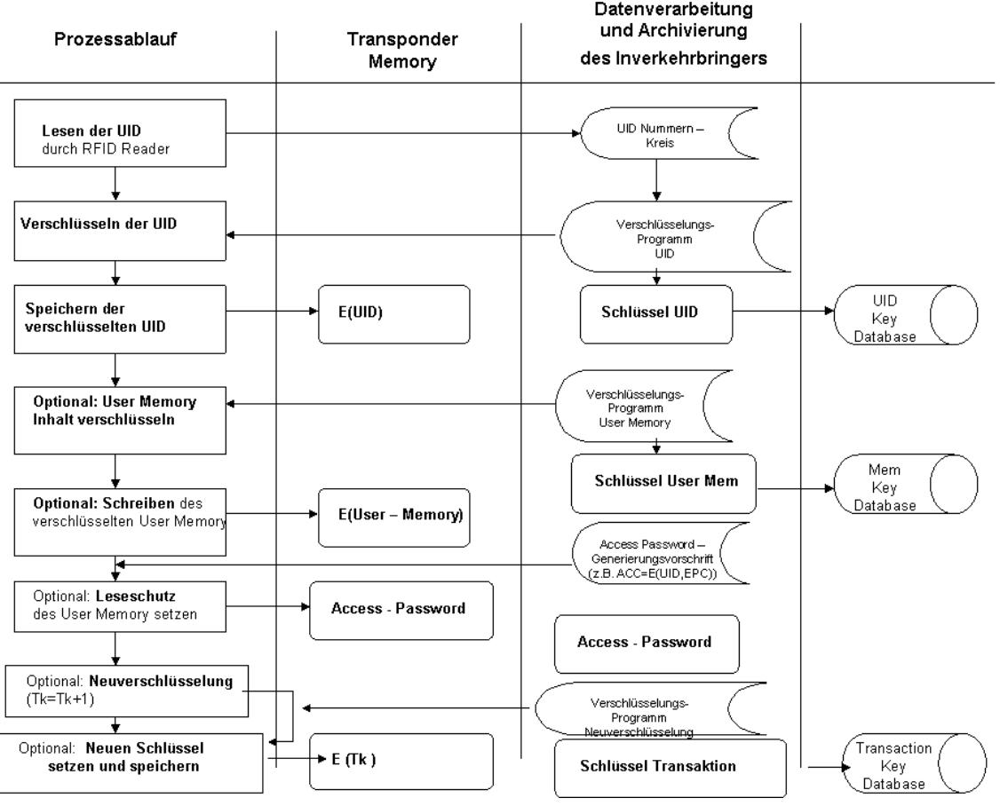

**Abbildung 8–1 Beispiel für die Verschlüsselung von sicherheitsrelevanten Informationen** 

# **9 Definition spezifischer Einsatzszenarien**

Die in den Kapiteln [6](#page-51-1) und [7](#page-62-1) beschriebenen Prozesse sollen für die Umsetzung spezieller Produkte exemplarisch betrachtet werden.

Ziel ist es, Anwendungsfälle, die für die Sicherheit und Funktionalität der RFID-Transponder wichtig sind, zu analysieren und auf dieser Basis Vorschläge für die technische Umsetzung des Gesamtsystems und der zugehörigen Betriebsprozesse in der technischen Richtlinie niederzulegen.

Folgende Produkte sollen in Bezug auf den Einsatz von RFID-Transpondern betrachtet werden:

- 1 Einsatzszenario "Fast moving consumer goods" Das Produkt ist ein Verbrauchsgut ohne Anforderungen an Fälschungssicherheit ( Ein z. B. Toilettenpapier). Der Zweck des Einsatzes der RFID-Technik besteht in der Optimierung der logistischen Prozesse, der Qualitätssicherung, des Bestandsmanagements am POS, des Verkaufsprozesses. Optional kann auch die Warensicherung mit Hilfe des Transponders realisiert werden. Dieser Fall soll hier allerdings nicht betrachtet werden.
- 2 Einsatzszenario "Unterhaltungselektronik"

Das Gerät (z. B. ein Flatscreen-TV) soll zum Schutz der Konsumenten gegen Fälschung geschützt werden. Produktpiraterie ist zu befürchten. Weiterhin soll die RFID-Technik für Post-Sales Services wie Garantiebeleg, Kaufnachweis, Kennung für Produkt-Service (Firmware-Updates, etc) verwendet werden.

3 Einsatzszenario "Markenkleidung"

Das Produkt ist ein hochpreisiger Herrenanzug einer renommierten Marke. Das Produkt soll gegen Fälschung geschützt werden. Produktpiraterie ist zu befürchten. Weiterhin soll die RFID-Technik für Post-Sales Services wie Garantiebeleg und Kaufnachweis verwendet werden.

Die Nutzung des Transponders für die Diebstahlsicherung ist technisch möglich. Die entsprechenden Verfahren sind allerdings in EPCglobal noch nicht standardisiert worden. In den folgenden Betrachtungen soll das Thema Diebstahlsicherung nicht berücksichtigt werden. Dies kann in einer künftigen Erweiterung oder Überarbeitung der Richtlinie nachgeholt werden.

In den folgenden Unterkapiteln sollen die ausgewählten Einsatzszenarien für diese Produkte näher beschrieben werden.

# **9.1 Einsatzszenario "Fast moving consumer goods"**

#### Beschreibung

Eine Verpackung mit 8 Rollen Toilettenpapier wird mit einem Transponder versehen.

#### Anforderungen

Der Weg des Konsumgutes soll von der Herstellung über die gesamte Lieferkette bis auf die Verkaufsfläche beim Einzelhändler steuerbar und verfolgbar sein. Insbesondere soll die Bevorratung im Lager und auf der Verkaufsfläche kontrolliert und gesteuert werden. Im Verkaufsraum werden mithilfe der RFID-Technik Zusatzdienste wie Produktinformationen und Cross-Selling realisiert (siehe Kapitel [2.2](#page-22-1)).

Die Nutzungsdauer der Umverpackung beträgt im Regelfall nur wenige Tage oder Wochen. Der Transponder wird nach dem Verkauf nicht mehr benötigt.

Kommerzieller Wert, Gefahr von Produktfälschungen

Der Verkaufswert beträgt 3€. Die Marge ist gering. Produktfälschungen sind nahezu ausgeschlossen.

Nutzung des Produkts

Self-Check-out des Konsumenten ist bei diesem Produkt in Zukunft zu erwarten.

Das Produkt und der mit der Verpackung verbundene Transponder wird vom Konsumenten nur auf dem Weg nach Hause mitgeführt.

# **9.2 Einsatzszenario "Unterhaltungselektronik"**

#### Beschreibung

Ein hochwertiges Flatscreen-TV eines Markenherstellers ist mit einem Transponder versehen.

#### Anforderungen

Der Weg des Flatscreen-TV soll von der Herstellung über die gesamte Lieferkette bis auf die Verkaufsfläche beim Einzelhändler steuerbar und verfolgbar sein.

Weiterhin soll die Bevorratung im Lager und auf der Verkaufsfläche kontrolliert und gesteuert werden. Im Verkaufsraum werden mithilfe der RFID-Technik Zusatzdienste wie Produktinformationen und Cross-Selling realisiert (siehe Kapitel [2.2\)](#page-22-1). Die Bestandskontrolle und die angebotenen Zusatzdienste können sich sowohl auf den gesamten Verkaufsraum / Lager als auch auf kleinere Bereiche (Regale etc.) beziehen.

Nach dem Verkauf soll die RFID-Technik die beleglose Garantieabwicklung und den beleglosen Umtausch und Kaufnachweis unterstützen. Weiterhin soll der Transponder nach dem Verkauf zur Identifizierung des Geräts z. B. bei Firmware-Updates oder zur Ermittlung des richtigen Zubehörs dienen.

Die Anforderung an die Lebensdauer des Transponders leitet sich aus der Nutzungsdauer des Geräts ab. Diese wird mehrere Jahre betragen.

Kommerzieller Wert, Gefahr von Produktfälschungen.

Der Verkaufswert beträgt mehr als 1000 €. Es besteht eine erhebliche Gefahr von Produktfälschungen.

#### Nutzung des Produkts

Self-Check-out des Konsumenten ohne jede Interaktion mit Verkaufspersonal ist bei diesem Produkt nicht zu erwarten.

Bundesamt für Sicherheit in der Informationstechnik 125

Das Produkt und der damit verbundene Transponder wird zum Kunden transportiert. Dort verbleibt es.

# **9.3 Einsatzszenario "Markenkleidung"**

#### Beschreibung

Ein hochwertiger Herrenanzug eines Markenherstellers ist mit einem Transponder versehen.

#### Anforderungen

Der Weg des Herrenanzugs soll von der Herstellung über die gesamte Lieferkette bis auf die Verkaufsfläche beim Einzelhändler steuerbar und verfolgbar sein. Weiterhin soll die Bevorratung im Lager und auf der Verkaufsfläche kontrolliert und gesteuert werden. Es ist dabei von besondere Bedeutung, die Art (Größe, Farbe, Schnitt) unterscheiden und die Verfügbarkeit gesondert steuern zu können.

Im Verkaufsraum werden mithilfe der RFID-Technik Zusatzdienste wie Produktinformationen und Cross-Selling realisiert (siehe Kapitel [2.2](#page-22-1)).

Nach dem Verkauf soll die RFID-Technik die beleglose Garantieabwicklung und den beleglosen Umtausch und Kaufnachweis unterstützen. Die Verfügbarkeit unterschiedlicher Größen und Farben kann gegenüber dem Kunden transparenter dargestellt werden.

Die Anforderung an die Lebensdauer des Transponders leitet sich aus der Nutzungsdauer des Anzugs ab. Diese kann mehrere Jahre betragen.

Kommerzieller Wert, Gefahr von Produktfälschungen.

Der Verkaufswert beträgt mehrere Hundert €. Durch das Markenimage des Herstellers besteht eine erhebliche Gefahr von Produktfälschungen.

#### Nutzung des Produkts

Self-Check-out des Konsumenten ohne jede Beteiligung des Verkaufspersonals ist bei diesem Produkt nicht zu erwarten.

Das Produkt und der damit verbundene Transponder werden vom Konsumenten über einen längeren Zeitraum mitgeführt. Dabei ist der Transponder im Etikett integriert und z. B. an das Produkt angenäht. Im Regelfall wird der Transponder vom Konsumenten spätestens im Haushalt vom Produkt abgetrennt. Zur Abwicklung der beleglosen Garantie kann der Kunde das Etikett zu Hause aufbewahren.

# **10 Umsetzungsvorschläge zum Gesamtsystem**

In diesem Kapitel wird ein Gesamtsystem für das Einsatzgebiet "Handelslogistik" exemplarisch beschrieben.

Grundsätzlich ist zwischen Logistik und Handel in der Abgrenzung der genutzten IT-Systeme zu unterscheiden. Während die Logistik sich primär mit dem Warenfluss, den daraus resultierenden Zu- und Abgängen (Wareneingang, Kommissionierung, Warenausgang) und der Lagerverwaltung (Stellplatzverwaltung) beschäftigt, liegt im Handelsumfeld der Fokus auf die Erstellung der Rechnung mit dem anschließenden Bezahlvorgang. Die Lagersysteme werden in der Regel mittels EDI mit Informationen versorgt (z. B. elektronisches Lieferavis). Im Handelsumfeld wird das bestehende Kassensystem häufig durch ein zusätzliches Customer-Relation-Management-(CRM)System, in dem Informationen mit Einwilligung des Kunden vorgehalten werden und für Marketing oder kundenindividuelle Transaktionen (z. B. Bestellungen) herangezogen werden, ergänzt.

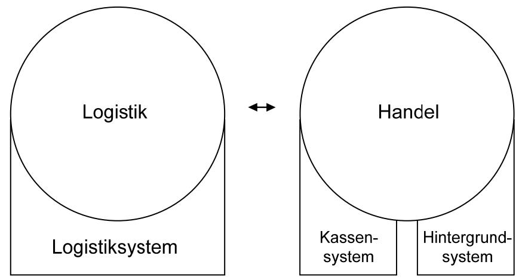

**Abbildung 10–1 Abgrenzung verschiedener IT-Systeme** 

Produktinformationen mit Hilfe des Internets jederzeit verfügbar zu machen, ist die Grundidee des EPCglobal-Netzwerks. Das EPCglobal-Netzwerk verbindet dezentrale Server, die sämtliche relevanten EPC-Informationen (d. h. zu einem bestimmten EPC gehörende Stamm- oder Logistikdaten) enthalten. Die Datenübermittlung wird mittels Internet realisiert. Steuerung der Server sowie Autorisierung und Zugang zu den Informationen übernehmen verschiedene Servicekomponenten des Netzwerks. Das EPCglobal-Netzwerk ist im Aufbau begriffen. Erste Umsetzungen finden sich am Markt. Der Fokus des Netzwerks liegt auf dem Logistikbereich (siehe nachfolgende Abbildungen).

In dieser Richtlinie sollen die in Logistik und Handel verwendeten IT-Systeme in Hinblick auf die IT-Sicherheit betrachtet werden. Die physikalische und funktionale Implementierung sind nur insofern von Bedeutung, als für die Sicherheitsanalyse und die Definition von Schutzmaßnahmen erforderlich ist. Es ergibt sich dabei eine besondere Bedeutung bei der Unterscheidung zwischen Systemen, die personenbezogene Daten speichern, verarbeiten und weiterleiten und solchen die nicht mit personenbezogenen Daten in Berührung kommen:

- 1 Alle IT-Systeme der Logistik sind frei von personenbezogenen Daten
- 2 Hintergrundsysteme des Handels enthalten u. U.. personenbezogene Daten. Kassensysteme des Handels erhalten typischerweise auch bei Verwendung von Kundenkarten eine Referenz auf den Kundendatensatz im Hintergrundsystem des Einzelhändlers jedoch keine Kundendaten.

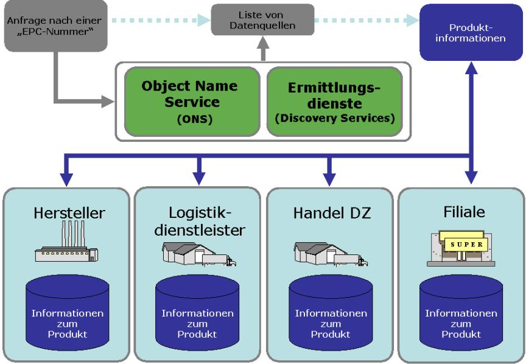

**Abbildung 10–2 Systemsicht der logistischen Lieferkette** 

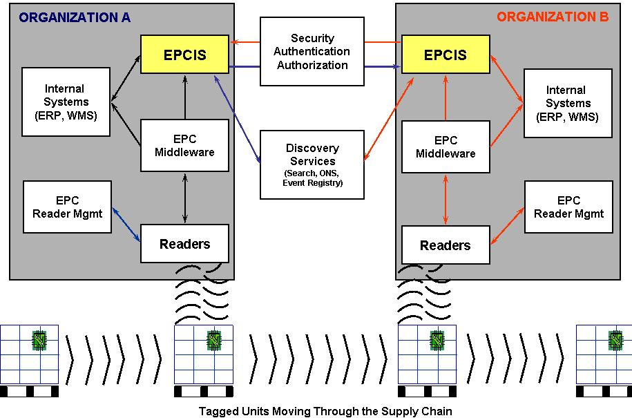

# **10.1 Umsetzungsvorschläge zur Infrastruktur**

### **10.1.1 Ermittlung des Schutzbedarfs für die Logistik-Infrastruktur**

Für die Infrastruktur des Einsatzgebiets Handelslogistik sollen folgende Annahmen gelten, die in die Bestimmung des Schutzbedarfs einfließen sollen:

- 1 Die Systeme aus Kapitel [10.1](#page-127-1) sollen alle vorgeschlagenen Einsatzszenarien gleichzeitig unterstützen. Dazu gehört insbesondere auch die Unterstützung von Maßnahmen zur Fälschungssicherheit.
- 2 Personenbezogenen Daten müssen ausschließlich im Hintergrundsystem (CRM-System) verwaltet und bearbeitet werden. Dabei werden Kundenkarten verwendet.
- 3 Logistikdaten fallen an und müssen kommuniziert und verarbeitet werden.

Basierend auf den in Kapitel [8.2.5](#page-81-1) dargelegten Kriterien kann die Logistik-Infrastruktur folgenden Schutzbedarfsklassen zugeordnet werden:

| Sicherheitsziel |                                                                            | Schutz bedarfs klasse | Kriterien zur Einordnung in Schutzbedarfsklassen                                                                                                 |  |
|-----------------|----------------------------------------------------------------------------|-----------------------------|--------------------------------------------------------------------------------------------------------------------------------------------------|--|
| SF1             | Technische Kompatibilität                                               | 1                           | Alle Systemkomponenten sind vom gleichen Lieferan ten. Der Lieferant sorgt für Kompatibilität.                                                |  |
|                 |                                                                            | 2                           | System muss mit Komponenten von wenigen definier ten Lieferanten funktionieren. Der Systemmanager oder ein SI sorgen für Kompatibilität.   |  |
|                 |                                                                            | 3                           | Offenes System, dass mit Komponenten von allen Marktteilnehmern funktionieren soll.                                                           |  |
| SF2             | Rückfalllösung bei Fehlfunkti onen                                   | 1                           | Fehlfunktion betrifft einzelne Transponder                                                                                                       |  |
|                 |                                                                            | 2                           | Fehlfunktion betrifft größere Mengen von Transponder                                                                                             |  |
|                 |                                                                            | 3                           | Fehlfunktion betrifft eine großen Teil oder alle Transponder                                                                                  |  |
| SF3             | Intuitive, feh lertolerante Nutzung                                  | 1                           | Intuitiv nicht bedienbar von einzelnen Konsumenten.                                                                                              |  |
|                 |                                                                            | 2                           | Intuitiv nicht bedienbar von größerer Konsumenten menge. (Gilt für alle Selbstbedienungssysteme)                                              |  |
|                 |                                                                            | 3                           | Intuitiv nicht bedienbar von einem großen Teil der Konsumenten.                                                                               |  |
| SI1             | Schutz von personenbe zogenen Da ten im Kun dendaten system | 1                           | Es fallen keine personenbezogenen Daten im Ver kaufsprozess an.                                                                               |  |
|                 |                                                                            | 2                           | Es wird beim Verkaufsprozess ein Personenbezug über eine Kundenkartennummer hergestellt, aber kei ne Logistikdaten des Produkts verwendet. |  |
|                 |                                                                            | 3                           | Es werden beim Verkaufsprozess personenbezogene Daten bzgl. spezieller Zahlungsarten (z. B. Rechnung) verwendet.                           |  |
|                 |                                                                            |                             | Nur für das Kundendatensystem relevant. Wird im Kapitel 10.1.5 behandelt.                                                                     |  |
| SI2             | Schutz der Objektkennung                                                | 1                           | Keine Gefahr von Produktfälschungen, Manipulatio nen, DoS, etc vorhanden                                                                      |  |
|                 |                                                                            | 2                           | Produktfälschungen, Manipulationen, DoS, etc verur sachen begrenzte Schäden von < 1% des Waren werts.                                      |  |

| Sicherheitsziel |                                                                      | Schutz bedarfs klasse | Kriterien zur Einordnung in Schutzbedarfsklassen                                                                                                            |
|-----------------|----------------------------------------------------------------------|-----------------------------|-------------------------------------------------------------------------------------------------------------------------------------------------------------|
|                 |                                                                      | 3                           | Produktfälschungen, Manipulationen, DoS, etc verur sachen massive Schäden (Gefahr für Personen, große Umsatz- und Imageverluste, etc).                |
|                 |                                                                      |                             | Die Infrastruktur soll gemäß 10.1.1 auch Szenarien mit hohem Schutzbedarf gegen Produktfälschungen un terstützen.                                     |
| SI3             | Schutz der Zuordnung von Objekt und Objektkennung           | 1                           | Keine Gefahr von Produktfälschungen, DoS, etc vor handen.                                                                                                |
|                 |                                                                      | 2                           | Produktfälschungen, DoS, etc verursachen begrenzte Schäden von < 1% des Warenwerts.                                                                      |
|                 |                                                                      | 3                           | Produktfälschungen, DoS, etc verursachen massive Schäden (Gefahr für Personen, große Umsatz- und Imageverluste, etc)                                  |
|                 |                                                                      |                             | Die Infrastruktur soll gemäß 10.1.1auch Szenarien mit hohem Schutzbedarf gegen Produktfälschungen un terstützen.                                      |
| SI4             | Schutz der Logistikdaten                                          | 1                           | Geringe Abhängigkeit von Logistikdaten                                                                                                                      |
|                 |                                                                      | 2                           | Fehlerhafte oder fehlende Logistikdaten verursachen begrenzte Schäden von < 1% des Warenwerts.                                                           |
|                 |                                                                      | 3                           | Fehlerhafte oder fehlende Logistikdaten verursachen massive Schäden von > 1% des Warenwerts oder Gefahr für Personen, große Imageverluste, etc        |
| SI5             | Schutz vor DoS-Attacken auf die RF Systemkom ponenten    | 1                           | Geringes Risiko von DoS-Attacken (DoS-Attacken sind nur punktuell zur erwarten)                                                                          |
|                 |                                                                      | 2                           | Mittleres Risiko von DoS-Attacken / DoS-Attacken verursachen begrenzte Schäden von < 1% des Wa renwerts.                                              |
|                 |                                                                      | 3                           | Hohes Risiko von DoS-Attacken / DoS-Attacken ver ursachen massive Schäden von > 1% des Warenwerts oder Gefahr für Personen, große Imageverluste, etc. |
| SI6             | Schutz vor Ausspähung der Informatio nen zum Wa renfluss | 1                           | Geringes Risiko der Ausspähung                                                                                                                              |
|                 |                                                                      | 2                           | Mittleres Risiko von Ausspähung / Ausspähung verur sacht begrenzte Schäden von < 1% des Warenwerts.                                                      |
|                 |                                                                      | 3                           | Hohes Risiko von Ausspähung / Ausspähung verur sacht massive Schäden von > 1% des Warenwerts oder Gefahr für Personen, große Imageverluste, etc.      |
| SI7             | Verfügbarkeit der EPC Daten                                       | 1                           | Geringes Risiko der Nichtverfügbarkeit                                                                                                                      |
|                 |                                                                      | 2                           | Mittleres Risiko der Nichtverfügbarkeit / Nichtverfüg barkeit verursacht begrenzte Schäden von < 1% des                                                  |

| Sicherheitsziel   |                                                          | Schutz bedarfs klasse | Kriterien zur Einordnung in Schutzbedarfsklassen                                                                                                                            |
|-------------------|----------------------------------------------------------|-----------------------------|-----------------------------------------------------------------------------------------------------------------------------------------------------------------------------|
|                   |                                                          |                             | Warenwerts                                                                                                                                                                  |
|                   |                                                          | 3                           | Hohes Risiko der Nichtverfügbarkeit / Nichtverfügbar keit verursacht massive Schäden von > 1% des Wa renwerts oder Gefahr für Personen, große Imagever luste, etc. |
| SP1 Schutz der |                                                          | 1                           | Kunde wird in seinem Ansehen geschädigt.                                                                                                                                    |
|                   | personenbe zogenen Da ten                          |                             | Nur für das Kundendatensystem relevant. Wird im Kapitel 10.1.5 behandelt.                                                                                                |
|                   |                                                          | 2                           | Kunde wird in seiner sozialen Existenz geschädigt.                                                                                                                          |
|                   |                                                          | 3                           | Kunde wird in seiner physischen Existenz geschädigt.                                                                                                                        |
| SP2               | Datenspar samkeit                                     | 1                           | Es fallen keine personenbezogenen Daten im Ver kaufsprozess an.                                                                                                          |
|                   |                                                          | 2                           | Es wird beim Verkaufsprozess ein Personenbezug über eine Kundenkartennummer hergestellt, aber kei ne Logistikdaten des Produkts verwendet.                            |
|                   |                                                          | 3                           | Es werden beim Verkaufsprozess personenbezogene Daten bzgl. spezieller Zahlungsarten (z. B. Rechnung) verwendet.                                                      |
|                   |                                                          |                             | Nur für das Kundendatensystem relevant. Wird im Kapitel 10.1.5 behandelt.                                                                                                |
| SP3               | Schutz vor der Erzeugung von Bewegungs profilen | 1                           | Kunde wird in seinem Ansehen geschädigt.                                                                                                                                    |
|                   |                                                          | 2                           | Kunde wird in seiner sozialen Existenz geschädigt.                                                                                                                          |
|                   |                                                          | 3                           | Kunde wird in seiner physischen Existenz geschädigt.                                                                                                                        |

**Tabelle 10–1 Schutzbedarf des Gesamtsystems der Logistik-Infrastruktur** 

### **10.1.2 Schnittstellen des Gesamtsystems**

Das in Kapitel [10.1](#page-127-1) dargestellte System ist auf ein Zusammenspiel aller Systemkomponenten angewiesen. Um die in Kapitel [6](#page-51-1) dargestellten Geschäftsprozesse abbilden zu können, müssen die technischen Schnittstellen und die operative Interaktion zwischen den Komponenten spezifiziert werden.

Weiterhin sind Vereinbarungen zwischen den Entitäten zu treffen, die die Verantwortlichkeiten und die betrieblichen Abläufe regeln.

### **10.1.2.1 Relevante Gefährdungen für die Logistik-Infrastruktur**

Aufgrund der Sicherheitsziele zur Ermittlung des Schutzbedarfs aus Kapitel [10.1.1](#page-127-2) lassen sich für die Schnittstellen des Gesamtsystems folgende relevanten Gefährdungen benennen.

| Gefährdungen der kontaktlo se Schnittstelle |                                                                               | Schutz bedarf | Bemerkungen                                                                                                                                                                                                                                                                                                        |
|------------------------------------------------|-------------------------------------------------------------------------------|------------------|--------------------------------------------------------------------------------------------------------------------------------------------------------------------------------------------------------------------------------------------------------------------------------------------------------------------|
| GIF1                                           | Mangelnde Kompa tibilität der Schnitt stellen Transponder -Lesegerät | 3                | Mangelnde Kompatibilität der Schnittstellen führt zu Nichtfunktion beim Lesevorgang, beim Schreiben von Daten und der Deaktivierung. Das Resultat ist ähnlich einer erfolgreichen DoS-Angriff auf das gesamte System. Die Funktion der Logistikinfrastruktur wäre nicht gewährleistet.           |
| GIF2                                           | Abhören                                                                       | 3                | Unberechtigtes Belauschen der Kommunikati on zwischen einem Transponder und einem Lesegerät kann z. B. zu Angriffen auf Produkt kennungen, Passworte und Authentifizierungs daten verwendet werden.                                                                                                    |
| GIF3                                           | DoS-Angriff auf die RF-Schnittstelle                                       | 1                | 1 Stören der RF-Kommunikation (Jamming) 2 Stören des Antikollisionsmechanismus zur Selektierung des Transponders (Blocker Tag) 3 Abschirmung des elektromagnetischen Feldes des Lesegerätes (Shielding) 4 Verstimmen der Resonanzfrequenz von Reader oder Transponder (De-Tuning) |
| GIF4                                           | Fremdeinflüsse über andere existierende Anwendungen                     | 3                | Andere RF-Anwendungen benutzen zum Teil gleiche oder benachbarte Arbeitsfrequenzen. Dies kann zu Beeinträchtigungen der Verfüg barkeit der Logistikdaten führen.                                                                                                                                          |

#### **Tabelle 10–2 Relevante Gefährdungen der kontaktlosen Schnittstelle**

| Gefährdungen des Gesamt systems |                                       | Schutz bedarf | Bemerkungen                                                                                                                                                                                                                                                                                                                                                |
|------------------------------------|---------------------------------------|------------------|------------------------------------------------------------------------------------------------------------------------------------------------------------------------------------------------------------------------------------------------------------------------------------------------------------------------------------------------------------|
| GS1                                | Fehlen einer Rück falllösung       | 3                | Das Fehlen einer Rückfalllösung beim Ausfall von Systemschnittstellen kann zu Komplett ausfällen der Logistikinfrastruktur führen.                                                                                                                                                                                                                   |
| GS2                                | Unberechtigtes Aus lesen von Daten | 3                | In den Hintergrundsystemen sind Informatio nen zu den Objekten, den Objektkennungen, Lesegeräten, Lagerorten, etc. gespeichert. Im Kundendatensystem können außerdem perso nenbezogene Daten abgelegt sein. Das Ausle sen dieser Daten durch Unberechtigte würde das System diskreditieren und die Möglichkeit für Angriffe schaffen. |
| GS3                                | Manipulieren von Daten             | 3                | Über die Systemschnittstellen werden Informa tionen zu den Objekten, den Objektkennungen, Lesegeräten, Lagerorten, etc. übertragen. Das Manipulieren dieser Daten durch Unberechtig te ist ein schwerwiegender Angriff.                                                                                                                        |
| GS4                                | Fehlfunktion des Systems           | 3                | Fehlfunktionen der Schnittstellen zwischen den Systemen können durch technische Fehler,                                                                                                                                                                                                                                                                 |

| Gefährdungen des Gesamt systems |                                                                   | Schutz bedarf | Bemerkungen                                                                                                                                                                                                                                                                                          |
|------------------------------------|-------------------------------------------------------------------|------------------|------------------------------------------------------------------------------------------------------------------------------------------------------------------------------------------------------------------------------------------------------------------------------------------------------|
|                                    |                                                                   |                  | Fehlbedienung oder DoS-Angriffe in verschie denen Szenarien herbeigeführt werden: 1 Störung der Schnittstellen 2 Mangelnde Verfügbarkeit der Schnittstel len 3 Fehler in der Stromversorgung 4 Unterbrechung der Anbindung an das Netz 5 Physische Zerstörung |
| GS5                                | Mangelnde Kompa tibilität der Schnitt stellen               | 3                | Mangelnde Kompatibilität der Schnittstellen führt zu Fehlfunktion. Das Resultat ist ähnlich einer DoS-Angriff auf das System. Die Funkti on der Logistikinfrastruktur wäre massiv beein trächtigt.                                                                                       |
| GS6                                | Unerlaubtes Ausle sen der Logistikda ten                    | 3                | Unerlaubtes aktives Auslesen der Logistikda ten                                                                                                                                                                                                                                                   |
| GS7                                | Unerlaubtes Schreiben / Manipu lieren der Logistikda ten | 3                | Unerlaubtes Schreiben von Logistikdaten in das Hintergrundsystem zum Zwecke der Mani pulation bzw. Kompromittierung. Insbesondere ist dabei auch der Header, der u. a. die Art der Daten beinhaltet, gefährdet.                                                                          |

#### **Tabelle 10–3 Relevante Gefährdungen der Systemschnittstellen**

#### **10.1.2.2 Definition von Schutzmaßnahmen für die Schnittstellen des Gesamtsystems**

Ausgehend von den relevanten Gefährdungen aus dem vorangegangenen Kapitel werden hier generelle Umsetzungsvorschläge und Schutzmaßnahmen für das Gesamtsystem und die Systemkomponenten definiert. Diese Maßnahmen sind in Kapitel [8.4](#page-92-1) im Detail beschrieben.

| Gefährdung |                                                                                  | Maßnahmen      | Maßnahme                                                                                                                                                                                                                                    |
|------------|----------------------------------------------------------------------------------|----------------|---------------------------------------------------------------------------------------------------------------------------------------------------------------------------------------------------------------------------------------------|
| GIF1       | Mangelnde Kom patibilität der Schnittstellen Transponder - Lesegerät | MS1.3          | 1 Einführung von Schnittstellentests und Freigabeverfahren - Zertifizierung                                                                                                                                                           |
| GIF2       | Abhören                                                                          | MS2.3 MS3.3 | 1 Verhinderung des Abhörens des Da tenaustauschs zwischen Transponder und Lesegerät – Erweiterte Maßnah men 2 Sicherstellen der zuverlässigen Über tragung von Daten zwischen Terminal und Transponder - Vermessung |

| Gefährdung |                                                                | Maßnahmen                                              | Maßnahme                                                                                                                                                                                                                                                                                                                                                                                                                                                                                                                                                                                                                                  |
|------------|----------------------------------------------------------------|--------------------------------------------------------|-------------------------------------------------------------------------------------------------------------------------------------------------------------------------------------------------------------------------------------------------------------------------------------------------------------------------------------------------------------------------------------------------------------------------------------------------------------------------------------------------------------------------------------------------------------------------------------------------------------------------------------------|
| GIF3       | DoS-Angriff auf die RF Schnittstelle                     | MS3.1                                                  | 1 Sicherstellen der zuverlässigen Über tragung von Daten zwischen Terminal und Transponder - Dauertest und orga nisatorische Maßnahmen                                                                                                                                                                                                                                                                                                                                                                                                                                                                                        |
| GIF4       | Fremdeinflüsse über andere exis tierende Anwen dungen | MS3.3                                                  | 1 Sicherstellen der zuverlässigen Über tragung von Daten zwischen Terminal und Transponder - Vermessung                                                                                                                                                                                                                                                                                                                                                                                                                                                                                                                          |
| GS1        | Fehlen einer Rückfalllösung                                 | MS4.3                                                  | 1 Definition von Rückfalllösungen beim Ausfall von Systemschnittstellen und Systemkomponenten - Umsetzung nach Rückfallkonzept                                                                                                                                                                                                                                                                                                                                                                                                                                                                                                |
| GS2        | Unberechtigtes Auslesen von Daten                        | MS5.3                                                  | 1 Sicherung der Vertraulichkeit von Daten bei der Kommunikation innerhalb des Systems – Sicherer Kommunikations kanal                                                                                                                                                                                                                                                                                                                                                                                                                                                                                                         |
| GS3        | Manipulieren von Daten                                      | MS7.3                                                  | 1 Sicherung der Datenintegrität zum Schutz vor Manipulationen bei der Da tenübertragung innerhalb des Systems – MAC oder Signaturen                                                                                                                                                                                                                                                                                                                                                                                                                                                                                           |
| GS4        | Fehlfunktion des Systems                                    | MS4.3 MS9.3 MS10.3 MS11.3 MS13.3 MS14.3 | 1 Definition einer Rückfalllösung beim Ausfall von Systemschnittstellen und Systemkomponenten – Umsetzung nach Ausfallkonzept 2 Sicherung der Systemfunktionen gegen DOS-Angriffe an den Schnittstellen - Sicherheitskonzeption 3 Sicherung der Funktion des Systems gegen Fehlbedienung durch Mitarbeiter und Nutzer - Tests, Personal und Be nutzerführung. 4 Sicherung der Funktion des Systems zur Vermeidung technischer Fehler von Komponenten und Übertragungswegen - Evaluierung von Komponenten 5 Ergonomische Benutzerführung 6 Support -Systemweiter Support |
| GS5        | Mangelnde Kom patibilität der Schnittstellen             | MS1.3 MS11.3 MS12.3                              | 1 Einführung von Schnittstellentests und Freigabeverfahren - Zertifizierung 2 Sicherung der Funktion des Systems zur Vermeidung technischer Fehler von Komponenten und Übertragungswegen - Evaluierung von Komponenten 3 Spezifikation Systemkonzept und An forderungen an die Komponenten mit dem Ziel der Integration und Interfunk tionsfähigkeit - Interfunktionsfähigkeits tests nach Testkonzeption, Evaluierung                                                                                                                                                                             |

| Gefährdung |                                                                  | Maßnahmen | Maßnahme                                                                                                                                        |
|------------|------------------------------------------------------------------|-----------|-------------------------------------------------------------------------------------------------------------------------------------------------|
| GS6        | Unerlaubtes Aus lesen der Logis tikdaten                   | MS5.3     | 1 Sicherung der Vertraulichkeit von Daten bei der Kommunikation innerhalb des Systems – Sicherer Kommunikations kanal               |
| GS7        | Unerlaubtes Schreiben / Ma nipulieren der Logistikdaten | MS7.3     | 1 Sicherung der Datenintegrität zum Schutz vor Manipulationen bei der Da tenübertragung innerhalb des Systems – MAC oder Signaturen |

#### **Tabelle 10–4 Schutzmaßnahmen für die Schnittstellen des Gesamtsystems**

#### **10.1.2.3 Verbleibende Risiken**

Aus technischen oder wirtschaftlichen Gründen ist es nicht immer möglich, Gefährdungen durch Maßnahmen vollständig zu neutralisieren. In solchen Fällen verbleibt ein Risiko bestehen.

#### **10.1.3 Lesegeräte**

Lesegeräte steuern den Informationsfluss zum Lesen oder Schreiben über das kontaktlose Kommunikationsprotokoll mit dem Transponder. Dem Lesegerät fällt dabei die aktive Rolle (Master) zu. Der Transponder agiert ausschließlich passiv (Slave).

Lesegeräte sind in verschiedenen Systemkomponenten integriert:

- 1 Stationäre Lesegeräte zur Warenflusskontrolle
- 2 Mobile Lesegeräte
- 3 Lesegeräte zur Überwachung von Lagerbeständen
- 4 Kill-Terminals
- 5 Selbstverbuchungskassen

Die Lesegeräte müssen folgende Eigenschaften aufweisen:

- 1 Kontaktloses Lese-/Schreibgerät mit Schnittstelle nach ISO/IEC18000-6C.
- 2 Anbindung an Zentralsystem bzw. Netzwerk nach EPCIS.
- 3 Fähigkeit zur Speicherung aller Logistikdaten für die Dauer bis zum nächsten Datenaustausch mit dem Zentralsystem.
- 4 Kryptographische Grundfunktionen.
- 5 Definierte Lesegeschwindigkeit und Lesewahrscheinlichkeit
- 6 Spezielle Kennung nach EPCglobal.

#### **10.1.3.1 Relevante Gefährdungen für das Lesegerät**

Aufgrund der Annahmen zur Ermittlung des Schutzbedarfs aus Kapitel [10.1.1](#page-127-2) lassen sich für die Schnittstellen des Gesamtsystems folgende relevanten Gefährdungen benennen.

| Gefährdungen der kontaktlo se Schnittstelle des Lesege räts |                  | Schutz bedarf | Bemerkungen                                 |
|-------------------------------------------------------------------|------------------|------------------|---------------------------------------------|
| GIF1                                                              | Mangelnde Kompa- | 3                | Mangelnde Kompatibilität der Schnittstellen |

| Gefährdungen der kontaktlo se Schnittstelle des Lesege räts |                                                            | Schutz bedarf | Bemerkungen                                                                                                                                                                                                                                                                                                        |
|-------------------------------------------------------------------|------------------------------------------------------------|------------------|--------------------------------------------------------------------------------------------------------------------------------------------------------------------------------------------------------------------------------------------------------------------------------------------------------------------|
|                                                                   | tibilität der Schnitt stellen Transponder -Lesegerät |                  | führt zu Nichtfunktion beim Lesevorgang, beim Schreiben von Daten und der Deaktivierung. Das Resultat ist ähnlich einer erfolgreichen DoS-Angriff auf das gesamte System. Die Funktion der Logistikinfrastruktur wäre nicht gewährleistet.                                                          |
| GIF2                                                              | Abhören                                                    | 3                | Unberechtigtes Belauschen der Kommunikati on zwischen einem Transponder und einem Lesegerät kann z. B. zu Angriffen auf Produkt kennungen, Passworte und Authentifizierungs daten verwendet werden.                                                                                                    |
| GIF3                                                              | DoS-Angriff auf die RF-Schnittstelle                    | 1                | 1 Stören der RF-Kommunikation (Jamming) 2 Stören des Antikollisionsmechanismus zur Selektierung des Transponders (Blocker Tag) 3 Abschirmung des elektromagnetischen Feldes des Lesegerätes (Shielding) 4 Verstimmen der Resonanzfrequenz von Reader oder Transponder (De-Tuning) |
| GIF4                                                              | Fremdeinflüsse über andere existierende Anwendungen  | 3                | Andere RF-Anwendungen benutzen zum Teil gleiche oder benachbarte Arbeitsfrequenzen. Dies kann zu Beeinträchtigungen der Verfüg barkeit der Logistikdaten führen.                                                                                                                                          |

| Tabelle 10–5 | Relevante Gefährdungen der kontaktlosen Schnittstelle der Lesegeräte |
|--------------|----------------------------------------------------------------------|
|--------------|----------------------------------------------------------------------|

| Gefährdung des Lesegeräts |                                                              | Schutz bedarf | Bemerkungen                                                                                                                                                                                                                                                                                                                      |
|---------------------------|--------------------------------------------------------------|------------------|----------------------------------------------------------------------------------------------------------------------------------------------------------------------------------------------------------------------------------------------------------------------------------------------------------------------------------|
| GR1                       | Unberechtigte Mani pulation der Refe renzinformationen | 3                | Manipulation der Referenzinformationen (Schlüssel, Auswertealgorithmen, Black- oder Whitelists) kann zur unberechtigten Nutzung oder zu DoS verwendet werden.                                                                                                                                                           |
| GR2                       | Unberechtigtes Aus lesen der Referenz informationen    | 3                | Auslesen der Referenzinformationen (Schlüs sel, Auswertealgorithmen, Black- oder White lists) kann zur unberechtigten Nutzung (Z. B. Fälschung von Berechtigungen) oder zu DoS verwendet werden.                                                                                                                     |
| GR3                       | Fehlfunktion des Lesegerät                                | 3                | Fehlfunktionen des Lesegeräts können durch technische Fehler, Fehlbedienung oder DoS Angriffe in verschiedenen Szenarien herbeige führt werden: 1 Störung der kontaktlosen Schnittstelle 2 Störung der Referenzinformationen (Schlüssel, Sperrlisten, etc) 3 Störung der Anwendungsimplementierung |
|                           |                                                              |                  | 4 Störung der Auswertealgorithmen für Ob-                                                                                                                                                                                                                                                                                     |

| Gefährdung des Lesegeräts |                                                     | Schutz bedarf | Bemerkungen                                                                                                                                                                                                                                                           |
|---------------------------|-----------------------------------------------------|------------------|-----------------------------------------------------------------------------------------------------------------------------------------------------------------------------------------------------------------------------------------------------------------------|
|                           |                                                     |                  | jektkennungen oder Authentifizierungen 5 Fehler in der Stromversorgung 6 Störsender (Jamming) 7 Blocker tag 8 Unterbrechung der Anbindung an das Zentralsystem 9 Physische Zerstörung 10 Störung der Funktionen zur Nutzerführung |
| GR4                       | Mangelnde Bedie nerführung                       | 2                | Mangelnde Bedienerfreundlichkeit an Check out oder Kill-Terminals kann zu erheblichen operativen Problemen führen.                                                                                                                                              |
| GS1                       | Fehlen einer Rück falllösung                     | 3                | Das Fehlen einer Rückfalllösung beim Ausfall von Lesegeräten kann die Verfügbarkeit der Logistikdaten gefährden und begrenzte oder sogar massive Schäden verursachen.                                                                                        |
| GS5                       | Mangelnde Kompa tibilität der Schnitt stellen | 3                | Mangelnde Kompatibilität der Schnittstellen führt zu Fehlfunktion. Das Resultat ist ähnlich einem DoS-Angriff auf das System. Die Funk tion der Logistikinfrastruktur wäre massiv be einträchtigt.                                                        |

**Tabelle 10–6 Relevante Gefährdungen des Lesegeräts** 

#### **10.1.3.2 Definition von Schutzmaßnahmen für das Lesegerät**

Ausgehend von den relevanten Gefährdungen aus dem vorangegangenen Kapitel werden hier generelle Umsetzungsvorschläge und Schutzmaßnahmen für das Lesegerät und dessen Anwendungen definiert. Diese Maßnahmen sind in Kapitel [8.4](#page-92-1) im Detail beschrieben.

|      | Gefährdung                                                                       | Maßnahmen      | Maßnahme                                                                                                                                                                                                                                    |
|------|----------------------------------------------------------------------------------|----------------|---------------------------------------------------------------------------------------------------------------------------------------------------------------------------------------------------------------------------------------------|
| GIF1 | Mangelnde Kom patibilität der Schnittstellen Transponder - Lesegerät | MS1.3 MR1.3 | 1 Einführung von Schnittstellentests und Freigabeverfahren - Zertifizierung                                                                                                                                                           |
| GIF2 | Abhören                                                                          | MS2.3 MS3.3 | 1 Verhinderung des Abhörens des Da tenaustauschs zwischen Transponder und Lesegerät – Erweiterte Maßnah men 2 Sicherstellen der zuverlässigen Über tragung von Daten zwischen Terminal und Transponder - Vermessung |
| GIF3 | DoS-Angriff auf die RF Schnittstelle                                       | MS3.1          | 1 Sicherstellen der zuverlässigen Über tragung von Daten zwischen Terminal und Transponder - Dauertest und orga nisatorische Maßnahmen                                                                                          |

|      | Gefährdung                                                     | Maßnahmen        | Maßnahme                                                                                                                                               |
|------|----------------------------------------------------------------|------------------|--------------------------------------------------------------------------------------------------------------------------------------------------------|
| GIF4 | Fremdeinflüsse über andere exis tierende Anwen dungen | MS3.3            | 1 Sicherstellen der zuverlässigen Über tragung von Daten zwischen Terminal und Transponder - Vermessung                                       |
| GR1  | Unberechtigte Manipulation der Referenzinforma tionen | MR2.3            | 1 Schützen der Referenzinformationen gegen Auslesen, Datenfehler und Ma nipulationen - Erweiterter Schutz                                     |
| GR2  | Unberechtigtes Auslesen der Referenzinforma tionen    | MR2.3            | 1 Schützen der Referenzinformationen gegen Auslesen, Datenfehler und Ma nipulationen - Erweiterter Schutz                                     |
| GR3  | Fehlfunktion des Lesegerät                                  | MR3.3            | 1 Schutz des Lesegeräts gegen Fehlfunk tionen - Evaluierung                                                                                      |
| GR4  | Mangelnde Be dienerführung                                  | MS13.2           | 1 Ergonomische Benutzerführung                                                                                                                      |
| GS1  | Fehlen einer Rückfalllösung                                 | MS4.3            | 1 Definition von Rückfalllösungen beim Ausfall von Systemschnittstellen und Systemkomponenten - Umsetzung nach Rückfallkonzept             |
| GS5  | Mangelnde Kom patibilität der Schnittstellen             | MS1.3            | 1 Einführung von Schnittstellentests und Freigabeverfahren - Zertifizierung                                                                      |
|      |                                                                | MS11.3 MS12.3 | 2 Sicherung der Funktion des Systems zur Vermeidung technischer Fehler von Komponenten und Übertragungswegen - Evaluierung von Komponenten |
|      |                                                                |                  | 3 Spezifikation Systemkonzept und An forderungen an die Komponenten - Evaluierung                                                             |

**Tabelle 10–7 Schutzmaßnahmen für das Lesegerät und dessen Anwendungen** 

### **10.1.3.3 Verbleibende Risiken**

Aus technischen oder wirtschaftlichen Gründen ist es nicht immer möglich, Gefährdungen durch Maßnahmen vollständig zu neutralisieren. In solchen Fällen verbleibt ein Risiko bestehen.

# **10.1.4 Hintergrundsysteme**

Die Betrachtung betrifft alle IT-Systeme der Logistik und alle Hintergrundsysteme des Handels, die keine personenbezogenen Daten speichern oder verarbeiten.

#### **10.1.4.1 Relevante Gefährdungen für die Hintergrundsysteme**

Aufgrund der Annahmen zur Ermittlung des Schutzbedarfs aus Kapitel [10.1.1](#page-127-2) lassen sich für die Hintergrundsysteme folgende relevanten Gefährdungen benennen.

| Gefährdungen der Hinter grundsysteme |                                                               | Schutz bedarf | Bemerkungen                                                                                                                                                                                                                                                                                                                         |
|-----------------------------------------|---------------------------------------------------------------|------------------|-------------------------------------------------------------------------------------------------------------------------------------------------------------------------------------------------------------------------------------------------------------------------------------------------------------------------------------|
| GS1                                     | Fehlen einer Rück falllösung                               | 3                | Das Fehlen einer Rückfalllösung beim Ausfall von Systemkomponenten kann zu Komplett ausfällen von Services führen (Gewinnung und Verteilung von Logistikdaten, etc)                                                                                                                                                        |
| GS2                                     | Unberechtigtes Aus lesen von Daten im System            | 3                | In den Hintergrundsystemen sind Informatio nen zu den Objekten, den Objektkennungen, Lesegeräten, Lagerorten, etc. gespeichert. Das Auslesen dieser Daten durch Unberechtigte würde das System diskreditieren und die Mög lichkeit für Angriffe schaffen.                                                            |
| GS3                                     | Manipulieren von Daten im System                           | 3                | In den Hintergrundsystemen sind Informatio nen zu den Objekten, den Objektkennungen, Lesegeräten, Lagerorten, etc. gespeichert. Das Manipulieren dieser Daten durch Unberechtig te ist ein schwerwiegender Angriff.                                                                                                     |
| GS4                                     | Fehlfunktion des Systems                                   | 3                | Fehlfunktionen einzelner Systemkomponenten können durch technische Fehler, Fehlbedie nung oder DoS-Angriffe in verschiedenen Szenarien herbeigeführt werden:                                                                                                                                                               |
|                                         |                                                               |                  | 1 Störung der lokalen und zentralen Syste me 2 Mangelnde Verfügbarkeit der lokalen und zentralen Systeme 3 Störung der Datenspeicher 4 Fehler in der Stromversorgung 5 Unterbrechung der Anbindung an das Zentralsystem 6 Schutz gegen physikalische Angriffe (De montage, Zerstörung) |
| GS5                                     | Mangelnde Kompa tibilität der Schnitt stellen           | 3                | Mangelnde Kompatibilität der Schnittstellen führt zu Fehlfunktion. Das Resultat ist ähnlich eines DoS-Angriffs auf das System. Eine Viel zahl von Kunden bzw. Berechtigungen wäre möglicherweise betroffen.                                                                                                             |
| GS6                                     | Unerlaubtes Ausle sen der Logistikda ten                | 3                | Unerlaubtes aktives Auslesen der Logistikda ten                                                                                                                                                                                                                                                                                  |
| GS7                                     | Unerlaubtes Schrei ben / Manipulieren der Logistikdaten | 3                | Unerlaubtes Schreiben von Logistikdaten in das Hintergrundsystem zum Zwecke der Mani pulation bzw. Kompromittierung. Insbesondere ist dabei auch der Header, der u. a. die Art der Daten beinhaltet, gefährdet.                                                                                                         |
| GS8                                     | Schutz von mandan tenspezifischen An wendungen und Ob   | 3                | Sofern von den Systemen mehrere Entitäten, welche den Objekten spezifische Informatio nen zuordnen, unterstützt werden, muss die Vertraulichkeit, Integrität und Verfügbarkeit der                                                                                                                                         |

| Gefährdungen der Hinter grundsysteme |                    | Schutz bedarf | Bemerkungen                                                                                                                                                                                            |
|-----------------------------------------|--------------------|------------------|--------------------------------------------------------------------------------------------------------------------------------------------------------------------------------------------------------|
|                                         | jektkennungen      |                  | Daten mandantenspezifisch sichergestellt wer den                                                                                                                                                    |
| GS9                                     | Produktfälschungen | 3                | Es wird davon ausgegangen, dass Produkte, die hoher Fälschungsgefahr ausgesetzt sind, durch das System unterstützt werden. Für die dabei involvierten Entitäten besteht diese Ge fährdung. |

#### **Tabelle 10–8 Relevante Gefährdungen für die Hintergrundsysteme**

#### **10.1.4.2 Definition von Schutzmaßnahmen für die Hintergrundsysteme**

Ausgehend von den relevanten Gefährdungen aus dem vorangegangenen Kapitel werden hier generelle Umsetzungsvorschläge und Schutzmaßnahmen definiert. Diese Maßnahmen sind in Kapitel [8.4](#page-92-1) im Detail beschrieben.

|     | Gefährdung                                        | Maßnahmen                                              | Maßnahme                                                                                                                                                                                                                                                                                                                                                                                                                                                                                                                                                                                                                                  |
|-----|---------------------------------------------------|--------------------------------------------------------|-------------------------------------------------------------------------------------------------------------------------------------------------------------------------------------------------------------------------------------------------------------------------------------------------------------------------------------------------------------------------------------------------------------------------------------------------------------------------------------------------------------------------------------------------------------------------------------------------------------------------------------------|
| GS1 | Fehlen einer Rückfalllösung                    | MS4.3                                                  | 1 Definition von Rückfalllösungen beim Ausfall von Systemschnittstellen und Systemkomponenten - Umsetzung nach Rückfallkonzept                                                                                                                                                                                                                                                                                                                                                                                                                                                                                                |
| GS2 | Unberechtigtes Auslesen von Daten im System | MS6.3                                                  | 1 Vertrauliche Speicherung von Daten - Einführung eines mandantenfähigen Zugriffsschutz mit definiertem Rollen modell                                                                                                                                                                                                                                                                                                                                                                                                                                                                                                         |
| GS3 | Manipulieren von Daten im System               | MS6.3 MS8.3                                         | 1 Vertrauliche Speicherung von Daten - Einführung eines mandantenfähigen Zugriffsschutz mit definiertem Rollen modell 2 Sicherung der Datenintegrität bei der Speicherung von Daten                                                                                                                                                                                                                                                                                                                                                                                                                                  |
| GS4 | Fehlfunktion des Systems                       | MS4.3 MS9.3 MS10.3 MS11.3 MS13.3 MS14.3 | 1 Definition einer Rückfalllösung beim Ausfall von Systemschnittstellen und Systemkomponenten – Umsetzung nach Ausfallkonzept 2 Sicherung der Systemfunktionen gegen DOS-Angriffe an den Schnittstellen - Sicherheitskonzeption 3 Sicherung der Funktion des Systems gegen Fehlbedienung durch Mitarbeiter und Nutzer - Tests, Personal und Be nutzerführung. 4 Sicherung der Funktion des Systems zur Vermeidung technischer Fehler von Komponenten und Übertragungswegen - Evaluierung von Komponenten 5 Ergonomische Benutzerführung 6 Support -Systemweiter Support |

|     | Gefährdung                                                                       | Maßnahmen                 | Maßnahme                                                                                                                                                                                                                                                                                                                                                                                                                                                      |
|-----|----------------------------------------------------------------------------------|---------------------------|---------------------------------------------------------------------------------------------------------------------------------------------------------------------------------------------------------------------------------------------------------------------------------------------------------------------------------------------------------------------------------------------------------------------------------------------------------------|
| GS5 | Mangelnde Kom patibilität der Schnittstellen                               | MS1.3 MS11.3 MS12.3 | 1 Einführung von Schnittstellentests und Freigabeverfahren - Zertifizierung 2 Sicherung der Funktion des Systems zur Vermeidung technischer Fehler von Komponenten und Übertragungswegen - Evaluierung von Komponenten 3 Spezifikation Systemkonzept und An forderungen an die Komponenten mit dem Ziel der Integration und Interfunk tionsfähigkeit - Interfunktionsfähigkeits tests nach Testkonzeption, Evaluierung |
| GS6 | Unerlaubtes Aus lesen der Logis tikdaten                                   | MS6.3                     | 1 Vertrauliche Speicherung von Daten - Einführung eines mandantenfähigen Zugriffsschutz mit definiertem Rollen modell                                                                                                                                                                                                                                                                                                                             |
| GS7 | Unerlaubtes Schreiben / Ma nipulieren der Logistikdaten                 | MS6.3 MS8.3            | 1 Vertrauliche Speicherung von Daten - Einführung eines mandantenfähigen Zugriffsschutz mit definiertem Rollen modell 2 Sicherung der Datenintegrität bei der Speicherung von Daten                                                                                                                                                                                                                                                      |
| GS8 | Schutz von man dantenspezifi schen Anwen dungen und Ob jektkennungen | MS6.3                     | 1 Vertrauliche Speicherung von Daten - Einführung eines mandantenfähigen Zugriffsschutz mit definiertem Rollen modell                                                                                                                                                                                                                                                                                                                             |
| GS9 | Produktfälschun gen                                                           | MS15.3                    | 1 Verwendung des EPC zur Fälschungs sicherung von Produkten- Zusätzliche Verwendung der UID                                                                                                                                                                                                                                                                                                                                                          |

| Tabelle 10–9 | Schutzmaßnahmen für die Hintergrundsysteme |
|--------------|--------------------------------------------|
|--------------|--------------------------------------------|

### **10.1.4.3 Verbleibende Risiken**

Aus technischen oder wirtschaftlichen Gründen ist es nicht immer möglich, Gefährdungen durch Maßnahmen vollständig zu neutralisieren. In solchen Fällen verbleibt ein Risiko bestehen. In diesem Kapitel wird für die relevanten Fälle das Restrisiko benannt.

# **10.1.5 Kundendatensysteme**

Der Einzelhändler verwendet IT-Systeme um den Verkauf der Produkte an den Konsumenten abzuwickeln. Diese Systeme unterstützen grundsätzlich den anonymen Verkauf und das anonyme Bezahlen der gekauften Produkte. Wie in Kapitel [10](#page-126-1) beschrieben, verwendet der Handel ggf. zusätzlich Kundendatensystemen, die optionale kundenspezifische Dienste unterstützen:

- 1 Auslieferung von gekauften Produkten an den Kunden,
- 2 Archivierung von Garantiedaten der gekauften Produkte,
- 3 Abwicklung von Garantiefällen,

4 Kundenbezogene Bonus- und Rabattprogramme,

In den Transpondern, die Objekten zugeordnet sind, sind keine personenbezogenen Daten gespeichert. Im Gegensatz dazu verlangen die benannten optionalen Funktionen des Kundendatensystems teilweise die Verwendung von personenbezogenen Daten. Das Kundendatensystem ist also die einzige Systemkomponente, bei der personenbezogene Daten anfallen und vor Missbrauch z. B. durch die unerlaubte Verknüpfung von personenbezogenen Daten einer Kundenkarte mit Logistikdaten geschützt werden müssen. Kommen Kundenkarten zum Einsatz, so wird im Rahmen des Bezahlvorgangs lediglich die Kundenkartennummer, nicht aber personenbezogene Daten herangezogen. Die Erstellung von Rechnungen mit Kundenbezug erfolgt in den dahinter gelagerten Systemen.

### **10.1.5.1 Relevante Gefährdungen für das Kundendatensystem**

Aufgrund der Annahmen zur Ermittlung des Schutzbedarfs aus Kapitel [10.1.1](#page-127-2) lassen sich für die Schnittstellen des Gesamtsystems folgende relevanten Gefährdungen benennen.

| Gefährdungen der Kunden datensysteme |                                                                               | Schutz bedarf | Bemerkungen                                                                                                                                                                                                               |
|-----------------------------------------|-------------------------------------------------------------------------------|------------------|---------------------------------------------------------------------------------------------------------------------------------------------------------------------------------------------------------------------------|
| GV1                                     | Fehlen einer Rück falllösung                                               | 3                | Das Fehlen einer Rückfalllösung beim Ausfall des Kundendatensystems kann zu Komplett ausfällen von Services führen (Verkauf, Ab rechnung, Bonusabrechnung, Garantieabwick lung, Zustellung des Produkts, etc) |
| GV2                                     | Fehlfunktion des Systems                                                   | 3                | Fehlfunktionen des Kundendatensystems kön nen durch technische Fehler, Fehlbedienung oder DoS-Angriffe in verschiedenen Szenarien herbeigeführt werden:                                                          |
|                                         |                                                                               |                  | 1 Störung der lokalen und zentralen Syste me                                                                                                                                                                        |
|                                         |                                                                               |                  | 2 Mangelnde Verfügbarkeit der lokalen und zentralen Systeme                                                                                                                                                         |
|                                         |                                                                               |                  | 3 Störung der Datenspeicher                                                                                                                                                                                            |
|                                         |                                                                               |                  | 4 Fehler in der Stromversorgung                                                                                                                                                                                        |
|                                         |                                                                               |                  | 5 Unterbrechung der Anbindung an das Zentralsystem                                                                                                                                                                  |
|                                         |                                                                               |                  | 6 Physische Zerstörung                                                                                                                                                                                                 |
| GV3                                     | Mangelnde Kompa tibilität der Schnitt stellen                           | 3                | Mangelnde Kompatibilität der Schnittstellen führt zu Fehlfunktion. Das Resultat ist ähnlich einem DoS-Angriff auf das System. Eine Viel zahl von Kunden wäre möglicherweise betrof fen.                       |
| GV4                                     | Unerlaubtes Ausle sen der Verkaufs und Abrechnungsda ten             | 3                | Unerlaubtes aktives Auslesen der Abrech nungsdaten.                                                                                                                                                                    |
| GV7                                     | Unerlaubtes Schreiben / Manipu lieren der Verkaufs und Abrechnungsda | 3                | Unerlaubtes Schreiben von Abrechnungsdaten das Kundendatensystem zum Zwecke der Ma nipulation bzw. Kompromittierung.                                                                                                |

| Gefährdungen der Kunden datensysteme |                                                                             | Schutz bedarf | Bemerkungen                                                                                                                                                                                                                                                              |
|-----------------------------------------|-----------------------------------------------------------------------------|------------------|--------------------------------------------------------------------------------------------------------------------------------------------------------------------------------------------------------------------------------------------------------------------------|
|                                         | ten                                                                         |                  |                                                                                                                                                                                                                                                                          |
| GV8                                     | Unerlaubtes Ausle sen der personen bezogenen Daten                    | 3                | Offenlegung von Kundendaten                                                                                                                                                                                                                                              |
| GV9                                     | Unerlaubtes Schrei ben / Manipulieren der personenbezo genen Daten | 3                | Manipulieren von Kundendaten                                                                                                                                                                                                                                             |
| GV10                                    | Fälschung von Iden tifikationsdaten                                      | 3                | Beim Zusenden oder Abholen eines Objektes ist ggf. eine Identifizierung der Person erforder lich. Das Vortäuschen einer falschen Identität erlaubt z. B. den Erhalt von Produkten und Dienstleistungen auf Kosten anderer Kunden oder des Einzelhändlers. |
| GV11                                    | Unberechtigtes Sammeln und Spei chern von Daten                       | 1                | Verstoß gegen das Gebot zur Datensparsam keit durch ungerechtfertigtes Sammeln und Speichern von personenbezogenen Daten                                                                                                                                           |
| GV12                                    | Unerlaubtes Ver knüpfen von Daten                                        | 3                | Unerlaubtes Verknüpfen von personenbezo genen Daten mit Abrechnungsdaten und/oder Logistikdaten. Es gilt die Annahme des Einsat zes von Kundenkarten.                                                                                                           |

**Tabelle 10–10 Relevante Gefährdungen für das Kundendatensystem** 

#### **10.1.5.2 Definition von Schutzmaßnahmen für das Kundendatensystem**

Ausgehend von den relevanten Gefährdungen aus dem vorangegangenen Kapitel werden hier generelle Umsetzungsvorschläge und Schutzmaßnahmen definiert. Diese Maßnahmen sind in Kapitel [8.4](#page-92-1) im Detail beschrieben.

| Gefährdung                                                                                   |                                                                                                                                           | Maßnahmen | Maßnahme                                                                                                                                   |
|----------------------------------------------------------------------------------------------|-------------------------------------------------------------------------------------------------------------------------------------------|-----------|--------------------------------------------------------------------------------------------------------------------------------------------|
| GV1                                                                                          | Fehlen einer Rückfalllösung                                                                                                            | MS4.3     | 1 Definition von Rückfalllösungen beim Ausfall von Systemschnittstellen und Systemkomponenten - Umsetzung nach Rückfallkonzept |
| GV2 Fehlfunktion des MS4.3 Systems MS9.3 MS10.3 MS11.3 MS13.3 MS14.3 | 1 Definition einer Rückfalllösung beim Ausfall von Systemschnittstellen und Systemkomponenten – Umsetzung nach Ausfallkonzept |           |                                                                                                                                            |
|                                                                                              |                                                                                                                                           |           | 2 Sicherung der Systemfunktionen gegen DOS-Angriffe an den Schnittstellen - Sicherheitskonzeption                                 |
|                                                                                              |                                                                                                                                           |           | 3 Sicherung der Funktion des Systems gegen Fehlbedienung durch Mitarbeiter und Nutzer - Tests, Personal und Be nutzerführung.  |
|                                                                                              |                                                                                                                                           |           | 4 Sicherung der Funktion des Systems                                                                                                    |

| Gefährdung |                                                                                          | Maßnahmen                 | Maßnahme                                                                                                                                                                                                                                                                                                                                                                                                                                                      |
|------------|------------------------------------------------------------------------------------------|---------------------------|---------------------------------------------------------------------------------------------------------------------------------------------------------------------------------------------------------------------------------------------------------------------------------------------------------------------------------------------------------------------------------------------------------------------------------------------------------------|
|            |                                                                                          |                           | zur Vermeidung technischer Fehler von Komponenten und Übertragungswegen - Evaluierung von Komponenten 5 Ergonomische Benutzerführung 6 Support -Systemweiter Support                                                                                                                                                                                                                                                                        |
| GV3        | Mangelnde Kom patibilität der Schnittstellen                                       | MS1.3 MS11.3 MS12.3 | 1 Einführung von Schnittstellentests und Freigabeverfahren - Zertifizierung 2 Sicherung der Funktion des Systems zur Vermeidung technischer Fehler von Komponenten und Übertragungswegen - Evaluierung von Komponenten 3 Spezifikation Systemkonzept und An forderungen an die Komponenten mit dem Ziel der Integration und Interfunk tionsfähigkeit - Interfunktionsfähigkeits tests nach Testkonzeption, Evaluierung |
| GV4        | Unerlaubtes Aus lesen der Ver kaufs- und Ab rechnungsdaten                      | MS6.3                     | 1 Vertrauliche Speicherung von Daten - Einführung eines mandantenfähigen Zugriffsschutz mit definiertem Rollen modell                                                                                                                                                                                                                                                                                                                             |
| GV7        | Unerlaubtes Schreiben / Ma nipulieren der Verkaufs- und Abrechnungsda ten | MS6.3 MS8.3            | 1 Vertrauliche Speicherung von Daten - Einführung eines mandantenfähigen Zugriffsschutz mit definiertem Rollen modell 2 Sicherung der Datenintegrität bei der Speicherung von Daten                                                                                                                                                                                                                                                      |
| GV8        | Unerlaubtes Aus lesen der perso nenbezogenen Daten                              | MS6.3                     | 1 Vertrauliche Speicherung von Daten - Einführung eines mandantenfähigen Zugriffsschutz mit definiertem Rollen modell                                                                                                                                                                                                                                                                                                                             |
| GV9        | Unerlaubtes Schreiben / Ma nipulieren der personenbezoge nen Daten           | MS6.3 MS8.3            | 1 Vertrauliche Speicherung von Daten - Einführung eines mandantenfähigen Zugriffsschutz mit definiertem Rollen modell 2 Sicherung der Datenintegrität bei der Speicherung von Daten                                                                                                                                                                                                                                                      |
| GV10       | Fälschung von Identifikationsda ten                                                | MV1.3                     | 1 Identifikation des Kunden bei Verkauf und Produktübergabe - Erklärung des Kunden                                                                                                                                                                                                                                                                                                                                                                   |
| GV11       | Unberechtigtes Sammeln und Speichern von Daten                                  | MV2.3                     | 1 Umsetzung des Gebots zur Datenspar samkeit - Besondere Maßnahmen                                                                                                                                                                                                                                                                                                                                                                                      |

| Gefährdung |                                          | Maßnahmen | Maßnahme                                                       |
|------------|------------------------------------------|-----------|----------------------------------------------------------------|
| GV12       | Unerlaubtes Ver knüpfen von Da ten | MV3.3     | 1 Trennung von personenbezogenen Daten von Logistikdaten |

**Tabelle 10–11 Schutzmaßnahmen für das Kundendatensystem** 

#### **10.1.5.3 Verbleibende Risiken**

Aus technischen oder wirtschaftlichen Gründen ist es nicht immer möglich, Gefährdungen durch Maßnahmen vollständig zu neutralisieren. In solchen Fällen verbleibt ein Risiko bestehen. In diesem Kapitel wird für die relevanten Fälle das Restrisiko benannt.

### **10.1.6 Schlüsselmanagement**

Das Schlüsselmanagement hat die Aufgabe, Schlüssel, die von mehreren Entitäten genutzt werden, für alle im System verwendeten Trägermedien, Anwendungen und Produkte sicher und zuverlässig bereitzustellen. Das Schlüsselmanagement obliegt dem Sicherheitsmanager. Als generelle Anleitung zur Implementierung kann [GSHB] herangezogen werden.

Schlüssel werden für den jeweiligen Einsatzzweck individuell erzeugt. Dabei werden, sofern möglich, für die verschiedenen Formen der Interaktion (z. B. Initialisierung, Schreiben von Authentifizierungsdaten, Setzen von Passworten, Lesen von zugriffsgeschützten Daten, Auslösen des Kill-Kommandos) individuell Schlüssel vergeben. Die genauen Eigenschaften müssen für jedes Einsatzszenario im Rahmen der Erstellung des spezifischen Sicherkonzepts im Einklang mit dem Rollenmodell ermittelt werden.

Die Schlüssel werden in einer sicheren Umgebung erzeugt und in einer sicheren Datenbank gespeichert. In dieser sicheren Umgebung werden auch die verschiedenen Formen von SAM erstellt. Die Dokumentation des Lebenszyklus der erstellten und ausgegebenen SAM ist ebenfalls Aufgabe des Schlüsselmanagement.

SAM und Schlüssel werden nach Bedarf des jeweiligen Nutzers vom Sicherheitsmanager oder dessen Beauftragten erstellt. Grundsätzlich werden folgende Arten von SAM unterstützt:

| Initialisierer-SAM | Initialisierer-SAM werden zur Initialisierung von Transpondern und zum Aufbringen von geschützten Informationen (z. B. Au thentifizierungsdaten, Setzen von Passworten) benötigt.                                       |
|--------------------|-------------------------------------------------------------------------------------------------------------------------------------------------------------------------------------------------------------------------------|
| Nutzer-SAM         | Nutzer-SAM werden in Abhängigkeit der im jeweiligen Einsatz szenario geforderten Funktion von den verschiedenen Entitä ten der Lieferkette zum Lesen und Auswerten der im Transpon der gespeicherten Daten benötigt. |

Üblicherweise werden in einem SAM Schlüsselinformationen nach Bedarf des Nutzers eingebracht. Ziel eines Initialisierers ist es z. B., alle in seinem Bereich anfallenden Transponder mit den geforderten Anwendungen ohne Wechsel des SAM initialisieren zu können.

Die Konfiguration solcher nutzerspezifischen SAM muss in Absprache zwischen Nutzer und dem Systemmanager erfolgen.

Das SAM soll das sichere Nachladen von Schlüsseln über ein Netzwerk unterstützen. Idealerweise könnte das Update dann direkt vom Sicherheitsmanager erfolgen.

#### **10.1.6.1 Relevante Gefährdungen für das Schlüsselmanagement**

Aufgrund der Annahmen zur Ermittlung des Schutzbedarfs aus Kapitel [10.1.1](#page-127-2) lassen sich für die Schnittstellen des Gesamtsystems folgende relevanten Gefährdungen benennen.

| Gefährdungen des Schlüssel managements |                                                    | Schutz bedarf | Bemerkungen                                                                                                                                                                                                                                                                                                                                                                                                                                                                                                                                                                                  |
|-------------------------------------------|----------------------------------------------------|------------------|----------------------------------------------------------------------------------------------------------------------------------------------------------------------------------------------------------------------------------------------------------------------------------------------------------------------------------------------------------------------------------------------------------------------------------------------------------------------------------------------------------------------------------------------------------------------------------------------|
| GK1                                       | Mangelnde Qualität der Schlüsseldaten           | 3                | Mangelnde Qualität der Schlüssel steigert die Erfolgschancen von Angriffen.                                                                                                                                                                                                                                                                                                                                                                                                                                                                                                               |
| GK2                                       | Unberechtigtes Aus lesen von Schlüs seldaten | 3                | Das Auslesen von Schlüsseldaten durch Unbe rechtigte kann das Systems diskreditieren und z. B. Angriffe auf alle kryptographisch ge schützten Daten und Funktionen begünstigen.                                                                                                                                                                                                                                                                                                                                                                                                     |
| GK3                                       | Manipulieren von Schlüsseldaten                 | 3                | Manipulation von Schlüsseldaten kann das Sicherheitskonzept des Systems diskreditie ren und z. B. Angriffe auf alle kryptographisch geschützten Daten und Funktionen begünsti gen. Die Manipulation kann die Erstellung von Schlüsseln, die Erstellung von Schlüsselträ gern, die Übertragung von Schlüsseln und die lokale Nutzung von Schlüsseln betreffen.                                                                                                                                                                                                           |
| GK4                                       | Fehlfunktion des Schlüsselmanage mentsystems | 3                | Fehlfunktionen des Schlüsselmanagements können durch technische Fehler, Fehlbedie nung oder DoS-Angriffe in verschiedenen Szenarien herbeigeführt werden: 1 Störung der lokalen und zentralen Syste me 2 Mangelnde Verfügbarkeit der lokalen und zentralen Systeme 3 Störung der Datenspeicher 4 Störung der spezifischen Anwendungs implementierung 5 Störung der Auswertealgorithmen für Be rechtigungen 6 Fehler in der Stromversorgung 7 Unterbrechung der Anbindung an das Zentralsystem 8 Physische Zerstörung |
| GK5                                       | Fehlen einer Rück falllösung                    | 3                | Die Verfügbarkeit der benötigten Schlüsselin formationen ist die Grundvoraussetzung für die Funktion des Gesamtsystems. Bei Fehlfunktio nen des Schlüsselmanagement wäre ohne Rückfalllösung die Funktion des Gesamtsys tems bedroht.                                                                                                                                                                                                                                                                                                                                         |

| Tabelle 10–12 | Relevante Gefährdungen des Schlüsselmanagements |
|---------------|-------------------------------------------------|
|---------------|-------------------------------------------------|

#### **10.1.6.2 Definition von Schutzmaßnahmen für das Schlüsselmanagement**

Ausgehend von den relevanten Gefährdungen aus dem vorangegangenen Kapitel werden hier generelle Umsetzungsvorschläge und Schutzmaßnahmen definiert. Diese Maßnahmen sind in Kapitel [8.4](#page-92-1) im Detail beschrieben.

|     | Gefährdung                                         | Maßnahmen               | Maßnahme                                                                                                                                                                                                                                                                                                                                                                                                                                       |
|-----|----------------------------------------------------|-------------------------|------------------------------------------------------------------------------------------------------------------------------------------------------------------------------------------------------------------------------------------------------------------------------------------------------------------------------------------------------------------------------------------------------------------------------------------------|
| GK1 | Mangelnde Quali tät der Schlüssel daten      | MK1.3 MK2.3          | 1 Sichere Erzeugung und Einbringung von Schlüsseln - Evaluierung und Zerti fizierung nach CC oder einem gleich wertigen Verfahren 2 Einführung eines Schlüsselmanage ment für symmetrische und asymmetri sche Schlüssel mit ausreichender Schlüssellänge –Sicheres, flexibles Schlüsselmanagementkonzept                                                                                                         |
| GK2 | Unberechtigtes Auslesen von Schlüsseldaten   | MK3.3 MK7.3          | 1 Zugriffschutz auf kryptographische Schlüssel (Lese- und Schreibzugriff) - Evaluierung und Zertifizierung nach CC oder einem gleichwertigen Verfahren 2 Trennung von Schlüsseln – Getrennte Speicherung und Verarbeitung von Schlüsseln                                                                                                                                                                               |
| GK3 | Manipulieren von Schlüsseldaten                 | MK3.3 MK7.3 MK8.3 | 1 Zugriffschutz auf kryptographische Schlüssel (Lese- und Schreibzugriff) - Evaluierung und Zertifizierung nach CC oder einem gleichwertigen Verfahren 2 Mandantenspezifische Trennung von Schlüsseln – Getrennte Speicherung und Verarbeitung von Schlüsseln 3 Nachladen von Schlüsseln - Sichern der Berechtigungen hinsichtlich Authen tizität und Integrität - Komplexes Au thentifizierungskonzept |
| GK4 | Fehlfunktion des Schlüsselmana gementsystems | MK4.3 MK5.3          | 1 Spezifizieren der Performanz und der geforderte Sicherung der Funktion der Sicherheitskomponenten - Evaluierung 2 Verfügbarkeit des Schlüsselmanage ments (Rückfalllösung) - Umsetzung nach Ausfallkonzept und Backup von Schlüsseln im Trustcenter                                                                                                                                                                  |
| GK5 | Fehlen einer Rückfalllösung                     | MK5.3 MK6.3          | 1 Verfügbarkeit des Schlüsselmanage ments (Rückfalllösung) - Umsetzung nach Rückfallkonzept und Backup von Schlüsseln im Trustcenter 2 Definition des Verhaltens im Kompro mittierungsfall – Kompromittierung von nicht diversifizierten Schlüsseln                                                                                                                                                                    |

**Tabelle 10–13 Schutzmaßnahmen für das Schlüsselmanagement** 

### **10.1.6.3 Verbleibende Risiken**

Aus technischen oder wirtschaftlichen Gründen ist es nicht immer möglich, Gefährdungen durch Maßnahmen vollständig zu neutralisieren. In solchen Fällen verbleibt ein Risiko bestehen. In diesem Kapitel wird für die relevanten Fälle das Restrisiko benannt.

Die technischen Möglichkeiten bei EPC-global kompatiblen Chips lassen nur begrenzte Schlüssellängen zu, die ggf. keinen sicheren Schutz gegen Attacken bieten. Im jeweiligen Einsatzszenario ist spezifisch zu betrachten, welche Risiken konkret für welche Entität entstehen.

# **10.2 Transponder**

| Chipkategorie                                                 | Sicherheitsfunktionen                                                                                                                                                                                                              | Sicherheitsfunktionen des Transponders                                                                                                                                                                                                                     | Funktionen                                                                                                                                                                                                               |
|---------------------------------------------------------------|------------------------------------------------------------------------------------------------------------------------------------------------------------------------------------------------------------------------------------|---------------------------------------------------------------------------------------------------------------------------------------------------------------------------------------------------------------------------------------------------------------|--------------------------------------------------------------------------------------------------------------------------------------------------------------------------------------------------------------------------|
| Logistik IC basierend auf EPCGlobal Class 1 Gen 2 | • UID (Read only) • Schreibschutz des Speicherbereiches • Zugriffsschutz für einzelne Spei cherbereiche • Optional Pass wortschutz für Schreibfunktion • Passwort ge schütztes "Kill" | • Einfache optische Sicherheitsmerk male: z. B. Melier fasern, fluoreszie rende Farben • Höhere optische Sicherheitsmerk male: z. B. Holo gramm, Mikro schrift • Option: temper proof durch "peel off" disabling | • Arbeitsfrequenz 860-960 MHz • Eindeutige Ken nung (UID) • Lese/ Schreibbe reich in festen Blöcken organi siert. • Datenhaltung 2 bis 10 Jahre • Datenrate max. 640kbit |

**Tabelle 10–14 Kategorisierung der Transponder "Logistik & Handel"** 

# **10.2.1 Initialisierung von Transpondern**

Die Initialisierung von Transpondern folgt dem Anwendungsfall im Kapitel [7](#page-62-1). Es gibt verschiedene Möglichkeiten der Umsetzung:

- 1 Initialisierung durch einen speziellen Dienstleister.
- 2 Initialisierung bei einer der Entitäten der Lieferkette (z. B. Hersteller).

Die entsprechenden Verfahren und Prozesse müssen in den Initialisierungssystemen entsprechend den Spezifikationen des Transponders und der Anwendungen implementiert werden. Für das Schlüsselmanagement kommen oftmals Initialisierer-SAM zum Einsatz, die in das Initialisierungssystem integriert werden müssen.

# **10.2.2 Ermittlung des Schutzbedarfs für den Transponder**

Die Wahl der Schutzbedarfsklasse ist vom jeweiligen Einsatzszenario abhängig. Dies erfolgt deshalb in Kapitel [11](#page-150-1).

# **10.2.3 Gefährdungen für den Transponder**

Die folgende Tabelle enthält die Gefährdungen für den Transponder. Die Zuordnung von Schutzklassen ist stark vom unterstützten Produkt und damit vom jeweiligen Einsatzszenario abhängig. Dies erfolgt deshalb in Kapitel [11](#page-150-1).

| Gefährdung |                                                               | Schutzbedarf des Transponders | Bemerkungen                                                                                                                                                                                               |  |
|------------|---------------------------------------------------------------|----------------------------------|-----------------------------------------------------------------------------------------------------------------------------------------------------------------------------------------------------------|--|
| GT1        | Unerlaubtes Ausle sen der Objektken nung                | 1                                | Nach Spezifikation EPCglobal ist der EPC-Code nicht gegen Ausle sen geschützt. Etwaige Gefähr dungen, die ein Auslesen voraus setzen, müssen durch geeignete Maßnahmen kompensiert werden. |  |
| GT2        | Unerlaubtes Schrei ben / Manipulieren der Objektkennung | Je nach Einsatzsze nario      |                                                                                                                                                                                                           |  |
| GT3        | Klonen des Transponders                                    | Je nach Einsatzsze nario      |                                                                                                                                                                                                           |  |
| GT4        | Emulieren des Transponders                                 | Je nach Einsatzsze nario      |                                                                                                                                                                                                           |  |
| GT5        | Entfernen des Transponders                                 | Je nach Einsatzsze nario      |                                                                                                                                                                                                           |  |
| GT6        | Unberechtigtes An bringen eines Transponders            | Je nach Einsatzsze nario      |                                                                                                                                                                                                           |  |
| GT7        | Unberechtigtes De aktivieren                               | Je nach Einsatzsze nario      |                                                                                                                                                                                                           |  |
| GT8        | DoS-Attacken                                                  | Je nach Einsatzsze nario      |                                                                                                                                                                                                           |  |
| GT9        | Fehlfunktion des Transponders                              | Je nach Einsatzsze nario      |                                                                                                                                                                                                           |  |
| GT10       | Tracking durch un berechtigtes Ausle sen durch Dritte   | Je nach Einsatzsze nario      |                                                                                                                                                                                                           |  |
| GT11       | Fehlen einer Rück falllösung bei Fehl funktion          | Je nach Einsatzsze nario      |                                                                                                                                                                                                           |  |
| GT12       | Manipulation der UID                                       | Je nach Einsatzsze nario      |                                                                                                                                                                                                           |  |
| GT13       | Fehlerhafte Erstel lung der UID                            | Je nach Einsatzsze nario      |                                                                                                                                                                                                           |  |

| Tabelle 10–15 | Relevante Gefährdungen für den Transponder |
|---------------|--------------------------------------------|
|---------------|--------------------------------------------|

### **10.2.4 Definition spezifischer Maßnahmen**

Die Zuordnung von Schutzmaßnahmen ist vom jeweiligen Einsatzszenario abhängig. Dies erfolgt deshalb in Kapitel [11.](#page-150-1)

# **11 Umsetzungsvorschläge zu den produktspezifischen Einsatzszenarien**

# **11.1 Einsatzszenario "Fast moving consumer goods"**

### **11.1.1 Ermittlung der Schutzbedarfklasse**

Das Einsatzszenario "Fast moving consumer goods" ist in Kapitel [9.1](#page-123-1) definiert worden. Eine Verpackung mit 8 Rollen Toilettenpapier ist mit einem Transponder versehen und durchläuft die in Kapitel [6](#page-51-1) und [7](#page-62-1) beschriebenen Prozesse und Anwendungsfälle in einem Gesamtsystem nach EPCglobal-Spezifikation.

Für die Betrachtung der Systemsicherheit und die Ermittlung der Schutzbedarfsklasse sind folgende Aspekte von besonderer Bedeutung.

Anforderungen:

- 1 Der Weg des Konsumguts soll von der Herstellung über die gesamte Lieferkette bis auf die Verkaufsfläche beim Einzelhändler steuerbar und verfolgbar sein.
- 2 Insbesondere soll die Bevorratung im Lager und auf der Verkaufsfläche kontrolliert und gesteuert werden.
- 3 Die Lebensdauer der Umverpackung beträgt im Regelfall nur wenige Tage oder Wochen.
- 4 Produktinformation und Post-Sales-Services auf Basis des Transponders sind nicht vorgesehen.

Kommerzieller Wert, Gefahr von Produktfälschungen:

Der Verkaufswert beträgt 3€. Die Marge ist gering. Es besteht keine Gefahr von Produktfälschungen.

Nutzung des Produkts:

- 1 Self-Check-out des Konsumenten ohne jede Interaktion mit Verkaufspersonal ist bei diesem Produkt in Zukunft zu erwarten.
- 2 Das Produkt und der damit verbundene Transponder werden vom Konsumenten nur auf dem Weg nach Hause mitgeführt.

Basierend auf den in Kapitel [8.2.5](#page-81-1) dargelegten Kriterien kann das Einsatzszenario folgenden Schutzbedarfsklassen zugeordnet werden.

| Sicherheitsziel |                              | Schutz bedarfs klasse | Kriterien zur Einordnung in Schutzbedarfsklassen                                                     |
|-----------------|------------------------------|-----------------------------|------------------------------------------------------------------------------------------------------|
| SF1             | Technische Kompatibilität | 1                           | Alle Systemkomponenten sind vom gleichen Lieferan ten. Der Lieferant sorgt für Kompatibilität.    |
|                 |                              | 2                           | System muss mit Komponenten von wenigen definier ten Lieferanten funktionieren. Der Systemmanager |

| Sicherheitsziel |                                                                            | Schutz bedarfs klasse | Kriterien zur Einordnung in Schutzbedarfsklassen                                                                                                     |
|-----------------|----------------------------------------------------------------------------|-----------------------------|------------------------------------------------------------------------------------------------------------------------------------------------------|
|                 |                                                                            |                             | oder ein SI sorgen für Kompatibilität.                                                                                                               |
|                 |                                                                            | 3                           | Offenes System, dass mit Komponenten von allen Marktteilnehmern funktionieren soll.                                                               |
| SF2             | Rückfalllösung bei Fehlfunkti onen                                   | 1                           | Fehlfunktion betrifft einzelne Transponder                                                                                                           |
|                 |                                                                            | 2                           | Fehlfunktion betrifft größere Mengen von Transponder                                                                                                 |
|                 |                                                                            | 3                           | Fehlfunktion betrifft eine großen Teil oder alle Transponder                                                                                      |
| SF3             | Intuitive, feh lertolerante Nutzung                                  | 1                           | In diesem Szenario nicht sicherheitsrelevant, da nur                                                                                                 |
|                 |                                                                            | 2                           | Produktinformationssyteme betroffen. Self-check out wird hier nicht erwartet.                                                                     |
|                 |                                                                            | 3                           |                                                                                                                                                      |
| SI1             | Schutz von personenbe zogenen Da ten im Kun dendaten system | 1                           | Nur für das Kundendatensystem relevant. Wird im                                                                                                      |
|                 |                                                                            | 2                           | Kapitel 10.1.5 behandelt.                                                                                                                            |
|                 |                                                                            | 3                           |                                                                                                                                                      |
| SI2             | Schutz der Objektkennung                                                | 1                           | Keine Gefahr von Produktfälschungen, Manipulatio nen, DoS, etc vorhanden                                                                          |
|                 |                                                                            | 2                           | Produktfälschungen, Manipulationen, DoS, etc verur sachen begrenzte Schäden von < 1% des Waren werts.                                          |
|                 |                                                                            | 3                           | Produktfälschungen, Manipulationen, DoS, etc verur sachen massive Schäden (Gefahr für Personen, große Umsatz- und Imageverluste, etc).         |
| SI3             | Schutz der Zuordnung von Objekt und Objektkennung                 | 1                           | Keine Gefahr von Produktfälschungen, DoS, etc vor handen.                                                                                         |
|                 |                                                                            | 2                           | Produktfälschungen, DoS, etc verursachen begrenzte Schäden von < 1% des Warenwerts.                                                               |
|                 |                                                                            | 3                           | Produktfälschungen, DoS, etc verursachen massive Schäden (Gefahr für Personen, große Umsatz- und Imageverluste, etc)                           |
| SI4             | Schutz der Logistikdaten                                                | 1                           | Geringe Abhängigkeit von Logistikdaten                                                                                                               |
|                 |                                                                            | 2                           | Fehlerhafte oder fehlende Logistikdaten verursachen begrenzte Schäden von < 1% des Warenwerts.                                                    |
|                 |                                                                            | 3                           | Fehlerhafte oder fehlende Logistikdaten verursachen massive Schäden von > 1% des Warenwerts oder Gefahr für Personen, große Imageverluste, etc |
| SI5             | Schutz vor                                                                 | 1                           | Geringes Risiko von DoS-Attacken                                                                                                                     |

| Sicherheitsziel |                                                                      | Schutz bedarfs klasse | Kriterien zur Einordnung in Schutzbedarfsklassen                                                                                                                            |
|-----------------|----------------------------------------------------------------------|-----------------------------|-----------------------------------------------------------------------------------------------------------------------------------------------------------------------------|
|                 | DoS-Attacken auf die RF Systemkom ponenten                  | 2                           | Mittleres Risiko von DoS-Attacken / DoS-Attacken verursachen begrenzte Schäden von < 1% des Wa renwerts.                                                              |
|                 |                                                                      | 3                           | Hohes Risiko von DoS-Attacken / DoS-Attacken ver ursachen massive Schäden von > 1% des Warenwerts oder Gefahr für Personen, große Imageverluste, etc.                 |
| SI6             | Schutz vor Ausspähung der Informatio nen zum Wa renfluss | 1                           | Geringes Risiko der Ausspähung                                                                                                                                              |
|                 |                                                                      | 2                           | Mittleres Risiko von Ausspähung / Ausspähung verur sacht begrenzte Schäden von < 1% des Warenwerts.                                                                      |
|                 |                                                                      | 3                           | Hohes Risiko von Ausspähung / Ausspähung verur sacht massive Schäden von > 1% des Warenwerts oder Gefahr für Personen, große Imageverluste, etc.                      |
| SI7             | Verfügbarkeit der EPC Daten                                       | 1                           | Geringes Risiko der Nichtverfügbarkeit                                                                                                                                      |
|                 |                                                                      | 2                           | Mittleres Risiko der Nichtverfügbarkeit / Nichtverfüg barkeit verursacht begrenzte Schäden von < 1% des Warenwerts                                                    |
|                 |                                                                      | 3                           | Hohes Risiko der Nichtverfügbarkeit / Nichtverfügbar keit verursacht massive Schäden von > 1% des Wa renwerts oder Gefahr für Personen, große Imagever luste, etc. |
| SP1             | Schutz der personenbe zogenen Da ten                        | 1                           | Nur für das Kundendatensystem relevant. Wird im                                                                                                                             |
|                 |                                                                      | 2                           | Kapitel 10.1.5 behandelt.                                                                                                                                                   |
|                 |                                                                      | 3                           |                                                                                                                                                                             |
| SP2             | Datenspar samkeit                                                 | 1                           | Nur für das Kundendatensystem relevant. Wird im                                                                                                                             |
|                 |                                                                      | 2                           | Kapitel 10.1.5 behandelt.                                                                                                                                                   |
|                 |                                                                      | 3                           |                                                                                                                                                                             |
| SP3             | Schutz vor der Erzeugung von Bewegungs profilen             | 1                           | In diesem Einsatzszenario nicht relevant. Ein einmali ger Transport des Produkts zum Nutzungsort erlaubt keine Erstellung eines Bewegungsprofils.                     |
|                 |                                                                      | 2                           |                                                                                                                                                                             |
|                 |                                                                      | 3                           |                                                                                                                                                                             |

**Tabelle 11–1 Schutzbedarf im Einsatzszenario "Fast moving consumer goods"** 

# **11.1.2 Relevante Gefährdungen**

Die folgende Tabelle enthält die speziellen Gefährdungen für dieses Einsatzszenario.

| Gefährdung |                                                               | Schutz bedarf des Transpo nders | Bemerkungen                                                                                                                                                                                                                                                                                                                                                                                                                                              |
|------------|---------------------------------------------------------------|---------------------------------------------|----------------------------------------------------------------------------------------------------------------------------------------------------------------------------------------------------------------------------------------------------------------------------------------------------------------------------------------------------------------------------------------------------------------------------------------------------------|
| GT1        | Unerlaubtes Ausle sen der Objektken nung                | 1                                           | Nach Spezifikation EPCglobal ist der EPC Code nicht gegen Auslösen geschützt. Etwaige Gefährdungen, die ein Auslesen voraussetzen, müssen durch geeignete Maßnahmen kom pensiert werden.                                                                                                                                                                                                                                                     |
| GT2        | Unerlaubtes Schrei ben / Manipulieren der Objektkennung | 1                                           |                                                                                                                                                                                                                                                                                                                                                                                                                                                          |
| GT3        | Klonen des Transponders                                    | 1                                           | Das unberechtigte Klonen von echten Transpondern würde es z. B. erlauben, ge fälschte Produkte in Umlauf zu bringen, das Vorhandensein der Ware im Lager oder im Verkaufsraum vorzutäuschen, Garantieleistun gen unberechtigterweise einzulösen, etc. So fern der echte Transponder entfernt oder deak tiviert (GT5, GT6, GT7) werden kann, ist auch ein "Umetikettieren" möglich.                                               |
| GT4        | Emulieren des Transponders                                 | 1                                           | Das Emulieren von echten Transpondern wür de es z. B. erlauben das Vorhandensein der Ware im Lager oder im Verkaufsraum vorzu täuschen. Sofern der echte Transponder ent fernt oder deaktiviert (GT5, GT7) werden kann, ist ggf. auch ein "Umetikettieren" mög lich. Anders als bei GT3 können Produktfäl schungen durch Emulation nicht in Umlauf gebracht werden. Deshalb ist der Schutzbedarf hier auf Klasse 1 reduziert. |
| GT5        | Entfernen des Transponders                                 | 1                                           | Durch Entfernen des Transponders kann die Zuordnung Objekt und Objektkennung aufge hoben werden. Beim Zusammenwirken von GT5 und GT6 wäre der Austausch von Objekt kennungen möglich.                                                                                                                                                                                                                                                        |
| GT6        | Unberechtigtes An bringen eines Transponders            | 1                                           | Durch das Anbringen eines neuen Transpon ders am Objekt ist es möglich, einem Objekt eine neue Kennung zuzuordnen. Beim Zu sammenwirken von GT5 und GT6 wäre der Austausch von Objektkennungen möglich.                                                                                                                                                                                                                                      |
| GT7        | Unberechtigtes De aktivieren                               | 1                                           | Durch das unberechtigte Anwenden der Kill Funktion, wird der Transponder dauerhaft de aktiviert. Alternativ ist auch eine mechanische Zerstörung als Angriff denkbar. Die Deaktivie rung oder Entfernung (GT5) des echten Transponders ist die Voraussetzung für die Umsetzung der Angriffe GT6, GT4 und GT3.                                                                                                                          |

| Gefährdung |                                                             | Schutz bedarf des Transpo nders | Bemerkungen                                                                                                                                                   |
|------------|-------------------------------------------------------------|---------------------------------------------|---------------------------------------------------------------------------------------------------------------------------------------------------------------|
| GT8        | DoS-Attacken                                                | 1                                           | Neben dem Szenario aus GT7 kann ein Transponder z. B. durch mechanische Einwir kung oder EMP zerstört werden.                                           |
| GT9        | Fehlfunktion des Transponders                            | 1                                           |                                                                                                                                                               |
| GT10       | Tracking durch un berechtigtes Ausle sen durch Dritte | -                                           | Gefährdung ist in diesem Einsatzszenario nicht relevant. Der Transport des Produkts zum Ort der Nutzung erlaubt keine Erstellung eines Profils.      |
| GT11       | Fehlen einer Rück falllösung bei Fehl funktion        | 1                                           |                                                                                                                                                               |
| GT12       | Manipulation der UID                                     | 1                                           | Die Möglichkeit zum Schreiben bzw. Manipula tion der UID eines Transponders ist eine Vor aussetzung für die Erstellung eines geklonten Transponders. |
| GT13       | Fehlerhafte Erstel lung der UID                          | 1                                           | Siehe GT12                                                                                                                                                    |

#### **Tabelle 11–2 Relevante Gefährdungen Einsatzszenario " Fast moving consumer goods "**

# **11.1.3 Definition spezifischer Maßnahmen**

Ausgehend von den relevanten Gefährdungen aus dem vorangegangenen Kapitel werden hier spezifische Schutzmaßnahmen definiert. Dabei sollen die benannten Gefährdungen für folgende Anwendungsfälle betrachtet werden:

| Anwendungsfälle                            | Transpo ndertyp | Bemerkungen                                                             |
|--------------------------------------------|--------------------|-------------------------------------------------------------------------|
| Herstellung und Versand des Chips       | EPCglo bal      | relevant                                                                |
| Herstellung und Versand der Transponder | EPCglo bal      | relevant                                                                |
| Erstellung und Vergabe des EPC-Manager  | EPCglo bal      | relevant                                                                |
| Individualisieren des Transponders      | EPCglo bal      | relevant                                                                |
| Setzen des Kill-Passworts                  | EPCglo bal      | Relevant, falls EPC-Chip mit Kill-Funktion ver wendet werden sollte. |
| Anbringen des Transpon-                    | EPCglo-            | relevant                                                                |

| Anwendungsfälle                                                | Transpo ndertyp | Bemerkungen                                                             |
|----------------------------------------------------------------|--------------------|-------------------------------------------------------------------------|
| ders am Objekt                                                 | bal                |                                                                         |
| Lesen der im Transponder gespeicherten Daten                | EPCglo bal      | Nur für EPC relevant. Andere Daten sind nicht vorhanden.             |
| Aktivieren des Kill Kommandos                               | EPCglo bal      | Relevant, falls Kill-Funktion verwendet werden sollte.               |
| Authentifizierung des Transponders zur Echt heitsprüfung | EPCglo bal      | Nicht relevant                                                          |
| Schlüssel- und Passwort EPCglo management bal         |                    | Relevant, falls EPC-Chip mit Kill-Funktion ver wendet werden sollte. |

#### **Tabelle 11–3 Relevante Anwendungsfälle Einsatzszenario " Fast moving consumer goods "**

Für den Transponder und die anderen Systemkomponenten sollen in den folgenden Unterkapiteln auf Basis der benannten Gefährdungen und der relevanten Anwendungsfälle Maßnahmen definiert werden.

#### Definition der Maßnahmen

In der folgenden Tabelle werden Maßnahmen den Gefährdungen aus [Tabelle 11–11](#page-169-1) Gegenmaßnahmen zugeordnet, die diese kompensieren sollen. Diese Maßnahmen sind in Kapitel [8.4](#page-92-1) beschrieben).

| Gefährdung |                                                                  | Maßnahmen      | Beschreibung der Maßnahmen                                                                                                                      |  |
|------------|------------------------------------------------------------------|----------------|-------------------------------------------------------------------------------------------------------------------------------------------------|--|
| GT1        | Unerlaubtes Aus lesen der Objekt kennung                   | MT1.1          | 1 Hard- und Software-Zugriffsschutz für den EPC (Schreibzugriff) - Schreib schutz für EPC                                              |  |
| GT2        | Unerlaubtes Schreiben / Ma nipulieren der Objektkennung | MT1.1          | 1 Hard- und Software-Zugriffsschutz für den EPC (Schreibzugriff) - Schreib schutz für EPC                                              |  |
| GT3        | Klonen des Transponders                                       | MT1.1 MT2.1 | 1 Hard- und Software-Zugriffsschutz für den EPC (Schreibzugriff) - Schreib schutz für EPC 2 Schutz vor Klonen des Transponders - |  |
|            |                                                                  |                | Einfacher Emulationsschutz durch UID                                                                                                            |  |
| GT4        | Emulieren des Transponders                                    | MT1.1 MT2.1 | 1 Hard- und Software-Zugriffsschutz für den EPC (Schreibzugriff) - Schreib schutz für EPC                                              |  |
|            |                                                                  |                | 2 Schutz vor Emulation - Einfacher Emu lationsschutz durch UID                                                                            |  |
| GT5        | Entfernen des Transponders                                    | MT4.1          | 1 Schutz vor Entfernen des Transponders - Geringer Schutz                                                                                 |  |
| GT6        | Unberechtigtes Anbringen eines                                | MT5.1          | 1 Schutz vor dem unberechtigten Anbrin gen eines Transponders - Geringer                                                                  |  |

| Gefährdung |                                                              | Maßnahmen      | Beschreibung der Maßnahmen                                                                                                                                                                                                     |
|------------|--------------------------------------------------------------|----------------|--------------------------------------------------------------------------------------------------------------------------------------------------------------------------------------------------------------------------------|
|            | Transponders                                                 |                | Schutz                                                                                                                                                                                                                         |
| GT7        | Unberechtigtes Deaktivieren                               | MT6.1 MK6.1 | 1 Schutz vor dem unberechtigten Deakti vieren eines Transponders - Passwort schutz des Kill-Kommandos 2 Definition des Verhaltens im Kompro mittierungsfall von Schlüsseln                                   |
| GT8        | DoS-Attacken                                                 | MT7.1 MT8.1 | 1 Schutz vor DoS-Attacken auf den Transponder - Grundlegender Schutz des Transponders gegen DoS-Angriffe 2 Spezifikation der Eigenschaften des Transponders - Herstellererklärung                            |
| GT9        | Fehlfunktion des Transponders                             | MT8.1          | 1 Spezifikation der Eigenschaften des Transponders - Herstellererklärung                                                                                                                                                 |
| GT10       | Tracking durch unberechtigtes Auslesen durch Dritte | --             | 1 Gefährdung ist in diesem Einsatzszena rio nicht relevant. Der Transport des Produkt zum Ort der Nutzung erlaubt keine Erstellung eines Profils.                                                                  |
| GT11       | Fehlen einer Rückfalllösung bei Fehlfunktion           | MT7.1 MT9.1 | 1 Schutz vor DoS-Attacken auf den Transponder - Grundlegender Schutz des Transponders gegen DoS-Angriffe 2 Rückfalllösung bei Fehlfunktion des Transponders - Einführung von geeig neten Rückfalllösungen |
| GT12       | Manipulation der UID                                      | MT2.1          | 1 Schutz vor Klonen des Transponders - Schutz des Transponders gegen Klo nen                                                                                                                                          |
| GT13       | Fehlerhafte Er stellung der UID                           | MT2.1          | 1 Schutz vor Klonen des Transponders - Schutz des Transponders gegen Klo nen                                                                                                                                          |

**Tabelle 11–4 Maßnahmen Einsatzszenario "Fast moving consumer goods"** 

Anmerkung: [Tabelle 11–4](#page-156-1) zeigt, dass keine Maßnahmen gegen die Erstellung von Bewegungsprofilen oder deren Zuordnung zu Personen erforderlich sind. MT10 und MT11 werden nicht verwendet. Der Chip darf auch nach dem Verkauf aktiv bleiben. Demzufolge wäre hier ein Chip ohne Kill-Funktion ausreichend. Die Verwendung eines solchen Chips hätte sogar den Vorteil, dass die Gefährdung durch GT7 komplett vermieden würde. Auch wäre dann in diesem Einsatzszenario kein Schlüsselmanagement erforderlich.

# **11.1.4 Verbleibende Risiken**

Aus technischen oder wirtschaftlichen Gründen ist es nicht immer möglich, Gefährdungen durch Maßnahmen vollständig zu neutralisieren. In solchen Fällen verbleibt ein Risiko bestehen. In diesem Kapitel wird für die relevanten Fälle das Restrisiko benannt.

# **11.2 Einsatzszenario "Unterhaltungselektronik"**

### **11.2.1 Ermittlung der Schutzbedarfklasse**

Das Einsatzszenario "Unterhaltungselektronik" ist in Kapitel [9.2](#page-124-1) definiert worden. Ein hochwertiges Flatscreen-TV ist mit einem Transponder versehen und durchläuft die in Kapitel [6](#page-51-1) und [7](#page-62-1) beschriebenen Prozesse und Anwendungsfälle in einem Gesamtsystem nach EPCglobal-Spezifikation.

Für die Betrachtung der Systemsicherheit und die Ermittlung der Schutzbedarfsklasse sind folgende Aspekte von besonderer Bedeutung.

Anforderungen:

- 1 Der Weg des Flatscreen-TV soll von der Herstellung über die gesamte Lieferkette bis auf die Verkaufsfläche beim Einzelhändler steuerbar und verfolgbar sein.
- 2 Die Bevorratung im Lager und auf der Verkaufsfläche soll kontrolliert und gesteuert werden.
- 3 Im Verkaufsraum werden mithilfe der RFID-Technik Zusatzdienste wie Produktinformationen und Cross-Selling realisiert (siehe Kapitel [2.2](#page-22-1)).
- 4 Nach dem Verkauf soll die RFID-Technik die beleglose Garantieabwicklung und den beleglosen Umtausch und Kaufnachweis unterstützen. Weiterhin soll der Transponder nach dem Verkauf zur Identifizierung des Geräts z. B. bei Firmware-Updates oder zur Ermittlung des richtigen Zubehörs dienen.
- 5 Die Anforderung an die Lebensdauer des Transponders leitet sich aus der Nutzungsdauer des Anzugs ab. Diese kann mehr als 10 Jahre betragen.

Kommerzieller Wert, Gefahr von Produktfälschungen:

Der Verkaufswert beträgt 1000-4000 €. Es besteht eine erhebliche Gefahr von Produktfälschungen.

Nutzung des Produkts:

- 1 Self-Check-out des Konsumenten ohne jede Interaktion mit Verkaufspersonal ist bei diesem Produkt nicht zu erwarten.
- 2 Das Produkt und der damit verbundene Transponder wird zum Kunden transportiert. Dort verbleibt es.

Basierend auf den in Kapitel [8.2.5](#page-81-1) dargelegten Kriterien kann das Einsatzszenario folgenden Schutzbedarfsklassen zugeordnet werden.

| Sicherheitsziel |                              | Schutz bedarfs klasse | Kriterien zur Einordnung in Schutzbedarfsklassen                                                                                               |
|-----------------|------------------------------|-----------------------------|------------------------------------------------------------------------------------------------------------------------------------------------|
| SF1             | Technische Kompatibilität | 1                           | Alle Systemkomponenten sind vom gleichen Lieferan ten. Der Lieferant sorgt für Kompatibilität.                                              |
|                 |                              | 2                           | System muss mit Komponenten von wenigen definier ten Lieferanten funktionieren. Der Systemmanager oder ein SI sorgen für Kompatibilität. |

| Sicherheitsziel |                                                            | Schutz bedarfs klasse | Kriterien zur Einordnung in Schutzbedarfsklassen                                                                                                     |
|-----------------|------------------------------------------------------------|-----------------------------|------------------------------------------------------------------------------------------------------------------------------------------------------|
|                 |                                                            | 3                           | Offenes System, dass mit Komponenten von allen Marktteilnehmern funktionieren soll.                                                               |
| SF2             | Rückfalllösung bei Fehlfunkti onen                   | 1                           | Fehlfunktion betrifft einzelne Transponder                                                                                                           |
|                 |                                                            | 2                           | Fehlfunktion betrifft größere Mengen von Transponder                                                                                                 |
|                 |                                                            | 3                           | Fehlfunktion betrifft eine großen Teil oder alle Transponder                                                                                      |
| SF3             | Intuitive, feh lertolerante Nutzung                  | 1                           | In diesem Szenario nicht sicherheitsrelevant, da nur Produktinformationssyteme betroffen. Self-check out wird hier nicht erwartet.             |
|                 |                                                            | 2                           |                                                                                                                                                      |
|                 |                                                            | 3                           |                                                                                                                                                      |
| SI1             | Schutz von                                                 | 1                           | Nur für das Kundendatensystem relevant. Wird im                                                                                                      |
|                 | personenbe zogenen Da                                   | 2                           | Kapitel 10.1.5 behandelt.                                                                                                                            |
|                 | ten im Kun dendaten system                           | 3                           |                                                                                                                                                      |
| SI2             | Schutz der Objektkennung                                | 1                           | Keine Gefahr von Produktfälschungen, Manipulatio nen, DoS, etc vorhanden                                                                          |
|                 |                                                            | 2                           | Produktfälschungen, Manipulationen, DoS, etc verur sachen begrenzte Schäden von < 1% des Waren werts.                                          |
|                 |                                                            | 3                           | Produktfälschungen, Manipulationen, DoS, etc verur sachen massive Schäden (Gefahr für Personen, große Umsatz- und Imageverluste, etc).         |
| SI3             | Schutz der Zuordnung von Objekt und Objektkennung | 1                           | Keine Gefahr von Produktfälschungen, DoS, etc vor handen.                                                                                         |
|                 |                                                            | 2                           | Produktfälschungen, DoS, etc verursachen begrenzte Schäden von < 1% des Warenwerts.                                                               |
|                 |                                                            | 3                           | Produktfälschungen, DoS, etc verursachen massive Schäden (Gefahr für Personen, große Umsatz- und Imageverluste, etc)                           |
| SI4             | Schutz der Logistikdaten                                | 1                           | Geringe Abhängigkeit von Logistikdaten                                                                                                               |
|                 |                                                            | 2                           | Fehlerhafte oder fehlende Logistikdaten verursachen begrenzte Schäden von < 1% des Warenwerts.                                                    |
|                 |                                                            | 3                           | Fehlerhafte oder fehlende Logistikdaten verursachen massive Schäden von > 1% des Warenwerts oder Gefahr für Personen, große Imageverluste, etc |
| SI5             | Schutz vor DoS-Attacken auf die RF-                  | 1                           | Geringes Risiko von DoS-Attacken                                                                                                                     |
|                 |                                                            | 2                           | Mittleres Risiko von DoS-Attacken / DoS-Attacken                                                                                                     |

| Sicherheitsziel |                                                                      | Schutz bedarfs klasse | Kriterien zur Einordnung in Schutzbedarfsklassen                                                                                                                            |
|-----------------|----------------------------------------------------------------------|-----------------------------|-----------------------------------------------------------------------------------------------------------------------------------------------------------------------------|
|                 | Systemkom ponenten                                                |                             | verursachen begrenzte Schäden von < 1% des Wa renwerts.                                                                                                                  |
|                 |                                                                      | 3                           | Hohes Risiko von DoS-Attacken / DoS-Attacken ver ursachen massive Schäden von > 1% des Warenwerts oder Gefahr für Personen, große Imageverluste, etc.                 |
| SI6             | Schutz vor Ausspähung der Informatio nen zum Wa renfluss | 1                           | Geringes Risiko der Ausspähung                                                                                                                                              |
|                 |                                                                      | 2                           | Mittleres Risiko von Ausspähung / Ausspähung verur sacht begrenzte Schäden von < 1% des Warenwerts.                                                                      |
|                 |                                                                      | 3                           | Hohes Risiko von Ausspähung / Ausspähung verur sacht massive Schäden von > 1% des Warenwerts oder Gefahr für Personen, große Imageverluste, etc.                      |
| SI7             | Verfügbarkeit der EPC Daten                                       | 1                           | Geringes Risiko der Nichtverfügbarkeit                                                                                                                                      |
|                 |                                                                      | 2                           | Mittleres Risiko der Nichtverfügbarkeit / Nichtverfüg barkeit verursacht begrenzte Schäden von < 1% des Warenwerts                                                    |
|                 |                                                                      | 3                           | Hohes Risiko der Nichtverfügbarkeit / Nichtverfügbar keit verursacht massive Schäden von > 1% des Wa renwerts oder Gefahr für Personen, große Imagever luste, etc. |
| SP1             | Schutz der personenbe zogenen Da ten                        | 1                           | Nur für das Kundendatensystem relevant. Wird im Kapitel 10.1.5 behandelt.                                                                                                |
|                 |                                                                      | 2                           |                                                                                                                                                                             |
|                 |                                                                      | 3                           |                                                                                                                                                                             |
| SP2             | Datenspar samkeit                                                 | 1                           | Nur für das Kundendatensystem relevant. Wird im Kapitel 10.1.5 behandelt.                                                                                                |
|                 |                                                                      | 2                           |                                                                                                                                                                             |
|                 |                                                                      | 3                           |                                                                                                                                                                             |
| SP3             | Schutz vor der Erzeugung von Bewegungs profilen             | 1                           | Gefährdung ist in diesem Einsatzszenario nicht rele vant. Der Transport des Produktes zum Ort der Nut zung erlaubt keine Erstellung eines Profils.                    |
|                 |                                                                      | 2                           |                                                                                                                                                                             |
|                 |                                                                      | 3                           |                                                                                                                                                                             |

| Tabelle 11–5 Schutzbedarf im Einsatzszenario "Unterhaltungselektronik" |  |
|---------------------------------------------------------------------------|--|
|---------------------------------------------------------------------------|--|

# **11.2.2 Relevante Gefährdungen**

Die folgende Tabelle enthält die speziellen Gefährdungen für dieses Einsatzszenario.

| Gefährdung |                                                               | Schutz bedarf des Transpo nders | Bemerkungen                                                                                                                                                                                                                                                                                                                                                                                                                                              |
|------------|---------------------------------------------------------------|---------------------------------------------|----------------------------------------------------------------------------------------------------------------------------------------------------------------------------------------------------------------------------------------------------------------------------------------------------------------------------------------------------------------------------------------------------------------------------------------------------------|
| GT1        | Unerlaubtes Ausle sen der Objektken nung                | 1                                           | Nach Spezifikation EPCglobal ist der EPC Code nicht gegen Auslösen geschützt. Etwaige Gefährdungen, die ein Auslesen voraussetzen, müssen durch geeignete Maßnahmen kom pensiert werden.                                                                                                                                                                                                                                                     |
| GT2        | Unerlaubtes Schrei ben / Manipulieren der Objektkennung | 3                                           |                                                                                                                                                                                                                                                                                                                                                                                                                                                          |
| GT3        | Klonen des Transponders                                    | 3                                           | Das unberechtigte Klonen von echten Transpondern würde es z. B. erlauben, ge fälschte Produkte in Umlauf zu bringen, das Vorhandensein der Ware im Lager oder im Verkaufsraum vorzutäuschen, Garantieleistun gen unberechtigterweise einzulösen, etc. So fern der echte Transponder entfernt oder deak tiviert (GT5, GT6, GT7) werden kann, ist auch ein "Umetikettieren" möglich.                                               |
| GT4        | Emulieren des Transponders                                 | 1                                           | Das Emulieren von echten Transpondern wür de es z. B. erlauben das Vorhandensein der Ware im Lager oder im Verkaufsraum vorzu täuschen. Sofern der echte Transponder ent fernt oder deaktiviert (GT5, GT7) werden kann, ist ggf. auch ein "Umetikettieren" mög lich. Anders als bei GT3 können Produktfäl schungen durch Emulation nicht in Umlauf gebracht werden. Deshalb ist der Schutzbedarf hier auf Klasse 1 reduziert. |
| GT5        | Entfernen des Transponders                                 | 3                                           | Durch Entfernen des Transponders kann die Zuordnung Objekt und Objektkennung aufge hoben werden. Beim Zusammenwirken von GT5 und GT6 wäre der Austausch von Objekt kennungen möglich.                                                                                                                                                                                                                                                        |
| GT6        | Unberechtigtes An bringen eines Transponders            | 3                                           | Durch das Anbringen eines neuen Transpon ders am Objekt ist es möglich, einem Objekt eine neue Kennung zuzuordnen. Beim Zu sammenwirken von GT5 und GT6 wäre der Austausch von Objektkennungen möglich.                                                                                                                                                                                                                                      |
| GT7        | Unberechtigtes De aktivieren                               | 3                                           | Durch das unberechtigte Anwenden der Kill Funktion, wird der Transponder dauerhaft de aktiviert. Alternativ ist auch eine mechanische Zerstörung als Angriff denkbar. Die Deaktivie rung oder Entfernung (GT5) des echten Transponders ist die Voraussetzung für die Umsetzung der Angriffe GT6, GT4 und GT3.                                                                                                                          |

| Gefährdung |                                                             | Schutz bedarf des Transpo nders | Bemerkungen                                                                                                                                                   |
|------------|-------------------------------------------------------------|---------------------------------------------|---------------------------------------------------------------------------------------------------------------------------------------------------------------|
| GT8        | DoS-Attacken                                                | 3                                           | Neben dem Szenario aus GT7 kann ein Transponder z. B. durch mechanische Einwir kung oder EMP zerstört werden.                                           |
| GT9        | Fehlfunktion des Transponders                            | 1                                           |                                                                                                                                                               |
| GT10       | Tracking durch un berechtigtes Ausle sen durch Dritte | --                                          | Gefährdung ist in diesem Einsatzszenario nicht relevant. Der Transport des Produktes zum Ort der Nutzung erlaubt keine Erstellung eines Profils.     |
| GT11       | Fehlen einer Rück falllösung bei Fehl funktion        | 1                                           |                                                                                                                                                               |
| GT12       | Manipulation der UID                                     | 3                                           | Die Möglichkeit zum Schreiben bzw. Manipula tion der UID eines Transponders ist eine Vor aussetzung für die Erstellung eines geklonten Transponders. |
| GT13       | Fehlerhafte Erstel lung der UID                          | 3                                           | Siehe GT12                                                                                                                                                    |

**Tabelle 11–6 Relevante Gefährdungen Einsatzszenario "Unterhaltungselektronik"** 

### **11.2.3 Definition spezifischer Maßnahmen**

Ausgehend von den relevanten Gefährdungen aus dem vorangegangenen Kapitel werden hier spezifische Schutzmaßnahmen definiert. Dabei sollen die benannten Gefährdungen für folgende Anwendungsfälle betrachtet werden:

| Anwendungsfälle                            | Transpo ndertyp | Bemerkungen                                                             |  |
|--------------------------------------------|--------------------|-------------------------------------------------------------------------|--|
| Herstellung und Versand des Chips       | EPCglo bal      | Relevant                                                                |  |
| Herstellung und Versand der Transponder | EPCglo bal      | Relevant                                                                |  |
| Erstellung und Vergabe des EPC-Manager  | EPCglo bal      | Relevant                                                                |  |
| Individualisieren des Transponders      | EPCglo bal      | Relevant                                                                |  |
| Setzen des Kill-Passworts                  | EPCglo bal      | Relevant, falls EPC-Chip mit Kill-Funktion ver wendet werden sollte. |  |
| Anbringen des Transpon ders am Objekt   | EPCglo bal      | Relevant                                                                |  |

| Anwendungsfälle                                                | Transpo ndertyp | Bemerkungen                                                             |
|----------------------------------------------------------------|--------------------|-------------------------------------------------------------------------|
| Lesen der im Transponder gespeicherten Daten                | EPCglo bal      | Relevant                                                                |
| Aktivieren des Kill Kommandos                               | EPCglo bal      | Relevant, falls Kill-Funktion verwendet werden sollte.               |
| Authentifizierung des Transponders zur Echt heitsprüfung | EPCglo bal      | Relevant                                                                |
| Schlüssel- und Passwort EPCglo management bal         |                    | Relevant, falls EPC-Chip mit Kill-Funktion ver wendet werden sollte. |

#### **Tabelle 11–7 Relevante Anwendungsfälle Einsatzszenario "Unterhaltungselektronik"**

Für den Transponder und die anderen Systemkomponenten sollen in den folgenden Unterkapiteln auf Basis der benannten Gefährdungen und der relevanten Anwendungsfälle Maßnahmen definiert werden.

#### Definition der Maßnahmen

In der folgenden Tabelle werden Maßnahmen den Gefährdungen aus [Tabelle 11–11](#page-169-1) Gegenmaßnahmen zugeordnet, die diese kompensieren sollen. Diese Maßnahmen sind in Kapitel [8.4](#page-92-1) beschrieben).

| Gefährdung |                                                                   | Maßnahmen      | Beschreibung der Maßnahmen                                                                                                                                                                            |
|------------|-------------------------------------------------------------------|----------------|-------------------------------------------------------------------------------------------------------------------------------------------------------------------------------------------------------|
| GT1        | Unerlaubtes Aus lesen der Objekt kennung                    | MT1.1          | 1 Hard- und Software-Zugriffsschutz für den EPC (Schreibzugriff) - Schreibschutz für EPC                                                                                                     |
| GT2        | Unerlaubtes Schreiben / Mani pulieren der Ob jektkennung | MT1.3          | 1 Hard- und Software-Zugriffsschutz für den EPC (Schreibzugriff) - Schreibschutz für EPC                                                                                                     |
| GT3        | Klonen des Transponders                                        | MT1.3 MT2.3 | 1 Hard- und Software-Zugriffsschutz für den EPC (Schreibzugriff) - Schreibschutz für EPC 2 Schutz vor Klonen des Transponders - Erweiterter Schutz des Transponders gegen Klonen |
| GT4        | Emulieren des Transponders                                     | MT1.1 MT2.1 | 1 Hard- und Software-Zugriffsschutz für den EPC (Schreibzugriff) - Schreibschutz für EPC 2 Schutz vor Emulation - Einfacher Emula tionsschutz durch UID                             |
| GT5        | Entfernen des Transponders                                     | MT4.3          | 1 Schutz vor Entfernen des Transponders - Besonders gesicherte Verbindung                                                                                                                       |
| GT6        | Unberechtigtes Anbringen eines                                 | MT5.3          | 1 Schutz vor dem unberechtigten Anbrin gen eines Transponders - Starker Schutz                                                                                                                  |

| Gefährdung |                                                              | Maßnahmen      | Beschreibung der Maßnahmen                                                                                                                                                                                                                       |
|------------|--------------------------------------------------------------|----------------|--------------------------------------------------------------------------------------------------------------------------------------------------------------------------------------------------------------------------------------------------|
|            | Transponders                                                 |                |                                                                                                                                                                                                                                                  |
| GT7        | Unberechtigtes Deaktivieren                               | MT6.3 MK6.3 | 1 Schutz vor dem unberechtigten Deaktivie ren eines Transponders - Passwortschutz des Kill-Kommandos 2 Definition des Verhaltens im Kompromit tierungsfall von Schlüsseln                                                      |
| GT8        | DoS-Attacken                                                 | MT7.3 MT8.3 | 1 Schutz vor DoS-Attacken auf den Transponder - Erweiterter Schutz des Transponders gegen DoS-Angriffe 2 Spezifikation der Eigenschaften des Transponders - Interfunktionsfähigkeits tests nach Testkonzeption, Evaluierung |
| GT9        | Fehlfunktion des Transponders                             | MT8.1          | 1 Spezifikation der Eigenschaften des Transponders - Herstellererklärung                                                                                                                                                                   |
| GT10       | Tracking durch unberechtigtes Auslesen durch Dritte | --             | 1 Gefährdung ist in diesem Einsatzszenario nicht relevant. Der Transport des Produkt zum Ort der Nutzung erlaubt keine Erstel lung eines Profils.                                                                                    |
| GT11       | Fehlen einer Rückfalllösung bei Fehlfunktion           | MT7.1 MT9.1 | 1 Schutz vor DoS-Attacken auf den Transponder - Grundlegender Schutz des Transponders gegen DoS-Angriffe 2 Rückfalllösung bei Fehlfunktion des Transponders - Einführung von geeigne ten Rückfalllösungen                   |
| GT12       | Manipulation der UID                                      | MT2.3          | 1 Schutz vor Klonen des Transponders - Erweiterter Schutz des Transponders gegen Klonen                                                                                                                                                 |
| GT13       | Fehlerhafte Erstel lung der UID                           | MT2.3          | 1 Schutz vor Klonen des Transponders - Erweiterter Schutz des Transponders gegen Klonen                                                                                                                                                 |

| Tabelle 11–8 | Maßnahmen Einsatzszenario "Unterhaltungselektronik" |
|--------------|-----------------------------------------------------|
|--------------|-----------------------------------------------------|

Die graue Hinterlegung zeigt an, dass auch nach Anwendung der genannten Maßnahmen ein Risiko verbleibt, das betrachtet werden muss.

Anmerkung: [Tabelle 11–4](#page-156-1) zeigt, dass keine Maßnahmen gegen die Erstellung von Bewegungsprofilen oder deren Zuordnung zu Personen erforderlich sind. MT10 und MT11 werden nicht verwendet. Der Chip darf auch nach dem Verkauf aktiv bleiben. Demzufolge wäre hier ein Chip ohne Kill-Funktion ausreichend. Die Verwendung eines solchen Chips hätte sogar den Vorteil, dass die Gefährdung durch GT7 komplett vermieden würde. Auch wäre dann in diesem Einsatzszenario kein Schlüsselmanagement erforderlich.

# **11.2.4 Verbleibende Risiken**

Aus technischen oder wirtschaftlichen Gründen ist es nicht immer möglich, Gefährdungen durch Maßnahmen vollständig zu neutralisieren. In solchen Fällen verbleibt ein Risiko bestehen. In diesem Kapitel wird für die relevanten Fälle das Restrisiko benannt.

Bei diesem Einsatzszenario verbleiben nach Anwendung der in [Tabelle 11–13](#page-171-1) benannten Maßnahmen zur Kompensierung der Gefährdungen GT7 und GT10 Risiken bestehen. Diese werden im Folgenden beschrieben.

#### **11.2.4.1 Verbleibende Risiken durch "Unberechtigtes Deaktivieren des Transponders"**

#### Beschreibung des Risikos

Aktuell stehen bei im Markt verfügbaren Transpondern nach Spezifikation von EPCglobal Passworte von z. B. 32 Bit zur Verfügung. Dieses Passwort wird beim Setzen und bei der Aktivierung des Kill-Kommandos ungeschützt zwischen Leser und Transponder übertragen. Ein Angreifer hat grundsätzlich die folgenden Möglichkeiten, in den Besitz des Passwortes zu gelangen:

- 1 Abhören der Kommunikation zwischen Lesegerät und Transponder beim Aufbringen des Passworts und der Nutzung des Kill-Kommands.
- 2 Brute-Force-Angriff auf den Transponder durch Ausprobieren der möglichen Passworte bis zur erfolgreichen Aktivierung des Kill-Kommandos. Danach ist der Transponder deaktiviert. Ein Brute-Force-Angriff kann aufgrund der Lesezeiten aktuell verfügbarer Transponder mehr als 1 Jahr in Anspruch nehmen.
- 3 Angriff auf das Schlüsselmanagement oder andere Systemkomponenten (z. B. Lesegeräte) die Passworte speichern oder weiterleiten.
- 4 Angriff auf den individualisierten EPC-Chip

#### Potentielle Auswirkungen

- 1 Erfolgreicher Angriff auf die Verfügbarkeit von Logistikdaten. Dadurch auch Beeinträchtigung des Fälschungsschutzes.
- 2 Erfolgreicher Angriff auf die Verfügbarkeit von Post-Sales-Services

| Potentiell betroffene Entitäten                                         | Potentiell betroffene Sicherheitsziele                                                                                                                                 | Bewertung                                                                                                                                                                                                                                                            |  |
|----------------------------------------------------------------------------|---------------------------------------------------------------------------------------------------------------------------------------------------------------------------|----------------------------------------------------------------------------------------------------------------------------------------------------------------------------------------------------------------------------------------------------------------------|--|
| Alle Entitäten der Lie ferkette und insbeson dere der Einzelhändler. | Eine erfolgreiche unbe rechtigte Deaktivierung des Transponders be einträchtigt die Informa tionssicherheit, konkret die Verfügbarkeit von Daten. | Es besteht nur ein Risiko, falls auf die Diversifizierung der Passworte ver zichtet werden sollte, da dann eine Vielzahl von Transpondern mit Kennt nis eines Passworts deaktiviert wer den kann.                                                     |  |
| Kunde, falls Post-Sales Services vereinbart sind.                 | Der Datenschutz ist nicht beeinträchtigt.                                                                                                                        | Insgesamt ist das Risiko jedoch ge ring, da ein Angreifer aus einer derar tigen DoS-Attacke kaum wirtschaftli chen Vorteil ziehen kann. Es besteht allerdings die Gefahr einzelner Atta cken, die auf Aufmerksamkeit in der Öffentlichkeit zielen. |  |

#### Übersicht

**Tabelle 11–9 Verbleibende Risken Einsatzszenario "Unterhaltungselektronik"** 

# **11.3 Einsatzszenario "Markenkleidung"**

### **11.3.1 Ermittlung der Schutzbedarfklasse**

Das Einsatzszenario "Markenkleidung" ist in Kapitel [9.3](#page-125-1) definiert worden. Ein hochwertiger Herrenanzug eines Markenherstellers ist mit einem Transponder versehen und durchläuft die in Kapitel [6](#page-51-1) und [7](#page-62-1) beschriebenen Prozesse und Anwendungsfälle in einem Gesamtsystem nach EPCglobal-Spezifikation.

Für die Betrachtung der Systemsicherheit und die Ermittlung der Schutzbedarfsklasse sind folgende Aspekte von besonderer Bedeutung.

Anforderungen:

- 1 Der Weg des Herrenanzugs soll von der Herstellung über die gesamte Lieferkette bis auf die Verkaufsfläche beim Einzelhändler steuerbar und verfolgbar sein. Weiterhin soll die Bevorratung im Lager und auf der Verkaufsfläche kontrolliert und gesteuert werden.
- 2 Im Verkaufsraum werden mithilfe der RFID-Technik Zusatzdienste wie Produktinformationen und Cross-Selling realisiert (siehe Kapitel [2.2](#page-22-1)).
- 3 Nach dem Verkauf soll die RFID-Technik die beleglose Garantieabwicklung und den beleglosen Umtausch und Kaufnachweis unterstützen.
- 4 Die Anforderung an die Lebensdauer des Transponders leitet sich aus der Nutzungsdauer des Anzugs ab. Diese kann mehr als 10 Jahre betragen.

Kommerzieller Wert, Gefahr von Produktfälschungen:

Der Verkaufswert beträgt 700-1000 €. Es besteht eine erhebliche Gefahr von Produktfälschungen.

Nutzung des Produkts:

- 1 Self-Check-out des Konsumenten ohne jede Interaktion mit Verkaufspersonal ist bei diesem Produkt nicht zu erwarten.
- 2 Das Produkt und der damit verbundene Transponder wird vom Konsumenten über einen längeren Zeitraum mitgeführt.

Basierend auf den in Kapitel [8.2.5](#page-81-1) dargelegten Kriterien kann das Einsatzszenario folgenden Schutzbedarfsklassen zugeordnet werden.

|     | Sicherheitsziel              | Schutz bedarfs klasse | Kriterien zur Einordnung in Schutzbedarfsklassen                                                                                               |
|-----|------------------------------|-----------------------------|------------------------------------------------------------------------------------------------------------------------------------------------|
| SF1 | Technische Kompatibilität | 1                           | Alle Systemkomponenten sind vom gleichen Lieferan ten. Der Lieferant sorgt für Kompatibilität.                                              |
|     |                              | 2                           | System muss mit Komponenten von wenigen definier ten Lieferanten funktionieren. Der Systemmanager oder ein SI sorgen für Kompatibilität. |
|     |                              | 3                           | Offenes System, dass mit Komponenten von allen Marktteilnehmern funktionieren soll.                                                         |
| SF2 | Rückfalllösung               | 1                           | Fehlfunktion betrifft einzelne Transponder                                                                                                     |

|               | Sicherheitsziel                                            | Schutz bedarfs klasse | Kriterien zur Einordnung in Schutzbedarfsklassen                                                                                                     |
|---------------|------------------------------------------------------------|-----------------------------|------------------------------------------------------------------------------------------------------------------------------------------------------|
|               | bei Fehlfunkti- onen                                    | 2                           | Fehlfunktion betrifft größere Mengen von Transponder                                                                                                 |
|               |                                                            | 3                           | Fehlfunktion betrifft eine großen Teil oder alle Transponder                                                                                      |
| SF3           | Intuitive, feh                                             | 1                           | In diesem Szenario nicht sicherheitsrelevant, da nur                                                                                                 |
|               | lertolerante Nutzung                                    | 2                           | Produktinformationssyteme betroffen. Self-check out wird hier nicht erwartet.                                                                     |
|               |                                                            | 3                           |                                                                                                                                                      |
| SI1           | Schutz von                                                 | 1                           | Nur für das Kundendatensystem relevant. Wird im Kapitel 10.1.5 behandelt.                                                                         |
|               | personenbe zogenen Da                                   | 2                           |                                                                                                                                                      |
|               | ten im Kun dendaten system                           | 3                           |                                                                                                                                                      |
| SI2           | Schutz der Objektkennung                                | 1                           | Keine Gefahr von Produktfälschungen, Manipulatio nen, DoS, etc vorhanden                                                                          |
|               |                                                            | 2                           | Produktfälschungen, Manipulationen, DoS, etc verur sachen begrenzte Schäden von < 1% des Waren werts.                                          |
|               |                                                            | 3                           | Produktfälschungen, Manipulationen, DoS, etc verur sachen massive Schäden (Gefahr für Personen, große Umsatz- und Imageverluste, etc).         |
| SI3           | Schutz der Zuordnung von Objekt und Objektkennung | 1                           | Keine Gefahr von Produktfälschungen, DoS, etc vor handen.                                                                                         |
|               |                                                            | 2                           | Produktfälschungen, DoS, etc verursachen begrenzte Schäden von < 1% des Warenwerts.                                                               |
|               |                                                            | 3                           | Produktfälschungen, DoS, etc verursachen massive Schäden (Gefahr für Personen, große Umsatz- und Imageverluste, etc)                           |
| SI4           | Schutz der                                                 | 1                           | Geringe Abhängigkeit von Logistikdaten                                                                                                               |
| Logistikdaten |                                                            | 2                           | Fehlerhafte oder fehlende Logistikdaten verursachen begrenzte Schäden von < 1% des Warenwerts.                                                    |
|               |                                                            | 3                           | Fehlerhafte oder fehlende Logistikdaten verursachen massive Schäden von > 1% des Warenwerts oder Gefahr für Personen, große Imageverluste, etc |
| SI5           | Schutz vor                                                 | 1                           | Geringes Risiko von DoS-Attacken                                                                                                                     |
|               | DoS-Attacken auf die RF Systemkom ponenten        | 2                           | Mittleres Risiko von DoS-Attacken / DoS-Attacken verursachen begrenzte Schäden von < 1% des Wa renwerts.                                       |
|               |                                                            | 3                           | Hohes Risiko von DoS-Attacken / DoS-Attacken ver ursachen massive Schäden von > 1% des Warenwerts                                                 |

|               | Sicherheitsziel                                        | Schutz bedarfs klasse                                                                                              | Kriterien zur Einordnung in Schutzbedarfsklassen                                                                                                                            |  |
|---------------|--------------------------------------------------------|--------------------------------------------------------------------------------------------------------------------------|-----------------------------------------------------------------------------------------------------------------------------------------------------------------------------|--|
|               |                                                        |                                                                                                                          | oder Gefahr für Personen, große Imageverluste, etc.                                                                                                                         |  |
| SI6           | Schutz vor                                             | 1                                                                                                                        | Geringes Risiko der Ausspähung                                                                                                                                              |  |
|               | Ausspähung der Informatio nen zum Wa renfluss | 2                                                                                                                        | Mittleres Risiko von Ausspähung / Ausspähung verur sacht begrenzte Schäden von < 1% des Warenwerts.                                                                      |  |
|               |                                                        | 3                                                                                                                        | Hohes Risiko von Ausspähung / Ausspähung verur sacht massive Schäden von > 1% des Warenwerts oder Gefahr für Personen, große Imageverluste, etc.                      |  |
| SI7           | Verfügbarkeit                                          | 1                                                                                                                        | Geringes Risiko der Nichtverfügbarkeit                                                                                                                                      |  |
| der EPC Daten | 2                                                      | Mittleres Risiko der Nichtverfügbarkeit / Nichtverfüg barkeit verursacht begrenzte Schäden von < 1% des Warenwerts |                                                                                                                                                                             |  |
|               |                                                        | 3                                                                                                                        | Hohes Risiko der Nichtverfügbarkeit / Nichtverfügbar keit verursacht massive Schäden von > 1% des Wa renwerts oder Gefahr für Personen, große Imagever luste, etc. |  |
| SP1           | Schutz der                                             | 1                                                                                                                        | Nur für das Kundendatensystem relevant. Wird im                                                                                                                             |  |
|               | personenbe zogenen Da                               | 2                                                                                                                        | Kapitel 10.1.5 behandelt.                                                                                                                                                   |  |
|               | ten                                                    | 3                                                                                                                        |                                                                                                                                                                             |  |
| SP2           | Datenspar                                              | 1                                                                                                                        | Nur für das Kundendatensystem relevant. Wird im                                                                                                                             |  |
| samkeit       | 2                                                      | Kapitel 10.1.5 behandelt.                                                                                                |                                                                                                                                                                             |  |
|               | 3                                                      |                                                                                                                          |                                                                                                                                                                             |  |
| SP3           | Schutz vor der                                         | 1                                                                                                                        | Kunde wird in seinem Ansehen geschädigt.                                                                                                                                    |  |
|               | Erzeugung von Bewegungs profilen                 |                                                                                                                          | Relevante Gefährdung. Das Tragen eines Herrenan zugs mit Transponder kann durch handelsübliche Le segeräte detektiert werden.                                         |  |
|               |                                                        | 2                                                                                                                        | Kunde wird in seiner sozialen Existenz geschädigt.                                                                                                                          |  |
|               |                                                        | 3                                                                                                                        | Kunde wird in seiner physischen Existenz geschädigt.                                                                                                                        |  |

| Tabelle 11–10 | Schutzbedarf im Einsatzszenario "Markenkleidung" |  |
|---------------|--------------------------------------------------|--|
|               |                                                  |  |

### **11.3.2 Relevante Gefährdungen**

Die folgende Tabelle enthält die speziellen Gefährdungen für dieses Einsatzszenario.

| Gefährdung |                                                               | Schutz bedarf des Transpo nders | Bemerkungen                                                                                                                                                                                                                                                                                                                                                                                                                                              |
|------------|---------------------------------------------------------------|---------------------------------------------|----------------------------------------------------------------------------------------------------------------------------------------------------------------------------------------------------------------------------------------------------------------------------------------------------------------------------------------------------------------------------------------------------------------------------------------------------------|
| GT1        | Unerlaubtes Ausle sen der Objektken nung                | 1                                           | Nach Spezifikation EPCglobal ist der EPC Code nicht gegen Auslösen geschützt. Etwaige Gefährdungen, die ein Auslesen voraussetzen, müssen durch geeignete Maßnahmen kom pensiert werden.                                                                                                                                                                                                                                                     |
| GT2        | Unerlaubtes Schrei ben / Manipulieren der Objektkennung | 3                                           |                                                                                                                                                                                                                                                                                                                                                                                                                                                          |
| GT3        | Klonen des Transponders                                    | 3                                           | Das unberechtigte Klonen von echten Transpondern würde es z. B. erlauben, ge fälschte Produkte in Umlauf zu bringen, das Vorhandensein der Ware im Lager oder im Verkaufsraum vorzutäuschen, Garantieleistun gen unberechtigterweise einzulösen, etc. So fern der echte Transponder entfernt oder deak tiviert (GT5, GT6, GT7) werden kann, ist auch ein "Umetikettieren" möglich.                                               |
| GT4        | Emulieren des Transponders                                 | 1                                           | Das Emulieren von echten Transpondern wür de es z. B. erlauben das Vorhandensein der Ware im Lager oder im Verkaufsraum vorzu täuschen. Sofern der echte Transponder ent fernt oder deaktiviert (GT5, GT7) werden kann, ist ggf. auch ein "Umetikettieren" mög lich. Anders als bei GT3 können Produktfäl schungen durch Emulation nicht in Umlauf gebracht werden. Deshalb ist der Schutzbedarf hier auf Klasse 1 reduziert. |
| GT5        | Entfernen des Transponders                                 | 3                                           | Durch Entfernen des Transponders kann die Zuordnung Objekt und Objektkennung aufge hoben werden. Beim Zusammenwirken von GT5 und GT6 wäre der Austausch von Objekt kennungen möglich.                                                                                                                                                                                                                                                        |
| GT6        | Unberechtigtes An bringen eines Transponders            | 3                                           | Durch das Anbringen eines neuen Transpon ders am Objekt ist es möglich, einem Objekt eine neue Kennung zuzuordnen. Beim Zu sammenwirken von GT5 und GT6 wäre der Austausch von Objektkennungen möglich.                                                                                                                                                                                                                                      |
| GT7        | Unberechtigtes De aktivieren                               | 3                                           | Durch das unberechtigte Anwenden der Kill Funktion, wird der Transponder dauerhaft de aktiviert. Alternativ ist auch eine mechanische Zerstörung als Angriff denkbar. Die Deaktivie rung oder Entfernung (GT5) des echten Transponders ist die Voraussetzung für die Umsetzung der Angriffe GT6, GT4 und GT3.                                                                                                                          |

| Gefährdung |                                                             | Schutz bedarf des Transpo nders | Bemerkungen                                                                                                                                                   |
|------------|-------------------------------------------------------------|---------------------------------------------|---------------------------------------------------------------------------------------------------------------------------------------------------------------|
| GT8        | DoS-Attacken                                                | 3                                           | Neben dem Szenario aus GT7 kann ein Transponder z. B. durch mechanische Einwir kung oder EMP zerstört werden.                                           |
| GT9        | Fehlfunktion des Transponders                            | 1                                           |                                                                                                                                                               |
| GT10       | Tracking durch un berechtigtes Ausle sen durch Dritte | 1                                           | Relevante Gefährdung. Das Tragen eines Her renanzugs mit Transponder kann durch han delsübliche Lesegeräte detektiert werden.                           |
| GT11       | Fehlen einer Rück falllösung bei Fehl funktion        | 1                                           |                                                                                                                                                               |
| GT12       | Manipulation der UID                                     | 3                                           | Die Möglichkeit zum Schreiben bzw. Manipula tion der UID eines Transponders ist eine Vor aussetzung für die Erstellung eines geklonten Transponders. |
| GT13       | Fehlerhafte Erstel lung der UID                          | 3                                           | Siehe GT12                                                                                                                                                    |

**Tabelle 11–11 Relevante Gefährdungen Einsatzszenario "Markenkleidung"** 

# **11.3.3 Definition spezifischer Maßnahmen**

Ausgehend von den relevanten Gefährdungen aus dem vorangegangenen Kapitel werden hier spezifische Schutzmaßnahmen definiert. Dabei sollen die benannten Gefährdungen für folgende Anwendungsfälle betrachtet werden:

| Anwendungsfälle                            | Transpo ndertyp | Bemerkungen                                                             |  |
|--------------------------------------------|--------------------|-------------------------------------------------------------------------|--|
| Herstellung und Versand des Chips       | EPCglo bal      | Relevant                                                                |  |
| Herstellung und Versand der Transponder | EPCglo bal      | Relevant                                                                |  |
| Erstellung und Vergabe des EPC-Manager  | EPCglo bal      | Relevant                                                                |  |
| Individualisieren des Transponders      | EPCglo bal      | Relevant                                                                |  |
| Setzen des Kill-Passworts                  | EPCglo bal      | Relevant, falls EPC-Chip mit Kill-Funktion ver wendet werden sollte. |  |
| Anbringen des Transpon ders am Objekt   | EPCglo bal      | Relevant                                                                |  |

| Anwendungsfälle                                                | Transpo ndertyp | Bemerkungen                                                             |
|----------------------------------------------------------------|--------------------|-------------------------------------------------------------------------|
| Lesen der im Transponder gespeicherten Daten                | EPCglo bal      | Relevant                                                                |
| Aktivieren des Kill Kommandos                               | EPCglo bal      | Relevant, falls Kill-Funktion verwendet werden sollte.               |
| Authentifizierung des Transponders zur Echt heitsprüfung | EPCglo bal      | Relevant                                                                |
| Schlüssel- und Passwort management                          | EPCglo bal      | Relevant, falls EPC-Chip mit Kill-Funktion ver wendet werden sollte. |

#### **Tabelle 11–12 Relevante Anwendungsfälle Einsatzszenario "Markenkleidung"**

Für den Transponder und die anderen Systemkomponenten sollen in den folgenden Unterkapiteln auf Basis der benannten Gefährdungen und der relevanten Anwendungsfälle Maßnahmen definiert werden.

#### Definition der Maßnahmen

In der folgenden Tabelle werden Maßnahmen den Gefährdungen aus [Tabelle 11–11](#page-169-1) Gegenmaßnahmen zugeordnet, die diese kompensieren sollen. Diese Maßnahmen sind in Kapitel [8.4](#page-92-1) beschrieben).

| Gefährdung |                                                                  | Maßnahmen      | Beschreibung der Maßnahmen                                                                                                                      |
|------------|------------------------------------------------------------------|----------------|-------------------------------------------------------------------------------------------------------------------------------------------------|
| GT1        | Unerlaubtes Aus lesen der Objekt kennung                   | MT1.1          | 1 Hard- und Software-Zugriffsschutz für den EPC (Schreibzugriff) - Schreib schutz für EPC                                              |
| GT2        | Unerlaubtes Schreiben / Ma nipulieren der Objektkennung | MT1.3          | 1 Hard- und Software-Zugriffsschutz für den EPC (Schreibzugriff) - Schreib schutz für EPC                                              |
| GT3        | Klonen des Transponders                                       | MT1.3 MT2.3 | 1 Hard- und Software-Zugriffsschutz für den EPC (Schreibzugriff) - Schreib schutz für EPC 2 Schutz vor Klonen des Transponders - |
|            |                                                                  |                | Erweiterter Schutz des Transponders gegen Klonen                                                                                             |
| GT4        | Emulieren des Transponders                                    | MT1.1 MT2.1 | 1 Hard- und Software-Zugriffsschutz für den EPC (Schreibzugriff) - Schreib schutz für EPC                                              |
|            |                                                                  |                | 2 Schutz vor Emulation - Einfacher Emu lationsschutz durch UID                                                                            |
| GT5        | Entfernen des Transponders                                    | MT4.3          | 1 Schutz vor Entfernen des Transponders - Besonders gesicherte Verbindung                                                                 |
| GT6        | Unberechtigtes Anbringen eines                                | MT5.3          | 1 Schutz vor dem unberechtigten Anbrin gen eines Transponders - Starker Schutz                                                         |

| Gefährdung |                                                              | Maßnahmen      | Beschreibung der Maßnahmen                                                                                                                                                                                                                       |
|------------|--------------------------------------------------------------|----------------|--------------------------------------------------------------------------------------------------------------------------------------------------------------------------------------------------------------------------------------------------|
|            | Transponders                                                 |                |                                                                                                                                                                                                                                                  |
| GT7        | Unberechtigtes Deaktivieren                               | MT6.3 MK6.3 | 1 Schutz vor dem unberechtigten Deakti vieren eines Transponders - Passwort schutz des Kill-Kommandos 2 Definition des Verhaltens im Kompro mittierungsfall von Schlüsseln                                                     |
| GT8        | DoS-Attacken                                                 | MT7.3 MT8.3 | 1 Schutz vor DoS-Attacken auf den Transponder - Erweiterter Schutz des Transponders gegen DoS-Angriffe 2 Spezifikation der Eigenschaften des Transponders - Interfunktionsfähigkeits tests nach Testkonzeption, Evaluierung |
| GT9        | Fehlfunktion des Transponders                             | MT8.1          | 1 Spezifikation der Eigenschaften des Transponders - Herstellererklärung                                                                                                                                                                   |
| GT10       | Tracking durch unberechtigtes Auslesen durch Dritte | MT11.1         | 1 Verhinderung der Zuordnung von Be wegungsprofilen zu Personen - Ano nymität des Verkaufs                                                                                                                                              |
| GT11       | Fehlen einer Rückfalllösung bei Fehlfunktion           | MT7.1 MT9.1 | 1 Schutz vor DoS-Attacken auf den Transponder - Grundlegender Schutz des Transponders gegen DoS-Angriffe 2 Rückfalllösung bei Fehlfunktion des Transponders - Einführung von geeig neten Rückfalllösungen                   |
| GT12       | Manipulation der UID                                      | MT2.3          | 1 Schutz vor Klonen des Transponders - Erweiterter Schutz des Transponders gegen Klonen                                                                                                                                                 |
| GT13       | Fehlerhafte Er stellung der UID                           | MT2.3          | 1 Schutz vor Klonen des Transponders - Erweiterter Schutz des Transponders gegen Klonen                                                                                                                                                 |

| Tabelle 11–13 | Maßnahmen Einsatzszenario "Markenkleidung" |  |
|---------------|--------------------------------------------|--|
|---------------|--------------------------------------------|--|

Die graue Hinterlegung zeigt an, dass auch nach Anwendung der genannten Maßnahmen ein Risiko verbleibt, das betrachtet werden muss.

# **11.3.4 Verbleibende Risiken**

Aus technischen oder wirtschaftlichen Gründen ist es nicht immer möglich, Gefährdungen durch Maßnahmen vollständig zu neutralisieren. In solchen Fällen verbleibt ein Risiko bestehen. In diesem Kapitel wird für die relevanten Fälle das Restrisiko benannt.

Bei diesem Einsatzszenario verbleiben nach Anwendung der in [Tabelle 11–13](#page-171-1) benannten Maßnahmen zur Kompensierung der Gefährdungen GT7 und GT10 Risiken bestehen. Diese werden im Folgenden beschrieben.

#### **11.3.4.1 Verbleibende Risiken durch "Unberechtigtes Deaktivieren des Transponders"**

#### Beschreibung des Risikos

Aktuell stehen bei im Markt verfügbaren Transpondern nach Spezifikation von EPCglobal Passworte von z. B. 32 Bit zur Verfügung. Dieses Passwort wird beim Setzen und bei der Aktivierung des Kill-Kommandos ungeschützt zwischen Leser und Transponder übertragen. Ein Angreifer hat grundsätzlich die folgenden Möglichkeiten, in den Besitz des Passwortes zu gelangen:

- 1 Abhören der Kommunikation zwischen Lesegerät und Transponder beim Aufbringen des Passworts und der Nutzung des Kill-Kommands.
- 2 Brute-Force-Angriff auf den Transponder durch Ausprobieren der möglichen Passworte bis zur erfolgreichen Aktivierung des Kill-Kommandos. Danach ist der Transponder deaktiviert. Ein Brute-Force-Angriff kann aufgrund der Lesezeiten aktuell verfügbarer Transponder mehr als 1 Jahr in Anspruch nehmen.
- 3 Angriff auf das Schlüsselmanagement oder andere Systemkomponenten (z. B. Lesegeräte) die Passworte speichern oder weiterleiten.
- 4 Angriff auf den individualisierten EPC-Chip

#### Potentielle Auswirkungen

- 1 Erfolgreicher Angriff auf die Verfügbarkeit von Logistikdaten. Dadurch auch Beeinträchtigung des Fälschungsschutzes.
- 2 Erfolgreicher Angriff auf die Verfügbarkeit von Post-Sales Services

| Potentiell betroffene Entitäten                                      | Potentiell betroffene Sicherheitsziele                                                                                                                              | Bewertung                                                                                                                                                                                                                                                            |
|----------------------------------------------------------------------------|---------------------------------------------------------------------------------------------------------------------------------------------------------------------------|----------------------------------------------------------------------------------------------------------------------------------------------------------------------------------------------------------------------------------------------------------------------|
| Alle Entitäten der Lie ferkette und insbeson dere der Einzelhändler. | Eine erfolgreiche unbe rechtigte Deaktivierung des Transponders be einträchtigt die Informa tionssicherheit, konkret die Verfügbarkeit von Daten. | Es besteht nur ein Risiko, falls auf die Diversifizierung der Passworte ver zichtet werden sollte, da dann eine Vielzahl von Transpondern mit Kennt nis eines Passworts deaktiviert wer den kann.                                                     |
| Kunde, falls Post-Sales Services vereinbart sind.                 | Der Datenschutz ist nicht beeinträchtigt.                                                                                                                        | Insgesamt ist das Risiko jedoch ge ring, da ein Angreifer aus einer derar tigen DoS-Attacke kaum wirtschaftli chen Vorteil ziehen kann. Es besteht allerdings die Gefahr einzelner Atta cken, die auf Aufmerksamkeit in der Öffentlichkeit zielen. |

### Übersicht

**Tabelle 11–14 Verbleibende Risken durch "Unberechtigtes Deaktivieren des Transponders" im Einsatzszenario "Markenkleidung"** 

#### **11.3.4.2 Verbleibende Risiken durch "Tracking"**

#### Beschreibung des Risikos

Transponder nach EPCglobal können über Entfernungen von bis zu mehreren Metern ausgelesen werden sofern sie nicht durch mechanische Zerstörung oder die Aktivierung des Kill-Kommandos deaktiviert sind. Die EPC ist nicht zugriffsgeschützt und kann mithilfe von handelsüblichen Lesegeräten ausgelesen werden. Gleiches gilt auch für die UID, die ansonsten im EPCglobal-Konzept eine untergeordnete Rolle spielt. Dadurch ist es technisch möglich, Transponder, die beim Verkauf des Produkts nicht deaktiviert wurden, wieder zu erkennen und technisch möglich Bewegungsprofile dieses Transponders zu generieren.

Rechtlich ist die Erstellung von Bewegungsprofilen ohne Zustimmung der Person nach dem Datenschutzgesetz nicht erlaubt.

Aus Sicht der IT-Sicherheit sind Bewegungsprofile einer Sache (wie z. B. eines Herrenanzugs mit eingenähtem Transponder) an sich zunächst unkritisch. Es können allerdings datenschutzrechtliche Risiken auftreten, wenn z. B. das Bewegungsprofil des Herrenanzugs einer natürlichen Person zugeordnet werden kann. Es soll an dieser Stelle noch mal darauf hingewiesen werden, dass aktuell hochwertige Kleidung ausschließlich mit abnehmbaren Transpondern ausgerüstet wird. Das hier beschriebene Szenario ist hypothetischer Art, die eingenähte Version kommt nur bei Mietwäsche zum Einsatz nicht bei Endkundenanwendungen.

Falls keine weitere Nutzung des Transponders nach dem Verkauf des Produkts erforderlich oder gewünscht ist, kann der Transponder beim Verkauf deaktiviert und die potenzielle unrechtmäßige Erstellung von Bewegungsprofilen so verhindert werden. Im vorliegenden Einsatzszenario ist die Nutzung des Transponders nach dem Verkauf erforderlich. Deshalb werden hier Schutzmaßnahmen angewendet, die die Zuordnung von möglicherweise unrechtmäßig erstellten Bewegungsprofilen zu den im Kundendatensystem des Einzelhändlers möglicherweise gespeicherten personenbezogenen Daten unterbinden.

In der öffentlichen Diskussion werden häufig verschiedene Datenerfassungssysteme (z. B. Kamera, Kundendatensystem, RFID-Lesegeräte) in Abhängigkeit gestellt, die potenziell zur Generierung von Bewegungsprofilen führen könnten. Es verbleibt in der Tat auch nach Anwendung der Maßnahme MT11.1 ein Risiko, dass der Einzelhändler oder auch andere, die über EPC-konforme Lesegeräte verfügen, Bewegungsprofile rechtswidrig anlegen und sich über zusätzliche Kanäle Informationen, die einen Bezug des Profils des Transponders zu einer Person herstellen können, besorgen. Beispielsweise könnte ein Bewegungsprofil eines Transponders mit Bewegungsprofilen abgeglichen werden, die mithilfe einer kameragestützten Überwachungsanlage mit Gesichtserkennung erstellt werden könnten. Der Personenbezug ließe sich dann unter Umständen mittels Befragungen anderer Personen, die zu dem aufgezeichneten Gesichtsbild befragt werden, herstellen.

#### Potentielle Auswirkungen

Zuordnung von unrechtmäßig erstellten Bewegungsprofilen zu Personen unter Nutzung systemfremder Informationen.

Übersicht

| Potentiell Entitäten | betroffene | Potentiell Sicherheitsziele | betroffene | Bewertung                                                             |
|-------------------------|------------|--------------------------------|------------|-----------------------------------------------------------------------|
| Kunde                   |            | Datenschutz                    |            | Die Zuordnung von Bewegungsprofi len zu Personen unter Nutzung sys |

| Potentiell Entitäten | betroffene | Potentiell betroffene Sicherheitsziele | Bewertung                                                                                                                                                                                                                                                                                                                                                                                                                                                                                                                                                                                                                                                                                                                                                                         |
|-------------------------|------------|----------------------------------------------|-----------------------------------------------------------------------------------------------------------------------------------------------------------------------------------------------------------------------------------------------------------------------------------------------------------------------------------------------------------------------------------------------------------------------------------------------------------------------------------------------------------------------------------------------------------------------------------------------------------------------------------------------------------------------------------------------------------------------------------------------------------------------------------|
|                         |            |                                              | temfremder Informationen erfordert für jeden Einzelfall erheblichen techni schen und personellen Aufwand. Ein Szenario einer automatisierten Zuord nung ist bei Anwendung der geforder ten Schutzmaßnahmen nicht erkenn bar. In jedem Fall würde bei solchem Vorgehen gegen bestehende Be stimmungen des Datenschutzes ver stoßen werden.                                                                                                                                                                                                                                                                                                                                                                                                     |
|                         |            |                                              | Ein Angriff ist im Einzelfall nicht aus zuschließen aber aufgrund des Auf wands und der rechtlichen Barrieren unwahrscheinlich. Eine umfassende Nutzung z. B. aus wirtschaftlichen Gründen ist dagegen nicht zu befürch ten. Dies kann am Beispiel des Ein zelhändlers verdeutlicht werden: Hier würde der notwendige Aufwand einen potenziellen Nutzen des Erkennens eines Kunden deutlich übersteigen. Zudem gibt es effektivere Möglichkei ten, den Nutzen auf einfachere Weise zu erzielen: Gut ausgebildet Mitarbei ter können eine Einschätzung über die möglichen Interessen eines neuen Kunden, der das Haus betreten hat, aufgrund einfacher Merkmale gewin nen (z. B. Kleidung, Alter, Auftreten). |

**Tabelle 11–15 Verbleibende Risken durch "Tracking" im Einsatzszenario "Markenkleidung"** 

# **12 Literaturverzeichnis**

#### [RIKCHA]

Bundesamt für Sicherheit in der Informationstechnik: RFID – Security Aspects and Prospective Applications of RFID Systems,

[http://www.bsi.de/english/publications/studies/rfid/RIKCHA\\_en.htm](http://www.bsi.de/english/publications/studies/rfid/RIKCHA_en.htm), Abruf vom 15.09.2008

#### [GSHB]

Bundesamt für Sicherheit in der Informationstechnik: IT-Grundschutz Kataloge, [http://www.bsi.de/gshb/deutsch/index.htm,](http://www.bsi.de/gshb/deutsch/index.htm) Abruf vom 15.09.2008

#### [ISO18000-6]

International Organization for Standardization: ISO 18000-6:2004 Information technology - Radio frequency identification for item management - Part 6: Parameters for air interface communications at 860 MHz to 960 MHz, [http://www.iso.org/iso/iso\\_catalogue.htm,](http://www.iso.org/iso/iso_catalogue.htm) Abruf vom 15.09.2008

#### [CFP\_GS1]

Fälschungssicherheit mit EPC, http://www.gs1-germany.de/content/e39/e466/e468/datei/ epc\_rfid/mip\_faelschungssicherheit.pdf

#### [EPCIS]

EPC Informationsservice (EPCIS) und Umsetzung im EPC-Showcase, [http://www.gs1](http://www.gs1-germny.de/content/standards/epc_rfid/epc_informationsservices/epc_showcase/%0Bindex_ger.html) [germany.de/content/standards/epc\\_rfid/epc\\_informationsservices/epc\\_showcase/](http://www.gs1-germny.de/content/standards/epc_rfid/epc_informationsservices/epc_showcase/%0Bindex_ger.html) [index\\_ger.html](http://www.gs1-germny.de/content/standards/epc_rfid/epc_informationsservices/epc_showcase/%0Bindex_ger.html), Abruf vom 15.09.2008

#### [ALGK\_BSI]

Bundesamt für Sicherheit in der Informationstechnik: Technische Richtlinie Kryptographische Verfahren: Empfehlungen und Schlüssellängen (BSI- TR-02102), <http://www.bsi.de/literat/tr/tr02102/index.htm>, Abruf vom 15.09.2008

#### [GS1-1]

GS1-Standards – Ein Lösungsportfolio weist in die Zukunft GS1 Standards: Ein Lösungsportfolio weist in die Zukunft. [http://www.gs1-germany.de/internet/content/e39/e466/e468/datei/](http://www.gs1-germany.de/internet/content/e39/e466/e468/datei/%0Bean/loesungsportfolio.pdf) [ean/loesungsportfolio.pdf,](http://www.gs1-germany.de/internet/content/e39/e466/e468/datei/%0Bean/loesungsportfolio.pdf) Abruf vom 08.08.2008

#### [GS1-2]

GS1 Germany: AutoID-Kompendium Version 7.0, http://shop.gs1-germany.de/cgi/shop. cgi?ID=0000000000003D0000000000000000005300000000000000000000000000, Abruf vom 15.04.2009

[GS1-3]

GS1 Germany: Prozessveränderungen durch EPC/RFID in der Supply Chain (Zentrallagerbelieferung), http://www.gs1 germany.de/internet/content/produkte/epcglobal/downloads\_service/ downloads/index\_ger.html, Abruf vom 08.08.2008

[GS1-4]

GS1 Germany & IBM Deutschland: RFID-Kalkulator, http://www.gs1-germany.de/internet/ content/e6/e156/e160/index\_ger.html, Abruf vom 15.04.2009

# **13 Abkürzungsverzeichnis**

| CRM    | Kundenbeziehungsmanagement (Customer Relationship Man agement)                        |
|--------|------------------------------------------------------------------------------------------|
| DESADV | elektronische Lieferavisierung (Despatch Advice)                                         |
| DoS    | Denial of Service                                                                        |
| EPC    | Electronic Product Code, elektronische Produktkennung                                    |
| RFID   | Radio Frequency Identification                                                           |
| TID    | Eindeutige Kennummer des Transponders (Transponder Identi fier) Identisch mit der UID |
| UID    | Eindeutige Kennummer des Chips (Unique Identifier)                                       |