Technische Richtlinie TR-03126-5

Technische Richtlinie für den sicheren RFID-Einsatz (TR RFID)

TR 03126-5: Einsatzgebiet "elektronischer Mitarbeiterausweis"

Version 1.0

Autoren: Dr. Sibylle Hick, secunet Harald Kelter, BSI Rainer Oberweis, BSI Sophia Riede, BSI

Bundesamt für Sicherheit in der Informationstechnik Postfach 20 03 63 53133 Bonn Tel.: +49 22899 9582-0 E-Mail: rfid@bsi.bund.de Internet: https://www.bsi.bund.de © Bundesamt für Sicherheit in der Informationstechnik 2010

| 1              | Einleitung11                                                                                        |  |
|----------------|-----------------------------------------------------------------------------------------------------|--|
| 1.1            | Zielsetzung der Technischen Richtlinie RFID11                                                       |  |
| 1.2            | Struktur und Ansatz der TR RFID12                                                                   |  |
| 1.3            | Beschreibung des Einsatzgebiets "elektronischer Mitarbeiterausweis"13                               |  |
| 2              | Beschreibung der Systemkomponenten14                                                                |  |
| 2.1            | Systemarchitektur14                                                                                 |  |
| 2.2            | Annahmen und Abgrenzung der vorliegenden Technischen Richtlinie17                                   |  |
| 3              | Vereinbarungen19                                                                                    |  |
| 3.1            | Begriffsdefinitionen19                                                                              |  |
| 3.2            | Generische Modellierung von Rollen und Entitäten21                                                  |  |
| 3.3            | Beziehungen zwischen Trägermedien, Anwendungen und Berechtigungen25                                 |  |
| 4              | Generelle Anforderungen27                                                                           |  |
| 4.1            | Funktion27                                                                                          |  |
| 4.1.1          | Anforderungen der Mitarbeiter27                                                                     |  |
| 4.1.2          | Anforderungen der Organisation und des Produktanbieters28                                           |  |
| 4.2            | Wirtschaftlichkeit28                                                                                |  |
| 4.3            | Sicherheit29                                                                                        |  |
| 5              | Methodik zur Ermittlung der Sicherheitsanforderungen30                                              |  |
| 5.1            | Zielsetzung30                                                                                       |  |
| 5.2            | Methodik30                                                                                          |  |
| 5.2.1 5.2.2 | Erwägungen zum Umfang der Systembetrachtung30 Skalierbarkeit und Flexibilität32                  |  |
| 5.2.3          | Erläuterung des Sicherheitskonzeptes34                                                              |  |
| 6              | Generische Geschäftsprozesse39                                                                      |  |
| 6.1            | Prozess 1: Entwurfsphase39                                                                          |  |
| 6.2            | Prozess 2: Registrierung eines Mitarbeiters39                                                       |  |
| 6.3            | Prozess 3: Personalisierung und Ausgabe41                                                           |  |
| 6.4            | Prozess P4: Verwendung45                                                                            |  |
| 6.5            | Prozess 5: Sperren und Entsperren48                                                                 |  |
| 6.6            | Prozess P6: Rückgabe49                                                                              |  |
| 7              | Use Cases51                                                                                         |  |
| 7.1            | Use Case "Enrolment"52                                                                              |  |
| 7.2            | Use Case "Identifizierung eines Mitarbeiters"52                                                     |  |
| 7.3            | Use Case "Benutzerkonto neu erstellen oder Abrufen eines bereits existierenden Benutzerkontos"52 |  |
| 7.4            | Use Case "Initialisierung des Trägermediums"53                                                      |  |
| 7.5            | Use Case "Ausgabe"56                                                                                |  |
| 7.6            | Use Case "Authentisierung"56                                                                        |  |
| 7.7            | Use Case "Einbringen der Berechtigungen"57                                                          |  |

| 7.8            | Use Case "Laden und Aktivieren neuer Anwendungen"59                                              |  |
|----------------|--------------------------------------------------------------------------------------------------|--|
| 7.9            | Use Case "Deaktivieren von Anwendungen und Berechtigungen"60                                     |  |
| 7.10           | Use Case "Sperren"61                                                                             |  |
| 7.11           | Use Case "Entsperren"62                                                                          |  |
| 7.12           | Use Case "Schlüsselmanagement"63                                                                 |  |
| 7.12.1         | Schlüsselmanagement für das Initialisieren des Trägermediums63                                   |  |
| 7.12.2         | Schlüsselmanagement für das Aufbringen und Personalisieren der Anwendungen64                     |  |
| 7.12.3         | Schlüsselmanagement zum Einbringen der Berechtigungen65                                          |  |
| 7.12.4         | Schlüsselmanagement für die Nutzung innerhalb der Organisation66                                 |  |
| 7.13           | Use Case "Abmeldung"67                                                                           |  |
| 8              | Sicherheitsbetrachtungen69                                                                       |  |
| 8.1            | Definitionen zum Thema Sicherheit und Datenschutz69                                              |  |
| 8.2            | Definition der Sicherheitsziele71                                                                |  |
| 8.2.1          | Spezifische Sicherheitsziele des Mitarbeiters72                                                  |  |
| 8.2.2          | Spezifische Sicherheitsziele der Organisation75                                                  |  |
| 8.2.3          | Spezifische Sicherheitsziele des Produktanbieters79                                              |  |
| 8.2.4          | Zusammenfassung der Sicherheitsziele der Entitäten83                                             |  |
| 8.2.5          | Bildung von Schutzbedarfsklassen84                                                               |  |
| 8.3            | Gefährdungen88                                                                                   |  |
| 8.3.1          | Gefährdungen der kontaktlosen Schnittstelle (CI)89                                               |  |
| 8.3.2          | Gefährdungen des Trägermediums (CM)90                                                            |  |
| 8.3.3          | Gefährdungen des Lesegeräts (T)93                                                                |  |
| 8.3.4          | Gefährdungen des Schlüsselmanagements (KM)94                                                     |  |
| 8.3.5          | Gefährdungen des Managementsystems (MS)96                                                        |  |
| 8.4            | Maßnahmen98                                                                                      |  |
| 8.4.1          | Auswahl kryptografischer Verfahren99                                                             |  |
| 8.4.2 8.4.3 | Maßnahmen zum Schutz des Gesamtsystems100 Maßnahmen in Bezug auf das Trägermedium113          |  |
| 8.4.4          | Maßnahmen in Bezug auf das Terminal132                                                           |  |
| 8.4.5          | Maßnahmen in Bezug auf das Schlüsselmanagement138                                                |  |
| 9              | Definition produktspezifischer Einsatzszenarien149                                               |  |
| 9.1            | Einsatzszenario "Zugangskontrolle"150                                                            |  |
| 9.2            | Einsatzszenario "Zeiterfassung"151                                                               |  |
| 9.3            | Einsatzszenario "Bezahlung"152                                                                   |  |
| 9.4            | Einsatzszenario "IT-Login"153                                                                    |  |
| 10             | Umsetzungsvorschläge zum Gesamtsystem154                                                         |  |
| 10.1           | Umsetzungsvorschläge zur Infrastruktur des elektronischen Mitarbeiterausweises155                |  |
| 10.1.1         | Ermittlung des Schutzbedarfs für die Infrastruktur des elektronischen Mitarbeiterausweises. .155 |  |
| 10.1.2         | Schnittstellen des Gesamtsystems159                                                              |  |
| 10.1.3         | Elektronisches Terminal/Lesegerät165                                                             |  |
| 10.1.4         | Managementsystem für das Trägermedium einschließlich der Applikationen und der                   |  |
|                | Rückfalllösung170                                                                                |  |
| 10.1.5         | Schlüsselmanagement174                                                                           |  |
| 10.2           | Umsetzungsvorschläge zu den Trägermedien178                                                      |  |
| 10.2.1         | Initialisierung des Trägermediums181                                                             |  |
| 10.2.2         | Personalisierung des Trägermediums182                                                            |  |
| 10.2.3         | Ermittlung des Schutzbedarfs für das Trägermedium182                                             |  |

#### Inhaltsverzeichnis

| 10.2.4 10.2.5 10.2.6 | Gefährdungen des Trägermediums182 Definition von Schutzmaßnahmen für das Trägermedium184 Verbleibende Risiken184 |  |
|----------------------------|------------------------------------------------------------------------------------------------------------------------|--|
| 11                         | Umsetzungsvorschläge zu den produktspezifischen Einsatzszenarien185                                                    |  |
| 11.1                       | Einsatzszenario "Zugangskontrolle"185                                                                                  |  |
| 11.1.1                     | Ermittlung der Schutzbedarfsklassen185                                                                                 |  |
| 11.1.2                     | Relevante Gefährdungen189                                                                                              |  |
| 11.1.3                     | Definition spezifischer Schutzmaßnahmen192                                                                             |  |
| 11.2                       | Einsatzszenario "Zeiterfassung"203                                                                                     |  |
| 11.2.1                     | Ermittlung der Schutzbedarfsklassen203                                                                                 |  |
| 11.2.2                     | Relevante Gefährdungen207                                                                                              |  |
| 11.2.3                     | Definition spezifischer Schutzmaßnahmen210                                                                             |  |
| 11.3                       | Einsatzszenario "Bezahlung"227                                                                                         |  |
| 11.3.1                     | Ermittlung der Schutzbedarfsklassen227                                                                                 |  |
| 11.3.2                     | Relevante Gefährdungen230                                                                                              |  |
| 11.3.3                     | Definition spezifischer Schutzmaßnahmen233                                                                             |  |
| 11.4                       | Einsatzszenario "IT-Login"240                                                                                          |  |
| 11.4.1                     | Ermittlung der Schutzbedarfsklassen240                                                                                 |  |
| 11.4.2                     | Relevante Gefährdungen244                                                                                              |  |
| 11.4.3                     | Definition spezifischer Schutzmaßnahmen246                                                                             |  |
| 12                         | Literaturverzeichnis258                                                                                                |  |
| 13                         | Abkürzungsverzeichnis260                                                                                               |  |
| 14                         | Anhang A261                                                                                                            |  |
| 14.1                       | Übersicht Sicherheitsziele ↔ Gefährdungen261                                                                           |  |
| 14.2                       | Liste aller identifizierten Gefährdungen (Threat - T)262                                                               |  |
| 14.2.1                     | Gefährdungen der kontaktlosen Schnittstelle (Contactless Interface - CI)262                                            |  |
| 14.2.2                     | Gefährdungen des Trägermediums (Carrier Medium - CM)263                                                                |  |
| 14.2.3                     | Gefährdungen des Terminals (T)263                                                                                      |  |
| 14.2.4                     | Gefährdungen des Schlüsselmanagements (Key Management - KM)263                                                         |  |
| 14.2.5                     | Gefährdungen des Managementsystems (MS)264                                                                             |  |
| 14.3                       | Übersicht Gefährdungen ↔ Schutzmaßnahmen264                                                                            |  |
| 14.4                       | Liste aller identifizierten Schutzmaßnahmen266                                                                         |  |
| 14.4.1                     | Maßnahmen zum Schutz des Gesamtsystems266                                                                              |  |
| 14.4.2                     | Maßnahmen zum Schutz des Trägermediums266                                                                              |  |
| 14.4.3                     | Maßnahmen zum Schutz des Lesegeräts267                                                                                 |  |
| 14.4.4                     | Maßnahmen zum Schutz des Schlüsselmanagements267                                                                       |  |

# **Abbildungsverzeichnis**

| Abbildung 1: Systemkomponenten14                                                                                              |    |
|-------------------------------------------------------------------------------------------------------------------------------|----|
| Abbildung 2: Entitäten im Einsatzgebiet "elektronischer Mitarbeiterausweis"21                                                 |    |
| Abbildung 3: Trägermedium, Anwendungen und Berechtigungen26                                                                   |    |
| Abbildung 4: Bestimmung RFID-relevanter Use Cases für den elektronischen Mitarbeiterausweis                                   | 31 |
| Abbildung 5: Hierarchisches Konzept für Medien, Anwendungen und Berechtigungen für den elektronischen Mitarbeiterausweis33 |    |
| Abbildung 6: Systemmodell für Sicherheitsbetrachtungen34                                                                      |    |
| Abbildung 7: Generische Sicherheitsziele35                                                                                    |    |
| Abbildung 8: Sicherheitsbewertungskonzept38                                                                                   |    |
| Abbildung 9: Prozessdarstellung P2 "Registrierung eines Mitarbeiters"41                                                       |    |
| Abbildung 10: Prozessdarstellung P3 "Personalisierung und Ausgabe"43                                                          |    |
| Abbildung 11: Prozessdarstellung P4 "Verwendung"45                                                                            |    |
| Abbildung 12: Prozessdarstellung P4 "Verwendung" (Aktivieren und Deaktivieren)47                                              |    |
| Abbildung 13: Prozessdarstellung P5 "Sperren und Entsperren von Berechtigungen"48                                             |    |
| Abbildung 14: Prozessdarstellung P6: "Rückgabe"49                                                                             |    |
| Abbildung 15: Use Case "Initialisierung des Trägermediums"55                                                                  |    |
| Abbildung 16: Use Case "Authentisierung"57                                                                                    |    |
| Abbildung 17: Use Case "Einbringen der Berechtigungen"58                                                                      |    |
| Abbildung 18: Use Case "Laden und Aktivieren neuer Anwendungen"59                                                             |    |
| Abbildung 19: Use Case "Deaktivierung von Anwendungen und Berechtigungen"60                                                   |    |
| Abbildung 20: Use Case "Sperren"61                                                                                            |    |
| Abbildung 21: Use Case "Entsperren"62                                                                                         |    |
| Abbildung 22: Use Case "Schlüsselmanagement für das Initialisieren des Trägermediums"64                                       |    |
| Abbildung 23: Use Case "Schlüsselmanagement für Anwendungen"65                                                                |    |
| Abbildung 24: Use Case "Schlüsselmanagement für Berechtigungen"66                                                             |    |
| Abbildung 25: Use Case "Abmeldung"68                                                                                          |    |
|                                                                                                                               |    |

# **Tabellenverzeichnis**

| Tabelle 1: Kodierungsschema der Sicherheitsziele72                                                                                   |  |
|--------------------------------------------------------------------------------------------------------------------------------------|--|
| Tabelle 2: Sicherheitsziele des Mitarbeiters zur Funktionssicherheit72                                                               |  |
| Tabelle 3: Sicherheitsziele des Mitarbeiters zur Informationssicherheit73                                                            |  |
| Tabelle 4: Sicherheitsziele des Mitarbeiters zur Privatsphäre74                                                                      |  |
| Tabelle 5: Sicherheitsziele der Organisation zur Funktionssicherheit75                                                               |  |
| Tabelle 6: Sicherheitsziele der Organisation zur Informationssicherheit77                                                            |  |
| Tabelle 7: Sicherheitsziele der Organisation zur Privatsphäre78                                                                      |  |
| Tabelle 8: Sicherheitsziele des Produktanbieters zur Funktionssicherheit79                                                           |  |
| Tabelle 9: Sicherheitsziele des Produktanbieters zur Informationssicherheit81                                                        |  |
| Tabelle 10: Sicherheitsziele des Produktanbieters zur Privatsphäre82                                                                 |  |
| Tabelle 11: Übersicht über die Sicherheitsziele der Entitäten84                                                                      |  |
| Tabelle 12: Definition von Schutzbedarfsklassen87                                                                                    |  |
| Tabelle 13: Kodierungsschema der Gefährdungen88                                                                                      |  |
| Tabelle 14: Gefährdungen der kontaktlosen Schnittstelle89                                                                            |  |
| Tabelle 15: Gefährdungen des Trägermediums92                                                                                         |  |
| Tabelle 16: Gefährdungen des Lesegeräts94                                                                                            |  |
| Tabelle 17: Gefährdungen des Schlüsselmanagements95                                                                                  |  |
| Tabelle 18: Gefährdungen des Managementsystems97                                                                                     |  |
| Tabelle 19: Kodierungsschema der Maßnahmen98                                                                                         |  |
| Tabelle 20: Schutz des Gesamtsystems durch Einführung von Schnittstellentests und Freigabeverfahren100                            |  |
| Tabelle 21: Schutz des Gesamtsystems durch Sicherung der Vertraulichkeit der Kommunikation zwischen Trägermedium und Lesegerät101 |  |
| Tabelle 22: Sicherung der Vertraulichkeit von Daten bei der Kommunikation innerhalb des Systems102                                |  |
| Tabelle 23: Sicherung der Datenerfassung während der Personalisierung und/oder dem Enrolment103                                   |  |
| Tabelle 24: Einführung der kontaktlosen Schnittstelle nach ISO/IEC 14443103                                                          |  |
| Tabelle 25: Vertrauliche Speicherung von Daten104                                                                                    |  |
| Tabelle 26: Sicherung der Datenintegrität zum Schutz vor Manipulationen bei der Datenübertragung innerhalb des Systems105         |  |
| Tabelle 27: Sicherung der Datenintegrität bei der Speicherung von Daten106                                                           |  |
| Tabelle 28: Sicherung der Systemfunktionen gegen DoS-Angriffe an den Schnittstellen108                                               |  |

| Tabelle 29: Definition einer Rückfalllösung im Fall von technischem Fehlverhalten109                                  |  |
|-----------------------------------------------------------------------------------------------------------------------|--|
| Tabelle 30: Sicherung der Funktion des Systems gegen Fehlbedienung durch Mitarbeiter und Benutzer109               |  |
| Tabelle 31: Rückfalllösung bei Fehlfunktion von Komponenten und Übertragungswegen110                                  |  |
| Tabelle 32: Trennung von Applikationen111                                                                             |  |
| Tabelle 33: Identifikation des Mitarbeiters vor Ausgabe des elektronischen                                            |  |
| Mitarbeiterausweises111                                                                                               |  |
| Tabelle 34: Umsetzung des Gebots zur Datensparsamkeit112                                                              |  |
| Tabelle 35: Hard- und Software-Zugriffsschutz114                                                                      |  |
| Tabelle 36: Schutz vor Klonen des Trägermediums inkl. Berechtigung116                                                 |  |
| Tabelle 37: Schutz vor Emulation117                                                                                   |  |
| Tabelle 38: Schutz der personenbezogenen Daten gegen Auslesen und Manipulation119                                     |  |
| Tabelle 39: Support bzgl. des Trägermediums119                                                                        |  |
| Tabelle 40: Trennung von Applikationen121                                                                             |  |
| Tabelle 41: Umsetzung des Gebots zur Datensparsamkeit121                                                              |  |
| Tabelle 42: Rückfalllösung123                                                                                         |  |
| Tabelle 43: Spezifikation der Eigenschaften des Trägermediums124                                                      |  |
| Tabelle 44: Einführung von standardisierter Technologie124                                                            |  |
| Tabelle 45: Nachladen von Anwendungen - Sichern der Anwendungen hinsichtlich Authentizität und Integrität127       |  |
| Tabelle 46: Nachladen von Anwendungen - Sichern der Anwendungen hinsichtlich Vertraulichkeit128                    |  |
| Tabelle 47: Nachladen von Berechtigungen - Sichern der Berechtigungen hinsichtlich Authentizität und Integrität130 |  |
| Tabelle 48: Nachladen von Berechtigungen - Sichern der Berechtigungen hinsichtlich Vertraulichkeit131              |  |
| Tabelle 49: Einführung von Schnittstellentests und Freigabeverfahren132                                               |  |
| Tabelle 50: Schutz vor der Akzeptanz gefälschter Ausweise133                                                          |  |
| Tabelle 51: Schützen der Referenzinformationen gegen Auslesen, Datenfehler und Manipulationen134                   |  |
| Tabelle 52: Schutz des Lesegeräts gegen Fehlfunktion136                                                               |  |
| Tabelle 53: Benutzbarkeit137                                                                                          |  |
| Tabelle 54: Spezifikation von Schlüssellänge, sicherer Erzeugung und Zuweisung der Schlüssel.139                      |  |
| Tabelle 55: Errichtung eines Schlüsselmanagementsystems141                                                            |  |
| Tabelle 56: Zugriffsschutz auf kryptografische Schlüssel142                                                           |  |
| Tabelle 57: Sicherung der Funktionen der Sicherheitskomponenten143                                                    |  |

| Tabelle 58: Verfügbarkeit des Schlüsselmanagements144                                                                     |  |
|---------------------------------------------------------------------------------------------------------------------------|--|
| Tabelle 59: Definition des Verhaltens im Kompromittierungsfall von Schlüsseln145                                          |  |
| Tabelle 60: Administration getrennter Schlüssel146                                                                        |  |
| Tabelle 61: Laden von neuen Schlüsseln - Sichern der Authentizität und Integrität148                                      |  |
| Tabelle 62: Schutzbedarf des Systems159                                                                                   |  |
| Tabelle 63: Relevante Gefährdungen der kontaktlosen Schnittstelle im Gesamtsystem160                                      |  |
| Tabelle 64: Relevante Gefährdungen der Schnittstellen162                                                                  |  |
| Tabelle 65: Schutzmaßnahmen für die Schnittstellen des Gesamtsystems164                                                   |  |
| Tabelle 66: Relevante Gefährdungen für die kontaktlose Schnittstelle des Lesegeräts166                                    |  |
| Tabelle 67: Relevante Gefährdungen des Lesegeräts168                                                                      |  |
| Tabelle 68: Schutzmaßnahmen für die Schnittstelle des Lesegerätes169                                                      |  |
| Tabelle 69: Relevante Gefährdungen für das Managementsystem172                                                            |  |
| Tabelle 70: Schutzmaßnahmen für das Managementsystem174                                                                   |  |
| Tabelle 71: Relevante Gefährdungen für das Schlüsselmanagement176                                                         |  |
| Tabelle 72: Schutzmaßnahmen für das Schlüsselmanagement177                                                                |  |
| Tabelle 73: Kategorisierung der Trägermedien179                                                                           |  |
| Tabelle 74: Kategorisierung des "elektronischen Mitarbeiterausweises"181                                                  |  |
| Tabelle 75: Relevante Bedrohungen des Trägermediums184                                                                    |  |
| Tabelle 76: Schutzbedarf Einsatzszenario "Zugangskontrolle"189                                                            |  |
| Tabelle 77: Relevante Gefährdungen Einsatzszenario "Zugangskontrolle"191                                                  |  |
| Tabelle 78: Relevante Use Cases Einsatzszenario "Zugangskontrolle"193                                                     |  |
| Tabelle 79: Schutzmaßnahmen für Einsatzszenario: Berechtigung "Zugangskontrolle" mit einer "Multiapplikationskarte"198 |  |
| Tabelle 80: Schutzmaßnahmen für Einsatzszenario: Berechtigung "Zugangskontrolle" mit einem "elektronischen Ausweis"202 |  |
| Tabelle 81: Schutzbedarf Einsatzszenario "Zeiterfassung"207                                                               |  |
| Tabelle 82: Relevante Gefährdungen Einsatzszenario "Zeiterfassung"210                                                     |  |
| Tabelle 83: Relevante Use Cases Einsatzszenario "Zeiterfassung"212                                                        |  |
| Tabelle 84: Schutzmaßnahmen für Einsatzszenario: Berechtigung "Zeiterfassung" mit einer "Single-Application-Card"216   |  |
| Tabelle 85: Schutzmaßnahmen für Einsatzszenario: Berechtigung "Zeiterfassung" mit einer "Multiapplikationskarte"222    |  |
| Tabelle 86: Schutzmaßnahmen für Einsatzszenario: Berechtigung "Zeiterfassung" mit einem "elektronischen Ausweis"225    |  |
| Tabelle 87: Schutzbedarf Einsatzszenario "Bezahlung"230                                                                   |  |

| Tabelle 88: Relevante Gefährdungen Einsatzszenario "Bezahlung"232                                                  |  |
|--------------------------------------------------------------------------------------------------------------------|--|
| Tabelle 89: Relevante Use Cases Einsatzszenario "Bezahlung"234                                                     |  |
| Tabelle 90: Schutzmaßnahmen für Einsatzszenario: Berechtigung "Bezahlung" mit einer "Multiapplikationskarte"238 |  |
| Tabelle 91: Schutzbedarf Einsatzszenario "IT-Login"244                                                             |  |
| Tabelle 92: Relevante Gefährdungen Einsatzszenario "IT-Login"246                                                   |  |
| Tabelle 93: Relevante Use Cases Einsatzszenario "IT-Login"248                                                      |  |
| Tabelle 94: Schutzmaßnahmen für Einsatzszenario: Berechtigung "IT-Login" mit einer "Multiapplikationskarte"253  |  |
| Tabelle 95: Schutzmaßnahmen für Einsatzszenario: Berechtigung "IT-Login" mit einem "elektronischen Ausweis"257  |  |
| Tabelle 96: Übersicht der Zuordnung von Sicherheitszielen und Gefährdungen262                                      |  |
| Tabelle 97: Übersicht der Zuordnung von Schutzmaßnahmen und Gefährdungen266                                        |  |

# **1 Einleitung**

# **1.1 Zielsetzung der Technischen Richtlinie RFID**

Radio Frequency Identification (RFID) hat sich zu einer Schlüsseltechnologie in verschiedenen Einsatzgebieten entwickelt. Bedingt durch die Anwendung im Kontext der Authentifizierung oder im Rahmen von personenbezogenen Daten ist das angewendete Sicherheitsniveau von besonderer Wichtigkeit.

Das Bundesamt für Sicherheit in der Informationstechnik (BSI) hat Technische Richtlinien herausgegeben, die eine Beschreibung generischer Sicherheitsbetrachtungen in Bezug auf RFID darstellen. Im Folgenden werden diese als TR RFID bzw. TR 03126 referenziert. Das vorliegende Dokument repräsentiert den fünften Teil der Technischen Richtlinie TR RFID. Bisher wurden die folgenden Einsatzgebiete näher betrachtet:

- **-** TR 03126-1: Einsatzgebiet "eTicketing im öffentlichen Personenverkehr"
- **-** TR 03126-2: Einsatzgebiet "eTicketing für Veranstaltungen"
- **-** TR 03126-3: Einsatzgebiet "NFC-basiertes eTicketing"
- **-** TR 03126-4: Einsatzgebiet "Handelslogistik"

Im Rahmen der Beschreibung des Einsatzgebietes hinsichtlich der Systemarchitektur, der Methodik, den Sicherheitsanforderungen und den Risiken ist es wichtig, eine ausbalanciertes Kosten-Nutzen-Verhältnis zu beachten.

# **1.2 Struktur und Ansatz der TR RFID**

Im Folgenden werden sowohl die Struktur als auch die Methodik, wie diese Richtlinie zu lesen ist, vorgestellt. Detaillierte Informationen im Hinblick auf die Anwendung dieser Richtlinie werden in Kapitel [5](#page-29-0) aufgezeigt.

In Kapitel [2](#page-13-0) wird zunächst ein Überblick über die Ausgangssituation und die bestehende Systemarchitektur gegeben. Dabei werden insbesondere die verschiedenen Komponenten, Dienste (d.h. Anwendungen), Produkte, Trägermedien und das mehrschichtige Hintergrundsystem eingeführt. Dies betrifft auch Komponenten, die ihrerseits nicht mit RFID Technologie ausgestattet, jedoch für den Betrieb des Gesamtsystems notwendig sind.

Anschließend wird in Kapitel [3](#page-18-0) die Terminologie präsentiert in Verbindung mit einer generischen Beschreibung der Rollen, Entitäten und der damit verbundenen Beziehungen. Dabei berücksichtigt das vorliegende Modell einen skalierbaren und erweiterbaren Ansatz.

Der generellen Betrachtung von Anforderungen (vgl. Kapitel [4\)](#page-26-0) folgt die methodische Auseinandersetzung mit den Sicherheitsanforderungen in Kapitel [5.](#page-29-0) Dies erlaubt die Erweiterung der Systembeschreibung zu einer Sicherheitsarchitektur.

Das Einsatzgebiet "elektronischer Mitarbeiterausweis" bildet die Basis für das vorliegende Dokument. Daher werden die damit verbundenen generischen Geschäftsprozesse genauer analysiert (vgl. Kapitel [6\)](#page-38-0), und es werden die wichtigsten Use Cases in Kapitel [7](#page-50-0) dargestellt.

Die Sicherheitsbetrachtungen stellen das Kernelement dieser Technischen Richtlinie dar und werden in Kapitel [8](#page-68-0) ausgeführt. Dabei werden zunächst die speziellen Sicherheitsziele der wesentlichen Zielgruppen identifiziert. Anschließend werden die Bedrohungen und Schutzmaßnahmen beschrieben. Eine Umsetzung wird erreicht durch individuelle Sicherheitsbewertungen, die sich auf RFID relevanten Anwendungen beziehen. Für jede individuelle Umsetzung eines Systems müssen zunächst die entsprechenden Schutzbedarfsklassen im Hinblick auf jedes Sicherheitsziel bestimmt werden. Auf diese Weise wird der Wirkungsbereich der Sicherheitsmaßnahmen ersichtlich.

Basierend auf den beschriebenen generischen Geschäftsprozessen (vgl. Kapitel [6\)](#page-38-0) und den Use Cases (vgl. Kapitel [7\)](#page-50-0) kann eine exemplarische Auseinandersetzung mit den projektspezifischen Anwendungsszenarien in Kapitel [9](#page-148-0) erfolgen.

Abschließend werden Empfehlungen für die Umsetzung des Gesamtsystems (vgl. Kapitel [10\)](#page-153-0) sowie die projektspezifischen Einsatzszenarien (vgl. Kapitel [11\)](#page-184-0) präsentiert.

# **1.3 Beschreibung des Einsatzgebiets "elektronischer Mitarbeiterausweis"**

Der Einsatz von Authentisierung in Unternehmen und Behörden ist weit verbreitet. Die Überprüfung der Zugehörigkeit zu einer Organisation und der damit verbundene Zugriff auf Anwendungen kann auf unterschiedliche Weise realisiert werden, wie z. B. durch Ausweiskarten, Security Token, Transponder oder durch die Präsentation eines biometrischen Merkmals. Im Folgenden wird der Einsatz von Mitarbeiterausweisen näher betrachtet.

Eine wichtige Funktion eines Mitarbeiterausweises stellt die Verwendung als Sichtausweis dar. Daher können verschiedenste visuelle Merkmale z. B. ein Lichtbild, Informationen bezüglich des Inhabers, Farbcodes oder weitere zusätzliche Informationen auf der Oberfläche des Ausweises aufgebracht sein. Während früher die Anwendung solcher Ausweise hauptsächlich auf die Sichtprüfung begrenzt war, hat mittlerweile auch die elektronische Anwendung Einzug in den Ausweis erhalten. In der Folge haben sich zahlreiche Anwendungsszenarien herausgebildet und wurden aufgegriffen, um die Prozesse in Organisation zu unterstützen und optimieren.

Grundsätzlich bietet sich einer Organisation die Möglichkeit, zwischen der Technologie von kontaktbehafteten und kontaktlosen Karten zu wählen. Kontaktbehaftete Karten – wie der Name bereits impliziert – müssen in ein Lesegerät gesteckt werden, während kontaktlose Karten in einem bestimmten Abstand an einem Lesegerät vorbei geführt werden. Der Einsatz kontaktloser Karten in Unternehmen kann sich insbesondere dann vorteilhaft gestalten, wenn es sich um zeitkritische Anwendungen handelt und einfache Bedienbarkeit eine Rolle spielt.

Heutzutage werden elektronische hoheitliche Dokumente zunehmend mit kontaktlosen Chips ausgerüstet, die auf dem ISO-Standard ISO/IEC 14443 basieren. In Deutschland wird der elektronische Reisepass (ePass) seit 2005 ausgestellt und zukünftig werden der elektronische Personalausweis sowie der elektronische Aufenthaltstitel hinzukommen. In der Folge wird der Einsatz von Identitätsdokumenten, die mit RFID Technologie ausgestattet, sind wesentlich zunehmen.

Da der Einsatz elektronischer Mitarbeiterausweise mit entsprechenden Berechtigungen und personenbezogenen Daten verbunden ist, spielt die Sicherheit der gespeicherten Daten eine wesentliche Rolle. Grundsätzlich gilt, dass eine Systemlösung basierend auf den individuellen Anforderungen einer Organisation entwickelt wird. Folglich können die Kosten für eine solche Lösung stark variieren.

Dies ist die Ausgangsbasis für die folgenden Betrachtungen.

# **2 Beschreibung der Systemkomponenten**

Die Gestaltung der Einführung und des Einsatzes eines elektronischen Mitarbeiterausweises hängt stark von der Ausgangssituation und den Zielen einer Organisation ab. Obwohl sich Organisationen in ihren Anforderungen und Vorbedingungen unterscheiden kann die Systemarchitektur immer basierend auf den Komponenten charakterisiert werden. Hierzu zählen die Hardwareressourcen, Software und Anwendungen, Netzwerke (z. B. Subnetzwerke und Standorte), Kommunikationsbeziehungen sowie entsprechende Rollenmodelle (vgl. Kapitel [3.2\)](#page-20-0) und Prozesse (vgl. Kapitel [6\)](#page-38-0).

# **2.1 Systemarchitektur**

Abbildung 1 gibt einen generischen Überblick bezüglich der zentralen Komponenten, die im Rahmen der Ausstellung und des Betriebs eines elektronischen Mitarbeiterausweises zu berücksichtigen sind.

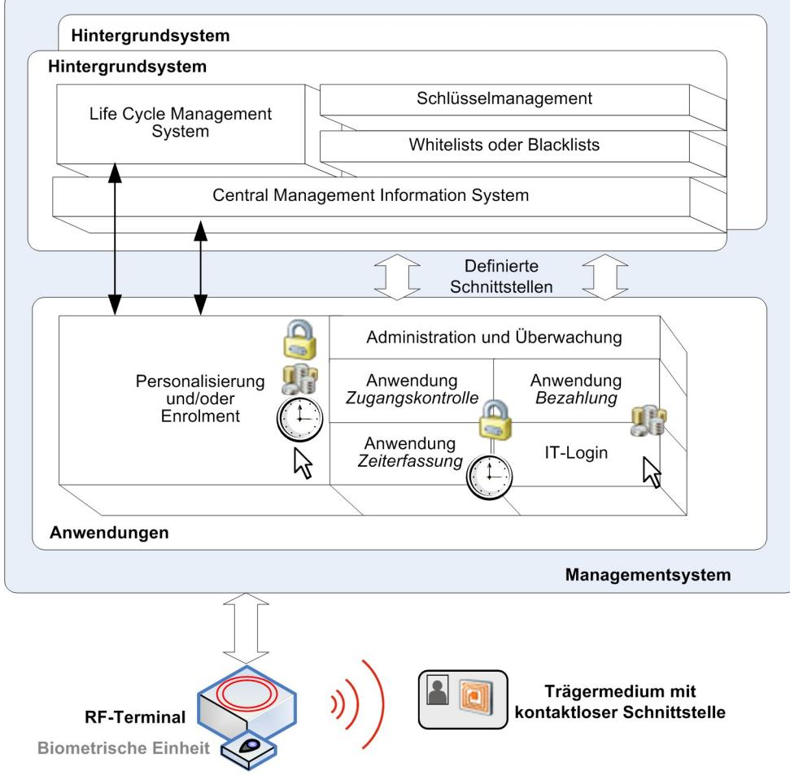

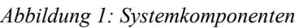

Auf den ersten Blick können drei zentrale Komponenten abstrahiert werden:

- **-** Als Basis für den elektronischen Mitarbeiterausweis ist ein *Trägermedium* mit einer *kontaktlosen Schnittstelle* ausgestattet. Ferner kann dieses Kartenanwendungen, Anwendungsparameter und Berechtigungen enthalten. Für gewöhnlich wird ein individuelles Trägermedium innerhalb einer Organisation ausgestellt oder es kann - sofern es die Anforderungen einer Organisation zulassen - auf ein hoheitliches elektronisches Dokument für eBusiness zurückgegriffen werden (d.h. eine eID-Anwendung, die Sicherheitsmechanismen wie [\[EAC10\]](#page-257-1) oder vergleichbare unterstützt.)
- **-** Das *RF-Terminal[1](#page-14-0)* arbeitet als Schnittstelle zwischen dem Managementsystem, welches alle Anwendungen, relevanten Daten und Funktionen verwaltet, und dem Trägermedium, das die kartenspezifischen Anwendungen und Berechtigungen eines Mitarbeiters auf der anderen Seite enthält.
- **-** Das *Managementsystem* schließt zwei wesentliche untergeordnete Komponenten ein.
	- **-** *Anwendungen* werden in einer Organisation eingeführt, um alle anfallenden Dienste innerhalb dieser Organisation zu verwalten. Dies beinhaltet auch Software zur Personalisierung von neuen elektronischen Mitarbeiterausweisen[2](#page-14-1) und Diensten, die auf Basis technischer, organisatorischer, rechtlicher sowie weiteren Anforderungen bereitgestellt werden. Für diese Softwareanwendungen werden unterschiedliche Berechtigungsniveaus zur Verfügung gestellt. In der vorliegenden Technischen Richtlinie wird insbesondere auf die folgenden Softwareanwendungen im Detail eingegangen:
		- **-** Zugangskontrolle hierunter wird der physische Zugang zu einem Gebäude, Unterabteilungen und/oder sogar zu individuellen Räumen innerhalb einer Organisation gefasst.
		- **-** Zeiterfassung die z. B. die Arbeitsstunden, Verfügbarkeit und/oder Überstunden eines Mitarbeiters erfasst.
		- **-** Bezahlsysteme (zusätzlicher Dienste) für Dienste wie Cafeteria, Kioske, Parkplätze oder andere bargeldlose Dienste.
		- **-** Zugriff auf IT-Systeme kennzeichnet als Erweiterung neben physischen Zugang zu modernen Geschäftsprozessen auch den Zugriff auf elektronische Anwendungen, Funktionen und Daten.
	- **-** Die Verwaltung aller relevanten Daten und Funktionen obliegt dem *Hintergrundsystem*. In vielen Fällen wird das Hintergrundsystem als eine Gesamtlösung durch einen Anbieter bereitgestellt. Jedoch kann sich eine Organisation auch dazu entscheiden, Dienste von verschiedenen Dienstanbietern zur selben Zeit zu kombinieren. Im zweiten Fall kann es sich als vorteilhaft erweisen spezielle Daten auf dem Trägermedium zu speichern, um den Einsatz des Ausweises zwischen verschiedenen Anwendungen zu ermöglichen. Ein genauerer Blick

1 Sofern ein elektronischer Mitarbeiterausweis für biometrische Authentifizierung z. B. durch Fingerabdruckerkennung eingesetzt wird, ist das RF-Terminal mit einer zusätzlichen biometrischen Einheit ausgestattet.

2 Sowie Software für das Enrolment (d.h. Aufnahme) biometrischer Daten, sofern der elektronische Mitarbeiterausweis z. B. mit Fingerabdruckerkennung eingesetzt wird.

auf das Hintergrundsystem enthüllt weitere Unterkomponenten, die in der Regel enthalten sind:

- **-** Life Cycle Management System diese Komponente stellt alle notwendigen Funktionen zur Verfügung, um ein Trägermedium mit kontaktloser Schnittstelle zu personalisieren, konfigurieren oder zu ändern.
- **-** Schlüsselmanagement

beinhaltet alle relevanten Sicherheitsparameter und kryptografischen Schlüssel, die für die Bereitstellung eines bestimmten Sicherheitsniveau erforderlich sind.

**-** Whitelists und Blacklists

umfassen Informationen bezüglich der Aktivierung oder Deaktivierung von Berechtigungen. Falls Offline-Systeme unterstützt werden sollen, müssen die Listen zu den entsprechenden Lesegeräten übertragen werden. Nichtsdestotrotz werden solche Listen eingesetzt, um die Sperrinformationen des eingesetzten Systems zu verwalten.

**-** Central Management Information System stellt alle zentralen Funktionen zur Verfügung, die den Betrieb von unterschiedlichen Anwendungen und Steuerungen der Schnittstellen aller relevanter Systemkomponenten erlauben. Auf diese Weise wird der allgemeine Betrieb des Gesamtsystems sichergestellt.

In Abhängigkeit von den Anforderungen einer Organisation, d.h. welche der zuvor beschriebenen Einsatzszenarien umgesetzt werden, ist das eingesetzte Produkt mit unterschiedlichen Charakteristiken versehen und liegt in verschiedenen Ausgestaltungen vor. In der Folge können alle der zuvor beschriebenen Anwendungen umgesetzt werden, oder es werden ausgewählte Applikationen realisiert. Unterschiede können sich z. B. bezüglich der folgenden Bereiche ergeben:

- **-** Individuelle Personalisierungsanforderungen Produktanbieter können unterschiedliche Methoden für die Personalisierung von Ausweisen zur Verfügung stellen. Ein Trägermedium kann einer bestimmten Person oder Gruppe zugeordnet sein, was mit einer bestimmten Menge an Berechtigungen verbunden ist.
- **-** Speicherung einer Berechtigungsmatrix auf dem Trägermedium oder Speicherung im entsprechenden Managementsystem.
- **-** Schattenkonto oder gespeicherte Bezahleinheit auf einem Trägermedium.
- **-** Speicherung von kryptografischen Schlüsseln, Mechanismen und Parametern.

Ein Trägermedium wird häufig für die Anwendung der Authentifizierung eingesetzt, die basierend auf *Besitz* zusammen mit oder ohne *Wissen* oder *Sein* kombiniert sein kann. Die folgenden Alternativen sind denkbar:

- **-** Ausweis mit kontaktloser Schnittstelle
- **-** Kontaktbehafteter Ausweis[3](#page-15-0)
- **-** Security Token[4](#page-15-1)

3 Diese Alternative wird im Folgenden im Rahmen dieser Technischen Richtlinie nicht weiter betrachtet.

4 Diese Alternative wird im Folgenden im Rahmen dieser Technischen Richtlinie nicht weiter betrachtet.

- **-** Biometrie in Verbindung mit einem elektronischen Mitarbeiterausweis (d.h. biometrische Merkmale werden auf der Karte[5](#page-16-0) oder in einer Referenzdatenbank gespeichert)
- **-** Biometrie ohne die Verwendung eines biometrischen Mitarbeiterausweis[6](#page-16-1)

Für den Einsatz von Biometrie zum Zwecke der Authentifizierung im Kontext eines elektronischen Mitarbeiterausweises existieren verschiedene Optionen. Biometrische Merkmale können entweder auf dem Ausweis oder in einer Referenzdatenbank abgespeichert werden. Detaillierte Informationen bezüglich der verschiedenen biometrischen Verifikationsmethoden können [\[TT06\]](#page-257-5) und [\[BIOP2\]](#page-257-4) entnommen werden. In jedem Fall ist der Betriebsrat oder eine vergleichbare Instanz sowie der Datenschutzbeauftragte der Organisation in den gesamten Prozess von Beginn an mit einzubeziehen. Für umfassende Informationen können die folgenden Dokumente referenziert werden [\(\[TT08\]](#page-257-3) und [\[TT05\]\)](#page-257-2).

Sofern biometrische Merkmale auf dem Trägermedium gespeichert werden, kann die Verifikation entweder auf dem Ausweis d.h. "match-on-card" oder innerhalb eines Lesegeräts vorgenommen werden, wobei der erste Fall zu empfehlen ist. Wird hingegen eine Referenzdatenbank eingesetzt, wird die Verifikation auf Seite des Managementsystems durchgeführt.

# **2.2 Annahmen und Abgrenzung der vorliegenden Technischen Richtlinie**

Im Rahmen der vorliegenden Richtlinie wird ein elektronischer Mitarbeiterausweis betrachtet, der den sicheren Einsatz von RFID-basierten Systemen unterstützt. Die folgende Liste enthält Annahmen und Einschränkungen, die bei der Erstellung dieses Dokumentes Berücksichtigung finden:

- 1. Die Verwendung als Sichtausweis stellt einen wichtigen Anteil eines Identitätsdokumentes dar. Häufig wird ein Lichtbild, welches im Rahmen der Beantragung aufgenommen oder durch den Mitarbeiter zur Verfügung gestellt wird, auf das Dokument aufgebracht. Nichtsdestotrotz spielen die physikalischen Charakteristiken in dieser Richtlinie keine vorgelagerte Rolle und werden daher im Folgenden nicht näher betrachtet.
- 2. Andere Authentifizierungsmechanismen wie sichere Token oder andere Technologien z. B. kontaktbehaftete Chipkarten, Hybridkarten oder Dual-Interface-Karten sind nicht Teil dieser Richtlinie und werden daher nicht weiter betrachtet. Die Entscheidung Duale Interface Karten auszunehmen bedeutet jedoch nicht, dass die Verwendung dieser Art von Karten nicht empfohlen wird. In jedem Fall müssen jedoch zusätzliche Sicherheitsziele beachtet werden.
- 3. Zutrittskontrolle kann als online oder offline System realisiert werden. Während online Systeme eine direkte und schnelle Verbindung zum Managementsystem unterstützen müssen, sind offline oder semi-offline Szenarien nicht direkt verbunden, d.h. entsprechende Lesegeräte sind nicht oder nur zeitweise an das zentrale Managementsystem angebunden. Obwohl offline Systeme in einigen Fällen notwendig sind - z. B. bedingt durch lokale Gegebenheiten wenn keine

5 Die Speicherung auf dem Ausweis bietet den Vorteil, dass sich die biometrischen Daten im Besitz des Inhabers befinden.

6 Für die biometrische Authentifizierung kann eine Referenzdatenbank verwendet werden. In dieser Technischen Richtlinie wird vorrangig die Speicherung auf der Karte berücksichtigt.

Verbindungsmöglichkeit gegeben ist oder bei nur wenigen Benutzern - können sich negative Konsequenzen bezüglich Flexibilität, Einfachheit und der Sicherheit von Anwendungen ergeben. In diesem Fall muss die Aktualität des Berechtigungsmanagements über offline oder semi-offline Lesegeräte unter der Verwendung von Whitelists oder Blacklists etabliert werden. Das Sperren von Berechtigung kann insbesondere mit einer zeitlichen Verzögerung verbunden sein. In der vorliegenden Technischen Richtlinie werden in erster Linie online Szenarien angenommen, während offline Szenarien hauptsächlich betrachtet werden, wenn das Sicherheitsniveau betroffen ist.

- 4. Die Anwendungsszenarien und die Use Cases, die im Folgenden betrachtet werden sind mit personenbezogenen Informationen des Mitarbeiters verbunden. Dies bedeutet, dass Datenschutz sehr wichtig ist und bei jeder Betrachtung berücksichtigt werden muss. Weiterführende Informationen können [\[BK07\]](#page-258-0) entnommen werden.
- 5. Bezahlsysteme können offen oder geschlossen sein (vgl. [\[FI08\]\)](#page-257-6). Ein geschlossenes System kann im Rahmen eines Dienstanbieters eingesetzt werden. In diesem Fall wird der Betrag normalerweise auf dem Trägermedium in Einheiten (Variable) gespeichert. Offene Systeme basieren in der Regel auf internationalen Standards und erlauben es, zwischen verschiedenen Anwendungsanbietern verwendet zu werden. In diesem Fall wird die Abrechnung basierend auf sogenannten Schattenkonten vorgenommen.
- 6. Sofern ein hoheitliches elektronisches Dokument als elektronischer Mitarbeiterausweis verwendet wird, können nur die eID-Anwendung und ggf. eine eSign-Anwendung eingesetzt werden. Die biometrischen Daten, die auf dem Dokument gespeichert sind, können nicht verwendet werden, da Sie ausschließlich für die hoheitliche Verwendung vorbehalten sind.
- 7. Mit einfachen Applikationskarten, die nur eine Anwendung unterstützen, und Multiapplikationskarten, die verschiedene Anwendungen unterstützen können, existieren verschiedene Produkte. Da Organisationen in der Regel elektronische Mitarbeiterausweise in unterschiedlichen Anwendungsszenarien einsetzen, ist die vorliegende Technische Richtlinie vorrangig auf Multiapplikationskarten fokussiert.
- 8. Grundsätzlich können neben den technischen Maßnahmen auch organisatorische Maßnahmen existieren, die ebenfalls in der Lage sind, den entsprechenden Bedrohungen in einer angemessenen Weise entgegenzuwirken. Nichtsdestotrotz werden diese organisatorischen Maßnahmen nicht weiter in dieser Technischen Richtlinie beschrieben.

# **3 Vereinbarungen**

# **3.1 Begriffsdefinitionen**

| Anwendung               | Der elektronische Mitarbeiterausweis unterscheidet zwischen unterschiedlichen Anwendungen. Das Trägermedium mit kontaktloser Schnittstelle schließt Anwendungen ein, die durch einen definierten Sektor (z. B. Dateistruktur auf der Karte) repräsentiert werden und die durch Zugriffskontrolle gesichert werden. Die Anwendung selber schließt beispielsweise sowohl Anwendungsparameter als auch Berechtigungen und zusätzliche Information mit ein. Im Folgenden werden Anwendungen, die auf dem elektronischen Mitarbeiterausweis gespeichert werden, als Kartenanwendungen (card applications) referenziert. Elektronische Mitarbeiterausweise kommunizieren mit Anwendungen der Organisation, die ihrerseits zum Managementsystem zu zählen sind. Dies sind die sogenannten Softwareanwendungen. Da der Speicher des Managementsystems keinen Größenrestriktionen wie bei den Identitätskarten unterworfen ist, kann es vorkommen, dass die Softwareanwendungen sehr groß ausgestaltet sind. |
|-------------------------|-----------------------------------------------------------------------------------------------------------------------------------------------------------------------------------------------------------------------------------------------------------------------------------------------------------------------------------------------------------------------------------------------------------------------------------------------------------------------------------------------------------------------------------------------------------------------------------------------------------------------------------------------------------------------------------------------------------------------------------------------------------------------------------------------------------------------------------------------------------------------------------------------------------------------------------------------------------------------------------------------------------------------------------------------------|
| Einsatzgebiet           | Bereich, in dem die Technische Richtlinie Anwendung finden soll. Höchste Einheit in der Begriffsstruktur. Umfasst eine oder mehrere Anwendungen, die jeweilig zugehörigen Produkte/Dienste und die daraus resultierenden Einsatzszenarien.                                                                                                                                                                                                                                                                                                                                                                                                                                                                                                                                                                                                                                                                                                                                                                                                 |
| Einsatzszenario         | Spezielle Betrachtung des Einsatzgebietes im Hinblick auf die Implementierung spezifischer Produkte bzw. Dienste.                                                                                                                                                                                                                                                                                                                                                                                                                                                                                                                                                                                                                                                                                                                                                                                                                                                                                                                                |
| Authentifizierungsdaten | Authentifizierung kann basierend auf eindeutigen Bezeichnern, kryptographischen Schlüsseln und/oder kryptographischen Funktionen und Parametern durchgeführt werden. Sofern Biometrie angewendet wird, um die Identität einer Person zu verifizieren, kann das biometrische Merkmal z. B. in Form eines Templates sicher auf der Identitätskarte gespeichert werden.                                                                                                                                                                                                                                                                                                                                                                                                                                                                                                                                                                                                                                                                 |
| Mitarbeiterdaten        | Die Mitarbeiterdaten charakterisieren die personenbezogenen Daten, die notwendig sind, um eine elektronische Identität für einen bestimmten Mitarbeiter zu generieren oder die Berechtigungen für diesen Mitarbeiter durchzusetzen. Die Stammdaten werden von der Personalabteilung verwaltet und werden hauptsächlich im Managementsystem hinterlegt. Bedingt durch die Beschränkungen des Trägermediums können ausgewählte personenbezogene Daten auf der Identitätskarte gespeichert werden, z. B. biometrische Daten des Mitarbeiters.                                                                                                                                                                                                                                                                                                                                                                                                                                                                                  |

| Interoperabilität | Interoperabilität bedeutet, dass sich der Aussteller eines elektronischen Mitarbeiterausweises auf Anwendungen, Trägermedien, Kartenlesegeräte (d.h. Terminals) und weitere Komponenten und Dienste stützen kann, die auf international etablierten Standards beruhen.                                                                                                                                                                                                                                                                                                                    |
|-------------------|-------------------------------------------------------------------------------------------------------------------------------------------------------------------------------------------------------------------------------------------------------------------------------------------------------------------------------------------------------------------------------------------------------------------------------------------------------------------------------------------------------------------------------------------------------------------------------------------------------|
| Betriebsprozess   | Umfassender betrieblicher Ablauf in einem Einsatzgebiet von elektronischen Mitarbeiterausweisen. Beispiele sind die Registrierung, die Anwendung einer Berechtigung, zeitweise oder vollständige Aufhebung, d.h. Sperrung usw.                                                                                                                                                                                                                                                                                                                                                               |
| Organisation      | Diese Technische Richtlinie verwendet einen generischen Begriff, der sowohl Unternehmen als auch Behörden mit einschließt. Der Begriff wird im Rahmen dieses Dokumentes verwendet, wo immer beide Instanzen referenziert werden. Die Organisation betreibt das Managementsystem, welches eingesetzt wird, um alle Anwendungen in dieser Organisation zu steuern und überwachen. Darüber hinaus stellt die Organisation die Trägermedien und die Berechtigungen aus.                                                                                                              |
| Nutzdaten         | Mit Nutzdaten werden alle Daten beschrieben, die für eine bestimmte Anwendung oder Dienst erforderlich sind. Die Daten sind entweder auf der elektronischen Identitätskarte oder dem Terminal gespeichert. Dabei kann es sich beispielsweise um eine Berechtigungsmatrix handeln.                                                                                                                                                                                                                                                                                                         |
| Use Case          | Detaillierte Beschreibung eines Ablaufs von Aktivitäten, die einen Teil des Betriebsprozesses ausmachen. Beispiele hierfür bilden die Initialisierung eines Trägermediums und das Laden einer Berechtigung.                                                                                                                                                                                                                                                                                                                                                                                  |
| Terminal          | Ein Terminal beschreibt ein Lesegerät mit dem der elektronische Mitarbeiterausweis ausgelesen wird. Im Rahmen von EAC [EAC10] werden unterschiedliche Arten von Terminals unterschieden. Ein Inspection System wird für öffentliche oder hoheitliche Anwendungen genutzt, während ein Authentisierungsterminal von öffentlichen oder privatwirtschaftlichen Organisationen eingesetzt werden kann. Ferner existieren Signaturterminals, die besondere Sicherheitsanforderungen erfüllen müssen, um eine entsprechende Umgebung für die Signaturerstellung bereitzustellen. |

# **3.2 Generische Modellierung von Rollen und Entitäten**

Die Rollen und Verantwortlichkeiten werden basierend auf den Beschreibungen von Kapitel [2](#page-13-0) dargestellt. Da eine Entität mehr als eine Rolle ausüben kann, wurde eine generische Beschreibung für das Rollenmodell in [Abbildung 2](#page-20-1) gewählt.

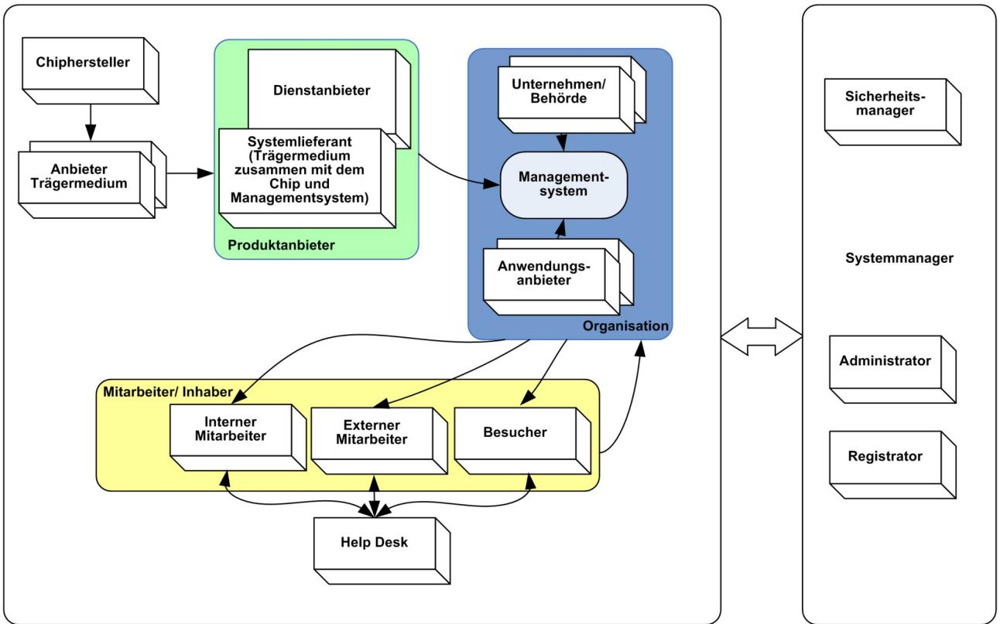

*Abbildung 2: Entitäten im Einsatzgebiet "elektronischer Mitarbeiterausweis"*

#### **Es wurden die folgenden Entitäten identifiziert:**

| Administrator             | Die Rolle des Administrators im Rahmen des Einsatzgebietes "elektronischer Mitarbeiterausweis" ist als sehr komplex anzusehen, da verschiedene Funktionen unterschieden werden müssen. Herzu zählen die Administration der Trägermedien und der damit zusammenhängenden Daten und Anwendungen.   |
|---------------------------|--------------------------------------------------------------------------------------------------------------------------------------------------------------------------------------------------------------------------------------------------------------------------------------------------------------|
| Anbieter von Trägermedien | Der Anbieter von Trägermedien verkauft die Medien an die entsprechenden Organisationen (z. B. Unternehmen und/oder Behörden).                                                                                                                                                                          |
| Anwendungsanbieter        | Der Anwendungsanbieter ist der Inhaber der Anwendungsspezifikation. Die Anwendung ist über definierte Schnittstellen an das zentrale Managementsystem der Organisation (Central Management Information System) angeschlossen. Eine Softwareanwendung kann von der Organisation selber oder durch |

|                 | eine Untereinheit betrieben werden z. B. eine Cafeteria, die der Organisation angegliedert ist.                                                                                                                                                                                                                                                                                                                                                                                                                                                |
|-----------------|---------------------------------------------------------------------------------------------------------------------------------------------------------------------------------------------------------------------------------------------------------------------------------------------------------------------------------------------------------------------------------------------------------------------------------------------------------------------------------------------------------------------------------------------------|
| Behörde         | Behörden, die eine multifunktionale elektronische Identitätskarte in ihren organisatorischen Einheiten einsetzen. Die Behörde betreibt ein zentrales Managementsystem, welches die Gesamtsystemlösung steuert und überwacht.                                                                                                                                                                                                                                                                                                             |
| Besucher        | Person, die der Organisation nicht mittelbar angehört d.h. hierbei handelt es sich nicht um einen internen oder externen Mitarbeiter jedoch steht dieser in Beziehung zu der Organisation. Für die Sichtprüfung wird temporär eine Identitätskarte ausgestellt aber häufig werden keine weiteren Berechtigungen vergeben. In vielen Fällen handelt es sich sogar nur um eine Papierkarte.                                                                                                                                          |
| Chiphersteller  | Der Herausgeber von Chips stellt diese für die elektronischen Mitarbeiterausweise zur Verfügung.                                                                                                                                                                                                                                                                                                                                                                                                                                               |
| Dienstanbieter  | Neben den Systemkomponenten können einem Unternehmen weitere (Management-) Dienstleistungen in Bezug auf den elektronischen Mitarbeiterausweis angeboten werden. Dies ist insbesondere interessant für die Erweiterung und Integration von Anwendungen externer Anbieter, die vom Lieferanten abweichen. Sofern in diesem Zusammenhang der Zugriff auf sensitive personenbezogene Daten notwendig ist, muss dies mit dem Datenschutzbeauftragten und dem Betriebsrat bzw. einer vergleichbaren Instanz abgestimmt werden. |
| Help Desk       | Kontaktstelle (Informationscenter), der Probleme während der Anwendung gemeldet werden können. Das Help Desk arbeitet als Verbindung zwischen den Systemadministratoren und den Anwendern des Trägermediums und kann als First-Level-Support Stelle verstanden werden. Hier können Fragen bezüglich der Anwendung des elektronischen Mitarbeiterausweises gestellt werden.                                                                                                                                                      |
| Inhaber         | Generische Beschreibung der Zuordnung einer Identitätskarte einer Organisation zu einer speziellen Person.                                                                                                                                                                                                                                                                                                                                                                                                                                     |
| Organisation    | Organisationen, die eine multifunktionale elektronische Identitätskarte in ihren organisatorischen Einheiten einsetzen. Die Organisation betreibt ein zentrales Managementsystem, welches die Gesamtsystemlösung steuert und überwacht.                                                                                                                                                                                                                                                                                                  |
| Registrator     | Der Registrator sorgt für die Vergabe eineindeutiger Identifikationsmerkmale im System. Wird benötigt für eineindeutige Identifikation der Entitäten, Trägermedien, Anwendungen und Produkte/Berechtigungen. Sofern Biometrie für eine Identitätskarte angewendet wird, stellt er den Operator des Enrolment Prozesses dar.                                                                                                                                                                                                        |
| Systemlieferant | Ein Systemlieferant bietet eine Systemlösung an, die das Trägermedium mit der kontaktlosen Schnittstelle umfasst. Ferner                                                                                                                                                                                                                                                                                                                                                                                                                       |

|                    | werden die notwendigen Softwarekomponenten, d.h. das Managementsystem für die Lösung angeboten.                                                                                                                                           |
|--------------------|----------------------------------------------------------------------------------------------------------------------------------------------------------------------------------------------------------------------------------------------|
| Sicherheitsmanager | Etabliert und koordiniert die Sicherheitsregeln im System. Ist verantwortlich für die Zulassung der Komponenten des Systems. Überwacht die Durchführung von sicherheitsrelevanten Funktionen (z. B. Schlüsselmanagement).           |
| Systemmanager      | Der Systemmanager sorgt für die Einhaltung der Regeln des Systems. Hierzu bedient er sich der funktionalen Entitäten Sicherheitsmanager und Registrator.                                                                               |
| Unternehmen        | Unternehmen, das eine multifunktionale elektronische Identitätskarte in seinen organisatorischen Einheiten einsetzt. Das Unternehmen betreibt ein zentrales Managementsystem, welches die Gesamtsystemlösung steuert und überwacht. |

#### **Entitäten können die folgenden umfassenden Rollen annehmen:**

| Mitarbeiter     | Hierbei handelt es sich um den Anwender des Trägermediums und der damit verbundenen Dienste. Ein Mitarbeiter erhält Berechtigungen, die im Rahmen der Organisation für die Nutzung entsprechender Dienste eingesetzt werden können. Elektronische Mitarbeiterausweise können an interne und externe Mitarbeiter vergeben werden. Grundsätzlich gilt, dass die Unterscheidung durch die verschiedenen Berechtigungsstufen abgebildet wird.                                                    |
|-----------------|----------------------------------------------------------------------------------------------------------------------------------------------------------------------------------------------------------------------------------------------------------------------------------------------------------------------------------------------------------------------------------------------------------------------------------------------------------------------------------------------------------------|
| Organisation    | Dieser generische Begriff schließt sowohl Unternehmen als auch Behörden mit ein. Der Begriff wird in dieser Richtlinie immer dann verwendet, wenn beide Instanzen gemeint sind. Die Organisation betreibt das Managementsystem, das verwendet wird, um alle Anwendungen innerhalb der Organisation zu steuern und zu überwachen. Ferner gehört es zu den Aufgaben der Organisation, die Trägermedien und die Berechtigungen auszustellen.                                                    |
| Produktanbieter | Generische Beschreibung der organisatorischen Einheiten, die die verschiedenen Hardware und Softwarekomponenten für den elektronischen Mitarbeiterausweis zur Verfügung stellen: Trägermedium mit einem eingebetteten Chip und das Managementsystem einer Organisation.                                                                                                                                                                                                                            |
| beachten sind:  | Weitere Komponenten, die im Rahmen der Beschreibung der Entitäten und Rollen zu                                                                                                                                                                                                                                                                                                                                                                                                                                |
| Anwendung       | Eine Anwendung repräsentiert einen oder mehrere definierte Dienste einer Organisation in denen Funktionen und Strukturen zur Verfügung gestellt werden. Der Zugriff auf und die Ausführung von Anwendungen wird durch Berechtigungen bedingt. Normalerweise wird die Anwendung im Hintergrundsystem, d.h. im Managementsystem, ausgeführt. Die Verbindung zum Managementsystem wird dabei über definierte Schnittstellen realisiert. In einigen Fällen werden Anwendungsparameter auf das |

|                  | Trägermedium geschrieben. Sofern Anwendungen auf dem elektronischen Mitarbeiterausweis referenziert werden, wird der Begriff Kartenanwendung verwendet.                                                                                                                                                                                                                                                                                                                                                                                                                                                                         |
|------------------|---------------------------------------------------------------------------------------------------------------------------------------------------------------------------------------------------------------------------------------------------------------------------------------------------------------------------------------------------------------------------------------------------------------------------------------------------------------------------------------------------------------------------------------------------------------------------------------------------------------------------------------|
| Managementsystem | Das Management stellt das zentrale System der Organisation dar, mit Hilfe dessen alle Applikation administriert werden (vgl. Kapitel 2.1).                                                                                                                                                                                                                                                                                                                                                                                                                                                                                      |
| Trägermedium     | Der elektronische Mitarbeiterausweis stellt ein Medium dar, welches an interne und externe Mitarbeiter ausgegeben wird, um Berechtigungen zu erteilen und Anwendungsparameter auf die Karte zu laden und speichern. Das Trägermedium befindet sich im Besitz des Mitarbeiters und ist erforderlich, um die Berechtigung für die verschiedenen Anwendungen in der Organisation einzusetzen. Andere Bezeichnungen, die in diesem Dokument für das Trägermedium verwendet werden, sind elektronischer Mitarbeiterausweis, Anwenderkarte, elektronische Identitätskarte oder kontaktlose Smartcard bzw. Karte. |

Für die Analyse der Sicherheitsziele (vgl. Kapitel [8.2\)](#page-70-0) hat die Technische Richtlinie drei zentrale Rollen identifiziert, die im Folgenden berücksichtigt werden:

- **-** Produktanbieter
- **-** Organisation
- **-** Mitarbeiter.

# **3.3 Beziehungen zwischen Trägermedien, Anwendungen und Berechtigungen**

Das in Kapitel [3.2](#page-20-0) beschriebene Modell erlaubt es einer Organisation zwischen verschiedenen Produktanbietern zu wählen. Dabei können mehrere Anwendungsanbieter involviert sein.

Als Konsequenz sind verschiedene Trägermedien, Anwendungen und Produkte (weitere Hardware und Softwarekomponenten) erhältlich und können so kombiniert werden, dass ein Unternehmen oder eine Behörde auswählen kann, um die gestellten organisatorischen, technischen und gesetzlichen Anforderungen zu erfüllen. Insbesondere die Anforderungen, die sich aus der individuellen Systemarchitektur ergeben, haben eine große Auswirkung auf das Realisierungskonzept. Ferner müssen sicherheitsrelevante Aspekte berücksichtigt werden, wie es später in dieser Richtlinie der Fall ist.

Für die Authentifizierung eines Mitarbeiters in einem der zugrunde liegenden Einsatzszenarien werden einem Trägermedium – dem elektronischen Mitarbeiterausweis - Berechtigungen zugewiesen. Auf diese Weise können in der Folge die in einer Organisation angebotenen Dienste in Anspruch genommen werden. Eine Berechtigung kann dabei zum Einsatz kommen, um entweder Prozesse in einer Organisation zu optimieren oder ein feingranulares Rechtemanagement zu definieren.

Die Anwendungen stellen alle notwendigen Strukturen und Funktionen zur Verfügung, die benötigt werden, um Berechtigungen im Anwendungsbereich des Trägermediums zu laden, benutzen, sperren, entsperren und zurückzuziehen. Da sich Anforderungen innerhalb einer Organisation ändern können, sollte die Notwendigkeit, neue Anwendungen einzuführen, von Anfang an vorgesehen werden, sofern möglich sollen alle dafür erforderlichen technischen Vorbedingungen berücksichtigt werden.

Folgende Regelungen gelten für die Beziehungen zwischen Trägermedien, Anwendungen und Berechtigungen:

#### Vereinbarungen

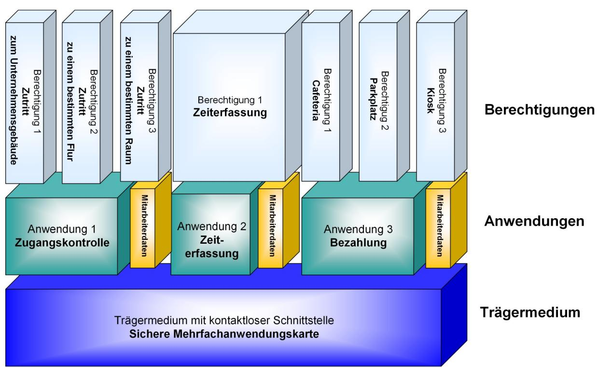

*Abbildung 3: Trägermedium, Anwendungen und Berechtigungen*

# **4 Generelle Anforderungen**

In den folgenden Unterkapiteln wird vorrangig auf den produktspezifischen Einsatz von elektronischen Mitarbeiterausweisen in Bezug auf die Sicherheitsanforderungen eingegangen. Dabei umfassen die Anforderungen das Gesamtsystem sowie die damit verbundenen Prozesse und Komponenten und lassen sich in der Folge in drei Kategorien unterteilen:

- **-** Funktionsumfang
- **-** Wirtschaftlichkeit
- **-** Sicherheit.

# **4.1 Funktion**

Dieser Abschnitt stellt Beispiele bezüglich der Anforderungen der Zielgruppen zur Verfügung.

### **4.1.1 Anforderungen der Mitarbeiter**

Aus Sicht der Inhaber eines elektronischen Mitarbeiterausweises müssen die folgenden beispielhaften Anforderungen erfüllt sein:

- **-** Das Trägermedium muss Zutritt gewähren, basierend auf zugewiesenen Berechtigungen zu aktivierten Anwendungen.
- **-** Das Trägermedium muss robust und zuverlässig sein und dabei mit der erforderlichen Geschwindigkeit arbeiten.
- **-** Das System und das Trägermedium müssen leicht zu bedienen und komfortabel sein, z. B. können Prozesse optimiert und ggf. beschleunigt werden.
- **-** Angemessener Schutz von individuellen personenbezogenen Daten muss sichergestellt werden.
- **-** Unterstützung bei der Anwendung des elektronischen Mitarbeiterausweises muss verfügbar sein, z. B. durch die Einrichtung einer speziellen Webseite in der Organisation.
- **-** Ein Help-Desk muss erreichbar sein, falls Probleme auftreten in Fällen wie zeitweisem oder nicht wiederherstellbarem Verlust des Trägermediums. Ist ein Trägermedium nicht einsatzbereit, so muss ein Ersatz oder eine Ausweichlösung (fallback) bereitgestellt werden.
- **-** Verlässliche Abrechnung im Fall von Bezahlapplikationen.
- **-** Komfortable Ersatzlösungen müssen bereitgestellt werden.

Grundsätzlich sollte der Kunde beim Einsatz von kontaktloser Chiptechnik umfassend über die verwendeten individuellen Daten, die Verwendung dieser Daten, Maßnahmen zum Datenschutz und verbleibende Risiken offen informiert werden. Der Umgang mit den personenbezogenen Daten muss in Abstimmung mit dem Datenschutzbeauftragten erfolgen und ggf. mit dem Betriebsrat oder einer vergleichbaren Instanz abgestimmt werden.

# **4.1.2 Anforderungen der Organisation und des Produktanbieters**

Zur gleichen Zeit müssen die Anforderungen der Organisation und des Produktanbieters erfüllt werden:

Funktionalität

- **-** Zugriff auf Anwendungen einer Organisation dürfen nur für Teilnehmer gewährt werden, die mit einem elektronischen Mitarbeiterausweis ausgestattet sind.
- **-** Präzise Definition von Zugriffssteuerung, Berechtigungen und weiteren Anwendungen muss möglich sein.
- **-** Es muss mit einfachen Mitteln möglich sein, den Mitarbeitern zu erklären, wie das Trägermedium, die Anwendungen und das System an sich anzuwenden sind.
- **-** Die Optimierung von Geschäftsprozessen muss ebenso möglich sein wie die Gewährleistung des erforderlichen Durchsatz.
- **-** Die Anforderungen in Bezug auf die Infrastruktur einer Organisation müssen Beachtung finden
	- **-** Hierzu zählt die individuelle Systemarchitektur mit verschiedenen Rechnersystemen (d.h. Terminals, Notebooks, Server, etc.) und Softwarekomponenten (z. B. Betriebssystemen)
	- **-** Integration von verschiedenen, entfernten und/oder verteilten Netzen
- **-** Es muss möglich sein, Trägermedien und entsprechende Berechtigungen zeitweise oder vollständig zu sperren und ggf. Ersatz auszustellen. Ferner muss es möglich sein ein Trägermedium, welches gesperrt worden ist wieder in Betrieb zu nehmen.

Technische Kompatibilität

- **-** Die Struktur der Trägermediums sollte so angelegt sein, dass weitere Anpassungen und Weiterentwicklungen möglich sind. Auf diese Weise können neue Dienste in einer Organisation etabliert eingeführt werden in denen bereits ein Identifizierungssystem etabliert ist. Dabei können insbesondere Flexibilität. Wiederverwendbarkeit und Investitionssicherheit sichergestellt werden.
- **-** Interoperabilität muss sichergestellt werden, so dass Komponenten der Systemarchitektur ausgetauscht werden können. D.h. ein Lesegerät (Terminal) muss etablierte Kommunikationsstandards unterstützen.

# **4.2 Wirtschaftlichkeit**

Um einen wirtschaftlichen Betrieb des Systems sicherzustellen, ist es erforderlich, dass der kommerzielle Nutzen in jeder Ausbaustufe größer ist als die Kosten für Prozesse, Systeme und die Sicherheit. Dies muss für alle Akteure, die in den Aufbau des Systems investieren, gelten.

Das Gesamtsystem und dessen Komponenten sollten in Konsequenz so ausgelegt werden, dass die Anforderungen der relevanten Einsatzszenarien möglichst effizient erfüllt werden. Deshalb sind zunächst diese Anforderungen möglichst exakt zu bestimmen.

# **4.3 Sicherheit**

Es ist das vorrangige Ziel dieser Technischen Richtlinie, den Anwendern zu ermöglichen, die individuelle Systemarchitektur durch die Anwendung geeigneter Sicherheitsmechanismen zu einer angemessenen Sicherheitsarchitektur zu erweitern. Aus diesem Grund ist es notwendig, die individuellen Anforderungen zu ermitteln und basierend darauf den erforderlichen Schutzbedarf zu bestimmen. Auf Anforderungen zur Sicherheit wird in diesem Dokument insbesondere ab Kapitel [8](#page-68-0) eingegangen.

# **5 Methodik zur Ermittlung der Sicherheitsanforderungen**

# **5.1 Zielsetzung**

Die Technische Richtlinie RFID soll folgenden Zielen dienen:

- **-** Leitfaden für Systemlieferanten und Systemanwender zur sachgerechten Implementierung von spezifischen RFID-Systemlösungen bzgl. Funktions- und Informationssicherheit und Datenschutz.
- **-** Schaffung von Aufmerksamkeit und Transparenz in Bezug auf Sicherheitsaspekte.
- **-** Basis für eine Konformitätserklärung der Systemlieferanten oder Betreiber (d.h. Produktanbieter) und die Vergabe eines Gütesiegels (Zertifikat) durch eine Zertifizierungsstelle.
- **-** Durch die Beschreibung ausgewählter Sicherheitsanforderungen und die Definition begrenzter Freiheitsgrade lassen sich Produkte miteinander vergleichen. In der Folge lassen sich weniger komplexe Konformitätstestfälle spezifizieren. Somit lässt sich ein Ergebnis mit hoher Qualität bei geringeren Kosten erzielen.

Zur Umsetzung dieser Ziele sind folgende Informationen erforderlich:

- **-** Ermittlung der Sicherheitsanforderungen an ein RFID-System für ein gegebenes Einsatzgebiet.
- **-** Benennung der spezifischen Gefährdungen, geeigneter Gegenmaßnahmen und des möglicherweise verbleibenden Restrisikos.
- **-** Definition der Kriterien für eine Konformitätserklärung bzw. Zertifizierung.

Bei der Definition von Maßnahmen und Systemvorschlägen sind nicht nur Sicherheitsaspekte relevant. Vielmehr müssen alle in Kapitel [4](#page-26-0) benannten Anforderungen berücksichtigt werden.

# **5.2 Methodik**

# **5.2.1 Erwägungen zum Umfang der Systembetrachtung**

RFID-basierte Systeme können sehr komplex sein. In den meisten Fällen gehören zur Systemlösung auch viele Komponenten, die nicht mit RFID ausgestattet sind. Auf der anderen Seite dürfen bei der Betrachtung der Systemsicherheit nicht nur das Trägermedium und das Lesegerät berücksichtigt werden.

Die Technische Richtlinie verfolgt das Ziel, dass alle für RFID relevanten Sicherheitsaspekte im Detail mit einbezogen werden. Diese Aspekte hängen stark vom Einsatzgebiet und der jeweiligen Implementierung der Systemlösung ab. Diese Technische Richtlinie enthält daher in der Konsequenz detaillierte Angaben über das Einsatzgebiet und die dazugehörenden Betriebsprozesse (einschließlich der Initialisierung und der Umsetzung des Systems). Die Prozesse decken den gesamten Lebenszyklus eines Trägermediums ab. Basierend auf diesen Prozessen werden Use

Cases bestimmt, die für die Sicherheitsbetrachtung des RFID-Systems relevant sind. Diese Use Cases werden als Grundlage für die Ermittlung von Gefährdungen und eine detaillierte, systemspezifische Sicherheitsbewertung für die mit RFID im Zusammenhang stehenden Bereiche des Systems genutzt. [Abbildung 4](#page-30-0) zeigt diese Vorgehensweise am Beispiel des elektronischen Mitarbeiterausweises.

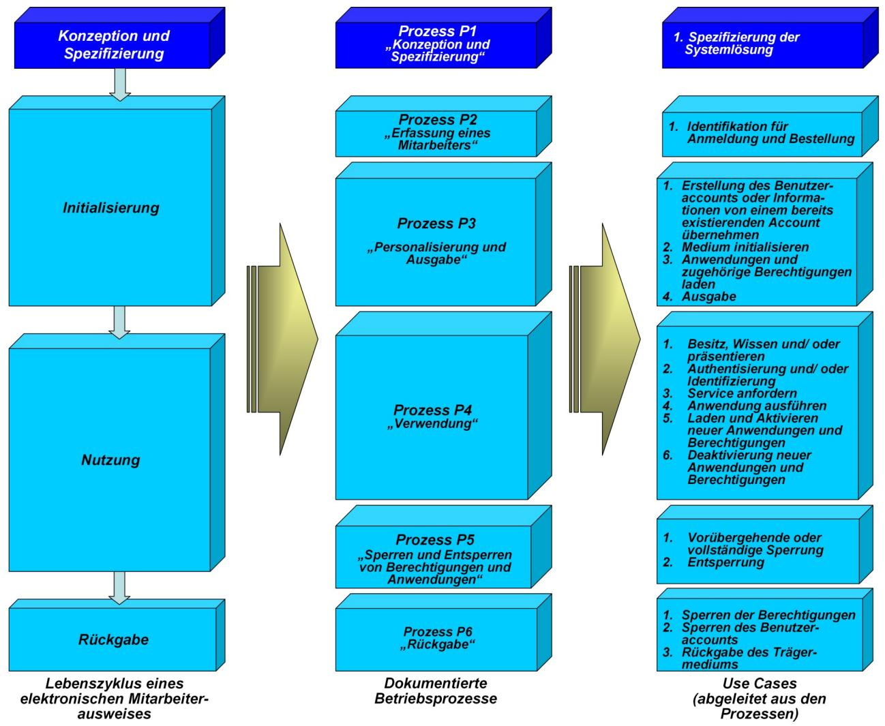

*Abbildung 4: Bestimmung RFID-relevanter Use Cases für den elektronischen Mitarbeiterausweis*

Alle weiteren Systemkomponenten werden nur allgemein behandelt. Die vorgeschlagenen Sicherheitsmaßnahmen basieren auf offenen IT-Sicherheitsstandards.

Dieses Konzept legt den Schwerpunkt der Betrachtung auf die für RFID relevanten Systemteile, nichtsdestotrotz werden alle Sicherheitsaspekte berücksichtigt. Darüber hinaus lässt die Technische Richtlinie auch Raum für individuelle und anwendungsspezifische IT-Implementierungen (spezielle Architekturen und Infrastrukturen, Anwendungen, etc.). Dieser Ansatz unterstützt insbesondere die Erweiterung bestehender Systeme basierend auf der RFID-Technologie.

### **5.2.2 Skalierbarkeit und Flexibilität**

Diese Technischen Richtlinien behandeln in erster Linie Sicherheitsfragen. Parallel muss für alle Implementierungen, die auf dieser Richtlinie aufsetzen, ein wirtschaftlicher Betrieb möglich werden. Daher sollen die folgenden Anforderungen an die Methodik der Richtlinie berücksichtigt werden:

- 1. Es muss möglich sein, Systeme so zu implementieren, dass eine Ausgewogenheit von Kosten und Nutzen erreicht wird. Dies bedeutet in der Praxis, dass die Schutzmaßnahmen den ermittelten Schutzbedarf zwar erfüllen aber nicht übertreffen müssen. Beispiel: Werden nur preiswerte Produkte verwendet, die eine relativ niedrige Sicherheitsanforderung haben, sollten die Schutzmaßnahmen entsprechend gestaltet werden. Dies ermöglicht beispielsweise die Verwendung preiswerter Medien, wodurch sich die Kosten für die Systemimplementierung und den Betrieb verringern.
- 2. Die für die Technische Richtlinie ausgewählten Einsatzszenarios umfassen eine große Bandbreite, von kleinen bis zu landesweiten oder sogar grenzüberschreitenden Anwendungen. Wichtig ist, dass das in der Richtlinie verwendete Konzept für Systemlösungen aller Größen und verschiedener Komplexität geeignet ist.
- 3. In vielen Fällen lässt sich die Wirtschaftlichkeit einer Systemlösung wesentlich leichter durch die Kooperation mit Geschäftspartnern erreichen. Dies gilt insbesondere für Organisationen, die einen elektronischen Mitarbeiterausweis einsetzen, wobei es vorteilhaft sein kann, wenn die Trägermedien bereits bei den Mitarbeitern verfügbar sind (wie Multiapplikationskarten). Diese können für zusätzliche Anwendungen, Produkte und damit verbundene Dienstleistungen genutzt werden, z. B. kann eine Zutrittskarte für die bargeldlose Bezahlung in der Cafeteria dieser Organisation eingesetzt werden. Gleichwohl werden in den meisten Fällen Hintergrundlösungen angewendet.

[Abbildung 5](#page-32-0) zeigt ein Beispiel eines Trägermediums für den elektronischen Mitarbeiterausweis, der Anwendungen von verschiedenen Bereichen vereint.

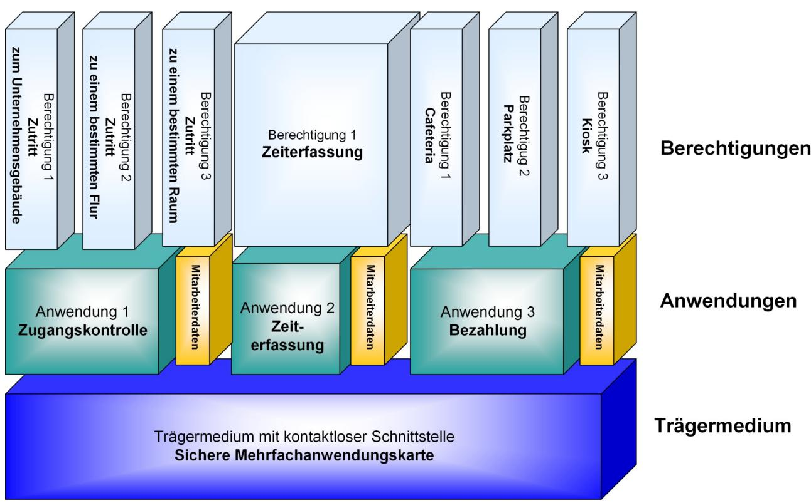

*Abbildung 5: Hierarchisches Konzept für Medien, Anwendungen und Berechtigungen für den elektronischen Mitarbeiterausweis*

Um die genannten Anforderungen zu erfüllen, wird in dieser Technischen Richtlinie folgendes Konzept verwendet:

- 1. Ein geeignetes Rollenmodell (vgl. Kapitel [3\)](#page-18-0) und die Struktur einiger Schlüsselkomponenten (Trägermedium, Terminals und Managementsystem) wurden in Kapitel [2](#page-13-0) beschrieben. Dieses Modell unterstützt einen skalierbaren und erweiterbaren Ansatz.
- 2. Die Technische Richtlinie muss Sicherheitskonzepte anbieten, die alle in einer Infrastruktur verwendeten Kombinationen von Einsatzszenarios und Medien umfassen. Dies wird durch individuelle Sicherheitsbewertungen erreicht, die auf RFID-relevanten Anwendungen beruhen.
- 3. Gleiche Einsatzgebiete (insbesondere beim elektronischen Mitarbeiterausweis), die die Möglichkeit für anwendungsübergreifende Partnerschaften bieten, werden in den entsprechenden Technischen Richtlinien mit so viel Kommunalität wie möglich behandelt. Die Sicherheitsbewertung basiert auf ähnlichen Sicherheitszielen. Die Schutzmaßnahmen verwenden wenn möglich die gleichen Mechanismen.
- 4. Eine besondere Herausforderung besteht bei system- und anwendungsübergreifenden Partnerschaften im Hinblick auf die Systemsicherheit. Es muss gewährleistet sein, dass die Sicherheit eines Systems nicht von den Schwächen eines anderen Systems[7](#page-32-1) negativ beeinflusst wird. Dies erfordert in der Regel eine umfassende Sicherheitsbewertung beider Systeme.

Die Technischen Richtlinien widmen sich diesem Problem durch die Einführung eines skalierbaren und transparenten Konzepts für die Anwendung von Schutzmaßnahmen gegenüber den festgestellten Gefährdungen, den "Schutzbedarfsklassen". Insgesamt werden drei Klassen

7 Hierbei ist die Systemkomponente zu betrachten, die den geringsten Aufwand für einen Angriff bietet.

von 1 (normale Anforderung) bis zu 3 (hohe Anforderung) verwendet. Alle Schutzmaßnahmen werden entsprechend in drei Stufen definiert, von normalem Schutz bis zu erweitertem Schutz.

Bei jeder individuellen Systemimplementierung muss die Schutzbedarfsklasse für jedes Sicherheitsziel definiert werden. Daraus ergibt sich der Umfang der zu treffenden Schutzmaßnahmen.

Dieses Konzept bietet eine einfache Möglichkeit zur Installation einer sicheren Systemkooperation. Es muss lediglich sichergestellt werden, dass die Schutzbedarfsklassen beider Systeme zusammenpassen.

# **5.2.3 Erläuterung des Sicherheitskonzeptes**

Jede Technische Richtlinie, die der TR RFID Familie zugeordnet werden kann, beinhaltet Beispiele, wie Sicherheitsbetrachtungen in Bezug auf spezielle Einsatzszenarien angewendet werden sollen. Diese können an die jeweiligen Anforderungen und Rahmenbedingungen einer speziellen vorliegenden Systemumsetzung angepasst werden (vgl. [\[KOR09\]\)](#page-257-7).

Die Sicherheitsbetrachtungen setzen auf den zugrunde liegenden Systemkomponenten auf. Diese können unterteilt werden in unmittelbare Komponenten der kontaktlosen Schnittstelle,

- **-** das **Trägermedium**, welches Berechtigungen einschließt. Auch solche, die für die zukünftige Aktivierung hinterlegt sind
- **-** die eingesetzten **Terminals** (d.h. Lesegeräte)

und die mittelbaren RFID Komponenten, zu denen die folgenden gehören:

- **-** die **Managementsysteme** (z. B. die Softwareanwendungen und das Hintergrundsystem), sowie
- **-** das **Schlüsselmanagement**, welches stets erforderlich ist.

Basierend auf diesen Komponenten werden verschiedene Arten von Daten verarbeitet, ein Rollenmodell wird definiert und die Funktionen werden beschrieben, die mit diesen Rollen in Beziehung stehen. Ein Überblick dieser Interaktionen wird in [Abbildung 6](#page-33-0) dargestellt.

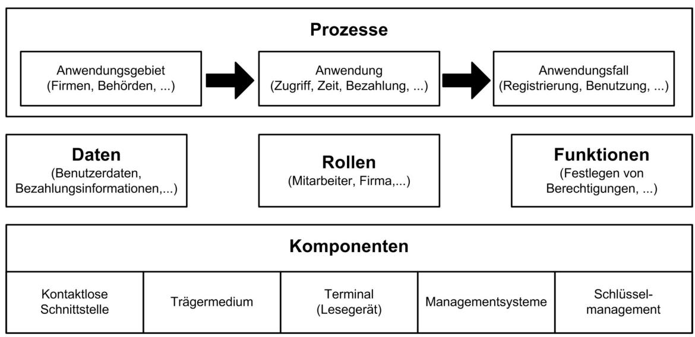

*Abbildung 6: Systemmodell für Sicherheitsbetrachtungen*

Nach der Vorstellung der Ausgangssituation – hierzu zählen in der Hauptsache das Systemmodell (vgl. Kapitel [2\)](#page-13-0) und das Rollenmodell (vgl. Kapitel [3.2\)](#page-20-0) – werden die Prozesse (vgl. Kapitel [6\)](#page-38-0) analysiert und im Detail beschrieben. Basierend auf dem Einsatzgebiet und den damit verbundenen Einsatzszenarien wird die Struktur der Hauptprozesse und der Use Cases (vgl. Kapitel [7\)](#page-50-0) herausgearbeitet. Auf diese Weise erhält man ein Modell, welches es erlaubt, aktive und passive Angriffe zu identifizieren, sowie Bedrohungen, die im Folgenden verwendet werden, um die entsprechenden Schutzmaßnahmen zu beschreiben.

In den folgenden Kapiteln wird ein detaillierter Überblick der Sicherheitsbetrachtung vorgestellt. Weiterführende Informationen können [\[KOR09\]](#page-257-7) entnommen werden.

## **5.2.3.1 Bestimmung der Sicherheitsziele**

Alle Betrachtungen im Rahmen der TR RFID basieren auf der klassischen Definition von Sicherheitszielen wie sie in [Abbildung 7](#page-34-0) dargestellt werden.

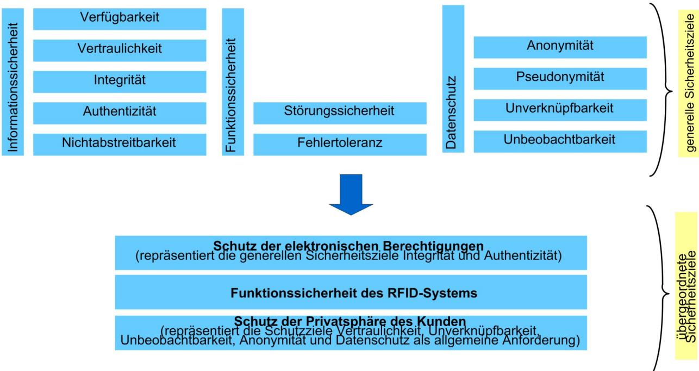

#### *Abbildung 7: Generische Sicherheitsziele*

Insbesondere die übergeordneten Kategorien werden detailliert behandelt:

- **- Informationssicherheit** als Schutz vor beabsichtigten Angriffen
- **- Funktionssicherheit** als Schutz vor unvorhergesehenen Fehlfunktionen
- **- Datenschutz** als Schutz des informationellen Selbstbestimmungsrechts.

In der Folge kann eine Definition von Sicherheitszielen in Abhängigkeit der spezifischen Rollen in Form einer Tabelle (vgl. Tabelle [1\)](#page-71-0) vorgenommen werden, wobei die verschiedenen Absichten der unterschiedlichen Instanzen dargestellt werden.

### **5.2.3.2 Abschätzung des Schutzbedarfs**

Nachdem alle relevanten Sicherheitsziele identifiziert wurden, kann die Auswahl der angemessenen Schutzmaßnahmen angeschlossen werden. Hierzu ist zunächst die Abschätzung des Schutzbedarfs für jedes einzelne Sicherheitsziel vorzunehmen. In diesem Zusammenhang gilt es die Frage zu beantworten, welcher Schaden eintritt, wenn ein bestimmtes Sicherheitsziel verletzt wird. Eine Beeinträchtigung der Sicherheit kann entweder durch Fehlverhalten des IT-Systems selber oder bei beabsichtigten Angriffen auf das System vorliegen.

Die Beantwortung der obigen Frage beruht auf der Abschätzung des Schadens

- **-** basierend auf dem Einsatzszenario oder
- **-** basierend auf den verarbeiteten Informationen.

Als Ergebnis der zuvor beschriebenen Analyse der Sicherheitsziele erhält man eine Schutzbedarfstabelle, die jedem Sicherheitsziel drei Schutzbedarfsklassen zuordnet. Jede Kategorie beschreibt den Schaden, der erwartet wird, wenn das entsprechende Sicherheitsziel verletzt wird.

### **5.2.3.3 Bedrohungsanalyse**

Im vorangegangenen Kapitel [5.2.3.2](#page-35-0) wurde impliziert, dass das betrachtete IT-System durch Bedrohungen beeinflusst wird und sich in der Folge Konsequenzen für die Sicherheitsziele ergeben. Um eine detaillierte Bedrohungsanalyse bezüglich der Systemkomponenten durchführen zu können, muss folgendes beachtet werden:

- **-** Bedrohungen können Auswirkungen auf das Gesamtsystem haben und
- **-** es können sich Auswirkungen für die Schutzbedarfsklasse ergeben, wenn eine bestimmte Bedrohung eintritt.

Unter Einbeziehung von Expertenrunden und etablierten Gefährdungskatalogen erhält man als Ergebnis der Bedrohungsanalyse die relevanten Bedrohungen. Hierbei sind alle Komponenten zu berücksichtigen, die in Zusammenhang mit den Use Cases beschrieben wurden.

Indem alle zuvor beschriebenen Schritte durchlaufen werden, erhält man eine Tabelle bezüglich aller Komponenten. In dieser werden den beeinträchtigten Sicherheitszielen die entsprechenden Bedrohungen gegenübergestellt (vgl. Tabelle [13\)](#page-87-0).

Kapitel [14](#page-260-0) kann ferner eine Übersicht entnommen werden, die die Verbindungen zwischen allen Sicherheitszielen und Bedrohungen darstellt.

### **5.2.3.4 Gesamtbetrachtung der Systemkomponenten**

Im Rahmen der Konzeption der Technischen Richtlinien für den sicheren RFID-Einsatz stellte sich heraus, dass bestimmte Komponenten in allen Anwendungsszenarien zum Einsatz kommen. Hierbei handelt es sich insbesondere um das Hintergrundsystem und das Schlüsselmanagement, die Teil der Infrastruktur sind und auch als "Infrastrukturkomponenten" bezeichnet werden.

In der Folge werden die Sicherheitsbetrachtungen für diese Komponenten auf einer übergreifenden bzw. einer globalen Ebene vorgenommen.

Zur Bestimmung der relevanten Schutzmaßnahmen wurde das folgende Konzept entwickelt:

- 1. Basierend auf den zugrunde liegenden Infrastrukturkomponenten werden den Sicherheitszielen entsprechende Schutzbedarfsklassen zugeordnet.
- 2. Der Schutzbedarf der Sicherheitsziele wird mit den Bedrohungen in Beziehung gesetzt.
- 3. Den ermittelten Bedrohungen werden entgegenwirkende Schutzmaßnahmen zugeordnet.
- 4. Der Schutzbedarf, der sich aufgrund der Bedrohungen ergibt, wird von den Bedrohungen auf die Schutzmaßnahmen übertragen, so dass die Mechanismenstärke festgelegt werden kann.

Sofern die zuvor beschriebenen Schritte in Bezug auf die Infrastrukturkomponenten angewendet werden, ergibt sich eine Tabelle von Schutzmaßnahmen inklusive der entsprechenden Mechanismenstärke. Dabei ist das Ergebnis unabhängig von den Einsatzszenarien.

### **5.2.3.5 Bestimmung anwendungsspezifischer Schutzmaßnahmen**

Neben der Bestimmung der Schutzmaßnahmen für die Infrastrukturkomponenten ist es erforderlich weitere Maßnahmen zu definieren, die in Bezug auf ein bestimmtes Einsatzszenario zu sehen sind. Dies wird wie folgt durchgeführt:

- 1. Es erfolgt eine Zuordnung von Schutzbedarfsklassen im Hinblick auf die Sicherheitsziele vor dem Hintergrund der produktspezifischen Einsatzszenarien.
- 2. Dabei wird der Schutzbedarf der Sicherheitsziele in Abhängigkeit der Bedrohungen festgelegt.
- 3. Den ermittelten Bedrohungen werden entgegenwirkende Schutzmaßnahmen zugeordnet.
- 4. Der Schutzbedarf, der sich aufgrund der Bedrohungen ergibt, wird von den Bedrohungen auf die Schutzmaßnahmen übertragen, so dass die Mechanismenstärke festgelegt werden kann.

Indem die zuvor beschriebenen Schritte auf alle anwendungsspezifischen Komponenten angewendet werden, erhält man eine Tabelle inklusive der entsprechenden Mechanismenstärke. Dies geschieht in Abstimmung mit dem Einsatzszenario.

### **5.2.3.6 Fazit**

Nachdem eine vollständige Beschreibung der Systemarchitektur vorliegt und eine umfassende Sicherheitsanalyse vorgenommen wurde, hält die Technische Richtlinie ein einfach anzuwendendes Maßnahmenbündel bereit, welches auf das entsprechende Einsatzszenario angewendet werden kann.

Hierbei wird das Ziel verfolgt, dass nur dann eine explizite Sicherheitsanalyse vorgenommen werden muss, wenn die zugrunde liegende Infrastruktur oder das betreffende Einsatzszenario signifikante Unterschiede aufweist.

Eine Übersicht zur Vorgehensweise der Sicherheitsbetrachtung ist in Abbildung [8](#page-37-0) dargestellt.

#### Generische Geschäftsprozesse

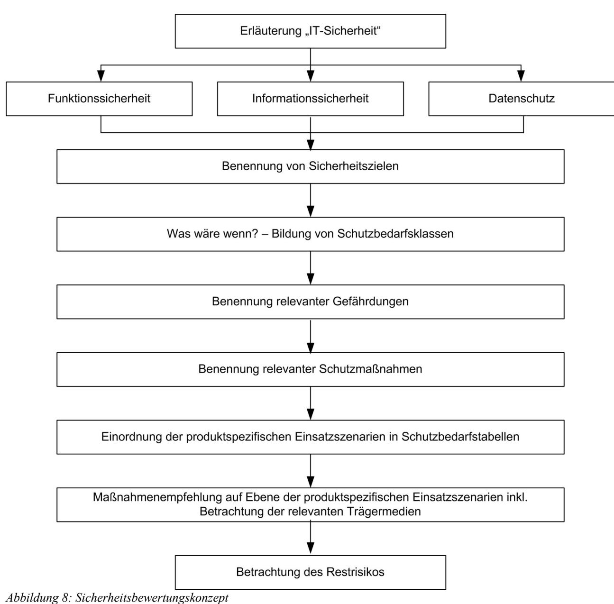

# **6 Generische Geschäftsprozesse**

# **6.1 Prozess 1: Entwurfsphase**

Bevor ein neuer elektronischer Mitarbeiterausweis in einer Organisation eingeführt wird, ist es sehr empfehlenswert, zunächst alle Anforderungen und Vorbedingungen der Systemarchitektur in einer detaillierten Spezifikation zu beschreiben.

Auf diese Weise kann eine angemessene Systemlösung erzielt werden, indem eine detaillierte Analyse vorgenommen wird, die insbesondere auf das Kosten-Nutzen-Verhältnis eingeht. Des weiteren können zukünftige und strategische Ziele beachtet werden, wie z. B. Erweiterbarkeit, Skalierbarkeit und Interoperabilität.

Dieser Ansatz erlaubt es einer Organisation, auf der einen Seite die spezifischen Komponenten, Prozesse und Ressourcen zu ermitteln, die berücksichtigt werden müssen, auf der anderen Seite kann das entsprechende Sicherheitsniveau ermittelt werden (hierauf wird näher in Kapitel [8](#page-68-0) eingegangen). Dabei kann die Machbarkeit der verschiedenen Anforderungen basierend auf den Sicherheitsbetrachtungen überprüft werden, wie sie in der Technischen Richtlinie beschrieben werden.

Das Konzept der Systemlösung sollte einen Plan für die Bereitstellung des Gesamtsystems enthalten. Dies sollte sich von den Lieferzeiten für die gesamte Hardware (z. B. Lesegeräte und Rechnersysteme) und Softwarekomponenten (z. B. Managementsystem und Applikationen der Organisation) bis hin zu den Informationen bezüglich der Komplexität der Integration erstrecken (z. B. Beschreibung und Verbindung der verschiedenen Schnittstellen), die für die Anwendungen in einer Organisation gelten.

# **6.2 Prozess 2: Registrierung eines Mitarbeiters**

Tritt ein neuer Mitarbeiter in eine Organisation ein, so ist seine Arbeit mit verschiedenen Berechtigungsniveaus verbunden. Das Rechtemanagement spiegelt sich häufig im Rahmen der Ausstellung eines elektronischen Mitarbeiterausweises wider. Aus diesem Grund muss sich der Mitarbeiter zu Beginn seiner Beschäftigungsaufnahme registrieren. Sofern Biometrie angewendet wird, ist ein sogenanntes Enrolment notwendig. Basierend auf den Prozessen, die in einem Unternehmen oder einer Behörde etabliert sind, können sich verschiedene Abläufe ergeben.

Grundsätzlich lassen sich zwei unterschiedliche Ansätze verfolgen:

- **-** Eine Organisation kann sich entscheiden, einen eigenen elektronischen Mitarbeiterausweis herauszugeben, der auf einem separaten Trägermedium produziert wird.
- **-** Es kann eine Systemlösung entwickelt werden, die auf einem elektronischen Identitätsdokument aufsetzt, das eine eID-Anwendung[8](#page-38-1) für den eBusiness-Einsatz unterstützt.

Im Folgenden wird ein kurzer Überblick der verschiedenen Ansätze gegeben:

8 Sofern vorhanden, kann ggf. eine eSign-Anwendung für weitere Einsatzszenarien in der Organisation genutzt werden.

#### 1. Service Point (Serviceschalter)

Eine Organisation richtet einen Serviceschalter ein, der mit der Registrierung eines neuen Mitarbeiters beauftragt ist oder die Änderung von Berechtigungen vornimmt. Dabei muss der Mitarbeiter im ersten Schritt ein vorgefertigtes Formular der Organisation ausfüllen, oder es steht alternativ ein elektronisches Terminal für die Informationserfassung bereit. Dem Mitarbeiter werden weitere Informationen zu den Identitätskarten, zum Datenschutz und zum Umgang mit dem Trägermedium zur Verfügung gestellt. Anschließend werden die Daten (sofern sie nicht bereits elektronisch vorliegen) zum Central Management Information System (CMIS) übertragen. Ein elektronischer Mitarbeiterausweis kann darüber hinaus auch im Kontext der Biometrie eingesetzt werden. Als Beispiel kann hier die Fingerabdruckerkennung als eine Möglichkeit herangezogen werden, wobei ein oder mehrere Fingerabdrücke auf der Karte gespeichert werden können. Das Enrolment sollte dabei am Serviceschalter unter Aufsicht des Dienstanbieters durchgeführt werden. Dies ist notwendig, um mit Hilfe von organisatorischen Maßnahmen sicherzustellen, dass ein aktuelles biometrisches Merkmal (z. B. ein Fingerabdruck) eines Mitarbeiters aufgenommen wurde. Beim Einsatz von Biometrie sind die Hinweise von Kapitel [2.1](#page-13-1) zu berücksichtigen.

In jedem Fall ist es jedoch zwingend erforderlich die Identität des Mitarbeiters für die korrekte Zuweisung der Berechtigungen sicherzustellen. Dies kann z. B. durch Vorlage eines Personalausweises oder durch Einbeziehung der Personalabteilung geschehen.

#### 2. Webservice

Die Registrierung eines Mitarbeiters kann auch durch einen automatisierten Webservice der entsprechenden Organisation vorgenommen werden. Dieser Dienst wird durch die Personalabteilung betreut. Dabei werden die notwendigen Antragsdaten über eine spezielle Webseite eingegeben, welche an das Hintergrundsystem angeschlossen ist. Der Identitätscheck wird basierend auf den Stammdaten der Personalabteilung vorgenommen. Sofern Besucher mit einem elektronischen Trägermedium ausgestattet werden sollen, kann dies am Empfang initiiert werden, indem eine entsprechende Webseite der Organisation aufgerufen wird.

#### 3. Webservice mit eID

Falls sich eine Organisation dazu entscheidet, ein hoheitliches Dokument einzubinden, welches für öffentliche Anwendungen zur Verfügung steht (d.h. eBusiness), muss das elektronische Identitätsdokument des Mitarbeiters im CMIS der Organisation registriert werden. Bedingt durch die zugrundeliegenden Sicherheitsmechanismen eines solchen Dokumentes (z. B. Unterstützung der Extended Access Control [\[EAC10\]\)](#page-257-1) kann ein separater Identitätscheck entfallen, da dies bereits im Rahmen der Beantragung des Dokumentes erfolgt ist. Nichtsdestotrotz sollte sichergestellt werden, dass das Dokument noch gültig ist und nicht gesperrt wurde.

Abbildung [9](#page-40-0) gibt einen Überblick der verschiedenen Möglichkeiten zur Registrierung eines Mitarbeiters. Dabei verlangen die Prozesse P2.1 bis P2.4 eine explizite Registrierung eines Mitarbeiters. Dies kann beispielsweise durch einen entsprechenden Nachweis, z. B. den Personalausweis oder ein vergleichbares Dokument, vorgenommen werden.

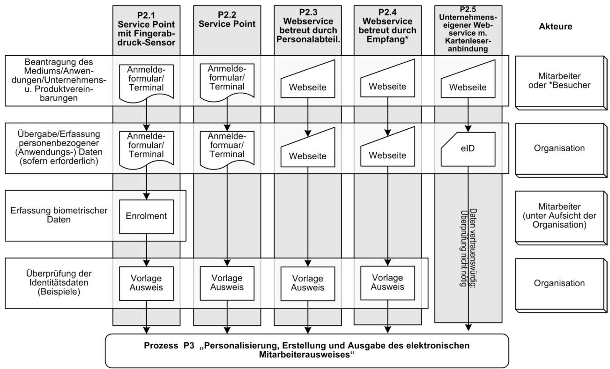

*Abbildung 9: Prozessdarstellung P2 "Registrierung eines Mitarbeiters"*

# **6.3 Prozess 3: Personalisierung und Ausgabe**

Ausgehend von der Prozessbeschreibung P2 "Registrierung eines Mitarbeiters" lassen sich im Folgenden zwei Fälle für die Beantragung eines elektronischen Mitarbeiterausweises unterscheiden:

- 1. Herstellung und Ausgabe eines elektronischen Mitarbeiterausweises basierend auf einem separaten und speziell produzierten Trägermedium (kontaktlose Smartcard oder kontaktlose Multiapplikationskarte).
- 2. Verknüpfung von Berechtigungen mit einer bestehenden eID-Karte.

Die Personalisierung und der spätere Einsatz (vgl. Kapitel [6.4\)](#page-44-0) des Trägermediums erfolgt in Abstimmung mit einem übergreifenden Managementsystem. Dies erfolgt unabhängig von der Art des eingesetzten Trägermediums. In der Regel umfasst das Managementsystem verschiedene Subsysteme. In der vorliegenden Technischen Richtlinie wird eine Unterteilung des Managementsystems wie sie in Kapitel [2.1](#page-13-1) beschrieben wurde angenommen. In der Praxis wird eine Systemlösung meistens aus einer Hand, d.h. von einem Anbieter, bezogen. Dabei bindet die Organisation ihre Anwendungen über definierte Schnittstellen an das Managementsystem an. Das Hintergrundsystem umfasst die folgenden Unterkomponenten:

**-** Anwendungen der Organisation

Eine Anwendung kann sich im Besitz der Organisation befinden oder kann von einem externen Produktanbieter als Dienst angeboten werden. Ein Mitarbeiter benötigt eine bestimmte Berechtigung, um einen Dienst nutzen zu können.

**-** Life Cycle Management System

Die Administration des Trägermediums wird im Rahmen des Life Cycle Management Systems abgebildet. Dabei werden alle benötigten Dienste, die sich auf das Trägermedium auswirken, in diesem Teil zusammengefasst (z. B. Initialisierung, Personalisierung, Nachladen von Daten oder Schreiben von Berechtigungen auf das Trägermedium).

- **-** Schlüsselmanagement Das Schlüsselmanagement stellt alle Funktionen zur Verfügung, die notwendig sind, um die angemessenen Sicherheitsmechanismen umzusetzen.
- **-** Central Management Information System Das CMIS stellt alle Funktionen bereit, die notwendig sind, um das Gesamtsystem zu steuern und zu überwachen.
- **-** Whitelists oder Blacklists Anhand dieser Listen kann der aktuelle Zustand der Berechtigungen innerhalb des Gesamtsystems dargestellt werden. Werden offline oder semi-offline Systeme eingesetzt eignet sich dieser Mechanismus, um das Rechtemanagement innerhalb der Lesegeräte zu aktualisieren.
- **-** Elektronisches Terminal (Elektronisches Lesegerät) Während der elektronische Mitarbeiterausweis die Identität einer bestimmten Person widerspiegelt, ist es die Aufgabe des CMIS, die Verwaltung und Kontrolle des Systems zu übernehmen. Die Kommunikation zwischen diesen beiden Komponenten wird über den Einsatz von Elektronischen Lesegeräten abgebildet. Im Falle von Onlinesystemen besteht eine direkte Verbindung zum Managementsystem von dem aktuelle Informationen empfangen werden. In Offline- oder Semi-Offlinesystemen müssen dem Lesegerät explizite Sperrinformationen vorliegen.

Abbildung [10](#page-42-0) stellt den Prozess zur Personalisierung und Auslieferung (P3) genauer dar und beschreibt dabei die Neubeantragung eines Mitarbeiters mit den damit verbundenen Schritten bis zur anschließenden Auslieferung:

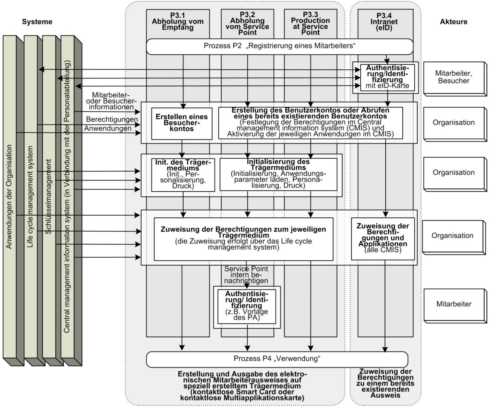

*Abbildung 10: Prozessdarstellung P3 "Personalisierung und Ausgabe"*

Die Ausgabe des elektronischen Mitarbeiterausweises kann wie folgt vorgenommen werden:

1. Abholung am Empfang (für Besucher)

Tritt der Fall ein, dass ein Besucher mit einer elektronischen Identitätskarte einer Organisation ausgestattet werden soll, wie es in Prozess 3.1 beschrieben ist, wird ein Eintrag im Hintergrundsystem vorgenommen, indem ein Besucherkonto angelegt wird. Anschließend kann ein Trägermedium initialisiert und ausgestellt werden. In der Regel werden die Berechtigungen, die für einen Besucher ausgestellt werden, sehr viel restriktiver gehandhabt als die von regulären elektronischen Mitarbeiterausweisen, so dass bestimmte Dienste nur eingeschränkt zur Verfügung stehen. Beispielsweise kann ein Besucher die Bezahlfunktion in der Cafeteria einer Organisation verwenden. Die Beschränkungen können beispielsweise zeitlicher oder örtlicher Natur sein.

2. Service Point (Serviceschalter)

Prozess P3.2 und P3.3 beschreiben den Vorgang, dass ein Ausweis direkt von einem Serviceschalter einer Organisation abgeholt wird. Dabei besteht der Unterschied in der Tatsache, dass der Ausweis unmittelbar vor Ort erstellt wird oder zu einem späteren Zeitpunkt am

Serviceschalter bereitgestellt wird. Im Falle von Prozess P3.2 ist folglich ein zusätzlicher Identitätscheck erforderlich, um sicherzustellen, dass der Ausweis der richtigen Person zugestellt wurde[9](#page-43-0) . Grundsätzlich beginnt der Prozess der Personalisierung für einen Mitarbeiter mit dem Anlegen eines Benutzerkontos im Central Management Information System (CMIS). Dies kann in Abstimmung mit der Personalabteilung im voraus passieren, oder wenn sich der Mitarbeiter am Serviceschalter meldet. Das Trägermedium wird mit Applikationsparametern und Personalisierungsinformationen initialisiert. Unter Berücksichtigung der Softwareanwendungen, des CMIS und des damit verbundenen Schlüsselmanagements können dem Trägermedium Berechtigungen und Kartenanwendungen zugeordnet werden.

#### 3. Verwendung einer bereits vorhandenen eID-Karte

Sofern auf einer eID-Karte eines Mitarbeiters aufgesetzt werden kann – die eBusiness Anwendungen unterstützt – muss kein zusätzliches Dokument ausgestellt werden. Nichtsdestotrotz muss aber auch in diesem Fall ein Benutzerkonto angelegt werden, um die Mitarbeiterdaten verwalten zu können. Auf diese Weise können Berechtigungen und Anwendungen verknüpft und im Managementsystem hinterlegt werden. Die Speicherung dieser Daten kann in der Regel nicht auf dem eID-Dokument vorgenommen werden, da solche Karten in der Regel nicht für beliebige zusätzliche Anwendungen erweiterbar sind.

*Anmerkung:* Aus Datenschutzgründen wird nicht empfohlen, einen nicht autorisierten und im Klartext übertragenen Informationsaustausch zuzulassen, der einem bestimmten Trägermedium (wie beispielsweise einer UID), einer bestimmten Anwendung oder einer bestimmten Gruppe von Anwendern zugeordnet werden kann. Auf diese Weise wird die Möglichkeit, Bewegungsprofile zu erstellen, wahrscheinlicher und für unberechtigte Parteien leichter. Es wird vielmehr empfohlen eine zufällige ID zur Auswahl des Trägermediums zu wählen und die Authentifizierung mit einem geheimen Schlüssel vorzunehmen, der sich eine verschlüsselte Kommunikation anschließt. Somit kann Vertraulichkeit der ausgetauschten Daten sichergestellt werden, um die eindeutige Information des Trägermediums – wie beispielsweise die UID - abzufragen.

Fehlerfälle werden nicht weiter betrachtet.

9 Anmerkung: Hierbei ist anzumerken, dass dies für Prozess P3.3 bereits im Rahmen von Prozess P2.2 ausgeführt wurde.

# **6.4 Prozess P4: Verwendung**

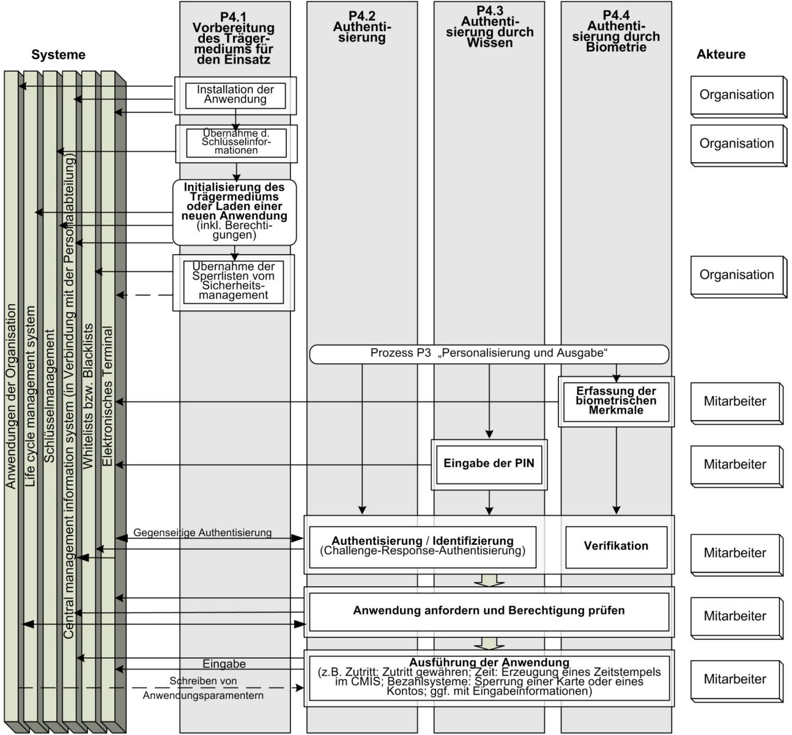

*Abbildung 11: Prozessdarstellung P4 "Verwendung"*

Nachdem ein Mitarbeiter den elektronischen Mitarbeiterausweis mit den zugewiesenen Anwendungen und entsprechenden gültigen Berechtigungen erhalten hat (vgl. Prozess P3) und die zugrunde liegende Systeminfrastruktur für die Anwendungen aufgebaut ist, können die Dienste der Organisation genutzt werden. Sofern ein offline oder semi-offline Szenario zugrunde gelegt wird, sind den Kartenlesegeräten entsprechende Sperrinformationen bekannt zu machen.

Für eine korrekte Anwendung muss der Mitarbeiter seine Berechtigungen mit Hilfe seines Ausweises an den Lesegeräten der Organisation vorzeigen.

Sofern eine eID-Karte des Mitarbeiters für die Authentisierung verwendet wird, kann auf Besitz (d.h. das hoheitliche Dokument) und Wissen (d.h. die geheime PIN) abgestellt werden. Auf diese Weise kann sichergestellt werden, dass nur berechtigte Mitarbeiter Zugriff auf die Dienste erhalten.

Wird ein separater elektronischer Mitarbeiterausweis genutzt, sind grundsätzlich drei verschiedene Authentisierungsmethoden denkbar. Ausgehend vom geforderten Sicherheitsniveau kann zwischen den Methoden Besitz, Besitz und Wissen, oder Besitz und Sein gewählt werden. Dabei wird die Identität des Mitarbeiters und/oder seine Berechtigungen überprüft. Fallen alle Prüfschritte erfolgreich aus, wird der Zugriff auf die Anwendung gewährt.

In vielen Fällen beschränkt sich die vordergründige Ausführung der Anwendung hauptsächlich auf den Authentisierungsprozess, da die weitere Ausführung der Anwendung im Bereich des Managementsystems angesiedelt ist. In einigen Fällen kann aber auch eine Ausführung innerhalb der Karte erforderlich werden. Als ein Beispiel kann die Bezahlfunktion herangezogen werden. In diesem Einsatzszenario sind zwei verschiedene Alternativen möglich. Die Anwendung kann entweder hauptsächlich auf der Seite des Managementsystems ausgeführt werden, indem ein Schattenkonto im Hintergrundsystem mitgeführt wird, oder es kann eine Funktion auf der Karte zur Verfügung gestellt werden, bei der ein bestimmter Betrag von Bezahleinheiten geladen wird. Dieser Betrag wird reduziert, sofern eine Bezahlung durchgeführt wird. Bedingt durch die Tatsache, dass sich Bedingungen in einer Organisation verändern können, gilt dieses auch für Anwendungen und Berechtigungen im Laufe der Zeit. Dies bedeutet, dass neue Anwendungen eingeführt werden oder entsprechende Berechtigungen angepasst werden müssen oder es geschieht das Gegenteil, dass Anwendungen eingestellt werden. Daher ist es sinnvoll, Funktionalitäten zum Laden und Aktivieren von neuen Anwendungen zu etablieren, sowie Funktionen, die die Deaktivierung von Anwendungen und Berechtigungen vornehmen können. Eine Übersicht zu diesen Prozessen kann der Abbildung [12](#page-46-0) entnommen werden.

Fehlerfälle werden in diesem Zusammenhang nicht betrachtet.

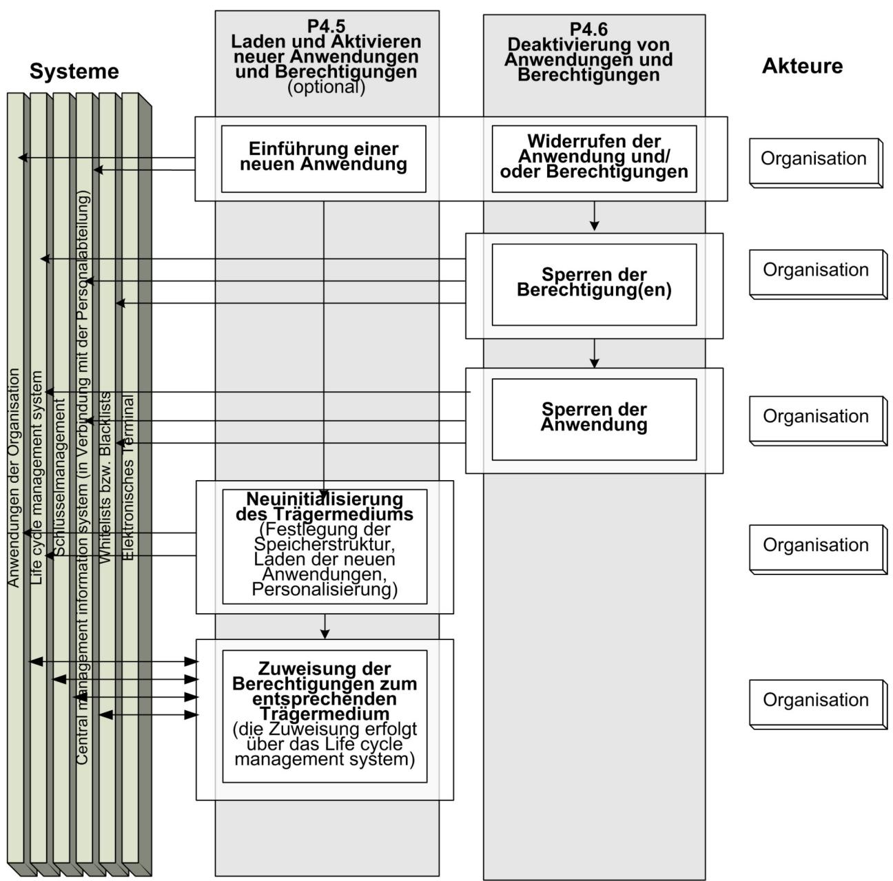

*Abbildung 12: Prozessdarstellung P4 "Verwendung" (Aktivieren und Deaktivieren)*

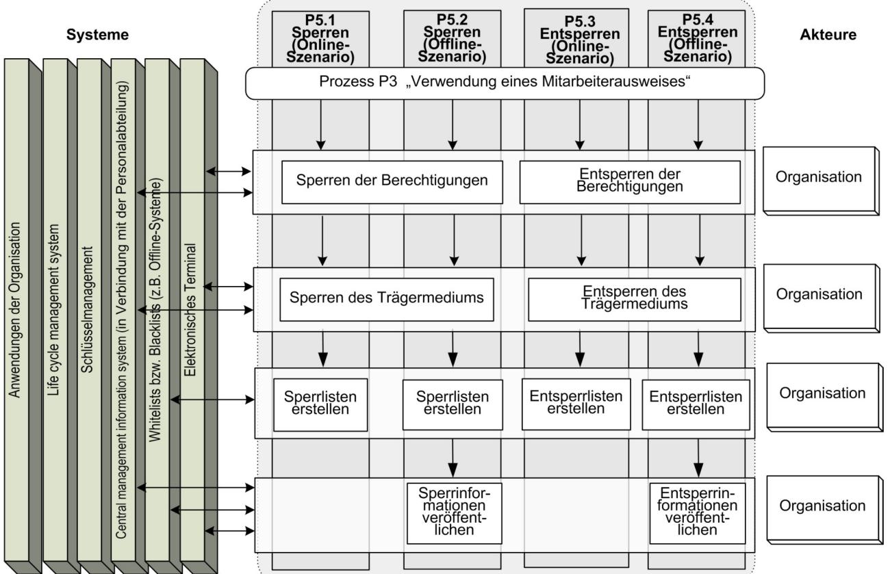

# **6.5 Prozess 5: Sperren und Entsperren**

*Abbildung 13: Prozessdarstellung P5 "Sperren und Entsperren von Berechtigungen"*

Um den Zustand von Anwendungen und Berechtigungen von elektronischen Mitarbeiterausweisen genauer kontrollieren zu können, ist die Bereitstellung von Mechanismen, die das sichere Sperren und Entsperren von Anwendungen und Trägermedien erlauben, von Vorteil. So wird der Prozess zum Sperren und Austauschen von Trägermedien und Berechtigungen möglich, und verloren gegangene Ausweise können ersetzt werden. Häufig tritt in Unternehmen der Fall ein, dass ein Mitarbeiterausweis lediglich zeitweise nicht zur Verfügung steht, was dazu führt, dass Ersatzlösungen – wie die Ausstellung einer Ersatzausweiskarte – vorgesehen werden. Wird eine solche Ersatzausweiskarte einem Mitarbeiter mit den entsprechenden Berechtigungen ausgestellt, so wird dieser Vorgang im entsprechenden Benutzerkonto protokolliert.

Grundsätzlich lassen sich zwei Vorgehensweisen unterscheiden:

- 1. Ein Trägermedium wird zeitweise gesperrt, weil es dem Mitarbeiter nicht zur Verfügung steht (z. B. hat der Mitarbeiter seinen Ausweis zu Hause vergessen). In diesem Fall kann ggf. eine Protokollierung der Kartenaktivitäten vorgenommen werden, wenn zwei Karten einem Mitarbeiter zugewiesen sind (die temporär aktivierte Karte und die temporär deaktivierte Karte).
- 2. Ein Trägermedium wurde verloren und wird daher vollständig gesperrt (d.h. es wird keine Entsperrung vorgesehen). In diesem Fall (Prozess P6) muss eine Deregistrierung vorgenommen werden und eine neue Karte wird ausgestellt (vgl. Prozess P2).

Für den Vorgang des Sperrens und Entsperrens können zwei unterschiedliche Szenarien betrachtet werden. Arbeitet das System als Online-System, so kann die Sperrinformation in einer Liste innerhalb des CMIS vorgehalten werden, und kann so von den angeschlossenen elektronischen Terminals abgerufen werden. Im Falle eines Offline-Szenarios muss die Sperrinformation anderweitig durch einen manuellen Prozess den Lesegeräten bekannt gemacht werden.

# **6.6 Prozess P6: Rückgabe**

Verlässt ein Mitarbeiter eine Organisation, so muss er das Trägermedium mit den darin eingeschlossenen Berechtigungen und Anwendungen abgeben und das Benutzerkonto wird geschlossen. Der Prozess ist in Abbildung [14](#page-48-0) dargestellt.

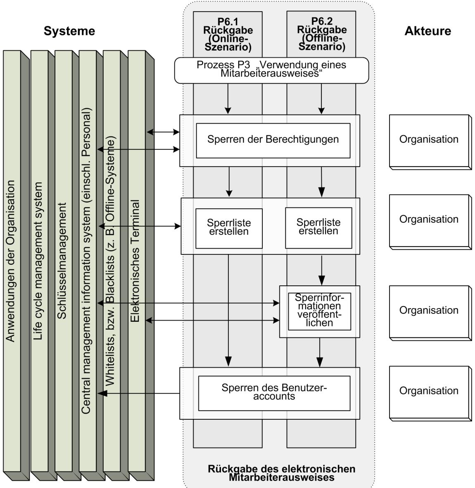

*Abbildung 14: Prozessdarstellung P6: "Rückgabe"*

Zunächst werden alle Berechtigungen gesperrt – sofern dies nicht bereits zuvor geschehen ist. Dabei werden die Sperrinformation in einer Liste bereitgestellt und dem Gesamtsystem zugänglich gemacht, so dass der betreffende elektronische Mitarbeiterausweis nicht mehr weiter eingesetzt werden kann. Die explizite Verbreitung der Sperrinformationen ist insbesondere dann wichtig, wenn es sich bei der Systeminfrastruktur um ein Offline-Szenario handelt. Anschließend ist das Benutzerkonto zu schließen. Der Prozess der Deregistrierung endet mit der Rückgabe des Trägermediums, z. B. wenn ein Mitarbeiter das Unternehmen verlässt.

Liegt ein Verlust des Trägermediums vor, so wird ein zusätzlicher Eintrag im Benutzerkonto vorgenommen, und es wird respektive ein Eintrag im CMIS vorgenommen.

# **7 Use Cases**

In diesem Abschnitt werden die gebräuchlichsten Use Cases beschrieben, die bei Anwendung eines elektronischen Mitbareiterausweises auftreten. Dabei wird insbesondere das Trägermedium mit seiner kontaktlosen Schnittstelle im Detail betrachtet sowie die Interaktion mit weiteren Komponenten. Die Use Cases wurden dabei von den zuvor beschrieben Prozessen des Kapitels [6](#page-38-0) abgeleitet.

Da die Implementierung des Managementsystems und der damit verbundenen Anwendungen zu einem großen Grad von der Lösung des entsprechenden Anbieters abhängt, besitzen die folgenden Use Cases beispielhaften Charakter und zeigen eine mögliche Architektur auf, die zu einem späteren Zeitpunkt in Kapitel 10 erneut aufgegriffen wird.

In der vorliegenden Technischen Richtlinie finden die folgenden Use Cases Berücksichtigung:

- **•** Enrolment (optional: Verwendung von Biometrie)
- **•** Identifizierung eines Mitarbeiters
- **•** Benutzerkonto erstellen oder Abrufen eines bereits existierenden Benutzerkontos
- **•** Initialisierung des Trägermediums
- **•** Ausgabe
- **•** Authentisierung
- **•** Zuweisung einer Berechtigung
- **•** Laden und Aktivieren neuer Anwendungen
- **•** Deaktivieren von Anwendungen und Berechtigungen
- **•** Sperren
- **•** Entsperren
- **•** Schlüsselmanagement
	- **◦** Schlüsselmanagement für das Initialisieren des Trägermediums
	- **◦** Schlüsselmanagement für das Aufbringen und Personalisieren der Anwendungen
	- **◦** Schlüsselmanagement zum Einbringen der Berechtigungen
	- **◦** Schlüsselmanagement für die Nutzung innerhalb der Organisation
- **•** Deregistrierung (Abmeldung)

# **7.1 Use Case "Enrolment"**

Grundsätzlich gilt, dass die Erfassung von biometrischen Merkmalen in Abstimmung mit dem Betriebsrat oder einer vergleichbaren Instanz und dem Datenschutzbeauftragten der Organisation erfolgen muss. Die Aufnahme sollte dabei auf einem Rechnersystem vorgenommen werden, welches unter der Hoheit des Sicherheitsmanagers steht und auf das nur durch eine entsprechende Berechtigung zugegriffen werden kann.

Im Folgenden wird ein Beispiel basierend auf der Fingerabdruckerkennung vorgestellt. Weiterführende Informationen für den Aufnahmeprozess können [\[TT05\]](#page-257-2) und [\[TT08\]](#page-257-3) entnommen werden. Ein Lesegerät mit einer biometrischen Einheit ist dem Rechnersystem angeschlossen und eine Enrolment Applikation ist ebenfalls installiert, die ausschließlich durch den Sicherheitsmanager bedient wird. Es erfolgt die Codierung der Fingerabdrücke auf einer Ausweiskarte, die sich im Lesebereich des elektronischen Terminals befindet. Beispielsweise werden ein oder zwei Fingerabdrücke über den angeschlossenen Sensor aufgenommen und in die Karte als Referenzmuster importiert. Dies erfolgt unter Berücksichtigung der Enrolment Applikation. Die Aufnahme eines zweiten Fingerabdrucks kann für die Etablierung einer Ersatzlösung herangezogen werden, so dass ein Finger verglichen werden kann, wenn der andere Finger verletzt ist.

Der Sicherheitsmanager muss durch organisatorische Maßnahmen sicherstellen, dass die Erfassung korrekt abgelaufen ist, z. B. dass die beantragenden Personen keine nachgemachten Finger einsetzen. Die Beschreibung der organisatorischen Maßnahmen ist nicht Bestandteil dieser Technischen Richtlinie.

# **7.2 Use Case "Identifizierung eines Mitarbeiters"**

In einer Organisation werden einem Mitarbeiter Berechtigungen zugewiesen, um Zugriff auf die Anwendungen zu gewähren. Deshalb ist es wichtig, dass sichergestellt wird, dass eine elektronische Identität der richtigen Person zugeordnet wird. In der Folge hängt die Zuverlässigkeit der Mitarbeiterdaten und der korrekten Anwendung eines elektronischen Mitarbeiterausweises von einer erfolgreichen Identifizierung und Authentisierung der entsprechenden Person ab. Die Identifizierung ist in den Prozessen P2.1 – P2.5 dargestellt, wobei im letzten Fall eine implizite Authentisierung angenommen wird, wenn eine eID-Anwendung zugrunde gelegt wird. In den anderen Fällen wird eine Identifizierung z. B. aufgrund eines Personalausweises ausgeführt. Durch die Anwendung vertrauenswürdiger Prozesse wird ein Anstieg der Sicherheit angestrebt.

# **7.3 Use Case "Benutzerkonto neu erstellen oder Abrufen eines bereits existierenden Benutzerkontos"**

Da die Ausstellung von Berechtigungen in einer Organisation normalerweise langfristig erfolgt, wird das Trägermedium in der Regel nicht nur für einige wenige sondern zahlreiche Authentisierungsvorgänge eingesetzt. Dies kann die Speicherung von Mitarbeiterdaten (und ggf. personenbezogene Daten des Mitarbeiters, falls dies abgestimmt ist) erfordern, die im Rahmen der Registrierung (vgl. Kapitel [6.2\)](#page-38-2) insbesondere unter Berücksichtigung des Managementsystems erfasst wurden.

Grundsätzlich gilt, dass Mitarbeiterdaten entweder im Trägermedium oder im Managementsystem gespeichert werden können. Die Entscheidung für die eine oder andere Alternative hängt stark von den Anforderungen der Organisation ab. Da der Platz zur Speicherung von Daten auf einem Trägermedium beschränkt ist und eID Dokumente in der Regel keine Möglichkeiten zur Speicherung unterstützen, bezieht sich diese Technische Richtlinie hauptsächlich auf Ansätze, die die Speicherung von Mitarbeiterdaten im Managementsystem vorsehen.

Die zentralen Daten werden elektronisch übertragen und einem Benutzerkonto zugewiesen, das zuvor angelegt wurde. Dies bedeutet in der Folge, dass das Managementsystem als "Gegenstelle" zum Trägermedium arbeitet, indem es die Administration von wichtigen Daten, Funktionen und Anwendungen für einen Mitarbeiter übernimmt.

Sofern hoheitliche eID Dokumente in einer Organisation eingesetzt werden sollen, müssen weitere Anforderungen umgesetzt werden. Beispielsweise basiert der neue Deutsche Personalausweis (eID Dokument für die Verwendung in öffentlichen Bereichen) auf [\[EAC10\].](#page-257-1) Soll die eID Anwendung in einer Organisation genutzt werden, muss das Unternehmen oder die Behörde ein Zertifikat beantragen, welches die entsprechenden Berechtigungen für die gewünschte Anwendung beinhaltet. Mit diesem Zertifikat und der Zustimmung des Karteninhabers (welche durch die Eingabe einer persönlichen PIN gegeben wird) können Dienste und Anwendungen in einer Organisation genutzt werden. Beispielsweise können ausgewählte Daten zwischen dem eID Dokument eines Karteninhabers und der Organisation ausgetauscht werden, welche mit dem Benutzerkonto verarbeitet werden.

# **7.4 Use Case "Initialisierung des Trägermediums"**

Sofern ein separates Identitätsdokument als elektronischer Mitarbeiterausweis in einer Organisation eingesetzt wird, muss dieses für den jeweiligen Mitarbeiter initialisiert und personalisiert werden. Alle Funktionen, die zur Initialisierung und für das weitere Management des Trägermediums eingesetzt werden, sind Bestandteil des Life Cycle Management Systems. In vielen Fällen sind die Trägermedien leer, wenn sie initialisiert und personalisiert werden. Die visuellen Eigenschaften wie z. B. das Lichtbild eines Mitarbeiters können ggf. vor oder nach dem Prozess aufgetragen werden.

Während mit der Initialisierung allgemeine Daten verbunden sind (z. B. die Struktur, die durch die Organisation zugrunde gelegt wird), werden während der Personalisierung personenbezogene Daten und kryptographische Parameter, wie z. B. individuelle Schlüssel auf das Trägermedium geschrieben.

Der Use Case "Initialisierung des Trägermediums" umfasst die folgenden Phasen:

1. Spezifikation der Struktur des Trägermediums

- **-** Setzen der Dateistruktur (z. B. master files und ggf. elementary files), die im Unternehmen zugrunde gelegt wird.
- **-** Einrichten einer Access Control List (Zugriffskontrollliste), welche später unter Berücksichtigung der Berechtigungen den Zugriff auf die Anwendungen regelt.
- **-** Setzen eines Administratorschlüssels, der dem Sicherheitsmanager Zugriff auf das Trägermedium gewährt.
- **-** Registrierung des Trägermediums für einen bestimmten Mitarbeiter im Managementsystem (d.h. es wird einem bestimmten Benutzerkonto zugeordnet).
- **-** Anmerkung: es kann vorteilhaft sein, das Trägermedium bereits auf zukünftige Anwendungen vorzubereiten.
- 2. Anlegen von Kartenanwendungen (CREATE)
	- **-** Speichern der relevanten Kartenanwendungen (elementary files) auf dem Trägermedium. Dies beinhaltet die individuellen Strukturen (dedicated files) und die ID, die für eine bestimmte Anwendung definiert wurden.
	- **-** Registrierung der Anwendungen im Benutzerkonto. Auf diese Weise wird die logische Verbindung zwischen dem Benutzerkonto und den Kartenanwendungen auf dem Trägermedium hergestellt. Dies ist im Hinblick auf die spätere Anwendung wichtig, z. B. wenn der elektronische Mitarbeiterausweis verloren wird und die damit verknüpften Anwendungen und Berechtigungen gesperrt werden sollen.
	- **-** Generierung und Speicherung von kryptographischen Schlüsseln für den Administrator im Hinblick auf die Kartenanwendungen.
- 3. Aktualisierung (UPDATE)
	- **-** Nachdem die Struktur eine Anwendung angelegt wurde, können die Anwendungsparameter und zusätzliche Daten geladen werden. Dabei kann es sich um Daten in Bezug auf den Mitarbeiter und/oder IDs handeln, die für einen bestimmten Dienst verwendet werden. Diese Daten werden in Abstimmung mit der Personalabteilung und dem Datenschutzbeauftragten mit dem Benutzerkonto abgeglichen.
	- **-** Die Berechtigungen werden zugewiesen und anschließend aktiviert.
	- **-** Es werden spezielle kryptographische Schlüssel für den Mitarbeiter generiert und auf das Trägermedium geschrieben.

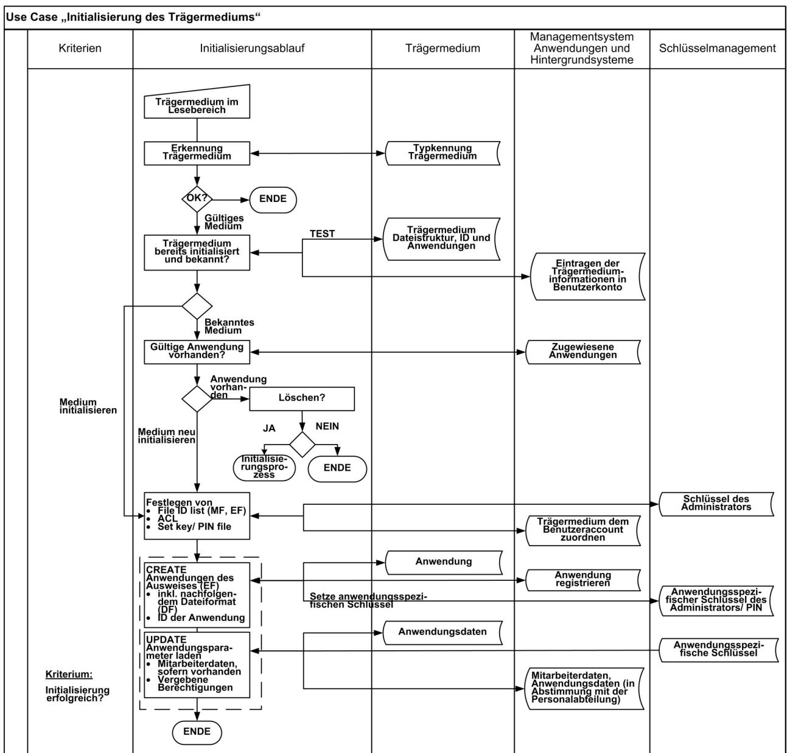

*Abbildung 15: Use Case "Initialisierung des Trägermediums"*

Der *Administratorschlüssel* wird für die generelle Administration der Kartenstruktur verwendet und erlaubt die Etablierung einer angemessenen Access Control List (ACL – Zugriffskontrollliste).

Mit dem *anwendungsspezifischen Schlüssel des Administrators* wird ein Schlüssel für eine bestimmte Anwendung beschrieben, die dem Anwendungsanbieter zuzuordnen ist. Der Schlüssel wird für die Administration der Anwendung herangezogen.

Der *anwendungsspezifische Schlüssel* wird für die Ausführung einer bestimmten Anwendung verwendet.

# **7.5 Use Case "Ausgabe"**

Nachdem ein Trägermedium vollständig initialisiert und mit Berechtigungen ausgestattet wurde, wird es dem Mitarbeiter übergeben. Dafür wird der elektronische Mitarbeiterausweis dem Serviceschalter zugestellt oder direkt vor Ort hergestellt. Dies wird in den Prozessen P3.1 – P3.3 dargestellt. Nachdem das Trägermedium in den Besitz des Karteninhabers übergegangen ist, wird dieser Vorgang durch den Systemmanager im Managementsystem protokolliert, so dass entweder die Übergabe oder die Ausstellung einer neuen Karte nach Verlust oder Beschädigung eingetragen wird.

Im Falle, dass ein hoheitliches eID Dokument eingesetzt wird, kommt der vorliegende Use Case nicht zum Tragen, da sich das Dokument bereits im Besitz des Karteninhabers befindet.

# **7.6 Use Case "Authentisierung"**

Eine Authentisierung muss immer vorgenommen werden, um ein elektronisches Lesegerät in die Lage zu versetzen, zu prüfen, ob ein Mitarbeiter die Berechtigung für eine bestimmte Anwendung besitzt.

Basierend auf den Anforderungen der Organisation wird eine Authentisierung eines Karteninhabers durchgeführt, die auf dem folgenden beruht:

- **-** Besitz,
- **-** Besitz und Wissen, oder
- **-** Besitz und Sein
	- **-** Eine Verifikation kann auf dem Trägermedium durchgeführt werden (match-on-card) oder in einem Lesegerät bzw. dem Managementsystem.

Sofern die Authentisierung erfolgreich abläuft, kann auf die Anwendung zugegriffen werden, und es erfolgt eine gegenseitige Authentisierung zwischen dem Trägermedium und dem Terminal.

Anschließend können die Berechtigungen für diese Anwendung überprüft werden und die Anwendung kann ausgeführt werden.

In vielen Fällen reicht bereits eine einfache Authentisierung des Mitarbeiters aus, weil die Anwendungslogik im Managementsystem hinterlegt ist. Nichtsdestotrotz gibt es Anwendungen wie z. B. Bezahlanwendungen die weitere Prozessschritte benötigen. Sofern während der Anwendung Probleme auftreten wird ein Fehler angezeigt, und der Anwender muss sich mit dem Help-Desk für die weitere Unterstützung in Verbindung setzen.

Diese Technische Richtlinie geht nicht näher auf die möglichen Fehlerfälle ein, jedoch sollten diese im Rahmen der Systemspezifikation näher thematisiert werden.

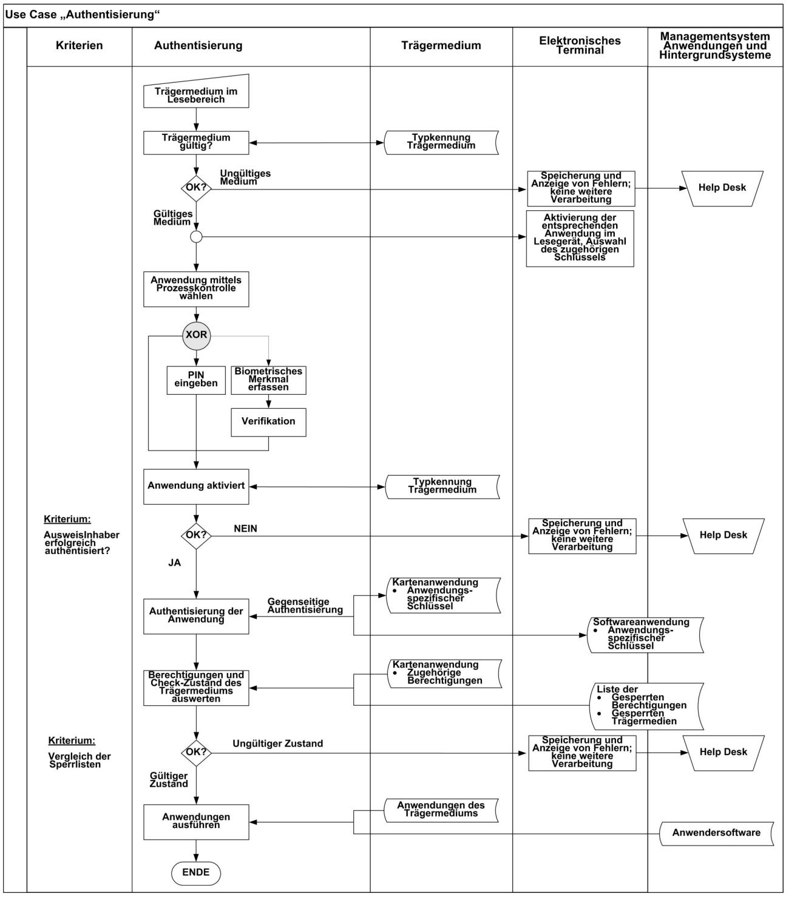

*Abbildung 16: Use Case "Authentisierung"*

# **7.7 Use Case "Einbringen der Berechtigungen"**

Da sich Anforderung und Bedingungen in einer Organisation im Laufe der Zeit verändern können, ist es auch notwendig, die Berechtigungen eines Mitarbeiters an die veränderte Situation

anzupassen. Dabei muss dieser Use Case von der Sperrung von Berechtigungen, der in Kapitel [7.10](#page-60-0) beschrieben wird, unterschieden werden.

Zum Beispiel kann es vorkommen, dass ein Mitarbeiter die Erlaubnis erhält, zusätzliche Teile einer Organisation zu betreten, nachdem sich seine Zuständigkeiten geändert haben oder eine Organisation kann sich entscheiden, zusätzliche Leistungen, die mit dem elektronischen Mitarbeiterausweis abgebildet werden, zu gewähren. Abbildung [17](#page-57-0) zeigt, dass zunächst eine Authentisierung mit der Anwendung stattfinden muss. Anschließend können die Berechtigungen eines Mitarbeiters ggf. aber auch die eines Administrators, in Bezug auf die Anwendung geändert werden.

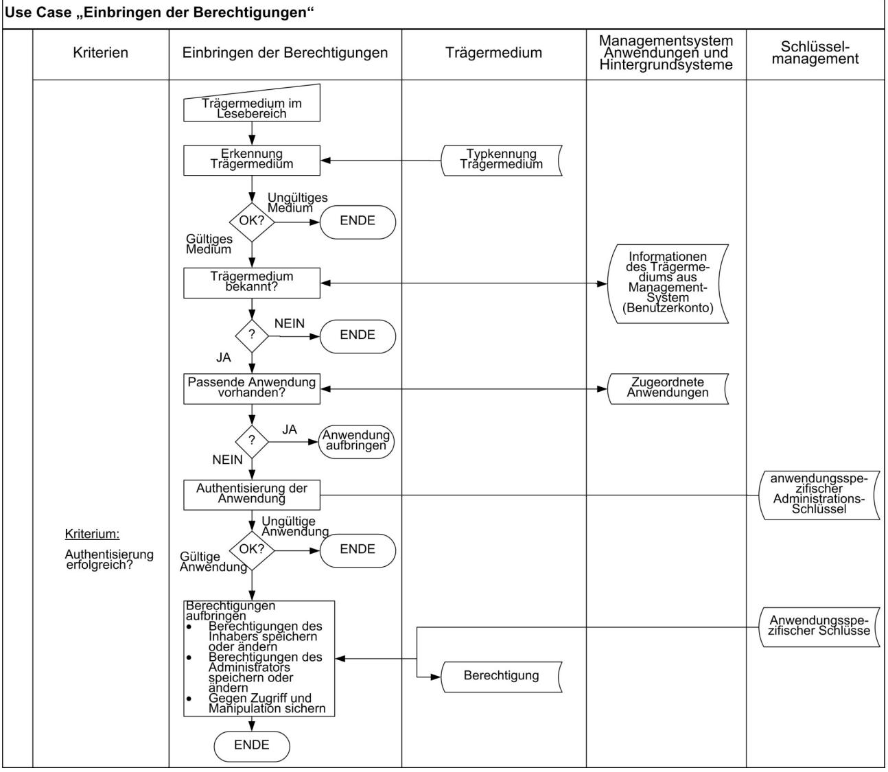

*Abbildung 17: Use Case "Einbringen der Berechtigungen"*

# **7.8 Use Case "Laden und Aktivieren neuer Anwendungen"**

Neben der Notwendigkeit Berechtigungen während der Lebensdauer eines Identifizierungssystems zu ändern, wie es im Use Case "Einbringen der Berechtigungen" (vgl. Kapitel [7.7\)](#page-56-0) beschrieben wurde, kann es auch erforderlich werden, neue Anwendungen zu laden und in Betrieb zu nehmen. Dieser Prozess wird in Abbildung [18](#page-58-0) dargestellt. Dabei wird die Dateistruktur sowie die entsprechenden Berechtigungen der neuen Kartenanwendung in das Trägermedium eingebracht, und es werden die Anwendungsdaten gesetzt.

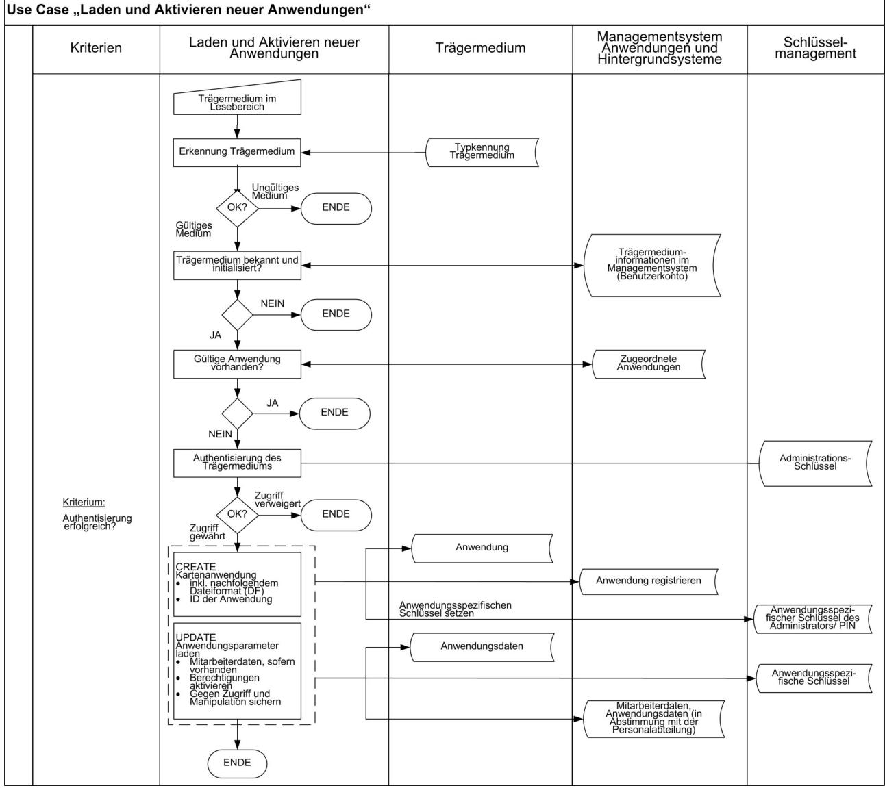

*Abbildung 18: Use Case "Laden und Aktivieren neuer Anwendungen"*

# **7.9 Use Case "Deaktivieren von Anwendungen und Berechtigungen"**

Als Gegenstück zum Use Case "Laden und Aktivieren neuer Anwendungen" muss eine Operation spezifiziert werden, die es erlaubt, Anwendungen und Berechtigungen zu deaktivieren. Dies wird durch den Use Case "Deaktivieren von Anwendungen und Berechtigungen" abgebildet. Dieser erlaubt das Beenden von Anwendungen und verknüpften Berechtigungen. Dabei muss der Status der Anwendungen und Berechtigungen im Benutzerkonto mitprotokolliert werden, um den Sicherheitsmanager in die Lage zu versetzen den aktuellen Systemstand zu ermitteln. Der Use Case wird in Abbildung [19](#page-59-0) dargestellt.

In Abhängigkeit der Anforderungen eines Unternehmens kann der Use Case zur Deaktivierung entweder die vollständige Löschung der Anwendung bedingen oder die Anwendung verbleibt auf dem Trägermedium. In jedem Fall werden jedoch die Anwendung und die Berechtigungen gesperrt.

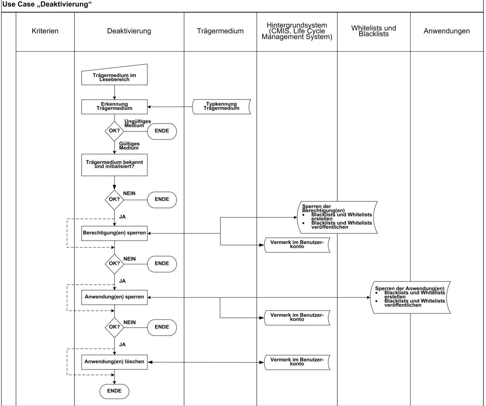

*Abbildung 19: Use Case "Deaktivierung von Anwendungen und Berechtigungen"*

# **7.10 Use Case "Sperren"**

Für den Fall, dass ein elektronischer Mitarbeiterausweis nicht vorliegt, oder wenn davon auszugehen ist, dass dieser kompromittiert wurde, soll der Karteninhaber die Sperrung des Trägermediums veranlassen. Es ist Aufgabe des Sicherheitsmanagers Dienste für das schnelle und effektive Sperren von Berechtigung(en), Anwendung(en) und/oder des vollständigen Trägermediums (vgl. Abbildung [20\)](#page-60-1) vorzusehen. Der Zustand des Trägermediums muss im Benutzerkonto protokolliert werden, um ein späteres Nachverfolgen möglich zu machen.

Der neue Sperrzustand der Berechtigung, der Applikation und/oder des Trägermediums wird anschließend in eine White- oder Blacklist aufgenommen. Wenn eine Berechtigung, eine Anwendung oder das gesamte Trägermedium zurückgezogen wird, steht es nicht länger auf der Whitelist, sondern wird der Blacklist hinzugefügt. Diese Information wird anschließend dem Gesamtsystem bekannt gemacht. Im Falle von Offline-Systemen oder Semioffline-Systemen muss die Information explizit verteilt werden.

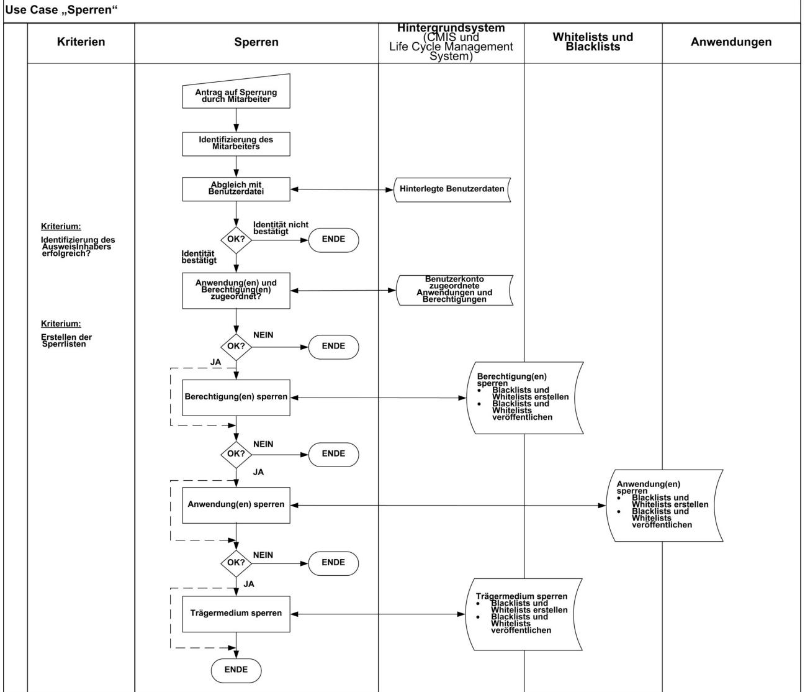

*Abbildung 20: Use Case "Sperren"*

# **7.11 Use Case "Entsperren"**

Ist das Sperren eines elektronischen Mitarbeiterausweises nicht mehr länger notwendig, so muss der Prozess umgekehrt werden. Dies wird durch das Entsperren des Trägermediums bzw. der Anwendung oder der Berechtigung erreicht. Auch hier ist es Aufgabe des Sicherheitsmanagers, schnelle und effektive Prozesse für die Entsperrung der Berechtigung(en), Anwendung(en) und/oder der Trägermedien (vgl. Abbildung [21\)](#page-61-0) zur Verfügung zu stellen. Der Zustand des Trägermediums ist im Benutzerkonto für die spätere Nachverfolgung zu hinterlegen.

Der neue Entsperrzustand der Berechtigung, der Applikation und/oder des Trägermediums wird anschließend in eine White- oder Blacklist aufgenommen. Wenn eine Entsperrung vorgenommen wird, wird der entsprechende Eintrag von der Blacklist ausgetragen und auf der Whitelist hinzugefügt.

Diese Information wird anschließend dem Gesamtsystem bekannt gemacht. Im Falle von Offline-Systemen oder Semioffline-Systemen muss die Information explizit verteilt werden.

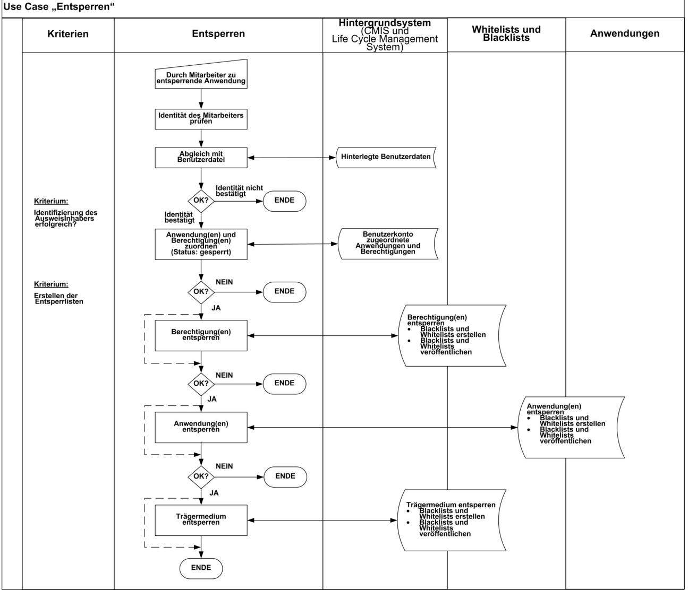

*Abbildung 21: Use Case "Entsperren"*

# **7.12 Use Case "Schlüsselmanagement"**

Für den Schutz von Berechtigungen auf dem Trägermedium kommen aus Gründen der Performance überwiegend Verfahren zum Einsatz, die symmetrische Schlüssel verwenden. Daher hängt die Sicherheit und Funktionsfähigkeit des Gesamtsystems entscheidend von der sicheren Bereitstellung und Verwahrung der Schlüssel ab. Diese Aufgabe muss durch das Schlüsselmanagement und die zugeordneten Prozesse umgesetzt werden.

In den folgenden Darstellungen der Use Cases werden **Secure Authentication Modules** (**SAM**) für die sichere Speicherung von Schlüsselinformationen, Sicherheitsmechanismen und Diversifikationsalgorithmen verwendet. Grundsätzlich sind auch andere Konzepte für die Umsetzung denkbar.

Für die Initialisierung des Trägermediums und für die Speicherung der Berechtigungen ist ein Schlüsselmanagement erforderlich, das die hierarchische Beziehung zwischen dem Trägermedium, den Anwendungen und den Produkten/Berechtigungen berücksichtigt.

## **7.12.1 Schlüsselmanagement für das Initialisieren des Trägermediums**

Abbildung [22](#page-63-0) beschreibt den Use Case für die Initialisierung des Trägermediums. Die Schlüssel und Prozesse, die im Folgenden definiert werden, können auch für das Hinzufügen von Anwendungen genutzt werden.

*Anmerkung:* Aus Datenschutzgründen wird es nicht empfohlen, einen nicht autorisierten und im Klartext übertragenen Informationsaustausch zuzulassen, der einem bestimmten Trägermedium (wie beispielsweise einer UID), einer bestimmten Anwendung oder einer bestimmten Gruppe von Anwendern zugeordnet werden kann. Auf diese Weise wird die Möglichkeit, Bewegungsprofile zu erstellen, wahrscheinlicher und für unberechtigte Parteien leichter. Es wird vielmehr empfohlen, eine zufällige ID zur Auswahl des Trägermediums zu wählen und die Authentisierung mit einem geheimen Schlüssel vorzunehmen, der sich eine verschlüsselte Kommunikation anschließt. Somit kann Vertraulichkeit der ausgetauschten Daten sichergestellt werden, um die eindeutige Information - wie beispielsweise die UID - des Trägermediums abzufragen.

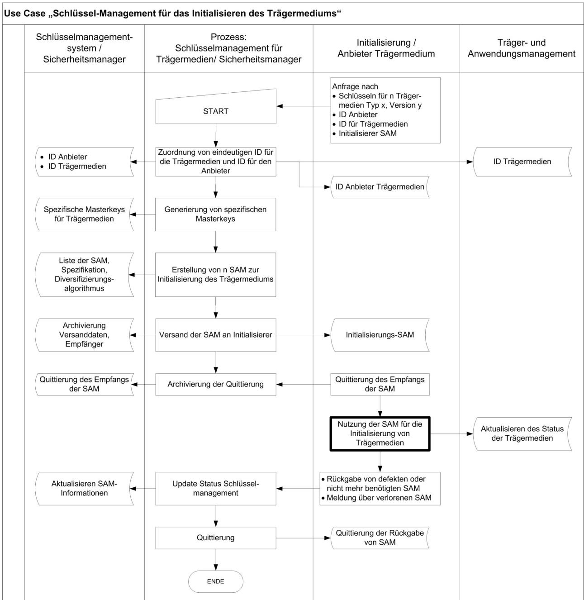

*Abbildung 22: Use Case "Schlüsselmanagement für das Initialisieren des Trägermediums"*

## **7.12.2 Schlüsselmanagement für das Aufbringen und Personalisieren der Anwendungen**

Zur Sicherung von Anwendungen, die bei der Erstellung der Trägermedien oder im Nachhinein aufgebracht werden, sind spezielle Schlüssel und Kennungen für die Anwendung zu erstellen.

Abbildung [23](#page-64-0) zeigt den entsprechenden Use Case. Beim Aufbringen der Anwendung auf das Trägermedium muss da Schlüsselmanagement für Trägermedien ebenfalls zur Verfügung stehen.

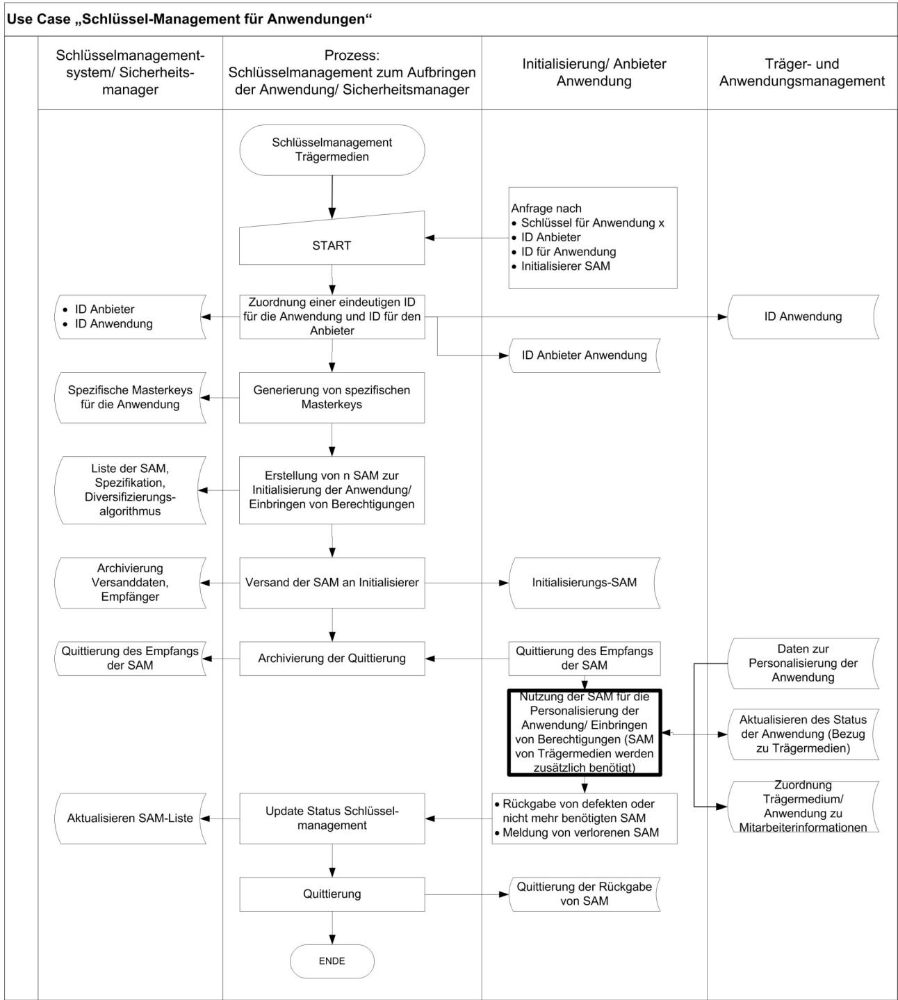

*Abbildung 23: Use Case "Schlüsselmanagement für Anwendungen"*

# **7.12.3 Schlüsselmanagement zum Einbringen der Berechtigungen**

Zur Sicherung von Berechtigungen, die bei der Erstellung der Trägermedien oder im Nachhinein aufgebracht werden, sind spezielle Schlüssel und Kennungen für die Produkte zu erstellen.

Abbildung [24](#page-65-0) zeigt den entsprechenden Use Case. Beim Einbringen der Berechtigung in die Anwendung muss das Schlüsselmanagement für Anwendungen ebenfalls zur Verfügung stehen.

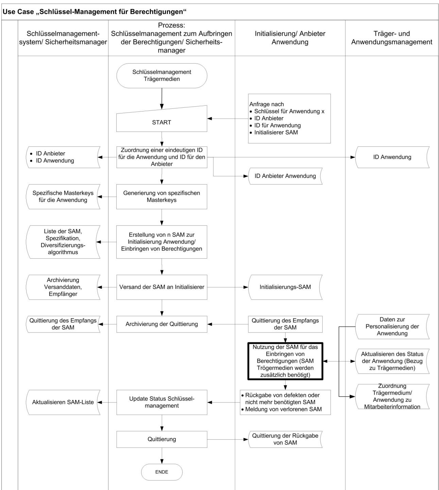

*Abbildung 24: Use Case "Schlüsselmanagement für Berechtigungen"*

# **7.12.4 Schlüsselmanagement für die Nutzung innerhalb der Organisation**

Für den Betrieb einer Systeminfrastruktur, die eine sichere Kommunikation zwischen dem elektronischen Mitarbeiterausweis und dem Managementsystem in einer Organisation unterstützt, muss ein angemessenes Schlüsselmanagement etabliert werden. Da das Managementsystem aus Anwendungen und angebundenen Hintergrundsystemen besteht müssen angemessene

Sicherheitsmechanismen eingesetzt werden, die in der Lage sind, die Initialisierung des Trägermediums und die Zuweisung entsprechender Berechtigungen umzusetzen.

Schlüsselmaterial wird im Rahmen des elektronischen Terminals und der Hintergrundsysteme eingesetzt. Im Falle von eID Dokumenten müssen darüber hinaus entsprechende Zertifikate vorliegen, die Berechtigungen für die Organisation und die beauftragten Instanzen bereithalten.

Das Schlüsselmanagement liegt im Aufgabenbereich des Sicherheitsmanagers. Hierbei werden spezifische SAMs bereitgestellt, die alle notwendigen Funktionen für das Schlüsselmanagement zur Verfügung stellen.

# **7.13 Use Case "Abmeldung"**

Wenn ein Mitarbeiter eine Organisation verlässt, muss das Trägermedium zurückgegeben werden, um Missbrauch zu verhindern. Dies kann zusätzlich durch den Vertrag des Mitarbeiters geregelt werden.

Unabhängig vom Austritt des Mitarbeiters aus der Organisation müssen die Berechtigungen, Anwendungen und das Trägermedium selber gesperrt werden können und ein Eintrag über die Abmeldung wird dem Benutzerkonto hinzugefügt. Dabei ist es unerheblich, ob das Trägermedium selbst vorliegt oder nicht.

#### Use Cases

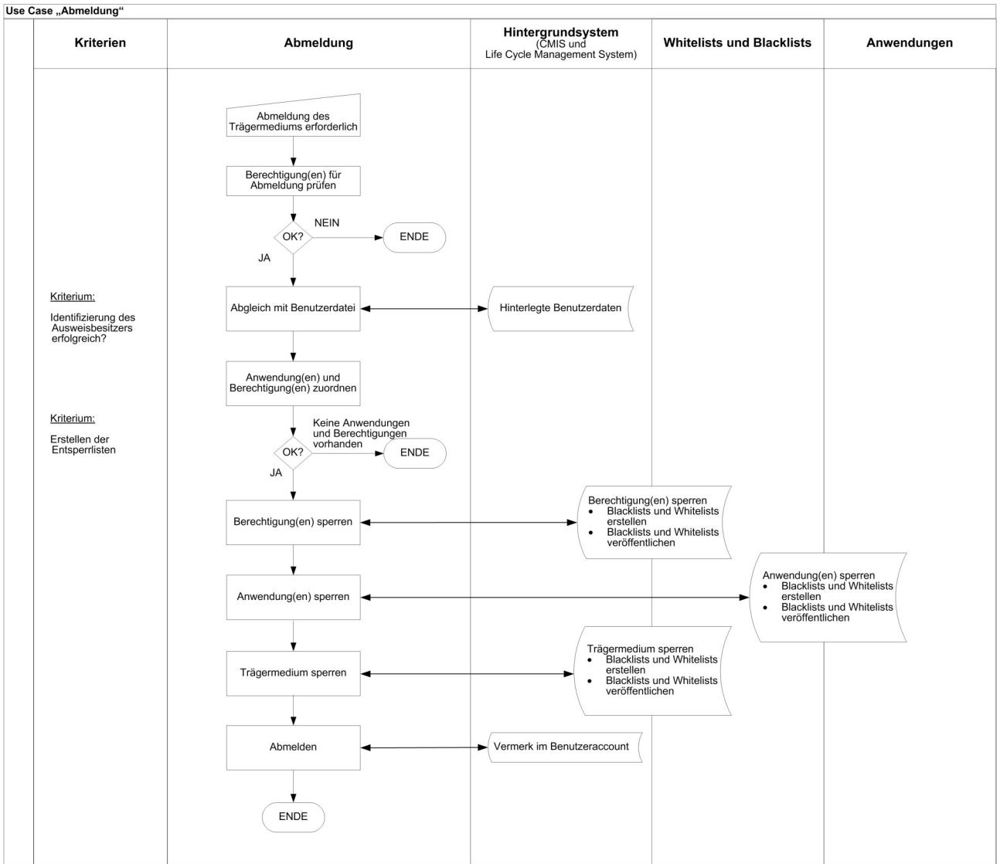

*Abbildung 25: Use Case "Abmeldung"*

# **8 Sicherheitsbetrachtungen**

# **8.1 Definitionen zum Thema Sicherheit und Datenschutz**

Es existieren drei Aspekte oder Unterscheidungsbereiche der Sicherheit, die im Rahmen dieses Dokuments näher betrachtet werden sollen. Hierzu gehören:

- **-** Funktionssicherheit (Safety)
- **-** Informationssicherheit (Security)
- **-** Datenschutz (Privacy)

Dies zuvor beschriebenen Bereiche lassen sich wie im Folgenden dargestellt untergliedern:

#### **1. Funktionssicherheit**

Funktionssicherheit wird vielfach mit Zuverlässigkeit/Korrektheit oder Quality of Service verwechselt. Zuverlässigkeit bedeutet, dass das System entsprechend seiner Spezifikation korrekt arbeitet. Die Erfahrung zeigt, dass jedes technische System fehleranfällig ist. Unter Funktionssicherheit wird nun die Eigenschaft eines Systems verstanden, trotz aufgetretener Systemfehler nicht in unkontrollierbare Systemzustände zu geraten, in denen das System selbst oder seine Umwelt in Gefahr gebracht werden (fail-safe). Zugleich soll das System noch weitestgehend konform seiner Spezifikation reagieren (fault tolerance). D. h. unter Funktionssicherheit wird im Wesentlichen der Schutz vor unbeabsichtigten Ereignissen verstanden.

#### 2. **Informationssicherheit**

Informationssicherheit betrachtet im Gegensatz zur Funktionssicherheit den Schutz vor beabsichtigten Angriffen. Im Bereich Informationssicherheit lassen sich Sicherheitsziele in folgenden Klassen formulieren:

- a. Vertraulichkeit: Vertraulichkeit ist der Schutz vor unbefugter Preisgabe von Informationen. Vertrauliche Daten und Informationen dürfen ausschließlich Befugten in der zulässigen Weise zugänglich sein. Als Schutzziel formuliert bedeutet dies: Gespeicherte bzw. zu kommunizierende Informationen sind vor dem Zugriff von Unbefugten zu schützen.
- b. Integrität: Integrität bezeichnet die Sicherstellung der Korrektheit (Unversehrtheit) von Daten und der korrekten Funktionsweise von Systemen. Als Schutzziel formuliert bedeutet dies: Gespeicherte bzw. zu kommunizierende Informationen sind vor unberechtigter Veränderung zu schützen.
- c. Verfügbarkeit: Die Verfügbarkeit von Dienstleistungen, Funktionen eines IT-Systems, IT-Anwendungen oder IT-Netzen oder auch von Informationen ist vorhanden, wenn diese den Benutzern stets wie gewünscht zur Verfügung stehen. Als Schutzziel formuliert bedeutet dies: Informationen und Betriebsmittel sind vor unbefugter Vorenthaltung zu schützen.
- d. Unverknüpfbarkeit: Unverknüpfbarkeit zweier Kommunikationselemente innerhalb eines Systems bedeutet, dass diese Kommunikationselemente nicht mehr oder weniger miteinander in Beziehung stehen, als es schon durch ein Vorwissen bekannt ist. Innerhalb des Systems können keine weiteren Informationen über die Beziehung zwischen diesen Kommunikationselementen erlangt werden. Praktisch bedeutet dies z. B., dass ein und

derselbe Benutzer Dienste oder Ressourcen mehrmalig in Anspruch nehmen kann, wobei Dritte nicht erkennen können, dass diese Anfragen (im Kommunikationsmodell: Nachrichten) über den Benutzer in Verbindung stehen.

- e. Unbeobachtbarkeit: Unbeobachtbarkeit eines Ereignisses ist derjenige Zustand, in dem nicht zu entscheiden ist, ob dieses Ereignis stattfindet oder nicht. Somit kann bei Sender-Unbeobachtbarkeit nicht erkannt werden, ob überhaupt gesendet wird. Empfänger-Unbeobachtbarkeit ist analog definiert, es kann nicht festgestellt werden, ob empfangen wird oder nicht. Beziehungs-Unbeobachtbarkeit bedeutet, dass nicht erkennbar ist, ob aus der Menge der möglichen Sender zur Menge der möglichen Empfänger gesendet wird.
- f. Anonymität: Anonymität ist der Zustand, in dem man innerhalb seiner Anonymitätsgruppe nicht identifizierbar ist. Mit Hilfe des Begriffs Unverknüpfbarkeit lässt sich Anonymität nun präzisieren zu Unverknüpfbarkeit zwischen der Identität des Benutzers und des von ihm ausgelösten Ereignisses. Somit gibt es Sender-Anonymität als Unverknüpfbarkeit zwischen Sender und Nachricht und Empfänger-Anonymität entsprechend als Unverknüpfbarkeit zwischen Nachricht und Empfänger.
- g. Authentizität: Mit dem Begriff Authentizität wird die Eigenschaft bezeichnet, die gewährleistet, dass ein Kommunikationspartner tatsächlich derjenige ist, der er vorgibt zu sein. Bei authentischen Informationen ist sichergestellt, dass sie von der angegebenen Quelle erstellt wurden. Der Begriff wird nicht nur verwendet, wenn die Identität von Personen geprüft wird, sondern auch bei IT-Komponenten oder Anwendungen.
- h. Nichtabstreitbarkeit: Das Versenden bzw. Empfangen von Nachrichten durch authentisch festgestellte Personen ist gegen Abstreiten zu schützen.
- i. Verbindlichkeit: Unter Verbindlichkeit werden die IT-Sicherheitsziele Authentizität und Nichtabstreitbarkeit zusammengefasst. Bei der Übertragung von Informationen bedeutet dies, dass die Informationsquelle ihre Identität bewiesen hat und der Empfang der Nachricht nicht in Abrede gestellt werden kann.

#### 3. **Datenschutz**

Zweck des Datenschutzes ist es den Einzelnen davor zu schützen, dass er durch den Umgang mit seinen personenbezogenen Daten in seinen Persönlichkeitsrechten beeinträchtigt wird. Mit Datenschutz wird der Schutz personenbezogener Daten vor etwaigem Missbrauch durch Dritte bezeichnet (nicht zu verwechseln mit Datensicherheit) [\[EU\\_REF\].](#page-257-8)

#### **Sonstige Definitionen**

Weiterhin sollen die folgenden Begrifflichkeiten einheitlich verwendet werden:

1. Sicherheitsziele

Sicherheitsziele sind sicherheitsrelevante Ziele bei der Realisierung eines IT-Systems. Im Rahmen dieses Dokuments werden spezifische Sicherheitsziele innerhalb von Einsatzgebieten und Einsatzszenarien festgelegt. Eine Verletzung der Sicherheitsziele erzeugt unmittelbaren Schaden für die Entität, deren Sicherheitsziel verletzt wird.

2. Gefährdungen

Gefährdungen sind unmittelbare Bedrohungen für die Sicherheitsziele der Anwendung. Diese können als Folge eines aktiven Angriffs auf eines oder mehrere Sicherheitsziele oder in Form von möglichen Schwächen des Systems, wie z. B. dem Fehlen einer Rückfalllösung, auftreten.

#### 3. Maßnahmen

Maßnahmen sind konkrete Handlungsempfehlungen, die gegen eine oder mehrere Gefährdungen wirken. Die in diesem Dokument genannten Maßnahmen sollen sinnvoll und bedarfsgerecht sein, d. h. sie werden unter den Gesichtspunkten Wirtschaftlichkeit und Manipulationsfestigkeit (Wie aufwändig ist eine Maßnahme und welche finanzielle Schadenshöhe kann damit begrenzt oder verhindert werden) empfohlen.

#### 4. Restrisiko

Es ist in der Regel nicht möglich, allen Gefährdungen so entgegenzuwirken, dass ein System perfekte Sicherheit bietet. Das Restrisiko ist daher das Risiko, das verbleibt, wenn eine Menge von Maßnahmen umgesetzt wurde und trotzdem noch Angriffe möglich sind. Die Höhe des Risikos hängt davon ab, welche Gegenmaßnahmen getroffen werden können, wie komplex diese sind und vor allem, welches Ergebnis eine Kosten – Nutzen-Rechnung der jeweiligen Entität erbringt. Das Restrisiko muss von der Entität explizit getragen werden.

# **8.2 Definition der Sicherheitsziele**

Im seltensten Fall sind alle im Bereich Funktionssicherheit, Informationssicherheit und Datenschutz genannten Sicherheitsaspekte für ein gegebenes Einsatzszenario gleich wichtig bzw. überhaupt relevant. Die Herausforderung bei der Konzeption eines sicheren RFID-Einsatzes liegt zuerst dementsprechend in der Formulierung spezifischer Sicherheitsziele.

Basierend auf den zuvor beschriebenen generischen Sicherheitszielen (vgl. Abbildung [7\)](#page-34-0) lassen sich übergeordnete und einsatzgebietsspezifische Sicherheitsziele für einen elektronischen Mitarbeiterausweis identifizieren:

- 1. Schutz der elektronischen Berechtigung (repräsentiert die Schutzziele Integrität und Authentizität)
- 2. Funktionssicherheit des RFID-Systems
- 3. Schutz der Privatsphäre des Kunden (repräsentiert die Schutzziele Vertraulichkeit, Unverknüpfbarkeit, Unbeobachtbarkeit, Anonymität und Datenschutz als allgemeine Anforderungen)

Aus den Betrachtungen der Sicherheitsziele der einzelnen Entitäten in den folgenden Unterkapiteln (vgl. Kapitel [8.2\)](#page-70-0) ergeben sich die untergeordneten Sicherheitsziele, die in Kapitel [8.2.4](#page-82-0) aufgeführt sind.

Die folgende Tabelle zeigt das Kodierungsschema der Sicherheitsziele sowie die verwendeten Abkürzungen.

| Feldnummer | 1               | 2                                                             | 3                                                                                          | 4         |
|------------|-----------------|---------------------------------------------------------------|--------------------------------------------------------------------------------------------|-----------|
| Feld       | Sicherheitsziel | Zugeordnete Rolle und ihre Abkürzung                       | Zugeordnetes generisches Sicher heitsziel und seine Abkürzung                           | Zählindex |
| Inhalt     | S               | M: = Mitarbeiter O: = Organisation P: = Produktanbieter | F: = Funktionssicherheit I: = Informationssicherheit P: = Privatsphäre (Datenschutz) | 1, …, n   |

*Tabelle 1: Kodierungsschema der Sicherheitsziele*

## **8.2.1 Spezifische Sicherheitsziele des Mitarbeiters**

Die spezifischen Sicherheitsziele aus Sicht des Mitarbeiters werden in den folgenden Kapiteln beschrieben.

### **8.2.1.1 Funktionssicherheit**

|      | Kurzbezeichnung des Sicherheitsziel                                                                                                                                                                                                                                                                                                                                                               | Beschreibung des Sicherheitsziels                                                                                                                                                                                                                                                                                                                  |
|------|------------------------------------------------------------------------------------------------------------------------------------------------------------------------------------------------------------------------------------------------------------------------------------------------------------------------------------------------------------------------------------------------------|----------------------------------------------------------------------------------------------------------------------------------------------------------------------------------------------------------------------------------------------------------------------------------------------------------------------------------------------------|
| SMF1 | Technische Kompatibilität                                                                                                                                                                                                                                                                                                                                                                         | Die Interaktion zwischen allen elektronischen Mitarbeiterausweisen, Terminals und angeschlossenen Managementsystemen, die als Teil der Lösung in einer Organisation spezifiziert sind, müssen wie spezifiziert funktionieren. Dies muss für alle zugelassenen Komponenten (vgl. Kapitel 2) in der gesamten Systeminfrastruktur gelten. |
|      | Dabei muss die Möglichkeit in Betracht gezogen werden, dass die Systemlösung von unterschiedlichen Anbietern oder Lieferanten zur Verfügung gestellt werden kann (z. B. Zutrittskontrolle, Zeiterfassung, Bezahlfunktion, oder Anmeldung an einem PC). Darüber hinaus können Komponenten von unterschiedlichen Entitäten innerhalb einer Organisation gesteuert und verwaltet werden. |                                                                                                                                                                                                                                                                                                                                                    |
| SMF2 | Rückfalllösung bei Fehlfunktion                                                                                                                                                                                                                                                                                                                                                                   | Ein Mitarbeiter muss in die Lage versetzt werden einen Dienst zu nutzen, auch wenn der elektronische Mitarbeiterausweis oder die Systeminfrastruktur nicht einwandfrei funktionieren. Zumindest eine eingeschränkte Nutzung sollte möglich sein.                                                                                          |
| SMF3 | Intuitive, fehlertolerante Bedienung                                                                                                                                                                                                                                                                                                                                                           | 1. Die Nutzung eines elektronischen Mitarbeiterausweises muss möglichst selbsterklärend bzw. einfach zu erlernen sein. 2. Dem Mitarbeiter müssen Ansprechpartner bekannt sein, an die er sich wenden kann, wenn Fälle wie Fehlfunktion, Fragen zur Bedienung oder Abmeldung auftreten.                                                 |

*Tabelle 2: Sicherheitsziele des Mitarbeiters zur Funktionssicherheit*

| 8.2.1.2 | Informationssicherheit |
|---------|------------------------|
|---------|------------------------|

| Kurzbezeichnung des Sicherheitsziel |                                                         | Beschreibung des Sicherheitsziel                                                                                                                                                                                                                                                                                                                                                                                                                                                           |
|----------------------------------------|---------------------------------------------------------|--------------------------------------------------------------------------------------------------------------------------------------------------------------------------------------------------------------------------------------------------------------------------------------------------------------------------------------------------------------------------------------------------------------------------------------------------------------------------------------------|
| SMI1                                   | Schutz der perso nenbezogenen Daten               | Die Mitarbeiterdaten, die im Managementsystem und/oder auf dem elektronischen Mitarbeiterausweis gespeichert sind, werden zur Identifizierung und/oder Verifikation des Mitarbeiters verwendet, um z. B. Zutritt zu gewähren, Bezahlungen durchzuführen oder Berechtigungen auszuhändigen. Dies gilt insbesondere dann, wenn Biometrie zum Einsatz kommt z. B. bei Fingerabdruckvergleich.                                                                                  |
|                                        |                                                         | Die missbräuchliche Verwendung, Manipulation oder Weitergabe an Unberechtigte wäre für den Mitarbeiter mit kommerziellen Risiken und dem Verlust von Sicherheit und Datenschutz verbunden und soll vermieden werden.                                                                                                                                                                                                                                                              |
| SMI2                                   | Schutz der Berechtigungen                            | 1. Berechtigungen sind möglicherweise DoS-Angriffen bzw. Manipulation durch Dritte ausgesetzt. Dies wäre für den Mitarbeiter mit Unannehmlichkeiten und möglichem Schaden verbunden z. B. wenn die Bezahlfunktion von einem Dritten verwendet wird. Ferner kann der Mitarbeiter von seinen zugewiesenen Berechtigungen ausgeschlossen werden und wird zu einem späteren Zeitpunkt aufgefordert zu beweisen, dass ein Dienst nicht von ihm in Anspruch genommen wurde. |
| SMI3                                   | Schutz der Nutzdaten                                 | Nutzdaten dienen z. B. für die Abrechnung der Garage oder Cafeteria und können auch im Kontext der Zeiterfassung erhoben werden. Die Daten müssen daher verlässlich, authentisch und integer sein.                                                                                                                                                                                                                                                                                   |
| SMI4                                   | Verhinderung von Betrug oder Ko alitionsangriffen | Die Bildung von Koalitionen (z. B. Anwendungsanbieter, Produktanbieter und insbesondere Dienstleister) von verschiedenen Instanzen zur Erfassung von Informationen, die normalerweise nicht zur Verfügung stehen, soll nicht möglich sein. Dies gilt insbesondere im Hinblick auf die personenbezogenen Daten eines Mitarbeiters.                                                                                                                                              |

*Tabelle 3: Sicherheitsziele des Mitarbeiters zur Informationssicherheit*

| Kurzbezeichnung des Sicherheitsziel |                                                             | Beschreibung des Sicherheitsziel                                                                                                                                                                                                                                                         |
|----------------------------------------|-------------------------------------------------------------|------------------------------------------------------------------------------------------------------------------------------------------------------------------------------------------------------------------------------------------------------------------------------------------|
| SMP1                                   | Schutz der Personendaten                                 | Personenbezogene Daten, die in Abstimmung mit dem Datenschutzbeauftragten den entsprechenden Instanzen (z. B. der Organisation und/oder Dienstanbietern) übergeben werden, müssen vertraulich behandelt werden und dürfen nur für die vereinbarten Zwecke eingesetzt werden. |
| SMP2                                   | Schutz gegen die Erstellung von Bewegungspro filen | Es ist zu verhindern, dass Dritte durch Nutzung der RFID-Technologie personenbezogene Bewegungsprofile erstellen können, die über die getroffenen Vereinbarungen der Parteien hinausgehen.                                                                                         |
| SMP3                                   | Schutz der Nutzdaten                                     | Nutzdaten sollen nur erhoben werden für die Aufgaben der Organisation oder des Dienstanbieters, die mit dem Mitarbeiter abgestimmt sind. Es dürfen keine weiteren Daten erhoben oder verknüpft werden.                                                                          |

### **8.2.1.3 Schutz der Privatsphäre**

*Tabelle 4: Sicherheitsziele des Mitarbeiters zur Privatsphäre*

# **8.2.2 Spezifische Sicherheitsziele der Organisation**

Die für eine Organisation spezifizierten Sicherheitsziele werden in den folgenden Kapiteln aufgezeigt.

### **8.2.2.1 Funktionssicherheit**

| Kurzbezeichnung des Sicherheitsziel |                                            | Beschreibung des Sicherheitsziel                                                                                                                                                                                                                                                                                                                                                                     |
|----------------------------------------|--------------------------------------------|------------------------------------------------------------------------------------------------------------------------------------------------------------------------------------------------------------------------------------------------------------------------------------------------------------------------------------------------------------------------------------------------------|
| SOF1                                   | Technische Interoperabilität            | Die Berechtigungen, die im elektronischen Mitarbeiterausweis gespeichert sind und die Ausführung der Anwendungen in einer Organisation müssen funktionieren wie spezifiziert. Dies muss für alle zugelassenen Komponenten (vgl. Kapitel 2) der gesamten Systeminfrastruktur gelten.                                                                                                      |
|                                        |                                            | Dabei muss die Möglichkeit in Betracht gezogen werden, dass die Systemlösung von unterschiedlichen Anbietern oder Lieferanten zur Verfügung gestellt werden kann (z. B. Zutrittskontrolle, Zeiterfassung, Bezahlfunktion, oder Anmeldung an einem PC). Darüber hinaus können Komponenten von unterschiedlichen Entitäten innerhalb einer Organisation gesteuert und verwaltet werden. |
| SOF2                                   | Rückfalllösung bei Fehlfunktionen    | Ein Organisation muss in die Lage versetzt werden einen Dienst zur Verfügung zu stellen, auch wenn der elektronische Mitarbeiterausweis oder die Systeminfrastruktur nicht einwandfrei funktionieren. Das Vorhandensein einer Berechtigung muss nachgewiesen werden können.                                                                                                              |
| SOF3                                   | Intuitive, fehlertolerante Bedienung | 1. Das Auftreten von Problemen muss niedrig sein, wenn Mitarbeiter Ihren Ausweis einsetzen. Daher muss dieser selbsterklärend sein sofern möglich und /oder die Anwendung muss leicht zu erlernen sein, damit die Prozesse optimiert werden können und nicht zu komplex sind.                                                                                                            |
|                                        |                                            | 2. Bereitstellung eines Ansprechpartners, um Probleme schnell beantworten zu können und auf Fehlfunktion schnell reagieren zu können.                                                                                                                                                                                                                                                          |

*Tabelle 5: Sicherheitsziele der Organisation zur Funktionssicherheit*

### **8.2.2.2 Informationssicherheit**

| Kurzbezeichnung des Sicherheitsziel |                                                  | Beschreibung des Sicherheitsziel                                                                                                                                                                                                                                                                                                                                                                                                                                                                                                                                                                                                                                                                                                                                                                                                                  |
|----------------------------------------|--------------------------------------------------|---------------------------------------------------------------------------------------------------------------------------------------------------------------------------------------------------------------------------------------------------------------------------------------------------------------------------------------------------------------------------------------------------------------------------------------------------------------------------------------------------------------------------------------------------------------------------------------------------------------------------------------------------------------------------------------------------------------------------------------------------------------------------------------------------------------------------------------------------|
| SOI1                                   | Schutz der Personendaten                      | 1. Die Stammdaten eines Mitarbeiters werden hauptsächlich im Managementsystem gespeichert und einige Daten können auch auf dem elektronischen Mitarbeiterausweis gespeichert werden, um den Mitarbeiter zu identifizieren, Bezahlungen durchzuführen, Berechtigungen zuzuweisen etc. Eine missbräuchliche Verwendung, Manipulation oder die Weitergabe an unautorisierte Dritte können der Organisation und ihrer Reputation Schaden zufügen und muss daher vermieden werden. Aus Sicht des Mitarbeiters und basierend auf gesetzlichen Vorgaben müssen personenbezogene Daten durch die Organisation vertraulich behandelt werden. Daher ist unautorisierter Zugriff nicht erlaubt. 2. Passive Angriffe (z. B. Abhören) auf personenbezogene Daten müssen verhindert werden oder unbrauchbar gemacht werden. |
| SOI3                                   | Schutz der Nutzdaten                          | 1. Aus Sicht der Organisation haben die Nutzdaten, die im Managementsystem gesammelt werden einen großen Wert und müssen in der Folge authentisch und integer sein, um den korrekten Ablauf der Anwendungen zu gewährleisten z. B. bei der Abrechnung oder der Erfassung der Arbeitsstunden. 2. Passive Angriffe (z. B. Abhören) auf Nutzdaten müssen verhindert werden oder unbrauchbar gemacht werden.                                                                                                                                                                                                                                                                                                                                                                                                                        |
| SOI4                                   | Schutz der An wendungen und Berechtigungen | 1. Manipulation, Beschädigung und Fälschung von Berechtigungen kann einer Organisation und ihrer Reputation kommerziellen Schaden im Rahmen des Einsatzes von elektronischen Mitarbeiterausweisen zufügen. 2. Berechtigungen zeigen, dass ein bestimmter Mitarbeiter das Recht hat Anwendungen zu verwenden und, dass Zugriff auf verschiedene Ressourcen gewährt wird. Wäre es nicht möglich nachzuvollziehen welcher Dienst von einem Mitarbeiter in Anspruch genommen wird, würde eine Organisation nicht in der Lage sein, den korrekten Ablauf des Systems zu gewährleisten.                                                                                                                                                                                                                                      |
| SOI5                                   | Schutz der System infrastruktur            | 1. Das Managementsystem muss geben Eindringen und Sabotage geschützt werden und muss folglich Authentizität und Integrität für die Funktionen und Daten zur Verfügung stellen. Beispielsweise wird es für die Abrechnung und andere relevante Prozesse eingesetzt. 2. Das Managementsystem muss mit hoher Zuverlässigkeit arbeiten,                                                                                                                                                                                                                                                                                                                                                                                                                                                                                                |

| Kurzbezeichnung des Sicherheitsziel |                                                                          | Beschreibung des Sicherheitsziel                                                                                                                                                                                                                                                                                                                                                                                                                                                                                       |
|----------------------------------------|--------------------------------------------------------------------------|------------------------------------------------------------------------------------------------------------------------------------------------------------------------------------------------------------------------------------------------------------------------------------------------------------------------------------------------------------------------------------------------------------------------------------------------------------------------------------------------------------------------|
|                                        |                                                                          | und es soll nicht möglich sein, Prozesse zu verwerfen.                                                                                                                                                                                                                                                                                                                                                                                                                                                                 |
| SOI6                                   | Schutz gegen DoS-Attacken (RFID-Kompo nenten), Verfügbarkeit | Die Infrastruktur einer elektronischen Mitarbeiterausweises muss gegen DoS-Angriffe geschützt werden. Zu den typischen DoS Angriffen gehören: DoS-Angriffe auf die Terminals, dies kann einerseits elektronisch - durch zu viele Anfragen geschehen oder mechanisch, indem das Lesegerät zerstört wird. DoS-Angriffe auf das Managementsystem - DoS-Angriffe in Verbindung mit angebundenen Webservices, die in - Zusammenhang mit den verschiedenen Anwendungen eingesetzt werden |
| SOI7                                   | Zuverlässige Funktionsweise der Anwendungen                        | Es muss sichergestellt werden, dass der Einsatz von Anwendungen vertrauensvoll ist, z. B. bedeutet dies, dass die Abrechnung und Registrierung der Arbeitszeit korrekt erfasst wird. Daher müssen Daten und Prozesse vertrauenswürdig ablaufen.                                                                                                                                                                                                                                                               |
| SOI8                                   | Verhinderung von Betrug oder Ko alitionsangriffen                  | Die Organisation muss sicherstellen, dass Betrug in Bezug auf die Berechtigungen oder die Trägermedien weitestgehend ausgeschlossen wird. Es ist zu verhindern, dass sich basierend auf dem vorgestellten Rollenmodell Koalitionen bilden, die versuchen unberechtigt an Informationen zu gelangen.                                                                                                                                                                                                     |

*Tabelle 6: Sicherheitsziele der Organisation zur Informationssicherheit*

| Kurzbezeichnung des Sicherheitsziel |                             | Beschreibung des Sicherheitsziel                                                                                                                                                                                                                                                                                                                                                               |  |
|----------------------------------------|-----------------------------|------------------------------------------------------------------------------------------------------------------------------------------------------------------------------------------------------------------------------------------------------------------------------------------------------------------------------------------------------------------------------------------------|--|
| SOP1                                   | Schutz der Personendaten | 1. Eine missbräuchliche Verwendung oder Manipulation der Systemkomponenten sowie eine Weitergabe von Daten wäre mit hohen Risiken für die Organisation verbunden und würde ggf. als Gesetzesverstoß geahndet werden.                                                                                                                                                                  |  |
|                                        |                             | 2. Sofern der Zugriff auf personenbezogene Daten für den Anwendungsanbieter oder Untereinheiten mit dem Betriebsrat oder einer vergleichbaren Instanz und dem Datenschutzbeauftragten abgestimmt ist, dürfen die Daten nur für die abgestimmten Zwecke verwendet werden und auch nur von berechtigten Personen. Dies ergibt sich basierend auf gesetzlichen Vorgaben.           |  |
| SOP3                                   | Schutz der Nutzdaten     | Aus Sicht der Organisation umfassen die Nutzdaten alle Daten, die bei der Ausführung der Anwendungen und dem Hintergrundsystem erhoben werden z. B. können diese Daten bei der Zeiterfassung anfallen. Authentizität und Integrität der Daten ist wichtig für den korrekten Betrieb in einer Organisation. Die Daten müssen für die abgestimmten Aufgaben zur Verfügung stehen. |  |
| SOP4                                   | Datensparsamkeit            | Es dürfen nicht mehr Daten gesammelt und gespeichert werden, als für den spezifischen Zweck nötig ist.                                                                                                                                                                                                                                                                                      |  |

## **8.2.2.3 Schutz der Privatsphäre**

*Tabelle 7: Sicherheitsziele der Organisation zur Privatsphäre*

# **8.2.3 Spezifische Sicherheitsziele des Produktanbieters**

Die spezifizierten Sicherheitsziele für den Produktanbieter werden in den folgenden Kapiteln aufgezeigt.

### **8.2.3.1 Funktionssicherheit**

| Kurzbezeichnung des Sicherheitsziel |                                                    | Beschreibung des Sicherheitsziel                                                                                                                                                                                                                                                                                                                                                                                                          |  |
|----------------------------------------|----------------------------------------------------|-------------------------------------------------------------------------------------------------------------------------------------------------------------------------------------------------------------------------------------------------------------------------------------------------------------------------------------------------------------------------------------------------------------------------------------------|--|
| SPF1                                   | Technische Kompatibilität                       | Das Zusammenspiel zwischen den Systemlösungen z. B. dem Trägermedium eines Mitarbeiters und dem Lesegerät muss wie spezifiziert funktionieren. Dies ist gültig für alle zugelassenen Trägermedien der Mitarbeiter und den Terminals in der gesamten Systeminfrastruktur. Sofern eine Interoperabilität zwischen den System von unterschiedlichen Anbietern unterstützt wird, muss diese wie spezifiziert funktionieren. |  |
| SPF2                                   | Rückfalllösung für den Fall der Fehlfunktion | Die Erbringung der wichtigsten Dienste muss auch dann möglich sein, wenn das Kundenmedium oder die Systeminfrastruktur nicht einwandfrei funktionieren. Die Sicherung der Daten muss etabliert werden.                                                                                                                                                                                                                           |  |
| SPF3                                   | Intuitive, fehlertolerante Bedienung         | 1. Bei der Anwendung von Trägermedium und Lesegeräten durch einen Mitarbeiter muss eine geringe Fehlerquote auftreten. Daher muss die Anwendung so selbsterklärend wie möglich gestaltet sein und/oder einfach zu erlernen sein. Die einfache Anwendbarkeit zählt zu den zentralen Zielen eines Produktanbieters.                                                                                                             |  |
|                                        |                                                    | 2. Bereitstellung eines Ansprechpartners um Probleme zu lösen und schnelle Reaktion bei Fehlverhalten.                                                                                                                                                                                                                                                                                                                                 |  |

*Tabelle 8: Sicherheitsziele des Produktanbieters zur Funktionssicherheit*

### **8.2.3.2 Informationssicherheit**

| Kurzbezeichnung des Sicherheitsziel |                                                  | Beschreibung des Sicherheitsziel                                                                                                                                                                                                                                                                                                                                                                                                                                                                                                                                                                                                                                |  |
|----------------------------------------|--------------------------------------------------|-----------------------------------------------------------------------------------------------------------------------------------------------------------------------------------------------------------------------------------------------------------------------------------------------------------------------------------------------------------------------------------------------------------------------------------------------------------------------------------------------------------------------------------------------------------------------------------------------------------------------------------------------------------------|--|
| SPI1                                   | Schutz der Personendaten                      | Die Stammdaten der Mitarbeiter sind hauptsächlich im Managementsystem hinterlegt und einige Daten sind auch auf dem elektronischen Mitarbeiterausweis gespeichert, um den Mitarbeiter zu identifizieren, Bezahlungen auszuführen und Berechtigungen zuzuweisen etc.                                                                                                                                                                                                                                                                                                                                                                                 |  |
|                                        |                                                  | Eine missbräuchliche Verwendung, Manipulation oder die Weitergabe von Daten an unberechtigte Personen könnte zu kommerziellen Schäden des Produktanbieters führen auch insbesondere für den Dienstanbieter bis hin zum Verlust der Funktionsfähigkeit und Kundenakzeptanz (hier: die Organisation) und kann gegen das Gesetz verstoßen. Dies muss vermieden werden.                                                                                                                                                                                                                                                                              |  |
| SPI2                                   | Schutz der Berechtigungen                     | Die Manipulation, die Störung und insbesondere die Fälschung von Berechtigungen wäre für den Produktanbieter oder einer seiner Vertragspartner ggf. mit erheblichen kommerziellen Schaden verbunden.                                                                                                                                                                                                                                                                                                                                                                                                                                                   |  |
|                                        |                                                  | Die Fälschungssicherheit von Berechtigungen ist ein wichtiges Ziel des Dienstleisters. Zusätzlich erfolgt die Nutzung der Berechtigungen in der Systeminfrastruktur der Organisation. Auch hier muss der Schutz der Berechtigung gewährleistet sein.                                                                                                                                                                                                                                                                                                                                                                                                   |  |
| SPI3                                   | Schutz der Nutzdaten                          | 1. Die Verfügbarkeit und die Integrität der Nutzdaten sind im besonderen Interesse des Produktanbieters und insbesondere dem Dienstanbieter, da dies auf die Systemlösung zurückgeht. Diese Daten werden für den Betrieb in der Organisation verwendet und sind daher wichtig im Hinblick auf die Kundenloyalität (hier: die Organisation). Aus Sicht des Produktanbieters und basierend auf gesetzlichen Vorgaben müssen organisationsspezifische Daten vertraulich behandelt werden, insbesondere wenn die Verarbeitung für den Dienstanbieter abgestimmt wurde. Hierbei handelt es sich um ein Schlüsselelement der Systemlösung. |  |
|                                        |                                                  | 2. Passive Angriffe (z. B. Abhören) auf die Nutzdaten müssen verhindert werden oder unbrauchbar gemacht werden.                                                                                                                                                                                                                                                                                                                                                                                                                                                                                                                                              |  |
| SPI4                                   | Schutz der An wendungen und Berechtigungen | Elektronische Mitarbeiterausweise können mehr als eine Anwendung aufnehmen und diese Anwendungen können verschiedenen Anwendungsanbietern zugeordnet werden. Das Managementsystem kann verschiedene Berechtigungen für ein und dieselbe Person verwalten. Es muss sichergestellt werden, dass die Anwendungen und Berechtigungen technisch zuverlässig voneinander getrennt sind oder                                                                                                                                                                                                                                                            |  |

| Kurzbezeichnung des Sicherheitsziel |                                                        | Beschreibung des Sicherheitsziel                                                                                                                                                                                                                                                                                                                                                                                                              |  |
|----------------------------------------|--------------------------------------------------------|-----------------------------------------------------------------------------------------------------------------------------------------------------------------------------------------------------------------------------------------------------------------------------------------------------------------------------------------------------------------------------------------------------------------------------------------------|--|
|                                        |                                                        | Vereinbarungen zwischen den Entitäten bestehen, die die mehrseitige Nutzung oder Konflikte regeln                                                                                                                                                                                                                                                                                                                                          |  |
| SPI6                                   | Schutz gegen DoS-Angriffe (RFID-Kompo nenten) | Die Infrastruktur einer elektronischen Mitarbeiterausweises muss gegen DoS-Angriffe geschützt werden. Zu den typischen DoS Angriffen gehören:                                                                                                                                                                                                                                                                                           |  |
|                                        |                                                        | DoS-Angriffe auf die Terminals, dies kann einerseits elektronisch - durch zu viele Anfragen geschehen oder mechanisch, indem das Lesegerät zerstört wird.                                                                                                                                                                                                                                                                            |  |
|                                        |                                                        | DoS-Angriffe auf das Managementsystem -                                                                                                                                                                                                                                                                                                                                                                                                    |  |
|                                        |                                                        | DoS-Angriffe in Verbindung mit angebundenen Webservices, die in - Zusammenhang mit den verschiedenen Anwendungen eingesetzt werden                                                                                                                                                                                                                                                                                                   |  |
| SPI7                                   | Zuverlässige Funktionsweise der Anwendungen      | Es muss sichergestellt werden, dass der Einsatz von Anwendungen vertrauensvoll ist, z. B. bedeutet dies, dass die Abrechnung und Registrierung der Arbeitszeit korrekt erfasst wird. Daher müssen Daten und Prozesse vertrauenswürdig ablaufen. Aus Sicht des Produktanbieters müssen die Schnittstellen und Funktionen wie spezifiziert laufen, um die Zufriedenheit des Kunden (hier: der Organisation) zu gewährleisten. |  |

*Tabelle 9: Sicherheitsziele des Produktanbieters zur Informationssicherheit*

| Kurzbezeichnung des Sicherheitsziel |                             | Beschreibung des Sicherheitsziel                                                                                                                                                                                                                                                                                                                                                                                                                                                                                                                                                                                                                    |
|----------------------------------------|-----------------------------|-----------------------------------------------------------------------------------------------------------------------------------------------------------------------------------------------------------------------------------------------------------------------------------------------------------------------------------------------------------------------------------------------------------------------------------------------------------------------------------------------------------------------------------------------------------------------------------------------------------------------------------------------------|
| SPP1                                   | Schutz der Personendaten | Eine missbräuchliche Verwendung oder Manipulation der Systemkomponenten sowie eine Weitergabe von Daten wäre mit hohen kommerziellen Risiken für den Produktanbieter insbesondere den Dienstanbieter verbunden und würde ggf. zum Verlust des Kunden (d.h. der Organisation) führen. Ferner könnte es zu einem Verstoß gegen das Gesetz kommen. Daher müssen alle Daten, die zur Bearbeitung abgestimmt wurden, von dem Dienstanbieter vertraulich behandelt werden. Aus Sicht des Produktanbieters ist es wichtig eine vertrauenswürdige Technologie anzubieten, die als Basis zum Schutz der persönlichen Daten dient. |
| SPP3                                   | Schutz der Nutzdaten     | Eine missbräuchliche Verwendung von Nutzdaten unberechtigter Personen würde das Vertrauen in den Produktanbieter und die Organisation schwächen. Sofern der Umgang mit Nutzdaten für den Dienstanbieter abgestimmt ist muss eine vertrauenswürdige Technologie zum Schutz dieser Daten bereitgestellt werden.                                                                                                                                                                                                                                                                                                                           |
| SPP4                                   | Datensparsamkeit            | Es dürfen nicht mehr Daten gesammelt und gespeichert werden, als für den spezifischen Zweck nötig ist.                                                                                                                                                                                                                                                                                                                                                                                                                                                                                                                                           |

### **8.2.3.3 Schutz der Privatsphäre**

*Tabelle 10: Sicherheitsziele des Produktanbieters zur Privatsphäre*

# **8.2.4 Zusammenfassung der Sicherheitsziele der Entitäten**

Die folgende Tabelle fasst die vorstehend genannten Sicherheitsziele der verschiedenen Akteure zusammen. Rollenspezifische Sicherheitsziele wurden zu spezifischen Sicherheitszielen zusammengefasst, die durch die generischen Sicherheitsziele Funktionssicherheit, Informationssicherheit und Datenschutz (bzw. Privatsphäre) beschrieben werden. Zu den verwendeten Abkürzungen zählen:

- **•** SS := Generisches Sicherheitsziel der Funktionssicherheit (Safety)
- **•** SI := Generisches Sicherheitsziel der Informationssicherheit
- **•** SP := Generisches Sicherheitsziel der Privatsphäre (Datenschutz)

| Sicherheitsziel |                                                    | Ziele der Mitarbeiter | Ziele der Organisation | Ziele des Produktanbieters |
|-----------------|----------------------------------------------------|-----------------------|---------------------------|-------------------------------|
| SS1             | Technische Kompatibilität                       | SMF1                  | SOF1                      | SPF1                          |
| SS2             | Rückfalllösung für den Fall der Fehlfunktion    | SMF2                  | SOF2                      | SPF2                          |
| SS3             | Intuitive, fehlertolerante Bedienung            | SMF3                  | SOF3                      | SPF3                          |
| SI1             | Schutz der Personendaten                        | SMI1, SMI4, SMP1      | SOI1, SOI8, SUP1          | SPI1, SPP1                    |
| SI2             | Schutz der Berechtigungen                       | SMI2                  |                           | SPI2                          |
| SI3             | Schutz der Nutzdaten                               | SMI3, SMP3            | SOI3, SOP3                | SPI3, SPP3                    |
| SI4             | Schutz der Anwen dungen und Berechti gungen  |                       | SOI4                      | SPI4                          |
| SI5             | Schutz der System infrastruktur                 |                       | SOI5                      |                               |
| SI6             | Schutz gegen DoS Angriffe (RFID Komponenten) |                       | SOI6                      | SPI6                          |
| SI7             | Zuverlässige Funktions weise der Anwendungen    |                       | SOI7                      | SPI7                          |
| SP2             | Schutz gegen die                                   | SMP2                  |                           |                               |

#### 8 Sicherheitsbetrachtungen

| Sicherheitsziel |                                     | Ziele der Mitarbeiter | Ziele der Organisation | Ziele des Produktanbieters |
|-----------------|-------------------------------------|-----------------------|---------------------------|-------------------------------|
|                 | Erstellung von Bewegungsprofilen |                       |                           |                               |
| SP4             | Datensparsamkeit                    |                       | SOP5                      | SPP4                          |

*Tabelle 11: Übersicht über die Sicherheitsziele der Entitäten*

# **8.2.5 Bildung von Schutzbedarfsklassen**

Basierend auf den Sicherheitszielen aus Kapitel [8.2.4](#page-82-0) werden 3 Schutzbedarfsklassen gebildet. Klasse 1 repräsentiert den geringsten Schutzbedarf, Klasse 3 den höchsten.

Die in der folgenden Tabelle angeführten Kriterien zur Zuordnung des Schutzbedarfs in eine Schutzbedarfsklasse[10](#page-83-0) basieren auf der Annahme der Situation im Falle, dass keine Schutzmaßnahmen ergriffen werden.

| Sicherheitsziel |                                                    | Schutz bedarfs klasse | Kriterien zur Einordnung in Schutzbedarfsklassen                                                                                                            |
|-----------------|----------------------------------------------------|-----------------------------|-------------------------------------------------------------------------------------------------------------------------------------------------------------|
| SS1             | Technische Kompatibilität                       | 1                           | Alle Systemkomponenten stammen vom gleichen Lieferanten. Der Lieferant sorgt für Kompatibilität.                                                         |
|                 |                                                    | 2                           | System muss mit Komponenten von wenigen definierten Lieferanten funktionieren. Der Systemmanager oder ein Systemintegrator sorgen für Kompatibilität. |
|                 |                                                    | 3                           | Offenes System, dass mit Komponenten von allen Marktteilnehmern funktionieren soll.                                                                      |
| SS2             | Rückfalllösung für den Fall der Fehlfunktion | 1                           | Fehlfunktion betrifft einzelne Mitarbeiter.                                                                                                                 |
|                 |                                                    | 2                           | Fehlfunktion betrifft viele Mitarbeiter.                                                                                                                    |
|                 |                                                    | 3                           | Fehlfunktion betrifft alle Mitarbeiter.                                                                                                                     |
| SS3             | Intuitive, fehlertolerante Bedienung         | 1                           | Intuitiv nicht bedienbar von einzelnen Mitarbeitern.                                                                                                        |
|                 |                                                    | 2                           | Intuitiv nicht bedienbar von einer größeren Menge von Mitarbeitern.                                                                                      |
|                 |                                                    | 3                           | Intuitiv nicht bedienbar von beinahe allen Mitarbeitern.                                                                                                    |
| SI1             | Schutz der                                         | 1                           | Die Daten sind verloren und/oder das Ansehen des                                                                                                            |

10 Eine Schutzbedarfsklasse kann entweder als Anforderungen oder durch ihre Auswirkungen beschrieben werden.

| Sicherheitsziel |                                                  | Schutz bedarfs klasse | Kriterien zur Einordnung in Schutzbedarfsklassen                                                                                                                                                                                                                                                                                                                                    |  |
|-----------------|--------------------------------------------------|-----------------------------|-------------------------------------------------------------------------------------------------------------------------------------------------------------------------------------------------------------------------------------------------------------------------------------------------------------------------------------------------------------------------------------|--|
|                 | Personendaten                                    |                             | Mitarbeiters ist kurzfristig geschädigt.                                                                                                                                                                                                                                                                                                                                            |  |
|                 |                                                  | 2                           | Die Daten sind verfälscht und/oder die soziale Existenz des Mitarbeiters ist mittelfristig geschädigt.                                                                                                                                                                                                                                                                           |  |
|                 |                                                  | 3                           | Die Daten werden unberechtigten Dritten bekannt und/oder die soziale Existenz des Mitarbeiters ist langfristig geschädigt.                                                                                                                                                                                                                                                    |  |
| SI2             | Schutz der Berechtigungen                     | 1                           | Eine missbräuchliche Verwendung hat wenig finanzielle Auswirkungen für die betroffene Partei und ist mit geringen Imageschäden verbunden.                                                                                                                                                                                                                                     |  |
|                 |                                                  | 2                           | Eine missbräuchliche Verwendung hat mittlere finanzielle Auswirkungen für die betroffene Partei und ist mit mittleren Imageschäden verbunden.                                                                                                                                                                                                                                 |  |
|                 |                                                  | 3                           | Eine missbräuchliche Verwendung hat hohe finanzielle Auswirkungen für die betroffene Partei und ist mit langfristigen Imageschäden verbunden.                                                                                                                                                                                                                                 |  |
| SI3             | Schutz der Nutzdaten                          | 1                           | Die Daten sind verloren und/oder das Ansehen der Organisation ist kurzfristig geschädigt.                                                                                                                                                                                                                                                                                        |  |
|                 |                                                  | 2                           | Die Daten sind verfälscht und/oder die soziale Existenz der Organisation ist mittelfristig geschädigt.                                                                                                                                                                                                                                                                           |  |
|                 |                                                  | 3                           | Die Daten werden unberechtigten Dritten bekannt und/oder die physikalische Existenz der Organisation ist langfristig geschädigt.                                                                                                                                                                                                                                              |  |
| SI4             | Schutz der An wendungen und Berechtigungen | 1                           | Anwendungen werden vom selben Anwendungsanbieter und Berechtigungen vom selben Produkteigentümer herausgegeben.                                                                                                                                                                                                                                                               |  |
|                 |                                                  | 2                           | Anwendungen werden in einer Organisation von unterschiedlichen Anwendungsanbietern zur Verfügung gestellt, die jedoch innerhalb eines Hintergrundsystems ausgeführt werden. Die Berechtigungen sind den entsprechenden Anwendungen zugeordnet und werden von vom Sicherheitsmanager ausgestellt. Verschiedene Partner arbeiten zusammen und "vertrauen" einander. |  |
|                 |                                                  | 3                           | Anwendungen werden in einer Organisation von unterschiedlichen Anwendungsanbietern zur Verfügung                                                                                                                                                                                                                                                                                 |  |

#### 8 Sicherheitsbetrachtungen

| Sicherheitsziel |                                                             | Schutz bedarfs klasse | Kriterien zur Einordnung in Schutzbedarfsklassen                                                                                                                                                                                                                                     |
|-----------------|-------------------------------------------------------------|-----------------------------|--------------------------------------------------------------------------------------------------------------------------------------------------------------------------------------------------------------------------------------------------------------------------------------|
|                 |                                                             |                             | gestellt, und diese werden in mehr als einem Hintergrundsystem ausgeführt. Die Berechtigungen sind den entsprechenden Anwendungen zugeordnet und werden von verschiedenen Instanzen ausgestellt. Verschiedene Partner arbeiten zusammen aber "vertrauen" einander nicht. |
| SI5             | Schutz der Sys teminfrastruktur                          | 1                           | Das Ansehen der Organisation wird mit kurzfristigen Auswirkungen bedroht.                                                                                                                                                                                                         |
|                 |                                                             | 2                           | Das Ansehen der Organisation wird mit mittelfristigen Auswirkungen bedroht.                                                                                                                                                                                                       |
|                 |                                                             | 3                           | Das Ansehen der Organisation wird mit langfristigen Auswirkungen bedroht.                                                                                                                                                                                                         |
| SI6             | Schutz gegen DoS-Angriffe (RFID-Kompo nenten)      | 1                           | Geringe Risiken für DoS-Angriffe.                                                                                                                                                                                                                                                    |
|                 |                                                             | 2                           | Mittleres Risiko für DoS-Angriffe, so dass kurzfristige oder mittelfristige Effekte zu erwarten sind.                                                                                                                                                                             |
|                 |                                                             | 3                           | Hohes Risiko für DoS-Angriffe, so dass langfristige Effekte zu erwarten sind.                                                                                                                                                                                                     |
| SI7             | Zuverlässige Funktionsweise der Anwendungen           | 1                           | Die Daten stehen nicht zur Verfügung und/oder die Verarbeitung von Berechtigungen ist kurzfristig nicht möglich.                                                                                                                                                               |
|                 |                                                             | 2                           | Die Daten sind verloren und/oder die Verarbeitung von Berechtigungen ist mittelfristig nicht möglich.                                                                                                                                                                             |
|                 |                                                             | 3                           | Die Daten sind verfälscht und/oder die Verarbeitung von Berechtigungen ist langfristig nicht möglich.                                                                                                                                                                             |
| SP2             | Schutz gegen die Erstellung von Bewegungs profilen | 1                           | Das Ansehen des Mitarbeiters ist beschädigt.                                                                                                                                                                                                                                         |
|                 |                                                             | 2                           | Die soziale Existenz des Mitarbeiters ist mittelfristig beschädigt.                                                                                                                                                                                                               |
|                 |                                                             | 3                           | Die soziale Existenz des Mitarbeiters ist langfristig beschädigt.                                                                                                                                                                                                                 |
| SP4             | Datensparsamkeit                                            | 1                           | Es werden keine personenbezogene Daten oder zusätzliche Daten verwendet, die einer bestimmten Person zugeordnet werden können.                                                                                                                                                 |

| Sicherheitsziel | Schutz bedarfs klasse | Kriterien zur Einordnung in Schutzbedarfsklassen                                    |
|-----------------|-----------------------------|-------------------------------------------------------------------------------------|
|                 | 2                           | Personenbezogene Daten werden verwendet, aber es werden keine Nutzdaten erhoben. |
|                 | 3                           | Personenbezogene Daten werden verwendet, und es werden Nutzdaten erhoben.        |

*Tabelle 12: Definition von Schutzbedarfsklassen*

# **8.3 Gefährdungen**

In diesem Kapitel werden potentielle Gefährdungen für die in Kapitel [8.2](#page-70-0) benannten Sicherheitsziele benannt. Dabei werden die verschiedenen Komponenten der Infrastruktur betrachtet. Hierzu gehören:

- 1. Kontaktlose Schnittstelle
- 2. Trägermedium
- 3. Terminal (Lesegerät)
- 4. Schlüsselmanagement
- 5. Managementsystem (Hintergrundsystem mit Anwendungen)

Indem der Beschreibung der Sicherheitsziele gefolgt wird, kann auch für die Darstellung der Gefährdungen ein Kodierungsschema mit Hilfe einer Tabelle für die entsprechende Komponente dargestellt werden. Ein Überblick wird in Tabelle [13](#page-87-0) gegeben.

| Feldnummer | 1                      | 2                                                                                                                                                                                     | 3         |
|------------|------------------------|---------------------------------------------------------------------------------------------------------------------------------------------------------------------------------------|-----------|
| Feld       | Gefährdung (Threat) | Zugeordnete Komponente und ihre Abkürzung                                                                                                                                             | Zählindex |
| Inhalt     | T                      | CI = kontaktlose Schnittstelle (Contactless Interface) CM = Trägermedium (Carrier Medium) T = Terminal KM = Schlüsselmanagement (Key management) MS = Managementsystem | 1, … , n  |

*Tabelle 13: Kodierungsschema der Gefährdungen*

Grundsätzlich gilt, dass Bedrohungen mehrschichtig sein können. In [\[RAEF08\]](#page-257-10) werden drei Ebenen von Angriffen unterschieden:

- **-** Angriffe auf der sozialen Ebene
- **-** Physikalische Angriffe
- **-** und logische Angriffe.

Weitere Beschreibungen zu diesen Angriffen können [\[RAEF08\],](#page-257-10) [\[FI08\]](#page-257-6) und [\[SCH09\]](#page-257-9) entnommen werden.

| Kurzbezeichnung der Gefährdung |                                                                                                  | Bedrohte Sicherheitsziele | Beschreibung der Gefährdung                                                                                                                                                                                                                                                                                                            |
|-----------------------------------|--------------------------------------------------------------------------------------------------|------------------------------|----------------------------------------------------------------------------------------------------------------------------------------------------------------------------------------------------------------------------------------------------------------------------------------------------------------------------------------|
| TCI1                              | Fehlende Kompa tibilität zwischen den Schnittstellen                                       | SS1                          | Mangelnde Kompatibilität der Schnittstellen der führt zu Nichtfunktion der Systeminfrastruktur inklusive der damit verbundenen Dienste und Anwendungen. Dies bedeutet beispielsweise, dass der Zutritt zur Organisation, Bezahldienste oder die Zeiterfassung nicht möglich sind oder deutlich langsamer ablaufen.   |
| TCI2                              | Abhören (passiver Angriff)                                                                    | SI1, SI2, SI4                | Eine dritte Partei hört die Kommunikationsverbindung zwischen dem Terminal und dem elektronischen Mitarbeiterausweis ab. Somit könnten unberechtigte Personen personenbezogene Daten mitlesen.                                                                                                                             |
| TCI3                              | Verfügbarkeit der kontaktlosen Schnittstelle – DoS Angriffe auf die RF-Schnittstelle | SS1, SS1, SS2, SS3, SI6   | Fehlende Verfügbarkeit der kontaktlosen Schnittstelle führt zu einer fehlerhaften Ausführung des regulären Systems und der damit verbundenen erforderlichen Kommunikation d.h. der Eintritt oder der Zugriff ist nicht länger möglich. Eine Ressource oder ein Dienst kann nicht mehr zur Verfügung gestellt werden. |
|                                   |                                                                                                  |                              | 1. Stören der RF-Kommunikation (Jamming)                                                                                                                                                                                                                                                                                               |
|                                   |                                                                                                  |                              | 2. Stören des Antikollisionsmechanismus zur Selektion des Trägermediums (Blocker Tag)                                                                                                                                                                                                                                               |
|                                   |                                                                                                  |                              | 3. Abschirmung des elektromagnetischen Feldes des Lesegerätes (Shielding)                                                                                                                                                                                                                                                           |
|                                   |                                                                                                  |                              | 4. Verstimmen der Resonanzfrequenz von dem Terminal oder Trägermedium (De-Tuning)                                                                                                                                                                                                                                                   |

### **8.3.1 Gefährdungen der kontaktlosen Schnittstelle (CI)**

*Tabelle 14: Gefährdungen der kontaktlosen Schnittstelle*

| Kurzbezeichnung der Gefährdung |                                                                     | Bedrohte Sicherheitsziele | Beschreibung der Gefährdung                                                                                                                                                                                                                                                                                                                                                                             |
|-----------------------------------|---------------------------------------------------------------------|------------------------------|---------------------------------------------------------------------------------------------------------------------------------------------------------------------------------------------------------------------------------------------------------------------------------------------------------------------------------------------------------------------------------------------------------|
| TCM1                              | Zerstörung des Trägermediums                                     | SS1, SS2, SI7                | Denial of Service durch Beeinträchtigung des Feldes oder Zerstörung der Antenne z. B. durch Falten oder Lochen des Mediums.                                                                                                                                                                                                                                                                       |
| TCM2                              | Abschirmung des Trägermediums                                    | SS1, SS2, SI7                | Im Ergebnis steht das Trägermedium zeitweise nicht zur Verfügung aber ist nicht beschädigt (Denial of Service).                                                                                                                                                                                                                                                                                   |
| TCM3                              | Klonen                                                              | SS1, SI2, SI4, SI7        | Das Trägermedium wird ausgelesen und auf eine andere blanke Karte kopiert. Dabei wird die elektronische Ebene des Trägermediums gedoppelt inklusive einer sehr präzisen Kopie der Anwendungen und Berechtigungen. Sofern keine komplexen visuellen Eigenschaften vorhanden sind wird auch die visuelle Seite der Karte kopiert.                                                       |
| TCM4                              | Benutzung durch Dritte                                           | SI1, SI2, SI4, SI7        | Bei der unautorisierten Weitergabe eines elektronischen Mitarbeiterausweises wird diese durch eine unberechtigte dritte Person genutzt. Sofern ausschließlich Besitz erforderlich ist kann ein Dritter in die Lage versetzt werden Zugriff auf Anwendungen zu erhalten. Wurde ferner die PIN ausspioniert kann die Anwendung sogar basierend auf Besitz und Wissen genutzt werden. |
| TCM5                              | Unerlaubtes Abrufen der Berechtigungen                        | SI2, SI4, SI5                | Unerlaubtes aktives Auslesen von Daten des Trägermediums.                                                                                                                                                                                                                                                                                                                                            |
| TCM6                              | Unerlaubtes Überschreiben/ Manipulieren der Berechtigungen | SI2, SI3, SI4, SI5        | Unerlaubtes Schreiben von Daten in das Trägermedium.                                                                                                                                                                                                                                                                                                                                                 |
| TCM7                              | Unerlaubtes Abrufen der Personendaten                         | SI1                          | Unerlaubtes aktives Auslesen von in der Anwendung auf dem Trägermedium gespeicherten personenbezogenen Daten.                                                                                                                                                                                                                                                                                     |
| TCM8                              | Unerlaubtes Überschreiben/ Manipulieren der Personendaten  | SI1                          | Unerlaubtes Schreiben von personenbezogenen Daten in das Trägermedium. Umfasst auch die Nutzungsdaten, die im Medium gespeichert sein können (z. B. falls eine Berechtigungsmatrix auf                                                                                                                                                                                                         |

# **8.3.2 Gefährdungen des Trägermediums (CM)**

| Kurzbezeichnung der Gefährdung |                                                                                                               | Bedrohte Sicherheitsziele | Beschreibung der Gefährdung                                                                                                                                                                                                                                                            |
|-----------------------------------|---------------------------------------------------------------------------------------------------------------|------------------------------|----------------------------------------------------------------------------------------------------------------------------------------------------------------------------------------------------------------------------------------------------------------------------------------|
|                                   |                                                                                                               |                              | dem Trägermedium abgelegt ist).                                                                                                                                                                                                                                                        |
| TCM9                              | Unerlaubte Manipulation der Anwendung                                                                   | SI4                          | Die Anwendungsdaten werden unberechtigt verändert. Dies kann z. B. Auswirkungen haben auf Bezahldaten oder Informationen, die für eine bestimmte Anwendung abgelegt sind.                                                                                                     |
| TCM10                             | Emulation der Anwendung oder Berechtigung                                                               | SI4                          | Nachbilden der elektronischen Funktion des Trägermediums über ein programmierbares Gerät.                                                                                                                                                                                           |
| TCM11                             | Inkompatibilität zwischen verschiedenen Anwendungen und Berechtigungen auf dem Trägermedium | SS1, SI1, SI4, SI7        | Werden mehrere Berechtigungen und Anwendungen auf einem Ausweis abgelegt und ausgeführt, können diese sich gegenseitig beeinflussen oder schädlich auswirken. Dies tritt insbesondere dann auf, wenn die Anwendungen von verschiedenen Anbietern bereitgestellt werden. |
| TCM12                             | Löschung des Speichers, Sperren der Berechtigungen oder komplette Deaktivierung                | SI1, SI2, SI5, SI7        | Unberechtigte Manipulation des Trägermediums, die die Karte in einen ungültigen Zustand überführt.                                                                                                                                                                                  |
| TCM13                             | Fehlfunktion des Trägermediums                                                                             | SS1, SS2, SI5                | Fehlfunktion des Trägermediums können durch technische Fehler, Fehlbedienung oder DoS Angriffe in verschiedenen Szenarien herbeigeführt werden:                                                                                                                               |
|                                   |                                                                                                               |                              | 1. Störung der kontaktlosen Schnittstelle                                                                                                                                                                                                                                              |
|                                   |                                                                                                               |                              | 2. Störung der Referenzinformationen (Schlüssel, etc.)                                                                                                                                                                                                                              |
|                                   |                                                                                                               |                              | 3. Störung der Anwendungsimplementierung                                                                                                                                                                                                                                               |
|                                   |                                                                                                               |                              | 4. Störung der Berechtigungen                                                                                                                                                                                                                                                          |
|                                   |                                                                                                               |                              | 5. Physische Zerstörung                                                                                                                                                                                                                                                                |
|                                   |                                                                                                               |                              | 6. Fehler im Betrieb des Systems oder der CPU                                                                                                                                                                                                                                          |
| TCM14                             | Verfolgung durch unerlaubtes Abfragen durch Dritte                                                   | SP2                          | Der unberechtigte und unverschlüsselte Austausch von (eindeutigen) Informationen, die einem einzelnen Trägermedium (wie eine UID), einer bestimmten Anwendung oder einer bestimmten                                                                                           |

#### 8 Sicherheitsbetrachtungen

| Kurzbezeichnung der Gefährdung |                                                    | Bedrohte Sicherheitsziele | Beschreibung der Gefährdung                                                                                                                                                                                        |
|-----------------------------------|----------------------------------------------------|------------------------------|--------------------------------------------------------------------------------------------------------------------------------------------------------------------------------------------------------------------|
|                                   |                                                    |                              | Gruppe von Nutzern zugeordnet werden kann, wird von Unberechtigten zum Auslesen von Kennungen des Trägermediums und ggf. zur Erstellung von Bewegungsprofilen basierend auf dieser Kennung ausgenutzt. |
| TCM15                             | Fehlen einer Rückfalllösung bei Fehlfunktion | SS2                          | Fehlen einer sicheren Möglichkeit zur Bewertung der Echtheit bzw. Identifikation des Mediums bei defektem Chip kann zu Problemen bei der Sperrung und Ersatz führen.                                      |

*Tabelle 15: Gefährdungen des Trägermediums*

# **8.3.3 Gefährdungen des Lesegeräts (T)**

| Kurzbezeichnung der Gefährdung |                                                                                                | Bedrohte Sicherheitsziele                 | Beschreibung der Gefährdung                                                                                                                                              |
|-----------------------------------|------------------------------------------------------------------------------------------------|----------------------------------------------|--------------------------------------------------------------------------------------------------------------------------------------------------------------------------|
| TT1                               | Verwendung einer gefälschten ID                                                             | SS1, SI4, SI7                                | Unberechtigte Verwendung von Anwendungen.                                                                                                                                |
| TT2                               | Störung des Signals                                                                            | SS1, SI5, SI6                                | Die Verfügbarkeit eines Lesegerätes kann signifikant gestört werden (Denial of Service), wenn ein Störsignal auftritt.                                             |
| TT3                               | Relay-Angriff11                                                                                | SS1, SI1, SI2, SI3                        | Der Lesebereich eines Terminals wird unberechtigt erweitert, so dass es für einen Angreifer einfacher wird, einen elektronischer Mitarbeiterausweis auszulesen. |
| TT4                               | Physikalische Manipulation des Terminals, die in einen undefinierten Zustand führt | SS1, SS2, SI5, SI7                        | Fehlfunktionen des Lesegeräts können durch technische Fehler, Fehlbedienung oder DoS Angriffe in verschiedene Szenarien herbeiführt werden:                     |
|                                   |                                                                                                |                                              | 1. Störung der kontaktlosen Schnittstelle                                                                                                                                |
|                                   |                                                                                                |                                              | 2. Fehler in der Stromversorgung                                                                                                                                         |
|                                   |                                                                                                |                                              | 3. Unterbrechung der Anbindung an das Managementsystem                                                                                                                |
|                                   |                                                                                                |                                              | 4. Physische Zerstörung                                                                                                                                                  |
|                                   |                                                                                                |                                              | 5. Störung in der operativen Ausführung der Funktionen                                                                                                                |
|                                   |                                                                                                |                                              | 6. Beeinflussung des Antikollisionsmechanismus zur Auswahl des Trägermediums (blocker tag).                                                                           |
| TT5                               | Manipulation der Software und Daten                                                         | SS1, SI1, SI2, SI3, SI4, SI5, SI6, SI7 | 1. Das Terminal kann nicht erreichbar sein (DoS).                                                                                                                        |
|                                   |                                                                                                |                                              | 2. Die Daten im Lesegerät können verändert werden z. B. Schlüssel, Funktionen und Algorithmen sowie Sperrinformationen.                                            |
|                                   |                                                                                                |                                              | 3. Ein Angreifer kann Zugriff auf einen Trägermedium im Lesebereich erhalten.                                                                                         |
|                                   |                                                                                                |                                              | 4. Physische Zerstörung                                                                                                                                                  |
|                                   |                                                                                                |                                              | 5. Störung in der operativen Ausführung der                                                                                                                              |

11 Diese Bedrohung kann auch in Zusammenhang mit dem Terminal und der kontaktlosen Schnittstelle auftreten. Daher muss auch die falsche Verwendung der kontaktlosen Schnittstelle des Trägermediums berücksichtigt werden, die zu einer illegalen Anpassung des Lesebereichs führen kann.

#### 8 Sicherheitsbetrachtungen

| Kurzbezeichnung der Gefährdung |                                                                                   | Bedrohte Sicherheitsziele | Beschreibung der Gefährdung                                                                                                                                            |
|-----------------------------------|-----------------------------------------------------------------------------------|------------------------------|------------------------------------------------------------------------------------------------------------------------------------------------------------------------|
| TT6                               | Unerlaubtes                                                                       | SS1, SI1, SI2,               | Funktionen 6. Beeinflussung des Antikollisionsmechanismus zur Auswahl des Trägermediums (blocker tag). 1. Daten im Lesegerät könnten ausgelesen werden        |
|                                   | Auslesen der Personen- und/oder Nutzdaten oder anderer Informa tionen | SI3                          | z. B. Schlüssel, Funktionen und Algorithmen sowie Sperrinformationen. 2. Es kann eine unautorisierte Verbindung zum Managementsystem hergestellt werden.      |
| TT7                               | Mangelnde Benutzerführung                                                      | SS3                          | Das Fehlen von Benutzerfreundlichkeit kann zu beträchtlichen Betriebsproblemen führen.                                                                              |
| TT8                               | Unerlaubtes Sammeln von Zusatzinforma tionen                             | SI1, SP2, SP4                | Wenn ein Terminal zusätzliche Informationen erfasst, wird der Datenschutz der Benutzer missachtet z. B. wird so die Erstellung von Bewegungsprofilen möglich. |

*Tabelle 16: Gefährdungen des Lesegeräts*

## **8.3.4 Gefährdungen des Schlüsselmanagements (KM)**

| Kurzbezeichnung der Gefährdung |                                                   | Bedrohte Sicherheitsziele    | Beschreibung der Gefährdung                                                                                                                                                                                                                                                                                           |
|-----------------------------------|---------------------------------------------------|---------------------------------|-----------------------------------------------------------------------------------------------------------------------------------------------------------------------------------------------------------------------------------------------------------------------------------------------------------------------|
| TKM1                              | Qualität des Schlüsselmaterials                | SI1, SI2, SI3, SI4, SI5, SI7 | Mangelnde Qualität der Schlüssel steigert die Erfolgschancen von Angriffen.                                                                                                                                                                                                                                        |
| TKM2                              | Manipulation des Schlüsselmaterials            | SI1, SI2, SI3, SI4, SI5, SI7 | Manipulation von Schlüsseldaten kann das Sicherheitskonzept des Systems diskreditieren und z. B. Angriffe auf alle kryptografisch geschützten Daten und Funktionen begünstigen. Wenn das Sicherheitsniveau manipuliert wird z. B. Algorithmen, wird der Zugriff von unberechtigten Dritten möglich. |
| TKM3                              | Unerlaubtes Abfragen des Schlüsselmaterials | SI1, SI2, SI3, SI4, SI5, SI7 | Das Auslesen von Schlüsseldaten durch Unberechtigte kann das Systems diskreditieren und z. B. Angriffe auf alle kryptografisch geschützten Daten und Funktionen begünstigen.                                                                                                                                 |
| TKM4                              | Fehlfunktion des Schlüsselmanage               | SS1, SS2                        | Fehlfunktionen des Schlüsselmanagements können durch technische Fehler, Fehlbedienung oder DoS                                                                                                                                                                                                                     |

| Kurzbezeichnung der Gefährdung |                                                                | Bedrohte Sicherheitsziele | Beschreibung der Gefährdung                                                                                                                                                                                                                                                                                       |  |
|-----------------------------------|----------------------------------------------------------------|------------------------------|-------------------------------------------------------------------------------------------------------------------------------------------------------------------------------------------------------------------------------------------------------------------------------------------------------------------|--|
|                                   | ments                                                          |                              | Angriffe in verschiedenen Szenarien herbeigeführt werden:                                                                                                                                                                                                                                                      |  |
|                                   |                                                                |                              | 1. Störung des Lesegerätes und/oder des Managementsystems.                                                                                                                                                                                                                                                     |  |
|                                   |                                                                |                              | 2. Mangelnde Verfügbarkeit der entsprechenden Dienste.                                                                                                                                                                                                                                                         |  |
|                                   |                                                                |                              | 3. Störung der Datenspeicher.                                                                                                                                                                                                                                                                                     |  |
|                                   |                                                                |                              | 4. Störung der spezifischen Anwendungsimplementierung.                                                                                                                                                                                                                                                         |  |
|                                   |                                                                |                              | 5. Störung der Auswertealgorithmen für Berechtigungen.                                                                                                                                                                                                                                                         |  |
|                                   |                                                                |                              | 6. Unterbrechung der Anbindung an das Managementsystem.                                                                                                                                                                                                                                                        |  |
|                                   |                                                                |                              | 7. Physische Zerstörung                                                                                                                                                                                                                                                                                           |  |
| TKM5                              | Versagen der Rückfalllösung im Fall von Fehl funktion | SS2                          | Kryptographische Schlüssel und Parameter sind Grundvoraussetzung für die Systemlösung. Wenn die entsprechenden Schlüssel nicht zur Verfügung stehen, kann dem Gesamtsystem nicht betrieben werden. Dies schließt alle Anwendungen und Berechtigungen sowie das Laden neuer Anwendungen mit ein. |  |

*Tabelle 17: Gefährdungen des Schlüsselmanagements*

| Kurzbezeichnung der Gefährdung |                                                                                 | Bedrohte Sicherheitsziele | Beschreibung der Gefährdung                                                                                                                                                                                                                                                                                                    |  |
|-----------------------------------|---------------------------------------------------------------------------------|------------------------------|--------------------------------------------------------------------------------------------------------------------------------------------------------------------------------------------------------------------------------------------------------------------------------------------------------------------------------|--|
| TMS1                              | Fehlfunktion von einer oder mehreren                                      | SS1, SS2                     | Fehlfunktion von individuellen Systemkomponenten kann durch die folgenden Bedrohungen verursacht werden:                                                                                                                                                                                                                 |  |
|                                   | Komponenten des Management                                                   |                              | 1. Fehler in den Anwendungen oder im Hintergrundsystem                                                                                                                                                                                                                                                                      |  |
|                                   | systems                                                                         |                              | 2. Fehlende Verfügbarkeit von Anwendungen oder dem Hintergrundsystem                                                                                                                                                                                                                                                        |  |
|                                   |                                                                                 |                              | 3. Störung der Datenspeicher                                                                                                                                                                                                                                                                                                   |  |
|                                   |                                                                                 |                              | 4. Unterbrechung der Verbindung zum Managementsystem                                                                                                                                                                                                                                                                        |  |
|                                   |                                                                                 |                              | 5. Physische Zerstörung                                                                                                                                                                                                                                                                                                        |  |
|                                   |                                                                                 |                              | Im Falle, dass das Life Cycle Management System kompromittiert wird, können beliebig viele Trägermedien personalisiert werden.                                                                                                                                                                                           |  |
| TMS2                              | Fehlende Kompa tibilität zwischen den Schnittstellen                      | SS1                          | Wenn die Kompatibilität der Schnittstellen bezüglich des Managementsystems nicht gegeben sind, kann die Systemlösung nicht korrekt arbeiten (Denial of Service). Dies kann negative Auswirkungen für die Mitarbeiter und die Organisation haben.                                                                |  |
| TMS3                              | Manipulation der Personen- und/oder Nutzdaten im System                | SI1, SI3                     | Das Managementsystem (insbesondere das Hintergrundsystem) speichert Informationen in Bezug auf das Medium, die Berechtigungen und die Nutzung, sowie ggf. personenbezogene Daten und Nutzdaten. Die Manipulation dieser Daten durch unberechtigte Personen stellt einen sehr ernst zu nehmenden Angriff dar. |  |
| TMS4                              | Unerlaubtes Auslesen der personenbezogenen Daten und/oder Nutzdaten | SI1, SI3                     | Ein unerlaubtes aktives Auslesen der personenbezogenen Daten oder Nutzdaten, die im Managementsystem gespeichert sind, kann das Gesamtsystem diskreditieren und Möglichkeiten für weiterführende Angriffe bieten.                                                                                                  |  |
| TMS5                              | Versagen der Rückfalllösung im Fall von Fehl                              | SS2                          | Treten bei einem System teilweise oder übergreifende Probleme auf, so kann das Fehlen einer Rückfalllösung zu einem totalen Stillstand des                                                                                                                                                                               |  |

### **8.3.5 Gefährdungen des Managementsystems (MS)**

|      | funktion                                                                                |                       | Systems oder einer damit zusammenhängenden Anwendung führen z. B. hat keine Person mehr Zutritt zu einem Gebäude oder kein Mitarbeiter kann mehr auf seinen Rechner zugreifen.                                                                                                                                                                                      |  |
|------|-----------------------------------------------------------------------------------------|-----------------------|------------------------------------------------------------------------------------------------------------------------------------------------------------------------------------------------------------------------------------------------------------------------------------------------------------------------------------------------------------------------------|--|
| TMS6 | Schutz der Anwendungen der Organisation oder des Anwendungs anbieters       | SI4, SI7              | Bekanntwerden von sensitiven Daten in Bezug auf die auszuführenden Anwendungen einer Organisation oder eines Anwendungsanbieters gegenüber Dritten.                                                                                                                                                                                                                 |  |
| TMS7 | Fälschung der Identität oder unerlaubte Verwen dung einer fremden Identität | SI1, SI2, SI5, SI7 | Bei Fälschung der Identität einer Person oder Einnahme einer Rolle ohne Berechtigung wird der Zugriff auf geschützte Anwendungen, Prozesse oder sogar Datenspeicher möglich. Dies betrifft auch die Ermächtigung eines fremden elektronischen Mitarbeiterausweises, der einer anderen Person gehört.                                                       |  |
| TMS8 | Unerlaubtes Sammeln von Zusatzinforma tionen                                   | SP2                   | Sofern das Managementsystem zusätzliche Daten sammelt wird ggf. der Datenschutz einer Person missachtet z. B. wird die Erstellung von Bewegungsprofilen möglich.                                                                                                                                                                                                    |  |
| TMS9 | Unerlaubtes Verknüpfen von Informationen                                          | SP4                   | Ein Managementsystem umfasst eine Anzahl verschiedener Komponenten und Anwendungen. Werden die Anwendungen von verschiedenen Einheiten innerhalb einer Organisation zur Verfügung gestellt, so kann die Verbindung von Informationen zwischen verschiedenen Informationen (die nicht explizit vereinbart sind) gegen gesetzlichen Regelungen verstoßen. |  |

*Tabelle 18: Gefährdungen des Managementsystems*

# **8.4 Maßnahmen**

In diesem Kapitel werden Maßnahmen benannt, die den in Kapitel 8.3 benannten Gefährdungen entgegen gestellt werden können. Da die Sicherheitsziele verschiedene Sicherheitsniveaus erfordern können, muss das gleiche auch für die eingesetzten Maßnahmen gelten. Daher werden die Maßnahmen so definiert, dass sie aufeinander aufbauend stufenweise höhere Sicherheit bringen. Das benötigte Sicherheitsniveau bedingt die entsprechende spezifische Sicherheitsstufe der Maßnahmen, dies geschieht aufgrund einer Kosten-Nutzen-Analyse.

Stufe 1 stellt dabei die niedrigste Sicherheitsstufe dar, Stufe 3 die höchste. Als Stufe 3+ werden zusätzlich mögliche Maßnahmen eingestuft, die die Sicherheit des Systems zwar steigern, jedoch den Aufwand im Vergleich zum zusätzlichen Sicherheitsgewinn unverhältnismäßig steigern können.

Die Sicherheitsstufen orientieren sich dabei an den Schutzbedarfsklassen des Systems. Einer Gefährdung eines Sicherheitsziels, welches in Schutzbedarfsklasse 3 eingestuft wurde, soll dabei durch Maßnahmen der Sicherheitsstufe 3 begegnet werden. Grundsätzlich kann eine Gefährdung einer bestimmten Schutzbedarfsklasse mit Maßnahmen der gleichen oder einer höheren Schutzklasse kompensiert werden.

Die folgenden Maßnahmen sind in der Regel nicht als Einzelmaßnahmen definiert worden, sondern vielmehr als "Maßnahmenpakete" zu verstehen. In der Regel kann die Sicherheit von Komponenten und Schnittstellen sowie des Gesamtsystems nur dann sinnvoll erhöht werden, wenn Maßnahmen als solche Pakete flächendeckend umgesetzt werden. Des Weiteren werden innerhalb der Sicherheitsstufen alternative Möglichkeiten gekennzeichnet, beispielsweise kann eine sichere Einsatzumgebung (in der Regel nicht gegeben) eine verschlüsselte Speicherung von Daten ersetzen.

Die folgende Tabelle [19](#page-97-0) zeigt das Kodierungsschema der Maßnahmen und die verwendeten Abkürzungen.

| Feldnummer | 1        | 2                                                                                                                                                                                                                      | 3         |
|------------|----------|------------------------------------------------------------------------------------------------------------------------------------------------------------------------------------------------------------------------|-----------|
| Feld       | Maßnahme | Zugeordnete Komponente und ihre Abkürzung                                                                                                                                                                              | Zählindex |
| Inhalt     | M        | CM: = Trägermedium (Carrier Medium) T: = Terminal KM: = Schlüsselmanagement (Key Management) MS: = Managementsystem (Life Cycle Managementsystem, Zentrales Management Informationssystem, Anwendungen) | 1, … , n  |

*Tabelle 19: Kodierungsschema der Maßnahmen*

In der vorliegenden Technischen Richtlinie werden Maßnahmen für die Systemarchitektur berücksichtigt, wobei die folgenden Komponenten näher betrachtet werden:

**-** das Gesamtsystem (vgl. Kapitel [8.4.4\)](#page-131-0)

- **-** das Trägermedium (vgl. Kapitel [8.4.3\)](#page-112-0)
- **-** die Terminals (vgl. Kapitel [8.4.4\)](#page-131-0) und
- **-** das Schlüsselmanagementsystem (vgl. Kapitel [8.4.5\)](#page-137-0)

## **8.4.1 Auswahl kryptografischer Verfahren**

In den folgenden Maßnahmenbeschreibungen werden für neue Implementierungen kryptographische Verfahren gemäß [\[ALGK\\_BSI\]](#page-258-1) gefordert. In [\[ALGK\\_BSI\]](#page-258-1) werden geeignete Verfahren, geeignete Schlüssellängen und die erwartete Lebensdauer dieser Verfahren genannt. [\[ALGK\\_BSI\]](#page-258-1) wird in geeigneten Abständen überarbeitet und durch das BSI veröffentlicht werden.

Bereits bestehende Implementierungen sollen grundsätzlich [\[ALGK\\_BSI\]](#page-258-1) oder [\[TR\\_ECARD\]](#page-258-2) genügen. Mit dem nächsten Evolutionsschritt der jeweiligen Implementierung soll [\[ALGK\\_BSI\]](#page-258-1) angewendet werden. Dieser Schritt muss in einem angemessenen Zeitraum durchgeführt werden.

Die Anwendung des TDES-Algorithmus ist für Bestandssysteme für die Authentifikation, die Verschlüsselung und die MAC-Bildung unter vorstehend genannten Randbedingungen zulässig. Darüber hinaus wird wird die Anwendung von AES128 angeregt.

## **8.4.2 Maßnahmen zum Schutz des Gesamtsystems**

Die folgenden Maßnahmen beziehen sich auf das Gesamtsystem. Können jedoch grundsätzlich für alle Systemkomponenten wie dem Managementsystem inklusive den damit in Zusammenhang stehenden Schnittstellen angewendet werden.

| MMS1          | Kurzbezeichnung der Maßnahme                                                                                                                                                                                                                                                                                 | Adressierte Gefährdungen |  |  |  |
|---------------|--------------------------------------------------------------------------------------------------------------------------------------------------------------------------------------------------------------------------------------------------------------------------------------------------------------|--------------------------|--|--|--|
|               | Einführung von Schnittstellentests und Freigabeverfahren                                                                                                                                                                                                                                                     | TCI1, TMS2               |  |  |  |
| Allge mein | Durch die Einführung von schnittstellenbasierter Testspezifikationen und entsprechender Tests für alle Komponenten soll die Kompatibilität der Komponenten erreicht und überprüfbar gemacht werden. Dabei sind alle Ebenen der Schnittstellen (OSI-Modell) inklusive der Fehlerfälle zu betrachten. |                          |  |  |  |
| 1             | Schnittstellentest                                                                                                                                                                                                                                                                                           |                          |  |  |  |
|               | Für einen elektronischen Mitarbeiterausweis sind insbesondere die folgenden Typen - von kontaktlosen Karten heranzuziehen:                                                                                                                                                                             |                          |  |  |  |
|               | ISO/IEC14443 Proximity Coupling Cards (werden für eID Dokumente verwendet) -                                                                                                                                                                                                                              |                          |  |  |  |
|               | Verwendung von existierenden Prüfvorschriften z. B. ISO/IEC 10373-6 [ISO01], für - eID Dokumente sind insbesondere [BSI08a] und [BSI08b] anzuwenden.                                                                                                                                                   |                          |  |  |  |
|               | Erstellung und Verwendung von spezifischen Testvorschriften für die - anwendungsspezifischen Funktionen der Schnittstellen von Trägermedien und Terminals                                                                                                                                           |                          |  |  |  |
|               | Erstellung und Verwendung von spezifischen Testvorschriften für die Protokolle und - anwendungsspezifischen Funktionen der Schnittstellen zwischen den übrigen Systemkomponenten.                                                                                                                   |                          |  |  |  |
| 2             | Komponentenfreigabe                                                                                                                                                                                                                                                                                          |                          |  |  |  |
|               | MMS1 Stufe 1 -                                                                                                                                                                                                                                                                                            |                          |  |  |  |
|               | Zusätzlich Komponentenfreigabe (Trägermedium, Terminals, Schlüsselmanagement) -                                                                                                                                                                                                                           |                          |  |  |  |
| 3             | Zertifizierung                                                                                                                                                                                                                                                                                               |                          |  |  |  |
|               | MMS1 Stufe 1 -                                                                                                                                                                                                                                                                                            |                          |  |  |  |
|               | Zusätzlich Zertifizierung durch unabhängiges Institut für Trägermedien, Terminals - und bei Bedarf auch anderer Komponenten.                                                                                                                                                                           |                          |  |  |  |

*Tabelle 20: Schutz des Gesamtsystems durch Einführung von Schnittstellentests und Freigabeverfahren*

| MMS2          | Kurzbezeichnung der Maßnahme                                                                                                                                                                                                                                                                                                                                                                                                                                                                                     | Adressierte Gefährdungen |  |
|---------------|------------------------------------------------------------------------------------------------------------------------------------------------------------------------------------------------------------------------------------------------------------------------------------------------------------------------------------------------------------------------------------------------------------------------------------------------------------------------------------------------------------------|--------------------------|--|
|               | Sicherung der Vertraulichkeit der Kommunikation zwischen Trägermedium und Lesegerät zur Abwehr des Abhörens durch Dritte                                                                                                                                                                                                                                                                                                                                                                                   | TCI2                     |  |
| Allge mein | Die Maßnahme betrifft alle Implementierungen der kontaktlosen Schnittstelle zwischen dem jeweiligen Trägermedium und Lesegeräten. Ein Terminal kann in unterschiedlichen Bereichen eingesetzt werden, wie dem Eingangsbereich einer Organisation oder einem Computersystem.                                                                                                                                                                                                                             |                          |  |
| 1             | Gegenseitige Authentifikation zwischen dem Trägermedium und dem Systemterminal:                                                                                                                                                                                                                                                                                                                                                                                                                                  |                          |  |
|               | Vor der Übertragung von Daten wird eine gegenseitige Authentifikation mit festen symmetrischen Schlüsseln zur Aushandlung eines gemeinsamen Verschlüsse lungsschlüssels durchgeführt. Der ausgehandelte Schlüssel wird zur Verschlüsselung mittels TDES, AES128 (bevorzugt) oder eines vergleichbaren offenen Verfahrens verwendet. Die Art und Stärke des Mechanismus ist an künftige Entwicklungen entsprechend [ALGK_BSI] bzw. für hoheitliche Identitätsdokumente nach [EAC10] anzupassen. |                          |  |
| 2             | Gegenseitige, dynamische Authentifikation bei der Übertragung:                                                                                                                                                                                                                                                                                                                                                                                                                                                   |                          |  |
| 3             | Implementierung eines dynamischen Verschlüsselungsverfahrens. Dabei wird vor Übertragung von Daten zwischen Trägermedium und Lesegerät gegenseitig mit Hilfe eines geeigneten Challenge- und Response-Verfahrens ein gemeinsamer Schlüssel ausgehandelt, der zur Kommunikation genutzt wird.                                                                                                                                                                                                            |                          |  |
|               | Die Algorithmen und Schlüssellängen sind hierbei so zu wählen, dass Sie dem aktuellen Stand der Technik entsprechen. Aktuell können verwendet werden: TDES Verschlüsselung, AES128 (bevorzugt), RSA mit mindestens 1024 Bit und ECC oder vergleichbares.                                                                                                                                                                                                                                                |                          |  |
|               | Hinweis: Asymmetrische Verfahren werden für die Schlüsselableitung verwendet während symmetrische Verfahren hauptsächlich für die Verschlüsselung eingesetzt werden. Die Art und Stärke des Mechanismus ist an künftige Entwicklungen entsprechend [ALGK_BSI] respektive für hoheitliche Identitätsdokumente nach [EAC10] anzupassen.                                                                                                                                                                |                          |  |

*Tabelle 21: Schutz des Gesamtsystems durch Sicherung der Vertraulichkeit der Kommunikation zwischen Trägermedium und Lesegerät*

| MMS3          | Kurzbezeichnung der Maßnahme                                                                                                                                                                                                                                                                                                                                                                                                                                                                                                                           | Adressierte Gefährdungen |  |
|---------------|--------------------------------------------------------------------------------------------------------------------------------------------------------------------------------------------------------------------------------------------------------------------------------------------------------------------------------------------------------------------------------------------------------------------------------------------------------------------------------------------------------------------------------------------------------|--------------------------|--|
|               | Sicherung der Vertraulichkeit von Daten bei der Kommunikation innerhalb des Systems                                                                                                                                                                                                                                                                                                                                                                                                                                                                 | TMS3, TMS4, TMS6         |  |
| Allge mein | Alle personenbezogenen oder Nutzdaten, die innerhalb des Managementsystems ausgetauscht werden, müssen vertraulich übermittelt werden.                                                                                                                                                                                                                                                                                                                                                                                                              |                          |  |
| 1             | Statische Verschlüsselung bei interner Kommunikation: Daten werden verschlüsselt basierend auf statischer Verschlüsselung übertragen. In der Folge müssen die Kommunikationskanäle detailliert spezifiziert werden und die entsprechenden Schlüssel müssen sicher ausgetauscht werden.                                                                                                                                                                                                                                                        |                          |  |
|               |                                                                                                                                                                                                                                                                                                                                                                                                                                                                                                                                                        |                          |  |
|               | Alternativ, kann anstelle einer generellen Datenverschlüsselung die Datenübertragung über dedizierte Netze (abgeschlossene Lösung) erfolgen, in denen nur berechtigte Nutzer administriert und zugelassen sind. Das Netz ist über geeignete Maßnahmen (z. B. Grundschutzmaßnahmen) physikalisch vor Zugriffen von Außen zu schützen und einhergehend konform zu einem hierfür geeigneten Sicherheitskonzept zu betreiben.                                                                                                                  |                          |  |
|               | Mit dem nächsten Evolutionsschritt sollen die bestehenden Systeme migriert werden um zumindest den Anforderungen an statische Verschlüsselung zu genügen. Diese Aktualisierungen sollten in einer angemessenen Zeitspanne umgesetzt werden.                                                                                                                                                                                                                                                                                                      |                          |  |
| 2             | Sicherer Kommunikationskanal basierend auf dynamischen Methoden:                                                                                                                                                                                                                                                                                                                                                                                                                                                                                       |                          |  |
| 3             | Für die sichere Kommunikation werden Standardmechanismen der dynamischen Verschlüsselung eingesetzt (z. B. SSL oder TLS verschlüsselte Kommunikation). Sofern vorhanden, kann auf bereits etablierten Public Key Infrastrukturen aufgesetzt werden (z. B. bereits vorhandene Zertifikate) oder die erforderlichen Mechanismen müssen eingeführt werden, was bedeutet, dass bereits gut etablierte Standardbibliotheken genutzt werden, um die entsprechenden Maßnahmen sicherzustellen (z. B. SSL oder TLS gesicherte Verbindungen). |                          |  |
|               | Alternativ wird die Kommunikation zwischen den Komponenten des Systems VPNs oder eine vergleichbare (abgeschirmte) Lösung etabliert. Dazu wird vor der Kommunikation eine Authentisierung mit Schlüsselaushandlung zwischen Sender und Empfänger durchgeführt. Der ausgehandelte Schlüssel wird dann zur Kommunikation verwendet.                                                                                                                                                                                                          |                          |  |
|               | Die zuvor beschriebenen beispielhaften Mechanismen können nur dann eine ausreichende Sicherheit erreichen, wenn angemessene Algorithmen und Schlüssellängen gewählt werden (vgl. [ALGK_BSI]).                                                                                                                                                                                                                                                                                                                                                    |                          |  |

*Tabelle 22: Sicherung der Vertraulichkeit von Daten bei der Kommunikation innerhalb des Systems*

| MMS4 | Kurzbezeichnung der Maßnahme                                                                                                                                                                                                                                                                                                                                                                                                                                                                                                                                                                                                                                                                                                                                                    | Adressierte Gefährdungen  |  |
|------|---------------------------------------------------------------------------------------------------------------------------------------------------------------------------------------------------------------------------------------------------------------------------------------------------------------------------------------------------------------------------------------------------------------------------------------------------------------------------------------------------------------------------------------------------------------------------------------------------------------------------------------------------------------------------------------------------------------------------------------------------------------------------------|---------------------------|--|
|      | Sicherung der Datenerfassung während der Personalisierung und/oder dem Enrolment                                                                                                                                                                                                                                                                                                                                                                                                                                                                                                                                                                                                                                                                                             | TMS3, TMS4, TMS7, TMS8 |  |
| 1    | Spezifische Maßnahmen:                                                                                                                                                                                                                                                                                                                                                                                                                                                                                                                                                                                                                                                                                                                                                          |                           |  |
| 2    | Die Erfassung von personenbezogenen Daten (hierunter fallen auch biometrische Daten) geschieht unter Aufsicht des Sicherheitsmanagers und darf nur von einer autorisierten Instanz durchgeführt werden. Grundsätzlich sollte MMS6 angewendet werden. Der Prozess zur Erfassung ist so angelegt, dass nur vereinbarte personenbezogene Daten erfasst werden. Diese Vereinbarung wird mit dem Betriebsrat, einer vergleichbaren Instanz und dem Datenschutzbeauftragten geschlossen. Die personenbezogenen Daten werden verschlüsselt im Hintergrundsystem abgelegt z. B. in Benutzerkonten. Daher muss die Kommunikation zwischen der Erfassung und dem Hintergrundsystem verschlüsselt sein, basierend auf angemessenen Mechanismen nach [ALGK_BSI]. |                           |  |
|      |                                                                                                                                                                                                                                                                                                                                                                                                                                                                                                                                                                                                                                                                                                                                                                                 |                           |  |
|      |                                                                                                                                                                                                                                                                                                                                                                                                                                                                                                                                                                                                                                                                                                                                                                                 |                           |  |
|      | Sofern Daten auf das Trägermedium geschrieben werden, muss die Kommunikation gegen unberechtigte Änderungen oder Manipulation durch Verschlüsselung geschützt werden (vgl. MMS2), und die Daten müssen durch Zugriffskontrolle gesichert abgespeichert werden (dies gilt insbesondere für biometrische Daten).                                                                                                                                                                                                                                                                                                                                                                                                                                                         |                           |  |
|      | Für die Erfassung von biometrischen Merkmalen soll der Sicherheitsmanager geschult werden. Die Schulung sollte dabei auch den Fall beinhalten, dass ein biometrisches Merkmal nicht verfügbar ist oder nicht aufgenommen werden kann.                                                                                                                                                                                                                                                                                                                                                                                                                                                                                                                                     |                           |  |
| 3    | Erweiterte Maßnahmen:                                                                                                                                                                                                                                                                                                                                                                                                                                                                                                                                                                                                                                                                                                                                                           |                           |  |
|      | MMS4 Stufe 1 und 2 -                                                                                                                                                                                                                                                                                                                                                                                                                                                                                                                                                                                                                                                                                                                                                         |                           |  |
|      | Die Kommunikation zwischen dem Terminal (ggf. mit einer biometrischen - Erfassungseinheit) und dem Computersystem muss verschlüsselt sein.                                                                                                                                                                                                                                                                                                                                                                                                                                                                                                                                                                                                                                |                           |  |

*Tabelle 23: Sicherung der Datenerfassung während der Personalisierung und/oder dem Enrolment*

| MMS5 | Kurzbezeichnung der Maßnahme                                                  | Adressierte Gefährdungen |
|------|-------------------------------------------------------------------------------|--------------------------|
|      | Einführung der kontaktlosen Schnittstelle nach ISO/IEC 14443               | TCI1, TCI2, TCI3         |
| 1    | Einführung der kontaktlosen Nahbereichsschnittstelle nach ISO/IEC 14443. - |                          |
| 2    |                                                                               |                          |
| 3    |                                                                               |                          |

*Tabelle 24: Einführung der kontaktlosen Schnittstelle nach ISO/IEC 14443*

| MMS6 | Kurzbezeichnung der Maßnahme                                                                                                                                                                                                                                                                                                                                                                                                                                                                                                                                                                                                                                                                                                              | Adressierte Gefährdungen |
|------|-------------------------------------------------------------------------------------------------------------------------------------------------------------------------------------------------------------------------------------------------------------------------------------------------------------------------------------------------------------------------------------------------------------------------------------------------------------------------------------------------------------------------------------------------------------------------------------------------------------------------------------------------------------------------------------------------------------------------------------------|--------------------------|
|      | Vertrauliche Speicherung von Daten                                                                                                                                                                                                                                                                                                                                                                                                                                                                                                                                                                                                                                                                                                        | TMS3, TMS4               |
| 1    | Einführung eines mandantenfähigen Zugriffsschutz:                                                                                                                                                                                                                                                                                                                                                                                                                                                                                                                                                                                                                                                                                         |                          |
| 2    | Auf gespeicherte Daten (personenbezogene Daten, Nutzungsdaten, Sperrlisten und - Freigabelisten etc.) darf nur ein bestimmter legitimierter Personenkreis zugreifen. Daten werden in einem gegen unbefugte Zugriffe geschützten Umfeld gespeichert. - Kann der Zugriffsschutz nicht gewährleistet werden, so sind die Daten auf einem verschlüsselten Datenträger zu speichern (Einsatz von Festplattenverschlüsselungswerkzeugen). Biometrische Daten müssen verschlüsselt abgespeichert werden. - Alternativ können andere gleichwertige Verschlüsselungsmechanismen zum Einsatz kommen. Die Algorithmenstärke muss zumindest der des TDES-Algorithmus entsprechen, wobei AES128 zu bevorzugen ist. |                          |
|      |                                                                                                                                                                                                                                                                                                                                                                                                                                                                                                                                                                                                                                                                                                                                           |                          |
|      |                                                                                                                                                                                                                                                                                                                                                                                                                                                                                                                                                                                                                                                                                                                                           |                          |
|      |                                                                                                                                                                                                                                                                                                                                                                                                                                                                                                                                                                                                                                                                                                                                           |                          |
|      | Die Art und Stärke des Mechanismus ist an künftige Entwicklungen entsprechend [ALGK_BSI] anzupassen.                                                                                                                                                                                                                                                                                                                                                                                                                                                                                                                                                                                                                                   |                          |
| 3    | Einführung eines mandantenfähigen Zugriffsschutz mit definiertem Rollenmodell: MMS6 Stufe 1 und 2 -                                                                                                                                                                                                                                                                                                                                                                                                                                                                                                                                                                                                                                 |                          |
|      | Ein Mandantenkonzept in Form eines Rollenmodells ist zu etablieren. -                                                                                                                                                                                                                                                                                                                                                                                                                                                                                                                                                                                                                                                                  |                          |

*Tabelle 25: Vertrauliche Speicherung von Daten*

| MMS7 | Kurzbezeichnung der Maßnahme                                                                                                                                                                                                                                                                                                                                 | Adressierte Gefährdungen                                                            |  |
|------|--------------------------------------------------------------------------------------------------------------------------------------------------------------------------------------------------------------------------------------------------------------------------------------------------------------------------------------------------------------|-------------------------------------------------------------------------------------|--|
|      | Sicherung der Datenintegrität zum Schutz vor Manipulationen bei der Datenübertragung innerhalb des Systems                                                                                                                                                                                                                                             | TMS3                                                                                |  |
| 1    | Einfache Integritätsmaßnahmen:                                                                                                                                                                                                                                                                                                                               |                                                                                     |  |
|      | Daten werden in dedizierten Netzwerken übertragen und unberechtigte Personen können nicht auf diese zugreifen. Mit dem nächsten Evolutionsschritt sollen die bestehenden Systeme migriert werden um zumindest die kryptographische Integrität basierend auf MAC umzusetzen. Diese Aktualisierung soll in einer angemessenen Zeitspanne erfolgen. |                                                                                     |  |
| 2    | Kryptographische Integritätssicherung basierend auf MAC:                                                                                                                                                                                                                                                                                                     |                                                                                     |  |
|      | der Übertragung sicherzustellen.                                                                                                                                                                                                                                                                                                                             | Message Authentication Code (MAC) wird unterstützt, um die Integrität der Daten bei |  |
|      | Die Art und Stärke des Mechanismus ist an künftige Entwicklungen entsprechend [ALGK_BSI] anzupassen.                                                                                                                                                                                                                                                      |                                                                                     |  |
| 3    | Kryptographische Integritätssicherung basierend auf MAC oder Signaturen:                                                                                                                                                                                                                                                                                     |                                                                                     |  |
|      | Die Integrität der Datenübertragung wird durch MAC-Sicherung oder durch Signaturen gewährleistet. MAC- und Signaturverfahren sind nach [ALGK_BSI] zu wählen.                                                                                                                                                                                              |                                                                                     |  |
|      | Die Art und Stärke des Mechanismus ist an künftige Entwicklungen entsprechend [ALGK_BSI] anzupassen.                                                                                                                                                                                                                                                      |                                                                                     |  |

*Tabelle 26: Sicherung der Datenintegrität zum Schutz vor Manipulationen bei der Datenübertragung innerhalb des Systems*

| MMS8 | Kurzbezeichnung der Maßnahme                                                                                                                                                                                                                                                                                                                                                                                                      | Adressierte Gefährdungen |  |
|------|-----------------------------------------------------------------------------------------------------------------------------------------------------------------------------------------------------------------------------------------------------------------------------------------------------------------------------------------------------------------------------------------------------------------------------------|--------------------------|--|
|      | Sicherung der Datenintegrität bei der Speicherung von Daten                                                                                                                                                                                                                                                                                                                                                                    | TMS3                     |  |
| 1    | Einfache kryptographische Intergritätsschutzmaßnahmen:                                                                                                                                                                                                                                                                                                                                                                            |                          |  |
|      | Daten werden in einer sicheren Umgebung zu der unberechtigte Personen keinen Zugriff haben gespeichert (vgl. Maßnahme MMS6).                                                                                                                                                                                                                                                                                                   |                          |  |
|      | Prüfsummen:                                                                                                                                                                                                                                                                                                                                                                                                                       |                          |  |
|      | Zum Schutz gegen technisch bedingte Integritätsfehler wird eine Checksumme (CRC, Hamming Codes, ) verwendet. Dies kann auch durch das zugrundeliegende                                                                                                                                                                                                                                                                         |                          |  |
| 2    | Fortgeschrittene kryptographische Intergritätsschutzmaßnahmen:                                                                                                                                                                                                                                                                                                                                                                    |                          |  |
|      | MMS8 Stufe 1 -                                                                                                                                                                                                                                                                                                                                                                                                                 |                          |  |
|      | Checksummen sind nur effektiv für Fehler, die auf technischen Störungen beruhen - aber nicht in dem Fall, wenn Daten unberechtigt geändert werden. Um Daten zu speichern und den Administrator in die Lage zu versetzen zu prüfen, ob die Daten verändert wurden, sollen digitale Signaturen basierend auf Hashwerten oder MACs verwendet werden.Die verwendeten Algorithmen sollen auf [ALGK_BSI] zurückgehen. |                          |  |
|      | Zusätzliche Loggingmechanismen erlauben die spätere Nachverfolgung von - Änderungen.                                                                                                                                                                                                                                                                                                                                        |                          |  |
| 3    | Erweiterte kryptographische Intergritätsschutzmaßnahmen:                                                                                                                                                                                                                                                                                                                                                                          |                          |  |
|      | MMS8 Stufe 1 und 2 -                                                                                                                                                                                                                                                                                                                                                                                                           |                          |  |
|      | Biometrische Daten werden verschlüsselt auf einem Trägermedium oder einen - sicheren Umgebung im Hintergrundsystem vorgehalten und können nicht von Dritten entschlüsselt werden.                                                                                                                                                                                                                                        |                          |  |

*Tabelle 27: Sicherung der Datenintegrität bei der Speicherung von Daten*

| MMS9                                                                                                              | Kurzbezeichnung der Maßnahme                                                                                                                                                                                                                                                                                       | Adressierte Gefährdungen |  |
|-------------------------------------------------------------------------------------------------------------------|--------------------------------------------------------------------------------------------------------------------------------------------------------------------------------------------------------------------------------------------------------------------------------------------------------------------|--------------------------|--|
|                                                                                                                   | Sicherung der Systemfunktionen gegen DoS-Angriffe an den Schnittstellen                                                                                                                                                                                                                                         | TMS1                     |  |
| Allge mein                                                                                                     | Sicherheitsmechanismen können etabliert werden, um DoS-Angriffe soweit wie möglich zu verhindern in Bezug auf die Schnittstellen und die Übertragungswege. Dies wird erreicht basierend auf strukturellen, technischen und organisatorischen Maßnahmen, die von der jeweiligen Sicherheitsstufe abhängen. |                          |  |
| 1                                                                                                                 | Einfache bauliche, organisatorische und technische Maßnahmen:                                                                                                                                                                                                                                                      |                          |  |
|                                                                                                                   | Bauliche Maßnahmen: Schutz der Übertragungswege gegen mutwillige Zerstörung, z. B. durch Verwendung zerstörungsresistenter Materialien oder Abschirmung der Datenleitungen. Schaffung gesicherter Bereiche.                                                                                               |                          |  |
| Sofern mit dem Datenschutzbeauftragten abgestimmt kann Videoüberwachung eingesetzt werden z. B. beim Pförtner. |                                                                                                                                                                                                                                                                                                                    |                          |  |
|                                                                                                                   | Organisatorische Maßnahmen:                                                                                                                                                                                                                                                                                        |                          |  |
|                                                                                                                   | Einfache visuelle Prüfung (photo-ID) um Bereiche abzusichern (d.h. Zutrittskontrolle) durch den Pförtner.                                                                                                                                                                                                       |                          |  |
|                                                                                                                   | Die Bereiche werden regelmäßig nach (veränderten) Terminals und Störsendern                                                                                                                                                                                                                                        |                          |  |
|                                                                                                                   |                                                                                                                                                                                                                                                                                                                    |                          |  |
|                                                                                                                   | Ggf. (d.h. wenn dies mit der entsprechenden Anwendung vereinbar ist) kann eine Verzögerung definiert werden, so dass unberechtigte permanente Versuche einen Dienst zu nutzen unterbrochen werden z. B. wenn ein Brute-Force-Angriff angenommen wird.                                                        |                          |  |
|                                                                                                                   | Der Sicherheitsmanager wird benachrichtigt (z. B. durch Loggingmechanismen), wenn eine Anwendung permanent angefragt wird.                                                                                                                                                                                      |                          |  |
|                                                                                                                   | Langfristiges Testen: Bevor das System in Betrieb geht sollte ein langfristiger Echtzeittest durchgeführt werden.                                                                                                                                                                                               |                          |  |
| 2                                                                                                                 | Fortgeschrittene bauliche, technische und organisatorische Maßnahmen:                                                                                                                                                                                                                                              |                          |  |
|                                                                                                                   | MMS9 Stufe 1 -                                                                                                                                                                                                                                                                                                  |                          |  |
|                                                                                                                   | Zusätzliche organisatorische Maßnahmen, - wie z. B. Einführung eines Rollenmodells mit einhergehendem Berechtigungskonzept. Aufwändigere mechanische Absicherung.                                                                                                                                         |                          |  |
| 3                                                                                                                 | Erweiterte Mechanismen:                                                                                                                                                                                                                                                                                            |                          |  |
|                                                                                                                   | MMS9 Stufe 1 und 2 -                                                                                                                                                                                                                                                                                            |                          |  |
|                                                                                                                   | Spezifizierung eines Sicherheitskonzeptes - Zusätzlich zu den bereits in Stufe 1 und 2 beschriebenen Maßnahmen kann ein Sicherheitskonzept auf spezielle Use Cases und Anforderungen in einer Organisation                                                                                                |                          |  |

| MMS9 | Kurzbezeichnung der Maßnahme                                                                                        | Adressierte Gefährdungen |
|------|---------------------------------------------------------------------------------------------------------------------|--------------------------|
|      | eingehen und angemessene Maßnahmen zuweisen. Jede Maßnahme wird dabei einer verantwortlichen Entität zugeordnet. |                          |

*Tabelle 28: Sicherung der Systemfunktionen gegen DoS-Angriffe an den Schnittstellen*

| MMS10 | Kurzbezeichnung der Maßnahme                                                                                                                                                                                                                                                                                                                                                                                                                                                                                                                                                                                                                                          | Adressierte Gefährdungen |  |
|-------|-----------------------------------------------------------------------------------------------------------------------------------------------------------------------------------------------------------------------------------------------------------------------------------------------------------------------------------------------------------------------------------------------------------------------------------------------------------------------------------------------------------------------------------------------------------------------------------------------------------------------------------------------------------------------|--------------------------|--|
|       | Definition einer Rückfalllösung im Fall von technischem Fehlverhalten (z.B. von Komponenten und/oder Schnittstellen)                                                                                                                                                                                                                                                                                                                                                                                                                                                                                                                                            | TMS1, TMS5               |  |
| 1     | Definition von geeigneten Betriebsprozessen, Offline-Fähigkeit und Backup: Systemkomponenten müssen so entworfen sein, dass eine begrenzte Ausführung auch - im Fehlerfall möglich ist Das System soll prinzipiell (zumindest temporär) auch autark ohne - Hintergrundsystem bzw. bei Ausfall von Systemschnittstellen funktionieren können. Z. B. wenn eine Bezahlfunktion temporär nicht zur Verfügung steht, ist die - Bezahlung mit konventionellem Geld möglich. Es ist ein regelmäßiges Backup von Daten durchzuführen, so dass ein Totalverlust - auszuschließen ist. Das Backup ist in regelmäßigen Abständen zu üben. |                          |  |
|       |                                                                                                                                                                                                                                                                                                                                                                                                                                                                                                                                                                                                                                                                       |                          |  |
|       |                                                                                                                                                                                                                                                                                                                                                                                                                                                                                                                                                                                                                                                                       |                          |  |
|       |                                                                                                                                                                                                                                                                                                                                                                                                                                                                                                                                                                                                                                                                       |                          |  |
|       |                                                                                                                                                                                                                                                                                                                                                                                                                                                                                                                                                                                                                                                                       |                          |  |
|       |                                                                                                                                                                                                                                                                                                                                                                                                                                                                                                                                                                                                                                                                       |                          |  |
|       | Es müssen für alle Komponenten und Schnittstellen Rückfallprozesse aufgesetzt - werden, die operative Probleme, die nach Ausfall einer Komponente entstehen können, durch betriebliche Maßnahmen beseitigen oder mildern.                                                                                                                                                                                                                                                                                                                                                                                                                                    |                          |  |
|       | Rückfalllösungen müssen in den vertraglichen Vereinbarungen zwischen Kunden - (hier: die Organisation) und Lieferanten (hier: Produktanbieter) benannt und deren Folgen berücksichtigt werden. Im Fall von Biometrie: ggf. kann ein zweites biometrisches Merkmal erfasst werden - z. B. wenn zwei Fingerabdrücke aufgenommen wurden kann der andere Finger für die Authentifizierung genutzt werden, wenn der erste Finger verletzt ist. Ist eine Rückfalllösung basierend auf einem zweiten biometrischen Merkmal nicht möglich so ist eine entsprechende Ersatzlösung zur Verfügung zu stellen.                                         |                          |  |
|       |                                                                                                                                                                                                                                                                                                                                                                                                                                                                                                                                                                                                                                                                       |                          |  |
| 2     | Umsetzung nach Rückfallkonzept:                                                                                                                                                                                                                                                                                                                                                                                                                                                                                                                                                                                                                                       |                          |  |
| 3     | MMS10 Stufe 1 -                                                                                                                                                                                                                                                                                                                                                                                                                                                                                                                                                                                                                                                    |                          |  |
|       | Es muss ein Systemkonzept erstellt werden, das die Verfügbarkeit und - Rückfalllösungen mit Verfügbarkeitszeiten und Rückfallintervallen explizit festlegt.                                                                                                                                                                                                                                                                                                                                                                                                                                                                                                     |                          |  |
|       | Kritische Komponenten müssen über eine USV und weitere Sicherungsmechanismen - (wie RAID) verfügen, so dass der Ausfall von Teilkomponenten die Verfügbarkeit                                                                                                                                                                                                                                                                                                                                                                                                                                                                                                   |                          |  |

| MMS10 | Kurzbezeichnung der Maßnahme                                                                                                                                                                                                                                                                       | Adressierte Gefährdungen |
|-------|----------------------------------------------------------------------------------------------------------------------------------------------------------------------------------------------------------------------------------------------------------------------------------------------------|--------------------------|
|       | des Gesamtsystems nicht beeinträchtigt.                                                                                                                                                                                                                                                            |                          |
|       | Ggf. muss eine ausreichende Anzahl von Austausch-Systemkomponenten zur - Verfügung stehen, so dass die geforderte Verfügbarkeit erfüllt werden kann                                                                                                                                          |                          |
|       | Im Fall von Biometrie: Über die Aufnahme eines zweiten biometrischen Merkmals - hinaus, muss eine weitere Rückfalllösung (z. B. die Verwendung von Wissen anstatt Sein) ermöglicht werden. Die Änderung des Verfahrens muss einfach möglich sein und im Benutzerkonto vermerkt werden. |                          |

*Tabelle 29: Definition einer Rückfalllösung im Fall von technischem Fehlverhalten*

| MMS11 | Kurzbezeichnung der Maßnahme                                                                                                                                                                                                                                                                                                                                                                                                                                                                                                                                                                                                                                                                                                                                                     | Adressierte Gefährdungen |  |
|-------|----------------------------------------------------------------------------------------------------------------------------------------------------------------------------------------------------------------------------------------------------------------------------------------------------------------------------------------------------------------------------------------------------------------------------------------------------------------------------------------------------------------------------------------------------------------------------------------------------------------------------------------------------------------------------------------------------------------------------------------------------------------------------------|--------------------------|--|
|       | Sicherung der Funktion des Systems gegen Fehlbedingung durch Mitarbeiter und Benutzer                                                                                                                                                                                                                                                                                                                                                                                                                                                                                                                                                                                                                                                                                         | TMS1                     |  |
| 1     | Test und Unterstützung bei der Benutzbarkeit: Bereitstellung einer Bedienungsanleitung für die Karteninhaber. - Initiale Einweisung jedes Mitarbeiters, wie das System zu verwenden ist. - FAQ Informationen z. B. Bereitstellung über eine Webseite der Organisation. - Empirische Tests. - Regelmäßige Prüfungen der Komponenten (z. B. Prüfung der Terminals). - Der Hersteller der Systemkomponenten muss die Organisation im Falle von - Fehlfunktion des Systems unterstützen. Art und Weise der Herstellerunterstützung sind dabei von den akzeptieren Ausfallzeiten des Systems abhängig und werden zwischen dem Hersteller und dem Dienstanbieter basierend auf bilateralen vertraglichen Regelungen (SLAs) vereinbart. |                          |  |
|       |                                                                                                                                                                                                                                                                                                                                                                                                                                                                                                                                                                                                                                                                                                                                                                                  |                          |  |
|       |                                                                                                                                                                                                                                                                                                                                                                                                                                                                                                                                                                                                                                                                                                                                                                                  |                          |  |
|       |                                                                                                                                                                                                                                                                                                                                                                                                                                                                                                                                                                                                                                                                                                                                                                                  |                          |  |
|       |                                                                                                                                                                                                                                                                                                                                                                                                                                                                                                                                                                                                                                                                                                                                                                                  |                          |  |
|       |                                                                                                                                                                                                                                                                                                                                                                                                                                                                                                                                                                                                                                                                                                                                                                                  |                          |  |
|       |                                                                                                                                                                                                                                                                                                                                                                                                                                                                                                                                                                                                                                                                                                                                                                                  |                          |  |
| 2     | Fortgeschrittene Unterstützung bei der Benutzbarkeit:                                                                                                                                                                                                                                                                                                                                                                                                                                                                                                                                                                                                                                                                                                                            |                          |  |
|       | MMS11 Stufe 1 -                                                                                                                                                                                                                                                                                                                                                                                                                                                                                                                                                                                                                                                                                                                                                               |                          |  |
|       | Einführung eines Benutzer Help-Desk zu den Bürozeiten -                                                                                                                                                                                                                                                                                                                                                                                                                                                                                                                                                                                                                                                                                                                       |                          |  |
| 3     | Erweitere Unterstützung bei der Benutzbarkeit:                                                                                                                                                                                                                                                                                                                                                                                                                                                                                                                                                                                                                                                                                                                                   |                          |  |
|       | MMS11 Stufe 1 und 2 -                                                                                                                                                                                                                                                                                                                                                                                                                                                                                                                                                                                                                                                                                                                                                         |                          |  |
|       | Zusätzliche Betreuung durch einen Sicherheitsservice, der 24h/7Tage verfügbar ist. -                                                                                                                                                                                                                                                                                                                                                                                                                                                                                                                                                                                                                                                                                          |                          |  |
|       | Definition eines Supportkonzeptes für das gesamte Systems eines elektronischen - Mitarbeiterausweises für alle Standorte.                                                                                                                                                                                                                                                                                                                                                                                                                                                                                                                                                                                                                                                  |                          |  |

*Tabelle 30: Sicherung der Funktion des Systems gegen Fehlbedienung durch Mitarbeiter und Benutzer*

| MMS12 | Kurzbezeichnung der Maßnahme                                                                                                                                                                                                                                                                                                                                                                                                                             | Adressierte Gefährdungen |  |
|-------|----------------------------------------------------------------------------------------------------------------------------------------------------------------------------------------------------------------------------------------------------------------------------------------------------------------------------------------------------------------------------------------------------------------------------------------------------------|--------------------------|--|
|       | Sicherung der Funktion des Systems zur Vermeidung technischer Fehler von Komponenten und Übertragungswegen                                                                                                                                                                                                                                                                                                                                         | TMS1, TMS2               |  |
| Allge | Kapitel 6.2 hat den Bedarf für die Bereitstellung eines Systemkonzeptes beschrieben.                                                                                                                                                                                                                                                                                                                                                                     |                          |  |
| mein  | Dabei sollen die individuellen Anforderungen spezifiziert und die Eigenschaften der Systemarchitektur analysiert und abgesichert werden.                                                                                                                                                                                                                                                                                                              |                          |  |
|       | Eine Systemarchitektur (vor der Einführung von Sicherheitsmechanismen) kann spezifische Eigenschaften aufweisen, die bei einer Integration beachtet werden müssen. Dies kann sich auf verschiedene Netzwerke, Hardware- und Softwarekomponenten oder bestimmte Prozesse beziehen. In der Folge müssen nicht nur die Komponenten und Prozesse betrachtet werden, sondern auch die Interaktionen und Beziehung zwischen diesen Komponenten. |                          |  |
|       | Das Systemkonzept sollte die Einführung von zukünftigen Anwendungen und Systemkomponenten berücksichtigen.                                                                                                                                                                                                                                                                                                                                            |                          |  |
| 1     | Herstellererklärung:                                                                                                                                                                                                                                                                                                                                                                                                                                     |                          |  |
|       | Gewährleistung der Funktionssicherheit entsprechend der Spezifikation durch interne Qualitätssicherung beim Hersteller.                                                                                                                                                                                                                                                                                                                               |                          |  |
| 2     | Prüfen nach Prüfspezifikation:                                                                                                                                                                                                                                                                                                                                                                                                                           |                          |  |
|       | Ausarbeitung von Prüfspezifikationen für die einzelnen Systemkomponenten. -                                                                                                                                                                                                                                                                                                                                                                           |                          |  |
|       | Technische Überprüfung der Komponenten nach den jeweiligen Prüfvorschriften. -                                                                                                                                                                                                                                                                                                                                                                        |                          |  |
|       | Spezifikation und Durchführung von Integrationstests in Test- und Wirkumgebungen. - Ggf. werden Pilotprojekte (insbesondere bei der Anwendung von Biometrie) empfohlen.                                                                                                                                                                                                                                                                         |                          |  |
| 3     | Evaluierung von Komponenten:                                                                                                                                                                                                                                                                                                                                                                                                                             |                          |  |
|       | MMS12 Stufe 2 -                                                                                                                                                                                                                                                                                                                                                                                                                                       |                          |  |
|       | Die Überprüfung relevanter Systemkomponenten (zumindest Lesegerät und - Trägermedien) erfolgt durch unabhängige Prüflabore.                                                                                                                                                                                                                                                                                                                        |                          |  |
| 3+    | Zertifizierung von Komponenten:                                                                                                                                                                                                                                                                                                                                                                                                                          |                          |  |
|       | MMS12 Stufe 3 -                                                                                                                                                                                                                                                                                                                                                                                                                                       |                          |  |
|       | Es erfolgt eine Zertifizierung der relevanten Systemkomponenten durch ein - unabhängiges Institut.                                                                                                                                                                                                                                                                                                                                                 |                          |  |
|       | Etablierung eines Freigabeprozesses für die Systemkomponenten -                                                                                                                                                                                                                                                                                                                                                                                       |                          |  |

*Tabelle 31: Rückfalllösung bei Fehlfunktion von Komponenten und Übertragungswegen*

| MMS13  | Kurzbezeichnung der Maßnahme                                                                                                                                                                                                                          | Adressierte Gefährdungen              |
|--------|-------------------------------------------------------------------------------------------------------------------------------------------------------------------------------------------------------------------------------------------------------|---------------------------------------|
|        | Trennung von Applikationen                                                                                                                                                                                                                            | TMS3, TMS4, TMS6, TMS7, TMS8, TMS9 |
| 1      | Getrennte Speicherung und Verarbeitung von Daten:                                                                                                                                                                                                     |                                       |
| 2 3 | Um Fehlfunktionen und den Missbrauch von Schlüsselmaterial und Daten zu - vermeiden, sind die Applikationen in allen Komponenten des Systems voneinander zu trennen. Ferner können Anwendungen verschiedenen Anwendungsanbietern gehören. |                                       |
|        | Es wird ein definierter Zugriff auf Anwendungen für berechtigte Stellen definiert. - Die Trennung von Kartenanwendungen und Schlüsseln (Trägermedien, SAM) - werden an den entsprechenden anderen Stellen betrachtet.                     |                                       |
|        |                                                                                                                                                                                                                                                       |                                       |

*Tabelle 32: Trennung von Applikationen*

| MMS14         | Kurzbezeichnung der Maßnahme                                                                                                                                                                                                                                                                                                          | Adressierte Gefährdungen |
|---------------|---------------------------------------------------------------------------------------------------------------------------------------------------------------------------------------------------------------------------------------------------------------------------------------------------------------------------------------|--------------------------|
|               | Identifikation des Mitarbeiters vor Ausgabe des elektronischen Mitarbeiterausweises                                                                                                                                                                                                                                                | TMS7                     |
| Allge mein | Die Registrierung eines Mitarbeiters kann auf verschiedenen Wegen organisiert werden vgl. Kapitel 6.2. Die Servicestellen unterscheiden sich aufgrund von organisatorischen Maßnahmen und nicht anhand von Sicherheitsklassen. Für die Authentifizierung eines Mitarbeiters ist z. B. ein Identitätsdokument erforderlich.   |                          |
| 1             | Erklärung des Mitarbeiters                                                                                                                                                                                                                                                                                                            |                          |
| 2             | Beschreibung der Identität: -                                                                                                                                                                                                                                                                                                      |                          |
| 3             | Ein Mitarbeiter gibt die relevanten und abgestimmten Informationen zu seiner - Identität mit einem entsprechenden Antragsformular ab oder alternativ mit Hilfe eines elektronischen Terminals. Alternativ, können die Mitarbeiterinformationen in Zusammenarbeit mit der - Personalabteilung bereitgestellt werden. |                          |
|               |                                                                                                                                                                                                                                                                                                                                       |                          |
|               | Wenn ein eID Dokument verwendet wird, müssen die relevanten und vereinbarten - Informationen durch den Mitarbeiter freigegeben werden (d.h. durch Eingabe einer PIN) und die Organisation muss ein entsprechendes Zertifikat mit den zugehörigen Berechtigungen vorweisen.                                                |                          |
|               | Der Mitarbeiter erklärt sich schriftlich und bestätigt durch Unterschrift seine Identität. -                                                                                                                                                                                                                                       |                          |
|               | Der Sicherheitsmanager überprüft die erhaltenen Daten anhand des vorgelegten - Identitätsdokument, mit einer visuellen Prüfung und in Abstimmung mit der Personalabteilung. Im Falle einer erfolgreichen Prüfung registriert der Sicherheitsmanager den Mitarbeiter.                                                      |                          |

*Tabelle 33: Identifikation des Mitarbeiters vor Ausgabe des elektronischen Mitarbeiterausweises*

| MMS15         | Kurzbezeichnung der Maßnahme                                                                                                                                                                                                                                                                        | Adressierte Gefährdungen |
|---------------|-----------------------------------------------------------------------------------------------------------------------------------------------------------------------------------------------------------------------------------------------------------------------------------------------------|--------------------------|
|               | Umsetzung des Gebots zur Datensparsamkeit                                                                                                                                                                                                                                                           | TMS8                     |
| Allge mein | Umsetzung des Gebots zur Datensparsamkeit gemäß der jeweils gültigen gesetzlichen Grundlagen zum Datenschutz.                                                                                                                                                                                    |                          |
| 1             | Umsetzung der gesetzlichen Anforderungen:                                                                                                                                                                                                                                                           |                          |
| 2 3        | Es muss genau spezifiziert werden welche Daten eines Mitarbeiters bekannt sein - müssen, um das System zu realisieren und zu betreiben. Es muss sichergestellt werden, dass nur die minimal erforderlichen Informationen gesammelt werden in Abstimmung mit der geltenden Gesetzgebung. |                          |
|               | Die Zweckbestimmung von Dateninhalten, Datenzugriffs- und Nutzungsrechte - müssen basierend auf dem zugrundeliegenden Rollenmodell festgelegt werden.Dazu gehört insbesondere auch die Festlegung von Fristen zur Löschung von Daten, die nicht mehr benötigt werden.                   |                          |
|               | Die Erfassung von Daten und die Zeitspanne der Speicherung müssen mit dem - Betriebsrat oder einer vergleichbaren Instanz sowie dem Datenschutzbeauftragten abgestimmt werden.                                                                                                             |                          |
|               | Zusätzlich werden folgende Maßnahmen ergriffen: Unterrichtung des Kunden über die zweckbezogene Gewinnung, Speicherung und - Nutzung von personenbezogenen Daten.                                                                                                                          |                          |
|               |                                                                                                                                                                                                                                                                                                     |                          |

*Tabelle 34: Umsetzung des Gebots zur Datensparsamkeit*

| MCM1                                                                                                                                                                                                                                                                                                                                                                                                                                                                                                       | Kurzbezeichnung der Maßnahme                                                                                                                                                                                                                                                                                                                                                                                                                                                          | Adressierte Gefährdungen                                     |  |
|------------------------------------------------------------------------------------------------------------------------------------------------------------------------------------------------------------------------------------------------------------------------------------------------------------------------------------------------------------------------------------------------------------------------------------------------------------------------------------------------------------|---------------------------------------------------------------------------------------------------------------------------------------------------------------------------------------------------------------------------------------------------------------------------------------------------------------------------------------------------------------------------------------------------------------------------------------------------------------------------------------|--------------------------------------------------------------|--|
|                                                                                                                                                                                                                                                                                                                                                                                                                                                                                                            | Hard- und Software-Zugriffsschutz (Lese- und Schreibzugriff)                                                                                                                                                                                                                                                                                                                                                                                                                       | TCM3, TCM4, TCM5, TCM6, TCM7, TCM8, TCM9, TCM10, TCM12 |  |
| Allge mein                                                                                                                                                                                                                                                                                                                                                                                                                                                                                              | Das Trägermedium stellt die zentrale Komponente dar, und daher sind bei der Verwaltung der Daten spezielle Anforderungen in Bezug auf den Lese- und Schreibzugriff auf Daten, Funktionen und Anwendungen zu beachten.                                                                                                                                                                                                                                                           |                                                              |  |
| 1                                                                                                                                                                                                                                                                                                                                                                                                                                                                                                          | Basis Zugriffsschutz:                                                                                                                                                                                                                                                                                                                                                                                                                                                                 |                                                              |  |
|                                                                                                                                                                                                                                                                                                                                                                                                                                                                                                            | Schreibschutz:                                                                                                                                                                                                                                                                                                                                                                                                                                                                        |                                                              |  |
| Es wird eine definierte Kartenstruktur (z. B. EF, MF und DF Dateien) in einem - elektronischen Mitarbeiterausweis etabliert, um verschiedene Anwendungen bereitstellen zu können. Nachdem die Struktur angelegt wurde (vgl. Kapitel 7.4) können die entsprechenden Berechtigungen, Anwendungsparameter und die Mitarbeiterdaten importiert und geladen werden. Diese Daten werden gegen eine unberechtigte Veränderung geschützt und sind irreversibel gegen Überschreiben gesichert. |                                                                                                                                                                                                                                                                                                                                                                                                                                                                                       |                                                              |  |
|                                                                                                                                                                                                                                                                                                                                                                                                                                                                                                            | Leseschutz:                                                                                                                                                                                                                                                                                                                                                                                                                                                                           |                                                              |  |
|                                                                                                                                                                                                                                                                                                                                                                                                                                                                                                            | Es wird keine expliziter Leseschutz zur Verfügung gestellt, Dies wird nur für - zeitkritische Anwendungen angewendet, die wenig Schutz erfordern z. B. die Einfahrt in eine Garage, oder                                                                                                                                                                                                                                                                                     |                                                              |  |
|                                                                                                                                                                                                                                                                                                                                                                                                                                                                                                            | Alternativ oder zusätzlich wird ein einfacher Zugriffsschutz eingesetzt. Der - Zugriffsschutz basiert auf Wissen oder einem Authentifikationsmechanismus.                                                                                                                                                                                                                                                                                                                       |                                                              |  |
|                                                                                                                                                                                                                                                                                                                                                                                                                                                                                                            | Für eID Dokumente ist der Schreib- und einfache Zugriffsschutz durch die Sicherheitsmechanismen wie [EAC10] beschrieben.                                                                                                                                                                                                                                                                                                                                                           |                                                              |  |
| 2                                                                                                                                                                                                                                                                                                                                                                                                                                                                                                          | Spezifischer Zugriffsschutz:                                                                                                                                                                                                                                                                                                                                                                                                                                                          |                                                              |  |
|                                                                                                                                                                                                                                                                                                                                                                                                                                                                                                            | Es wird eine definierte Kartenstruktur (z. B. EF, MF und DF Dateien) in einem - elektronischen Mitarbeiterausweis etabliert, um verschiedene Anwendungen bereitstellen zu können. Nachdem die Struktur angelegt wurde (vgl. Kapitel 7.4) können die entsprechenden Berechtigungen, Anwendungsparameter und die Mitarbeiterdaten importiert und geladen werden. Diese Daten werden gegen eine unberechtigte Veränderung durch spezifischen Zugriffsschutz gesichert. |                                                              |  |
|                                                                                                                                                                                                                                                                                                                                                                                                                                                                                                            | Durchführung einer gegenseitigen Authentifizierung mit dem Lesegerät auf Basis von - Zufallszahlen und im Trägermedium gespeicherten geheimen Schlüsseln vor jedem Zugriff.                                                                                                                                                                                                                                                                                                  |                                                              |  |
|                                                                                                                                                                                                                                                                                                                                                                                                                                                                                                            | Einführung von anwendungs- und berechtigungsspezifischen Zugriffsrechten und - Schlüsseln.                                                                                                                                                                                                                                                                                                                                                                                      |                                                              |  |

### **8.4.3 Maßnahmen in Bezug auf das Trägermedium**

| MCM1 | Kurzbezeichnung der Maßnahme                                                                                                                                                                                                                                                                                                                                                                                                                                                                                                    | Adressierte Gefährdungen |
|------|---------------------------------------------------------------------------------------------------------------------------------------------------------------------------------------------------------------------------------------------------------------------------------------------------------------------------------------------------------------------------------------------------------------------------------------------------------------------------------------------------------------------------------|--------------------------|
|      | Verwendung von diversifizierten Schlüsseln. Diese Schlüssel werden eingesetzt, um - dynamische Sitzungsschlüssel abzuleiten.                                                                                                                                                                                                                                                                                                                                                                                              |                          |
|      | Als Verfahren zur Authentifizierung kommen TDES, AES128 (bevorzugt) oder vergleichbare offene Verfahren in Frage Die Art und Stärke des Mechanismus ist an künftige Entwicklungen entsprechend [ALGK_BSI] anzupassen.                                                                                                                                                                                                                                                                                                     |                          |
|      | Für eID Dokumente ist der Schreib- und einfache Zugriffsschutz durch die Sicherheitsmechanismen wie [EAC10] beschrieben.                                                                                                                                                                                                                                                                                                                                                                                                     |                          |
| 3    | Fortgeschrittenen Zugriffsschutz: Es wird eine definierte Kartenstruktur (z. B. EF, MF und DF Dateien) in einem - elektronischen Mitarbeiterausweis etabliert, um verschiedene Anwendungen bereitstellen zu können. Nachdem die Struktur angelegt wurde (vgl. Kapitel 7.4) können die entsprechenden Berechtigungen, Anwendungsparameter und die Mitarbeiterdaten importiert und geladen werden. Diese Daten werden gegen eine unberechtigte Veränderung durch fortgeschrittenen Zugriffsschutz gesichert. |                          |
|      |                                                                                                                                                                                                                                                                                                                                                                                                                                                                                                                                 |                          |
|      | Durchführung einer gegenseitigen Authentifizierung mit dem Lesegerät auf Basis von - Zufallszahlen und im Trägermedium gespeicherten geheimen Schlüsseln vor jedem Zugriff.                                                                                                                                                                                                                                                                                                                                            |                          |
|      | Einführung von anwendungs- und berechtigungsspezifischen, hierarchischen - Zugriffsrechten und Schlüsseln.                                                                                                                                                                                                                                                                                                                                                                                                                |                          |
|      | Verwendung von diversifizierten Schlüsseln. Diese Schlüssel werden eingesetzt, um - dynamische Sitzungsschlüssel abzuleiten.                                                                                                                                                                                                                                                                                                                                                                                              |                          |
|      | Als Authentifizierungsmechanismen kommen standardisierte symmetrische Verfahren - (TDES, AES128 oder vergleichbare offene Verfahren) oder asymmetrische Verfahren (RSA, ECC) in Betracht. Für RSA und ECC gelten die jeweils aktuellen Vorgaben des [ALGK_BSI]. Hinweis: Asymmetrische Verfahren werden für die Schlüsselableitung verwendet, während symmetrische Verfahren hauptsächlich für die Verschlüsselung eingesetzt werden.                                                                      |                          |
|      | Die Art und Stärke des Mechanismus ist an künftige Entwicklungen entsprechend - [ALGK_BSI] anzupassen.                                                                                                                                                                                                                                                                                                                                                                                                                    |                          |
|      | Schutzmechanismen gegen Hardware-Angriffe sind erforderlich. -                                                                                                                                                                                                                                                                                                                                                                                                                                                               |                          |
|      | Der Chip wird nach [ES01]oder [BSI01a] zertifiziert. -                                                                                                                                                                                                                                                                                                                                                                                                                                                                       |                          |
|      | Für eID Dokumente ist der Schreib- und fortgeschrittene Zugriffsschutz durch die Sicherheitsmechanismen wie [EAC10] beschrieben.                                                                                                                                                                                                                                                                                                                                                                                             |                          |

*Tabelle 35: Hard- und Software-Zugriffsschutz*

| MCM2                                                                                                                          | Kurzbezeichnung der Maßnahme                                                                                                                                                                                                                                                                                                                                                                                                                                                                                                                                                                                                                                                                                                                                                                                                                                                                                                                                                                                                                                                                                                                                  | Adressierte Gefährdungen |
|-------------------------------------------------------------------------------------------------------------------------------|---------------------------------------------------------------------------------------------------------------------------------------------------------------------------------------------------------------------------------------------------------------------------------------------------------------------------------------------------------------------------------------------------------------------------------------------------------------------------------------------------------------------------------------------------------------------------------------------------------------------------------------------------------------------------------------------------------------------------------------------------------------------------------------------------------------------------------------------------------------------------------------------------------------------------------------------------------------------------------------------------------------------------------------------------------------------------------------------------------------------------------------------------------------|--------------------------|
|                                                                                                                               | Schutz vor Klonen des Trägermediums inkl. Berechtigung                                                                                                                                                                                                                                                                                                                                                                                                                                                                                                                                                                                                                                                                                                                                                                                                                                                                                                                                                                                                                                                                                                        | TCM3, TCM10              |
| Allge mein                                                                                                                 | Ein Trägermedium beinhaltet einen definierten unveränderbaren eindeutigen Identifier (unique identifier – UID), der durch den Hersteller vorgegeben wird. Hinweis: Aus Datenschutzgründen wird nicht empfohlen, einen nicht autorisierten und im Klartext übertragenen Informationsaustausch zuzulassen, der einem bestimmten Trägermedium (wie beispielsweise einer UID), einer bestimmten Anwendung oder einer bestimmten Gruppe von Anwendern zugeordnet werden kann. Auf diese Weise wird die Möglichkeit, Bewegungsprofile zu erstellen, wahrscheinlicher und für unberechtigte Parteien leichter. Es wird vielmehr empfohlen eine zufällige ID zur Auswahl des Trägermediums zu wählen und die Authentifizierung mit einem geheimen Schlüssel vorzunehmen, der sich eine verschlüsselte Kommunikation anschließt. Somit kann Vertraulichkeit der ausgetauschten Daten sichergestellt werden, um die eindeutige Information des Trägermediums – wie beispielsweise die UID – abzufragen. Es muss sichergestellt werden, dass die Daten in einem elektronischen Mitarbeiterausweis nicht geklont werden können. |                          |
|                                                                                                                               |                                                                                                                                                                                                                                                                                                                                                                                                                                                                                                                                                                                                                                                                                                                                                                                                                                                                                                                                                                                                                                                                                                                                                               |                          |
|                                                                                                                               |                                                                                                                                                                                                                                                                                                                                                                                                                                                                                                                                                                                                                                                                                                                                                                                                                                                                                                                                                                                                                                                                                                                                                               |                          |
| 1                                                                                                                             | Einfacher Schutz vor dem Klonen des Trägermediums                                                                                                                                                                                                                                                                                                                                                                                                                                                                                                                                                                                                                                                                                                                                                                                                                                                                                                                                                                                                                                                                                                             |                          |
| Implementierung des Zugriffsschutzes wie in MCM1 Stufe 1 beschrieben zur - Verhinderung des Auslesens des Dateninhalts. |                                                                                                                                                                                                                                                                                                                                                                                                                                                                                                                                                                                                                                                                                                                                                                                                                                                                                                                                                                                                                                                                                                                                                               |                          |
|                                                                                                                               | Nutzung der UID, eine weltweit eindeutige, unveränderbare Kennung des Chips zur - Verhinderung von Duplikaten des Trägermediums und der Berechtigung durch Integration der UID in die kryptografische Sicherung der Berechtigung. Direkter unverschlüsselter Zugriff auf die UID wird nicht empfohlen. Die UID sollte durch Verschlüsselung oder einen sicheren Speicher zusammen mit dem zuvor beschriebenen Zugriffsschutz gesichert werden.                                                                                                                                                                                                                                                                                                                                                                                                                                                                                                                                                                                                                                                                                              |                          |
|                                                                                                                               | Optionale Einführung einer Authentifizierung auf Basis eines nicht auslesbaren - geheimen Schlüssels.                                                                                                                                                                                                                                                                                                                                                                                                                                                                                                                                                                                                                                                                                                                                                                                                                                                                                                                                                                                                                                                   |                          |
| 2                                                                                                                             | Fortgeschrittener Schutz vor dem Klonen des Trägermediums und des Dateninhalts                                                                                                                                                                                                                                                                                                                                                                                                                                                                                                                                                                                                                                                                                                                                                                                                                                                                                                                                                                                                                                                                                |                          |
|                                                                                                                               | Implementierung des Zugriffsschutzes wie in MCM1 Stufe 2 beschrieben zur - Verhinderung des Auslesens des Dateninhalts.                                                                                                                                                                                                                                                                                                                                                                                                                                                                                                                                                                                                                                                                                                                                                                                                                                                                                                                                                                                                                                 |                          |
|                                                                                                                               | Nutzung der UID, eine weltweit eindeutige, unveränderbare Kennung des Chips zur - Verhinderung von Duplikaten des Trägermediums und der Berechtigung durch Integration der UID in die kryptografische Sicherung der Berechtigung. Direkter unverschlüsselter Zugriff auf die UID wird nicht empfohlen. Die UID sollte durch Verschlüsselung oder einen sicheren Speicher zusammen mit dem zuvor beschriebenen Zugriffsschutz gesichert werden.                                                                                                                                                                                                                                                                                                                                                                                                                                                                                                                                                                                                                                                                                              |                          |
|                                                                                                                               | Die Einführung einer Authentifizierung auf Basis eines nicht auslesbaren, geheimen - Schlüssels gewährleistet einen Kopierschutz.                                                                                                                                                                                                                                                                                                                                                                                                                                                                                                                                                                                                                                                                                                                                                                                                                                                                                                                                                                                                                       |                          |

| MCM2 | Kurzbezeichnung der Maßnahme                                                                                                                                                                                                                                                                                                                                                                                                                                     | Adressierte Gefährdungen |
|------|------------------------------------------------------------------------------------------------------------------------------------------------------------------------------------------------------------------------------------------------------------------------------------------------------------------------------------------------------------------------------------------------------------------------------------------------------------------|--------------------------|
| 3    | Erweiterter Schutz vor dem Klonen des Trägermediums                                                                                                                                                                                                                                                                                                                                                                                                              |                          |
|      | Implementierung des Zugriffsschutzes wie in MCM1 Stufe 3 beschrieben zur - Verhinderung des Auslesens des Dateninhalts.                                                                                                                                                                                                                                                                                                                                    |                          |
|      | Nutzung der UID, eine weltweit eindeutige, unveränderbare Kennung des Chips zur - Verhinderung von Duplikaten des Trägermediums und der Berechtigung durch Integration der UID in die kryptografische Sicherung der Berechtigung. Direkter unverschlüsselter Zugriff auf die UID wird nicht empfohlen. Die UID sollte durch Verschlüsselung oder einen sicheren Speicher zusammen mit dem zuvor beschriebenen Zugriffsschutz gesichert werden. |                          |
|      | Die Einführung einer Authentifizierung auf Basis eines nicht auslesbaren, geheimen - Schlüssels oder eines asymmetrischen Verfahrens gewährleistet einen Kopierschutz. Asymmetrische Verfahren sollten mit dem nächsten Evolutionsschritt berücksichtigt der jeweiligen Implementierung angewendet werden. Dieser Schritt muss in einem angemessenen Zeitraum durchgeführt werden.                                                                |                          |
|      | Hinweis: Im Zusammenhang mit eID Dokumenten wird das Klonen mit Mechanismen wie Chip Authentication (vgl. [EAC10]) und alternativ Active Authentication (vgl. [ICAO05]) entgegengewirkt.                                                                                                                                                                                                                                                                   |                          |

*Tabelle 36: Schutz vor Klonen des Trägermediums inkl. Berechtigung*

| MCM3          | Kurzbezeichnung der Maßnahme                                                                                                                                                                                                                                                                    | Adressierte Gefährdungen |  |
|---------------|-------------------------------------------------------------------------------------------------------------------------------------------------------------------------------------------------------------------------------------------------------------------------------------------------|--------------------------|--|
|               | Schutz vor Emulation                                                                                                                                                                                                                                                                            | TCM10                    |  |
| Allge mein | Die Funktionalität des Trägermediums und der Berechtigung kann theoretisch von programmierbaren Geräten (z. B. PDA) mit kontaktloser Schnittstelle nachgebildet werden.                                                                                                                   |                          |  |
|               | Voraussetzung für die Emulation ist die Auslesbarkeit des kompletten Dateninhalts und der vollen Funktion des Trägermediums inklusive der UID.                                                                                                                                               |                          |  |
|               | Eine Emulation einfacher Speicherchips durch programmierbare kontaktlose Chips mit Card operating system (COS) ist mit handelsüblichen Controllerchips nicht möglich, da die UID nicht programmiert werden kann. Mit speziell entwickelter Hardware ist eine Emulation denkbar.        |                          |  |
| 1             | Einfacher Emulationsschutz                                                                                                                                                                                                                                                                      |                          |  |
|               | Passwortschutz zur Verhinderung des Auslesens der Daten oder Einführung einer - Authentifizierung auf Basis eines nicht auslesbaren geheimen Schlüssels zur Verhinderung der Emulation → Authentifizierung schlägt bei Emulation aufgrund des Fehlens des geheimen Schlüssels fehl. |                          |  |
|               | Verhinderung von Transfers der Anwendungen und der Berechtigungen auf eine - programmierbare Chipkarte durch Integration der UID in das Konzept zur Zugriffssicherung.                                                                                                                 |                          |  |
|               | Operative Maßnahmen sollten Anwendung finden, werden jedoch in dieser - Technischen Richtlinie nicht näher beschrieben.                                                                                                                                                                   |                          |  |
| 2             | Fortgeschrittener Emulationsschutz                                                                                                                                                                                                                                                              |                          |  |
|               | Implementierung des Zugriffsschutzes nach MCM1 Stufe 2 zur Verhinderung des - Auslesens des Dateninhalts.                                                                                                                                                                                 |                          |  |
|               | Nutzung von geheimen, nicht auslesbaren Schlüsseln zur Authentifizierung. -                                                                                                                                                                                                                  |                          |  |
|               | Verhinderung von Transfers der Anwendungen und der Berechtigungen auf eine - programmierbare Chipkarte durch Integration der UID in das Konzept zur Zugriffssicherung.                                                                                                                 |                          |  |
|               | Monitoring der Trägermedien im Systembetrieb -                                                                                                                                                                                                                                               |                          |  |
|               | Operative Maßnahmen sollten Anwendung finden, werden jedoch in dieser - Technischen Richtlinie nicht näher beschrieben.                                                                                                                                                                   |                          |  |
| 3             | Erweiterter Emulationsschutz                                                                                                                                                                                                                                                                    |                          |  |
|               | Implementierung des Zugriffsschutzes nach MCM1 Stufe 3 zur Verhinderung des - Auslesens des Dateninhalts.                                                                                                                                                                                 |                          |  |
|               | MCM3 Stufe 2 -                                                                                                                                                                                                                                                                               |                          |  |

*Tabelle 37: Schutz vor Emulation*

| MCM4          | Kurzbezeichnung der Maßnahme                                                                                                                                                                                                                                                                                                                                     | Adressierte Gefährdungen                |  |
|---------------|------------------------------------------------------------------------------------------------------------------------------------------------------------------------------------------------------------------------------------------------------------------------------------------------------------------------------------------------------------------|-----------------------------------------|--|
|               | Schutz der personenbezogenen Daten gegen Auslesen und Manipulation                                                                                                                                                                                                                                                                                            | TCM5, TCM6, TCM7, TCM8, TCM12, TCM14 |  |
| Allge mein | Personenbezogene Daten (wie im § 3 BDSH ("Bundesdatenschutzgesetz") beschrieben) umfassen                                                                                                                                                                                                                                                                     |                                         |  |
|               | Informationen über eine Person (z. B. Titel, Vorname, Nachname, Geburtsdatum)                                                                                                                                                                                                                                                                                    |                                         |  |
|               |                                                                                                                                                                                                                                                                                                                                                                  |                                         |  |
|               | Andere personenbezogene Daten, die mit Hilfe der Berechtigung erzeugt und ggf. auf - dem Trägermedium in einer Anwendung abgelegt werden                                                                                                                                                                                                                   |                                         |  |
| 1             | Schutz personenbezogener Daten:                                                                                                                                                                                                                                                                                                                                  |                                         |  |
|               | Zugriff- oder Schreibschutz entsprechend MCM1 Stufe 1 -                                                                                                                                                                                                                                                                                                       |                                         |  |
|               | Wenn seitens des Chips nur Schreibschutz bestehen sollte, muss als Mechanismus für - den Schutz der Informationen zur Person nach heutigem Stand TDES, AES128 (bevorzugt) oder ein offenes Verfahren vergleichbarer Stärke angewandt werden. Die Art und Stärke des Mechanismus ist an künftige Entwicklungen entsprechend [ALGK_BSI] anzupassen. |                                         |  |
|               | Daten werden entsprechend MMS2 Stufe 1 verschlüsselt übertragen und im Chip abgelegt. Personenbezogene Daten und Berechtigungen werden mit verschiedenen                                                                                                                                                                                                      |                                         |  |
|               | Einsatz von Diversifikationsschlüsseln für die Erstellung von Sitzungsschlüsseln. -                                                                                                                                                                                                                                                                           |                                         |  |
|               | Für eID Dokumente werden Sicherheitsmechanismen wie [EAC10] angewendet, die Zertifikate mit entsprechenden Berechtigungen erfordern.                                                                                                                                                                                                                          |                                         |  |
| 2             | Spezifischer Zugriffsschutz auf personenbezogene Daten:                                                                                                                                                                                                                                                                                                          |                                         |  |
|               | Zugriffsschutz entsprechend MCM1 Stufe 2 -                                                                                                                                                                                                                                                                                                                    |                                         |  |
|               | Daten werden entsprechend MMS2 Stufe 2 gesichert übertragen und - anwendungsspezifisch im Chip abgelegt. Personenbezogene Daten und Berechtigungen werden mit verschiedenen Schlüsseln geschützt.                                                                                                                                                       |                                         |  |
|               | Gegebenenfalls werden die Daten systemseitig gegen Manipulation gesichert (z. B. - durch MAC).                                                                                                                                                                                                                                                             |                                         |  |
|               | Einsatz von Diversifikationsschlüsseln für die Erstellung von Sitzungsschlüsseln. -                                                                                                                                                                                                                                                                           |                                         |  |
|               | Für eID Dokumente werden Sicherheitsmechanismen wie [EAC10] angewendet, die Zertifikate mit entsprechenden Berechtigungen erfordern.                                                                                                                                                                                                                          |                                         |  |
| 3             | Erweiterter Zugriffsschutz auf personenbezogene Daten:                                                                                                                                                                                                                                                                                                           |                                         |  |
|               | Zugriffsschutz entsprechend MCM1 Stufe 3 -                                                                                                                                                                                                                                                                                                                    |                                         |  |
|               | Daten werden entsprechend MMS2 Stufe 3 gesichert übertragen und - anwendungsspezifisch im Chip abgelegt. Personenbezogene Daten und                                                                                                                                                                                                                        |                                         |  |

| MCM4 | Kurzbezeichnung der Maßnahme                                                                                                            | Adressierte Gefährdungen |
|------|-----------------------------------------------------------------------------------------------------------------------------------------|--------------------------|
|      | Berechtigungen werden mit verschiedenen Schlüsseln geschützt.                                                                           |                          |
|      | Gegebenenfalls. werden die Daten systemseitig gegen Manipulation gesichert (z. B. - durch MAC, Signaturen).                       |                          |
|      | Einsatz von Diversifikationsschlüsseln für die Erstellung von Sitzungsschlüsseln. -                                                  |                          |
|      | Für eID Dokumente werden Sicherheitsmechanismen wie [EAC10] angewendet, die Zertifikate mit entsprechenden Berechtigungen erfordern. |                          |

*Tabelle 38: Schutz der personenbezogenen Daten gegen Auslesen und Manipulation*

| MCM5          | Kurzbezeichnung der Maßnahme                                                                                                                                                                                                                                                                                                                                                                                                                                                                                                                                                                                                                                                                                 | Adressierte Gefährdungen         |
|---------------|--------------------------------------------------------------------------------------------------------------------------------------------------------------------------------------------------------------------------------------------------------------------------------------------------------------------------------------------------------------------------------------------------------------------------------------------------------------------------------------------------------------------------------------------------------------------------------------------------------------------------------------------------------------------------------------------------------------|----------------------------------|
|               | Support bzgl. des Trägermediums                                                                                                                                                                                                                                                                                                                                                                                                                                                                                                                                                                                                                                                                              | TCM1, TCM2, TCM4, TCM8, TCM13 |
| Allge mein | Um eine Systemlösung bereitzustellen, die weitestgehend fehlerfrei arbeitet, müssen ein korrekter Einsatz des Trägermediums und eine gute Benutzerfreundlichkeit vorliegen.                                                                                                                                                                                                                                                                                                                                                                                                                                                                                                                               |                                  |
| 1             | Dem Mitarbeiter wird folgendes zur Verfügung gestellt:                                                                                                                                                                                                                                                                                                                                                                                                                                                                                                                                                                                                                                                       |                                  |
| 2             | Umfassende Informationen bezüglich dem Datenschutz, der mit dem Trägermedium - einhergeht.                                                                                                                                                                                                                                                                                                                                                                                                                                                                                                                                                                                                             |                                  |
| 3             | Informationen für die korrekte Anwendung (z. B. mit Hilfe von FAQ-Listen, - Webseiten). Informationen bezüglich der Sicherheit und den Verantwortlichkeiten, z. B. in Bezug - auf die PIN (Wissen) oder das biometrische Merkmal (Sein), die mit dem Einsatz des Trägermediums verbunden sind. Ggf. werden zusätzliche Komponenten zur Verfügung gestellt, die zur Aufbewahrung - des elektronischen Mitarbeiterausweises dienen, um die Lebenszeit des Produktes vorteilhaft zu beeinflussen. Bei falschem Gebrauch, z. B. wenn ein Loch zur Befestigung an einem Schlüsselband eingebracht wird oder wenn die Karte gefaltet wird, kann die Antenne beschädigt werden. |                                  |
|               |                                                                                                                                                                                                                                                                                                                                                                                                                                                                                                                                                                                                                                                                                                              |                                  |
|               |                                                                                                                                                                                                                                                                                                                                                                                                                                                                                                                                                                                                                                                                                                              |                                  |
|               | Erklärung, welche Anwendungen und Berechtigungen mit einem Trägermedium - verbunden sind.                                                                                                                                                                                                                                                                                                                                                                                                                                                                                                                                                                                                              |                                  |
|               | Etablierung eines Help Desk, der Fragen im Falle von Fehlern, Defekten oder wenn - das System nicht zur Verfügung steht.                                                                                                                                                                                                                                                                                                                                                                                                                                                                                                                                                                               |                                  |

*Tabelle 39: Support bzgl. des Trägermediums*

#### 8 Sicherheitsbetrachtungen

| MCM6 | Kurzbezeichnung der Maßnahme                                                                                                                                                                                                                     | Adressierte Gefährdungen                         |
|------|--------------------------------------------------------------------------------------------------------------------------------------------------------------------------------------------------------------------------------------------------|--------------------------------------------------|
|      | Trennung von Applikationen                                                                                                                                                                                                                       | TCM5, TCM6, TCM7, TCM8, TCM9, TCM11, TCM14 |
| 1    | Es wird keine besondere Trennung von Anwendungen unterstützt.                                                                                                                                                                                    |                                                  |
| 2    | Trennung von Anwendungen:                                                                                                                                                                                                                        |                                                  |
|      | Aufbringen von Anwendungen in sicherer Umgebung, die in der Kontrolle des - Sicherheitsadministrators liegt.                                                                                                                               |                                                  |
|      | Werden Anwendungen von verschiedenen Anwendungsanbietern bereitgestellt, - müssen die Berechtigungen eindeutig aufgrund einer definierten Kartenstruktur separiert werden.                                                              |                                                  |
|      | Um Koalitionsangriffen und Betriebsstörungen entgegen zu wirken, und um - Datenschutz sicherzustellen, müssen die Kartenanwendungen mit separaten Schlüsseln und Berechtigungen für die entsprechenden Anwendungen ausgestattet werden. |                                                  |
|      | Diversifikation von Schlüsseln für die Bereitstellung von individuellen Schlüsseln (z. - B. Sitzungsschlüsseln).                                                                                                                           |                                                  |
|      | Implementierung eines anwendungsspezifischen Zugriffskonzepts entsprechend - MCM1 Stufe 2. Schlüssel- und Rechtevergabe entsprechend des Rollenmodels der Entitäten des Gesamtsystems.                                                  |                                                  |
|      | eID Dokumente unterstützen separate Anwendungen wie z. B. eID und eSign Anwendungen.                                                                                                                                                          |                                                  |
| 3    | Sichere Trennung von Anwendungen:                                                                                                                                                                                                                |                                                  |
|      | Aufbringen von Anwendungen in sicherer Umgebung, die in der Kontrolle des - Sicherheitsadministrators liegt.                                                                                                                               |                                                  |
|      | Werden Anwendungen von verschiedenen Anwendungsanbietern bereitgestellt, - müssen die Berechtigungen eindeutig aufgrund einer definierten Kartenstruktur separiert werden.                                                              |                                                  |
|      | Um Koalitionsangriffen und Betriebsstörungen entgegen zu wirken, und um - Datenschutz sicherzustellen, müssen die Kartenanwendungen mit separaten Schlüsseln und Berechtigungen für die entsprechenden Anwendungen ausgestattet werden. |                                                  |
|      | Diversifikation von Schlüsseln für die Bereitstellung von individuellen Schlüsseln (z. - B. Sitzungsschlüsseln).                                                                                                                           |                                                  |
|      | Implementierung eines anwendungsspezifischen Zugriffskonzepts entsprechend - MCM1 Stufe 3. Schlüssel- und Rechtevergabe entsprechend des Rollenmodels der Entitäten des Gesamtsystems.                                                  |                                                  |
|      | Anwendung der Maßnahmen MCM11a und MCM11b zum sicheren Nachladen von - neuen Anwendungen.                                                                                                                                                  |                                                  |
|      | eID Dokumente unterstützen separate Anwendungen wie z. B. eID und eSign                                                                                                                                                                          |                                                  |

| MCM6 | Kurzbezeichnung der Maßnahme | Adressierte Gefährdungen |
|------|------------------------------|--------------------------|
|      | Anwendungen.                 |                          |

*Tabelle 40: Trennung von Applikationen*

| MCM7 | Kurzbezeichnung der Maßnahme                                                                                                                                                                                                                                  | Adressierte Gefährdungen |
|------|---------------------------------------------------------------------------------------------------------------------------------------------------------------------------------------------------------------------------------------------------------------|--------------------------|
|      | Umsetzung des Gebots zur Datensparsamkeit                                                                                                                                                                                                                     | TCM14                    |
| 1    | Basierend auf gesetzlichen Vorgaben (z. B. BDSG) müssen die personenbezogenen Daten, die für den Authentifizierungsprozess in einer Organisation genutzt werden mit dem Betriebsrat oder einer vergleichbaren Instanz sowie dem Datenschutzbeauftragten |                          |
| 2    |                                                                                                                                                                                                                                                               |                          |
| 3    | abgestimmt werden.                                                                                                                                                                                                                                            |                          |
|      | Daher, sollen nur Daten in das Trägermedium aufgenommen werden, die zwingend erforderlich sind.                                                                                                                                                            |                          |

*Tabelle 41: Umsetzung des Gebots zur Datensparsamkeit*

| MCM8          | Kurzbezeichnung der Maßnahme                                                                                                                                                                                                                                                                                                                                                                                                                                                                                                                                  | Adressierte Gefährdungen |  |
|---------------|---------------------------------------------------------------------------------------------------------------------------------------------------------------------------------------------------------------------------------------------------------------------------------------------------------------------------------------------------------------------------------------------------------------------------------------------------------------------------------------------------------------------------------------------------------------|--------------------------|--|
|               | Rückfalllösung                                                                                                                                                                                                                                                                                                                                                                                                                                                                                                                                                | TCM13, TCM15             |  |
| Allge mein | Wenn das Trägermedium nicht zur Verfügung steht müssen Rückfalllösungen bereitstehen, die dem Mitarbeiter die Anfragen auf entsprechenden Anwendungen erlauben.                                                                                                                                                                                                                                                                                                                                                                                         |                          |  |
|               | Im Falle von Fehlfunktionen können elektronische Maßnahmen auf Seiten des Trägermediums für den Notfall nicht greifen, da ein Auslesen der Chipdaten nicht mehr gewährleistet werden kann. Um die Sicherheitsziele nicht zu gefährden, ist zunächst festzustellen, ob der Kunde im Besitz einer gültigen Berechtigung ist. Dies kann mit Hilfe des Benutzerkontos durch den Sicherheitsmanager festgestellt werden.                                                                                                                            |                          |  |
|               |                                                                                                                                                                                                                                                                                                                                                                                                                                                                                                                                                               |                          |  |
|               | Die Sicherheitsmaßnahmen müssen in Abstimmung mit der jeweiligen Situation angewendet werden. Dabei müssen verschiedene Fälle unterschieden werden z. B. ist liegt das Trägermedium nur zeitweise nicht vor (z. B. steht es nur für einen Tag nicht zur Verfügung) oder wurde es unwiederbringlich verloren.                                                                                                                                                                                                                                         |                          |  |
| 1             | Einführung von geeigneten Rückfalllösungen: Bereitstellung eines Help-Desk, das mit der weiteren Behandlung bei Fehlfunktion - beauftragt werden kann. Rückfalllösungen müssen spezifiziert werden - Besitz oder Besitz und Wissen - Es wird eine alternative Authentifizierungsmethode bereitgestellt, die durch ein spezielles Sicherheitsniveau gekennzeichnet ist. Diese Information und die weitere Behandlung innerhalb der Systemlösung müssen spezifiziert und im entsprechenden Benutzerkonto protokolliert werden. |                          |  |
|               |                                                                                                                                                                                                                                                                                                                                                                                                                                                                                                                                                               |                          |  |
|               |                                                                                                                                                                                                                                                                                                                                                                                                                                                                                                                                                               |                          |  |
|               |                                                                                                                                                                                                                                                                                                                                                                                                                                                                                                                                                               |                          |  |
|               | Besitz und Sein - Wird Biometrie zusammen mit einem elektronischen Mitarbeiterausweis angewendet, so muss ein Ersatzverfahren (z. B. Anwendung eines Trägermediums (Besitz) zusammen mit Wissen) bereitgestellt werden, wenn das biometrische Merkmal nicht verfügbar ist. Ggf. kann eine "weiche" Rückfalllösung unterstützt werden, indem z. B. ein zweiter Fingerabdruck aufgenommen wird.                                                                                                                                            |                          |  |
|               | Rückfalllösungen müssen in Abstimmung mit dem Produktanbietern, der - Organisation und den Mitarbeitern spezifiziert werden und dabei müssen die entsprechenden Konsequenzen Berücksichtigung finden.                                                                                                                                                                                                                                                                                                                                                |                          |  |
|               | Hinreichende Dimensionierung der Kapazität der Rückfalllösung zur Abwehr von - DoS-Angriffen über die Überlastung der Rückfalllösung                                                                                                                                                                                                                                                                                                                                                                                                                    |                          |  |
|               | Relevante Daten müssen auch im Benutzerkonto gespeichert sein, um den - Sicherheitsmanager in die Lage zu versetzen Entscheidungen zu treffen, wenn das Trägermedium nicht vorliegt.                                                                                                                                                                                                                                                                                                                                                                 |                          |  |

| MCM8 | Kurzbezeichnung der Maßnahme                                                                                                                                                                                                                                                                                                                                                                                                                                                                                                                                                                                                                                                                                                                                                                                                                                                                                                                                                                                                                                                                                                                                                                       | Adressierte Gefährdungen |
|------|----------------------------------------------------------------------------------------------------------------------------------------------------------------------------------------------------------------------------------------------------------------------------------------------------------------------------------------------------------------------------------------------------------------------------------------------------------------------------------------------------------------------------------------------------------------------------------------------------------------------------------------------------------------------------------------------------------------------------------------------------------------------------------------------------------------------------------------------------------------------------------------------------------------------------------------------------------------------------------------------------------------------------------------------------------------------------------------------------------------------------------------------------------------------------------------------------|--------------------------|
|      | Es müssen angemessene Backup-Mechanismen spezifiziert und umgesetzt werden. -                                                                                                                                                                                                                                                                                                                                                                                                                                                                                                                                                                                                                                                                                                                                                                                                                                                                                                                                                                                                                                                                                                                   |                          |
| 2    | Einführung von fortgeschrittenen Rückfalllösungen: Die alleinige visuelle Prüfung von personalisierten Trägermedien ist nicht - ausreichend. Bereitstellung eines Help-Desk, das mit der weiteren Behandlung bei Fehlfunktion - beauftragt werden kann. Rückfalllösungen müssen spezifiziert werden - Besitz oder Besitz und Wissen - Es wird eine alternative Authentifizierungsmethode bereitgestellt, die durch ein spezielles Sicherheitsniveau gekennzeichnet ist. Diese Information und die weitere Behandlung innerhalb der Systemlösung müssen spezifiziert und im entsprechenden Benutzerkonto protokolliert werden. Das ursprüngliche Trägermedium wird gesperrt und ein Ersatzträgermedium wird dem Benutzerkonto zugewiesen. Besitz und Sein - Wird Biometrie zusammen mit einem elektronischen Mitarbeiterausweis angewendet, so muss ein Ersatzverfahren (z. B. Anwendung eines Trägermediums (Besitz) zusammen mit Wissen) bereitgestellt werden, wenn das biometrische Merkmal nicht verfügbar ist. Diese Rückfalllösung kann auch als Rückfalllösung verwendet werden, wenn das Trägermedium nicht vorliegt. |                          |
|      |                                                                                                                                                                                                                                                                                                                                                                                                                                                                                                                                                                                                                                                                                                                                                                                                                                                                                                                                                                                                                                                                                                                                                                                                    |                          |
|      |                                                                                                                                                                                                                                                                                                                                                                                                                                                                                                                                                                                                                                                                                                                                                                                                                                                                                                                                                                                                                                                                                                                                                                                                    |                          |
|      |                                                                                                                                                                                                                                                                                                                                                                                                                                                                                                                                                                                                                                                                                                                                                                                                                                                                                                                                                                                                                                                                                                                                                                                                    |                          |
|      |                                                                                                                                                                                                                                                                                                                                                                                                                                                                                                                                                                                                                                                                                                                                                                                                                                                                                                                                                                                                                                                                                                                                                                                                    |                          |
|      |                                                                                                                                                                                                                                                                                                                                                                                                                                                                                                                                                                                                                                                                                                                                                                                                                                                                                                                                                                                                                                                                                                                                                                                                    |                          |
|      | Rückfalllösungen müssen in Abstimmung mit dem Produktanbietern, der - Organisation und den Mitarbeitern spezifiziert werden und dabei müssen die entsprechenden Konsequenzen Berücksichtigung finden.                                                                                                                                                                                                                                                                                                                                                                                                                                                                                                                                                                                                                                                                                                                                                                                                                                                                                                                                                                                     |                          |
|      | Hinreichende Dimensionierung der Kapazität der Rückfalllösung zur Abwehr von - DoS-Angriffen über die Überlastung der Rückfalllösung                                                                                                                                                                                                                                                                                                                                                                                                                                                                                                                                                                                                                                                                                                                                                                                                                                                                                                                                                                                                                                                         |                          |
|      | Relevante Daten müssen auch im Benutzerkonto gespeichert sein, um den - Sicherheitsmanager in die Lage zu versetzen Entscheidungen zu treffen, wenn das Trägermedium nicht vorliegt.                                                                                                                                                                                                                                                                                                                                                                                                                                                                                                                                                                                                                                                                                                                                                                                                                                                                                                                                                                                                      |                          |
|      | Es müssen angemessene Backup-Mechanismen spezifiziert und umgesetzt werden. -                                                                                                                                                                                                                                                                                                                                                                                                                                                                                                                                                                                                                                                                                                                                                                                                                                                                                                                                                                                                                                                                                                                   |                          |
| 3    | Implementierung eines angemessenen Rückfallkonzeptes:                                                                                                                                                                                                                                                                                                                                                                                                                                                                                                                                                                                                                                                                                                                                                                                                                                                                                                                                                                                                                                                                                                                                              |                          |
|      | vgl. MCM8 Stufe 2 -                                                                                                                                                                                                                                                                                                                                                                                                                                                                                                                                                                                                                                                                                                                                                                                                                                                                                                                                                                                                                                                                                                                                                                             |                          |
|      | Es muss ein Systemkonzept erstellt werden, welches explizit die Rückfalllösungen - beschreibt und Verfügbarkeitszeiten festsetzt.                                                                                                                                                                                                                                                                                                                                                                                                                                                                                                                                                                                                                                                                                                                                                                                                                                                                                                                                                                                                                                                            |                          |
|      | Im Rückfallkonzept sind Verantwortlichkeiten zu definieren. -                                                                                                                                                                                                                                                                                                                                                                                                                                                                                                                                                                                                                                                                                                                                                                                                                                                                                                                                                                                                                                                                                                                                   |                          |
|      | Gegebenenfalls muss eine ausreichende Anzahl von Austausch-Trägermedien zur - Verfügung stehen, so dass die geforderte Verfügbarkeit erfüllt werden kann.                                                                                                                                                                                                                                                                                                                                                                                                                                                                                                                                                                                                                                                                                                                                                                                                                                                                                                                                                                                                                                    |                          |

*Tabelle 42: Rückfalllösung*

| MCM9 | Kurzbezeichnung der Maßnahme                                                                                                                                                       | Adressierte Gefährdungen |
|------|------------------------------------------------------------------------------------------------------------------------------------------------------------------------------------|--------------------------|
|      | Spezifikation der Eigenschaften des Trägermediums                                                                                                                                  | TCM11, TCM13             |
| 1    | Die Eigenschaften des Trägermediums bezüglich der zu unterstützenden Anwendungen und Betriebsprozesse sind zu spezifizieren und sicherzustellen. Dies gilt insbesondere für: |                          |
|      | Leistungsfähigkeit -                                                                                                                                                            |                          |
|      | Haltbarkeit bei mechanischer Belastung -                                                                                                                                        |                          |
|      | Schutz gegen DoS-Angriffe -                                                                                                                                                     |                          |
| 2    | Herstellererklärung:                                                                                                                                                               |                          |
|      | Es werden Testfälle spezifiziert und durchgeführt. -                                                                                                                            |                          |
|      | Die Einhaltung der Spezifikation wird vom Hersteller zugesichert. -                                                                                                             |                          |
| 3    | Kompatibilitätstests nach Testkonzeption, Evaluierung:                                                                                                                             |                          |
|      | Ausarbeitung von Prüfvorschriften -                                                                                                                                             |                          |
|      | Etablierung eines Freigabeprozesses -                                                                                                                                           |                          |
|      | Evaluierung des Trägermediums durch unabhängige Prüflabore -                                                                                                                    |                          |
|      | Zertifizierung der Komponenten durch ein unabhängiges Institut. -                                                                                                               |                          |
|      |                                                                                                                                                                                    |                          |

*Tabelle 43: Spezifikation der Eigenschaften des Trägermediums*

| MCM10 | Kurzbezeichnung der Maßnahme                                                                     | Adressierte Gefährdungen |
|-------|--------------------------------------------------------------------------------------------------|--------------------------|
|       | Einführung von standardisierter Technologie                                                      | TCM11TCM13               |
| 1     | Einführung der Nahbereichstechnik nach ISO/IEC14443.                                             |                          |
| 2     |                                                                                                  |                          |
| 3     | Erhöhter Schutz:                                                                                 |                          |
|       | Verwendung einer zufälligen Kennummer zur Antikollision (Random-UID) oder - Seriennummern. |                          |

*Tabelle 44: Einführung von standardisierter Technologie*

| MCM11a | Kurzbezeichnung der Maßnahme                                                                                                                                                                                                                                                                                                                                                                              | Adressierte Gefährdungen   |  |
|--------|-----------------------------------------------------------------------------------------------------------------------------------------------------------------------------------------------------------------------------------------------------------------------------------------------------------------------------------------------------------------------------------------------------------|----------------------------|--|
|        | Nachladen von Anwendungen – Sichern der Anwendungen hinsichtlich Authentizität und Integrität                                                                                                                                                                                                                                                                                                          | TCM6, TCM8, TCM9, TCM12 |  |
| 1      | Kein Nachlademechanismus: Es wird kein Nachlademechanismus angeboten. Anwendungen werden nur einzeln ausgegeben. Gibt es Veränderungen bei den Anwendungen so wird ein neues Trägermedium mit einer neu definierten Struktur ausgegeben.                                                                                                                                                         |                            |  |
| 2 3 | Implementieren eines Nachlademechanismus gemäß ISO 7816-13 [ISO07] mit Secure Messaging oder eines Mechanismus, der die gleiche Mechanismenstärke unterstützt: I. Vorbemerkung Beim Nachladen von Anwendungen sind Datenstrukturen für die Anwendungsdaten und Mitarbeiterdaten sowie -                                                                                                    |                            |  |
|        | Anwendungsschlüssel aufzubringen. - Die erforderliche Trennung von Applikationen setzt Trägermedien voraus, die in der Lage sind, eine solche Trennung (security boundaries) zu ermöglichen. Hierzu muss das Trägermedium eine geeignete card management application enthalten, die in der Lage ist, die in ISO 7816-13 definierten Kommandos [ISO07] zu verarbeiten.                      |                            |  |
|        | Für ein Nachladen einer Applikation muss diese beim Anwendungsanbieter vorliegen. Hierzu ist diese gesichert und auf Aktualität, Integrität und Authentizität geprüft zu übertragen. II Ausführung des Nachladens Zum Nachladen von Anwendungen werden Kommandosequenzen gemäß dem Standard ISO 7816-13 (vgl. [ISO07]) verwendet. Im Standard werden die folgenden Kommandos definiert: |                            |  |
|        |                                                                                                                                                                                                                                                                                                                                                                                                           |                            |  |
|        |                                                                                                                                                                                                                                                                                                                                                                                                           |                            |  |
|        | Application management request – Einleiten einer Nachladeprozedur -                                                                                                                                                                                                                                                                                                                                    |                            |  |
|        | Load Application – Nachladen einer Anwendung -                                                                                                                                                                                                                                                                                                                                                         |                            |  |
|        | Remove Application – Entfernen einer Anwendung -                                                                                                                                                                                                                                                                                                                                                       |                            |  |
|        | Zum Aufbringen einer Applikation werden daher die beiden Kommandos Application management request und Load Application benötigt.                                                                                                                                                                                                                                                                       |                            |  |
|        | Die Ausführung der Kommandos aus ISO 7816-13 wird mit secure messaging vorgeschrieben. Dadurch wird sichergestellt, dass die neue Applikation authentisch eingebracht und sicher betrieben werden kann. In den folgenden Abschnitten wird die Anwendung des ISO-Standards für diesen Use Case näher erläutert.                                                                                   |                            |  |
|        | Hinweis: Grundsätzlich können neue Applikationen auch ohne SM eingebracht wer den. Dies beeinflusst die Sicherheit der vorhandene Applikationen nicht, sichert jedoch nicht die Authentizität der neuen Anwendung.                                                                                                                                                                                  |                            |  |

| MCM11a | Kurzbezeichnung der Maßnahme                                                                                                                                                                                                                                                                                                                                                                                                                                                                                                                                                                                                                  | Adressierte Gefährdungen |
|--------|-----------------------------------------------------------------------------------------------------------------------------------------------------------------------------------------------------------------------------------------------------------------------------------------------------------------------------------------------------------------------------------------------------------------------------------------------------------------------------------------------------------------------------------------------------------------------------------------------------------------------------------------------|--------------------------|
|        | Da der Standard ISO7816-13 [ISO07]nur den Rahmen vorgibt, in dem Applikationen auf hierfür geeignete Trägermedien eingebracht werden können, sind für diesen Use Case folgende Festlegungen konkret zu treffen:                                                                                                                                                                                                                                                                                                                                                                                                                         |                          |
|        | Um eine eindeutige Trennung zwischen den Anwendungen zu gewährleisten, ist - jeder Anwendung eine Anwendungs-ID zuzuordnen.                                                                                                                                                                                                                                                                                                                                                                                                                                                                                                             |                          |
|        | Ferner sind allen Organisationen eindeutige Organisations-IDs zuzuweisen, die - eine eindeutige Zuordnung von Schlüsseln und Anwendungsdaten ermöglicht. Hinweis: Es kann Fügungen geben, bei denen die Organisations-ID und die Anwendungs-ID zusammenfallen.                                                                                                                                                                                                                                                                                                                                                                    |                          |
|        | Anwendungen werden nur beim Anwendungsherausgeber ausgegeben, also nicht - von beliebigen weiteren Instanzen.                                                                                                                                                                                                                                                                                                                                                                                                                                                                                                                           |                          |
|        | Der für die Durchführung von Secure Messaging notwendige secure messaging - Schlüssel muss bei der ersten Personalisierung des Trägermediums in diesem (applikationsübergreifend) gespeichert werden, damit die Ausführung der Kommandos möglich wird. Gleichermaßen muss der Anwendungsanbieter (resp. der Anwendungsherausgeber) diesen Schlüssel ebenfalls besitzen. Trägermedien, die diesen Schlüssel nicht besitzen, können keine Session-keys mit dem Anwendungsanbieter aushandeln und eine Übertragung von Daten im Rahmen des Kommandos Load Application ist nicht möglich.                                 |                          |
|        | III Anmerkungen zur Sicherung der Anwendungen bzgl. Authentizität und Integrität.                                                                                                                                                                                                                                                                                                                                                                                                                                                                                                                                                             |                          |
|        | Die Verwendung des Secure Messaging Mechanismus setzt eine online - Verbindung zum Applikationsanbieter (resp. Anwendungsherausgeber) voraus bzw. zu der Stelle, die den SM-Schlüssel zum Applikationsdownload besitzt. Eine sichere Betriebsumgebung ist hierzu nicht erforderlich                                                                                                                                                                                                                                                                                                                                               |                          |
|        | Im Rahmen des Schlüsselmanagements des in diesem Dokument benannten Use - Cases muss sichergestellt werden, dass die gegenseitige Authentifizierung zwischen Anwendungsanbieter (also der "aufspielenden Stelle") und dem Trägermedium erfolgen kann. Dies kann einerseits dadurch realisiert werden, dass der SM-Schlüssel zum Applikationsnachladen vom Anwendungsherausgeber an den Anwendungsanbieter verteilt wird (oder beide Instanzen identisch sind) oder indem eine vertrauenswürdige dritte Instanz diesen Schlüssel erzeugt und dieser im Vorfeld in Sicherheitsmodule und Trägermedien eingebracht wird. |                          |
|        | IV Beispiel für eine Kommandosequenz:                                                                                                                                                                                                                                                                                                                                                                                                                                                                                                                                                                                                         |                          |
|        | Select <<card manager AID>>: Selektieren der Card Manager Anwendung über - die AID                                                                                                                                                                                                                                                                                                                                                                                                                                                                                                                                                      |                          |
|        | Get Data <<management service template>>: Auslesen des Card management - service template, welches Informationen hierüber enthält, in welchem Status des Lebenszyklus sich die Applikation befindet und in welchen anderen Status sie                                                                                                                                                                                                                                                                                                                                                                                                |                          |

| MCM11a | Kurzbezeichnung der Maßnahme                                                                                                                                                                                                                                                                                                                                                                                                                                                                                                                                                                                             | Adressierte Gefährdungen |
|--------|--------------------------------------------------------------------------------------------------------------------------------------------------------------------------------------------------------------------------------------------------------------------------------------------------------------------------------------------------------------------------------------------------------------------------------------------------------------------------------------------------------------------------------------------------------------------------------------------------------------------------|--------------------------|
|        | übergehen kann.                                                                                                                                                                                                                                                                                                                                                                                                                                                                                                                                                                                                          |                          |
|        | Select <<AID übergeordnete Anwendung>>: Authenticate: Je nach - Sicherheitsstufe (der Applikation) kann im Anschluss eine gegenseitige Authentifizierung erfolgen.                                                                                                                                                                                                                                                                                                                                                                                                                                              |                          |
|        | Application Management Request: Mögliche Übergabe der AID der zu - managenden Anwendung zusammen mit Zertifikat und Hashwert über die Anwendungsdaten, herausgegeben vom Kartenherausgeber. Dabei können weitere Daten wie z. B. Anwendungsherausgeber-ID, Kartenherausgeber-ID, etc. an die Karte gesendet werden.                                                                                                                                                                                                                                                                                       |                          |
|        | Load Application: Mehrteiliges Kommando zum tatsächlichen Laden der - Applikation. Das Kommando Load Application enthält im Datenfeld Kommandos zum Anlegen der Applikationsstruktur. Da die einzubringenden Anwendungen unterschiedlich definiert sein können und auch unterschiedliche Anforderungen an Sicherheit, Berechtigungen etc. haben, enthält das Kommando je nach Applikation unterschiedliche Dateninhalte (respektive Chipkartenkommandos). Die Umsetzung dieses Kommandos ist stark vom zugrunde liegenden Betriebssystem abhängig und von der Art der einzubringenden Anwendung. |                          |
|        | Application Management Request: Setzen des Status auf "operational activated", - damit die Anwendung in Betrieb genommen werden kann und die damit verbundenen spezifischen Sicherheitszustände im Trägermedium gesetzt werden.                                                                                                                                                                                                                                                                                                                                                                                 |                          |
|        | Für das Entfernen von Anwendungen auf bereits ausgegebenen Karten kann analog vorgegangen werden. Hierzu ist im Standard das Kommando Remove Application definiert, was in die oben genannten Sequenzen eingebettet wird.                                                                                                                                                                                                                                                                                                                                                                                          |                          |

*Tabelle 45: Nachladen von Anwendungen - Sichern der Anwendungen hinsichtlich Authentizität und Integrität*

| MCM11b | Kurzbezeichnung der Maßnahme                                                                                                                                                                                                                                                                                                                     | Adressierte Gefährdungen   |
|--------|--------------------------------------------------------------------------------------------------------------------------------------------------------------------------------------------------------------------------------------------------------------------------------------------------------------------------------------------------|----------------------------|
|        | Nachladen von Anwendungen – Sichern der Anwendungen hinsichtlich Vertraulichkeit                                                                                                                                                                                                                                                              | TCM6, TCM8, TCM9, TCM12 |
| 1      | Kein Nachlademechanismus: Es wird kein Nachlademechanismus angeboten. Anwendungen werden nur einzeln ausgegeben. Eine neue Anwendung wir mit einem neuen Trägermedium bereitgestellt, welches eine definierte Kartenstruktur besitzt.                                                                                                   |                            |
| 2      | Implementieren eines Nachlademechanismus gemäß ISO 7816-13 [ISO07] mit Secure Messaging:                                                                                                                                                                                                                                                      |                            |
| 3      | Siehe MCM11a. Im Rahmen von Secure Messaging wird nicht nur die Authentizität durch MACs sondern zusätzlich auch die Vertraulichkeit durch Verschlüsselung gesichert.                                                                                                                                                                      |                            |
|        | Anmerkung: Beim Nachladen von Anwendungen werden neben öffentlichen Daten in der Regel auch kryptographische Geheimnisse übertragen. Daher werden üblicherweise die Maßnahmen MCM11a und MCM11b zusammen verwendet (Secure Messaging mit Aushandlung je eines Session-Keys zur Authentifizierungssicherung und zur Verschlüsselung). |                            |

*Tabelle 46: Nachladen von Anwendungen - Sichern der Anwendungen hinsichtlich Vertraulichkeit*

| MCM12a        | Kurzbezeichnung der Maßnahme                                                                                                                                                                                                                                                                                                                                                                                                                                                                                                                                                                                                                                                                                                                                                                                                  | Adressierte Gefährdungen   |
|---------------|-------------------------------------------------------------------------------------------------------------------------------------------------------------------------------------------------------------------------------------------------------------------------------------------------------------------------------------------------------------------------------------------------------------------------------------------------------------------------------------------------------------------------------------------------------------------------------------------------------------------------------------------------------------------------------------------------------------------------------------------------------------------------------------------------------------------------------|----------------------------|
|               | Nachladen von Berechtigungen – Sichern der Berechtigungen hinsichtlich Authentizität und Integrität                                                                                                                                                                                                                                                                                                                                                                                                                                                                                                                                                                                                                                                                                                                        | TCM6, TCM8, TCM9, TCM12 |
| Allge mein | Anmerkungen zu Stufe 2 und 3: Es wird vorausgesetzt, dass die Applikation, für die Berechtigungen nachzuladen - sind, bereits existiert. Existiert diese noch nicht, so lässt sich der Fall "Nachladen von Berechtigungen" auf den Fall "Nachladen von Applikationen" zurückführen (vgl. MCM11a und MCM11b). Es ist zu gewährleisten, dass Berechtigungen eindeutig referenzierbar auf dem - Trägermedium hinterlegt werden. Sind Berechtigungsschlüssel auf das Trägermedium aufzubringen, so ist in jedem - Fall eine Verschlüsselung der Daten erforderlich (vgl. MCM11b).                                                                                                                                                                                                                |                            |
| 1             | Kein Nachlademechanismus: Es wird kein Nachlademechanismus zum Nachladen von Berechtigungen angeboten; Berechtigungen werden nur einzeln ausgegeben.                                                                                                                                                                                                                                                                                                                                                                                                                                                                                                                                                                                                                                                                    |                            |
| 2             | Kryptographische Sicherung des Nachladevorgangs: Die Integrität der Übertragung der Berechtigungsdaten wird durch MAC-Sicherung mit statischen MAC-Schlüsseln gewährleistet. MAC-Verfahren sind nach [ALGK_BSI] zu wählen. Die Art und Stärke des zum Nachladen verwendeten Mechanismus ist an künftige Entwicklungen entsprechend [ALGK_BSI] anzupassen.                                                                                                                                                                                                                                                                                                                                                                                                                                                      |                            |
| 3             | Komplexes symmetrisches Authentifizierungskonzept mit Aushandlung der Session Keys: Die Integrität der Datenübertragung wird durch MAC-Sicherung mit einem zwischen dem Nachladeterminal und dem Trägermedium mittels eines starken standardisierten Authentifizierungsverfahrens ausgehandelten symmetrischen MAC-Schlüssel gewährleistet. Die Kommunikation zwischen Terminal und Trägermedium kann dabei z. B. über Secure-Messaging-gesicherte Standardkommandos wie Update Record oder Update Binary erfolgen. Mögliche symmetrische Algorithmen: Standardisierte symmetrische Authentifizierung mit Aushandlung der Session-Keys nach [ALGK_BSI]. MAC-Verfahren sind ebenfalls nach [ALGK_BSI] zu wählen. Die Art und Stärke des zum Nachladen verwendeten Mechanismus ist an künftige |                            |
| 3++           | Entwicklungen entsprechend [ALGK_BSI] anzupassen. Komplexes asymmetrischen Authentifizierungskonzept mit Aushandlung der Session                                                                                                                                                                                                                                                                                                                                                                                                                                                                                                                                                                                                                                                                                           |                            |
|               | Keys, Einführung einer Public Key Infrastruktur (PKI): Jede Entität erhält einen eigenen asymmetrischen Authentifizierungsschlüssel, der von                                                                                                                                                                                                                                                                                                                                                                                                                                                                                                                                                                                                                                                                               |                            |

| MCM12a | Kurzbezeichnung der Maßnahme                                                                                                                                                                                                                                                                                                                                                                                                                                                                                                | Adressierte Gefährdungen |
|--------|-----------------------------------------------------------------------------------------------------------------------------------------------------------------------------------------------------------------------------------------------------------------------------------------------------------------------------------------------------------------------------------------------------------------------------------------------------------------------------------------------------------------------------|--------------------------|
|        | einer Certification Authority (CA) zertifiziert wurde. Das gesamte System untersteht einer gemeinsamen Root-CA.                                                                                                                                                                                                                                                                                                                                                                                                          |                          |
|        | Vor einer Authentifizierung müssen das Trägermedium auf der einen und das Sicherheitsmodul (SAM) im System des Anwendungsanbieters auf der anderen Seite die Zertifikate ihrer öffentlichen Authentifizierungsschlüssel austauschen, diese gegenseitig (z. B. mit Verify Certificate) verifizieren und damit den jeweiligen öffentlichen Schlüssel der jeweils anderen Entität einbringen. Die Authentifizierung erfolgt dann mittels eines standardisierten asymmetrischen Authentifizierungsverfahrens. |                          |
|        | Wie in Stufe 3 werden die Berechtigungsdaten mittels des zwischen den Parteien ausgehandelten Session-Keys MAC-gesichert.                                                                                                                                                                                                                                                                                                                                                                                                |                          |
|        | Auswahl der Algorithmen: Authentifizierung mit RSA oder ECC (Schlüssellängen gemäß [ALGK_BSI] für Authentifizierungs- und CA-Schlüssel); MAC-Sicherung gemäß [ALGK_BSI].                                                                                                                                                                                                                                                                                                                                              |                          |
|        | Auch in Stufe 3+ ist die Art und Stärke des zum Nachladen verwendeten Mechanismus an künftige Entwicklungen entsprechend [ALGK_BSI] anzupassen.                                                                                                                                                                                                                                                                                                                                                                          |                          |

*Tabelle 47: Nachladen von Berechtigungen - Sichern der Berechtigungen hinsichtlich Authentizität und Integrität*

| MCM12b        | Kurzbezeichnung der Maßnahme                                                                                                                                                                                                                                                                        | Adressierte Gefährdungen   |  |
|---------------|-----------------------------------------------------------------------------------------------------------------------------------------------------------------------------------------------------------------------------------------------------------------------------------------------------|----------------------------|--|
|               | Nachladen von Berechtigungen – Sichern der Berechtigungen hinsichtlich Vertraulichkeit                                                                                                                                                                                                           | TCM6, TCM8, TCM9, TCM12 |  |
| Allge mein | Anmerkung zu Stufe 2 und 3: Da beim Nachladen von neuen Berechtigungen, neben öffentlichen Daten oftmals auch kryptographische Geheimnisse übertragen werden, sind MCM12a und MCM12b in der                                                                                                   |                            |  |
|               | Regel zusammen umzusetzen.                                                                                                                                                                                                                                                                          |                            |  |
| 1             | Kein Nachlademechanismus:                                                                                                                                                                                                                                                                           |                            |  |
|               | Es wird kein Nachlademechanismus angeboten. Berechtigungen werden nur einzeln ausgegeben. Da die Berechtigung dann bereits auf dem Trägermedium gespeichert ist, ist die Vertraulichkeit von sich aus gegeben.                                                                                |                            |  |
| 2             | Kryptographische Sicherung des Nachladeprozesses:                                                                                                                                                                                                                                                   |                            |  |
|               | Siehe MCM11a; bei der Kommunikation zwischen dem Trägermedium und der externen Komponente wird nicht nur die Authentizität durch MACs sondern zusätzlich auch die Vertraulichkeit durch Verschlüsselung gesichert.                                                                            |                            |  |
|               | Mögliche symmetrische Algorithmen: Verschlüsselung mit TDES, AES128 (bevorzugt) oder vergleichbare offene Verfahren.                                                                                                                                                                             |                            |  |
| 3             | Komplexes symmetrisches Authentifizierungskonzept mit Aushandlung der Session Keys:                                                                                                                                                                                                              |                            |  |
|               | Siehe MCM11a; im Rahmen der Authentifizierung zwischen Trägermedium und der externen Komponente wird neben dem MAC- auch ein Verschlüsselungsschlüssel ausgehandelt und damit ein sicherer Kanal aufgebaut.                                                                                   |                            |  |
|               | Mögliche symmetrische Algorithmen: Standardisierte symmetrische Authentifizierung mit Aushandlung der Session-Keys mittels TDES, AES128 (bevorzugt) oder einem vergleichbaren offenen Verfahren; Verschlüsselung mit TDES, AES128 (bevorzugt) oder einem vergleichbaren offenen Verfahren. |                            |  |
|               | Die Art und Stärke des zum Nachladen verwendeten Mechanismus ist an künftige Entwicklungen entsprechend [ALGK_BSI] anzupassen.                                                                                                                                                                   |                            |  |

*Tabelle 48: Nachladen von Berechtigungen - Sichern der Berechtigungen hinsichtlich Vertraulichkeit*

## **8.4.4 Maßnahmen in Bezug auf das Terminal**

Die elektronischen Terminals stellen die Verbindung zwischen dem Trägermedium und dem Managementsystem dar. Daher, wirken sich die Beschreibungen der Maßnahmen für das Terminal auf das Gesamtsystem (vgl. Kapitel [8.4.2\)](#page-99-1) und auf das Trägermedium (vgl. Kapitel [8.4.3\)](#page-112-0) aus. Im Folgenden werden spezifische Maßnahmen, die sich direkt auf das Terminal auswirken beschrieben:

| MT1                                                                                                                                                                                                                    | Kurzbezeichnung der Maßnahme                                                                                                               | Adressierte Gefährdungen |  |
|------------------------------------------------------------------------------------------------------------------------------------------------------------------------------------------------------------------------|--------------------------------------------------------------------------------------------------------------------------------------------|--------------------------|--|
|                                                                                                                                                                                                                        | Einführung von Schnittstellentests und Freigabeverfahren                                                                                   | TCI1, TCI3, TT4, TT8     |  |
| 1                                                                                                                                                                                                                      | Schnittstellentest:                                                                                                                        |                          |  |
|                                                                                                                                                                                                                        | Prüfen der kontaktlosen Schnittstelle des Terminals nach [ISO01], [ISO08a] oder ggf. - [BSI08b].                                     |                          |  |
|                                                                                                                                                                                                                        | Erstellung und Verwendung von spezifischen Testvorschriften für die anwendungsspezifischen Funktionen der Schnittstelle des Lesegeräts. |                          |  |
|                                                                                                                                                                                                                        | Ggf. Prüfung der Schnittstellen die im offline oder semi-offline Szenario verwendet - werden.                                        |                          |  |
| 2                                                                                                                                                                                                                      | Komponentenfreigabe:                                                                                                                       |                          |  |
|                                                                                                                                                                                                                        | MT1 Stufe 1 -                                                                                                                           |                          |  |
| Freigabe von Teilkomponenten im Terminal (z. B. Schlüsselmanagement, sicherer - Speicher, angewendete SAMs, etc.) und Komponenten die in Verbindung mit dem Lesegerät eingesetzt werden (z. B. Trägermedium). |                                                                                                                                            |                          |  |
|                                                                                                                                                                                                                        | Ggf. Prüfung der Komponenten die im offline oder semi-offline Szenario verwendet - werden.                                           |                          |  |
| 3                                                                                                                                                                                                                      | Zertifizierung:                                                                                                                            |                          |  |
|                                                                                                                                                                                                                        | MT1 Stufe 1 und 2 -                                                                                                                     |                          |  |
|                                                                                                                                                                                                                        | Zusätzliche Zertifizierung für das Terminal (Trägermedium) durch unabhängiges - Institut.                                            |                          |  |

*Tabelle 49: Einführung von Schnittstellentests und Freigabeverfahren*

| MT2 | Kurzbezeichnung der Maßnahme                                                                                                                                                    | Adressierte Gefährdungen |
|-----|---------------------------------------------------------------------------------------------------------------------------------------------------------------------------------|--------------------------|
|     | Schutz vor der Akzeptanz gefälschter Ausweise                                                                                                                                   | TT1                      |
| 1   | Nur Anwendungen, die mit speziellen Berechtigungen verknüpft sind und durch Zugriffsschutz gesichert sind (vgl. MCM1), können erfolgreich mit dem Terminal kommunizieren. |                          |
| 2   | MT2 Stufe 1 -                                                                                                                                                                |                          |
| 3   | Die Verwendung von unverschlüsselten eindeutigen Identifiern soll nicht möglich sein.                                                                                           |                          |

*Tabelle 50: Schutz vor der Akzeptanz gefälschter Ausweise*

| MT3           | Kurzbezeichnung der Maßnahme                                                                                                                                                                                                                                                                                                                                                                                                                                                                                                 | Adressierte Gefährdungen |  |
|---------------|------------------------------------------------------------------------------------------------------------------------------------------------------------------------------------------------------------------------------------------------------------------------------------------------------------------------------------------------------------------------------------------------------------------------------------------------------------------------------------------------------------------------------|--------------------------|--|
|               | Schützen der Referenzinformationen gegen Auslesen, Datenfehler und Manipulationen                                                                                                                                                                                                                                                                                                                                                                                                                                         | TT5, TT6, TT8            |  |
| Allge mein | Referenzinformationen werden durch das Terminal verarbeitet (ggf. in Verbindung mit dem Central Information Management System) um Anwendungen zu installieren, zu aktivieren und zu deaktivieren sowie die damit verbundenen Berechtigungen und Anwendungsparameter zu verwalten. Z. B. werden die folgenden Daten benötigt: (Anwendungs-, Datei-) Kennungen/Identifier (ID) - Schlüssel (z. B. Diversifikationsschlüssel, Sitzungsschlüssel, Signaturschlüssel) - Sperrlisten oder White Lists - |                          |  |
|               | Algorithmen zur Auswertung -                                                                                                                                                                                                                                                                                                                                                                                                                                                                                              |                          |  |
|               | Basierend auf den eingesetzten Anwendungen können verschiedene Referenzdaten, Mitarbeiter- und Nutzdaten relevant sein und verarbeitet werden.                                                                                                                                                                                                                                                                                                                                                                            |                          |  |
| 1             | Prüfsumme und physikalischer Schutz: Angemessener physikalischer Zugriffsschutz auf die Geräte (z. B. gekapseltes - Gehäuse, mechanischer Abtrennungsschutz von LAN-Kabeln)                                                                                                                                                                                                                                                                                                                                         |                          |  |
|               |                                                                                                                                                                                                                                                                                                                                                                                                                                                                                                                              |                          |  |
|               | Prüfsummen bei Datenübernahme zur Vermeidung von Übertragungsfehlern – schützt - nicht vor Manipulationen, da Prüfsummen durch fast jede Software automatisch berechnet werden und ohne Geheimnis auskommen.                                                                                                                                                                                                                                                                                                        |                          |  |
|               | Speicherung der kryptographischen Schlüssel und Algorithmen in SAM oder in einem - geschützten Bereich der Software.                                                                                                                                                                                                                                                                                                                                                                                                   |                          |  |
|               | Einführung eines Zugriffsschutz für Daten und Verwaltungsfunktionen des Lesegeräts -                                                                                                                                                                                                                                                                                                                                                                                                                                      |                          |  |
| 2             | Authentifizierung, gesicherte Übertragung:                                                                                                                                                                                                                                                                                                                                                                                                                                                                                   |                          |  |
|               | Mechanismen zur Erkennung von Datenmanipulationen im Gerät, wie z. B. MAC - gesicherte Speicherung (vorausgesetzt, dass dies aus Sicht der Performance möglich ist).                                                                                                                                                                                                                                                                                                                                                |                          |  |

| MT3 | Kurzbezeichnung der Maßnahme                                                                                                                                                                                         | Adressierte Gefährdungen |
|-----|----------------------------------------------------------------------------------------------------------------------------------------------------------------------------------------------------------------------|--------------------------|
|     | Übernahmen von Daten von Hintergrundsystemen im Lesegerät nur nach vorheriger - gegenseitiger Authentifizierung, mindestens jedoch einseitiger Authentifizierung der an das Lesegerät übertragenden Instanz |                          |
|     | Geschützte Datenübertragung zum Trägermedium, wo die Daten entgegengenommen - werden.                                                                                                                          |                          |
|     | Anwendungsspezifische Trennung von Algorithmen, Referenzdaten, Nutzungsdaten - und Schlüsseln.                                                                                                                 |                          |
|     | Speicherung der Schlüssel in SAM oder in einem geschützten Bereich der Software. -                                                                                                                                |                          |
|     | Einführung eines anwendungsspezifischen Zugriffsschutz für Daten und - Verwaltungsfunktionen des Lesegeräts.                                                                                                   |                          |
| 3   | Erweiterter Schutz: Mechanismen zur Erkennung von Datenmanipulationen im Gerät, wie z. B. MAC - gesicherte Speicherung (vorausgesetzt, dass dies aus Sicht der Performance möglich ist).                 |                          |
|     |                                                                                                                                                                                                                      |                          |
|     | Übernahmen von Daten vom Managementsystem in das Terminal nur nach vorheriger - gegenseitiger Authentifizierung des Lesegeräts mit der jeweiligen Instanz, mit der es kommuniziert.                         |                          |
|     | Geschützte Datenübertragung zum Trägermedium (d.h. Secure Messaging). -                                                                                                                                           |                          |
|     | Anwendungsspezifische Trennung von Algorithmen, Referenzdaten, Nutzungsdaten - und Schlüsseln.                                                                                                                 |                          |
|     | Speicherung der Schlüssel in anwendungsspezifischen SAM. -                                                                                                                                                        |                          |
|     | Speicherung und Ausführung kryptographischer Algorithmen in - anwendungsspezifischen SAMs.                                                                                                                     |                          |
|     | Einführung eines mandantenfähigen, anwendungsspezifischen Zugriffsschutz für - Daten und Verwaltungsfunktionen des Terminals entsprechend des Rollenmodells.                                                   |                          |

*Tabelle 51: Schützen der Referenzinformationen gegen Auslesen, Datenfehler und Manipulationen*

| MT4           | Kurzbezeichnung der Maßnahme                                                                                                                                                                                                                                                                                                                                                                                                                                                                                                                                                                                                                                                                                                                                                                  | Adressierte Gefährdungen |
|---------------|-----------------------------------------------------------------------------------------------------------------------------------------------------------------------------------------------------------------------------------------------------------------------------------------------------------------------------------------------------------------------------------------------------------------------------------------------------------------------------------------------------------------------------------------------------------------------------------------------------------------------------------------------------------------------------------------------------------------------------------------------------------------------------------------------|--------------------------|
|               | Schutz des Lesegeräts gegen Fehlfunktion                                                                                                                                                                                                                                                                                                                                                                                                                                                                                                                                                                                                                                                                                                                                                      | TT2, TT3, TT4            |
| Allge mein | Allgemeine Maßnahmen sind: Erstellung einer Spezifikation, die die Eigenschaften des Lesegeräts bzgl. Performanz, - Verfügbarkeit, Ablaufsteuerung und Funktion beschreibt. Erstellung von Testspezifikationen. - Offline- oder Semi-Offline-Fähigkeit ( d.h. sofern Datennetzanbindung nicht garantiert - ist): Nutzungsdaten oder Daten die für die Ausführung notwendig sind, müssen lokal - gesichert gespeichert werden können. Die Kapazität muss entsprechend den Anwendungsszenarien gewählt werden. Einführung einer Unterbrechungsfreie Stromversorgung (USV) sofern externe - Netzversorgung nicht garantiert ist. Die USV muss mindestens in der Lage sein, einen spezifizierten Zeitraum zu -                                 |                          |
| 1             | überbrücken. Spezifikationsgemäße Umsetzung: Spezifikationsgemäße Umsetzung der Systemeigenschaften insbesondere hinsichtlich - Performance, - Verfügbarkeit, - Ablaufsteuerung und - Funktion. - Einfache Integritätssicherung von Systemsoftware zum Feststellen von Manipulationen - an Softwaremodulen (z. B. der Berechtigungsprüfung) Physikalischer Schutz der Geräte (z. B. gekapseltes Gehäuse, mechanischer - Abtrennungsschutz von LAN-Kabeln) Einfacher Zugriffsschutz in Form von Passwörtern und ID auf Lesegeräte für sensitive - Aufgaben wie z. B. de, Einspielen neuer Softwareversionen. Spezifizieren und Implementieren eines Verfahrens zur Unterstützung neuer - Berechtigungen und Trägermedien. |                          |
| 2             | Umsetzungsnachweis: Integritätssicherung von Systemsoftware zum Feststellen von Manipulationen an - Softwaremodulen (z. B. der Berechtigungsprüfung)                                                                                                                                                                                                                                                                                                                                                                                                                                                                                                                                                                                                                                 |                          |
|               | Physikalischer Schutz der Geräte (z. B. gekapseltes Gehäuse, mechanischer - Abtrennungsschutz von LAN-Kabeln)                                                                                                                                                                                                                                                                                                                                                                                                                                                                                                                                                                                                                                                                           |                          |

| MT4 | Kurzbezeichnung der Maßnahme                                                                                                                                                                                    | Adressierte Gefährdungen |
|-----|-----------------------------------------------------------------------------------------------------------------------------------------------------------------------------------------------------------------|--------------------------|
|     | Zugriffsschutz in Form von Passwörtern und ID auf Lesegeräte für sensitive Aufgaben - wie z. B. Einspielen neuer Softwareversionen.                                                                       |                          |
|     | Spezifizieren und Implementieren eines Verfahrens zur Unterstützung neuer - Trägermedien, Anwendungen und Berechtigungen.                                                                                 |                          |
|     | Nachweis der korrekten Umsetzung der spezifizierten Eigenschaften hinsichtlich -                                                                                                                             |                          |
|     | Performance, -                                                                                                                                                                                               |                          |
|     | Verfügbarkeit, -                                                                                                                                                                                             |                          |
|     | Ablaufsteuerung und -                                                                                                                                                                                        |                          |
|     | Funktionalität -                                                                                                                                                                                             |                          |
|     | durch Tests, die gezielt Fehlfunktionen oder Fehlbedienungen provozieren.                                                                                                                                       |                          |
| 3   | Evaluierung:                                                                                                                                                                                                    |                          |
|     | Vereinbarung von Service Level Agreements (SLAs) und Sicherstellen von Support im - Fehlerfall, damit die Auswirkungen von Fehlfunktionen begrenzt werden können.                                         |                          |
|     | Integritätssicherung von Systemsoftware zum Feststellen von Manipulationen an - Softwaremodulen (z. B. der Berechtigungsprüfung); Signaturen oder MAC geeigneter Mechanismenstärke und Schlüssellänge. |                          |
|     | Physikalischer Schutz der Geräte (z. B. gekapseltes Gehäuse, mechanischer - Abtrennungsschutz von LAN-Kabeln)                                                                                             |                          |
|     | Zugriff auf alle Verwaltungsfunktionen des Terminals, wie z. B. Softwareupdates nur - nach Authentifizierung der anfragenden Instanz                                                                      |                          |
|     | Spezifizieren und Implementieren eines Verfahrens zur Unterstützung neuer - Trägermedien, Anwendungen und Berechtigungen.                                                                                 |                          |
|     | Evaluierung und Zertifizierung von Systemsoftware und Hardware durch unabhängige - Prüflabore nach festgelegten Kriterien.                                                                                |                          |

*Tabelle 52: Schutz des Lesegeräts gegen Fehlfunktion*

| MT5    | Kurzbezeichnung der Maßnahme                                                                                                                                                                                                                                                                             | Adressierte Gefährdungen |
|--------|----------------------------------------------------------------------------------------------------------------------------------------------------------------------------------------------------------------------------------------------------------------------------------------------------------|--------------------------|
|        | Benutzbarkeit                                                                                                                                                                                                                                                                                            | TT4, TT7                 |
| 1 2 | Für die erfolgreiche Anwendung des Systems spielt die Benutzerfreundlichkeit eine entscheidende Rolle. Sofern nicht nur das Vorhalten eines Trägermediums erforderlich ist, sondern auch einer Prozesssteuerung zu folgen ist, muss sich die Anwendung für den Benutzer verständlich gestalten. |                          |
| 3      | Eine gut entworfene Prozesssteuerung und die Bereitstellung von zusätzlichen Informationen (z. B. mit Hilfe einer Webseite) können den Anwender hierbei unterstützen.                                                                                                                              |                          |

*Tabelle 53: Benutzbarkeit*

### **8.4.5 Maßnahmen in Bezug auf das Schlüsselmanagement**

Im Folgenden werden die Maßnahmen in Bezug auf das Schlüsselmanagement vorgestellt und beschrieben.

| MKM1                                                                                                                                                                                                                                                                                                                                                                                                                       | Kurzbezeichnung der Maßnahme                                                                                                                                                                                                                                                                                                                  | Adressierte Gefährdungen |  |                                                                                                 |  |  |
|----------------------------------------------------------------------------------------------------------------------------------------------------------------------------------------------------------------------------------------------------------------------------------------------------------------------------------------------------------------------------------------------------------------------------|-----------------------------------------------------------------------------------------------------------------------------------------------------------------------------------------------------------------------------------------------------------------------------------------------------------------------------------------------|--------------------------|--|-------------------------------------------------------------------------------------------------|--|--|
|                                                                                                                                                                                                                                                                                                                                                                                                                            | Spezifikation von Schlüssellänge, sicherer Erzeugung und Zuweisung der Schlüssel                                                                                                                                                                                                                                                           | TKM1, TKM2               |  |                                                                                                 |  |  |
| Allge mein                                                                                                                                                                                                                                                                                                                                                                                                              | Die Spezifikation der kryptographischen Schlüssel und Schlüsseleigenschaften bezogen auf die Trägermedien, Anwendungen, Berechtigungen und das Managementsystem sind wichtig, um ein entsprechendes Sicherheitsniveau etablieren zu können. Dabei ist das Rollenmodell, wie es in Kapitel 3.2 beschrieben wurde, zu berücksichtigen. |                          |  |                                                                                                 |  |  |
| 1                                                                                                                                                                                                                                                                                                                                                                                                                          | Spezifikation und Erzeugung von kryptographischen Schlüsseln:                                                                                                                                                                                                                                                                                 |                          |  |                                                                                                 |  |  |
|                                                                                                                                                                                                                                                                                                                                                                                                                            | Basierend auf der Spezifikation (wie beschrieben im Prozess P1 in Kapitel 6.1) werden - spezifische Schlüssel mit den definierten Eigenschaften generiert.                                                                                                                                                                              |                          |  |                                                                                                 |  |  |
| Einsatz eines geeigneten Schlüsselgenerators gemäß M 2.46 [GSHB]. - Sämtliche Schlüssel sind in einer sicheren Umgebung zu erzeugen, kryptographisch - gesichert zu speichern und abgesehen von definierten Ausnahmen (wo spezielle zusätzliche Schutzmaßnahmen spezifiziert wurden) in der gesicherten Umgebung auf das Trägermedium aufzubringen. Einbringen der Schlüssel in spezifische SAM: - |                                                                                                                                                                                                                                                                                                                                               |                          |  |                                                                                                 |  |  |
|                                                                                                                                                                                                                                                                                                                                                                                                                            |                                                                                                                                                                                                                                                                                                                                               |                          |  | SAM basieren auf sicherer Chip-HW nach CC EAL5+ - SAM können nicht ausgelesen werden - |  |  |
|                                                                                                                                                                                                                                                                                                                                                                                                                            |                                                                                                                                                                                                                                                                                                                                               |                          |  |                                                                                                 |  |  |
|                                                                                                                                                                                                                                                                                                                                                                                                                            | Zur Aktivierung des SAM ist eine Authentifizierung erforderlich -                                                                                                                                                                                                                                                                          |                          |  |                                                                                                 |  |  |
| Für den Fall, dass eID Dokumente mit einer eID Anwendung ausgestattet sind, die für eBusiness genutzt werden kann (z. B. als elektronischer Mitarbeiterausweis) wird die Schlüsselgenerierung durch die respektive nationale Behörde basierend auf den nationalen Spezifikationen und Technischen Richtlinien ausgeführt (z. B. in Deutschland [EAC10]).                                                       |                                                                                                                                                                                                                                                                                                                                               |                          |  |                                                                                                 |  |  |
| 2                                                                                                                                                                                                                                                                                                                                                                                                                          | Evaluierung durch Prüflabor:                                                                                                                                                                                                                                                                                                                  |                          |  |                                                                                                 |  |  |
|                                                                                                                                                                                                                                                                                                                                                                                                                            | Einsatz eines geeigneten Schlüsselgenerators gemäß M 2.46 [GSHB]. Die Güte des - Schlüsselgenerators ist durch ein unabhängiges Prüflabor zu bestätigen.                                                                                                                                                                                |                          |  |                                                                                                 |  |  |
|                                                                                                                                                                                                                                                                                                                                                                                                                            | Sämtliche Schlüssel sind in einer sicheren Umgebung zu erzeugen, kryptographisch - gesichert zu speichern und abgesehen von definierten Ausnahmen (wo spezielle zusätzliche Schutzmaßnahmen spezifiziert wurden) in der gesicherten Umgebung auf das Trägermedium aufzubringen.                                                   |                          |  |                                                                                                 |  |  |

| MKM1                                                                                                            | Kurzbezeichnung der Maßnahme                                                                                                                                                                                                                                                                                                                                          | Adressierte Gefährdungen |
|-----------------------------------------------------------------------------------------------------------------|-----------------------------------------------------------------------------------------------------------------------------------------------------------------------------------------------------------------------------------------------------------------------------------------------------------------------------------------------------------------------|--------------------------|
|                                                                                                                 | Erzeugung spezifischer Schlüssel mit definierten Eigenschaften entsprechend der - Spezifikation.                                                                                                                                                                                                                                                                |                          |
|                                                                                                                 | Einbringen der Schlüssel in spezifische SAM: - SAM basieren auf sicherer Chip-HW nach CC EAL5+ -                                                                                                                                                                                                                                                             |                          |
|                                                                                                                 |                                                                                                                                                                                                                                                                                                                                                                       |                          |
| SAM können nicht ausgelesen werden - Zur Aktivierung des SAM ist eine Authentifizierung erforderlich - |                                                                                                                                                                                                                                                                                                                                                                       |                          |
|                                                                                                                 |                                                                                                                                                                                                                                                                                                                                                                       |                          |
|                                                                                                                 | Für den Fall, dass eID Dokumente mit einer eID Anwendung ausgestattet sind, die für eBusiness genutzt werden kann (z. B. als elektronischer Mitarbeiterausweis) wird die Schlüsselgenerierung durch die respektive nationale Behörde basierend auf den nationalen Spezifikationen und Technischen Richtlinien ausgeführt (z. B. in Deutschland [BSI09a].  |                          |
| 3                                                                                                               | Evaluierung und Zertifizierung nach CC oder einem gleichwertigen Verfahren:                                                                                                                                                                                                                                                                                           |                          |
|                                                                                                                 | Wie in MKM1 Stufe 2 definiert. -                                                                                                                                                                                                                                                                                                                                   |                          |
|                                                                                                                 | Sämtliche Anforderungen sind zu evaluieren und nach CC EAL4 Mechanismenstärke - hoch oder einem vergleichbaren Verfahren zu zertifizieren.                                                                                                                                                                                                                      |                          |
|                                                                                                                 | Für den Fall, dass eID Dokumente mit einer eID Anwendung ausgestattet sind, die für eBusiness genutzt werden kann (z. B. als elektronischer Mitarbeiterausweis) wird die Schlüsselgenerierung durch die respektive nationale Behörde basierend auf den nationalen Spezifikationen und Technischen Richtlinien ausgeführt (z. B. in Deutschland [BSI09a]). |                          |

*Tabelle 54: Spezifikation von Schlüssellänge, sicherer Erzeugung und Zuweisung der Schlüssel*

| MKM2          | Kurzbezeichnung der Maßnahme                                                                                                                                                                                                                                                                                                                                                                                                                                                                                                                                                                                                                                                                         | Adressierte Gefährdungen |
|---------------|------------------------------------------------------------------------------------------------------------------------------------------------------------------------------------------------------------------------------------------------------------------------------------------------------------------------------------------------------------------------------------------------------------------------------------------------------------------------------------------------------------------------------------------------------------------------------------------------------------------------------------------------------------------------------------------------------|--------------------------|
|               | Errichtung eines Schlüsselmanagementsystems                                                                                                                                                                                                                                                                                                                                                                                                                                                                                                                                                                                                                                                          | TKM1, TKM2, TKM4         |
| Allge mein | Das Schlüsselmanagement wird durch die folgenden Parameter definiert: Schlüssellänge Angewendete Algorithmen und kryptographische Parameter Schlüsselspeicherung (vgl. auch MKM7) Generierung von Schlüsseln (vgl. auch MKM1) Schlüsselverteilung Identifizierung der Schlüssel Technische und Organisatorische Integration von Maßnahmen Hinweis: Wenn eID Dokumente eingesetzt werden, muss ein Zertifikate (müssen Zertifikate) mit                                                                                                                                                                                                                                    |                          |
|               | entsprechenden Berechtigungen für die Organisation verfügbar sein.                                                                                                                                                                                                                                                                                                                                                                                                                                                                                                                                                                                                                                   |                          |
| 1             | Schlüsselmanagementkonzept und Umsetzung:                                                                                                                                                                                                                                                                                                                                                                                                                                                                                                                                                                                                                                                            |                          |
|               | Schlüssel werden über IDs eindeutig identifiziert - Der Zweck des Schlüssels sowie dessen zugehörige Entität wird eindeutig identifiziert -                                                                                                                                                                                                                                                                                                                                                                                                                                                                                                                                                 |                          |
|               | (z. B. Produktanbieter-ID oder Anwendungs-ID)                                                                                                                                                                                                                                                                                                                                                                                                                                                                                                                                                                                                                                                        |                          |
|               | Algorithmen zur Erzeugung von Schlüsseln sind entsprechend [ALGK_BSI] - (vorrangig) und [TR_ECARD] zu wählen.                                                                                                                                                                                                                                                                                                                                                                                                                                                                                                                                                                                  |                          |
|               | Statische Schlüssel können generell nur in abgegrenzten, überschaubaren Bereichen - verwendet werden, wo ein Schlüsseltausch der Hauptkomponenten einfach möglich und die Anzahl an nach dem Tausch nicht mehr verwendbaren Trägermedien gering ist. Sollte ein statisches Verfahren zum Einsatz kommen, muss einhergehend ein sicherer Schlüsselnachladeprozess definiert werden, der den Austausch der Schlüssel auf dem Trägermedium ermöglicht. Die Empfehlung ist daher, der Einsatz abgeleiteter Schlüssel unter Verwendung von eindeutigen Identifikationsnummern (z. B. Chipkarten-ID, UID und einem Master key). Dies erzeugt komponentenindividuelle Schlüssel. |                          |
|               | Die eingesetzte Schlüssellänge wird für die jeweiligen Funktionen individuell - bestimmt und spezifiziert. Grundsätzlich soll [ALGK_BSI] angewendet werden.                                                                                                                                                                                                                                                                                                                                                                                                                                                                                                                                    |                          |
|               | Schlüssel sollten in elektronischen Terminals generell in gekapselten - Sicherheitsmodulen (SAM) gespeichert werden. Dies gilt insbesondere für offline fähige Terminals, Kontrollgeräte und Automaten. Auch für die Hintergrundsysteme empfiehlt sich eine Speicherung in Sicherheitsmodulen wie z. B. SAM.                                                                                                                                                                                                                                                                                                                                                                             |                          |
|               | Schlüsselverteilung kann auf zwei Wegen erfolgen: -                                                                                                                                                                                                                                                                                                                                                                                                                                                                                                                                                                                                                                               |                          |
|               | Personalisierung von Schlüsseln in Trägermedien und Komponenten in sicherer -                                                                                                                                                                                                                                                                                                                                                                                                                                                                                                                                                                                                                     |                          |

| MKM2 | Kurzbezeichnung der Maßnahme                                                                                                                                                                                                                                                                                                                                                               | Adressierte Gefährdungen |  |
|------|--------------------------------------------------------------------------------------------------------------------------------------------------------------------------------------------------------------------------------------------------------------------------------------------------------------------------------------------------------------------------------------------|--------------------------|--|
|      | Umgebung und                                                                                                                                                                                                                                                                                                                                                                               |                          |  |
|      | Nachladen von Schlüsseln (siehe dazu MKM8 - Nachladeprozess) -                                                                                                                                                                                                                                                                                                                          |                          |  |
|      | Das Schlüsselmanagement wird vom Systemmanager konzipiert. Die beteiligten Entitäten setzen ein Schlüsselmanagementkonzept um. Dazu gehört auch, dass Verantwortliche für das Schlüsselmanagement existieren, um auf korrekte Umsetzung zu achten sowie aktuelle Entwicklungen der Kryptographie zu beobachten, um Gefährdungen des Gesamtsystems frühzeitig entgegenzuwirken. |                          |  |
| 2    | Schlüsselmanagementkonzept und Umsetzung (hochwertigere Verfahren): Zusätzlich zu den in MKM2 Stufe 2 beschriebenen Maßnahmen werden die folgenden Punkte umgesetzt:                                                                                                                                                                                                                 |                          |  |
|      |                                                                                                                                                                                                                                                                                                                                                                                            |                          |  |
|      | In elektronischen Terminals werden die Schlüssel in gekapselten Security - Authentication Modules (SAMs) abgelegt. Dies gilt insbesondere auch für Offline und Semi-Offline Terminals, sowie für die entsprechenden Hintergrundsysteme z. B. für die Administration von Benutzerkonten.                                                                                        |                          |  |
|      | Zusätzlich zur Erzeugung komponentenindividueller Schlüssel können zur - Kommunikation Sitzungsschlüssel ausgehandelt werden, die auf Basis änderbarer Daten (z. B. Zufallszahlen) dynamisiert werden. Dies schützt Nachrichten effektiv gegen unberechtigtes mithören.                                                                                                        |                          |  |
| 3    | Sicheres, flexibles Schlüsselmanagementkonzept:                                                                                                                                                                                                                                                                                                                                            |                          |  |
|      | Zusätzlich zu den in MKM2 Stufe 1 und 2 beschriebenen Maßnahmen werden die folgenden Punkte umgesetzt:                                                                                                                                                                                                                                                                                  |                          |  |
|      | Es wird ein asymmetrisches Schlüsselmanagement-Verfahren mit einer Root-CA, - mehreren Sub-CAs und zertifizierten Authentifizierungs- und Verschlüsselungsschlüsseln eingesetzt.                                                                                                                                                                                                  |                          |  |
|      | Die Längen der asymmetrischen Schlüssel sollen grundsätzlich [ALGK_BSI] - (vorrangig) und [TR_ECARD] folgen.                                                                                                                                                                                                                                                                         |                          |  |
|      | Die Art und Stärke des zum Nachladen verwendeten Mechanismus ist an künftige - Entwicklungen entsprechend [ALGK_BSI] anzupassen.                                                                                                                                                                                                                                                     |                          |  |

*Tabelle 55: Errichtung eines Schlüsselmanagementsystems*

| MKM3                              | Kurzbezeichnung der Maßnahme                                                                                                                                                                                                                                                                                                                                                                                          | Adressierte Gefährdungen |  |
|-----------------------------------|-----------------------------------------------------------------------------------------------------------------------------------------------------------------------------------------------------------------------------------------------------------------------------------------------------------------------------------------------------------------------------------------------------------------------|--------------------------|--|
|                                   | Zugriffsschutz auf kryptografische Schlüssel (Lese- und Schreibzugriff)                                                                                                                                                                                                                                                                                                                                            | TKM2, TKM3               |  |
| Allge mein                     | Kryptographische Schlüssel werden im Trägermedium, im elektronischen Terminal und dem Managementsystem eingesetzt. In allen Fällen müssen angemessene Mechanismen bezüglich des Zugriffsschutzes definiert werden. Dabei sind das Rollenmodell (vgl. Kapitel 3.2), das Konzept wie Schlüssel generiert werden sowie das Gültigkeitsmodell (d.h. wie lange Berechtigungen gültig sind) zu berücksichtigen. |                          |  |
| 1                                 | Herstellererklärung:                                                                                                                                                                                                                                                                                                                                                                                                  |                          |  |
|                                   | Schlüssel und Passwörter auf den Trägermedien sind gegen das Auslesen und - Manipulationsangriffe geschützt.                                                                                                                                                                                                                                                                                                    |                          |  |
|                                   | Nach der Speicherung in einem SAM oder anderen sicheren Speichern für Schlüssel in - Systemkomponenten wird das Auslesen von Schlüsseln durch Softwaremaßnahmen unveränderbar gesperrt.                                                                                                                                                                                                                      |                          |  |
|                                   | Nachladen von Schlüsseln wird gemäß MKM8 ausgeführt. -                                                                                                                                                                                                                                                                                                                                                             |                          |  |
|                                   | Der Zugriffsschutz ist anhand von Herstellererklärungen zu belegen.                                                                                                                                                                                                                                                                                                                                                   |                          |  |
| 2 Evaluierung durch Prüflabor: |                                                                                                                                                                                                                                                                                                                                                                                                                       |                          |  |
|                                   | Schlüssel und Passwörter auf den Trägermedien sind gegen das Auslesen und - Manipulationsangriffe geschützt.                                                                                                                                                                                                                                                                                                    |                          |  |
|                                   | Nach der Speicherung in SAM oder anderen sicheren Speichern für Schlüssel in - Systemkomponenten wird das Auslesen von Schlüssel durch Softwaremaßnahmen unveränderbar gesperrt.                                                                                                                                                                                                                             |                          |  |
|                                   | Nachladen von Schlüsseln wird gemäß MKM8 ausgeführt. -                                                                                                                                                                                                                                                                                                                                                             |                          |  |
|                                   | Der Zugriffsschutz ist anhand von Prüfberichten unabhängiger Prüflabore zu belegen.                                                                                                                                                                                                                                                                                                                                   |                          |  |
| 3                                 | Evaluierung und Zertifizierung nach CC oder einem gleichwertigen Verfahren:                                                                                                                                                                                                                                                                                                                                           |                          |  |
|                                   | Schlüssel und Passwörter auf den Trägermedien sind gegen das Auslesen und - Manipulationsangriffe geschützt.                                                                                                                                                                                                                                                                                                    |                          |  |
|                                   | Nach der Speicherung in SAM oder anderen sicheren Speichern für Schlüssel in - Systemkomponenten wird das Auslesen von Schlüssel durch Softwaremaßnahmen unveränderbar gesperrt.                                                                                                                                                                                                                             |                          |  |
|                                   | Nachladen von Schlüsseln wird gemäß MKM8 ausgeführt. -                                                                                                                                                                                                                                                                                                                                                             |                          |  |
|                                   | Der Zugriffsschutz ist anhand von Prüfberichten unabhängiger Prüflabore zu belegen. Für Trägermedien und SAM wird eine Zertifizierung der Hardware nach CC EAL5+ durchgeführt.                                                                                                                                                                                                                                  |                          |  |

*Tabelle 56: Zugriffsschutz auf kryptografische Schlüssel*

| MKM4          | Kurzbezeichnung der Maßnahme                                                                                                                                                                                                                                                   | Adressierte Gefährdungen |
|---------------|--------------------------------------------------------------------------------------------------------------------------------------------------------------------------------------------------------------------------------------------------------------------------------|--------------------------|
|               | Sicherung der Funktionen der Sicherheitskomponenten                                                                                                                                                                                                                            | TKM2, TKM3               |
| Allge mein | Komponenten, die zur Speicherung und Verarbeitung von Schlüsseln - im Folgenden auch Sicherheitskomponenten genannt - verwendet werden, sind hinsichtlich Ihrer Vertrauenswürdigkeit zu überprüfen. Hierzu stehen je nach Stufe verschiedene Maßnahmen zur Verfügung. |                          |
| 1             | Herstellererklärungen:                                                                                                                                                                                                                                                         |                          |
|               | Gewährleistung der Funktionssicherheit entsprechend der Spezifikation durch interne Qualitätssicherung beim Hersteller.                                                                                                                                                     |                          |
| 2             | Prüfen nach Prüfspezifikation:                                                                                                                                                                                                                                                 |                          |
|               | Ausarbeitung von Prüfspezifikationen für die einzelnen Sicherheitskomponenten. -                                                                                                                                                                                            |                          |
|               | Technische Überprüfung der Komponenten nach den jeweiligen Prüfvorschriften. -                                                                                                                                                                                              |                          |
|               | Spezifikation und Durchführung von Integrationstests in Test- und Wirkumgebungen. -                                                                                                                                                                                         |                          |
| 3             | Evaluierung                                                                                                                                                                                                                                                                    |                          |
|               | Wie in MKM4 Stufe definiert, darüber hinaus gilt:                                                                                                                                                                                                                              |                          |
|               | Die Überprüfung der Sicherheitskomponenten erfolgt durch unabhängige Prüflabore. -                                                                                                                                                                                          |                          |
|               | Es erfolgt eine Zertifizierung der relevanten Sicherheitskomponenten durch ein - unabhängiges Institut.                                                                                                                                                                  |                          |
|               | Etablierung eines Freigabeprozesses für die Sicherheitskomponenten -                                                                                                                                                                                                        |                          |

*Tabelle 57: Sicherung der Funktionen der Sicherheitskomponenten*

#### 8 Sicherheitsbetrachtungen

| MKM5 | Kurzbezeichnung der Maßnahme                                                                                                                                                                                                                                                                                                                                                                                                                                                                                                                                                                                                                    | Adressierte Gefährdungen                                                |  |
|------|-------------------------------------------------------------------------------------------------------------------------------------------------------------------------------------------------------------------------------------------------------------------------------------------------------------------------------------------------------------------------------------------------------------------------------------------------------------------------------------------------------------------------------------------------------------------------------------------------------------------------------------------------|-------------------------------------------------------------------------|--|
|      | Verfügbarkeit des Schlüsselmanagements (Rückfalllösung)                                                                                                                                                                                                                                                                                                                                                                                                                                                                                                                                                                                         | TKM5                                                                    |  |
| 1    |                                                                                                                                                                                                                                                                                                                                                                                                                                                                                                                                                                                                                                                 | Offlinefähigkeit und sicheres Backup für den Fall eines Systemausfalls: |  |
| 2    | Da die Sicherheit der Systemlösung zu einem großen Anteil von der Schlüsselstärke - abhängt, ist ein Verlust dieser Daten sehr kritisch. Während der Verlust eines Trägermediums eingeschränkte Auswirkungen hat, birgt der Verlust von Daten auf der Seite des Managementsystems viel größere Auswirkungen. Daher muss das Managementsystem (insbesondere das Hintergrundsystem) redundant12 ausgelegt werden, so dass im Fehlerfall des zentralen Systems das Backupsystem inklusive der Schlüsselinformationen zur Verfügung steht und seinen Zustand vom Backupsystem in das operative System automatisch wechselt. |                                                                         |  |
|      | Es muss sichergestellt werden, das Backups regelmäßig durchgeführt werden, und dass - die gleichen Sicherheitsanforderungen wie beim Original angewendet werden.                                                                                                                                                                                                                                                                                                                                                                                                                                                                          |                                                                         |  |
|      | Schlüssel müssen prinzipiell (zumindest temporär) auch autark ohne - Hintergrundsystem bzw. bei Ausfall von Systemschnittstellen verfügbar sein. Dies kann durch Einheiten erreicht werden, die auch im Offline Fall begrenzten Zugriff erlauben.                                                                                                                                                                                                                                                                                                                                                                                   |                                                                         |  |
|      | Der Austausch defekter Schlüsselkomponenten ist zu regeln. -                                                                                                                                                                                                                                                                                                                                                                                                                                                                                                                                                                                 |                                                                         |  |
|      | Es muss ein Help Desk eingerichtet werden, dass entsprechende Maßnahmen anstoßen - kann, sobald es über die nicht gegebene Verfügbarkeit des Schlüsselmanagements informiert wird.                                                                                                                                                                                                                                                                                                                                                                                                                                                     |                                                                         |  |
| 3    | Umsetzung nach Rückfallkonzept und Backup von Schlüsseln im Trustcenter                                                                                                                                                                                                                                                                                                                                                                                                                                                                                                                                                                         |                                                                         |  |
|      | Wie in MKM5 Stufe 1 und 2 definiert und darüber hinaus gilt:                                                                                                                                                                                                                                                                                                                                                                                                                                                                                                                                                                                    |                                                                         |  |
|      | Es muss ein Systemkonzept erstellt werden, dass die Verfügbarkeit und - Rückfalllösungen mit Verfügbarkeitszeiten sowie die Abstimmung zwischen den Entitäten explizit festlegt                                                                                                                                                                                                                                                                                                                                                                                                                                                        |                                                                         |  |
|      | Ein Personaleinsatzplan ist zu spezifizieren, der festlegt, welche Person für welche - Aufgabe zuständig ist.                                                                                                                                                                                                                                                                                                                                                                                                                                                                                                                             |                                                                         |  |
|      | Kritische Komponenten müssen über eine USV und weitere Sicherungsmechanismen - (wie RAID) verfügen, so dass der Ausfall von Teilkomponenten die Verfügbarkeit des Gesamtsystems nicht beeinträchtigt.                                                                                                                                                                                                                                                                                                                                                                                                                                  |                                                                         |  |
|      | Es muss eine ausreichende Anzahl von Austausch-Systemkomponenten (im Cold- oder - Warm-Standby) zur Verfügung stehen, so dass die geforderte Verfügbarkeit erfüllt werden kann.                                                                                                                                                                                                                                                                                                                                                                                                                                                        |                                                                         |  |
|      | Das Backup der systemweiten Schlüssel ist durch das Trustcenter zu realisieren. -                                                                                                                                                                                                                                                                                                                                                                                                                                                                                                                                                            |                                                                         |  |

*Tabelle 58: Verfügbarkeit des Schlüsselmanagements*

12 Es sollten zumindest zwei unterschiedliche Orte (Original und Backup) berücksichtigt werden, die jede in gesicherten Umgebungen liegen. Unter systemweiten Schlüsseln sind alle symmetrischen Schlüssel sowie die nicht kartenindividuellen asymmetrischen Schlüssel zu verstehen.

| MKM6          | Kurzbezeichnung der Maßnahme                                                                                                                                                                                                                                                                                                                                                                                                                                                                                                                                                                                            | Adressierte Gefährdungen |
|---------------|-------------------------------------------------------------------------------------------------------------------------------------------------------------------------------------------------------------------------------------------------------------------------------------------------------------------------------------------------------------------------------------------------------------------------------------------------------------------------------------------------------------------------------------------------------------------------------------------------------------------------|--------------------------|
|               | Definition des Verhaltens im Kompromittierungsfall von Schlüsseln                                                                                                                                                                                                                                                                                                                                                                                                                                                                                                                                                    | TKM4, TKM5               |
| Allge mein | Die Maßnahme ist unabhängig von möglichen Maßnahmen zur Unterbindung der Kompromittierung zu sehen.                                                                                                                                                                                                                                                                                                                                                                                                                                                                                                                  |                          |
| 1             | Ein individueller Schlüssel wurde kompromittiert:                                                                                                                                                                                                                                                                                                                                                                                                                                                                                                                                                                       |                          |
|               | Wenn lediglich ein individueller elektronischer Mitarbeiterausweis kompromittiert wurde, kann dieser individuell gesperrt werden. Für die spätere Nachvollziehbarkeit wird ein Eintrag im Benutzerkonto gesetzt.                                                                                                                                                                                                                                                                                                                                                                                                  |                          |
| 2             | Kompromittierung von mehreren oder wesentlichen Schlüsseln:                                                                                                                                                                                                                                                                                                                                                                                                                                                                                                                                                             |                          |
| 3             | Alle Schlüssel, die als wesentlich eingestuft wurden, müssen redundant ausgelegt - werden(d.h. es wird das Master/Slave-Verfahren angewendet). Dies gilt für die SAMs und die Trägermedien13. Im Kompromittierungsfall werden die Schlüssel auf den Sicherheitsmodulen umgeschaltet, so dass ab dann nur noch die Notfallversion verwendet werden kann.                                                                                                                                                                                                                                                  |                          |
|               | Bei jeder Kommunikation eines RFID-Trägermediums mit dem Terminal wird – - sofern noch nicht geschehen – im Trägermedium anstelle der Regulärversion die Notfallversion verwendet. Hierzu sind im Trägermedium geeignete Mechanismen bereit zu halten, die eine spätere Verwendung der Regulärversion unterbinden. Die kompromittierten Schlüssel müssen unbrauchbar gemacht werden. Dies kann - durch die Sperrung aller entsprechenden Schlüssel erfolgen, die Einsammlung aller kompromittierter Trägermedien und ggf. das Loggen aller Versuche einen gesperrten Schlüssel zu verwenden. |                          |
|               |                                                                                                                                                                                                                                                                                                                                                                                                                                                                                                                                                                                                                         |                          |
|               | Sind die Sicherheitsmodule insgesamt kompromittiert und ist keine Notfallversion der - Schlüssel vorhanden, so sind die Sicherheitsmodule und damit auch die Trägermedien umgehend auszutauschen. Bis zum kompletten Austausch der Sicherheitsmodule und Trägermedien sind die Daten im System als nicht vertrauenswürdig anzusehen.                                                                                                                                                                                                                                                                        |                          |

*Tabelle 59: Definition des Verhaltens im Kompromittierungsfall von Schlüsseln*

13 Für den Fall, dass sie für umfassende oder höhere Sicherheitsfunktionen eingesetzt werden.

#### 8 Sicherheitsbetrachtungen

| MKM7 | Kurzbezeichnung der Maßnahme                                                                                                                                                                                              | Adressierte Gefährdungen |
|------|---------------------------------------------------------------------------------------------------------------------------------------------------------------------------------------------------------------------------|--------------------------|
|      | Administration getrennter Schlüssel                                                                                                                                                                                       | TKM2, TKM4               |
| 1    | Getrennte Speicherung und Verarbeitung von Schlüsseln:                                                                                                                                                                    |                          |
| 2    | Um Fehlfunktionen und den Missbrauch von Schlüsselmaterial zu vermeiden, sind die - Applikationen in allen Komponenten des Systems voneinander zu trennen.                                                          |                          |
| 3    | Die Verwaltung der Schlüssel muss durch angemessene Mechanismen wie z. B. die - Zugriffskontrolle gesichert werden. Grundsätzlich liegt die Verwaltung der Schlüssel im Aufgabenbereich des Sicherheitsmanagers. |                          |

*Tabelle 60: Administration getrennter Schlüssel*

| MKM8          | Kurzbezeichnung der Maßnahme                                                                                                                                                                                                                                                                                                                          | Adressierte Gefährdungen |  |  |  |  |
|---------------|-------------------------------------------------------------------------------------------------------------------------------------------------------------------------------------------------------------------------------------------------------------------------------------------------------------------------------------------------------|--------------------------|--|--|--|--|
|               | Laden von neuen Schlüsseln – Sichern der Authentizität und Integrität                                                                                                                                                                                                                                                                              | TKM1, TKM2               |  |  |  |  |
| Allge mein | Schlüssel sollten eindeutig mit einer Anwendung oder einer Berechtigung verbunden sein und im Rahmen des Aufbringens der Anwendung bzw. Berechtigung vom SAM abgeleitet in das Trägermedium eingebracht werden. Ein autarker Nachladeprozess für Schlüssel ist insbesondere für SAMs relevant und in allen Stufen sinnvoll.                  |                          |  |  |  |  |
|               | Hinweis:                                                                                                                                                                                                                                                                                                                                              |                          |  |  |  |  |
|               | Werden Schlüssel für zentrale Dienste eingesetzt – z. B. Sicherstellung der Authentizität von zentralen Mechanismen der Systemlösung wie z. B. die Generierung von Schlüsseln, Laden von neuen Anwendungen oder Berechtigung o.ä. - so können diese nicht verändert oder überschrieben werden, da sie die Kernkomponente des Systems bilden. |                          |  |  |  |  |
| 1             | Einfaches Authentifizierungskonzept:                                                                                                                                                                                                                                                                                                                  |                          |  |  |  |  |
| 2             | I. Vorbemerkung                                                                                                                                                                                                                                                                                                                                       |                          |  |  |  |  |
|               | 1. Schlüsseln muss eine eindeutige Kennung zugewiesen werden. Diese muss eine Information zur herausgebenden Organisation, eine eindeutige ID und eine Versionsnummer beinhalten.                                                                                                                                                               |                          |  |  |  |  |
|               | 2. Es sollte Möglichkeiten geben, aufgebrachte Schlüssel zu löschen oder zu sperren.                                                                                                                                                                                                                                                                  |                          |  |  |  |  |
|               | 3. Das Nachladen von Schlüsseln auf das SAM wird vom Systemmanager oder dessen Beauftragten von einem Schlüsselmanagement durchgeführt und setzt zwangsläufig eine Onlineverbindung voraus.                                                                                                                                                     |                          |  |  |  |  |
|               | 4. Schlüssel sind in jedem Fall vertraulich einzubringen. Hierzu muss ein Entschlüsselungsschlüssel auf dem SAM vorliegen.                                                                                                                                                                                                                         |                          |  |  |  |  |
|               | 5. Zum Nachladen wird ein symmetrisches Verfahren verwendet. Beim Schlüsselherausgeber liegt hierzu ein symmetrischer Masterschlüssel (KM_Storekey) vor und in den SAMs sind hieraus abgeleitete kartenindividuelle Schlüssel hinterlegt (siehe II.)                                                                                         |                          |  |  |  |  |
|               | II. Allgemeine Vorgehensweise                                                                                                                                                                                                                                                                                                                         |                          |  |  |  |  |
|               | Das Nachladen von Schlüsseln erfolgt nach folgendem Schema:                                                                                                                                                                                                                                                                                           |                          |  |  |  |  |
|               | 1. Das Trägermedium sendet seine ID an das Terminal, das diese an das SAM weiterleitet.                                                                                                                                                                                                                                                            |                          |  |  |  |  |
|               | 2. Das SAM leitet hiermit aus dem Masterschlüssel (KM_Storekey) den kartenin dividuellen Schlüssel (K_Storekey) ab.                                                                                                                                                                                                                                |                          |  |  |  |  |
|               | 3. Mittels des Schlüssels K_Storekey wird eine Authentifikation zwischen dem SAM und dem Mitarbeiterausweis durchgeführt. Hierbei wird ein gemeinsamer Session-Key vereinbart.                                                                                                                                                                  |                          |  |  |  |  |
|               | 4. Nach erfolgreicher Authentifizierung werden die Schlüssel mit dem Session-Key verschlüsselt in das SAM eingebracht.                                                                                                                                                                                                                             |                          |  |  |  |  |

| MKM8 | Kurzbezeichnung der Maßnahme                                                                                                                                                                                                                                                                                                            | Adressierte Gefährdungen |  |  |  |
|------|-----------------------------------------------------------------------------------------------------------------------------------------------------------------------------------------------------------------------------------------------------------------------------------------------------------------------------------------|--------------------------|--|--|--|
| 3    | Komplexes Authentifizierungskonzept:                                                                                                                                                                                                                                                                                                    |                          |  |  |  |
|      | I. Vorbemerkung                                                                                                                                                                                                                                                                                                                         |                          |  |  |  |
|      | 1. Schlüsseln muss eine eindeutige Kennung zugewiesen werden. Diese muss eine Information zur herausgebenden Organisation, eine eindeutige ID und eine Versionsnummer beinhalten.                                                                                                                                                 |                          |  |  |  |
|      | 2. Es sollte Möglichkeiten geben, aufgebrachte Schlüssel zu löschen oder zu sperren, wenn diese abgelaufen oder gesperrt wurden.                                                                                                                                                                                                     |                          |  |  |  |
|      | 3. Das Nachladen von Schlüsseln auf das SAM wird vom Sicherheitsmanager oder dessen Beauftragten von einem Schlüsselmanagement durchgeführt und setzt zwangsläufig eine Onlineverbindung voraus.                                                                                                                                  |                          |  |  |  |
|      | 4. Schlüssel sind in jedem Fall vertraulich einzubringen. Hierzu muss ein Entschlüsselungsschlüssel auf dem SAM vorliegen.                                                                                                                                                                                                           |                          |  |  |  |
|      | 5. Das Nachladen von Schlüsseln in ein SAM wird ein asymmetrisches Verfahren verwendet. Hierzu ist eine PKI mit einer CA zu etablieren, durch die alle asymmetrischen Schlüssel zertifiziert werden.                                                                                                                              |                          |  |  |  |
|      | II. Allgemeine Vorgehensweise                                                                                                                                                                                                                                                                                                           |                          |  |  |  |
|      | Das Nachladen von Schlüsseln kann z. B. nach folgendem Verfahren erfolgen:                                                                                                                                                                                                                                                              |                          |  |  |  |
|      | 1. Der Schlüsselherausgeber (bzw. Schlüsselmanagement) sendet seinen von einer CA zertifizierten öffentlichen Schlüssel an das Terminal.                                                                                                                                                                                             |                          |  |  |  |
|      | 2. Das SAM verifiziert das Zertifikat (z. B. mit Verify Certificate) und speichert den öffentlichen Schlüssel des Schlüsselherausgebers temporär.                                                                                                                                                                                    |                          |  |  |  |
|      | 3. Der Schlüsselherausgeber verschlüsselt den einzubringenden Schlüssel sowie dessen Zusatzinformationen (Schlüssel-ID, Schlüsselversion, Bedienzähler, …) mit dem öffentlichen Verschlüsselungsschlüssel des SAM, signiert das Kryptogramm mit dem eigenen privaten Schlüssel und sendet Kryptogramm und Signatur an das SAM. |                          |  |  |  |
|      | 4. Das SAM prüft die Signatur mit dem öffentlichen Signaturschlüssel des Schlüsselherausgebers, entschlüsselt nach erfolgreicher Signaturprüfung das Kryptogramm mit seinem privaten Entschlüsselungsschlüssel und speichert Schlüssel und Schlüsselzusatzinformationen permanent.                                             |                          |  |  |  |

*Tabelle 61: Laden von neuen Schlüsseln - Sichern der Authentizität und Integrität*

# **9 Definition produktspezifischer Einsatzszenarien**

Die Prozesse aus Kapitel 6 und 7 werden im Folgenden für die Realisierung spezieller Produkte betrachtet.

Die Einsatzszenarien im Bereich des elektronischen Mitarbeiterausweises für Unternehmen oder Behörden können vielfältig gewählt werden. Diese technische Richtlinie untersucht die am weitesten verbreiteten und wichtigsten Einsatzszenarien eines elektronischen Mitarbeiterausweises aus den Bereichen Sicherheit, Datenschutz und Privatsphäre.

Aus den Ergebnissen der Untersuchung werden Empfehlungen für eine technische Realisierung des Gesamtsystems und die zugehörigen Geschäftsprozesse hergeleitet.

Die nachfolgenden Einsatzszenarien werden betrachtet:

1. Einsatzszenario "Zugangskontrolle"

Die Einführung ausreichender Zugangskontrollmechanismen spielt in Organisationen eine wichtige Rolle, um nur berechtigten Personen Zugang zu gewähren. Es können unterschiedliche Stufen der Zugangsregeln definiert werden (z.B. zu Gebäuden, einem bestimmten Gebäudebereich oder einem Zimmer). Ein Mitarbeiter soll durch den elektronischen Mitarbeiterausweis einen einfachen Zugang innerhalb der Organisation erhalten.

2. Einsatzszenario "Zeiterfassung"

RFID-Technologie kann in einer Organisation für eine benutzerfreundliche und flexible Erfassung der Arbeitszeit verwendet werden. Das Ziel ist z.B. die Erfassung und Zuordnung von Arbeitsbeginn und Arbeitsende zu einem bestimmten Mitarbeiter, so dass eine flexible Abrechnung unterstützt und verbessert wird.

3. Einsatzszenario "Bezahlung"

Verschiedene Szenarien können in einer Organisation integriert werden, die sichere, schnelle und einfache Bezahlsysteme erfordern. Beispiele sind Cafeterien, in denen die Speisekosten im Rahmen der Gehaltsabrechnung berücksichtigt werden oder Kopiergeräte, bei denen pro Kopie bezahlt wird.

4. Einsatzszenario "IT-Login"

Der elektronische Mitarbeiterausweis kann den Besitzer in unterschiedlichen elektronischen Prozessen unterstützen. Der Versand von authentischen oder vertraulichen E-Mails ist nur ein Beispiel. Die vorliegende Technische Richtlinie beschränkt sich auf das Szenario eines sicheren Logins an Computersystemen.

Der elektronische Mitarbeiterausweis kann als eine Multiapplikationskarte angesehen werden. Sofern die Einführung neuer Anwendungen in einer Organisation möglich ist, so ist dies bereits bei der Spezifikation des Systems zu berücksichtigen.

Die nachfolgenden Kapitel liefern genauere Informationen zu den einzelnen Einsatzszenarien.

# **9.1 Einsatzszenario "Zugangskontrolle"**

### **Beschreibung**

Die Herausgabe eines elektronischen Mitarbeiterausweises durch die Organisation an einen bestimmten Mitarbeiter, ermöglicht diesem den Zugang innerhalb der Organisation. Der Umfang des Zugangs kann durch Berechtigungen festgelegt werden, so dass ein oder mehrere Bereiche betreten werden können.

Das Einsatzszenario der Zugangskontrolle ist häufig mit einer Zeiterfassung oder das Einsatzszenario "Bezahlung" verbunden.

#### **Anforderungen**

Die Berechtigungen müssen flexibel und modular vergeben werden, so dass die Zugangsregeln den spezifischen Bedürfnissen einer Organisation angepasst werden können.

Ein wichtiger Faktor bei dem Einsatzszenario "Zugangskontrolle" ist die Performance, da einige Anwendungen zeitkritisch sind, z.B. der Zugang zu Parkplätzen. Die Zugangskontrolle mit einem kontaktlosen Trägermedium muss zuverlässig, schnell und sicher sein.

Sofern Biometrie für die Erfassung eingesetzt werden soll (durch match-on-card oder Merkmalsspeicherung in einem Hintergrundsystem), muss das elektronische Terminal mit einer biometrischen Einheit ausgestattet sein.

Die Speicherung und Verarbeitung der personenbezogenen Daten kann nur mit Zustimmung des Betriebsrats oder einer ähnlichen beauftragten Instanz und des Datenschutzbeauftragten erfolgen.

#### **Kommerzieller Wert/Missbrauchspotential**

Der kommerzielle Wert hängt stark von dem Wert ab, der durch die Zugangskontrolle geschützt werden soll. Dies können zum einen Rechenressourcen, z.B. Computersysteme, beliebige Hardware oder gespeicherte Daten, bis zu Industriegeheimnissen sein. Falls die Werte verloren oder gestohlen werden, ist eine Bedrohung des Ansehens oder des Vorteils gegenüber der Konkurrenz möglich.

#### **Anwendung des Trägermediums**

Häufig wird eine kontaktlose Chipkarte verwendet, die mehrere Anwendungen zur gleichen Zeit unterstützt (vgl. Kapitel [9.2,](#page-150-0) [9.3](#page-151-0) oder [9.4\)](#page-152-0). Eine Anwendung kann einer oder mehreren Berechtigungen zugeordnet sein. Neben den elektronisch gespeicherten Daten sind häufig auch visuelle Merkmale, z.B. das Gesicht und persönliche Daten (Name, Berufsbezeichnung), für das Einsatzszenario "Zugangskontrolle" wichtig.

Der elektronische Mitarbeiterausweis wird jeweils einem bestimmten Mitarbeiter zugeordnet; der Besitzer ist jedoch die Organisation. In der Regel wird der Ausweis über mehrere Jahre verwendet. Daher muss das Verhältnis der Kosten des Trägermediums – einschließlich der Anzahl an verlorenen Medien und den nötigen weiteren Komponenten (Terminals, Anwendungen und Managementsysteme) – zu den schützenswerten Daten ausgeglichen sein.

Eine Zugangskontrolle kann für unterschiedliche Szenarien eingerichtet werden, z.B. für den physikalischen Zugriff auf einzelne Bereiche einer Organisation, Fahrstühle, Etagen oder separate Räume.

# **9.2 Einsatzszenario "Zeiterfassung"**

### **Beschreibung**

Moderne Zeiterfassungssysteme eines Unternehmens basieren häufig auf komplexen Abrechnungsmodellen, da verschiedene Faktoren, z.B. Planung und Administration, berücksichtigt werden müssen. Ein elektronischer Mitarbeiterausweis erlaubt eine einfache Erfassung von Arbeitsbeginn und -ende, als auch die Erfassung der verschiedenen Arbeitsstunden, z.B. die reguläre Arbeitszeit, Pausen und Überstunden. Eine übergreifende Systemlösung der Zeiterfassung kann die Personalabteilung unterstützen.

Häufig ist das Einsatzszenario "Zeiterfassung" an die Zugangskontrolle gebunden, weshalb es auf bereits bestehenden Prozessen aufbaut. Es können die gleichen Anwendungen für die Zugangskontrolle und Zeiterfassung genutzt werden.

Die Speicherung und Verarbeitung der personenbezogenen Daten kann nur mit Zustimmung des Betriebsrats oder einer ähnlichen beauftragten Instanz und des Datenschutzbeauftragten erfolgen.

### **Anforderungen**

Die Organisation erhält ein Werkzeug, das eine einfache und flexible Planung des Personals ermöglicht. Sofern Biometrie für die Erfassung eingesetzt werden soll (durch match-on-card oder Merkmalsspeicherung in einem Hintergrundsystem), muss das elektronische Terminal mit einer biometrischen Einheit ausgestattet sein.

#### **Kommerzieller Wert/Missbrauchspotential**

Der entstehende Schaden kann zwischen einem einzelnen Erfassungsfehler und der Falscherfassung der gesamten Arbeitszeiten aller Mitarbeiter variieren. Das Missbrauchspotential, das durch die Weitergabe eines elektronischen Mitarbeiterausweises an eine dritte Person entsteht, sollte nicht unterschätzt werden. Die Weitergabe kann jedoch vermieden werden, indem mehr als eine Anwendung durch das Trägermedium unterstützt wird, so dass der jeweilige Mitarbeiter bei eventuellem Missbrauch seiner Karte die Verantwortung trägt.

#### **Anwendung des Trägermediums**

Häufig wird eine kontaktlose Chipkarte verwendet, die mehrere Anwendungen zur gleichen Zeit unterstützt (vgl. Kapitel [9.1,](#page-149-0) [9.3](#page-151-0) oder [9.4\)](#page-152-0). Eine Anwendung kann einer oder mehreren Berechtigungen zugeordnet sein. Die Zeiterfassung wird meist am Ein- und Ausgang einer Organisation durchgeführt. Durch ausgewählte Software- und Hardwarekomponenten können verschiedene Anforderungen einer Organisation umgesetzt werden.

Der Mitarbeiter bringt das Trägermedium in die Lesereichweite des elektronischen Terminals, wodurch die Zeiterfassung aktiviert wird. Sofern vorgesehen, können weitere Maßnahmen am elektronischen Terminal ergriffen werden, z.B. die zusätzliche Eingabe einer PIN oder die Auswahl der Arbeitsart.

Für das Einsatzszenario "Zeiterfassung" müssen Rückfalllösungen und die Behandlung von Ausnahmen, z.B. die zeitweise Unterbrechung der Stromversorgung der elektronischen Terminals, vorgesehen werden.

# **9.3 Einsatzszenario "Bezahlung"**

#### **Beschreibung**

Die bargeldlose Bezahlung kann in einer Organisation Prozesse optimieren, da der Einsatz von Kleingeld entfällt. In [\[FI08\]](#page-257-6) wird zwischen offenen und geschlossenen Zahlungsvorgängen unterschieden. Während bei geschlossenen Zahlungssystemen die bargeldlosen Anwendungen innerhalb einer Umgebung definiert sind (z.B. einer Organisation), werden offene Zahlungssysteme durch existierenden Standards, z.B. ISO/IEC 14443 [\[ISO08b\],](#page-258-10) definiert und für verschiedene Vorgänge verwendet. Weiterhin sind zwei Abrechnungskonzepte zu unterscheiden. Bei einem Prepaid-System kann ein gewählter Geldbetrag an einem Terminal auf das Trägermedium aufgeladen werden. Während des Bezahlvorgangs verringert sich der Wert. Die Bezahlung erfolgt anonym. Eine andere Möglichkeit ist der Einsatz von Schattenkonten, die an die Gehaltsberechnungen gebunden sind. Prämien und Rabatte können somit leicht errechnet werden.

In dieser Technischen Richtlinie werden geschlossene Zahlungsvorgänge in Organisationen mit Prepaid-Systemen untersucht.

Wird für die Bezahlung ein elektronisches Ausweisdokument in einer Organisation verwendet, können keine Daten auf das zugrunde liegende Trägermedium geschrieben werden. In diesem Fall muss eine Authentisierung durchgeführt werden, so dass die Bezahlung von einem Schattenkonto, das im Hintergrundsystem administriert wird, erfolgen kann.

#### **Kommerzieller Wert/Missbrauchspotential**

In der Regel beläuft sich der kommerzielle Wert auf unter 100€, da die Bezahlung auf Cafeterien, Parkplätze oder Kioske beschränkt ist. Weitere Anwendungen umfassen zusätzliche Ressourcen, z.B. Kopierer oder Tankstellen.

Durch die Einführung von Prepaid-Systemen ist der maximale Wertverlust von der maximalen Geldmenge, die auf das Trägermedium aufgeladen wurde, abhängig. Bei Einsatz von Schattenkonten kann der maximale Verlust höher ausfallen. Angemessene Sicherheitsmechanismen und Sperrmechanismen müssen eingerichtet werden.

Der Kreis von Anwendern und Besuchern ist beschränkt.

#### **Anwendung des Trägermediums**

Der elektronische Mitarbeiterausweis ist mit einer Bezahlfunktion ausgestattet. Soll ein Dienst nur Organisationsmitgliedern zu Verfügung stehen (z.B. Rabattaktionen), können Berechtigungen der Anwendung zugewiesen werden.

Die Aufstellung von elektronischen Terminals für die Bezahlvorgänge und für das Abfragen der Kontostände (d.h. wie viel Geld noch auf der Karte verfügbar ist) ist notwendig.

Für Abbuchungen muss der elektronische Mitarbeiterausweis in die Lesereichweite der Bezahlstation geführt werden und der fällige Betrag wird vom Guthaben abgezogen.

Für das Einsatzszenario "Bezahlung" müssen Rückfalllösungen und die Behandlung von Ausnahmen, z.B. die zeitweise Unterbrechung der Stromversorgung der elektronischen Terminals, vorgesehen werden.

# **9.4 Einsatzszenario "IT-Login"**

### **Beschreibung**

Neben dem physikalischen Zugang zu Organisationsbereichen stellt die Speicherung, Verarbeitung und Handhabung von elektronischen Daten eine zentrale Aufgabe dar. Dies kann lediglich den Zugriff auf ein lokales System, aber auch den Zugriff auf das gemeinsame Netzwerk betreffen. Daher stellt die Authentisierung an Computersystemen einen wichtigen Faktor dar.

Die Anwendung kann komplex gestaltet sein, sofern Single-Sign-On (SSO)-Szenarien verwendet werden. Hierbei sind verschiedene Alternativen und die Anforderungen der Organisation zu berücksichtigen. In der vorliegenden Technischen Richtlinie wird nicht weiter auf das SSO-Konzept eingegangen.

#### **Anforderungen**

Ein elektronisches Terminal wird an das jeweilige Computersystem angeschlossen. Sofern Biometrie für die Erfassung eingesetzt werden soll (durch match-on-card), muss das elektronische Terminal mit einer biometrischen Einheit ausgestattet sein.

#### **Kommerzieller Wert/Missbrauchspotential**

Der kommerzielle Wert ist stark von den elektronischen Daten abhängig, die auf dem Computersystem abgespeichert werden oder über das Netzwerk erreichbar sind. In der Regel sind die Daten von hohem Wert, da sie Hintergrundwissen über die Organisation beinhalten und eine Veröffentlichung der Konkurrenz Vorteile liefert.

#### **Anwendung des Trägermediums**

Der elektronische Mitarbeiterausweis kann Berechtigungen beinhalten, um den Zugang zu einer oder mehreren Hardwareressourcen zu ermöglichen.

Für das Einsatzszenario "IT-Login" müssen Rückfalllösungen und die Behandlung von Ausnahmen, z.B. die zeitweise Unterbrechung der Stromversorgung der elektronischen Terminals, vorgesehen werden.

# **10 Umsetzungsvorschläge zum Gesamtsystem**

In diesem Kapitel wird das Gesamtsystem für das Einsatzszenario "elektronischer Mitarbeiterausweis" beschrieben.

Das Gesamtsystem besteht aus der Systeminfrastruktur einer Organisation und dem Trägermedium (hier: elektronischer Mitarbeiterausweis), das an interne und externe Mitarbeiter sowie an Besucher ausgegeben wird. Die Systeminfrastruktur beruht auf individuellen Anforderungen des Unternehmens oder der Behörde und dabei werden die Regel, Prozesse, Komponenten und die damit verbundenen Schnittstellen berücksichtigt.

Die Lösung, die im Folgenden vorstellt wird basiert auf dem Rollenmodell, das in Kapitel [3.2](#page-20-0) vorgestellt wurde, dem Prozessen in Kapitel [6](#page-38-0) und den verschiedenen Einsatzszenarien, die in Kapitel [9](#page-148-0) vorgestellt wurden. Das Einsatzgebiet eines elektronischem Mitarbeiterausweises kann beliebig komplex sein, da eine Organisation zwischen einer Vielzahl von Anwendungen wählen kann und jede Anwendung in der Regel zahlreiche Eigenschaften beinhaltet. Daher kann diese Technische Richtlinie nicht jede mögliche Lösung beschreiben, es wird jedoch versucht auf die am häufigsten angewendeten Szenarien abzustellen. Wenn notwendige Vereinfachung z. B. bezüglich des Rollenmodells oder anderer Bedingungen im Rahmen der Systeminfrastruktur getroffen werden, kann dies auch Auswirkungen auf andere Komponenten des Systems haben.

Ziel der vorliegenden Technischen Richtlinie ist es, eine Organisation bezüglich existierender Bedrohungen zu sensibilisieren, und die Sicherheitsanforderungen insbesondere für die personenbezogen Daten und Nutzdaten zu identifizieren. Daher werden zunächst, basierend auf den zuvor vorgestellten Beschreibung in Kapitel [8.2.5,](#page-83-2) die Schutzbedarfsklassen für das Gesamtsystem bestimmt (vgl. Kapitel [10.1.1](#page-154-0) insbesondere Tabelle [62\)](#page-158-0). Anschließend wird der Zusammenhang zwischen dem Schutzbedarf und den relevanten Bedrohungen aufgezeigt.

*Hinweis*: Im Folgenden wird das Maximumprinzip angewendet, was bedeutet, dass wenn eine Bedrohung für verschiedene Sicherheitsziele auftritt, der höchste auftretende Schutzbedarf angesetzt wird, selbst wenn ein einzelnes Sicherheitsziel einen geringeren Schutzbedarf aufweist. Die Maßnahmen werden basierend auf den relevanten Bedrohungen beschrieben. Nichtsdestotrotz, kann es dazu kommen, dass ein geringerer Schutzbedarf gewählt wird, wenn bestimmte Gründe vorliegen die zu dokumentieren und zu begründen sind.

Die Folgenden Kapitel betrachten das Gesamtsystem, während in Kapitel [11](#page-184-0) auf die spezifischen Einsatzszenarien abgestellt wird.

# **10.1 Umsetzungsvorschläge zur Infrastruktur des elektronischen Mitarbeiterausweises**

Indem das Gesamtsystem im Hinblick auf das Trägermedium näher betrachtet wird, erfolgt eine genauere Betrachtung der folgenden Punkte:

- **•** Systeminfrastruktur
- **•** Schnittstellen
- **•** Elektronische Terminals (Lesegeräte)
- **•** Anwendungen und Hintergrundsystem (d.h. hauptsächlich das Managementsystem)
- **•** Explizit das Schlüsselmanagement und
- **•** Das Trägermedium.

Grundsätzlich gilt, dass basierend auf den zuvor aufgelisteten Komponenten die Bedrohungen und entgegenwirkenden Maßnahmen beschrieben werden und das daraus resultierende Restrisiko identifiziert wird.

### **10.1.1 Ermittlung des Schutzbedarfs für die Infrastruktur des elektronischen Mitarbeiterausweises**

Für das Einsatzgebiet eines "elektronischen Mitarbeiterausweises" werden die folgenden Annahmen getroffen, die Einfluss auf die Bestimmung des Schutzbedarfs bezüglich der Infrastruktur haben:

- 1. Zielsetzung der Systeminfrastruktur (vgl. Kapitel [10.1\)](#page-154-1) ist es, gleichzeitig verschiedene Einsatzszenarien zu unterstützen.
- 2. Personenbezogene Daten können entweder auf dem Trägermedium[14](#page-154-2) oder im Managementsystem abgespeichert werden.
- 3. Bei der Ausführung von Anwendungen werden Nutzdaten gesammelt z. B. im Rahmen der Registrierung. Diese Daten müssen analysiert, kommuniziert und zum entsprechenden Empfänger übermittelt werden.

14 Dies gilt insbesondere, wenn die Systeminfrastruktur entworfen wurde, um verschiedene Hintergrundsysteme zu unterstützen.

Basierend auf den Klassen, wie sie in Kapitel [8.2.5](#page-83-2) definiert wurden, kann die Infrastruktur eines elektronischen Mitarbeiterausweises den folgenden Schutzbedarfsklassen[15](#page-155-0) zugeordnet werden:

| Sicherheitsziel |                                  | Schutz bedarfs klasse | Kriterien zur Einordnung in Schutzbedarfsklassen                                                                                                                                                                                                             |
|-----------------|----------------------------------|-----------------------------|--------------------------------------------------------------------------------------------------------------------------------------------------------------------------------------------------------------------------------------------------------------|
| SS1             | Technische Kompatibilität     | 1                           | Alle Systemkomponenten stammen vom gleichen Lieferanten. Der Lieferant sorgt für Kompatibilität.                                                                                                                                                          |
|                 |                                  | 2                           | System muss mit Komponenten von wenigen definierten Lieferanten funktionieren. Der Systemmanager oder ein Systemintegrator sorgen für Kompatibilität.                                                                                                  |
|                 |                                  | 3                           | Offenes System, dass mit Komponenten von allen Marktteilnehmern funktionieren soll.                                                                                                                                                                       |
|                 |                                  |                             | Die Interoperabilität hängt stark von der Ausschreibung und den Rahmenbedingungen der Systemlösung ab.                                                                                                                                                    |
| SS2             | Rückfalllösung                   | 1                           | Fehlfunktion betrifft einzelne Mitarbeiter.                                                                                                                                                                                                                  |
|                 | für den Fall der Fehlfunktion | 2                           | Fehlfunktion betrifft viele Mitarbeiter.                                                                                                                                                                                                                     |
|                 |                                  | 3                           | Fehlfunktion betrifft alle Mitarbeiter.                                                                                                                                                                                                                      |
|                 |                                  |                             | Fehlfunktionen des Systems (z. B. Terminals, Schlüsselmanagement, Sperr- und Entsperrdienste oder ausführende Einheiten) können eine große Anzahl von Mitarbeitern betreffen.                                                                       |
| SS3             | Intuitive,                       | 1                           | Intuitiv nicht bedienbar von einzelnen Mitarbeitern.                                                                                                                                                                                                         |
|                 | fehlertolerante Bedienung     | 2                           | Intuitiv nicht bedienbar von einer größeren Menge von Mitarbeitern.                                                                                                                                                                                       |
|                 |                                  | 3                           | Intuitiv nicht bedienbar von beinahe allen Mitarbeitern.                                                                                                                                                                                                     |
| SI1             | Schutz der Personendaten      | 1                           | Die Daten sind verloren und/oder das Ansehen des Mitarbeiters ist kurzfristig geschädigt.                                                                                                                                                                 |
|                 |                                  | 2                           | Die Daten sind verfälscht und/oder die soziale Existenz des Mitarbeiters ist mittelfristig geschädigt.                                                                                                                                                    |
|                 |                                  |                             | Wenn personenbezogene Daten, die für die Durchführung einer Anwendung notwendig sind, gestohlen oder manipuliert werden, kann dies für den Mitarbeiter zu kommerziellen oder sozialen Schäden führen. Sofern Biometrie eingesetzt wird, muss der |

15 Eine Schutzbedarfsklasse kann entweder als Anforderungen oder durch ihre Auswirkungen beschrieben werden.

| Sicherheitsziel |                                                  | Schutz bedarfs klasse | Kriterien zur Einordnung in Schutzbedarfsklassen                                                                                                                                                                                                                                                                                     |
|-----------------|--------------------------------------------------|-----------------------------|--------------------------------------------------------------------------------------------------------------------------------------------------------------------------------------------------------------------------------------------------------------------------------------------------------------------------------------|
|                 |                                                  |                             | Schutzbedarf sogar höher eingeschätzt werden.                                                                                                                                                                                                                                                                                        |
|                 |                                                  | 3                           | Die Daten werden unberechtigten Dritten bekannt und/oder die soziale Existenz des Mitarbeiters ist langfristig geschädigt.                                                                                                                                                                                                     |
| SI2             | Schutz der Berechtigungen                     | 1                           | Eine missbräuchliche Verwendung hat wenig finanzielle Auswirkungen für die betroffene Partei und ist mit geringen Imageschäden verbunden.                                                                                                                                                                                      |
|                 |                                                  | 2                           | Eine missbräuchliche Verwendung hat mittlere finanzielle Auswirkungen für die betroffene Partei und ist mit mittleren Imageschäden verbunden.                                                                                                                                                                                  |
|                 |                                                  | 3                           | Eine missbräuchliche Verwendung hat hohe finanzielle Auswirkungen für die betroffene Partei und ist mit langfristigen Imageschäden verbunden.                                                                                                                                                                                  |
|                 |                                                  |                             | Zwar kann der Schaden nicht monetär beziffert werden, jedoch sind die Konsequenzen für eine Organisation sehr hoch , weil hoher kommerzieller Verlust erlitten wird.                                                                                                                                                           |
| SI3             | Schutz der Nutzdaten                          | 1                           | Die Daten sind verloren und/oder das Ansehen der Organisation ist kurzfristig geschädigt.                                                                                                                                                                                                                                         |
|                 |                                                  | 2                           | Die Daten sind verfälscht und/oder die soziale Existenz der Organisation ist mittelfristig geschädigt.                                                                                                                                                                                                                            |
|                 |                                                  | 3                           | Die Daten werden unberechtigten Dritten bekannt und/oder die physikalische Existenz der Organisation ist langfristig geschädigt.                                                                                                                                                                                               |
|                 |                                                  |                             | Die Nutzdaten stellen eine zentrale Komponente in einer Organisation dar und würden einen großen Verlust des Wettbewerbsvorteils bedeuten.                                                                                                                                                                                     |
| SI4             | Schutz der An wendungen und Berechtigungen | 1                           | Anwendungen werden vom selben Anwendungsanbieter und Berechtigungen vom selben Produkteigentümer herausgegeben.                                                                                                                                                                                                                |
|                 |                                                  | 2                           | Anwendungen werden in einer Organisation von unterschiedlichen Anwendungsanbietern zur Verfügung gestellt, die jedoch innerhalb eines Hintergrundsystems ausgeführt werden. Die Berechtigungen sind den entsprechenden Anwendungen zugeordnet und werden von vom Sicherheitsmanager ausgestellt. Verschiedene Partner |

| Sicherheitsziel |                                                        | Schutz bedarfs klasse | Kriterien zur Einordnung in Schutzbedarfsklassen                                                                                                                                                                                                                                                                                                                                            |
|-----------------|--------------------------------------------------------|-----------------------------|---------------------------------------------------------------------------------------------------------------------------------------------------------------------------------------------------------------------------------------------------------------------------------------------------------------------------------------------------------------------------------------------|
|                 |                                                        |                             | arbeiten zusammen und "vertrauen" einander.                                                                                                                                                                                                                                                                                                                                                 |
|                 |                                                        | 3                           | Anwendungen werden in einer Organisation von unterschiedlichen Anwendungsanbietern zur Verfügung gestellt, und diese werden in mehr als einem Hintergrundsystem ausgeführt. Die Berechtigungen sind den entsprechenden Anwendungen zugeordnet und werden von verschiedenen Instanzen ausgestellt. Verschiedene Partner arbeiten zusammen aber "vertrauen" einander nicht. |
|                 |                                                        |                             | Wenn Berechtigungen auf Multiapplikationskarten geladen werden muss immer davon ausgegangen werden, dass Anwendungen von anderen Entitäten auf dem Trägermedien vorliegen.                                                                                                                                                                                                         |
| SI5             | Schutz der Sys teminfrastruktur                     | 1                           | Das Ansehen der Organisation wird mit kurzfristigen Auswirkungen bedroht.                                                                                                                                                                                                                                                                                                                |
|                 |                                                        | 2                           | Das Ansehen der Organisation wird mit mittelfristigen Auswirkungen bedroht.                                                                                                                                                                                                                                                                                                              |
|                 |                                                        | 3                           | Das Ansehen der Organisation wird mit langfristigen Auswirkungen bedroht.                                                                                                                                                                                                                                                                                                                |
|                 |                                                        |                             | Diese Anforderungen stellt eine Erweiterung zum Schutz von personenbezogen Daten dar, weil die Systeminfrastruktur gegen Angriffe gesichert werden muss, um die Daten und Kommunikationsbeziehungen zu schützen.                                                                                                                                                                |
| SI6             | Schutz gegen DoS-Angriffe (RFID-Kompo nenten) | 1                           | Geringe Risiken für DoS-Angriffe.                                                                                                                                                                                                                                                                                                                                                           |
|                 |                                                        | 2                           | Mittleres Risiko für DoS-Angriffe, so dass kurzfristige oder mittelfristige Effekte zu erwarten sind.                                                                                                                                                                                                                                                                                    |
|                 |                                                        |                             | DoS-Angriffe sind eher von externen Personen als von Mitarbeitern zu erwarten. Sie dürfen nicht unterschätzt werden, können jedoch auf ein akzeptierbares Maß beschränkt werden.                                                                                                                                                                                                   |
|                 |                                                        | 3                           | Hohes Risiko für DoS-Angriffe, so dass langfristige Effekte zu erwarten sind.                                                                                                                                                                                                                                                                                                            |
| SI7             | Zuverlässige Funktionsweise der Anwendungen      | 1                           | Die Daten stehen nicht zur Verfügung und/oder die Verarbeitung von Berechtigungen ist kurzfristig nicht möglich.                                                                                                                                                                                                                                                                      |

| Sicherheitsziel |                                                             | Schutz bedarfs klasse | Kriterien zur Einordnung in Schutzbedarfsklassen                                                                                                                                                                          |
|-----------------|-------------------------------------------------------------|-----------------------------|---------------------------------------------------------------------------------------------------------------------------------------------------------------------------------------------------------------------------|
|                 |                                                             | 2                           | Die Daten sind verloren und/oder die Verarbeitung von Berechtigungen ist mittelfristig nicht möglich.                                                                                                                  |
|                 |                                                             | 3                           | Die Daten sind verfälscht und/oder die Verarbeitung von Berechtigungen ist langfristig nicht möglich.                                                                                                                  |
|                 |                                                             |                             | Anwendungen werden eingeführt, um Prozesse abzusicheren und zu optimieren. Sind Anwendungen langfristig nicht verfügbar und vertrauenswürdig, hat dies großen Einfluss auf den Betrieb in einer Organisation. |
| SP2             | Schutz gegen die Erstellung von Bewegungs profilen | 1                           | Das Ansehen des Mitarbeiters ist beschädigt.                                                                                                                                                                              |
|                 |                                                             | 2                           | Die soziale Existenz des Mitarbeiters ist mittelfristig beschädigt.                                                                                                                                                    |
|                 |                                                             |                             | Die Ergebnisse eines Bewegungsprofils können einen Mitarbeiter in Misskredit bringen.                                                                                                                                  |
|                 |                                                             | 3                           | Die soziale Existenz des Mitarbeiters ist langfristig beschädigt.                                                                                                                                                      |
| SP4             | Datensparsamkeit                                            | 1                           | Es werden keine personenbezogene Daten oder zusätzliche Daten verwendet, die einer bestimmten Person zugeordnet werden können.                                                                                      |
|                 |                                                             | 2                           | Personenbezogene Daten werden verwendet, aber es werden keine Nutzdaten erhoben.                                                                                                                                       |
|                 |                                                             | 3                           | Personenbezogene Daten werden verwendet, und es werden Nutzdaten erhoben.                                                                                                                                              |
|                 |                                                             |                             | Informationen werden über bestimmte Instanzen gesammelt, die nicht zugänglich sein sollten z. B. hier einen Mitarbeiter.                                                                                            |

*Tabelle 62: Schutzbedarf des Systems*

## **10.1.2 Schnittstellen des Gesamtsystems**

Das in Kapitel [10.1](#page-154-1) beschriebene System beruht auf der Interaktion zwischen allen Systemkomponenten. Damit die Geschäftsprozesse, die in Kapitel [6](#page-38-0) beschrieben wurden, zur Verfügung gestellt werden können, müssen die technischen Schnittstellen sowie das Zusammenspiel zwischen den Systemkomponenten beschrieben werden.

Ferner müssen Vereinbarungen zwischen den Entitäten getroffen werden, die die Verantwortlichkeiten bei der Durchführung der operativen Prozesse regeln.

#### **10.1.2.1 Relevante Gefährdungen für die Infrastruktur des elektronischen Mitarbeiterausweises**

Ausgehend von den Sicherheitszielen zur Bestimmung der Schutzbedarfsklassen, die in Kapitel [10.1.1](#page-154-0) beschrieben wurden, werden die folgenden relevanten Bedrohungen für die Schnittstellen identifiziert:

| Gefährdung |                                                                                                      | Schutz bedarf | Bemerkung                                                                                                                                                                                                                                                                                                              |
|------------|------------------------------------------------------------------------------------------------------|------------------|------------------------------------------------------------------------------------------------------------------------------------------------------------------------------------------------------------------------------------------------------------------------------------------------------------------------|
| TCI1       | Fehlende Kompatibilität zwischen den Schnittstellen: Trägermedium ↔ Lesegerät         | 3                | Mangelnde Kompatibilität der Schnittstellen der führt zu Nichtfunktion der Systeminfrastruktur inklusive der damit verbundenen Dienste und Anwendungen. Das Ergebnis kann mit einem DoS-Angriff auf das System verglichen werden. Dem Mitarbeiter steht keine Anwendung bzw. kein Dienst zur Verfügung. |
| TCI2       | Abhören (passiver Angriff)                                                                        | 3                | Unberechtigtes Mithören zwischen dem Trägermedium und dem Terminal.                                                                                                                                                                                                                                                 |
| TCI3       | Verfügbarkeit der kontaktlosen Schnittstelle – DoS-Angriffe auf die RF-Schnitt stelle | 3                | 1. Stören der RF-Kommunikation (Jamming) 2. Stören des Antikollisionsmechanismus zur Selektion des Trägermediums (Blocker Tag) 3. Abschirmung des elektromagnetischen Feldes des Lesegerätes (Shielding) 4. Verstimmen der Resonanzfrequenz von dem Terminal oder Trägermedium (De-Tuning)           |

*Tabelle 63: Relevante Gefährdungen der kontaktlosen Schnittstelle im Gesamtsystem*

| Gefährdung |                                                                                                  | Schutz bedarf | Bemerkung                                                                                                                                                                                                                                                                                                                   |
|------------|--------------------------------------------------------------------------------------------------|------------------|-----------------------------------------------------------------------------------------------------------------------------------------------------------------------------------------------------------------------------------------------------------------------------------------------------------------------------|
| TMS1       | Fehlfunktion von einer oder mehre                                                             | 3                | Fehlfunktion von individuellen Systemkomponenten kann durch die folgenden Bedrohungen verursacht werden:                                                                                                                                                                                                                 |
|            | ren Komponenten des Management                                                                |                  | 1. Fehler in den Anwendungen oder im Hintergrundsystem                                                                                                                                                                                                                                                                   |
|            | systems                                                                                          |                  | 2. Fehlende Verfügbarkeit von Anwendungen oder dem Hintergrundsystem                                                                                                                                                                                                                                                     |
|            |                                                                                                  |                  | 3. Störung der Datenspeicher                                                                                                                                                                                                                                                                                                |
|            |                                                                                                  |                  | 4. Unterbrechung der Verbindung zum Managementsystem                                                                                                                                                                                                                                                                     |
|            |                                                                                                  |                  | 5. Physische Zerstörung                                                                                                                                                                                                                                                                                                     |
| TMS2       | Fehlende Kompa tibilität zwischen den Schnittstellen                                       | 3                | Wenn die Kompatibilität der Schnittstellen bezüglich des Managementsystems nicht gegeben sind, kann die Systemlösung nicht korrekt arbeiten (Denial of Service). Dies kann negative Auswirkungen für die Mitarbeiter und die Organisation haben.                                                                |
| TMS3       | Manipulation der Personen- und/ oder Nutzdaten im System                                | 3                | Das Managementsystem (insbesondere das Hintergrundsystem) speichert Informationen in Bezug auf das Medium, die Berechtigungen und die Nutzung, sowie ggf. personenbezogene Daten und Nutzdaten. Die Manipulation dieser Daten durch unberechtigte Personen stellt einen sehr ernst zu nehmenden Angriff dar. |
| TMS4       | Unerlaubtes Auslesen der Personen- und/ oder Nutzdaten oder anderer Informationen | 3                | Ein unerlaubtes aktives Auslesen der personenbezogenen Daten oder Nutzdaten, die im Managementsystem gespeichert sind, kann das Gesamtsystem diskreditieren und Möglichkeiten für weiterführende Angriffe bieten.                                                                                                  |
| TMS5       | Versagen der Rückfalllösung im Fall von Fehl funktion                                   | 3                | Sind Schnittstellen nicht verfügbar oder wird keine Rückfalllösung zur Verfügung gestellt, kann dies zu einer vollständigen Unerreichbarkeit des Gesamtsystems führen.                                                                                                                                             |
| TMS6       | Schutz der Anwendungen der Organisation oder des Anwendungs anbieters                | 3                | Unberechtigter Zugriff auf die Schnittstellen von Anwendungen würden den Betrieb des Systems st                                                                                                                                                                                                                          |
| TMS8       | Unerlaubtes                                                                                      | 2                | Würde das Managementsystem zusätzliche Daten                                                                                                                                                                                                                                                                                |

#### 10 Umsetzungsvorschläge zum Gesamtsystem

| Gefährdung |                                                | Schutz bedarf | Bemerkung                                                                                                                                           |
|------------|------------------------------------------------|------------------|-----------------------------------------------------------------------------------------------------------------------------------------------------|
|            | Sammeln von Zusatzinforma tionen         |                  | sammeln, so würde dies zu einer Missachtung des Datenschutzes eines Benutzers führen z. B. wäre die Erstellung von Bewegungsprofilen möglich. |
| TMS9       | Unerlaubtes Verknüpfen von Informationen | 3                | Anwendungen könnten Zugriff auf Daten erhalten, für die keine (Zugriffs-)Vereinbarung vorliegt.                                                  |

*Tabelle 64: Relevante Gefährdungen der Schnittstellen*

### **10.1.2.2 Definition von Schutzmaßnahmen für die Infrastruktur des elektronischen Mitarbeiterausweises**

Ausgehend von den zuvor beschriebenen Bedrohungen beschreibt das folgende Kapitel die generellen Empfehlungen und Maßnahmen für das Gesamtsystem und die Systemkomponenten. Die Maßnahmen werden ausführlich in Kapitel [8.4](#page-97-1) beschrieben.

| Gefährdung |                                                                                                      | Schutz maßnahme | Beschreibung                                                                                                                                                                                                                                                                 |
|------------|------------------------------------------------------------------------------------------------------|--------------------|------------------------------------------------------------------------------------------------------------------------------------------------------------------------------------------------------------------------------------------------------------------------------|
| TCI1       | Fehlende Kompa tibilität zwischen den Schnittstellen: Trägermedium ↔ Lesegerät           | MMS1.3 MMS5.3   | 1. Einführung von Schnittstellentests und Freigabeverfahren – Zertifizierung. 2. Einführung der kontaktlosen Schnittstelle nach ISO/IEC 14443.                                                                                                                      |
| TCI2       | Abhören (passiver Angriff)                                                                        | MMS2.3 MMS5.3   | 1. Sicherung der Vertraulichkeit der Kommunikation zwischen Trägermedium und Lesegerät zur Abwehr des Abhörens durch Dritte - Gegenseitige, dynamische Authentifikation bei der Übertragung. 2. Einführung der kontaktlosen Schnittstelle nach ISO/IEC 14443. |
| TCI3       | Verfügbarkeit der kontaktlosen Schnittstelle – DoS-Angriffe auf die RF-Schnitt stelle | MMS5.3             | 1. Einführung der kontaktlosen Schnittstelle nach ISO/IEC 14443.                                                                                                                                                                                                          |
| TMS1       | Fehlfunktion von einer oder mehre ren Komponenten                                              | MMS9.3 MMS10.3  | 1. Sicherung der Systemfunktionen gegen DoS-Angriffe an den Schnittstellen - Erweiterte Mechanismen. 2. Definition einer Rückfalllösung im Fall von                                                                                                                    |

| Gefährdung |                                                                                                  | Schutz maßnahme                                        | Beschreibung                                                                                                                                                                                                                                                                                                                                                                                                                                                                                                                                                                                                                                                                                                                                                                                       |
|------------|--------------------------------------------------------------------------------------------------|-----------------------------------------------------------|----------------------------------------------------------------------------------------------------------------------------------------------------------------------------------------------------------------------------------------------------------------------------------------------------------------------------------------------------------------------------------------------------------------------------------------------------------------------------------------------------------------------------------------------------------------------------------------------------------------------------------------------------------------------------------------------------------------------------------------------------------------------------------------------------|
|            | des Management systems                                                                        | MMS11.3 MMS12.3                                        | technischem Fehlverhalten (z.B. von Komponenten und/oder Schnittstellen) - Umsetzung nach Rückfallkonzept. 3. Sicherung der Funktion des Systems gegen Fehlbedingung durch Mitarbeiter und Benutzer - Erweitere Unterstützung bei der Benutzbarkeit. 4. Sicherung der Funktion des Systems zur Vermeidung technischer Fehler von Komponenten und Übertragungswegen - Evaluierung von Komponenten.                                                                                                                                                                                                                                                                                                                                                                          |
| TMS2       | Fehlende Kompatibilität zwischen den Schnittstellen                                     | MMS1.3 MMS12.3                                         | 1. Einführung von Schnittstellentests und Freigabeverfahren – Zertifizierung. 2. Sicherung der Funktion des Systems zur Vermeidung technischer Fehler von Komponenten und Übertragungswegen - Evaluierung von Komponenten.                                                                                                                                                                                                                                                                                                                                                                                                                                                                                                                                                             |
| TMS3       | Manipulation der Personen- und/ oder Nutzdaten im System                                | MMS3.3 MMS4.2 MMS6.3 MMS7.3 MMS8.3 MMS13.3 | 1. Sicherung der Vertraulichkeit von Daten bei der Kommunikation innerhalb des Systems - Sicherer Kommunikationskanal basierend auf dynamischen Methoden. 2. Sicherung der Datenerfassung während der Personalisierung und/oder dem Enrolment - Spezifische Maßnahmen. 3. Vertrauliche Speicherung von Daten - Einführung eines mandantenfähigen Zugriffsschutz mit definiertem Rollenmodell. 4. Sicherung der Datenintegrität zum Schutz vor Manipulationen bei der Datenübertragung innerhalb des Systems - Kryptographische Integritätssicherung basierend auf MAC oder Signaturen. 5. Sicherung der Datenintegrität bei der Speicherung von Daten - Erweiterte kryptographische Intergritätsschutzmaßnahmen. 6. Trennung von Applikationen. |
| TMS4       | Unerlaubtes Auslesen der Personen- und/ oder Nutzdaten oder anderer Informationen | MMS3.3 MMS4.2 MMS6.3 MMS13.3                     | 1. Sicherung der Vertraulichkeit von Daten bei der Kommunikation innerhalb des Systems - Sicherer Kommunikationskanal basierend auf dynamischen Methoden. 2. Sicherung der Datenerfassung während der Personalisierung und/oder dem Enrolment -                                                                                                                                                                                                                                                                                                                                                                                                                                                                                                                                     |

#### 10 Umsetzungsvorschläge zum Gesamtsystem

| Gefährdung |                                                                                   | Schutz maßnahme           | Beschreibung                                                                                                                                                                                          |
|------------|-----------------------------------------------------------------------------------|------------------------------|-------------------------------------------------------------------------------------------------------------------------------------------------------------------------------------------------------|
|            |                                                                                   |                              | Spezifische Maßnahmen. 3. Vertrauliche Speicherung von Daten - Einführung eines mandantenfähigen Zugriffsschutz mit definiertem Rollenmodell. 4. Trennung von Applikationen.              |
| TMS5       | Versagen der Rückfalllösung im Fall von Fehl funktion                    | MMS10.3                      | 1. Definition einer Rückfalllösung im Fall von technischem Fehlverhalten (z.B. von Komponenten und/oder Schnittstellen) - Umsetzung nach Rückfallkonzept.                                    |
| TMS6       | Schutz der Anwendungen der Organisation oder des Anwendungs anbieters | MMS3.3 MMS13.3            | 1. Sicherung der Vertraulichkeit von Daten bei der Kommunikation innerhalb des Systems - Sicherer Kommunikationskanal basierend auf dynamischen Methoden. 2. Trennung von Applikationen.  |
| TMS8       | Unerlaubtes Sammeln von Zusatzinforma tionen                             | MMS4.2 MMS13.3 MMS15.2 | 1. Sicherung der Datenerfassung während der Personalisierung und/oder dem Enrolment - Spezifische Maßnahmen. 2. Trennung von Applikationen. 3. Umsetzung des Gebots zur Datensparsamkeit. |
| TMS9       | Unerlaubtes Verknüpfungen von Informationen                                 | MMS13.3                      | 1. Trennung von Applikationen.                                                                                                                                                                        |

*Tabelle 65: Schutzmaßnahmen für die Schnittstellen des Gesamtsystems*

## **10.1.2.3 Verbleibende Risiken**

Aus technischen oder wirtschaftlichen Gründen ist es nicht immer möglich, Gefährdungen durch Maßnahmen vollständig zu neutralisieren. In solchen Fällen verbleibt ein Risiko bestehen. Eine Kosten-Nutzen-Analyse kann hier Aufschluss geben, welche Maßnahmen angewendet werden sollen.

Das Restrisiko ist im Laufe der Planung der konkreten Implementierung zu bestimmen und zu dokumentieren.

### **10.1.3 Elektronisches Terminal/Lesegerät**

Lesegeräte steuern den Informationsfluss zum Lesen oder Schreiben über das kontaktlose Kommunikationsprotokoll mit dem Trägermedium. Dem Lesegerät (PCD nach ISO/IEC14443) fällt dabei die aktive Rolle (Master) zu. Das Trägermedium (PICC nach ISO/IEC14443) agiert passiv (Slave).

Die Terminals sind in verschiedene Systemkomponenten integriert:

- 1. Dauerhaft installierte Terminals (in der Nähe von Türen oder an Wänden)
- 2. Personalisierung/Enrolment am PC
- 3. Desktop-PC
- 4. Terminals, um Guthaben auf die Karte bei Bezahlanwendungen aufzuladen
- 5. Help-Desk
- 6. Tragbare Terminals, die an den Desktop-PC angeschlossen werden

Die Terminals müssen folgende Anforderungen erfüllen:

- 1. Kontaktlose Lese-/Schreibeinheit mit einer nach ISO/IEC 14445 A/B Teil 1-4 definierten Schnittstelle.
- 2. Anbindung an das Managementsystem. In einem Offline- oder Semioffline-Szenario müssen Schnittstellen für das Aktualisieren der Sperrinformationen vorgesehen werden.
- 3. Gleichzeitige Unterstützung verschiedener Anwendungen.
- 4. Bereitstellung kryptografischer Funktionen für Secure Messaging oder ggf. dem Signieren von Daten.
- 5. Sicherer Schlüsselspeicher (SAM). Unter Umständen werden bei verschiedenen Anwendungen mehrere SAM benötigt.
- 6. Ein Display für die Visualisierung von Fehlermeldungen und Rückmeldungen für den Benutzer.
- 7. Angemessene Verarbeitungszeit in Abhängigkeit zu der Anwendung.

| Gefährdung |                                                                                                      | Schutz bedarf | Bemerkung                                                                                                                                                                                                                                                                                                              |
|------------|------------------------------------------------------------------------------------------------------|------------------|------------------------------------------------------------------------------------------------------------------------------------------------------------------------------------------------------------------------------------------------------------------------------------------------------------------------|
| TCI1       | Fehlende Kompatibilität zwischen den Schnittstellen: Trägermedium ↔ Lesegerät         | 3                | Mangelnde Kompatibilität der Schnittstellen der führt zu Nichtfunktion der Systeminfrastruktur inklusive der damit verbundenen Dienste und Anwendungen. Das Ergebnis kann mit einem DoS-Angriff auf das System verglichen werden. Dem Mitarbeiter steht keine Anwendung bzw. kein Dienst zur Verfügung. |
| TCI2       | Abhören (passiver Angriff)                                                                        | 3                | Unberechtigtes Mithören zwischen dem Trägermedium und dem Terminal.                                                                                                                                                                                                                                                 |
| TCI3       | Verfügbarkeit der kontaktlosen Schnittstelle – DoS-Angriffe auf die RF-Schnitt stelle | 3                | 1. Stören der RF-Kommunikation (Jamming) 2. Stören des Antikollisionsmechanismus zur Selektion des Trägermediums (Blocker Tag) 3. Abschirmung des elektromagnetischen Feldes des Lesegerätes (Shielding) 4. Verstimmen der Resonanzfrequenz von dem Terminal oder Trägermedium (De-Tuning)           |

### **10.1.3.1 Relevante Gefährdungen für das Lesegeräts**

*Tabelle 66: Relevante Gefährdungen für die kontaktlose Schnittstelle des Lesegeräts*

| Gefährdung |                                                                                                 | Schutz bedarf | Bemerkung                                                                                                                                                             |
|------------|-------------------------------------------------------------------------------------------------|------------------|-----------------------------------------------------------------------------------------------------------------------------------------------------------------------|
| TT1        | Verwendung einer gefälschten ID                                                              | 3                | Unberechtigte Verwendung von Anwendungen.                                                                                                                             |
| TT2        | Störung des Signals                                                                          | 3                | Die Verfügbarkeit eines Lesegerätes kann signifikant gestört werden (Denial of Service), wenn ein Störsignal auftritt.                                          |
| TT3        | Relay-Angriff                                                                                   | 3                | Der Lesebereich eines Terminals wird unberechtigt erweitert, so dass es für einen Angreifer einfacher wird, einen elektronischer Mitarbeiterausweis auszulesen. |
| TT4        | Physikalische Manipulation des Terminals, die in einen undefinier ten Zustand führt | 3                | Fehlfunktionen des Lesegeräts können durch technische Fehler, Fehlbedienung oder DoS-Angriffe in verschiedene Szenarien herbeiführt werden:                     |
|            |                                                                                                 |                  | 1. Störung der kontaktlosen Schnittstelle                                                                                                                             |
|            |                                                                                                 |                  | 2. Fehler in der Stromversorgung                                                                                                                                      |
|            |                                                                                                 |                  | 3. Unterbrechung der Anbindung an das                                                                                                                                 |

| Gefährdung |                                                                                                  | Schutz bedarf | Bemerkung                                                                                                                                                                                                                                                                                                                                                                                                                                                     |
|------------|--------------------------------------------------------------------------------------------------|------------------|---------------------------------------------------------------------------------------------------------------------------------------------------------------------------------------------------------------------------------------------------------------------------------------------------------------------------------------------------------------------------------------------------------------------------------------------------------------|
|            |                                                                                                  |                  | Managementsystem 4. Physische Zerstörung 5. Störung in der operativen Ausführung der Funktionen 6. Beeinflussung des Antikollisionsmechanismus zur Auswahl des Trägermediums (blocker tag).                                                                                                                                                                                                                                                       |
| TT5        | Manipulation der Software und Daten                                                        | 3                | 1. Das Terminal kann nicht erreichbar sein (DoS). 2. Die Daten im Lesegerät können verändert werden z. B. Schlüssel, Funktionen und Algorithmen sowie Sperrinformationen. 3. Ein Angreifer kann Zugriff auf einen Trägermedium im Lesebereich erhalten. 4. Physische Zerstörung 5. Störung in der operativen Ausführung der Funktionen 6. Beeinflussung des Antikollisionsmechanismus zur Auswahl des Trägermediums (blocker tag). |
| TT6        | Unerlaubtes Auslesen der Personen- und/ oder Nutzdaten oder anderer Informationen | 3                | 1. Daten im Lesegerät könnten ausgelesen werden z. B. Schlüssel, Funktionen und Algorithmen sowie Sperrinformationen. 2. Es kann eine unautorisierte Verbindung zum Managementsystem hergestellt werden.                                                                                                                                                                                                                                          |
| TT7        | Mangelnde Benutzerführung                                                                     | 3                | Das Fehlen von Benutzerfreundlichkeit kann zu beträchtlichen Betriebsproblemen führen.                                                                                                                                                                                                                                                                                                                                                                     |
| TT8        | Unerlaubtes Sammeln von Zusatzinforma tionen                                            | 3                | Wenn ein Terminal zusätzliche Informationen erfasst, wird der Datenschutz der Benutzer missachtet z. B. wird so die Erstellung von Bewegungsprofilen möglich.                                                                                                                                                                                                                                                                                           |
| TMS2       | Fehlende Kompa tibilität zwischen den Schnittstellen                                       | 3                | Wenn die Kompatibilität der Schnittstellen bezüglich des Managementsystems nicht gegeben sind, kann die Systemlösung nicht korrekt arbeiten (Denial of Service). Dies kann negative Auswirkungen für die Mitarbeiter und die Organisation haben.                                                                                                                                                                                                  |
| TMS5       | Versagen der Rückfalllösung im Fall von Fehl                                               | 3                | Treten bei einem System teilweise oder übergreifende Probleme auf, so kann das Fehlen einer Rückfalllösung zu einem totalen Stillstand des Systems oder einer damit                                                                                                                                                                                                                                                                                     |

| Gefährdung | Schutz bedarf | Bemerkung                                                                                                                                                   |
|------------|------------------|-------------------------------------------------------------------------------------------------------------------------------------------------------------|
| funktion   |                  | zusammenhängenden Anwendung führen z. B. hat keine Person mehr Zutritt zu einem Gebäude oder kein Mitarbeiter kann mehr auf seinen Rechner zugreifen. |

*Tabelle 67: Relevante Gefährdungen des Lesegeräts*

### **10.1.3.2 Definition von Schutzmaßnahmen für das Lesegerät**

| Gefährdung |                                                                                                      | Schutz maßnahme        | Beschreibung                                                                                                                                                                                                                                                                 |
|------------|------------------------------------------------------------------------------------------------------|---------------------------|------------------------------------------------------------------------------------------------------------------------------------------------------------------------------------------------------------------------------------------------------------------------------|
| TCI1       | Fehlende Kompa tibilität zwischen den Schnittstellen                                           | MMS1.3 MMS5.3 MT1.3 | 1. Einführung von Schnittstellentests und Freigabeverfahren – Zertifizierung. 2. Einführung der kontaktlosen Schnittstelle nach ISO/IEC 14443. 3. Einführung von Schnittstellentests und Freigabeverfahren – Zertifizierung.                                  |
| TCI2       | Abhören (passiver Angriff)                                                                        | MMS2.3 MMS5.3          | 1. Sicherung der Vertraulichkeit der Kommunikation zwischen Trägermedium und Lesegerät zur Abwehr des Abhörens durch Dritte - Gegenseitige, dynamische Authentifikation bei der Übertragung. 2. Einführung der kontaktlosen Schnittstelle nach ISO/IEC 14443. |
| TCI3       | Verfügbarkeit der kontaktlosen Schnittstelle – DoS-Angriffe auf die RF-Schnitt stelle | MMS5.3 MT1.3           | 1. Einführung der kontaktlosen Schnittstelle nach ISO/IEC 14443. 2. Einführung von Schnittstellentests und Freigabeverfahren – Zertifizierung.                                                                                                                      |
| TT1        | Verwendung einer gefälschten ID                                                                   | MT2.3                     | 1. Schutz vor der Akzeptanz gefälschter Ausweise – Stufe 3.                                                                                                                                                                                                               |
| TT2        | Störung des Signals                                                                               | MT4.3                     | 1. Schutz des Lesegeräts gegen Fehlfunktion – Evaluierung.                                                                                                                                                                                                                |
| TT3        | Relay-Angriff                                                                                        | MT4.316                   | 1. Schutz des Lesegeräts gegen Fehlfunktion –                                                                                                                                                                                                                                |

16 Um die kontaktlose Schnittstelle gegen Relay-Angriffe zu schützen, wird die Schutzmaßnahme "time measurement" empfohlen. Dies bedeutet, dass eine "proximity check feature" Prüfung empfehlenswert ist, die von der Karte unterstützt wird.

| Gefährdung |                                                                                                  | Schutz maßnahme      | Beschreibung                                                                                                                                                                                                                           |
|------------|--------------------------------------------------------------------------------------------------|-------------------------|----------------------------------------------------------------------------------------------------------------------------------------------------------------------------------------------------------------------------------------|
|            |                                                                                                  |                         | Evaluierung.                                                                                                                                                                                                                           |
| TT4        | Physikalische Manipulation des Terminals, die in einen undefinier ten Zustand führt  | MT1.3 MT4.3 MT5.3 | 1. Einführung von Schnittstellentests und Freigabeverfahren – Zertifizierung. 2. Schutz des Lesegeräts gegen Fehlfunktion – Evaluierung. 3. Benutzbarkeit.                                                                 |
| TT5        | Manipulation der Software und Daten                                                        | MT3.3                   | 1. Schützen der Referenzinformationen gegen Auslesen, Datenfehler und Manipulationen - Erweiterter Schutz.                                                                                                                          |
| TT6        | Unerlaubtes Auslesen der Personen- und/ oder Nutzdaten oder anderer Informationen | MT3.3                   | 1. Schützen der Referenzinformationen gegen Auslesen, Datenfehler und Manipulationen - Erweiterter Schutz.                                                                                                                          |
| TT7        | Mangelnde Benutzerführung                                                                     | MT5.3                   | 1. Benutzbarkeit.                                                                                                                                                                                                                      |
| TT8        | Unerlaubtes Sammeln von Zusatzinforma tionen                                            | MT1.3 MT3.3          | 1. Einführung von Schnittstellentests und Freigabeverfahren – Zertifizierung. 2. Schützen der Referenzinformationen gegen Auslesen, Datenfehler und Manipulationen - Erweiterter Schutz.                                      |
| TMS2       | Fehlende Kompa tibilität zwischen den Schnittstellen                                       | MMS1.3 MMS12.3       | 1. Einführung von Schnittstellentests und Freigabeverfahren – Zertifizierung. 2. Sicherung der Funktion des Systems zur Vermeidung technischer Fehler von Komponenten und Übertragungswegen - Evaluierung von Komponenten. |
| TMS5       | Versagen der Rückfalllösung im Fall von Fehl funktion                                   | MMS10.3                 | 1. Definition einer Rückfalllösung im Fall von technischem Fehlverhalten (z.B. von Komponenten und/oder Schnittstellen) - Umsetzung nach Rückfallkonzept.                                                                     |

*Tabelle 68: Schutzmaßnahmen für die Schnittstelle des Lesegerätes*

### **10.1.3.3 Verbleibende Risiken**

Aus technischen oder wirtschaftlichen Gründen ist es nicht immer möglich, Gefährdungen durch Maßnahmen vollständig zu neutralisieren. In solchen Fällen verbleibt ein Risiko bestehen. Eine Kosten-Nutzen-Analyse kann hier Aufschluss geben, welche Maßnahmen angewendet werden sollen.

Das Restrisiko ist im Laufe der Planung der konkreten Implementierung zu bestimmen und zu dokumentieren.

### **10.1.4 Managementsystem für das Trägermedium einschließlich der Applikationen und der Rückfalllösung**

Im Rahmen des Einsatzgebietes "elektronischer Mitarbeiterausweis" stellt das Managementsystem eine sehr wichtige Komponente dar, weil es verschiedene Komponenten miteinander verbindet und das "Gegenstück" zum Trägermedium darstellt. Ein detaillierter Überblick über die Struktur des Managementsystems für elektronische Mitarbeiterausweise wurde in Abbildung [1](#page-13-2) gegeben. Basierend auf dem gewählten Einsatzszenario kann die "Logik" einer Anwendung in Richtung des Trägermediums oder zum Managementsystem verschoben werden. Als ein Beispiel kann die Bezahlung in einer Cafeteria genannt werden, bei der die geltwerten Vorteile über die Gehaltsabrechnung abgerechnet werden.

Es erfolgt eine ganzeinheitliche Betrachtung der personenbezogen Daten im Managementsystem, um die Sicherheitsziele in dieser Richtlinie zu erfüllen, da in diesem Zusammenhang Benutzerkontos angelegt werden, bei denen Mitarbeiterdaten registriert und geändert werden sowie Berechtigungen, dies ist vor dem Hintergrund der entsprechenden Situation zu sehen (z. B. Verlust eines Mitarbeiterausweises, Deregistrierung oder Erweiterung von Berechtigungen).

#### **10.1.4.1 Relevante Gefährdungen für das Managementsystem**

| Gefährdung |                                                                                      | Schutz bedarf | Bemerkung                                                                                                                                                                                                                                                                                                                                      |
|------------|--------------------------------------------------------------------------------------|------------------|------------------------------------------------------------------------------------------------------------------------------------------------------------------------------------------------------------------------------------------------------------------------------------------------------------------------------------------------|
| TMS1       | Fehlfunktion von einer oder mehre ren Komponenten des Management systems | 3                | Fehlfunktion von individuellen Systemkomponenten kann durch die folgenden Bedrohungen verursacht werden: 1. Fehler in den Anwendungen oder im Hintergrundsystem 2. Fehlende Verfügbarkeit von Anwendungen oder dem Hintergrundsystem 3. Störung der Datenspeicher 4. Unterbrechung der Verbindung zum Managementsystem |

Ausgehend von den Vorbedingungen durch die Evaluation der Schutzbedarfsklassen (vgl. Kapitel [10.1.1\)](#page-154-0) werden die folgenden Bedrohungen für die Schnittstellen identifiziert:

| Gefährdung |                                                                                                 | Schutz bedarf | Bemerkung                                                                                                                                                                                                                                                                                                                                |
|------------|-------------------------------------------------------------------------------------------------|------------------|------------------------------------------------------------------------------------------------------------------------------------------------------------------------------------------------------------------------------------------------------------------------------------------------------------------------------------------|
|            |                                                                                                 |                  | 5. Physische Zerstörung Im Falle, dass das Life Cycle Management System kompromittiert wird, können beliebig viele Trägermedien personalisiert werden.                                                                                                                                                                          |
| TMS2       | Fehlende Kompa tibilität zwischen den Schnittstellen                                      | 3                | Wenn die Kompatibilität der Schnittstellen bezüglich des Managementsystems nicht gegeben sind, kann die Systemlösung nicht korrekt arbeiten (Denial of Service). Dies kann negative Auswirkungen für die Mitarbeiter und die Organisation haben.                                                                             |
| TMS3       | Manipulation der Personen- und/ oder Nutzdaten im System                               | 3                | Das Managementsystem (insbesondere das Hintergrundsystem) speichert Informationen in Bezug auf das Medium, die Berechtigungen und die Nutzung, sowie ggf. personenbezogene Daten und Nutzdaten. Die Manipulation dieser Daten durch unberechtigte Personen stellt einen sehr ernst zu nehmenden Angriff dar.              |
| TMS4       | Unerlaubtes Auslesen der Personen und/ oder Nutzdaten oder anderer Informationen | 3                | Ein unerlaubtes aktives Auslesen der personenbezogenen Daten oder Nutzdaten, die im Managementsystem gespeichert sind, kann das Gesamtsystem diskreditieren und Möglichkeiten für weiterführende Angriffe bieten.                                                                                                               |
| TMS5       | Versagen der Rückfalllösung im Fall von Fehl funktion                                  | 3                | Treten bei einem System teilweise oder übergreifende Probleme auf, so kann das Fehlen einer Rückfalllösung zu einem totalen Stillstand des Systems oder einer damit zusammenhängenden Anwendung führen z. B. hat keine Person mehr Zutritt zu einem Gebäude oder kein Mitarbeiter kann mehr auf seinen Rechner zugreifen. |
| TMS6       | Schutz der Anwendungen der Organisation oder des Anwendungs anbieters               | 3                | Bekanntwerden von sensitiven Daten in Bezug auf die auszuführenden Anwendungen einer Organisation oder eines Anwendungsanbieters gegenüber Dritten.                                                                                                                                                                                |
| TMS7       | Fälschung der Identität oder unerlaubte Ver wendung einer fremden Identität         | 3                | Bei Fälschung der Identität einer Person oder Einnahme einer Rolle ohne Berechtigung wird der Zugriff auf geschützte Anwendungen, Prozesse oder sogar Datenspeicher möglich. Dies betrifft auch die Ermächtigung eines fremden elektronischen Mitarbeiterausweises, der einer anderen Person gehört.                      |

#### 10 Umsetzungsvorschläge zum Gesamtsystem

| Gefährdung |                                                       | Schutz bedarf | Bemerkung                                                                                                                                                                                                                                                                                                                                                                 |
|------------|-------------------------------------------------------|------------------|---------------------------------------------------------------------------------------------------------------------------------------------------------------------------------------------------------------------------------------------------------------------------------------------------------------------------------------------------------------------------|
| TMS8       | Unerlaubtes Sammeln von Zusatzinforma tionen | 2                | Sofern das Managementsystem zusätzliche Daten sammelt wird ggf. der Datenschutz einer Person missachtet z. B. wird die Erstellung von Bewegungsprofilen möglich.                                                                                                                                                                                                 |
| TMS9       | Unerlaubtes Verknüpfen von Informationen        | 3                | Ein Managementsystem umfasst eine Anzahl verschiedener Komponenten und Anwendungen. Werden die Anwendungen von verschiedenen Einheiten innerhalb einer Organisation zur Verfügung gestellt, so kann die Verbindung von Informationen zwischen verschiedenen Informationen (die nicht explizit vereinbart sind) gegen gesetzlichen Regelungen verstoßen. |

*Tabelle 69: Relevante Gefährdungen für das Managementsystem*

### **10.1.4.2 Definition von Schutzmaßnahmen für das Managementsystem**

| Gefährdung |                                                                                      | Schutz maßnahme                      | Beschreibung                                                                                                                                                                                                                                                                                                                                                                                                                                                                                                                                                                           |
|------------|--------------------------------------------------------------------------------------|-----------------------------------------|----------------------------------------------------------------------------------------------------------------------------------------------------------------------------------------------------------------------------------------------------------------------------------------------------------------------------------------------------------------------------------------------------------------------------------------------------------------------------------------------------------------------------------------------------------------------------------------|
| TMS1       | Fehlfunktion von einer oder mehre ren Komponenten des Management systems | MMS9.3 MMS10.3 MMS11.3 MMS12.3 | 1. Sicherung der Systemfunktionen gegen DoS-Angriffe an den Schnittstellen - Erweiterte Mechanismen. 2. Definition einer Rückfalllösung im Fall von technischem Fehlverhalten (z.B. von Komponenten und/oder Schnittstellen) - Umsetzung nach Rückfallkonzept. 3. Sicherung der Funktion des Systems gegen Fehlbedingung durch Mitarbeiter und Benutzer - Erweitere Unterstützung bei der Benutzbarkeit. 4. Sicherung der Funktion des Systems zur Vermeidung technischer Fehler von Komponenten und Übertragungswegen - Evaluierung von Komponenten. |
| TMS2       | Fehlende Kompa tibilität zwischen den Schnittstellen                           | MMS1.3 MMS12.3                       | 1. Einführung von Schnittstellentests und Freigabeverfahren – Zertifizierung. 2. Sicherung der Funktion des Systems zur Vermeidung technischer Fehler von Komponenten und Übertragungswegen - Evaluierung von Komponenten.                                                                                                                                                                                                                                                                                                                                                 |
| TMS3       | Manipulation der Personen- und/ oder Nutzdaten im                              | MMS3.3 MMS4.2                        | 1. Sicherung der Vertraulichkeit von Daten bei der Kommunikation innerhalb des Systems - Sicherer Kommunikationskanal basierend auf dynamischen                                                                                                                                                                                                                                                                                                                                                                                                                                  |

| Gefährdung |                                                                                                           | Schutz maßnahme                                                             | Beschreibung                                                                                                                                                                                                                                                                                                                                                                                                                                                                                                                                                                                                                                                                                                                                                                                                                                                                                                                                                                                                                                                          |
|------------|-----------------------------------------------------------------------------------------------------------|--------------------------------------------------------------------------------|-----------------------------------------------------------------------------------------------------------------------------------------------------------------------------------------------------------------------------------------------------------------------------------------------------------------------------------------------------------------------------------------------------------------------------------------------------------------------------------------------------------------------------------------------------------------------------------------------------------------------------------------------------------------------------------------------------------------------------------------------------------------------------------------------------------------------------------------------------------------------------------------------------------------------------------------------------------------------------------------------------------------------------------------------------------------------|
| TMS4       | System Unerlaubtes Auslesen der Personen und/ oder Nutzdaten oder anderer Informationen | MMS6.3 MMS7.3 MMS8.3 MMS13.3 MMS3.3 MMS4.2 MMS6.3 MMS13.3 | Methoden. 2. Sicherung der Datenerfassung während der Personalisierung und/oder dem Enrolment - Spezifische Maßnahmen. 3. Vertrauliche Speicherung von Daten - Einführung eines mandantenfähigen Zugriffsschutz mit definiertem Rollenmodell. 4. Sicherung der Datenintegrität zum Schutz vor Manipulationen bei der Datenübertragung innerhalb des Systems - Kryptographische Integritätssicherung basierend auf MAC oder Signaturen. 5. Sicherung der Datenintegrität bei der Speicherung von Daten - Erweiterte kryptographische Intergritätsschutzmaßnahmen. 6. Trennung von Applikationen. 1. Sicherung der Vertraulichkeit von Daten bei der Kommunikation innerhalb des Systems - Sicherer Kommunikationskanal basierend auf dynamischen Methoden. 2. Sicherung der Datenerfassung während der Personalisierung und/oder dem Enrolment - Spezifische Maßnahmen. 3. Vertrauliche Speicherung von Daten - Einführung eines mandantenfähigen Zugriffsschutz mit definiertem Rollenmodell. |
|            |                                                                                                           |                                                                                | 4. Trennung von Applikationen.                                                                                                                                                                                                                                                                                                                                                                                                                                                                                                                                                                                                                                                                                                                                                                                                                                                                                                                                                                                                                                        |
| TMS5       | Versagen der Rückfalllösung im Fall von Fehl funktion                                            | MMS10.3                                                                        | 1. Definition einer Rückfalllösung im Fall von technischem Fehlverhalten (z.B. von Komponenten und/oder Schnittstellen) - Umsetzung nach Rückfallkonzept.                                                                                                                                                                                                                                                                                                                                                                                                                                                                                                                                                                                                                                                                                                                                                                                                                                                                                                    |
| TMS6       | Schutz der Anwendungen der Organisation oder des Anwendungs anbieters                         | MMS3.3 MMS13.3                                                              | 1. Sicherung der Vertraulichkeit von Daten bei der Kommunikation innerhalb des Systems - Sicherer Kommunikationskanal basierend auf dynamischen Methoden. 2. Trennung von Applikationen.                                                                                                                                                                                                                                                                                                                                                                                                                                                                                                                                                                                                                                                                                                                                                                                                                                                                  |
| TMS7       | Fälschung der Identität oder                                                                           | MMS4.2                                                                         | 1. Sicherung der Datenerfassung während der Personalisierung und/oder dem Enrolment -                                                                                                                                                                                                                                                                                                                                                                                                                                                                                                                                                                                                                                                                                                                                                                                                                                                                                                                                                                              |

#### 10 Umsetzungsvorschläge zum Gesamtsystem

| Gefährdung |                                                       | Schutz maßnahme           | Beschreibung                                                                                                                                                                                                          |
|------------|-------------------------------------------------------|------------------------------|-----------------------------------------------------------------------------------------------------------------------------------------------------------------------------------------------------------------------|
|            | unerlaubte Ver wendung einer fremden Identität  | MMS13.3 MMS14.3           | Spezifische Maßnahmen. Hinweis: Sicherheitsstufe 2 sollte Berücksichtigung finden. 2. Trennung von Applikationen. 3. Identifikation des Mitarbeiters vor Ausgabe des elektronischen Mitarbeiterausweises. |
| TMS8       | Unerlaubtes Sammeln von Zusatzinforma tionen | MMS4.2 MMS13.3 MMS15.2 | 1. Sicherung der Datenerfassung während der Personalisierung und/oder dem Enrolment - Spezifische Maßnahmen. Hinweis: Sicherheitsstufe 2 sollte Berücksichtigung finden.                                     |
|            |                                                       |                              | 2. Trennung von Applikationen - Getrennte Speicherung und Verarbeitung von Daten.                                                                                                                                  |
|            |                                                       |                              | 3. Umsetzung des Gebots zur Datensparsamkeit.                                                                                                                                                                         |
| TMS9       | Unerlaubtes Verknüpfen von Informationen        | MMS13.3                      | 1. Trennung von Applikationen.                                                                                                                                                                                        |

*Tabelle 70: Schutzmaßnahmen für das Managementsystem*

## **10.1.4.3 Verbleibende Risiken**

Aus technischen oder wirtschaftlichen Gründen ist es nicht immer möglich, Gefährdungen durch Maßnahmen vollständig zu neutralisieren. In solchen Fällen verbleibt ein Risiko bestehen. Eine Kosten-Nutzen-Analyse kann hier Aufschluss geben, welche Maßnahmen angewendet werden sollen.

Das Restrisiko ist im Laufe der Planung der konkreten Implementierung zu bestimmen und zu dokumentieren.

## **10.1.5 Schlüsselmanagement**

Das Schlüsselmanagement hat die Aufgabe, Schlüssel, die von mehreren Entitäten genutzt werden, für alle im System verwendeten Trägermedien, Anwendungen und Produkte sicher und zuverlässig bereitzustellen. Das Schlüsselmanagement obliegt dem Sicherheitsmanager. Als generelle Anleitung zur Implementierung kann [\[GSHB\]](#page-257-12) herangezogen werden.

Schlüssel werden für den jeweiligen Einsatzzweck individuell erzeugt. Dabei werden, sofern möglich, für die verschiedenen Formen der Interaktion (z. B. Aufbringen von Anwendungen, Schreiben von Berechtigungen, Lesen von Berechtigungen, Schreiben von Nutzungsdaten, etc.) individuell Schlüssel vergeben. Die genauen Eigenschaften müssen für jedes Einsatzszenario im Rahmen der Erstellung des spezifischen Sicherheitskonzepts im Einklang mit dem Rollenmodell ermittelt werden.

Die Schlüssel werden in einer sicheren Umgebung erzeugt und in einer sicheren Datenbank gespeichert. In dieser sicheren Umgebung werden auch die verschiedenen Formen von SAM erstellt. Die Dokumentation des Lebenszyklus der erstellten und ausgegebenen SAM ist ebenfalls Aufgabe des Schlüsselmanagement.

SAM und Schlüssel werden nach Bedarf des jeweiligen Nutzers vom Sicherheitsmanager erstellt. Dies kann der Veranstalter oder dessen beauftragte Initialisierer und Personalisierer oder der Dienstleister sein. Grundsätzlich werden folgende Arten von SAM unterstützt:

| Initialisierer-SAM: | Initialisierer-SAM werden zur Initialisierung von Trägermedien und zum |
|---------------------|------------------------------------------------------------------------|
|                     | Aufbringen von Anwendungen benötigt.                                   |

Dienstleister-SAM: Dienstleister-SAM werden vom Dienstleister zum Lesen und Entwerten der Berechtigungen und ggf. zum Einbringen der Nutzungsdaten in das Trägermedium benötigt.

Weiterhin kann es bei Bedarf besondere SAM geben, die helfen, die Produktkennung des Anbieters von Trägermedien, Anwendungen und Produkten sicher auf das Trägermedium aufzubringen.

Üblicherweise werden in einem SAM Schlüsselinformationen nach Bedarf des Nutzers eingebracht. Ziel eines Initialisierers ist es z. B., alle in seinem Bereich anfallenden Trägermedien mit den geforderten Anwendungen ohne Wechsel des SAM initialisieren zu können.

Die Konfiguration solcher nutzerspezifischen SAM muss in Absprache zwischen Nutzer und dem Systemmanager erfolgen.

Das SAM soll das sichere Nachladen von Schlüsseln über ein Netzwerk unterstützen. Idealerweise könnte das Update dann direkt vom Sicherheitsmanager erfolgen.

Personalisierer-SAM:Personalisierer-SAM werden zum Einbringen von Berechtigungen in passende Anwendungen benötigt.

| Gefährdung |                                                               | Schutz bedarf | Bemerkung                                                                                                                                                                                                                                                                                                          |  |
|------------|---------------------------------------------------------------|------------------|--------------------------------------------------------------------------------------------------------------------------------------------------------------------------------------------------------------------------------------------------------------------------------------------------------------------|--|
| TKM1       | Qualität des Schlüsselmateria ls                        | 3                | Mangelnde Qualität der schlüssel steigert die Erfolgschancen von Angriffen.                                                                                                                                                                                                                                     |  |
| TKM2       | Manipulation des Schlüsselmateria ls                 | 3                | Manipulation von Schlüsseldaten kann das Sicherheitskonzept des Systems diskreditieren und z. B. Angriffe auf alle kryptografisch geschützten Daten und Funktionen begünstigen. Wenn das Sicherheitsniveau manipuliert wird z. B. Algorithmen, wird der Zugriff von unberechtigten Dritten möglich. |  |
| TKM3       | Unerlaubtes Abfragen des Schlüsselmateria ls         | 3                | Das Auslesen von Schlüsseldaten durch Unberechtigte kann das Systems diskreditieren und z. B. Angriffe auf alle kryptografisch geschützten Daten und Funktionen begünstigen.                                                                                                                              |  |
| TKM4       | Fehlfunktion des Schlüsselmanag ements                  | 3                | Fehlfunktionen des Schlüsselmanagements können durch technische Fehler, Fehlbedienung oder DoS-Angriffe in verschiedenen Szenarien herbeigeführt werden:                                                                                                                                                     |  |
|            |                                                               |                  | 1. Störung des Lesegerätes und/oder des Managementsystems.                                                                                                                                                                                                                                                      |  |
|            |                                                               |                  | 2. Mangelnde Verfügbarkeit der entsprechenden Dienste.                                                                                                                                                                                                                                                             |  |
|            |                                                               |                  | 3. Störung der Datenspeicher.                                                                                                                                                                                                                                                                                      |  |
|            |                                                               |                  | 4. Störung der spezifischen Anwendungsimplementierung.                                                                                                                                                                                                                                                          |  |
|            |                                                               |                  | 5. Störung der Auswertealgorithmen für Berechtigungen.                                                                                                                                                                                                                                                             |  |
|            |                                                               |                  | 6. Unterbrechung der Anbindung an das Managementsystem.                                                                                                                                                                                                                                                         |  |
|            |                                                               |                  | 7. Physische Zerstörung                                                                                                                                                                                                                                                                                            |  |
| TKM5       | Versagen der Rückfalllösung im Fall von Fehlfunktion | 3                | Kryptographische Schlüssel und Parameter sind Grundvorraussetzung für die Systemlösung. Wenn die entsprechenden Schlüssel nicht zur Verfügung stehen, kann dem Gesamtsystem nicht betrieben werden. Dies schließt alle Anwendungen und Berechtigungen sowie das Laden neuer Anwendungen mit ein.    |  |

| 10.1.5.1 |  | Relevante Gefährdungen für das Schlüsselmanagement |  |  |  |
|----------|--|----------------------------------------------------|--|--|--|
|----------|--|----------------------------------------------------|--|--|--|

*Tabelle 71: Relevante Gefährdungen für das Schlüsselmanagement*

| 10.1.5.2 |  | Definition von Schutzmaßnahmen für das Schlüsselmanagement |
|----------|--|------------------------------------------------------------|
|          |  |                                                            |

| Gefährdung |                                                                | Schutz maßnahme         | Beschreibung                                                                                                                                                                                                                                                                                                                                                                                               |  |  |
|------------|----------------------------------------------------------------|----------------------------|------------------------------------------------------------------------------------------------------------------------------------------------------------------------------------------------------------------------------------------------------------------------------------------------------------------------------------------------------------------------------------------------------------|--|--|
| TKM1       | Qualität des Schlüsselmaterials                             | MKM1.3 MKM2.3 MKM8.3 | 1. Spezifikation von Schlüssellänge, sicherer Erzeugung und Zuweisung der Schlüssel - Evaluierung und Zertifizierung nach CC oder einem gleichwertigen Verfahren. 2. Errichtung eines Schlüsselmanagementsystems - Sicheres, flexibles Schlüsselmanagementkonzept. 3. Laden von neuen Schlüsseln – Sichern der Authentizität und Integrität - Komplexes Authentifizierungskonzept. |  |  |
| TKM2       | Manipulation des Schlüsselmaterials                         | MKM3.3 MKM7.3 MKM8.3 | 1. Zugriffsschutz auf kryptografische Schlüssel (Lese und Schreibzugriff) - Evaluierung und Zertifizierung nach CC oder einem gleichwertigen Verfahren. 2. Administration getrennter Schlüssel. 3. Laden von neuen Schlüsseln – Sichern der Authentizität und Integrität - Komplexes Authentifizierungskonzept.                                                                          |  |  |
| TKM3       | Unerlaubtes Abfragen des Schlüsselmaterials              | MKM3.3 MKM4.3           | 1. Zugriffsschutz auf kryptografische Schlüssel (Lese und Schreibzugriff) - Evaluierung und Zertifizierung nach CC oder einem gleichwertigen Verfahren. 2. Sicherung der Funktionen der Sicherheitskomponenten – Evaluierung.                                                                                                                                                                  |  |  |
| TKM4       | Fehlfunktion des Schlüsselmanage ments                   | MKM4.3 MKM5.3           | 1. Sicherung der Funktionen der Sicherheitskomponenten – Evaluierung. 2. Verfügbarkeit des Schlüsselmanagements (Rückfalllösung) - Umsetzung nach Rückfallkonzept und Backup von Schlüsseln im Trustcenter.                                                                                                                                                                                    |  |  |
| TKM5       | Versagen der Rückfalllösung im Fall von Fehl funktion | MKM5.3 MKM6.3           | 1. Verfügbarkeit des Schlüsselmanagements (Rückfalllösung) - Umsetzung nach Rückfallkonzept und Backup von Schlüsseln im Trustcenter. 2. Definition des Verhaltens im Kompromittierungsfall von Schlüsseln - Kompromittierung von mehreren oder wesentlichen Schlüsseln.                                                                                                                    |  |  |

*Tabelle 72: Schutzmaßnahmen für das Schlüsselmanagement*

### **10.1.5.3 Verbleibende Risiken**

Aus technischen oder wirtschaftlichen Gründen ist es nicht immer möglich, Gefährdungen durch Maßnahmen vollständig zu neutralisieren. In solchen Fällen verbleibt ein Risiko bestehen. Eine Kosten-Nutzen-Analyse kann hier Aufschluss geben, welche Maßnahmen angewendet werden sollen.

Das Restrisiko ist im Laufe der Planung der konkreten Implementierung zu bestimmen und zu dokumentieren.

# **10.2 Umsetzungsvorschläge zu den Trägermedien**

Wie zuvor beschrieben existieren verschiedene Secure Tokens, die für den Zweck der Authentifizierung in einer Organisation eingesetzt werden können. Im Folgenden wird ausschließlich Trägermedien betrachtet, die eine kontaktlose Schnittstelle besitzen und auch im Rahmen einer Sichtprüfung eingesetzt werden können wie in Tabelle [73u](#page-178-0)nd [74](#page-180-0) dargestellt.

| Kategorie                                     | Eigenschaften des Trägermediums                                                                                                                                                                                                                                                        | Sicherheitsfunktionen des Kartenkörpers                                                                                                                                                                          | Passende Chipkategorie                                                                                                                                                                                                            |
|-----------------------------------------------|-------------------------------------------------------------------------------------------------------------------------------------------------------------------------------------------------------------------------------------------------------------------------------------------|---------------------------------------------------------------------------------------------------------------------------------------------------------------------------------------------------------------------|-----------------------------------------------------------------------------------------------------------------------------------------------------------------------------------------------------------------------------------|
| Kontaktlose sichere Multiapplikationskarte | Kontaktlose PVC - oder PC Chipkarte. Wahl des Formats: In der Regel ID-1 mit ID-1 Antenne Kosten: hängt stark - von der Anzahl der Karten, den kryptographischen Elementen und dem Aufdruck ab Gebrauchsdauer: - ungefähr 10 Jahre [FI08] | Kartenkörper wie - "Kontaktlose sichere Chipkarte" oder hochwertiger Kartenkörper (z. B. PC) mit optischen Sicherheitsfeatures Visuelle - Personalisierung Optionales Display - | Sicherer Kontroller - Chip Sicherer Kontroller - Chip mit Betriebs und Anwendungssystem                                                                                                                      |
| eID Karte                                     | Format: ID-1 - Kosten: bisher nicht - veröffentlicht Gebrauchsdauer: - ungefähr 10 Jahre                                                                                                                                                                             | Visuelle - Sicherheitseigenscha ften sind bereits spezifiziert und können durch die Organisation nicht beeinflusst werden                                                                      | Sicherer Kontroller - Chip mit Betriebs und Anwendungssystem Sicherheitseigen - schaften, Funktionen und kommerzielle Aspekte hängen von den nationalen Spezifikationen ab (z. B. [EAC10] und |

| Kategorie | Eigenschaften des Trägermediums | Sicherheitsfunktionen des Kartenkörpers | Passende Chipkategorie                                 |
|-----------|------------------------------------|--------------------------------------------|--------------------------------------------------------|
|           |                                    |                                            | ICAO) Ein Schreibzugriff - ist nicht möglich. |

*Tabelle 73: Kategorisierung der Trägermedien*

#### 10 Umsetzungsvorschläge zum Gesamtsystem

| Chipkategorie                      | Sicherheitsfunktionen                                                                                                                                                                                                                                                                                                                                                                                                            | Funktionen                                                                                                                                                                                                                             | Kommerzielle Aspekte                                                                                                                                                                                                                                                                                                                                         |
|------------------------------------|----------------------------------------------------------------------------------------------------------------------------------------------------------------------------------------------------------------------------------------------------------------------------------------------------------------------------------------------------------------------------------------------------------------------------------|----------------------------------------------------------------------------------------------------------------------------------------------------------------------------------------------------------------------------------------|--------------------------------------------------------------------------------------------------------------------------------------------------------------------------------------------------------------------------------------------------------------------------------------------------------------------------------------------------------------|
| Sicherer Chip mit fixem COS     | Eindeutiger - Identifier (UID)17 Zufallszahlengenerat - or Symmetrische - Kryptographie (TDES, AES) Gegenseitige - Authentifizierung Sichere - Kommunikation (gesichert by MAC und/oder verschlüsselt) Zugriffsschutz, - individueller Schutz für Dateien und Dateisysteme Evaluation - basierend auf Common Criteria (CC) wird empfohlen | Schnittstellen wie in - ISO/IEC 14443 Teil 1-4 definiert Lese/Schreibbereich - > 1kB Fixe - Kommandomenge mit hoher Performance Multi-Applikationen - Datenhaltung für - min. 10 Jahre | Chipkosten < 10€ - Ggf. proprietäre An - wendungskomman dos > Anpassungs aufwand am Lese gerät Flexible Dateifor - mate > erlauben standardisierte For mate für Berechti gungen. Moderater - Zeitaufwand bei Initialisierung und Personalisierung Hohe Performance - durch Spezialisierung |
| Sicherer Chip mit flexiblen COS | Eindeutiger - Identifier (UID)18 Zufallszahlen - generator Gegenseitige - Authentifizierung                                                                                                                                                                                                                                                                                                              | Schnittstellen wie in - ISO/IEC 14443 Teil 1-4 definiert Unterstützung von - mehreren Anwendungen, die mehrere Dateien                                                                                         | Chipkosten < 20€ - (darin sind keine Softwarelizenzen enthalten) Kosten für COS und - Anwendungssoftwa re                                                                                                                                                                                                                            |

17 Aus Datenschutzgründen wird nicht empfohlen, einen nicht autorisierten und im Klartext übertragenen Informationsaustausch zuzulassen, der einem bestimmten Trägermedium (wie beispielsweise einer UID), einer bestimmten Anwendung oder einer bestimmten Gruppe von Anwendern zugeordnet werden kann. Auf diese Weise wird die Möglichkeit, Bewegungsprofile zu erstellen, wahrscheinlicher und für unberechtigte Parteien leichter. Es wird vielmehr empfohlen eine zufällige ID zur Auswahl des Trägermediums zu wählen und die Authentifizierung mit einem geheimen Schlüssel vorzunehmen, der sich eine verschlüsselte Kommunikation anschließt. Somit kann Vertraulichkeit der ausgetauschten Daten sichergestellt werden, um die eindeutige Information des Trägermediums – wie beispielsweise die UID - abzufragen.

18 Siehe Fußnote [17.](#page-179-0)

| Diversifikations - schlüssel Zugriffsschutz, - individueller Schutz für Dateien und Dateisysteme Unterstützung von - kryptografischen Algorithmen (symmetrisch: 3DES, AES (bevorzugt) und asymmetrisch: RSA oder ECC) und sichere Kommunikation (gesichert durch MAC und/oder Verschlüsselung) Evaluation - basierend auf Common Criteria (CC) EAL5+ (hardware), EAL4 (software) wird empfohlen | beinhalten können Lese/Schreibbereich - > 10kB COS/Anwendungsso - ftware in ROM oder EEPROM Kommandomenge - kann mit dem COS definiert werden Multi-Applikationen - | Kommandosatz - durch COS bestimmt, erlaubt Flexibilität Flexible - Speicheraufteilung Hoher - Initialaufwand für Initialisierung und Personalisierung |
|----------------------------------------------------------------------------------------------------------------------------------------------------------------------------------------------------------------------------------------------------------------------------------------------------------------------------------------------------------------------------------------------------------------------------------------------------------------------------------------|------------------------------------------------------------------------------------------------------------------------------------------------------------------------------------------------------------|-------------------------------------------------------------------------------------------------------------------------------------------------------------------------------------------|

*Tabelle 74: Kategorisierung des "elektronischen Mitarbeiterausweises"*

# **10.2.1 Initialisierung des Trägermediums**

Die Initialisierung des Trägermediums wurde bereits in Prozess P3 in Kapitel [6.3](#page-40-1) beschrieben sowie in Verbindung mit dem Use Case "Initialisierung des Trägermediums" in Kapitel [7.4.](#page-52-0) Dabei bestehen verschiedene Möglichkeiten für die Realisierung:

- 1. Die Initialisierung wird durch einen bestimmten Dienstanbieter vorgenommen. Dies ist insbesondere der Fall, wenn eine sehr große Anzahl von Chipkarten ausgegeben wird oder spezielle Anforderungen für die Initialisierung vorliegen.
- 2. Die Initialisierung wird von einer Instanz vorgenommen, die durch die Organisation dafür beauftragt wurde.
- 3. Anwendungen werden von einem oder mehren Anwendungsanbietern zur Verfügung gestellt.

Die entsprechenden Verfahren und Prozesse müssen in den Initialisierungssystemen entsprechend den Spezifikationen des Trägermediums und der Anwendungen implementiert werden. Für das

Schlüsselmanagement kommen oftmals Initialisierer-SAM zum Einsatz, die in das Initialisierungssystem integriert werden müssen.

Werden hoheitliche elektronische Dokumente verwendet, so ist die Initialisierung hauptsächlich auf der Seite des Managementsystems vorzunehmen (d.h. durch Eröffnung eines Benutzerkontos). Die Initialisierung der eID Karte ist nicht Teil des Initialisierungsprozesses der Organisation.

# **10.2.2 Personalisierung des Trägermediums**

Das Laden von Berechtigungen in ein Trägermedium wurde in Prozess P3 in Kapitel beschrieben sowie in den Use Cases in Kapitel [7.4](#page-52-0) un[d7.7.](#page-56-0) Dabei bestehen verschiedene Möglichkeiten für die Umsetzung:

- 1. Die Berechtigung wird direkt bei der Initialisierung durch einen speziellen Dienstanbieter aufgebracht. Dies gilt insbesondere für den Fall, dass eine sehr große Anzahl von Chipkarten ausgestellt werden.
- 2. Das Laden von Berechtigungen wird durch eine beauftragte Instanz in der Organisation vorgenommen z. B. dem Anwendungsanbieter.
- 3. Berechtigungen werden in bereits bestehende Anwendungen und Mitarbeiterträgermedien geladen mit Hilfe der Administration eines speziellen Terminals, das an das Managementsystem angeschlossen ist.

Die entsprechenden Verfahren und Prozesse müssen in den Personalisierungssystemen entsprechend den Spezifikationen des Trägermediums und der Anwendungen implementiert werden. Für das Schlüsselmanagement kommen Personalisierer-SAM zum Einsatz, die in das Personalisierungssystem integriert werden müssen.

## **10.2.3 Ermittlung des Schutzbedarfs für das Trägermedium**

Die Wahl der Schutzbedarfsklasse ist vom jeweiligen Einsatzszenario abhängig. Dies erfolgt detailliert in Kapitel [11.](#page-184-0)

| Gefährdung |                                                              | Gefährdung des Sicherheitszieles | Beschreibung                                                                                                                                          |
|------------|--------------------------------------------------------------|-------------------------------------|-------------------------------------------------------------------------------------------------------------------------------------------------------|
| TCI1       | Fehlende Kompatibilität zwischen den Schnittstellen | MMS1.3 MMS5.3                    | 1. Einführung von Schnittstellentests und Freigabeverfahren - Zertifizierung 2. Einführung der kontaktlosen Schnittstelle nach ISO/IEC 14443 |
| TCI2       | Abhören (passiver Angriff)                             |                                     | Abhängig vom Einsatzszenario                                                                                                                          |

## **10.2.4 Gefährdungen des Trägermediums**

| Gefährdung |                                                                                                                   | Gefährdung des Sicherheitszieles | Beschreibung                                                                                                                                                                                                                                                                                                               |
|------------|-------------------------------------------------------------------------------------------------------------------|-------------------------------------|----------------------------------------------------------------------------------------------------------------------------------------------------------------------------------------------------------------------------------------------------------------------------------------------------------------------------|
| TCI3       | Zerstörung des Trägermediums                                                                                   | MCM53                               | 1. Support bzgl. des Trägermediums                                                                                                                                                                                                                                                                                         |
| TCM2       | Abschirmung des Trägermediums                                                                               | MCM5.3                              | 1. Support bzgl. des Trägermediums                                                                                                                                                                                                                                                                                         |
| TCM3       | Klonen                                                                                                            |                                     | Abhängig vom Einsatzszenario                                                                                                                                                                                                                                                                                               |
| TCM4       | Benutzung durch Dritte                                                                                         |                                     | Abhängig vom Einsatzszenario                                                                                                                                                                                                                                                                                               |
| TCM5       | Unerlaubtes Abrufen der Berechtigungen                                                                      |                                     | Abhängig vom Einsatzszenario                                                                                                                                                                                                                                                                                               |
| TCM6       | Unerlaubtes Überschreiben/ Manipulieren der Berechtigungen                                               |                                     | Abhängig vom Einsatzszenario                                                                                                                                                                                                                                                                                               |
| TCM7       | Unerlaubtes Abrufen der Personendaten                                                                       |                                     | Abhängig vom Einsatzszenario                                                                                                                                                                                                                                                                                               |
| TCM8       | Unerlaubtes Überschreiben/ Manipulieren der Personendaten                                                |                                     | Abhängig vom Einsatzszenario                                                                                                                                                                                                                                                                                               |
| TCM9       | Unerlaubte Manipulation der Anwendung                                                                       |                                     | Abhängig vom Einsatzszenario                                                                                                                                                                                                                                                                                               |
| TCM10      | Emulation der Anwendung oder Berechtigung                                                                   |                                     | Abhängig vom Einsatzszenario                                                                                                                                                                                                                                                                                               |
| TCM11      | Inkompatibilität zwischen verschiedenen Anwendungen und Berechtigungen auf dem Träger medium |                                     | Wenn mehrere Berechtigungen und Anwendungen auf einem Trägermedium gespeichert und ausgeführt werden, können sich Auswirkungen oder Beeinflussungen ergeben, wenn diese zusammen genutzt werden. Dies gilt insbesondere, wenn die Anwendungen von verschiedenen Instanzen zur Verfügung gestellt werden. |

#### 10 Umsetzungsvorschläge zum Gesamtsystem

| Gefährdung |                                                                                                | Gefährdung des Sicherheitszieles | Beschreibung                 |
|------------|------------------------------------------------------------------------------------------------|-------------------------------------|------------------------------|
|            |                                                                                                |                                     | Abhängig vom Einsatzszenario |
| TCM12      | Löschung des Speichers, Sperren der Berechtigungen oder komplette Deaktivierung |                                     | Abhängig vom Einsatzszenario |
| TCM13      | Defekt des Trägermediums                                                                    |                                     | Abhängig vom Einsatzszenario |
| TCM14      | Verfolgung durch unerlaubtes Abfragen durch Dritte                                 |                                     | Abhängig vom Einsatzszenario |
| TCM15      | Versagen der Rückfalllösung im Fall von Fehlfunktion                                  |                                     | Abhängig vom Einsatzszenario |

*Tabelle 75: Relevante Bedrohungen des Trägermediums*

# **10.2.5 Definition von Schutzmaßnahmen für das Trägermedium**

Die Zuordnung von Schutzmaßnahmen ist vom jeweiligen Einsatzszenario abhängig. Dies erfolgt detailliert in Kapitel [11.](#page-184-0)

## **10.2.6 Verbleibende Risiken**

Die Zuordnung des Restrisikos ist vom Einsatzszenario abhängig. Dies erfolgt detailliert in Kapitel [11.](#page-184-0)

In den folgenden Kapiteln wird näher auf die verschiedenen Einsatzszenarien eingegangen, die im Rahmen des Einsatzgebietes "elektronischer Mitarbeiterausweis" auftreten und die in Kapitel [9](#page-148-0) vorgestellt wurden.

Im Gegensatz zu anderen Einsatzgebieten kann der Kunde (hier: die Organisation) zwischen einer Vielzahl von Realisierungsalternativen wählen. Es ist nicht in allen Fällen möglich die bedeutendste Alternative herauszustellen. In vielen Fällen bedeuten die verschiedenen Optionen eine Verschiebung der Logik in die Richtung des Trägermediums oder des Managementsystems.

In der Folge können die nachfolgenden Kapitel nur ausgewählte Einsatzszenarien darstellen. Nichtsdestotrotz, bietet diese Richtlinie die zentralen Werkzeuge um die entsprechenden Sicherheitsbetrachtungen für die entsprechenden Einsatzszenarien zu bestimmen.

*Hinweis*: Im Folgenden wird das Maximumprinzip angewendet, was bedeutet, dass wenn eine Bedrohung für verschiedene Sicherheitsziele auftritt, der höchste auftretende Schutzbedarf angesetzt wird, selbst wenn ein einzelnes Sicherheitsziel einen geringeren Schutzbedarf aufweist. Die Maßnahmen werden basierend auf den relevanten Bedrohungen beschrieben. Nichtsdestotrotz, kann es dazu kommen, dass ein geringerer Schutzbedarf gewählt wird, wenn bestimmte Gründe vorliegen die zu dokumentieren und zu begründen sind.

# **11.1 Einsatzszenario "Zugangskontrolle"**

Die folgenden Betrachtungen basieren auf dem Einsatzgebiet "Zugangskontrolle" wie es bereits in Kapitel [9.1](#page-149-0) eingeführt wurde. Zugangskontrolle kann in verschiedenen Szenarien erforderlich sein; während ein Parkplatz in der Regel weniger Schutzbedarf benötigt, wird der Schutzbedarf für den Zugang zu einem Gebäude einer Organisation als eher hoch eingeschätzt und der Zugang zu einem einzelnen Raum kann noch höher angesetzt werden. Im Folgenden wird der Zugang zu einem Gebäude betrachtet.

# **11.1.1 Ermittlung der Schutzbedarfsklassen**

Für das Einsatzszenario "Zugangskontrolle" werden die folgenden Annahmen für die Evaluation der Schutzbedarfsklassen gemacht:

- 1. Der kommerzielle Wert, der geschützt wird, ist mit hoch angesetzt.
- 2. Personenbezogene Daten sind notwendig, um die Berechtigung für den Zugang zuzuweisen. Der eigentliche Vorgang des Betretens des Gebäudes wird jedoch nicht in Abhängigkeit der Person geloggt.
- 3. Nutzdaten sind nicht erforderlich. Der Prozess besteht hauptsächlich aus dem Öffnen einer Tür.
- 4. Es ist keine Abrechnung erforderlich.
- 5. Die Berechtigungen werden zahlreich genutzt (für gewöhnlich in Zusammenhang mit dem Anstellungsverhältnis). Das Trägermedium wird von den Mitarbeitern mitgeführt.

6. Die Kombination mit anderen Anwendungen (z. B. Zeiterfassung oder Bezahlfunktion), sogar mit dem gleichen Einsatzszenario jedoch mit höherem Schutzbedarf ist möglich. Für die Evaluation muss dies berücksichtigt werden, da die anderen Einsatzszenarien einen höheren Schutzbedarf erfordern können.

Basierend auf den in Kapitel [8.2.5](#page-83-2) dargelegten Kriterien kann das Einsatzszenario folgenden Schutzbedarfsklassen[19](#page-185-0) zugeordnet werden:

| Sicherheitsziel |                                                    | Schutz bedarfs klasse | Kriterien zur Einordnung in Schutzbedarfsklassen                                                                                                                                                                                                                     |  |
|-----------------|----------------------------------------------------|-----------------------------|----------------------------------------------------------------------------------------------------------------------------------------------------------------------------------------------------------------------------------------------------------------------|--|
| SS1             | Technische Kompatibilität                       | 1                           | Alle Systemkomponenten stammen vom gleichen Lieferanten. Der Lieferant sorgt für Kompatibilität.                                                                                                                                                                  |  |
|                 |                                                    | 2                           | System muss mit Komponenten von wenigen definierten Lieferanten funktionieren. Der Systemmanager oder ein Systemintegrator sorgen für Kompatibilität.                                                                                                          |  |
|                 |                                                    | 3                           | Offenes System, dass mit Komponenten von allen Marktteilnehmern funktionieren soll.                                                                                                                                                                               |  |
|                 |                                                    |                             | System und Trägermedien werden üblicherweise durch eine offene Ausschreibung beschafft. Dies geschieht vor dem Hintergrund der Kompatibilität zwischen dem System und dem Trägermedium.                                                                     |  |
| SS2             | Rückfalllösung für den Fall der Fehlfunktion | 1                           | Fehlfunktion betrifft einzelne Mitarbeiter.                                                                                                                                                                                                                          |  |
|                 |                                                    | 2                           | Fehlfunktion betrifft viele Mitarbeiter.                                                                                                                                                                                                                             |  |
|                 |                                                    | 3                           | Fehlfunktion betrifft alle Mitarbeiter. Der Eingang zu einem Gebäude wird von allen Mitarbeitern genutzt.                                                                                                                                                      |  |
| SS3             | Intuitive, fehlertolerante Bedienung         | 1                           | Intuitiv nicht bedienbar von einzelnen Mitarbeitern. Es muss nur das Trägermedium in den Lesebereich gehalten werden und ggf. kann es erforderlich sein eine PIN einzugeben oder ein biometrisches Merkmal z. B. Fingerabdruckaufnahme wird aufgenommen. |  |
|                 |                                                    | 2                           | Intuitiv nicht bedienbar von einer größeren Menge von Mitarbeitern.                                                                                                                                                                                               |  |
|                 |                                                    | 3                           | Intuitiv nicht bedienbar von beinahe allen Mitarbeitern.                                                                                                                                                                                                             |  |
| SI1             | Schutz der Personendaten                        | 1                           | Die Daten sind verloren und/oder das Ansehen des Mitarbeiters ist kurzfristig geschädigt.                                                                                                                                                                         |  |

19 Eine Schutzbedarfsklasse kann entweder als Anforderungen oder durch ihre Auswirkungen beschrieben werden.

| Sicherheitsziel |                                                  | Schutz bedarfs klasse | Kriterien zur Einordnung in Schutzbedarfsklassen                                                                                                                                                                                                                                                                                                                                    |  |  |
|-----------------|--------------------------------------------------|-----------------------------|-------------------------------------------------------------------------------------------------------------------------------------------------------------------------------------------------------------------------------------------------------------------------------------------------------------------------------------------------------------------------------------|--|--|
|                 |                                                  |                             | Die Daten sind verfälscht und/oder die soziale Existenz des Mitarbeiters ist mittelfristig geschädigt.                                                                                                                                                                                                                                                                           |  |  |
|                 |                                                  |                             | Personenbezogene Daten werden im Benutzerkonto innerhalb des Managementsystems abgespeichert.                                                                                                                                                                                                                                                                                    |  |  |
|                 |                                                  | 3                           | Die Daten werden unberechtigten Dritten bekannt und/oder die soziale Existenz des Mitarbeiters ist langfristig geschädigt.                                                                                                                                                                                                                                                    |  |  |
| SI2             | Schutz der Berechtigungen                     | 1                           | Eine missbräuchliche Verwendung hat wenig finanzielle Auswirkungen für die betroffene Partei und ist mit geringen Imageschäden verbunden.                                                                                                                                                                                                                                     |  |  |
|                 |                                                  | 2                           | Eine missbräuchliche Verwendung hat mittlere finanzielle Auswirkungen für die betroffene Partei und ist mit mittleren Imageschäden verbunden.                                                                                                                                                                                                                                 |  |  |
|                 |                                                  | 3                           | Eine missbräuchliche Verwendung hat hohe finanzielle Auswirkungen für die betroffene Partei und ist mit langfristigen Imageschäden verbunden.                                                                                                                                                                                                                                 |  |  |
|                 |                                                  |                             | Aus Sicht eines Angreifers muss der Aufwand für eine Fälschung deutlich unter dem Wert der Berechtigung liegen. Betriebsmittel oder Informationen, die gestohlen werden könnten, liegen in der Schutzbedarfsklasse 3.                                                                                                                                                      |  |  |
| SI3             | Schutz der Nutzdaten                          | 1                           | Nutzdaten sind im vorliegenden Szenario nicht relevant.                                                                                                                                                                                                                                                                                                                             |  |  |
|                 |                                                  | 2                           |                                                                                                                                                                                                                                                                                                                                                                                     |  |  |
|                 |                                                  | 3                           |                                                                                                                                                                                                                                                                                                                                                                                     |  |  |
| SI4             | Schutz der An wendungen und Berechtigungen | 1                           | Anwendungen werden vom selben Anwendungsanbieter und Berechtigungen vom selben Produkteigentümer herausgegeben.                                                                                                                                                                                                                                                               |  |  |
|                 |                                                  | 2                           | Anwendungen werden in einer Organisation von unterschiedlichen Anwendungsanbietern zur Verfügung gestellt, die jedoch innerhalb eines Hintergrundsystems ausgeführt werden. Die Berechtigungen sind den entsprechenden Anwendungen zugeordnet und werden von vom Sicherheitsmanager ausgestellt. Verschiedene Partner arbeiten zusammen und "vertrauen" einander. |  |  |
|                 |                                                  | 3                           | Anwendungen werden in einer Organisation von                                                                                                                                                                                                                                                                                                                                        |  |  |

| Sicherheitsziel |                                                        | Schutz bedarfs klasse | Kriterien zur Einordnung in Schutzbedarfsklassen                                                                                                                                                                                                                                                                                            |  |  |
|-----------------|--------------------------------------------------------|-----------------------------|---------------------------------------------------------------------------------------------------------------------------------------------------------------------------------------------------------------------------------------------------------------------------------------------------------------------------------------------|--|--|
|                 |                                                        |                             | unterschiedlichen Anwendungsanbietern zur Verfügung gestellt, und diese werden in mehr als einem Hintergrundsystem ausgeführt. Die Berechtigungen sind den entsprechenden Anwendungen zugeordnet und werden von verschiedenen Instanzen ausgestellt. Verschiedene Partner arbeiten zusammen aber "vertrauen" einander nicht. |  |  |
|                 |                                                        |                             | Es ist immer davon auszugehen, dass zukünftig Anwendungen von anderen Entitäten auf das Trägermedium aufgebracht werden20                                                                                                                                                                                                             |  |  |
| SI5             | Schutz der Sys teminfrastruktur                     | 1                           | Das Ansehen der Organisation wird mit kurzfristigen Auswirkungen bedroht.                                                                                                                                                                                                                                                                |  |  |
|                 |                                                        | 2                           | Das Ansehen der Organisation wird mit mittelfristigen Auswirkungen bedroht. Der Zugriff kann in der gesamten Organisation unter                                                                                                                                                                                                       |  |  |
|                 |                                                        |                             | Angriff stehen, wenn der Eingang den einzigen Zugangspunkt bildet.                                                                                                                                                                                                                                                                       |  |  |
|                 |                                                        | 3                           | Das Ansehen der Organisation wird mit langfristigen Auswirkungen bedroht.                                                                                                                                                                                                                                                                |  |  |
| SI6             | Schutz gegen DoS-Angriffe (RFID-Kompo nenten) | 1                           | Geringe Risiken für DoS-Angriffe.                                                                                                                                                                                                                                                                                                           |  |  |
|                 |                                                        | 2                           | Mittleres Risiko für DoS-Angriffe, so dass kurzfristige oder mittelfristige Effekte zu erwarten sind.                                                                                                                                                                                                                                    |  |  |
|                 |                                                        |                             | Der Eingang wird häufig durch einen Pförtner überwacht.                                                                                                                                                                                                                                                                                  |  |  |
|                 |                                                        | 3                           | Hohes Risiko für DoS-Angriffe, so dass langfristige Effekte zu erwarten sind.                                                                                                                                                                                                                                                            |  |  |
| SI7             | Zuverlässige Funktionsweise der Anwendungen      | 1                           | Die Daten stehen nicht zur Verfügung und/oder die Verarbeitung von Berechtigungen ist kurzfristig nicht möglich.                                                                                                                                                                                                                      |  |  |
|                 |                                                        | 2                           | Die Daten sind verloren und/oder die Verarbeitung von Berechtigungen ist mittelfristig nicht möglich.                                                                                                                                                                                                                                    |  |  |
|                 |                                                        | 3                           | Die Daten sind verfälscht und/oder die Verarbeitung von                                                                                                                                                                                                                                                                                     |  |  |

20 Tatsächlich werden die Anwendungen Zeiterfassung und Bezahlung häufig mit der Zugangskontrolle kombiniert.

| Sicherheitsziel |                                                             | Schutz bedarfs klasse | Kriterien zur Einordnung in Schutzbedarfsklassen                                                                                                        |  |
|-----------------|-------------------------------------------------------------|-----------------------------|---------------------------------------------------------------------------------------------------------------------------------------------------------|--|
|                 |                                                             |                             | Berechtigungen ist langfristig nicht möglich. Wenn der Zugang zum Gebäude nicht möglich ist, kann die Organisation nicht ihren Betrieb aufnehmen. |  |
| SP2             | Schutz gegen die Erstellung von Bewegungs profilen | 1                           | Das Ansehen des Mitarbeiters ist beschädigt.                                                                                                            |  |
|                 |                                                             | 2                           | Die soziale Existenz des Mitarbeiters ist mittelfristig beschädigt.                                                                                  |  |
|                 |                                                             | 3                           | Die soziale Existenz des Mitarbeiters ist langfristig beschädigt.                                                                                    |  |
| SP4             | Datensparsamkeit                                            | 1                           | Es werden keine personenbezogene Daten oder zusätzliche Daten verwendet, die einer bestimmten Person zugeordnet werden können.                    |  |
|                 |                                                             | 2                           | Personenbezogene Daten werden verwendet, aber es werden keine Nutzdaten erhoben.                                                                     |  |
|                 |                                                             | 3                           | Personenbezogene Daten werden verwendet, und es werden Nutzdaten erhoben.                                                                            |  |

*Tabelle 76: Schutzbedarf Einsatzszenario "Zugangskontrolle"*

# **11.1.2 Relevante Gefährdungen**

| Gefährdung |                                                              | Trägermedium               |                                 | Bemerkung |
|------------|--------------------------------------------------------------|----------------------------|---------------------------------|-----------|
|            |                                                              | Multiapplikations karte | Elektronischer Ausweis (eID) |           |
| TCI11      | Fehlende Kompatibilität zwischen den Schnittstellen | 3                          | 3                               |           |
| TCI2       | Abhören (passiver Angriff)                             | 3                          | 3                               |           |
| TCI3       | Verfügbarkeit der kontaktlosen Schnittstelle –         | 3                          | 3                               |           |

| Gefährdung |                                                                     | Trägermedium                                                  |   | Bemerkung                                                                                                                                                                                |
|------------|---------------------------------------------------------------------|---------------------------------------------------------------|---|------------------------------------------------------------------------------------------------------------------------------------------------------------------------------------------|
|            |                                                                     | Multiapplikations Elektronischer karte Ausweis (eID) |   |                                                                                                                                                                                          |
|            | DoS-Angriffe auf die RF-Schnitt stelle                        |                                                               |   |                                                                                                                                                                                          |
| TCM1       | Zerstörung des Trägermediums                                     | 3                                                             | 3 |                                                                                                                                                                                          |
| TCM2       | Abschirmung des Trägermediums                                    | 2                                                             | 2 |                                                                                                                                                                                          |
| TCM3       | Klonen                                                              | 3                                                             | 3 |                                                                                                                                                                                          |
| TCM4       | Benutzung durch Dritte                                           | 3                                                             | 3 |                                                                                                                                                                                          |
| TCM5       | Unerlaubtes Abrufen der Berechtigungen                        | 3                                                             |   | Für eID Dokumente wird dies nur auf Seite des Managementsystems berücksichtigt.                                                                                                 |
| TCM6       | Unerlaubtes Überschreiben/ Manipulieren der Berechtigungen | 3                                                             |   | Für eID Dokumente wird dies nur auf Seite des Managementsystems berücksichtigt, da keine Anwendungen und Berechtigungen auf das Trägermedium geladen werden können. |
| TCM7       | Unerlaubtes Abrufen der Personendaten                         | 3                                                             | 3 |                                                                                                                                                                                          |
| TCM8       | Unerlaubtes Überschreiben/ Manipulieren der Personendaten  | 3                                                             | 3 |                                                                                                                                                                                          |
| TCM9       | Unerlaubte Manipulation der Anwendung                         | 3                                                             |   | Für eID Dokumente wird dies nur auf Seite des Managementsystems berücksichtigt, da keine Anwendungen auf das Trägermedium geladen                                         |

| Gefährdung |                                                                                                                   | Trägermedium               |                                 | Bemerkung                                                                                                                                                                             |
|------------|-------------------------------------------------------------------------------------------------------------------|----------------------------|---------------------------------|---------------------------------------------------------------------------------------------------------------------------------------------------------------------------------------|
|            |                                                                                                                   | Multiapplikations karte | Elektronischer Ausweis (eID) |                                                                                                                                                                                       |
|            |                                                                                                                   |                            |                                 | werden können.                                                                                                                                                                        |
| TCM10      | Emulation der Anwendung oder Berechtigung                                                                   | 3                          | 3                               |                                                                                                                                                                                       |
| TCM11      | Inkompatibilität zwischen verschiedenen Anwendungen und Berechtigungen auf dem Träger medium | 3                          |                                 |                                                                                                                                                                                       |
| TCM12      | Löschung des Speichers, Sperren der Berechtigungen oder komplette Deaktivierung                    | 3                          |                                 | Für eID Dokumente wird dies nur auf Seite des Managementsystems berücksichtigt, da keine Berechtigungen auf dem Trägermedium aktiviert oder gelöscht werden können. |
| TCM13      | Defekt des Trägermediums                                                                                       | 1                          | 1                               |                                                                                                                                                                                       |
| TCM14      | Verfolgung durch unerlaubtes Abfragen durch Dritte                                                    | 1                          | 3                               |                                                                                                                                                                                       |
| TCM15      | Versagen der Rückfalllösung im Fall von Fehl funktion                                                    | 3                          | 3                               |                                                                                                                                                                                       |

*Tabelle 77: Relevante Gefährdungen Einsatzszenario "Zugangskontrolle"*

## **11.1.3 Definition spezifischer Schutzmaßnahmen**

Ausgehend von den relevanten Gefährdungen aus dem vorangegangenen Kapitel werden hier spezifische Schutzmaßnahmen definiert. Dabei sollen die benannten Gefährdungen für folgende Use Cases betrachtet werden:

| Use Case                                                                                  | Trägermedium               | Bemerkung                 |                                                                                                                                                                          |
|-------------------------------------------------------------------------------------------|----------------------------|---------------------------|--------------------------------------------------------------------------------------------------------------------------------------------------------------------------|
|                                                                                           | Multiapplikations karte | Elektronischer Ausweis |                                                                                                                                                                          |
| Enrolment                                                                                 | +                          | -                         |                                                                                                                                                                          |
| Identifizierung eines Mitarbeiters                                                     | +                          | +                         |                                                                                                                                                                          |
| Benutzerkonto erstellen oder Abrufen eines bereits existierenden Benutzer kontos | +                          | +                         |                                                                                                                                                                          |
| Initialisierung des Trägermediums                                                      | +                          | -                         |                                                                                                                                                                          |
| Ausgabe                                                                                   | +                          | -                         | Das eID Dokument ist bereits im Besitz des Mitarbeiters.                                                                                                           |
| Authentisierung                                                                           | +                          | +                         |                                                                                                                                                                          |
| Einbringen der Berechtigungen                                                          | +                          | -                         | Berechtigungen können in einem Trägermedium zugewiesen werden oder innerhalb des Managementsystems. Für eID Dokumente ist nur der zweite Fall möglich. |
| Laden und Aktivieren neuer Anwendungen                                                 | +                          | -                         | Die Anwendungen auf einer eID Karte sind fest definiert, Anwendungen können daher nur auf der Managementseite hinzugefügt werden.                         |
| Deaktivieren von + Anwendungen und Berechtigungen                                |                            | -                         | Die Anwendungen auf der eID Karte können nicht geändert werden. Berechtigungen in                                                                               |

| Use Case            | Trägermedium               | Bemerkung                 |                                                                                                                               |
|---------------------|----------------------------|---------------------------|-------------------------------------------------------------------------------------------------------------------------------|
|                     | Multiapplikations karte | Elektronischer Ausweis |                                                                                                                               |
|                     |                            |                           | Zusammenhang mit eID Dokumenten müssen auf der Seite des Managementsystems zugewiesen werden.                     |
| Sperren             | +                          | -                         | Für eID Dokumente gilt, dass eine Sperrung vorgenommen werden kann jedoch nur auf Seite des Managementsystems.    |
| Entsperren          | +                          | -                         | Für eID Dokumente gilt, dass eine Entsperrung vorgenommen werden kann jedoch nur auf Seite des Managementsystems. |
| Schlüsselmanagement | +                          | -                         | Das Schlüsselmanagement einer eID Karte ist vorgegeben und kann nicht durch eine Organisation geändert werden.    |
| Abmeldung           | +                          | -                         | Für eID Dokumente wird die Deregistrierung auf Seite des Managementsystems vorgenommen.                           |

*Tabelle 78: Relevante Use Cases Einsatzszenario "Zugangskontrolle"*

Für die einzelnen Trägermedien werden in den folgenden Unterkapiteln auf Basis der benannten Gefährdungen und der relevanten Use Cases Maßnahmen definiert.

### **11.1.3.1 Schutzmaßnahmen bei Benutzung des Trägermediums "Multiapplikationskarte"**

#### Spezielle Randbedingungen

In der Regel werden die Berechtigungen für das Einsatzszenario "Zugriffskontrolle" für ein Trägermedium des Typs "Multiapplikationskarte" ausgestellt oder es wird zugewiesen, wenn ein eID Dokument verwendet wird. Für Multiapplikationskarten gilt, dass ein Trägermedium mit der Anwendung zusammen mit ein oder mehreren Berechtigungen initialisiert wird.

In vielen Fällen werden auch Anwendungen von anderen Anwendungsanbieter in einer Organisation auf dem Trägermedium gespeichert. Die Chips beinhalten in der Regel Sicherheitsmechanismen zur Authentifizierung, Zugangskontrolle und sicheren Kommunikation (vgl. Kapitel [10.2\)](#page-177-0).

Die Initialisierung eines Trägermediums wird in der Regel zusammen mit der Personalisierung der Berechtigungen unter Aufsicht des Sicherheitsmanagers oder eine beauftragten Instanz am Service Point durchgeführt.

#### Definition der Schutzmaßnahmen

In der folgenden Tabelle werden Maßnahmen den Gefährdungen aus Tabelle [77](#page-190-0) Gegenmaßnahmen zugeordnet, die diese kompensieren sollen. Diese Maßnahmen sind in Kapitel [8.4](#page-97-1) beschrieben.

| Gefährdung |                                                                                                      | Schutz maßnahme        | Beschreibung                                                                                                                                                                                                                                                                 |  |
|------------|------------------------------------------------------------------------------------------------------|---------------------------|------------------------------------------------------------------------------------------------------------------------------------------------------------------------------------------------------------------------------------------------------------------------------|--|
| TCI1       | Fehlende Kompatibilität zwischen den Schnittstellen                                         | MMS1.3 MMS5.3 MT1.3 | 1. Einführung von Schnittstellentests und Freigabeverfahren – Zertifizierung. 2. Einführung der kontaktlosen Schnittstelle nach ISO/IEC 14443. 3. Einführung von Schnittstellentests und Freigabeverfahren – Zertifizierung.                                  |  |
| TCI2       | Abhören (passiver Angriff)                                                                     | MMS2.3 MMS5.3          | 1. Sicherung der Vertraulichkeit der Kommunikation zwischen Trägermedium und Lesegerät zur Abwehr des Abhörens durch Dritte - Gegenseitige, dynamische Authentifikation bei der Übertragung. 2. Einführung der kontaktlosen Schnittstelle nach ISO/IEC 14443. |  |
| TCI3       | Verfügbarkeit der kontaktlosen Schnittstelle – DoS-Angriffe auf die RF-Schnitt stelle | MMS5.3 MT1.3           | 1. Einführung der kontaktlosen Schnittstelle nach ISO/IEC 14443. 2. Einführung von Schnittstellentests und Freigabeverfahren – Zertifizierung.                                                                                                                      |  |
| TCM1       | Zerstörung des Trägermediums                                                                      | MCM5.3                    | 1. Support bzgl. des Trägermediums.                                                                                                                                                                                                                                          |  |
| TCM2       | Abschirmung des Trägermediums                                                                     | MCM5.3                    | 1. Support bzgl. des Trägermediums.                                                                                                                                                                                                                                          |  |
| TCM3       | Klonen                                                                                               | MCM1.3 MCM2.3          | 1. Hard- und Software-Zugriffsschutz (Lese- und Schreibzugriff) - Fortgeschrittenen Zugriffsschutz.                                                                                                                                                                       |  |

| Gefährdung |                                                                     | Schutz maßnahme                                 | Beschreibung                                                                                                                                                                                                                                                                                                                                                                                                                                                                                                                                                                                                                                                                                                                                                                                                           |  |
|------------|---------------------------------------------------------------------|----------------------------------------------------|------------------------------------------------------------------------------------------------------------------------------------------------------------------------------------------------------------------------------------------------------------------------------------------------------------------------------------------------------------------------------------------------------------------------------------------------------------------------------------------------------------------------------------------------------------------------------------------------------------------------------------------------------------------------------------------------------------------------------------------------------------------------------------------------------------------------|--|
|            |                                                                     |                                                    | 2. Schutz vor Klonen des Trägermediums inkl. Berechtigung - Erweiterter Schutz vor dem Klonen des Trägermediums.                                                                                                                                                                                                                                                                                                                                                                                                                                                                                                                                                                                                                                                                                                 |  |
| TCM4       | Benutzung durch Dritte                                           | MCM1.3 MCM5.3                                   | 1. Hard- und Software-Zugriffsschutz (Lese- und Schreibzugriff) - Fortgeschrittenen Zugriffsschutz. 2. Support bzgl. des Trägermediums.                                                                                                                                                                                                                                                                                                                                                                                                                                                                                                                                                                                                                                                                          |  |
| TCM5       | Unerlaubtes Abrufen der Berechtigungen                        | MCM1.3 MCM4.3 MCM6.3                         | 1. Hard- und Software-Zugriffsschutz (Lese- und Schreibzugriff) - Fortgeschrittenen Zugriffsschutz. 2. Schutz der personenbezogenen Daten gegen Auslesen und Manipulation - Erweiterter Zugriffsschutz auf personenbezogene Daten. 3. Trennung von Applikationen - Sichere Trennung von Anwendungen.                                                                                                                                                                                                                                                                                                                                                                                                                                                                                                 |  |
| TCM6       | Unerlaubtes Überschreiben/ Manipulieren der Berechtigungen | MCM1.3 MCM4.3 MCM6.3 MCM11a.3 MCM12a.3 | 1. Hard- und Software-Zugriffsschutz (Lese- und Schreibzugriff) - Fortgeschrittenen Zugriffsschutz. 2. Schutz der personenbezogenen Daten gegen Auslesen und Manipulation - Erweiterter Zugriffsschutz auf personenbezogene Daten. 3. Trennung von Applikationen - Sichere Trennung von Anwendungen. 4. Nachladen von Anwendungen – Sichern der Anwendungen hinsichtlich Authentizität und Integrität - Implementieren eines Nachlademechanismus gemäß ISO 7816-13 [ISO07] mit Secure Messaging oder eines Mechanismus, der die gleiche Mechanismenstärke unterstützt. 5. Nachladen von Berechtigungen – Sichern der Berechtigungen hinsichtlich Authentizität und Integrität - Komplexes symmetrisches Authentifizierungskonzept mit Aushandlung der Session-Keys. |  |
| TCM7       | Unerlaubtes Abrufen der Personendaten                         | MCM1.3 MCM4.3 MCM6.3                         | 1. Hard- und Software-Zugriffsschutz (Lese- und Schreibzugriff) - Fortgeschrittenen Zugriffsschutz. 2. Schutz der personenbezogenen Daten gegen Auslesen und Manipulation - Erweiterter Zugriffsschutz auf personenbezogene Daten. 3. Trennung von Applikationen - Sichere Trennung von                                                                                                                                                                                                                                                                                                                                                                                                                                                                                                                 |  |

| Gefährdung |                                                                    | Schutz maßnahme                                                                   | Beschreibung                                                                                                                                                                                                                                                                                                                                                                                                                                                                                                                                                                                                                                                                                                                                                                                                                                                                                                                                                                                                                                                                                                                                                                                                    |  |
|------------|--------------------------------------------------------------------|--------------------------------------------------------------------------------------|-----------------------------------------------------------------------------------------------------------------------------------------------------------------------------------------------------------------------------------------------------------------------------------------------------------------------------------------------------------------------------------------------------------------------------------------------------------------------------------------------------------------------------------------------------------------------------------------------------------------------------------------------------------------------------------------------------------------------------------------------------------------------------------------------------------------------------------------------------------------------------------------------------------------------------------------------------------------------------------------------------------------------------------------------------------------------------------------------------------------------------------------------------------------------------------------------------------------|--|
|            |                                                                    |                                                                                      | Anwendungen.                                                                                                                                                                                                                                                                                                                                                                                                                                                                                                                                                                                                                                                                                                                                                                                                                                                                                                                                                                                                                                                                                                                                                                                                    |  |
| TCM8       | Unerlaubtes Überschreiben/ Manipulieren der Personendaten | MCM1.3 MCM4.3 MCM5.3 MCM6.3 MCM11a.3 MCM11b.3 MCM12a.3 MCM12b.3 | 1. Hard- und Software-Zugriffsschutz (Lese- und Schreibzugriff) - Fortgeschrittenen Zugriffsschutz. 2. Schutz der personenbezogenen Daten gegen Auslesen und Manipulation - Erweiterter Zugriffsschutz auf personenbezogene Daten. 3. Support bzgl. des Trägermediums. 4. Trennung von Applikationen - Sichere Trennung von Anwendungen. 5. Nachladen von Anwendungen – Sichern der Anwendungen hinsichtlich Authentizität und Integrität - Implementieren eines Nachlademechanismus gemäß ISO 7816-13 [ISO07] mit Secure Messaging oder eines Mechanismus, der die gleiche Mechanismenstärke unterstützt. 6. Nachladen von Anwendungen – Sichern der Anwendungen hinsichtlich Vertraulichkeit - Implementieren eines Nachlademechanismus gemäß ISO 7816-13 [ISO07] mit Secure Messaging. 7. Nachladen von Berechtigungen – Sichern der Berechtigungen hinsichtlich Authentizität und Integrität - Komplexes symmetrisches Authentifizierungskonzept mit Aushandlung der Session-Keys. 8. Nachladen von Berechtigungen – Sichern der Berechtigungen hinsichtlich Vertraulichkeit - Komplexes symmetrisches Authentifizierungskonzept |  |
|            |                                                                    |                                                                                      | mit Aushandlung der Session-Keys.                                                                                                                                                                                                                                                                                                                                                                                                                                                                                                                                                                                                                                                                                                                                                                                                                                                                                                                                                                                                                                                                                                                                                                               |  |
| TCM9       | Unerlaubte Manipulation der Anwendung                        | MCM1.3 MCM6.3 MCM11a.3 MCM11b.3 MCM12a.3 MCM12b.3                     | 1. Hard- und Software-Zugriffsschutz (Lese- und Schreibzugriff) - Fortgeschrittenen Zugriffsschutz. 2. Trennung von Applikationen - Sichere Trennung von Anwendungen. 3. Nachladen von Anwendungen – Sichern der Anwendungen hinsichtlich Authentizität und Integrität - Implementieren eines Nachlademechanismus gemäß ISO 7816-13 [ISO07] mit Secure Messaging oder eines Mechanismus, der die gleiche Mechanismenstärke unterstützt.                                                                                                                                                                                                                                                                                                                                                                                                                                                                                                                                                                                                                                                                                                                                              |  |

| Umsetzungsvorschläge zu den produktspezifischen Einsatzszenarien 11 |  |
|---------------------------------------------------------------------|--|
|---------------------------------------------------------------------|--|

| Gefährdung                                                                             |                                                                                                    | Schutz maßnahme                                                                                                                   | Beschreibung                                                                                                                                                                                                                                                                     |
|----------------------------------------------------------------------------------------|----------------------------------------------------------------------------------------------------|--------------------------------------------------------------------------------------------------------------------------------------|----------------------------------------------------------------------------------------------------------------------------------------------------------------------------------------------------------------------------------------------------------------------------------|
|                                                                                        |                                                                                                    |                                                                                                                                      | 4. Nachladen von Anwendungen – Sichern der Anwendungen hinsichtlich Vertraulichkeit - Implementieren eines Nachlademechanismus gemäß ISO 7816-13 [ISO07] mit Secure Messaging.                                                                                          |
|                                                                                        |                                                                                                    |                                                                                                                                      | 5. Nachladen von Berechtigungen – Sichern der Berechtigungen hinsichtlich Authentizität und Integrität - Komplexes symmetrisches Authentifizierungskonzept mit Aushandlung der Session-Keys.                                                                         |
|                                                                                        |                                                                                                    |                                                                                                                                      | 6. Nachladen von Berechtigungen – Sichern der Berechtigungen hinsichtlich Vertraulichkeit - Komplexes symmetrisches Authentifizierungskonzept mit Aushandlung der Session-Keys.                                                                                         |
| TCM10                                                                                  | Emulation der Anwendung oder Berechtigung                                                    | MCM1.3 MCM2.3 MCM3.3                                                                                                           | 1. Hard- und Software-Zugriffsschutz (Lese- und Schreibzugriff) - Fortgeschrittenen Zugriffsschutz. 2. Schutz vor Klonen des Trägermediums inkl. Berechtigung - Erweiterter Schutz vor dem Klonen des Trägermediums.                                                 |
|                                                                                        |                                                                                                    |                                                                                                                                      | 3. Schutz vor Emulation - Erweiterter Emulationsschutz.                                                                                                                                                                                                                          |
| TCM11                                                                                  | Inkompatibilität MCM6.3 zwischen MCM9.3 verschiedenen MCM10.3 Anwendungen und | 1. Trennung von Applikationen - Sichere Trennung von Anwendungen.                                                                 |                                                                                                                                                                                                                                                                                  |
|                                                                                        |                                                                                                    |                                                                                                                                      | 2. Spezifikation der Eigenschaften des Trägermediums - Kompatibilitätstests nach Testkonzeption, Evaluierung.                                                                                                                                                              |
| Berechtigungen medium                                                               | auf dem Träger                                                                                     |                                                                                                                                      | 3. Einführung von standardisierter Technologie.                                                                                                                                                                                                                                  |
| TCM12 Löschung des Speichers, Sperren der Berechtigungen oder komplette |                                                                                                    | MCM1.3 MCM4.3                                                                                                                     | 1. Hard- und Software-Zugriffsschutz (Lese- und Schreibzugriff) - Fortgeschrittenen Zugriffsschutz.                                                                                                                                                                           |
|                                                                                        | MCM11a.3 MCM11b.3                                                                               | 2. Schutz der personenbezogenen Daten gegen Auslesen und Manipulation - Erweiterter Zugriffsschutz auf personenbezogene Daten. |                                                                                                                                                                                                                                                                                  |
|                                                                                        | Deaktivierung                                                                                      | MCM12a.3 MCM12b.3                                                                                                                 | 3. Nachladen von Anwendungen – Sichern der Anwendungen hinsichtlich Authentizität und Integrität - Implementieren eines Nachlademechanismus gemäß ISO 7816-13 [ISO07] mit Secure Messaging oder eines Mechanismus, der die gleiche Mechanismenstärke unterstützt. |

| Gefährdung |                                                                | Schutz maßnahme         | Beschreibung                                                                                                                                                                                                                                                                                                                                              |
|------------|----------------------------------------------------------------|----------------------------|-----------------------------------------------------------------------------------------------------------------------------------------------------------------------------------------------------------------------------------------------------------------------------------------------------------------------------------------------------------|
|            |                                                                |                            | 4. Nachladen von Anwendungen – Sichern der Anwendungen hinsichtlich Vertraulichkeit - Implementieren eines Nachlademechanismus gemäß ISO 7816-13 [ISO07] mit Secure Messaging.                                                                                                                                                                   |
|            |                                                                |                            | 5. Nachladen von Berechtigungen – Sichern der Berechtigungen hinsichtlich Authentizität und Integrität - Komplexes symmetrisches Authentifizierungskonzept mit Aushandlung der Session-Keys.                                                                                                                                                  |
|            |                                                                |                            | 6. Nachladen von Berechtigungen – Sichern der Berechtigungen hinsichtlich Vertraulichkeit - Komplexes symmetrisches Authentifizierungskonzept mit Aushandlung der Session-Keys.                                                                                                                                                                  |
| TCM13      | Defekt des Trägermediums                                    | MCM5.3                     | 1. Support bzgl. des Trägermediums.                                                                                                                                                                                                                                                                                                                       |
|            |                                                                | MCM8.3 MCM9.3           | 2. Rückfalllösung - Implementierung eines angemessenen Rückfallkonzeptes.                                                                                                                                                                                                                                                                              |
|            |                                                                | MCM10.3                    | 3. Spezifikation der Eigenschaften des Trägermediums - Kompatibilitätstests nach Testkonzeption, Evaluierung                                                                                                                                                                                                                                           |
|            |                                                                |                            | 4. Einführung von standardisierter Technologie.                                                                                                                                                                                                                                                                                                           |
| TCM14      | Verfolgung durch unerlaubtes Abfragen durch Dritte | MCM4.3 MCM6.3 MCM7.1 | 1. Schutz der personenbezogenen Daten gegen Auslesen und Manipulation - Erweiterter Zugriffsschutz auf personenbezogene Daten. 2. Trennung von Applikationen - Sichere Trennung von Anwendungen. Hinweis: Diese Stufe ergibt sich dadurch, dass mehrere Anwendungen eingesetzt werden. 3. Umsetzung des Gebots zur Datensparsamkeit. |
| TCM15      | Versagen der Rückfalllösung im Fall von Fehl funktion | MCM8.3                     | 1. Rückfalllösung - Implementierung eines angemessenen Rückfallkonzeptes.                                                                                                                                                                                                                                                                              |

*Tabelle 79: Schutzmaßnahmen für Einsatzszenario: Berechtigung "Zugangskontrolle" mit einer "Multiapplikationskarte"*

# **11.1.3.2 Verbleibende Risiken bei Verwendung der "Multiapplikationskarte"**

Aus technischen oder wirtschaftlichen Gründen ist es nicht immer möglich, Gefährdungen durch Maßnahmen vollständig zu neutralisieren. In solchen Fällen verbleibt ein Risiko bestehen. Eine Kosten-Nutzen-Analyse kann hier Aufschluss geben, welche Maßnahmen angewendet werden sollen.

Das Restrisiko ist im Laufe der Planung der konkreten Implementierung zu bestimmen und zu dokumentieren.

### **11.1.3.3 Schutzmaßnahmen bei Benutzung des Trägermediums "elektronischer Ausweis"**

### Spezielle Randbedingungen

Wird ein eID Dokument für das Einsatzszenario "Zugangskontrolle" eingesetzt, so sind die notwendigen Berechtigungen im Managementsystem zu hinterlegen, da die eID Karte in der Regel keine (weiteren) Anwendungen aufnehmen kann.

Grundsätzlich gilt, dass sich ein Besitzer eines solchen Dokuments anhand der eID Anwendung authentifizieren kann, jedoch muss der Kommunikationspartner in diesem Fall im Besitz eines speziellen Zertifikates sein, mit dem er die Berechtigungen vorweisen kann, die für die Informationsanfrage erforderlich sind.

Die Initialisierung des eID Dokumentes findet nicht innerhalb der Organisation statt, sondern ist bereits gegeben.

Werden Sicherheitsmechanismen wie [\[EAC10\]](#page-257-1) eingesetzt, so muss der Inhaber des eID Dokumentes eine geheime PIN für die eID Anwendung eingeben (im Hinblick auf das PACE Protokoll).

#### Definition der Schutzmaßnahmen

In der folgenden Tabelle werden Maßnahmen den Gefährdungen aus Tabelle [77](#page-190-0) Gegenmaßnahmen zugeordnet, die diese kompensieren sollen. Diese Maßnahmen sind in Kapitel [8.4](#page-97-1) beschrieben.

| Gefährdung |                                                              | Schutz maßnahme        | Beschreibung                                                                                                                                                                                                                                |
|------------|--------------------------------------------------------------|---------------------------|---------------------------------------------------------------------------------------------------------------------------------------------------------------------------------------------------------------------------------------------|
| TCI1       | Fehlende Kompatibilität zwischen den Schnittstellen | MMS1.3 MMS5.3 MT1.3 | 1. Einführung von Schnittstellentests und Freigabeverfahren – Zertifizierung. 2. Einführung der kontaktlosen Schnittstelle nach ISO/IEC 14443. 3. Einführung von Schnittstellentests und Freigabeverfahren – Zertifizierung. |
| TCI2       | Abhören (passiver Angriff)                             | MMS2.3 MMS5.3          | 1. Sicherung der Vertraulichkeit der Kommunikation zwischen Trägermedium und Lesegerät zur Abwehr des Abhörens durch Dritte - Gegenseitige, dynamische Authentifikation bei der Übertragung.                                       |

| Gefährdung |                                                                                                      | Schutz maßnahme                                                       | Beschreibung                                                                                                                                                                                                                                                                                                                                                  |
|------------|------------------------------------------------------------------------------------------------------|--------------------------------------------------------------------------|---------------------------------------------------------------------------------------------------------------------------------------------------------------------------------------------------------------------------------------------------------------------------------------------------------------------------------------------------------------|
|            |                                                                                                      |                                                                          | 2. Einführung der kontaktlosen Schnittstelle nach ISO/IEC 14443.                                                                                                                                                                                                                                                                                           |
| TCI3       | Verfügbarkeit der kontaktlosen Schnittstelle – DoS-Angriffe auf die RF-Schnitt stelle | MMS5.3 MT1.3                                                          | 1. Einführung der kontaktlosen Schnittstelle nach ISO/IEC 14443. 2. Einführung von Schnittstellentests und Freigabeverfahren – Zertifizierung.                                                                                                                                                                                                       |
| TCM1       | Zerstörung des Trägermediums                                                                      | MCM5.3                                                                   | 1. Support bzgl. des Trägermediums.                                                                                                                                                                                                                                                                                                                           |
| TCM2       | Abschirmung des Trägermediums                                                                     | MCM5.3                                                                   | 1. Support bzgl. des Trägermediums.                                                                                                                                                                                                                                                                                                                           |
| TCM3       | Klonen                                                                                               | MCM1.3 MCM2.3                                                         | 1. Hard- und Software-Zugriffsschutz (Lese- und Schreibzugriff) - Fortgeschrittenen Zugriffsschutz. 2. Schutz vor Klonen des Trägermediums inkl. Berechtigung - Erweiterter Schutz vor dem Klonen des Trägermediums.                                                                                                                              |
| TCM4       | Benutzung durch Dritte                                                                            | MCM1.3 MCM5.3                                                         | 1. Hard- und Software-Zugriffsschutz (Lese- und Schreibzugriff) - Fortgeschrittenen Zugriffsschutz. 2. Support bzgl. des Trägermediums.                                                                                                                                                                                                                 |
| TCM7       | Unerlaubtes Abrufen der Personendaten                                                          | MCM1.3 MCM4.3 MCM6.3                                               | 1. Hard- und Software-Zugriffsschutz (Lese- und Schreibzugriff) - Fortgeschrittenen Zugriffsschutz. 2. Schutz der personenbezogenen Daten gegen Auslesen und Manipulation - Erweiterter Zugriffsschutz auf personenbezogene Daten. 3. Trennung von Applikationen - Sichere Trennung von Anwendungen.                                        |
| TCM8       | Unerlaubtes Überschreiben/ Manipulieren der Personendaten                                   | MCM1.3 MCM4.3 MCM5.3 MCM6.3 MCM11a.3 MCM11b.3 MCM12a.3 | 1. Hard- und Software-Zugriffsschutz (Lese- und Schreibzugriff) - Fortgeschrittenen Zugriffsschutz. 2. Schutz der personenbezogenen Daten gegen Auslesen und Manipulation - Erweiterter Zugriffsschutz auf personenbezogene Daten. 3. Support bzgl. des Trägermediums. 4. Trennung von Applikationen - Sichere Trennung von Anwendungen. |

| Gefährdung |                                                                | Schutz maßnahme                    | Beschreibung                                                                                                                                                                                                                                                                                  |
|------------|----------------------------------------------------------------|---------------------------------------|-----------------------------------------------------------------------------------------------------------------------------------------------------------------------------------------------------------------------------------------------------------------------------------------------|
|            |                                                                | MCM12b.3                              | 5. Nachladen von Anwendungen – Sichern der Anwendungen hinsichtlich Authentizität und Integrität - Implementieren eines Nachlademechanismus gemäß ISO 7816-13 [ISO07] mit Secure Messaging oder eines Mechanismus, der die gleiche Mechanismenstärke unterstützt.              |
|            |                                                                |                                       | 6. Nachladen von Anwendungen – Sichern der Anwendungen hinsichtlich Vertraulichkeit - Implementieren eines Nachlademechanismus gemäß ISO 7816-13 [ISO07] mit Secure Messaging.                                                                                                       |
|            |                                                                |                                       | 7. Nachladen von Berechtigungen – Sichern der Berechtigungen hinsichtlich Authentizität und Integrität - Komplexes symmetrisches Authentifizierungskonzept mit Aushandlung der Session-Keys.                                                                                      |
|            |                                                                |                                       | 8. Nachladen von Berechtigungen – Sichern der Berechtigungen hinsichtlich Vertraulichkeit - Komplexes symmetrisches Authentifizierungskonzept mit Aushandlung der Session-Keys.                                                                                                      |
| TCM10      | Emulation der Anwendung oder Berechtigung                | MCM1.3 MCM2.3 MCM3.3            | 1. Hard- und Software-Zugriffsschutz (Lese- und Schreibzugriff) - Fortgeschrittenen Zugriffsschutz. 2. Schutz vor Klonen des Trägermediums inkl. Berechtigung - Erweiterter Schutz vor dem Klonen des Trägermediums.                                                              |
|            |                                                                |                                       | 3. Schutz vor Emulation - Erweiterter Emulationsschutz.                                                                                                                                                                                                                                       |
| TCM13      | Defekt des Trägermediums                                    | MCM5.3 MCM8.3 MCM9.3 MCM10.3 | 1. Support bzgl. des Trägermediums. 2. Rückfalllösung - Implementierung eines angemessenen Rückfallkonzeptes. 3. Spezifikation der Eigenschaften des Trägermediums - Kompatibilitätstests nach Testkonzeption, Evaluierung. 4. Einführung von standardisierter Technologie. |
| TCM14      | Verfolgung durch unerlaubtes Abfragen durch Dritte | MCM4.3 MCM6.3 MCM7.1            | 1. Schutz der personenbezogenen Daten gegen Auslesen und Manipulation - Schutz personenbezogener Daten. 2. Trennung von Applikationen - Sichere Trennung von Anwendungen. Hinweis: Diese Stufe ergibt sich dadurch, dass mehrere Anwendungen eingesetzt werden.                |

| Gefährdung |                                                                | Schutz maßnahme | Beschreibung                                                                                                                  |  |
|------------|----------------------------------------------------------------|--------------------|-------------------------------------------------------------------------------------------------------------------------------|--|
| TCM15      | Versagen der Rückfalllösung im Fall von Fehl funktion | MCM8.3             | 3. Umsetzung des Gebots zur Datensparsamkeit. 1. Rückfalllösung - Implementierung eines angemessenen Rückfallkonzeptes. |  |

*Tabelle 80: Schutzmaßnahmen für Einsatzszenario: Berechtigung "Zugangskontrolle" mit einem "elektronischen Ausweis"*

#### **11.1.3.4 Verbleibende Risiken bei Verwendung des "elektronischen Ausweises"**

Aus technischen oder wirtschaftlichen Gründen ist es nicht immer möglich, Gefährdungen durch Maßnahmen vollständig zu neutralisieren. In solchen Fällen verbleibt ein Risiko bestehen. Eine Kosten-Nutzen-Analyse kann hier Aufschluss geben, welche Maßnahmen angewendet werden sollen.

Das Restrisiko ist im Laufe der Planung der konkreten Implementierung zu bestimmen und zu dokumentieren.

# **11.2 Einsatzszenario "Zeiterfassung"**

Die folgenden Betrachtungen beziehen sich auf das Einsatzszenario "Zeiterfassung" wie es in Kapitel [9.2](#page-150-0) vorgestellt wurde. Zeiterfassung kann für die Erfassung von Arbeitsstunden verwendet werden und dabei die Personalabteilung unterstützen. Im Folgenden wird die Erfassung der Arbeitsstunden von Mitarbeitern näher betrachtet.

# **11.2.1 Ermittlung der Schutzbedarfsklassen**

Für das Einsatzszenario "Zeiterfassung" werden die folgenden Annahmen für die Evaluation der Schutzbedarfsklassen gemacht:

- 1. Der kommerzielle Wert, der geschützt werden soll, basiert auf dem Stundensatz der Organisation.
- 2. Personenbezogene Daten sind notwendig, um die Berechtigung für die Zeiterfassung dem entsprechenden Mitarbeiter zuzuweisen.
- 3. Nutzdaten sind erforderlich für die Berechnung der Arbeitsstunden, besondere Abrechnungsmodelle, etc.
- 4. Es ist keine Abrechnung erforderlich.
- 5. Die Berechtigungen werden zahlreich genutzt (für gewöhnlich jeden Arbeitstag in Zusammenhang mit dem Anstellungsverhältnis). Das Trägermedium wird von den Mitarbeitern mitgeführt.
- 6. Die Kombination mit anderen Anwendungen (z. B. Zugangskontrolle oder Bezahlfunktion) ist möglich. Für die Evaluation muss dies berücksichtigt werden, da die anderen Einsatzszenarien einen höheren Schutzbedarf erfordern können.

Basierend auf den in Kapitel [8.2.5](#page-83-2) dargelegten Kriterien kann das Einsatzszenario folgenden Schutzbedarfsklassen[21](#page-202-0) zugeordnet werden:

21 Eine Schutzbedarfsklasse kann entweder als eine Anforderung oder durch seine Auswirkungen beschrieben werden.

| Sicherheitsziel |                                  | Schutz bedarfs klasse | Kriterien zur Einordnung in Schutzbedarfsklassen                                                                                                                     |  |  |
|-----------------|----------------------------------|-----------------------------|----------------------------------------------------------------------------------------------------------------------------------------------------------------------|--|--|
| SS1             | Technische Kompatibilität     | 1                           | Alle Systemkomponenten stammen vom gleichen Lieferanten. Der Lieferant sorgt für Kompatibilität.                                                                  |  |  |
|                 |                                  | 2                           | System muss mit Komponenten von wenigen definierten Lieferanten funktionieren. Der Systemmanager oder ein Systemintegrator sorgen für Kompatibilität.          |  |  |
|                 |                                  | 3                           | Offenes System, dass mit Komponenten von allen Marktteilnehmern funktionieren soll.                                                                               |  |  |
|                 |                                  |                             | System und Trägermedien werden üblicherweise durch eine offene Ausschreibung beschafft.                                                                           |  |  |
| SS2             | Rückfalllösung                   | 1                           | Fehlfunktion betrifft einzelne Mitarbeiter.                                                                                                                          |  |  |
|                 | für den Fall der Fehlfunktion | 2                           | Fehlfunktion betrifft viele Mitarbeiter.                                                                                                                             |  |  |
|                 |                                  |                             | Es wird angenommen, dass nicht jeder Mitarbeiter die Zeiterfassung nutzt. Nichtsdestotrotz, sind viele Mitarbeiter betroffen, wenn eine Fehlfunktion auftritt. |  |  |
|                 |                                  | 3                           | Fehlfunktion betrifft alle Mitarbeiter.                                                                                                                              |  |  |
| SS3             | Intuitive,                       | 1                           | Intuitiv nicht bedienbar von einzelnen Mitarbeitern.                                                                                                                 |  |  |
|                 | fehlertolerante Bedienung     |                             | Das Trägermedium ist lediglich in den Lesebereich des Terminals zu halten und ggf. ist eine Option für die Zeiterfassung auszuwählen.                          |  |  |
|                 |                                  | 2                           | Intuitiv nicht bedienbar von einer größeren Menge von Mitarbeitern.                                                                                               |  |  |
|                 |                                  | 3                           | Intuitiv nicht bedienbar von beinahe allen Mitarbeitern.                                                                                                             |  |  |
| SI1             | Schutz der Personendaten      | 1                           | Die Daten sind verloren und/oder das Ansehen des Mitarbeiters ist kurzfristig geschädigt.                                                                         |  |  |
|                 |                                  | 2                           | Die Daten sind verfälscht und/oder die soziale Existenz des Mitarbeiters ist mittelfristig geschädigt.                                                            |  |  |
|                 |                                  |                             | Personenbezogene Daten werden im Benutzerkonto im Managementsystem abgespeichert.                                                                                 |  |  |
|                 |                                  | 3                           | Die Daten werden unberechtigten Dritten bekannt und/oder die soziale Existenz des Mitarbeiters ist langfristig geschädigt.                                     |  |  |

| Sicherheitsziel                |                                                  | Schutz bedarfs klasse | Kriterien zur Einordnung in Schutzbedarfsklassen                                                                                                                                                                                                                                                                                                                                    |  |  |
|--------------------------------|--------------------------------------------------|-----------------------------|-------------------------------------------------------------------------------------------------------------------------------------------------------------------------------------------------------------------------------------------------------------------------------------------------------------------------------------------------------------------------------------|--|--|
| SI2                            | Schutz der Berechtigungen                     | 1                           | Eine missbräuchliche Verwendung hat wenig finanzielle Auswirkungen für die betroffene Partei und ist mit geringen Imageschäden verbunden.                                                                                                                                                                                                                                     |  |  |
|                                |                                                  |                             | Eine missbräuchliche Verwendung hat mittlere finanzielle Auswirkungen für die betroffene Partei und ist mit mittleren Imageschäden verbunden.                                                                                                                                                                                                                                 |  |  |
|                                |                                                  |                             | Aus Sicht eines Angreifers muss der Aufwand für eine Fälschung unter dem Wert der Berechtigung liegen. Im vorliegenden Fall wird der Stundenlohn zugrunde gelegt.                                                                                                                                                                                                             |  |  |
|                                |                                                  | 3                           | Eine missbräuchliche Verwendung hat hohe finanzielle Auswirkungen für die betroffene Partei und ist mit langfristigen Imageschäden verbunden.                                                                                                                                                                                                                                 |  |  |
| SI3 Schutz der Nutzdaten |                                                  | 1                           | Die Daten sind verloren und/oder das Ansehen der Organisation ist kurzfristig geschädigt.                                                                                                                                                                                                                                                                                        |  |  |
|                                |                                                  | 2                           | Die Daten sind verfälscht und/oder die soziale Existenz der Organisation ist mittelfristig geschädigt.                                                                                                                                                                                                                                                                           |  |  |
|                                |                                                  |                             | Nutzdaten stellen im Rahmen der Zeiterfassung einen wichtigen Teil der Abrechnung dar.                                                                                                                                                                                                                                                                                           |  |  |
|                                |                                                  | 3                           | Die Daten werden unberechtigten Dritten bekannt und/oder die physikalische Existenz der Organisation ist langfristig geschädigt.                                                                                                                                                                                                                                              |  |  |
| SI4                            | Schutz der An wendungen und Berechtigungen | 1                           | Anwendungen werden vom selben Anwendungsanbieter und Berechtigungen vom selben Produkteigentümer herausgegeben.                                                                                                                                                                                                                                                               |  |  |
|                                |                                                  | 2                           | Anwendungen werden in einer Organisation von unterschiedlichen Anwendungsanbietern zur Verfügung gestellt, die jedoch innerhalb eines Hintergrundsystems ausgeführt werden. Die Berechtigungen sind den entsprechenden Anwendungen zugeordnet und werden von vom Sicherheitsmanager ausgestellt. Verschiedene Partner arbeiten zusammen und "vertrauen" einander. |  |  |
|                                |                                                  | 3                           | Anwendungen werden in einer Organisation von unterschiedlichen Anwendungsanbietern zur Verfügung gestellt, und diese werden in mehr als einem Hintergrundsystem ausgeführt. Die Berechtigungen sind den                                                                                                                                                                    |  |  |

| Sicherheitsziel |                                                        | Schutz bedarfs klasse | Kriterien zur Einordnung in Schutzbedarfsklassen                                                                                                                                                                                                                                                |  |  |
|-----------------|--------------------------------------------------------|-----------------------------|-------------------------------------------------------------------------------------------------------------------------------------------------------------------------------------------------------------------------------------------------------------------------------------------------|--|--|
|                 |                                                        |                             | entsprechenden Anwendungen zugeordnet und werden von verschiedenen Instanzen ausgestellt. Verschiedene Partner arbeiten zusammen aber "vertrauen" einander nicht. Es ist immer davon auszugehen, dass Anwendungen von anderen Entitäten auf das Trägermedium aufgebracht werden. |  |  |
| SI5             | Schutz der Sys teminfrastruktur                     |                             | Das Ansehen der Organisation wird mit kurzfristigen Auswirkungen bedroht.                                                                                                                                                                                                                    |  |  |
|                 |                                                        | 2                           | Das Ansehen der Organisation wird mit mittelfristigen Auswirkungen bedroht.                                                                                                                                                                                                                  |  |  |
|                 |                                                        |                             | Die Abrechnung von Arbeitsstunden ist mit einem monetären Wert verbunden.                                                                                                                                                                                                                    |  |  |
|                 |                                                        | 3                           | Das Ansehen der Organisation wird mit langfristigen Auswirkungen bedroht.                                                                                                                                                                                                                    |  |  |
| SI6             | Schutz gegen DoS-Angriffe (RFID-Kompo nenten) | 1                           | Geringe Risiken für DoS-Angriffe.                                                                                                                                                                                                                                                               |  |  |
|                 |                                                        |                             | Die Terminals befinden sich häufig im Eingangsbereich und werden oft durch einen Pförtner überwacht.                                                                                                                                                                                         |  |  |
|                 |                                                        | 2                           | Mittleres Risiko für DoS-Angriffe, so dass kurzfristige oder mittelfristige Effekte zu erwarten sind.                                                                                                                                                                                        |  |  |
|                 |                                                        | 3                           | Hohes Risiko für DoS-Angriffe, so dass langfristige Effekte zu erwarten sind.                                                                                                                                                                                                                |  |  |
| SI7             | Zuverlässige Funktionsweise der Anwendungen      | 1                           | Die Daten stehen nicht zur Verfügung und/oder die Verarbeitung von Berechtigungen ist kurzfristig nicht möglich.                                                                                                                                                                          |  |  |
|                 |                                                        | 2                           | Die Daten sind verloren und/oder die Verarbeitung von Berechtigungen ist mittelfristig nicht möglich.                                                                                                                                                                                        |  |  |
|                 |                                                        | 3                           | Die Daten sind verfälscht und/oder die Verarbeitung von Berechtigungen ist langfristig nicht möglich.                                                                                                                                                                                        |  |  |
|                 |                                                        |                             | Wenn mehrere Anwendungen zusammen auf einem Trägermedium genutzt werden, muss die Verwendung zuverlässig sein.                                                                                                                                                                            |  |  |
| SP2             | Schutz gegen die                                       | 1                           | Das Ansehen des Mitarbeiters ist beschädigt.                                                                                                                                                                                                                                                    |  |  |

| Sicherheitsziel |                             | Schutz bedarfs klasse | Kriterien zur Einordnung in Schutzbedarfsklassen                                                                                                                                                                 |  |
|-----------------|-----------------------------|-----------------------------|------------------------------------------------------------------------------------------------------------------------------------------------------------------------------------------------------------------|--|
|                 | Erstellung von Bewegungs | 2                           | Die soziale Existenz des Mitarbeiters ist mittelfristig beschädigt.                                                                                                                                           |  |
|                 | profilen                    | 3                           | Die soziale Existenz des Mitarbeiters ist langfristig beschädigt.                                                                                                                                             |  |
|                 |                             |                             | Diese Funktion ist als kritisch zu bewerten, da die Zeiterfassung eine bestimmte Person mit einer konkreten Zeit an einem bestimmten Ort verbundet.                                                        |  |
| SP4             | Datensparsamkeit            | 1                           | Es werden keine personenbezogene Daten oder zusätzliche Daten verwendet, die einer bestimmten Person zugeordnet werden können.                                                                             |  |
|                 |                             | 2                           | Personenbezogene Daten werden verwendet, aber es werden keine Nutzdaten erhoben.                                                                                                                              |  |
|                 |                             | 3                           | Personenbezogene Daten werden verwendet, und es werden Nutzdaten erhoben.                                                                                                                                     |  |
|                 |                             |                             | Die Anwendung der Zeiterfassung kann mit zahlreichen Informationen in Verbindung gebracht werden. Es muss sichergestellt werden, dass nur die erforderlichen und abgestimmten Daten verarbeitet werden. |  |

*Tabelle 81: Schutzbedarf Einsatzszenario "Zeiterfassung"*

# **11.2.2 Relevante Gefährdungen**

Die folgende Tabelle zeigt die Bedrohungen speziell zu dem vorliegenden Einsatzszenario auf.

| Gefährdung |                                                              | Trägermedium                  | Bemerkung                  |                           |  |
|------------|--------------------------------------------------------------|-------------------------------|----------------------------|---------------------------|--|
|            |                                                              | Single Application Card | Multiapplikati onskarte | Elektronischer Ausweis |  |
| TCI11      | Fehlende Kompatibilität zwischen den Schnittstellen | 3                             | 3                          | 3                         |  |
| TCI2       | Abhören (pas siver Angriff)                               | 2                             | 3                          | 3                         |  |

| Gefährdung |                                                                                                            | Trägermedium                  | Bemerkung                  |                           |                                                                                                                                                                                                       |
|------------|------------------------------------------------------------------------------------------------------------|-------------------------------|----------------------------|---------------------------|-------------------------------------------------------------------------------------------------------------------------------------------------------------------------------------------------------|
|            |                                                                                                            | Single Application Card | Multiapplikati onskarte | Elektronischer Ausweis |                                                                                                                                                                                                       |
| TCI3       | Verfügbarkeit der kontaktlo sen Schnittstel le – DoS-An griffe auf die RF-Schnittstel le | 1                             | 2                          | 2                         |                                                                                                                                                                                                       |
| TCM1       | Zerstörung des Trägermedi ums                                                                        | 2                             | 2                          | 2                         |                                                                                                                                                                                                       |
| TCM2       | Abschirmung des Trägerme diums                                                                       | 1                             | 1                          | 1                         |                                                                                                                                                                                                       |
| TCM3       | Klonen                                                                                                     | 1                             | 3                          | 3                         |                                                                                                                                                                                                       |
| TCM4       | Benutzung durch Dritte                                                                                  | 2                             | 3                          | 3                         |                                                                                                                                                                                                       |
| TCM5       | Unerlaubtes Abrufen der Berechtigun gen                                                           | 1                             | 3                          |                           | Für eID Dokumente wird dies nur auf Seite des Manage mentsystems berücksichtigt.                                                                                                          |
| TCM6       | Unerlaubtes Überschreiben/ Manipulieren der Berechti gungen                                    | 1                             | 3                          |                           | Für eID Dokumente wird dies nur auf Seite des Manage mentsystems berücksichtigt, weil keine Anwendungen oder Berechtigungen auf das Trägermedium geladen werden können. |
| TCM7       | Unerlaubtes Abrufen der Personendaten                                                                | 2                             | 3                          | 3                         |                                                                                                                                                                                                       |

| Gefährdung |                                                                                                                     | Trägermedium                  |                            |                           | Bemerkung                                                                                                                                                                                         |
|------------|---------------------------------------------------------------------------------------------------------------------|-------------------------------|----------------------------|---------------------------|---------------------------------------------------------------------------------------------------------------------------------------------------------------------------------------------------|
|            |                                                                                                                     | Single Application Card | Multiapplikati onskarte | Elektronischer Ausweis |                                                                                                                                                                                                   |
| TCM8       | Unerlaubtes Überschreiben/ Manipulieren der Personen daten                                              | 2                             | 3                          | 3                         |                                                                                                                                                                                                   |
| TCM9       | Unerlaubte Manipulation der Anwen dung                                                                     | 2                             | 3                          |                           | Für eID Dokumente wird dies nur auf Seite des Manage mentsystems berücksichtigt, weil keine Anwendungen auf das Trägermedium geschrieben werden können.                |
| TCM10      | Emulation der Anwendung oder Berechti gung                                                                 | 2                             | 3                          | 3                         |                                                                                                                                                                                                   |
| TCM11      | Inkompatibili tät zwischen verschiedenen Anwendungen und Berechti gungen auf dem Träger medium |                               | 3                          |                           |                                                                                                                                                                                                   |
| TCM12      | Löschung des Speichers, Sperren der Berechtigun gen oder kom plette Deakti vierung                | 2                             | 3                          |                           | Für eID Dokumente wird dies nur auf Seite des Manage mentsystems berücksichtigt, da Berechtigungen auf dem Trägermedium nicht deaktiviert oder gelöscht werden können. |

| Gefährdung |                                                                   | Trägermedium                  | Bemerkung                  |                           |  |
|------------|-------------------------------------------------------------------|-------------------------------|----------------------------|---------------------------|--|
|            |                                                                   | Single Application Card | Multiapplikati onskarte | Elektronischer Ausweis |  |
| TCM13      | Defekt des Trägermedi ums                                   | 1                             | 1                          | 1                         |  |
| TCM14      | Verfolgung durch uner laubtes Abfra gen durch Drit te | 1                             | 1                          | 3                         |  |
| TCM15      | Versagen der Rückfalllösung im Fall von Fehlfunktion     | 1                             | 3                          | 3                         |  |

*Tabelle 82: Relevante Gefährdungen Einsatzszenario "Zeiterfassung"*

# **11.2.3 Definition spezifischer Schutzmaßnahmen**

Ausgehend von den relevanten Gefährdungen aus dem vorangegangenen Kapitel werden hier spezifische Schutzmaßnahmen definiert. Dabei sollen die benannten Gefährdungen für folgende Use Cases betrachtet werden:

| Use Case                                                                                       | Trägermedium               | Bemerkung                  |                           |  |
|------------------------------------------------------------------------------------------------|----------------------------|----------------------------|---------------------------|--|
|                                                                                                | Single Application-Card | Multiapplikation skarte | Elektronischer Ausweis |  |
| Enrolment                                                                                      | +                          | +                          | -                         |  |
| Identifizierung eines Mitarbeiters                                                          | +                          | +                          | +                         |  |
| Benutzerkonto erstellen oder Abrufen eines bereits existierenden Benutzerkontos | +                          | +                          | +                         |  |
| Initialisierung des                                                                            | +                          | +                          | -                         |  |

| Use Case                                                 | Trägermedium               | Bemerkung                  |                           |                                                                                                                                                                                                                    |
|----------------------------------------------------------|----------------------------|----------------------------|---------------------------|--------------------------------------------------------------------------------------------------------------------------------------------------------------------------------------------------------------------|
|                                                          | Single Application-Card | Multiapplikation skarte | Elektronischer Ausweis |                                                                                                                                                                                                                    |
| Trägermediums                                            |                            |                            |                           |                                                                                                                                                                                                                    |
| Ausgabe                                                  | +                          | +                          | -                         | Das eID Dokument ist bereits im Besitz des Mitarbeiters.                                                                                                                                                  |
| Authentisierung                                          | +                          | +                          | +                         |                                                                                                                                                                                                                    |
| Einbringen der Berechtigungen                         | +                          | +                          | -                         | Berechtigungen können in einem Trägermedium zugewiesen werden oder innerhalb des Managementsyste ms. Für eID Dokumente ist nur der zweite Fall möglich.                                 |
| Laden und Aktivieren neuer Anwendungen             | -                          | +                          | -                         | Die Anwendungen auf einer eID Karte sind fest definiert, Anwendungen können daher nur auf der Managementseite hinzugefügt werden.                                                          |
| Deaktivieren von Anwendungen und Berechtigungen | -                          | +                          | -                         | Die Anwendungen auf der eID Karte können nicht geän dert werden. Be rechtigungen in Zusammenhang mit eID Dokumen ten müssen auf der Seite des Manage mentsystems zuge wiesen werden. |
| Sperren                                                  | +                          | +                          | -                         | Für eID Dokumen                                                                                                                                                                                                    |

| Use Case                | Trägermedium               | Bemerkung                  |                           |                                                                                                                                        |
|-------------------------|----------------------------|----------------------------|---------------------------|----------------------------------------------------------------------------------------------------------------------------------------|
|                         | Single Application-Card | Multiapplikation skarte | Elektronischer Ausweis |                                                                                                                                        |
|                         |                            |                            |                           | te gilt, dass eine Sperrung vorge nommen werden kann jedoch nur auf Seite des Ma nagementsystems.                       |
| Entsperren              | +                          | +                          | -                         | Für eID Dokumen te gilt, dass eine Entsperrung vorge nommen werden kann jedoch nur auf Seite des Ma nagementsystems. |
| Schlüsselmanage ment | +                          | +                          | -                         | Das Schlüsselmanagem ent einer eID Karte ist vorgegeben und kann nicht durch eine Organisation geändert werden.      |
| Deregistrierung         | +                          | +                          | -                         | Für eID Dokumen te wird die Dere gistrierung auf Sei te des Manage mentsystems vor genommen.                            |

*Tabelle 83: Relevante Use Cases Einsatzszenario "Zeiterfassung"*

#### **11.2.3.1 Schutzmaßnahmen bei Benutzung des Trägermediums "Single-Application-Card"**

#### Spezielle Randbedingungen

Die Anwendung "Zeiterfassung" wird häufig auch losgelöst von anderen Anwendungen eingesetzt. Hier wird häufig die UID im Rahmen der Identifizierung des entsprechenden Mitarbeiters eingesetzt.

| Gefährdung |                                                                                                      | Schutz maßnahme         | Beschreibung                                                                                                                                                                                                                                                                 |
|------------|------------------------------------------------------------------------------------------------------|----------------------------|------------------------------------------------------------------------------------------------------------------------------------------------------------------------------------------------------------------------------------------------------------------------------|
| TCI1       | Fehlende Kompatibilität zwischen den Schnittstellen                                         | MMS1.3 MMS5.3 MT1.3  | 1. Einführung von Schnittstellentests und Freigabeverfahren – Zertifizierung. 2. Einführung der kontaktlosen Schnittstelle nach ISO/IEC 14443. 3. Einführung von Schnittstellentests und Freigabeverfahren – Zertifizierung.                                  |
| TCI2       | Abhören (passiver Angriff)                                                                     | MMS2.2 MMS5.2           | 1. Sicherung der Vertraulichkeit der Kommunikation zwischen Trägermedium und Lesegerät zur Abwehr des Abhörens durch Dritte - Gegenseitige, dynamische Authentifikation bei der Übertragung. 2. Einführung der kontaktlosen Schnittstelle nach ISO/IEC 14443. |
| TCI3       | Verfügbarkeit der kontaktlosen Schnittstelle – DoS-Angriffe auf die RF-Schnitt stelle | MMS5.3 MT1.3            | 1. Einführung der kontaktlosen Schnittstelle nach ISO/IEC 14443. 2. Einführung von Schnittstellentests und Freigabeverfahren – Schnittstellentest.                                                                                                                  |
| TCM1       | Zerstörung des Trägermediums                                                                      | MCM5.2                     | 1. Support bzgl. des Trägermediums.                                                                                                                                                                                                                                          |
| TCM2       | Abschirmung des Trägermediums                                                                     | MCM5.2                     | 1. Support bzgl. des Trägermediums.                                                                                                                                                                                                                                          |
| TCM3       | Klonen                                                                                               | MCM1.2 MCM2.3           | 1. Hard- und Software-Zugriffsschutz (Lese- und Schreibzugriff) - Spezifischer Zugriffsschutz. 2. Schutz vor Klonen des Trägermediums inkl. Berechtigung - Erweiterter Schutz vor dem Klonen des Trägermediums.                                                  |
| TCM4       | Benutzung durch Dritte                                                                            | MCM1.2 MCM5.2           | 1. Hard- und Software-Zugriffsschutz (Lese- und Schreibzugriff) - Spezifischer Zugriffsschutz. 2. Support bzgl. des Trägermediums.                                                                                                                                     |
| TCM5       | Unerlaubtes Abrufen der Berechtigungen                                                         | MCM1.2 MCM4.2 MCM6.1 | 1. Hard- und Software-Zugriffsschutz (Lese- und Schreibzugriff) – Spezifischer Zugriffsschutz. 2. Schutz der personenbezogenen Daten gegen Auslesen und Manipulation - Spezifischer Zugriffsschutz auf personenbezogene Daten.                                   |

| Gefährdung |                                                                     | Schutz maßnahme                                                                   | Beschreibung                                                                                                                                                                                                                                                                                                                                                                                                                                                                                                                                                                                       |
|------------|---------------------------------------------------------------------|--------------------------------------------------------------------------------------|----------------------------------------------------------------------------------------------------------------------------------------------------------------------------------------------------------------------------------------------------------------------------------------------------------------------------------------------------------------------------------------------------------------------------------------------------------------------------------------------------------------------------------------------------------------------------------------------------|
|            |                                                                     |                                                                                      | 3. Trennung von Applikationen - Es wird keine besondere Trennung von Anwendungen unterstützt.                                                                                                                                                                                                                                                                                                                                                                                                                                                                                                   |
| TCM6       | Unerlaubtes Überschreiben/ Manipulieren der Berechtigungen | MCM1.2 MCM4.2 MCM6.1 MCM11a.1 MCM12a.2                                   | 1. Hard- und Software-Zugriffsschutz (Lese- und. Schreibzugriff) - Spezifischer Zugriffsschutz 2. Schutz der personenbezogenen Daten gegen Auslesen und Manipulation - Spezifischer Zugriffsschutz auf personenbezogene Daten. 3. Trennung von Applikationen - Es wird keine besondere Trennung von Anwendungen unterstützt. 4. Nachladen von Anwendungen – Kein Nachlademechanismus. 5. Nachladen von Berechtigungen – Kryptographische Sicherung des Nachladevorgangs.                                                                                             |
| TCM7       | Unerlaubtes Abrufen der Personendaten                         | MCM1.2 MCM4.2 MCM6.1                                                           | 1. Hard- und Software-Zugriffsschutz (Lese- und Schreibzugriff) - Spezifischer Zugriffsschutz. 2. Schutz der personenbezogenen Daten gegen Auslesen und Manipulation - Spezifischer Zugriffsschutz auf personenbezogene Daten. 3. Trennung von Applikationen - Es wird keine besondere Trennung von Anwendungen unterstützt. Hinweis: Da eine Single-Application-Card eingesetzt wird, ist die Sicherheitsstufe auf 1 abgesenkt, was bedeutet, dass keine weiteren Anwendungen auf der Karte enthalten sind.                                                         |
| TCM8       | Unerlaubtes Überschreiben/ Manipulieren der Personendaten  | MCM1.2 MCM4.2 MCM5.2 MCM6.1 MCM11a.1 MCM11b.1 MCM12a.2 MCM12b.2 | 1. Hard- und Software-Zugriffsschutz (Lese- und Schreibzugriff) - Spezifischer Zugriffsschutz. 2. Schutz der personenbezogenen Daten gegen Auslesen und Manipulation - Spezifischer Zugriffsschutz auf personenbezogene Daten. 3. Support bzgl. des Trägermediums. 4. Trennung von Applikationen - Es wird keine besondere Trennung von Anwendungen unterstützt. 5. Nachladen von Anwendungen – Kein Nachlademechanismus. 6. Nachladen von Anwendungen – Sichern der Anwendungen hinsichtlich Vertraulichkeit - Implementieren eines Nachlademechanismus gemäß |

| Gefährdung |                                                                                                | Schutz maßnahme                                               | Beschreibung                                                                                                                                                                                                                                                                                                                                                                                                                                                                                                                                                                                                                                                                                                               |
|------------|------------------------------------------------------------------------------------------------|------------------------------------------------------------------|----------------------------------------------------------------------------------------------------------------------------------------------------------------------------------------------------------------------------------------------------------------------------------------------------------------------------------------------------------------------------------------------------------------------------------------------------------------------------------------------------------------------------------------------------------------------------------------------------------------------------------------------------------------------------------------------------------------------------|
|            |                                                                                                |                                                                  | ISO 7816-13 [ISO07] mit Secure Messaging. 7. Nachladen von Berechtigungen – Kryptographische Sicherung des Nachladevorgangs. 8. Nachladen von Berechtigungen – Sichern der Berechtigungen hinsichtlich Vertraulichkeit - Kryptographische Sicherung des Nachladeprozesses.                                                                                                                                                                                                                                                                                                                                                                                                                                  |
| TCM9       | Unerlaubte Manipulation der Anwendung                                                    | MCM1.2 MCM6.1 MCM11a.1 MCM11b.1 MCM12a.2 MCM12b.2 | 1. Hard- und Software-Zugriffsschutz (Lese- und Schreibzugriff) - Spezifischer Zugriffsschutz. 2. Trennung von Applikationen - Es wird keine besondere Trennung von Anwendungen unterstützt. 3. Nachladen von Anwendungen – Kein Nachlademechanismus. 4. Nachladen von Anwendungen – Sichern der Anwendungen hinsichtlich Vertraulichkeit - Kein Nachlademechanismus. 5. Nachladen von Berechtigungen – Sichern der Berechtigungen hinsichtlich Authentizität und Integrität - Kryptographische Sicherung des Nachladevorgangs. 6. Nachladen von Berechtigungen – Sichern der Berechtigungen hinsichtlich Vertraulichkeit - Kryptographische Sicherung des Nachladeprozesses. |
| TCM10      | Emulation der Anwendung oder Berechtigung                                                | MCM1.2 MCM2.2 MCM3.2                                       | 1. Hard- und Software-Zugriffsschutz (Lese- und Schreibzugriff) - Spezifischer Zugriffsschutz. 2. Schutz vor Klonen des Trägermediums inkl. Berechtigung - Fortgeschrittener Schutz vor dem Klonen des Trägermediums und des Dateninhalts. 3. Schutz vor Emulation - Fortgeschrittener Emulationsschutz.                                                                                                                                                                                                                                                                                                                                                                                                 |
| TCM12      | Löschung des Speichers, Sperren der Berechtigungen oder komplette Deaktivierung | MCM1.2 MCM4.2 MCM11a.1 MCM11b.1 MCM12a.2 MCM12b.2 | 1. Hard- und Software-Zugriffsschutz (Lese- und Schreibzugriff) - Spezifischer Zugriffsschutz. 2. Schutz der personenbezogenen Daten gegen Auslesen und Manipulation - Spezifischer Zugriffsschutz auf personenbezogene Daten. 3. Nachladen von Anwendungen – Kein Nachlademechanismus.                                                                                                                                                                                                                                                                                                                                                                                                                  |

| Gefährdung |                                                                | Schutz maßnahme                    | Beschreibung                                                                                                                                                                                                                                                                                                                                                                                                                                       |
|------------|----------------------------------------------------------------|---------------------------------------|----------------------------------------------------------------------------------------------------------------------------------------------------------------------------------------------------------------------------------------------------------------------------------------------------------------------------------------------------------------------------------------------------------------------------------------------------|
|            |                                                                |                                       | 4. Nachladen von Anwendungen – Sichern der Anwendungen hinsichtlich Vertraulichkeit - Kein Nachlademechanismus. 5. Nachladen von Berechtigungen – Sichern der Berechtigungen hinsichtlich Authentizität und Integrität - Kryptographische Sicherung des Nachladevorgangs. 6. Nachladen von Berechtigungen – Sichern der Berechtigungen hinsichtlich Vertraulichkeit - Kryptographische Sicherung des Nachladeprozesses. |
| TCM13      | Defekt des Trägermediums                                    | MCM5.2 MCM8.1 MCM9.1 MCM10.1 | 1. Support bzgl. des Trägermediums. 2. Rückfalllösung - Einführung von geeigneten Rückfalllösungen. 3. Spezifikation der Eigenschaften des Trägermediums - Die Eigenschaften des Trägermediums bezüglich der zu unterstützenden Anwendungen und Betriebsprozesse sind zu spezifizieren und sicherzustellen. 4. Einführung von standardisierter Technologie.                                                                |
| TCM14      | Verfolgung durch unerlaubtes Abfragen durch Dritte | MCM4.2 MCM6.1 MCM7.1            | 1. Schutz der personenbezogenen Daten gegen Auslesen und Manipulation - Spezifischer Zugriffsschutz auf personenbezogene Daten. 2. Trennung von Applikationen - Es wird keine besondere Trennung von Anwendungen unterstützt. 3. Umsetzung des Gebots zur Datensparsamkeit.                                                                                                                                                         |
| TCM15      | Versagen der Rückfalllösung im Fall von Fehl funktion | MCM8.1                                | 1. Rückfalllösung - Einführung von geeigneten Rückfalllösungen.                                                                                                                                                                                                                                                                                                                                                                                 |

*Tabelle 84: Schutzmaßnahmen für Einsatzszenario: Berechtigung "Zeiterfassung" mit einer "Single-Application-Card"*

## **11.2.3.2 Verbleibende Risiken bei Verwendung der "Single-Application-Card"**

Aus technischen oder wirtschaftlichen Gründen ist es nicht immer möglich, Gefährdungen durch Maßnahmen vollständig zu neutralisieren. In solchen Fällen verbleibt ein Risiko bestehen. Eine Kosten-Nutzen-Analyse kann hier Aufschluss geben, welche Maßnahmen angewendet werden sollen.

Das Restrisiko ist im Laufe der Planung der konkreten Implementierung zu bestimmen und zu dokumentieren.

### **11.2.3.3 Schutzmaßnahmen bei Benutzung des Trägermediums "Multiapplikationskarte"**

#### Spezielle Randbedingungen

Berechtigungen für das Einsatzszenario "Zeiterfassung" werden häufig für ein Trägermedium

Oft werden die Berechtigungen für das Einsatzszenario "Zeiterfassung" für ein Trägermedium des Typs "Multiapplikationskarte" ausgestellt oder es wird zugewiesen, wenn ein eID Dokument verwendet wird. Für Multiapplikationskarten gilt, dass ein Trägermedium mit der Anwendung zusammen mit ein oder mehreren Berechtigungen initialisiert wird.

In vielen Fällen werden auch Anwendungen von anderen Anwendungsanbieter in einer Organisation auf dem Trägermedium gespeichert. Die Chips beinhalten in der Regel Sicherheitsmechanismen zur Authentifizierung, Zugangskontrolle und sicheren Kommunikation (vgl. Kapitel [10.2\)](#page-177-0).

Die Initialisierung eines Trägermediums wird in der Regel zusammen mit der Personalisierung der Berechtigungen unter Aufsicht des Sicherheitsmanagers oder eine beauftragten Instanz am Service Point durchgeführt.

#### Definition der Schutzmaßnahmen

In der folgenden Tabelle werden Maßnahmen den Gefährdungen aus Tabelle [82](#page-209-0) Gegenmaßnahmen zugeordnet, die diese kompensieren sollen. Diese Maßnahmen sind in Kapitel [8.4](#page-97-1) beschrieben.

| Gefährdung |                                                                                                      | Schutz maßnahme         | Beschreibung                                                                                                                                                                                                                                                                 |
|------------|------------------------------------------------------------------------------------------------------|----------------------------|------------------------------------------------------------------------------------------------------------------------------------------------------------------------------------------------------------------------------------------------------------------------------|
| TCI1       | Fehlende Kompatibilität zwischen den Schnittstellen                                         | MMS1.3 MMS5.3 MT1.3  | 1. Einführung von Schnittstellentests und Freigabeverfahren – Zertifizierung. 2. Einführung der kontaktlosen Schnittstelle nach ISO/IEC 14443. 3. Einführung von Schnittstellentests und Freigabeverfahren – Zertifizierung.                                  |
| TCI2       | Abhören (passiver Angriff)                                                                     | MMS2.3 MMS5.3           | 1. Sicherung der Vertraulichkeit der Kommunikation zwischen Trägermedium und Lesegerät zur Abwehr des Abhörens durch Dritte - Gegenseitige, dynamische Authentifikation bei der Übertragung. 2. Einführung der kontaktlosen Schnittstelle nach ISO/IEC 14443. |
| TCI3       | Verfügbarkeit der kontaktlosen Schnittstelle – DoS-Angriffe auf die RF-Schnitt stelle | MMS5.3 MT1.3            | 1. Einführung der kontaktlosen Schnittstelle nach ISO/IEC 14443. 2. Einführung von Schnittstellentests und Freigabeverfahren – Komponentenfreigabe.                                                                                                                 |
| TCM1       | Zerstörung des Trägermediums                                                                      | MCM5.3                     | 1. Support bzgl. des Trägermediums.                                                                                                                                                                                                                                          |
| TCM2       | Abschirmung des Trägermediums                                                                     | MCM5.3                     | 1. Support bzgl. des Trägermediums.                                                                                                                                                                                                                                          |
| TCM3       | Klonen                                                                                               | MCM1.3 MCM2.3           | 1. Hard- und Software-Zugriffsschutz (Lese- und Schreibzugriff) - Fortgeschrittenen Zugriffsschutz. 2. Schutz vor Klonen des Trägermediums inkl. Berechtigung - Erweiterter Schutz vor dem Klonen des Trägermediums.                                             |
| TCM4       | Benutzung durch Dritte                                                                            | MCM1.3 MCM5.3           | 1. Hard- und Software-Zugriffsschutz (Lese- und Schreibzugriff) - Fortgeschrittenen Zugriffsschutz. 2. Support bzgl. des Trägermediums.                                                                                                                                |
| TCM5       | Unerlaubtes Abrufen der Berechtigungen                                                         | MCM1.3 MCM4.3 MCM6.3 | 1. Hard- und Software-Zugriffsschutz (Lese- und Schreibzugriff) - Fortgeschrittenen Zugriffsschutz. 2. Schutz der personenbezogenen Daten gegen Auslesen und Manipulation - Erweiterter Zugriffsschutz auf personenbezogene Daten.                               |

| Gefährdung |                                                                     | Schutz maßnahme                                                                   | Beschreibung                                                                                                                                                                                                                                                                                                                                                                                                                                                                                                                                                                                                                                                                                                                                                                                          |
|------------|---------------------------------------------------------------------|--------------------------------------------------------------------------------------|-------------------------------------------------------------------------------------------------------------------------------------------------------------------------------------------------------------------------------------------------------------------------------------------------------------------------------------------------------------------------------------------------------------------------------------------------------------------------------------------------------------------------------------------------------------------------------------------------------------------------------------------------------------------------------------------------------------------------------------------------------------------------------------------------------|
|            |                                                                     |                                                                                      | 3. Trennung von Applikationen - Sichere Trennung von Anwendungen.                                                                                                                                                                                                                                                                                                                                                                                                                                                                                                                                                                                                                                                                                                                                  |
| TCM6       | Unerlaubtes Überschreiben/ Manipulieren der Berechtigungen | MCM1.3 MCM4.3 MCM6.3 MCM11a.3 MCM12a.3                                   | 1. Hard- und Software-Zugriffsschutz (Lese- und Schreibzugriff) - Fortgeschrittenen Zugriffsschutz. 2. Schutz der personenbezogenen Daten gegen Auslesen und Manipulation - Erweiterter Zugriffsschutz auf personenbezogene Daten. 3. Trennung von Applikationen - Sichere Trennung von Anwendungen. 4. Nachladen von Anwendungen – Sichern der Anwendungen hinsichtlich Authentizität und Integrität - Implementieren eines Nachlademechanismus gemäß ISO 7816-13 [ISO07] mit Secure Messaging oder eines Mechanismus, der die gleiche Mechanismenstärke unterstützt. 5. Nachladen von Berechtigungen – Sichern der Berechtigungen hinsichtlich Authentizität und Integrität - Komplexes symmetrisches Authentifizierungskonzept mit Aushandlung der |
| TCM7       | Unerlaubtes Abrufen der Personendaten                         | MCM1.3 MCM4.3 MCM6.3                                                           | Session-Keys. 1. Hard- und Software-Zugriffsschutz (Lese- und Schreibzugriff) - Fortgeschrittenen Zugriffsschutz. 2. Schutz der personenbezogenen Daten gegen Auslesen und Manipulation - Erweiterter Zugriffsschutz auf personenbezogene Daten. 3. Trennung von Applikationen - Sichere Trennung von Anwendungen.                                                                                                                                                                                                                                                                                                                                                                                                                                                               |
| TCM8       | Unerlaubtes Überschreiben/ Manipulieren der Personendaten  | MCM1.3 MCM4.3 MCM5.3 MCM6.3 MCM11a.3 MCM11b.3 MCM12a.3 MCM12b.3 | 1. Hard- und Software-Zugriffsschutz (Lese- und Schreibzugriff) - Fortgeschrittenen Zugriffsschutz. 2. Schutz der personenbezogenen Daten gegen Auslesen und Manipulation - Erweiterter Zugriffsschutz auf personenbezogene Daten. 3. Support bzgl. des Trägermediums. 4. Trennung von Applikationen - Sichere Trennung von Anwendungen. 5. Nachladen von Anwendungen – Sichern der Anwendungen hinsichtlich Authentizität und Integrität                                                                                                                                                                                                                                                                                                                                  |

| Gefährdung |                                             | Schutz maßnahme                                               | Beschreibung                                                                                                                                                                                                                                                                                     |
|------------|---------------------------------------------|------------------------------------------------------------------|--------------------------------------------------------------------------------------------------------------------------------------------------------------------------------------------------------------------------------------------------------------------------------------------------|
|            |                                             |                                                                  | - Implementieren eines Nachlademechanismus gemäß ISO 7816-13 [ISO07] mit Secure Messaging oder eines Mechanismus, der die gleiche Mechanismenstärke unterstützt. 6. Nachladen von Anwendungen – Sichern der                                                                          |
|            |                                             |                                                                  | Anwendungen hinsichtlich Vertraulichkeit - Implementieren eines Nachlademechanismus gemäß ISO 7816-13 [ISO07] mit Secure Messaging.                                                                                                                                                        |
|            |                                             |                                                                  | 7. Nachladen von Berechtigungen – Sichern der Berechtigungen hinsichtlich Authentizität und Integrität - Komplexes symmetrisches Authentifizierungskonzept mit Aushandlung der Session-Keys.                                                                                         |
|            |                                             |                                                                  | 8. Nachladen von Berechtigungen – Sichern der Berechtigungen hinsichtlich Vertraulichkeit - Komplexes symmetrisches Authentifizierungskonzept mit Aushandlung der Session-Keys.                                                                                                         |
| TCM9       | Unerlaubte Manipulation der Anwendung | MCM1.3 MCM6.3 MCM11a.3 MCM11b.3 MCM12a.3 MCM12b.3 | 1. Hard- und Software-Zugriffsschutz (Lese- und Schreibzugriff) - Fortgeschrittenen Zugriffsschutz. 2. Trennung von Applikationen - Sichere Trennung von                                                                                                                                   |
|            |                                             |                                                                  | Anwendungen. 3. Nachladen von Anwendungen – Sichern der Anwendungen hinsichtlich Authentizität und Integrität - Implementieren eines Nachlademechanismus gemäß ISO 7816-13 [ISO07] mit Secure Messaging oder eines Mechanismus, der die gleiche Mechanismenstärke unterstützt. |
|            |                                             |                                                                  | 4. Nachladen von Anwendungen – Sichern der Anwendungen hinsichtlich Vertraulichkeit - Implementieren eines Nachlademechanismus gemäß ISO 7816-13 [ISO07] mit Secure Messaging.                                                                                                          |
|            |                                             |                                                                  | 5. Nachladen von Berechtigungen – Sichern der Berechtigungen hinsichtlich Authentizität und Integrität - Komplexes symmetrisches Authentifizierungskonzept mit Aushandlung der Session-Keys.                                                                                         |
|            |                                             |                                                                  | 6. Nachladen von Berechtigungen – Sichern der Berechtigungen hinsichtlich Vertraulichkeit - Komplexes symmetrisches Authentifizierungskonzept mit Aushandlung der Session-Keys.                                                                                                         |

| Gefährdung |                                                                                                                   | Schutz maßnahme                                               | Beschreibung                                                                                                                                                                                                                                                                                                                                                                                                                                                                                                                                                                                                                                                                                                                                                                                                                                                                                                                                                                                                                                                                                                                          |
|------------|-------------------------------------------------------------------------------------------------------------------|------------------------------------------------------------------|---------------------------------------------------------------------------------------------------------------------------------------------------------------------------------------------------------------------------------------------------------------------------------------------------------------------------------------------------------------------------------------------------------------------------------------------------------------------------------------------------------------------------------------------------------------------------------------------------------------------------------------------------------------------------------------------------------------------------------------------------------------------------------------------------------------------------------------------------------------------------------------------------------------------------------------------------------------------------------------------------------------------------------------------------------------------------------------------------------------------------------------|
| TCM10      | Emulation der Anwendung oder Berechtigung                                                                   | MCM1.3 MCM2.3 MCM3.3                                       | 1. Hard- und Software-Zugriffsschutz (Lese- und Schreibzugriff) - Fortgeschrittenen Zugriffsschutz. 2. Schutz vor Klonen des Trägermediums inkl. Berechtigung - Erweiterter Schutz vor dem Klonen des Trägermediums. 3. Schutz vor Emulation - Erweiterter Emulationsschutz.                                                                                                                                                                                                                                                                                                                                                                                                                                                                                                                                                                                                                                                                                                                                                                                                                                           |
| TCM11      | Inkompatibilität zwischen verschiedenen Anwendungen und Berechtigungen auf dem Träger medium | MCM6.3 MCM9.3 MCM10.3                                      | 1. Trennung von Applikationen - Sichere Trennung von Anwendungen. 2. Spezifikation der Eigenschaften des Trägermediums - Kompatibilitätstests nach Testkonzeption, Evaluierung. 3. Einführung von standardisierter Technologie.                                                                                                                                                                                                                                                                                                                                                                                                                                                                                                                                                                                                                                                                                                                                                                                                                                                                                        |
| TCM12      | Löschung des Speichers, Sperren der Berechtigungen oder komplette Deaktivierung                    | MCM1.3 MCM4.3 MCM11a.3 MCM11b.3 MCM12a.3 MCM12b.3 | 1. Hard- und Software-Zugriffsschutz (Lese- und Schreibzugriff) - Fortgeschrittenen Zugriffsschutz. 2. Schutz der personenbezogenen Daten gegen Auslesen und Manipulation - Erweiterter Zugriffsschutz auf personenbezogene Daten. 3. Nachladen von Anwendungen – Sichern der Anwendungen hinsichtlich Authentizität und Integrität - Implementieren eines Nachlademechanismus gemäß ISO 7816-13 [ISO07] mit Secure Messaging oder eines Mechanismus, der die gleiche Mechanismenstärke unterstützt. 4. Nachladen von Anwendungen – Sichern der Anwendungen hinsichtlich Vertraulichkeit - Implementieren eines Nachlademechanismus gemäß ISO 7816-13 [ISO07] mit Secure Messaging. 5. Nachladen von Berechtigungen – Sichern der Berechtigungen hinsichtlich Authentizität und Integrität - Komplexes symmetrisches Authentifizierungskonzept mit Aushandlung der Session-Keys. 6. Nachladen von Berechtigungen – Sichern der Berechtigungen hinsichtlich Vertraulichkeit - Komplexes symmetrisches Authentifizierungskonzept mit Aushandlung der Session-Keys. |

| Gefährdung |                                                                | Schutz maßnahme                    | Beschreibung                                                                                                                                                                                                                                                                                                                                              |
|------------|----------------------------------------------------------------|---------------------------------------|-----------------------------------------------------------------------------------------------------------------------------------------------------------------------------------------------------------------------------------------------------------------------------------------------------------------------------------------------------------|
| TCM13      | Defekt des Trägermediums                                    | MCM5.3 MCM8.3 MCM9.3 MCM10.3 | 1. Support bzgl. des Trägermediums. 2. Rückfalllösung - Implementierung eines angemessenen Rückfallkonzeptes. 3. Spezifikation der Eigenschaften des Trägermediums - Kompatibilitätstests nach Testkonzeption, Evaluierung. 4. Einführung von standardisierter Technologie.                                                             |
| TCM14      | Verfolgung durch unerlaubtes Abfragen durch Dritte | MCM4.3 MCM6.3 MCM7.1            | 1. Schutz der personenbezogenen Daten gegen Auslesen und Manipulation - Erweiterter Zugriffsschutz auf personenbezogene Daten. 2. Trennung von Applikationen - Sichere Trennung von Anwendungen. Hinweis: Diese Stufe ergibt sich dadurch, dass mehrere Anwendungen eingesetzt werden. 3. Umsetzung des Gebots zur Datensparsamkeit. |
| TCM15      | Versagen der Rückfalllösung im Fall von Fehl funktion | MCM8.3                                | 1. Rückfalllösung - Implementierung eines angemessenen Rückfallkonzeptes.                                                                                                                                                                                                                                                                              |

*Tabelle 85: Schutzmaßnahmen für Einsatzszenario: Berechtigung "Zeiterfassung" mit einer "Multiapplikationskarte"*

## **11.2.3.4 Verbleibende Risiken bei Verwendung der "Multiapplikationskarte"**

Aus technischen oder wirtschaftlichen Gründen ist es nicht immer möglich, Gefährdungen durch Maßnahmen vollständig zu neutralisieren. In solchen Fällen verbleibt ein Risiko bestehen. Eine Kosten-Nutzen-Analyse kann hier Aufschluss geben, welche Maßnahmen angewendet werden sollen.

Das Restrisiko ist im Laufe der Planung der konkreten Implementierung zu bestimmen und zu dokumentieren.

### **11.2.3.5 Schutzmaßnahmen bei Benutzung des Trägermediums "elektronischer Ausweis"**

Spezielle Randbedingungen

Wird ein eID Dokument für das Einsatzszenario "Zeiterfassung" eingesetzt, so sind die notwendigen Berechtigungen im Managementsystem zu hinterlegen, da die eID Karte in der Regel keine (weiteren) Anwendungen aufnehmen kann.

Grundsätzlich gilt, dass sich ein Besitzer eines solchen Dokuments anhand der eID Anwendung authentifizieren kann, jedoch muss der Kommunikationspartner in diesem Fall im Besitz eines speziellen Zertifikates sein, mit dem er die Berechtigungen vorweisen kann, die für die Informationsanfrage erforderlich sind.

Die Initialisierung des eID Dokumentes findet nicht innerhalb der Organisation statt, sondern ist bereits gegeben.

Werden Sicherheitsmechanismen wie [\[EAC10\]](#page-257-1) eingesetzt, so muss der Inhaber des eID Dokumentes eine geheime PIN für die eID Anwendung eingeben (im Hinblick auf das PACE Protokoll).

### Definition der Schutzmaßnahmen

In der folgenden Tabelle werden Maßnahmen den Gefährdungen aus Tabelle [82](#page-209-0) Gegenmaßnahmen zugeordnet, die diese kompensieren sollen. Diese Maßnahmen sind in Kapitel [8.4](#page-97-1) beschrieben.

| Gefährdung |                                                                                                      | Schutz maßnahme        | Beschreibung                                                                                                                                                                                                                                                                 |
|------------|------------------------------------------------------------------------------------------------------|---------------------------|------------------------------------------------------------------------------------------------------------------------------------------------------------------------------------------------------------------------------------------------------------------------------|
| TCI1       | Fehlende Kompatibilität zwischen den Schnittstellen                                         | MMS1.3 MMS5.3 MT1.3 | 1. Einführung von Schnittstellentests und Freigabeverfahren – Zertifizierung. 2. Einführung der kontaktlosen Schnittstelle nach ISO/IEC 14443. 3. Einführung von Schnittstellentests und Freigabeverfahren – Zertifizierung.                                  |
| TCI2       | Abhören (passiver Angriff)                                                                     | MMS2.3 MMS5.3          | 1. Sicherung der Vertraulichkeit der Kommunikation zwischen Trägermedium und Lesegerät zur Abwehr des Abhörens durch Dritte - Gegenseitige, dynamische Authentifikation bei der Übertragung. 2. Einführung der kontaktlosen Schnittstelle nach ISO/IEC 14443. |
| TCI3       | Verfügbarkeit der kontaktlosen Schnittstelle – DoS-Angriffe auf die RF-Schnitt stelle | MMS5.3 MT1.3           | 1. Einführung der kontaktlosen Schnittstelle nach ISO/IEC 14443. 2. Einführung von Schnittstellentests und Freigabeverfahren – Zertifizierung.                                                                                                                      |
| TCM1       | Zerstörung des Trägermediums                                                                      | MCM5.3                    | 1. Support bzgl. des Trägermediums.                                                                                                                                                                                                                                          |
| TCM2       | Abschirmung des Trägermediums                                                                     | MCM5.3                    | 1. Support bzgl. des Trägermediums.                                                                                                                                                                                                                                          |
| TCM3       | Klonen                                                                                               | MCM1.3 MCM2.3          | 1. Hard- und Software-Zugriffsschutz (Lese- und Schreibzugriff) - Fortgeschrittenen Zugriffsschutz.                                                                                                                                                                       |

| Gefährdung |                                                                    | Schutz maßnahme                                                                   | Beschreibung                                                                                                                                                                                                                                                                                                                                                                                                                                                                                                                                                                                                                                                                                                                                                                                                                                                                                                                                                                                                                                                                                                       |
|------------|--------------------------------------------------------------------|--------------------------------------------------------------------------------------|--------------------------------------------------------------------------------------------------------------------------------------------------------------------------------------------------------------------------------------------------------------------------------------------------------------------------------------------------------------------------------------------------------------------------------------------------------------------------------------------------------------------------------------------------------------------------------------------------------------------------------------------------------------------------------------------------------------------------------------------------------------------------------------------------------------------------------------------------------------------------------------------------------------------------------------------------------------------------------------------------------------------------------------------------------------------------------------------------------------------|
|            |                                                                    |                                                                                      | 2. Schutz vor Klonen des Trägermediums inkl. Berechtigung - Erweiterter Schutz vor dem Klonen des Trägermediums.                                                                                                                                                                                                                                                                                                                                                                                                                                                                                                                                                                                                                                                                                                                                                                                                                                                                                                                                                                                             |
| TCM4       | Benutzung durch Dritte                                          | MCM1.3 MCM5.3                                                                     | 1. Hard- und Software-Zugriffsschutz (Lese- und Schreibzugriff) - Fortgeschrittenen Zugriffsschutz. 2. Support bzgl. des Trägermediums.                                                                                                                                                                                                                                                                                                                                                                                                                                                                                                                                                                                                                                                                                                                                                                                                                                                                                                                                                                      |
| TCM7       | Unerlaubtes Abrufen der Personendaten                        | MCM1.3 MCM4.3 MCM6.3                                                           | 1. Hard- und Software-Zugriffsschutz (Lese- und Schreibzugriff) - Fortgeschrittenen Zugriffsschutz. 2. Schutz der personenbezogenen Daten gegen Auslesen und Manipulation - Erweiterter Zugriffsschutz auf personenbezogene Daten. 3. Trennung von Applikationen - Sichere Trennung von Anwendungen.                                                                                                                                                                                                                                                                                                                                                                                                                                                                                                                                                                                                                                                                                                                                                                                             |
| TCM8       | Unerlaubtes Überschreiben/ Manipulieren der Personendaten | MCM1.3 MCM4.3 MCM5.3 MCM6.3 MCM11a.3 MCM11b.3 MCM12a.3 MCM12b.3 | 1. Hard- und Software-Zugriffsschutz (Lese- und Schreibzugriff) - Fortgeschrittenen Zugriffsschutz. 2. Schutz der personenbezogenen Daten gegen Auslesen und Manipulation - Erweiterter Zugriffsschutz auf personenbezogene Daten. 3. Support bzgl. des Trägermediums. 4. Trennung von Applikationen - Sichere Trennung von Anwendungen. 5. Nachladen von Anwendungen – Sichern der Anwendungen hinsichtlich Authentizität und Integrität – Implementieren eines Nachlademechanismus gemäß ISO 7816-13 [ISO07] mit Secure Messaging oder eines Mechanismus, der die gleiche Mechanismenstärke unterstützt. 6. Nachladen von Anwendungen – Sichern der Anwendungen hinsichtlich Vertraulichkeit – Sichern der Anwendungen hinsichtlich Vertraulichkeit - Implementieren eines Nachlademechanismus gemäß ISO 7816-13 [ISO07] mit Secure Messaging. 7. Nachladen von Berechtigungen – Sichern der Berechtigungen hinsichtlich Authentizität und Integrität - Komplexes symmetrisches Authentifizierungskonzept mit Aushandlung der Session-Keys. |

| Gefährdung |                                                                | Schutz maßnahme                    | Beschreibung                                                                                                                                                                                                                                                                                                                                                                                  |
|------------|----------------------------------------------------------------|---------------------------------------|-----------------------------------------------------------------------------------------------------------------------------------------------------------------------------------------------------------------------------------------------------------------------------------------------------------------------------------------------------------------------------------------------|
|            |                                                                |                                       | 8. Nachladen von Berechtigungen – Sichern der Berechtigungen hinsichtlich Vertraulichkeit - Komplexes symmetrisches Authentifizierungskonzept mit Aushandlung der Session-Keys.                                                                                                                                                                                                      |
| TCM10      | Emulation der Anwendung oder Berechtigung                | MCM1.3 MCM2.3 MCM3.3            | 1. Hard- und Software-Zugriffsschutz (Lese- und Schreibzugriff) - Fortgeschrittenen Zugriffsschutz. 2. Schutz vor Klonen des Trägermediums inkl. Berechtigung - Erweiterter Schutz vor dem Klonen des Trägermediums. 3. Schutz vor Emulation - Erweiterter Emulationsschutz.                                                                                                   |
| TCM13      | Defekt des Trägermediums                                    | MCM5.3 MCM8.3 MCM9.1 MCM10.1 | 1. Support bzgl. des Trägermediums. 2. Rückfalllösung - Implementierung eines angemessenen Rückfallkonzeptes. 3. Spezifikation der Eigenschaften des Trägermediums - Die Eigenschaften des Trägermediums bezüglich der zu unterstützenden Anwendungen und Betriebsprozesse sind zu spezifizieren und sicherzustellen. 4. Einführung von standardisierter Technologie. |
| TCM14      | Verfolgung durch unerlaubtes Abfragen durch Dritte | MCM4.3 MCM6.3 MCM7.3            | 1. Schutz der personenbezogenen Daten gegen Auslesen und Manipulation - Erweiterter Zugriffsschutz auf personenbezogene Daten. 2. Trennung von Applikationen - Sichere Trennung von Anwendungen. 3. Umsetzung des Gebots zur Datensparsamkeit.                                                                                                                                 |
| TCM15      | Versagen der Rückfalllösung im Fall von Fehl funktion | MCM8.3                                | 1. Rückfalllösung - Implementierung eines angemessenen Rückfallkonzeptes.                                                                                                                                                                                                                                                                                                                  |

*Tabelle 86: Schutzmaßnahmen für Einsatzszenario: Berechtigung "Zeiterfassung" mit einem "elektronischen Ausweis"*

### **11.2.3.6 Verbleibende Risiken bei Verwendung des "elektronischen Ausweises"**

Aus technischen oder wirtschaftlichen Gründen ist es nicht immer möglich, Gefährdungen durch Maßnahmen vollständig zu neutralisieren. In solchen Fällen verbleibt ein Risiko bestehen. Eine Kosten-Nutzen-Analyse kann hier Aufschluss geben, welche Maßnahmen angewendet werden sollen.

Das Restrisiko ist im Laufe der Planung der konkreten Implementierung zu bestimmen und zu dokumentieren.

# **11.3 Einsatzszenario "Bezahlung"**

Die folgenden Betrachtungen beziehen sich auf das Einsatzszenario "Bezahlung" wie es in Kapitel [9.3](#page-151-0) vorgestellt wurde. Die Bezahlung kann für verschiedene Szenarios erforderlich sein: für Cafeterias und Kioske die sich in einer Organisation befinden oder weitere Dienste, die eine Bezahlung erfordern z. B. eine Tankstelle, die in der Organisation genutzt wird. Die Organisation kann zwischen einer Vielzahl von Optionen wählen wie Prepaid Szenarien oder der Einsatz von Schattenkonten, die wiederum mit einer Vielzahl von Eigenschaften verbunden sind. Im Folgenden wird ein geschlossenes Szenario basierend auf einem Prepaidsystem betrachtet.

## **11.3.1 Ermittlung der Schutzbedarfsklassen**

Für das Einsatzszenario "Bezahlung" werden die folgenden Annahmen für die Evaluation der Schutzbedarfsklassen gemacht:

- 1. Der kommerzielle Wert, der geschützt werden soll, entspricht dem maximalen Wert, der aufgeladen werden kann.
- 2. Personenbezogene Daten sind nicht erforderlich, um die Berechtigung für die Bezahlung einem Prepaid Szenario einem bestimmten Mitarbeiter zuzuweisen.
- 3. Nutzdaten sind erforderlich, um die vorhandenen "Werteinheiten" darzustellen.
- 4. Es ist keine Abrechnung (für das Prepaid Szenario) erforderlich.
- 5. Die Berechtigungen werden zahlreich genutzt. Das Trägermedium wird von den Mitarbeitern mitgeführt.
- 6. Die Kombination mit anderen Anwendungen (z. B. Zugangskontrolle oder Zeiterfassung) ist möglich. Für die Evaluation muss dies berücksichtigt werden, da die anderen Einsatzszenarien einen höheren Schutzbedarf erfordern können.

Basierend auf den in Kapitel [8.2.5](#page-83-2) dargelegten Kriterien kann das Einsatzszenario folgenden Schutzbedarfsklassen[22](#page-226-0) zugeordnet werden:

22 Eine Schutzbedarfsklasse kann entweder als eine Anforderung oder durch seine Auswirkungen beschrieben werden.

| Sicherheitsziel                     |                                            | Schutz bedarfs klasse | Kriterien zur Einordnung in Schutzbedarfsklassen                                                                                                                                                         |  |  |
|-------------------------------------|--------------------------------------------|-----------------------------|----------------------------------------------------------------------------------------------------------------------------------------------------------------------------------------------------------|--|--|
| SS1 Technische Kompatibilität |                                            | 1                           | Alle Systemkomponenten stammen vom gleichen Lieferanten. Der Lieferant sorgt für Kompatibilität.                                                                                                      |  |  |
|                                     |                                            | 2                           | System muss mit Komponenten von wenigen definierten Lieferanten funktionieren. Der Systemmanager oder ein Systemintegrator sorgen für Kompatibilität.                                              |  |  |
|                                     |                                            | 3                           | Offenes System, dass mit Komponenten von allen Marktteilnehmern funktionieren soll.                                                                                                                   |  |  |
|                                     |                                            |                             | System und Trägermedien werden üblicherweise durch eine offene Ausschreibung beschafft.                                                                                                               |  |  |
| SS2                                 | Rückfalllösung                             | 1                           | Fehlfunktion betrifft einzelne Mitarbeiter.                                                                                                                                                              |  |  |
|                                     | für den Fall der Fehlfunktion           | 2                           | Fehlfunktion betrifft viele Mitarbeiter.                                                                                                                                                                 |  |  |
|                                     |                                            |                             | Die Fehlfunktion einer großen Anzahl von Medien wird nicht erwartet. Der Kreis der Mitarbeiter, die das Prepaidsystem nutzt ist beschränkt (z. B. nutzt nicht jeder Mitarbeiter die Cafeteria). |  |  |
|                                     |                                            | 3                           | Fehlfunktion betrifft alle Mitarbeiter.                                                                                                                                                                  |  |  |
| SS3                                 | Intuitive, fehlertolerante Bedienung | 1                           | Intuitiv nicht bedienbar von einzelnen Mitarbeitern.                                                                                                                                                     |  |  |
|                                     |                                            |                             | Für das Prepaidsystem werden Werteinheiten auf das Trägermedium geladen.                                                                                                                              |  |  |
|                                     |                                            | 2                           | Intuitiv nicht bedienbar von einer größeren Menge von Mitarbeitern.                                                                                                                                   |  |  |
|                                     |                                            | 3                           | Intuitiv nicht bedienbar von beinahe allen Mitarbeitern.                                                                                                                                                 |  |  |
| SI1                                 | Schutz der Personendaten                | 1                           | Ein Prepaidsystem erfordert keine personenbezogenen                                                                                                                                                      |  |  |
|                                     |                                            | 2                           | Daten.                                                                                                                                                                                                   |  |  |
|                                     |                                            | 3                           |                                                                                                                                                                                                          |  |  |
| SI2                                 | Schutz der Berechtigungen               | 1                           | Eine missbräuchliche Verwendung hat wenig finanzielle Auswirkungen für die betroffene Partei und ist mit geringen Imageschäden verbunden.                                                          |  |  |
|                                     |                                            |                             | Die zu erwartenden finanziellen Konsequenzen müssen als gering eingestuft werden, da ein Prepaidsystem in der Regel nur die Aufladung bis zu einem bestimmten Betrag                               |  |  |

| Sicherheitsziel                                                                |                                    | Schutz bedarfs klasse                                                                         | Kriterien zur Einordnung in Schutzbedarfsklassen                                                                                                                                                                                                                                                                                                                                            |  |
|--------------------------------------------------------------------------------|------------------------------------|-----------------------------------------------------------------------------------------------------|---------------------------------------------------------------------------------------------------------------------------------------------------------------------------------------------------------------------------------------------------------------------------------------------------------------------------------------------------------------------------------------------|--|
|                                                                                |                                    |                                                                                                     | vorsieht.                                                                                                                                                                                                                                                                                                                                                                                   |  |
|                                                                                |                                    | 2                                                                                                   | Eine missbräuchliche Verwendung hat mittlere finanzielle Auswirkungen für die betroffene Partei und ist mit mittleren Imageschäden verbunden.                                                                                                                                                                                                                                         |  |
|                                                                                |                                    | 3                                                                                                   | Eine missbräuchliche Verwendung hat hohe finanzielle Auswirkungen für die betroffene Partei und ist mit langfristigen Imageschäden verbunden.                                                                                                                                                                                                                                         |  |
| SI3                                                                            | Schutz der Nutzdaten            | 1                                                                                                   | Für das vorliegende Einsatzszenario nicht relevant.                                                                                                                                                                                                                                                                                                                                         |  |
|                                                                                |                                    | 2                                                                                                   |                                                                                                                                                                                                                                                                                                                                                                                             |  |
|                                                                                |                                    | 3                                                                                                   |                                                                                                                                                                                                                                                                                                                                                                                             |  |
| SI4 Schutz der An 1 wendungen und Berechtigungen herausgegeben. |                                    | Anwendungen werden vom selben Anwendungsanbieter und Berechtigungen vom selben Produkteigentümer |                                                                                                                                                                                                                                                                                                                                                                                             |  |
|                                                                                |                                    | 2                                                                                                   | Anwendungen werden in einer Organisation von unterschiedlichen Anwendungsanbietern zur Verfügung gestellt, die jedoch innerhalb eines Hintergrundsystems ausgeführt werden. Die Berechtigungen sind den entsprechenden Anwendungen zugeordnet und werden von vom Sicherheitsmanager ausgestellt. Verschiedene Partner arbeiten zusammen und "vertrauen" einander.         |  |
|                                                                                |                                    | 3                                                                                                   | Anwendungen werden in einer Organisation von unterschiedlichen Anwendungsanbietern zur Verfügung gestellt, und diese werden in mehr als einem Hintergrundsystem ausgeführt. Die Berechtigungen sind den entsprechenden Anwendungen zugeordnet und werden von verschiedenen Instanzen ausgestellt. Verschiedene Partner arbeiten zusammen aber "vertrauen" einander nicht. |  |
|                                                                                |                                    |                                                                                                     | Es ist immer davon auszugehen, dass zukünftig Anwendungen von anderen Entitäten auf das Trägermedium aufgebracht werden.                                                                                                                                                                                                                                                              |  |
| SI5                                                                            | Schutz der Sys teminfrastruktur | 1                                                                                                   | Für das vorliegende Einsatzszenario nicht relevant.                                                                                                                                                                                                                                                                                                                                         |  |
|                                                                                |                                    | 2                                                                                                   |                                                                                                                                                                                                                                                                                                                                                                                             |  |
|                                                                                |                                    | 3                                                                                                   |                                                                                                                                                                                                                                                                                                                                                                                             |  |

| Sicherheitsziel                                               |                                                             | Schutz bedarfs klasse | Kriterien zur Einordnung in Schutzbedarfsklassen                                                                                                                  |  |
|---------------------------------------------------------------|-------------------------------------------------------------|-----------------------------|-------------------------------------------------------------------------------------------------------------------------------------------------------------------|--|
| SI6 Schutz gegen DoS-Angriffe (RFID-Kompo nenten) |                                                             | 1                           | Geringe Risiken für DoS-Angriffe. Das kontaktlose Bezahlen kann zeitweise nicht zur Verfügung stehen, jedoch werden weitere Auswirkungen nicht erwartet. |  |
|                                                               |                                                             | 2                           | Mittleres Risiko für DoS-Angriffe, so dass kurzfristige oder mittelfristige Effekte zu erwarten sind.                                                          |  |
|                                                               |                                                             | 3                           | Hohes Risiko für DoS-Angriffe, so dass langfristige Effekte zu erwarten sind.                                                                                  |  |
| SI7                                                           | Zuverlässige Funktionsweise der Anwendungen           | 1                           | Für das vorliegende Einsatzszenario nicht relevant.                                                                                                               |  |
|                                                               |                                                             | 2                           |                                                                                                                                                                   |  |
|                                                               |                                                             | 3                           |                                                                                                                                                                   |  |
| SP2                                                           | Schutz gegen die Erstellung von Bewegungs profilen | 1                           | Informationen bezüglich des Verkauf den dem damit verbundenen finanziellen Wert werden erfasst, jedoch nicht mehr.                                          |  |
|                                                               |                                                             | 2                           | Die soziale Existenz des Mitarbeiters ist mittelfristig beschädigt.                                                                                            |  |
|                                                               |                                                             | 3                           | Die soziale Existenz des Mitarbeiters ist langfristig beschädigt.                                                                                              |  |
| SP4                                                           | Datensparsamkeit                                            | 1                           | Für das vorliegende Einsatzszenario nicht relevant.                                                                                                               |  |
|                                                               |                                                             | 2                           |                                                                                                                                                                   |  |
|                                                               |                                                             | 3                           |                                                                                                                                                                   |  |

*Tabelle 87: Schutzbedarf Einsatzszenario "Bezahlung"*

# **11.3.2 Relevante Gefährdungen**

Die folgende Tabelle listet die Bedrohungen auf, die für das vorliegende Einsatzszenario spezifisch sind.

| Gefährdung |                                                                                                      | Trägermedium               |                           | Bemerkung |
|------------|------------------------------------------------------------------------------------------------------|----------------------------|---------------------------|-----------|
|            |                                                                                                      | Multiapplikations karte | Elektronischer Ausweis |           |
| TCI11      | Fehlende Kompatibilität zwischen den Schnittstellen                                         | 3                          | -                         |           |
| TCI2       | Abhören (passiver Angriff)                                                                     | 3                          | -                         |           |
| TCI3       | Verfügbarkeit der kontaktlosen Schnittstelle – DoS-Angriffe auf die RF-Schnitt stelle | 1                          | -                         |           |
| TCM1       | Zerstörung des Trägermediums                                                                      | 2                          | -                         |           |
| TCM2       | Abschirmung des Trägermediums                                                                     | 1                          | -                         |           |
| TCM3       | Klonen                                                                                               | 3                          | -                         |           |
| TCM4       | Benutzung durch Dritte                                                                            | 3                          | -                         |           |
| TCM5       | Unerlaubtes Abrufen der Berechtigungen                                                         | 3                          | -                         |           |
| TCM6       | Unerlaubtes Überschreiben/ Manipulieren der Berechtigungen                                  | 3                          | -                         |           |
| TCM7       | Unerlaubtes Abrufen der Personendaten                                                          | -                          | -                         |           |
| TCM8       | Unerlaubtes Überschreiben/ Manipulieren der Personendaten                                   | -                          | -                         |           |

| Gefährdung |                                                                                                                   | Trägermedium               |                           | Bemerkung |
|------------|-------------------------------------------------------------------------------------------------------------------|----------------------------|---------------------------|-----------|
|            |                                                                                                                   | Multiapplikations karte | Elektronischer Ausweis |           |
| TCM9       | Unerlaubte Manipulation der Anwendung                                                                       | 3                          | -                         |           |
| TCM10      | Emulation der Anwendung oder Berechtigung                                                                   | 3                          | -                         |           |
| TCM11      | Inkompatibilität zwischen verschiedenen Anwendungen und Berechtigungen auf dem Träger medium | 3                          | -                         |           |
| TCM12      | Löschung des Speichers, Sperren der Berechtigungen oder komplette Deaktivierung                    | 3                          | -                         |           |
| TCM13      | Defekt des Trägermediums                                                                                       | 1                          | -                         |           |
| TCM14      | Verfolgung durch unerlaubtes Abfragen durch Dritte                                                       | 1                          | -                         |           |
| TCM15      | Versagen der Rückfalllösung im Fall von Fehl funktion                                                    | 3                          | -                         |           |

*Tabelle 88: Relevante Gefährdungen Einsatzszenario "Bezahlung"*

# **11.3.3 Definition spezifischer Schutzmaßnahmen**

Ausgehend von den relevanten Gefährdungen aus dem vorangegangenen Kapitel werden hier spezifische Schutzmaßnahmen definiert. Dabei sollen die benannten Gefährdungen für folgende Use Cases betrachtet werden:

| Use Case                                                                                  | Trägermedium               | Bemerkung                 |                                                                                                                                                                          |
|-------------------------------------------------------------------------------------------|----------------------------|---------------------------|--------------------------------------------------------------------------------------------------------------------------------------------------------------------------|
|                                                                                           | Multiapplikations karte | Elektronischer Ausweis |                                                                                                                                                                          |
| Enrolment                                                                                 | +                          | -                         |                                                                                                                                                                          |
| Identifizierung eines Mitarbeiters                                                     | +                          | -                         |                                                                                                                                                                          |
| Benutzerkonto erstellen oder Abrufen eines bereits existierenden Benutzer kontos | +                          | -                         |                                                                                                                                                                          |
| Initialisierung des Trägermediums                                                      | +                          | -                         |                                                                                                                                                                          |
| Ausgabe                                                                                   | +                          | -                         | Das eID Dokument ist bereits im Besitz des Mitarbeiters.                                                                                                           |
| Authentisierung                                                                           | +                          | -                         |                                                                                                                                                                          |
| Einbringen der Berechtigungen                                                          | +                          | -                         | Berechtigungen können in einem Trägermedium zugewiesen werden oder innerhalb des Managementsystems. Für eID Dokumente ist nur der zweite Fall möglich. |
| Laden und Aktivieren neuer Anwendungen                                                 | +                          | -                         | Die Anwendungen auf einer eID Karte sind fest definiert, Anwendungen können daher nur auf der Managementseite hinzugefügt werden.                         |
| Deaktivieren von Anwendungen und Berechtigungen                                     | +                          | -                         | Die Anwendungen auf der eID Karte können nicht geändert werden. Be                                                                                                 |

| Use Case            | Trägermedium               | Bemerkung                 |                                                                                                                               |
|---------------------|----------------------------|---------------------------|-------------------------------------------------------------------------------------------------------------------------------|
|                     | Multiapplikations karte | Elektronischer Ausweis |                                                                                                                               |
|                     |                            |                           | rechtigungen in Zusammenhang mit eID Dokumenten müssen auf der Seite des Manage mentsystems zugewiesen werden. |
| Sperren             | +                          | -                         | Für eID Dokumente gilt, dass eine Sperrung vorge nommen werden kann jedoch nur auf Seite des Managementsystems.   |
| Entsperren          | +                          | -                         | Für eID Dokumente gilt, dass eine Entsperrung vorgenommen werden kann jedoch nur auf Seite des Managementsystems. |
| Schlüsselmanagement | +                          | -                         | Das Schlüsselmanagement einer eID Karte ist vorgegeben und kann nicht durch eine Organisation geändert werden.    |
| Abmeldung           | +                          | -                         | Für eID Dokumente wird die Deregistrierung auf Seite des Manage mentsystems vor genommen.                         |

*Tabelle 89: Relevante Use Cases Einsatzszenario "Bezahlung"*

### **11.3.3.1 Schutzmaßnahmen bei Benutzung des Trägermediums "Multiapplikationskarte"**

#### Spezielle Randbedingungen

In der Regel werden die Berechtigungen für das Einsatzszenario "Bezahlung" für ein Trägermedium des Typs "Multiapplikationskarte" ausgestellt. Für Multiapplikationskarten gilt, dass ein Trägermedium mit der Anwendung zusammen mit ein oder mehreren Berechtigungen initialisiert wird.

In vielen Fällen werden auch Anwendungen von anderen Anwendungsanbieter in einer Organisation auf dem Trägermedium gespeichert. Die Chips beinhalten in der Regel Sicherheitsmechanismen zur Authentifizierung, Zugangskontrolle und sicheren Kommunikation (vgl. Kapitel [10.2\)](#page-177-0).

Die Initialisierung eines Trägermediums wird in der Regel zusammen mit der Personalisierung der Berechtigungen unter Aufsicht des Sicherheitsmanagers oder eine beauftragten Instanz am Service Point durchgeführt.

Das Trägermedium wird an speziellen Terminals aufgeladen (Geldautomat) und können an anderen speziellen Terminalls (Kassensysteme) für die Bezahlung genutzt werden.

### Definition der Schutzmaßnahmen

In der folgenden Tabelle werden Maßnahmen den Gefährdungen aus Tabelle [92](#page-245-0) Gegenmaßnahmen zugeordnet, die diese kompensieren sollen. Diese Maßnahmen sind in Kapitel [8.4](#page-97-1) beschrieben.

| Gefährdung |                                                                                                      | Schutz maßnahme        | Beschreibung                                                                                                                                                                                                                                                                 |
|------------|------------------------------------------------------------------------------------------------------|---------------------------|------------------------------------------------------------------------------------------------------------------------------------------------------------------------------------------------------------------------------------------------------------------------------|
| TCI1       | Fehlende Kompatibilität zwischen den Schnittstellen                                         | MMS1.3 MMS5.3 MT1.3 | 1. Einführung von Schnittstellentests und Freigabeverfahren – Zertifizierung. 2. Einführung der kontaktlosen Schnittstelle nach ISO/IEC 14443. 3. Einführung von Schnittstellentests und Freigabeverfahren – Zertifizierung.                                  |
| TCI2       | Abhören (passiver Angriff)                                                                     | MMS2.3 MMS5.3          | 1. Sicherung der Vertraulichkeit der Kommunikation zwischen Trägermedium und Lesegerät zur Abwehr des Abhörens durch Dritte - Gegenseitige, dynamische Authentifikation bei der Übertragung. 2. Einführung der kontaktlosen Schnittstelle nach ISO/IEC 14443. |
| TCI3       | Verfügbarkeit der kontaktlosen Schnittstelle – DoS-Angriffe auf die RF-Schnitt stelle | MMS5.3 MT1.3           | 1. Einführung der kontaktlosen Schnittstelle nach ISO/IEC 14443. 2. Einführung von Schnittstellentests und Freigabeverfahren – Zertifizierung.                                                                                                                      |
| TCM1       | Zerstörung des Trägermediums                                                                      | MCM5.3                    | 1. Support bzgl. des Trägermediums.                                                                                                                                                                                                                                          |
| TCM2       | Abschirmung des Trägermediums                                                                     | MCM5.3                    | 1. Support bzgl. des Trägermediums.                                                                                                                                                                                                                                          |
| TCM3       | Klonen                                                                                               | MCM1.3 MCM2.3          | 1. Hard- und Software-Zugriffsschutz (Lese- und Schreibzugriff) - Fortgeschrittenen Zugriffsschutz.                                                                                                                                                                       |

| Gefährdung |                                                                     | Schutz maßnahme                                   | Beschreibung                                                                                                                                                                                                                                                                                                                                                                                                                                                                                                                                                                                                                                                                                                                                                                                                           |
|------------|---------------------------------------------------------------------|------------------------------------------------------|------------------------------------------------------------------------------------------------------------------------------------------------------------------------------------------------------------------------------------------------------------------------------------------------------------------------------------------------------------------------------------------------------------------------------------------------------------------------------------------------------------------------------------------------------------------------------------------------------------------------------------------------------------------------------------------------------------------------------------------------------------------------------------------------------------------------|
|            |                                                                     |                                                      | 2. Schutz vor Klonen des Trägermediums inkl. Berechtigung - Erweiterter Schutz vor dem Klonen des Trägermediums.                                                                                                                                                                                                                                                                                                                                                                                                                                                                                                                                                                                                                                                                                                 |
| TCM4       | Benutzung durch Dritte                                           | MCM1.3 MCM5.3                                     | 1. Hard- und Software-Zugriffsschutz (Lese- und Schreibzugriff) - Fortgeschrittenen Zugriffsschutz. 2. Support bzgl. des Trägermediums.                                                                                                                                                                                                                                                                                                                                                                                                                                                                                                                                                                                                                                                                          |
| TCM5       | Unerlaubtes Abrufen der Berechtigungen                        | MCM1.3 MCM4.3 MCM6.3                           | 1. Hard- und Software-Zugriffsschutz (Lese- und Schreibzugriff) - Fortgeschrittenen Zugriffsschutz. 2. Schutz der personenbezogenen Daten gegen Auslesen und Manipulation - Erweiterter Zugriffsschutz auf personenbezogene Daten. 3. Trennung von Applikationen - Sichere Trennung von Anwendungen.                                                                                                                                                                                                                                                                                                                                                                                                                                                                                                 |
| TCM6       | Unerlaubtes Überschreiben/ Manipulieren der Berechtigungen | MCM1.3 MCM4.3 MCM6.3 MCM11a.3 MCM12a.3   | 1. Hard- und Software-Zugriffsschutz (Lese- und Schreibzugriff) - Fortgeschrittenen Zugriffsschutz. 2. Schutz der personenbezogenen Daten gegen Auslesen und Manipulation - Erweiterter Zugriffsschutz auf personenbezogene Daten. 3. Trennung von Applikationen - Sichere Trennung von Anwendungen. 4. Nachladen von Anwendungen – Sichern der Anwendungen hinsichtlich Authentizität und Integrität - Implementieren eines Nachlademechanismus gemäß ISO 7816-13 [ISO07] mit Secure Messaging oder eines Mechanismus, der die gleiche Mechanismenstärke unterstützt. 5. Nachladen von Berechtigungen – Sichern der Berechtigungen hinsichtlich Authentizität und Integrität - Komplexes symmetrisches Authentifizierungskonzept mit Aushandlung der Session-Keys. |
| TCM9       | Unerlaubte Manipulation der Anwendung                         | MCM1.3 MCM6.3 MCM11a.3 MCM11b.3 MCM12a.3 | 1. Hard- und Software-Zugriffsschutz (Lese- und Schreibzugriff) - Fortgeschrittenen Zugriffsschutz. 2. Trennung von Applikationen - Sichere Trennung von Anwendungen. 3. Nachladen von Anwendungen – Sichern der Anwendungen hinsichtlich Authentizität und Integrität                                                                                                                                                                                                                                                                                                                                                                                                                                                                                                                                  |

| Gefährdung                                                                                                                 |                      | Schutz maßnahme                                                                                                                   | Beschreibung                                                                                                                                                                                             |
|----------------------------------------------------------------------------------------------------------------------------|----------------------|--------------------------------------------------------------------------------------------------------------------------------------|----------------------------------------------------------------------------------------------------------------------------------------------------------------------------------------------------------|
|                                                                                                                            |                      | MCM12b.3                                                                                                                             | - Implementieren eines Nachlademechanismus gemäß ISO 7816-13 [ISO07] mit Secure Messaging oder eines Mechanismus, der die gleiche Mechanismenstärke unterstützt.                                |
|                                                                                                                            |                      |                                                                                                                                      | 4. Nachladen von Anwendungen – Sichern der Anwendungen hinsichtlich Vertraulichkeit - Implementieren eines Nachlademechanismus gemäß ISO 7816-13 [ISO07] mit Secure Messaging.                  |
|                                                                                                                            |                      |                                                                                                                                      | 5. Nachladen von Berechtigungen – Sichern der Berechtigungen hinsichtlich Authentizität und Integrität - Komplexes symmetrisches Authentifizierungskonzept mit Aushandlung der Session-Keys. |
|                                                                                                                            |                      |                                                                                                                                      | 6. Nachladen von Berechtigungen – Sichern der Berechtigungen hinsichtlich Vertraulichkeit - Komplexes symmetrisches Authentifizierungskonzept mit Aushandlung der Session-Keys.                 |
| TCM10 Emulation der Berechtigung                                                                                     | Anwendung oder       | MCM1.3 MCM2.3 MCM3.3                                                                                                           | 1. Hard- und Software-Zugriffsschutz (Lese- und Schreibzugriff) - Fortgeschrittenen Zugriffsschutz. 2. Schutz vor Klonen des Trägermediums inkl.                                                   |
|                                                                                                                            |                      |                                                                                                                                      | Berechtigung - Erweiterter Schutz vor dem Klonen des Trägermediums. 3. Schutz vor Emulation - Erweiterter Emulationsschutz.                                                                        |
| TCM11 Inkompatibilität zwischen verschiedenen Anwendungen und Berechtigungen auf dem Träger medium | MCM6.3               | 1. Trennung von Applikationen - Sichere Trennung von Anwendungen.                                                                 |                                                                                                                                                                                                          |
|                                                                                                                            | MCM9.3 MCM10.3    | 2. Spezifikation der Eigenschaften des Trägermediums - Kompatibilitätstests nach Testkonzeption, Evaluierung.                  |                                                                                                                                                                                                          |
|                                                                                                                            |                      | 3. Einführung von standardisierter Technologie.                                                                                      |                                                                                                                                                                                                          |
| TCM12 Löschung des Speichers, Sperren der Berechtigungen oder komplette Deaktivierung                    |                      | MCM1.3 MCM4.3                                                                                                                     | 1. Hard- und Software-Zugriffsschutz (Lese- und Schreibzugriff) - Fortgeschrittenen Zugriffsschutz.                                                                                                   |
|                                                                                                                            | MCM11a.3 MCM11b.3 | 2. Schutz der personenbezogenen Daten gegen Auslesen und Manipulation - Erweiterter Zugriffsschutz auf personenbezogene Daten. |                                                                                                                                                                                                          |
|                                                                                                                            | MCM12a.3 MCM12b.3 | 3. Nachladen von Anwendungen – Sichern der Anwendungen hinsichtlich Authentizität und Integrität                                  |                                                                                                                                                                                                          |

| Gefährdung |                                                                | Schutz maßnahme                    | Beschreibung                                                                                                                                                                                                                                                                                                                                                                                                                                                                                                                                                                                                                                                                                                                                                                 |
|------------|----------------------------------------------------------------|---------------------------------------|------------------------------------------------------------------------------------------------------------------------------------------------------------------------------------------------------------------------------------------------------------------------------------------------------------------------------------------------------------------------------------------------------------------------------------------------------------------------------------------------------------------------------------------------------------------------------------------------------------------------------------------------------------------------------------------------------------------------------------------------------------------------------|
|            |                                                                |                                       | - Implementieren eines Nachlademechanismus gemäß ISO 7816-13 [ISO07] mit Secure Messaging oder eines Mechanismus, der die gleiche Mechanismenstärke unterstützt. 4. Nachladen von Anwendungen – Sichern der Anwendungen hinsichtlich Vertraulichkeit - Implementieren eines Nachlademechanismus gemäß ISO 7816-13 [ISO07] mit Secure Messaging. 5. Nachladen von Berechtigungen – Sichern der Berechtigungen hinsichtlich Authentizität und Integrität - Komplexes symmetrisches Authentifizierungskonzept mit Aushandlung der Session-Keys. 6. Nachladen von Berechtigungen – Sichern der Berechtigungen hinsichtlich Vertraulichkeit - Komplexes symmetrisches Authentifizierungskonzept mit Aushandlung der Session-Keys. |
| TCM13      | Defekt des Trägermediums                                    | MCM5.3 MCM8.3 MCM9.3 MCM10.3 | 1. Support bzgl. des Trägermediums. 2. Rückfalllösung - Implementierung eines angemessenen Rückfallkonzeptes. 3. Spezifikation der Eigenschaften des Trägermediums - Kompatibilitätstests nach Testkonzeption, Evaluierung. 4. Einführung von standardisierter Technologie.                                                                                                                                                                                                                                                                                                                                                                                                                                                                                |
| TCM14      | Verfolgung durch unerlaubtes Abfragen durch Dritte | MCM4.3 MCM6.3 MCM7.1            | 1. Schutz der personenbezogenen Daten gegen Auslesen und Manipulation - Erweiterter Zugriffsschutz auf personenbezogene Daten. 2. Trennung von Applikationen - Sichere Trennung von Anwendungen. Hinweis: Diese Stufe ergibt sich dadurch, dass mehrere Anwendungen eingesetzt werden. 3. Umsetzung des Gebots zur Datensparsamkeit.                                                                                                                                                                                                                                                                                                                                                                                                                    |
| TCM15      | Versagen der Rückfalllösung im Fall von Fehl funktion | MCM8.3                                | 1. Rückfalllösung - Implementierung eines angemessenen Rückfallkonzeptes.                                                                                                                                                                                                                                                                                                                                                                                                                                                                                                                                                                                                                                                                                                 |

*Tabelle 90: Schutzmaßnahmen für Einsatzszenario: Berechtigung "Bezahlung" mit einer "Multiapplikationskarte"*

## **11.3.3.2 Verbleibende Risiken bei Verwendung der "Multiapplikationskarte"**

Aus technischen oder wirtschaftlichen Gründen ist es nicht immer möglich, Gefährdungen durch Maßnahmen vollständig zu neutralisieren. In solchen Fällen verbleibt ein Risiko bestehen. Eine Kosten-Nutzen-Analyse kann hier Aufschluss geben, welche Maßnahmen angewendet werden sollen.

Das Restrisiko ist im Laufe der Planung der konkreten Implementierung zu bestimmen und zu dokumentieren.

# **11.4 Einsatzszenario "IT-Login"**

Die folgenden Betrachtungen basieren auf den Einsatzszenario "IT-login", wie dies in Kapitel [9.4](#page-152-0) beschrieben wurde. IT-Login kann für verschiedene Szenarien erforderlich sein: anmelden an einem bestimmten PC, an einem Netzwerk oder an weiteren Ressourcen. Das Sicherheitsniveau richtet sich daher sehr stark nach dem ausgewählten Szenario. Im folgenden wird das anmelden an einem einzelnen PC betrachtet.

# **11.4.1 Ermittlung der Schutzbedarfsklassen**

Für das Einsatzszenario "IT-login" werden die folgenden Annahmen für die Evaluation der Schutzbedarfsklassen gemacht:

- 1. Der kommerzielle Wert, der geschützt werden soll, entspricht den Daten, die auf dem PC gespeichert sind.
- 2. Personenbezogene Daten sind erforderlich, um die Berechtigung für die Anmeldung eines bestimmten Mitarbeiters zuzuweisen.
- 3. Nutzdaten sind nicht erforderlich, für einen einfachen Anmeldevorgang.
- 4. Es ist keine Abrechnung erforderlich.
- 5. Die Berechtigungen werden zahlreich genutzt (für gewöhnlich im Einklang mit der Anstellung eines Mitarbeiters). Das Trägermedium wird von den Mitarbeitern mitgeführt.
- 6. Die Kombination mit anderen Anwendungen (z. B. Zugangskontrolle oder Bezahlung) ist möglich. Für die Evaluation muss dies berücksichtigt werden, da die anderen Einsatzszenarien einen höheren Schutzbedarf erfordern können.

Basierend auf den in Kapitel [8.2.5](#page-83-2) dargelegten Kriterien kann das Einsatzszenario folgenden Schutzbedarfsklassen[23](#page-239-0) zugeordnet werden:

23 Eine Schutzbedarfsklasse kann entweder als eine Anforderung oder durch seine Auswirkungen beschrieben werden.

| Sicherheitsziel                                           |                              | Schutz bedarfs klasse                                                                                                                                 | Kriterien zur Einordnung in Schutzbedarfsklassen                                                                                                     |
|-----------------------------------------------------------|------------------------------|-------------------------------------------------------------------------------------------------------------------------------------------------------------|------------------------------------------------------------------------------------------------------------------------------------------------------|
| SS1                                                       | Technische Kompatibilität | 1                                                                                                                                                           | Alle Systemkomponenten stammen vom gleichen Lieferanten. Der Lieferant sorgt für Kompatibilität.                                                  |
|                                                           | 2                            | System muss mit Komponenten von wenigen definierten Lieferanten funktionieren. Der Systemmanager oder ein Systemintegrator sorgen für Kompatibilität. |                                                                                                                                                      |
|                                                           |                              | 3                                                                                                                                                           | Offenes System, dass mit Komponenten von allen Marktteilnehmern funktionieren soll.                                                               |
|                                                           |                              |                                                                                                                                                             | System und Trägermedien werden üblicherweise durch eine offene Ausschreibung beschafft.                                                           |
| SS2 Rückfalllösung für den Fall der Fehlfunktion | 1                            | Fehlfunktion betrifft einzelne Mitarbeiter.                                                                                                                 |                                                                                                                                                      |
|                                                           |                              | 2                                                                                                                                                           | Fehlfunktion betrifft viele Mitarbeiter.                                                                                                             |
|                                                           |                              | 3                                                                                                                                                           | Fehlfunktion betrifft alle Mitarbeiter.                                                                                                              |
|                                                           |                              |                                                                                                                                                             | Dadurch, dass eine Vielzahl von Vorgängen mit einem PC verbunden sind, ist zu erwarten, dass eine große Anzahl von Mitarbeitern betroffen ist. |
| SS3                                                       | Intuitive,                   | 1                                                                                                                                                           | Intuitiv nicht bedienbar von einzelnen Mitarbeitern.                                                                                                 |
| fehlertolerante Bedienung                              |                              |                                                                                                                                                             | Das Halten des Trägermediums in den Lesebereich eines Terminals ist erforderlich und ggf. das zusätzliche Präsentieren von Wissen oder Sein.   |
|                                                           |                              | 2                                                                                                                                                           | Intuitiv nicht bedienbar von einer größeren Menge von Mitarbeitern.                                                                               |
|                                                           |                              | 3                                                                                                                                                           | Intuitiv nicht bedienbar von beinahe allen Mitarbeitern.                                                                                             |
| SI1 Schutz der Personendaten                        |                              | 1                                                                                                                                                           | Die Daten sind verloren und/oder das Ansehen des Mitarbeiters ist kurzfristig geschädigt.                                                         |
|                                                           | 2                            | Die Daten sind verfälscht und/oder die soziale Existenz des Mitarbeiters ist mittelfristig geschädigt.                                                   |                                                                                                                                                      |
|                                                           |                              | Für das Einsatzszenario des IT-Login kann das Speichern von personenbezogenen Daten auf dem Trägermedium und dem System erforderlich sein.            |                                                                                                                                                      |
|                                                           |                              | 3                                                                                                                                                           | Die Daten werden unberechtigten Dritten bekannt und/oder die soziale Existenz des Mitarbeiters ist langfristig geschädigt.                     |

| Sicherheitsziel |                                                  | Schutz bedarfs klasse                                                                                                                     | Kriterien zur Einordnung in Schutzbedarfsklassen                                                                                                                                                                                                                                                                                                                                            |  |
|-----------------|--------------------------------------------------|-------------------------------------------------------------------------------------------------------------------------------------------------|---------------------------------------------------------------------------------------------------------------------------------------------------------------------------------------------------------------------------------------------------------------------------------------------------------------------------------------------------------------------------------------------|--|
| SI2             | Schutz der Berechtigungen                     | Eine missbräuchliche Verwendung hat wenig finanzielle Auswirkungen für die betroffene Partei und ist mit geringen Imageschäden verbunden. |                                                                                                                                                                                                                                                                                                                                                                                             |  |
|                 |                                                  | 2                                                                                                                                               | Eine missbräuchliche Verwendung hat mittlere finanzielle Auswirkungen für die betroffene Partei und ist mit mittleren Imageschäden verbunden.                                                                                                                                                                                                                                         |  |
|                 |                                                  | 3                                                                                                                                               | Eine missbräuchliche Verwendung hat hohe finanzielle Auswirkungen für die betroffene Partei und ist mit langfristigen Imageschäden verbunden.                                                                                                                                                                                                                                         |  |
|                 |                                                  |                                                                                                                                                 | Aus Sicht eines Angreifers muss der Aufwand für eine Fälschung unter dem Wert der Berechtigung liegen. Im vorliegenden Fall sind die zu Schützenden Daten zu beachten.                                                                                                                                                                                                             |  |
| SI3             | Schutz der Nutzdaten                          | 1                                                                                                                                               | Für das vorliegende Einsatzszenario ist dies nicht relevant.                                                                                                                                                                                                                                                                                                                             |  |
|                 |                                                  | 2                                                                                                                                               |                                                                                                                                                                                                                                                                                                                                                                                             |  |
|                 |                                                  | 3                                                                                                                                               |                                                                                                                                                                                                                                                                                                                                                                                             |  |
| SI4             | Schutz der An wendungen und Berechtigungen | 1                                                                                                                                               | Anwendungen werden vom selben Anwendungsanbieter und Berechtigungen vom selben Produkteigentümer herausgegeben.                                                                                                                                                                                                                                                                       |  |
|                 |                                                  | 2                                                                                                                                               | Anwendungen werden in einer Organisation von unterschiedlichen Anwendungsanbietern zur Verfügung gestellt, die jedoch innerhalb eines Hintergrundsystems ausgeführt werden. Die Berechtigungen sind den entsprechenden Anwendungen zugeordnet und werden von vom Sicherheitsmanager ausgestellt. Verschiedene Partner arbeiten zusammen und "vertrauen" einander.         |  |
|                 |                                                  | 3                                                                                                                                               | Anwendungen werden in einer Organisation von unterschiedlichen Anwendungsanbietern zur Verfügung gestellt, und diese werden in mehr als einem Hintergrundsystem ausgeführt. Die Berechtigungen sind den entsprechenden Anwendungen zugeordnet und werden von verschiedenen Instanzen ausgestellt. Verschiedene Partner arbeiten zusammen aber "vertrauen" einander nicht. |  |
|                 |                                                  |                                                                                                                                                 | Es ist immer davon auszugehen, dass zukünftig Anwendungen von anderen Entitäten auf das                                                                                                                                                                                                                                                                                                  |  |

| Sicherheitsziel |                                                             | Schutz bedarfs klasse | Kriterien zur Einordnung in Schutzbedarfsklassen                                                                                            |  |
|-----------------|-------------------------------------------------------------|-----------------------------|---------------------------------------------------------------------------------------------------------------------------------------------|--|
|                 |                                                             |                             | Trägermedium aufgebracht werden.                                                                                                            |  |
| SI5             | Schutz der Sys teminfrastruktur                          | 1                           | Das Ansehen der Organisation wird mit kurzfristigen Auswirkungen bedroht.                                                                |  |
|                 |                                                             | 2                           | Das Ansehen der Organisation wird mit mittelfristigen Auswirkungen bedroht.                                                              |  |
|                 |                                                             |                             | Die Systeminfrastruktur und insbesondere die damit verbunden Daten sind sehr wichtig für die Organisation.                               |  |
|                 |                                                             | 3                           | Das Ansehen der Organisation wird mit langfristigen Auswirkungen bedroht.                                                                |  |
| SI6             | Schutz gegen DoS-Angriffe (RFID-Kompo nenten)      | 1                           | Geringe Risiken für DoS-Angriffe.                                                                                                           |  |
|                 |                                                             | 2                           | Mittleres Risiko für DoS-Angriffe, so dass kurzfristige oder mittelfristige Effekte zu erwarten sind.                                    |  |
|                 |                                                             | 3                           | Hohes Risiko für DoS-Angriffe, so dass langfristige Effekte zu erwarten sind.                                                            |  |
| SI7             | Zuverlässige Funktionsweise der Anwendungen           | 1                           | Die Daten stehen nicht zur Verfügung und/oder die Verarbeitung von Berechtigungen ist kurzfristig nicht möglich.                      |  |
|                 |                                                             | 2                           | Die Daten sind verloren und/oder die Verarbeitung von Berechtigungen ist mittelfristig nicht möglich.                                    |  |
|                 |                                                             | 3                           | Die Daten sind verfälscht und/oder die Verarbeitung von Berechtigungen ist langfristig nicht möglich.                                    |  |
|                 |                                                             |                             | Werden mehrere Anwendungen zusammen auf einem Trägermedium aufgebracht, so muss die Ausführung der Anwendungen vertrauenswürdig sein. |  |
| SP2             | Schutz gegen die Erstellung von Bewegungs profilen | 1                           | Das Ansehen des Mitarbeiters ist beschädigt.                                                                                                |  |
|                 |                                                             | 2                           | Die soziale Existenz des Mitarbeiters ist mittelfristig beschädigt.                                                                      |  |
|                 |                                                             | 3                           | Die soziale Existenz des Mitarbeiters ist langfristig beschädigt.                                                                        |  |

| Sicherheitsziel |                  | Schutz bedarfs klasse | Kriterien zur Einordnung in Schutzbedarfsklassen                                                                                     |
|-----------------|------------------|-----------------------------|--------------------------------------------------------------------------------------------------------------------------------------|
| SP4             | Datensparsamkeit | 1                           | Es werden keine personenbezogene Daten oder zusätzliche Daten verwendet, die einer bestimmten Person zugeordnet werden können. |
|                 |                  | 2                           | Personenbezogene Daten werden verwendet, aber es werden keine Nutzdaten erhoben.                                                  |
|                 |                  | 3                           | Personenbezogene Daten werden verwendet, und es werden Nutzdaten erhoben.                                                         |

*Tabelle 91: Schutzbedarf Einsatzszenario "IT-Login"*

# **11.4.2 Relevante Gefährdungen**

Die folgende Tabelle listet alle Bedrohungen auf, die spezifisch zu diesem Einsatzszenario sind.

| Gefährdung |                                                                                                      | Trägermedium               |                           | Bemerkung |
|------------|------------------------------------------------------------------------------------------------------|----------------------------|---------------------------|-----------|
|            |                                                                                                      | Multiapplikations karte | Elektronischer Ausweis |           |
| TCI11      | Fehlende Kompatibilität zwischen den Schnittstellen                                         | 3                          | 3                         |           |
| TCI2       | Abhören (passiver Angriff)                                                                     | 3                          | 3                         |           |
| TCI3       | Verfügbarkeit der kontaktlosen Schnittstelle – DoS-Angriffe auf die RF-Schnitt stelle | 3                          | 3                         |           |
| TCM1       | Zerstörung des Trägermediums                                                                      | 2                          | 3                         |           |
| TCM2       | Abschirmung des Trägermediums                                                                     | 1                          | 1                         |           |
| TCM3       | Klonen                                                                                               | 3                          | 3                         |           |

| Gefährdung |                                                                                       | Trägermedium               |                           | Bemerkung                                                                                                                                                        |
|------------|---------------------------------------------------------------------------------------|----------------------------|---------------------------|------------------------------------------------------------------------------------------------------------------------------------------------------------------|
|            |                                                                                       | Multiapplikations karte | Elektronischer Ausweis |                                                                                                                                                                  |
| TCM4       | Benutzung durch Dritte                                                             | 3                          | 3                         |                                                                                                                                                                  |
| TCM5       | Unerlaubtes Abrufen der Berechtigungen                                          | 3                          |                           | Für eID Dokumente wird dies nur auf Seite des Managementsystems angenommen.                                                                             |
| TCM6       | Unerlaubtes Überschreiben/ Manipulieren der Berechtigungen                   | 3                          |                           | Für eID Dokumente wird dies nur auf Seite des Managementsystems angenommen, da keine Anwendunen oder Berechtigungen geschrieben werden können. |
| TCM7       | Unerlaubtes Abrufen der Personendaten                                           | 3                          | 3                         |                                                                                                                                                                  |
| TCM8       | Unerlaubtes Überschreiben/ Manipulieren der Personendaten                    | 3                          | 3                         |                                                                                                                                                                  |
| TCM9       | Unerlaubte Manipulation der Anwendung                                           | 3                          |                           | Für eID Dokumente wird dies nur auf Seite des Managementsystems angenommen, da keine Anwendunen oder Berechtigungen geschrieben werden können. |
| TCM10      | Emulation der Anwendung oder Berechtigung                                       | 3                          | 3                         |                                                                                                                                                                  |
| TCM11      | Inkompatibilität zwischen verschiedenen Anwendungen und Berechtigungen | 3                          |                           |                                                                                                                                                                  |

| 11 Umsetzungsvorschläge zu den produktspezifischen Einsatzszenarien |  |
|---------------------------------------------------------------------|--|
|---------------------------------------------------------------------|--|

| Gefährdung |                                                                                                | Trägermedium               |                           | Bemerkung                                                                                                                                                                              |
|------------|------------------------------------------------------------------------------------------------|----------------------------|---------------------------|----------------------------------------------------------------------------------------------------------------------------------------------------------------------------------------|
|            |                                                                                                | Multiapplikations karte | Elektronischer Ausweis |                                                                                                                                                                                        |
|            | auf dem Träger medium                                                                       |                            |                           |                                                                                                                                                                                        |
| TCM12      | Löschung des Speichers, Sperren der Berechtigungen oder komplette Deaktivierung | 3                          |                           | Für eID Dokumente wird dies nur auf Seite des Managementsystems angenommen, da keine Berechtigungen auf dem Trägermedium deaktiviert oder gelöscht werden können. |
| TCM13      | Defekt des Trägermediums                                                                    | 1                          | 1                         |                                                                                                                                                                                        |
| TCM14      | Verfolgung durch unerlaubtes Abfragen durch Dritte                                    | 1                          | 3                         |                                                                                                                                                                                        |
| TCM15      | Versagen der Rückfalllösung im Fall von Fehl funktion                                 | 3                          | 3                         |                                                                                                                                                                                        |

*Tabelle 92: Relevante Gefährdungen Einsatzszenario "IT-Login"*

# **11.4.3 Definition spezifischer Schutzmaßnahmen**

Ausgehend von den relevanten Gefährdungen aus dem vorangegangenen Kapitel werden hier spezifische Schutzmaßnahmen definiert. Dabei sollen die benannten Gefährdungen für folgende Use Cases betrachtet werden:

| Use Case                              | Trägermedium               | Bemerkung                 |  |
|---------------------------------------|----------------------------|---------------------------|--|
|                                       | Multiapplikations karte | Elektronischer Ausweis |  |
| Enrolment                             | +                          | -                         |  |
| Identifizierung eines Mitarbeiters | +                          | +                         |  |

| Use Case                                                                                  | Trägermedium               | Bemerkung                 |                                                                                                                                                                                                           |
|-------------------------------------------------------------------------------------------|----------------------------|---------------------------|-----------------------------------------------------------------------------------------------------------------------------------------------------------------------------------------------------------|
|                                                                                           | Multiapplikations karte | Elektronischer Ausweis |                                                                                                                                                                                                           |
| Benutzerkonto erstellen oder Abrufen eines bereits existierenden Benutzer kontos | +                          | +                         |                                                                                                                                                                                                           |
| Initialisierung des Trägermediums                                                      | +                          | -                         |                                                                                                                                                                                                           |
| Ausgabe                                                                                   | +                          | -                         | Das eID Dokument ist bereits im Besitz des Mitarbeiters.                                                                                                                                            |
| Authentisierung                                                                           | +                          | +                         |                                                                                                                                                                                                           |
| Einbringen der Berechtigungen                                                          | +                          | -                         | Berechtigungen können in einem Trägermedium zugewiesen werden oder innerhalb des Managementsystems. Für eID Dokumente ist nur der zweite Fall möglich.                                  |
| Laden und Aktivieren neuer Anwendungen                                                 | +                          | -                         | Die Anwendungen auf einer eID Karte sind fest definiert, Anwendungen können daher nur auf der Managementseite hinzugefügt werden.                                                          |
| Deaktivieren von Anwendungen und Berechtigungen                                     | +                          | -                         | Die Anwendungen auf der eID Karte können nicht geändert werden. Be rechtigungen in Zusammenhang mit eID Dokumenten müssen auf der Seite des Manage mentsystems zugewiesen werden. |
| Sperren +                                                                              |                            | -                         | Für eID Dokumente gilt, dass eine Sperrung vorge nommen werden kann jedoch nur auf Seite des                                                                                                     |

| Use Case            | Trägermedium               | Bemerkung                 |                                                                                                                               |
|---------------------|----------------------------|---------------------------|-------------------------------------------------------------------------------------------------------------------------------|
|                     | Multiapplikations karte | Elektronischer Ausweis |                                                                                                                               |
|                     |                            |                           | Managementsystems.                                                                                                            |
| Entsperren          | +                          | -                         | Für eID Dokumente gilt, dass eine Entsperrung vorgenommen werden kann jedoch nur auf Seite des Managementsystems. |
| Schlüsselmanagement | +                          | -                         | Das Schlüsselmanagement einer eID Karte ist vorgegeben und kann nicht durch eine Organisation geändert werden.    |
| Abmeldung +      |                            | -                         | Für eID Dokumente wird die Deregistrierung auf Seite des Manage mentsystems vor genommen.                         |

*Tabelle 93: Relevante Use Cases Einsatzszenario "IT-Login"*

### **11.4.3.1 Schutzmaßnahmen bei Benutzung des Trägermediums "Multiapplikationskarte"**

#### Spezielle Randbedingungen

In der Regel werden die Berechtigungen für das Einsatzszenario "IT-login" für ein Trägermedium des Typs "Multiapplikationskarte" ausgestellt oder es wird zugewiesen, wenn ein eID Dokument verwendet wird. Für Multiapplikationskarten gilt, dass ein Trägermedium mit der Anwendung zusammen mit ein oder mehreren Berechtigungen initialisiert wird.

In vielen Fällen werden auch Anwendungen von anderen Anwendungsanbieter in einer Organisation auf dem Trägermedium gespeichert. Die Chips beinhalten in der Regel Sicherheitsmechanismen zur Authentifizierung, Zugangskontrolle und sicheren Kommunikation (vgl. Kapitel [10.2\)](#page-177-0).

Die Initialisierung eines Trägermediums wird in der Regel zusammen mit der Personalisierung der Berechtigungen unter Aufsicht des Sicherheitsmanagers oder eine beauftragten Instanz am Service Point durchgeführt.

#### Definition der Schutzmaßnahmen

In der folgenden Tabelle werden Maßnahmen den Gefährdungen aus Tabelle [92](#page-245-0) Gegenmaßnahmen zugeordnet, die diese kompensieren sollen. Diese Maßnahmen sind in Kapitel [8.4](#page-97-1) beschrieben.

| Gefährdung |                                                                                                      | Schutz maßnahme         | Beschreibung                                                                                                                                                                                                                                                                 |  |
|------------|------------------------------------------------------------------------------------------------------|----------------------------|------------------------------------------------------------------------------------------------------------------------------------------------------------------------------------------------------------------------------------------------------------------------------|--|
| TCI1       | Fehlende Kompatibilität zwischen den Schnittstellen                                         | MMS1.3 MMS5.3 MT1.3  | 1. Einführung von Schnittstellentests und Freigabeverfahren – Zertifizierung. 2. Einführung der kontaktlosen Schnittstelle nach ISO/IEC 14443. 3. Einführung von Schnittstellentests und Freigabeverfahren – Zertifizierung.                                  |  |
| TCI2       | Abhören (passiver Angriff)                                                                     | MMS2.3 MMS5.3           | 1. Sicherung der Vertraulichkeit der Kommunikation zwischen Trägermedium und Lesegerät zur Abwehr des Abhörens durch Dritte - Gegenseitige, dynamische Authentifikation bei der Übertragung. 2. Einführung der kontaktlosen Schnittstelle nach ISO/IEC 14443. |  |
| TCI3       | Verfügbarkeit der kontaktlosen Schnittstelle – DoS-Angriffe auf die RF-Schnitt stelle | MMS5.3 MT1.3            | 1. Einführung der kontaktlosen Schnittstelle nach ISO/IEC 14443. 2. Einführung von Schnittstellentests und Freigabeverfahren – Zertifizierung.                                                                                                                      |  |
| TCM1       | Zerstörung des Trägermediums                                                                      | MCM5.3                     | 1. Support bzgl. des Trägermediums.                                                                                                                                                                                                                                          |  |
| TCM2       | Abschirmung des Trägermediums                                                                     | MCM5.3                     | 1. Support bzgl. des Trägermediums.                                                                                                                                                                                                                                          |  |
| TCM3       | Klonen                                                                                               | MCM1.3 MCM2.3           | 1. Hard- und Software-Zugriffsschutz (Lese- und Schreibzugriff) - Fortgeschrittenen Zugriffsschutz. 2. Schutz vor Klonen des Trägermediums inkl. Berechtigung - Erweiterter Schutz vor dem Klonen des Trägermediums.                                             |  |
| TCM4       | Benutzung durch Dritte                                                                            | MCM1.3 MCM5.3           | 1. Hard- und Software-Zugriffsschutz (Lese- und Schreibzugriff) - Fortgeschrittenen Zugriffsschutz. 2. Support bzgl. des Trägermediums.                                                                                                                                |  |
| TCM5       | Unerlaubtes Abrufen der Berechtigungen                                                         | MCM1.3 MCM4.3 MCM6.3 | 1. Hard- und Software-Zugriffsschutz (Lese- und Schreibzugriff) - Fortgeschrittenen Zugriffsschutz. 2. Schutz der personenbezogenen Daten gegen Auslesen und Manipulation - Erweiterter Zugriffsschutz auf personenbezogene Daten.                               |  |

| Gefährdung |                                                                     | Schutz maßnahme                                                                   | Beschreibung                                                                                                                                                                                                                                                                                                                                                                                                                                                                                                                                                                                                                                                                                                                                                                                          |  |
|------------|---------------------------------------------------------------------|--------------------------------------------------------------------------------------|-------------------------------------------------------------------------------------------------------------------------------------------------------------------------------------------------------------------------------------------------------------------------------------------------------------------------------------------------------------------------------------------------------------------------------------------------------------------------------------------------------------------------------------------------------------------------------------------------------------------------------------------------------------------------------------------------------------------------------------------------------------------------------------------------------|--|
|            |                                                                     |                                                                                      | 3. Trennung von Applikationen - Sichere Trennung von Anwendungen.                                                                                                                                                                                                                                                                                                                                                                                                                                                                                                                                                                                                                                                                                                                                  |  |
| TCM6       | Unerlaubtes Überschreiben/ Manipulieren der Berechtigungen | MCM1.3 MCM4.3 MCM6.3 MCM11a.3 MCM12a.3                                   | 1. Hard- und Software-Zugriffsschutz (Lese- und Schreibzugriff) - Fortgeschrittenen Zugriffsschutz. 2. Schutz der personenbezogenen Daten gegen Auslesen und Manipulation - Erweiterter Zugriffsschutz auf personenbezogene Daten. 3. Trennung von Applikationen - Sichere Trennung von Anwendungen. 4. Nachladen von Anwendungen – Sichern der Anwendungen hinsichtlich Authentizität und Integrität - Implementieren eines Nachlademechanismus gemäß ISO 7816-13 [ISO07] mit Secure Messaging oder eines Mechanismus, der die gleiche Mechanismenstärke unterstützt. 5. Nachladen von Berechtigungen – Sichern der Berechtigungen hinsichtlich Authentizität und Integrität - Komplexes symmetrisches Authentifizierungskonzept mit Aushandlung der |  |
| TCM7       | Unerlaubtes Abrufen der Personendaten                         | MCM1.3 MCM4.3 MCM6.3                                                           | Session-Keys. 1. Hard- und Software-Zugriffsschutz (Lese- und Schreibzugriff) - Fortgeschrittenen Zugriffsschutz. 2. Schutz der personenbezogenen Daten gegen Auslesen und Manipulation - Erweiterter Zugriffsschutz auf personenbezogene Daten 3. Trennung von Applikationen - Sichere Trennung von Anwendungen.                                                                                                                                                                                                                                                                                                                                                                                                                                                                |  |
| TCM8       | Unerlaubtes Überschreiben/ Manipulieren der Personendaten  | MCM1.3 MCM4.3 MCM5.3 MCM6.3 MCM11a.3 MCM11b.3 MCM12a.3 MCM12b.3 | 1. Hard- und Software-Zugriffsschutz (Lese- und Schreibzugriff) - Fortgeschrittenen Zugriffsschutz 2. Schutz der personenbezogenen Daten gegen Auslesen und Manipulation - Erweiterter Zugriffschutz auf personenbezogene Daten 3. Support bzgl. des Trägermediums 4. Trennung von Applikationen - Sichere Trennung von Anwendungen 5. Nachladen von Anwendungen – Sichern der Anwendungen hinsichtlich Authentizität und Integrität                                                                                                                                                                                                                                                                                                                                       |  |

|  | Umsetzungsvorschläge zu den produktspezifischen Einsatzszenarien 11 |
|--|---------------------------------------------------------------------|
|--|---------------------------------------------------------------------|

| Gefährdung |                                             | Schutz maßnahme                                               | Beschreibung                                                                                                                                                                                                                                                                                                                                                                                                                                                                                                                                                                                                                                                                                                                                                                                                                                                                                                                                                                                                                                                                                               |
|------------|---------------------------------------------|------------------------------------------------------------------|------------------------------------------------------------------------------------------------------------------------------------------------------------------------------------------------------------------------------------------------------------------------------------------------------------------------------------------------------------------------------------------------------------------------------------------------------------------------------------------------------------------------------------------------------------------------------------------------------------------------------------------------------------------------------------------------------------------------------------------------------------------------------------------------------------------------------------------------------------------------------------------------------------------------------------------------------------------------------------------------------------------------------------------------------------------------------------------------------------|
|            |                                             |                                                                  | - Implementieren eines Nachlademechanismus gemäß ISO 7816-13 [ISO07] mit Secure Messaging oder eines Mechanismus, der die gleiche Mechanismenstärke unterstützt. 6. Nachladen von Anwendungen – Sichern der Anwendungen hinsichtlich Vertraulichkeit - Implementieren eines Nachlademechanismus gemäß ISO 7816-13 [ISO07] mit Secure Messaging. 7. Nachladen von Berechtigungen – Sichern der Berechtigungen hinsichtlich Authentizität und Integrität - Komplexes symmetrisches Authentifizierungskonzept mit Aushandlung der Session-Keys. 8. Nachladen von Berechtigungen – Sichern der Berechtigungen hinsichtlich Vertraulichkeit - Komplexes symmetrisches Authentifizierungskonzept                                                                                                                                                                                                                                                                                                                                                                    |
| TCM9       | Unerlaubte Manipulation der Anwendung | MCM1.3 MCM6.3 MCM11a.3 MCM11b.3 MCM12a.3 MCM12b.3 | mit Aushandlung der Session-Keys. 1. Hard- und Software-Zugriffsschutz (Lese- und Schreibzugriff) - Fortgeschrittenen Zugriffsschutz. 2. Trennung von Applikationen - Sichere Trennung von Anwendungen. 3. Nachladen von Anwendungen – Sichern der Anwendungen hinsichtlich Authentizität und Integrität - Implementieren eines Nachlademechanismus gemäß ISO 7816-13 [ISO07] mit Secure Messaging oder eines Mechanismus, der die gleiche Mechanismenstärke unterstützt. 4. Nachladen von Anwendungen – Sichern der Anwendungen hinsichtlich Vertraulichkeit - Implementieren eines Nachlademechanismus gemäß ISO 7816-13 [ISO07] mit Secure Messaging. 5. Nachladen von Berechtigungen – Sichern der Berechtigungen hinsichtlich Authentizität und Integrität - Komplexes symmetrisches Authentifizierungskonzept mit Aushandlung der Session-Keys. 6. Nachladen von Berechtigungen – Sichern der Berechtigungen hinsichtlich Vertraulichkeit - Komplexes symmetrisches Authentifizierungskonzept mit Aushandlung der Session-Keys. |

| Gefährdung |                                                                                                                   | Schutz maßnahme                                               | Beschreibung                                                                                                                                                                                                                                                                                                                                                                                                                                                                                                                                                                                                                                                                                                                                                                                                                                                                                                                                                                                                                                                                                                                        |
|------------|-------------------------------------------------------------------------------------------------------------------|------------------------------------------------------------------|-------------------------------------------------------------------------------------------------------------------------------------------------------------------------------------------------------------------------------------------------------------------------------------------------------------------------------------------------------------------------------------------------------------------------------------------------------------------------------------------------------------------------------------------------------------------------------------------------------------------------------------------------------------------------------------------------------------------------------------------------------------------------------------------------------------------------------------------------------------------------------------------------------------------------------------------------------------------------------------------------------------------------------------------------------------------------------------------------------------------------------------|
| TCM10      | Emulation der Anwendung oder Berechtigung                                                                   | MCM1.3 MCM2.3 MCM3.3                                       | 1. Hard- und Software-Zugriffsschutz (Lese- und Schreibzugriff) - Fortgeschrittenen Zugriffsschutz. 2. Schutz vor Klonen des Trägermediums inkl. Berechtigung - Erweiterter Schutz vor dem Klonen des Trägermediums. 3. Schutz vor Emulation - Erweiterter Emulationsschutz.                                                                                                                                                                                                                                                                                                                                                                                                                                                                                                                                                                                                                                                                                                                                                                                                                                         |
| TCM11      | Inkompatibilität zwischen verschiedenen Anwendungen und Berechtigungen auf dem Träger medium | MCM6.3 MCM9.3 MCM10.3                                      | 1. Trennung von Applikationen - Sichere Trennung von Anwendungen. 2. Spezifikation der Eigenschaften des Trägermediums - Kompatibilitätstests nach Testkonzeption, Evaluierung. 3. Einführung von standardisierter Technologie.                                                                                                                                                                                                                                                                                                                                                                                                                                                                                                                                                                                                                                                                                                                                                                                                                                                                                      |
| TCM12      | Löschung des Speichers, Sperren der Berechtigungen oder komplette Deaktivierung                    | MCM1.3 MCM4.3 MCM11a.3 MCM11b.3 MCM12a.3 MCM12b.3 | 1. Hard- und Software-Zugriffsschutz (Lese- und Schreibzugriff) - Fortgeschrittenen Zugriffsschutz 2. Schutz der personenbezogenen Daten gegen Auslesen und Manipulation - Erweiterter Zugriffsschutz auf personenbezogene Daten 3. Nachladen von Anwendungen – Sichern der Anwendungen hinsichtlich Authentizität und Integrität - Implementieren eines Nachlademechanismus gemäß ISO 7816-13 [ISO07] mit Secure Messaging oder eines Mechanismus, der die gleiche Mechanismenstärke unterstützt. 4. Nachladen von Anwendungen – Sichern der Anwendungen hinsichtlich Vertraulichkeit - Implementieren eines Nachlademechanismus gemäß ISO 7816-13 [ISO07] mit Secure Messaging. 5. Nachladen von Berechtigungen – Sichern der Berechtigungen hinsichtlich Authentizität und Integrität - Komplexes symmetrisches Authentifizierungskonzept mit Aushandlung der Session-Keys. 6. Nachladen von Berechtigungen – Sichern der Berechtigungen hinsichtlich Vertraulichkeit - Komplexes symmetrisches Authentifizierungskonzept mit Aushandlung der Session-Keys. |

| Gefährdung     |                                                                                               | Schutz maßnahme                                                  | Beschreibung                                                                                                                                                                                                                                                                                                                                                                                                                                                                                                                                                                                   |
|----------------|-----------------------------------------------------------------------------------------------|---------------------------------------------------------------------|------------------------------------------------------------------------------------------------------------------------------------------------------------------------------------------------------------------------------------------------------------------------------------------------------------------------------------------------------------------------------------------------------------------------------------------------------------------------------------------------------------------------------------------------------------------------------------------------|
| TCM13 TCM14 | Defekt des Trägermediums Verfolgung durch unerlaubtes Abfragen durch Dritte | MCM5.3 MCM8.3 MCM9.3 MCM10.3 MCM4.3 MCM6.3 MCM7.1 | 1. Support bzgl. des Trägermediums. 2. Rückfalllösung - Implementierung eines angemessenen Rückfallkonzeptes. 3. Spezifikation der Eigenschaften des Trägermediums - Kompatibilitätstests nach Testkonzeption, Evaluierung. 4. Einführung von standardisierter Technologie. 1. Schutz der personenbezogenen Daten gegen Auslesen und Manipulation - Erweiterter Zugriffsschutz auf personenbezogene Daten. 2. Trennung von Applikationen - Sichere Trennung von Anwendungen. Hinweis: Diese Stufe ergibt sich dadurch, dass mehrere Anwendungen eingesetzt |
|                |                                                                                               |                                                                     | werden. 3. Umsetzung des Gebots zur Datensparsamkeit.                                                                                                                                                                                                                                                                                                                                                                                                                                                                                                                                       |
| TCM15          | Versagen der Rückfalllösung im Fall von Fehl funktion                                | MCM8.3                                                              | 1. Rückfalllösung - Implementierung eines angemessenen Rückfallkonzeptes.                                                                                                                                                                                                                                                                                                                                                                                                                                                                                                                   |

*Tabelle 94: Schutzmaßnahmen für Einsatzszenario: Berechtigung "IT-Login" mit einer "Multiapplikationskarte"*

# **11.4.3.2 Verbleibende Risiken bei Verwendung der "Multiapplikationskarte"**

Aus technischen oder wirtschaftlichen Gründen ist es nicht immer möglich, Gefährdungen durch Maßnahmen vollständig zu neutralisieren. In solchen Fällen verbleibt ein Risiko bestehen. Eine Kosten-Nutzen-Analyse kann hier Aufschluss geben, welche Maßnahmen angewendet werden sollen.

Das Restrisiko ist im Laufe der Planung der konkreten Implementierung zu bestimmen und zu dokumentieren.

### **11.4.3.3 Schutzmaßnahmen bei Benutzung des Trägermediums "elektronischer Ausweis"**

### Spezielle Randbedingungen

Wird ein eID Dokument für das Einsatzszenario "IT-Login" eingesetzt, so sind die notwendigen Berechtigungen im Managementsystem zu hinterlegen, da die eID Karte in der Regel keine (weiteren) Anwendungen aufnehmen kann.

Hinweis: Bisher liegt keine Realisierung des Einsatzszenario "IT-login" mit einer eID Karte vor. Grundsätzlich wäre mit einer Anpassung auf Seite der IT-Ressource das Anmelden vorstellbar und die eID Anwendung könnte in diesem Zusammenhang verwendet werden.

Grundsätzlich gilt, dass sich ein Besitzer eines solchen Dokuments anhand der eID Anwendung authentifizieren kann, jedoch muss der Kommunikationspartner in diesem Fall im Besitz eines speziellen Zertifikates sein, mit dem er die Berechtigungen vorweisen kann, die für die Informationsanfrage erforderlich sind.

Die Initialisierung des eID Dokumentes findet nicht innerhalb der Organisation statt, sondern ist bereits gegeben.

Werden Sicherheitsmechanismen wie [\[EAC10\]](#page-257-1) eingesetzt, so muss der Inhaber des eID Dokumentes eine geheime PIN für die eID Anwendung eingeben (im Hinblick auf das PACE Protokoll).

#### Definition der Schutzmaßnahmen

In der folgenden Tabelle werden Maßnahmen den Gefährdungen aus Tabelle [92](#page-245-0) Gegenmaßnahmen zugeordnet, die diese kompensieren sollen. Diese Maßnahmen sind in Kapitel [8.4](#page-97-1) beschrieben.

| Gefährdung |                                                                                                      | Schutz maßnahme         | Beschreibung                                                                                                                                                                                                                                                                 |
|------------|------------------------------------------------------------------------------------------------------|----------------------------|------------------------------------------------------------------------------------------------------------------------------------------------------------------------------------------------------------------------------------------------------------------------------|
| TCI1       | Fehlende Kompatibilität zwischen den Schnittstellen                                         | MMS1.3 MMS5.3 MT1.3  | 1. Einführung von Schnittstellentests und Freigabeverfahren – Zertifizierung. 2. Einführung der kontaktlosen Schnittstelle nach ISO/IEC 14443. 3. Einführung von Schnittstellentests und Freigabeverfahren – Zertifizierung.                                  |
| TCI2       | Abhören (passiver Angriff)                                                                     | MMS2.3 MMS5.3           | 1. Sicherung der Vertraulichkeit der Kommunikation zwischen Trägermedium und Lesegerät zur Abwehr des Abhörens durch Dritte - Gegenseitige, dynamische Authentifikation bei der Übertragung. 2. Einführung der kontaktlosen Schnittstelle nach ISO/IEC 14443. |
| TCI3       | Verfügbarkeit der kontaktlosen Schnittstelle – DoS-Angriffe auf die RF-Schnitt stelle | MMS5.3 MT1.3            | 1. Einführung der kontaktlosen Schnittstelle nach ISO/IEC 14443. 2. Einführung von Schnittstellentests und Freigabeverfahren – Zertifizierung.                                                                                                                      |
| TCM1       | Zerstörung des Trägermediums                                                                      | MCM5.3                     | 1. Support bzgl. des Trägermediums.                                                                                                                                                                                                                                          |
| TCM2       | Abschirmung des Trägermediums                                                                     | MCM5.3                     | 1. Support bzgl. des Trägermediums.                                                                                                                                                                                                                                          |
| TCM3       | Klonen                                                                                               | MCM1.3 MCM2.3           | 1. Hard- und Software-Zugriffsschutz (Lese- und Schreibzugriff) - Fortgeschrittenen Zugriffsschutz. 2. Schutz vor Klonen des Trägermediums inkl. Berechtigung - Erweiterter Schutz vor dem Klonen des Trägermediums.                                             |
| TCM4       | Benutzung durch Dritte                                                                            | MCM1.3 MCM5.3           | 1. Hard- und Software-Zugriffsschutz (Lese- und Schreibzugriff) - Fortgeschrittenen Zugriffsschutz. 2. Support bzgl. des Trägermediums.                                                                                                                                |
| TCM7       | Unerlaubtes Abrufen der Personendaten                                                          | MCM1.3 MCM4.3 MCM6.3 | 1. Hard- und Software-Zugriffsschutz (Lese- und Schreibzugriff) - Fortgeschrittenen Zugriffsschutz. 2. Schutz der personenbezogenen Daten gegen Auslesen und Manipulation - Erweiterter Zugriffsschutz auf personenbezogene Daten.                               |

| Gefährdung |                                                                    | Schutz maßnahme                                                                   | Beschreibung                                                                                                                                                                                                                                                                                                                                                                                                                                                                                                                                                                                                                                                                                                                                                                                                                                                                                                                                                                                                                                                                                                                                                                                                                                        |
|------------|--------------------------------------------------------------------|--------------------------------------------------------------------------------------|-----------------------------------------------------------------------------------------------------------------------------------------------------------------------------------------------------------------------------------------------------------------------------------------------------------------------------------------------------------------------------------------------------------------------------------------------------------------------------------------------------------------------------------------------------------------------------------------------------------------------------------------------------------------------------------------------------------------------------------------------------------------------------------------------------------------------------------------------------------------------------------------------------------------------------------------------------------------------------------------------------------------------------------------------------------------------------------------------------------------------------------------------------------------------------------------------------------------------------------------------------|
|            |                                                                    |                                                                                      | 3. Trennung von Applikationen - Sichere Trennung von Anwendungen.                                                                                                                                                                                                                                                                                                                                                                                                                                                                                                                                                                                                                                                                                                                                                                                                                                                                                                                                                                                                                                                                                                                                                                                |
| TCM8       | Unerlaubtes Überschreiben/ Manipulieren der Personendaten | MCM1.3 MCM4.3 MCM5.3 MCM6.3 MCM11a.3 MCM11b.3 MCM12a.3 MCM12b.3 | 1. Hard- und Software-Zugriffsschutz (Lese- und Schreibzugriff) - Fortgeschrittenen Zugriffsschutz. 2. Schutz der personenbezogenen Daten gegen Auslesen und Manipulation - Erweiterter Zugriffsschutz auf personenbezogene Daten. 3. Support bzgl. des Trägermediums. 4. Trennung von Applikationen - Sichere Trennung von Anwendungen. 5. Nachladen von Anwendungen – Sichern der Anwendungen hinsichtlich Authentizität und Integrität - mplementieren eines Nachlademechanismus gemäß ISO 7816-13 [ISO07] mit Secure Messaging oder eines Mechanismus, der die gleiche Mechanismenstärke unterstützt. 6. Nachladen von Anwendungen – Sichern der Anwendungen hinsichtlich Vertraulichkeit - Implementieren eines Nachlademechanismus gemäß ISO 7816-13 [ISO07] mit Secure Messaging. 7. Nachladen von Berechtigungen – Sichern der Berechtigungen hinsichtlich Authentizität und Integrität - Komplexes symmetrisches Authentifizierungskonzept mit Aushandlung der Session-Keys. 8. Nachladen von Berechtigungen – Sichern der Berechtigungen hinsichtlich Vertraulichkeit - Komplexes symmetrisches Authentifizierungskonzept mit Aushandlung der Session-Keys. |
| TCM10      | Emulation der Anwendung oder Berechtigung                    | MCM1.3 MCM2.3 MCM3.3                                                           | 1. Hard- und Software-Zugriffsschutz (Lese- und Schreibzugriff) - Fortgeschrittenen Zugriffsschutz. 2. Schutz vor Klonen des Trägermediums inkl. Berechtigung - Erweiterter Schutz vor dem Klonen des Trägermediums. 3. Schutz vor Emulation - Erweiterter Emulationsschutz.                                                                                                                                                                                                                                                                                                                                                                                                                                                                                                                                                                                                                                                                                                                                                                                                                                                                                                                                                         |
| TCM13      | Defekt des Trägermediums                                        | MCM5.3 MCM8.3                                                                     | 1. Support bzgl. des Trägermediums. 2. Rückfalllösung - Implementierung eines                                                                                                                                                                                                                                                                                                                                                                                                                                                                                                                                                                                                                                                                                                                                                                                                                                                                                                                                                                                                                                                                                                                                                                    |

| Gefährdung |                                                                | Schutz maßnahme                              | Beschreibung                                                                                                                                                                                                                                                                                                                                                                                                                                                                                                                                 |
|------------|----------------------------------------------------------------|-------------------------------------------------|----------------------------------------------------------------------------------------------------------------------------------------------------------------------------------------------------------------------------------------------------------------------------------------------------------------------------------------------------------------------------------------------------------------------------------------------------------------------------------------------------------------------------------------------|
| TCM14      | Verfolgung durch unerlaubtes Abfragen durch Dritte | MCM9.3 MCM10.3 MCM4.3 MCM6.3 MCM7.1 | angemessenen Rückfallkonzeptes. 3. Spezifikation der Eigenschaften des Trägermediums - Kompatibilitätstests nach Testkonzeption, Evaluierung. 4. Einführung von standardisierter Technologie. 1. Schutz der personenbezogenen Daten gegen Auslesen und Manipulation - Schutz personenbezogener Daten. 2. Trennung von Applikationen - Sichere Trennung von Anwendungen. Hinweis: Diese Stufe ergibt sich dadurch, dass mehrere Anwendungen eingesetzt werden. 3. Umsetzung des Gebots zur Datensparsamkeit. |
| TCM15      | Versagen der Rückfalllösung im Fall von Fehl funktion | MCM8.3                                          | 1. Rückfalllösung - Implementierung eines angemessenen Rückfallkonzeptes.                                                                                                                                                                                                                                                                                                                                                                                                                                                                 |

*Tabelle 95: Schutzmaßnahmen für Einsatzszenario: Berechtigung "IT-Login" mit einem "elektronischen Ausweis"*

## **11.4.3.4 Verbleibende Risiken bei Verwendung des "elektronischen Ausweises"**

Aus technischen oder wirtschaftlichen Gründen ist es nicht immer möglich, Gefährdungen durch Maßnahmen vollständig zu neutralisieren. In solchen Fällen verbleibt ein Risiko bestehen. Eine Kosten-Nutzen-Analyse kann hier Aufschluss geben, welche Maßnahmen angewendet werden sollen.

Das Restrisiko ist im Laufe der Planung der konkreten Implementierung zu bestimmen und zu dokumentieren.

# **12 Literaturverzeichnis**

| [RAEF08] | Rankl, W., Effing, W.: Handbuch der Chipkarten: Aufbau – Funktionsweise – Einsatz von Smart Cards. 5., überarb. und erw. Aufl. Carl Hanser Verlag, München 2008.                                                                                                                                           |
|----------|------------------------------------------------------------------------------------------------------------------------------------------------------------------------------------------------------------------------------------------------------------------------------------------------------------------|
| [KOR09]  | Kelter, H., Oberweis, R., Rohde, M.: Die Technische Richtlinie für den sicheren RFID-Einsatz. In: Bundesamt für Sicherheit in der Informationstechnik (Hrsg.): Sichere Wege in der vernetzen Welt 11. Dt. IT-Sicherheitskongress des BSI 2009. secuMedia Verlag, 2009.                                  |
| [EAC10]  | Bundesamt für Sicherheit in der Informationstechnik: Technical Guideline for Machine Readable Travel Documents – Extended Access Control (EAC), Password Authenticated Connection Establishment (PACE), and Restricted Identification (RI). Version 2.03, 2010.                                         |
| [FI08]   | Finkenzeller, K.: RFID Handbuch: Grundlagen und Praktische Anwendungen von Transpondern, Kontaktlosen Chipkarten und NFC. 5. aktual. und erw. Aufl. Carl Hanser Verlag, München 2008.                                                                                                                      |
| [EU_REF] | EU data protection directive. Verfügbar unter: http://eur lex.europa.eu/LexUriServ/LexUriServ.do?uri=CELEX:31995L0046:EN:HTML                                                                                                                                                                                 |
|          | EU ePrivacy directive. Verfügbar unter: http://eur lex.europa.eu/LexUriServ/LexUriServ.do?uri=OJ:L:2002:201:0037:0047:EN:PDF                                                                                                                                                                                  |
| [SCH09]  | Schmeh, K.: Elektronische Ausweisdokumente. Grundlagen und Praxisbeispiele. Carl Hanser Verlag München, 2009.                                                                                                                                                                                                 |
| [TT06]   | TeleTrust Deutschland e.V.: Kriterienkatalog. Bewertungskriterien zur Vergleichbarkeit biometrischer Verfahren. Stand: 18.08.2006. Verfügbar unter: http://www.teletrust.de                                                                                                                                |
| [TT05]   | TeleTrust Deutschland e.V.: Orientierungshilfe für eine Betriebsvereinbarung beim Einsatz biometrischer Systeme. Stand: 21.09.2005. Verfügbar unter: http://www.teletrust.de                                                                                                                               |
| [TT08]   | TeleTrust Deutschland e.V.: White Paper zum Datenschutz in der Biometrie. Stand: 11.03.2008. Verfügbar unter: http://www.teletrust.de                                                                                                                                                                         |
| [BIOP2]  | Bundesamt für Sicherheit in der Informationstechnik: Studie: "Untersuchung der Leistungsfähigkeit von biometrischen Verifikationssystemen – BioP II". Version 2.0. 23.08.2005. Verfügbar unter: https://www.bsi.bund.de/cae/servlet/contentblob/486330/publicationFile/31004/bi opabschluss2_pdf.pdf |
| [GSHB]   | IT Grundschutz International. Verfügbar unter: https://www.bsi.bund.de/cln_134/ContentBSI/grundschutz/intl/intl.html                                                                                                                                                                                          |
| [BSI09a] | Bundesamt für Sicherheit in der Informationstechnik: Conformity Tests for Official Electronic ID Documents. Part 3.3: "Test plan for eID-Cards with Advanced Security Mechanisms – EAC 2.0". Version 1.0, (in preparation) 2009.                                                                           |
| [BSI08a] | Bundesamt für Sicherheit in der Informationstechnik: Conformity Tests for Official Electronic ID Documents. Part 2: "Test plan for ICAO compliant MRTD with Secure Contactless Integrated Circuit". Version 2.01.1, 2008.                                                                                  |

| [BSI08b]   | Bundesamt für Sicherheit in der Informationstechnik: Conformity Tests for Official Electronic ID Documents. Part 4: "Test plan for ICAO compliant Proximity Coupling Device (PCD) on Layer 2-4". Version 2.01.1, (in preparation) 2008.                                        |
|------------|-----------------------------------------------------------------------------------------------------------------------------------------------------------------------------------------------------------------------------------------------------------------------------------------|
| [BSI08c]   | Bundesamt für Sicherheit in der Informationstechnik: Biometric Verification Mechanisms Protection Profile (BVMPP). BSI-CC-PP0043. Version 1.3, 2008.                                                                                                                                 |
| [ALGK_BSI] | Bundesamt für Sicherheit in der Informationstechnik: Kryptographische Verfahren: Empfehlungen und Schlüssellängen, TR-02102. Version 1.0, 2008.                                                                                                                                      |
| [TR_ECARD] | Bundesamt für Sicherheit in der Informationstechnik: Technische Richtlinie für die eCard-Projekte der Bundesregierung, TR-03116. Version 3.0, 2009.                                                                                                                                  |
| [ISO08b]   | ISO/IEC 14443: Identification cards – Contactless integrated circuit(s) – Proximity cards – Part 1: Physical characteristics.                                                                                                                                                        |
| [ISO01]    | ISO/IEC 10373-6: Identification cards – Test methods – Part 6: Proximity cards, 2001.                                                                                                                                                                                                |
| [ISO07]    | ISO/IEC 7816-13: Identification cards – Integrated circuit cards – Part 13: Commands for application management in a multi-application environment, 2007.                                                                                                                            |
| [ISO08a]   | ISO/IEC 10373-7: Identification cards – Test methods – Part 7: Vicinity cards, 2008.                                                                                                                                                                                                 |
| [ES01]     | European Smart Card Industry Association: Smartcard IC Platform Protection Profile, Version 1.0, July 2001. Verfügbar unter: https://www.bsi.bund.de/cae/servlet/contentblob/480416/publicationFile/29558/ss vgpp01_pdf.pdf                                                    |
| [BSI01a]   | Bundesamt für Sicherheit in der Informationstechnik: Certification Report. BSI PP-0002-2001 for Smartcard IC Platform Protection Profile, Version 1.0, 2001. Verfügbar unter: https://www.bsi.bund.de/cae/servlet/contentblob/480414/publicationFile/29657/pp 0002a_pdf.pdf |
| [BK07]     | BITKOM: Verfahrensverzeichnis und Verarbeitungsübersicht nach BDSG – Ein Praxisleitfaden. Version 2.0, 2007. Verfügbar unter: http://www.bitkom.org/files/documents/BITKOM_Verfahrensverzeichnis_V_2.0.p df (Hinweis: Teile des Dokuments sind auf Englisch verfasst.)         |
| [ICAO05]   | ICAO: Machine Readable Travel Documents – Part 1 Machine Readable Passports Volume 2 Specifications for Electronically Enabled Passports with Biometric Identification Capability; 6th Edition, 2005.                                                                             |

# **13 Abkürzungsverzeichnis**

| Abkürzung | Beschreibung                                          |
|-----------|-------------------------------------------------------|
| AES       | Advanced Encryption Standard                          |
| BDSG      | Bundesdatenschutzgesetz                               |
| BSI       | Bundesamt für Sicherheit in der Informationstechnik   |
| CA        | Certification Authority                               |
| CMIS      | Central Management Information System                 |
| CRC       | Cyclic Redundancy Check                               |
| DoS       | Denial-of-Service                                     |
| ECC       | Elliptic Curve Cryptography                           |
| eID       | Electronic Identity                                   |
| FAQ       | Frequently Asked Question                             |
| GSHB      | Grundschutzkataloge                                   |
| LAN       | Local Area Network                                    |
| MAC       | Message Authentication Code                           |
| NFC       | Near Field Communication                              |
| PDA       | Personal Digital Assistant                            |
| PIN       | Persönliche Identifikationsnummer                     |
| RAID      | Redundant array of independent disks                  |
| RFID      | Radio Frequency Identification                        |
| RSA       | Rivest Shamir Adleman (kryptographischer Algorithmus) |
| SAM       | Security Authentication Module                        |
| SLA       | Service Level Agreement                               |
| SM        | Secure Messaging                                      |
| SSL       | Secure Socket Layer                                   |
| SSO       | Single-Sign-On                                        |
| TDES      | Triple Data Encryption Standard                       |
| TLS       | Transport Layer Security                              |
| UID       | Unique Identifier                                     |
| USV       | Unterbrechungsfreie Stromversorgung                   |
| VPN       | Virtual Private Network                               |

# **14 Anhang A**

| Sicherheitsziel → Gefährdung ↓ | SS1 | SS2 | SS3 | SI1 | SI2 | SI3 | SI4 | SI5 | SI6 | SI7 | SP2 | SP4 |
|-----------------------------------|-----|-----|-----|-----|-----|-----|-----|-----|-----|-----|-----|-----|
| TCI1                              | x   |     |     |     |     |     |     |     |     |     |     |     |
| TCI2                              |     |     |     | x   | x   |     | x   |     |     |     |     |     |
| TCI3                              | x   | x   | x   |     |     |     |     |     | x   |     |     |     |
| TCM1                              | x   | x   |     |     |     |     |     |     |     | x   |     |     |
| TCM2                              | x   | x   |     |     |     |     |     |     |     | x   |     |     |
| TCM3                              | x   |     |     |     | x   |     | x   |     |     | x   |     |     |
| TCM4                              |     |     |     | x   | x   |     | x   |     |     | x   |     |     |
| TCM5                              |     |     |     |     | x   |     | x   | x   |     |     |     |     |
| TCM6                              |     |     |     |     | x   | x   | x   | x   |     |     |     |     |
| TCM7                              |     |     |     | x   |     |     |     |     |     |     |     |     |
| TCM8                              |     |     |     | x   |     |     |     |     |     |     |     |     |
| TCM9                              |     |     |     |     |     |     | x   |     |     |     |     |     |
| TCM10                             |     |     |     |     |     |     | x   |     |     |     |     |     |
| TCM11                             | x   |     |     | x   |     |     | x   |     |     | x   |     |     |
| TCM12                             |     |     |     | x   | x   |     |     | x   |     | x   |     |     |
| TCM13                             | x   | x   |     |     |     |     |     | x   |     |     |     |     |
| TCM14                             |     |     |     |     |     |     |     |     |     |     | x   |     |
| TCM15                             |     | x   |     |     |     |     |     |     |     |     |     |     |
| TT1                               | x   |     |     |     |     |     | x   |     |     | x   |     |     |
| TT2                               | x   |     |     |     |     |     |     | x   | x   |     |     |     |
| TT3                               | x   |     |     | x   | x   | x   |     |     |     |     |     |     |

# **14.1 Übersicht Sicherheitsziele ↔ Gefährdungen**

| TT4  | x | x |   |   |   |   |   | x |   | x |   |   |
|------|---|---|---|---|---|---|---|---|---|---|---|---|
| TT5  | x |   |   | x | x | x | x | x | x | x |   |   |
| TT6  | x |   |   | x | x | x |   |   |   |   |   |   |
| TT7  |   |   | x |   |   |   |   |   |   |   |   |   |
| TT8  |   |   |   | x |   |   |   |   |   |   | x | x |
| TKM1 |   |   |   | x | x | x | x | x |   | x |   |   |
| TKM2 |   |   |   | x | x | x | x | x |   | x |   |   |
| TKM3 |   |   |   | x | x | x | x | x |   | x |   |   |
| TKM4 | x | x |   |   |   |   |   |   |   |   |   |   |
| TKM5 |   | x |   |   |   |   |   |   |   |   |   |   |
| TMS1 | x | x |   |   |   |   |   |   |   |   |   |   |
| TMS2 | x |   |   |   |   |   |   |   |   |   |   |   |
| TMS3 |   |   |   | x |   | x |   |   |   |   |   |   |
| TMS4 |   |   |   | x |   | x |   |   |   |   |   |   |
| TMS5 |   | x |   |   |   |   |   |   |   |   |   |   |
| TMS6 |   |   |   |   |   |   | x |   |   | x |   |   |
| TMS7 |   |   |   | x | x |   |   | x |   | x |   |   |
|      |   |   |   |   |   |   |   |   |   |   |   |   |

14 Anhang A

*Tabelle 96: Übersicht der Zuordnung von Sicherheitszielen und Gefährdungen*

# **14.2 Liste aller identifizierten Gefährdungen (Threat - T)**

[TMS8](#page-96-1) x

[TMS9](#page-96-3) x

### **14.2.1 Gefährdungen der kontaktlosen Schnittstelle (Contactless Interface - CI)**

- **-** [TCI1:](#page-88-0) Fehlende Kompatibilität zwischen den Schnittstellen
- **-** [TCI2:](#page-88-1) Abhören (passiver Angriff)
- **-** [TCI3:](#page-88-2) Verfügbarkeit der kontaktlosen Schnittstelle DoS-Angriffe auf die RF-Schnittselle

# **14.2.2 Gefährdungen des Trägermediums (Carrier Medium - CM)**

- **-** [TCM1:](#page-89-7) Zerstörung des Trägermediums
- **-** [TCM2:](#page-89-6) Abschirmung des Trägermediums
- **-** [TCM3:](#page-89-5) Klonen
- **-** [TCM4](#page-89-4) Benutzung durch Dritte
- **-** [TCM5:](#page-89-3) Unerlaubtes Abrufen der Berechtigungen
- **-** [TCM6:](#page-89-2) Unerlaubtes Überschreiben/Manipulieren der Berechtigungen
- **-** [TCM7:](#page-89-1) Unerlaubtes Abrufen der Personendaten
- **-** [TCM8](#page-89-0) Unerlaubtes Überschreiben/Manipulieren der Personendaten
- **-** [TCM9:](#page-90-2) Unerlaubte Manipulation der Anwendung
- **-** [TCM10:](#page-90-1) Emulation der Anwendung oder Berechtigung
- **-** [TCM11:](#page-90-5) Inkompatibilität zwischen verschiedenen Anwendungen und Berechtigungen auf dem Trägermedium
- **-** [TCM12:](#page-90-0) Löschung des Speichers, Sperren der Berechtigungen oder komplette Deaktivierung
- **-** [TCM13:](#page-90-4) Defekt des Trägermediums
- **-** [TCM14:](#page-90-3) Verfolgung durch unerlaubtes Abfragen durch Dritte
- **-** [TCM15:](#page-91-0) Versagen der Rückfalllösung im Fall von Fehlfunktion

# **14.2.3 Gefährdungen des Terminals (T)**

- **-** [TT1:](#page-92-3) Verwendung einer gefälschten ID
- **-** [TT2:](#page-92-5) Störung des Signals
- **-** [TT3:](#page-92-4) Relay-Angriff
- **-** [TT4:](#page-92-1) Physikalische Manipulation des Terminals, die in einen undefinierten Zustand führt
- **-** [TT5:](#page-92-2) Manipulation der Software und Daten
- **-** [TT6:](#page-93-1) Unerlaubtes Auslesen der Personen- und/oder Nutzdaten oder anderer Informationen
- **-** [TT7:](#page-93-2) Mangelnde Benutzerführung
- **-** [TT8:](#page-93-0) Unerlaubtes Sammeln von Zusatzinformationen

## **14.2.4 Gefährdungen des Schlüsselmanagements (Key Management - KM)**

- **-** [TKM1:](#page-93-4) Qualität des Schlüsselmaterials
- **-** [TKM2:](#page-93-3) Manipulation des Schlüsselmaterials
- **-** [TKM3:](#page-93-6) Unerlaubtes Abfragen des Schlüsselmaterials
- **-** [TKM4:](#page-93-5) Fehlfunktion des Schlüsselmanagements
- **-** [TKM5:](#page-94-0) Versagen der Rückfalllösung im Fall von Fehlfunktion

### **14.2.5 Gefährdungen des Managementsystems (MS)**

- **-** [TMS1:](#page-95-3) Fehlfunktion von einer oder mehreren Komponenten des Managementsystems
- **-** [TMS2:](#page-95-0) Fehlende Kompatibilität zwischen den Schnittstellen
- **-** [TMS3:](#page-95-2) Manipulation der Personen- und/oder Nutzdaten im System
- **-** [TMS4:](#page-95-1) Unerlaubtes Auslesen der Personen- und/oder Nutzdaten oder anderer Informationen
- **-** [TMS5:](#page-95-4) Versagen der Rückfalllösung im Fall von Fehlfunktion
- **-** [TMS6:](#page-96-0) Schutz der Anwendungen der Organisation oder des Anwendungsanbieters
- **-** [TMS7:](#page-96-2) Fälschung der Identität oder unerlaubte Verwendung einer fremden Identität
- **-** [TMS8:](#page-96-1) Unerlaubtes Sammeln von Zusatzinformationen
- **-** [TMS9:](#page-96-3) Unerlaubtes Verknüpfen von Informationen

# **14.3 Übersicht Gefährdungen ↔ Schutzmaßnahmen**

Schließlich folgt in Tabelle [97](#page-265-0) ein Überblick über die Maßnahmen, die berücksichtigt werden sollen, wenn die aufgelisteten Bedrohungen auftreten.

| Gefährdung | Schutzmaßnahme                                         |
|------------|--------------------------------------------------------|
| TCI1       | MMS1, MMS5, MT1                                        |
| TCI2       | MMS2, MMS5                                             |
| TCI3       | MMS5, MT1                                              |
| TCM1       | MCM5                                                   |
| TCM2       | MCM5                                                   |
| TCM3       | MCM1, MCM2                                             |
| TCM4       | MCM1, MCM5                                             |
| TCM5       | MCM1, MCM4, MCM6                                       |
| TCM6       | MCM1, MCM4, MCM6, MCM11a, MCM12a                       |
| TCM7       | MCM1, MCM4, MCM6                                       |
| TCM8       | MCM1, MCM4, MCM5, MCM6, MCM11a, MCM11b, MCM12a, MCM12b |

| TCM9  | MCM1, MCM6, MCM11a, MCM11b, MCM12a, MCM12b |
|-------|--------------------------------------------|
| TCM10 | MCM1, MCM2, MCM3                           |
| TCM11 | MCM6, MCM9, MCM10                          |
| TCM12 | MCM1, MCM4, MCM11a, MCM11b, MCM12a, MCM12b |
| TCM13 | MCM5, MCM8, MCM9, MCM10                    |
| TCM14 | MCM4, MCM6, MCM7                           |
| TCM15 | MCM8                                       |
| TT1   | MT2                                        |
| TT2   | MT4                                        |
| TT3   | MT4                                        |
| TT4   | MT1, MT4, MT5                              |
| TT5   | MT3                                        |
| TT6   | MT3                                        |
| TT7   | MT5                                        |
| TT8   | MT1, MT3                                   |
| TKM1  | MKM1, MKM2, MKM8                           |
| TKM2  | MKM1, MKM2, MKM3, MKM4, MKM7, MKM8         |
| TKM3  | MKM3, MKM4                                 |
| TKM4  | MKM2, MKM6, MKM7                           |
| TKM5  | MKM5, MKM6                                 |
| TMS1  | MMS9, MMS10, MMS11, MMS12                  |
| TMS2  | MMS1, MMS12                                |
| TMS3  | MMS3, MMS4, MMS6, MMS7, MMS8, MMS13        |
| TMS4  | MMS3, MMS4, MMS6, MMS13                    |
| TMS5  | MMS10                                      |
| TMS6  | MMS3, MMS13                                |

| TMS7 | MMS4, MMS13, MMS14 |
|------|--------------------|
| TMS8 | MMS4, MMS13, MMS15 |
| TMS9 | MMS13              |

*Tabelle 97: Übersicht der Zuordnung von Schutzmaßnahmen und Gefährdungen*

# **14.4 Liste aller identifizierten Schutzmaßnahmen**

### **14.4.1 Maßnahmen zum Schutz des Gesamtsystems**

- **-** MS1: Einführung von Schnittstellentests und Freigabeverfahren
- **-** MS2: Sicherung der Vertraulichkeit der Kommunikation zwischen Trägermedium und Lesegerät zur Abwehr des Abhörens durch Dritte
- **-** MS3: Sicherung der Vertraulichkeit von Daten bei der Kommunikation innerhalb des Systems
- **-** MS4: Sicherung der Datenerfassung während der Personalisierung und/oder dem Enrolment
- **-** MS5: Einführung der kontaktlosen Schnittstelle nach ISO/IEC 14443
- **-** MS6: Vertrauliche Speicherung von Daten
- **-** MS7: Sicherung der Datenintegrität zum Schutz vor Manipulationen bei der Datenübertragung innerhalb des Systems
- **-** MS8: Sicherung der Datenintegrität bei der Speicherung von Daten
- **-** MS9: Sicherung der Systemfunktionen gegen DoS-Angriffe an den Schnittstellen
- **-** MS10: Definition einer Rückfalllösung im Fall von technischem Fehlverhalten (z.B. von Komponenten und/oder Schnittstellen)
- **-** MS11: Sicherung der Funktion des Systems gegen Fehlbedingung durch Mitarbeiter und Benutzer
- **-** MS12: Rückfalllösung bei Fehlfunktion von Komponenten und Übertragungswegen
- **-** MS13: Trennung von Applikationen
- **-** MS14: Identifikation des Mitarbeiters vor Ausgabe des elektronischen Mitarbeiterausweises
- **-** MS15: Umsetzung des Gebots zur Datensparsamkeit

### **14.4.2 Maßnahmen zum Schutz des Trägermediums**

- **-** MT1: Hard- und Software-Zugriffsschutz (Lese- und Schreibzugriff)
- **-** MT2: Schutz vor Klonen des Trägermediums inkl. Berechtigung
- **-** MT3: Schutz vor Emulation
- **-** MT4: Schutz der personenbezogenen Daten gegen Auslesen und Manipulation
- **-** MT5: Support bzgl. des Trägermediums
- **-** MT6: Trennung von Applikationen
- **-** MT7: Umsetzung des Gebots zur Datensparsamkeit
- **-** MT8: Rückfalllösung
- **-** MT9: Spezifikation der Eigenschaften des Trägermediums
- **-** MT10: Einführung von standardisierter Technologie
- **-** MT11a: Nachladen von Anwendungen Sichern der Anwendungen hinsichtlich Authentizität und Integrität
- **-** MT11b: Nachladen von Anwendungen Sichern der Anwendungen hinsichtlich Vertraulichkeit
- **-** MT12a: Nachladen von Berechtigungen Sichern der Berechtigungen hinsichtlich Authentizität und Integrität
- **-** MT12b: Nachladen von Berechtigungen Sichern der Berechtigungen hinsichtlich Vertraulichkeit

# **14.4.3 Maßnahmen zum Schutz des Lesegeräts**

- **-** MR1: Einführung von Schnittstellentests und Freigabeverfahren
- **-** MR2: Schutz vor der Akzeptanz gefälschter Ausweise
- **-** MR3: Schützen der Referenzinformationen gegen Auslesen, Datenfehler und Manipulationen
- **-** MR4: Schutz des Lesegerätes gegen Fehlfunktion
- **-** MR5: Benutzbarkeit

## **14.4.4 Maßnahmen zum Schutz des Schlüsselmanagements**

- **-** MK1: Spezifikation von Schlüssellänge, sicherer Erzeugung und Zuweisung der Schlüssel
- **-** MK2: Errichtung eines Schlüsselmanagementsystems
- **-** MK3: Zugriffsschutz auf kryptografische Schlüssel (Lese- und Schreibzugriff)
- **-** MK4: Sicherung der Funktionen der Sicherheitskomponenten
- **-** MK5: Verfügbarkeit des Schlüsselmanagements (Rückfalllösung)
- **-** MK6: Definition des Verhaltens im Kompromittierungsfall von Schlüsseln
- **-** MK7: Administration getrennter Schlüssel
- **-** MK8: Laden von neuen Schlüsseln Sichern der Authentizität und Integrität