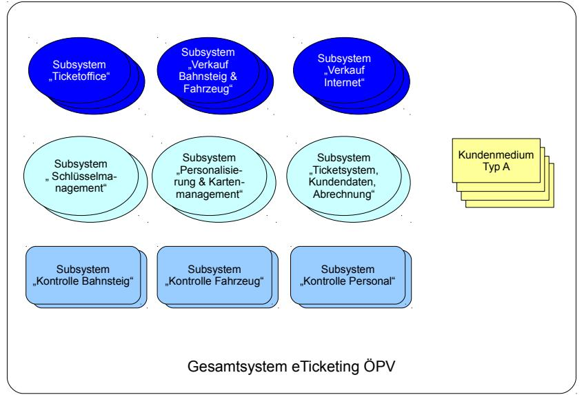
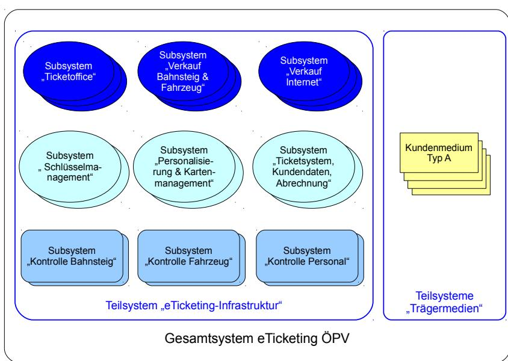
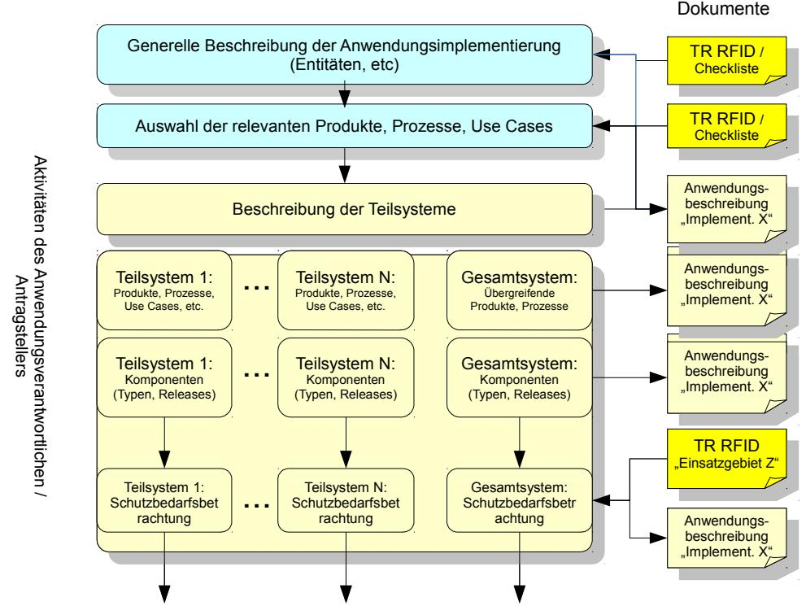
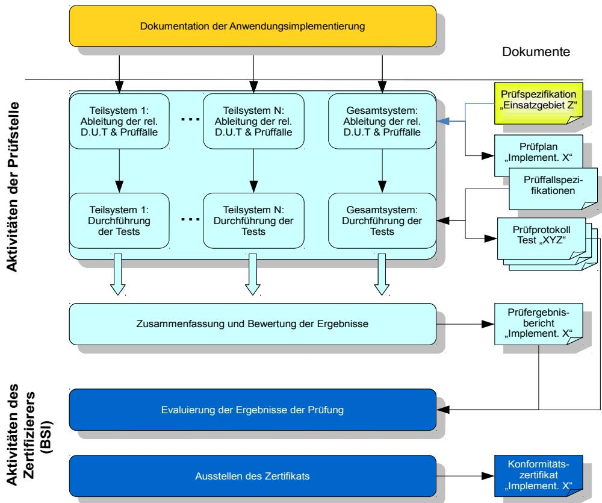

# Technische Richtlinie für den sicheren RFID-Einsatz (TR RFID)

**TR 03126-5-P: Prüfspezifikation für das Einsatzgebiet "Elektronischer Mitarbeiterausweis"**

Version 1.1

Autoren:

Harald Kelter, BSI Sabine Mull, BSI Cord Bartels, CBcon GmbH & Co. KG Holger Funke, HJP Consulting GmbH

Bundesamt für Sicherheit in der Informationstechnik Postfach 20 03 63 53133 Bonn Tel.: +49 22899 9582-0 E-Mail: rfid@bsi.bund.de Internet: [https://www.bsi.bund.de](https://www.bsi.bund.de/) © Bundesamt für Sicherheit in der Informationstechnik 2013

| 1              | Einführung6                                                                                 |  |
|----------------|---------------------------------------------------------------------------------------------|--|
| 2              | Referenzen6                                                                                 |  |
| 3              | Definitionen7                                                                               |  |
| 4              | Abkürzungen11                                                                               |  |
| 5              | Prinzip der Konformitätsprüfungen zu den TR RFID12                                       |  |
| 5.1            | Positionierung im System der TR RFID 12                                                     |  |
| 5.2            | Ziele und Grundlagen13                                                                      |  |
| 5.3            | Vorbereitung der Konformitätsprüfung13                                                      |  |
| 5.4            | Durchführung der Konformitätsprüfung16                                                      |  |
| 6              | Grundlagen der Konformitätsprüfung zur TR 03126-5 "Elektronischer Mitarbeiterausweis".17 |  |
| 7              | Listen der zu prüfenden Eigenschaften18                                                     |  |
| 7.1            | Generelle Eigenschaften der Anwendungsimplementierung18                                     |  |
| 7.2            | Spezielle Eigenschaften zum Schutz vor Gefährdungen19                                       |  |
| 7.2.1          | Spezielle Maßnahmen für das Gesamtsystem19                                                  |  |
| 7.2.2          | Spezielle Maßnahmen für das Trägermedium20                                                  |  |
| 7.2.3          | Spezielle Maßnahmen für das Lesegerät 21                                                    |  |
| 7.2.4          | Spezielle Maßnahmen für das Schlüsselmanagement21                                           |  |
| 8              | Listen der Prüffälle22                                                                      |  |
| 8.1            | Prüffälle zu den generellen Eigenschaften22                                                 |  |
| 8.2            | Prüffälle zu speziellen Eigenschaften24                                                     |  |
| 8.2.1          | Prüffälle für das Gesamtsystem24                                                            |  |
| 8.2.2          | Prüffälle für das Trägermedium33                                                            |  |
| 8.2.3          | Prüffälle für das Lesegerät 41                                                              |  |
| 8.2.4          | Prüffälle für das Schlüsselmanagement45                                                     |  |
| 9              | Ausarbeitung von Prüfkriterien zu den Prüffällen52                                          |  |
| 9.1            | Prüffälle und Prüfkriterien zu den generellen Eigenschaften52                               |  |
| 9.1.1          | Prüffälle zur Eigenschaft E_G152                                                            |  |
| 9.1.2          | Prüffälle zur Eigenschaft E_G252                                                            |  |
| 9.1.3 9.1.4 | Prüffälle zur Eigenschaft E_G354 Prüffälle zur Eigenschaft E_G455                        |  |
| 9.1.5          | Prüffälle zur Eigenschaft E_G556                                                            |  |
| 9.1.6          | Prüffälle zur Eigenschaft E_G657                                                            |  |
| 9.1.7          | Prüffälle zur Eigenschaft E_G757                                                            |  |
| 9.1.8          | Prüffälle zur Eigenschaft E_G858                                                            |  |
| 9.1.9          | Prüffälle zur Eigenschaft E_G959                                                            |  |
| 9.1.10         | Prüffälle zur Eigenschaft E_G1061                                                           |  |
| 9.1.11         | Prüffälle zur Eigenschaft E_G1162                                                           |  |
| 9.1.12         | Prüffälle zur Eigenschaft E_G1263                                                           |  |
| 9.1.13         | Prüffälle zur Eigenschaft E_G1363                                                           |  |
| 9.2            | Prüfkriterien für das Gesamtsystem65                                                        |  |
| 9.2.1          | Prüffälle zur Eigenschaft E_MS165                                                           |  |
| 9.2.2 9.2.3 | Prüffälle zur Eigenschaft E_MS269 Prüffälle zur Eigenschaft E_MS372                      |  |
| 9.2.4          | Prüffälle zur Eigenschaft E_MS474                                                           |  |
| 9.2.5          | Prüffälle zur Eigenschaft E_MS583                                                           |  |

| 9.2.6  | Prüffälle zur Eigenschaft E_MS685                        |  |
|--------|----------------------------------------------------------|--|
| 9.2.7  | Prüffälle zur Eigenschaft E_MS789                        |  |
| 9.2.8  | Prüffälle zur Eigenschaft E_MS891                        |  |
| 9.2.9  | Prüffälle zur Eigenschaft E_MS992                        |  |
| 9.2.10 | Prüffälle zur Eigenschaft E_MS1098                       |  |
| 9.2.11 | Prüffälle zur Eigenschaft E_MS1199                       |  |
| 9.2.12 | Prüffälle zur Eigenschaft E_MS12102                      |  |
| 9.2.13 | Prüffälle zur Eigenschaft E_MS13104                      |  |
| 9.2.14 | Prüffälle zur Eigenschaft E_MS14108                      |  |
| 9.2.15 | Prüffälle zur Eigenschaft E_MS15110                      |  |
|        |                                                          |  |
| 9.2.16 | Prüffälle zur Eigenschaft E_MS17111                      |  |
| 9.2.17 | Prüffälle zur Eigenschaft E_MS18113                      |  |
| 9.2.18 | Prüffälle zur Eigenschaft E_MS5-1114                     |  |
| 9.2.19 | Prüffälle zur Eigenschaft E_MS5-2117                     |  |
| 9.2.20 | Prüffälle zur Eigenschaft E_MS5-3120                     |  |
| 9.2.21 | Prüffälle zur Eigenschaft E_MS5-4123                     |  |
| 9.3    | Prüfkriterien für die Prüffälle zum Trägermedium124      |  |
| 9.3.1  | Prüffälle zur Eigenschaft E_MT1124                       |  |
| 9.3.2  | Prüffälle zur Eigenschaft E_MT2130                       |  |
|        |                                                          |  |
| 9.3.3  | Prüffälle zur Eigenschaft E_MT3133                       |  |
| 9.3.4  | Prüffälle zur Eigenschaft E_MT4138                       |  |
| 9.3.5  | Prüffälle zur Eigenschaft E_MT6145                       |  |
| 9.3.6  | Prüffälle zur Eigenschaft E_MT7148                       |  |
| 9.3.7  | Prüffälle zur Eigenschaft E_MT8152                       |  |
| 9.3.8  | Prüffälle zur Eigenschaft E_MT9154                       |  |
| 9.3.9  | Prüffälle zur Eigenschaft E_MT10a161                     |  |
| 9.3.10 | Prüffälle zur Eigenschaft E_MT10b164                     |  |
| 9.3.11 | Prüffälle zur Eigenschaft E_MT11a165                     |  |
| 9.3.12 | Prüffälle zur Eigenschaft E_MT11b169                     |  |
| 9.3.13 | Prüffälle zur Eigenschaft E_MT5-1172                     |  |
|        |                                                          |  |
| 9.4    | Prüffälle für das Lesegerät175                           |  |
| 9.4.1  | Prüffälle zur Eigenschaft E_MR1175                       |  |
| 9.4.2  | Prüffälle zur Eigenschaft E_MR2175                       |  |
| 9.4.3  | Prüffälle zur Eigenschaft E_MR3184                       |  |
| 9.4.4  | Prüffälle zur Eigenschaft E_MR5-1192                     |  |
| 9.5    | Prüffälle des Schlüsselmanagements196                    |  |
| 9.5.1  | Prüffälle zur Eigenschaft E_MK1196                       |  |
| 9.5.2  | Prüffälle zur Eigenschaft E_MK2200                       |  |
| 9.5.3  | Prüffälle zur Eigenschaft E_MK3206                       |  |
| 9.5.4  | Prüffälle zur Eigenschaft E_MK4210                       |  |
|        |                                                          |  |
| 9.5.5  | Prüffälle zur Eigenschaft E_MK5213                       |  |
| 9.5.6  | Prüffälle zur Eigenschaft E_MK6216                       |  |
| 9.5.7  | Prüffälle zur Eigenschaft E_MK7221                       |  |
| 9.5.8  | Prüffälle zur Eigenschaft E_MK8222                       |  |
| 10     | Durchführung der Konformitätsprüfung228                  |  |
| 10.1   | Generelle Vorgehensweise228                              |  |
| 10.2   | Schritt 1: Beschreibung der Anwendungsimplementierung229 |  |
|        |                                                          |  |
| 10.3   | Schritt 2: Erstellung des Prüfplans230                   |  |
| 10.3.1 | Definition der Teilsysteme 230                           |  |
| 10.3.2 | Ermittlung der Prüffälle230                              |  |
| 10.3.3 | Vorschlag zur Struktur des Prüfplans231                  |  |
| 10.4   | Struktur der Prüfdokumentation231                        |  |

| 11     | Prüffälle für die in der TR 03126-5 definierten exemplarischen Einsatzszenarien233 |  |
|--------|------------------------------------------------------------------------------------|--|
| 11.1   | Einsatzszenario 1 "Einfache Zutrittskontrolle und Zeiterfassung"233                |  |
| 11.1.1 | Teilsystem "Zutrittskontrolle"233                                                  |  |
| 11.1.2 | Teilsystem "Zeiterfassung"236                                                      |  |
| 11.1.3 | Teilsystem "Mitarbeiterausweise"239                                                |  |
| 11.1.4 | Teilsystem "Systeme elektronischer Mitarbeiterausweis"240                          |  |
| 11.2   | Einsatzszenario 2 "Marktübliches Ausweissystem"245                                 |  |
| 11.2.1 | Teilsystem "Zutrittskontrolle"245                                                  |  |
| 11.2.2 | Teilsystem "Zeiterfassung"249                                                      |  |
| 11.2.3 | Teilsystem "Mitarbeiterausweise"252                                                |  |
| 11.2.4 | Teilsystem "Systeme elektronischer Mitarbeiterausweis"254                          |  |
| 11.3   | Einsatzszenario 3 "Hochsicheres Multiapplikationssystem"258                        |  |
| 11.3.1 | Teilsystem "Zutrittskontrolle"258                                                  |  |
| 11.3.2 | Teilsystem "Zeiterfassung"263                                                      |  |
| 11.3.3 | Teilsystem "Mitarbeiterausweise"267                                                |  |
| 11.3.4 | Teilsystem "Systeme elektronischer Mitarbeiterausweis"268                          |  |

# **Abbildungsverzeichnis**

| Abbildung 1: System der TR RFID12                                                           |    |
|---------------------------------------------------------------------------------------------|----|
| Abbildung 2: Beispiel Gesamtsystem ÖPV-Ticketing14                                          |    |
| Abbildung 3: Aufteilung des Gesamtsystems in Teilsysteme am Beispiel des eTicketing im ÖPV. | 14 |
| Abbildung 4: Vorbereitung der Konformitätsprüfung15                                         |    |
| Abbildung 5: Durchführung der Konformitätsprüfung16                                         |    |
|                                                                                             |    |

# **1 Einführung**

Als 5. Teil der Richtlinienreihe zum sicheren RFID-Einsatz (TR 03126 bzw. TR RFID) hat das Bundesamt für Sicherheit in der Informationstechnik im Jahr 2010 eine Technische Richtlinie für die sichere Umsetzung von RFID-Anwendungssystemen im Einsatzgebiet "Elektronischer Mitarbeiterausweis" veröffentlicht (TR 03126-5).

In der hier vorliegenden Prüfspezifikation werden Konformitätsprüfungen zu dieser Technischen Richtlinie definiert. Den Betreibern von Anwendungssystemen und deren Systemlieferanten ist es damit möglich, die Konformität ihrer Implementierung eines Mitarbeiterausweissystems zur TR 03126-5 zu erklären oder sich durch unabhängige Prüfungsstellen mit abschließender Zertifizierung bestätigen zu lassen.

# **2 Referenzen**

Die folgenden Dokumente bilden die Grundlage für diese Prüfspezifikation.

| Dokument                                                                                                                                                                                                                       | Kurzname                | Version / Datum     | Herausgeber                                                                                   |
|--------------------------------------------------------------------------------------------------------------------------------------------------------------------------------------------------------------------------------|-------------------------|------------------------|-----------------------------------------------------------------------------------------------|
| TR 03126-5 Technische Richtlinie für den sicheren RFID-Einsatz, Einsatzgebiet "elektronischer Mitarbeiterausweis"                                                                                                     | [TR 03126-5]         | 2.0                    | Bundesamt für Sicherheit in der Informationstechnik                                     |
| Konzept zur Konformitätsprüfung                                                                                                                                                                                                | [KonfPrüfung]           | 1.2 / 06.11.2012    | Bundesamt für Sicherheit in der Informationstechnik                                     |
| Bekanntmachung zur elektronischen Signatur nach dem Signaturgesetz und der Signaturverordnung (Übersicht über geeignete Algorithmen)                                                                                  | [AlgKat]                | 30.12.2011             | Bundesnetzagentur für Elektrizität, Gas, Telekommunikation , Post und Eisenbahnen |
| TR 02102 Kryptografische Verfahren: Empfehlungen und Schlüssellängen                                                                                                                                                     | [TR 02102]           | 2013.2 / 09.01.2013 | Bundesamt für Sicherheit in der Informationstechnik                                     |
| BSI TR 03105 Conformity Tests for Official Electronic ID Documents (BSI TR-03105), BSI TR-03105 Part 2: Test Plan for Official Electronic ID Documents with Secure Contactless Integrated Circuit - Version 2.2 | [BSI_PICC_Test Spec] | 2.2 / 01.12.2009    | Bundesamt für Sicherheit in der Informationstechnik                                     |
| BSI TR 03105 Conformity Tests for Official Electronic ID Documents (BSI TR 03105), BSI TR 03105 Part 4: Test plan for ICAO compliant Proximity Coupling Device (PCD) on Layer 2-4 – Version 2.2           | [BSI_PCD_TestS pec]  | 2.2 / 17.03.2010    | Bundesamt für Sicherheit in der Informationstechnik                                     |

| Dokument                                                                                                                                                                                                                        | Kurzname     | Version / Datum  | Herausgeber |
|---------------------------------------------------------------------------------------------------------------------------------------------------------------------------------------------------------------------------------|--------------|---------------------|-------------|
| NFC Forum Specifications, NFC Forum Device Requirements High Level Conformance Requirements NFC Forum Device Requirements 1.2                                                                                          | [NFC_Forum1] | 1.0 / 19.07.2012 | NFC Forum   |
| Device Test Application Specification for NFC Forum Analog, NFC Forum Digital Protocol, NFC Forum LLCP, NFC Forum SNEP, and NFC Forum Type 1/2/3/4 Tags - NFC Forum – NFCForum-CS-DeviceTestApplication_v 2.0 | [NFC_Forum2] | 2.0 / 11.07.2012 | NFC Forum   |
| Identification cards - Test methods - Part 6: Proximity cards                                                                                                                                                                | [ISO10373-6] | 2011                | ISO         |
| BSI: IT-Grundschutz-Kataloge                                                                                                                                                                                                    | [GSK]        | 2006                | BSI         |

*Tabelle 1: Referenzdokumente*

# **3 Definitionen**

#### Antragsteller:

Entität, die eine Eigenerklärung zur Konformität abgeben möchte oder die Konformitätsprüfung durch eine Prüfstelle und Zertifizierung durch das BSI beantragt.

Antragsteller kann z. B. der Betreiber einer Anwendungsimplementierung, der Systemlieferant eines Gesamtsystems, das eine oder mehrere Anwendungen unterstützt, oder ein Anwendungsherausgeber sein.

#### Anwendung:

Anwendungen stellen spezifische Dienste für Bürger, Unternehmen oder Behörden bereit. Im Kontext der TR RFID wird der Begriff Anwendung als Oberbegriff für alle Strukturen, Prozesse und technischen Vorkehrungen verwendet, die zur Erbringung bestimmter Leistungen und Dienste notwendig sind. Der elektronische Mitarbeiterausweis und seine Systeme können unterschiedliche Anwendungen unterstützen. Im Kontext des Trägermediums bezeichnet der Begriff Anwendung die Implementierung anwendungsspezifischer Funktionen und Daten auf dem Medium.

Anwendungsherausgeber, Anwendungsanbieter:

Eigentümer und Herausgeber der Spezifikation einer Anwendungsimplementierung. Die Spezifikation wird an die Betreiber, die die Anwendung nutzen wollen, weitergegeben. Beispiele für Anwendungsherausgeber sind der Verband deutscher Verkehrsunternehmen (VDV-Kernapplikation) und GS1-Global (EPCglobal).

Anwendungsimplementierung:

Bereitstellung einer Anwendung zur Nutzung durch Implementierung der benötigten Strukturen, technischen Systemen und Betriebsprozesse durch den Anwendungsbetreiber.

Anwendungsverantwortlicher, Anwendungsbetreiber, Betreiber:

Entität, die für die Bereitstellung und den Betrieb einer konkreten Anwendungsimplementierung die Verantwortung trägt. Diese ist auch Ansprechpartner für Datenschutzbehörden bzgl. PIA. Falls mehrere Anwendungsverantwortliche dasselbe Gesamtsystem nutzen, ist ein Systemverantwortlicher erforderlich, der anwendungsübergreifend das Gesamtsystem verantwortet.

#### Berechtigung:

Nachweis, dass der Nutzer das Recht hat, spezifische Dienstleitungen zu nutzen. Beispiele sind der Zutritt zu gewissen Gebäuden, die Nutzung der Kantine etc. Im Kontext von elektronischen Mitarbeiterausweisen üblicherweise durch elektronische Berechtigungen (Entitlements), die mit dem Mitarbeiterausweis verknüpft sind, implementiert.

#### Dienst:

Leistung, die im Rahmen der Anwendung für den Nutzer erbracht wird. Üblicherweise ist dazu eine Berechtigung vorzuweisen. Ein Beispiel ist die Nutzung eines Parkplatzes als Dienstleistung eines Dienstleisters.

#### Dienstleister:

Entität, die gegen Vorlage einer Berechtigung mithilfe der Anwendungsimplementierung einen Dienst für den Nutzer erbringt.

#### Einsatzgebiet:

Bereich, in dem die Technische Richtlinie und die zugehörige Prüfspezifikation Anwendung finden soll. Höchste Einheit in der Begriffsstruktur. Umfasst eine oder mehrere Anwendungen und alle Ausprägungen dieser Anwendungen in spezifischen Einsatzszenarien.

#### Einsatzszenario:

Spezielle Auswahl und Zusammenstellung der möglichen Anwendungen, Produkte und Dienste eines Einsatzgebietes in einer spezifischen Implementierung.

#### Gesamtsystem:

Summe aller Subsysteme, die in einer Implementierung einer oder mehrerer Anwendungen eingesetzt werden.

#### Komponente:

Gerät oder Service, das bestimmte Funktionen innerhalb von Subsystemen bzw. des Gesamtsystems bereitstellt. Beispiele sind RFID-Lesegeräte, Verkaufsautomaten, Drehsperren für die Zutrittskontrolle, aber auch Rechner und Netze sowie die Berechtigungsdatenbank.

#### Produkt:

Zusammenstellung von Berechtigungen zur Nutzung von Diensten oder Erhalt von Waren, die ein Nutzer einer Anwendung erwerben kann. Beispiele sind ein Fahrschein (Umsetzung in eine oder mehrere Fahrten), eine oder mehrere Berechtigungen zur Kantinennutzung etc.

#### Prüffall:

Mit der Definition eines Prüffalles wird spezifiziert, wie einzelne Eigenschaften der Anwendungsimplementierung, die laut TR RFID gefordert sind, überprüft werden. Diese Eigenschaften können das System, die operativen Prozesse oder auch einzelne Komponenten und Schutzmaßnahmen betreffen. Prüffälle können mehrere einzelne Tests beinhalten. Es werden für jeden dieser Tests Prüfkriterien definiert. Prüffälle und Prüfkriterien werden in der Prüfspezifikation dokumentiert.

#### Prüfkriterien:

Prüfkriterien spezifizieren, ob das Ziel eines konkreten Tests erreicht oder verfehlt wurde (Pass/Fail).

#### Prüfplan:

Plan zur Umsetzung der allgemeingültigen Prüfspezifikation eines Einsatzgebiets für eine spezifische Anwendungsimplementierung.

#### Prüfspezifikation:

Die Prüfspezifikation legt den Prüfumfang (zu prüfende Eigenschaften und Pass/Fail-Kriterien) und die Durchführung der Konformitätsprüfung für ein Einsatzgebiet grundlegend fest. Dabei werden insbesondere die zu betrachtenden Testobjekte (test items), die zu prüfenden Eigenschaften (features) und die zugeordneten Abnahmekriterien festgelegt (Pass/Fail criteria).

#### Subsystem:

Gruppe von Komponenten und Geräten, die bestimmte Funktionen innerhalb des Gesamtsystems bereitstellen. Beispiele sind das Verwaltungssystem für Berechtigungen, die RFID-Infrastruktur im Firmengebäude oder das Schlüsselmanagementsystem.

#### Systemverantwortlicher:

Entität, die für die Gesamtsystemimplementierung einer oder mehrerer Anwendungen insgesamt verantwortlich ist.

#### Systemspezifikation:

Spezifikation aller Eigenschaften des Gesamtsystems. Üblicherweise wird die Systemspezifikation vom Systemintegrator oder Systemlieferanten für das jeweilige Gesamtsystem erstellt und vom Systemverantwortlichen abgenommen.

#### Systemtestspezifikation:

Spezifikation der spezifischen Tests zur Freigabe des Gesamtsystems. Üblicherweise wird die Systemtestspezifikation vom Systemintegrator oder Systemlieferanten für das jeweilige Gesamtsystem erstellt und vom Systemverantwortlichen abgenommen.

#### Teilsystem:

Gruppierung von Subsystemen, die vergleichbaren Schutzbedarf aufweisen und dadurch bei der Zuweisung von Schutzmaßnahmen und der Konformitätsprüfung zusammen bearbeitet werden können.

#### Testspezifikation:

Spezifikation der spezifischen Tests zur Freigabe einzelner Komponenten oder Subsysteme. Üblicherweise wird die Testspezifikation vom Hersteller erstellt und beigestellt.

# **4 Abkürzungen**

| Abkürzung | Beschreibung                                                     |
|-----------|------------------------------------------------------------------|
| AES       | Advanced Encryption Standard                                     |
| BSI       | Bundesamt für Sicherheit in der Informationstechnik              |
| CA        | Certification Authority                                          |
| CMS       | Kartenmanagementsystem                                           |
| CRC       | Cyclic Redundancy Check                                          |
| DoS       | Denial of Service                                                |
| DuT       | Device under test (Prüfgegenstand)                               |
| EC-DSA    | Elliptic Curve Data Signature Algorithm                          |
| FAQ       | Frequently Asked Questions                                       |
| KMS       | Schlüsselmanagementsystem                                        |
| MAC       | Message Authentication Code                                      |
| NFC       | Near Field Communication                                         |
| ÖPV       | Öffentlicher Personenverkehr                                     |
| PIA       | Privacy Impact Assessment                                        |
| PKI       | Public Key Infrastructure                                        |
| RF        | Radio Frequency                                                  |
| RFID      | Radio Frequency Identification                                   |
| RSA       | Asymmetrisches Kryptoverfahren nach Rivest, Shamir und Adleman   |
| SAM       | Security Authentication Modules                                  |
| SLA       | Service Level Agreement                                          |
| SuT       | System under Test (zu testendes System)                          |
| TR        | Technische Richtlinie, Technische Richtlinien                    |
| TR RFID   | Technische Richtlinie für den sicheren RFID-Einsatz (TR 03126)   |
| UID       | Unique Identifier. Eindeutige, unveränderbare Kennung des Chips. |
| USV       | Unterbrechungsfreie Stromversorgung                              |
| VPN       | Virtual Private Network                                          |

*Tabelle 2: Abkürzungen*

# **5 Prinzip der Konformitätsprüfungen zu den TR RFID**

# **5.1 Positionierung im System der TR RFID**

Das BSI entwickelt mit den TR RFID ein System, das die IT-Sicherheit in verschiedenen Stadien des Lebenszyklus von RFID-Anwendungssystemen unterstützt.

Die Technischen Richtlinien zum sicheren RFID-Einsatz sollen Anwendungsverantwortliche bei der Planung und Beschaffung von Anwendungssystemen fachlich unterstützen. Die einsatzgebietsspezifischen Teile der TR RFID enthalten Empfehlungen für die sichere und datenschutzkonforme Implementierung der Komponenten und Systeme nach dem Stand der Technik. Diese Informationen fließen vor der Einführung in die Spezifikationen ein. Die Technische Richtlinie unterstützt damit die Prinzipien des "Security-by-design" und des "Privacy-by-design".

*Abbildung 1: System der TR RFID*

Mit der Entwicklung von Konformitätskriterien wird nun darüber hinaus die Möglichkeit geschaffen, die Umsetzung der Empfehlungen der TR RFID für existierende Anwendungsimplementierungen zu prüfen und zu bestätigen. Diese Komponente des Systems der TR RFID kommt also insbesondere in der Einführungs- und Betriebsphase von Systemen zum Einsatz. [Abbildung 1](#page-10-1) zeigt die Positionierung der Konformitätsprüfung.

# **5.2 Ziele und Grundlagen**

Mittels einer Konformitätsprüfung soll auf möglichst einfache und effiziente Weise die Übereinstimmung von Anwendungsimplementierungen mit den Empfehlungen der TR RFID des betreffenden Einsatzgebiets festgestellt werden können. Die Konformität kann in zwei Ausprägungen bestätigt werden:

- 1. Der Anwendungsverantwortliche, der Systemlieferant oder der Anwendungsherausgeber kann die in diesem Dokument spezifizierten Prüffälle selbst abarbeiten und die Konformität seines Gesamtsystems erklären (Selbsterklärung).
- 2. Das BSI bietet an, die Konformität nach erfolgreicher Evaluierung durch eine unabhängige Prüfstelle durch ein Zertifikat zu bestätigen (Zertifizierung).

Das Konzept der Konformitätsprüfung kann für alle Einsatzgebiete, die die TR RFID behandelt, verwendet werden. Die konkrete Prüfspezifikation, die die Prüffälle und Prüfkriterien festlegt, bezieht sich immer auf ein spezifisches Einsatzgebiet und die Anforderungen, die in dem entsprechenden Teil der TR RFID festgelegt wurden. Eine besondere Herausforderung für die Konzeption und Durchführung der Konformitätsprüfung ergibt sich aus dem Umstand, dass die jeweilige TR RFID die Gesamtheit aller Eigenschaften und Anforderungen enthält, die für ein Einsatzgebiet bekannt sind. Die zugehörige generische Prüfspezifikation enthält für alle diese Eigenschaften und Anforderungen Prüffälle. Reale Anwendungsimplementierungen verwenden jedoch üblicherweise nur einen Teil der in der TR RFID beschriebenen Eigenschaften. Vor der Durchführung der Konformitätsprüfung muss also ermittelt werden, welche Anforderungen im konkreten Fall zu prüfen sind, welche Prüffälle der generischen Prüfspezifikation dazu abgearbeitet und welche weggelassen werden müssen. Die Durchführung und Dokumentation der Konformitätsprüfung folgt grundsätzlich dem "IEEE Standard for Software Test Documentation" (IEEE Std 829-1998).

# **5.3 Vorbereitung der Konformitätsprüfung**

Der erste Schritt der Konformitätsprüfung besteht darin, die Eigenschaften und Anforderungen der zu prüfenden Anwendungsimplementierung möglichst genau zu ermitteln. Um dies zu unterstützen, wird soweit möglich mit Checklisten gearbeitet, die die wesentlichen Eigenschaften des Einsatzgebiets aufführen. Dabei werden aus den in der TR RFID benannten Eigenschaften (Produkte, Komponenten, Prozesse und Use Cases) jene ausgewählt, die in der zu prüfenden Anwendungsimplementierung zum Einsatz kommen. Es ist zusätzlich der Kontext zu beschreiben, in dem die Produkte, Komponenten, Prozesse und Use Cases verwendet werden.

In allen beschriebenen Einsatzgebieten besteht das Gesamtsystem zumeist aus mehreren Subsystemen. Die [Abbildung 2](#page-12-0) zeigt das Verhältnis Gesamtsystem - Subsystem exemplarisch am Beispiel des eTicketing für den öffentlichen Personenverkehr.

Bei realen Implementierungen unterscheiden sich die Subsysteme oftmals bezüglich der zu unterstützenden Trägermedien, Produkte und Prozesse. So kann z. B. der Verkauf am Automaten am Bahnsteig oder im Fahrzeug auf unpersonalisierte Tickets (Produkte) beschränkt sein, in der Vertriebsstelle des Verkehrsunternehmens können zusätzlich auch personalisierte Jahreskarten und Multiapplikations-Kundenmedien erworben werden.

*Abbildung 2: Beispiel Gesamtsystem ÖPV-Ticketing*

Darüber hinaus werden Komponenten, die dem gleichen Zweck dienen, oftmals von mehreren Herstellern beschafft und sind dann in mehreren Typen und Releases im Einsatz. Jede dieser Varianten muss die jeweiligen Konformitätsanforderungen erfüllen. Die Konformitätsprüfungen der Subsysteme und des Gesamtsystems müssen also mit allen jeweils eingesetzten Varianten von Komponenten (Kundenmedien, Lesegeräte, etc.) durchgeführt werden.

*Abbildung 3: Aufteilung des Gesamtsystems in Teilsysteme am Beispiel des eTicketing im ÖPV*

In der TR 03126-1 wurde festgelegt, dass Subsysteme mit gleichem Schutzbedarf zu Teilsystemen zusammenfasst werden. Auf dieser Basis wird das Gesamtsystem ÖPV-Ticketing in die

eTicketing-Infrastruktur und die drei Teilsysteme aufgeteilt, die die verschiedenen Typen von Trägermedien repräsentieren. Diese vier Teilsysteme werden individuell einer Schutzbedarfsbetrachtung unterzogen und mit entsprechenden Schutzmaßnahmen ausgestattet.

Zur Vorbereitung der Konformitätsprüfung müssen in einem zweiten Schritt alle individuellen Teilsysteme definiert und beschrieben werden. Dabei sind die jeweils relevanten Parameter zu benennen. Im Beispiel des ÖPV-Ticketing sind dies die verwendeten Trägermedien, Produkte, Prozesse und Use Cases. Zusätzlich muss für jedes Teilsystem angegeben werden, welche Typen, Releases und Mengen von Komponenten zum Einsatz kommen.

Für jedes der definierten Teilsysteme muss individuell ermittelt werden, welcher Schutzbedarf und welche Gefährdungen den Schutzmaßnahmen zugrunde liegen. Dazu ist für jedes Teilsystem mithilfe des in der TR RFID vorgegebenen Templates eine Schutzbedarfsbetrachtung für das spezifische Einsatzszenario durchzuführen. [Abbildung 4](#page-13-0) zeigt den Ablauf der Dokumentationsaktivitäten, die vom Antragsteller zur fachlichen Vorbereitung der Konformitätsprüfung zu leisten sind.

*Abbildung 4: Vorbereitung der Konformitätsprüfung*

Der Antragsteller wird bei der Dokumentation der implementierungsspezifischen Eigenschaften durch Checklisten unterstützt. Die Verfügbarkeit der spezifischen Informationen ist eine Voraussetzung für die Durchführung der Konformitätsprüfung und wird durch spezielle Prüffälle ermittelt.

# **5.4 Durchführung der Konformitätsprüfung**

Ein Anwendungsverantwortlicher, Systemlieferant oder Anwendungsherausgeber, der eine Eigenerklärung zur Konformität plant, kann frei entscheiden, wie er die Prüffälle abarbeiten und die Ergebnisse dokumentieren möchte.

Falls jedoch ein Konformitätszertifikat des BSI angestrebt wird, sind feste Regeln für die Umsetzung der Prüfung und die Dokumentation der Ergebnisse einzuhalten. Die Prüfung muss durch eine vom BSI anerkannte, unabhängige Prüfstelle durchgeführt werden. Alle Ergebnisse sind dem BSI offenzulegen.

Im ersten Schritt der Konformitätsprüfung wird von der Prüfstelle anhand der Dokumentation der zu prüfenden Anwendungsimplementierung ermittelt, welche Komponenten den in der TR RFID definierten Teilsystemen des Einsatzgebiets zugeordnet werden. Für diese Komponenten werden die in der Prüfspezifikation festgelegten Prüffälle angewendet. Die einzuhaltende Schutzbedarfsklasse leitet sich dabei aus den Anforderungen für das jeweilige Teilsystem ab. Die Festlegungen werden im Prüfplan dokumentiert. Der Prüfplan bildet die Grundlage der Durchführung der Konformitätsprüfung.

Die Ergebnisse der einzelnen Tests werden in Prüfprotokollen dokumentiert und im Prüfergebnisbericht zu einer Gesamtbewertung zusammengefasst. [Abbildung 5](#page-14-0) zeigt den Ablauf der Konformitätsprüfung und Zertifizierung.

*Abbildung 5: Durchführung der Konformitätsprüfung*

# **6 Grundlagen der Konformitätsprüfung zur TR 03126-5 "Elektronischer Mitarbeiterausweis"**

Die Vorbereitung und Durchführung der Konformitätsprüfung zur TR 03126-5 folgt grundsätzlich der im Kapitel [5](#page-10-0) beschriebenen Vorgehensweise. Es gibt jedoch einige spezifische Besonderheiten, die hier aufgeführt und deren Auswirkungen dargestellt werden.

1. Unterstützung von verschiedenen Anwendungen

Anders als bei den übrigen Teilen der TR RFID, bei denen grundsätzlich eine Anwendung beschrieben wird und eine Skalierung des Schutzbedarfs der Einsatzszenarien sich z. B. aus dem Wert unterschiedlicher Produkte ergibt, wird im Einsatzgebiet "Elektronischer Mitarbeiterausweis" davon ausgegangen, dass die Systeminfrastruktur mehrere Anwendungen unterstützt. Prinzipiell ist es möglich, dass diese Anwendungen von unterschiedlichen Anwendungsherausgebern stammen und von verschiedenen Entitäten betrieben und verantwortet werden.

2. Unterteilung des Gesamtsystems in Teilsysteme

Die TR 03126-5 unterscheidet bei der Schutzbedarfsbetrachtung zwischen den Teilsystemen "Zutrittskontrolle", Zeiterfassung", "Systeme elektronischer Mitarbeiterausweis" und "Mitarbeiterausweise".

Die Teilsysteme "Zutrittskontrolle" und Zeiterfassung" beinhalten die spezifischen Subsysteme und Komponenten der beider Anwendungen. In den Teilsystemen "Systeme elektronischer Mitarbeiterausweis" und "Mitarbeiterausweise" werden die anwendungsübergreifend eingesetzten Subsysteme und Komponenten zusammengefasst. Eine Beschreibung des Gesamtsystems und der Teilsysteme findet sich im Kapitel 2.2 der TR 03126-5.

3. Ermittlung des Schutzbedarfs für die Teilsysteme

In der TR 03126-5 wurde der Schutzbedarf der einzelnen Teilsysteme für drei exemplarische Einsatzszenarien ermittelt. Falls die zu prüfende Implementierung mit einem der beschriebenen Szenarien übereinstimmt, können die Schutzbedarfszuordnungen für die Konformitätsprüfung übernommen werden.

Falls die zu prüfende Anwendungsimplementierung von den beschriebenen Einsatzszenarien abweichen sollte, muss der Schutzbedarf für die Teilsysteme individuell ermittelt werden. Im Anhang der TR 03126-5, Kapitel 15.1, findet sich dazu eine Anleitung. Dabei ist zu beachten, dass sich bei Teilsystemen, die mehrere Anwendungen oder Einsatzszenarien unterstützen, der Schutzbedarf nach der Anwendung oder dem Szenario mit dem höchsten Schutzbedarf richtet (= Maximumsprinzip).

# **7 Listen der zu prüfenden Eigenschaften**

In der TR 03126-5 sind Eigenschaften benannt worden, die von Systemimplementierungen erfüllt werden müssen, um einen bedarfsgerechten Stand der IT-Sicherheit zu erreichen. Gemäß dem Konzept der TR RFID wird in diesem Kapitel die Gesamtheit aller Eigenschaften und Anforderungen dargestellt, die für das Einsatzgebiet bekannt sind. Für die jeweiligen Anwendungsimplementierungen werden üblicherweise nur Untermengen davon gelten.

Die Konformitätsprüfung erfolgt aufgrund der Informationen zur Systemimplementierung, die vom Antragsteller beigebracht werden. Es muss geprüft werden, ob die Unterlagen die zur Prüfung erforderlichen Informationen enthalten und ob diese den Vorgaben der TR 03126-5 und den Anforderungen der Prüfungsdurchführung genügen.

Der Antragsteller wird durch Checklisten bei der Zusammenstellung der Informationen unterstützt.

# **7.1 Generelle Eigenschaften der Anwendungsimplementierung**

Die in der folgenden Liste aufgeführten generellen Eigenschaften bilden die Grundlage einer konformen Umsetzung der Anwendungen.

| ID    | Zu prüfende Eigenschaft                                                                                                                                                                                                 |
|-------|-------------------------------------------------------------------------------------------------------------------------------------------------------------------------------------------------------------------------|
| E_G1  | Generelle Beschreibung der Anwendungsimplementierung liegt vor.                                                                                                                                                         |
| E_G2  | Unterstützte Anwendungen, Dienste und Produkte sind dokumentiert (Auswahl per Checkliste).                                                                                                                           |
| E_G3  | Das Rollenmodell ist für alle Anwendungen implementiert und dokumentiert.                                                                                                                                               |
| E_G4  | Die Entitäten des Rollenmodells sind für alle Anwendungen dokumentiert.                                                                                                                                                 |
| E_G5  | Die verwendeten Trägermedien sind beschrieben.                                                                                                                                                                          |
| E_G6  | Die Zusammenhänge zwischen Trägermedien und Entitäten sind dokumentiert (welche Entität handhabt welches Trägermedium?).                                                                                             |
| E_G7  | Es ist dokumentiert, welche Anwendungen von den verwendeten Trägermedien unterstützt werden.                                                                                                                         |
| E_G8  | Werden Anwendungen verschiedener Herausgeber verwendet?                                                                                                                                                                 |
| E_G9  | Eine Beschreibung der implementierten Systemarchitektur und der verwendeten Komponenten liegt vor. Übereinstimmungen und Abweichungen von der in der TR 03126-5 vorgeschlagenen Architektur sind dokumentiert. |
| E_G10 | Die in der zu prüfenden Implementierung verwendeten Prozesse und Teilprozesse sind benannt.                                                                                                                          |
| E_G11 | Die in der zu prüfenden Implementierung verwendeten Use Cases sind benannt. Für jeden Use Case ist dokumentiert, welche Geschäftsprozesse unterstützt werden.                                                        |
| E_G12 | Für jeden Use Cases sind die Systeme und alle Komponenten, die eingesetzt werden, dokumentiert. Es ist jeweils Typ und Version angegeben.                                                                            |
| E_G13 | Die Zuordnung der Schutzbedarfsklasse ist für jedes Sicherheitsziel nach den vorgegebenen Kriterien erfolgt.                                                                                                         |

*Tabelle 3: Generelle Eigenschaften der zu prüfenden Implementierung*

# **7.2 Spezielle Eigenschaften zum Schutz vor Gefährdungen**

Die folgende Tabelle enthält die Eigenschaften, die dem Schutz vor Gefährdungen dienen, die innerhalb des Einsatzgebiets auftreten können. Konkret werden die Schutzmaßnahmen aufgeführt, die von den zu prüfenden Systemen und Komponenten in der Maximalkonfiguration des Einsatzgebiets unterstützt werden müssten. In der Praxis wird je nach Einsatzszenario der zu prüfenden Implementierung üblicherweise nur eine Untermenge der hier aufgeführten Eigenschaften erforderlich sein.

### **7.2.1 Spezielle Maßnahmen für das Gesamtsystem**

| ID      | Bezeichnung der Schutzmaßnahme                                                                                              |
|---------|-----------------------------------------------------------------------------------------------------------------------------|
| E_MS1   | Einführung von Schnittstellentests und Freigabeverfahren                                                                    |
| E_MS2   | Sicherung der Vertraulichkeit der Kommunikation zwischen Trägermedium und Lesegerät zur Abwehr des Abhörens durch Dritte |
| E_MS3   | Einführung der kontaktlosen Schnittstelle nach ISO/IEC 14443                                                             |
| E_MS4   | Definition von Rückfalllösungen beim Ausfall von Systemschnittstellen und Systemkomponenten                              |
| E_MS5   | Sicherung der Vertraulichkeit von Daten bei der Kommunikation innerhalb des Systems                                      |
| E_MS6   | Vertrauliche Speicherung von Daten                                                                                          |
| E_MS7   | Sicherung der Datenintegrität zum Schutz vor Manipulationen bei der Datenübertragung innerhalb des Systems               |
| E_MS8   | Sicherung der Datenintegrität bei der Speicherung von Daten                                                                 |
| E_MS9   | Sicherung der Systemfunktionen gegen DoS-Angriffe an den Schnittstellen                                                     |
| E_MS10  | Sicherung der Funktion des Systems gegen Fehlbedingung durch Mitarbeiter und Benutzer                                    |
| E_MS11  | Sicherung der Funktion des Systems zur Vermeidung technischer Fehler von Komponenten und Übertragungswegen               |
| E_MS12  | Spezifikation Systemkonzept und Anforderungen an die Komponenten                                                            |
| E_MS13  | Ergonomische Benutzerführung                                                                                                |
| E_MS14  | Support                                                                                                                     |
| E_MS15  | Trennung von Anwendungen und Anwendungsdaten                                                                                |
| E_MS17  | Umsetzung des Gebots zur Datensparsamkeit                                                                                   |
| E_MS18  | Verhindern der unerlaubten Verknüpfung von personenbezogenen Daten                                                       |
| E_MS5-1 | Sicherung der Datenerfassung bei der Personalisierung und/oder dem Enrolment                                                |
| E_MS5-2 | Sicherung der Datenintegrität bei der Speicherung von Daten (gesteigerte Anforderungen gegenüber MS8)                    |

| ID      | Bezeichnung der Schutzmaßnahme                                                                                                  |
|---------|---------------------------------------------------------------------------------------------------------------------------------|
| E_MS5-3 | Sicherung der Systemfunktionen gegen Fehlbedienung durch Mitarbeiter und Benutzer (gesteigerte Anforderungen gegenüber MS10) |
| E_MS5-4 | Identifikation des Mitarbeiters vor Ausgabe des elektronischen Mitarbeiterausweises                                          |

*Tabelle 4: Maßnahmen zum Schutz des Gesamtsystems*

### **7.2.2 Spezielle Maßnahmen für das Trägermedium**

| ID      | Bezeichnung der Schutzmaßnahme                                                                         |
|---------|--------------------------------------------------------------------------------------------------------|
| E_MT1   | Hard- und Software-Zugriffsschutz (Lese- und Schreibzugriff)                                           |
| E_MT2   | Schutz vor Klonen des Trägermediums inkl. Berechtigung                                                 |
| E_MT3   | Schutz vor Emulation                                                                                   |
| E_MT4   | Schutz der personenbezogenen Daten gegen Auslesen und Manipulation                                     |
| E_MT6   | Trennung der Anwendungen                                                                               |
| E_MT7   | Spezifikation der Eigenschaften des Trägermediums                                                      |
| E_MT8   | Einführung der kontaktlosen Schnittstelle nach ISO/IEC14443                                            |
| E_MT9   | Rückfalllösungen bei Fehlfunktion des Trägermediums                                                    |
| E_MT10a | Nachladen von Anwendungen – Sichern der Anwendungen hinsichtlich Authentizität und Integrität       |
| E_MT10b | Nachladen von Anwendungen – Sichern der Anwendungen hinsichtlich Vertraulichkeit                    |
| E_MT11a | Nachladen von Berechtigungen – Sichern der Berechtigungen hinsichtlich Authentizität und Integrität |
| E_MT11b | Nachladen von Berechtigungen – Sichern der Berechtigungen hinsichtlich Vertraulichkeit              |
| E_MT5-1 | Schulung zur Nutzung des Trägermediums                                                                 |

*Tabelle 5: Maßnahmen zum Schutz des Trägermediums*

### **7.2.3 Spezielle Maßnahmen für das Lesegerät**

| ID      | Bezeichnung der Schutzmaßnahme                                                       |
|---------|--------------------------------------------------------------------------------------|
| E_MR1   | Einführung von Schnittstellentests und Freigabeverfahren                             |
| E_MR2   | Schützen der Referenzinformationen gegen Auslesen, Datenfehler und Manipulationen |
| E_MR3   | Schutz des Lesegerätes gegen Fehlfunktion                                            |
| E_MR5-1 | Benutzbarkeit                                                                        |

*Tabelle 6: Maßnahmen zum Schutz Lesegeräts*

| ID    | Bezeichnung der Schutzmaßnahme                                                                                               |
|-------|------------------------------------------------------------------------------------------------------------------------------|
| E_MK1 | Sichere Erzeugung und Einbringung von Schlüsseln                                                                             |
| E_MK2 | Einführung eines Schlüsselmanagementsystems für symmetrische und asymmetrische Schlüssel mit ausreichender Schlüssellänge |
| E_MK3 | Zugriffsschutz auf kryptografische Schlüssel (Lese- und Schreibzugriff)                                                      |
| E_MK4 | Sicherung der Funktionen der Sicherheitskomponenten                                                                          |
| E_MK5 | Verfügbarkeit des Schlüsselmanagements (Rückfalllösung)                                                                      |
| E_MK6 | Definition des Verhaltens im Kompromittierungsfall von Schlüsseln                                                            |
| E_MK7 | Trennung von Schlüsseln                                                                                                      |
| E_MK8 | Nachladen von Schlüsseln – Sichern der Berechtigungen hinsichtlich Authentizität und Integrität                           |

#### **7.2.4 Spezielle Maßnahmen für das Schlüsselmanagement**

*Tabelle 7: Maßnahmen zum Schutz des Schlüsselmanagements* 

# **8 Listen der Prüffälle**

Mit den nachfolgenden Prüffällen kann untersucht werden, ob die in Kapitel [7](#page-16-0) benannten Eigenschaften im System implementiert sind/wurden. In Anlehnung an die Schutzmaßnahmen der TR 03126-5 sind nachfolgend die entsprechenden Prüffälle aufgelistet.

# **8.1 Prüffälle zu den generellen Eigenschaften**

Wie in Kapitel [5.3](#page-11-0) beschrieben, ist eine umfassende Beschreibung der Anwendungsimplementierung zur Vorbereitung der Konformitätsprüfung nötig. Mit den in der folgenden Tabelle aufgeführten Prüffällen zu den generellen Eigenschaften wird überprüft, ob alle Informationen vorliegen, die für die Umsetzung der Konformitätsprüfung erforderlich sind.

| Zu prüfende Eigenschaft | ID Prüffall                                                                                | Beschreibung des Prüffalls                                                                                                                                                                                                      |  |  |
|----------------------------|-----------------------------------------------------------------------------------------------|---------------------------------------------------------------------------------------------------------------------------------------------------------------------------------------------------------------------------------|--|--|
| E_G1                       | Generelle Beschreibung der Anwendungsimplementierung liegt vor.                               |                                                                                                                                                                                                                                 |  |  |
|                            | P_G1.1                                                                                        | Prüfung, ob eine generelle Beschreibung der zu prüfenden Anwendung vorliegt.                                                                                                                                                 |  |  |
| E_G2                       | Unterstützte Anwendungen, Dienste und Produkte sind dokumentiert (Auswahl per Checkliste). |                                                                                                                                                                                                                                 |  |  |
|                            | P_G2.1                                                                                        | Prüfung, ob die unterstützten Anwendungen dokumentiert sind.                                                                                                                                                                    |  |  |
|                            | P_G2.2                                                                                        | Prüfung, ob die unterstützten Dienste dokumentiert sind.                                                                                                                                                                        |  |  |
|                            | P_G2.3                                                                                        | Prüfung, ob die unterstützten Produkte dokumentiert sind.                                                                                                                                                                       |  |  |
|                            | P_G2.4                                                                                        | Prüfung, ob Anwendungen, Dienste oder Produkte unterstützt werden, die in der TR RFID des Einsatzgebiets nicht beschrieben und berücksichtigt sind oder deutliche Unterschiede zu den dort beschriebenen aufweisen. |  |  |
|                            | Das Rollenmodell ist für alle Anwendungen implementiert und dokumentiert.                     |                                                                                                                                                                                                                                 |  |  |
| E_G3                       | P_G3.1                                                                                        | Prüfung, ob die Rollen der zu prüfenden Implementierung dokumentiert sind. Dies muss für jede unterstützte Anwendung überprüft werden.                                                                                       |  |  |
|                            | P_G3.2                                                                                        | Prüfung, ob die Rollenbeschreibungen der zu prüfenden Implementierung dem Rollenmodell der TR RFID folgen. Dies muss für jede unterstützte Anwendung überprüft werden.                                                 |  |  |
|                            | Die Entitäten des Rollenmodells sind für alle Anwendungen dokumentiert.                       |                                                                                                                                                                                                                                 |  |  |
| E_G4                       | P_G4.1                                                                                        | Prüfung, ob für alle Rollen der zu prüfenden Implementierung Entitäten benannt sind. Dies muss für jede unterstützte Anwendung überprüft werden.                                                                          |  |  |
|                            | Die verwendeten Trägermedien sind beschrieben.                                                |                                                                                                                                                                                                                                 |  |  |
| E_G5                       | P_G5.1                                                                                        | Prüfung, ob die verwendeten Trägermedien benannt und beschrieben sind.                                                                                                                                                       |  |  |
|                            | P_G5.2                                                                                        | Prüfung, ob Trägermedien verwendet werden, die in der TR RFID des Einsatzgebiets nicht beschrieben und berücksichtigt sind oder erhebliche                                                                                |  |  |

| Zu prüfende Eigenschaft | ID Prüffall                                                                                                                                                                                                          | Beschreibung des Prüffalls                                                                                                                                                                                                                                                                   |  |  |  |
|----------------------------|-------------------------------------------------------------------------------------------------------------------------------------------------------------------------------------------------------------------------|----------------------------------------------------------------------------------------------------------------------------------------------------------------------------------------------------------------------------------------------------------------------------------------------|--|--|--|
|                            |                                                                                                                                                                                                                         | Unterschiede zu den dort beschriebenen aufweisen.                                                                                                                                                                                                                                            |  |  |  |
| E_G6                       | Die Zusammenhänge zwischen Trägermedien und Entitäten sind dokumentiert (welche Entität handhabt welches Trägermedium?).                                                                                             |                                                                                                                                                                                                                                                                                              |  |  |  |
|                            | P_G6.1                                                                                                                                                                                                                  | Prüfung, ob dokumentiert wurde, welche Rollen bzw. Entitäten welche Trägermedien handhaben.                                                                                                                                                                                               |  |  |  |
| E_G7                       | Es ist dokumentiert, welche Anwendungen von den verwendeten Trägermedien unterstützt werden.                                                                                                                         |                                                                                                                                                                                                                                                                                              |  |  |  |
|                            | P_G7.1                                                                                                                                                                                                                  | Prüfung, ob beschrieben ist, welche Trägermedien welche Anwendungen in der zu prüfenden Implementierung unterstützen.                                                                                                                                                                     |  |  |  |
|                            |                                                                                                                                                                                                                         | Werden Anwendungen verschiedener Herausgeber verwendet?                                                                                                                                                                                                                                      |  |  |  |
| E_G8                       | P_G8.1                                                                                                                                                                                                                  | Prüfung, ob beschrieben ist, welche Anwendung von welchem Herausgeber stammt.                                                                                                                                                                                                             |  |  |  |
|                            | P_G8.2                                                                                                                                                                                                                  | Prüfung, ob beschrieben ist, ob Anwendungen verschiedener Herausgeber auf einem Trägermedium verwendet werden.                                                                                                                                                                            |  |  |  |
|                            | P_G8.3                                                                                                                                                                                                                  | Falls Anwendungen verschiedener Herausgeber auf einem Trägermedium verwendet werden: Prüfung, ob Vereinbarungen zwischen den Herausgebern bzw. dem Betreiber dokumentiert sind, die die Anforderungen an den Schutz der individuellen Anwendung auf dem Trägermedium reduzieren. |  |  |  |
| E_G9                       | Eine Beschreibung der implementierten Systemarchitektur und der verwendeten Komponenten liegt vor. Übereinstimmungen und Abweichungen von der in der TR 03126-5 vorgeschlagenen Architektur sind dokumentiert. |                                                                                                                                                                                                                                                                                              |  |  |  |
|                            | P_G9.1                                                                                                                                                                                                                  | Prüfung, ob eine detaillierte Beschreibung der Systemarchitektur der zu prüfenden Implementierung vorliegt.                                                                                                                                                                               |  |  |  |
|                            | P_G9.2                                                                                                                                                                                                                  | Prüfung, ob die Beschreibung auf die generische Systemarchitektur in der TR RFID abgebildet werden kann.                                                                                                                                                                               |  |  |  |
|                            | P_G9.3                                                                                                                                                                                                                  | Prüfung, ob erhebliche Abweichungen von der generischen Architekturbeschreibung der TR RFID bestehen.                                                                                                                                                                                  |  |  |  |
|                            | P_G9.4                                                                                                                                                                                                                  | Prüfung, ob die in der zu prüfenden Implementierung verwendeten Systeme und Komponenten benannt und beschrieben sind.                                                                                                                                                                     |  |  |  |
| E_G10                      | Die in der zu prüfenden Implementierung verwendeten Prozesse und Teilprozesse sind benannt.                                                                                                                          |                                                                                                                                                                                                                                                                                              |  |  |  |
|                            | P_G10.1                                                                                                                                                                                                                 | Prüfung, ob die in der zu prüfenden Implementierung verwendeten Prozesse und Teilprozesse benannt und beschrieben sind.                                                                                                                                                                   |  |  |  |
|                            | P_G10.2                                                                                                                                                                                                                 | Prüfung, ob Prozesse und Teilprozesse unterstützt werden, die in der TR RFID des Einsatzgebiets nicht beschrieben und berücksichtigt sind oder erhebliche Unterschiede zu den dort beschriebenen aufweisen.                                                                         |  |  |  |
| E_G11                      | Die in der zu prüfenden Implementierung verwendeten Use Cases sind benannt. Für jeden Use Case ist dokumentiert, welche Geschäftsprozesse unterstützt werden.                                                        |                                                                                                                                                                                                                                                                                              |  |  |  |
|                            | P_G11.1                                                                                                                                                                                                                 | Prüfung, ob die in der zu prüfenden Implementierung verwendeten Use                                                                                                                                                                                                                          |  |  |  |

| Zu prüfende Eigenschaft | ID Prüffall                                                                                                                              | Beschreibung des Prüffalls                                                                                                                                                                           |  |  |
|----------------------------|---------------------------------------------------------------------------------------------------------------------------------------------|------------------------------------------------------------------------------------------------------------------------------------------------------------------------------------------------------|--|--|
|                            |                                                                                                                                             | Cases benannt und beschrieben sind.                                                                                                                                                                  |  |  |
|                            | P_G11.2                                                                                                                                     | Prüfung, ob für jeden Use Case der zu prüfenden Implementierung beschrieben ist, welche der relevanten Prozesse und Teilprozesse von dem jeweiligen Use Case unterstützt werden.               |  |  |
|                            | P_G11.3                                                                                                                                     | Prüfung, ob Use Cases unterstützt werden, die in der TR RFID des Einsatzgebiets nicht beschrieben und berücksichtigt sind oder erhebliche Unterschiede zu den dort beschriebenen aufweisen. |  |  |
| E_G12                      | Für jeden Use Case sind die Systeme und alle Komponenten, die eingesetzt werden, dokumentiert. Es ist jeweils Typ und Version anzugeben. |                                                                                                                                                                                                      |  |  |
|                            | P_G12.1                                                                                                                                     | Prüfung, ob für jeden Use Case der zu prüfenden Implementierung beschrieben ist, welche Systeme und Komponenten eingesetzt werden.                                                                |  |  |
| E_G13                      | Die Zuordnung der Schutzbedarfsklasse ist für jedes Sicherheitsziel nach den vorgegebenen Kriterien erfolgt.                             |                                                                                                                                                                                                      |  |  |
|                            | P_G13.1                                                                                                                                     | Prüfung, ob für jedes Sicherheitsziel die Schutzbedarfsklasse nach den in der TR RFID des Einsatzgebiets festgelegten Kriterien zugeordnet und die Zuordnung begründet ist.                 |  |  |
|                            | P_G13.2                                                                                                                                     | Prüfung anhand der vorliegenden Beschreibung der zu prüfenden Implementierung, ob die Zuordnung der Schutzbedarfsklassen zu den einzelnen Sicherheitszielen nachvollziehbar und plausibel ist. |  |  |

*Tabelle 8: Prüffälle zu den generellen Eigenschaften*

# **8.2 Prüffälle zu speziellen Eigenschaften**

# **8.2.1 Prüffälle für das Gesamtsystem**

| Zu prüfende Eigenschaft | ID Prüffall | Beschreibung des Prüffalls                                                                                                                                                                                                                                                                     |
|----------------------------|-------------|------------------------------------------------------------------------------------------------------------------------------------------------------------------------------------------------------------------------------------------------------------------------------------------------|
| E_MS1                      |             | Einführung von Schnittstellentests und Freigabeverfahren                                                                                                                                                                                                                                       |
|                            | P_MS1.1.1   | Prüfung, ob der Hersteller für die kontaktlose Schnittstellen die existierende Prüfvorschriften für PICC und PCD gemäß [ISO 10373-6] verwendet. Im Fall von Lücken innerhalb der [ISOIEC 10373-6] sollen Tests nach [BSI_PICC_TestSpec] und [BSI_PCD_TestSpec] zum Einsatz kommen. |
|                            | P_MS1.1.2   | Prüfung, ob der Hersteller für Bestandssysteme Tests nach [BSI_PICC_TestSpec] und [BSI_PCD_TestSpec] für die Schnittstellen verwendet.                                                                                                                                                   |
|                            | P_MS1.1.3   | Prüfung, ob der Hersteller für die anwendungsspezifischen Funktionen der Schnittstellen von Trägermedien und Lesegeräten spezifische Testspezifikationen erstellt und verwendet.                                                                                                         |

| Zu prüfende Eigenschaft | ID Prüffall                                                                                                                 | Beschreibung des Prüffalls                                                                                                                                                                                                                                                                 |  |  |
|----------------------------|-----------------------------------------------------------------------------------------------------------------------------|--------------------------------------------------------------------------------------------------------------------------------------------------------------------------------------------------------------------------------------------------------------------------------------------|--|--|
|                            | P_MS1.1.4                                                                                                                   | Prüfung, ob der Hersteller für alle anderen Schnittstellen neben der kontaktlosen Schnittstelle Testvorschriften für die Protokolle und die anwendungsspezifischen Funktionen der Schnittstelle erstellt und die entsprechenden Tests durchführt.                                 |  |  |
|                            | P_MS1.2.1                                                                                                                   | Prüfung, ob der Hersteller eine zusätzliche Komponentenfreigabe auf Basis der Testspezifikationen durchführt.                                                                                                                                                                           |  |  |
|                            | P_MS1.2.2                                                                                                                   | Prüfung, ob der Systemverantwortliche Tests des Gesamtsystems auf Basis der Systemtestspezifikation und eine dazugehörige Systemfreigabe durchführt.                                                                                                                                 |  |  |
|                            | P_MS1.3.1                                                                                                                   | Prüfung, ob der Hersteller eine unabhängige Evaluierung und – sofern für die jeweilige Schnittstelle und Komponente verfügbar - eine Zertifizierung der Komponenten durchführt.                                                                                                      |  |  |
| E_MS2                      | Sicherung der Vertraulichkeit der Kommunikation zwischen Trägermedium und Lesegerät zur Abwehr des Abhörens durch Dritte |                                                                                                                                                                                                                                                                                            |  |  |
|                            | P_MS2.1.1                                                                                                                   | Prüfung, ob das Terminal die Daten verschlüsselt an die Trägermedien überträgt, sofern kein sicherer Kanal nach MS2.2 oder MS2.3 aufgebaut werden kann.                                                                                                                              |  |  |
|                            | P_MS2.1.2                                                                                                                   | Prüfung, ob das System die übertragenden Daten verschlüsselt, wenn einfache Speichermedien ohne Zugriffsschutz verwendet werden.                                                                                                                                                     |  |  |
|                            | P_MS2.2.1                                                                                                                   | Prüfung, ob zwischen Trägermedium und Terminal eine Schlüsselvereinbarung mit gegenseitiger Instanzauthentisierung mit festen symmetrischen Schlüsseln stattfindet.                                                                                                               |  |  |
|                            | P_MS2.2.2                                                                                                                   | Prüfung, ob die verwendeten Algorithmen den Verfahren nach [TR 02102] (AES128 oder vergleichbar) entsprechen. Prüfung, ob die Art und Stärke des Mechanismus an künftige Entwicklungen entsprechend Kapitel 8.4.1 der [TR 03126-5] angepasst wird.                             |  |  |
|                            | P_MS2.3.1                                                                                                                   | Prüfung, ob das Terminal ein dynamisches Verfahren zur Instanzauthentisierung basierend auf einem Challenge-Response-Verfahren nutzt nach [TR 02102]).                                                                                                                         |  |  |
|                            | P_MS2.3.2                                                                                                                   | Prüfung, ob die verwendeten Algorithmen und Schlüssellängen den Verfahren nach [TR 02102] (RSA, EC-DSA oder vergleichbar) entsprechen. Prüfung, ob die Art und Stärke des Mechanismus an künftige Entwicklungen entsprechend Kapitel 8.4.1 der [TR 03126-5] angepasst wird. |  |  |
| E_MS3                      | Einführung der kontaktlosen Schnittstelle nach ISO/IEC 14443                                                                |                                                                                                                                                                                                                                                                                            |  |  |
|                            | P_MS3.1.1                                                                                                                   | Prüfung, ob die kontaktlose Schnittstelle nach ISO/IEC 14443 genutzt wird.                                                                                                                                                                                                              |  |  |
|                            | P_MS3.4.1                                                                                                                   | Prüfung, ob das Terminal zusätzliche Felddetektoren einsetzt.                                                                                                                                                                                                                              |  |  |
| E_MS4                      | Definition von Rückfalllösungen beim Ausfall von Systemschnittstellen und Systemkomponenten                              |                                                                                                                                                                                                                                                                                            |  |  |

| Zu prüfende Eigenschaft | ID Prüffall                                                                            | Beschreibung des Prüffalls                                                                                                                                                                                                                                 |  |
|----------------------------|----------------------------------------------------------------------------------------|------------------------------------------------------------------------------------------------------------------------------------------------------------------------------------------------------------------------------------------------------------|--|
|                            | P_MS4.1.1                                                                              | Prüfung, ob Systemkomponenten auch ohne Hintergrundsystem bzw. bei Ausfall von Systemschnittstellen funktionieren, wenn die Online-Verbindung nicht oder nicht dauerhaft etabliert ist.                                                              |  |
|                            | P_MS4.1.2                                                                              | Prüfung, ob ein regelmäßiges Backup der Daten durchgeführt wird.                                                                                                                                                                                           |  |
|                            | P_MS4.1.3                                                                              | Prüfung, ob in einem SLA die Unterstützungsleistungen der Lieferanten zur Reparatur oder zum Austausch defekter Komponenten definiert sind.                                                                                                          |  |
|                            | P_MS4.1.4                                                                              | Prüfung, ob für alle Komponenten und Schnittstellen Rückfallprozesse spezifiziert sind, um operative Probleme, die nach Ausfall einer Komponente entstehen können, durch technische oder betriebliche Maßnahmen beseitigen oder mildern.          |  |
|                            | P_MS4.1.5                                                                              | Prüfung, ob für Rückfalllösungen vertragliche Vereinbarungen zwischen Lieferanten, Nutzern und Systemverantwortlichen und die dazugehörigen Folgen benannt sind.                                                                                     |  |
|                            | P_MS4.1.6                                                                              | Prüfung, ob die SLA eine maximal vertretbare Ausfallzeit definieren.                                                                                                                                                                                    |  |
|                            | P_MS4.3.1                                                                              | Prüfung, ob die Komponenten und Subsysteme, die für kritische Funktionen eingesetzt werden, redundant ausgelegt sind.                                                                                                                                   |  |
|                            | P_MS4.3.2                                                                              | Prüfung, ob kritische Komponenten über eine USV oder RAID und weitere Sicherungsmechanismen verfügen, sodass beim Ausfall von Teilkomponenten die Verfügbarkeit des Gesamtsystems nur teilweise und für eine definierte Zeit beeinträchtigt wird. |  |
|                            | P_MS4.3.3                                                                              | Prüfung, ob dem Systemverantwortlichen eine ausreichende Menge von Austausch-Systemkomponenten zur Verfügung stehen, um die geforderte Verfügbarkeit zu erfüllen.                                                                                    |  |
|                            | P_MS4.3.4                                                                              | Prüfung, ob beim Einsatz von Biometrie über die Aufnahme eines zweiten biometrischen Merkmals eine weitere Rückfalllösung existiert. Diese Änderung des Verfahrens muss einfach möglich und im Benutzerkonto vermerkt sein.                       |  |
|                            | P_MS4.3.5                                                                              | Prüfung, ob der Systemverantwortliche ein Rückfallkonzept erstellt hat, das die Verfügbarkeit und Rückfalllösungen mit Verfügbarkeitszeiten und Rückfalllösungen explizit festlegt.                                                                  |  |
| E_MS5                      | Sicherung der Vertraulichkeit von Daten bei der Kommunikation innerhalb des Systems |                                                                                                                                                                                                                                                            |  |
|                            | P_MS5.1.1                                                                              | Prüfung, ob das System Daten verschlüsselt überträgt.                                                                                                                                                                                                      |  |
|                            | P_MS5.1.2                                                                              | Prüfung, ob das System für die Verschlüsselung zumindest statische Schlüssel nutzt.                                                                                                                                                                     |  |
|                            | P_MS5.1.3                                                                              | Prüfung, ob bei alternativer Datenübertragung über dedizierte Netze (abgeschlossene Lösung) das Netz über geeignete Maßnahmen vor Zugriffen von außen geschützt ist.                                                                                 |  |
|                            | P_MS5.3.1                                                                              | Prüfung, ob die Kommunikation zwischen den Komponenten des                                                                                                                                                                                                 |  |

| Zu prüfende Eigenschaft | ID Prüffall                                                                                                   | Beschreibung des Prüffalls                                                                                                                                                                                 |  |
|----------------------------|---------------------------------------------------------------------------------------------------------------|------------------------------------------------------------------------------------------------------------------------------------------------------------------------------------------------------------|--|
|                            |                                                                                                               | Systems über Virtual Private Networks (VPN) oder vergleichbar gesicherte Lösungen erfolgt.                                                                                                           |  |
|                            | P_MS5.3.2                                                                                                     | Prüfung, ob das System vor der Kommunikation eine Schlüsselvereinbarung mit Instanzauthentisierung gemäß [TR 02102] zwischen Sender und Empfänger durchführt.                                        |  |
|                            | Vertrauliche Speicherung von Daten                                                                            |                                                                                                                                                                                                            |  |
| E_MS6                      | P_MS6.1.1                                                                                                     | Mandantenfähiger Zugriffsschutz: Prüfung, ob auf gespeicherte Daten nur ein bestimmter legitimierter Personenkreis zugreifen darf.                                                                   |  |
|                            | P_MS6.1.2                                                                                                     | Mandantenfähiger Zugriffsschutz: Prüfung, ob Daten in einem Bereich gespeichert werden, der gegen unbefugten Zugriff geschützt ist (oder auf einem verschlüsselten Datenträger).                     |  |
|                            | P_MS6.1.3                                                                                                     | Mandantenfähiger Zugriffsschutz: Prüfung, ob biometrische Daten verschlüsselt gespeichert werden.                                                                                                       |  |
|                            | P_MS6.1.4                                                                                                     | Mandantenfähiger Zugriffsschutz: Prüfung, ob zur Verschlüsselung der Daten AES128 oder ein vergleichbares offenes Verfahren gemäß [TR 02102] verwendet wird.                                         |  |
|                            | P_MS6.1.5                                                                                                     | Mandantenfähiger Zugriffsschutz: Prüfung, ob der Systemverantwortliche alle Rollen spezifisch für jede Anwendungsimplementierung beschreibt und implementiert.                                       |  |
|                            | P_MS6.1.6                                                                                                     | Mandantenfähiger Zugriffsschutz: Prüfung, ob der Systemverantwortliche alle Mandanten und ihre Zugriffsrechte spezifiziert.                                                                          |  |
|                            | P_MS6.3.1                                                                                                     | Prüfung, ob das System alle Zugriffe aufzeichnet.                                                                                                                                                          |  |
|                            | P_MS6.3.2                                                                                                     | Prüfung, ob das System das spezifizierte Rollenmodell nachweislich durchsetzt.                                                                                                                          |  |
| E_MS7                      | Sicherung der Datenintegrität zum Schutz vor Manipulationen bei der Datenübertragung innerhalb des Systems |                                                                                                                                                                                                            |  |
|                            | P_MS7.1.1                                                                                                     | Integritätssicherung: Prüfung ob ein MAC-Verfahren gemäß [TR 02102] genutzt wird, um die Integrität der übertragenden Daten zu sichern.                                                              |  |
|                            | P_MS7.1.2                                                                                                     | Integritätssicherung: Prüfung, ob Art und Stärke der Mechanismen zur Sicherung der Datenintegrität an künftige Entwicklungen nach [TR 02102] und Kapitel 8.4.1 der [TR 03126-5] angepasst sind.   |  |
|                            | P_MS7.3.1                                                                                                     | MAC oder Signaturen: Prüfung, ob zur Sicherung der Integrität bei der Datenübertragung ein MAC-Verfahren oder entsprechende Signaturen gemäß [TR 02102] verwendet werden.                            |  |
|                            | P_MS7.3.2                                                                                                     | MAC oder Signaturen: Prüfung, ob Art und Stärke der Mechanismen zur Sicherung der Datenintegrität an künftige Entwicklungen nach [TR 02102] und Kapitel 8.4.1 der [TR 03126-5] angepasst sind. |  |

| Zu prüfende Eigenschaft | ID Prüffall                                                             | Beschreibung des Prüffalls                                                                                                                                                                                                                                                                                           |  |
|----------------------------|-------------------------------------------------------------------------|----------------------------------------------------------------------------------------------------------------------------------------------------------------------------------------------------------------------------------------------------------------------------------------------------------------------|--|
| E_MS8                      | Sicherung der Datenintegrität bei der Speicherung von Daten             |                                                                                                                                                                                                                                                                                                                      |  |
|                            | P_MS8.1.1                                                               | Prüfung, ob das System die Daten gemäß MS6 zugriffsgeschützt in einem gesicherten Umfeld speichert.                                                                                                                                                                                                               |  |
|                            | P_MS8.1.2                                                               | Prüfung, ob das System zum Schutz gegen technisch bedingte Integritätsfehler ein Checksummen-Verfahren wie Cyclic Redundancy Check (CRC) oder Hamming-Codes nutzt.                                                                                                                                          |  |
| E_MS9                      | Sicherung der Systemfunktionen gegen DoS-Angriffe an den Schnittstellen |                                                                                                                                                                                                                                                                                                                      |  |
|                            | P_MS9.1.1                                                               | Einfache bauliche, organisatorische und technische Maßnahmen: Prüfung, ob durch bauliche Maßnahmen Übertragungswege gegen mutwillige Zerstörung geschützt sind. Dies kann z. B. durch die Verwendung zerstörungsresistenter Materialien oder Abschirmung der Datenleitungen geschehen.                |  |
|                            | P_MS9.1.2                                                               | Einfache bauliche, organisatorische und technische Maßnahmen: Prüfung, ob der Systemverantwortliche eine einfache visuelle Zutrittskontrolle (Lichtbildausweis) einsetzt, um Bereiche abzusichern.                                                                                                          |  |
|                            | P_MS9.1.3                                                               | Einfache bauliche, organisatorische und technische Maßnahmen: Prüfung, ob der Systemverantwortliche ein Gebäudesicherheitskonzept einsetzt.                                                                                                                                                                    |  |
|                            | P_MS9.1.4                                                               | Einfache bauliche, organisatorische und technische Maßnahmen: Prüfung, ob der Systemverantwortliche ein Konzept zur Zutrittssicherung anwendet.                                                                                                                                                                |  |
|                            | P_MS9.1.5                                                               | Einfache bauliche, organisatorische und technische Maßnahmen: Prüfung, ob der Systemverantwortliche durch bauliche Maßnahmen gesicherte Bereiche schafft.                                                                                                                                                      |  |
|                            | P_MS9.1.6                                                               | Einfache bauliche, organisatorische und technische Maßnahmen: Prüfung, ob der Systemverantwortliche technische Maßnahmen vorsieht, die Denial-of-Service-Angriffe auf die Schnittstellen und Komponenten der Systeminfrastruktur erkennen und melden sowie Maßnahmen bei akuten Gefährdungen definieren. |  |
|                            | P_MS9.2.1                                                               | Erweiterte bauliche, technische und organisatorische Maßnahmen: Prüfung, ob der Systemverantwortliche ein Zugriffskonzept, das das Rollenmodell und die definierten Rollen und Verantwortlichkeiten der Anwendungsimplementierung für die IT-Systeme umsetzt, anwendet.                                  |  |
|                            | P_MS9.2.2                                                               | Erweiterte bauliche, technische und organisatorische Maßnahmen: Prüfung, ob der Systemverantwortliche Authentifizierungsmechanismen für Nutzer von Subsystemen und Komponenten und einen logischen Zugriffsschutz einsetzt.                                                                                 |  |
|                            | P_MS9.3.1                                                               | Spezifische Sicherheitskonzeption: Prüfung, ob der Systemverantwortliche eine spezifische Gefährdungsanalyse zur Gebäude- und Zutrittssicherheit erstellt und das                                                                                                                                              |  |

| Zu prüfende Eigenschaft | ID Prüffall                                                                                               | Beschreibung des Prüffalls                                                                                                                                                                                                        |  |
|----------------------------|-----------------------------------------------------------------------------------------------------------|-----------------------------------------------------------------------------------------------------------------------------------------------------------------------------------------------------------------------------------|--|
|                            |                                                                                                           | Gebäudesicherheits- und das Zutrittssicherungskonzept entsprechend angepasst hat.                                                                                                                                              |  |
|                            | P_MS9.3.2                                                                                                 | Spezifische Sicherheitskonzeption: Prüfung, ob der Systemverantwortliche durch technische Maßnahmen den Prozess der Zutrittskontrolle sichert, um Unbefugten den Zutritt sicher zu versperren.                           |  |
|                            | P_MS9.3.3                                                                                                 | Spezifische Sicherheitskonzeption: Prüfung, ob der Sicherheitsverantwortliche ein spezifisches DoS-Sicherheitskonzept mit Maßnahmen und Rollenzuteilungen zur Vermeidung und Bekämpfung von DoS-Angriffen nutzt.         |  |
| E_MS10                     | Sicherung der Systemfunktionen gegen Fehlbedienung durch Mitarbeiter und Nutzer                           |                                                                                                                                                                                                                                   |  |
|                            | P_MS10.1.1                                                                                                | Prüfung, ob der Systemverantwortliche Anforderungen an die Benutzerführung definiert.                                                                                                                                          |  |
|                            | P_MS10.1.2                                                                                                | Prüfung, ob der Systemverantwortliche die Umsetzung der Anforderung in Komponenten und Subsystemen mit empirischen Tests überprüft.                                                                                         |  |
|                            | P_MS10.1.3                                                                                                | Prüfung, ob der Systemverantwortliche fachkundiges Personal einsetzt.                                                                                                                                                          |  |
| E_MS11                     | Sicherung der Systemfunktionen zur Vermeidung technischer Fehler von Komponenten und Übertragungswegen |                                                                                                                                                                                                                                   |  |
|                            | P_MS11.1.1                                                                                                | Eigenerklärung: Prüfung, ob der Systemlieferant die Anforderungen an die Funktionssicherheit spezifiziert und zusammen mit den Lieferanten und Herstellern sicherstellt.                                                    |  |
|                            | P_MS11.2.1                                                                                                | Komponenten- und Systemtest: Prüfung, ob der Systemverantwortliche Testspezifikationen für die einzelnen Systemkomponenten ausarbeitet.                                                                                     |  |
|                            | P_MS11.2.2                                                                                                | Komponenten- und Systemtest: Prüfung, ob der Systemverantwortliche die einzelnen Komponenten nach den jeweiligen Testvorschriften prüft und einen Freigabeprozess definiert.                                             |  |
|                            | P_MS11.2.3                                                                                                | Komponenten- und Systemtest: Prüfung, ob der Systemverantwortliche eine Systemtestspezifikation erstellt und die diesbezüglichen Tests und Freigaben von Gesamtsystem, Subsystem und Komponenten erfolgreich durchführt. |  |
|                            | P_MS11.3.1                                                                                                | Evaluierung und Zertifizierung: Prüfung, ob der Systemverantwortliche für die relevanten Systemkomponenten unabhängige Evaluierungen und Zertifizierungen (sofern verfügbar) durchführt und die Nachweise dazu liefert.  |  |
| E_MS12                     | Spezifikation Systemkonzept und Anforderungen an die Komponenten                                          |                                                                                                                                                                                                                                   |  |
|                            | P_MS12.1.1                                                                                                | Herstellererklärung: Prüfung, ob der Hersteller die Einhaltung der Spezifikationen zusichert.                                                                                                                                  |  |

| Zu prüfende Eigenschaft | ID Prüffall                  | Beschreibung des Prüffalls                                                                                                                                                                                                             |  |
|----------------------------|------------------------------|----------------------------------------------------------------------------------------------------------------------------------------------------------------------------------------------------------------------------------------|--|
|                            | P_MS12.2.1                   | Integrationstests und Konformitätserklärung: Prüfung, ob der Systemverantwortliche Integrationstests (vgl. MS11) ausarbeitet und erfolgreich durchführt.                                                                         |  |
|                            | P_MS12.2.2                   | Integrationstests und Konformitätserklärung: Prüfung, ob der Systemverantwortliche einen Freigabeprozess etabliert.                                                                                                                 |  |
|                            | P_MS12.2.3                   | Integrationstests und Konformitätserklärung: Prüfung, ob der Systemverantwortliche Konformität anhand von Integrationstests nachweist.                                                                                           |  |
|                            | P_MS12.3.1                   | Kompatibilitätstests und Evaluierung: Prüfung, ob der Systemverantwortliche für die relevanten Schnittstellen unabhängige Evaluierungen und Zertifizierungen (sofern verfügbar) durchführt und die Nachweise dazu liefert.    |  |
| E_MS13                     | Ergonomische Benutzerführung |                                                                                                                                                                                                                                        |  |
|                            | P_MS13.1.1                   | Herstellererklärung: Prüfung, ob der Systemverantwortliche ergonomische Anforderungen umsetzt.                                                                                                                                   |  |
|                            | P_MS13.1.2                   | Herstellererklärung: Prüfung, ob der Systemverantwortliche die relevanten Use Cases der generischen Betriebsprozesse bei der Nutzerführung für Karteninhaber und Personal abbildet.                                              |  |
|                            | P_MS13.2.1                   | Praxistest: Prüfung, ob der Systemverantwortliche die Akzeptanz der Nutzer in einem Praxistest erfolgreich nachgewiesen hat.                                                                                                        |  |
|                            | P_MS13.3.1                   | Gesamtkonzept: Prüfung, ob der Systemverantwortliche systemweite Festlegungen bzgl. Ergonomie trifft.                                                                                                                               |  |
|                            | P_MS13.3.2                   | Gesamtkonzept: Prüfung, ob der Systemverantwortliche eine einheitliche Benutzerführung pro Anwendung umsetzt.                                                                                                                       |  |
|                            | P_MS13.3.3                   | Gesamtkonzept: Prüfung, ob der Systemverantwortliche Praxistests zur Prüfung der Nutzerakzeptanz erfolgreich durchführt.                                                                                                            |  |
|                            | P_MS13.3.4                   | Gesamtkonzept: Prüfung, ob der Systemverantwortliche eine Freigabeprozedur zur Gesamt- und Komponentenspezifikation zu Ergonomie und Benutzerführung etabliert.                                                                  |  |
|                            | P_MS13.3.5                   | Gesamtkonzept: Prüfung, ob der Systemverantwortliche die relevanten Use Cases der generischen Betriebsprozesse (z. B. Verkauf bzw. Ausgabe, Check-in, etc.) bei der Nutzerführung für Karteninhaber und Personal abbildet. |  |
| E_MS14                     | Support                      |                                                                                                                                                                                                                                        |  |
|                            | P_MS14.1.1                   | Herstellersupport: Prüfung, ob der Systemlieferant Maßnahmen ergreift, um die Nutzer im Betrieb zu unterstützen (z. B. Helpdesk, 1st, 2nd, 3rd-Level-Support)                                                                 |  |
|                            | P_MS14.1.2                   | Herstellersupport: Prüfung, ob der Systemverantwortliche mit den Systemlieferanten SLAs abschließt, die die Supportleistungen beschreiben,                                                                                       |  |
|                            | P_MS14.2.1                   | Entitätsweiter Support: Prüfung, ob der Systemverantwortliche in                                                                                                                                                                       |  |

| Zu prüfende Eigenschaft | ID Prüffall                                                          | Beschreibung des Prüffalls                                                                                                                                                                                                                                                                            |  |
|----------------------------|----------------------------------------------------------------------|-------------------------------------------------------------------------------------------------------------------------------------------------------------------------------------------------------------------------------------------------------------------------------------------------------|--|
|                            |                                                                      | Zusammenarbeit mit den Systemlieferanten Supportkonzepte für die Systeme der Entitäten der Anwendungsimplementierung festlegt.                                                                                                                                                                  |  |
|                            | P_MS14.3.1                                                           | Systemweiter Support: Prüfung, ob der Systemverantwortliche in Zusammenarbeit mit den Herstellern ein übergreifendes Supportkonzept festlegt, das sowohl die Entitäten des Systems als auch die Schnittstellen zwischen den Entitäten abdeckt.                                               |  |
|                            | Trennung von Applikationen und Anwendungsdaten                       |                                                                                                                                                                                                                                                                                                       |  |
| E_MS15                     | P_MS15.1.1                                                           | Prüfung, ob das System Funktionen und Daten, die verschiedenen Anwendungen zuzurechnen sind, in allen Komponenten des Systems voneinander trennt.                                                                                                                                               |  |
|                            | P_MS15.1.2                                                           | Prüfung, ob der Systemverantwortliche die technische und operative Umsetzung der Trennung in der Systemspezifikation beschreibt.                                                                                                                                                                |  |
|                            | Umsetzung des Gebots zur Datensparsamkeit                            |                                                                                                                                                                                                                                                                                                       |  |
| E_MS17                     | P_MS17.1.1                                                           | Umsetzung der gesetzlichen Anforderungen: Prüfung, ob der Systemverantwortliche das Prinzip der Datensparsamkeit entsprechend den gesetzlichen Grundlagen umsetzt.                                                                                                                              |  |
|                            | P_MS17.1.2                                                           | Umsetzung der gesetzlichen Anforderungen: Prüfung, ob der Systemverantwortliche die Fristen zur Löschung von Daten, die nicht mehr benötigt werden, festlegt.                                                                                                                                   |  |
|                            | P_MS17.1.3                                                           | Umsetzung der gesetzlichen Anforderungen: Prüfung, ob der Systemverantwortliche die mit der Datensparsamkeit verbundenen operativen Tätigkeiten in Arbeitsanweisungen dokumentiert.                                                                                                             |  |
|                            | P_MS17.3.1                                                           | Besondere Maßnahme: Prüfung, ob der Systemverantwortliche über die zweckbezogene Gewinnung, Speicherung und Nutzung von personenbezogenen Daten informiert und den Zeitpunkt, Art und Inhalt der Information protokolliert.                                                                  |  |
|                            | P_MS17.3.2                                                           | Besondere Maßnahme: Prüfung, ob der Systemverantwortliche die zweckbezogene Definition der Dateninhalte, der Gewinnung und Speicherung der Daten und der Zugriffs- und Verwendungsberechtigungen unter Verwendung des Rollenmodells des Gesamtsystems exakt definiert.                    |  |
| E_MS18                     | Verhinderung der unerlaubten Verknüpfung von personenbezogenen Daten |                                                                                                                                                                                                                                                                                                       |  |
|                            | P_MS18.1.1                                                           | Prüfung, ob der Systemverantwortliche bei der Definition des Rollenmodells, der Prozesse und Systeme des Gesamtsystems festlegt und schriftliche beschreibt, welche personenbezogenen Daten verknüpft werden sollen und ob die Art und der Zweck dieser Verknüpfungen beschrieben werden. |  |
|                            | P_MS18.1.2                                                           | Prüfung, ob der Systemverantwortliche Genehmigungen für die Verknüpfung der personenbezogenen Daten von den betroffenen Personen und den jeweils zuständigen Stellen einholt.                                                                                                                   |  |

| Zu prüfende Eigenschaft | ID Prüffall                                                                     | Beschreibung des Prüffalls                                                                                                                   |  |
|----------------------------|---------------------------------------------------------------------------------|----------------------------------------------------------------------------------------------------------------------------------------------|--|
| E_MS5-1                    |                                                                                 | Sicherung der Datenerfassung bei der Personalisierung und/oder dem Enrolment                                                                 |  |
|                            | P_MS5-1.1.1                                                                     | Sicherung der Datenintegrität: Prüfung, ob das System die Daten gemäß MS6.1 zugriffsgeschützt in einem gesicherten Umfeld speichert.   |  |
|                            | P_MS5-1.1.2                                                                     | Sicherung der Datenintegrität: Prüfung, ob das System zum Schutz gegen technisch bedingte Integritätsfehler eine Checksumme verwendet. |  |
|                            | P_MS5-1.2.1                                                                     | Sicherung der Datenintegrität: Prüfung, ob das System die Daten gemäß MS6.2 zugriffsgeschützt in einem gesicherten Umfeld speichert.   |  |
|                            | P_MS5-1.2.2                                                                     | Sicherung der Datenintegrität: Prüfung, ob das System zum Schutz gegen technisch bedingte Integritätsfehler eine Checksumme verwendet. |  |
|                            | P_MS5-1.3.1                                                                     | Sicherung der Datenintegrität: Prüfung, ob das System die Daten gemäß MS6.3 zugriffsgeschützt in einem gesicherten Umfeld speichert.   |  |
|                            | P_MS5-1.3.2                                                                     | Sicherung der Datenintegrität: Prüfung, ob das System zum Schutz gegen technisch bedingte Integritätsfehler eine Checksumme verwendet. |  |
| E_MS5-2                    | Sicherung der Datenintegrität bei der Speicherung der Daten                     |                                                                                                                                              |  |
|                            | P_MS5-2.1.1                                                                     | Sicherung der Datenintegrität: Prüfung, ob das System die Daten gemäß MS6.1 zugriffsgeschützt in einem gesicherten Umfeld speichert.   |  |
|                            | P_MS5-2.1.2                                                                     | Sicherung der Datenintegrität: Prüfung, ob das System zum Schutz gegen technisch bedingte Integritätsfehler eine Checksumme verwendet. |  |
|                            | P_MS5-2.2.1                                                                     | Sicherung der Datenintegrität: Prüfung, ob das System die Daten gemäß MS6.2 zugriffsgeschützt in einem gesicherten Umfeld speichert.   |  |
|                            | P_MS5-2.2.2                                                                     | Sicherung der Datenintegrität: Prüfung, ob das System zum Schutz gegen technisch bedingte Integritätsfehler eine Checksumme verwendet. |  |
|                            | P_MS5-2.3.1                                                                     | Sicherung der Datenintegrität: Prüfung, ob das System die Daten gemäß MS6.3 zugriffsgeschützt in einem gesicherten Umfeld speichert.   |  |
|                            | P_MS5-2.3.2                                                                     | Sicherung der Datenintegrität: Prüfung, ob das System zum Schutz gegen technisch bedingte Integritätsfehler eine Checksumme verwendet. |  |
| E_MS5-3                    | Sicherung der Systemfunktion gegen Fehlbedienung durch Mitarbeiter und Benutzer |                                                                                                                                              |  |
|                            | P_MS5-3.1.1                                                                     | Prüfung, ob der Systemverantwortliche die Anforderungen an die Benutzerführung definiert.                                                 |  |

| Zu prüfende Eigenschaft | ID Prüffall                                                                         | Beschreibung des Prüffalls                                                                                                                                               |
|----------------------------|-------------------------------------------------------------------------------------|--------------------------------------------------------------------------------------------------------------------------------------------------------------------------|
|                            | P_MS5-3.1.2                                                                         | Prüfung, ob der Systemverantwortliche die Umsetzung der Anforderungen in Komponenten und Subsystemen mit empirischen Tests überprüft.                              |
|                            | P_MS5-3.1.3                                                                         | Prüfung, ob der Systemverantwortliche fachkundiges Personal einsetzt.                                                                                                 |
|                            | P_MS5-3.2.1                                                                         | Prüfung, ob der Systemverantwortliche ein Konzept zum Schutz vor Fehlbedienung definiert.                                                                             |
|                            | P_MS5-3.3.1                                                                         | Prüfung, ob der Systemverantwortliche die Fähigkeiten der Mitarbeiter durch regelmäßige Audits nachweist.                                                             |
| E_MS5-4                    | Identifikation des Mitarbeiters vor Ausgabe des elektronischen Mitarbeiterausweises |                                                                                                                                                                          |
|                            | P_MS5-4.1.1                                                                         | Prüfung, ob sich der Mitarbeiter durch ein hoheitliches Dokument wie den Personalausweis vor der Ausgabe des Mitarbeiterausweises erfolgreich identifizieren muss. |
|                            | P_MS5-4.1.2                                                                         | Prüfung, ob der Systemverantwortliche den Vorgang der Identifikation beschreibt.                                                                                      |

*Tabelle 9: Prüffälle zu speziellen Eigenschaften zum Schutz des Gesamtsystems*

# **8.2.2 Prüffälle für das Trägermedium**

| Zu prüfende Eigenschaft | ID Prüffall                                                  | Beschreibung des Prüffalls                                                                                                                                                                                                                |  |
|----------------------------|--------------------------------------------------------------|-------------------------------------------------------------------------------------------------------------------------------------------------------------------------------------------------------------------------------------------|--|
| E_MT1                      | Hard- und Software-Zugriffsschutz (Lese- und Schreibzugriff) |                                                                                                                                                                                                                                           |  |
|                            | P_MT1.1.1                                                    | Schreibschutz: Prüfung, ob das Trägermedium die Berechtigungs und Benutzerdaten irreversibel gegen Überschreiben schützt, nachdem der Administrator diese auf die Karte geschrieben hat.                                            |  |
|                            | P_MT1.1.2                                                    | Schreibschutz: Prüfung, ob alternativ zu P_MT1.1.1 oder zusätzlich eine gegen Rücksetzen geschützte Zählerfunktion verwendet wird.                                                                                                     |  |
|                            | P_MT1.1.3                                                    | Einfacher Zugriffsschutz: Prüfung, ob alternativ zu P_MT1.1.1 bzw. P_MT1.1.2 ein Zugriffsschutz verwendet wird, der mindestens aus einem einfachen Passwortschutz oder einem einfachen Instanzauthentisierungsverfahren besteht. |  |
|                            | P_MT1.2.1                                                    | Spezifischer Zugriffsschutz: Prüfung, ob eine gegenseitige Instanzauthentisierung zwischen Trägermedium und Terminal durchgeführt wird.                                                                                             |  |
|                            | P_MT1.2.2                                                    | Spezifischer Zugriffsschutz: Prüfung, ob anwendungs- und berechtigungsspezifische Zugriffsrechte und Schlüssel verwendet werden.                                                                                                    |  |
|                            | P_MT1.2.3                                                    | Spezifischer Zugriffsschutz: Prüfung, ob diversifizierte Schlüssel                                                                                                                                                                        |  |

| Zu prüfende Eigenschaft | ID Prüffall                                            | Beschreibung des Prüffalls                                                                                                                                                                                                 |  |
|----------------------------|--------------------------------------------------------|----------------------------------------------------------------------------------------------------------------------------------------------------------------------------------------------------------------------------|--|
|                            |                                                        | für die Ableitung von Sitzungsschlüsseln verwendet werden.                                                                                                                                                                 |  |
|                            | P_MT1.2.4                                              | Spezifischer Zugriffsschutz: Prüfung, ob für die Authentisierung Verfahren gemäß [TR 02102] und Kapitel 8.4.1 der [TR 03126-5]. eingesetzt werden.                                                                |  |
|                            | P_MT1.3.1                                              | Erweiterter Zugriffsschutz: Prüfung, ob eine gegenseitige Instanzauthentisierung zwischen Trägermedium und Terminal durchgeführt wird.                                                                               |  |
|                            | P_MT1.3.2                                              | Erweiterter Zugriffsschutz: Prüfung, ob anwendungs- und berechtigungsspezifische hierarchische Zugriffsrechte und Schlüssel verwendet werden.                                                                        |  |
|                            | P_MT1.3.3                                              | Erweiterter Zugriffsschutz: Prüfung, ob diversifizierte Schlüssel für die Ableitung von Sitzungsschlüsseln verwendet werden.                                                                                            |  |
|                            | P_MT1.3.4                                              | Erweiterter Zugriffsschutz: Prüfung, ob für die Authentisierung Verfahren gemäß [TR 02102] und Kapitel 8.4.1 der [TR 03126-5]. eingesetzt werden                                                                  |  |
|                            | P_MT1.3.5                                              | Erweiterter Zugriffsschutz: Prüfung, ob Schutzmechanismen gegen Hardware-Angriffe verwendet werden.                                                                                                                     |  |
|                            | P_MT1.3.6                                              | Erweiterter Zugriffsschutz: Prüfung, ob der verwendete Chip gemäß BSI-Vorgaben zertifiziert ist ([HW_PP1] oder [HW_PP2]).                                                                                               |  |
|                            | Schutz vor Klonen des Trägermediums inkl. Berechtigung |                                                                                                                                                                                                                            |  |
| E_MT2                      | P_MT2.1.1                                              | Auslesen des Dateninhalts: Prüfung, ob der Chip die UID zur Verhinderung von Duplikaten des Trägermediums und der Berechtigung durch Integration der UID in die kryptografische Sicherung der Berechtigung nutzt. |  |
|                            | P_MT2.1.2                                              | Auslesen des Dateninhalts: Prüfung, ob die Authentifizierung auf nicht auslesbaren geheimen Schlüsseln basiert (optional).                                                                                              |  |
|                            | P_MT2.1.3                                              | Auslesen des Dateninhalts: Prüfung, ob das Trägermedium einfache optische Sicherheitsmerkmale zur Gestaltung des Kartenkörpers (z. B. Hologramm) verwendet.                                                       |  |
|                            | P_MT2.1.4                                              | Auslesen des Dateninhalts: Prüfung, ob das Trägermedium ein Zero-Balance-Verfahren für unpersonalisierte, bedruckte Trägermedien nutzt.                                                                              |  |
|                            | P_MT2.2.1                                              | Schutz vor dem Klonen des Trägermediums und des Dateninhalts: Prüfung, ob das Trägermedium einen Zugriffsschutz (wie in MT1.2) nutzt.                                                                                |  |
|                            | P_MT2.3.1                                              | Erweiterter Schutz vor Klonen des Trägermediums: Prüfung, ob das Trägermedium einen Zugriffsschutz nach MT1.3 zu Verhinderung des Auslesens der Dateninhalte nutzt.                                                  |  |
| E_MT3                      | Schutz vor Emulation                                   |                                                                                                                                                                                                                            |  |
|                            | P_MT3.1.1                                              | Einfacher Emulationsschutz: Prüfung, ob das System eines der folgenden Verfahren unterstützt:                                                                                                                           |  |

| Zu prüfende Eigenschaft | ID Prüffall | Beschreibung des Prüffalls                                                                                                                                                                                                                                                                                                                                                                                                     |
|----------------------------|-------------|--------------------------------------------------------------------------------------------------------------------------------------------------------------------------------------------------------------------------------------------------------------------------------------------------------------------------------------------------------------------------------------------------------------------------------|
|                            |             | a) Das Trägermedium nutzt einen Passwortschutz zur Verhinderung des Auslesens der Daten. b) Das Trägermedium nutzt eine Authentifikation auf Basis eines nicht auslesbaren geheimen Schlüssels zur Verhinderung der Emulation. c) Das Trägermedium nutzt die eindeutige Kennung UID des Chips, um einen Transfer der Anwendungen und der Berechtigungen auf eine programmierbare Chipkarte zu verhindern. |
|                            | P_MT3.1.2   | Einfacher Emulationsschutz: Prüfung, ob im Betrieb Maßnahmen zur Kontrolle der eigentlichen Trägermedien umgesetzt werden, wobei die Kontrolle durch dafür zuständiges Personal erfolgen kann. Lesegeräte können im Sichtbereich des Kontrollpersonals platziert werden.                                                                                                                                           |
|                            | P_MT3.2.1   | Fortgeschrittener Emulationsschutz: Prüfung, ob ein Zugriffsschutz nach MT1.2 zur Verhinderung des Auslesens der Dateninhalte umgesetzt ist.                                                                                                                                                                                                                                                                             |
|                            | P_MT3.2.2   | Fortgeschrittener Emulationsschutz: Prüfung, ob eine Authentifizierung auf Basis von geheimen und nicht auslesbaren Schlüsseln stattfindet.                                                                                                                                                                                                                                                                              |
|                            | P_MT3.2.3   | Fortgeschrittener Emulationsschutz: Prüfung, ob ein Monitoring der Trägermedien im Systembetrieb stattfindet.                                                                                                                                                                                                                                                                                                               |
|                            | P_MT3.2.4   | Fortgeschrittener Emulationsschutz: Prüfung, ob im Betrieb Maßnahmen zur Kontrolle der eigentlichen Trägermedien umgesetzt werden, wobei die Kontrolle durch dafür zuständiges Personal erfolgen kann. Lesegeräte können im Sichtbereich des Kontrollpersonals platziert werden.                                                                                                                                   |
|                            | P_MT3.3.1   | Erweiterter Emulationsschutz: Prüfung, ob ein Zugriffsschutz nach MT1.3 zur Verhinderung des Auslesens der Dateninhalte umgesetzt ist.                                                                                                                                                                                                                                                                                   |
|                            | P_MT3.3.2   | Erweiterter Emulationsschutz: Prüfung, ob das Trägermedium geheime, nicht auslesbare Schlüssel zur Authentifikation nutzt.                                                                                                                                                                                                                                                                                                  |
|                            | P_MT3.3.3   | Erweiterter Emulationsschutz: Prüfung, ob das System im Systembetrieb ein Monitoring der Trägermedien (Gültigkeitsliste) durchführt.                                                                                                                                                                                                                                                                                     |
|                            | P_MT3.3.4   | Erweiterter Emulationsschutz: Prüfung, ob das System Maßnahmen zur Kontrolle der eigentlichen Trägermedien durchführt.                                                                                                                                                                                                                                                                                                      |
| E_MT4                      |             | Schutz der personenbezogenen Daten gegen Auslesen und Manipulation                                                                                                                                                                                                                                                                                                                                                             |
|                            | P_MT4.1.1   | Schutz personenbezogener Daten: Prüfung, ob ein Zugriffs- oder Schreibschutz entsprechend MT1.1 vorliegt.                                                                                                                                                                                                                                                                                                                   |
|                            | P_MT4.1.2   | Schutz personenbezogener Daten: Prüfung, ob zum Schutz der Daten ein Verfahren gemäß [TR 02102] (AES128 oder vergleichbar) eingesetzt wird, wenn nur ein Schreibschutz                                                                                                                                                                                                                                                   |

| Zu prüfende Eigenschaft | ID Prüffall              | Beschreibung des Prüffalls                                                                                                                                         |  |
|----------------------------|--------------------------|--------------------------------------------------------------------------------------------------------------------------------------------------------------------|--|
|                            |                          | verwendet wird.                                                                                                                                                    |  |
|                            | P_MT4.1.3                | Schutz personenbezogener Daten: Prüfung, ob Daten entsprechend MS2.1 verschlüsselt übertragen und gespeichert werden.                                           |  |
|                            | P_MT4.1.4                | Schutz personenbezogener Daten: Prüfung, ob personenbezogene Daten und Berechtigungen mit verschiedenen Schlüsseln geschützt werden.                         |  |
|                            | P_MT4.1.5                | Schutz personenbezogener Daten: Prüfung, ob diversifizierte Schlüssel verwendet werden.                                                                         |  |
|                            | P_MT4.2.1                | Spezifischer Zugriffsschutz auf personenbezogene Daten: Prüfung, ob ein Zugriffsschutz gemäß MT1.2 vorliegt.                                                    |  |
|                            | P_MT4.2.2                | Spezifischer Zugriffsschutz auf personenbezogene Daten: Prüfung, ob Daten entsprechend MS2.2 verschlüsselt übertragen werden.                                   |  |
|                            | P_MT4.2.3                | Spezifischer Zugriffsschutz auf personenbezogene Daten: Prüfung, ob personenbezogene Daten und Berechtigungen mit verschiedenen Schlüsseln geschützt werden. |  |
|                            | P_MT4.2.4                | Spezifischer Zugriffsschutz auf personenbezogene Daten: Prüfung, ob Daten systemseitig gegen Manipulation gesichert werden.                                     |  |
|                            | P_MT4.2.5                | Spezifischer Zugriffsschutz auf personenbezogene Daten: Prüfung, ob diversifizierte Schlüssel verwendet werden.                                                 |  |
|                            | P_MT4.3.1                | Erweiterter Zugriffsschutz auf personenbezogene Daten: Prüfung, ob ein Zugriffsschutz gemäß MT1.3 vorliegt.                                                     |  |
|                            | P_MT4.3.2                | Erweiterter Zugriffsschutz auf personenbezogene Daten: Prüfung, ob Daten entsprechend MS2.3 verschlüsselt übertragen und gespeichert werden.                 |  |
|                            | P_MT4.3.3                | Erweiterter Zugriffsschutz auf personenbezogene Daten: Prüfung, ob personenbezogene Daten und Berechtigungen mit verschiedenen Schlüsseln geschützt werden.  |  |
|                            | P_MT4.3.3                | Erweiterter Zugriffsschutz auf personenbezogene Daten: Prüfung, ob Daten systemseitig gegen Manipulation gesichert werden.                                      |  |
|                            | P_MT4.3.4                | Erweiterter Zugriffsschutz auf personenbezogene Daten: Prüfung, ob diversifizierte Schlüssel verwendet werden.                                                  |  |
| E_MT6                      | Trennung der Anwendungen |                                                                                                                                                                    |  |
|                            | P_MT6.2.11               | Trennung der Anwendungen: Prüfung, ob das Kartenmanagementsystem die Anwendungen in einer sicheren Umgebung auf die Trägermedien aufbringt.                  |  |
|                            | P_MT6.2.2                | Trennung der Anwendungen: Prüfung, ob die Anwendungen durch eine Struktur des Trägermediums sicher getrennt werden.                                             |  |
|                            | P_MT6.2.3                | Trennung der Anwendungen: Prüfung, ob das Kartenmanagementsystem ein anwendungsspezifisches                                                                     |  |

1 Stufe 1 bedeutet hier, dass keine Trennung der Anwendungen unterstützt wird.

| Zu prüfende Eigenschaft | ID Prüffall | Beschreibung des Prüffalls                                                                                                                                                                                                                                                                                                                |
|----------------------------|-------------|-------------------------------------------------------------------------------------------------------------------------------------------------------------------------------------------------------------------------------------------------------------------------------------------------------------------------------------------|
|                            |             | Zugriffskonzept gemäß MT1.2 mit einer Schlüssel- und Rechtevergabe entsprechend des Rollenmodells der Entitäten des Gesamtsystems unterstützt.                                                                                                                                                                                      |
|                            | P_MT6.2.4   | Trennung der Anwendungen: Prüfung, ob die Verschlüsselung diversifizierte Schlüssel nutzt.                                                                                                                                                                                                                                             |
|                            | P_MT6.3.1   | Sichere Trennung der Anwendungen: Prüfung, ob das Kartenmanagementsystem ein anwendungsspezifisches Zugriffskonzept gemäß MT1.3 mit einer Schlüssel- und Rechtevergabe entsprechend des Rollenmodells der Entitäten des Gesamtsystems unterstützt.                                                                            |
|                            | P_MT6.3.2   | Sichere Trennung der Anwendungen: Prüfung, ob das Trägermedium die Maßnahmen MT10a.3 sowie gegebenenfalls MT10b.3 zum sicheren Nachladen von Anwendungen unterstützt.                                                                                                                                                               |
|                            | P_MT6.3.3   | Sichere Trennung der Anwendungen: Prüfung, ob die Verschlüsselung diversifizierte Schlüssel nutzt.                                                                                                                                                                                                                                     |
|                            | P_MT6.3.4   | Sichere Trennung der Anwendungen: Prüfung, ob die Anwendungen durch eine Struktur des Trägermediums sicher getrennt werden.                                                                                                                                                                                                         |
| E_MT7                      |             | Spezifikation der Eigenschaften des Trägermediums                                                                                                                                                                                                                                                                                         |
|                            | P_MT7.1.1   | Eigenerklärung: Prüfung, ob der Systemlieferant die Eigenschaften des Trägermediums bzgl. der zu unterstützenden Anwendungen und Betriebsprozesse spezifiziert und sicherstellt im Hinblick u. a. auf Leistungsfähigkeit, Haltbarkeit und Schutz gegen DoS-Angriffe.                                                          |
|                            | P_MT7.2.1   | Tests sowie Konformitätserklärung: Prüfung, ob der Systemlieferant entsprechende Testspezifikationen ausgearbeitet und die erfolgreiche Durchführung protokolliert hat.                                                                                                                                                             |
|                            | P_MT72.2    | Tests sowie Konformitätserklärung: Prüfung, ob der Systemlieferant einen Freigabeprozess etabliert hat.                                                                                                                                                                                                                                |
|                            | P_MT72.3    | Tests sowie Konformitätserklärung: Prüfung, ob der Systemlieferant die Leistungsfähigkeit, die Haltbarkeit und die Eigenschaften zum Schutz gegen DoS-Angriffe spezifiziert.                                                                                                                                                        |
|                            | P_MT7.3.1   | Kompatibilitätstests nach Testkonzeption, Evaluierung: Prüfung, ob der Systemlieferant Testspezifikationen ausgearbeitet und die erfolgreiche Durchführung protokolliert hat.                                                                                                                                                       |
|                            | P_MT7.3.2   | Kompatibilitätstests nach Testkonzeption, Evaluierung: Prüfung, ob der Systemlieferant einen Freigabeprozess etabliert hat.                                                                                                                                                                                                            |
|                            | P_MT7.3.3   | Kompatibilitätstests nach Testkonzeption, Evaluierung: Prüfung, ob der Systemlieferant unabhängige Evaluierungen und - sofern für die jeweilige Komponente der Teil einer Komponente (z. B. Chip) verfügbar - Zertifizierungen durchführen hat lassen und den Evaluierungsreport bzw. das Zertifikat als Nachweis liefert. |

| Zu prüfende Eigenschaft | ID Prüffall                                          | Beschreibung des Prüffalls                                                                                                                                                                             |  |  |
|----------------------------|------------------------------------------------------|--------------------------------------------------------------------------------------------------------------------------------------------------------------------------------------------------------|--|--|
|                            | P_MT7.3.4                                            | Kompatibilitätstests nach Testkonzeption, Evaluierung: Prüfung, ob der Systemlieferant die Leistungsfähigkeit, die Haltbarkeit und die Eigenschaften zum Schutz gegen DoS-Angriffe spezifiziert. |  |  |
|                            | Einführung der Nahbereichstechnik nach ISO/IEC 14443 |                                                                                                                                                                                                        |  |  |
| E_MT8                      | P_MT8.1.1                                            | Einfacher Schutz: Prüfung, ob das Trägermedium die Nahbereichstechnik nach ISO14443 nutzt.                                                                                                          |  |  |
|                            | P_MT8.3.1                                            | Erhöhter Schutz: Prüfung, ob das Trägermedium Random-UIDs zur Antikollision verwendet.                                                                                                              |  |  |
|                            | P_MT8.3.2                                            | Erhöhter Schutz: Prüfung, ob bei der Verwendung von NFC Mobile Devices als Trägermedium das RF-Interface durch den Nutzer deaktiviert werden kann.                                               |  |  |
| E_MT9                      |                                                      | Rückfalllösung bei Fehlfunktion des Trägermediums                                                                                                                                                      |  |  |
|                            | P_MT9.1.1                                            | Prüfung, ob das Trägermedium optische Sicherheitsmerkmale bietet, die im Falle eines Chipdefekts zur Echtheitsprüfung genutzt werden können.                                                     |  |  |
|                            | P_MT9.1.2                                            | Prüfung, ob das Trägermedium eine optische Personalisierung nutzt, wenn es personalisiert ist.                                                                                                      |  |  |
|                            | P_MT9.1.3                                            | Prüfung, ob das System einen operativen Rückfallprozess bereitstellt.                                                                                                                               |  |  |
|                            | P_MT9.1.4                                            | Prüfung, ob zwischen Kunde, Dienstleister und Anbietern vertragliche Vereinbarungen getroffen werden, die die Rückfalllösungen und deren Folgen benennen.                                        |  |  |
|                            | P_MT9.1.5                                            | Prüfung, ob die Rückfalllösung hinreichend dimensioniert ist, um DoS-Angriffe abzuwehren.                                                                                                           |  |  |
|                            | P_MT9.1.6                                            | Prüfung, ob das System die Nutzungs- und Abrechnungsdaten speichert.                                                                                                                                |  |  |
|                            | P_MT9.1.7                                            | Prüfung, ob das Trägermedium eine sichere Sperrung durch das System unterstützt.                                                                                                                    |  |  |
|                            | P_MT9.1.8                                            | Prüfung, ob das System für die im Trägermedium gespeicherten Anwendungen und Berechtigungen Backups anlegt.                                                                                         |  |  |
|                            | P_MT9.2.1                                            | Prüfung, ob das System diversifizierte Schlüssel verwendet                                                                                                                                             |  |  |
|                            | P_MT9.2.2                                            | Prüfung, ob das Trägermedium die Sperrung kompromittierter Schlüssel unterstützt.                                                                                                                   |  |  |
|                            | P_MT9.2.3                                            | Prüfung, ob das Trägermedium die Übernahme von Ersatzschlüsseln oder das Umschalten auf Ersatzschlüssel unterstützt.                                                                             |  |  |
|                            | P_MT9.2.4                                            | Prüfung, ob das Trägermedium Mechanismen aufweist, die nach dem Austausch bzw. der Sperrung die Verwendung eines kompromittierten Schlüssels verhindern.                                         |  |  |
|                            | P_MT9.3.1                                            | Prüfung, ob das Systemkonzept Rückfalllösungen mit                                                                                                                                                     |  |  |

| Zu prüfende Eigenschaft | ID Prüffall                                                                                            | Beschreibung des Prüffalls                                                                                                                                                                        |  |
|----------------------------|--------------------------------------------------------------------------------------------------------|---------------------------------------------------------------------------------------------------------------------------------------------------------------------------------------------------|--|
|                            |                                                                                                        | Verfügbarkeitszeiten explizit festlegt.                                                                                                                                                           |  |
|                            | P_MT9.3.2                                                                                              | Prüfung, ob der Systemverantwortliche eine ausreichende Anzahl von Austausch-Trägermedien zur Verfügung stellt, so dass die geforderte Verfügbarkeit erfüllt werden kann.                   |  |
| E_MT10a                    | Nachladen von Anwendungen – Sichern der Anwendungen hinsichtlich Authentizität und Integrität       |                                                                                                                                                                                                   |  |
|                            | P_MT10a.1.1                                                                                            | Prüfung, ob das Trägermedium keinen Nachlademechanismus anbietet.                                                                                                                              |  |
|                            | P_MT10a.1.2                                                                                            | Prüfung, ob das Trägermedium keine Multiapplikationsfähigkeit anbietet.                                                                                                                        |  |
|                            | P_MT10a.2.1                                                                                            | Prüfung, ob ein Nachlademechanismus gemäß ISO7816-13 oder Global Platform genutzt wird.                                                                                                        |  |
|                            | P_MT10a.2.2                                                                                            | Prüfung, ob eine eindeutige Trennung zwischen den Anwendungen via eigener ID gewährleistet ist.                                                                                                |  |
|                            | P_MT10a.2.3                                                                                            | Prüfung, ob jeder Organisation eine eindeutige ID zugewiesen ist.                                                                                                                                 |  |
|                            | P_MT10a.2.4                                                                                            | Prüfung, ob Anwendungen nur vom Anwendungsherausgeber ausgegeben werden können.                                                                                                                |  |
| E_MT10b                    | Nachladen von Anwendungen – Sichern der Anwendungen hinsichtlich Vertraulichkeit                    |                                                                                                                                                                                                   |  |
|                            | P_MT10b.1.1                                                                                            | Prüfung, ob das Trägermedium keinen Nachlademechanismus anbietet.                                                                                                                              |  |
|                            | P_MT10b.1.2                                                                                            | Prüfung, ob das Trägermedium keine Multiapplikationsfähigkeit anbietet.                                                                                                                        |  |
|                            | P_MT10b.2.1                                                                                            | Prüfung, ob ein Nachlademechanismus gemäß ISO7816-13 oder Global Platform verwendet wird.                                                                                                      |  |
| E_MT11a                    | Nachladen von Berechtigungen – Sichern der Berechtigungen hinsichtlich Authentizität und Integrität |                                                                                                                                                                                                   |  |
|                            | P_MT11a.1.1                                                                                            | Prüfung, ob das Trägermedium keinen Nachlademechanismus anbietet.                                                                                                                              |  |
|                            | P_MT11a.2.1                                                                                            | Prüfung, ob die Integrität der Übertragung der Berechtigungsdaten durch ein MAC-Verfahren gemäß [TR 02102] statischen Schlüsseln gesichert ist.                                          |  |
|                            | P_MT11a.3.1                                                                                            | Prüfung, ob ein symmetrisches Authentifizierungskonzept verwendet wird, das auch die Aushandlung der Sitzungsschlüssel beinhaltet.                                                          |  |
|                            | P_MT11a.3.2                                                                                            | Prüfung, ob die Integrität der Datenübertragung durch ein MAC-Verfahren gemäß [TR 02102] gesichert wird.                                                                                       |  |
|                            | P_MT11a.4.1                                                                                            | Prüfung, ob als Authentifizierungskonzept eine Public Key Infrastructure (PKI) verwendet wird, in der jede Entität einen eigenen asymmetrischen Authentifizierungsschlüssel erhält, der von |  |

| Zu prüfende Eigenschaft | ID Prüffall                            | Beschreibung des Prüffalls                                                                                                                                                                                                                                                                                           |  |
|----------------------------|----------------------------------------|----------------------------------------------------------------------------------------------------------------------------------------------------------------------------------------------------------------------------------------------------------------------------------------------------------------------|--|
|                            |                                        | der Certification Authority (CA) zertifiziert wird.                                                                                                                                                                                                                                                                  |  |
|                            | P_MT11a.4.2                            | Prüfung, ob Trägermedium und Sicherheitsmodul die Zertifikate ihrer öffentlichen Authentifizierungsschlüssel gemäß [TR 02102] austauschen und verifizieren.                                                                                                                                                    |  |
|                            | P_MT11a.4.3                            | Prüfung, ob die Berechtigungsdaten mit einem MAC-Verfahren gemäß [TR 02102] gesichert sind.                                                                                                                                                                                                                       |  |
| E_MT11b                    | Vertraulichkeit                        | Nachladen von Berechtigungen – Sichern der Berechtigungen hinsichtlich                                                                                                                                                                                                                                               |  |
|                            | P_MT11b.1.1                            | Prüfung, ob das Trägermedium keinen Nachlademechanismus anbietet.                                                                                                                                                                                                                                                 |  |
|                            | P_MT11b.2.1                            | Kryptografische Sicherung des Nachladeprozesses: Prüfung, ob bei der Kommunikation zwischen Trägermedium und externer Komponente die Anforderungen aus MT11a gegeben sind und zusätzlich die Vertraulichkeit durch Verschlüsselung gesichert ist.                                                           |  |
|                            | P_MT11b.2.2                            | Kryptographische Sicherung des Nachladeprozesses: Prüfung, ob als Verschlüsselungsverfahren AES128 oder vergleichbar gemäß [TR 02102] verwendet wird.                                                                                                                                                          |  |
|                            | P_MT11b.3.1                            | Authentifizierungskonzept: Prüfung, ob bei der Kommunikation zwischen Trägermedium und externer Komponente die Anforderungen aus MT11a gegeben sind und zusätzlich die Vertraulichkeit und Authentizität durch Verschlüsselungs- und MAC-Verfahren gemäß [TR 02102] gesichert ist (Secure Messaging). |  |
|                            | P_MT11b.3.2                            | Authentifizierungskonzept: Prüfung, ob Verschlüsselungs-, Authentifizierungs- und Schlüsselaustauschverfahren gemäß [TR 02102] verwendet werden.                                                                                                                                                               |  |
| E_MT5-1                    | Schulung zur Nutzung des Trägermediums |                                                                                                                                                                                                                                                                                                                      |  |
|                            | P_MT5-1.1.1                            | Prüfung, ob dem Mitarbeiter Informationen zu Fragen des Datenschutzes und des Schutzes der Privatsphäre, der mit dem Trägermedium einhergeht, zur Verfügung gestellt werden.                                                                                                                                   |  |
|                            | P_MT5-1.1.2                            | Prüfung, ob dem Mitarbeiter Informationen zur Verwendung des Mitarbeiterausweises zur Verfügung gestellt werden.                                                                                                                                                                                                  |  |
|                            | P_MT5-1.1.3                            | Prüfung, ob dem Mitarbeiter Informationen bzgl. Sicherheit und Verantwortlichkeiten, die mit dem Trägermedium verbunden sind, zur Verfügung gestellt werden.                                                                                                                                                   |  |
|                            | P_MT5-1.1.4                            | Prüfung, ob dem Mitarbeiter Erklärungen, welche Anwendungen und Berechtigungen mit dem Trägermedium verbunden sind, zur Verfügung gestellt werden.                                                                                                                                                             |  |
|                            | P_MT5-1.1.5                            | Prüfung, ob ein Helpdesk etabliert wird, der Fragen im Falle von Fehlern, Defekten oder Ausfällen klärt.                                                                                                                                                                                                          |  |
|                            | P_MT5-1.2.1                            | Prüfung, ob der Systembetreiber jedem Nutzer vor der Ausgabe des                                                                                                                                                                                                                                                     |  |

| Zu prüfende Eigenschaft | ID Prüffall | Beschreibung des Prüffalls                                                                       |
|----------------------------|-------------|--------------------------------------------------------------------------------------------------|
|                            |             | Mitarbeiterausweises zum verantwortungsbewussten Umgang mit seinem Mitarbeiterausweis schult. |

*Tabelle 10: Prüffälle zu speziellen Eigenschaften zum Schutz des Trägermediums*

## **8.2.3 Prüffälle für das Lesegerät**

Die folgenden Prüffälle sind speziell für Lesegeräte definiert worden. Darüber hinaus werden auch die Prüffälle P\_MS17 und P\_MS18 bei der Prüfung von Lesegeräten angewendet.

| Zu prüfende Eigenschaft | ID Prüffall                                                                                                                               | Beschreibung des Prüffalls                                                                                                                                               |  |
|----------------------------|-------------------------------------------------------------------------------------------------------------------------------------------|--------------------------------------------------------------------------------------------------------------------------------------------------------------------------|--|
| E_MR1                      | Einführung von Schnittstellentests und Freigabeverfahren                                                                                  |                                                                                                                                                                          |  |
|                            | Es werden die Prüffälle, die zur Eigenschaft E_MS1 von Subsystemen und Komponenten des Gesamtsystems definiert worden sind, verwendet. |                                                                                                                                                                          |  |
| E_MR2                      | Schützen der Referenzinformationen gegen Auslesen, Datenfehler und Manipulationen                                                      |                                                                                                                                                                          |  |
|                            | P_MR2.1.1                                                                                                                                 | Prüfsumme und physikalischer Schutz: Prüfung, ob ein angemessener physikalischer Zugriffsschutz für die Terminals existiert.                                       |  |
|                            | P_MR2.1.2                                                                                                                                 | Prüfsumme und physikalischer Schutz: Prüfung, ob für die Datenübertragung Prüfsummen zur Vermeidung von Übertragungsfehlern genutzt werden.                        |  |
|                            | P_MR2.1.3                                                                                                                                 | Prüfsumme und physikalischer Schutz: Prüfung, ob kryptographische Schlüssel in SAM oder einem geschützten Bereich der Software gespeichert werden.                 |  |
|                            | P_MR2.1.4                                                                                                                                 | Prüfsumme und physikalischer Schutz: Prüfung, ob das Lesegerät einen Zugriffsschutz für Daten und Verwaltungsfunktionen des Lesegeräts nutzt.                      |  |
|                            | P_MR2.2.1                                                                                                                                 | Authentifizierung, gesicherte Übertragung: Prüfung, ob Mechanismen zur Erkennung von Datenmanipulation im Terminal eingesetzt werden.                              |  |
|                            | P_MR2.2.2                                                                                                                                 | Authentifizierung, gesicherte Übertragung: Prüfung, ob Daten zwischen Hintergrundsystem und Terminal nur nach gegenseitiger Authentifizierung ausgetauscht werden. |  |
|                            | P_MR2.2.3                                                                                                                                 | Authentifizierung, gesicherte Übertragung: Prüfung, ob Daten geschützt zum Trägermedium übertragen werden.                                                            |  |
|                            | P_MR2.2.4                                                                                                                                 | Authentifizierung, gesicherte Übertragung: Prüfung, ob eine anwendungsspezifische Trennung von Algorithmen, Referenzdaten,                                            |  |

| Zu prüfende Eigenschaft | ID Prüffall                               | Beschreibung des Prüffalls                                                                                                                                                                                               |  |
|----------------------------|-------------------------------------------|--------------------------------------------------------------------------------------------------------------------------------------------------------------------------------------------------------------------------|--|
|                            |                                           | Nutzungsdaten und Schlüsseln durchgeführt wird.                                                                                                                                                                          |  |
|                            | P_MR2.2.5                                 | Authentifizierung, gesicherte Übertragung: Prüfung, ob Schlüssel im SAM oder einem geschützten Bereich der Software gespeichert werden.                                                                            |  |
|                            | P_MR2.2.6                                 | Authentifizierung, gesicherte Übertragung: Prüfung, ob ein anwendungsspezifischer Zugriffsschutz für Daten und Verwaltungsfunktionen des Lesegeräts eingeführt wird.                                               |  |
|                            | P_MR2.2.7                                 | Authentifizierung, gesicherte Übertragung: Prüfung, ob das Terminal einen angemessenen physikalischen Zugriffsschutz bietet (z. B. gekapseltes Gehäuse, mechanischer Abtrennungsschutz von LAN-Kabeln usw.). |  |
|                            | P_MR2.3.1                                 | Erweiterter Schutz: Prüfung, ob Mechanismen zur Erkennung von Datenmanipulation im Terminal eingesetzt werden.                                                                                                        |  |
|                            | P_MR2.3.2                                 | Erweiterter Schutz: Prüfung, ob Daten zwischen Hintergrundsystem und Terminal nur nach gegenseitiger Authentifizierung ausgetauscht werden.                                                                        |  |
|                            | P_MR2.3.3                                 | Erweiterter Schutz: Prüfung, ob Daten geschützt zum Terminal übertragen werden.                                                                                                                                       |  |
|                            | P_MR2.3.4                                 | Erweiterter Schutz: Prüfung, ob eine anwendungsspezifische Trennung von Algorithmen, Referenzdaten, Nutzungsdaten und Schlüsseln durchgeführt wird.                                                                |  |
|                            | P_MR2.3.5                                 | Erweiterter Schutz: Prüfung, ob Schlüssel im anwendungsspezifischen SAM gespeichert werden.                                                                                                                           |  |
|                            | P_MR2.3.6                                 | Erweiterter Schutz: Prüfung, ob kryptografische Algorithmen im anwendungsspezifischen SAM gespeichert und ausgeführt werden.                                                                                          |  |
|                            | P_MR2.3.7                                 | Erweiterter Schutz: Prüfung, ob ein mandantenfähiger, anwendungsspezifischer Zugriffsschutz für Daten und Verwaltungsfunktionen des Lesegeräts entsprechend des Rollenmodels eingeführt wird.                   |  |
|                            | P_MR2.3.7                                 | Erweiterter Schutz: Prüfung, ob das Terminal einen angemessenen physikalischen Zugriffsschutz bietet (z. B. gekapseltes Gehäuse, mechanischer Abtrennungsschutz von LAN-Kabeln usw.).                           |  |
| E_MR3                      | Schutz des Lesegerätes gegen Fehlfunktion |                                                                                                                                                                                                                          |  |
|                            | P_MR3.1.1                                 | Spezifikationsgemäße Umsetzung: Prüfung, ob das Terminal die Systemeigenschaften insbesondere hinsichtlich Performanz, Verfügbarkeit, Ablaufsteuerung und Funktion umsetzt.                                        |  |
|                            | P_MR3.1.2                                 | Spezifikationsgemäße Umsetzung: Prüfung, ob das Terminal eine einfache Integritätssicherung der Systemsoftware zur Feststellung von Manipulationen an Software-Modulen bietet.                                     |  |
|                            | P_MR3.1.3                                 | Spezifikationsgemäße Umsetzung: Prüfung, ob das Lesegerät einen physikalischen Schutz bietet.                                                                                                                         |  |

| Zu prüfende Eigenschaft | ID Prüffall   | Beschreibung des Prüffalls                                                                                                                                                                                             |
|----------------------------|---------------|------------------------------------------------------------------------------------------------------------------------------------------------------------------------------------------------------------------------|
|                            | P_MR3.1.4     | Spezifikationsgemäße Umsetzung: Prüfung, ob das Terminal für sensitive Aufgaben einen einfachen Zugriffsschutz in Form von Passwörtern/ID bietet.                                                                |
|                            | P_MR3.1.5     | Spezifikationsgemäße Umsetzung: Prüfung, ob das Lesegerät ein Upgrade-Verfahren auf neue Berechtigungen und Trägermedien bietet.                                                                                 |
|                            | P_MR3.1.6     | Spezifikationsgemäße Umsetzung: Prüfung, ob das Lesegerät die Offline-Fähigkeit sicherstellt, wenn die Datenverbindung zum Hintergrundsystem nicht garantiert werden kann.                                       |
|                            | P_MR3.2.1     | Umsetzungsnachweise: Prüfung, ob das Terminal eine Integritätssicherung zur Feststellung von Manipulationen an Software-Modulen bietet.                                                                          |
|                            | P_MR3.2.2     | Umsetzungsnachweise: Prüfung, ob das Terminal einen physikalischen Schutz bietet.                                                                                                                                   |
|                            | P_MR3.2.3     | Umsetzungsnachweise: Prüfung, ob das Terminal für administrative Aufgaben des Terminals einen Zugriffsschutz in Form von Passwörtern/ID bietet.                                                                  |
|                            | P_MR3.2.4     | Umsetzungsnachweise: Prüfung, ob ein Verfahren spezifiziert und implementiert ist, um neue Berechtigungen und Trägermedien zu unterstützen.                                                                      |
|                            | P_MR3.2.5     | Umsetzungsnachweise: Prüfung, ob eine spezifikationsgemäße Umsetzung der Systemeigenschaften insbesondere hinsichtlich Performanz, Verfügbarkeit, Ablaufsteuerung und Funktion durch Tests nachgewiesen wird. |
|                            | P_MR3.3.1     | Evaluierung: Prüfung, ob SLAs vereinbart wurden, um den Betrieb zu sichern und Support für den Fehlerfall zu erhalten.                                                                                              |
|                            | P_MR3.3.2     | Evaluierung: Prüfung, ob das Terminal eine Integritätssicherung auf Basis von Signaturen oder MAC-Verfahren zur Feststellung von Manipulationen an Software-Modulen bietet.                                      |
|                            | P_MR3.3.3     | Evaluierung: Prüfung, ob das Terminal einen physikalischen Schutz bietet.                                                                                                                                           |
|                            | P_MR3.3.4     | Evaluierung: Prüfung, ob auf die Verwaltungsfunktionen des Terminals nur zugegriffen werden kann, wenn die anfragende Instanz sich vorher authentifiziert hat.                                                   |
|                            | P_MR3.3.5     | Evaluierung: Prüfung, ob ein Verfahren spezifiziert und implementiert ist, um neue Berechtigungen und Trägermedien zu unterstützen.                                                                           |
|                            | P_MR3.3.6     | Evaluierung: Prüfung, ob die Systemsoftware und Hardware durch unabhängige Prüflabore evaluiert und zertifiziert ist.                                                                                               |
| E_MR5-1                    | Benutzbarkeit |                                                                                                                                                                                                                        |

| Zu prüfende Eigenschaft | ID Prüffall | Beschreibung des Prüffalls                                                                                                                                                                |
|----------------------------|-------------|-------------------------------------------------------------------------------------------------------------------------------------------------------------------------------------------|
|                            | P_MR5-1.1.1 | Herstellererklärung: Prüfung, ob der Systemverantwortliche eine ausreichende Benutzerfreundlichkeit im System umsetzt, um damit Systemsicherheit zu gewährleisten.                  |
|                            | P_MR5-1.1.2 | Herstellererklärung: Prüfung, ob der Systemverantwortliche die relevanten Use Cases der generischen Betriebsprozesse bei der Nutzerführung für Karteninhaber und Personal abbildet. |
|                            | P_MR5-1.2.1 | Praxistest: Prüfung, ob der Systemverantwortliche die Akzeptanz der Nutzer in einem erfolgreichen Praxistest nachweist.                                                                |
|                            | P_MR5-1.3.1 | Gesamtkonzept: Prüfung, ob der Hersteller systemweite Festlegungen bzgl. Benutzerfreundlichkeit und Benutzerführung trifft.                                                         |
|                            | P_MR5-1.3.2 | Gesamtkonzept: Prüfung, ob der Hersteller eine einheitliche Benutzerführung pro Anwendung umsetzt.                                                                                     |
|                            | P_MR5-1.3.3 | Gesamtkonzept: Prüfung, ob der Hersteller Praxistests zur Prüfung der Nutzerakzeptanz durchführt.                                                                                      |
|                            | P_MR5-1.3.4 | Gesamtkonzept: Prüfung, ob der Hersteller eine Freigabeprozedur zur Gesamt- und Komponentenspezifikation zur Benutzerfreundlichkeit und Benutzerführung etabliert.                  |

*Tabelle 11: Prüffälle zu speziellen Eigenschaften zum Schutz des Terminals*

# **8.2.4 Prüffälle für das Schlüsselmanagement**

| Zu prüfende Eigenschaft | ID Prüffall                                      | Beschreibung des Prüffalls                                                                                                                                                                                                                                      |  |
|----------------------------|--------------------------------------------------|-----------------------------------------------------------------------------------------------------------------------------------------------------------------------------------------------------------------------------------------------------------------|--|
| E_MK1                      | Sichere Erzeugung und Einbringung von Schlüsseln |                                                                                                                                                                                                                                                                 |  |
|                            | P_MK1.1.1                                        | Spezifikation und Erzeugung von Schlüsseln: Prüfung, ob die Schlüssel gemäß den Spezifikationen mit den definierten Eigenschaften generiert werden.                                                                                                       |  |
|                            | P_MK1.1.2                                        | Spezifikation und Erzeugung von Schlüsseln: Prüfung, ob ein geeigneter Schlüsselgenerator gemäß M 2.46 [GSK] eingesetzt wird.                                                                                                                             |  |
|                            | P_MK1.1.3                                        | Spezifikation und Erzeugung von Schlüsseln: Prüfung, ob sämtliche Schlüssel in einer sicheren Umgebung erzeugt und gespeichert werden und in einer sicheren Umgebung auf die Trägermedien aufgebracht werden.                                          |  |
|                            | P_MK1.1.4                                        | Spezifikation und Erzeugung von Schlüsseln: Prüfung, ob die Schlüssel in spezifische SAM eingebracht werden, die nach CC EAL5+ zertifiziert sind, die nicht ausgelesen werden können und zu deren Aktivierung eine Authentifizierung erforderlich ist. |  |
|                            | P_MK1.1.5                                        | Spezifikation und Erzeugung von Schlüsseln: Prüfung, ob Schlüsseldiversifizierung für die Anwendung mit Trägermedien und                                                                                                                                     |  |

| Zu prüfende Eigenschaft | ID Prüffall                                                                                                            | Beschreibung des Prüffalls                                                                                                                                                                                                                                                                                                                                                                                       |  |
|----------------------------|------------------------------------------------------------------------------------------------------------------------|------------------------------------------------------------------------------------------------------------------------------------------------------------------------------------------------------------------------------------------------------------------------------------------------------------------------------------------------------------------------------------------------------------------|--|
|                            |                                                                                                                        | dort gespeicherten Informationen (Spezifikation, Implementierung, Prüfung und Bereitstellung der spezifischen Algorithmen) unterstützt wird.                                                                                                                                                                                                                                                               |  |
|                            | P_MK1.2.1                                                                                                              | Detaillierter Komponenten- und Systemtest und Freigabe: Prüfung, ob der Systemverantwortliche die in P_MK1.1 genannten Anforderungen an das Subsystem Schlüsselmanagement in spezifischen Testspezifikationen bzw. der Systemtestspezifikation abbildet und die Tests entsprechend durchführt. Die Tests müssen dabei auch gezielt Fehlfunktionen provozieren und Fehlbedienungen nachstellen. |  |
|                            | P_MK1.2.2                                                                                                              | Detaillierter Komponenten- und Systemtest und Freigabe: Prüfung, ob die Güte des Schlüsselgenerators von einem unabhängigen Prüflabor bestätigt wurde.                                                                                                                                                                                                                                                     |  |
|                            | P_MK1.3.1                                                                                                              | Evaluierung und Zertifizierung: Prüfung, ob der Systemverantwortliche das Subsystem Schlüsselmanagement von einem unabhängigen Prüflabor evaluieren und zertifizieren lässt, sofern geeignete Prüf- und Zertifizierungsangebote existieren.                                                                                                                                                             |  |
| E_MK2                      | Einführung eines Schlüsselmanagements für symmetrische und asymmetrische Schlüssel mit ausreichender Schlüssellänge |                                                                                                                                                                                                                                                                                                                                                                                                                  |  |
|                            | P_MK2.1.1                                                                                                              | Schlüsselmanagementkonzept und Umsetzung: Prüfung, ob Schlüssel über IDs eindeutig identifiziert werden.                                                                                                                                                                                                                                                                                                      |  |
|                            | P_MK2.1.2                                                                                                              | Schlüsselmanagementkonzept und Umsetzung: Prüfung, ob der Zweck des Schlüssels und seine zugehörige Entität über IDs eindeutig identifiziert wird.                                                                                                                                                                                                                                                         |  |
|                            | P_MK2.1.3                                                                                                              | Schlüsselmanagementkonzept und Umsetzung: Prüfung, ob Algorithmen zur Erzeugung von Schlüsseln der [TR 02102] entsprechen.                                                                                                                                                                                                                                                                                 |  |
|                            | P_MK2.1.4                                                                                                              | Schlüsselmanagementkonzept und Umsetzung: Prüfung, ob ein sicherer Schlüsselnachladeprozess definiert ist, falls ein statisches Schlüsselableitungsverfahren genutzt wird.                                                                                                                                                                                                                                 |  |
|                            | P_MK2.1.5                                                                                                              | Schlüsselmanagementkonzept und Umsetzung: Prüfung, ob komponentenindividuelle Schlüssel (unter Verwendung von eindeutigen IDs) genutzt werden.                                                                                                                                                                                                                                                             |  |
|                            | P_MK2.1.6                                                                                                              | Schlüsselmanagementkonzept und Umsetzung: Prüfung, ob die eingesetzte Schlüssellänge für die jeweiligen Funktionen individuell bestimmt wird unter Berücksichtigung von [TR 02102].                                                                                                                                                                                                                        |  |
|                            | P_MK2.1.7                                                                                                              | Schlüsselmanagementkonzept und Umsetzung: Prüfung, ob Schlüssel für Terminals und Hintergrundsysteme in SAMs gespeichert werden.                                                                                                                                                                                                                                                                           |  |
|                            | P_MK2.1.8                                                                                                              | Schlüsselmanagementkonzept und Umsetzung: Prüfung, ob Personalisierung von Schlüsseln in Trägermedien und Komponenten in sicherer Umgebung und das Nachladen gemäß                                                                                                                                                                                                                                         |  |

| Zu prüfende Eigenschaft | ID Prüffall                                                             | Beschreibung des Prüffalls                                                                                                                                                                                                                                                                                                                                      |  |
|----------------------------|-------------------------------------------------------------------------|-----------------------------------------------------------------------------------------------------------------------------------------------------------------------------------------------------------------------------------------------------------------------------------------------------------------------------------------------------------------|--|
|                            |                                                                         | MK8 stattfindet.                                                                                                                                                                                                                                                                                                                                                |  |
|                            | P_MK2.1.9                                                               | Schlüsselmanagementkonzept und Umsetzung: Prüfung, ob der Systemmanager das Schlüsselmanagement konzipiert hat inkl. Benennung der Verantwortlichen und Umsetzung der Entitäten.                                                                                                                                                                          |  |
|                            | P_MK2.2.1                                                               | Schlüsselmanagementkonzept und Umsetzung (hochwertige Verfahren): Prüfung, ob das System zusätzlich zur Erzeugung komponentenindividueller Schlüssel Sitzungsschlüssel aushandelt, die auf Basis änderbarer Daten (z. B. Zufallszahlen) dynamisiert werden.                                                                                      |  |
|                            | P_MK2.2.2                                                               | Schlüsselmanagementkonzept und Umsetzung (hochwertige Verfahren): Prüfung, ob der Systemverantwortliche die in E_MK2 genannten Anforderungen an das Subsystem Schlüsselmanagement in spezifischen Testspezifikationen bzw. der Systemtestspezifikation abbildet und entsprechende Tests durchführt (inkl. Fehlfunktionen und Fehlbedienungen)    |  |
|                            | P_MK2.3.1                                                               | Sicheres, flexibles Schlüsselmanagementkonzept: Prüfung, ob asymmetrisches Schlüsselmanagementverfahren mit einer Root-CA, mehreren Sub-CAs und zertifizierten Authentifizierungs- und Verschlüsselungsschlüsseln eingesetzt wird.                                                                                                                     |  |
|                            | P_MK2.3.2                                                               | Sicheres, flexibles Schlüsselmanagementkonzept: Prüfung, ob das Schlüsselmanagement asymmetrische Schlüssel gemäß [TR 02102] einsetzt.                                                                                                                                                                                                                 |  |
| E_MK3                      | Zugriffsschutz auf kryptografische Schlüssel (Lese- und Schreibzugriff) |                                                                                                                                                                                                                                                                                                                                                                 |  |
|                            | P_MK3.1.1                                                               | Herstellererklärung: Prüfung, ob Schlüssel und Passwörter auf dem Trägermedium gegen Auslesen und Manipulation geschützt sind.                                                                                                                                                                                                                               |  |
|                            | P_MK3.1.2                                                               | Herstellererklärung: Prüfung, ob das Schlüsselmanagementsystem nach dem Speichern in einem SAM (o.ä) das Auslesen von Schlüsseln durch Software-Maßnahmen unveränderbar sperrt.                                                                                                                                                                           |  |
|                            | P_MK3.1.3                                                               | Herstellererklärung: Prüfung, ob Schlüssel gemäß MK8 nachgeladen werden.                                                                                                                                                                                                                                                                                     |  |
|                            | P_MK3.2.1                                                               | Detaillierter Komponenten- und Systemtest und dazugehörige Freigabe: Prüfung, ob der Systemverantwortliche die in E_MK3 genannten Anforderungen an das Subsystem Schlüsselmanagement in spezifischen Testspezifikationen bzw. der Systemtestspezifikation abbildet und entsprechende Tests durchführt (inkl. Fehlfunktionen und Fehlbedienungen) |  |
|                            | P_MK3.3.1                                                               | Evaluierung und Zertifizierung: Prüfung, ob das Schlüsselmanagementsystem die Schlüssel gemäß MK8 nachlädt.                                                                                                                                                                                                                                                  |  |
|                            | P_MK3.3.2                                                               | Prüfung, ob der Systemverantwortliche das Subsystem Schlüsselmanagement von einem unabhängigen Prüflabor evaluieren und zertifizieren lässt, sofern geeignete Prüf- und Zertifizierungsangebote existieren.                                                                                                                                            |  |

| Zu prüfende Eigenschaft | ID Prüffall                                             | Beschreibung des Prüffalls                                                                                                                                                                                                                                                                                                            |  |
|----------------------------|---------------------------------------------------------|---------------------------------------------------------------------------------------------------------------------------------------------------------------------------------------------------------------------------------------------------------------------------------------------------------------------------------------|--|
| E_MK4                      | Sicherung der Funktionen der Sicherheitskomponenten     |                                                                                                                                                                                                                                                                                                                                       |  |
|                            | P_MK4.1.1                                               | Herstellererklärung: Prüfung, ob der Systemlieferant die Funktionssicherheit sicherstellt und eine entsprechende Erklärung liefert.                                                                                                                                                                                             |  |
|                            | P_MK4.1.2                                               | Herstellererklärung: Prüfung, ob der Systemverantwortliche die Anforderungen an die Verfügbarkeit, den physischen Schutz und die Bedienbarkeit des Subsystems und der Komponenten in der Systemspezifikation definiert.                                                                                                      |  |
|                            | P_MK4.1.3                                               | Herstellererklärung: Prüfung, ob der Systemverantwortliche ein Zugriffskonzept erstellt, das die Rollen und Verantwortlichkeiten des Schlüsselmanagements auf das Subsystem und die einzelnen Komponenten anwendet und so gegen Zugriff durch Unbefugte schützt.                                                          |  |
|                            | P_MK4.1.4                                               | Herstellererklärung: Prüfung, ob der Systemverantwortliche sicherstellt, dass die Regeln des Zugriffskonzepts im Subsystem Schlüsselmanagement und den einzelnen Komponenten durchgesetzt werden.                                                                                                                            |  |
|                            | P_MK4.2.1                                               | Detaillierter Komponenten- und Systemtest: Prüfung, ob der Systemverantwortliche die in E_MK4 genannten Anforderungen an das Subsystem Schlüsselmanagement in spezifischen Testspezifikationen bzw. der Systemtestspezifikation abbildet und entsprechende Tests durchführt (inkl. Fehlfunktionen und Fehlbedienungen) |  |
|                            | P_MK4.3.1                                               | Evaluierung: Prüfung, ob das Subsystem Schlüsselmanagement von einem unabhängigen Prüflabor evaluiert und zertifiziert wurde, sofern geeignete Prüf- und Zertifizierungsangebote existieren.                                                                                                                                    |  |
| E_MK5                      | Verfügbarkeit des Schlüsselmanagements (Rückfalllösung) |                                                                                                                                                                                                                                                                                                                                       |  |
|                            | P_MK5.1.1                                               | Prüfung, ob das Schlüsselmanagementsystem die Schlüssel prinzipiell (zumindest temporär) auch autark ohne Hintergrundsystem bzw. bei Ausfall von Systemschnittstellen zur Verfügung stellt.                                                                                                                                  |  |
|                            | P_MK5.1.2                                               | Prüfung, ob das Schlüsselmanagementsystem systemweite Schlüssel an mindestens zwei verschiedenen Stellen (Original und Backup) räumlich getrennt voneinander in gesicherten Umgebungen speichert.                                                                                                                            |  |
|                            | P_MK5.1.3                                               | Prüfung, ob das Schlüsselmanagementsystem für das Backup die gleichen Sicherheitsanforderungen wie für das Original gewährleistet.                                                                                                                                                                                              |  |
|                            | P_MK5.1.4                                               | Prüfung, ob der Systemverantwortliche des Subsystems Schlüsselmanagement ein Verfahren zum Austausch von defekten Schlüsselkomponenten spezifiziert.                                                                                                                                                                            |  |
|                            | P_MK5.3.1                                               | Prüfung, ob das Schlüsselmanagementsystem die Verfügbarkeit und                                                                                                                                                                                                                                                                       |  |

| Zu prüfende Eigenschaft | ID Prüffall                                                       | Beschreibung des Prüffalls                                                                                                                                                                                                                                                                                                                 |  |  |
|----------------------------|-------------------------------------------------------------------|--------------------------------------------------------------------------------------------------------------------------------------------------------------------------------------------------------------------------------------------------------------------------------------------------------------------------------------------|--|--|
|                            |                                                                   | Rückfalllösungen mit Verfügbarkeitszeiten sowie die Abstimmung zwischen den Entitäten explizit festlegt.                                                                                                                                                                                                                                |  |  |
|                            | P_MK5.3.2                                                         | Prüfung, ob der Systemverantwortliche des Subsystems Schlüsselmanagement konkrete Maßnahmen für alle relevanten Komponenten des Schlüsselmanagements spezifiziert, die geeignet sind, die Anforderungen zur Verfügbarkeit einzuhalten.                                                                                            |  |  |
|                            | P_MK5.3.3                                                         | Prüfung, ob das Backup der systemweiten Schlüssel durch ein Trust Center realisiert ist.                                                                                                                                                                                                                                                |  |  |
| E_MK6                      | Definition des Verhaltens im Kompromittierungsfall von Schlüsseln |                                                                                                                                                                                                                                                                                                                                            |  |  |
|                            | P_MK6.1.1                                                         | Normale Verfügbarkeitsanforderungen: Prüfung, ob das Schlüsselmanagementsystem die Möglichkeit bietet, die betroffenen Komponenten (SAM, Trägermedium etc.) zu sperren.                                                                                                                                                              |  |  |
|                            | P_MK6.1.2                                                         | Normale Verfügbarkeitsanforderungen: Prüfung, ob das Schlüsselmanagementsystem als Rückfalllösung operative Maßnahmen wie Kontrolle durch Personal verwendet.                                                                                                                                                                        |  |  |
|                            | P_MK6.1.3                                                         | Normale Verfügbarkeitsanforderungen: Prüfung, ob das Schlüsselmanagementsystem durch den Austausch der Komponenten oder das Aufbringen neuer Schlüssel in sicherer Umgebung das Kompromittierungsproblem dauerhaft behebt.                                                                                                        |  |  |
|                            | P_MK6.1.4                                                         | Normale Verfügbarkeitsanforderungen: Prüfung, ob der Systemverantwortliche im Kompromittierungsfall die betroffenen Komponenten einzieht und sperrt.                                                                                                                                                                                 |  |  |
|                            | P_MK6.2.1                                                         | Hohe Anforderungen an Verfügbarkeit und Sicherheit: Prüfung, ob das Schlüsselmanagementsystem diversifizierte Schlüssel verwendet (Ausnahmen bestehen für den Schutz von Informationen mit normalem Schutzbedarf wie z. B. den Zugriff auf die UID).                                                                           |  |  |
|                            | P_MK6.2.2                                                         | Hohe Anforderungen an Verfügbarkeit und Sicherheit: Prüfung, ob das Schlüsselmanagement die Möglichkeit bietet, auf den Komponenten (SAM, Trägermedium etc.) zu jedem Schlüssel Regulär- und Notfallversionen zu hinterlegen.                                                                                                     |  |  |
|                            | P_MK6.2.3                                                         | Hohe Anforderungen an Verfügbarkeit und Sicherheit: Prüfung, ob das Schlüsselmanagementsystem bei jeder Kommunikation eines RFID-Trägermediums mit dem Terminal – sofern noch nicht geschehen – im Trägermedium anstelle der Regulärversion die Notfallversion aktiviert. Die Regulärversion muss gesperrt werden.             |  |  |
|                            | P_MK6.2.4                                                         | Hohe Anforderungen an Verfügbarkeit und Sicherheit: Prüfung, ob das Schlüsselmanagementsystem die betroffenen Komponenten umgehend sperrt und austauscht bzw. neue Schlüssel in sicherer Umgebung aufbringt, wenn die Sicherheitsmodule insgesamt kompromittiert sind und keine Notfallversion der Schlüssel vorhanden ist. |  |  |
|                            | P_MK6.3.1                                                         | Sehr hohe Anforderungen an Verfügbarkeit und Sicherheit: Prüfung,                                                                                                                                                                                                                                                                          |  |  |

| Zu prüfende Eigenschaft | ID Prüffall             | Beschreibung des Prüffalls                                                                                                                                                                                                                                                                                                             |  |  |
|----------------------------|-------------------------|----------------------------------------------------------------------------------------------------------------------------------------------------------------------------------------------------------------------------------------------------------------------------------------------------------------------------------------|--|--|
|                            |                         | ob das Schlüsselmanagementsystem die Möglichkeit bietet, auf den Komponenten (SAM, Trägermedium etc.) im Kompromittierungsfall online neue Schlüssel aufzubringen.                                                                                                                                                               |  |  |
|                            | P_MK6.3.2               | Sehr hohe Anforderungen an Verfügbarkeit und Sicherheit: Prüfung, ob das Schlüsselmanagementsystem Sicherheitsmodule und andere Komponenten, die sehr hohe Anforderungen an die Verfügbarkeit aufweisen, online betreibt sowie die Sperrung kompromittierter Schlüssel und die Übernahme von Ersatzschlüsseln unterstützt. |  |  |
| E_MK7                      | Trennung von Schlüsseln |                                                                                                                                                                                                                                                                                                                                        |  |  |
|                            | P_MK7.1.1               | Getrennte Speicherung und Verarbeitung von Schlüsseln: Prüfung, ob das Schlüsselmanagementsystem unterschiedliche Anwendungen in allen Komponenten des Systems voneinander trennt, um Fehlfunktionen und den Missbrauch von Schlüsselmaterial zu vermeiden.                                                                |  |  |
|                            | P_MK7.1.2               | Getrennte Speicherung und Verarbeitung von Schlüsseln: Prüfung, ob das Schlüsselmanagementsystem die Verwaltung von Schlüsseln durch angemessene Mechanismen schützt.                                                                                                                                                            |  |  |
| E_MK8                      | und Integrität          | Nachladen von Schlüsseln – Sichern der Berechtigungen hinsichtlich Authentizität                                                                                                                                                                                                                                                       |  |  |
|                            | P_MK8.1.1               | Einfaches Authentifizierungskonzept: Prüfung, ob Schlüsseln eine eindeutige Kennung zugewiesen wird (inkl. herausgebende Organisation, eindeutige ID und Versionsnummer).                                                                                                                                                        |  |  |
|                            | P_MK8.1.2               | Einfaches Authentifizierungskonzept: Prüfung, ob auf ein SAM aufgebrachte Schlüssel gelöscht oder gesperrt werden können.                                                                                                                                                                                                           |  |  |
|                            | P_MK8.1.3               | Einfaches Authentifizierungskonzept: Prüfung, ob für das Nachladen von Schlüsseln auf das SAM ein Schlüsselmanagement genutzt wird.                                                                                                                                                                                              |  |  |
|                            | P_MK8.1.4               | Einfaches Authentifizierungskonzept: Prüfung, ob Schlüssel in jedem Fall vertraulich in das SAM mit Hilfe eines Entschlüsselungsschlüssels eingebracht werden.                                                                                                                                                                   |  |  |
|                            | P_MK8.1.5               | Einfaches Authentifizierungskonzept: Prüfung, ob zum Nachladen ein symmetrisches Verfahren genutzt wird.                                                                                                                                                                                                                            |  |  |
|                            | P_MK8.3.1               | Fortgeschrittenes Authentifizierungskonzept: Prüfung, ob Schlüsseln eine eindeutige Kennung zugewiesen wird (inkl. herausgebende Organisation, eindeutige ID und Versionsnummer).                                                                                                                                                |  |  |
|                            | P_MK8.3.2               | Fortgeschrittenes Authentifizierungskonzept: Prüfung, ob aufgebrachte Schlüssel gelöscht oder gesperrt werden können.                                                                                                                                                                                                               |  |  |
|                            | P_MK8.3.3               | Fortgeschrittenes Authentifizierungskonzept: Prüfung, ob für das Nachladen von Schlüsseln auf das SAM ein Schlüsselmanagement mit einer Online-Verbindung genutzt wird.                                                                                                                                                          |  |  |
|                            | P_MK8.3.4               | Fortgeschrittenes Authentifizierungskonzept: Prüfung, ob Schlüssel                                                                                                                                                                                                                                                                     |  |  |

| Zu prüfende Eigenschaft | ID Prüffall | Beschreibung des Prüffalls                                                                                                   |
|----------------------------|-------------|------------------------------------------------------------------------------------------------------------------------------|
|                            |             | in jedem Fall vertraulich eingebracht werden.                                                                                |
|                            | P_MK8.3.5   | Fortgeschrittenes Authentifizierungskonzept: Prüfung, ob zum Nachladen ein asymmetrisches Verfahren mit PKI genutzt wird. |

*Tabelle 12: Prüffälle zu speziellen Eigenschaften zum Schutz des Schlüsselmanagements*

# **9 Ausarbeitung von Prüfkriterien zu den Prüffällen**

# **9.1 Prüffälle und Prüfkriterien zu den generellen Eigenschaften**

# **9.1.1 Prüffälle zur Eigenschaft E\_G1**

| ID Prüffall   | P_G1.1                                                                                                                                                                                                    |
|---------------|-----------------------------------------------------------------------------------------------------------------------------------------------------------------------------------------------------------|
| Beschreibung  | Prüfung, ob eine generelle Beschreibung der zu prüfenden Anwendungsimplementierung vorliegt.                                                                                                           |
| Vorbedingung  | --                                                                                                                                                                                                        |
| Szenario      | Der Antragsteller erstellt eine generelle Beschreibung der zu prüfenden Anwendungsimplementierung, die die charakteristischen Merkmale der Implementierung beinhaltet.                              |
| Nachbedingung | --                                                                                                                                                                                                        |
| Prüfkriterium | Es muss eine kurze Beschreibung der geplanten oder vorhandenen Anwendungsimplementierung geliefert werden. Wenn diese vorgelegt worden ist, erhält der Prüffall den Status PASSED, sonst FAILED. |

*Tabelle 13: Prüffall P\_G1.1 mit Prüfkriterien*

# **9.1.2 Prüffälle zur Eigenschaft E\_G2**

| ID Prüffall   | P_G2.1                                                                                                                                                  |  |
|---------------|---------------------------------------------------------------------------------------------------------------------------------------------------------|--|
| Beschreibung  | Prüfung, ob die unterstützten Anwendungen dokumentiert sind.                                                                                            |  |
| Vorbedingung  | --                                                                                                                                                      |  |
| Szenario      | Der Antragsteller erstellt Beschreibungen der Anwendungen, die vom zu prüfenden System unterstützt werden.                                           |  |
| Nachbedingung | --                                                                                                                                                      |  |
| Prüfkriterium | Es müssen Beschreibungen der Anwendungen geliefert werden. Wenn diese vorgelegt worden sind, erhält der Prüffall den Status PASSED, sonst FAILED. |  |

*Tabelle 14: Prüffall P\_G2.1 mit Prüfkriterien*

| ID Prüffall   | P_G2.2                                                                                                                                                                                                         |
|---------------|----------------------------------------------------------------------------------------------------------------------------------------------------------------------------------------------------------------|
| Beschreibung  | Prüfung, ob die unterstützten Dienste dokumentiert sind.                                                                                                                                                       |
| Vorbedingung  | --                                                                                                                                                                                                             |
| Szenario      | Der Antragsteller erstellt für jede Anwendung Beschreibungen der Dienste, die unterstützt werden.                                                                                                           |
| Nachbedingung | --                                                                                                                                                                                                             |
| Prüfkriterium | Es müssen kurze Beschreibungen aller Dienste, die von den Anwendungen bereitgestellt werden, geliefert werden. Wenn diese vorgelegt worden sind, erhält der Prüffall den Status PASSED, sonst FAILED. |

*Tabelle 15: Prüffall P G2.2 mit Prüfkriterien*

| ID Prüffall   | P_G2.3                                                                                                                                                                                                                                                                                                                                                                                                                                  |
|---------------|-----------------------------------------------------------------------------------------------------------------------------------------------------------------------------------------------------------------------------------------------------------------------------------------------------------------------------------------------------------------------------------------------------------------------------------------|
| Beschreibung  | Prüfung, ob die unterstützten Produkte dokumentiert sind.                                                                                                                                                                                                                                                                                                                                                                               |
| Vorbedingung  | --                                                                                                                                                                                                                                                                                                                                                                                                                                      |
| Szenario      | Der Antragsteller erstellt Produktbeschreibungen für jede entsprechende Anwendung.                                                                                                                                                                                                                                                                                                                                                   |
| Nachbedingung | --                                                                                                                                                                                                                                                                                                                                                                                                                                      |
| Prüfkriterium | Es müssen kurze Beschreibungen aller geplanten oder vorhandenen Produkte der einzelnen Anwendungen geliefert werden. Falls Berechtigungen nicht über Produkte erworben, sondern zugewiesen werden (Beispiel Berechtigung in der Anwendung Zutrittskontrolle im Unternehmen) ist dies für jeden Fall darzulegen. Wenn diese Beschreibungen vorgelegt worden sind, erhält der Prüffall den Status PASSED, sonst FAILED. |

*Tabelle 16: Prüffall P G2.3 mit Prüfkriterien* 

| ID Prüffall   | P_G2.4                                                                                                                                                                                                                                                                                                                                                                                                                                                                                                                                  |
|---------------|-----------------------------------------------------------------------------------------------------------------------------------------------------------------------------------------------------------------------------------------------------------------------------------------------------------------------------------------------------------------------------------------------------------------------------------------------------------------------------------------------------------------------------------------|
| Beschreibung  | Prüfung, ob Anwendungen, Dienste oder Produkte unterstützt werden, die in der TR RFID des Einsatzgebiets nicht beschrieben und berücksichtigt sind oder deutliche Unterschiede zu den dort beschriebenen aufweisen.                                                                                                                                                                                                                                                                                                            |
| Vorbedingung  | --                                                                                                                                                                                                                                                                                                                                                                                                                                                                                                                                      |
| Szenario      | Der Antragsteller überprüft, ob die Anwendungen, Dienste und Produkte, die von seiner Implementierung unterstützt werden, in der TR RFID des Einsatzgebiets beschrieben sind. Wenn dies zutrifft, erstellt er eine entsprechende Erklärung. Der Antragsteller benennt und beschreibt alle Anwendungen, Dienste und Produkte, die von seiner Implementierung unterstützt werden, jedoch in der TR RFID des Einsatzgebiets nicht berücksichtigt sind oder signifikant von den dort beschriebenen abweichen. |
| Nachbedingung | Sollten zusätzliche oder abweichende Anwendungen, Dienste und Produkte                                                                                                                                                                                                                                                                                                                                                                                                                                                                  |

| ID Prüffall   | P_G2.4                                                                                                                                                                                                                                                                                                                                                                                                      |
|---------------|-------------------------------------------------------------------------------------------------------------------------------------------------------------------------------------------------------------------------------------------------------------------------------------------------------------------------------------------------------------------------------------------------------------|
|               | vorhanden sein, dann kann die Konformitätsprüfung zu diesen keine Aussage liefern. Wenn dies in mehreren Fällen zutrifft oder einzelne Fälle erhebliche Interaktionen mit den übrigen Anwendungen, Diensten und Produkten aufweisen, ist eine Konformitätsprüfung nicht möglich.                                                                                                                   |
| Prüfkriterium | Es muss eine Liste und eine aussagekräftige Beschreibung der zusätzlichen oder abweichenden Anwendungen, Dienste und Produkte geliefert werden. Falls alle Anwendungen, Dienste und Produkte in der TR RFID des Einsatzgebiets beschrieben sind, muss eine entsprechende Aussage verfasst werden. Wenn dies vorgelegt worden ist, erhält der Prüffall den Status PASSED, sonst FAILED. |

*Tabelle 17: Prüffall P\_G2.4 mit Prüfkriterien*

# **9.1.3 Prüffälle zur Eigenschaft E\_G3**

| ID Prüffall   | P_G3.1                                                                                                                                                                                                                                                                                                                                                                                                     |
|---------------|------------------------------------------------------------------------------------------------------------------------------------------------------------------------------------------------------------------------------------------------------------------------------------------------------------------------------------------------------------------------------------------------------------|
| Beschreibung  | Prüfung, ob die Rollen der zu prüfenden Implementierung dokumentiert sind. Dies muss für jede unterstützte Anwendung überprüft werden.                                                                                                                                                                                                                                                                  |
| Vorbedingung  | --                                                                                                                                                                                                                                                                                                                                                                                                         |
| Szenario      | Der Antragsteller erstellt Beschreibungen der Rollenmodelle und der Verantwortlichkeiten der Rolle für jede Anwendung.                                                                                                                                                                                                                                                                                  |
| Nachbedingung | --                                                                                                                                                                                                                                                                                                                                                                                                         |
| Prüfkriterium | Es müssen Beschreibungen der Rollenmodelle und der einzelnen Rollen und Verantwortlichkeiten für jede Anwendung geliefert werden. Alternativ kann erklärt werden, dass die Beschreibung des Rollenmodells der TR RFID des Einsatzgebiets übernommen und referenziert wird. Wenn eine der beiden Beistellungen vorgelegt worden ist, erhält der Prüffall den Status PASSED, sonst FAILED. |

*Tabelle 18: Prüffall P\_G3.1 mit Prüfkriterien*

| ID Prüffall   | P_G3.2                                                                                                                                                                                                                                                                                                                             |
|---------------|------------------------------------------------------------------------------------------------------------------------------------------------------------------------------------------------------------------------------------------------------------------------------------------------------------------------------------|
| Beschreibung  | Prüfung, ob die Rollenbeschreibungen der zu prüfenden Implementierung dem Rollenmodell der TR 03126-5 folgen. Dies muss für jede unterstützte Anwendung überprüft werden.                                                                                                                                                 |
| Vorbedingung  | --                                                                                                                                                                                                                                                                                                                                 |
| Szenario      | Der Antragsteller überprüft, ob die implementierten Rollenmodelle denen in der TR 03126-5 entsprechen. Wenn dies zutrifft, erstellt er eine entsprechende Erklärung. Der Anwendungsverantwortliche benennt und beschreibt alle Abweichungen von den in der TR RFID des Einsatzgebiets beschriebenen Rollenmodellen. |
| Nachbedingung | Sollten abweichende Rollenmodelle verwendet werden, so ist zu prüfen, ob                                                                                                                                                                                                                                                           |

| ID Prüffall   | P_G3.2                                                                                                                                                                                                                                                                                                                                                       |
|---------------|--------------------------------------------------------------------------------------------------------------------------------------------------------------------------------------------------------------------------------------------------------------------------------------------------------------------------------------------------------------|
|               | dies Auswirkungen auf Zuständigkeiten bei der Umsetzung von Schutzmaßnahmen hat. Wenn ja, dann ist das Rollenmodell der zu prüfenden Implementierung an die Regelungen der TR RFID anzupassen. Erfolgt dies nicht, ist eine Konformitätsprüfung nicht möglich.                                                                                      |
| Prüfkriterium | Es muss eine Liste und eine aussagekräftige Beschreibung der zusätzlichen oder abweichenden Rollen pro Anwendung geliefert werden. Falls keine Abweichungen vorhanden sind, muss eine entsprechende Erklärung abgegeben werden. Wenn eine der beiden Beistellungen vorgelegt worden ist, erhält der Prüffall den Status PASSED, sonst FAILED. |

*Tabelle 19: Prüffall P\_G3.2 mit Prüfkriterien*

# **9.1.4 Prüffälle zur Eigenschaft E\_G4**

| ID Prüffall   | P_G4.1                                                                                                                                                                                                                                                                                                                                       |
|---------------|----------------------------------------------------------------------------------------------------------------------------------------------------------------------------------------------------------------------------------------------------------------------------------------------------------------------------------------------|
| Beschreibung  | Prüfung, ob für alle Rollen der zu prüfenden Implementierung Entitäten benannt sind. Dies muss für jede unterstützte Anwendung überprüft werden.                                                                                                                                                                                          |
| Vorbedingung  | --                                                                                                                                                                                                                                                                                                                                           |
| Szenario      | Der Antragsteller benennt die Personen, Firmen, Organisationen oder Personenkreise (z. B. Mitarbeiter der Fa. Xyz), die Rollen in den Anwendungsimplementierungen einnehmen.                                                                                                                                                        |
| Nachbedingung | --                                                                                                                                                                                                                                                                                                                                           |
| Prüfkriterium | Alle Inhaber der definierten Rollen in den verschiedenen Anwendungsimplementierungen müssen benannt sein. Dabei kann es sich je nach Rolle um natürliche Personen, Personengruppen, Organisationen oder Firmen handeln. Wenn diese Beschreibungen vorgelegt worden sind, erhält der Prüffall den Status PASSED, sonst FAILED. |

*Tabelle 20: Prüffall P\_G4.1 mit Prüfkriterien*

# **9.1.5 Prüffälle zur Eigenschaft E\_G5**

| ID Prüffall   | P_G5.1                                                                                                                                                                                                                                                                                                                                                                                                                                                                                                                                                                                                                                                                                                                                       |
|---------------|----------------------------------------------------------------------------------------------------------------------------------------------------------------------------------------------------------------------------------------------------------------------------------------------------------------------------------------------------------------------------------------------------------------------------------------------------------------------------------------------------------------------------------------------------------------------------------------------------------------------------------------------------------------------------------------------------------------------------------------------|
| Beschreibung  | Prüfung, ob die verwendeten Trägermedien benannt und beschrieben wurden.                                                                                                                                                                                                                                                                                                                                                                                                                                                                                                                                                                                                                                                                     |
| Vorbedingung  | --                                                                                                                                                                                                                                                                                                                                                                                                                                                                                                                                                                                                                                                                                                                                           |
| Szenario      | Der Antragsteller benennt und beschreibt die verwendeten Trägermedien. Dabei sind der Chip, gegebenenfalls das Betriebssystem und die optischen Sicherheitsmerkmale zu beschreiben und die entsprechenden Spezifikationen beizufügen.                                                                                                                                                                                                                                                                                                                                                                                                                                                                                               |
| Nachbedingung | --                                                                                                                                                                                                                                                                                                                                                                                                                                                                                                                                                                                                                                                                                                                                           |
| Prüfkriterium | Alle in der zu prüfenden Implementierung verwendeten Typen von Trägermedien sind zu benennen und als Muster beizufügen. Typ des Chips und gegebenenfalls des Betriebssystems sind zu benennen und die zugehörigen Spezifikationen beizufügen. Darüber hinaus müssen die anwendungsspezifischen Spezifikationen der Trägermedien, die die anwendungsspezifische Konfiguration des Chips bzw. des Betriebssystems enthalten, und eine Beschreibung der optischen Sicherheitsmerkmale des Kartenkörpers beigestellt werden. Weiterhin ist die Anzahl der ausgegebenen Trägermedien pro Typ zu benennen. Wenn alle diese Informationen vorgelegt worden sind, erhält der Prüffall den Status PASSED, sonst FAILED. |

*Tabelle 21: Prüffall P\_G4.1 mit Prüfkriterien*

| ID Prüffall   | P_G5.2                                                                                                                                                                                                                                                                                                                                                                                                |
|---------------|-------------------------------------------------------------------------------------------------------------------------------------------------------------------------------------------------------------------------------------------------------------------------------------------------------------------------------------------------------------------------------------------------------|
| Beschreibung  | Prüfung, ob Trägermedien verwendet werden, die in der TR RFID des Einsatzgebiets nicht beschrieben und berücksichtigt sind oder erhebliche Unterschiede zu den dort beschriebenen aufweisen.                                                                                                                                                                                                 |
| Vorbedingung  | --                                                                                                                                                                                                                                                                                                                                                                                                    |
| Szenario      | 1. Der Antragsteller überprüft, ob die Eigenschaften der implementierten Trägermedien der Beschreibung in der TR RFID des Einsatzgebiets entsprechen. Wenn dies zutrifft, erstellt der Antragsteller eine entsprechende Erklärung. 2. Der Anwendungsverantwortliche benennt und beschreibt alle Abweichungen der Eigenschaften der Trägermedien in seiner Implementierung. |
| Nachbedingung | Wenn Trägermedien mit abweichenden Eigenschaften verwendet werden, kann bei der Konformitätserklärung kein Bezug auf die vorformulierten Einsatzszenarien genommen werden. Vielmehr muss der Schutzbedarf der Teilsysteme der Implementierung individuell ermittelt und geprüft werden, ob die daraus resultierenden Schutzmaßnahmen von den Trägermedien umgesetzt werden können.     |
| Prüfkriterium | Es muss eine Liste und eine aussagekräftige Beschreibung der zusätzlichen oder abweichenden Eigenschaften der Trägermedien geliefert werden. Falls keine Abweichungen vorhanden sind, muss eine entsprechende Erklärung                                                                                                                                                                         |

| ID Prüffall | P_G5.2                                                                                                                                |
|-------------|---------------------------------------------------------------------------------------------------------------------------------------|
|             | abgegeben werden. Wenn eine der beiden Beistellungen vorgelegt worden ist, erhält der Prüffall den Status PASSED, sonst FAILED. |

*Tabelle 22: Prüffall P\_G5.2 mit Prüfkriterien*

# **9.1.6 Prüffälle zur Eigenschaft E\_G6**

| ID Prüffall   | P_G6.1                                                                                                                                                                                                                                                     |
|---------------|------------------------------------------------------------------------------------------------------------------------------------------------------------------------------------------------------------------------------------------------------------|
| Beschreibung  | Prüfung, ob dokumentiert wurde, welche Rollen bzw. Entitäten welche Trägermedien handhaben.                                                                                                                                                             |
| Vorbedingung  | --                                                                                                                                                                                                                                                         |
| Szenario      | Der Antragsteller benennt und beschreibt pro Trägermedium, welche Entitäten die Trägermedien liefern oder handhaben.                                                                                                                                    |
| Nachbedingung | --                                                                                                                                                                                                                                                         |
| Prüfkriterium | Für alle Typen der verwendeten Trägermedien werden die Entitäten der Rollenmodelle angegeben, die diese Trägermedien liefern oder handhaben. Wenn diese Informationen vorgelegt worden sind, erhält der Prüffall den Status PASSED, sonst FAILED. |

*Tabelle 23: Prüffall P\_G6.1 mit Prüfkriterien*

# **9.1.7 Prüffälle zur Eigenschaft E\_G7**

| ID Prüffall   | P_G7.1                                                                                                                                                                                                                         |
|---------------|--------------------------------------------------------------------------------------------------------------------------------------------------------------------------------------------------------------------------------|
| Beschreibung  | Prüfung, ob beschrieben wurde, welche Trägermedien welche Anwendungen in der zu prüfenden Implementierung unterstützen.                                                                                                     |
| Vorbedingung  | --                                                                                                                                                                                                                             |
| Szenario      | Der Antragsteller benennt und beschreibt pro Trägermedium, welche Anwendungen. Dienste und Produkte von den verschiedenen Trägermedien unterstützt werden.                                                               |
| Nachbedingung | --                                                                                                                                                                                                                             |
| Prüfkriterium | Für alle Typen der verwendeten Trägermedien werden die unterstützen Anwendungen, Dienste und Produkte angegeben. Wenn diese Informationen vorgelegt worden sind, erhält der Prüffall den Status PASSED, sonst FAILED. |

*Tabelle 24: Prüffall P\_G7.1 mit Prüfkriterien*

# **9.1.8 Prüffälle zur Eigenschaft E\_G8**

| ID Prüffall   | P_G8.1                                                                                                                                                                      |
|---------------|-----------------------------------------------------------------------------------------------------------------------------------------------------------------------------|
| Beschreibung  | Prüfung, ob beschrieben wurde, welche Anwendung von welchem Anwendungsherausgeber stammt.                                                                                |
| Vorbedingung  | --                                                                                                                                                                          |
| Szenario      | Der Antragsteller benennt die Herausgeber der verschiedenen Anwendungen.                                                                                                    |
| Nachbedingung | --                                                                                                                                                                          |
| Prüfkriterium | Für alle Anwendungen werden die Anwendungsherausgeber angegeben. Wenn diese Informationen vorgelegt worden sind, erhält der Prüffall den Status PASSED, sonst FAILED. |

*Tabelle 25: Prüffall P\_G8.1 mit Prüfkriterien*

| ID Prüffall   | P_G8.2                                                                                                                                                                                                                                                                                                    |
|---------------|-----------------------------------------------------------------------------------------------------------------------------------------------------------------------------------------------------------------------------------------------------------------------------------------------------------|
| Beschreibung  | Prüfung, ob beschrieben wurde, ob Anwendungen verschiedener Herausgeber auf einem Trägermedium verwendet werden.                                                                                                                                                                                       |
| Vorbedingung  | --                                                                                                                                                                                                                                                                                                        |
| Szenario      | Der Antragsteller prüft und dokumentiert, ob Anwendungen verschiedener Herausgeber auf einem Trägermedium verwendet werden.                                                                                                                                                                            |
| Nachbedingung | --                                                                                                                                                                                                                                                                                                        |
| Prüfkriterium | Alle Typen von Trägermedien, die Anwendungen von verschiedenen Herausgebern unterstützen, werden angegeben. Die betreffenden Anwendungen und Anwendungsherausgeber werden dabei benannt. Wenn diese Informationen vorgelegt worden sind, erhält der Prüffall den Status PASSED, sonst FAILED. |

*Tabelle 26: Prüffall P\_G8.2 mit Prüfkriterien*

| ID Prüffall   | P_G8.3                                                                                                                                                                                                                                                                                                |
|---------------|-------------------------------------------------------------------------------------------------------------------------------------------------------------------------------------------------------------------------------------------------------------------------------------------------------|
| Beschreibung  | Falls Anwendungen verschiedener Herausgeber auf einem Trägermedium verwendet werden: Prüfung, ob Vereinbarungen zwischen den Herausgebern bzw. dem Betreiber dokumentiert sind, die die Anforderungen an den Schutz der individuellen Anwendung auf dem Trägermedium reduzieren.          |
| Vorbedingung  | Prüffall P G8.2 ergab Trägermedien mit Anwendungen verschiedener Herausgeber.                                                                                                                                                                                                                      |
| Szenario      | Der Antragsteller prüft und dokumentiert, ob zwischen den verschiedenen Herausgebern bzw. zwischen den Herausgebern und dem Betreiber / Systemverantwortlichen Vereinbarungen existieren, die die Anforderungen an den individuellen Schutz der Anwendungen auf den Trägermedien reduzieren. |
| Nachbedingung | --                                                                                                                                                                                                                                                                                                    |

| ID Prüffall   | P_G8.3                                                                                                                                                                                                                                                                                                                                                                                                                        |
|---------------|-------------------------------------------------------------------------------------------------------------------------------------------------------------------------------------------------------------------------------------------------------------------------------------------------------------------------------------------------------------------------------------------------------------------------------|
| Prüfkriterium | Vereinbarungen, die die Anforderungen an den individuellen Schutz der Anwendungen auf den Trägermedien reduzieren, werden benannt. Dabei werden die betroffenen Anwendungen und die profitierenden Trägermedien aufgeführt. Falls keine Vereinbarungen existieren sollten, wird dies mitgeteilt. Wenn eine der beiden Beistellungen vorgelegt worden ist, erhält der Prüffall den Status PASSED, sonst FAILED. |

*Tabelle 27: Prüffall P\_G8.3 mit Prüfkriterien*

## **9.1.9 Prüffälle zur Eigenschaft E\_G9**

| ID Prüffall   | P_G9.1                                                                                                                                                                                                                                                                                                                                                                                                                                                                                                                                                               |
|---------------|----------------------------------------------------------------------------------------------------------------------------------------------------------------------------------------------------------------------------------------------------------------------------------------------------------------------------------------------------------------------------------------------------------------------------------------------------------------------------------------------------------------------------------------------------------------------|
| Beschreibung  | Prüfung, ob eine detaillierte Beschreibung der Systemarchitektur der zu prüfenden Implementierung vorliegt.                                                                                                                                                                                                                                                                                                                                                                                                                                                       |
| Vorbedingung  | --                                                                                                                                                                                                                                                                                                                                                                                                                                                                                                                                                                   |
| Szenario      | Der Antragsteller erstellt eine detaillierte Beschreibung der Systemarchitektur der zu prüfenden Implementierung.                                                                                                                                                                                                                                                                                                                                                                                                                                                 |
| Nachbedingung | --                                                                                                                                                                                                                                                                                                                                                                                                                                                                                                                                                                   |
| Prüfkriterium | Eine detaillierte Beschreibung der Systemarchitektur, die die Terminologie der TR RFID soweit möglich aufgreift, wird beigestellt. Dazu werden Beschreibungen der einzelnen Subsysteme und deren Schnittstellen geliefert. Weiterhin sind die Standorte und implementierte Zahl der Systeme zu benennen. Infrastrukturen, die zu Partnern und Kunden aufgebaut wurden, sind dabei einzubeziehen. Auch Backup-Systeme müssen benannt werden. Wenn alle Beistellungen vorgelegt worden sind, erhält der Prüffall den Status PASSED, sonst FAILED. |

*Tabelle 28: Prüffall P\_G9.1 mit Prüfkriterien*

| ID Prüffall   | P_G9.2                                                                                                                                                                                                                                                                             |
|---------------|------------------------------------------------------------------------------------------------------------------------------------------------------------------------------------------------------------------------------------------------------------------------------------|
| Beschreibung  | Prüfung, ob die Beschreibung auf die generische Systemarchitektur in der TR 03126-5 abgebildet werden kann.                                                                                                                                                                  |
| Vorbedingung  | P_G9.1 muss mit PASS abgeschlossen worden sein.                                                                                                                                                                                                                                    |
| Szenario      | Die Prüfstelle bewertet, ob die Systembeschreibung des Antragstellers auf die Beschreibung in der TR RFID des betreffenden Einsatzgebiets abgebildet werden kann.                                                                                                            |
| Nachbedingung | Falls eine Abbildung des Systems der zu prüfenden Implementierung nicht möglich ist, kann eine Konformitätsprüfung nicht durchgeführt werden.                                                                                                                                   |
| Prüfkriterium | Die in der Systembeschreibung des Antragstellers benannten Funktionen der Komponenten und Systeme müssen den in der TR RFID beschriebenen zugeordnet werden können. Wenn dieses Ziel grundsätzlich erreicht wird, erhält der Prüffall den Status PASSED, sonst FAILED. |

|  | Tabelle 29: Prüffall P_G9.2 mit Prüfkriterien |
|--|-----------------------------------------------|
|  |                                               |

| ID Prüffall   | P_G9.3                                                                                                                                                                                                                                                                                                                                          |
|---------------|-------------------------------------------------------------------------------------------------------------------------------------------------------------------------------------------------------------------------------------------------------------------------------------------------------------------------------------------------|
| Beschreibung  | Prüfung, ob erhebliche Abweichungen von der generischen Architekturbeschreibung der TR 03126-5 bestehen.                                                                                                                                                                                                                                  |
| Vorbedingung  | P_G9.2 muss mit PASS abgeschlossen worden sein.                                                                                                                                                                                                                                                                                                 |
| Szenario      | Die Prüfstelle bewertet, ob das vom Antragsteller beschriebene System erhebliche Abweichungen von der generischen Architekturbeschreibung der TR 03126-5 aufweist.                                                                                                                                                                     |
| Nachbedingung | --                                                                                                                                                                                                                                                                                                                                              |
| Prüfkriterium | Erhebliche Abweichungen bestehen, wenn Komponenten und System verwendet werden, deren Eigenschaften und Aufgaben nicht auf die in der TR 03126-5 beschriebenen Komponenten und System abgebildet werden können. Wenn keine erheblichen Abweichungen festgestellt werden, erhält der Prüffall den Status PASSED, sonst FAILED. |

*Tabelle 30: Prüffall P\_G9.3 mit Prüfkriterien*

| ID Prüffall   | P_G9.4                                                                                                                                                                                                                                                                                                                                                                                                                                                                                                                                                                                |
|---------------|---------------------------------------------------------------------------------------------------------------------------------------------------------------------------------------------------------------------------------------------------------------------------------------------------------------------------------------------------------------------------------------------------------------------------------------------------------------------------------------------------------------------------------------------------------------------------------------|
| Beschreibung  | Prüfung, ob die in der zu prüfenden Implementierung verwendeten Systeme und Komponenten benannt und beschrieben sind.                                                                                                                                                                                                                                                                                                                                                                                                                                                              |
| Vorbedingung  | --                                                                                                                                                                                                                                                                                                                                                                                                                                                                                                                                                                                    |
| Szenario      | Der Antragsteller stellt detaillierte Informationen zu den Subsystemen und Komponenten bei. Dazu gehören Typ, Funktion und Anzahl aller in Betrieb befindlichen Subsysteme und Komponenten. Auch die Standorte der Systeme sind anzugeben.                                                                                                                                                                                                                                                                                                                                   |
| Nachbedingung | --                                                                                                                                                                                                                                                                                                                                                                                                                                                                                                                                                                                    |
| Prüfkriterium | Es müssen detaillierte Informationen zu den Subsystemen und Komponenten beigestellt werden. Typ, Version, Hersteller und Funktionen aller in Betrieb befindlichen Subsysteme und Komponenten sind zu benennen und die entsprechenden Beschreibungen und Spezifikationen beizubringen. Es muss mitgeteilt werden, welche Komponenten an welchen Standorten zusammenwirken. Die Zahl der in Nutzung befindlichen Komponenten und Systeme ist pro Typ zu benennen. Wenn alle diese Informationen vorliegen, erhält der Prüffall den Status PASSED, sonst FAILED. |

*Tabelle 31: Prüffall P\_G9.4 mit Prüfkriterien*

## **9.1.10 Prüffälle zur Eigenschaft E\_G10**

| ID Prüffall   | P_G10.1                                                                                                                                                                                                                                                                                                                                                                                                                                                   |
|---------------|-----------------------------------------------------------------------------------------------------------------------------------------------------------------------------------------------------------------------------------------------------------------------------------------------------------------------------------------------------------------------------------------------------------------------------------------------------------|
| Beschreibung  | Prüfung, ob die in der zu prüfenden Implementierung verwendeten Prozesse und Teilprozesse benannt und beschrieben sind.                                                                                                                                                                                                                                                                                                                                |
| Vorbedingung  | --                                                                                                                                                                                                                                                                                                                                                                                                                                                        |
| Szenario      | Der Antragsteller erstellt eine detaillierte Beschreibung der verwendeten Prozesse und Teilprozesse.                                                                                                                                                                                                                                                                                                                                                   |
| Nachbedingung | --                                                                                                                                                                                                                                                                                                                                                                                                                                                        |
| Prüfkriterium | Eine detaillierte Beschreibung der verwendeten Prozesse und Teilprozesse wird beigestellt. Dabei kann - wenn möglich - auf die Beschreibung der Prozesse und Teilprozesse der TR 03126-5 verwiesen werden. Es ist dann lediglich anzugeben, welche Prozesse und Teilprozesse in der zu prüfenden Implementierung zum Einsatz kommen. Wenn die Beistellung vorgelegt worden ist, erhält der Prüffall den Status PASSED, sonst FAILED. |

*Tabelle 32: Prüffall P\_G10.1 mit Prüfkriterien*

| ID Prüffall   | P_G10.2                                                                                                                                                                                                                                           |
|---------------|---------------------------------------------------------------------------------------------------------------------------------------------------------------------------------------------------------------------------------------------------|
| Beschreibung  | Prüfung, ob Prozesse und Teilprozesse unterstützt werden, die in der TR RFID des Einsatzgebiets nicht beschrieben und berücksichtigt sind oder erhebliche Unterschiede zu den dort beschriebenen aufweisen.                                 |
| Vorbedingung  | P_G10.1 muss mit PASS abgeschlossen worden sein.                                                                                                                                                                                                  |
| Szenario      | Der Antragsteller prüft, ob Prozesse und Teilprozesse unterstützt werden, die in der TR RFID des Einsatzgebiets nicht beschrieben und berücksichtigt sind oder erhebliche Unterschiede zu den dort beschriebenen aufweisen.                 |
| Nachbedingung | Falls Prozesse und Teilprozesse existieren, die in der TR 03126-5 nicht oder erheblich abweichend beschrieben sind, kann keine Konformitätsprüfung durchgeführt werden.                                                                  |
| Prüfkriterium | Prozesse und Teilprozesse, die in TR 03126-5 nicht oder erheblich abweichend beschrieben wurden, sind zu benennen und zu beschreiben. Wenn die Beistellung vorgelegt worden ist, erhält der Prüffall den Status PASSED, sonst FAILED. |

*Tabelle 33: Prüffall P\_G10.2 mit Prüfkriterien*

# **9.1.11 Prüffälle zur Eigenschaft E\_G11**

| ID Prüffall  | P_G11.1                                                                                                    |
|--------------|------------------------------------------------------------------------------------------------------------|
| Beschreibung | Prüfung, ob die in der zu prüfenden Implementierung verwendeten Use Cases benannt und beschrieben sind. |
| Vorbedingung | --                                                                                                         |

| ID Prüffall   | P_G11.1                                                                                                                                                                                                                                                                                                                                                                                                |
|---------------|--------------------------------------------------------------------------------------------------------------------------------------------------------------------------------------------------------------------------------------------------------------------------------------------------------------------------------------------------------------------------------------------------------|
| Szenario      | Der Antragsteller erstellt eine detaillierte Beschreibung der verwendeten Use Cases.                                                                                                                                                                                                                                                                                                                |
| Nachbedingung | --                                                                                                                                                                                                                                                                                                                                                                                                     |
| Prüfkriterium | Eine detaillierte Beschreibung der verwendeten Use Cases wird beigestellt. Dabei kann - wenn möglich - auf die Beschreibung der Use Cases der TR 03126-5 verwiesen werden. Es ist dann lediglich anzugeben, welche Use Cases in der zu prüfenden Implementierung zum Einsatz kommen. Wenn die Beistellung vorgelegt worden ist, erhält der Prüffall den Status PASSED, sonst FAILED. |

*Tabelle 34: Prüffall P\_G11.1 mit Prüfkriterien*

| ID Prüffall   | P_G11.2                                                                                                                                                                                                                                                                                                                                                                                                                                                                                  |
|---------------|------------------------------------------------------------------------------------------------------------------------------------------------------------------------------------------------------------------------------------------------------------------------------------------------------------------------------------------------------------------------------------------------------------------------------------------------------------------------------------------|
| Beschreibung  | Prüfung, ob für jeden Use Case der zu prüfenden Implementierung beschrieben ist, welche der relevanten Prozesse und Teilprozesse von dem jeweiligen Use Case unterstützt werden.                                                                                                                                                                                                                                                                                                   |
| Vorbedingung  | P_G11.1 muss mit PASS abgeschlossen worden sein.                                                                                                                                                                                                                                                                                                                                                                                                                                         |
| Szenario      | Der Antragsteller beschreibt, welche der relevanten Prozesse und Teilprozesse von dem jeweiligen Use Case unterstützt werden.                                                                                                                                                                                                                                                                                                                                                         |
| Nachbedingung |                                                                                                                                                                                                                                                                                                                                                                                                                                                                                          |
| Prüfkriterium | Eine Beschreibung der Zuordnung der Use Cases zu den verwendeten Prozessen und Teilprozessen wird beigestellt. Dabei kann - wenn möglich - auf die Beschreibung der Use Cases der TR 03126-5 verwiesen werden. Es ist dann lediglich auszuwählen und anzugeben, welche Use Cases, Prozesse und Teilprozesse in der zu prüfenden Implementierung zum Einsatz kommen. Wenn die Beistellung vorgelegt worden ist, erhält der Prüffall den Status PASSED, sonst FAILED. |

*Tabelle 35: Prüffall P\_G11.2 mit Prüfkriterien*

| ID Prüffall   | P_G11.3                                                                                                                                                                                   |
|---------------|-------------------------------------------------------------------------------------------------------------------------------------------------------------------------------------------|
| Beschreibung  | Prüfung, ob für jeden Use Case der zu prüfenden Implementierung beschrieben ist, welche der relevanten Prozesse und Teilprozesse von dem jeweiligen Use Case unterstützt werden.    |
| Vorbedingung  | P_G10.1 und P_G11.1 müssen mit PASS abgeschlossen worden sein.                                                                                                                            |
| Szenario      | Der Antragsteller benennt für jeden Use Case die unterstützten Prozesse und Teilprozesse. Dabei wird auf die Beschreibung der Prozesse und Teilprozesse aus P_G10.1 Bezug genommen. |
| Nachbedingung | --                                                                                                                                                                                        |
| Prüfkriterium | Für jeden Use Case werden die unterstützten Prozesse und Teilprozesse benannt. Dabei wird auf die Beschreibung der Prozesse und Teilprozesse aus P_G10.1 Bezug genommen.            |

| ID Prüffall | P_G11.3                                                                   |
|-------------|---------------------------------------------------------------------------|
|             | Wenn die Beistellung vorgelegt worden ist, erhält der Prüffall den Status |
|             | PASSED, sonst FAILED.                                                     |

*Tabelle 36: Prüffall P\_G11.3 mit Prüfkriterien*

# **9.1.12 Prüffälle zur Eigenschaft E\_G12**

| ID Prüffall   | P_G12.1                                                                                                                                                                                                                                                                                                                                                                                                                                                                                                  |
|---------------|----------------------------------------------------------------------------------------------------------------------------------------------------------------------------------------------------------------------------------------------------------------------------------------------------------------------------------------------------------------------------------------------------------------------------------------------------------------------------------------------------------|
| Beschreibung  | Prüfung, ob für jeden Use Case der zu prüfenden Implementierung beschrieben ist, welche Systeme und Komponenten eingesetzt werden.                                                                                                                                                                                                                                                                                                                                                                    |
| Vorbedingung  | --                                                                                                                                                                                                                                                                                                                                                                                                                                                                                                       |
| Szenario      | Der Antragsteller erstellt eine detaillierte Beschreibung der Komponenten, die in den einzelnen Use Cases eingesetzt werden.                                                                                                                                                                                                                                                                                                                                                                          |
| Nachbedingung | --                                                                                                                                                                                                                                                                                                                                                                                                                                                                                                       |
| Prüfkriterium | Eine detaillierte Beschreibung der in den einzelnen Use Cases verwendeten Komponenten und Subsysteme wird beigestellt. Dabei werden Typ, Version, Hersteller und eine funktionale Beschreibung geliefert. Zusätzlich wird mitgeteilt, welche Anzahl der einzelnen Typen Komponenten verwendet wird und ob sie in einer gesicherten oder ungesicherten Umgebung betrieben werden. Wenn die Beistellung vorgelegt worden ist, erhält der Prüffall den Status PASSED, sonst FAILED. |

*Tabelle 37: Prüffall P\_G12.1 mit Prüfkriterien*

# **9.1.13 Prüffälle zur Eigenschaft E\_G13**

| ID Prüffall   | P_G13.1                                                                                                                                                                                                                                                                                                                                                                                                                              |
|---------------|--------------------------------------------------------------------------------------------------------------------------------------------------------------------------------------------------------------------------------------------------------------------------------------------------------------------------------------------------------------------------------------------------------------------------------------|
| Beschreibung  | Prüfung, ob für jedes Sicherheitsziel die Schutzbedarfsklasse nach den in der TR RFID des Einsatzgebiets festgelegten Kriterien zugeordnet und die Zuordnung begründet wurde.                                                                                                                                                                                                                                                  |
| Vorbedingung  | --                                                                                                                                                                                                                                                                                                                                                                                                                                   |
| Szenario      | Der Antragsteller führt für die zu prüfende Implementierung die Zuordnung der Schutzbedarfsklassen zu den einzelnen Sicherheitszielen durch. Dabei wendet er die in der TR 03126-5 vorgegebenen Kriterien an und begründet die jeweilige Zuordnungsauswahl detailliert.                                                                                                                                                  |
| Nachbedingung | --                                                                                                                                                                                                                                                                                                                                                                                                                                   |
| Prüfkriterium | Die Zuordnung der Schutzbedarfsklassen zu den einzelnen Sicherheitszielen wird beigestellt. Die Zuordnung der zu prüfenden Implementierung zu den einzelnen Kriterien ist im Detail zu begründen. Wenn die zu prüfende Implementierung einem der vorgegebenen Einsatzszenarien entsprechen sollte, braucht diese Arbeit nicht geleistet werden. Es genügt dann, stattdessen das passende Einsatzszenario zu benennen. |

| ID Prüffall | P_G13.1                                                                                            |
|-------------|----------------------------------------------------------------------------------------------------|
|             | Wenn die Beistellung vorgelegt worden ist, erhält der Prüffall den Status PASSED, sonst FAILED. |

*Tabelle 38: Prüffall P\_G13.1 mit Prüfkriterien*

| ID Prüffall   | P_G13.2                                                                                                                                                                                              |
|---------------|------------------------------------------------------------------------------------------------------------------------------------------------------------------------------------------------------|
| Beschreibung  | Prüfung anhand der vorliegenden Beschreibung der zu prüfenden Implementierung, ob die Zuordnung der Schutzbedarfsklassen zu den einzelnen Sicherheitszielen nachvollziehbar und plausibel ist. |
| Vorbedingung  | P_G13.1 muss mit PASS abgeschlossen worden sein.                                                                                                                                                     |
| Szenario      | Die Prüfstelle bewertet anhand der Beschreibung des Antragstellers, ob die Zuordnung der Schutzbedarfsklassen zu den einzelnen Sicherheitszielen nachvollziehbar und plausibel ist.            |
| Nachbedingung | Falls die Bewertung negativ ausfallen sollte, kann die Konformitätsprüfung nicht umgesetzt werden.                                                                                                |
| Prüfkriterium | Die Prüfstelle dokumentiert das Ergebnis der Bewertung. Wenn die Beistellung vorgelegt worden ist, erhält der Prüffall den Status PASSED, sonst FAILED.                                        |

Tabelle 39: Prüffall P\_G13.2 mit Prüfkriterien

# **9.2 Prüfkriterien für das Gesamtsystem**

# **9.2.1 Prüffälle zur Eigenschaft E\_MS1**

#### **9.2.1.1 Schutzbedarfsklasse 1**

| ID Prüffall   | P_MS1.1.1 (Einführung von Schnittstellentests und Freigabeverfahren)                                                                                                                                                                                                                                                                                                                                                                                                                                                 |
|---------------|-------------------------------------------------------------------------------------------------------------------------------------------------------------------------------------------------------------------------------------------------------------------------------------------------------------------------------------------------------------------------------------------------------------------------------------------------------------------------------------------------------------------------|
| Beschreibung  | Dieser Prüffall und dieses Prüfkriterium prüfen, ob der Hersteller für die kontaktlose Schnittstellen die existierende Prüfvorschriften für PICC und PCD gemäß [ISO 10373-6] verwendet.                                                                                                                                                                                                                                                                                                                           |
| Vorbedingung  | --                                                                                                                                                                                                                                                                                                                                                                                                                                                                                                                      |
| Szenario      | Es wird geprüft, ob beim Test der kontaktlosen Schnittstelle der zu prüfenden Komponente der Hersteller für die kontaktlose Schnittstellen die existierende Prüfvorschriften für PICC und PCD gemäß [ISO 10373-6] verwendet. Im Fall von Lücken innerhalb der [ISOIEC 10373-6] sollen Tests nach [BSI_PICC_TestSpec] und [BSI_PCD_TestSpec] zum Einsatz kommen.                                                                                                                                             |
| Nachbedingung | --                                                                                                                                                                                                                                                                                                                                                                                                                                                                                                                      |
| Prüfkriterium | Der Nachweis kann durch eine Erklärung des Herstellers der Komponente erbracht werden. Der Hersteller muss dazu spezifische Testspezifikationen für die anwendungsspezifischen Funktionen der Schnittstellen von Trägermedien und Lesegeräten erstellen und verwenden. Zum Nachweis sind die entsprechenden Teile der Testspezifikation beizubringen. Die Umsetzung ist vom Antragsteller zu bestätigen. Wenn diese Erklärung geliefert wird, erhält der Prüffall den Status PASSED, sonst FAILED. |

*Tabelle 40: Prüffall P\_MS1.1.1*

| ID Prüffall   | P_MS1.1.2 (Einführung von Schnittstellentests und Freigabeverfahren)                                                                                                                                                                                                                             |
|---------------|-----------------------------------------------------------------------------------------------------------------------------------------------------------------------------------------------------------------------------------------------------------------------------------------------------|
| Beschreibung  | Dieser Prüffall und dieses Prüfkriterium prüfen, ob der Hersteller für Bestandssysteme Tests nach [BSI_PICC_TestSpec] und [BSI_PCD_TestSpec] für die Schnittstellen verwendet.                                                                                                                |
| Vorbedingung  | --                                                                                                                                                                                                                                                                                                  |
| Szenario      | Es wird geprüft, ob der Hersteller Tests der Bestandssysteme nach [BSI_PICC_TestSpec] und [BSI_PCD_TestSpec] für die Schnittstellen verwendet.                                                                                                                                                |
| Nachbedingung | --                                                                                                                                                                                                                                                                                                  |
| Prüfkriterium | Der Antragsteller bestätigt schriftlich, dass die anwendungsspezifischen Funktionen der Schnittstelle der betreffenden Komponente nach speziellen Vorschriften getestet wurden und diese Tests bestanden wurden. Zum Nachweis sind die entsprechenden Teile der Systemtestspezifikation zu |

| ID Prüffall | P_MS1.1.2 (Einführung von Schnittstellentests und Freigabeverfahren)                                                                                                          |
|-------------|----------------------------------------------------------------------------------------------------------------------------------------------------------------------------------|
|             | benennen und beizubringen. Die Umsetzung ist vom Antragsteller zu bestätigen. Wenn diese Erklärung geliefert wird, erhält der Prüffall den Status PASSED, sonst FAILED. |

*Tabelle 41: Prüffall P\_MS1.1.2*

| ID Prüffall   | P_MS1.1.3 (Einführung von Schnittstellentests und Freigabeverfahren)                                                                                                                                                                                                                                                                                                                                                                                                                 |
|---------------|-----------------------------------------------------------------------------------------------------------------------------------------------------------------------------------------------------------------------------------------------------------------------------------------------------------------------------------------------------------------------------------------------------------------------------------------------------------------------------------------|
| Beschreibung  | Dieser Prüffall und dieses Prüfkriterium prüfen, ob der Hersteller für die anwendungsspezifischen Funktionen der Schnittstellen von Trägermedien und Lesegeräten spezifische Testspezifikationen erstellt und verwendet.                                                                                                                                                                                                                                                          |
| Vorbedingung  | --                                                                                                                                                                                                                                                                                                                                                                                                                                                                                      |
| Szenario      | Es wird geprüft, ob der Hersteller für die anwendungsspezifischen Funktionen der Schnittstellen von Trägermedien und Lesegeräten spezifische Testspezifikationen erstellt und verwendet.                                                                                                                                                                                                                                                                                          |
| Nachbedingung | --                                                                                                                                                                                                                                                                                                                                                                                                                                                                                      |
| Prüfkriterium | Der Antragsteller bestätigt schriftlich, dass die anwendungsspezifischen Funktionen der Schnittstelle der betreffenden Komponente nach speziellen Vorschriften getestet wurden und diese Tests bestanden wurden. Zum Nachweis sind die entsprechenden Teile der Systemtestspezifikation zu benennen und beizubringen. Die Umsetzung ist vom Antragsteller zu bestätigen. Wenn diese Erklärung geliefert wird, erhält der Prüffall den Status PASSED, sonst FAILED. |

*Tabelle 42: Prüffall P\_MS1.1.3*

| ID Prüffall   | P_MS1.1.4 (Einführung von Schnittstellentests und Freigabeverfahren)                                                                                                                                                                                                                            |
|---------------|----------------------------------------------------------------------------------------------------------------------------------------------------------------------------------------------------------------------------------------------------------------------------------------------------|
| Beschreibung  | Dieser Prüffall und dieses Prüfkriterium prüfen, ob der Hersteller für alle anderen Schnittstellen neben der kontaktlosen Schnittstelle Testvorschriften für die Protokolle und die anwendungsspezifischen Funktionen der Schnittstelle erstellt und die entsprechenden Tests durchführt. |
| Vorbedingung  | Der Prüffall betrifft alle Schnittstellen der Komponenten außer der kontaktlosen Schnittstelle nach ISO/IEC14443, die in P_MS1.1.1 und P_MS1.1.2 behandelt wird.                                                                                                                             |
| Szenario      | Es wird geprüft, ob der Hersteller für alle anderen Schnittstellen neben der kontaktlosen Schnittstelle Testvorschriften für die Protokolle und die anwendungsspezifischen Funktionen der Schnittstelle erstellt und die entsprechenden Tests durchführt.                                 |
| Nachbedingung | --                                                                                                                                                                                                                                                                                                 |
| Prüfkriterium | Der Antragsteller bestätigt schriftlich, dass die anwendungsspezifischen                                                                                                                                                                                                                           |

| ID Prüffall | P_MS1.1.4 (Einführung von Schnittstellentests und Freigabeverfahren)                                                                                                                                                                                                                                                                                                                                     |
|-------------|-------------------------------------------------------------------------------------------------------------------------------------------------------------------------------------------------------------------------------------------------------------------------------------------------------------------------------------------------------------------------------------------------------------|
|             | Funktionen der Schnittstelle der betreffenden Komponente nach speziellen Vorschriften getestet wurden und diese Tests bestanden wurden. Zum Nachweis sind die entsprechenden Teile der Systemtestspezifikation zu benennen und beizubringen. Die Umsetzung ist vom Antragsteller zu bestätigen. Wenn diese Erklärung geliefert wird, erhält der Prüffall den Status PASSED, sonst FAILED. |

*Tabelle 43: Prüffall P\_MS1.1.4*

## **9.2.1.2 Schutzbedarfsklasse 2**

| ID Prüffall   | P_MS1.2.1 (Einführung von Schnittstellentests und Freigabeverfahren)                                                                                                                                                                                                                                                                                                                                                         |
|---------------|---------------------------------------------------------------------------------------------------------------------------------------------------------------------------------------------------------------------------------------------------------------------------------------------------------------------------------------------------------------------------------------------------------------------------------|
| Beschreibung  | Dieser Prüffall und dieses Prüfkriterium prüfen, ob der Hersteller eine zusätzliche Komponentenfreigabe auf Basis der Testspezifikation durchführt.                                                                                                                                                                                                                                                                          |
| Vorbedingung  | Die Prüffalle aus Stufe 1 müssen erfolgreich absolviert worden sein.                                                                                                                                                                                                                                                                                                                                                            |
| Szenario      | Der Antragsteller muss Komponentenfreigaben für die Terminals und für das Schlüsselmanagement nachweisen.                                                                                                                                                                                                                                                                                                                    |
| Nachbedingung | --                                                                                                                                                                                                                                                                                                                                                                                                                              |
| Prüfkriterium | Die erfolgreiche Durchführung geeigneter Komponentenfreigaben muss für die Terminals und für das Schlüsselmanagement schriftlich erklärt und durch Vorlage der jeweiligen Testvorschriften und Testprotokolle nachgewiesen werden. Als Nachweis sind die Freigabeprotokolle vorzulegen. Wenn diese Nachweise für die jeweilige Komponente geliefert werden, erhält der Prüffall den Status PASSED, sonst FAILED. |

*Tabelle 44: Prüffall P\_MS1.2.1*

| ID Prüffall   | P_MS1.2.2 (Einführung von Schnittstellentests und Freigabeverfahren)                                                                                                                                 |
|---------------|---------------------------------------------------------------------------------------------------------------------------------------------------------------------------------------------------------|
| Beschreibung  | Dieser Prüffall und dieses Prüfkriterium prüfen, ob der Systemverantwortliche einen Test des Gesamtsystems auf Basis der Systemtestspezifikation und eine dazugehörige Systemfreigabe durchführt. |
| Vorbedingung  | Die Prüffalle aus Stufe 1 müssen erfolgreich absolviert worden sein.                                                                                                                                    |
| Szenario      | Der Antragsteller muss einen Test des Gesamtsystems auf Basis der Systemtestspezifikation und eine dazugehörige Systemfreigabe durchführen.                                                          |
| Nachbedingung | --                                                                                                                                                                                                      |
| Prüfkriterium | Die erfolgreiche Durchführung eines geeigneten Tests des Gesamtsystems muss schriftlich erklärt und durch Vorlage der jeweiligen Testvorschriften und                                                |

| ID Prüffall | P_MS1.2.2 (Einführung von Schnittstellentests und Freigabeverfahren)                                                                                                                         |
|-------------|-------------------------------------------------------------------------------------------------------------------------------------------------------------------------------------------------|
|             | Testprotokolle sowie der Systemfreigabe nachgewiesen werden. Wenn diese Beistellungen für die jeweilige Komponente geliefert werden, erhält der Prüffall den Status PASSED, sonst FAILED. |

*Tabelle 45: Prüffall P\_MS1.2.2*

#### **9.2.1.3 Schutzbedarfsklasse 3**

| ID Prüffall   | P_MS1.3.1 (Einführung von Schnittstellentests und Freigabeverfahren)                                                                                                                                                                                                                                                                                                                                                                                                                                                                                                                                                                            |
|---------------|----------------------------------------------------------------------------------------------------------------------------------------------------------------------------------------------------------------------------------------------------------------------------------------------------------------------------------------------------------------------------------------------------------------------------------------------------------------------------------------------------------------------------------------------------------------------------------------------------------------------------------------------------|
| Beschreibung  | Dieser Prüffall und dieses Prüfkriterium prüfen, ob der Hersteller eine unabhängige Evaluierung und – sofern für die jeweilige Schnittstelle und Komponente verfügbar - eine Zertifizierung der Komponenten durchführt.                                                                                                                                                                                                                                                                                                                                                                                                                      |
| Vorbedingung  | Die Prüffälle aus Stufe 2 müssen erfolgreich absolviert worden sein.                                                                                                                                                                                                                                                                                                                                                                                                                                                                                                                                                                               |
| Szenario      | 1. Der Antragsteller muss eine Evaluierung der verwendeten Typen von Trägermedien, Lesegeräten und Schlüsselmanagementsystemen durch ein unabhängiges Prüfinstitut nachweisen. 2. Sofern eine Zertifizierung für die jeweilige Schnittstelle angeboten wird, ist diese durchzuführen.                                                                                                                                                                                                                                                                                                                                            |
| Nachbedingung | --                                                                                                                                                                                                                                                                                                                                                                                                                                                                                                                                                                                                                                                 |
| Prüfkriterium | Die erfolgreiche Durchführung von unabhängigen Evaluierungen und - sofern für die jeweilige Schnittstelle und Komponente verfügbar - Zertifizierungen müssen vom Antragsteller für die Terminals und für das Schlüsselmanagement durch Vorlage der jeweiligen Testvorschriften und Zertifikate nachgewiesen werden. Falls für eine Schnittstelle kein unabhängiges Zertifizierungsschema verfügbar sein sollte, ist der Prüfbericht eines Prüfinstituts anstelle des Zertifikats ausreichend. Wenn diese Beistellungen für die jeweilige Komponente geliefert werden, erhält der Prüffall den Status PASSED, sonst FAILED. |

*Tabelle 46: Prüffall P\_MS1.3.1*

# **9.2.2 Prüffälle zur Eigenschaft E\_MS2**

### **9.2.2.1 Schutzbedarfsklasse 1**

| ID Prüffall   | P_MS2.1.1 (Sicherung der Vertraulichkeit der Kommunikation zwischen Trägermedium und Lesegerät zur Abwehr des Abhörens durch Dritte)                                                                                                                                                                                                                                                                                                                                                      |
|---------------|-------------------------------------------------------------------------------------------------------------------------------------------------------------------------------------------------------------------------------------------------------------------------------------------------------------------------------------------------------------------------------------------------------------------------------------------------------------------------------------------------|
| Beschreibung  | Dieser Prüffall und dieses Prüfkriterium prüfen, ob das Terminal die Daten verschlüsselt an die Trägermedien überträgt, sofern kein sicherer Kanal nach MS2.2 oder MS2.3 aufgebaut werden kann.                                                                                                                                                                                                                                                                                           |
| Vorbedingung  | --                                                                                                                                                                                                                                                                                                                                                                                                                                                                                              |
| Szenario      | 1. Es wird geprüft z. B. anhand von Herstellerinformationen, ob die Übertragung zwischen Terminal und Trägermedium durch einen geschützten Kanal nach MS2.2 oder MS2.3 erfolgt. 2. Wenn 1. nicht zutreffen sollte, prüft der Antragsteller, ob die Daten vor der Übertragung verschlüsselt werden und dokumentiert das verwendete Verfahren. 3. Der Antragsteller verfasst eine Eigenerklärung, in der die Ergebnisse der beiden Schritte dokumentiert werden. |
| Nachbedingung | --                                                                                                                                                                                                                                                                                                                                                                                                                                                                                              |
| Prüfkriterium | Der Nachweis der Nutzung eines geschützten Kanals nach MS2.2 oder MS2.3 oder der Verschlüsselung der übertragenen Daten muss durch den Antragsteller per Eigenerklärung erbracht werden. Dabei ist das Verfahren zu benennen und der Antragsteller muss die entsprechenden Teile der Systemspezifikation und die Ergebnisprotokolle beibringen. Wenn dieser Nachweis geliefert wird, erhält der Prüffall den Status PASSED, sonst FAILED.                                     |

*Tabelle 47: Prüffall P\_MS2.1.1*

| ID Prüffall   | P_MS2.1.2 (Sicherung der Vertraulichkeit der Kommunikation zwischen Trägermedium und Lesegerät zur Abwehr des Abhörens durch Dritte)                                                               |
|---------------|----------------------------------------------------------------------------------------------------------------------------------------------------------------------------------------------------------|
| Beschreibung  | Dieser Prüffall und dieses Prüfkriterium prüfen, ob das System die übertragenden Daten verschlüsselt, wenn einfache Speichermedien ohne Zugriffsschutz verwendet werden.                           |
| Vorbedingung  | --                                                                                                                                                                                                       |
| Szenario      | Der Antragsteller muss durch Spezifikationen nachweisen, dass das System die übertragenden Daten verschlüsselt, wenn einfache Speichermedien ohne Zugriffsschutz verwendet werden.                 |
| Nachbedingung | --                                                                                                                                                                                                       |
| Prüfkriterium | Zum Nachweis der Verschlüsselung muss der Antragsteller die entsprechenden Teile der Systemspezifikation und die Ergebnisprotokolle beibringen. Die Umsetzung ist vom Antragsteller zu bestätigen. |

| ID Prüffall | P_MS2.1.2 (Sicherung der Vertraulichkeit der Kommunikation zwischen Trägermedium und Lesegerät zur Abwehr des Abhörens durch Dritte) |
|-------------|--------------------------------------------------------------------------------------------------------------------------------------------|
|             | Wenn dieser Nachweis geliefert wird, erhält der Prüffall den Status PASSED, sonst FAILED.                                               |

*Tabelle 48: Prüffall P\_MS2.1.2*

#### **9.2.2.2 Schutzbedarfsklasse 2**

| ID Prüffall   | P_MS2.2.1 (Sicherung der Vertraulichkeit der Kommunikation zwischen Trägermedium und Lesegerät zur Abwehr des Abhörens durch Dritte)                                                                                                                                                                         |
|---------------|--------------------------------------------------------------------------------------------------------------------------------------------------------------------------------------------------------------------------------------------------------------------------------------------------------------------|
| Beschreibung  | Dieser Prüffall und dieses Prüfkriterium prüfen, ob zwischen Trägermedium und Terminal eine Schlüsselvereinbarung mit gegenseitiger Instanzauthentisierung mit festen symmetrischen Schlüsseln stattfindet.                                                                                                  |
| Vorbedingung  | --                                                                                                                                                                                                                                                                                                                 |
| Szenario      | Der Antragsteller muss durch Spezifikationen nachweisen, dass zwischen Trägermedium und Terminal vor der Datenübertragung eine Schlüsselvereinbarung mit gegenseitiger Instanzauthentisierung mit festen symmetrischen Schlüsseln zur Aushandlung eines Sitzungsschlüssels stattfindet.          |
| Nachbedingung | --                                                                                                                                                                                                                                                                                                                 |
| Prüfkriterium | Zum Nachweis der gegenseitigen Authentifizierung muss der Antragsteller die entsprechenden Teile der Systemspezifikation und die Ergebnisprotokolle der diesbezüglichen Systemtests benennen und beibringen. Wenn dieser Nachweis geliefert wird, erhält der Prüffall den Status PASSED, sonst FAILED. |

*Tabelle 49: Prüffall P\_MS2.2.1*

| ID Prüffall   | P_MS2.2.2 (Sicherung der Vertraulichkeit der Kommunikation zwischen Trägermedium und Lesegerät zur Abwehr des Abhörens durch Dritte)                         |
|---------------|--------------------------------------------------------------------------------------------------------------------------------------------------------------------|
| Beschreibung  | Dieser Prüffall und dieses Prüfkriterium prüfen, ob Verfahren gemäß [TR 02102] zur Verschlüsselung der Daten verwendet werden.                                  |
| Vorbedingung  | --                                                                                                                                                                 |
| Szenario      | Der Antragsteller muss durch Spezifikationen nachweisen, dass das System Algorithmen und Verfahren gemäß [TR 02102] zur Verschlüsselung der Daten verwendet. |
| Nachbedingung | --                                                                                                                                                                 |
| Prüfkriterium | Zum Nachweis der Verwendung der geforderten Verfahren muss der                                                                                                     |

| ID Prüffall | P_MS2.2.2 (Sicherung der Vertraulichkeit der Kommunikation zwischen Trägermedium und Lesegerät zur Abwehr des Abhörens durch Dritte)            |
|-------------|-------------------------------------------------------------------------------------------------------------------------------------------------------|
|             | Antragsteller die entsprechenden Teile der Systemspezifikation und die Ergebnisprotokolle der diesbezüglichen Systemtests benennen und beibringen. |
|             | Wenn dieser Nachweis geliefert wird, erhält der Prüffall den Status PASSED, sonst FAILED.                                                          |

*Tabelle 50: Prüffall P\_MS2.2.2*

## **9.2.2.3 Schutzbedarfsklasse 3**

| ID Prüffall   | P_MS2.3.1 (Sicherung der Vertraulichkeit der Kommunikation zwischen Trägermedium und Lesegerät zur Abwehr des Abhörens durch Dritte)                                                                                                                                     |
|---------------|--------------------------------------------------------------------------------------------------------------------------------------------------------------------------------------------------------------------------------------------------------------------------------|
| Beschreibung  | Dieser Prüffall und dieses Prüfkriterium prüfen, ob das Terminal ein dynamisches Verfahren zur Instanzauthentisierung basierend auf einem Challenge-Response-Verfahren nutzt.                                                                                      |
| Vorbedingung  | Die Prüffälle aus Stufe 2 müssen erfolgreich absolviert worden sein.                                                                                                                                                                                                           |
| Szenario      | Der Antragsteller muss durch Spezifikationen nachweisen, dass ob das Terminal ein dynamisches Verfahren zur Instanzauthentisierung basierend auf einem Challenge-Response-Verfahren nutzt.                                                                         |
| Nachbedingung | --                                                                                                                                                                                                                                                                             |
| Prüfkriterium | Zum Nachweis sind die entsprechenden Teile der Systemspezifikation, der Systemtestspezifikation und die Ergebnisprotokolle der diesbezüglichen Systemtests beizubringen. Wenn dieser Nachweis geliefert wird, erhält der Prüffall den Status PASSED, sonst FAILED. |

*Tabelle 51: Prüffall P\_MS2.3.1*

| ID Prüffall  | P_MS2.3.2 (Sicherung der Vertraulichkeit der Kommunikation zwischen Trägermedium und Lesegerät zur Abwehr des Abhörens durch Dritte)                                                                                                                                                                                                                                                                    |
|--------------|---------------------------------------------------------------------------------------------------------------------------------------------------------------------------------------------------------------------------------------------------------------------------------------------------------------------------------------------------------------------------------------------------------------|
| Beschreibung | Dieser Prüffall und dieses Prüfkriterium prüfen, ob Algorithmen und Schlüssellängen gemäß [TR 02102] verwendet werden.                                                                                                                                                                                                                                                                                     |
| Vorbedingung | Die Prüffälle aus Stufe 2 müssen erfolgreich absolviert worden sein.                                                                                                                                                                                                                                                                                                                                          |
| Szenario     | 1. Der Antragsteller muss durch Spezifikationen nachweisen, dass die verwendeten Algorithmen und Schlüssellängen den Verfahren nach [TR 02102] (RSA, EC-DSA oder vergleichbar) entsprechen. 2. Der Antragsteller muss durch Spezifikationen nachweisen, dass die Art und Stärke des Mechanismus an künftige Entwicklungen entsprechend Kapitel 8.4.1 der [TR 03126-5] angepasst wird. |

| ID Prüffall   | P_MS2.3.2 (Sicherung der Vertraulichkeit der Kommunikation zwischen Trägermedium und Lesegerät zur Abwehr des Abhörens durch Dritte)                                                                                                                                     |
|---------------|--------------------------------------------------------------------------------------------------------------------------------------------------------------------------------------------------------------------------------------------------------------------------------|
| Nachbedingung | --                                                                                                                                                                                                                                                                             |
| Prüfkriterium | Zum Nachweis sind die entsprechenden Teile der Systemspezifikation, der Systemtestspezifikation und die Ergebnisprotokolle der diesbezüglichen Systemtests beizubringen. Wenn dieser Nachweis geliefert wird, erhält der Prüffall den Status PASSED, sonst FAILED. |

*Tabelle 52: Prüffall P\_MS2.3.2*

# **9.2.3 Prüffälle zur Eigenschaft E\_MS3**

### **9.2.3.1 Schutzbedarfsklasse 1, 2, 3**

| ID Prüffall   | P_MS3.1.1 (Einführung der kontaktlosen Schnittstelle nach ISO/IEC 14443)                                                                                                                                                            |
|---------------|----------------------------------------------------------------------------------------------------------------------------------------------------------------------------------------------------------------------------------------|
| Beschreibung  | Dieser Prüffall und dieses Prüfkriterium prüfen, ob die kontaktlose Nahbereichsschnittstelle nach ISO/IEC 14443 eingeführt wird.                                                                                                    |
| Vorbedingung  | --                                                                                                                                                                                                                                     |
| Szenario      | Der Antragsteller muss nachweisen, dass das System die kontaktlose Nahbereichsschnittstelle nach ISO/IEC 14443 nutzt und die Funktionstüchtigkeit durch ISO/IEC 10373-6 gegeben ist.                                             |
| Nachbedingung | --                                                                                                                                                                                                                                     |
| Prüfkriterium | Zum Nachweis sind die entsprechenden Teile der Systemspezifikation beizubringen. Die Umsetzung ist vom Antragsteller zu bestätigen. Wenn dieser Nachweis geliefert wird, erhält der Prüffall den Status PASSED, sonst FAILED. |

*Tabelle 53: Prüffall P\_MS3.1.1*

| ID Prüffall   | P_MS3.4.1 (Einführung der kontaktlosen Schnittstelle nach ISO/IEC 14443)                                                                                                                                                            |
|---------------|----------------------------------------------------------------------------------------------------------------------------------------------------------------------------------------------------------------------------------------|
| Beschreibung  | Dieser Prüffall und dieses Prüfkriterium prüfen, ob das Terminal zusätzliche Felddetektoren einsetzt.                                                                                                                               |
| Vorbedingung  | --                                                                                                                                                                                                                                     |
| Szenario      | Der Antragsteller muss nachweisen, dass das Terminal zusätzliche Felddetektoren einsetzt.                                                                                                                                           |
| Nachbedingung | --                                                                                                                                                                                                                                     |
| Prüfkriterium | Zum Nachweis sind die entsprechenden Teile der Systemspezifikation beizubringen. Die Umsetzung ist vom Antragsteller zu bestätigen. Wenn dieser Nachweis geliefert wird, erhält der Prüffall den Status PASSED, sonst FAILED. |

*Tabelle 54: Prüffall P\_MS3.4.1*

## **9.2.3.2 Schutzbedarfsklasse 3+**

| ID Prüffall   | P_MS3.4.1 (Einführung der kontaktlosen Schnittstelle nach ISO/IEC 14443)                                                                                                                                                            |
|---------------|----------------------------------------------------------------------------------------------------------------------------------------------------------------------------------------------------------------------------------------|
| Beschreibung  | Dieser Prüffall und dieses Prüfkriterium prüfen, ob das Terminal zusätzliche Felddetektoren einsetzt.                                                                                                                               |
| Vorbedingung  | --                                                                                                                                                                                                                                     |
| Szenario      | Der Antragsteller muss nachweisen, dass das Terminal zusätzliche Felddetektoren einsetzt.                                                                                                                                           |
| Nachbedingung | --                                                                                                                                                                                                                                     |
| Prüfkriterium | Zum Nachweis sind die entsprechenden Teile der Systemspezifikation beizubringen. Die Umsetzung ist vom Antragsteller zu bestätigen. Wenn dieser Nachweis geliefert wird, erhält der Prüffall den Status PASSED, sonst FAILED. |

*Tabelle 55: Prüffall P\_MS3.4.1*

# **9.2.4 Prüffälle zur Eigenschaft E\_MS4**

## **9.2.4.1 Schutzbedarfsklasse 1, 2**

| ID Prüffall   | P_MS4.1.1 (Definition einer Rückfalllösung im Fall von technischem Fehlverhalten (z. B. von Komponenten und/oder Schnittstellen))                                                                                                                                                                                |
|---------------|---------------------------------------------------------------------------------------------------------------------------------------------------------------------------------------------------------------------------------------------------------------------------------------------------------------------------|
| Beschreibung  | Dieser Prüffall und dieses Prüfkriterium prüfen, ob Systemkomponenten auch ohne Hintergrundsystem bzw. bei Ausfall von Systemschnittstellen funktionieren, wenn die Online-Verbindung nicht oder nicht dauerhaft etabliert ist.                                                                                  |
| Vorbedingung  | --                                                                                                                                                                                                                                                                                                                        |
| Szenario      | Der Antragsteller muss durch Spezifikationen nachweisen, dass Systemkomponenten auch ohne Hintergrundsystem bzw. bei Ausfall von Systemschnittstellen funktionieren, wenn die Online-Verbindung nicht oder nicht dauerhaft etabliert ist.                                                                        |
| Nachbedingung | --                                                                                                                                                                                                                                                                                                                        |
| Prüfkriterium | Zum Nachweis sind die entsprechenden Teile der Systemspezifikation, die Beschreibungen der Rückfallprozesse und die Service Level Agreements beizubringen. Der Systemverantwortliche muss die Umsetzung bestätigen. Wenn dieser Nachweis geliefert wird, erhält der Prüffall den Status PASSED, sonst FAILED. |

*Tabelle 56: Prüffall P\_MS4.1.1*

| ID Prüffall   | P_MS4.1.2 (Definition einer Rückfalllösung im Fall von technischem Fehlverhalten (z. B. von Komponenten und/oder Schnittstellen))                                                                                                                                                            |
|---------------|-------------------------------------------------------------------------------------------------------------------------------------------------------------------------------------------------------------------------------------------------------------------------------------------------------|
| Beschreibung  | Dieser Prüffall und dieses Prüfkriterium prüfen, ob ein regelmäßiges Backup der Daten durchgeführt wird.                                                                                                                                                                                           |
| Vorbedingung  | --                                                                                                                                                                                                                                                                                                    |
| Szenario      | Der Antragsteller muss durch Spezifikationen nachweisen, dass ein regelmäßiges Backup der Daten gemacht wird.                                                                                                                                                                                      |
| Nachbedingung | --                                                                                                                                                                                                                                                                                                    |
| Prüfkriterium | Zum Nachweis sind die entsprechenden Teile der Systemspezifikation, die Beschreibungen der Rückfallprozesse und die SLAs beizubringen. Der Systemverantwortliche muss die Umsetzung bestätigen. Wenn dieser Nachweis geliefert wird, erhält der Prüffall den Status PASSED, sonst FAILED. |

*Tabelle 57: Prüffall P\_MS4.1.2*

| ID Prüffall   | P_MS4.1.3 (Definition einer Rückfalllösung im Fall von technischem Fehlverhalten (z. B. von Komponenten und/oder Schnittstellen))                                                                                                                                                                                |
|---------------|---------------------------------------------------------------------------------------------------------------------------------------------------------------------------------------------------------------------------------------------------------------------------------------------------------------------------|
| Beschreibung  | Dieser Prüffall und dieses Prüfkriterium prüfen, ob in einem SLA die Unterstützungsleistungen der Lieferanten zur Reparatur oder zum Austausch defekter Komponenten definiert sind.                                                                                                                                 |
| Vorbedingung  | --                                                                                                                                                                                                                                                                                                                        |
| Szenario      | Der Antragsteller muss durch Spezifikationen nachweisen, dass in einem SLA die Unterstützungsleistungen der Lieferanten zur Reparatur oder zum Austausch defekter Komponenten definiert sind.                                                                                                                       |
| Nachbedingung | --                                                                                                                                                                                                                                                                                                                        |
| Prüfkriterium | Zum Nachweis sind die entsprechenden Teile der Systemspezifikation, die Beschreibungen der Rückfallprozesse und die Service Level Agreements beizubringen. Der Systemverantwortliche muss die Umsetzung bestätigen. Wenn dieser Nachweis geliefert wird, erhält der Prüffall den Status PASSED, sonst FAILED. |

*Tabelle 58: Prüffall P\_MS4.1.3*

| ID Prüffall   | P_MS4.1.4 (Definition einer Rückfalllösung im Fall von technischem Fehlverhalten (z. B. von Komponenten und/oder Schnittstellen))                                                                                                                                                            |
|---------------|-------------------------------------------------------------------------------------------------------------------------------------------------------------------------------------------------------------------------------------------------------------------------------------------------------|
| Beschreibung  | Dieser Prüffall und dieses Prüfkriterium prüfen, ob für alle Komponenten und Schnittstellen Rückfallprozesse spezifiziert sind, um operative Probleme, die nach Ausfall einer Komponente entstehen können, durch technische oder betriebliche Maßnahmen beseitigen oder mildern.             |
| Vorbedingung  | --                                                                                                                                                                                                                                                                                                    |
| Szenario      | Der Antragsteller muss durch Spezifikationen nachweisen, dass für alle Komponenten und Schnittstellen Rückfallprozesse spezifiziert sind, um operative Probleme, die nach Ausfall einer Komponente entstehen können, durch technische oder betriebliche Maßnahmen beseitigen oder mildern.   |
| Nachbedingung | --                                                                                                                                                                                                                                                                                                    |
| Prüfkriterium | Zum Nachweis sind die entsprechenden Teile der Systemspezifikation, die Beschreibungen der Rückfallprozesse und die SLAs beizubringen. Der Systemverantwortliche muss die Umsetzung bestätigen. Wenn dieser Nachweis geliefert wird, erhält der Prüffall den Status PASSED, sonst FAILED. |

*Tabelle 59: Prüffall P\_MS4.1.4*

| ID Prüffall  | P_MS4.1.5 (Definition einer Rückfalllösung im Fall von technischem Fehlverhalten (z. B. von Komponenten und/oder Schnittstellen))       |
|--------------|--------------------------------------------------------------------------------------------------------------------------------------------------|
| Beschreibung | Dieser Prüffall und dieses Prüfkriterium prüfen, ob für Rückfalllösungen vertragliche Vereinbarungen zwischen Lieferanten, Karteninhabern und |

| ID Prüffall   | P_MS4.1.5 (Definition einer Rückfalllösung im Fall von technischem Fehlverhalten (z. B. von Komponenten und/oder Schnittstellen))                                                                                                                                                            |
|---------------|-------------------------------------------------------------------------------------------------------------------------------------------------------------------------------------------------------------------------------------------------------------------------------------------------------|
|               | Systemverantwortlichen existieren und die dazugehörigen Folgen benannt sind.                                                                                                                                                                                                                       |
| Vorbedingung  | --                                                                                                                                                                                                                                                                                                    |
| Szenario      | Der Antragsteller muss durch Spezifikationen nachweisen, dass es für Rückfalllösungen vertragliche Vereinbarungen zwischen Lieferanten, Karteninhabern und Systemverantwortlichen und die dazugehörigen Folgen benannt sind.                                                                 |
| Nachbedingung | --                                                                                                                                                                                                                                                                                                    |
| Prüfkriterium | Zum Nachweis sind die entsprechenden Teile der Systemspezifikation, die Beschreibungen der Rückfallprozesse und die SLAs beizubringen. Der Systemverantwortliche muss die Umsetzung bestätigen. Wenn dieser Nachweis geliefert wird, erhält der Prüffall den Status PASSED, sonst FAILED. |

*Tabelle 60: Prüffall P\_MS4.1.5*

| ID Prüffall   | P_MS4.1.6 (Definition einer Rückfalllösung im Fall von technischem Fehlverhalten (z. B. von Komponenten und/oder Schnittstellen))                                                                                                                                                            |
|---------------|-------------------------------------------------------------------------------------------------------------------------------------------------------------------------------------------------------------------------------------------------------------------------------------------------------|
| Beschreibung  | Dieser Prüffall und dieses Prüfkriterium prüfen, ob die SLAs eine maximal vertretbare Ausfallzeit definieren.                                                                                                                                                                                      |
| Vorbedingung  | --                                                                                                                                                                                                                                                                                                    |
| Szenario      | Der Antragsteller muss durch Verträge nachweisen, dass die SLA eine maximal vertretbare Ausfallzeit definieren.                                                                                                                                                                                    |
| Nachbedingung | --                                                                                                                                                                                                                                                                                                    |
| Prüfkriterium | Zum Nachweis sind die entsprechenden Teile der Systemspezifikation, die Beschreibungen der Rückfallprozesse und die SLAs beizubringen. Der Systemverantwortliche muss die Umsetzung bestätigen. Wenn dieser Nachweis geliefert wird, erhält der Prüffall den Status PASSED, sonst FAILED. |

*Tabelle 61: Prüffall P\_MS4.1.6*

#### **9.2.4.2 Schutzbedarfsklasse 3**

| ID Prüffall   | P_MS4.3.1 (Definition einer Rückfalllösung im Fall von technischem Fehlverhalten (z. B. von Komponenten und/oder Schnittstellen))                                                                                                                                                                                 |
|---------------|----------------------------------------------------------------------------------------------------------------------------------------------------------------------------------------------------------------------------------------------------------------------------------------------------------------------------|
| Beschreibung  | Dieser Prüffall und dieses Prüfkriterium prüfen, ob die Komponenten und Subsysteme, die für kritische Funktionen eingesetzt werden, redundant ausgelegt sind.                                                                                                                                                        |
| Vorbedingung  | Die Prüffälle aus Stufe 1 müssen erfolgreich absolviert worden sein.                                                                                                                                                                                                                                                       |
| Szenario      | Der Antragsteller muss durch Spezifikationen nachweisen, dass die Komponenten und Subsysteme, die für kritische Funktionen eingesetzt werden, redundant ausgelegt sind.                                                                                                                                              |
| Nachbedingung | --                                                                                                                                                                                                                                                                                                                         |
| Prüfkriterium | Zum Nachweis sind das Rückfallkonzept, die entsprechenden Teile der Systemspezifikation, die Beschreibungen der Rückfallprozesse und die SLAs beizubringen. Der Systemverantwortliche muss die Umsetzung bestätigen. Wenn dieser Nachweis geliefert wird, erhält der Prüffall den Status PASSED, sonst FAILED. |

*Tabelle 62: Prüffall P\_MS4.3.1*

| ID Prüffall   | P_MS4.3.2 (Definition einer Rückfalllösung im Fall von technischem Fehlverhalten (z. B. von Komponenten und/oder Schnittstellen))                                                                                                                                                                                                     |
|---------------|------------------------------------------------------------------------------------------------------------------------------------------------------------------------------------------------------------------------------------------------------------------------------------------------------------------------------------------------|
| Beschreibung  | Dieser Prüffall und dieses Prüfkriterium prüfen, ob kritische Komponenten über eine USV oder RAID und weitere Sicherungsmechanismen verfügen, sodass beim Ausfall von Teilkomponenten die Verfügbarkeit des Gesamtsystems nur teilweise und für eine definierte Zeit beeinträchtigt wird.                                             |
| Vorbedingung  | Die Prüffälle aus Stufe 1 müssen erfolgreich absolviert worden sein.                                                                                                                                                                                                                                                                           |
| Szenario      | Der Antragsteller muss durch Spezifikationen nachweisen, dass kritische Komponenten über eine USV oder RAID und weitere Sicherungsmechanismen verfügen, sodass beim Ausfall von Teilkomponenten die Verfügbarkeit des Gesamtsystems nur teilweise und für eine definierte Zeit beeinträchtigt wird.                                   |
| Nachbedingung | --                                                                                                                                                                                                                                                                                                                                             |
| Prüfkriterium | Zum Nachweis sind das Rückfallkonzept, die entsprechenden Teile der Systemspezifikation, die Beschreibungen der Rückfallprozesse und die Service Level Agreements beizubringen. Der Systemverantwortliche muss die Umsetzung bestätigen. Wenn dieser Nachweis geliefert wird, erhält der Prüffall den Status PASSED, sonst FAILED. |

*Tabelle 63: Prüffall P\_MS4.3.2*

| ID Prüffall   | P_MS4.3.3 (Definition einer Rückfalllösung im Fall von technischem Fehlverhalten (z. B. von Komponenten und/oder Schnittstellen))                                                                                                                                                                                 |
|---------------|----------------------------------------------------------------------------------------------------------------------------------------------------------------------------------------------------------------------------------------------------------------------------------------------------------------------------|
| Beschreibung  | Dieser Prüffall und dieses Prüfkriterium prüfen, ob der Systemverantwortliche eine ausreichende Menge von Austausch-Systemkomponenten zur Verfügung stellt, um die geforderte Verfügbarkeit zu erfüllen.                                                                                                             |
| Vorbedingung  | Die Prüffälle aus Stufe 1 müssen erfolgreich absolviert worden sein.                                                                                                                                                                                                                                                       |
| Szenario      | Der Antragsteller muss durch Verträge nachweisen, dass der Systemverantwortliche eine ausreichende Menge von Austausch-Systemkomponenten zur Verfügung stellt, um die geforderte Verfügbarkeit zu erfüllen.                                                                                                       |
| Nachbedingung | --                                                                                                                                                                                                                                                                                                                         |
| Prüfkriterium | Zum Nachweis sind das Rückfallkonzept, die entsprechenden Teile der Systemspezifikation, die Beschreibungen der Rückfallprozesse und die SLAs beizubringen. Der Systemverantwortliche muss die Umsetzung bestätigen. Wenn dieser Nachweis geliefert wird, erhält der Prüffall den Status PASSED, sonst FAILED. |

*Tabelle 64: Prüffall P\_MS4.3.3*

| ID Prüffall   | P_MS4.3.4 (Definition einer Rückfalllösung im Fall von technischem Fehlverhalten (z. B. von Komponenten und/oder Schnittstellen))                                                                                                                                                                                                                            |
|---------------|-----------------------------------------------------------------------------------------------------------------------------------------------------------------------------------------------------------------------------------------------------------------------------------------------------------------------------------------------------------------------|
| Beschreibung  | Dieser Prüffall und dieses Prüfkriterium prüfen, ob beim Einsatz von Biometrie über die Aufnahme eines zweiten biometrischen Merkmals eine weitere Rückfalllösung existiert. Diese Änderung des Verfahrens muss einfach möglich sein und im Benutzerkonto vermerkt sein.                                                                                     |
| Vorbedingung  | Die Prüffälle aus Stufe 1 müssen erfolgreich absolviert worden sein.                                                                                                                                                                                                                                                                                                  |
| Szenario      | 1. Der Antragsteller muss durch Spezifikationen nachweisen, dass beim Einsatz von Biometrie über die Aufnahme eines zweiten biometrischen Merkmals eine weitere Rückfalllösung existiert. 2. Der Antragsteller muss durch Spezifikationen nachweisen, dass diese Änderung des Verfahrens einfach möglich ist und im Benutzerkonto vermerkt wird. |
| Nachbedingung | --                                                                                                                                                                                                                                                                                                                                                                    |
| Prüfkriterium | Zum Nachweis sind das Rückfallkonzept, die entsprechenden Teile der Systemspezifikation, die Beschreibungen der Rückfallprozesse und die SLAs beizubringen. Der Systemverantwortliche muss die Umsetzung bestätigen. Wenn dieser Nachweis geliefert wird, erhält der Prüffall den Status PASSED, sonst FAILED.                                            |

*Tabelle 65: Prüffall P\_MS4.3.4*

| ID Prüffall   | P_MS4.3.5 (Definition einer Rückfalllösung im Fall von technischem Fehlverhalten (z. B. von Komponenten und/oder Schnittstellen))                                                                                                                                                                                 |
|---------------|----------------------------------------------------------------------------------------------------------------------------------------------------------------------------------------------------------------------------------------------------------------------------------------------------------------------------|
| Beschreibung  | Dieser Prüffall und dieses Prüfkriterium prüfen, ob der Systemverantwortliche ein Rückfallkonzept erstellt hat, das die Verfügbarkeit und Rückfalllösungen mit Verfügbarkeitszeiten und Rückfalllösungen explizit festlegt.                                                                                          |
| Vorbedingung  | Die Prüffälle aus Stufe 1 müssen erfolgreich absolviert worden sein.                                                                                                                                                                                                                                                       |
| Szenario      | Der Antragsteller muss durch Spezifikationen nachweisen, Systemverantwortliche ein Rückfallkonzept erstellt hat, das die Verfügbarkeit und Rückfalllösungen mit Verfügbarkeitszeiten und Rückfalllösungen explizit festlegt.                                                                                      |
| Nachbedingung | --                                                                                                                                                                                                                                                                                                                         |
| Prüfkriterium | Zum Nachweis sind das Rückfallkonzept, die entsprechenden Teile der Systemspezifikation, die Beschreibungen der Rückfallprozesse und die SLAs beizubringen. Der Systemverantwortliche muss die Umsetzung bestätigen. Wenn dieser Nachweis geliefert wird, erhält der Prüffall den Status PASSED, sonst FAILED. |

*Tabelle 66: Prüffall P\_MS4.3.5*

# **9.2.4.3 Schutzbedarfsklasse 1, 2**

| ID Prüffall   | P_MS4.1.1 (Sicherung der Datenerfassung bei Personalisierung und/oder Enrolment)                                                                                                                                                                                                                                                                                                                                                                |
|---------------|----------------------------------------------------------------------------------------------------------------------------------------------------------------------------------------------------------------------------------------------------------------------------------------------------------------------------------------------------------------------------------------------------------------------------------------------------|
| Beschreibung  | Dieser Prüffall und dieses Prüfkriterium prüfen, ob nur vereinbarte personenbezogene Daten in Abstimmung mit dem Betriebsrat und dem Datenschutzbeauftragten erfasst werden können.                                                                                                                                                                                                                                                          |
| Vorbedingung  | --                                                                                                                                                                                                                                                                                                                                                                                                                                                 |
| Szenario      | Der Antragsteller muss durch Spezifikationen und Sicherheitshandbücher nachweisen, dass nur vereinbarte personenbezogene Daten in Abstimmung mit dem Betriebsrat und dem Datenschutzbeauftragten erfasst werden können.                                                                                                                                                                                                                      |
| Nachbedingung | --                                                                                                                                                                                                                                                                                                                                                                                                                                                 |
| Prüfkriterium | Zum Nachweis sind die entsprechenden Teile der Systemspezifikation, Systemtestspezifikation sowie die Spezifikationen und die Testspezifikationen der verwendeten Komponenten und Subsysteme vorzulegen. Die spezifikationsgemäße Umsetzung ist durch die Freigabeprotokolle zu den relevanten Subsystemen und Komponenten zu belegen. Wenn dieser Nachweis geliefert wird, erhält der Prüffall den Status PASSED, sonst FAILED. |

*Tabelle 67: Prüffall P\_MS4.1.1*

| ID Prüffall   | P_MS4.1.2 (Sicherung der Datenerfassung während der Personalisierung und/oder dem Enrolment)                                                                                                                                                                                                                                                                                                                                                 |
|---------------|----------------------------------------------------------------------------------------------------------------------------------------------------------------------------------------------------------------------------------------------------------------------------------------------------------------------------------------------------------------------------------------------------------------------------------------------------|
| Beschreibung  | Dieser Prüffall und dieses Prüfkriterium prüfen, ob das System für die Datenerfassung ein Rollenmodell durchsetzt.                                                                                                                                                                                                                                                                                                                              |
| Vorbedingung  | --                                                                                                                                                                                                                                                                                                                                                                                                                                                 |
| Szenario      | Der Antragsteller muss durch Spezifikationen nachweisen, dass das System für die Datenerfassung ein Rollenmodell durchsetzt.                                                                                                                                                                                                                                                                                                                    |
| Nachbedingung | --                                                                                                                                                                                                                                                                                                                                                                                                                                                 |
| Prüfkriterium | Zum Nachweis sind die entsprechenden Teile der Systemspezifikation, Systemtestspezifikation sowie die Spezifikationen und die Testspezifikationen der verwendeten Komponenten und Subsysteme vorzulegen. Die spezifikationsgemäße Umsetzung ist durch die Freigabeprotokolle zu den relevanten Subsystemen und Komponenten zu belegen. Wenn dieser Nachweis geliefert wird, erhält der Prüffall den Status PASSED, sonst FAILED. |

*Tabelle 68: Prüffall P\_MS4.1.2*

| ID Prüffall   | P_MS4.1.3 (Sicherung der Datenerfassung während der Personalisierung und/oder dem Enrolment)                                                                                                                                                                                                                                                                                                                                                 |
|---------------|----------------------------------------------------------------------------------------------------------------------------------------------------------------------------------------------------------------------------------------------------------------------------------------------------------------------------------------------------------------------------------------------------------------------------------------------------|
| Beschreibung  | Dieser Prüffall und dieses Prüfkriterium prüfen, ob das System personenbezogene Daten verschlüsselt im Hintergrundsystem ablegt.                                                                                                                                                                                                                                                                                                                |
| Vorbedingung  | --                                                                                                                                                                                                                                                                                                                                                                                                                                                 |
| Szenario      | Der Antragsteller muss nachweisen, dass das System personenbezogene Daten verschlüsselt im Hintergrundsystem ablegt.                                                                                                                                                                                                                                                                                                                            |
| Nachbedingung | --                                                                                                                                                                                                                                                                                                                                                                                                                                                 |
| Prüfkriterium | Zum Nachweis sind die entsprechenden Teile der Systemspezifikation, Systemtestspezifikation sowie die Spezifikationen und die Testspezifikationen der verwendeten Komponenten und Subsysteme vorzulegen. Die spezifikationsgemäße Umsetzung ist durch die Freigabeprotokolle zu den relevanten Subsystemen und Komponenten zu belegen. Wenn dieser Nachweis geliefert wird, erhält der Prüffall den Status PASSED, sonst FAILED. |

*Tabelle 69: Prüffall P\_MS4.1.3*

| ID Prüffall   | P_MS4.1.4 (Sicherung der Datenerfassung während der Personalisierung und/oder dem Enrolment)                                                                                                                                                                                                                                                                                                                                                 |
|---------------|----------------------------------------------------------------------------------------------------------------------------------------------------------------------------------------------------------------------------------------------------------------------------------------------------------------------------------------------------------------------------------------------------------------------------------------------------|
| Beschreibung  | Dieser Prüffall und dieses Prüfkriterium prüfen, ob das System die Kommunikation gegen unberechtigte Änderungen oder Manipulation durch Verschlüsselung schützt und die Daten durch Zugriffskontrolle gesichert speichert.                                                                                                                                                                                                                |
| Vorbedingung  | --                                                                                                                                                                                                                                                                                                                                                                                                                                                 |
| Szenario      | Der Antragsteller muss durch Spezifikationen nachweisen, dass das System die Kommunikation gegen unberechtigte Änderungen oder Manipulation durch Verschlüsselung schützt und die Daten durch Zugriffskontrolle gesichert speichert.                                                                                                                                                                                                      |
| Nachbedingung | --                                                                                                                                                                                                                                                                                                                                                                                                                                                 |
| Prüfkriterium | Zum Nachweis sind die entsprechenden Teile der Systemspezifikation, Systemtestspezifikation sowie die Spezifikationen und die Testspezifikationen der verwendeten Komponenten und Subsysteme vorzulegen. Die spezifikationsgemäße Umsetzung ist durch die Freigabeprotokolle zu den relevanten Subsystemen und Komponenten zu belegen. Wenn dieser Nachweis geliefert wird, erhält der Prüffall den Status PASSED, sonst FAILED. |

*Tabelle 70: Prüffall P\_MS4.1.4*

| ID Prüffall   | P_MS4.1.5 (Sicherung der Datenerfassung während der Personalisierung und/oder dem Enrolment)                                                                                                                                                                                                                                                                                                                                                 |
|---------------|----------------------------------------------------------------------------------------------------------------------------------------------------------------------------------------------------------------------------------------------------------------------------------------------------------------------------------------------------------------------------------------------------------------------------------------------------|
| Beschreibung  | Dieser Prüffall und dieses Prüfkriterium prüfen, ob der Sicherheitsmanager und die Mitarbeiter für die Erfassung von biometrischen Merkmalen geschult sind.                                                                                                                                                                                                                                                                                  |
| Vorbedingung  | Spezifikationen müssen vorliegen.                                                                                                                                                                                                                                                                                                                                                                                                                  |
| Szenario      | Der Antragsteller muss durch Spezifikationen nachweisen, dass der Sicherheitsmanager und die Mitarbeiter für die Erfassung von biometrischen Merkmalen geschult sind.                                                                                                                                                                                                                                                                        |
| Nachbedingung | --                                                                                                                                                                                                                                                                                                                                                                                                                                                 |
| Prüfkriterium | Zum Nachweis sind die entsprechenden Teile der Systemspezifikation, Systemtestspezifikation sowie die Spezifikationen und die Testspezifikationen der verwendeten Komponenten und Subsysteme vorzulegen. Die spezifikationsgemäße Umsetzung ist durch die Freigabeprotokolle zu den relevanten Subsystemen und Komponenten zu belegen. Wenn dieser Nachweis geliefert wird, erhält der Prüffall den Status PASSED, sonst FAILED. |

*Tabelle 71: Prüffall P\_MS4.1.5*

| ID Prüffall   | P_MS4.1.6 (Sicherung der Datenerfassung während der Personalisierung und/oder dem Enrolment)                                                                                                                                                                                                                                                                                                                                                 |
|---------------|----------------------------------------------------------------------------------------------------------------------------------------------------------------------------------------------------------------------------------------------------------------------------------------------------------------------------------------------------------------------------------------------------------------------------------------------------|
| Beschreibung  | Dieser Prüffall und dieses Prüfkriterium prüfen, ob die Kommunikation zwischen dem Terminal und dem Computersystem gemäß [TR 02102] verschlüsselt wird.                                                                                                                                                                                                                                                                                      |
| Vorbedingung  | --                                                                                                                                                                                                                                                                                                                                                                                                                                                 |
| Szenario      | Der Antragsteller muss durch Spezifikationen nachweisen, dass die Kommunikation zwischen dem Terminal und dem Computersystem gemäß [TR 02102] verschlüsselt wird.                                                                                                                                                                                                                                                                            |
| Nachbedingung | --                                                                                                                                                                                                                                                                                                                                                                                                                                                 |
| Prüfkriterium | Zum Nachweis sind die entsprechenden Teile der Systemspezifikation, Systemtestspezifikation sowie die Spezifikationen und die Testspezifikationen der verwendeten Komponenten und Subsysteme vorzulegen. Die spezifikationsgemäße Umsetzung ist durch die Freigabeprotokolle zu den relevanten Subsystemen und Komponenten zu belegen. Wenn dieser Nachweis geliefert wird, erhält der Prüffall den Status PASSED, sonst FAILED. |

*Tabelle 72: Prüffall P\_MS4.1.6*

# **9.2.4.4 Schutzbedarfsklasse 3**

| ID Prüffall   | P_MS4.3.1 (Sicherung der Datenerfassung während der Personalisierung und/oder dem Enrolment)                                                                                                                                                                                                                                                                                                                                                 |
|---------------|----------------------------------------------------------------------------------------------------------------------------------------------------------------------------------------------------------------------------------------------------------------------------------------------------------------------------------------------------------------------------------------------------------------------------------------------------|
| Beschreibung  | Dieser Prüffall und dieses Prüfkriterium prüfen, ob das System die Kommunikation zwischen Lesegerät und den relevanten Teilsystemen der Systeminfrastruktur verschlüsselt.                                                                                                                                                                                                                                                                   |
| Vorbedingung  | Die Prüffälle aus Stufe 1 müssen erfolgreich absolviert worden sein.                                                                                                                                                                                                                                                                                                                                                                               |
| Szenario      | Der Antragsteller muss durch Spezifikationen nachweisen, dass das System die Kommunikation zwischen Lesegerät und den relevanten Teilsystemen der Systeminfrastruktur verschlüsselt.                                                                                                                                                                                                                                                         |
| Nachbedingung | --                                                                                                                                                                                                                                                                                                                                                                                                                                                 |
| Prüfkriterium | Zum Nachweis sind die entsprechenden Teile der Systemspezifikation, Systemtestspezifikation sowie die Spezifikationen und die Testspezifikationen der verwendeten Komponenten und Subsysteme vorzulegen. Die spezifikationsgemäße Umsetzung ist durch die Freigabeprotokolle zu den relevanten Subsystemen und Komponenten zu belegen. Wenn dieser Nachweis geliefert wird, erhält der Prüffall den Status PASSED, sonst FAILED. |

*Tabelle 73: Prüffall P\_MS4.3.1*

# **9.2.5 Prüffälle zur Eigenschaft E\_MS5**

### **9.2.5.1 Schutzbedarfsklasse 1, 2**

| ID Prüffall   | P_MS5.1.1 (Sicherung der Vertraulichkeit von Daten bei der Kommunikation innerhalb des Systems)                                                                                                                                                                                                                              |
|---------------|------------------------------------------------------------------------------------------------------------------------------------------------------------------------------------------------------------------------------------------------------------------------------------------------------------------------------------|
| Beschreibung  | Dieser Prüffall und dieses Prüfkriterium prüfen, ob das System Daten verschlüsselt überträgt.                                                                                                                                                                                                                                   |
| Vorbedingung  | --                                                                                                                                                                                                                                                                                                                                 |
| Szenario      | Der Antragsteller muss durch Spezifikationen nachweisen, dass das System Daten verschlüsselt überträgt.                                                                                                                                                                                                                         |
| Nachbedingung | --                                                                                                                                                                                                                                                                                                                                 |
| Prüfkriterium | Zum Nachweis sind die entsprechenden Teile der Systemspezifikation und der Systemtestspezifikation und die Freigabeprotokolle, die das erfolgreiche Absolvieren der diesbezüglichen Systemtests dokumentieren, beizubringen. Wenn dieser Nachweis geliefert wird, erhält der Prüffall den Status PASSED, sonst FAILED. |

*Tabelle 74: Prüffall P\_MS5.1.1*

| ID Prüffall   | P_MS5.1.2 (Sicherung der Vertraulichkeit von Daten bei der Kommunikation innerhalb des Systems)                                                                                                                                                                                                                              |
|---------------|------------------------------------------------------------------------------------------------------------------------------------------------------------------------------------------------------------------------------------------------------------------------------------------------------------------------------------|
| Beschreibung  | Dieser Prüffall und dieses Prüfkriterium prüfen, ob das System für die Verschlüsselung zumindest statische Schlüssel nutzt.                                                                                                                                                                                                     |
| Vorbedingung  | --                                                                                                                                                                                                                                                                                                                                 |
| Szenario      | Der Antragsteller muss durch Spezifikationen nachweisen, dass das System für die Verschlüsselung mindestens statische Schlüssel nutzt.                                                                                                                                                                                          |
| Nachbedingung | --                                                                                                                                                                                                                                                                                                                                 |
| Prüfkriterium | Zum Nachweis sind die entsprechenden Teile der Systemspezifikation und der Systemtestspezifikation und die Freigabeprotokolle, die das erfolgreiche Absolvieren der diesbezüglichen Systemtests dokumentieren, beizubringen. Wenn dieser Nachweis geliefert wird, erhält der Prüffall den Status PASSED, sonst FAILED. |

*Tabelle 75: Prüffall P\_MS5.1.2*

| ID Prüffall  | P_MS5.1.3 (Sicherung der Vertraulichkeit von Daten bei der Kommunikation innerhalb des Systems) |
|--------------|-------------------------------------------------------------------------------------------------------|
| Beschreibung | Dieser Prüffall und dieses Prüfkriterium prüfen, ob bei alternativer                                  |

| ID Prüffall   | P_MS5.1.3 (Sicherung der Vertraulichkeit von Daten bei der Kommunikation innerhalb des Systems)                                                                                                                                                                        |
|---------------|------------------------------------------------------------------------------------------------------------------------------------------------------------------------------------------------------------------------------------------------------------------------------|
|               | Datenübertragung über dedizierte Netze (abgeschlossene Lösung) das Netz über geeignete Maßnahmen vor Zugriffen von außen geschützt ist.                                                                                                                                   |
| Vorbedingung  | --                                                                                                                                                                                                                                                                           |
| Szenario      | Der Antragsteller muss durch Spezifikationen nachweisen, dass bei alternativer Datenübertragung über dedizierte Netze das Netz über geeignete Maßnahmen vor Zugriffen von außen geschützt ist.                                                                         |
| Nachbedingung | --                                                                                                                                                                                                                                                                           |
| Prüfkriterium | Die entsprechenden Teile des Gebäudesicherheitskonzepts, der Systemspezifikation und die Ergebnisprotokolle der diesbezüglichen Systemtests müssen beigebracht werden. Wenn dieser Nachweis geliefert wird, erhält der Prüffall den Status PASSED, sonst FAILED. |

*Tabelle 76: Prüffall P\_MS5.1.3*

## **9.2.5.2 Schutzbedarfsklasse 3**

| ID Prüffall   | P_MS5.3.1 (Sicherung der Vertraulichkeit von Daten bei der Kommunikation innerhalb des Systems)                                                                                                                                                                                              |
|---------------|----------------------------------------------------------------------------------------------------------------------------------------------------------------------------------------------------------------------------------------------------------------------------------------------------|
| Beschreibung  | Dieser Prüffall und dieses Prüfkriterium prüfen, ob die Kommunikation zwischen den Komponenten des Systems über sichere Kommunikationskanäle wie Virtual Private Networks oder vergleichbar gesicherte Lösungen erfolgt.                                                                     |
| Vorbedingung  | --                                                                                                                                                                                                                                                                                                 |
| Szenario      | Der Antragsteller muss durch Spezifikationen nachweisen, dass die Kommunikation zwischen den Komponenten des Systems über Virtual Private Networks oder vergleichbare Lösungen erfolgt.                                                                                                      |
| Nachbedingung | --                                                                                                                                                                                                                                                                                                 |
| Prüfkriterium | Zum Nachweis sind die entsprechenden Teile der Systemspezifikation und die Freigabeprotokolle, die das erfolgreiche Absolvieren der diesbezüglichen Systemtests dokumentieren, beizubringen. Wenn dieser Nachweis geliefert wird, erhält der Prüffall den Status PASSED, sonst FAILED. |

*Tabelle 77: Prüffall P\_MS5.3.1*

| ID Prüffall   | P_MS5.3.2 (Sicherung der Vertraulichkeit von Daten bei der Kommunikation innerhalb des Systems)                                                                                                                                                                                              |
|---------------|----------------------------------------------------------------------------------------------------------------------------------------------------------------------------------------------------------------------------------------------------------------------------------------------------|
| Beschreibung  | Dieser Prüffall und dieses Prüfkriterium prüfen, ob das System vor der Kommunikation eine Schlüsselvereinbarung mit Instanzauthentisierung zwischen Sender und Empfänger durchführt.                                                                                                         |
| Vorbedingung  | --                                                                                                                                                                                                                                                                                                 |
| Szenario      | Der Antragsteller muss durch Spezifikationen nachweisen, dass das System vor der Kommunikation eine Schlüsselvereinbarung mit Instanzauthentisierung zwischen Sender und Empfänger durchführt.                                                                                               |
| Nachbedingung | --                                                                                                                                                                                                                                                                                                 |
| Prüfkriterium | Zum Nachweis sind die entsprechenden Teile der Systemspezifikation und die Freigabeprotokolle, die das erfolgreiche Absolvieren der diesbezüglichen Systemtests dokumentieren, beizubringen. Wenn dieser Nachweis geliefert wird, erhält der Prüffall den Status PASSED, sonst FAILED. |

*Tabelle 78: Prüffall P\_MS5.3.2*

# **9.2.6 Prüffälle zur Eigenschaft E\_MS6**

#### **9.2.6.1 Schutzbedarfsklasse 1, 2**

| ID Prüffall   | P_MS6.1.1 (Vertrauliche Speicherung von Daten)                                                                                                                                                                                                                                                                                  |
|---------------|------------------------------------------------------------------------------------------------------------------------------------------------------------------------------------------------------------------------------------------------------------------------------------------------------------------------------------|
| Beschreibung  | Dieser Prüffall und dieses Prüfkriterium prüfen, ob auf gespeicherte Daten nur ein bestimmter legitimierter Personenkreis zugreifen darf.                                                                                                                                                                                       |
| Vorbedingung  | --                                                                                                                                                                                                                                                                                                                                 |
| Szenario      | Der Antragsteller muss durch Spezifikationen nachweisen, dass auf gespeicherte Daten nur ein bestimmter legitimierter Personenkreis zugreifen darf.                                                                                                                                                                          |
| Nachbedingung | --                                                                                                                                                                                                                                                                                                                                 |
| Prüfkriterium | Zum Nachweis sind die entsprechenden Teile der Systemspezifikation und der Systemtestspezifikation und die Freigabeprotokolle, die das erfolgreiche Absolvieren der diesbezüglichen Systemtests dokumentieren, beizubringen. Wenn dieser Nachweis geliefert wird, erhält der Prüffall den Status PASSED, sonst FAILED. |

*Tabelle 79: Prüffall P\_MS6.1.1*

| ID Prüffall   | P_MS6.1.2 (Vertrauliche Speicherung von Daten)                                                                                                                                                                                                                                                                                  |
|---------------|------------------------------------------------------------------------------------------------------------------------------------------------------------------------------------------------------------------------------------------------------------------------------------------------------------------------------------|
| Beschreibung  | Dieser Prüffall und dieses Prüfkriterium prüfen, ob Daten in einem Bereich gespeichert werden, der gegen unbefugten Zugriff geschützt ist (oder auf einem verschlüsselten Datenträger).                                                                                                                                      |
| Vorbedingung  | --                                                                                                                                                                                                                                                                                                                                 |
| Szenario      | Der Antragsteller muss durch Spezifikationen nachweisen, dass Daten in einem Bereich gespeichert werden, der gegen unbefugten Zugriff geschützt ist.                                                                                                                                                                            |
| Nachbedingung | --                                                                                                                                                                                                                                                                                                                                 |
| Prüfkriterium | Zum Nachweis sind die entsprechenden Teile der Systemspezifikation und der Systemtestspezifikation und die Freigabeprotokolle, die das erfolgreiche Absolvieren der diesbezüglichen Systemtests dokumentieren, beizubringen. Wenn dieser Nachweis geliefert wird, erhält der Prüffall den Status PASSED, sonst FAILED. |

*Tabelle 80: Prüffall P\_MS6.1.2*

| ID Prüffall   | P_MS6.1.3 (Vertrauliche Speicherung von Daten)                                                                                                                                                                                                                                                                                  |
|---------------|------------------------------------------------------------------------------------------------------------------------------------------------------------------------------------------------------------------------------------------------------------------------------------------------------------------------------------|
| Beschreibung  | Dieser Prüffall und dieses Prüfkriterium prüfen, ob biometrische Daten verschlüsselt gespeichert werden.                                                                                                                                                                                                                        |
| Vorbedingung  | --                                                                                                                                                                                                                                                                                                                                 |
| Szenario      | Der Antragsteller muss durch Spezifikationen nachweisen, dass biometrische Daten verschlüsselt gespeichert werden.                                                                                                                                                                                                              |
| Nachbedingung | --                                                                                                                                                                                                                                                                                                                                 |
| Prüfkriterium | Zum Nachweis sind die entsprechenden Teile der Systemspezifikation und der Systemtestspezifikation und die Freigabeprotokolle, die das erfolgreiche Absolvieren der diesbezüglichen Systemtests dokumentieren, beizubringen. Wenn dieser Nachweis geliefert wird, erhält der Prüffall den Status PASSED, sonst FAILED. |

*Tabelle 81: Prüffall P\_MS6.1.3*

| ID Prüffall   | P_MS6.1.4 (Vertrauliche Speicherung von Daten)                                                                                                                               |
|---------------|---------------------------------------------------------------------------------------------------------------------------------------------------------------------------------|
| Beschreibung  | Dieser Prüffall und dieses Prüfkriterium prüfen, ob zur Verschlüsselung der Daten AES128 oder ein vergleichbares offenes Verfahren gemäß [TR 02102] verwendet wird.       |
| Vorbedingung  | --                                                                                                                                                                              |
| Szenario      | Der Antragsteller muss durch Spezifikationen nachweisen, dass zur Verschlüsselung der Daten AES128 oder vergleichbares offenes Verfahren gemäß [ALGK_BSI] verwendet wird. |
| Nachbedingung | --                                                                                                                                                                              |

| ID Prüffall   | P_MS6.1.4 (Vertrauliche Speicherung von Daten)                                                                                                                                                                                                                                                                                  |
|---------------|------------------------------------------------------------------------------------------------------------------------------------------------------------------------------------------------------------------------------------------------------------------------------------------------------------------------------------|
| Prüfkriterium | Zum Nachweis sind die entsprechenden Teile der Systemspezifikation und der Systemtestspezifikation und die Freigabeprotokolle, die das erfolgreiche Absolvieren der diesbezüglichen Systemtests dokumentieren, beizubringen. Wenn dieser Nachweis geliefert wird, erhält der Prüffall den Status PASSED, sonst FAILED. |

*Tabelle 82: Prüffall P\_MS6.1.4*

| ID Prüffall   | P_MS6.1.5 (Vertrauliche Speicherung von Daten)                                                                                                                                                                                                                                                                                  |
|---------------|------------------------------------------------------------------------------------------------------------------------------------------------------------------------------------------------------------------------------------------------------------------------------------------------------------------------------------|
| Beschreibung  | Dieser Prüffall und dieses Prüfkriterium prüfen, ob das System alle Rollen beschreibt und implementiert gemäß der spezifischen Anwendungsimplementierung.                                                                                                                                                                    |
| Vorbedingung  | --                                                                                                                                                                                                                                                                                                                                 |
| Szenario      | Der Antragsteller muss nachweisen, dass das System alle Rollen beschreibt und implementiert gemäß der spezifischen Anwendungsimplementierung.                                                                                                                                                                                   |
| Nachbedingung | --                                                                                                                                                                                                                                                                                                                                 |
| Prüfkriterium | Zum Nachweis sind die entsprechenden Teile der Systemspezifikation und der Systemtestspezifikation und die Freigabeprotokolle, die das erfolgreiche Absolvieren der diesbezüglichen Systemtests dokumentieren, beizubringen. Wenn dieser Nachweis geliefert wird, erhält der Prüffall den Status PASSED, sonst FAILED. |

*Tabelle 83: Prüffall P\_MS6.1.5*

| ID Prüffall   | P_MS6.1.6 (Vertrauliche Speicherung von Daten)                                                                                                                                                                                                                                                                                  |
|---------------|------------------------------------------------------------------------------------------------------------------------------------------------------------------------------------------------------------------------------------------------------------------------------------------------------------------------------------|
| Beschreibung  | Dieser Prüffall und dieses Prüfkriterium prüfen, ob das System alle Mandanten und ihre Zugriffsrechte spezifiziert.                                                                                                                                                                                                             |
| Vorbedingung  | --                                                                                                                                                                                                                                                                                                                                 |
| Szenario      | Der Antragsteller muss durch Spezifikationen nachweisen, dass das System alle Mandanten und ihre Zugriffsrechte spezifiziert.                                                                                                                                                                                                   |
| Nachbedingung | --                                                                                                                                                                                                                                                                                                                                 |
| Prüfkriterium | Zum Nachweis sind die entsprechenden Teile der Systemspezifikation und der Systemtestspezifikation und die Freigabeprotokolle, die das erfolgreiche Absolvieren der diesbezüglichen Systemtests dokumentieren, beizubringen. Wenn dieser Nachweis geliefert wird, erhält der Prüffall den Status PASSED, sonst FAILED. |

*Tabelle 84: Prüffall P\_MS6.1.6*

#### **9.2.6.2 Schutzbedarfsklasse 3**

| ID Prüffall   | P_MS6.3.1 (Vertrauliche Speicherung von Daten)                                                                                                                                                                                                                                                                                                                                          |
|---------------|--------------------------------------------------------------------------------------------------------------------------------------------------------------------------------------------------------------------------------------------------------------------------------------------------------------------------------------------------------------------------------------------|
| Beschreibung  | Dieser Prüffall und dieses Prüfkriterium prüfen, ob das System alle Zugriffe aufzeichnet.                                                                                                                                                                                                                                                                                               |
| Vorbedingung  | Die Prüffälle aus Stufe 1 bzw. 2 müssen erfolgreich absolviert worden sein.                                                                                                                                                                                                                                                                                                                |
| Szenario      | Der Antragsteller muss durch Spezifikationen nachweisen, dass das System alle Zugriffe aufzeichnet.                                                                                                                                                                                                                                                                                     |
| Nachbedingung | --                                                                                                                                                                                                                                                                                                                                                                                         |
| Prüfkriterium | Zum Nachweis sind eine Beschreibung des Rollenmodells sowie die entsprechenden Teile der Systemspezifikation und der Systemtestspezifikation vorzulegen und die Freigabeprotokolle, die das erfolgreiche Absolvieren der diesbezüglichen Systemtests dokumentieren, beizubringen. Wenn dieser Nachweis geliefert wird, erhält der Prüffall den Status PASSED, sonst FAILED. |

*Tabelle 85: Prüffall P\_MS6.3.1*

| ID Prüffall   | P_MS6.3.2 (Vertrauliche Speicherung von Daten)                                                                                                                                                                                                                                                                                                                                          |
|---------------|--------------------------------------------------------------------------------------------------------------------------------------------------------------------------------------------------------------------------------------------------------------------------------------------------------------------------------------------------------------------------------------------|
| Beschreibung  | Dieser Prüffall und dieses Prüfkriterium prüfen, ob das System das spezifizierte Rollenmodell nachweislich durchsetzt.                                                                                                                                                                                                                                                                  |
| Vorbedingung  | Die Prüffälle aus Stufe 1 bzw. 2 müssen erfolgreich absolviert worden sein.                                                                                                                                                                                                                                                                                                                |
| Szenario      | Der Antragsteller muss durch Spezifikationen nachweisen, dass der mandantenfähige Zugriffsschutz mit einem definierten Rollenmodell etabliert ist.                                                                                                                                                                                                                                   |
| Nachbedingung | --                                                                                                                                                                                                                                                                                                                                                                                         |
| Prüfkriterium | Zum Nachweis sind eine Beschreibung des Rollenmodells sowie die entsprechenden Teile der Systemspezifikation und der Systemtestspezifikation vorzulegen und die Freigabeprotokolle, die das erfolgreiche Absolvieren der diesbezüglichen Systemtests dokumentieren, beizubringen. Wenn dieser Nachweis geliefert wird, erhält der Prüffall den Status PASSED, sonst FAILED. |

*Tabelle 86: Prüffall P\_MS6.3.2*

# **9.2.7 Prüffälle zur Eigenschaft E\_MS7**

### **9.2.7.1 Schutzbedarfsklasse 1**

| ID Prüffall   | P_MS7.1.1 (Sicherung der Datenintegrität zum Schutz vor Manipulationen bei der Datenübertragung innerhalb des Systems)                                                                                                                                                                                                           |
|---------------|----------------------------------------------------------------------------------------------------------------------------------------------------------------------------------------------------------------------------------------------------------------------------------------------------------------------------------------|
| Beschreibung  | Dieser Prüffall und dieses Prüfkriterium prüfen, ob ein MAC-Verfahren gemäß [TR 02102] genutzt wird, um die Integrität der übertragenden Daten zu sichern.                                                                                                                                                                       |
| Vorbedingung  | --                                                                                                                                                                                                                                                                                                                                     |
| Szenario      | Der Antragsteller muss durch Spezifikationen nachweisen, dass ein MAC-Verfahren gemäß [TR 02102] genutzt wird, um die Integrität der übertragenden Daten zu sichern.                                                                                                                                                             |
| Nachbedingung | --                                                                                                                                                                                                                                                                                                                                     |
| Prüfkriterium | Zum Nachweis sind die entsprechenden Teile der System- und der Systemtestspezifikation vorzulegen sowie die Freigabeprotokolle, die das erfolgreiche Absolvieren der diesbezüglichen Systemtests dokumentieren, beizubringen. Wenn dieser Nachweis geliefert wird, erhält der Prüffall den Status PASSED, sonst FAILED. |

*Tabelle 87: Prüffall P\_MS7.1.1*

| ID Prüffall   | P_MS7.1.2 (Sicherung der Datenintegrität zum Schutz vor Manipulationen bei der Datenübertragung innerhalb des Systems)                                                                                                                                                                                                           |
|---------------|----------------------------------------------------------------------------------------------------------------------------------------------------------------------------------------------------------------------------------------------------------------------------------------------------------------------------------------|
| Beschreibung  | Dieser Prüffall und dieses Prüfkriterium prüfen, ob Art und Stärke der Mechanismen zur Sicherung der Datenintegrität an künftige Entwicklungen gemäß [TR 02102] und Kapitel 8.4.1 der [TR 03126-5] angepasst sind.                                                                                                            |
| Vorbedingung  | --                                                                                                                                                                                                                                                                                                                                     |
| Szenario      | Der Antragsteller muss durch Spezifikationen nachweisen, dass Art und Stärke der Mechanismen zur Sicherung der Datenintegrität an künftige Entwicklungen gemäß [TR 02102] und Kapitel 8.4.1 der [TR 03126-5] angepasst sind.                                                                                               |
| Nachbedingung | --                                                                                                                                                                                                                                                                                                                                     |
| Prüfkriterium | Zum Nachweis sind die entsprechenden Teile der System- und der Systemtestspezifikation vorzulegen sowie die Freigabeprotokolle, die das erfolgreiche Absolvieren der diesbezüglichen Systemtests dokumentieren, beizubringen. Wenn dieser Nachweis geliefert wird, erhält der Prüffall den Status PASSED, sonst FAILED. |

*Tabelle 88: Prüffall P\_MS7.1.2*

#### **9.2.7.2 Schutzbedarfsklasse 3**

| ID Prüffall   | P_MS7.3.1 (Sicherung der Datenintegrität zum Schutz vor Manipulationen bei der Datenübertragung innerhalb des Systems)                                                                                                                                                                                                           |
|---------------|----------------------------------------------------------------------------------------------------------------------------------------------------------------------------------------------------------------------------------------------------------------------------------------------------------------------------------------|
| Beschreibung  | Dieser Prüffall und dieses Prüfkriterium prüfen, ob zur Sicherung der Integrität bei der Datenübertragung ein MAC-Verfahren oder Signaturen gemäß [TR 02102] verwendet werden.                                                                                                                                                   |
| Vorbedingung  | --                                                                                                                                                                                                                                                                                                                                     |
| Szenario      | Der Antragsteller muss durch Spezifikationen nachweisen, dass zur Sicherung der Integrität bei der Datenübertragung ein MAC-Verfahren oder Signaturen gemäß [TR 02102] verwendet werden.                                                                                                                                         |
| Nachbedingung | --                                                                                                                                                                                                                                                                                                                                     |
| Prüfkriterium | Zum Nachweis sind die entsprechenden Teile der System- und der Systemtestspezifikation vorzulegen sowie die Freigabeprotokolle, die das erfolgreiche Absolvieren der diesbezüglichen Systemtests dokumentieren, beizubringen. Wenn dieser Nachweis geliefert wird, erhält der Prüffall den Status PASSED, sonst FAILED. |

*Tabelle 89: Prüffall P\_MS73.1*

| ID Prüffall   | P_MS7.3.2 (Sicherung der Datenintegrität zum Schutz vor Manipulationen bei der Datenübertragung innerhalb des Systems)                                                                                                                                                                                                           |
|---------------|----------------------------------------------------------------------------------------------------------------------------------------------------------------------------------------------------------------------------------------------------------------------------------------------------------------------------------------|
| Beschreibung  | Dieser Prüffall und dieses Prüfkriterium prüfen, ob Art und Stärke der Mechanismen zur Sicherung der Datenintegrität an künftige Entwicklungen gemäß [TR 02102] und Kapitel 8.4.1 der [TR 03126-5] angepasst sind.                                                                                                            |
| Vorbedingung  | --                                                                                                                                                                                                                                                                                                                                     |
| Szenario      | Der Antragsteller muss durch Spezifikationen nachweisen, dass Art und Stärke der Mechanismen zur Sicherung der Datenintegrität an künftige Entwicklungen gemäß [TR 02102] und Kapitel 8.4.1 der [TR 03126-5] angepasst sind.                                                                                               |
| Nachbedingung | --                                                                                                                                                                                                                                                                                                                                     |
| Prüfkriterium | Zum Nachweis sind die entsprechenden Teile der System- und der Systemtestspezifikation vorzulegen sowie die Freigabeprotokolle, die das erfolgreiche Absolvieren der diesbezüglichen Systemtests dokumentieren, beizubringen. Wenn dieser Nachweis geliefert wird, erhält der Prüffall den Status PASSED, sonst FAILED. |

*Tabelle 90: Prüffall P\_MS7.3.2*

# **9.2.8 Prüffälle zur Eigenschaft E\_MS8**

### **9.2.8.1 Schutzbedarfsklasse 1,2 und 3**

| ID Prüffall   | P_MS8.1.1 (Sicherung der Datenintegrität bei der Speicherung von Daten)                                                                                                                                                                                                                                                                          |
|---------------|-----------------------------------------------------------------------------------------------------------------------------------------------------------------------------------------------------------------------------------------------------------------------------------------------------------------------------------------------------|
| Beschreibung  | Dieser Prüffall und dieses Prüfkriterium prüfen, ob das System die Daten gemäß MS6 zugriffsgeschützt in einem gesicherten Umfeld speichert.                                                                                                                                                                                                      |
| Vorbedingung  | --                                                                                                                                                                                                                                                                                                                                                  |
| Szenario      | Der Antragsteller muss durch Spezifikationen nachweisen, dass das System die Daten gemäß MS6 zugriffsgeschützt in einem gesicherten Umfeld speichert.                                                                                                                                                                                            |
| Nachbedingung | --                                                                                                                                                                                                                                                                                                                                                  |
| Prüfkriterium | Zum Nachweis sind die entsprechenden Teile der Systemspezifikation und die Freigabeprotokolle, die das erfolgreiche Absolvieren der diesbezüglichen Systemtests für die relevanten Komponenten und Subsysteme dokumentieren, beizubringen. Wenn dieser Nachweis geliefert wird, erhält der Prüffall den Status PASSED, sonst FAILED. |

*Tabelle 91: Prüffall P\_MS8.1.1*

| ID Prüffall   | P_MS8.1.2 (Sicherung der Datenintegrität bei der Speicherung von Daten)                                                                                                                                                                                                                                                                          |
|---------------|-----------------------------------------------------------------------------------------------------------------------------------------------------------------------------------------------------------------------------------------------------------------------------------------------------------------------------------------------------|
| Beschreibung  | Dieser Prüffall und dieses Prüfkriterium prüfen, ob zum Schutz vor technisch bedingten Integritätsfehlern entsprechende Prüfsummenverfahren genutzt werden.                                                                                                                                                                                   |
| Vorbedingung  | --                                                                                                                                                                                                                                                                                                                                                  |
| Szenario      | Der Antragsteller muss durch Spezifikationen nachweisen, dass zum Schutz vor technisch bedingten Integritätsfehlern entsprechende Prüfsummenverfahren wie CRC oder Hamming-Code genutzt werden.                                                                                                                                               |
| Nachbedingung | --                                                                                                                                                                                                                                                                                                                                                  |
| Prüfkriterium | Zum Nachweis sind die entsprechenden Teile der Systemspezifikation und die Freigabeprotokolle, die das erfolgreiche Absolvieren der diesbezüglichen Systemtests für die relevanten Komponenten und Subsysteme dokumentieren, beizubringen. Wenn dieser Nachweis geliefert wird, erhält der Prüffall den Status PASSED, sonst FAILED. |

*Tabelle 92: Prüffall P\_MS8.1.2*

# **9.2.9 Prüffälle zur Eigenschaft E\_MS9**

#### **9.2.9.1 Schutzbedarfsklasse 1**

| ID Prüffall   | P_MS9.1.1 (Sicherung der Systemfunktionen gegen DoS-Angriffe an den Schnittstellen)                                                                                                                                                                                    |
|---------------|------------------------------------------------------------------------------------------------------------------------------------------------------------------------------------------------------------------------------------------------------------------------------|
| Beschreibung  | Dieser Prüffall und dieses Prüfkriterium prüfen, ob durch bauliche Maßnahmen Übertragungswege gegen mutwillige Zerstörung geschützt sind. Dies kann z. B. durch die Verwendung zerstörungsresistenter Materialien oder Abschirmung der Datenleitungen geschehen. |
| Vorbedingung  | --                                                                                                                                                                                                                                                                           |
| Szenario      | Der Antragsteller muss durch Spezifikationen nachweisen, dass durch bauliche Maßnahmen Übertragungswege gegen mutwillige Zerstörung geschützt sind.                                                                                                                       |
| Nachbedingung | --                                                                                                                                                                                                                                                                           |
| Prüfkriterium | Zum Nachweis sind das Gebäudesicherheits- und das Zutrittssicherungskonzept vorzulegen und die Umsetzung dieser Konzepte zuzusichern. Wenn dieser Nachweis geliefert wird, erhält der Prüffall den Status PASSED, sonst FAILED.                                  |

*Tabelle 93: Prüffall P\_MS9.1.1*

| ID Prüffall   | P_MS9.1.2 (Sicherung der Systemfunktionen gegen DoS-Angriffe an den Schnittstellen)                                                                                                                                                   |
|---------------|---------------------------------------------------------------------------------------------------------------------------------------------------------------------------------------------------------------------------------------------|
| Beschreibung  | Dieser Prüffall und dieses Prüfkriterium prüfen, ob der Systemverantwortliche eine einfache visuelle Zutrittskontrolle (Lichtbildausweis) einsetzt, um Bereiche abzusichern.                                                          |
| Vorbedingung  | --                                                                                                                                                                                                                                          |
| Szenario      | Der Antragsteller muss durch Spezifikationen nachweisen, dass der Systemverantwortliche eine einfache visuelle Zutrittskontrolle (Lichtbildausweis) einsetzt, um Bereiche abzusichern.                                                |
| Nachbedingung | --                                                                                                                                                                                                                                          |
| Prüfkriterium | Zum Nachweis sind das Gebäudesicherheits- und das Zutrittssicherungskonzept vorzulegen und die Umsetzung dieser Konzepte zuzusichern. Wenn dieser Nachweis geliefert wird, erhält der Prüffall den Status PASSED, sonst FAILED. |

*Tabelle 94: Prüffall P\_MS9.1.2*

| ID Prüffall   | P_MS9.1.3 (Sicherung der Systemfunktionen gegen DoS-Angriffe an den Schnittstellen)                                                                                                                                                   |
|---------------|---------------------------------------------------------------------------------------------------------------------------------------------------------------------------------------------------------------------------------------------|
| Beschreibung  | Dieser Prüffall und dieses Prüfkriterium prüfen, ob der Systemverantwortliche ein Gebäudesicherheitskonzept einsetzt.                                                                                                                    |
| Vorbedingung  | --                                                                                                                                                                                                                                          |
| Szenario      | Der Antragsteller muss durch Spezifikationen nachweisen, dass der Systemverantwortliche ein Gebäudesicherheitskonzept einsetzt.                                                                                                          |
| Nachbedingung | --                                                                                                                                                                                                                                          |
| Prüfkriterium | Zum Nachweis sind das Gebäudesicherheits- und das Zutrittssicherungskonzept vorzulegen und die Umsetzung dieser Konzepte zuzusichern. Wenn dieser Nachweis geliefert wird, erhält der Prüffall den Status PASSED, sonst FAILED. |

*Tabelle 95: Prüffall P\_MS9.1.3*

| ID Prüffall   | P_MS9.1.4 (Sicherung der Systemfunktionen gegen DoS-Angriffe an den Schnittstellen)                                                                                                                                                   |
|---------------|---------------------------------------------------------------------------------------------------------------------------------------------------------------------------------------------------------------------------------------------|
| Beschreibung  | Dieser Prüffall und dieses Prüfkriterium prüfen, ob der Systemverantwortliche ein Konzept zur Zutrittssicherung anwendet.                                                                                                                |
| Vorbedingung  | --                                                                                                                                                                                                                                          |
| Szenario      | Der Antragsteller muss durch Spezifikationen nachweisen, dass der Systemverantwortliche ein Konzept zur Zutrittssicherung anwendet.                                                                                                      |
| Nachbedingung | --                                                                                                                                                                                                                                          |
| Prüfkriterium | Zum Nachweis sind das Gebäudesicherheits- und das Zutrittssicherungskonzept vorzulegen und die Umsetzung dieser Konzepte zuzusichern. Wenn dieser Nachweis geliefert wird, erhält der Prüffall den Status PASSED, sonst FAILED. |

*Tabelle 96: Prüffall P\_MS9.1.4*

| ID Prüffall  | P_MS9.1.5 (Sicherung der Systemfunktionen gegen DoS-Angriffe an den Schnittstellen)                                                           |
|--------------|-----------------------------------------------------------------------------------------------------------------------------------------------------|
| Beschreibung | Dieser Prüffall und dieses Prüfkriterium prüfen, ob der Systemverantwortliche durch bauliche Maßnahmen gesicherte Bereiche schafft.              |
| Vorbedingung | --                                                                                                                                                  |
| Szenario     | Der Antragsteller muss durch Spezifikationen nachweisen, dass der Systemverantwortliche durch bauliche Maßnahmen gesicherte Bereiche schafft. |

| ID Prüffall   | P_MS9.1.5 (Sicherung der Systemfunktionen gegen DoS-Angriffe an den Schnittstellen)                                                                                                                                                   |
|---------------|---------------------------------------------------------------------------------------------------------------------------------------------------------------------------------------------------------------------------------------------|
| Nachbedingung | --                                                                                                                                                                                                                                          |
| Prüfkriterium | Zum Nachweis sind das Gebäudesicherheits- und das Zutrittssicherungskonzept vorzulegen und die Umsetzung dieser Konzepte zuzusichern. Wenn dieser Nachweis geliefert wird, erhält der Prüffall den Status PASSED, sonst FAILED. |

*Tabelle 97: Prüffall P\_MS9.1.5*

| ID Prüffall   | P_MS9.1.6 (Sicherung der Systemfunktionen gegen DoS-Angriffe an den Schnittstellen)                                                                                                                                                                                                   |
|---------------|---------------------------------------------------------------------------------------------------------------------------------------------------------------------------------------------------------------------------------------------------------------------------------------------|
| Beschreibung  | Dieser Prüffall und dieses Prüfkriterium prüfen, ob der Systemverantwortliche technische Maßnahmen vorsieht, die Denial-of-Service-Angriffe auf die Schnittstellen und Komponenten der Systeminfrastruktur erkennen und melden sowie Maßnahmen bei akuten Gefährdungen definieren. |
| Vorbedingung  | --                                                                                                                                                                                                                                                                                          |
| Szenario      | Der Antragsteller muss durch Spezifikationen nachweisen, dass das System eine einfache Zutrittskontrolle für gesicherte Bereiche nutzt.                                                                                                                                                  |
| Nachbedingung | --                                                                                                                                                                                                                                                                                          |
| Prüfkriterium | Zum Nachweis sind das Gebäudesicherheits- und das Zutrittssicherungskonzept vorzulegen und die Umsetzung dieser Konzepte zuzusichern. Wenn dieser Nachweis geliefert wird, erhält der Prüffall den Status PASSED, sonst FAILED.                                                 |

*Tabelle 98: Prüffall P\_MS9.1.6*

### **9.2.9.2 Schutzbedarfsklasse 2**

| ID Prüffall  | P_MS9.2.1 (Sicherung der Systemfunktionen gegen DoS-Angriffe an den Schnittstellen)                                                                                                                                                                |
|--------------|----------------------------------------------------------------------------------------------------------------------------------------------------------------------------------------------------------------------------------------------------------|
| Beschreibung | Dieser Prüffall und dieses Prüfkriterium prüfen, ob der Systemverantwortliche ein Zugriffskonzept, das das Rollenmodell und die definierten Rollen und Verantwortlichkeiten der Anwendungsimplementierung für die IT-Systeme umsetzt, anwendet. |
| Vorbedingung | Die Prüffälle aus Stufe 1 müssen erfolgreich absolviert worden sein.                                                                                                                                                                                     |
| Szenario     | Der Antragsteller muss durch Spezifikationen nachweisen, dass der Systemverantwortliche ein Zugriffskonzept, das das Rollenmodell und die definierten Rollen und Verantwortlichkeiten der Anwendungsimplementierung                                |

| ID Prüffall   | P_MS9.2.1 (Sicherung der Systemfunktionen gegen DoS-Angriffe an den Schnittstellen)                                                                                                                                                                                                                                                                                                                    |
|---------------|--------------------------------------------------------------------------------------------------------------------------------------------------------------------------------------------------------------------------------------------------------------------------------------------------------------------------------------------------------------------------------------------------------------|
|               | für die IT-Systeme umsetzt, anwendet.                                                                                                                                                                                                                                                                                                                                                                        |
| Nachbedingung | --                                                                                                                                                                                                                                                                                                                                                                                                           |
| Prüfkriterium | Zum Nachweis sind das Gebäudesicherheits- und das Zutrittssicherungskonzept, das Zugriffskonzept, die Beschreibungen der Systemspezifikation und der Systemtestspezifikation zum logischen Zugriffsschutz vorzulegen und die Freigabeprotokolle zu den diesbezüglichen Systemtests beizubringen. Wenn dieser Nachweis geliefert wird, erhält der Prüffall den Status PASSED, sonst FAILED. |

*Tabelle 99: Prüffall P\_MS9.2.1*

| ID Prüffall   | P_MS9.2.2 (Sicherung der Systemfunktionen gegen DoS-Angriffe an den Schnittstellen)                                                                                                                                                                                                                                                                                                                    |
|---------------|--------------------------------------------------------------------------------------------------------------------------------------------------------------------------------------------------------------------------------------------------------------------------------------------------------------------------------------------------------------------------------------------------------------|
| Beschreibung  | Dieser Prüffall und dieses Prüfkriterium prüfen, ob der Systemverantwortliche Authentifizierungsmechanismen für Nutzer von Subsystemen und Komponenten und einen logischen Zugriffsschutz einsetzt.                                                                                                                                                                                                    |
| Vorbedingung  | Die Prüffälle aus Stufe 1 müssen erfolgreich absolviert worden sein.                                                                                                                                                                                                                                                                                                                                         |
| Szenario      | Der Antragsteller muss durch Spezifikationen nachweisen, dass der Systemverantwortliche Authentifizierungsmechanismen für Nutzer von Subsystemen und Komponenten und einen logischen Zugriffsschutz einsetzt.                                                                                                                                                                                          |
| Nachbedingung | --                                                                                                                                                                                                                                                                                                                                                                                                           |
| Prüfkriterium | Zum Nachweis sind das Gebäudesicherheits- und das Zutrittssicherungskonzept, das Zugriffskonzept, die Beschreibungen der Systemspezifikation und der Systemtestspezifikation zum logischen Zugriffsschutz vorzulegen und die Freigabeprotokolle zu den diesbezüglichen Systemtests beizubringen. Wenn dieser Nachweis geliefert wird, erhält der Prüffall den Status PASSED, sonst FAILED. |

*Tabelle 100: Prüffall P\_MS9.2.2*

### **9.2.9.3 Schutzbedarfsklasse 3**

| ID Prüffall  | P_MS9.3.1 (Sicherung der Systemfunktionen gegen DoS-Angriffe an den Schnittstellen)                                                                                                                                          |
|--------------|------------------------------------------------------------------------------------------------------------------------------------------------------------------------------------------------------------------------------------|
| Beschreibung | Dieser Prüffall und dieses Prüfkriterium prüfen, ob der Systemverantwortliche eine spezifische Gefährdungsanalyse zur Gebäude- und Zutrittssicherheit erstellt und das Gebäudesicherheits- und das Zutrittssicherungskonzept |

| ID Prüffall   | P_MS9.3.1 (Sicherung der Systemfunktionen gegen DoS-Angriffe an den Schnittstellen)                                                                                                                                                                                                                                                                                                                                                                             |
|---------------|-----------------------------------------------------------------------------------------------------------------------------------------------------------------------------------------------------------------------------------------------------------------------------------------------------------------------------------------------------------------------------------------------------------------------------------------------------------------------|
|               | entsprechend angepasst hat.                                                                                                                                                                                                                                                                                                                                                                                                                                           |
| Vorbedingung  | Die Prüffälle aus Stufe 2 müssen erfolgreich absolviert worden sein.                                                                                                                                                                                                                                                                                                                                                                                                  |
| Szenario      | Der Antragsteller muss durch Spezifikationen nachweisen, dass ein Sicherheitskonzept spezifiziert wurde zugeschnitten auf die Anwendungsfälle des jeweiligen Einsatzgebietes.                                                                                                                                                                                                                                                                                   |
| Nachbedingung | --                                                                                                                                                                                                                                                                                                                                                                                                                                                                    |
| Prüfkriterium | Zum Nachweis sind das Gebäudesicherheits- und das Zutrittssicherungskonzept, das Zugriffskonzept, die Beschreibungen der Systemspezifikation und der Systemtestspezifikation zum logischen Zugriffsschutz vorzulegen, die Freigabeprotokolle zu den diesbezüglichen Systemtests beizubringen und gegebenenfalls das DoS-Sicherheitskonzept beizufügen. Wenn dieser Nachweis geliefert wird, erhält der Prüffall den Status PASSED, sonst FAILED. |

*Tabelle 101: Prüffall P\_MS9.3.1*

| ID Prüffall   | P_MS9.3.2 (Sicherung der Systemfunktionen gegen DoS-Angriffe an den Schnittstellen)                                                                                                                                                                                                                                                                                                                                                                             |
|---------------|-----------------------------------------------------------------------------------------------------------------------------------------------------------------------------------------------------------------------------------------------------------------------------------------------------------------------------------------------------------------------------------------------------------------------------------------------------------------------|
| Beschreibung  | Dieser Prüffall und dieses Prüfkriterium prüfen, ob der Systemverantwortliche durch technische Maßnahmen den Prozess der Zutrittskontrolle sichert, um Unbefugten den Zutritt sicher zu versperren.                                                                                                                                                                                                                                                             |
| Vorbedingung  | Die Prüffälle aus Stufe 2 müssen erfolgreich absolviert worden sein.                                                                                                                                                                                                                                                                                                                                                                                                  |
| Szenario      | Der Antragsteller muss durch Spezifikationen nachweisen, dass der Systemverantwortliche durch technische Maßnahmen den Prozess der Zutrittskontrolle sichert, um Unbefugten den Zutritt sicher zu versperren.                                                                                                                                                                                                                                                   |
| Nachbedingung | --                                                                                                                                                                                                                                                                                                                                                                                                                                                                    |
| Prüfkriterium | Zum Nachweis sind das Gebäudesicherheits- und das Zutrittssicherungskonzept, das Zugriffskonzept, die Beschreibungen der Systemspezifikation und der Systemtestspezifikation zum logischen Zugriffsschutz vorzulegen, die Freigabeprotokolle zu den diesbezüglichen Systemtests beizubringen und gegebenenfalls das DoS-Sicherheitskonzept beizufügen. Wenn dieser Nachweis geliefert wird, erhält der Prüffall den Status PASSED, sonst FAILED. |

*Tabelle 102: Prüffall P\_MS9.3.2*

| ID Prüffall   | P_MS9.3.3 (Sicherung der Systemfunktionen gegen DoS-Angriffe an den Schnittstellen)                                                                                                                                                                                                                                                                                                                                                                          |
|---------------|--------------------------------------------------------------------------------------------------------------------------------------------------------------------------------------------------------------------------------------------------------------------------------------------------------------------------------------------------------------------------------------------------------------------------------------------------------------------|
| Beschreibung  | Dieser Prüffall und dieses Prüfkriterium prüfen, ob der Sicherheitsverantwortliche ein spezifisches DoS-Sicherheitskonzept mit Maßnahmen und Rollenzuteilungen zur Vermeidung und Bekämpfung von DoS-Angriffen nutzt.                                                                                                                                                                                                                                     |
| Vorbedingung  | Die Prüffälle aus Stufe 2 müssen erfolgreich absolviert worden sein.                                                                                                                                                                                                                                                                                                                                                                                               |
| Szenario      | Der Antragsteller muss durch Spezifikationen nachweisen, dass der Sicherheitsverantwortliche ein spezifisches DoS-Sicherheitskonzept mit Maßnahmen und Rollenzuteilungen zur Vermeidung und Bekämpfung von DoS-Angriffen nutzt.                                                                                                                                                                                                                           |
| Nachbedingung | --                                                                                                                                                                                                                                                                                                                                                                                                                                                                 |
| Prüfkriterium | Zum Nachweis sind das Gebäudesicherheits- und das Zutrittssicherungskonzept, das Zugriffskonzept, die Beschreibungen der Systemspezifikation und der Systemtestspezifikation zum logischen Zugriffsschutz vorzulegen, die Freigabeprotokolle zu den diesbezüglichen Systemtests beizubringen und gegebenenfalls das DoS-Sicherheitskonzept beizufügen. Wenn dieser Nachweis geliefert wird, erhält der Prüffall den Status PASSED, sonst FAILED. |

*Tabelle 103: Prüffall P\_MS9.3.3*

# **9.2.10 Prüffälle zur Eigenschaft E\_MS10**

#### **9.2.10.1 Schutzbedarfsklasse 1, 2 und 3**

| ID Prüffall   | P_MS10.1.1 (Sicherung der Systemfunktionen gegen Fehlbedienung durch Mitarbeiter und Nutzer)                                                                                                                                                                                                                                                                                                                    |
|---------------|-----------------------------------------------------------------------------------------------------------------------------------------------------------------------------------------------------------------------------------------------------------------------------------------------------------------------------------------------------------------------------------------------------------------------|
| Beschreibung  | Dieser Prüffall und dieses Prüfkriterium prüfen, ob der Systemverantwortliche Anforderungen an die Benutzerführung definiert.                                                                                                                                                                                                                                                                                      |
| Vorbedingung  | --                                                                                                                                                                                                                                                                                                                                                                                                                    |
| Szenario      | Der Antragsteller muss durch Spezifikationen nachweisen, dass Anforderungen an die Benutzerführung definiert werden.                                                                                                                                                                                                                                                                                               |
| Nachbedingung | --                                                                                                                                                                                                                                                                                                                                                                                                                    |
| Prüfkriterium | Zum Nachweis sind die Anforderungen an die Bedienbarkeit und Nutzerfreundlichkeit (oder alternativ: ein vom Systemlieferanten beigestelltes Konzept zu Bedienbarkeit und Nutzerfreundlichkeit) vorzulegen sowie das Freigabeprotokoll des Systemtests und Nachweise zur Mitarbeiterschulung beizubringen. Wenn dieser Nachweis geliefert wird, erhält der Prüffall den Status PASSED, sonst FAILED. |

*Tabelle 104: Prüffall P\_MS10.1.1*

| ID Prüffall   | P_MS10.1.2 (Sicherung der Systemfunktionen gegen Fehlbedienung durch Mitarbeiter und Nutzer)                                                                                                                                                                                                                                                                                                                    |
|---------------|-----------------------------------------------------------------------------------------------------------------------------------------------------------------------------------------------------------------------------------------------------------------------------------------------------------------------------------------------------------------------------------------------------------------------|
| Beschreibung  | Dieser Prüffall und dieses Prüfkriterium prüfen, ob der Systemverantwortliche die Umsetzung der Anforderung in Komponenten und Subsystemen mit empirischen Tests überprüft.                                                                                                                                                                                                                                     |
| Vorbedingung  | --                                                                                                                                                                                                                                                                                                                                                                                                                    |
| Szenario      | Der Antragsteller muss durch Spezifikationen nachweisen, dass der Systemverantwortliche die Umsetzung der Anforderung in Komponenten und Subsystemen mit empirischen Tests überprüft.                                                                                                                                                                                                                           |
| Nachbedingung | --                                                                                                                                                                                                                                                                                                                                                                                                                    |
| Prüfkriterium | Zum Nachweis sind die Anforderungen an die Bedienbarkeit und Nutzerfreundlichkeit (oder alternativ: ein vom Systemlieferanten beigestelltes Konzept zu Bedienbarkeit und Nutzerfreundlichkeit) vorzulegen sowie das Freigabeprotokoll des Systemtests und Nachweise zur Mitarbeiterschulung beizubringen. Wenn dieser Nachweis geliefert wird, erhält der Prüffall den Status PASSED, sonst FAILED. |

*Tabelle 105: Prüffall P\_MS10.1.2*

| ID Prüffall   | P_MS10.1.3 (Sicherung der Systemfunktionen gegen Fehlbedienung durch Mitarbeiter und Nutzer)                                                                                                                                                                                                                                                                                                                    |
|---------------|-----------------------------------------------------------------------------------------------------------------------------------------------------------------------------------------------------------------------------------------------------------------------------------------------------------------------------------------------------------------------------------------------------------------------|
| Beschreibung  | Dieser Prüffall und dieses Prüfkriterium prüfen, ob der Systemverantwortliche fachkundiges Personal einsetzt.                                                                                                                                                                                                                                                                                                      |
| Vorbedingung  | --                                                                                                                                                                                                                                                                                                                                                                                                                    |
| Szenario      | Der Antragsteller muss nachweisen, dass fachkundiges Personal eingesetzt wird.                                                                                                                                                                                                                                                                                                                                     |
| Nachbedingung | --                                                                                                                                                                                                                                                                                                                                                                                                                    |
| Prüfkriterium | Zum Nachweis sind die Anforderungen an die Bedienbarkeit und Nutzerfreundlichkeit (oder alternativ: ein vom Systemlieferanten beigestelltes Konzept zu Bedienbarkeit und Nutzerfreundlichkeit) vorzulegen sowie das Freigabeprotokoll des Systemtests und Nachweise zur Mitarbeiterschulung beizubringen. Wenn dieser Nachweis geliefert wird, erhält der Prüffall den Status PASSED, sonst FAILED. |

*Tabelle 106: Prüffall P\_MS10.1.3*

# **9.2.11 Prüffälle zur Eigenschaft E\_MS11**

#### **9.2.11.1 Schutzbedarfsklasse 1**

| ID Prüffall   | P_MS11.1.1 (Sicherung der Systemfunktionen zur Vermeidung technischer Fehler von Komponenten und Übertragungswegen)                                                                                                                                |
|---------------|----------------------------------------------------------------------------------------------------------------------------------------------------------------------------------------------------------------------------------------------------------|
| Beschreibung  | Dieser Prüffall und dieses Prüfkriterium prüfen, ob der Systemlieferant die Anforderungen an die Funktionssicherheit spezifiziert und zusammen mit den Lieferanten und Herstellern sicherstellt.                                                   |
| Vorbedingung  | --                                                                                                                                                                                                                                                       |
| Szenario      | Der Antragsteller muss nachweisen, dass der Systemlieferant die Anforderungen an die Funktionssicherheit spezifiziert und zusammen mit den Lieferanten und Herstellern sicherstellt.                                                               |
| Nachbedingung | --                                                                                                                                                                                                                                                       |
| Prüfkriterium | Der Nachweis wird durch eine schriftliche Erklärung des Antragsstellers erbracht. Dabei kann auf Bestätigungen der Lieferanten Bezug genommen werden. Wenn dieser Nachweis geliefert wird, erhält der Prüffall den Status PASSED, sonst FAILED. |

*Tabelle 107: Prüffall P\_MS11.1.1Schutzbedarfsklasse 2*

| ID Prüffall   | P_MS11.2.1 (Sicherung der Systemfunktionen zur Vermeidung technischer Fehler von Komponenten und Übertragungswegen)                                                                                                                                                                                   |
|---------------|-------------------------------------------------------------------------------------------------------------------------------------------------------------------------------------------------------------------------------------------------------------------------------------------------------------|
| Beschreibung  | Dieser Prüffall und dieses Prüfkriterium prüfen, ob der Systemverantwortliche Testspezifikationen für die einzelnen Systemkomponenten ausarbeitet.                                                                                                                                                       |
| Vorbedingung  | --                                                                                                                                                                                                                                                                                                          |
| Szenario      | Der Antragsteller muss nachweisen, dass der Systemverantwortliche Testspezifikationen für die einzelnen Systemkomponenten ausarbeitet.                                                                                                                                                                   |
| Nachbedingung | --                                                                                                                                                                                                                                                                                                          |
| Prüfkriterium | Zum Nachweis werden die Systemtestspezifikation, die Testspezifikation der einzelnen Subsysteme und Komponenten und die Freigabeprotokolle aller Systemkomponenten und des Gesamtsystems beigestellt. Wenn dieser Nachweis geliefert wird, erhält der Prüffall den Status PASSED, sonst FAILED. |

*Tabelle 108: Prüffall P\_MS11.2.1*

| ID Prüffall   | P_MS11.2.2 (Sicherung der Systemfunktionen zur Vermeidung technischer Fehler von Komponenten und Übertragungswegen)                                                                                                                                                                                   |
|---------------|-------------------------------------------------------------------------------------------------------------------------------------------------------------------------------------------------------------------------------------------------------------------------------------------------------------|
| Beschreibung  | Dieser Prüffall und dieses Prüfkriterium prüfen, ob der Systemverantwortliche die einzelnen Komponenten nach den jeweiligen Testvorschriften prüft und einen Freigabeprozess definiert.                                                                                                               |
| Vorbedingung  | --                                                                                                                                                                                                                                                                                                          |
| Szenario      | Der Antragsteller muss nachweisen, dass der Systemverantwortliche die einzelnen Komponenten nach den jeweiligen Testvorschriften prüft und einen Freigabeprozess definiert.                                                                                                                           |
| Nachbedingung | --                                                                                                                                                                                                                                                                                                          |
| Prüfkriterium | Zum Nachweis werden die Systemtestspezifikation, die Testspezifikation der einzelnen Subsysteme und Komponenten und die Freigabeprotokolle aller Systemkomponenten und des Gesamtsystems beigestellt. Wenn dieser Nachweis geliefert wird, erhält der Prüffall den Status PASSED, sonst FAILED. |

*Tabelle 109: Prüffall P\_MS11.2.2*

| P_MS11.2.3 (Sicherung der Systemfunktionen zur Vermeidung technischer Fehler von Komponenten und Übertragungswegen)                                                                                                                                                                                   |
|-------------------------------------------------------------------------------------------------------------------------------------------------------------------------------------------------------------------------------------------------------------------------------------------------------------|
| Dieser Prüffall und dieses Prüfkriterium prüfen, ob der Systemverantwortliche eine Systemtestspezifikation erstellt und die diesbezüglichen Tests und Freigaben von Gesamtsystem, Subsystem und Komponenten erfolgreich durchführt.                                                                |
| --                                                                                                                                                                                                                                                                                                          |
| Der Antragsteller muss nachweisen, dass der Systemverantwortliche eine Systemtestspezifikation erstellt und die diesbezüglichen Tests und Freigaben von Gesamtsystem, Subsystem und Komponenten erfolgreich durchführt.                                                                               |
| --                                                                                                                                                                                                                                                                                                          |
| Zum Nachweis werden die Systemtestspezifikation, die Testspezifikation der einzelnen Subsysteme und Komponenten und die Freigabeprotokolle aller Systemkomponenten und des Gesamtsystems beigestellt. Wenn dieser Nachweis geliefert wird, erhält der Prüffall den Status PASSED, sonst FAILED. |
|                                                                                                                                                                                                                                                                                                             |

*Tabelle 110: Prüffall P\_MS11.2.3*

## **9.2.11.2 Schutzbedarfsklasse 3**

| ID Prüffall   | P_MS11.3.1 (Sicherung der Systemfunktionen zur Vermeidung technischer Fehler von Komponenten und Übertragungswegen)                                                                                                                                                                                                                                                             |
|---------------|---------------------------------------------------------------------------------------------------------------------------------------------------------------------------------------------------------------------------------------------------------------------------------------------------------------------------------------------------------------------------------------|
| Beschreibung  | Dieser Prüffall und dieses Prüfkriterium prüfen, ob der Systemverantwortliche für die relevanten Systemkomponenten unabhängige Evaluierungen und Zertifizierung (sofern verfügbar) durchführen lässt und die Nachweise dazu liefert.                                                                                                                                         |
| Vorbedingung  | Die Prüffälle aus Stufe 2 müssen erfolgreich absolviert worden sein.                                                                                                                                                                                                                                                                                                                  |
| Szenario      | Der Antragsteller muss nachweisen, dass der Systemverantwortliche eine Systemtestspezifikation erstellt und die diesbezüglichen Tests und Freigaben von Gesamtsystem, Subsystem und Komponenten erfolgreich durchführen lässt.                                                                                                                                               |
| Nachbedingung | --                                                                                                                                                                                                                                                                                                                                                                                    |
| Prüfkriterium | Die spezifikationsgemäße Umsetzung ist durch Evaluierungsberichte und Zertifikate zu belegen. Falls die Möglichkeit einer unabhängigen Prüfung und Zertifizierung nicht besteht, sind interne Freigabeprotokolle aller Systemkomponenten und des Gesamtsystems beizubringen. Wenn dieser Nachweis geliefert wird, erhält der Prüffall den Status PASSED, sonst FAILED. |

*Tabelle 111: Prüffall P\_MS11.3.1*

# **9.2.12 Prüffälle zur Eigenschaft E\_MS12**

### **9.2.12.1 Schutzbedarfsklasse 1**

| ID Prüffall   | P_MS12.1.1 (Spezifikation Systemkonzept und Anforderungen an die Komponenten)                                                                                                                                                                     |
|---------------|------------------------------------------------------------------------------------------------------------------------------------------------------------------------------------------------------------------------------------------------------|
| Beschreibung  | Dieser Prüffall und dieses Prüfkriterium prüfen, ob der Hersteller die Einhaltung der Spezifikationen zusichert.                                                                                                                                  |
| Vorbedingung  | --                                                                                                                                                                                                                                                   |
| Szenario      | Der Hersteller muss nachweisen, dass er die Einhaltung der Spezifikationen zusichert.                                                                                                                                                             |
| Nachbedingung | --                                                                                                                                                                                                                                                   |
| Prüfkriterium | Der Nachweis wird durch eine schriftliche Erklärung des Herstellers erbracht. Dabei kann auf Bestätigungen der Lieferanten Bezug genommen werden. Wenn dieser Nachweis geliefert wird, erhält der Prüffall den Status PASSED, sonst FAILED. |

*Tabelle 112: Prüffall P\_MS12.1.1*

#### **9.2.12.2 Schutzbedarfsklasse 2**

| ID Prüffall   | P_MS12.2.1 (Spezifikation Systemkonzept und Anforderungen an die Komponenten)                                                                                                                                                                              |
|---------------|---------------------------------------------------------------------------------------------------------------------------------------------------------------------------------------------------------------------------------------------------------------|
| Beschreibung  | Dieser Prüffall und dieses Prüfkriterium prüfen, ob der Systemverantwortliche Integrationstests (vgl. MS11) ausarbeitet und erfolgreich durchführt.                                                                                                        |
| Vorbedingung  | --                                                                                                                                                                                                                                                            |
| Szenario      | Der Antragsteller muss nachweisen, dass der Systemverantwortliche Integrationstests (vgl. MS11) ausarbeitet und erfolgreich durchführt.                                                                                                                    |
| Nachbedingung | --                                                                                                                                                                                                                                                            |
| Prüfkriterium | Zum Nachweis sind die Systemspezifikation, die Systemtestspezifikation und die Freigabeprotokolle aller Komponenten und des Gesamtsystems beizubringen. Wenn dieser Nachweis geliefert wird, erhält der Prüffall den Status PASSED, sonst FAILED. |

*Tabelle 113: Prüffall P\_MS12.2.1*

| ID Prüffall   | P_MS12.2.2 (Spezifikation Systemkonzept und Anforderungen an die Komponenten)                                                                                                                                                                              |
|---------------|---------------------------------------------------------------------------------------------------------------------------------------------------------------------------------------------------------------------------------------------------------------|
| Beschreibung  | Dieser Prüffall und dieses Prüfkriterium prüfen, ob der Systemverantwortliche einen Freigabeprozess etabliert.                                                                                                                                             |
| Vorbedingung  | --                                                                                                                                                                                                                                                            |
| Szenario      | Der Antragsteller muss nachweisen, dass der Systemverantwortliche einen Freigabeprozess etabliert.                                                                                                                                                         |
| Nachbedingung | --                                                                                                                                                                                                                                                            |
| Prüfkriterium | Zum Nachweis sind die Systemspezifikation, die Systemtestspezifikation und die Freigabeprotokolle aller Komponenten und des Gesamtsystems beizubringen. Wenn dieser Nachweis geliefert wird, erhält der Prüffall den Status PASSED, sonst FAILED. |

*Tabelle 114: Prüffall P\_MS12.2.2*

| ID Prüffall   | P_MS12.2.3 (Spezifikation Systemkonzept und Anforderungen an die Komponenten)                                                                                                                                                                              |
|---------------|---------------------------------------------------------------------------------------------------------------------------------------------------------------------------------------------------------------------------------------------------------------|
| Beschreibung  | Dieser Prüffall und dieses Prüfkriterium prüfen, ob der Systemverantwortliche Konformität anhand von Integrationstests nachweist.                                                                                                                          |
| Vorbedingung  | --                                                                                                                                                                                                                                                            |
| Szenario      | Der Antragsteller muss nachweisen, dass der Systemverantwortliche Konformität anhand von Integrationstests nachweist.                                                                                                                                      |
| Nachbedingung | --                                                                                                                                                                                                                                                            |
| Prüfkriterium | Zum Nachweis sind die Systemspezifikation, die Systemtestspezifikation und die Freigabeprotokolle aller Komponenten und des Gesamtsystems beizubringen. Wenn dieser Nachweis geliefert wird, erhält der Prüffall den Status PASSED, sonst FAILED. |

*Tabelle 115: Prüffall P\_MS12.2.3*

### **9.2.12.3 Schutzbedarfsklasse 3**

| ID Prüffall   | P_MS12.3.1 (Spezifikation Systemkonzept und Anforderungen an die Komponenten)                                                                                                                                                                           |
|---------------|------------------------------------------------------------------------------------------------------------------------------------------------------------------------------------------------------------------------------------------------------------|
| Beschreibung  | Dieser Prüffall und dieses Prüfkriterium prüfen, ob der Systemverantwortliche für die relevanten Schnittstellen unabhängige Evaluierungen und Zertifizierung (sofern verfügbar) durchführen lässt und die Nachweise dazu liefert.                 |
| Vorbedingung  | Die Prüffälle aus Stufe 2 müssen erfolgreich absolviert worden sein.                                                                                                                                                                                       |
| Szenario      | Der Antragsteller muss nachweisen, dass der Systemverantwortliche für die relevanten Schnittstellen unabhängige Evaluierungen und Zertifizierung (sofern verfügbar) durchführen lässt und die Nachweise dazu liefert.                                |
| Nachbedingung | --                                                                                                                                                                                                                                                         |
| Prüfkriterium | Zum Nachweis sind die unabhängigen Evaluierungen und Zertifizierung und die Freigabeprotokolle aller Komponenten und des Gesamtsystems beizubringen. Wenn dieser Nachweis geliefert wird, erhält der Prüffall den Status PASSED, sonst FAILED. |

*Tabelle 116: Prüffall P\_MS12.3.1*

# **9.2.13 Prüffälle zur Eigenschaft E\_MS13**

#### **9.2.13.1 Schutzbedarfsklasse 1**

| ID Prüffall   | P_MS13.1.1 (Ergonomische Benutzerführung)                                                                                                                                                                                                                |
|---------------|-------------------------------------------------------------------------------------------------------------------------------------------------------------------------------------------------------------------------------------------------------------|
| Beschreibung  | Dieser Prüffall und dieses Prüfkriterium prüfen, ob der Systemverantwortliche ergonomische Anforderungen anwendet.                                                                                                                                       |
| Vorbedingung  | --                                                                                                                                                                                                                                                          |
| Szenario      | Der Antragsteller muss nachweisen, dass der Systemverantwortliche ergonomische Anforderungen umsetzt.                                                                                                                                                    |
| Nachbedingung | --                                                                                                                                                                                                                                                          |
| Prüfkriterium | Der Nachweis wird durch eine schriftliche Erklärung des Antragsstellers erbracht. Dabei kann auf Bestätigungen der Lieferanten Bezug genommen werden. Wenn dieser Nachweis geliefert wird, erhält der Prüffall den Status PASSED, sonst FAILED. |

*Tabelle 117: Prüffall P\_MS13.1.1*

| ID Prüffall   | P_MS13.1.2 (Ergonomische Benutzerführung)                                                                                                                                                                                                                |
|---------------|-------------------------------------------------------------------------------------------------------------------------------------------------------------------------------------------------------------------------------------------------------------|
| Beschreibung  | Dieser Prüffall und dieses Prüfkriterium prüfen, ob der Systemverantwortliche die relevanten Use Cases der generischen Betriebsprozesse bei der Nutzerführung für Karteninhaber und Personal abbildet.                                                |
| Vorbedingung  | --                                                                                                                                                                                                                                                          |
| Szenario      | Der Antragsteller muss nachweisen, dass der Systemverantwortliche die relevanten Use Cases der generischen Betriebsprozesse bei der Nutzerführung für Karteninhaber und Personal abbildet.                                                            |
| Nachbedingung | --                                                                                                                                                                                                                                                          |
| Prüfkriterium | Der Nachweis wird durch eine schriftliche Erklärung des Antragsstellers erbracht. Dabei kann auf Bestätigungen der Lieferanten Bezug genommen werden. Wenn dieser Nachweis geliefert wird, erhält der Prüffall den Status PASSED, sonst FAILED. |

*Tabelle 118: Prüffall P\_MS13.1.2*

### **9.2.13.2 Schutzbedarfsklasse 2**

| ID Prüffall  | P_MS13.2.1 (Ergonomische Benutzerführung)                                                                                                               |
|--------------|------------------------------------------------------------------------------------------------------------------------------------------------------------|
| Beschreibung | Dieser Prüffall und dieses Prüfkriterium prüfen, ob der Systemverantwortliche die Akzeptanz der Nutzer in einem Praxistest erfolgreich bestätigt wurde. |

| ID Prüffall   | P_MS13.2.1 (Ergonomische Benutzerführung)                                                                                                                                          |
|---------------|---------------------------------------------------------------------------------------------------------------------------------------------------------------------------------------|
| Vorbedingung  | Die Prüffälle aus Stufe 1 müssen erfolgreich absolviert worden sein.                                                                                                                  |
| Szenario      | Der Antragsteller muss nachweisen, dass der Systemverantwortliche die Akzeptanz der Nutzer in einem Praxistest erfolgreich bestätigt wurde.                                        |
| Nachbedingung | --                                                                                                                                                                                    |
| Prüfkriterium | Der Nachweis wird durch das Ergebnis des Praxistests dokumentiert und beigebracht. Wenn dieser Nachweis geliefert wird, erhält der Prüffall den Status PASSED, sonst FAILED. |

*Tabelle 119: Prüffall P\_MS13.2.1*

## **9.2.13.3 Schutzbedarfsklasse 3**

| ID Prüffall   | P_MS13.3.1 (Ergonomische Benutzerführung)                                                                                                                                                                                                                                                                                                                                                                                   |
|---------------|--------------------------------------------------------------------------------------------------------------------------------------------------------------------------------------------------------------------------------------------------------------------------------------------------------------------------------------------------------------------------------------------------------------------------------|
| Beschreibung  | Dieser Prüffall und dieses Prüfkriterium prüfen, ob der Systemverantwortliche systemweite Festlegungen bzgl. Ergonomie trifft.                                                                                                                                                                                                                                                                                              |
| Vorbedingung  | --                                                                                                                                                                                                                                                                                                                                                                                                                             |
| Szenario      | Der Antragsteller muss nachweisen, dass der Systemverantwortliche systemweite Festlegungen bzgl. Ergonomie trifft.                                                                                                                                                                                                                                                                                                          |
| Nachbedingung | --                                                                                                                                                                                                                                                                                                                                                                                                                             |
| Prüfkriterium | Der Systemverantwortliche kann die Aufgaben an den Systemlieferanten delegieren. Zum Nachweis werden die Konzepte zu Ergonomie und Benutzerführung (je Anwendung), das Ergebnis des Praxistests und Freigabeprotokolle zu Ergonomie und Benutzerführung aller Systemkomponenten und des Gesamtsystems beigestellt. Wenn dieser Nachweis geliefert wird, erhält der Prüffall den Status PASSED, sonst FAILED. |

*Tabelle 120: Prüffall P\_MS13.3.1*

| ID Prüffall   | P_MS13.3.2 (Ergonomische Benutzerführung)                                                                                              |
|---------------|-------------------------------------------------------------------------------------------------------------------------------------------|
| Beschreibung  | Dieser Prüffall und dieses Prüfkriterium prüfen, ob der Systemverantwortliche eine einheitliche Benutzerführung pro Anwendung umsetzt. |
| Vorbedingung  | --                                                                                                                                        |
| Szenario      | Der Antragsteller muss nachweisen, dass der Systemverantwortliche eine einheitliche Benutzerführung pro Anwendung umsetzt.             |
| Nachbedingung | --                                                                                                                                        |
| Prüfkriterium | Der Systemverantwortliche kann die Aufgaben an den Systemlieferanten delegieren. Zum Nachweis werden die Konzepte zu Ergonomie und     |

| ID Prüffall | P_MS13.3.2 (Ergonomische Benutzerführung)                                                                                                                                                                                                                                          |
|-------------|---------------------------------------------------------------------------------------------------------------------------------------------------------------------------------------------------------------------------------------------------------------------------------------|
|             | Benutzerführung (je Anwendung), das Ergebnis des Praxistests und Freigabeprotokolle zu Ergonomie und Benutzerführung aller Systemkomponenten und des Gesamtsystems beigestellt. Wenn dieser Nachweis geliefert wird, erhält der Prüffall den Status PASSED, sonst FAILED. |

*Tabelle 121: Prüffall P\_MS13.3.2*

| ID Prüffall   | P_MS13.3.3 (Ergonomische Benutzerführung)                                                                                                                                                                                                                                                                                                                                                                                   |
|---------------|--------------------------------------------------------------------------------------------------------------------------------------------------------------------------------------------------------------------------------------------------------------------------------------------------------------------------------------------------------------------------------------------------------------------------------|
| Beschreibung  | Dieser Prüffall und dieses Prüfkriterium prüfen, ob der Systemverantwortliche Praxistests zur Prüfung der Nutzerakzeptanz erfolgreich durchführt.                                                                                                                                                                                                                                                                           |
| Vorbedingung  | --                                                                                                                                                                                                                                                                                                                                                                                                                             |
| Szenario      | Der Antragsteller muss nachweisen, dass der Systemverantwortliche Praxistests zur Prüfung der Nutzerakzeptanz erfolgreich durchführt.                                                                                                                                                                                                                                                                                       |
| Nachbedingung | --                                                                                                                                                                                                                                                                                                                                                                                                                             |
| Prüfkriterium | Der Systemverantwortliche kann die Aufgaben an den Systemlieferanten delegieren. Zum Nachweis werden die Konzepte zu Ergonomie und Benutzerführung (je Anwendung), das Ergebnis des Praxistests und Freigabeprotokolle zu Ergonomie und Benutzerführung aller Systemkomponenten und des Gesamtsystems beigestellt. Wenn dieser Nachweis geliefert wird, erhält der Prüffall den Status PASSED, sonst FAILED. |

*Tabelle 122: Prüffall P\_MS13.3.3*

| ID Prüffall   | P_MS13.3.4 (Ergonomische Benutzerführung)                                                                                                                                                                                                                                                                                                                                                                                   |
|---------------|--------------------------------------------------------------------------------------------------------------------------------------------------------------------------------------------------------------------------------------------------------------------------------------------------------------------------------------------------------------------------------------------------------------------------------|
| Beschreibung  | Dieser Prüffall und dieses Prüfkriterium prüfen, ob der Systemverantwortliche eine Freigabeprozedur zur Gesamt- und Komponentenspezifikation zu Ergonomie und Benutzerführung etabliert.                                                                                                                                                                                                                                 |
| Vorbedingung  | --                                                                                                                                                                                                                                                                                                                                                                                                                             |
| Szenario      | Der Antragsteller muss nachweisen, dass der Systemverantwortliche eine Freigabeprozedur zur Gesamt- und Komponentenspezifikation zu Ergonomie und Benutzerführung etabliert.                                                                                                                                                                                                                                             |
| Nachbedingung | --                                                                                                                                                                                                                                                                                                                                                                                                                             |
| Prüfkriterium | Der Systemverantwortliche kann die Aufgaben an den Systemlieferanten delegieren. Zum Nachweis werden die Konzepte zu Ergonomie und Benutzerführung (je Anwendung), das Ergebnis des Praxistests und Freigabeprotokolle zu Ergonomie und Benutzerführung aller Systemkomponenten und des Gesamtsystems beigestellt. Wenn dieser Nachweis geliefert wird, erhält der Prüffall den Status PASSED, sonst FAILED. |

*Tabelle 123: Prüffall P\_MS13.3.4*

| ID Prüffall   | P_MS13.3.5 (Ergonomische Benutzerführung)                                                                                                                                                                                                                                                                                                                                                                                   |
|---------------|--------------------------------------------------------------------------------------------------------------------------------------------------------------------------------------------------------------------------------------------------------------------------------------------------------------------------------------------------------------------------------------------------------------------------------|
| Beschreibung  | Dieser Prüffall und dieses Prüfkriterium prüfen, ob der Systemverantwortliche die relevanten Use Cases der generischen Betriebsprozesse (z. B. Verkauf bzw. Ausgabe, Check-in etc.) bei der Nutzerführung für Karteninhaber und Personal abbildet.                                                                                                                                                              |
| Vorbedingung  | --                                                                                                                                                                                                                                                                                                                                                                                                                             |
| Szenario      | Der Antragsteller muss nachweisen, dass der Systemverantwortliche die relevanten Use Cases der generischen Betriebsprozesse abbildet.                                                                                                                                                                                                                                                                                       |
| Nachbedingung | --                                                                                                                                                                                                                                                                                                                                                                                                                             |
| Prüfkriterium | Der Systemverantwortliche kann die Aufgaben an den Systemlieferanten delegieren. Zum Nachweis werden die Konzepte zu Ergonomie und Benutzerführung (je Anwendung), das Ergebnis des Praxistests und Freigabeprotokolle zu Ergonomie und Benutzerführung aller Systemkomponenten und des Gesamtsystems beigestellt. Wenn dieser Nachweis geliefert wird, erhält der Prüffall den Status PASSED, sonst FAILED. |

*Tabelle 124: Prüffall P\_MS13.3.5*

# **9.2.14 Prüffälle zur Eigenschaft E\_MS14**

### **9.2.14.1 Schutzbedarfsklasse 1**

| ID Prüffall   | P_MS14.1.1 (Support)                                                                                                                                                                      |
|---------------|----------------------------------------------------------------------------------------------------------------------------------------------------------------------------------------------|
| Beschreibung  | Dieser Prüffall und dieses Prüfkriterium prüfen, ob der Systemlieferant Maßnahmen ergreift, um die Nutzer im Betrieb zu unterstützen (z. B. Helpdesk, 1st, 2nd, 3rd-Level-Support). |
| Vorbedingung  | --                                                                                                                                                                                           |
| Szenario      | Der Antragsteller muss nachweisen, dass der Systemlieferant Maßnahmen ergreift, um die Nutzer im Betrieb zu unterstützen (z. B. Helpdesk, 1st, 2nd, 3rd-Level-Support).             |
| Nachbedingung | --                                                                                                                                                                                           |
| Prüfkriterium | Zum Nachweis sind die SLAs beizubringen. Wenn dieser Nachweis geliefert wird, erhält der Prüffall den Status PASSED, sonst FAILED.                                                     |

*Tabelle 125: Prüffall P\_MS13.3.4*

| ID Prüffall   | P_MS14.1.2 (Support)                                                                                                                                               |
|---------------|-----------------------------------------------------------------------------------------------------------------------------------------------------------------------|
| Beschreibung  | Dieser Prüffall und dieses Prüfkriterium prüfen, ob der Systemverantwortliche mit den Systemlieferanten SLAs abschließt, die die Supportleistungen beschreiben. |
| Vorbedingung  | --                                                                                                                                                                    |
| Szenario      | Der Antragsteller muss nachweisen, dass der Systemverantwortliche mit den Systemlieferanten SLAs abschließt, die die Supportleistungen beschreiben,                |
| Nachbedingung | --                                                                                                                                                                    |
| Prüfkriterium | Zum Nachweis sind die SLAs beizubringen. Wenn dieser Nachweis geliefert wird, erhält der Prüffall den Status PASSED, sonst FAILED.                              |

*Tabelle 126: Prüffall P\_MS14.1.2*

## **9.2.14.2 Schutzbedarfsklasse 2**

| ID Prüffall   | P_MS14.2.1 (Support)                                                                                                                                                                                               |
|---------------|-----------------------------------------------------------------------------------------------------------------------------------------------------------------------------------------------------------------------|
| Beschreibung  | Dieser Prüffall und dieses Prüfkriterium prüfen, ob der Systemverantwortliche in Zusammenarbeit mit den Systemlieferanten Supportkonzepte für die Systeme der Entitäten der Anwendungsimplementierung festlegt. |
| Vorbedingung  | Die Prüffälle aus Stufe 1 müssen erfolgreich absolviert worden sein.                                                                                                                                                  |
| Szenario      | Der Systemverantwortliche in Zusammenarbeit mit den Systemlieferanten Supportkonzepte für die Systeme der Entitäten der Anwendungsimplementierung festlegt.                                                     |
| Nachbedingung | --                                                                                                                                                                                                                    |
| Prüfkriterium | Zum Nachweis sind die SLAs und die entitätsspezifischen Supportkonzepte beizubringen. Wenn dieser Nachweis geliefert wird, erhält der Prüffall den Status PASSED, sonst FAILED.                              |

*Tabelle 127: Prüffall P\_MS14.2.1*

### **9.2.14.3 Schutzbedarfsklasse 3**

| ID Prüffall  | P_MS14.3.1 (Support)                                                                                                                                                                                                                                                   |
|--------------|---------------------------------------------------------------------------------------------------------------------------------------------------------------------------------------------------------------------------------------------------------------------------|
| Beschreibung | Dieser Prüffall und dieses Prüfkriterium prüfen, ob der Systemverantwortliche in Zusammenarbeit mit den Herstellern ein übergreifendes Supportkonzept festlegt, das sowohl die Entitäten des Systems als auch die Schnittstellen zwischen den Entitäten abdeckt. |
| Vorbedingung | Die Prüffälle aus Stufe 2 müssen erfolgreich absolviert worden sein.                                                                                                                                                                                                      |

| ID Prüffall   | P_MS14.3.1 (Support)                                                                                                                                                                                                                                       |
|---------------|---------------------------------------------------------------------------------------------------------------------------------------------------------------------------------------------------------------------------------------------------------------|
| Szenario      | Der Antragsteller muss nachweisen, dass der Systemverantwortliche in Zusammenarbeit mit den Herstellern ein übergreifendes Supportkonzept festlegt, das sowohl die Entitäten des Systems als auch die Schnittstellen zwischen den Entitäten abdeckt. |
| Nachbedingung | --                                                                                                                                                                                                                                                            |
| Prüfkriterium | Zum Nachweis sind die SLAs, die entitätsspezifischen Supportkonzepte und das übergreifende Supportkonzept beizubringen. Wenn dieser Nachweis geliefert wird, erhält der Prüffall den Status PASSED, sonst FAILED.                                    |

*Tabelle 128: Prüffall P\_MS14.3.1*

# **9.2.15 Prüffälle zur Eigenschaft E\_MS15**

#### **9.2.15.1 Schutzbedarfsklasse 1, 2, 3**

| ID Prüffall   | P_MS15.1.1 (Trennung von Anwendungen und Anwendungsdaten)                                                                                                                                                                                                                                                                           |
|---------------|----------------------------------------------------------------------------------------------------------------------------------------------------------------------------------------------------------------------------------------------------------------------------------------------------------------------------------------|
| Beschreibung  | Dieser Prüffall und dieses Prüfkriterium prüfen, ob das System Funktionen und Daten, die verschiedenen Anwendungen zuzurechnen sind, in allen Komponenten des Systems voneinander trennt.                                                                                                                                        |
| Vorbedingung  | --                                                                                                                                                                                                                                                                                                                                     |
| Szenario      | Der Antragsteller muss durch Spezifikationen nachweisen, dass das System Funktionen und Daten, die verschiedenen Anwendungen zuzurechnen sind, in allen Komponenten des Systems voneinander trennt.                                                                                                                              |
| Nachbedingung | --                                                                                                                                                                                                                                                                                                                                     |
| Prüfkriterium | Zum Nachweis werden die relevanten Abschnitte der Systemspezifikation, der Systemtestspezifikation und die relevanten Freigabeprotokolle für alle Systeme und Komponenten, die mehrere Anwendungen unterstützen, beigebracht. Wenn dieser Nachweis geliefert wird, erhält der Prüffall den Status PASSED, sonst FAILED. |

*Tabelle 129: Prüffall P\_MS15.1.1*

| ID Prüffall  | P_MS15.1.2 (Trennung von Anwendungen und Anwendungsdaten)                                                                                                                   |
|--------------|--------------------------------------------------------------------------------------------------------------------------------------------------------------------------------|
| Beschreibung | Dieser Prüffall und dieses Prüfkriterium prüfen, ob der Systemverantwortliche die technische und operative Umsetzung der Trennung in der Systemspezifikation beschreibt. |
| Vorbedingung | --                                                                                                                                                                             |

| ID Prüffall   | P_MS15.1.2 (Trennung von Anwendungen und Anwendungsdaten)                                                                                                                                                                           |
|---------------|----------------------------------------------------------------------------------------------------------------------------------------------------------------------------------------------------------------------------------------|
| Szenario      | Der Antragsteller muss durch Spezifikationen nachweisen, dass der Systemverantwortliche die technische und operative Umsetzung der Trennung in der Systemspezifikation beschreibt.                                               |
| Nachbedingung | --                                                                                                                                                                                                                                     |
| Prüfkriterium | Zum Nachweis werden die relevanten Abschnitte der Systemspezifikation, der Systemtestspezifikation und die relevanten Freigabeprotokolle für alle Systeme und Komponenten, die mehrere Anwendungen unterstützen, beigebracht. |

*Tabelle 130: Prüffall P\_MMS13.1.2*

# **9.2.16 Prüffälle zur Eigenschaft E\_MS17**

### **9.2.16.1 Schutzbedarfsklasse 1, 2**

| ID Prüffall   | P_MS17.1.1 (Umsetzung des Gebots zur Datensparsamkeit)                                                                                                                                                          |
|---------------|--------------------------------------------------------------------------------------------------------------------------------------------------------------------------------------------------------------------|
| Beschreibung  | Dieser Prüffall und dieses Prüfkriterium prüfen, ob der Systemverantwortliche das Prinzip der Datensparsamkeit bei der Definition der Prozesse und Systeme entsprechend den gesetzlichen Grundlagen umsetzt. |
| Vorbedingung  | --                                                                                                                                                                                                                 |
| Szenario      | Der Antragsteller muss durch Spezifikationen nachweisen, dass der Systemverantwortliche das Prinzip der Datensparsamkeit entsprechend den gesetzlichen Grundlagen umsetzt.                                   |
| Nachbedingung | --                                                                                                                                                                                                                 |
| Prüfkriterium | Zum Nachweis sind die Arbeitsanweisungen an die Mitarbeiter zu Fristen und Löschung vorzulegen. Wenn dieser Nachweis geliefert wird, erhält der Prüffall den Status PASSED, sonst FAILED.                 |

*Tabelle 131: Prüffall P\_MS17.1.1*

| ID Prüffall   | P_MS17.1.2 (Umsetzung des Gebots zur Datensparsamkeit)                                                                                                                         |
|---------------|-----------------------------------------------------------------------------------------------------------------------------------------------------------------------------------|
| Beschreibung  | Dieser Prüffall und dieses Prüfkriterium prüfen, ob der Systemverantwortliche die Fristen zur Löschung von Daten, die nicht mehr benötigt werden, festlegt.                    |
| Vorbedingung  | --                                                                                                                                                                                |
| Szenario      | Der Antragsteller muss durch Prozessbeschreibungen nachweisen, dass der Systemverantwortliche die Fristen zur Löschung von Daten, die nicht mehr benötigt werden, festlegt. |
| Nachbedingung | --                                                                                                                                                                                |

| ID Prüffall   | P_MS17.1.2 (Umsetzung des Gebots zur Datensparsamkeit)                                                                                                                                          |
|---------------|----------------------------------------------------------------------------------------------------------------------------------------------------------------------------------------------------|
| Prüfkriterium | Zum Nachweis sind die Arbeitsanweisungen an die Mitarbeiter zu Fristen und Löschung vorzulegen. Wenn dieser Nachweis geliefert wird, erhält der Prüffall den Status PASSED, sonst FAILED. |

*Tabelle 132: Prüffall P\_MS17.1.2*

| ID Prüffall   | P_MS17.1.3 (Umsetzung des Gebots zur Datensparsamkeit)                                                                                                                                          |
|---------------|----------------------------------------------------------------------------------------------------------------------------------------------------------------------------------------------------|
| Beschreibung  | Dieser Prüffall und dieses Prüfkriterium prüfen, ob der Systemverantwortliche die mit der Datensparsamkeit verbundenen operativen Tätigkeiten in Arbeitsanweisungen dokumentiert.            |
| Vorbedingung  | --                                                                                                                                                                                                 |
| Szenario      | Der Antragsteller muss durch Spezifikationen nachweisen, dass der Systemverantwortliche die mit der Datensparsamkeit verbundenen operativen Tätigkeiten in Arbeitsanweisungen dokumentiert.  |
| Nachbedingung | --                                                                                                                                                                                                 |
| Prüfkriterium | Zum Nachweis sind die Arbeitsanweisungen an die Mitarbeiter zu Fristen und Löschung vorzulegen. Wenn dieser Nachweis geliefert wird, erhält der Prüffall den Status PASSED, sonst FAILED. |

*Tabelle 133: Prüffall P\_MS17.1.3*

### **9.2.16.2 Schutzbedarfsklasse 3**

| ID Prüffall   | P_MS17.3.1 (Umsetzung des Gebots zur Datensparsamkeit)                                                                                                                                                                                                              |
|---------------|------------------------------------------------------------------------------------------------------------------------------------------------------------------------------------------------------------------------------------------------------------------------|
| Beschreibung  | Dieser Prüffall und dieses Prüfkriterium prüfen, ob der Karteninhaber über die zweckbezogene Gewinnung, Speicherung und Nutzung von personenbezogenen Daten unterrichtet wird.                                                                                   |
| Vorbedingung  | Die Prüffälle aus Stufe 1 müssen erfolgreich absolviert worden sein.                                                                                                                                                                                                   |
| Szenario      | Der Antragsteller muss nachweisen, dass der Karteninhaber über die zweckbezogene Gewinnung, Speicherung und Nutzung von personenbezogenen Daten unterrichtet wird.                                                                                               |
| Nachbedingung | --                                                                                                                                                                                                                                                                     |
| Prüfkriterium | Zum Nachweis sind die datenschutzrelevanten Festlegungen und Definitionen zu allen Datentypen beizubringen und die Protokolle zu Nutzerinformationen vorzulegen. Wenn dieser Nachweis geliefert wird, erhält der Prüffall den Status PASSED, sonst FAILED. |

*Tabelle 134: Prüffall P\_MS17.3.1*

| ID Prüffall   | P_MS17.3.2 (Umsetzung des Gebots zur Datensparsamkeit)                                                                                                                                                                                                                                           |
|---------------|-----------------------------------------------------------------------------------------------------------------------------------------------------------------------------------------------------------------------------------------------------------------------------------------------------|
| Beschreibung  | Dieser Prüffall und dieses Prüfkriterium prüfen, ob der Systemverantwortliche die zweckbezogene Definition der Dateninhalte, der Gewinnung und Speicherung der Daten und der Zugriffs- und Verwendungsberechtigungen unter Verwendung des Rollenmodells des Gesamtsystems exakt definiert. |
| Vorbedingung  | Die Prüffälle aus Stufe 1 müssen erfolgreich absolviert worden sein.                                                                                                                                                                                                                                |
| Szenario      | Der Antragsteller muss nachweisen, dass der Systemverantwortliche die zweckbezogene Definition der Dateninhalte, der Gewinnung und Speicherung der Daten und der Zugriffs- und Verwendungsberechtigungen unter Verwendung des Rollenmodells des Gesamtsystems exakt definiert.             |
| Nachbedingung | --                                                                                                                                                                                                                                                                                                  |
| Prüfkriterium | Zum Nachweis sind die datenschutzrelevanten Festlegungen und Definitionen zu allen Datentypen beizubringen und die Protokolle zu Nutzerinformationen vorzulegen.                                                                                                                              |

*Tabelle 135: Prüffall P\_MS17.3.2*

# **9.2.17 Prüffälle zur Eigenschaft E\_MS18**

### **9.2.17.1 Schutzbedarfsklasse 1, 2 und 3**

| ID Prüffall   | P_MS18.1.1 (Verhinderung der unerlaubten Verknüpfung von personenbezogenen Daten)                                                                                                                                                                                                                                                                 |
|---------------|---------------------------------------------------------------------------------------------------------------------------------------------------------------------------------------------------------------------------------------------------------------------------------------------------------------------------------------------------------|
| Beschreibung  | Dieser Prüffall und dieses Prüfkriterium prüfen, ob der Systemverantwortliche bei der Definition des Rollenmodells, der Prozesse und Systeme des Gesamtsystems festlegt und schriftlich beschreibt, welche personenbezogenen Daten verknüpft werden sollen und ob die Art und der Zweck dieser Verknüpfungen beschrieben werden.            |
| Vorbedingung  | --                                                                                                                                                                                                                                                                                                                                                      |
| Szenario      | Der Antragsteller muss durch Spezifikationen nachweisen, dass der Systemverantwortliche bei der Definition des Rollenmodells, der Prozesse und Systeme des Gesamtsystems festlegt und schriftliche beschreibt, welche personenbezogenen Daten verknüpft werden sollen, und ob die Art und der Zweck dieser Verknüpfungen beschrieben werden |
| Nachbedingung | --                                                                                                                                                                                                                                                                                                                                                      |
| Prüfkriterium | Zum Nachweis sind die Beschreibungen der Art und des Zwecks der Verknüpfung von personenbezogenen Daten, die organisatorischen internen Verantwortlichkeiten, die Prozessbeschreibungen, die internen                                                                                                                                             |

| ID Prüffall | P_MS18.1.1 (Verhinderung der unerlaubten Verknüpfung von personenbezogenen Daten)                                                                                                                |
|-------------|--------------------------------------------------------------------------------------------------------------------------------------------------------------------------------------------------------|
|             | Arbeitsanweisungen und die Genehmigungen der betroffenen Person oder zuständigen Stelle vorzulegen. Wenn dieser Nachweis geliefert wird, erhält der Prüffall den Status PASSED, sonst FAILED. |

*Tabelle 136: Prüffall P\_MS18.1.1*

| ID Prüffall   | P_MS18.1.2 (Verhinderung der unerlaubten Verknüpfung von personenbezogenen Daten)                                                                                                                                                                                                                                                                          |
|---------------|------------------------------------------------------------------------------------------------------------------------------------------------------------------------------------------------------------------------------------------------------------------------------------------------------------------------------------------------------------------|
| Beschreibung  | Dieser Prüffall und dieses Prüfkriterium prüfen, ob der Systemverantwortliche Genehmigungen von den betroffenen Personen oder anderen zuständigen Stellen einholt.                                                                                                                                                                                         |
| Vorbedingung  | --                                                                                                                                                                                                                                                                                                                                                               |
| Szenario      | Der Antragsteller muss durch Spezifikationen nachweisen, dass der Systemverantwortliche Genehmigungen von den betroffenen Personen oder anderen zuständigen Stellen einholt.                                                                                                                                                                               |
| Nachbedingung | --                                                                                                                                                                                                                                                                                                                                                               |
| Prüfkriterium | Zum Nachweis sind die Beschreibungen der Verknüpfung und die Verknüpfung der internen Verantwortlichkeiten, die Prozessbeschreibungen, die internen Arbeitsanweisungen und die Genehmigungen der betroffenen Person oder zuständigen Stelle vorzulegen. Wenn dieser Nachweis geliefert wird, erhält der Prüffall den Status PASSED, sonst FAILED. |

*Tabelle 137: Prüffall P\_MS18.1.2*

# **9.2.18 Prüffälle zur Eigenschaft E\_MS5-1**

### **9.2.18.1 Schutzbedarfsklasse 1**

| ID Prüffall   | P_MS5-1.1.1 (Sicherung der Datenerfassung bei der Personalisierung und/oder dem Enrolment)                                                                                                                                                                                                                                                                                               |
|---------------|------------------------------------------------------------------------------------------------------------------------------------------------------------------------------------------------------------------------------------------------------------------------------------------------------------------------------------------------------------------------------------------------|
| Beschreibung  | Dieser Prüffall und dieses Prüfkriterium prüfen, ob das System die Daten gemäß MS6.1 zugriffsgeschützt in einem gesicherten Umfeld speichert.                                                                                                                                                                                                                                               |
| Vorbedingung  | --                                                                                                                                                                                                                                                                                                                                                                                             |
| Szenario      | Der Antragsteller muss durch Spezifikationen nachweisen, dass das System die Daten gemäß MS6.1 zugriffsgeschützt in einem gesicherten Umfeld speichert.                                                                                                                                                                                                                                  |
| Nachbedingung | --                                                                                                                                                                                                                                                                                                                                                                                             |
| Prüfkriterium | Zum Nachweis sind die entsprechenden Teile der Systemspezifikation und der Systemtestspezifikation vorzulegen und die Freigabeprotokolle, die das erfolgreiche Absolvieren der diesbezüglichen Systemtests für die relevanten Komponenten und Subsysteme dokumentieren, beizubringen. Wenn dieser Nachweis geliefert wird, erhält der Prüffall den Status PASSED, sonst FAILED. |

*Tabelle 138: Prüffall P\_MS5-1.1.1*

| ID Prüffall   | P_MS5-1.1.2 (Sicherung der Datenerfassung bei der Personalisierung und/oder dem Enrolment)                                                                                                                                                                                                                                                                                               |
|---------------|------------------------------------------------------------------------------------------------------------------------------------------------------------------------------------------------------------------------------------------------------------------------------------------------------------------------------------------------------------------------------------------------|
| Beschreibung  | Dieser Prüffall und dieses Prüfkriterium prüfen, ob das System zum Schutz gegen technisch bedingte Integritätsfehler eine Checksumme verwendet.                                                                                                                                                                                                                                             |
| Vorbedingung  | --                                                                                                                                                                                                                                                                                                                                                                                             |
| Szenario      | Der Antragsteller muss durch Spezifikationen nachweisen, dass das System zum Schutz gegen technisch bedingte Integritätsfehler eine Checksumme verwendet.                                                                                                                                                                                                                                |
| Nachbedingung | --                                                                                                                                                                                                                                                                                                                                                                                             |
| Prüfkriterium | Zum Nachweis sind die entsprechenden Teile der Systemspezifikation und der Systemtestspezifikation vorzulegen und die Freigabeprotokolle, die das erfolgreiche Absolvieren der diesbezüglichen Systemtests für die relevanten Komponenten und Subsysteme dokumentieren, beizubringen. Wenn dieser Nachweis geliefert wird, erhält der Prüffall den Status PASSED, sonst FAILED. |

*Tabelle 139: Prüffall P\_MS5-1.1.2*

#### **9.2.18.2 Schutzbedarfsklasse 2**

| ID Prüffall   | P_MS5-1.2.1 (Sicherung der Datenerfassung bei der Personalisierung und/oder dem Enrolment)                                                                                                                                                                                                                                                                                     |
|---------------|--------------------------------------------------------------------------------------------------------------------------------------------------------------------------------------------------------------------------------------------------------------------------------------------------------------------------------------------------------------------------------------|
| Beschreibung  | Dieser Prüffall und dieses Prüfkriterium prüfen, ob das System die Daten gemäß MS6.2zugriffsgeschützt in einem gesicherten Umfeld speichert.                                                                                                                                                                                                                                      |
| Vorbedingung  | --                                                                                                                                                                                                                                                                                                                                                                                   |
| Szenario      | Der Antragsteller muss durch Spezifikationen nachweisen, dass das System die Daten gemäß MS6.2 zugriffsgeschützt in einem gesicherten Umfeld speichert.                                                                                                                                                                                                                           |
| Nachbedingung | --                                                                                                                                                                                                                                                                                                                                                                                   |
| Prüfkriterium | Zum Nachweis sind die entsprechenden Teile der System- und der Systemtestspezifikation vorzulegen sowie die Freigabeprotokolle, die das erfolgreiche Absolvieren der diesbezüglichen Systemtests für die relevanten Komponenten und Subsysteme dokumentieren, beizubringen. Wenn dieser Nachweis geliefert wird, erhält der Prüffall den Status PASSED, sonst FAILED. |

*Tabelle 140: Prüffall P\_MS5-1.2.1*

| ID Prüffall   | P_MS5-1.2.2 (Sicherung der Datenerfassung bei der Personalisierung und/oder dem Enrolment)                                                                                                                                                                                                                                                                                               |
|---------------|------------------------------------------------------------------------------------------------------------------------------------------------------------------------------------------------------------------------------------------------------------------------------------------------------------------------------------------------------------------------------------------------|
| Beschreibung  | Dieser Prüffall und dieses Prüfkriterium prüfen, ob das System zum Schutz gegen technisch bedingte Integritätsfehler eine Checksumme verwendet.                                                                                                                                                                                                                                             |
| Vorbedingung  | --                                                                                                                                                                                                                                                                                                                                                                                             |
| Szenario      | Der Antragsteller muss durch Spezifikationen nachweisen, dass das System zum Schutz gegen technisch bedingte Integritätsfehler eine Checksumme verwendet.                                                                                                                                                                                                                                |
| Nachbedingung | --                                                                                                                                                                                                                                                                                                                                                                                             |
| Prüfkriterium | Zum Nachweis sind die entsprechenden Teile der Systemspezifikation und der Systemtestspezifikation vorzulegen und die Freigabeprotokolle, die das erfolgreiche Absolvieren der diesbezüglichen Systemtests für die relevanten Komponenten und Subsysteme dokumentieren, beizubringen. Wenn dieser Nachweis geliefert wird, erhält der Prüffall den Status PASSED, sonst FAILED. |

*Tabelle 141: Prüffall P\_MS5-1.2.2*

#### **9.2.18.3 Schutzbedarfsklasse 3**

| ID Prüffall   | P_MS5-1.3.1 (Sicherung der Datenerfassung bei der Personalisierung und/oder dem Enrolment)                                                                                                                                                                                                                                                                                               |
|---------------|------------------------------------------------------------------------------------------------------------------------------------------------------------------------------------------------------------------------------------------------------------------------------------------------------------------------------------------------------------------------------------------------|
| Beschreibung  | Dieser Prüffall und dieses Prüfkriterium prüfen, ob das System die Daten gemäß MS6.3 zugriffsgeschützt in einem gesicherten Umfeld speichert.                                                                                                                                                                                                                                               |
| Vorbedingung  | --                                                                                                                                                                                                                                                                                                                                                                                             |
| Szenario      | Der Antragsteller muss durch Spezifikationen nachweisen, dass das System die Daten gemäß MS6.3 zugriffsgeschützt in einem gesicherten Umfeld speichert.                                                                                                                                                                                                                                     |
| Nachbedingung | --                                                                                                                                                                                                                                                                                                                                                                                             |
| Prüfkriterium | Zum Nachweis sind die entsprechenden Teile der Systemspezifikation und der Systemtestspezifikation vorzulegen und die Freigabeprotokolle, die das erfolgreiche Absolvieren der diesbezüglichen Systemtests für die relevanten Komponenten und Subsysteme dokumentieren, beizubringen. Wenn dieser Nachweis geliefert wird, erhält der Prüffall den Status PASSED, sonst FAILED. |

*Tabelle 142: Prüffall P\_MS5-1.2.2*

| ID Prüffall   | P_MS5-1.3.2 (Sicherung der Datenerfassung bei der Personalisierung und/oder dem Enrolment)                                                                                                                                                                                                                                                                                               |
|---------------|------------------------------------------------------------------------------------------------------------------------------------------------------------------------------------------------------------------------------------------------------------------------------------------------------------------------------------------------------------------------------------------------|
| Beschreibung  | Dieser Prüffall und dieses Prüfkriterium prüfen, ob das System zum Schutz gegen technisch bedingte Integritätsfehler eine Checksumme verwendet.                                                                                                                                                                                                                                             |
| Vorbedingung  | --                                                                                                                                                                                                                                                                                                                                                                                             |
| Szenario      | Der Antragsteller muss durch Spezifikationen nachweisen, dass das System zum Schutz gegen technisch bedingte Integritätsfehler eine Checksumme verwendet.                                                                                                                                                                                                                                |
| Nachbedingung | --                                                                                                                                                                                                                                                                                                                                                                                             |
| Prüfkriterium | Zum Nachweis sind die entsprechenden Teile der Systemspezifikation und der Systemtestspezifikation vorzulegen und die Freigabeprotokolle, die das erfolgreiche Absolvieren der diesbezüglichen Systemtests für die relevanten Komponenten und Subsysteme dokumentieren, beizubringen. Wenn dieser Nachweis geliefert wird, erhält der Prüffall den Status PASSED, sonst FAILED. |

*Tabelle 143: Prüffall P\_MS5-1.3.2*

# **9.2.19 Prüffälle zur Eigenschaft E\_MS5-2**

#### **9.2.19.1 Schutzbedarfsklasse 1**

| ID Prüffall   | P_MS5-2.1.1 (Sicherung der Datenintegrität bei der Speicherung der Daten)                                                                                                                                                                                                                                                                                                                   |
|---------------|------------------------------------------------------------------------------------------------------------------------------------------------------------------------------------------------------------------------------------------------------------------------------------------------------------------------------------------------------------------------------------------------|
| Beschreibung  | Dieser Prüffall und dieses Prüfkriterium prüfen, ob das System die Daten gemäß MS6.1 zugriffsgeschützt in einem gesicherten Umfeld speichert.                                                                                                                                                                                                                                               |
| Vorbedingung  | --                                                                                                                                                                                                                                                                                                                                                                                             |
| Szenario      | Der Antragsteller muss durch Spezifikationen nachweisen, dass das System die Daten gemäß MS6.1 zugriffsgeschützt in einem gesicherten Umfeld speichert.                                                                                                                                                                                                                                     |
| Nachbedingung | --                                                                                                                                                                                                                                                                                                                                                                                             |
| Prüfkriterium | Zum Nachweis sind die entsprechenden Teile der Systemspezifikation und der Systemtestspezifikation vorzulegen und die Freigabeprotokolle, die das erfolgreiche Absolvieren der diesbezüglichen Systemtests für die relevanten Komponenten und Subsysteme dokumentieren, beizubringen. Wenn dieser Nachweis geliefert wird, erhält der Prüffall den Status PASSED, sonst FAILED. |

*Tabelle 144: Prüffall P\_MS5-2.1.1*

| ID Prüffall   | P_MS5-2.1.2 (Sicherung der Datenintegrität bei der Speicherung der Daten)                                                                                                                                                                                                                                                                                                                   |
|---------------|------------------------------------------------------------------------------------------------------------------------------------------------------------------------------------------------------------------------------------------------------------------------------------------------------------------------------------------------------------------------------------------------|
| Beschreibung  | Dieser Prüffall und dieses Prüfkriterium prüfen, ob das System zum Schutz gegen technisch bedingte Integritätsfehler eine Checksumme verwendet.                                                                                                                                                                                                                                             |
| Vorbedingung  | --                                                                                                                                                                                                                                                                                                                                                                                             |
| Szenario      | Der Antragsteller muss durch Spezifikationen nachweisen, dass das System zum Schutz gegen technisch bedingte Integritätsfehler eine Checksumme verwendet.                                                                                                                                                                                                                                |
| Nachbedingung | --                                                                                                                                                                                                                                                                                                                                                                                             |
| Prüfkriterium | Zum Nachweis sind die entsprechenden Teile der Systemspezifikation und der Systemtestspezifikation vorzulegen und die Freigabeprotokolle, die das erfolgreiche Absolvieren der diesbezüglichen Systemtests für die relevanten Komponenten und Subsysteme dokumentieren, beizubringen. Wenn dieser Nachweis geliefert wird, erhält der Prüffall den Status PASSED, sonst FAILED. |

*Tabelle 145: Prüffall P\_MS5-2.1.2*

#### **9.2.19.2 Schutzbedarfsklasse 2**

| ID Prüffall   | P_MS5-2.2.1 (Sicherung der Datenintegrität bei der Speicherung der Daten)                                                                                                                                                                                                                                                                                                                   |
|---------------|------------------------------------------------------------------------------------------------------------------------------------------------------------------------------------------------------------------------------------------------------------------------------------------------------------------------------------------------------------------------------------------------|
| Beschreibung  | Dieser Prüffall und dieses Prüfkriterium prüfen, ob das System die Daten gemäß MS6.1 zugriffsgeschützt in einem gesicherten Umfeld speichert.                                                                                                                                                                                                                                               |
| Vorbedingung  | --                                                                                                                                                                                                                                                                                                                                                                                             |
| Szenario      | Der Antragsteller muss durch Spezifikationen nachweisen, dass das System die Daten gemäß MS6.1 zugriffsgeschützt in einem gesicherten Umfeld speichert.                                                                                                                                                                                                                                     |
| Nachbedingung | --                                                                                                                                                                                                                                                                                                                                                                                             |
| Prüfkriterium | Zum Nachweis sind die entsprechenden Teile der Systemspezifikation und der Systemtestspezifikation vorzulegen und die Freigabeprotokolle, die das erfolgreiche Absolvieren der diesbezüglichen Systemtests für die relevanten Komponenten und Subsysteme dokumentieren, beizubringen. Wenn dieser Nachweis geliefert wird, erhält der Prüffall den Status PASSED, sonst FAILED. |

*Tabelle 146: Prüffall P\_MS5-2.2.1*

| ID Prüffall   | P_MS5-2.2.2 (Sicherung der Datenintegrität bei der Speicherung der Daten)                                                                                                                                                                                                                                                                                                                   |
|---------------|------------------------------------------------------------------------------------------------------------------------------------------------------------------------------------------------------------------------------------------------------------------------------------------------------------------------------------------------------------------------------------------------|
| Beschreibung  | Dieser Prüffall und dieses Prüfkriterium prüfen, ob das System zum Schutz gegen technisch bedingte Integritätsfehler eine Checksumme verwendet.                                                                                                                                                                                                                                             |
| Vorbedingung  | --                                                                                                                                                                                                                                                                                                                                                                                             |
| Szenario      | Der Antragsteller muss durch Spezifikationen nachweisen, dass das System zum Schutz gegen technisch bedingte Integritätsfehler eine Checksumme verwendet.                                                                                                                                                                                                                                |
| Nachbedingung | --                                                                                                                                                                                                                                                                                                                                                                                             |
| Prüfkriterium | Zum Nachweis sind die entsprechenden Teile der Systemspezifikation und der Systemtestspezifikation vorzulegen und die Freigabeprotokolle, die das erfolgreiche Absolvieren der diesbezüglichen Systemtests für die relevanten Komponenten und Subsysteme dokumentieren, beizubringen. Wenn dieser Nachweis geliefert wird, erhält der Prüffall den Status PASSED, sonst FAILED. |

*Tabelle 147: Prüffall P\_MS5-2.2.2*

#### **9.2.19.3 Schutzbedarfsklasse 3**

| ID Prüffall   | P_MS5-2.3.1 (Sicherung der Datenintegrität bei der Speicherung der Daten)                                                                                                                                                                                                                                                                                                                   |
|---------------|------------------------------------------------------------------------------------------------------------------------------------------------------------------------------------------------------------------------------------------------------------------------------------------------------------------------------------------------------------------------------------------------|
| Beschreibung  | Dieser Prüffall und dieses Prüfkriterium prüfen, ob das System die Daten gemäß MS6.3 zugriffsgeschützt in einem gesicherten Umfeld speichert.                                                                                                                                                                                                                                               |
| Vorbedingung  | --                                                                                                                                                                                                                                                                                                                                                                                             |
| Szenario      | Der Antragsteller muss durch Spezifikationen nachweisen, dass das System die Daten gemäß MS6.3 zugriffsgeschützt in einem gesicherten Umfeld speichert.                                                                                                                                                                                                                                     |
| Nachbedingung | --                                                                                                                                                                                                                                                                                                                                                                                             |
| Prüfkriterium | Zum Nachweis sind die entsprechenden Teile der Systemspezifikation und der Systemtestspezifikation vorzulegen und die Freigabeprotokolle, die das erfolgreiche Absolvieren der diesbezüglichen Systemtests für die relevanten Komponenten und Subsysteme dokumentieren, beizubringen. Wenn dieser Nachweis geliefert wird, erhält der Prüffall den Status PASSED, sonst FAILED. |

*Tabelle 148: Prüffall P\_MS5-2.2.2*

| ID Prüffall   | P_MS5-2.3.2 (Sicherung der Datenintegrität bei der Speicherung der Daten)                                                                                                                                                                                                                                                                                                                   |
|---------------|------------------------------------------------------------------------------------------------------------------------------------------------------------------------------------------------------------------------------------------------------------------------------------------------------------------------------------------------------------------------------------------------|
| Beschreibung  | Dieser Prüffall und dieses Prüfkriterium prüfen, ob das System zum Schutz gegen technisch bedingte Integritätsfehler eine Checksumme verwendet.                                                                                                                                                                                                                                             |
| Vorbedingung  | --                                                                                                                                                                                                                                                                                                                                                                                             |
| Szenario      | Der Antragsteller muss durch Spezifikationen nachweisen, dass das System zum Schutz gegen technisch bedingte Integritätsfehler eine Checksumme verwendet.                                                                                                                                                                                                                                |
| Nachbedingung | --                                                                                                                                                                                                                                                                                                                                                                                             |
| Prüfkriterium | Zum Nachweis sind die entsprechenden Teile der Systemspezifikation und der Systemtestspezifikation vorzulegen und die Freigabeprotokolle, die das erfolgreiche Absolvieren der diesbezüglichen Systemtests für die relevanten Komponenten und Subsysteme dokumentieren, beizubringen. Wenn dieser Nachweis geliefert wird, erhält der Prüffall den Status PASSED, sonst FAILED. |

*Tabelle 149: Prüffall P\_MS5-2.3.2*

# **9.2.20 Prüffälle zur Eigenschaft E\_MS5-3**

### **9.2.20.1 Schutzbedarfsklasse 1**

| ID Prüffall   | P_MS5-3.1.1 (Sicherung der Systemfunktion gegen Fehlbedienung durch Mitarbeiter und Benutzer)                                                                                                                                                                                                                                                                                                                 |
|---------------|---------------------------------------------------------------------------------------------------------------------------------------------------------------------------------------------------------------------------------------------------------------------------------------------------------------------------------------------------------------------------------------------------------------------|
| Beschreibung  | Dieser Prüffall und dieses Prüfkriterium prüfen, ob der Systemverantwortliche die Anforderungen an die Benutzerführung definiert.                                                                                                                                                                                                                                                                                |
| Vorbedingung  | --                                                                                                                                                                                                                                                                                                                                                                                                                  |
| Szenario      | Der Antragsteller muss durch Spezifikationen nachweisen, dass der Systemverantwortliche die Anforderungen an die Benutzerführung definiert.                                                                                                                                                                                                                                                                      |
| Nachbedingung | --                                                                                                                                                                                                                                                                                                                                                                                                                  |
| Prüfkriterium | Zum Nachweis sind die Anforderungen an die Bedienbarkeit und Nutzerfreundlichkeit oder alternativ ein vom Systemlieferanten beigestelltes Konzept zu Bedienbarkeit und Nutzerfreundlichkeit vorzulegen sowie das Freigabeprotokoll des Systemtests und Nachweise zu Mitarbeiterschulungen beizubringen. Wenn dieser Nachweis geliefert wird, erhält der Prüffall den Status PASSED, sonst FAILED. |

*Tabelle 150: Prüffall P\_MS5-3.1.1*

| ID Prüffall   | P_MS5-3.1.2 (Sicherung der Systemfunktion gegen Fehlbedienung durch Mitarbeiter und Benutzer)                                                                                                                                                                                                                                                                                                                 |
|---------------|---------------------------------------------------------------------------------------------------------------------------------------------------------------------------------------------------------------------------------------------------------------------------------------------------------------------------------------------------------------------------------------------------------------------|
| Beschreibung  | Dieser Prüffall und dieses Prüfkriterium prüfen, ob der Systemverantwortliche die Umsetzung der Anforderungen in Komponenten und Subsystemen mit empirischen Tests überprüft.                                                                                                                                                                                                                                 |
| Vorbedingung  | --                                                                                                                                                                                                                                                                                                                                                                                                                  |
| Szenario      | Der Antragsteller muss durch Spezifikationen nachweisen, dass der Systemverantwortliche die Umsetzung der Anforderungen in Komponenten und Subsystemen mit empirischen Tests überprüft.                                                                                                                                                                                                                       |
| Nachbedingung | --                                                                                                                                                                                                                                                                                                                                                                                                                  |
| Prüfkriterium | Zum Nachweis sind die Anforderungen an die Bedienbarkeit und Nutzerfreundlichkeit oder alternativ ein vom Systemlieferanten beigestelltes Konzept zu Bedienbarkeit und Nutzerfreundlichkeit vorzulegen sowie das Freigabeprotokoll des Systemtests und Nachweise zu Mitarbeiterschulungen beizubringen. Wenn dieser Nachweis geliefert wird, erhält der Prüffall den Status PASSED, sonst FAILED. |

*Tabelle 151: Prüffall P\_MS5-3.1.2*

| ID Prüffall   | P_MS5-3.1.3 (Sicherung der Systemfunktion gegen Fehlbedienung durch Mitarbeiter und Benutzer)                                                                                                                                                                                                                                                                                                                 |
|---------------|---------------------------------------------------------------------------------------------------------------------------------------------------------------------------------------------------------------------------------------------------------------------------------------------------------------------------------------------------------------------------------------------------------------------|
| Beschreibung  | Dieser Prüffall und dieses Prüfkriterium prüfen, ob der Systemverantwortliche fachkundiges Personal einsetzt.                                                                                                                                                                                                                                                                                                    |
| Vorbedingung  | --                                                                                                                                                                                                                                                                                                                                                                                                                  |
| Szenario      | Der Antragsteller muss durch Spezifikationen nachweisen, dass der Systemverantwortliche fachkundiges Personal einsetzt.                                                                                                                                                                                                                                                                                          |
| Nachbedingung | --                                                                                                                                                                                                                                                                                                                                                                                                                  |
| Prüfkriterium | Zum Nachweis sind die Anforderungen an die Bedienbarkeit und Nutzerfreundlichkeit oder alternativ ein vom Systemlieferanten beigestelltes Konzept zu Bedienbarkeit und Nutzerfreundlichkeit vorzulegen sowie das Freigabeprotokoll des Systemtests und Nachweise zu Mitarbeiterschulungen beizubringen. Wenn dieser Nachweis geliefert wird, erhält der Prüffall den Status PASSED, sonst FAILED. |

*Tabelle 152: Prüffall P\_MS5-3.1.3*

#### **9.2.20.2 Schutzbedarfsklasse 2**

| ID Prüffall   | P_MS5-3.2.1 (Sicherung der Systemfunktion gegen Fehlbedienung durch Mitarbeiter und Benutzer)                                                                                                                                                                                                                                                                                                                 |
|---------------|---------------------------------------------------------------------------------------------------------------------------------------------------------------------------------------------------------------------------------------------------------------------------------------------------------------------------------------------------------------------------------------------------------------------|
| Beschreibung  | Dieser Prüffall und dieses Prüfkriterium prüfen, ob der Systemverantwortliche ein Konzept zum Schutz vor Fehlbedienung definiert hat.                                                                                                                                                                                                                                                                            |
| Vorbedingung  | Die Prüffälle aus Stufe 1 müssen erfolgreich absolviert worden sein.                                                                                                                                                                                                                                                                                                                                                |
| Szenario      | Der Antragsteller muss durch Spezifikationen nachweisen, dass der Systemverantwortliche ein Konzept zum Schutz vor Fehlbedienung definiert hat.                                                                                                                                                                                                                                                               |
| Nachbedingung | --                                                                                                                                                                                                                                                                                                                                                                                                                  |
| Prüfkriterium | Zum Nachweis sind die Anforderungen an die Bedienbarkeit und Nutzerfreundlichkeit oder alternativ ein vom Systemlieferanten beigestelltes Konzept zu Bedienbarkeit und Nutzerfreundlichkeit vorzulegen sowie das Freigabeprotokoll des Systemtests und Nachweise zu Mitarbeiterschulungen beizubringen. Wenn dieser Nachweis geliefert wird, erhält der Prüffall den Status PASSED, sonst FAILED. |

*Tabelle 153: Prüffall P\_MS5-3.2.1*

#### **9.2.20.3 Schutzbedarfsklasse 3**

| ID Prüffall   | P_MS5-3.3.1 (Sicherung der Systemfunktion gegen Fehlbedienung durch Mitarbeiter und Benutzer)                                                                                                                                                                                                                                                                                                                 |
|---------------|---------------------------------------------------------------------------------------------------------------------------------------------------------------------------------------------------------------------------------------------------------------------------------------------------------------------------------------------------------------------------------------------------------------------|
| Beschreibung  | Dieser Prüffall und dieses Prüfkriterium prüfen, ob der Systemverantwortliche die Fähigkeiten der Mitarbeiter durch regelmäßige Audits nachweist.                                                                                                                                                                                                                                                                |
| Vorbedingung  | Die Prüffälle aus Stufe 2 müssen erfolgreich absolviert worden sein.                                                                                                                                                                                                                                                                                                                                                |
| Szenario      | Der Antragsteller muss durch Spezifikationen nachweisen, dass der Systemverantwortliche die Fähigkeiten der Mitarbeiter durch regelmäßige Audits nachweist.                                                                                                                                                                                                                                                   |
| Nachbedingung | --                                                                                                                                                                                                                                                                                                                                                                                                                  |
| Prüfkriterium | Zum Nachweis sind die Anforderungen an die Bedienbarkeit und Nutzerfreundlichkeit oder alternativ ein vom Systemlieferanten beigestelltes Konzept zu Bedienbarkeit und Nutzerfreundlichkeit vorzulegen sowie das Freigabeprotokoll des Systemtests und Nachweise zu Mitarbeiterschulungen beizubringen. Wenn dieser Nachweis geliefert wird, erhält der Prüffall den Status PASSED, sonst FAILED. |

*Tabelle 154: Prüffall P\_MS5-3.3.1*

# **9.2.21 Prüffälle zur Eigenschaft E\_MS5-4**

### **9.2.21.1 Schutzbedarfsklasse 1**

| ID Prüffall   | P_MS5-4.1.1 (Identifikation des Mitarbeiters vor Ausgabe des elektronischen Mitarbeiterausweises)                                                                                                                                                                                                     |
|---------------|-------------------------------------------------------------------------------------------------------------------------------------------------------------------------------------------------------------------------------------------------------------------------------------------------------------|
| Beschreibung  | Dieser Prüffall und dieses Prüfkriterium prüfen, ob sich der Mitarbeiter durch ein hoheitliches Dokument wie den Personalausweis vor der Ausgabe des Mitarbeiterausweises erfolgreich identifizieren muss.                                                                                            |
| Vorbedingung  | --                                                                                                                                                                                                                                                                                                          |
| Szenario      | Der Antragsteller muss durch Spezifikationen nachweisen, dass sich der Mitarbeiter durch ein hoheitliches Dokument wie den Personalausweis vor der Ausgabe des Mitarbeiterausweises erfolgreich identifizieren muss.                                                                                  |
| Nachbedingung | --                                                                                                                                                                                                                                                                                                          |
| Prüfkriterium | Zum Nachweis der Identifizierung des Mitarbeiters sind das entsprechende Konzept, die Arbeitsanweisungen an das ausführende Personal und eine Eigenerklärung des Systemverantwortlichen beizubringen. Wenn dieser Nachweis geliefert wird, erhält der Prüffall den Status PASSED, sonst FAILED. |

*Tabelle 155: Prüffall P\_MS5-4.1.1*

| ID Prüffall   | P_MS5-4.1.2 (Identifikation des Mitarbeiters vor Ausgabe des elektronischen Mitarbeiterausweises)                                                                                                                                                                                                     |
|---------------|-------------------------------------------------------------------------------------------------------------------------------------------------------------------------------------------------------------------------------------------------------------------------------------------------------------|
| Beschreibung  | Dieser Prüffall und dieses Prüfkriterium prüfen, ob der Systemverantwortliche den Vorgang der Identifikation beschreibt.                                                                                                                                                                                 |
| Vorbedingung  | --                                                                                                                                                                                                                                                                                                          |
| Szenario      | Der Antragsteller muss durch Spezifikationen nachweisen, dass der Systemverantwortliche den Vorgang der Identifikation beschreibt.                                                                                                                                                                       |
| Nachbedingung | --                                                                                                                                                                                                                                                                                                          |
| Prüfkriterium | Zum Nachweis der Identifizierung des Mitarbeiters sind das entsprechende Konzept, die Arbeitsanweisungen an das ausführende Personal und eine Eigenerklärung des Systemverantwortlichen beizubringen. Wenn dieser Nachweis geliefert wird, erhält der Prüffall den Status PASSED, sonst FAILED. |

*Tabelle 156: Prüffall P\_MS5-4.1.2*

# **9.3 Prüfkriterien für die Prüffälle zum Trägermedium**

# **9.3.1 Prüffälle zur Eigenschaft E\_MT1**

#### **9.3.1.1 Schutzbedarfsklasse 1**

| ID Prüffall   | P_MT1.1.1 (Hard- und Software-Zugriffsschutz (Lese- und Schreibzugriff))                                                                                                                                                                                              |
|---------------|--------------------------------------------------------------------------------------------------------------------------------------------------------------------------------------------------------------------------------------------------------------------------|
| Beschreibung  | Dieser Prüffall und dieses Prüfkriterium prüfen, ob das Trägermedium die Berechtigungs- und Benutzerdaten irreversibel gegen Überschreiben schützt, nachdem der Administrator diese auf die Karte geschrieben hat.                                                 |
| Vorbedingung  | --                                                                                                                                                                                                                                                                       |
| Szenario      | Der Antragsteller muss anhand von Spezifikationen nachweisen, dass das Trägermedium Daten irreversibel gegen Überschreiben schützt.                                                                                                                                   |
| Nachbedingung | --                                                                                                                                                                                                                                                                       |
| Prüfkriterium | Zum Nachweis sind die entsprechenden Teile der Spezifikationen der beteiligten Komponenten und der Systemspezifikation vorzulegen und die Umsetzung zu bestätigen. Wenn dieser Nachweis geliefert wird, erhält der Prüffall den Status PASSED, sonst FAILED. |

*Tabelle 157: Prüffall P\_MT1.1.1*

| ID Prüffall   | P_MT1.1.2 (Hard- und Software-Zugriffsschutz (Lese- und Schreibzugriff))                                                                                                                                                                                              |
|---------------|--------------------------------------------------------------------------------------------------------------------------------------------------------------------------------------------------------------------------------------------------------------------------|
| Beschreibung  | Dieser Prüffall und dieses Prüfkriterium prüfen, ob alternativ zu P_MT1.1.1 oder zusätzlich eine gegen Rücksetzen geschützte Zählerfunktion verwendet wird.                                                                                                        |
| Vorbedingung  | --                                                                                                                                                                                                                                                                       |
| Szenario      | Der Antragsteller muss anhand von Spezifikationen nachweisen, dass das Trägermedium Daten irreversibel gegen Überschreiben schützt.                                                                                                                                   |
| Nachbedingung | --                                                                                                                                                                                                                                                                       |
| Prüfkriterium | Zum Nachweis sind die entsprechenden Teile der Spezifikationen der beteiligten Komponenten und der Systemspezifikation vorzulegen und die Umsetzung zu bestätigen. Wenn dieser Nachweis geliefert wird, erhält der Prüffall den Status PASSED, sonst FAILED. |

*Tabelle 158: Prüffall P\_MCM1.1.2*

| ID Prüffall   | P_MT1.1.3 (Hard- und Software-Zugriffsschutz (Lese- und Schreibzugriff))                                                                                                                                                                                              |
|---------------|--------------------------------------------------------------------------------------------------------------------------------------------------------------------------------------------------------------------------------------------------------------------------|
| Beschreibung  | Dieser Prüffall und dieses Prüfkriterium prüfen, ob alternativ zu P_MT1.1.1 bzw. P_MT1.1.2 ein Zugriffsschutz verwendet wird, der mindestens aus einem einfachen Passwortschutz oder einem einfachen Instanzauthentisierungsverfahren besteht.               |
| Vorbedingung  | --                                                                                                                                                                                                                                                                       |
| Szenario      | Der Antragsteller muss anhand von Spezifikationen nachweisen, dass das Trägermedium Daten mindestens durch einen einfachen Zugriffsschutz oder einen einfachen Instanzauthentisierungsverfahren schützt.                                                           |
| Nachbedingung | --                                                                                                                                                                                                                                                                       |
| Prüfkriterium | Zum Nachweis sind die entsprechenden Teile der Spezifikationen der beteiligten Komponenten und der Systemspezifikation vorzulegen und die Umsetzung zu bestätigen. Wenn dieser Nachweis geliefert wird, erhält der Prüffall den Status PASSED, sonst FAILED. |

*Tabelle 159: Prüffall P\_MT1.1.3*

### **9.3.1.2 Schutzbedarfsklasse 2**

| ID Prüffall   | P_MT1.2.1 (Hard- und Software-Zugriffsschutz (Lese- und Schreibzugriff))                                                                                                                                                                                                                                                                                    |
|---------------|----------------------------------------------------------------------------------------------------------------------------------------------------------------------------------------------------------------------------------------------------------------------------------------------------------------------------------------------------------------|
| Beschreibung  | Dieser Prüffall und dieses Prüfkriterium prüfen, ob eine gegenseitige Instanzauthentisierung zwischen Trägermedium und Terminal durchgeführt wird.                                                                                                                                                                                                       |
| Vorbedingung  | --                                                                                                                                                                                                                                                                                                                                                             |
| Szenario      | 1. Der Antragsteller muss die Prüfung, ob eine gegenseitige Instanzauthentisierung zwischen Trägermedium und Terminal durchgeführt wird, durch ein Prüflabor erfolgreich durchführen lassen. 2. Der Antragsteller liefert einen Evaluierungsreport eines unabhängigen Prüflabors, in dem die Ergebnisse der Prüfung dokumentiert werden.     |
| Nachbedingung | --                                                                                                                                                                                                                                                                                                                                                             |
| Prüfkriterium | Zum Nachweis sind die entsprechenden Teile der Spezifikationen der beteiligten Komponenten und der Systemspezifikation beizubringen. Zusätzlich sind die jeweiligen Testspezifikationen und Freigabeprotokolle der getesteten Komponenten vorzulegen. Wenn dieser Nachweis geliefert wird, erhält der Prüffall den Status PASSED, sonst FAILED. |

*Tabelle 160: Prüffall P\_MT1.2.1*

| ID Prüffall   | P_MT1.2.2 (Hard- und Software-Zugriffsschutz (Lese- und Schreibzugriff))                                                                                                                                                                                                                                                                                    |
|---------------|----------------------------------------------------------------------------------------------------------------------------------------------------------------------------------------------------------------------------------------------------------------------------------------------------------------------------------------------------------------|
| Beschreibung  | Dieser Prüffall und dieses Prüfkriterium prüfen, ob anwendungs- und berechtigungsspezifische Zugriffsrechte und Schlüssel verwendet werden.                                                                                                                                                                                                                 |
| Vorbedingung  | --                                                                                                                                                                                                                                                                                                                                                             |
| Szenario      | Der Antragsteller muss die Prüfung, ob anwendungs- und berechtigungsspezifische Zugriffsrechte und Schlüssel verwendet werden, durch Spezifikationen nachweisen.                                                                                                                                                                                         |
| Nachbedingung | --                                                                                                                                                                                                                                                                                                                                                             |
| Prüfkriterium | Zum Nachweis sind die entsprechenden Teile der Spezifikationen der beteiligten Komponenten und der Systemspezifikation beizubringen. Zusätzlich sind die jeweiligen Testspezifikationen und Freigabeprotokolle der getesteten Komponenten vorzulegen. Wenn dieser Nachweis geliefert wird, erhält der Prüffall den Status PASSED, sonst FAILED. |

*Tabelle 161: Prüffall P\_MT1.2.2*

| ID Prüffall   | P_MT1.2.3 (Hard- und Software-Zugriffsschutz (Lese- und Schreibzugriff))                                                                                                                                                                                                                                                                                    |
|---------------|----------------------------------------------------------------------------------------------------------------------------------------------------------------------------------------------------------------------------------------------------------------------------------------------------------------------------------------------------------------|
| Beschreibung  | Dieser Prüffall und dieses Prüfkriterium prüfen, ob diversifizierte Schlüssel für die Ableitung von Sitzungsschlüsseln verwendet werden.                                                                                                                                                                                                                    |
| Vorbedingung  | --                                                                                                                                                                                                                                                                                                                                                             |
| Szenario      | Der Antragsteller muss die Prüfung, ob diversifizierte Schlüssel für die Ableitung von Sitzungsschlüsseln verwendet werden, durch Spezifikationen nachweisen                                                                                                                                                                                             |
| Nachbedingung | --                                                                                                                                                                                                                                                                                                                                                             |
| Prüfkriterium | Zum Nachweis sind die entsprechenden Teile der Spezifikationen der beteiligten Komponenten und der Systemspezifikation beizubringen. Zusätzlich sind die jeweiligen Testspezifikationen und Freigabeprotokolle der getesteten Komponenten vorzulegen. Wenn dieser Nachweis geliefert wird, erhält der Prüffall den Status PASSED, sonst FAILED. |

*Tabelle 162: Prüffall P\_MT1.2.3*

| ID Prüffall  | P_MT1.2.4 (Hard- und Software-Zugriffsschutz (Lese- und Schreibzugriff))                                                                  |
|--------------|----------------------------------------------------------------------------------------------------------------------------------------------|
| Beschreibung | Dieser Prüffall und dieses Prüfkriterium prüfen, ob für die Authentisierung Verfahren gemäß [TR 02102] eingesetzt werden.                 |
| Vorbedingung | --                                                                                                                                           |
| Szenario     | Der Antragsteller muss die Prüfung, ob für die Instanzauthentisierung Verfahren gemäß [TR 02102] eingesetzt werden, durch Spezifikationen |

| ID Prüffall   | P_MT1.2.4 (Hard- und Software-Zugriffsschutz (Lese- und Schreibzugriff))                                                                                                                                                                                                                                                                                    |
|---------------|----------------------------------------------------------------------------------------------------------------------------------------------------------------------------------------------------------------------------------------------------------------------------------------------------------------------------------------------------------------|
|               | nachweisen.                                                                                                                                                                                                                                                                                                                                                    |
| Nachbedingung | --                                                                                                                                                                                                                                                                                                                                                             |
| Prüfkriterium | Zum Nachweis sind die entsprechenden Teile der Spezifikationen der beteiligten Komponenten und der Systemspezifikation beizubringen. Zusätzlich sind die jeweiligen Testspezifikationen und Freigabeprotokolle der getesteten Komponenten vorzulegen. Wenn dieser Nachweis geliefert wird, erhält der Prüffall den Status PASSED, sonst FAILED. |

*Tabelle 163: Prüffall P\_MT1.2.4*

## **9.3.1.3 Schutzbedarfsklasse 3**

| ID Prüffall   | P_MT1.3.1 (Hard- und Software-Zugriffsschutz (Lese- und Schreibzugriff))                                                                                                                                                                                                                                                                                                                                  |
|---------------|--------------------------------------------------------------------------------------------------------------------------------------------------------------------------------------------------------------------------------------------------------------------------------------------------------------------------------------------------------------------------------------------------------------|
| Beschreibung  | Dieser Prüffall und dieses Prüfkriterium prüfen, ob eine gegenseitige Instanzauthentisierung zwischen Trägermedium und Terminal durchgeführt wird.                                                                                                                                                                                                                                                     |
| Vorbedingung  | --                                                                                                                                                                                                                                                                                                                                                                                                           |
| Szenario      | Der Antragsteller muss die Prüfung, ob eine gegenseitige Instanzauthentisierung zwischen Trägermedium und Terminal durchgeführt wird, durch Spezifikationen nachweisen.                                                                                                                                                                                                                                |
| Nachbedingung | --                                                                                                                                                                                                                                                                                                                                                                                                           |
| Prüfkriterium | Zum Nachweis sind die entsprechenden Teile der Spezifikationen der beteiligten Komponenten und der Systemspezifikation beizubringen. Zusätzlich sind die jeweiligen Testspezifikationen und die Freigabeprotokolle der beteiligten Komponenten und Zertifikate der verwendeten Chips vorzulegen. Wenn dieser Nachweis geliefert wird, erhält der Prüffall den Status PASSED, sonst FAILED. |

*Tabelle 164: Prüffall P\_MT1.3.1*

| ID Prüffall  | P_MT1.3.2 (Hard- und Software-Zugriffsschutz (Lese- und Schreibzugriff))                                                                                     |
|--------------|-----------------------------------------------------------------------------------------------------------------------------------------------------------------|
| Beschreibung | Dieser Prüffall und dieses Prüfkriterium prüfen, ob anwendungs- und berechtigungsspezifische hierarchische Zugriffsrechte und Schlüssel verwendet werden. |
| Vorbedingung | --                                                                                                                                                              |
| Szenario     | Der Antragsteller muss die Prüfung, ob anwendungs- und berechtigungsspezifische hierarchische Zugriffsrechte und Schlüssel                                   |

| ID Prüffall   | P_MT1.3.2 (Hard- und Software-Zugriffsschutz (Lese- und Schreibzugriff))                                                                                                                                                                                                                                                                                                                                  |
|---------------|--------------------------------------------------------------------------------------------------------------------------------------------------------------------------------------------------------------------------------------------------------------------------------------------------------------------------------------------------------------------------------------------------------------|
|               | verwendet werden, durch Spezifikationen nachweisen                                                                                                                                                                                                                                                                                                                                                           |
| Nachbedingung | --                                                                                                                                                                                                                                                                                                                                                                                                           |
| Prüfkriterium | Zum Nachweis sind die entsprechenden Teile der Spezifikationen der beteiligten Komponenten und der Systemspezifikation beizubringen. Zusätzlich sind die jeweiligen Testspezifikationen und die Freigabeprotokolle der beteiligten Komponenten und Zertifikate der verwendeten Chips vorzulegen. Wenn dieser Nachweis geliefert wird, erhält der Prüffall den Status PASSED, sonst FAILED. |

*Tabelle 165: Prüffall P\_MT1.3.2*

| ID Prüffall   | P_MT1.3.3 (Hard- und Software-Zugriffsschutz (Lese- und Schreibzugriff))                                                                                                                                                                                                                                                                                                                                  |
|---------------|--------------------------------------------------------------------------------------------------------------------------------------------------------------------------------------------------------------------------------------------------------------------------------------------------------------------------------------------------------------------------------------------------------------|
| Beschreibung  | Dieser Prüffall und dieses Prüfkriterium prüfen, ob diversifizierte Schlüssel für die Ableitung von Sitzungsschlüsseln verwendet werden.                                                                                                                                                                                                                                                                  |
| Vorbedingung  | --                                                                                                                                                                                                                                                                                                                                                                                                           |
| Szenario      | Der Antragsteller muss die Prüfung, ob diversifizierte Schlüssel für die Ableitung von Sitzungsschlüsseln verwendet werden, durch Spezifikationen nachweisen.                                                                                                                                                                                                                                          |
| Nachbedingung | --                                                                                                                                                                                                                                                                                                                                                                                                           |
| Prüfkriterium | Zum Nachweis sind die entsprechenden Teile der Spezifikationen der beteiligten Komponenten und der Systemspezifikation beizubringen. Zusätzlich sind die jeweiligen Testspezifikationen und die Freigabeprotokolle der beteiligten Komponenten und Zertifikate der verwendeten Chips vorzulegen. Wenn dieser Nachweis geliefert wird, erhält der Prüffall den Status PASSED, sonst FAILED. |

*Tabelle 166: Prüffall P\_MT1.3.3*

| ID Prüffall   | P_MT1.3.4 (Hard- und Software-Zugriffsschutz (Lese- und Schreibzugriff))                                                                                                                         |
|---------------|-----------------------------------------------------------------------------------------------------------------------------------------------------------------------------------------------------|
| Beschreibung  | Dieser Prüffall und dieses Prüfkriterium prüfen, ob für die Authentisierung ein symmetrisches Verfahren wie AES128 oder vergleichbar gemäß [TR 02102] eingesetzt werden.                      |
| Vorbedingung  | --                                                                                                                                                                                                  |
| Szenario      | Der Antragsteller muss die Prüfung, ob für die Authentisierung ein symmetrisches Verfahren wie AES128 oder vergleichbar gemäß [TR 02102] eingesetzt werden, durch Spezifikationen nachweisen. |
| Nachbedingung | --                                                                                                                                                                                                  |
| Prüfkriterium | Zum Nachweis sind die entsprechenden Teile der Spezifikationen der                                                                                                                                  |

| ID Prüffall | P_MT1.3.4 (Hard- und Software-Zugriffsschutz (Lese- und Schreibzugriff))                                                                                                                                                            |
|-------------|----------------------------------------------------------------------------------------------------------------------------------------------------------------------------------------------------------------------------------------|
|             | beteiligten Komponenten und der Systemspezifikation beizubringen. Zusätzlich sind die jeweiligen Testspezifikationen und die Freigabeprotokolle der beteiligten Komponenten und Zertifikate der verwendeten Chips vorzulegen. |
|             | Wenn dieser Nachweis geliefert wird, erhält der Prüffall den Status PASSED, sonst FAILED.                                                                                                                                           |

*Tabelle 167: Prüffall P\_MT1.3.4*

| ID Prüffall   | P_MT1.3.5 (Hard- und Software-Zugriffsschutz (Lese- und Schreibzugriff))                                                                                                                                                                                                                                                                                                                                  |
|---------------|--------------------------------------------------------------------------------------------------------------------------------------------------------------------------------------------------------------------------------------------------------------------------------------------------------------------------------------------------------------------------------------------------------------|
| Beschreibung  | Dieser Prüffall und dieses Prüfkriterium prüfen, ob Schutzmechanismen gegen Hardware-Angriffe verwendet werden.                                                                                                                                                                                                                                                                                           |
| Vorbedingung  | --                                                                                                                                                                                                                                                                                                                                                                                                           |
| Szenario      | Der Antragsteller muss die Prüfung, ob das Trägermedium Schutzmechanismen gegen Hardware-Angriffe verwendet, durch Spezifikationen nachweisen.                                                                                                                                                                                                                                                         |
| Nachbedingung | --                                                                                                                                                                                                                                                                                                                                                                                                           |
| Prüfkriterium | Zum Nachweis sind die entsprechenden Teile der Spezifikationen der beteiligten Komponenten und der Systemspezifikation beizubringen. Zusätzlich sind die jeweiligen Testspezifikationen und die Freigabeprotokolle der beteiligten Komponenten und Zertifikate der verwendeten Chips vorzulegen. Wenn dieser Nachweis geliefert wird, erhält der Prüffall den Status PASSED, sonst FAILED. |

*Tabelle 168: Prüffall P\_MT1.3.5*

| ID Prüffall   | P_MT1.3.6 (Hard- und Software-Zugriffsschutz (Lese- und Schreibzugriff))                                                                                                                                                                                                                                                                                                                                  |
|---------------|--------------------------------------------------------------------------------------------------------------------------------------------------------------------------------------------------------------------------------------------------------------------------------------------------------------------------------------------------------------------------------------------------------------|
| Beschreibung  | Dieser Prüffall und dieses Prüfkriterium prüfen, ob der verwendete Chip gemäß BSI-Vorgaben zertifiziert ist ([HW_PP1] oder [HW_PP2]).                                                                                                                                                                                                                                                                     |
| Vorbedingung  | --                                                                                                                                                                                                                                                                                                                                                                                                           |
| Szenario      | Der Antragsteller muss die erfolgreiche Zertifizierung des verwendeten Chips gemäß BSI-Vorgaben ein Zertifikat nachweisen.                                                                                                                                                                                                                                                                                |
| Nachbedingung | --                                                                                                                                                                                                                                                                                                                                                                                                           |
| Prüfkriterium | Zum Nachweis sind die entsprechenden Teile der Spezifikationen der beteiligten Komponenten und der Systemspezifikation beizubringen. Zusätzlich sind die jeweiligen Testspezifikationen und die Freigabeprotokolle der beteiligten Komponenten und Zertifikate der verwendeten Chips vorzulegen. Wenn dieser Nachweis geliefert wird, erhält der Prüffall den Status PASSED, sonst FAILED. |

*Tabelle 169: Prüffall P\_MT1.3.6*

# **9.3.2 Prüffälle zur Eigenschaft E\_MT2**

#### **9.3.2.1 Schutzbedarfsklasse 1**

| ID Prüffall   | P_MT2.1.1 (Schutz vor Klonen des Trägermediums inkl. Berechtigung)                                                                                                                                                                                                      |
|---------------|----------------------------------------------------------------------------------------------------------------------------------------------------------------------------------------------------------------------------------------------------------------------------|
| Beschreibung  | Dieser Prüffall und dieses Prüfkriterium prüfen, ob der Chip die UID zur Verhinderung von Duplikaten des Trägermediums und der Berechtigung durch Integration der UID in die kryptographische Sicherung der Berechtigung nutzt.                                      |
| Vorbedingung  | --                                                                                                                                                                                                                                                                         |
| Szenario      | Der Hersteller muss durch Spezifikationen nachweisen, dass der Chip den geforderten Schutz vor Klonen nutzt.                                                                                                                                                            |
| Nachbedingung | --                                                                                                                                                                                                                                                                         |
| Prüfkriterium | Zum Nachweis sind die entsprechenden Teile der Spezifikationen der beteiligten Komponenten und eine Erklärung zur Umsetzung der betrieblichen Vorgaben beizubringen. Wenn dieser Nachweis geliefert wird, erhält der Prüffall den Status PASSED, sonst FAILED. |

*Tabelle 170: Prüffall P\_MT2.1.1*

| ID Prüffall   | P_MT2.1.2 (Schutz vor Klonen des Trägermediums inkl. Berechtigung)                                                                                                                                                                                                      |
|---------------|----------------------------------------------------------------------------------------------------------------------------------------------------------------------------------------------------------------------------------------------------------------------------|
| Beschreibung  | Dieser Prüffall und dieses Prüfkriterium prüfen, ob die Authentisierung auf nicht auslesbaren geheimen Schlüsseln basiert (optional).                                                                                                                                   |
| Vorbedingung  | --                                                                                                                                                                                                                                                                         |
| Szenario      | Der Hersteller muss durch Spezifikationen nachweisen, dass die Authentisierung auf nicht auslesbaren geheimen Schlüsseln basiert.                                                                                                                                       |
| Nachbedingung | --                                                                                                                                                                                                                                                                         |
| Prüfkriterium | Zum Nachweis sind die entsprechenden Teile der Spezifikationen der beteiligten Komponenten und eine Erklärung zur Umsetzung der betrieblichen Vorgaben beizubringen. Wenn dieser Nachweis geliefert wird, erhält der Prüffall den Status PASSED, sonst FAILED. |

*Tabelle 171: Prüffall P\_MT2.1.2*

| ID Prüffall   | P_MT2.1.3 (Schutz vor Klonen des Trägermediums inkl. Berechtigung)                                                                                                                                                                                                      |
|---------------|----------------------------------------------------------------------------------------------------------------------------------------------------------------------------------------------------------------------------------------------------------------------------|
| Beschreibung  | Dieser Prüffall und dieses Prüfkriterium prüfen, ob das Trägermedium einfache optische Sicherheitsmerkmale zur Gestaltung des Kartenkörpers (z. B. Hologramm) verwendet.                                                                                          |
| Vorbedingung  | --                                                                                                                                                                                                                                                                         |
| Szenario      | Der Hersteller muss durch Spezifikationen nachweisen, dass das Trägermedium einfache optische Sicherheitsmerkmale zur Gestaltung des Kartenkörpers (z. B. Hologramm) verwendet.                                                                                   |
| Nachbedingung | --                                                                                                                                                                                                                                                                         |
| Prüfkriterium | Zum Nachweis sind die entsprechenden Teile der Spezifikationen der beteiligten Komponenten und eine Erklärung zur Umsetzung der betrieblichen Vorgaben beizubringen. Wenn dieser Nachweis geliefert wird, erhält der Prüffall den Status PASSED, sonst FAILED. |

*Tabelle 172: Prüffall P\_MT2.1.3*

| ID Prüffall   | P_MT2.1.4 (Schutz vor Klonen des Trägermediums inkl. Berechtigung)                                                                                                                                                                                                      |
|---------------|----------------------------------------------------------------------------------------------------------------------------------------------------------------------------------------------------------------------------------------------------------------------------|
| Beschreibung  | Dieser Prüffall und dieses Prüfkriterium prüfen, ob das Trägermedium ein Zero-Balance-Verfahren für unpersonalisierte, bedruckte Trägermedien nutzt.                                                                                                                    |
| Vorbedingung  | --                                                                                                                                                                                                                                                                         |
| Szenario      | Der Hersteller muss durch Spezifikationen nachweisen, dass das Trägermedium ein Zero-Balance-Verfahren für unpersonalisierte, bedruckte Trägermedien nutzt.                                                                                                          |
| Nachbedingung | --                                                                                                                                                                                                                                                                         |
| Prüfkriterium | Zum Nachweis sind die entsprechenden Teile der Spezifikationen der beteiligten Komponenten und eine Erklärung zur Umsetzung der betrieblichen Vorgaben beizubringen. Wenn dieser Nachweis geliefert wird, erhält der Prüffall den Status PASSED, sonst FAILED. |

*Tabelle 173: Prüffall P\_MT2.1.4*

#### **9.3.2.2 Schutzbedarfsklasse 2**

| ID Prüffall   | P_MT2.2.1 (Schutz vor Klonen des Trägermediums inkl. Berechtigung)                                                                                                                                                                                                                                                                                          |
|---------------|----------------------------------------------------------------------------------------------------------------------------------------------------------------------------------------------------------------------------------------------------------------------------------------------------------------------------------------------------------------|
| Beschreibung  | Dieser Prüffall und dieses Prüfkriterium prüfen, ob ein Zugriffsschutz (wie in MT1.2) vorliegt.                                                                                                                                                                                                                                                             |
| Vorbedingung  | --                                                                                                                                                                                                                                                                                                                                                             |
| Szenario      | Der Hersteller muss durch Spezifikationen nachweisen, dass ein Zugriffsschutz (wie in MT1.2) vorliegt: P_MT1.2.1, P_MT1.2.2, P_MT1.2.3, P_MT1.2.4 müssen erfüllt sein.                                                                                                                                                                                   |
| Nachbedingung | --                                                                                                                                                                                                                                                                                                                                                             |
| Prüfkriterium | Zum Nachweis sind die entsprechenden Teile der Spezifikationen der beteiligten Komponenten und der Systemspezifikation beizubringen. Zusätzlich sind die jeweiligen Testspezifikationen und Freigabeprotokolle der getesteten Komponenten vorzulegen. Wenn dieser Nachweis geliefert wird, erhält der Prüffall den Status PASSED, sonst FAILED. |

*Tabelle 174: Prüffall P\_MT2.2.1*

#### **9.3.2.3 Schutzbedarfsklasse 3**

| ID Prüffall   | P_MT2.3.1 (Schutz vor Klonen des Trägermediums inkl. Berechtigung)                                                                                                                                                                                                                                                                                          |
|---------------|----------------------------------------------------------------------------------------------------------------------------------------------------------------------------------------------------------------------------------------------------------------------------------------------------------------------------------------------------------------|
| Beschreibung  | Dieser Prüffall und dieses Prüfkriterium prüfen, ob ein Zugriffsschutz (wie im MT1.3) vorliegt.                                                                                                                                                                                                                                                             |
| Vorbedingung  | --                                                                                                                                                                                                                                                                                                                                                             |
| Szenario      | Der Hersteller muss durch Spezifikationen nachweisen, dass ein Zugriffsschutz (wie im MT1.3) vorliegt: P_MT1.3.1, P_MT1.3.2, P_MT1.3.3, P_MT1.3.4, P_MT1.3.5, P_MT1.3.6 müssen erfüllt sein.                                                                                                                                                          |
| Nachbedingung | --                                                                                                                                                                                                                                                                                                                                                             |
| Prüfkriterium | Zum Nachweis sind die entsprechenden Teile der Spezifikationen der beteiligten Komponenten und der Systemspezifikation beizubringen. Zusätzlich sind die jeweiligen Testspezifikationen und Freigabeprotokolle der getesteten Komponenten vorzulegen. Wenn dieser Nachweis geliefert wird, erhält der Prüffall den Status PASSED, sonst FAILED. |

*Tabelle 175: Prüffall P\_MT2.3.1*

# **9.3.3 Prüffälle zur Eigenschaft E\_MT3**

#### **9.3.3.1 Schutzbedarfsklasse 1**

| ID Prüffall   | P_MT3.1.1 (Schutz vor Emulation)                                                                                                                                                                                                                                                                                                                                                                                                                                                                                                                |
|---------------|----------------------------------------------------------------------------------------------------------------------------------------------------------------------------------------------------------------------------------------------------------------------------------------------------------------------------------------------------------------------------------------------------------------------------------------------------------------------------------------------------------------------------------------------------|
| Beschreibung  | Dieser Prüffall und dieses Prüfkriterium prüfen, ob das Trägermedium einen einfachen Emulationsschutz nutzt.                                                                                                                                                                                                                                                                                                                                                                                                                                    |
| Vorbedingung  | --                                                                                                                                                                                                                                                                                                                                                                                                                                                                                                                                                 |
| Szenario      | Der Hersteller muss durch Spezifikationen nachweisen, dass eins der folgenden Verfahren eingesetzt wird: 1. Das Trägermedium nutzt einen Passwortschutz zur Verhinderung des Auslesens der Daten. 2. Das Trägermedium nutzt eine Authentisierung auf Basis eines nicht auslesbaren geheimen Schlüssels zur Verhinderung der Emulation. 3. Das Trägermedium nutzt die eindeutige Kennung UID des Chips, um einen Transfer der Anwendungen und der Berechtigungen auf eine programmierbare Chipkarte zu verhindern. |
| Nachbedingung | --                                                                                                                                                                                                                                                                                                                                                                                                                                                                                                                                                 |
| Prüfkriterium | Zum Nachweis sind die entsprechenden Teile der Spezifikationen der beteiligten Komponenten und der Systemspezifikation beizubringen und die Umsetzung zu bestätigen. Wenn dieser Nachweis geliefert wird, erhält der Prüffall den Status PASSED, sonst FAILED.                                                                                                                                                                                                                                                                         |

*Tabelle 176: Prüffall P\_MT3.1.1*

| ID Prüffall   | P_MT3.1.2 (Schutz vor Emulation)                                                                                                                                                                                                                                                                                                                                                                                                                                                                                                                                             |
|---------------|---------------------------------------------------------------------------------------------------------------------------------------------------------------------------------------------------------------------------------------------------------------------------------------------------------------------------------------------------------------------------------------------------------------------------------------------------------------------------------------------------------------------------------------------------------------------------------|
| Beschreibung  | Dieser Prüffall und dieses Prüfkriterium prüfen, ob im Betrieb Maßnahmen zur Kontrolle der eigentlichen Trägermedien umgesetzt werden. Die Kontrolle kann durch dafür zuständiges Personal erfolgen. Lesegeräte können im Sichtbereich des Kontrollpersonals platziert werden. Dadurch können Geräte, die zur Emulation dienen, entdeckt werden. Die Maßnahme wirkt nicht, wenn das Emulationsgerät nicht durch Augenschein vom legalen Trägermedium zu unterscheiden ist (z. B. wenn ein NFC Mobile Device als reguläres Trägermedium verwendet wird). |
| Vorbedingung  | --                                                                                                                                                                                                                                                                                                                                                                                                                                                                                                                                                                              |
| Szenario      | Der Hersteller muss durch Spezifikationen nachweisen, dass im Betrieb Maßnahmen zur Kontrolle der eigentlichen Trägermedien umgesetzt werden.                                                                                                                                                                                                                                                                                                                                                                                                                                |
| Nachbedingung | --                                                                                                                                                                                                                                                                                                                                                                                                                                                                                                                                                                              |
| Prüfkriterium | Zum Nachweis sind die entsprechenden Teile der Spezifikationen der                                                                                                                                                                                                                                                                                                                                                                                                                                                                                                              |

| ID Prüffall | P_MT3.1.2 (Schutz vor Emulation)                                                                                                                                                                  |
|-------------|------------------------------------------------------------------------------------------------------------------------------------------------------------------------------------------------------|
|             | beteiligten Komponenten und der Systemspezifikation beizubringen und die Umsetzung zu bestätigen. Wenn dieser Nachweis geliefert wird, erhält der Prüffall den Status PASSED, sonst FAILED. |

*Tabelle 177: Prüffall P\_MT3.1.2*

### **9.3.3.2 Schutzbedarfsklasse 2**

| ID Prüffall   | P_MT3.2.1 (Schutz vor Emulation)                                                                                                                                                                                                                                                                                                                                                                                                         |
|---------------|---------------------------------------------------------------------------------------------------------------------------------------------------------------------------------------------------------------------------------------------------------------------------------------------------------------------------------------------------------------------------------------------------------------------------------------------|
| Beschreibung  | Dieser Prüffall und dieses Prüfkriterium prüfen, ob ein Zugriffsschutz nach MT1.2 zur Verhinderung des Auslesens der Dateninhalte umgesetzt ist.                                                                                                                                                                                                                                                                                         |
| Vorbedingung  | --                                                                                                                                                                                                                                                                                                                                                                                                                                          |
| Szenario      | Der Hersteller muss durch Spezifikationen nachweisen, dass ein Zugriffsschutz nach MT1.2 umgesetzt ist: P_MT1.2.1, P_MT1.2.2, P_MT1.2.3, P_MT1.2.4, P_MT1.2.5 müssen erfüllt sein.                                                                                                                                                                                                                                                 |
| Nachbedingung | --                                                                                                                                                                                                                                                                                                                                                                                                                                          |
| Prüfkriterium | Zum Nachweis sind die entsprechenden Teile der Spezifikationen der beteiligten Komponenten und der Systemspezifikation beizubringen. Zusätzlich sind die jeweiligen Testspezifikationen und Freigabeprotokolle der getesteten Komponenten vorzulegen und die Umsetzung der betrieblichen Vorgaben zum Monitoring zu bestätigen. Wenn dieser Nachweis geliefert wird, erhält der Prüffall den Status PASSED, sonst FAILED. |

*Tabelle 178: Prüffall P\_MT3.2.1*

| ID Prüffall   | P_MT3.2.2 (Schutz vor Emulation)                                                                                                                                                                                      |
|---------------|--------------------------------------------------------------------------------------------------------------------------------------------------------------------------------------------------------------------------|
| Beschreibung  | Dieser Prüffall und dieses Prüfkriterium prüfen, ob eine Authentisierung auf Basis von geheimen und nicht auslesbaren Schlüsseln stattfindet.                                                                         |
| Vorbedingung  | --                                                                                                                                                                                                                       |
| Szenario      | Der Hersteller muss durch Spezifikationen nachweisen, dass eine Authentisierung auf Basis von geheimen und nicht auslesbaren Schlüsseln stattfindet.                                                               |
| Nachbedingung | --                                                                                                                                                                                                                       |
| Prüfkriterium | Zum Nachweis sind die entsprechenden Teile der Spezifikationen der beteiligten Komponenten und der Systemspezifikation beizubringen. Zusätzlich sind die jeweiligen Testspezifikationen und Freigabeprotokolle der |

| ID Prüffall | P_MT3.2.2 (Schutz vor Emulation)                                                                                                                                                                             |
|-------------|-----------------------------------------------------------------------------------------------------------------------------------------------------------------------------------------------------------------|
|             | getesteten Komponenten vorzulegen und die Umsetzung der betrieblichen Vorgaben zum Monitoring zu bestätigen. Wenn dieser Nachweis geliefert wird, erhält der Prüffall den Status PASSED, sonst FAILED. |

*Tabelle 179: Prüffall P\_MT3.2.2*

| ID Prüffall   | P_MT3.2.3 (Schutz vor Emulation)                                                                                                                                                                                                                                                                                                                                                                                                         |
|---------------|---------------------------------------------------------------------------------------------------------------------------------------------------------------------------------------------------------------------------------------------------------------------------------------------------------------------------------------------------------------------------------------------------------------------------------------------|
| Beschreibung  | Dieser Prüffall und dieses Prüfkriterium prüfen, ob ein Monitoring der Trägermedien im Systembetrieb stattfindet.                                                                                                                                                                                                                                                                                                                        |
| Vorbedingung  | --                                                                                                                                                                                                                                                                                                                                                                                                                                          |
| Szenario      | Der Hersteller muss durch Spezifikationen nachweisen, dass ein Monitoring der Trägermedien im Systembetrieb stattfindet.                                                                                                                                                                                                                                                                                                                 |
| Nachbedingung | --                                                                                                                                                                                                                                                                                                                                                                                                                                          |
| Prüfkriterium | Zum Nachweis sind die entsprechenden Teile der Spezifikationen der beteiligten Komponenten und der Systemspezifikation beizubringen. Zusätzlich sind die jeweiligen Testspezifikationen und Freigabeprotokolle der getesteten Komponenten vorzulegen und die Umsetzung der betrieblichen Vorgaben zum Monitoring zu bestätigen. Wenn dieser Nachweis geliefert wird, erhält der Prüffall den Status PASSED, sonst FAILED. |

*Tabelle 180: Prüffall P\_MT3.2.3*

| ID Prüffall   | P_MT3.2.4 (Schutz vor Emulation)                                                                                                                                                                                                                                                                                                                                                                                                                                                                                                                                             |
|---------------|---------------------------------------------------------------------------------------------------------------------------------------------------------------------------------------------------------------------------------------------------------------------------------------------------------------------------------------------------------------------------------------------------------------------------------------------------------------------------------------------------------------------------------------------------------------------------------|
| Beschreibung  | Dieser Prüffall und dieses Prüfkriterium prüfen, ob im Betrieb Maßnahmen zur Kontrolle der eigentlichen Trägermedien umgesetzt werden. Die Kontrolle kann durch dafür zuständiges Personal erfolgen. Lesegeräte können im Sichtbereich des Kontrollpersonals platziert werden. Dadurch können Geräte, die zur Emulation dienen, entdeckt werden. Die Maßnahme wirkt nicht, wenn das Emulationsgerät nicht durch Augenschein vom legalen Trägermedium zu unterscheiden ist (z. B. wenn ein NFC Mobile Device als reguläres Trägermedium verwendet wird). |
| Vorbedingung  | --                                                                                                                                                                                                                                                                                                                                                                                                                                                                                                                                                                              |
| Szenario      | Der Hersteller muss durch Spezifikationen nachweisen, dass im Betrieb Maßnahmen zur Kontrolle der eigentlichen Trägermedien umgesetzt werden.                                                                                                                                                                                                                                                                                                                                                                                                                                |
| Nachbedingung | --                                                                                                                                                                                                                                                                                                                                                                                                                                                                                                                                                                              |
| Prüfkriterium | Zum Nachweis sind die entsprechenden Teile der Spezifikationen der beteiligten Komponenten und der Systemspezifikation beizubringen. Zusätzlich sind die jeweiligen Testspezifikationen und Freigabeprotokolle der getesteten Komponenten vorzulegen und die Umsetzung der betrieblichen                                                                                                                                                                                                                                                                               |

| ID Prüffall | P_MT3.2.4 (Schutz vor Emulation)                                                                                                    |
|-------------|----------------------------------------------------------------------------------------------------------------------------------------|
|             | Vorgaben zum Monitoring zu bestätigen. Wenn dieser Nachweis geliefert wird, erhält der Prüffall den Status PASSED, sonst FAILED. |

*Tabelle 181: Prüffall P\_MT3.2.4*

#### **9.3.3.3 Schutzbedarfsklasse 3**

| ID Prüffall   | P_MT3.3.1 (Schutz vor Emulation)                                                                                                                                                                                                                                                                                                                                                                                                           |
|---------------|-----------------------------------------------------------------------------------------------------------------------------------------------------------------------------------------------------------------------------------------------------------------------------------------------------------------------------------------------------------------------------------------------------------------------------------------------|
| Beschreibung  | Dieser Prüffall und dieses Prüfkriterium prüfen, ob ein Zugriffsschutz nach MT1.3 umgesetzt ist.                                                                                                                                                                                                                                                                                                                                           |
| Vorbedingung  | --                                                                                                                                                                                                                                                                                                                                                                                                                                            |
| Szenario      | Der Hersteller muss durch Spezifikationen nachweisen, dass ein Zugriffsschutz nach MT1.3 umgesetzt ist: P_MT1.3.1, P_MT1.3.2, P_MT1.3.3, P_MT1.3.4, P_MT1.3.5, P_MT1.3.6 müssen erfüllt sein.                                                                                                                                                                                                                                        |
| Nachbedingung | --                                                                                                                                                                                                                                                                                                                                                                                                                                            |
| Prüfkriterium | Zum Nachweis sind die entsprechenden Teile der Spezifikationen der beteiligten Komponenten und der Systemspezifikation beizubringen. Zusätzlich sind die jeweiligen Testspezifikationen und Freigabeprotokolle der getesteten Komponenten beizubringen und die Umsetzung der betrieblichen Vorgaben zum Monitoring zu bestätigen. Wenn dieser Nachweis geliefert wird, erhält der Prüffall den Status PASSED, sonst FAILED. |

*Tabelle 182: Prüffall P\_MT3.3.1*

| ID Prüffall   | P_MT3.3.2 (Schutz vor Emulation)                                                                                                                                                                                                                                                                                                           |
|---------------|-----------------------------------------------------------------------------------------------------------------------------------------------------------------------------------------------------------------------------------------------------------------------------------------------------------------------------------------------|
| Beschreibung  | Dieser Prüffall und dieses Prüfkriterium prüfen, ob das Trägermedium geheime, nicht auslesbare Schlüssel zur Authentisierung nutzt.                                                                                                                                                                                                        |
| Vorbedingung  | --                                                                                                                                                                                                                                                                                                                                            |
| Szenario      | Der Hersteller muss durch Spezifikationen nachweisen, dass das Trägermedium geheime, nicht auslesbare Schlüssel zur Authentisierung nutzt.                                                                                                                                                                                                 |
| Nachbedingung | --                                                                                                                                                                                                                                                                                                                                            |
| Prüfkriterium | Zum Nachweis sind die entsprechenden Teile der Spezifikationen der beteiligten Komponenten und der Systemspezifikation beizubringen. Zusätzlich sind die jeweiligen Testspezifikationen und Freigabeprotokolle der getesteten Komponenten beizubringen und die Umsetzung der betrieblichen Vorgaben zum Monitoring zu bestätigen. |

| ID Prüffall | P_MT3.3.2 (Schutz vor Emulation)                                                          |
|-------------|----------------------------------------------------------------------------------------------|
|             | Wenn dieser Nachweis geliefert wird, erhält der Prüffall den Status PASSED, sonst FAILED. |

*Tabelle 183: Prüffall P\_MT3.3.2*

| ID Prüffall   | P_MT3.3.3 (Schutz vor Emulation)                                                                                                                                                                                                                                                                                                                                                                                                           |
|---------------|-----------------------------------------------------------------------------------------------------------------------------------------------------------------------------------------------------------------------------------------------------------------------------------------------------------------------------------------------------------------------------------------------------------------------------------------------|
| Beschreibung  | Dieser Prüffall und dieses Prüfkriterium prüfen, ob das System im Systembetrieb ein Monitoring der Trägermedien (Gültigkeitsliste) durchführt.                                                                                                                                                                                                                                                                                             |
| Vorbedingung  | --                                                                                                                                                                                                                                                                                                                                                                                                                                            |
| Szenario      | Der Hersteller muss durch Spezifikationen nachweisen, dass ob das System im Systembetrieb ein Monitoring der Trägermedien (Whitelist) durchführt.                                                                                                                                                                                                                                                                                          |
| Nachbedingung | --                                                                                                                                                                                                                                                                                                                                                                                                                                            |
| Prüfkriterium | Zum Nachweis sind die entsprechenden Teile der Spezifikationen der beteiligten Komponenten und der Systemspezifikation beizubringen. Zusätzlich sind die jeweiligen Testspezifikationen und Freigabeprotokolle der getesteten Komponenten beizubringen und die Umsetzung der betrieblichen Vorgaben zum Monitoring zu bestätigen. Wenn dieser Nachweis geliefert wird, erhält der Prüffall den Status PASSED, sonst FAILED. |

*Tabelle 184: Prüffall P\_MT3.3.3*

| ID Prüffall   | P_MT3.3.4 (Schutz vor Emulation)                                                                                                                                                                                                                                                                                                                                                                                                            |
|---------------|------------------------------------------------------------------------------------------------------------------------------------------------------------------------------------------------------------------------------------------------------------------------------------------------------------------------------------------------------------------------------------------------------------------------------------------------|
| Beschreibung  | Dieser Prüffall und dieses Prüfkriterium prüfen, ob das System Maßnahmen zur Kontrolle der eigentlichen Trägermedien durchführt.                                                                                                                                                                                                                                                                                                            |
|               | Informativ: Die Kontrolle kann durch dafür zuständiges Personal erfolgen. Lesegeräte können im Sichtbereich des Kontrollpersonals platziert werden. Dadurch können Geräte, die zur Emulation dienen, entdeckt werden. Die Maßnahme wirkt nicht, wenn das Emulationsgerät nicht durch Augenschein vom legalen Trägermedium zu unterscheiden ist (z. B. wenn ein NFC Mobile Device als reguläres Trägermedium verwendet wird). |
| Vorbedingung  | --                                                                                                                                                                                                                                                                                                                                                                                                                                             |
| Szenario      | Der Hersteller muss durch Spezifikationen nachweisen, dass das System Maßnahmen zur Kontrolle der eigentlichen Trägermedien durchführt.                                                                                                                                                                                                                                                                                                     |
| Nachbedingung | --                                                                                                                                                                                                                                                                                                                                                                                                                                             |
| Prüfkriterium | Zum Nachweis sind die entsprechenden Teile der Spezifikationen der beteiligten Komponenten und der Systemspezifikation beizubringen. Zusätzlich sind die jeweiligen Testspezifikationen und Freigabeprotokolle der getesteten Komponenten beizubringen und die Umsetzung der betrieblichen Vorgaben zum Monitoring zu bestätigen.                                                                                                  |

| ID Prüffall | P_MT3.3.4 (Schutz vor Emulation)                                                          |
|-------------|----------------------------------------------------------------------------------------------|
|             | Wenn dieser Nachweis geliefert wird, erhält der Prüffall den Status PASSED, sonst FAILED. |

*Tabelle 185: Prüffall P\_MT3.3.4*

# **9.3.4 Prüffälle zur Eigenschaft E\_MT4**

#### **9.3.4.1 Schutzbedarfsklasse 1**

| ID Prüffall   | P_MT4.1.1 (Schutz der personenbezogenen Daten gegen Auslesen und Schreiben/Manipulation)                                                                                                                                                                                                                                                                   |
|---------------|------------------------------------------------------------------------------------------------------------------------------------------------------------------------------------------------------------------------------------------------------------------------------------------------------------------------------------------------------------------|
| Beschreibung  | Dieser Prüffall und dieses Prüfkriterium prüfen, ob ein Zugriffs- oder Schreibschutz entsprechend MT1.1 vorliegt.                                                                                                                                                                                                                                             |
| Vorbedingung  | --                                                                                                                                                                                                                                                                                                                                                               |
| Szenario      | Der Hersteller muss durch Spezifikationen nachweisen, dass ein Zugriffs- oder Schreibschutz entsprechend MT1.1 vorliegt: P_MT1.1.1, P_MT1.1.2 oder alternativ P_MT1.1.3 müssen erfüllt sein.                                                                                                                                                               |
| Nachbedingung | --                                                                                                                                                                                                                                                                                                                                                               |
| Prüfkriterium | Zum Nachweis sind die entsprechenden Teile der Spezifikationen der beteiligten Komponenten und der Systemspezifikation beizubringen. Zusätzlich sind die jeweiligen Testspezifikationen und Freigabeprotokolle der getesteten Komponenten beizubringen. Wenn dieser Nachweis geliefert wird, erhält der Prüffall den Status PASSED, sonst FAILED. |

*Tabelle 186: Prüffall P\_MT4.1.1*

| ID Prüffall   | P_MT4.1.2 (Schutz der personenbezogenen Daten gegen Auslesen und Manipulation)                                                                                                                                        |
|---------------|--------------------------------------------------------------------------------------------------------------------------------------------------------------------------------------------------------------------------|
| Beschreibung  | Dieser Prüffall und dieses Prüfkriterium prüfen, ob zum Schutz der Daten ein Verfahren wie AES128 oder vergleichbar gemäß [TR 02102] eingesetzt wird, wenn nur ein Schreibschutz verwendet wird.                   |
| Vorbedingung  | --                                                                                                                                                                                                                       |
| Szenario      | Der Hersteller muss durch Spezifikationen nachweisen, dass zum Schutz der Daten ein Verfahren wie AES128 oder vergleichbar gemäß [TR 02102] eingesetzt wird, wenn nur ein Schreibschutz verwendet wird.            |
| Nachbedingung | --                                                                                                                                                                                                                       |
| Prüfkriterium | Zum Nachweis sind die entsprechenden Teile der Spezifikationen der beteiligten Komponenten und der Systemspezifikation beizubringen. Zusätzlich sind die jeweiligen Testspezifikationen und Freigabeprotokolle der |

| ID Prüffall | P_MT4.1.2 (Schutz der personenbezogenen Daten gegen Auslesen und Manipulation)                                                    |
|-------------|--------------------------------------------------------------------------------------------------------------------------------------|
|             | getesteten Komponenten beizubringen. Wenn dieser Nachweis geliefert wird, erhält der Prüffall den Status PASSED, sonst FAILED. |

*Tabelle 187: Prüffall P\_MT4.1.2*

| ID Prüffall   | P_MT4.1.3 (Schutz der personenbezogenen Daten gegen Auslesen und Manipulation)                                                                                                                                                                                                                                                                                |
|---------------|------------------------------------------------------------------------------------------------------------------------------------------------------------------------------------------------------------------------------------------------------------------------------------------------------------------------------------------------------------------|
| Beschreibung  | Dieser Prüffall und dieses Prüfkriterium prüfen, ob Daten entsprechend MS2.1 verschlüsselt übertragen und gespeichert werden.                                                                                                                                                                                                                                 |
| Vorbedingung  | --                                                                                                                                                                                                                                                                                                                                                               |
| Szenario      | Der Hersteller muss durch Spezifikationen nachweisen, dass Daten entsprechend MS2.1 verschlüsselt übertragen und gespeichert werden: P_MS2.1.1, P_MS2.1.2 müssen erfüllt sein.                                                                                                                                                                             |
| Nachbedingung | --                                                                                                                                                                                                                                                                                                                                                               |
| Prüfkriterium | Zum Nachweis sind die entsprechenden Teile der Spezifikationen der beteiligten Komponenten und der Systemspezifikation beizubringen. Zusätzlich sind die jeweiligen Testspezifikationen und Freigabeprotokolle der getesteten Komponenten beizubringen. Wenn dieser Nachweis geliefert wird, erhält der Prüffall den Status PASSED, sonst FAILED. |

*Tabelle 188: Prüffall P\_MT4.1.3*

| ID Prüffall   | P_MT4.1.4 (Schutz der personenbezogenen Daten gegen Auslesen und Manipulation)                                                                                                                                                                                                                                                                                |
|---------------|------------------------------------------------------------------------------------------------------------------------------------------------------------------------------------------------------------------------------------------------------------------------------------------------------------------------------------------------------------------|
| Beschreibung  | Dieser Prüffall und dieses Prüfkriterium prüfen, ob personenbezogene Daten und Berechtigungen mit verschiedenen Schlüsseln geschützt werden.                                                                                                                                                                                                                  |
| Vorbedingung  | --                                                                                                                                                                                                                                                                                                                                                               |
| Szenario      | Der Hersteller muss durch Spezifikationen nachweisen, dass personenbezogene Daten und Berechtigungen mit verschiedenen Schlüsseln geschützt werden.                                                                                                                                                                                                        |
| Nachbedingung | --                                                                                                                                                                                                                                                                                                                                                               |
| Prüfkriterium | Zum Nachweis sind die entsprechenden Teile der Spezifikationen der beteiligten Komponenten und der Systemspezifikation beizubringen. Zusätzlich sind die jeweiligen Testspezifikationen und Freigabeprotokolle der getesteten Komponenten beizubringen. Wenn dieser Nachweis geliefert wird, erhält der Prüffall den Status PASSED, sonst FAILED. |

*Tabelle 189: Prüffall P\_MT4.1.4*

| ID Prüffall   | P_MT4.1.5 (Schutz der personenbezogenen Daten gegen Auslesen und Manipulation)                                                                                                                                                                                                                                                                                |
|---------------|------------------------------------------------------------------------------------------------------------------------------------------------------------------------------------------------------------------------------------------------------------------------------------------------------------------------------------------------------------------|
| Beschreibung  | Dieser Prüffall und dieses Prüfkriterium prüfen, ob diversifizierte Schlüssel verwendet werden.                                                                                                                                                                                                                                                               |
| Vorbedingung  | --                                                                                                                                                                                                                                                                                                                                                               |
| Szenario      | Der Hersteller muss durch Spezifikationen nachweisen, dass diversifizierte Schlüssel verwendet werden.                                                                                                                                                                                                                                                        |
| Nachbedingung | --                                                                                                                                                                                                                                                                                                                                                               |
| Prüfkriterium | Zum Nachweis sind die entsprechenden Teile der Spezifikationen der beteiligten Komponenten und der Systemspezifikation beizubringen. Zusätzlich sind die jeweiligen Testspezifikationen und Freigabeprotokolle der getesteten Komponenten beizubringen. Wenn dieser Nachweis geliefert wird, erhält der Prüffall den Status PASSED, sonst FAILED. |

*Tabelle 190: Prüffall P\_MT4.1.5*

### **9.3.4.2 Schutzbedarfsklasse 2**

| ID Prüffall   | P_MT4.2.1 (Schutz der personenbezogenen Daten gegen Auslesen und Manipulation)                                                                                                                                                                                                                                                                                |
|---------------|------------------------------------------------------------------------------------------------------------------------------------------------------------------------------------------------------------------------------------------------------------------------------------------------------------------------------------------------------------------|
| Beschreibung  | Dieser Prüffall und dieses Prüfkriterium prüfen, ob ein Zugriffsschutz gemäß MT1.2 vorliegt.                                                                                                                                                                                                                                                                  |
| Vorbedingung  | --                                                                                                                                                                                                                                                                                                                                                               |
| Szenario      | Der Hersteller muss durch Spezifikationen nachweisen, dass ein Zugriffsschutz gemäß MT1.2 vorliegt: P_MT1.2.1, P_MT1.2.2, P_MT1.2.3, P_MT1.2.4, P_MT1.2.5 müssen erfüllt sein.                                                                                                                                                                          |
| Nachbedingung | --                                                                                                                                                                                                                                                                                                                                                               |
| Prüfkriterium | Zum Nachweis sind die entsprechenden Teile der Spezifikationen der beteiligten Komponenten und der Systemspezifikation beizubringen. Zusätzlich sind die jeweiligen Testspezifikationen und Freigabeprotokolle der getesteten Komponenten beizubringen. Wenn dieser Nachweis geliefert wird, erhält der Prüffall den Status PASSED, sonst FAILED. |

*Tabelle 191: Prüffall P\_MT4.2.1*

| ID Prüffall  | P_MT4.2.2 (Schutz der personenbezogenen Daten gegen Auslesen und Manipulation)                                                |
|--------------|----------------------------------------------------------------------------------------------------------------------------------|
| Beschreibung | Dieser Prüffall und dieses Prüfkriterium prüfen, ob Daten entsprechend MS2.2 verschlüsselt übertragen und gespeichert werden. |
| Vorbedingung | --                                                                                                                               |

| ID Prüffall   | P_MT4.2.2 (Schutz der personenbezogenen Daten gegen Auslesen und Manipulation)                                                                                                                                                                                                                                                                                |
|---------------|------------------------------------------------------------------------------------------------------------------------------------------------------------------------------------------------------------------------------------------------------------------------------------------------------------------------------------------------------------------|
| Szenario      | Der Hersteller muss durch Spezifikationen nachweisen, dass Daten entsprechend MS2.2 verschlüsselt übertragen und gespeichert werden: P_MS2.2.1, P_MS2.2.2 müssen erfüllt sein.                                                                                                                                                                             |
| Nachbedingung | --                                                                                                                                                                                                                                                                                                                                                               |
| Prüfkriterium | Zum Nachweis sind die entsprechenden Teile der Spezifikationen der beteiligten Komponenten und der Systemspezifikation beizubringen. Zusätzlich sind die jeweiligen Testspezifikationen und Freigabeprotokolle der getesteten Komponenten beizubringen. Wenn dieser Nachweis geliefert wird, erhält der Prüffall den Status PASSED, sonst FAILED. |

*Tabelle 192: Prüffall P\_MT4.2.2*

| ID Prüffall   | P_MT4.2.3 (Schutz der personenbezogenen Daten gegen Auslesen und Manipulation)                                                                                                                                                                                                                                                                                |
|---------------|------------------------------------------------------------------------------------------------------------------------------------------------------------------------------------------------------------------------------------------------------------------------------------------------------------------------------------------------------------------|
| Beschreibung  | Dieser Prüffall und dieses Prüfkriterium prüfen, ob personenbezogene Daten und Berechtigungen mit verschiedenen Schlüsseln geschützt werden.                                                                                                                                                                                                                  |
| Vorbedingung  | --                                                                                                                                                                                                                                                                                                                                                               |
| Szenario      | Der Hersteller muss durch Spezifikationen nachweisen, dass personenbezogene Daten und Berechtigungen mit verschiedenen Schlüsseln geschützt werden.                                                                                                                                                                                                        |
| Nachbedingung | --                                                                                                                                                                                                                                                                                                                                                               |
| Prüfkriterium | Zum Nachweis sind die entsprechenden Teile der Spezifikationen der beteiligten Komponenten und der Systemspezifikation beizubringen. Zusätzlich sind die jeweiligen Testspezifikationen und Freigabeprotokolle der getesteten Komponenten beizubringen. Wenn dieser Nachweis geliefert wird, erhält der Prüffall den Status PASSED, sonst FAILED. |

*Tabelle 193: Prüffall P\_MT4.2.3*

| ID Prüffall   | P_MT4.2.4 (Schutz der personenbezogenen Daten gegen Auslesen und Manipulation)                                                                                                                                        |
|---------------|--------------------------------------------------------------------------------------------------------------------------------------------------------------------------------------------------------------------------|
| Beschreibung  | Dieser Prüffall und dieses Prüfkriterium prüfen, ob Daten systemseitig gegen Manipulation gesichert werden.                                                                                                           |
| Vorbedingung  | --                                                                                                                                                                                                                       |
| Szenario      | Der Hersteller muss durch Spezifikationen nachweisen, dass Daten systemseitig gegen Manipulation gesichert werden.                                                                                                    |
| Nachbedingung | --                                                                                                                                                                                                                       |
| Prüfkriterium | Zum Nachweis sind die entsprechenden Teile der Spezifikationen der beteiligten Komponenten und der Systemspezifikation beizubringen. Zusätzlich sind die jeweiligen Testspezifikationen und Freigabeprotokolle der |

| ID Prüffall | P_MT4.2.4 (Schutz der personenbezogenen Daten gegen Auslesen und Manipulation)                                                    |
|-------------|--------------------------------------------------------------------------------------------------------------------------------------|
|             | getesteten Komponenten beizubringen. Wenn dieser Nachweis geliefert wird, erhält der Prüffall den Status PASSED, sonst FAILED. |

*Tabelle 194: Prüffall P\_MT4.2.4*

| ID Prüffall   | P_MT4.2.5 (Schutz der personenbezogenen Daten gegen Auslesen und Manipulation)                                                                                                                                                                                                                                                                                |
|---------------|------------------------------------------------------------------------------------------------------------------------------------------------------------------------------------------------------------------------------------------------------------------------------------------------------------------------------------------------------------------|
| Beschreibung  | Dieser Prüffall und dieses Prüfkriterium prüfen, ob diversifizierte Schlüssel verwendet werden.                                                                                                                                                                                                                                                               |
| Vorbedingung  | --                                                                                                                                                                                                                                                                                                                                                               |
| Szenario      | Der Hersteller muss durch Spezifikationen nachweisen, dass diversifizierte Schlüssel verwendet werden.                                                                                                                                                                                                                                                        |
| Nachbedingung | --                                                                                                                                                                                                                                                                                                                                                               |
| Prüfkriterium | Zum Nachweis sind die entsprechenden Teile der Spezifikationen der beteiligten Komponenten und der Systemspezifikation beizubringen. Zusätzlich sind die jeweiligen Testspezifikationen und Freigabeprotokolle der getesteten Komponenten beizubringen. Wenn dieser Nachweis geliefert wird, erhält der Prüffall den Status PASSED, sonst FAILED. |

*Tabelle 195: Prüffall P\_MT4.2.5*

### **9.3.4.3 Schutzbedarfsklasse 3**

| ID Prüffall   | P_MT4.3.1 (Schutz der personenbezogenen Daten gegen Auslesen und Manipulation)                                                                                                                                                                                                                                                                                |
|---------------|------------------------------------------------------------------------------------------------------------------------------------------------------------------------------------------------------------------------------------------------------------------------------------------------------------------------------------------------------------------|
| Beschreibung  | Dieser Prüffall und dieses Prüfkriterium prüfen, ob ein Zugriffsschutz gemäß MT1.3 vorliegt.                                                                                                                                                                                                                                                                  |
| Vorbedingung  | --                                                                                                                                                                                                                                                                                                                                                               |
| Szenario      | Der Hersteller muss durch Spezifikationen nachweisen, dass ein Zugriffsschutz gemäß MT1.3 vorliegt: P_MT1.3.1, P_MT1.3.2, P_MT1.3.3, P_MT1.3.4, P_MT1.3.5, P_MT1.3.6 müssen erfüllt sein.                                                                                                                                                               |
| Nachbedingung | --                                                                                                                                                                                                                                                                                                                                                               |
| Prüfkriterium | Zum Nachweis sind die entsprechenden Teile der Spezifikationen der beteiligten Komponenten und der Systemspezifikation beizubringen. Zusätzlich sind die jeweiligen Testspezifikationen und Freigabeprotokolle der getesteten Komponenten beizubringen. Wenn dieser Nachweis geliefert wird, erhält der Prüffall den Status PASSED, sonst FAILED. |

#### *Tabelle 196: Prüffall P\_MT4.3.1*

| ID Prüffall   | P_MT4.3.2 (Schutz der personenbezogenen Daten gegen Auslesen und Manipulation)                                                                                                                                                                                                                                                                                |
|---------------|------------------------------------------------------------------------------------------------------------------------------------------------------------------------------------------------------------------------------------------------------------------------------------------------------------------------------------------------------------------|
| Beschreibung  | Dieser Prüffall und dieses Prüfkriterium prüfen, ob Daten entsprechend MS2.3 verschlüsselt übertragen und gespeichert werden.                                                                                                                                                                                                                                 |
| Vorbedingung  | --                                                                                                                                                                                                                                                                                                                                                               |
| Szenario      | Der Hersteller muss durch Spezifikationen nachweisen, dass Daten entsprechend MS2.3 verschlüsselt übertragen und gespeichert werden: P_MS2.3.1, P_MS2.3.2 müssen erfüllt sein.                                                                                                                                                                             |
| Nachbedingung | --                                                                                                                                                                                                                                                                                                                                                               |
| Prüfkriterium | Zum Nachweis sind die entsprechenden Teile der Spezifikationen der beteiligten Komponenten und der Systemspezifikation beizubringen. Zusätzlich sind die jeweiligen Testspezifikationen und Freigabeprotokolle der getesteten Komponenten beizubringen. Wenn dieser Nachweis geliefert wird, erhält der Prüffall den Status PASSED, sonst FAILED. |

*Tabelle 197: Prüffall P\_MT4.3.2*

| ID Prüffall   | P_MT4.3.3 (Schutz der personenbezogenen Daten gegen Auslesen und Manipulation)                                                                                                                                                                                                                                                                                |
|---------------|------------------------------------------------------------------------------------------------------------------------------------------------------------------------------------------------------------------------------------------------------------------------------------------------------------------------------------------------------------------|
| Beschreibung  | Dieser Prüffall und dieses Prüfkriterium prüfen, ob Daten systemseitig gegen Manipulation gesichert werden indem Verschlüsselung gemäß MS2.3 genutzt wird und die Verschlüsselung der personenbezogenen Daten und Berechtigungen mit spezifischen, unterschiedlichen Schlüsseln durchgeführt wird.                                                   |
| Vorbedingung  | --                                                                                                                                                                                                                                                                                                                                                               |
| Szenario      | Der Hersteller muss durch Spezifikationen nachweisen, dass Daten systemseitig gegen Manipulation gesichert werden indem Verschlüsselung gemäß MS2.3 genutzt und die Verschlüsselung der personenbezogenen Daten und Berechtigungen mit spezifischen, unterschiedlichen Schlüsseln durchgeführt wird.                                                 |
| Nachbedingung | --                                                                                                                                                                                                                                                                                                                                                               |
| Prüfkriterium | Zum Nachweis sind die entsprechenden Teile der Spezifikationen der beteiligten Komponenten und der Systemspezifikation beizubringen. Zusätzlich sind die jeweiligen Testspezifikationen und Freigabeprotokolle der getesteten Komponenten beizubringen. Wenn dieser Nachweis geliefert wird, erhält der Prüffall den Status PASSED, sonst FAILED. |

*Tabelle 198: Prüffall P\_MT4.3.3*

| ID Prüffall   | P_MT4.3.4 (Schutz der personenbezogenen Daten gegen Auslesen und Manipulation)                                                                                                                                                                                                                                                                                |
|---------------|------------------------------------------------------------------------------------------------------------------------------------------------------------------------------------------------------------------------------------------------------------------------------------------------------------------------------------------------------------------|
| Beschreibung  | Dieser Prüffall und dieses Prüfkriterium prüfen, ob diversifizierte Schlüssel verwendet werden.                                                                                                                                                                                                                                                               |
| Vorbedingung  | --                                                                                                                                                                                                                                                                                                                                                               |
| Szenario      | Der Hersteller muss durch Spezifikationen nachweisen, dass diversifizierte Schlüssel verwendet werden.                                                                                                                                                                                                                                                        |
| Nachbedingung | --                                                                                                                                                                                                                                                                                                                                                               |
| Prüfkriterium | Zum Nachweis sind die entsprechenden Teile der Spezifikationen der beteiligten Komponenten und der Systemspezifikation beizubringen. Zusätzlich sind die jeweiligen Testspezifikationen und Freigabeprotokolle der getesteten Komponenten beizubringen. Wenn dieser Nachweis geliefert wird, erhält der Prüffall den Status PASSED, sonst FAILED. |

*Tabelle 199: Prüffall P\_MT4.3.4*

# **9.3.5 Prüffälle zur Eigenschaft E\_MT6**

#### **9.3.5.1 Schutzbedarfsklasse 1**

Entfällt in diesem Prüffall, da für die Klasse 1 keine Trennung der Anwendungen unterstützt wird.

#### **9.3.5.2 Schutzbedarfsklasse 2**

| ID Prüffall   | P_MT6.2.1 (Trennung der Anwendungen)                                                                                                                                                                                                                                                                                                                                                          |
|---------------|--------------------------------------------------------------------------------------------------------------------------------------------------------------------------------------------------------------------------------------------------------------------------------------------------------------------------------------------------------------------------------------------------|
| Beschreibung  | Dieser Prüffall und dieses Prüfkriterium prüfen, ob das Kartenmanagementsystem die Anwendungen in einer sicheren Umgebung auf die Trägermedien aufbringt.                                                                                                                                                                                                                                  |
| Vorbedingung  | --                                                                                                                                                                                                                                                                                                                                                                                               |
| Szenario      | Der Hersteller muss durch Spezifikationen nachweisen, dass das Kartenmanagementsystem die Anwendungen in einer sicheren Umgebung auf die Trägermedien aufbringt.                                                                                                                                                                                                                           |
| Nachbedingung | --                                                                                                                                                                                                                                                                                                                                                                                               |
| Prüfkriterium | Zum Nachweis sind die entsprechenden Teile der Spezifikationen der beteiligten Komponenten und der Systemspezifikation beizubringen und die Umsetzung zu bestätigen. Zusätzlich sind die jeweiligen Testspezifikationen und Freigabeprotokolle der getesteten Komponenten beizubringen. Wenn dieser Nachweis geliefert wird, erhält der Prüffall den Status PASSED, sonst FAILED. |

*Tabelle 200: Prüffall P\_MT6.2.1*

| ID Prüffall   | P_MT6.2.2 (Trennung der Anwendungen)                                                                                                                                                                                                                                                                                                                                                          |
|---------------|--------------------------------------------------------------------------------------------------------------------------------------------------------------------------------------------------------------------------------------------------------------------------------------------------------------------------------------------------------------------------------------------------|
| Beschreibung  | Dieser Prüffall und dieses Prüfkriterium prüfen, ob die Anwendungen durch eine Struktur des Trägermediums sicher getrennt werden.                                                                                                                                                                                                                                                             |
| Vorbedingung  | --                                                                                                                                                                                                                                                                                                                                                                                               |
| Szenario      | Der Hersteller muss durch Spezifikationen nachweisen, dass die Anwendungen durch eine Struktur des Trägermediums sicher getrennt werden.                                                                                                                                                                                                                                                      |
| Nachbedingung | --                                                                                                                                                                                                                                                                                                                                                                                               |
| Prüfkriterium | Zum Nachweis sind die entsprechenden Teile der Spezifikationen der beteiligten Komponenten und der Systemspezifikation beizubringen und die Umsetzung zu bestätigen. Zusätzlich sind die jeweiligen Testspezifikationen und Freigabeprotokolle der getesteten Komponenten beizubringen. Wenn dieser Nachweis geliefert wird, erhält der Prüffall den Status PASSED, sonst FAILED. |

*Tabelle 201: Prüffall P\_MT6.2.2*

| ID Prüffall   | P_MT6.2.3 (Trennung der Anwendungen)                                                                                                                                                                                                                                                                                                                                                          |
|---------------|--------------------------------------------------------------------------------------------------------------------------------------------------------------------------------------------------------------------------------------------------------------------------------------------------------------------------------------------------------------------------------------------------|
| Beschreibung  | Dieser Prüffall und dieses Prüfkriterium prüfen, ob das Kartenmanagementsystem ein anwendungsspezifisches Zugriffskonzept gemäß MT1.2 mit einer Schlüssel- und Rechtevergabe entsprechend des Rollenmodells der Entitäten des Gesamtsystems unterstützt.                                                                                                                                |
| Vorbedingung  | --                                                                                                                                                                                                                                                                                                                                                                                               |
| Szenario      | Der Hersteller muss durch Spezifikationen nachweisen, dass das Kartenmanagementsystem ein anwendungsspezifisches Zugriffskonzept gemäß MT1.2 mit einer Schlüssel- und Rechtevergabe entsprechend des Rollenmodells der Entitäten des Gesamtsystems unterstützt.                                                                                                                         |
| Nachbedingung | --                                                                                                                                                                                                                                                                                                                                                                                               |
| Prüfkriterium | Zum Nachweis sind die entsprechenden Teile der Spezifikationen der beteiligten Komponenten und der Systemspezifikation beizubringen und die Umsetzung zu bestätigen. Zusätzlich sind die jeweiligen Testspezifikationen und Freigabeprotokolle der getesteten Komponenten beizubringen. Wenn dieser Nachweis geliefert wird, erhält der Prüffall den Status PASSED, sonst FAILED. |

*Tabelle 202: Prüffall P\_MT6.2.3*

| ID Prüffall   | P_MT6.2.4 (Trennung der Anwendungen)                                                                                                                                                                                                                                                                                                                                                          |
|---------------|--------------------------------------------------------------------------------------------------------------------------------------------------------------------------------------------------------------------------------------------------------------------------------------------------------------------------------------------------------------------------------------------------|
| Beschreibung  | Dieser Prüffall und dieses Prüfkriterium prüfen, ob die Verschlüsselung diversifizierte Schlüssel nutzt.                                                                                                                                                                                                                                                                                      |
| Vorbedingung  | --                                                                                                                                                                                                                                                                                                                                                                                               |
| Szenario      | Der Hersteller muss durch Spezifikationen nachweisen, dass die Verschlüsselung diversifizierte Schlüssel nutzt.                                                                                                                                                                                                                                                                               |
| Nachbedingung | --                                                                                                                                                                                                                                                                                                                                                                                               |
| Prüfkriterium | Zum Nachweis sind die entsprechenden Teile der Spezifikationen der beteiligten Komponenten und der Systemspezifikation beizubringen und die Umsetzung zu bestätigen. Zusätzlich sind die jeweiligen Testspezifikationen und Freigabeprotokolle der getesteten Komponenten beizubringen. Wenn dieser Nachweis geliefert wird, erhält der Prüffall den Status PASSED, sonst FAILED. |

*Tabelle 203: Prüffall P\_MT6.2.4*

### **9.3.5.3 Schutzbedarfsklasse 3**

| ID Prüffall  | P_MT6.3.1 (Trennung der Anwendungen)                                                                                      |
|--------------|------------------------------------------------------------------------------------------------------------------------------|
| Beschreibung | Dieser Prüffall und dieses Prüfkriterium prüfen, ob das Kartenmanagementsystem ein anwendungsspezifisches Zugriffskonzept |
|              | gemäß MT1.3 mit einer Schlüssel- und Rechtevergabe entsprechend des                                                          |

| ID Prüffall   | P_MT6.3.1 (Trennung der Anwendungen)                                                                                                                                                                                                                                                                                                                                                          |
|---------------|--------------------------------------------------------------------------------------------------------------------------------------------------------------------------------------------------------------------------------------------------------------------------------------------------------------------------------------------------------------------------------------------------|
|               | Rollenmodells der Entitäten des Gesamtsystems unterstützt.                                                                                                                                                                                                                                                                                                                                       |
| Vorbedingung  | Die Anforderungen aus MT6.2.1, MT6.2.2, MT6.2.3 und MT6.2.4 müssen erfolgreich absolviert worden sein.                                                                                                                                                                                                                                                                                        |
| Szenario      | Der Hersteller muss durch Spezifikationen nachweisen, dass das Kartenmanagementsystem ein anwendungsspezifisches Zugriffskonzept gemäß MT1.3 mit einer Schlüssel- und Rechtevergabe entsprechend des Rollenmodells der Entitäten des Gesamtsystems unterstützt.                                                                                                                         |
| Nachbedingung | --                                                                                                                                                                                                                                                                                                                                                                                               |
| Prüfkriterium | Zum Nachweis sind die entsprechenden Teile der Spezifikationen der beteiligten Komponenten und der Systemspezifikation beizubringen und die Umsetzung zu bestätigen. Zusätzlich sind die jeweiligen Testspezifikationen und Freigabeprotokolle der getesteten Komponenten beizubringen. Wenn dieser Nachweis geliefert wird, erhält der Prüffall den Status PASSED, sonst FAILED. |

*Tabelle 204: Prüffall P\_MT6.3.1*

| ID Prüffall   | P_MT6.3.2 (Trennung der Anwendungen)                                                                                                                                                                                                                                                                                                                                                          |
|---------------|--------------------------------------------------------------------------------------------------------------------------------------------------------------------------------------------------------------------------------------------------------------------------------------------------------------------------------------------------------------------------------------------------|
| Beschreibung  | Dieser Prüffall und dieses Prüfkriterium prüfen, ob das Trägermedium die Maßnahmen MT10a.3 sowie gegebenenfalls MT10b.3 zum sicheren Nachladen von Anwendungen unterstützt.                                                                                                                                                                                                                |
| Vorbedingung  | --                                                                                                                                                                                                                                                                                                                                                                                               |
| Szenario      | Der Hersteller muss durch Spezifikationen nachweisen, dass das Trägermedium die Maßnahmen MT10a.3 sowie gegebenenfalls MT10b.3 zum sicheren Nachladen von Anwendungen unterstützt.                                                                                                                                                                                                         |
| Nachbedingung | --                                                                                                                                                                                                                                                                                                                                                                                               |
| Prüfkriterium | Zum Nachweis sind die entsprechenden Teile der Spezifikationen der beteiligten Komponenten und der Systemspezifikation beizubringen und die Umsetzung zu bestätigen. Zusätzlich sind die jeweiligen Testspezifikationen und Freigabeprotokolle der getesteten Komponenten beizubringen. Wenn dieser Nachweis geliefert wird, erhält der Prüffall den Status PASSED, sonst FAILED. |

*Tabelle 205: Prüffall P\_MT6.3.2*

| ID Prüffall  | P_MT6.3.3 (Trennung der Anwendungen)                                                                     |
|--------------|-------------------------------------------------------------------------------------------------------------|
| Beschreibung | Dieser Prüffall und dieses Prüfkriterium prüfen, ob die Verschlüsselung diversifizierte Schlüssel nutzt. |
| Vorbedingung | --                                                                                                          |
| Szenario     | Der Hersteller muss durch Spezifikationen nachweisen, dass die                                              |

| ID Prüffall   | P_MT6.3.3 (Trennung der Anwendungen)                                                                                                                                                                                                                                                                                                                                                          |
|---------------|--------------------------------------------------------------------------------------------------------------------------------------------------------------------------------------------------------------------------------------------------------------------------------------------------------------------------------------------------------------------------------------------------|
|               | Verschlüsselung diversifizierte Schlüssel nutzt.                                                                                                                                                                                                                                                                                                                                                 |
| Nachbedingung | --                                                                                                                                                                                                                                                                                                                                                                                               |
| Prüfkriterium | Zum Nachweis sind die entsprechenden Teile der Spezifikationen der beteiligten Komponenten und der Systemspezifikation beizubringen und die Umsetzung zu bestätigen. Zusätzlich sind die jeweiligen Testspezifikationen und Freigabeprotokolle der getesteten Komponenten beizubringen. Wenn dieser Nachweis geliefert wird, erhält der Prüffall den Status PASSED, sonst FAILED. |

*Tabelle 206: Prüffall P\_MT6.3.3*

| ID Prüffall   | P_MT6.3.4 (Trennung der Anwendungen)                                                                                                                                                                                                                                                                                                                                                          |
|---------------|--------------------------------------------------------------------------------------------------------------------------------------------------------------------------------------------------------------------------------------------------------------------------------------------------------------------------------------------------------------------------------------------------|
| Beschreibung  | Dieser Prüffall und dieses Prüfkriterium prüfen, ob die Anwendungen durch eine Struktur des Trägermediums sicher getrennt werden.                                                                                                                                                                                                                                                             |
| Vorbedingung  | --                                                                                                                                                                                                                                                                                                                                                                                               |
| Szenario      | Der Hersteller muss durch Spezifikationen nachweisen, dass die Anwendungen durch eine Struktur des Trägermediums sicher getrennt werden.                                                                                                                                                                                                                                                      |
| Nachbedingung | --                                                                                                                                                                                                                                                                                                                                                                                               |
| Prüfkriterium | Zum Nachweis sind die entsprechenden Teile der Spezifikationen der beteiligten Komponenten und der Systemspezifikation beizubringen und die Umsetzung zu bestätigen. Zusätzlich sind die jeweiligen Testspezifikationen und Freigabeprotokolle der getesteten Komponenten beizubringen. Wenn dieser Nachweis geliefert wird, erhält der Prüffall den Status PASSED, sonst FAILED. |

*Tabelle 207: Prüffall P\_MT6.3.4*

# **9.3.6 Prüffälle zur Eigenschaft E\_MT7**

### **9.3.6.1 Schutzbedarfsklasse 1**

| ID Prüffall  | P_MT7.1.1 (Spezifikation der Eigenschaften des Trägermediums)                                                                                                                                                                                                                                         |
|--------------|----------------------------------------------------------------------------------------------------------------------------------------------------------------------------------------------------------------------------------------------------------------------------------------------------------|
| Beschreibung | Dieser Prüffall und dieses Prüfkriterium prüfen, ob der Systemlieferant die Eigenschaften des Trägermediums bzgl. der zu unterstützenden Anwendungen und Betriebsprozesse spezifiziert und sicherstellt im Hinblick u. a. auf Leistungsfähigkeit, Haltbarkeit und Schutz gegen DoS-Angriffe. |
| Vorbedingung | --                                                                                                                                                                                                                                                                                                       |
| Szenario     | Der Systemlieferant muss durch Spezifikationen nachweisen, dass die                                                                                                                                                                                                                                      |

| ID Prüffall   | P_MT7.1.1 (Spezifikation der Eigenschaften des Trägermediums)                                                                                                                                                                                                           |
|---------------|----------------------------------------------------------------------------------------------------------------------------------------------------------------------------------------------------------------------------------------------------------------------------|
|               | Eigenschaften des Trägermediums bzgl. der zu unterstützenden Anwendungen und Betriebsprozesse spezifiziert und sichergestellt werden im Hinblick u. a. auf Leistungsfähigkeit, Haltbarkeit und Schutz gegen DoS-Angriffe.                                         |
| Nachbedingung | --                                                                                                                                                                                                                                                                         |
| Prüfkriterium | Zum Nachweis sind die entsprechenden Teile der Spezifikationen der beteiligten Komponenten und der Systemspezifikation beizubringen und die Umsetzung zu bestätigen. Wenn dieser Nachweis geliefert wird, erhält der Prüffall den Status PASSED, sonst FAILED. |

*Tabelle 208: Prüffall P\_MT7.1.1*

## **9.3.6.2 Schutzbedarfsklasse 2**

| ID Prüffall   | P_MT7.2.1 (Spezifikation der Eigenschaften des Trägermediums)                                                                                                                                                                                                                                                                                               |
|---------------|----------------------------------------------------------------------------------------------------------------------------------------------------------------------------------------------------------------------------------------------------------------------------------------------------------------------------------------------------------------|
| Beschreibung  | Dieser Prüffall und dieses Prüfkriterium prüfen, ob in der Herstellererklärung Testfälle spezifiziert und die erfolgreiche Durchführung protokolliert werden.                                                                                                                                                                                               |
| Vorbedingung  | --                                                                                                                                                                                                                                                                                                                                                             |
| Szenario      | Der Systemlieferant muss durch Spezifikationen nachweisen, dass entsprechende Testfälle spezifiziert und die erfolgreiche Durchführung protokolliert wurden.                                                                                                                                                                                             |
| Nachbedingung | --                                                                                                                                                                                                                                                                                                                                                             |
| Prüfkriterium | Zum Nachweis sind die entsprechenden Teile der Spezifikationen der beteiligten Komponenten und der Systemspezifikation beizubringen. Zusätzlich sind die jeweiligen Testspezifikationen und Freigabeprotokolle der getesteten Komponenten vorzulegen. Wenn dieser Nachweis geliefert wird, erhält der Prüffall den Status PASSED, sonst FAILED. |

*Tabelle 209: Prüffall P\_MT7.2.1*

| ID Prüffall   | P_MT7.2.2 (Spezifikation der Eigenschaften des Trägermediums)                                                |
|---------------|-----------------------------------------------------------------------------------------------------------------|
| Beschreibung  | Dieser Prüffall und dieses Prüfkriterium prüfen, ob der Systemlieferant einen Freigabeprozess etabliert hat. |
| Vorbedingung  | --                                                                                                              |
| Szenario      | Der Systemlieferant muss nachweisen, dass die Etablierung eines Freigabeprozesses zugesichert wird.          |
| Nachbedingung | --                                                                                                              |

| ID Prüffall   | P_MT7.2.2 (Spezifikation der Eigenschaften des Trägermediums)                                                                                                                                                                                                                                                                                               |
|---------------|----------------------------------------------------------------------------------------------------------------------------------------------------------------------------------------------------------------------------------------------------------------------------------------------------------------------------------------------------------------|
| Prüfkriterium | Zum Nachweis sind die entsprechenden Teile der Spezifikationen der beteiligten Komponenten und der Systemspezifikation beizubringen. Zusätzlich sind die jeweiligen Testspezifikationen und Freigabeprotokolle der getesteten Komponenten vorzulegen. Wenn dieser Nachweis geliefert wird, erhält der Prüffall den Status PASSED, sonst FAILED. |

*Tabelle 210: Prüffall P\_MT7.2.2*

| ID Prüffall   | P_MT7.2.3 (Spezifikation der Eigenschaften des Trägermediums)                                                                                                                                                                                                                                                                                               |
|---------------|----------------------------------------------------------------------------------------------------------------------------------------------------------------------------------------------------------------------------------------------------------------------------------------------------------------------------------------------------------------|
| Beschreibung  | Dieser Prüffall und dieses Prüfkriterium prüfen, ob die Leistungsfähigkeit, die Haltbarkeit und die Eigenschaften zum Schutz gegen DoS-Angriffe spezifiziert wurden.                                                                                                                                                                                     |
| Vorbedingung  | --                                                                                                                                                                                                                                                                                                                                                             |
| Szenario      | Der Systemlieferant muss nachweisen, dass die Leistungsfähigkeit, die Haltbarkeit und die Eigenschaften zum Schutz gegen DoS-Angriffe spezifiziert wurden.                                                                                                                                                                                               |
| Nachbedingung | --                                                                                                                                                                                                                                                                                                                                                             |
| Prüfkriterium | Zum Nachweis sind die entsprechenden Teile der Spezifikationen der beteiligten Komponenten und der Systemspezifikation beizubringen. Zusätzlich sind die jeweiligen Testspezifikationen und Freigabeprotokolle der getesteten Komponenten vorzulegen. Wenn dieser Nachweis geliefert wird, erhält der Prüffall den Status PASSED, sonst FAILED. |

*Tabelle 211: Prüffall P\_MT7.2.3*

# **9.3.6.3 Schutzbedarfsklasse 3**

| ID Prüffall   | P_MT7.3.1 (Spezifikation der Eigenschaften des Trägermediums)                                                                                                         |
|---------------|--------------------------------------------------------------------------------------------------------------------------------------------------------------------------|
| Beschreibung  | Dieser Prüffall und dieses Prüfkriterium prüfen, ob der Systemlieferant Testspezifikationen ausgearbeitet hat und die erfolgreiche Durchführung protokolliert hat. |
| Vorbedingung  | --                                                                                                                                                                       |
| Szenario      | Der Systemlieferant muss durch Spezifikationen und Zertifikate nachweisen, dass Kompatibilitätstests erfolgreich durchgeführt wurden.                                 |
| Nachbedingung | --                                                                                                                                                                       |
| Prüfkriterium | Zum Nachweis sind die entsprechenden Teile der Spezifikationen der beteiligten Komponenten und der Systemspezifikation beizubringen.                                  |

| ID Prüffall | P_MT7.3.1 (Spezifikation der Eigenschaften des Trägermediums)                                                                                                                                                                                |
|-------------|-------------------------------------------------------------------------------------------------------------------------------------------------------------------------------------------------------------------------------------------------|
|             | Zusätzlich sind die jeweiligen Testspezifikationen, Freigabeprotokolle und gegebenenfalls Zertifikate der getesteten Komponenten vorzulegen. Wenn dieser Nachweis geliefert wird, erhält der Prüffall den Status PASSED, sonst FAILED. |

*Tabelle 212: Prüffall P\_MT73.1*

| ID Prüffall   | P_MT7.3.2 (Spezifikation der Eigenschaften des Trägermediums)                                                                                                                                                                                                                                                                                                                           |
|---------------|--------------------------------------------------------------------------------------------------------------------------------------------------------------------------------------------------------------------------------------------------------------------------------------------------------------------------------------------------------------------------------------------|
| Beschreibung  | Dieser Prüffall und dieses Prüfkriterium prüfen, ob der Systemlieferant einen Freigabeprozess etabliert hat.                                                                                                                                                                                                                                                                            |
| Vorbedingung  | --                                                                                                                                                                                                                                                                                                                                                                                         |
| Szenario      | Der Systemlieferant muss durch Spezifikationen nachweisen, dass er einen Freigabeprozess etabliert hat.                                                                                                                                                                                                                                                                                 |
| Nachbedingung | --                                                                                                                                                                                                                                                                                                                                                                                         |
| Prüfkriterium | Zum Nachweis sind die entsprechenden Teile der Spezifikationen der beteiligten Komponenten und der Systemspezifikation beizubringen. Zusätzlich sind die jeweiligen Testspezifikationen, Freigabeprotokolle und gegebenenfalls Zertifikate der getesteten Komponenten vorzulegen. Wenn dieser Nachweis geliefert wird, erhält der Prüffall den Status PASSED, sonst FAILED. |

*Tabelle 213: Prüffall P\_MCM9.3.2*

| ID Prüffall   | P_MT7.3.3 (Spezifikation der Eigenschaften des Trägermediums)                                                                                                                                                                                                                                                                                                                           |
|---------------|--------------------------------------------------------------------------------------------------------------------------------------------------------------------------------------------------------------------------------------------------------------------------------------------------------------------------------------------------------------------------------------------|
| Beschreibung  | Dieser Prüffall und dieses Prüfkriterium prüfen, ob der Systemlieferant unabhängige Evaluierungen und - sofern für die jeweilige Komponente der Teil einer Komponente (z. B. Chip) verfügbar - Zertifizierungen durchführen lässt und den Evaluierungsreport bzw. das Zertifikat als Nachweis liefert.                                                                         |
| Vorbedingung  | --                                                                                                                                                                                                                                                                                                                                                                                         |
| Szenario      | Der Systemlieferant muss durch Zertifikate und Protokolle nachweisen, dass er unabhängige Evaluierungen und - sofern für die jeweilige Komponente der Teil einer Komponente (z. B. Chip) verfügbar - Zertifizierungen durchführen lässt und den Evaluierungsreport bzw. das Zertifikat als Nachweis liefert.                                                                   |
| Nachbedingung | --                                                                                                                                                                                                                                                                                                                                                                                         |
| Prüfkriterium | Zum Nachweis sind die entsprechenden Teile der Spezifikationen der beteiligten Komponenten und der Systemspezifikation beizubringen. Zusätzlich sind die jeweiligen Testspezifikationen, Freigabeprotokolle und gegebenenfalls Zertifikate der getesteten Komponenten vorzulegen. Wenn dieser Nachweis geliefert wird, erhält der Prüffall den Status PASSED, sonst FAILED. |

*Tabelle 214: Prüffall P\_MCM9.3.3*

| ID Prüffall   | P_MT7.3.4 (Spezifikation der Eigenschaften des Trägermediums)                                                                                                                                                                                                                                                                                               |
|---------------|----------------------------------------------------------------------------------------------------------------------------------------------------------------------------------------------------------------------------------------------------------------------------------------------------------------------------------------------------------------|
| Beschreibung  | Dieser Prüffall und dieses Prüfkriterium prüfen, ob die Leistungsfähigkeit, die Haltbarkeit und die Eigenschaften zum Schutz gegen DoS-Angriffe spezifiziert wurden.                                                                                                                                                                                     |
| Vorbedingung  | --                                                                                                                                                                                                                                                                                                                                                             |
| Szenario      | Der Systemlieferant muss nachweisen, dass die Leistungsfähigkeit, die Haltbarkeit und die Eigenschaften zum Schutz gegen DoS-Angriffe spezifiziert wurden.                                                                                                                                                                                               |
| Nachbedingung | --                                                                                                                                                                                                                                                                                                                                                             |
| Prüfkriterium | Zum Nachweis sind die entsprechenden Teile der Spezifikationen der beteiligten Komponenten und der Systemspezifikation beizubringen. Zusätzlich sind die jeweiligen Testspezifikationen und Freigabeprotokolle der getesteten Komponenten vorzulegen. Wenn dieser Nachweis geliefert wird, erhält der Prüffall den Status PASSED, sonst FAILED. |

*Tabelle 215: Prüffall P\_MT7.3.4*

# **9.3.7 Prüffälle zur Eigenschaft E\_MT8**

### **9.3.7.1 Schutzbedarfsklasse 1, 2**

| ID Prüffall   | P_MT8.1.1 (Einführung der Nahbereichstechnik nach ISO/IEC 14443)                                                                                                                                                                                                        |
|---------------|----------------------------------------------------------------------------------------------------------------------------------------------------------------------------------------------------------------------------------------------------------------------------|
| Beschreibung  | Dieser Prüffall und dieses Prüfkriterium prüfen, ob die Nahbereichstechnik nach ISO14443 eingeführt wird.                                                                                                                                                               |
| Vorbedingung  | --                                                                                                                                                                                                                                                                         |
| Szenario      | Der Hersteller muss durch eine Eigenerklärung nachweisen, dass das Trägermedium die Nahbereichstechnik nach ISO14443 nutzt.                                                                                                                                             |
| Nachbedingung | --                                                                                                                                                                                                                                                                         |
| Prüfkriterium | Zum Nachweis sind die entsprechenden Teile der Spezifikationen der beteiligten Komponenten und der Systemspezifikation beizubringen und die Umsetzung zu bestätigen. Wenn dieser Nachweis geliefert wird, erhält der Prüffall den Status PASSED, sonst FAILED. |

*Tabelle 216: Prüffall P\_MT8.1.1*

#### **9.3.7.2 Schutzbedarfsklasse 3**

| ID Prüffall   | P_MT8.3.1 ( Einführung der Nahbereichstechnik nach ISO/IEC 14443)                                                                                                                                                                    |
|---------------|-----------------------------------------------------------------------------------------------------------------------------------------------------------------------------------------------------------------------------------------|
| Beschreibung  | Dieser Prüffall und dieses Prüfkriterium prüfen, ob Random-UIDs oder Seriennummern als Kennnummern zur Antikollision verwendet werden.                                                                                               |
| Vorbedingung  | --                                                                                                                                                                                                                                      |
| Szenario      | Der Hersteller muss durch Spezifikationen nachweisen, dass das Trägermedium Random-UIDs zur Antikollision verwendet.                                                                                                                 |
| Nachbedingung | --                                                                                                                                                                                                                                      |
| Prüfkriterium | Zum Nachweis sind die entsprechenden Teile der Spezifikationen der beteiligten Komponenten und der Systemspezifikation beizubringen. Wenn dieser Nachweis geliefert wird, erhält der Prüffall den Status PASSED, sonst FAILED. |

*Tabelle 217: Prüffall P\_MT8.3.1*

| ID Prüffall   | P_MT8.3.2 ( Einführung der Nahbereichstechnik nach ISO/IEC 14443)                                                                                                                                                                    |
|---------------|-----------------------------------------------------------------------------------------------------------------------------------------------------------------------------------------------------------------------------------------|
| Beschreibung  | Dieser Prüffall und dieses Prüfkriterium prüfen, ob bei der Verwendung von NFC Mobile Devices als Trägermedium das RF-Interface durch den Nutzer deaktiviert werden kann.                                                         |
| Vorbedingung  | --                                                                                                                                                                                                                                      |
| Szenario      | Der Hersteller muss durch Spezifikationen nachweisen, dass bei der Verwendung von NFC Mobile Devices als Trägermedium das RF-Interface durch den Nutzer deaktiviert werden kann.                                                  |
| Nachbedingung | --                                                                                                                                                                                                                                      |
| Prüfkriterium | Zum Nachweis sind die entsprechenden Teile der Spezifikationen der beteiligten Komponenten und der Systemspezifikation beizubringen. Wenn dieser Nachweis geliefert wird, erhält der Prüffall den Status PASSED, sonst FAILED. |

*Tabelle 218: Prüffall P\_MT8.3.2*

# **9.3.8 Prüffälle zur Eigenschaft E\_MT9**

#### **9.3.8.1 Schutzbedarfsklasse 1**

| ID Prüffall   | P_MT9.1.1 (Rückfalllösung bei Fehlfunktion des Trägermediums)                                                                                                                                                                                                                           |
|---------------|--------------------------------------------------------------------------------------------------------------------------------------------------------------------------------------------------------------------------------------------------------------------------------------------|
| Beschreibung  | Dieser Prüffall und dieses Prüfkriterium prüfen, ob das Trägermedium optische Sicherheitsmerkmale bietet, die im Falle eines Chipdefekts zur Echtheitsprüfung genutzt werden können.                                                                                                 |
| Vorbedingung  | --                                                                                                                                                                                                                                                                                         |
| Szenario      | Der Hersteller muss durch Spezifikationen nachweisen, dass das Trägermedium optische Sicherheitsmerkmale bietet, die im Falle eines Chipdefekts zur Echtheitsprüfung genutzt werden können.                                                                                          |
| Nachbedingung | --                                                                                                                                                                                                                                                                                         |
| Prüfkriterium | Zum Nachweis sind die entsprechenden Teile der Spezifikationen des Trägermediums, die Beschreibungen der Rückfallprozesse und die SLAs beizubringen und die Umsetzung zu bestätigen. Wenn dieser Nachweis geliefert wird, erhält der Prüffall den Status PASSED, sonst FAILED. |

*Tabelle 219: Prüffall P\_MT9.1.1*

| ID Prüffall   | P_MT9.1.2 (Rückfalllösung bei Fehlfunktion des Trägermediums)                                                                                                                                                                                                                           |
|---------------|--------------------------------------------------------------------------------------------------------------------------------------------------------------------------------------------------------------------------------------------------------------------------------------------|
| Beschreibung  | Dieser Prüffall und dieses Prüfkriterium prüfen, ob das Trägermedium eine optische Personalisierung nutzt, wenn es personalisiert ist.                                                                                                                                                  |
| Vorbedingung  | --                                                                                                                                                                                                                                                                                         |
| Szenario      | Der Hersteller muss durch Spezifikationen nachweisen, dass das Trägermedium eine optische Personalisierung nutzt, wenn es personalisiert ist.                                                                                                                                           |
| Nachbedingung | --                                                                                                                                                                                                                                                                                         |
| Prüfkriterium | Zum Nachweis sind die entsprechenden Teile der Spezifikationen des Trägermediums, die Beschreibungen der Rückfallprozesse und die SLAs beizubringen und die Umsetzung zu bestätigen. Wenn dieser Nachweis geliefert wird, erhält der Prüffall den Status PASSED, sonst FAILED. |

*Tabelle 220: Prüffall P\_MT9.1.2*

| ID Prüffall  | P_MT9.1.3 (Rückfalllösung bei Fehlfunktion des Trägermediums)                                                 |
|--------------|------------------------------------------------------------------------------------------------------------------|
| Beschreibung | Dieser Prüffall und dieses Prüfkriterium prüfen, ob das System einen operativen Rückfallprozess bereitstellt. |

| ID Prüffall   | P_MT9.1.3 (Rückfalllösung bei Fehlfunktion des Trägermediums)                                                                                                                                                                                                                           |
|---------------|--------------------------------------------------------------------------------------------------------------------------------------------------------------------------------------------------------------------------------------------------------------------------------------------|
| Vorbedingung  | --                                                                                                                                                                                                                                                                                         |
| Szenario      | Der Hersteller muss durch Spezifikationen nachweisen, dass das System einen operativen Rückfallprozess bereitstellt.                                                                                                                                                                    |
| Nachbedingung | --                                                                                                                                                                                                                                                                                         |
| Prüfkriterium | Zum Nachweis sind die entsprechenden Teile der Spezifikationen des Trägermediums, die Beschreibungen der Rückfallprozesse und die SLAs beizubringen und die Umsetzung zu bestätigen. Wenn dieser Nachweis geliefert wird, erhält der Prüffall den Status PASSED, sonst FAILED. |

*Tabelle 221: Prüffall P\_MT9.1.3*

| ID Prüffall   | P_MT9.1.4 (Rückfalllösung bei Fehlfunktion des Trägermediums)                                                                                                                                                                                                                           |
|---------------|--------------------------------------------------------------------------------------------------------------------------------------------------------------------------------------------------------------------------------------------------------------------------------------------|
| Beschreibung  | Dieser Prüffall und dieses Prüfkriterium prüfen, ob zwischen Kunde, Dienstleister und Anbietern vertragliche Vereinbarungen getroffen werden, die die Rückfalllösungen und deren Folgen benennen.                                                                                    |
| Vorbedingung  | --                                                                                                                                                                                                                                                                                         |
| Szenario      | Der Hersteller muss durch Spezifikationen nachweisen, dass zwischen Kunde, Dienstleister und Anbietern vertragliche Vereinbarungen getroffen werden, die die Rückfalllösungen und deren Folgen benennen.                                                                             |
| Nachbedingung | --                                                                                                                                                                                                                                                                                         |
| Prüfkriterium | Zum Nachweis sind die entsprechenden Teile der Spezifikationen des Trägermediums, die Beschreibungen der Rückfallprozesse und die SLAs beizubringen und die Umsetzung zu bestätigen. Wenn dieser Nachweis geliefert wird, erhält der Prüffall den Status PASSED, sonst FAILED. |

*Tabelle 222: Prüffall P\_MT9.1.4*

| ID Prüffall   | P_MT9.1.5 (Rückfalllösung bei Fehlfunktion des Trägermediums)                                                                                               |
|---------------|----------------------------------------------------------------------------------------------------------------------------------------------------------------|
| Beschreibung  | Dieser Prüffall und dieses Prüfkriterium prüfen, ob die Rückfalllösung hinreichend dimensioniert ist, um DoS-Angriffe bei Überlastung abzuwehren.           |
| Vorbedingung  | --                                                                                                                                                             |
| Szenario      | Der Hersteller muss durch Spezifikationen nachweisen, dass die Rückfalllösung hinreichend dimensioniert ist, um DoS-Angriffe bei Überlastung abzuwehren. |
| Nachbedingung | --                                                                                                                                                             |
| Prüfkriterium | Zum Nachweis sind die entsprechenden Teile der Spezifikationen des Trägermediums, die Beschreibungen der Rückfallprozesse und die SLAs                      |

| ID Prüffall | P_MT9.1.5 (Rückfalllösung bei Fehlfunktion des Trägermediums)                                                                              |
|-------------|-----------------------------------------------------------------------------------------------------------------------------------------------|
|             | beizubringen und die Umsetzung zu bestätigen. Wenn dieser Nachweis geliefert wird, erhält der Prüffall den Status PASSED, sonst FAILED. |

*Tabelle 223: Prüffall P\_MT9.1.5*

| ID Prüffall   | P_MT9.1.6 (Rückfalllösung bei Fehlfunktion des Trägermediums)                                                                                                                                                                                                                           |
|---------------|--------------------------------------------------------------------------------------------------------------------------------------------------------------------------------------------------------------------------------------------------------------------------------------------|
| Beschreibung  | Dieser Prüffall und dieses Prüfkriterium prüfen, ob das System die Nutzungs und Abrechnungsdaten speichert.                                                                                                                                                                             |
| Vorbedingung  | --                                                                                                                                                                                                                                                                                         |
| Szenario      | Der Hersteller muss durch Spezifikationen nachweisen, dass das System die Nutzungs- und Abrechnungsdaten speichert.                                                                                                                                                                     |
| Nachbedingung | --                                                                                                                                                                                                                                                                                         |
| Prüfkriterium | Zum Nachweis sind die entsprechenden Teile der Spezifikationen des Trägermediums, die Beschreibungen der Rückfallprozesse und die SLAs beizubringen und die Umsetzung zu bestätigen. Wenn dieser Nachweis geliefert wird, erhält der Prüffall den Status PASSED, sonst FAILED. |

*Tabelle 224: Prüffall P\_MT9.1.6*

| ID Prüffall   | P_MT9.1.7 (Rückfalllösung bei Fehlfunktion des Trägermediums)                                                                                                                                                                                                                           |
|---------------|--------------------------------------------------------------------------------------------------------------------------------------------------------------------------------------------------------------------------------------------------------------------------------------------|
| Beschreibung  | Dieser Prüffall und dieses Prüfkriterium prüfen, ob das Trägermedium eine sichere Sperrung durch das System unterstützt.                                                                                                                                                                |
| Vorbedingung  | --                                                                                                                                                                                                                                                                                         |
| Szenario      | Der Hersteller muss durch Spezifikationen nachweisen, dass das Trägermedium eine sichere Sperrung durch das System unterstützt.                                                                                                                                                         |
| Nachbedingung | --                                                                                                                                                                                                                                                                                         |
| Prüfkriterium | Zum Nachweis sind die entsprechenden Teile der Spezifikationen des Trägermediums, die Beschreibungen der Rückfallprozesse und die SLAs beizubringen und die Umsetzung zu bestätigen. Wenn dieser Nachweis geliefert wird, erhält der Prüffall den Status PASSED, sonst FAILED. |

*Tabelle 225: Prüffall P\_MT9.1.7*

| ID Prüffall  | P_MT9.1.8 (Rückfalllösung bei Fehlfunktion des Trägermediums)                                                                               |
|--------------|------------------------------------------------------------------------------------------------------------------------------------------------|
| Beschreibung | Dieser Prüffall und dieses Prüfkriterium prüfen, ob das System für die im Trägermedium gespeicherten Anwendungen und Berechtigungen Backups |

| ID Prüffall   | P_MT9.1.8 (Rückfalllösung bei Fehlfunktion des Trägermediums)                                                                                                                                                                                                                           |
|---------------|--------------------------------------------------------------------------------------------------------------------------------------------------------------------------------------------------------------------------------------------------------------------------------------------|
|               | anlegt.                                                                                                                                                                                                                                                                                    |
| Vorbedingung  | --                                                                                                                                                                                                                                                                                         |
| Szenario      | Der Hersteller muss durch Spezifikationen nachweisen, dass das System für die im Trägermedium gespeicherten Anwendungen und Berechtigungen Backups anlegt.                                                                                                                           |
| Nachbedingung | --                                                                                                                                                                                                                                                                                         |
| Prüfkriterium | Zum Nachweis sind die entsprechenden Teile der Spezifikationen des Trägermediums, die Beschreibungen der Rückfallprozesse und die SLAs beizubringen und die Umsetzung zu bestätigen. Wenn dieser Nachweis geliefert wird, erhält der Prüffall den Status PASSED, sonst FAILED. |

*Tabelle 226: Prüffall P\_MT9.1.8*

### **9.3.8.2 Schutzbedarfsklasse 2**

| ID Prüffall   | P_MT9.2.1 (Rückfalllösung bei Fehlfunktion des Trägermediums)                                                                                                                                                                                                                                                                                                                                   |
|---------------|----------------------------------------------------------------------------------------------------------------------------------------------------------------------------------------------------------------------------------------------------------------------------------------------------------------------------------------------------------------------------------------------------|
| Beschreibung  | Dieser Prüffall und dieses Prüfkriterium prüfen, ob das System diversifizierte Schlüssel verwendet                                                                                                                                                                                                                                                                                              |
| Vorbedingung  | Die Prüffälle aus Stufe 1 müssen erfolgreich absolviert worden sein.                                                                                                                                                                                                                                                                                                                               |
| Szenario      | Der Hersteller muss durch Spezifikationen nachweisen, dass das System diversifizierte Schlüssel verwendet                                                                                                                                                                                                                                                                                       |
| Nachbedingung | --                                                                                                                                                                                                                                                                                                                                                                                                 |
| Prüfkriterium | Zum Nachweis sind die entsprechenden Teile der Spezifikationen und Testspezifikationen des Trägermediums, der Spezifikationen zum Subsystem Schlüsselmanagement und die Beschreibungen der Rückfallprozesse und die SLAs beizubringen und Freigabeprotokolle der Trägermedien vorzulegen. Wenn dieser Nachweis geliefert wird, erhält der Prüffall den Status PASSED, sonst FAILED. |

*Tabelle 227: Prüffall P\_MT9.2.1*

| ID Prüffall  | P_MT9.2.2 (Rückfalllösung bei Fehlfunktion des Trägermediums)                                                                    |
|--------------|-------------------------------------------------------------------------------------------------------------------------------------|
| Beschreibung | Dieser Prüffall und dieses Prüfkriterium prüfen, ob das Trägermedium die Sperrung kompromittierter Schlüssel unterstützt.        |
| Vorbedingung | Die Prüffälle aus Stufe 1 müssen erfolgreich absolviert worden sein.                                                                |
| Szenario     | Der Hersteller muss durch Spezifikationen nachweisen, dass das Trägermedium die Sperrung kompromittierter Schlüssel unterstützt. |

| ID Prüffall   | P_MT9.2.2 (Rückfalllösung bei Fehlfunktion des Trägermediums)                                                                                                                                                                                                                                                                                                                                   |
|---------------|----------------------------------------------------------------------------------------------------------------------------------------------------------------------------------------------------------------------------------------------------------------------------------------------------------------------------------------------------------------------------------------------------|
| Nachbedingung | --                                                                                                                                                                                                                                                                                                                                                                                                 |
| Prüfkriterium | Zum Nachweis sind die entsprechenden Teile der Spezifikationen und Testspezifikationen des Trägermediums, der Spezifikationen zum Subsystem Schlüsselmanagement und die Beschreibungen der Rückfallprozesse und die SLAs beizubringen und Freigabeprotokolle der Trägermedien vorzulegen. Wenn dieser Nachweis geliefert wird, erhält der Prüffall den Status PASSED, sonst FAILED. |

*Tabelle 228: Prüffall P\_MT9.2.2*

| ID Prüffall   | P_MT9.2.3 (Rückfalllösung bei Fehlfunktion des Trägermediums)                                                                                                                                                                                                                                                                                                                                   |
|---------------|----------------------------------------------------------------------------------------------------------------------------------------------------------------------------------------------------------------------------------------------------------------------------------------------------------------------------------------------------------------------------------------------------|
| Beschreibung  | Dieser Prüffall und dieses Prüfkriterium prüfen, ob das Trägermedium die Übernahme von Ersatzschlüsseln oder das Umschalten auf Ersatzschlüssel unterstützt.                                                                                                                                                                                                                                 |
| Vorbedingung  | Die Prüffälle aus Stufe 1 müssen erfolgreich absolviert worden sein.                                                                                                                                                                                                                                                                                                                               |
| Szenario      | Der Hersteller muss durch Spezifikationen nachweisen, dass das Trägermedium die Übernahme von Ersatzschlüsseln oder das Umschalten auf Ersatzschlüssel unterstützt.                                                                                                                                                                                                                          |
| Nachbedingung | --                                                                                                                                                                                                                                                                                                                                                                                                 |
| Prüfkriterium | Zum Nachweis sind die entsprechenden Teile der Spezifikationen und Testspezifikationen des Trägermediums, der Spezifikationen zum Subsystem Schlüsselmanagement und die Beschreibungen der Rückfallprozesse und die SLAs beizubringen und Freigabeprotokolle der Trägermedien vorzulegen. Wenn dieser Nachweis geliefert wird, erhält der Prüffall den Status PASSED, sonst FAILED. |

*Tabelle 229: Prüffall P\_MT9.2.3*

| ID Prüffall   | P_MT9.2.4 (Rückfalllösung bei Fehlfunktion des Trägermediums)                                                                                                                                                          |
|---------------|---------------------------------------------------------------------------------------------------------------------------------------------------------------------------------------------------------------------------|
| Beschreibung  | Dieser Prüffall und dieses Prüfkriterium prüfen, ob das Trägermedium Mechanismen aufweist, die nach dem Austausch bzw. der Sperrung die Verwendung eines kompromittierten Schlüssels verhindern.                    |
| Vorbedingung  | Die Prüffälle aus Stufe 1 müssen erfolgreich absolviert worden sein.                                                                                                                                                      |
| Szenario      | Der Hersteller muss durch Spezifikationen nachweisen, dass das Trägermedium Mechanismen aufweist, die nach dem Austausch bzw. der Sperrung die Verwendung eines kompromittierten Schlüssels verhindern.             |
| Nachbedingung | --                                                                                                                                                                                                                        |
| Prüfkriterium | Zum Nachweis sind die entsprechenden Teile der Spezifikationen und Testspezifikationen des Trägermediums, der Spezifikationen zum Subsystem Schlüsselmanagement und die Beschreibungen der Rückfallprozesse und die |

| ID Prüffall | P_MT9.2.4 (Rückfalllösung bei Fehlfunktion des Trägermediums)                                                                                                      |
|-------------|-----------------------------------------------------------------------------------------------------------------------------------------------------------------------|
|             | SLAs beizubringen und Freigabeprotokolle der Trägermedien vorzulegen. Wenn dieser Nachweis geliefert wird, erhält der Prüffall den Status PASSED, sonst FAILED. |

*Tabelle 230: Prüffall P\_MT9.2.4*

#### **9.3.8.3 Schutzbedarfsklasse 3**

| ID Prüffall   | P_MT9.3.1 (Rückfalllösung bei Fehlfunktion des Trägermediums)                                                                                                                                                                                                                                                                                                                                   |
|---------------|----------------------------------------------------------------------------------------------------------------------------------------------------------------------------------------------------------------------------------------------------------------------------------------------------------------------------------------------------------------------------------------------------|
| Beschreibung  | Dieser Prüffall und dieses Prüfkriterium prüfen, ob das Systemkonzept Rückfalllösungen mit Verfügbarkeitszeiten explizit festlegt.                                                                                                                                                                                                                                                              |
| Vorbedingung  | Die Prüffälle aus Stufe 2 müssen erfolgreich absolviert worden sein.                                                                                                                                                                                                                                                                                                                               |
| Szenario      | Der Hersteller muss durch Spezifikationen nachweisen, dass das Systemkonzept Rückfalllösungen mit Verfügbarkeitszeiten explizit festlegt.                                                                                                                                                                                                                                                       |
| Nachbedingung | --                                                                                                                                                                                                                                                                                                                                                                                                 |
| Prüfkriterium | Zum Nachweis sind die entsprechenden Teile der Spezifikationen und Testspezifikationen des Trägermediums, der Spezifikationen zum Subsystem Schlüsselmanagement und die Beschreibungen der Rückfallprozesse und die SLAs beizubringen und Freigabeprotokolle der Trägermedien vorzulegen. Wenn dieser Nachweis geliefert wird, erhält der Prüffall den Status PASSED, sonst FAILED. |

*Tabelle 231: Prüffall P\_MT9.3.1*

| ID Prüffall   | P_MT9.3.2 (Rückfalllösung bei Fehlfunktion des Trägermediums)                                                                                                                                                                                                                                                                                                                  |
|---------------|-----------------------------------------------------------------------------------------------------------------------------------------------------------------------------------------------------------------------------------------------------------------------------------------------------------------------------------------------------------------------------------|
| Beschreibung  | Dieser Prüffall und dieses Prüfkriterium prüfen, ob der Systemverantwortliche eine ausreichende Anzahl von Austausch-Trägermedien zur Verfügung stellen kann, sodass die geforderte Verfügbarkeit erfüllt wird.                                                                                                                                                             |
| Vorbedingung  | Die Prüffälle aus Stufe 2 müssen erfolgreich absolviert worden sein.                                                                                                                                                                                                                                                                                                              |
| Szenario      | Der Hersteller muss durch Spezifikationen nachweisen, dass der Systemverantwortliche eine ausreichende Anzahl von Austausch-Trägermedien zur Verfügung stellen kann, so dass die geforderte Verfügbarkeit erfüllt wird.                                                                                                                                                     |
| Nachbedingung | --                                                                                                                                                                                                                                                                                                                                                                                |
| Prüfkriterium | Zum Nachweis sind die entsprechenden Teile der Spezifikationen und Testspezifikationen des Trägermediums, der Spezifikationen zum Subsystem Schlüsselmanagement und die Beschreibungen der Rückfallprozesse und die SLAs beizubringen und Freigabeprotokolle der Trägermedien vorzulegen. Wenn dieser Nachweis geliefert wird, erhält der Prüffall den Status PASSED, |

| ID Prüffall | P_MT9.3.2 (Rückfalllösung bei Fehlfunktion des Trägermediums) |
|-------------|------------------------------------------------------------------|
|             | sonst FAILED.                                                    |

*Tabelle 232: Prüffall P\_MT9.3.2*

# **9.3.9 Prüffälle zur Eigenschaft E\_MT10a**

#### **9.3.9.1 Schutzbedarfsklasse 1**

| ID Prüffall   | P_MT10a.1.1 (Nachladen von Anwendungen – Sichern der Anwendungen hinsichtlich Authentizität und Integrität)                                                                                                                                                                                   |
|---------------|-----------------------------------------------------------------------------------------------------------------------------------------------------------------------------------------------------------------------------------------------------------------------------------------------------|
| Beschreibung  | Dieser Prüffall und dieses Prüfkriterium prüfen, ob das Trägermedium keinen Nachlademechanismus anbietet.                                                                                                                                                                                        |
| Vorbedingung  | --                                                                                                                                                                                                                                                                                                  |
| Szenario      | Der Hersteller muss durch Spezifikationen nachweisen, dass das Trägermedium keinen Nachlademechanismus anbietet.                                                                                                                                                                                 |
| Nachbedingung | --                                                                                                                                                                                                                                                                                                  |
| Prüfkriterium | Zum Nachweis sind die entsprechenden Teile der Spezifikationen der Trägermedien beizubringen und zu bestätigen, dass nur eine Anwendung unterstützt wird und ein Nachladen nicht stattfindet. Wenn dieser Nachweis geliefert wird, erhält der Prüffall den Status PASSED, sonst FAILED. |

*Tabelle 233: Prüffall P\_MT10a.1.1*

| ID Prüffall   | P_MT10a.1.2 (Nachladen von Anwendungen – Sichern der Anwendungen hinsichtlich Authentizität und Integrität)                                                                                                                                                                                   |
|---------------|-----------------------------------------------------------------------------------------------------------------------------------------------------------------------------------------------------------------------------------------------------------------------------------------------------|
| Beschreibung  | Dieser Prüffall und dieses Prüfkriterium prüfen, ob das Trägermedium keine Multiapplikationsfähigkeit anbietet.                                                                                                                                                                                  |
| Vorbedingung  | --                                                                                                                                                                                                                                                                                                  |
| Szenario      | Der Hersteller muss durch Spezifikationen nachweisen, dass das Trägermedium keine Multiapplikationsfähigkeit anbietet.                                                                                                                                                                           |
| Nachbedingung | --                                                                                                                                                                                                                                                                                                  |
| Prüfkriterium | Zum Nachweis sind die entsprechenden Teile der Spezifikationen der Trägermedien beizubringen und zu bestätigen, dass nur eine Anwendung unterstützt wird und ein Nachladen nicht stattfindet. Wenn dieser Nachweis geliefert wird, erhält der Prüffall den Status PASSED, sonst FAILED. |

*Tabelle 234: Prüffall P\_MT10a.1.1*

#### **9.3.9.2 Schutzbedarfsklasse 2, 3**

| ID Prüffall   | P_MT10a.2.1 (Nachladen von Anwendungen – Sichern der Anwendungen hinsichtlich Authentizität und Integrität)                                                                                                                                                                                                                                                                            |
|---------------|----------------------------------------------------------------------------------------------------------------------------------------------------------------------------------------------------------------------------------------------------------------------------------------------------------------------------------------------------------------------------------------------|
| Beschreibung  | Dieser Prüffall und dieses Prüfkriterium prüfen, ob ein Nachlademechanismus gemäß ISO7816-13 oder Global Platform genutzt wird.                                                                                                                                                                                                                                                           |
| Vorbedingung  | --                                                                                                                                                                                                                                                                                                                                                                                           |
| Szenario      | Der Hersteller muss durch Spezifikationen nachweisen, dass ein Nachlademechanismus gemäß ISO7816-13 oder Global Platform genutzt wird.                                                                                                                                                                                                                                                    |
| Nachbedingung | --                                                                                                                                                                                                                                                                                                                                                                                           |
| Prüfkriterium | Zum Nachweis sind die entsprechenden Teile der Spezifikationen der beteiligten Komponenten und der Systemspezifikation beizubringen. Zusätzlich sind die jeweiligen Testspezifikationen, Freigabeprotokolle und gegebenenfalls Zertifikate der getesteten Komponenten beizubringen. Wenn dieser Nachweis geliefert wird, erhält der Prüffall den Status PASSED, sonst FAILED. |

*Tabelle 235: Prüffall P\_MT10a.2.1*

| ID Prüffall   | P_MT10a.2.2 (Nachladen von Anwendungen – Sichern der Anwendungen hinsichtlich Authentizität und Integrität)                                                                                                                                                                                                                                                                            |
|---------------|----------------------------------------------------------------------------------------------------------------------------------------------------------------------------------------------------------------------------------------------------------------------------------------------------------------------------------------------------------------------------------------------|
| Beschreibung  | Dieser Prüffall und dieses Prüfkriterium prüfen, ob eine eindeutige Trennung zwischen den Anwendungen via eigener ID gewährleistet ist.                                                                                                                                                                                                                                                   |
| Vorbedingung  | --                                                                                                                                                                                                                                                                                                                                                                                           |
| Szenario      | Der Hersteller muss durch Spezifikationen nachweisen, dass eine eindeutige Trennung zwischen den Anwendungen via eigener ID gewährleistet ist.                                                                                                                                                                                                                                            |
| Nachbedingung | --                                                                                                                                                                                                                                                                                                                                                                                           |
| Prüfkriterium | Zum Nachweis sind die entsprechenden Teile der Spezifikationen der beteiligten Komponenten und der Systemspezifikation beizubringen. Zusätzlich sind die jeweiligen Testspezifikationen, Freigabeprotokolle und gegebenenfalls Zertifikate der getesteten Komponenten beizubringen. Wenn dieser Nachweis geliefert wird, erhält der Prüffall den Status PASSED, sonst FAILED. |

*Tabelle 236: Prüffall P\_MT10a.2.2*

| ID Prüffall   | P_MT10a.2.3 (Nachladen von Anwendungen – Sichern der Anwendungen hinsichtlich Authentizität und Integrität)                                                                                                                                                                                                                                                                            |
|---------------|----------------------------------------------------------------------------------------------------------------------------------------------------------------------------------------------------------------------------------------------------------------------------------------------------------------------------------------------------------------------------------------------|
| Beschreibung  | Dieser Prüffall und dieses Prüfkriterium prüfen, ob jeder Organisation eine eindeutige ID zugewiesen ist.                                                                                                                                                                                                                                                                                 |
| Vorbedingung  | --                                                                                                                                                                                                                                                                                                                                                                                           |
| Szenario      | Der Hersteller muss durch Spezifikationen nachweisen, dass jeder Organisation eine eindeutige ID zugewiesen ist.                                                                                                                                                                                                                                                                          |
| Nachbedingung | --                                                                                                                                                                                                                                                                                                                                                                                           |
| Prüfkriterium | Zum Nachweis sind die entsprechenden Teile der Spezifikationen der beteiligten Komponenten und der Systemspezifikation beizubringen. Zusätzlich sind die jeweiligen Testspezifikationen, Freigabeprotokolle und gegebenenfalls Zertifikate der getesteten Komponenten beizubringen. Wenn dieser Nachweis geliefert wird, erhält der Prüffall den Status PASSED, sonst FAILED. |

*Tabelle 237: Prüffall P\_MT10a.2.3*

| ID Prüffall   | P_MT10a.2.4 (Nachladen von Anwendungen – Sichern der Anwendungen hinsichtlich Authentizität und Integrität)                                                                                                                                                                                                                                                                            |
|---------------|----------------------------------------------------------------------------------------------------------------------------------------------------------------------------------------------------------------------------------------------------------------------------------------------------------------------------------------------------------------------------------------------|
| Beschreibung  | Dieser Prüffall und dieses Prüfkriterium prüfen, ob Anwendungen nur vom Anwendungsherausgeber ausgegeben werden können.                                                                                                                                                                                                                                                                   |
| Vorbedingung  | --                                                                                                                                                                                                                                                                                                                                                                                           |
| Szenario      | Der Hersteller muss durch Spezifikationen nachweisen, dass Anwendungen nur vom Anwendungsherausgeber ausgegeben werden können.                                                                                                                                                                                                                                                            |
| Nachbedingung | --                                                                                                                                                                                                                                                                                                                                                                                           |
| Prüfkriterium | Zum Nachweis sind die entsprechenden Teile der Spezifikationen der beteiligten Komponenten und der Systemspezifikation beizubringen. Zusätzlich sind die jeweiligen Testspezifikationen, Freigabeprotokolle und gegebenenfalls Zertifikate der getesteten Komponenten beizubringen. Wenn dieser Nachweis geliefert wird, erhält der Prüffall den Status PASSED, sonst FAILED. |

*Tabelle 238: Prüffall P\_MT10a.2.4*

# **9.3.10 Prüffälle zur Eigenschaft E\_MT10b**

#### **9.3.10.1 Schutzbedarfsklasse 1**

| ID Prüffall   | P_MT10b.1.1 (Nachladen von Anwendungen – Sichern der Anwendungen hinsichtlich Vertraulichkeit)                                                                                             |
|---------------|--------------------------------------------------------------------------------------------------------------------------------------------------------------------------------------------------|
| Beschreibung  | Dieser Prüffall und dieses Prüfkriterium prüfen, ob das Trägermedium keinen Nachlademechanismus anbietet.                                                                                     |
| Vorbedingung  | --                                                                                                                                                                                               |
| Szenario      | Der Hersteller muss durch Spezifikationen nachweisen, dass das Trägermedium keinen Nachlademechanismus anbietet.                                                                              |
| Nachbedingung | --                                                                                                                                                                                               |
| Prüfkriterium | Zum Nachweis sind die entsprechenden Teile der Spezifikationen der Trägermedien beizubringen. Wenn dieser Nachweis geliefert wird, erhält der Prüffall den Status PASSED, sonst FAILED. |

*Tabelle 239: Prüffall P\_MT10b.1.1*

| ID Prüffall   | P_MT10b.1.2 (Nachladen von Anwendungen – Sichern der Anwendungen hinsichtlich Vertraulichkeit)                                                                                             |
|---------------|--------------------------------------------------------------------------------------------------------------------------------------------------------------------------------------------------|
| Beschreibung  | Dieser Prüffall und dieses Prüfkriterium prüfen, ob das Trägermedium keine Multiapplikationsfähigkeit anbietet.                                                                               |
| Vorbedingung  | --                                                                                                                                                                                               |
| Szenario      | Der Hersteller muss durch Spezifikationen nachweisen, dass das Trägermedium keine Multiapplikationsfähigkeit anbietet.                                                                        |
| Nachbedingung | --                                                                                                                                                                                               |
| Prüfkriterium | Zum Nachweis sind die entsprechenden Teile der Spezifikationen der Trägermedien beizubringen. Wenn dieser Nachweis geliefert wird, erhält der Prüffall den Status PASSED, sonst FAILED. |

*Tabelle 240: Prüffall P\_MT10b.1.2*

#### **9.3.10.2 Schutzbedarfsklasse 2, 3**

| ID Prüffall   | P_MT10b.2.1 (Nachladen von Anwendungen – Sichern der Anwendungen hinsichtlich Vertraulichkeit)                                                                                                                                                                                                                                                                                         |
|---------------|----------------------------------------------------------------------------------------------------------------------------------------------------------------------------------------------------------------------------------------------------------------------------------------------------------------------------------------------------------------------------------------------|
| Beschreibung  | Dieser Prüffall und dieses Prüfkriterium prüfen, ob ein Nachlademechanismus gemäß ISO7816-13 oder Global Platform verwendet wird.                                                                                                                                                                                                                                                         |
| Vorbedingung  | Die Prüffälle aus MT10a müssen erfolgreich absolviert worden sein.                                                                                                                                                                                                                                                                                                                           |
| Szenario      | Der Hersteller muss durch Spezifikationen und gegebenenfalls Zertifikate nachweisen, dass ein Nachlademechanismus gemäß ISO7816-13 oder Global Platform verwendet wird.                                                                                                                                                                                                                |
| Nachbedingung | --                                                                                                                                                                                                                                                                                                                                                                                           |
| Prüfkriterium | Zum Nachweis sind die entsprechenden Teile der Spezifikationen der beteiligten Komponenten und der Systemspezifikation beizubringen. Zusätzlich sind die jeweiligen Testspezifikationen, Freigabeprotokolle und gegebenenfalls Zertifikate der getesteten Komponenten beizubringen. Wenn dieser Nachweis geliefert wird, erhält der Prüffall den Status PASSED, sonst FAILED. |

*Tabelle 241: Prüffall P\_MT10b.2.1*

# **9.3.11 Prüffälle zur Eigenschaft E\_MT11a**

#### **9.3.11.1 Schutzbedarfsklasse 1**

| ID Prüffall   | P_MT11a.1.1 (Nachladen von Berechtigungen – Sichern der Berechtigungen hinsichtlich Authentizität und Integrität)                                                                                                                             |
|---------------|-----------------------------------------------------------------------------------------------------------------------------------------------------------------------------------------------------------------------------------------------------|
| Beschreibung  | Dieser Prüffall und dieses Prüfkriterium prüfen, ob das Trägermedium keinen Nachlademechanismus anbietet.                                                                                                                                        |
| Vorbedingung  | --                                                                                                                                                                                                                                                  |
| Szenario      | Der Hersteller muss durch Spezifikationen nachweisen, dass das Trägermedium keinen Nachlademechanismus anbietet.                                                                                                                                 |
| Nachbedingung | --                                                                                                                                                                                                                                                  |
| Prüfkriterium | Zum Nachweis sind die entsprechenden Teile der Spezifikationen der Trägermedien beizubringen und zu bestätigen, dass kein Nachladen stattfindet. Wenn dieser Nachweis geliefert wird, erhält der Prüffall den Status PASSED, sonst FAILED. |

*Tabelle 242: Prüffall P\_MT11a.1.1*

## **9.3.11.2 Schutzbedarfsklasse 2**

| ID Prüffall   | P_MT11a.2.1 (Nachladen von Berechtigungen – Sichern der Berechtigungen hinsichtlich Authentizität und Integrität)                                                                                                                                                                                                                                          |
|---------------|------------------------------------------------------------------------------------------------------------------------------------------------------------------------------------------------------------------------------------------------------------------------------------------------------------------------------------------------------------------|
| Beschreibung  | Dieser Prüffall und dieses Prüfkriterium prüfen, ob die Integrität der Übertragung der Berechtigungsdaten durch ein MAC-Verfahren gemäß [TR 02102] mit statischen Schlüsseln gesichert wird.                                                                                                                                                               |
| Vorbedingung  | --                                                                                                                                                                                                                                                                                                                                                               |
| Szenario      | Der Hersteller muss durch Spezifikationen nachweisen, dass die Integrität der Übertragung der Berechtigungsdaten durch ein MAC-Verfahren gemäß [TR 02102] mit statischen Schlüsseln gesichert wird.                                                                                                                                                        |
| Nachbedingung | --                                                                                                                                                                                                                                                                                                                                                               |
| Prüfkriterium | Zum Nachweis sind die entsprechenden Teile der Spezifikationen der beteiligten Komponenten und der Systemspezifikation beizubringen. Zusätzlich sind die jeweiligen Testspezifikationen und Freigabeprotokolle der getesteten Komponenten beizubringen. Wenn dieser Nachweis geliefert wird, erhält der Prüffall den Status PASSED, sonst FAILED. |

*Tabelle 243: Prüffall P\_MT11a.2.1*

### **9.3.11.3 Schutzbedarfsklasse 3**

| ID Prüffall   | P_MT11a.3.1 (Nachladen von Berechtigungen – Sichern der Berechtigungen hinsichtlich Authentizität und Integrität)                                                                                                                                                                                                                                                                    |
|---------------|--------------------------------------------------------------------------------------------------------------------------------------------------------------------------------------------------------------------------------------------------------------------------------------------------------------------------------------------------------------------------------------------|
| Beschreibung  | Dieser Prüffall und dieses Prüfkriterium prüfen, ob ein symmetrisches Authentisierungskonzept verwendet wird, das auch die Aushandlung der Sitzungsschlüssel beinhaltet.                                                                                                                                                                                                             |
| Vorbedingung  | --                                                                                                                                                                                                                                                                                                                                                                                         |
| Szenario      | Der Hersteller muss durch Spezifikationen nachweisen, dass ein symmetrisches Authentisierungskonzept verwendet wird, das auch die Aushandlung der Sitzungsschlüssel beinhaltet.                                                                                                                                                                                                      |
| Nachbedingung | --                                                                                                                                                                                                                                                                                                                                                                                         |
| Prüfkriterium | Zum Nachweis sind die entsprechenden Teile der Spezifikationen der beteiligten Komponenten und der Systemspezifikation beizubringen. Zusätzlich sind die jeweiligen Testspezifikationen, Freigabeprotokolle und gegebenenfalls Zertifikate der getesteten Komponenten vorzulegen. Wenn dieser Nachweis geliefert wird, erhält der Prüffall den Status PASSED, sonst FAILED. |

*Tabelle 244: Prüffall P\_MT11a.3.1*

| ID Prüffall   | P_MT11a.3.2 (Nachladen von Berechtigungen – Sichern der Berechtigungen hinsichtlich Authentizität und Integrität)                                                                                                                                                                                                                                                                    |
|---------------|--------------------------------------------------------------------------------------------------------------------------------------------------------------------------------------------------------------------------------------------------------------------------------------------------------------------------------------------------------------------------------------------|
| Beschreibung  | Dieser Prüffall und dieses Prüfkriterium prüfen, ob die Integrität der Datenübertragung durch ein MAC-Verfahren gemäß [TR 02102] gesichert wird.                                                                                                                                                                                                                                     |
| Vorbedingung  | --                                                                                                                                                                                                                                                                                                                                                                                         |
| Szenario      | Der Hersteller muss durch Spezifikationen nachweisen, dass die Integrität der Datenübertragung durch ein MAC-Verfahren gemäß [TR 02102] gesichert wird.                                                                                                                                                                                                                              |
| Nachbedingung | --                                                                                                                                                                                                                                                                                                                                                                                         |
| Prüfkriterium | Zum Nachweis sind die entsprechenden Teile der Spezifikationen der beteiligten Komponenten und der Systemspezifikation beizubringen. Zusätzlich sind die jeweiligen Testspezifikationen, Freigabeprotokolle und gegebenenfalls Zertifikate der getesteten Komponenten vorzulegen. Wenn dieser Nachweis geliefert wird, erhält der Prüffall den Status PASSED, sonst FAILED. |

*Tabelle 245: Prüffall P\_MT11a.3.2*

# **9.3.11.4 Schutzbedarfsklasse 3+**

| ID Prüffall   | P_MT11a.4.1 (Nachladen von Berechtigungen – Sichern der Berechtigungen hinsichtlich Authentizität und Integrität)                                                                                                                                                                                                                                                                    |
|---------------|--------------------------------------------------------------------------------------------------------------------------------------------------------------------------------------------------------------------------------------------------------------------------------------------------------------------------------------------------------------------------------------------|
| Beschreibung  | Dieser Prüffall und dieses Prüfkriterium prüfen, ob als Authentisierungskonzept eine Public Key Infrastructure (PKI) verwendet wird, in der jede Entität einen eigenen asymmetrischen Authentifizierungsschlüssel erhält, der von der Certification Authority (CA) zertifiziert wird.                                                                                             |
| Vorbedingung  | --                                                                                                                                                                                                                                                                                                                                                                                         |
| Szenario      | Der Hersteller muss durch Spezifikationen nachweisen, dass als Authentisierungskonzept eine Public Key Infrastruktur (PKI) verwendet wird, in der jede Entität einen eigenen asymmetrischen Authentisierungsschlüssel erhält, der von der Certification Authority (CA) zertifiziert wird.                                                                                         |
| Nachbedingung | --                                                                                                                                                                                                                                                                                                                                                                                         |
| Prüfkriterium | Zum Nachweis sind die entsprechenden Teile der Spezifikationen der beteiligten Komponenten und der Systemspezifikation beizubringen. Zusätzlich sind die jeweiligen Testspezifikationen, Freigabeprotokolle und gegebenenfalls Zertifikate der getesteten Komponenten vorzulegen. Wenn dieser Nachweis geliefert wird, erhält der Prüffall den Status PASSED, sonst FAILED. |

*Tabelle 246: Prüffall P\_MT11a.4.1*

| ID Prüffall   | P_MT11a.4.2 (Nachladen von Berechtigungen – Sichern der Berechtigungen hinsichtlich Authentizität und Integrität)                                                                                                                                                                                                                                                                    |
|---------------|--------------------------------------------------------------------------------------------------------------------------------------------------------------------------------------------------------------------------------------------------------------------------------------------------------------------------------------------------------------------------------------------|
| Beschreibung  | Dieser Prüffall und dieses Prüfkriterium prüfen, ob Trägermedium und Sicherheitsmodul die Zertifikate ihrer öffentlichen Authentisierungsschlüssel gemäß [TR 02102] austauschen und verifizieren.                                                                                                                                                                                    |
| Vorbedingung  | --                                                                                                                                                                                                                                                                                                                                                                                         |
| Szenario      | Der Hersteller muss durch Spezifikationen nachweisen, dass Trägermedium und Sicherheitsmodul die Zertifikate ihrer öffentlichen Authentisierungsschlüssel gemäß [TR 02102] austauschen und verifizieren.                                                                                                                                                                          |
| Nachbedingung | --                                                                                                                                                                                                                                                                                                                                                                                         |
| Prüfkriterium | Zum Nachweis sind die entsprechenden Teile der Spezifikationen der beteiligten Komponenten und der Systemspezifikation beizubringen. Zusätzlich sind die jeweiligen Testspezifikationen, Freigabeprotokolle und gegebenenfalls Zertifikate der getesteten Komponenten vorzulegen. Wenn dieser Nachweis geliefert wird, erhält der Prüffall den Status PASSED, sonst FAILED. |

*Tabelle 247: Prüffall P\_MT11a.4.2*

| ID Prüffall   | P_MT11a.4.3 (Nachladen von Berechtigungen – Sichern der Berechtigungen hinsichtlich Authentizität und Integrität)                                                                                                                                                                                                                                                                    |
|---------------|--------------------------------------------------------------------------------------------------------------------------------------------------------------------------------------------------------------------------------------------------------------------------------------------------------------------------------------------------------------------------------------------|
| Beschreibung  | Dieser Prüffall und dieses Prüfkriterium prüfen, ob die Berechtigungsdaten mit einem MAC-Verfahren gemäß [TR 02102] gesichert sind.                                                                                                                                                                                                                                                     |
| Vorbedingung  | --                                                                                                                                                                                                                                                                                                                                                                                         |
| Szenario      | Der Hersteller muss durch Spezifikationen nachweisen, dass die Berechtigungsdaten mit einem MAC-Verfahren gemäß [TR 02102] gesichert sind.                                                                                                                                                                                                                                           |
| Nachbedingung | --                                                                                                                                                                                                                                                                                                                                                                                         |
| Prüfkriterium | Zum Nachweis sind die entsprechenden Teile der Spezifikationen der beteiligten Komponenten und der Systemspezifikation beizubringen. Zusätzlich sind die jeweiligen Testspezifikationen, Freigabeprotokolle und gegebenenfalls Zertifikate der getesteten Komponenten vorzulegen. Wenn dieser Nachweis geliefert wird, erhält der Prüffall den Status PASSED, sonst FAILED. |

*Tabelle 248: Prüffall P\_MT11a.4.3*

# **9.3.12 Prüffälle zur Eigenschaft E\_MT11b**

#### **9.3.12.1 Schutzbedarfsklasse 1**

| ID Prüffall   | P_MT11b.1.1 (Nachladen von Berechtigung – Sichern der Berechtigungen hinsichtlich Vertraulichkeit)                                                                                         |
|---------------|--------------------------------------------------------------------------------------------------------------------------------------------------------------------------------------------------|
| Beschreibung  | Dieser Prüffall und dieses Prüfkriterium prüfen, ob das Trägermedium keinen Nachlademechanismus anbietet.                                                                                     |
| Vorbedingung  | Die Anforderungen aus MT11a müssen erfüllt sein.                                                                                                                                                 |
| Szenario      | Der Hersteller muss durch Spezifikationen nachweisen, dass das Trägermedium keinen Nachlademechanismus anbietet.                                                                              |
| Nachbedingung | --                                                                                                                                                                                               |
| Prüfkriterium | Zum Nachweis sind die entsprechenden Teile der Spezifikationen der Trägermedien beizubringen. Wenn dieser Nachweis geliefert wird, erhält der Prüffall den Status PASSED, sonst FAILED. |

*Tabelle 249: Prüffall P\_MT11b.1.1*

#### **9.3.12.2 Schutzbedarfsklasse 2**

| ID Prüffall   | P_MT11b.2.1 (Nachladen von Berechtigung – Sichern der Berechtigungen hinsichtlich Vertraulichkeit)                                                                                                                                                                                                                                                         |
|---------------|------------------------------------------------------------------------------------------------------------------------------------------------------------------------------------------------------------------------------------------------------------------------------------------------------------------------------------------------------------------|
| Beschreibung  | Dieser Prüffall und dieses Prüfkriterium prüfen, ob bei der Kommunikation zwischen Trägermedium und externer Komponente die Anforderungen aus MT11a gegeben sind und zusätzlich die Vertraulichkeit durch Verschlüsselung gesichert ist.                                                                                                                |
| Vorbedingung  | Die Anforderungen aus P_MT11a.2.1, P_MT11a.2.2, P_MT11a.2.3, P_MT11a.2.4 müssen erfüllt sein.                                                                                                                                                                                                                                                                 |
| Szenario      | Der Hersteller muss nachweisen, dass bei der Kommunikation zwischen Trägermedium und externer Komponente die Vertraulichkeit durch Verschlüsselung gesichert ist.                                                                                                                                                                                          |
| Nachbedingung | --                                                                                                                                                                                                                                                                                                                                                               |
| Prüfkriterium | Zum Nachweis sind die entsprechenden Teile der Spezifikationen der beteiligten Komponenten und der Systemspezifikation beizubringen. Zusätzlich sind die jeweiligen Testspezifikationen und Freigabeprotokolle der getesteten Komponenten beizubringen. Wenn dieser Nachweis geliefert wird, erhält der Prüffall den Status PASSED, sonst FAILED. |

*Tabelle 250: Prüffall P\_MT11b.2.1*

| ID Prüffall   | P_MT11b.2.2 (Nachladen von Berechtigung – Sichern der Berechtigungen hinsichtlich Vertraulichkeit)                                                                                                                                                                                                                                                         |
|---------------|------------------------------------------------------------------------------------------------------------------------------------------------------------------------------------------------------------------------------------------------------------------------------------------------------------------------------------------------------------------|
| Beschreibung  | Dieser Prüffall und dieses Prüfkriterium prüfen, ob als Verschlüsselungsverfahren AES128 oder vergleichbar gemäß [TR 02102] verwendet wird.                                                                                                                                                                                                                |
| Vorbedingung  | Die Anforderungen aus P_MT11a.2.1, P_MT11a.2.2, P_MT11a.2.3, P_MT11a.2.4 müssen erfüllt sein.                                                                                                                                                                                                                                                                 |
| Szenario      | Der Hersteller muss durch Spezifikationen nachweisen, dass als Verschlüsselungsverfahren AES128 oder vergleichbar gemäß [TR 02102] verwendet wird.                                                                                                                                                                                                         |
| Nachbedingung | --                                                                                                                                                                                                                                                                                                                                                               |
| Prüfkriterium | Zum Nachweis sind die entsprechenden Teile der Spezifikationen der beteiligten Komponenten und der Systemspezifikation beizubringen. Zusätzlich sind die jeweiligen Testspezifikationen und Freigabeprotokolle der getesteten Komponenten beizubringen. Wenn dieser Nachweis geliefert wird, erhält der Prüffall den Status PASSED, sonst FAILED. |

*Tabelle 251: Prüffall P\_MT11b.2.2*

# **9.3.12.3 Schutzbedarfsklasse 3**

| ID Prüffall   | P_MT11b.3.1 (Nachladen von Berechtigung – Sichern der Berechtigungen hinsichtlich Vertraulichkeit)                                                                                                                                                                                                                       |
|---------------|--------------------------------------------------------------------------------------------------------------------------------------------------------------------------------------------------------------------------------------------------------------------------------------------------------------------------------|
| Beschreibung  | Dieser Prüffall und dieses Prüfkriterium prüfen, ob bei der Kommunikation zwischen Trägermedium und externer Komponente die Anforderungen aus MT11a gegeben sind und zusätzlich die Vertraulichkeit und Authentizität durch Verschlüsselungs- und MAC-Verfahren gemäß [TR 02102] gesichert ist (Secure Messaging). |
| Vorbedingung  | Die Anforderungen aus P_MT11a.2.1, P_MT11a.2.2, P_MT11a.2.3, P_MT11a.2.4 müssen erfüllt sein.                                                                                                                                                                                                                               |
| Szenario      | Der Hersteller muss durch Spezifikationen nachweisen, dass bei der Kommunikation zwischen Trägermedium und externer Komponente die Vertraulichkeit und Authentizität durch Verschlüsselungs- und MAC-Verfahren gemäß [TR 02102] gesichert ist (Secure Messaging).                                                     |
| Nachbedingung | --                                                                                                                                                                                                                                                                                                                             |
| Prüfkriterium | Zum Nachweis sind die entsprechenden Teile der Spezifikationen der beteiligten Komponenten und der Systemspezifikation beizubringen. Zusätzlich sind die jeweiligen Testspezifikationen, Freigabeprotokolle und gegebenenfalls Zertifikate der getesteten Komponenten beizubringen.                                   |

| ID Prüffall | P_MT11b.3.1 (Nachladen von Berechtigung – Sichern der Berechtigungen hinsichtlich Vertraulichkeit) |
|-------------|----------------------------------------------------------------------------------------------------------|
|             | Wenn dieser Nachweis geliefert wird, erhält der Prüffall den Status PASSED, sonst FAILED.             |

*Tabelle 252: Prüffall P\_MT11b.3.1*

| ID Prüffall   | P_MT11b.3.2 (Nachladen von Berechtigung – Sichern der Berechtigungen hinsichtlich Vertraulichkeit)                                                                                                                                                                                                                                                                                     |
|---------------|----------------------------------------------------------------------------------------------------------------------------------------------------------------------------------------------------------------------------------------------------------------------------------------------------------------------------------------------------------------------------------------------|
| Beschreibung  | Dieser Prüffall und dieses Prüfkriterium prüfen, ob als Verschlüsselungsverfahren AES128 oder vergleichbar gemäß [TR 02102] verwendet wird.                                                                                                                                                                                                                                            |
| Vorbedingung  | Die Anforderungen aus P_MT11a.2.1, P_MT11a.2.2, P_MT11a.2.3, P_MT11a.2.4 müssen erfüllt sein.                                                                                                                                                                                                                                                                                             |
| Szenario      | Der Hersteller muss durch Spezifikationen nachweisen, dass als Verschlüsselungsverfahren AES128 oder vergleichbar gemäß [TR 02102] verwendet wird.                                                                                                                                                                                                                                     |
| Nachbedingung | --                                                                                                                                                                                                                                                                                                                                                                                           |
| Prüfkriterium | Zum Nachweis sind die entsprechenden Teile der Spezifikationen der beteiligten Komponenten und der Systemspezifikation beizubringen. Zusätzlich sind die jeweiligen Testspezifikationen, Freigabeprotokolle und gegebenenfalls Zertifikate der getesteten Komponenten beizubringen. Wenn dieser Nachweis geliefert wird, erhält der Prüffall den Status PASSED, sonst FAILED. |

*Tabelle 253: Prüffall P\_MT11b.3.2*

# **9.3.13 Prüffälle zur Eigenschaft E\_MT5-1**

# **9.3.13.1 Schutzbedarfsklasse 1**

| ID Prüffall   | P_MT5-1.1.1 (Schulung zur Nutzung des Trägermediums)                                                                                                                                                                           |
|---------------|-----------------------------------------------------------------------------------------------------------------------------------------------------------------------------------------------------------------------------------|
| Beschreibung  | Dieser Prüffall und dieses Prüfkriterium prüfen, ob dem Mitarbeiter Informationen zu Fragen des Datenschutzes und des Schutzes der Privatsphäre, der mit dem Trägermedium einhergeht, zur Verfügung gestellt werden.        |
| Vorbedingung  | --                                                                                                                                                                                                                                |
| Szenario      | Der Hersteller muss durch Spezifikationen nachweisen, dass dem Mitarbeiter Informationen zu Fragen des Datenschutzes und des Schutzes der Privatsphäre, der mit dem Trägermedium einhergeht, zur Verfügung gestellt werden. |
| Nachbedingung | --                                                                                                                                                                                                                                |

| ID Prüffall   | P_MT5-1.1.1 (Schulung zur Nutzung des Trägermediums)                                                                                                 |
|---------------|---------------------------------------------------------------------------------------------------------------------------------------------------------|
| Prüfkriterium | Zum Nachweis ist das Informationsmaterial beizubringen. Wenn dieser Nachweis geliefert wird, erhält der Prüffall den Status PASSED, sonst FAILED. |

*Tabelle 254: Prüffall P\_MT5-1.1.1*

| ID Prüffall   | P_MT5-1.1.2 (Schulung zur Nutzung des Trägermediums)                                                                                                               |
|---------------|-----------------------------------------------------------------------------------------------------------------------------------------------------------------------|
| Beschreibung  | Dieser Prüffall und dieses Prüfkriterium prüfen, ob dem Mitarbeiter Informationen zur Verwendung des Mitarbeiterausweises zur Verfügung gestellt werden.        |
| Vorbedingung  | --                                                                                                                                                                    |
| Szenario      | Der Hersteller muss durch Spezifikationen nachweisen, dass dem Mitarbeiter Informationen zur Verwendung des Mitarbeiterausweises zur Verfügung gestellt werden. |
| Nachbedingung | --                                                                                                                                                                    |
| Prüfkriterium | Zum Nachweis ist das Informationsmaterial beizubringen. Wenn dieser Nachweis geliefert wird, erhält der Prüffall den Status PASSED, sonst FAILED.               |

*Tabelle 255: Prüffall P\_MT5-1.1.2*

| ID Prüffall   | P_MT5-1.1.3 (Schulung zur Nutzung des Trägermediums)                                                                                                                                                           |
|---------------|-------------------------------------------------------------------------------------------------------------------------------------------------------------------------------------------------------------------|
| Beschreibung  | Dieser Prüffall und dieses Prüfkriterium prüfen, ob dem Mitarbeiter Informationen bzgl. Sicherheit und Verantwortlichkeiten, die mit dem Trägermedium verbunden sind, zur Verfügung gestellt werden.        |
| Vorbedingung  | --                                                                                                                                                                                                                |
| Szenario      | Der Hersteller muss durch Spezifikationen nachweisen, dass dem Mitarbeiter Informationen bzgl. Sicherheit und Verantwortlichkeiten, die mit dem Trägermedium verbunden sind, zur Verfügung gestellt werden. |
| Nachbedingung | --                                                                                                                                                                                                                |
| Prüfkriterium | Zum Nachweis ist das Informationsmaterial beizubringen. Wenn dieser Nachweis geliefert wird, erhält der Prüffall den Status PASSED, sonst FAILED.                                                           |

*Tabelle 256: Prüffall P\_MT5-1.1.*

| ID Prüffall  | P_MT5-1.1.4 (Schulung zur Nutzung des Trägermediums)                                                                           |
|--------------|-----------------------------------------------------------------------------------------------------------------------------------|
| Beschreibung | Dieser Prüffall und dieses Prüfkriterium prüfen, ob dem Mitarbeiter Erklärungen, welche Anwendungen und Berechtigungen mit dem |

| ID Prüffall   | P_MT5-1.1.4 (Schulung zur Nutzung des Trägermediums)                                                                                                                                                 |
|---------------|---------------------------------------------------------------------------------------------------------------------------------------------------------------------------------------------------------|
|               | Trägermedium verbunden sind, zur Verfügung gestellt werden.                                                                                                                                             |
| Vorbedingung  | --                                                                                                                                                                                                      |
| Szenario      | Der Hersteller muss durch Spezifikationen nachweisen, dass dem Mitarbeiter Erklärungen, welche Anwendungen und Berechtigungen mit dem Trägermedium verbunden sind, zur Verfügung gestellt werden. |
| Nachbedingung | --                                                                                                                                                                                                      |
| Prüfkriterium | Zum Nachweis ist das Informationsmaterial beizubringen. Wenn dieser Nachweis geliefert wird, erhält der Prüffall den Status PASSED, sonst FAILED.                                                 |

*Tabelle 257: Prüffall P\_MT5-1.1.4*

| ID Prüffall   | P_MT5-1.1.5 (Schulung zur Nutzung des Trägermediums)                                                                                                    |
|---------------|------------------------------------------------------------------------------------------------------------------------------------------------------------|
| Beschreibung  | Dieser Prüffall und dieses Prüfkriterium prüfen, ob ein Helpdesk etabliert wird, der Fragen im Falle von Fehlern, Defekten oder Ausfällen klärt.        |
| Vorbedingung  | --                                                                                                                                                         |
| Szenario      | Der Hersteller muss durch Spezifikationen nachweisen, dass ein Helpdesk etabliert wird, der Fragen im Falle von Fehlern, Defekten oder Ausfällen klärt. |
| Nachbedingung | --                                                                                                                                                         |
| Prüfkriterium | Zum Nachweis ist das Informationsmaterial beizubringen. Wenn dieser Nachweis geliefert wird, erhält der Prüffall den Status PASSED, sonst FAILED.    |

*Tabelle 258: Prüffall P\_MT5-1.1.5*

# **9.3.13.2 Schutzbedarfsklasse 2, 3**

| ID Prüffall   | P_MT5-1.2.1 (Schulung zur Nutzung des Trägermediums)                                                                                                                                                             |
|---------------|---------------------------------------------------------------------------------------------------------------------------------------------------------------------------------------------------------------------|
| Beschreibung  | Dieser Prüffall und dieses Prüfkriterium prüfen, ob der Systembetreiber jedem Nutzer vor der Ausgabe des Mitarbeiterausweises zum verantwortungsbewussten Umgang mit seinem Mitarbeiterausweis schult.        |
| Vorbedingung  | Die Prüffälle aus Stufe 1 müssen erfolgreich absolviert worden sein.                                                                                                                                                |
| Szenario      | Der Hersteller muss durch Spezifikationen nachweisen, dass der Systembetreiber jedem Nutzer vor der Ausgabe des Mitarbeiterausweises zum verantwortungsbewussten Umgang mit seinem Mitarbeiterausweis schult. |
| Nachbedingung | --                                                                                                                                                                                                                  |
| Prüfkriterium | Zum Nachweis ist das Schulungsmaterial, eine Auflistung der im letzten Jahr                                                                                                                                         |

| ID Prüffall | P_MT5-1.2.1 (Schulung zur Nutzung des Trägermediums)                                                                                                                                                                                  |
|-------------|------------------------------------------------------------------------------------------------------------------------------------------------------------------------------------------------------------------------------------------|
|             | durchgeführten Schulungen (z. B. Liste der geschulten Nutzer) und der Verpflichtungsnachweis zu den geschulten Nutzern vorzulegen. Wenn dieser Nachweis geliefert wird, erhält der Prüffall den Status PASSED, sonst FAILED. |

*Tabelle 259: Prüffall P\_MT5-1.2.1*

# **9.4 Prüffälle für das Lesegerät**

# **9.4.1 Prüffälle zur Eigenschaft E\_MR1**

Zum Nachweis der Einführung von Schnittstellentests und Freigabeverfahren bei Lesegeräten werden die Prüffälle zur Eigenschaft E\_ MS1 (Kapitel [9.2.1\)](#page-62-0) angewendet.

# **9.4.2 Prüffälle zur Eigenschaft E\_MR2**

#### **9.4.2.1 Schutzbedarfsklasse 1**

| ID Prüffall   | P_MR2.1.1 (Schützen der Referenzinformationen gegen Auslesen, Datenfehler und Manipulationen)                                                                                                                                                          |
|---------------|--------------------------------------------------------------------------------------------------------------------------------------------------------------------------------------------------------------------------------------------------------------|
| Beschreibung  | Dieser Prüffall und dieses Prüfkriterium prüfen, ob ein angemessener physikalischer Zugriffsschutz für die Terminals existiert.                                                                                                                           |
| Vorbedingung  | --                                                                                                                                                                                                                                                           |
| Szenario      | Der Hersteller muss durch Spezifikationen nachweisen, dass ein angemessener physikalischer Zugriffsschutz für die Terminals existiert.                                                                                                                    |
| Nachbedingung | --                                                                                                                                                                                                                                                           |
| Prüfkriterium | Zum Nachweis sind die entsprechenden Teile der Spezifikation der Komponenten und der Systemspezifikation beizubringen und die Umsetzung zu bestätigen. Wenn dieser Nachweis geliefert wird, erhält der Prüffall den Status PASSED, sonst FAILED. |

*Tabelle 260: Prüffall P\_MR21.1*

| ID Prüffall   | P_MR2.1.2 (Schützen der Referenzinformationen gegen Auslesen, Datenfehler und Manipulationen)                                                                                                                                         |
|---------------|---------------------------------------------------------------------------------------------------------------------------------------------------------------------------------------------------------------------------------------------|
| Beschreibung  | Dieser Prüffall und dieses Prüfkriterium prüfen, ob für die Datenübertragung Prüfsummen zur Vermeidung von Übertragungsfehlern genutzt werden.                                                                                           |
| Vorbedingung  | --                                                                                                                                                                                                                                          |
| Szenario      | Der Hersteller muss durch Spezifikationen nachweisen, dass für die Datenübertragung Prüfsummen zur Vermeidung von Übertragungsfehlern genutzt werden.                                                                                 |
| Nachbedingung | --                                                                                                                                                                                                                                          |
| Prüfkriterium | Zum Nachweis sind die entsprechenden Teile der Spezifikation der Komponenten und der Systemspezifikation beizubringen und die Umsetzung zu bestätigen. Wenn dieser Nachweis geliefert wird, erhält der Prüffall den Status PASSED, |

| ID Prüffall | P_MR2.1.2 (Schützen der Referenzinformationen gegen Auslesen, Datenfehler und Manipulationen) |
|-------------|-----------------------------------------------------------------------------------------------------|
|             | sonst FAILED.                                                                                       |

*Tabelle 261: Prüffall P\_MR2.1.2*

| ID Prüffall   | P_MR2.1.3 (Schützen der Referenzinformationen gegen Auslesen, Datenfehler und Manipulationen)                                                                                                                                                          |
|---------------|--------------------------------------------------------------------------------------------------------------------------------------------------------------------------------------------------------------------------------------------------------------|
| Beschreibung  | Dieser Prüffall und dieses Prüfkriterium prüfen, ob kryptographische Schlüssel in SAM oder einem geschützten Bereich der Software gespeichert werden.                                                                                                     |
| Vorbedingung  | --                                                                                                                                                                                                                                                           |
| Szenario      | Der Hersteller muss durch Spezifikationen nachweisen, dass kryptographische Schlüssel in SAM oder einem geschützten Bereich der Software gespeichert werden                                                                                            |
| Nachbedingung | --                                                                                                                                                                                                                                                           |
| Prüfkriterium | Zum Nachweis sind die entsprechenden Teile der Spezifikation der Komponenten und der Systemspezifikation beizubringen und die Umsetzung zu bestätigen. Wenn dieser Nachweis geliefert wird, erhält der Prüffall den Status PASSED, sonst FAILED. |

*Tabelle 262: Prüffall P\_MR2.1.3*

| ID Prüffall   | P_MR2.1.4 (Schützen der Referenzinformationen gegen Auslesen, Datenfehler und Manipulationen)                                                                                                                                                          |
|---------------|--------------------------------------------------------------------------------------------------------------------------------------------------------------------------------------------------------------------------------------------------------------|
| Beschreibung  | Dieser Prüffall und dieses Prüfkriterium prüfen, ob das Lesegerät einen Zugriffsschutz für Daten und Verwaltungsfunktionen des Lesegeräts nutzt.                                                                                                          |
| Vorbedingung  |                                                                                                                                                                                                                                                              |
| Szenario      | Der Hersteller muss durch Spezifikationen nachweisen, dass das Lesegerät einen Zugriffsschutz für Daten und Verwaltungsfunktionen des Lesegeräts nutzt.                                                                                                |
| Nachbedingung | --                                                                                                                                                                                                                                                           |
| Prüfkriterium | Zum Nachweis sind die entsprechenden Teile der Spezifikation der Komponenten und der Systemspezifikation beizubringen und die Umsetzung zu bestätigen. Wenn dieser Nachweis geliefert wird, erhält der Prüffall den Status PASSED, sonst FAILED. |

*Tabelle 263: Prüffall P\_MR2.1.4*

#### **9.4.2.2 Schutzbedarfsklasse 2**

| ID Prüffall   | P_MR2.2.1 (Schützen der Referenzinformationen gegen Auslesen, Datenfehler und Manipulationen)                                                                                                                                                                                                                                                            |
|---------------|----------------------------------------------------------------------------------------------------------------------------------------------------------------------------------------------------------------------------------------------------------------------------------------------------------------------------------------------------------------|
| Beschreibung  | Dieser Prüffall und dieses Prüfkriterium prüfen, ob Mechanismen zur Erkennung von Datenmanipulation im Terminal eingesetzt werden.                                                                                                                                                                                                                          |
| Vorbedingung  | --                                                                                                                                                                                                                                                                                                                                                             |
| Szenario      | Der Hersteller muss durch Spezifikationen nachweisen, dass Mechanismen zur Erkennung von Datenmanipulation im Terminal eingesetzt werden.                                                                                                                                                                                                                   |
| Nachbedingung | --                                                                                                                                                                                                                                                                                                                                                             |
| Prüfkriterium | Zum Nachweis sind die entsprechenden Teile der Spezifikationen der beteiligten Komponenten und der Systemspezifikation beizubringen. Zusätzlich sind die jeweiligen Testspezifikationen und Freigabeprotokolle der getesteten Komponenten vorzulegen. Wenn dieser Nachweis geliefert wird, erhält der Prüffall den Status PASSED, sonst FAILED. |

*Tabelle 264: Prüffall P\_MR2.2.1*

| ID Prüffall   | P_MR2.2.2 (Schützen der Referenzinformationen gegen Auslesen, Datenfehler und Manipulationen)                                                                                                                                                                                                                                                            |
|---------------|----------------------------------------------------------------------------------------------------------------------------------------------------------------------------------------------------------------------------------------------------------------------------------------------------------------------------------------------------------------|
| Beschreibung  | Dieser Prüffall und dieses Prüfkriterium prüfen, ob Daten zwischen Hintergrundsystem und Terminal nur nach gegenseitiger Instanzauthentisierung ausgetauscht werden.                                                                                                                                                                                     |
| Vorbedingung  |                                                                                                                                                                                                                                                                                                                                                                |
| Szenario      | Der Hersteller muss durch Spezifikationen nachweisen, dass Daten zwischen Hintergrundsystem und Terminal nur nach gegenseitiger Instanzauthentisierung ausgetauscht werden.                                                                                                                                                                              |
| Nachbedingung | --                                                                                                                                                                                                                                                                                                                                                             |
| Prüfkriterium | Zum Nachweis sind die entsprechenden Teile der Spezifikationen der beteiligten Komponenten und der Systemspezifikation beizubringen. Zusätzlich sind die jeweiligen Testspezifikationen und Freigabeprotokolle der getesteten Komponenten vorzulegen. Wenn dieser Nachweis geliefert wird, erhält der Prüffall den Status PASSED, sonst FAILED. |

*Tabelle 265: Prüffall P\_MR2.2.2*

| ID Prüffall   | P_MR2.2.3 (Schützen der Referenzinformationen gegen Auslesen, Datenfehler und Manipulationen)                                                                                                                                                                                                                                                            |
|---------------|----------------------------------------------------------------------------------------------------------------------------------------------------------------------------------------------------------------------------------------------------------------------------------------------------------------------------------------------------------------|
| Beschreibung  | Dieser Prüffall und dieses Prüfkriterium prüfen, ob Daten geschützt zum Trägermedium übertragen werden.                                                                                                                                                                                                                                                     |
| Vorbedingung  | --                                                                                                                                                                                                                                                                                                                                                             |
| Szenario      | Der Hersteller muss durch Spezifikationen nachweisen, dass Daten geschützt zum Trägermedium übertragen werden.                                                                                                                                                                                                                                              |
| Nachbedingung | --                                                                                                                                                                                                                                                                                                                                                             |
| Prüfkriterium | Zum Nachweis sind die entsprechenden Teile der Spezifikationen der beteiligten Komponenten und der Systemspezifikation beizubringen. Zusätzlich sind die jeweiligen Testspezifikationen und Freigabeprotokolle der getesteten Komponenten vorzulegen. Wenn dieser Nachweis geliefert wird, erhält der Prüffall den Status PASSED, sonst FAILED. |

*Tabelle 266: Prüffall P\_MR2.2.3*

| ID Prüffall   | P_MR2.2.4 (Schützen der Referenzinformationen gegen Auslesen, Datenfehler und Manipulationen)                                                                                                                                                                                                                                                            |
|---------------|----------------------------------------------------------------------------------------------------------------------------------------------------------------------------------------------------------------------------------------------------------------------------------------------------------------------------------------------------------------|
| Beschreibung  | Dieser Prüffall und dieses Prüfkriterium prüfen, ob eine anwendungsspezifische Trennung von Algorithmen, Referenzdaten, Nutzungsdaten und Schlüsseln durchgeführt wird.                                                                                                                                                                                  |
| Vorbedingung  |                                                                                                                                                                                                                                                                                                                                                                |
| Szenario      | Der Hersteller muss durch Spezifikationen nachweisen, dass eine anwendungsspezifische Trennung von Algorithmen, Referenzdaten, Nutzungsdaten und Schlüsseln durchgeführt wird.                                                                                                                                                                           |
| Nachbedingung | --                                                                                                                                                                                                                                                                                                                                                             |
| Prüfkriterium | Zum Nachweis sind die entsprechenden Teile der Spezifikationen der beteiligten Komponenten und der Systemspezifikation beizubringen. Zusätzlich sind die jeweiligen Testspezifikationen und Freigabeprotokolle der getesteten Komponenten vorzulegen. Wenn dieser Nachweis geliefert wird, erhält der Prüffall den Status PASSED, sonst FAILED. |

*Tabelle 267: Prüffall P\_MR2.2.4*

| ID Prüffall  | P_MR2.2.5 (Schützen der Referenzinformationen gegen Auslesen, Datenfehler und Manipulationen)                                     |
|--------------|-----------------------------------------------------------------------------------------------------------------------------------------|
| Beschreibung | Dieser Prüffall und dieses Prüfkriterium prüfen, ob Schlüssel im SAM oder einem geschützten Bereich der Software gespeichert werden. |
| Vorbedingung | --                                                                                                                                      |

| ID Prüffall   | P_MR2.2.5 (Schützen der Referenzinformationen gegen Auslesen, Datenfehler und Manipulationen)                                                                                                                                                                                                                                                            |
|---------------|----------------------------------------------------------------------------------------------------------------------------------------------------------------------------------------------------------------------------------------------------------------------------------------------------------------------------------------------------------------|
| Szenario      | Der Hersteller muss durch Spezifikationen nachweisen, dass Schlüssel im SAM oder einem geschützten Bereich der Software gespeichert werden.                                                                                                                                                                                                                 |
| Nachbedingung | --                                                                                                                                                                                                                                                                                                                                                             |
| Prüfkriterium | Zum Nachweis sind die entsprechenden Teile der Spezifikationen der beteiligten Komponenten und der Systemspezifikation beizubringen. Zusätzlich sind die jeweiligen Testspezifikationen und Freigabeprotokolle der getesteten Komponenten vorzulegen. Wenn dieser Nachweis geliefert wird, erhält der Prüffall den Status PASSED, sonst FAILED. |

*Tabelle 268: Prüffall P\_MR2.2.5*

| ID Prüffall   | P_MR2.2.6 (Schützen der Referenzinformationen gegen Auslesen, Datenfehler und Manipulationen)                                                                                                                                                                                                                                                            |
|---------------|----------------------------------------------------------------------------------------------------------------------------------------------------------------------------------------------------------------------------------------------------------------------------------------------------------------------------------------------------------------|
| Beschreibung  | Dieser Prüffall und dieses Prüfkriterium prüfen, ob ein anwendungsspezifischer Zugriffsschutz für Daten und Verwaltungsfunktionen des Lesegeräts eingeführt wird.                                                                                                                                                                                        |
| Vorbedingung  | --                                                                                                                                                                                                                                                                                                                                                             |
| Szenario      | Der Hersteller muss durch Spezifikationen nachweisen, dass ein anwendungsspezifischer Zugriffsschutz für Daten und Verwaltungsfunktionen des Lesegeräts eingeführt wird.                                                                                                                                                                                 |
| Nachbedingung | --                                                                                                                                                                                                                                                                                                                                                             |
| Prüfkriterium | Zum Nachweis sind die entsprechenden Teile der Spezifikationen der beteiligten Komponenten und der Systemspezifikation beizubringen. Zusätzlich sind die jeweiligen Testspezifikationen und Freigabeprotokolle der getesteten Komponenten vorzulegen. Wenn dieser Nachweis geliefert wird, erhält der Prüffall den Status PASSED, sonst FAILED. |

*Tabelle 269: Prüffall P\_MR2.2.6*

| ID Prüffall  | P_MR2.2.7 (Schützen der Referenzinformationen gegen Auslesen, Datenfehler und Manipulationen)                                                                                                                  |
|--------------|----------------------------------------------------------------------------------------------------------------------------------------------------------------------------------------------------------------------|
| Beschreibung | Dieser Prüffall und dieses Prüfkriterium prüfen, ob das Terminal einen angemessenen physikalischen Zugriffsschutz bietet (z. B. gekapseltes Gehäuse, mechanischer Abtrennungsschutz von LAN-Kabeln).        |
| Vorbedingung | --                                                                                                                                                                                                                   |
| Szenario     | Der Hersteller muss durch Spezifikationen nachweisen, dass das Terminal einen angemessenen physikalischen Zugriffsschutz bietet (z. B. gekapseltes Gehäuse, mechanischer Abtrennungsschutz von LAN-Kabeln). |

| ID Prüffall   | P_MR2.2.7 (Schützen der Referenzinformationen gegen Auslesen, Datenfehler und Manipulationen)                                                                                                                                                                                                                                                            |
|---------------|----------------------------------------------------------------------------------------------------------------------------------------------------------------------------------------------------------------------------------------------------------------------------------------------------------------------------------------------------------------|
| Nachbedingung | --                                                                                                                                                                                                                                                                                                                                                             |
| Prüfkriterium | Zum Nachweis sind die entsprechenden Teile der Spezifikationen der beteiligten Komponenten und der Systemspezifikation beizubringen. Zusätzlich sind die jeweiligen Testspezifikationen und Freigabeprotokolle der getesteten Komponenten vorzulegen. Wenn dieser Nachweis geliefert wird, erhält der Prüffall den Status PASSED, sonst FAILED. |

*Tabelle 270: Prüffall P\_MR2.2.7*

### **9.4.2.3 Schutzbedarfsklasse 3**

| ID Prüffall   | P_MR2.3.1 (Schützen der Referenzinformationen gegen Auslesen, Datenfehler und Manipulationen)                                                                                                                                                                                                                                                            |
|---------------|----------------------------------------------------------------------------------------------------------------------------------------------------------------------------------------------------------------------------------------------------------------------------------------------------------------------------------------------------------------|
| Beschreibung  | Dieser Prüffall und dieses Prüfkriterium prüfen, ob Mechanismen zur Erkennung von Datenmanipulation im Terminal eingesetzt werden.                                                                                                                                                                                                                          |
| Vorbedingung  | --                                                                                                                                                                                                                                                                                                                                                             |
| Szenario      | Der Hersteller muss durch Spezifikationen nachweisen, dass Mechanismen zur Erkennung von Datenmanipulation im Terminal eingesetzt werden.                                                                                                                                                                                                                   |
| Nachbedingung | --                                                                                                                                                                                                                                                                                                                                                             |
| Prüfkriterium | Zum Nachweis sind die entsprechenden Teile der Spezifikationen der beteiligten Komponenten und der Systemspezifikation beizubringen. Zusätzlich sind die jeweiligen Testspezifikationen und Freigabeprotokolle der getesteten Komponenten vorzulegen. Wenn dieser Nachweis geliefert wird, erhält der Prüffall den Status PASSED, sonst FAILED. |

*Tabelle 271: Prüffall P\_MR2.3.1*

| ID Prüffall  | P_MR2.3.2 (Schützen der Referenzinformationen gegen Auslesen, Datenfehler und Manipulationen)                                                                               |
|--------------|-----------------------------------------------------------------------------------------------------------------------------------------------------------------------------------|
| Beschreibung | Dieser Prüffall und dieses Prüfkriterium prüfen, ob Daten zwischen Hintergrundsystem und Terminal nur nach gegenseitiger Instanzauthentisierung ausgetauscht werden.        |
| Vorbedingung | --                                                                                                                                                                                |
| Szenario     | Der Hersteller muss durch Spezifikationen nachweisen, dass Daten zwischen Hintergrundsystem und Terminal nur nach gegenseitiger Instanzauthentisierung ausgetauscht werden. |

| ID Prüffall   | P_MR2.3.2 (Schützen der Referenzinformationen gegen Auslesen, Datenfehler und Manipulationen)                                                                                                                                                                                                                                                            |
|---------------|----------------------------------------------------------------------------------------------------------------------------------------------------------------------------------------------------------------------------------------------------------------------------------------------------------------------------------------------------------------|
| Nachbedingung | --                                                                                                                                                                                                                                                                                                                                                             |
| Prüfkriterium | Zum Nachweis sind die entsprechenden Teile der Spezifikationen der beteiligten Komponenten und der Systemspezifikation beizubringen. Zusätzlich sind die jeweiligen Testspezifikationen und Freigabeprotokolle der getesteten Komponenten vorzulegen. Wenn dieser Nachweis geliefert wird, erhält der Prüffall den Status PASSED, sonst FAILED. |

*Tabelle 272: Prüffall P\_MR2.3.2*

| ID Prüffall   | P_MR2.3.3 (Schützen der Referenzinformationen gegen Auslesen, Datenfehler und Manipulationen)                                                                                                                                                                                                                                                            |
|---------------|----------------------------------------------------------------------------------------------------------------------------------------------------------------------------------------------------------------------------------------------------------------------------------------------------------------------------------------------------------------|
| Beschreibung  | Dieser Prüffall und dieses Prüfkriterium prüfen, ob Daten geschützt vom Terminal zum Trägermedium übertragen werden.                                                                                                                                                                                                                                     |
| Vorbedingung  | --                                                                                                                                                                                                                                                                                                                                                             |
| Szenario      | Der Hersteller muss durch Spezifikationen nachweisen, dass Daten geschützt vom Terminal zum Trägermedium übertragen werden.                                                                                                                                                                                                                              |
| Nachbedingung | --                                                                                                                                                                                                                                                                                                                                                             |
| Prüfkriterium | Zum Nachweis sind die entsprechenden Teile der Spezifikationen der beteiligten Komponenten und der Systemspezifikation beizubringen. Zusätzlich sind die jeweiligen Testspezifikationen und Freigabeprotokolle der getesteten Komponenten vorzulegen. Wenn dieser Nachweis geliefert wird, erhält der Prüffall den Status PASSED, sonst FAILED. |

*Tabelle 273: Prüffall P\_MR2.3.3*

| ID Prüffall   | P_MR2.3.4 (Schützen der Referenzinformationen gegen Auslesen, Datenfehler und Manipulationen)                                                                                  |
|---------------|--------------------------------------------------------------------------------------------------------------------------------------------------------------------------------------|
| Beschreibung  | Dieser Prüffall und dieses Prüfkriterium prüfen, ob eine anwendungsspezifische Trennung von Algorithmen, Referenzdaten, Nutzungsdaten und Schlüsseln durchgeführt wird.        |
| Vorbedingung  | --                                                                                                                                                                                   |
| Szenario      | Der Hersteller muss durch Spezifikationen nachweisen, dass eine anwendungsspezifische Trennung von Algorithmen, Referenzdaten, Nutzungsdaten und Schlüsseln durchgeführt wird. |
| Nachbedingung | --                                                                                                                                                                                   |
| Prüfkriterium | Zum Nachweis sind die entsprechenden Teile der Spezifikationen der beteiligten Komponenten und der Systemspezifikation beizubringen.                                              |

| ID Prüffall | P_MR2.3.4 (Schützen der Referenzinformationen gegen Auslesen, Datenfehler und Manipulationen)                                                                                                                 |
|-------------|---------------------------------------------------------------------------------------------------------------------------------------------------------------------------------------------------------------------|
|             | Zusätzlich sind die jeweiligen Testspezifikationen und Freigabeprotokolle der getesteten Komponenten vorzulegen. Wenn dieser Nachweis geliefert wird, erhält der Prüffall den Status PASSED, sonst FAILED. |

*Tabelle 274: Prüffall P\_MR23.4*

| ID Prüffall   | P_MR2.3.5 (Schützen der Referenzinformationen gegen Auslesen, Datenfehler und Manipulationen)                                                                                                                                                                                                                                                            |
|---------------|----------------------------------------------------------------------------------------------------------------------------------------------------------------------------------------------------------------------------------------------------------------------------------------------------------------------------------------------------------------|
| Beschreibung  | Dieser Prüffall und dieses Prüfkriterium prüfen, ob Schlüssel im anwendungsspezifischen SAM gespeichert werden.                                                                                                                                                                                                                                             |
| Vorbedingung  | --                                                                                                                                                                                                                                                                                                                                                             |
| Szenario      | Der Hersteller muss durch Spezifikationen nachweisen, dass Schlüssel im anwendungsspezifischen SAM gespeichert werden.                                                                                                                                                                                                                                      |
| Nachbedingung | --                                                                                                                                                                                                                                                                                                                                                             |
| Prüfkriterium | Zum Nachweis sind die entsprechenden Teile der Spezifikationen der beteiligten Komponenten und der Systemspezifikation beizubringen. Zusätzlich sind die jeweiligen Testspezifikationen und Freigabeprotokolle der getesteten Komponenten vorzulegen. Wenn dieser Nachweis geliefert wird, erhält der Prüffall den Status PASSED, sonst FAILED. |

*Tabelle 275: Prüffall P\_MR2.3.5*

| ID Prüffall   | P_MR2.3.6 (Schützen der Referenzinformationen gegen Auslesen, Datenfehler und Manipulationen)                                                                                                                                                                                                                                                            |
|---------------|----------------------------------------------------------------------------------------------------------------------------------------------------------------------------------------------------------------------------------------------------------------------------------------------------------------------------------------------------------------|
| Beschreibung  | Dieser Prüffall und dieses Prüfkriterium prüfen, ob kryptographische Algorithmen im anwendungsspezifischen SAM gespeichert und ausgeführt werden.                                                                                                                                                                                                        |
| Vorbedingung  | --                                                                                                                                                                                                                                                                                                                                                             |
| Szenario      | Der Hersteller muss durch Spezifikationen nachweisen, dass kryptographische Algorithmen im anwendungsspezifischen SAM gespeichert und ausgeführt werden.                                                                                                                                                                                                 |
| Nachbedingung | --                                                                                                                                                                                                                                                                                                                                                             |
| Prüfkriterium | Zum Nachweis sind die entsprechenden Teile der Spezifikationen der beteiligten Komponenten und der Systemspezifikation beizubringen. Zusätzlich sind die jeweiligen Testspezifikationen und Freigabeprotokolle der getesteten Komponenten vorzulegen. Wenn dieser Nachweis geliefert wird, erhält der Prüffall den Status PASSED, sonst FAILED. |

#### *Tabelle 276: Prüffall P\_MR2.3.6*

| ID Prüffall   | P_MR2.3.7 (Schützen der Referenzinformationen gegen Auslesen, Datenfehler und Manipulationen)                                                                                                                                                                                                                                                            |
|---------------|----------------------------------------------------------------------------------------------------------------------------------------------------------------------------------------------------------------------------------------------------------------------------------------------------------------------------------------------------------------|
| Beschreibung  | Dieser Prüffall und dieses Prüfkriterium prüfen, ob ein mandantenfähiger, anwendungsspezifischer Zugriffsschutz für Daten und Verwaltungsfunktionen des Lesegeräts entsprechend des Rollenmodels eingeführt wird.                                                                                                                                        |
| Vorbedingung  | --                                                                                                                                                                                                                                                                                                                                                             |
| Szenario      | Der Hersteller muss durch Spezifikationen nachweisen, dass ein mandantenfähiger, anwendungsspezifischer Zugriffsschutz für Daten und Verwaltungsfunktionen des Lesegeräts entsprechend des Rollenmodels eingeführt wird.                                                                                                                              |
| Nachbedingung | --                                                                                                                                                                                                                                                                                                                                                             |
| Prüfkriterium | Zum Nachweis sind die entsprechenden Teile der Spezifikationen der beteiligten Komponenten und der Systemspezifikation beizubringen. Zusätzlich sind die jeweiligen Testspezifikationen und Freigabeprotokolle der getesteten Komponenten vorzulegen. Wenn dieser Nachweis geliefert wird, erhält der Prüffall den Status PASSED, sonst FAILED. |

*Tabelle 277: Prüffall P\_MR2.3.7*

| ID Prüffall   | P_MR2.3.8 (Schützen der Referenzinformationen gegen Auslesen, Datenfehler und Manipulationen)                                                                                                                                                                                                                                                            |
|---------------|----------------------------------------------------------------------------------------------------------------------------------------------------------------------------------------------------------------------------------------------------------------------------------------------------------------------------------------------------------------|
| Beschreibung  | Dieser Prüffall und dieses Prüfkriterium prüfen, ob das Terminal einen angemessenen physikalischen Zugriffsschutz bietet (z. B. gekapseltes Gehäuse, mechanischer Abtrennungsschutz von LAN-Kabeln).                                                                                                                                                  |
| Vorbedingung  | --                                                                                                                                                                                                                                                                                                                                                             |
| Szenario      | Der Hersteller muss durch Spezifikationen nachweisen, dass das Terminal einen angemessenen physikalischen Zugriffsschutz bietet (z. B. gekapseltes Gehäuse, mechanischer Abtrennungsschutz von LAN-Kabeln).                                                                                                                                           |
| Nachbedingung | --                                                                                                                                                                                                                                                                                                                                                             |
| Prüfkriterium | Zum Nachweis sind die entsprechenden Teile der Spezifikationen der beteiligten Komponenten und der Systemspezifikation beizubringen. Zusätzlich sind die jeweiligen Testspezifikationen und Freigabeprotokolle der getesteten Komponenten vorzulegen. Wenn dieser Nachweis geliefert wird, erhält der Prüffall den Status PASSED, sonst FAILED. |

*Tabelle 278: Prüffall P\_MR2.3.8*

# **9.4.3 Prüffälle zur Eigenschaft E\_MR3**

### **9.4.3.1 Schutzbedarfsklasse 1**

| ID Prüffall   | P_MR3.1.1 (Schutz des Lesegerätes gegen Fehlfunktion)                                                                                                                                                                                                     |
|---------------|--------------------------------------------------------------------------------------------------------------------------------------------------------------------------------------------------------------------------------------------------------------|
| Beschreibung  | Dieser Prüffall und dieses Prüfkriterium prüfen, ob das Terminal die Systemeigenschaften insbesondere hinsichtlich Performanz, Verfügbarkeit, Ablaufsteuerung und Funktion umsetzt.                                                                    |
| Vorbedingung  | --                                                                                                                                                                                                                                                           |
| Szenario      | Der Hersteller muss nachweisen, dass das Terminal die Systemeigenschaften insbesondere hinsichtlich Performanz, Verfügbarkeit, Ablaufsteuerung und Funktion umsetzt.                                                                                   |
| Nachbedingung | --                                                                                                                                                                                                                                                           |
| Prüfkriterium | Zum Nachweis sind die entsprechenden Teile der Spezifikation der Komponenten und der Systemspezifikation beizubringen und die Umsetzung zu bestätigen. Wenn dieser Nachweis geliefert wird, erhält der Prüffall den Status PASSED, sonst FAILED. |

*Tabelle 279: Prüffall P\_MR3.1.1*

| ID Prüffall   | P_MR3.1.2 (Schutz des Lesegerätes gegen Fehlfunktion)                                                                                                                                                                                                     |
|---------------|--------------------------------------------------------------------------------------------------------------------------------------------------------------------------------------------------------------------------------------------------------------|
| Beschreibung  | Dieser Prüffall und dieses Prüfkriterium prüfen, ob das Terminal eine einfache Integritätssicherung der Systemsoftware zur Feststellung von Manipulationen an Software-Modulen nutzt.                                                                  |
| Vorbedingung  | --                                                                                                                                                                                                                                                           |
| Szenario      | Der Hersteller muss durch Spezifikationen nachweisen, dass das Terminal eine einfache Integritätssicherung der Systemsoftware zur Feststellung von Manipulationen an Software-Modulen nutzt.                                                           |
| Nachbedingung | --                                                                                                                                                                                                                                                           |
| Prüfkriterium | Zum Nachweis sind die entsprechenden Teile der Spezifikation der Komponenten und der Systemspezifikation beizubringen und die Umsetzung zu bestätigen. Wenn dieser Nachweis geliefert wird, erhält der Prüffall den Status PASSED, sonst FAILED. |

*Tabelle 280: Prüffall P\_MR31.2*

| ID Prüffall  | P_MR3.1.3 (Schutz des Lesegerätes gegen Fehlfunktion)                |
|--------------|-------------------------------------------------------------------------|
| Beschreibung | Dieser Prüffall und dieses Prüfkriterium prüfen, ob das Lesegerät einen |

| ID Prüffall   | P_MR3.1.3 (Schutz des Lesegerätes gegen Fehlfunktion)                                                                                                                                                                                                     |
|---------------|--------------------------------------------------------------------------------------------------------------------------------------------------------------------------------------------------------------------------------------------------------------|
|               | physikalischen Schutz bietet.                                                                                                                                                                                                                                |
| Vorbedingung  | --                                                                                                                                                                                                                                                           |
| Szenario      | Der Hersteller muss durch Spezifikationen nachweisen, dass das Lesegerät einen physikalischen Schutz bietet.                                                                                                                                              |
| Nachbedingung | --                                                                                                                                                                                                                                                           |
| Prüfkriterium | Zum Nachweis sind die entsprechenden Teile der Spezifikation der Komponenten und der Systemspezifikation beizubringen und die Umsetzung zu bestätigen. Wenn dieser Nachweis geliefert wird, erhält der Prüffall den Status PASSED, sonst FAILED. |

*Tabelle 281: Prüffall P\_MR3.1.3*

| ID Prüffall   | P_MR3.1.4 (Schutz des Lesegerätes gegen Fehlfunktion)                                                                                                                                                                                                     |
|---------------|--------------------------------------------------------------------------------------------------------------------------------------------------------------------------------------------------------------------------------------------------------------|
| Beschreibung  | Dieser Prüffall und dieses Prüfkriterium prüfen, ob das Terminal für sensitive Aufgaben einen einfachen Zugriffsschutz in Form von Passwörtern/ID bietet.                                                                                                 |
| Vorbedingung  | --                                                                                                                                                                                                                                                           |
| Szenario      | Der Hersteller muss durch Spezifikationen nachweisen, dass das Terminal für sensitive Aufgaben einen einfachen Zugriffsschutz in Form von Passwörtern/ID bietet.                                                                                       |
| Nachbedingung | --                                                                                                                                                                                                                                                           |
| Prüfkriterium | Zum Nachweis sind die entsprechenden Teile der Spezifikation der Komponenten und der Systemspezifikation beizubringen und die Umsetzung zu bestätigen. Wenn dieser Nachweis geliefert wird, erhält der Prüffall den Status PASSED, sonst FAILED. |

*Tabelle 282: Prüffall P\_MR3.1.4*

| ID Prüffall   | P_MR3.1.5 (Schutz des Lesegerätes gegen Fehlfunktion)                                                                                                     |
|---------------|--------------------------------------------------------------------------------------------------------------------------------------------------------------|
| Beschreibung  | Dieser Prüffall und dieses Prüfkriterium prüfen, ob das Lesegerät ein Upgrade-Verfahren bietet auf neue Berechtigungen und Trägermedien.                  |
| Vorbedingung  | --                                                                                                                                                           |
| Szenario      | Der Hersteller muss durch Spezifikationen nachweisen, dass das Lesegerät ein Upgrade-Verfahren bietet auf neue Berechtigungen und Trägermedien.           |
| Nachbedingung | --                                                                                                                                                           |
| Prüfkriterium | Zum Nachweis sind die entsprechenden Teile der Spezifikation der Komponenten und der Systemspezifikation beizubringen und die Umsetzung zu bestätigen. |

| ID Prüffall | P_MR3.1.5 (Schutz des Lesegerätes gegen Fehlfunktion)                                     |
|-------------|----------------------------------------------------------------------------------------------|
|             | Wenn dieser Nachweis geliefert wird, erhält der Prüffall den Status PASSED, sonst FAILED. |

*Tabelle 283: Prüffall P\_MR3.1.5*

| ID Prüffall   | P_MR3.1.6 (Schutz des Lesegerätes gegen Fehlfunktion)                                                                                                                                                                                                     |
|---------------|--------------------------------------------------------------------------------------------------------------------------------------------------------------------------------------------------------------------------------------------------------------|
| Beschreibung  | Dieser Prüffall und dieses Prüfkriterium prüfen, ob das Lesegerät die Offline-Fähigkeit sicherstellt, wenn die Datenverbindung zum Hintergrundsystem nicht garantiert werden kann.                                                                     |
| Vorbedingung  | --                                                                                                                                                                                                                                                           |
| Szenario      | Der Hersteller muss durch Spezifikationen nachweisen, dass das Lesegerät die Offline-Fähigkeit sicherstellt, wenn die Datenverbindung zum Hintergrundsystem nicht garantiert werden kann.                                                              |
| Nachbedingung | --                                                                                                                                                                                                                                                           |
| Prüfkriterium | Zum Nachweis sind die entsprechenden Teile der Spezifikation der Komponenten und der Systemspezifikation beizubringen und die Umsetzung zu bestätigen. Wenn dieser Nachweis geliefert wird, erhält der Prüffall den Status PASSED, sonst FAILED. |

*Tabelle 284: Prüffall P\_MR3.1.6*

### **9.4.3.2 Schutzbedarfsklasse 2**

| ID Prüffall   | P_MR3.2.1 (Schutz des Lesegerätes gegen Fehlfunktion)                                                                                                                                                                                                                                                                                                       |
|---------------|----------------------------------------------------------------------------------------------------------------------------------------------------------------------------------------------------------------------------------------------------------------------------------------------------------------------------------------------------------------|
| Beschreibung  | Dieser Prüffall und dieses Prüfkriterium prüfen, ob das Terminal eine Integritätssicherung zur Feststellung von Manipulationen an Softwaremodulen bietet.                                                                                                                                                                                                |
| Vorbedingung  | --                                                                                                                                                                                                                                                                                                                                                             |
| Szenario      | Der Hersteller muss durch Spezifikationen nachweisen, dass das Terminal eine Integritätssicherung zur Feststellung von Manipulationen an Softwaremodulen bietet.                                                                                                                                                                                         |
| Nachbedingung | --                                                                                                                                                                                                                                                                                                                                                             |
| Prüfkriterium | Zum Nachweis sind die entsprechenden Teile der Spezifikationen der beteiligten Komponenten und der Systemspezifikation beizubringen. Zusätzlich sind die jeweiligen Testspezifikationen und Freigabeprotokolle der getesteten Komponenten vorzulegen. Wenn dieser Nachweis geliefert wird, erhält der Prüffall den Status PASSED, sonst FAILED. |

#### *Tabelle 285: Prüffall P\_MR3.2.1*

| ID Prüffall   | P_MR3.2.2 (Schutz des Lesegerätes gegen Fehlfunktion)                                                                                                                                                                                                                                                                                                       |
|---------------|----------------------------------------------------------------------------------------------------------------------------------------------------------------------------------------------------------------------------------------------------------------------------------------------------------------------------------------------------------------|
| Beschreibung  | Dieser Prüffall und dieses Prüfkriterium prüfen, ob das Terminal einen physikalischen Schutz bietet.                                                                                                                                                                                                                                                        |
| Vorbedingung  | --                                                                                                                                                                                                                                                                                                                                                             |
| Szenario      | Der Hersteller muss durch Spezifikationen nachweisen, dass das Terminal einen physikalischen Schutz bietet.                                                                                                                                                                                                                                                 |
| Nachbedingung | --                                                                                                                                                                                                                                                                                                                                                             |
| Prüfkriterium | Zum Nachweis sind die entsprechenden Teile der Spezifikationen der beteiligten Komponenten und der Systemspezifikation beizubringen. Zusätzlich sind die jeweiligen Testspezifikationen und Freigabeprotokolle der getesteten Komponenten vorzulegen. Wenn dieser Nachweis geliefert wird, erhält der Prüffall den Status PASSED, sonst FAILED. |

*Tabelle 286: Prüffall P\_MR3.2.2*

| ID Prüffall   | P_MR3.2.3 (Schutz des Lesegerätes gegen Fehlfunktion)                                                                                                                                                                                                                                                                                                       |
|---------------|----------------------------------------------------------------------------------------------------------------------------------------------------------------------------------------------------------------------------------------------------------------------------------------------------------------------------------------------------------------|
| Beschreibung  | Dieser Prüffall und dieses Prüfkriterium prüfen, ob das Terminal für administrative Aufgaben des Terminals ein Zugriffsschutz in Form von Passwörtern/ID bietet.                                                                                                                                                                                         |
| Vorbedingung  | --                                                                                                                                                                                                                                                                                                                                                             |
| Szenario      | Der Hersteller muss durch Spezifikationen nachweisen, dass das Terminal für sensitive Aufgaben des Terminals ein Zugriffsschutz in Form von Passwörtern/ID bietet.                                                                                                                                                                                       |
| Nachbedingung | --                                                                                                                                                                                                                                                                                                                                                             |
| Prüfkriterium | Zum Nachweis sind die entsprechenden Teile der Spezifikationen der beteiligten Komponenten und der Systemspezifikation beizubringen. Zusätzlich sind die jeweiligen Testspezifikationen und Freigabeprotokolle der getesteten Komponenten vorzulegen. Wenn dieser Nachweis geliefert wird, erhält der Prüffall den Status PASSED, sonst FAILED. |

*Tabelle 287: Prüffall P\_MR3.2.3*

| ID Prüffall  | P_MR3.2.4 (Schutz des Lesegerätes gegen Fehlfunktion)                                                                                                             |
|--------------|----------------------------------------------------------------------------------------------------------------------------------------------------------------------|
| Beschreibung | Dieser Prüffall und dieses Prüfkriterium prüfen, ob ein Verfahren spezifiziert und implementiert ist, um neue Berechtigungen und Trägermedien zu unterstützen. |
| Vorbedingung | --                                                                                                                                                                   |

| ID Prüffall   | P_MR3.2.4 (Schutz des Lesegerätes gegen Fehlfunktion)                                                                                                                                                                                                                                                                                                       |
|---------------|----------------------------------------------------------------------------------------------------------------------------------------------------------------------------------------------------------------------------------------------------------------------------------------------------------------------------------------------------------------|
| Szenario      | Der Hersteller muss durch Spezifikationen nachweisen, dass ein Verfahren spezifiziert und implementiert ist, um neue Berechtigungen und Trägermedien zu unterstützen.                                                                                                                                                                                    |
| Nachbedingung | --                                                                                                                                                                                                                                                                                                                                                             |
| Prüfkriterium | Zum Nachweis sind die entsprechenden Teile der Spezifikationen der beteiligten Komponenten und der Systemspezifikation beizubringen. Zusätzlich sind die jeweiligen Testspezifikationen und Freigabeprotokolle der getesteten Komponenten vorzulegen. Wenn dieser Nachweis geliefert wird, erhält der Prüffall den Status PASSED, sonst FAILED. |

*Tabelle 288: Prüffall P\_MR3.2.4*

| ID Prüffall   | P_MR3.2.5 (Schutz des Lesegerätes gegen Fehlfunktion)                                                                                                                                                                                                                                                                                                       |
|---------------|----------------------------------------------------------------------------------------------------------------------------------------------------------------------------------------------------------------------------------------------------------------------------------------------------------------------------------------------------------------|
| Beschreibung  | Dieser Prüffall und dieses Prüfkriterium prüfen, ob eine spezifikationsgemäße Umsetzung der Systemeigenschaften insbesondere hinsichtlich Performanz, Verfügbarkeit, Ablaufsteuerung und Funktion durch Tests nachgewiesen wird.                                                                                                                         |
| Vorbedingung  | --                                                                                                                                                                                                                                                                                                                                                             |
| Szenario      | Der Hersteller muss durch Spezifikationen nachweisen, dass eine spezifikationsgemäße Umsetzung der Systemeigenschaften insbesondere hinsichtlich Performanz, Verfügbarkeit, Ablaufsteuerung und Funktion durch Tests nachgewiesen wird.                                                                                                               |
| Nachbedingung | --                                                                                                                                                                                                                                                                                                                                                             |
| Prüfkriterium | Zum Nachweis sind die entsprechenden Teile der Spezifikationen der beteiligten Komponenten und der Systemspezifikation beizubringen. Zusätzlich sind die jeweiligen Testspezifikationen und Freigabeprotokolle der getesteten Komponenten vorzulegen. Wenn dieser Nachweis geliefert wird, erhält der Prüffall den Status PASSED, sonst FAILED. |

*Tabelle 289: Prüffall P\_MR3.2.5*

#### **9.4.3.3 Schutzbedarfsklasse 3**

| ID Prüffall   | P_MR3.3.1 (Schutz des Lesegerätes gegen Fehlfunktion)                                                                                                                                                                                                                                                                                                                                                                                                                                                                                                                                             |
|---------------|------------------------------------------------------------------------------------------------------------------------------------------------------------------------------------------------------------------------------------------------------------------------------------------------------------------------------------------------------------------------------------------------------------------------------------------------------------------------------------------------------------------------------------------------------------------------------------------------------|
| Beschreibung  | Dieser Prüffall und dieses Prüfkriterium prüfen, ob Service Level Agreements (SLA) vereinbart wurden, um den Betrieb zu sichern und Support für den Fehlerfall zu erhalten.                                                                                                                                                                                                                                                                                                                                                                                                                    |
| Vorbedingung  | Die Prüffälle aus Stufe 1 müssen erfolgreich absolviert worden sein.                                                                                                                                                                                                                                                                                                                                                                                                                                                                                                                                 |
| Szenario      | Der Hersteller muss durch Spezifikationen nachweisen, dass Service Level Agreements (SLA) vereinbart wurden, um den Betrieb zu sichern und Support für den Fehlerfall zu erhalten.                                                                                                                                                                                                                                                                                                                                                                                                             |
| Nachbedingung | --                                                                                                                                                                                                                                                                                                                                                                                                                                                                                                                                                                                                   |
| Prüfkriterium | Zum Nachweis sind die entsprechenden Teile der Spezifikationen der beteiligten Komponenten und der Systemspezifikation beizubringen. Zusätzlich sind die jeweiligen Testspezifikationen und Freigabeprotokolle der getesteten Komponenten vorzulegen. Die Evaluierungsberichte und Zertifikate zu den einzelnen Komponenten sind vorzulegen. Falls die Möglichkeit einer unabhängigen Prüfung und Zertifizierung nicht besteht, sind die internen Freigabeprotokolle beizubringen. Wenn dieser Nachweis geliefert wird, erhält der Prüffall den Status PASSED, sonst FAILED. |

*Tabelle 290: Prüffall P\_MR3.3.1*

| ID Prüffall   | P_MR3.3.2 (Schutz des Lesegerätes gegen Fehlfunktion)                                                                                                                                                                                                                                                                                                                                                                                                                                                                                                                                             |
|---------------|------------------------------------------------------------------------------------------------------------------------------------------------------------------------------------------------------------------------------------------------------------------------------------------------------------------------------------------------------------------------------------------------------------------------------------------------------------------------------------------------------------------------------------------------------------------------------------------------------|
| Beschreibung  | Dieser Prüffall und dieses Prüfkriterium prüfen, ob das Terminal eine Integritätssicherung auf Basis von Signaturen oder MAC-Verfahren zur Feststellung von Manipulationen an Softwaremodulen bietet.                                                                                                                                                                                                                                                                                                                                                                                          |
| Vorbedingung  | Die Prüffälle aus Stufe 1 müssen erfolgreich absolviert worden sein.                                                                                                                                                                                                                                                                                                                                                                                                                                                                                                                                 |
| Szenario      | Der Hersteller muss durch Spezifikationen nachweisen, dass das Terminal eine Integritätssicherung auf Basis von Signaturen oder MAC-Verfahren zur Feststellung von Manipulationen an Softwaremodulen bietet.                                                                                                                                                                                                                                                                                                                                                                                   |
| Nachbedingung | --                                                                                                                                                                                                                                                                                                                                                                                                                                                                                                                                                                                                   |
| Prüfkriterium | Zum Nachweis sind die entsprechenden Teile der Spezifikationen der beteiligten Komponenten und der Systemspezifikation beizubringen. Zusätzlich sind die jeweiligen Testspezifikationen und Freigabeprotokolle der getesteten Komponenten vorzulegen. Die Evaluierungsberichte und Zertifikate zu den einzelnen Komponenten sind vorzulegen. Falls die Möglichkeit einer unabhängigen Prüfung und Zertifizierung nicht besteht, sind die internen Freigabeprotokolle beizubringen. Wenn dieser Nachweis geliefert wird, erhält der Prüffall den Status PASSED, sonst FAILED. |

*Tabelle 291: Prüffall P\_MR3.3.2*

| ID Prüffall   | P_MR3.3.3 (Schutz des Lesegerätes gegen Fehlfunktion)                                                                                                                                                                                                                                                                                                                                                                                                                                                                                                                                             |
|---------------|------------------------------------------------------------------------------------------------------------------------------------------------------------------------------------------------------------------------------------------------------------------------------------------------------------------------------------------------------------------------------------------------------------------------------------------------------------------------------------------------------------------------------------------------------------------------------------------------------|
| Beschreibung  | Dieser Prüffall und dieses Prüfkriterium prüfen, ob das Terminal einen physikalischen Schutz bietet.                                                                                                                                                                                                                                                                                                                                                                                                                                                                                              |
| Vorbedingung  | Die Prüffälle aus Stufe 1 müssen erfolgreich absolviert worden sein.                                                                                                                                                                                                                                                                                                                                                                                                                                                                                                                                 |
| Szenario      | Der Hersteller muss durch Spezifikationen nachweisen, dass das Terminal einen physikalischen Schutz bietet.                                                                                                                                                                                                                                                                                                                                                                                                                                                                                       |
| Nachbedingung | --                                                                                                                                                                                                                                                                                                                                                                                                                                                                                                                                                                                                   |
| Prüfkriterium | Zum Nachweis sind die entsprechenden Teile der Spezifikationen der beteiligten Komponenten und der Systemspezifikation beizubringen. Zusätzlich sind die jeweiligen Testspezifikationen und Freigabeprotokolle der getesteten Komponenten vorzulegen. Die Evaluierungsberichte und Zertifikate zu den einzelnen Komponenten sind vorzulegen. Falls die Möglichkeit einer unabhängigen Prüfung und Zertifizierung nicht besteht, sind die internen Freigabeprotokolle beizubringen. Wenn dieser Nachweis geliefert wird, erhält der Prüffall den Status PASSED, sonst FAILED. |

*Tabelle 292: Prüffall P\_MR3.3.3*

| ID Prüffall   | P_MR3.3.4 (Schutz des Lesegerätes gegen Fehlfunktion)                                                                                                                                                                                                                                                                                                                                                                                                                                                                                                                                             |
|---------------|------------------------------------------------------------------------------------------------------------------------------------------------------------------------------------------------------------------------------------------------------------------------------------------------------------------------------------------------------------------------------------------------------------------------------------------------------------------------------------------------------------------------------------------------------------------------------------------------------|
| Beschreibung  | Dieser Prüffall und dieses Prüfkriterium prüfen, ob auf die Verwaltungsfunktionen des Terminals nur zugegriffen werden kann, wenn die anfragende Instanz sich vorher authentisiert hat.                                                                                                                                                                                                                                                                                                                                                                                                        |
| Vorbedingung  | Die Prüffälle aus Stufe 1 müssen erfolgreich absolviert worden sein.                                                                                                                                                                                                                                                                                                                                                                                                                                                                                                                                 |
| Szenario      | Der Hersteller muss durch Spezifikationen nachweisen, dass auf die Verwaltungsfunktionen des Terminals nur zugegriffen werden kann, wenn die anfragende Instanz sich vorher authentisiert hat.                                                                                                                                                                                                                                                                                                                                                                                                 |
| Nachbedingung | --                                                                                                                                                                                                                                                                                                                                                                                                                                                                                                                                                                                                   |
| Prüfkriterium | Zum Nachweis sind die entsprechenden Teile der Spezifikationen der beteiligten Komponenten und der Systemspezifikation beizubringen. Zusätzlich sind die jeweiligen Testspezifikationen und Freigabeprotokolle der getesteten Komponenten vorzulegen. Die Evaluierungsberichte und Zertifikate zu den einzelnen Komponenten sind vorzulegen. Falls die Möglichkeit einer unabhängigen Prüfung und Zertifizierung nicht besteht, sind die internen Freigabeprotokolle beizubringen. Wenn dieser Nachweis geliefert wird, erhält der Prüffall den Status PASSED, sonst FAILED. |

*Tabelle 293: Prüffall P\_MR3.3.4*

| ID Prüffall   | P_MR3.3.5 (Schutz des Lesegerätes gegen Fehlfunktion)                                                                                                                                                                                                                                                                                                                                                                                                                                                                                                                                             |
|---------------|------------------------------------------------------------------------------------------------------------------------------------------------------------------------------------------------------------------------------------------------------------------------------------------------------------------------------------------------------------------------------------------------------------------------------------------------------------------------------------------------------------------------------------------------------------------------------------------------------|
| Beschreibung  | Dieser Prüffall und dieses Prüfkriterium prüfen, ob ein Verfahren spezifiziert und implementiert ist, um neue Berechtigungen und Trägermedien zu unterstützen.                                                                                                                                                                                                                                                                                                                                                                                                                              |
| Vorbedingung  | Die Prüffälle aus Stufe 1 müssen erfolgreich absolviert worden sein.                                                                                                                                                                                                                                                                                                                                                                                                                                                                                                                                 |
| Szenario      | Der Hersteller muss durch Spezifikationen nachweisen, dass ein Verfahren spezifiziert und implementiert ist, um neue Berechtigungen und Trägermedien zu unterstützen.                                                                                                                                                                                                                                                                                                                                                                                                                          |
| Nachbedingung | --                                                                                                                                                                                                                                                                                                                                                                                                                                                                                                                                                                                                   |
| Prüfkriterium | Zum Nachweis sind die entsprechenden Teile der Spezifikationen der beteiligten Komponenten und der Systemspezifikation beizubringen. Zusätzlich sind die jeweiligen Testspezifikationen und Freigabeprotokolle der getesteten Komponenten vorzulegen. Die Evaluierungsberichte und Zertifikate zu den einzelnen Komponenten sind vorzulegen. Falls die Möglichkeit einer unabhängigen Prüfung und Zertifizierung nicht besteht, sind die internen Freigabeprotokolle beizubringen. Wenn dieser Nachweis geliefert wird, erhält der Prüffall den Status PASSED, sonst FAILED. |

*Tabelle 294: Prüffall P\_MR3.3.5*

| ID Prüffall   | P_MR3.3.6 (Schutz des Lesegerätes gegen Fehlfunktion)                                                                                                                                                                                                                                                                                                                                                                                                                                                                                                                                             |
|---------------|------------------------------------------------------------------------------------------------------------------------------------------------------------------------------------------------------------------------------------------------------------------------------------------------------------------------------------------------------------------------------------------------------------------------------------------------------------------------------------------------------------------------------------------------------------------------------------------------------|
| Beschreibung  | Dieser Prüffall und dieses Prüfkriterium prüfen, ob die Systemsoftware und Hardware durch unabhängige Prüflabore evaluiert und zertifiziert ist.                                                                                                                                                                                                                                                                                                                                                                                                                                                  |
| Vorbedingung  | Die Prüffälle aus Stufe 1 müssen erfolgreich absolviert worden sein.                                                                                                                                                                                                                                                                                                                                                                                                                                                                                                                                 |
| Szenario      | Der Hersteller muss durch Zertifikate nachweisen, dass die Systemsoftware und Hardware durch unabhängige Prüflabore evaluiert und zertifiziert ist.                                                                                                                                                                                                                                                                                                                                                                                                                                               |
| Nachbedingung | --                                                                                                                                                                                                                                                                                                                                                                                                                                                                                                                                                                                                   |
| Prüfkriterium | Zum Nachweis sind die entsprechenden Teile der Spezifikationen der beteiligten Komponenten und der Systemspezifikation beizubringen. Zusätzlich sind die jeweiligen Testspezifikationen und Freigabeprotokolle der getesteten Komponenten vorzulegen. Die Evaluierungsberichte und Zertifikate zu den einzelnen Komponenten sind vorzulegen. Falls die Möglichkeit einer unabhängigen Prüfung und Zertifizierung nicht besteht, sind die internen Freigabeprotokolle beizubringen. Wenn dieser Nachweis geliefert wird, erhält der Prüffall den Status PASSED, sonst FAILED. |

*Tabelle 295: Prüffall P\_MR3.3.6*

# **9.4.4 Prüffälle zur Eigenschaft E\_MR5-1**

#### **9.4.4.1 Schutzbedarfsklasse 1**

| ID Prüffall   | P_MR5-1.1.1 (Benutzbarkeit)                                                                                                                                                                                                                                         |
|---------------|------------------------------------------------------------------------------------------------------------------------------------------------------------------------------------------------------------------------------------------------------------------------|
| Beschreibung  | Dieser Prüffall und dieses Prüfkriterium prüfen, ob der Systemverantwortliche eine ausreichende Benutzerfreundlichkeit im System umsetzt, um damit Systemsicherheit zu gewährleisten.                                                                            |
| Vorbedingung  | --                                                                                                                                                                                                                                                                     |
| Szenario      | Der Hersteller muss durch Spezifikationen nachweisen, dass der Systemverantwortliche eine ausreichende Benutzerfreundlichkeit im System umsetzt, um damit Systemsicherheit zu gewährleisten.                                                                     |
| Nachbedingung | --                                                                                                                                                                                                                                                                     |
| Prüfkriterium | Der Nachweis wird durch eine schriftliche Umsetzungserklärung des Antragstellers erbracht. Dabei kann sich dieser auf Bestätigungen seiner Lieferanten beziehen. Wenn dieser Nachweis geliefert wird, erhält der Prüffall den Status PASSED, sonst FAILED. |

*Tabelle 296: Prüffall P\_MR5-1.1.1*

| ID Prüffall   | P_MR5-1.1.2 (Benutzbarkeit)                                                                                                                                                                                                                                         |
|---------------|------------------------------------------------------------------------------------------------------------------------------------------------------------------------------------------------------------------------------------------------------------------------|
| Beschreibung  | Dieser Prüffall und dieses Prüfkriterium prüfen, ob der Systemverantwortliche die relevanten Use Cases der generischen Betriebsprozesse bei der Nutzerführung für Karteninhaber und Personal abbildet.                                                           |
| Vorbedingung  | --                                                                                                                                                                                                                                                                     |
| Szenario      | Der Hersteller muss durch Spezifikationen nachweisen, dass der Systemverantwortliche die relevanten Use Cases der generischen Betriebsprozesse bei der Nutzerführung für Karteninhaber und Personal abbildet.                                                 |
| Nachbedingung | --                                                                                                                                                                                                                                                                     |
| Prüfkriterium | Der Nachweis wird durch eine schriftliche Umsetzungserklärung des Antragstellers erbracht. Dabei kann sich dieser auf Bestätigungen seiner Lieferanten beziehen. Wenn dieser Nachweis geliefert wird, erhält der Prüffall den Status PASSED, sonst FAILED. |

*Tabelle 297: Prüffall P\_MR5-1.1.2*

#### **9.4.4.2 Schutzbedarfsklasse 2**

| ID Prüffall   | P_MR5-1.2.1 (Benutzbarkeit)                                                                                                                                                        |
|---------------|---------------------------------------------------------------------------------------------------------------------------------------------------------------------------------------|
| Beschreibung  | Dieser Prüffall und dieses Prüfkriterium prüfen, ob der Systemverantwortliche die Akzeptanz der Nutzer in einem erfolgreichen Praxistest nachweist.                                |
| Vorbedingung  | Die Prüffälle aus Stufe 1 müssen erfolgreich absolviert worden sein.                                                                                                                  |
| Szenario      | Der Hersteller muss durch Spezifikationen nachweisen, dass der Systemverantwortliche die Akzeptanz der Nutzer in einem erfolgreichen Praxistest nachweist.                      |
| Nachbedingung | --                                                                                                                                                                                    |
| Prüfkriterium | Der Nachweis wird durch das Ergebnis des Praxistests dokumentiert und beigebracht. Wenn dieser Nachweis geliefert wird, erhält der Prüffall den Status PASSED, sonst FAILED. |

*Tabelle 298: Prüffall P\_MR5-1.2.1*

#### **9.4.4.3 Schutzbedarfsklasse 3**

| ID Prüffall   | P_MR5-1.3.1 (Benutzbarkeit)                                                                                                                                                                                                                                                                                                                                        |
|---------------|-----------------------------------------------------------------------------------------------------------------------------------------------------------------------------------------------------------------------------------------------------------------------------------------------------------------------------------------------------------------------|
| Beschreibung  | Dieser Prüffall und dieses Prüfkriterium prüfen, ob der Hersteller systemweite Festlegungen bzgl. Benutzerfreundlichkeit und Benutzerführung trifft.                                                                                                                                                                                                               |
| Vorbedingung  | Die Prüffälle aus Stufe 2 müssen erfolgreich absolviert worden sein.                                                                                                                                                                                                                                                                                                  |
| Szenario      | Der Hersteller muss durch Spezifikationen nachweisen, dass der Hersteller systemweite Festlegungen bzgl. Benutzerfreundlichkeit und Benutzerführung trifft.                                                                                                                                                                                                     |
| Nachbedingung | --                                                                                                                                                                                                                                                                                                                                                                    |
| Prüfkriterium | Der Nachweis werden die Konzepte zu Benutzerfreundlichkeit und Benutzerführung (pro Anwendung), das Ergebnis des Praxistests und Freigabeprotokolle zu Benutzerfreundlichkeit und Benutzerführung aller Systemkomponenten und des Gesamtsystems beigestellt. Wenn dieser Nachweis geliefert wird, erhält der Prüffall den Status PASSED, sonst FAILED. |

*Tabelle 299: Prüffall P\_MR5-1.3.1*

| ID Prüffall  | P_MR5-1.3.2 (Benutzbarkeit)                                          |
|--------------|-------------------------------------------------------------------------|
| Beschreibung | Dieser Prüffall und dieses Prüfkriterium prüfen, ob der Hersteller eine |

| ID Prüffall   | P_MR5-1.3.2 (Benutzbarkeit)                                                                                                                                                                                                                                                                                                                                        |
|---------------|-----------------------------------------------------------------------------------------------------------------------------------------------------------------------------------------------------------------------------------------------------------------------------------------------------------------------------------------------------------------------|
|               | einheitliche Benutzerführung pro Anwendung umsetzt.                                                                                                                                                                                                                                                                                                                   |
| Vorbedingung  | Die Prüffälle aus Stufe 2 müssen erfolgreich absolviert worden sein.                                                                                                                                                                                                                                                                                                  |
| Szenario      | Der Hersteller muss durch Spezifikationen nachweisen, dass der Hersteller eine einheitliche Benutzerführung pro Anwendung umsetzt.                                                                                                                                                                                                                                 |
| Nachbedingung | --                                                                                                                                                                                                                                                                                                                                                                    |
| Prüfkriterium | Der Nachweis werden die Konzepte zu Benutzerfreundlichkeit und Benutzerführung (pro Anwendung), das Ergebnis des Praxistests und Freigabeprotokolle zu Benutzerfreundlichkeit und Benutzerführung aller Systemkomponenten und des Gesamtsystems beigestellt. Wenn dieser Nachweis geliefert wird, erhält der Prüffall den Status PASSED, sonst FAILED. |

*Tabelle 300: Prüffall P\_MR5-1.3.2*

| ID Prüffall   | P_MR5-1.3.3 (Benutzbarkeit)                                                                                                                                                                                                                                                                                                                                        |
|---------------|-----------------------------------------------------------------------------------------------------------------------------------------------------------------------------------------------------------------------------------------------------------------------------------------------------------------------------------------------------------------------|
| Beschreibung  | Dieser Prüffall und dieses Prüfkriterium prüfen, ob der Hersteller Praxistests zur Prüfung der Nutzerakzeptanz durchführt.                                                                                                                                                                                                                                         |
| Vorbedingung  | Die Prüffälle aus Stufe 2 müssen erfolgreich absolviert worden sein.                                                                                                                                                                                                                                                                                                  |
| Szenario      | Der Hersteller muss durch Spezifikationen nachweisen, dass der Hersteller Praxistests zur Prüfung der Nutzerakzeptanz durchführt.                                                                                                                                                                                                                                  |
| Nachbedingung | --                                                                                                                                                                                                                                                                                                                                                                    |
| Prüfkriterium | Der Nachweis werden die Konzepte zu Benutzerfreundlichkeit und Benutzerführung (pro Anwendung), das Ergebnis des Praxistests und Freigabeprotokolle zu Benutzerfreundlichkeit und Benutzerführung aller Systemkomponenten und des Gesamtsystems beigestellt. Wenn dieser Nachweis geliefert wird, erhält der Prüffall den Status PASSED, sonst FAILED. |

*Tabelle 301: Prüffall P\_MR5-1.3.3*

| ID Prüffall  | P_MR5-1.3.4 (Benutzbarkeit)                                                                                                                                                                           |
|--------------|----------------------------------------------------------------------------------------------------------------------------------------------------------------------------------------------------------|
| Beschreibung | Dieser Prüffall und dieses Prüfkriterium prüfen, ob der Hersteller eine Freigabeprozedur zur Gesamt- und Komponentenspezifikation zur Benutzerfreundlichkeit und Benutzerführung etabliert.        |
| Vorbedingung | Die Prüffälle aus Stufe 2 müssen erfolgreich absolviert worden sein.                                                                                                                                     |
| Szenario     | Der Hersteller muss durch Spezifikationen nachweisen, dass der Hersteller eine Freigabeprozedur zur Gesamt- und Komponentenspezifikation zur Benutzerfreundlichkeit und Benutzerführung etabliert. |

| ID Prüffall   | P_MR5-1.3.4 (Benutzbarkeit)                                                                                                                                                                                                                                                                                                                                        |
|---------------|-----------------------------------------------------------------------------------------------------------------------------------------------------------------------------------------------------------------------------------------------------------------------------------------------------------------------------------------------------------------------|
| Nachbedingung | --                                                                                                                                                                                                                                                                                                                                                                    |
| Prüfkriterium | Der Nachweis werden die Konzepte zu Benutzerfreundlichkeit und Benutzerführung (pro Anwendung), das Ergebnis des Praxistests und Freigabeprotokolle zu Benutzerfreundlichkeit und Benutzerführung aller Systemkomponenten und des Gesamtsystems beigestellt. Wenn dieser Nachweis geliefert wird, erhält der Prüffall den Status PASSED, sonst FAILED. |

*Tabelle 302: Prüffall P\_MR5-1.3.4*

# **9.5 Prüffälle des Schlüsselmanagements**

# **9.5.1 Prüffälle zur Eigenschaft E\_MK1**

### **9.5.1.1 Schutzbedarfsklasse 1**

| ID Prüffall   | P_MK1.1.1 (Sichere Erzeugung und Einbringung von Schlüsseln)                                                                                                                                                                                                                                                                 |
|---------------|---------------------------------------------------------------------------------------------------------------------------------------------------------------------------------------------------------------------------------------------------------------------------------------------------------------------------------|
| Beschreibung  | Dieser Prüffall und dieses Prüfkriterium prüfen, ob die Schlüssel gemäß den Spezifikationen mit den definierten Eigenschaften generiert werden.                                                                                                                                                                              |
| Vorbedingung  | --                                                                                                                                                                                                                                                                                                                              |
| Szenario      | 1. Der Antragsteller prüft z. B. anhand von Herstellerinformationen, ob die Schlüssel im Schlüsselmanagementsystem gemäß den Spezifikationen mit den definierten Eigenschaften generiert werden. 2. Der Antragsteller erstellt eine Eigenerklärung, in der die Ergebnisse der Prüfung dokumentiert werden. |
| Nachbedingung | --                                                                                                                                                                                                                                                                                                                              |
| Prüfkriterium | Zum Nachweis sind die entsprechenden Teile der Systemspezifikation und die Subsystemspezifikation beizubringen und die Umsetzung zu bestätigen. Wenn dieser Nachweis geliefert wird, erhält der Prüffall den Status PASSED, sonst FAILED.                                                                              |

*Tabelle 303: Prüffall P\_MK1.1.1*

| ID Prüffall   | P_MK1.1.2 (Sichere Erzeugung und Einbringung von Schlüsseln)                                                                                                                                                                                                              |
|---------------|------------------------------------------------------------------------------------------------------------------------------------------------------------------------------------------------------------------------------------------------------------------------------|
| Beschreibung  | Dieser Prüffall und dieses Prüfkriterium prüfen, ob ein geeigneter Schlüsselgenerator gemäß M 2.46 [GSK] eingesetzt wird.                                                                                                                                                 |
| Vorbedingung  | --                                                                                                                                                                                                                                                                           |
| Szenario      | 1. Der Antragsteller prüft z. B. anhand von Herstellerinformationen, ob ein geeigneter Schlüsselgenerator gemäß M 2.46 [GSK] eingesetzt wird. 2. Der Antragsteller erstellt eine Eigenerklärung, in der die Ergebnisse der Prüfung dokumentiert werden. |
| Nachbedingung | --                                                                                                                                                                                                                                                                           |
| Prüfkriterium | Zum Nachweis sind die entsprechenden Teile der Systemspezifikation und die Subsystemspezifikation beizubringen und die Umsetzung zu bestätigen. Wenn dieser Nachweis geliefert wird, erhält der Prüffall den Status PASSED, sonst FAILED.                           |

*Tabelle 304: Prüffall P\_MK1.1.2*

| ID Prüffall   | P_MK1.1.3 (Sichere Erzeugung und Einbringung von Schlüsseln)                                                                                                                                                                                                                                                                                                                                                                                                                      |
|---------------|--------------------------------------------------------------------------------------------------------------------------------------------------------------------------------------------------------------------------------------------------------------------------------------------------------------------------------------------------------------------------------------------------------------------------------------------------------------------------------------|
|               |                                                                                                                                                                                                                                                                                                                                                                                                                                                                                      |
| Beschreibung  | Dieser Prüffall und dieses Prüfkriterium prüfen, ob sämtliche Schlüssel in einer sicheren Umgebung erzeugt und gespeichert werden und in einer sicheren Umgebung auf die Trägermedien aufgebracht werden.                                                                                                                                                                                                                                                                      |
| Vorbedingung  | --                                                                                                                                                                                                                                                                                                                                                                                                                                                                                   |
| Szenario      | 1. Der Antragsteller prüft z. B. anhand von Herstellerinformationen, ob sämtliche Schlüssel in einer sicheren Umgebung erzeugt und gespeichert werden. 2. Der Antragsteller prüft z. B. anhand von Herstellerinformationen, ob sämtliche Schlüssel in einer sicheren Umgebung auf die Trägermedien aufgebracht werden. 3. Der Antragsteller erstellt eine Eigenerklärung, in der die Ergebnisse der beiden obigen Prüfungen dokumentiert werden. |
| Nachbedingung | --                                                                                                                                                                                                                                                                                                                                                                                                                                                                                   |
| Prüfkriterium | Zum Nachweis sind die entsprechenden Teile der Systemspezifikation und die Subsystemspezifikation beizubringen und die Umsetzung zu bestätigen. Wenn dieser Nachweis geliefert wird, erhält der Prüffall den Status PASSED, sonst FAILED.                                                                                                                                                                                                                                   |

*Tabelle 305: Prüffall P\_MK1.1.3*

| ID Prüffall   | P_MK1.1.4 (Sichere Erzeugung und Einbringung von Schlüsseln)                                                                                                                                                                                                                                                                                                                                                                                                                                                                                                                                                      |
|---------------|----------------------------------------------------------------------------------------------------------------------------------------------------------------------------------------------------------------------------------------------------------------------------------------------------------------------------------------------------------------------------------------------------------------------------------------------------------------------------------------------------------------------------------------------------------------------------------------------------------------------|
| Beschreibung  | Dieser Prüffall und dieses Prüfkriterium prüfen, ob die Schlüssel in spezifische SAM eingebracht werden, die nach CC EAL5+ zertifiziert sind, die nicht ausgelesen werden können und zu deren Aktivierung eine Authentisierung erforderlich ist.                                                                                                                                                                                                                                                                                                                                                            |
| Vorbedingung  | --                                                                                                                                                                                                                                                                                                                                                                                                                                                                                                                                                                                                                   |
| Szenario      | 1. Der Antragsteller prüft z. B. anhand von Herstellerinformationen, ob die Schlüssel in spezifische SAM eingebracht werden, die nach CC EAL5+ zertifiziert sind. 2. Der Antragsteller prüft z. B. anhand von Herstellerinformationen, ob die Schlüssel in den SAM nicht ausgelesen werden können. 3. Der Antragsteller prüft z. B. anhand von Herstellerinformationen, ob zur Aktivierung der Schlüssel eine Authentisierung erforderlich ist. 4. Der Antragsteller erstellt eine Eigenerklärung, in der die Ergebnisse der drei obigen Prüfungen dokumentiert werden. |
| Nachbedingung | --                                                                                                                                                                                                                                                                                                                                                                                                                                                                                                                                                                                                                   |
| Prüfkriterium | Zum Nachweis sind die entsprechenden Teile der Systemspezifikation und die Subsystemspezifikation beizubringen und die Umsetzung zu bestätigen. Wenn dieser Nachweis geliefert wird, erhält der Prüffall den Status PASSED, sonst FAILED.                                                                                                                                                                                                                                                                                                                                                                   |

*Tabelle 306: Prüffall P\_MK1.1.4*

| ID Prüffall   | P_MK1.1.5 (Sichere Erzeugung und Einbringung von Schlüsseln)                                                                                                                                                                                                                                                                                                                                                                         |
|---------------|-----------------------------------------------------------------------------------------------------------------------------------------------------------------------------------------------------------------------------------------------------------------------------------------------------------------------------------------------------------------------------------------------------------------------------------------|
| Beschreibung  | Dieser Prüffall und dieses Prüfkriterium prüfen, ob Schlüsseldiversifizierung für die Anwendung mit Trägermedien und dort gespeicherten Informationen (Spezifikation, Implementierung, Prüfung und Bereitstellung der spezifischen Algorithmen) unterstützt wird.                                                                                                                                                              |
| Vorbedingung  | --                                                                                                                                                                                                                                                                                                                                                                                                                                      |
| Szenario      | 1. Der Antragsteller prüft z. B. anhand von Herstellerinformationen, ob Schlüsseldiversifizierung für die Anwendung mit Trägermedien und dort gespeicherten Informationen (Spezifikation, Implementierung, Prüfung und Bereitstellung der spezifischen Algorithmen) unterstützt wird 2. Der Antragsteller erstellt eine Eigenerklärung, in der die Ergebnisse der drei obigen Prüfungen dokumentiert werden. |
| Nachbedingung | --                                                                                                                                                                                                                                                                                                                                                                                                                                      |
| Prüfkriterium | Zum Nachweis sind die entsprechenden Teile der Systemspezifikation und die Subsystemspezifikation beizubringen und die Umsetzung zu bestätigen. Wenn dieser Nachweis geliefert wird, erhält der Prüffall den Status PASSED, sonst FAILED.                                                                                                                                                                                      |

*Tabelle 307: Prüffall P\_MK1.1.5*

## **9.5.1.2 Schutzbedarfsklasse 2**

| ID Prüffall   | P_MK1.2.1 (Sichere Erzeugung und Einbringung von Schlüsseln)                                                                                                                                                                                                                                                                                                                                                |
|---------------|----------------------------------------------------------------------------------------------------------------------------------------------------------------------------------------------------------------------------------------------------------------------------------------------------------------------------------------------------------------------------------------------------------------|
| Beschreibung  | Dieser Prüffall und dieses Prüfkriterium prüfen, ob der Systemverantwortliche die in P_MK1.1 genannten Anforderungen an das Subsystem Schlüsselmanagement in spezifischen Testspezifikationen bzw. der Systemtestspezifikation abbilden und die Tests entsprechend durchführt. Die Tests müssen dabei auch gezielt Fehlfunktionen provozieren und Fehlbedienungen nachstellen.                  |
| Vorbedingung  | Die Prüffalle aus Stufe 1 müssen erfolgreich absolviert worden sein.                                                                                                                                                                                                                                                                                                                                           |
| Szenario      | Der Antragsteller muss Antragstellernachweisen, dass der Systemverantwortliche die in P_MK1.1 genannten Anforderungen an das Subsystem Schlüsselmanagement in spezifischen Testspezifikationen bzw. der Systemtestspezifikation abbilden und die Tests entsprechend durchführt.                                                                                                                       |
| Nachbedingung | --                                                                                                                                                                                                                                                                                                                                                                                                             |
| Prüfkriterium | Zum Nachweis sind die entsprechenden Teile der Systemspezifikation, Systemtestspezifikation sowie die Spezifikation und die Testspezifikation für das Subsystem Schlüsselmanagement beizubringen. Die spezifikationsgemäße Umsetzung ist durch die Freigabeprotokolle zum Subsystem Schlüsselmanagement zu belegen. Wenn dieser Nachweis geliefert wird, erhält der Prüffall den Status PASSED, |

| ID Prüffall | P_MK1.2.1 (Sichere Erzeugung und Einbringung von Schlüsseln) |
|-------------|-----------------------------------------------------------------|
|             | sonst FAILED.                                                   |

*Tabelle 308: Prüffall P\_MK1.2.1*

| ID Prüffall   | P_MK1.2.2 (Sichere Erzeugung und Einbringung von Schlüsseln)                                                                                                                                                                                                                                                                                                                                                                 |
|---------------|---------------------------------------------------------------------------------------------------------------------------------------------------------------------------------------------------------------------------------------------------------------------------------------------------------------------------------------------------------------------------------------------------------------------------------|
| Beschreibung  | Dieser Prüffall und dieses Prüfkriterium prüfen, ob die Güte des Schlüsselgenerators von einem unabhängigen Prüflabor bestätigt wird.                                                                                                                                                                                                                                                                                        |
| Vorbedingung  | Die Prüffalle aus Stufe 1 müssen erfolgreich absolviert worden sein.                                                                                                                                                                                                                                                                                                                                                            |
| Szenario      | Der Antragsteller muss nachweisen, dass die Güte des Schlüsselgenerators von einem unabhängigen Prüflabor bestätigt wird.                                                                                                                                                                                                                                                                                                    |
| Nachbedingung | --                                                                                                                                                                                                                                                                                                                                                                                                                              |
| Prüfkriterium | Zum Nachweis sind die entsprechenden Teile der Systemspezifikation, Systemtestspezifikation sowie die Spezifikation und die Testspezifikation für das Subsystem Schlüsselmanagement beizubringen. Die spezifikationsgemäße Umsetzung ist durch die Freigabeprotokolle zum Subsystem Schlüsselmanagement zu belegen. Wenn dieser Nachweis geliefert wird, erhält der Prüffall den Status PASSED, sonst FAILED. |

*Tabelle 309: Prüffall P\_MK1.2.2*

### **9.5.1.3 Schutzbedarfsklasse 3**

| ID Prüffall   | P_MK1.3.1 (Sichere Erzeugung und Einbringung von Schlüsseln)                                                                                                                                                                                                                                                                                                                                                                                                                            |
|---------------|--------------------------------------------------------------------------------------------------------------------------------------------------------------------------------------------------------------------------------------------------------------------------------------------------------------------------------------------------------------------------------------------------------------------------------------------------------------------------------------------|
| Beschreibung  | Dieser Prüffall und dieses Prüfkriterium prüfen, ob der Systemverantwortliche das Subsystem Schlüsselmanagement von einem unabhängigen Prüflabor evaluieren und zertifizieren lässt, sofern geeignete Prüf- und Zertifizierungsangebote existieren.                                                                                                                                                                                                                               |
| Vorbedingung  | Die Prüffalle aus Stufe 2 müssen erfolgreich absolviert worden sein.                                                                                                                                                                                                                                                                                                                                                                                                                       |
| Szenario      | Der Hersteller muss nachweisen, dass das Subsystem Schlüsselmanagement von einem unabhängigen Prüflabor evaluiert und zertifiziert wurde.                                                                                                                                                                                                                                                                                                                                               |
| Nachbedingung | --                                                                                                                                                                                                                                                                                                                                                                                                                                                                                         |
| Prüfkriterium | Zum Nachweis sind die entsprechenden Teile der Systemspezifikation, Systemtestspezifikation sowie die Spezifikation und die Testspezifikation für das Subsystem Schlüsselmanagement beizubringen. Die spezifikationsgemäße Umsetzung ist durch die Evaluierungsberichte, Zertifikate zu belegen. Falls die Möglichkeit einer unabhängigen Prüfung und Zertifizierung nicht bestand, sind die internen Freigabeprotokolle zum Subsystem Schlüsselmanagement beizubringen. |

| ID Prüffall | P_MK1.3.1 (Sichere Erzeugung und Einbringung von Schlüsseln)                              |
|-------------|----------------------------------------------------------------------------------------------|
|             | Wenn dieser Nachweis geliefert wird, erhält der Prüffall den Status PASSED, sonst FAILED. |

*Tabelle 310: Prüffall P\_MK1.3.1*

# **9.5.2 Prüffälle zur Eigenschaft E\_MK2**

#### **9.5.2.1 Schutzbedarfsklasse 1**

| ID Prüffall   | P_MK2.1.1 (Einführung eines Schlüsselmanagements für symmetrische und asymmetrische Schlüssel mit ausreichender Schlüssellänge)                                                                                                              |
|---------------|----------------------------------------------------------------------------------------------------------------------------------------------------------------------------------------------------------------------------------------------------|
| Beschreibung  | Dieser Prüffall und dieses Prüfkriterium prüfen, ob Schlüssel über IDs eindeutig identifiziert werden.                                                                                                                                          |
| Vorbedingung  | Die Anforderungen aus P_MK8.1.1, P_MK8.1.2, P_MK8.1.3, P_MK8.1.4, P_MK8.1.5 müssen erfüllt sein.                                                                                                                                                |
| Szenario      | Der Hersteller muss durch Spezifikationen nachweisen, dass Schlüssel über IDs eindeutig identifiziert werden.                                                                                                                                   |
| Nachbedingung | --                                                                                                                                                                                                                                                 |
| Prüfkriterium | Zum Nachweis sind die entsprechenden Teile der Systemspezifikation und die Subsystemspezifikation beizubringen und die Umsetzung zu bestätigen. Wenn dieser Nachweis geliefert wird, erhält der Prüffall den Status PASSED, sonst FAILED. |

*Tabelle 311: Prüffall P\_MK2.1.1*

| ID Prüffall   | P_MK2.1.2 (Einführung eines Schlüsselmanagements für symmetrische und asymmetrische Schlüssel mit ausreichender Schlüssellänge)                                                                                                              |
|---------------|----------------------------------------------------------------------------------------------------------------------------------------------------------------------------------------------------------------------------------------------------|
| Beschreibung  | Dieser Prüffall und dieses Prüfkriterium prüfen, ob der Zweck des Schlüssels und seine zugehörige Entität über IDs eindeutig identifiziert werden.                                                                                              |
| Vorbedingung  | Die Anforderungen aus P_MK8.1.1, P_MK8.1.2, P_MK8.1.3, P_MK8.1.4, P_MK8.1.5 müssen erfüllt sein.                                                                                                                                                |
| Szenario      | Der Hersteller muss durch Spezifikationen nachweisen, dass der Zweck des Schlüssels und seine zugehörige Entität über IDs eindeutig identifiziert werden.                                                                                    |
| Nachbedingung | --                                                                                                                                                                                                                                                 |
| Prüfkriterium | Zum Nachweis sind die entsprechenden Teile der Systemspezifikation und die Subsystemspezifikation beizubringen und die Umsetzung zu bestätigen. Wenn dieser Nachweis geliefert wird, erhält der Prüffall den Status PASSED, sonst FAILED. |

#### *Tabelle 312: Prüffall P\_MK2.1.2*

| ID Prüffall   | P_MK2.1.3 (Einführung eines Schlüsselmanagements für symmetrische und asymmetrische Schlüssel mit ausreichender Schlüssellänge)                                                                                                              |
|---------------|----------------------------------------------------------------------------------------------------------------------------------------------------------------------------------------------------------------------------------------------------|
| Beschreibung  | Dieser Prüffall und dieses Prüfkriterium prüfen, ob Algorithmen zur Erzeugung von Schlüsseln gemäß [TR 02102] verwendet werden.                                                                                                                 |
| Vorbedingung  | Die Anforderungen aus P_MK8.1.1, P_MK8.1.2, P_MK8.1.3, P_MK8.1.4, P_MK8.1.5 müssen erfüllt sein.                                                                                                                                                |
| Szenario      | Der Hersteller muss durch Zertifikate nachweisen, dass ob Algorithmen zur Erzeugung von Schlüsseln gemäß [TR 02102] verwendet werden.                                                                                                           |
| Nachbedingung | --                                                                                                                                                                                                                                                 |
| Prüfkriterium | Zum Nachweis sind die entsprechenden Teile der Systemspezifikation und die Subsystemspezifikation beizubringen und die Umsetzung zu bestätigen. Wenn dieser Nachweis geliefert wird, erhält der Prüffall den Status PASSED, sonst FAILED. |

*Tabelle 313: Prüffall P\_MK2.1.3*

| ID Prüffall   | P_MK2.1.4 (Einführung eines Schlüsselmanagements für symmetrische und asymmetrische Schlüssel mit ausreichender Schlüssellänge)                                                                                                              |
|---------------|----------------------------------------------------------------------------------------------------------------------------------------------------------------------------------------------------------------------------------------------------|
| Beschreibung  | Dieser Prüffall und dieses Prüfkriterium prüfen, ob ein sicherer Schlüsselnachladeprozess definiert, falls ein statisches Schlüsselableitungsverfahren genutzt wird.                                                                         |
| Vorbedingung  | Die Anforderungen aus P_MK8.1.1, P_MK8.1.2, P_MK8.1.3, P_MK8.1.4, P_MK8.1.5 müssen erfüllt sein.                                                                                                                                                |
| Szenario      | Der Hersteller muss durch Spezifikationen nachweisen, dass ein sicherer Schlüsselnachladeprozess definiert ist, falls ein statisches Schlüsselableitungsverfahren genutzt wird.                                                              |
| Nachbedingung | --                                                                                                                                                                                                                                                 |
| Prüfkriterium | Zum Nachweis sind die entsprechenden Teile der Systemspezifikation und die Subsystemspezifikation beizubringen und die Umsetzung zu bestätigen. Wenn dieser Nachweis geliefert wird, erhält der Prüffall den Status PASSED, sonst FAILED. |

*Tabelle 314: Prüffall P\_MK2.1.4*

| ID Prüffall  | P_MK2.1.5 (Einführung eines Schlüsselmanagements für symmetrische und asymmetrische Schlüssel mit ausreichender Schlüssellänge)           |
|--------------|-------------------------------------------------------------------------------------------------------------------------------------------------|
| Beschreibung | Dieser Prüffall und dieses Prüfkriterium prüfen, ob komponentenindividuelle Schlüssel (unter Verwendung von eindeutigen IDs) genutzt werden. |
| Vorbedingung | Die Anforderungen aus P_MK8.1.1, P_MK8.1.2, P_MK8.1.3, P_MK8.1.4,                                                                               |

| ID Prüffall   | P_MK2.1.5 (Einführung eines Schlüsselmanagements für symmetrische und asymmetrische Schlüssel mit ausreichender Schlüssellänge)                                                                                                              |
|---------------|----------------------------------------------------------------------------------------------------------------------------------------------------------------------------------------------------------------------------------------------------|
|               | P_MK8.1.5 müssen erfüllt sein.                                                                                                                                                                                                                     |
| Szenario      | Der Hersteller muss durch Spezifikationen nachweisen, dass komponentenindividuelle Schlüssel (unter Verwendung von eindeutigen IDs) genutzt werden.                                                                                          |
| Nachbedingung | --                                                                                                                                                                                                                                                 |
| Prüfkriterium | Zum Nachweis sind die entsprechenden Teile der Systemspezifikation und die Subsystemspezifikation beizubringen und die Umsetzung zu bestätigen. Wenn dieser Nachweis geliefert wird, erhält der Prüffall den Status PASSED, sonst FAILED. |

*Tabelle 315: Prüffall P\_MK2.1.5*

| ID Prüffall   | P_MK2.1.6 (Einführung eines Schlüsselmanagements für symmetrische und asymmetrische Schlüssel mit ausreichender Schlüssellänge)                                                                                                              |
|---------------|----------------------------------------------------------------------------------------------------------------------------------------------------------------------------------------------------------------------------------------------------|
| Beschreibung  | Dieser Prüffall und dieses Prüfkriterium prüfen, ob die eingesetzte Schlüssellänge für die jeweiligen Funktionen individuell bestimmt wird unter Berücksichtigung von [TR 02102].                                                            |
| Vorbedingung  | Die Anforderungen aus P_MK8.1.1, P_MK8.1.2, P_MK8.1.3, P_MK8.1.4, P_MK8.1.5 müssen erfüllt sein.                                                                                                                                                |
| Szenario      | Der Hersteller muss durch Zertifikate nachweisen, dass sämtliche Anforderungen evaluiert sind und nach CC EAL4 (o. ä.) zertifiziert sind.                                                                                                    |
| Nachbedingung | --                                                                                                                                                                                                                                                 |
| Prüfkriterium | Zum Nachweis sind die entsprechenden Teile der Systemspezifikation und die Subsystemspezifikation beizubringen und die Umsetzung zu bestätigen. Wenn dieser Nachweis geliefert wird, erhält der Prüffall den Status PASSED, sonst FAILED. |

*Tabelle 316: Prüffall P\_MK2.1.6*

| ID Prüffall  | P_MK2.1.7 (Einführung eines Schlüsselmanagements für symmetrische und asymmetrische Schlüssel mit ausreichender Schlüssellänge)                                                          |
|--------------|------------------------------------------------------------------------------------------------------------------------------------------------------------------------------------------------|
| Beschreibung | Dieser Prüffall und dieses Prüfkriterium prüfen, ob die eingesetzte Schlüssellänge für die jeweiligen Funktionen individuell bestimmt wird unter Berücksichtigung von [TR 02102].        |
| Vorbedingung | Die Anforderungen aus P_MK8.1.1, P_MK8.1.2, P_MK8.1.3, P_MK8.1.4, P_MK8.1.5 müssen erfüllt sein.                                                                                            |
| Szenario     | Der Hersteller muss durch Spezifikationen nachweisen, dass die eingesetzte Schlüssellänge für die jeweiligen Funktionen individuell bestimmt wird unter Berücksichtigung von [TR 02102]. |

| ID Prüffall   | P_MK2.1.7 (Einführung eines Schlüsselmanagements für symmetrische und asymmetrische Schlüssel mit ausreichender Schlüssellänge)                                                                                                              |
|---------------|----------------------------------------------------------------------------------------------------------------------------------------------------------------------------------------------------------------------------------------------------|
| Nachbedingung | --                                                                                                                                                                                                                                                 |
| Prüfkriterium | Zum Nachweis sind die entsprechenden Teile der Systemspezifikation und die Subsystemspezifikation beizubringen und die Umsetzung zu bestätigen. Wenn dieser Nachweis geliefert wird, erhält der Prüffall den Status PASSED, sonst FAILED. |

*Tabelle 317: Prüffall P\_MK2.1.7*

| ID Prüffall   | P_MK2.1.8 (Einführung eines Schlüsselmanagements für symmetrische und asymmetrische Schlüssel mit ausreichender Schlüssellänge)                                                                                                              |
|---------------|----------------------------------------------------------------------------------------------------------------------------------------------------------------------------------------------------------------------------------------------------|
| Beschreibung  | Dieser Prüffall und dieses Prüfkriterium prüfen, ob Personalisierung von Schlüsseln in Trägermedien und Komponenten in sicherer Umgebung stattfindet und ob das Nachladen gemäß MK8 stattfindet.                                             |
| Vorbedingung  | Die Anforderungen aus P_MK8.1.1, P_MK8.1.2, P_MK8.1.3, P_MK8.1.4, P_MK8.1.5 müssen erfüllt sein.                                                                                                                                                |
| Szenario      | Der Hersteller muss durch Spezifikationen nachweisen, dass Personalisierung von Schlüsseln in Trägermedien und Komponenten in sicherer Umgebung stattfindet.                                                                                 |
| Nachbedingung | --                                                                                                                                                                                                                                                 |
| Prüfkriterium | Zum Nachweis sind die entsprechenden Teile der Systemspezifikation und die Subsystemspezifikation beizubringen und die Umsetzung zu bestätigen. Wenn dieser Nachweis geliefert wird, erhält der Prüffall den Status PASSED, sonst FAILED. |

*Tabelle 318: Prüffall P\_MK2.1.8*

| ID Prüffall   | P_MK2.1.9 (Einführung eines Schlüsselmanagements für symmetrische und asymmetrische Schlüssel mit ausreichender Schlüssellänge)                                                   |
|---------------|-----------------------------------------------------------------------------------------------------------------------------------------------------------------------------------------|
| Beschreibung  | Dieser Prüffall und dieses Prüfkriterium prüfen, ob der Systemmanager das Schlüsselmanagement konzipiert inkl. Benennung der Verantwortlichen und Umsetzung der Entitäten.        |
| Vorbedingung  | Die Anforderungen aus P_MK8.1.1, P_MK8.1.2, P_MK8.1.3, P_MK8.1.4, P_MK8.1.5 müssen erfüllt sein.                                                                                     |
| Szenario      | Der Hersteller muss durch Spezifikationen nachweisen, dass der Systemmanager das Schlüsselmanagement konzipiert inkl. Benennung der Verantwortlichen und Umsetzung der Entitäten. |
| Nachbedingung | --                                                                                                                                                                                      |
| Prüfkriterium | Zum Nachweis sind die entsprechenden Teile der Systemspezifikation und die Subsystemspezifikation beizubringen und die Umsetzung zu bestätigen.                                      |

| ID Prüffall | P_MK2.1.9 (Einführung eines Schlüsselmanagements für symmetrische und asymmetrische Schlüssel mit ausreichender Schlüssellänge) |
|-------------|---------------------------------------------------------------------------------------------------------------------------------------|
|             | Wenn dieser Nachweis geliefert wird, erhält der Prüffall den Status PASSED, sonst FAILED.                                          |

*Tabelle 319: Prüffall P\_MK2.1.8*

#### **9.5.2.2 Schutzbedarfsklasse 2**

| ID Prüffall   | P_MK2.2.1 (Einführung eines Schlüsselmanagements für symmetrische und asymmetrische Schlüssel mit ausreichender Schlüssellänge)                                                                                                                                                                                                                                                                                           |
|---------------|---------------------------------------------------------------------------------------------------------------------------------------------------------------------------------------------------------------------------------------------------------------------------------------------------------------------------------------------------------------------------------------------------------------------------------|
| Beschreibung  | Dieser Prüffall und dieses Prüfkriterium prüfen, ob das System zusätzlich zur Erzeugung komponentenindividueller Schlüssel Sitzungsschlüssel aushandelt, die auf Basis änderbarer Daten (z. B. Zufallszahlen) dynamisiert werden.                                                                                                                                                                                      |
| Vorbedingung  | Die Prüffalle aus Stufe 1 müssen erfolgreich absolviert worden sein.                                                                                                                                                                                                                                                                                                                                                            |
| Szenario      | Der Hersteller muss durch Spezifikationen nachweisen, dass das System zusätzlich zur Erzeugung komponentenindividueller Schlüssel Sitzungsschlüssel aushandelt, die auf Basis änderbarer Daten dynamisiert werden.                                                                                                                                                                                                     |
| Nachbedingung | --                                                                                                                                                                                                                                                                                                                                                                                                                              |
| Prüfkriterium | Zum Nachweis sind die entsprechenden Teile der Systemspezifikation, Systemtestspezifikation sowie die Spezifikation und die Testspezifikation für das Subsystem Schlüsselmanagement beizubringen. Die spezifikationsgemäße Umsetzung ist durch die Freigabeprotokolle zum Subsystem Schlüsselmanagement zu belegen. Wenn dieser Nachweis geliefert wird, erhält der Prüffall den Status PASSED, sonst FAILED. |

*Tabelle 320: Prüffall P\_MK2.2.1*

| ID Prüffall  | P_MK2.2.2 (Einführung eines Schlüsselmanagements für symmetrische und asymmetrische Schlüssel mit ausreichender Schlüssellänge)                                                                                                                                                                                            |
|--------------|----------------------------------------------------------------------------------------------------------------------------------------------------------------------------------------------------------------------------------------------------------------------------------------------------------------------------------|
| Beschreibung | Dieser Prüffall und dieses Prüfkriterium prüfen, ob der Systemverantwortliche die in E_MK2 genannten Anforderungen an das Subsystem Schlüsselmanagement in spezifischen Testspezifikationen bzw. der Systemtestspezifikation abbildet und entsprechende Tests durchführt (inkl. Fehlfunktionen und Fehlbedienungen). |
| Vorbedingung | Die Prüffalle aus Stufe 1 müssen erfolgreich absolviert worden sein.                                                                                                                                                                                                                                                             |
| Szenario     | Der Hersteller muss nachweisen, dass der Systemverantwortliche die in E_MK2 genannten Anforderungen an das Subsystem Schlüsselmanagement in spezifischen Testspezifikationen bzw. der Systemtestspezifikation abbildet und                                                                                                 |

| ID Prüffall   | P_MK2.2.2 (Einführung eines Schlüsselmanagements für symmetrische und asymmetrische Schlüssel mit ausreichender Schlüssellänge)                                                                                                                                                                                                                                                                                           |
|---------------|---------------------------------------------------------------------------------------------------------------------------------------------------------------------------------------------------------------------------------------------------------------------------------------------------------------------------------------------------------------------------------------------------------------------------------|
|               | entsprechende Tests durchführt (inkl. Fehlfunktionen und Fehlbedienungen).                                                                                                                                                                                                                                                                                                                                                      |
| Nachbedingung | --                                                                                                                                                                                                                                                                                                                                                                                                                              |
| Prüfkriterium | Zum Nachweis sind die entsprechenden Teile der Systemspezifikation, Systemtestspezifikation sowie die Spezifikation und die Testspezifikation für das Subsystem Schlüsselmanagement beizubringen. Die spezifikationsgemäße Umsetzung ist durch die Freigabeprotokolle zum Subsystem Schlüsselmanagement zu belegen. Wenn dieser Nachweis geliefert wird, erhält der Prüffall den Status PASSED, sonst FAILED. |

*Tabelle 321: Prüffall P\_MK2.2.2*

### **9.5.2.3 Schutzbedarfsklasse 3**

| ID Prüffall   | P_MK2.3.1 (Einführung eines Schlüsselmanagements für symmetrische und asymmetrische Schlüssel mit ausreichender Schlüssellänge)                                                                                                                                                                                                                                                                                           |
|---------------|---------------------------------------------------------------------------------------------------------------------------------------------------------------------------------------------------------------------------------------------------------------------------------------------------------------------------------------------------------------------------------------------------------------------------------|
| Beschreibung  | Dieser Prüffall und dieses Prüfkriterium prüfen, ob ein asymmetrisches Schlüsselmanagementverfahren mit einer Root-CA, mehreren Sub-CAs und zertifizierten Instanzauthentisierungs-, Signatur- und Verschlüsselungsschlüsseln eingesetzt wird.                                                                                                                                                                         |
| Vorbedingung  | Die Prüffalle aus Stufe 2 müssen erfolgreich absolviert worden sein.                                                                                                                                                                                                                                                                                                                                                            |
| Szenario      | Der Hersteller muss durch Spezifikationen nachweisen, dass ein asymmetrisches Schlüsselmanagementverfahren mit einer Root-CA, mehreren Sub-CAs und zertifizierten Instanzauthentisierungs-, Signatur- und Verschlüsselungsschlüsseln eingesetzt wird.                                                                                                                                                                  |
| Nachbedingung | --                                                                                                                                                                                                                                                                                                                                                                                                                              |
| Prüfkriterium | Zum Nachweis sind die entsprechenden Teile der Systemspezifikation, Systemtestspezifikation sowie die Spezifikation und die Testspezifikation für das Subsystem Schlüsselmanagement beizubringen. Die spezifikationsgemäße Umsetzung ist durch die Freigabeprotokolle zum Subsystem Schlüsselmanagement zu belegen. Wenn dieser Nachweis geliefert wird, erhält der Prüffall den Status PASSED, sonst FAILED. |

*Tabelle 322: Prüffall P\_MK2.3.1*

| ID Prüffall  | P_MK2.3.2 (Einführung eines Schlüsselmanagements für symmetrische und asymmetrische Schlüssel mit ausreichender Schlüssellänge) |
|--------------|---------------------------------------------------------------------------------------------------------------------------------------|
| Beschreibung | Dieser Prüffall und dieses Prüfkriterium prüfen, ob das Schlüsselmanagement                                                           |

| ID Prüffall   | P_MK2.3.2 (Einführung eines Schlüsselmanagements für symmetrische und asymmetrische Schlüssel mit ausreichender Schlüssellänge)                                                                                                                                                                                                                                                                                           |
|---------------|---------------------------------------------------------------------------------------------------------------------------------------------------------------------------------------------------------------------------------------------------------------------------------------------------------------------------------------------------------------------------------------------------------------------------------|
|               | asymmetrische Schlüssel gemäß [TR 02102] einsetzt.                                                                                                                                                                                                                                                                                                                                                                           |
| Vorbedingung  | Die Prüffalle aus Stufe 2 müssen erfolgreich absolviert worden sein.                                                                                                                                                                                                                                                                                                                                                            |
| Szenario      | Der Hersteller muss durch Spezifikationen nachweisen, dass das Schlüsselmanagement asymmetrischen Schlüssel gemäß [TR 02102] einsetzt.                                                                                                                                                                                                                                                                                    |
| Nachbedingung | --                                                                                                                                                                                                                                                                                                                                                                                                                              |
| Prüfkriterium | Zum Nachweis sind die entsprechenden Teile der Systemspezifikation, Systemtestspezifikation sowie die Spezifikation und die Testspezifikation für das Subsystem Schlüsselmanagement beizubringen. Die spezifikationsgemäße Umsetzung ist durch die Freigabeprotokolle zum Subsystem Schlüsselmanagement zu belegen. Wenn dieser Nachweis geliefert wird, erhält der Prüffall den Status PASSED, sonst FAILED. |

*Tabelle 323: Prüffall P\_MK2.3.2*

# **9.5.3 Prüffälle zur Eigenschaft E\_MK3**

## **9.5.3.1 Schutzbedarfsklasse 1**

| ID Prüffall   | P_MK3.1.1 (Zugriffsschutz auf kryptografische Schlüssel (Lese- und Schreibzugriff))                                                                                                                                                             |
|---------------|----------------------------------------------------------------------------------------------------------------------------------------------------------------------------------------------------------------------------------------------------|
| Beschreibung  | Dieser Prüffall und dieses Prüfkriterium prüfen, ob Schlüssel und Passwörter auf dem Trägermedium gegen Auslesen und Manipulation geschützt sind.                                                                                               |
| Vorbedingung  | --                                                                                                                                                                                                                                                 |
| Szenario      | Der Hersteller muss durch Spezifikationen nachweisen, dass Schlüssel und Passwörter auf dem Trägermedium gegen Auslesen und Manipulation geschützt sind.                                                                                     |
| Nachbedingung | --                                                                                                                                                                                                                                                 |
| Prüfkriterium | Zum Nachweis sind die entsprechenden Teile der Systemspezifikation und die Subsystemspezifikation beizubringen und die Umsetzung zu bestätigen. Wenn dieser Nachweis geliefert wird, erhält der Prüffall den Status PASSED, sonst FAILED. |

*Tabelle 324: Prüffall P\_MK3.1.1*

| ID Prüffall  | P_MK3.1.2 (Zugriffsschutz auf kryptografische Schlüssel (Lese- und Schreibzugriff))                                                                                                                  |
|--------------|---------------------------------------------------------------------------------------------------------------------------------------------------------------------------------------------------------|
| Beschreibung | Dieser Prüffall und dieses Prüfkriterium prüfen, ob das Schlüsselmanagementsystem nach dem Speichern in einem SAM (o.ä) das Auslesen von Schlüsseln durch Softwaremaßnahmen unveränderbar sperrt. |

| ID Prüffall   | P_MK3.1.2 (Zugriffsschutz auf kryptografische Schlüssel (Lese- und Schreibzugriff))                                                                                                                                                             |
|---------------|----------------------------------------------------------------------------------------------------------------------------------------------------------------------------------------------------------------------------------------------------|
| Vorbedingung  | --                                                                                                                                                                                                                                                 |
| Szenario      | Der Hersteller muss durch Spezifikationen nachweisen, dass nach dem Speichern in einem SAM (o. ä.) das Auslesen von Schlüsseln durch Software-Maßnahmen unveränderbar gesperrt wird.                                                      |
| Nachbedingung | --                                                                                                                                                                                                                                                 |
| Prüfkriterium | Zum Nachweis sind die entsprechenden Teile der Systemspezifikation und die Subsystemspezifikation beizubringen und die Umsetzung zu bestätigen. Wenn dieser Nachweis geliefert wird, erhält der Prüffall den Status PASSED, sonst FAILED. |

*Tabelle 325: Prüffall P\_MK3.1.2*

| ID Prüffall   | P_MK3.1.3 (Zugriffsschutz auf kryptografische Schlüssel (Lese- und Schreibzugriff))                                                                                                                                                             |
|---------------|----------------------------------------------------------------------------------------------------------------------------------------------------------------------------------------------------------------------------------------------------|
| Beschreibung  | Dieser Prüffall und dieses Prüfkriterium prüfen, ob Schlüssel gemäß MK8 nachgeladen werden.                                                                                                                                                     |
| Vorbedingung  | --                                                                                                                                                                                                                                                 |
| Szenario      | Der Hersteller muss durch Spezifikationen nachweisen, dass Schlüssel gemäß MK8 nachgeladen werden: P_MK8.1.1, P_MK8.1.2, P_MK8.1.3, P_MK8.1.4, P_MK8.1.5 müssen erfüllt sein.                                                             |
| Nachbedingung | --                                                                                                                                                                                                                                                 |
| Prüfkriterium | Zum Nachweis sind die entsprechenden Teile der Systemspezifikation und die Subsystemspezifikation beizubringen und die Umsetzung zu bestätigen. Wenn dieser Nachweis geliefert wird, erhält der Prüffall den Status PASSED, sonst FAILED. |

*Tabelle 326: Prüffall P\_MK3.1.3*

### **9.5.3.2 Schutzbedarfsklasse 2**

| ID Prüffall  | P_MK3.2.1 (Zugriffsschutz auf kryptografische Schlüssel (Lese- und Schreibzugriff))                                                                                                                                                                                                                                           |
|--------------|----------------------------------------------------------------------------------------------------------------------------------------------------------------------------------------------------------------------------------------------------------------------------------------------------------------------------------|
| Beschreibung | Dieser Prüffall und dieses Prüfkriterium prüfen, ob der Systemverantwortliche die in E_MK3 genannten Anforderungen an das Subsystem Schlüsselmanagement in spezifischen Testspezifikationen bzw. der Systemtestspezifikation abbildet und entsprechende Tests durchführt (inkl. Fehlfunktionen und Fehlbedienungen). |
| Vorbedingung | Die Prüffalle aus Stufe 1 müssen erfolgreich absolviert worden sein.                                                                                                                                                                                                                                                             |
| Szenario     | Der Hersteller muss nachweisen, dass er Systemverantwortliche die in E_MK3 genannten Anforderungen an das Subsystem Schlüsselmanagement in                                                                                                                                                                                    |

| ID Prüffall   | P_MK3.2.1 (Zugriffsschutz auf kryptografische Schlüssel (Lese- und Schreibzugriff))                                                                                                                                                                                                                                                                                      |
|---------------|-----------------------------------------------------------------------------------------------------------------------------------------------------------------------------------------------------------------------------------------------------------------------------------------------------------------------------------------------------------------------------|
|               | spezifischen Testspezifikationen bzw. der Systemtestspezifikation abbildet und entsprechende Tests durchführt (inkl. Fehlfunktionen und Fehlbedienungen).                                                                                                                                                                                                                |
| Nachbedingung | --                                                                                                                                                                                                                                                                                                                                                                          |
| Prüfkriterium | Zum Nachweis sind die entsprechenden Teile der Systemspezifikation, Systemtestspezifikation sowie die Spezifikation und die Testspezifikation für das Subsystem Schlüsselmanagement beizubringen und die Freigabeprotokolle zum Nachweis der Umsetzung vorzulegen. Wenn dieser Nachweis geliefert wird, erhält der Prüffall den Status PASSED, sonst FAILED. |

*Tabelle 327: Prüffall P\_MK3.2.1*

#### **9.5.3.3 Schutzbedarfsklasse 3**

| ID Prüffall   | P_MK3.3.1 (Zugriffsschutz auf kryptografische Schlüssel (Lese- und Schreibzugriff))                                                                                                                                                                                                                                                                                                                                                                                                                                                                                                     |
|---------------|--------------------------------------------------------------------------------------------------------------------------------------------------------------------------------------------------------------------------------------------------------------------------------------------------------------------------------------------------------------------------------------------------------------------------------------------------------------------------------------------------------------------------------------------------------------------------------------------|
| Beschreibung  | Dieser Prüffall und dieses Prüfkriterium prüfen, ob das Schlüsselmanagementsystem die Schlüssel gemäß MK8 nachgeladen werden.                                                                                                                                                                                                                                                                                                                                                                                                                                                           |
| Vorbedingung  | Die Prüffalle aus Stufe 2 müssen erfolgreich absolviert worden sein.                                                                                                                                                                                                                                                                                                                                                                                                                                                                                                                       |
| Szenario      | Der Hersteller muss durch Zertifikate nachweisen, dass das Schlüsselmanagementsystem die Schlüssel gemäß MK8 nachlädt.                                                                                                                                                                                                                                                                                                                                                                                                                                                                  |
| Nachbedingung | --                                                                                                                                                                                                                                                                                                                                                                                                                                                                                                                                                                                         |
| Prüfkriterium | Zum Nachweis sind die entsprechenden Teile der Systemspezifikation, Systemtestspezifikation sowie die Spezifikation und die Testspezifikation für das Subsystem Schlüsselmanagement beizubringen. Die spezifikationsgemäße Umsetzung ist durch die Evaluierungsberichte, Zertifikate zu belegen. Falls die Möglichkeit einer unabhängigen Prüfung und Zertifizierung nicht besteht, sind die internen Freigabeprotokolle zum Subsystem Schlüsselmanagement beizubringen. Wenn dieser Nachweis geliefert wird, erhält der Prüffall den Status PASSED, sonst FAILED. |

*Tabelle 328: Prüffall P\_MK3.3.1*

| ID Prüffall  | P_MK3.3.2 (Zugriffsschutz auf kryptografische Schlüssel (Lese- und Schreibzugriff))                                                                                                                                                                       |
|--------------|--------------------------------------------------------------------------------------------------------------------------------------------------------------------------------------------------------------------------------------------------------------|
| Beschreibung | Dieser Prüffall und dieses Prüfkriterium prüfen, ob der Systemverantwortliche das Subsystem Schlüsselmanagement von einem unabhängigen Prüflabor evaluieren und zertifizieren lässt, sofern geeignete Prüf- und Zertifizierungsangebote existieren. |
| Vorbedingung | Die Prüffälle aus Stufe 2 müssen erfolgreich absolviert worden sein.                                                                                                                                                                                         |

| ID Prüffall   | P_MK3.3.2 (Zugriffsschutz auf kryptografische Schlüssel (Lese- und Schreibzugriff))                                                                                                                                                                                                                                                                                                                                                                                                                                                                                                     |
|---------------|--------------------------------------------------------------------------------------------------------------------------------------------------------------------------------------------------------------------------------------------------------------------------------------------------------------------------------------------------------------------------------------------------------------------------------------------------------------------------------------------------------------------------------------------------------------------------------------------|
| Szenario      | Der Hersteller muss durch Zertifizierung nachweisen, dass der Systemverantwortliche das Subsystem Schlüsselmanagement von einem unabhängigen Prüflabor evaluieren und zertifizieren lässt, sofern geeignete Prüf- und Zertifizierungsangebote existieren.                                                                                                                                                                                                                                                                                                                         |
| Nachbedingung | --                                                                                                                                                                                                                                                                                                                                                                                                                                                                                                                                                                                         |
| Prüfkriterium | Zum Nachweis sind die entsprechenden Teile der Systemspezifikation, Systemtestspezifikation sowie die Spezifikation und die Testspezifikation für das Subsystem Schlüsselmanagement beizubringen. Die spezifikationsgemäße Umsetzung ist durch die Evaluierungsberichte, Zertifikate zu belegen. Falls die Möglichkeit einer unabhängigen Prüfung und Zertifizierung nicht besteht, sind die internen Freigabeprotokolle zum Subsystem Schlüsselmanagement beizubringen. Wenn dieser Nachweis geliefert wird, erhält der Prüffall den Status PASSED, sonst FAILED. |

*Tabelle 329: Prüffall P\_MK3.3.2*

# **9.5.4 Prüffälle zur Eigenschaft E\_MK4**

#### **9.5.4.1 Schutzbedarfsklasse 1**

| ID Prüffall   | P_MK4.1.1 (Sicherung der Funktionen der Sicherheitskomponenten)                                                                                                                                                                                                             |
|---------------|--------------------------------------------------------------------------------------------------------------------------------------------------------------------------------------------------------------------------------------------------------------------------------|
| Beschreibung  | Dieser Prüffall und dieses Prüfkriterium prüfen, ob der Systemlieferant die Funktionssicherheit sicherstellt und eine entsprechende Erklärung liefert.                                                                                                                      |
| Vorbedingung  | --                                                                                                                                                                                                                                                                             |
| Szenario      | Der Hersteller muss nachweisen, dass die Funktionssicherheit entsprechend der Spezifikation durch interne QS des Herstellers gewährleistet wird.                                                                                                                            |
| Nachbedingung | --                                                                                                                                                                                                                                                                             |
| Prüfkriterium | Zum Nachweis sind das Zugriffskonzept und die entsprechenden Teile der Systemspezifikation und die Subsystemspezifikation beizubringen. Die Umsetzung ist zu bestätigen. Wenn dieser Nachweis geliefert wird, erhält der Prüffall den Status PASSED, sonst FAILED. |

*Tabelle 330: Prüffall P\_MK4.1.1*

| ID Prüffall  | P_MK4.1.2 (Sicherung der Funktionen der Sicherheitskomponenten)                                                                                     |
|--------------|--------------------------------------------------------------------------------------------------------------------------------------------------------|
| Beschreibung | Dieser Prüffall und dieses Prüfkriterium prüfen, ob der Systemverantwortliche die Anforderungen an die Verfügbarkeit, den physischen Schutz und die |

| ID Prüffall   | P_MK4.1.2 (Sicherung der Funktionen der Sicherheitskomponenten)                                                                                                                                                                                                             |
|---------------|--------------------------------------------------------------------------------------------------------------------------------------------------------------------------------------------------------------------------------------------------------------------------------|
|               | Bedienbarkeit des Subsystems und der Komponenten in der Systemspezifikation definiert.                                                                                                                                                                                      |
| Vorbedingung  | --                                                                                                                                                                                                                                                                             |
| Szenario      | Der Hersteller muss nachweisen, dass der Systemverantwortliche die Anforderungen an die Verfügbarkeit, den physischen Schutz und die Bedienbarkeit des Subsystems und der Komponenten in der Systemspezifikation definiert.                                           |
| Nachbedingung | --                                                                                                                                                                                                                                                                             |
| Prüfkriterium | Zum Nachweis sind das Zugriffskonzept und die entsprechenden Teile der Systemspezifikation und die Subsystemspezifikation beizubringen. Die Umsetzung ist zu bestätigen. Wenn dieser Nachweis geliefert wird, erhält der Prüffall den Status PASSED, sonst FAILED. |

*Tabelle 331: Prüffall P\_MK4.1.2*

| ID Prüffall   | P_MK4.1.3 (Sicherung der Funktionen der Sicherheitskomponenten)                                                                                                                                                                                                                           |
|---------------|----------------------------------------------------------------------------------------------------------------------------------------------------------------------------------------------------------------------------------------------------------------------------------------------|
| Beschreibung  | Dieser Prüffall und dieses Prüfkriterium prüfen, ob der Systemverantwortliche ein Zugriffskonzept erstellt, das die Rollen und Verantwortlichkeiten des Schlüsselmanagements auf das Subsystem und die einzelnen Komponenten anwendet und so gegen Zugriff durch Unbefugte schützt. |
| Vorbedingung  | --                                                                                                                                                                                                                                                                                           |
| Szenario      | Der Hersteller muss nachweisen, dass der Systemverantwortliche ein Zugriffskonzept erstellt, das die Rollen und Verantwortlichkeiten des Schlüsselmanagements auf das Subsystem und die einzelnen Komponenten anwendet und so gegen Zugriff durch Unbefugte schützt.                |
| Nachbedingung | --                                                                                                                                                                                                                                                                                           |
| Prüfkriterium | Zum Nachweis sind das Zugriffskonzept und die entsprechenden Teile der Systemspezifikation und die Subsystemspezifikation beizubringen. Die Umsetzung ist zu bestätigen. Wenn dieser Nachweis geliefert wird, erhält der Prüffall den Status PASSED, sonst FAILED.               |

*Tabelle 332: Prüffall P\_MK4.1.3*

| ID Prüffall  | P_MK4.1.4 (Sicherung der Funktionen der Sicherheitskomponenten)                                                                                                                                                         |
|--------------|----------------------------------------------------------------------------------------------------------------------------------------------------------------------------------------------------------------------------|
| Beschreibung | Dieser Prüffall und dieses Prüfkriterium prüfen, ob der Systemverantwortliche sicherstellt, dass die Regeln des Zugriffskonzepts im Subsystem Schlüsselmanagement und den einzelnen Komponenten durchgesetzt werden. |
| Vorbedingung | --                                                                                                                                                                                                                         |

| ID Prüffall   | P_MK4.1.4 (Sicherung der Funktionen der Sicherheitskomponenten)                                                                                                                                                                                                             |
|---------------|--------------------------------------------------------------------------------------------------------------------------------------------------------------------------------------------------------------------------------------------------------------------------------|
| Szenario      | Der Hersteller muss nachweisen, dass der Systemverantwortliche sicherstellt, dass die Regeln des Zugriffskonzepts im Subsystem Schlüsselmanagement und den einzelnen Komponenten durchgesetzt werden.                                                                    |
| Nachbedingung | --                                                                                                                                                                                                                                                                             |
| Prüfkriterium | Zum Nachweis sind das Zugriffskonzept und die entsprechenden Teile der Systemspezifikation und die Subsystemspezifikation beizubringen. Die Umsetzung ist zu bestätigen. Wenn dieser Nachweis geliefert wird, erhält der Prüffall den Status PASSED, sonst FAILED. |

*Tabelle 333: Prüffall P\_MK4.1.4*

## **9.5.4.2 Schutzbedarfsklasse 2**

| ID Prüffall   | P_MK4.2.1 (Sicherung der Funktionen der Sicherheitskomponenten)                                                                                                                                                                                                                                                                                                                                                              |
|---------------|---------------------------------------------------------------------------------------------------------------------------------------------------------------------------------------------------------------------------------------------------------------------------------------------------------------------------------------------------------------------------------------------------------------------------------|
| Beschreibung  | Dieser Prüffall und dieses Prüfkriterium prüfen, ob der Systemverantwortliche die in E_MK4 genannten Anforderungen an das Subsystem Schlüsselmanagement in spezifischen Testspezifikationen bzw. der Systemtestspezifikation abbildet und entsprechende Tests durchführt (inkl. Fehlfunktionen und Fehlbedienungen).                                                                                                |
| Vorbedingung  | Die Prüffalle aus Stufe 1 müssen erfolgreich absolviert worden sein.                                                                                                                                                                                                                                                                                                                                                            |
| Szenario      | Der Hersteller muss durch Spezifikationen nachweisen, dass der Systemverantwortliche die in E_MK4 genannten Anforderungen an das Subsystem Schlüsselmanagement in spezifischen Testspezifikationen bzw. der Systemtestspezifikation abbildet und entsprechende Tests durchführt (inkl. Fehlfunktionen und Fehlbedienungen).                                                                                         |
| Nachbedingung | --                                                                                                                                                                                                                                                                                                                                                                                                                              |
| Prüfkriterium | Zum Nachweis sind die entsprechenden Teile der Systemspezifikation, Systemtestspezifikation sowie die Spezifikation und die Testspezifikation für das Subsystem Schlüsselmanagement beizubringen. Die spezifikationsgemäße Umsetzung ist durch die Freigabeprotokolle zum Subsystem Schlüsselmanagement zu belegen. Wenn dieser Nachweis geliefert wird, erhält der Prüffall den Status PASSED, sonst FAILED. |

*Tabelle 334: Prüffall P\_MK4.2.1*

## **9.5.4.3 Schutzbedarfsklasse 3**

| ID Prüffall   | P_MK4.3.1                                                                                                                                                                                                                                                                                                                                                                                                                                                                                                                                                                                  |
|---------------|--------------------------------------------------------------------------------------------------------------------------------------------------------------------------------------------------------------------------------------------------------------------------------------------------------------------------------------------------------------------------------------------------------------------------------------------------------------------------------------------------------------------------------------------------------------------------------------------|
|               | (Sicherung der Funktionen der Sicherheitskomponenten)                                                                                                                                                                                                                                                                                                                                                                                                                                                                                                                                      |
| Beschreibung  | Dieser Prüffall und dieses Prüfkriterium prüfen, ob das Subsystem Schlüsselmanagement von einem unabhängigen Prüflabor evaluiert und zertifiziert wurde, sofern geeignete Prüf- und Zertifizierungsangebote existieren.                                                                                                                                                                                                                                                                                                                                                           |
| Vorbedingung  | Die Prüffalle aus Stufe 2 müssen erfolgreich absolviert worden sein.                                                                                                                                                                                                                                                                                                                                                                                                                                                                                                                       |
| Szenario      | Der Hersteller muss durch Zertifikate nachweisen, das Subsystem Schlüsselmanagement von einem unabhängigen Prüflabor evaluiert und zertifiziert wurde, sofern geeignete Prüf- und Zertifizierungsangebote existieren.                                                                                                                                                                                                                                                                                                                                                             |
| Nachbedingung | --                                                                                                                                                                                                                                                                                                                                                                                                                                                                                                                                                                                         |
| Prüfkriterium | Zum Nachweis sind die entsprechenden Teile der Systemspezifikation, Systemtestspezifikation sowie die Spezifikation und die Testspezifikation für das Subsystem Schlüsselmanagement beizubringen. Die spezifikationsgemäße Umsetzung ist durch die Evaluierungsberichte, Zertifikate zu belegen. Falls die Möglichkeit einer unabhängigen Prüfung und Zertifizierung nicht bestand, sind die internen Freigabeprotokolle zum Subsystem Schlüsselmanagement beizubringen. Wenn dieser Nachweis geliefert wird, erhält der Prüffall den Status PASSED, sonst FAILED. |

*Tabelle 335: Prüffall P\_MK4.3.1*

# **9.5.5 Prüffälle zur Eigenschaft E\_MK5**

### **9.5.5.1 Schutzbedarfsklasse 1, 2**

| ID Prüffall   | P_MK5.1.1 (Verfügbarkeit des Schlüsselmanagements (Rückfalllösung))                                                                                                                                                                              |
|---------------|-----------------------------------------------------------------------------------------------------------------------------------------------------------------------------------------------------------------------------------------------------|
| Beschreibung  | Dieser Prüffall und dieses Prüfkriterium prüfen, ob das Schlüsselmanagementsystem die Schlüssel prinzipiell (zumindest temporär) auch autark ohne Hintergrundsystem bzw. bei Ausfall von Systemschnittstellen zur Verfügung stellt.        |
| Vorbedingung  | --                                                                                                                                                                                                                                                  |
| Szenario      | Der Hersteller muss durch Spezifikationen nachweisen, dass das Schlüsselmanagementsystem die Schlüssel prinzipiell (zumindest temporär) auch autark ohne Hintergrundsystem bzw. bei Ausfall von Systemschnittstellen zur Verfügung stellt. |
| Nachbedingung | --                                                                                                                                                                                                                                                  |
| Prüfkriterium | Zum Nachweis sind die entsprechenden Teile der Systemspezifikation und die                                                                                                                                                                          |

| ID Prüffall | P_MK5.1.1 (Verfügbarkeit des Schlüsselmanagements (Rückfalllösung))                                                                                                |
|-------------|-----------------------------------------------------------------------------------------------------------------------------------------------------------------------|
|             | Subsystemspezifikation beizubringen. Die Umsetzung ist zu bestätigen. Wenn dieser Nachweis geliefert wird, erhält der Prüffall den Status PASSED, sonst FAILED. |

*Tabelle 336: Prüffall P\_MK5.1.1*

| ID Prüffall   | P_MK5.1.2 (Verfügbarkeit des Schlüsselmanagements (Rückfalllösung))                                                                                                                                                                                          |
|---------------|-----------------------------------------------------------------------------------------------------------------------------------------------------------------------------------------------------------------------------------------------------------------|
| Beschreibung  | Dieser Prüffall und dieses Prüfkriterium prüfen, ob das Schlüsselmanagementsystem systemweite Schlüssel an mindestens zwei verschiedenen Stellen (Original und Backup) räumlich getrennt voneinander in gesicherten Umgebungen speichert.              |
| Vorbedingung  | --                                                                                                                                                                                                                                                              |
| Szenario      | Der Hersteller muss durch Prozessbeschreibungen nachweisen, dass das Schlüsselmanagementsystem systemweite Schlüssel an mindestens zwei verschiedenen Stellen (Original und Backup) räumlich getrennt voneinander in gesicherten Umgebungen speichert. |
| Nachbedingung | --                                                                                                                                                                                                                                                              |
| Prüfkriterium | Zum Nachweis sind die entsprechenden Teile der Systemspezifikation und die Subsystemspezifikation beizubringen. Die Umsetzung ist zu bestätigen. Wenn dieser Nachweis geliefert wird, erhält der Prüffall den Status PASSED, sonst FAILED.             |

*Tabelle 337: Prüffall P\_MK5.1.2*

| ID Prüffall   | P_MK5.1.3 (Verfügbarkeit des Schlüsselmanagements (Rückfalllösung))                                                                                                                                                                              |
|---------------|-----------------------------------------------------------------------------------------------------------------------------------------------------------------------------------------------------------------------------------------------------|
| Beschreibung  | Dieser Prüffall und dieses Prüfkriterium prüfen, ob das Schlüsselmanagementsystem für das Backup die gleichen Sicherheitsanforderungen wie für das Original gewährleistet.                                                                    |
| Vorbedingung  | --                                                                                                                                                                                                                                                  |
| Szenario      | Der Hersteller muss durch Spezifikationen und Prozessbeschreibungen nachweisen, dass das Schlüsselmanagementsystem für das Backup die gleichen Sicherheitsanforderungen wie für das Original gewährleistet.                                   |
| Nachbedingung | --                                                                                                                                                                                                                                                  |
| Prüfkriterium | Zum Nachweis sind die entsprechenden Teile der Systemspezifikation und die Subsystemspezifikation beizubringen. Die Umsetzung ist zu bestätigen. Wenn dieser Nachweis geliefert wird, erhält der Prüffall den Status PASSED, sonst FAILED. |

*Tabelle 338: Prüffall P\_MK5.1.3*

| ID Prüffall   | P_MK5.1.4 (Verfügbarkeit des Schlüsselmanagements (Rückfalllösung))                                                                                                                                                                              |
|---------------|-----------------------------------------------------------------------------------------------------------------------------------------------------------------------------------------------------------------------------------------------------|
| Beschreibung  | Dieser Prüffall und dieses Prüfkriterium prüfen, ob der Systemverantwortliche des Subsystems Schlüsselmanagement ein Verfahren zum Austausch von defekten Schlüsselkomponenten spezifiziert.                                                  |
| Vorbedingung  | --                                                                                                                                                                                                                                                  |
| Szenario      | Der Hersteller muss durch Prozessbeschreibungen nachweisen, dass der Systemverantwortliche des Subsystems Schlüsselmanagement ein Verfahren zum Austausch von defekten Schlüsselkomponenten spezifiziert.                                     |
| Nachbedingung | --                                                                                                                                                                                                                                                  |
| Prüfkriterium | Zum Nachweis sind die entsprechenden Teile der Systemspezifikation und die Subsystemspezifikation beizubringen. Die Umsetzung ist zu bestätigen. Wenn dieser Nachweis geliefert wird, erhält der Prüffall den Status PASSED, sonst FAILED. |

*Tabelle 339: Prüffall P\_MK5.1.4*

### **9.5.5.2 Schutzbedarfsklasse 3**

| ID Prüffall   | P_MK5.3.1 (Verfügbarkeit des Schlüsselmanagements (Rückfalllösung))                                                                                                                                                                                                                                                                                                                 |
|---------------|----------------------------------------------------------------------------------------------------------------------------------------------------------------------------------------------------------------------------------------------------------------------------------------------------------------------------------------------------------------------------------------|
| Beschreibung  | Dieser Prüffall und dieses Prüfkriterium prüfen, ob das Schlüsselmanagementsystem die Verfügbarkeit und Rückfalllösungen mit Verfügbarkeitszeiten sowie die Abstimmung zwischen den Entitäten explizit festlegt.                                                                                                                                                              |
| Vorbedingung  | Die Prüffalle aus Stufe 1 müssen erfolgreich absolviert worden sein.                                                                                                                                                                                                                                                                                                                   |
| Szenario      | Der Hersteller muss durch Spezifikationen nachweisen, dass ein Systemkonzept vorliegt, das die Verfügbarkeit und Rückfalllösungen mit Verfügbarkeitszeiten sowie die Abstimmungen zwischen den Entitäten beschreibt.                                                                                                                                                          |
| Nachbedingung | --                                                                                                                                                                                                                                                                                                                                                                                     |
| Prüfkriterium | Zum Nachweis sind die entsprechenden Teile der Systemspezifikation und die Subsystemspezifikation beizubringen. Das Trust Center, das mit der Verwahrung der Backup-Schlüssel betraut ist, ist dessen konkrete Aufgaben sind zu beschreiben. Die Umsetzung ist zu bestätigen. Wenn dieser Nachweis geliefert wird, erhält der Prüffall den Status PASSED, sonst FAILED. |

*Tabelle 340: Prüffall P\_MK5.3.1*

| ID Prüffall  | P_MK5.3.2 (Verfügbarkeit des Schlüsselmanagements (Rückfalllösung))        |
|--------------|-------------------------------------------------------------------------------|
| Beschreibung | Dieser Prüffall und dieses Prüfkriterium prüfen, ob der Systemverantwortliche |

| ID Prüffall   | P_MK5.3.2 (Verfügbarkeit des Schlüsselmanagements (Rückfalllösung))                                                                                                                                                                                                                                                                                                                 |
|---------------|----------------------------------------------------------------------------------------------------------------------------------------------------------------------------------------------------------------------------------------------------------------------------------------------------------------------------------------------------------------------------------------|
|               | des Subsystems Schlüsselmanagement konkrete Maßnahmen für alle relevanten Komponenten des Schlüsselmanagements spezifiziert, die geeignet sind, die Anforderungen zur Verfügbarkeit einzuhalten.                                                                                                                                                                                 |
| Vorbedingung  | Die Prüffalle aus Stufe 1 müssen erfolgreich absolviert worden sein.                                                                                                                                                                                                                                                                                                                   |
| Szenario      | Der Hersteller muss durch Prozessbeschreibungen nachweisen, dass ein Personaleinsatzplan vorliegt, der festlegt, welche Person für welche Aufgabe zuständig ist.                                                                                                                                                                                                                 |
| Nachbedingung | --                                                                                                                                                                                                                                                                                                                                                                                     |
| Prüfkriterium | Zum Nachweis sind die entsprechenden Teile der Systemspezifikation und die Subsystemspezifikation beizubringen. Das Trust Center, das mit der Verwahrung der Backup-Schlüssel betraut ist, ist dessen konkrete Aufgaben sind zu beschreiben. Die Umsetzung ist zu bestätigen. Wenn dieser Nachweis geliefert wird, erhält der Prüffall den Status PASSED, sonst FAILED. |

*Tabelle 341: Prüffall P\_MK5.3.2*

| ID Prüffall   | P_MK5.3.3 (Verfügbarkeit des Schlüsselmanagements (Rückfalllösung))                                                                                                                                                                                                                                                                                                                 |
|---------------|----------------------------------------------------------------------------------------------------------------------------------------------------------------------------------------------------------------------------------------------------------------------------------------------------------------------------------------------------------------------------------------|
| Beschreibung  | Dieser Prüffall und dieses Prüfkriterium prüfen, ob das Backup der systemweiten Schlüssel durch ein Trust Center realisiert ist.                                                                                                                                                                                                                                                    |
| Vorbedingung  | Die Prüffalle aus Stufe 1 müssen erfolgreich absolviert worden sein.                                                                                                                                                                                                                                                                                                                   |
| Szenario      | Der Hersteller muss durch Prozessbeschreibungen nachweisen, dass das Backup der systemweiten Schlüssel durch ein Trust Center realisiert ist.                                                                                                                                                                                                                                       |
| Nachbedingung | --                                                                                                                                                                                                                                                                                                                                                                                     |
| Prüfkriterium | Zum Nachweis sind die entsprechenden Teile der Systemspezifikation und die Subsystemspezifikation beizubringen. Das Trust Center, das mit der Verwahrung der Backup-Schlüssel betraut ist, ist dessen konkrete Aufgaben sind zu beschreiben. Die Umsetzung ist zu bestätigen. Wenn dieser Nachweis geliefert wird, erhält der Prüffall den Status PASSED, sonst FAILED. |

*Tabelle 342: Prüffall P\_MK5.3.3*

# **9.5.6 Prüffälle zur Eigenschaft E\_MK6**

#### **9.5.6.1 Schutzbedarfsklasse 1**

| ID Prüffall   | P_MK6.1.1 (Definition des Verhaltens im Kompromittierungsfall von Schlüsseln)                                                                                                                                                                                                             |
|---------------|----------------------------------------------------------------------------------------------------------------------------------------------------------------------------------------------------------------------------------------------------------------------------------------------|
| Beschreibung  | Dieser Prüffall und dieses Prüfkriterium prüfen, ob das Schlüsselmanagementsystem die Möglichkeit bietet, die betroffenen Komponenten (SAM, Trägermedium etc.) zu sperren.                                                                                                             |
| Vorbedingung  | --                                                                                                                                                                                                                                                                                           |
| Szenario      | Der Hersteller muss durch Prozessbeschreibungen nachweisen, dass das Schlüsselmanagementsystem die Möglichkeit bietet, die betroffenen Komponenten (SAM, Trägermedium etc.) zu sperren.                                                                                                |
| Nachbedingung | --                                                                                                                                                                                                                                                                                           |
| Prüfkriterium | Zum Nachweis sind die relevanten Prozessbeschreibungen, die entsprechenden Teile der Systemspezifikation und die Subsystemspezifikation beizubringen. Die Umsetzung ist zu bestätigen. Wenn dieser Nachweis geliefert wird, erhält der Prüffall den Status PASSED, sonst FAILED. |

*Tabelle 343: Prüffall P\_MK6.1.1*

| ID Prüffall   | P_MK6.1.2 (Definition des Verhaltens im Kompromittierungsfall von Schlüsseln)                                                                                                                                                                                                             |
|---------------|----------------------------------------------------------------------------------------------------------------------------------------------------------------------------------------------------------------------------------------------------------------------------------------------|
| Beschreibung  | Dieser Prüffall und dieses Prüfkriterium prüfen, ob das Schlüsselmanagementsystem als Rückfalllösung operative Maßnahmen wie Kontrolle durch Personal verwendet.                                                                                                                       |
| Vorbedingung  | --                                                                                                                                                                                                                                                                                           |
| Szenario      | Der Hersteller muss durch Prozessbeschreibungen nachweisen, dass das Schlüsselmanagementsystem als Rückfalllösung operative Maßnahmen wie Kontrolle durch Personal verwendet.                                                                                                          |
| Nachbedingung | --                                                                                                                                                                                                                                                                                           |
| Prüfkriterium | Zum Nachweis sind die relevanten Prozessbeschreibungen, die entsprechenden Teile der Systemspezifikation und die Subsystemspezifikation beizubringen. Die Umsetzung ist zu bestätigen. Wenn dieser Nachweis geliefert wird, erhält der Prüffall den Status PASSED, sonst FAILED. |

*Tabelle 344: Prüffall P\_MKM6.1.2*

| ID Prüffall   | P_MK6.1.3 (Definition des Verhaltens im Kompromittierungsfall von Schlüsseln)                                                                                                                                                                                                             |
|---------------|----------------------------------------------------------------------------------------------------------------------------------------------------------------------------------------------------------------------------------------------------------------------------------------------|
| Beschreibung  | Dieser Prüffall und dieses Prüfkriterium prüfen, ob das Schlüsselmanagementsystem durch den Austausch der Komponenten oder das Aufbringen neuer Schlüssel in sicherer Umgebung das Kompromittierungsproblem dauerhaft behebt.                                                       |
| Vorbedingung  | --                                                                                                                                                                                                                                                                                           |
| Szenario      | Der Hersteller muss durch Prozessbeschreibungen nachweisen, dass das Schlüsselmanagementsystem durch den Austausch der Komponenten oder das Aufbringen neuer Schlüssel in sicherer Umgebung das Kompromittierungsproblem dauerhaft behebt.                                          |
| Nachbedingung | --                                                                                                                                                                                                                                                                                           |
| Prüfkriterium | Zum Nachweis sind die relevanten Prozessbeschreibungen, die entsprechenden Teile der Systemspezifikation und die Subsystemspezifikation beizubringen. Die Umsetzung ist zu bestätigen. Wenn dieser Nachweis geliefert wird, erhält der Prüffall den Status PASSED, sonst FAILED. |

*Tabelle 345: Prüffall P\_MKM6.1.3*

| ID Prüffall   | P_MK6.1.4 (Definition des Verhaltens im Kompromittierungsfall von Schlüsseln)                                                                                                                                                                                                             |
|---------------|----------------------------------------------------------------------------------------------------------------------------------------------------------------------------------------------------------------------------------------------------------------------------------------------|
| Beschreibung  | Dieser Prüffall und dieses Prüfkriterium prüfen, ob der Systemverantwortliche im Kompromittierungsfall die betroffenen Komponenten einzieht und sperrt.                                                                                                                                   |
| Vorbedingung  | --                                                                                                                                                                                                                                                                                           |
| Szenario      | Der Hersteller muss durch Prozessbeschreibungen nachweisen, dass der Systemverantwortliche im Kompromittierungsfall die betroffenen Komponenten einzieht und sperrt.                                                                                                                   |
| Nachbedingung | --                                                                                                                                                                                                                                                                                           |
| Prüfkriterium | Zum Nachweis sind die relevanten Prozessbeschreibungen, die entsprechenden Teile der Systemspezifikation und die Subsystemspezifikation beizubringen. Die Umsetzung ist zu bestätigen. Wenn dieser Nachweis geliefert wird, erhält der Prüffall den Status PASSED, sonst FAILED. |

*Tabelle 346: Prüffall P\_MK6.1.4*

| ID Prüffall  | P_MK6.2.1 (Definition des Verhaltens im Kompromittierungsfall von Schlüsseln)                                                                                                                                                                     |
|--------------|------------------------------------------------------------------------------------------------------------------------------------------------------------------------------------------------------------------------------------------------------|
| Beschreibung | Dieser Prüffall und dieses Prüfkriterium prüfen, ob das Schlüsselmanagementsystem diversifizierte Schlüssel verwendet (Ausnahmen bestehen für den Schutz von Informationen mit normalem Schutzbedarf wie z. B. den Zugriff auf die UID). |
| Vorbedingung | --                                                                                                                                                                                                                                                   |

| ID Prüffall   | P_MK6.2.1 (Definition des Verhaltens im Kompromittierungsfall von Schlüsseln)                                                                                                                                                                                                                              |
|---------------|---------------------------------------------------------------------------------------------------------------------------------------------------------------------------------------------------------------------------------------------------------------------------------------------------------------|
| Szenario      | Der Hersteller muss durch Spezifikationen nachweisen, dass das Schlüsselmanagementsystem diversifizierte Schlüssel verwendet (Ausnahmen bestehen für den Schutz von Informationen mit normalem Schutzbedarf wie z. B. den Zugriff auf die UID). Die Regulärversion muss dabei gesperrt werden. |
| Nachbedingung | --                                                                                                                                                                                                                                                                                                            |
| Prüfkriterium | Zum Nachweis sind die relevanten Prozessbeschreibungen, die entsprechenden Teile der Systemspezifikation und die Subsystemspezifikation beizubringen. Die Umsetzung ist zu bestätigen. Wenn dieser Nachweis geliefert wird, erhält der Prüffall den Status PASSED, sonst FAILED.                  |

*Tabelle 347: Prüffall P\_MK6.2.1*

| ID Prüffall   | P_MK6.2.2 (Definition des Verhaltens im Kompromittierungsfall von Schlüsseln)                                                                                                                                                                                                             |  |
|---------------|----------------------------------------------------------------------------------------------------------------------------------------------------------------------------------------------------------------------------------------------------------------------------------------------|--|
| Beschreibung  | Dieser Prüffall und dieses Prüfkriterium prüfen, ob das Schlüsselmanagement die Möglichkeit bietet, auf den Komponenten (SAM, Trägermedium etc.) zu jedem Schlüssel Regulär- und Notfallversionen zu hinterlegen.                                                                      |  |
| Vorbedingung  | --                                                                                                                                                                                                                                                                                           |  |
| Szenario      | Der Hersteller muss durch Prozessbeschreibungen nachweisen, dass das Schlüsselmanagement die Möglichkeit bietet, auf den Komponenten (SAM, Trägermedium etc.) zu jedem Schlüssel Regulär- und Notfallversionen zu hinterlegen.                                                      |  |
| Nachbedingung | --                                                                                                                                                                                                                                                                                           |  |
| Prüfkriterium | Zum Nachweis sind die relevanten Prozessbeschreibungen, die entsprechenden Teile der Systemspezifikation und die Subsystemspezifikation beizubringen. Die Umsetzung ist zu bestätigen. Wenn dieser Nachweis geliefert wird, erhält der Prüffall den Status PASSED, sonst FAILED. |  |

*Tabelle 348: Prüffall P\_MK6.2.2*

| ID Prüffall   | P_MK6.2.3 (Definition des Verhaltens im Kompromittierungsfall von Schlüsseln)                                                                                                                                                                                                             |
|---------------|----------------------------------------------------------------------------------------------------------------------------------------------------------------------------------------------------------------------------------------------------------------------------------------------|
| Beschreibung  | Dieser Prüffall und dieses Prüfkriterium prüfen,ob das Schlüsselmanagementsystem bei jeder Kommunikation eines RFID-Trägermediums mit dem Terminal – sofern noch nicht geschehen – im Trägermedium anstelle der Regulärversion die Notfallversion aktiviert.                        |
| Vorbedingung  | --                                                                                                                                                                                                                                                                                           |
| Szenario      | Der Hersteller muss durch Spezifikationen nachweisen, dass das Schlüsselmanagementsystem bei jeder Kommunikation eines RFID-Trägermediums mit dem Terminal – sofern noch nicht geschehen – im Trägermedium anstelle der Regulärversion die Notfallversion aktiviert.                |
| Nachbedingung | --                                                                                                                                                                                                                                                                                           |
| Prüfkriterium | Zum Nachweis sind die relevanten Prozessbeschreibungen, die entsprechenden Teile der Systemspezifikation und die Subsystemspezifikation beizubringen. Die Umsetzung ist zu bestätigen. Wenn dieser Nachweis geliefert wird, erhält der Prüffall den Status PASSED, sonst FAILED. |

*Tabelle 349: Prüffall P\_MK6.2.3*

| ID Prüffall   | P_MK6.2.4 (Definition des Verhaltens im Kompromittierungsfall von Schlüsseln)                                                                                                                                                                                                                                                   |
|---------------|------------------------------------------------------------------------------------------------------------------------------------------------------------------------------------------------------------------------------------------------------------------------------------------------------------------------------------|
| Beschreibung  | Dieser Prüffall und dieses Prüfkriterium prüfen, ob das Schlüsselmanagementsystem die betroffenen Komponenten umgehend sperrt und austauscht bzw. neue Schlüssel in sicherer Umgebung aufbringt, wenn die Sicherheitsmodule insgesamt kompromittiert sind und keine Notfallversion der Schlüssel vorhanden ist.        |
| Vorbedingung  | --                                                                                                                                                                                                                                                                                                                                 |
| Szenario      | Der Hersteller muss durch Spezifikationen nachweisen, dass das Schlüsselmanagementsystem die betroffenen Komponenten umgehend sperrt und austauscht bzw. neue Schlüssel in sicherer Umgebung aufbringt, wenn die Sicherheitsmodule insgesamt kompromittiert sind und keine Notfallversion der Schlüssel vorhanden ist. |
| Nachbedingung | --                                                                                                                                                                                                                                                                                                                                 |
| Prüfkriterium | Zum Nachweis sind die relevanten Prozessbeschreibungen, die entsprechenden Teile der Systemspezifikation und die Subsystemspezifikation beizubringen. Die Umsetzung ist zu bestätigen. Wenn dieser Nachweis geliefert wird, erhält der Prüffall den Status PASSED, sonst FAILED.                                       |

*Tabelle 350: Prüffall P\_MK6.2.4*

#### **9.5.6.2 Schutzbedarfsklasse 3**

| ID Prüffall   | P_MK6.3.1 (Definition des Verhaltens im Kompromittierungsfall von Schlüsseln)                                                                                                                                                                                                                                                                                                                                                                                      |
|---------------|-----------------------------------------------------------------------------------------------------------------------------------------------------------------------------------------------------------------------------------------------------------------------------------------------------------------------------------------------------------------------------------------------------------------------------------------------------------------------|
| Beschreibung  | Dieser Prüffall und dieses Prüfkriterium prüfen, ob das Schlüsselmanagementsystem die Möglichkeit bietet, auf den Komponenten (SAM, Trägermedium etc.) im Kompromittierungsfall online neue Schlüssel aufzubringen.                                                                                                                                                                                                                                          |
| Vorbedingung  | Die Prüffalle aus Stufe 2 müssen erfolgreich absolviert worden sein.                                                                                                                                                                                                                                                                                                                                                                                                  |
| Szenario      | Der Hersteller muss durch Spezifikationen nachweisen, dass das Schlüsselmanagementsystem die Möglichkeit bietet, auf den Komponenten (SAM, Trägermedium etc.) im Kompromittierungsfall online neue Schlüssel aufzubringen.                                                                                                                                                                                                                                   |
| Nachbedingung | --                                                                                                                                                                                                                                                                                                                                                                                                                                                                    |
| Prüfkriterium | Zum Nachweis sind die relevanten Prozessbeschreibungen, die entsprechenden Teile der Systemspezifikation, Systemtestspezifikation sowie die Spezifikation und die Testspezifikation für das Subsystem Schlüsselmanagement beizubringen. Die spezifikationsgemäße Umsetzung ist durch die Freigabeprotokolle zum Subsystem Schlüsselmanagement zu belegen. Wenn dieser Nachweis geliefert wird, erhält der Prüffall den Status PASSED, sonst FAILED. |

*Tabelle 351: Prüffall P\_MK6.3.1*

| ID Prüffall   | P_MK6.3.2                                                                                                                                                                                                                                                                                                                                                             |
|---------------|-----------------------------------------------------------------------------------------------------------------------------------------------------------------------------------------------------------------------------------------------------------------------------------------------------------------------------------------------------------------------|
|               | (Definition des Verhaltens im Kompromittierungsfall von Schlüsseln)                                                                                                                                                                                                                                                                                                   |
| Beschreibung  | Dieser Prüffall und dieses Prüfkriterium prüfen, ob das Schlüsselmanagementsystem Sicherheitsmodule und andere Komponenten, die sehr hohe Anforderungen an die Verfügbarkeit aufweisen, online betreibt sowie die Sperrung kompromittierter Schlüssel und die Übernahme von Ersatzschlüsseln unterstützt.                                                 |
| Vorbedingung  | Die Prüffalle aus Stufe 2 müssen erfolgreich absolviert worden sein.                                                                                                                                                                                                                                                                                                  |
| Szenario      | Der Hersteller muss durch Spezifikationen nachweisen, dass das Schlüsselmanagementsystem Sicherheitsmodule und andere Komponenten, die sehr hohe Anforderungen an die Verfügbarkeit aufweisen, online betreibt sowie die Sperrung kompromittierter Schlüssel und die Übernahme von Ersatzschlüsseln unterstützt.                                          |
| Nachbedingung | --                                                                                                                                                                                                                                                                                                                                                                    |
| Prüfkriterium | Zum Nachweis sind die relevanten Prozessbeschreibungen, die entsprechenden Teile der Systemspezifikation, Systemtestspezifikation sowie die Spezifikation und die Testspezifikation für das Subsystem Schlüsselmanagement beizubringen. Die spezifikationsgemäße Umsetzung ist durch die Freigabeprotokolle zum Subsystem Schlüsselmanagement zu belegen. |

| ID Prüffall | P_MK6.3.2 (Definition des Verhaltens im Kompromittierungsfall von Schlüsseln)             |
|-------------|----------------------------------------------------------------------------------------------|
|             | Wenn dieser Nachweis geliefert wird, erhält der Prüffall den Status PASSED, sonst FAILED. |

*Tabelle 352: Prüffall P\_MK6.3.2*

# **9.5.7 Prüffälle zur Eigenschaft E\_MK7**

### **9.5.7.1 Schutzbedarfsklasse 1, 2, 3**

| ID Prüffall   | P_MK7.1.1 (Trennung von Schlüsseln)                                                                                                                                                                                                                                                                                                                                                                                          |
|---------------|---------------------------------------------------------------------------------------------------------------------------------------------------------------------------------------------------------------------------------------------------------------------------------------------------------------------------------------------------------------------------------------------------------------------------------|
| Beschreibung  | Dieser Prüffall und dieses Prüfkriterium prüfen, ob das Schlüsselmanagementsystem unterschiedliche Anwendungen in allen Komponenten des Systems voneinander trennt, um Fehlfunktionen und den Missbrauch von Schlüsselmaterial zu vermeiden.                                                                                                                                                                           |
| Vorbedingung  | --                                                                                                                                                                                                                                                                                                                                                                                                                              |
| Szenario      | Der Hersteller muss durch Spezifikationen nachweisen, dass das Schlüsselmanagementsystem unterschiedliche Anwendungen in allen Komponenten des Systems voneinander trennt, um Fehlfunktionen und den Missbrauch von Schlüsselmaterial zu vermeiden.                                                                                                                                                                    |
| Nachbedingung | --                                                                                                                                                                                                                                                                                                                                                                                                                              |
| Prüfkriterium | Zum Nachweis sind die entsprechenden Teile der Systemspezifikation, Systemtestspezifikation sowie die Spezifikation und die Testspezifikation für das Subsystem Schlüsselmanagement beizubringen. Die spezifikationsgemäße Umsetzung ist durch die Freigabeprotokolle zum Subsystem Schlüsselmanagement zu belegen. Wenn dieser Nachweis geliefert wird, erhält der Prüffall den Status PASSED, sonst FAILED. |

*Tabelle 353: Prüffall P\_MK7.1.1*

| ID Prüffall  | P_MK7.1.2 (Trennung von Schlüsseln)                                                                                                                              |
|--------------|---------------------------------------------------------------------------------------------------------------------------------------------------------------------|
| Beschreibung | Dieser Prüffall und dieses Prüfkriterium prüfen, ob das Schlüsselmanagementsystem die Verwaltung von Schlüsseln durch angemessene Mechanismen schützt.        |
| Vorbedingung | --                                                                                                                                                                  |
| Szenario     | Der Hersteller muss durch Spezifikationen nachweisen, dass das Schlüsselmanagementsystem die Verwaltung von Schlüsseln durch angemessene Mechanismen schützt. |

| ID Prüffall   | P_MK7.1.2 (Trennung von Schlüsseln)                                                                                                                                                                                                                                                                                                                                                                                          |
|---------------|---------------------------------------------------------------------------------------------------------------------------------------------------------------------------------------------------------------------------------------------------------------------------------------------------------------------------------------------------------------------------------------------------------------------------------|
| Nachbedingung | --                                                                                                                                                                                                                                                                                                                                                                                                                              |
| Prüfkriterium | Zum Nachweis sind die entsprechenden Teile der Systemspezifikation, Systemtestspezifikation sowie die Spezifikation und die Testspezifikation für das Subsystem Schlüsselmanagement beizubringen. Die spezifikationsgemäße Umsetzung ist durch die Freigabeprotokolle zum Subsystem Schlüsselmanagement zu belegen. Wenn dieser Nachweis geliefert wird, erhält der Prüffall den Status PASSED, sonst FAILED. |

*Tabelle 354: Prüffall P\_MK7.1.2*

# **9.5.8 Prüffälle zur Eigenschaft E\_MK8**

#### **9.5.8.1 Schutzbedarfsklasse 1, 2**

| ID Prüffall   | P_MK8.1.1 (Nachladen von Schlüsseln – Sichern der Berechtigungen hinsichtlich Authentizität und Integrität)                                                                                                                                                                                                                                                                                                               |
|---------------|---------------------------------------------------------------------------------------------------------------------------------------------------------------------------------------------------------------------------------------------------------------------------------------------------------------------------------------------------------------------------------------------------------------------------------|
| Beschreibung  | Dieser Prüffall und dieses Prüfkriterium prüfen, ob Schlüsseln eine eindeutige Kennung zugewiesen wird (inkl. herausgebende Organisation, eindeutige ID und Versionsnummer).                                                                                                                                                                                                                                              |
| Vorbedingung  | --                                                                                                                                                                                                                                                                                                                                                                                                                              |
| Szenario      | Der Hersteller muss durch Spezifikationen nachweisen, dass Schlüsseln eine eindeutige Kennung zugewiesen wird.                                                                                                                                                                                                                                                                                                               |
| Nachbedingung | --                                                                                                                                                                                                                                                                                                                                                                                                                              |
| Prüfkriterium | Zum Nachweis sind die entsprechenden Teile der Systemspezifikation, Systemtestspezifikation sowie die Spezifikation und die Testspezifikation für das Subsystem Schlüsselmanagement beizubringen. Die spezifikationsgemäße Umsetzung ist durch die Freigabeprotokolle zum Subsystem Schlüsselmanagement zu belegen. Wenn dieser Nachweis geliefert wird, erhält der Prüffall den Status PASSED, sonst FAILED. |

*Tabelle 355: Prüffall P\_MK8.1.1*

| ID Prüffall  | P_MK8.1.2 (Nachladen von Schlüsseln – Sichern der Berechtigungen hinsichtlich Authentizität und Integrität)   |
|--------------|---------------------------------------------------------------------------------------------------------------------|
| Beschreibung | Dieser Prüffall und dieses Prüfkriterium prüfen, ob aufgebrachte Schlüssel gelöscht oder gesperrt werden können. |
| Vorbedingung | --                                                                                                                  |
| Szenario     | Der Hersteller muss durch Spezifikationen nachweisen, dass aufgebrachte                                             |

| ID Prüffall   | P_MK8.1.2 (Nachladen von Schlüsseln – Sichern der Berechtigungen hinsichtlich Authentizität und Integrität)                                                                                                                                                                                                                                                                                                               |
|---------------|---------------------------------------------------------------------------------------------------------------------------------------------------------------------------------------------------------------------------------------------------------------------------------------------------------------------------------------------------------------------------------------------------------------------------------|
|               | Schlüssel gelöscht oder gesperrt werden können.                                                                                                                                                                                                                                                                                                                                                                                 |
| Nachbedingung | --                                                                                                                                                                                                                                                                                                                                                                                                                              |
| Prüfkriterium | Zum Nachweis sind die entsprechenden Teile der Systemspezifikation, Systemtestspezifikation sowie die Spezifikation und die Testspezifikation für das Subsystem Schlüsselmanagement beizubringen. Die spezifikationsgemäße Umsetzung ist durch die Freigabeprotokolle zum Subsystem Schlüsselmanagement zu belegen. Wenn dieser Nachweis geliefert wird, erhält der Prüffall den Status PASSED, sonst FAILED. |

*Tabelle 356: Prüffall P\_MK8.1.2*

| ID Prüffall   | P_MK8.1.3 (Nachladen von Schlüsseln – Sichern der Berechtigungen hinsichtlich Authentizität und Integrität)                                                                                                                                                                                                                                                                                                               |
|---------------|---------------------------------------------------------------------------------------------------------------------------------------------------------------------------------------------------------------------------------------------------------------------------------------------------------------------------------------------------------------------------------------------------------------------------------|
| Beschreibung  | Dieser Prüffall und dieses Prüfkriterium prüfen, ob für das Nachladen von Schlüsseln auf das SAM ein Schlüsselmanagement mit einer Online-Verbindung genutzt wird.                                                                                                                                                                                                                                                        |
| Vorbedingung  | --                                                                                                                                                                                                                                                                                                                                                                                                                              |
| Szenario      | Der Hersteller muss durch Spezifikationen nachweisen, dass für das Nachladen von Schlüsseln auf das SAM ein Schlüsselmanagement mit einer Online-Verbindung genutzt wird.                                                                                                                                                                                                                                                 |
| Nachbedingung | --                                                                                                                                                                                                                                                                                                                                                                                                                              |
| Prüfkriterium | Zum Nachweis sind die entsprechenden Teile der Systemspezifikation, Systemtestspezifikation sowie die Spezifikation und die Testspezifikation für das Subsystem Schlüsselmanagement beizubringen. Die spezifikationsgemäße Umsetzung ist durch die Freigabeprotokolle zum Subsystem Schlüsselmanagement zu belegen. Wenn dieser Nachweis geliefert wird, erhält der Prüffall den Status PASSED, sonst FAILED. |

*Tabelle 357: Prüffall P\_MK8.1.3*

| ID Prüffall  | P_MK8.1.4 (Nachladen von Schlüsseln – Sichern der Berechtigungen hinsichtlich Authentizität und Integrität)                                                       |
|--------------|-------------------------------------------------------------------------------------------------------------------------------------------------------------------------|
| Beschreibung | Dieser Prüffall und dieses Prüfkriterium prüfen, ob Schlüssel in jedem Fall vertraulich in ein SAM mit Hilfe eines Entschlüsselungsschlüssels eingebracht werden. |
| Vorbedingung | --                                                                                                                                                                      |
| Szenario     | Der Hersteller muss durch Spezifikationen nachweisen, dass Schlüssel in jedem Fall vertraulich in ein SAM mit Hilfe eines Entschlüsselungsschlüssel                  |

| ID Prüffall   | P_MK8.1.4 (Nachladen von Schlüsseln – Sichern der Berechtigungen hinsichtlich Authentizität und Integrität)                                                                                                                                                                                                                                                                                                               |
|---------------|---------------------------------------------------------------------------------------------------------------------------------------------------------------------------------------------------------------------------------------------------------------------------------------------------------------------------------------------------------------------------------------------------------------------------------|
|               | eingebracht werden.                                                                                                                                                                                                                                                                                                                                                                                                             |
| Nachbedingung | --                                                                                                                                                                                                                                                                                                                                                                                                                              |
| Prüfkriterium | Zum Nachweis sind die entsprechenden Teile der Systemspezifikation, Systemtestspezifikation sowie die Spezifikation und die Testspezifikation für das Subsystem Schlüsselmanagement beizubringen. Die spezifikationsgemäße Umsetzung ist durch die Freigabeprotokolle zum Subsystem Schlüsselmanagement zu belegen. Wenn dieser Nachweis geliefert wird, erhält der Prüffall den Status PASSED, sonst FAILED. |

*Tabelle 358: Prüffall P\_MK8.1.4*

| ID Prüffall   | P_MK8.1.5 (Nachladen von Schlüsseln – Sichern der Berechtigungen hinsichtlich Authentizität und Integrität)                                                                                                                                                                                                                                                                                                               |
|---------------|---------------------------------------------------------------------------------------------------------------------------------------------------------------------------------------------------------------------------------------------------------------------------------------------------------------------------------------------------------------------------------------------------------------------------------|
| Beschreibung  | Dieser Prüffall und dieses Prüfkriterium prüfen, ob zum Nachladen ein symmetrisches Verfahren genutzt wird.                                                                                                                                                                                                                                                                                                                  |
| Vorbedingung  | --                                                                                                                                                                                                                                                                                                                                                                                                                              |
| Szenario      | Der Hersteller muss durch Spezifikationen nachweisen, dass zum Nachladen ein symmetrisches Verfahren genutzt wird.                                                                                                                                                                                                                                                                                                           |
| Nachbedingung | --                                                                                                                                                                                                                                                                                                                                                                                                                              |
| Prüfkriterium | Zum Nachweis sind die entsprechenden Teile der Systemspezifikation, Systemtestspezifikation sowie die Spezifikation und die Testspezifikation für das Subsystem Schlüsselmanagement beizubringen. Die spezifikationsgemäße Umsetzung ist durch die Freigabeprotokolle zum Subsystem Schlüsselmanagement zu belegen. Wenn dieser Nachweis geliefert wird, erhält der Prüffall den Status PASSED, sonst FAILED. |

*Tabelle 359: Prüffall P\_MK8.1.5*

#### **9.5.8.2 Schutzbedarfsklasse 3**

| ID Prüffall   | P_MK8.3.1 (Nachladen von Schlüsseln – Sichern der Berechtigungen hinsichtlich Authentizität und Integrität)                                                                                                                                                                                                                                                                                                               |  |
|---------------|---------------------------------------------------------------------------------------------------------------------------------------------------------------------------------------------------------------------------------------------------------------------------------------------------------------------------------------------------------------------------------------------------------------------------------|--|
| Beschreibung  | Dieser Prüffall und dieses Prüfkriterium prüfen, ob Schlüsseln im System eine eindeutige Kennung (Information zur herausgebenden Organisation, eine eindeutige ID und eine Versionsnummer) zugewiesen wird.                                                                                                                                                                                                               |  |
| Vorbedingung  | --                                                                                                                                                                                                                                                                                                                                                                                                                              |  |
| Szenario      | Der Hersteller muss durch Spezifikationen nachweisen, dass Schlüsseln im System eine eindeutige Kennung (Information zur herausgebenden Organisation, eine eindeutige ID und eine Versionsnummer) zugewiesen wird.                                                                                                                                                                                                     |  |
| Nachbedingung | --                                                                                                                                                                                                                                                                                                                                                                                                                              |  |
| Prüfkriterium | Zum Nachweis sind die entsprechenden Teile der Systemspezifikation, Systemtestspezifikation sowie die Spezifikation und die Testspezifikation für das Subsystem Schlüsselmanagement beizubringen. Die spezifikationsgemäße Umsetzung ist durch die Freigabeprotokolle zum Subsystem Schlüsselmanagement zu belegen. Wenn dieser Nachweis geliefert wird, erhält der Prüffall den Status PASSED, sonst FAILED. |  |

*Tabelle 360: Prüffall P\_MK8.3.1*

| ID Prüffall   | P_MK8.3.2 (Nachladen von Schlüsseln – Sichern der Berechtigungen hinsichtlich Authentizität und Integrität)                                                                                                                                                                                                                                                                                                               |  |  |
|---------------|---------------------------------------------------------------------------------------------------------------------------------------------------------------------------------------------------------------------------------------------------------------------------------------------------------------------------------------------------------------------------------------------------------------------------------|--|--|
| Beschreibung  | Dieser Prüffall und dieses Prüfkriterium prüfen, ob aufgebrachte Schlüssel gelöscht oder gesperrt werden können.                                                                                                                                                                                                                                                                                                             |  |  |
| Vorbedingung  | --                                                                                                                                                                                                                                                                                                                                                                                                                              |  |  |
| Szenario      | Der Hersteller muss durch Spezifikationen nachweisen, dass aufgebrachte Schlüssel gelöscht oder gesperrt werden können.                                                                                                                                                                                                                                                                                                      |  |  |
| Nachbedingung | --                                                                                                                                                                                                                                                                                                                                                                                                                              |  |  |
| Prüfkriterium | Zum Nachweis sind die entsprechenden Teile der Systemspezifikation, Systemtestspezifikation sowie die Spezifikation und die Testspezifikation für das Subsystem Schlüsselmanagement beizubringen. Die spezifikationsgemäße Umsetzung ist durch die Freigabeprotokolle zum Subsystem Schlüsselmanagement zu belegen. Wenn dieser Nachweis geliefert wird, erhält der Prüffall den Status PASSED, sonst FAILED. |  |  |

*Tabelle 361: Prüffall P\_MK8.3.2*

| ID Prüffall   | P_MK8.3.3 (Nachladen von Schlüsseln – Sichern der Berechtigungen hinsichtlich Authentizität und Integrität)                                                                                                                                                                                                                                                                                                               |  |  |
|---------------|---------------------------------------------------------------------------------------------------------------------------------------------------------------------------------------------------------------------------------------------------------------------------------------------------------------------------------------------------------------------------------------------------------------------------------|--|--|
| Beschreibung  | Dieser Prüffall und dieses Prüfkriterium prüfen, ob für das Nachladen von Schlüsseln auf das SAM ein Schlüsselmanagement genutzt wird.                                                                                                                                                                                                                                                                                       |  |  |
| Vorbedingung  | --                                                                                                                                                                                                                                                                                                                                                                                                                              |  |  |
| Szenario      | Der Hersteller muss durch Spezifikationen nachweisen, dass für das Nachladen von Schlüsseln auf das SAM ein Schlüsselmanagement genutzt wird.                                                                                                                                                                                                                                                                                |  |  |
| Nachbedingung | --                                                                                                                                                                                                                                                                                                                                                                                                                              |  |  |
| Prüfkriterium | Zum Nachweis sind die entsprechenden Teile der Systemspezifikation, Systemtestspezifikation sowie die Spezifikation und die Testspezifikation für das Subsystem Schlüsselmanagement beizubringen. Die spezifikationsgemäße Umsetzung ist durch die Freigabeprotokolle zum Subsystem Schlüsselmanagement zu belegen. Wenn dieser Nachweis geliefert wird, erhält der Prüffall den Status PASSED, sonst FAILED. |  |  |

*Tabelle 362: Prüffall P\_MK8.3.3*

| ID Prüffall   | P_MK8.3.4 (Nachladen von Schlüsseln – Sichern der Berechtigungen hinsichtlich Authentizität und Integrität)                                                                                                                                                                                                                                                                                                               |  |  |
|---------------|---------------------------------------------------------------------------------------------------------------------------------------------------------------------------------------------------------------------------------------------------------------------------------------------------------------------------------------------------------------------------------------------------------------------------------|--|--|
| Beschreibung  | Dieser Prüffall und dieses Prüfkriterium prüfen, ob Schlüssel in jedem Fall vertraulich in ein SAM mit Hilfe eines Entschlüsselungsschlüssels eingebracht werden.                                                                                                                                                                                                                                                         |  |  |
| Vorbedingung  | --                                                                                                                                                                                                                                                                                                                                                                                                                              |  |  |
| Szenario      | Der Hersteller muss durch Spezifikationen nachweisen, dass Schlüssel in jedem Fall vertraulich in ein SAM mit Hilfe eines Entschlüsselungsschlüssels eingebracht werden.                                                                                                                                                                                                                                                  |  |  |
| Nachbedingung | --                                                                                                                                                                                                                                                                                                                                                                                                                              |  |  |
| Prüfkriterium | Zum Nachweis sind die entsprechenden Teile der Systemspezifikation, Systemtestspezifikation sowie die Spezifikation und die Testspezifikation für das Subsystem Schlüsselmanagement beizubringen. Die spezifikationsgemäße Umsetzung ist durch die Freigabeprotokolle zum Subsystem Schlüsselmanagement zu belegen. Wenn dieser Nachweis geliefert wird, erhält der Prüffall den Status PASSED, sonst FAILED. |  |  |

*Tabelle 363: Prüffall P\_MK8.3.4*

| ID Prüffall   | P_MK8.3.5 (Nachladen von Schlüsseln – Sichern der Berechtigungen hinsichtlich Authentizität und Integrität)                                                                                                                                                                                                                                                                                                               |  |  |
|---------------|---------------------------------------------------------------------------------------------------------------------------------------------------------------------------------------------------------------------------------------------------------------------------------------------------------------------------------------------------------------------------------------------------------------------------------|--|--|
| Beschreibung  | Dieser Prüffall und dieses Prüfkriterium prüfen, ob zum Nachladen ein asymmetrisches Verfahren mit PKI genutzt wird.                                                                                                                                                                                                                                                                                                         |  |  |
| Vorbedingung  | --                                                                                                                                                                                                                                                                                                                                                                                                                              |  |  |
| Szenario      | Der Hersteller muss durch Spezifikationen nachweisen, dass zum Nachladen ein asymmetrisches Verfahren mit PKI genutzt wird.                                                                                                                                                                                                                                                                                                  |  |  |
| Nachbedingung | --                                                                                                                                                                                                                                                                                                                                                                                                                              |  |  |
| Prüfkriterium | Zum Nachweis sind die entsprechenden Teile der Systemspezifikation, Systemtestspezifikation sowie die Spezifikation und die Testspezifikation für das Subsystem Schlüsselmanagement beizubringen. Die spezifikationsgemäße Umsetzung ist durch die Freigabeprotokolle zum Subsystem Schlüsselmanagement zu belegen. Wenn dieser Nachweis geliefert wird, erhält der Prüffall den Status PASSED, sonst FAILED. |  |  |

*Tabelle 364: Prüffall P\_MK8.3.5*

# **10 Durchführung der Konformitätsprüfung**

# **10.1 Generelle Vorgehensweise**

Bei der Konformitätsprüfung werden die vorstehend beschriebenen Prüffälle auf die zu prüfende Implementierung angewendet.

Die Durchführung der Prüfung hängt von der gewählten Prüfungsvariante ab. Im Falle einer Eigenerklärung oder wenn auf eine existierende Bestätigung des Systems zurückgegriffen werden kann, ist gegebenenfalls die Beschreibung der Anwendung und das Referenzieren auf existierende Prüfergebnisse und Spezifikationen ausreichend.

Die organisatorische Durchführung ist den jeweils Verantwortlichen (z. B. Prüfstellen) überlassen und kann von ihnen im Rahmen der Prüfspezifikation eigenständig gestaltet werden. Die Erstellung eines Prüfplans und die Dokumentation der Ergebnisse in einem Prüfergebnisbericht sind dagegen obligatorisch.

Die folgende Tabelle zeigt die prinzipielle Vorgehensweise bei der Durchführung und Dokumentation einer Konformitätsprüfung einer speziellen Anwendungsimplementierung für beide Prüfungsvarianten.

| Nr. | Prozessschritt                                                          | Prüfungsvariante "Eigenerklärung"                                                                                                                                                                                                                                               | Prüfungsvariante "Unabhängige Evaluierung und Zertifizierung"                                                                                                                                                                                                                                                                 |
|-----|-------------------------------------------------------------------------|------------------------------------------------------------------------------------------------------------------------------------------------------------------------------------------------------------------------------------------------------------------------------------|-------------------------------------------------------------------------------------------------------------------------------------------------------------------------------------------------------------------------------------------------------------------------------------------------------------------------------------|
| 1   | Beschreibung der zu prüfenden Anwendungsimplem entierung       | Durchführung durch Erklärenden (Anwendungs- oder Gesamtsystemverantwortlicher, Systemlieferant, Anwendungsherausgeber)                                                                                                                                                 | Durchführung durch Antragsteller (Anwendungs- oder Gesamtsystemverantwortlicher, Systemlieferant, Anwendungsherausgeber)                                                                                                                                                                                                |
| 2   | Erstellung des Prüfplans                                             | Durchführung durch Erklärenden                                                                                                                                                                                                                                                     | Durchführung durch Prüfstelle                                                                                                                                                                                                                                                                                                       |
| 3   | Erstellung der Prüffallspezifikation en (optional)                | Wird nach Ermessen des Erklärenden abgearbeitet.                                                                                                                                                                                                                                | Durchführung durch Prüfstelle                                                                                                                                                                                                                                                                                                       |
| 4   | Durchführung der Tests, Erstellung der Prüfprotokolle             | Wird nach Ermessen des Erklärenden abgearbeitet.                                                                                                                                                                                                                                | Durchführung durch Prüfstelle                                                                                                                                                                                                                                                                                                       |
| 5   | Auswertung der Ergebnisse, Erstellung des Prüfergebnisberichts | Gesamtergebnis wird in schriftlicher Erklärung dokumentiert, die dem BSI als Eigenerklärung zur Konformität zusammen mit der Beschreibung der Anwendungsimplementierung vorgelegt wird. Zugrunde liegende Einzelresultate müssen nicht offengelegt werden. | Prüfergebnisbericht wird durch die Prüfstelle erstellt und der Zertifizierungsstelle beim BSI zusammen mit der Beschreibung der Anwendungsimplementierung vorgelegt. Bei Bedarf kann die Zertifizierungsstelle auch Detailergebnisse einsehen. Nach erfolgreicher Überprüfung der vorgelegten Unterlagen |

| Nr. | Prozessschritt | Prüfungsvariante "Eigenerklärung" | Prüfungsvariante "Unabhängige Evaluierung und Zertifizierung"                         |
|-----|----------------|--------------------------------------|---------------------------------------------------------------------------------------------|
|     |                |                                      | bestätigt das BSI die Konformität der geprüften Implementierung durch ein Zertifikat. |

*Tabelle 365: Prozess "Durchführung des Konformitätstests"*

Die folgenden Kapitel beschreiben die Prozessschritte 1 und 2 im Detail.

# **10.2 Schritt 1: Beschreibung der Anwendungsimplementierung**

Die Konformitätsprüfung erfordert eine geeignete Beschreibung der zu prüfenden Anwendungsimplementierung und deren implementierungsspezifischer Parameter. Daher wird zu dieser Prüfspezifikation eine Checkliste bereitgestellt (Anhang A2), die dabei hilft, die relevanten Informationen zur Anwendungsimplementierung zusammenzutragen. In vielen Fällen kann auf die Beschreibungen der TR 03126-5 Bezug genommen und der Beschreibungsaufwand dadurch erheblich verringert werden. Dabei werden u. a. die relevanten Prozesse, Use Cases und Systemkomponenten ausgewählt, die Entitäten des Rollenmodells benannt und die Trägermedien, Subsysteme, Komponenten, Produkte und Dienste für jedes Teilsystem beschrieben.

Für die bedarfsgerechte Anwendung der Prüffälle ist es erforderlich, die Teilsysteme zu benennen und deren Schutzbedarf zu ermitteln. Die Einteilung des Gesamtsystems "Elektronischer Mitarbeiterausweis" in Teilsysteme ist in der TR 03125-5 festgelegt. Grundsätzlich wird dort zwischen dem Teilsystem "Systeminfrastruktur" (Kap. 10) und den Teilsystemen der eingesetzten Kombinationen aus Trägermedien und Anwendungen (Kap. 11) unterschieden. Jede zu prüfende Implementierung besteht aus dem Teilsystem "Systeminfrastruktur" und mindestens einem Teilsystem "Ausweismedium", das die eingesetzte Ausprägung des Mitarbeiterausweises mit den aufgebrachten Anwendungen abbildet. Falls es verschiedene Ausprägungen des Mitarbeiterausweises gibt, ist jede als Teilsystem zu behandeln. Zwei Teilsysteme des Typs "Ausweismedium" sind z. B. zu betrachten, wenn für reguläre Mitarbeiter ein Multiapplikations-Trägermedium, das verschiedene Anwendungen unterstützt, ausgegeben wird und Besucher mit einem einfachen Medium, das Berechtigungen zum Zutritt zum Parkplatz und Bereichen mit normalen Sicherheitsanforderungen (Stufe 1) speichert, ausgestattet werden.

Entspricht die Implementierung den in der TR 03126-5 dokumentierten Einsatzszenarien, können die dort dokumentierten Schutzmaßnahmen und die entsprechenden Prüffälle verwendet werden. Weicht die zu prüfende Anwendungsimplementierung jedoch von den definierten Einsatzszenarien ab, gibt es zwei mögliche Vorgehensweisen:

- 1. Im ersten Fall wird für alle Teilsysteme eine spezifische Schutzbedarfsbetrachtung durchgeführt. Dafür wird das in der TR 03126-5 vorgegebene Template verwendet, das Kriterien zur Einordnung des Schutzbedarfs pro Sicherheitsziel vorgibt. Die jeweilige Zuordnung ist zu begründen. Dieses Verfahren ergibt eine optimierte, bedarfsgerechte Ermittlung der Anforderungen an die Schutzmaßnahmen.
- 2. Alternativ dazu kann eines der beschriebenen Einsatzszenarien ausgewählt werden, das in allen Punkten gleiche oder höhere Anforderungen als die zu prüfende Implementierung aufweist. Der Schutzbedarf pro Sicherheitsziel, die Schutzstufen der Schutzmaßnahmen und die zugehörigen Prüffälle müssen dann nicht mehr individuell bestimmt werden. Diese

Vorgehensweise kann dazu führen, dass Schutzmaßnahmen aufwendiger als eigentlich nötig ausfallen.

In der TR 03126-5 wird davon ausgegangen, dass das Teilsystem "Systeminfrastruktur" alle beschriebenen Anwendungen und Einsatzszenarien unterstützt. Sofern dies bei der zu prüfenden Implementierung nicht der Fall ist, sollte für dieses Teilsystem "Systeminfrastruktur" eine neue Schutzbedarfsbetrachtung durchgeführt werden. Gegebenenfalls ist es in einem solchen Fall möglich, das Gesamtsystem in mehrere anwendungsspezifische Systeme aufzuteilen und diese getrennt voneinander einer Konformitätsprüfung zu unterziehen.

# **10.3 Schritt 2: Erstellung des Prüfplans**

Im Prüfplan werden Art und Umfang der Konformitätsprüfung für die spezifische Implementierung festgelegt.

Jedes Teilsystem wird individuell geprüft. Im Prüfplan müssen alle relevanten Teilsysteme, deren jeweiliger Schutzbedarf, die zu prüfenden Subsysteme und Komponenten und die relevanten Prüffälle dokumentiert werden.

# **10.3.1 Definition der Teilsysteme**

Die prinzipielle Einteilung des Gesamtsystems "Elektronischer Mitarbeiterausweis" in Teilsysteme und die Ermittlung des jeweiligen Schutzbedarfs wird in Kapitel [10.2](#page-225-0) beschrieben.

Als Grundlage der weiteren Prüfplanerstellung müssen zunächst diese Teilsysteme und deren jeweiliger Schutzbedarf dokumentiert werden.

Im nächsten Schritt wird für jedes Teilsystem aus der Anwendungsbeschreibung abgeleitet, welche Subsysteme und Komponenten in den einzelnen Teilsystemen Verwendung finden und geprüft werden müssen. Dabei sind alle Varianten der Subsysteme und Komponenten individuell aufzuführen. Dies betrifft z. B. nicht nur RFID-Lesegeräte, die von verschiedenen Herstellern oder aus verschiedenen Baureihen eines Herstellers stammen, sondern auch verschiedene Versionsstände desselben Typs. Der Prüfplan muss sicherstellen, dass für alle Varianten die für das jeweilige Teilsystem festgelegten Prüffälle angewendet werden.

# **10.3.2 Ermittlung der Prüffälle**

Zur Durchführung der Konformitätsprüfung muss festgelegt werden, welche Prüffälle auf das jeweilige Teilsystem und die darin enthaltenen Subsysteme und Komponenten (siehe Kapite[l](#page-226-0) [10.3.1\)](#page-226-0) angewendet werden müssen. Dabei sind die Teilsysteme einzeln zu betrachten, da jeweils unterschiedliche Subsysteme und Komponenten zusammengefasst werden. Dabei muss untersucht werden, ob die spezifischen Schutzmaßnahmen für die jeweiligen Subsysteme und Komponenten in der richtigen Schutzstufe umgesetzt wurden. Weiterhin ist zu berücksichtigen, dass gewisse Schutzmaßnahmen der TR 03126-5 nur in bestimmten Zusammenhängen eingesetzt und überprüft werden können. Dies gilt z. B. für die Maßnahmen zum Schutz der Anwendungen auf Multiapplikations-Trägermedien. Diese sind nicht erforderlich, wenn nur eine Anwendung vom Mitarbeiterausweis unterstützt wird. Die zugehörigen Prüffälle müssen in einem solchen Fall ausgeblendet werden.

Die im Kapitel 8.2 dieser Prüfspezifikation benannten speziellen Eigenschaften von Komponenten und Subsystemen beziehen sich direkt auf die Umsetzung der in der TR 03126-5 vorgeschlagenen Maßnahmen zum Schutz vor Gefährdungen. Die aus den jeweiligen Eigenschaften abgeleiteten Prüffälle finden sich im Kapitel 9.

Zur Ermittlung der Prüffälle muss zunächst geprüft werden, welche Schutzeigenschaften die Komponenten des Teilsystems aufweisen bzw. welche Schutzmaßnahmen umgesetzt werden müssen. Dazu werden die zu prüfenden speziellen Eigenschaften aus Kapitel 8.2 für das Teilsystem dargestellt und Ausnahmekriterien angegeben, die die Verpflichtung zum Prüfen der Eigenschaft im speziellen Implementierungskontext aufheben. Falls diese Kriterien bei der zu prüfenden Anwendungsimplementierung zutreffen, sind die zugehörigen Prüffälle nicht durchzuführen.

# **10.3.3 Vorschlag zur Struktur des Prüfplans**

Der Prüfplan ist die Arbeitsgrundlage für die Durchführung der Konformitätsprüfung einer Anwendungsimplementierung. Die folgende Aufstellung zeigt eine geeignete Struktur des Prüfplans:

- 1. Referenzieren der Prüfspezifikation und der spezifischen Anwendungsbeschreibung (Checklisten).
- 2. Benennen von Rollen und Verantwortlichkeiten der Auftraggeber, Unterstützenden und Ausführenden der Prüfung.
- 3. Dokumentation der zu prüfenden Teilsysteme. Dabei ist für jedes Teilsystem festzuhalten/aufzuschreiben:
	- a) Der ermittelte Schutzbedarf für die einzelnen Sicherheitsziele.
	- b) Die Zuordnung der Subsysteme und Komponenten (alle Varianten) zu den vorgegebenen Teilsystemen.
	- c) Die zu prüfenden Eigenschaften anhand der Liste der Prüfspezifikation sowie die Definition und Begründung von Ausnahmen.
	- d) Die verbleibenden umzusetzenden Prüffälle. Dabei ist zu berücksichtigen, dass für alle Varianten von eingesetzten Subsystemen und Komponenten die relevanten Prüffälle abgearbeitet werden müssen.
- 4. Definition von Anforderungen an die Durchführung und Dokumentation der Konformitätsprüfungen.
- 5. Festlegung des Zeitplans.

# **10.4 Struktur der Prüfdokumentation**

Die Ergebnisse der Konformitätsprüfung werden in den Prüfprotokollen und im Prüfergebnisbericht festgehalten. Im Prüfergebnisbericht werden alle wesentlichen Ergebnisse sowie deren Bewertung nachvollziehbar dokumentiert. Detaillierte Informationen werden in den Prüfprotokollen festgehalten.

Die Struktur des Prüfergebnisberichts entspricht der des Prüfplans.

# **11 Prüffälle für die in der TR 03126-5 definierten exemplarischen Einsatzszenarien**

In der TR 03126-5 sind drei exemplarische Einsatzszenarien beschrieben, die drei mögliche Implementierungen im Rahmen des elektronischen Mitarbeiterausweises beschreiben. Die definierten Einsatzszenarien sind so aufgebaut, dass der gesamte Bereich der möglichen Anforderungen an die Sicherheit und an den Datenschutz abgedeckt wird. Die Herleitung der für jedes Szenario relevanten Maßnahmen wird im Kapitel 12 der TR 03126-5 beschrieben. In diesem Kapitel wird die Ableitung der für diese Maßnahmen entscheidenden Prüffälle dargestellt. Für jedes exemplarische Einsatzszenario werden dabei anhand entsprechender Maßnahmen und Schutzstufen für jedes Teilsystem die dazugehörigen Prüffälle und Prüfkriterien aufgelistet.

Die im Kapitel [7.1](#page-16-1) aufgeführten generellen Eigenschaften bilden die Grundlage einer konformen Umsetzung der Anwendungen. Die generellen Eigenschaften müssen daher vor jeder Konformitätsprüfung auf Gültigkeit unter Zuhilfenahme der dazugehörigen Prüffälle in Kapitel [8.1](#page-20-1) überprüft werden.

# **11.1 Einsatzszenario 1 "Einfache Zutrittskontrolle und Zeiterfassung"**

Das Einsatzszenario "Einfache Zutrittskontrolle und Zeiterfassung" definiert das Minimum an Sicherheitsanforderungen der in der TR betrachteten Implementierung des elektronischen Mitarbeiterausweises. Die Randbedingungen für die Durchführung der Schutzbedarfsbetrachtungen werden im Kapitel 11.1 der TR 03126-5 beschrieben.

# **11.1.1 Teilsystem "Zutrittskontrolle"**

| Maßnahme | Maß nahmen stärke | Prüffall                                                      | Beschreibung der Maßnahme                                                                                                      |
|----------|-------------------------|---------------------------------------------------------------|--------------------------------------------------------------------------------------------------------------------------------|
| MS1      | 1                       | P_MS1.1.1 P_MS1.1.2 P_MS1.1.3 P_MS1.1.4              | Einführung von Schnittstellentests und Freigabeverfahren                                                                    |
| MS2      | 2                       | P_MS2.2.1 P_MS2.2.2                                        | Sicherung der Vertraulichkeit der Kommunikation zwischen Trägermedium und Lesegerät zur Abwehr des Abhörens durch Dritte |
| MS3      | 1                       | P_MS3.1.1                                                     | Einführung der kontaktlosen Schnittstelle nach ISO/IEC 14443                                                                |
| MS4      | 1                       | P_MS4.1.1 P_MS4.1.2 P_MS4.1.3 P_MS4.1.4 P_MS4.1.5 | Definition von Rückfalllösungen beim Ausfall von Systemschnittstellen und Systemkomponenten                                 |

# **11.1.1.1 Prüffälle für das Hintergrundsystem "Zutrittskontrolle"**

| Maßnahme | Maß nahmen stärke | Prüffall                                                                   | Beschreibung der Maßnahme                                                                                        |  |
|----------|-------------------------|----------------------------------------------------------------------------|------------------------------------------------------------------------------------------------------------------|--|
|          |                         | P_MS4.1.6                                                                  |                                                                                                                  |  |
| MS5      | 2                       | P_MS5.1.1 P_MS5.1.2 P_MS5.1.3                                        | Sicherung der Vertraulichkeit von Daten bei der Kommunikation innerhalb des Systems                           |  |
| MS6      | 2                       | P_MS6.1.1 P_MS6.1.2 P_MS6.1.3 P_MS6.1.4 P_MS6.1.5 P_MS6.1.6 | Vertrauliche Speicherung von Daten                                                                               |  |
| MS7      | 2                       | P_MS7.1.1 P_MS7.1.2                                                     | Sicherung der Datenintegrität zum Schutz vor Manipulationen bei der Datenübertragung innerhalb des Systems |  |
| MS8      | 2                       | P_MS8.1.1 P_MS8.1.2                                                     | Sicherung der Datenintegrität bei der Speicherung von Daten                                                   |  |
| MS9      | 1                       | P_MS9.1.1 P_MS9.1.2 P_MS9.1.3 P_MS9.1.4 P_MS9.1.5 P_MS9.1.6 | Sicherung der Systemfunktionen gegen DoS-Angriffe an den Schnittstellen                                       |  |
| MS11     | 1                       | P_MS11.1.1                                                                 | Sicherung der Systemfunktionen zur Vermeidung technischer Fehler von Komponenten und Übertragungswegen     |  |
| MS12     | 1                       | P_MS12.1.1                                                                 | Spezifikation Systemkonzept und Anforderungen an die Komponenten                                              |  |
| MS13     | 1                       | P_MS13.1.1 P_MS13.1.2                                                   | Ergonomische Benutzerführung                                                                                     |  |
| MS14     | 1                       | P_MS14.1.1 P_MS14.1.2                                                   | Support                                                                                                          |  |
| MS15     | --                      | –                                                                          | --                                                                                                               |  |
| MS17     | 2                       | P_MS17.1.1 P_MS17.1.2 P_MS17.1.3                                     | Umsetzung des Gebots zur Datensparsamkeit                                                                        |  |
| MS18     | 2                       | P_MS18.1.1 P_MS18.1.2                                                   | Verhinderung der unerlaubten Verknüpfung von personenbezogenen Daten                                          |  |
| MS5-1    | 2                       | P_MS5-1.2.1 P_MS5-1.2.2                                                 | Sicherung der Datenerfassung bei der Personalisierung und/oder dem Enrolment                                  |  |
| MS5-2    | 2                       | P_MS5-2.2.1 P_MS5-2.2.2                                                 | Sicherung der Datenintegrität bei der Speicherung der Daten                                                   |  |

| Maßnahme | Maß nahmen stärke | Prüffall                                  | Beschreibung der Maßnahme                                                              |
|----------|-------------------------|-------------------------------------------|----------------------------------------------------------------------------------------|
| MS5-3    | 1                       | P_MS5-3.1.1 P_MS5-3.1.2 P_MS5-3.1.3 | Sicherung der Systemfunktion gegen Fehlbedienung durch Mitarbeiter und Benutzer     |
| MS5-4    | 2                       | P_MS5-4.1.1 P_MS5-4.1.2                | Identifikation des Mitarbeiters vor Ausgabe des elektronischen Mitarbeiterausweises |

*Tabelle 366: Prüffälle für das Hintergrundsystem "Zutrittskontrolle"*

#### **11.1.1.2 Prüffälle für die Lesegeräte "Zutrittskontrolle"**

| Maßnahme | Maß nahmen stärke | Prüffall                                                                   | Beschreibung der Maßnahme                                                            |
|----------|-------------------------|----------------------------------------------------------------------------|--------------------------------------------------------------------------------------|
| MR1      | 1                       | P_MS1.1.1 P_MS1.1.2 P_MS1.1.3 P_MS1.1.4                           | Einführung von Schnittstellentests und Freigabeverfahren                          |
| MR2      | 2                       | P_MR2.2.1 P_MR2.2.2 P_MR2.2.3 P_MR2.2.4 P_MR2.2.5 P_MR2.2.6 | Schützen der Referenzinformationen gegen Auslesen, Datenfehler und Manipulationen |
| MR3      | 1                       | P_MR3.1.1 P_MR3.1.2 P_MR3.1.3 P_MR3.1.4 P_MR3.1.5              | Schutz des Lesegerätes gegen Fehlfunktion                                            |
| MR5-1    | 1                       | P_MR5-1.1.1 P_MR5-1.1.2                                                 | Benutzbarkeit                                                                        |
| MS17     | 2                       | P_MS17.1.1 P_MS17.1.2 P_MS17.1.3                                     | Umsetzung des Gebots zur Datensparsamkeit                                            |
| MS18     | 2                       | P_MS18.1.1 P_MS18.1.2                                                   | Verhinderung der unerlaubten Verknüpfung von personenbezogenen Daten              |

*Tabelle 367: Prüffälle für das Lesegeräte "Zutrittskontrolle"*

# **11.1.2 Teilsystem "Zeiterfassung"**

|  | 11.1.2.1 |  | Prüffälle für das Hintergrundsystem "Zeiterfassung" |  |
|--|----------|--|-----------------------------------------------------|--|
|--|----------|--|-----------------------------------------------------|--|

| Maßnahme | Maß nahmen stärke | Prüffall                                                                   | Beschreibung der Maßnahme                                                                                                      |
|----------|-------------------------|----------------------------------------------------------------------------|--------------------------------------------------------------------------------------------------------------------------------|
| MS1      | 1                       | P_MS1.1.1 P_MS1.1.2 P_MS1.1.3 P_MS1.1.4                           | Einführung von Schnittstellentests und Freigabeverfahren                                                                    |
| MS2      | 2                       | P_MS2.2.1 P_MS2.2.2                                                     | Sicherung der Vertraulichkeit der Kommunikation zwischen Trägermedium und Lesegerät zur Abwehr des Abhörens durch Dritte |
| MS3      | 1                       | P_MS3.1.1                                                                  | Einführung der kontaktlosen Schnittstelle nach ISO/IEC 14443                                                                |
| MS4      | 1                       | P_MS4.1.1 P_MS4.1.2 P_MS4.1.3 P_MS4.1.4 P_MS4.1.5 P_MS4.1.6 | Definition von Rückfalllösungen beim Ausfall von Systemschnittstellen und Systemkomponenten                                 |
| MS5      | 2                       | P_MS5.1.1 P_MS5.1.2 P_MS5.1.3                                        | Sicherung der Vertraulichkeit von Daten bei der Kommunikation innerhalb des Systems                                         |
| MS6      | 2                       | P_MS6.1.1 P_MS6.1.2 P_MS6.1.3 P_MS6.1.4 P_MS6.1.5 P_MS6.1.6 | Vertrauliche Speicherung von Daten                                                                                             |
| MS7      | 2                       | P_MS7.1.1 P_MS7.1.2                                                     | Sicherung der Datenintegrität zum Schutz vor Manipulationen bei der Datenübertragung innerhalb des Systems               |
| MS8      | 2                       | P_MS8.1.1 P_MS8.1.2                                                     | Sicherung der Datenintegrität bei der Speicherung von Daten                                                                 |
| MS9      | 1                       | P_MS9.1.1 P_MS9.1.2 P_MS9.1.3 P_MS9.1.4 P_MS9.1.5 P_MS9.1.6 | Sicherung der Systemfunktionen gegen DoS-Angriffe an den Schnittstellen                                                     |
| MS11     | 1                       | P_MS11.1.1                                                                 | Sicherung der Systemfunktionen zur Vermeidung                                                                                  |

| Maßnahme | Maß nahmen stärke | Prüffall                                  | Beschreibung der Maßnahme                                                              |
|----------|-------------------------|-------------------------------------------|----------------------------------------------------------------------------------------|
|          |                         |                                           | technischer Fehler von Komponenten und Übertragungswegen                            |
| MS12     | 1                       | P_MS12.1.1                                | Spezifikation Systemkonzept und Anforderungen an die Komponenten                    |
| MS13     | 1                       | P_MS13.1.1 P_MS13.1.2                  | Ergonomische Benutzerführung                                                           |
| MS14     | 1                       | P_MS14.1.1 P_MS14.1.2                  | Support                                                                                |
| MS15     | --                      | –                                         | --                                                                                     |
| MS17     | 2                       | P_MS17.1.1 P_MS17.1.2 P_MS17.1.3    | Umsetzung des Gebots zur Datensparsamkeit                                              |
| MS18     | 2                       | P_MS18.1.1 P_MS18.1.2                  | Verhinderung der unerlaubten Verknüpfung von personenbezogenen Daten                |
| MS5-1    | 2                       | P_MS5-1.2.1 P_MS5-1.2.2                | Sicherung der Datenerfassung bei der Personalisierung und/oder dem Enrolment        |
| MS5-2    | 2                       | P_MS5-2.2.1 P_MS5-2.2.2                | Sicherung der Datenintegrität bei der Speicherung der Daten                         |
| MS5-3    | 1                       | P_MS5-3.1.1 P_MS5-3.1.2 P_MS5-3.1.3 | Sicherung der Systemfunktion gegen Fehlbedienung durch Mitarbeiter und Benutzer     |
| MS5-4    | 2                       | P_MS5-4.1.1 P_MS5-4.1.2                | Identifikation des Mitarbeiters vor Ausgabe des elektronischen Mitarbeiterausweises |

*Tabelle 368: Prüffälle für das Hintergrundsystem "Zeiterfassung"*

### **11.1.2.2 Prüffälle für die Lesegeräte "Zeiterfassung"**

| Maßnahme | Maßnahmen stärke | Prüffall                                                                   | Beschreibung der Maßnahme                                                            |
|----------|---------------------|----------------------------------------------------------------------------|--------------------------------------------------------------------------------------|
| MR1      | 1                   | P_MS1.1.1 P_MS1.1.2 P_MS1.1.2 P_MS1.1.4                           | Einführung von Schnittstellentests und Freigabeverfahren                          |
| MR2      | 2                   | P_MR2.2.1 P_MR2.2.2 P_MR2.2.3 P_MR2.2.4 P_MR2.2.5 P_MR2.2.6 | Schützen der Referenzinformationen gegen Auslesen, Datenfehler und Manipulationen |

Prüffälle für die in der TR 03126-5 definierten exemplarischen Einsatzszenarien

| Maßnahme | Maßnahmen stärke | Prüffall                                                      | Beschreibung der Maßnahme                                               |
|----------|---------------------|---------------------------------------------------------------|-------------------------------------------------------------------------|
| MR3      | 1                   | P_MR3.1.1 P_MR3.1.2 P_MR3.1.3 P_MR3.1.4 P_MR3.1.5 | Schutz des Lesegerätes gegen Fehlfunktion                               |
| MR5-1    | 1                   | P_MS5-1.1.1 P_MS5-1.1.2                                    | Benutzbarkeit                                                           |
| MR17     | 2                   | P_MS17.1.1 P_MS17.1.2 P_MS17.1.3                        | Umsetzung des Gebots zur Datensparsamkeit                               |
| MR18     | 2                   | P_MS18.1.1 P_MS18.1.2                                      | Verhinderung der unerlaubten Verknüpfung von personenbezogenen Daten |

*Tabelle 369: Prüffälle für die Lesegeräte "Zeiterfassung"*

## **11.1.3 Teilsystem "Mitarbeiterausweise"**

#### **11.1.3.1 Prüffälle für das Trägermedium "Mitarbeiterausweis"**

| Maßnahme | Maßnahmen stärke | Prüffall                                                      | Beschreibung der Maßnahme                                             |
|----------|---------------------|---------------------------------------------------------------|-----------------------------------------------------------------------|
| MT1      | 2                   | P_MT1.2.1 P_MT1.2.2 P_MT1.2.3 P_MT1.2.4              | Hard- und Software-Zugriffsschutz (Lese- und Schreibzugriff)       |
| MT2      | 2                   | P_MT2.1.1 P_MT2.1.2 P_MT2.1.3 P_MT2.1.4 P_MT2.2.1 | Schutz vor Klonen des Trägermediums inkl. Berechtigung             |
| MT3      | 2                   | P_MT3.2.1 P_MT3.2.2 P_MT3.2.3 P_MT3.2.4              | Schutz vor Emulation                                                  |
| MT4      | 2                   | P_MT4.2.1 P_MT4.2.2 P_MT4.2.3 P_MT4.2.4 P_MT4.2.5 | Schutz der personenbezogenen Daten gegen Auslesen und Manipulation |
| MT6      | 1                   | --                                                            | Trennung der Anwendungen                                              |
| MT7      | 1                   | P_MT7.1.1                                                     | Spezifikation der Eigenschaften des Trägermediums                     |
| MT8      | 1                   | P_MT8.1.1                                                     | Einführung der Nahbereichstechnik nach ISO/IEC 14443               |

| Maßnahme | Maßnahmen stärke | Prüffall                                                                                             | Beschreibung der Maßnahme                                                                                 |
|----------|---------------------|------------------------------------------------------------------------------------------------------|-----------------------------------------------------------------------------------------------------------|
| MT9      | 1                   | P_MT9.1.1 P_MT9.1.2 P_MT9.1.3 P_MT9.1.4 P_MT9.1.5 P_MT9.1.6 P_MT9.1.7 P_MT9.1.8 | Rückfalllösung bei Fehlfunktion des Trägermediums                                                         |
| MT10a    | 1                   | P_MT10a.1.1 P_MT10a.1.2                                                                           | Nachladen von Anwendungen – Sichern der Anwendungen hinsichtlich Authentizität und Integrität       |
| MT10b    | 1                   | P_MT10b.1.1 P_MT10b.1.2                                                                           | Nachladen von Anwendungen – Sichern der Anwendungen hinsichtlich Vertraulichkeit                       |
| MT11a    | 1                   | P_MT11a.1.1                                                                                          | Nachladen von Berechtigungen – Sichern der Berechtigungen hinsichtlich Authentizität und Integrität |
| MT11b    | 1                   | P_MT11b.1.1                                                                                          | Nachladen von Berechtigungen – Sichern der Berechtigungen hinsichtlich Vertraulichkeit                 |
| MT5-1    | 2                   | P_MT5-1.1.1 P_MT5-1.1.2 P_MT5-1.1.3 P_MT5-1.1.4 P_MT5-1.1.5 P_MT5-1.2.1               | Schulung zur Nutzung des Trägermediums                                                                    |

*Tabelle 370: Prüffälle für das Trägermedium "Mitarbeiterausweis"*

# **11.1.4 Teilsystem "Systeme elektronischer Mitarbeiterausweis"**

#### **11.1.4.1 Prüffälle für das Teilsystem CMS "Systeme elektronischer Mitarbeiterausweis"**

| Maßnahme | Maßnahmen stärke | Prüffall                                         | Beschreibung der Maßnahme                                                                                                      |
|----------|---------------------|--------------------------------------------------|--------------------------------------------------------------------------------------------------------------------------------|
| MS1      | 1                   | P_MS1.1.1 P_MS1.1.2 P_MS1.1.2 P_MS1.1.4 | Einführung von Schnittstellentests und Freigabeverfahren                                                                    |
| MS2      | 2                   | P_MS2.2.1 P_MS2.2.2                           | Sicherung der Vertraulichkeit der Kommunikation zwischen Trägermedium und Lesegerät zur Abwehr des Abhörens durch Dritte |
| MS3      | 1                   | P_MS3.1.1                                        | Einführung der kontaktlosen Schnittstelle nach ISO/IEC 14443                                                                |

| Maßnahme | Maßnahmen stärke | Prüffall                                                                                             | Beschreibung der Maßnahme                                                                                        |
|----------|---------------------|------------------------------------------------------------------------------------------------------|------------------------------------------------------------------------------------------------------------------|
| MS4      | 2                   | P_MS4.1.1 P_MS4.1.2 P_MS4.1.3 P_MS4.1.4 P_MS4.1.5 P_MS4.1.6                           | Definition von Rückfalllösungen beim Ausfall von Systemschnittstellen und Systemkomponenten                   |
| MS5      | 2                   | P_MS5.1.1 P_MS5.1.2 P_MS5.1.3                                                                  | Sicherung der Vertraulichkeit von Daten bei der Kommunikation innerhalb des Systems                           |
| MS6      | 2                   | P_MS6.1.1 P_MS6.1.2 P_MS6.1.3 P_MS6.1.4 P_MS6.1.5 P_MS6.1.6                           | Vertrauliche Speicherung von Daten                                                                               |
| MS7      | 2                   | P_MS7.1.1 P_MS7.1.2                                                                               | Sicherung der Datenintegrität zum Schutz vor Manipulationen bei der Datenübertragung innerhalb des Systems |
| MS8      | 2                   | P_MS8.1.1 P_MS8.1.2                                                                               | Sicherung der Datenintegrität bei der Speicherung von Daten                                                   |
| MS9      | 2                   | P_MS9.1.1 P_MS9.1.2 P_MS9.1.3 P_MS9.1.4 P_MS9.1.5 P_MS9.1.6 P_MS9.2.1 P_MS9.2.2 | Sicherung der Systemfunktionen gegen DoS-Angriffe an den Schnittstellen                                       |
| MS11     | 2                   | P_MS11.2.1 P_MS11.2.2 P_MS11.2.3                                                               | Sicherung der Systemfunktionen zur Vermeidung technischer Fehler von Komponenten und Übertragungswegen     |
| MS12     | 2                   | P_MS12.2.1 P_MS12.2.2 P_MS12.2.3                                                               | Spezifikation Systemkonzept und Anforderungen an die Komponenten                                              |
| MS13     | 2                   | P_MS13.1.1 P_MS13.1.2 P_MS13.2.1                                                               | Ergonomische Benutzerführung                                                                                     |
| MS14     | 2                   | P_MS14.2.1                                                                                           | Support                                                                                                          |
| MS15     | --                  | –                                                                                                    | --                                                                                                               |
| MS17     | 2                   | P_MS17.1.1 P_MS17.1.2 P_MS17.1.3                                                               | Umsetzung des Gebots zur Datensparsamkeit                                                                        |

| Maßnahme | Maßnahmen stärke | Prüffall                                                 | Beschreibung der Maßnahme                                                              |
|----------|---------------------|----------------------------------------------------------|----------------------------------------------------------------------------------------|
| MS18     | 2                   | P_MS18.1.1 P_MS18.1.2                                 | Verhinderung der unerlaubten Verknüpfung von personenbezogenen Daten                |
| MS5-1    | 2                   | P_MS5-1.2.1 P_MS5-1.2.2                               | Sicherung der Datenerfassung bei der Personalisierung und/oder dem Enrolment        |
| MS5-2    | 2                   | P_MS5-2.2.1 P_MS5-2.2.2                               | Sicherung der Datenintegrität bei der Speicherung der Daten                         |
| MS5-3    | 2                   | P_MS5-3.1.1 P_MS5-3.1.2 P_MS5-3.1.3 P_MS5-3.2.1 | Sicherung der Systemfunktion gegen Fehlbedienung durch Mitarbeiter und Benutzer     |
| MS5-4    | 2                   | P_MS5-4.1.1 P_MS5-4.1.2                               | Identifikation des Mitarbeiters vor Ausgabe des elektronischen Mitarbeiterausweises |

*Tabelle 371: Prüffälle für das Teilsystem CMS "Systeme elektronischer Mitarbeiterausweis"*

#### **11.1.4.2 Prüffälle für das Teilsystem KMS "Systeme elektronischer Mitarbeiterausweis"**

| Maßnahme | Maßnahmen stärke | Prüffall                                                                                                                                    | Beschreibung der Maßnahme                                                                                                 |
|----------|---------------------|---------------------------------------------------------------------------------------------------------------------------------------------|---------------------------------------------------------------------------------------------------------------------------|
| MK1      | 2                   | P_MK1.1.1 P_MK1.1.2 P_MK1.1.3 P_MK1.1.4 P_MK1.1.5 P_MK1.2.1 P_MK1.2.2                                                     | Sichere Erzeugung und Einbringung von Schlüsseln                                                                          |
| MK2      | 2                   | P_MK2.1.1 P_MK2.1.2 P_MK2.1.3 P_MK2.1.4 P_MK2.1.5 P_MK2.1.6 P_MK2.1.7 P_MK2.1.8 P_MK2.1.9 P_MK2.2.1 P_MK2.2.2 | Einführung eines Schlüsselmanagements für symmetrische und asymmetrische Schlüssel mit ausreichender Schlüssellänge |
| MK3      | 2                   | P_MK3.1.1 P_MK3.1.2 P_MK3.1.3 P_MK3.2.1                                                                                            | Zugriffsschutz auf kryptografische Schlüssel (Lese und Schreibzugriff)                                                 |
| MK4      | 2                   | P_MK4.1.1                                                                                                                                   | Sicherung der Funktionen der                                                                                              |

|  |  | Prüffälle für die in der TR 03126-5 definierten exemplarischen Einsatzszenarien |  |  |
|--|--|---------------------------------------------------------------------------------|--|--|
|  |  |                                                                                 |  |  |

| Maßnahme | Maßnahmen stärke | Prüffall                                                      | Beschreibung der Maßnahme                                                                             |
|----------|---------------------|---------------------------------------------------------------|-------------------------------------------------------------------------------------------------------|
|          |                     | P_MK4.1.2 P_MK4.1.3 P_MK4.1.4 P_MK4.2.1              | Sicherheitskomponenten                                                                                |
| MK5      | 2                   | P_MK5.1.1 P_MK5.1.2 P_MK5.1.3 P_MK5.1.4              | Verfügbarkeit des Schlüsselmanagements (Rückfalllösung)                                            |
| MK6      | 2                   | P_MK6.2.1 P_MK6.2.2 P_MK6.2.3 P_MK6.2.4              | Definition des Verhaltens im Kompromittierungsfall von Schlüsseln                                  |
| MK7      | 2                   | P_MK7.1.1 P_MK7.1.2                                        | Trennung von Schlüsseln                                                                               |
| MK8      | 2                   | P_MK8.1.1 P_MK8.1.2 P_MK8.1.3 P_MK8.1.4 P_MK8.1.5 | Nachladen von Schlüsseln – Sichern der Berechtigungen hinsichtlich Authentizität und Integrität |

*Tabelle 372: Prüffälle für das Teilsystem KMS "Systeme elektronischer Mitarbeiterausweis"*

#### **11.1.4.3 Prüffälle für die Lesegeräte "Systeme elektronischer Mitarbeiterausweis"**

| Maßnahme | Maßnahmen stärke | Prüffall                                                                   | Beschreibung der Maßnahme                                                            |
|----------|---------------------|----------------------------------------------------------------------------|--------------------------------------------------------------------------------------|
| MR1      | 1                   | P_MS1.1.1 P_MS1.1.2 P_MS1.1.2 P_MS1.1.4                           | Einführung von Schnittstellentests und Freigabeverfahren                          |
| MR2      | 2                   | P_MR2.2.1 P_MR2.2.2 P_MR2.2.3 P_MR2.2.4 P_MR2.2.5 P_MR2.2.6 | Schützen der Referenzinformationen gegen Auslesen, Datenfehler und Manipulationen |
| MR3      | 1                   | P_MR3.1.1 P_MR3.1.2 P_MR3.1.3 P_MR3.1.4 P_MR3.1.5              | Schutz des Lesegerätes gegen Fehlfunktion                                            |
| MR5-1    | 1                   | P_MS5-1.1.1                                                                | Benutzbarkeit                                                                        |

| Maßnahme | Maßnahmen stärke | Prüffall                               | Beschreibung der Maßnahme                                               |
|----------|---------------------|----------------------------------------|-------------------------------------------------------------------------|
|          |                     | P_MS5-1.1.2                            |                                                                         |
| MR17     | 2                   | P_MS17.1.1 P_MS17.1.2 P_MS17.1.3 | Umsetzung des Gebots zur Datensparsamkeit                               |
| MR18     | 2                   | P_MS18.1.1 P_MS18.1.2               | Verhinderung der unerlaubten Verknüpfung von personenbezogenen Daten |

*Tabelle 373: Prüffälle für die Lesegeräte "Systeme elektronischer Mitarbeiterausweis"*

# **11.2 Einsatzszenario 2 "Marktübliches Ausweissystem"**

Das Einsatzszenario "Marktübliches Ausweissystem" definiert eine Implementierung des elektronischen Mitarbeiterausweises, wie sie von vielen Unternehmen und Behörden eingesetzt wird. Die Randbedingungen für die Durchführung der Schutzbedarfsbetrachtungen werden im Kapitel 11.2 der TR 03126-5 beschrieben,

# **11.2.1 Teilsystem "Zutrittskontrolle"**

| Maßnahme | Maßnahmen stärke | Prüffall                                                                   | Beschreibung der Maßnahme                                                                                                      |
|----------|---------------------|----------------------------------------------------------------------------|--------------------------------------------------------------------------------------------------------------------------------|
| MS1      | 1                   | P_MS1.1.1 P_MS1.1.2 P_MS1.1.2 P_MS1.1.4                           | Einführung von Schnittstellentests und Freigabeverfahren                                                                    |
| MS2      | 2                   | P_MS2.2.1 P_MS2.2.2                                                     | Sicherung der Vertraulichkeit der Kommunikation zwischen Trägermedium und Lesegerät zur Abwehr des Abhörens durch Dritte |
| MS3      | 2                   | P_MS3.1.1                                                                  | Einführung der kontaktlosen Schnittstelle nach ISO/IEC 14443                                                                |
| MS4      | 2                   | P_MS4.1.1 P_MS4.1.2 P_MS4.1.3 P_MS4.1.4 P_MS4.1.5 P_MS4.1.6 | Definition von Rückfalllösungen beim Ausfall von Systemschnittstellen und Systemkomponenten                                 |
| MS5      | 2                   | P_MS5.1.1 P_MS5.1.2 P_MS5.1.3                                        | Sicherung der Vertraulichkeit von Daten bei der Kommunikation innerhalb des Systems                                         |
| MS6      | 2                   | P_MS6.1.1 P_MS6.1.2 P_MS6.1.3 P_MS6.1.4 P_MS6.1.5 P_MS6.1.6 | Vertrauliche Speicherung von Daten                                                                                             |
| MS7      | 2                   | P_MS7.1.1 P_MS7.1.2                                                     | Sicherung der Datenintegrität zum Schutz vor Manipulationen bei der Datenübertragung innerhalb des Systems               |
| MS8      | 2                   | P_MS8.1.1 P_MS8.1.2                                                     | Sicherung der Datenintegrität bei der Speicherung von Daten                                                                 |
| MS9      | 2                   | P_MS9.1.1 P_MS9.1.2                                                     | Sicherung der Systemfunktionen gegen DoS-Angriffe an den Schnittstellen                                                     |

#### **11.2.1.1 Prüffälle für das Hintergrundsystem "Zutrittskontrolle"**

| Maßnahme | Maßnahmen stärke | Prüffall                                                                   | Beschreibung der Maßnahme                                                                                    |
|----------|---------------------|----------------------------------------------------------------------------|--------------------------------------------------------------------------------------------------------------|
|          |                     | P_MS9.1.3 P_MS9.1.4 P_MS9.1.5 P_MS9.1.6 P_MS9.2.1 P_MS9.2.2 |                                                                                                              |
| MS11     | 2                   | P_MS11.2.1 P_MS11.2.2 P_MS11.2.3                                     | Sicherung der Systemfunktionen zur Vermeidung technischer Fehler von Komponenten und Übertragungswegen |
| MS12     | 2                   | P_MS12.2.1 P_MS12.2.2 P_MS12.2.3                                     | Spezifikation Systemkonzept und Anforderungen an die Komponenten                                          |
| MS13     | 2                   | P_MS13.1.1 P_MS13.1.2 P_MS13.2.1                                     | Ergonomische Benutzerführung                                                                                 |
| MS14     | 2                   | P_MS14.2.1                                                                 | Support                                                                                                      |
| MS15     | 2                   | P_MS15.1.1 P_MS15.1.2                                                   | Trennung von Applikationen und Anwendungsdaten                                                               |
| MS17     | 2                   | P_MS17.1.1 P_MS17.1.2 P_MS17.1.3                                     | Umsetzung des Gebots zur Datensparsamkeit                                                                    |
| MS18     | 2                   | P_MS18.1.1 P_MS18.1.2                                                   | Verhinderung der unerlaubten Verknüpfung von personenbezogenen Daten                                      |
| MS5-1    | 2                   | P_MS5-1.2.1 P_MS5-1.2.2                                                 | Sicherung der Datenerfassung bei der Personalisierung und/oder dem Enrolment                              |
| MS5-2    | 2                   | P_MS5-2.2.1 P_MS5-2.2.2                                                 | Sicherung der Datenintegrität bei der Speicherung der Daten                                               |
| MS5-3    | 2                   | P_MS5-3.1.1 P_MS5-3.1.2 P_MS5-3.1.3 P_MS5-3.2.1                   | Sicherung der Systemfunktion gegen Fehlbedienung durch Mitarbeiter und Benutzer                           |
| MS5-4    | 2                   | P_MS5-4.1.1 P_MS5-4.1.2                                                 | Identifikation des Mitarbeiters vor Ausgabe des elektronischen Mitarbeiterausweises                       |

*Tabelle 374: Prüffälle für das Hintergrundsystem "Zutrittskontrolle"*

### **11.2.1.2 Prüffälle für das KMS "Zutrittskontrolle"**

| Maßnahme | Maßnahmen stärke | Prüffall               | Beschreibung der Maßnahme                        |
|----------|---------------------|------------------------|--------------------------------------------------|
| MK1      | 2                   | P_MK1.1.1 P_MK1.1.2 | Sichere Erzeugung und Einbringung von Schlüsseln |

| Maßnahme | Maßnahmen stärke | Prüffall                                                                                                                                    | Beschreibung der Maßnahme                                                                                                 |
|----------|---------------------|---------------------------------------------------------------------------------------------------------------------------------------------|---------------------------------------------------------------------------------------------------------------------------|
|          |                     | P_MK1.1.3 P_MK1.1.4 P_MK1.1.5 P_MK1.2.1 P_MK1.2.2                                                                               |                                                                                                                           |
| MK2      | 2                   | P_MK2.1.1 P_MK2.1.2 P_MK2.1.3 P_MK2.1.4 P_MK2.1.5 P_MK2.1.6 P_MK2.1.7 P_MK2.1.8 P_MK2.1.9 P_MK2.2.1 P_MK2.2.2 | Einführung eines Schlüsselmanagements für symmetrische und asymmetrische Schlüssel mit ausreichender Schlüssellänge |
| MK3      | 2                   | P_MK3.1.1 P_MK3.1.2 P_MK3.1.3 P_MK3.2.1                                                                                            | Zugriffsschutz auf kryptografische Schlüssel (Lese und Schreibzugriff)                                                 |
| MK4      | 2                   | P_MK4.1.1 P_MK4.1.2 P_MK4.1.3 P_MK4.1.4 P_MK4.2.1                                                                               | Sicherung der Funktionen der Sicherheitskomponenten                                                                    |
| MK5      | 2                   | P_MK5.1.1 P_MK5.1.2 P_MK5.1.3 P_MK5.1.4                                                                                            | Verfügbarkeit des Schlüsselmanagements (Rückfalllösung)                                                                |
| MK6      | 2                   | P_MK6.2.1 P_MK6.2.2 P_MK6.2.3 P_MK6.2.4                                                                                            | Definition des Verhaltens im Kompromittierungsfall von Schlüsseln                                                      |
| MK7      | 2                   | P_MK7.1.1 P_MK7.1.2                                                                                                                      | Trennung von Schlüsseln                                                                                                   |
| MK8      | 2                   | P_MK8.1.1 P_MK8.1.2 P_MK8.1.3 P_MK8.1.4 P_MK8.1.5                                                                               | Nachladen von Schlüsseln – Sichern der Berechtigungen hinsichtlich Authentizität und Integrität                     |

*Tabelle 375: Prüffälle für das Teilsystem KMS "Zutrittskontrolle"*

| Maßnahme | Maßnahmen stärke | Prüffall                                                                   | Beschreibung der Maßnahme                                                            |
|----------|---------------------|----------------------------------------------------------------------------|--------------------------------------------------------------------------------------|
| MR1      | 1                   | P_MS1.1.1 P_MS1.1.2 P_MS1.1.2 P_MS1.1.4                           | Einführung von Schnittstellentests und Freigabeverfahren                          |
| MR2      | 2                   | P_MR2.2.1 P_MR2.2.2 P_MR2.2.3 P_MR2.2.4 P_MR2.2.5 P_MR2.2.6 | Schützen der Referenzinformationen gegen Auslesen, Datenfehler und Manipulationen |
| MR3      | 2                   | P_MR3.2.1 P_MR3.2.2 P_MR3.2.3 P_MR3.2.4 P_MR3.2.5              | Schutz des Lesegerätes gegen Fehlfunktion                                            |
| MR5-1    | 2                   | P_MS5-1.1.1 P_MS5-1.1.2 P_MR5-1.2.1                                  | Benutzbarkeit                                                                        |
| MR17     | 2                   | P_MS17.1.1 P_MS17.1.2 P_MS17.1.3                                     | Umsetzung des Gebots zur Datensparsamkeit                                            |
| MR18     | 2                   | P_MS18.1.1 P_MS18.1.2                                                   | Verhinderung der unerlaubten Verknüpfung von personenbezogenen Daten              |

#### **11.2.1.3 Prüffälle für Lesegeräte "Zutrittskontrolle"**

*Tabelle 376: Prüffälle für die Lesegeräte "Zutrittskontrolle"*

# **11.2.2 Teilsystem "Zeiterfassung"**

### **11.2.2.1 Prüffälle für das Hintergrundsystem "Zeiterfassung"**

| Maßnahme | Maßnahmen stärke | Prüffall                                         | Beschreibung der Maßnahme                                                                                                      |
|----------|---------------------|--------------------------------------------------|--------------------------------------------------------------------------------------------------------------------------------|
| MS1      | 1                   | P_MS1.1.1 P_MS1.1.2 P_MS1.1.2 P_MS1.1.4 | Einführung von Schnittstellentests und Freigabeverfahren                                                                    |
| MS2      | 2                   | P_MS2.2.1 P_MS2.2.2                           | Sicherung der Vertraulichkeit der Kommunikation zwischen Trägermedium und Lesegerät zur Abwehr des Abhörens durch Dritte |
| MS3      | 2                   | P_MS3.1.1                                        | Einführung der kontaktlosen Schnittstelle nach                                                                                 |

| Maßnahme | Maßnahmen stärke | Prüffall                                                                                             | Beschreibung der Maßnahme                                                                                        |
|----------|---------------------|------------------------------------------------------------------------------------------------------|------------------------------------------------------------------------------------------------------------------|
|          |                     |                                                                                                      | ISO/IEC 14443                                                                                                    |
| MS4      | 2                   | P_MS4.1.1 P_MS4.1.2 P_MS4.1.3 P_MS4.1.4 P_MS4.1.5 P_MS4.1.6                           | Definition von Rückfalllösungen beim Ausfall von Systemschnittstellen und Systemkomponenten                   |
| MS5      | 2                   | P_MS5.1.1 P_MS5.1.2 P_MS5.1.3                                                                  | Sicherung der Vertraulichkeit von Daten bei der Kommunikation innerhalb des Systems                           |
| MS6      | 2                   | P_MS6.1.1 P_MS6.1.2 P_MS6.1.3 P_MS6.1.4 P_MS6.1.5 P_MS6.1.6                           | Vertrauliche Speicherung von Daten                                                                               |
| MS7      | 2                   | P_MS7.1.1 P_MS7.1.2                                                                               | Sicherung der Datenintegrität zum Schutz vor Manipulationen bei der Datenübertragung innerhalb des Systems |
| MS8      | 2                   | P_MS8.1.1 P_MS8.1.2                                                                               | Sicherung der Datenintegrität bei der Speicherung von Daten                                                   |
| MS9      | 2                   | P_MS9.1.1 P_MS9.1.2 P_MS9.1.3 P_MS9.1.4 P_MS9.1.5 P_MS9.1.6 P_MS9.2.1 P_MS9.2.2 | Sicherung der Systemfunktionen gegen DoS-Angriffe an den Schnittstellen                                       |
| MS11     | 2                   | P_MS11.2.1 P_MS11.2.2 P_MS11.2.3                                                               | Sicherung der Systemfunktionen zur Vermeidung technischer Fehler von Komponenten und Übertragungswegen     |
| MS12     | 2                   | P_MS12.2.1 P_MS12.2.2 P_MS12.2.3                                                               | Spezifikation Systemkonzept und Anforderungen an die Komponenten                                              |
| MS13     | 2                   | P_MS13.1.1 P_MS13.1.2 P_MS13.2.1                                                               | Ergonomische Benutzerführung                                                                                     |
| MS14     | 2                   | P_MS14.2.1                                                                                           | Support                                                                                                          |
| MS15     | --                  | –                                                                                                    | --                                                                                                               |
| MS17     | 2                   | P_MS17.1.1 P_MS17.1.2                                                                             | Umsetzung des Gebots zur Datensparsamkeit                                                                        |

| Maßnahme | Maßnahmen stärke | Prüffall                                                 | Beschreibung der Maßnahme                                                              |
|----------|---------------------|----------------------------------------------------------|----------------------------------------------------------------------------------------|
|          |                     | P_MS17.1.3                                               |                                                                                        |
| MS18     | 2                   | P_MS18.1.1 P_MS18.1.2                                 | Verhinderung der unerlaubten Verknüpfung von personenbezogenen Daten                |
| MS5-1    | 2                   | P_MS5-1.2.1 P_MS5-1.2.2                               | Sicherung der Datenerfassung bei der Personalisierung und/oder dem Enrolment        |
| MS5-2    | 2                   | P_MS5-2.2.1 P_MS5-2.2.2                               | Sicherung der Datenintegrität bei der Speicherung der Daten                         |
| MS5-3    | 2                   | P_MS5-3.1.1 P_MS5-3.1.2 P_MS5-3.1.3 P_MS5-3.2.1 | Sicherung der Systemfunktion gegen Fehlbedienung durch Mitarbeiter und Benutzer     |
| MS5-4    | 2                   | P_MS5-4.1.1 P_MS5-4.1.2                               | Identifikation des Mitarbeiters vor Ausgabe des elektronischen Mitarbeiterausweises |

*Tabelle 377: Prüffälle für das Hintergrundsystem "Zeiterfassung"*

# **11.2.2.2 Prüffälle für das KMS "Zeiterfassung"**

| Maßnahme | Maßnahmen stärke | Prüffall                                                                                                                                    | Beschreibung der Maßnahme                                                                                                 |
|----------|---------------------|---------------------------------------------------------------------------------------------------------------------------------------------|---------------------------------------------------------------------------------------------------------------------------|
| MK1      | 2                   | P_MK1.1.1 P_MK1.1.2 P_MK1.1.3 P_MK1.1.4 P_MK1.1.5 P_MK1.2.1 P_MK1.2.2                                                     | Sichere Erzeugung und Einbringung von Schlüsseln                                                                          |
| MK2      | 2                   | P_MK2.1.1 P_MK2.1.2 P_MK2.1.3 P_MK2.1.4 P_MK2.1.5 P_MK2.1.6 P_MK2.1.7 P_MK2.1.8 P_MK2.1.9 P_MK2.2.1 P_MK2.2.2 | Einführung eines Schlüsselmanagements für symmetrische und asymmetrische Schlüssel mit ausreichender Schlüssellänge |
| MK3      | 2                   | P_MK3.1.1 P_MK3.1.2 P_MK3.1.3 P_MK3.2.1                                                                                            | Zugriffsschutz auf kryptografische Schlüssel (Lese und Schreibzugriff)                                                 |
| MK4      | 2                   | P_MK4.1.1                                                                                                                                   | Sicherung der Funktionen der                                                                                              |

| Prüffälle für die in der TR 03126-5 definierten exemplarischen Einsatzszenarien |
|---------------------------------------------------------------------------------|
|---------------------------------------------------------------------------------|

| Maßnahme | Maßnahmen stärke | Prüffall                                                      | Beschreibung der Maßnahme                                                                             |
|----------|---------------------|---------------------------------------------------------------|-------------------------------------------------------------------------------------------------------|
|          |                     | P_MK4.1.2 P_MK4.1.3 P_MK4.1.4 P_MK4.2.1              | Sicherheitskomponenten                                                                                |
| MK5      | 2                   | P_MK5.1.1 P_MK5.1.2 P_MK5.1.3 P_MK5.1.4              | Verfügbarkeit des Schlüsselmanagements (Rückfalllösung)                                            |
| MK6      | 2                   | P_MK6.2.1 P_MK6.2.2 P_MK6.2.3 P_MK6.2.4              | Definition des Verhaltens im Kompromittierungsfall von Schlüsseln                                  |
| MK7      | 2                   | P_MK7.1.1 P_MK7.1.2                                        | Trennung von Schlüsseln                                                                               |
| MK8      | 2                   | P_MK8.1.1 P_MK8.1.2 P_MK8.1.3 P_MK8.1.4 P_MK8.1.5 | Nachladen von Schlüsseln – Sichern der Berechtigungen hinsichtlich Authentizität und Integrität |

*Tabelle 378: Prüffälle für das Teilsystem KMS "Zeiterfassung"*

### **11.2.2.3 Prüffälle für Lesegeräte "Zeiterfassung"**

| Maßnahme | Maßnahmen -stärke | Prüffall                                                                   | Beschreibung der Maßnahme                                                            |
|----------|----------------------|----------------------------------------------------------------------------|--------------------------------------------------------------------------------------|
| MR1      | 1                    | P_MS1.1.1 P_MS1.1.2 P_MS1.1.2 P_MS1.1.4                           | Einführung von Schnittstellentests und Freigabeverfahren                          |
| MR2      | 2                    | P_MR2.2.1 P_MR2.2.2 P_MR2.2.3 P_MR2.2.4 P_MR2.2.5 P_MR2.2.6 | Schützen der Referenzinformationen gegen Auslesen, Datenfehler und Manipulationen |
| MR3      | 2                    | P_MR3.2.1 P_MR3.2.2 P_MR3.2.3 P_MR3.2.4 P_MR3.2.5              | Schutz des Lesegerätes gegen Fehlfunktion                                            |
| MR5-1    | 1                    | P_MS5-1.1.1 P_MS5-1.1.2                                                 | Benutzbarkeit                                                                        |

| Maßnahme | Maßnahmen -stärke | Prüffall                               | Beschreibung der Maßnahme                                               |
|----------|----------------------|----------------------------------------|-------------------------------------------------------------------------|
| MR17     | 2                    | P_MS17.1.1 P_MS17.1.2 P_MS17.1.3 | Umsetzung des Gebots zur Datensparsamkeit                               |
| MR18     | 2                    | P_MS18.1.1 P_MS18.1.2               | Verhinderung der unerlaubten Verknüpfung von personenbezogenen Daten |

*Tabelle 379: Prüffälle für die Lesegeräte "Zeiterfassung"*

# **11.2.3 Teilsystem "Mitarbeiterausweise"**

## **11.2.3.1 Prüffälle für das Trägermedium "Mitarbeiterausweis"**

| Maßnahme | Maßnahmen stärke | Prüffall                                                      | Beschreibung der Maßnahme                                             |
|----------|---------------------|---------------------------------------------------------------|-----------------------------------------------------------------------|
| MT1      | 2                   | P_MT1.2.1 P_MT1.2.2 P_MT1.2.3 P_MT1.2.4              | Hard- und Software-Zugriffsschutz (Lese- und Schreibzugriff)       |
| MT2      | 2                   | P_MT2.1.1 P_MT2.1.2 P_MT2.1.3 P_MT2.1.4 P_MT2.2.1 | Schutz vor Klonen des Trägermediums inkl. Berechtigung             |
| MT3      | 2                   | P_MT3.2.1 P_MT3.2.2 P_MT3.2.3 P_MT3.2.4              | Schutz vor Emulation                                                  |
| MT4      | 2                   | P_MT4.2.1 P_MT4.2.2 P_MT4.2.3 P_MT4.2.4 P_MT4.2.5 | Schutz der personenbezogenen Daten gegen Auslesen und Manipulation |
| MT6      | 2                   | P_MT6.2.1 P_MT6.2.2 P_MT6.2.3 P_MT6.2.4              | Trennung der Anwendungen                                              |
| MT7      | 2                   | P_MT7.2.1 P_MT7.2.2                                        | Spezifikation der Eigenschaften des Trägermediums                     |
| MT8      | 2                   | P_MT8.1.1                                                     | Einführung der Nahbereichstechnik nach ISO/IEC 14443               |
| MT9      | 2                   | P_MT9.1.1                                                     | Rückfalllösung bei Fehlfunktion des Trägermediums                     |

| Prüffälle für die in der TR 03126-5 definierten exemplarischen Einsatzszenarien |  |  |  |
|---------------------------------------------------------------------------------|--|--|--|
|---------------------------------------------------------------------------------|--|--|--|

| Maßnahme | Maßnahmen stärke | Prüffall                                                                                                                                    | Beschreibung der Maßnahme                                                                                 |
|----------|---------------------|---------------------------------------------------------------------------------------------------------------------------------------------|-----------------------------------------------------------------------------------------------------------|
|          |                     | P_MT9.1.2 P_MT9.1.3 P_MT9.1.4 P_MT9.1.5 P_MT9.1.6 P_MT9.1.7 P_MT9.1.8 P_MT9.2.1 P_MT9.2.2 P_MT9.2.3 P_MT9.2.4 |                                                                                                           |
| MT10a    | 2                   | P_MT10a.2.1 P_MT10a.2.2 P_MT10a.2.3 P_MT10a.2.4                                                                                    | Nachladen von Anwendungen – Sichern der Anwendungen hinsichtlich Authentizität und Integrität       |
| MT10b    | 2                   | P_MT10b.2.1                                                                                                                                 | Nachladen von Anwendungen – Sichern der Anwendungen hinsichtlich Vertraulichkeit                       |
| MT11a    | 2                   | P_MT11a.2.1                                                                                                                                 | Nachladen von Berechtigungen – Sichern der Berechtigungen hinsichtlich Authentizität und Integrität |
| MT11b    | 2                   | P_MT11b.2.1 P_MT11b.2.2                                                                                                                  | Nachladen von Berechtigungen – Sichern der Berechtigungen hinsichtlich Vertraulichkeit                 |
| MT5-1    | 2                   | P_MT5-1.1.1 P_MT5-1.1.2 P_MT5-1.1.3 P_MT5-1.1.4 P_MT5-1.1.5 P_MT5-1.2.1                                                      | Schulung zur Nutzung des Trägermediums                                                                    |

*Tabelle 380: Prüffälle für das Trägermedium "Mitarbeiterausweis"*

### **11.2.4 Teilsystem "Systeme elektronischer Mitarbeiterausweis"**

#### **11.2.4.1 Prüffälle für das CMS "Systeme elektronischer Mitarbeiterausweis"**

| Maßnahme | Maßnahmen stärke | Prüffall                                         | Beschreibung der Maßnahme                                                                                                      |
|----------|---------------------|--------------------------------------------------|--------------------------------------------------------------------------------------------------------------------------------|
| MS1      | 1                   | P_MS1.1.1 P_MS1.1.2 P_MS1.1.2 P_MS1.1.4 | Einführung von Schnittstellentests und Freigabeverfahren                                                                    |
| MS2      | 2                   | P_MS2.2.1 P_MS2.2.2                           | Sicherung der Vertraulichkeit der Kommunikation zwischen Trägermedium und Lesegerät zur Abwehr des Abhörens durch Dritte |

| Maßnahme | Maßnahmen stärke | Prüffall                                                                                             | Beschreibung der Maßnahme                                                                                        |
|----------|---------------------|------------------------------------------------------------------------------------------------------|------------------------------------------------------------------------------------------------------------------|
| MS3      | 2                   | P_MS3.1.1                                                                                            | Einführung der kontaktlosen Schnittstelle nach ISO/IEC 14443                                                  |
| MS4      | 2                   | P_MS4.1.1 P_MS4.1.2 P_MS4.1.3 P_MS4.1.4 P_MS4.1.5 P_MS4.1.6                           | Definition von Rückfalllösungen beim Ausfall von Systemschnittstellen und Systemkomponenten                   |
| MS5      | 2                   | P_MS5.1.1 P_MS5.1.2 P_MS5.1.3                                                                  | Sicherung der Vertraulichkeit von Daten bei der Kommunikation innerhalb des Systems                           |
| MS6      | 2                   | P_MS6.1.1 P_MS6.1.2 P_MS6.1.3 P_MS6.1.4 P_MS6.1.5 P_MS6.1.6                           | Vertrauliche Speicherung von Daten                                                                               |
| MS7      | 2                   | P_MS7.1.1 P_MS7.1.2                                                                               | Sicherung der Datenintegrität zum Schutz vor Manipulationen bei der Datenübertragung innerhalb des Systems |
| MS8      | 2                   | P_MS8.1.1 P_MS8.1.2                                                                               | Sicherung der Datenintegrität bei der Speicherung von Daten                                                   |
| MS9      | 2                   | P_MS9.1.1 P_MS9.1.2 P_MS9.1.3 P_MS9.1.4 P_MS9.1.5 P_MS9.1.6 P_MS9.2.1 P_MS9.2.2 | Sicherung der Systemfunktionen gegen DoS-Angriffe an den Schnittstellen                                       |
| MS11     | 2                   | P_MS11.2.1 P_MS11.2.2 P_MS11.2.3                                                               | Sicherung der Systemfunktionen zur Vermeidung technischer Fehler von Komponenten und Übertragungswegen     |
| MS12     | 2                   | P_MS12.2.1 P_MS12.2.2 P_MS12.2.3                                                               | Spezifikation Systemkonzept und Anforderungen an die Komponenten                                              |
| MS13     | 2                   | P_MS13.1.1 P_MS13.1.2 P_MS13.2.1                                                               | Ergonomische Benutzerführung                                                                                     |
| MS14     | 2                   | P_MS14.2.1                                                                                           | Support                                                                                                          |
| MS15     | 2                   | P_MS15.1.1 P_MS15.1.2                                                                             | Trennung von Anwendungen und Anwendungsdaten                                                                     |

Prüffälle für die in der TR 03126-5 definierten exemplarischen Einsatzszenarien

| Maßnahme | Maßnahmen stärke | Prüffall                                                 | Beschreibung der Maßnahme                                                              |
|----------|---------------------|----------------------------------------------------------|----------------------------------------------------------------------------------------|
| MS17     | 2                   | P_MS17.1.1 P_MS17.1.2 P_MS17.1.3                   | Umsetzung des Gebots zur Datensparsamkeit                                              |
| MS18     | 2                   | P_MS18.1.1 P_MS18.1.2                                 | Verhinderung der unerlaubten Verknüpfung von personenbezogenen Daten                |
| MS5-1    | 2                   | P_MS5-1.2.1 P_MS5-1.2.2                               | Sicherung der Datenerfassung bei der Personalisierung und/oder dem Enrolment        |
| MS5-2    | 2                   | P_MS5-2.2.1 P_MS5-2.2.2                               | Sicherung der Datenintegrität bei der Speicherung der Daten                         |
| MS5-3    | 2                   | P_MS5-3.1.1 P_MS5-3.1.2 P_MS5-3.1.3 P_MS5-3.2.1 | Sicherung der Systemfunktion gegen Fehlbedienung durch Mitarbeiter und Benutzer     |
| MS5-4    | 2                   | P_MS5-4.1.1 P_MS5-4.1.2                               | Identifikation des Mitarbeiters vor Ausgabe des elektronischen Mitarbeiterausweises |

*Tabelle 381: Prüffälle für das CMS "Systeme elektronischer Mitarbeiterausweis"*

### **11.2.4.2 Prüffälle für das KMS "Systeme elektronischer Mitarbeiterausweis"**

| Maßnahme | Maßnahmen stärke | Prüffall                                                                                                                                    | Beschreibung der Maßnahme                                                                                                 |
|----------|---------------------|---------------------------------------------------------------------------------------------------------------------------------------------|---------------------------------------------------------------------------------------------------------------------------|
| MK1      | 2                   | P_MK1.1.1 P_MK1.1.2 P_MK1.1.3 P_MK1.1.4 P_MK1.1.5 P_MK1.2.1 P_MK1.2.2                                                     | Sichere Erzeugung und Einbringung von Schlüsseln                                                                          |
| MK2      | 2                   | P_MK2.1.1 P_MK2.1.2 P_MK2.1.3 P_MK2.1.4 P_MK2.1.5 P_MK2.1.6 P_MK2.1.7 P_MK2.1.8 P_MK2.1.9 P_MK2.2.1 P_MK2.2.2 | Einführung eines Schlüsselmanagements für symmetrische und asymmetrische Schlüssel mit ausreichender Schlüssellänge |
| MK3      | 2                   | P_MK3.1.1 P_MK3.1.2 P_MK3.1.3                                                                                                         | Zugriffsschutz auf kryptografische Schlüssel (Lese und Schreibzugriff)                                                 |

| Prüffälle für die in der TR 03126-5 definierten exemplarischen Einsatzszenarien |  |
|---------------------------------------------------------------------------------|--|
|---------------------------------------------------------------------------------|--|

| Maßnahme | Maßnahmen stärke | Prüffall                                                      | Beschreibung der Maßnahme                                                                             |
|----------|---------------------|---------------------------------------------------------------|-------------------------------------------------------------------------------------------------------|
|          |                     | P_MK3.2.1                                                     |                                                                                                       |
| MK4      | 2                   | P_MK4.1.1 P_MK4.1.2 P_MK4.1.3 P_MK4.1.4 P_MK4.2.1 | Sicherung der Funktionen der Sicherheitskomponenten                                                |
| MK5      | 2                   | P_MK5.1.1 P_MK5.1.2 P_MK5.1.3 P_MK5.1.4              | Verfügbarkeit des Schlüsselmanagements (Rückfalllösung)                                            |
| MK6      | 2                   | P_MK6.2.1 P_MK6.2.2 P_MK6.2.3 P_MK6.2.4              | Definition des Verhaltens im Kompromittierungsfall von Schlüsseln                                  |
| MK7      | 2                   | P_MK7.1.1 P_MK7.1.2                                        | Trennung von Schlüsseln                                                                               |
| MK8      | 2                   | P_MK8.1.1 P_MK8.1.2 P_MK8.1.3 P_MK8.1.4 P_MK8.1.5 | Nachladen von Schlüsseln – Sichern der Berechtigungen hinsichtlich Authentizität und Integrität |

*Tabelle 382: Prüffälle für das Teilsystem KMS "Zeiterfassung"*

| Maßnahme | Maßnahmen stärke | Prüffall                                                                   | Beschreibung der Maßnahme                                                            |
|----------|---------------------|----------------------------------------------------------------------------|--------------------------------------------------------------------------------------|
| MR1      | 1                   | P_MS1.1.1 P_MS1.1.2 P_MS1.1.2 P_MS1.1.4                           | Einführung von Schnittstellentests und Freigabeverfahren                          |
| MR2      | 2                   | P_MR2.2.1 P_MR2.2.2 P_MR2.2.3 P_MR2.2.4 P_MR2.2.5 P_MR2.2.6 | Schützen der Referenzinformationen gegen Auslesen, Datenfehler und Manipulationen |
| MR3      | 2                   | P_MR3.2.1 P_MR3.2.2 P_MR3.2.3 P_MR3.2.4 P_MR3.2.5              | Schutz des Lesegerätes gegen Fehlfunktion                                            |
| MR5-1    | 1                   | P_MS5-1.1.1 P_MS5-1.1.2                                                 | Benutzbarkeit                                                                        |
| MR17     | 2                   | P_MS17.1.1 P_MS17.1.2 P_MS17.1.3                                     | Umsetzung des Gebots zur Datensparsamkeit                                            |
| MR18     | 2                   | P_MS18.1.1 P_MS18.1.2                                                   | Verhinderung der unerlaubten Verknüpfung von personenbezogenen Daten              |

#### **11.2.4.3 Prüffälle für das Lesegerät "Systeme elektronischer Mitarbeiterausweis"**

*Tabelle 383: Prüffälle für die Lesegeräte "Systeme elektronischer Mitarbeiterausweis"*

# **11.3 Einsatzszenario 3 "Hochsicheres Multiapplikationssystem"**

Das Einsatzszenario "Hochsicheres Multiapplikationssystem" definiert das Maximum der Sicherheitsanforderungen der in der TR RFID betrachteten Implementierung des elektronischen Mitarbeiterausweises. Die Randbedingungen für die Durchführung der Schutzbedarfsbetrachtungen werden im Kapitel 11.3 der TR 03126-5 beschrieben,

## **11.3.1 Teilsystem "Zutrittskontrolle"**

| Maßnahme | Maßnahmen stärke | Prüffall                                                                                                                                    | Beschreibung der Maßnahme                                                                                                      |
|----------|---------------------|---------------------------------------------------------------------------------------------------------------------------------------------|--------------------------------------------------------------------------------------------------------------------------------|
| MS1      | 2                   | P_MS1.1.1 P_MS1.1.2 P_MS1.1.2 P_MS1.1.4 P_MS1.2.1 P_MS1.2.2                                                                  | Einführung von Schnittstellentests und Freigabeverfahren                                                                    |
| MS2      | 3                   | P_MS2.2.1 P_MS2.2.2 P_MS2.3.1 P_MS2.3.2                                                                                            | Sicherung der Vertraulichkeit der Kommunikation zwischen Trägermedium und Lesegerät zur Abwehr des Abhörens durch Dritte |
| MS3      | 3                   | P_MS3.1.1                                                                                                                                   | Einführung der kontaktlosen Schnittstelle nach ISO/IEC 14443                                                                |
| MS4      | 3                   | P_MS4.1.1 P_MS4.1.2 P_MS4.1.3 P_MS4.1.4 P_MS4.1.5 P_MS4.1.6 P_MS4.3.1 P_MS4.3.2 P_MS4.3.3 P_MS4.3.4 P_MS4.3.5 | Definition von Rückfalllösungen beim Ausfall von Systemschnittstellen und Systemkomponenten                                 |
| MS5      | 3                   | P_MS5.3.1 P_MS5.3.2                                                                                                                      | Sicherung der Vertraulichkeit von Daten bei der Kommunikation innerhalb des Systems                                         |
| MS6      | 3                   | P_MS6.1.1 P_MS6.1.2 P_MS6.1.3 P_MS6.1.4 P_MS6.1.5 P_MS6.1.6 P_MS6.3.1                                                     | Vertrauliche Speicherung von Daten                                                                                             |

#### **11.3.1.1 Prüffälle für das Hintergrundsystem "Zutrittskontrolle"**

| Maßnahme | Maßnahmen stärke | Prüffall                                                                                                                                    | Beschreibung der Maßnahme                                                                                        |
|----------|---------------------|---------------------------------------------------------------------------------------------------------------------------------------------|------------------------------------------------------------------------------------------------------------------|
|          |                     | P_MS6.3.2                                                                                                                                   |                                                                                                                  |
| MS7      | 3                   | P_MS7.3.1 P_MS7.3.2                                                                                                                      | Sicherung der Datenintegrität zum Schutz vor Manipulationen bei der Datenübertragung innerhalb des Systems |
| MS8      | 3                   | P_MS8.1.1 P_MS8.1.2                                                                                                                      | Sicherung der Datenintegrität bei der Speicherung von Daten                                                   |
| MS9      | 3                   | P_MS9.1.1 P_MS9.1.2 P_MS9.1.3 P_MS9.1.4 P_MS9.1.5 P_MS9.1.6 P_MS9.2.1 P_MS9.2.2 P_MS9.3.1 P_MS9.3.2 P_MS9.3.3 | Sicherung der Systemfunktionen gegen DoS-Angriffe an den Schnittstellen                                       |
| MS11     | 3                   | P_MS11.2.1 P_MS11.2.2 P_MS11.2.3 P_MS11.3.1                                                                                        | Sicherung der Systemfunktionen zur Vermeidung technischer Fehler von Komponenten und Übertragungswegen     |
| MS12     | 3                   | P_MS12.2.1 P_MS12.2.2 P_MS12.2.3 P_MS12.3.1                                                                                        | Spezifikation Systemkonzept und Anforderungen an die Komponenten                                              |
| MS13     | 3                   | P_MS13.3.1 P_MS13.3.2 P_MS13.3.3 P_MS13.3.4                                                                                        | Ergonomische Benutzerführung                                                                                     |
| MS14     | 3                   | P_MS14.3.1                                                                                                                                  | Support                                                                                                          |
| MS15     | 2                   | P_MS15.1.1 P_MS15.1.2                                                                                                                    | Trennung von Anwendungen und Anwendungsdaten                                                                     |
| MS17     | 2                   | P_MS17.1.1 P_MS17.1.2 P_MS17.1.3                                                                                                      | Umsetzung des Gebots zur Datensparsamkeit                                                                        |
| MS18     | 2                   | P_MS18.1.1 P_MS18.1.2                                                                                                                    | Verhinderung der unerlaubten Verknüpfung von personenbezogenen Daten                                          |
| MS5-1    | 3                   | P_MS5-1.3.1 P_MS5-1.3.2                                                                                                                  | Sicherung der Datenerfassung bei der Personalisierung und/oder dem Enrolment                                  |
| MS5-2    | 3                   | P_MS5-2.3.1 P_MS5-2.3.2                                                                                                                  | Sicherung der Datenintegrität bei der Speicherung der Daten                                                   |
| MS5-3    | 3                   | P_MS5-3.1.1                                                                                                                                 | Sicherung der Systemfunktion gegen Fehlbedienung                                                                 |

| Maßnahme | Maßnahmen stärke | Prüffall                                                 | Beschreibung der Maßnahme                                                              |
|----------|---------------------|----------------------------------------------------------|----------------------------------------------------------------------------------------|
|          |                     | P_MS5-3.1.2 P_MS5-3.1.3 P_MS5-3.2.1 P_MS5-3.3.1 | durch Mitarbeiter und Benutzer                                                         |
| MS5-4    | 3                   | P_MS5-4.1.1 P_MS5-4.1.2                               | Identifikation des Mitarbeiters vor Ausgabe des elektronischen Mitarbeiterausweises |

*Tabelle 384: Prüffälle für das Hintergrundsystem "Zutrittskontrolle"*

### **11.3.1.2 Prüffälle für das KMS "Zutrittskontrolle"**

| Maßnahme | Maßnahmen stärke | Prüffall                                                                                                                                                              | Beschreibung der Maßnahme                                                                                                 |
|----------|---------------------|-----------------------------------------------------------------------------------------------------------------------------------------------------------------------|---------------------------------------------------------------------------------------------------------------------------|
| MK1      | 3                   | P_MK1.1.1 P_MK1.1.2 P_MK1.1.3 P_MK1.1.4 P_MK1.1.5 P_MK1.2.1 P_MK1.2.2 P_MK1.3.1                                                                  | Sichere Erzeugung und Einbringung von Schlüsseln                                                                          |
| MK2      | 3                   | P_MK2.1.1 P_MK2.1.2 P_MK2.1.3 P_MK2.1.4 P_MK2.1.5 P_MK2.1.6 P_MK2.1.7 P_MK2.1.8 P_MK2.1.9 P_MK2.2.1 P_MK2.2.2 P_MK2.3.1 P_MK2.3.2 | Einführung eines Schlüsselmanagements für symmetrische und asymmetrische Schlüssel mit ausreichender Schlüssellänge |
| MK3      | 3                   | P_MK3.1.1 P_MK3.1.2 P_MK3.1.3 P_MK3.2.1 P_MK3.3.1 P_MK3.3.2                                                                                            | Zugriffsschutz auf kryptografische Schlüssel (Lese und Schreibzugriff)                                                 |
| MK4      | 3                   | P_MK4.1.1 P_MK4.1.2 P_MK4.1.3 P_MK4.1.4 P_MK4.2.1                                                                                                         | Sicherung der Funktionen der Sicherheitskomponenten                                                                    |

| Prüffälle für die in der TR 03126-5 definierten exemplarischen Einsatzszenarien |  |
|---------------------------------------------------------------------------------|--|
|---------------------------------------------------------------------------------|--|

| Maßnahme | Maßnahmen stärke | Prüffall                                                                                | Beschreibung der Maßnahme                                                                             |
|----------|---------------------|-----------------------------------------------------------------------------------------|-------------------------------------------------------------------------------------------------------|
|          |                     | P_MK4.3.1                                                                               |                                                                                                       |
| MK5      | 3                   | P_MK5.1.1 P_MK5.1.2 P_MK5.1.3 P_MK5.1.4 P_MK5.3.1 P_MK5.3.2 P_MK5.3.3 | Verfügbarkeit des Schlüsselmanagements (Rückfalllösung)                                            |
| MK6      | 3                   | P_MK6.2.1 P_MK6.2.2 P_MK6.2.3 P_MK6.2.4 P_MK6.3.1 P_MK6.3.2              | Definition des Verhaltens im Kompromittierungsfall von Schlüsseln                                  |
| MK7      | 3                   | P_MK7.1.1 P_MK7.1.2                                                                  | Trennung von Schlüsseln                                                                               |
| MK8      | 3                   | P_MK8.3.1 P_MK8.3.2 P_MK8.3.3 P_MK8.3.4 P_MK8.3.5                           | Nachladen von Schlüsseln – Sichern der Berechtigungen hinsichtlich Authentizität und Integrität |

*Tabelle 385: Prüffälle für das Teilsystem KMS "Zutrittskontrolle"*

#### **11.3.1.3 Prüffälle für das Lesegerät "Zutrittskontrolle" mit sehr hohem Schutzbedarf (Biometrie)**

| Maßnahme | Maßnahmen stärke | Prüffall                                                                                | Beschreibung der Maßnahme                                                            |
|----------|---------------------|-----------------------------------------------------------------------------------------|--------------------------------------------------------------------------------------|
| MR1      | 2                   | P_MS1.1.1 P_MS1.1.2 P_MS1.1.2 P_MS1.1.4 P_MS1.2.1 P_MS1.2.2              | Einführung von Schnittstellentests und Freigabeverfahren                          |
| MR2      | 3                   | P_MR2.3.1 P_MR2.3.2 P_MR2.3.3 P_MR2.3.4 P_MR2.3.5 P_MR2.3.6 P_MR2.3.7 | Schützen der Referenzinformationen gegen Auslesen, Datenfehler und Manipulationen |
| MR3      | 3                   | P_MR3.3.1 P_MR3.3.2                                                                  | Schutz des Lesegerätes gegen Fehlfunktion                                            |

| Maßnahme | Maßnahmen stärke | Prüffall                                                      | Beschreibung der Maßnahme                                               |
|----------|---------------------|---------------------------------------------------------------|-------------------------------------------------------------------------|
|          |                     | P_MR3.3.3 P_MR3.3.4 P_MR3.3.5 P_MR3.3.6 P_MR3.3.7 |                                                                         |
| MR5-1    | 3                   | P_MR5-1.3.1 P_MR5-1.3.2 P_MR5-1.3.3 P_MR5-1.3.4      | Benutzbarkeit                                                           |
| MR17     | 2                   | P_MS17.1.1 P_MS17.1.2 P_MS17.1.3                        | Umsetzung des Gebots zur Datensparsamkeit                               |
| MR18     | 2                   | P_MS18.1.1 P_MS18.1.2                                      | Verhinderung der unerlaubten Verknüpfung von personenbezogenen Daten |

*Tabelle 386: Prüffälle für das Lesegerät "Zutrittskontrolle" mit sehr hohem Schutzbedarf (Biometrie)*

#### **11.3.1.4 Prüffälle für das Lesegerät "Zutrittskontrolle" mit normalem und hohem Schutzbedarf (ohne Biometrie)**

| Maßnahme | Maßnahmen stärke | Prüffall                                                                   | Beschreibung der Maßnahme                                                            |
|----------|---------------------|----------------------------------------------------------------------------|--------------------------------------------------------------------------------------|
| MR1      | 2                   | P_MS1.1.1 P_MS1.1.2 P_MS1.1.2 P_MS1.1.4 P_MS1.2.1 P_MS1.2.2 | Einführung von Schnittstellentests und Freigabeverfahren                          |
| MR2      | 2                   | P_MR2.2.1 P_MR2.2.2 P_MR2.2.3 P_MR2.2.4 P_MR2.2.5 P_MR2.2.6 | Schützen der Referenzinformationen gegen Auslesen, Datenfehler und Manipulationen |
| MR3      | 2                   | P_MR3.2.1 P_MR3.2.2 P_MR3.2.3 P_MR3.2.4 P_MR3.2.5              | Schutz des Lesegerätes gegen Fehlfunktion                                            |
| MR5-1    | 2                   | P_MS5-1.1.1 P_MS5-1.1.2 P_MR5-1.2.1                                  | Benutzbarkeit                                                                        |
| MR17     | 2                   | P_MS17.1.1                                                                 | Umsetzung des Gebots zur Datensparsamkeit                                            |

| Maßnahme | Maßnahmen stärke | Prüffall                 | Beschreibung der Maßnahme                                               |
|----------|---------------------|--------------------------|-------------------------------------------------------------------------|
|          |                     | P_MS17.1.2 P_MS17.1.3 |                                                                         |
| MR18     | 2                   | P_MS18.1.1 P_MS18.1.2 | Verhinderung der unerlaubten Verknüpfung von personenbezogenen Daten |

*Tabelle 387: Prüffälle für das Lesegerät "Zutrittskontrolle" mit normalem und hohem Schutzbedarf (ohne Biometrie)*

# **11.3.2 Teilsystem "Zeiterfassung"**

#### **11.3.2.1 Prüffälle für das Hintergrundsystem "Zeiterfassung"**

| Maßnahme | Maßnahmen stärke | Prüffall                                                                   | Beschreibung der Maßnahme                                                                                                      |
|----------|---------------------|----------------------------------------------------------------------------|--------------------------------------------------------------------------------------------------------------------------------|
| MS1      | 2                   | P_MS1.1.1 P_MS1.1.2 P_MS1.1.2 P_MS1.1.4 P_MS1.2.1 P_MS1.2.2 | Einführung von Schnittstellentests und Freigabeverfahren                                                                    |
| MS2      | 2                   | P_MS2.2.1 P_MS2.2.2                                                     | Sicherung der Vertraulichkeit der Kommunikation zwischen Trägermedium und Lesegerät zur Abwehr des Abhörens durch Dritte |
| MS3      | 2                   | P_MS3.1.1                                                                  | Einführung der kontaktlosen Schnittstelle nach ISO/IEC 14443                                                                |
| MS4      | 2                   | P_MS4.1.1 P_MS4.1.2 P_MS4.1.3 P_MS4.1.4 P_MS4.1.5 P_MS4.1.6 | Definition von Rückfalllösungen beim Ausfall von Systemschnittstellen und Systemkomponenten                                 |
| MS5      | 2                   | P_MS5.1.1 P_MS5.1.2 P_MS5.1.3                                        | Sicherung der Vertraulichkeit von Daten bei der Kommunikation innerhalb des Systems                                         |
| MS6      | 2                   | P_MS6.1.1 P_MS6.1.2 P_MS6.1.3 P_MS6.1.4 P_MS6.1.5 P_MS6.1.6 | Vertrauliche Speicherung von Daten                                                                                             |
| MS7      | 2                   | P_MS7.1.1 P_MS7.1.2                                                     | Sicherung der Datenintegrität zum Schutz vor Manipulationen bei der Datenübertragung innerhalb des Systems               |

| Maßnahme | Maßnahmen stärke | Prüffall                                                                                             | Beschreibung der Maßnahme                                                                                    |
|----------|---------------------|------------------------------------------------------------------------------------------------------|--------------------------------------------------------------------------------------------------------------|
| MS8      | 2                   | P_MS8.1.1 P_MS8.1.2                                                                               | Sicherung der Datenintegrität bei der Speicherung von Daten                                               |
| MS9      | 2                   | P_MS9.1.1 P_MS9.1.2 P_MS9.1.3 P_MS9.1.4 P_MS9.1.5 P_MS9.1.6 P_MS9.2.1 P_MS9.2.2 | Sicherung der Systemfunktionen gegen DoS-Angriffe an den Schnittstellen                                   |
| MS11     | 2                   | P_MS11.2.1 P_MS11.2.2 P_MS11.2.3                                                               | Sicherung der Systemfunktionen zur Vermeidung technischer Fehler von Komponenten und Übertragungswegen |
| MS12     | 2                   | P_MS12.2.1 P_MS12.2.2 P_MS12.2.3                                                               | Spezifikation Systemkonzept und Anforderungen an die Komponenten                                          |
| MS13     | 2                   | P_MS13.1.1 P_MS13.1.2 P_MS13.2.1                                                               | Ergonomische Benutzerführung                                                                                 |
| MS14     | 2                   | P_MS14.2.1                                                                                           | Support                                                                                                      |
| MS15     | 2                   | P_MS15.1.1 P_MS15.1.2                                                                             | Trennung von Anwendungen und Anwendungsdaten                                                                 |
| MS17     | 2                   | P_MS17.1.1 P_MS17.1.2 P_MS17.1.3                                                               | Umsetzung des Gebots zur Datensparsamkeit                                                                    |
| MS18     | 2                   | P_MS18.1.1 P_MS18.1.2                                                                             | Verhinderung der unerlaubten Verknüpfung von personenbezogenen Daten                                      |
| MS5-1    | 2                   | P_MS5-1.2.1 P_MS5-1.2.2                                                                           | Sicherung der Datenerfassung bei der Personalisierung und/oder dem Enrolment                              |
| MS5-2    | 2                   | P_MS5-2.2.1 P_MS5-2.2.2                                                                           | Sicherung der Datenintegrität bei der Speicherung der Daten                                               |
| MS5-3    | 2                   | P_MS5-3.1.1 P_MS5-3.1.2 P_MS5-3.1.3 P_MS5-3.2.1                                             | Sicherung der Systemfunktion gegen Fehlbedienung durch Mitarbeiter und Benutzer                           |
| MS5-4    | 2                   | P_MS5-4.1.1 P_MS5-4.1.2                                                                           | Identifikation des Mitarbeiters vor Ausgabe des elektronischen Mitarbeiterausweises                       |

*Tabelle 388: Prüffälle für das Hintergrundsystem "Zeiterfassung"*

| Maßnahme | Maßnahmen stärke | Prüffall                                                                                                                                    | Beschreibung der Maßnahme                                                                                                 |
|----------|---------------------|---------------------------------------------------------------------------------------------------------------------------------------------|---------------------------------------------------------------------------------------------------------------------------|
| MK1      | 2                   | P_MK1.1.1 P_MK1.1.2 P_MK1.1.3 P_MK1.1.4 P_MK1.1.5 P_MK1.2.1 P_MK1.2.2                                                     | Sichere Erzeugung und Einbringung von Schlüsseln                                                                          |
| MK2      | 2                   | P_MK2.1.1 P_MK2.1.2 P_MK2.1.3 P_MK2.1.4 P_MK2.1.5 P_MK2.1.6 P_MK2.1.7 P_MK2.1.8 P_MK2.1.9 P_MK2.2.1 P_MK2.2.2 | Einführung eines Schlüsselmanagements für symmetrische und asymmetrische Schlüssel mit ausreichender Schlüssellänge |
| MK3      | 2                   | P_MK3.1.1 P_MK3.1.2 P_MK3.1.3 P_MK3.2.1                                                                                            | Zugriffsschutz auf kryptografische Schlüssel (Lese und Schreibzugriff)                                                 |
| MK4      | 2                   | P_MK4.1.1 P_MK4.1.2 P_MK4.1.3 P_MK4.1.4 P_MK4.2.1                                                                               | Sicherung der Funktionen der Sicherheitskomponenten                                                                    |
| MK5      | 2                   | P_MK5.1.1 P_MK5.1.2 P_MK5.1.3 P_MK5.1.4                                                                                            | Verfügbarkeit des Schlüsselmanagements (Rückfalllösung)                                                                |
| MK6      | 2                   | P_MK6.2.1 P_MK6.2.2 P_MK6.2.3 P_MK6.2.4                                                                                            | Definition des Verhaltens im Kompromittierungsfall von Schlüsseln                                                      |
| MK7      | 2                   | P_MK7.1.1 P_MK7.1.2                                                                                                                      | Trennung von Schlüsseln                                                                                                   |
| MK8      | 2                   | P_MK8.1.1 P_MK8.1.2 P_MK8.1.3 P_MK8.1.4 P_MK8.1.5                                                                               | Nachladen von Schlüsseln – Sichern der Berechtigungen hinsichtlich Authentizität und Integrität                     |

#### **11.3.2.2 Prüffälle für das KMS "Zeiterfassung"**

*Tabelle 389: Prüffälle für das Teilsystem KMS "Zeiterfassung"*

| Maßnahme | Maßnahmen stärke | Prüffall                                                                   | Beschreibung der Maßnahme                                                            |
|----------|---------------------|----------------------------------------------------------------------------|--------------------------------------------------------------------------------------|
| MR1      | 2                   | P_MS1.1.1 P_MS1.1.2 P_MS1.1.2 P_MS1.1.4 P_MS1.2.1 P_MS1.2.2 | Einführung von Schnittstellentests und Freigabeverfahren                          |
| MR2      | 2                   | P_MR2.2.1 P_MR2.2.2 P_MR2.2.3 P_MR2.2.4 P_MR2.2.5 P_MR2.2.6 | Schützen der Referenzinformationen gegen Auslesen, Datenfehler und Manipulationen |
| MR3      | 2                   | P_MR3.2.1 P_MR3.2.2 P_MR3.2.3 P_MR3.2.4 P_MR3.2.5              | Schutz des Lesegerätes gegen Fehlfunktion                                            |
| MR5-1    | 1                   | P_MS5-1.1.1 P_MS5-1.1.2                                                 | Benutzbarkeit                                                                        |
| MR17     | 2                   | P_MS17.1.1 P_MS17.1.2 P_MS17.1.3                                     | Umsetzung des Gebots zur Datensparsamkeit                                            |
| MR18     | 2                   | P_MS18.1.1 P_MS18.1.2                                                   | Verhinderung der unerlaubten Verknüpfung von personenbezogenen Daten              |

#### **11.3.2.3 Prüffälle für das Lesegerät "Zeiterfassung"**

*Tabelle 390: Prüffälle für das Lesegerät "Zeiterfassung"*

### **11.3.3 Teilsystem "Mitarbeiterausweise"**

#### **11.3.3.1 Prüffälle für das Trägermedium "Mitarbeiterausweis"**

| Maßnahme | Maßnahmen stärke | Prüffall                                                                   | Beschreibung der Maßnahme                                       |
|----------|---------------------|----------------------------------------------------------------------------|-----------------------------------------------------------------|
| MT1      | 3                   | P_MT1.3.1 P_MT1.3.2 P_MT1.3.3 P_MT1.3.4 P_MT1.3.5 P_MT1.3.6 | Hard- und Software-Zugriffsschutz (Lese- und Schreibzugriff) |

| Maßnahme | Maßnahmen stärke | Prüffall                                                                                                                                                 | Beschreibung der Maßnahme                                                                                 |
|----------|---------------------|----------------------------------------------------------------------------------------------------------------------------------------------------------|-----------------------------------------------------------------------------------------------------------|
| MT2      | 3                   | P_MT2.1.1 P_MT2.1.2 P_MT2.1.3 P_MT2.1.4 P_MT2.2.1 P_MT2.3.1                                                                               | Schutz vor Klonen des Trägermediums inkl. Berechtigung                                                 |
| MT3      | 3                   | P_MT3.3.1 P_MT3.3.2 P_MT3.3.3 P_MT3.3.4                                                                                                         | Schutz vor Emulation                                                                                      |
| MT4      | 3                   | P_MT4.3.1 P_MT4.3.2 P_MT4.3.3 P_MT4.3.4                                                                                                         | Schutz der personenbezogenen Daten gegen Auslesen und Manipulation                                     |
| MT6      | 2                   | P_MT6.2.1 P_MT6.2.2 P_MT6.2.3 P_MT6.2.4                                                                                                         | Trennung der Anwendungen                                                                                  |
| MT7      | 2                   | P_MT7.2.1 P_MT7.2.2                                                                                                                                   | Spezifikation der Eigenschaften des Trägermediums                                                         |
| MT8      | 2                   | P_MT8.1.1                                                                                                                                                | Einführung der Nahbereichstechnik nach ISO/IEC 14443                                                   |
| MT9      | 2                   | P_MT9.1.1 P_MT9.1.2 P_MT9.1.3 P_MT9.1.4 P_MT9.1.5 P_MT9.1.6 P_MT9.1.7 P_MT9.1.8 P_MT9.2.1 P_MT9.2.2 P_MT9.2.3 P_MT9.2.4 | Rückfalllösung bei Fehlfunktion des Trägermediums                                                         |
| MT10a    | 2                   | P_MT10a.2.1 P_MT10a.2.2 P_MT10a.2.3 P_MT10a.2.4                                                                                                 | Nachladen von Anwendungen – Sichern der Anwendungen hinsichtlich Authentizität und Integrität       |
| MT10b    | 2                   | P_MT10b.2.1                                                                                                                                              | Nachladen von Anwendungen – Sichern der Anwendungen hinsichtlich Vertraulichkeit                       |
| MT11a    | 3                   | P_MT11a.3.1 P_MT11a.3.2                                                                                                                               | Nachladen von Berechtigungen – Sichern der Berechtigungen hinsichtlich Authentizität und Integrität |

| Maßnahme | Maßnahmen stärke | Prüffall                                                                               | Beschreibung der Maßnahme                                                                 |
|----------|---------------------|----------------------------------------------------------------------------------------|-------------------------------------------------------------------------------------------|
| MT11b    | 3                   | P_MT11b.3.1 P_MT11b.3.2                                                             | Nachladen von Berechtigungen – Sichern der Berechtigungen hinsichtlich Vertraulichkeit |
| MT5-1    | 3                   | P_MT5-1.1.1 P_MT5-1.1.2 P_MT5-1.1.3 P_MT5-1.1.4 P_MT5-1.1.5 P_MT5-1.2.1 | Schulung zur Nutzung des Trägermediums                                                    |

*Tabelle 391: Prüffälle für das Trägermedium "Mitarbeiterausweis"*

# **11.3.4 Teilsystem "Systeme elektronischer Mitarbeiterausweis"**

#### **11.3.4.1 Prüffälle für das CMS "Systeme elektronischer Mitarbeiterausweis"**

| Maßnahme | Maßnahmen stärke | Prüffall                                                                                                                                    | Beschreibung der Maßnahme                                                                                                      |
|----------|---------------------|---------------------------------------------------------------------------------------------------------------------------------------------|--------------------------------------------------------------------------------------------------------------------------------|
| MS1      | 2                   | P_MS1.1.1 P_MS1.1.2 P_MS1.1.2 P_MS1.1.4 P_MS1.2.1 P_MS1.2.2                                                                  | Einführung von Schnittstellentests und Freigabeverfahren                                                                    |
| MS2      | 3                   | P_MS2.2.1 P_MS2.2.2 P_MS2.3.1 P_MS2.3.2                                                                                            | Sicherung der Vertraulichkeit der Kommunikation zwischen Trägermedium und Lesegerät zur Abwehr des Abhörens durch Dritte |
| MS3      | 3                   | P_MS3.1.1                                                                                                                                   | Einführung der kontaktlosen Schnittstelle nach ISO/IEC 14443                                                                |
| MS4      | 3                   | P_MS4.1.1 P_MS4.1.2 P_MS4.1.3 P_MS4.1.4 P_MS4.1.5 P_MS4.1.6 P_MS4.3.1 P_MS4.3.2 P_MS4.3.3 P_MS4.3.4 P_MS4.3.5 | Definition von Rückfalllösungen beim Ausfall von Systemschnittstellen und Systemkomponenten                                 |
| MS5      | 3                   | P_MS5.3.1 P_MS5.3.2                                                                                                                      | Sicherung der Vertraulichkeit von Daten bei der Kommunikation innerhalb des Systems                                         |
| MS6      | 3                   | P_MS6.1.1 P_MS6.1.2                                                                                                                      | Vertrauliche Speicherung von Daten                                                                                             |

| Maßnahme | Maßnahmen stärke | Prüffall                                                                                                                                    | Beschreibung der Maßnahme                                                                                        |
|----------|---------------------|---------------------------------------------------------------------------------------------------------------------------------------------|------------------------------------------------------------------------------------------------------------------|
|          |                     | P_MS6.1.3 P_MS6.1.4 P_MS6.1.5 P_MS6.1.6 P_MS6.3.1 P_MS6.3.2                                                                  |                                                                                                                  |
| MS7      | 3                   | P_MS7.3.1 P_MS7.3.2                                                                                                                      | Sicherung der Datenintegrität zum Schutz vor Manipulationen bei der Datenübertragung innerhalb des Systems |
| MS8      | 3                   | P_MS8.1.1 P_MS8.1.2                                                                                                                      | Sicherung der Datenintegrität bei der Speicherung von Daten                                                   |
| MS9      | 3                   | P_MS9.1.1 P_MS9.1.2 P_MS9.1.3 P_MS9.1.4 P_MS9.1.5 P_MS9.1.6 P_MS9.2.1 P_MS9.2.2 P_MS9.3.1 P_MS9.3.2 P_MS9.3.3 | Sicherung der Systemfunktionen gegen DoS-Angriffe an den Schnittstellen                                       |
| MS11     | 3                   | P_MS11.2.1 P_MS11.2.2 P_MS11.2.3 P_MS11.3.1                                                                                        | Sicherung der Systemfunktionen zur Vermeidung technischer Fehler von Komponenten und Übertragungswegen     |
| MS12     | 3                   | P_MS12.2.1 P_MS12.2.2 P_MS12.2.3 P_MS12.3.1                                                                                        | Spezifikation Systemkonzept und Anforderungen an die Komponenten                                              |
| MS13     | 3                   | P_MS13.3.1 P_MS13.3.2 P_MS13.3.3 P_MS13.3.4                                                                                        | Ergonomische Benutzerführung                                                                                     |
| MS14     | 3                   | P_MS14.3.1                                                                                                                                  | Support                                                                                                          |
| MS15     | 2                   | P_MS15.1.1 P_MS15.1.2                                                                                                                    | Trennung von Anwendungen und Anwendungsdaten                                                                     |
| MS17     | 2                   | P_MS17.1.1 P_MS17.1.2 P_MS17.1.3                                                                                                      | Umsetzung des Gebots zur Datensparsamkeit                                                                        |
| MS18     | 2                   | P_MS18.1.1 P_MS18.1.2                                                                                                                    | Verhinderung der unerlaubten Verknüpfung von personenbezogenen Daten                                          |
| MS5-1    | 3                   | P_MS5-1.3.1                                                                                                                                 | Sicherung der Datenerfassung bei der                                                                             |

| Maßnahme | Maßnahmen stärke | Prüffall                                                                | Beschreibung der Maßnahme                                                              |
|----------|---------------------|-------------------------------------------------------------------------|----------------------------------------------------------------------------------------|
|          |                     | P_MS5-1.3.2                                                             | Personalisierung und/oder dem Enrolment                                                |
| MS5-2    | 3                   | P_MS5-2.3.1 P_MS5-2.3.2                                              | Sicherung der Datenintegrität bei der Speicherung der Daten                         |
| MS5-3    | 3                   | P_MS5-3.1.1 P_MS5-3.1.2 P_MS5-3.1.3 P_MS5-3.2.1 P_MS5-3.3.1 | Sicherung der Systemfunktion gegen Fehlbedienung durch Mitarbeiter und Benutzer     |
| MS5-4    | 3                   | P_MS5-4.1.1 P_MS5-4.1.2                                              | Identifikation des Mitarbeiters vor Ausgabe des elektronischen Mitarbeiterausweises |

*Tabelle 392: Prüffälle für das CMS "Systeme elektronischer Mitarbeiterausweis"*

#### **11.3.4.2 Prüffälle für das KMS "Systeme elektronischer Mitarbeiterausweis"**

| Maßnahme | Maßnahmen stärke | Prüffall                                                                                                                                                              | Beschreibung der Maßnahme                                                                                                 |
|----------|---------------------|-----------------------------------------------------------------------------------------------------------------------------------------------------------------------|---------------------------------------------------------------------------------------------------------------------------|
| MK1      | 3                   | P_MK1.1.1 P_MK1.1.2 P_MK1.1.3 P_MK1.1.4 P_MK1.1.5 P_MK1.2.1 P_MK1.2.2 P_MK1.3.1                                                                  | Sichere Erzeugung und Einbringung von Schlüsseln                                                                          |
| MK2      | 3                   | P_MK2.1.1 P_MK2.1.2 P_MK2.1.3 P_MK2.1.4 P_MK2.1.5 P_MK2.1.6 P_MK2.1.7 P_MK2.1.8 P_MK2.1.9 P_MK2.2.1 P_MK2.2.2 P_MK2.3.1 P_MK2.3.2 | Einführung eines Schlüsselmanagements für symmetrische und asymmetrische Schlüssel mit ausreichender Schlüssellänge |
| MK3      | 3                   | P_MK3.1.1 P_MK3.1.2 P_MK3.1.3 P_MK3.2.1 P_MK3.3.1 P_MK3.3.2                                                                                            | Zugriffsschutz auf kryptografische Schlüssel (Lese und Schreibzugriff)                                                 |

| Prüffälle für die in der TR 03126-5 definierten exemplarischen Einsatzszenarien |  |
|---------------------------------------------------------------------------------|--|
|---------------------------------------------------------------------------------|--|

| Maßnahme | Maßnahmen stärke | Prüffall                                                                                | Beschreibung der Maßnahme                                                                             |
|----------|---------------------|-----------------------------------------------------------------------------------------|-------------------------------------------------------------------------------------------------------|
| MK4      | 3                   | P_MK4.1.1 P_MK4.1.2 P_MK4.1.3 P_MK4.1.4 P_MK4.2.1 P_MK4.3.1              | Sicherung der Funktionen der Sicherheitskomponenten                                                |
| MK5      | 3                   | P_MK5.1.1 P_MK5.1.2 P_MK5.1.3 P_MK5.1.4 P_MK5.3.1 P_MK5.3.2 P_MK5.3.3 | Verfügbarkeit des Schlüsselmanagements (Rückfalllösung)                                            |
| MK6      | 3                   | P_MK6.2.1 P_MK6.2.2 P_MK6.2.3 P_MK6.2.4 P_MK6.3.1 P_MK6.3.2              | Definition des Verhaltens im Kompromittierungsfall von Schlüsseln                                  |
| MK7      | 3                   | P_MK7.1.1 P_MK7.1.2                                                                  | Trennung von Schlüsseln                                                                               |
| MK8      | 3                   | P_MK8.3.1 P_MK8.3.2 P_MK8.3.3 P_MK8.3.4 P_MK8.3.5                           | Nachladen von Schlüsseln – Sichern der Berechtigungen hinsichtlich Authentizität und Integrität |

*Tabelle 393: Prüffälle für das Teilsystem KMS "Systeme elektronischer Mitarbeiterausweis"*

### **11.3.4.3 Prüffälle für das Lesegerät "Systeme elektronischer Mitarbeiterausweis"**

| Maßnahme | Maßnahmen stärke | Prüffall                                                                   | Beschreibung der Maßnahme                                                            |
|----------|---------------------|----------------------------------------------------------------------------|--------------------------------------------------------------------------------------|
| MR1      | 2                   | P_MS1.1.1 P_MS1.1.2 P_MS1.1.2 P_MS1.1.4 P_MS1.2.1 P_MS1.2.2 | Einführung von Schnittstellentests und Freigabeverfahren                          |
| MR2      | 3                   | P_MR2.3.1 P_MR2.3.2 P_MR2.3.3 P_MR2.3.4 P_MR2.3.5              | Schützen der Referenzinformationen gegen Auslesen, Datenfehler und Manipulationen |

| Maßnahme | Maßnahmen stärke | Prüffall                                                                   | Beschreibung der Maßnahme                                               |
|----------|---------------------|----------------------------------------------------------------------------|-------------------------------------------------------------------------|
|          |                     | P_MR2.3.6 P_MR2.3.7                                                     |                                                                         |
| MR3      | 3                   | P_MR3.3.1 P_MR3.3.2 P_MR3.3.3 P_MR3.3.4 P_MR3.3.5 P_MR3.3.6 | Schutz des Lesegerätes gegen Fehlfunktion                               |
| MR5-1    | 1                   | P_MS5-1.1.1 P_MS5-1.1.2                                                 | Benutzbarkeit                                                           |
| MR17     | 2                   | P_MS17.1.1 P_MS17.1.2 P_MS17.1.3                                     | Umsetzung des Gebots zur Datensparsamkeit                               |
| MR18     | 2                   | P_MS18.1.1 P_MS18.1.2                                                   | Verhinderung der unerlaubten Verknüpfung von personenbezogenen Daten |

*Tabelle 394: Prüffälle für das Lesegerät "Systeme elektronischer Mitarbeiterausweis"*