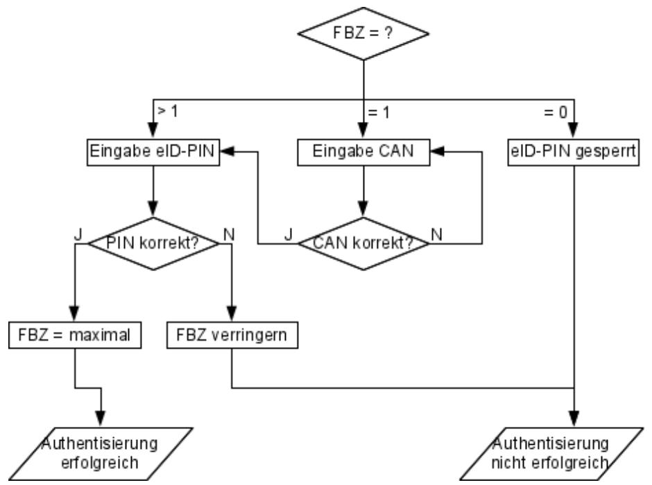
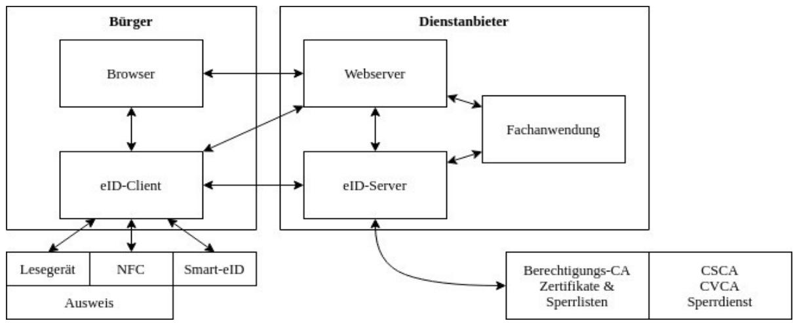

# Technische Richtlinie TR-03127

eID-Dokumente basierend auf Extended Access Control Personalausweis, elektronischer Aufenthaltstitel, eID-Karte für Unionsbürger und Smart-eID

Version 1.40 6. Oktober 2021


Bundesamt für Sicherheit in der Informationstechnik Postfach 20 03 63 53133 Bonn E-Mail: eid@bsi.bund.de Internet: https://www.bsi.bund.de © Bundesamt für Sicherheit in der Informationstechnik 2021

| 1. Einleitung  5                                                                   |  |
|------------------------------------------------------------------------------------|--|
| 2. Datenerfassung und -übertragung  7                                              |  |
| 2.1 Persönliche Daten  7                                                           |  |
| 2.2 Gesichtsbild  7                                                                |  |
| 2.3 Fingerabdrücke  7                                                              |  |
| 2.4 Unterschrift  8                                                                |  |
| 2.5 Datenübertragung  8                                                            |  |
| 2.6 Kommunikation zwischen Ausweisbehörden  8                                      |  |
| 2.7 Dokumentennummer  8                                                            |  |
| 2.8 Smart-eID  9                                                                   |  |
| 3. Dokument  10                                                                    |  |
| 3.1 Kartendokumente  10                                                            |  |
| 3.2 Smart-eID  10                                                                  |  |
| 3.3 Authentisierungsverfahren  11                                                  |  |
| 3.3.1 PACE  11                                                                     |  |
| 3.3.2 Terminalauthentisierung  12                                                  |  |
| 3.3.3 Passive Authentisierung  12                                                  |  |
| 3.3.4 Chipauthentisierung  13                                                      |  |
| 3.4 Gespeicherte Daten  13                                                         |  |
| 3.4.1 Karten-/Anwendungserkennung  13<br>3.4.2 Biometrieanwendung  14              |  |
| 3.4.3 eID-Anwendung  15                                                            |  |
| 3.4.4 Signaturanwendung  18                                                        |  |
| 3.4.5 Master File  19                                                              |  |
| 3.5 Passwörter  21                                                                 |  |
| 3.5.1 CAN - Card Access Number  21                                                 |  |
| 3.5.2 MRZ  21<br>3.5.3 eID-PIN  21                                                 |  |
| 3.5.4 Signatur-PIN  23                                                             |  |
| 3.5.5 Pin Unblocking Key (PUK)  23                                                 |  |
| 4. Zugriff auf Ausweisdaten  24                                                    |  |
| 4.1 General Authentication Procedure  24                                           |  |
| 4.2 Standard/Advanced ePassport Inspection Procedure  24                           |  |
| 4.3 Inspektionssystem  25                                                          |  |
| 4.4 Authentisierungsterminal  26                                                   |  |
| 4.4.1 Abfrage der Dokumentengültigkeit  26                                         |  |
| 4.4.2 Pseudonyme Merkmale  26                                                      |  |
| 4.4.3 Erzeugung eines Signaturschlüsselpaares  27                                  |  |
| 4.4.4 eID-PIN setzen, eID-Anwendung anschalten  28<br>4.4.5 Altersverifikation  28 |  |
| 4.4.6 Wohnortabfrage  28                                                           |  |
| 4.5 Signaturterminal  28                                                           |  |
| 4.6 Nicht authentisiertes Terminal  29                                             |  |
| 4.6.1 Setzen einer neuen eID-PIN mit der aktuellen eID-PIN  29                     |  |

| 4.6.2 Rücksetzen des Fehlbedienungszählers der eID-PIN/Signatur-PIN mit PUK  29 |  |
|---------------------------------------------------------------------------------|--|
| 4.7 Elektronischer Identitätsnachweis  29                                       |  |
| 4.8 Vor-Ort-Auslesen  31                                                        |  |
| 5. Hintergrundsysteme  33                                                       |  |
| 5.1 Dokumenten-PKI  33                                                          |  |
| 5.2 Berechtigungs-PKI  33                                                       |  |
| 5.2.1 Zertifikatsvergabe für eBusiness/eGovernment  34                          |  |
| 5.2.2 Signaturterminals  35                                                     |  |
| 5.3 Ausweis-Sperrlisten  35                                                     |  |
| 5.3.1 eID-Sperrliste  36                                                        |  |
| 6. Ausgabe  39                                                                  |  |
| 6.1 Ausweis  39                                                                 |  |
| 6.2 PIN/PUK-Brief  39                                                           |  |
| 6.3 Sperrkennwort-Brief  39                                                     |  |
| 6.4 Qualitätssicherung und Visualisierung  40                                   |  |
| 6.5 Informationsangebot für den Ausweisinhaber  40                              |  |
| 6.6 Verantwortung des Dokumenteninhabers  40                                    |  |
| 7. Zentrale Services  41                                                        |  |
| 7.1 Änderungsdienst/Visualisierung  41                                          |  |
| 7.2 PIN-Rücksetz-Dienst  41                                                     |  |
| 7.3 Zentraler Schreibdienst  42                                                 |  |
| 7.4 Smart-eID Auskunftsdienst und Auskunftsregister  42                         |  |
| Anhang A Zertifizierungen  43                                                   |  |
| Anhang B Sperrkennwort, Sperrschlüssel und Sperrsumme  44                       |  |
| Anhang C Bezeichnungen für Datengruppen  46                                     |  |
| Anhang D Varianten  47                                                          |  |
| Abbildungsverzeichnis                                                           |  |
| Abbildung 1: Eingabe der eID-PIN22                                              |  |
| Abbildung 2: Kommunikationsbeziehungen elektronischer Identitätsnachweis32      |  |
| Abbildung 3: Sperrlisten37                                                      |  |
| Tabellenverzeichnis                                                             |  |

| Tabelle 1: Dateien der Biometrieanwendung14 |  |
|---------------------------------------------|--|
| Tabelle 2: Dateien der eID-Anwendung15      |  |
| Tabelle 3: Dateien im Master File19         |  |
| Tabelle 4: Teminaltypen26                   |  |
| Tabelle 5: Bezeichnungen für Datengruppen48 |  |
|                                             |  |

# <span id="page-4-0"></span>**1. Einleitung**

Der Personalausweis (PA) und der Aufenthaltstitel (eAT) enthalten seit 2010 bzw. 2011 einen kontaktlosen Chip als Sicherheitsmerkmal. Damit wurde – zusammen mit dem elektronischen Reisepass seit 2007 – eine Familie hoheitlicher elektronischer Dokumente geschaffen.

Der im Dokument integrierte Chip ist ein Sicherheitsmerkmal zur Erhöhung der Fälschungssicherheit und bietet die Möglichkeit der Aufnahme biometrischer Merkmale zur Erhöhung der Bindung zwischen Ausweis und Inhaber.

Darüber hinaus eröffnet er die Möglichkeit, das Dokument um eine Funktion zu erweitern, die dem Dokumenteninhaber einerseits und eBusiness- oder eGovernment-Dienstleistern andererseits eine sichere gegenseitige Authentisierung u.a. über eine Internet-Verbindung auf hohem Vertrauensniveau nach [TR-03107], Teil 1, ermöglicht.

Ergänzt wird diese Familie ab dem 01.11.2020 um eine eID-Karte für Unionsbürger und Angehörige des Europäischen Wirtschaftsraums (kurz eID-UB). Im Gegensatz zu Personalausweis oder Aufenthaltstitel handelt es sich bei der eID-Karte für Unionsbürger um eine Karte rein für die elektronische Verwendung, nicht um ein physisches Ausweisdokument.

Als Erweiterung des Gesamtsystems wird in 2021 die Smart-eID eingeführt. Dabei wird die Funktionalität der Online-Ausweisfunktion nicht auf einer dedizierte Chipkarte implementiert, sondern die Sicherheitsfunktionen werden durch in einem Mobilgerät eingebettete Sicherheitselemente (Secure Elements) in verschiedenen Ausprägungen erbracht.

Alle genannten Träger der elektronischen Identität werden – soweit möglich – technisch identisch ausgestaltet, mit dem Ziel, eine gemeinsame Infrastruktur sowohl für die hoheitliche Anwendung (PA und eAT) als auch für die sichere Identifizierung für eGovernment/eBusiness (alle Typen) als Grundlage für die Digitalisierung von Geschäftsprozessen zu schaffen.

Die drei physischen Dokumententypen (PA, eAT und eID-UB) werden im Folgenden vereinfachend zusammengefasst als *Kartendokument* oder *Ausweis* bezeichnet[1](#page-4-1) , die drei Formen der Kartendokumente und die Smart-eID zusammen als *Dokumente*.

Grundlage für die Ausgestaltung sind

- für den Personalausweis die Vorgaben der EU ([EU-PA]), das Personalausweisgesetz ([PAuswG]) und die Personalausweisverordnung,
- für den Aufenthaltstitel die Vorgaben der EU ([EU-RP]), das Aufenthaltsgesetz ([AufenthG]) und die Aufenthaltsverordnung,
- für die eID-Karte für Unionsbürger das eID-Karte-Gesetz ([eIDKG])
- sowie das "Sicherheitsrahmenkonzept für das Gesamtsystem des elektronischen Personalausweises" ([SiKo]), welches analog auch auf den Aufenthaltstitel und die eID-Karte für Unionsbürger Anwendung findet.

Die rechtlichen Regelungen für die Smart-eID sind ebenfalls im Personalausweisgesetz ([PAuswG]) und der zugehörigen Verordnung niedergelegt.

Der elektronische Identitätsnachweis mittels Kartendokument ist nach [eIDAS] für die grenzüberschreitende elektronische Identifizierung auf Vertrauensniveau *hoch* notifiziert und kann somit im

<span id="page-4-1"></span>**<sup>1</sup>** Dabei ist zu beachten, dass die eID-Karte für Unionsbürger kein Ausweisdokument im engeren Sinne ist.

gesamten europäischen Wirtschaftsraum zur sicheren Identifizierung eingesetzt werden. Eine Notifizierung der Smart-eID ist nach Erfüllung der entsprechenden Voraussetzungen vorgesehen.

In dieser Technischen Richtlinie werden die für den elektronischen Personalausweis, den elektronischen Aufenthaltstitel, eID-Karte für Unionsbürger und die Smart-eID verwendeten Verfahren vorgestellt und auf die entsprechenden Spezifikationen verwiesen. Am Anfang der einzelnen Abschnitte wird darauf verwiesen, für welche Dokumente der jeweilige Abschnitt relevant ist.

# <span id="page-6-3"></span>**2. Datenerfassung und -übertragung**

[nur Kartendokumente]

Bei Antragstellung für das Kartendokument werden in der Personalausweisbehörde, der Ausländerbehörde bzw. der eID-Karte-Behörde (im Folgenden generisch *Ausweisbehörde*) die notwendigen persönlichen Daten des Antragstellers erfasst und anschließend an den Ausweishersteller übertragen. Die zu erfassenden Daten ergeben sich aus dem Personalausweisgesetz, dem Aufenthaltsgesetz bzw. dem eID-Karte-Gesetz sowie den zugehörigen Verordnungen. Die notwendigen Verfahren und Datenformate werden in [TR-03104], [TR-03121] und [TR-03123] festgelegt.

## <span id="page-6-2"></span>**2.1 Persönliche Daten**

[nur Kartendokumente]

Für den Ausweis werden folgende personenbezogenen Daten erfasst:

- Vorname(n), Familienname, gegebenenfalls Geburtsname
- Doktorgrad
- Tag und Ort der Geburt
- Anschrift (inkl. Postleitzahl) und bei Adressen in Deutschland der amtliche Gemeindeschlüssel des Wohnortes

Daneben werden für den Personalausweis und den Aufenthaltstitel biometrische Daten (Gesichtsbild, Fingerabdrücke (Personalausweis: optional, Aufenthaltstitel: verpflichtend), Unterschrift, Augenfarbe und Größe) erfasst. Für die eID-Karte für Unionsbürger werden keine biometrische Daten erfasst.

Für den Personalausweis und die eID-Karte für Unionsbürger wird zusätzlich – soweit vorhanden – der Ordens- oder Künstlername erfasst, für den Aufenthaltstitel das Geschlecht sowie gegebenenfalls aufenthaltsrechtliche Nebenbestimmungen.

# <span id="page-6-1"></span>**2.2 Gesichtsbild**

[nur Kartendokumente]

Zur Erfassung des Gesichtsbildes für Personalausweis und Aufenthaltstitel, sowohl für den Aufdruck auf den Kartenkörper als auch zur elektronischen Speicherung im Chip, legt der Antragsteller ein Lichtbild vor. Die Anforderungen an das Lichtbild werden in [TR-03121] festgelegt.

Das vorgelegte Lichtbild wird in der Ausweisbehörde mit einer zertifizierten Erfassungs- und Qualitätssicherungssoftware (vgl. [Anhang A](#page-42-0)) erfasst und in das für den Ausweis verwendete JPEG2000-Format [ISO 15444] konvertiert.

Alternativ besteht auch die Möglichkeit, das Gesichtsbild vor Ort in der Ausweisbehörde zu erfassen oder der digitalen Übermittlung vom Fotografen zur Ausweisbehörde. Die Qualitätssicherung und Konvertierung erfolgt analog zu der Erfassung über ein mitgebrachtes Lichtbild. Die Vorgaben in [TR-03104] und [TR-03121] sind zu beachten.

## <span id="page-6-0"></span>**2.3 Fingerabdrücke**

[nur Kartendokumente]

Im Chip werden zwei Fingerabdruckbilder gespeichert[2](#page-7-4) . Die Bilder werden mit Hilfe von zertifizierten Fingerabdruckscannern sowie zertifizierter Erfassungs- und Qualitätssicherungssoftware erfasst (vgl. [Anhang A\)](#page-42-0). Die Anforderungen an die Erfassungskomponenten und an den Erfassungsprozess – sowohl Anforderungen an die Qualität der erfassten Daten als auch Verfahrensweisen in besonderen Fällen wie z.B. bei Vorliegen einer Behinderung – werden in [TR-03104] und [TR-03121] festgelegt.

# <span id="page-7-3"></span>**2.4 Unterschrift**

[nur Kartendokumente]

Ebenfalls erfasst wird für Personalausweis und Aufenthaltstitel die Unterschrift des Antragstellers. Die Unterschrift wird nur auf dem jeweiligen Ausweis aufgedruckt und nicht im Chip gespeichert.

### <span id="page-7-2"></span>**2.5 Datenübertragung**

[nur Kartendokumente]

Die Datenübertragung zwischen den Ausweisbehörden und dem Ausweishersteller wird in entsprechenden Profilen gemäß [TR-03104] und [TR-03123] spezifiziert. Die Datenübertragung erfolgt ausschließlich elektronisch.

Die [TR-03104] beschreibt grundsätzliche Prozesse und organisatorische Regelungen, die im Zusammenhang mit der Datenerfassung, Beantragung und Auslieferung des Ausweises gelten. Das XMLbasierte Datenmodell für die Antragsdaten wird in [TR-03123] spezifiziert. Die Spezifikation der Sicherheitsmechanismen (Verschlüsselung und Signatur) zur Sicherung der Vertraulichkeit und Authentizität der Antragsdaten findet sich in [TR-03132].

Die verschlüsselten und signierten Daten werden mit Hilfe eines dafür im Deutschen Verwaltungsdiensteverzeichnis [DVDV] eingerichteten Dienstes über OSCI-Transport [OSCI] übertragen, dessen Funktionsweise in einer Dienstbeschreibung (Bestandteil von [TR-03132]) dargelegt wird.

## <span id="page-7-1"></span>**2.6 Kommunikation zwischen Ausweisbehörden**

[nur Kartendokumente]

In bestimmten Fällen müssen verschiedene Ausweisbehörden Informationen untereinander austauschen, z.B. bei

- Beantragung eines Ausweises bei einer nicht zuständigen Behörde
- Umzug
- Ausweissperre bei einer Ausweisbehörde, die nicht den zugehörigen Eintrag im Ausweisregister führt.

Diese Kommunikation ist nicht Bestandteil dieser Richtlinie.

### <span id="page-7-0"></span>**2.7 Dokumentennummer**

[nur Kartendokumente]

Die Dokumentennummern der Ausweise setzen sich aus einer vierstelligen alphanumerischen Behördenkennziffer und einer fünfstelligen alphanumerischen, pseudozufälligen Nummer zusammen. Die Bildung des pseudozufälligen Teils erfolgt nach den Vorgaben in [TR-03116], Teil 2.

<span id="page-7-4"></span>**<sup>2</sup>** Bei Personalausweisen, die vor dem 02.08.2021 ausgegeben wurden, ist die Speicherung der Fingerabdrücke optional.

Werden die Nummern durch den Ausweishersteller zur Verfügung gestellt, wird die Übertragung zu den Ausweisbehörden in [TR-03104] spezifiziert. Jeder Ausweis erhält eine neue Nummer.

# <span id="page-8-0"></span>**2.8 Smart-eID**

[nur Smart-eID]

Die Personalisierung einer Smart-eID erfolgt mit Hilfe eines existierenden Kartendokumentes, d.h. es werden keine neuen Personendaten erfasst.

Es werden die folgenden Daten aus dem jeweiligen Kartendokument ausgelesen und in der SmarteID gespeichert:

- Vorname(n), Familienname, gegebenenfalls Geburtsname
- Doktorgrad
- Tag und Ort der Geburt
- Anschrift (inkl. Postleitzahl) und bei Adressen in Deutschland der amtliche Gemeindeschlüssel des Wohnortes
- gegebenenfalls Ordens- oder Künstlername

# <span id="page-9-2"></span>**3. Dokument**

[alle Dokumente]

Das Dokument basiert auf dem Profil "Identity Card with optional EU-compliant MRTD Application" nach [TR-03110], Teil 4. Soweit möglich folgen die Anwendungen dem Profil 1 "*eID Application with mandatory ICAO functionality and conditional digital signature functionality*" der European Citizen Card ([CEN 15480], Teil 4).

### <span id="page-9-1"></span>**3.1 Kartendokumente**

[nur Kartendokumente]

#### **Kartenkörper**

Das Dokument ist im TD1-Format gemäß [ICAO 9303], Part 5, ausgestaltet. Das Design der Karte und die physikalischen Sicherheitsmerkmale (z.B. Hologramme) sind nicht Gegenstand dieser Richtlinie.

#### **Chip**

In den Ausweis ist ein kontaktloser Chip integriert. Der Chip kommuniziert mit einem passenden Kartenterminal, welches als Lese- oder Schreibgerät fungiert. Die Datenübertragung zwischen Chip und Terminal erfolgt mittels induktiver Kopplung nach [ISO 14443]. Der Unique Identifier (UID, [ISO 14443] Typ A) bzw. der Pseudo-Unique PICC Identifier (PUPI, [ISO 14443] Typ B) des Chips wird bei jeder Aktivierung des Chips zufällig erzeugt.

Die Kommunikation zwischen Chip und Terminal erfolgt nach [ISO 7816].

Der Chip speichert personen- und dokumentenbezogene Daten wie in Abschnitt [3.4](#page-12-3) beschrieben. Die zugehörigen Zugriffsprotokolle finden sich in Kapitel [3.3.](#page-10-1)Ferner ist der Ausweis eine nach eIDAS-Verordnung [eIDAS] zertifizierte qualifizierte Signaturerstellungseinheit[3](#page-9-3) .

## <span id="page-9-0"></span>**3.2 Smart-eID**

[nur Smart-eID]

#### **Secure Element**

Der Anker für die Smart-eID ist ein im Mobilgerät verfügbares Sicherheitselement. Dies kann ein embedded Secure Element (eSE), ein embedded Universal Integrated Circuit Card (eUICC) oder eine andere Sicherheitstechnologie mit vergleichbaren Sicherheitsleistungen sein. Die Anforderungen sind in [TR-03159], Section 4, definiert.

#### **eID-Applet**

Die eigentliche eID-Anwendung wird durch ein eID-Applet dargestellt, d.h. ein Applet, das auf ein Secure Element provisioniert wird.

Ist auf dem Mobilgerät, auf dem die Smart-eID personalisiert werden soll, noch kein eID-Applet vorhanden, wird zunächst dieses (sofern das Mobilgerät geeignet ist) installiert. Dies erfolgt mit Hilfe eines Trusted Service Managers, siehe [TR-03165].

<span id="page-9-3"></span>**<sup>3</sup>** Vor Inkrafttreten von [eIDAS] ausgegebene Karten sind gemäß dem mittlerweile durch das Vertrauensdienstegesetz (VDG) abgelösten Signaturgesetz (SigG) bestätigte sichere Signaturerstellungseinheiten.

Die anschließende Personalisierung erfolgt durch einen Personalisierungsdienst, der die ID-Daten aus dem Kartenausweis über die NFC-Schnittstelle des Mobilgerätes ausliest, aufbereitet und signiert, und in das eID-Applet einspielt. Der genaue Prozess wird in [TR-03159] spezifiziert.

Das eID-Applet speichert personen- und dokumentenbezogene Daten wie in Abschnitt [3.4](#page-12-3) beschrieben. Die zugehörigen Zugriffsprotokolle finden sich in Kapitel [3.3](#page-10-1).

## <span id="page-10-1"></span>**3.3 Authentisierungsverfahren**

#### [alle Dokumente]

Für die Zugriffskontrolle und die Authentisierung des Chips sowie des Terminals werden folgende kryptographischen Protokolle genutzt und müssen durch Chip bzw. Terminal implementiert werden (siehe auch [TR-03116], Teil 2):

- Password Authenticated Connection Establishment PACE ([TR-03110], Teil 2),
- Terminalauthentisierung Version 2 TA2 ([TR-03110], Teil 2);
- Passive Authentisierung PA ([ICAO 9303], Part 11, und [TR-03110], Teil 2);
- Chipauthentisierung Version 2 und Version 3 CA2 / CA3 ([TR-03110], Teil 2)[4](#page-10-2) ;

sowie in den Kartendokumenten:

- PACE ([ICAO 9303], Part 11) sowie Terminalauthentisierung Version 1 und Chipauthentisierung Version 1 gemäß [TR-03110], Teil 1[5](#page-10-3) ;
- nur Aufenthaltstitel: Basic Access Control ([ICAO 9303], Part 11)[6](#page-10-4) .

Mit diesen kryptographischen Protokollen ist der Zugriff auf Daten des Ausweises mittels der *General Authentication Procedure* nach [TR-03110], Teil 2, möglich.

Entsprechend der Vorgaben der EU ([EU-PA], [EU-RP]) ist der Zugriff auf die Daten der Biometriefunktion (Abschnitt [3.4.2](#page-13-0)) mittels *Standard ePassport Inspection Procedure* und *Advanced ePassport Inspection Procedure* gemäß [TR-03110], Teil 1, möglich.

Die Aktive Authentisierung nach [ICAO 9303], Part 11, wird aus Datenschutzgründen nicht implementiert (siehe [TR-03110], Teil 1, Anhang B "Challenge Semantics").

Die Anforderungen an die zugrunde liegenden Algorithmen und an die zu verwendenden Schlüssellängen werden in [TR-03116], Teil 2, in der jeweils aktuellen Fassung festgelegt. Zu den Verfahren der Kryptographie auf elliptischen Kurven ist [TR-03111] verbindlich.

### <span id="page-10-5"></span><span id="page-10-0"></span>**3.3.1 PACE**

[alle Dokumente]

Das PACE-Protokoll dient dem Aufbau eines verschlüsselten und integritätsgesicherten Kanals zwischen Terminal und Dokument und dem gleichzeitigen Nachweis, dass sich Dokument und Terminal im Besitz des gleichen Passwortes befinden. Das zu verwendende Passwort unterscheidet sich je nach Anwendungsfall, siehe Abschnitt [3.5](#page-20-3).

Sofern im Folgenden Rechte durch die *General Authentication Procedure* nachgewiesen werden sollen, so teilt das Terminal bereits durch PACE dem Dokument seinen Terminaltyp sowie die angestrebten Rechte mit.

- <span id="page-10-2"></span>**<sup>4</sup>** Chipauthentisierung Version 3 wird nur in Kartendokumenten implementiert.
- <span id="page-10-3"></span>**<sup>5</sup>** Nicht für vor dem 02.08.2021 ausgegebene Personalausweise.
- <span id="page-10-4"></span>**<sup>6</sup>** Nur für vor dem 01.11.2019 ausgegebene Dokumente.

### <span id="page-11-2"></span><span id="page-11-1"></span>**3.3.2 Terminalauthentisierung**

#### [alle Dokumente]

Die Terminalauthentisierung dient dem Nachweis der Zugriffsrechte eines Terminals bzw. eines Diensteanbieters gegenüber dem Dokument.

Die Zugriffsrechte des Terminals werden an die in der Chipauthentisierung ausgehandelten Sitzungsschlüssel gebunden, d.h. die Rechte des Terminals können nur innerhalb des durch die Chipauthentisierung aufgebauten verschlüsselten Kanals ausgeübt werden. Die Terminalauthentisierung kann pro Sitzung nur einmal durchgeführt werden. Eine neue Sitzung wird durch den Abbau des verschlüsselten Kanals (und damit verbunden Löschen der Sitzungsschlüssel und Zurücksetzen aller Zugriffsrechte) und Selektieren des Master Files gestartet.

Die Rechte des Terminals werden über Zertifikate der Berechtigungs-PKI vergeben. Die Berechtigungs-PKI (auch EAC-PKI, siehe Abschnitt [5.2](#page-32-4)) ist eine dreistufige PKI, bestehend aus:

- der Wurzelinstanz (CVCA, Country Verifying Certification Authority), betrieben vom BSI;
- mehreren Document Verifier (DV);
- den Zertifikaten der Terminals bzw. Diensteanbieter.

Durch die Zertifikate werden die maximalen Zugriffsrechte eines Terminals festgelegt und verschiedene Terminaltypen unterschieden (Abschnitt [4\)](#page-23-2):

- *hoheitliches nationales Inspektionssystem*
- *hoheitliches ausländisches Inspektionssystem*
- *hoheitliches nationales Authentisierungsterminal*
- *nicht-hoheitliches/ausländisches Authentisierungsterminal*
- *Signaturterminal* für qualifizierte elektronische Signaturen.

In der *General Authentication Procedure* ist die Terminalauthentisierung nur erfolgreich, wenn der Terminaltyp aus dem Zertifikat mit dem in PACE angekündigten übereinstimmt und das für PACE benutzte Passwort für den Terminaltyp zulässig ist (vgl. [Tabelle 4\)](#page-24-1). Zugriffsrechte werden dann nur erteilt, wenn sie sowohl in PACE angestrebt als auch durch die Zertifikatskette und Terminalauthentisierung nachgewiesen wurden.

### <span id="page-11-0"></span>**3.3.3 Passive Authentisierung**

#### [alle Dokumente]

Die Passive Authentisierung dient dem Echtheitsnachweis der im Dokument gespeicherten Daten. Dazu werden die in der Biometrieanwendung (Abschnitt [3.4.2](#page-13-0)) gespeicherten Daten und die öffentlichen Schlüssel des Dokumentes vom Ausweishersteller mit seinem Document Signer aus der Dokumenten-PKI (Abschnitt [5.1\)](#page-32-3) signiert. Die Dokumenten-PKI ist eine zweistufige PKI bestehend aus:

- der Wurzelinstanz (CSCA, Country Signing Certification Authority), betrieben vom BSI;
- dem Document Signer (DS), betrieben vom Ausweishersteller.

Die Datengruppen der nicht-hoheitlichen eID-Anwendung werden nicht signiert.

*Authentisierungs*- und *Signaturterminals* führen die Passive Authentisierung nur für die Datei EF.- CardSecurity (die u.a. den öffentlichen Schlüssel des Dokumentes enthält, siehe Abschnitt [3.4.5](#page-18-0)) durch. *Inspektionssysteme* führen die Passive Authentisierung zusätzlich für die Datei EF.SOD der Biometrieanwendung durch, um die Daten dieser Anwendung explizit zu authentisieren.

Die Passive Authentisierung weist nur die Echtheit der Daten nach, nicht die des Dokumentes selbst. Dies leistet erst die Chipauthentisierung in Verbindung mit der Passiven Authentisierung.

Das Zertifikat des Document Signer ist in dem Dokument selbst gespeichert (DS-Zertifikat), während das Zertifikat der Wurzel-Instanz (CSCA-Zertifikat) beim BSI bzw. einem nachgelagerten Public Key Directory (PKD) erhältlich ist. Somit kann sich jeder Zugriffsberechtigte über die Dokumenten-PKI von der Echtheit der signierten Daten und (in Verbindung mit der Chipauthentisierung) des Dokumentes und der darin gespeicherten Daten überzeugen.

### <span id="page-12-2"></span>**3.3.4 Chipauthentisierung**

[alle Dokumente]

Die Chipauthentisierung (spezifiziert in [TR-03110]) dient dem Nachweis, dass das Dokument in Besitz des privaten Schlüssels ist, der zum in der Datei EF.CardSecurity/EF.ChipSecurity im Master File (bzw. beim Aufenthaltstitel zusätzlich in der DG14 der Biometrieanwendung) gespeicherten öffentlichen Schlüssel gehört. In Verbindung mit der Passiven Authentisierung wird damit die Echtheit des Dokumentes und damit auch der gespeicherten Daten nachgewiesen.

Weiter dient die Chipauthentisierung dem Aufbau eines sicheren Kanals zwischen Terminal bzw. Diensteanbieter und Dokument. Chipauthentisierung Version 3 beinhaltet darüber hinaus eine Pseudonyme Signatur (PSA), welche eine pseudonyme Identifizierung ermöglicht.

Im Rahmen der *General Authentication Procedure* kann das Terminal nach Aufbau des verschlüsselten Kanals gemäß den in der Terminalauthentisierung nachgewiesenen Zugriffsrechten auf das Dokument zugreifen.

## <span id="page-12-1"></span>**3.4 Gespeicherte Daten**

[alle Dokumente]

Die Daten im Dokument sind in drei Anwendungen organisiert, und zwar

- <span id="page-12-3"></span>• die Biometrieanwendung (Datenformat analog zum elektronischen Reisepass, nur Kartendokument),
- in alle Dokumenten die eID-Anwendung,
- die Signaturanwendung zur Erzeugung qualifizierter elektronischer Signaturen (nur in Kartendokumenten).

### <span id="page-12-0"></span>**3.4.1 Karten-/Anwendungserkennung**

### [alle Dokumente]

Die im Dokument enthaltenen Anwendungen werden durch korrespondierende Application Identifier in der Datei EF.DIR im Master File erkannt (Reisepässe enthalten meist keine Datei EF.DIR):

- Biometrieanwendung: Application Identifier 0xA0000002471001 (siehe [ICAO 9303], Part 10);
- eID-Anwendung: Application Identifier 0xE80704007F00070302 (siehe [TR-03110]);
- eSign-Anwendung nach [TR-03117]: Application Identifier 0xA000000167455349474E.

### <span id="page-13-0"></span>**3.4.2 Biometrieanwendung**

#### [nur Kartendokumente]

In der Biometrieanwendung werden die in Tabelle [1](#page-13-1) aufgeführten von der ICAO in [ICAO 9303], Part 10, definierten Datengruppen gespeichert. Die weiteren von der ICAO definierten Datengruppen (DG4 bis DG13 und DG15 bis DG16) werden nicht belegt.

Zugriff auf die Biometrieanwendung erhalten

• mit der General Authentication Procedure authentisierte *Inspektionssysteme*, dabei enthält die Anwendung bei der eID-Karte für Unionsbürger keine personenbezogenen Daten;

| Datei                                                                                                                                                                                                                                                                                                               | Inhalt                                                                                                                                                                                                                                                                                                               | Zugriffsrecht<br>Lesen           |  |
|---------------------------------------------------------------------------------------------------------------------------------------------------------------------------------------------------------------------------------------------------------------------------------------------------------------------|----------------------------------------------------------------------------------------------------------------------------------------------------------------------------------------------------------------------------------------------------------------------------------------------------------------------|----------------------------------|--|
| EF.COM                                                                                                                                                                                                                                                                                                              | Liste der vorhandenen Datengruppen und Versionsinforma<br>tion gemäß [ICAO 9303] (Von der Nutzung dieser Daten<br>gruppe wird abgeraten, da diese nicht signiert ist.)                                                                                                                                               | BIS/EIS                          |  |
| EF.SOD                                                                                                                                                                                                                                                                                                              | Hashwerte der Datengruppen DG1, DG2, DG3; Signatur über<br>diese Hashwerte sowie das DS-Zertifikat (gemäß [ICAO<br>9303])                                                                                                                                                                                            | IS;<br>BIS/EIS                   |  |
| EF.CVCA                                                                                                                                                                                                                                                                                                             | Trustpoints für Zertifikatskette der Rolle Inspektionssystem<br>der Terminalauthentisierung                                                                                                                                                                                                                          | BIS/EIS                          |  |
| DG1                                                                                                                                                                                                                                                                                                                 | PA, eAT: Daten der maschinenlesbaren Zone (MRZ), wie auf<br>dem Ausweiskörper aufgedruckt<br>eID-UB: MRZ mit DocumentType "UB", ausgebendem Land<br>"D" und Platzhalter "<" für alle weiteren Felder der MRZ                                                                                                         | IS;<br>BIS/EIS                   |  |
| DG2                                                                                                                                                                                                                                                                                                                 | PA, eAT: Digitales Gesichtsbild, identisch mit dem aufge<br>druckten Bild<br>eID-UB: statisches eID-Logo                                                                                                                                                                                                             | IS;<br>BIS/EIS                   |  |
| DG3                                                                                                                                                                                                                                                                                                                 | PA, eAT: Zwei Fingerabdrücke (im Personalausweis seit dem<br>02.08.2021 verpflichtend, vorher optional). Werden keine Fin<br>gerabdrücke gespeichert, enthält diese Datengruppe einen<br>zufälligen Wert<br>eID-UB: Zufälliger Wert für "keine Fingerabdrücke"                                                       | IS + Read DG3;<br>EIS + Read DG3 |  |
| DG14                                                                                                                                                                                                                                                                                                                | Enthält folgende SecurityInfos nach [TR-03110]:<br>ChipAuthenticationInfo<br>ChipAuthenticationPublicKeyInfo<br>TerminalAuthenticationInfo<br>sowie PACEInfo nach [ICAO 9303], Part 11.<br>Der enthaltene öffentliche Schlüssel für die Chipauthentisie<br>rung ist identisch mit dem Schlüssel aus EF.ChipSecurity. | BIS/EIS                          |  |
| IS: mit General Auhentication Procedure authentisiertes Inspektionssystem (PACE mit CAN / MRZ, TA2, CA2/3);<br>BIS: Basic Inspection System mit Standard Inspection Procedure (BAC/PACE); CA1 sofern vom BIS unterstützt;<br>EIS: Extended Inspection System mit Advanced Inspection Procedure (BAC/PACE; CA1; TA1) |                                                                                                                                                                                                                                                                                                                      |                                  |  |

#### <span id="page-13-1"></span>**Tabelle 1: Dateien der Biometrieanwendung**

• mit Standard/Advanced Inspection Procedure authentisierte Inspektionssysteme[7](#page-14-1) .

Für den Zugriff auf die DG3 ist der Nachweis der entsprechenden Rechte über die Terminalauthentisierung notwendig.

Schreiben von Daten in der Biometrieanwendung ist nach der Produktion des Ausweises nicht mehr möglich.

### <span id="page-14-2"></span><span id="page-14-0"></span>**3.4.3 eID-Anwendung**

[alle Dokumente]

Mit Hilfe der eID-Anwendung ist es dem Dokumenteninhaber möglich, sich gegenüber einer dritten Person zu identifizieren und zu authentisieren. Dies ist auch über eine Internet-Verbindung (d.h. gegenüber eGovernment- und eBusiness-Diensten) möglich. Die eID-Anwendung ist die Basis für d[en](#page-30-0) *elektronischen Identitätsnachweis* (siehe Abschnitt [4.7](#page-28-2)) und für das *Vor-Ort-Auslesen* (siehe Abschnitt [4.8\)](#page-30-0).

<span id="page-14-1"></span>**<sup>7</sup>** Nicht für vor dem 02.08.2021 ausgegebene Personalausweise.

|                | Inhalt                                                                       | Zugriffsrecht         |                    |                                                                               |
|----------------|------------------------------------------------------------------------------|-----------------------|--------------------|-------------------------------------------------------------------------------|
| Datei          |                                                                              | Lesen                 | Schreiben          | Interne Ver<br>wendung                                                        |
| DG1            | Dokumententyp                                                                | IS;<br>AT + Read DG1  | -                  | -                                                                             |
| DG2            | Ausgebender Staat<br>("D" für Deutschland)                                   | IS;<br>AT + Read DG2  | -                  | -                                                                             |
| DG3            | Ablaufdatum<br>im Format JJJJMMTT                                            | IS;<br>AT + Read DG3  | -                  | AT                                                                            |
| DG4            | Vorname(n)                                                                   | IS;<br>AT + Read DG4  | -                  | -                                                                             |
| DG5            | Familienname                                                                 | IS;<br>AT + Read DG5  | -                  | -                                                                             |
| DG6            | PA, eID-UB, Smart-eID: Ordensname/Künst<br>lername<br>eAT: unbenutzt         | IS;<br>AT + Read DG6  | -                  | -                                                                             |
| DG7            | Doktorgrad                                                                   | IS;<br>AT + Read DG7  | -                  | -                                                                             |
| DG8            | Geburtsdatum<br>im Format JJJJMMTT                                           | IS;<br>AT + Read DG8  | -                  | -                                                                             |
| DG9            | Geburtsort<br>als unformatierter Text                                        | IS;<br>AT + Read DG9  | -                  | -                                                                             |
| DG10           | Staatsangehörigkeit                                                          | IS;<br>AT + Read DG10 | -                  | -                                                                             |
| DG11 -<br>DG12 | unbenutzt                                                                    | -                     | -                  | -                                                                             |
| DG13           | Geburtsname                                                                  | IS;<br>AT + Read DG13 | -                  | -                                                                             |
| DG14 -<br>DG16 | unbenutzt                                                                    | -                     | -                  | -                                                                             |
| DG17           | Adresse                                                                      | IS;<br>AT + Read DG17 | AT +<br>Write DG17 | -                                                                             |
| DG18           | Wohnort-ID                                                                   | IS;<br>AT + Read DG18 | AT +<br>Write DG18 | AT + Community<br>ID Verification                                             |
| DG19           | eAT: Nebenbestimmungen I<br>PA, eID-UB, Smart-eID: unbenutzt                 | IS;<br>AT + Read DG19 | AT +<br>Write DG19 | -                                                                             |
| DG20           | eAT: Nebenbestimmungen II<br>PA, eID-UB, Smart-eID: unbenutzt                | IS;<br>AT + Read DG20 | AT +<br>Write DG20 | -                                                                             |
| DG21           | unbenutzt                                                                    | -                     | -                  | -                                                                             |
|                | Vergleichsgeburtsdatum für Altersverifikation                                | -                     | -                  | AT + Age Verifica<br>tion                                                     |
|                | Schlüssel für anbieterspezifisches Sperrmerk<br>mal (Abschnitt 4.4.2.1)      | -                     | -                  | AT                                                                            |
|                | Schlüssel für anbieter- und kartenspezifische<br>Kennung (Abschnitt 4.4.2.2) | -                     | -                  | AT + Restricted<br>Identification (für<br>CA2 / RI);<br>AT + PSA<br>(für CA3) |

AT: authentisiertes *Authentisierungsterminal* (PACE mit eID-PIN o. CAN (mit Recht *CAN allowed*), TA2, CA2/3);

<span id="page-15-0"></span>**Tabelle 2: Dateien der eID-Anwendung**

Die Datengruppen der eID-Anwendung werden in Tabelle [2](#page-15-0) dargestellt. Die weiteren in [TR-03110], Teil 4, definierten Datengruppen werden nicht belegt.

Anmerkungen zu einzelnen Datengruppen:

- **DG1**: Der Dokumententyp ist
	- "ID" beim Personalausweis,
	- "AR", "AS" oder "AF" beim Aufenthaltstitel,
	- "UB" für die eID-Karte für Unionsbürger, und
	- "OA" für die Smart-eID.
- **DG8**: Nicht bei allen Ausweisinhabern ist das Geburtsdatum vollständig bekannt. In der Datengruppe DG8 wird das Geburtsdatum im Format JJJJMMTT gespeichert, soweit es bekannt ist, unbekannte Teile werden durch Leerzeichen aufgefüllt. Für die spezielle Funktion *Altersverifikation* (Abschnitt [4.4.5](#page-27-2)) wird zusätzlich das gemäß der bekannten Teildaten spätestmögliche Datum als Vergleichsdatum intern gespeichert (z.B. falls vom Geburtsdatum nur das Jahr bekannt ist, der 31.12. des Jahres). So wird sichergestellt, dass auch im Falle unvollständiger Geburtsdaten eine Altersverifikation nur dann positiv ist, wenn der Inhaber sicher das nachzuweisende Alter hat.
- **DG10**: In Personalausweisen, die vor dem 01.11.2019 ausgegeben wurden, ist diese Datengruppe leer. Siehe auch [Anhang D.](#page-46-0)
- **DG13**: Siehe auch [Anhang D.](#page-46-0)
- **DG17**: Im Allgemeinen wird der Wohnort als strukturierte Adresse (structuredPlace gemäß [TR-03110], Teil 4, bestehend aus Länderkennung, Straße mit Hausnummer, Wohnort, Region und Postleitzahl) gespeichert.

Wohnt der Ausweisinhaber im Ausland, so wurde stattdessen in Personalausweisen, die vor dem 01.11.2019 ausgegeben wurden, der Text "keine Wohnung in Deutschland"[8](#page-16-0) (noPlaceInfo gemäß [TR-03110], Teil 4) gespeichert. Gleiches gilt in Fällen, in denen die ausländische Adresse durch die ausgebende Behörde nicht verifiziert werden konnte.

- **DG18**: Im Feld *Wohnort-ID* wird der zum Wohnort gehörige Gemeindeschlüssel gespeichert, um eine Abfrage auf den Wohnort mit der speziellen Funktion Wohnortabfrage (Abschnitt [4.4.6\)](#page-27-4) zu ermöglichen. Der Inhalt der Datengruppe besteht im Allgemeinen aus einer Folge von 14 dezimalen Ziffern:
	- 1. Drei Ziffern für den Ländercode gemäß ISO 3166-1 numeric, ergänzt um eine führende "0" (z.B. "0276" für Deutschland)
	- 2. Zwei Ziffern für das Bundesland gemäß amtlichem Gemeindeschlüssel (AGS)
	- 3. Eine Ziffer für den Regierungsbezirk gemäß AGS, ergänzt um eine führende "0"
	- 4. Zwei Ziffern für Stadtkreis (kreisfreie Stadt) bzw. den Landkreis (Kreis) gemäß AGS
	- 5. Drei Ziffern für die Gemeinde, ergänzt um führende "0".

Die Angaben 2.-5. entsprechen dabei dem amtlichen Gemeindeschlüssel (AGS) des Statistischen Bundesamtes, und werden nur für Adressen in Deutschland gespeichert. Aufgrund der abgestuften Nutzungsmöglichkeit der Wohnortabfrage ist eine Speicherung als Binary Coded Decimal (BCD) mit zwei Ziffern pro Byte vorgesehen, die gegebenenfalls das Auffüllen mit einer führenden "0" erforderlich macht.

<span id="page-16-0"></span>Für Adressen im Ausland wird die Datengruppe nach dem Ländercode mit "0" aufgefüllt<sup>9</sup> .

**<sup>8</sup>** Bei Ausweisen, die vor dem 15.05.2018 ausgegeben / geändert wurden, lautet der Text "keine Hauptwohnung in Deutschland".

Für das Auslesen dieser Datengruppe werden keine nicht-hoheitlichen Berechtigungszertifikate ausgegeben.

Zugriff auf die Dateien erhalten nach erfolgreicher Authentisierung

- *Authentisierungsterminals* mit Schreib- und Leserechten entsprechend der Authentisierung;
- (nur Kartendokumente) *Inspektionssysteme*.

Die Daten werden nicht signiert. Dadurch wird verhindert, dass ein Diensteanbieter aus der eID-Anwendung ausgelesene Daten mit einem kryptographischen Echtheitsnachweis an Dritte weitergeben kann. Stattdessen wird die Integrität und Authentizität der Daten implizit über den durch die Chipauthentisierung ausgehandelten verschlüsselten und integritätsgesicherten Kanal gesichert.

In Kartendokumenten ist der Inhalt der Datengruppen *Adresse* und *Amtlicher Gemeindeschlüssel* sowie der Datengruppen *Nebenbestimmungen I/II* beim Aufenthaltstitel nachträglich, d.h. nach Ausgabe des Ausweises, unter Nachweis eines entsprechenden Zertifikates änderbar. Dies wird durch den Änderungsdienst der Ausweisbehörden (siehe Abschnitt [7.1](#page-40-1)) und dem Zentralen Schreibdienst (siehe Abschnitt [7.3](#page-41-1)) umgesetzt.

Zur Vergabe der Zugriffsberechtigungen auf die Datengruppen siehe [CP-eID].

### <span id="page-17-0"></span>**3.4.4 Signaturanwendung**

[nur Kartendokumente]

Die Signaturanwendung dient zur Erstellung qualifizierter elektronischer Signaturen nach [eIDAS]. Vor Nutzung der Signaturanwendung muss durch den Inhaber ein Signaturschlüsselpaar erzeugt werden. Die Signaturanwendung erlaubt das Anlegen eines Schlüsselpaares für qualifizierte elektronische Signaturen (QES).

Vor Anlegen eines Schlüsselpaares für qualifizierte elektronische Signaturen muss durch den Inhaber zunächst eine Signatur-PIN (Abschnitt [3.5.4\)](#page-22-1) angelegt werden. Das Anlegen eines Signaturschlüsselpaares und die Ausstellung des zugehörigen qualifizierten Zertifikats erfolgt durch einen qualifizierten Zertifizierungsdiensteanbieter (Abschnitt [4.4.3](#page-26-3)).

Die Signaturanwendung einschließlich der Prozesse zur Erzeugung von Schlüsselpaaren und von Signaturen wird in [TR-03117] beschrieben. Zur Beschreibung eines vorhandenen Signaturschlüsselpaares und eines Signaturzertifikates enthält der Ausweis eine *Cryptographic Information Application* nach [ISO 7816] Teil 15 und [EN 419212].

**<sup>9</sup>** Für Ausweise ohne Adresse in Deutschland, die vor dem 01.11.2019 ausgegeben wurden, oder bei nicht verifizierter Adresse, ist diese Datengruppe leer.

### <span id="page-18-0"></span>**3.4.5 Master File**

#### [alle Dokumente]

Neben den oben beschriebenen personen- und dokumentenbezogenen Daten werden im Dokument Systemdaten (wie z.B. Domain-Parameter), die zur Abwicklung der Zugriffsprotokolle notwendig sind, sowie die Passwörter für PACE im Master File (MF) des Chips gespeichert (vgl. [Tabelle 3](#page-18-1)).

|                 | Inhalt                                                                                                                                                                                                                                                                         | Zugriffsrecht                                               |                                                |                                                                              |
|-----------------|--------------------------------------------------------------------------------------------------------------------------------------------------------------------------------------------------------------------------------------------------------------------------------|-------------------------------------------------------------|------------------------------------------------|------------------------------------------------------------------------------|
| Datei           |                                                                                                                                                                                                                                                                                | Lesen                                                       | Schreiben                                      | Interne Verwen<br>dung                                                       |
| EF.ATR/INFO     | Nach [CEN 15480] Teil 2, ent<br>hält Minimal Card Capabilit<br>ies Descriptor (CCD) nach<br>[CEN 15480] Teil 3                                                                                                                                                                 | immer                                                       | -                                              | -                                                                            |
| EF.DIR          | Liste der Kartenapplikatio<br>nen ([CEN 15480] Teil 2)                                                                                                                                                                                                                         | immer                                                       | -                                              | -                                                                            |
| EF.CardAccess   | Siehe Abschnitt 3.4.5.                                                                                                                                                                                                                                                         | immer                                                       | -                                              | -                                                                            |
| EF.CardSecurity | Siehe Abschnitt 3.4.5.                                                                                                                                                                                                                                                         | PACE                                                        | -                                              | -                                                                            |
| EF.ChipSecurity | Nur Kartendokumente:<br>siehe Abschnitt 3.4.5.                                                                                                                                                                                                                                 | PACE+TA2 als IS<br>oder AT mit Recht<br>Privileged Terminal | -                                              | -                                                                            |
|                 | Nur Kartendokumente:<br>MRZ-Passwort                                                                                                                                                                                                                                           | -                                                           | -                                              | Für PACE                                                                     |
|                 | Nur Kartendokumente:<br>CAN                                                                                                                                                                                                                                                    | -                                                           | -                                              | Für PACE                                                                     |
|                 | eID-PIN                                                                                                                                                                                                                                                                        | -                                                           | PACE mit<br>eID-PIN;<br>AT + PIN<br>Management | Für PACE                                                                     |
|                 | Nur Kartendokumente:<br>PUK                                                                                                                                                                                                                                                    | -                                                           | -                                              | Für PACE                                                                     |
|                 | Trustpoints für die Terminal<br>authentisierung                                                                                                                                                                                                                                | Rückgabe durch<br>PACE                                      | Bei Import<br>eines Link<br>Zertifikates       | -                                                                            |
|                 | Private Schlüssel für Chipau<br>thentisierung Version 2 und<br>3, deren öffentliche Schlüssel<br>in EF.CardSecurity angege<br>ben sind.                                                                                                                                        | -                                                           | -                                              | Für CA nach PACE<br>+ TA2                                                    |
|                 | Nur Kartendokumente:<br>Private Schlüssel für Chipau<br>thentisierung Version 2 und<br>3, deren öffentliche Schlüssel<br>in EF.ChipSecurity angege<br>ben sind.<br>AT: authentisiertes Authentisierungsterminal (PACE mit eID-PIN o. CAN (mit Recht CAN allowed), TA2, CA2/3); | -                                                           | -                                              | Für CA nach PACE<br>+ TA2 als IS oder AT<br>mit Recht<br>Privileged Terminal |

#### <span id="page-18-1"></span>**Tabelle 3: Dateien im Master File**

Um eine Identifizierung des Kartendokumentes (und damit das Auflösen des Pseudonyms, Abschnitt [4.4.2.2](#page-26-2)) über den in der Datei EF.CardSecurity gespeicherten öffentlichen Schlüssel für die Chipauthentisierung zu verhindern, ist dieser Schlüssel bei Kartendokumenten nicht chipindividuell. Stattdessen wird in diesem Fall für jede Generation von Kartendokumenten jeweils der gleiche Schlüssel verwendet, so dass über diesen Schlüssel ein eindeutiges Identifizieren eines Ausweises nicht möglich ist. Ebenso ist die Signatur über die Datei EF.CardSecurity für die Ausweise einer Generation statisch.

Die Dateien EF.CardAccess, EF.CardSecurity und EF.ChipSecurity enthalten jeweils die folgenden SecurityInfos nach [TR-03110] (die Elemente können z.T. auch mehrfach vorkommen):

- EF.CardAccess
	- PACEInfo
	- ChipAuthenticationInfo
	- ChipAuthenticationDomainParameterInfo
	- PSAInfo[10](#page-19-0),[11](#page-19-1) (nur Kartendokumente)
	- PrivilegedTerminalInfo[12](#page-19-2) (nur Kartendokumente)
	- TerminalAuthenticationInfo
	- CardInfo
	- MobileEIDTypeInfo (nur Smart-eID)
- EF.CardSecurity
	- Alle Elemente aus EF.CardAccess
	- ChipAuthenticationPublicKeyInfo
	- PSPublicKeyInfo (nur Kartendokumente)
	- RestrictedIdentificationInfo[13](#page-19-3)
	- RestrictedIdentificationDomainParameterInfo
	- sowie die Signatur über diese Daten einschließlich des zugehörigen DS-Zertifikats.
- EF.ChipSecurity (nur Kartendokumente)
	- Alle Elemente aus EF.CardAccess[14](#page-19-4)
	- ChipAuthenticationPublicKeyInfo
	- PSPublicKeyInfo
	- RestrictedIdentificationInfo
	- RestrictedIdentificationDomainParameterInfo
	- EIDSecurityInfo mit Hashwerten der Datengruppen DG4, DG5, DG8 und DG9 der eID-Anwendung[15](#page-19-5)
- <span id="page-19-0"></span>**<sup>10</sup>** Siehe auch [Anhang D](#page-46-0).
- <span id="page-19-1"></span>**<sup>11</sup>** Das Protokoll Pseudonymous Signature Authentication erzeugt zwei Identifier, die für das Sperrmerkmal und das Pseudonym genutzt werden (siehe Abschnitt [4.4.2](#page-25-0)). Entsprechend sind die Authentisierungsbedingungen für die beiden Identifier auf ps1-authinfo = 0 und ps2 authinfo = 1 gesetzt.
- <span id="page-19-2"></span>**<sup>12</sup>** Siehe auch [Anhang D](#page-46-0).
- <span id="page-19-3"></span>**<sup>13</sup>** Dieses Element ist zweimal enthalten, zum einen für den Schlüssel zur Berechnung des Sperrmerkmals, zum anderen zur Berechnung des Pseudonyms (siehe Abschnitt [4.4.2](#page-25-0)). Für das Sperrmerkmal ist das Feld authorizedOnly in diesem Element auf FALSE gesetzt, für das Pseudonym auf TRUE; vgl. auch Tabelle [2](#page-15-0).
- <span id="page-19-4"></span>**<sup>14</sup>** Gemäß [TR-03110] enthält das Element PrivilegedTerminalInfo im Vergleich zu EF-CardAccess zusätzlich für jeden chipindividuellen CA-Schlüssel ein Element ChipAuthenticationPublicKeyInfo.
- <span id="page-19-5"></span>**<sup>15</sup>** Siehe auch [Anhang D](#page-46-0).

sowie die Signatur über diese Daten einschließlich des zugehörigen DS-Zertifikats.

### <span id="page-20-3"></span>**3.5 Passwörter**

[alle Dokumente]

Das Passwort für das PACE-Protokoll (Abschnitt [3.3.1\)](#page-10-5) differiert je nach Anwendungsfall. Für Kartendokumente sind die Passwörter:

- eine auf dem Kartenkörper aufgedruckte sechsstellige Nummer (CAN *Card Access Number*);
- Hash über Dokumentennummer, Geburtsdatum und Ablaufdatum aus der maschinenlesbaren Zone (MRZ);
- die eID-PIN: dies ist entweder eine dem Karteninhaber im PIN-Brief (Abschnitt [6.2](#page-38-4)) mitgeteilte fünfstellige eID-Transport-PIN oder eine nur dem Karteninhaber bekannte operationelle sechsstellige eID-PIN;
- ein dem Karteninhaber im PIN-Brief (Abschnitt [6.2](#page-38-4)) mitgeteilter zehnstelliger PUK.

Im Falle der Smart-eID ist nur die eID-PIN vorhanden. Einen PIN-Brief gibt es nicht, die PIN wird im Rahmen des Personalisierungsvorgangs durch den Dokumenteninhaber selbst gewählt.

### <span id="page-20-2"></span>**3.5.1 CAN - Card Access Number**

#### [nur Kartendokumente]

Bei der CAN handelt es sich um eine auf der Vorderseite des Ausweises aufgedruckte sechsstellige dezimale zufällige Nummer, die sich nicht aus anderen personen- oder dokumentenbezogenen Daten (wie z.B. Dokumentennummer) berechnen lässt. Diese Nummer wird als Passwort für PACE verwendet, wenn der Aufbau eines sicheren Kanals zwischen Ausweis und Terminal notwendig ist, aber keine Bindung an den Ausweisinhaber durch die Eingabe der geheimen eID-PIN erforderlich ist:

- Hoheitliche Kontrolle (Abschnitt [4.3](#page-24-0));
- Vor-Ort-Auslesen (Abschnitt [4.8](#page-30-0));
- Änderungsdienst/Visualisierung in den Ausweisbehörden (Abschnitt [7.1](#page-40-1));
- PIN-Rücksetz-Dienst (Abschnitt [7.2](#page-40-0));
- Verbindungsaufbau zur Signaturanwendung (Abschnitt [4.5](#page-27-5)).

Weiter wird die CAN genutzt, um den dritten Eingabeversuch der eID-PIN freizuschalten (s.u.).

Die CAN besitzt keinen Fehlbedienungszähler.

### <span id="page-20-1"></span>**3.5.2 MRZ**

#### [nur Kartendokumente]

Für *Inspektionssysteme* kann statt der CAN auch die MRZ (genauer: SHA-1-Hashwert von Dokumentennummer, Geburtsdatum und Ablaufdatum) als PACE-Passwort verwendet werden, damit die für den Reisepass eingesetzten Lesegeräte auch für den Personalausweis und Aufenthaltstitel verwendet werden können.

### <span id="page-20-0"></span>**3.5.3 eID-PIN**

#### [alle Dokumente]

Die eID-PIN ist eine nur dem Dokumenteninhaber bekannte sechsstellige dezimale Nummer. Sie dient der Freigabe der in der eID-Anwendung gespeicherten Daten für die Benutzung außerhalb der hoheitlichen Kontrolle sowie der Bindung dieser Funktionen an den Inhaber des Dokumentes (Authentisierung durch Besitz und Wissen).

#### **3.5.3.1 Transport-PIN**

#### [nur Kartendokumente]

Die beim Herstellungsprozess gesetzte initiale, zufällig erzeugte PIN ist eine fünfstellige Transport-PIN, d.h. sie kann nur zum Setzen einer operationellen eID-PIN durch den Inhaber (Abschnitt [4.6.1](#page-28-0)), aber nicht zur Authentisierung genutzt werden. Dadurch ist sichergestellt, dass die operationelle eID-PIN ausschließlich dem Ausweisinhaber bekannt ist. Die Transport-PIN wird dem Inhaber durch den PIN-Brief mitgeteilt (Abschnitt [6.2\)](#page-38-4).

#### **3.5.3.2 Fehlbedienungszähler**

[alle Dokumente]

Um ein Erraten der eID-PIN durch Ausprobieren zu verhindern, besitzt die eID-PIN einen Fehlbedienungszähler (FBZ), der nach drei falschen PIN-Eingaben die eID-PIN sperrt.

Ein Entsperrung von Kartendokumenten ist über die Mechanismen in den Abschnitten [3.5.5](#page-22-0) / [7.1](#page-40-1) / [7.2](#page-40-0) möglich. Eine gesperrte Smart-eID kann nicht entsperrt werden.

#### **3.5.3.3 Freischalten des dritten PIN-Versuchs**

#### [nur Kartendokumente]

Dadurch ergibt sich die Gefahr eines Denial of Service-Angriffs (DoS) über die kontaktlose Schnittstelle auf die eID-PIN durch mehrmaliges Falscheingeben der eID-PIN ohne Kenntnis des Inhabers. Um dies zu verhindern, wird der dritte Eingabeversuch erst nach erfolgreicher Eingabe der auf der Karte aufgedruckten CAN ermöglicht. Die Freigabe des dritten Versuchs gilt nur im aktuellen Secure Messaging-Kanal, d.h. die Freigabe verfällt bei einem Schließen des Kanals z.B. durch einen Reset des Chips. Dieses PIN-Schema ist in [Abbildung 1](#page-21-0) dargestellt.



<span id="page-21-0"></span>**Abbildung 1: Eingabe der eID-PIN**

Der oben beschriebene Ablauf der PIN-Eingaben kann prinzipiell vor dem Benutzer des Ausweises weitestgehend verborgen bleiben. Es ist z.B. vorstellbar, dass die lokal auf dem eigenen Rechner des Benutzers installierte Software (eID-Client) während der Installation die aufgedruckte CAN abfragt und später während der Anwendung einen gegebenenfalls notwendigen dritten Eingabe-Versuch automatisch (mit entsprechender Information des Nutzers) mit der CAN "freischaltet".

### **3.5.3.4 PIN-Wechsel**

### [alle Dokumente]

Zum Wechsel der eID-PIN gibt es folgende Möglichkeiten:

• Nach Eingabe der aktuellen eID-PIN kann der Inhaber eine neue eID-PIN setzen (Abschnitt [4.6](#page-28-1));

Um ein Neusetzen der eID-PIN auch dann zu ermöglichen, wenn der Ausweisinhaber seine aktuelle eID-PIN vergessen hat gibt es bei Kartendokumenten weiterhin die folgenden Prozesse zum Setzen einer neuen PIN:

- In einer Ausweisbehörde ist es möglich eine neue eID-PIN ohne Kenntnis der alten zu setzen. Das Recht, eine neue eID-PIN zu setzen, weist die Ausweisbehörde dabei über die Terminalauthentisierung nach (Abschnitt [7.1](#page-40-1)).
- Das Neusetzen der eID-PIN ist auch ohne Behördenbesuch über den PIN-Rücksetz-Dienst möglich, siehe Abschnitt [7.2.](#page-40-0)

Die weiteren in [TR-03110] definierten Möglichkeiten zum Neusetzen der eID-PIN sind nicht implementiert.

### <span id="page-22-1"></span>**3.5.4 Signatur-PIN**

#### [nur Kartendokumente]

Für die Erzeugung qualifizierter elektronischer Signaturen verwaltet der Chip eine Signatur-PIN. Dabei handelt es sich nicht um ein PACE-Passwort, sondern sie wird, wie bei Signaturanwendungen üblich, mit dem VERIFY-Kommando an die Karte übertragen, vgl. [TR-03117]. Die Signatur-PIN ist eine sechsstellige dezimale Nummer und besitzt einen Fehlbedienungszähler, der die Signatur-PIN nach drei Falscheingaben sperrt.

Die Signatur-PIN kann

- nach Eingabe der aktuellen Signatur-PIN neu gesetzt werden;
- nach Authentisierung als *Signaturterminal* mit dem Recht *Generate qualified electronic signature*, sofern kein Signaturschlüsselpaar für qualifizierte elektronische Signaturen vorhanden ist bzw. dieses terminiert ist, mit der eID-PIN als PACE-Passwort terminiert und neu gesetzt werden.

Im Auslieferungszustand der Karte ist keine Signatur-PIN gesetzt, d.h. vor dem Erzeugen eines qualifizierten Schlüsselpaares muss der Inhaber eine Signatur-PIN setzen.

### <span id="page-22-0"></span>**3.5.5 Pin Unblocking Key (PUK)**

[nur Kartendokumente]

Das Entsperren der eID-PIN und der Signatur-PIN nach dreimaliger Falscheingabe erfolgt über einen zehnstelligen PUK (Abschnitt [4.6\)](#page-28-1). Die eID-PIN und die Signatur-PIN sind jeweils mit einem Rücksetzzähler ausgestattet, die ein jeweils maximal zehnmaliges Zurücksetzen des Fehlbedienungszählers der eID- bzw. Signatur-PIN mit Hilfe des PUK erlauben. Der PUK selbst hat keinen Fehlbedienungszähler.

Der PUK ist ebenfalls zufällig erzeugt und Bestandteil des PIN-Briefes.

# <span id="page-23-2"></span>**4. Zugriff auf Ausweisdaten**

# <span id="page-23-1"></span>**4.1** *General Authentication Procedure*

#### [alle Dokumente]

Ein Zugriff auf in dem Dokument gespeicherte Daten erfolgt im Allgemeinen durch folgende Schritte:

| Dokument                                                                                                                                                                    | Terminal                                                                                                                       |  |
|-----------------------------------------------------------------------------------------------------------------------------------------------------------------------------|--------------------------------------------------------------------------------------------------------------------------------|--|
| Lesen der Datei EF.CardAccess                                                                                                                                               |                                                                                                                                |  |
|                                                                                                                                                                             | Eingabe/Lesen PACE-Passwort (eID-PIN/CAN/MRZ)                                                                                  |  |
| PACE (Abschnitt 3.3.1)                                                                                                                                                      |                                                                                                                                |  |
| Übertragen der Zertifikatskette<br>Terminalauthentisierung (Abschnitt 3.3.2)                                                                                                |                                                                                                                                |  |
| Lesen der Datei EF.CardSecurity                                                                                                                                             |                                                                                                                                |  |
|                                                                                                                                                                             | Passive Authentisierung EF.CardSecurity (Abschnitt 3.3.3)                                                                      |  |
|                                                                                                                                                                             | Chipauthentisierung (Abschnitt 3.3.4)                                                                                          |  |
| Authentisierungsterminal (optional): Abfrage der Dokumentengültigkeit (Abschnitt 4.4.1)<br>Authentisierungsterminal (optional): Lesen des Sperrmerkmals (Abschnitt 4.4.2.1) |                                                                                                                                |  |
|                                                                                                                                                                             | Authentisierungsterminal (optional): Sperrlistenabfrage – nur möglich,<br>wenn Ausweis noch gültig (Abschnitt 5.3)             |  |
| Inspektionssystem: Lesen des EF.SOD                                                                                                                                         |                                                                                                                                |  |
|                                                                                                                                                                             | Inspektionssystem: Signaturprüfung EF.SOD (Passive Authentisierung)                                                            |  |
| Optional: Auslesen der freigegebenen Daten (Abschnitt 3.4.3),<br>Ausüben der speziellen Rechte (Abschnitt 4.4)                                                              |                                                                                                                                |  |
|                                                                                                                                                                             | Inspektionssystem: Vergleichen der Hashwerte der ausgelesenen<br>Datengruppen mit den in der Datei EF.SOD gespeicherten Werten |  |

Nicht für alle technisch möglichen Rechtekombinationen werden entsprechende Zertifikate ausgegeben, so werden z.B. keine Rechte zur Installation der Signaturanwendung an *hoheitliche nationale Authentisierungsterminals* ausgegeben.

# <span id="page-23-0"></span>**4.2** *Standard/Advanced ePassport Inspection Procedure*

[nur Kartendokumente]

Der Zugriff auf die Biometrieanwendung ist zusätzlich über die *Standard ePassport Inspection Procedure* bzw. die *Advanced ePassport Inspection Procedure* gemäß [TR-03110], Teil 1, möglich.[16](#page-23-3)

<span id="page-23-3"></span>**<sup>16</sup>** Nicht für vor dem 02.08.2021 ausgegebene Personalausweise

# <span id="page-24-0"></span>**4.3 Inspektionssystem**

#### [nur Kartendokumente]

Ein *Inspektionssystem* ist ein Terminal zur hoheitlichen Kontrolle, z.B. durch Polizei oder im Rahmen der Grenzkontrolle. Ein *Inspektionssystem* hat Lesezugriff auf die in der Biometrieanwendung gespeicherten MRZ-Daten (DG1) und das Gesichtsbild (DG2). Werden durch die Terminalauthentisierung die entsprechenden Rechte nachgewiesen, so hat ein *Inspektionssystem* auch Lesezugriff auf die Fingerabdrücke (DG3) und die Daten der eID-Anwendung.

| Terminaltyp                                                                                |                                                  | PACE-Passwort                                              | Mögliche Terminalrechte                                                                                                                                                                                                                                                                         |  |
|--------------------------------------------------------------------------------------------|--------------------------------------------------|------------------------------------------------------------|-------------------------------------------------------------------------------------------------------------------------------------------------------------------------------------------------------------------------------------------------------------------------------------------------|--|
| Inspektions<br>system<br>(hoheitlich<br>national<br>bzw. hoheit<br>lich auslän<br>disch)   | General<br>Authenti<br>cation Pro<br>cedure      | CAN;<br>MRZ                                                | Lesezugriff auf DG1 (MRZ), DG2 (Gesichts<br>•<br>bild) der Biometrieanwendung<br>Lesezugriff auf Daten der eID-Anwendung<br>•<br>Lesezugriff auf DG3 (Fingerabdrücke) der<br>•<br>Biometrieanwendung je nach nachgewiese<br>nen Rechten                                                         |  |
|                                                                                            | Standard<br>ePassport<br>Inspection<br>Procedure | CAN;<br>MRZ                                                | Lesezugriff auf DG1 (MRZ), DG2 (Gesichtsbild) der<br>Biometrieanwendung                                                                                                                                                                                                                         |  |
|                                                                                            | Advanced<br>ePassport<br>Inspection<br>Procedure | CAN;<br>MRZ                                                | Lesezugriff auf DG1 (MRZ), DG2 (Gesichtsbild), DG3<br>(Fingerabdrücke) der Biometrieanwendung                                                                                                                                                                                                   |  |
| Authentisierungsterminal<br>(hoheitlich national bzw.<br>nicht-hoheitlich/auslän<br>disch) |                                                  | eID-PIN;<br>CAN falls Recht<br>CAN allowed<br>nachgewiesen | Lese-/Schreibzugriff auf die Datengruppen der eID<br>Anwendung gemäß authentisierten Rechten<br>Spezielle Rechte:<br>Erzeugung eines Signaturschlüsselpaares<br>•<br>eID-PIN setzen, eID-Anwendung An-/Aus<br>•<br>schalten<br>Pseudonym<br>•<br>Altersverifikation<br>•<br>Wohnortabfrage<br>• |  |
| Signaturterminal                                                                           |                                                  | CAN                                                        | Erzeugung qualifizierter Signaturen mit<br>•<br>zusätzlicher Eingabe der Signatur-PIN<br>Setzen einer neuen Signatur-PIN mit zusätz<br>•<br>licher Eingabe der alten Signatur-PIN                                                                                                               |  |
|                                                                                            |                                                  | eID-PIN                                                    | Anlegen der Signatur-PIN<br>•<br>Terminieren des Schlüssels für qualifizierte<br>•<br>Signaturen und der Signatur-PIN                                                                                                                                                                           |  |
| Nicht authentisiertes Ter<br>minal                                                         |                                                  | eID-PIN                                                    | Setzen einer neuen eID-PIN                                                                                                                                                                                                                                                                      |  |
|                                                                                            |                                                  | PUK                                                        | Zurücksetzen der Fehlbedienungszähler von eID<br>PIN/Signatur-PIN                                                                                                                                                                                                                               |  |

#### Verfügbarkeit der Terminaltypen/Passwörter für die verschiedenen Dokumententypen siehe Text.

### <span id="page-24-1"></span>**Tabelle 4: Teminaltypen**

In keinem Fall hat ein *Inspektionssystem* Zugriff auf die Signaturanwendung oder Schreibzugriff auf den Chip.

# <span id="page-25-4"></span><span id="page-25-2"></span>**4.4 Authentisierungsterminal**

#### [alle Dokumente]

Ein *Authentisierungsterminal* ist berechtigt, auf die eID-Anwendung zuzugreifen. Dabei wird durch die in der Authentisierung vergebenen Rechte festgelegt, welche Daten/Funktionen freigegeben werden. Die Datenfelder werden in Abschnitt [3.4.3](#page-14-2) aufgelistet. Zusätzlich kann bei Kartenausweisen einem *Authentisierungsterminal* das Recht zugeteilt werden, bestimmte Daten auf dem Chip (z.B. die aktuelle Adresse) zu ändern.

Unterschieden wird zwischen *hoheitlichen nationalen Authentisierungsterminals* und *nicht-hoheitlichen/ausländischen Authentisierungsterminals*.

Für *hoheitliche nationale Authentisierungsterminals* wird im Allgemeinen das Recht *CAN allowed* gesetzt, d.h. es kann die CAN als PACE-Passwort genutzt werden. Bei Verwendung der CAN ist keine Personenbindung möglich, d.h. die Personenbindung muss z.B. durch die Identifizierung des Inhabers über das Ausweisbild erfolgen. Genutzt werden *hoheitliche nationale Authentisierungsterminals* z.B. für den Änderungsdienst in den Ausweisbehörden, vgl. Abschnitt [7.1](#page-40-1).

*Nicht-hoheitliche/ausländische Authentisierungsterminals* benötigen je nach Anwendungsfall und Berechtigung entweder die Eingabe der geheimen eID-PIN oder der CAN. Verwendet werden *nichthoheitliche/ausländische Authentisierungsterminals* z.B. für den elektronischen Identitätsnachweis (mit eID-PIN), siehe Abschnitt [4.7,](#page-28-2) und das Vor-Ort-Auslesen (mit CAN), siehe Abschnitt [4.8](#page-30-0).

Neben dem Lesen personenbezogener Daten bietet die eID-Anwendung einige spezielle Funktionen (siehe die folgenden Abschnitte), für die das *Authentisierungsterminal* nach Durchführung der *General Authentication Procedure* berechtigt ist bzw. spezielle über die Terminalauthentisierung nachgewiesene Zugriffsrechte benötigt. Die genaue Umsetzung dieser Funktionen wird in [TR-03110] spezifiziert.

### <span id="page-25-3"></span><span id="page-25-1"></span>**4.4.1 Abfrage der Dokumentengültigkeit**

#### [alle Dokumente]

Ein Diensteanbieter muss im Rahmen einer Authentisierung sicherstellen können, dass das Dokument noch nicht abgelaufen ist. Dies kann prinzipiell durch das Auslesen des Ablaufdatums realisiert werden. Aus Gründen der Datensparsamkeit wird die Überprüfung der Dokumentengültigkeit aber durch eine Anfrage an das Dokument durchgeführt, d.h. der Diensteanbieter sendet ein Testdatum (im Allgemeinen das aktuelle Datum) zum Dokument und erhält als Antwort, ob zu diesem Zeitpunkt das Dokument noch gültig ist. Dadurch ist ein Auslesen des Ablaufdatums nicht notwendig.

Das Testdatum wird als Teil der Terminalauthentisierung übergeben, um ein gezieltes Eingrenzen des Ablaufdatums durch wiederholtes Anfragen mit verschiedenen Testdaten zu verhindern.

### <span id="page-25-0"></span>**4.4.2 Pseudonyme Merkmale**

#### [alle Dokumente]

Das Dokument bietet die Möglichkeit der pseudonymen Authentisierung, d.h. der Dokumenteninhaber kann sich gegenüber einem Diensteanbieter authentisieren, ohne persönliche Daten freizugeben. Insbesondere bildet das Dokument für jeden Diensteanbieter ein anderes Pseudonym, so dass das Verbinden von Pseudonymen über Diensteanbietergrenzen hinweg nicht möglich ist (Nichtverkettbarkeit).

Auf der anderen Seite wird für den Eintrag in eine Sperrliste (z.B. für gestohlene Ausweise oder mobile Geräte) prinzipiell eine Kennung bzw. ein anderes Sperrmerkmal notwendig, um die Sperrliste abfragen zu können. Um nun zu verhindern, dass über das Sperrmerkmal die Pseudonymität aufgehoben wird, ist auch das Sperrmerkmal anbieterspezifisch. Für die Abfrage der Sperrliste werden dem Diensteanbieter anbieterspezifische Sperrlisten zur Verfügung gestellt (Abschnitt [5.3](#page-34-2)).

Die pseudonymen Merkmale können mittels der Protokolle Restricted Identification oder Pseudonymous Signature Authentication (PSA) als Bestandteil der Chipauthentisierung Version 3 erzeugt werden (siehe [TR-03110]).

Um sicherzustellen, dass jeder Diensteanbieter nur seine pseudonyme Merkmale erzeugen kann, ist die jeweilige Kennung des Diensteanbieters (*Terminal Sector*) Bestandteil des Zugriffszertifikats des Diensteanbieters, das vom Dokument überprüft wird. Aus dieser Kennung und einem in dem Dokument gespeicherten Geheimnis erzeugt das Dokument das jeweilige pseudonyme Merkmal. Dabei kann von dem Merkmal für einen Diensteanbieter nicht auf das Merkmal eines anderen Anbieters geschlossen werden.

Dokumentenseitig wird für pseudonymen Sperrmerkmale das gleiche Geheimnis für die Erzeugung mittels Restricted Identification und Pseudonymous Signature Authentication genutzt, so dass bei gleichem Terminal Sector die beiden Protokolle i.W. das gleiche Sperrmerkmal liefern, für Details siehe [TR-03110], Part 2).

### <span id="page-26-1"></span>**4.4.2.1 Lesen des Sperrmerkmals**

[alle Dokumente]

Der Diensteanbieter kann nach erfolgreicher Authentisierung mit der *General Authentication Procedure* sein spezifisches Sperrmerkmal erzeugen.

### <span id="page-26-2"></span>**4.4.2.2 Anbieter- und kartenspezifische Kennung (Pseudonym)**

[alle Dokumente]

Zur Pseudonymerzeugung muss durch das Terminal das Recht *Restricted Identification* bzw. *PSA* nachgewiesen werden.

### <span id="page-26-0"></span>**4.4.3 Erzeugung eines Signaturschlüsselpaares**

[nur Kartendokumente]

<span id="page-26-3"></span>Zur Installation der Signaturanwendung muss das Terminal das Recht *Install Qualified Certificate* nachweisen.[17](#page-26-4)

Über diese Funktion kann der Ausweisinhaber mit Hilfe eines qualifizierten Vertrauensdiensteanbieters Schlüsselpaare für die Signaturanwendung erzeugen und entsprechende Zertifikate nachladen. Voraussetzung für die Erzeugung eines Schlüsselpaares für qualifizierte elektronische Signaturen ist das Setzen einer Signatur-PIN durch den Ausweisinhaber (Abschnitt [3.5.4\)](#page-22-1).

Der qualifizierte Vertrauensdiensteanbieter (qVDA) authentisiert sich gegenüber dem Ausweis als *nicht-hoheitliches/ausländisches Authentisierungsterminal* und stellt die Identität des Inhabers durch Auslesen geeigneter Datengruppen (entsprechend der authentisierten Leserechte) der eID-Anwendung fest. Anschließend wird durch den qVDA die Schlüsselerzeugung auf dem Chip gestartet, der so erzeugte öffentliche Schlüssel ausgelesen und ein qualifiziertes Zertifikat auf dem Chip gespeichert.

Der qVDA darf ein qualifiziertes Zertifikat maximal für die Gültigkeitsdauer des Ausweises ausstellen.

Der genaue Ablauf ist in [TR-03117] definiert.

<span id="page-26-4"></span>**<sup>17</sup>** Hinweis: Zur Zeit wird dieser Dienst durch keinen Vertrauensdiensteanbieter angeboten.

### <span id="page-27-3"></span>**4.4.4 eID-PIN setzen, eID-Anwendung anschalten**

[nur Kartendokumente]

Benötigt den Nachweis des Rechtes *PIN Management* durch das Terminal.

Mit dieser Funktion kann der Ausweisinhaber an einem *Authentisierungsterminal* eine neue eID-PIN setzen. Dies ist für den Fall gedacht, dass der Ausweisinhaber seine eID-PIN vergessen hat und somit nicht in der Lage ist, selbst mittels Eingabe der alten eID-PIN eine neue zu setzen, vgl. Abschnitt [3.5.3.](#page-20-0) Umgesetzt wird dies über den Änderungsdienst, vgl. Abschnitt [7.1](#page-40-1).

Zusätzlich wird über dieses Recht das Anschalten der eID-Anwendung im Änderungsdienst (Abschnitt [7.1](#page-40-1)) oder durch den PIN-Rücksetz-Dienst (Abschnitt [7.2](#page-40-0)) realisiert. Bei abgeschalteter eID-Anwendung ist hierbei nur die Benutzung mit der eID-PIN als Passwort deaktiviert, d.h. *Authentisierungsterminals* ohne Recht *CAN allowed* können nicht mehr auf die eID-Anwendung zugreifen. *Inspektionssysteme* und *Authentisierungsterminals* mit Recht *CAN allowed* können weiterhin auf die eID-Anwendung zugreifen.

### <span id="page-27-2"></span>**4.4.5 Altersverifikation**

[alle Dokumente]

Benötigt den Nachweis des Rechtes *Age Verification* durch das Terminal.

Ein wichtiger Anwendungsfall für die eID-Anwendung ist die sichere Altersverifikation eines Dokumenteninhabers. Um die Freigabe des Geburtsdatums zu vermeiden, wird sie nicht über einen Zugriff auf das Geburtsdatum realisiert, sondern mittels einer "Anfrage" an den Ausweis, ob der Inhaber vor einem bestimmten Testdatum geboren ist.

Das Testdatum wird als Teil der Terminalauthentisierung übergeben und vom Dokument verifiziert, um ein gezieltes Eingrenzen des Alters des Inhabers durch wiederholtes Anfragen mit verschiedenen Testdaten zu verhindern.

### <span id="page-27-4"></span><span id="page-27-1"></span>**4.4.6 Wohnortabfrage**

[alle Dokumente]

Zur Wohnortabfrage benötigt das Terminal das Recht *Community ID Verification*.

Um lokalisierte Dienste zu ermöglichen, bietet die eID-Anwendung analog zur Altersverifikation die Verifikation eines bestimmten Wohnortes. Genutzt wird für diese Überprüfung für Adressen in Deutschland der amtliche Gemeindeschlüssel des Wohnortes, der während der Personalisierung auf dem Ausweis gespeichert wird und im Falle einer Adressänderung, ebenso wie die Adresse, elektronisch aktualisiert wird (Abschnitt [7.1](#page-40-1)).

Der amtliche Gemeindeschlüssel enthält Angaben über das Bundesland, den Regierungsbezirk, die Stadt bzw. den Kreis und die Gemeinde. Die Wohnortabfrage ermöglicht neben einer Anfrage auf einen bestimmten Wohnort (Gemeinde) auch eine Anfrage entsprechend der anderen Gliederungsebenen (Bundesland, Regierungsbezirk, Kreis), siehe Abschnitt [3.4.3](#page-14-0). Dadurch ist es einem Diensteanbieter z.B. möglich, Dienste nur für Einwohner eines bestimmten Bundeslandes anzubieten.

Für Adressen im Ausland ist nur eine Prüfung auf das Land möglich.

Analog zur Altersverifikation wird der abgefragte Ort als Teil der Terminalauthentisierung übergeben, so dass ein Diensteanbieter den Wohnort nicht durch wiederholtes Abfragen eingrenzen kann.

## <span id="page-27-5"></span><span id="page-27-0"></span>**4.5 Signaturterminal**

[nur Kartendokumente]

An einem *Signaturterminal* kann bei Nutzung der CAN als Passwort und zusätzlicher Eingabe/Verifikation der Signatur-PIN

- eine qualifizierte Signatur ausgelöst werden, sofern ein Schlüsselpaar für qualifizierte Signaturen erzeugt wurde (vgl. Abschnitt [4.4.3\)](#page-26-3);
- eine neue Signatur-PIN gesetzt werden.

Bei Nutzung der eID-PIN als PACE-Passwort kann eine vorhandene Signatur-PIN und das Schlüsselpaar für qualifizierte Signaturen gelöscht werden.

Die genauen Abläufe werden in [TR-03117] spezifiziert.

### <span id="page-28-1"></span>**4.6 Nicht authentisiertes Terminal**

[alle Dokumente]

Für bestimmte, durch den Dokumenteninhaber lokal durchgeführte administrative Vorgänge wird keine Terminal- und Chipauthentisierung benötigt.

#### <span id="page-28-0"></span>**4.6.1 Setzen einer neuen eID-PIN mit der aktuellen eID-PIN**

[alle Dokumente]

Zum Setzen einer neuen eID-PIN authentisiert sich der Dokumenteninhaber zunächst durch die Eingabe der aktuellen geheimen eID-PIN. Diese eID-PIN wird dem Chip gegenüber durch das PACE-Protokoll nachgewiesen. Anschließend wird die neue eID-PIN an den Chip übertragen und vom Chip aktiviert.

Der genaue Ablauf ist in [TR-03110] spezifiziert.

#### <span id="page-28-3"></span>**4.6.2 Rücksetzen des Fehlbedienungszählers der eID-PIN/Signatur-PIN mit PUK**

[nur Kartendokumente]

Zum Zurücksetzen des Fehlbedienungszählers der eID-PIN oder der Signatur-PIN wird PACE mit dem PUK als Passwort durchgeführt und anschließend der oder die Fehlbedienungszähler zurückgesetzt. Jeder PIN (eID-PIN/Signatur-PIN) ist ein Rücksetzzähler zugeordnet, der ein maximal zehnmaliges Zurücksetzen mittels des PUK des zugehörigen Fehlbedienungszählers erlaubt.

Der genaue Ablauf ist in [TR-03110] für die eID-PIN bzw. [TR-03117] für die Signatur-PIN spezifiziert.

### <span id="page-28-2"></span>**4.7 Elektronischer Identitätsnachweis**

#### [alle Dokumente]

Der elektronische Identitätsnachweis (oder Online-Authentisierung / Online-Ausweisfunktion), d.h. die Authentisierung gegenüber einem Diensteanbieter (Diensteanbieter nach § 21 [PAuswG] bzw. Identifizierungsdiensteanbieter nach § 21b [PAuswG]) über ein Netzwerk (Internet), ist ein Spezialfall eines Zugriffs durch ein *Authentisierungsterminal* mit der *General Authentication Procedure*. Hier wird die Rolle des *Authentisierungsterminals* aufgeteilt auf das lokale Terminal (bestehend aus Lesegerät und lokalem Rechner einschließlich der benötigten Software) und auf den Diensteanbieter als entferntem Terminal. Voraussetzung für die eigentliche Online-Authentisierung ist eine bestehende Verbindung zwischen lokalem Terminal und entferntem Terminal (Diensteanbieter), beispielsweise in Form einer SSL/TLS-Verbindung.

Der elektronische Identitätsnachweis läuft in folgenden Schritten ab:

| Dokument                                                                                                  | Lokales Terminal                                                                                                              | Diensteanbieter                              |  |
|-----------------------------------------------------------------------------------------------------------|-------------------------------------------------------------------------------------------------------------------------------|----------------------------------------------|--|
|                                                                                                           | Übertragen des Diensteanbieterzertifikats                                                                                     |                                              |  |
|                                                                                                           | Präsentation des Zertifikats<br>Einschränken der Zugriffsrechte durch Benutzer<br>Zustimmung Nutzer durch Eingabe der eID-PIN |                                              |  |
| Lesen der Datei EF.CardAccess<br>PACE mit eID-PIN als Passwort (Abschnitt 3.3.1)                          |                                                                                                                               |                                              |  |
| Übertragen der vollständigen Zertifikatskette<br>Terminalauthentisierung (Abschnitt 3.3.2)                |                                                                                                                               |                                              |  |
| Lesen der Datei EF.CardSecurity                                                                           |                                                                                                                               |                                              |  |
|                                                                                                           |                                                                                                                               | Passive Authentisierung<br>(Abschnitt 3.3.3) |  |
| Chipauthentisierung (Abschnitt 3.3.4)                                                                     |                                                                                                                               |                                              |  |
| Lesen des Sperrmerkmals (Abschnitt 4.4.2.1), Abfrage der Dokumentengültigkeit (Abschnitt 4.4.1)           |                                                                                                                               |                                              |  |
|                                                                                                           |                                                                                                                               | Sperrlistenabfrage<br>(Abschnitt 5.3)        |  |
| Auslesen der freigegebenen Daten (Abschnitt 3.4.3),<br>Ausüben der speziellen Rechte18 (Abschnitt<br>4.4) |                                                                                                                               |                                              |  |

Im zweiten Schritt wird das Berechtigungs-Zertifikat des Diensteanbieters einschließlich der Informationen über den Diensteanbieter (siehe Abschnitt [5.2.1\)](#page-33-1) dem Benutzer durch die lokale Software (eID-Client) präsentiert.

Gemäß § 18 (4) [PAuswG] muss der Benutzer die Gelegenheit haben, die folgenden Daten einzusehen:

- Name, Anschrift und Email-Adresse des Diensteanbieters;
- Erwünschte Zugriffsrechte; Abfragedatum für Altersverifikation, falls eine Altersverifikation durchgeführt werden soll;
- Hinweis auf die für den Diensteanbieter zuständige Datenschutzbehörde;
- Gültigkeitszeitraum des Zertifikats.

Der Benutzer hat die Möglichkeit, die vom Diensteanbieter durch das Zertifikat erbetenen Zugriffsrechte weiter einzuschränken. Die eingeschränkten Rechte werden als Bestandteil des nachfolgenden PACE-Protokolls an das Dokument übertragen. Durch Eingabe der eID-PIN wird das Auslesen der Daten an das Einverständnis des Inhabers und gleichzeitig der Ausweis an den Inhaber gebunden.

Da PACE einen sicheren Kanal zwischen Dokument und lokalem Terminal aufbaut, wird die Kommunikation zwischen Diensteanbieter und Dokument in den nachfolgenden Authentisierungsschritten (Terminalauthentisierung, Passive Authentisierung, Chipauthentisierung) durch das lokale Terminal verschlüsselt und integritätsgesichert bzw. die Antworten des Dokumentes entschlüsselt und auf Integrität geprüft. Als Bestandteil der Chipauthentisierung wird ein durchgehender gesicherter Kanal zwischen Dokument und Diensteanbieter aufgebaut, so dass das lokale Terminal ab jetzt die Kommandos und die Antworten nur noch unverändert weiterreicht.

<span id="page-29-0"></span>**<sup>18</sup>** Bei Chip Authentisierung Version 3 wird das Pseudonym bei Vorliegen der entsprechenden Berechtigung bereits in Rahmen der Chip Authentisierung zurückgegeben.



<span id="page-30-1"></span>**Abbildung 2: Kommunikationsbeziehungen elektronischer Identitätsnachweis**

Zur Umsetzung des elektronischen Identitätsnachweises (vgl. [Abbildung 2](#page-30-1)) empfiehlt das BSI die Verwendung geeigneter Komponenten, vgl. auch [Anhang A](#page-42-0):

- Kartenleser gemäß [TR-03119] oder kompatibles Mobilgerät mit NFC-Schnittstelle;
- Lokale Client-Software (eID-Client) gemäß [TR-03124], Teil 1;
- Komponente (eID-Server) auf Seiten des Diensteanbieters für die Kommunikation mit dem eID-Client und der Berechtigungs-PKI (Abschnitt [5.2\)](#page-32-0) gemäß [TR-03130]. Der eID-Server kann durch den Diensteanbieter selbst oder durch einen beauftragten eID-Service (Auftragsdatenverarbeitung) betrieben werden.

Empfehlungen für den Diensteanbieter bzw. für die Integration des elektronischen Identitätsnachweises in Webanwendungen finden sich in [TR-03128], Teil 1. Teil 2 der genannten Richtlinie umfasst technische und organisatorische Sicherheitsanforderungen, die insbesondere für Identifizierungsdiensteanbieter nach § 21b [PAuswG] verpflichtend sind.

## <span id="page-30-0"></span>**4.8 Vor-Ort-Auslesen**

[nur Kartendokumente]

Das Vor-Ort-Auslesen ist ebenfalls ein Spezialfall eines Zugriffs durch ein *Authentisierungsterminal* mit der *General Authentication Procedure*. Das Vor-Ort-Auslesen dient nicht der Authentisierung des Ausweisinhabers, sondern der medienbruchfreien und automatisierten Übernahme der Ausweisdaten in eine Anwendung, etwa ein Formular.

Die Identifizierung des Ausweisinhabers muss vor dem Auslesen der Daten auf anderem Wege erfolgen, z.B. über eine Identifizierung über das aufgedruckte Lichtbild.

Nach erfolgter Identifizierung und nach Zustimmung des Ausweisinhabers erfolgt das Vor-Ort-Auslesen in folgenden Schritten:

| Dokument                                                                     | Terminal         |  |
|------------------------------------------------------------------------------|------------------|--|
|                                                                              | Erfassen der CAN |  |
| Lesen der Datei EF.CardAccess<br>PACE mit CAN als Passwort (Abschnitt 3.3.1) |                  |  |
| Übertragen der Zertifikatskette; Terminalauthentisierung (Abschnitt 3.3.2)   |                  |  |
| Lesen der Datei EF.CardSecurity                                              |                  |  |

| Dokument                                                                                             | Terminal                                  |  |  |
|------------------------------------------------------------------------------------------------------|-------------------------------------------|--|--|
|                                                                                                      | Passive Authentisierung (Abschnitt 3.3.3) |  |  |
| Chipauthentisierung (Abschnitt 3.3.4)                                                                |                                           |  |  |
| Lesen des Sperrmerkmals (Abschnitt 4.4.2.1), Abfrage der Dokumentengültigkeit (Abschnitt 4.4.1)      |                                           |  |  |
| Sperrlistenabfrage (Abschnitt 5.3)                                                                   |                                           |  |  |
| Auslesen der freigegebenen Daten (Abschnitt 3.4.3),<br>Ausüben der speziellen Rechte (Abschnitt 4.4) |                                           |  |  |

Vorgaben für den Vor-Ort-Auslese-Anbieter bzw. für die Integration des Vor-Ort-Auslesens in Anwendungen finden sich in [TR-03128].

# <span id="page-32-2"></span>**5. Hintergrundsysteme**

[alle Dokumente]

# <span id="page-32-3"></span><span id="page-32-1"></span>**5.1 Dokumenten-PKI**

#### [alle Dokumente]

Bestimmte im Dokument gespeicherte Daten (Daten der Biometrieanwendung, die Dateien EF.Card-Security/EF.ChipSecurity, die u.a. die öffentlichen Schlüssel der Chipauthentisierung enthalten) werden während der Personalisierung beim Ausweishersteller bzw. Personalisierungsdienst digital signiert. Die Authentizität der Signatur wird über die Dokumenten-PKI nach [ICAO 9303] nachgewiesen.

Die Dokumenten-PKI besteht aus zwei Stufen:

- die Wurzelinstanz (CSCA, Country Signing Certification Authority), betrieben vom BSI;
- dem Document Signer (DS), betrieben vom Ausweishersteller bzw. Personalisierungsdienst der Smart-eID.

Die Zertifikate über die öffentlichen Schlüssel des Document Signers sind im Dokument in der Datei EF.CardSecurity gespeichert.

Die Zertifikate der Dokumenten-PKI sind X.509-Zertifikate. Das genaue Zertifikats-Profil wird in [ICAO 9303] und in der Certificate Policy [CP-CSCA] der Wurzelinstanz der Dokumenten-PKI (CSCA) definiert.

Das Zertifikat über den öffentlichen Schlüssel der Wurzelinstanz sowie Rückruflisten (Certificate Revocation Lists – CRLs) sind von der Wurzelinstanz erhältlich. Für die Diensteanbieter des eBusiness/eGovernment werden diese Zertifikate und Sperrlisten durch die jeweiligen Berechtigungs-CAs zur Verfügung gestellt.

# <span id="page-32-4"></span><span id="page-32-0"></span>**5.2 Berechtigungs-PKI**

[alle Dokumente]

Im Rahmen der Terminalauthentisierung (Abschnitt [3.3.2\)](#page-11-2) wird eine Zertifikatskette an das Dokument übermittelt. Durch diese Kette werden der Typ des Terminals (*Inspektionssystem, Authentisierungsterminal, Signaturterminal*, Abschnitt [4](#page-23-2)) sowie die maximalen Rechte des Terminals festgelegt. Diese Zertifikatskette wird durch die Berechtigungs-PKI erzeugt.

Die Berechtigungs-PKI besteht aus drei Stufen:

- die Wurzelinstanz (CVCA, Country Verifying Certification Authority), betrieben vom BSI;
- mehrere Document Verifier (DV);
- die *Inspektionssysteme*, *Authentisierungsterminals* und *Signaturterminals*.

Für verschiedene Anwendungsbereiche werden separate Document Verifier betrieben:

- Qualitätssicherung beim Ausweishersteller und im BSI;
- Anwendungen in den Ausweisbehörden Änderungsdienst/Visualisierung (Abschnitt [7.1](#page-40-1));
- Berechtigungs-CAs für eBusiness/eGovernment-Diensteanbieter (elektronischer Identitätsnachweis, Vor-Ort-Auslesen unter Anwesenden – siehe Abschnitt [5.2.1](#page-33-1));
- hoheitliches Kontrollwesen Polizei und Grenzkontrolle;

• *Signaturterminals* erhalten ein Zertifikat für den Zugriff auf die Signaturfunktion (Abschnitt [5.2.2\)](#page-34-1).

Die Zertifikate der Berechtigungs-PKI sind CV-Zertifikate (Card Verifiable Certificates) nach [ISO 7816], Teil 6 und [TR-03110]. Da der Chip keine Rückruflisten für die Zertifikate verarbeiten kann, werden stattdessen die Terminalzertifikate – ausgenommen Zertifikate für *Signaturterminals* – mit einer kurzen Laufzeit ausgestellt.

Da ein Kartendokument keine eigene Stromversorgung (Batterie) enthält, bzw. eine Echtzeitfunktionalität in Secure Elements nicht zur Verfügung steht, enthält der Chip keine Uhr. Um dennoch eine Kontrolle der Gültigkeit der Zertifikate durch den Chip zu ermöglichen, speichert der Chip ein angenähertes aktuelles Datum, das dieser aus den Ausstellungsdaten bestimmter vorgelegter Zertifikate ableitet. Berücksichtigt werden hier

- CVCA- und DV-Zertifikate
- Terminalzertifikate von *hoheitlichen nationalen Inspektionssystemen* und *hoheitlichen nationalen Authentisierungsterminals*.

Grundlage für die Berechtigungs-PKI sind die Certificate Policies der CVCA ([CP-ePass], [CP-eID], [CPeSign]). Auf dieser Grundlage erstellen die verschiedenen CA-Betreiber dieser PKI ihre Umsetzungskonzepte und Certificate Policies. Die Protokolle zur Kommunikation der Instanzen der Berechtigung-PKI untereinander werden in [TR-03129] spezifiziert.

### <span id="page-33-1"></span><span id="page-33-0"></span>**5.2.1 Zertifikatsvergabe für eBusiness/eGovernment**

[alle Dokumente]

Die Zugriffszertifikate für *nicht-hoheitliche/ausländische Authentisierungsterminals* (d.h. für den elektronischen Identitätsnachweis und das Vor-Ort-Auslesen) werden durch Berechtigungs-CAs vergeben. Voraussetzung ist hierfür die Erteilung einer Berechtigung durch die Vergabestelle für Berechtigungszertifikate (VfB). Ausgenommen sind Anbieter des öffentlichen Sektors in EU-Mitgliedstaaten, die gemäß [eIDAS] / § 21 (7) [PAuswG] ohne Verwaltungsverfahren für den elektronischen Identitätsnachweis berechtigt sind.

Ein Diensteanbieter, der den elektronischen Identitätsnachweis oder das Vor-Ort-Auslesen für seine Geschäftsprozesse nutzen möchte, wendet sich an die VfB, um eine Berechtigung zu erhalten. Zu Details zu notwendigen Unterlagen siehe die Verfahrensbeschreibung der Vergabestelle [VfB].

Es wird empfohlen, für die Einbindung des elektronischen Identitätsnachweises bzw. des Vor-Ort-Auslesens ein Sicherheitskonzept zur erstellen oder, wenn vorhanden, ein bestehendes Sicherheitskonzept entsprechend zu erweitern. Für Identifizierungsdiensteanbieter ist ein Sicherheitskonzept und dessen Zertifizierung verbindlich, siehe auch [TR-03128], Teil 2.

Auf Basis der Berechtigung kann der Diensteanbieter bei einer Berechtigungs-CA die Ausstellung des benötigten Zugriffszertifikats beantragen.

Durch das Zugriffszertifikat werden zusätzlich zu den üblichen Angaben in Zertifikaten der Berechtigungs-PKI (wie z.B. Terminaltyp, Zugriffsrechte, Gültigkeitszeitraum) durch *Certificate Extensions* weitere Angaben zertifiziert:

- TerminalSector, jeweils für die Protokolle *Restricted Identification* und *Pseudonymous Signature Authentication*, des Diensteanbieters für die anbieter- und kartenspezifischen Kennungen und das Sperrmerkmal;
- die CertificateDescription mit Angaben, die dem Benutzer bei der Nutzung des elektronischen Identitätsnachweises (Abschnitt [4.7\)](#page-28-2) angezeigt werden können (siehe auch [CPeID]):
	- Name des Diensteanbieters (subjectName);
	- Name der ausstellenden Berechtigungs-CA (issuerName);
- Anschrift und Email-Adresse des Diensteanbieters, Zweck der Anfrage des Dienstanbieters[19](#page-34-3), Typ des Diensteanbieters[20](#page-34-4) und die zuständige Datenschutzbehörde (termsOfUsage);
- Im Falle von Zertifikaten, die für den elektronischen Identitätsnachweis ausgestellt werden, sind weiter die Hash-Werte der TLS-Zertifikate des Diensteanbieters (und ggfs. eines eID-Servers) zur Überprüfung durch den eID-Client des Bürgers enthalten (commCertificates).

Die *Extensions* werden in [TR-03110], Teil 4, spezifiziert.

Die genauen technischen und organisatorischen Abläufe werden in den Certificate Policies (CP) der Berechtigungs-CAs festgelegt, die diese basierend auf der Certificate Policy [CP-eID] der Wurzel-Instanz der Berechtigungs-PKI erstellen. Die Kommunikationsprotokolle werden in [TR-03129] festgelegt.

#### <span id="page-34-1"></span>**5.2.2** *Signaturterminals*

[nur Kartendokumente}

*Signaturterminals* sind mit eigenen Berechtigungszertifikaten ausgestattet, die durch den Ausweis im Rahmen der Terminalauthentisierung überprüft werden. Dazu wird ein Zertifikat für eine bestimmte Leserbauart ausgestellt. Die Zertifikate sind längere Zeit gültig, um ein häufiges Erneuern des Zertifikates zu vermeiden. Details sind in [TR-03119] und [CP-eSign] beschrieben.

### <span id="page-34-0"></span>**5.3 Ausweis-Sperrlisten**

<span id="page-34-2"></span>[alle Dokumente]

<span id="page-34-4"></span><span id="page-34-3"></span>**<sup>19</sup>** Nur für vor dem 15.07.2017 erteilte Berechtigungen.

**<sup>20</sup>** Im Falle von Identifizierungsdiensteanbietern oder Vor-Ort-Diensteanbietern

Verschiedene Funktionen des Ausweises können über verschiedene Methoden gesperrt werden:

- Sperre der eID-PIN durch dreimalige Falscheingabe der eID-PIN (Abschnitt [3.5.3](#page-20-0));
- Sperrmeldung an die Ausweisbehörde oder Sperrhotline (vgl. [Abbildung 3\)](#page-35-1):
	- Für verlorene / gestohlene Ausweise ist der primäre Weg die Meldung des Ausweises als verloren oder gestohlen über die Ausweisbehörde, die den Ausweis ausgestellt hat, oder die Polizei. Dadurch wird der Ausweis in die polizeiliche Sachfahndungsliste und in die vom Sperrdienst geführte eID-Sperrliste für die eID-Anwendung eingetragen.
	- Daneben steht ein Sperrhotline für die Sperrung zur Verfügung. Im Falle verlorener / gestohlener Ausweise ist die Verlustmeldung an die Ausweisbehörde zusätzlich so bald wie möglich durchzuführen.
- Die Zertifikate der Signaturfunktion werden nicht über die Ausweisbehörde oder die Polizei gesperrt, sie müssen beim ausstellenden qualifizierten Zertifizierungsdiensteanbieter gesperrt werden.

Die polizeiliche Sachfahndungsliste dient ausschließlich der Verwendung durch Polizei und andere Kontrollbehörden.

#### <span id="page-35-0"></span>**5.3.1 eID-Sperrliste**

[alle Dokumente]

Die vom Sperrdienst geführte eID-Sperrliste für Diensteanbieter dient nur der Sperre der eID-Anwendung für eBusiness und eGovernment-Diensteanbieter, nicht eines Ausweises als hoheitliches Dokument.


#### <span id="page-35-1"></span>**Abbildung 3: Sperrlisten**

### **5.3.1.1 Sperrauslösung**

#### [alle Dokumente]

Die Sperrauslösung erfolgt durch die Angabe eines Sperrkennwortes, das durch den Hersteller bzw. Personalisierungsdienst während des Herstellungsprozesses erzeugt wird. Dieses Sperrkennwort wird bei Kartendokumenten dem Ausweisinhaber über den PIN/PUK-Brief (Abschnitt [6.2\)](#page-38-1) mitgeteilt sowie im jeweiligen Dokumentenregister gespeichert. Bei der Erzeugung einer Smart-eID wird das Sperrkennwort dem Dokumenteninhaber angezeigt, zusätzlich versendet der Personalisierungsdienst einen Brief mit Sperrkennwort und Zeitpunkt der Ableitung an den Ausweisinhaber und speichert das Sperrkennwort im Auskunftsregister (siehe auch Abschnitt [6.3\)](#page-38-0).

Basis für die Sperrung eines Ausweises ist ein während des Herstellungsprozesses erzeugter kryptographischer Sperrschlüssel.

Im Falle einer Sperre wird durch die Hotline bzw. die Ausweisbehörde aus Vorname, Name, Geburtsdatum und Sperrkennwort die *Sperrsumme* erzeugt oder aus dem Ausweisregister abgerufen. Dieser Wert wird an den Sperrdienst übermittelt. Während der Ausweisherstellung wird die Sperrsumme zusammen mit dem Sperrschlüssel erzeugt, an den Sperrdienst übermittelt und dort zur Verwendung für eine spätere Sperre gespeichert. Anhand der gespeicherten Liste wird der Sperrsumme in den Sperrschlüssel übersetzt (siehe auch [Anhang B\)](#page-43-0)

Der Ablauf einer Sperrmeldung bei der Ausweisbehörde bzw. Hotline ist dann:

- 1. Der Dokumenteninhaber löst die Sperrung aus;
- 2. Die Ausweisbehörde bzw. Hotline ruft die Sperrsumme aus dem Ausweisregister ab bzw. berechnet sie aus dem Sperrkennwort und Vorname, Nachname und Geburtsdatum des Dokumenteninhabers;
- 3. Die Sperrsumme wird an den Sperrlistenbetreiber übermittelt;
- 4. Anhand der empfangenen Sperrsumme ermittelt der Sperrlistenbetreiber den für die Sperrung relevanten Sperrschlüssel und verwendet diesen zum Eintrag in die Sperrliste.

#### **5.3.1.2 Anbieterspezifische Sperrlisten**

#### [alle Dokumente]

Um eine Auflösung des Pseudonyms (Abschnitt [4.4.2.2](#page-26-2)) über die Sperrlistenabfrage zu verhindern, wird zur Abfrage der eID-Sperrliste ein anbieterspezifisches Sperrmerkmal verwendet (Abschnitt [4.4.2.1\)](#page-26-1). Das anbieterspezifische Sperrmerkmal wird vom Diensteanbieter während einer Authentisierung ausgelesen und darf von diesem nur zum Abgleich mit der eID-Sperrliste verwendet werden.

Aus dem Sperrschlüssel werden in einem mehrstufigen Verfahren die anbieterspezifischen Sperrmerkmale erzeugt:

- 1. Der Sperrdienst rechnet den Sperrschlüssel in ein allgemeines Sperrmerkmal um;
- 2. Die Berechtigungs-CAs rufen die Liste der allgemeinen Sperrmerkmale beim Sperrdienst ab;
- 3. Die Berechtigungs-CAs rechnen die Liste der allgemeinen Sperrmerkmale in anbieterspezifische Listen mit Sperrmerkmalen um;
- 4. Die Diensteanbieter rufen die Listen der anbieterspezifischen Sperrmerkmale bei ihrer Berechtigungs-CA ab.

Die Verfahren zur Umrechnung werden in [TR-03110] spezifiziert, die Protokolle zur Übertragung der Listen in [TR-03129].

Durch dieses Verfahren ist sichergestellt, dass das anbieterspezifische Sperrmerkmal – wie das Pseudonym – weder durch die Diensteanbieter noch durch den Sperrdienst aufgelöst werden kann.

Eine Abfrage nach einzelnen gesperrten Dokumenten beim Sperrdienst (z.B. über OCSP) ist nicht vorgesehen, um zu verhindern, dass der Sperrdienst durch protokollieren der Abfragen Profile der Dokumenteninhaber erstellen kann. Die eID-Sperrliste kann nur durch berechtigte Diensteanbieter abgefragt werden.

#### **5.3.1.3 Entsperrung und Sperrauskunft**

[alle Dokumente]

Über die Ausweisbehörde ist auch die Entsperrung eines Kartendokumentes sowie die Abfrage des Sperrstatus möglich.

Der Sperrstatus kann für alle Dokumente auch telefonisch unter Angabe von Vorname, Name, Geburtsdatum und Sperrkennwort bei der Sperrhotline erfragt werden. Entsperrungen und Sperrabfragen dürfen nur durch den Dokumenteninhaber erfolgen.

Eine Entsperrung gesperrter Smart-eIDs ist nicht möglich.

# <span id="page-38-3"></span>**6. Ausgabe**

### <span id="page-38-2"></span>**6.1 Ausweis**

[nur Kartendokumente]

Der Ausweis wird durch die Ausweisbehörde ausgegeben. Die einzelnen Anwendungen des Ausweises sind bei Ausgabe an den Inhaber in folgendem Zustand:

- Die Biometrieanwendung ist voll aktiviert.
- Die eID-Anwendung ist ausgerüstet mit einer Transport-eID-PIN und ist durch entsprechend authentisierte *Inspektionssysteme* und *Authentisierungsterminals* mit Recht *CAN allowed* lesbar.

Die Nutzung durch *Authentisierungsterminals* ohne Recht *CAN allowed*, also insbesondere für den elektronischen Identitätsnachweis, erfordert das Setzen einer operationellen eID-PIN durch den Inhaber.

Für Jugendliche unter 16 Jahren ist die Nutzung der eID-Anwendung mit eID-PIN abgeschaltet[21](#page-38-5) .

• Die Signaturanwendung wird ohne Signaturschlüsselpaar ausgeliefert. Die Aktivierung der Signaturanwendung erfolgt durch Setzen einer Signatur-PIN, das Erzeugen eines Schlüsselpaares sowie Nachladen eines Zertifikates durch einen qualifizierten Zertifizierungsdiensteanbieter.

## <span id="page-38-1"></span>**6.2 PIN/PUK-Brief**

[nur Kartendokumente]

<span id="page-38-4"></span>Vom Ausweishersteller erhält der Inhaber des Ausweises einen PIN/PUK-Brief. Dieser entspricht den üblichen Anforderungen an einen PIN/PUK-Brief und enthält folgende Daten:

- Transport-eID-PIN (Abschnitt [3.5.3\)](#page-20-0)
- PUK (Abschnitt [3.5.5](#page-22-0))
- Sperrkennwort (Abschnitt [5.3.1](#page-35-0))

### <span id="page-38-0"></span>**6.3 Sperrkennwort-Brief**

[nur Smart-eID]

Vom Personalisierungsdienst erhält der Nutzer der Smart-eID einen Sperrkennwort-Brief. Dieser enthält folgende Daten:

- Sperrkennwort (Abschnitt [5.3.1](#page-35-0))
- Zeitpunkt der Ableitung der Smart-eID
- Gültigkeitsdauer der Smart-eID
- Modellbezeichnung und Hersteller des Smartphones
- <span id="page-38-5"></span>**<sup>21</sup>** Für Ausweise ausgegeben vor dem 15.07.2017 konnte die eID-PIN auch auf Antrag des Inhabers abgeschaltet werden.

# <span id="page-39-2"></span>**6.4 Qualitätssicherung und Visualisierung**

[nur Kartendokumente]

Die Ausweisbehörde muss vor Ausgabe des Ausweises an den Bürger zur Sicherstellung der Funktionsfähigkeit des Chips die dort gespeicherten Daten auslesen, vgl. Abschnitt [7.1](#page-40-1). Weiter hat der Inhaber eines Ausweises die Möglichkeit, sich die auf dem Chip gespeicherten Daten anzeigen zu lassen.

# <span id="page-39-1"></span>**6.5 Informationsangebot für den Ausweisinhaber**

[nur Kartendokumente]

Dem Ausweisinhaber werden Informationen

- zu den auf dem Chip gespeicherten Daten,
- über die Funktionen des Ausweises,
- über die Sorgfaltspflichten des Inhabers für den Umgang mit dem Ausweis, wie sie sich z.B. aus den gesetzlichen Grundlagen sowie den zugehörigen Verordnungen ergeben,
- sowie über die Möglichkeiten zum Sperren der eID-Funktion, PIN-Änderung usw.

bereitgestellt, z.B. über Informationsmaterial bei Ausweisbeantragung oder über eine Hotline/Webseite.

# <span id="page-39-0"></span>**6.6 Verantwortung des Dokumenteninhabers**

#### [alle Dokumente]

Der Ausweisinhaber muss – soweit dies für ihn möglich/zumutbar ist – einen Missbrauch seines Ausweises einschließlich der eID- und der Signaturanwendung verhindern. Der Ausweisinhaber soll gemäß § 1 (1) Satz 3 und § 27 [PAuswG] sowie den entsprechenden Regelungen zum Aufenthaltstitel/ zur eID-Karte für Unionsbürger:

- den Ausweis möglichst nicht hinterlegen bzw. den Gewahrsam des Ausweises aufgeben, um das Sicherungsmittel "Besitz" für die eID-Anwendung bzw. die Signaturanwendung zu wahren;
- bei Verlust des Kartendokuments oder des Mobilgerätes inklusive Smart-eID das Dokument umgehend über die Ausweisbehörde bzw. die Hotline sperren lassen;
- die eID-PIN geheimhalten und bei Kompromittierung der eID-PIN die PIN unverzüglich, sofern möglich, ändern oder die eID-Anwendung sperren lassen;
- sowie dem Stand der Technik entsprechende Hard- und Software verwenden.

Die Regeln zum Umgang mit Ausweis/Mobilgerät und PIN, die der Dokumenteninhaber bei der Benutzung bestimmter Kartenlesertypen und Softwarekomponenten berücksichtigen sollte, sowie geeignete zusätzliche Sicherheitsmaßnahmen, werden dem Inhaber in geeigneter Weise dargelegt.

# <span id="page-40-2"></span>**7. Zentrale Services**

# <span id="page-40-1"></span>**7.1 Änderungsdienst/Visualisierung**

#### [nur Kartendokumente]

Einige Daten bzw. Funktionalitäten des Ausweises können auch nach der Personalisierung des Ausweises im Herstellungsprozess geändert werden (Änderungsdienst):

- Ändern der Adresse und des amtlichen Gemeindeschlüssels;
- Nebenbestimmungen I/II beim Aufenthaltstitel;
- Setzen einer neuen eID-PIN;
- Anschalten der Nutzung der eID-Anwendung über die eID-PIN.

Die Ausweisbehörde muss vor Ausgabe des Ausweises an den Inhaber zur Sicherstellung der Funktionsfähigkeit des Chips die dort gespeicherten Daten auslesen. Weiter hat der Inhaber eines Ausweises die Möglichkeit, sich die auf dem Chip gespeicherten Daten anzeigen zu lassen (Visualisierung).

Umgesetzt werden diese Dienste mit Hilfe eines zertifizierten Moduls (vgl. [Anhang A](#page-42-0)) auf Basis einer "EAC-Box" nach [TR-03131] mit integriertem Kartenleser und PIN-Pad, die die Abwicklung der kryptographischen Protokolle und die Kommunikation mit der Berechtigungs-PKI (Abschnitt [5.2](#page-32-4)) übernimmt. Zum Auslesen der gespeicherten Daten authentisiert sich das Modul als *hoheitliches nationales Inspektionssystem* mit Recht *Read DG3*. Für Änderungen erfolgt eine Authentisierung als *hoheitliches nationales Authentisierungsterminal* (Abschnitt [4.4\)](#page-25-4) mit Recht *CAN allowed*, d.h. eine Eingabe der geheimen eID-PIN durch den Inhaber ist nicht notwendig.

- Bei einer Änderung der Adresse wird zusätzlich zur elektronischen Änderung ein Adressaufkleber auf dem Ausweis aufgebracht.
- Nur Aufenthaltstitel: Bei einer Änderung der Nebenbestimmungen wird zusätzlich zur elektronischen Änderung ein Zusatzblatt zum Aufenthaltstitel mit den Nebenbestimmungen ausgestellt.
- Da das Anschalten der Nutzung der eID-Anwendung mit eID-PIN auch im Ausweisregister und die geänderte Adresse im Melderegister bzw. in der Ausländerdatei A gespeichert wird, ist der Änderungsdienst in die IT-Verfahren der Ausweisbehörden integriert.
- Da im Zuge der Visualisierung ein Ausweis ausgelesen werden kann, ohne dass der Inhaber durch eine PIN-Eingabe seine Berechtigung nachweist, muss durch die Ausweisbehörde sichergestellt werden, dass nur der rechtmäßige Inhaber eines Ausweises bzw. ein Mitarbeiter der Ausweisbehörde für die Qualitätssicherung diesen auslesen kann.

## <span id="page-40-0"></span>**7.2 PIN-Rücksetz-Dienst**

### [nur Kartendokumente]

Neben der Aktivierung der eID-Anwendung und Neusetzen einer PIN in der Ausweisbehörde (siehe Abschnitt [7.1](#page-40-1)) werden diese Dienste auch online über einen zentralen PIN-Rücksetz-Dienst[22](#page-40-3) angeboten. Ausweisinhaber, die zum Zeitpunkt des Antrags mindestens das 16. Lebensjahr vollendet haben und eine Meldeadresse im Inland haben, können den PIN-Rücksetz-Dienst nutzen, um eine vergessene PIN neu setzen zu lassen (§ 20 (2) PAuswV), oder die eID- Anwendung nachträglich einzuschalten, falls diese zuvor abgeschaltet war (§ 22 (2) PAuswV).

<span id="page-40-3"></span>**<sup>22</sup>** Verfügbar unter https://www.pin-ruecksetzbrief-bestellen.de

Der Ausweisinhaber nutzt dabei clientseitig, wie beim elektronischen Identitätsnachweis, eine eID-Client Software in Verbindung mit seinem eigenen Kartenleser oder mobilen Endgerät. Serverseitig betreibt der hierfür gesondert legitimierte Betreiber einen spezialisierten eID-Server mit hoheitlicher Berechtigung als *hoheitliches nationales Authentisierungsterminal* (Abschnitt [4.4.4\)](#page-27-3) mit Recht *CAN allowed*.

Die neu gesetzte Ausweis-PIN wird dem Ausweisinhaber postalisch zugestellt. Um sicherzustellen, dass nur der Ausweisinhaber Kenntnis der neu gesetzten PIN erhält, erfolgt eine persönliche Zustellung mit Identitätsfeststellung. Damit sichergestellt werden kann, dass die eID-Anwendung erst nach Zustellung der neuen PIN wieder genutzt werden kann, wird die eID- Anwendung bei Antragstellung deaktiviert und kann erst nach Zustellung des PIN-Rücksetz-Briefes durch den Ausweisinhaber wieder aktiviert werden.

Die technischen Grundlagen, Anforderungen und Prozesse für den PIN-Rücksetz-Dienst regelt [TR-03128], Teil 3.

## <span id="page-41-1"></span>**7.3 Zentraler Schreibdienst**

[nur Kartendokumente]

Bei einer elektronischen Ummeldung bei der zuständigen Meldebehörde nach Wohnsitzwechsel gemäß § 23a BMG kann die notwendige Änderung der Anschrift auf dem Ausweisdokument ebenfalls auf elektronischem Wege erfolgen.

Die Ausweisbehörden bedienen sich hierbei des Zentralen Schreibdienstes gemäß [TR-03128], Teil 3. Die Komponente Zentraler Schreibdienst arbeitet hierbei mit dem Onlinedienst eUmmeldung zusammen, der den Gesamtablauf der elektronischen Anmeldung nach § 23a BMG umsetzt. Serverseitig betreibt der hierfür gesondert legitimierte Betreiber einen spezialisierten eID-Server mit hoheitlicher Berechtigung als *hoheitliches nationales Authentisierungsterminal* (Abschnitt [4.4](#page-25-4))*.* Die Authentisierung des Ausweisinhabers erfolgt mittels eID-PIN.

Der Adressaufkleber wird postalisch zugestellt und durch den Ausweisinhaber auf dem Ausweis aufgebracht. Zur Absicherung des Aufklebers enthält dieser einen kryptographisch signierten Barcode, der die Dokumentennummer, die ausstellende Behörde sowie die wesentlichen Inhalte der Adresse enthält, siehe auch [TR-03137].

## <span id="page-41-0"></span>**7.4 Smart-eID Auskunftsdienst und Auskunftsregister**

[nur Smart-eID]

Der Smart-eID Auskunftsdienst ist ein Webdienst des Personaliserungsdienstes und ermöglicht es dem Ausweisinhaber Informationen zu seinen Smart-eID abzurufen. Dafür kann er sich mit der Online-Ausweisfunktion seines Kartendokuments oder einer gültigen Smart-eID beim Auskunftsdienst anmelden und erhält folgende Informationen entsprechend PAuswV:

- Pseudonym des Kartendokuments
- Pseudonyme der Smart-eID
- Informationen zum für die Smart-eID verwendeten Gerät
- Datum und Uhrzeit der Smart-eID Ableitung
- Gültigkeit der Smart-eID
- Sperrkennwort der abgeleiteten Smart-eID

Der Personalisierungsdienst speichert dazu die genannten Daten bei Erstellung einer Smart-eID im Auskunftsregister. Die Daten werden nach Ablauf der Gültigkeit der Smart-eID wieder gelöscht.

# <span id="page-42-0"></span>**Anhang A Zertifizierungen**

Die Konformität der verschiedenen Komponenten zu den jeweiligen Spezifikationen kann durch Konformitätstests überprüft und durch ein Zertifikat des BSI bestätigt werden. Das Prüfverfahren wird in den jeweiligen Richtlinien dargestellt. Für verschiedene Komponenten kann eine Zertifizierung nach Common Criteria [CC] durchgeführt werden.

|                                                                                                                                   | Zertifizierung                                                 |                                                                                                 |  |
|-----------------------------------------------------------------------------------------------------------------------------------|----------------------------------------------------------------|-------------------------------------------------------------------------------------------------|--|
| Komponente                                                                                                                        | Konformität                                                    | Common Criteria                                                                                 |  |
| Hardware zur Erfassung und Echt<br>heitsbewertung von Fingerabdrü<br>cken nach [TR-03121]                                         | Verpflichtend:<br>[TR-03122]                                   | Verpflichtend:<br>[PP-0062] / [PP-0063]                                                         |  |
| Software zur Erfassung, Echtheitsbe<br>wertung und Qualitätssicherung des<br>Lichtbilds und der Fingerabdrücke<br>nach [TR-03121] | Verpflichtend:<br>[TR-03122]                                   |                                                                                                 |  |
| Datenaustauschformat zwischen<br>Ausweisbehörde und Dokumenten<br>hersteller nach [TR-03123]                                      | Verpflichtend:<br>Herstellererklärung                          |                                                                                                 |  |
| Modul zur Sicherung der Authentizi<br>tät/Vertraulichkeit der Antragsdaten<br>nach [TR-03132]                                     | Verpflichtend:<br>[TR-03133]                                   |                                                                                                 |  |
| Ausweischip (Hard- und Software)                                                                                                  | Verpflichtend:<br>[TR-03105], Teile 2 und 3.3                  | Verpflichtend:<br>[PP-0084],<br>[PP-0061]/[PP-0069]/[PP-0087]<br>bzw. [PP-0087] mit [PP-0090]23 |  |
| Mobilgerät für Smart-eID                                                                                                          | Siehe [TR-03159], Abschnitt 4.                                 |                                                                                                 |  |
| eID-Applet für Smart-eID                                                                                                          | Verpflichtend:<br>[TR-03105], Teil 3.3                         | Verpflichtend:<br>[PP-CSP-eID]                                                                  |  |
| Modul für den Änderungs- und Visu<br>alisierungsdienst in den Ausweisbe<br>hörden nach [TR-03131]                                 | Verpflichtend:<br>[TR-03105], Teile 4 und 5.2                  | Verpflichtend:<br>[PP-0064], [PP-0059]24                                                        |  |
| Kartenterminals für Ausweisinhaber<br>(Heimanwender) nach [TR-03119]                                                              | Empfohlen:<br>[TR-03105], Teil 4<br>ggfs. [TR-03105], Teil 5.2 | Empfohlen:<br>Für Standard-/Komfortleser:<br>[PP-0083]                                          |  |
| eID-Client nach [TR-03124], Teil 1,<br>und [TR-03112]                                                                             | Empfohlen:<br>[TR-03124], Teil 2                               |                                                                                                 |  |
| eID-Server nach [TR-03130], Teil 1,<br>und [TR-03112]                                                                             | Empfohlen:<br>[TR-03130], Teil 4                               | Siehe [CP-eID]                                                                                  |  |

<span id="page-42-1"></span>**<sup>23</sup>** Die Anforderungen aus [PP-0061]/[PP-0069]/[PP-0087] bzw. [PP-0087]umfassen auch die Anforderungen an eine qualifizierte Signaturerstellungseinheit gemäß Protection Profile [PP-0059]. **<sup>24</sup>** Oder Schutzprofil mit äquivalentem Schutzniveau, für den Schlüsselspeicher für Terminalau-

<span id="page-42-2"></span>thentisierungs- und Kommunikationsschlüssel.

# <span id="page-43-0"></span>**Anhang B Sperrkennwort, Sperrschlüssel und Sperrsumme**

#### **Sperrkennwort**

Das Sperrkennwort ist ein während der Ausweisherstellung bzw. der Erzeugung einer Smart-eID vom Hersteller/Personalisierungsdienst zufällig aus einer Wörterliste gewähltes Klartextpasswort.

Für Kartendokumente wird das Sperrkennwort

- im PIN-Brief abgedruckt und so dem Ausweisinhaber mitgeteilt, und
- zur Ausweisbehörde übertragen und dort im Ausweisregister gespeichert.

Für die Smart-eID wird das Sperrkennwort

- bei der Erzeugung der Smart-eID dem Inhaber angezeigt sowie im Sperrkennwort-Brief abgedruckt, und
- im Auskunftsregister gespeichert.

Ein Wechsel des Sperrkennwortes ist nicht möglich.

#### **Sperrschlüssel**

Der Sperrschlüssel ist der öffentliche Schlüssel eines Schlüsselpaares, das während des Herstellungsprozesses erzeugt wird. Er wird zusammen mit der Sperrsumme an den Sperrdienst übertragen und dort für die Verwendung für eine eventuelle Sperre gespeichert. Der private Schlüssel ist auf dem Ausweischip zur Berechnung von Sperrmerkmalen durch den Ausweis gespeichert.

Zur Spezifikation des Sperrschlüssels siehe [TR-03110], die Schlüssellänge ist in [TR-03116], Teil 2, festgelegt.

#### **Sperrsektor**

Der Sperrsektor ist das Schlüsselpaar des Sperrdienstes. Der private Schlüssel des Sperrsektors wird zur Umrechnung des Sperrschlüssels in das allgemeine Sperrmerkmal benötigt. Der öffentliche Schlüssel des Sperrsektors ist der Basispunkt für die Erzeugung der anbieterspezifischen Terminal-Sektoren durch die Berechtigungs-CA.

#### **Terminal-Sektor**

Für jeden Diensteanbieter wird durch die jeweilige Berechtigungs-CA ein Schlüsselpaar erzeugt. Basispunkt für die Schlüsselerzeugung ist der öffentliche Schlüssel des Sperrsektors.

Der öffentliche Schlüssel des Terminal-Sektors ist über eine Extension Bestandteil des Berechtigungszertifikates und wird vom Ausweischip für die Erzeugung des Sperrmerkmals und des Pseudonyms mittels des kryptographischen Protokolls *Restricted Identification* bzw. *Chipauthentisierung* Version 3 genutzt. Der private Schlüssel des Terminal-Sektors wird von der Berechtigungs-CA für die Umrechnung der allgemeinen Sperrmerkmale in anbieterspezifische Sperrmerkmale genutzt.

Die Schlüssellänge für den Terminal-Sektor wird in [TR-03116], Teil 2, festgelegt. Die Anforderungen aus [CP-eID] an Schlüsselerzeugung, -speicherung und -verwendung gelten entsprechend.

#### **Sperrsumme**

Die Sperrsumme besteht aus dem Hash über die Verkettung von Geburtsdatum, Nachname, Vorname und Sperrkennwort. Die Sperrsumme wird

- im Produktionsprozess vom Hersteller erzeugt, zusammen mit dem Sperrschlüssel zum Sperrdienst übertragen und dort gespeichert;
- vom Hersteller zur Speicherung im Ausweisregister an die Ausweisbehörde übertragen;
- im Sperrfalle von der Ausweisbehörde bzw. der Hotline aus dem Ausweisregister abgerufen oder gebildet und zum Sperrdienst übertragen und
- im Falle einer Entsperrung oder einer Abfrage des Sperrstatus von der Ausweisbehörde gebildet und zum Sperrdienst übertragen.

Zur Bildung der Sperrsumme werden die Eingangsdaten Geburtsdatum, Vorname, Nachname und Sperrkennwort wie folgt umgewandelt:

- Alle Buchstaben des Eingangswertes werden in Großbuchstaben konvertiert, Leer- und Sonderzeichen (z.B. Trennstriche) werden entfernt.
- Umlaute und andere diakritische Zeichen werden gemäß der Konvertierungstabelle in [ICAO 9303], Part 3, Section 6, konvertiert. Sofern die Tabelle für ein Zeichen mehrere Konvertierungsmöglichkeiten zulässt, so wird die erste Möglichkeit verwendet. Zeichen, die nicht gemäß dieser Tabelle konvertiert werden können, werden weggelassen.
- Alle Zeichen werden als ASCII kodiert, erlaubte Zeichen sind nur lateinische Großbuchstaben, Ziffern und "+" als Feldtrenner.

Die Datenfelder werden wir folgt definiert:

- Geburtsdatum: 8 Zeichen im Format YYYYMMDD, unbekannte Teile werden durch "X" gekennzeichnet (entsprechend dem Aufdruck auf dem Ausweis).
	- Bsp.: 13.07.1964 → "19640713", Tag unbekannt.03.1970 → "197003XX"
- Name: Vollständiger Name gemäß Antragsdatensatz, das heißt einschließlich Namensbestandteile wie "Freiherr von und zu", aber ohne Geburtsname, Ordens- oder Künstlername. Bsp.: "Möller" → "MOELLER",

"Freifrau zu Berg geb. Hügel" → "FREIFRAUZUBERG"

- Vorname: Offizielle Vornamen gemäß Antragsdatensatz bis zum ersten Leerzeichen.
	- Bsp.: "Karl Theodor" → "KARL", "Ann-Kathrin Maria" → "ANNKATHRIN" bei unbekanntem Vornamen bleibt das Feld leer: "---" → ""
- Sperrkennwort: Wie im PIN-Brief abgedruckt bzw. im Register gespeichert.

Bsp.: "Rollmops" → "ROLLMOPS",

"Ameisenbär" → "AMEISENBAER"

Die einzelnen Felder werden mit "+" in der Reihenfolge Geburtsdatum, Name, Vorname, Sperrkennwort verkettet.

Bsp.: 19640713+MOELLER+KARL+ROLLMOPS

Aus diesen Eingangsdaten wird die Sperrsumme mittels einer Hashfunktion H gebildet. Die zu verwendende Hashfunktion wird in [TR-03116], Teil 2, festgelegt.

Bsp.: Sperrsumme = H(19640713+MOELLER+KARL+ROLLMOPS)

Bei Verwendung von SHA-256 als Hashfunktion H ergibt sich aus diesen Daten

Bsp.: Sperrsumme =

02f96b3578f9cdb473d642037072088d37965a3019b54427beedf994974abebc

# <span id="page-45-0"></span>**Anhang C Bezeichnungen für Datengruppen**

Um ein einheitliches Erscheinungsbild zu gewährleisten, sollen die folgenden Bezeichnungen für die Datengruppen und speziellen Funktionen der eID-Anwendung genutzt werden. Sofern erforderlich, können die Bezeichnungen auch abgekürzt werden.

|                                                             | Bezeichnung          |                         |  |  |
|-------------------------------------------------------------|----------------------|-------------------------|--|--|
|                                                             | Deutsch              | Englisch                |  |  |
| Datengruppen (siehe Tabelle 2)                              |                      |                         |  |  |
| DG1                                                         | Dokumentenart        | Document type           |  |  |
| DG2                                                         | Ausstellender Staat  | Issuing country         |  |  |
| DG3                                                         | "Gültig bis"         | "Valid until"           |  |  |
| DG4                                                         | Vorname(n)           | Given name(s)           |  |  |
| DG5                                                         | Familienname         | Family name             |  |  |
| DG6                                                         | Ordens-/Künstlername | Religious/artistic name |  |  |
| DG7                                                         | Doktorgrad           | Doctoral degree         |  |  |
| DG8                                                         | Geburtsdatum         | Date of birth           |  |  |
| DG9                                                         | Geburtsort           | Place of birth          |  |  |
| DG10                                                        | Staatsangehörigkeit  | Nationality             |  |  |
| DG13                                                        | Geburtsname          | Birth name              |  |  |
| DG17                                                        | Anschrift            | Address                 |  |  |
| DG18                                                        | Wohnort-ID           | Community ID            |  |  |
| DG19                                                        | Nebenbestimmungen    | Auxiliary conditions    |  |  |
| Spezielle Funktionen (siehe Abschnitt 4.4)                  |                      |                         |  |  |
| Dienste- und kartenspezi<br>fische Kennung (RI oder<br>CA3) | Pseudonym            | Pseudonym               |  |  |
| Wohnortabfrage                                              | Wohnortbestätigung   | Address verification    |  |  |
| Altersverifikation                                          | Altersbestätigung    | Age verification        |  |  |
| Passwörter (siehe Abschnitt 3.5)                            |                      |                         |  |  |
|                                                             | PIN                  | PIN                     |  |  |
|                                                             | PUK                  | PUK                     |  |  |
|                                                             | Zugangsnummer        | Access number           |  |  |
|                                                             | Signatur-PIN         | Signature PIN           |  |  |

#### **Tabelle 5: Bezeichnungen für Datengruppen**

# <span id="page-46-0"></span>**Anhang D Varianten**

In diesem Anhang werden Abweichungen (z.B. durch ältere Versionsstände der Spezifikationen) von ausgegebenen Personalausweisen und Aufenthaltstiteln gegenüber der aktuellen Version der Spezifikation aufgelistet. Dabei werden die Ausweise anhand der Seriennummern der genutzten Document Signer identifiziert. Zu beachten ist, dass mit Document Signern aus der gleichen PKI auch andere Dokumente (Reisepässe) signiert werden. Die Angaben beziehen sich nur auf Document Signer für Personalausweise, Aufenthaltstitel und eID-Karten für Unionsbürger.

| Document Signer<br>Serial Number | Ausgabe<br>bis | Variante                                                                                                                                                                                                                                                                                  | ObjectIdentifier<br>in DefectList            |
|----------------------------------|----------------|-------------------------------------------------------------------------------------------------------------------------------------------------------------------------------------------------------------------------------------------------------------------------------------------|----------------------------------------------|
| SN ≤ 106                         | Q3/2011        | Die Ausweise enthalten in EF.CardAccess<br>und EF.ChipSecurity keine Struktur<br>PrivilegedTerminalInfo. Der für<br>nicht-privilegierte Terminals verfügbare<br>Schlüssel für die Chipauthentisierung ist<br>der Schlüssel, der in der ersten ChipAu<br>thenticationInfo adressiert wird. | id-EAC2Privileged<br>TerminalInfo<br>Missing |
| SN ≤ 106                         | Q3/2011        | Die Ausweise enthalten in EF.ChipSecu<br>rity kein eIDSecurityInfo.                                                                                                                                                                                                                       | id-eIDSecurity<br>InfoMissing                |
| SN ≤ 109                         | Q4/2011        | Die Ausweise erlauben keine mehrfache<br>Authentisierung während einer Karten<br>aktivierung, d.h. zur Durchführung einer<br>zweiten Authentisierung muss die Karte<br>durch ein Aus- und Anschalten des Lese<br>feldes zurückgesetzt werden.                                             | id-PowerDownReq                              |
| PA: SN ≤ 112                     | Q2/2012        | Die Ausweise enthalten keine bzw. eine                                                                                                                                                                                                                                                    | id-eIDDGMissing mit                          |
| eAT: SN ≤ 138                    | Q4/2014        | leere Datengruppe "Geburtsname"<br>(DG13).                                                                                                                                                                                                                                                | Parameter DG13                               |
| PA: SN ≤ 122                     | Q1/2013        | Die Ausweise enthalten keine Daten<br>gruppe "Staatsangehörigkeit" (DG10).                                                                                                                                                                                                                | id-eIDDGMissing mit<br>Parameter DG10        |
| PA: SN ≤ 192<br>eAT: SN ≤ 184    | Q4/2019        | Die Ausweise unterstützen keine Chi<br>pauthentisierung Version 3                                                                                                                                                                                                                         |                                              |
| PA: SN ≤ 198                     | 01.08.2021     | Zugriff auf die Biometrieanwendung des<br>Personalausweises nur mit General<br>Authentication Procedure                                                                                                                                                                                   |                                              |

Die ObjectIdentifier und Parameterdefinition für die eID-Anwendung werden im Folgenden definiert. Die entsprechenden ObjectIdentifier/Definitionen für die Authentisierungsprotokolle und das Gesamtdokument finden sich in [TR-03129].

```
id-eIDDefect ::= OBJECT IDENTIFIER{id-DefectList 3}
 -- see TR-03129 for id-DefectList
id-eIDDGMalformed ::= OBJECT IDENTIFIER{id-eIDDefect 1}
 -- The indicated data groups might be incorrectly encoded.
MalformedDGs ::= SET OF INTEGER 
 -- DGs as integer
```
id-eIDIntegrity ::= OBJECT IDENTIFIER{id-eIDDefect 2} -- The integrity of unsigned data groups is not guaranteed. id-eIDSecurityInfoMissing ::= OBJECT IDENTIFIER{id-eIDDefect 3} -- EF.ChipSecurity does not contain a structure eIDSecurityInfo id-eIDDGMissing ::= OBJECT IDENTIFIER{id-eIDDefect 4} -- The indicated data groups are not present MissingDGs ::= SET OF INTEGER -- DGs as integer

# **Literaturverzeichnis**

| [DVDV]<br>[SiKo] | BIT: Deutsches Verwaltungsdiensteverzeichnis - Verfahrensbeschreibung<br>BMI: Sicherheitsrahmenkonzept für das Gesamtsystem des elektronischen Personalaus<br>weises (ePA) |
|------------------|----------------------------------------------------------------------------------------------------------------------------------------------------------------------------|
| [CP-CSCA]        | BSI: Certificate Policy - Country Signing Certification Authority                                                                                                          |
| [CP-eID]         | BSI: Certificate Policy für die Country Verifying Certification Authority -- eID-Anwen<br>dung                                                                             |
| [CP-ePass]       | BSI: Certificate Policy für die Country Verifying Certification Authority -- ePass-Anwen<br>dung                                                                           |
| [CP-eSign]       | BSI: Certificate Policy für die eSign-Anwendung des ePA                                                                                                                    |
| [PP-0061]        | BSI: Common Criteria Protection Profile BSI-CC-PP-0061: Electronic Identity Card                                                                                           |
| [PP-0062]        | BSI: Common Criteria Protection Profile BSI-CC-PP-0062: Fingerprint Spoof Detection<br>Protection Profile based on Organisational Security Policies (FSDPP_OSP)            |
| [PP-0063]        | BSI: Common Criteria Protection Profile BSI-CC-PP-0063: Fingerprint Spoof Detection<br>Protection Profile (FSDPP)                                                          |
| [PP-0064]        | BSI: Common Criteria Protection Profile BSI-CC-PP-0064: Protection Profile for Inspec<br>tion Systems                                                                      |
| [PP-0069]        | BSI: Common Criteria Protection Profile BSI-CC-PP-0069: Electronic Residence Permit<br>Card                                                                                |
| [PP-0083]        | BSI: Common Criteria Protection Profile BSI-CC-PP-0083: Standard Reader - Smart Card<br>Reader with PIN-Pad supporting eID based on Extended Access Control                |
| [PP-0087]        | BSI: Common Criteria Protection Profile BSI-CC-PP-0087: Machine-Readable Electronic<br>Documents based on BSI TR-03110 for Official Use                                    |
| [PP-0090]        | BSI: Common Criteria Protection Profile Configuration Machine Readable Electronic<br>Documents - Optional Post-Emission Updates                                            |
| [PP-CSP-eID]     | BSI: Common Criteria Protection Profile, eID based Extended Access Control Version 2<br>supported by CSP, work in progress                                                 |
| [TR-03104]       | BSI: Technische Richtlinie TR-03104, Technische Richtlinie zur Produktionsdatenerfas<br>sung, -qualitätsprüfung und -übermittlung für hoheitliche Dokumente                |
| [TR-03105]       | BSI: Technische Richtlinie TR-03105, Conformity Tests for Official Electronic ID Docu<br>ments                                                                             |
| [TR-03107]       | BSI: Technische Richtlinie TR-03107, Elektronische Identitäten und Vertrauensdienste im<br>E-Government                                                                    |
| [TR-03110]       | BSI: Technische Richtlinie TR-03110, Advanced Security Mechanisms for Machine Rea<br>dable Travel Documents and eIDAS Token                                                |
| [TR-03111]       | BSI: Technische Richtlinie TR-03111, Elliptic Curve Cryptography (ECC)                                                                                                     |
| [TR-03112]       | BSI: Technische Richtlinie TR-03112, eCard-API-Framework                                                                                                                   |
| [TR-03116]       | BSI: Technische Richtlinie TR-03116, Kryptographische Vorgaben für Projekte der Bun<br>desregierung                                                                        |
| [TR-03117]       | BSI: Technische Richtlinie TR-03117, eCards mit kontaktloser Schnittstelle als sichere<br>Signaturerstellungseinheit                                                       |
| [TR-03119]       | BSI: Technische Richtlinie TR-03119, Requirements for Smart Card Readers Supporting<br>eID and eSign Based on Extended Access Control                                      |
| [TR-03121]       | BSI: Technische Richtlinie TR-03121, Biometrics in public sector applications                                                                                              |
| [TR-03122]       | BSI: Technische Richtlinie TR-03122, Conformance Test Specification for TR-03121                                                                                           |
| [TR-03123]       | BSI: Technische Richtlinie TR-03123, Datenmodell und Geschäftsprozesse zur Beantra<br>gung hoheitlicher Dokumente                                                          |
| [TR-03124]       | BSI: Technische Richtlinie TR-03124, eID-Client                                                                                                                            |
| [TR-03128]       | BSI: Technische Richtlinie TR-03128, Diensteanbieter für die eID-Funktion                                                                                                  |
| [TR-03129]       | BSI: Technische Richtlinie TR-03129, PKIs for Machine Readable Travel Documents --<br>Protocols for the Management of Certificates and CRLs                                |
| [TR-03130]       | BSI: Technische Richtlinie TR-03130, eID-Server                                                                                                                            |
| [TR-03131]       | BSI: Technische Richtlinie TR-03131, EAC-Box Architecture and Interfaces                                                                                                   |
| [TR-03132]       | BSI: Technische Richtlinie TR-03132, Sichere Szenarien für Kommunikationsprozesse im<br>Bereich hoheitlicher Dokumente (TR SiSKo hD)                                       |

| [TR-03133]  | BSI: Technische Richtlinie TR-03133, Prüfspezifikation zur Technischen Richtlinie BSI<br>TR 03132 Sichere Szenarien für Kommunikationsprozesse im Bereich hoheitlicher<br>Dokumente |
|-------------|-------------------------------------------------------------------------------------------------------------------------------------------------------------------------------------|
| [TR-03137]  | BSI: Technische Richtlinie TR-03137, Optically Verifiable Cryptographic Protection of<br>non-electronic Documents (Digital Seal)                                                    |
| [TR-03159]  | BSI: Technische Richtlinie TR-03159, Mobile Identities                                                                                                                              |
| [TR-03165]  | BSI: Technische Richtlinie TR-03165: Trusted Service Management System                                                                                                              |
| [VfB]       | BVA: Beantragung eines Berechtigungszertifikates                                                                                                                                    |
| [CC]        | CCMB: Common Criteria for Information Technology Security Evaluation                                                                                                                |
| [PP-0059]   | CEN: EN 419211-2 -- Protection Profile for Secure signature creation device -- Part 2:                                                                                              |
| [EN 419212] | Device with key generation, BSI-CC-PP-0059<br>CEN: EN 419212 – Application Interface for smart cards used as Secure Signature Crea                                                  |
|             | tion Devices                                                                                                                                                                        |
| [CEN 15480] | CEN: TS 15480 -- Identification card systems – European Citizen Card                                                                                                                |
| [EU-RP]     | EU-Kommission: Verordnung (EG) 380/2008: Residence Permit Specification                                                                                                             |
| [PP-0084]   | Eurosmart: Common Criteria Protection Profile BSI-CC-PP-0084: Security IC Platform                                                                                                  |
|             | Protection Profile with Augmentation Packages                                                                                                                                       |
| [ICAO 9303] | ICAO: Doc 9303, Machine Readable Travel Documents                                                                                                                                   |
| [ISO 14443] | ISO/IEC: ISO 14443 - Identification cards – Contactless integrated circuit(s) cards – Pro<br>ximity cards                                                                           |
| [ISO 15444] | ISO/IEC: ISO 15444 - Information technology - JPEG 2000 image coding system                                                                                                         |
| [ISO 7816]  | ISO/IEC: ISO 7816 - Identification cards – Integrated circuit cards                                                                                                                 |
| [OSCI]      | OSCI-Leitstelle: OSCI-Transport 1.2, Spezifikation                                                                                                                                  |
| [AufenthG]  | Aufenthaltsgesetz in der Fassung der Bekanntmachung vom 25. Februar 2008 (BGBl. I S.                                                                                                |
|             | 162), das zuletzt durch Artikel 1 des Gesetzes vom 4. Juli 2019 (BGBl. I S. 914) geändert<br>worden ist                                                                             |
| [eIDKG]     | Gesetz über eine Karte für Unionsbürger und Angehörige des Europäischen Wirtschafts<br>raums mit Funktion zum elektronischen Identitätsnachweis (eID-Karte-Gesetz – eIDKG)          |
| [PAuswG]    | Personalausweisgesetz vom 18. Juni 2009 (BGBl. I S. 1346), das zuletzt durch Artikel 8<br>des Gesetzes vom 28. März 2021 (BGBl. I S. 591) geändert worden ist                       |
| [EU-PA]     | VERORDNUNG (EU) 2019/1157 DES EUROPÄISCHEN PARLAMENTS UND DES                                                                                                                       |
|             | RATES vom 20. Juni 2019 zur Erhöhung der Sicherheit der Personalausweise von Uni                                                                                                    |
|             | onsbürgern und der Aufenthaltsdokumente, die Unionsbürgern und deren Familienangehö                                                                                                 |
|             | rigen ausgestellt werden, die ihr Recht auf Freizügigkeit ausüben                                                                                                                   |
| [eIDAS]     | VERORDNUNG (EU) Nr. 910/2014 DES EUROPÄISCHEN PARLAMENTS UND DES                                                                                                                    |
|             | RATES vom 23. Juli 2014 über elektronische Identifizierung und Vertrauensdienste für                                                                                                |
|             | elektronische Transaktionen im Binnenmarkt und zur Aufhebung der Richtlinie 1999/93/<br>EG                                                                                          |