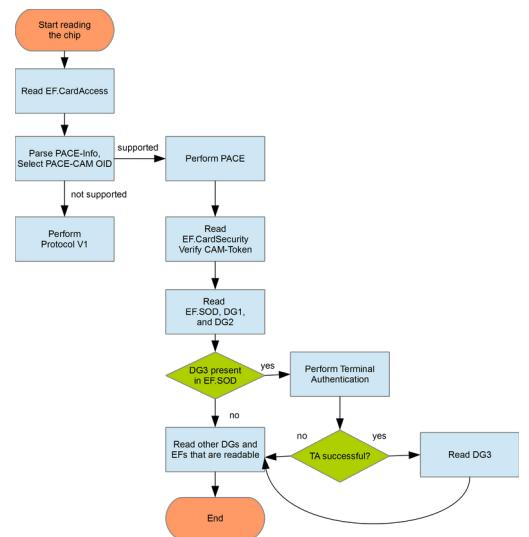

# Technical Guideline BSI TR‑03135 Machine Authentication of MRTDs for Public Sector Applications

Part 1: Overview and Functional Requirements

BSI TR‑03135-1 Version 2.4.0

Federal Office for Information Security with the Federal Criminal Police Office and the Federal Police P.O. Box 20 03 63 53133 Bonn Tel.: +49 22899 9582-0 E-Mail: tr-03135@bsi.bund.de Internet[: https://www.bsi.bund.de](https://www.bsi.bund.de/) © Federal Office for Information Security 2021

| 1              | Introduction                                                                       | 6        |
|----------------|------------------------------------------------------------------------------------|----------|
| 1.1            | Structure of the Technical Guideline                                               | 6        |
| 1.2            | Technical terms                                                                    | 6        |
| 1.3            | Terminology                                                                        | 6        |
| 2              | Overview                                                                           | 7        |
| 2.1            | MRTD features                                                                      | 7        |
| 2.2            | Document reader component                                                          | 7        |
| 2.3            | Inspection Application                                                             | 7        |
| 2.4            | Inspection System                                                                  | 7        |
| 2.5            | Authentication processes and their results7                                        |          |
| 2.5.1          | The MRTD Checking Process                                                          | 8        |
| 2.5.2          | Check results                                                                      | 9        |
| 2.6            | Different types of checks                                                          | 10       |
| 2.7            | Operational profiling                                                              | 10       |
| 3              | Reader requirements                                                                | 12       |
|                |                                                                                    |          |
| 3.1 3.1.1   | Technical requirements Document formats                                         | 12 12 |
| 3.1.2          | Reading the MRZ/CAN                                                                | 12       |
| 3.1.3          | Applying and handling the document on a full-page reader12                         |          |
| 3.1.4          | Communication requirements for the RF-reading module12                             |          |
| 3.1.5          | Host system interface                                                              | 13       |
| 3.1.6          | Requirements for the optical reading component13                                   |          |
| 3.2            | Performance capabilities                                                           | 14       |
| 4              | Authentication of MRTDs                                                            | 15       |
| 4.1            | Process sequence of checking an MRTD                                               | 15       |
| 4.2            | Visualization of check results                                                     | 16       |
| 4.3            | Error codes                                                                        | 17       |
| 4.4            | Overall document check result                                                      | 17       |
|                |                                                                                    |          |
| 4.5            | Optical checks of MRTDs                                                            | 17       |
| 4.5.1          | Introduction to spectrally selective checks17                                      |          |
| 4.5.2          | Document detection and capturing22                                                 |          |
| 4.5.3 4.5.4 | Document model identification Optical check result                              | 23 23 |
|                |                                                                                    |          |
| 4.6 4.6.1   | Electronic checks of electronic MRTDs30 Background Public Key Infrastructures30 |          |
| 4.6.2          | Access and process sequences                                                       | 31       |
| 4.6.3          | Chip access protocols                                                              | 36       |
| 4.6.4          | Checking chip content                                                              | 38       |
|                |                                                                                    |          |
| 4.7            | Combined checks                                                                    | 51       |
| 4.7.1          | Checking the expiration of the documents51                                         |          |
| 4.7.2          | Checking the optical biographic data against the electronic biographic data52      |          |
| 4.7.3          | Checks across document pages                                                       | 53       |
| 4.7.4          | Checks across several documents53                                                  |          |
| 4.7.5          | Comparison of the personalization contents54                                       |          |

| 4.7.6 | Checking DG2 against the facial image from the VIZ55 |    |
|-------|------------------------------------------------------|----|
| 4.8   | Handling and interpretation of defects               | 56 |
| 4.8.1 | Optical defects                                      | 56 |
| 4.8.2 | Electronic defects                                   | 57 |
| 5     | Logging scheme for operational monitoring60          |    |
| 5.1   | Use cases                                            | 60 |
| 5.2   | XML schemas                                          | 60 |
| 5.3   | Logging profiling                                    | 60 |
| 6     | Conformity                                           | 62 |
|       | References                                           | 63 |
|       | Keywords and abbreviations                           | 65 |

# Figures

| Figure 1: Example on how to place a passport and an ID card on a typical document reader12      |  |
|-------------------------------------------------------------------------------------------------|--|
| Figure 2: Temporal relation of optical, electronic and combined checks14                        |  |
| Figure 3: Process sequence of checking MRTDs15                                                  |  |
| Figure 4: Example sequence of optical checks of MRTDs18                                         |  |
| Figure 5: Schematic representation of the architecture IS ↔ DV ↔ CVCA and PKD 30 |  |
| Figure 6: Protocol Sequence 1, performing BAC and PACE33                                        |  |
| Figure 7: Protocol Sequence 2, performing PACE, CA1 or AA34                                     |  |
| Figure 8: Protocol Sequence 3, performing PACE, TA2, CA235                                      |  |
| Figure 9: Protocol Sequence 4, support of PACE-CAM36                                            |  |
|                                                                                                 |  |

# Tables

| Table 4.1: Assigning the results of checks using traffic light color symbolism16                               |    |
|----------------------------------------------------------------------------------------------------------------|----|
| Table 4.2: Overall Document Check Result                                                                       | 17 |
| Table 4.3: Representation of the generic basic check routines21                                                |    |
| Table 4.4: Result of document detection                                                                        | 23 |
| Table 4.5: Result of the document model identification23                                                       |    |
| Table 4.6: Final result of optical checks of MRTDs24                                                           |    |
| Table 4.7: Final result of checking the MRZ for ICAO compliance24                                              |    |
| Table 4.8: Result of checking the MRZ check digits consistency25                                               |    |
| Table 4.9: Result of checking the MRZ to be readable under IR light25                                          |    |
| Table 4.10: Result of checking the MRZ for OCR-B type face25                                                   |    |
| Table 4.11: Result of a particular (spectrally selective) basic check26                                        |    |
| Table 4.12: Result of a spectrally selective check group27                                                     |    |
| Table 4.13: Final spectrally selective verification result (combining all spectrally selective check groups)28 |    |
| Table 4.14: Result of a particular additional check28                                                          |    |
| Table 4.15: Result of a vendor-specific additional optical check group29                                       |    |
| Table 4.16: Final result for vendor-specific additional optical checks29                                       |    |
| Table 4.17: Final result of the chip access protocols37                                                        |    |
| Table 4.18: Final result of performing the access protocol BAC and PACE37                                      |    |
| Table 4.19: Result of performing the access protocol BAC37                                                     |    |
| Table 4.20: Result of performing the access protocol PACE38                                                    |    |
| Table 4.21: Final result of the access protocol Terminal Authentication38                                      |    |
| Table 4.22: Final result of checking the chip's content39                                                      |    |
| Table 4.23: Final result of checking the chip authenticity (AA, CA, or PACE-CAM)39                             |    |
| Table 4.24: Result of checking chip authenticity with AA40                                                     |    |
|                                                                                                                |    |

| Table 4.25: Result of checking chip authenticity with CA40                                   |    |
|----------------------------------------------------------------------------------------------|----|
| Table 4.26: Result of checking chip authenticity PACE-CAM41                                  |    |
| Table 4.27: Final result of verifying the security objects42                                 |    |
| Table 4.28: Final result of checking and verifying a specific security object42              |    |
| Table 4.29: Verification of the specific security object's hash value43                      |    |
| Table 4.30: Verification of the specific security object's signature43                       |    |
| Table 4.31: Assorted final result of checking the issuer certificates44                      |    |
| Table 4.32: Result of checking the issuer certificates for a security object44               |    |
| Table 4.33: Result of verifying the DS certificate signature45                               |    |
| Table 4.34: Result of checking the validity of certificates46                                |    |
| Table 4.35: Result of checking the validity of a CSCA certificate46                          |    |
| Table 4.36: Result of checking the validity of a DS certificate46                            |    |
| Table 4.37: Result of checking the revocation status of the DS certificate47                 |    |
| Table 4.38: Possible values of the trust status                                              | 47 |
| Table 4.39: Result of checking the integrity of the chip contents48                          |    |
| Table 4.40: Result of comparing the contents of EF.SOD and EF.COM48                          |    |
| Table 4.41:Final result of checking the integrity of all data groups (DG1 to DG16)49         |    |
| Table 4.42: Individual results of checking the integrity data groups49                       |    |
| Table 4.43: Result of the comparison of the issuing states50                                 |    |
| Table 4.44: Result of combined optical and electronic checks of electronic MRTDs51           |    |
| Table 4.45: Result of checking the expiration of the document52                              |    |
| Table 4.46: Result of checking the optical MRZ against the MRZ from DG152                    |    |
| Table 4.47: Result of checking both sides of an TD-1 sized Security Document53               |    |
| Table 4.48: Result of checking the MRZ of an electronic MRTD's MRZ against the visa's MRZ53  |    |
| Table 4.49: Result of checking an electronic MRTD's MRZ against the residence permit's MRZ54 |    |
| Table 4.50: Result of the MRZ/VIZ comparison54                                               |    |
| Table 4.51: Result of DG2 against the facial image from the VIZ55                            |    |
| Table 4.52: Trust status assignments for status codes of Defect Lists57                      |    |
| Table 5.1: Application domains and corresponding schema files60                              |    |

# 1 Introduction

Machine Readable Travel Documents (MRTDs) usually contain standardized, machine readable zones with biographic data and an electronic chip. In addition to typical textual areas on MRTDs, many documents also feature special optical/physical properties which can only be recognized and evaluated by special recording equipment. These properties are intended as an additional indicator for the authenticity of a document or they can be used for establishing a link between the document and its owner. Besides these features, the integrated chip contains information that is printed on the document, e. g. name, date of birth, but also biometric characteristics and cryptographic material that ensures that a given document was issued by an official entity and was not altered, cloned or forged.

The German Federal Office for Information Security (Bundesamt für Sicherheit in der Informationstechnik, BSI) composed the Technical Guideline [BSI TR-03135][1](#page-5-1) in collaboration with the Federal Criminal Police Office (Bundeskriminalamt, BKA) and the Federal Police (Bundespolizei, BPOL).

This Technical Guideline defines requirements for document inspection and a normative description of the necessary procedures that are required for a full featured check on modern machine readable (electronic) identity and travel documents, to acknowledge that a checked MRTD is authentic, of integrity and valid.

# 1.1 Structure of the Technical Guideline

Chapter [2](#page-6-0) describes the basic architecture of document inspection environments. Requirements for the document readers are described in chapter [3](#page-11-0), while the coverage of such checks are specified in chapter 4. Chapter 5 specifies the contents and the logging format of the document checking process. Followed by chapters for conformance, the references and the abbreviations.

# 1.2 Technical terms

For clarity and better reading, terms are abbreviated. Starting at page 65, abbreviations can be found.

# 1.3 Terminology

Keywords used within in this document are to be interpreted as described in [RFC2119].

1 TR for the German abbreviation for "Technische Richtlinie".

# 2 Overview

In the following paragraphs some basic introduction is given. It is recommended to have a look into "Machine Readable Travel Documents" [ICAO9303] and [FRONTEX] "Best Practice Technical Guidelines for Automated Border Control (ABC) Systems", "Best Practice Operational Guidelines for Automated Border Control (ABC) Systems". For Identity Documents the Technical Guidelines [BSI TR-03127] and [BSI TR-03110] are recommended as additional reading.

# 2.1 MRTD features

This Technical Guideline assumes that MRTDs are equipped with a combination of

- optical/physical and
- electronic (digital)

features, which can be processed by machines. These are recorded by some kind of document reader and processed in an Inspection Application. Internationally formalized and standardized document features are specified in [ICAO9303] for MRTDs. In addition to standardized features, many documents also contain specific information and features which can also be used as an indicator for the authenticity and integrity of a specific MRTD. They can be cataloged, so software can rely on such information to perform a complete and reliable document authentication.

Not all features of a document necessarily have to be checked. What to check depends on the operational scenario, the document type and, last but not least, on the equipment used to read and analyze the features. Thus it is RECOMMENDED to specify mandatory checks in some kind of profiling document with respect to this Technical Guideline.

# 2.2 Document reader component

The document reader component, or just document reader, records[2](#page-6-1) the features of a given MRTD according to its type. Afterwards, it transmits data to an Inspection Application for further processing.

# 2.3 Inspection Application

In this Technical Guideline, the Inspection Application controls the reading process of the document reader (component), processes the information obtained from a MRTD. The Inspection Application is able to configure the document reader (component) according to the operational requirements and type of the document to read, thus actively monitors and controls the steps needed to fully read and process a given travel document and its features.

How these characteristics are processed depends on the profiling and the type of document.

# 2.4 Inspection System

The Inspection System comprises of the Inspection Application and all background information systems responsible to handle requests regarding cryptographic keys, certificates, information etc.

# 2.5 Authentication processes and their results

In the context of this Technical Guideline the main focus is to determine if a given travel document is

2 In most cases this means digitizing the features in some way.

- authentic (i. e. genuine, originating from the issuer),
- of integrity (without any manipulation) and
- valid (e. g. not expired, not reported as lost or stolen, not a fantasy document)

These checks can be applied to the entire document or just partial areas of the MRTD and refer to the document's optical/physical or its electronic features. An individual check consists of a well-defined checking process. Examples for checking processes are:

- Check if a given document can be read in near-infrared light (IR) wavelength range ~900 nm.
- Check if there are defined patterns that become visible or invisible under exposure by a certain light source.
- Check the validity of a document (e. g. via the MRZ's date of expiry).
- Perform a query to background systems regarding the data of the MRZ to determine if the document is marked as lost or stolen.
- Calculate the checksums of the data groups read from the chip to confirm its integrity.
- Check the digitally signed checksum in the chip to prove integrity.
- Do a plausibility cross-check between the optical values (e. g. MRZ) and the corresponding values in the chip (e. g. DG1).

An individual checking process SHALL always lead to a well-defined and verifiable result. As such, an individual checking process is either processed

**completely** according to its algorithm until it is terminated and delivers a well-defined check result

or

**is aborted** ahead of schedule and does not deliver a meaningful check result.

The amount of checking processes performed depends on the operational scenario defined by the profiling and the work-units specified therein which are prescribed as a complete check.

At the end of the checking processes, all individual checks are assorted to intermediate results and an overall check result for each category to build a final assessment.

# 2.5.1 The MRTD Checking Process

Within this document, the organized and oriented sequence of a check is formally defined as a checking process. This sequence defines what is to be recorded, measured and controlled as part of its check and which results a process can return.

*Remark*: In this Technical Guideline, the checking process is just a formally variable and does not define how a check is technically implemented in hard- or software. The description of the technical design and implementation of a checking process, its in- and output values are out of scope.

A checking process P formally describes the sequence of causal dependence state transitions at times *t1,… ti* , *ti+1*, …., *tE*, i. e. the sequence of the checking events from the start *t1* … to the end *tE*. Here, a checking process is a series of deterministic state transitions *Zi* → *Zi+1* from state *Zi* to state *Zi+1*, whereas each state depends on previous states and is explicitly derived by them.

A checking process can only be in one of the following global states:

#### **1. Initiated**

The checking process has not started yet, there has been no activity. The process is in the state *Z{}*, the so called idle state.

### **2. Running**

At time *i*, the checking process is in the state *Zi* and is being performed at this time.

### **3. Terminated**

The checking process was performed until the deterministic end (time *E*) of its life cycle with final state *ZE* having been reached. It delivers a sound result that can be used to rate a given document and its checked feature(s).

### **4. Aborted**

The checking process was aborted prior to its defined end at time *X* of the life cycle with state *ZX*. The checking process was not able to finish correctly and thus does not deliver a complete result[3](#page-8-0) . It is RECOMMENDED that an error code and a short description is provided.

The result of a process terminated at time *E* and state *ZE* SHALL be used for determining the authenticity, integrity and validity. Errors during the operation, hardware, software or handling errors can cause a premature abortion of the process in a state *Zx* at time *X* (i.e. *aborted*). In order to ensure constant checking quality, only check results arising from a terminated process (*terminated* at time *E* and state *ZE*) SHALL be used as a check result. The information of any other state (notably state *aborted*) MAY only be documented and used in some kind of operational monitoring; these values, however, SHALL NOT form a basis for any reasonable check result.

Only the result of a terminated process (*terminated* at time *E* and state *ZE*) SHALL be input for another basic checking process or any final result.

# 2.5.2 Check results

A check does not necessarily have to be a verification of the features, it can also be the successful implementation of communication and access protocols an Inspection Application may perform on a specific document (e. g. such as BAC, PACE or TA)[4](#page-8-1) .

The result of a checking process has exactly one of the following results:

*1. Successful*

The check **terminated**, the feature of the document to be checked successfully passed the check, i.e. a specific check was able to be applied to the document and assessed according to its specifications.

2. *Failed*

The check **terminated**, the feature of the document to be checked did NOT successfully pass the check; in other words the applied check failed on the feature. The document SHOULD be subject to a further (manual) check for authenticity, integrity and validity.

*3. Undetermined*

The check **terminated**, it was not possible to determine if the feature to be checked is authentic, of integrity or is valid. The document SHOULD be subject to a further (manual) check.

*4. Not supported*

3 Aborted occurs due to an error while executing the check process and has nothing to do with a check result. For example, if the MRTD was removed too early, before it was completely read and checked, or if an light source is damaged, the scanner sensor does not work properly, the RFID near field could not be established etc.

4 Any failure or missing support of a specific protocol lead to some initial suspicion that the given MRTD might fail further authenticity, integrity and validity checks. For example, if a specific document should support a specific communication protocol according to its specification, but does not. That indicates that the checked MRTD might be manipulated and is not trustworthy.

The check **terminated**, but the specific document does not support the features to be checked (for example, a document without a chip, a document which does not have specific security features per definition, a specific protocol was not supported by a chip etc.).

The final result SHALL be given according to one of the values prescribed above. Besides the check result, further information MAY also be attached. The result can then be used together with its attached information in further checks.

Otherwise the check must be **aborted** and there is no meaningful result with regard to the intended document check. In those cases, the following check result shall be used:

*5. Aborted*

The check *aborted* prior to its defined process flow. Obtained check information and results SHOULD NOT be used as proper document check indications.

# 2.6 Different types of checks

Checks on MRTDs can be divided into several categories, which are:

- Optical checks: These checks perform optical inspection checks on physical security features placed on a given document type (e. g. special print design properties, brightening agents' free substrate, holograms etc.).
- Electronic checks: These checks read and validate the electronic security features of the RFID-chip (e. g. access control, integrity of data and authenticity of chips).
- Combined checks: These checks do some sort of comparison on the basis of the preceding two checks (e. g. comparing the optically read MRZ from the passport's page with DG1 stored in the chip, comparing the MRZ with biographic data from the front page or DG1).

Typically, further checks are subsequently performed, for example:

- Biometric checks: Checking the identity of the document owner based on biometric characteristics (e. g. facial image, fingerprint images) initially recorded when the official document was applied for. These are checked against the live data collected on site to verify that the current document holder is the one the document was issued for.
- Requests into background systems: Automated requests to background information systems on the basis of the information featured on an MRTD (e. g. checking data printed on the MRZ or from DG1 with official databases like INPOL, SIS, VIS, RTP, etc.).

Although the owner's identity will be determined in a complete checking process, this Technical Guideline focuses on checking the document itself. The relation between the owner of an MRTD and the document itself is often established by comparing biometric characteristics (the facial image or fingerprints) to the characteristics stored in the electronic chip of the electronic MRTD. Checking the biometric characteristics can also be performed manually or by using automated systems. More details and requirements for such checks and logging formats are defined in [BSI TR-03121] and are not part of this Technical Guideline.

# 2.7 Operational profiling

This Technical Guideline contains a number of checks that could be performed on MRTDs. The requirements on how and what to check depends on the operational scenario and SHOULD be specified by the agency responsible for checking MRTDs. As such, all necessary checks and requirements SHOULD be defined in a profiling document[5](#page-9-0) referencing this Technical Guideline. Any restrictions, deviations and

5 For example, the German implementation is given as Part 2 of this Technical Guideline.

specific designs of the checks which were not implemented in accordance herein SHALL be concretized accordingly in the profiling.

Document checks as defined in this Technical Guideline can be:

- **Mandatory (m)** requirements SHALL always be performed and SHALL be included in the final result.
- **Optional (o)** requirements do not necessarily have to be implemented and performed. But if they are implemented in a checking process, the results of the checks SHALL be included in the final result.
- **Evaluatory (e)** requirements are NOT included in the final result and are only documented in the log for subsequent evaluations and operational monitoring.

Depending on the requirement and the profiling, all data obtained during an authentication process SHALL be stored according to the monitoring log-data format. Further information and details on this can be found in chapter 5.

# 3 Reader requirements

# 3.1 Technical requirements

# 3.1.1 Document formats

A full-page MRTD document reader SHALL support the sizes and formats for MRTDs specified in [ICAO9303]. This includes the documents in the sizes TD-1, TD-2 and TD-3 (i. e., three-line MRZ with 30 characters per line, two-line MRZ with 36 characters per line or the two-line MRZ with 44 characters per line) as well as machine-readable visas in the MRV-A and MRV-B formats[6](#page-11-2) .

# 3.1.2 Reading the MRZ/CAN

The document reader SHALL support automated reading of the machine-readable zone (MRZ) according to the definition in [ICAO9303]. If it is a full-page reader, it SHALL be able to record the image in the nearinfrared light (B900 band, 900 +/- 50 nm) and SHOULD be able to read images in the visible wavelength range. More detailed information can be found in [ISO1831].

A full-page reader SHALL also support the automated reading of the six-digit Card Access Number (CAN) that can be found on some electronic MRTDs or IDs.

It is RECOMMENDED that swipe-type document readers also support reading the CAN in addition to the MRZ.

# 3.1.3 Applying and handling the document on a full-page reader

MRTDs SHALL be placed on a full-page reader such, that the personalized data page can be recorded optically without any interference.

The MRZ or the CAN are placed in the direction of the document reader. Figure [1](#page-11-1) shows an example on how an electronic passport and an identity card SHOULD be placed on a full-page reader.

*Figure 1: Example on how to place a passport and an ID card on a typical document reader*

The document reader can digitize the data page of an MRTD and then start further checking steps. It is RECOMMENDED that the electronic reading process should start as soon as the MRZ or the CAN is available. It is RECOMMENDED that digitized records of the extracted MRZ or CAN are available to the system in less than 5 seconds after the document has been placed on the reader.

# 3.1.4 Communication requirements for the RF-reading module

The RF-reading module SHALL communicate with a semi-conductor device embedded in the electronic MRTD using radio frequency energy that meets the requirements specified in [ISO14443-2].

6 The document reader SHALL be able to process documents surrounded by a cover that exceeds the data page on all sides up to 5 mm. For example, this applies to old German passports or passports in a slipcover.

The document reader SHALL be able to read electronic MRTDs with an electrically conductive shielding.

Reading the electronic data[7](#page-12-0) of an electronic MRTD SHALL NOT take longer than 7 seconds on a reference electronic MRTD, using the minimal system requirements as specified by the vendor of the checking system. Timing starts when the document was finally placed on the reader and all necessarily needed information is available (MRZ, CAN) to start processing.

# 3.1.5 Host system interface

If the Inspection System is partitioned in several components, such as document reader, RF-reader, and Inspection Application on a computing unit, the connection interfaces between the components SHOULD preferably be used by means of common industry standards, e. g. USB.

# 3.1.6 Requirements for the optical reading component

Images from the MRTD's data page SHALL be optically recorded and digitized under near-infrared light (in the B900 band, cf. document specification according to [ISO1831]), under UV light of a wavelength of approx. 365 nm and under white light reflecting colors of the visible spectrum in roughly equal amounts.

Ambient light can have a significantly adverse effect on the quality of the scanned records; thus it is RECOMMENDED to use a document reader which is insensitive to incoming ambient light or can be shielded.

The document Inspection Application SHALL provide all records of the data page in computer readable image file formats (PNG or JPEG) with an image resolution of at least 385 ppi[8](#page-12-1) , in the sense of scale mapping the sensor size to the document size. For JPEG, the operator SHALL be able to configure the encoding for different compression factors and quality settings, see [ISO10918-1].

7 At least the data groups EF.COM, EF.SOD, DG1 and DG2.

8 A resolution of 600 ppi is RECOMMENDED.

# 3.2 Performance capabilities

It is RECOMMENDED to reduce the total duration of the checks if feasible. Each process step SHOULD thus be started as soon as the input data, which is mandatory for the process is available to the system[9](#page-13-0) . By passing the MRZ/CAN data to the processing component of the electronic checking system at an early stage, the total time of the check could be reduced, since the electronic check component can perform its checks, while the optical check component is performing its checks. The following diagram illustrates the temporal relation between the optical, the electronic and combined checking of the document.

9 For example, MRZ or CAN, images of the data page to access the chip.

# 4 Authentication of MRTDs

# 4.1 Process sequence of checking an MRTD

The following process steps are usually performed when checking MRTDs:

- Reading the document optically
- Checking the recorded features
- Reading the document electronically
- Checking the electronic features
- Performing combined checks

It is RECOMMENDED to follow the process sequence shown in the following figure:

*Figure 3: Process sequence of checking MRTDs*

The process starts with reading the optical/physical features of an MRTD. Depending on the operational scenario, the optical images of the data page and the MRZ or the CAN is read[10](#page-14-0). Based on this data, a logical check (e. g. checking the validity of the document) as well as a check of the optical/physical security features of the document are performed. Section [4.5](#page-16-0) specifies these optical checks on MRTDs.

Reading the document electronically can be started as soon as the MRZ or the CAN of the document is available and a RF chip is identified. The architecture and procedure required for reading electronic MRTDs electronically is specified in 4.6.

10 Depending on the document, several pages (e. g. data page and visa page) can be checked and assorted to one result. Checking several documents within one transaction is considered as to be several individual checks.

Combined optical and electronic checks SHOULD be performed as soon as the optical and electronic data required for such checks are available, cf. section 4.7.

# 4.2 Visualization of check results

Inspection Applications SHALL be able to provide the results **of an individual** check with reduced level of detail. It is RECOMMENDED to map the defined values as defined in chapter 2.5.2 on page 9 as shown in table [4.1](#page-15-0) that follows a traffic lights oriented scheme.

| Result of the check | Traffic light color |
|---------------------|---------------------|
| successful          | green               |
| failed              | red                 |
| undetermined        | yellow              |
| not supported       | grey                |
| aborted             | grey                |

*Table 4.1: Assigning the results of checks using traffic light color symbolism*

Another form of visualization and a higher level of detail SHOULD be possible if they are obvious due to the profiling or desired by the operator. It is RECOMMENDED to visualize the results of the following partial checks hierarchically:

- Results of optical checks, see section [4.5](#page-16-0)
	- [Document detection and capturing](#page-21-0) see section [4.5.2](#page-21-0)
	- [Check MRZ for ICAO compliance](#page-23-0) see section [4.5.4.1](#page-23-0)
	- [Spectrally selective verification](#page-25-0) see section [4.5.4.2](#page-25-0)
- Results of electronic checks see section 4.6
	- Chip access protocols see section 4.6.3
	- Checking chip authenticity (AA, CA, PACE-CAM) see section 4.6.4.1
	- Verification of the security objects see section 4.6.4.2.1
	- Checking issuer certificates see section 4.6.4.3
	- Integrity of chip contents see section 4.6.4.4
	- Comparison of the issuing state (DG1 and DS certificate) see section 4.6.4.5
- Combined checks see section 4.7
	- Checking the expiration of the documents see section 4.7.1
	- Checking the optical biographic data against the electronic biographic data see section 4.7.2
	- Checks across document pages see section 4.7.3
	- Checks across several documents see section 4.7.4
	- Comparison of the personalization contents see section 4.7.5
	- Checking DG2 against the facial image from the VIZ see section 4.7.6

# 4.3 Error codes

Each of the checks prescribed in chapters [4.5,](#page-16-0) 4.6 and 4.7 SHOULD log processing errors using numeric integer error codes. Each error SHALL distinguish between the class of a check (i. e. [Optical checks of](#page-16-0)  [MRTDs](#page-16-0), Electronic checks of electronic MRTDs and Combined checks).

For each defined error code in each class, the Inspection Application SHOULD also provide a short and concise error description that facilitates a subsequent analysis regarding the error. Errors, for example, can be program crashes, improper use, hardware failures etc., and may result in an abortion of the defined checking process.

Vendor-specific error codes SHALL be defined in the integer range of 1.000 – 999.999, error codes beyond that range are reserved for use by this Technical Guideline and are subject to be defined in the profiling document.

No error code SHALL mean that no error occurred and that a process was performed successfully. The error code value can be set to a NULL or VOID value.

# 4.4 Overall document check result

Checks from [4.5](#page-16-0), 4.6, and 4.7 can be combined into an overall document check result. The aggregation into a single result is Inspection Application specific. The result of this overall document check result SHALL be mapped according to table [4.2](#page-16-1).

| Result of the check | Description                                                                                                                              |
|---------------------|------------------------------------------------------------------------------------------------------------------------------------------|
| successful          | The check result SHALL be set to successful if all assorted overall higher-level checks from 4.5, 4.6, and 4.7 are successful.        |
| failed              | The check result SHALL be set to failed if at least one of the assorted higher-level checks from 4.5, 4.6, and 4.7 was set to failed. |
| undetermined        | The check result can be undetermined depending on a Inspection Application's specific assessment.                                     |
| not supported       | The check result can be not supported depending on a Inspection Application's specific assessment.                                    |
| aborted             | The check result SHALL be set to aborted if at least one of the assorted higher-level checks from 4.5, 4.6, and 4.7 was aborted.      |

*Table 4.2: Overall Document Check Result*

# 4.5 Optical checks of MRTDs

In the following sections optical checks are explained in more detail. The number of optical checks to perform depends on the operational scenario and the individual document models, thus should be defined in a profiling document.

# 4.5.1 Introduction to spectrally selective checks

In this section, a base set of optical checks is described which is required for further checks. The main focus of these checks are spectrally selective check routines.

Figure [4](#page-17-0) shows the sequence of optical checks. Regarding this sequence the model identification (see section [4.5.2](#page-21-0) and [4.5.3](#page-22-0)) and checking the MRZ consistency (see section [4.5.4.1](#page-23-0)) SHALL be performed for all documents, whereas most of the spectrally selective checks can only be performed after the document model was identified successfully.

*Figure 4: Example sequence of optical checks of MRTDs*

# 4.5.1.1 Document model

Each MRTD can be assigned to a document model (sometimes also called series). A document model is defined by means of the country code (*C*), document type (*T*), a distinct identification number (*N*), a year value (*Y*) and a PRADO code identifier (P):

$$\text{Document Model} \coloneqq \{ \mathcal{C}, T, N, Y, P \}$$

The country code *C* SHALL be according to the ICAO specifications in [ICAO9303] as a three-letter code.

The first digit of the document type *T* is unambiguously specified by the ICAO in [ICAO9303]. There are restrictions for the second digit, but there is no whole specification.

The identification number *N* SHALL be a distinct chronological increasing integer number starting with 1.

The year *Y* refers to the year as an integer value if the year is unknown this value SHALL be omitted.

The value for *P* represents the [PRADO] code identifier. If there is no known PRADO code, this value SHALL be omitted.

# 4.5.1.2 Spectrally selective checks

The term "spectrally selective checks" covers checks, that record different reactions occurring on a document illuminated with visual (VI, white light) or with extra visual (UV, IR) illumination. Based on the three records (VI, UV, IR), the absorbent, reflective or luminescent features of these reactions can be checked. This includes, for example, the MRZ IR readability, the VIZ IR readability, the UV brightness test, sample verifications in all images. With a few exceptions these checks can only be defined for a specific model of documents. Hence a check database is required to assist the checking process. Such a database contains model-specific spectrally selective check information about known documents. The actual characteristics of a spectrally selective check routine depend on the vendor of the checking system.

For vendor-independent comparability check results, generic designations are necessary and will be specified in the following paragraphs.

*Basic check* routines are individual check routines which refer to an individual feature (for example, the IR absorption). *Composite check* routines are defined as logical combinations of basic check routines. Thus, an enhanced characteristic can be checked with respect to several features, such as IR absorption and visibility in the VI.

For the check routines, the following abbreviated definitions are used:

## **(***XX***,** *YY***,** *ZZ***)**

*XX* specifies the light source of the record on which the check routine is performed:

- **IR** infrared light
- **UV** ultraviolet light
- **VI** visible (white) light

|   |    |   | YY specifies the optical property of the characteristic:                      |
|---|----|---|-------------------------------------------------------------------------------|
| – | AB | – | absorbent                                                                     |
| – | BR | – | bright                                                                        |
| – | FR | – | spatial frequency property                                                    |
| – | LU | – | luminescent                                                                   |
| – | TL | – | translucent                                                                   |
| – | TR | – | transparent                                                                   |
|   |    |   | ZZ specifies the characteristic feature of or the position in the document11: |
| – | FI | – | fibres                                                                        |
| – | FU | – | full (complete) data page                                                     |
| – | IS | – | printed feature, which already exists on the substrate (Ink static)           |
| – | MR | – | area of the machine readable zone (MRZ)                                       |
| – | OM | – | overprinted MRZ                                                               |
| – | CA | – | Card Access Number (CAN)                                                      |
| – | PD | – | personalized "dynamic" perforation                                            |
| – | PS | – | perforation which shows "static" content                                      |
| – | PH | – | area of the photo                                                             |
| – | SP | – | area of the secondary photo                                                   |
| – | OP | – | overprinted photo                                                             |
| – | TH | – | security thread                                                               |
| – | VZ | – | visual inspection zone (VIZ)                                                  |
| – | WM | – | watermark                                                                     |
| – | ID | – | any other personalized, "dynamic" feature (ink dynamic), e. g. a secondary |

photograph

11 Within this nomenclature, model-specific (also document-independent) features are referred to as "static" and document-specific (individual/personalized) features are referred to as "dynamic".

– **AF** – any additional feature that cannot be attributed to the items specified above

The vendor SHALL assign a unique identifier (UUID according [RFC4122]) for each generic check. For example, (IR, AB, MR) can be assigned to UUID f81d4fae-7dec-11d0-a765- 00a0c91e6bf6 by the vendor.

The following representation provides an overview of the generic basic check routine methodology. For this purpose, the three parts of the description of these check routines – light source, optical property of the characteristic, feature – are provided in the form of a table. The line, column and content of a cell represent the generic routine. The list might not be complete if check routines are missing, they can be added in accordance with the operator while following the format (*XX*, *YY*, *ZZ*) as specified above (the same applies for composite check routines).

Vendor- and model-specific check routines SHALL be classified and logged according to the schema given in table [4.3.](#page-20-0)

Properties or features of counterfeits SHOULD be incorporated by inverting the logic of check routines: e. g. a specific configuration of imitated security fibres by printing SHOULD be checked for absence of this pattern (i. e. VI, TR, IS).

| Feature / Area (ZZ)                | Light Source (XX) |                      |                      |                      |
|------------------------------------|-------------------|----------------------|----------------------|----------------------|
|                                    |                   | VI                   | UV                   | IR                   |
| Fibers                             | FI                |                      | LU                   |                      |
| Full data page                     | FU                |                      | BR                   |                      |
| Static printed feature             | IS                | {AB, TR}             | LU                   | {AB, TR, TL}         |
| MRZ                                | MR                | AB                   | BR                   | AB                   |
| Overprinted MRZ                    | OM                |                      | LU                   |                      |
| CAN                                | CA                | AB                   |                      | AB                   |
| Personalized perforation (dynamic) | PD                | AB                   | LU                   | AB                   |
| Perforation of the substrate       | PS                | AB                   | LU                   | AB                   |
| Photo                              | PH                | {AB, FR}             | {BR, FR}             | {AB, FR, TR}         |
| Secondary Photo                    | SP                | {AB, TR}             | LU                   | {AB, TR}             |
| Overprinted photo                  | OP                |                      | LU                   |                      |
| Security thread                    | TH                | TR                   | LU                   | AB                   |
| Visual Inspection Zone (VIZ)       | VZ                |                      | BR                   |                      |
| Watermark                          | WM                |                      |                      | AB                   |
| Personalized dynamic feature       | ID                | {AB, TR}             | LU                   | {AB, TR}             |
| Additional feature                 | AF                | {AB, BR, LU, TL, TR} | {AB, BR, LU, TL, TR} | {AB, BR, LU, TL, TR} |

*Table 4.3: Representation of the generic basic check routines*

In addition, there can be the following composite check routines:

- **(IR, AB, TH)** in combination with **(VI, TR, TH)**: Check that a thread visible under IR light is invisible under white light.
- **(IR, TR, ID)** in combination with **(VI, AB, ID)**: Check that the ink of the dynamic print image absorbent under white light is transparent under IR light.
- **(IR, TR, IS)** in combination with **(IR, AB, IS)**: Check that some parts of the static print image are absorbent under IR light, whereas other parts of the characteristics are transparent.
- **(IR, TR, IS)** in combination with **(VI, AB, IS)**: Check that the ink of the static print image absorbent under white light is transparent under IR light.
- **(IR, TR, IS)** in combination with **(VI, AB, IS)** and **(IR, AB, ID)**: Check that the ink of the static print image absorbent under white light is transparent under IR light and a dynamically printed characteristic becomes visible in the same position under IR light.

# 4.5.1.3 Catalog for spectrally selective checks

Further information on the spectrally selective checks might be required by the operator for evaluation purposes and to update the underlying database to assure consistent and high quality authentication results over time. This information is the same for all documents of a specific document model, for example, textual explanations on the check routines, the image section from the reference database etc.

The vendor SHALL supply a catalog in machine readable form according to the defined XML schema of this Technical Guideline which summarizes all necessary information on the spectrally selective verification checks. Due to the format, the catalog can be integrated into the evaluation of the results.

In addition, the catalog SHALL include the following information on each generic check routine of a document model:

- UUID of the check routine: This value specifies the unique id for the check.
- Generic check identifier: This attribute contains the generic check routine specification name, e. g. (UV, BR, VZ).
- Proprietary check: This attribute contains a vendor-specific name of the spectrally selective check routine (e. g. according to the entry in the check database).
- Description: This attribute contains a textual description of the check routine performed and, in particular, an explanation of the differences in the checks with multiple applications of one and the same generic specification.
- Maximal range: This attribute contains the upper limit of the range of values.
- Minimal range: This attribute contains the lower limit of the range of values.
- Threshold: This attribute contains the threshold configured for the decision for the spectrally selective verification.
- Limits:
	- Bounding rectangle: The bounding rectangle for the checking area if it is not a region.
	- Region: This element contains the description of an alternative geometric check region if a bounding rectangle is not applicable. The type description is freely definable by the vendor, the definition SHALL be disclosed to the operator.
- Reference area: This element contains the image section of the reference image region checked against the corresponding database.

For composite generic check routines, the function of which the decision is taken (so-called decision function) SHALL be specified. Any proprietary decision function SHALL be described by the vendor and disclosed to the operator. If it is not possible to describe the decision function technically, its functioning SHALL described to be comprehensible.

The catalog SHALL list all test configurations. The test configurations assort the checks into check groups and include decision functions for the given document models. The checks for a specific model SHALL be conducted according to the configuration given in the catalog. For each configuration an unique identifier (UUID according [RFC4122]) SHALL be assigned. Multiple configurations can exist for a given document model. The choice of a configuration is vendor specific.

All information contained in this catalog should be treated in a confidential manner and SHALL NOT be disclosed without the consent of the vendor.

# 4.5.2 Document detection and capturing

The correct placement, detection and capturing of a document onto the reader is crucial for all following steps. The inspection system SHALL provide mechanisms for automatic and manual triggering of document detection. Manual triggering is required if automatic document detection does not work properly.

Image capturing SHOULD start automatically after the complete personal data page has been placed on the capturing surface. The firm- or software SHALL be able to compensate potential rotation and realign the image automatically and SHALL crop the captured data page accordingly for further processing.

The presence of a document SHALL be detected only by using its optical properties. The detection process SHALL still be carried out optically, even if an expected chip is absent or malfunctioning.

The result of the document model detection SHALL be mapped according to table [4.4.](#page-22-1)

| Result of the check | Description                                                                                                                                                         |
|---------------------|---------------------------------------------------------------------------------------------------------------------------------------------------------------------|
| successful          | The check result SHALL be set to successful if the document was placed correctly onto the reader and the process leads to a complete set of valid output images. |
| failed              | Detection failed, there might be no complete set of output images that can be used for document checks.                                                          |
| undetermined        | This value cannot occur here.                                                                                                                                       |
| not supported       | This value cannot occur here.                                                                                                                                       |
| aborted             | The checking process was aborted prior to its defined process flow. A handling, software, or other type of error occurred.                                       |

*Table 4.4: Result of document detection*

# 4.5.3 Document model identification

The correct detection of a document model is required for all further identification and verification steps. The inspection system SHALL provide mechanisms for automatic and manual triggering of document model identification. Manual selection SHALL be performed if the automatic document model identification fails. However, manual selection is not applicable in scenarios where the Inspection System is not operated by an officer , e. g. self-service or automated border control scenarios.

| Result of the check | Description                                                                                                                    |
|---------------------|--------------------------------------------------------------------------------------------------------------------------------|
| successful          | Document model identification SHALL be set to successful if the document model could be classified as specified in 4.5.1.1. |
| failed              | The check SHALL be set to failed if identifying the document model was not possible.                                        |
| undetermined        | The document identification process ended inconclusively.                                                                      |
| not supported       | This value cannot occur here.                                                                                                  |
| aborted             | The checking process was aborted prior to its defined process flow. A handling, software, or other type of error occurred.  |

The result of the document model detection SHALL be mapped according to table [4.5.](#page-22-2)

*Table 4.5: Result of the document model identification*

The following value SHALL be logged:

– Document Model: The identified document model shall be provided in the format as specified in the format from section [4.5.1.1,](#page-17-1) e. a. (C, T, N, Y, P).

# 4.5.4 Optical check result

The final optical result includes the results of all individual checks that were performed and SHALL be mapped according to table [4.6](#page-23-1).

| Result of the check | Description                                                                                                                                                                                                                                                                                                                                                                           |
|---------------------|---------------------------------------------------------------------------------------------------------------------------------------------------------------------------------------------------------------------------------------------------------------------------------------------------------------------------------------------------------------------------------------|
| successful          | The result of the check SHALL be set to successful if all checks prescribed in the subsections for the application scenario were successfully performed. The document does not show any optical/physical signs of falsification or any manipulations. The ICAO compliance check, see 4.5.4.1, may result in not supported, but this SHALL not affect the final result. |
| failed              | The result of the check SHALL be set to failed if at least one of the checks prescribed in the subsections for the application scenario was rated failed. The document deviates from the state and properties as supposed to be. It is suspected that the document has been manipulated.                                                                                     |
| undetermined        | The optical checking process ended inconclusively.                                                                                                                                                                                                                                                                                                                                    |
| not supported       | The optical checking process could not be carried out for this document.                                                                                                                                                                                                                                                                                                              |
| aborted             | One of the individual checks was aborted due to an error.                                                                                                                                                                                                                                                                                                                             |

*Table 4.6: Final result of optical checks of MRTDs*

# 4.5.4.1 Check MRZ for ICAO compliance

The Inspection Application SHALL at least check for consistency of the MRZ check digits referring to [ICAO9303], but it is recommended to also check for the correct type face and IR visibility of the MRZ; The checks [4.5.4.1.2](#page-24-2) and [4.5.4.1.3](#page-24-1) are optional, but if the checks are performed, their result SHALL be assorted into the final result.

The final result of this check SHALL be mapped according to table [4.7.](#page-23-2)

| Result of the check | Description                                                                                      |
|---------------------|--------------------------------------------------------------------------------------------------|
| successful          | The result of the check SHALL be set to successful if all checks were performed successfully. |
| failed              | The result of the check SHALL be set to failed if at least one of the checks failed.             |
| undetermined        | This value cannot occur here.                                                                    |
| not supported       | The check SHALL be set to not supported if the document page does not have a MRZ.             |
| aborted             | Due to an error the checking process was aborted prior to its defined process flow.              |

*Table 4.7: Final result of checking the MRZ for ICAO compliance*

#### 4.5.4.1.1 Check the MRZ's consistency

The Inspection Application SHALL check the consistency of the MRZ check digits as defined in [ICAO9303]. If the consistency check fails, the Inspection Application SHALL present a dialog box for manual MRZ correction.

The result of the lastcheck SHALL be mapped according to table [4.8:](#page-24-0)

| Result of the check | Description                                                                                                    |
|---------------------|----------------------------------------------------------------------------------------------------------------|
| successful          | The result of the check SHALL be set to successful if all available check digits were calculated correctly. |

| Result of the check | Description                                                                                                        |
|---------------------|--------------------------------------------------------------------------------------------------------------------|
| failed              | The result of the check SHALL be set to failed if at least one check digit calculation has an incorrect result. |
| undetermined        | This value cannot occur here.                                                                                      |
| not supported       | The check SHALL be set to not supported if the document page, does not have a MRZ13                             |
| aborted             | Due to an error the checking process was aborted prior to its defined process flow.                                |

*Table 4.8: Result of checking the MRZ check digits consistency*

# 4.5.4.1.2 Check MRZ to be readable under IR light

The Inspection Application SHALL check whether the MRZ is present under an IR lighting source.

The result of this check SHALL be mapped according to table [4.9](#page-24-4).

| Result of the check | Description                                                                                              |
|---------------------|----------------------------------------------------------------------------------------------------------|
| successful          | The result of the check SHALL be set to successful if the MRZ is present under an IR lighting source. |
| failed              | The result of the check SHALL be set to failed if the MRZ is not present under an IR lighting source. |
| undetermined        | This value cannot occur here.                                                                            |
| not supported       | The check SHALL be set to not supported if the document page does not have a MRZ.                     |
| aborted             | Due to an error the checking process was aborted prior to its defined process flow.                      |

*Table 4.9: Result of checking the MRZ to be readable under IR light.*

## 4.5.4.1.3 Check MRZ to be printed using OCR-B type face

The Inspection Application SHOULD check whether the MRZ was printed using OCR-B type face according to ISO/IEC 30116.

The result of this check SHALL be mapped according to table [4.10.](#page-24-3)

| Result of the check | Description                                                                                           |
|---------------------|-------------------------------------------------------------------------------------------------------|
| successful          | The result of the check SHALL be set to successful if the MRZ was printed using a OCR-B type face. |
| failed              | The result of the check SHALL be set to failed if the MRZ was not printed using a OCR-B type face. |
| undetermined        | This value cannot occur here.                                                                         |
| not supported       | The check SHALL be set to not supported if the document page, does not have a MRZ.                 |
| aborted             | Due to an error the checking process was aborted prior to its defined process flow.                   |

*Table 4.10: Result of checking the MRZ for OCR-B type face*

13 This is, for example, the case for the German Identity Cards or German Residence Permit Cards on their front.

# 4.5.4.2 Spectrally selective verification

Most MRTDs can be checked regarding their authenticity by verifying their spectrally selective security features. The specific spectrally selective check routines being performed depend on the document model. One exception is (IR, AB, MR) (e. a. B900), which can be parametrized independently from a specific document model. With certain restrictions on accuracy, (UV, BR, FU) can also be performed without selecting a specific document model.

If it is not possible to determine a document model, at least the check (UV, BR, FU) SHALL be performed.

If the document model can be determined and properties are present, at least one check from each of the following sub-items SHOULD be performed:

- (IR, TR, ZZ): one check which investigates the complementary property "transparent under IR light" compared to (IR, AB, MR),
- (UV, LU, ZZ): one check which investigates the complementary property "luminescent under UV light" compared to (UV, BR, FU).

For this reason, using a dedicated database tailored to the specific check is RECOMMENDED in all cases. This database SHALL be updated regularly in order to reduce false acceptance and rejection rates. It is RECOMMENDED to specify and maintain the contents of the database together with the operator; in most cases, this includes:

- Definition of model identifiers in order to differentiate the document models.
- Definition of search areas and their contents as well as the checks based on them including thresholds and ranges of values.
- Subsequent extension, correction and readjustment of the specified checks in order to be able to take into account any experience gained with respect to the variances in the features of authentic documents to be checked (e. g. regarding aging effects, traces of usage, variability in the production process).

The specified checks, as well as their associated thresholds, proprietary decision functions, etc. SHALL be documented and disclosed by the vendor.

**Please note:** Individual spectrally selective checks (including composite checks) are organized into groups which contain the assigned basic checks. Groups of such checks are then assorted to the final spectrally selective verification result. The following sections specify the levels of this hierarchical arrangement.

| Result of the check | Description                                                                                                                                                                                                                |
|---------------------|----------------------------------------------------------------------------------------------------------------------------------------------------------------------------------------------------------------------------|
| successful          | The result of the check SHALL be set to successful if a particular spectrally selective security feature to be checked for the given document was successfully tested by a decision function with a positive result. |
| failed              | The result of the check SHALL be set to failed if a particular spectrally selective check fails (the decision function has a negative result).                                                                          |
| undetermined        | Otherwise the result is undetermined.                                                                                                                                                                                      |
| not supported       | This value cannot occur here14                                                                                                                                                                                             |
| aborted             | Due to an error the check was aborted prior to its defined process flow.                                                                                                                                                   |

The result of **a particular** spectrally selective check routine SHALL be mapped according to table [4.11.](#page-25-1)

*Table 4.11: Result of a* particular (spectrally selective) basic check

For each basic check routine, the following values SHALL be logged:

14 An individual check will only be performed on a document that supports the check.

- UUID of the check routine: This value specifies the unique id for the check.
- Generic check identifier: This attribute contains the generic check routine specification name, e. g. (UV, BR, VZ).
- Proprietary check: This attribute contains a vendor-specific name of the spectrally selective check routine (e. g. according to the entry in the check database).
- Result: This attribute represents the result of the current spectrally selective check. The assignment of this attribute is performed based on table [4.11](#page-25-1).
- Margin: This attribute contains a standardized result value between -1 and +1, referring to a standardized threshold of 0. Here, a value greater or equal 0 refers to the result "successful" and a value less than 0 to the result "failed". The vendor is responsible for the detailed calculation of the margin.
- Scanned area:
	- Bounding rectangle: The bounding rectangle for the checking area if it is not a region.
	- Region: This element contains the description of an alternative geometric check region if a bounding rectangle is not applicable. The type description is freely definable by the vendor, the definition SHALL be disclosed to the operator.
	- Image area: This element contains the image section from the live record of the checked document area.

For each composite check routine, only the result of the corresponding composite check SHALL be logged. The log entry SHALL refer to the UUIDs of the used basic check routines.

| All spectrally selective (basic or composite) checks SHALL be grouped according to table 4.12– even if a |  |  |
|----------------------------------------------------------------------------------------------------------|--|--|
| group only consists of one such check:                                                                   |  |  |

| Result of the check | Description                                                                                                                                                                                               |
|---------------------|-----------------------------------------------------------------------------------------------------------------------------------------------------------------------------------------------------------|
| successful          | The result of the check SHALL be set to successful if a decision function yields a positive result incorporating all spectrally selective (or composite) checks in this particular group.        |
| failed              | The result of the check SHALL be set to failed if a decision function yields a negative result incorporating all spectrally selective (or composite) checks in this particular group.            |
| undetermined        | The result of the check SHALL be set to undetermined if a decision function yields an undetermined result incorporating all spectrally selective (or composite) checks in this particular group. |
| not supported       | This value cannot occur here.                                                                                                                                                                             |
| aborted             | Due to an error building the group check result was aborted.                                                                                                                                              |

*Table 4.12: R*esult of a spectrally selective check group

For each spectrally selective check group, the following values SHALL be logged:

- UUID of the group: This value specifies the unique id for the check group.
- Group name: A textual description of what this check group represents / does. The description should be clear enough to be used by an Inspection Application to show it to an end-user.
- Involved Checks: A list of UUIDs of the spectrally selective checks referenced in this group.

**Please note:** The final check result for spectrally selective checks SHALL assorted all spectrally selective check groups from [4.12](#page-26-0) into the spectrally selective verification result according to table 4.13:

| Result of the check | Description                                                                                                                                                                          |
|---------------------|--------------------------------------------------------------------------------------------------------------------------------------------------------------------------------------|
| successful          | The result of the check SHALL be set to successful if a decision function yields a positive result incorporating all spectrally selective check groups on a specific document. |
| failed              | The result of the check SHALL be set to failed if a decision function yields a negative result incorporating all spectrally selective check groups on a specific document.        |
| undetermined        | The result of the check SHALL be set to undetermined if the decision function reaches an undetermined result.                                                                     |
| not supported       | This value cannot occur here15                                                                                                                                                       |
| aborted             | One of the individual checks was aborted due to an error.                                                                                                                            |

*Table 4.13: Final spectrally selective verification result (combining all spectrally selective check groups)*

The Inspection Application SHALL log all involved check groups.

# 4.5.4.3 Vendor-specific additional optical checks

Vendor-specific additional optical checks are checks, that cannot be mapped to one of the categories from 4.5.2, 4.5.3, 4.5.4.1, or 4.5.4.2. The vendor SHALL provide a catalog describing each additional optical check. The description within this catalog SHALL include an identifier, a distinctive name and textual description.

The result of **a particular** vendor-specific additional optical check routine SHALL be mapped according to table [4.14.](#page-27-0)

| Result of the check | Description                                                                                                                                                                                                                      |
|---------------------|----------------------------------------------------------------------------------------------------------------------------------------------------------------------------------------------------------------------------------|
| successful          | The result of the check SHALL be set to successful if a particular vendor-specific additional optical check was performed on the document, and it was successfully tested by a decision function (with a positive result). |
| failed              | The result of the check SHALL be set to failed if the particular vendor-specific additional optical checks failed.                                                                                                            |
| undetermined        | This value cannot occur here.                                                                                                                                                                                                    |
| not supported       | The result SHALL be set to not supported if the document does not support this vendor-specific additional optical check.                                                                                                      |
| aborted             | Due to an error the check was aborted prior to its defined process flow.                                                                                                                                                         |

*Table 4.14: Result of a particular additional check*

For each additional check, the following values SHALL be logged:

- UUID of the check routine: This value specifies the unique id for the check.
- Check name: This attribute contains a textual description of the additional check routine performed.
- Result: This attribute represents the result of the additional check. The assignment for the check SHALL be disclosed to the operator.
- Scanned area:
	- Bounding rectangle: The bounding rectangle for the checking area if it is not a region.

15 The checks (IR, AB, MR), (UV, BR, FU) and (IR, TR, ZZ), (UV, LU, ZZ) if the latter two are applicable on the document model, SHALL be performed in any case and thus have a check result if the document model has the corresponding properties.

- Region: This element contains the description of an alternative geometric check region if a bounding rectangle is not applicable. The type description is freely definable by the vendor, the definition SHALL be disclosed to the operator.
- Image area: This element contains the image section from the live record of the checked document area.

All vendor-specific additional optical checks SHALL be grouped according to table [4.15](#page-28-1) – even if a group only consists of one vendor-specific additional optical check.

| Result of the check | Description                                                                                                                                                                                           |
|---------------------|-------------------------------------------------------------------------------------------------------------------------------------------------------------------------------------------------------|
| successful          | The result of the check SHALL be set to successful if a decision function yields a positive result incorporating all vendor-specific additional optical checks in this particular group.        |
| failed              | The result of the check SHALL be set to failed if a decision function yields a negative result incorporating all vendor-specific additional optical checks in this particular group.            |
| undetermined        | The result of the check SHALL be set to undetermined if a decision function yields an undetermined result incorporating all vendor-specific additional optical checks in this particular group. |
| not supported       | The result SHALL be set to not supported if the document does not support this check group.                                                                                                        |
| aborted             | Due to an error building the group check result was aborted.                                                                                                                                          |

*Table 4.15:* Result of a vendor-specific additional optical check group

For each vendor-specific additional optical check group, the following values SHALL be logged:

- UUID of the group: This value specifies the unique id for the check group.
- Group Name: A textual description of what this check group stands for.
- Result: This attribute represents the result of the check group.
- Involved checks: The vendor-specific additional optical checks shall be listed as part of the group.

#### The Inspection Application SHALL generate a **final result** according to table [4.16](#page-28-0):

| Result of the check | Description                                                                                                                                                   |
|---------------------|---------------------------------------------------------------------------------------------------------------------------------------------------------------|
| successful          | The result SHALL be set to successful if a decision function yields a positive result incorporating all vendor-specific additional check groups.           |
| failed              | The result of the check SHALL be set to failed if a decision function yields a negative result incorporating all vendor-specific additional checks groups. |
| undetermined        | This value cannot occur here.                                                                                                                                 |
| not supported       | The result SHALL be set to not supported if this document model does not support vendor-specific additional checks.                                        |
| aborted             | One of the checks was aborted due to an error.                                                                                                                |

*Table 4.16:* Final result for vendor-specific additional optical checks

The following information SHALL be logged:

– Involved check groups: A list of UUIDs of the vendor-specific additional check groups used to build the final result of the vendor specific check.

# 4.6 Electronic checks of electronic MRTDs

The following sections describe electronic checking processes on MRTDs containing a chip (electronic MRTDs). The number of electronic checks to perform depends on the operational scenario and SHALL be defined in a profiling document.

# 4.6.1 Background Public Key Infrastructures

Checking the electronic components and digital security features of electronic MRTDs, lots of standardized protocols and specifications SHALL be performed. These protocols often base on hierarchically structured public key infrastructures, confirming that the data stored on the electronic MRTD was not altered and is trustworthy. Furthermore, these PKIs ensure that one can prove that a chip was not cloned.

The PKIs used within this document are issuer PKIs according to [ICAO9303] and EAC PKIs according to [BSI TR-03110] who are fundamental building blocks for a chain of trust regarding electronic MRTDs.

In order to allow a complete electronic check, an Inspection System SHOULD support:

- Implementation of TA (see section [4.6.3.2](#page-37-0))
- Master Lists handling and verification of DS and CSCA certificates (see section 4.6.4.3)
- Document Signer List handling (see section [4.6.4.2.1\)](#page-40-1)
- Defect Lists handling for a given DS or CSCA certificate (see section 4.8)
- Implementation of Passive Authentication by means of the IS (see section [4.6.4.2\)](#page-40-0)

The profiling SHALL specify what to implement and specify additional details where needed.

# 4.6.1.1 Receiving Master Lists, Defect Lists, Document Signer Lists, and access authorization certificates

*Figure 5: Schematic representation of the architecture IS DV CVCA and PKD ↔ ↔*

The IS receives the Master Lists, Defect Lists, Document Signer Lists, also see [BSI TR-03129-2], and access authorization certificates via the DV which, in turn, is connected to the national CVCA via the SPOC. The national CVCA is connected to other countries' CVCAs via the SPOC. The national PKD (N-PKD) is connected to the ICAO PKD and the national CSCA – it manages the national and international CSCA and DS certificates which are distributed through Master and Document Signer Lists. Defects are distributed using Defect Lists.

An online connection between IS and DV is not mandatory in all operational scenarios; **it is**, whenever the necessary certificates or defects SHALL be processed contemporary. With regard to EAC-PKI, an online connection is RECOMMENDED.

Possible implementations for the infrastructure of Inspection Systems are specified in [BSI TR-03129-2], whereby the architecture on the basis of a distributed Inspection System according to section 1.2.1 in [BSI TR-03129-2] SHOULD be used in Inspection Systems for Public Sector Applications, such as border controls and for document checks of the police.

# 4.6.2 Access and process sequences

Access to the electronic data groups is specified by the access control mechanisms and security protocols defined in [ICAO9303] and [BSI TR-03110]. It is RECOMMENDED that Inspection Systems support the following protocols and security mechanisms:

- Basic Access Control (BAC) according to [ICAO9303]
- Password Authentication Connection Establishment (PACE) according to [ICAO9303]
- Passive Authentication (PA) according to [ICAO9303]
- Active Authentication (AA) according to [ICAO9303]
- Chip Authentication Version 1 (CA1) according to [BSI TR-03110]
- Chip Authentication Version 2 (CA2) according to [BSI TR-03110]
- Terminal Authentication Version 1 (TA1) according to [BSI TR-03110]
- Terminal Authentication Version 2 (TA2) according to [BSI TR-03110]

The profiling can specify which protocols and security mechanisms are mandatory depending on the operational scenario.

In order to perform one of these protocols, an Inspection System SHOULD be able to read and process at least the following files and data groups, if available on the document according to the specifications, and if access is granted:

- **Deprecated:** EF.COM (index indicating which data groups are stored in the chip)
- EF.SOD (hash values of all data groups as well as the electronic signature over these hash values)
- DG14 (security information, especially Chip Authentication Public Key)
- DG15 (Active Authentication Public Key)
- EF.CVCA (Country Verifying CA)
- EF.CardAccess (security information according to [ICAO9303])
- EF.CardSecurity (security information according to [ICAO9303])
- EF.ChipSecurity (security information according to [BSI TR-03110])
- DG1 (contains the biographic data of the document owner)
- DG2 (contains the facial image)
- DG3 (contains the fingerprints)

The profiling SHOULD specify which data groups to read and process.

The profiling document can define the protocol sequences implemented by the Inspection System. In the following sections it is assumed that the information (MRZ, CAN) required for establishing a secure communication channel (BAC, PACE) are available, in order to perform the protocols and to access the chip. The following processing sequences show how an Inspection Application can set up the process of accessing and reading the chip using different protocols and their options.

## 4.6.2.1 Processing sequence 1

Inspection Applications SHOULD implement and support the process sequence shown in figure [6](#page-32-0).

*Figure 6: Protocol Sequence 1, performing BAC and PACE*

After BAC or PACE has been performed and EF.SOD has been read, check if DG14 is available. If DG14 is present and the parameters required for CA are included in this data group, CA is performed in version 1 in order to authenticate the chip. If DG14 is available, but the parameters required for CA are not included, the information available in DG14 can be evaluated as follows: If elliptic curves are used, AA MAY be performed by using the information available in DG14 as domain parameters.

If DG14 is not available, check if DG15 is available. If DG15 is available, AA is performed. If DG15 is not available, the authenticity of the chip cannot be verified, since neither AA nor CA1 could be performed. If DG14 and DG15 are available, AA MAY be performed in addition to CA1.

After the authenticity check has been performed, existing and accessible data groups SHALL be read – at least DG1 and DG2. If fingerprints are stored in DG3 and if they are protected with EAC according to [BSI TR-03110], they can be accessed only after TA was performed successfully in version 1. For this purpose, the EF.CVCA file SHALL be read first in order to obtain the information required for performing TA.

# 4.6.2.2 Processing sequence 2

Inspection Applications SHOULD implement and support the process sequence shown in figure [7](#page-33-0).

*Figure 7: Protocol Sequence 2, performing PACE, CA1 or AA*

First, EF.CardAccess SHALL be read in order to be able to perform PACE. After the secure messaging session has been established successfully, EF.SOD is read. Then check if DG14 is present on the document. If DG14 is available and the parameters required for CA are included in this data group, CA is performed in version 1 in order to authenticate the chip. If DG14 is available, but the parameters required for CA are not included, the information available in DG14 is used as domain parameters for AA if elliptic curves are used.

If DG14 is not available, it is checked if DG15 is available. If DG15 is available, AA is performed. If DG15 is not available either, the authenticity of the chip cannot be verified, since neither AA nor CA1 could be performed. If DG14 and DG15 are available, AA MAY be performed in addition to CA1. The existing and accessible data groups SHALL be read – at least DG1 and DG2.

If fingerprints are stored in DG3 and protected by EAC, they can be read if TA was performed successfully in version 1. For this purpose, TA1 with dynamic binding, see [BSI TR-03110], SHOULD be tried first. If TA1 fails, TA1 with *static binding* SHOULD be tried. The information required for implementing TA is obtained from the results of the PACE protocol. If TA1 was performed successfully, DG3 SHALL be tried first.

# 4.6.2.3 Processing sequence 3

Inspection Applications SHOULD implement the process sequence shown in figure [8](#page-34-0).

*Figure 8: Protocol Sequence 3, performing PACE, TA2, CA2*

In order to access the document, PACE SHALL be performed. For this purpose, EF.CardAccess SHALL be read. After PACE has been performed, TA is performed in version 2. If EF.ChipSecurity is available, it is read. If it is not available, EF.CardSecurity is read in order to obtain the data required to perform CA in version 2.

# 4.6.2.4 Processing sequence 4

Inspection Applications SHOULD support PACE-CAM and implement the process sequence shown below:

*Figure 9: Protocol Sequence 4, support of PACE-CAM*

To access a document that supports PACE-CAM, the application EF.CardAccess SHALL be read. Read and parse all PACE information and select proper PACE-CAM OIDs. Perform PACE. Read EF.CardSecurity and decode PACE-CAM related parameters to verify CA-Token. Then EF.SOD, DG1 and DG2 SHALL be read. If DG3 is present, perform TA to obtain access to DG3. Read other DGs if they are present. If PACE CAM is not supported perform Sequence V1, see [4.6.2.1.](#page-32-1)

# 4.6.3 Chip access protocols

Performing communication and access protocols is not a document check as such, but performing them is often part of a complete electronic document check. Hence, for certain document models, a failure in or unavailability of a specific chip communication and or access protocol, however, can be a first indicator for a manipulated or counterfeit electronic MRTD.

| Result of the check | Description                                                                                                                                                                                                                                                                     |
|---------------------|---------------------------------------------------------------------------------------------------------------------------------------------------------------------------------------------------------------------------------------------------------------------------------|
| successful          | The result SHALL be set to successful if all access protocols from the following subsections referenced in the profiling as mandatory were performed as successful. The content of the chip is assumed to be authentic and unaltered.                                     |
| failed              | The result SHALL be set to failed if at least one of the access protocols from the following subsections that were referenced in the profiling, are rated as failed. The document was electronically issued improperly or either there is suspicion of a manipulation. |
| undetermined        | This value cannot occur here.                                                                                                                                                                                                                                                   |
| not supported       | The result SHALL be set to not supported if at least one of the access protocols is rated as not supported and was not rated failed.                                                                                                                                         |
| aborted             | Due to an error one of the individual access protocols was aborted.                                                                                                                                                                                                             |

The final result of the access protocols includes the result of all partial access protocols described in the following subsections and SHALL be mapped according to table [4.17](#page-36-0).

*Table 4.17: Final result of the chip access protocols*

# 4.6.3.1 Chip access performing BAC or PACE

As described in section [4.6.2,](#page-30-0) either BAC or PACE SHALL be performed in order to ensure secure and confidential chip access via the contactless communication channel, unless the document supports neither BAC nor PACE.

The individual results of the checks can be found in the following subsections and are assorted to the following final result. In addition, it is possible that a document supports both PACE and BAC[16](#page-36-3), then the Inspection Application SHOULD offer a configuration option which protocol to use in preference.

| Result of the check | Description                                                                                                                                                                                             |
|---------------------|---------------------------------------------------------------------------------------------------------------------------------------------------------------------------------------------------------|
| successful          | The result of the check SHALL be set to successful if either BAC or PACE were able to be performed successfully.                                                                                     |
| failed              | The result of the check SHALL be set to failed if BAC or PACE were performed, but the protocol failed.                                                                                               |
| undetermined        | This value cannot occur here.                                                                                                                                                                           |
| not supported       | The result of the check SHALL be set to not supported if neither BAC nor PACE could be performed to access the document (the document can be accessed with an unencrypted communication channel). |
| aborted             | One of the individual checks was aborted due to an error.                                                                                                                                               |

The final result SHALL be mapped according to table [4.18](#page-36-2).

*Table 4.18: Final result of performing the access protocol BAC and PACE*

## 4.6.3.1.1 Chip access performing BAC

The result of accessing the chip using BAC SHALL be mapped according to table [4.19.](#page-36-1)

| Result of the check | Description                                                                                                                                                                                                        |
|---------------------|--------------------------------------------------------------------------------------------------------------------------------------------------------------------------------------------------------------------|
| successful          | The result of the check SHALL be set to successful if BAC could be performed successfully.                                                                                                                      |
| failed              | The result of the check SHALL be set to failed if BAC was performed, but failed. The secure messaging channel could not be established successfully.                                                            |
| undetermined        | This value cannot occur here.                                                                                                                                                                                      |
| not supported       | The result of the check SHALL be set to not supported if it is not necessary to perform BAC in order to access the document (the document might also be accessed with an unencrypted channel or using PACE). |
| aborted             | Due to an error the checking process was aborted prior to its defined process flow.                                                                                                                                |

*Table 4.19: Result of performing the access protocol BAC*

## 4.6.3.1.2 Chip access performing PACE

The result of accessing the chip using PACE SHALL be mapped according to table [4.20](#page-37-1).

Furthermore, the used version, mode (CAM, GM or IM), algorithms (asymmetric and symmetric) and domain parameters SHALL be logged.

16 For example, passports compliant to [ICAOSAC] will support both protocols.

| Result of the check | Description                                                                                                                                                                                                        |
|---------------------|--------------------------------------------------------------------------------------------------------------------------------------------------------------------------------------------------------------------|
| successful          | The result of the check SHALL be set to successful if PACE could be performed successfully.                                                                                                                     |
| failed              | The result of the check SHALL be set to failed if PACE was performed, but failed. The secure messaging channel could not be established successfully.                                                           |
| undetermined        | This value cannot occur here.                                                                                                                                                                                      |
| not supported       | The result of the check SHALL be set to not supported if it is not necessary to perform PACE in order to access the document (the document might also be accessed with an unencrypted channel or using BAC). |
| aborted             | Due to an error the checking process was aborted prior to its defined process flow.                                                                                                                                |

*Table 4.20: Result of performing the access protocol PACE*

# 4.6.3.2 Additional chip access performing Terminal Authentication (TA)

In order to be able to read sensitive data out of an EAC-protected document (e. g. biometric data like the fingerprint in DG3 of an EAC-protected passport), a digital authorization token shall be provided to the RFchip to gain access to EAC-protected data groups. The requirements for the architecture of the PKI defined in chapter [4.6.1](#page-29-0) are a mandatory precondition for this check.

| Result of the check | Description                                                                                                                                                |
|---------------------|------------------------------------------------------------------------------------------------------------------------------------------------------------|
| successful          | The result of the check SHALL be set to successful if TA could be performed and the terminal is authorized to read sensitive data from the chip.        |
| failed              | The result of the check SHALL be set to failed if the TA protocol failed.                                                                                  |
| undetermined        | The result SHALL be set to undetermined if TA could not be performed due to missing certificates, e. g. the IS does not have all required certificates. |
| not supported       | The result of the check SHALL be set to not supported if TA is not supported by the document.                                                           |
| aborted             | Due to an error the checking process was aborted prior to its defined process flow.                                                                        |

The result of TA SHALL be mapped according to table [4.21.](#page-37-2)

*Table 4.21: Final result of the access protocol Terminal Authentication*

# 4.6.4 Checking chip content

The following sections describe checks on the chip's content. The final result includes the results of all partial checks described in the following subsections and SHALL be mapped according to table [4.22](#page-38-0).

| Result of the check | Description                                                                                                                                                                                                                                                                                     |
|---------------------|-------------------------------------------------------------------------------------------------------------------------------------------------------------------------------------------------------------------------------------------------------------------------------------------------|
| successful          | The result of the check SHALL be set to successful if all checks from the following subsections referenced in the profiling as mandatory were checked as successful. The content of the chip is assumed to be authentic and unaltered.                                                    |
| failed              | The result of the check SHALL be set to failed if at least one of the checks from the following subsections that were referenced in the profiling as mandatory, are rated as failed. The document was electronically issued improperly or either there is suspicion of a manipulation. |

| Result of the check | Description                                                                                                                                                                         |
|---------------------|-------------------------------------------------------------------------------------------------------------------------------------------------------------------------------------|
| undetermined        | The result of the check SHALL be set to undetermined if at least one of the underlying checks is rated as undetermined/not supported and none of the checks was rated failed. |
| not supported       | This value cannot occur here.                                                                                                                                                       |
| aborted             | At least one of the individual checks was aborted due to an error.                                                                                                                  |

*Table 4.22: Final result of checking the chip's content*

# 4.6.4.1 Checking chip authenticity (AA, CA, PACE-CAM)

In order to check the authenticity of the electronic chip, the protocols AA, CA, or PACE-CAM SHALL be performed as described in section [4.6.2.](#page-30-0) There is no need to perform all three checks if one check was successful. The individual results for the checks CA, PACE-CAM, or AA can be found in the following subsections and are assorted into the final result according to table [4.23.](#page-38-2)

| Result of the check | Description                                                                                                                                                                                                                                       |
|---------------------|---------------------------------------------------------------------------------------------------------------------------------------------------------------------------------------------------------------------------------------------------|
| successful          | The result of the check SHALL be set to successful if either AA, CA or PACE-CAM could be performed successfully.                                                                                                                               |
| failed              | The result of the check SHALL be set to failed if all three protocols were performed and failed, or all three protocols were performed and one failed and the others were not successful.                                                   |
| undetermined        | The result of the check SHALL be set to undetermined if, by means of all three protocols, checking the authenticity of the chip could not be determined with either AA or CA or PACE-CAM (e. g. missing data/information for the check). |
| not supported       | The result of the check SHALL be set to not supported if AA or CA or PACE-CAM were performed, but could not be executed on a particular document.                                                                                              |
| aborted             | One of the individual checks was aborted due to an error.                                                                                                                                                                                         |

*Table 4.23: Final result of checking the chip authenticity (AA, CA, or PACE-CAM)*

If only one of the checks from [4.6.4.1.1](#page-38-1), [4.6.4.1.2](#page-39-2) and [4.6.4.1.3](#page-39-1) is *not supported* and the other one is *successful* or *failed* the final result is *successful* or *failed r*espectively. If all three results are *not supported* the final result is also *not supported*.

## 4.6.4.1.1 Checking chip authenticity with AA

The result of checking the chip authenticity by means of AA according to [ICAO9303] SHALL be mapped according to table [4.24.](#page-39-0)

| Result of the check | Description                                                                                                                                                                                         |
|---------------------|-----------------------------------------------------------------------------------------------------------------------------------------------------------------------------------------------------|
| successful          | The result of the check SHALL be set to successful if AA could be performed successfully.                                                                                                        |
| failed              | The result of the check SHALL be set to failed if AA was performed, but the protocol failed, although the data and parameters required for AA are available.                                     |
| undetermined        | The result of the check SHALL be set to undetermined if the result of checking the authenticity of the chip cannot be determined (for example, because of missing information for the check). |

| Result of the check | Description                                                                                                                                         |
|---------------------|-----------------------------------------------------------------------------------------------------------------------------------------------------|
| not supported       | The result of the check SHALL be set to not supported if AA was tried but could not be executed (for example, the document does not support AA). |
| aborted             | Due to an error the check was aborted prior to its defined process flow.                                                                            |

*Table 4.24: Result of checking chip authenticity with AA*

If the defect *Active Authentication Private Keys Compromised* applies to the checked document, the requirements specified in section 4.8.2.1.4 SHALL be implemented.

If the defect *Authentication Protocol Failure* with status code *AA\_failure* or *CA\_AA\_failure* (4.8.2.1.5) is detected, the check SHALL be performed, and if the returned check result is failed, it SHALL be set to *undetermined*.

## 4.6.4.1.2 Checking chip authenticity with CA

The result of checking the chip authenticity by means of CA according to [BSI TR-03110] SHALL be mapped according to table [4.25.](#page-39-3)

| Result of the check | Description                                                                                                                                                                              |
|---------------------|------------------------------------------------------------------------------------------------------------------------------------------------------------------------------------------|
| successful          | The result of the check SHALL be set to successful if CA could be performed successfully.                                                                                             |
| failed              | The result of the check SHALL be set to failed if CA was performed, but performing the protocol failed, although the required data and parameters are available.                      |
| undetermined        | The result of the check SHALL be set to undetermined if the result of checking the authenticity of the chip cannot be determined (for example, missing information for the check). |
| not supported       | The result of the check SHALL be set to not supported if CA was tried but could not be executed (for example, the document does not support CA).                                      |
| aborted             | CA was aborted prior to its defined process flow.                                                                                                                                        |

*Table 4.25: Result of checking chip authenticity with CA*

If the defect *Chip Authentication Private Keys Compromised* applies to the checked document, the requirements specified in section 4.8.2.1.4 SHALL be implemented.

If the defect *Authentication Protocol Failure* with status code *CA\_failure* or *CA\_AA\_failure* (4.8.2.1.5) is detected, the check SHALL be performed, and if the returned check result is failed, it SHALL be set to *undetermined*.

## 4.6.4.1.3 Checking chip authenticity with PACE-CAM

The result of checking the chip authenticity by means of PACE-CAM as specified in [Doc9303] SHALL be mapped according to table [4.26.](#page-40-2)

| Result of the check | Description                                                                                                                                                                  |
|---------------------|------------------------------------------------------------------------------------------------------------------------------------------------------------------------------|
| successful          | The result of the check SHALL be set to successful if the PACE-CAM protocol was performed successfully.                                                                   |
| failed              | The result of the check SHALL be set to failed if PACE-CAM was performed, but performing the protocol failed, although the required data and parameters are available. |

| Result of the check | Description                                                                                                                                                                              |
|---------------------|------------------------------------------------------------------------------------------------------------------------------------------------------------------------------------------|
| undetermined        | The result of the check SHALL be set to undetermined if the result of checking the authenticity of the chip cannot be determined (for example, missing information for the check). |
| not supported       | The result of the check SHALL be set to not supported if PACE-CAM is not supported by the document.                                                                                   |
| aborted             | PACE-CAM was aborted prior to its defined process flow.                                                                                                                                  |

*Table 4.26: Result of checking chip authenticity with PACE-CAM*

If the defect *Chip Authentication Private Keys Compromised* applies to the checked document, the requirements specified in section 4.8.2.1.4 SHALL be implemented.

If the defect *Authentication Protocol Failure* with status code *PACE\_CAM\_failure* (4.8.2.1.5) is detected, the check SHALL be performed and, if the returned check result is failed, it SHALL be set to *undetermined*.

# 4.6.4.2 Checking the electronic data with Passive Authentication (PA)

After the chip has been read, the data of the document SHALL be verified. This verification process is specified through PA according to [ICAO9303] and for EAC [BSI TR-03110].

The trustworthiness is only given if trusted certificates are used (DS or CSCA certificates). If it cannot be ensured that DS and CSCA certificates were issued by an official entity, the result of an integrity check is useless and SHALL NOT be used. Therefore, Inspection Systems SHALL receive their certificates from a trusted certificate store like from Master Lists or Document Signer Lists. Checking trusted certificates is performed according to section [4.6.1](#page-29-0) based on Master Lists that are provided to the Inspection System by an official DV.

The following sections describe all individual checks to be performed. An online connection is not mandatory in all operational scenarios; **it is**, whenever the necessary certificates or defects SHALL be processed in real-time.

## 4.6.4.2.1 Verification of the security objects

For each security object

- EF.SOD (always)
- EF.CardSecurity (if present)
- EF.ChipSecurity (if present)

the hash and signature SHALL be verified and mapped to a specific security object's own final check result (see 4.6.4.2.2). Each of these final results SHALL be mapped to an overall verification result according to table 4.27.

| Result of the check | Description                                                                                                                                                                                                                       |
|---------------------|-----------------------------------------------------------------------------------------------------------------------------------------------------------------------------------------------------------------------------------|
| successful          | The result of the check SHALL be set to successful if all performed security object verification checks (4.6.4.2.2) are successful, and none of the existing security objects was empty. At least EF.SOD should be present. |
| failed              | The result of the check SHALL be set to failed if at least one security verification check (4.6.4.2.2) failed. The check result shall be set to failed if one of the security objects is present but empty.                 |
| undetermined        | Otherwise, the check SHALL be set to undetermined.                                                                                                                                                                                |

| Result of the check | Description                                                                                |
|---------------------|--------------------------------------------------------------------------------------------|
| not supported       | This value cannot occur here.                                                              |
| aborted             | Building the final result or an underlying, specific check was aborted due to an error. |

#### *Table 4.27: Final result of verifying the security objects*

In practice, in many electronic MRTDs the corresponding DS certificate is stored in the chip. Inspection Systems SHALL be able to process security objects with one, several or no DS certificate(s). Inspection Systems, however, SHALL also be able to obtain the certificates from a trusted certificate store according to chapter 4.6.1. Therefore an Inspection System can also provide lists of trusted document signer certificates which are distributed using Document Signer Lists, see [BSI TR-03129-2]. By using the *SignerIdentifier* it is possible to request the corresponding document signer, for more details see [BSI TR-03129-2] (Passive Authentication). The Inspection System or Inspection Application can make use of DS certificates from such a list.

## 4.6.4.2.2 Verification of a security object

The verification of a specific security object consists of the verification of the hash and the verification of the digital signature (see table [4.29](#page-42-0) and table [4.30\)](#page-42-1). The results of **both** checks SHALL be used according to table [4.28](#page-41-0) in order to determine a final result regarding the specific security object.

| Result of the check | Description                                                                                                                                                                   |
|---------------------|-------------------------------------------------------------------------------------------------------------------------------------------------------------------------------|
| successful          | The result of the check SHALL be set to successful if the hash value check and the signature verification were performed successfully for the security object.             |
| failed              | The result of the check SHALL be set to failed if the hash or signature verification of the security object failed.                                                        |
| undetermined        | The result of the check SHALL be set to undetermined if information is missing to verify the security object (e. g. DS certificate is missing, unknown hash algorithm). |
| not supported       | This value cannot occur here.                                                                                                                                                 |
| aborted             | Building the final result or an underlying, specific check was aborted.                                                                                                       |

*Table 4.28: Final result of checking and verifying a specific security object*

If the defect *Document Security Object Malformed* applies to the checked document, the requirements specified in section 4.8.2.2.2 SHALL be implemented.

If the defect *Card Security Object Malformed* applies to the checked document, the requirements specified in section 4.8.2.3.1 SHALL be implemented.

If the defect *Chip Security Object Malformed* applies to the checked document, the requirements specified in section 4.8.2.3.2 SHALL be implemented.

4.6.4.2.2.1 Verification of the security object's hash value

Since the hash value is also stored in the *SignedData* structure, it SHALL be compared to the hash value calculated on site according to table [4.29](#page-42-0), based on the security object that was read.

| Result of the check | Description                                                                                                                                |
|---------------------|--------------------------------------------------------------------------------------------------------------------------------------------|
| successful          | The result of the check SHALL be set to successful if the hash verification of the specific security object was performed successfully. |

| Result of the check | Description                                                                                                                                      |
|---------------------|--------------------------------------------------------------------------------------------------------------------------------------------------|
| failed              | The result of the check SHALL be set to failed if the hash verification of the specific security object failed.                               |
| undetermined        | The result of the check SHALL be set to undetermined if information is missing to perform the verification (e. g. hash algorithm unknown). |
| not supported       | This value cannot occur here.                                                                                                                    |
| aborted             | The individual generic check was aborted prior to its defined process flow.                                                                      |

*Table 4.29: Verification of the specific security object's hash value*

#### 4.6.4.2.2.2 Verification of the security object's signature

Inspection Systems SHALL verify the digital signature contained in the *SignedData* structure according to table [4.30:](#page-42-1)

| Result of the check | Description                                                                                                                                                   |
|---------------------|---------------------------------------------------------------------------------------------------------------------------------------------------------------|
| successful          | The result of the check SHALL be set to successful if the signature verification of the specific security object was performed successfully.               |
| failed              | The result of the check SHALL be set to failed if the signature verification of the specific security object failed.                                       |
| undetermined        | The result of the check SHALL be set to undetermined if information is missing to perform the signature verification (e. g. DS certificate is missing). |
| not supported       | This value cannot occur here.                                                                                                                                 |
| aborted             | The individual generic check was aborted prior to its defined process flow.                                                                                   |

*Table 4.30: Verification of the specific security object's signature*

# 4.6.4.3 Checking issuer certificates

Checking issuer certificates includes the partial checks defined in the following subsections. For each existing security object

- EF.SOD (always)
- EF.CardSecurity (if present)
- EF.ChipSecurity (if present)

the issuer certificates SHALL be checked according to the subsections [4.6.4.3.2](#page-43-1) ff. For this purpose, the requirement for the architecture of the Inspection System defined in chapter 4.6.1 SHALL be implemented.

#### 4.6.4.3.1 Final result of the issuer certificate check

The results of each check SHALL be combined according to table [4.31](#page-43-0).

| Result of the check | Description                                                                                                                                                     |
|---------------------|-----------------------------------------------------------------------------------------------------------------------------------------------------------------|
| successful          | The result of the check SHALL be set to successful if all issuer certificate checks were able to be performed successfully for all the security objects.     |
| failed              | The result of the check SHALL be set to failed if at least one of the checks regarding the issuer certificates of a security object was finished but failed. |

| Result of the check | Description                                                                      |
|---------------------|----------------------------------------------------------------------------------|
| undetermined        | Otherwise, the check SHALL be set to undetermined.                               |
| not supported       | This value cannot occur here.                                                    |
| aborted             | Building the final result or at least an underlying, specific check was aborted. |

*Table 4.31: Assorted final result of checking the issuer certificates*

### 4.6.4.3.2 Individual issuer check

The result of checking the issuer certificates SHALL be mapped for each of the three security objects into one of the values according to table [4.32](#page-43-2).

| Result of the check | Description                                                                                                                                                       |
|---------------------|-------------------------------------------------------------------------------------------------------------------------------------------------------------------|
| successful          | The result of the check SHALL be set to successful if checking the issuer certificate of the particular security object was able to be performed successfully. |
| failed              | The result of the check SHALL be set to failed if checking the issuer certificate for the particular security object fails.                                    |
| undetermined        | The result of the check SHALL be set to undetermined if information is missing to fully perform the check.                                                     |
| not supported       | This value cannot occur here.                                                                                                                                     |
| aborted             | The individual check was aborted prior to its defined process flow.                                                                                               |

*Table 4.32: Result of checking the issuer certificates for a security object*

If the defect *Document Signer Certificate Malformed* applies, the requirements specified in section 4.8.2.1.2 SHALL be implemented.

If the defect *Document Signer Certificate incorrectly encoded or malformed* applies, the requirements specified in section 4.8.2.3.4 SHALL be implemented.

# 4.6.4.3.3 Verification of the DS certificate signature

Checking the certificate chain up to a trusted root is an essential step in the entire verification process of any PKI. If it cannot be verified that a DS certificate comes from a trusted source or was issued by an official, trusted CSCA[17](#page-43-3), the final result of the entire security check is useless and cannot be relied on.

The following requirements SHALL be met by the Inspection System:

- If the digital signature of the security object (see also 4.6.4.2.1) was verified together with the DS certificate stored on the document or comes from an untrusted source (e. g. an unauthenticated database), the Inspection System SHALL also verify the signature of the DS certificate. The DS certificate SHALL be checked against the associated CSCA certificate from the currently applicable Master List.
- If the DS certificate was classified as trusted (e. g. the DS certificate is contained in a Document Signer List, published by the NPKD service and forwarded to the DV), the verification of the DS certificate signature MAY be skipped.
- Apart from a few exceptions, DS certificates are usually stored directly in the electronic MRTD's security objects (EF.SOD, EF.CardSecurity, EF.ChipSecurity). In practice this DS certificate is often used for checking the digital signature in the security object and the corresponding CSCA certificate for the verification of the DS certificate. In order to be able to perform this, the Inspection System

17 For example, CSCA certificates from a Master List published in a trusted procedure.

SHALL search for the corresponding CSCA certificate from a number of certificates stored in a trusted certificate store. The corresponding CSCA certificate could be searched for by the following mechanisms:

- It is RECOMMENDED that an Inspection System extracts the *AuthorityKeyIdentifier* extension from the DS certificate and thus searches for the actual CSCA certificate using the corresponding *SubjectKeyIdentifier* extension. The country codes of both certificates SHALL be cross-checked, or their locality names.
- Although this extension is mandatory according to [ICAO9303], there are countries that issue electronic MRTDs without the extensions *AuthorityKeyIdentifier* and *SubjectKeyIdentifier*. For these special cases, and only for these, the following is RECOMMENDED:

If no corresponding CSCA certificate can be found via the certificate extensions, the Inspection System can perform a search based on the issuer information (*Issuer*) of the DS certificate. If more than one corresponding CSCA certificate is found, checking the DS certificate signature SHALL be set to successful if checking the digital signature using one of the CSCA certificates found was successful and the owner (*Subject*) of the CSCA certificate corresponds to the issuer (*Issuer*) of the DS certificate.[18](#page-44-1)

– If there is only a CSCA link certificate, the digital signature of this CSCA link certificate SHALL NOT be verified, since the check would fail.

| Result of the check | Description                                                                                                                                                                                                                                            |
|---------------------|--------------------------------------------------------------------------------------------------------------------------------------------------------------------------------------------------------------------------------------------------------|
| successful          | The result of the check SHALL be set to successful if all criteria specified in this section are met and if the signature of the DS certificate can be checked successfully, or if the DS certificate is part of a trusted Document Signer List. |
| failed              | The result of the check SHALL be set to failed if the signature check against a found CSCA was not successful.                                                                                                                                      |
| undetermined        | The result of the check SHALL be set to undetermined if information are missing to perform the check (e. g. unavailability of a CSCA certificate and the DS certificate is not part of a trusted Document Signer List).                       |
| not supported       | This value cannot occur here.                                                                                                                                                                                                                          |
| aborted             | Checking the DS certificate signature was aborted.                                                                                                                                                                                                     |

The result of verifying the DS certificate signature SHALL be mapped to a result according to table [4.33](#page-44-0).

*Table 4.33: Result of verifying the DS certificate signature*

If the defect *Wrong Signer Identifier* applies, the requirements specified in section 4.8.2.2.4 SHALL be implemented.

## 4.6.4.3.4 Checking the validity of CSCA and DS certificates

Inspection Systems SHALL check if the current time[19](#page-44-2) is within the validity of the DS certificate. In addition, an Inspection System SHALL also ensure that the current local time is between the beginning and end of the CSCA certificate's validity. The Inspection Application SHALL provide (or rely on the environment to provide) the current time by using a reliable time service.

The result of checking the validity SHALL be mapped according to table [4.34](#page-45-0).

18 When performing the search via the issuer name, "failed" can thus not occur as result.

19 Time at which the check is performed.

| Result of the check | Description                                                                                                                                                    |
|---------------------|----------------------------------------------------------------------------------------------------------------------------------------------------------------|
| successful          | The result of the check SHALL be set to successful if both certificates (DS and CSCA certificate) are valid at the time of checking.                        |
| failed              | The result of the check SHALL be set to failed if one of the certificates is not valid at the time of checking.                                             |
| undetermined        | The result of the check SHALL be set to undetermined if information is missing for checking the validity (e. g. no connection to the Inspection System). |
| not supported       | This value cannot occur here.                                                                                                                                  |
| aborted             | Checking the validity of the certificates was aborted.                                                                                                         |

*Table 4.34: Result of checking the validity of certificates*

#### 4.6.4.3.4.1 Checking the validity of the CSCA certificate

| Result of the check | Description                                                                                                                                                    |
|---------------------|----------------------------------------------------------------------------------------------------------------------------------------------------------------|
| successful          | The result of the check SHALL be set to successful if the CSCA certificate was valid at the time of checking.                                               |
| failed              | The result of the check SHALL be set to failed if the CSCA certificate was not valid at the time of checking.                                               |
| undetermined        | The result of the check SHALL be set to undetermined if information is missing for checking the validity (e. g. no connection to the Inspection System). |
| not supported       | If there is a known defect, the check result can be not supported.                                                                                             |
| aborted             | Checking the validity of the certificates was aborted.                                                                                                         |

*Table 4.35: Result of checking the validity of a CSCA certificate*

If the defect *Validity Period Incorrect* applies with *CSCA\_validity* or *CSCA\_DS\_validity* (also see 4.8.2.1.6) the result SHALL be not supported.

#### 4.6.4.3.4.2 Checking the validity of the DS certificate

| Result of the check | Description                                                                                                                                                    |
|---------------------|----------------------------------------------------------------------------------------------------------------------------------------------------------------|
| successful          | The result of the check SHALL be set to successful if the DS certificate was valid at the time of checking.                                                 |
| failed              | The result of the check SHALL be set to failed if the DS certificate was not valid at the time of checking.                                                 |
| undetermined        | The result of the check SHALL be set to undetermined if information is missing for checking the validity (e. g. no connection to the Inspection System). |
| not supported       | If there is a known defect, the check result can be not supported.                                                                                             |
| aborted             | Checking the validity of the certificates was aborted.                                                                                                         |

*Table 4.36: Result of checking the validity of a DS certificate*

If the defect *Document Signer Certificate Malformed* is included in the Defect List and can be identified, the requirements specified in section 4.8.2.1.2 SHALL be implemented.

If the defect *Validity Period Incorrect* applies with parameters *DS\_validity* or *CSCA\_DS\_validity* (also see 4.8.2.1.6) the result SHALL be not supported.

## 4.6.4.3.5 Checking the revocation state of the DS certificate

Checking the revocation state of the DS certificate is an important step in PA; hence the Inspection System SHALL check the revocation state based on Defect Lists or by checking CRLs as a source for revoked certificates.

The result of checking the revocation state of the DS certificate SHALL be mapped according table [4.37.](#page-46-1)

| Result of the check | Description                                                                                                                                                                                           |
|---------------------|-------------------------------------------------------------------------------------------------------------------------------------------------------------------------------------------------------|
| successful          | The result of the check SHALL be set to successful if the certificate was not revoked.                                                                                                                |
| failed              | The result of the check SHALL be set to failed if the certificate was revoked (see section 4.8.2.1.1 for details).                                                                                 |
| undetermined        | The result of the check SHALL be set to undetermined if information is missing for checking the revocation status or if the trust status is set to undetermined according to section 4.8.2.1.1. |
| not supported       | This value cannot occur here.                                                                                                                                                                         |
| aborted             | Checking the revocation state was aborted prior to its defined process flow.                                                                                                                          |

*Table 4.37: Result of checking the revocation status of the DS certificate*

If the defect *Document Signer Certificate Revoked* is reported, the trust state of the DS certificate SHALL be set according to section 4.8.2.1.1 and the requirements for the result of the check specified in section 4.8.2.1.1 SHALL also be implemented.

If the defect *Document Signer Certificate Malformed* is included in the Defect List and can be identified, the requirements specified in section 4.8.2.1.2 SHALL be implemented.

## 4.6.4.3.6 Assessing the trust status of certificates

The IS SHALL perform a check for each DS certificate used, and assign a trust status to it, acknowledging the integrity of the given certificate. The source of this trust status is given by Master and Defect Lists, or if the DS certificate is part of a Document Signer List where it is assumed to be trusted.

| Trust status | Description                                                                                                              |
|--------------|--------------------------------------------------------------------------------------------------------------------------|
| trusted      | The certificate is rated as trusted and SHALL be used.                                                                   |
| not trusted  | The certificate is not trusted. Any result of checks in which this certificate is used SHALL NOT be rated as trusted. |
| undetermined | The trust status of the certificate is undetermined.                                                                     |
| aborted      | Assessing the trust status was aborted.                                                                                  |

The following values according to [4.38](#page-46-0) are valid for the trust status.

*Table 4.38: Possible values of the trust status*

Even if the trust status of a given DS certificate has not been determined in the document checking process, partial checks such as *Passive Authentication* SHOULD be performed, although the final result of the electronic check can then no longer be *successful.*

# 4.6.4.4 Integrity of chip contents

Checking the integrity of the chip contents includes the partial checks defined in the following sections.

| Result of the check | Description                                                                                                                              |
|---------------------|------------------------------------------------------------------------------------------------------------------------------------------|
| successful          | The result of the check SHALL be set to successful if every check described in the following sub-sections can performed successfully. |
| failed              | The result of the check SHALL be set to failed if at least one of the checks described in the following sections is failed.           |
| undetermined        | Otherwise the check is undetermined.                                                                                                     |
| not supported       | This value cannot occur here.                                                                                                            |
| aborted             | Due to an error checking the integrity was aborted prior to its defined process flow.                                                    |

The result of these checks SHALL be mapped to the values according to table [4.39](#page-47-1).

*Table 4.39: Result of checking the integrity of the chip contents*

# 4.6.4.4.1 Comparing EF.SOD with EF.COM

If the document includes the two files EF.SOD and EF.COM, the contents of the two files SHALL be checked for consistency. Since EF.SOD does not contain a hash value of EF.COM, a modification of EF.COM cannot be detected by checking the digital signature of EF.SOD. Hence, Inspection Systems SHALL check if each data group listed in EF.SOD is also included in EF.COM.

| Result of the check | Description                                                                                                                                                   |
|---------------------|---------------------------------------------------------------------------------------------------------------------------------------------------------------|
| successful          | The result of the check SHALL be set to successful if the contents of EF.COM and EF.SOD are consistent with each other.                                    |
| failed              | The result of the check SHALL be set to failed if at least one inconsistency was detected between EF.COM and EF.SOD.                                       |
| undetermined        | This value cannot occur here.                                                                                                                                 |
| not supported       | The result of the check SHALL be set to not supported if comparing the contents of EF.COM and EF.SOD is not possible, e. g. because EF.COM is not present. |
| aborted             | Comparing EF.SOD and EF.COM was aborted due to an error.                                                                                                      |

The result of this check SHALL be mapped to the values according to table [4.40](#page-47-0).

*Table 4.40: Result of comparing the contents of EF.SOD and EF.COM*

If the defect *EF.COM and EF.SOD discrepancy* applies to the checked document, the requirements specified in section 4.8.2.2.3 SHALL be implemented.

# 4.6.4.4.2 Checking data group integrity

For each data group which was read from the chip (at least DG1 and DG2), the hash value SHALL be calculated and compared to the corresponding hash value stored in EF.SOD. The Inspection Application SHOULD only rely on the contents of the data groups whose hash values are identical.

As a final check result, the results of each individual data group check SHALL be assorted to a final check result according to table 4.41.

| Result of the check | Description                                                                                                                             |
|---------------------|-----------------------------------------------------------------------------------------------------------------------------------------|
| successful          | The final result of the check SHALL be set to successful if all data groups were read and the calculated hash values were identical. |
| failed              | The final result of the check SHALL be set to failed if one or more data group integrity checks result is not identical.             |
| undetermined        | Otherwise the check is undetermined.                                                                                                    |
| not supported       | This value cannot occur here.                                                                                                           |
| aborted             | Building the final result or an underlying, specific check was aborted for at least one check.                                       |

*Table 4.41:Final result of checking the integrity of all data groups (DG1 to DG16)*

### **Individual data group integrity check**

For all data groups (DG1 to DG16), the result of checking the integrity SHALL be mapped to the values according to table [4.42.](#page-48-0)

| Result of the check | Description                                                                                                                                                                                                                                                                           |
|---------------------|---------------------------------------------------------------------------------------------------------------------------------------------------------------------------------------------------------------------------------------------------------------------------------------|
| identical           | The integrity status of a data group is identical if the particular data group is available, was read successfully and the calculated hash value of the data group is identical to the hash value referenced in EF.SOD.                                                         |
| not identical       | The integrity status of a data group is not identical if the particular data group is available, was read successfully, the hash algorithm was known and supported, but the calculated hash value of the data group is not identical to the hash value referenced in EF.SOD. |
| present             | The integrity status of a data group is present if the particular data group is available, but was not read.                                                                                                                                                                       |
| not present         | The integrity status of a data group is not present if the particular data group is not available in the document.                                                                                                                                                                 |
| non conformance     | The data group is present, was successfully read but due to non-conformance the hash value could not be determined. For example, an unknown algorithm was used.                                                                                                                    |
| aborted             | The individual generic check was aborted prior to its defined process flow.                                                                                                                                                                                                           |

*Table 4.42: Individual results of checking the integrity data groups*

If the defect *Data Group Malformed* is included in the Defect List and can be identified in a specific data group, the requirements specified in section [4.8.2.2.1](#page-57-0) SHALL be implemented.

# 4.6.4.5 Comparison of the issuing state (DG1 and DS certificate)

The Inspection System SHALL extract the country attribute from the issuer name (*Issuer*) of the DS certificate and compare it to the information of the issuing state in data group 1 (DG1). This check can only be performed if the following conditions are met:

- An assignment table[20](#page-49-1) with unique assignments between ICAO 3-letter country codes and ISO 2-letter country codes SHALL be present according to [ISO3166-2][21](#page-49-2) .
- The issuer name (*Issuer*) of the corresponding DS certificate contains a country attribute which includes a valid ISO 2-letter country code.

The following steps SHALL be performed:

- 1. Extracting the ICAO 3-letter country codes from DG1 (in the following referred to as *ICAO country code*).
- 2. Extracting the ISO 2-letter country codes from the issuer of the DS certificate (in the following referred to as *ISO country code*).
- 3. Comparing the *ICAO country code* and the *ISO country code* based on the assignment table defined.

The result of this check SHALL be mapped in the values according to table [4.43](#page-49-0).

| Result of the check | Description                                                                                                                                                                                                                                     |
|---------------------|-------------------------------------------------------------------------------------------------------------------------------------------------------------------------------------------------------------------------------------------------|
| successful          | The result of the check SHALL be set to successful if the ICAO country code and the ISO country code match each other based on the information in the assignment table.                                                                   |
| failed              | The result of the check SHALL be set to failed if the ICAO country code and the ISO country code do not match each other based on the information in the assignment table.                                                                |
| undetermined        | The result of the check SHALL be set to undetermined if information is missing to perform the check (for example, because ICAO country codes are missing in the assignment table or ISO country codes are missing in the DS certificate). |
| not supported       | This value cannot occur here.                                                                                                                                                                                                                   |
| aborted             | Comparison of the issuing states was aborted.                                                                                                                                                                                                   |

*Table 4.43: Result of the comparison of the issuing states*

If the defect *Document Signer Certificate Malformed* is included in the Defect List and can be identified, the requirements specified in section [4.8.2.1.2](#page-56-0) SHALL be implemented.

If the defect *Issuing Country Defect* applies, the requirements specified in section [4.8.2.2.5](#page-58-0) SHALL be implemented.

# 4.7 Combined checks

In the following subsections, combined checks are specified. The number of combined checks to perform depends on the operational scenario and SHALL be defined in a profiling document.

The final result includes the results of the partial checks specified in the subsections and SHALL be mapped according to table [4.44.](#page-50-0)

20 This assignment table is prepared in coordination between the operator and vendor according to [ISO 3166-1] and [ISO 3166-2]. Here, the values according to [ISO 3166] ALPHA-2 and ALPHA-3 codes as well as any deviating two-letter codes of countries with territorial divisions according to [ISO 3166-2] are taken into consideration. The changes and other adjustments published in the [ISO 3166-1] newsletter SHALL be incorporated into maintenance, in coordination with the operator and vendor.

21 This assignment is not necessarily unambiguous for each country; for example, an ISO 2-letter country code can be assigned to several ICAO 3-letter country codes and, in turn, an ICAO 3-letter country code can also be assigned to several ISO 2-letter country codes. Such cases SHALL be discussed between the operator and vendor, and SHOULD be specified in the corresponding profiling.

| Result of the check | Description                                                                                                                                                                                                                                        |
|---------------------|----------------------------------------------------------------------------------------------------------------------------------------------------------------------------------------------------------------------------------------------------|
| successful          | The result of the check SHALL be set to successful if all checks described in the subsections are to be rated as successful.                                                                                                                    |
| failed              | The result of the check SHALL be set to failed if at least one of the checks described in the subsections is rated as failed. The document was either optically or electronically issued improperly or there is suspicion of a manipulation. |
| undetermined        | The check result SHALL be set to undetermined if at least one check described in the subsections is undetermined or not supported.                                                                                                              |
| not supported       | This value cannot occur here.                                                                                                                                                                                                                      |
| aborted             | Building the final result or an underlying, specific check was aborted.                                                                                                                                                                            |

*Table 4.44: Result of combined optical and electronic checks of electronic MRTDs*

# 4.7.1 Checking the expiration of the documents

If no MRZ is available after the document has been captured, and a CAN was read to access the chip instead, this test SHALL be performed using the electronic MRZ from DG1.

The expiration date of the document extracted from the MRZ/DG1 SHALL be compared with the current date. The check SHALL be performed to determine whether the document is still valid.

Since the year of expiration is only coded with the last two digits of the year in the MRZ/DG1, the following rules SHALL be applied to calculate the expiration date (year):

- If the two digits of the year from the MRZ/DG1 are between the current year and 15 years[22](#page-50-1) in the future, the actual year SHALL be added in such a manner that the complete expiration date is in the future (e. g. extracted expiration date from the MRZ/DG1 = 150401, current date = 02.05.2012, actual expiration date = 01.04.2015).
- If the two digits of the year from the MRZ/DG1 are not between the current year and 15 years in the future, it SHALL be assumed that the actual expiration date is in the past (e. g. extracted expiration date from the MRZ/DG1 = 110302, current date = 02.05.2012, actual expiration date = 02.03.2011).
- By means of the valid times of the certificates stored in the chip, the actual expiration date can be precisely calculated. It is therefore RECOMMENDED to also use the validity information of the DS certificate.

| Result of the check | Description                                                                                                                                       |
|---------------------|---------------------------------------------------------------------------------------------------------------------------------------------------|
| successful          | The result of the check SHALL be set to successful if the document is not expired.                                                                |
| failed              | The result of the check SHALL be set to failed if the expiration date of the document is in the past and the document is thus no longer valid. |
| undetermined        | The result of the check SHALL be set to undetermined if the expiration date of the document cannot be extracted from the MRZ/DG1.              |
| not supported       | This value cannot occur here.                                                                                                                     |

The system MAY perform an alternative check of validity if there is knowledge about model specific expiration dates. The result of this check SHALL be mapped according to table [4.45.](#page-51-0)

22 For previously known documents with a longer period of validity, another value MAY be assumed here, e. g. the Russian national passport or the Romanian ID card. In addition to this, there might exist deviating periods during which the document is accepted for crossing the border, although it has expired, e. g. the French passport.

| Result of the check | Description                                                                              |
|---------------------|------------------------------------------------------------------------------------------|
| aborted             | Checking the validity of the documents was aborted prior to its defined process flow. |

*Table 4.45: Result of checking the expiration of the document*

# 4.7.2 Checking the optical biographic data against the electronic biographic data

If a document requires BAC or PACE for access control and the MRZ is used for access, the data of the MRZ is implicitly checked against errors when the protocol is performed successfully. Despite this, there are parts of the MRZ that are not used in the protocols, hence are not checked for plausibility. Thus an attacker might modify these parts of the MRZ (e. g. first name, surname, sex). These parts could have been manipulated.

In order to be able to detect changes, the individual data group elements (first name, last name, date of birth, sex, date of expiry etc.) of the optically captured MRZ SHALL be compared to the group elements of DG1. All group elements SHALL match each other exactly. Because the integrity of DG1 can be confirmed with PA, trustworthiness is guaranteed.

The following exceptions SHALL be observed, deviating from [ICAO9303]:

- This does not apply to the date of birth, if not all 6 characters have been filled with numbers, but with so called fill characters ("<"). The exception only refers to these fill characters.
- Another exception is made for the area of optional data: if this block fails only, the result SHALL not be failed.
- The check cannot be performed if a CAN was used to access the document.

| Result of the check | Description                                                                                                                                                                                                                    |
|---------------------|--------------------------------------------------------------------------------------------------------------------------------------------------------------------------------------------------------------------------------|
| successful          | The result of the check SHALL be set to successful if the data of DG1 corresponds to the data of the optical MRZ according to the requirements described above.                                                             |
| failed              | The result of the check SHALL be set to failed if the group elements of DG1 do not correspond to the data of the optical MRZ (except for the group element optional data) according to the requirements described above. |
| undetermined        | The result of the check SHALL be set to undetermined if only the group element optional data of DG1 does not correspond to the data of the optical MRZ according to the requirements described above.                    |
| not supported       | The check SHALL be set to not supported if the CAN was used to access the document.                                                                                                                                         |
| aborted             | Comparison of MRZ and DG1 was aborted prior to its defined process flow.                                                                                                                                                       |

The result of this check SHALL be mapped to the values according to table [4.46](#page-51-1).

*Table 4.46: Result of checking the optical MRZ against the MRZ from DG1*

# 4.7.3 Checks across document pages

# 4.7.3.1 Check both sides of an TD-1 sized electronic MRTD

If both sides of a TD-1 sized electronic MRTD are to be checked for consistency, the MRZ of the back is checked for consistency against the VIZ of the front with respect to the data: *document type, issuer, optional*  *data (if present), name, date of birth, sex, nationality, document number, date of expiry[23](#page-52-2)*. The check result SHALL be mapped according to table [4.47.](#page-52-1)

| Result of the check | Description                                                                                                                       |
|---------------------|-----------------------------------------------------------------------------------------------------------------------------------|
| successful          | The result of the check SHALL be set to successful if checking for consistency between both sides was successful.              |
| failed              | The result of the check SHALL be set to failed if at least one data element of the comparison could not be verified correctly. |
| undetermined        | This value cannot occur here.                                                                                                     |
| not supported       | The check SHALL be set to not supported if the VIZ cannot be analyzed.                                                            |
| aborted             | Comparing both sides of an TD-1 sized MRTD was aborted prior to its defined process flow.                                      |

*Table 4.47: Result of checking both sides of a TD-1 sized Security Document*

# 4.7.4 Checks across several documents

Checks across several electronic MRTDs are optical checks of different documents or different data pages performed by one officer in the context of a complete document check (e. g. comparing or cross-checking the passport's data page with a visa sticker). The following checks can only be performed if it is known, that checks across several documents (e. g. passport, visa) or document pages are possible for a given model and additional other documents (e. g., visa stickers).

# 4.7.4.1 Check an electronic MRTD's MRZ against the visa's MRZ

If a passport and a visa are to be checked for consistency, the MRZ of the passport is checked for consistency against the MRZ of the visa with respect to the data: *name*, *date of birth*, *sex*, *nationality of the holder.* The check result SHALL be mapped according to table [4.48.](#page-52-0)

| Result of the check | Description                                                                                                                                                |
|---------------------|------------------------------------------------------------------------------------------------------------------------------------------------------------|
| successful          | The result of the check SHALL be set to successful if checking the MRZs for consistency between passport and visa was successful.                       |
| failed              | The result of the check SHALL be set to failed if at least one data element of the comparison could not be verified correctly.                          |
| undetermined        | An undetermined result of the check cannot occur here.                                                                                                     |
| not supported       | The check SHALL be set to not supported if one of the pages (passport or visa) that were read, does not have a MRZ and thus does not support the check. |
| aborted             | Comparing the passport against visa was aborted.                                                                                                           |

*Table 4.48: Result of checking the MRZ of an electronic MRTD's MRZ against the visa's MRZ*

# 4.7.4.2 Checking an electronic MRTD's MRZ against the residence permit's MRZ

If a passport and a residence permit are to be checked for consistency, the MRZ of the passport is checked for consistency against the MRZ of the residence permit with respect to the data: *name, date of birth, sex, nationality of the holder.* If the MRZ was not read optically, but is available from the eMRTD's chip, and it

23 For more details regarding analyzing the VIZ see chapter [4.7.5,](#page-53-0) pages [54](#page-53-0) ff.

was electronically checked and verified successfully, MRZ data from the chip can be used instead of the optically read MRZ. The check result SHALL be mapped according to table [4.49.](#page-53-2)

| Result of the check | Description                                                                                                                                                           |
|---------------------|-----------------------------------------------------------------------------------------------------------------------------------------------------------------------|
| successful          | The result of the check SHALL be set to successful if checking for consistency between passport and residence permit was successful.                               |
| failed              | The result of the check SHALL be set to failed if at least one data element of the comparison could not be verified correctly.                                     |
| undetermined        | An undetermined result of the check cannot occur here.                                                                                                                |
| not supported       | The check SHALL be set to not supported if one of the pages (passport or residence permit) that were read, did not have a MRZ and thus does not support the check. |
| aborted             | The comparison was aborted.                                                                                                                                           |

*Table 4.49: Result of checking an electronic MRTD's MRZ against the residence permit's MRZ*

# 4.7.5 Comparison of the personalization contents

The data extracted from the MRZ MAY be compared by the Inspection Application to the data extracted from the visible personal data page (VIZ). Since non-Latin characters MAY also be contained in the VIZ, it could be necessary to perform a transliteration suitable for the respective identity document for the comparison. The rules of transliteration and truncation SHOULD comply with [ICAO9303].

MRZ and VIZ MAY NOT correspond to each other, although the document is valid and officially issued; therefore, the personalization contents should not only be compared to the optically read MRZ, but also to DG1 and additional DGs of the chip if they contain information of the VIZ and can be used for a comparison.

In the first attempt, the VIZ SHOULD be analyzed by OCR from the IR record. If the attempt fails to extract the data correctly, a VI image SHALL be used as basis for OCR.

| Result of the check | Description                                                                                                                             |
|---------------------|-----------------------------------------------------------------------------------------------------------------------------------------|
| successful          | The result of the check SHALL be set to successful if the MRZ and VIZ data is plausible.                                             |
| failed              | The result of the check SHALL be set to failed if the MRZ and VIZ data is not mutually plausible.                                    |
| undetermined        | The result of the check SHALL be set to undetermined if the result of the check cannot be determined because of missing information. |
| not supported       | The result of the check SHALL be set to not supported if the data of the VIZ cannot be extracted.                                    |
| aborted             | MRZ/VIZ comparison was aborted prior to its defined process flow.                                                                       |

The result of this comparison SHALL be mapped according to table [4.50](#page-53-1).

*Table 4.50: Result of the MRZ/VIZ comparison*

# 4.7.6 Checking DG2 against the facial image from the VIZ

In this check the image from DG2 should be checked against cropped facial image from the VIZ.

The Inspection Application SHALL generate a **final result** according to table [4.51](#page-54-0):

| Result of the check | Description                                                                                             |
|---------------------|---------------------------------------------------------------------------------------------------------|
| successful          | The result SHALL be set to successful if the threshold for the picture comparison yields to a match. |
| failed              | The result SHALL be set to failed if the threshold for the picture comparison yields not to a match. |
| undetermined        | This value cannot occur here.                                                                           |
| not supported       | This value cannot occur here.                                                                           |
| aborted             | One of the checks was aborted due to an error.                                                          |

*Table 4.51: Result of DG2 against the facial image from the VIZ*

The following information SHALL be logged:

- Comparison software component information, see 5.2.
- Comparison score and algorithm-specific threshold. Minimum and the maximum of the comparison scores are reported together with the actual reached value and the application specific decision threshold.

# 4.8 Handling and interpretation of defects

During production of MRTDs errors may occur, both in the optical/physical parts and in the electronic parts. This section defines a procedure in the event of defects that may be ignored for the final result. If a defect was detected there MAY be a hint provided to the operator as to this fact.

# 4.8.1 Optical defects

There are documents issued that do not comply to requirements specified in [ICAO9303]. In such cases a check will fail, although the document was officially issued by a state. If such defects can be identified it is RECOMMENDED to provide additional information about the optical defect to the operator, or to log such information for the operational monitoring.

## 4.8.1.1 Specimen

There are specimen documents in the field that correspond to authentic original documents. Such documents usually contain all security-related features of a MRTD and could be successfully checked. Such documents contain specimen labels that help to identify them as a demonstration or fake document. If possible such documents SHOULD be identified and marked as specimen.

# 4.8.1.2 Country identifier

E. g. visas are sometimes issued with an incorrect country naming scheme. For example, instead of D for Germany some countries issue DEU, GER or DE. But there are also other examples for a wrong country encoding. If it is known that a wrong country code was used, a defect SHOULD be specified and can be corrected for a further check.

## 4.8.1.3 MRZ format

In some passports and visa stickers the MRZ-format does not comply to [ICAO9303]. Regarding the individual defect, the MRZ might be corrected. If it is not possible to do so, checks relating on a correct MRZ-format SHOULD be skipped for such documents.

## 4.8.1.4 MRZ font

In some passports and visa stickers, a non-OCR-B font was used to print the MRZ. If it is known that an issuing country uses a wrong font it is RECOMMENDED to discard any optical checks relating on the exact OCR-B-font. In case a digitized MRZ is editable, the defect SHOULD be specified and can be corrected.

## 4.8.1.5 MRZ check digit

Some passports and visa stickers contain wrong MRZ check digit values, because the issuing state missed the algorithm or set a default value, regardless of the individual document holder's MRZ data. If it is known that the MRZ check digit is malformed and will fail, checks relating the MRZ check digit SHOULD be skipped or the digitized MRZ SHOULD be corrected if possible.

## 4.8.1.6 MRZ non-IR-readable

In some documents the MRZ was printed using IR transparent ink., if it is known, that the MRZ was printed using IR transparent ink this defect can be corrected by reading the MRZ using the VI image.

# 4.8.2 Electronic defects

There are documents where information in the chip is malformed or not compliant to standards. In such cases an electronic check will fail if there is no mechanism to correct or ignore the malformed information.

Defect Lists define such errors and how to heal or move on. They SHALL only be processed according to the formats and protocols defined in [BSI TR-03129-2] in order to signal production errors in documents as well as revocations of already issued and used certificates. This section defines the procedure of the Inspection System to be implemented in the event of defects. Please note that there still exist defects that cannot be corrected. This technical guideline does not specify defects for the eID application.

# 4.8.2.1 Authentication defects

## 4.8.2.1.1 Document Signer Certificate Revoked

If the defect Document Signer Certificate Revoked ([BSI TR-03129-2], 4.2.1.1) is detected for a DS certificate, the Inspection System does not have to perform any further checks on the DS certificate. In addition, the status code of the defect affects the trust status which is returned to the Inspection Application as a response. The required trust status is defined depending on the status code of the defect according to table [4.52.](#page-56-1)

| Status code | Description of the status code            | Trust status for the given DS certificate |
|-------------|-------------------------------------------|-------------------------------------------|
| 0           | no further details available              | not trusted                               |
| 1           | revocation is checked                     | undetermined                              |
| 2           | the certificate is used for test purposes | not trusted                               |
| 3           | revoked by the issuer                     | not trusted                               |
| 4           | revoked by the Defect List Signer         | not trusted                               |
| 5           | error known                               | undetermined                              |
| > 32        | proprietary status codes                  | undetermined                              |

*Table 4.52: Trust status assignments for status codes of Defect Lists*

A defect of this type has the effect that the certificate's trust status is included in the partial check of the DS certificate. Accordingly, this SHALL lead to the result *undetermined* or *failed*:

- For the result of the electronic data group check (see section 4.6.4.4),
- For the result of the issuer certificate check (see section 4.6.4.3) and
- – For the partial check of the revocation status of the DS certificate (see section 4.6.4.3.5).

## 4.8.2.1.2 Document Signer Certificate Malformed

If the defect Document Signer Certificate Malformed ([BSI TR-03129-2], 4.2.1.2) is detected for a DS certificate, the DS certificate given to the Inspection System is no longer used. The signature check SHALL be set to *valid* without performing a check. The validity information of the response SHALL be taken from the replacement certificate returned for this defect. The trust status of the response of the Inspection System SHALL be set to *trusted*.

A defect of this type has the effect that all related cryptographic checks SHALL be performed using the replacement certificate transmitted by the Inspection System. The validity check shall be performed with the information provided through the replacement certificate, the cross check of the issuing country from the MRZ against the issuing country as specified in the DS certificate shall also be performed using the provided replacement certificate (see checks in sections 4.6.4.3.2, 4.6.4.3.4, 4.6.4.3.5, [4.6.4.5\)](#page-48-1).

## 4.8.2.1.3 Chip Authentication Private Keys Compromised

If the defect Chip Authentication Private Keys Compromised ([BSI TR-03129-2], 4.2.1.3) is detected, the Inspection System SHALL pass this defect to the Inspection Application.

The occurrence of such a defect SHALL make the Inspection Application assess the chip authenticity check (CA check) as *failed*.

## 4.8.2.1.4 Active Authentication Private Keys Compromised

If the defect Active Authentication Private Keys Compromised ([BSI TR-03129-2], 4.2.1.4) is detected, the Inspection System SHALL pass this defect to the Inspection Application.

The occurrence of such a defect SHALL make the Inspection Application assess the chip authenticity check (active authentication) as *failed*.

### 4.8.2.1.5 Authentication Protocol Failure

If the defect Authentication Protocol Failure ([BSI TR-03129-2], 4.2.1.5) is detected, the Inspection System SHALL pass this defect to the Inspection Application. The check SHALL be performed and if its check result is *failed* it SHALL be set to *undetermined*.

### 4.8.2.1.6 Validity Period Incorrect

If the defect Validity Period Incorrect ([BSI TR-03129-2], 4.2.1.6) is detected, the Inspection System SHALL still perform checks on electronic documents and can also check the certificate chain with regard to the cryptographic protocols. The Inspection Application SHALL classify the result as *undetermined* and SHALL NOT be classified as *failed*.

## 4.8.2.2 Application Defects

## 4.8.2.2.1 Data Group Malformed

If the defect Data Group Malformed ([BSI TR-03129-2], 4.2.2.1) is detected, the Inspection System SHALL pass this defect to the Inspection Application.

The Inspection Application SHOULD provide information on improperly coded data groups.

#### 4.8.2.2.2 Document Security Object Malformed

If the defect Document Security Object Malformed ([BSI TR-03129-2], 4.2.2.2) is detected, the Inspection System SHALL pass this defect to the Inspection Application. If the parameter EF.SOD fault status is transmitted, this information can also be transmitted to the Inspection Application.

In the event of a failed signature verification regarding the security object (EF.SOD), the Inspection Application SHALL classify the result as *undetermined* and NOT as *failed*. In this case the result of the verification of the security object (EF.SOD) SHALL be set to *undetermined*.

# 4.8.2.2.3 EF.COM and EF.SOD Discrepancy

If the defect EF.COM and EF.SOD Discrepancy ([BSI TR-03129-2], 4.2.2.3) is detected, the Inspection Application SHALL set the result of the partial check to successful for the data groups that can be verified using EF.SOD and, in all other cases, the result of the verification SHALL be set to *undetermined*.

## 4.8.2.2.4 Wrong Signer Identifier

If the defect Wrong Signer Identifier in Document Security Object Defect ([BSI TR-03129-2], 4.2.2.4) is detected, the Inspection Application did not find a corresponding DS in the security object for the given Signer Identifier. If the Inspection System replies with this Defect and provides a DS certificate for the Signer Identifier, the returned DS certificate SHALL be used by the Inspection Application to obtain the trust status and to perform further electronic checks.

## 4.8.2.2.5 Issuing Country Defect

If the defect Issuing Country Defect ([BSI TR-03129-2], 4.2.2.5) is detected, the referenced issuing Country was wrong, e. g. ICAO 3-letter code instead of ICAO 2-letter code, or a missing country code, or the issuer used a wrong issuing country code. This Defect provides a country value which SHALL then be used to perform the electronic checks.

# 4.8.2.3 Document defects

## 4.8.2.3.1 Card Security Object Malformed

If the defect Card Security Object Malformed ([BSI TR-03129-2], 4.2.3.1) is detected, the Inspection System SHALL pass this defect to the Inspection Application.

In the event of a failed signature verification of the security object (EF.CardSecurity), the Inspection Application SHALL classify the result as *undetermined* and NOT as *failed*. In this case the result of the verification of the security object (EF.CardSecurity) SHALL be set to *undetermined*.

## 4.8.2.3.2 Chip Security Object Malformed

If the defect Chip Security Object Malformed ([BSI TR-03129-2], 4.2.3.2) is detected, the Inspection System SHALL pass this defect to the Inspection Application.

In the event of a failed signature verification of the security object (EF.ChipSecurity), the Inspection Application SHALL classify the result as *undetermined* and not as *failed*. In this case the result of the verification of the security object (EF.ChipSecurity) SHALL be set to *undetermined*.

## 4.8.2.3.3 Requirement for switching off the chip (power down)

There exist chips that require a power down in between processing steps, meaning switching off the RFbased power supply. This Technical Guideline does not define or make any assumptions on switching/powering off the chip.

## 4.8.2.3.4 Document Signer Certificate incorrectly encoded or malformed

If the defect Document Signer Certificate incorrectly encoded or malformed ([BSI TR-03129-2], 4.2.3.4) is detected, this SHALL lead accordingly to the result undetermined.

# 5 Logging scheme for operational monitoring

# 5.1 Use cases

This chapter specifies a logging scheme, which allows to document all technical activities performed during an inspection process. Such a logging scheme SHALL be used to measure the quality of the inspection process across different systems, regardless of the used hard- or software. This enables the possibility of an operational monitoring:

- To optimize the process of machine assisted checks on electronic MRTDs,
- To adapt to new circumstances, and
- To ensure that reliability, quality, transparency and traceability is given.

# 5.2 XML schemas

The logging scheme is based on a transactional logging format which collects check results from the different application domains.

The logging format for [BSI TR-03135] is defined in XML schemas. These schemas are self-documented and aligned to the structure of the guideline. The requirements included in the schema documentation SHALL be implemented by the vendor. For each check routine as defined in this guideline, a corresponding XML logging element exists in the schema. There are also additional elements to store context information of the inspection process (e. g. location and time, hardware and software component information).

| Application domain          | Schemafile                                                                                                                               | Namespaces                                                                                                                                              |
|-----------------------------|------------------------------------------------------------------------------------------------------------------------------------------|---------------------------------------------------------------------------------------------------------------------------------------------------------|
| Transaction layer           | ct4v2.xsd                                                                                                                                | http://trdoccheck.bsi.bund.de/ct/4                                                                                                                      |
| Document checks             | dc4v3.xsd (overall schema) dco4v3.xsd (optical checks and catalog) dce4v4.xsd (electronic check) dcc4v3.xsd (combined check) | http://trdoccheck.bsi.bund.de/dc/4 http://trdoccheck.bsi.bund.de/dco/4 http://trdoccheck.bsi.bund.de/dce/4 http://trdoccheck.bsi.bund.de/dcc/4 |
| Biometric checks            | Schemas from BSI-TR 03121                                                                                                                | Any [BSI TR-03121] namespace                                                                                                                         |
| Background checks           | bc4v3.xsd                                                                                                                                | http://trdoccheck.bsi.bund.de/bc/4                                                                                                                      |
| Application specific checks | Freely definable by the application scenario                                                                                          | As defined by the application scenario                                                                                                                  |
| Base                        | base1v1.xsd                                                                                                                              | http://trdoccheck.bsi.bund.de/base/1                                                                                                                    |

Table [5.1](#page-59-0) lists the application domains and the corresponding schema files

*Table 5.1: Application domains and corresponding schema files*

# 5.3 Logging profiling

Any profiling based on the requirements of this guideline SHOULD provide one or more dedicated logging configurations to indicate which elements are to be logged under which circumstances.

The following elements SHALL be logged in any case (i.e. if they are present after the process has finished):

- Transaction identifiers,
- Component version information,
- Timing information,
- All check results,
- Document data that is not related to a person,
- Statistical data about users that is not related to persons.

Logging of additional elements is application specific and needs to be defined by the system operator. Specifying the exact requirements SHOULD therefore be conducted together with the responsible Data Protection Officer.

Possible examples for use cases are:

- logging of document information in the case of suspicion of document fraud for deferred analysis,
- logging of document data forensic application.

# 6 Conformity

In order to conform to this Technical Guideline, an Inspection System and Inspection Application SHALL completely implement and meet all normative requirements set out in it, as well as the profiling defined by the public agency for the scope of application.

In addition, the document readers used SHALL be certified according to [BSI TR-03105-4], [BSI TR-03105-5.1] and [BSI TR-03105-5.2] and meet the requirements specified therein.

# References

| [BSI-CVCA]            | Bundesamt für Sicherheit in der Informationstechnik (BSI): Certificate Policy für die ePass-Anwendung der hoheitlichen Dokumente, 2010.                                                                                                                                                                                              |
|-----------------------|-----------------------------------------------------------------------------------------------------------------------------------------------------------------------------------------------------------------------------------------------------------------------------------------------------------------------------------------|
| [FRONTEX]             | European Agency for the Management of Operational Cooperation at the External Borders of the Member States of the European Union (FRONTEX): "Best Practice Technical Guidelines for Automated Border Control (ABC) Systems", 2012; "Best Practice Operational Guidelines for Automated Border Control (ABC) Systems", 2015. |
| [ICAO9303]            | International Civil Aviation Organization (ICAO): Doc9303 – Machine Readable Travel Documents, Parts 1 – 13, 8th Edition, 2021.                                                                                                                                                                                                      |
| [ISO1831]             | International Organization for Standardization (ISO) 1831: Printing specifications for optical character recognition, Edition 1, 1980.                                                                                                                                                                                               |
| [ISO10918-1]          | International Organization for Standardization ISO/IEC 10918-1: Digital compression and coding of continuous-tone still images: Requirements and guidelines, Edition 1, 1994.                                                                                                                                                     |
| [ISO/IEC 30116:2016]  | Information technology – Automatic identification and data capture techniques – Optical Character Recognition (OCR) quality testing, Edition 1, 2016.                                                                                                                                                                                |
| [ISO3166-1]           | International Organization for Standardization ISO 3166-1: Codes for the representation of names of countries and their subdivisions, Edition 3, 2013.                                                                                                                                                                               |
| [ISO3166-2]           | International Organization for Standardization ISO 3166-2: Country subdivision code, Edition 3, 2013.                                                                                                                                                                                                                                |
| [ISO14443-2]          | International Organization for Standardization ISO/IEC 14443: Identification cards -- Contactless integrated circuit cards -- Proximity cards -- Part 2: Radio frequency power and signal interface, Edition 3, 2016.                                                                                                             |
| [PRADO]               | The General Secretariat of the Council: PRADO - Public Register of Authentic travel and identity Documents Online, http://www.consilium.europa.eu/prado/en/prado start-page.html.                                                                                                                                                 |
| [RFC1485]             | Request For Comments Editor (RFC), S. Hardcastle-Kille: A String Representation of Distinguished Names (OSI-DS 23 (v5)), RFC 1485, 1993.                                                                                                                                                                                             |
| [RFC1950]             | Request For Comments Editor (RFC), P. Deutsch: ZLIB Compressed Data Format Specification version 3.3, RFC 1950, 1996.                                                                                                                                                                                                                |
| [RFC1951]             | Request For Comments Editor (RFC), P. Deutsch: DEFLATE Compressed Data Format Specification version 1.3, RFC 1951, 1996.                                                                                                                                                                                                             |
| [RFC2119]             | Request For Comments Editor (RFC), Bradner, Scott: Key words for use in RFCs to indicate requirement levels, RFC 2119, 1997.                                                                                                                                                                                                         |
| [RFC4122]             | Request For Comments Editor (RFC), Leach P., Mealling M., Salz R.: A Universally Unique Identifier (UUID) URN Namespace, RFC 4122, 2005.                                                                                                                                                                                             |
| [RFC5246]             | Request For Comments Editor (RFC), Dierks, Rescorla: The Transport Layer Security (TLS) Protocol, RFC 5246, 2008, Version 1.2.                                                                                                                                                                                                       |
| [BSI TR-03127]     | Architecture electronic Identity Card and electronic Resident Permit (informative translation version, 2011, Version 1.13.                                                                                                                                                                                                           |
| [BSI TR-03105-4]   | Bundesamt für Sicherheit in der Informationstechnik (BSI): Technische Richtlinie TR-03105 Part 4 – Test Plan for ICAO-compliant Proximity Coupling Devices (PCD) on Layers 1-4, 2016, Version 3.0.                                                                                                                                |
| [BSI TR-03105-5.1] | Bundesamt für Sicherheit in der Informationstechnik (BSI): Technische Richtlinie BSI TR-03105 Part 5.1 – Test plan for ICAO compliant Inspection Systems with EACv1, 2016, Version 1.4.1.                                                                                                                                      |
| [BSI TR-03105-5.2] | Bundesamt für Sicherheit in der Informationstechnik (BSI): Technische Richtlinie BSI TR-03105 Part 5.2 – Test plan for eID and eSign compliant smart card readers with integrated EACv2, 2013, Version 1.1.                                                                                                                    |

| [BSI TR-03110]   | Bundesamt für Sicherheit in der Informationstechnik (BSI): Technische Richtlinie |
|---------------------|----------------------------------------------------------------------------------|
|                     | TR-03110 – Advanced Security Mechanisms for Machine Readable Travel              |
|                     | Documents, Part 1 & 3, 2012, Version 2.10.                                       |
| [BSI TR-03116-4] | Bundesamt für Sicherheit in der Informationstechnik (BSI): Technische Richtlinie |
|                     | BSI TR-03116 – Kryptographische Vorgaben für Projekte der Bundesregierung, 2018  |
| [BSI TR-03121]   | Bundesamt für Sicherheit in der Informationstechnik (BSI): Technische Richtlinie |
|                     | TR-03121 - Biometrics in public sector applications, Parts 1 – 3, incl. Schemes. |
| [BSI TR-03129]   | Bundesamt für Sicherheit in der Informationstechnik (BSI): Technische Richtlinie |
|                     | TR-03129 – PKIs for Machine Readable Travel Documents – Protocols for the        |
|                     | Management of Certificates and CRLs, Parts 1 – 2.                                |

# Keywords and abbreviations

| Abbreviation          | Description                                                                                                                                                                                                                                                                                                                                                                                                                                                                                                                                                                                                                                                                                                                                                                                                                                                                                                                                                                                                                                                            |
|-----------------------|------------------------------------------------------------------------------------------------------------------------------------------------------------------------------------------------------------------------------------------------------------------------------------------------------------------------------------------------------------------------------------------------------------------------------------------------------------------------------------------------------------------------------------------------------------------------------------------------------------------------------------------------------------------------------------------------------------------------------------------------------------------------------------------------------------------------------------------------------------------------------------------------------------------------------------------------------------------------------------------------------------------------------------------------------------------------|
| AA                    | Active Authentication                                                                                                                                                                                                                                                                                                                                                                                                                                                                                                                                                                                                                                                                                                                                                                                                                                                                                                                                                                                                                                                  |
| ABC                   | Automated Border Control (in the form of self-service/gate systems)                                                                                                                                                                                                                                                                                                                                                                                                                                                                                                                                                                                                                                                                                                                                                                                                                                                                                                                                                                                                    |
| BAC                   | Basic Access Control                                                                                                                                                                                                                                                                                                                                                                                                                                                                                                                                                                                                                                                                                                                                                                                                                                                                                                                                                                                                                                                   |
| CA                    | Chip Authentication                                                                                                                                                                                                                                                                                                                                                                                                                                                                                                                                                                                                                                                                                                                                                                                                                                                                                                                                                                                                                                                    |
| CAN                   | Card Access Number                                                                                                                                                                                                                                                                                                                                                                                                                                                                                                                                                                                                                                                                                                                                                                                                                                                                                                                                                                                                                                                     |
| Container Format      | The term container format refers to a data structure which serves as a container for additional data which is located within the container similarly to being stored in a directory.                                                                                                                                                                                                                                                                                                                                                                                                                                                                                                                                                                                                                                                                                                                                                                                                                                                                             |
| CRL                   | Certificate Revocation List                                                                                                                                                                                                                                                                                                                                                                                                                                                                                                                                                                                                                                                                                                                                                                                                                                                                                                                                                                                                                                            |
| CSCA                  | Country Signing Certification Authority                                                                                                                                                                                                                                                                                                                                                                                                                                                                                                                                                                                                                                                                                                                                                                                                                                                                                                                                                                                                                                |
| CSCA link certificate | A link certificate is a certificate which can be verified by means of the previous valid certificate and thus constitutes a trusted chain.                                                                                                                                                                                                                                                                                                                                                                                                                                                                                                                                                                                                                                                                                                                                                                                                                                                                                                                          |
| CVCA                  | Country Verifying Certification Authority                                                                                                                                                                                                                                                                                                                                                                                                                                                                                                                                                                                                                                                                                                                                                                                                                                                                                                                                                                                                                              |
| Defect List           | There are documents where information in the chip is malformed or not compliant to standards. In such cases an electronic check will fail if there is no mechanism to correct or ignore the malformed information. Defect Lists define such errors and how to heal or move on. A Defect List is a cryptographically signed container.                                                                                                                                                                                                                                                                                                                                                                                                                                                                                                                                                                                                                                                                                                                      |
| DG                    | DG like in DG1 or DG2 stands for data group. Well known data groups in eMRTDs are: Data Group 1 — Machine Readable Zone Information (REQUIRED) Data Group 2 — Encoded Identification Features — Face (REQUIRED) Data Group 3 — Additional Identification Feature — Finger(s) (OPTIONAL) Data Group 4 — Additional Identification Feature — Iris(es) (OPTIONAL) Data Group 5 — Displayed Portrait (OPTIONAL) Data Group 6 — Reserved For Future Use Data Group 7 — Displayed Signature or Usual Mark (OPTIONAL) Data Group 8 — Data Feature(s) (OPTIONAL) Data Group 9 — Structure Feature(s) (OPTIONAL) Data Group 10 — Substance Feature(s) (OPTIONAL) Data Group 11 — Additional Personal Detail(s) (OPTIONAL) Data Group 12 — Additional Document Detail(s) (OPTIONAL) Data Group 13 — Optional Details(s) (OPTIONAL) Data Group 14 — Security Options (Passive Authentication) (CONDITIONAL) Data Group 15 — Active Authentication Public Key Info (CONDITIONAL) Data Group 16 — Person(s) to Notify (OPTIONAL) |
| DS                    | Document Signer                                                                                                                                                                                                                                                                                                                                                                                                                                                                                                                                                                                                                                                                                                                                                                                                                                                                                                                                                                                                                                                        |
| DV                    | Document Verifier – technical implementation of the DVCA; here, a DV instance is referred to with which, for example, the IS communicates.                                                                                                                                                                                                                                                                                                                                                                                                                                                                                                                                                                                                                                                                                                                                                                                                                                                                                                                          |
| EAC                   | Extended Access Control                                                                                                                                                                                                                                                                                                                                                                                                                                                                                                                                                                                                                                                                                                                                                                                                                                                                                                                                                                                                                                                |

| Abbreviation    | Description                                                                                                                                                                                                                                                                                                                                                                        |
|-----------------|------------------------------------------------------------------------------------------------------------------------------------------------------------------------------------------------------------------------------------------------------------------------------------------------------------------------------------------------------------------------------------|
| EF              | EF like in EF.COM or EF.CardAccess stands for Elementary Files.                                                                                                                                                                                                                                                                                                                    |
| EF.CardAccess   | Security information according to [BSI TR-03110]                                                                                                                                                                                                                                                                                                                                |
| EF.CardSecurity | Security information according to [BSI TR-03110]                                                                                                                                                                                                                                                                                                                                |
| EF.ChipSecurity | Security information according to [BSI TR-03110]                                                                                                                                                                                                                                                                                                                                |
| EF.COM          | Index indicating which data groups are stored in the Tag.                                                                                                                                                                                                                                                                                                                          |
| EF.CVCA         | Country Verifying Certification Authority                                                                                                                                                                                                                                                                                                                                          |
| EF.SOD          | Hash values of all data groups as well as the electronic signature over these hash values.                                                                                                                                                                                                                                                                                      |
| eID             | Official documents supporting electronic identity functionality provide options to identify the document holder in digital government and business applications.                                                                                                                                                                                                             |
| ePassport       | Electronic passport                                                                                                                                                                                                                                                                                                                                                                |
| eRP             | Electronic residence permit                                                                                                                                                                                                                                                                                                                                                        |
| Hash (value)    | A hash value is the result of a mathematical non-injective mapping which generates an output from a smaller target quantity for an input from an often large source quantity, i.e. the hash code or hash value. A cryptographic hash function is a special form of the hash function which is particularly collision-resistant or constitutes a one-way function.      |
| HSM             | Hardware Security Module                                                                                                                                                                                                                                                                                                                                                           |
| ICAO            | International Civil Aviation Organization                                                                                                                                                                                                                                                                                                                                          |
| INPOL           | Information Systems of the Police                                                                                                                                                                                                                                                                                                                                                  |
| IR              | Infrared                                                                                                                                                                                                                                                                                                                                                                           |
| IS              | Inspection System                                                                                                                                                                                                                                                                                                                                                                  |
| ISO             | International Organization for Standardization                                                                                                                                                                                                                                                                                                                                     |
| Master List     | A CSCA Master List or just Master List is a collection of trusted CSCA certificates. The Master List is a cryptographically signed container that prevents the list alteration. The contained CSCA certificates can be used to securely perform Passive Authentication on electronic MRTDs signed with the corresponding private key for a dedicated CSCA certificate. |
| MRTD            | Machine Readable Travel Documents. MRTDs containing a chip are also called electronic Machine Readable Travel Documents.                                                                                                                                                                                                                                                        |
| MRZ             | Machine Readable Zone                                                                                                                                                                                                                                                                                                                                                              |
| NPKD            | National Public Key Directory                                                                                                                                                                                                                                                                                                                                                      |
| PA              | Passive Authentication                                                                                                                                                                                                                                                                                                                                                             |
| PACE            | Password Authentication Connection Establishment                                                                                                                                                                                                                                                                                                                                   |
| PC              | Personal Computer                                                                                                                                                                                                                                                                                                                                                                  |
| PC/SC           | Personal Computer / Smart Card interface                                                                                                                                                                                                                                                                                                                                           |
| PKD             | Public Key Directory                                                                                                                                                                                                                                                                                                                                                               |
| PKI             | Public Key Infrastructure                                                                                                                                                                                                                                                                                                                                                          |

| Abbreviation | Description                                                                                                                                                                                                                                                                                                                              |
|--------------|------------------------------------------------------------------------------------------------------------------------------------------------------------------------------------------------------------------------------------------------------------------------------------------------------------------------------------------|
| ppi          | Pixels per inch                                                                                                                                                                                                                                                                                                                          |
| PRADO        | Public Register Of Authentic Travel Documents Online. Document experts in all EU member states, in Iceland, Norway, and Switzerland provide and select information released publicly. It is part of the information shared by document experts in a classified, restricted system, named FADO; so PRADO is a subset of FADO. |
| RF           | Radio Frequency                                                                                                                                                                                                                                                                                                                          |
| SIS          | Schengen Information System                                                                                                                                                                                                                                                                                                              |
| SPOC         | Single Point Of Contact implemented as a SOAP web service. The SPOC is an interface for automated operations for the EAC-PKI (CVCA and DV registration, certificate exchange, management, message exchange, Master List and Defect List handling according to BSI TR-03129).                                                 |
| TD-1         | Travel Document with nominal dimensions as specified in ISO/IEC 7810 for the ID-1 type card: 53.98 mm x 85.6 mm.                                                                                                                                                                                                                      |
| TA           | Terminal Authentication                                                                                                                                                                                                                                                                                                                  |
| TG (TR)      | Technical Guideline                                                                                                                                                                                                                                                                                                                      |
| OCR-B        | OCR-B is a monospace font. Its function was to facilitate optical character recognition operations by electronic optical reader devices.                                                                                                                                                                                              |
| or           | Option A or option B means in this context: Either option A or option B or both options, however, one of the two options SHALL be used in any case.                                                                                                                                                                                   |
| UUID         | Universally Unique Identifier                                                                                                                                                                                                                                                                                                            |
| UV           | Ultraviolet                                                                                                                                                                                                                                                                                                                              |
| VIZ          | Visual Inspection Zone; visible information on the personal data page, also known as biographic data page.                                                                                                                                                                                                                            |
| VI image     | Image of the identity card page taken under lighting in the visible light wavelength range (white light photo).                                                                                                                                                                                                                       |
| XML          | Extended Markup Language                                                                                                                                                                                                                                                                                                                 |
| XSD          | XML Schema Definition                                                                                                                                                                                                                                                                                                                    |