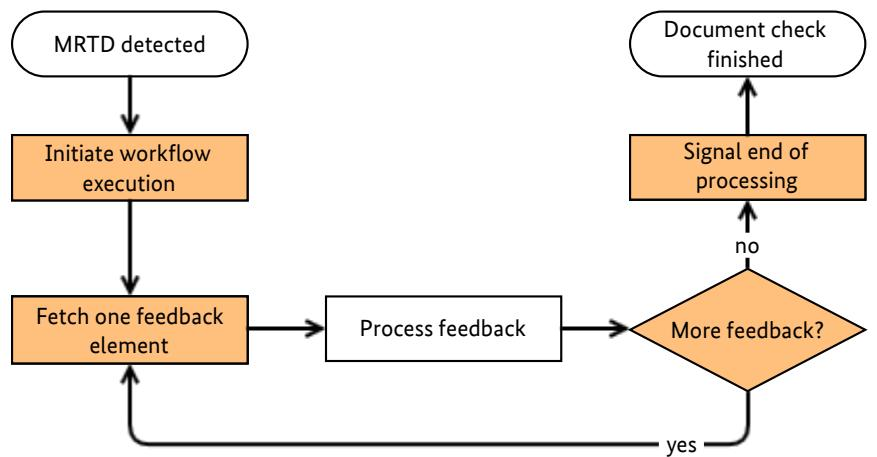
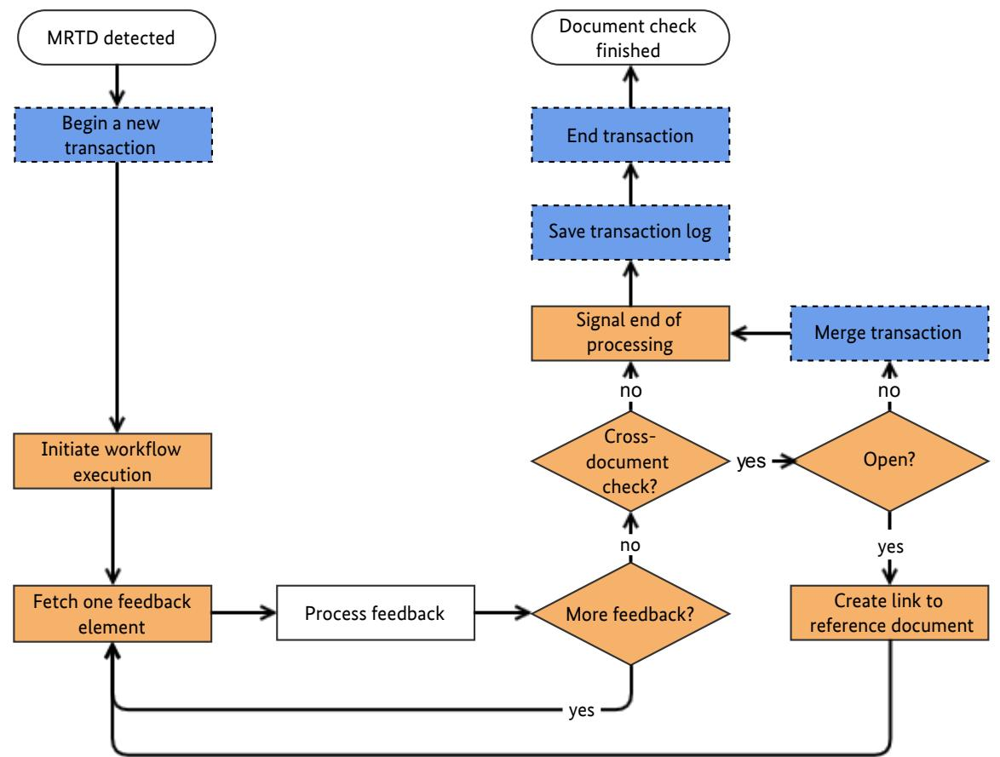

Technical Guideline BSI-TR 03135

# Machine Authentication of MRTDs for Public Sector Applications

Part 3: High Level Document Check Interface Specification

BSI TR-03135-3 Version 2.3.0


Federal Office for Information Security Post Box 20 03 63 D-53133 Bonn Phone: +49 22899 9582-0 E-Mail: [tr-03135@bsi.bund.de](mailto:tr-03135@bsi.bund.de) Internet: [https://www.bsi.bund.de](https://www.bsi.bund.de/) © Federal Office for Information Security 2018

| 1              | Introduction 7                                    |  |
|----------------|---------------------------------------------------|--|
| 1.1            | Motivation 7                                      |  |
| 2              | Architecture for Inspection Applications 8        |  |
| 2.1            | Client-Server Architecture 8                      |  |
| 2.2            | Workflow-Based Document Check 8                   |  |
| 2.3            | Transaction Logging 9                             |  |
| 2.4            | Cross-document combined check 9                   |  |
| 3              | Document overview 11                              |  |
| 3.1            | Terminology 11                                    |  |
| 3.2            | Naming conventions 11                             |  |
| 3.2.1          | Multiplicity 11                                   |  |
| 3.2.2          | SOAP Interfaces 11                                |  |
| 3.3            | Namespaces 12                                     |  |
| 3.4            | XML Schema and Web Service Definition12           |  |
| 3.5            | Interoperability 12                               |  |
| 4              | Interface overview 13                             |  |
| 4.1            | High-Level Document Check 13                      |  |
| 4.1.1          | Objective 13                                      |  |
| 4.1.2          | Document detection 13                             |  |
| 4.1.3          | Workflow management 13                            |  |
| 4.1.4          | Workflow execution 13                             |  |
| 4.1.5          | Workflow feedback 13                              |  |
| 4.1.6          | Cross-document checks 14                          |  |
| 4.2            | Transaction management interface14                |  |
| 4.2.1          | Objective 14                                      |  |
| 4.2.2          | Transaction management 14                         |  |
| 4.2.3          | Logging 14                                        |  |
| 4.2.4<br>4.3   | Write-protection 14<br>Error handling 15          |  |
|                |                                                   |  |
| 5<br>5.1       | High Level Document Check API 16<br>Namespaces 16 |  |
|                |                                                   |  |
| 5.2            | Data types 16                                     |  |
| 5.2.1<br>5.2.2 | FeedbackStatus 16<br>UUID 17                      |  |
| 5.2.3          | Workflow 17                                       |  |
| 5.2.4          | WorkflowFeedback 18                               |  |
| 5.2.5          | WorkflowParameter 18                              |  |
| 5.2.6          | WorkflowParameters 19                             |  |
| 5.2.7          | WorkflowStatus 19                                 |  |
| 5.3            | Fault types 20                                    |  |
| 5.3.1          | InvalidClientId 20                                |  |
| 5.3.2          | InvalidConditionId 20                             |  |
| 5.3.3          | InvalidFeedbackId 21                              |  |
| 5.3.4          | InvalidWorkflowId 21                              |  |
| 5.3.5          | WorkflowLimitExceeded 21                          |  |

| 5.3.6  | WorkflowNotFound 22                                      |  |
|--------|----------------------------------------------------------|--|
| 5.3.7  | WorkflowParserError 22                                   |  |
| 5.4    | Operations 22                                            |  |
| 5.4.1  | addWorkflow 22                                           |  |
| 5.4.2  | beginWorkflow 23                                         |  |
| 5.4.3  | cancelWorkflow 25                                        |  |
| 5.4.4  | endWorkflow 25                                           |  |
| 5.4.5  | getAllWorkflows 26                                       |  |
| 5.4.6  | getWorkflowFeedback 27                                   |  |
| 5.4.7  | getWorkflowFeedbackById 28                               |  |
| 5.4.8  | linkWorkflow 30                                          |  |
| 5.4.9  | removeWorkflow 31                                        |  |
| 5.4.10 | waitForNewDocument 31                                    |  |
| 5.5    | Workflow definition schema 32                            |  |
| 5.5.1  | Workflow document 33                                     |  |
| 5.5.2  | type.workflow 33                                         |  |
| 5.5.3  | type.workflow.information 34                             |  |
| 5.5.4  | type.workflow.scenario 35                                |  |
| 5.5.5  | type.workflow.scenario.checks 36                         |  |
| 5.5.6  | type.workflow.scenario.check 36                          |  |
| 5.5.7  | type.workflow.scenario.check.action37                    |  |
| 5.5.8  | type.workflow.versions 37                                |  |
| 5.5.9  | type.workflow.versions.version 38                        |  |
| 5.5.10 | type.workflow.conditions 38                              |  |
| 5.5.11 | type.workflow.conditions.mrz 39                          |  |
| 5.5.12 | type.workflow.conditions.hascan 40                       |  |
| 5.5.13 | type.workflow.conditions.parameter 41                    |  |
| 5.5.14 | type.workflow.conditions.and 41                          |  |
| 5.5.15 | type.workflow.conditions.or 42                           |  |
| 5.5.16 | type.workflow.conditions.not 42                          |  |
| 5.5.17 | type.workflow.conditions.xml 43                          |  |
| 5.5.18 | type.workflow.electronic 43                              |  |
| 5.5.19 | type.workflow.electronic.access 44                       |  |
| 5.5.20 | type.workflow.electronic.access.order45                  |  |
| 5.5.21 | type.workflow.electronic.eac 45                          |  |
| 5.5.22 | type.workflow.electronic.eac.authafterpace46             |  |
| 5.5.23 | type.workflow.electronic.eac.authafterpace.method46      |  |
| 5.5.24 | type.workflow.electronic.chip 47                         |  |
| 5.5.25 | type.workflow.electronic.chip.waitforchip48              |  |
| 5.5.26 | type.workflow.electronic.readseq48                       |  |
| 5.5.27 | type.workflow.electronic.readseq.datagroup49             |  |
| 5.5.28 | type.workflow.electronic.readseq.datagroup.application50 |  |
| 5.5.29 | type.workflow.electronic.readseq.defectinfo50            |  |
| 5.5.30 | type.workflow.electronic.readseq.chipdetection51         |  |
| 5.5.31 | type.workflow.electronic.readseq.elementaryfile51        |  |
| 5.5.32 | type.workflow.electronic.readseq.elementaryfile.name52   |  |
| 5.5.33 | type.workflow.optical 52                                 |  |
| 5.5.34 | type.workflow.optical.validity 53                        |  |
| 5.5.35 | type.workflow.optical.validity.element54                 |  |
| 5.5.36 | type.workflow.optical.readseq 54                         |  |
| 5.5.37 | type.workflow.optical.readseq.element 55                 |  |
| 5.5.38 | type.workflow.combined 55                                |  |

| 5.5.39 | type.workflow.combined.readseq56                     |  |
|--------|------------------------------------------------------|--|
| 5.5.40 | type.workflow.readseq.check 57                       |  |
| 5.5.41 | type.workflow.feedback 57                            |  |
| 5.5.42 | type.workflow.feedback.binary 58                     |  |
| 5.5.43 | type.workflow.feedback.text 59                       |  |
| 5.5.44 | type.workflow.feedback.image 60                      |  |
| 5.5.45 | type.workflow.feedback.xml 61                        |  |
| 5.5.46 | type.workflow.feedback.image.format62                |  |
| 5.5.47 | type.workflow.dependencies 63                        |  |
| 5.5.48 | type.workflow.dependencies.finishtostart63           |  |
| 5.5.49 | type.workflow.extension 64                           |  |
| 5.6    | Workflow feedback schema 64                          |  |
| 5.6.1  | Feedback document 64                                 |  |
| 5.6.2  | type.feedback 65                                     |  |
| 5.6.3  | type.feedback.dg1 66                                 |  |
| 5.6.4  | type.feedback.dg2 68                                 |  |
| 5.6.5  | type.feedback.dg2.template 68                        |  |
| 5.6.6  | type.feedback.dg2.image 69                           |  |
| 5.6.7  | type.feedback.dg3 69                                 |  |
| 5.6.8  | type.feedback.dg3.template 70                        |  |
| 5.6.9  | type.feedback.dg3.image 70                           |  |
| 5.6.10 | type.feedback.dg3.image.fingerpos 71                 |  |
| 5.6.11 | type.feedback.dg4 72                                 |  |
| 5.6.12 | type.feedback.dg4.template 72                        |  |
| 5.6.13 | type.feedback.dg4.image 73                           |  |
| 5.6.14 | type.feedback.dg11 73                                |  |
| 5.6.15 | type.feedback.dg12 75                                |  |
| 5.6.16 | type.feedback.optmrz 75                              |  |
| 5.6.17 | type.feedback.eid.placeofresidence77                 |  |
| 5.6.18 | type.feedback.eid.placeofresidence.structuredplace78 |  |
| 5.6.19 | type.feedback.defects 78                             |  |
| 5.6.20 | type.feedback.oid 79                                 |  |
| 5.6.21 | type.feedback.defects.defect 79                      |  |
| 5.6.22 | type.feedback.name 80                                |  |
| 5.6.23 | type.feedback.namelist 80                            |  |
| 5.6.24 | type.feedback.checkresult 81                         |  |
| 5.6.25 | type.feedback.string.date 82                         |  |
| 5.6.26 | type.feedback.extended 82                            |  |
| 5.7    | Workflow extensions 82                               |  |
| 5.7.1  | Workflow definition 83                               |  |
| 5.7.2  | Feedback 83                                          |  |
| 6      | Transaction management 84                            |  |
| 6.1    | Namespace 84                                         |  |
| 6.2    | Data types 84                                        |  |
| 6.2.1  | ExternalKey 84                                       |  |
| 6.2.2  | LoggingProvider 84                                   |  |
| 6.2.3  | LogType 85                                           |  |
| 6.2.4  | UUID 85                                              |  |
|        |                                                      |  |
| 6.3    | Fault types 86                                       |  |
| 6.3.1  | InProgress 86                                        |  |
| 6.3.2  | InvalidLoggingProvider 86                            |  |

| 6.3.3  | InvalidLoggingParameter 86 |  |
|--------|----------------------------|--|
| 6.3.4  | InvalidTransactionId 86    |  |
| 6.3.5  | LoggingFailed 87           |  |
| 6.3.6  | LoggingProfileNotFound 87  |  |
| 6.3.7  | LogParserError 87          |  |
| 6.3.8  | ReadOnly 87                |  |
| 6.4    | Operations 88              |  |
| 6.4.1  | addLogData 88              |  |
| 6.4.2  | addLoggingProfile 89       |  |
| 6.4.3  | beginTransaction 89        |  |
| 6.4.4  | endTransaction 91          |  |
| 6.4.5  | getAllLoggingProviders 91  |  |
| 6.4.6  | getTransactionXML 92       |  |
| 6.4.7  | mergeTransaction 93        |  |
| 6.4.8  | removeLoggingProfile 94    |  |
| 6.4.9  | saveTransaction 95         |  |
| 6.4.10 | saveTransactionXML 97      |  |
| 6.4.11 | setSystemInformation 98    |  |
|        | Index 100                  |  |

| Figure 1: Client-side document check process 8                                  |  |
|---------------------------------------------------------------------------------|--|
| Figure 2: Extension of Figure 1 with TR-03135-1-compliant logging9              |  |
| Figure 3: Extension of Figure 2 accounting for cross-document combined checks10 |  |

| Table 1: Multiplicity symbols 11               |  |
|------------------------------------------------|--|
| Table 2: Naming convention for SOAP messages11 |  |

# <span id="page-6-0"></span>1 Introduction

This technical guideline specifies two complimentary web services that provide validation of Machine-Readable Travel Documents (MRTDs) according to the TR-03135-1. They comprise the document check process as well as the required logging of the results.

# 1.1 Motivation

The checking of MRTDs according to TR-03135-1 requires a large number of individual steps. Some steps require a certain order of execution or may only be relevant for particular documents. In contrast to a fixed definition of scenario-specific check processes, the processing and visualization of results and/or document data may vary with the purpose of the Inspection Application. The complexity of the document check process causes large efforts for the creation and quality control of Inspection Applications.

The goal of this document is to provide high-level interfaces that reduces the programming effort for Inspection Applications by separating the document check process and standard-compliant logging from the problem-specific processing and visualization of results.

# <span id="page-7-0"></span>2 Architecture for Inspection Applications

# 2.1 Client-Server Architecture

To ease the implementation of Inspection Applications for document checks, they are split into two parts. Frontends, or *clients,* are application-specific. They provide a user interface and process and visualize results depending on their particular purpose. The TR-03135-1-compliant document check process and the corresponding transaction logging are provided by a backend *server* as web services. This separation reduces the effort to implement Inspection Applications for different purposes considerably.

# 2.2 Workflow-Based Document Check

To further reduce the effort for client implementation, the document check process is configured based on a textual description in XML rather than program code. A particular configuration is referred to as *workflow*, its description as *workflow definition*. This definition allows the customization of the application-scenariospecific document check process within the limits of TR-03135-1.

It controls which optical, electronic and combined checks are carried out and which data are required for processing. The document data and check results are referred to as *feedback*. Please refer to Section [5.5](#page-31-0) for an exhaustive specification of the workflow definition and Section [5.6](#page-63-0) for the specification of the feedback data format.

The workflow definition can be provided by the client or the server. This allows clients to use custom workflows but also allows centralized management on the server. All workflows are managed by the server and are available to all clients. Workflows are executed on the server upon request by the client. Relevant feedback is generated on the server and can be fetched by the client individually.



<span id="page-7-1"></span>*Figure 1: Client-side document check process*

Initiate workflow execution

Fetch one feedback

[Figure 1](#page-7-1) visualizes the client side of the document check process. Workflow-related interface operations are highlighted in orange. After a new document is detected, the client requests execution of the relevant workflow. In the following, the client individually fetches the feedback elements that are defined in the workflow from the server and processes them appropriately, e.g. by visualizing them to the user. After all feedback has been processed successfully, the client informs the server that client-side processing has finished. Section [4.1](#page-12-1) provides a quick overview of the interface functions. The interface specification can be found in Chapter [5.](#page-15-0) MRTD detected Document check finished End transaction Begin a new transaction

Process feedback

element More feedback?

processing

no

yes

Save transaction log

no

Signal end of processing

Document check finished

#### 2.3 Transaction Logging element

MRTD detected

Initiate workflow execution

Fetch one feedback

TR-03135-1 requires logging of all relevant check results which is provided by the interface specified in Chapter [6.](#page-83-0) If multiple documents need to be checked, the corresponding transactions can be merged into a single transaction for consistent logging of related document checks. yes

Process feedback More feedback?


<span id="page-8-0"></span>*Figure 2: Extension of Figure 1 with TR-03135-1-compliant logging*

[Figure 2](#page-8-0) shows the extension of the client side of the document check process from [Figure 1](#page-7-1) with transaction logging operations (highlighted in blue, dashed). The client initiates a new transaction after a MRTD was detected and before initiating workflow execution. After the workflow execution and result processing is finished, the client requests saving of the corresponding transaction log and then ends the transaction. Section [4.2](#page-13-0) provides a quick overview of the interface functions.

# 2.4 Cross-document combined check

Part 1 of this Technical Guideline specifies checks across two different documents (e.g. passport and visa) or two sides of the same document (e.a. front and rear side of ID cards).

Initially, both documents (or document sides) are checked individually. Cross-document combined checks, which are always defined for a specific document (e.g. visa), are skipped.

Its the responsibility of the client to control which documents are considered for cross-document combined checks. After linking the respective documents, the cross-document combined checks are executed.

The Inspection Application MUST merge the corresponding transaction to ensure consistent logging of the checking process.

Figure [3](#page-9-0) shows the extension of the single document checking process in Figure [2](#page-8-0) which accounts for potential cross-document combined checks. After finishing the initial checking of a document, the client checks if feedback elements for any cross-document combined checks are missing. If so, the client needs to link the currently checked document (e.g. visa) to the relevant reference document (e.g. passport) and rerequest the corresponding feedback elements. Afterwards, the corresponding transactions for both documents must be merged.

2 Architecture for Inspection Applications



<span id="page-9-0"></span>*Figure 3: Extension of Figure 2 accounting for cross-document combined checks.*

# <span id="page-10-0"></span>3 Document overview

# 3.1 Terminology

The key words "MUST", "MUST NOT", "REQUIRED", "SHALL", "SHALL NOT", "SHOULD", "SHOULD NOT", "RECOMMENDED", "MAY", and "OPTIONAL" in this document are to be interpreted as described in RFC 2119.

# 3.2 Naming conventions

# 3.2.1 Multiplicity

Generally, XML elements and attributes listed in this document are required, i.e. the respective parent element MUST contain exactly one such element. Elements and attributes that deviate from this baseline are denoted in this document by a symbol which is appended to the element/attribute name. The symbols are listed in [1.](#page-10-2)

<span id="page-10-2"></span>

|  | Table 1: Multiplicity symbols |  |
|--|-------------------------------|--|
|--|-------------------------------|--|

| Appended symbol | Meaning      |
|-----------------|--------------|
| ?               | Zero or one  |
| *               | Zero or more |
| +               | One or more  |

#### 3.2.2 SOAP Interfaces

All operations of this interface follow the request/response model, i.e., communication is initiated by the client by sending a SOAP message to the server (request). For each request, the server replies with a SOAP message containing the result of the requested operation (response) or, in case of error, a fault.

The body of each SOAP message consists of a single part which is named according to the corresponding operation. For requests, the part name is identical to the name of the operation. For responses, the part name is identical to the name of the operation plus the suffix "Response" (see Table [2\)](#page-10-1).

<span id="page-10-1"></span>*Table 2: Naming convention for SOAP messages*

| Message type | Part name                |
|--------------|--------------------------|
| Request      | <operation_name>         |
| Response     | <operation_name>Response |

#### *Example: Naming convention*

- Operation: getAllWorkflows
- Request: getAllWorkflows
- Response: getAllWorkflowsResponse

Both request and response elements exclusively contain zero or more child elements according to the detailed description in this guideline. They do not carry any attributes.

# 3.3 Namespaces

| Prefix | Description                | URI                                           |
|--------|----------------------------|-----------------------------------------------|
| hldc   | High Level Document Check  | http://trdoccheck.bsi.bund.de/hldc/wsdl/2     |
| wf     | HLDC Workflow and Feedback | http://trdoccheck.bsi.bund.de/hldc/workflow/2 |
| tl     | Transaction management     | http://trdoccheck.bsi.bund.de/tl/wsdl/2       |
| xs     | XML Schema                 | http://www.w3.org/2001/XMLSchema              |

# 3.4 XML Schema and Web Service Definition

The following XML Schema Definition (.xsd) and Web Service Definition (.wsdl) files are provided with this Technical Guideline:

| File         | Description                                                  |  |
|--------------|--------------------------------------------------------------|--|
| hldc_v2.wsdl | HLDC web service definition (Chapter 5)                      |  |
| hldc_v2.xsd  | XML Schema Definition for HLDC web service                   |  |
| wf_v2.xsd    | XML Schema Definition for workflow definitions (Section 5.5) |  |
| fb_v2.xsd    | XML Schema Definition for workflow feedback (Section 5.6)    |  |
| tl_v2.wsdl   | Transaction management web service definition (Chapter 6)    |  |
| tl_v2.xsd    | XML Schema Definition for transaction managment web service  |  |

# 3.5 Interoperability

To ensure trouble-free interoperability between different SOAP implementations, both client and server implmenentations SHOULD fulfill the WS-I Basic Profile 1.1.

# <span id="page-12-0"></span>4 Interface overview

# <span id="page-12-1"></span>4.1 High-Level Document Check

# 4.1.1 Objective

The High-level Document Check (HLDC) interface provides execution of TR-03135-compliant document checks controlled by XML-based workflow definitions.

# 4.1.2 Document detection

The client MAY choose to be notified of a newly detected document by explicit waiting (blocking).

• Calling waitForNewDocument blocks client execution until a new document is detected (limited by a timeout).

# 4.1.3 Workflow management

- The client MAY publish custom workflow definitions on the server by calling addWorkflow. Identically named workflow definitions are replaced.
- The client MAY remove workflow definitions from the server by calling removeWorkflow.
- The function getAllWorkflows provides a list of all workflow definitions that are available on the server.

# 4.1.4 Workflow execution

- The function beginWorkflow executes a document check workflow. If no transaction ID is provided, the server MUST initiate a new transaction internally to ensure TR-03135-compliant logging. beginWorkflow provides a unique workflow ID that MUST be used in subsequent calls. In general, the ID MUST remain valid until the client calls endWorkflow. To protect against broken clients, the server MAY limit the ID validity with a timeout.
- Workflow execution MAY be cancelled by calling cancelWorkflow.
- The client MUST inform the server that client-side workflow processing has finished by calling endWorkflow.

# 4.1.5 Workflow feedback

Document and check result data are provided by the server individually and are referred to as workflow feedback.

- The function getWorkflowFeedback provides the next available feedback element.
- The client MAY request particular document and result data by calling getWorkflowFeedbackById.

# 4.1.6 Cross-document checks

If a workflow contains definitions for cross-document combined checks, the client SHOULD call linkWorkflow in order to assign the relevant reference document. The call MUST appear after feedback processing for the current document has finished.

# <span id="page-13-0"></span>4.2 Transaction management interface

# 4.2.1 Objective

The transaction management interface provides functions to link document check operations to a TR-03135-compliant transaction and to allow logging of relevant data.

# 4.2.2 Transaction management

- Transactions are initiated by beginTransaction. In contrast to calling the HLDC function beginWorkflow without a transaction ID, this function provides an ID that is REQUIRED for all the functions of this interface and MAY be used when calling beginWorkflow in order to link the workflow execution to this particular transaction.
- Multiple transactions MAY be merged into a single one with mergeTransaction.
- Transactions are terminated by endTransaction which invalidates the transaction ID.

# 4.2.3 Logging

- The function saveTransaction stores the currently available logged transaction data persistently on the server. The client MAY limit the amount of data that is stored.
- The client MAY request the currently available transaction data for client-side use by calling getTransactionXML.
- Client-specific data MAY be logged by calling addLogData.
- The function getAllLoggingProviders is OPTIONAL and MAY return a server-specific list of logging targets that MAY be used when calling saveTransaction.
- The function saveTransactionXML allows to store client-generated XML via available logging providers.
- The client MAY publish custom logging profiles (XSLT) on the server by calling addLoggingProfile. Identically named logging profiles are replaced.
- The client MAY remove logging profiles from the server by calling removeLoggingProfile

# 4.2.4 Write-protection

In order to prevent inconsistent log data, a transaction is protected against further modification after the first read access, i.e., after calls to saveTransaction and getTransactionXML. All future write access, i.e., calls that would modify the transaction, MUST fail then with an appropriate error.

The server MAY fail read access calls with appropriate error if the transaction is currently modified (e.g., by the document check process).

# 4.3 Error handling

If errors occur during processing of a web service request, a SOAP fault is generated according to the SOAP 1.1 specification. SOAP faults are comparable to exceptions in programming languages such as C++, C# or Java insofar as they allow reporting of errors without the need to account for error codes in function signatures.

SOAP faults are returned in place of the SOAP response. Depending on the type of an error, the fault message may contain additional information about the error. The faults that are specific to the web services in this document are specified in the respective chapters and listed with every function that may generate them. Faults originating from other causes such as network connection problems or validation errors are beyond the scope of this document as they depend on the specific SOAP implementation.

# <span id="page-15-0"></span>5 High Level Document Check API

The High Level Document Check API (short: HLDC API) contains functions to perform electronic and optical document checks in conformity to part 1 of this Technical Guideline. The check processes are driven by XML workflows and provide a very high level interface to the application. The check results contain multiple sub-results which are combined to overall results according to TR-03135 Part 1. All checks can be logged in XML format compliant to TR-03135 Part 1 using the transaction management API in Chapter [6.](#page-83-0)

The definitions of the HLDC API are provided in hldc\_v2.wsdl. The schemata for the workflow definition and XML-formatted feedback are provided in wf\_v2.xsd and fb\_v2.xsd respectively.

# 5.1 Namespaces

The elements of the server- and client-side APIs are member of the namespace <http://trdoccheck.bsi.bund.de/hldc/wsdl/2>, which is aliased by hldc. The workflow definition schema and the workflow feedback schema use the namespace <http://trdoccheck.bsi.bund.de/hldc/workflow/2> aliased by wf.

# 5.2 Data types

In addition to simple XSD types, the SOAP interface uses custom data types, which are described in the following.

# 5.2.1 FeedbackStatus

Represents the status of a feedback element. Derived from xs:string.

#### 5.2.1.1 Values

| Value                           | Description                                                                                                       |
|---------------------------------|-------------------------------------------------------------------------------------------------------------------|
| valid                           | The feedback element contains valid data which is<br>available in stringFeedback or                               |
|                                 | binaryFeedback.                                                                                                   |
| err-invalid-conversion          | An error occured during feedback preparation. Data<br>could not be converted into the specified target<br>format. |
| err-not-available               | Requested data is not available or could not be read.                                                             |
| err-reference-document-required | Requested data require access to a reference<br>document for cross-document checks (see<br>linkWorkflow).         |

#### 5.2.1.2 WSDL Definition

```
<simpleType name="FeedbackStatus">
 <restriction base="xs:string"/>
 <enumeration value="valid"/>
 <enumeration value="err-invalid-conversion"/>
 <enumeration value="err-not-available"/>
```

```
</restriction>
</simpleType>
```
# <span id="page-16-0"></span>5.2.2 UUID

Serves to uniquely reference various elements at runtime (e.g. currently executing workflows). Inherits xs:string.

#### 5.2.2.1 Format restrictions

The content MUST be empty or represent a universally unique identifier of 32 lower-case hexadecimal letters that are separated into 5 groups of length 8, 4, 4, 4 and 12 letters using hyphens (e.g. 01234567- 89ab-cdef-0123-456789abcdef).

#### 5.2.2.2 WSDL Definition

```
<simpleType name="UUID">
 <restriction base="xs:string">
 <pattern value="([A-Fa-f0-9]{8}-[A-Fa-f0-9]{4}-[A-Fa-f0-9]{4}-[A-Fa-f0-9]{4}-
[A-Fa-f0-9]{12})?"/>
 </restriction>
</simpleType>
```
#### 5.2.3 Workflow

Contains general workflow information.

#### 5.2.3.1 Elements

| Element name | Description                      |
|--------------|----------------------------------|
| name         | xs:string                        |
|              | The name of the workflow.        |
| vendor       | xs:string                        |
|              | The vendor of the workflow.      |
| version      | xs:string                        |
|              | The version of the workflow.     |
| description  | xs:string                        |
|              | The description of the workflow. |

#### 5.2.3.2 WSDL Definition

```
<complexType name="Workflow">
 <sequence>
 <element name="name" type="xs:string" />
 <element name="vendor" type="xs:string"/>
 <element name="version" type="xs:string"/>
 <element name="description" type="xs:string"/>
 </sequence>
</complexType>
```
# 5.2.4 WorkflowFeedback

Represents a feedback element from a HLDC workflow.

#### 5.2.4.1 Attributes

None.

#### 5.2.4.2 Elements

| Element name    | Description                                                                                                                            |  |
|-----------------|----------------------------------------------------------------------------------------------------------------------------------------|--|
| feedbackID      | xs:string<br>Reference to a feedback element. MUST be empty if status is either<br>finished or cancelled. MUST NOT be empty otherwise. |  |
| stringFeedback? | xs:string<br>The feedback data as string (if possible). MUST be empty if status is<br>different from valid.                            |  |
| binaryFeedback? | xs:base64Binary<br>The feedback data as binary (if possible). MUST be empty if status is<br>different from valid.                      |  |
| status          | hldc:FeedbackStatus<br>The status code of the feedback element.                                                                        |  |

#### 5.2.4.3 WSDL Definition

```
<complexType name="WorkflowFeedback">
<sequence>
 <element name="feedbackID" type="xs:string" />
 <element name="stringFeedback" type="xs:string"
 minOccurs="0" />
 <element name="binaryFeedback" type="xs:base64Binary"
 minOccurs="0" maxOccurs="1" />
 <element name="status" type="hldc:FeedbackStatus" />
</sequence>
</complexType>
```
# 5.2.5 WorkflowParameter

Key-value pair to configure conditions of type type.workflow.conditions.parameter in a HLDC workflow definition.

#### 5.2.5.1 Attributes

#### 5.2.5.2 Elements

| Element name | Description                                                                    |
|--------------|--------------------------------------------------------------------------------|
| id           | xs:string                                                                      |
|              | The key.                                                                       |
| value        | xs:boolean                                                                     |
|              | Specifies whether the corresponding condition MUST be considered<br>fulfilled. |

#### 5.2.5.3 WSDL Definition

```
<complexType name="WorkflowParameter">
 <sequence>
 <element name="id" type="xs:string" />
 <element name="value" type="xs:boolean" /> 
 </sequence>
</complexType>
```
#### 5.2.6 WorkflowParameters

List of key-value pairs.

#### 5.2.6.1 Elements

| Element name | Description                         |
|--------------|-------------------------------------|
| parameter*   | hldc:Parameter<br>A key-value pair. |

#### 5.2.6.2 WSDL Definition

```
<complexType name="WorkflowParameters">
 <sequence>
 <element name="parameter" type="hldc:WorkflowParameter"
 minOccurs="0" maxOccurs="unbounded"/>
 </sequence>
</complexType>
```
# 5.2.7 WorkflowStatus

Represents the execution status of a workflow. Derived from xs:string.

#### 5.2.7.1 Values

| Value     | Description<br>Workflow execution is still in progress.<br>The workflow execution has finished. This is the last<br>feedback element delivered by<br>getWorkflowFeedback. |  |
|-----------|---------------------------------------------------------------------------------------------------------------------------------------------------------------------------|--|
| ok        |                                                                                                                                                                           |  |
| finished  |                                                                                                                                                                           |  |
| cancelled | The workflow has been cancelled by the user. This is<br>the last feedback element delivered by<br>getWorkflowFeedback.                                                    |  |

## 5.2.7.2 WSDL Definition

```
<simpleType name="WorkflowStatus">
 <restriction base="xs:string"/>
 <enumeration value="ok"/>
 <enumeration value="finished"/>
 <enumeration value="cancelled"/>
 </restriction>
</simpleType>
```
# 5.3 Fault types

This section specifies the SOAP faults that are specific to this SOAP API. No fault has any attributes.

# 5.3.1 InvalidClientId

Returned if a client ID does not exist on the server. The ID is either invalid or has expired.

#### 5.3.1.1 Elements

None.

#### 5.3.1.2 WSDL Definition

```
<complexType name="InvalidClientId">
 <sequence>
 </sequence>
</complexType>
```
# 5.3.2 InvalidConditionId

Returned if a condition ID is not defined in the workflow definition.

#### 5.3.2.1 Elements

| Element name | Description      |  |
|--------------|------------------|--|
| id           | xs:string        |  |
|              | The rejected ID. |  |

# 5.3.2.2 WSDL Definition

```
<complexType name="InvalidConditionId">
 <sequence>
 <element name="id" type="xs:string" />
 </sequence>
</complexType>
```
# 5.3.3 InvalidFeedbackId

Returned if the feedback ID in the request is not defined in the workflow definition.

#### 5.3.3.1 Elements

None.

### 5.3.3.2 WSDL Definition

```
<complexType name="InvalidFeedbackId">
 <sequence>
 </sequence>
</complexType>
```
# 5.3.4 InvalidWorkflowId

Returned if a workflow ID does not exist on the server. The ID is either invalid or has expired due to a call to endWorkflow or limited resources on the server.

#### 5.3.4.1 Elements

| Element name | Description                                         |
|--------------|-----------------------------------------------------|
| id?          | hldc:UUID                                           |
|              | The rejected ID. Only present in case of ambiguity. |

#### 1.1.1.1 WSDL Definition

```
<complexType name="InvalidWorkflowId">
 <sequence>
 <element name="id" type="hldc:UUID" minOccurs="0" maxOccurs="1" />
 </sequence>
</complexType>
```
# 5.3.5 WorkflowLimitExceeded

Returned in case of too many executing workflows. The client either needs to cancel a currently executing workflow or wait until it finishes.

#### 5.3.5.1 Elements

## 5.3.5.2 WSDL Definition

```
<complexType name="WorkflowLimitExceeded">
 <sequence>
 </sequence>
</complexType>
```
# 5.3.6 WorkflowNotFound

Returned if the requested workflow does not exist on the server.

#### 5.3.6.1 Elements

None.

#### 5.3.6.2 WSDL Definition

```
<complexType name="WorkflowNotFound">
 <sequence>
 </sequence>
</complexType>
```
# 5.3.7 WorkflowParserError

Returned if the provided workflow definition could not be parsed by the server.

#### 5.3.7.1 Elements

None.

# 5.3.7.2 WSDL Definition

```
<complexType name="WorkflowParserError">
 <sequence>
 </sequence>
</complexType>
```
# 5.4 Operations

# 5.4.1 addWorkflow

Transfers a new workflow definition to the server. Input MUST be validated against the schema wf\_v2.xsd (Section [5.5\)](#page-31-0) and MUST be checked for consistency. The workflow MUST NOT contain invalid ID references and MUST NOT contain cyclic dependencies. If an identically named workflow exists on the server, it MUST be replaced with the newly submitted definitions.

#### 5.4.1.1 Request elements

| Element name       | Description                                                                                                                |
|--------------------|----------------------------------------------------------------------------------------------------------------------------|
| workflowDefinition | xs:base64Binary<br>The base64-encoded XML data of the workflow definition. The XML<br>structure is defined in Section 5.5. |

#### 5.4.1.2 Response elements

| Element name | Description                                                            |
|--------------|------------------------------------------------------------------------|
| workflowName | xs:string                                                              |
|              | The name of the workflow which is parsed from the workflow definition. |

#### 5.4.1.3 Faults

| Fault                    | Cause                                                                    |
|--------------------------|--------------------------------------------------------------------------|
| hldc:WorkflowParserError | An error occurred while parsing or validating the submitted<br>workflow. |

#### 5.4.1.4 WSDL Definition

```
<!-- operation request element -->
<element name="addWorkflow">
 <complexType>
 <sequence>
 <element name="workflowDefinition" type="xs:base64Binary" /> 
 </sequence>
 </complexType>
</element>
<!-- operation response element -->
<element name="addWorkflowResponse">
 <complexType>
 <sequence>
 <element name="workflowName" type="xs:string" />
 </sequence>
 </complexType>
</element>
```
# 5.4.2 beginWorkflow

Initiates workflow execution on the server to check the current document and/or read out the requested data. Check results and data MUST be queried individually by calling getWorkflowFeedback or getWorkflowFeedbackById.

#### 5.4.2.1 Request elements

| Element name   | Description                                                                                                                                                                                                              |
|----------------|--------------------------------------------------------------------------------------------------------------------------------------------------------------------------------------------------------------------------|
| workflowName   | xs:string<br>The name of the workflow to execute. MUST be a valid workflow name as<br>returned by addWorkflow or getAllWorkflows.                                                                                        |
| transactionID? | tl:UUID<br>Transaction ID returned by tl:beginTransaction (see Section 6.4.3)<br>to link the workflow to the specified TR-03135 transaction. If omitted or<br>empty, the server MUST generate a new ID for internal use. |
| docIdentifier? | xs:string<br>MRZ or CAN to be used to access the document instead of the<br>automatically retrieved (if available) MRZ/CAN.                                                                                              |
| parameters?    | hldc:WorkflowParameters<br>List of key-value pairs which override the default values of the<br>hldc:ParameterCondition entries in the workflow definition. The<br>IDs MUST match the workflow definition.                |

#### 5.4.2.2 Response elements

| Element name | Description                                                                                                            |
|--------------|------------------------------------------------------------------------------------------------------------------------|
| workflowID   | hldc:UUID<br>Unique ID of the workflow execution which MUST be used as a reference<br>in corresponding function calls. |

#### 5.4.2.3 Faults

| Fault                      | Cause                                                                                     |
|----------------------------|-------------------------------------------------------------------------------------------|
| hldc:InvalidConditionId    | parameters contains at least on condition that<br>does not match the workflow definition. |
| hldc:WorkflowLimitExceeded | Too many workflows are currently executing on the<br>server.                              |
| hldc:WorkflowNotFound      | The workflow workflowName does not exist on the<br>server.                                |
| tl:InvalidTransactionId    | Value of transactionID is invalid or has expired.                                         |

#### 5.4.2.4 WSDL Definition

```
<!-- operation request element -->
<element name="beginWorkflow">
 <complexType>
 <sequence>
 <element name="workflowName" type="xs:string" />
 <element name="transactionID" type="tl:UUID" minOccurs="0" />
 <element name="docIdentifier" type="xs:string" minOccurs="0" />
 <element name="parameters" type="hldc:WorkflowParameters" minOccurs="0" />
 </sequence>
 </complexType>
</element>
```

```
<!-- operation response element -->
<element name="beginWorkflowResponse">
 <complexType>
 <sequence>
 <element name="workflowID" type="hldc:UUID" />
 </sequence>
 </complexType>
</element>
```
## 5.4.3 cancelWorkflow

Cancels workflow execution. The workflow is cancelled successfully when the status cancelled is returned in the feedback loop.

#### 5.4.3.1 Request elements

| Element name | Description                                                          |
|--------------|----------------------------------------------------------------------|
| workflowID   | hldc::UUID                                                           |
|              | The ID of the workflow to cancel that was returned by beginWorkflow. |

#### 5.4.3.2 Response elements

None.

#### 5.4.3.3 Faults

| Fault type             | Cause                                          |
|------------------------|------------------------------------------------|
| hldc:InvalidWorkflowId | Value of workflowID is invalid or has expired. |

#### 5.4.3.4 WSDL Definition

```
<!-- operation request element -->
<element name="cancelWorkflow">
 <complexType>
 <sequence>
 <element name="workflowID" type="hldc:UUID" />
 </sequence>
 </complexType>
</element>
<!-- operation response element -->
<element name="cancelWorkflowResponse">
 <complexType>
 <sequence>
 </sequence>
 </complexType>
</element>
```
#### 5.4.4 endWorkflow

Informs the server that client-side workflow processing has finished. Invalidates the workflow ID. MUST be called by the client for each executed workflow. To protect against broken clients, the server MAY invalidate workflow IDs based on a timeout. SHOULD NOT be called concurrently to other functions that operate on the same workflow ID except cancelWorkflow.

#### 5.4.4.1 Request elements

| Element name | Description                                                                                                                     |
|--------------|---------------------------------------------------------------------------------------------------------------------------------|
| workflowID   | hldc:UUID                                                                                                                       |
|              | Reference to the workflow to end. If the workflow is still executing on the<br>server, the workflow is cancelled by the server. |

#### 5.4.4.2 Response elements

| Element name   | Description                                                                                             |
|----------------|---------------------------------------------------------------------------------------------------------|
| workflowStatus | hldc:WorkflowStatus<br>Final execution status of the workflow. MUST be either finished or<br>cancelled. |

#### 5.4.4.3 Faults

| Fault type             | Cause                                          |
|------------------------|------------------------------------------------|
| hldc:InvalidWorkflowId | Value of workflowID is invalid or has expired. |

#### 5.4.4.4 WSDL Definition

```
<!-- operation request element →
<element name="endWorkflow">
 <complexType>
 <sequence>
 <element name="workflowID" type="hldc:UUID" />
 </sequence>
 </complexType>
</element>
<!-- operation response element →
<element name="endWorkflowResponse">
 <complexType>
 <sequence>
 <element name="workflowStatus" type="hldc:WorkflowStatus" />
 </sequence>
 </complexType>
</element>
```
# 5.4.5 getAllWorkflows

Returns a list of all available workflows.

#### 5.4.5.1 Request elements

#### 5.4.5.2 Response elements

| Element name | Description                                                                                                                   |
|--------------|-------------------------------------------------------------------------------------------------------------------------------|
| workflow*    | hldc:Workflow<br>The list of all available workflows. getAllWorkflows returns one<br>workflow element per available workflow. |

#### 5.4.5.3 Faults

None.

### 5.4.5.4 WSDL Definition

```
<!-- operation request element -->
<element name="getAllWorkflows">
 <complexType>
 <sequence>
 </sequence>
 </complexType>
</element>
<!-- operation response element -->
<element name="getAllWorkflowsResponse">
 <complexType>
 <sequence>
 <element name="workflow" type="hldc:Workflow"
 minOccurs="0" maxOccurs="unbounded" />
 </sequence>
 </complexType>
</element>
```
# 5.4.6 getWorkflowFeedback

Returns the next available feedback element during workflow execution. Generally called in a loop until finished or cancelled is returned as feedback status. The order in which individual feedback elements are returned may be different from the order in the workflow definition. This function MAY skip feedback elements that were previously explicitly requested by getWorkflowFeedbackById.

| Element name | Description                                                                                                                                                                                                                                                                                    |
|--------------|------------------------------------------------------------------------------------------------------------------------------------------------------------------------------------------------------------------------------------------------------------------------------------------------|
| workflowID   | hldc:UUID<br>Reference to the workflow for which the next feedback element is<br>requested.                                                                                                                                                                                                    |
| timeout-ms   | xs:int<br>Timeout in milliseconds for getting the next feedback element. If no new<br>feedback element becomes available during this time, an error is returned.<br>The server MAY cap the value. Negative values are interpreted as "infinity"<br>which is subject to a server-imposed limit. |

# 5.4.6.1 Request elements

#### 5.4.6.2 Response elements

| Element name    | Description                                                                                                                                     |
|-----------------|-------------------------------------------------------------------------------------------------------------------------------------------------|
| workflowStatus  | hldc:WorkflowStatus<br>Current execution status of the workflow.                                                                                |
| timeout-expired | xs:boolean<br>MUST be true if no new feedback was available before the timeout<br>expired. MUST be false if new feedback was available in time. |
| feedback?       | hldc:WorkflowFeedback<br>The next available feedback element. Omitted in case of timeout.                                                       |

#### 5.4.6.3 Faults

| Fault type             | Cause                                          |
|------------------------|------------------------------------------------|
| hldc:InvalidWorkflowId | Value of workflowID is invalid or has expired. |

#### 5.4.6.4 WSDL Definition

```
<!-- operation request element -->
<element name="getWorkflowFeedback">
 <complexType>
 <sequence>
 <element name="workflowID" type="hldc:UUID" />
 <element name="timeout-ms" type="xs:int" />
 </sequence>
 </complexType>
</element>
<!-- operation response element -->
<element name="getWorkflowFeedbackResponse">
 <complexType>
 <sequence>
 <element name="workflowStatus" type="hldc:WorkflowStatus" />
 <element name="timeout-expired" type="xs:boolean" />
 <element name="feedback" type="hldc:WorkflowFeedback"
 minOccurs="0" />
 </sequence>
 </complexType>
</element>
```
# 5.4.7 getWorkflowFeedbackById

Returns the requested feedback element.

#### 5.4.7.1 Request elements

| Element name | Description                                                                                                                                                                                                                                                                                    |
|--------------|------------------------------------------------------------------------------------------------------------------------------------------------------------------------------------------------------------------------------------------------------------------------------------------------|
| workflowID   | hldc:UUID<br>Reference to the workflow for which the next feedback element is                                                                                                                                                                                                                  |
|              | requested.                                                                                                                                                                                                                                                                                     |
| feedbackId   | xs:string<br>The requested feedback ID.                                                                                                                                                                                                                                                        |
| timeout-ms   | xs:int<br>Timeout in milliseconds for getting the feedback element. If the feedback<br>element does not become available during this time, an error is returned.<br>The server MAY cap the value. Negative values are interpreted as "infinity"<br>which is subject to a server-imposed limit. |

#### 5.4.7.2 Response elements

| Element name    | Description                                                                                                                                                             |
|-----------------|-------------------------------------------------------------------------------------------------------------------------------------------------------------------------|
| workflowStatus  | hldc:WorkflowStatus                                                                                                                                                     |
|                 | Current execution status of the workflow.                                                                                                                               |
| timeout-expired | xs:boolean<br>MUST be true if the requested feedback was not available before the<br>timeout expired. MUST be false if the requested feedback was available<br>in time. |
| feedback?       | hldc:WorkflowFeedback<br>The next available feedback element. Omitted in case of timeout.                                                                               |

#### 5.4.7.3 Faults

| Fault type             | Cause                                                          |
|------------------------|----------------------------------------------------------------|
| hldc:InvalidFeedbackId | Value of feedbackId is not defined in the workflow definition. |
| hldc:InvalidWorkflowId | Value of workflowID is invalid or has expired.                 |

#### 5.4.7.4 WSDL Definition

```
<!-- operation request element -->
<element name="getWorkflowFeedbackById">
 <complexType>
 <sequence>
 <element name="workflowID" type="hldc:UUID" />
 <element name="feedbackId" type="xs:string" />
 <element name="timeout-ms" type="xs:int" />
 </sequence>
 </complexType>
</element>
<!-- operation response element -->
<element name="getWorkflowFeedbackByIdResponse">
 <complexType>
 <sequence>
 <element name="workflowStatus" type="hldc:WorkflowStatus" />
 <element name="timeout-expired" type="xs:boolean" />
 <element name="feedback" type="hldc:WorkflowFeedback"
```

```
 minOccurs="0" />
 </sequence>
</complexType>
</element>
```
# 5.4.8 linkWorkflow

Links two executed workflows in order to allow execution of combined checks that refer to multiple documents or document sides. If the workflow status of the workflow checkWorkflowID is ok or finished, the workflow status is set to ok and all configured combined checks are executed. Combined checks that require information from a different document check will fetch this information from workflow referredWorkflowID. If the workflow status of the workflow checkWorkflowID is cancelled, calling linkWorkflow has no effect. If checkWorkflowID and referredWorkflowID are part of different check transactions, it is RECOMMENDED to call tl:mergeTransaction (see Section [6.4.7\)](#page-92-0) for these transactions.

| Element name       | Description                                                                                                                   |
|--------------------|-------------------------------------------------------------------------------------------------------------------------------|
| checkWorkflowID    | hldc:UUID                                                                                                                     |
|                    | Reference to the workflow that contains combined checks which refer to<br>multiple documents or multiple sides of a document. |
| referredWorkflowID | hldc:UUID<br>Reference to the workflow from which additional data is fetched.                                                 |

#### 5.4.8.1 Request elements

#### 5.4.8.2 Response elements

None.

#### 5.4.8.3 Faults

| Fault type             | Cause                                                                                                                                         |
|------------------------|-----------------------------------------------------------------------------------------------------------------------------------------------|
| hldc:InvalidWorkflowId | Value of checkWorkflowID or referredWorkflowID is invalid or has<br>expired or values of checkWorkflowID are referredWorkflowID<br>identical. |
| tl:ReadOnly            | The transaction used by checkWorkflowID is write-protected and must<br>not be modified.                                                       |

#### 5.4.8.4 WSDL Definition

```
<!-- operation request element -->
<element name="linkWorkflow">
 <complexType>
 <sequence>
 <element name="checkWorkflowID" type="hldc:UUID" />
 <element name="referredWorkflowID" type="hldc:UUID" />
 </sequence>
 </complexType>
</element>
```

```
<!-- operation response element -->
<element name="linkWorkflowResponse">
 <complexType>
 <sequence>
 </sequence>
 </complexType>
</element>
```
### 5.4.9 removeWorkflow

Removes a workflow definition which was previously loaded with addWorkflow. The server MUST ensure that workflow removal does not affect the execution of currently running workflows.

#### 5.4.9.1 Request elements

| Element name | Description                                      |
|--------------|--------------------------------------------------|
| workflowName | xs:string<br>The name of the workflow to remove. |

#### 5.4.9.2 Response elements

None.

#### 5.4.9.3 Faults

| Fault                 | Cause                                                   |
|-----------------------|---------------------------------------------------------|
| hldc:WorkflowNotFound | The workflow workflowName does not exist on the server. |

#### 5.4.9.4 WSDL Definition

```
<!-- operation request element -->
<element name="removeWorkflow">
 <complexType>
 <sequence>
 <element name="workflowName" type="xs:string" />
 </sequence>
 </complexType>
</element>
<!-- operation response element -->
<element name="removeWorkflowResponse">
 <complexType>
 <sequence>
 </sequence>
 </complexType>
</element>
```
#### 5.4.10 waitForNewDocument

Waits for a new document to be put onto the reader. If a new document is put onto the reader between to successive calls of waitForNewDocument with the same client ID within a certain time-frame (subject to server implementation), the second of these calls to waitForNewDocument SHOULD return immediately.

| 5.4.10.1 | Request elements |
|----------|------------------|
|----------|------------------|

| Element name | Description                                                                   |
|--------------|-------------------------------------------------------------------------------|
| client-id?   | xs:string                                                                     |
|              | The client ID returned with the last call of waitForNewDocument.              |
|              | MUST be empty or omitted on first call. If empty or omitted, the server       |
|              | MUST generate a new client id.                                                |
| timeout-ms   | xs:int                                                                        |
|              | Time in milliseconds. If no new document is detected during this time         |
|              | period, the server SHALL abort waiting and return an error. The server        |
|              | MAY cap the value. Negative values are interpreted as "infinity" subject to a |
|              | limit imposed by the server.                                                  |

#### 5.4.10.2 Response elements

| Element name    | Description                                                                                                                                                                                                                                          |
|-----------------|------------------------------------------------------------------------------------------------------------------------------------------------------------------------------------------------------------------------------------------------------|
| client-id       | hldc:UUID<br>Server-generated client ID. MUST be a new ID if no or an invalid client ID<br>was passed in the request. MUST be identical to the one in the request if a<br>valid client ID was passed.                                                |
| timeout-expired | xs:boolean<br>MUST be true if no new document was detected before the timeout<br>expired. MUST be false if a new document was detected in time<br>(including a document detected between two calls of<br>waitForNewDocument with the same client-id. |

#### 5.4.10.3 WSDL Definition

```
<!-- operation request element -->
<element name="waitForNewDocument">
 <complexType>
 <sequence>
 <element name="client-id" type="hldc:UUID" minOccurs="0" />
 <element name="timeout-ms" type="xs:int" />
 </sequence>
 </complexType>
</element>
<!-- operation response element -->
<element name="waitForNewDocumentResponse">
 <complexType>
 <sequence>
 <element name="client-id" type="hldc:UUID" />
 <element name="timeout-expired" type="xs:boolean" />
 </sequence>
 </complexType>
</element>
```
# <span id="page-31-0"></span>5.5 Workflow definition schema

This section defines all elements of a workflow definition.

# 5.5.1 Workflow document

XML document that configures the execution workflow of the document check according to TR-03135 Part 1.

#### 5.5.1.1 Root element

| Element name | Description                              |
|--------------|------------------------------------------|
| Workflow     | wf:type.workflow                         |
|              | Root element of the workflow definition. |

#### 5.5.1.2 XSD Definition

<xs:element name=*"Workflow"* type=*"wf:type.workflow" /*>

# 5.5.2 type.workflow

Root element of a HLDC workflow definition.

#### 5.5.2.1 Attributes

| Attribute name | Description                                  |
|----------------|----------------------------------------------|
| schemaVersion  | xs:decimal                                   |
|                | The schemaVersion currently has the value 1. |

#### 5.5.2.2 Elements

| Element name            | Description                                                          |
|-------------------------|----------------------------------------------------------------------|
| Information             | wf:type.workflow.information                                         |
|                         | Basic information about the workflow.                                |
| ApplicationScenario     | wf:type.workflow.scenario                                            |
|                         | Information about the application scenario of the workflow.          |
| RequestedSchemaVersion? | wf:type.workflow.versions                                            |
|                         | The requested schema version of the TR-03135 XML.                    |
| Conditions?             | wf:type.workflow.conditions                                          |
|                         | Conditions for certain workflow actions.                             |
| ElectronicCheck?        | wf:type.workflow.electronic                                          |
|                         | Defines which electronic data shall be read and when the electronic  |
|                         | checks should be performed.                                          |
| OpticalCheck?           | wf:type.workflow.optical                                             |
|                         | Defines which optical data shall be read and when the optical checks |
|                         | should be performed.                                                 |
| CombinedCheck?          | wf:type.workflow.combined                                            |
|                         | Defines which combined checks shall be performed.                    |
| Feedback?               | wf:type.workflow.feedback                                            |
|                         | Defines in which format the read data should be delivered to the     |
|                         | application.                                                         |
| Dependencies?           | wf:type.workflow.dependencies                                        |
|                         |                                                                      |

|            | Defines dependencies between workflow actions.             |
|------------|------------------------------------------------------------|
| Extension? | wf:type.workflow.extension                                 |
|            | Root node for implementation-specific workflow extensions. |
|            |                                                            |

#### 5.5.2.3 XSD Definition

```
<xs:complexType name="type.workflow">
<xs:sequence>
 <xs:element name="Information"
 type="wf:type.workflow.information" />
 <xs:element name="ApplicationScenario"
 type="wf:type.workflow.scenario" />
 <xs:element name="RequestedSchemaVersions" minOccurs="0" 
 type="wf:type.workflow.versions" />
 <xs:element name="Conditions" minOccurs="0" 
 type="wf:type.workflow.conditions" />
 <xs:element name="ElectronicCheck" minOccurs="0" 
 type="wf:type.workflow.electronic" />
 <xs:element name="OpticalCheck" minOccurs="0" 
 type="wf:type.workflow.optical" />
 <xs:element name="CombinedCheck" minOccurs="0" 
 type="wf:type.workflow.combined" />
 <xs:element name="Feedback" minOccurs="0" 
 type="wf:type.workflow.feedback" />
 <xs:element name="Dependencies" minOccurs="0" 
 type="wf:type.workflow.dependencies" />
 <xs:element name="Extension" minOccurs="0"
 type="wf:type.workflow.extension" />
</xs:sequence>
<xs:attribute name="schemaVersion" type="xs:decimal" use="required" />
</xs:complexType>
```
# 5.5.3 type.workflow.information

Basic information about the workflow. MUST provide a workflow name and MAY contain additional information about the vendor, version and a textual description of the workflow.

#### 5.5.3.1 Attributes

None.

# 5.5.3.2 Elements

| Element name | Description                                                            |
|--------------|------------------------------------------------------------------------|
| Vendor?      | xs:string                                                              |
|              | Vendor of the workflow.                                                |
| Name         | xs:string                                                              |
|              | Name of the workflow. Serves as a reference in some calls. MUST NOT be |
|              | empty.                                                                 |
| Version?     | xs:string                                                              |
|              | Version of the workflow.                                               |

| Description? | xs:string                            |
|--------------|--------------------------------------|
|              | Textual description of the workflow. |

### 5.5.3.3 XSD Definition

```
<xs:complexType name="type.workflow.information">
<xs:sequence>
 <xs:element name="Vendor" minOccurs="0" type="xs:string" />
 <xs:element name="Name" >
 <xs:simpleType>
 <xs:restriction base="xs:string">
 <xs:minLength value="1" />
 </xs:restriction>
 </xs:simpleType>
 </xs:element>
 <xs:element name="Version" minOccurs="0" type="xs:string" />
 <xs:element name="Description" minOccurs="0" type="xs:string" />
</xs:sequence>
</xs:complexType>
```
#### 5.5.4 type.workflow.scenario

Selection of the server-defined application scenario which configures which checks are executed for a given document. The scenario MAY be customized with respect to optical, electronic and combined checks.

#### 5.5.4.1 Attributes

| Attribute name | Description                                                               |
|----------------|---------------------------------------------------------------------------|
| preset         | xs:string                                                                 |
|                | Selects a configuration preset. The available presets are server-defined. |

#### 5.5.4.2 Elements

| Element name         | Description                                                                           |
|----------------------|---------------------------------------------------------------------------------------|
| OpticalChecks?       | wf:type.workflow.scenario.checks<br>Configuration of optical checks.                  |
| ElectronicChecks?    | wf:type.workflow.scenario.checks<br>Configuration of electronic checks.               |
| CombinedChecks?      | wf:type.workflow.scenario.checks<br>Configuration of single-document combined checks. |
| CrossDocumentChecks? | wf:type.workflow.scenario.checks<br>Configuration of cross-document combined checks.  |

#### 5.5.4.3 XSD Definition

```
<xs:complexType name="type.workflow.scenario">
<xs:sequence>
 <xs:element name="OpticalChecks" minOccurs="0" 
 type="wf:type.workflow.scenario.checks"/>
 <xs:element name="ElectronicChecks" minOccurs="0" 
 type="wf:type.workflow.scenario.checks "/>
 <xs:element name="CombinedChecks" minOccurs="0"
```

```
 type="wf:type.workflow.scenario.checks "/>
 <xs:element name="CrossDocumentChecks" minOccurs="0"
 type="wf:type.workflow.scenario.checks "/>
</xs:sequence>
<xs:attribute name="preset" type="xs:string" use="required"/>
</xs:complexType>
```
# 5.5.5 type.workflow.scenario.checks

Workflow preset customization for the corresponding type of checks.

#### 5.5.5.1 Attributes

None.

#### 5.5.5.2 Elements

| Element name | Description                      |
|--------------|----------------------------------|
| Check*       | wf:type.workflow.scenario.check  |
|              | Configuration of a single check. |

# 5.5.5.3 XSD Definition

```
<xs:complexType name="type.workflow.scenario.checks">
<xs:sequence>
 <xs:element name="Check" minOccurs="0" maxOccurs="unbounded"
 type="wf:type.workflow.scenario.check"/>
</xs:sequence>
</xs:complexType>
```
# 5.5.6 type.workflow.scenario.check

Customization of the application scenario preset with respect to a particular check.

#### 5.5.6.1 Attributes

| Attribute name | Description                                                                                                                                                                 |
|----------------|-----------------------------------------------------------------------------------------------------------------------------------------------------------------------------|
| id             | xs:ID                                                                                                                                                                       |
|                | The server-defined ID of the check to configure.                                                                                                                            |
| action         | wf:type.workflow.scenario.check.action                                                                                                                                      |
|                | Determines whether the check should be executed or skipped.                                                                                                                 |
| condition?     | xs:IDREF                                                                                                                                                                    |
|                | Reference to a condition. Controls under which circumstances this check<br>configuration is applicable. MUST be considered fullfilled if empty or<br>attribute was omitted. |

#### 5.5.6.2 Elements

#### 5.5.6.3 XSD Definition

```
<xs:complexType name="type.workflow.scenario.check">
<xs:attribute name="id" type="xs:ID" use="required" />
<xs:attribute name="action" 
 type="wf:type.workflow.scenario.check.action" use="required" />
<xs:attribute name="condition" type="xs:IDREF" />
</xs:complexType>
```
## 5.5.7 type.workflow.scenario.check.action

Determines whether a check is executed or not (subject to conditional application). Derived from xs:string.

#### 5.5.7.1 Values

| Element name | Description                                                                                                              |
|--------------|--------------------------------------------------------------------------------------------------------------------------|
| exec         | The check MUST be performed if it is technically possible.                                                               |
| skip         | The check MUST be skipped.                                                                                               |
| eval         | The check MUST be performed if it is technically possible but the check<br>result MUST NOT influence the overall result. |

#### 5.5.7.2 XSD Definition

```
<xs:simpleType name="type.workflow.scenario.check.action">
```

```
<xs:restriction base="xs:string">
 <xs:enumeration value="exec" />
 <xs:enumeration value="skip" />
 <xs:enumeration value="eval" />
 </xs:restriction>
</xs:simpleType>
```
# 5.5.8 type.workflow.versions

List of version information for the requested TR-03135 and HLDC feedback XML namespaces. The default values are:

| Namespace                                                                  | Schema version |
|----------------------------------------------------------------------------|----------------|
| http://trdoccheck.bsi.bund.de/dc/4                                         | 1              |
| http://trdoccheck.bsi.bund.de/dce/4                                        | 1              |
| http://trdoccheck.bsi.bund.de/dco/4                                        | 1              |
| http://trdoccheck.bsi.bund.de/dcc/4                                        | 1              |
| http://trdoccheck.bsi.bund.de/hldc/workflow/2 Same as workflow definition. |                |

#### 5.5.8.1 Attributes

## 5.5.8.2 Elements

| Element name   | Description                                                                     |
|----------------|---------------------------------------------------------------------------------|
| SchemaVersion* | wf:type.workflow.versions.version<br>Default: see above<br>Version information. |

### 5.5.8.3 XSD Definition

```
<xs:complexType name="type.workflow.versions">
<xs:sequence>
 <xs:element name="SchemaVersion" minOccurs="0" maxOccurs="unbounded"
 type="wf:type.workflow.versions.version" />
</xs:sequence>
</xs:complexType>
```
### 5.5.9 type.workflow.versions.version

Requested XML schema version for a particular namespace.

#### 5.5.9.1 Attributes

| Attribute name | Description                                  |
|----------------|----------------------------------------------|
| namespace      | xs:string                                    |
|                | The namespace identifier                     |
|                | e.g.<br>http://trdoccheck.bsi.bund.de/dc/4.  |
| schemaVersion  | xs:decimal                                   |
|                | The schema version of the namespace, e.g. 1. |

#### 5.5.9.2 Elements

None.

#### 5.5.9.3 XSD Definition

```
<xs:complexType name="type.workflow.versions.version">
 <xs:attribute name="namespace" type="xs:string" use="required" />
 <xs:attribute name="schemaVersion" type="xs:decimal" use="required" />
</xs:complexType>
```
# 5.5.10 type.workflow.conditions

List of conditions that MAY be used in other parts of the workflow definition to control workflow execution.

#### 5.5.10.1 Attributes

# 5.5.10.2 Elements

The elements MAY appear in any order.

| Element name        | Description                                                                                                             |
|---------------------|-------------------------------------------------------------------------------------------------------------------------|
| MRZCondition*       | wf:type.workflow.conditions.mrz<br>Conditions which evaluate data from the optical MRZ or, if CAN is used,<br>from DG1. |
| HasCANCondition*    | wf:type.workflow.conditions.hascan<br>Conditions which evaluate if a CAN was detected.                                  |
| HasChipCondition*   | wf:type.workflow.conditions.haschip<br>Conditions which evaluate if an electronic chip was detected.                    |
| ParameterCondition* | wf:type.workflow.conditions.parameter<br>Conditions whose fulfillment is controlled by the application.                 |
| AndCondition*       | wf:type.workflow.conditions.and<br>Conditions that constitute a logical conjunction of two conditions.                  |
| OrCondition*        | wf:type.workflow.conditions.or<br>Conditions that constitute a logical disjunction of two conditions.                   |
| NotCondition*       | wf:type.workflow.conditions.not<br>Conditions that negate the result of another condition.                              |
| XMLCondition*       | wf:type.workflow.conditions.xml<br>Conditions based on XPath expressions.                                               |

# 5.5.10.3 XSD Definition

```
<xs:complexType name="type.workflow.conditions">
<xs:choice minOccurs="0" maxOccurs="unbounded">
 <xs:element name="MRZCondition"
 type="wf:type.workflow.conditions.mrz" />
 <xs:element name="HasCANCondition" 
 type="wf:type.workflow.conditions.hascan" />
 <xs:element name="HasChipCondition" 
 type="wf:type.workflow.conditions.haschip" />
 <xs:element name="ParameterCondition" 
 type="wf:type.workflow.conditions.parameter" />
 <xs:element name="AndCondition" 
 type="wf:type.workflow.conditions.and" />
 <xs:element name="OrCondition" 
 type="wf:type.workflow.conditions.or" />
 <xs:element name="NotCondition" 
 type="wf:type.workflow.conditions.not" />
 <xs:element name="XMLCondition" 
 type="wf:type.workflow.conditions.xml" />
</xs:choice>
</xs:complexType>
```
# 5.5.11 type.workflow.conditions.mrz

Compares data from the optical MRZ to the specified data. The condition is fulfilled if the data match or if type, issuer and documentNumber are empty. If PACE with CAN is performed, the MRZ data is taken from DG1.

#### 5.5.11.1 Attributes

| Attribute name  | Description                                                                                                                                                             |
|-----------------|-------------------------------------------------------------------------------------------------------------------------------------------------------------------------|
| id              | xs:ID                                                                                                                                                                   |
|                 | User-defined unique ID of the condition. Serves as reference.                                                                                                           |
| type?           | xs:string<br>Perl-compatible regular expression (PCRE) to match the document type.<br>Fill characters MUST be ignored. MUST match if empty or attribute was<br>omitted. |
| issuer?         | xs:string<br>PCRE to match the issuer. Fill characters MUST be ignored. MUST match<br>if empty or attribute was omitted.                                                |
| documentNumber? | xs:string<br>PCRE to match the document number. Fill characters MUST be ignored.<br>MUST match if empty or attribute was omitted.                                       |

#### 5.5.11.2 Elements

None.

### 5.5.11.3 XSD Definition

```
<xs:complexType name="type.workflow.conditions.mrz">
 <xs:attribute name="id" type="xs:ID" use="required" />
 <xs:attribute name="type" type="xs:string" />
 <xs:attribute name="issuer" type="xs:string" />
 <xs:attribute name="documentNumber" type="xs:string" />
</xs:complexType>
```
# 5.5.12 type.workflow.conditions.hascan

Condition which is fulfilled if a card access number (CAN) is detected on the document.

#### 5.5.12.1 Attributes

| Attribute name | Description                                                   |
|----------------|---------------------------------------------------------------|
| id             | xs:ID                                                         |
|                | User-defined unique ID of the condition. Serves as reference. |

#### 5.5.12.2 Elements

None.

#### 5.5.12.3 XSD Definition

```
<xs:complexType name="type.workflow.conditions.hascan">
 <xs:attribute name="id" type="xs:ID" use="required" />
</xs:complexType>
```
# 5.5.13 type.workflow.conditions.parameter

Condition whose fulfillment is controlled by the application. The application can override the value of the condition via beginWorkflow.

#### 5.5.13.1 Attributes

| Attribute name | Description                                                   |
|----------------|---------------------------------------------------------------|
| id             | xs:ID                                                         |
|                | User-defined unique ID of the condition. Serves as reference. |
| default        | xs:boolean                                                    |
|                | Default value of the condition.                               |

### 5.5.13.2 Elements

None.

# 5.5.13.3 XSD Definition

```
<xs:complexType name="type.workflow.conditions.parameter">
 <xs:attribute name="id" type="xs:ID" use="required" />
 <xs:attribute name="default" type="xs:boolean" use="required" />
</xs:complexType>
```
# 5.5.14 type.workflow.conditions.and

Constitutes a logical conjunction of multiple conditions. The condition is fulfilled if and only if all referenced conditions are fulfilled.

# 5.5.14.1 Attributes

| Attribute name | Description                                      |
|----------------|--------------------------------------------------|
| id             | xs:ID                                            |
|                | Unique ID of the condition. Serves as reference. |

# 5.5.14.2 Elements

| Element name | Description                                                      |
|--------------|------------------------------------------------------------------|
| c+           | xs:IDREF                                                         |
|              | Reference to a condition. MUST be considered fulfilled if empty. |

# 5.5.14.3 XSD Definition

```
<xs:complexType name="type.workflow.conditions.and">
 <xs:sequence>
 <xs:element name="c" type="xs:IDREF" maxOccurs="unbounded" />
 </xs:sequence>
 <xs:attribute name="id" type="xs:ID" use="required" /> 
 </xs:complexType>
```
### 5.5.15 type.workflow.conditions.or

Constitutes a logical disjunction of multiple conditions. The condition is fulfilled if at least one of the referenced conditions is fulfilled.

#### 5.5.15.1 Attributes

| Attribute name | Description                                                         |
|----------------|---------------------------------------------------------------------|
| id             | xs:ID                                                               |
|                | User-defined unique ID of the condition which is used as reference. |

#### 5.5.15.2 Elements

| Element name | Description                                                      |
|--------------|------------------------------------------------------------------|
| c+           | xs:IDREF                                                         |
|              | Reference to a condition. MUST be considered fulfilled if empty. |

#### 5.5.15.3 XSD Definition

```
<xs:complexType name="type.workflow.conditions.or">
 <xs:sequence>
 <xs:element name="c" type="xs:IDREF" maxOccurs="unbounded" />
 </xs:sequence>
 <xs:attribute name="id" type="xs:ID" use="required" />
 </xs:complexType>
```
#### 5.5.16 type.workflow.conditions.not

Constitutes a logical negation of another condition. The condition is fulfilled if and only if the referenced condition is not fulfilled.

#### 5.5.16.1 Attributes

| Attribute name | Description                                                         |
|----------------|---------------------------------------------------------------------|
| id             | xs:ID                                                               |
|                | User-defined unique ID of the condition which is used as reference. |
| c              | xs:IDREF                                                            |
|                | Reference to a condition. MUST be considered fulfilled if empty.    |

#### 5.5.16.2 Elements

None.

#### 5.5.16.3 XSD Definition

```
<xs:complexType name="type.workflow.conditions.not">
 <xs:attribute name="id" type="xs:ID" use="required" />
 <xs:attribute name="c" type="xs:IDREF" use="required" />
</xs:complexType>
```
# 5.5.17 type.workflow.conditions.xml

Compares the result of an XPath 1.0 expression with a specified value. If XPath result text and value match, the condition is fulfilled.

## 5.5.17.1 Attributes

| Attribute name | Description                                                               |
|----------------|---------------------------------------------------------------------------|
| id             | xs:ID                                                                     |
|                | User-defined unique ID of the condition. Serves as reference.             |
| from           | xs:IDREF                                                                  |
|                | Reference to a data element.                                              |
| profile        | xs:string                                                                 |
|                | Logging profile on which the evaluation of this condition is based.       |
| path           | xs:string                                                                 |
|                | XPath 1.0 expression which selects a node in the XML. If XPath expression |
|                | matches multiple nodes, the comparison of this condition MUST consider    |
|                | the first matching node only. The comparison MUST only consider the       |
|                | inner text of the respective node.                                        |
| value          | xs:string                                                                 |
|                | The comparative value.                                                    |

#### 5.5.17.2 Elements

None.

# 5.5.17.3 XSD Definition

```
<xs:complexType name="type.workflow.conditions.xml" />
 <xs:attribute name="id" type="xs:ID" use="required" />
 <xs:attribute name="from" type="xs:IDREF" use="required" />
 <xs:attribute name="profile" type="xs:string" use="required"/>
 <xs:attribute name="path" type="xs:string" use="required" />
 <xs:attribute name="value" type="xs:string" use="required" />
</xs:complexType>
```
# 5.5.18 type.workflow.electronic

Configuration of the electronic reading and check process with respect to access protocols and the reading sequence.

#### 5.5.18.1 Attributes

| Attribute name | Description                                                                                                                                      |
|----------------|--------------------------------------------------------------------------------------------------------------------------------------------------|
| condition?     | xs:IDREF                                                                                                                                         |
|                | Reference to a condition. Controls whether this configuration is applicable.<br>MUST be considered fullfilled if empty or attribute was omitted. |

#### 5.5.18.2 Elements

| Element name         | Description                                                                                                                                                                                 |
|----------------------|---------------------------------------------------------------------------------------------------------------------------------------------------------------------------------------------|
| AccessConfiguration? | wf:type.workflow.electronic.access<br>Conditional configuration of access protocols (BAC, PACE, PLAIN). MAY<br>override server-side configuration.                                          |
| EACConfiguration?    | wf:type.workflow.electronic.eac<br>Conditional configuration of the extended access protocols (EAC) after<br>PACE. MAY override server-side configuration.                                  |
| ChipConfiguration?   | wf:type.workflow.electronic.chip<br>Conditional timeouts for chip detection.                                                                                                                |
| ReadSequence?        | wf:type.workflow.electronic.readseq<br>Definition of the electronic reading sequence. Determines which electronic<br>data is read in which order and when to perform the electronic checks. |

#### 5.5.18.3 XSD Definition

```
<xs:complexType name="type.workflow.electronic">
<xs:sequence>
 <xs:element name="AccessConfiguration" minOccurs="0" 
 type="wf:type.workflow.electronic.access" />
 <xs:element name="EACConfiguration" minOccurs="0" 
 type="wf:type.workflow.electronic.eac" />
 <xs:element name="ChipConfiguration" minOccurs="0" 
 type="wf:type.workflow.electronic.chip" />
 <xs:element name="ReadSequence" minOccurs="0" 
 type="wf:type.workflow.electronic.readseq" />
</xs:sequence>
 <xs:attribute name="condition" type="xs:IDREF" />
</xs:complexType>
```
#### 5.5.19 type.workflow.electronic.access

List of conditional configurations of the access protocol order (BAC, PACE, PLAIN).

#### 5.5.19.1 Attributes

None.

#### 5.5.19.2 Elements

| Element name   | Description                                              |
|----------------|----------------------------------------------------------|
| ProtocolOrder* | wf:type.workflow.electronic.access.order                 |
|                | Conditional configurations of the access protocol order. |

#### 5.5.19.3 XSD Definition

```
<xs:complexType name="type.workflow.electronic.access">
<xs:sequence>
 <xs:element name="ProtocolOrder" minOccurs="0" maxOccurs="unbounded"
 type="wf:type.workflow.electronic.access.order" />
```
</xs:sequence> </xs:complexType>

# 5.5.20 type.workflow.electronic.access.order

Conditional configurations of the access protocol order.

#### 5.5.20.1 Attributes

| Attribute name | Description                                                                                                                                                                                                                                                                           |
|----------------|---------------------------------------------------------------------------------------------------------------------------------------------------------------------------------------------------------------------------------------------------------------------------------------|
| condition?     | xs:IDREF<br>Reference to a condition. MUST be considered fullfilled if empty or<br>attribute was omitted. If condition uses the special value DEFAULT, this<br>protocol order applies if no other condition is fulfilled. If multiple<br>DEFAULT-orders exist, the first one is used. |
| order          | xs:string<br>Comma separated (,) list of access protocol identifiers from the following<br>list:<br>•<br>PLAIN                                                                                                                                                                        |
|                | •<br>BAC                                                                                                                                                                                                                                                                              |
|                | •<br>PACE                                                                                                                                                                                                                                                                             |
|                | The access protocols MUST be executed in the specified order until the first<br>one succeeds.                                                                                                                                                                                         |

#### 5.5.20.2 Elements

None.

#### 5.5.20.3 XSD Definition

```
<xs:complexType name="type.workflow.electronic.access.order">
 <xs:attribute name="condition" type="xs:IDREF" />
 <xs:attribute name="order" type="xs:string" use="required" />
</xs:complexType>
```
#### 5.5.21 type.workflow.electronic.eac

List of conditionally executed extended access protocols after PACE.

#### 5.5.21.1 Attributes

None.

#### 5.5.21.2 Elements

| Element name | Description |
|--------------|-------------|
|              |             |

AuthenticationAfterPACE\* wf:type.workflow.electronic.eac.authafterpace Conditional configuration of an extended access protocol after PACE.

# 5.5.21.3 XSD Definition

```
<xs:complexType name="type.workflow.electronic.eac">
<xs:sequence>
 <xs:element name="AuthenticationAfterPACE" minOccurs="0"
 maxOccurs="unbounded"
 type="wf:type.workflow.electronic.eac.authafterpace" />
</xs:sequence>
</xs:complexType>
```
### 5.5.22 type.workflow.electronic.eac.authafterpace

Conditional configuration of an extended access protocol (EAC).

#### 5.5.22.1 Attributes

| Attribute name | Description                                                                                      |
|----------------|--------------------------------------------------------------------------------------------------|
| condition?     | xs:IDREF                                                                                         |
|                | Reference to a condition. MUST be considered fullfilled if empty or<br>attribute was omitted.    |
| method         | wf:type.workflow.electronic.eac.authafterpace.method<br>The extended access protocol after PACE. |

#### 5.5.22.2 Elements

None.

#### 5.5.22.3 XSD Definition

```
<xs:complexType name="type.workflow.electronic.eac.authafterpace">
<xs:attribute name="condition" type="xs:IDREF" />
<xs:attribute name="method"
 type="wf:type.workflow.electronic.eac.authafterpace.method"
 use="required" />
</xs:complexType>
```
#### 5.5.23 type.workflow.electronic.eac.authafterpace.method

Allowed extended access protocols after PACE. Derived from xs:string.

#### 5.5.23.1 Values

| Value     | Description                                                                                                                                                                                                                         |
|-----------|-------------------------------------------------------------------------------------------------------------------------------------------------------------------------------------------------------------------------------------|
| EAC2_AUTO | EAC2-compliant CA and TA based on the version stored in EF.CardAccess.<br>PACE is executed with CHAT. TA is executed with public key hash derived<br>from PACE.<br>Expect SAC document, if EF.CardAccess does not contain any TA/CA |
|           |                                                                                                                                                                                                                                     |

|           | version information.<br>After PACE, EAC1 will be performed. For documents with CAN, the<br>document number from DG1 is used for TA static binding. |
|-----------|----------------------------------------------------------------------------------------------------------------------------------------------------|
| EAC2_CA1  | EAC2-compliant CA v1 followed by TA v1.<br>PACE is executed with CHAT. TA is executed with public key hash derived<br>from PACE.                   |
| EAC2_TA2  | EAC2-compliant TA v2 followed by CA v2.<br>PACE is executed with CHAT. TA is executed public with key hash derived<br>from PACE.                   |
| EAC1_CHAT | EAC1.11-compliant CA and TA.<br>PACE is executed with CHAT. TA is executed with document number from<br>MRZ.                                       |
| EAC1      | EAC1.11-compliant CA and TA.<br>PACE is executed without CHAT (CAR is read from EV.CVCA). TA is<br>executed with document number from MRZ.         |

#### 5.5.23.2 XSD Definition

```
<xs:simpleType name="type.workflow.electronic.eac.authafterpace.method">
 <xs:restriction base="xs:string">
  <xs:enumeration value="EAC2_AUTO" />
 <xs:enumeration value="EAC2_CA1" />
 <xs:enumeration value="EAC2_TA2" />
 <xs:enumeration value="EAC1_CHAT" />
 <xs:enumeration value="EAC1" />
 </xs:restriction>
</xs:simpleType>
```
#### 5.5.24 type.workflow.electronic.chip

List of conditional timeout configurations for chip detection.

#### 5.5.24.1 Attributes

None.

#### 5.5.24.2 Elements

| Element name | Description                                            |
|--------------|--------------------------------------------------------|
| WaitForChip* | wf:type.workflow.electronic.chip.waitforchip           |
|              | Configuration of a conditional chip detection timeout. |

#### 5.5.24.3 XSD Definition

```
<xs:complexType name="type.workflow.electronic.chip">
<xs:sequence>
 <xs:element name="WaitForChip" minOccurs="0" maxOccurs="unbounded"
 type="wf:type.workflow.electronic.chip.waitforchip" />
</xs:sequence>
</xs:complexType>
```
# 5.5.25 type.workflow.electronic.chip.waitforchip

Conditional chip detection timeout. Before starting the electronic reading process, the server MUST wait for the specified time period unless the chip is detected successfully earlier. If omitted, the server MAY start reading the chip immediately.

#### 5.5.25.1 Attributes

| Attribute name | Description                                                                                   |
|----------------|-----------------------------------------------------------------------------------------------|
| condition?     | xs:IDREF                                                                                      |
|                | Reference to a condition. MUST be considered fullfilled if empty or<br>attribute was omitted. |
| timeInMs       | xs:int                                                                                        |
|                | Chip detection timeout in milliseconds.                                                       |
| intervalInMs?  | xs:int                                                                                        |
|                | Default: 500                                                                                  |
|                | Polling intervall in milliseconds. During timeInMs, the server SHOULD                         |
|                | wait at least intervalInMs milliseconds between attempts to detect the                        |
|                | chip.                                                                                         |

#### 5.5.25.2 Elements

None.

#### 5.5.25.3 XSD Definition

```
<xs:complexType name="type.workflow.electronic.chip.waitforchip">
 <xs:attribute name="condition" type="xs:IDREF" />
 <xs:attribute name="timeInMs" type="xs:int" use="required" />
 <xs:attribute name="intervalInMs" type="xs:int" default="500" />
</xs:complexType>
```
#### 5.5.26 type.workflow.electronic.readseq

List of read and check operations to perform. The execution order corresponds to the order of the definition.

#### 5.5.26.1 Attributes

None.

#### 5.5.26.2 Elements

| The elements MAY appear in any order. |  |  |  |
|---------------------------------------|--|--|--|
|---------------------------------------|--|--|--|

| Element name     | Description                                                                                    |
|------------------|------------------------------------------------------------------------------------------------|
| Datagroup*       | wf:type.workflow.electronic.readseq.datagroup<br>Reads an electronic data group.               |
| ElectronicCheck* | wf:type.workflow.readseq.check<br>Performs an electronic document check according to TR-03135. |

| DefectInfo*    | wf:type.workflow.electronic.readseq.defectinfo                                                                                                                               |
|----------------|------------------------------------------------------------------------------------------------------------------------------------------------------------------------------|
|                | Reads known defects for the document.                                                                                                                                        |
| ChipDetection* | wf:type.workflow.electronic.readseq.chipdetection<br>Checks for the presence of an RFID chip in the reading field. The result can<br>be acquired by a text feedback element. |

#### 5.5.26.3 XSD Definition

```
<xs:complexType name="type.workflow.electronic.readseq">
<xs:choice minOccurs="0" maxOccurs="unbounded">
 <xs:element name="Datagroup"
 type="wf:type.workflow.electronic.readseq.datagroup" />
 <xs:element name="ElectronicCheck" 
 type="wf:type.workflow.readseq.check" />
 <xs:element name="DefectInfo" 
 type="wf:type.workflow.electronic.readseq.defectinfo" />
 <xs:element name="ChipDetection" 
 type="wf:type.workflow.electronic.readseq.chipdetection" />
</xs:choice>
</xs:complexType>
```
### 5.5.27 type.workflow.electronic.readseq.datagroup

Configuration of conditional reading of data groups.

| Attribute name | Description                                                                                                                                                                                          |
|----------------|------------------------------------------------------------------------------------------------------------------------------------------------------------------------------------------------------|
| id             | xs:ID                                                                                                                                                                                                |
|                | User-defined unique ID. Serves as reference.                                                                                                                                                         |
| application    | wf:type.workflow.electronic.readseq.datagroup.<br>application                                                                                                                                        |
|                | The document application from which the data group is to be read.                                                                                                                                    |
| number         | xs:int                                                                                                                                                                                               |
|                | The number of the data group to read.                                                                                                                                                                |
| condition?     | xs:IDREF                                                                                                                                                                                             |
|                | Reference to a condition. Controls whether this configuration is applicable.<br>MUST be considered fulfilled if empty or omitted.                                                                    |
| required?      | xs:boolean                                                                                                                                                                                           |
|                | Default: false                                                                                                                                                                                       |
|                | Specifies whether reading this data group is imperative for the respective<br>application. If not, failure to read the data group MUST NOT negatively<br>affect corresponding data integrity checks. |

#### 5.5.27.1 Attributes

#### 5.5.27.2 Elements

## 5.5.27.3 XSD Definition

```
<xs:complexType name="type.workflow.electronic.readseq.datagroup">
<xs:attribute name="id" type="xs:ID" use="required" />
<xs:attribute name="application"
 type="wf:type.workflow.electronic.readseq.datagroup.application"
 use="required" />
<xs:attribute name="number" type="xs:int" use="required" />
<xs:attribute name="condition" type="xs:IDREF" />
<xs:attribute name="required" type="xs:boolean" default="false" />
</xs:complexType>
```
# 5.5.28 type.workflow.electronic.readseq.datagroup.application

Selects the document application for datagroup reading.

#### 5.5.28.1 Values

| Value    | Description               |
|----------|---------------------------|
| ICAO     | ICAO ePassport datagroups |
| GermanID | German eID datagroups     |

#### 5.5.28.2 XSD Definition

```
<xs:simpleType name="type.workflow.electronic.readseq.datagroup.application">
 <xs:restriction base="xs:string">
 <xs:enumeration value="ICAO" />
 <xs:enumeration value="GermanID" />
 </xs:restriction>
</xs:simpleType>
```
# 5.5.29 type.workflow.electronic.readseq.defectinfo

Conditional reading of the known defects regarding the current document.

#### 5.5.29.1 Attributes

| Attribute name | Description                                                                                                                                      |
|----------------|--------------------------------------------------------------------------------------------------------------------------------------------------|
| id             | xs:ID                                                                                                                                            |
|                | User-defined unique ID. Serves as reference.                                                                                                     |
| condition?     | xs:IDREF                                                                                                                                         |
|                | Reference to a condition. Controls whether this configuration is applicable.<br>MUST be considered fullfilled if empty or attribute was omitted. |

#### 5.5.29.2 Elements

# 5.5.30 type.workflow.electronic.readseq.chipdetection

Checking for the presence of an RFID chip in the reading field.

#### 5.5.30.1 Attributes

| Attribute name | Description                                                                                                                                      |
|----------------|--------------------------------------------------------------------------------------------------------------------------------------------------|
| id             | xs:ID                                                                                                                                            |
|                | User-defined unique ID. Serves as reference.                                                                                                     |
| condition?     | xs:IDREF                                                                                                                                         |
|                | Reference to a condition. Controls whether this configuration is applicable.<br>MUST be considered fullfilled if empty or attribute was omitted. |

#### 5.5.30.2 Elements

None.

### 5.5.30.3 XSD Definition

```
<xs:complexType name="type.workflow.electronic.readseq.defectinfo">
 <xs:attribute name="id" type="xs:ID" use="required" />
 <xs:attribute name="condition" type="xs:IDREF" />
</xs:complexType>
```
# 5.5.31 type.workflow.electronic.readseq.elementaryfile

Configuration of conditional reading of elementary files.

| 5.5.31.1<br>Attributes |
|------------------------|
|                        |

| Attribute name | Description                                                                                                                       |
|----------------|-----------------------------------------------------------------------------------------------------------------------------------|
| id             | xs:ID                                                                                                                             |
|                | User-defined unique ID. Serves as reference.                                                                                      |
| name           | wf:type.workflow.electronic.readseq.elementaryfile                                                                                |
|                | .name                                                                                                                             |
|                | The elementary file to be read.                                                                                                   |
| condition?     | xs:IDREF                                                                                                                          |
|                | Reference to a condition. Controls whether this configuration is applicable.<br>MUST be considered fulfilled if empty or omitted. |
| required?      | xs:boolean                                                                                                                        |
|                | Default: false                                                                                                                    |
|                | Specifies whether reading this elementary file is imperative for the<br>respective application.                                   |

#### 5.5.31.2 Elements

## 5.5.31.3 XSD Definition

```
<xs:complexType name="type.workflow.electronic.readseq.elementaryfile">
<xs:attribute name="id" type="xs:ID" use="required" />
<xs:attribute name="name"
 type="wf:type.workflow.electronic.readseq.elementaryfile.name" 
 use="required" />
<xs:attribute name="condition" type="xs:IDREF" />
<xs:attribute name="required" type="xs:boolean" default="false" />
</xs:complexType>
```
# 5.5.32 type.workflow.electronic.readseq.elementaryfile.name

Selects the elementary file for reading by its name.

#### 5.5.32.1 Values

| Value            | Description     |
|------------------|-----------------|
| ef_sod           | EF.SoD          |
| ef_card_security | EF.CardSecurity |
| ef_chip_security | EF.ChipSecurity |
| ef_com           | EF.COM          |
| ef_cvca          | EF.CVCA         |
| ef_card_access   | EF.CardAccess   |
| ef_atr_info      | EF.ATR_INFO     |

#### 5.5.32.2 XSD Definition

```
<xs:simpleType name="type.workflow.electronic.readseq.elementaryfile.name">
 <xs:restriction base="xs:string">
 <xs:enumeration value="ef_sod" />
  <xs:enumeration value="ef_card_security" />
  <xs:enumeration value="ef_chip_security" />
  <xs:enumeration value="ef_com" />
  <xs:enumeration value="ef_cvca" />
  <xs:enumeration value="ef_card_access" />
  <xs:enumeration value="ef_atr_info" />
 </xs:restriction>
</xs:simpleType>
```
# 5.5.33 type.workflow.optical

Configuration of the optical reading and check process with respect to document validity definition and the optical reading sequence.

#### 5.5.33.1 Attributes

| Attribute name | Description |
|----------------|-------------|
| condition?     | xs:IDREF    |

Reference to a condition. Controls whether this configuration is applicable. MUST be considered fullfilled if empty or attribute was omitted.

#### 5.5.33.2 Elements

| Element name              | Description                                                                                                                                                                     |
|---------------------------|---------------------------------------------------------------------------------------------------------------------------------------------------------------------------------|
| DocValidityConfiguration? | wf:type.workflow.optical.validity<br>Document validity configuration. If omitted, a configuration with a                                                                        |
|                           | default validity period of 10 years is used.                                                                                                                                    |
| ReadSequence?             | wf:type.workflow.optical.readseq<br>Definition of the optical reading sequence. Determines which optical<br>data is read in which order and when to perform the optical checks. |

#### 5.5.33.3 XSD Definition

```
<xs:complexType name="type.workflow.optical">
<xs:sequence>
 <xs:element name="DocValidityConfiguration" minOccurs="0"
 type="wf:type.workflow.optical.validity" />
 <xs:element name="ReadSequence" minOccurs="0" 
 type="wf:type.workflow.optical.readseq" />
 </xs:sequence>
 <xs:attribute name="condition" type="xs:IDREF" />
</xs:complexType>
```
### 5.5.34 type.workflow.optical.validity

List of document validity configurations.

#### 5.5.34.1 Attributes

None.

#### 5.5.34.2 Elements

| Element name | Description                                  |  |
|--------------|----------------------------------------------|--|
| DocValidity* | wf:type.workflow.optical.validity.element    |  |
|              | Conditional document validity configuration. |  |

#### 5.5.34.3 XSD Definition

```
<xs:complexType name="type.workflow.optical.validity">
<xs:sequence>
 <xs:element name="DocValidity"
 type="wf:type.workflow.optical.validity.element"
 minOccurs="0" maxOccurs="unbounded" />
</xs:sequence>
</xs:complexType>
```
# 5.5.35 type.workflow.optical.validity.element

Conditional configuration of the document validity.

#### 5.5.35.1 Attributes

| Attibrute name   | Description                                                                                                                                                                                                                                                                                                           |
|------------------|-----------------------------------------------------------------------------------------------------------------------------------------------------------------------------------------------------------------------------------------------------------------------------------------------------------------------|
| condition        | xs:IDREF<br>Reference to a condition. Controls whether this configuration is applicable.<br>MUST be considered fulfilled if empty. If condition uses the special value<br>DEFAULT, this configuration applies if no other condition is fulfilled. If<br>multiple DEFAULT-configurations exist, the first one is used. |
| validityInYears  | xs:unsignedInt<br>Document validity in years.                                                                                                                                                                                                                                                                         |
| toleranceInDays? | xs:int<br>Default: 0<br>Tolerance in days after document expiration for which the document is<br>still considered valid. This value is used in the optical document check.<br>This value can also be negative to indicate that a document is already<br>considered as invalid before its regular expiration.          |

#### 5.5.35.2 Elements

None.

#### 5.5.35.3 XSD Definition

```
<xs:complexType name="type.workflow.optical.validity.element">
 <xs:attribute name="condition" type="xs:IDREF" use="required" />
 <xs:attribute name="validityInYears" type="xs:unsignedInt" use="required" />
 <xs:attribute name="toleranceInDays" type="xs:unsignedInt" default="0" />
</xs:complexType>
```
# 5.5.36 type.workflow.optical.readseq

List of optical read and check operations to perform. The execution order corresponds to the order of the definition.

#### 5.5.36.1 Attributes

None.

#### 5.5.36.2 Elements

The elements MAY appear in any order.

| Element name | Description                                                     |  |
|--------------|-----------------------------------------------------------------|--|
| Text*        | wf:type.workflow.optical.readseq.element<br>Reads a text field. |  |

| Binary*       | wf:type.workflow.optical.readseq.element<br>Reads a binary field.                         |
|---------------|-------------------------------------------------------------------------------------------|
| Image*        | wf:type.workflow.optical.readseq.element<br>Reads an image field.                         |
| OpticalCheck* | wf:type.workflow.readseq.check<br>Performs optical document checks according to TR-03135. |

#### 5.5.36.3 XSD Definition

```
<xs:complexType name="type.workflow.optical.readseq">
<xs:choice minOccurs="0" maxOccurs="unbounded">
 <xs:element name="Text" type="wf:type.workflow.optical.readseq.element">
 <xs:element name="Binary" type="wf:type.workflow.optical.readseq.element">
 <xs:element name="Image" type="wf:type.workflow.optical.readseq.element">
 <xs:element name="OpticalCheck"
 type="wf:type.workflow.readseq.check">
</xs:choice>
</xs:complexType>
```
# 5.5.37 type.workflow.optical.readseq.element

Conditionally specifies which optical data is to be read.

#### 5.5.37.1 Attributes

| Reference to a condition. Controls whether this configuration is applicable.<br>MUST be considered fullfilled if empty or attribute was omitted. |
|--------------------------------------------------------------------------------------------------------------------------------------------------|
|                                                                                                                                                  |

#### 5.5.37.2 Elements

None.

#### 5.5.37.3 XSD Definition

```
<xs:complexType name="type.workflow.optical.readseq.element">
 <xs:attribute name="id" type="xs:ID" use="required">
 <xs:attribute name="field" type="xs:string" use="required">
 <xs:attribute name="condition" type="xs:IDREF" >
</xs:complexType>
```
#### 5.5.38 type.workflow.combined

Configuration of the combined reading and check process.

#### 5.5.38.1 Attributes

| Attribute name | Description                                                                  |
|----------------|------------------------------------------------------------------------------|
| condition?     | xs:IDREF                                                                     |
|                | Reference to a condition. Controls whether this configuration is applicable. |
|                | MUST be considered fullfilled if empty or attribute was omitted.             |

#### 5.5.38.2 Elements

| Element name  | Description                                                                                                                                                                            |
|---------------|----------------------------------------------------------------------------------------------------------------------------------------------------------------------------------------|
| ReadSequence? | wf:type.workflow.combined.readseq<br>Definition of the combined reading sequence. Determines which<br>combined data is read in which order and when to perform the combined<br>checks. |

#### 5.5.38.3 XSD Definition

```
<xs:complexType name="type.workflow.combined">
<xs:sequence>
 <xs:element name="ReadSequence" minOccurs="0" 
 type="wf:type.workflow.combined.readseq"/>
</xs:sequence>
<xs:attribute name="condition" type="xs:IDREF" />
</xs:complexType>
```
#### 5.5.39 type.workflow.combined.readseq

List of combined check operations to perform. The execution order corresponds to the order of the definition.

#### 5.5.39.1 Attributes

None.

#### 5.5.39.2 Elements

The elements MAY appear in any order.

| Element name   | Description                                                         |
|----------------|---------------------------------------------------------------------|
| CombinedCheck* | wf:type.workflow.readseq.check<br>A single-document combined check. |
| CrossCheck*    | wf:type.workflow.readseq.check<br>A cross-document combined check.  |

#### 5.5.39.3 XSD Definition

```
<xs:complexType name="type.workflow.combined.readseq">
 <xs:choice minOccurs="0" maxOccurs="unbounded">
 <xs:element name="CombinedCheck" type="wf:type.workflow.readseq.ccheck" />
 <xs:element name="CrossCheck" type="wf:type.workflow.readseq.ccheck" />
```
</xs:choice> </xs:complexType>

# 5.5.40 type.workflow.readseq.check

Conditional execution of a particular document check according to TR-03135.

#### 5.5.40.1 Attributes

| Element name | Description                                                                                                                                      |
|--------------|--------------------------------------------------------------------------------------------------------------------------------------------------|
| id           | xs:ID                                                                                                                                            |
|              | User-defined unique ID. Serves as reference.                                                                                                     |
| condition?   | xs:IDREF                                                                                                                                         |
|              | Reference to a condition. Controls whether this configuration is applicable.<br>MUST be considered fullfilled if empty or attribute was omitted. |

#### 5.5.40.2 Elements

None.

#### 5.5.40.3 XSD Definition

```
<xs:complexType name="type.workflow.readseq.check">
 <xs:attribute name="id" type="xs:ID" use="required" />
 <xs:attribute name="condition" type="xs:IDREF" />
</xs:complexType>
```
#### 5.5.41 type.workflow.feedback

List of feedback elements that provide data from the elements of the electronic, optical and combined reading sequences. The feedback elements are the only data that are delivered to the application. Feedback is provided in the feedback loop.

#### 5.5.41.1 Attributes

None.

#### 5.5.41.2 Elements

The elements MAY appear in any order.

| Element name | Description                                                                 |
|--------------|-----------------------------------------------------------------------------|
| Binary*      | wf:type.workflow.feedback.binary<br>Returns binary data to the application. |
| Text*        | wf:type.workflow.feedback.text<br>Returns text data to the application.     |
| Image*       | wf:type.workflow.feedback.image<br>Returns image data to the application.   |
| XML*         | wf:type.workflow.feedback.xml<br>Returns XML data to the application.       |

#### 5.5.41.3 XSD Definition

```
<xs:complexType name="type.workflow.feedback">
 <xs:choice minOccurs="0" maxOccurs="unbounded">
  <xs:element name="Binary" type="wf:type.workflow.feedback.binary" />
 <xs:element name="Text" type="wf:type.workflow.feedback.text" />
 <xs:element name="Image" type="wf:type.workflow.feedback.image" />
 <xs:element name="XML" type="wf:type.workflow.feedback.xml" />
 </xs:choice>
</xs:complexType>
```
# 5.5.42 type.workflow.feedback.binary

Requests binary data feedback. Binary data is always returned in the binaryFeedback element. It is only available for electronic data groups.

| Attribute name | Description                                                                                                                                      |
|----------------|--------------------------------------------------------------------------------------------------------------------------------------------------|
| id             | xs:ID                                                                                                                                            |
|                | User-defined unique ID. Serves as reference.                                                                                                     |
| from           | xs:IDREF                                                                                                                                         |
|                | Reference to a data element. Referenced element MUST be of type                                                                                  |
|                | type.workflow.electronic.readseq.datagroup.                                                                                                      |
| condition?     | xs:IDREF                                                                                                                                         |
|                | References a condition. Controls whether the feedback element is<br>delivered. MUST be considered fullfilled if empty or attribute was omitted.  |
| onRequestOnly? | xs:boolean                                                                                                                                       |
|                | Default: false                                                                                                                                   |
|                | Controls whether the feedback element is available as part of the general<br>feedback loop via getWorkflowFeedback or only upon explicit request |
|                | via getWorkflowFeedbackById.                                                                                                                     |

#### 5.5.42.1 Attributes

#### 5.5.42.2 Elements

### 5.5.42.3 XSD Definition

```
<xs:complexType name="type.workflow.feedback.binary">
 <xs:attribute name="id" type="xs:ID" use="required" />
 <xs:attribute name="from" type="xs:IDREF" use="required" />
 <xs:attribute name="condition" type="xs:IDREF" />
<xs:attribute name="onRequestOnly" type="xs:boolean" default="false" />
</xs:complexType>
```
# 5.5.43 type.workflow.feedback.text

Requests text data feedback. Text data is always returned in the stringFeedback element.

| Attribute name | Description                                                                                                                                                                      |
|----------------|----------------------------------------------------------------------------------------------------------------------------------------------------------------------------------|
| id             | xs:ID<br>User-defined unique ID. Serves as reference.                                                                                                                            |
| from           | xs:IDREF<br>Reference to a data element. MUST reference any of the following:<br>•<br>ICAO data group 1                                                                          |
|                | eID data group 19<br>•                                                                                                                                                           |
|                | •<br>eID data group 20                                                                                                                                                           |
|                | •<br>any optical text field                                                                                                                                                      |
| condition?     | xs:IDREF                                                                                                                                                                         |
|                | References a condition. Controls whether the feedback element is<br>delivered. MUST be considered fullfilled if empty or attribute was omitted.                                  |
| onRequestOnly? | xs:boolean<br>Default: false                                                                                                                                                     |
|                | Controls whether the feedback element is available as part of the general<br>feedback loop via getWorkflowFeedback or only upon explicit request<br>via getWorkflowFeedbackById. |

#### 5.5.43.1 Attributes

#### 5.5.43.2 Elements

None.

#### 5.5.43.3 XSD Definition

```
<xs:complexType name="type.workflow.feedback.text">
 <xs:attribute name="id" type="xs:ID" use="required" />
 <xs:attribute name="from" type="xs:IDREF" use="required" />
 <xs:attribute name="condition" type="xs:IDREF" />
 <xs:attribute name="onRequestOnly" type="wf:type.yesno" default="false" />
</xs:complexType>
```
# 5.5.44 type.workflow.feedback.image

Requests image data feedback. Image data is always returned in the binaryFeedback field.

#### 5.5.44.1 Attributes

| Attribute name       | Description                                                                                                                                                                                                      |
|----------------------|------------------------------------------------------------------------------------------------------------------------------------------------------------------------------------------------------------------|
| id                   | xs:ID<br>Unique ID. Serves as reference.                                                                                                                                                                         |
| from                 | xs:IDREF<br>Reference to a data element. MUST reference any of the following:<br>•<br>ICAO data group 2                                                                                                          |
|                      | ICAO data group 3<br>•                                                                                                                                                                                           |
|                      | •<br>ICAO data group 4                                                                                                                                                                                           |
|                      | •<br>ICAO data group 7                                                                                                                                                                                           |
|                      | •<br>any optical image field                                                                                                                                                                                     |
| format?              | wf:type.workflow.feedback.image.format<br>Requested image format. If omitted, the image is delivered in the original<br>format.                                                                                  |
| size?                | xs:string<br>Requested image size in format <Width>x<Height> (e.g. 1000x800).<br>If omitted, the image is delivered in the original image size.                                                                  |
| preserveAspectRatio? | xs:boolean<br>Default: true<br>Controls whether the aspect ratio of the image is preserved on scaling.                                                                                                           |
| index?               | xs:unsignedInt<br>Requested image index for from elements that may provide more than<br>one image.                                                                                                               |
| condition?           | xs:IDREF<br>References a condition. Controls whether the feedback element is<br>delivered. MUST be considered fullfilled if empty or attribute was omitted.                                                      |
| onRequestOnly?       | xs:boolean<br>Default: false<br>Controls whether the feedback element is available as part of the general<br>feedback loop via getWorkflowFeedback or only upon explicit request<br>via getWorkflowFeedbackById. |

#### 5.5.44.2 Elements

None.

#### 5.5.44.3 XSD Definition

```
<xs:complexType name="type.workflow.feedback.image">
 <xs:attribute name="id" type="xs:ID" use="required"/>
 <xs:attribute name="from" type="xs:IDREF" use="required"/>
 <xs:attribute name="format" type="wf:type.workflow.feedback.image.format" />
```

```
<xs:attribute name="size" type="xs:string" />
 <xs:attribute name="preserveAspectRatio" type="xs:boolean" default="true"/>
 <xs:attribute name="index" type="xs:unsignedInt" />
 <xs:attribute name="condition" type="xs:IDREF" />
 <xs:attribute name="onRequestOnly" type="xs:boolean" default="false" />
</xs:complexType>
```
# 5.5.45 type.workflow.feedback.xml

Requests XML-formatted feedback. XML data is always returned in the stringFeedback field.

| Attribute name       | Description                                                                                                                                                                                                |
|----------------------|------------------------------------------------------------------------------------------------------------------------------------------------------------------------------------------------------------|
| id                   | xs:ID<br>User-defined unique ID. Serves as reference.                                                                                                                                                      |
| from                 | xs:IDREF<br>Reference to a data element. MUST reference any of the following:<br>•<br>ICAO data group 1                                                                                                    |
|                      | •<br>ICAO data group 2                                                                                                                                                                                     |
|                      | ICAO data group 3<br>•                                                                                                                                                                                     |
|                      | •<br>ICAO data group 4                                                                                                                                                                                     |
|                      | •<br>ICAO data group 11                                                                                                                                                                                    |
|                      | ICAO data group 12<br>•                                                                                                                                                                                    |
|                      | any field of type<br>•                                                                                                                                                                                     |
|                      | •<br>type.workflow.electronic.readseq.defectinfo                                                                                                                                                           |
|                      | •<br>type.workflow.readseq.check                                                                                                                                                                           |
| format?              | wf:type.workflow.feedback.image.format<br>Requested image format. If omitted, the image is delivered in the original<br>format.<br>?????? Das ist XML; was hat da nun ein image-Format drin zu suchen ???? |
| size?                | xs:string<br>Requested image size in format <Width>x<Height> (e.g. 1000x800).<br>If omitted, the image is delivered in the original image size.                                                            |
| preserveAspectRatio? | xs:boolean<br>Default: true<br>Controls whether the aspect ratio of the image is preserved on scaling.                                                                                                     |
| profile              | xs:string<br>Logging profile on which the XPath evaluation is based.                                                                                                                                       |
| path?                | xs:string<br>XPath 1.0 expression to limit the returned XML data to matching nodes. If<br>empty or omitted, the complete XML data is delivered.                                                            |
| condition?           | xs:IDREF                                                                                                                                                                                                   |

References a condition. Controls whether the feedback element is

delivered. MUST be considered fullfilled if empty or attribute was omitted.

#### 5.5.45.1 Attributes

| onRequestOnly? | xs:boolean<br>Default: false<br>Controls whether the feedback element is available as part of the general<br>feedback loop via getWorkflowFeedback or only upon explicit request<br>via getWorkflowFeedbackById. |
|----------------|------------------------------------------------------------------------------------------------------------------------------------------------------------------------------------------------------------------|
| innerTextOnly? | xs:boolean<br>Default: false<br>Controls whether only the inner text of a selected node is delivered as<br>stringFeedback. If yes, path MUST NOT be empty.                                                       |

#### 5.5.45.2 Elements

None.

#### 5.5.45.3 XSD Definition

```
<xs:complexType name="type.workflow.feedback.xml">
 <xs:attribute name="id" type="xs:ID" use="required">
 <xs:attribute name="from" type="xs:IDREF" use="required"/>
 <xs:attribute name="format" type="wf:type.workflow.feedback.image.format" />
 <xs:attribute name="size" type="xs:string" />
 <xs:attribute name="preserveAspectRatio" type="xs:string" />
 <xs:attribute name="profile" type="xs:string" />
 <xs:attribute name="path" type="xs:string" />
 <xs:attribute name="condition" type="xs:IDREF" />
 <xs:attribute name="onRequestOnly" type="xs:boolean" default="false" />
 <xs:attribute name="innerTextOnly" type="xs:boolean" default="false" />
</xs:complexType>
```
#### 5.5.46 type.workflow.feedback.image.format

Denotes the binary data format of image feedback. Derived from xs:string.

| Value      | Description                                |
|------------|--------------------------------------------|
| bmp        | Bitmap                                     |
| jpeg       | JPEG                                       |
| jpeg2000   | JPEG 2000                                  |
| png        | Portable Network Graphics (PNG)            |
| wsq        | Wavelet Scalar Quantization (WSQ)          |
| iso19794_4 | Finger image data according to ISO 19794-4 |
| iso19794_5 | Face image data according to ISO 19794-5   |

#### 5.5.46.1 Values

#### 5.5.46.2 XSD Definition

```
<xs:simpleType name="type.workflow.feedback.image.format">
 <xs:restriction base="xs:string">
 <xs:enumeration value="bmp" />
 <xs:enumeration value="jpeg" />
```

```
 <xs:enumeration value="jpeg2000" />
 <xs:enumeration value="png" />
 <xs:enumeration value="wsq" />
 <xs:enumeration value="iso19794_4" />
 <xs:enumeration value="iso19794_5" />
 </xs:restriction>
</xs:simpleType>
```
#### 5.5.47 type.workflow.dependencies

List of dependencies between elements of the workflow. The dependencies always refer to elements from the reading sequence or the feedback definition. Cyclic dependencies MUST be detected in addWorkflow and MUST prevent the workflow from loading.

#### 5.5.47.1 Attributes

None.

#### 5.5.47.2 Elements

| Element name   | Description                                                                                                    |
|----------------|----------------------------------------------------------------------------------------------------------------|
| FinishToStart* | wf:type.workflow.dependencies.finishtostart<br>A dependency where an elements has to wait for another element. |

#### 5.5.47.3 XSD Definition

```
<xs:complexType name="type.workflow.dependencies">
<xs:choice minOccurs="0" maxOccurs="unbounded">
 <xs:element name="FinishToStart"
 type="wf:type.workflow.dependencies.finishtostart">
</xs:choice>
</xs:complexType>
```
#### 5.5.48 type.workflow.dependencies.finishtostart

Declares a sequential dependency. The processing of the first element MUST be finished before the processing of the dependent element is started.

| Attribute name | Description                                                                                                                                               |
|----------------|-----------------------------------------------------------------------------------------------------------------------------------------------------------|
| id1            | xs:IDREF                                                                                                                                                  |
|                | Reference to a data or feedback element. Processing of this element MUST<br>be finished before processing of id2 starts.                                  |
| id2            | xs:IDREF<br>Reference to a data or feedback element. Processing of this element MUST<br>NOT be started before processing of id1 finishes.                 |
| condition?     | xs:IDREF<br>Reference to a condition. Controls whether this dependency is applicable.<br>MUST be considered fullfilled if empty or attribute was omitted. |

#### 5.5.48.1 Attributes

# 5.5.48.2 Elements

None.

# 5.5.48.3 XSD Definition

```
<xs:complexType name="type.workflow.dependencies.finishtostart">
 <xs:attribute name="id1" type="xs:IDREF" use="required">
 <xs:attribute name="id2" type="xs:IDREF" use="required">
 <xs:attribute name="condition" type="xs:IDREF" >
</xs:complexType>
```
# 5.5.49 type.workflow.extension

Allows access to implementation-specific workflow extensions. The server MUST consider known extensions during validation of the workflow definition. The server MUST reject unknown extensions with an appropriate WorkflowParserError message.

### 5.5.49.1 Attributes

None.

# 5.5.49.2 Elements

MAY contain a single element of any type from a DIFFERENT namespace than <http://trdoccheck.bsi.bund.de/hldc/workflow/2>.

# 5.5.49.3 XSD Definition

```
<xs:complexType name="type.workflow.extension" >
<xs:sequence>
 <xs:any namespace="##other" minOccurs="0" 
 processContents="lax" />
</xs:sequence>
</xs:complexType>
```
# <span id="page-63-0"></span>5.6 Workflow feedback schema

Feedback requested by elements of type type.workflow.feedback.xml in the workflow definition is provided as an XML document in the stringFeedback element of hldc:WorkflowFeedback.

The XML schema for the XML feedback is located in the file fb\_v2.xsd and is based on XSD 1.0.

# 5.6.1 Feedback document

XML document that contains feedback requested by elements of type.workflow.feedback.xml in the workflow definition.

#### 5.6.1.1 Root element

| Element name | Description                            |  |
|--------------|----------------------------------------|--|
| Feedback     | wf:type.feedback                       |  |
|              | Root element of the feedback document. |  |

#### 5.6.1.2 XSD Definition

<xs:element name="Feedback" type="wf:type.feedback" />

#### 5.6.2 type.feedback

Root element of the XML feedback document. If an XPath expression was specified in the workflow definition of the relevant feedback request, the result is always returned in XPathResult. In all other cases, the feedback is returned in the corresponding element.

#### 5.6.2.1 Attributes

| Attribute name | Description                           |
|----------------|---------------------------------------|
| schemaVersion  | xs:decimal                            |
|                | Feedback schema version. MUST be "1". |

#### 5.6.2.2 Elements

type.feedback MUST contain only one of the following elements.

| Element name          | Description                                                        |
|-----------------------|--------------------------------------------------------------------|
| DG1Data               | wf:type.feedback.dg1                                               |
|                       | Data from data group 1.                                            |
| DG2Data               | wf:type.feedback.dg2                                               |
|                       | Data from data group 2.                                            |
| DG3Data               | wf:type.feedback.dg3                                               |
|                       | Data from data group 3.                                            |
| DG4Data               | wf:type.feedback.dg4                                               |
|                       | Data from data group 4.                                            |
| DG11Data              | wf:type.feedback.dg11                                              |
|                       | Data from data group 11.                                           |
| DG12Data              | wf:type.feedback.dg12                                              |
|                       | Data from data group 12.                                           |
| EIDDG17Data           | wf:type.feedback.eid.placeofresidence                              |
|                       | Data from eID data group 17.                                       |
| DefectInfo            | wf:type.feedback.defects                                           |
|                       | Defect information.                                                |
| OpticalMRZData        | wf:type.feedback.optmrz                                            |
|                       | Data from the optical MRZ.                                         |
| ElectronicCheckResult | wf:type.feedback.checkresult                                       |
|                       | Result of an electronic check. Formatted according to the relevant |
|                       | document check namespace defined in TR-03135-1 , e.g.              |
|                       | http://trdoccheck.bsi.bund.de/dce/4.                               |

| OpticalCheckResult  | wf:type.feedback.checkresult<br>Result of an optical check. Formatted according to the relevant document<br>check namespace defined in TR-03135-1 , e.g.<br>http://trdoccheck.bsi.bund.de/dco/4.           |
|---------------------|------------------------------------------------------------------------------------------------------------------------------------------------------------------------------------------------------------|
| CombinedCheckResult | wf:type.feedback.checkresult<br>Result of a combined check. Formatted according to the relevant<br>document check namespace defined in TR-03135-1 , e.g.<br>http://trdoccheck.bsi.bund.de/dcc/4.           |
| XPathResult         | wf:type.feedback.xpathresult<br>Subset of XML nodes of the original feedback (datagroup or check result).<br>Used if an XPath expression is provided in the path element of<br>type.workflow.feedback.xml. |
| ExtensionFeedback   | wf:type.feedback.extended<br>Implementation-specific feedback.                                                                                                                                             |

#### 5.6.2.3 XSD Definition

```
<xs:complexType name="type.feedback">
<xs:choice>
 <xs:element name="DG1Data" type="wf:type.feedback.dg1" />
 <xs:element name="DG2Data" type="wf:type.feedback.dg2" />
 <xs:element name="DG3Data" type="wf:type.feedback.dg3" />
 <xs:element name="DG4Data" type="wf:type.feedback.dg4" />
 <xs:element name="DG11Data" type="wf:type.feedback.dg11" />
 <xs:element name="DG12Data" type="wf:type.feedback.dg12" />
 <xs:element name="EIDDG17Data" type="wf:type.feedback.eid.placeofresidence" />
 <xs:element name="DefectInfo" type="wf:type.feedback.defects" />
 <xs:element name="OpticalMRZData" type="wf:type.feedback.optmrz" />
 <xs:element name="ElectronicCheckResult"
 type="wf:type.feedback.checkresult" />
 <xs:element name="OpticalCheckResult" 
 type="wf:type.feedback.checkresult" />
 <xs:element name="ComnbinedCheckResult" 
 type="wf:type.feedback.checkresult" />
 <xs:element name="XPathResult" type="wf:type.feedback.xpathresult" />
 <xs:element name="ExtensionFeedback" type="wf:type.feedback.extended" />
</xs:choice>
 <xs:attribute name="schemaVersion" type="xs:decimal" use="required" />
</xs:complexType>
```
#### 5.6.3 type.feedback.dg1

Contains the data from data group 1.

#### 5.6.3.1 Attributes

None.

#### 5.6.3.2 Elements

| Element name | Description |
|--------------|-------------|
| DocumentType | xs:string   |

|                        | Type of the document.                                                                                 |
|------------------------|-------------------------------------------------------------------------------------------------------|
| Issuer                 | xs:string<br>Issuer of the document.                                                                  |
| GivenName              | xs:string<br>Given name of the document holder.                                                       |
| Surname                | xs:string<br>Surname of the document holder.                                                          |
| DocumentNumber         | xs:string<br>Document number (without check digit).                                                   |
| Nationality            | xs:string<br>Nationality of the document holder.                                                      |
| DateOfBirth            | xs:string<br>Date of birth of the document holder, encoded in the same way as in the<br>MRZ (YYMMDD). |
| Sex                    | xs:string<br>Sex of the document holder.                                                              |
| ExpiryDate             | xs:string<br>Expiry date of the document.                                                             |
| OptionalData           | xs:string<br>Optional data stored in the MRZ.                                                         |
| ChkDigitDocumentNumber | xs:string<br>Check digit of the document number.                                                      |
| ChkDigitDateOfBirth    | xs:string<br>Check digit of the date of birth.                                                        |
| ChkDigitExpiryDate     | xs:string<br>Check digit of the expiry date.                                                          |
| ChkDigitOptionalData   | xs:string<br>Check digit for optional data.                                                           |
| ChkDigitComposite      | xs:string<br>Check digit of the MRZ.                                                                  |
| IsoDateOfBirth?        | type.feedback.string.date<br>The full date of birth.                                                  |
| IsoExpiryDate?         | type.feedback.string.date<br>The full date of expiry.                                                 |

#### 5.6.3.3 XSD Definition

```
<xs:complexType name="type.feedback.dg1">
 <xs:sequence>
 <xs:element name="DocumentType" type="xs:string"/>
 <xs:element name="Issuer" type="xs:string"/>
 <xs:element name="GivenName" type="xs:string"/>
 <xs:element name="Surname" type="xs:string"/>
 <xs:element name="DocumentNumber" type="xs:string"/>
 <xs:element name="Nationality" type="xs:string"/>
 <xs:element name="DateOfBirth" type="xs:string"/>
 <xs:element name="Sex" type="xs:string"/>
 <xs:element name="ExpiryDate" type="xs:string"/>
 <xs:element name="OptionalData" type="xs:string"/>
 <xs:element name="ChkDgtDocumentNumber" type="xs:string"/>
 <xs:element name="ChkDgtDateOfBirth" type="xs:string"/>
```

```
 <xs:element name="ChkDgtExpiryDate" type="xs:string"/>
 <xs:element name="ChkDgtOptionalData" type="xs:string"/>
 <xs:element name="ChkDgtComposite" type="xs:string"/>
 <xs:element name="IsoDateOfBirth" type="wf:type.feedback.string.date" 
minOccurs="0"/>
 <xs:element name="IsoDateOfExpiry" type="wf:type.feedback.string.date" 
minOccurs="0"/>
 </xs:sequence>
</xs:complexType>
```
# 5.6.4 type.feedback.dg2

Contains a list of facial image templates.

#### 5.6.4.1 Attributes

None.

#### 5.6.4.2 Elements

| Element name | Description                                               |
|--------------|-----------------------------------------------------------|
| Template*    | wf:type.feedback.dg2.template<br>A facial image template. |

#### 5.6.4.3 XSD Definition

```
<xs:complexType name="type.feedback.dg2">
<xs:sequence>
 <xs:element name="Template" minOccurs="0" maxOccurs="unbounded"
 type="wf:type.feedback.dg2.template" />
</xs:sequence>
</xs:complexType>
```
# 5.6.5 type.feedback.dg2.template

Contains a list of facial images.

#### 5.6.5.1 Attributes

None.

#### 5.6.5.2 Elements

| Element name | Description                                   |
|--------------|-----------------------------------------------|
| Image*       | wf:type.feedback.dg2.image<br>A facial image. |

### 5.6.5.3 XSD Definition

```
<xs:complexType name="type.feedback.dg2.template">
 <xs:sequence>
 <xs:element name="Image" minOccurs="0" maxOccurs="unbounded"
  type="wf:type.feedback.dg2.image" />
 </xs:sequence>
</xs:complexType>
```
# 5.6.6 type.feedback.dg2.image

Contains Base64-encoded image data of a single face. Derived from xs:base64binary.

| 5.6.6.1 | Attributes |
|---------|------------|
|         |            |

| Attribute name | Description                                                                               |
|----------------|-------------------------------------------------------------------------------------------|
| width          | xs:int                                                                                    |
|                | The image width.                                                                          |
| height         | xs:int                                                                                    |
|                | The image height.                                                                         |
| imageType      | xs:unsignedByte                                                                           |
|                | The type of the face image according to ISO 19794-5. Can contain the<br>following values: |
|                | 0x00 – Basic                                                                              |
|                | 0x01 – Full Frontal                                                                       |
|                | 0x02 – Token Frontal                                                                      |
|                | 0x03–0xFF – Reserved / Not used in the scope of this interface                            |

#### 5.6.6.2 Elements

None.

#### 5.6.6.3 XSD Definition

```
<xs:complexType name="type.feedback.dg2.image">
 <xs:simpleContent>
 <xs:extension base="xs:base64Binary">
 <xs:attribute name="width" type="xs:int" use="required" />
 <xs:attribute name="height" type="xs:int" use="required" />
 <xs:attribute name="imageType" type="xs:unsignedByte"use="required" />
 </xs:extension>
 </xs:simpleContent>
</xs:complexType>
```
# 5.6.7 type.feedback.dg3

Contains a list of fingerprint templates.

#### 5.6.7.1 Attributes

None.

#### 5.6.7.2 Elements

| Element name | Description                   |
|--------------|-------------------------------|
| Template*    | wf:type.feedback.dg3.template |
|              | A fingerprint template.       |

#### 5.6.7.3 XSD Definition

```
<xs:complexType name="type.feedback.dg3">
<xs:sequence>
 <xs:element name="Template" minOccurs="0" maxOccurs="unbounded"
 type="wf:type.feedback.dg3.template" />
 </xs:sequence>
</xs:complexType>
```
# 5.6.8 type.feedback.dg3.template

Contains a list of fingerprint images.

#### 5.6.8.1 Attributes

None.

#### 5.6.8.2 Elements

| Element name | Description                |  |
|--------------|----------------------------|--|
| Image*       | wf:type.feedback.dg3.image |  |
|              | A fingerprint image.       |  |

#### 5.6.8.3 XSD Definition

```
<xs:complexType name="type.feedback.dg3.template">
<xs:sequence>
 <xs:element name="Image" minOccurs="0" maxOccurs="unbounded"
 type="wf:type.feedback.dg3.image" />
</xs:sequence>
</xs:complexType>
```
# 5.6.9 type.feedback.dg3.image

Contains Base64-encoded image data of a single fingerprint according to ISO 19794-4. Derived from xs:base64binary.

#### 5.6.9.1 Attributes

| Attribute name | Description                                    |
|----------------|------------------------------------------------|
| width          | xs:int                                         |
|                | The image width.                               |
| height         | xs:int                                         |
|                | The image height.                              |
| fingerPos      | type.feedback.dg3.image.fingerpos              |
|                | Finger position code according to ISO 19794-4. |

#### 5.6.9.2 Elements

None.

# 5.6.9.3 XSD Definition

```
<xs:complexType name="type.feedback.dg3.image">
 <xs:simpleContent>
 <xs:extension base="xs:base64Binary">
 <xs:attribute name="width" type="xs:int" use="required" />
 <xs:attribute name="height" type="xs:int" use="required" />
 <xs:attribute name="fingerPos" type="xs:int" use="required" />
 </xs:extension>
 </xs:simpleContent>
</xs:complexType>
```
# 5.6.10 type.feedback.dg3.image.fingerpos

Represents finger position codes according to ISO 19794-4 (Table 6).

| Values |
|--------|
|        |

| Value | Description              |  |
|-------|--------------------------|--|
| 0     | Unknown                  |  |
| 1     | Right thumb              |  |
| 2     | Right index finger       |  |
| 3     | Right middle finger      |  |
| 4     | Right ring finger        |  |
| 5     | Right little finger      |  |
| 6     | Left thumb               |  |
| 7     | Left index finger        |  |
| 8     | Left middle finger       |  |
| 9     | Left ring finger         |  |
| 10    | Left little finger       |  |
| 13    | Plain right four fingers |  |
| 14    | Plain left four fingers  |  |
| 15    | Plain thumbs             |  |

## 5.6.10.2 XSD Definition

```
<xs:simpleType name="type.feedback.dg3.image.fingerpos">
<xs:union>
 <xs:simpleType>
 <xs:restriction base="xs:unsignedByte">
 <xs:minInclusive value="0" />
 <xs:maxInclusive value="10" />
 </xs:restriction>
 </xs:simpleType>
 <xs:simpleType>
 <xs:restriction base="xs:unsignedByte">
 <xs:minInclusive value="13" />
 <xs:maxInclusive value="15" />
 </xs:restriction>
 </xs:simpleType>
 </xs:union>
</xs:simpleType>
```
# 5.6.11 type.feedback.dg4

Contains a list of iris templates.

#### 5.6.11.1 Attributes

None.

#### 5.6.11.2 Elements

| Element name | Description                   |  |
|--------------|-------------------------------|--|
| Template*    | wf:type.feedback.dg4.template |  |
|              | An iris template.             |  |

#### 5.6.11.3 XSD Definition

```
<xs:complexType name="type.feedback.dg4">
<xs:sequence>
 <xs:element name="Template" minOccurs="0" maxOccurs="unbounded"
 type="wf:type.feedback.dg4.template" />
</xs:sequence>
</xs:complexType>
```
# 5.6.12 type.feedback.dg4.template

Contains a list of iris images.

#### 5.6.12.1 Attributes

# 5.6.12.2 Elements

| Element name | Description                                  |
|--------------|----------------------------------------------|
| Image*       | wf:type.feedback.dg4.image<br>An iris image. |

### 5.6.12.3 XSD Definition

```
<xs:complexType name="type.feedback.dg4.template">
<xs:sequence>
 <xs:element name="Image" minOccurs="0" maxOccurs="unbounded"
 type="wf:type.feedback.dg4.image" />
</xs:sequence>
</xs:complexType>
```
# 5.6.13 type.feedback.dg4.image

Contains Base64-encoded image data of a single iris. Derived from xs:base64binary.

#### 5.6.13.1 Attributes

| Element name | Description       |
|--------------|-------------------|
| width        | xs:int            |
|              | The image width.  |
| height       | xs:int            |
|              | The image height. |

#### 5.6.13.2 Elements

None.

# 5.6.13.3 XSD Definition

```
<xs:complexType name="type.feedback.dg4.image">
 <xs:simpleContent>
 <xs:extension base="xs:base64Binary">
 <xs:attribute name="width" type="xs:int" use="required">
 <xs:attribute name="height" type="xs:int" use="required">
 </xs:extension>
 </xs:simpleContent>
</xs:complexType>
```
# 5.6.14 type.feedback.dg11

Contains the XML feedback for datagroup 11.

#### 5.6.14.1 Attributes

# 5.6.14.2 Elements

| Element name        | Description                                                                     |
|---------------------|---------------------------------------------------------------------------------|
| Name                | wf:type.feedback.name<br>The full name of the person.                           |
| PersonalNumber      | xs:string<br>Personal number.                                                   |
| FullDateOfBirth     | xs:string<br>The full date of birth including the century in format DD.MM.YYYY. |
| PlaceOfBirth        | xs:string<br>The place of birth.                                                |
| PermanentAddress    | xs:string<br>The permanent address.                                             |
| TelephoneNumber     | xs:string<br>The telephone number.                                              |
| Profession          | xs:string<br>The profession.                                                    |
| Title               | xs:string<br>The title of the person.                                           |
| PersonalSummary     | xs:string<br>Personal summary.                                                  |
| TDNumbers           | xs:string<br>Additional travel document numbers.                                |
| CustodyInformation  | xs:string<br>Custody information.                                               |
| OtherNames          | wf:type.feedback.namelist<br>List of additional names.                          |
| ProofOfCitizenship? | xs:base64Binary<br>Image of the proof of citizenship.                           |

# 5.6.14.3 XSD Definition

```
<xs:complexType name="type.feedback.dg11">
 <xs:sequence>
 <xs:element name="Name" type="wf:type.feedback.name"/>
 <xs:element name="PersonalNumber" type="xs:string"/>
 <xs:element name="FullDateOfBirth" type="xs:string"/>
 <xs:element name="PlaceOfBirth" type="xs:string"/>
 <xs:element name="PermanentAddress" type="xs:string"/>
 <xs:element name="TelephoneNumber" type="xs:string"/>
 <xs:element name="Profession" type="xs:string"/>
 <xs:element name="Title" type="xs:string"/>
 <xs:element name="PersonalSummary" type="xs:string"/>
 <xs:element name="TDNumbers" type="xs:string"/>
 <xs:element name="CustodyInformation" type="xs:string"/>
 <xs:element name="OtherNames" type="wf:type.feedback.namelist"/>
 <xs:element name="ProofOfCitizenship" minOccurs="0" type="xs:base64Binary"/>
 </xs:sequence>
</xs:complexType>
```
# 5.6.15 type.feedback.dg12

Contains the XML feedback for data group 12.

#### 5.6.15.1 Attributes

None.

#### 5.6.15.2 Elements

| Element name        | Description                                                        |
|---------------------|--------------------------------------------------------------------|
| IssuingAuthority    | xs:string<br>The issuing authority.                                |
| DateOfIssue         | xs:string<br>The date of issue in format DD.MM.YYYY.               |
| Endorsements        | xs:string<br>Endorsements                                          |
| TaxExitRequirements | xs:string<br>The tax and exit requirements.                        |
| PersTime            | xs:string<br>Time of personalization in format DD.MM.YYYY HH:MM:SS |
| SnrPersSystem       | xs:string<br>The serial number of the personalization system.      |
| OtherPeople         | wf:type.feedback.namelist<br>List of other people.                 |
| FrontImage?         | xs:base64Binary<br>Front image of the document.                    |
| RearImage?          | xs:base64Binary<br>Rear image of the document.                     |

#### 5.6.15.3 XSD Definition

```
<xs:complexType name="type.feedback.dg12">
 <xs:sequence>
 <xs:element name="IssuingAuthority" type="xs:string"/>
 <xs:element name="DateOfIssue" type="xs:string"/>
 <xs:element name="Endorsements" type="xs:string"/>
 <xs:element name="TaxExitRequirements" type="xs:string"/>
 <xs:element name="PersTime" type="xs:string"/>
 <xs:element name="SnrPersSystem" type="xs:string"/>
 <xs:element name="OtherPeople" type="wf:type.feedback.namelist"/>
 <xs:element name="FrontImage" minOccurs="0" type="xs:base64Binary"/>
 <xs:element name="RearImage" minOccurs="0" type="xs:base64Binary"/>
 </xs:sequence>
</xs:complexType>
```
# 5.6.16 type.feedback.optmrz

Contains optical MRZ data.

#### 5.6.16.1 Attributes

None.

#### 5.6.16.2 Elements

| Element name           | Description                                                                                           |
|------------------------|-------------------------------------------------------------------------------------------------------|
| DocumentType           | xs:string<br>Type of the document.                                                                    |
| Issuer                 | xs:string<br>Issuer of the travel document.                                                           |
| GivenName              | xs:string<br>Given name of the document holder.                                                       |
| Surname                | xs:string<br>Surname of the document holder.                                                          |
| DocumentNumber         | xs:string<br>Document number (without check digit).                                                   |
| Nationality            | xs:string<br>Nationality of the document holder.                                                      |
| DateOfBirth            | xs:string<br>Date of birth of the document holder, encoded in the same way as in the<br>MRZ (YYMMDD). |
| Sex                    | xs:string<br>Sex of the document holder.                                                              |
| ExpiryDate             | xs:string<br>Expiry date of the document.                                                             |
| OptionalData           | xs:string<br>Optional data stored in the MRZ.                                                         |
| ChkDigitDocumentNumber | xs:string<br>Check digit of the document number.                                                      |
| ChkDigitDateOfBirth    | xs:string<br>Check digit of the date of birth.                                                        |
| ChkDigitExpiryDate     | xs:string<br>Check digit of the expiry date.                                                          |
| ChkDigitOptionalData   | xs:string<br>Check digit for optional data.                                                           |
| ChkDigitComposite      | xs:string<br>Check digit of the MRZ.                                                                  |
| IsoDateOfBirth?        | type.feedback.string.date<br>The full date of birth.                                                  |
| IsoExpiryDate?         | type.feedback.string.date<br>The full date of expiry.                                                 |

#### 5.6.16.3 XSD Definition

```
<xs:complexType name="type.feedback.optmrz">
 <xs:sequence>
 <xs:element name="DocumentType" type="xs:string"/>
 <xs:element name="Issuer" type="xs:string"/>
```

```
 <xs:element name="GivenName" type="xs:string"/>
 <xs:element name="Surname" type="xs:string"/>
 <xs:element name="DocumentNumber" type="xs:string"/>
 <xs:element name="Nationality" type="xs:string"/>
 <xs:element name="DateOfBirth" type="xs:string"/>
 <xs:element name="Sex" type="xs:string"/>
 <xs:element name="ExpiryDate" type="xs:string"/>
 <xs:element name="OptionalData" type="xs:string"/>
 <xs:element name="ChkDgtDocumentNumber" type="xs:string"/>
 <xs:element name="ChkDgtDateOfBirth" type="xs:string"/>
 <xs:element name="ChkDgtExpiryDate" type="xs:string"/>
 <xs:element name="ChkDgtOptionalData" type="xs:string"/>
 <xs:element name="ChkDgtComposite" type="xs:string"/>
 <xs:element name="IsoDateOfBirth" type="wf:type.feedback.string.date" 
minOccurs="0"/>
 <xs:element name="IsoDateOfExpiry" type="wf:type.feedback.string.date" 
minOccurs="0"/>
 </xs:sequence>
</xs:complexType>
```
# 5.6.17 type.feedback.eid.placeofresidence

Type for eID data group 17 place of residence.

#### 5.6.17.1 Attributes

None.

#### 5.6.17.2 Elements

| Element name    | Description                                                                                                                  |
|-----------------|------------------------------------------------------------------------------------------------------------------------------|
| StructuredPlace | wf:type.feedback.eid.placeofresidence<br>.structuredplace<br>Contains a structured representation of the place of residence. |
| FreeTextPlace   | xs:string                                                                                                                    |
|                 | Contains a free text representation of the place of residence.                                                               |
| NoPlaceInfo     | xs:string<br>Indicates that no place of residence is present.                                                                |

#### 5.6.17.3 XSD Definition

```
<xs:complexType name="type.feedback.eid.placeofresidence">
 <xs:choice minOccurs="0" maxOccurs="unbounded">
 <xs:element name="StructuredPlace"
 type="wf:type.feedback.eid.placeofresidence.structuredplace" />
 <xs:element name="FreeTextPlace" type="xs:string" />
 <xs:element name="NoPlaceInfo" />
 </xs:choice>
</xs:complexType>
```
# 5.6.18 type.feedback.eid.placeofresidence.structuredplace

Type for structured place of residence information.

#### 5.6.18.1 Attributes

None.

#### 5.6.18.2 Elements

| Element name | Description                                    |
|--------------|------------------------------------------------|
| City         | xs:string                                      |
|              | Contains the city of the structured place.     |
| Country      | xs:string                                      |
|              | Contains the country of the structured place.  |
| Street?      | xs:string                                      |
|              | Contains the street of the structured place.   |
| State?       | xs:string                                      |
|              | Contains the state of the structured place.    |
| ZipCode?     | xs:string                                      |
|              | Contains the zip code of the structured place. |

#### 5.6.18.3 XSD Definition

```
<xs:complexType name="type.feedback.eid.placeofresidence.structuredplace">
 <xs:sequence>
 <xs:element name="City" type="xs:string" />
 <xs:element name="Country" type="xs:string" />
 <xs:element name="Street" type="xs:string" minOccurs="0" />
 <xs:element name="State" type="xs:string" minOccurs="0" />
 <xs:element name="ZipCode" type="xs:string" minOccurs="0" />
 </xs:sequence>
</xs:complexType>
```
# 5.6.19 type.feedback.defects

Contains a list of known defects for the current document.

#### 5.6.19.1 Attributes

None.

#### 5.6.19.2 Elements

| Element name | Description                              |
|--------------|------------------------------------------|
| Defect*      | wf:type.feedback.defects.defect          |
|              | A known defect for the current document. |

#### 5.6.19.3 XSD Definition

```
<xs:complexType name="type.feedback.defects">
<xs:sequence>
 <xs:element name="Defect" minOccurs="0" maxOccurs="unbounded"
 type="wf:type.feedback.defects.defect" />
</xs:sequence>
</xs:complexType>
```
# 5.6.20 type.feedback.oid

Description of an Oid (ASN.1 object identifier).

#### 5.6.20.1 Format restrictions

The content MUST match the specified regular expression pattern, for example "1.2.3.4".

#### 5.6.20.2 XSD Definition

```
<xs:complexType name="type.feedback.oid">
 <xs:restriction base="xs:string">
 <xs:pattern value="(\d+\.)+\d+"/>
  </xs:restriction>
</xs:complexType>
```
#### 5.6.21 type.feedback.defects.defect

Description of a defect.

#### 5.6.21.1 Attributes

None.

#### 5.6.21.2 Elements

| Element name   | Description                                                                                                          |
|----------------|----------------------------------------------------------------------------------------------------------------------|
| Oid            | wf:type.feedback.oid<br>The defect OID according to TR-03129-2.                                                      |
| ParameterInfo? | xs:string<br>Additional information about the defect which must be interpreted in the<br>context of the defect type. |

#### 5.6.21.3 XSD Definition

```
<xs:complexType name="type.feedback.defects.defect">
<xs:sequence>
 <xs:element name="Oid" 
 type="wf:type.feedback.oid" /> 
 <xs:element name="ParameterInfo" minOccurs="0"
 type="xs:string" />
```
</xs:sequence> </xs:complexType>

#### 5.6.22 type.feedback.name

Detailed name information.

#### 5.6.22.1 Attributes

None.

#### 5.6.22.2 Elements

| Element name | Description     |  |
|--------------|-----------------|--|
| FullName     | xs:string       |  |
|              | The full name.  |  |
| GivenName    | xs:string       |  |
|              | The given name. |  |
| Surname      | xs:string       |  |
|              | The surname.    |  |

#### 5.6.22.3 XSD Definition

```
<xs:complexType name="type.feedback.name">
 <xs:sequence>
 <xs:element name="FullName" type="xs:string"/>
 <xs:element name="GivenName" type="xs:string"/>
 <xs:element name="Surname" type="xs:string"/>
 </xs:sequence>
</xs:complexType>
```
# 5.6.23 type.feedback.namelist

List of names.

#### 5.6.23.1 Attributes

None.

#### 5.6.23.2 Elements

| Element name | Description                |
|--------------|----------------------------|
| Name*        | wf:type.feedback.name      |
|              | Detailed name information. |

#### 5.6.23.3 XSD Definition

```
<xs:complexType name="type.feedback.namelist">
 <xs:sequence>
```

```
 <xs:element name="Name" minOccurs="0" maxOccurs="unbounded"
 type="wf:type.feedback.name" />
</xs:sequence>
</xs:complexType>
```
# 5.6.24 type.feedback.checkresult

Contains the results of an electronic, optical or combined check. Results are formatted according to the relevant document check schemas defined in TR-03135-1, e.g. document\_check\_electronic\_v2.xsd.

#### 5.6.24.1 Attributes

None.

#### 5.6.24.2 Elements

MAY contain one element of any type from a different namespace than <http://trdoccheck.bsi.bund.de/hldc/workflow/1>, which is the root element of the relevant document check schema.

#### 5.6.24.3 XSD Definition

```
<xs:complexType name="type.feedback.extended">
 <xs:sequence>
 <xs:any namespace="##other" minOccurs="0" 
 processContents="lax" />
 </xs:sequence>
</xs:complexType>
```
#### 5.6.24.4 type.feedback.xpathresult

Contains a subset of XML nodes of the original feedback (datagroup or check result) if an XPath expression is provided in the path element of type.workflow.feedback.xml.

#### 5.6.24.5 Attributes

XPath-based feedback MAY contain any number of any attributes.

#### 5.6.24.6 Elements

XPath-based feedback MAY contain any number of any elements.

#### 5.6.24.7 XSD Definition

```
<xs:complexType name="type.feedback.xpathresult">
 <xs:sequence>
 <xs:any minOccurs="0" maxOccurs="unbounded" processContents="lax" />
 </xs:sequence>
 <xs:anyAttribute processContents="lax" />
</complexType>
```
# 5.6.25 type.feedback.string.date

Represents a date string with full year information. Missing parts shall be encoded with "00", e.g. "1990-10- 00" or "2011-00-00".

#### 5.6.25.1 Values

The string SHALL conform to the pattern \d{4}-\d{2}-\d{2}.

#### 5.6.25.2 XSD Definition

```
<xs:simpleType name="type.feedback.string.date">
 <xs:restriction base="xs:string">
 <xs:pattern value="\d{4}-\d{2}-\d{2}" />
 </xs:restriction>
</xs:simpleType>
```
#### 5.6.26 type.feedback.extended

Allows the server to return implementation-specific feedback. MUST only be used if the workflow definition contains corresponding requests for custom feedback as part of an implementation-specific workflow extension configuration.

#### 5.6.26.1 Attributes

None.

#### 5.6.26.2 Elements

Implementation-specific feedback MAY contain one element of any type from a different namespace than <http://trdoccheck.bsi.bund.de/hldc/workflow/1>.

#### 5.6.26.3 XSD Definition

```
<xs:complexType name="type.feedback.extended">
<xs:sequence>
 <xs:any namespace="##other" minOccurs="0" 
 processContents="lax" />
</xs:sequence>
</xs:complexType>
```
# 5.7 Workflow extensions

The workflow and feedback specification of the high-level document check allow for implementationspecific extensions. This section specifies the constraints for such extensions.

# 5.7.1 Workflow definition

- 1. All server implementations MUST correctly validate all workflow definitions that conform to this document.
- 2. All implementation-specific extensions MUST be placed below the hldc-wf:Extension node. To prevent conflicts between multiple extension implementations, only one extension is allowed per workflow.
- 3. A server MUST validate known extensions. Any errors MAY be reported with a regular validation error message as part of the WorkflowParserError.
- 4. A server MUST reject unknown extensions to prevent incomplete or incorrect interpretation of the workflow definition. The WorkflowParserError MUST explicitly state that the extension was rejected.
- 5. Extension elements MAY refer to IDs in the regular workflow definition and vice versa. This allows extensions that are transparent to the client (e.g. by adding a new type of condition).

# 5.7.2 Feedback

- 1. If the workflow extension does not define custom feedback elements, the workflow and its feedback MUST be processable by all clients that conform to this document without modification of the client.
- 2. All XML-based feedback MUST be validatable by all conformant clients.
- 3. All feedback requests that conform to this Technical Guideline MUST be answered by corresponding conformant feedback. Custom feedback MAY only be used for implementation-specific feedback requests.
- 4. Extensions MAY provide feedback as
	- modifications of regular feedback
	- text-based feedback in the stringFeedback field of WorkflowFeedback
	- binary feedback in the binaryFeedback field of WorkflowFeedback
	- Custom XML-based feedback using the wf:ExtensionFeedback node

# <span id="page-83-0"></span>6 Transaction management

The Transaction Management API provides functions for transaction-based logging of document checks in compliance to TR-03135 Part 1.

The definitions of the Transaction Management API are provided in tl\_v2.wsdl.

# 6.1 Namespace

All elements that are defined in this chapter are member of the namespace <http://trdoccheck.bsi.bund.de/tl/wsdl/2>, which is aliased by tl.

# 6.2 Data types

In addition to simple XSD types, the SOAP interface uses custom data types, which are described in the following.

# 6.2.1 ExternalKey

Represents a name-value combination which will be included in the TR-03135 XML data.

#### 6.2.1.1 Attributes

None.

#### 6.2.1.2 Elements

| Element name | Description                             |  |
|--------------|-----------------------------------------|--|
| name         | xs:string<br>Name of the external key.  |  |
| value        | xs:string<br>Value of the external key. |  |

#### 6.2.1.3 WSDL-Definition

```
<complexType name="ExternalKey">
 <sequence>
 <element name="name" type="xs:string" />
 <element name="value" type="xs:string" />
 </sequence>
</complexType>
```
# 6.2.2 LoggingProvider

Represents a TR-03135-compliant logging provider which saves TR-03135-XML data persistently.

### 6.2.2.1 Attributes

None.

#### 6.2.2.2 Elements

| Element name | Description                                                  |  |
|--------------|--------------------------------------------------------------|--|
| name         | xs:string<br>The name of the logging provider.               |  |
| type         | xs:string<br>The type of the logging provider (can be empty) |  |

#### 6.2.2.3 WSDL Definition

```
<complexType name="LoggingProvider">
 <sequence>
 <element name="name" type="xs:string" />
 <element name="type" type="xs:string" />
 </sequence>
</complexType>
```
# 6.2.3 LogType

Characterizes a subcategory of a TR-03135 log entry. Derived from xs:string.

#### 6.2.3.1 Values

| Value              | Description                                         |
|--------------------|-----------------------------------------------------|
| doc-check          | Document check with TR-03135-compliant XML<br>data. |
| bio-check          | Biometric check with TR-03135-compliant XML data.   |
| background-check   | Background system check with arbitrary XML data.    |
| app-specific-check | Application specific check with arbitrary XML data. |

#### 6.2.3.2 WSDL Definition

```
<simpleType name="LogType">
 <restriction base="xs:string">
 <enumeration value="doc-check" />
 <enumeration value="bio-check" />
 <enumeration value="background-check" />
 <enumeration value="app-specific-check"/>
 </restriction>
</simpleType>
```
# 6.2.4 UUID

The definition of tl:UUID is identical to hldc:UUID except for the namespace. Please refer to Section [5.2.2](#page-16-0) for the definition.

# 6.3 Fault types

This section specifies the SOAP faults that are specific to this SOAP API. No fault has any attributes.

# 6.3.1 InProgress

Returned by methods that prevent further modification of a transaction (read-only) if the transaction is currently written to.

### 6.3.1.1 WSDL Definition

```
<complexType name="InProgress">
 <sequence>
 </sequence>
</complexType>
```
# 6.3.2 InvalidLoggingProvider

Returned if an invalid logging provider was requested or if no default logging provider is available.

# 6.3.2.1 WSDL Definition

```
<complexType name="InvalidLoggingProvider">
 <sequence>
 </sequence>
</complexType>
```
# 6.3.3 InvalidLoggingParameter

Returned if the logging provider cannot interpret the provider-specific parameter.

# 6.3.3.1 WSDL Definition

```
<complexType name="InvalidLoggingParameter">
 <sequence>
 </sequence>
</complexType>
```
# 6.3.4 InvalidTransactionId

Returned if a transaction ID does not exist on the server. The ID is either invalid or has expired due to a call to endTransaction or limitied ressources on the server.

#### 6.3.4.1 Elements

| Element name | Description                                         |
|--------------|-----------------------------------------------------|
| id?          | tl:UUID                                             |
|              | The rejected ID. Only present in case of ambiguity. |

#### 6.3.4.2 WSDL Definition

```
<complexType name="InvalidTransactionId">
 <sequence>
 <element name="id" type="tl:UUID" minOccurs="0" />
 </sequence>
</complexType>
```
# 6.3.5 LoggingFailed

Returned if the server could not complete the logging procedure.

#### 6.3.5.1 WSDL Definition

```
<complexType name="LoggingFailed">
 <sequence>
 </sequence>
</complexType>
```
# 6.3.6 LoggingProfileNotFound

Returned if the requested logging profile does not exist on the server.

#### 6.3.6.1 WSDL Definition

```
<complexType name="LoggingProfileNotFound">
 <sequence>
 </sequence>
</complexType>
```
# 6.3.7 LogParserError

Returned if the server could not parse submitted log XML or logging profile XSLT.

#### 6.3.7.1 WSDL Definition

```
<complexType name="LogParserError">
 <sequence>
 </sequence>
</complexType>
```
# 6.3.8 ReadOnly

Returned if the transaction is read-only and must not be modified.

#### 6.3.8.1 WSDL Definition

```
<complexType name="ReadOnly">
 <sequence>
 </sequence>
</complexType>
```
# 6.4 Operations

# 6.4.1 addLogData

Allows the client application to add custom log data to a transaction.

### 6.4.1.1 Request elements

| Element name  | Description                                            |
|---------------|--------------------------------------------------------|
| transactionID | tl:UUID                                                |
|               | The transaction ID to which the data should be copied. |
| logType       | tl:LogType                                             |
|               | Specifies the type of the log data.                    |
| content       | xs:string                                              |
|               | The xml-formatted log data.                            |

#### 6.4.1.2 Response elements

None.

#### 6.4.1.3 Faults

| Fault type              | Cause                                                           |
|-------------------------|-----------------------------------------------------------------|
| tl:InvalidTransactionId | Value of transactionID is invalid or has expired.               |
| tl:LogParserError       | Value of content could not be parsed or validated.              |
| tl:ReadOnly             | The transaction is write-protected and must not be<br>modified. |

#### 6.4.1.4 WSDL Definition

```
<!-- operation request element -->
<element name="addLogData">
 <complexType>
 <sequence>
 <element name="transactionID" type="tl:UUID" />
 <element name="logType" type="tl:LogType" />
 <element name="content" type="xs:string" />
 </sequence>
 </complexType>
</element>
<!-- operation response element -->
<element name="addLogDataResponse">
 <complexType>
 <sequence>
 </sequence>
 </complexType>
</element>
```
# 6.4.2 addLoggingProfile

Transfers a new logging profile definition to the server. The profile must be a valid XSL transformation that operates on a transaction log according to Part 1 of this Technical Guideline. If an identically named workflow exists on the server, it MUST be replaced with the newly submitted definitions.

#### 6.4.2.1 Request elements

| Element name | Description                                                  |
|--------------|--------------------------------------------------------------|
| name         | xs:string                                                    |
|              | Reference to the profile for use with applicable SOAP calls. |
| profile      | xs:base64Binary                                              |
|              | The base64-encoded XSLT document.                            |

#### 6.4.2.2 Response elements

None.

#### 6.4.2.3 Faults

| Fault             | Cause                                                             |
|-------------------|-------------------------------------------------------------------|
| tl:LogParserError | An error occurred while validating the submitted logging profile. |

#### 6.4.2.4 WSDL Definition

```
<!-- operation request element -->
<element name="addLoggingProfile">
 <complexType>
 <sequence>
 <element name="name" type="xs:string" />
 <element name="profile" type="xs:base64Binary" />
 </sequence>
 </complexType>
</element>
<!-- operation response element -->
<element name="addLoggingProfileResponse">
 <complexType>
 <sequence>
 </sequence>
 </complexType>
</element>
```
# <span id="page-88-0"></span>6.4.3 beginTransaction

Opens a TR-03135 transaction and returns a new transaction ID.

#### 6.4.3.1 Request elements

| Element name           | Description                                                                                                                                           |
|------------------------|-------------------------------------------------------------------------------------------------------------------------------------------------------|
| ctNamespace            | xs:string<br>The "Check Transaction" namespace for the logging of the TR-03135 data.<br>If empty, http://trdoccheck.bsi.bund.de/ct/4 is assumed.      |
| schemaVersion          | xs:string<br>The TR-03135 schema version number. If empty, version 1 is assumed.                                                                      |
| location               | xs:string<br>The location of the inspection system. Copied into the TR-03135 XML<br>data.                                                             |
| operationalEnvironment | xs:string<br>The operational environment which is copied into the TR-03135 XML data.<br>Examples: entry, exit, domestic, training, mobile, undefined. |
| externalKeys*          | tl:ExternalKey<br>External keys to be copied into the TR-03135 XML data.                                                                              |

#### 6.4.3.2 Response elements

| Element name  | Description                                                                                                                       |
|---------------|-----------------------------------------------------------------------------------------------------------------------------------|
| transactionID | tl:UUID<br>Automatically generated unique ID for the new transaction. This ID will be<br>used as a reference to this transaction. |

#### 6.4.3.3 Faults

None.

#### 6.4.3.4 WSDL Definition

```
<!-- operation request element -->
<element name="beginTransaction">
<complexType>
 <sequence>
 <element name="ctNamespace" type="xs:string" />
 <element name="schemaVersion" type="xs:string" />
 <element name="location" type="xs:string" />
 <element name="operationalEnvironment" type="xs:string" />
 <element name="externalKeys" type="tl:ExternalKey"
 minOccurs="0" maxOccurs="unbounded"/>
 </sequence>
</complexType>
</element>
<!-- operation response element -->
<element name="beginTransactionResponse">
<complexType>
 <sequence>
 <element name="transactionID" type="tl:UUID" />
 </sequence>
</complexType>
</element>
```
# 6.4.4 endTransaction

Closes a transaction. Invalidates the corresponding transaction ID.

#### 6.4.4.1 Request elements

| Element name  | Description                   |  |
|---------------|-------------------------------|--|
| transactionID | tl:UUID                       |  |
|               | ID of the transaction to end. |  |

#### 6.4.4.2 Response elements

None.

#### 6.4.4.3 Faults

| Fault type              | Cause                                             |
|-------------------------|---------------------------------------------------|
| tl:InvalidTransactionId | Value of transactionID is invalid or has expired. |

#### 6.4.4.4 WSDL Definition

```
<!-- operation request element -->
<element name="endTransaction">
 <complexType>
 <sequence>
 <element name="transactionID" type="tl:UUID" />
 </sequence>
 </complexType>
</element>
<!-- operation response element -->
<element name="endTransactionResponse">
 <complexType>
 <sequence>
 </sequence>
 </complexType>
</element>
```
# 6.4.5 getAllLoggingProviders

Returns a list of all available logging providers. This function is OPTIONAL.

#### 6.4.5.1 Request elements

None.

#### 6.4.5.2 Response elements

| Element name     | Description        |
|------------------|--------------------|
| loggingProvider* | tl:LoggingProvider |

#### Available logging providers.

#### 6.4.5.3 Faults

None.

#### 6.4.5.4 WSDL Definition

```
<!-- operation request element -->
<element name="getAllLoggingProviders">
 <complexType>
 <sequence>
 </sequence>
 </complexType>
</element>
<!-- operation response element -->
<element name="getAllLoggingProvidersResponse">
 <complexType>
 <sequence>
 <element name="loggingProvider" type="tl:LoggingProvider"
 minOccurs="0" maxOccurs="unbounded"/>
 </sequence>
 </complexType>
</element>
```
# 6.4.6 getTransactionXML

Returns the TR-03135-compliant XML data of the corresponding transaction. If called, MUST be called between beginTransaction and endTransaction.

If the transaction is currently being modified, e.g., by the document check process, the server MAY fail the call with InProgress fault.

On success, the transaction MUST be flagged as read-only to prevent further modification, if the keepWritable is not present or has the value false, otherwise – if the keepWritable attribute has the value true, the transaction MUST be kept open for further writes.

| Element name   | Description                                                            |
|----------------|------------------------------------------------------------------------|
| transactionID  | tl:UUID                                                                |
|                | A valid transaction ID.                                                |
| errorCode      | xs:int                                                                 |
|                | Application-defined error code which is copied to the TR-03135-XML. If |
|                | there was no error, the errorCode MUST be set to 0.                    |
| loggingProfile | xs:string                                                              |
|                | Name of the logging profile.                                           |
| keepWritable   | xs:boolean                                                             |
|                | Whether the transaction XML is kept open for further writes.           |

#### 6.4.6.1 Request elements

#### 6.4.6.2 Response elements

| Element name | Description                                                   |
|--------------|---------------------------------------------------------------|
| xml          | xs:string                                                     |
|              | The TR-03135-compliant XML data of the specified transaction. |

#### 6.4.6.3 Faults

| Fault type                | Cause                                                                           |
|---------------------------|---------------------------------------------------------------------------------|
| tl:InProgress             | The transaction is currently being written to and<br>cannot be write-protected. |
| tl:InvalidTransactionId   | Value of transactionID is invalid or has expired.                               |
| tl:LoggingProfileNotFound | The requested logging profile loggingProfile<br>does not exist on the server.   |

#### 6.4.6.4 WSDL Definition

```
<!-- operation request element -->
<element name="getTransactionXML">
 <complexType>
 <sequence>
 <element name="transactionID" type="tl:UUID" />
 <element name="errorCode" type="xs:int" />
 <element name="loggingProfile" type="xs:string" />
 <element name="keepWritable" type="xs:boolean" minOccurs="0" />
 </sequence>
 </complexType>
</element>
<!-- operation response element -->
<element name="getTransactionXMLResponse">
 <complexType>
 <sequence>
 <element name="xml" type="xs:string" />
 </sequence>
 </complexType>
</element>
```
# <span id="page-92-0"></span>6.4.7 mergeTransaction

Merges contents of the source transaction into the target transaction and ends the source transaction afterwards.

| Element name | Description                               |  |
|--------------|-------------------------------------------|--|
| targetID     | tl:UUID                                   |  |
|              | Transaction ID of the target transaction. |  |
| sourceID     | tl:UUID                                   |  |
|              | Transaction ID of the source transaction. |  |

## 6.4.7.1 Request Elements

#### 6.4.7.2 Response Elements

None.

#### 6.4.7.3 Faults

| Fault type              | Cause                                                                                    |
|-------------------------|------------------------------------------------------------------------------------------|
| tl:InProgress           | The transaction sourceID is currently being written<br>to and cannot be write-protected. |
| tl:InvalidTransactionId | Either the value of targetID or sourceID is<br>invalid or has expired.                   |
| tl:ReadOnly             | The transaction targetID is write-protected and<br>must not be modified.                 |

#### 6.4.7.4 WSDL Definition

```
<!-- operation request element -->
<element name="mergeTransaction">
 <complexType>
 <sequence>
 <element name="targetID" type="tl:UUID" />
 <element name="sourceID" type="tl:UUID" />
 </sequence>
 </complexType>
</element>
<!-- operation response element -->
<element name="mergeTransactionResponse">
 <complexType>
  <sequence>
 </sequence>
 </complexType>
</element>
```
# 6.4.8 removeLoggingProfile

Removes a logging profile which was previously loaded with addLoggingProfile.

#### 6.4.8.1 Request elements

| Element name | Description                                             |
|--------------|---------------------------------------------------------|
| profileName  | xs:string<br>The name of the logging profile to remove. |

#### 6.4.8.2 Response elements

#### 6.4.8.3 Faults

| Fault                     | Cause                                             |
|---------------------------|---------------------------------------------------|
| tl:LoggingProfileNotFound | The logging profile profileName does not exist on |
|                           | the server.                                       |

#### 6.4.8.4 WSDL Definition

```
<!-- operation request element -->
<element name="removeLoggingProfile">
 <complexType>
 <sequence>
 <element name="profileName" type="xs:string" />
 </sequence>
 </complexType>
</element>
<!-- operation response element -->
<element name="removeLoggingProfileResponse">
 <complexType>
 <sequence>
 </sequence>
 </complexType>
</element>
```
#### 6.4.9 saveTransaction

Saves the current transaction state as TR-03135-compliant XML data the via a logging provider. If called, MUST be called between beginTransaction and endTransaction.

In order to save log data from an HLDC workflow, it is RECOMMENDED to call saveTransaction only after workflow execution has stopped to ensure that the log data is complete with respect to the workflow.

Workflow execution has stopped if either of the following is true:

- getWorkflowFeedback or getWorkflowFeedbackById return workflowStatus finished or cancelled
- cancelWorkflow was called
- endWorkflow was called.

Otherwise, the server MAY fail the call with InProgress fault.

On success, the transaction MUST be flagged as read-only to prevent further modification.

The server MAY log the data asynchronously and return the call of saveTransaction before the actual logging has finished.

#### 6.4.9.1 Request elements

| Element name  | Description             |
|---------------|-------------------------|
| transactionID | tl:UUID                 |
|               | A valid transaction ID. |

| xs:string<br>The name of the logging provider which is used for the save operation. If<br>empty, the server MAY use a default logging provider. The names of the<br>logging providers are server-defined. They can be queried if the server<br>provides the optional function getAllLoggingProviders. |
|-------------------------------------------------------------------------------------------------------------------------------------------------------------------------------------------------------------------------------------------------------------------------------------------------------|
| xs:string<br>Provider-specific parameter. MAY be empty. The server MAY return an<br>error if the value of providerParam is invalid for provider. The server<br>MUST accept empty providerParam for the default logging provider.<br>The server MAY ignore providerParam if provider is empty.         |
| xs:int<br>Application-defined error code which is copied to the TR-03135-XML. If<br>there was no error, the errorCode MUST be set to 0.                                                                                                                                                               |
| xs:string<br>Name of the logging profile to use.                                                                                                                                                                                                                                                      |
|                                                                                                                                                                                                                                                                                                       |

#### 6.4.9.2 Response elements

None.

#### 6.4.9.3 Faults

| Fault type                 | Cause                                                                                                                             |
|----------------------------|-----------------------------------------------------------------------------------------------------------------------------------|
| tl:InProgress              | The transaction is currently being written to and<br>cannot be write-protected.                                                   |
| tl:InvalidLoggingParameter | Value of providerParam is invalid for the selected<br>provider.                                                                   |
| tl:InvalidLoggingProvider  | Value of provider is invalid.                                                                                                     |
| tl:InvalidTransactionId    | Value of transactionID is invalid or has expired.                                                                                 |
| tl:LoggingFailed           | The server was unable to store the data. This fault<br>MAY be omitted if the server processes the logging<br>call asynchronously. |
| tl:LoggingProfileNotFound  | The requested logging profile loggingProfile<br>does not exist on the server.                                                     |

#### 6.4.9.4 WSDL Definition

```
<!-- operation request element -->
<element name="saveTransaction">
 <complexType>
 <sequence>
 <element name="transactionID" type="tl:UUID" />
 <element name="provider" type="xs:string" minOccurs="0" />
 <element name="providerParam" type="xs:string" minOccurs="0" />
 <element name="errorCode" type="xs:int" />
 <element name="loggingProfile" type="xs:string" />
 </sequence>
 </complexType>
</element>
```

```
<!-- operation response element -->
<element name="saveTransactionResponse">
 <complexType>
 <sequence>
 </sequence>
 </complexType>
</element>
```
# 6.4.10 saveTransactionXML

Saves a complete transaction XML document via a logging provider.

The server MAY log the data asynchronously and return the call of saveTransactionXML before the actual logging has finished.

| 6.4.10.1 | Request elements |  |
|----------|------------------|--|
|          |                  |  |

| Element name          | Description                                                                                                                                                                                                                                                                                           |
|-----------------------|-------------------------------------------------------------------------------------------------------------------------------------------------------------------------------------------------------------------------------------------------------------------------------------------------------|
| transactionXML        | xs:string<br>A valid XML-formatted log file according to TR-03135 Part 1.                                                                                                                                                                                                                             |
| containsExtendedData? | xs:boolean<br>Signifies if the XML document contains extended data according to version<br>1.x of TR-03135, if the XML complies to version 1.x of TR-03135.                                                                                                                                           |
| provider?             | xs:string<br>The name of the logging provider which is used for the save operation. If<br>empty, the server MAY use a default logging provider. The names of the<br>logging providers are server-defined. They can be queried if the server<br>provides the optional function getAllLoggingProviders. |
| providerParam?        | xs:string<br>Provider-specific parameter. MAY be empty. The server MAY return an<br>error if the value of providerParam is invalid for provider. The server<br>MUST accept empty providerParam for the default logging provider.<br>The server MAY ignore providerParam if provider is empty.         |

#### 6.4.10.2 Response elements

None.

#### 6.4.10.3 Faults

| Fault type                 | Cause                                                                                                                             |
|----------------------------|-----------------------------------------------------------------------------------------------------------------------------------|
| tl:InvalidLoggingParameter | Value of providerParam is invalid for the selected<br>provider.                                                                   |
| tl:InvalidLoggingProvider  | Value of provider is invalid.                                                                                                     |
| tl:LoggingFailed           | The server was unable to store the data. This fault<br>MAY be omitted if the server processes the logging<br>call asynchronously. |

### 6.4.10.4 WSDL Definition

```
<!-- operation request element -->
<element name="saveTransactionXML">
 <complexType>
 <sequence>
 <element name="transactionID" type="tl:UUID" />
 <element name="containsExtendedData" type="xs:boolean" minOccurs="0" />
 <element name="provider" type="xs:string" minOccurs="0" />
 <element name="providerParam" type="xs:string" minOccurs="0" />
 </sequence>
 </complexType>
</element>
<!-- operation response element -->
<element name="saveTransactionXMLResponse">
 <complexType>
 <sequence>
 </sequence>
 </complexType>
</element>
```
# 6.4.11 setSystemInformation

Sets the application-side system information for inclusion in the XML.

| Element name  | Description                             |  |
|---------------|-----------------------------------------|--|
| transactionID | tl:UUID<br>A valid transaction ID.      |  |
| vendor        | xs:string<br>The vendor name to be set. |  |
| name          | xs:string<br>The system name to be set. |  |
| version       | xs:string<br>The version to be set.     |  |

### 6.4.11.1 Request elements

#### 6.4.11.2 Response elements

None.

#### 6.4.11.3 Faults

| Fault type              | Cause                                                           |
|-------------------------|-----------------------------------------------------------------|
| tl:InvalidTransactionId | Value of transactionID is invalid or has expired.               |
| tl:ReadOnly             | The transaction is write-protected and must not be<br>modified. |

#### 6.4.11.4 WSDL Definition

```
<!-- operation request element -->
<element name="setSystemInformation">
 <complexType>
 <sequence>
 <element name="transactionID" type="tl:UUID" />
 <element name="vendor" type="xs:string" />
 <element name="name" type="xs:string" />
 <element name="version" type="xs:string" />
 </sequence>
 </complexType>
</element>
<!-- operation response element -->
<element name="setSystemInformationResponse">
 <complexType>
 <sequence>
 </sequence>
 </complexType>
</element>
```
<span id="page-99-0"></span>

| addLogData 88                        |  |
|--------------------------------------|--|
| addLoggingProfile 89                 |  |
| addWorkflow 22                       |  |
| beginTransaction 89                  |  |
| beginWorkflow 23                     |  |
| cancelWorkflow 25                    |  |
| endTransaction 91                    |  |
| endWorkflow 25                       |  |
| ExternalKey 84                       |  |
| Feedback (document) 64               |  |
| FeedbackStatus 16                    |  |
| getAllLoggingProviders 91            |  |
| getAllWorkflows 26                   |  |
| getTransactionXML 92                 |  |
| getWorkflowFeedback 27               |  |
| getWorkflowFeedbackById 28           |  |
| InProgress 86                        |  |
| InvalidClientId 20                   |  |
| InvalidConditionId 20                |  |
| InvalidFeedbackId 21                 |  |
| InvalidLoggingParameter 86           |  |
| InvalidLoggingProvider 86            |  |
| InvalidTransactionId 86              |  |
| InvalidWorkflowId 21                 |  |
| linkWorkflow 30                      |  |
| LoggingFailed 87                     |  |
| LoggingProfileNotFound 87            |  |
| LoggingProvider 84                   |  |
| LogParserError 87                    |  |
| LogType 85                           |  |
| mergeTransaction 93                  |  |
| ReadOnly 87                          |  |
| removeLoggingProfile 94              |  |
| removeWorkflow 31                    |  |
| saveTransaction 95                   |  |
| saveTransactionXML 97                |  |
| setSystemInformation 98              |  |
| type.feedback 65                     |  |
| type.feedback.checkresult 81         |  |
| type.feedback.defects 78             |  |
| type.feedback.defects.defect 79      |  |
| type.feedback.dg1 66                 |  |
| type.feedback.dg11 73                |  |
| type.feedback.dg12 75                |  |
| type.feedback.dg2 68                 |  |
| type.feedback.dg2.image 69           |  |
| type.feedback.dg2.template 68        |  |
| type.feedback.dg3 69                 |  |
| type.feedback.dg3.image 70           |  |
| type.feedback.dg3.image.fingerpos 71 |  |
| type.feedback.dg3.template 70        |  |
|                                      |  |

| type.feedback.dg4.template 72<br>type.feedback.eid.placeofresidence 77<br>type.feedback.eid.placeofresidence.structuredplace 78<br>type.feedback.extended 82<br>type.feedback.name 80<br>type.feedback.namelist 80<br>type.feedback.oid 79<br>type.feedback.optmrz 75<br>type.feedback.string.date 82<br>type.feedback.xpathresult 81<br>type.workflow 33<br>type.workflow.combined 55<br>type.workflow.combined.readseq 56<br>type.workflow.conditions 38<br>type.workflow.conditions.and 41<br>type.workflow.conditions.hascan 40<br>type.workflow.conditions.mrz 39<br>type.workflow.conditions.not 42<br>type.workflow.conditions.or 42<br>type.workflow.conditions.parameter 41<br>type.workflow.conditions.xml 43<br>type.workflow.dependencies 63<br>type.workflow.dependencies.finishtostart 63<br>type.workflow.electronic 43<br>type.workflow.electronic.access 44<br>type.workflow.electronic.access.order 45<br>type.workflow.electronic.chip 47<br>type.workflow.electronic.chip.waitforchip 48<br>type.workflow.electronic.eac 45<br>type.workflow.electronic.eac.authafterpace46<br>type.workflow.electronic.eac.authafterpace.method 46<br>type.workflow.electronic.readseq 48<br>type.workflow.electronic.readseq.chipdetection 51<br>type.workflow.electronic.readseq.datagroup 49<br>type.workflow.electronic.readseq.datagroup.application50<br>type.workflow.electronic.readseq.defectinfo 50<br>type.workflow.electronic.readseq.elementaryfile51<br>type.workflow.electronic.readseq.elementaryfile.name52<br>type.workflow.extension 64<br>type.workflow.feedback 57<br>type.workflow.feedback.binary 58<br>type.workflow.feedback.image 60<br>type.workflow.feedback.image.format 62<br>type.workflow.feedback.text 59<br>type.workflow.feedback.xml 61<br>type.workflow.information 34<br>type.workflow.optical 52<br>type.workflow.optical.readseq 54<br>type.workflow.optical.readseq.element 55<br>type.workflow.optical.validity 53<br>type.workflow.optical.validity.element 54<br>type.workflow.readseq.check 57 | type.feedback.dg4.image 73 |  |
|--------------------------------------------------------------------------------------------------------------------------------------------------------------------------------------------------------------------------------------------------------------------------------------------------------------------------------------------------------------------------------------------------------------------------------------------------------------------------------------------------------------------------------------------------------------------------------------------------------------------------------------------------------------------------------------------------------------------------------------------------------------------------------------------------------------------------------------------------------------------------------------------------------------------------------------------------------------------------------------------------------------------------------------------------------------------------------------------------------------------------------------------------------------------------------------------------------------------------------------------------------------------------------------------------------------------------------------------------------------------------------------------------------------------------------------------------------------------------------------------------------------------------------------------------------------------------------------------------------------------------------------------------------------------------------------------------------------------------------------------------------------------------------------------------------------------------------------------------------------------------------------------------------------------------------------------------------------------------------------------------------------------------------------------------|----------------------------|--|
|                                                                                                                                                                                                                                                                                                                                                                                                                                                                                                                                                                                                                                                                                                                                                                                                                                                                                                                                                                                                                                                                                                                                                                                                                                                                                                                                                                                                                                                                                                                                                                                                                                                                                                                                                                                                                                                                                                                                                                                                                                                  |                            |  |
|                                                                                                                                                                                                                                                                                                                                                                                                                                                                                                                                                                                                                                                                                                                                                                                                                                                                                                                                                                                                                                                                                                                                                                                                                                                                                                                                                                                                                                                                                                                                                                                                                                                                                                                                                                                                                                                                                                                                                                                                                                                  |                            |  |
|                                                                                                                                                                                                                                                                                                                                                                                                                                                                                                                                                                                                                                                                                                                                                                                                                                                                                                                                                                                                                                                                                                                                                                                                                                                                                                                                                                                                                                                                                                                                                                                                                                                                                                                                                                                                                                                                                                                                                                                                                                                  |                            |  |
|                                                                                                                                                                                                                                                                                                                                                                                                                                                                                                                                                                                                                                                                                                                                                                                                                                                                                                                                                                                                                                                                                                                                                                                                                                                                                                                                                                                                                                                                                                                                                                                                                                                                                                                                                                                                                                                                                                                                                                                                                                                  |                            |  |
|                                                                                                                                                                                                                                                                                                                                                                                                                                                                                                                                                                                                                                                                                                                                                                                                                                                                                                                                                                                                                                                                                                                                                                                                                                                                                                                                                                                                                                                                                                                                                                                                                                                                                                                                                                                                                                                                                                                                                                                                                                                  |                            |  |
|                                                                                                                                                                                                                                                                                                                                                                                                                                                                                                                                                                                                                                                                                                                                                                                                                                                                                                                                                                                                                                                                                                                                                                                                                                                                                                                                                                                                                                                                                                                                                                                                                                                                                                                                                                                                                                                                                                                                                                                                                                                  |                            |  |
|                                                                                                                                                                                                                                                                                                                                                                                                                                                                                                                                                                                                                                                                                                                                                                                                                                                                                                                                                                                                                                                                                                                                                                                                                                                                                                                                                                                                                                                                                                                                                                                                                                                                                                                                                                                                                                                                                                                                                                                                                                                  |                            |  |
|                                                                                                                                                                                                                                                                                                                                                                                                                                                                                                                                                                                                                                                                                                                                                                                                                                                                                                                                                                                                                                                                                                                                                                                                                                                                                                                                                                                                                                                                                                                                                                                                                                                                                                                                                                                                                                                                                                                                                                                                                                                  |                            |  |
|                                                                                                                                                                                                                                                                                                                                                                                                                                                                                                                                                                                                                                                                                                                                                                                                                                                                                                                                                                                                                                                                                                                                                                                                                                                                                                                                                                                                                                                                                                                                                                                                                                                                                                                                                                                                                                                                                                                                                                                                                                                  |                            |  |
|                                                                                                                                                                                                                                                                                                                                                                                                                                                                                                                                                                                                                                                                                                                                                                                                                                                                                                                                                                                                                                                                                                                                                                                                                                                                                                                                                                                                                                                                                                                                                                                                                                                                                                                                                                                                                                                                                                                                                                                                                                                  |                            |  |
|                                                                                                                                                                                                                                                                                                                                                                                                                                                                                                                                                                                                                                                                                                                                                                                                                                                                                                                                                                                                                                                                                                                                                                                                                                                                                                                                                                                                                                                                                                                                                                                                                                                                                                                                                                                                                                                                                                                                                                                                                                                  |                            |  |
|                                                                                                                                                                                                                                                                                                                                                                                                                                                                                                                                                                                                                                                                                                                                                                                                                                                                                                                                                                                                                                                                                                                                                                                                                                                                                                                                                                                                                                                                                                                                                                                                                                                                                                                                                                                                                                                                                                                                                                                                                                                  |                            |  |
|                                                                                                                                                                                                                                                                                                                                                                                                                                                                                                                                                                                                                                                                                                                                                                                                                                                                                                                                                                                                                                                                                                                                                                                                                                                                                                                                                                                                                                                                                                                                                                                                                                                                                                                                                                                                                                                                                                                                                                                                                                                  |                            |  |
|                                                                                                                                                                                                                                                                                                                                                                                                                                                                                                                                                                                                                                                                                                                                                                                                                                                                                                                                                                                                                                                                                                                                                                                                                                                                                                                                                                                                                                                                                                                                                                                                                                                                                                                                                                                                                                                                                                                                                                                                                                                  |                            |  |
|                                                                                                                                                                                                                                                                                                                                                                                                                                                                                                                                                                                                                                                                                                                                                                                                                                                                                                                                                                                                                                                                                                                                                                                                                                                                                                                                                                                                                                                                                                                                                                                                                                                                                                                                                                                                                                                                                                                                                                                                                                                  |                            |  |
|                                                                                                                                                                                                                                                                                                                                                                                                                                                                                                                                                                                                                                                                                                                                                                                                                                                                                                                                                                                                                                                                                                                                                                                                                                                                                                                                                                                                                                                                                                                                                                                                                                                                                                                                                                                                                                                                                                                                                                                                                                                  |                            |  |
|                                                                                                                                                                                                                                                                                                                                                                                                                                                                                                                                                                                                                                                                                                                                                                                                                                                                                                                                                                                                                                                                                                                                                                                                                                                                                                                                                                                                                                                                                                                                                                                                                                                                                                                                                                                                                                                                                                                                                                                                                                                  |                            |  |
|                                                                                                                                                                                                                                                                                                                                                                                                                                                                                                                                                                                                                                                                                                                                                                                                                                                                                                                                                                                                                                                                                                                                                                                                                                                                                                                                                                                                                                                                                                                                                                                                                                                                                                                                                                                                                                                                                                                                                                                                                                                  |                            |  |
|                                                                                                                                                                                                                                                                                                                                                                                                                                                                                                                                                                                                                                                                                                                                                                                                                                                                                                                                                                                                                                                                                                                                                                                                                                                                                                                                                                                                                                                                                                                                                                                                                                                                                                                                                                                                                                                                                                                                                                                                                                                  |                            |  |
|                                                                                                                                                                                                                                                                                                                                                                                                                                                                                                                                                                                                                                                                                                                                                                                                                                                                                                                                                                                                                                                                                                                                                                                                                                                                                                                                                                                                                                                                                                                                                                                                                                                                                                                                                                                                                                                                                                                                                                                                                                                  |                            |  |
|                                                                                                                                                                                                                                                                                                                                                                                                                                                                                                                                                                                                                                                                                                                                                                                                                                                                                                                                                                                                                                                                                                                                                                                                                                                                                                                                                                                                                                                                                                                                                                                                                                                                                                                                                                                                                                                                                                                                                                                                                                                  |                            |  |
|                                                                                                                                                                                                                                                                                                                                                                                                                                                                                                                                                                                                                                                                                                                                                                                                                                                                                                                                                                                                                                                                                                                                                                                                                                                                                                                                                                                                                                                                                                                                                                                                                                                                                                                                                                                                                                                                                                                                                                                                                                                  |                            |  |
|                                                                                                                                                                                                                                                                                                                                                                                                                                                                                                                                                                                                                                                                                                                                                                                                                                                                                                                                                                                                                                                                                                                                                                                                                                                                                                                                                                                                                                                                                                                                                                                                                                                                                                                                                                                                                                                                                                                                                                                                                                                  |                            |  |
|                                                                                                                                                                                                                                                                                                                                                                                                                                                                                                                                                                                                                                                                                                                                                                                                                                                                                                                                                                                                                                                                                                                                                                                                                                                                                                                                                                                                                                                                                                                                                                                                                                                                                                                                                                                                                                                                                                                                                                                                                                                  |                            |  |
|                                                                                                                                                                                                                                                                                                                                                                                                                                                                                                                                                                                                                                                                                                                                                                                                                                                                                                                                                                                                                                                                                                                                                                                                                                                                                                                                                                                                                                                                                                                                                                                                                                                                                                                                                                                                                                                                                                                                                                                                                                                  |                            |  |
|                                                                                                                                                                                                                                                                                                                                                                                                                                                                                                                                                                                                                                                                                                                                                                                                                                                                                                                                                                                                                                                                                                                                                                                                                                                                                                                                                                                                                                                                                                                                                                                                                                                                                                                                                                                                                                                                                                                                                                                                                                                  |                            |  |
|                                                                                                                                                                                                                                                                                                                                                                                                                                                                                                                                                                                                                                                                                                                                                                                                                                                                                                                                                                                                                                                                                                                                                                                                                                                                                                                                                                                                                                                                                                                                                                                                                                                                                                                                                                                                                                                                                                                                                                                                                                                  |                            |  |
|                                                                                                                                                                                                                                                                                                                                                                                                                                                                                                                                                                                                                                                                                                                                                                                                                                                                                                                                                                                                                                                                                                                                                                                                                                                                                                                                                                                                                                                                                                                                                                                                                                                                                                                                                                                                                                                                                                                                                                                                                                                  |                            |  |
|                                                                                                                                                                                                                                                                                                                                                                                                                                                                                                                                                                                                                                                                                                                                                                                                                                                                                                                                                                                                                                                                                                                                                                                                                                                                                                                                                                                                                                                                                                                                                                                                                                                                                                                                                                                                                                                                                                                                                                                                                                                  |                            |  |
|                                                                                                                                                                                                                                                                                                                                                                                                                                                                                                                                                                                                                                                                                                                                                                                                                                                                                                                                                                                                                                                                                                                                                                                                                                                                                                                                                                                                                                                                                                                                                                                                                                                                                                                                                                                                                                                                                                                                                                                                                                                  |                            |  |
|                                                                                                                                                                                                                                                                                                                                                                                                                                                                                                                                                                                                                                                                                                                                                                                                                                                                                                                                                                                                                                                                                                                                                                                                                                                                                                                                                                                                                                                                                                                                                                                                                                                                                                                                                                                                                                                                                                                                                                                                                                                  |                            |  |
|                                                                                                                                                                                                                                                                                                                                                                                                                                                                                                                                                                                                                                                                                                                                                                                                                                                                                                                                                                                                                                                                                                                                                                                                                                                                                                                                                                                                                                                                                                                                                                                                                                                                                                                                                                                                                                                                                                                                                                                                                                                  |                            |  |
|                                                                                                                                                                                                                                                                                                                                                                                                                                                                                                                                                                                                                                                                                                                                                                                                                                                                                                                                                                                                                                                                                                                                                                                                                                                                                                                                                                                                                                                                                                                                                                                                                                                                                                                                                                                                                                                                                                                                                                                                                                                  |                            |  |
|                                                                                                                                                                                                                                                                                                                                                                                                                                                                                                                                                                                                                                                                                                                                                                                                                                                                                                                                                                                                                                                                                                                                                                                                                                                                                                                                                                                                                                                                                                                                                                                                                                                                                                                                                                                                                                                                                                                                                                                                                                                  |                            |  |
|                                                                                                                                                                                                                                                                                                                                                                                                                                                                                                                                                                                                                                                                                                                                                                                                                                                                                                                                                                                                                                                                                                                                                                                                                                                                                                                                                                                                                                                                                                                                                                                                                                                                                                                                                                                                                                                                                                                                                                                                                                                  |                            |  |
|                                                                                                                                                                                                                                                                                                                                                                                                                                                                                                                                                                                                                                                                                                                                                                                                                                                                                                                                                                                                                                                                                                                                                                                                                                                                                                                                                                                                                                                                                                                                                                                                                                                                                                                                                                                                                                                                                                                                                                                                                                                  |                            |  |
|                                                                                                                                                                                                                                                                                                                                                                                                                                                                                                                                                                                                                                                                                                                                                                                                                                                                                                                                                                                                                                                                                                                                                                                                                                                                                                                                                                                                                                                                                                                                                                                                                                                                                                                                                                                                                                                                                                                                                                                                                                                  |                            |  |
|                                                                                                                                                                                                                                                                                                                                                                                                                                                                                                                                                                                                                                                                                                                                                                                                                                                                                                                                                                                                                                                                                                                                                                                                                                                                                                                                                                                                                                                                                                                                                                                                                                                                                                                                                                                                                                                                                                                                                                                                                                                  |                            |  |
|                                                                                                                                                                                                                                                                                                                                                                                                                                                                                                                                                                                                                                                                                                                                                                                                                                                                                                                                                                                                                                                                                                                                                                                                                                                                                                                                                                                                                                                                                                                                                                                                                                                                                                                                                                                                                                                                                                                                                                                                                                                  |                            |  |
|                                                                                                                                                                                                                                                                                                                                                                                                                                                                                                                                                                                                                                                                                                                                                                                                                                                                                                                                                                                                                                                                                                                                                                                                                                                                                                                                                                                                                                                                                                                                                                                                                                                                                                                                                                                                                                                                                                                                                                                                                                                  |                            |  |
|                                                                                                                                                                                                                                                                                                                                                                                                                                                                                                                                                                                                                                                                                                                                                                                                                                                                                                                                                                                                                                                                                                                                                                                                                                                                                                                                                                                                                                                                                                                                                                                                                                                                                                                                                                                                                                                                                                                                                                                                                                                  |                            |  |
|                                                                                                                                                                                                                                                                                                                                                                                                                                                                                                                                                                                                                                                                                                                                                                                                                                                                                                                                                                                                                                                                                                                                                                                                                                                                                                                                                                                                                                                                                                                                                                                                                                                                                                                                                                                                                                                                                                                                                                                                                                                  |                            |  |
|                                                                                                                                                                                                                                                                                                                                                                                                                                                                                                                                                                                                                                                                                                                                                                                                                                                                                                                                                                                                                                                                                                                                                                                                                                                                                                                                                                                                                                                                                                                                                                                                                                                                                                                                                                                                                                                                                                                                                                                                                                                  |                            |  |
|                                                                                                                                                                                                                                                                                                                                                                                                                                                                                                                                                                                                                                                                                                                                                                                                                                                                                                                                                                                                                                                                                                                                                                                                                                                                                                                                                                                                                                                                                                                                                                                                                                                                                                                                                                                                                                                                                                                                                                                                                                                  |                            |  |
|                                                                                                                                                                                                                                                                                                                                                                                                                                                                                                                                                                                                                                                                                                                                                                                                                                                                                                                                                                                                                                                                                                                                                                                                                                                                                                                                                                                                                                                                                                                                                                                                                                                                                                                                                                                                                                                                                                                                                                                                                                                  |                            |  |
|                                                                                                                                                                                                                                                                                                                                                                                                                                                                                                                                                                                                                                                                                                                                                                                                                                                                                                                                                                                                                                                                                                                                                                                                                                                                                                                                                                                                                                                                                                                                                                                                                                                                                                                                                                                                                                                                                                                                                                                                                                                  |                            |  |
|                                                                                                                                                                                                                                                                                                                                                                                                                                                                                                                                                                                                                                                                                                                                                                                                                                                                                                                                                                                                                                                                                                                                                                                                                                                                                                                                                                                                                                                                                                                                                                                                                                                                                                                                                                                                                                                                                                                                                                                                                                                  |                            |  |
|                                                                                                                                                                                                                                                                                                                                                                                                                                                                                                                                                                                                                                                                                                                                                                                                                                                                                                                                                                                                                                                                                                                                                                                                                                                                                                                                                                                                                                                                                                                                                                                                                                                                                                                                                                                                                                                                                                                                                                                                                                                  |                            |  |
|                                                                                                                                                                                                                                                                                                                                                                                                                                                                                                                                                                                                                                                                                                                                                                                                                                                                                                                                                                                                                                                                                                                                                                                                                                                                                                                                                                                                                                                                                                                                                                                                                                                                                                                                                                                                                                                                                                                                                                                                                                                  |                            |  |
|                                                                                                                                                                                                                                                                                                                                                                                                                                                                                                                                                                                                                                                                                                                                                                                                                                                                                                                                                                                                                                                                                                                                                                                                                                                                                                                                                                                                                                                                                                                                                                                                                                                                                                                                                                                                                                                                                                                                                                                                                                                  |                            |  |
|                                                                                                                                                                                                                                                                                                                                                                                                                                                                                                                                                                                                                                                                                                                                                                                                                                                                                                                                                                                                                                                                                                                                                                                                                                                                                                                                                                                                                                                                                                                                                                                                                                                                                                                                                                                                                                                                                                                                                                                                                                                  |                            |  |
|                                                                                                                                                                                                                                                                                                                                                                                                                                                                                                                                                                                                                                                                                                                                                                                                                                                                                                                                                                                                                                                                                                                                                                                                                                                                                                                                                                                                                                                                                                                                                                                                                                                                                                                                                                                                                                                                                                                                                                                                                                                  |                            |  |
|                                                                                                                                                                                                                                                                                                                                                                                                                                                                                                                                                                                                                                                                                                                                                                                                                                                                                                                                                                                                                                                                                                                                                                                                                                                                                                                                                                                                                                                                                                                                                                                                                                                                                                                                                                                                                                                                                                                                                                                                                                                  |                            |  |

| type.workflow.scenario 35              |  |
|----------------------------------------|--|
| type.workflow.scenario.c 36            |  |
| type.workflow.scenario.check 36        |  |
| type.workflow.scenario.check.action 37 |  |
| type.workflow.versions 37              |  |
| type.workflow.versions.version 38      |  |
| UUID                                   |  |
| hldc 17                                |  |
| tr03135 85                             |  |
| waitForNewDocument 31                  |  |
| Workflow (data type) 17                |  |
| Workflow (document) 33                 |  |
| WorkflowFeedback 18                    |  |
| WorkflowLimitExceeded 21               |  |
| WorkflowNotFound 22                    |  |
| WorkflowParameter 18                   |  |
| WorkflowParameters 19                  |  |
| WorkflowParserError 22                 |  |
| WorkflowStatus 19                      |  |
|                                        |  |