# BSI TR 03137 – Part 2

# JAB Code (Just Another Bar Code)

# Color Bar Code Symbology Specification

Version 1.0

## <span id="page-1-0"></span>Document history

| Version | Date           | Description                                                                                              |
|---------|----------------|----------------------------------------------------------------------------------------------------------|
| 1.0     | 30th July 2020 | Renaming of master and slave to primary and secondary<br>symbol and correction of some typos in the text |

Federal Office for Information Security Post Box 20 03 63 D-53133 Bonn Phone: +49 22899 9582-0 E-Mail: eid@bsi.bund.de Internet: https://www.bsi.bund.de © Federal Office for Information Security 2020

|                | Document history 2                                                                     |  |
|----------------|----------------------------------------------------------------------------------------|--|
| 1              | Introduction and Scope 7                                                               |  |
| 2              | Terms and definitions, abbreviations and symbols, mathematical and logical operations8 |  |
| 2.1            | Terms and definitions 8                                                                |  |
| 2.1.1          | Module 8                                                                               |  |
| 2.1.2          | Finder pattern 8                                                                       |  |
| 2.1.3          | Alignment pattern 8                                                                    |  |
| 2.1.4          | Data interleaving 8                                                                    |  |
| 2.1.5          | Color palette 8                                                                        |  |
| 2.1.6          | Padding bit / Stuffing bit 8                                                           |  |
| 2.1.7          | Primary symbol 8                                                                       |  |
| 2.1.8<br>2.1.9 | Secondary symbol 8<br>Host symbol 8                                                    |  |
|                |                                                                                        |  |
| 2.2            | Abbreviations 9                                                                        |  |
| 2.3            | Mathematical symbols 9                                                                 |  |
| 2.4            | Mathematical and logical operations 9                                                  |  |
| 3              | Symbol description 10                                                                  |  |
| 3.1            | Basic characteristics 10                                                               |  |
| 3.2            | Summary of additional features 11                                                      |  |
| 3.3            | Symbol structure 11                                                                    |  |
| 3.3.1          | Square primary symbol 11                                                               |  |
| 3.3.2          | Rectangle primary symbol 12                                                            |  |
| 3.3.3          | Square secondary symbol 12                                                             |  |
| 3.3.4<br>3.3.5 | Rectangle secondary symbol 13<br>Symbol side size 13                                   |  |
| 3.3.6          | Finder pattern 16                                                                      |  |
| 3.3.7          | Alignment pattern 16                                                                   |  |
| 3.3.8          | Color palette 20                                                                       |  |
| 3.3.9          | Metadata 20                                                                            |  |
| 3.3.10         | Encoded data 20                                                                        |  |
| 3.4            | Metadata structure 21                                                                  |  |
| 3.4.1          | Metadata of primary symbol 21                                                          |  |
| 3.4.2          | Metadata of secondary symbol 24                                                        |  |
| 3.4.3          | Metadata error correction encoding26                                                   |  |
| 3.4.4          | Reserved modules for metadata and color palette27                                      |  |
| 3.5            | Symbol Cascading 33                                                                    |  |
| 3.5.1          | Symbol docking rules 33                                                                |  |
| 3.5.2          | Symbol decoding order 33                                                               |  |
| 4              | Symbol generation 37                                                                   |  |
| 4.1<br>4.2     | Encode procedure overview 37<br>Data analysis 37                                       |  |
| 4.3            | Encoding modes 39                                                                      |  |
| 4.3.1          | Uppercase mode 39                                                                      |  |
| 4.3.2          | Lowercase mode 39                                                                      |  |
| 4.3.3          | Numeric mode 40                                                                        |  |
| 4.3.4          | Punctuation mode 40                                                                    |  |
|                |                                                                                        |  |

| 4.3.5          | Mixed mode 41                                                                   |  |
|----------------|---------------------------------------------------------------------------------|--|
| 4.3.6          | Alphanumeric mode 41                                                            |  |
| 4.3.7<br>4.3.8 | Byte mode 41<br>Extended Channel Interpretation (ECI) mode41                    |  |
| 4.3.9          | FNC1 mode 42                                                                    |  |
| 4.4            | Error correction 42                                                             |  |
| 4.4.1          | Selectable error correction levels 43                                           |  |
| 4.4.2          | Stuffing Bits 43                                                                |  |
| 4.4.3          | Generating the error correction stream43                                        |  |
| 4.5            | Data interleaving 44                                                            |  |
| 4.6            | Metadata module reservation 44                                                  |  |
| 4.7            | Data module encoding and placement 45                                           |  |
| 4.8            | Data masking 46                                                                 |  |
| 4.8.1<br>4.8.2 | Data mask patterns 46<br>Evaluation of data masking results47                   |  |
| 4.9            | Metadata generation and module placement48                                      |  |
| 5              | User Guidelines 49                                                              |  |
| 5.1            | Dimensions 49                                                                   |  |
| 5.2            | User selection of module color 49                                               |  |
| 5.3            | User selection of error correction level49                                      |  |
| 5.4            | User selection of symbol and code shape49                                       |  |
| 5.5            | Guidelines for symbol print and scan 50                                         |  |
| 6              | Reference decode algorithm 51                                                   |  |
| 6.1            | Decoding procedure overview 51                                                  |  |
| 6.2            | Locating the finder patterns 51                                                 |  |
| 6.3            | Decoding the metadata 52                                                        |  |
| 6.4            | Locating the alignment patterns and establishing the sampling grid53            |  |
| 6.5            | Constructing the color palettes 54                                              |  |
| 6.6            | Decoding the data message 54                                                    |  |
| 6.7            | Locating and decoding secondary symbols55                                       |  |
|                | Annex A: Error detection and correction 56                                      |  |
|                | Annex B: Matrix generation for metadata58                                       |  |
|                | Annex C: JAB Code symbol encoding example59                                     |  |
|                | Annex D: Optimization of bit stream length61                                    |  |
|                | Annex E: Interleaving algorithm 63                                              |  |
|                | Annex F: Guidelines for module color selection and color palette construction64 |  |
|                |                                                                                 |  |

| Figure 1: Structure of a square primary symbol 11                                        |  |
|------------------------------------------------------------------------------------------|--|
| Figure 2: Structure of a rectangle primary symbol 12                                     |  |
| Figure 3: Structure of a square secondary symbol 12                                      |  |
| Figure 4: Structure of a rectangle secondary symbol 13                                   |  |
| Figure 5: Finder patterns 16                                                             |  |
| Figure 6: Alignment patterns (left: Alignment Pattern UL, right: Alignment Pattern LR)17 |  |
|                                                                                          |  |

| Figure 7: Placement of alignment patterns 18                                                                  |  |
|---------------------------------------------------------------------------------------------------------------|--|
| Figure 8: Metadata and color palette module placement in primary symbol28                                     |  |
| Figure 9: Metadata and color palette module placement in secondary symbols with left side docked to the host  |  |
| symbol 29                                                                                                     |  |
| Figure 10: Metadata and color palette module placement in secondary symbol with right side docked to the host |  |
| symbol 30                                                                                                     |  |
| Figure 11: Metadata and color palette module placement in secondary symbol with top side docked to the host   |  |
| symbol 31                                                                                                     |  |
| Figure 12: Metadata and color palette module placement in secondary symbol with bottom side docked to the     |  |
| host symbol 32                                                                                                |  |
| Figure 13: JAB Code with one square primary and two square secondary symbols34                                |  |
| Figure 14: JAB Code with one rectangle primary symbol and two square secondary symbols34                      |  |
| Figure 15: JAB Code with one rectangle primary symbol and multiple square and rectangle secondary symbols35   |  |
| Figure 16: Decoding order of cascaded primary and secondary symbols35                                         |  |
| Figure 17: Example of decoding order of cascaded primary and secondary symbols36                              |  |
| Figure 18: Data module placement 46                                                                           |  |
| Figure 19: Scanlines in finder pattern 52                                                                     |  |
| Figure 20: Finder patterns and guide lines 53                                                                 |  |
| Figure 21: Finder patterns and alignment patterns with guide lines54                                          |  |
| Figure 22: Sample symbol 60                                                                                   |  |
| Figure 23: RGB color space cube 64                                                                            |  |

## Tables

| Table 1: Symbol side versions and square symbol capacity of JAB Code15                                       |  |
|--------------------------------------------------------------------------------------------------------------|--|
| Table 2: Positions of alignment patterns 19                                                                  |  |
| Table 3: Color palette for 8-color symbols 20                                                                |  |
| Table 4: Metadata structure of primary symbol 21                                                             |  |
| Table 5: Module color modes in Part I of metadata of primary symbol22                                        |  |
| Table 6: Flag values in Part II of metadata of primary symbol23                                              |  |
| Table 7: Variable length in Part III of metadata of primary symbol24                                         |  |
| Table 8: Metadata structure of secondary symbol 25                                                           |  |
| Table 9: Flag values in Part I and variable length in Part II and Part III of metadata of secondary symbol26 |  |
| Table 10: Length of variable E in Part III of metadata of secondary symbol26                                 |  |
| Table 11: Lengths of encoded metadata parts 26                                                               |  |
| Table 12: JAB Code character encoding modes 38                                                               |  |
| Table 13: Mode switch in uppercase mode 39                                                                   |  |
| Table 14: Mode switch in lowercase mode 40                                                                   |  |
| Table 15: Mode switch in numeric mode 40                                                                     |  |
| Table 16: Mode switch in alphanumeric mode41                                                                 |  |
| Table 17: Encoding ECI assignment number 42                                                                  |  |
| Table 18: The approximated amount of bit error recovery capacity in %43                                      |  |
| Table 19: Bit encoding using eight module colors45                                                           |  |
| Table 20: Data mask pattern generation conditions47                                                          |  |
| Table 21: Scoring of data masking results 47                                                                 |  |
| Table 22: Message encoding for "JAB Code 2016!" 59                                                           |  |
| Table 23: Used colors in 16-color mode 65                                                                    |  |
|                                                                                                              |  |

## <span id="page-5-0"></span>1 Introduction and Scope

JAB Code is a color two-dimensional matrix symbology whose basic symbols are made of colorful square modules arranged in either square or rectangle grids. JAB Code has two types of basic symbols, named as primary symbol and secondary symbol. A JAB Code contains one primary symbol and optionally multiple secondary symbols. The primary symbol contains four finder patterns located at the corners of the symbol, while a secondary symbol contains no finder pattern. A secondary symbol can be docked to a primary symbol or another docked secondary symbol in either horizontal or vertical direction. JAB Code can encode from small to large amount of data correlated to user-specified percentages of error correction.

This specification defines the requirements for the symbology known as JAB Code. It specifies the JAB Code symbology characteristics, symbol structure, symbol dimensions, symbol cascading rules, data character encoding, error correction rules, user-selectable application parameters, print quality requirements and a reference decode algorithm.

## <span id="page-6-0"></span>2 Terms and definitions, abbreviations and symbols, mathematical and logical operations

## 2.1 Terms and definitions

## 2.1.1 Module

A module is a single cell in a matrix symbology which is elemental entity used to encode data. In JAB Code a module is the basic encoding entity which is a square in one color.

## 2.1.2 Finder pattern

Finder pattern is a fixed reference pattern at predefined positions in a matrix symbology, which enables the decode software to locate the JAB symbol in an image.

## 2.1.3 Alignment pattern

Alignment pattern is a fixed reference pattern at predefined positions in a matrix symbology, which enables the decode software to resynchronize the coordinate mapping of the modules in the event of moderate amounts of distortion of the image.

## 2.1.4 Data interleaving

Data interleaving is a procedure which pseudo-randomly arranges the data in a matrix symbology.

## 2.1.5 Color palette

Color palette is a set of reference modules of used colors in the symbol, which is located at predefined positions in a matrix symbology.

## 2.1.6 Padding bit / Stuffing bit

Padding/stuffing bits are the bits which are used to fill empty positions of the available encoding capacity after the final bit of the encoded data. Padding/stuffing bits do not represent data.

## 2.1.7 Primary symbol

Primary symbol in JAB Code is the main symbol which contains finder patterns and is used to locate the whole JAB code.

## 2.1.8 Secondary symbol

Secondary symbol in JAB Code is appending symbols which may be used to encode more data with a lower overhead in terms of auxiliary modules.

## 2.1.9 Host symbol

Host symbol is the symbol in a JAB Code which docks secondary symbols on its horizontal or vertical sides. Either primary symbol or secondary symbol may be a host symbol.

## 2.2 Abbreviations

- JAB Just Another Bar code
- LDPC Low-Density Parity-Check code
- SS in primary symbol: symbol shape flag / in secondary symbol: same shape and size flag
- VF side-version fag
- MSK masking reference
- SF secondary position flag
- SE same error correction level
- V side-version
- E error correction parameter
- S secondary positions
- m the raw data bits
- c transmitted codeword
- r received codeword
- L number of iterations

## 2.3 Mathematical symbols

For the purposes of this document, the following mathematical symbols apply:

- N<sup>c</sup> the module color mode indicating the number of module colors in the symbol
- C the symbol capacity in number of bits
- P<sup>n</sup> the symbol net payload (the number of raw data bits)
- P<sup>g</sup> the symbol gross payload (the number of encoded data bits)
- K the number of error correction bits in the symbol, equal to Pg-P<sup>n</sup>
- H the parity check matrix of LDPC code
- w<sup>r</sup> the number of 1's in each row in H
- w<sup>c</sup> the number of 1's in each column in H

## 2.4 Mathematical and logical operations

For the purposes of this document, the following mathematical and logic operations apply.

max(x,y) is the greater of x and y div is the integer division operator mod is the remainder after division XOR is the exclusive-or logic function that outputs one only when the two inputs differ.

## <span id="page-8-0"></span>3 Symbol description

## 3.1 Basic characteristics

- a. Codable character set
	- (1) numeric data (digits 0 9; space, two punctuation characters: , . );
	- (2) uppercase letters (A Z; space);
	- (3) lowercase letters (a z; space);
	- (4) punctuation marks (32 characters, see Table [12](#page-36-0));
	- (5) mixed characters (seven Germanic umlauts Ä Ö Ü ä ö ü ß; two other marks; control characters and combinations, see Table [12\)](#page-36-0);
	- (6) alphanumeric data (digits 0 9; uppercase letters A Z; lowercase letters a z; space);
	- (7) byte data (default interpretation: ISO/IEC 8859-15, corresponding to ECI 000017).
- b. Symbol type
	- (1) In JAB Code there are two types of symbols: primary symbol and secondary symbol.
	- (2) A JAB Code may contain one primary symbol and optionally multiple secondary symbols.
- c. Symbol shape
	- (1) Primary symbol and secondary symbol can be of either square or rectangle form.
	- (2) Primary symbol and secondary symbol in a JAB Code may be of different shapes.
- d. Symbol size
	- (1) The smallest size of JAB Code symbol side (primary or secondary) is 21 and the largest is 145, namely minimal 21×21 modules square and the maximal 145×145 modules.
	- (2) No quiet zone is required outside the bounds of the symbol.
- e. Module color
	- (1) The number of module colors is configurable in eight modes.
	- (2) The minimal number of module colors is 4 and the maximal number of colors is 256.
	- (3) Guidelines for color selection are given in Annex F.
- f. Representation of data
	- (1) A module represents log2(Nc) binary bits. See Section [4.7](#page-43-0).
	- (2) The binary bits that a module represents correspond to the index value of the module color in the color palette.
- g. Data capacity
	- (1) The data capacity of JAB Code depends on the symbol size, the number of module colors, and the error correction level.
	- (2) The capacity of a single-symbol square code is listed in Table [1.](#page-13-0)
- h. Selectable error correction
	- (1) User-selectable error correction levels are supported.
	- (2) In one JAB code, different error correction levels may be configured in each symbol.
- i. Symbol cascading
	- (1) Secondary symbols can be docked to the side of a primary symbol or to other secondary symbols.
	- (2) JAB Code may have an arbitrary form by cascading primary and secondary symbols in horizontal and vertical directions.
- j. Code type: Matrix
- k. Orientation independent: Yes

## 3.2 Summary of additional features

The use of the following additional features is optional in JAB Code:

- a. Mirror Imaging: When JAB Code is obtained in mirror reversal, it is still possible to achieve a valid decode of a symbol with the standard reader. Refer to Section [6.3.](#page-50-1)
- b. Extended Channel Interpretation: The ECI mechanism enables data using character sets other than the default encodable set (e.g. Arabic, Chinese, Cyrillic, Greek, Hebrew, etc.) and other data interpretations or industry-specific requirements to be represented.

## 3.3 Symbol structure

### 3.3.1 Square primary symbol

The structure of a square JAB Code primary symbol is shown in Figure [1.](#page-9-0) A square primary symbol shall consist of function patterns including finder pattern, alignment pattern (from Side-Version 6), color palette, metadata and encoded data region. Four finder patterns are located at the four symbol corners respectively, with one module between the outermost layer and the border. No quiet zone surrounding the symbol is required. The primary symbol illustrated in Figure [1](#page-9-0) is a square symbol of Side-Version 2, whose width and height are 25 modules.

<span id="page-9-0"></span>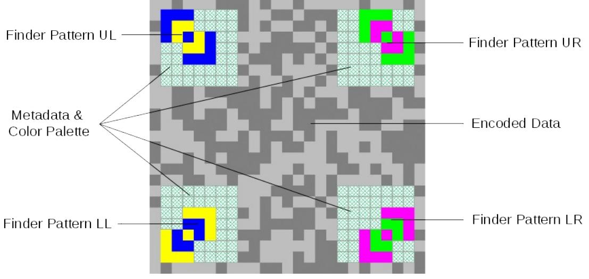

Figure *1:* Structure of a square primary symbol

## 3.3.2 Rectangle primary symbol

The structure of a rectangle JAB Code primary symbol is shown in Figure [2](#page-10-1). The structure of a rectangle primary symbol is the same as a square primary symbol, except that the horizontal and vertical distance between the finder patterns are not equal. Like square symbols, no quiet zone is required for rectangle primary symbols. The primary symbol illustrated in Figure [2](#page-10-1) is a rectangle symbol of combination of Side-Version 5 and 2, of which the width is 37 modules and the height is 25 modules.

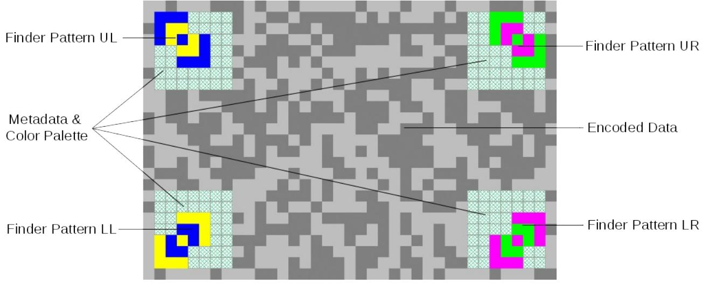

*Figure 2:* Structure of a rectangle primary symbol

<span id="page-10-1"></span>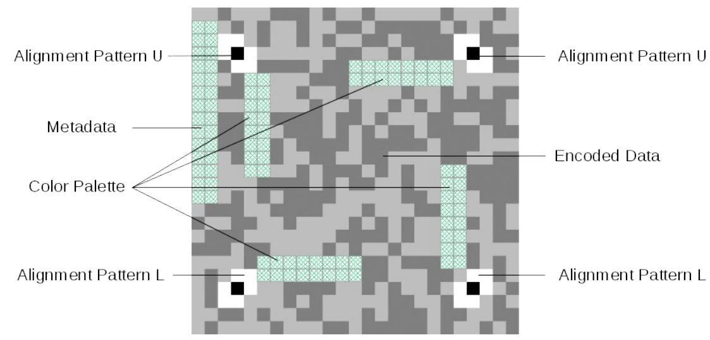

## 3.3.3 Square secondary symbol

<span id="page-10-0"></span>*Figure 3:* Structure of a square secondary symbol

The structure of a square JAB Code secondary symbol is shown in Figure [3.](#page-10-0) Except finder patterns, secondary symbols contain the same function patterns as the primary symbol, including alignment patterns, metadata regions and encoded data region. In secondary symbols, the four finder patterns are replaced by four alignment patterns. Like the primary symbol, no quiet zone is required for secondary symbols in the surrounding. The secondary symbol illustrated in Figure [3](#page-10-0) is a square symbol of Side-Version 2, whose width and height are 25 modules.

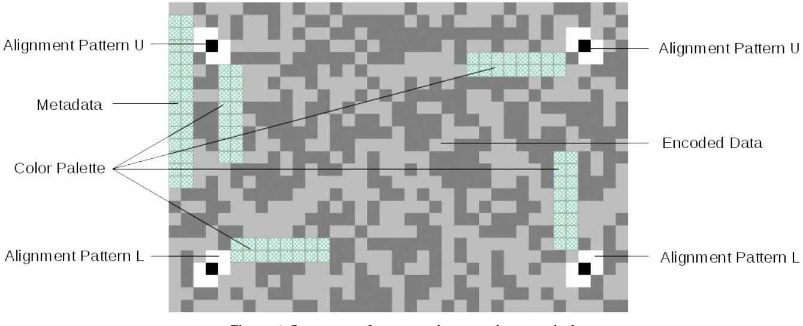

## 3.3.4 Rectangle secondary symbol

<span id="page-11-0"></span>*Figure 4:* Structure of a rectangle secondary symbol

The structure of a rectangle JAB Code secondary symbol is shown in Figure [4](#page-11-0). The structure of the rectangle secondary symbol is the same as the rectangle primary symbol, except that the finder patterns are replaced by four alignment patterns. Similarly, no quiet zone is required for rectangle secondary symbols. The secondary symbol illustrated in Figure [4](#page-11-0) is a rectangle symbol of combination of Side-Version 5 and 2, of which the width is 37 modules and the height is 25 modules.

## 3.3.5 Symbol side size

The side of a JAB Code symbol may have 32 different sizes referred to as Side-Version 1, Side-Version 2, … Side-Version 32, as listed in Table [1.](#page-13-0) The side size increases in step of 4 modules from 21 modules in Side-Version 1 to 145 modules in Side-Version 32. A square symbol has the same Side-Version for both the horizontal and vertical sides, while a rectangle symbol may have any combination of two different sideversions for the horizontal and vertical sides. The smallest square symbol measures 21×21 modules and the largest square symbol measures 145×145 modules. The smallest rectangle symbol measures 21×25 modules and the largest rectangle symbol measures 141×145 modules. The rectangle symbol of 21×145 or 145×21 modules has the maximal proportion between the horizontal and vertical sides.

The capacities listed in Table [1](#page-13-0) are based on the recommended error correction level 6 for square symbols. In codes with 8 colors, the metadata take 15 modules for version 1 to 4, 16 modules for version 5 to 8, 17 modules for version 9 to 16 and 20 modules for version 17 to 32 for the primary symbol. The metadata take 2 modules for secondary symbols with the same configuration as the primary symbol. The number of data modules can be calculated as follows:

| Distance of Finder pattern Center to Border: | DFCB=4  |
|----------------------------------------------|---------|
| Minimum Distance Between Alignment pattern:  | MDBA=16 |

| Number of alignment pattern modules: | ax=MAX (0,⌊(SideSizex−DFCB ×2+1)/ MDBA−1⌋)<br>ay=MAX(0, ⌊(SideSizey−DFCB ×2+1)/ MDBA−1⌋)<br>a=((ax+2)×(ay+2)−4)×7 |
|--------------------------------------|-------------------------------------------------------------------------------------------------------------------|
| Number of color palette modules:     | CPalette=MIN(64, NumberOfModuleColor)×2                                                                           |
| Number of finder pattern modules:    | F Master=4 ×17 ; FSlave=4×7                                                                                       |
| Number of data modules in primary:   | SideSize x×SideSize y−a−CPalette−FMaster−Metadata                                                                 |
| Number of data modules in secondary: | SideSize x×SideSize y−a−CPalette−FSlave−Metadata                                                                  |

where MAX( . , . ) and MIN( . , . ) are the maximum and minimum function.

|              |                           | Number of data modules |                     |       |                       | Symbol net payload Pn (in bits) |                     |                            |       |
|--------------|---------------------------|------------------------|---------------------|-------|-----------------------|---------------------------------|---------------------|----------------------------|-------|
| Side-Version | Side size<br>(in modules) | 4                      | Square primary<br>8 | 4     | Square secondary<br>8 | 4                               | Square primary<br>8 | Square secondary<br>4<br>8 |       |
| 1            | 21                        | 364                    | 363                 | 423   | 416                   | 312                             | 466                 | 362                        | 534   |
| 2            | 25                        | 548                    | 547                 | 607   | 600                   | 469                             | 703                 | 520                        | 771   |
| 3            | 29                        | 764                    | 763                 | 823   | 816                   | 654                             | 981                 | 705                        | 1049  |
| 4            | 33                        | 1012                   | 1011                | 1071  | 1064                  | 867                             | 1299                | 918                        | 1368  |
| 5            | 37                        | 1290                   | 1290                | 1351  | 1344                  | 1105                            | 1658                | 1158                       | 1728  |
| 6            | 41                        | 1602                   | 1602                | 1663  | 1656                  | 1373                            | 2059                | 1425                       | 2129  |
| 7            | 45                        | 1946                   | 1946                | 2007  | 2000                  | 1668                            | 2502                | 1720                       | 2571  |
| 8            | 49                        | 2322                   | 2322                | 2383  | 2376                  | 1990                            | 2985                | 2042                       | 3054  |
| 9            | 53                        | 2727                   | 2728                | 2791  | 2784                  | 2337                            | 3507                | 2392                       | 3579  |
| 10           | 57                        | 3167                   | 3168                | 3231  | 3224                  | 2714                            | 4073                | 2769                       | 4145  |
| 11           | 61                        | 3639                   | 3640                | 3703  | 3696                  | 3119                            | 4680                | 3174                       | 4752  |
| 12           | 65                        | 4143                   | 4144                | 4207  | 4200                  | 3551                            | 5328                | 3606                       | 5400  |
| 13           | 69                        | 4679                   | 4680                | 4743  | 4736                  | 4010                            | 6017                | 4065                       | 6089  |
| 14           | 73                        | 5247                   | 5248                | 5311  | 5304                  | 4497                            | 6747                | 4552                       | 6819  |
| 15           | 77                        | 5847                   | 5848                | 5911  | 5904                  | 5011                            | 7518                | 5066                       | 7590  |
| 16           | 81                        | 6479                   | 6480                | 6543  | 6536                  | 5553                            | 8331                | 5608                       | 8403  |
| 17           | 85                        | 7140                   | 7142                | 7207  | 7200                  | 6120                            | 9182                | 6177                       | 9257  |
| 18           | 89                        | 7836                   | 7838                | 7903  | 7896                  | 6716                            | 10077               | 6774                       | 10152 |
| 19           | 93                        | 8564                   | 8566                | 8631  | 8624                  | 7340                            | 11013               | 7398                       | 11088 |
| 20           | 97                        | 9324                   | 9326                | 9391  | 9384                  | 7992                            | 11990               | 8049                       | 12065 |
| 21           | 101                       | 10116                  | 10118               | 10183 | 10176                 | 8670                            | 13008               | 8728                       | 13083 |
| 22           | 105                       | 10940                  | 10942               | 11007 | 11000                 | 9377                            | 14068               | 9434                       | 14142 |
| 23           | 109                       | 11796                  | 11798               | 11863 | 11856                 | 10110                           | 15168               | 10168                      | 15243 |
| 24           | 113                       | 12684                  | 12686               | 12751 | 12744                 | 10872                           | 16310               | 10929                      | 16385 |
| 25           | 117                       | 13604                  | 13606               | 13671 | 13664                 | 11660                           | 17493               | 11718                      | 17568 |
| 26           | 121                       | 14556                  | 14558               | 14623 | 14616                 | 12476                           | 18717               | 12534                      | 18792 |
| 27           | 125                       | 15540                  | 15542               | 15607 | 15600                 | 13320                           | 19982               | 13377                      | 20057 |
| 28           | 129                       | 16556                  | 16558               | 16623 | 16616                 | 14190                           | 21288               | 14248                      | 21363 |
| 29           | 133                       | 17604                  | 17606               | 17671 | 17664                 | 15089                           | 22636               | 15146                      | 22710 |
| 30           | 137                       | 18684                  | 18686               | 18751 | 18744                 | 16014                           | 24024               | 16072                      | 24099 |
| 31           | 141                       | 19796                  | 19798               | 19863 | 19856                 | 16968                           | 25454               | 17025                      | 25529 |
| 32           | 145                       | 20940                  | 20942               | 21007 | 21000                 | 17948                           | 26925               | 18006                      | 27000 |

<span id="page-13-0"></span>Table 1: Symbol side versions and square symbol capacity of JAB Code

(Nc= 001, 010 (=4/8 colors), wc=4, wr=7)

## <span id="page-14-1"></span>3.3.6 Finder pattern

There are four types of finder patterns in JAB Code, i.e. Finder Pattern UL, Finder Pattern UR, Finder Pattern LR, Finder Pattern LL, located at the upper left, the upper right, the lower right and lower left corners respectively as illustrated in Figure [5](#page-14-0). Each finder pattern contains two square references made up of 3×3 modules, connected with each other by an overlapping module (core module).

The finder patterns have different orientations. The core module of Finder Pattern UL and Finder Pattern UR shall be the lower right module of the upper reference and the upper left module of the lower reference respectively. In Finder Pattern LR and Finder Pattern LL, the core shall be the lower left module of the upper reference and the upper right module of the lower reference.

Each square reference in a finder pattern is constructed of three layers, which are of the same width of one module. The layers in the two references are symmetric with respect to the core module, as illustrated in Figure [5](#page-14-0). Finder Pattern UL and Finder Pattern LL consist of blue and yellow layers, while Finder Pattern UR and Finder Pattern LR are made up of green and magenta layers. The color of each layer is different from its adjacent layers and the core module of each type of finder pattern is in a unique color, i.e. Finder Pattern UL has a blue core, Finder Pattern UR has a green core, Finder Pattern LR has a magenta core and Finder Pattern LL has a yellow core.

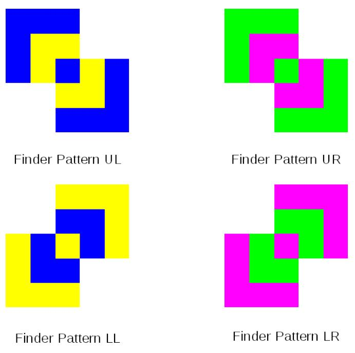

<span id="page-14-0"></span>*Figure 5:* Finder patterns

## 3.3.7 Alignment pattern

There are four types of alignment patterns in JAB Code, i.e. Alignment Pattern U, Alignment Pattern L, Alignment Pattern X0 and Alignment Pattern X1, as illustrated in Figure [6](#page-15-0). Each alignment pattern is constructed of two square references (2×2 modules) consisting of two layers, connected by an overlapping core module. Alignment Pattern U and Alignment Pattern L have white outer layer and black core, while Alignment Pattern X0 and Alignment Pattern X1 have black outer layer and white core.

Alignment Pattern U shall be placed in secondary symbols at the same positions as Finder Pattern UL and Finder Pattern UR in primary symbols. Alignment Pattern L shall be placed in secondary symbols at the same positions as Finder Pattern LR and Finder Pattern LL in primary symbols. Alignment Pattern X0 and X1 shall be placed between finder patterns in primary symbols and between Alignment Pattern U and Alignment Pattern L in secondary symbols.

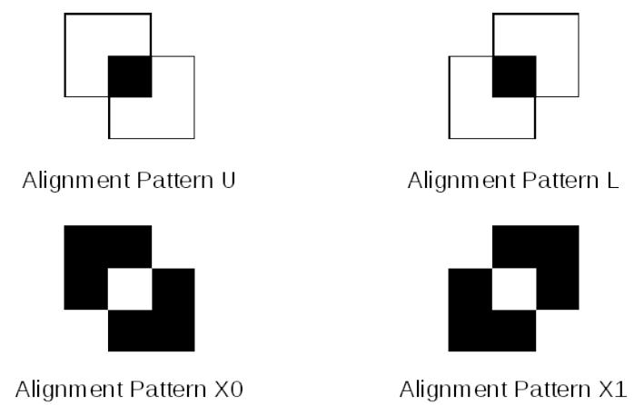

<span id="page-15-0"></span>*Figure 6:* Alignment patterns (left: Alignment Pattern UL, right: Alignment Pattern LR)

Alignment Pattern X0 and Alignment Pattern X1 are present only in JAB Code symbols which has Side-Version 6 or larger. The number of alignment patterns depends on the side-version of each symbol side and the alignment patterns are spaced as evenly as possible. For each side-version, the number of alignment patterns and the column/row coordinates of the core module of each alignment pattern are specified in Table [2,](#page-17-0) where the coordinate of the top-left module in the symbol is defined as (1, 1).

In either primary or secondary symbols, alignment patterns shall be placed on the intersections of columns and rows of the coordinates listed in Table [2](#page-17-0) except the positions where a finder pattern is located. For example, Table [2](#page-17-0) indicates the coordinates 4, 20, 37 and 54 for Side-Version 10. Therefore, in a square primary symbol of Side-Version 10, the 12 alignment patterns are centered at (column, row) positions (4, 20), (4, 37), (20, 4), (20, 20), (20, 37), (20, 54), (37, 4), (37, 20), (37, 37), (37, 54), (54, 20), (54, 37).

The first alignment pattern, which is located next to Finder Pattern UL in primary symbols or next to Alignment Pattern U at the top-left corner in secondary symbols in either horizontal or vertical direction, shall be Alignment X1. At the following placement positions of alignment patterns, Alignment Pattern X0 and Alignment Pattern X1 shall be placed alternatively in both horizontal and vertical directions, as illustrated in Figure [7](#page-16-0).

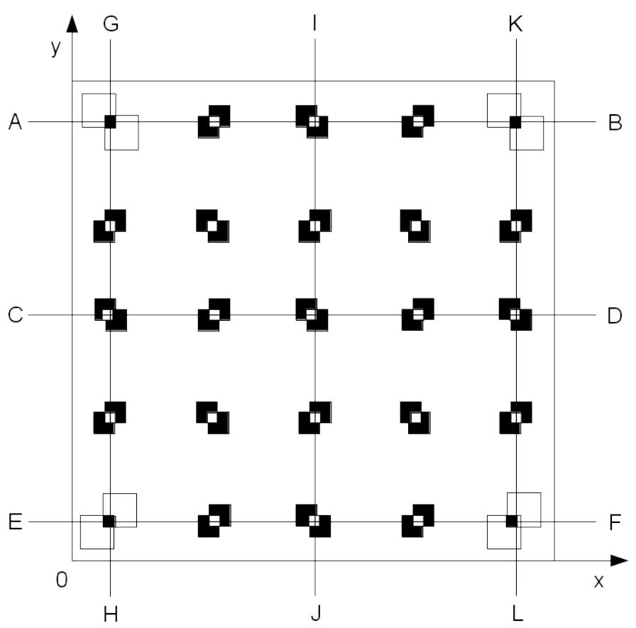

<span id="page-16-0"></span>*Figure 7:* Placement of alignment patterns

| Side-Version | Side size<br>(in modules) | Number of<br>alignment<br>patterns | Column/Row (x/y) coordinates of core module |    |    |    |    |    |     |     |     |
|--------------|---------------------------|------------------------------------|---------------------------------------------|----|----|----|----|----|-----|-----|-----|
| 1            | 21                        | 0                                  | -                                           |    |    |    |    |    |     |     |     |
| 2            | 25                        | 0                                  | -                                           |    |    |    |    |    |     |     |     |
| 3            | 29                        | 0                                  | -                                           |    |    |    |    |    |     |     |     |
| 4            | 33                        | 0                                  | -                                           |    |    |    |    |    |     |     |     |
| 5            | 37                        | 0                                  | -                                           |    |    |    |    |    |     |     |     |
| 6            | 41                        | 5                                  | 4                                           | 21 | 38 |    |    |    |     |     |     |
| 7            | 45                        | 5                                  | 4                                           | 23 | 42 |    |    |    |     |     |     |
| 8            | 49                        | 5                                  | 4                                           | 25 | 46 |    |    |    |     |     |     |
| 9            | 53                        | 5                                  | 4                                           | 27 | 50 |    |    |    |     |     |     |
| 10           | 57                        | 12                                 | 4                                           | 20 | 37 | 54 |    |    |     |     |     |
| 11           | 61                        | 12                                 | 4                                           | 22 | 40 | 58 |    |    |     |     |     |
| 12           | 65                        | 12                                 | 4                                           | 23 | 42 | 62 |    |    |     |     |     |
| 13           | 69                        | 12                                 | 4                                           | 24 | 45 | 66 |    |    |     |     |     |
| 14           | 73                        | 21                                 | 4                                           | 20 | 37 | 53 | 70 |    |     |     |     |
| 15           | 77                        | 21                                 | 4                                           | 21 | 39 | 56 | 74 |    |     |     |     |
| 16           | 81                        | 21                                 | 4                                           | 22 | 41 | 59 | 78 |    |     |     |     |
| 17           | 85                        | 21                                 | 4                                           | 23 | 43 | 62 | 82 |    |     |     |     |
| 18           | 89                        | 32                                 | 4                                           | 20 | 36 | 53 | 69 | 86 |     |     |     |
| 19           | 93                        | 32                                 | 4                                           | 21 | 38 | 55 | 72 | 90 |     |     |     |
| 20           | 97                        | 32                                 | 4                                           | 22 | 40 | 58 | 76 | 94 |     |     |     |
| 21           | 101                       | 32                                 | 4                                           | 22 | 41 | 60 | 79 | 98 |     |     |     |
| 22           | 105                       | 45                                 | 4                                           | 20 | 36 | 53 | 69 | 85 | 102 |     |     |
| 23           | 109                       | 45                                 | 4                                           | 21 | 38 | 55 | 72 | 89 | 106 |     |     |
| 24           | 113                       | 45                                 | 4                                           | 21 | 39 | 57 | 74 | 92 | 110 |     |     |
| 25           | 117                       | 45                                 | 4                                           | 22 | 40 | 59 | 77 | 95 | 114 |     |     |
| 26           | 121                       | 60                                 | 4                                           | 20 | 36 | 52 | 69 | 85 | 101 | 118 |     |
| 27           | 125                       | 60                                 | 4                                           | 20 | 37 | 54 | 71 | 88 | 105 | 122 |     |
| 28           | 129                       | 60                                 | 4                                           | 21 | 38 | 56 | 73 | 91 | 108 | 126 |     |
| 29           | 133                       | 60                                 | 4                                           | 22 | 40 | 58 | 76 | 94 | 112 | 130 |     |
| 30           | 137                       | 77                                 | 4                                           | 20 | 36 | 52 | 69 | 85 | 101 | 117 | 134 |
| 31           | 141                       | 77                                 | 4                                           | 20 | 37 | 54 | 71 | 87 | 104 | 121 | 138 |
| 32           | 145                       | 77                                 | 4                                           | 21 | 38 | 55 | 73 | 90 | 107 | 124 | 142 |

#### <span id="page-17-0"></span>Table 2: Positions of alignment patterns

## 3.3.8 Color palette

The color palette provides reference module color values for symbol decoding. As listed in Table [5](#page-20-0), JAB Code supports 8 module color modes, allowing minimally 4 and maximally 256 colors to be used in a symbol, hence the color palette has a minimal size of 4 and maximal size of 256, containing up to 256 colors indexed from 0 to 255. Table [3](#page-18-0) shows an example of 8-color palette, corresponding to module color mode 2.

However, in either primary or secondary symbols, the color palettes embedded in the symbol contains only up to 64 colors indexed from 0 to 63. If there are less than or equal to 64 module colors in the symbol, all available colors shall be included in the embedded color palette. If there are more than 64 module colors, the embedded color palette shall contain only 64 selected colors. In addition, for metadata decoding the 8 colors available in module color mode 2 shall be always placed in the first 8 entries in the embedded color palette. Refer to Annex F for guidelines for module color specifications and color palette construction.

In either primary or secondary symbols, two color palettes shall be placed, which are located in different reserved regions. The module placement of color palettes is specified in Section [3.4.4](#page-25-0).

| Index | 0     | 1    | 2     | 3    | 4   | 5       | 6      | 7     |
|-------|-------|------|-------|------|-----|---------|--------|-------|
| Color | Black | Blue | Green | Cyan | Red | Magenta | Yellow | White |

<span id="page-18-0"></span>Table 3: Color palette for 8-color symbols

### 3.3.9 Metadata

The metadata defines the symbol properties, which provide necessary parameters for symbol decoding, including the number of module colors, the symbol shape and size, the error correction parameters, the masking type and the code structure. The metadata structure and placement is defined in Section [3.4](#page-19-0), which is different for primary and secondary symbols.

The metadata of either primary or secondary symbols are encoded in specific reserved regions which are defined in Section [3.4.4](#page-25-0). The metadata in primary symbols are encoded in the modules around the four finder patterns, as illustrated in Figure [8](#page-26-0), while the metadata in secondary symbols are encoded along the side docked to the host symbol, as illustrated in Figure [9](#page-27-0) and Figure [15.](#page-33-1) Because the length of metadata in both primary and secondary symbols is variable, the number of modules that are used to encode these metadata also varies.

Metadata are secured by error correction codes. See Section [3.4.3](#page-24-0).

## 3.3.10 Encoded data

Except the modules used for finder patterns, alignment patterns, color palette and metadata, all the remaining modules shall be used to encode data, including the error correction codewords.

The placement of encoded data is specified in Section [4.7.](#page-43-0)

## <span id="page-19-0"></span>3.4 Metadata structure

The metadata of a JAB Code symbol defines the number of module colors, the symbol shape, the symbol size, the error correction level, the positions of docked secondary symbols and the masking type. The metadata is divided into three parts: Part I, Part II and Part III. The data in the preceding parts determine the encoding modes and the length of variables in the following parts.

Dividing metadata into parts enables customizable metadata requirements in different symbol sizes. To maximize the data capacity in small symbols, less metadata is required, while in large symbols, more metadata can be specified to achieve high encoding flexibility. The total length of primary symbol metadata varies from 22 to 40 bits, while it varies from 3 to 27 bits in secondary symbols.

| Metadata                                                                        |               |          |                        |          |                                    |  |  |  |  |
|---------------------------------------------------------------------------------|---------------|----------|------------------------|----------|------------------------------------|--|--|--|--|
| Part I                                                                          |               |          | Part II                | Part III |                                    |  |  |  |  |
| Variable                                                                        | Length (Bits) | Variable | Length (Bits)          | Variable | Length (Bits)                      |  |  |  |  |
| Nc                                                                              |               | SS       | 1                      |          | variable (2-10), depending on SS   |  |  |  |  |
|                                                                                 |               | VF       | 2                      | V        | and VF                             |  |  |  |  |
|                                                                                 | 3             | MSK      | 3                      | E        | variable (10-16), depending on VF  |  |  |  |  |
|                                                                                 |               | SF       | 1                      | S        | variable (0 or 4), depending on SF |  |  |  |  |
| Sum                                                                             | 3             | Sum      | 7                      | Sum      | 12 to 30                           |  |  |  |  |
| Total length: variable from 14 to 42 bits                                       |               |          |                        |          |                                    |  |  |  |  |
| Nc - module color mode                                                          |               |          | SS - symbol shape flag |          | VF - side-version flag             |  |  |  |  |
| MSK - masking reference                                                         |               |          | SF - secondary flag    |          | V - symbol side-version            |  |  |  |  |
| E - error correction parameters<br>S - positions of docked secondary<br>symbols |               |          |                        |          |                                    |  |  |  |  |

<span id="page-19-1"></span>Table 4: Metadata structure of primary symbol

## <span id="page-19-2"></span>3.4.1 Metadata of primary symbol

The metadata structure of primary symbol is shown in Table [4](#page-19-1). Part I defines the module color mode (Nc) indicating the number of module colors, Part II defines a series of flags, including symbol shape flag (SS), side-version flag (VF), masking reference (MSK) and secondary flag (SF), and Part III defines symbol sideversion (V), error correction parameters (E) and positions of docked secondary symbols (S).

Part I, Part II and Part III are concatenated to form the final metadata in the following order. The bit length of variables in Part I and Part II is fixed and the bit-length of variables in Part III is determined by the flag values in Part II.

| Part I | Part II |        |        | Part III |           |            |          |
|--------|---------|--------|--------|----------|-----------|------------|----------|
| Nc     | SS<br>  | VF<br> | MSK    | <br>SF   | V         | <br>E      | <br>S    |
| 3 bits | 1 bit   | 2 bits | 3 bits | 1 bit    | 2-10 bits | 10-16 bits | 0-4 bits |

## <span id="page-20-1"></span>3.4.1.1 Module color mode

The variable N<sup>c</sup> in Part I defines the module color mode which indicates the number of available module colors in the symbol, whose possible values are listed in Table [5](#page-20-0). It takes 3 bits and defines 8 color modes. N<sup>c</sup> shall be encoded in two-color mode which uses only the first module color and the last module color in the color palette, namely black and white in all color modes except mode 001. In mode 001, blue and yellow shall be used. A black/blue module represents a binary zero and a white/yellow module represents a binary one. Except Nc other metadata shall be encoded in multi-color mode using up to 8 colors. In the color modes containing more than 8 colors, the metadata shall be encoded using the colors available in color mode 2, namely only the first 8 colors in the placed color palette shall be used to encode the metadata. Refer to Annex F for the specification of color palette construction.

Color mode 0 is reserved for future extensions, which can also be used for user-defined color modes.

| Variable | Value (binary)<br>Color mode |   | Number of module colors |  |
|----------|------------------------------|---|-------------------------|--|
|          | 000                          | 0 | reserved                |  |
|          | 001                          | 1 | 4 module colors         |  |
|          | 010                          | 2 | 8 module colors         |  |
|          | 011                          | 3 | 16 module colors        |  |
| Nc       | 100                          | 4 | 32 module colors        |  |
|          | 101                          | 5 | 64 module colors        |  |
|          | 110                          | 6 | 128 module colors       |  |
|          | 111                          | 7 | 256 module colors       |  |

<span id="page-20-0"></span>Table 5: Module color modes in Part I of metadata of primary symbol

### 3.4.1.2 Symbol shape

The symbol shape flag (SS) in Part II indicates whether the symbol is square or rectangle. As shown in Table [6](#page-21-0), a binary zero stands for a square symbol and a binary one for a rectangle symbol.

## 3.4.1.3 Symbol size

The symbol size is specified by a combination of two variables: the side-version flag VF and the side-version value V. As shown in Table [6,](#page-21-0) VF indicates the range of the side-version and V gives the version number. The length of V is determined by SS and VF, varying from 2 to 10 as shown in Table [7.](#page-22-0) For square symbols, only one side-version needs to be encoded in V. The side-version is encoded in the segments defined by VF. For rectangle symbols, the horizontal and vertical side-versions have to be encoded respectively. In addition, the horizontal and vertical side-versions may lie in different segments, therefore full encoding is required for each side-version. Table [7](#page-22-0) lists the required bit length for all cases.

## <span id="page-20-2"></span>3.4.1.4 Error correction level

The error correction level is determined by the variable E, which specifies the error correction parameters. The length of E is determined by the maximal symbol size in each side-version segment indicated by VF, varying from 10 to 16 bits as shown in Table [7.](#page-22-0) The first half part of E stores the parameter wc-3 and the second half stores the parameter wr-4 as defined in Section [4.4.1.](#page-41-0) The variable length of E enables customizable error correction in corresponding symbol sizes.

## <span id="page-21-1"></span>3.4.1.5 Positions of docked secondary symbols

The flag SF in Part II indicates whether there are docked secondary symbols as shown in Table [6](#page-21-0). If there are docked secondary symbols, the four bits in variable S in part III represent the positions of the docked secondary symbols. The first to the fourth bits of S stand for the upper side, the right side, the lower side and the left side of the primary symbol, respectively. A binary one indicates there is a docked secondary symbol on the corresponding side, while a binary zero indicates there is no docked symbol.

### 3.4.1.6 Masking type

The flag MSK in Part II contains the data mask pattern reference from Table [20](#page-45-0).

This flag exists only in primary symbols and all the secondary symbols in a JAB Code share the same mask type as the primary symbol.

| Flag | Value (binary) |    | Description                                                  |
|------|----------------|----|--------------------------------------------------------------|
|      |                | 0  | Square symbol                                                |
| SS   | 1              |    | Rectangle symbol                                             |
|      |                | 00 | Side-Version 1-4                                             |
|      | SS=0           | 01 | Side-Version 5-8                                             |
|      |                | 10 | Side-Version 9-16                                            |
|      |                | 11 | Side-Version 17-32                                           |
| VF   | SS=1           | 00 | Side-Version 1-4                                             |
|      |                | 01 | Side-Version 1-8                                             |
|      |                | 10 | Side-Version 1-16                                            |
|      |                | 11 | Side-Version 1-32                                            |
| MSK  | 000 - 111      |    | Mask pattern reference. See 20.                              |
|      | 0<br>1         |    | No docked secondary symbol                                   |
| SF   |                |    | Positions of docked secondary symbols are specified<br>by S. |

#### <span id="page-21-0"></span>Table 6: Flag values in Part II of metadata of primary symbol

| Flag | Value (binary) |    | Length (Bits) |    |   |  |  |
|------|----------------|----|---------------|----|---|--|--|
|      |                |    | V             | E  |   |  |  |
|      | SS=0           | 00 | 2             | 10 |   |  |  |
|      |                | 01 | 2             | 12 | S |  |  |
|      |                | 10 | 3             | 14 |   |  |  |
|      |                | 11 | 4             | 16 |   |  |  |
| VF   | SS=1           | 00 | 4             | 10 |   |  |  |
|      |                | 01 | 6             | 12 |   |  |  |
|      |                | 10 | 8             | 14 |   |  |  |
|      |                | 11 | 10            | 16 |   |  |  |
|      |                | 0  |               |    |   |  |  |
| SF   |                | 4  |               |    |   |  |  |

<span id="page-22-0"></span>Table 7: Variable length in Part III of metadata of primary symbol

## <span id="page-22-1"></span>3.4.2 Metadata of secondary symbol

The metadata structure of secondary symbol is shown in Table [8.](#page-23-0) Part I defines three variables. The first one (SS) indicates whether the symbol shape and size are identical to the host symbol. The second one (SE) indicates whether the secondary symbol shares the same error correction level as the host symbol. The third one (SF) indicates whether there are further docked secondary symbols. Part II defines two flags, including symbol side-version (V) and positions of docked secondary symbols (S). Part III contains only one variable, defining error correction level (E).

Part I, Part II and Part III are concatenated to form the final metadata in the following order. The bit length of variables in Part I is fixed and the bit-length of variables in Part II and Part III is determined by the variable values in Part I.

|       | Part I     |       |             | Part II |             | Part III  |
|-------|------------|-------|-------------|---------|-------------|-----------|
| SS    | <br>SE<br> | SF    | V           |         | S           | E         |
| 1 bit | 1 bit      | 1 bit | 0 or 5 bits |         | 0 or 3 bits | 0-16 bits |

As shown in Table [8,](#page-23-0) the metadata in a secondary symbol may have a minimal length of bits, which provides additional encoding space with low overhead.

| Metadata                                 |                               |                           |                                       |                              |                                 |  |  |  |
|------------------------------------------|-------------------------------|---------------------------|---------------------------------------|------------------------------|---------------------------------|--|--|--|
|                                          | Part I                        |                           | Part II                               | Part III                     |                                 |  |  |  |
| Variable                                 | Length (Bits)                 | Variable<br>Length (Bits) |                                       | Variable                     | Length (Bits)                   |  |  |  |
| SS                                       | 1                             | V                         | variable (0 or 5),<br>depending on SS |                              | variable (0 or 10-16),          |  |  |  |
| SE                                       | 1                             |                           | variable (0 or 3),                    | E                            | depending on SE and V           |  |  |  |
| SF                                       | 1                             | S                         | depending on SF                       |                              |                                 |  |  |  |
| Sum                                      | 3                             | Sum                       | 0 to 8                                |                              | 0 to 16                         |  |  |  |
| Total length: variable from 3 to 30 bits |                               |                           |                                       |                              |                                 |  |  |  |
|                                          | SS – same shape and size flag |                           | SE – same error correction level flag | SF – secondary position flag |                                 |  |  |  |
| V – symbol side-version                  |                               | symbols                   | S – positions of docked secondary     |                              | E – error correction parameters |  |  |  |

#### <span id="page-23-0"></span>Table 8: Metadata structure of secondary symbol

### 3.4.2.1 Symbol shape and size

The secondary symbol may have a different shape from the host symbol. However, the docking side, which is docked to the host symbol, must have the same size as the corresponding side of the host symbol. In other words, the secondary symbol has only one customizable side.

The symbol shape and size flag (SS) in Part I indicates whether the shape and the size of the secondary symbol is identical to the host symbol. As shown in Table [9,](#page-24-1) SS takes 1 bit and when SS is binary zero, no further data is required to specify the symbol shape and size, therefore the length of V is 0. The corresponding metadata from the host symbol shall be used in the decoding. When SS is binary one, the variable V takes 5 bits to specify the side-version of the customizable side.

### 3.4.2.2 Error correction level

The secondary symbol may either share the same error correction level as the host symbol or use its own error correction level to encode data. The flag SE in Part I indicates whether a different error correction level is specified in the secondary symbol, as shown in Table [9.](#page-24-1)

If a different error correction level is specified, similar to the definition of error correction level in primary symbol, the variable E in Part III defines the error correction parameters. The length of E is determined by the larger side version between the side versions in x and y directions as listed in Table [10](#page-24-2).

### 3.4.2.3 Positions of docked secondary symbols

Secondary symbols may dock further secondary symbols at the three free sides. The flag SF in Part I indicates whether there are further docked secondary symbols. As shown in Table [9,](#page-24-1) if there are further docked secondary symbols, the variable S in Part III contains 3 bits which represent the positions of docked secondary symbols. The first to the third bits stand for the three free sides in the same order as defined in Section [3.4.1.5,](#page-21-1) skipping the docking side to the host symbol.

| Flag | Value | Length (Bits) | Description                                                                                                         |  |  |  |  |  |  |  |  |
|------|-------|---------------|---------------------------------------------------------------------------------------------------------------------|--|--|--|--|--|--|--|--|
|      | 0     | V: 0          | The secondary symbol has the identical shape and<br>size to the host symbol.                                        |  |  |  |  |  |  |  |  |
| SS   | 1     | V: 5          | The side of the secondary symbol that is not docked<br>to the primary has different side-version specified by<br>V. |  |  |  |  |  |  |  |  |
|      | 0     | E: 0          | The<br>secondary<br>symbol shares the same error<br>correction level as the primary.                                |  |  |  |  |  |  |  |  |
| SE   | 1     | E: 10 - 16    | The<br>secondary<br>symbol uses a different error<br>correction level specified by E.                               |  |  |  |  |  |  |  |  |
|      | 0     | S: 0          | No docked secondary symbol.                                                                                         |  |  |  |  |  |  |  |  |
| SF   | 1     | S: 3          | Positions of docked secondary symbols are specified<br>by S.                                                        |  |  |  |  |  |  |  |  |

<span id="page-24-1"></span>Table 9: Flag values in Part I and variable length in Part II and Part III of metadata of secondary symbol

<span id="page-24-2"></span>Table 10: Length of variable E in Part III of metadata of secondary symbol

| Side-Version                        | Value | Length of E (Bits) |  |  |  |  |
|-------------------------------------|-------|--------------------|--|--|--|--|
|                                     | 1-4   | 10                 |  |  |  |  |
|                                     | 5-8   | 12                 |  |  |  |  |
| max(side_version_x, side_version_y) | 9-16  | 14                 |  |  |  |  |
|                                     | 17-32 | 16                 |  |  |  |  |

## <span id="page-24-0"></span>3.4.3 Metadata error correction encoding

Each part of the metadata is encoded using the LDPC code separately, which results in a doubled bit length. Refer to Annex B for more details of error correction encoding of each part of the metadata.

The error correction bits for each metadata part shall be calculated as described in Annex B and appended to the metadata bits. Table [11](#page-24-3) lists the possible bit length for each metadata part in primary and secondary symbols. In primary symbols, the total length of the final encoded metadata varies from 44 to 80 bits, while in secondary symbols, it varies from 6 to 54 bits.

| Symbol type | Metadata part | Original length (Bits) | Encoded length (Bits) | Sum     |  |  |  |
|-------------|---------------|------------------------|-----------------------|---------|--|--|--|
| Primary     | Part I        | 3                      | 6                     |         |  |  |  |
|             | Part II       | 7                      | 14                    | 44 - 80 |  |  |  |
|             | Part III      | 12 - 30                | 24 - 60               |         |  |  |  |
|             | Part I        | 3                      | 6                     |         |  |  |  |
| Secondary   | Part II       | 0, 3, 5, 8             | 0, 6, 10, 16          | 6 - 54  |  |  |  |
|             | Part III      | 0, 10, 12, 14, 16      | 0, 20, 24, 28, 32     |         |  |  |  |

<span id="page-24-3"></span>Table 11: Lengths of encoded metadata parts

## <span id="page-25-0"></span>3.4.4 Reserved modules for metadata and color palette

The metadata and the color palette shall be encoded using the modules at predefined positions. If the metadata are encoded using only two colors, which have the lowest encoding capacity per module, up to 80 modules are needed to encode the metadata in primary symbols and up to 54 modules are needed in secondary symbols. In addition, up to 128 modules are needed to store the two color palettes in either primary and secondary symbols. Therefore, totally up to 208 modules in primary symbols and 182 modules in secondary symbols shall be reserved for metadata and color palettes.

The placement order for the maximal metadata and color palettes in primary and secondary symbols is defined in Figure [8](#page-26-0) and in Figures [9-](#page-27-0)[12](#page-30-0), where the modules with a black index number are reserved for metadata, while the modules with a red number are for color palettes. The metadata placement position in secondary symbols depends on the position of the host symbol. As shown in Figures [9-](#page-27-0)[12](#page-30-0), the metadata in secondary symbols are placed along the side which is docked to the host symbol.

Since the metadata length and the palette size are both variable and the encoding capacity of each module is determined by the number of available module colors, the actually required modules for metadata and color palettes in a specific symbol may vary greatly. As the metadata can be encoded using up to 8 colors, in symbols with more than 8 module colors, the maximal number of required modules for metadata in primary symbols are reduced to 31 and in secondary symbols to 18.

The string of metadata bits including the error correction bits, from the most significant bit to the least significant bit, shall be encoded into the reserved modules in primary or secondary symbols following the placement order shown in Figure [8](#page-26-0) and Figure [9.](#page-27-0) Each module contains one or more bits. The remaining bits in the last used module shall be filled with binary zeros. If the number of required modules are less than the reserved ones, in primary symbols the unused modules shall be used for color palette placement or data encoding. In secondary symbols the unused modules shall be used for data encoding.

In either primary or secondary symbols, two color palettes shall be placed. In primary symbols, the first 16 colors shall be placed in the modules next to the finder patterns, numbered from 0 to 15, and the other 48 colors, when available, shall be placed in the regions around finder patterns following the last used metadata module, as shown in Figure [8](#page-26-0). The position of the last used metadata module may be located in any of the four metadata regions around finder patterns, depending on the actual metadata length. For example, if the metadata encoding ends at the reserved module with index number 50, the color palette placement shall start from the reserved module with index number 51 with the 16th color in the color palette. Each color in the palette shall be placed twice in the two diagonally opposite regions.

In salve symbols, the color palette shall be placed in the reserved modules close to Alignment Patter U and Alignment Pattern L as shown in Figure [9](#page-27-0). The first 8 colors in the color palette shall be placed in the reserved modules close to the metadata (denoted as region A) and in the diagonally opposite reserved modules (denoted as region B), following the placement order indicated by the index numbers. If there are more than 8 module colors, the colors in the first half of the palette shall be placed in region A and region B, while the colors in the second half of the palette shall be placed in the other two regions, following the placement order indicated by the index numbers in each region, respectively.

In case there are less available module colors than the reserved modules, the unused modules shall be used for data encoding.

|        |  |  |                            | 0 2 0 44 24 54 |  |  | 55 25 45 1  |                         |  | 8 10 |  |
|--------|--|--|----------------------------|----------------|--|--|-------------|-------------------------|--|------|--|
|        |  |  | 1 3 4 48 26 56             |                |  |  | 57 27 49 5  |                         |  | 9 11 |  |
|        |  |  | 8 52 28 58                 |                |  |  | 59 29 53 9  |                         |  |      |  |
| 6 4    |  |  | 12 56 30 60                |                |  |  |             | 61 31 57 13 14 12       |  |      |  |
| 7 5    |  |  | 16 60 32 62                |                |  |  |             | 63 33 61 17 15 13       |  |      |  |
|        |  |  | 38 36 32 28 24 20 64 34    |                |  |  |             | 35 65 21 25 29 33 37 41 |  |      |  |
|        |  |  | 22 20 18 16 76 72 68 36    |                |  |  |             | 37 69 73 77 17 19 21 23 |  |      |  |
|        |  |  | 52 50 48 46 46 44 42 40 38 |                |  |  |             | 39 41 43 45 47 49 51 53 |  |      |  |
|        |  |  |                            |                |  |  |             |                         |  |      |  |
|        |  |  |                            |                |  |  |             |                         |  |      |  |
|        |  |  |                            |                |  |  |             |                         |  |      |  |
|        |  |  |                            |                |  |  |             |                         |  |      |  |
|        |  |  |                            |                |  |  |             |                         |  |      |  |
|        |  |  |                            |                |  |  |             |                         |  |      |  |
|        |  |  |                            |                |  |  |             |                         |  |      |  |
|        |  |  |                            |                |  |  |             |                         |  |      |  |
|        |  |  | 53 51 49 47 45 43 41 39    |                |  |  |             | 38 40 42 44 46 48 50 52 |  |      |  |
|        |  |  | 23 21 19 17 79 75 71 37    |                |  |  |             | 36 70 74 78 16 18 20 22 |  |      |  |
|        |  |  | 43 39 35 31 27 23 67 35    |                |  |  |             | 34 66 22 26 30 34 38 42 |  |      |  |
| 10 88  |  |  | 19 63 33 63                |                |  |  |             | 62 32 62 18 2 18        |  |      |  |
| 10.198 |  |  | 15 59 31 61                |                |  |  |             | 60 30 58 14 3 14        |  |      |  |
|        |  |  | 11 55 29 59                |                |  |  | 58 28 54 10 |                         |  |      |  |
|        |  |  | 12 14 7 51 27 57           |                |  |  | 56 26 50 6  |                         |  | 4 6  |  |
|        |  |  | 13 15 3 47 25 55           |                |  |  | 54 24 46 2  |                         |  | 5 73 |  |
|        |  |  |                            |                |  |  |             |                         |  |      |  |

<span id="page-26-0"></span>*Figure 8:* Metadata and color palette module placement in primary symbol

|     | 0 31  |  |                        |  |  |                         |                      |                              |  |  |            |  |  |  |
|-----|-------|--|------------------------|--|--|-------------------------|----------------------|------------------------------|--|--|------------|--|--|--|
| 2 3 |       |  |                        |  |  |                         |                      |                              |  |  |            |  |  |  |
|     | 4 5   |  |                        |  |  |                         |                      |                              |  |  |            |  |  |  |
|     | 6 7   |  |                        |  |  |                         |                      | The State States of Children |  |  |            |  |  |  |
|     |       |  | 8 9 38 39 0 115 16 31  |  |  |                         |                      | 8 9 10 11 12 13 14 15        |  |  |            |  |  |  |
|     |       |  | 10 11 40 41 17 30      |  |  |                         |                      | 23 22 21 20 19 18 17 16      |  |  |            |  |  |  |
|     |       |  | 12 13 42 43 2 13 18 29 |  |  |                         |                      | 24 25 26 27 28 29 30 31      |  |  |            |  |  |  |
|     |       |  | 14 15 44 45 3 12 19 28 |  |  |                         |                      |                              |  |  |            |  |  |  |
|     |       |  | 16 17 46 47 4 11 20 27 |  |  |                         |                      |                              |  |  |            |  |  |  |
|     |       |  | 18 19 48 49 5 10 21 26 |  |  |                         |                      |                              |  |  |            |  |  |  |
|     |       |  | 20 21 50 51 6 19 22 25 |  |  |                         |                      |                              |  |  |            |  |  |  |
|     |       |  | 22 23 52 53 7 8 23 24  |  |  |                         |                      |                              |  |  | 24 23 8 7  |  |  |  |
|     | 24 25 |  |                        |  |  |                         |                      |                              |  |  | 25 22 9 6  |  |  |  |
|     | 26 27 |  |                        |  |  |                         |                      |                              |  |  | 26 21 10 5 |  |  |  |
|     | 28 29 |  |                        |  |  |                         |                      |                              |  |  | 27 20 11 4 |  |  |  |
|     | 30 31 |  |                        |  |  |                         |                      |                              |  |  | 28 19 12 3 |  |  |  |
|     | 32 33 |  |                        |  |  | 31 30 29 28 27 26 25 24 |                      |                              |  |  | 29 18 13 2 |  |  |  |
|     | 34 35 |  |                        |  |  | 16 17 18 19 20 21 22 23 |                      |                              |  |  | 30 17 14 1 |  |  |  |
|     | 36 37 |  |                        |  |  |                         | 12 13 13 12 10 0 2 8 |                              |  |  | 31 16 15 0 |  |  |  |
|     |       |  |                        |  |  |                         | 011 2 3 4 5 6 78     |                              |  |  |            |  |  |  |
|     |       |  |                        |  |  |                         |                      |                              |  |  |            |  |  |  |
|     |       |  |                        |  |  |                         |                      |                              |  |  |            |  |  |  |
|     |       |  |                        |  |  |                         |                      |                              |  |  |            |  |  |  |
|     |       |  |                        |  |  |                         |                      |                              |  |  |            |  |  |  |

<span id="page-27-0"></span>*Figure 9:* Metadata and color palette module placement in secondary symbols with left side docked to the host symbol

|  |  |            |  |  |                            |  |  |  | 2012/2/2/10                                     |  |  |                         |       |  |
|--|--|------------|--|--|----------------------------|--|--|--|-------------------------------------------------|--|--|-------------------------|-------|--|
|  |  | 0 45 16 37 |  |  |                            |  |  |  | 8 9 10 11 12 13 14 15                           |  |  |                         | 37 36 |  |
|  |  | 1 14 17 30 |  |  |                            |  |  |  | 23 22 21 20 19 18 17 16 24 25 26 27 28 29 30 31 |  |  |                         | 35 34 |  |
|  |  | 2 13 18 29 |  |  |                            |  |  |  |                                                 |  |  |                         | 33 32 |  |
|  |  | 3 12 19 28 |  |  |                            |  |  |  |                                                 |  |  |                         | 31 30 |  |
|  |  | 4 11 20 27 |  |  |                            |  |  |  |                                                 |  |  |                         | 29 28 |  |
|  |  | 5 10 21 26 |  |  |                            |  |  |  |                                                 |  |  |                         | 27 26 |  |
|  |  | 12 23      |  |  |                            |  |  |  |                                                 |  |  |                         | 25 24 |  |
|  |  |            |  |  |                            |  |  |  |                                                 |  |  | 24 23 8 7 53 52 23 22   |       |  |
|  |  |            |  |  |                            |  |  |  |                                                 |  |  | 25 22 9 6 51 50 21 20   |       |  |
|  |  |            |  |  |                            |  |  |  |                                                 |  |  | 26 21 10 5 49 48 19 18  |       |  |
|  |  |            |  |  |                            |  |  |  |                                                 |  |  | 27 20 11 4 47 46 17 116 |       |  |
|  |  |            |  |  |                            |  |  |  |                                                 |  |  | 28 19 12 3 45 44 15 14  |       |  |
|  |  |            |  |  | 31 30 29 28 27 26 25 24    |  |  |  |                                                 |  |  | 29 18 13 2 43 42 13 12  |       |  |
|  |  |            |  |  | 16 17 18 19 20 21 22 23    |  |  |  |                                                 |  |  | 30 17 14 1 41 40 11 10  |       |  |
|  |  |            |  |  |                            |  |  |  |                                                 |  |  | 31 16 15 0 39 38 9 8    |       |  |
|  |  |            |  |  | of the late la program and |  |  |  |                                                 |  |  |                         | 196   |  |
|  |  |            |  |  |                            |  |  |  |                                                 |  |  |                         | 12    |  |
|  |  |            |  |  |                            |  |  |  |                                                 |  |  |                         |       |  |
|  |  |            |  |  |                            |  |  |  |                                                 |  |  |                         |       |  |
|  |  |            |  |  |                            |  |  |  |                                                 |  |  |                         |       |  |

<span id="page-28-0"></span>*Figure 10:* Metadata and color palette module placement in secondary symbol with right side docked to the host symbol

|  |  |  |            |                         |  |  |  |  |                         |             |  |  | 36 34 32 30 28 26 24 22 20 18 16 14 12 10 8 6 6 4 2 2 0 |  |
|--|--|--|------------|-------------------------|--|--|--|--|-------------------------|-------------|--|--|---------------------------------------------------------|--|
|  |  |  |            |                         |  |  |  |  |                         |             |  |  | 37 35 33 31 29 27 25 23 21 19 17 15 13 11 9 17 15 13 11 |  |
|  |  |  |            |                         |  |  |  |  | 52 50 48 46 44 42 40 38 |             |  |  |                                                         |  |
|  |  |  |            |                         |  |  |  |  | 53 51 49 47 45 43 41 39 |             |  |  |                                                         |  |
|  |  |  |            |                         |  |  |  |  | 7 6 5 4 3 2 10          |             |  |  |                                                         |  |
|  |  |  | 0 15 16 31 |                         |  |  |  |  | 8 9 10 11 12 13 14 15   |             |  |  |                                                         |  |
|  |  |  | 1 14 17 30 |                         |  |  |  |  | 23 22 21 20 19 18 17 16 |             |  |  |                                                         |  |
|  |  |  | 2 13 18 29 |                         |  |  |  |  | 24 25 26 27 28 29 30 31 |             |  |  |                                                         |  |
|  |  |  | 3 12 19 28 |                         |  |  |  |  |                         |             |  |  |                                                         |  |
|  |  |  |            |                         |  |  |  |  |                         |             |  |  |                                                         |  |
|  |  |  | 4 11 20 27 |                         |  |  |  |  |                         |             |  |  |                                                         |  |
|  |  |  | 5 10 21 26 |                         |  |  |  |  |                         |             |  |  |                                                         |  |
|  |  |  | 6 9 22 25  |                         |  |  |  |  |                         |             |  |  |                                                         |  |
|  |  |  | 7 8 23 24  |                         |  |  |  |  |                         | 24 23 8 7   |  |  |                                                         |  |
|  |  |  |            |                         |  |  |  |  |                         | 25 22 9 16  |  |  |                                                         |  |
|  |  |  |            |                         |  |  |  |  |                         | 26 21 10 5  |  |  |                                                         |  |
|  |  |  |            |                         |  |  |  |  |                         | 27 20 11 4  |  |  |                                                         |  |
|  |  |  |            |                         |  |  |  |  |                         | 28 19 12 3  |  |  |                                                         |  |
|  |  |  |            | 31 30 29 28 27 26 25 24 |  |  |  |  |                         | 29 18 13 2  |  |  |                                                         |  |
|  |  |  |            | 16 17 18 19 20 21 22 23 |  |  |  |  |                         | 30 17 14 18 |  |  |                                                         |  |
|  |  |  |            | 15 14 13 12 11 10 9 8   |  |  |  |  |                         | 31 16 15 0  |  |  |                                                         |  |
|  |  |  |            | 011 2 3 4 5 16 17       |  |  |  |  |                         |             |  |  |                                                         |  |
|  |  |  |            |                         |  |  |  |  |                         |             |  |  |                                                         |  |
|  |  |  |            |                         |  |  |  |  |                         |             |  |  |                                                         |  |
|  |  |  |            |                         |  |  |  |  |                         |             |  |  |                                                         |  |
|  |  |  |            |                         |  |  |  |  |                         |             |  |  |                                                         |  |
|  |  |  |            |                         |  |  |  |  |                         |             |  |  |                                                         |  |

<span id="page-29-0"></span>*Figure 11:* Metadata and color palette module placement in secondary symbol with top side docked to the host symbol

|  |  |                                                                                                                                                                             |                         |  |  |  | 7 6 5 4 3 2 1 0         |  |  |            |  |  |  |
|--|--|-----------------------------------------------------------------------------------------------------------------------------------------------------------------------------|-------------------------|--|--|--|-------------------------|--|--|------------|--|--|--|
|  |  |                                                                                                                                                                             | 0 15 16 31              |  |  |  | 8 9 10 11 12 13 14 15   |  |  |            |  |  |  |
|  |  |                                                                                                                                                                             | 1 17 30                 |  |  |  | 23 22 21 20 19 18 17 16 |  |  |            |  |  |  |
|  |  |                                                                                                                                                                             | 2 13 18 29              |  |  |  | 24 25 26 27 28 29 30 31 |  |  |            |  |  |  |
|  |  |                                                                                                                                                                             | 3 12 19 28              |  |  |  |                         |  |  |            |  |  |  |
|  |  |                                                                                                                                                                             | 4 11 20 27              |  |  |  |                         |  |  |            |  |  |  |
|  |  |                                                                                                                                                                             | 5 10 21 26              |  |  |  |                         |  |  |            |  |  |  |
|  |  |                                                                                                                                                                             | 6 9 22 25               |  |  |  |                         |  |  |            |  |  |  |
|  |  |                                                                                                                                                                             | 7 8 23 24               |  |  |  |                         |  |  | 24 23 8 7  |  |  |  |
|  |  |                                                                                                                                                                             |                         |  |  |  |                         |  |  | 25 22 9 16 |  |  |  |
|  |  |                                                                                                                                                                             |                         |  |  |  |                         |  |  | 26 21 10 5 |  |  |  |
|  |  |                                                                                                                                                                             |                         |  |  |  |                         |  |  | 27 20 11 4 |  |  |  |
|  |  |                                                                                                                                                                             |                         |  |  |  |                         |  |  | 28 19 12 3 |  |  |  |
|  |  |                                                                                                                                                                             | 31 30 29 28 27 26 25 24 |  |  |  |                         |  |  | 29 18 13 2 |  |  |  |
|  |  |                                                                                                                                                                             | 16 17 18 19 20 21 22 23 |  |  |  |                         |  |  | 30 17 14 1 |  |  |  |
|  |  |                                                                                                                                                                             | 15/13/13/12/11/10/9 8   |  |  |  |                         |  |  | 31 16 15 0 |  |  |  |
|  |  |                                                                                                                                                                             | 011 2 3 4 5 6 7         |  |  |  |                         |  |  |            |  |  |  |
|  |  |                                                                                                                                                                             | 39 41 43 45 47 49 51 53 |  |  |  |                         |  |  |            |  |  |  |
|  |  |                                                                                                                                                                             | 38 40 42 44 46 48 50 52 |  |  |  |                         |  |  |            |  |  |  |
|  |  | 1   3   5   7   9   1     3   5   7   19 21   23   33     3   3   3   3   3   3   3   3   3   3   3   3   3   3   3   3   3   3   3   3   3   3   3   3   3   3   3   3   3 |                         |  |  |  |                         |  |  |            |  |  |  |
|  |  | 0 2 14 6 10 12 14 16 18 20 22 24 26 28 30 32 34 36                                                                                                                          |                         |  |  |  |                         |  |  |            |  |  |  |

<span id="page-30-0"></span>*Figure 12:* Metadata and color palette module placement in secondary symbol with bottom side docked to the host symbol

## 3.5 Symbol Cascading

## 3.5.1 Symbol docking rules

JAB Code may have arbitrary forms by cascading primary and secondary symbols in horizontal and vertical directions. A JAB Code shall contain one and only one primary symbol and may optionally have multiple secondary symbols. Secondary symbols shall be docked to the primary symbol or the other secondary symbols.

The primary and secondary symbols in a JAB Code may be of different shapes, square or rectangle, namely, they may have different Side-Versions for horizontal and vertical sides. Nevertheless, the docking side between two adjacent symbols must share the same Side-Version. It is recommended that the primary symbol in a JAB Code possesses the largest symbol size.

Figure [13,](#page-32-1) Figure [14](#page-32-0) and Figure [15](#page-33-1) illustrate three examples of JAB Code with cascaded symbols. The primary and secondary symbols in Figure [13](#page-32-1) have the same shape and size. Figure [14](#page-32-0) shows a code containing primary and secondary symbols of different shapes and sizes. Figure [15](#page-33-1) gives an example code with recursive symbol docking, in which the secondary symbol docked to the primary has a further docked secondary symbol.

## <span id="page-31-0"></span>3.5.2 Symbol decoding order

The JAB Code decoding shall always start from the primary symbol. If more than one secondary symbol is docked to the primary symbol, the decoding shall follow the order: top-bottom-left-right. If the secondary symbols docked to the primary have further docked secondary symbols, the decoding shall follow the order defined below.

- 1. The secondary symbols that are directly docked to the primary symbol shall be first decoded according to the top-bottom-left-right order, which are denoted as the first layer.
- 2. According to the top-bottom-left-right order, the secondary symbols in the first layer shall be checked in turn. If there are further docked secondary symbols, they shall be decoded according to the top-bottom-left-right order. These secondary symbols are denoted as the second layer.
- 3. Apply the same order to the other docked secondary symbols in further layers until all the secondary symbols are decoded.

According to the decoding order defined by the rules above, the positions of the first 60 secondary symbols are defined in Figure [16](#page-33-0). The secondary symbols with smaller position numbers shall be decoded first.

Figure [17](#page-34-0) illustrates an example of the decoding order of cascaded symbols. The symbols indices indicate the decoding order. The symbols with a smaller index number shall be decoded first.

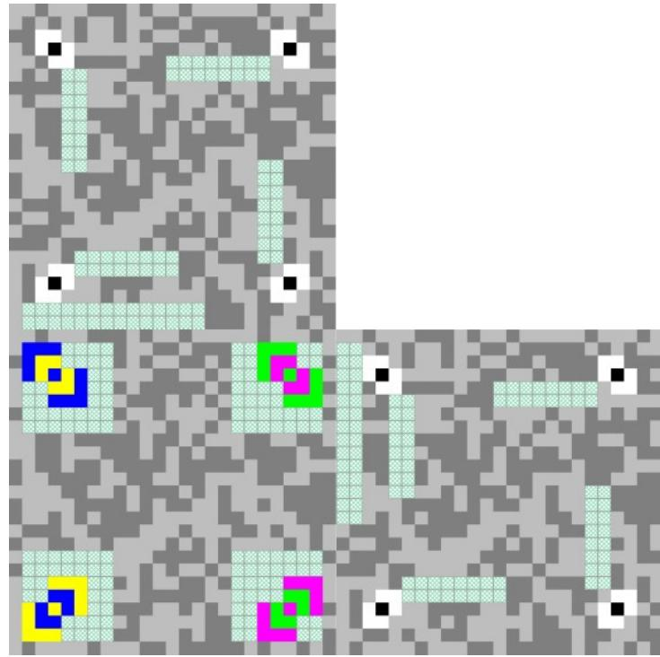

<span id="page-32-1"></span>*Figure 13:* JAB Code with one square primary and two square secondary symbols

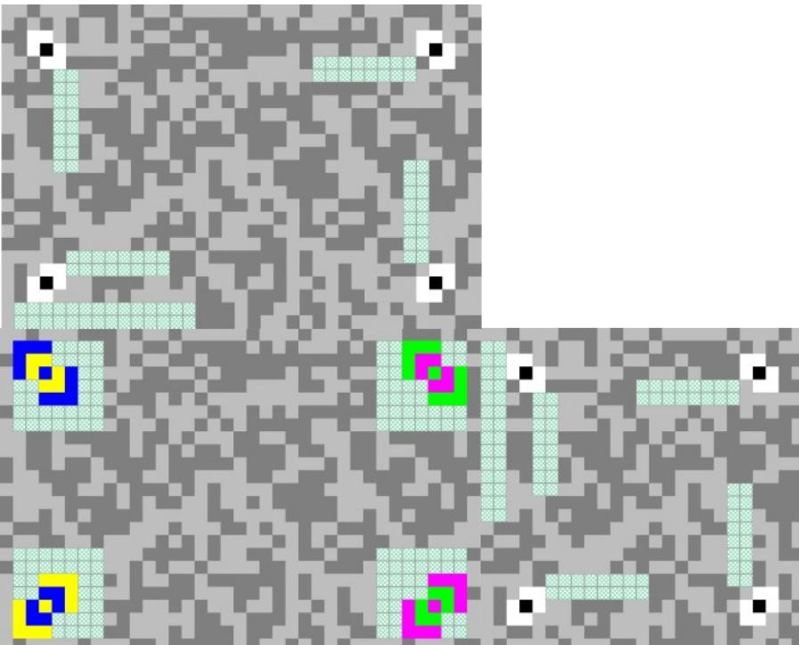

<span id="page-32-0"></span>*Figure 14:* JAB Code with one rectangle primary symbol and two square secondary symbols

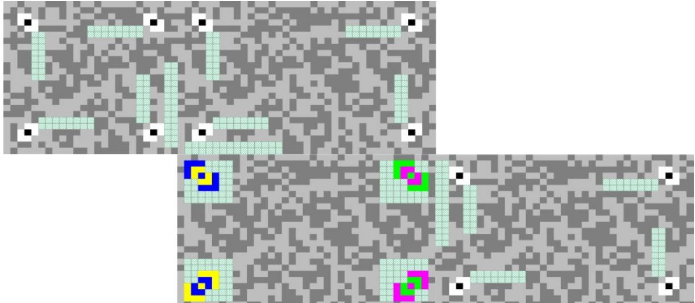

<span id="page-33-1"></span>*Figure 15:* JAB Code with one rectangle primary symbol and multiple square and rectangle secondary symbols

|    |    |    |    |    | 41 |    |    |    |    |    |
|----|----|----|----|----|----|----|----|----|----|----|
|    |    |    |    | 42 | 25 | 43 |    |    |    |    |
|    |    |    | 44 | 26 | 13 | 27 | 45 |    |    |    |
|    |    | 46 | 28 | 14 | 5  | 15 | 29 | 47 |    |    |
|    | 48 | 30 | 16 | 6  | 1  | 7  | 17 | 31 | 49 |    |
| 59 | 39 | 23 | 11 | 3  | 0  | ব  | 12 | 24 | 40 | 60 |
|    | 57 | 37 | 21 | 9  | 2  | 10 | 22 | 38 | 58 |    |
|    |    | 55 | 35 | 19 | 8  | 20 | 36 | 56 |    |    |
|    |    |    | 53 | 33 | 18 | 34 | 54 |    |    |    |
|    |    |    |    | 51 | 32 | 52 |    |    |    |    |
|    |    |    |    |    | 50 |    |    |    |    |    |

<span id="page-33-0"></span>*Figure 16:* Decoding order of cascaded primary and secondary symbols

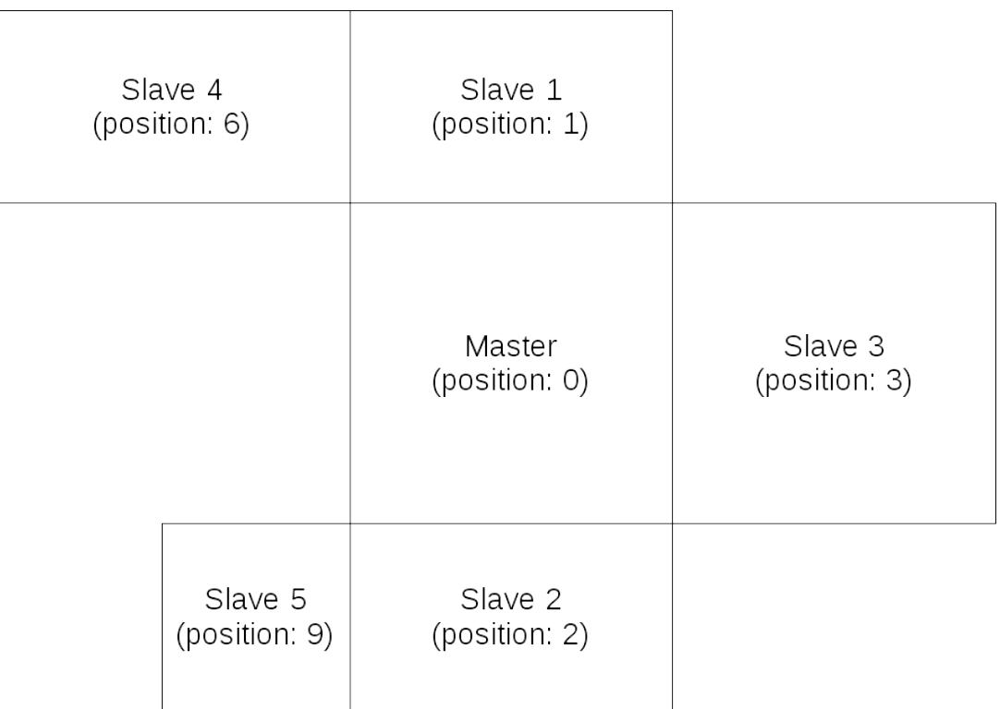

#### <span id="page-34-0"></span>*Figure 17:* Example of decoding order of cascaded primary and secondary symbols

## <span id="page-35-0"></span>4 Symbol generation

## 4.1 Encode procedure overview

The following steps are required to convert input data to a JAB Code symbol.

#### **(1) Data analysis**

Analyze the input data to identify the most efficient modes to encode the characters. JAB Code supports seven default encoding modes to convert input data into a binary string, which can be switched to each other as needed by intermediary mode switch. Further character sets are enabled by supporting Extended Channel Interpretation (ECI) and FNC1 encoding. See Section [4.3](#page-37-0).

#### **(2) Data encoding**

Convert the data characters into a binary stream using selected encoding modes as specified in Section [4.3](#page-37-0).

#### **(3) Error correction coding**

Encode the binary stream using systematic LDPC for error correction and append the parity data to the end of the source binary stream, as specified in Section [4.4](#page-40-0).

#### **(4) Data interleaving**

Interleave the encoded data in each symbol as specified in Section [4.5](#page-42-0) and add padding bits if necessary.

#### **(5) Metadata module reservation**

Based on the code parameters, including the number of module colors, symbol shape, symbol size, error correction level and code structure, calculate the actual metadata size and reserve the modules which are required to accommodate the metadata, following the sequence specified in Section [3.4.4](#page-25-0).

#### **(6) Data module placement**

First, place the finder patterns, the alignment patterns and the color palettes in the matrix. Second, place the data modules (including the modules for error correction bits) in the remaining area of the matrix (skipping the reserved modules for metadata) according to the interleaved data stream as specified in Section [4.7.](#page-43-0)

#### **(7) Data masking**

Apply every available data mask pattern on the data modules and evaluate the masking results. Select the most appropriate masking pattern which results in the most balanced module color distribution and minimizes the occurrence of undesirable patterns, as specified in Section [4.8](#page-44-1).

#### **(8) Metadata generation and module placement**

According to the code parameters, including the number of module colors, symbol shape, symbol size, error correction level, masking type and code structure, generate the metadata information for each symbol as defined in Section [3.4.1](#page-19-2) and [3.4.2](#page-22-1) and encode the generated metadata as specified in Section [3.4.3.](#page-24-0) Finally, place the encoded metadata information into the reserved modules, following the sequence specified in Section [3.4.4](#page-25-0).

## 4.2 Data analysis

Analyze the character types of the input data and choose appropriate encoding modes in order to encode the input data with the shortest bit stream. Annex D presents an algorithm for selecting the most appropriate encoding modes to minimize the bit stream length.

|       | Upper |     | Lower |     | Numeric |     | Punct |     | Mixed |        |       | Alphanumeric |     |       |      |     |
|-------|-------|-----|-------|-----|---------|-----|-------|-----|-------|--------|-------|--------------|-----|-------|------|-----|
| Value | Char  | ISO | Char  | ISO | Char    | ISO | Char  | ISO | Char  | ISO    | Value | Char         | ISO | Value | Char | ISO |
| 0     | SP    | 32  | SP    | 32  | SP      | 32  | !     | 33  | #     | 35     | 0     | SP           | 32  | 32    | V    | 86  |
| 1     | A     | 65  | a     | 97  | 0       | 48  | "     | 34  | *     | 42     | 1     | 0            | 48  | 33    | W    | 87  |
| 2     | B     | 66  | b     | 98  | 1       | 49  | \$    | 36  | +     | 43     | 2     | 1            | 49  | 34    | X    | 88  |
| 3     | C     | 67  | c     | 99  | 2       | 50  | %     | 37  | <     | 60     | 3     | 2            | 50  | 35    | Y    | 89  |
| 4     | D     | 68  | d     | 100 | 3       | 51  | &     | 38  | =     | 61     | 4     | 3            | 51  | 36    | Z    | 90  |
| 5     | E     | 69  | e     | 101 | 4       | 52  | '     | 39  | >     | 62     | 5     | 4            | 52  | 37    | a    | 97  |
| 6     | F     | 70  | f     | 102 | 5       | 53  | (     | 40  | [     | 91     | 6     | 5            | 53  | 38    | b    | 98  |
| 7     | G     | 71  | g     | 103 | 6       | 54  | )     | 41  | \     | 92     | 7     | 6            | 54  | 39    | c    | 99  |
| 8     | H     | 72  | h     | 104 | 7       | 55  | ,     | 44  | ]     | 93     | 8     | 7            | 55  | 40    | d    | 100 |
| 9     | I     | 73  | i     | 105 | 8       | 56  | -     | 45  | ^     | 94     | 9     | 8            | 56  | 41    | e    | 101 |
| 10    | J     | 74  | j     | 106 | 9       | 57  |       | 46  | _     | 95     | 10    | 9            | 57  | 42    | f    | 102 |
| 11    | K     | 75  | k     | 107 | ,       | 44  | /     | 47  | `     | 96     | 11    | A            | 65  | 43    | g    | 103 |
| 12    | L     | 76  | l     | 108 |         | 46  | :     | 58  | {     | 123    | 12    | B            | 66  | 44    | h    | 104 |
| 13    | M     | 77  | m     | 109 | P/S     |     | ;     | 59  |       | 124    | 13    | C            | 67  | 45    | i    | 105 |
| 14    | N     | 78  | n     | 110 | U/L     |     | ?     | 63  | }     | 125    | 14    | D            | 68  | 46    | j    | 106 |
| 15    | O     | 79  | o     | 111 | MS      |     | @     | 64  | ~     | 126    | 15    | E            | 69  | 47    | k    | 107 |
| 16    | P     | 80  | p     | 112 |         |     |       |     | HT    | 9      | 16    | F            | 70  | 48    | l    | 108 |
| 17    | Q     | 81  | q     | 113 |         |     |       |     | LF    | 10     | 17    | G            | 71  | 49    | m    | 109 |
| 18    | R     | 82  | r     | 114 |         |     |       |     | CR    | 13     | 18    | H            | 72  | 50    | n    | 110 |
| 19    | S     | 83  | s     | 115 |         |     |       |     | CR LF | 10, 13 | 19    | I            | 73  | 51    | o    | 111 |
| 20    | T     | 84  | t     | 116 |         |     |       |     | , SP  | 44, 32 | 20    | J            | 74  | 52    | p    | 112 |
| 21    | U     | 85  | u     | 117 |         |     |       |     | . SP  | 46, 32 | 21    | K            | 75  | 53    | q    | 113 |
| 22    | V     | 86  | v     | 118 |         |     |       |     | : SP  | 58, 32 | 22    | L            | 76  | 54    | r    | 114 |
| 23    | W     | 87  | w     | 119 |         |     |       |     | €     | 164    | 23    | M            | 77  | 55    | s    | 115 |
| 24    | X     | 88  | x     | 120 |         |     |       |     | §     | 167    | 24    | N            | 78  | 56    | t    | 116 |
| 25    | Y     | 89  | y     | 121 |         |     |       |     | Ä     | 196    | 25    | O            | 79  | 57    | u    | 117 |
| 26    | Z     | 90  | z     | 122 |         |     |       |     | Ö     | 214    | 26    | P            | 80  | 58    | v    | 118 |
| 27    | P/S   |     | P/S   |     |         |     |       |     | Ü     | 220    | 27    | Q            | 81  | 59    | w    | 119 |
| 28    | L/L   |     | U/S   |     |         |     |       |     | ß     | 223    | 28    | R            | 82  | 60    | x    | 120 |
| 29    | N/L   |     | N/L   |     |         |     |       |     | ä     | 228    | 29    | S            | 83  | 61    | y    | 121 |
| 30    | A/L   |     | A/L   |     |         |     |       |     | ö     | 246    | 30    | T            | 84  | 62    | z    | 122 |
| 31    | MS    |     | MS    |     |         |     |       |     | ü     | 252    | 31    | U            | 85  | 63    | MS   |     |

<span id="page-36-0"></span>Table 12: JAB Code character encoding modes

## <span id="page-37-0"></span>4.3 Encoding modes

There are nine encoding modes in JAB Code: uppercase mode, lowercase mode, numeric mode, punctuation mode, mixed mode, alphanumeric mode, byte mode, ECI mode and FNC1 mode. The first six character encoding modes are defined in Table [12.](#page-36-0) In JAB Code, the default interpretation for values 0 to 31 (control characters) is in accordance with the U.S. national version of ISO 646 and for values 32 to 255 in accordance with the ISO/IEC 8859-15 character set, corresponding to ECI 000017.

Encoding can switched from one mode to another mode as often as needed in two ways: shift and latch. Shift indicates a temporary switch only for the next character, e.g. shift to punctuation mode (P/S) and shift to uppercase mode (U/S), while latch indicates a permanent switch for the following characters until another switch is encountered, e.g. latch to lowercase mode (L/L), latch to numeric mode (N/L).

## 4.3.1 Uppercase mode

Uppercase mode encodes 27 characters, including 26 capital letters (A-Z) and SPACE, at 5 bits per character. Each character is assigned a character value from 0 to 26 according to Table [12](#page-36-0).

The remaining five values are used for mode switch, as defined in Table [13.](#page-37-1) The first four values from 27 to 30 define direct switch to punctuation, lowercase, numeric and alphanumeric modes. The last value 31 defines an extension of more switches, which indicates four more mode switches by appending two bits at the end of (11111)BIN, for example, (1111100)BIN indicates shifting into byte mode and (1111101)BIN indicates shifting into mixed mode.

Data encoding starts by default in uppercase mode.

|          | Value | Char | Mode Switch                                             |                                                    |                     |  |  |  |  |  |  |  |
|----------|-------|------|---------------------------------------------------------|----------------------------------------------------|---------------------|--|--|--|--|--|--|--|
|          | 27    | P/S  | shift to punctuation mode for the next character        |                                                    |                     |  |  |  |  |  |  |  |
|          | 28    | L/L  | latch to lowercase mode for the following characters    |                                                    |                     |  |  |  |  |  |  |  |
| Direct   | 29    | N/L  |                                                         | latch to numeric mode for the following characters |                     |  |  |  |  |  |  |  |
|          | 30    | A/L  | latch to Alphanumeric mode for the following characters |                                                    |                     |  |  |  |  |  |  |  |
|          |       |      |                                                         | 00                                                 | shift to byte mode  |  |  |  |  |  |  |  |
| Extended | 31    | MS   | more switches by                                        | 01                                                 | shift to mixed mode |  |  |  |  |  |  |  |
|          |       |      | appending bits                                          | 10                                                 | latch to ECI mode   |  |  |  |  |  |  |  |
|          |       |      |                                                         | 11                                                 | latch to FNC1 mode  |  |  |  |  |  |  |  |

<span id="page-37-1"></span>Table 13: Mode switch in uppercase mode

## 4.3.2 Lowercase mode

Lowercase mode encodes 27 characters, including 26 small letters (a-z) and SPACE, at 5 bits per character. Each character is assigned a character value from 0 to 26 according to Table [12](#page-36-0).

The remaining five values are used for mode switch, as defined in Table [14.](#page-38-0) The first four values from 27 to 30 define direct switch to punctuation, uppercase, numeric and alphanumeric modes. The last value 31 defines an extension of more switches, which indicates three more mode switches and an end-of-message flag (EOM) by appending two bits at the end of (11111)BIN, for example, (1111100)BIN indicates shifting into byte mode and (1111111)BIN indicates the end of message bits.

|          | Value | Char |                  | Mode Switch                                             |                         |  |  |  |  |  |  |  |
|----------|-------|------|------------------|---------------------------------------------------------|-------------------------|--|--|--|--|--|--|--|
|          | 27    | P/S  |                  | shift to punctuation mode for the next character        |                         |  |  |  |  |  |  |  |
|          | 28    | U/S  |                  | shift to uppercase mode for the next character          |                         |  |  |  |  |  |  |  |
| Direct   | 29    | N/L  |                  | latch to numeric mode for the following characters      |                         |  |  |  |  |  |  |  |
|          | 30    | A/L  |                  | latch to Alphanumeric mode for the following characters |                         |  |  |  |  |  |  |  |
|          |       |      |                  | 00                                                      | shift to byte mode      |  |  |  |  |  |  |  |
| Extended | 31    |      | more switches by | 01                                                      | shift to mixed mode     |  |  |  |  |  |  |  |
|          |       | MS   | appending bits   | 10                                                      | latch to uppercase mode |  |  |  |  |  |  |  |
|          |       |      |                  | 11                                                      | End of message (EOM)    |  |  |  |  |  |  |  |

#### <span id="page-38-0"></span>Table 14: Mode switch in lowercase mode

## 4.3.3 Numeric mode

Numeric mode encodes 13 characters, including 10 digits (0-9), SPACE and two punctuation marks, at 4 bits per character. Each character is assigned a character value from 0 to 12 according to Table [12](#page-36-0).

The remaining three values are used for mode switch, as defined in Table [15.](#page-38-1) The first two values from 13 to 14 define direct switch to punctuation and uppercase modes. The last value 15 defines an extension of more switches, which indicates four more mode switches by appending two bits at the end of (1111) BIN, for example, (111100)BIN indicates shifting into byte mode and (111101)BIN indicates shifting into mixed mode.

|          | Value | Char | Mode Switch                                          |    |                         |
|----------|-------|------|------------------------------------------------------|----|-------------------------|
| Direct   | 13    | P/S  | shift to punctuation mode for the next character     |    |                         |
|          | 14    | U/L  | latch to uppercase mode for the following characters |    |                         |
| Extended | 15    | MS   | more switches by<br>appending bits                   | 00 | shift to byte mode      |
|          |       |      |                                                      | 01 | shift to mixed mode     |
|          |       |      |                                                      | 10 | shift to uppercase mode |
|          |       |      |                                                      | 11 | latch to lowercase mode |

<span id="page-38-1"></span>Table 15: Mode switch in numeric mode

## 4.3.4 Punctuation mode

Punctuation mode encodes 16 commonly used punctuation characters, at 4 bits per character. Each character is assigned a character value from 0 to 15 according to Table [12](#page-36-0).

Punctuation mode has a fixed run-length of one character, after which encoding reverts to the mode from which punctuation mode was invoked.

## 4.3.5 Mixed mode

Mixed mode encodes Germanic umlauts, more punctuation characters and other marks, control characters and combinations, at 5 bits per character. Each character is assigned a character value from 0 to 31 according to Table [12.](#page-36-0)

Like punctuation mode, mixed mode also has a fixed run-length of one character, after which encoding reverts to the mode from which punctuation mode was invoked.

## 4.3.6 Alphanumeric mode

Alphanumeric mode encodes 63 characters, including 26 capital letters (A-Z), 26 small letters (a-z), 10 digits (0-9) and SPACE, at 6 bits per character. Each character is assigned a character value from 0 to 62 according to Table [12.](#page-36-0)

The remaining value 63 is used for mode switch, as defined in Table [16,](#page-39-0) which defines an extension of four mode switches by appending two bits at the end of (111111)BIN, for example, (11111100)BIN indicates shifting into byte mode and (11111110)BIN indicates shifting into punctuation mode.

|          | Value | Char | Mode Switch                        |    |                           |
|----------|-------|------|------------------------------------|----|---------------------------|
| Extended | 15    | MS   | more switches by<br>appending bits | 00 | shift to byte mode        |
|          |       |      |                                    | 01 | shift to mixed mode       |
|          |       |      |                                    | 10 | shift to punctuation mode |
|          |       |      |                                    | 11 | latch to uppercase mode   |

<span id="page-39-0"></span>Table 16: Mode switch in alphanumeric mode

## 4.3.7 Byte mode

Byte mode encodes any 8-bit characters at 8 bits per character. Byte mode starts with a 4-bit binary value, which, if non-zero, encodes the number of bytes (1-15) that follow, but if zero then the next 13 bits encode the number of bytes less 15. Thus, byte mode can encode any ASCII characters that are not included in Table [12](#page-36-0) and long strings of binary data, possibly filling the whole symbol. At the end of the byte string, encoding returns to the mode from which byte mode was invoked.

## 4.3.8 Extended Channel Interpretation (ECI) mode

ECI mode enables data interpretation different from the default character set. ECI mode starts with a 6-digit ECI assignment number which is encoded as an 8-bit, 16-bit or 22-bit binary string, as defined in Table [17.](#page-40-1) The preceding indicating bits determines the length of the binary string.

- If it begins with a 0 bit, it contains 8 bits.
- If it begins with "10", it contains 16 bits.
- If it begins with "11", it contains 22 bits.

In each case, the following bits after the indicating bits are the binary representation of the ECI assignment number, after which encoding returns to the mode from which ECI mode was invoked.

In the input data to be encoded, the ECI assignment number is represented as a backslash character, (5C) HEX, followed by a 6-digit number, i.e. "\nnnnnn". When ECI protocol applies, if the input data contains a backslash character, it shall be doubled as two (5C)HEX characters.

Data in an ECI sequence shall be handled as 8-bit byte values, which can be encoded using any encoding modes irrespective of their significance. For example, a sequence of bytes in the range (30)HEX to (57)HEX would be most efficiently encoded in the Numeric mode even if the sequence might not actually represent numeric data.

Any ECI invoked shall apply until the end of the encoded data, or until another ECI is encountered.

| ECI Assignment Number                                      | Encoded value            |  |
|------------------------------------------------------------|--------------------------|--|
| 000000 to 000127                                           | 0bbbbbbb                 |  |
| 000000 to 016383                                           | 10bbbbbb bbbbbbbb        |  |
| 000000 to 999999                                           | 11bbbbbb bbbbbbbb bbbbbb |  |
| where b…b is the binary value of the ECI assignment number |                          |  |

<span id="page-40-1"></span>Table 17: Encoding ECI assignment number

## 4.3.9 FNC1 mode

FNC1 mode is used for messages containing specific data formats. When FNC1 precedes the first message character, it designates data formatted in accordance with GS1 General Specifications. When FNC1 immediately follows a single upper or lower case letter or two digits at the beginning of the message, it designates data formatted in accordance with a specific industry application previously agreed with AIM Inc., identified by the preceding data. FNC1 mode applies to the entire symbol. When FNC1 occurs at any other location in the data stream, it serves as a field separator and causes an ASCII 29 (<GS>) to be inserted in its place in the output data string.

## <span id="page-40-0"></span>4.4 Error correction

The error correction coding is performed by the LDPC code and operates on binary data. After encoding the message data to a binary stream as specified in Section [4.3,](#page-37-0) the LDPC code adds check bits to the binary stream in order to enable the symbol to to remain decodable in case of damage. The LDPC code can correct codewords with misdecoded bits caused by damage. The error correction level shall be selectable between 0 and 10. The default error correction level shall be 6.

Table [18](#page-41-1) shows the recovery capability of the bit errors in more than 95% of cases. More errors can be detected by the error correction code but with a probability less than 95%. The error correction level shall be determined by the application requirements and expected symbol quality. The higher error recovery capacity is achieved at the cost of larger stream size, leading to larger symbol size. The increase of the stream size is indicated by the code rate R, which is defined as R=Pn/Pg.

| Level | Recovery capacity in % | Code rate R |
|-------|------------------------|-------------|
| 0     | 3                      | 0.67        |
| 1     | 4                      | 0.63        |
| 2     | 5                      | 0.57        |
| 3     | 6                      | 0.55        |
| 4     | 7                      | 0.50        |
| 5     | 8                      | 0.43        |
| 6     | 9                      | 0.34        |
| 7     | 10                     | 0.25        |
| 8     | 11                     | 0.20        |
| 9     | 12                     | 0.17        |
| 10    | 14                     | 0.14        |

<span id="page-41-1"></span>Table 18: The approximated amount of bit error recovery capacity in %

## <span id="page-41-0"></span>4.4.1 Selectable error correction levels

In JAB Code, 11 error correction levels are defined as listed in Table [18](#page-41-1). Based on the input data and the symbol capacity, the best combination of the two parameters wc and wr shall be determined. The value of w<sup>c</sup> shall be an integer between 3 and 8, wr an integer between 4 and 9.

Given the symbol capacity and the net payload, the relation wr/wc=C/(C-Pn) holds. The parameters, wc and wr, shall be determined by the code rate R= 1- wc /wr which is closest to but smaller than the corresponding code rate of the specified error correction level.

With these two parameters wc and wr the number of error correction bits and the gross payload are specified by

$$K = \lfloor \frac{C \times \mathbf{w}\_c}{\mathbf{w}\_r} \rfloor \quad \text{and} \quad P\_g = P\_n + K \quad .$$

With Pg and K the size of the matrix H is determined and the matrix H shall be generated as defined in Section [4.4.3](#page-41-2).

## <span id="page-41-3"></span>4.4.2 Stuffing Bits

The number of stuffing bits SBit is Sbit=C-Pg. The stuffing bits are a sequence consisting of alternate '0's and '1's starting with '0', filling up the unused capacity at the end of the error correction stream.

### <span id="page-41-2"></span>4.4.3 Generating the error correction stream

The error correction stream c is generated by multiplying the message m with the generator matrix G in the GF(2) with *c*=*m*⊗*G* . There are four steps to obtain the generator matrix:

Step 1: Construct a matrix A0 with K/wc rows and Pg columns:

$$A\_0 = \begin{bmatrix} \underbrace{11111}\_{\stackrel{\omega\_r}{\omega\_r}} & \ldots 0 \ldots & \ldots 0 \ldots \\ \ldots 0 \ldots & \underbrace{11111}\_{\stackrel{\omega\_r}{\omega\_r}} & \ldots 0 \ldots \\ \ldots 0 \ldots & \ldots 0 \ldots & \underbrace{11111}\_{\stackrel{\omega\_r}{\omega\_r}} \end{bmatrix}$$

Step 2: Form the matrix A with K rows and Pg columns by stacking wc permutations:

$$\mathbf{A} = \begin{bmatrix} \pi\_1(\mathbf{A}\_0) \\ \pi\_2(\mathbf{A}\_0) \\ \pi\_3(\mathbf{A}\_0) \\ \vdots \\ \vdots \\ \vdots \end{bmatrix}$$

where π is the permutation. The permutation is performed by using the random number generator R(seed, A0) as defined in Annex E with the initial seed 785465 for the message data and the seed 38545 for the metadata with π1=R(seed, A0), π2=R(seed, π1), π3=R(seed, π2), …

Step 3: Generate the matrix H by using the Gauss-Jordan elimination for the matrix A to obtain *H*(*C T* ∣*I*)∈(*K x P<sup>g</sup>* ) .

Step 4: The generator matrix is created by *G*(*I*∣*C*)∈(*P<sup>n</sup> x P<sup>g</sup>* ) .

An example is given in Annex A.1.

## <span id="page-42-0"></span>4.5 Data interleaving

The final sequence of encoded data shall be constructed following the steps below.

- 1. Calculate the remaining capacity in the selected symbol, which is equal to C-Pg.
- 2. Fill the unused capacity with stuffing bits to get the final sequence. The stuffing bits shall be a binary string containing alternating 0 and 1 and starting with 0, e.g. 0101010…
- 3. Interleave all bits in the final sequence using the random permutation algorithm with an initial seed of 226759 as defined in Annex E.

## <span id="page-42-1"></span>4.6 Metadata module reservation

In JAB Code, the metadata in primary and secondary symbols are variable-length data. The actual metadata length and the number of modules required to accommodate the metadata are determined by the following five code parameters which shall be specified by user input:

- the number of module colors
- symbol shape
- symbol size
- error correction level
- code structure

If the number of module colors is not specified by user input, the color mode "010" (8 module colors) shall be used.

If no symbol shape is specified by user input, square symbols shall be used.

If no symbol size is specified by the user input, the smallest square symbol, which will accommodate the encoded data with the given error correction level, shall be used. However, in case of rectangle symbols, the horizontal and vertical symbol sizes must be specified by user input, respectively.

If error correction level is not specified by user input, the error correction level, which will achieve the highest error correction rate with the input data in the symbol in use, shall be used.

If neither symbol size nor error correction level is specified by user input, the smallest square symbol, which will accommodate the input data encoded with the default error correction level, shall be used.

If no code structure is specified by user input, one single primary symbol without docking secondary symbols shall be used.

Based on the length of the final metadata information and the error correction encodation, the number of required metadata modules shall be determined and reserved in each symbol, following the placement order defined in Section [3.4.4](#page-25-0).

## <span id="page-43-0"></span>4.7 Data module encoding and placement

Before placing the modules for data message, the modules for finder patterns, alignment patterns and color palettes shall be first placed in the matrix.

The bits of encoded data message, including the error correction bits, are graphically encoded using each color module in the color palette to represent log2(Nc) bits. The log2(Nc) binary bits are encoded using the index value of module color in the palette. For example, if there are eight module colors in a symbol, i.e. log2(Nc)=3, the first module color in the color palette represents 000, the second one represents 001, and so forth, as defined in Table [19.](#page-43-1)

The interleaved final sequence of encoded data shall be placed in the remaining modules, starting from the most upper left available module, running downwards from left to right, to the most lower right available module, skipping over the modules occupied by finder patterns, alignment patterns, metadata and color palettes, as shown in Figure [18](#page-44-0). The data module placement in secondary symbols follows the same way as in primary symbols.

| Module color | Color index | Binary bits |
|--------------|-------------|-------------|
| black        | 0           | 000         |
| magenta      | 1           | 001         |
| yellow       | 2           | 010         |
| cyan         | 3           | 011         |
| red          | 4           | 100         |
| green        | 5           | 101         |
| blue         | 6           | 110         |
| white        | 7           | 111         |

<span id="page-43-1"></span>Table 19: Bit encoding using eight module colors

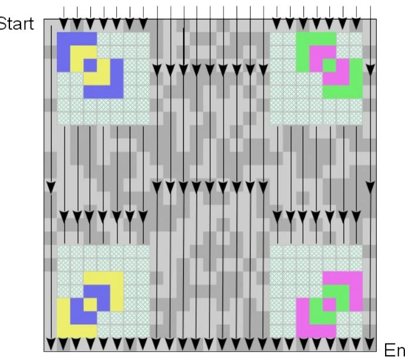

<span id="page-44-0"></span>*Figure 18:* Data module placement

## <span id="page-44-1"></span>4.8 Data masking

For reliable JAB Code reading, the distribution of color modules shall preferably meet the following two conditions:

- 1. The color modules should be arranged in a well-balanced manner in the symbol.
- 2. The occurrences of patterns similar to finder patterns and alignment patterns in other regions of the symbol should be avoided as much as possible.

In order to meet the above conditions, data masking shall be applied as following.

- 1. Data masking is only applied to data modules, not to modules for finder pattern, alignment patterns, metadata and color palettes.
- 2. Apply each data mask pattern to data modules in turn. The masking result of each module is calculated by the XOR operation between the module color and the mask pattern color, as defined in Section [4.8.1.](#page-44-2)
- 3. Evaluate the masking results by charging penalties for undesirable features.
- <span id="page-44-2"></span>4. Select the data mask pattern with the lowest penalty point score.

### 4.8.1 Data mask patterns

JAB Code has eight data mask patterns as listed in Table [20](#page-45-0). The binary reference values are used in metadata to identify the masking type. Each data pattern covers only the modules in the data encoding region in a symbol, excluding modules for finder pattern, alignment patterns, metadata and color palettes. The color of each module in a data mask pattern is determined by the pattern module color generators as defined in Table [20.](#page-45-0) The result of each generator indicates the index in the color palette of the symbol. In the generators, x refers to the horizontal position of the module and y refers to its vertical position, with (x, y) = (0, 0) for the upper left module in the symbol.

The data masking is applied to a data module through the bitwise XOR operation between the color index of the data module and the color index of the corresponding module in the mask pattern. For example, in case of Nc=3, if the module has the color index of 5, (101)BIN, and the corresponding module in the mask pattern has the color index 3, (011)BIN, then the resulting module has the color index 6, (110)BIN.

| Data mask pattern<br>reference                                  | Pattern module color generator                             |  |
|-----------------------------------------------------------------|------------------------------------------------------------|--|
| 000                                                             | (x+y) mod 2Nc+1                                            |  |
| 001                                                             | x mod 2Nc+1                                                |  |
| 010                                                             | y mod 2Nc+1                                                |  |
| 011                                                             | ( (x div 2) + (y div 3) ) mod 2Nc+1                        |  |
| 100                                                             | ( (x div 3) + (y div 2) ) mod 2Nc+1                        |  |
| 101                                                             | ( (x+y) div 2 + (x+y) div 3 ) mod 2Nc+1                    |  |
| 110                                                             | ( ( (x×x×y) mod 7 ) + ( (2×x×x + 2×y) mod 19 ) ) mod 2Nc+1 |  |
| ( ( (x×y×y) mod 5 ) + ( (2×x + y×y) mod 13 ) ) mod 2Nc+1<br>111 |                                                            |  |

<span id="page-45-0"></span>Table 20: Data mask pattern generation conditions

## 4.8.2 Evaluation of data masking results

The masking results using each data mask pattern listed in Table [20](#page-45-0) shall be evaluated by scoring penalty points for each occurrence of the following undesirable features listed in Table [21](#page-45-1). The higher the penalty points, the less acceptable the masking result. In Table [21,](#page-45-1) each undesirable feature is scored by a weighting factor, which is defined as W1=100, W2=3 and W3=3.

In the evaluation, all the modules are taken into account although the data masking shall be only applied to the data modules. Furthermore, all the symbols in JAB Code, including the primary symbol and the secondary symbols (if exist), shall be evaluated together.

After result evaluation according to Table [21,](#page-45-1) the data mask pattern that results in the lowest penalty score shall be selected for the code.

| Feature                                                                          | Scoring condition              | Penalty points         |  |  |
|----------------------------------------------------------------------------------|--------------------------------|------------------------|--|--|
| Pattern with the same color and structure<br>as any finder pattern in row/column | Existence of the pattern       | W1                     |  |  |
| Block of modules in same color                                                   | block_size = m × n             | W2 × (m – 1) × (n – 1) |  |  |
| Adjacent modules in row/column in same<br>color                                  | Number of modules = (5+k), k>0 | W3 + k                 |  |  |

<span id="page-45-1"></span>

## 4.9 Metadata generation and module placement

The final metadata information shall be constructed for each symbol as defined in Section [3.4.1](#page-19-2) and [3.4.2](#page-22-1) and encoded using LDPC as specified in Section [3.4.3,](#page-24-0) including the number of module colors, symbol shape, symbol size, data mask pattern type, error correction parameters and the code structure.

The bits of metadata including the error correction bits are graphically encoded into the reserved modules. As defined in Section [3.4.1.1](#page-20-1), up to 8 module colors shall be used to encode metadata, except the first part of metadata in primary symbols, which shall be encoded in two-color mode.

- Nc shall be encoded in two-color mode.
- In case of module color modes 1 and 2, corresponding to 4 and 8 module colors, the metadata shall be encoded using all available colors.
- In case of other module color modes, which contain more than 8 modules colors, only the colors available in color mode 2 shall be used to encode the metadata.

The encoded metadata bit stream shall be placed into the modules which are reserved in Section [4.6,](#page-42-1) following the placement order specified in Section [3.4.4](#page-25-0). If the length of metadata is not an exact multiple of N, where N is the number of bits a metadata module represents, up to N-1 padding bits (all zeros) shall be appended to the metadata bit stream to fill up the final used module.

## <span id="page-47-0"></span>5 User Guidelines

## 5.1 Dimensions

JAB Code symbols (both primary and secondary symbols) shall conform to the following dimensions:

*X dimension*: the width of a module shall be specified by the application, taking into account the technologies used to produce and scan the symbol;

*Y dimension*: the height of a module shall be equal to the X dimension.

No limit is placed on the module size in this specification. However, all modules in the symbols of a JAB Code shall be of the same size.

## 5.2 User selection of module color

In JAB Code, eight module color modes are specified, which allow a symbol to contain up to 256 different module colors. Using more module colors in a symbol allows higher data capacity, but it also puts higher requirements upon the technologies used to produce and read the symbol. The selection of module colors should be determined in relation to:

- the required data payload according to the application requirements;
- the expected symbol size according to the application requirements;
- the capability of the technologies used to produce and scan the symbol.

See Annex F for guidelines for module color specifications.

## 5.3 User selection of error correction level

An appropriate error correction level should be defined by the user according to the application requirements. As specified in Section [3.4.1.4](#page-20-2), JAB Code allows customizable error correction levels. For a given message length, a higher level of error correction will lead to some increase in symbol size. The recommended error correction level for normal use should be enforced as the default level in the encoder and decoder.

If the symbol size is fixed in the application regardless of the message length, the highest possible error correction level shall be used, with which the whole encoded data can be hold by the symbol, in order to achieve the best robustness.

## 5.4 User selection of symbol and code shape

JAB Code allows square, rectangle symbols and arbitrary code shapes by symbol cascading. The user should define the appropriate symbol shape and code structure to suit the application requirements.

The symbol shape should be determined by the shape of the space to place the symbol. In case of nonsquare placing space, rectangle symbols can be used to accommodate more data than square symbols by making the most of the available space.

With the same symbol size, secondary symbols may accommodate more data than primary symbols, as they have lower overhead thanks to absence of finder patterns and shorter metadata. However, symbol cascading increases the reading complexity of JAB Code and may consequently decrease decoding reliability. Therefore, symbol cascading should only be used in the following cases:

• the data message can not be accommodated by a single primary symbol;

- the available space to place the code has an irregular shape, which can not be fully utilized by a single square or rectangle symbol.
- small symbols (small side-version) are preferred due to the application requirements.

## 5.5 Guidelines for symbol print and scan

Any JAB Code application must be viewed as a total system solution. All the symbology encoding/decoding components (surface marker or printer, labels, readers) making up an application need to operate together as a system. A failure in any link of the chain, or a mismatch between them, could compromise the performance of the overall system.

While compliance with the specifications is one key to assuring overall system success, other considerations come into play which may influence performance as well. The following guidelines suggest some factors to keep in mind when specifying or implementing bar code systems:

- Select a print density which will yield tolerance values that can be achieved by the marking or printing technology being used. Ensure that the module dimension is an integer multiple of the print head pixel dimension.
- Choose a reader with a resolution suitable for the symbol density and quality produced by the printing technology.
- Ensure that the optical properties of the printed symbol are compatible with the wavelength of the scanner light source or sensor.
- Ensure that the lighting condition is consistent over the whole symbol when scanning the printed symbol.
- Verify symbol compliance in the final label or package configuration. Overlays, show-through, and curved or irregular surfaces can all affect symbol readability.

## <span id="page-49-0"></span>6 Reference decode algorithm

This reference decode algorithm finds the symbols in an image and decodes them. This algorithm may be used by practical reader implementations.

## 6.1 Decoding procedure overview

Decoding JAB Code from a captured image involves the following steps:

- 1. Preprocess the image which contains a JAB Code. When necessary, the captured image containing the symbols should be denoised to remove isolated pixels which have colors greatly differing from their neighbors.
- 2. Locate the primary symbol within the image by finding the finder patterns.
- 3. Decode the metadata of primary symbol and determine the code parameters, including module color mode, side-versions, error correction parameters, mask pattern reference and docking positions of secondary symbols.
- 4. Locate the alignment patterns and establish the sampling grid.
- 5. Extract and construct the color palettes.
- 6. Decode the data modules by determining their color index in the color palette.
- 7. Release the data masking using the mask pattern corresponding to the decoded mask pattern reference.
- 8. Deinterleave the data stream.
- 9. Detect and correct errors in the data stream.
- 10. Decode the data stream into the original message in accordance with the encoding modes in use.
- 11. If exist, locate the secondary symbols docked to the primary symbol and decode the metadata and the data stream in the secondary symbols.
- 12. If exist, locate and decode further docked secondary symbols recursively, according to the symbol decoding order.

## 6.2 Locating the finder patterns

The four finder patterns in JAB Code, Finder Pattern UL, Finder Pattern UR, Finder Pattern LR and Finder Pattern LL, consist of five layers with a core module in unique color, located at the four corners of the primary symbol as described in Section [3.3.6](#page-14-1). All of them have a distinct characteristic which may make them easy to be identified in the image: layer widths in each finder pattern form a *p*C1-C2-C1-C2-*q*C1 sequence, where C1 and C2 represent the layer colors and the relative widths of each layer are *p*:1:1:1:*q* in all scanlines running through the center of the core module. In this reference algorithm, the tolerance for each of these widths is 50%, corresponding to a range of 0.5 to 1.5).

When a candidate scanline with the above-mentioned characteristic is detected, note the position A where the scanline intersects the border between the first and the second layer and the position B where the scanline intersects the border between the fourth layer and the fifth layer, as shown in Figure [19.](#page-50-0) Repeat this by scanning the adjacent pixel lines in the image until all pixel lines crossing the core module in the horizontal direction have been identified.

Apply the last step on pixel columns to identify the pixel lines crossing the core module in the vertical direction. Locate the center of the finder pattern by finding the midpoint between A and B in horizontal direction and between C and D in vertical direction, which is shown as point E in Figure [19.](#page-50-0) The orientation of the finder pattern can be determined by repeating the line scanning step in diagonal directions.

All of the four finder patterns can be located by repeating these steps. After all finder patterns are located, identify the type of each finder pattern by the detected core module color C1. Subsequently, determine the rotational orientation of the symbol and possible mirroring by analyzing the coordinates of the four finder patterns.

The horizontal and vertical module size in each finder pattern can be calculated by the distance between A and Bas below.

$$\mathbf{M}\_{\mathbf{x}} = \mathbf{d}\_{\mathbf{AB}} / 3$$

$$\mathbf{M}\_{\mathbf{y}} = \mathbf{d}\_{\mathbf{CD}} / 3$$

$$\begin{aligned} \tau\_{\alpha} &= \frac{\tau\_{\alpha}}{\tau\_{\alpha}} \frac{\tau\_{\alpha}}{\tau\_{\alpha}} \frac{\tau\_{\alpha}}{\tau\_{\alpha}} \\\\ \tau\_{\alpha} &= \frac{\tau\_{\alpha}}{\tau\_{\alpha}} \frac{\tau\_{\alpha}}{\tau\_{\alpha}} \end{aligned}$$

<span id="page-50-0"></span>*Figure 19:* Scanlines in finder pattern

## <span id="page-50-1"></span>6.3 Decoding the metadata

After the finder patterns are identified, find the guide lines AB, CD, EF and GH, which pass through the centers of the core modules of the four finder patterns as shown in Figure [20.](#page-51-0) The guide lines AB and CD are perpendicular to EF and GH.

The sampling grid for each module center in the reserved metadata area around the finder patterns can be determined based on the lines parallel to the guide lines, the central coordinates of each finder pattern and the module size MX and MY of each finder pattern.

The modules that encode the metadata Part I shall be first decoded which are located at the reserved positions as defined in Section [3.4.4](#page-25-0). These modules are encoded in two-color mode as described in Section [3.4.1.1](#page-20-1). The modules with lower luminance are decoded as dark modules, representing binary zero, and the modules with higher luminance are decoded as light modules, representing binary one. Detect and correct errors in the extracted 6-bit metadata to get the module color mode Nc.

After the used module color mode is identified, the reference colors used for metadata can be sampled in the same way as metadata at the predefined positions. In this step, up to 8 colors in the color palette shall be decoded. Based on the sampled reference colors, decode other parts of the metadata step by step as defined in Section [3.4.1](#page-19-2) to determine the code parameters, including the side-versions, the error correction parameters, the masking pattern reference and the docking positions of secondary symbols.

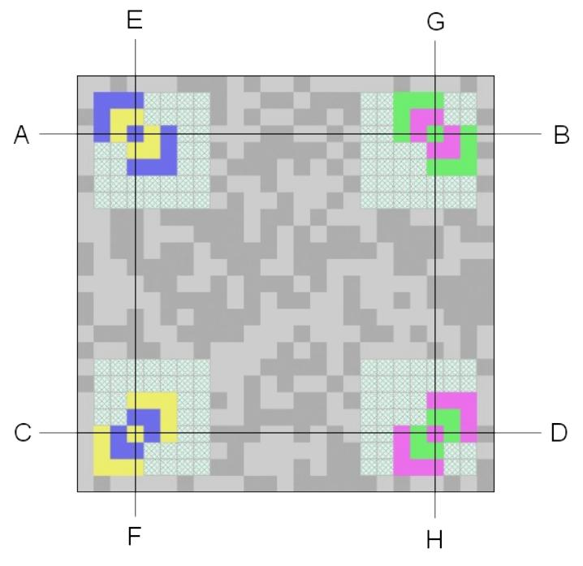

<span id="page-51-0"></span>*Figure 20:* Finder patterns and guide lines

## 6.4 Locating the alignment patterns and establishing the sampling grid

For Side-Version 6 or larger symbols, determine the provisional central coordinate of each alignment pattern, Alignment Pattern X0 or X1, from the coordinates defined in Table [2,](#page-17-0) based on the central coordinate of each finder pattern, the module size and the lines parallel to the guide lines AB, CD, EF and GH, i.e. the lines A1B1, A2B2, C1D1, E1F1, E2F2 and G1H1 as shown in Figure [21](#page-52-0). Scan the pixel lines around the provisional central coordinate to find the actual central coordinate of each alignment pattern.

The sampling grid for each area surrounded by four alignment patterns in the symbol can be determined based on the central coordinates of the four alignment patterns, the lines parallel to the guide lines connecting the alignment pattern centers and the average module size. The average module size can be calculated by the center-to-center distance of the alignment patterns and the number of modules between the alignment pattern centers as defined in Table [2.](#page-17-0) Thus, the sampling grind can be established with lines equidistantly spaced between the centers of the alignment patterns. In the areas at the four corners of the symbol, one alignment pattern shall be replaced by the finder pattern at the corresponding coordinate to determine the sampling grid.

For the symbols with side-version less than 6, in which there exists no alignment pattern, the sampling grid is established solely based on the centers of the four finder patterns and the lines parallel to the guide lines AB, CD, EF and GH.

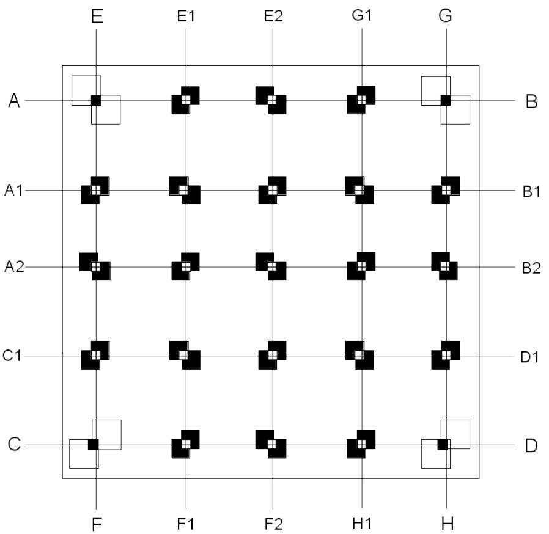

<span id="page-52-0"></span>*Figure 21:* Finder patterns and alignment patterns with guide lines

## 6.5 Constructing the color palettes

After the sampling grid is established, the modules which encode the reference colors can be sampled to obtain the reference colors. For each reference color module located at the reserved positions as defined in Section [3.4.4,](#page-25-0) sample an area of 3×3 image pixels centered on the intersection of the grid lines and store the sampled color into the corresponding color palette. Repeat this step until the two embedded color palettes are assembled.

For symbols that contain more than 8 module colors, rearrange the color entries in the two assembled color palettes to obtain the original color palette. For symbols that contain more than 64 module colors, after entry rearrangement, interpolate the assembled palettes to restore the absent reference colors and obtain the original full-size color palettes. Refer to Annex F for the specification of color palette interpolation and construction.

## 6.6 Decoding the data message

First, based on the sampling grids, sample an area of 3×3 image pixels centered on each intersection of the grid lines and determine the color of the module based on the nearest color palette in the symbol. Map the module color into the corresponding bit string according to its index in the color palette.

Second, based on the decoded mark reference from the metadata, apply the used masking pattern to the decoded data modules to release the data masking and restore the original encoded bit strings. Sequentially assemble the bit string of each data module to get the data stream. Subsequently deinterleave the data stream to obtain the encoded data in the original sequence.

Third, based on the decoded error correction parameters from the metadata, detect errors in the data stream and correct them if there exist errors using the LDPC decoder.

Finally, decode the data message into the original message in accordance with the encoding mode in use, as described in Section [4.3](#page-37-0).

## 6.7 Locating and decoding secondary symbols

Based on the decoded metadata, if there exist secondary symbols docked to the primary symbol, locate and decode them according to the symbol decoding order defined in Section [3.5.2.](#page-31-0)

- 1. Determine the provisional central coordinates of the two Alignment Pattern U or Alignment L close to the docking side of the primary symbol based on the central coordinates of the two finder patterns at the docking side, the corresponding guide lines and the distance between the two finder patterns and the two adjacent alignment patterns in the secondary symbol which is fixed at 7 modules. For horizontally docked secondary symbols, the two Alignment Pattern U or L are located on the extension lines of AB and CD. For vertically docked secondary symbols, they are located on the extension lines of EF and GH. Scan the pixel lines around the provisional central coordinate to find the actual central coordinate of each alignment pattern.
- 2. Determine the sampling grid for the metadata and the color palette in the secondary symbol based on the central coordinates of the two finder patters and the detected alignment patterns, the lines parallel to the guide lines connecting the finder pattern and alignment pattern centers and the side-version of the docking side.
- 3. Sample the modules for the reference colors used for secondary symbol metadata at the reserved positions as defined in Section [3.4.4](#page-25-0). Decode the metadata in the secondary symbol at the reserved positions step by step as defined in Section [3.4.2](#page-22-1) to determine the secondary symbol parameters, including the side-version of the other side, the error correction parameters and the docking positions of further secondary symbols.
- 4. Determine the provisional central coordinates of the other two Alignment Pattern U or Alignment L far from the docking side based on the central coordinates of the two detected Alignment Pattern U or L, the extension lines of the guide lines connecting the finder patterns at the docking side and the adjacent Alignment Pattern U or L and the side-version of the non-docking side of the secondary symbol. Scan the pixel lines around the provisional central coordinate to find the actual central coordinate of each alignment pattern.
- 5. Locate the other alignment patterns, Alignment Pattern X0 and X1, if exist, establish the sampling grid, construct the color palettes and decode the data in the same way as the primary symbol.

Repeat step 1-5 until all the secondary symbols docked to the primary symbol are decoded. If there exist further docked symbols to the decoded secondary symbols, locate and decode all the symbols recursively according to the decoding order defined in Section [3.5.2](#page-31-0).

## <span id="page-54-0"></span>Annex A: Error detection and correction

## A.1 Error encoding

The Low-Density Parity Check Code (LDPC) shall be used for error correction. The parity check matrix *H<sup>P</sup><sup>n</sup>* (*C T* ∣*I*)∈(*K x P<sup>g</sup>* ) in systematic form for each length of the message length Pn is defined by the three parameter w<sup>c</sup> and w<sup>r</sup> and K. The parameter w<sup>c</sup> describes the number of '1's in each column and wr the number of '1's in each rows. With wc and w<sup>r</sup> the rate R of the code is determinable with R=1-wc*/*wr . One way to generate the matrix H is to randomly fill the columns with wc '1's such that wr holds and it comprise the identity matrix I. It is recommended to select *wc*≥3 and wr ≥wc+1.

The generator matrix *G<sup>P</sup><sup>n</sup>* (*I*∣*C*)∈(*P<sup>n</sup> x P<sup>g</sup>* ) is obtained by the matrix H and only shown for the first two metadata length. The Codeword c is obtained by matrix multiplication in the GF(2) *c*=*m*⊗*G* .

#### **Example:**

Given the parameters *wc*=3,*wr*=6,*K*=5 , the message *m*=[1 0 1 0 1] , the generated matrix H and G are as follows:

|     | 1      | 0 | 1 | 1 | 0 | 1 | 0 | 0 | 0 | 0      |      | 1 | 0 | 0 | 0 | 0 | 1 | 1 | 0 | 1 | 0      |
|-----|--------|---|---|---|---|---|---|---|---|--------|------|---|---|---|---|---|---|---|---|---|--------|
|     | 1      | 1 | 0 | 0 | 1 | 0 | 1 | 0 | 0 | 0      |      | 0 | 1 | 0 | 0 | 0 | 1 | 0 | 1 | 0 | 1      |
| H5= | 0      | 1 | 1 | 1 | 0 | 0 | 0 | 1 | 0 | 0      | →G5= | 0 | 0 | 1 | 0 | 0 | 0 | 1 | 1 | 0 | 1      |
|     | 0<br>[ | 1 | 1 | 0 | 1 | 0 | 0 | 0 | 1 | 0<br>] | [    | 0 | 0 | 0 | 1 | 0 | 0 | 1 | 1 | 1 | 0<br>] |
|     | 1      | 0 | 0 | 1 | 1 | 0 | 0 | 0 | 0 | 1      |      | 0 | 0 | 0 | 0 | 1 | 1 | 0 | 0 | 1 | 1      |

The final codeword is obtained by *c*=*m*⊗*G*=[1 0 1 0 1 0 0 1 0 0] .

### A.2.1 Error detection and correction with soft decision

The error correction for the metadata in JAB Code shall be computed using iterative Log Likelihood decoding algorithm for binary LDPC Codes. After releasing the masking the error correction shall be performed.

The Log Likelihood decoding requires the matrix *H<sup>P</sup><sup>n</sup>* (*C T* ∣*I*)∈(*K x P<sup>g</sup>* ) used for encoding, the received codeword r (after releasing the masking) and the maximum number of iterations L.

The minimal Hamming distance *dmin* induced by the used H matrix gives the number of detectable errors and ⌊(*dmin*−1)/2⌋ the number of correctable errors.

The decoding algorithm requires initializing the parameter η*<sup>u</sup> , <sup>v</sup>* [ <sup>0</sup>] =0 for all (u,v) with H(u,v)=1, λ*v* [ <sup>0</sup>]=*r <sup>v</sup>* and the loop counter *l*=1 .

For each (u,v) with H(u,v)=1 the algorithm computes η*<sup>u</sup> , <sup>v</sup>* [*<sup>l</sup>* ] =−2tanh<sup>−</sup><sup>1</sup> ( Π *j*∈*V<sup>u</sup> ,v* tanh( −λ *<sup>j</sup>* [*l*−<sup>1</sup> ]−η*<sup>u</sup> , <sup>j</sup>* [*l*−1 ] 2 )) and λ*v* [*l*]=*r <sup>v</sup>*+ Σ *u*∈*U<sup>v</sup>* η*u, <sup>v</sup>* [*l*] . The algorithm makes a tentative decision with ^*cv*=1 if λ*<sup>v</sup>* [*l*] >0 , else ^*cv*=0 .

If *H*^*c*=0 , the algorithm found the correct codeword, else the algorithm update the loop counter l, η*u, <sup>v</sup>* [*l* ] and λ*<sup>v</sup>* [*l*] as long as *l*< *L* . If *l*=*L* and *H*^*c*≠0 the decoder declares a decoding failure and stops. It is recommended to use L=25.

#### Example:

Use matrix H from Annex A.1. Received vector λ [ 0] is: λ [ <sup>0</sup>]=[ 1.2 −1.1 1.3 −1.5 1.9 0.2 −1.5 −0.08 −1.7 −1.3] η [<sup>1</sup> ]= [ −0.21 −0.17 −0.19 0 0 0.16 −0.18 0 0 0.22 0.027 0 0.024 0 −0.15 −0.02 0 −0.026 0.03 0 0 0 −0.0013 −0.021 0.0083 0 −0.0013 0 −0.0017 0.0016 0 −0.0018 0 −0.03 0.012 0.0016 0 0.0021 0 0.0023 0.01 0.0083 <sup>0</sup> 0.14 <sup>0</sup> <sup>0</sup> 0.0088 <sup>−</sup>0.0097 0.011 <sup>0</sup> ] and λ [ <sup>1</sup>]=[1.4 −1.1 1.3 −1.7 2 0.072 −1.6 0.011 −1.8−1.4] ^*c*=[1 0 1 0 1 1 0 1 0 0] , *H*^*c*≠0

One further iteration brings the decoder to the result such that *H*^*c*=0 .

### A.2.2 Error detection and correction with hard decision

The error correction for the message data in JAB Code shall be computed using hard decision decoding algorithm for binary LDPC Codes. After releasing the masking the error correction shall be performed.

The decoding algorithm requires initializing the parameter η*u, <sup>v</sup>* [ <sup>0</sup>] =0 for all (u,v) with H(u,v)=1, λ*<sup>v</sup>* [ <sup>0</sup>]=0 and the loop counter *l*=1 .

For each (u,v) with H(u,v)=1 the algorithm computes η*<sup>u</sup> , <sup>v</sup>* [*<sup>l</sup>* ] =( ^*c*∧η*<sup>u</sup> , <sup>j</sup>* [*l*−1 ] )*for j*∈*V<sup>u</sup> , <sup>v</sup>* and λ*<sup>v</sup>* [*l*]= Σ *u*∈*U <sup>v</sup>* η*u,v* [*l*] . The algorithm flip those bits with the maximum λ*<sup>v</sup>* [*l*] >0 in each iteration step l.

If *H*^*c*=0 , the algorithm found the correct codeword, else the algorithm update the loop counter l, η*u, <sup>v</sup>* [*l* ] and λ*<sup>v</sup>* [*l*] as long as *l*< *L* . If *l*=*L* and *H*^*c*≠0 the decoder declares a decoding failure and stops. It is recommended to use L=25.

## <span id="page-56-0"></span>Annex B: Matrix generation for metadata

The Low-Density Parity Check Code (LDPC) shall be used for error correction of metadata. The parity check matrix *H<sup>P</sup><sup>n</sup>* (*C T* ∣*I*)∈(*K x P<sup>g</sup>* ) in is generated with Pn as the metadata length. The generator matrix *G<sup>P</sup><sup>n</sup>* (*I*∣*C*)∈(*P<sup>n</sup> x P<sup>g</sup>* ) is obtained by the matrix H and only shown for the first two metadata length. The Codeword c is obtained by matrix multiplication in the GF(2) *c*=*m*⊗*G* (see Annex A). The algorithm shall create the matrix H as follows:

1. Set wc = 2 if the metadata length is shorter than 36 bits, else wc = 3.

2. Set the number of '1' in each row of matrix H to: ⌊*C×K* /*wc*+3⌋/ *K* .

3. The '1's in each row shall be equal distributed. Matrix H will be obtained by using the interleaving algorithm listed in Annex E to specify the position of the '1's in each row of the matrix.

## <span id="page-57-0"></span>Annex C: JAB Code symbol encoding example

For instance the message "JAB Code 2016!" shall be encoded into the JAB Code symbol.

## C.1 Creating the message bit stream

The characters are taken one after each other and processed according to Annex D. The output is shown in Table [22](#page-57-1):

| Input<br>Message | Encoding mode | Value | Binary Stream |  |  |  |  |
|------------------|---------------|-------|---------------|--|--|--|--|
| J                | Uppercase     | 10    | 01010         |  |  |  |  |
| A                | Uppercase     | 1     | 00001         |  |  |  |  |
| B                | Uppercase     | 2     | 00010         |  |  |  |  |
| SP               | Uppercase     | 0     | 00000         |  |  |  |  |
| C                | Uppercase     | 3     | 00011         |  |  |  |  |
| L/L              | Uppercase     | 28    | 11100         |  |  |  |  |
| o                | Lowercase     | 15    | 01111         |  |  |  |  |
| d                | Lowercase     | 4     | 00100         |  |  |  |  |
| e                | Lowercase     | 5     | 00101         |  |  |  |  |
| N/L              | Lowercase     | 29    | 11101         |  |  |  |  |
| SP               | Numeric       | 0     | 0000          |  |  |  |  |
| 2                | Numeric       | 3     | 0011          |  |  |  |  |
| 0                | Numeric       | 1     | 0001          |  |  |  |  |
| 1                | Numeric       | 2     | 0010          |  |  |  |  |
| 6                | Numeric       | 5     | 0101          |  |  |  |  |
| P/S              | Numeric       | 13    | 1101          |  |  |  |  |
| !                | Punctuation   | 0     | 0000          |  |  |  |  |

<span id="page-57-1"></span>Table 22: Message encoding for "JAB Code 2016!"

## C.2 Selecting symbol

The resulting binary message length is 78 bits. Using the default error correction level 2 and 8 colors the metadata length is 10 modules. The gross message length Pg and the required error correction bits K are obtained according to Section [4.4.1,](#page-41-0) Pg=182 and K=104. According to Table [1](#page-13-0) the symbol Side-Version 1 is selected with the side size 21. According to Section [4.4.2](#page-41-3) and [4.4.3](#page-41-2) the stuffing bits and the error correction bits are added. Afterward the interleaving for the Side-Version 1 is applied according to Section [4.5](#page-42-0) and the masking according to Section [4.8](#page-44-1).

## C.3 Assembling the Metadata

The metadata are selected according to Section [3.4.1](#page-19-2). The first part of the metadata is 010 and encoded separately by LDPC according to Annex B and requires 6 modules. Part II of the metadata is SS=0, VF=00,

MSK=000 and SF=0, together 0000000. Part II is also encoded into 14 bits according Annex B. Part III is V=00, E=0010100101 and encoded according Annex B. After encoding the length of part III is 24 bits. Part II and Part III together require 13 modules.

## C.4 Assembling the Symbol

The assembled symbol is shown in Figure [22](#page-58-0).

<span id="page-58-0"></span>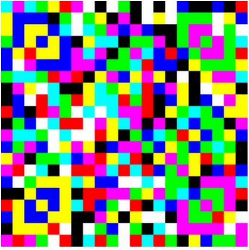

*Figure 22:* Sample symbol

## <span id="page-59-0"></span>Annex D: Optimization of bit stream length

As described in Section [4.3](#page-37-0), JAB Code offers various encoding modes. The modes differs in the number of required bits to represent given data characters. Since there is an overlap between the character sets of the modes, it is necessary to choose the most appropriate mode to encode this data in the shortest sequence of bits possible. The algorithm described in the following processes the input data characters one after each other and output a trellis graph. After the last character is processed, the shortest sequence is known.

First some tables are set up to show the length of bits required to latch or shift from one mode to another. The seven encoding modes are abbreviated by:

| Encoding<br>Mode | Abbreviation | Character Size in Bit per<br>Character |
|------------------|--------------|----------------------------------------|
| Uppercase        | U            | 5                                      |
| Lowercase        | L            | 5                                      |
| Numeric          | N            | 4                                      |
| Punctuation      | P            | 4                                      |
| Mixed            | M            | 5                                      |
| Alphanumeric     | A            | 6                                      |
| Byte             | B            | 8                                      |

The following table present the length of bits required to shift from one to another mode, where 10<sup>6</sup> indicates a not possible shift.

| From | To | U   | L   | N   | P   | M   | A   | B   |
|------|----|-----|-----|-----|-----|-----|-----|-----|
| U    |    | 106 | 106 | 106 | 5   | 7   | 106 | 11  |
| L    |    | 5   | 106 | 7   | 5   | 7   | 106 | 11  |
| N    |    | 6   | 106 | 106 | 4   | 6   | 106 | 10  |
| P    |    | 0   | 0   | 0   | 106 | 106 | 0   | 106 |
| M    |    | 0   | 0   | 0   | 106 | 106 | 0   | 106 |
| A    |    | 106 | 106 | 106 | 8   | 8   | 106 | 12  |
| B    |    | 0   | 0   | 0   | 106 | 106 | 0   | 106 |

The following table present the length of bits required to latch from one to another mode, where 10<sup>6</sup> indicates a not possible latch.

| From | To | U   | L   | N   | P   | M   | A   | B   |
|------|----|-----|-----|-----|-----|-----|-----|-----|
| U    |    | 0   | 5   | 5   | 106 | 106 | 5   | 106 |
| L    |    | 7   | 0   | 5   | 106 | 106 | 5   | 106 |
| N    |    | 4   | 6   | 0   | 106 | 106 | 106 | 106 |
| P    |    | 106 | 106 | 106 | 106 | 106 | 106 | 106 |
| M    |    | 106 | 106 | 106 | 106 | 106 | 106 | 106 |
| A    |    | 8   | 106 | 106 | 106 | 106 | 0   | 106 |
| B    |    | 106 | 106 | 106 | 106 | 106 | 106 | 0   |

To optimize the bit stream length the algorithm use four varaiables. One variable with 14 integers CharSizeC[EncodingMode(Latch), EncodingMode(Shift)] for each character and set the character size according to the first table in this Annex if the character is encoded by the appropriate encoding mode (See Table [12](#page-36-0)), otherwise set the value to 10<sup>6</sup> . A further variable SwitchMode contain all the bit length to latch or switch from one into another mode (see the second and third table of this Annex). The third variable contains also 14 integer values and hold the information of the current binary sequence length CurrSeqLen[EncodingMode(Latch), EncodingMode(Shift)]. The fourth variable is 14-character long for each character and keep the information about the previous mode PrevMode, which induce the shortest length for each mode.

Step 1. Initialize CharSize0[0 10<sup>6</sup>10<sup>6</sup>10<sup>6</sup>10<sup>6</sup>10<sup>6</sup>10<sup>6</sup>0 10<sup>6</sup>10<sup>6</sup>10<sup>6</sup>10<sup>6</sup>10<sup>6</sup>10<sup>6</sup> ] because the initial mode is the Uppercase mode.

Step 2. Accept the first character.

Step 3. Set CurrSeqLen to the number of bits required to encode this character according to the encoding mode.

Step 4. Use the CharSizeC and SwitchMode variable to update the CurrSeqLen variable with the minimum length. Set the previous mode which induce the shortest length to PrevMode.

Step 5. Accept the next character and move on with Step 3 while no character remains.

Step 6. The shortest path through the trellis graph is known by picking the smallest number in CurrSeqLen and go the whole graph back by means of PrevMode. Set all unused values in CharSizeC to 10<sup>6</sup> .

## <span id="page-61-0"></span>Annex E: Interleaving algorithm

The following in-place random permutation algorithm is used to interleave a bit sequence in JAB Code.

Denote a bit sequence as S={b0, b1, b2, ……, bN-1} containing N bits.

- 1. Give an initial seed for the random number generator.
- 2. Set the variable L=N.
- 3. Generate a random number R between 0 and L-1.
- 4. Swap the bit bR at index R and the bit bL-1 at index L-1.
- 5. Update L=L-1.
- 6. Repeat the steps 3-5 until L=0.

The following C routine is used to generate random numbers in step 3.

```
#include <inttypes.h>
uint32_t temper(uint32_t x)
{
       x ^= x>>11;
       x ^= x<<7 & 0x9D2C5680;
       x ^= x<<15 & 0xEFC60000;
       x ^= x>>18;
       return x;
}
uint32_t lcg64_temper(uint64_t* seed)
{
       *seed = 6364136223846793005ULL * *seed + 1;
       return temper(*seed >> 32);
}
```
## <span id="page-62-0"></span>Annex F: Guidelines for module color selection and color palette construction

## F.1 Module color selection

JAB Code supports eight color modes and up to 256 module colors are allowed to use in a symbol. In order to optimize the decoding of JAB Code, the used colors shall be so distinguishable as possible. Therefore, the used colors shall keep a distance from each other in the RGB color space cube as shown in Figure [23.](#page-62-1)

- (a) In case of 4-color mode, blue, green, magenta and yellow shall be used.
- (b) In case of 8-color mode, each color channel of R, G and B takes two values, 0 and 255, which will generate the 8 colors at the vertexes of the cube, i.e. black, blue, green, cyan, red, magenta, yellow and white. These 8 colors are included in all the following color modes.
- (c) In case of 16-color mode, the color channel R takes 4 values, 0, 85, 170 and 255, and the channel G and B take two values, 0 and 255, which will totally generate 16 colors as listed in Table [23.](#page-63-0)
- (d) In case of 32-color mode, the color channel R and G take four values, 0, 85, 170 and 255, and the color channel B takes two values, 0 and 255, which will totally generate 32 colors.
- (e) In case of 64-color mode, each color channel of R, G and B takes four values, 0, 85, 170 and 255, which will totally generate 64 colors.
- (f) In case of 128-color mode, the color channel R takes eight values, 0, 36, 73, 109, 146, 182, 219 and 255, and the color channel G and B take four values, 0, 85, 170 and 255, which will totally generate 128 colors.
- (g) In case of 256-color-mode, the color channel R and G take eight values, 0, 36, 73, 109, 146, 182, 219 and 255, and the color channel B takes four values, 0, 85, 170 and 255, which will totally generate 256 colors.

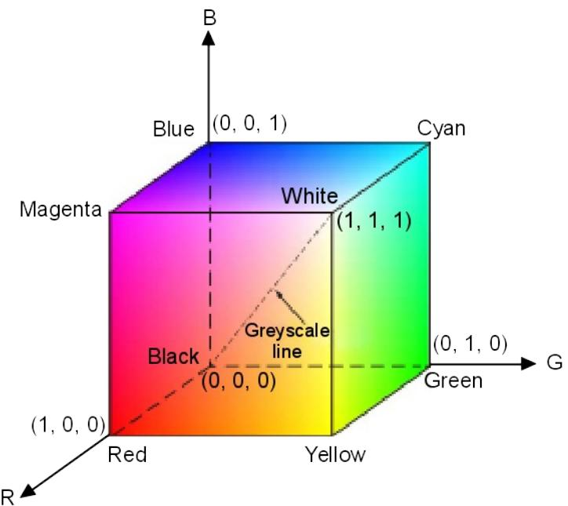

<span id="page-62-1"></span>*Figure 23: RGB color space cube*

| Color index | R   | G   | B   | Binary bits |
|-------------|-----|-----|-----|-------------|
| 0           | 0   | 0   | 0   | 0000        |
| 1           | 0   | 0   | 255 | 0001        |
| 2           | 0   | 255 | 0   | 0010        |
| 3           | 0   | 255 | 255 | 0011        |
| 4           | 85  | 0   | 0   | 0100        |
| 5           | 85  | 0   | 255 | 0101        |
| 6           | 85  | 255 | 0   | 0110        |
| 7           | 85  | 255 | 255 | 0111        |
| 8           | 170 | 0   | 0   | 1000        |
| 9           | 170 | 0   | 255 | 1001        |
| 10          | 170 | 255 | 0   | 1010        |
| 11          | 170 | 255 | 255 | 1011        |
| 12          | 255 | 0   | 0   | 1100        |
| 13          | 255 | 0   | 255 | 1101        |
| 14          | 255 | 255 | 0   | 1110        |
| 15          | 255 | 255 | 255 | 1111        |

<span id="page-63-0"></span>Table 23: Used colors in 16-color mode

## F.2 Construction of the embedded color palette in the symbol

In either primary and secondary symbols, there are 128 modules reserved for two color palettes. Therefore, each color palette can contain up to 64 colors.

- (a) In case of 4-color to 64-color modes, all available colors shall be included in the embedded color palettes.
- (b) In case of 128-color mode, the colors whose R channel values are 0, 73, 182 or 255 shall be included in the embedded color palettes.
- (c) In case of 256-color mode, the colors whose R and G channel values are 0, 73, 182 or 255 shall be included in the embedded color palettes.

In symbols containing more than 8 colors, the metadata are encoded using only the 8 colors available in the 8-color mode, namely the 8 colors at the vertexes of the RGB color cube. In order to enable metadata decoding in early decoding steps, in which only the first part of the color palette is decoded, the color entries in the embedded color palette containing more than 8 colors shall be rearranged. The 8 colors at the vertexes shall be always moved to the first 8 entries, followed by the other selected colors in their original sequence.

In the symbol decoding, the extracted color palettes shall be first inversely arranged into their original sequence. For symbols containing 128 and 256 colors, the original full-size color palette shall be reconstructed by interpolating each color channel of the colors in the extracted color palettes. For example, the colors whose original R channel value is 36 shall be restored by interpolating the colors whose original R channel value is 0 and 73.