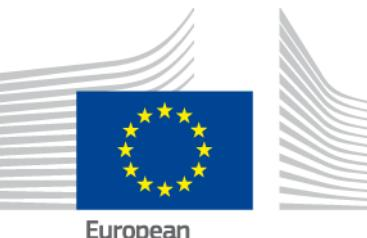
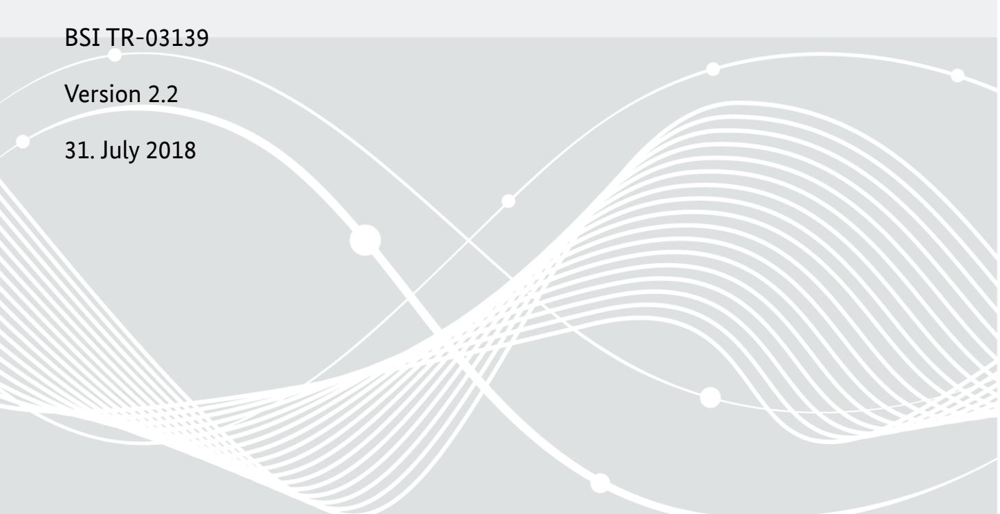
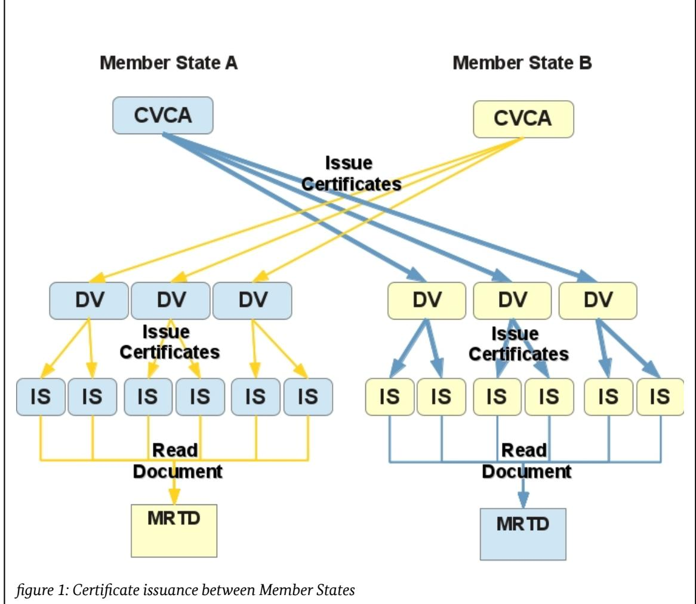
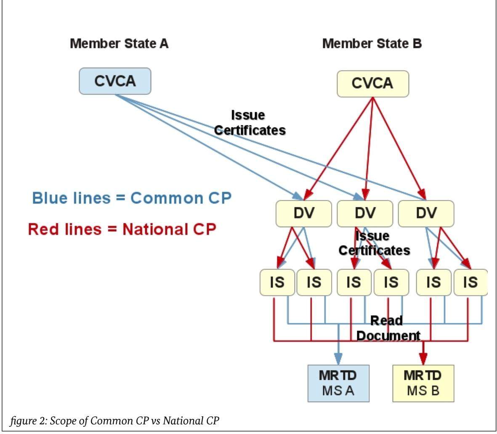
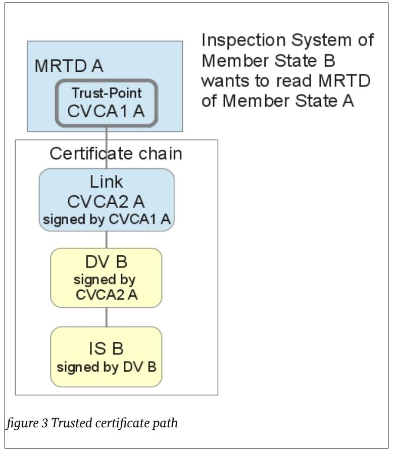

# Common Certificate Policy for the Extended Access Control Infrastructure for Travel and Residence Documents issued by EU Member States

## **Foreword**

The present document has been drafted and edited by the Bundesamt für Sicherheit in der Informationstechnik.

The final version of this document is the result of the discussion and joint work of the Technical Subgroup of the Article 6 Committee.

Bundesamt für Sicherheit in der Informationstechnik Postfach 20 03 63 53133 Bonn Tel.: +49 22899 9582-0 E-Mail: cvca-epass@bsi.bund.de Internet: https://www.bsi.bund.de

| 1              | Introduction 5                                                                 |  |
|----------------|--------------------------------------------------------------------------------|--|
| 1.1            | Definitions6                                                                   |  |
| 1.2            | Overview7                                                                      |  |
| 1.3            | Document Name and Identification7                                              |  |
| 1.4            | PKI Participants7                                                              |  |
| 1.4.1          | National PKI Co-ordinator8                                                     |  |
| 1.4.2          | Certification Authorities8                                                     |  |
| 1.4.3 1.4.4 | Registration Authorities8 Subscribers9                                      |  |
| 1.4.5          | Relying Parties9                                                               |  |
| 1.4.6          | SPOC – Communication between participants9                                     |  |
| 1.5            | Policy Administration10                                                        |  |
| 2              | Publication and Repository Responsibilities11                                  |  |
| 2.1            | Repositories11                                                                 |  |
| 3              | Identification and Registration 12                                             |  |
| 3.1            | Naming12                                                                       |  |
| 3.2            | Registration12                                                                 |  |
| 3.2.1          | Domestic CVCA Initial Identity Validation12                                    |  |
| 3.2.2          | Registration of a foreign Member State12                                       |  |
| 3.2.3 3.2.4 | Registration of a DV13 Registration of an IS13                              |  |
| 4              | Certificate Life-Cycle Operational Requirements14                              |  |
| 4.1            | Certificate Profile14                                                          |  |
| 4.2            | Initial Certificates and Requests14                                            |  |
|                |                                                                                |  |
| 4.3            | Successive Certificates and Requests (Re-key)14                                |  |
| 4.4 4.4.1   | Certificate Application and Issuing14 Certificates issued by CVCA to CVCA14 |  |
| 4.4.2          | Certificates issued by CVCA to DV15                                            |  |
| 4.4.3          | Certificates issued by DV to IS17                                              |  |
| 4.5            | Certificate Acceptance18                                                       |  |
| 4.6            | Certificate Usage18                                                            |  |
| 4.7            | Certificate Validity Periods19                                                 |  |
| 5              | Security Requirements 21                                                       |  |
| 5.1            | Physical Controls21                                                            |  |
| 5.2            | Procedural Controls and System Access Management21                             |  |
| 5.2.1          | Logging22                                                                      |  |
| 5.2.2          | Personnel23                                                                    |  |
| 5.2.3          | Life-Cycle of security measures23                                              |  |
| 5.3 5.3.1   | Incident Handling24 Subscriber Suspension24                                 |  |
| 5.3.2          | Compromise and Disaster Recovery24                                             |  |
| 5.3.3          | Incident and Compromise Handling Procedures24                                  |  |
| 5.3.4          | Entity Private Key Compromise Procedures25                                     |  |
| 5.4            | CVCA or DV Termination25                                                       |  |
| 6              | Key Pair Security 26                                                           |  |
| 6.1            | Key Pair Generation26                                                          |  |

| 6.2            | Private Key Protection and Cryptographic Module Engineering Controls26                    |  |
|----------------|-------------------------------------------------------------------------------------------|--|
| 6.3            | Key Escrow, Backup and Recovery26                                                         |  |
| 7              | Compliance Audit and Other Assessment28                                                   |  |
|                | Appendix A Definitions and Acronyms 30                                                    |  |
| A.1            | Definitions30                                                                             |  |
| A.2            | Acronyms31                                                                                |  |
|                | Appendix B Hardware Requirements 32                                                       |  |
|                | Appendix C SPOC REQUIREMENTS 33                                                           |  |
| C.1            | SPOC Initial registration33                                                               |  |
| C.2            | SPOC CA requirements33                                                                    |  |
| C.2.1          | Certificate assurance and content33                                                       |  |
| C.2.2 C.2.3 | Certificate revocation information33 Technical and organizational requirements33       |  |
| C.2.4          | Validity periods33                                                                        |  |
| C.2.5          | Distribution of successive SPOC root certificates33                                       |  |
| C.3            | Communication priorities34                                                                |  |
| C.4            | Sending notifications34                                                                   |  |
|                | Appendix D Registration form 35                                                           |  |
| D.1            | Registration form commentary35                                                            |  |
| D.2            | Registration form sheets35                                                                |  |
|                | Member State Registration Information – Part I Member State (National PKI Co-ordinator)36 |  |
|                | Member State Registration Information – Part II (SPOC Root Certificate and URL)37         |  |
|                | Member State Registration Information – Part III (CVCA Certificate)38                     |  |
|                | Member State Registration Information – Part IV (Document Verifiers)39                    |  |

## 1 Introduction

The goal of the Common Certificate Policy (CP) is to achieve trust and sufficient interoperability between the Country Verifying Certification Authorities (CVCAs) and Document Verifiers (DVs) of different Member States for the Extended Access Control - Public Key Infrastructure (EAC-PKI) based on the Technical Guideline [BSI-EAC][1](#page-4-1) to operate. Therefore, each Member State SHALL announce one National PKI Co-ordinator being responsible for its domestic PKI participants towards the other Member States.

This CP is established in accordance with the relevant Commission Decisions on the technical specifications on standards for security features and biometrics in passports and travel documents issued by Member States and in the technical specifications on standards for security features and biometrics in residence permits for third country nationals.

The scope of this Common CP is the issuance of certificates granting read access to travel documents of foreign Member States (see figure 1) according to COUNCIL REGULATION (EC) No 2252/2004 and Council Regulation (EC) No 1030/2002 in their versions as last amended.

This Common CP provides a set of minimum requirements which each SPOC, CVCA and DV of a Member State must fulfil when it acts as a subscriber under the CVCA of a foreign State. A Member State may write a National CP covering the requirements for the issuing of certificates by a CVCA to domestic DVs, which is outside the scope of this Common CP. In the implementation of this Common Certificate Policy, Member

1 EAC-PKI does not pertain to certificates needed for Passive Authentication

States SHALL consider relevant examples of good practice of security and quality, including but not limited to [ETSI 102 042].

The following figure shows the scope of this Common CP in contrast to the scope of a National Certificate Policy.

## 1.1 Definitions

The key words "MUST", "MUST NOT", "REQUIRED", "SHALL", "SHALL NOT", "SHOULD", "SHOULD NOT", "RECOMMENDED", "MAY", and "OPTIONAL" in this document are to be interpreted as described in [RFC 2119].

A **Member State** is defined to be a state participating in Regulation (EC) No 2252(2004) and Regulation (EC) 1030/2002 in their versions as last amended and concerning this document also ….

- "Domestic" is defined to mean of the same Member State.
- "Foreign" is defined to mean of another Member State or associated country.

A "Valid Key" is defined to be a key for which the current time is within the validity period of the corresponding Subscriber Certificate and this certificate itself is considered valid.

A **travel document** in the scope of this document is defined to be an ePassport or an eResidence Permit.

A **suspension** of a CVCA, DV or IS shall be defined as followed:

There are two registration status of a CVCA, DV or IS. Their default status is not suspended;

- the status of their registration is set to "suspended" by their own registration authority (for CVCA) or domestic/ foreign parental registration authority (for DV or IS).
- certificates issued or certificate requests sent by a suspended CVCA, DV or IS SHALL NOT be trusted, processed or forwarded.[2](#page-6-3)

This is done because suspension or revocation of certificates is not possible within the EAC-PKI due to technical reasons.

Further definitions and acronyms used in this policy are given in [Appendix A](#page-29-1) [Definitions and Acronyms.](#page-29-1)

## 1.2 Overview

This Certificate Policy operates within the Public Key Infrastructure described in [BSI-EAC] paragraph "Public Key Infrastructure".

General rules for the interaction of Member State's CVCAs within the scope of this Common Certificate Policy:

- Each Member State SHALL announce exactly one National PKI Co-ordinator being responsible for its domestic PKI participants towards the other Member States.
- When acting as a subscriber under the CVCA of a foreign Member State each CVCA and DV MUST fulfil the requirements of this Common Certificate Policy.
- A Member State MUST NOT require a foreign Member State to adopt restrictions above those in this common Certificate Policy as a pre-requisite of issuing a certificate to the foreign Member State's DVs.
- For the issuing of certificates by a CVCA to domestic DVs a national Certificate Policy MAY be written. The requirements of a national CVCA certificate Policy SHALL NOT get into conflict with the security requirements of this Common Certificate Policy.
- Thus for the fulfilment of the requirements of this Certificate Policy it is required that a robust communication infrastructure is implemented for regular inter-country communication covering DV certificate issuing. The protocol defined in [ČSN 36 9791:2018] SHALL be used for routine day to day data exchanges related to EAC PKI.

## 1.3 Document Name and Identification

This Common Certificate Policy is identified by its name and version number.

## 1.4 PKI Participants

This section gives an overview of the National PKI Co-ordinator, Certification Authorities, Registration Authorities, Subscribers, Relying Parties and technical Single Point of Contact (SPOC) of the Extended Access Control Public Key Infrastructure (EAC-PKI).

|                                                     | Certification Authority | Registration Authority | Subscriber | Relying Party |
|-----------------------------------------------------|----------------------------|---------------------------|------------|------------------|
| National PKI Co-ordinator                           |                            | X                         |            |                  |
| SPOC                                                |                            | X                         |            | X                |
| Country Verifying Certification Authority (CVCA) | X                          | X                         |            | X                |
| Document Verifier (DV)                              | X                          | X                         | X          | X                |
| Inspection System (IS)                              |                            |                           | X          | X                |
| Machine Readable Travel Document (MRTD)             |                            |                           |            | X                |

*Table 1: Overview of PKI participants of an EAC-PKI*

2 Except for audit reasons

#### 1.4.1 National PKI Co-ordinator

Each Member State SHALL have exact one[3](#page-7-3) National PKI Co-ordinator who is fully responsible for interacting with foreign Member States with respect to exchange of DV certificates and this Common Certificate Policy. That means the PKI Co-ordinator is the only contact point for and responsible for distribution of ePassport AND eResidence Permit EAC-PKI certificate issues towards foreign Member States for every action or incident of the domestic CVCAs, DVs and IS.

The National PKI Co-ordinator SHALL ensure that all information received from other Member States will be distributed to its domestic SPOC, CVCAs and DVs as needed for the security and functionality of their duties.

### 1.4.2 Certification Authorities

#### **Country Verifying Certification Authority**

The Root Certification Authority (CA) of a national EAC-PKI is called a Country Verifying Certification Authority (CVCA). A Member State MAY have more than one CVCA but should restrict the number of CVCAs to a minimum needed for security or national law reasons, such as a decision for issuance of different document types under separated CVCAs.

The public keys of a domestic CVCA are contained in both self-signed CVCA certificates and CVCA link certificates. Both classes are called CVCA certificates. A domestic CVCA determines the access rights to sensitive data stored on domestic MRTD chips for all DVs (i.e. domestic DVs as well as foreign Member States' DVs) by issuing DV certificates entitling access control attributes.

A domestic CVCA issues certificates to its Certificate Holders (Subscribers). In this document, a subscriber of a CVCA is called a Document Verifier (DV). A DV is an organisational unit that manages Inspection Systems belonging together.

For the purposes of the remainder of this document the Registration Authority (RA) will be assumed to be part of the CVCA and only the term CVCA will be used. Member States MAY divide/combine the organisational affiliation and place of location of CA and RA as they wish.

#### **Document Verifier Certification Authority**

Each DV SHALL be related to exactly one domestic CVCA which is

- allowed to sign the DV's certificate requests to foreign CVCAs and
- is stated as "the domestic CVCA" of this DV concerning every rule of this document containing duties for CVCAs and/or DVs

A DV operates a CA to issue certificates for its inspection systems. The Inspection System certificates issued by a DV inherit both the access rights and the validity period from the underlying DV certificate. The Document Verifier SHOULD restrict the validity period of the IS certificates[4](#page-7-4) and MAY choose to further restrict the access rights.

#### 1.4.3 Registration Authorities

In order to facilitate the issuance of certificates amongst Member States and at once increase the security of doing so, most of the duties of the Registration Authority of a CVCA signing certificates requested by a DV SHALL be shifted to the Registration Authority of the national CVCA of that DV. Communication, interacting with foreign Member States and initial registration of foreign Member States SHALL be done by the National PKI Co-ordinator.

- 3 which should usually be a defined group of persons as a subsection of a governmental office for substitution purposes
- 4 refer to chapter [4.7](#page-18-0) [Certificate Validity Periods](#page-18-0)

#### **Country Verifying Registration Authority**

For each domestic CVCA there is only one Registration Authority (RA). Typically it is operated by the same authority as the CA.

The domestic RA is responsible for

- the registration of domestic DVs and of foreign Member States CVCAs which shall be authorised to read sensitive data from domestic MRTDs;
- provide and change if needed the suspension status of registered DVs and CVCAs
- the listing of foreign DVs including their suspension[5](#page-8-3) status;
- performing identification and authentication of certificate requests of Document Verifiers;
- suspension of domestic DVs if they are no longer allowed to request certificates especially from foreign Member States;
- the suspension of the registration of foreign Member States in the event of security incidents;
- giving information to all foreign Member States if a domestic DV is no longer allowed to request certificates from those Member States and thus is suspended;
- initiating the issuance of certificates to Document Verifiers;

#### **Document Verifier Registration Authority**

Each Member State SHALL operate only one Registration Authority for each Document Verifier.

DV RAs are responsible for

- registration of domestic Inspection Systems;
- performing identification and authentication of certification requests of Inspection Systems;
- suspension of domestic Inspection Systems if they are no longer allowed to request certificates;
- forwarding information about security incidents of the DV itself or its maintained Inspection Systems immediately to the domestic CVCA;
- initiating the issuance of certificates to Inspection Systems;

For the purposes of the remainder of this document the DV RA will be assumed to be part of the DV and only the term DV will be used. Member States MAY divide/combine the organisational affiliation and place of location of DV CA and DV RA as they wish.

#### 1.4.4 Subscribers

Subscribers under this policy are Document Verifiers (DV) and Inspection Systems (IS). A DV is defined in section [1.4.2](#page-7-1) [Certification Authorities.](#page-7-1)

For the purposes of this Certificate Policy an Inspection System is defined as the infrastructure, hardware and software required to obtain certificates from a Member State's DV, store and manage those certificates, and to obtain fingerprint biometrics from MRTDs using those certificates, including mechanisms controlling access to the Inspection Systems.

### 1.4.5 Relying Parties

Relying Parties within an EAC-PKI are CVCAs, Document Verifiers, Inspection Systems, SPOC and MRTDs.

A relying party is an entity which verifies the signature of a certificate or a certificate request using a trusted certification path (see section [4.6](#page-17-0) [Certificate Usage\)](#page-17-0).

### 1.4.6 SPOC – Communication between participants

A technical SPOC (Single Point Of Contact) acts as an interface for communication between Member States. It allows efficient on-line communication to carry out regular key management related tasks. Technical details of SPOC are defined in [ČSN 36 9791:2018] further referred to as CSN-SPOC.

5 refer to chapter [1.1](#page-5-0) [Definitions](#page-5-0) for the definition of suspension

Each Member State MUST operate exactly one SPOC which SHALL comply with the additional requirements specified in Appendix C and the requirements of CSN-SPOC. That means the SPOC of a Member State is the technical communication interface towards other Member States concerning ePassport AND eResidence Permit EAC-PKI certificate issues.

For communication between Member States all CVCAs MUST be able to carry out such communications using SPOC. All key management tasks MUST be carried out by using SPOC.

As an exceptional communication channel email SHALL be used especially to cover the situation when SPOC communication channel is not available. The email address used in this context is part of the Member State's registration. This means that states can use email communication for manually exchanging request/certificates even if the automatic SPOC system of one or both states hasn't been implemented yet or when it is out of order.

In the event of disruption to a Member State's normal communication channels it MUST notify registered Member States' SPOCs that certificate requests SHOULD be submitted by the alternate channel. This SHALL be done in a time-frame that minimises the risk of current certificates expiring. When the SPOC communication is possible again, this SHALL be communicated to all registered Member States' SPOCs via General Message according to CSN-SPOC.

Both SPOC and email communication SHALL only be used after a successful diplomatic exchange of the registration information.

Further requirements on SPOC initial registration, SPOC CA requirements and sending notifications are defined in Appendix [C](#page-32-7) of this document.

### 1.5 Policy Administration

European Commission DG HOME 1049 Brussels Belgium

## 2 Publication and Repository Responsibilities

The European Commission is responsible for maintaining a list of contact details for National PKI Co-ordinators at the European level. The content and integrity of this list is preserved by diplomatic means. The corresponding information is available on the website of the Directorate General for Justice, Freedom and Security (DG-HOME) of the European Commission.

## 2.1 Repositories

Each **CVCA** MUST operate a repository containing the certificates and requests signed by this CVCA (CVCA certificates, CVCA link certificates, DV certificates and DV requests) as well as registration data of domestic DVs and foreign Member States and suspension status lists of foreign DVs. The certificates in this repository SHALL be stored for at least the corresponding certificate validity time plus the validity of the MRTDs the certificate may be used by plus six months.

Note: Each CVCA SHALL have full access to and control over its repository, if two CVCAs are operated at the same location they MAY use the same physical repository.

Each **DV** MUST operate a repository containing the certificates and requests signed by this DV (DV certificates, DV requests and IS certificates) as well as registration data of the maintained Inspection Systems. The certificates in the DV repositories SHALL be stored for at least the corresponding certificate validity time plus one year.

## 3 Identification and Registration

## 3.1 Naming

As defined in [BSI-EAC] the Certification Authority Reference (CAR) is used to identify the public key to be used to verify the signature of the certification authority (CVCA or DV).

The CAR MUST be equal to the Certificate Holder Reference (CHR) in the corresponding certificate of the certification authority.

The CHR SHALL identify a public key of the certificate holder. It MUST be a unique identifier relative to the issuing certification authority. It SHALL consist of the following concatenated elements:

- 1. The [ISO 3166-1] ALPHA-2 country code of the certificate holder's country;
- 2. An [ISO/IEC 8859-1]mnemonic that represents the certificate holder with a length up to 9 characters;
- 3. An [ISO/IEC 8859-1] numeric or alphanumeric sequence number consisting of five characters. The sequence number MAY be reset if all available sequence numbers are exhausted.

It is RECOMMENDED to start the sequence number with the [ISO 3166-1] ALPHA-2 country code of the certifying certification authority. If this recommendation is followed, the remaining three characters SHALL be assigned as an alpha-numeric sequence number.

NOTE: It is not guaranteed that the CHR is a unique identifier in general. There is no problem, if two DVs of different MS have the same HolderMnemonic as the CHR of the DV requests and certificates always also contains the Country Code of the DV's domestic country. If the foreign MS has more than one CVCA, the requests and certificates are still unique due to the (inner) CAR.

The identity of Certification Authorities and Certificate Holders (subscribers) SHALL be defined as follows:

- CVCA certificate:
	- **∘** Certification Authority Reference (CAR): domestic CVCA identity;
	- **∘** Certificate Holder Reference (CHR): domestic CVCA identity;
- DV certificate:
	- **∘** Certification Authority Reference (CAR): domestic CVCA identity or foreign authorised Member State CVCA (see section 3.3) identity;
	- **∘** Certificate Holder Reference (CHR): domestic DV identity[6](#page-11-5) ;
- IS certificate:
	- **∘** Certification Authority Reference (CAR): domestic DV identity;
	- **∘** Certificate Holder Reference (CHR): domestic IS identity.

### 3.2 Registration

#### 3.2.1 Domestic CVCA Initial Identity Validation

Each Member State SHALL clearly identify who is responsible for the authentication and the definition of the identity of each CVCA and the National PKI Co-ordinator.

#### 3.2.2 Registration of a foreign Member State

Member State registration SHALL be carried out under the supervision of the European Commission. The registration of a Member State's CVCA consists of two steps:

#### **Step 1 – Submitting registration via European Commission**

A Member State's National PKI Co-ordinator SHALL submit the filled and officially signed registration form [\(Appendix D](#page-34-2) [Registration form\)](#page-34-2) to the European Commission for distribution to other participating Member

6 The Holder Mnemonic of the DV is always defined by its domestic CVCA of the DV or the DV itself.

States by diplomatic means securing the authenticity and integrity of the information. This part of registration MAY also be done bilateral between Member States, but the European Commission SHOULD be informed about the registration.

#### **Step 2 – Implementing registration information at domestic CVCA**

The registration information MUST be distributed to the Member State's National PKI Co-ordinator and further to its CVCAs and SPOC in a way securing the authenticity and integrity of the data.

When receiving the registration data a Member State's National PKI Co-ordinator and further to its CVCAs and SPOC MUST verify if the integrity of the information has not been compromised.

Particularly critical is that the digital certificate data of the Member State's CVCA certificate and the SPOC root certificate MUST be checked against the cryptographic fingerprints listed on the registration form.

Only if these checks lead to a positive result the registration data SHALL be implemented at the CVCA and hence the registration SHALL be completed by requesting all newer CVCA Certificates from the registered Member State via SPOC communication ("GetCACertificates" according to CSN-SPOC).

In event of a change to any of the registration information above, the National PKI Co-ordinator SHALL submit the updated version to the European Commission for distribution to other participating Member States. Before performing an update of a registration the Registration Authority MUST verify if the integrity of the information has not been compromised.

The National PKI Co-ordinator of the Member State having applied for being registered SHALL be informed if the registration has been accepted or rejected (including the reason) within 4 weeks by each Member State having received that application. This message SHOULD be sent by National PKI Co-ordinators of these Member States.

#### 3.2.3 Registration of a DV

The initial registration of a DV to a CVCA Registration Authority is done by the RA of the domestic CVCA of the DV. This registration process SHALL contain an appropriate check of the identity of the DV, authenticity of registration data (including initial certificate request), audit certification, the DV's certificate policy (based on this Common Certificate Policy) and if applicable the public part of the certificate practice statement and the permissions the DV SHALL have for applying for certificates.

Only if all these data are correct, the domestic CVCA SHALL register the DV and sign initial DV requests to foreign Member State's CVCAs.

The registration of a DV to a foreign Member State's CVCA is done based on the known CHR of the DV and is completed by accepting the initial request of the DV signed by a known valid CVCA Certificate of its domestic CVCA. The CHR of a DV SHALL either be defined by the domestic CVCA of the DV or by the DV itself.

Thereafter the Member State's CVCA SHALL list the DV as valid and not suspended until a notification of an incident concerning the fulfilment of security requirements according to this CP or the termination of the DV is known.

#### 3.2.4 Registration of an IS

DVs SHALL have a proper mechanism in place to identify an authenticated Inspection System. The key generation of an Inspection System SHALL be processed under consideration of sections [4.4.3,](#page-16-0) [5](#page-20-2) and [6.](#page-25-1) The initial request of an IS MUST be transmitted to the DV in a secure way. The DV MUST check if the integrity and authenticity of the request data is uncompromised.

## 4 Certificate Life-Cycle Operational Requirements

## 4.1 Certificate Profile

CVCA certificates, CVCA link certificates, DV certificates and IS certificates SHALL be produced according to the certificate profile specified in [BSI-EAC] "CV Certificates".

## 4.2 Initial Certificates and Requests

An initial certificate of a DV or IS is defined as

- being the first certificate of the same Certificate Holder or
- being the first certificate after a suspension has been canceled or
- being a new certificate after the previous certificate had expired before a new request or link certificate could be generated.

An initial certificate of a DV or IS SHALL be issued based on an initial request of that DV or IS according to [BSI-EAC].

Certificates MUST NOT be issued without generating a new key pair for the corresponding certificate.

## 4.3 Successive Certificates and Requests (Re-key)

A successive certificate is every certificate of the same Certificate Holder (Subscriber) except an initial one (see above).

A successive certificate SHALL only be issued conform to the following rules:

a) A new key pair is generated by the Certificate Holder;

- b) The certificate contains a different (successive) sequence number in the CHR than the previous certificate(s) of the Certificate Holder;
- c) The certificate is issued in accordance with [4.4](#page-13-1) [Certificate Application and Issuing.](#page-13-1)
- d) In case of a security incident due to private key compromise, the cause for the incident MUST be detected and the corresponding security problem MUST be solved before issuance of a new **initial** certificate MAY be performed (see chapter [4.2](#page-13-3) [Initial Certificates and Requests\)](#page-13-3).

A successive certificate for a DV or IS SHALL only be issued where one of the following conditions apply:

- a) Where the DV or IS certificate is about to expire, in this case [BSI-EAC]chapter "Certificate Requests" MUST be followed.
- b) Where a certificate requires modification due to changes in the DV\IS attributes;

Certificates MUST NOT be issued without generating a new key pair for the corresponding certificate.

## 4.4 Certificate Application and Issuing

Certification Authorities (CVCA and DV) SHALL take measures against the forgery of certificates and ensure that the procedure of issuing the certificate is securely linked to the associated registration.

### 4.4.1 Certificates issued by CVCA to CVCA

Each Member State SHALL define which entity is responsible to authorise the CVCA creation.

A CVCA SHALL only issue a self signed CVCA certificate or a CVCA link certificate to a former CVCA certificate of the same CVCA[7](#page-13-6) . This SHALL be done during a key ceremony which fulfils at least the security requirements in chapters 5 and 6 of this Common Certificate Policy. CVCAs MUST check that a certificate request is authorised and valid.

7 or a new CVCA being the replacement for a terminated CVCA according to chapter [5.4.](#page-24-0)

When the validity of a CVCA certificate is going to end the CVCA SHALL generate a new key pair and issue a self-signed CVCA certificate and a CVCA link certificate[8](#page-14-1) .

The CVCA link certificate SHALL contain

- the public key of the new key pair,
- a signature generated with the private key of the previous CVCA certificate,
- the same validity period as the new CVCA certificate holding the same public key

according to [BSI-EAC]. The CVCA certificate and the CVCA link certificate SHALL be distributed to all foreign Member States registered at the CVCA via the "SendCertificates" message according to CSN-SPOC. The CVCAs / SPOCs receiving a new CVCA certificate and a corresponding CVCA link certificate SHALL check the validity and authenticity of the certificate:

- if the certificate is correct according to syntax, authenticity and validity, the receiving CVCA SHALL update its registration information on the issuing CVCA with the CVCA certificate and CVCA link certificate as the new trusted CVCA certificate;
- if the certificate is not correct the receiving Member State SHALL inform the issuing CVCA of the CVCA (link) certificate. This MAY be done by response on "SendCertificate" message according to CSN-SPOC automatically.

#### 4.4.2 Certificates issued by CVCA to DV

Following successful registration as per 3.2.3 above, DV Certificate Application SHALL be carried out in accordance with [BSI-EAC] (chapters "Certificate Requests" and BSI-EAC "Document Verifiers").

The DV certificate request SHALL always contain the inner CAR (this is only recommended in [BSI-EAC]) in order to distinguish between the different CVCAs if there is more than one CVCA in the Member State receiving the certificate request. Otherwise, the Member States may not be able to identify the CVCA which is responsible for signing the corresponding DV certificate. All DV requests MUST contain an outer signature (according to Table [2\)](#page-16-1) to ensure the integrity and authenticity of the request.

#### 4.4.2.1 Certificate application

| Step no. | Indication                       | Initial Request                                                                                                                                                                                                                      | Successive Request9 | Party in volved |
|-------------|----------------------------------|--------------------------------------------------------------------------------------------------------------------------------------------------------------------------------------------------------------------------------------|---------------------|--------------------|
| 1           | Generate key pair             | the DV generates a key pair according to [BSI-EAC] and in consid eration of the security requirements of chapters 5 and 6 of this document;                                                                                    | DV                  |                    |
| 2           | Generate certi ficate request | the DV generates a certificate request out of the new generated public key considering the naming scheme of chapter 3.1 and [BSI-EAC] and generates the inner signature (see [BSI-EAC]) with the corresponding private key; |                     | DV                 |

The following steps MUST be processed if a certificate SHALL be issued by a foreign Member State's CVCA to a domestic DV:

- 8 The CVCA link-certificate will be used as part of the trusted path for the MRTDs to be read and to prove the authenticity of the new CVCA certificate and the self-signed CVCA certificate is used to prove the possession and operational reliability of the corresponding private key.
- 9 Initial / successive request concerning the Member State's CVCA which shall sign the DV certificate.

| 3  | Generate outer signature (suc cessive request) | -                                                                                                                                                                                                                                                                                  | The request MUST be signed with the private key corresponding to a still valid DV certificate which has been issued by the same Member State the request shall be sent to.10 | DV                        |
|----|------------------------------------------------------|------------------------------------------------------------------------------------------------------------------------------------------------------------------------------------------------------------------------------------------------------------------------------------|---------------------------------------------------------------------------------------------------------------------------------------------------------------------------------------------|---------------------------|
| 4  | Send Request to CVCA/ SPOC                        | The request MUST be sub mitted to the corresponding domestic11 CVCA of the DV in a secure way.                                                                                                                                                                            | The signed request MUST be sub mitted to the domestic CVCA/SPOC.                                                                                                                      | DV                        |
| 5  | Check suspen sion status (do mestic)        | The domestic CVCA/SPOC MUST check if the DV is still allowed to request certificates from foreign Member States i.e. it is not suspended before processing the Request. A request of a suspen ded DV MUST be refused.                                                     |                                                                                                                                                                                             | Domestic CVCA/ SPOC |
| 6  | Check integrity                                      | The CVCA MUST check if the authenticity and integrity of the DV request is correct, otherwise the request MUST be refused.                                                                                                                                             | It is RECOMMENDED to check the authenticity and integrity of the request within the CVCA/SPOC by automatic means.                                                                  | Domestic CVCA/ SPOC |
| 7  | Generate outer signature (initial request)     | An outer signature has to be added to the request by the corresponding domestic CVCA. Then forward the re quest to the domestic SPOC.                                                                                                                                  | -                                                                                                                                                                                           | Domestic CVCA          |
| 8  | Submit request to foreign SPOC                    | The request SHALL be submitted to the foreign SPOC following the requirements of CSN-SPOC.                                                                                                                                                                                      |                                                                                                                                                                                             | Domestic SPOC          |
| 9  | Check outer sig nature                            | The foreign SPOC/CVCA MUST check if the outer signature of the request is created with a key which is valid with respect to:                                                                                                                                                    |                                                                                                                                                                                             | Foreign CVCA/          |
|    |                                                      | a still valid root certificate of the DV's domestic CVCA which is registered as valid at the foreign Member State's CVCA.                                                                                                                                              | a still valid certificate of that DV, issued by the foreign Member State's CVCA itself.                                                                                               | SPOC                      |
| 10 | Check suspen sion status (for eign)            | The foreign Member State's CVCA MUST check if the DV is still allowed to apply for certificates concerning the information provided by the DV's domestic CVCA or if the foreign Member State has suspended the DV itself, i.e. checking registration status of the DV. |                                                                                                                                                                                             | Foreign CVCA/ SPOC  |
| 11 | Issue certificate?                                   | If both checks of the two previous steps lead to a positive result the foreign CVCA MUST generate a certificate corresponding to the received request. Otherwise the request MUST be rejected.                                                                               |                                                                                                                                                                                             | Foreign CVCA           |
| 12 | Send response                                        | The foreign Member State's SPOC sends a response message to the DV's domestic SPOC, containing either the DV certificate or the refusal of the certificate application.                                                                                                      |                                                                                                                                                                                             | Foreign SPOC           |

10 If a private CVCA, DV or IS key is unusable for non-critical reasons, as a delayed successive request, a new initial request SHALL be produced (see also chapter [5.3.3\)](#page-23-0).

11 Domestic/foreign means in the context of this table same/other Member State than the DV

| 13 | Check certificate         | The domestic SPOC checks the syntax of the certificate by auto matic means and sends the result of this check as response to the foreign SPOC (see CSN-SPOC) | Domestic SPOC |
|----|---------------------------|--------------------------------------------------------------------------------------------------------------------------------------------------------------------|------------------|
| 14 | Forward re sponse      | The domestic SPOC of the DV forwards the response of the Mem ber State's CVCA to the DV                                                                         | Domestic SPOC |
| 15 | Implement certi ficate | DV implements the certificate                                                                                                                                      | DV               |

*Table 2: Generating and processing a DV Request*

#### 4.4.2.2 Application period and response time

The CVCA MUST process the certificate request within a timeframe of 7 days.

In the event that a CVCA system is non-operational for more than this time frame, it MUST inform all subscribing domestic DVs and foreign Member State CVCAs no later than 7 days before the loss of service, if planned, and as soon as is reasonably possible in the event of an unplanned loss of service.

For getting a new DV certificate at least 11 days SHOULD be scheduled, if there is need for a fall back to communication via email 3 additional days SHOULD be considered.

This time frame has been calculated as follows:

- the key ceremony and internal quality assurance(1/2 day)
- generating the corresponding certificate request (1/2 day)
- submitting the request to signing authority via domestic SPOC (1 day)
- response time of signing authority (7 days)
- getting the certificate via domestic SPOC (1 day)
- import of the certificate (1 day)

If the kind of installation of a DV's infrastructure requires a greater amount of time for one of the steps above, the DV SHOULD increase the time frame for generating a new DV Certificate Request accordingly.

### 4.4.3 Certificates issued by DV to IS

Inspection Systems MAY submit certificate requests upon completion of successful registration as per [3.2.4](#page-12-0) above.

A DV SHALL only issue a certificate to an IS that is compliant with this Common Certificate Policy and that is using the certificates in accordance with part [4.6](#page-17-0) of this document.

| Step no. | Indication                         | Initial Request                                                                                                                                                                                                                      | Successive Request12 | Party involved    |
|-------------|------------------------------------|--------------------------------------------------------------------------------------------------------------------------------------------------------------------------------------------------------------------------------------|----------------------|----------------------|
| 1           | Generate key pair               | The IS generates a key pair according to [BSI-EAC] and in considera tion of the security requirements of chapters 5 and 6 of this docu ment.                                                                                   |                      | Inspection System |
| 2           | Generate certificate request | The IS generates a certificate request out of the new generated pub lic key considering the naming scheme of chapter 3.1 and BSI-EAC and generates the inner signature (see [BSI-EAC]) with the corres ponding private key; |                      | Inspection System |

12 Initial / Successive Request concerning the Member State's CVCA which shall sign the DV certificate.

| 3 | Generate outer signature  | -                                                                                                                                                                                                                                                                      | The request SHOULD contain an outer signature generated with the private key corres ponding to a still valid IS certi ficate. If this mechanism is not                                                               | Inspection System |
|---|---------------------------------|------------------------------------------------------------------------------------------------------------------------------------------------------------------------------------------------------------------------------------------------------------------------|----------------------------------------------------------------------------------------------------------------------------------------------------------------------------------------------------------------------------------|----------------------|
|   |                                 |                                                                                                                                                                                                                                                                        | used, then another mechanism of equivalent security MUST be used.                                                                                                                                                          |                      |
| 4 | Submit request               | The request MUST be submitted to the corresponding DV in a way ensuring any compromise of the authenticity or integrity of the re quest can be detected. E.g. by sub mitting a cryptographic finger print of the request via a different channel. | The request MUST be submitted to the DV.                                                                                                                                                                                      | Inspection System |
| 5 | Check request                | The DV MUST check if the au thenticity and integrity of the IS request is not compromised and if the request is conformant to [BSI-EAC] and chapter 3.1 of this CP;                                                                                     | The DV MUST check if the outer signature is correct and generated with the private key corresponding to a still valid IS certificate and if the request is conformant to [BSI-EAC] and chapter 3.1 of this CP; | DV                   |
| 6 | Check registration status | The DV MUST check if the IS is still allowed to request certificates i.e. the registration of the IS is not suspended.                                                                                                                                              |                                                                                                                                                                                                                                  | DV                   |
| 7 | Issue certificate ?          | The DV MAY issue a certificate corresponding to the request if the checks of the previous two steps lead to a positive result otherwise the IS request MUST be refused;                                                                                          |                                                                                                                                                                                                                                  | DV                   |
| 8 | Send response                | The DV SHALL send a response message to the IS containing either the IS certificate or the refusal of the certificate application.                                                                                                                                  |                                                                                                                                                                                                                                  | DV                   |
| 9 | Implement certificate        | The IS implements the certificate.                                                                                                                                                                                                                                     |                                                                                                                                                                                                                                  | IS                   |

*Table 3: Generating and processing an IS Request*

## 4.5 Certificate Acceptance

CVCA self signed certificate SHALL be accepted by the entity responsible for the CVCA after its creation at the end of the key ceremony.

A DV or IS SHALL be deemed to have accepted a certificate upon its receipt.

## 4.6 Certificate Usage

Inspection System certificates are used to enable read access only to fingerprint biometrics stored on the MRTDs as indicated in the certificates according to COUNCIL REGULATION (EC) No 2252/2004.

For a Member State CVCA, keys pairs and certificates are used for the following purpose:

• CVCA private key SHALL be used to sign CVCA certificates, CVCA link certificates and domestic and foreign DV certificates and DV certificate requests to be provided to foreign authorised Member States CVCAs (see section 3.3);

- CVCA certificate SHALL be used to verify signatures of domestic or foreign Member State DV certificates and CVCA link certificates issued by this CVCA and DV requests signed by this CVCA;
- DV private keys SHALL be used to sign domestic IS certificates and successive DV requests;
- DV certificates SHALL be used to verify signatures of IS certificates issued by this DV.

Note: Every DV and IS has several key pairs (and certificates) in use at the same time as one key pair is needed for each Member State (including own domestic one) issuing MRTDs. A CVCA has only one key pair in use at the same time excluding the short interval needed for signing the CVCA link certificate.

The trusted certification path for a domestic MRTD being read by an IS of an authorized foreign Member State:

- authorised foreign Member State IS certificate,
- corresponding authorized foreign Member State DV certificate signed by the domestic CVCA certificate corresponding to the MRTD and
- consists of zero or more domestic CVCA link certificates completing a certificate chain up to the domestic CVCA public key stored on the MRTD.

Certificates and paths of certificates SHALL be validated and interpreted by relying parties according to [ISO/IEC 7816-4]and [BSI-EAC].

### 4.7 Certificate Validity Periods

Certificate validity periods are defined in the following table:

| Entity                                     | Minimum Validity Period | Maximum Validity Period |
|--------------------------------------------|-------------------------|-------------------------|
| CVCA certificate (link and self-signed) | 6 months                | 3 years                 |

4 Certificate Life-Cycle Operational Requirements

| Document Verifier certificate | 2 weeks | 3 months |
|-------------------------------|---------|----------|
| Inspection System certificate | 1 day   | 1 month  |

## 5 Security Requirements

### 5.1 Physical Controls

Each CVCA and DV SHALL ensure that it operates its services in a secure environment. This SHALL include:

- **Site location and construction:** The CVCA/DV are operated in a physically protected area.
- **Physical access:** Access to the CVCA/DV is controlled and audited. Only authorised persons have physical access to the CVCA/DV environment.
- **Media storage:** The storage media are protected against unauthorised or unintended use, access, disclosure, or damage by people or other threats (e.g. fire, water).
- **Waste disposal:** Procedures for the disposal of waste are implemented in order to avoid unauthorised use, access, or disclosure of sensitive data.
- • **Off-site backup:** An off-site backup of critical data MAY be installed.

## 5.2 Procedural Controls and System Access Management

Every CVCA and DV SHALL implement security measures in order to protect the authenticity, integrity and confidentiality of their data and the accurate functioning of their IT systems. A **Security Concept** SHALL be written for each CVCA and DV which:

- lists any IT systems being part of the Certification Authority, Registration Authority or SPOC, being directly connected to one of these or handles data for the registration or certification process;
- describes any process being part of the tasks of CVCA, DV or SPOC;
- describes the roles needed (see below);
- describes security measures and incident handling.

The following items SHALL be covered :

- **Protection of the IT system:** IT security mechanisms (e.g. firewalls) SHALL be implemented to protect the internal network domains from external network domains accessible by third parties. Each interface of the IT systems used SHALL be considered for implementing appropriate security measures;
- **Trusted roles:** Processes of SPOC, CA and RA tasks SHALL be attached to trusted roles. At least the following roles SHALL be available: system administrator, auditor, RA operator and CA operator. This SHALL be realised by organisational measures as well as IT controls and SHALL include user account management, auditing and timely modification or removal of access.
- **Separation of trusted roles:** the IT systems SHALL provide sufficient computer security controls for the separation of trusted roles. Distinct trusted roles MUST NOT be adopted by the same person.
- **Access Control:** authentication of roles SHALL be enforced by the IT system for system access. Access to data or functionalities SHALL only be granted to trusted roles allocated to the corresponding task.
- **Two person principle:** Separation of duties SHALL be implemented for critical tasks by a two person principle.
- **Substitution concept:** for the case of unavailability of personnel covering trusted roles the substitution MUST be planned. Also in case of substitution a person SHALL not have the possibility to cover [multiple] separated roles.
- **Separated systems:** communication between separated IT systems MUST be secured against manipulation and access of third parties. IT systems SHOULD be separated according to their need of availability, internet communication (e.g. SPOC) and confidentiality, integrity of data (e.g. CA).
- **Sensitive data:** Sensitive data SHALL be protected against unauthorised access or modification. Sensitive data SHALL be protected (e.g. using encryption and an authenticity/integrity protecting mechanism) when exchanged over networks which are not secure.
- **Suspension of subscribers:** each CVCA and DV SHALL provide adequate mechanisms for suspension of registered subscribers (foreign CVCAs, DVs resp. IS). These mechanisms SHALL prevent the issuing of certificates or signing of certificate requests of suspended subscribers.
- **Logging:** each modification of sensitive data SHALL be logged which includes private key operations as well as registration information and status. Subchapter [5.2.1](#page-21-0) defines the details on the logging requirement.
- **Archival:** archived records SHALL be held for a period of time as appropriate for providing necessary legal evidence in accordance with the applicable legislation of the Member State.
- **Personnel:** IT systems SHALL be operated by qualified and experienced staff. Subchapter [5.2.2](#page-22-1) defines the details on the personnel requirement.
- **Life-Cycle of security measures:** security measures SHALL be updated regularly during the life-cycle of the PKI. Subchapter [5.2.3](#page-22-0) defines the details on the life-cycle requirement.
- **Testing system:** it is strongly RECOMMENDED to operate a testing system which is constructed very similar or identical to the real SPOC, registration and certification systems in order to test new security measures, software updates and interoperability with IT systems of foreign Member States;

For each IS a **Security Concept** SHALL be written which describes

- the type and structure of the IS,
- describes every IT system being part or hosting parts of the IS,
- the security measures and incident handling.

The following items SHALL be concerned for the **Security Concept** of an IS:

- **Protection of the IS:** IT security mechanisms (e.g. firewalls, Anti-Virus Software) SHALL be implemented on each IT system being part or hosting parts of the IS[13](#page-21-1). Each interface of the IT systems used SHALL be considered for implementing appropriate security measures.
- **Access Control:** authentication of roles SHALL be enforced by the IT system for system access. Access to data or functionalities SHALL only be granted to trusted roles allocated to the corresponding task.
- **Separated systems:** If applicable the communication between separated IT systems MUST be secured against manipulation and access of third parties. IT systems SHOULD be separated according to their need of availability, internet communication and confidentiality, integrity of data.
- **Sensitive data:** Sensitive data SHALL be protected against unauthorised access or modification. Sensitive data SHALL be protected (e.g. using encryption and an authenticity/integrity protecting mechanism) when exchanged over networks which are not secure.
- **Logging:** Subchapter [5.2.1](#page-21-0) defines the details on the logging requirement for IS.
- **Archival:** archived records SHALL be held for a period of time as appropriate for providing necessary legal evidence in accordance with the applicable legislation of the Member State.
- **Personnel:** Inspection Systems SHALL be operated and administrated by qualified and experienced staff. Subchapter [5.2.2](#page-22-1) defines the details on the personnel requirement.
- **Life-Cycle of security measures:** security measures SHALL be updated regularly during the life-cycle of the IS. Subchapter [5.2.3](#page-22-0) defines the details on the life-cycle requirement.

#### 5.2.1 Logging

Each SPOC, CVCA, DV and IS MUST implement appropriate logging procedures to analyse and recognise any proper and improper use of its system within the EAC-PKI.

SPOCs, CVCAs and DVs SHALL ensure that:

- **Events to be logged:** the following events are logged:
	- **∘** creation, use and destruction of **keys and certificates,**

13 The security mechanisms depend on type and structure of the IS.

- **∘** creation and modification of **registration entries**;
- **∘** all requests and reports relating to **incident notification and suspension** of registrations, as well as the resulting actions;
- **Logging mode:** the precise time of the concerning event and if applicable the trusted role having triggered or executed the event is recorded;
- **Integrity and confidentiality:** the confidentiality and integrity of current and archived records is maintained. Events are logged in a way that they cannot be easily deleted or destroyed (except for transfer to long-term media) within the time period they are REQUIRED to be held;
- **Archival:** The logs SHALL be archived at least until the next full audit according to chapter [7 "Compli](#page-27-0)[ance Audit and Other Assessment"](#page-27-0) has been completed. If the original media cannot retain the data for the required period, a mechanism to periodically transfer the archived data to new media will be defined by the archive site. Access to archives SHALL be restricted to authorised operators only.
- **Documentation:** The specific events and data to be logged are documented;

IS SHALL fulfil the following requirements for logging:

- **Key management:** an IS SHALL log each key management event as generating and deleting private keys;
- **Certificate Management:** an IS SHALL log the issuing of certificate requests and if corresponding certificates are received;
- **Access control:** an IS SHALL log each attempt of getting access to the IS functionalities;
- **Protection:** The log is protected against modification or deletion;
- **Audit trail:** Records SHALL be kept to enable the auditor to confirm that misuse can be detected;
- **Prohibited logging:** Inspection Systems SHALL NOT log or transmit fingerprints obtained from MRTDs. Any traces of these biometrics SHALL be explicitly deleted immediately after finishing the comparison process between fingerprints acquired from the bearer and fingerprints read from the MRTD.

#### 5.2.2 Personnel

The following requirements SHALL be maintained concerning personnel of the SPOC, CVCA, DV or IS:

- **Knowledge**: Personnel SHALL possess of the expert knowledge, experience and qualifications necessary for the offered services and as appropriate to the job function;
- **Reliability:** Personnel SHALL undergo domestic security screening appropriate to the role(s) they are carrying out.
- **Conflicts of interest:** Personnel SHALL be free from conflicts of interest;
- **Completing checks:** Personnel SHALL NOT have access to the trusted functions until any necessary checks are completed;
- **Clear instructions:** Personnel SHALL be clearly instructed on their duties and tasks;
- • **Accountability:** Personnel SHALL be accountable for their activities.

#### 5.2.3 Life-Cycle of security measures

Security of SPOC, CVCA, DV and IS SHALL be sustained by fulfilling the following requirements:

- **Searching for security news:** Administrators SHALL search for news on security risks, attacks and countermeasures concerning the hardware, software, algorithms and protocols being used at least once per month;
- **Up-to-date security:** New security patches for software, algorithms or protocols SHOULD be implemented promptly after being tested appropriately;
- **Closing gaps:** Security measures SHALL be updated immediately if a security gap is discovered;
- **Change control:** change control procedures MUST be part of the Security Concept, and be documented, and used for releases, modifications and emergency software fixes for any operational software of CVCAs, DVs and ISs.
- **Security training:** Personnel SHALL be trained on new security risks and countermeasures at least once every six months;
- **Retraining on duties:** Personnel SHALL be retrained on duties and tasks at least once per year;
- **Review Security Concept:** The Security Concept SHALL be reviewed and updated and be compared with its realisation at least once per year;

### 5.3 Incident Handling

#### 5.3.1 Subscriber Suspension

A CVCA, DV or IS SHALL be suspended in case of

- any incidents as key compromise or other security vulnerabilities
- being no longer conformant to this Common Certificate Policy

A DV or IS SHALL be also suspended if it is no longer allowed to apply for certificates of foreign Member States.

The suspension MUST be processed by all SPOCs, CVCAs and DVs having registered the suspended CVCA, DV or IS.

#### 5.3.2 Compromise and Disaster Recovery

CVCAs SHALL take reasonable measures to ensure that continuity of service is maintained, including:

- Measures to minimise the impact of disruption to power services;
- Measures to minimise the impact of events such as flooding or fire;
- • Measures to minimise the impact of the loss of availability of key staff;

#### 5.3.3 Incident and Compromise Handling Procedures

Any CVCA, DV and IS SHALL ensure in the event of a disaster, including compromise of the participant's private key, that operations are restored as soon as possible. In particular, the following requirements hold:

- Each CVCA SHALL define and maintain a continuity plan to enact in case of disaster.
- CVCA systems data necessary to resume CVCA operations SHALL be backed up and stored in safe places suitable to allow the CVCA to return to operations in case of incidents/disasters in timely manner.
- Back up and restore functions SHALL be performed by the relevant trusted roles.
- The EAC-PKI business continuity plan (or disaster recovery plan) SHALL address the compromise or suspected compromise of a private key as a disaster and the planned processes SHALL be in place (see also Section [5.3.4\)](#page-24-1).

If a private CVCA, DV or IS key is unusable for non-critical reasons, as a delayed successive request, a new initial request SHALL be produced as described in chapter [4.2](#page-13-3) [Initial Certificates and Requests.](#page-13-3)

If a private CVCA, DV or IS key is unusable for critical reasons as e.g. key compromise the security problem having caused the compromise MUST be solved first, before a new initial request SHALL be produced as described in chapter [4.2](#page-13-3) [Initial Certificates and Requests.](#page-13-3)

#### 5.3.4 Entity Private Key Compromise Procedures

A Document Verifier SHALL immediately inform its National PKI Co-ordinator which informs all foreign Member States' National PKI Co-ordinators that have issued certificates for this DV about private key compromise or misuse. Domestic and foreign CVCAs SHALL immediately suspend that DV.

Following suspension of a CVCA or DV by its domestic CVCA the use of a private key is immediately and permanently discontinued.

If an Inspection System is lost, stolen or its private key is compromised or control over the private key has been lost, the responsible Document Verifier SHALL be informed. The DV SHALL immediately suspend the IS in order to prevent the issuance of new certificates for this IS. In case of key compromise which includes the possibility of unauthorised private key use on lost or stolen Inspection Systems the Member States involved MUST be informed.

Following suspension of an IS the use of a private key is immediately and permanently discontinued.

The incident information to foreign Member States SHALL be distributed via SPOC and via the National PKI Co-ordinator using the wording of section [C.4](#page-33-0) [Sending notifications.](#page-33-0)

The incident report and the solution of the security problem having caused the incident SHOULD be shared with all Member States.

## 5.4 CVCA or DV Termination

In the event of a CVCA terminating its operations the following requirements SHALL be fulfilled:

- **Notification of foreign National PKI-Coordinators:** the terminating CVCA SHALL notify each registered foreign National PKI Co-ordinator, and those being registered, of the termination and, which CVCA if any, will take over its tasks;
- **Notification of European Commission:** the European Commission SHALL be notified by the terminating CVCA's Member State's National PKI Co-ordinator about the termination of the CVCA;
- **Continuity of certificate path:** Any replacement of a CVCA MUST continue to provide certificates for MRTDs issued under the original CVCA. For this reason a link certificate MUST be issued which contains the first public key of the new CVCA and is signed by a valid private key of the CVCA being replaced;
- **Destruction of keys:** The CVCA SHALL destroy, or withdraw from use, its private keys;

In the event of a DV terminating its operations

- **Notify domestic CVCA:** The DV SHALL notify its domestic CVCA
- **Notify foreign CVCAs:** The domestic National PKI-Coordinator of the DV SHALL notify the National PKI Co-ordinators of the foreign CVCA which the DV is registered at[14](#page-24-2) .
- **Suspend DV's registration:** All notified CVCAs SHALL suspend the DV's registration for the further issuance of certificates.
- **Destruction of keys:** The DV SHALL destroy, or withdraw from use, its private keys.

14 For the case where a DV has not yet received the first certificate from those CVCAs but has applied for one.

## 6 Key Pair Security

## 6.1 Key Pair Generation

CVCAs and DVs SHALL ensure that their keys are generated

- in controlled environments according to Section 5 "Management, Procedural and Physical Controls" of this document;
- within a cryptographic module which is compliant with Appendix B;
- and distributed in accordance with [BSI-EAC] and this policy;
- CVCAs and DVs SHALL ensure that the integrity and authenticity of their public keys and any associated parameters are maintained during distribution to DVs and IS.

## 6.2 Private Key Protection and Cryptographic Module Engineering Controls

Private keys of CVCAs, DVs and IS SHALL be held and used adhering the following rules:

- **Trustworthy device:** Private keys SHALL be held and used within a cryptographic module which is compliant with [Appendix B](#page-31-0) [Hardware Requirements](#page-31-0) and SHALL only leave the cryptographic module for back-up purposes according to [6.3](#page-25-2) [Key Escrow, Backup and Recovery.](#page-25-2)
- **Lifecycle of trustworthy device:** The security of trustworthy devices MUST be ensured throughout their lifecycle including ensuring that the cryptographic module is not tampered with during shipment or storage, functions correctly when in operation and any private keys stored on the equipment are destroyed upon module retirement.
- **Access control of trustworthy device:** Where keys are stored in a cryptographic module, access controls SHALL be in place to ensure keys are not accessible outside the cryptographic module. Measures SHALL be in place to prevent unauthorised use of private keys.
- **Key destruction:** Private signing keys MUST NOT be used beyond the end of their lifecycle and all copies of the key SHALL be destroyed or put beyond use at the end of their life.

## 6.3 Key Escrow, Backup and Recovery

If key back-up for CVCA or DV private keys is done this MUST be executed according the processes described in chapter [6.2](#page-25-3) [Private Key Protection and Cryptographic Module Engineering Controls](#page-25-3) in this Certificate Policy and the following rules:

- Backup copies of the private key SHALL be stored and recovered only by personnel in trusted roles using, at least, dual control in a physically secured environment. The number of personnel authorised to carry out this function SHOULD be kept to a minimum but SHOULD allow for personnel redundancy in case of unavailability of key personnel.
- Backup copies of the private keys SHALL be protected in a way that ensures the same or greater level of protection as provided by the cryptographic module.
- Backup copies of the private keys of the domestic CVCA MUST NOT be used anywhere except for restoration of the service of the domestic cryptographic module.

Private keys of CVCA, DV or IS SHALL not be escrowed. Private keys of IS SHALL not be backed up. Private keys of DV SHOULD NOT be backed up and/or recovered. As shown in the following table:

|         | CVCA      | DV         | IS        |
|---------|-----------|------------|-----------|
| Back-up | SHOULD    | SHOULD NOT | SHALL NOT |
| Escrow  | SHALL NOT | SHALL NOT  | SHALL NOT |

If a private key of a DV or IS is unusable for non-critical reasons, the DV or IS SHOULD generate a new key pair and request for a new certificate at its signing authority (see chapter [5.3.3\)](#page-23-0).

A CVCA private key SHOULD be backed up in order to secure the certificate chain needed to maintain read access to the MRTDs.

## 7 Compliance Audit and Other Assessment

Each DV SHALL be audited according to the following requirements:

- **Auditor qualification (only DV)[15](#page-27-1):** DVs MUST select an independently acting and accredited company/organisation ("Auditing Body") or certified auditors to audit the DV according to this Common Certificate Policy. The Auditing Body MUST either be accredited for this purpose by its national accreditation body or authorised by a responsible government office.
- **Control by authority (DV):** the Security Concept, its realisation and the conformity to this Common CP of DVs SHALL be (additionally) controlled by a domestic authority.
- **Audit basis:** The Audit SHALL be based on [ISO/IEC 27001] and [ISO/IEC 27002]
- **Checking requirement realisation:** The audit and control MUST not only check that procedural security controls are specified but also that they are adhered to in practice. This also includes the registration process, the receipt of the initial certificate request and the suspension procedure for Inspection Systems subscribing to the DV.
- **Iteration of audits and controls:** Audits and controls MUST be performed at least every three years. The Auditing Body and the controlling authority SHALL carry out a review at least once a year by a team of one or more auditors to ensure ongoing compliance with this CP.
- **Being not conformant:** In the event that an audit indicates that a DV is not conformant to this Common CP, or its certification becomes invalid or expires, the DV MUST notify its domestic National PKI Co-ordinator which SHALL notify all foreign Member State's National PKI Co-ordinators[16](#page-27-2) to suspend the DV for requesting certificates. The foreign Member States MUST NOT issue any further DV certificates to this DV.
- **Availability of audit results:** The certificate of conformity MUST be made available to other Member States and the Commission.
- **Reuse of audit results:** The conformity of the DV to its national Certificate Policy and its Certificate Practice Statement if applicable MAY also be proven by this audit, for this those documents have to be considered additionally.

It is RECOMMENDED that a DV implements an Information Security Management System (ISMS) for its CA and RA functionality in accordance to [ISO/IEC 27001]. The ISMS is based on an ISMS policy of which its scope is defined by the Common Certificate Policy and if applicable the associated Certificate Practise Statement.

- 15 An audit for the SPOC is not required. See Appendix C for more information.
- 16 This means all foreign Member States the DV's Member State is registered at.

## **References**

| [BSI-EAC]        | Bundesamt für Sicherheit in der Informationstechnik: Technical Guideline TR-03110                    |
|------------------|------------------------------------------------------------------------------------------------------|
|                  | 'Advanced Security Mechanisms for Machine Readable Travel Documents – Extended Ac                    |
|                  | cess Control (EAC)', Part 1 and Part 3                                                               |
| [ETSI 102 042]   | ETSI: ETSI TS 102 042 V.2.4.1 Electronic Signatures and Infrastructures (ESI);Policy re              |
|                  | quirements for certification authorities issuing public key certificates                             |
| [RFC 2119]       | Network Working Group: Key words for use in RFCs to Indicate Requirement Levels                      |
|                  | [ČSN 36 9791:2018]ČESKÁ TECHNICKÁ NORMA: Information technology – Country Verifying Certification    |
|                  | Authority Key management Protocol for SPOC                                                           |
| [ISO 3166-1]     | International Organization for Standardization: Codes for the representation of names of             |
|                  | countries and their subdivisions - Part 1: Country codes                                             |
| [ISO/IEC 8859-1] | International Organization for Standardization: ISO/IEC 8859-1: Information technology               |
|                  | -- 8-bit single-byte coded graphic character sets -- Part 1: Latin alphabet No. 1                    |
| [ISO/IEC 7816-4] | International Organization for Standardization: Identification cards — Integrated circuit            |
|                  | cards —Part 4: Organization, security and commands for interchange                                   |
| [ISO/IEC 27001]  | International Organization for Standardization: Information technology — Security tech               |
|                  | niques — Information security management systems — Requirements                                      |
| [ISO/IEC 27002]  | International Organization for Standardization: Information technology — Security tech               |
|                  | niques — Code of practice for information security controls                                          |
| [FIPS PUB 140-2] | National Institute of Standards and Technology : Security Requirements for Crypto                    |
|                  | graphic Modules                                                                                      |
| [PP-SSCD]        | CEN: CEN/TC 224: prEN 14169-1 Protection profiles for Secure signature creation device               |
|                  | - Part 2: Device with key generation                                                                 |
| [PP-QSCD]        | CEN: CEN: EN 419 211-2: Protection Profile for Secure signature creation device — Part 2:            |
|                  | Device with key generation                                                                           |
| [BSI-PP]         | BSI: BSI-PP-0045-2009: Cryptographic Modules Security Level "Enhanced" Version 1.01                  |
|                  | [CEN EN 419221-5]CEN: CEN: EN 419 221-5: Protection Profiles for TSP Cryptographic Modules – Part 5: |
|                  | Cryptographic Module for Trust Services                                                              |

## Appendix A Definitions and Acronyms

### A.1 Definitions

- 1. *Certification Authority (CA)* An entity that issues certificates
- 2. *Certificate Revocation List (CRL)* A list of revoked certificates;
- 3. *Certificate Policy (CP)* A named set of rules that indicates the applicability of a certificate to a particular community and/or class of application with common security requirement;
- 4. *Certificate Practice Statement (CPS)*  A statement of the practise that a certification authority employs in issuing, managing, revoking and renewing or re-keying certificates;
- 5. *Common Certificate Policy* The outline Certificate Policy published by the Commission which sets the minimum requirements for Member States National Certificate Policies to meet, in order to be included within the EAC-PKI.
- 6. *Common Criteria (CC)* Common Criteria for Information Technology Security Evaluation, the title of a set of documents describing a particular set of IT security evaluation criteria.
- 7. *Extended Access Control Public Key Infrastructure (EAC-PKI)* The infrastructure required to control access to fingerprint biometrics on Passports and Travel Documents utilising Extended Access Control.
- 8. *Document Verifier (DV)* an entity within the EAC-PKI that requests certificates from CVCAs and, on the basis of those certificates, issues certificates to Inspection Systems;
- 9. *Evaluation Assurance Level (EAL)* a numeric grade assigned to an IT system or product following the completion of a Common Criteria security evaluation
- 10. *Inspection System (IS)* the operational system that reads fingerprint biometrics from MRTDs.
- 11. *International Civil Aviation Organisation (ICAO)* A UN organisation tasked with fostering the planning and development of international air transport. In this role it sets international standards for MRTD's
- 12. *Key ceremony* A procedure whereby a key pair is generated using a cryptographic module and where the public key is certified.
- 13. *Link certificate* Link certificates ensure business continuity without exchanging a new trusted selfsigned root CVCA certificate out-of-band.
- 14. *Machine Readable Travel Document (MRTD)* An international travel document containing eye- and machine-readable data;
- 15. *National Certificate Policy* a Members States Certificate Policy for management of the process of issuing and receiving certificates to domestic DVs;
- 16. *National PKI Co-ordinator* Person or group of persons which is fully responsible for interacting with foreign Member States with respect to exchange of DV certificates and this Common Certificate Policy
- 17. *Object Identifier* a unique numerical sequence allowing a document to be identified;
- 18. *Public Part of the Certification Practice Statement*  A subset of the provisions of a complete CPS that is made public by a CA
- 19. *Registration Authority (RA)* An entity that establishes enrolment procedures for certificate applicants, performs identification and authentication of certificate applicants, initiate or pass along incident and suspend information of Subscribers, and approve applications for re-keying certificates on behalf of a CA
- 20. *Security Concept* A Security Concept is a documentation of all tasks, duties, involved personnel and IT-Systems, and the interfaces of IT-Systems of a CA/RA. Further a Security Concept describes in detail the countermeasures against threats and (organisational and technical) security measures to be realised.
- 21. *Single Point of Contact (SPOC)* Technical communication interface according to CSN-SPOC.
- 22. *Trusted certification path* A chain of multiple certificates needed to validate a certificate containing the required public key. A certificate chain consists of one or more CVCA certificates, link certificates as appropriate, a DV certificate and the IS certificate.

### A.2 Acronyms

| 1. CA      | Certification Authority                           |  |
|------------|---------------------------------------------------|--|
| 2. CC      | Common Criteria                                   |  |
| 3. CDP     | Certificate Revocation List Distribution Point    |  |
| 4. CP      | Certificate Policy                                |  |
| 5. CPS     | Certification Practice Statement                  |  |
| 6. CRL     | Certificate Revocation List                       |  |
| 7. CV RA   | Country Verifying Registration Authority          |  |
| 8. CVCA    | Country Verifying Certification Authority         |  |
| 9. EAC-PKI | Extended Access Control Public Key Infrastructure |  |
| 10. DV     | Document Verifier                                 |  |
| 11. EAC    | Extended Access Control                           |  |
| 12. EAL    | Evaluation Assurance Level                        |  |
| 13. ICAO   | International Civil Aviation Organisation         |  |
| 14. IS     | Inspection System                                 |  |
| 15. MRTD   | Machine-Readable Travel Document                  |  |
| 16. OID    | Object Identifier                                 |  |
| 17. RA     | Registration Authority                            |  |
| 18. SPOC   | Single Point of Contact                           |  |

## Appendix B Hardware Requirements

The cryptographic modules used by Certification Authorities or Inspection Systems SHALL be evaluated and certified in accordance with one of the following standards:

- [FIPS PUB 140-2] level 3 or higher
- [PP-SSCD] / [PP-QSCD]
- BSI Cryptographic Modules Security Level "Enhanced"[BSI-PP]/ CEN Protection Profile for TSP Cryptographic Modules [CEN EN 419221-5]

## Appendix C SPOC REQUIREMENTS

The SPOC is simply a communication interface and therefore not inherently security relevant. All objects sent or received (excluding General Messages) via the SPOC are signed by the CVCA of the sending/receiving Member State. The CVCA certificates acting as trust anchors are exchanged in a trustworthy manner during registration. Therefore, the SPOC has no special security requirements attached, and also does not need to be audited. Since certificate exchange is also possible via other means, e.g. email, there are also no availability requirements for the SPOC.

## C.1 SPOC Initial registration

It is RECOMMENDED to do SPOC initial registration together with the Member State's CVCA registration as defined in section [3.2](#page-11-2) and [Appendix D.](#page-34-2)

## C.2 SPOC CA requirements

#### C.2.1 Certificate assurance and content

The CA issuing SPOC communication certificates SHALL be under governmental control. The certificates issued by the SPOC CA SHALL fulfil requirements (naming, key usage, extensions) defined in CSN-SPOC. The SPOC Root CA Certificate Policy MUST assure the OIDs identifying SPOC certificates are assigned only to certificates belonging to the SPOC.

#### C.2.2 Certificate revocation information

The certificates SHALL contain valid CDP extension. At least one distribution point SHALL be reachable via HTTP. CRL regular issuing period MUST be max. 90 days, in case a certificate is revoked, the CRL including revoked certificate MUST be published no later than 72 hours after the certificate revocation. The corresponding CRL SHALL be checked at each TLS connection establishment using SPOC communication.

#### C.2.3 Technical and organizational requirements

The SPOC Root CA SHALL fulfil the same level of requirements as specified for CVCA in chapters [5](#page-20-2) [Security](#page-20-2)  [Requirements](#page-20-2) and [6](#page-25-1) [Key Pair Security.](#page-25-1)

Server and Client private keys used for SPOC communication SHOULD be stored in a secure cryptographic module, while the SPOC Root CA private key SHALL be stored in a secure cryptographic module. The module containing the SPOC root CA private key SHALL fulfil requirements specified in Appendix B.

#### C.2.4 Validity periods

The certificates used for SPOC communication SHALL have the following validity periods:

- SPOC root CA certificate validity period:
	- **∘** up to 13 years if the CSCA certificate is used as SPOC root CA certificate
	- **∘** 5-7 years if any other CA certificate is used as SPOC root CA certificate
- • SPOC client and server certificates validity period: 6-18 months

#### C.2.5 Distribution of successive SPOC root certificates

The issuance of a successive SPOC root CA certificate SHALL comprise the issuance of a link certificate between the actual SPOC root CA certificate and the successive SPOC root CA certificate. The pathLength-Constraint in the SPOC Root-CA certificate MAY be 0, 1 or 2.[17](#page-32-8)

17 The X.509 RFC 5280 defines "A pathLenConstraint of zero indicates that no non-self-issued intermediate CA certificates may follow in a valid certification path. Where it appears, the pathLenConstraint field MUST be

The issuance of a successive SPOC root CA certificate SHALL be announced 90 days before TLS[18](#page-33-2) certificates signed by this certificate will be used for communication. The announcement SHALL include the last date of use for the old certificates and the first date of use of the new ones.

The announcement of a successive SPOC root CA certificate SHALL be done via SPOC General Message and additionally SHALL be sent to the European Commission.

The successive SPOC root CA certificate and the corresponding link certificate SHOULD be distributed by email using the addresses from the registration form at least 10 days before first day of use for SPOC communication. Additionally, part II of the registration form MUST be filled in with the new certificate data and be delivered to the European Commission.

If the issuance of a link certificate is not possible e.g. after a security incident, the new SPOC root CA certificate MUST be distributed as an initial SPOC root CA certificate according to chapter [3.2.2](#page-11-0) [Registration of a](#page-11-0)  [foreign Member State.](#page-11-0)

### C.3 Communication priorities

Whenever possible, an automated web service interface SHALL be used to exchange data. When the web service interface of respective SPOC is not available for more than 72 hours, the client (initiator of the TCP connection) SHALL contact SPOC using registration information to find the solution for urgent communication requests.

## C.4 Sending notifications

To send the notification the SPOC SHALL be used. General Message as defined in CSN-SPOC SHALL be used to transport notification. It is RECOMMENDED to use wording as specified in the following table for the subject and body part of the message. For additional purposes of General Messages individual wording MAY be used as needed.

| Reference to CP   | Subject                                                | Body                                                                                                                              |
|-------------------|--------------------------------------------------------|-----------------------------------------------------------------------------------------------------------------------------------|
| [EUCP] sec. 1.4.6 | Disruption of CVCA commu nication channel           | Country SPOC Web-service interface will not be op erational from [date, time] to [date, time]. During the period use email. |
| [EUCP] sec. 1.4.6 | Suspension of CVCA service                             | CVCA service will be suspended from [date] to [date].                                                                          |
| [EUCP] sec. 1.4.6 | Reactivation of SPOC service                           | Country SPOC Web-service interface has been re activated                                                                       |
| [EUCP] sec. 5.3.4 | [IS DV CVCA] private key [lost/stolen/ compromised] | Private key belonging to [CHR] was [lost/stolen/compromised] on [date].                                                        |
| [EUCP] sec. 4.5   | Certificate inaccurate                                 | Attached certificate was found inaccurate.                                                                                        |
| [EUCP] sec. 5.4   | [CVCA DV] Termination                                  | [CVCA DV] identified by [CHR] will terminate oper ation from [date]. For further information contact [contact details].     |
| [EUCP] sec. 7     | DV not compliant                                       | The DV [CHR] is no longer compliant to Common CP requirements.                                                                 |

greater than or equal to zero."

18 It is allowed to have named curves in the SPOC TLS certificates instead of using explicit domain parameters. Doc 9303 states "The elliptic curve domain parameters used to generate the ECDSA key pair MUST be described explicitly in the parameters of the public key", but this relates only to CSCA, DS and SOD. Using explicit domain parameter in the SPOC Root-CA certificate and named curve in the SPOC TLS certificate is not a change of algorithm.

## Appendix D Registration form

Appendix D contains the registration form which SHALL be used for registration of a Member State's CVCA at foreign Member States' CVCAs according to section [3.2.](#page-11-2) The registration form consists of three parts:

- the first part contains the registration information of the Member State, its National PKI Co-ordinator and the declaration of being conformant to this Common Certificate Policy,
- the second part contains the technical information on the SPOC and
- the third part contains information on the CVCA Certificate. If a Member State wants to register more than one CVCA it SHALL fill in (only) this part of the registration form once per CVCA.
- the fourth part contains information on the Document Verifiers. If a Member State wants to register more than one DV it SHALL fill in (only) this part of the registration form once per DV[19](#page-34-3) .

The registration form can be found at the next pages.

### D.1 Registration form commentary

#### **CVCA certificate:**

The CVCA certificate used for registration SHOULD be the oldest CVCA certificate of that CVCA which might be stored as trust anchor in a still valid travel document. Which means the CVCA certificate been valid at the day x:

• x = actual date – (travel document validity + CVCA certificate validity)

or the earliest CVCA certificate after day x[20](#page-34-4) .

#### **Certificate encoding:**

The CVCA certificate MUST be binary and the SPOC root certificate MUST be DER encoded for certificate exchange and generating cryptographic fingerprints.

#### **Hash algorithm:**

The hash values needed for the registration form SHALL be SHA-256 but additional hash values and algorithms MAY be added. Registration forms filled according to the previous version of this CP used SHA-1 as hash algorithm and remain valid.

### D.2 Registration form sheets

The registration form sheet can be found on the following three pages:

- 19 This part can also be filled in and exchanged afterwards, if the DV is not established or has not been audited yet at the point of time of the Member State to Member State registration.
- 20 E.g. actual date = 12.10.2012, max. validity of German ePassport = 10 years, max. validity of CVCA Certificate = 3 years, so 12.10.2012 – (10+3 years) = 12.10.1999, earliest CVCA Certificate of Germany issued in 2008. Until 2021 this will be the German CVCA Certificate for initial registration, but not for signing certificates.

## Member State Registration Information – Part I Member State (National PKI Co-ordinator)

With this document the National PKI Co-ordinator of the Member State indicated below declares the Certification Authority / Registration Authority of each of its CVCAs and its SPOC to conform to the Common Certificate Policy. Each CVCA will only grant the permission to request DV certificates from foreign Member States to domestic DVs also declaring their conformity to the Common Certificate Policy.

| Member State             |  |
|--------------------------|--|
| Organization Name21      |  |
| Postal Address           |  |
| Physical Contact Details |  |
| Telephone Number         |  |
| Fax Number (OPTIONAL)    |  |
| Contact E-Mail Address22 |  |

(date, signature) (seal)

\_\_\_\_\_\_\_\_\_\_\_\_\_\_\_\_\_\_\_\_\_\_\_\_\_\_

21 Organisation which the National PKI Co-ordinator is part of

22 This SHOULD be the E-Mail group address of the National PKI Co-ordinator.

## Member State Registration Information – Part II (SPOC Root Certificate and URL)

| SPOC URL23                                                                        |  |
|-----------------------------------------------------------------------------------|--|
| Common Name (CN)                                                                  |  |
| Cryptographic Fingerprint SPOC Root Certificate (SHA-256)                      |  |
| Certificate will be used from (date)                                              |  |
| Certificate is linked to24: Common Name, Serial Number                         |  |
| In case of certificate change: Actual certificate will be used until (date) |  |

**Additional data needed:**

• SPOC CA root certificate

(date, signature) (seal)

23 see CSN-SPOC for details

\_\_\_\_\_\_\_\_\_\_\_\_\_\_\_\_\_\_\_\_\_\_\_\_\_\_

24 This MUST only to be filled in if the SPOC Root Certificate is a successive certificate.

## Member State Registration Information – Part III (CVCA Certificate)

| Certificate Holder Reference (CHR)                       |  |
|----------------------------------------------------------|--|
| Cryptographic Fingerprint CVCA Cer tificate (SHA-256) |  |
| CVCA Description25                                       |  |

#### **Additional data needed:**

• CVCA Certificate

\_\_\_\_\_\_\_\_\_\_\_\_\_\_\_\_\_\_\_\_\_\_\_\_\_\_

(date, signature) (seal)

25 Information such as: document type the certificate is used for

## Member State Registration Information – Part IV (Document Verifiers)

| Organisation Name                                       |  |
|---------------------------------------------------------|--|
| Maintaining domestic CVCA (Name and Holder Mnemonic) |  |
| Holder Mnemonic of the Document Verifier             |  |
| Purpose(s) for reading fingerprints from MRTD        |  |
| Subscribing Inspection Systems26                        |  |

(date, signature) (seal)

\_\_\_\_\_\_\_\_\_\_\_\_\_\_\_\_\_\_\_\_\_\_\_\_

26 A list of the organisations using Inspection Systems subscribing to the DV