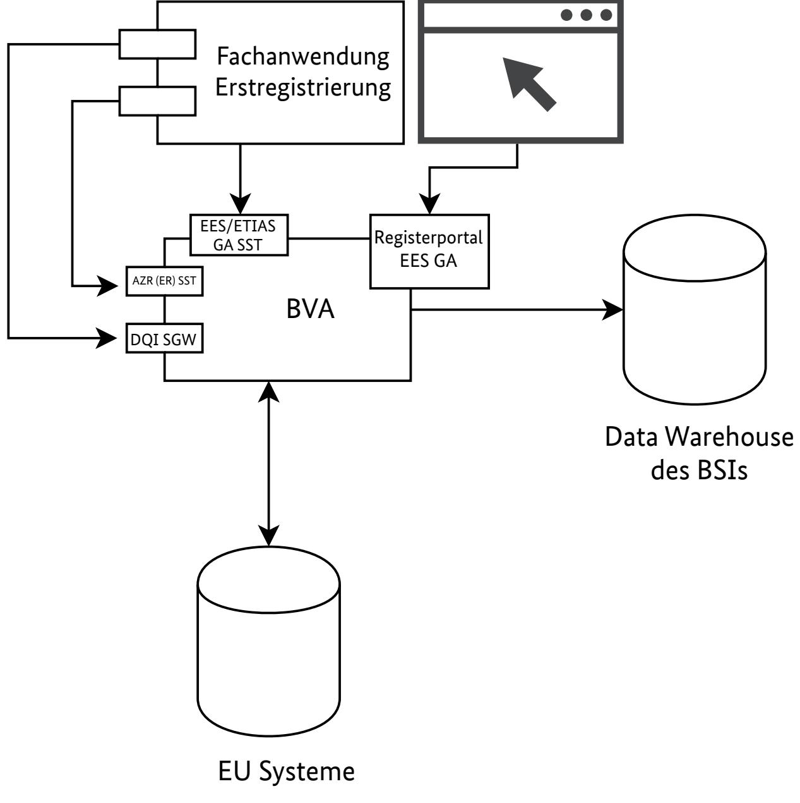
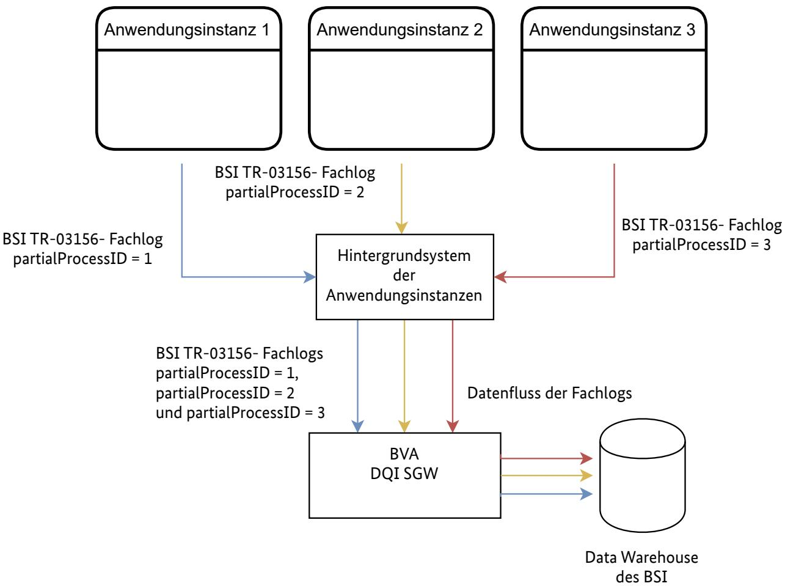
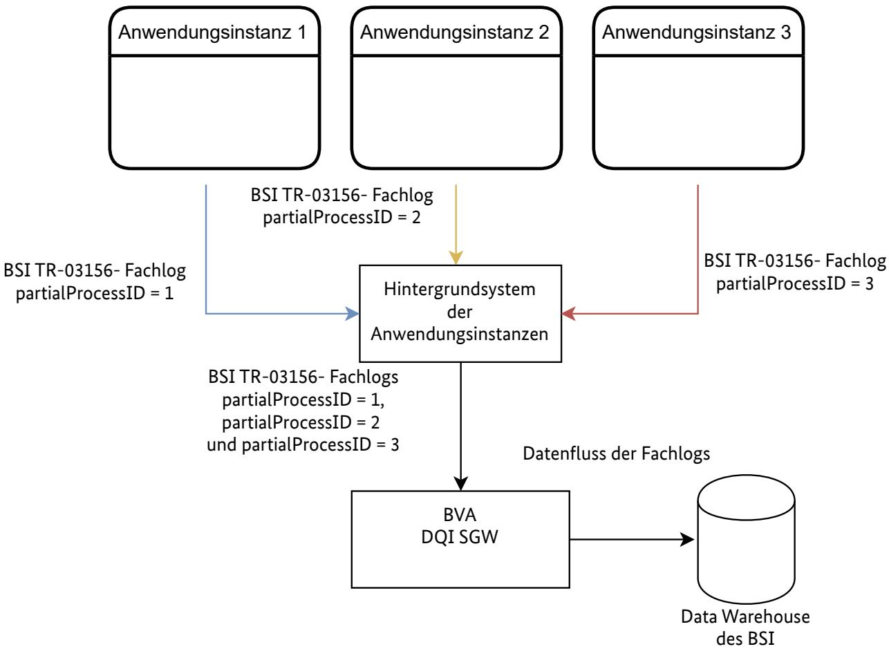

#### BSI Technische Richtlinie TR-03156

# Hoheitliches Identitätsmanagement mit EU-Informationssystemen

Teil 2: XML Schema Dokumentation

Band 1: Erstregistrierung von Drittstaatsangehörigen

Version 2.0.0

Bundesamt für Sicherheit in der Informationstechnik Postfach 20 03 63 53133 Bonn E-Mail: [tr03156@bsi.bund.de](mailto:tr03156@bsi.bund.de) Internet:<https://www.bsi.bund.de> © Bundesamt für Sicherheit in der Informationstechnik

## Änderungshistorie

| TR-Version | Datum      | Beschreibung        |
|------------|------------|---------------------|
| 2.0.0      | 31.10.2023 | Initiale Erstellung |

**Tabelle .1** Änderungshistorie

| 1   | Einleitung                                                             | 1  |
|-----|---------------------------------------------------------------------------|----|
| 1.1 | Terminologie                                                           | 1  |
| 1.2 | Gesetzliche Grundlage und allgemeine Anforderungen                     | 1  |
| 1.3 | IT-Architektur der Erstregistrierung aus Sicht der BSI TR-03156        | 2  |
| 1.4 | Zeitliche Unterbrechungen im Erstregistrierungsprozess                 | 3  |
| 1.5 | Referenzierung zu anderen Technischen Richtlinien und Fachnachrichten  | 3  |
| 2   | Implementierung der BSI Fachlogs                                       | 5  |
| 2.1 | Allgemeine Erläuterung zur Darstellung                                 | 5  |
| 2.2 | Datenfluss der Fachanwendung                                           | 6  |
| 2.3 | Variante A                                                             | 7  |
| 2.4 | Variante B                                                             | 8  |
| 3   | Allgemeine Struktur des BSI TR-03156-ERD XSD Schemas                   | 10 |
|     | Abkürzungsverzeichnis                                                  | 11 |
|     | Literaturverzeichnis                                                   | 12 |

### Abbildungsverzeichnis

| 1.1. | IT-Architekturlandschaft der Erstregistrierung aus Sicht der BSI TR-03156  | 2 |
|------|-------------------------------------------------------------------------------|---|
| 2.1. | Datenfluss der Fachanwendung                                               | 6 |
| 2.2. | Datenfluss der BSI TR-03156-Dokumente in Variante A                        | 7 |
| 2.3. | Datenfluss der BSI TR-03156-Dokumente in Variante B                        | 8 |

### 1 Einleitung

Die Digitalisierung von hoheitlichen Geschäftsprozessen sowie die damit verbundene Vernetzung informati onstechnischer Systeme, sowohl national als auch auf europäischer Ebene, schreitet voran. Geschäftsprozesse des hoheitlichen Identitätsmanagements sind davon insbesondere betroffen. Beispielhaft sei hier die Digita lisierung des Visaprozesses und die Einführung des europäischen [Einreise-/Ausreisesystem \(Entry-Exit-Sys](#page-15-1) [tem\) \(EES\)](#page-15-1) genannt. Durch die Umsetzung der europäischen Verordnungen zur Interoperabilität erfährt das hoheitliche europäische Identitätsmanagement von Drittstaatsangehörigen eine umfangreiche Erweiterung. Die Geschäftsprozesse u.a in den deutschen Ausländerbehörden werden dadurch wesentlich komplexer ge messen an der Anzahl gesetzlich vorgegebenen Prozessschritte sowie beteiligten IT-Hin tergrundsysteme.

Die [Technische Richtlinie \(TR\)-](#page-15-2)03156 des [Bundesamt für Sicherheit in der Informationstechnik \(BSI\)](#page-15-3) für die [Erstregistrierung \(ERD\) schafft vor diesem Hintergrund eine Spezifikationsbasis für zu protokollierende In](#page-15-4) formationen während einer Erstregistrierung, die über das [Bundesverwaltungsamt \(BVA\)](#page-15-5) an das Data Wareh ouse des [BSI übermittelt werden müssen. Die Informationen sollen eine operative und datengetriebene Be](#page-15-3) wertung der Sicherheit, Effektivität und Effizienz aller beteiligten Prozesse der Erstregistrierung ermöglichen. Ziel ist die frühzeitige Identifikation von Qualitäts- und Prozesssicherheitsproblemen in den komplexen Ab läufen durch die Auswertung der protokollierten Informationen durch das [BSI.](#page-15-3)

Konkreter Inhalt dieses Teils der [BSI](#page-15-3) [TR-03156 ist ein in der Fachanwendungssoftware für die Erstregistrie](#page-15-2) rung in den Ausländerbehörden umzusetzendes [XML Schema Definition \(XSD\)](#page-15-6)-Schema. Dieses [XSD](#page-15-6)-Schema gibt die Struktur der Fachlogdaten, zu protokollieren sind, vor. Zum einen sind Daten des Kommunika tionsprozesses mit einem Hintergrundsystem zu erfassen. Zum anderen werden Fachlogdaten des hoheitli chen Identitätsmanagements und der damit verbundenen Geschäftsprozessabläufe betrachtet und erfasst. Im Mittelpunkt steht das Ermöglichen der vollständigen Dokumentation informationstechnischen Verarbei tungsschritte einer Identität sowie die Kommunikation zwischen der Fachanwendungssoftware und den ho heitlichen Hintergrundsystemen des Bundesverwaltungsamts.

Das Dokument richtet sich primär an die Entwickler der Fachverfahren zur Erstregistrierung bzw. Ent wickler von Komponenten dieser Fachverfahren.

### 1.1 Terminologie

Es kann zwischen normativen und informativen Inhalten unterschieden werden. Im Rahmen der normativen Inhalte werden die in Großbuchstaben geschriebenen deutschen Schlüsselwörter auf Basis von [\[RFC2119\]](#page-16-1) verwendet:

- **•** MUSS / MÜSSEN bedeutet, dass es sich um eine normative Anforderung handelt.
- **•** DARF NICHT / DARF KEIN / DÜRFEN NICHT / DÜRFEN KEIN bezeichnet den normativen Ausschluss einer Eigenschaft.
- **•** SOLL / SOLLEN beschreibt eine dringende Empfehlung. Abweichungen zu diesen Festlegungen müssen begründet werden.
- **•** KANN / KÖNNEN / DARF / DÜRFEN bedeutet, dass die Eigenschaften fakultativ oder optional sind.

Die Kapitel der [TR](#page-15-2) sind grundsätzlich als normativ anzusehen. Informative Inhalte werden explizit gekenn zeichnet.

#### 1.2 Gesetzliche Grundlage und allgemeine Anforderungen

Das mit diesem Dokument veröffentlichte [XSD](#page-15-6)-Schema der [BSI](#page-15-3) [TR-](#page-15-2)03156 [ERD](#page-15-4) ist die Konkretisierung bzw. Ausgestaltung der Vorgaben nach §76b Absatz 1 Ziffer 4 AufenthV, siehe auch Anlage E Ziffer 3, sowie §1 Absatz 1 Ziffer 5 AKNV, siehe auch Anlage 1 Ziffer 4, die durch das [DÜV-AnpassG \[https://www.bmi.bun](https://www.bmi.bund.de/SharedDocs/pressemitteilungen/DE/2023/08/diskussionsentwuerfe.html) [d.de/SharedDocs/pressemitteilungen/DE/2023/08/diskussionsentwuerfe.html\]](https://www.bmi.bund.de/SharedDocs/pressemitteilungen/DE/2023/08/diskussionsentwuerfe.html) voraussichtlich im Mai 2024 eingeführt werden.

Der Inhalt dieses Dokument beschränkt sich auf die [BSI](#page-15-3) [TR](#page-15-2)-03156 im Bereich des Erstregistrierungsprozesses eines Drittstaatsangehörigen.

Eine Zertifizierungspflicht besteht im Kontext der [BSI](#page-15-3) [TR-](#page-15-2)01356 nicht. Dennoch **MÜSSEN** bei der Implemen tierung eines Anwendungssystems zur Erstregistrierung die gesetzlichen Vorgaben, und somit das durch die [BSI](#page-15-3) [TR-](#page-15-2)03156 [ERD](#page-15-4) spezifizierte [XSD](#page-15-6)-Schema, umgesetzt werden. Des Weiteren **MUSS** der Versand der [BSI](#page-15-3) Fachlogdaten an das [BSI](#page-15-3) über das [Datenqualitätsinstanz \(DQI\)](#page-15-7)[-Service Gateway \(SGW\)](#page-15-8) des [BVA](#page-15-5) umgesetzt werden.

Das umzusetzende [XSD](#page-15-6)-Schema zu diesem Dokument ist das **erd1v1.xsd**. Alle XPath Ausdrücke in diesem Dokument beziehen sich auf dieses Schema, wenn nicht anders angegeben.

#### 1.3 IT-Architektur der Erstregistrierung aus Sicht der BSI TR-03156

Im Folgenden wird näher auf die vereinfacht dargestellte IT-Architekturlandschaft der Erstregistrierung aus Sicht der [BSI](#page-15-3) [TR-](#page-15-2)03156 eingegangen und die Herausforderungen, die sich aus dieser ergeben, betrachtet.

[Abbildung 1.1](#page-6-1) zeigt die IT-Architekturlandschaft der Erstregistrierung aus Sicht der [BSI](#page-15-3) [TR-03156. Die Fach](#page-15-2) anwendungssoftware des Erstregistrierungsprozesses eines Drittstaatsangehörigen muss eine Verbindung mit den IT-Hintergrundsystem des [BVA](#page-15-5) aufbauen. Jede Anwendungssoftware spricht hierbei die [Ausländer](#page-15-9) [zentralregister \(AZR\)](#page-15-9) (ER) Schnittstelle an. Über diese Schnittstelle findet die jeweilige Kommunikation zu den weiteren nationalen Hintergrundsystemen und deren Datenhaltungen statt. Des Weiteren ist eine Kommu nikation mit dem [EES](#page-15-1) über die [EES](#page-15-1)-GA-Schnittstellen sowie mit dem [Europäische Reiseinformations- und](#page-15-10)  [genehmigungssystem \(ETIAS\)](#page-15-10) über die [ETIAS](#page-15-10)-GA-Schnittstelle möglich.

Dabei **MUSS** der Kommunikationsaufbau zu diesen Schnittstellen von Fachanwendungssoftware do kumentiert werden, siehe **/PSIDM-ERD/Communication**. Auch weitere Kommunikationen mit anderen Schnittstellen und Systemen **MUSS** von der Fachanwendungssoftware dokumentiert werden. Zu jeder durch geführten Biometrieerfassung [TR](#page-15-2) **MUSS** ein [Extensible Markup Language \(XML\)](#page-15-11) Fachlog-Dokument nach [BSI](#page-15-3) [TR](#page-15-2)-03121 erstellt werden, siehe Details in den folgenden Abschnitten. Zu jeder technischen Dokumentenprü fung **MUSS** ein [XML](#page-15-11) Fachlog-Dokument nach [BSI](#page-15-3) [TR-](#page-15-2)03135 erstellt werden, siehe Details in den folgenden Abschnitten. Die von der Fachanwendungssoftware erstellten [XML](#page-15-11) Fachlog-Instanzen (im Weiteren kurz [BSI](#page-15-3) Fachlogs) **MÜSSEN** über das [DQI](#page-15-7)[-SGW](#page-15-8) des [BVA](#page-15-5) an das [BSI](#page-15-3) zur Erstellung von Sicherheits- und Qualitätssta tistiken gesendet werden.

Da sowohl durch die unterschiedlichen Anwendungen als auch Prozessdefinition optionale Pro zessschritte und frei wählbaren Reihenfolgen ermöglicht werden, **MUSS** nur bei einer tatsächlichen Ausfüh rung eines Teilprozessschrittes das Erzeugen der entsprechenden Einträge im [BSI](#page-15-3) Fachlog erfolgen.

#### 1.4 Zeitliche Unterbrechungen im Erstregistrierungsprozess

Der Prozessablauf der Erstregistrierung eines Drittstaatsangehörigen lässt u.a. aufgrund teilweiser asynchro nen Hintergrundprozesse ein Pausieren und eine spätere Weiterbearbeitung des Prozesses durch einen ande ren Anwender oder Client zu. Dieses Pausieren kann von Stunden bis zu Wochen dauern. Aufgrund dessen **MUSS** die implementierende Anwendungssoftware Möglichkeit bieten, einzelnen Teilprozesse, wel che zu unterschiedlichen Zeitpunkten stattfinden können, dem gesamten Erstregistrierung einer Person in Bezug auf die [BSI](#page-15-3) Fachlogs zuordnen zu können. Hierfür besitzt das [XSD](#page-15-6)-Schema zwei IDs zur eineindeuti gen Identifizierung. Die erste ID wird als *globalProcessID* **/PSIDM-ERD/@globalProcessID** bezeichnet und **MUSS** für jeden Erstregistrierungsprozess einzigartig sein. Wird ein neuer Erstregistrierungsprozess gestartet, so **MUSS** eine neue *globalProcessID* von der Anwendungssoftware für das [BSI](#page-15-3) Fachlog erzeugt werden.

Wird hingegen ein und derselbe Erstregistrierungsprozess zu einem späteren Zeitpunkt fortgesetzt, so **MUSS** die *globalProcessID* dieselbe bleiben. Neben der *globalProcessID* existiert zudem eine zweite ID namens *par tialProcessID* **/PSIDM-ERD/@partialProcessID**. Beide IDs **MÜSSEN** in jedem erzeugten [BSI](#page-15-3) Fachlog der [BSI](#page-15-3) [TR](#page-15-2)-03156 vorkommen. Der Unterschied ist, dass die *partialProcessID* sich bei jedem Fortsetzen eines bereits begonnen Erstregistrierungsprozess unterscheiden **MUSS**, während die *globalProcessID* eine Verbindung zwi schen den Teilprozessen schafft.

#### 1.5 Referenzierung zu anderen Technischen Richtlinien und Fachnachrichten

Die [BSI](#page-15-3) [TR](#page-15-2)-03156 hat Berührungspunkte mit den in der [BSI TR-03121 \[https://www.bsi.bund.de/TRBio](https://www.bsi.bund.de/TRBiometrics) [metrics\]](https://www.bsi.bund.de/TRBiometrics) und [BSI TR-03135 \[https://www.bsi.bund.de/TRDocCheck\]](https://www.bsi.bund.de/TRDocCheck) spezifizierten [BSI](#page-15-3) Fachlogs. Während sich die [BSI](#page-15-3) [TR-03121 mit dem Themenbereich Biometrie und biometrische Aufnahmen für den Erstregis](#page-15-2) trierungsprozesses eines Drittstaatsangehörigen befasst, fokussiert sich die [BSI](#page-15-3) [TR-](#page-15-2)03135 auf die technische Dokumentenprüfung. Im Weiteren werden diese Berührungspunkte mit den beiden genannten [BSI](#page-15-3) [TR](#page-15-2) näher beschrieben, sowie auf die Referenzierung zu Fachlogs bei Nutzung der [BVA](#page-15-5) Schnittstellen der [EES-](#page-15-1)GA bzw. [ETIAS-](#page-15-10)GA.

#### 1.5.1 BSI TR-03121 Biometrie

Im Rahmens des Erstregistrierungsprozesses eines Drittstaatsangehörigen sind eine oder mehrere Aufnah men biometrischer Daten erforderlich. Näheres hierzu ist der [BSI](#page-15-3) [TR-](#page-15-2)03121 zu entnehmen. Im Rahmen der Biometrieaufnahmen des Erstregistrierungsprozesses eines Drittstaatsangehörigen **MUSS** ein [BSI](#page-15-3) Fachlog des "ARE"[-XSD](#page-15-6)-Schemas der [BSI](#page-15-3) [TR-](#page-15-2)03121 erzeugt werden. In diesem [BSI](#page-15-3) Fachlog **MUSS** unter **/are-log/Corre**

**lationReference** die oben beschriebene *globalProcessID* der [BSI](#page-15-3) [TR](#page-15-2)-03156 eingetragen werden, sodass eine eineindeutige Zuordnung mit den anderen [BSI](#page-15-3) Fachlogs hergestellt werden kann.

Das nach "ARE"-[XSD-](#page-15-6)Schema erzeugte [BSI](#page-15-3) Fachlog besitzt eine ID unter **are-log/Transaction**, welche im [BSI](#page-15-3) [TR](#page-15-2)-01356-[ERD-](#page-15-4)Fachlog unter **/PSIDM-ERD/ReferenceToBiometricTransaction** angegeben werden **MUSS**. Werden mehrere [BSI](#page-15-3) [TR](#page-15-2)-03121 Fachlogs zum selben Teilprozess erzeugt, so muss jedes [BSI](#page-15-3) [TR-](#page-15-2)03121-Fachlog separat auch im [TR](#page-15-2)-03156-[ERD-](#page-15-4)Fachlog aufgeführt werden.

Erfolgt über den gesamten Erstregistrierungsprozesses keine biometrische Aufnahme, so **MUSS** im [BSI](#page-15-3) [TR](#page-15-2)-01356-[ERD-](#page-15-4)Fachlog als Prozesschritt unter **/PSIDM-ERD/Events/MissingBiometrics/ReasonMissing Biometrics** eine Begründung angegeben werden, da dieses Fehlen nur in Ausnahmefälle rechtlich gestattet ist.

#### 1.5.2 BSI TR-03135 Dokumentenprüfung

Zudem kommt es im Regelfall dazu, dass Rahmen des Erstregistrierungsprozesses eines Drittstaatsange hörigen eine technische Dokumentenprüfung von vorgelegten Ausweisdokumenten durchgeführt wird. Bei einer solche Prüfung **MUSS** ein [BSI](#page-15-3) Fachlog nach dem [XSD-](#page-15-6)Schema der [BSI](#page-15-3) [TR](#page-15-2)-03135 erzeugt werden. Das hier erzeugte [BSI](#page-15-3) Fachlog besitzt eine ID unter **/CheckTransaction/TransactionID**, welche im [BSI](#page-15-3) [TR](#page-15-2)-01356- [ERD-](#page-15-4)Fachlog unter **/PSIDM-ERD/ReferenceToCTTransaction** angegeben werden **MUSS**. Werden mehrere [BSI](#page-15-3) [TR](#page-15-2)-03135 Fachlogs zum selben Teilprozess erzeugt, so muss jedes [BSI](#page-15-3) [TR-](#page-15-2)03135-Fachlog separat auch in de[rTR](#page-15-2)-03156-ERD-Log-Instanz aufgeführt werden.

Erfolgt keine technische Dokumentenprüfung und somit auch keine Erzeugung eines [BSI](#page-15-3) [TR-](#page-15-2)03135-Fachlogs, dann **MUSS** der **/PSIDM-ERD/ReferenceToCTTransaction** Knoten im [BSI](#page-15-3) [TR](#page-15-2)-01356-[ERD-Fachlog nicht er](#page-15-4) zeugt werden.

#### 1.5.3 BVA Fachnachrichten der EES und ETIAS GA Schnittstellen

Für die Anfragen über die [EES](#page-15-1) oder [ETIAS](#page-15-10) GA Schnittstelle des [BVA](#page-15-5) existiert ebenfalls ein [BSI](#page-15-3) Fachlogging auf Seiten des [BVA.](#page-15-5) Sofern während der Erstregistrierung ein Aufruf der [EES](#page-15-1) oder [ETIAS](#page-15-10) GA Schnittstelle statt findet, **MUSS**, um das [BVA](#page-15-5) Fachlogging mit den [BSI](#page-15-3) [TR-](#page-15-2)03156 [ERD](#page-15-4) Fachlogs des Clients korrelieren zu kön nen, das [BSI](#page-15-3) [TR](#page-15-2)-03156 [ERD](#page-15-4) Fachlog die *ProzessID* der Fachnachrichten der [EES](#page-15-1) oder [ETIAS](#page-15-10) GA Schnittstelle enthalten. Diese sind in dem Element **/PSIDM-ERD/Events/\*[self::InterfaceCallETIASGA or self::Interface CallEESGA]/ReferenceToProcessID** einzutragen.

### 2 Implementierung der BSI Fachlogs

Vor der Implementierung einer Anwendung sollten sich folgenden Fragen gestellt und beantwortet werden.

- 1. Wann sollen [BSI](#page-15-3) Fachlogs verschickt werden?
- 2. Wie organisiert die Anwendung die Referenzierung mittels der IDs zwischen den einzelnen [BSI](#page-15-3) Fachlogs insbesondere beim Pausieren von Erstregistrierungen oder Ausführung des Gesamtprozesses an mehreren Clients/Arbeitsplätzen?
- 3. Wie organisiert die Anwendung die Verbindungen zwischen den einzelnen [BSI Fachlogs mit den Schnitt](#page-15-3) stellen anderer Anwendungen?

In den folgenden Abschnitten werden exemplarisch zwei Varianten von Antworten auf diese Fragen vorge stellt, um als Ausgangsbasis für die individuelle Betrachtung der jeweiligen Anwendungen dienen zu können.

#### 2.1 Allgemeine Erläuterung zur Darstellung

In den folgenden Abbildungen werden die verwendeten Instanzen der zu implementierende Anwendungs software für die Erstregistrierung eines Drittstaatsangehörigen als *Anwendungsinstanz* beschrieben. Somit könnte es sich je nach Softwareimplementierung z.B. bei einer *Anwendungsinstanz* um eine Session innerhalb eines Webbrowsers handeln.

Der Gesamtprozess kann mit zeitlichen und/oder räumlichen Unterbrechungen stattfinden. Daher wird der Prozess mit drei *Anwendungsinstanzen* bildlich dargestellt. Es kann im Laufe des Prozesses vorkommen, dass weniger oder mehr Anwendungsinstanzen an der Durchführung des Prozesses beteiligt sind. In diesem Fall ist das im Folgenden beschriebene auf die jeweilige Anzahl der beteiligten Anwendungsinstanzen anzuwenden.

Zur Vereinfachung der Darstellung sind die Anwendungsinstanzen mit einem Hintergrundsystem verbun den.

Die nationale Schnittstelle des [BVA](#page-15-5) ist als abstrahierte Schnittelle dargestellt. Die Schnittstelle bildet somit die Anbindung zu den [BVA](#page-15-5) internen nationalen Datenbanken ab.

Die Verbindungspfeile stellen Datenflüsse dar. Die Pfeilrichtungen zeigen die zu erwartenden Richtungen der Kommunikation an.

# 2.2 Datenfluss der Fachanwendung Backgroundsystem der Anwendungsinstanzen Datenuss Datenuss Datenuss nationale Schnittstelle des Bundesverwaltungsamts nationale und EU-Systeme Datenüsse Datenüsse Anwendungsinstanz 1 Anwendungsinstanz 2 Anwendungsinstanz 3

**Abbildung 2.1.** Datenfluss der Fachanwendung

[Abbildung 2.1](#page-10-1) zeigt den Datenfluss der implementierten Anwendungssoftware. Die Anwendungssoftware wird hier mit verschiedenen Instanzen und einem Hintergrundsystem dargestellt.

Der Erstregistrierungsprozesses eines Drittstaatsangehörigen kann durch zeitliche unterbrochen oder räum lich verteilt stattfinden. Die Anwendungssoftware kann somit zu verschiedenen Zeitpunkten in verschiede nen Instanzen (Anwendungsinstanzen 1-3) ausgeführt werden. In dieser Beispielarchitektur nimmt jede An wendungsinstanz über das Hintergrundsystem des Anwendungssystems die Kommunikation zur nationalen Schnittstelle des [BVA](#page-15-5) auf. Dieser Weg beschriebt jeglichen Fachdatenaustausch zwischen Anwendungssystem und den Datenspeichern des [BVA. Das BVA stellt die Anbindung an europäischen System und Datenban](#page-15-5) ken einerseits per Web-Anwendung [\(EES](#page-15-1)-GA, bzw. [ETIAS-GA\), andereseits auch als Schnittstelle zum direk](#page-15-10) ten Aufruf in der Fachanwendung, zur Verfügung.

#### 2.3 Variante A

**Abbildung 2.2.** Datenfluss der BSI TR-03156-Dokumente in Variante A

[Abbildung 2.2](#page-11-1) zeigt den Datenfluss der [BSI](#page-15-3) TR-03156-[ERD](#page-15-4) Fachlogs der Variante A. Bei Variante A schreiben die Anwendungsinstanz 1, 2 und 3 jeweils ein eigenes [BSI](#page-15-3) TR-03156[-ERD](#page-15-4) Fachlog. Die *Anwendungsinstanz 1* enthält alle Daten zu dem Teilprozess, welcher in der Anwendungsinstanz ablief. Ist Teilprozess abge schlossen, da z.B. eine räumliche Veränderung dazu führt, dass der Prozess unterbrochen wird, so **MUSS** die *Anwendungsinstanz 1* ein in sich abgeschlossenes [BSI](#page-15-3) Fachlog nach [TR-](#page-15-2)03156[-ERD](#page-15-4) an das Hintergrundsystem der Anwendungssoftware weiterleiten. Das Hintergrundsystem **MUSS** in diesem Lösungsvorschlag die [BSI](#page-15-3) Fachlogs über den Teilprozess der *Anwendungsinstanz 1* unmittelbar über das [BVA](#page-15-5) [DQI](#page-15-7)[-SGW](#page-15-8) an das [BSI](#page-15-3) Data Warehouse weiterleiten.

Wenn nun der Prozess bei einer anderen Anwendungsinstanz, hier *Anwendungsinstanz 2*, weitergeführt wird, schreibt die *Anwendungsinstanz 2* ein neues [BSI](#page-15-3) TR-03156-[ERD](#page-15-4) Fachlog. Damit die einzelnen Teilprozesse eindeutig identifizierbar sind, haben beide [BSI](#page-15-3) TR-03156[-ERD](#page-15-4) Fachlogs eine eigene *partialProcessID*. Über das Hintergrundsystem der Anwendungssoftware **MUSS** sichergestellt werden, dass beide Teilprozess zu einem Gesamtprozess zugeordnet werden können. Somit enthält das [BSI](#page-15-3) [TR](#page-15-2)-03156-[ERD](#page-15-4) Fachlog der *Anwendungs instanz 1* dieselbe *globalProcessID* wie das [BSI](#page-15-3) [TR-](#page-15-2)03156[-ERD](#page-15-4) Fachlog der *Anwendungsinstanz 2*. Das Hin tergrundsystem muss eine solche Zuordnung derselben Prozessdurchführung erkennen und die *globalPro cessID* für folgenden Teilprozess [BSI](#page-15-3) [TR-](#page-15-2)03156[-ERD](#page-15-4) Fachlog vorhalten. Wird zu einem späteren Zeitpunkt nun die Bearbeitung des Prozesses wiederaufgenommen, so **MUSS** die *globalProcessID* in jeden folgenden [BSI](#page-15-3) [TR](#page-15-2)-03156-[ERD](#page-15-4) Fachlog zu diesem Teilprozess die *globalProcessID* der bereits erstellten [BSI](#page-15-3) [TR](#page-15-2)-03156-[ERD](#page-15-4) Fachlog desselben Gesamtprozesses sein.

Während des Erstregistrierungsprozesses eines Drittstaatsangehörigen ist es üblich, dass biometrische Daten erfasst werden und Dokumentenprüfungen maschinell durchgeführt werden müssen. Auch die [BSI](#page-15-3) Fachlog der [BSI](#page-15-3) [TR](#page-15-2)-03121 und [TR-](#page-15-2)03135 **MÜSSEN** unmittelbar über die [BVA](#page-15-5) [DQI](#page-15-7)-[SGW](#page-15-8) übermittelt werden.

Der Vorteil dieser Variante ist, dass lediglich die [Universally Unique Identifier \(UUID\),](#page-15-12) siehe [\[RFC4122\]](#page-16-2), der *glo balProcessID* im Hintergrundsystem der Anwendungssoftware vorgehalten werden **MUSS**. Die [BSI](#page-15-3) [TR](#page-15-2)-03156- [ERD](#page-15-4) Fachlogs **MÜSSEN** somit bei Abschluss eines Teilprozesses sofort übermittelt und müssen nicht vorge halten werden.

#### 2.4 Variante B

**Abbildung 2.3.** Datenfluss der BSI TR-03156-Dokumente in Variante B

[Abbildung 2.2](#page-11-1) zeigt den Datenfluss der [BSI](#page-15-3) [TR-](#page-15-2)03156[-ERD](#page-15-4) Fachlogs der Variante B. B unterschei det sich lediglich in einem Punkt von Umsetzungsvariante A. Die [BSI](#page-15-3) Fachlogs der einzelnen Anwendungs instanzen 1, 2 und 3 werden im Hintergrundsystem des Anwendungssystems vorgehalten und gesammelt. So werden erst nach Abschluss des Gesamtprozesses die [BSI](#page-15-3) Fachlogs der einzelnen Teilprozesse 1, 2 und 3 einmalig gebündelt über die Schnittstelle des [BVA](#page-15-5) an das Data Warehouse des [BSI](#page-15-3) übermittelt.

Die [BSI](#page-15-3) Fachlogs der einzelnen Prozesse **MÜSSEN** in dieser Variante solange vorgehalten werden, bis der ge samte Prozess abgeschlossen ist. Es ist nicht möglich, die Teilprozessdokumentationen eines Erstregistrie rungsprozess zu jedem Zeitpunkt an das Data Warehouse des [BSI zu übermitteln, ohne auf das Ende des Ge](#page-15-3) samtprozesses zu warten. Der Vorteil hierbei sind weniger Verbindungsaufbauten zum [BVA](#page-15-5).

Dabei **DARF NICHT** die *globalProcessID* am Ende des Prozesses von dem Hintergrundsystem in alle erhalte nen [BSI](#page-15-3) Fachlogs zu dem Gesamtprozess geschrieben werden. Die einzelnen Anwendungsinstanzen **MÜSSEN** in sich abgeschlossene [BSI](#page-15-3) Fachlogs erzeugen.

Der Nachteil der Variante B ist die Notwendigkeit einer Datenvorhaltung seitens des Hintergrundsystems, welches die erzeugten [BSI](#page-15-3) Fachlogs der Anwendungsinstanz bis zum schlussendlichen Versandt vorhalten **MUSS**. Sollte kein Pausieren oder räumlich über mehrere Clients verteilter Erstregistrierungsprozess in der jeweiligen Anwendung erlaubt sein, so benötigt Variante B keine Datenhaltung der [BSI](#page-15-3) Fachlogs auf einem Hintergrundsystem, sondern **KANN** auf dem Client selbst umgesetzt werden.

Wenn mehrere Anwendungsinstanzen am Prozess beteiligt sind, dann **DARF NICHT** durch ein Hintergrund system nur ein einziges [BSI](#page-15-3) [TR](#page-15-2)-03156-[ERD](#page-15-4) Fachlog erzeugt werden, was die Teilprozesse an allen beteiligten Anwendungsinstanzen zusammenfasst. Es **MUSS** für jede Anwendungsinstanz ein eigenes [BSI](#page-15-3) [TR](#page-15-2)-03156-[ERD](#page-15-4) Fachlog geben, da Angaben wie zum Host, Standort etc. spezifisch für den Teilprozess sind.

### 3 Allgemeine Struktur des [BSI](#page-15-3) TR-03156-ERD [XSD](#page-15-6) Schemas

In diesem Kapitel wird die Struktur des [XSD-](#page-15-6)Schemas der [BSI](#page-15-3) [TR-](#page-15-2)03156[-ERD](#page-15-4) ergänzend zu der [XSD](#page-15-6) Inline Dokumentation erläutert.

- **•** Der **/PSIDM-ERD/MetaData**-Knoten bildet generelle Informationen über den Erstregistrierungsprozess ab, siehe die Inline-Dokumentation des [XSD.](#page-15-6)
- **•** Der **/PSIDM-ERD/Communication**-Knoten stellt eine Auflistung der Kommunikation des Erstregistrie rungsprozesses mit den verbundenen Systemen dar. So **MUSS** jede Kommunikation mit einem anderen System nachvollziehbar mit einem eigenen *CommunicationStep* aufgeführt werden und Probleme in der Kommunikation dokumentiert werden.

Ein **ERD/Communication/CommunicationStep KANN** aus einer oder mehrerer *Request* und *Response*s bestehen. Jeder **CommunicationStep** stellt eine Kommunikation mit einem *äußeren* System dar. Der De tailierungsgrad dieser Kommunikation **KANN** auf den fachlichen Datenaustausch beschränkt werden. So **KANN** z.B. der 3-way-handshake des http-Protokolls auch nur verkürzt dargestellt werden.

Kommt es bei der Kommunikation mit einem anderen System zu einem Fehler, egal ob fachlicher oder technischer Natur, so **MUSS** dieser unter **/PSIDM-ERD/Communication/CommunicationStep/\*[sel f::Request or self::Response]/CommunicationProblem** aufgeführt werden. Kommt es innerhalb des sel ben Response/Requests zu mehreren CommunicationProblems, so ist ein jeder Fehler separat darzustellen

**•** Der **/PSIDM-ERD/Events**-Knoten enthält fachlichen und technischen Events, die während des Erstregis trierungsprozesses eines Drittstaatsangehörigen durchlaufen werden können.

Die Events sind mit einem Startzeitpunkt versehen. Es können in manchen Fällen zusätzliche Elemen te zur Spezifikation enthalten sein. Während eines Event Steps **/PSIDM-ERD/Events/\*** kann es vorkom men, dass eine Kommunikation mit einem anderen System stattfindet. Ein Beispiel hierfür ist die Nutzung der [BVA](#page-15-5)-Schnittstellen durch das Event *AZR\_ABFRAGEN*. In einem solchen Fall **MÜSSEN** zudem ein oder mehrere **/PSIDM-ERD/Communication/CommunnicationStep**-Knoten erzeugt werden. Diese **MÜSSEN** per **/PSIDM-ERD/Communication/CommunnicationStep/\*[self::Request or self::Response]/@referen ceToEventID** einem Event eineindeutig zugeordnet werden.

### Abkürzungsverzeichnis

| Abkürzung | Beschreibung                                           |
|-----------|--------------------------------------------------------|
| AZR       | Ausländerzentralregister                               |
| BSI       | Bundesamt für Sicherheit in der Informationstechnik    |
| BVA       | Bundesverwaltungsamt                                   |
| DQI       | Datenqualitätsinstanz                                  |
| EES       | Einreise-/Ausreisesystem (Entry-Exit-System)           |
| ERD       | Erstregistrierung                                      |
| ETIAS     | Europäische Reiseinformations- und -genehmigungssystem |
| SGW       | Service Gateway                                        |
| TR        | Technische Richtlinie                                  |
| UUID      | Universally Unique Identifier                          |
| XML       | Extensible Markup Language                             |
| XSD       | XML Schema Definition                                  |

### Literaturverzeichnis

[RFC2119] *RFC 2119: Key words for use in RFCs to Indicate Requirement Levels.* [RFC4122] *RFC 4122: A Universally Unique IDentifier (UUID) URN Namespace.*