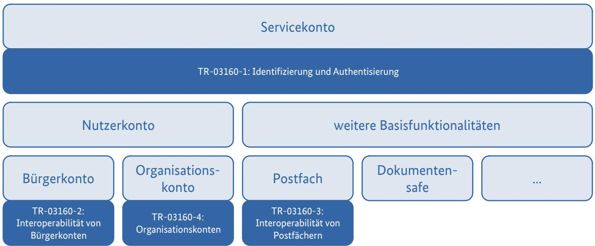

# Technische Richtlinie TR-03160-1 Servicekonten

Teil 1: Identifizierung und Authentisierung

Version 1.0 03.03.2023

## Änderungshistorie

| Version | Datum      | Beschreibung                                                                                                                                  |
|---------|------------|-----------------------------------------------------------------------------------------------------------------------------------------------|
| 0.1     | 15.03.2018 | Erstellung                                                                                                                                    |
| 0.8.5   | 30.10.2019 | Entfernung Instanzenkonzept                                                                                                                   |
| 0.8.6   | 17.12.2019 | Einarbeitung Kommentare Servicekontenanbieter                                                                                                 |
| 0.9.2   | 15.01.2020 | Einarbeitung Änderungsvorschläge des BMI vom 20.12.2019 Einarbeitung Änderungsvorschläge der Vertreter des Datenschutzes vom 14.01.2020 |
| 0.9.3   | 27.03.2020 | Einarbeitung Änderungsvorschläge aufgrund Telkos BMI und Vertreter des Datenschutzes vom 11.03.2020 und 25.03.2020                         |
| 0.9.4   | 24.04.2020 | Übernahme neuer Prozess zum Ausweiswechsel gem. Beschluss PG eID-Strategie vom 23.04.2020                                                  |
| 0.9.5   | 03.12.2020 | Einarbeitung Änderungsvorschläge aus erneuter Kommentierungsrunde PG eID-Strategie                                                         |
| 0.9.6   | 12.02.2021 | Einführung Vertrauensniveau "Selbstauskunft" und Umbenennung Vertrauensniveau normal                                                       |
| 0.9.7   | 12.03.2021 | Einarbeitung Änderungsvorschläge aus erneuter Kommentierung durch PG eID-Strategie (Abstimmung Umsetzungsstand)                         |
| 0.9.8   | 08.07.2021 | Umbenennung "Selbstauskunft" in "Basisregistrierung"                                                                                          |
| 1.0     | 03.03.2023 | finale Version nach Pilotierungsphase                                                                                                         |

Bundesamt für Sicherheit in der Informationstechnik Postfach 20 03 63 53133 Bonn Tel.: +49 22899 9582-0 E-Mail: bsi@bsi.bund.de Internet: [https://www.bsi.bund.de](https://www.bsi.bund.de/) © Bundesamt für Sicherheit in der Informationstechnik 2023

| Änderungshistorie 2 Abbildungsverzeichnis 4 Einleitung 5 Grundlagen und Begriffe 7 Vertrauensniveaus 7 Identitätsdaten 7 Nutzerkonten 8 Verifikation der Identitätsdaten 9 Authentisierung 9 Freigabe von Transaktionen 10 Nutzung des Nutzerkontos zur Identifizierung10 Erstellung eines Nutzerkontos 11 Authentisierungsmittel 12 Vertrauensniveau eines Authentisierungsmittels12 Registrierung von Authentisierungsmitteln12 Verwendung der Authentisierung 13 Sperrung von Authentisierungsmitteln14 Verifikation von Identitätsattributen als Ersatz für Authentisierung14 Verifikation von (Identitäts-)Daten 16 Verifikation eines Attributs 16 Identifizieren mit dem Nutzerkonto 19 Löschen eines Nutzerkontos 20 Literaturverzeichnis 21 |
|------------------------------------------------------------------------------------------------------------------------------------------------------------------------------------------------------------------------------------------------------------------------------------------------------------------------------------------------------------------------------------------------------------------------------------------------------------------------------------------------------------------------------------------------------------------------------------------------------------------------------------------------------------------------------------------------------------------------------------------------------------------------------------------------------------------------|

### Abbildungsverzeichnis

|  |  |  | Abbildung 1: Gliederung der Technischen Richtlinie TR-03160 Servicekonten5 |
|--|--|--|----------------------------------------------------------------------------|
|--|--|--|----------------------------------------------------------------------------|

### Tabellenverzeichnis

| Tabelle 1: Beispiel eines Nutzerkontos mit Attributen auf unterschiedlichen Vertrauensniveaus9            |  |
|-----------------------------------------------------------------------------------------------------------|--|
| Tabelle 2: Maximalzeiten für die automatische Beendigung von Authentisierungen13                          |  |
| Tabelle 3: Beispiel eines Nutzerkontos – Schritt 1: Erfassung auf Vertrauensniveau Basisregistrierung und |  |
| Verifikation der E-Mail-Adresse 17                                                                        |  |
| Tabelle 4: Beispiel eines Nutzerkontos – Schritt 3: Verifikation der De-Mail-Adresse auf Vertrauensniveau |  |
| substanziell 17                                                                                           |  |
| Tabelle 5: Beispiel eines Nutzerkontos – Schritt 4: Registrierung der Online-Ausweisfunktion und          |  |
| Datenübernahme auf Vertrauensniveau hoch18                                                                |  |

### 1 Einleitung

Am 18.08.2017 ist das Gesetz zur Verbesserung des Onlinezugangs zu Verwaltungsleistungen (Onlinezugangsgesetz – OZG) in Kraft getreten. Dieses verpflichtet in § 3 Abs. 2 OZG Bund und Länder dazu, Nutzerkonten bereitzustellen, über die sich Nutzer für die im Portalverbund des Bundes und der Länder verfügbaren elektronischen Verwaltungsleistungen einheitlich identifizieren können. Das BSI hat gemäß Begründung zu § 8 Absatz 3 OZG den Auftrag erhalten, die technischen Anforderungen an die Nutzerkonten und deren Verknüpfung, insbesondere an Datenschutz und Datensicherheit, in einer Technischen Richtlinie festzulegen.

Unter **Nutzerkonten** (als Oberbegriff von **Bürgerkonten** und **Unternehmens**- bzw. **Organisationskonten**) sind in der vorliegenden Technischen Richtlinie Konten von natürlichen Personen oder Institutionen bei den in verschiedenen Ländern und im Bund im Wirkbetrieb oder in der Entwicklung befindlichen Servicekonten zu verstehen; als **Servicekonten w**erden elektronische Komponenten bezeichnet, die die Identifizierung von Nutzern und die Anlage, Verwendung und Verwaltung von Nutzerkonten ermöglichen. Teilweise werden in Bund und Ländern von dieser Definition abweichende Definitionen der Begriffe Nutzerkonten und Servicekonten genutzt.

*Abbildung 1: Gliederung der Technischen Richtlinie TR-03160 Servicekonten*

Der vorliegende Teil der Technischen Richtlinie *"TR-03160 Servicekonten"* befasst sich mit der Identifizierung von Nutzern zur Erstellung von Nutzerkonten, der Verifikation und Aktualisierung im Nutzerkonto gespeicherter (Identitäts-)Daten sowie der Authentisierung zur Nutzung der Nutzerkonten. Nur durch dieses Zusammenspiel einer sicheren Identifizierung des Nutzers, der sicheren Verifikation seiner Daten und der sicheren Authentisierung zur nachfolgenden Nutzung wird sichergestellt, dass die vom Nutzerkonto an einen Online-Dienst übermittelten Daten auf dem jeweils erforderlichen Vertrauensniveau verifiziert wurden und zu der handelnden Person gehören. Die weiteren Teile der TR-03160 bauen auf dieser Voraussetzung auf.

Bei Einhaltung der Vorgaben der vorliegenden TR kann sich ein Online-Dienst oder Fachverfahren darauf verlassen, dass die Identifizierung eines Nutzers oder die Authentizität seiner Daten das durch den Dienst als erforderlich festgelegte Vertrauensniveau erreicht. Es ist nicht Gegenstand dieser TR, zu regeln, ob und wie für ein Fachverfahren festgelegt wird, dass es ein bestimmtes Vertrauensniveau erfordert.

Die Anforderungen in der vorliegenden TR werden i. d. R. an die **Servicekonten** als Implementierungen gestellt. Sofern sich einzelne Anforderungen auf einen personenbezogenen Datensatz oder Zugang beziehen, wird dieser als **Nutzerkonto** bezeichnet.

Die grundlegenden Vorgaben zu Identifizierung und Authentisierung im E-Government werden dabei in der [TR-03107-1] gemacht, auf deren Regelungen und Begrifflichkeiten das vorliegende Dokument aufbaut. Der in der vorgenannten Technischen Richtlinie [TR-03107-1] verwendete Begriff "Vertrauensniveau normal" entspricht dem Begriff "Sicherheitsniveau niedrig (low)" nach [eIDAS-VO] und dem in dieser Technischen Richtlinie verwendeten Begriff "Vertrauensniveau niedrig".

### 2 Grundlagen und Begriffe

#### 2.1 Vertrauensniveaus

Die für die Verwendung von Servicekonten relevanten **Vertrauensniveaus** werden in [TR-03107-1] spezifiziert. Neben den an die in der [eIDAS-VO] definierten Sicherheitsniveaus angelehnten Vertrauensniveaus *niedrig*, *substanziell* und *hoch* spielt dabei das zusätzliche Vertrauensniveau *Basisregistrierung* eine besondere Rolle. Dabei handelt es sich um Daten, die von der Behörde oder einem Identifizierungsdienstleister nicht (mindestens auf dem Vertrauensniveau *niedrig***)** verifiziert wurden, also z. B. Selbsteingaben eines Nutzers, wie sie in einigen angebotenen Lösungen möglich sind.

#### 2.2 Identitätsdaten

Die Identität einer natürlichen oder juristischen Person oder Personengesellschaft wird durch verschiedene Eigenschaften beschrieben, wie beispielsweise Name, Anschrift, Geburtsdatum oder Pseudonym, oder auch Attribute wie z. B. Kontaktdaten oder weitere Parameter, die bei Inanspruchnahme einer Online-Leistung benötigt werden können. Diese Daten werden im Folgenden als **Identitätsdaten** bezeichnet, ein einzelnes Datum auch als **Attribut**. Die Rechtsgrundlage für die Verarbeitung von Identitätsdaten in Nutzerkonten bildet insbesondere das Gesetz zur Verbesserung des Onlinezugangs zu Verwaltungsleistungen (Onlinezugangsgesetz – OZG).

Für die erfolgreiche Durchführung einer Online-Leistung ist es in der Regel notwendig, dass die einzelnen Attribute auf einem bestimmten Vertrauensniveau verifiziert sind.

Für die Verwendung im Rahmen elektronischer Identifizierungssysteme gemäß [eIDAS-VO] legt die [Durchführungsverordnung (EU) 2015/1501] einen **Mindestdatensatz** von Personenidentifizierungsdaten, die eine natürliche oder juristische Person oder Personengesellschaft eindeutig repräsentieren, fest. In der Regel werden diese Daten bei Erstellung eines Nutzerkontos im Rahmen der Identifizierung des Nutzers (z. B. mittels eines eID-Systems) erhoben. Für die eindeutige Zuordnung bei wiederholter Anmeldung wird in der Regel die im Mindestdatensatz enthaltene **eindeutige Kennung** verwendet ([Durchführungsverordnung (EU) 2015/1501], ANHANG, Nr. 1 Satz 1 lit. d bzw. Nr. 2 S. 1 lit. b); im Falle der von Deutschland ausgegebenen Personalausweise, elektronischen Aufenthaltstitel und eID-Karten handelt es sich dabei um das dienste- und kartenspezifische Kennzeichen (im Folgenden **Pseudonym**; auch: **DKK**).

In Fällen, in denen eine Wiedererkennung mittels der eindeutigen Kennung nicht möglich ist (für von Deutschland ausgegebene Dokumente ist dies regelmäßig nach Neuausstellung der Fall), kann diese mittels Abgleich aller übrigen Merkmale des anwendbaren Mindestdatensatzes (s. Abschnitt [4.5](#page-13-0)) erfolgen, sofern diese ausnahmslos im Nutzerkonto gespeichert sind. Für die vorgenannten, von Deutschland ausgegebenen Dokumente für natürliche Personen, sind dies:

- Vornamen,
- Familienname,
- Anschrift
- Geburtsname,
- Geburtsdatum und
- Geburtsort

Abweichungen, die etwa aufgrund von Umzügen oder Namensänderungen erfolgt sein können, können dabei akzeptiert werden, wenn sie durch eine lückenlose Kette von Nachweisen (etwa elektronischen Auszügen aus Melderegistern) auf dem Vertrauensniveau des Identifizierungssystems belegt werden können, aus denen sich jeweils die Daten vor und nach einer Änderung unter Angabe aller übrigen Merkmale des Mindestdatensatzes ergeben.

#### 2.3 Nutzerkonten

Im Rahmen dieses Dokuments stellt ein **Servicekonto** eine Identifizierungskomponente dar, die im Nutzerkonto eines Nutzers gespeicherte Identitätsdaten für **Online-Leistungen** auf einem spezifischen Vertrauensniveau zur Verfügung stellt. Die Online-Leistung kann darauf vertrauen, dass nicht nur die so zur Verfügung gestellten Daten auf dem jeweiligen Vertrauensniveau verifiziert wurden, sondern dass diese auf demselben Vertrauensniveau auch auf den aktuellen Nutzer der Leistung zutreffen. Dazu sind die Identifizierung des Nutzers, die Übergabe der Daten sowie die Ausführung der Online-Leistung auf dem jeweiligen Vertrauensniveau aneinander zu binden.[1](#page-7-1)

Die für ein Servicekonto (und das damit einhergehende Angebot der Erstellung und Nutzung von Nutzerkonten) verantwortliche Stelle, i. d. R. eine staatliche Stelle gem. § 2 Abs. 5 OZG, wird im vorliegenden Dokument als **Betreiber eines Servicekontos** bezeichnet.

Das Nutzerkonto eines Nutzers kann Identitätsdaten beinhalten, die auf unterschiedlichen Vertrauensniveaus verifiziert wurden. So besteht die Möglichkeit, einzelne Attribute z. B. nach einer Identifizierung auf einem abweichenden Vertrauensniveau zu registrieren. **Entscheidend ist dabei, dass für jedes Identitätsattribut bei Übermittlung an die Online-Leistung für diese klar ersichtlich ist, auf welchem Vertrauensniveau das Attribut für den aktuellen Nutzer verifiziert wurde.** Dies gilt insbesondere auch für Attribute ohne angegebenen Wert: So ist es etwa ein Unterschied, ob ein Geburtsname bei der Identifizierung gar nicht erhoben wurde, oder ob auf dem jeweiligen Vertrauensniveau festgestellt wurde, dass kein (vom aktuellen Familiennamen abweichender) Geburtsname vorliegt. Nur im zweiten Fall wäre die Übermittlung des leeren Geburtsnamens auf einem Vertrauensniveau oberhalb von *Basisregistrierung* zulässig.

Ein **temporäres Nutzerkonto** wird angelegt, wenn im Rahmen einer Identifizierung durch das Servicekonto erhobene Identitätsdaten nicht dauerhaft gespeichert, sondern nur an die Verwaltungsleistung durchgereicht werden. So ist etwa die dauerhafte Speicherung von Identitätsdaten verzichtbar, wenn ein Nutzer sich nur einmalig oder wiederkehrend mit einem elektronischen Identifizierungssystem wie z. B. der Online-Ausweisfunktion für Verwaltungsleistungen identifiziert. Das temporäre Nutzerkonto ist nach der Weiterleitung der Identitätsdaten an die Verwaltungsleistung unverzüglich zu löschen.

Möchte ein Nutzer zur wiederholten Anmeldung (Login) für die Nutzung weiterer Verwaltungsleistungen hingegen ein Authentisierungsmittel nutzen, das nicht gleichzeitig elektronisches Identifizierungssystem ist oder nicht alle benötigten Attribute liefert, so benötigt er ein **permanentes Nutzerkonto**, in dem die (ggf. verifizierten und) zur weiteren Nutzung benötigten Identitätsdaten gespeichert werden.

Zudem können es permanente Nutzerkonten ermöglichen, Zusatzdienste wie z. B. einen Rückkanal zur Online-Beantragung von Verwaltungsleistungen zur Verfügung zu stellen, in dem etwa eine Bescheidzustellung erfolgen kann oder die Nachfrage und Beibringung ergänzender Unterlagen. Der Betreiber kann die Möglichkeit bieten, das permanente Nutzerkonto nach Zeitablauf oder nach einem definierten Ende des Antragsprozesses (z. B. nach Bescheidabholung) automatisch zu löschen (s. Abschnitt [7\)](#page-19-0). Zum Zwecke der Abwicklung eines einzigen Antragsprozesses oder zur Nutzung sonstiger Zusatzdienste sollte der Betreiber dem Nutzer ein permanentes Nutzerkonto anbieten, in dem ausschließlich (Referenzen auf) Authentisierungsmittel, aber keine Identitätsdaten gespeichert werden.

Um eine wiederholte Anmeldung zu ermöglichen *("permanentes Nutzerkonto")*, muss ein Nutzerkonto eine eindeutige Identifikationsnummer (im Folgenden **Benutzername**) besitzen. Zusätzlich kann das Nutzerkonto weitere eindeutige Schlüssel besitzen (z. B. das Pseudonym der Online-Ausweisfunktion des Personalausweises der Person, der das Nutzerkonto zugeordnet ist).

*Beispiel: [Tabelle 1](#page-8-2) zeigt das Beispiel eines Nutzerkontos mit Attributen auf unterschiedlichen Vertrauensniveaus. Die genannten Attribute sind nur beispielhaft. Als Benutzername wird die Nummer*

1 Dies geschieht üblicherweise durch Bindung an eine Sitzung, d. h. die verfahrensspezifische Verbindung zwischen dem Rechner des Nutzers *(Client)* und dem der Online-Leistung *(Server)*.

*(123456) verwendet. Die Identitätsdaten wurden zunächst durch die Nutzerin selbst eingegeben (Vertrauensniveau Basisregistrierung), und durch Wahl von Benutzername und Passwort wird dem Nutzerkonto ein Authentisierungsmittel auf Vertrauensniveau niedrig zugeordnet. Anschließend wurde die E-Mail-Adresse auf Vertrauensniveau niedrig verifiziert (z. B. durch Auslösen eines an die E-Mail-Adresse zugestellten Aktivierungslinks). Zu einem späteren Zeitpunkt wurde das Nutzerkonto mit einem auf Vertrauensniveau hoch verifizierten Datensatz ergänzt (etwa durch Anwendung der Online-Ausweisfunktion). Die E-Mail-Adresse erhält dadurch nicht das ansonsten hohe Vertrauensniveau des Nutzerkontos, ebenso wenig wie die übrigen selbst eingegebenen Daten.*

| Attribut              | Wert             | Vertrauensniveau   |
|-----------------------|------------------|--------------------|
| Nutzerkonto Nr.       | 123456           |                    |
| Max. Vertrauensniveau | hoch             |                    |
| Name                  | MUSTERMANN       | hoch               |
| Geburtsname           | GABLER           | hoch               |
| Vornamen              | ERIKA MARIA      | hoch               |
| Telefonnummer         | +999 1234 567890 | Basisregistrierung |
| E-Mail-Adresse        | x@y.z            | niedrig            |

Tabelle 1: Beispiel eines Nutzerkontos mit Attributen auf unterschiedlichen Vertrauensniveaus

Jedes Attribut kann höchstens auf demjenigen Vertrauensniveau, auf dem es hinterlegt wurde, sowie höchstens auf dem Vertrauensniveau der aktuellen Identifizierung bzw. Authentisierung verwendet werden.

#### 2.4 Verifikation der Identitätsdaten

Unter der **Verifikation von Identitätsdaten** ist die Überprüfung zu verstehen, dass auf einen aktuell handelnden Nutzer eines Nutzerkontos (das ist diejenige Person, die das Nutzerkonto gerade erstellt oder verwendet bzw. sich dafür authentisiert hat) die jeweiligen Identitätsdaten zutreffen. In der Regel erfolgt die initiale Verifikation durch Verwendung eines elektronischen Identifizierungssystems, das die Identitätsdaten des handelnden Nutzers auf einem bestimmten Vertrauensniveau liefert, wie etwa der Online-Ausweisfunktion des Personalausweises. Alternativ ist auch eine Verifikation durch einen Dienstleister oder durch persönliche Identifizierung z. B. in einer Behörde möglich. Die Bewertung des Vertrauensniveaus erfolgt dabei auf Grundlage der [TR-03107-1] sowie [TR-03147].

#### 2.5 Authentisierung

Um Daten aus einem bereits angelegten Nutzerkonto für eine Online-Leistung verwenden zu können, muss der Nutzer die Daten vorab **verifiziert** haben (sofern mindestens das Vertrauensniveau *niedrig* angestrebt wird) und seine Berechtigung durch **Authentisierung** nachweisen. Mögliche Mechanismen zur Authentisierung und damit erreichbare Vertrauensniveaus werden in [TR-03107-1] beschrieben. Unter einem **Authentisierungsmittel** im Sinne dieser Richtlinie ist dabei die Gesamtheit aller Voraussetzungen für eine Authentisierung zu verstehen, die ein Nutzer für einen Authentisierungsvorgang nachweisen muss. Es kann insbesondere aus mehreren unabhängigen Faktoren bestehen (z. B. Zwei-Faktor-Authentisierung).

Jedem Authentisierungsmittel ist genau ein Vertrauensniveau zugeordnet, das der Nutzer bei Authentisierung mit diesem Mittel erreicht. Jedes nach einer solchen Authentisierung an eine Online-Leistung übergebene Attribut (*Identifizierung*, s. u.) ist dann höchstens auf diesem Vertrauensniveau für den aktuellen Nutzer verifiziert.

Als **maximales Vertrauensniveau** des Nutzerkontos wird das höchste Vertrauensniveau bezeichnet, für das in dem Nutzerkonto ein Authentisierungsmittel registriert ist. Zur Nutzung eines permanenten Nutzerkontos ist immer auch eine Authentisierung (mindestens auf Vertrauensniveau *niedrig*) erforderlich, d. h., das maximale Vertrauensniveau jedes Nutzerkontos ist mindestens *niedrig*.

#### 2.6 Freigabe von Transaktionen

Bei der expliziten Freigabe von Transaktionen handelt es sich um eine Sonderform der Authentisierung. Dabei authentisiert der Nutzer nicht eine Sitzung, innerhalb derer beliebig viele Transaktionen auf dem entsprechenden Niveau durchgeführt werden können, sondern nur eine einzelne Transaktion. Im Idealfall ist die Authentisierung an diese Transaktion gebunden. Der Mechanismus ist weit verbreitet im Online-Banking, wobei jede Transaktion (ggf. über einem Schwellenwert) mit einer separaten Transaktionsnummer freizugeben ist, die nicht für andere Transaktionen verwendet werden kann.

In der vorliegenden Spezifikation wird eine explizite Freigabe von Transaktionen nicht behandelt. Vielmehr wird davon ausgegangen, dass für die Dauer der Gültigkeit einer Sitzung alle Transaktionen auf dem Vertrauensniveau der Sitzung ohne explizite Freigabe durchgeführt werden können. Insbesondere für das Vertrauensniveau **hoch** ist jedoch für die jeweilige Online-Leistung im Einzelfall zu prüfen, ob weitere Anforderungen wie eine explizite Freigabe zu stellen sind.

#### 2.7 Nutzung des Nutzerkontos zur Identifizierung

Mittels des Nutzerkontos kann sich der Nutzer für eine Online-Leistung **identifizieren**. Dazu überträgt das Nutzerkonto die von der Online-Leistung angeforderten Attribute mit zugehörigem Vertrauensniveau an die Online-Leistung, *nachdem* der Nutzer sich mit mindestens einem Authentisierungsmittel am Nutzerkonto angemeldet (eingeloggt) hat. Es können nur Attribute auf einem (für die Online-Leistung erforderlichen) Ziel-Vertrauensniveau übermittelt werden, die jeweils auf mindestens diesem Ziel-Vertrauensniveau verifiziert wurden, und nur dann, wenn eine Authentisierung auf mindestens diesem Ziel-Vertrauensniveau stattgefunden hat. Damit wird auf dem jeweiligen Vertrauensniveau sichergestellt, dass die übermittelten Daten zur handelnden Person gehören.

*Beispiel: Ein Nutzer hat ein permanentes Nutzerkonto mittels Online-Ausweisfunktion eröffnet. Dabei wurden seine Identitätsdaten wie z. B. Namen und Anschrift im Nutzerkonto gespeichert. Zu einem späteren Zeitpunkt möchte der Nutzer eine Verwaltungsleistung nutzen und verwendet die Pseudonymfunktion des Personalausweises zur Authentisierung am Nutzerkonto. Wird zusätzlich zum erfolgreich abgeglichenen Pseudonym auch die Anschrift ausgelesen, so kann diese die im Nutzerkonto hinterlegte Anschrift ersetzen (bei Abweichungen ist offenbar ein Umzug erfolgt). Sofern im Nutzerkonto bei jeder Authentisierung, bei der neben dem Pseudonym weitere Daten übertragen werden, diese auch abgeglichen und ggf. aktualisiert werden, ist es unerheblich, ob das Servicekonto zur Identifizierung an das Fachverfahren die Daten aus dem Ausweis oder die aus dem Nutzerkonto weitergibt.*

### 3 Erstellung eines Nutzerkontos

Bei Erstellung eines neuen Nutzerkontos (Enrolment) durch einen Nutzer werden üblicherweise grundlegende Identitätsdaten erhoben.

Alle Identitätsdaten, die dabei vom Nutzer übermittelt werden, sind zunächst nicht verifiziert. Dies entspricht dem Vertrauensniveau *Basisregistrierung*. Nur in Fällen, in denen Identitätsdaten nicht durch Nutzereingabe, sondern etwa durch Verwendung eines elektronischen Identifizierungssystems oder durch eine vertrauenswürdige Stelle bei gleichzeitiger persönlicher Identifizierung des Nutzers erfasst werden, können die jeweiligen Daten unmittelbar als auf dem Vertrauensniveau der Identifizierung verifiziert angesehen werden. Ansonsten ist zur Nutzung der Daten ab Vertrauensniveau niedrig eine Verifikation gemäß Abschnitt [5](#page-15-1) erforderlich.

### 4 Authentisierungsmittel

Der Betreiber von Servicekonten kann die Verwendung **temporärer Nutzerkonten** zulassen, die mittels einer (elektronischen) Identifizierung nur die Inanspruchnahme von Leistungen innerhalb einer einzigen Sitzung ermöglichen und anschließend nicht mehr zur Verfügung stehen.

Soll einem Nutzer hingegen ermöglicht werden, sich wiederholt an einem Nutzerkonto anzumelden (**permanentes Nutzerkonto**), sind geeignete Authentisierungsmittel mindestens auf dem Vertrauensniveau *niedrig* zuzulassen.

Zur wiederholten Anmeldung an einem Nutzerkonto muss der Nutzer zwingend auch den Benutzernamen des Nutzerkontos angeben, also erklären, für welches Nutzerkonto er sich anmeldet. Es darf dem Nutzer ermöglicht werden, alternativ einen eindeutigen Schlüssel für das jeweilige Nutzerkonto durch das Authentisierungsmittel übertragen zu lassen, sofern dieses ein eindeutiges dienstespezifisches Kennzeichen liefern kann (z. B. Pseudonymfunktion der Online-Ausweisfunktion oder dienstespezifischer Schlüssel eines Hardwaretokens). Diese Übertragung darf jedoch nicht vor der vollständigen Authentisierung durch den Nutzer erfolgen; so darf es insbesondere nicht möglich sein, allein mittels des hardwarebasierten Faktors einer Zwei-Faktor-Authentisierung auf das Nutzerkonto zu schließen.

### 4.1 Vertrauensniveau eines Authentisierungsmittels

Das Vertrauensniveau eines Authentisierungsmittels hängt von verschiedenen Faktoren ab, unter anderem von

- der Zustellung (Übersendung) des Authentisierungsmittels,
- den technischen Eigenschaften des Authentisierungsmittels,
- der Bindung des Authentisierungsmittels an den Sitzungskontext,
- der Registrierung des Authentisierungsmittels.

Das Vertrauensniveau eines Authentisierungsmittels ergibt sich dabei als Minimum der einzelnen Vertrauensniveaus. Details regelt die [TR-03107-1].

### 4.2 Registrierung von Authentisierungsmitteln

Der Nutzer eines Nutzerkontos kann zur wiederholten Anmeldung am Nutzerkonto Authentisierungsmittel registrieren. Dazu muss er sich am Nutzerkonto angemeldet (authentisiert) haben oder sich im Prozess (d. h. in der Sitzung) der Erstellung des Nutzerkontos befinden.

Die Registrierung eines neuen Authentisierungsmittels auf einem beabsichtigten Vertrauensniveau ist nur dann möglich, wenn der Nutzer sich im Prozess der Erstellung des Nutzerkontos befindet oder bereits mindestens auf dem beabsichtigten Vertrauensniveau authentisiert hat. Sofern das maximale Vertrauensniveau niedriger ist als das beabsichtigte Vertrauensniveau mit dem neuen Authentisierungsmittel, reicht eine Authentisierung auf dem bisher maximalen Vertrauensniveau aus. In diesem Fall erhöht sich das maximale Vertrauensniveau durch die Registrierung des neuen Authentisierungsmittels auf dessen Vertrauensniveau. So kann etwa ein auf Vertrauensniveau **niedrig** erstelltes Nutzerkonto durch Registrierung eines Authentisierungsmittels ein "Upgrade" auf ein höheres Vertrauensniveau erhalten. Die individuellen Vertrauensniveaus der im Nutzerkonto hinterlegten Attribute ändern sich dadurch jedoch nicht (es sei denn, es handelt sich bei dem Authentisierungsmittel um ein elektronisches Identifizierungsmittel und es findet gleichzeitig eine Verifikation statt, s. Abschnitt [5](#page-15-1)).

Die Registrierung eines neuen Authentisierungsmittels muss in derselben Sitzung zwingend durch Authentisierung mit diesem Mittel bestätigt werden.

Dem Nutzer ist das mit dem Authentisierungsmittel erreichte Vertrauensniveau auf geeignete Weise anzuzeigen. Sobald er am Nutzerkonto angemeldet ist, kann er eine Liste der registrierten Authentisierungsmittel einsehen.

#### 4.3 Verwendung der Authentisierung

Nach erfolgter Authentisierung am Nutzerkonto mit einem registrierten Authentisierungsmittel kann der Nutzer auf die (verifizierten) Attribute zugreifen und sich mit diesen für eine Online-Leistung identifizieren. Dem Nutzer kann die Möglichkeit gegeben werden, sich innerhalb einer Sitzung mit mehreren Mitteln zu authentisieren.

Der Betreiber muss dem Nutzer die Möglichkeit geben, eine erfolgreich durchgeführte Authentisierung jederzeit zu beenden. Dazu reicht das Angebot einer gleichzeitigen Beendigung aller Authentisierungen (d. h. eine Beendigung der Sitzung, Abmeldung, "Logout") aus. Es ist sicherzustellen, dass mit Beendigung einer Authentisierung immer auch die Nutzbarkeit weiterer Dienste, die aufgrund dieser Authentisierung entstand, beendet wird. Insofern bezieht sich diese Anforderung insbesondere auf einen auf Basis eines *single sign-on* (SSO) gegründeten Verbundes von Diensten.[2](#page-12-1)

Darüber hinaus ist jede Authentisierung mit einem Mittel auf einem bestimmten Vertrauensniveau spätestens nach Maßgabe der folgenden Tabelle zu erneuern oder systemseitig zu beenden. Alternativ ist ein "Herunterstufen" des Vertrauensniveaus auf ein niedrigeres unter Anrechnung der Sitzungsdauer möglich. Als "Sitzungsdauer" wird dabei die Zeit bezeichnet, die seit der letzten Authentisierung mit dem jeweiligen Mittel verstrichen ist; unter "Inaktivität" wird der Zeitraum seit der letzten Benutzereingabe im Nutzerkonto (bzw. bei Verwendung eines SSO ggf. auch im Fachverfahren) verstanden.

| Vertrauensniveau des Authentisierungsmittels3 | Beendigung nach Sitzungsdauer | Beendigung nach Inaktivität |
|--------------------------------------------------|-------------------------------|-----------------------------|
| niedrig                                          | 12 Stunden                    | 60 Minuten                  |
| substanziell                                     | 2 Stunden                     | 30 Minuten                  |
| hoch                                             | 30 Minuten                    | 5 Minuten                   |

Tabelle 2: Maximalzeiten für die automatische Beendigung von Authentisierungen.

Sofern ein SSO zum Einsatz kommt, beziehen sich diese Angaben auf die Kombination aus Nutzerkonto und Fachverfahren (d. h. insb., auch die Nutzung des Fachverfahrens darf nach Ablauf der maximalen Sitzungsdauer ab Anmeldung am Nutzerkonto nicht mehr möglich sein). In allen anderen Fällen beziehen sie sich zunächst nur auf das Nutzerkonto. Entsprechende Anforderungen an Fachverfahren sind außerhalb der vorliegenden Technischen Richtlinie zu stellen.

Für die Nutzung der Interoperablen Servicekonten ist ein SSO explizit ausgeschlossen. Wird ein (dienstfremdes bzw. zusicherndes) Servicekonto vom diensteigenen (vertrauenden) Servicekonto zur Identifizierung eines Nutzers verwendet, so ist die Authentisierung beim zusichernden Servicekonto unmittelbar nach Übermittlung der Identitätsdaten an das vertrauende Servicekonto zu beenden (es wird also gar keine "Sitzung" beim zusichernden Servicekonto eröffnet).

- 2 Im Falle eines single sign-on kann hierzu entweder das Servicekonto sicherstellen, dass alle Fachverfahren, denen eine Zusicherung der Identität gegeben wurde, eine Information über eine Abmeldung beim Servicekonto erhalten, oder aber die Fachverfahren lassen sich vor jeder Nutzung einer Identität vom Servicekonto zusichern, dass die Sitzung noch aktiv ist. Eine Mitwirkung des Nutzers ist dazu nicht erforderlich.
- 3 Die Angaben gelten auch für die Nutzung eines Nutzerkontos auf dem Vertrauensniveau *Basisregistrierung*, da auch hierfür immer eine Authentisierung mindestens auf einem der drei anderen Vertrauensniveaus erforderlich ist.

### 4.4 Sperrung von Authentisierungsmitteln

Für jedes in einem Nutzerkonto registrierte Authentisierungsmittel muss der Betreiber Möglichkeiten vorsehen, dieses Mittel zur Verwendung am Nutzerkonto durch den Nutzer zu sperren. Der Betreiber muss sicherstellen, dass der Nutzer zu jedem Zeitpunkt über Mittel verfügt, ein Authentisierungsmittel zu sperren, ohne dies selbst verwenden zu müssen. Neben der Verwendung eines jeweils anderen Authentisierungsmittels kommt dafür z. B. die Übermittlung eines Sperrpassworts in einem Webformular oder an eine telefonische Hotline in Frage. Das Sperren darf auch nach Authentisierung auf einem niedrigeren Vertrauensniveau als dem des zu sperrenden Mittels erfolgen können.

Für die Entsperrung eines Authentisierungsmittels ist es erforderlich, dass der Nutzer sich am Nutzerkonto mindestens auf dem Vertrauensniveau des zu entsperrenden Mittels authentisiert (oder erneut identifiziert) hat und sich im Rahmen der Entsperrung zusätzlich mit dem gesperrten Mittel authentisiert.

Details regelt [TR-03107-1].

Die Möglichkeiten zur Sperrung und Entsperrung eines Authentisierungsmittels dürfen auch außerhalb des Servicekontos implementiert werden, wie dies etwa bei der Online-Ausweisfunktion grundsätzlich der Fall ist. Der Nutzer sollte dann jedoch im Servicekonto auf die Sperrmöglichkeiten hingewiesen werden.

Unabhängig von einer Sperrung darf der Betreiber eines Servicekontos auch die **De-Registrierung** eines Authentisierungsmittels anbieten, d. h., dass das Authentisierungsmittel dauerhaft (ggf. bis zu einer erneuten vollständigen Registrierung) nicht mehr zur Authentisierung verwendet werden kann. Die oben genannten Anforderungen sind dabei zu beachten. Sofern der Betreiber für ein Authentisierungsmittel keine Entsperrung anbietet, fällt die Sperrung mit der De-Registrierung zusammen. Eine erneute Registrierung ist zu ermöglichen, erfordert dann aber auch eine erneute Verifikation der benötigten Attribute.

#### 4.5 Verifikation von Identitätsattributen als Ersatz für Authentisierung

Der Nutzer darf die Möglichkeit erhalten, an Stelle einer erforderlichen Authentisierung die im Servicekonto hinterlegten Mindestdaten auf dem beabsichtigten Vertrauensniveau zu verifizieren. Dadurch kann der Nutzer auch dann auf im Nutzerkonto gespeicherte Daten zugreifen oder verifizierte Attribute verwenden, wenn ein Authentisierungsmittel nicht mehr zur Verfügung steht (z. B. nach Verlust eines Tokens oder Ausstellung eines neuen Personalausweises).

Diese Verifikation kann auf die in Abschnitt [5.1](#page-15-0) beschriebenen Arten erfolgen. Üblicherweise dürfte der Nutzer diese Verifikation durch Einsatz eines elektronischen Identifizierungsmittels durchführen. Voraussetzungen für die Ersetzung einer Authentisierung durch eine solche Verifikation sind:

- 1. Entweder die eindeutige Kennung oder sämtliche übrigen Attribute aus dem **anwendbaren Mindestdatensatz** liegen im Nutzerkonto vor (sind also auf beliebigem Vertrauensniveau verifiziert oder unverifiziert zugeordnet).
- 2. Sämtliche Attribute gemäß Nr. 1 werden mindestens auf dem beabsichtigten Vertrauensniveau sowie mindestens auf Vertrauensniveau *niedrig* (erneut) verifiziert (z. B. durch Verwendung eines elektronischen Identifizierungsmittels). Eine Änderung der Attribute ist dabei nicht möglich, d. h. die Verifikation ist nur erfolgreich, wenn die im Nutzerkonto hinterlegten Werte denen durch Verifikation entsprechen. Andernfalls ist durch geeignete Registerauskünfte oder ähnliche Nachweise mindestens auf dem beabsichtigten Vertrauensniveau zu überprüfen, dass alle früheren Attribute gemäß Nr. 1 sowie alle entsprechenden neuen Werte zu derselben Person gehören.

Bei Nutzung eines gemäß [eIDAS-VO] notifizierten elektronischen Identifizierungssystems ist unter dem anwendbaren Mindestdatensatz der Mindestdatensatz gemäß [Durchführungsverordnung (EU) 2015/1501] zu verstehen. Andernfalls ist als anwendbarer Mindestdatensatz im Falle natürlicher Personen der

Mindestdatensatz der von Deutschland ausgegebenen elektronischen Identifizierungssysteme zu Grunde zu legen (s. Abschnitt [2.2\)](#page-6-0).[4](#page-14-0)

Der Betreiber des Servicekontos darf für den Fall des Ersetzens einer Authentisierung durch eine (erneute) Verifikation vorsehen, dass das ursprüngliche Authentisierungsmittel gesperrt oder de-registriert wird.

4 Für Fälle juristischer Personen und Personengesellschaften ist der anwendbare Mindestdatensatz im Ergebnis der Pilotierung der Organisationskonten festzulegen.

### 5 Verifikation von (Identitäts-)Daten

Der Nutzer eines Nutzerkontos kann für die Identifizierung bei einem Online-Dienst alle im Nutzerkonto gespeicherten (Identitäts-)Daten verwenden, die für das beabsichtigte Vertrauensniveau bereits verifiziert wurden.

Um bereits erfasste oder neue Attribute zu verifizieren muss der Nutzer am Nutzerkonto angemeldet sein oder sich im Prozess (d. h. in der Sitzung) der Erstellung des Nutzerkontos befinden.

Jedes Attribut kann höchstens auf dem maximalen Vertrauensniveau des Nutzerkontos verifiziert sein. Dies ist insbesondere dann zu beachten, wenn das maximale Vertrauensniveau eines Nutzerkontos durch De-Registrierung eines Authentisierungsmittels absinkt ("Downgrade").

### 5.1 Verifikation eines Attributs

Voraussetzung dafür, ein Identitätsattribut auf einem bestimmten Vertrauensniveau zu verifizieren, ist zunächst, dass der Nutzer sich mindestens auf dem beabsichtigten Vertrauensniveau authentisiert hat. Eine Verifikation kann dann auf einem der folgenden Wege erfolgen:

- Identifizierung mit einem elektronischen Identifizierungsmittel, das das Attribut mindestens auf dem beabsichtigten Vertrauensniveau liefert
- Überprüfung des Attributes auf anderem Wege, etwa durch Vorlage eines entsprechenden Nachweises bei einer vertrauenswürdigen Stelle (in Übereinstimmung mit der [TR-03107-1])

Im ersten Fall muss die Verifikation mindestens auf dem beabsichtigten Vertrauensniveau an die Sitzung gebunden werden, für die sich der Nutzer authentisiert hat. Im zweiten Fall muss das betreffende Attribut nach Identifizierung oder Authentisierung mindestens auf dem beabsichtigten Vertrauensniveau durch den Nutzer erfasst oder bestätigt werden; die Verifikation kann dann auch asynchron (z. B. Bestätigung durch dritte Stelle oder Anklicken eines Links zur E-Mail-Bestätigung) erfolgen, wenn der Bezug zum Nutzerkonto oder der Person deutlich gemacht wird (Angabe des vollständigen Mindestdatensatzes bei Registerabfrage, Angabe des Nutzernamens in der E-Mail).

Durch den hier beschriebenen Vorgang kann ein Attribut neu angelegt oder überschrieben (und ggf. das Vertrauensniveau des Attributs angepasst) werden.

Mindestens in den Fällen, in denen eines der Attribute aus dem Mindestdatensatz durch Verifikation auf ein höheres Vertrauensniveau angehoben wird (z. B. bei erstmaliger Verifikation mit Online-Ausweisfunktion nach früherer Eröffnung durch Selbsteingabe), sollten dem Nutzer auch alle anderen Attribute im Nutzerkonto zur Bestätigung vorgelegt werden. Dadurch soll verhindert werden, dass ein Angreifer dem Nutzer erfolgreich z. B. eine falsche De-Mail-Adresse "unterschiebt", indem er ein zunächst nur mit Passwort abgesichertes Konto übernimmt, ein Authentisierungsmittel auf höherem Vertrauensniveau registriert und damit eine falsche De-Mail-Adresse verifiziert, die dann später auf dem höheren Vertrauensniveau übermittelt wird.

#### *Beispiel:*

*Eine Nutzerin führt folgende jeweils abgeschlossene Sitzungen durch:*

*1. Die Nutzerin erstellt ein neues Nutzerkonto, erfasst ihre Daten auf Vertrauensniveau Basisregistrierung (Selbsteingabe) und vergibt einen Benutzernamen und ein Passwort als Authentisierungsmittel A auf Vertrauensniveau niedrig. Anschließend verifiziert sie eine E-Mail-Adresse durch Auslösen eines Aktivierungslinks auf Vertrauensniveau niedrig.*

| Attribut              | Wert             | Vertrauensniveau   |
|-----------------------|------------------|--------------------|
| Max. Vertrauensniveau | niedrig          |                    |
| Name                  | Mustermann       | Basisregistrierung |
| Geburtsname           | Gabler           | Basisregistrierung |
| Vornamen              | Erika            | Basisregistrierung |
| Telefonnummer         | +999 1234 567890 | Basisregistrierung |
| E-Mail-Adresse        | x@y.z            | niedrig            |

Tabelle 3: Beispiel eines Nutzerkontos – Schritt 1: Erfassung auf Vertrauensniveau *Basisregistrierung* und Verifikation der E-Mail-Adresse

- *2. Die Nutzerin meldet sich mit Benutzername und Passwort am Nutzerkonto an und registriert ein FIDO-Token[5](#page-16-0) (B) als neues Authentisierungsmittel auf Vertrauensniveau substanziell. Das Vertrauensniveau der im ersten Schritt erfassten Identitätsattribute ändert sich dadurch nicht.*
- *3. Die Nutzerin authentisiert sich mit B und verifiziert ihre De-Mail-Adresse auf externem Wege (z. B. mittels Übersendung eines Bestätigungscodes per absenderbestätigter De-Mail) auf Vertrauensniveau substanziell.*

| Attribut              | Wert                                 | Vertrauensniveau   |
|-----------------------|--------------------------------------|--------------------|
| Max. Vertrauensniveau | substanziell                         |                    |
| Name                  | Mustermann                           | Basisregistrierung |
| Geburtsname           | Gabler                               | Basisregistrierung |
| Vornamen              | Erika                                | Basisregistrierung |
| Telefonnummer         | +999 1234 567890                     | Basisregistrierung |
| E-Mail-Adresse        | x@y.z                                | niedrig            |
| De-Mail-Adresse       | erika.mustermann@anbieter.de-mail.de | substanziell       |

Tabelle 4: Beispiel eines Nutzerkontos – Schritt 3: Verifikation der De-Mail-Adresse auf Vertrauensniveau *substanziell*

- *4. Nach Anmeldung mit Benutzername und Passwort möchte die Nutzerin ihre Online-Ausweisfunktion als Mittel C (Vertrauensniveau hoch) registrieren. Gemäß Abschnitt [4.2](#page-11-0) ist dafür eine Authentisierung auf dem maximalen Vertrauensniveau substanziell des Nutzerkontos erforderlich, die jedoch nach Abschnitt [4.5](#page-13-0) durch eine Verifikation des Mindestdatensatzes ersetzt werden kann. Die vom Ausweis übermittelten Identitätsdaten verifiziert das Nutzerkonto automatisch. Dadurch ist es auch erstmals möglich, die bisher unverifizierten Attribute Name, Vorname und Anschrift auch verifiziert zu nutzen. So könnten diese nach einer späteren Authentisierung z. B. mit Benutzername und Passwort zur Identifizierung bei einer Online-Leistung auf Vertrauensniveau niedrig verwendet werden.*
- 5 Unter Nutzung des FIDO U2F-Protokolls ([FIDO U2F]) stellt das FIDO-Token nur einen zweiten Faktor dar, für ein Authentisierungsmittel auf Vertrauensniveau *substanziell* sind jedoch bereits zwei Faktoren erforderlich. Das Authentisierungsmittel muss daher genaugenommen aus der Kombination von Benutzername/Passwort und dem FIDO-Token bestehen. Zur Vermeidung sprachlicher Komplexität wird dies im Beispiel nicht weiter ausgeführt. Sofern der Authentisierung mittels FIDO-Token innerhalb einer Sitzung immer die Authentisierung mit Benutzername und Passwort vorausgeht, ist diesen Anforderungen Genüge getan.

| Attribut              | Wert                                 | Vertrauensniveau   |
|-----------------------|--------------------------------------|--------------------|
| Max. Vertrauensniveau | hoch                                 |                    |
| Name                  | MUSTERMANN                           | hoch               |
| Geburtsname           | GABLER                               | hoch               |
| Vornamen              | ERIKA MARIA                          | hoch               |
| Telefonnummer         | +999 1234 567890                     | Basisregistrierung |
| E-Mail-Adresse        | x@y.z                                | niedrig            |
| De-Mail-Adresse       | erika.mustermann@anbieter.de-mail.de | substanziell       |

Tabelle 5: Beispiel eines Nutzerkontos – Schritt 4: Registrierung der Online-Ausweisfunktion und Datenübernahme auf Vertrauensniveau *hoch*

### 6 Identifizieren mit dem Nutzerkonto

Nach erfolgter Authentisierung kann ein Nutzerkonto zur Identifizierung für eine Online-Leistung verwendet werden. Dabei ist das Vertrauensniveau der übermittelten Daten zu übertragen. Das Vertrauensniveau darf für unterschiedliche Attribute unterschiedlich ausfallen, sofern dies bei der Identifizierung kenntlich gemacht wird.

Ein Attribut kann dabei nur als auf einem bestimmten Vertrauensniveau verifiziert übertragen werden, wenn

- der Nutzer sich am Nutzerkonto mit einem Authentisierungsmittel authentisiert hat, das mindestens das beabsichtigte Vertrauensniveau aufweist und
- das Attribut mindestens auf dem beabsichtigten Vertrauensniveau verifiziert wurde oder es sich um das Vertrauensniveau *Basisregistrierung* handelt.

### 7 Löschen eines Nutzerkontos

Der Betreiber muss dem Nutzer ermöglichen, jederzeit sein permanentes Nutzerkonto dauerhaft zu löschen. Dabei sind alle gespeicherten Daten, insbesondere Identitätsdaten sowie (Referenzen zu) Authentisierungsmittel wie (gehashte) Passwörter oder dienste- und kartenspezifische Kennzeichen, ggf. im Nutzerkonto gespeicherte Dokumente oder Nachrichten zu löschen, soweit rechtliche Anforderungen dem nicht entgegenstehen. Das Löschen darf auf vorherige Anforderung des Nutzers auch unmittelbar durch Ereignisse (z. B. Abholung eines Bescheids) oder Zeitablauf erfolgen.

Der Betreiber darf vorsehen, dass das Löschen erst nach einer durch ihn vorher festgelegten und dem Nutzer mitzuteilenden Zeit einer vollständigen Sperrung erfolgt. Eine Anmeldung am Nutzerkonto ist während der Sperrung ausgeschlossen.

Das aktive Löschen eines Nutzerkontos durch den Nutzer darf nur nach Authentisierung erfolgen. Der Nutzer ist bei Erstellung des Nutzerkontos über das dafür erforderliche Vertrauensniveau zu informieren.

### Literaturverzeichnis

|            | Durchführungsverordnung (EU) 2015/1501 EU: Durchführungsverordnung (EU) 2015/1501 der |
|------------|------------------------------------------------------------------------------------------|
|            | Kommission vom 8. September 2015 über den Interoperabilitätsrahmen gemäß Artikel         |
|            | 12 Absatz 8 der Verordnung (EU) Nr. 910/2014 des Europäischen Parlaments und des         |
|            | Rates über elektronische Identifizierung und Vertrauensdienste für elektronische         |
|            | Transaktionen im Binnenmarkt (Text von Bedeutung für den EWR)                            |
| eIDAS-VO   | EU: VERORDNUNG (EU) Nr. 910/2014 DES EUROPÄISCHEN PARLAMENTS UND DES                     |
|            | RATES vom 23. Juli 2014 über elektronische Identifizierung und Vertrauensdienste für     |
|            | elektronische Transaktionen im Binnenmarkt und zur Aufhebung der Richtlinie              |
|            | 1999/93/EG                                                                               |
| FIDO U2F   | FIDO Alliance: Universal 2nd Factor (U2F) Overview, https://fidoalliance.org/specs/fido  |
|            | u2f-v1.2-ps-20170411/fido-u2f-overview-v1.2-ps-20170411.html                             |
| TR-03107-1 | BSI: Technische Richtlinie TR-03107-1 Elektronische Identitäten und Vertrauensdienste    |
|            | im E-Government - Teil 1: Vertrauensniveaus und Mechanismen,                             |
|            | https://www.bsi.bund.de/DE/Publikationen/TechnischeRichtlinien/tr03107/                  |
|            | index_htm.html                                                                           |
| TR-03147   | BSI: Technische Richtlinie TR-03147 Vertrauensniveaubewertung von Verfahren zur          |
|            | Identitätsprüfung natürlicher Personen,                                                  |
|            | https://www.bsi.bund.de/DE/Publikationen/TechnischeRichtlinien/tr03147/                  |
|            | tr03147_node.html                                                                        |