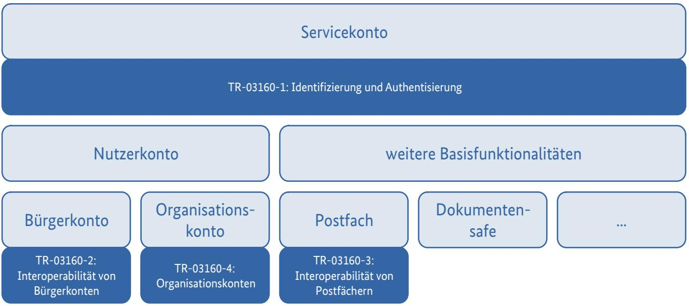
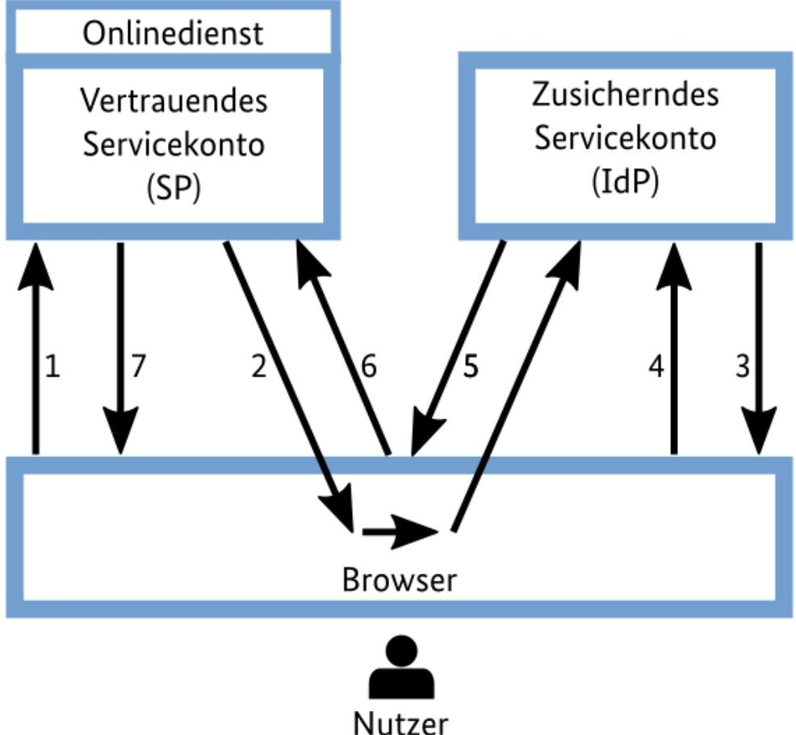
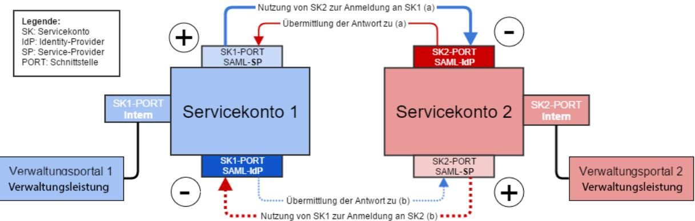
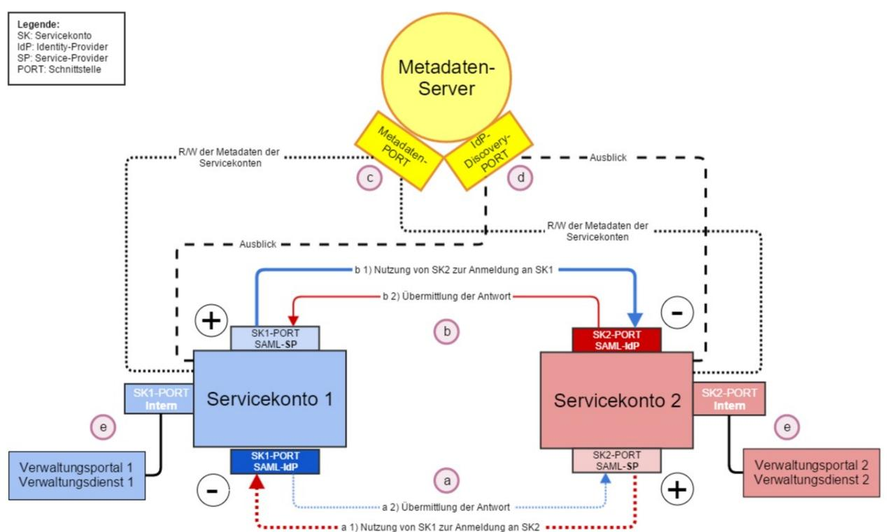

# Technische Richtlinie TR-03160-2 Servicekonten

Teil 2: Interoperables Identitätsmanagement für Bürgerkonten

Version 1.0 25.04.2022

## Änderungshistorie

| Version | Datum      | Beschreibung                                                                                                    |
|---------|------------|-----------------------------------------------------------------------------------------------------------------|
| 0.1     | 11.07.2019 | Erster Grobentwurf                                                                                              |
| 0.2     | 02.09.2019 | Änderungsvorschläge aus dem gemeinsamen Workshop von Freistaat Bayern und dem BSI am 31.07.2019              |
| 0.8     | 17.10.2019 | Änderungsvorschläge von Freistaat Bayern und Universität der Bundeswehr München aus September / Oktober 2019 |
| 0.9     | 02.12.2019 | Änderungsvorschläge der Servicekonten-Anbieter aus der Videokonferenz vom 28.11.2019 und Layout              |
| 0.9.1   | 07.01.2020 | Änderungsvorschläge des BMI vom 20.12.2019                                                                      |
| 0.9.2   | 15.01.2020 | Änderungsvorschläge der Vertreter des Datenschutzes vom 14.01.2020                                           |
| 0.9.3   | 27.03.2020 | Änderungsvorschläge der Vertreter des Datenschutzes vom 11.03.2020                                           |
| 0.9.4   | 30.04.2020 | Änderungsvorschläge von PWC aus dem April 2020 bzw. nach der Sitzung der PG eID-Strategie vom 23.04.2020     |
| 0.9.5   | 01.12.2020 | Einarbeitung Änderungsvorschläge aus erneuter Kommentierungsrunde PG eID-Strategie                           |
| 0.9.6   | 12.02.2021 | Einarbeitung weiterer Änderungsvorschläge aus Kommentierungen der PG eID-Strategie vom 12.02.2021            |
| 0.9.7   | 05.03.2021 | Einarbeitung weiterer Änderungsvorschläge aus Kommentierungen der PG eID-Strategie vom 05.03.2021            |
| 1.0     | 25.04.2022 | Einarbeitung aufgrund Erfahrungen in der Pilotierungsphase                                                      |

Bundesamt für Sicherheit in der Informationstechnik Postfach 20 03 63 53133 Bonn Tel.: +49 22899 9582-0 E-Mail: eid@bsi.bund.de Internet: https://www.bsi.bund.de © Bundesamt für Sicherheit in der Informationstechnik 2020

|       | Änderungshistorie 2                                                                 |  |
|-------|-------------------------------------------------------------------------------------|--|
| 1     | Einleitung 5                                                                        |  |
| 2     | Glossar 7                                                                           |  |
| 3     | SAML-Authentisierung eines Nutzers in einer Identitätsföderation10                  |  |
| 4     | Aufbau der Identitätsföderation "Interoperable Servicekonten"12                     |  |
| 4.1   | Interoperable Servicekonten als Dipole 12                                           |  |
| 4.2   | Zentrale Komponenten der Identitätsföderation "Interoperable Servicekonten"13       |  |
| 4.2.1 | Metadatenserver 13                                                                  |  |
| 4.2.2 | Anbindung eines Servicekontos über die Föderationsverwaltung14                      |  |
| 4.2.3 | Zulässige Daten zur Übertragung15                                                   |  |
| 4.3   | Bedingungen für Teilnehmer der Identitätsföderation "Interoperable Servicekonten"16 |  |
| 4.3.1 | Allgemeine Sicherheits-Voraussetzungen16                                            |  |
| 4.3.2 | Technische Voraussetzungen 18                                                       |  |
| 4.4   | Interoperabler Anwendungsfall in der Föderation26                                   |  |
|       | Literaturverzeichnis 28                                                             |  |

### Abbildungsverzeichnis

| Abbildung 1: Gliederung der Technischen Richtlinie TR-03160 Servicekonten                                                                               | 5  |
|---------------------------------------------------------------------------------------------------------------------------------------------------------|----|
| Abbildung 2: SAML-Authentisierung in der Föderation der Interoperablen Servicekonten (Front-Channel-Kommunikation über Redirect) [SAMLTecOvr, 5.1.2] | 10 |
| Abbildung 3: Schematische Darstellung eines Servicekontos als Dipol (gemäß Prototyp Interoperable Servicekonten)                                     | 13 |
| Abbildung 4: Architektur Interoperabler Servicekonten mit Metadatenserver                                                                               | 14 |

### 1 Einleitung

Am 18.08.2017 ist das Gesetz zur Verbesserung des Onlinezugangs zu Verwaltungsleistungen (Onlinezugangsgesetz – OZG) in Kraft getreten. Dieses verpflichtet in § 3 Abs. 2 OZG Bund und Länder dazu, Nutzerkonten bereitzustellen, über die sich Nutzer für die im Portalverbund des Bundes und der Länder verfügbaren elektronischen Verwaltungsleistungen einheitlich identifizieren können. Das BSI hat gemäß Begründung zu § 8 Absatz 3 OZG den Auftrag erhalten, die technischen Anforderungen an die Nutzerkonten und deren Verknüpfung, insbesondere an Datenschutz und Datensicherheit, in einer Technischen Richtlinie festzulegen.

Unter Nutzerkonten (als Oberbegriff von Bürgerkonten und Unternehmens- bzw. Organisationskonten) sind in der vorliegenden Technischen Richtlinie Konten von natürlichen Personen oder Institutionen bei den in verschiedenen Ländern und im Bund im Wirkbetrieb oder in der Entwicklung befindlichen Servicekonten zu verstehen; als "Servicekonten" werden elektronische Komponenten bezeichnet, die die Identifizierung von Nutzern und die Anlage, Verwendung und Verwaltung von Nutzerkonten ermöglichen.

Teilweise werden in Bund und Ländern von dieser Definition abweichende Definitionen der Begriffe Nutzerkonten und Servicekonten genutzt.

Abbildung 1: Gliederung der Technischen Richtlinie TR-03160 Servicekonten

Bund und Länder haben vereinbart, mit ihren Servicekonten eine Identitätsföderation Interoperabler Servicekonten aufzubauen, die nunmehr den Namen FINK (Föderiertes Identitätsmanagement interoperabler Nutzerkonten) trägt. Diese soll Bürgern und Organisationen ermöglichen, mit nur einem Nutzerkonto beim Servicekonto eines Landes oder des Bundes alle Online-Dienstleistungen von Bund, Ländern und Kommunen nutzen zu können.

Als wichtigster Aspekt im Rahmen der Planung einer Identitätsföderation werden – neben den Vorgaben zur Erreichung der technischen und syntaktischen Interoperabilität – im Allgemeinen die sicherheitsrele vanten Fragestellungen betrachtet. So müssen in der Regel die Teilnehmer einer Föderation die Mindeststandards für Sicherheit festlegen, auf die sich alle Teilnehmer einigen können. Diese Standards beinhalten Details sowohl zu empfohlenen IT-Sicherheitsmaßnahmen (z.B. welche sicherheitsrelevanten Technologien sollen verwendet werden) und deren Überwachung durch die Föderationsverwaltung als auch zu Datenschutzmaßnahmen.

Die vorliegende Technische Richtlinie erläutert den Aufbau der Interoperablen Servicekonten ausschließlich für den Bereich der Bürgerkonten und stellt die damit verbundenen erforderlichen IT- Sicherheits-Anforderungen an die Teilnehmer dieser Identitätsföderation dar. Interoperabilität ist dabei zu verstehen als "Fähigkeit, zwischen verschiedenen Funktionseinheiten in einer Weise zu kommunizieren, Programme auszuführen oder Daten zu übertragen, die erfordert, dass der Benutzer wenig oder gar keine Kenntnis von den einzigartigen Eigenschaften dieser Einheiten hat".

Die Anforderungen an Servicekonten im weiteren Text beziehen sich ausschließlich auf die Anwendung bezüglich Bürgerkonten. Vorgaben zu Organisationskonten werden in einer eigenen Technischen Richtlinie spezifiziert. Unter den Begriff "Organisationskonten" lassen sich auch Unternehmenskonten subsumieren. Diese werden nach Beschluss des IT-Planungsrats in einem einheitlichen Unternehmenskonto realisiert.

Das vorliegende Dokument beschreibt Anforderungen an die Servicekonten sowohl in ihren Rollen als Identity Provider (IdP) bzw. zusichernde Parteien als auch als Service Provider (SP) oder vertrauende Parteien des föderierten Identitätssystems. Die Interoperablen Servicekonten ermöglichen es einem bestimmten Servicekonto (als IdP) durch die Verwendung von SAML[1](#page-5-0) -Assertions[2](#page-5-1) , Authentifizierungen für eine Vielzahl von separat verwalteten Servicekonten (als SPs) bereitzustellen. Ebenso können Servicekonten (als SPs) Assertions von mehr als einem Servicekonto (als IdP) nutzen.

Assertions sind Aussagen von einem Servicekonto (IdP) an ein anderes Servicekonto (SP), die Informationen über einen Nutzer enthalten. Das Servicekonto als SP verwendet dabei die Informationen in der Assertion, um den Nutzer zu identifizieren und die Berechtigungsentscheidungen über dessen Zugang zu den an den SP angeschlossenen Online-Dienstleistungen von Verwaltungen zu treffen.

Im Allgemeinen basiert die Authentifizierung zwischen dem Nutzer und dem IdP auf den Authentifizie rungs-Mechanismen, die in der Technischen Richtlinie "Elektronische Identitäten und Vertrauensdienste im E-Government, Teil 1: Vertrauensniveaus und Mechanismen" [TR-03107-1] beschrieben werden. Interaktionen zwischen dem IdP und dem SP verwenden dabei Attribute, die unter Verwendung von Verfahren nach [TR-03107-1] festgelegt wurden. Viele der in der vorliegenden Technischen Richtlinie dargelegten Anforderungen stehen daher in einem gewissen Zusammenhang mit den entsprechenden Anforderungen in der referenzierten [TR-03107-1].

Der in der vorgenannten Technischen Richtlinie [TR-03107-1] verwendete Begriff "Vertrauensniveau normal" entspricht dem Begriff "Sicherheitsniveau niedrig (low)" nach [eIDAS-VO] und dem in dieser Technischen Richtlinie verwendeten Begriff "Vertrauensniveau niedrig".

In der vorliegenden Technischen Richtlinie werden Anforderungen als Ausdruck normativer Festlegungen durch die in Großbuchstaben geschriebenen deutschen Schlüsselworte MUSS/MÜSSEN, DARF NICHT/DÜRFEN NICHT, SOLLTE/SOLLTEN, SOLLTE NICHT/SOLLTEN NICHT, EMPFOHLEN, KANN/KÖNNEN, und OPTIONAL entsprechend [RFC2119] gekennzeichnet.

1 Bund und Länder haben die Verwendung der Security Assertion Markup Language (SAML) zum Austausch von Authentifizierungs- und Autorisierungsinformationen vorgegeben.

2 Vgl. Glossar

### 2 Glossar

| Grundsatz: In der vorliegenden Technischen Richtlinie werden ausschließlich die fett geschriebenen engli |  |
|----------------------------------------------------------------------------------------------------------|--|
| schen Begriffe bzw. ihre deutschen Entsprechungen verwendet.                                             |  |

| Engl. Begriff                      | Deutsche Entsprechung                | Bedeutung im Kontext "Interoperable Servicekonten"                                                                                                                                                                                                                                                                                                                                                                                                                                                                                                                                                                                                                                                                                                                                                                                                                          |
|------------------------------------|-----------------------------------------|-----------------------------------------------------------------------------------------------------------------------------------------------------------------------------------------------------------------------------------------------------------------------------------------------------------------------------------------------------------------------------------------------------------------------------------------------------------------------------------------------------------------------------------------------------------------------------------------------------------------------------------------------------------------------------------------------------------------------------------------------------------------------------------------------------------------------------------------------------------------------------|
| Assertion                          | Zusicherung, Bestäti gung            | Eine Bestätigung von einem zusichernden Servicekonto (IdP) an ein vertrauendes Servicekonto (SP), die Informa tionen über einen Nutzer enthält. Eine Assertion ist ein gebündelter Satz von Attributwerten oder Attributreferenzen über oder im Zusammenhang mit einem authentifizierten Nutzer, der von einem Servicekonto (als IdP) an ein anderes Servicekonto (als SP) im föderierten Identitätssystem der Interoperablen Servicekonten übergeben wird. Sie enthält eine Vielzahl von Informationen wie Assertion-Metadaten, Attributwerte und Attributreferenzen über den Nutzer und andere Informationen, die der SP nutzen kann (wie Einschränkungen und Ablaufzeiten).                                                                                                                                                          |
| Assurance                          | Vertrauen                               | Im Zusammenhang mit dieser Technischen Richtlinie wird die Vertrauenswürdigkeit definiert als 1) der Grad des Vertrauens in den Prüfungsprozess, der zur Feststellung der Identität einer Person, der die Zugangsdaten ausge stellt wurden, verwendet wird, und 2) der Grad des Ver trauens, dass die Person, die die Zugangsdaten verwendet, die Person ist, an die die Zugangsdaten ausgestellt wurden.                                                                                                                                                                                                                                                                                                                                                                                                                                                 |
| Authenticated Protected Channel | Authentifizierter ge schützter Kanal | Ein verschlüsselter Kommunikationskanal, der eine aner kannte Kryptographie verwendet, bei der der Verbin dungsinitiator (Client) den Empfänger (Server) authentifi ziert hat. Authentifizierte geschützte Kanäle bieten Ver traulichkeit und Man-in-the-Middle-(MitM-)Schutz und werden häufig im Rahmen der Nutzerauthentifizierung verwendet. Transport Layer Security (TLS) ist ein Beispiel für einen authentifizierten geschützten Kanal, bei dem das vom Empfänger vorgelegte Zertifikat vom Initiator über prüft wird. Sofern nicht anders spezifiziert, erfordern authentifizierte geschützte Kanäle nicht, dass der Server den Client authentifiziert. Die Authentifizierung des Ser vers erfolgt oft über eine Zertifikatskette, die zu einem ver trauenswürdigen Root führt, und nicht individuell mit je dem Server. |
| Authentication                     | Authentifizierung                       | Überprüfung der Identität eines Nutzers, Prozesses oder eines Geräts, oft als Vorbedingung für den Zugriff auf die Ressourcen eines Systems.                                                                                                                                                                                                                                                                                                                                                                                                                                                                                                                                                                                                                                                                                                                          |
| Authentication Protocol            | Authentifizierungs protokoll         | Eine definierte Folge von Nachrichten zwischen einem Nutzer und einem zusichernden Servicekonto (IdP), die nachweist, dass der Nutzer im Besitz und in der Kontrolle eines oder mehrerer gültiger Authentifikatoren ist, um sei ne Identität zu bestätigen, und optional nachweist, dass der Nutzer mit dem vorgesehenen Servicekonto kommu niziert.                                                                                                                                                                                                                                                                                                                                                                                                                                                                                                      |

| Engl. Begriff                   | Deutsche Entsprechung     | Bedeutung im Kontext "Interoperable Servicekonten"                                                                                                                                                                                                                                                                                                                                                                                                                                                                                                                                                                                        |
|---------------------------------|------------------------------|-------------------------------------------------------------------------------------------------------------------------------------------------------------------------------------------------------------------------------------------------------------------------------------------------------------------------------------------------------------------------------------------------------------------------------------------------------------------------------------------------------------------------------------------------------------------------------------------------------------------------------------------|
| Authenticator                   | Authentifikator, Token       | Etwas, das der Anspruchsteller besitzt und kontrolliert (typischerweise ein kryptographisches Modul oder Pass wort), das zur Authentifizierung der Identität des An spruchstellers verwendet wird. Auch als Authentisie rungsmittel oder Token bezeichnet.                                                                                                                                                                                                                                                                                                                                                                    |
| Binding                         | Bindung                      | Eine Verbindung zwischen einer Nutzeridentität und einem Authentifikator oder einer bestimmten Nutzer sitzung. Im SAML-Kontext ist damit auch oft die Abbildung des von SAML festgelegten Ablaufs beim Austausch von Nachrichten auf Transportmechanismen (wie HTTPS) ge meint.                                                                                                                                                                                                                                                                                                                                            |
| Federation                      | Föderation                   | Eine Vereinbarung zur Zusammenarbeit, die die Weiterga be von Identitäts- und Authentifizierungsinformationen über eine Reihe von vernetzten Systemen hinweg ermög licht.                                                                                                                                                                                                                                                                                                                                                                                                                                                        |
| Front-Channel Commu nication | Frontkanal-Kommuni kation | Die Kommunikation zwischen zwei Systemen, die auf Redirects basiert, erfolgt über einen Intermediär wie bei spielsweise einen Browser.                                                                                                                                                                                                                                                                                                                                                                                                                                                                                              |
| Identity Provider (IdP)         | Identitäts-Dienstleister     | Die Partei, die die primären Authentifizierungs- und Iden tifizierungsdaten des Nutzers verwaltet und aus diesen Zu gangsdaten abgeleitete Zusicherungen (Assertions) ausgibt. Dies ist in der Regel das zusichernde Servicekonto (IdP), wie es in dieser Technischen Richtlinie beschrieben wird. Synonym wird häufig auch vom dienstfremden Servicekonto gesprochen.                                                                                                                                                                                                                                                  |
| Private Key                     | Privater Schlüssel           | Der geheime Teil eines asymmetrischen Schlüsselpaares, der zum digitalen Signieren oder Entschlüsseln von Daten verwendet wird.                                                                                                                                                                                                                                                                                                                                                                                                                                                                                                     |
| Protected Session               | Abgesicherte Sitzung         | Eine Sitzung, bei der Nachrichten zwischen zwei Teilneh mern verschlüsselt werden und die Integrität durch eine Reihe von gemeinsamen Geheimnissen, die als Sitzungs schlüssel bezeichnet werden, geschützt wird. Ein Teilnehmer gilt als authentifiziert, wenn er während der Sitzung den Besitz eines oder mehrerer Authentifika toren zusätzlich zu den Sitzungsschlüsseln nachweist und wenn die andere Partei die mit dem/den Authentifikator(en) verbundene Identität überprüfen kann. Wenn beide Teilnehmer authentifiziert sind, gilt die abge sicherte Sitzung als gegenseitig authentifiziert. |
| Public Key                      | Öffentlicher Schlüssel       | Der öffentliche Teil eines asymmetrischen Schlüssel paares, der zur Überprüfung von Signaturen oder zur Ver schlüsselung von Daten verwendet wird.                                                                                                                                                                                                                                                                                                                                                                                                                                                                                  |
| Service Provider (SP)           | Diensteanbieter              | Eine Instanz, die sich auf die Authentifikatoren und Zu gangsdaten des Nutzers oder die Zusicherung der Identität eines Nutzers durch einen IdP stützt, typischerweise um eine Transaktion abzuwickeln oder Zugang zu Informatio nen oder einem System zu gewähren. In dieser Techni schen Richtlinie handelt es sich dabei um das vertrauende                                                                                                                                                                                                                                                                             |

| Engl. Begriff                      | Deutsche Entsprechung       | Bedeutung im Kontext "Interoperable Servicekonten"                                                                                                                                                                                                                                                                                                                                                                                                                                                                       |
|------------------------------------|--------------------------------|--------------------------------------------------------------------------------------------------------------------------------------------------------------------------------------------------------------------------------------------------------------------------------------------------------------------------------------------------------------------------------------------------------------------------------------------------------------------------------------------------------------------------|
|                                    |                                | Servicekonto (SP). Alternativ kann auch von einem diensteigenen Servicekonto gesprochen werden.                                                                                                                                                                                                                                                                                                                                                                                                                       |
| Session                            | Sitzung                        | Eine fortdauernde Interaktion zwischen einem Nutzer und einem Endpunkt, entweder einem vertrauenden Ser vicekonto (SP) oder einem zusichernden Servicekonto (IdP). Eine Sitzung beginnt mit einer Authentifizierung und endet mit einer Session-Beendigung. Eine Sitzung ist an die Verwendung eines Sitzungsgeheimnisses gebunden, das die Software des Nutzers (Browser, Anwendung oder Betriebssystem) dem SP oder dem IdP anstelle der Authentifizierungsdaten des Nutzers übermitteln kann. |
| Transport Layer Securi ty (TLS) | Transportschicht Sicherheit | Ein Authentifizierungs- und Sicherheitsprotokoll, das in Browsern und Webservern weit verbreitet ist. TLS ist durch [RFC 5246] definiert.                                                                                                                                                                                                                                                                                                                                                                          |
| User                               | Nutzer                         | Eine Entität, die von einem ausstellenden Servicekonto (IdP) eine Assertion ihrer Identität erhalten hat, um damit den Onlinedienst eines vertrauenden Servicekontos (SP) nutzen zu können.                                                                                                                                                                                                                                                                                                                     |
| Whitelist                          | Weiße Liste                    | Sammlung von Daten, die mit Servicekonten assoziiert werden und als vertrauenswürdige Quellen die Zustellung von Assertions erlauben.                                                                                                                                                                                                                                                                                                                                                                              |

### 3 SAML-Authentisierung eines Nutzers in einer Identitätsföderation

Die Authentisierung eines Nutzers in einer Identitätsföderation unter Beteiligung eines Service Providers (vertrauendes Servicekonto) und eines Identity Providers (zusicherndes Servicekonto), um einen Onlinedienst einer Verwaltung berechtigt nutzen zu können, läuft wie in der unten stehenden Abbildung beispielhaft dargestellt, üblicherweise als Front-Channel-Kommunikation über den Browser des Nutzers ab. Die beteiligten Servicekonten werden dabei über die Security Assertion Markup Language [SAML V2.0] als vorgegebener Standard an die Föderation angebunden. Ein zukünftiger Aufbau oder eine Erweiterung der Föderation auch über den OpenID Connect Standard [OIDC] ist jedoch nicht ausgeschlossen, falls die ersten Servicekonten diesen Standard implementieren.

Abbildung 2: SAML-Authentisierung in der Föderation der Interoperablen Servicekonten (Front-Channel-Kommunikation über Redirect) [SAMLTecOvr, 5.1.2]

1. Der Nutzer versucht, über seinen Browser auf einen Onlinedienst über das vertrauende Servicekonto (SP) zuzugreifen. Der Nutzer hat keine gültige Anmeldesitzung (z.B. Sicherheitskontext) auf dieser Website. Der SP speichert die angeforderte Ressourcen-URL (des

Onlinedienstes) in lokalen Zustandsinformationen, die über den Web-SSO-Austausch analog zu [SAMLv2Prof][3](#page-10-0) gespeichert werden können.

- 2. Das vertrauende Servicekonto (SP) sendet eine HTTP-Redirect-Antwort an den Browser. Der Location HTTP-Header enthält die Ziel-URI des Sign-On Service beim zusichernden Servicekonto (IdP)[4](#page-10-1) zusammen mit einer <AuthnRequest> Nachricht[5](#page-10-2) , die als URL-Abfragevariable namens SAMLRequest kodiert ist. Der Browser verarbeitet die o.g. Redirect-Antwort und gibt eine HTTP-GET-Anfrage an den Single Sign-On Service des IdP mit dem Abfrage-Parameter SAMLRequest aus. Die lokalen Zustandsinformationen (oder eine Referenz darauf) sind auch in der HTTP-Antwort enthalten, die in einem Parameter RelayState in der Abfragezeichenkette kodiert ist.
- 3. Der Single Sign-On Service des IdP ermittelt, ob der Nutzer dort einen bestehenden Anmelde-Sicherheitskontext hat. Durch ForceAuthn="true" als Attribut für die <AuthnRequest> wird der IdP angewiesen, bei der Authentifizierung des Nutzers keinen vorherigen Sicherheitskontext zu verwenden. Der IdP interagiert mit dem Browser und fordert den Nutzer auf, gültige Anmeldeinformationen zu übermitteln.
- 4. Der Nutzer stellt gültige Anmeldeinformationen zur Verfügung[6](#page-10-3) und es wird ein lokaler Anmelde-Sicherheitskontext für den Nutzer am IdP erstellt.
- 5. Der IdP Single Sign-On Service erstellt eine SAML-Assertion, die den Sicherheitskontext des Nutzers wiedergibt. Da eine POST-Bindung verwendet werden soll, wird die Assertion digital signiert und dann in eine SAML <Response>-Nachricht eingefügt. Die <Response>-Nachricht wird dann innerhalb eines HTML-Formulars als verstecktes Formularsteuerelement namens SAMLResponse[7](#page-10-4) platziert. Wenn der IdP einen RelayState-Wert vom SP erhalten hat, muss er ihn unverändert an den SP in einem versteckten Formularsteuerelement namens RelayState zurückgeben. Der Single Sign-On Service sendet das HTML-Formular in der HTTP-Antwort an den Browser zurück. Für einfachere Zwecke wird das HTML-Formular typischerweise von einem Skriptcode begleitet, der das Formular automatisch an die Zielseite sendet.
- 6. Der Browser gibt entweder aufgrund einer Nutzeraktion oder der Ausführung eines "Auto-Submit"- Skripts eine HTTP-POST-Anfrage aus, um das Formular an den Assertion Consumer Service des vertrauenden Servicekontos (SP) zu senden, wobei die Werte der Parameter SAMLResponse und RelayState aus dem HTML-Formular von Schritt 5 übernommen werden.Der Assertion Consumer Service des SP erhält die <Response>-Nachricht aus dem HTML-Formular zur Verarbeitung. Die digitale Signatur auf der SAML-Assertion muss zunächst validiert und dann der Inhalt der Assertion verarbeitet werden, um einen lokalen Anmelde-Sicherheitskontext für den Nutzer am SP zu erstellen. Sobald dies abgeschlossen ist, ruft der SP die durch die RelayState-Daten angezeigten lokalen Zustandsinformationen ab, um die ursprünglich angeforderte Ressourcen-URL des Onlinedienstes abzurufen. Anschließend sendet er eine HTTP-Redirect-Antwort an den Browser, die diesen anweist, auf den ursprünglich angeforderten Onlinedienst zuzugreifen (nicht angezeigt).
- 7. Es wird eine Zugriffsprüfung durchgeführt, um festzustellen, ob der Nutzer die richtige Berechtigung für den Zugriff auf den Onlinedienst hat. Wenn die Zugriffsprüfung bestanden ist, werden die Daten des Onlinedienstes an den Browser zurückgegeben.
- 3 Für die Föderation der Interoperablen Servicekonten wird nur ein Subset des SAMLv2Prof zugelassen, das im "Interoperable Servicekonten Web Browser SSO Profile" der Föderationsverwaltung näher beschrieben wird.
- 4 Das richtige zusichernde Servicekonto muss der Nutzer anhand der Auswahlliste des SP ausgewählt haben.
- 5 Dieser AuthnRequest muss auch Angaben zum Vertrauensniveau "niedrig", "substantiell" oder "hoch" beinhalten, die das vertrauende Servicekonto (SP) fordert, um Zugang zum dort angeschlossenen Onlinedienst zu gewähren.
- 6 Die Anmeldeinformationen bzw. das verwendete Authentisierungsmittel richten sich nach dem geforderten Vertrauensniveau.
- 7 Das zusichernde Servicekonto (IdP) teilt so u.a. mit, mit welchem Authentisierungsmittel und somit für welches Vertrauensniveau sich der Nutzer erfolgreich authentisiert hat.

### 4 Aufbau der Identitätsföderation "Interoperable Servicekonten"

#### 4.1 Interoperable Servicekonten als Dipole

Die Teilnahme von Servicekonten an der Identitätsföderation "Interoperable Servicekonten" ist in der Form von Dipolen organisiert. Jedes Servicekonto kann dabei sowohl die Rolle eines Identity Providers (zusicherndes Servicekonto) als auch die Rolle eines Service Providers (vertrauendes Servicekonto) wahrnehmen.

Das jeweilige Servicekonto kann sowohl als Service Provider die in seiner Vertrauensdomäne liegenden Services (z.B. angeschlossene Onlinedienste des Bundeslandes und seiner Kommunen) repräsentieren als auch als Identity Provider anderen Servicekonten in der Föderation Assertions über den die Zugangsberechtigung zu dort angeschlossenen Onlinediensten begehrenden Nutzer bereitstellen.

Der Dipol-Ansatz wurde gewählt, um den Teilnehmern der Föderation zu ermöglichen, die Anbindung ihrer Verwaltungsdienste frei zu gestalten. Dies bedeutet, dass diese Onlinedienste immer nur mit dem eigenen Servicekonto interagieren und dass die Interoperabilität ausschließlich zwischen den beteiligten Servicekonten realisiert wird. Die Onlinedienste werden demzufolge in dieser Technischen Richtlinie nicht weiter betrachtet, da sie nicht als SAML-SPs auftreten. Sie treten nur intern mit ihrem Servicekonto in Verbindung und sind somit kein Teil einer IdP-SP-Kommunikation der interoperablen Servicekonten. Demzufolge steht es den Föderationsteilnehmern frei, wie sie die Schnittstelle zwischen dem eigenen Servicekonto und ihren Onlinediensten organisieren.

Die nachfolgende Abbildung stellt wie vom IT-Planungsrat vorgeschlagen [IT-PLR-LÖSV] die Dipol-Funktionen eines Servicekontos in der Föderation der Interoperablen Servicekonten grob dar:

Abbildung 3: Schematische Darstellung eines Servicekontos als Dipol

Die beiden dargestellten Kommunikationswege (a) und (b) sind voneinander unabhängig. In beiden Fällen wird beschrieben, wie die Anmeldung an einem fremden Servicekonto erfolgt. Im Anwendungsfall (a) meldet sich der Nutzer für die Nutzung eines Verwaltungsdiensts 1 mit Servicekonto 2 an. Im Anwendungsfall (b) meldet sich der Nutzer für die Nutzung eines Verwaltungsdiensts 2 mit Servicekonto 1 an. Sollte ein Nutzer sich am eigenen Servicekonto anmelden – hier nicht beschriebener Fall c – handelt es sich um keine Frage der Interoperabilität.

#### 4.2 Zentrale Komponenten der Identitätsföderation "Interoperable Servicekonten"

#### 4.2.1 Metadatenserver

Vertrauen ist innerhalb einer Föderation essentiell, damit die verschiedenen Teilnehmer bereit sind, miteinander zu kommunizieren. Dabei wird das technische Vertrauen durch die Verteilung von Metadaten, die z.B. Informationen über die eindeutigen Adressen der Servicekonten (IdP, SP) enthalten, hergestellt.

Für die Föderation insgesamt wird ein grundlegender Schutz dadurch erreicht, dass Anfragen nur von SPs entgegen genommen bzw. nur an IdPs weitergeleitet werden, die in den Föderationsmetadaten enthalten sind.

#### 4.2.1.1 Rolle des Metadatenservers

Über einen zentralen Metadatenserver werden die Zugriffsinformationen zwischen den Teilnehmern an der Föderation ausgetauscht. Demzufolge enthält die zentrale Metadatendatei eine Zusammenstellung der unter 4.3.2 im Einzelnen beschriebenen Metadaten aller an der Föderation der Interoperablen Servicekonten teilnehmenden Servicekonten, wie z.B. die URL von deren Identity Provider und deren Service Provider oder die Funktionen und Funktionspostfächer der zuständigen Beschäftigten / zuständigen Organisationseinheiten des Teilnehmers bzw. Servicekonto-Anbieters.

Abbildung 4 Architektur Interoperabler Servicekonten mit Metadatenserver

Der Metadatenserver der Föderation der Interoperablen Servicekonten wird von ihrer Föderationsverwaltung gehostet und administriert. Er dient ausschließlich der Vermittlung zwischen den teilnehmenden Diensten und hat zu keinem Zeitpunkt Zugriff auf Daten der Nutzer der Servicekonten.

Die Föderationsmetadaten SOLLTEN mindestens einmal pro Tag durch die Föderationsteilnehmer in einem Pull-Verfahren von der Föderationsverwaltung abgerufen werden.[8](#page-13-0) Dabei MUSS die Metadatendatei durch die Föderationsverwaltung signiert und diese Metadatensignatur bei den empfangenden Servicekonten überprüft werden. Dies verhindert, dass ein potenzieller Angreifer die Metadatendatei manipulieren und sich als berechtigten Teilnehmer der Föderation ausgeben kann. Weitere Erläuterungen werden im Detail unter 4.3.2 (Technische Voraussetzungen) dargestellt.

#### 4.2.1.2 Auswahl des nutzereigenen Servicekontos (IdP) zur Authentisierung am verwaltungseigenen Servicekonto (SP)

Die SAML-Protokolle werden in der Föderation der Interoperablen Servicekonten in der Regel in der Funktionsweise eines "Service Provider zuerst" [SAMLTecOvr] verwendet, bei der ein Nutzer zunächst eine Website besucht, die geschützte Inhalte bereitstellt, bevor er dieser Website eine Authentifizierungs-Assertion erteilt. In dieser Situation muss das vertrauende Servicekonto (SP), an das die Website angeschlossen ist, den Nutzer mit einer Authentifizierungsanforderungsnachricht an dessen zusicherndes Servicekonto (IdP) weiterleiten. Das Problem der korrekten Bestimmung des richtigen zusichernden Servicekontos, an das der Benutzer weitergeleitet werden soll, wird dabei als Discovery-Problem (Ermittlungs-Problem) oder "Where are you from (WAYF)" bezeichnet.

Ein vertrauendes Servicekonto (SP) verwendet zu diesem Zweck die aktuellen Metadaten der Föderation, um eine Liste anzuzeigen, aus der der Nutzer sein zusicherndes Servicekonto (IdP) auswählen kann; dieser Ansatz wird auch als "lokaler Discovery-Service" bezeichnet. Diese manuelle Auswahl des zuständigen IdPs (IdP Selection) durch den Nutzer ermöglicht diesem die freie IdP-Wahl; insbesondere können hierdurch auch bei mehreren Nutzerkonten derselben Person verschiedene IdPs verwendet werden. Die Durchführung dieses "Embedded" Discovery-Prozesses beim vertrauenden Servicekonto (SP) bietet dabei in der Regel ein gutes Nutzererlebnis. Die Föderationsteilnehmer SOLLTEN die Benutzerführung bei der Auswahl des zusichernden Servicekontos gleichförmig ausgestalten.

In einer Identitätsföderation wie den Interoperablen Servicekonten haben der zentral zur Verfügung gestellte Metadatenserver und die darauf vorgehaltene Metadatendatei demnach auch die mittelbare Aufgabe, den Servicekontobetreiber des Nutzers (IdP) zu ermitteln, um ihn für die Authentisierung beim Onlinedienst über das vertrauende Servicekonto (SP) verwenden zu können. [analog zu IdpDiscoSvcProtonProfile]

Mit der Verwaltung des Metadatenservers sind insbesondere auch die in 4.2.2 und 4.2.3 dargestellten Prozesse verbunden.

#### 4.2.2 Anbindung eines Servicekontos über die Föderationsverwaltung

Die Metadatenverwaltung erfordert auch manuelle Schritte, insbesondere bei der Aufnahme von Teilnehmern in die Föderation. Servicekonten als SPs und IdPs müssen bestimmte Anforderungen erfüllen, um überhaupt an einer Föderation wie der der Interoperablen Servicekonten teilnehmen zu können. Die Erfüllung dieser Anforderungen kann mit unterschiedlichen Verfahren, wie über Verträge, ein Self-Assessment oder auch Audits, überprüft werden. Die Föderationsverwaltung überprüft das Vorliegen der Teilnahmevoraussetzungen an der Föderation der Interoperablen Servicekonten in der Regel mittels der von den Antragstellern zur Verfügung gestellten Unterlagen.

Die Föderationsverwaltung erfüllt hierbei die anfallenden technischen, operationalen und sicherheitsrelevanten Aufgaben für die Föderation der Interoperablen Servicekonten.

Die Dokumentation zum organisatorischen und technischen Ablauf der Anbindung eines Servicekontos an die geschlossene Föderation der Interoperablen Servicekonten kann durch Bund und Länder über die Föderationsverwaltung abgerufen werden.

8 Im Falle eines Angriffs auf die Verfügbarkeit der Föderationsmetadaten (z.B. Denial-of-Service) können die Föderationsmetadaten von der Föderationsverwaltung auch im Push-Verfahren an die Föderationsteilnehmer verteilt werden.

#### 4.2.3 Zulässige Daten zur Übertragung

Die Föderation definiert in "Attribute der Föderation", welche Daten, insbesondere welche Nutzerdaten, im Rahmen der Nutzung der Interoperabilität übertragen werden können. Die Nutzerdaten setzen sich dabei aus Attributen wie z.B. Vorname, Geburtsname, Geburtsort und dem jeweiligen Vertrauensniveau, mit dem sie verifiziert wurden, zusammen. Siehe hierzu auch [TR-03160-1].

Im Folgenden wird kurz auf die bestehende Rechtsgrundlage des Bundes und der eIDAS-VO eingegangen.

#### 4.2.3.1 Nutzerdaten nach Onlinezugangsgesetz

Das Onlinezugangsgesetz regelt in seinem § 8 (Rechtsgrundlagen der Datenverarbeitung), welche Nutzerdaten, d.h. welche Attribute einer elektronischen Identität, zwischen zwei Servicekonten über die Föderation der Interoperablen Servicekonten übertragen werden dürfen.

#### 4.2.3.2 Interoperabilität mit eIDAS-VO

Laut Erwägungsgrund 15 und Artikel 6 (Gegenseitige Anerkennung) der eIDAS-VO [eIDAS-VO] ergibt sich die Verpflichtung zur Anerkennung elektronischer Identifizierungsmittel anderer EU-Mitgliedstaaten unter den nachfolgenden Bedingungen.

Demnach müssen elektronische Identifizierungsmittel anderer Mitgliedstaaten für die Zwecke der grenzüberschreitenden Authentifizierung für die an die Interoperablen Servicekonten angeschlossenen Online-Dienste dann anerkannt werden, wenn

- sie im Rahmen eines elektronischen Identifizierungssystems ausgestellt werden, das in der von der EU-Kommission veröffentlichten Liste[9](#page-14-0) aufgeführt ist,
- ihr Vertrauensniveau einem Vertrauensniveau entspricht, das so hoch oder höher als das für den Zugang zum Online-Dienst geforderte Vertrauensniveau ist, sofern das Vertrauensniveau des Identifizierungsmittels dem Vertrauensniveau "substantiell" oder "hoch" entspricht und
- für den Zugang zu diesem Online-Dienst das Vertrauensniveau "substantiell" oder "hoch" verwendet wird.

Aus dieser Verpflichtung, eID-Systeme anderer europäischer Mitgliedstaaten anzuerkennen, kann sich der Umstand ergeben, dass weitere gelieferte Datenfelder des fremden Identifizierungsmittels seitens des Servicekontos zu akzeptieren sind bzw. seitens der deutschen Onlinedienste zu prüfen ist, ob möglicherweise auf Daten verzichtet werden kann, die nicht unter den verpflichtenden Teil des Minimaldatensatzes nach eIDAS-VO fallen und von eID-Systemen anderer EU-Mitgliedstaaten nicht mitgeliefert werden.

Der Minimaldatensatz für natürliche Personen nach eIDAS-VO und [VO 2015/1501] unterscheidet sich vom in 4.2.3.1 genannten OZG-Mindestdatensatz für natürliche Personen wie folgt:

Zusätzliche Datenfelder laut [VO 2015/1501]:

- eindeutige Kennung, die vom übermittelnden Mitgliedstaat entsprechend den technischen Spezifikationen für die Zwecke der grenzüberschreitenden Identifizierung erstellt wurde und möglichst dauerhaft fortbesteht,
- Geschlecht.

Gegenüber [OZG] fehlende Datenfelder:

- Geburtsland
- Akademischer Grad
- 9 https://ec.europa.eu/cefdigital/wiki/display/EIDCOMMUNITY/Overview+of+prenotified+and+notified+eID+schemes+under+eIDAS

Die Teilnehmer MÜSSEN daher sicher stellen, dass die über die Föderation angebundenen Servicekonten auch die zusätzlichen Datenfelder der eIDAS-Datensätze einlesen können und die zulässigen Nutzerdaten nach dem bisherigen OZG-Datensatz entsprechend erweitern.[10](#page-15-0) Die zusätzlichen Datenfelder KÖNNEN im Servicekonto gespeichert werden, sofern eine entsprechende Rechtsgrundlage besteht.[11](#page-15-1) Eine Weiterleitung der zusätzlichen gelieferten Nutzerdaten durch das vertrauende Servicekonto (SP) an den Onlinedienst erfolgt nur bei expliziter Anforderung durch den Onlinedienst. Fehlen eigentlich erforderliche Datenfelder, weil sie der eIDAS-Datensatz nicht mitliefert, obliegt es der Entscheidung des jeweiligen Onlinedienstes, ob er seine Dienstleistung gegenüber dem eIDAS-Nutzer dennoch erbringt. Die Vorgaben der eIDAS-Verordnung MÜSSEN bei der Entscheidung beachtet werden.

### 4.3 Bedingungen für Teilnehmer der Identitätsföderation "Interoperable Servicekonten"

Einem bekannten Sprichwort zufolge ist "eine Kette immer nur so stark wie ihr schwächstes Glied". Dies gilt im übertragenen Sinne auch für die IT-Sicherheit. Auch in einer Identitätsföderation wie den "Interoperablen Servicekonten" müssen sich alle Teilnehmer sicher sein können, dass die anderen Teilnehmer keine Schwachstellen aufweisen, die das Gesamtsystem kompromittieren können.

Deshalb sind Anbieter von Servicekonten verpflichtet, die nachfolgend aufgelisteten MUSS-/SOLL-Bedingungen einzuhalten, um an der Identitätsföderation "Interoperable Servicekonten" teilnehmen zu können. Die Einhaltung dieser Bedingungen wird der Föderation dabei durch jeden Föderationsteilnehmer über den Teilnahme-Antrag an die Föderationsverwaltung schriftlich zugesichert.

#### 4.3.1 Allgemeine Sicherheits-Voraussetzungen

#### 4.3.1.1 Umsetzung von IT-Grundschutz

*In Rechenzentren der Teilnehmer, in denen deren Servicekonten gehostet werden, MÜSSEN die Anforderungen des IT-Grundschutzes eingehalten werden. Insbesondere MÜSSEN bei allen Prozessen eines Rechenzentrums, die für die Prozesse der Identitätsföderation genutzt werden, die Anforderungen des IT-Grundschutzes eingehalten werden. Ebenso SOLLTE eine Zertifizierung nach ISO 27001 erfolgen (siehe 4.3.1.2). Richtet sich das Rechenzentrum nachweislich nach den Anforderungen des IT-Grundschutzes oder ist es sogar nach ISO 27001 zertifiziert, kann auf diese Weise der Betreiberverantwortung nachgekommen werden. Trifft dies für ein Rechenzentrum nicht oder nur teilweise zu, so verantwortet die für das Servicekonto verantwortliche Behörde den Betrieb und u. U. die daraus entstehenden Folgen.*

Begründung: Mit der Berücksichtigung des IT-Grundschutzes stellt ein Teilnehmer der Föderation sicher, dass sein hostendes Servicekonto-Rechenzentrum den gebotenen Schutz für alle personenbezogenen Informationen der Servicekonten-Inhaber gewährleistet. Ziel ist es dabei, durch die geeignete Kombination von organisatorischen, personellen, infrastrukturellen und technischen Sicherheitsanforderungen ein Sicherheitsniveau für das teilnehmende Servicekonto zu erreichen, das für seinen Schutzbedarf [12](#page-15-2) angemessen ist. Informationen zum IT-Grundschutz können Föderationsteilnehmer online[13](#page-15-3) über das IT-Grundschutz-Kompendium - Edition 2019 des BSI [BSI-GS 2019] beziehen.

- 10 Dies ergibt sich auch aus § 8 Abs. 1 Nr. 1 k) OZG, wonach bei der Nutzung die spezifischen Daten, die von notifizierten elektronischen Identifizierungsmitteln nach der Verordnung (EU) Nr. 910/2014 vom 23. Juli 2014 über elektronische Identifizierung und Vertrauensdienste für elektronische Transaktionen im Binnenmarkt und zur Aufhebung der Richtlinie 1999/93/EG (ABl. L 257 vom 28.8.2014, S. 73) übermittelt werden, verarbeitet werden dürfen.
- 11 Diese ist mittlerweile durch § 8 (1) Nr. 1 Buchstabe k) OZG geschaffen worden,
- 12 In der Regel ist bei personenbezogenen Daten von einem hohen Schutzbedarf auszugehen. Der Betreiber steht in der Verantwortung, diesen Schutzbedarf zu gewährleisten.
- 13 https://www.bsi.bund.de/DE/Themen/Unternehmen-und-Organisationen/Standards-und-Zertifizierung/IT-Grundschutz/IT-Grundschutz-Kompendium/it-grundschutz-kompendium\_node.html

#### 4.3.1.2 Zertifizierung nach IT-Grundschutz

#### *Servicekonten-Implementierungen der Teilnehmer SOLLTEN nach ISO 27001 auf Basis von IT-Grundschutz zertifiziert sein.*

Begründung: Um gegenüber der Föderationsverwaltung und den anderen Föderationsteilnehmern dokumentieren zu können, dass ein Teilnehmer angemessene Maßnahmen zur Einhaltung des IT-Grundschutzes umgesetzt hat, empfiehlt es sich, eine Zertifizierung der Servicekonto-Implementierung nach ISO 27001 auf Basis von IT-Grundschutz durchzuführen. Voraussetzung für die Vergabe eines ISO 27001-Zertifikats auf der Basis von IT-Grundschutz ist eine Überprüfung durch einen vom BSI zertifizierten ISO 27001-Grundschutz-Auditor. Zu den Aufgaben eines ISO 27001-Grundschutz-Auditors gehört eine Sichtung der vom Antragsteller erstellten Referenzdokumente, die Durchführung einer Vor-Ort-Prüfung und die Erstellung eines Auditberichts. Für die Vergabe eines ISO 27001-Zertifikats muss dieser Auditbericht zur Überprüfung dem BSI vorgelegt werden. Auf der Grundlage des Auditberichts wird durch das BSI über die Ausstellung eines Zertifikats entschieden. Nähere Informationen zur Grundschutz-Zertifizierung können online [14](#page-16-0) abgerufen werden.

#### 4.3.1.3 Penetrations-Test / Web-Check

*Servicekonten der Teilnehmer MÜSSEN vor Aufnahme in die Föderation "Interoperable Servicekonten" einem Penetrations-Test / einem Web-Check durch einen unabhängigen Dritten unterzogen werden. Deren Mindesttestumfang legt die Föderation einvernehmlich fest, wobei sie zumindest Standard-Penetrations-Tests fordert. Die Entscheidung über die Aufnahme eines Teilnehmers in die Föderation MUSS die Föderationsverwaltung auch vom Ergebnis des Penetrations-Tests / Web-Checks abhängig machen. Penetrations-Tests und Web-Checks MÜSSEN im Abstand von drei Jahren wiederholt werden. Darüber hinaus MÜSSEN sie auch nach größeren Änderungen des Servicekontos[15](#page-16-1) durchgeführt werden.*

Begründung: Um die Erfolgsaussichten eines vorsätzlichen Angriffs auf die eigene Servicekonten-Infrastruktur einzuschätzen und dadurch die Wirksamkeit der vorhandenen Sicherheitsmaßnahmen zu überprüfen, sollten weitere notwendige Sicherheitsmaßnahmen durchgeführt werden. Es werden dazu vom BSI zwei Testmethoden angeboten: der IS-Penetrationstest sowie der IS-Webcheck. Beide Testmethoden konzentrieren sich auf die häufigsten und bekanntesten Schwachstellen von weitverbreiteten IT-Systemen. Durch die Prüfungen wird aufgezeigt, welche Schwachstellen zum Prüfzeitpunkt mit vertretbarem Untersuchungsaufwand und den vereinbarten Methoden gefunden werden können. Um langfristig einen guten Sicherheitseindruck über die IT-Systeme zu gewinnen, wird empfohlen, die Tests in regelmäßigen Abständen zu wiederholen. Weitergehende Informationen zu Penetrationstests und Webchecks stehen online [16](#page-16-2) zur Verfügung. Die Föderationsverwaltung muss die Aufnahme neuer Teilnehmer in die Föderation von den Ergebnissen der Penetrationstests / Webchecks abhängig machen.

#### 4.3.1.4 Überprüfung durch die Föderationsverwaltung

*Die Föderationsverwaltung der Interoperablen Servicekonten MUSS jeden Teilnehmer der Föderation individuell überprüfen, um festzustellen, ob er die von ihm erwarteten Sicherheits-, Identitäts- und Datenschutzstandards einhält. Das Ausmaß der Prüfungen legt die Föderation auf Vorschlag der Föderationsverwaltung fest. Zur Prüfung dürfen auch Selbstauskünfte der Antragsteller von diesen analog zur Verwaltungsvereinbarung und Datenschutzerklärung vorgelegt werden. Erst danach kann ein Servicekonten-Anbieter als Teilnehmer in die Föderation aufgenommen werden.*

14 https://www.bsi.bund.de/DE/Themen/Unternehmen-und-Organisationen/Standards-und-Zertifizierung/Zertifizierung-und-Anerkennung/Zertifizierung-von-Managementsystemen/ ISO-27001-Basis-IT-Grundschutz/iso-27001-basis-it-grundschutz\_node.html 15 z.B. ein Relaunch

16 https://www.bsi.bund.de/DE/Themen/Oeffentliche-Verwaltung/Sicherheitspruefungen/ Pen\_Test\_und\_IS\_Webcheck/pent-tests-und-is-webcheck\_node.html

Begründung: Die Föderationsverwaltung sorgt stellvertretend für die anderen Föderationsteilnehmer dafür, dass nur diejenigen Servicekonten in die Föderation der Interoperablen Servicekonten aufgenommen werden, die die in der Föderation geltenden Sicherheits-, Identitäts- und Datenschutzstandards einhalten. Hierzu gehören neben der vorliegenden Technischen Richtlinie weitere hier referenzierte Technische Richtlinien des BSI, die aktuellen Datenschutzvorschriften sowie zu berücksichtigende Regelungen aufgrund der einschlägigen EU-Vorschriften sowie des Onlinezugangsgesetzes (OZG).

#### 4.3.1.5 Sanktionsmöglichkeiten der Föderationsverwaltung

*Sind Servicekonten eines Teilnehmers insgesamt kompromittiert, MUSS die Föderationsverwaltung diesen spätestens X[17](#page-17-0) Stunden nach Bekanntgabe gegenüber der Föderationsverwaltung zum Schutz der übrigen Föderationsteilnehmer temporär oder ggf. permanent aus der Föderation ausschließen. Besteht eine Gefahr für andere Föderationsteilnehmer muss die Föderationsverwaltung notfalls die Föderationsteilnehmer unverzüglich persönlich informieren.*

Begründung: Zu den Aufgaben der Föderationsverwaltung gehört es auch, die Servicekonten eines Teilnehmers temporär oder permanent aus der Föderation auszuschließen, wenn ihr bekannt wird, dass diese Servicekonten kompromittiert wurden und demzufolge die Gefahr besteht, dass auf sensible personenbezogene Daten über interoperable Servicekonten anderer Teilnehmer und die daran angeschlossenen Onlinedienste zugegriffen oder die Integrität dieser Daten oder der Authentifizierungsdaten nicht mehr gewährleistet werden kann. Das nähere Prozedere einer (dauerhaften) Sanktionierung ist im Leitfaden der Födera tionsverwaltung dargestellt.

#### 4.3.2 Technische Voraussetzungen

#### 4.3.2.1 Mindestdatensatz der Metadatendatei

*Die Föderationsverwaltung MUSS eine mindestens tagesaktuelle Metadatendatei aller teilnehmenden Servicekonten (als IdP und als SP) vorhalten und den Teilnehmern der Föderation zur Verfügung stellen. Folgende Informationen MÜSSEN als <EntityDescriptor> je teilnehmendem IdP und SP darin enthalten sein:*

- *Eindeutiger Bezeichner des Servicekontos: entityID*
- *Ablaufzeitpunkt der Metadaten des Servicekontos: validUntil[18](#page-17-1)*
- *Name des Servicekontos: <OrganizationName>*
- *Kurzbeschreibung, z.B. "Identity Provider des Servicekontos X": <OrganizationDisplayName>*
- *URL des Servicekontos: <OrganizationURL>*
- *X.509-Zertifikat (öffentlicher Schlüssel) zur Signatur-Validierung sowie zum Verschlüsseln: <ds:Signature>*

*Aus Datenschutzgründen werden die folgenden Adressdaten der Metadatendatei nur als Funktionen / Funktionspostfächer im <EntityDescriptor> angegeben:*

- *Adressdaten Administrativer Kontakt: <ContactPerson> contactType administrative*
- *Adressdaten Technischer Kontakt: <ContactPerson> contactType technical*
- *Adressdaten Supportkontakt: <ContactPerson> contactType support*

17 Ein konkreter Wert wird aufgrund der Erfahrungen der Pilotierungsphase in Version 1.0 der TR festgelegt.

18 Aktuell ist die gesamte Liste der EntitiesDeskriptoren, die die EntityDeskriptoren aller Servicekonten der Föderation beinhaltet, mit EINEM Ablaufzeitpunkt "validUntil" für ALLE Servicekonten versehen. Die einzelnen EntityDescriptoren der Servicekonten KÖNNEN OPTIONAL selbst aber auch einen eigenen Ablaufzeitpunkt setzen.

• *Adressdaten Sicherheitskontakt: <ContactPerson> contactType other*

Begründung: Um allen Teilnehmern an der Föderation "Interoperable Servicekonten" gewährleisten zu können, dass nur berechtigte Teilnehmer an der Föderation beteiligt und deren Teilnehmer-Daten aktuell sind, müssen die vorgenannten Metadaten je Teilnehmer in aggregierter Form in der Metadatendatei enthalten sein.

Die außerdem in der Metadatendatei als föderationsweitem Metadatensatz enthaltenen Kontaktdaten dienen dem Zweck, es der Föderationsverwaltung zu ermöglichen, bei Störungen geeignete und aktuelle Ansprechpartner der jeweiligen Teilnehmer zur Störungsbeseitigung kurzfristig erreichen zu können.

Die Zertifikate der Kommunikationspartner in der Föderation werden zu deren Authentifizierung sowie für die Ende-zu-Ende-Verschlüsselung der an sie geschickten Nachrichten benötigt. Durch die zentrale Bereitstellung in den Föderationsmetadaten wird die Schlüsselverwaltung vereinfacht.

#### 4.3.2.2 Datensparsamkeit

*Die Anbieter der Online-Dienstleistungen MÜSSEN anhand einer Datenschutz-Bewertung bestimmen, welche Attribute in einer Assertion angefordert werden sollen. Dabei gelten die über das OZG definierten Attribute grundsätzlich als erlaubt.*

*Für jede Authentifizierungsanforderung MUSS eindeutig bestimmbar sein, welche Attribute das vertrauende Servicekonto (SP) anfordert. Die technischen Details MÜSSEN durch die Spezifikation der Interoperablen Servicekonten geregelt werden.*

*Das zusichernde Servicekonto (IdP) MUSS seine Antwort, die Assertion, so erzeugen, dass sie nur die Attribute enthält, die in der zugehörigen Anfrage angefordert wurden. Sofern rechtlich zulässig, können sich jedoch für den folgenden Fall Ausnahmen ergeben:*

*• Das zusichernde Servicekonto MUSS weniger Attribute senden, wenn die angefragten Attribute nicht vorliegen.*

Begründung: Gemäß Artikel 5 Abs. 1 c) EU-Datenschutz-Grundverordnung [DSGVO] und § 71 Bundesdatenschutzgesetz [BDSG] sowie der vergleichbaren Landesdatenschutzvorschriften MÜSSEN Behörden angemessene Vorkehrungen treffen, die geeignet sind, die Datensparsamkeit wirksam umzusetzen, und die sicherstellen, dass die Rechte der betroffenen Personen geschützt werden. Insbesondere sind die Verarbeitung personenbezogener Daten und die Auswahl und Gestaltung von Datenverarbeitungssystemen an dem Ziel auszurichten, so wenig personenbezogene Daten wie möglich zu verarbeiten. Weiterhin MÜSSEN die Behörden geeignete technische und organisatorische Maßnahmen treffen, die sicherstellen, dass durch Voreinstellungen grundsätzlich nur solche personenbezogenen Daten verarbeitet werden können, deren Verarbeitung für den jeweiligen bestimmten Verarbeitungszweck erforderlich ist.

Vertrauende Servicekonten (SPs) und die an sie angeschlossenen Onlinedienste dürfen daher nur die Nutzer-Attribute vom zusichernden Servicekonto (IdP) anfordern, die für die Erledigung der Fachaufgabe erforderlich sind (Datensparsamkeit). Bei den im OZG definierten Attributen wird diese Erforderlichkeit grundsätzlich angenommen. Es muss sichergestellt werden, dass nur die Daten übergeben werden, die vom Fachverfahren angefordert wurden.[19](#page-18-0)

19 Attribute, die nicht zur Identitätsfeststellung benötigt werden, aber nach datenschutzrechtlicher Prüfung durch die Verwaltungsleistung zulässig sind, dürfen - falls angefordert - im Kontext einer stattfindenden Identitätsprüfung und Authentifizierung ebenfalls übertragen werden (z.B. Telefonnummern, E-Mail , …).

#### 4.3.2.3 Nutzereinwilligung vor Informationsfreigabe

*Servicekonten (als IdPs) MÜSSEN verlangen, dass Laufzeitentscheidungen von der berechtigten Partei (in der Regel vom Nutzer) getroffen werden, bevor Nutzerinformationen an Servicekonten (als SPs) freigegeben werden, sog. "Consent".*

Begründung: Servicekonten dürfen nicht automatisch nutzerbezogene Daten zu einem anderen Servicekonto übertragen. Das zusichernde Servicekonto (IdP) MUSS daher Laufzeitentscheidungen von einer berechtigten Partei (d.h. dem Nutzer) verlangen, bevor Nutzerinformationen freigegeben werden.

Wenn der Nutzer an einer Laufzeitentscheidung beteiligt ist, MUSS er eine ausdrückliche Benachrichtigung erhalten und eine positive Bestätigung erteilen können, bevor Attribute über ihn an ein vertrauendes Servicekonto (SP) übertragen werden.

Wenn das verwendete Protokoll optionale Attribute zulässt und es aus fachlicher Sicht des Onlinedienstes zulässig ist, MUSS dem Nutzer die Möglichkeit gegeben werden, zu entscheiden, welche der vom SP als optional angeforderten Attribute er an das vertrauende Servicekonto (SP) übermitteln möchte.

Auf Seiten des zusichernden Servicekontos (IdP) muss diese Einwilligung nicht gespeichert werden.

#### 4.3.2.4 Zweckbindung der Weitergabe von Nutzerinformationen

*Die Informationen eines Nutzers DÜRFEN zwischen zwei Servicekonten (IdP und SP) für andere als die Zwecke der Identitätsprüfung und Authentifizierung (zusammenfassend "Identitätsservice" genannt), der damit verbundenen Betrugsbekämpfung sowie der Einhaltung von gesetzlichen Verpflichtungen NICHT übertragen werden, selbst wenn diese Parteien auf einer Whitelist stehen.[20](#page-19-0) Insbesondere DÜRFEN personenbezogene oder beziehbare Daten zu einer Transaktion (Anfrage des SP, Antwort des IdP) nicht permanent beim IdP gespeichert werden (auch nicht im Logging). Ausgenommen hiervon sind spezifische gesetzliche Regelungen, die einzelne Föderationsmitglieder zu einer Speicherung verpflichten. Eine zeitlich befristete Speicherung von maximal sieben Tagen zum Zweck der Missbrauchserkennung ist zulässig.*

Begründung: Eine Föderation schließt die Übertragung von persönlichen Attributen durch einen Dritten, der sonst nicht an einer Transaktion beteiligt wäre - den IdP - ein. Die Föderation gewährt dem IdP potenziell auch einen breiten Einblick in die Aktivitäten der Nutzer. Dementsprechend müssen spezifische Datenschutzanforderungen im Zusammenhang mit der Föderation berücksichtigt werden.

Die Kommunikation zwischen dem SP und dem IdP könnte dem IdP beispielsweise offenbaren, wo der Nutzer eine Transaktion durchführt. Die Kommunikation mit mehreren SPs ermöglicht es dem IdP, ein Profil von Nutzertransaktionen zu erstellen, das es ohne die Föderation nicht gegeben hätte. Diese Zusammenführung könnte neue Möglichkeiten für das Nutzer-Tracking und die Verwendung von Profilinformationen eröffnen, die nicht mit den Datenschutzinteressen der Nutzer übereinstimmen.

#### 4.3.2.5 Weitergabe von Nutzerinformationen kompromittierter Servicekonten

*Ein Servicekonto (als IdP) DARF ausnahmsweise Informationen über Nutzeraktivitäten an andere Servicekonten (als SPs) innerhalb der Föderation der Interoperablen Servicekonten zu sicherheitsrelevanten Zwecken weitergeben, wie beispielsweise die Bekanntgabe von kompromittierten Servicekonten. In diesem Falle reicht die Weitergabe der eineindeutigen Bezeichnung des betroffenen kompromittierten Servicekontos aus.*

Begründung: Es handelt sich hier um eine Ausnahme vom Grundsatz, dass ein Servicekonto innerhalb der Föderation keine Informationen über Nutzeraktivitäten an andere Servicekonten weitergeben darf. Im Falle der Bekanntgabe der Kompromittierung von Servicekonten ist die Weitergabe dieser sicherheitsrelevanten Informationen an andere Servicekonten jedoch zum Schutz der Föderation insgesamt ausdrücklich erlaubt.

20 Es handelt sich hier ausschließlich um die Regelung der Weitergabe zwischen Nutzerkonten und nicht um die Regelung der Weitergabe oder Verarbeitung im Kontext von Verwaltungsleistungen oder Basisdiensten.

Einen hierfür einzuhaltenden Security Incident Response Prozess legt die Föderationsverwaltung fest. Er ist nicht Teil dieser Technischen Richtlinie.

#### 4.3.2.6 Attribute von Assertions

*Assertions MÜSSEN neben den Nutzerdaten mindestens die folgenden Attribute enthalten:*

- *Nutzer*
- *Ausstellendes Servicekonto (IdP)*
- *Adressiertes Servicekonto (SP)*
- *Ausgabe-Zeitstempel*
- *Ablauf-Zeitstempel der Gültigkeit*
- *Eindeutiger Identifier*
- *Vertrauensniveau*
- *Signatur*
- *Authentifizierungs-Zeitstempel*

Begründung: Bei den aufgeführten Attributen handelt es sich um die Mindestangaben einer Assertion, die für eine sichere und eindeutige Authentisierung in der Föderation notwendig sind.

"Nutzer" identifiziert die Identität, um die es bei der Assertion geht.

"Ausstellendes Servicekonto (IdP)" bezeichnet das zusichernde Servicekonto (IdP), das die Assertion ausgestellt hat.

"Adressiertes Servicekonto (SP)" bezeichnet das vertrauende Servicekonto (SP), das dazu bestimmt ist, die Assertion zu konsumieren.

"Ausgabe-Zeitstempel" gibt an, wann das zusichernde Servicekonto (IdP) die Assertion ausgegeben hat.

"Ablauf-Zeitstempel der Gültigkeit" gibt an, wann die Assertion abläuft und vom vertrauenden Servicekonto (SP) nicht mehr als gültig akzeptiert WERDEN DARF (d.h. der Ablauf der Assertion und nicht der Ablauf der Sitzung beim SP). Der Zeitraum zwischen Ausgabe-Zeitstempel und Ablauf-Zeitstempel SOLLTE sehr kurz sein.

"Eindeutiger Identifier" ist ein Wert, der diese Assertion eindeutig identifiziert und verhindert, dass Angreifer frühere Assertions wiederholen.

"Vertrauensniveau" gibt an, ob sich der Nutzer auf Vertrauensniveau "niedrig", "substantiell" oder "hoch" authentisiert hat.

"Signatur" beinhaltet den Schlüssel-Identifier oder den öffentlichen Schlüssel, der dem IdP zugeordnet ist.

"Authentifizierungs-Zeitstempel" gibt an, wann der IdP zuletzt die Anwesenheit des Nutzers überprüft hat.

Mit einer einbettenden (Enveloped) XML-Signatur werden nach SAML-Standard [SAMLCore, 5] grundsätzlich Authenzität, Datenintegrität und Nichtabstreitbarkeit einer SAML-Assertion dadurch gewährleistet, dass die vorgenannten, in dieser Technischen Richtlinie spezifizierten Elemente in die Signatur einbezogen werden.

#### 4.3.2.7 Optionale XML-Attribute von Assertions

*Assertions KÖNNEN zusätzliche XML-Attribute beinhalten, sofern die beteiligten Servicekonten dies im Entity Descriptor zulassen.*

Begründung: Ein Beispiel für ein zusätzliches Attribut in einer Assertion könnte z.B. die "Schlüsselbindung", d.h. ein Öffentlicher Schlüssel oder Schlüssel-Identifikator des vom Nutzer gehaltenen Schlüssels sein, um deren Bindung mit einer Holder-of-Key Assertion nachzuweisen. Dies dient insbesondere dem Zweck zu verhindern, dass der Nutzer seine Mitwirkung an der Assertion abstreitet [SAMLTecOvr, 4.2.1].

Mit dem Besitz des Schlüssels beweist der Nutzer nämlich dem vertrauenden Servicekonto (SP), dass er das berechtigte Subjekt der Assertion ist. Es ist für einen Angreifer deshalb schwieriger, eine gestohlene Holderof-Key-Assertion zu verwenden, da er auch das referenzierte Schlüsselmaterial stehlen müsste.

#### 4.3.2.8 Verschlüsselung und Signatur von Assertions

*Wenn das vertrauende Servicekonto (SP) über den Front-Channel (d.h. den Browser des Nutzers) mit dem zusichernden Servicekonto (IdP) kommuniziert, MUSS es vom IdP eine signierte und verschlüsselte Assertion verlangen, um die in der Assertion enthaltenen Informationen vor der Weitergabe an den Browser oder an unberechtigte weitere Dritte zu schützen.*

Begründung: Um Angreifer daran zu hindern, gültige Assertions zu erzeugen oder erbeutete Assertions bei verschiedenen vertrauenden Servicekonten wiederzuverwenden, ist der Schutz der in den Assertions enthaltenen Informationen über deren Signatur [SAML-SEC-CONS, 6.4] und Verschlüsselung [SAML-SEC-CONS, 7.1] erforderlich.

Assertions MÜSSEN daher vom ausstellenden zusichernden Servicekonto (IdP) kryptographisch signiert werden. Das vertrauende Servicekonto MUSS die digitale Signatur dieser Assertions basierend auf dem Schlüssel des IdP validieren. Diese Signatur MUSS die gesamte Assertion abdecken, einschließlich Identifikator, Aussteller, Adressat, Betreff und Ablaufdatum. Die Assertion-Signatur MUSS eine digitale Signatur mit asymmetrischen Schlüsseln sein. Öffentliche Schlüssel zur Überprüfung digitaler Signaturen KÖNNEN vom vertrauenden Servicekonto zur Laufzeit auf sichere Weise abgerufen werden, z.B. über eine HTTPS-URL, die vom IdP gehostet wird.

Bei der Verschlüsselung von Assertions MUSS das zusichernde Servicekonto (IdP) den Inhalt der Assertion mit dem öffentlichen Schlüssel des vertrauenden Servicekontos (SP) verschlüsseln. Öffentliche Schlüssel für die Verschlüsselung KÖNNEN vom zusichernden Servicekonto zur Laufzeit auf sichere Weise abgerufen werden, z.B. über eine HTTPS-URL, die vom vertrauenden Servicekonto bereitgestellt wird.

#### 4.3.2.9 Zugelassene Krypto-Verfahren für Assertions

*Für die Verschlüsselung und Signatur von Assertions MÜSSEN im Wirkbetrieb der Föderation die zugelassenen kryptographischen Verfahren nach der Technischen Richtlinie Kryptographische Vorgaben für Projekte der Bundesregierung, Teil 4 - Kommunikationsverfahren in Anwendungen [TR-03116-4] in der jeweils aktuellen Fassung verwendet werden.*

Begründung: Die in der vorgenannten Technischen Richtlinie [TR-03116-4] genannten kryptographischen Verfahren geben den aktuellen Stand der Technik wieder und stellen eine hinreichende Sicherheit der Assertion-Verschlüsselung sicher. Es sollten primär diejenigen in der Technischen Richtlinie genannten Verfahren verwendet werden, deren Einsatz auch nach 2025 empfohlen werden kann.

Die Servicekonten-Anbieter stellen sicher, dass sie im Wirkbetrieb der Föderation die Vorgaben der Technischen Richtlinie einhalten.

Die Erzeugung von Signaturen und die Verschlüsselung sind in [SAMLCore, 5] und [SAMLCore, 6] explizit geregelt. Nach diesem Standard kann die Verwendung von XML-Verschlüsselung und XML-Signatur kombiniert werden. Wenn eine Assertion signiert und verschlüsselt werden soll, gelten die folgenden Regeln. Eine vertrauende Partei MUSS die Signaturvalidierung und -entschlüsselung in der umgekehrten Reihenfolge durchführen, in der die Signatur und Verschlüsselung durchgeführt wurde.

- Wenn ein signiertes <Assertion> Element verschlüsselt wird, MUSS die Signatur zuerst berechnet und innerhalb des <Assertion> Elements platziert werden, bevor das Element verschlüsselt wird.

- Wenn ein <BaseID>, <NameID> oder <Attribute> Element verschlüsselt ist, MUSS zuerst die Verschlüsselung durchgeführt werden und dann die Signatur über die Assertion oder Nachricht berechnet werden, die das verschlüsselte Element enthält.

#### 4.3.2.10 Schutzmaßnahmen gegen XML Signature Wrapping

*Um XML Signature Wrapping-Angriffe auf die XML-Signatur einer Assertion zu verhindern, SOLLTE immer eine XML-Schema-Validierung durchgeführt werden [XMLDSIG].[21](#page-22-0) Die Nutzung einer Public Key Infrastruktur und vertrauenswürdiger Root-Zertifikate zur Signatur-Validierung wird EMPFOHLEN. Für einen erhöhten Schutzbedarf SOLLTEN XML-Gateways eingesetzt werden.* 

Grundsätzlich werden durch den Einsatz von XML-Signaturen, die die Assertion-Elemente einbetten (Enveloped Signature) Authenzität, Datenintegrität und Nichtabstreitbarkeit einer SAML-Assertion gewährleistet (4.3.2.8 und 4.3.2.9). Dabei bilden sie kryptographische Prüfsummen über die Elemente, die durch eine entsprechende Referenz in der Signatur bezeichnet sind. Die Signatur sichert dabei nur das referenzierte Ele ment, unabhängig von seiner Einbindung in den XML-Kontext.

XML-Signaturen können durch sog. XML Signature Wrapping-Angriffe manipuliert und SAML-Assertions folglich missbraucht werden.

Beim XML Signature Wrapping kann ein Angreifer durch eine Veränderung der XML-Dokumentstruktur der SAML-Assertion dafür sorgen, dass das durch die Signatur gesicherte Element zwar in sich unverändert erhalten bleibt, aber vom Parser beim Onlinedienst nicht oder nicht in der beabsichtigten Form ausgewertet wird, weil zum Beispiel weitere, gleichartige Elemente mit manipuliertem Inhalt auf höherer Ebene in die XML-Struktur eingebracht werden. Die Signaturprüfung führt dann weiter zu einem positiven Ergebnis, obwohl der Web-Service manipulierte Inhalte verarbeitet.

Als Reaktion auf XML Signature Wrapping-Angriffe SOLLTEN die folgenden Handlungsempfehlungen berücksichtigt werden (Sichere SAML-Validierung zur Abwehr von XML-Signatur-Wrapping-Angriffen) [SAMLSecCheat]:

Bevor ein XML-Dokument vom SP für sicherheitsrelevante Zwecke verwendet wird, SOLLTE immer eine Schemavalidierung durchgeführt werden. Dabei SOLLTEN für die Validierung immer lokale, vertrauenswürdige Kopien von Schemata verwendet werden. Das automatische Herunterladen von Schemata von Drittanbietern SOLLTE ausgeschlossen sein.

Zur sicheren Validierung der digitalen Signatur SOLLTEN entweder die Schlüssel direkt vom IdP abgeholt, lokal abgespeichert und alle KeyInfo-Elemente im XML-Dokument ignoriert werden oder – wenn viele Zertifikate von vielen Identity Providern und mehrstufige Validierungspfade erwartet werden – ein vollständiges Vertrauensmodell auf Basis einer Public Key Infrastruktur (X.509) [22](#page-22-1) und vertrauenswürdiger Root-Zertifikate aufgebaut werden.

Insbesondere bei erhöhtem Schutzbedarf, z.B. zum Schutz von Web-Services SOLLTEN XML-Gateways u.a. zur Validierung von XML -Nachrichten anhand von Schemata und Policies und zur Anbringung und Prüfung von XML -Signaturen eingesetzt werden [BSI-GS M.175]. Diese sind für ihren Einsatzzweck optimiert, was bedeutet, dass sie speziell gehärtet und dadurch robust sind. Bei hohem Verfügbarkeitsbedarf SOLLTE darüber hinaus eine redundante Auslegung zum Ausgleich von Konfigurations-, Software- oder Hardwarefehlern erfolgen.

#### 4.3.2.11 Validierung von Assertions durch das vertrauende Servicekonto

*Das vertrauende Servicekonto (SP) MUSS Elemente innerhalb einer Assertion validieren:*

21 https://www.w3.org/TR/2008/REC-xmldsig-core-20080610/xmldsig-core-schema.xsd 22 Hier bietet sich die Verwaltungs-PKI an.

- *Überprüfen des Ausstellers: Sicherstellen, dass die Assertion vom vorgesehenen zusichernden Servicekonto (IdP) ausgestellt wurde.*
- *Signaturvalidierung: Sicherstellen, dass die Signatur der Assertion dem Schlüssel entspricht, der dem zusichernden Servicekonto (IdP) zugeordnet ist, das die Assertion erstellt.*
- *Zeitvalidierung: Sicherstellen, dass sich die Ablauf- und Ausgabezeiten innerhalb akzeptabler Grenzen des aktuellen Zeitstempels bewegen.*
- *Einschränken der Adressaten: Sicherstellen, dass dieses vertrauende Servicekonto (SP) der beabsichtigte Empfänger der Assertion ist.*
- *Validierung des Vertrauensniveaus: Sicherstellen, dass das in der Assertion ausgestellte Vertrauensniveau mindestens dem erforderlichen entspricht.*

Begründung: Das vertrauende Servicekonto (SP) muss sicherstellen können, dass es keine Assertion verarbeitet, die ursprünglich zu einem anderen Zweck von einem zusichernden Servicekonto (IdP) für ein anderes vertrauendes Servicekonto (SP) ausgestellt und dann von einem Angreifer übernommen und wiederverwendet wurde. Die vorgenannten Maßnahmen dienen dem Zweck, die nachfolgend beschriebenen Angriffe zu verhindern.

Um einen Angriff mit einer gefälschten Assertion (Forged Assertion) abzuwehren, MUSS das vertrauende Servicekonto (SP) die Signatur des zusichernden Servicekontos (IdP) verifizieren und dieses als Aussteller der Assertion authentifizieren [SAML-SEC-CONS, 6.4.3].

Zur Verhinderung eines Angriffs über eine erbeutete Assertion (Stolen Assertion) SOLLTEN die Werte für NotBefore- und NotOnOrAfter-Attribute von Assertions den kürzest möglichen Gültigkeitszeitraum haben, mit dem eine erfolgreiche Übertragung der Assertion vom IdP zum SP erreichbar ist. Dieser Zeitraum beträgt in der Regel nur wenige Minuten. Damit wird sichergestellt, dass eine erbeutete Assertion nur innerhalb eines engen Zeitfensters erfolgreich verwendet werden kann [SAML-SEC-CONS, 6.4.1].

Als Gegenmaßnahme gegen einen Man-in-the-Middle-Angriff (Man In the Middle Attack) MUSS der SP das Recipient-Attribut der SAML-Antwort prüfen, um sicherzustellen, dass sein Wert dem https://<assertion consumer host name and path> entspricht. Da die Antwort digital signiert ist, kann der Empfänger-Wert nicht durch eine bösartige Website abgeändert werden [SAML-SEC-CONS, 6.4.2].

#### 4.3.2.12 Gültigkeitszeitraum von Assertions

*Eine Assertion DARF NICHT nach Ablauf der darin enthaltenen Ablaufzeit verwendet werden.*

Begründung: Das vertrauende Servicekonto (SP) MUSS den Gültigkeitszeitraum aller von zusichernden Servicekonten (IdP) erhaltenen Assertions überprüfen und abgelaufene Assertions ablehnen.

Die Lebensdauer der Assertion ist die Zeit zwischen ihrer Ausstellung und ihrem Ablauf. Diese Lebensdauer muss lang genug sein, damit die vertrauende Partei (der an das vertrauende Servicekonto angeschlossene Onlinedienst) die Assertion verarbeiten und eine lokale Anwendungssitzung für den Nutzer erstellen kann, sollte aber nicht länger sein als für eine solche Einrichtung erforderlich. Langlebige Assertions haben ein höheres Risiko, von Angreifern gestohlen (Stolen Assertion-Angriff) oder unberechtigt wiederholt zu werden (Replay-Angriff); eine kurze Lebensdauer der Assertion verringert dieses Risiko [SAML-SEC-CONS, 6.4.1].

Um zu verhindern, dass die Ablaufzeit einer Assertion alleine deshalb übermäßig lang wird, weil sich die Systemzeiten der beteiligten Servicekonten stark unterscheiden, MÜSSEN die Teilnehmer sicherstellen, dass die jeweiligen Zeiteinstellungen um höchstens ein paar Minuten voneinander abweichen können. Die Servicekonten-Anbieter KÖNNEN die Systemzeiten ihrer Servicekonten über Zeitsynchronisationsdienste, z.B. über das Internet beziehen. Als Best Practice wird EMPFOHLEN hierfür das Network Time Protocol (NTP) der Physikalisch-Technischen Bundesanstalt (PTB)[23](#page-24-0) zu verwenden.

Werte für NotBefore- und NotOnOrAfter-Attribute von SSO-Assertions MÜSSEN den kürzestmöglichen Gültigkeitszeitraum haben, d.h. in der Größenordnung von wenigen Minuten liegen.[24](#page-24-1)

#### 4.3.2.13 Gegenmaßnahmen gegen verschiedene Angriffe auf Assertions

*Assertions MÜSSEN über die folgenden Schutzmaßnahmen verfügen, um Angreifer daran zu hindern, gültige Assertions zu erzeugen oder erbeutete Assertions bei verschiedenen vertrauenden Servicekonten (SPs) wiederzuverwenden.*

- *Assertions MÜSSEN so eindeutig sein, dass ihre eindeutige Identifizierung durch das vertrauende Servicekonto (SP) möglich ist.*
- *Assertions MÜSSEN vom ausstellenden Servicekonto (IdP) kryptographisch signiert werden.*
- *Das zusichernde Servicekonto (IdP) MUSS den Inhalt der Assertion mit dem öffentlichen Schlüssel des vertrauenden Servicekontos (SP) verschlüsseln.*
- *Assertions MÜSSEN Techniken zur Einschränkung der Adressaten verwenden, damit ein vertrauendes Servicekonto (SP) erkennen kann, ob es das bestimmungsgemäße Ziel einer ausgestellten Assertion ist oder nicht. Assertions DÜRFEN NICHT an Adressaten versandt werden, die nicht in der Metadatendatei der Föderationsverwaltung enthalten sind.*

Begründung: Mit den beschriebenen Sicherheitsmaßnahmen soll verhindert werden, dass Angreifer selbst Assertions erzeugen oder dass sie gültige Assertions berechtigter Nutzer für eigene ungerechtfertigte Zwecke wiederverwenden.

Die Eindeutigkeit von Assertions kann durch die Verwendung einer eingebetteten Nonce, des Ausgabezeitstempels, des Assertion-Identifiers oder einer Kombination aus diesen oder anderen Techniken erreicht werden [NIST SP 800-63C, 6.2.1].

Die kryptographische Signatur einer Assertion durch das ausstellende Servicekonto (IdP) MUSS die gesamte Assertion abdecken, einschließlich Identifier, Aussteller, Adressat, Nutzer und Ablaufdatum. Öffentliche Schlüssel zur Überprüfung digitaler Signaturen KÖNNEN vom vertrauenden Servicekonto (SP) zur Laufzeit auf sichere Weise abgerufen werden, z.B. über eine HTTPS-URL, die vom zusichernden Servicekonto (IdP) gehostet wird [NIST SP 800-63C, 6.2.2].

Der Öffentliche Schlüssel zur Verschlüsselung des Assertion-Inhalts KANN vom ausstellenden Servicekonto (IdP) zur Laufzeit auf sichere Weise abgerufen werden, z.B. über eine HTTPS-URL, die vom vertrauenden Servicekonto (SP) bereitgestellt wird [NIST SP 800-63C, 6.2.3].

Zur Vermeidung einer Assertion-Wiederverwendung (Replay-Angriff) MÜSSEN alle vertrauenden Servicekonten (SPs) überprüfen, ob die Angaben einer Assertion einen eindeutigen Identifier für ihr Servicekonto enthalten, um die Einspeisung und Wiedergabe einer für ein vertrauendes Servicekonto erzeugten Assertion in ein anderes vertrauendes Servicekonto zu verhindern [NIST SP 800-63C, 6.2.4] .

#### 4.3.2.14 Schutz vor Cross-Site-Scripting

*Das vertrauende Servicekonto (SP) MUSS sich gegen das Einspeisen von fabrizierten oder erbeuteten Assertions durch den Einsatz von Cross-Site-Scripting-Schutz (XSS-Schutz) oder anderen anerkannten Techniken schützen.*

Begründung: Mit Cross-Site-Scripting (XSS) werden Parameter einer Webanwendung von einem Angreifer so manipuliert, dass im Browser des Nutzers schädlicher Skriptcode ausgeführt wird. Werden die Ein- und

- 23 https://www.ptb.de/cms/de/ptb/fachabteilungen/abtq/gruppe-q4/ref-q42/zeitsynchronisation-vonrechnern-mit-hilfe-des-network-time-protocol-ntp.html
- 24 Die Werte sollten in der Größenordnung von 1 bis 2 Minuten liegen.

Ausgaben von einer Webanwendung nicht ausreichend validiert, kann ein Angreifer schadhaften Code in die Webanwendung einschleusen und so verteilen. Wird die infizierte Webseite von einem Nutzer aufgerufen, führt der Browser den eingefügten Schadcode aus. Für den Nutzer stammt der schadhafte Code jedoch von der Webanwendung und gilt als vertrauenswürdig. Dem Angreifer ist es möglich, Befehle im Kontext einer möglicherweise bestehenden Sitzung des betroffenen Nutzers auszuführen.

Weitere Erläuterungen zu XSS-Angriffen können der BSI-Publikation "Sicherheit von Webanwendungen, Maßnahmenkatalog und Best Practices"[25](#page-25-0) [BSI SichWeb] entnommen werden.

Damit Webanwendungen keine Basis für XSS-Angriffe bieten, MÜSSEN zunächst alle eingehenden Eingabewerte als unsicher betrachtet und entsprechend geprüft werden. Die sicherste Methode hierfür ist das Anlegen einer Whitelist[26](#page-25-1) mit den erlaubten Daten [BSI SichWeb M100].

Zur Absicherung der Ausgabedaten ist es empfehlenswert, die problematischen HTML-Metazeichen durch entsprechende Zeichenreferenzen (Funktionen zur Zeichenersetzung bzw. -maskierung) zu ersetzen; dadurch werden die Metazeichen als normale Zeichen gewertet und potenziell eingeschleuste Skripte können nicht gestartet werden. Ausführbare Metazeichen der Skripte können dann nicht mehr vom Server eingelesen werden [BSI SichWeb M100].

Mit Einstellungen am HTTP-Header, d.h. mit sog. Security-Headern können viele Sicherheitslücken geschlossen werden. Hierzu gehört z.B. die Content-Security-Policy (CSP), mit der ein Servicekonto-Anbie ter bestimmt, von wo aus Inhalte auf seine Website geladen werden dürfen. Dadurch kann er verhindern, dass durch eingeschleusten Code ein Schad-Skript wie z.B. XSS von außerhalb aufgerufen wird.

Beispielsweise kann die CSP für Skripte auf den Wert 'self' gesetzt werden. In diesem Fall würde auf der Website nur noch Script-Code ausgeführt, der auf dem eigenen Server liegt und ein XSS-Angriff wäre nicht mehr möglich [BSI SichWeb M220].

Alternativ bietet sich auch der Einsatz eines XML-Gateways an (siehe auch 4.3.2.10 Schutzmaßnahmen gegen XML Signature Wrapping), da es sich bei XSS-Angriffen um in XML eingebettete Angriffe handelt.

#### 4.3.2.15 Verschlüsselte Assertion-Übertragung über den TLS-Kanal

*Die Übertragung der Assertion vom ausstellenden Servicekonto (IdP) an den Nutzer sowie vom Nutzer an das vertrauende Servicekonto (SP) MUSS über einen authentifizierten geschützten Kanal (z.B. über TLS) erfolgen. Dabei MÜSSEN die Empfehlungen der [TR-03116-4] umgesetzt werden.*

Begründung: In der Regel erfolgt die Übertragung einer Assertion zwischen zwei Servicekonten über den Browser des Nutzers (Frontkanal-Kommunikation). Um Angriffe auf diesen Kommunikationsweg zu verhindern, MUSS die Assertion über einen authentifizierten geschützten Kanal gesendet werden [SAML-SEC-CONS, 7.1]. International verwendeter Stand der Technik zum Schutz der Kommunikation ist das Protokoll Transport Layer Security (TLS) zur sicheren Übertragung von Informationen aus der Anwendungsschicht über TCP/IP-basierte Verbindungen (insbesondere das Internet). Zu seiner Verwendung wird auf die Technische Richtlinie [TR-02102-2] "Kryptographische Verfahren: Empfehlungen und Schlüssellängen Teil 2 – Verwendung von Transport Layer Security (TLS)" verwiesen. Daneben macht die Technische Richtlinie [TR-03116-4] "Kryptographische Vorgaben für Projekte der Bundesregierung Teil 4: Kommunikationsverfahren in Anwendungen" verbindliche Vorgaben.

#### 4.4 Interoperabler Anwendungsfall in der Föderation

Übernahme aus der Dokumentation des Prototypen BY in der finalen Version

- 25 https://www.bsi.bund.de/SharedDocs/Downloads/DE/BSI/Publikationen/Studien/WebSec/WebSec.pdf? \_\_blob=publicationFile&v=2
- 26 Zur Orientierung, welche Maßnahmen für ein Whitelisting ergriffen werden können, wird auf das OWASP Cross Site Scripting Prevention Cheat Sheet verwiesen, siehe

https://cheatsheetseries.owasp.org/cheatsheets/Cross\_Site\_Scripting\_Prevention\_Cheat\_Sheet.html

### Literaturverzeichnis

| [BDSG]                     | Bundesdatenschutzgesetz                                                                                                                                                                                                                               |  |
|----------------------------|-------------------------------------------------------------------------------------------------------------------------------------------------------------------------------------------------------------------------------------------------------|--|
| [BSI-GS 2019]              | BSI, IT-Grundschutz-Kompendium - Edition 2019                                                                                                                                                                                                         |  |
| [BSI-GS M.175]             | BSI, IT-Grundschutz, Maßnahme M.175 Einsatz eines XML-Gateways                                                                                                                                                                                        |  |
| [BSI SichWeb]              | BSI, Sicherheit von Webanwendungen, Maßnahmenkatalog und Best Practices                                                                                                                                                                            |  |
| [BSI SichWeb M100]         | BSI, Sicherheit von Webanwendungen, Maßnahmenkatalog und Best Practices, M100 Data Validation: Filterung                                                                                                                                           |  |
| [BSI SichWeb M220]         | BSI, Sicherheit von Webanwendungen, Maßnahmenkatalog und Best Practices, M220 Session Riding                                                                                                                                                       |  |
| [eIDAS-VO]                 | Verordnung (EU) Nr. 910/2014 des Europäischen Parlaments und des Rates vom 23. Juli 2014 über elektronische Identifizierung und Vertrauensdienste für elektronische Transaktionen im Binnenmarkt und zur Aufhebung der Richtlinie 1999/93/EG |  |
| [IdpDiscoSvcProtonProfile] | OASIS, Identity Provider Discovery Service Protocol and Profile                                                                                                                                                                                       |  |
| [IT-PLR-LÖSV]              | IT-Planungsrat, Prototyp Interoperable Servicekonten, Überblick über den Lösungsvorschlag V 0.2, 05.10.2016                                                                                                                                        |  |
| [NIST SP 800-63C, 6.2.1]   | NIST Special Publication 800-63C, Digital Identity Guidelines, Federation and Assertion, 6.2.1 Assertion Identifier                                                                                                                                |  |
| [NIST SP 800-63C, 6.2.2]   | NIST Special Publication 800-63C, Digital Identity Guidelines, Federation and Assertion, 6.2.2 Signed Assertion                                                                                                                                    |  |
| [NIST SP 800-63C, 6.2.3]   | NIST Special Publication 800-63C, Digital Identity Guidelines, Federation and Assertion, 6.2.3 Encrypted Assertion                                                                                                                                 |  |
| [NIST SP 800-63C, 6.2.4]   | NIST Special Publication 800-63C, Digital Identity Guidelines, Federation and Assertion, 6.2.4 Audience Restriction                                                                                                                                |  |
| [OIDC]                     | OpenID Foundation, OpenID Connect                                                                                                                                                                                                                     |  |
| [OZG]                      | Gesetz zur Verbesserung des Onlinezugangs zu Verwaltungsleistungen (Onlinezugangsgesetz)                                                                                                                                                           |  |
| [RFC 2119]                 | Internet Engineering Task Force, Key words for use in RFCs to Indicate Requirement Levels                                                                                                                                                          |  |
| [RFC 5246]                 | Internet Engineering Task Force, The Transport Layer Security (TLS) Protocol Version 1.2                                                                                                                                                           |  |
| [SAML V2.0]                | OASIS, Security Assertion Markup Language (SAML) V2.0                                                                                                                                                                                                 |  |
| [SAMLCore, 5]              | OASIS, Assertions and Protocols for the OASIS Security Assertion Markup Language (SAML) V2.0, 5 SAML and XML Signature Syntax and Processing                                                                                                       |  |
| [SAMLCore, 6]              | OASIS, Assertions and Protocols for the OASIS Security Assertion Markup Language (SAML) V2.0, 6 SAML and XML Encryption Syntax and Processing                                                                                                      |  |
| [SAMLv2Prof]               | OASIS, Profiles for the OASIS Security Assertion Markup Language (SAML) V2.0, 4.1 Web Browser SSO Profile                                                                                                                                          |  |

| [SAMLSecCheat]         | OWASP, SAML Security Cheat Sheet, Secure SAML validation to prevent XML signature wrapping attacks                                                                                                                                                                                                                                                                                                                           |
|------------------------|---------------------------------------------------------------------------------------------------------------------------------------------------------------------------------------------------------------------------------------------------------------------------------------------------------------------------------------------------------------------------------------------------------------------------------|
| [SAML-SEC-CONS, 6.4]   | Security and Privacy Considerations for the OASIS Security Assertion Markup Language (SAML) V2.0, 6.4 SAML Bindings Security Considerations - HTTP Redirect/POST binding                                                                                                                                                                                                                                                  |
| [SAML-SEC-CONS, 6.4.1] | Security and Privacy Considerations for the OASIS Security Assertion Markup Language (SAML) V2.0, 6.4.1 Stolen Assertion                                                                                                                                                                                                                                                                                                     |
| [SAML-SEC-CONS, 6.4.2] | Security and Privacy Considerations for the OASIS Security Assertion Markup Language (SAML) V2.0, 6.4.2 Man In the Middle Attack                                                                                                                                                                                                                                                                                             |
| [SAML-SEC-CONS, 6.4.3] | Security and Privacy Considerations for the OASIS Security Assertion Markup Language (SAML) V2.0, 6.4.3 Forged Assertion                                                                                                                                                                                                                                                                                                     |
| [SAML-SEC-CONS, 7.1]   | Security and Privacy Considerations for the OASIS Security Assertion Markup Language (SAML) V2.0, 7.1 SAML Profile Security Considerations - Web Browser Single Sign-On (SSO) Profiles                                                                                                                                                                                                                                    |
| [SAMLTecOvr, 4.2.1]    | OASIS, Security Assertion Markup Language (SAML) V2.0 Technical Overview, 4.2.1 Subject Confirmation                                                                                                                                                                                                                                                                                                                         |
| [SAMLTecOvr, 5.1.2]    | OASIS, Security Assertion Markup Language (SAML) V2.0 Technical Overview, 5.1.2 SP-Initiated SSO: Redirect/POST Bindings                                                                                                                                                                                                                                                                                                     |
| [TR-02102-2]           | BSI, Technische Richtlinie Kryptographische Verfahren: Empfehlungen und Schlüssellängen Teil 2 – Verwendung von Transport Layer Security (TLS)                                                                                                                                                                                                                                                                               |
| [TR-03107-1]           | BSI, Technische Richtlinie Elektronische Identitäten und Vertrauensdienste im E-Government, Teil 1: Vertrauensniveaus und Mechanismen                                                                                                                                                                                                                                                                                        |
| [TR-03116-4]           | BSI, Technische Richtlinie Kryptographische Vorgaben für Projekte der Bundesregierung, Teil 4 - Kommunikationsverfahren in Anwendungen                                                                                                                                                                                                                                                                                       |
| [VO 2015/1501]         | Durchführungsverordnung (EU) 2015/1501 der Kommission vom 8. September 2015 über den Interoperabilitätsrahmen gemäß Artikel 12 Absatz 8 der Verordnung (EU) Nr. 910/2014 des Europäischen Parlaments und des Rates über elektronische Identifizierung und Vertrauensdienste für elektronische Transaktionen im Binnenmarkt (Text von Bedeutung für den EWR), Artikel 11 Personenidentifizierungsdaten und Anhang |
| [XMLDSIG]              | W3C, Schema for XML Signatures                                                                                                                                                                                                                                                                                                                                                                                                  |