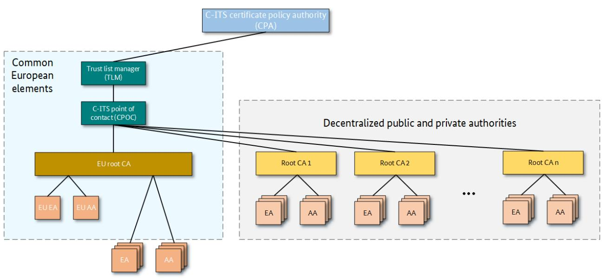
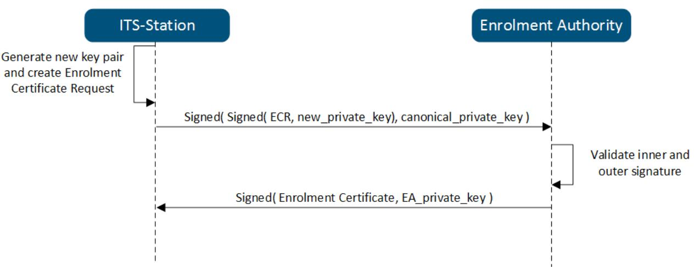
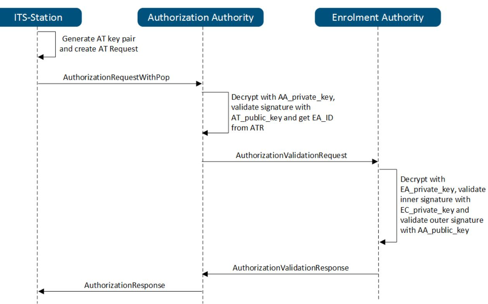

# Technical Guideline BSI TR-03164

# Guidance for Cooperative Intelligent Transport Systems (C-ITS)

Part 1: Operation of a Public Key Infrastructure for C-ITS

Version 1.0.0 08.12.2021


# <span id="page-1-0"></span>Document history

| Version | Date       | Description            |
|---------|------------|------------------------|
| 1.0.0   | 08.12.2021 | Initial public version |
|         |            |                        |

Federal Office for Information Security Post Box 20 03 63 D-53133 Bonn E-Mail: cits@bsi.bund.de Internet: https://www.bsi.bund.de © Federal Office for Information Security 2021

|                | Document history2                                                                                    |  |
|----------------|------------------------------------------------------------------------------------------------------|--|
| 1              | Introduction5                                                                                        |  |
| 1.1            | Scope and Structure of this Document5                                                                |  |
| 1.2            | Definitions and Abbreviations6                                                                       |  |
| 2              | Cooperative Intelligent Transport Systems9                                                           |  |
| 3              | The European C-ITS Credential Management System11                                                    |  |
| 3.1            | The Decentralized Part of the EU CCMS11                                                              |  |
| 3.2            | The European Part of the EU CCMS13                                                                   |  |
| 4              | Certificate Management Processes in a C-ITS PKI15                                                    |  |
| 4.1            | Initial Identification and Registration15                                                            |  |
| 4.1.1          | Initial Identification and Registration of Root CAs15                                                |  |
| 4.1.2          | Initial Identification and Registration of Sub CAs15                                                 |  |
| 4.1.3          | Initial Identification and Registration of C-ITS subscribers16                                       |  |
| 4.1.4          | Initial Registration of C-ITS stations17                                                             |  |
| 4.2            | Certificate Issuance and Certificate Trust List20                                                    |  |
| 4.2.1          | Sub CA Certificate Issuance21                                                                        |  |
| 4.2.2          | C-ITS subscriber Certificate Issuance21                                                              |  |
| 4.2.3          | C-ITS station Registration22                                                                         |  |
| 4.2.4          | Enrolment Credential Issuance23                                                                      |  |
| 4.2.5          | Authorization Ticket Issuance24                                                                      |  |
| 4.2.6          | Processing Times for Certificate Issuance26                                                          |  |
| 4.2.7          | Validity Periods26                                                                                   |  |
| 4.2.8          | Certificate Trust List27                                                                             |  |
| 4.3            | Re-Keying27                                                                                          |  |
| 4.3.1          | Re-Keying for Root CA Certificates27                                                                 |  |
| 4.3.2          |                                                                                                      |  |
|                | Re-Keying for Sub CA Certificates27                                                                  |  |
| 4.3.3          | Re-Keying for C-ITS subscriber Certificates28                                                        |  |
| 4.3.4          | Re-Keying for C-ITS stations29                                                                       |  |
| 4.3.5          | Overlap Times30                                                                                      |  |
| 4.4            | Revocation and Certificate Revocation Lists30                                                        |  |
| 4.4.1          | Revocation of Root CA Certificates30                                                                 |  |
| 4.4.2          | Revocation of Sub CA Certificates31                                                                  |  |
| 4.4.3          | Revocation of C-ITS subscriber Certificates31                                                        |  |
| 4.4.4          | Revocation of C-ITS Station Certificates31                                                           |  |
| 4.4.5          | Certificate Revocation Lists31                                                                       |  |
| 5              | Requirements for Messages and Certificates in a C-ITS PKI33                                          |  |
| 5.1            | Certificate Permissions33                                                                            |  |
| 5.1.1          | Service Specific Parameters within a C-ITS PKI34                                                     |  |
| 5.1.2          | SSP Definition for CRL Service35                                                                     |  |
| 5.1.3<br>5.1.4 | SSP Definition for CTL Service35<br>SSP Definition for Secured Certificate Request Service35         |  |
| 5.1.5          | SSP Definition for CA Basic Service35                                                                |  |
| 5.1.6          | SSP Definition for DEN Basic Service36                                                               |  |
| 5.2            | Certificate Profiles36                                                                               |  |
| 5.2.1          | Certificate Profiles for Root CA Certificates36                                                      |  |
| 5.2.2          | Certificate Profiles for Enrolment Authorities40                                                     |  |
| 5.2.3<br>5.2.4 | Certificate Profiles for Authorization Authorities42<br>Certificate Profiles for C-ITS subscribers44 |  |

| 5.2.5 | Certificate Profiles for Enrolment Credentials44                    |  |
|-------|---------------------------------------------------------------------|--|
| 5.2.6 | Certificate Profiles for Authorization Tickets45                    |  |
| 5.3   | Validation45                                                        |  |
| 5.3.1 | Certificate Revocation List Validation45                            |  |
| 5.3.2 | Certificate Trust List Validation46                                 |  |
| 5.3.3 | Certificate Validation47                                            |  |
| 5.3.4 | Signature Validation52                                              |  |
| 5.4   | Message Formats52                                                   |  |
| 5.4.1 | CA Management Messages52                                            |  |
| 5.4.2 | Enrolment Management Messages52                                     |  |
| 5.4.3 | Authorization Management Messages52                                 |  |
| 5.4.4 | Re-keying Management Messages53                                     |  |
| 6     | General Requirements for Certification Authorities in a C-ITS PKI54 |  |
| 6.1   | Cryptographic Measures54                                            |  |
| 6.2   | Key Life Cycle / Secure Handling of Key Material54                  |  |
| 6.3   | Certification and Audit54                                           |  |
| 6.3.1 | Audit of Certification Authorities54                                |  |
| 6.3.2 | Audit of C-ITS subscriber54                                         |  |
| 6.3.3 | Certification of C-ITS stations55                                   |  |
|       | References56                                                        |  |
|       |                                                                     |  |

| Figure 1: The European C-ITS Security Credential Management System12 |  |
|----------------------------------------------------------------------|--|
| Figure 2: Message sequence of the initial enrolment process17        |  |
| Figure 3: Message sequence of the authorization process18            |  |

| Table 1: Abbreviations 7                      |  |
|-----------------------------------------------|--|
| Table 2: Definitions 8                        |  |
| Table 3: Interpretation of the SSP version 29 |  |
| Table 4: Octet Scheme for CTL Service SSP29   |  |
| Table 5: Octet Scheme for CAM SSPs 30         |  |
| Table 6: Octet Scheme for DENM SSPs 30        |  |

# <span id="page-4-1"></span>1 Introduction

*Cooperative Intelligent Transport Systems (C-ITS)* use technologies that enable vehicles or infrastructure to communicate with each other for example about hazardous traffic situations as well as environmental or road conditions. The aim of C-ITS is to improve traffic safety.

To provide trust in the C-ITS communication, a framework of common rules, duties and roles for the different participants of the C-ITS Public Key Infrastructure is needed. Therefore, the *Certificate Policy for Deployment and Operation of European Cooperative Intelligent Transport Systems (EU CP)* [CP] was developed in a European working group. The EU CP is binding for each entity participating in the European C-ITS Security Credential Management System. Furthermore, each organization or member state is allowed to define additional requirements for its operation of a Public Key Infrastructure within the European C-ITS Security Credential Management System, while ensuring that these additional requirements are not in contradiction with the EU CP. This Technical Guideline gives a guidance and overview for Public Key Infrastructure operators on the one hand and defines additional requirements as recommendations, which should be considered when operating a C-ITS Public Key Infrastructure, on the other hand.

# <span id="page-4-0"></span>1.1 Scope and Structure of this Document

This Technical Guideline serves as a guidance for implementers and operators of Public Key Infrastructures how to implement and operate Certification Authorities in the European C-ITS Security Credential Management System in accordance with the binding EU CP [CP].

For implementing (parts of) a C-ITS Public Key Infrastructure, the following documents are relevant:

- [CP] The common EU CP specifies binding rules and duties for entities participating in the European C-ITS PKI.
- [ETSI TS 102 941] This Technical Specification describes the trust and privacy management with respect to the establishment and maintenance of identities and cryptographic keys in a Cooperative Intelligent Transport System.
- [ETSI TS 103 097] This Technical Specification describes message formats and certificate profiles to be used in a Cooperative Intelligent Transport System.
- [TR-03116-6] This Technical Guideline profiles the cryptographic requirements from [CP], reflecting the algorithms and key lengths for Cooperative Intelligent Transport Systems recommend by the BSI.
- [TR-03145] This Technical Guideline specifies requirements for secure CA operation and details requirements for CA operators within a Public Key Infrastructure. This Technical Guideline is the basis for audits in the German section of the C-ITS PKI.
- [TR-03164-2] This Technical Guideline specifies and details requirements for C-ITS station manufacturers and operators which shall be considered when manufacturing or operating a C-ITS station.

The present document summarizes and accordingly references the most important requirements from [CP], [ETSI TS 102 941], [ETSI TS 103 097], [TR-03116-6], [TR-03145], and [TR-03164-2] relevant for C-ITS PKI operators. Additionally this document refines and/or extends requirements of [CP] or defines additional requirements.

This Technical Guideline is structured as follows:

In chapter 2, an introduction to *Cooperative Intelligent Transport Systems* with its main goals and security objectives is given.

This is followed by chapter 3 with a general overview of the Public Key Infrastructure for C-ITS by presenting all entities defined in the EU CP.

In chapter 4 certificate management processes in a C-ITS Public Key Infrastructure such as identification and registration, certificate issuance, re-keying and revocation are addressed.

In chapter 5 requirements for messages and certificates in a C-ITS Public Key Infrastructure such as message formats, permissions, certificate profiles and validation are addressed.

This Technical Guideline ends in chapter 6 with general requirements for Certification Authorities within a C-ITS Public Key Infrastructures concerning cryptographic measures, secure key handling and certification and audit.

# <span id="page-5-0"></span>1.2 Definitions and Abbreviations

The abbreviations and definition of terms that are relevant in this document are given below.

| Abbreviation | Definition                                              |
|--------------|---------------------------------------------------------|
| AA           | Authorization Authority                                 |
| AT           | Authorization Ticket                                    |
| CA           | Certificate Authority                                   |
| CAM          | Cooperative Awareness Message                           |
| C-ITS        | Cooperative Intelligent Transport System                |
| CP           | Certificate Policy                                      |
| CPA          | C-ITS Certificate Policy Authority                      |
| CPOC         | C-ITS Point of Contact                                  |
| CPS          | Certificate Practice Statement                          |
| CRL          | Certificate Revocation List                             |
| CTL          | Certificate Trust List                                  |
| DENM         | Decentralized Environmental Notification Message        |
| EA           | Enrolment Authority                                     |
| EC           | Enrolment Credential                                    |
| ECR          | Enrolment Credential Request                            |
| ECTL         | European Certificate Trust List                         |
| EU AA        | European Authorization Authority                        |
| EU CCMS      | European C-ITS Security Credential Management<br>System |
| EU CP        | European Certificate Policy                             |
| EU EA        | European Enrolment Authority                            |
| EU RCA       | European Root CA                                        |
| ITS-AID      | ITS-Application Identifier                              |
| IVI          | In-Vehicle Information                                  |
| OEM          | Original Equipment Manufacturer                         |

| Abbreviation  | Definition                              |  |
|---------------|-----------------------------------------|--|
| PKI           | Public-Key Infrastructure               |  |
| PSID          | Provider Service Identifier             |  |
| RCA / Root CA | Root Certificate Authority              |  |
| RSU           | Road Side Unit                          |  |
| SPAT          | Signal Phase And Timing                 |  |
| SREM          | Signal Request Extended Message         |  |
| SSEM          | Signal Request Status Extended Message  |  |
| SSP           | Service Specific Permission             |  |
| Sub CA        | EA and AA                               |  |
| TCC           | Traffic Control Center                  |  |
| TLM           | Trust List Manager                      |  |
| V2I           | Vehicle-to-infrastructure communication |  |
| V2V           | Vehicle-to-vehicle communication        |  |
| V2X           | Vehicle-to-everything communication     |  |

*Table 1: Abbreviations*

| Term                            | Definition                                                                                                                                                                                                                                                                                                                        |
|---------------------------------|-----------------------------------------------------------------------------------------------------------------------------------------------------------------------------------------------------------------------------------------------------------------------------------------------------------------------------------|
| Authorization<br>Authority      | In this document, the term 'Authorization Authority' (AA) refers not only to the<br>specific function of the AA, but also to the legal and/or operational entity managing it.                                                                                                                                                     |
| Canonical data                  | The canonical ID, the canonical key pair and profile settings/data including service<br>specific permissions (SSP), region restrictions and assurance level of a C-ITS station.                                                                                                                                                   |
| Canonical ID                    | The globally unique identifier of a single C-ITS station.                                                                                                                                                                                                                                                                         |
| Certificate<br>attributes       | In general, certificate attributes represent information that is bound to the certificate<br>holder. End-entities in a C-ITS PKI contain certificate attributes such as validityPeriod,<br>region, assuranceLevel (optional), permissions.                                                                                        |
| Certification<br>Authority      | Authority trusted by one or more entities to create and assign certificates.<br>If not further specified, in this Technical Guideline this addresses all instances of<br>certification authorities in the European C-ITS Security Credential Management<br>Systems, i.e. Root CA, Enrolment Authority and Authorization Authority |
| C-ITS participants              | Entities of the EU CCMS, i.e. the TLM, Root CAs, EAs, AAs and C-ITS stations.                                                                                                                                                                                                                                                     |
| C-ITS station<br>administrator  | The C-ITS station administrator is a role that is adopted by the operator of a C-ITS<br>station in order to configure and maintain the C-ITS station.                                                                                                                                                                             |
| C-ITS subscriber                | Manufacturer or operator subscribing with an Enrolment Authority on behalf of one<br>or more C-ITS stations                                                                                                                                                                                                                       |
| C-ITS subscriber<br>agreement   | An agreement between the CA and the C-ITS subscriber that specifies the rights and<br>responsibilities of the parties.                                                                                                                                                                                                            |
| C-ITS subscriber<br>certificate | A certificate that is self-signed or signed by the home EA of the C-ITS subscriber and<br>used for the signature of messages between C-ITS subscriber and home EA                                                                                                                                                                 |

1

|                                 | C-ITS trust model The C-ITS trust model is responsible for establishing a relationship of trust between C<br>ITS stations. It is implemented through the use of a PKI composed of Root CAs, the<br>CPOC, TLM, EAs, AAs and a secure network.               |
|---------------------------------|------------------------------------------------------------------------------------------------------------------------------------------------------------------------------------------------------------------------------------------------------------|
| Cryptographic<br>module         | A secure hardware-based element within which keys are generated and/or stored,<br>random numbers are generated and data is signed or encrypted.                                                                                                            |
| Enrolment<br>Authority          | In this document, the term 'Enrolment authority' (EA) refers not only to the specific<br>function of the EA, but also to the legal and/or operational entity managing it.                                                                                  |
| Home Root CA                    | The Root CA that issued the Sub CA certificate at which the C-ITS subscriber is<br>registered                                                                                                                                                              |
| Home AA                         | The Authorization Authority at which the C-ITS subscriber is registered and from<br>where the C-ITS station receives the Authorization Tickets.                                                                                                            |
| Home CA                         | home Root CA, home EA and home AA are cumulatively referred to as home CA.                                                                                                                                                                                 |
| Home EA                         | The Enrolment Authority at which the C-ITS subscriber is subscribed and will register<br>its C-ITS stations. The C-ITS station receives the Enrolment Credential from the home<br>EA.                                                                      |
| Manufacturer                    | The manufacturer of road side units or vehicles containing the C-ITS station.                                                                                                                                                                              |
| Mobile public<br>station        | This category of C-ITS stations contains vehicles which are used by public authorities<br>like police or ambulance. The requirements in pseudonymity and unlinkability may<br>differ for different operation purposes.                                     |
| Mobile private<br>station       | This type of C-ITS stations are usually vehicles in private ownership with the highest<br>demand for pseudonymity and unlinkability                                                                                                                        |
| Mobile RSU                      | The category of mobile road side units is operated by or on behalf of public authorities.<br>Mobile road side units are most often road work warning units which can change their<br>position during the operation (e.g. on a road works warning trailer). |
| Operator                        | The entity responsible for maintaining the operability of the C-ITS station.                                                                                                                                                                               |
| Re-keying                       | Re-keying of a certificate is defined as issuing a new certificate based on a newly<br>generated subscriber's key pair and a new validity period. The remaining content of the<br>certificate (i.e. the attributes of the subscriber) stays unchanged.     |
| Root Certification<br>Authority | In this document, the term 'Root Certification Authority' (RCA) refers not only to the<br>specific function of the CA, but also to the legal and/or operational entity managing it.                                                                        |
| RSU                             | Stationary or mobile road side unit.                                                                                                                                                                                                                       |
| Stationary RSU                  | Stationary road side units are located at a fixed place for at least one week up to the<br>complete lifetime and operated by or on behalf of public authorities (e.g. traffic lights<br>or toll stations).                                                 |
| Sub CA                          | Enrolment Authority and Authorization Authority belonging to one Root CA.                                                                                                                                                                                  |

Table 2: Definitions

# <span id="page-8-0"></span>2 Cooperative Intelligent Transport Systems

*Cooperative Intelligent Transport Systems (C-ITS)* allow vehicles to communicate with other vehicles, traffic signals, roadside infrastructure and other road users. All of this communication is embraced under the term *vehicle-to-everything communication (V2X)* whereas the communication between vehicles is known as *vehicle-to-vehicle communication (V2V)* and the communication between vehicles and roadside infrastructure is called *vehicle-to-infrastructure communication (V2I)*.

Cooperative Intelligent Transport Systems (C-ITS) aim to improve traffic safety. Therefore, C-ITS participants such as vehicles or infrastructure components send messages which are used by the recipients to create an overview of the local traffic situation. That way, C-ITS is intended to provide several information, warning and assistance services such as emergency vehicle, roadwork, or traffic jam warnings as well as co-operative services, for example co-operative merging assistance (for more detailed information see [ETSI TS 102 940]).

The end-entity within a Cooperative Intelligent Transport System is a set of hardware and software components of vehicles or infrastructure that provides a C-ITS service and is called *C-ITS station*. They can be differentiated into public and private C-ITS stations. Private C-ITS stations are for example personal user vehicles or buses. Public C-ITS stations can be either Road Side Units (RSU) such as for example traffic signs or special (purpose) vehicles such as for example emergency vehicles (e.g. Police or Ambulance). For more details see [TR-03164-2].

C-ITS can cover different services. Depending on the service, different message types are specified (see [ETSI TS 102 965]). This includes most prominently:

- **Cooperative Awareness Messages (CAMs)** [ETSI EN 302 637-2]**:** CAMs contain information such as position, direction, speed or vehicle type. C-ITS stations permanently send CAMs with a high frequency (1-10 Hz). They are used by recipients to gather information about the local traffic situation.
- **Decentralized Environmental Notification Messages (DENMs)** [ETSI EN 302 637-3]: DENMs are triggered by an event and transmit information on pre-defined hazardous situations such as roadworks, accidents, iced streets or emergency vehicles approaching.

C-ITS aims to assist drivers and to improve the regulation of traffic and thus, has a high impact on the driver's safety as well as on the traffic flow. Therefore, it is very important to verify the authenticity and integrity of the exchanged messages.

- **Authenticity:** Authenticity means that the purported identity and the real identity of a sender match.
- **Integrity:** Integrity means that exchanged messages have not been manipulated in unauthorized manner.

That means that it must not be possible for an attacker to introduce manipulated messages in order to somehow influence the traffic.

Because links between a vehicle and its user can be either directly or indirectly deduced, the impact on privacy of the road users should be minimized. [ETSI TS 102 941] identifies the following two key requirements that relate to privacy:

- **Pseudonymity:** Pseudonymity denotes that a C-ITS station may use a resource or service without disclosing its identity but can still be accountable for that use.
- **Unlinkability:** Unlinkability denotes that a C-ITS station may make multiple uses of resources or services without others being able to link them together.

In summary, messages in C-ITS require authenticity, integrity, pseudonymity and unlinkability. As these requirements are (partially) conflicting, as it is the most obvious with authenticity and pseudonymity, they can not be realized all to their full extent at the same time but have to be carefully balanced. Classically, authenticity and integrity are ensured by means of a security architecture with support of a *Public Key* *Infrastructure (PKI)* as it is the case for C-ITS as well. In C-ITS pseudonymity and unlinkability are incorporated and balanced with integrity and authenticity by means of separation of duties and commonly changing pseudonym certificates, so-called *Authorization Tickets* (see section [4.1.4](#page-16-0)). To be more specific, pseudonymity is provided by using Authorization Tickets that do not relate to the real identity of either the C-ITS station nor its owner[1](#page-9-0) . Unlinkability is incorporated by frequently changing and temporarily limiting the usage of Authorization Tickets.

Additionally, each certificate in a C-ITS Public Key Infrastructure contains a set of certificate attributes including permissions. Permissions specify the actions the valid certificate holder is entitled to use or to pass. Within a C-ITS PKI it has to be ensured that these certificate permissions are correctly handled. For more details on permissions see section [5.1.](#page-32-0)

In this Technical Guideline, all requirements are described for 'normal' C-ITS stations, i.e. for C-ITS stations without public or any other special permissions. Special/public permissions shall only be granted by the corresponding member states and the requested permissions shall be checked accordingly by the issuing Certification Authority before issuing a certificate.

<span id="page-9-0"></span>1 except where this is a requirement for operation of a specific ITS application

# <span id="page-10-1"></span>3 The European C-ITS Credential Management System

The purpose of the *European C-ITS Security Credential Management System (EU CCMS)* is to establish trust in the different C-ITS participants and in the integrity and authenticity of their messages. Therefore, a C-ITS trust model is established which consists of a set of *Public Key Infrastructures (PKI)*. These Public Key Infrastructures can be operated independently from each other by public organizations of the member states or private stakeholders like e.g. car manufacturers or PKI operators (see grey marked part in figure [1\)](#page-10-2). Each of these Public Key Infrastructures consists of a Root CA and one level of Sub CAs, the so-called Enrolment Authorities (EA) and the Authorization Authorities (AA). Both, Enrolment and Authorization Authority, issue end-entity certificates for C-ITS stations.

In order to achieve interoperability between the independent C-ITS Public-Key Infrastructures and to enable cross-border C-ITS services, the European C-ITS Security Credential Management System is implemented. It provides common European elements (see light blue marked part in figure [1\)](#page-10-2). Precondition for the usage of the common European elements and thus, for interoperability, is the compliance with the common rules and duties of the European C-ITS Security Credential Management System specified in [CP] and [SP].



<span id="page-10-2"></span>*Figure 1: The European C-ITS Security Credential Management System*

This section provides a general explanation on the European C-ITS Security Credential Management System with a focus on PKI operators in particular. Therefore, the (decentralized) C-ITS Public Key Infrastructures with respect to their entities, their tasks in the certificate processing and their relationships with other entities is described in subsection [3.1](#page-10-0). The common European parts and their role for PKI operators are explained in subsection [3.2.](#page-12-0) This section serves as a general guidance, concrete recommendations for a secure operation of a C-ITS Public Key Infrastructure are specified in the succeeding sections.

# <span id="page-10-0"></span>3.1 The Decentralized Part of the EU CCMS

Multiple C-ITS Public Key Infrastructures can be set up in the European C-ITS Security Credential Management System (see figure [1](#page-10-2)). They can be operated by public organizations of the member states or private organizations such as for example car manufacturers. Each of these C-ITS Public Key Infrastructures consists of

- a Root CA (RCA),
- Enrolment Authorities (EA) and
- Authorization Authorities (AA).

The *Root CA* is the trust anchor within the C-ITS PKI. The Root CA issues and disseminates Sub CA certificates and thus, expresses its trust in these Sub CAs. The European C-ITS Security Credential Management System comprises only one level of Sub CAs. In order to implement authenticity and privacy of the C-ITS stations at the same time (see section [2\)](#page-8-0), these Sub CAs must be split into the separately operated entities, the *Enrolment Authority (EA)* and the *Authorization Authority (AA)*.

#### **Root CA**

After initial identity validation and registration at the C-ITS Certificate Policy Authority (see section [3.2\)](#page-12-0), the Root CA is fully operational and can issue certificates to its Enrolment and Authorization Authorities.

Each Root CA manages and publishes a *Certificate Trust List (CTL)* and a *Certificate Revocation List (CRL)*. The Certificate Trust List contains all Sub CAs which are considered trustworthy by the Root CA (for conditions for trustworthiness see section [5.3.2](#page-45-0)). The Certificate Trust List is signed with the Root CA's private key in order to ensure integrity and authenticity. If Enrolment Authority or Authorization Authority instances must be revoked, e.g. because of a key compromise, the Root CA adds them to its Certificate Revocation List which is also signed and published by the Root CA with its private key. The Root CA publishes its Certificate Trust List and Certificate Revocation List regularly (see section [4.4](#page-29-1) for CRL and [4.2](#page-19-0) for CTL). These lists shall be accessible for all C-ITS stations e.g. via an LDAP based directory service.

#### **Enrolment Authority**

For the initial application, the *Enrolment Authority (EA)* shall request a certificate from the Root CA (see section [4.1.1\)](#page-14-1). In case of approval of this certificate request, the Root CA adds the generated Enrolment Authority certificate to its Certificate Trust List. In case of disapproval, the Root CA does not include the Enrolment Authority certificate in the Certificate Trust List or the Root CA excludes the Enrolment Authority certificate from the Certificate Trust List if already inserted.

Afterwards, the Enrolment Authority can start its operation by registering C-ITS stations and provide *Enrolment Credentials (EC)*. The Enrolment Authority additionally handles authorization requests received from Authorization Authorities to authenticate C-ITS stations (see section [4.1.4](#page-16-0)).

#### **Authorization Authority**

The same certificate request and publication procedure as for Enrolment Authorities is also executed for Authorization Authorities (AA).

After successfully receiving the Authorization Authority certificate, the Authorization Authority can start to create *Authorization Tickets (AT)* as described in section [4.1.4.](#page-16-0) These Authorization Tickets are used for the V2X communication between C-ITS stations, to verify the integrity and authenticity of a message sent by a C-ITS station. C-ITS stations with privacy requirements shall request numerous Authorization Tickets in order to make tracking more difficult and thus, to increase privacy. The exact number of Authorization Tickets that should be used depends on the application. For more details see [TR-03164-2] and [CP].

#### **Operation of Enrolment and Authorization Authority**

Enrolment and Authorization Authority shall be separate operational entities with separate IT infrastructure and IT management teams. Furthermore, Enrolment Authority and Authorization Authority shall not exchange personal or station data except for the authorization of Authorization Tickets by using the protocol of [ETSI TS 102 941].

# <span id="page-12-0"></span>3.2 The European Part of the EU CCMS

The European C-ITS Security Credential Management System aims to provide interoperability between C-ITS Public Key Infrastructures of member states and/or private organizations and thus, to enable interoperable cross-border C-ITS services.

The European part of the European C-ITS Public Key Infrastructure contains the

- C-ITS Certificate Policy Authority (CPA),
- Trust List Manager (TLM),
- C-ITS Point of Contact (CPOC),
- European Root CA (EU RCA),
- European Enrolment Authority (EU EA), and
- European Authorization Authority (EU AA).

The linkage between the separately operated C-ITS Public Key Infrastructures (see section [3.1\)](#page-10-0) and thus, the deployment of transnational and/or trans-organizational interoperability is realized by means of the common European C-ITS Public Key Infrastructure, most importantly its Trust List Manager. The European C-ITS Public Key Infrastructure is described in the following by means of its entities, their tasks in the certificate processing and their relations to other entities within the European C-ITS Public Key Infrastructure.

#### **C-ITS Certificate Policy Authority**

The *C-ITS Certificate Policy Authority (CPA)* is composed of representatives of public and private stakeholders (e.g. member states, vehicle manufacturers and PKI operators) and is responsible for the Certificate Policy Management and the PKI Authorization Management. The Certificate Policy Management includes the approval, change and release management of the Certificate Policy. The PKI Authorization Management contains the appointment and authorization of the C-ITS Point of Contact and the Trust List Manager as well as the approval or rejection of Root CAs.

#### **Trust List Manager**

The Trust List Manager (TLM) is the trust-establishing link between separately operated C-ITS Public Key Infrastructures. The *Trust List Manager* is appointed by the C-ITS Certificate Policy Authority and responsible for the management of the *European Certificate Trust List (ECTL)*. The European Certificate Trust List indicates that a Root CA is considered trustworthy within the European C-ITS PKI hierarchy. Condition to be considered trustworthy is the compliance with the common rules and duties of the European CCMS specified in [CP].

The Trust List Manager can not be accessed directly but only via the *C-ITS Point of Contact* (CPOC). If the Trust List Manager receives a Root CA certificate via the C-ITS Point of Contact and receives a notification from the C-ITS Certificate Policy Authority that confirms the trustworthiness of this Root CA, it adds the certificate to the European Certificate Trust List. If the C-ITS Certificate Policy Authority assesses a Root CA to be not compliant with the European Certificate Policy, the Trust List Manager will not include this new Root CA certificate in the European Certificate Trust List or exclude it from the European Certificate Trust List if already inserted. The Trust List Manager provides the European Certificate Trust List regularly to the C-ITS Point of Contact for distribution to all PKI participants. In order to provide integrity and authenticity of the European Certificate Trust List, the Trust List Manager signs the European Certificate Trust List with its private key.

#### **C-ITS Point of Contact**

The *C-ITS Point of Contact (CPOC)* is appointed and authorised by the C-ITS Certificate Policy Authority. The *C-ITS Point of Contact* is the single point of contact in the European C-ITS Security Credential Management System that establishes the secure exchange of Root CA certificates via the European Certificate Trust List and the distribution of the Trust List Manager certificate. This includes the transmission of Root CA certificates to the Trust List Manager, publication of the common trust anchor (current public key and link certificate of the Trust List Manager) and the publication of the European Certificate Trust List.

#### **EU Root CA and Sub CAs**

Entities participating in the C-ITS trust model can delegate parts of their PKI operation to the European part of the C-ITS PKI. Therefore, the *European Root CA (EU RCA)* is implemented and is connected to the common *European Enrolment Authority (EU EA)* and *European Authorization Authority (EU AA)*. The European Root CA can also be used as trust anchor by privately or nationally operated Enrolment and Authorization Authorities which do not want to set up their own Root CA. Also the European Enrolment and Authorization Authority can be used by C-ITS stations. The operation of the European Root CA, European Enrolment Authority and European Authorization Authority do not differ from the decentralized parts that are operated by member states or private organizations. Therefore the description of their operation is subsumed in section [3.1](#page-10-0).

# <span id="page-14-3"></span>4 Certificate Management Processes in a C-ITS PKI

In this chapter certificate management processes in the decentralized C-ITS Public Key Infrastructures (see section [3.1\)](#page-10-0) of the European C-ITS Credential Management System are described.

According to [ETSI TS 102 941] the authorization of C-ITS stations is performed as a dialogue between C-ITS station and Authorization Authority or between C-ITS station and Enrolment Authority. The former is addressed in this document. According to [ETSI TS 102 941], the latter is realized by means of the so-called butterfly AT provisioning. It is not further addressed in this document but may be subject to future revisions of this document.

# <span id="page-14-2"></span>4.1 Initial Identification and Registration

#### <span id="page-14-1"></span>4.1.1 Initial Identification and Registration of Root CAs

The initial identity validation and registration of a Root CA shall be performed according to [CP]. Root CAs register at the C-ITS Point of Contact (CPOC). Therefore, an authorized representative of the Root CA physically delivers in person the signed application form, the Certificate Practice Statement (CPS) and the audit report (see section [6.3.1\)](#page-53-1) to the CPOC.

For each Root CA certificate to be inserted in the ECTL, the application form shall contain – amongst others – the digital fingerprint of the Root CA certificate and all certificate attributes, especially the permissions that the Root CA is requesting to use and to pass according to section [5.1.](#page-32-0)

Additionally, the Root CA's representative brings a valid ID document and proof of authorization as the Root CA's representative.

The certificate to be issued is electronically submitted to the CPOC, e.g. via e-mail.

#### <span id="page-14-0"></span>4.1.2 Initial Identification and Registration of Sub CAs

The initial identity validation and registration of a Sub CA shall be performed according to [CP]. Sub CAs register at the corresponding Root CA. Therefore, an authorized representative of the Sub CA physically delivers in person the signed application form to the Root CA. The application form shall contain – amongst others – the digital fingerprint of the Sub CA certificate request and all certificate attributes, especially the permissions that the Sub CA is requesting to use and to pass according to section [5.1](#page-32-0). Furthermore, the Certificate Practice Statement (CPS) and the audit report (see section [6.3.1\)](#page-53-1) are transmitted by the Sub CA to the Root CA.

Additionally, the Sub CA's representative identifies himself in person at the Root CA with a valid ID document and provides a proof of authorization as the Sub CA's representative. The Root CA checks the proof of authorization. Furthermore, the Root CA verifies the identity of the Sub CA's representative following the criteria for assurance level 'high' according to [BSI TR-03147].

The certificate request of the Sub CA is electronically submitted to the Root CA, e.g. via e-mail. The electronically submitted Sub CA certificate request is signed with the Sub CA's private key to prove possession.

# <span id="page-15-0"></span>4.1.3 Initial Identification and Registration of C-ITS subscribers

Before C-ITS stations can request an Enrolment Credential they must register to an Enrolment Authority. This registration shall be performed by the C-ITS subscriber, to be more specific by the manufacturer or operator of the C-ITS station.

Before a C-ITS subscriber can request registration on behalf of its C-ITS stations, the C-ITS subscriber must be identified and registered. The certificate request of the C-ITS subscriber must be performed according to one of the following options:

- 1) The Enrolment Authority issues the C-ITS subscriber certificate. In this case, the C-ITS subscriber
	- securely generates a key pair (see section 6.2),
	- generates a C-ITS subscriber certificate request,
	- signs the C-ITS subscriber certificate request with the corresponding private key to prove possession and
	- electronically submits the signed C-ITS subscriber certificate request to the Enrolment Authority, e.g. via e-mail.
- 2) The Enrolment Authority accepts a self-signed C-ITS subscriber certificate. In this case, the C-ITS subscriber
	- securely generates a key pair (see section [6.2\)](#page-53-3),
	- generates the self-signed C-ITS subscriber certificate and
	- electronically sends this C-ITS subscriber certificate to the Enrolment Authority, e.g. via e-mail.

In both cases, a C-ITS subscriber's representative physically delivers in person the signed application form, its audit report (see section [6.3.2\)](#page-53-0) and the Common Criteria certificate for its C-ITS stations including its cryptographic module (see section [6.3.3](#page-54-0)) to the Enrolment Authority. Another transmission method may be used. In that case, the transmission method must provide an equivalent level of assurance as physical delivery. Additionally, the C-ITS subscriber's representative identifies himself in person at the Enrolment Authority with a valid ID document and provides a proof of authorization as the C-ITS subscriber's representative. The Enrolment Authority checks the proof of authorization. Furthermore, the Enrolment Authority verifies the identity of the C-ITS subscriber's representative following the criteria for assurance level 'high' according to [BSI TR-03147].

The application form shall contain

- the organization's name and its postal address,
- contact information, e.g. e-mail address,
- phone number,
- identifying information of the authorized representative in compliance with [CP], e.g. full name, date and place of birth,
- the digital fingerprint of the C-ITS subscriber's certificate request,
- Canonical ID prefix[2](#page-15-1) of the C-ITS subscriber,
- expiration date,
- cryptographic information,
- certificate attributes, especially the C-ITS station's permissions, that the C-ITS subscriber is requesting to use and to obtain on behalf of its C-ITS stations (see section [5.1\)](#page-32-0).
- <span id="page-15-1"></span>2 The canonical ID is a globally unique identifier (for more details see [CP]). To gain global uniqueness, a (unique) canonical ID prefix is assigned to a C-ITS subscriber by the Enrolment Authority.

# <span id="page-16-0"></span>4.1.4 Initial Registration of C-ITS stations

#### **Registration of C-ITS stations**

Before a C-ITS station can enrol at the Enrolment Authority, it must be registered. This initial registration of a C-ITS station is performed by the C-ITS subscriber. Therefore, the C-ITS subscriber:

- 1) generates a registration request,
- 2) signs the registration request with its private key to prove possession,
- 3) encrypts the registration request with the Enrolment Authority's public key and
- 4) sends the signed and encrypted registration request to the Enrolment Authority.

In this process the C-ITS subscriber shall use the cryptographic measures specified in [TR-03116-6].

The C-ITS subscriber registers a C-ITS station with its registration data at the Enrolment Authority. The registration data contain among others

- the canonical identifier[3](#page-16-1) ,
- the canonical public key[4](#page-16-2) and
- the requested certificate attributes such as validity period, region settings and permissions of the C-ITS station.

For each C-ITS station, the registration request contains at a minimum the canonical identifier and the canonical public key of the C-ITS station. The requested certificate attributes such as for example permissions or region settings are either contained in the registration request or are previously registered at the Enrolment Authority in terms of profiles for C-ITS stations.

In the latter case the EA ensures that:

- the previously registered profiles are securely stored and protected from manipulation and
- adequate procedures are implemented such that the certificate attributes are correctly granted with respect to the corresponding profile. Thus, it has to be guaranteed
	- that it is clearly defined to which group of C-ITS stations a profile applies, e.g. for all stations of a C-ITS manufacturer or for a particular model of a C-ITS manufacturer and
	- that for each registration request the corresponding profile can be unambiguously identified, e.g. by an identifier in the registration request.

Normal vehicles shall have only one C-ITS station that is registered at one Enrolment Authority.

#### **Enrolment of C-ITS stations**

The C-ITS station shall authenticate itself by means of direct initial enrolment according to [ETSI TS 102 941] using the cryptographic measures specified in [TR-03116-6].

This means that the C-ITS station requests an *Enrolment Credential (EC)* from the Enrolment Authority. For the Enrolment, the C-ITS station

- 1) generates a new key pair,
- 2) creates an *Enrolment Certificate Request (ECR)* as follows:
- <span id="page-16-1"></span>3 The canonical identifier is established in the C-ITS station by the C-ITS subscriber as part of the manufacturing process (see [TR-03164-2]).
- <span id="page-16-2"></span>4 The canonical key pair is established in the C-ITS station by the C-ITS subscriber as part of the manufacturing process (see [TR-03164-2]). Requirements regarding the validity period of the canonical key within a C-ITS PKI are specified in section [4.2.7](#page-25-0) of this document.

4



*Figure 2: Schematic overview of the message sequence of the initial enrolment process*

- a) (Parts of) the registration data, such as canonical identifier and the newly generated public key are nested by an inner and outer signature.
- b) An inner signature is computed with the newly generated private key and serves as proof of possession.
- c) An outer signature is computed using the canonical private key (for re-keying of C-ITS stations see section [4.3.4\)](#page-28-0).
- 3) encrypts the Enrolment Certificate Request according to [ETSI TS 102 941] with the Enrolment Authority's public key and
- 4) sends the Enrolment Certificate Request to the Enrolment Authority.

The Enrolment Authority decrypts and validates the Enrolment Certificate Request as described in section [4.2.4.](#page-22-0)

In case of positive validation, the Enrolment Authority

- 1) generates the requested Enrolment Credential,
- 2) signs it with its private key and
- 3) transmits it encrypted[5](#page-17-0) to the C-ITS station.

Otherwise, the Enrolment Authority refuses the request of the C-ITS station.

The issued Enrolment Credential is used by the C-ITS station as long-term certificate for subsequent authorization requests at Authorization Authorities.

#### **Authorization of C-ITS stations**

After successfully receiving an Enrolment Credential from the Enrolment Authority, the C-ITS station is able to request an *Authorization Ticket (AT)* from the Authorization Authority.

An Authorization Ticket is a commonly changing pseudonymous certificate that comprises a set of permissions of the C-ITS station for the V2X communication. A C-ITS station signs its messages with the private key of one of its Authorization Tickets in order to provide integrity and authenticity. Each C-ITS station with privacy requirements shall possess numerous Authorization Tickets and shall regularly switch between them (see [TR-03164-2]) in order to enable unlinkability and make tracking more difficult.

<span id="page-17-0"></span>5 The transmission is symmetrical encrypted according to [ETSI TS 102 941].



*Figure 3: Message sequence of the authorization process*

A C-ITS station shall request Authorization Tickets according to [ETSI TS 102 941] using the cryptographic measures specified in [TR-03116-6]. If butterfly AT provisioning is not used, the authorization process shall be executed in the version which includes a proof of possession as follows:

4) Authorization Request

For each authorization, the C-ITS station creates an Authorization Request which includes the certificate attributes such as the permissions requested by the C-ITS station. With respect to the C-ITS station's privacy, the Authorization Request implements the 'need to know' principle and thus, is split into two parts: a part that remains at the Authorization Authority and a part that can only be read by the Enrolment Authority. The latter is called *ecSignature* (see [ETSI TS 102 941]) which contains information about the identity of the C-ITS station and is signed with the private key of the Enrolment Credential and encrypted using the public encryption key of the Enrolment Authority. The encryption with the Enrolment Authority's public key ensures that the Authorization Authority can not identify a requesting C-ITS station but is able to check at the Enrolment Authority that the C-ITS station is allowed to request the type of Authorization Ticket and is not revoked.

Thus, the C-ITS stations

- a) generates a new key pair,
- b) creates an Authorization Request,
- c) signs the whole Authorization Request with the private key corresponding to the Authorization Request's public key to prove possession,
- d) encrypts the signed Authorization Request with the Authorization Authority's public key and
- e) sends the signed and encrypted Authorization Request to the Authorization Authority.
- 5) Authorization Validation Request

If an Authorization Authority receives an Authorization Request, the Authorization Authority

- a) decrypts the Authorization Request with its own private key and
- b) validates the received Authorization Request (see section [4.2.5](#page-23-0)).
- In case of a successful validation, the Authorization Authority
- c) extracts the identifier of the responsible Enrolment Authority from the received Authorization Request,
- d) creates an *Authorization Validation Request* that contains the ecSignature (see above) and the requested certificate attributes such as in particular the requested permissions,
- e) signs the Authorization Validation Request with its private key,
- f) encrypts the signed Authorization Validation Request with the Enrolment Authority's public key and
- g) sends the signed and encrypted Authorization Validation Request to the Enrolment Authority.
- 6) Authorization Validation Response

If an Enrolment Authority receives an Authorization Validation Request, the Enrolment Authority

- a) decrypts the request with its private key and
- b) validates the Authorization Validation Request (see section [4.2.5](#page-23-0)).

In case of positive validation, the Enrolment Authority

- c) creates a positive *Authorization Validation Response,*
- d) signs the Authorization Validation Response with its private Key,
- e) encrypts the signed Authorization Validation Response with the Authorization Authority's public key and
- f) sends the signed and encrypted Authorization Validation Response to the Authorization Authority.
- 7) Authorization Response

If an Authorization Authority receives an Authorization Validation Response, the Authorization Authority

- a) decrypts the Authorization Validation Response with its private key and
- b) validates the Authorization Validation Response (see section [4.2.5\)](#page-23-0).

In case of positive validation the Authorization Authority

- c) generates the requested Authorization Ticket,
- d) signs the Authorization Ticket with its private key,
- e) encrypts[6](#page-19-1) the Authorization Ticket and
- f) transmits the encrypted Authorization Ticket to the C-ITS station.

<span id="page-19-0"></span>Otherwise, the Authorization Authority refuses the request of the C-ITS station.

# 4.2 Certificate Issuance and Certificate Trust List

In this section the certificate generation process is addressed. Thereby, the issuing CA needs to ensure the correct and secure generation of certificates.

<span id="page-19-1"></span>6 The transmission is symmetrical encrypted according to [ETSI TS 102 941].

Note that this section refers to the initial certificate issuance only. Re-keying is addressed in the subsequent section [4.3.](#page-26-2)

#### <span id="page-20-1"></span>4.2.1 Sub CA Certificate Issuance

When receiving a certificate request from a Sub CA and before issuing this Sub CA certificate, the Root CA shall

- 1) ensure that identification and authorization of the requesting Sub CA and its representative was checked during registration as described in section [4.1.1](#page-14-1),
- 2) validate the *signature* on the certificate request with the public key contained in the certificate request,
- 3) check that the digital fingerprint of the electronically submitted Sub CA certificate equals the digital fingerprint from the personally delivered application form, and
- 4) validate the requested certificate attributes as follows:
	- a) check the *validity period* of the Sub CA subscriber certificate as follows:
		- i. the start of the validity period of the certificate is before the end of the validity period of the certificate,
		- ii. the current time is within the validity period of the certificate,
		- iii. the validity period of the Sub CA certificate does not exceed the validity period of the issuing Root CA's certificate and
		- iv. the maximum private key usage and validity period of the Sub CA certificate comply with [TR-03116-6].
	- b) check the requested permissions as follows:
		- i. the requested permissions comply with the permissions from the previously delivered application form,
		- ii. the requested permissions comply with the permissions the Root CA is entitled to pass as described in step 2e) in section [5.3.3](#page-46-0).
	- c) check that the remaining certificate attributes such as for example region setting comply with the certificate attributes from the application form.

If all checks lead to a positive result, the Root CA

- 1) issues the corresponding Sub CA certificate, i.e. the Root CA signs the Sub CA certificate with its private key,
- 2) sends the issued certificate to the Sub CA and
- 3) adds the issued Sub CA certificate to its Certificate Trust List.

If any of the checks fails, the Root CA rejects the certificate request and does not issue the requested Sub CA certificate. In that case, the Sub CA should be notified accordingly.

#### <span id="page-20-0"></span>4.2.2 C-ITS subscriber Certificate Issuance

Before issuing a C-ITS subscriber certificate or before accepting a self-signed C-ITS subscriber certificate, the Enrolment Authority shall

1) check the *validity of the request* as follows:

- a) If the Enrolment Authority receives a certificate request or a self-signed C-ITS subscriber certificate (as described in section [4.1.3\)](#page-15-0), the Enrolment Authority validates the signature on the certificate request or certificate with the public key that is contained in the certificate request or certificate.
- 2) ensure that identification and authorization of the requesting C-ITS subscriber and its representative was checked during registration as described in section [4.1.3](#page-15-0),
- 3) check that the digital fingerprint of the electronically submitted C-ITS subscriber certificate equals the digital fingerprint from the previously delivered application form (see section [4.1.3](#page-15-0)) and
- 4) validate the requested certificate attributes as follows:
	- a) check the *validity period* of the C-ITS subscriber certificate as follows:
		- i. the start of the validity period of the certificate is before the end of the validity period of the certificate,
		- ii. the current time is within the validity period of the certificate,
		- iii. the validity period of the C-ITS subscriber certificate does not exceed the validity period of the Enrolment Authority's certificate and
		- iv. the maximum private key usage and validity period of the C-ITS subscriber certificate comply with [TR-03116-6].
	- b) check the requested permissions as follows:
		- i. the requested permissions equal those permissions from the previously delivered application form,
		- ii. the requested permission are specified according to section [5.2.4](#page-42-0),
		- iii. the requested permissions comply with the permissions the Enrolment Authority is entitled to pass.
	- c) check that the remaining certificate attributes such as for example region setting comply with the certificate attributes from the application form.

If all checks lead to a positive result, the Enrolment Authority issues or accepts the corresponding C-ITS subscriber certificate. In the case that the Enrolment Authority issues the C-ITS subscriber certificate (instead of accepting a self-signed C-ITS subscriber certificate), the Enrolment Authority signs the C-ITS subscriber certificate with its private key and sends the issued certificate to the C-ITS subscriber. In the case that the Enrolment Authority accepts the C-ITS subscriber certificate (instead of issuing a C-ITS subscriber certificate), the Enrolment Authority notifies the C-ITS subscriber accordingly. In both cases, the Enrolment Authority registers the corresponding C-ITS subscriber certificate.

If any of the checks fails, the Enrolment Authority rejects the certificate request and does not issue or accept the C-ITS subscriber certificate. In that case, the C-ITS subscriber should be notified accordingly.

#### <span id="page-21-0"></span>4.2.3 C-ITS station Registration

Before registering a C-ITS station and storing its registration data in its registration database, the Enrolment Authority shall

- 1) decrypt the registration request with its private key,
- 2) validate the *signature* on the registration request by identifying the corresponding C-ITS subscriber certificate in its database and by validating the signature on the registration request with the public key contained in the registered C-ITS subscriber certificate,
- 3) check the *revocation status* of the corresponding C-ITS subscriber certificate, e.g. on an internal blacklist,
- 4) check the *validity period* of the corresponding C-ITS subscriber certificate as follows:
	- a) the start of the validity period of the certificate is before the end of the validity period of the certificate,
	- b) the current time is within the validity period of the certificate,
	- c) the validity period of the C-ITS subscriber certificate does not exceed the validity period of the Enrolment Authority's certificate and
	- d) the maximum private key usage and validity period of the C-ITS subscriber certificate complies with [TR-03116-6],
- 5) check the *canonical ID* on the registration request as follows:
	- a) the canonical ID is unique,
	- b) the canonical ID complies with the canonical ID prefix from the corresponding C-ITS subscriber certificate and
	- c) the corresponding C-ITS subscriber certificate is not revoked,
- 6) if present, check that the requested *permissions* are valid as follows:
	- a) the requested permissions are specified according to section 5.2.5 and thus, contain appPermissions only,
	- b) all permissions are well-founded. This shall be checked as specified in section [5.3.3](#page-46-0).
	- c) the requested appPermissions comply with the permissions the C-ITS subscriber is entitled to request on behalf of its C-ITS stations.
- 7) if present, check that the provided region restriction complies with the region restriction of the C-ITS subscriber certificate.

If all checks lead to a positive result, the Enrolment Authority registers the corresponding C-ITS station.

If any of the checks fails, the Enrolment Authority rejects the registration request and does not register that C-ITS station. In that case, the C-ITS subscriber should be notified accordingly.

#### <span id="page-22-0"></span>4.2.4 Enrolment Credential Issuance

When receiving an Enrolment Credential Request from a C-ITS station and before issuing the initial[7](#page-22-1) Enrolment Credential, the Enrolment Authority shall

- 1) decrypt the Enrolment Credential Request with its private key,
- 2) check by means of the *canonical ID* in the Enrolment Credential Request (data field signer, see [ETSI TS 102 941]) that the C-ITS station is registered at the Enrolment Authority,
- 3) validate the *outer signature* on the Enrolment Credential Request with the corresponding canonical public key[8](#page-22-2) from the Enrolment Authority's database,
- 4) validate the *inner signature* of the Enrolment Credential Request with the public key which is contained in the Enrolment Credential Request,
- 5) check the requested *validity period* as follows:
	- a) the start of the validity period of the requested Enrolment Credential is before the end of the validity period of the requested Enrolment Credential,
- <span id="page-22-1"></span>7 Re-keying of Enrolment Credentials is described in section [4.3.4.](#page-28-0)
- <span id="page-22-2"></span>8 Based on the canonical ID in the Enrolment Credential Request the corresponding canonical public key can be identified in the Enrolment Authority's database.
- b) the current time is within the validity period of the requested Enrolment Credential,
- c) the validity period of the requested Enrolment Credential does not exceed the validity period of the Enrolment Authority's certificate and
- <span id="page-23-2"></span>d) the maximum private key usage and validity period of the requested Enrolment Credential complies with [TR-03116-6].
- 6) if present, validate the requested *permissions* as follows:
	- a) check that the requested permissions are specified according to section [5.2.5,](#page-43-0)
	- b) check that the requested permissions comply with the permissions the Enrolment Authority is entitled to pass as described in step [Fehler: Verweis nicht gefunden\)](#page-23-2) in section [5.3.3](#page-46-0), and
- 7) if present, check that the certificate attributes from the Enrolment Credential Request comply with the previously registered registration data (see section [4.1.4\)](#page-16-0),
- 8) validate the status of service provision of the Authorization Authority to the C-ITS subscriber and
- 9) check that the C-ITS subscriber is not revoked.

If all checks lead to a positive result, the Enrolment Authority issues the corresponding Enrolment Credential.

If any of the checks fails, the Enrolment Authority rejects the Enrolment Credential Request and does not issue that Enrolment Credential. In that case, the Enrolment Authority sends a response containing the reason of the certificate rejection according to [ETSI TS 102 941]. If a C-ITS station still wants an Enrolment Credential, it has to make a new Enrolment Credential Request.

#### <span id="page-23-0"></span>4.2.5 Authorization Ticket Issuance

#### **Authorization Request**

If butterfly AT provisioning is not used, the Authorization Ticket issuance shall be executed as follows: When receiving an *Authorization Request* from a C-ITS station and before issuing an Authorization Ticket, the Authorization Authority shall

- 1) decrypt the Authorization Request with its private key.
- 2) validate the (inner) *signature* on the Authorization Request with the public key which is contained in the Authorization Request.[9](#page-23-3)
- 3) check the requested *validity period* as follows:
	- a) the start of the validity period of the requested Authorization Ticket is before the end of the validity period of the requested Authorization Ticket,
	- b) the current time is at most 3 months in advance of the start of the validity period of the requested Authorization Tickets,
	- c) the maximum private key usage and validity period of the requested Authorization Ticket complies with [TR-03116-6].
- 4) if present, validate the requested *permissions* as follows:
	- a) check that the requested permissions are specified according to section [5.2.5,](#page-43-0)
	- b) check that the requested permissions comply with the permissions the Authorization Authority is entitled to pass as described in step [Fehler: Verweis nicht gefunden\)](#page-23-1) in section [5.3.3](#page-46-0).
- <span id="page-23-3"></span><span id="page-23-1"></span>9 As described in section [4.1.4,](#page-16-0) the Authorization Request is signed with the private key corresponding to the Authorization Request's public key to prove possession.

<span id="page-24-0"></span>4

If the validation fails, the Authorization Authority rejects the Authorization Request and does not issue the requested Authorization Ticket. In that case, the C-ITS station should be notified accordingly.

In case of a positive validation, the Authorization Authority

- 1) extracts the identifier of the responsible Enrolment Authority from the received Authorization Request,
- 2) calculates and stores the hash for the Authorization Request according to [ETSI TS 102 941], and
- 3) sends an Authorization Validation Request Message to the corresponding Enrolment Authority. The Authorization Validation Request Message contains an Authorization Validation Request that is signed with the Authorization Authority's private key and is then encrypted with the Enrolment Authority's public key.

#### **Authorization Validation Request**

When receiving an *Authorization Validation Request Message* from an Authorization Authority and before sending an Authorization Validation Response, the Enrolment Authority

- 4) decrypts the Authorization Validation Request Message with its private key,
- 5) validates the *(outer) signature* on the Authorization Validation Request Message with the Authorization Authority's public key,
- 6) validates the status of the service provision of the Enrolment Authority to the Authorization Authority,
- 7) validates the Authorization Authority's certificate as described in step [2-](#page-46-1)[Fehler: Verweis nicht gefunden](#page-24-0) in section [5.3.3](#page-46-0),
- 8) decrypts the Authorization Validation Request with its private key,
- 9) validates the *(inner) signature* with the public key of the corresponding Enrolment Credential,
- 10) checks the *revocation status* of the corresponding Enrolment Credential, e.g. on an internal blacklist,
- 11) checks the requested *validity period* as follows:
	- a) the end of the validity period of the requested Authorization Ticket is before or equal to the end of the validity period of the corresponding Enrolment Credential,
- 12) if present, validates the requested *permissions* as follows:
	- a) check that the requested permissions comply with the permissions the C-ITS station is entitled to have and thus, compares the requested permissions with the previously registered permissions (see section [4.2.3](#page-21-0)) and verifies that the requested permissions comply with the permissions granted for the corresponding Enrolment Credential.
- 13) if present, checks that the remaining certificate attributes such as region settings comply with the previously registered registration data (see section [4.1.4\)](#page-16-0).

If all checks lead to a positive result, the Enrolment Authority returns a positive Authorization Validation Response to the Authorization Authority.

If any of the checks fails, the Enrolment Authority returns a negative Authorization Validation Response to the Authorization Authority.

The Authorization Validation Response Message contains the Authorization Validation Response and is signed with the Enrolment Authority's private key and then encrypted with the Authorization Authority's public key.

#### **Authorization Validation Response**

When receiving an Authorization Validation Response from an Enrolment Authority and before issuing an Authorization Ticket, the Authorization Authority

14) decrypts the Authorization Validation Response Message with its private key,

- 15) validates the *signature* on the Authorization Validation Response with the public key of the Enrolment Authority,
- <span id="page-25-2"></span>16) validates the Enrolment Authority's certificate as specified by step [2-](#page-46-1)[Fehler: Verweis nicht gefunden](#page-25-2) in section [5.3.3,](#page-46-0)
- 17) validates the *Authorization Validation Response Code* (see [ETSI TS 102 941]),
- 18) checks if the *hash* contained in the Authorization Validation Response equals the self-computed hash for the corresponding Authorization Request.

If all checks lead to a positive result, the Authorization Authority issues the requested Authorization Ticket (with exactly the requested attributes) and transmits it encrypted to the C-ITS station.

If any of the checks fails, the Authorization Authority rejects the Authorization Request and does not issue that Authorization Ticket. In that case, the Authorization Authority should notify the C-ITS station accordingly. If a C-ITS station still wants an Authorization Ticket, it shall make a new Authorization Ticket Request.

## <span id="page-25-1"></span>4.2.6 Processing Times for Certificate Issuance

The time to process a certificate application should be less than the maximum time limits defined in the following table:

| Certificate issuing instance | Maximum time limit                                                                                                                                                                                                                                                                                                                                                                                                                                                                                                                                                                               |  |
|------------------------------|--------------------------------------------------------------------------------------------------------------------------------------------------------------------------------------------------------------------------------------------------------------------------------------------------------------------------------------------------------------------------------------------------------------------------------------------------------------------------------------------------------------------------------------------------------------------------------------------------|--|
| Root CA                      | 3 working days for issuing Sub CA certificates<br>•                                                                                                                                                                                                                                                                                                                                                                                                                                                                                                                                              |  |
| Enrolment Authority          | •<br>3 working days for registration of C-ITS subscribers<br>•<br>3 working days for registration of C-ITS stations<br>•<br>issuance of Enrolment Credentials automatically and<br>immediately after receiving a request (a maximum<br>response time to the Enrolment Request shall be<br>defined in the Enrolment Authority's CPS)<br>•<br>if butterfly AT provisioning is used: issuance of<br>Authorization Tickets automatically and immediately<br>after receiving a request (maximum response times<br>shall be defined in the Authorization Authority's and<br>Enrolment Authority's CPS) |  |
| Authorization Authority      | •<br>Issuance of Authorization Tickets automatically and<br>immediately after receiving a request (a maximum<br>response time to Authorization Request and<br>Authorization Validation Request shall be defined in<br>the Authorization Authority's and Enrolment<br>Authority's CPS)                                                                                                                                                                                                                                                                                                            |  |

#### <span id="page-25-0"></span>4.2.7 Validity Periods

The maximum private key usage period and maximum validity time of a Root CA certificate shall be chosen according to [TR-3116-6]. Accordingly, for Root CAs the private key usage period shall always equal the validity time.

Each CA shall consequently enforce the alignment of certificate validity times. That means that when issuing a certificate, a CA shall ensure that the issued certificate does not exceed the validity period of the CA's own certificate. Furthermore, it shall be ensured that certificates are re-keyed in good time before expiration according to section [4.3](#page-26-2).

A canonical key pair is considered valid unless key length or algorithm does no longer provide an appropriate level of security considering actual vulnerabilities or state-of-the-art cryptography (see e.g. [BSI TR-02102], [BSI TR-03111]). Therefore, it is recommended that the C-ITS station implements hardware and/ or software that is capable to generate a new canonical key pair as well as to facilitate the transfer to new algorithms and/or key lengths in order to enable the usage of the canonical key pair for the future (see [BSI TR-03164-2]).

The validity period for Authorization Tickets shall not exceed 1 week. Preloading of Authorization Tickets shall be possible up to 3 months in advance of its usage. Start and end time of preloaded Authorization Tickets shall be adopted accordingly.

# <span id="page-26-3"></span>4.2.8 Certificate Trust List

If a Root CA issues a Sub CA certificate, the Root CA adds the Sub CA certificate to its Certificate Trust List (CTL) and signs the Certificate Trust List with its private key. The Certificate Trust List shall be accessible for all C-ITS participants. The Certificate Trust List shall be renewed and published every 3 months.

Neither Enrolment Authority nor Authorization Authority maintain a public Certificate Trust List.

# <span id="page-26-2"></span>4.3 Re-Keying

*Renewal* of a certificate denotes that the validity period of a certificate is extended while the other attributes such as key material and subscriber information are not modified. Within a C-ITS PKI the *renewal* of a certificate is not allowed – neither for Root CA, Sub CAs, C-ITS subscribers nor C-ITS stations.

*Re-Keying* of a certificate is defined as issuing a new certificate based on a newly generated key pair and a new validity period. The remaining content of the certificate (i.e. the attributes of the subscriber) stays unchanged. If attributes change such as for example permissions for a C-ITS station then an initial request shall be performed as described in section [4.1](#page-14-2).

# <span id="page-26-1"></span>4.3.1 Re-Keying for Root CA Certificates

Re-keying of a Root CA certificate is executed according to [CP] as follows: An authorized representative of the Root CA physically delivers the required documents to the CPOC. The authentication for re-keying is handled in the same way as for the initial identification and registration as described in section [4.1.1](#page-14-1). Root CA certificates are self-signed certificates, i.e. the Root CA certificate is signed by the Root CA itself. During re-keying the Root CA generates a new self-signed certificate and a linkcertificate message. The linkcertificate message shall contain the hash of the new self-signed certificate and the expiry time, denoting when the linkcertificate message expires. The linkcertificate message is signed twice, first with the current valid and trusted private key and then with the newly generated private key. Afterwards, the signed new Root CA certificate and the linkcertificate message are electronically submitted to the CPOC for insertion of the new Root CA certificate into the European Certificate Trust List (ECTL). For each Root CA certificate that is re-keyed with a linkcertificate message, the corresponding entry in the European Certificate Trust List contains the re-keyed certificate and a successorTo field. Thereby, the successorTo field provides a link between the re-keyed and the old Root CA certificate. In addition, according to the requirements of [CP], an authorized representative of the Root CA appears in person at the CPOC for identification and authorization.

# <span id="page-26-0"></span>4.3.2 Re-Keying for Sub CA Certificates

The re-keying of a Sub CA certificate shall be performed according to [CP] and [ETSI 102 941] using the cryptographic measures specified in [TR-03116-6].

In order to re-key a Sub CA certificate, the Sub CA generates a new key pair and a corresponding certificate request and signs it with the new private key (inner signature) to proof possession. Then, the certificate request is oversigned with the current valid private key (outer signature) to ensure integrity and authenticity of the request. The double-signed request is sent to the issuing Root CA.

The Root CA

- 1) verifies the outer signature with the public key from the currently valid Sub CA certificate,
- 2) verifies the inner signature with the public key that is contained in the re-keying request,
- 3) checks the revocation status of the currently valid Sub CA certificate as described in section [5.3.1](#page-44-0),
- 4) checks the trustworthiness of the requesting Sub CA as described in section [5.3.2](#page-45-0) and
- 5) checks the *validity period* of the requested certificate as follows:
	- i. the start of the validity period of the requested certificate is before the end of the validity period of the requested certificate,
	- ii. the current time is within the validity period of the requested certificate,
	- iii. the validity period of the requested certificate does not exceed the validity period of the Root CA's certificate, and
	- iv. the maximum private key usage and validity period of the requested certificate comply with [TR-03116-6].
- 6) checks the conformance of the attributes of the old Sub CA certificate with the certificate request before re-keying the certificate.

If all checks lead to a positive result, the Root CA

- 1) issues the corresponding Sub CA certificate, i.e. the Root CA signs the Sub CA certificate with its private key,
- 2) sends the issued certificate to the Sub CA and
- 3) adds the issued Sub CA certificate to its Certificate Trust List.

If any of the checks fails, the Root CA rejects the certificate request and does not issue the requested Sub CA certificate. In that case, the Sub CA should be notified accordingly.

## <span id="page-27-0"></span>4.3.3 Re-Keying for C-ITS subscriber Certificates

The re-keying of a C-ITS subscriber certificate shall be executed such as the re-keying of Sub CA certificates (see section [4.3.2](#page-26-0)) using the cryptographic measures specified in [TR-03116-6].

The C-ITS subscriber generates a new key pair and a corresponding certificate request, signs it with the new private key (inner signature) and oversigns it with the current valid private key (outer signature).

When receiving such a certificate request, the Enrolment Authority

- 1) validates the outer signature with the public key from the currently valid C-ITS subscriber certificate,
- 2) validates the inner signature with the public key that is contained in the re-keying request,
- 3) checks the revocation status of the currently valid C-ITS subscriber certificate, e.g. on an internal blacklist,
- 4) checks the *validity period* of the requested C-ITS subscriber certificate as follows:
	- i. the start of the validity period of the requested certificate is before the end of the validity period of the requested certificate,
- ii. the current time is within the validity period of the requested certificate,
- iii. the validity period of the requested certificate does not exceed the validity period of the Enrolment Authority's certificate, and
- iv. the maximum private key usage and validity period of the requested certificate comply with [TR-03116-6], and
- 5) verifies the conformance of the attributes of the old C-ITS subscriber certificate with the certificate request before re-keying the C-ITS subscriber certificate.

The communication between Enrolment Authority and C-ITS subscriber shall be encrypted using the message format specified in [ETSI TS 103 097] and the algorithms specified in [ETSI TS 102 941] and [TR-03116-6].

If all checks lead to a positive result, the Enrolment Authority issues or accepts the corresponding C-ITS subscriber certificate. In the case that the Enrolment Authority issues the C-ITS subscriber certificate (instead of accepting a self-signed C-ITS subscriber certificate), the Enrolment Authority signs the C-ITS subscriber certificate with its private key and sends the issued certificate to the C-ITS subscriber. In the case that the Enrolment Authority accepts the C-ITS subscriber certificate (instead of issuing a C-ITS subscriber certificate), the Enrolment Authority notifies the C-ITS subscriber accordingly. In both cases, the Enrolment Authority registers the corresponding C-ITS subscriber certificate.

If any of the checks fails, the Enrolment Authority rejects the certificate request and does not issue or accept the C-ITS subscriber certificate. In that case, the C-ITS subscriber should be notified accordingly.

#### <span id="page-28-0"></span>4.3.4 Re-Keying for C-ITS stations

Re-Keying of Enrolment Credentials shall be performed according to [CP] and [ETSI 102 941] using the cryptographic measures specified in [TR-03116-6]. The re-keying shall be performed with proof of possession in the same way as the re-keying for Sub CAs.

The C-ITS station generates a new key pair and a corresponding certificate request, signs it with the new private key (inner signature) and oversigns it with the current valid private key (outer signature).

When receiving such a certificate request, the Enrolment Authority

- 1) verifies the outer signature with the public key from the currently valid Enrolment Credential,
- 2) verifies the inner signature with the public key that is contained in the re-keying request,
- 3) checks the revocation status of the currently valid Enrolment Credential, e.g. on an internal blacklist,
- 4) checks the *validity period* of the requested Enrolment Credential as follows:
	- i. the start of the validity period of the requested Enrolment Credential is before the end of the validity period of the requested Enrolment Credential,
	- ii. the current time is within the validity period of the requested Enrolment Credential,
	- iii. the validity period of the requested Enrolment Credential does not exceed the validity period of the Enrolment Authority's certificate, and
	- iv. the maximum private key usage and validity period of the requested Enrolment Credential comply with [TR-03116-6].
- 5) verifies the conformance of the attributes of the old Enrolment Credential with the certificate request before issuing the Enrolment Credential.

The communication between Enrolment Authority and C-ITS station shall be encrypted according to [ETSI TS 102 941] and in compliance with [TR-03116-6].

If all checks lead to a positive result, the Enrolment Authority issues the corresponding Enrolment Credential.

If any of the checks fails, the Enrolment Authority rejects the Enrolment Credential Request and does not issue that Enrolment Credential. In that case, the Enrolment Authority sends a response containing the reason of the certificate rejection according to [ETSI TS 102 941]. If a C-ITS station still wants an Enrolment Credential, it has to make a new Enrolment Credential Request.

Re-Keying of Authorization Tickets is not allowed.

#### <span id="page-29-2"></span>4.3.5 Overlap Times

New certificates shall be requested (by re-keying as previously described) in good time before expiration of the current certificate to ensure a secure transition from the current to the successor certificate.

At the beginning of the overlap time the successor certificate is requested and published for distribution. At the same time, the validity period of the successor certificate shall start. During the overlap time the old certificate shall not be used for issuing and/or re-keying certificates but only for issuing its own Certificate Revocation List and for verification. New and/or re-keyed certificates shall be issued with the successor certificate. After its expiration, the private key (including backup keys) of the old certificate shall be deactivated and deleted as described in section [6.2](#page-53-3).

In order to allow for a secure transition, sufficient overlap times shall be chosen according to the following table:

| C-ITS Certificate                      | Minimum Overlap Time | Maximum Overlap Time |
|----------------------------------------|----------------------|----------------------|
| Root CA certificate                    | 3 months             | 6 months             |
| Enrolment Authority<br>certificate     | 3 month              | 6 months             |
| Authorization Authority<br>certificate | 3 months             | 6 months             |
| Enrolment Credential                   | 3 months             | 6 months             |

The overlap time for Enrolment Credentials should be chosen according to C-ITS station type and its usage. For example, an overlap time of 3 months may be sufficient for road side units while mobile private C-ITS stations may demand for an overlap time of at least 6 months in order to enable a secure transition for C-ITS stations that e.g. are used only during summer.

Re-Keying has to be performed in time. Otherwise the Enrolment Credential expires and can not be used for re-keying. In this case, an initial certificate request shall be performed as described in section [4.1](#page-14-2) and the canonical key is (re-)used. Therefore, it has to be ensured that at time of re-usage the canonical key still provides an appropriate level of security (see section [4.2.7](#page-25-0)).

# <span id="page-29-1"></span>4.4 Revocation and Certificate Revocation Lists

In the cases listed in [CP], where a certificate or a subscriber is no longer considered trustworthy, it shall be possible to revoke trust in certificates according to the following processes.

#### <span id="page-29-0"></span>4.4.1 Revocation of Root CA Certificates

The Root CA certificate can be revoked by the respective Root CA itself and thus, the request to be deleted from the European Certificate Trust List shall be authenticated by the respective Root CA itself according to [CP] and as further detailed in [CPOC]. The Root CA adds its own certificate to its own Certificate Revocation List, signs the Certificate Revocation List and publishes this Certificate Revocation List. Afterwards, the Root CA deactivates and deletes the current private key (including backup keys).

# <span id="page-30-3"></span>4.4.2 Revocation of Sub CA Certificates

The revocation of a Sub CA certificate can be triggered by the respective Sub CA itself or by the Root CA which has issued this Sub CA certificate. In the first case, the request to delete the Sub CA certificate from the Root CA's Certificate Trust List shall be authenticated by the respective Sub CA itself (see [CP]). In both cases, the Sub CA deactivates and deletes the current private key (including backup keys) and the revoked Sub CA certificate is added to the Root CA's Certificate Revocation List and is removed from the Root CA's Certificate Trust List.

## <span id="page-30-2"></span>4.4.3 Revocation of C-ITS subscriber Certificates

The revocation of a C-ITS subscriber certificate can be triggered by the respective C-ITS subscriber itself or by the corresponding Enrolment Authority. In the first case, the request to delete the C-ITS subscriber certificate shall be authenticated by the respective C-ITS subscriber itself. In both cases, the C-ITS subscriber deactivates and deletes the current private key (including backup keys) and the Enrolment Authority registers the C-ITS subscriber certificate as revoked, e.g. on an internal blacklist.

If C-ITS stations have been registered when the C-ITS subscriber certificate is no longer considered trustworthy, these C-ITS stations shall be revoked as well (as described in the subsequent section [4.4.4](#page-30-1)). C-ITS stations which have been previously registered may but need not to be revoked.

## <span id="page-30-1"></span>4.4.4 Revocation of C-ITS Station Certificates

The revocation of Enrolment Credentials can be triggered by the C-ITS subscriber [10](#page-30-4) or the Enrolment Authority. In the first case, the C-ITS subscriber creates a revocation request and signs it with the C-ITS subscriber's private key corresponding the C-ITS subscriber's certificate which has previously been brought to the Enrolment Authority (see section [4.1.3\)](#page-15-0). The revocation request contains an identifier, e.g. canonical ID or Enrolment Credential identifier. The Enrolment Authority validates the signature on the revocation request by means of the C-ITS subscriber's registration data. If the C-ITS subscriber is revoked (and e.g. therefore, revokes its C-ITS stations) it shall be ensured by organizational measures that the C-ITS subscriber is authenticated. After approval of a revocation request, the Enrolment Authority registers the Enrolment Credential as revoked, e.g. on an internal blacklist, and the C-ITS subscriber deactivates and deletes the current private key on the corresponding C-ITS station. Enrolment Credentials in general and revoked Enrolment Credentials in particular are not published.

Authorization Tickets are never revoked.

## <span id="page-30-0"></span>4.4.5 Certificate Revocation Lists

Revoked certificates shall be added on a Certificate Revocation List (CRL) as soon as possible (as further specified below).

#### **Certificate Revocation List of Root CA**

<span id="page-30-4"></span>10 If a revocation is initiated by a C-ITS station('s owner), the request to revoke the Enrolment Credential shall be processed via the C-ITS subscriber, i.e. the C-ITS station('s owner) revokes itself at the C-ITS subscriber and the C-ITS subscriber revokes the corresponding Enrolment Credential on behalf of the C-ITS station('s owner) at the Enrolment Authority.

Revoked Sub CA certificates are published on the CRL of the Root CA. Expired Sub CA certificates are removed from the Root CA's CRL. The Root CA's CRL is signed with the Root CA's private key and contains only revoked certificates that are issued with the Root CA certificate.

The Certificate Revocation Lists of the Root CA shall be generated and published according to the following table

| CRL issuing instance | Regular  | On Request (after Revocation) |
|----------------------|----------|-------------------------------|
| Root CA              | 3 months | 48 hours                      |

#### **Certificate Revocation List of Sub CAs**

The Enrolment Authority checks the revocation status when receiving a C-ITS subscriber, Enrolment Credential or Authorization Validation Request. Therefore, the Enrolment Authority maintains two internal lists: One contains revoked C-ITS subscriber certificates and the other one contains revoked Enrolment and registration data that relate to a revoked C-ITS station. Both are signed with the private key of the Enrolment Authority and contain a timestamp, either per entry or over all entries. These lists are not published and are kept confidential by the Enrolment Authority. The information on these lists shall be kept up to date.

As Authorization Tickets are not revoked the Authorization Authority has no CRL.

# <span id="page-32-1"></span>5 Requirements for Messages and Certificates in a C-ITS PKI

# <span id="page-32-0"></span>5.1 Certificate Permissions

Each certificate in a C-ITS Public Key Infrastructure contains a set of permissions that specify the actions the valid certificate holder is entitled to use or to grant to other C-ITS PKI participants. Thereby, it is differentiated between those permissions a certificate holder is authorized to use and those permissions a certificate holder is authorized to pass. According to [ETSI TS 103 097], the former are called appPermissions, the latter are called certIssuePermissions.

The appPermissions denote the permissions the certificate holder is permitted to use. Following the ASN.1 notation and terminology from [ETSI TS 103 097], appPermissions are specified as a pair consisting of a psid and an sspValue. The psid identifies the C-ITS service. The full list of C-ITS services is provided in [ETSI TS 102 965]. The sspValue represents the service specific permissions and indicates a specific set of permissions within the service identified by the psid. For example, the service for certificate request messages is denoted by the psid 623. Within this service an sspValue may indicate that the certificate can only be used to request Authorization Tickets.

The certIssuePermissions specify the permissions the certificate holder is entitled to grant when issuing certificates. Following again the ASN.1 notation and terminology from [ETSI TS 103 097], each of these certIssuePermissions consist of a psid, an sspValue and an sspBitmask. As previously, the psid relates to the C-ITS service. The sspValue and the sspBitmask together specify how permissions are passed. While each bit in the sspValue denotes a certain permission, the corresponding bit in the sspBitmask specifies whether this permission must (if the bit is set to 1) or may be passed (if the bit is set to 0). Additionally, for each certIssuePermission the attributes minChainLength, chainLengthRange and eeType are specified. The attributes minChainLength and chainLengthRange together specify how long permissions are allowed to be passed from this certificate along the certificate chain[11](#page-32-2). For example, if a Root CA shall be allowed to grant a permission to its Sub CA but this permission shall not be passed by the Sub CA to end-entities, then minChainLength shall be set to 1. The chainLengthRange specifies if the chain length is permitted to be greater than or equal to minChainLength (for more details see [IEEE 1609.2]). The attribute eeType indicates the field of the certificate, the certificate chain is intended to result in. It can be of value app or enrol[12](#page-32-3). If eeType is of

<span id="page-32-2"></span>11 The interpretation of the attribute minChainLength in [IEEE1609.2] is ambiguous. Alternatively to the interpretation above, minChainLength can be interpreted such that it 'simply' specifies the length of the certificate chain. As long as its semantic is not further clarified in the standard, this Technical Guideline follows the interpretation given above.

<span id="page-32-3"></span>12 The usage of the attribute eeType based on [IEEE1609.2] and [ETSI TS 103 097] is ambiguous. According to [IEEE1609.2], an enrollment certificate is used to request authorization certificates and thus, corresponds to an Enrolment Credential. According to this correspondence, if eeType of value enrol the certificate chain is intended to end in an Enrolment Credential. If eeType is of value app the certificate chain is intended to end in an Authorization Ticket. This interpretation would allow to distinguish and validate the certification paths (Authorization Ticket is issued by an Authorization Ticket and Enrolment Credential is issued by an Enrolment Authority).

However, according to [IEEE1609.2] an enrollment certificate is a certificate in which these permissions appear in a certReqPermissions field. As specified in [ETSI TS 103 097], certRequestPermissions shall be absent in certificates within a C-ITS PKI. As a consequence, according to [ETSI TS 103 097] eeType enroll shall not be used in certificates within a C-ITS PKI. As long as its usage is not further clarified in the standards, this Technical Guideline follows the interpretation of [ETSI TS 103 097].

5

value app, the certificate chain is intended to end in an appPermissions field, e.g. of an Enrolment Credential or Authorization Ticket.

Within a C-ITS PKI it has to be ensured that these certificate permissions are correctly handled.

Permissions shall be specified according to the 'least privilege' security principle. That means that unlimited permissions, so-called *wildcards* based on missing SSPs or an empty SSP list, must not be used. Furthermore, individual permissions for each service shall be explicitly expressed by both, the appPermissions and/or certIssuePermissions in the corresponding certificate. All permissions that are not explicitly specified shall be disallowed.

With respect to the service-specific parameters of the certIssuePermission, only a bit 0 in sspBitmask is allowed, if the corresponding sspValue contains a bit 1 at the same index. According to that rule a CA may decide to grant or to refuse the permission that is specified by the corresponding bit in the sspValue. The case (0 in sspBitmask and 0 in sspValue) is not allowed. Note that this rule only applies to the encoded service-specific permissions (excluding version number, country codes or provider ID that are part of sspValue but do not encode the service-specific permissions).

#### <span id="page-33-0"></span>5.1.1 Service Specific Parameters within a C-ITS PKI

In this subsection the general definition and interpretation of Service Specific Parameters for processes within a C-ITS PKI and for services provided by C-ITS stations are explained. The processes within a C-ITS PKI are primarily, the *CRL service* (psid 622), the *CTL service* (psid 624) and the *Secured certificate request service* (psid 623). The explanations concerning these processes are mainly based on [ETSI TS 102 941], Annex B. The permissions for services provided by C-ITS stations are exemplarily described for CA Basic Service (psid 36) and DEN Basic Service (psid 37) but apply for other services[13](#page-33-1) provided by C-ITS stations as well.

Within the document at hand, the focus is on the encoding and approval of permissions during the processes within a C-ITS PKI such as for example certificate requests or certificate issuance. For more details on operational aspects of services provided by C-ITS stations see [TR-03164-2].

SSPs are constructed in a common way. SSPs consist of one or more octets where the first octet controls the SSP version.

| Octet Value | Interpretation                                            |
|-------------|-----------------------------------------------------------|
| 0           | No version, value shall only be used for testing purposes |
| 1           | SSP version control                                       |
| 2 to 255    | Reserved for future usage                                 |

<span id="page-33-2"></span>Table 3: Interpretation of the SSP version

If the value of the first SSP octet is '1', the version control shall be interpreted

- for *CRL*, *CTL* and *Secured certificate request service* according to [ETSI TS 102 941],
- for *CAMs* according to [ETSI EN 302 637-2] and
- for *DENMs* according to [ETSI EN 302 637-3].

<span id="page-33-1"></span>13 for a full list of services see [ETSI TS 102 965]

# <span id="page-34-3"></span>5.1.2 SSP Definition for CRL Service

The SSP for the CRL service with psid 622 shall be of 1 octet length, containing the SSP version control only.

#### <span id="page-34-2"></span>5.1.3 SSP Definition for CTL Service

The SSP for the CTL service with psid 624 shall be of 2 octets length, corresponding the scheme in table [4](#page-34-5) below and as defined in [ETSI TS 102 941].

| Octet# | Description                 |  |  |
|--------|-----------------------------|--|--|
| 0      | SSP version control         |  |  |
| 1      | Service-specific parameters |  |  |

<span id="page-34-5"></span>Table 4: Octet Scheme for CTL Service SSP

*Example:* Assume that in a certificate the permission for the CTL service has the sspValue '0138'H. According to [ETSI TS 102 941] the first octet '01'H is to be interpreted as version control and the second octet '38'H (or binary 00111000) as service specific parameters. As specified in table [3](#page-33-2) above, the value '01'H for version control indicates that the second octet is to be interpreted according [ETSI TS 102 941]. That implies that the corresponding CTL may contain entries for Sub CAs and Distribution Centers but there shall be no entries for TLM or Root CA certificates.

## <span id="page-34-1"></span>5.1.4 SSP Definition for Secured Certificate Request Service

The SSP for the certificate request service with psid 623 shall be of 2 octets length, corresponding the scheme in table [4](#page-34-5) above and as defined in [ETSI TS 102 941].

*Example:* Assume that in a certificate the permission for the Certificate Request Service has the sspValue '010E'H. Again, the first octet '01'H is to be interpreted as version control and indicates that the second octet is to be interpreted according to [ETSI TS 102 941]. The second octet '0E'H (or binary 00001110) represents the service specific parameters and implies that the certificate can be exclusively used for signing Authorization Validation Responses, Enrolment Responses and CA Certificate Requests and that the certificate holder is not eligible to sign Enrolment Requests, Authorization Requests or Authorization Response. Such an SSP value represents the appPermissions of an Enrolment Authority for this service.

## <span id="page-34-0"></span>5.1.5 SSP Definition for CA Basic Service

The CA basic service is mandatory for all C-ITS stations and it is used to periodically transmit *Cooperative Awareness Messages (CAMs)* e.g. in order to inform about each other's position or speed (for more details see [TR-03164-2]).

The SSP for CA Basic Service with psid 36 shall be of 3 octets length, corresponding the scheme in table [5](#page-34-4) below and as defined in [ETSI EN 302 637-2].

| Octet# | Description                 |  |
|--------|-----------------------------|--|
| 0      | SSP version control         |  |
| 1 to 2 | Service-specific parameters |  |

<span id="page-34-4"></span>Table 5: Octet Scheme for CAM SSPs

#### <span id="page-35-2"></span>5.1.6 SSP Definition for DEN Basic Service

*Decentralized Environment Notification Messages (DENM)* are mainly used to alert road users of a detected event such as for example a road hazard or an abnormal traffic condition. DENMs are delivered by means of the DEN basic service (for more details see [TR-03164-2]).

The SSP for DEN Basic Service with psid 37 shall be of 4 octets length, corresponding the scheme in table [6](#page-35-3) below and as defined in [ETSI EN 302 637-3].

| Octet# | Description                 |  |
|--------|-----------------------------|--|
| 0      | SSP version control         |  |
| 1 to 3 | Service-specific parameters |  |

<span id="page-35-3"></span>Table 6: Octet Scheme for DENM SSPs

# <span id="page-35-1"></span>5.2 Certificate Profiles

The certificate profiles for a C-ITS PKI are defined in [ETSI TS 103 097] which in turn is based on [IEEE 1609.2]. In this subsection, the certificate profiles for each C-ITS PKI participant are further detailed.

All certificates shall be of type explicit and thus, with signature present.

Even though region is an optional parameter, it shall be absent if and only if all entities in the certificate chain are considered globally valid. Otherwise, a country code shall be assigned as specified in [CPOC].

On each level of a C-ITS PKI at least one type of permission, appPermissions or certIssuePermissions, shall be present. For CAs both types shall be present, for end-entities only appPermissions shall be present and certIssuePermissions shall be absent.

Critical information fields are information fields that are necessary to determine whether a SPDU is valid. Fields shall be specified as critical according to [IEEE 1609.2].

#### <span id="page-35-0"></span>5.2.1 Certificate Profiles for Root CA Certificates

Root CA certificates shall be of type EtsiTs103097Certificate and the following shall hold:

- Root CA certificates are self-signed. Thus, issuer is set to self.
- The CertificateID is chosen according to the naming scheme specified in [CPOC].
- Revoked Root CA certificates do not appear on an external Certificate Revocation List[14](#page-35-4). Thus, cracaId is set to '000000'H and crlSeries to '0'.
- appPermissions as well as certIssuePermissions shall be present.

#### **appPermissions**

In Root CA certificates appPermissions shall be specified as follows:

```
appPermission {
  {
     psid 622, // addressing the Certificate Revocation List Service
     ssp bitmapSsp : '01'H
  },
  {
     psid 624, // addressing the Certificate Trust List Service
```
<span id="page-35-4"></span>14 As described in section [4.4.1,](#page-29-0) the Trust List Manager does not maintain a Certificate Revocation List. In case of revocation, the Trust List Manager deletes the revoked Root CA certificate from the European Certificate Trust List and the concerned Root CA adds its own revoked certificate on its own Certificate Revocation List.

```
ssp bitmapSsp : '0138'H
   }
}
```
The appPermissions express the Root CA's permission to sign Certificate Revocation Lists and Certificate Trust Lists. Thus, the Root CA's certificate shall contain two appPermissions:

- Permissions concerning the Certificate Revocation List are addressed by the appPermission with psid 622. Its value of one octet length and value '01'H represents the SSP version control and refers to [ETSI TS 102 941 V1.2.1 section B.3].
- Because the Root CA certificate is not used for certificate requests, the corresponding appPermission with psid 623 shall be absent.
- Permissions concerning the Certificate Trust List are addressed by the appPermission with psid 624.
	- Its bitmapSsp is '0138'H.
	- The first octet represents the SSP version control and its value '01'H refers to [ETSI TS 102 941 V1.2.1 section B.2].
	- The second octet with value '38'H (or binary 00111000) indicates that the Root CA has the permission to sign CTLs that
		- do not contain TLM entries,
		- do not contain Root CA entries,
		- may contain Enrolment Authority entries,
		- may contain Authorization Authority entries, and
		- may contain Distribution Center entries.
- Furthermore, appPermissions that relate to services provided by C-ITS stations such as CA or DEN basic service shall be absent.

#### **certIssuePermissions**

The Root CA is entitled to issue Sub CA certificates. Thus, certIssuePermissions shall be present in Root CA certificates.

Each Root CA certificate shall contain at least the certIssuePermissions as follows:

```
certIssuePermissions {
  {
     subjectPermissions explicit : { // appPermissions for the Sub CAs
     {
     psid 623, // addressing the Certificate Request Service
        sspRange bitmapSspRange : {
            sspValue '013E'H,
            sspBitmask 'FFC1'H
        }
     },
     minChainLength 1,
     chainLengthRange 0,
     eeType {app}
     }
  }
},
certIssuePermissions {
  {
     subjectPermissions explicit : { // certIssuePermissions for the Sub CA 
                          // to be passed by the Sub CAs to the C-ITS stations 
            // resulting in appPermissions of the C-ITS stations
     {
     psid 36, // addressing the CA Basic Service
```
5 Requirements for Messages and Certificates in a C-ITS PKI

```
sspRange bitmapSspRange : {
        sspValue ...,
        sspBitmask ...
     }
  },
  {
  psid 37, // addressing the DEN Basic Service
     sspRange bitmapSspRange : {
        sspValue ...,
        sspBitmask ...
     }
  },
  {…}, //other C-ITS station services analogously (if applicable)
  {
  psid 623, // addressing the Certificate Request Service
     sspRange bitmapSspRange : {
        sspValue '01C0'H,
        sspBitmask 'FF3F'H
     }
  },
  minChainLength 2,
  chainLengthRange 0,
  eeType {app}
  }
}
```
The Root CA owns two certIssuePermissions:

The first certIssuePermission entitles the Root CA to grant permissions to a Sub CA which can be applied by the Sub CA itself but can not be passed by the Sub CA to C-ITS stations. Thus, this certIssuePermission of the Root CA ends in the appPermissions field of the Sub CA certificate.

Therefore, this certIssuePermission has the values

- minChainLength= 1,
- chainLengthRange=0 and
- eeType=app.

},

This first certIssuePermission contains only one subjectPermission, namely with psid 623 addressing the Certificate Request Service.

- Its sspValue is '013E'H.
	- Its first octet represents the SSP version control and its value '01'H refers to [ETSI TS 102 941 V1.2.1 section B.2] such that the second octet is to be interpreted according to [ETSI TS 102 941] .
	- The second octet '3E'H (or binary 00111110) denotes that the Root CA is entitled to issue certificates which
	- can not be used to sign Enrolment Requests,
	- can not be used to sign Authorization Requests,
	- can be used to sign Authorization Validation Requests,
	- can be used to sign Authorization Responses,
	- can be used to sign Authorization Validation Responses,
	- can be used to sign Enrolment Responses,
	- can be used to sign CA Certificate Requests.
- Its sspBitmask is 'FFC1'H.
	- Its first octet 'FF'H denotes that the first octet of sspValue ('01'H) shall be passed unchanged.
- The second octet 'C1'H (or binary 11000001) denotes that following the binary representation the first, second and last bit of sspValue must be passed unchanged while the remaining bits of sspValue may but must not be passed unchanged. For these remaining bits of sspValue the responsibility to correctly pass the corresponding permissions is delegated to the Root CA. The Root CA shall ensure that the permissions are correctly assigned when issuing Sub CA certificates.
- Note that alternatively this certIssuePermission of the Root CA can contain two subjectPermissions. In this case, one subjectPermission with sspValue '0E'H (or binary 00001110) and sspBitmask 'F1'H (or binary 11110001) would specify the appPermissions for the Enrolment Authority. The other subjectPermission with sspValue '32'H (or binary 00110010) and sspBitmask 'CD'H (or binary (11001101) would specify the appPermissions for the Authorization Authority.

The second certIssuePermission of the Root CA entitles the Root CA to grant permissions to a Sub CA which in turn entitles the Sub CA to grant permissions to C-ITS stations. Thus, this certIssuePermissions of the Root CA are reflected in the certIssuePermissions field of the Sub CA's certificate and ends in the appPermissions field of the C-ITS station's certificate.

Therefore, this certIssuePermission has the following values:

- minChainLength=2,
- chainLengthRange=0 and
- eeType=app.

For each C-ITS service that may be passed to C-ITS stations, such as the permission to send CAMs or DENMs, a subjectPermission with corresponding psid shall be contained and specified.

Furthermore, a subjectPermission shall be present with psid 623 addressing the Certificate Request Service.

- Its sspValue is '01C0'H.
	- Its first octet represents the SSP version control and its value '01'H refers to [ETSI TS 102 941 V1.2.1 section B.2] such that the second octet is to be interpreted according to [ETSI TS 102 941].
	- The second octet 'C0'H (or binary 11000000) denotes that the Root CA is entitled to issue certificates which
		- can be used to sign Enrolment Requests,
		- can be used to sign Authorization Requests,
		- can not be used to sign Authorization Validation Requests,
		- can not be used to sign Authorization Responses,
		- can not be used to sign Authorization Validation Responses,
		- can not be used to sign Enrolment Responses,
		- can not be used to sign CA Certificate Requests.
- Its sspBitmask is 'FF3F'H.
	- Its first octet 'FF'H denotes that the first octet of sspValue ('01'H) shall be passed unchanged.
	- The second octet '3F'H (or binary 00111111) denotes that following the binary representation the first and second bit of sspValue may but must not be passed unchanged. The remaining bits of sspBitmask denote that the corresponding bits of sspValue must be passed unchanged.

#### <span id="page-39-0"></span>5.2.2 Certificate Profiles for Enrolment Authorities

Enrolment Authority certificates shall be of type EtsiTs103097Certificate and the following shall hold:

- issuer is a hashedID according to [ETSI TS 103 097] referring to the issuing Root CA.
- According to [ETSI TS 103 097] cracaId is set to '000000'H and crlSeries to '0'.
- appPermissions as well as certIssuePermissions shall be present.

#### **appPermissions**

In Enrolment Authority certificates appPermissions shall be specified as follows:

```
appPermission {
  {
     psid 623, // addressing the Certificate Request Service
     ssp bitmapSsp : '010E'H
  }
}
```
The Enrolment Authority's certificate contains only one appPermissions which expresses the Enrolment Authority's permission to sign request and response messages. Because Enrolment Authorities neither maintain a Certificate Trust List nor a (publicly available) Certificate Revocation List, the corresponding appPermissions with psid 622 and psid 624 shall be absent. Furthermore, appPermissions that relate to services provided by C-ITS stations such as CA or DEN basic service shall be absent as well.

- Permissions concerning certificate requests are addressed by the appPermission with psid 623.
	- Its bitmapSsp value is '010E'H.
		- The first octet '01'H represents the SSP version control and refers to [ETSI TS 102 941 V1.2.1 section B.3].
		- The second octet '0E'H (or binary 00001110) denotes that the Enrolment Authority is entitled to issue certificates which
			- can not be used to sign Enrolment Requests,
			- can not be used to sign Authorization Requests,
			- can not be used to sign Authorization Validation Requests,
			- can not be used to sign Authorization Responses,
			- can be used to sign Authorization Validation Responses,
			- can be used to sign Enrolment Responses,
			- can be used to sign CA Certificate Requests.

#### **certIssuePermissions**

The Enrolment Authority is entitled to issue Enrolment Credentials. Thus, certIssuePermissions shall be present in Enrolment Authority certificates.

The certificate chain from an Enrolment Authority shall end in an Enrolment Credential or optionally in a C-ITS subscriber certificate.

The certIssuePermissions of an Enrolment Authority certificate that is intended to end in an Enrolment Credential shall be as follows:

```
certIssuePermissions {
  {
  subjectPermissions explicit : {
     {
     psid 36, // addressing the CA Basic Service
```

```
sspRange bitmapSspRange : {
       sspValue ...,
       sspBitmask …
     }
  },
  {
  psid 37, // addressing the DEN Basic Service
     sspRange bitmapSspRange : {
       sspValue ...,
       sspBitmask …
     }
  },
  {…}, //other C-ITS station services analogously (if applicable)
  {
  psid 623, // addressing the Certificate Request Service
    sspRange bitmapSspRange : {
       sspValue '01C0'H,
       sspBitmask 'FF3F'H
    }
  },
}
minChainLength 1,
chainLengthRange 0,
eeType app
}
```
- The certIssuePermissions above entitle the Enrolment Authority to issue Enrolment Credentials for C-ITS stations. Thus, these certIssuePermissions end in the appPermissions field of an Enrolment Credential. Therefore, these certIssuePermissions have the following values:
	- minChainLength= 1
	- chainLengthRange=0
	- eeType=app.

}

- For each C-ITS service that may be passed to C-ITS stations, such as the permission to send CAMs or DENMs, a subjectPermissions with corresponding psid shall be contained and specified in the Enrolment Authority's certIssuePermissions.
- Enrolment Credentials shall only be used for requesting Authorization Tickets and (new) Enrolment Credentials (in case of re-keying) but shall not be used for PKI processes. Therefore, in the Enrolment Authority's certIssuePermissions the psid 622 for CRL service and the psid 624 for CTL service shall be absent.
- The permission with psid 623 for the Secured certificate request service shall be specified as given above.
	- Its sspValue is '01C0'H.
		- The first octet '01'H of sspValue is to be interpreted as version control and refers to [ETSI TS 102 941 V1.2.1 section B.3] such that the second octet is to be interpreted according to [ETSI TS 102 941].
		- The second octet 'C0'H (or binary 11000000) denotes that the Enrolment Authority is entitled to issue certificates which
			- can be used to sign Enrolment Requests,
			- can be used to sign Authorization Requests,
			- can not be used to sign Authorization Validation Requests,
			- can not be used to sign Authorization Responses,
			- can not be used to sign Authorization Validation Responses,
			- can not be used to sign Enrolment Responses,
- can not be used to sign CA Certificate Requests.
- Its sspBitmask is 'FF3F'H.
	- Its first octet 'FF'H denotes that the first octet of sspValue ('01'H) shall be passed unchanged.
	- The second octet '3F'H (or binary 00111111) denotes that following the binary representation – the first and second bit of sspValue may but must not be passed unchanged. The remaining bits of sspBitmask denote that the corresponding bits of sspValue must be passed unchanged.

If the Enrolment Authority is entitled to issue C-ITS subscriber certificates (see section [4.1.3](#page-15-0) and [4.2.2](#page-20-0)) then the Enrolment Authority certificate may additionally contain a corresponding certIssuePermissions. This certIssuePermissions is not required if a C-ITS subscriber certificate is self-signed.

#### <span id="page-41-0"></span>5.2.3 Certificate Profiles for Authorization Authorities

Authorization Authority certificates shall be of type EtsiTs103097Certificate and the following shall hold:

- issuer is a hashedID according to [ETSI TS 103 097] referring to the issuing Root CA.
- According to [ETSI TS 103 097] cracaId is set to '000000'H and crlSeries to '0'.
- appPermissions as well as certIssuePermissions shall be present.

#### **appPermissions**

In Authorization Authority certificates appPermissions shall be specified as follows:

```
appPermission {
  {
     psid 623, // addressing the Certificate Request Service
     ssp bitmapSsp : '0132'H
  }
}
```
The Authorization Authority's certificate contains only one appPermissions which expresses the Authorization Authority's permission to sign request and response messages. Because Authorization Authorities neither maintain a Certificate Trust List nor a (publicly available) Certificate Revocation List, the corresponding appPermissions with psid 622 and psid 624 shall be absent. Furthermore, appPermissions that relate to services provided by C-ITS stations such as CA or DEN basic service shall be absent as well.

- Permissions concerning certificate requests are addressed by the appPermission with psid 623.
	- Its bitmapSsp is '0132'H
		- The first octet '01'H of sspValue is to be interpreted as version control and refers to [ETSI TS 102 941 V1.2.1 section B.3] such that the second octet is to be interpreted according to [ETSI TS 102 941].
		- The second octet '32'H (or binary 00110010) denotes that the Authorization Authority is entitled to issue certificates which
			- can not be used to sign Enrolment Requests,
			- can not be used to sign Authorization Requests,
			- can be used to sign Authorization Validation Requests,
			- can be used to sign Authorization Responses,
- can not be used to sign Authorization Validation Responses,
- can not be used to sign Enrolment Responses,
- can be used to sign CA Certificate Requests.

#### **certIssuePermissions**

The Authorization Authority is entitled to issue Authorization Tickets. Thus, certIssuePermissions shall be present in Authorization Authority certificates.

Each Authorization Authority certificate shall contain the certIssuePermissions as follows:

```
certIssuePermissions {
  {
  subjectPermissions explicit : {
    {
    psid 36, // addressing the CA Basic Service
       sspRange bitmapSspRange : {
         sspValue ...,
         sspBitmask ...
    }
    {
    psid 37, // addressing the DEN Basic Service
       sspRange bitmapSspRange : {
         sspValue ...,
         sspBitmask ...
    }
    {…} //other C-ITS station services analogously (if applicable)
  }
  },
  minChainLength 1,
  chainLengthRange 0,
  eeType app
}
```
- The certIssuePermissions of the Authorization Authority entitle the Authorization Authority to issue Authorization Tickets for C-ITS stations. That means that the certIssuePermissions of the Authorization Authority end in the appPermissions field of an Authorization Ticket. Therefore, this certIssuePermission has the following values:
	- minChainLength= 1
	- chainLengthRange=0
	- eeType=app.
- For each C-ITS service that may be passed to C-ITS stations, such as the permission to send CAMs or DENMs, a subjectPermissions with corresponding psid shall be contained and specified in the Authorization Authority's certIssuePermissions.
- Authorization Tickets shall only be used for C-ITS station services such as for example sending of CAMs or DENMs but shall not be used for PKI processes. Therefore, in the Authorization Authority's certIssuePermissions the psid 622 for CRL service, psid 624 for CTL service and psid 623 for the secured certificate request service shall be absent.

## <span id="page-42-0"></span>5.2.4 Certificate Profiles for C-ITS subscribers

The issuing Enrolment Authority issues or accepts C-ITS subscriber certificates (see section [4.2.2](#page-20-0)) that shall be used for registration and revocation of C-ITS stations and for re-keying and revocation of its own certificate.

5

# <span id="page-43-0"></span>5.2.5 Certificate Profiles for Enrolment Credentials

Enrolment Credentials shall be of type EtsiTs103097Certificate and the following shall hold:

- issuer is a hasedID according to [ETSI TS 103 097] referring to the issuing Enrolment Authority
- revoked Enrolment Credentials do not appear on a public Certificate Revocation List. Thus, cracaId is set to to '000000'H and crlSeries to '0'.
- only appPermissions shall be present while certIssuePermissions shall be absent.

#### **appPermissions**

An Enrolment Credential shall be used to sign Authorization Requests and, in case of re-keying, to request the successor Enrolment Credential (see [CP]). Thus, the appPermission for Enrolment Credentials shall be used as follows:

```
appPermission {
  {
     psid 36, // addressing the CA Basic Service
     ssp bitmapSsp : ...
  },
  {
     psid 37, // addressing the DEN Basic Service
     ssp bitmapSsp : ...
  },
  {…}, //other C-ITS station services analogously (if applicable)
  {
     psid 623, // addressing the Certificate Request Service
     ssp bitmapSsp : '01C0'H
  }
}
```
- The permissions for C-ITS services that a C-ITS station is entitled to use can be contained in the C-ITS station's Enrolment Credential or can be previously registered (see section [4.1.4](#page-16-0)). If a permission for a C-ITS service is contained in the Enrolment Credential, the psid and bitmapSsp shall be specified.
- The permission with psid 623 for the Secured certificate request service shall be specified as given above.
	- Its bitmapSsp is '01C0'H.
		- The first octet '01'H of sspValue is to be interpreted as version control and refers to [ETSI TS 102 941 V1.2.1 section B.3] such that the second octet is to be interpreted according to [ETSI TS 102 941].
		- The second octet of sspValue 'C0'H (or binary 11000000) denotes that the Enrolment Credential
			- can be used to sign Enrolment Requests,
			- can be used to sign Authorization Requests,
			- can not be used to sign Authorization Validation Requests,
			- can not be used to sign Authorization Responses,
			- can not be used to sign Authorization Validation Responses,
			- can not be used to sign Enrolment Responses,
			- can not be used to sign CA Certificate Requests.
- The appPermissions with psid 622 and psid 624 shall be absent.

#### <span id="page-44-2"></span>5.2.6 Certificate Profiles for Authorization Tickets

Authorization Tickets shall be of type EtsiTs103097Certificate and the following shall hold:

- issuer is a hashedID according to [ETSI TS 103 097] referring to the issuing Authorization Authority
- revoked Authorization Tickets do not appear on a public Certificate Revocation List. Thus, cracaId is set to to '000000'H and crlSeries to '0'.
- only appPermissions shall be present while certIssuePermissions shall be absent.

#### **appPermissions**

Authorization Tickets shall only be used for signing messages such as for example CAMs or DENMs but shall not be used for certificate requests.

```
appPermission {
    {
      psid 36, // addressing the CA Basic Service
      ssp bitmapSsp : ...
    },
    {
      psid 37, // addressing the DEN Basic Service
      ssp bitmapSsp : ...
    },
    {…}, //other C-ITS station services analogously (if applicable)
}
```
- For each C-ITS service the corresponding C-ITS station is entitled to use an appPermissions with corresponding psid and bitmapSsp shall be contained and specified. Examples for such C-ITS services are CA basic service or DEN basic service. For more details see [TR-03164-2].
- The appPermission for certificate requests with psid 623 shall be absent as well as appPermissions with psid 622 and 624.

## <span id="page-44-1"></span>5.3 Validation

#### <span id="page-44-0"></span>5.3.1 Certificate Revocation List Validation

Within a C-ITS PKI only the Root CA[15](#page-44-3) maintains and publishes a Certificate Revocation List (see section [4.4\)](#page-29-1).

Thus, the following three use cases apply for the validation of the Root CA's CRL: The revocation status of the following three entities of a C-ITS PKI has to be checked:

- Root CA,
- Enrolment Authority, or
- Authorization Authority.

In all three cases, the *revocation status* of the above mentioned CAs shall be checked as follows:

- 1) the Certificate Revocation List is published with a valid Root CA certificate contained in the ECTL. The validity of the Root CA's certificate shall be checked as described in section [5.3.3](#page-46-0),
- 2) the Certificate Revocation List is timely published. Thus, the generation time given in the Certificate Revocation List is before the time given for next update and the current time is between the generation time and the time for next update of the Certificate Revocation List,
- <span id="page-44-3"></span>15 As described in section [4.4.5](#page-30-0), revoked C-ITS subscriber certificates and Enrolment Credentials are only registered as revoked by the Enrolment Authority but are not published; Authorization Tickets are not revoked.
- 3) the signature on the Root CA's Certificate Revocation List is positively verified with the Root CA's public key,
- <span id="page-45-2"></span>4) the CA's certificate is not listed on the Certificate Revocation List of the issuing Root CA,
- <span id="page-45-1"></span>5) the issuing Root CA's certificate is not listed on its own currently valid Certificate Revocation List,
- 6) the issuing Root CA is entitled to issue Certificate Revocation Lists, i.e. the issuing Root CA's certificate contains an appPermission with psid 622 and bitmapSsp '01'H,and
- 7) the issuing Root CA's certificate is trustworthy according to section [5.3.2](#page-45-0).

Note: If the Certification Authority to be checked is a Root CA the step [4](#page-45-2) and [5](#page-45-1) coincide.

If all checks lead to a positive result, the checked Certification Authority is not revoked.

#### <span id="page-45-0"></span>5.3.2 Certificate Trust List Validation

Within the European C-ITS Credential Management System the Trust List Manager maintains and publishes the European Certificate Trust List (ECTL) and each Root CA maintains and publishes its own Certificate Trust List (see section [4.2.8](#page-26-3)). Neither Enrolment Authority nor Authorization Authority maintain a public Certificate Trust List.

Thus, the following three use cases apply for the validation of the ECTL or CTL: The trustworthiness of the following three entities of a C-ITS PKI has to be checked:

- Root CA,
- Enrolment Authority, or
- Authorization Authority.

The *trustworthiness of a Root CA* shall be checked as follows:

- 1) the European Certificate Trust List is published with a valid Trust List Manager certificate. The validity of the Trust List Manager's certificate shall be checked as described in section [5.3.3,](#page-46-0)
- 2) the European Certificate Trust List is timely published. Thus, the generation time given in the European Certificate Trust List is before the time given for next update and the current time is between the generation time and the tim for next update of the European Certificate Trust List,
- 3) the European Certificate Trust List is complete and up-to-date, i.e. one of the following holds:
	- a) If the format is set to FullCtl the latest CTL (highest sequence number) is used.
	- b) If the format is set to DeltaCtl all delta CTLs with lower sequence numbers down to the last full CTL (or sequence number = 0 if no full CTL was processed previously) are used;
- 4) the signature on the European Trust List is positively validated with the Trust List Manager's public key,
- 5) the Root CA's certificate is listed with identical attributes and attribute values on the European Certificate Trust List, and
- 6) the Trust List Manager is entitled to issue the European Certificate Trust List, i.e. the Trust List Manager's certificate contains an appPermission with psid 624 and bitmapSsp '01C8'H.

If all checks lead to a positive result, the checked Root CA is considered trustworthy.

The *trustworthiness of a Sub CA* has to be checked as follows:

1) the Certificate Trust List is published with a valid Root CA certificate. The validity of the Root CA's certificate shall be checked as described in section [5.3.3,](#page-46-0)

5

- 2) the Certificate Trust List is timely published, i.e. the generation time given in the Certificate Trust List is before the time given for next update and the current time is between the generation time and the time for next update of the Certificate Trust List,
- 3) the Certificate Trust List of the issuing Root CA is complete and up-to-date, i.e. one of the following holds:
	- a) If the format is set to FullCtl the latest CTL (highest sequence number) is used.
	- b) If the format is set to DeltaCtl all delta CTLs with lower sequence numbers down to the last full CTL (or sequence number = 0 if no full CTL was processed previously) are used;
- 4) the signature on the Root CA's Certificate Trust List is positively verified with the Root CA's public key,
- 5) the issuing Root CA is trustworthy (see above),
- 6) the issuing Root CA is not revoked according to section [5.3.1](#page-44-0),
- 7) the Sub CA's certificate is listed with identical attributes and attribute values on the Certificate Trust List of the issuing Root CA, and
- 8) the issuing Root CA is entitled to issue Certificate Trust Lists, i.e. the issuing Root CA's certificate contains an appPermission with psid 624 and bitmapSsp '0138'H.

If all checks lead to a positive result, the checked Sub CA is considered trustworthy.

#### <span id="page-46-0"></span>5.3.3 Certificate Validation

In order to make informed decisions whether a certificate can be trusted, the certificate has to be validated. That means it has to be checked that the certificate and its certification path is valid under a given Public Key Infrastructure. The certification path starts with the trusted Root CA certificate and proceeds with all Sub CAs down to the certificate that has to be validated.

Within the European C-ITS Credential Management System the maximum certification path consists of an end-entity certificate, a Sub CA certificate and a Root CA certificate. Thus, the following three use cases apply for certificate validation: The certificate to be validated is

- a Root CA certificate,
- a Sub CA certificate, i.e. an Enrolment or Authorization Authority certificate, or
- an end-entity certificate, i.e. an Enrolment Credential or Authorization Ticket.

In order to validate a certificate the following steps shall be performed:

- 1) Determine the certification path of the certificate to be validated up to the corresponding trust anchor. The certificate validation starts with the trust anchor.
- <span id="page-46-1"></span>2) The Root CA certificate is checked as follows:
	- a) the *signature* on the Root CA certificate is checked as follows:
		- i) the issuer of the Root CA certificate is set to self and
		- ii) the Root CA certificate is self-signed and thus, the signature on the Root CA certificate is validated with the public key contained in the Root CA certificate itself.
	- b) the *validity period* of the Root CA certificate is checked as follows:
		- i) the start of validity period of the certificate is before the end of validity period of the certificate and
		- ii) the current time is within the validity period of the certificate.
	- c) the Root CA is not revoked according to section [5.3.1](#page-44-0).
- d) the Root CA is trustworthy according to section [5.3.2](#page-45-0).
- e) the *permissions* of the Root CA certificate are checked as follows:
	- i) the permissions comply with the certificate profile described in section [5.2.1](#page-35-0).
	- ii) the Root CA's certIssuePermissions are well-founded. That means that the certIssuePermissions consist of a psid, an sspValue and an sspBitmask and the following holds:

Check 1: If the sspValue of a certIssuePermission is set to 0 then the corresponding sspBitmask is set to 1.

- 3) If the certificate to be validated is a Root CA certificate the certificate validation is finished. Otherwise, the corresponding Sub CA certificate is checked as follows:
	- a) the *signature* on the Sub CA certificate is checked as follows:
		- i) the issuer of the Sub CA certificate matches the signer of the issuing Root CA certificate and
		- ii) the Sub CA certificate is signed with the private key of the issuing Root CA and thus, the signature on the Sub CA certificate is validated with the public key provided in the certificate of the issuing Root CA
	- b) the *validity period* of the Sub CA certificate is checked as follows:
		- i) the start of the validity period of the certificate is before the end of validity period of the certificate,
		- ii) the current time is within the validity period of the certificate, and
		- iii) the validity period of the Sub CA certificate does not exceed the validity period of the issuing Root CA certificate, i.e. the start and end time of the Sub CA's certificate are between the start and end time of the issuing Root CA's certificate.
	- c) the Sub CA is not revoked according to section [5.3.1,](#page-44-0)
	- d) the Sub CA is trustworthy according to section [5.3.2,](#page-45-0)
	- e) the *permissions* of the Sub CA certificate are checked as follows:
		- i) the permissions comply with the certificate profiles described in section [5.2.2](#page-39-0) or [5.2.3,](#page-41-0) respectively.
		- ii) the Sub CA's certIssuePermissions are well-founded. That means that the Sub CA's certIssuePermissions consist of a psid, an sspValue and an sspBitmask and the following holds:

Check 1: If the sspValue of a certIssuePermission is set to 0 then the corresponding sspBitmask is set to 1.

iii) the Sub CA's appPermissions comply with the Root CA's certIssuePermissions. Thus, for each Sub CA's appPermission there is a corresponding Root CA's certIssuePermission with the same psid. If so, the appPermission's sspValue is bitwise compared to the corresponding certIssuePermission's sspValue and sspBitmask. An appPermission is correctly passed if the check for each bit leads to a positive result according to the following rules (summarized in the table below):

Check 2: If the sspBitmask in the certIssuePermission of the issuing Root CA is set to 1, the sspValue of the Sub CA's appPermission equals the sspValue in the certIssuePermission of the Root CA.

Note: If the sspBitmask in the certIssuePermission of the Root CA is set to 0[16](#page-48-0), then the Sub CA's sspValue can be both, equal or unequal to the sspValue in the certIssuePermission of the Root CA.

| Root CA's<br>sspValue bit | Root CA's<br>sspBitmask bit | Subs CA's<br>sspValue bit | Result of check | Reason for<br>rejection |
|---------------------------|-----------------------------|---------------------------|-----------------|-------------------------|
| 0                         | 0                           | 0                         | NOK             | Check 1                 |
| 0                         | 0                           | 1                         | NOK             | Check 1                 |
| 0                         | 1                           | 0                         | OK              | -                       |
| 0                         | 1                           | 1                         | NOK             | Check 2                 |
| 1                         | 0                           | 0                         | OK              | -                       |
| 1                         | 0                           | 1                         | OK              | -                       |
| 1                         | 1                           | 0                         | NOK             | Check 2                 |
| 1                         | 1                           | 1                         | OK              | -                       |

iv) the Sub CA's certIssuePermissions comply with the Root CA's

certIssuePermissions. Thus, for each Sub CA's certIssuePermission there is a corresponding Root CA's certIssuePermission with the same psid. If so, for each Sub CA's certIssuePermission its sspValue and sspBitmask are bitwise compared to the corresponding certIssuePermission of the Root CA. A certIssuePermission is correctly passed if the check for each bit leads to a positive result according to the following rules (summarized in the table below):

Check 4: If the sspBitmask in the certIssuePermission of the Root CA is set to 1, the sspValue of the Sub CA's certIssuePermission equals the sspValue in the corresponding certIssuePermission of the Root CA.

Note: If the sspBitmask in the certIssuePermission of the Root CA is set to 0 [17](#page-48-1), the sspValue in the Sub CA's certIssuePermission can be both, equal or unequal to the sspValue in the certIssuePermission of the Root CA.

| Root CA's<br>sspValue bit | Root CA's<br>sspBitmask<br>bit | Subs CA's<br>sspValue bit | Sub CA's<br>sspBitmask<br>bit | Result of<br>check | Reason for<br>rejection |
|---------------------------|--------------------------------|---------------------------|-------------------------------|--------------------|-------------------------|
| 0                         | 0                              | 0                         | 0                             | NOK                | Check 1                 |
| 0                         | 0                              | 0                         | 1                             | NOK                | Check 1                 |
| 0                         | 0                              | 1                         | 0                             | NOK                | Check 1                 |
| 0                         | 0                              | 1                         | 1                             | NOK                | Check 1                 |
| 0                         | 1                              | 0                         | 0                             | NOK                | Check 4                 |
| 0                         | 1                              | 0                         | 1                             | OK                 | -                       |
| 0                         | 1                              | 1                         | 0                             | NOK                | Check 4                 |

- <span id="page-48-0"></span>16 This implies according to Check 1 that the corresponding sspValue in this certIssuePermission is set to 1.
- <span id="page-48-1"></span>17 This implies according to Check 1 that the corresponding sspValue in this certIssuePermission is set to 1.

| 0 | 1 | 1 | 1 | NOK | Check 4 |
|---|---|---|---|-----|---------|
| 1 | 0 | 0 | 0 | NOK | Check 1 |
| 1 | 0 | 0 | 1 | OK  | -       |
| 1 | 0 | 1 | 0 | OK  | -       |
| 1 | 0 | 1 | 1 | OK  | -       |
| 1 | 1 | 0 | 0 | NOK | Check 4 |
| 1 | 1 | 0 | 1 | NOK | Check 4 |
| 1 | 1 | 1 | 0 | OK  | -       |
| 1 | 1 | 1 | 1 | OK  | -       |

- v) the chain length is checked as follows: The minChainLength in the Sub CA's certIssuePermission equals the minChainLength in the Root CA's certIssuePermission minus 1. In both certificates, Root- and Sub CA certificate, chainLengthRange is set to 0.
- 4) If the certificate to be validated is a Sub CA certificate the certificate validation is finished. Otherwise, the end-entity certificate is checked as follows:
	- a) the *signature* on the end-entity certificate is checked as follows:
		- i) the issuer of the end-entity certificate matches the signer of the issuing Sub CA certificate and
		- ii) the end-entity certificate is signed with the private key of the issuing Sub CA and thus, the signature on the end-entity certificate is validated with the public key provided in the certificate of the issuing Sub CA.
	- b) the *validity period* of the end-entity certificate is checked as follows:
		- i) the start of the validity period of the certificate is before the end of the validity period of the certificate,
		- ii) the current time is within the validity period of the certificate and
		- iii) the validity period of the end-entity certificate does not exceed the validity period of the issuing Sub CA certificate.
	- c) [Only if applicable] If the end-entity certificate is an Enrolment Credential and the validating entity is the corresponding Enrolment Authority, the Enrolment Authority checks the Enrolment Credential's revocation status, e.g. on its internal blacklist.
	- d) check the permissions of the end-entity certificate as follows:
		- i) the permissions comply with the certificate profiles described in section [5.2](#page-35-1). I.e. if the endentity is an Authorization Ticket the permissions are specified according to section [5.2.6.](#page-44-2) If the end-entity is an Enrolment Credential the permissions are specified according to section [5.2.5](#page-43-0). In both cases, the permissions shall contain appPermissions only.
		- ii) the Sub CA's certIssuePermissions are well-founded. That means that the certIssuePermissions consist of a psid, an sspValue and an sspBitmask and the following holds:

Check 1: If the sspValue of a certIssuePermission is set to 0 then the corresponding sspBitmask is set to 1.

iii) the end-entity's permissions comply with the permissions the issuing Sub CA is entitled to pass. More precisely this requires that the appPermissions of the end-entity comply with the certIssuePermissions of the issuing Sub CA. Thus, for each end-entity's appPermission there is a corresponding Sub CA's certIssuePermission with the same psid. If so, the appPermission's sspValue are bitwise compared to the corresponding certIssuePermission's sspValue and sspBitmask. An appPermission is correctly passed if the check for each bit leads to a positive result according to the following rules (summarized in the table below):

Check 2: If the sspBitmask in the certIssuePermission of the issuing Sub CA is set to 1, the sspValue of the end-entity's appPermission equals the sspValue in the certIssuePermission of the Sub CA.

Note: If the sspBitmask in the certIssuePermission of the Sub CA is set to 0[18](#page-50-0), then the end-entity's sspValue can be both, equal or unequal to the sspValue in the certIssuePermission of the Sub CA.

| Sub CA's<br>sspValue bit | Sub CA's<br>sspBitmask bit | end-entity's<br>sspValue bit | Result of check | Reason for<br>rejection |
|--------------------------|----------------------------|------------------------------|-----------------|-------------------------|
| 0                        | 0                          | 0                            | NOK             | Check 1                 |
| 0                        | 0                          | 1                            | NOK             | Check 1                 |
| 0                        | 1                          | 0                            | OK              | -                       |
| 0                        | 1                          | 1                            | NOK             | Check 2                 |
| 1                        | 0                          | 0                            | OK              | -                       |
| 1                        | 0                          | 1                            | OK              | -                       |
| 1                        | 1                          | 0                            | NOK             | Check 2                 |
| 1                        | 1                          | 1                            | OK              | -                       |

If any check fails on any certificate in the certificate chain, the validation shall be stopped and the certificate (chain) validation fails. If all checks lead to a positive result, the checked certificate (chain) is successfully validated and is considered trustworthy.

The Trust List Manager manages and publishes the European Certificate Trust List (ECTL) which indicates that a Root CA is considered trustworthy within the European C-ITS PKI hierarchy. In order to trust the European Certificate Trust List, the Trust List Manager's certificate (TLM certificate) has to be validated. The TLM certificate (and their link certificates) are made available to all participants through the CPOC (for more details see [CP] and [CPOC]). In the following it is assumed that the TLM certificate is securely obtained from the CPOC[19](#page-50-1) .

In order to validate the TLM certificate the following steps shall be performed:

- 1) the *signature* on the TLM certificate is checked as follows:
	- a) the issuer of the TLM certificate is set to self and
	- b) the TLM certificate is self-signed and thus, the signature on the TLM certificate is validated with the public key contained in the TLM certificate itself.
- 2) the *validity period* of the TLM certificate is checked as follows:
- <span id="page-50-0"></span>18 This implies according to Check 1 that the corresponding sspValue in this certIssuePermission is set to 1.
- <span id="page-50-1"></span>19 Otherwise, it has to be checked that the TLM certificate to be validated equals the current valid TLM certificate published by the CPOC.
- a) the start of the validity period of the certificate is before the end of the validity period of the certificate and
- b) the current time is within the validity period of the certificate.
- 3) the *permissions* of the TLM certificate are checked as follows:
	- a) no certIssuePermissions shall be present in the Trust List Manager's certificate.

If any check fails, the validation is stopped and the certificate validation fails. If all checks lead to a positive result, the TLM certificate is successfully validated and is considered trustworthy.

## <span id="page-51-4"></span>5.3.4 Signature Validation

Within the European C-ITS Credential Management System the *Shell Model* shall be applied for signature validation, i.e. a signature is valid if all certificates in the certification path are valid at the time of signature validation.

# <span id="page-51-3"></span>5.4 Message Formats

#### <span id="page-51-2"></span>5.4.1 CA Management Messages

The CACertificateRequest message is used to transmit a Sub CA certificate request from a requesting Sub CA to the Root CA. The process is described in section [4.1.1](#page-14-1) and [4.2.1.](#page-20-1) The CACertificateRequest message shall comply with the format specified in [ETSI TS 102 941].

#### <span id="page-51-1"></span>5.4.2 Enrolment Management Messages

The EnrolmentRequest message is used by a C-ITS station to request an Enrolment Credential from an Enrolment Authority. The process is described in section [4.1.4](#page-16-0) and [4.2.4.](#page-22-0)

In the EnrolmentRequest the optional parameter region shall be absent if and only if it is considered globally valid. The requestedSubjectAttributes shall contain appPermissions (specified according to [5.2.5\)](#page-43-0), but shall not contain certIssuePermissions.

The EnrolmentResponse message is sent by an Enrolment Authority in response to a received EnrolmentRequest. The process is described in section [4.1.4](#page-16-0) and [4.2.4.](#page-22-0) Both, EnrolmentRequest and EnrolmentResponse message, shall comply with the format specified in [ETSI TS 102 941].

## <span id="page-51-0"></span>5.4.3 Authorization Management Messages

If the authorization of C-ITS stations is performed as a dialogue between C-ITS station and Authorization Authority as described in [ETSI TS 102 941] and further detailed in this document (see section [4.1.4](#page-16-0) and [4.2.5\)](#page-23-0), the following authorization management messages as specified in [ETSI TS 102 941] shall be used:

- Authorization of C-ITS stations shall be performed in the version which includes a proof of possession and thus, using the AuthorizationRequestMessageWithPop as specified in [ETSI TS 102 941].
- The AuthorizationResponse message is sent by an Authorization Authority in response to a received AuthorizationRequest.
- The AuthorizationValidationRequest message is sent by an Authorization Authority in order to request validation from an Enrolment Authority for an Authorization Ticket that the Authorization Authority received from a C-ITS station.
- The AuthorizationValidationResponse message is sent by an Enrolment Authority to an Authorization Authority in response to a received AuthorizationValidationRequest.

If the authorization of C-ITS stations is performed as a dialogue between C-ITS station and Enrolment Authority using butterfly AT provisioning as described in [ETSI TS 102 941], the following authorization management messages as specified in [ETSI TS 102 941] shall be used:

- The ButterflyAuthorizationRequest is sent by a C-ITS station to the Enrolment Authority to request a batch of Authorization Tickets.
- The ButterflyAuthorizationResponseMessage is sent by the Enrolment Authority in response to a received ButterflyAuthorizationRequest.
- The ButterflyCertRequestMessage is sent by the Enrolment Authority to the Authorization Authority in order to request Authorization Tickets.
- The ButterflyCertResponseMessage is sent by the Authorization Authority to the Enrolment Authority in response to a received ButterflyCertRequestMessage.
- The ButterflyAtDownloadRequestMessage is sent by the C-ITS station to the Enrolment Authority in order to request download of the previously requested Authorization Tickets.
- The Enrolment Authority responds to C-ITS station by sending a collection of AcaEeCertResponsePrivateSpdu that contain the Authorization Tickets that the Enrolment Authority previously received from the Authorization Authority.

#### <span id="page-52-0"></span>5.4.4 Re-keying Management Messages

Re-keying of a Root CA certificate shall be executed such as initial identification and registration as described in section [4.3.1](#page-26-1).

The CACertificateRekeying message is used for re-keying of Sub CA certificates. The process is described in section [4.3](#page-26-2). The CACertificateRekeying message shall comply with the format specified in [ETSI TS 102 941].

The re-keying of Enrolment Credentials is described in section [4.3.4.](#page-28-0) For re-keying of Enrolment Credentials the EnrolmentRequest message is used as specified for re-keying in [ETSI TS 102 941], i.e. in the outer EtsiTs103097Data-Signed structure signer shall be declared as self and signed with the private key of the current valid Enrolment Credential.

Re-keying of Authorization Tickets is not allowed (see section [4.3.4](#page-28-0)).

# <span id="page-53-5"></span>6 General Requirements for Certification Authorities in a C-ITS PKI

This chapter addresses requirements for CAs within a C-ITS PKI which are namely Root CA, Enrolment Authority and Authorization Authority.

In this chapter Root CA, Authorization Authority and Enrolment Authority are cumulatively referred to as a CA within a C-ITS PKI.

# <span id="page-53-4"></span>6.1 Cryptographic Measures

For the cryptographic algorithms and their parameters all CAs within a C-ITS PKI shall comply to the newest edition of [TR-03116-6] at the time of key generation and certificate generation.

# <span id="page-53-3"></span>6.2 Key Life Cycle / Secure Handling of Key Material

CAs within a C-ITS PKI as well as C-ITS subscribers and C-ITS stations shall securely handle their key material. Therefore, a cryptographic module as specified in [CP] shall be used. Furthermore, key material shall be generated, held, used and deleted following [KLCR] with security level 2.

Note, that C-ITS stations shall not backup their private keys. Nonetheless, all other requirements concerning the secure handling of their key material specified in [KLCR] with security level 2 apply to C-ITS stations as well.

# <span id="page-53-2"></span>6.3 Certification and Audit

## <span id="page-53-1"></span>6.3.1 Audit of Certification Authorities

All CAs within a C-ITS PKI shall be audited and certified according to [TR-03145], [ISO/IEC 27001], [ISO/IEC 27002] and their compliance with [CP].

A full audit shall be regularly performed every three years during operation as well as triggered by the events specified in [CP]. Additionally, the CA shall implement procedures for security management including risk assessment to continuously maintain its level of security.

# <span id="page-53-0"></span>6.3.2 Audit of C-ITS subscriber

A C-ITS subscriber who wants to register C-ITS stations within a C-ITS PKI shall operate an information security management system in accordance with [ISO/IEC 27001].

A C-ITS operator within a C-ITS PKI shall operate an information security management system in accordance with [ISO/IEC 27001] and in compliance with [SP].

A full audit shall be regularly performed every three years during operation. Additionally, the C-ITS subscriber shall implement procedures for security management including risk assessment to continuously maintain its level of security.

#### <span id="page-54-0"></span>6.3.3 Certification of C-ITS stations

A C-ITS station (including its cryptographic module) which wants to participate in a C-ITS PKI shall be Common Criteria certified (see [CP], [SP] and [TR-03164-2]).

A re-certification for C-ITS stations (including their cryptographic module) shall be regularly performed every three years. Thus, the certification of a C-ITS station (and its cryptographic module) shall be no older than three years when the C-ITS station becomes operational.

Additionally, the C-ITS subscriber shall implement procedures for security management to continuously maintain the C-ITS station's level of security. The C-ITS subscriber shall perform a re-assessment periodically every 18 months. The Enrolment Authority shall implement controls therefore.

Due to the long lifecycle of a C-ITS station and in order to keep an appropriate level of security, C-ITS stations and their cryptographic module shall implement an update mechanism to adopt to new vulnerabilities, to new threats, or to cryptographic algorithms and key lengths which are no longer considered as secure. The update mechanism shall be secured such that the integrity and authenticity of the update is ensured.

# <span id="page-55-0"></span>References

| [CP]                | Certificate Policy for Deployment and Operation of European Cooperative<br>Intelligent Transport Systems (C-ITS), 2018                                                                                                                                                                                                              |  |  |  |
|---------------------|-------------------------------------------------------------------------------------------------------------------------------------------------------------------------------------------------------------------------------------------------------------------------------------------------------------------------------------|--|--|--|
| [CPOC]              | C-ITS Point of Contact (CPOC) Protocol – Description of the CPOC Protocol in the<br>EU C-ITS Security Credential Management System (EU CCMS)                                                                                                                                                                                        |  |  |  |
| [ETSI TS 102 940]   | ETSI TS 102 940, Intelligent Transport Systems (ITS); Security; ITS<br>communications security architecture and security management                                                                                                                                                                                                 |  |  |  |
| [ETSI TS 102 941]   | ETSI TS 102 941, Intelligent Transport Systems (ITS) - Security; Trust and Privacy<br>Management                                                                                                                                                                                                                                    |  |  |  |
| [ETSI TS 102 731]   | ETSI TS 102 731, Intelligent Transport Systems (ITS); Security; Security Services<br>and Architecture                                                                                                                                                                                                                               |  |  |  |
| [ETSI TS 102 965]   | ETSI TS 102 965, Intelligent Transport Systems (ITS); Application Object Identifier<br>(ITS-AID); Registration                                                                                                                                                                                                                      |  |  |  |
| [ETSI EN 302 637-2] | ETSI EN 302 637-2, Intelligent Transport Systems (ITS); Vehicular<br>Communications; Basic Set of Applications; Part 2: Specification of Cooperative<br>Awareness Basic Service                                                                                                                                                     |  |  |  |
| [ETSI EN 302 637-3] | ETSI EN 302 637-3, Intelligent Transport Systems (ITS); Vehicular<br>Communications; Basic Set of Applications; Part 3: Specifications of Decentralized<br>Environmental Notification Basic Service                                                                                                                                 |  |  |  |
| [IEEE 1609.2]       | IEEE Std 1609.2™-2016: IEEE Standard for Wireless Access in Vehicular<br>Environments – Security Services for Applications and Management Messages, as<br>amended by IEEE Std 1609.2a™-2017: Standard for Wireless Access In Vehicular<br>Environments – Security Services for Applications and Management Messages<br>Amendment 1. |  |  |  |
| [ISO/IEC 27001]     | ISO/IEC: ISO/IEC 27001:2005 'Information technology - Security techniques –<br>Information security management systems requirements specification', ISO/IEC<br>JTC1/SC27                                                                                                                                                            |  |  |  |
| [ISO/IEC 27002]     | ISO/IEC: ISO/IEC 27002:2013 'Information technology — Security techniques —<br>Code of practice for information security controls', ISO/IEC JTC 1/SC 27                                                                                                                                                                             |  |  |  |
| [KLCR]              | BSI, Key Lifecycle Security Requirements                                                                                                                                                                                                                                                                                            |  |  |  |
| [RFC 2119]          | IETF, Key words for use in RFCs to Indicate Requirement Levels, 1997                                                                                                                                                                                                                                                                |  |  |  |
| [SP]                | Security Policy & Governance Framework for Deployment and Operation of<br>European Cooperative Intelligent Transport Systems (C-ITS), 2017                                                                                                                                                                                          |  |  |  |
| [TR-03116-6]        | BSI TR-03116, Teil 6; Kryptographische Vorgaben für Projekte der<br>Bundesregierung - Kooperative intelligente Verkehrssysteme (C-ITS)                                                                                                                                                                                              |  |  |  |
| [TR-03164-2]        | BSI TR-03164, Part 2: Special Requirements for Cooperative Intelligent Transport<br>Systems (C-ITS) Stations                                                                                                                                                                                                                        |  |  |  |