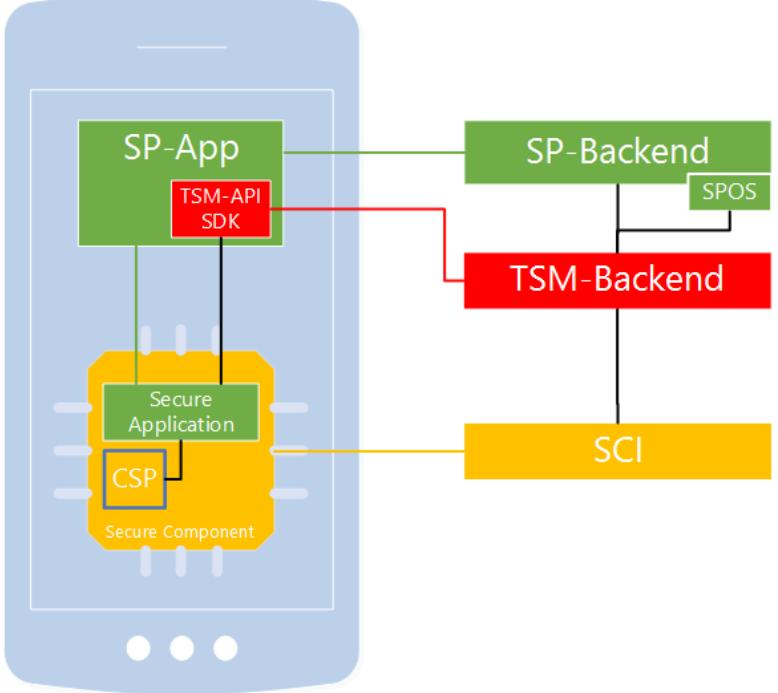
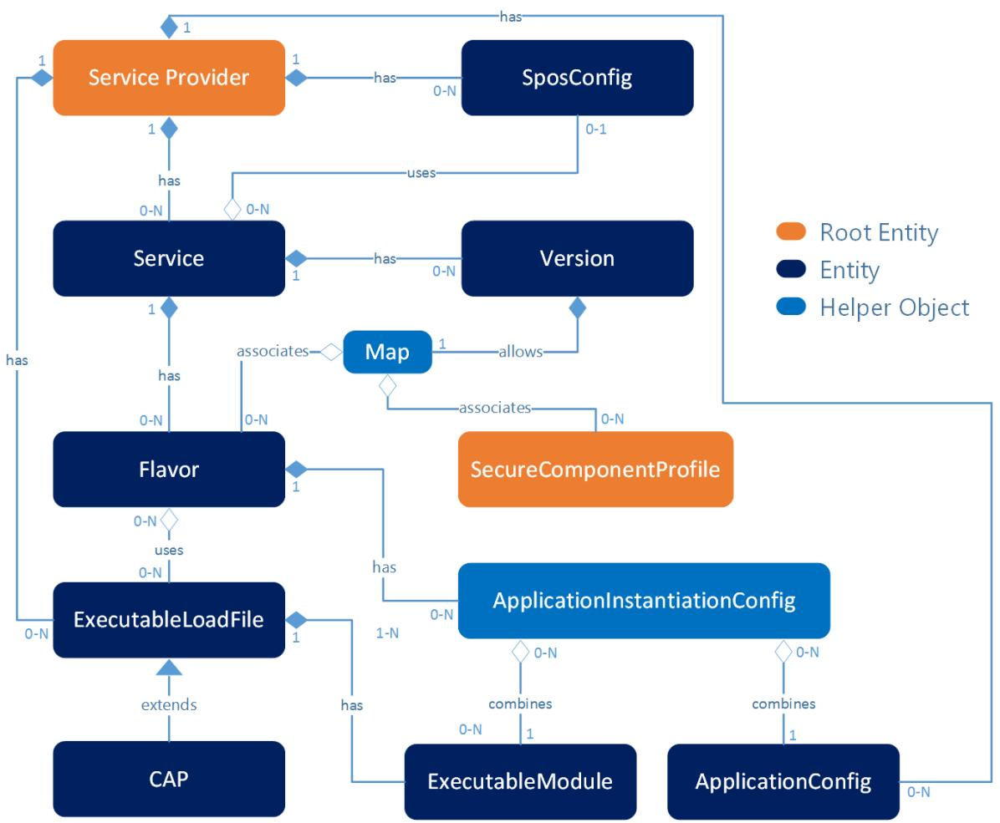
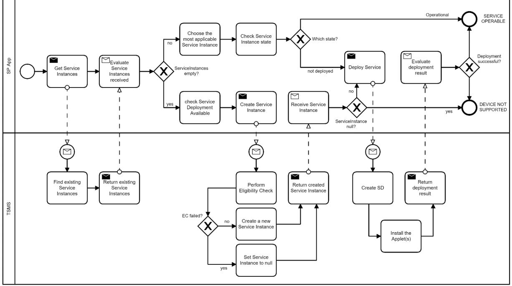
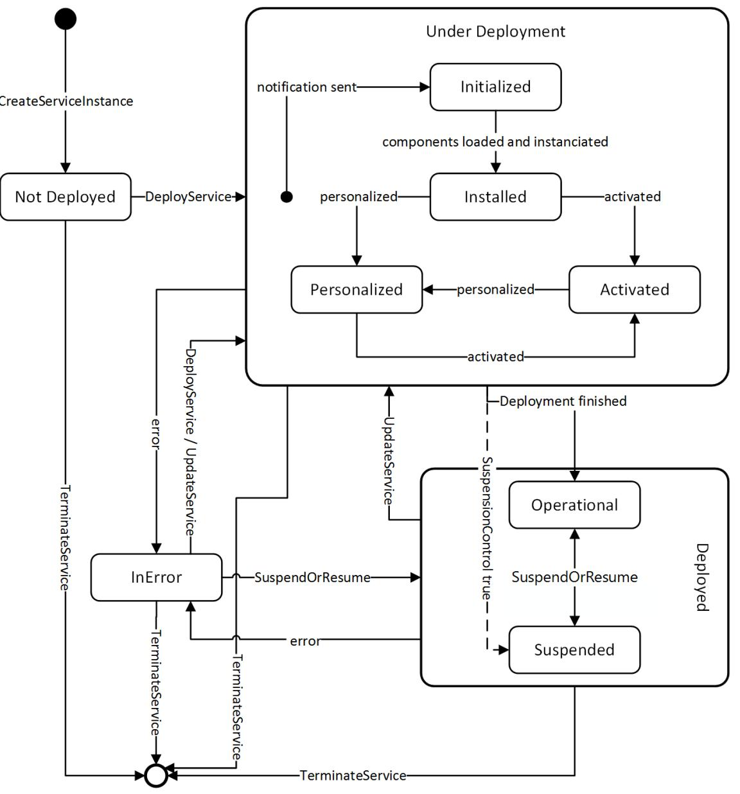
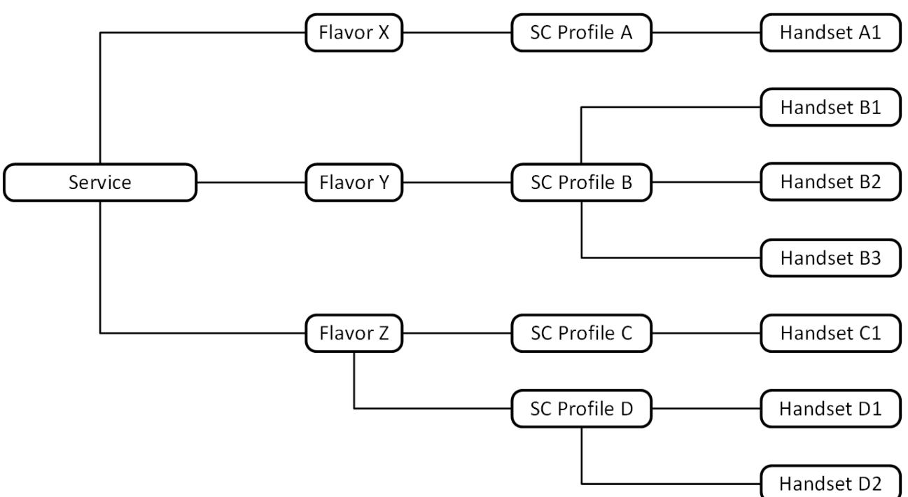
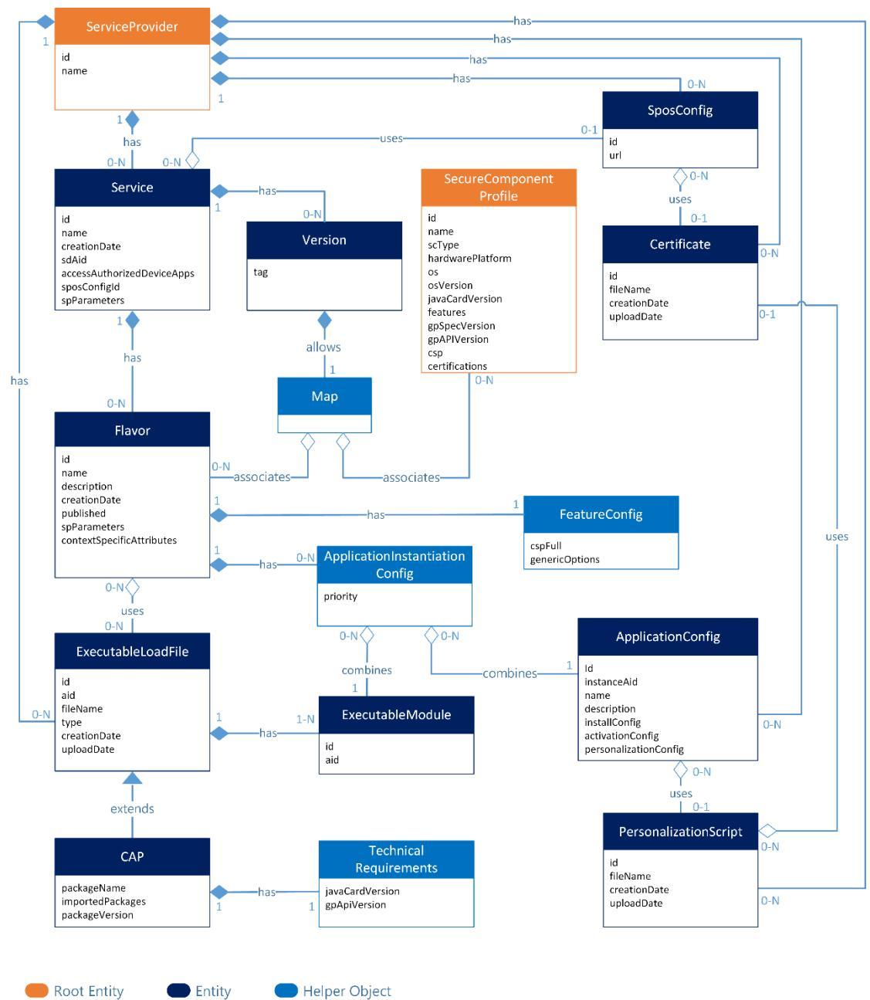

# Technical Guideline TR-03165 Trusted Service Management System

Version 1.1 December 4th, 2023


## Document History

Federal Office for Information Security Post Box 20 03 63 D-53133 Bonn E-Mail: mobile-eid@bsi.bund.de Internet: https://www.bsi.bund.de © Federal Office for Information Security 2023

| 1 |            | Introduction<br>                                          | 5  |
|---|------------|-----------------------------------------------------------|----|
| 2 | Overview   |                                                           | 6  |
|   | 2.1        | Roles 6                                                   |    |
|   | 2.1.1      | Handset User 6                                            |    |
|   | 2.1.2      | Secure Component Issuer  6                                |    |
|   | 2.1.3      | Service Provider 6                                        |    |
|   | 2.1.4      | Trusted Service Manager 7                                 |    |
|   | 2.2        | Infrastructure Components 7                               |    |
|   | 2.2.1      | Handset  8                                                |    |
|   | 2.2.2      | Secure Component 8                                        |    |
|   | 2.2.3      | Cryptographic Service Provider 8                          |    |
|   | 2.2.4      | SP App 9                                                  |    |
|   | 2.2.5      | SP Secure Application  9                                  |    |
|   | 2.2.6      | TSM-Backend 9                                             |    |
|   | 2.2.7      | TSM-API SDK  9                                            |    |
|   | 2.2.8      | Service Provider Online System 9                          |    |
| 3 |            | Implementation                                            | 10 |
|   | 3.1        | Data Model  10                                            |    |
|   | 3.2        | Life-cycle Management  11                                 |    |
|   | 3.2.1      | Life-cycle Management Processes of Secure Applications 11 |    |
|   | 3.2.2      | Service Instances and Service Instance Life-cycle  13     |    |
|   | 3.2.3      | Orphaned Service Instances 15                             |    |
|   | 3.3        | Eligibility Check and Device Check 15                     |    |
|   | 3.3.1      | Eligibility Check 15                                      |    |
|   | 3.3.2      | Device Check 18                                           |    |
|   | 3.4        | Secure Application Attestation Mechanism 18               |    |
|   | 3.5        | Logging and Error Handling 19                             |    |
|   | 3.5.1      | Sequence Logging with History 19                          |    |
|   | 3.5.2      | TSM-API Logging Callback 20                               |    |
| 4 | Interfaces |                                                           | 21 |
|   | 4.1        | TSM-Backend REST-API 21                                   |    |
|   | 4.1.1      | TSM Base URL  21                                          |    |
|   | 4.1.2      | Overview 21                                               |    |
|   | 4.1.3      | Security 24                                               |    |
|   | 4.1.4      | Data Types 24                                             |    |
|   | 4.1.5      | Common Definitions 38                                     |    |

| 4.1.6                                    | Interface Methods 41  |  |  |  |  |
|------------------------------------------|-----------------------|--|--|--|--|
| 4.2                                      | TSM-API  81           |  |  |  |  |
| 4.2.1                                    | Overview 82           |  |  |  |  |
| 4.2.2                                    | Security 83           |  |  |  |  |
| 4.2.3                                    | Data Types 83         |  |  |  |  |
| 4.2.4                                    | Common Definitions 88 |  |  |  |  |
| 4.2.5                                    | Interface Methods 92  |  |  |  |  |
| 4.2.6                                    | Usage Example  102    |  |  |  |  |
| 4.3                                      | SPOS-Service 105      |  |  |  |  |
| 4.3.1                                    | Base URL 105          |  |  |  |  |
| 4.3.2                                    | Overview 105          |  |  |  |  |
| 4.3.3                                    | Data Types 105        |  |  |  |  |
| 4.3.4                                    | Interface Methods 107 |  |  |  |  |
| Appendix A: Attestation Token<br><br>108 |                       |  |  |  |  |
| Terms and Abbreviations<br><br>111       |                       |  |  |  |  |
| List of Figures and Tables<br>112        |                       |  |  |  |  |
| References<br><br>113                    |                       |  |  |  |  |
|                                          |                       |  |  |  |  |

## <span id="page-4-0"></span>1 Introduction

Many aspects of everyday life have changed over the last years due to the ubiquitous market penetration of mobile devices. However, the use of these devices for online government and business comes with a high security demand and is not very prevalent yet. As a necessary foundation for further transaction authorizations, payments and other applications with high security demands, sufficiently secure mechanisms for identification and authentication of users have to be established for mobile devices.

A severe security problem of mobile devices is their complexity, as, e.g., compared to a hardware token in form of a smartcard, combined with the persistent threat of remote attacks. This forbids the implementation of authentication mechanisms relying on the Rich Operating System (Rich OS) of the mobile device. A solution to this problem is given by resorting to Secure Components (SC), nowadays widely present on mobile devices, such as Secure Elements (SE), Universal Integrated Circuit Cards (UICCs) and embedded Universal Integrated Circuit Cards (eUICCs). Due to the relatively low complexity and the inherent access mechanisms, such secure components are ideal to serve as security anchors for secure services and authentication mechanisms on mobile devices.

However, due to the access mechanisms of secure components, their comparably complicated ownership structure, and a quickly evolving portfolio of deployed SCs, it is not feasible for a single Service Provider (SP), e.g., an identity provider or a public transport provider, to negotiate access to the secure components on the various handsets of the SP's customers. The other way round, it is not feasible for the Secure Component Issuers (SCIs), like globally active handset vendors or mobile network operators, to engage in business relations with a large number of local service providers.

A suitable approach to attenuate these problems is to establish a Trusted Service Management System (TSMS). In such a system, one or several Trusted Service Managers (TSMs) serve as a single point of contact for service providers and secure component issuers. As a trusted business partner of SCIs, a TSM negotiates access to the secure components and administers necessary access privileges contracted by the SCIs. As a trusted business partner of service providers, a TSM is responsible for the provisioning the SP's secure application onto the SCs of the SP's customers mobile devices.

Thus, a TSM occupies a central and powerful position within the TSMS. As part of the governmental task to foster the society's digital progress, it has to be assured that up-to-date security standards are met and that every TSM in the scope of this document offers non-discriminatory market access to all potential service providers.

The purpose of this Technical Guideline (Technische Richtlinie, TR) is to define a set of APIs that SHALL be offered by every TSM and security requirements that SHALL be fulfilled by every TSM in the scope of this TR. It is not concerned with a specific application that depends on a TSM.

This TR is organized as follows. In Chapter [2,](#page-5-0) an overview over the roles and infrastructure components of a TSMS is given. Chapter [3](#page-9-0) covers the data model and life-cycle management of secure applications. In Chapte[r 4,](#page-20-0) the interfaces between TSM and SPs are specified.

## <span id="page-5-0"></span>2 Overview

The term TSMS describes a system consisting of handset users, service providers, secure component issuers, and trusted service managers that aims to provide services with high security demand for mobile handsets. In this chapter, an overview over the general concept of a TSMS as well as the different roles and infrastructure components and their interaction is given.

## <span id="page-5-1"></span>2.1 Roles

## <span id="page-5-2"></span>2.1.1 Handset User

A handset user is in possession of a mobile device. By installing a service provider's app, a handset user indirectly triggers the installation of the corresponding secure application (see Section [2.2.5\)](#page-8-1) by a TSM. There is no direct communication between handset user and TSM. If user input is necessary for the life-cycle management of the secure application, it is communicated through the SP app.

## <span id="page-5-3"></span>2.1.2 Secure Component Issuer

A secure component issuer holds the full access rights to a SC and operates a service to (remotely) manage the SC, e.g. a GlobalPlatform (GP) Admin Agent and GP Admin Server [GPD\_SPE\_008]. A SCI provides TSMs an interface to create Supplementary Security Domains (SSDs) and to retrieve the cryptographic keys necessary to access and manage these SSDs. Details may vary, e.g. based on the chosen Secure Channel Protocol for SSD administration, and are not in the scope of this TR.

## <span id="page-5-4"></span>2.1.3 Service Provider

A service provider offers an online service, e.g. an eGovernment or eBusiness service, to handset users. For integration in the TSMS, the service has to be offered via a mobile app. In addition to the mobile app, which runs in the Rich OS of the handset, the offered service depends on a secure application which covers parts of the service with high security demand, e.g. cryptographic functionalities or the storage of data with high integrity demand, and which has to be installed on the SC of the handset. A secure application usually consists of at least one Java Card applet, but can be more complex if necessary for the offered service (see Section [3.1\)](#page-9-1). In any case, the service provider develops this secure application and forwards it to a TSM for installation on the SC. Different Flavors (see Section [3.1\)](#page-9-1) of a secure application might be necessary for different types of secure components or secure component operating systems. It is recommended that the secure application is certified according to the security needs of the specific service (see also Section [2.2.2\)](#page-7-1).

To provide secure applications, the SP communicates with a TSM's backend via an interface provided by the TSM. On the handset, a SP app communicates with the TSM-API SDK to trigger life-cycle management processes of the secure application on the SC. Once a service is fully operational, a SP app directly communicates with the SP's secure application without further involvement of a TSM or the TSM-API SDK.

The SP is also responsible for the personalization of the secure application with personal data of the handset user, if necessary for the service. The personalization process can be supported by a TSM, especially if the necessity for TSM involvement arises due to the applicable standards or regulatory guidelines as well as technical limitations of the underlying secure component. This personalization with personal data must not be confused with the personalization of a SSD on the SC, which is a task that has to be performed by the TSM and does not involve any personal data of the handset user.

For service providers, participation in the TSMS SHALL be possible without the necessity for direct communication or direct business relations between SP and SCI.

## <span id="page-6-0"></span>2.1.4 Trusted Service Manager

A TSM provides and operates the infrastructure for the provisioning and life-cycle management of SP's secure applications. A TSM maintains business relations to various SCIs, and holds the necessary rights contracted by the SCIs to gain access to their SCs. Furthermore, a TSM acts as a single point of contact for SPs.

A TSM offers life-cycle management processes of SPs' secure applications as a service to the SPs and is responsible for checking the eligibility of the SC on the handset during the provisioning process of a secure application. Application specific services are not in the focus of a TSM. However, a TSM may support application specific services, if necessary or requested by the respective service provider. In particular, processes SHOULD be supported by a TSM, if the necessity for TSM involvement arises due to the applicable standards or regulatory guidelines. The secure applications themselves have to be developed and provided by the SPs.

Where applicable, TSM processes and TSM services offered to the SP, e.g. communication via TLS or the creation of cryptographic keys, MUST be in accordance with BSI-TR-03116 [TR-03116]. If necessary for interoperability, justified exceptions are possible in consultation with the BSI.

Where applicable, services provided by the TSM SHALL be run from a secure server in terms of ISO/IEC 27001.

## <span id="page-6-1"></span>2.2 Infrastructure Components

As an overview, the components of the TSMS infrastructure are schematically depicted in [Figure 1.](#page-6-2) A brief description of the components and connected processes reads as follows.



*Figure 1: Schematic representation of the TSMS infrastructure components.*

<span id="page-6-2"></span>A SP provides and manages the SP app, the corresponding backend, including an optional Service Provider Online System (SPOS) for TSM-related order- and status management, and the secure application for the service. For installation of the secure application on the SC of the mobile device, the SP establishes a contract with the TSM. The TSM maintains contracts with the SCI to obtain access to the SC and the Cryptographic Service Provider (CSP) on the handset.

On demand of the SP app, the provisioning of the SP's secure application is triggered via the TSM-API. The TSM first checks the eligibility of the SC, then deploys and initializes the secure application on the SC. Once the secure application is functional and ready to be personalized with customer data by the SP, the communication between the SP's app and secure application is based on mechanisms provided by the handset only, without necessity for further involvement of the TSM-API SDK. If the installed secure application requires an update or should be

deleted, the corresponding processes are triggered by the SP app via the TSM-API, after which the TSM performs the requested services. Communication between SP app and TSM-API SDK is limited to technical necessities, but additional information accompanying life-cycle management processes may be exchanged between TSM-Backend and SPOS. At any time, independent of the provisioning process, the SP app may trigger a device check via the TSM-API. Scope of this comparably fast check is to yield an educated guess if a device will be eligible for a specific service.

## <span id="page-7-0"></span>2.2.1 Handset

For compliance with the TSMS infrastructure, a handset MUST provide at least one secure component that is supported by a TSM. Communication with the SC via Open Mobile API (OMAPI) [GPD\_SPE\_075] MUST be supported by the handset.

## <span id="page-7-1"></span>2.2.2 Secure Component

Due to the quickly evolving availability and market penetration of secure components, it is not feasible to define a stringent and concluding list of SCs which have to be supported by a TSM. Therefore, this section only provides a brief overview over adequate secure components oriented at the security level the TSMS aims for.

Preferential secure components are characterized by a meaningful security certification, the inclusion of a CSP, and a strict separation on hardware level from the Rich OS of the handset. Examples for such preferential SCs are

- embedded Secure Elements with CSP, Common Criteria (CC) certified at least at Assurance Level EAL4+AVA\_VAN.5,
- Universal Integrated Circuit Cards with CSP, CC certified at least at Assurance Level EAL4+AVA\_VAN.5,
- embedded Universal Integrated Circuit Cards with CSP, CC certified at least at Assurance Level EAL4+AVA\_VAN.5.

With the goal of high market coverage, additional SCs could be included into the TSMS. Such additional SCs are characterized by a potential lower security level as compared to preferential SCs, yet the market coverage they provide might outweigh potential risks. It is important to note that an arbitrary lowering of the security level, e.g. with purely software-based SC solutions, is not in accordance with the goals of the TSMS. Examples for acceptable additional secure components are

- embedded Secure Elements without CSP, Common Criteria (CC) certified at least at Assurance Level EAL4,
- Universal Integrated Circuit Cards without CSP, CC certified at least at Assurance Level EAL4,
- embedded Universal Integrated Circuit Cards without CSP, CC certified at least at Assurance Level EAL4,
- Trusted Execution Environments with dedicated hardware support for key management, to be evaluated on a case-to-case basis.

Generally, a TSM has to decide if a secure component is eligible to be included into the system. For a specific service, the decision which security level and which secure components are adequate is to be determined by the respective service provider and is to be considered by the TSM for the eligibility check as described in Section [3.3.1.](#page-14-2)

## <span id="page-7-2"></span>2.2.3 Cryptographic Service Provider

To allow installation of Common Criteria certified secure applications without the demand of a composite certification of a secure application on top of each type of secure component, it is beneficial to encapsulate the cryptographic functionalities in a Cryptographic Service Provider [TR-CSP], which provides secure cryptographic service to secure applications. The CSP's security services are logically separated from the secure application and

provided through well-defined external interfaces. Consequently, the security functionalities of the secure application can be certified independently.

Due to these benefits, secure components with CSP according to [PP-CSP] or CSP Light according to [PP-CSP-Light] are preferable over secure components without CSP.

## <span id="page-8-0"></span>2.2.4 SP App

A SP app is a mobile application offered by a SP to handset users.

A SP app MUST support communication with the TSM-API SDK via the TSM-API as specified in Section [3.](#page-9-0) A SP app MUST be able to communicate directly (e.g. via OMAPI) with the corresponding secure application.

Before triggering the installation of a secure application, a SP app SHOULD check if the handset provides the hardware and software required for the offered service. To support this task, a TSM SHALL provide a device check which offers information about the eligibility of the handset for participation in the TSMS as a convenience function via the TSM-API (see Section [3.3.2\)](#page-17-0). This device check may not cover all aspects a SP has to check and is not to be confused with the full eligibility check of the secure component, which has to be performed by a TSM as part of every provisioning process (see Section [3.3\)](#page-14-1).

If the specific service requires the secure application to be personalized with personal data of a handset user, the SP app SHOULD implement the functionality to delete this personalized data or make it temporarily or permanently inaccessible on request of the handset user without involvement of the TSM or the TSM-API SDK.

A SP app SHOULD provide mechanisms for the service provider to block the installation of the secure application, respectively to block access to the already installed secure application without involvement of the TSM or TSM-API SDK.

## <span id="page-8-1"></span>2.2.5 SP Secure Application

A secure application covers parts of an offered service with high security demand, e.g. cryptographic functionalities, or the storage of data with high integrity demand. A secure application usually consists of at least one Java Card applet which has to be installed on a SC of a handset. In the employed data model (see Section [3.2\)](#page-10-0), the practical implementation of a secure application on a handset is called a Service Instance.

## <span id="page-8-2"></span>2.2.6 TSM-Backend

A TSM-Backend is an IT-system of a TSM that provides TSM-services in form of a REST-API (see Section [4.1\)](#page-20-1). It acts as a repository for secure applications in different Flavors, configurations, and resources that are necessary to install a secure application.

## <span id="page-8-3"></span>2.2.7 TSM-API SDK

The TSM-API (see Section [4.2\)](#page-80-0) is a message-based interface that provides methods to trigger life-cycle management processes of secure applications on secure components. A TSM SHALL provide a library (TSM-API SDK) which implements this interface for integration into SP apps.

## <span id="page-8-4"></span>2.2.8 Service Provider Online System

A SP Online System (SPOS) is an IT-system of a SP that provides a REST interface to a TSM (see Section [4.3\)](#page-104-0). A SPOS enables a TSM to send the result of life-cycle management actions on a handset to the corresponding SP. Providing a SPOS is optional for SPs.

The communication between TSM-Backend and SPOS SHALL take place via mutual HTTP with TLS (HTTPS) encryption.

## <span id="page-9-0"></span>3 Implementation

A TSMS implementation consists of at least two parts:

- TSM-Backend
- TSM-API SDK

The TSM-Backend is the heart of the TSMS and holds all data needed to manage the life-cycle of secure applications. The data model described in Section [3.1](#page-9-1) is a subset of this data structure and concentrates on entities needed to initially configure secure applications via the TSM-Backend REST-API.

Installation, update, removal, or other life-cycle changes are triggered via the TSM-API SDK by the SP app using the TSM-API. Section [3.2](#page-10-0) lists and describes all possible life-cycle states and their characteristics.

All hardware-specific variations needed to support different smartphone hardware platforms must be configured in the TSM-Backend via the REST-API. For example, in case different secure application binaries are needed to support different platforms, all of them must be uploaded to the TSM-Backend. Section [3.3](#page-14-1) describes the process of checking those requirements to prove eligibility of the device and to automatically select the secure application matching the concrete hardware platform.

In some cases it is necessary to prove integrity and authenticity of a secure application which is already installed on a handset. This can be done via the attestation mechanism specified in Section [3.4.](#page-17-1)

Logging is an essential feature to detect and correct errors. Suggestions for the implementation of logging in the TSM are given in Section [3.5.](#page-18-0)

## <span id="page-9-1"></span>3.1 Data Model

For the life-cycle management of secure applications, data provided by the respective SP has to be stored in the TSM-Backend. This data is represented by the data model shown in [Figure 2](#page-10-2) and briefly discussed in the following paragraphs.

The central entity, the Service Provider is shown in orange. Class entities, like Service and Flavor, are shown in dark blue, while helper classes are shown in light blue. As the top-level entity, besides the Service Provider itself, a Service represents the functionality that should be provisioned onto a secure component. Please note that we use the term service in a twofold way, for the whole service offered by a SP to its customers, and as an entity in the secure application data model. A Service may have different Flavors. Flavors are specific realizations of a Service. While the basic functionality is the same, different Flavors cover different characteristics and necessities of different underlying platforms, which are represented by SecureComponentProfiles. A Flavor comes with (typically) one or more Executable Load Files (ELFs). ELFs are containers of executable code on a secure component [GPC\_SPE\_034]. A realization of a Load File is a Java Card CAP-File, which contains the Load File Data Block and, optionally, a manifest file that is used to retrieve information regarding the content of the CAP file. An ELF may contain several Executable Modules (EMs). An EM represents executable code on a secure component of a single application that can be used for the instantiation of application instances. An example of an Executable Module is a Java Card Applet.

These entities are augmented by various additional components. First of all, a Service has different Versions that can be used for versioning and updating. Other components cover specific requirements and configuration instructions for Flavors, ELFs, and EMs. E.g., during the installation process, the instantiation of application instances from an Executable Module is configured with the ApplicationInstantiationConfig, which itself relies on, respectively specifies, a more general ApplicationConfig. Several further components of the data model are omitted for this overview, but will be discussed in Sectio[n 4.1.3.](#page-23-0)

Last but not least, the SposConfig is used to configure access to a SP backend for the delivery of order- and status management related data. A single SposConfig may be used by multiple Services.



*Figure 2: Overview of the secure application data model as discussed in the text.*

## <span id="page-10-2"></span><span id="page-10-0"></span>3.2 Life-cycle Management

This section is concerned with life-cycle management processes of secure applications. Section [3.2.1](#page-10-1) covers general aspects, while more detailed information on the specific life-cycle of the practical realization of a secure application, a Service Instance, is given in Section [3.2.2.](#page-12-0)

## <span id="page-10-1"></span>3.2.1 Life-cycle Management Processes of Secure Applications

A TSM provides an interface (TSM-API), which a SP app can use to trigger life-cycle management processes of SP's secure applications and to retrieve status information about the process status and progress. The TSM-API SHALL be provided to the SPs via a software library for direct integration into the SP app.

A TSM performs life-cycle management of a SP's secure application on a SC on request of the corresponding SP. A lifecycle management process is performed for operation requests which commonly result in a state change of the secure application Service Instance, that is

- the deployment (provisioning) of a secure application on a SC,
- the update of a deployed Service Instance of a secure application,
- suspend or resume a Service Instance of a deployed secure application,
- the removal of the Service Instance of a secure application from the SC.

Apart from that, the TSM provides functions as part of TSM-API SDK which are not associated with the execution of a lifecycle management process. These are

- functions to obtain a Service Instance ID or to query the current state of a Service Instance (see Section [3.2.2\)](#page-12-0),
- operations provided to perform the Device Check (see Section [3.3.2\)](#page-17-0).

A process starts with the successful submission of a request from the TSM-API to the TSM-Backend and ends with the last processing step performed by the TSM. The transmission of the process result itself is not part of the process. Each process is uniquely identified by an ID that can be used as reference, e.g. within the context of order- and status management.

The TSM-API SHALL notify the SP app about the start, end, and result of the process execution. If the notification about the process start cannot be delivered to the SP app, the process execution SHALL be aborted with an according error. Additionally, process results SHALL be reported to a SPOS via the SPOS-Service API, if a SPOS for this purpose is provided by the SP.

#### 3.2.1.1 Provisioning of Secure Applications

On request of the SP app via the TSM-API and after a successful eligibility check (see Section [3.3.1\)](#page-14-2), a TSM provisions a SP's secure application on the SC chosen during the check. The provisioning process includes the loading and installation of necessary components in the extent agreed between SP and TSM and optional personalization and activation. The TSM SHOULD perform the installation and personalization as requested by the SP's configuration instructions. Once the secure application has been provisioned, the secure application MUST be fully functional.



<span id="page-11-0"></span>*Figure 3: BPMN 2.0 diagram of the simplified installation process of a secure application.*

The installation process is illustrated in [Figure 3](#page-11-0) by a simplified Business Process Model and Notation 2.0 (BPMN 2.0) diagram.

## 3.2.1.2 Update of Secure Applications

The update of a secure application is initiated by an update request sent from the SP app via the TSM-API. To perform an update, the new secure application version MUST be available to the TSM, i.e. the new version SHALL be supplied to the TSM by the SP in advance.

After an update, a secure application MUST be fully functional. The update process SHOULD NOT come with the necessity for a new personalization with personal data of the handset user, i.e. the data stored in the secure

application SHOULD be maintained, if the SC and the secure application provide the necessary mechanisms. If maintaining the respective data is not possible, the SP, not the TSM, is responsible for the new personalization with personal data of the handset user.

## 3.2.1.3 Removal of Secure Applications

A TSM SHALL delete installed secure applications or their components on request of the SP app. A TSM SHALL NOT delete installed secure applications or their components without the permission of the corresponding SP.

When a secure application is deleted from the handset, a TSM SHALL assure that any personal data associated with the secure application is permanently inaccessible or removed.

## <span id="page-12-0"></span>3.2.2 Service Instances and Service Instance Life-cycle

Service Instances, the practical realization of secure applications, are configured via the data model described in Section [3.1](#page-9-1) and created from Services through function calls via the TSM-API. Service Instances have a manageable life-cycle, which is described in the following.

A SP can retrieve the current life-cycle state of a Service Instance at any time with a call to *getServiceInstances* or as a result of a process execution. In case of an error during the process execution that results in an erroneous state of the Service Instance, the state before the process start is not automatically restored but the targeted Service Instance transitions to the life-cycle state *InError*. A SP can then decide whether the erroneous Service Instance shall be terminated, or missing steps shall be performed to reach the targeted life-cycle state, e.g., UnderDeployment:Installed.

The life-cycle of a Service Instance begins with a successful *createServiceInstance* request by the SP and ends with a successful call to *terminateService*. The different life-cycle states and their transitions are shown in [Figure](#page-13-0)  [4](#page-13-0) and described in the following.



*Figure 4: Flow chart of the Service Instance life-cycle.*

#### <span id="page-13-0"></span>• **Not Deployed**

The state *Not deployed* is the initial state for each Service Instance. In this state, no components of the Service are deployed on the SC. In the state *Not deployed* a new Service Instance is created through a successful call to *createServiceInstance*. During the execution of *createServiceInstance*, an Eligibility Check is performed.

#### • **UnderDeployment:Initialized**

A Service Instance reaches the *UnderDeployment:Initialized* state once the TSM has sent an onProcessStart notification for a *deployService* or *updateService* request. In this state, the deployment of a Service has started but not all components of the Service have been loaded and/or installed.

#### • **UnderDeployment:Installed**

A Service Instance reaches the *UnderDeployment:Installed* state when the execution of the InstallServiceCommand of a *deployService* or *updateService* function call has finished. In this state the loading and installing of all components of the Service as defined by the SP has been performed.

#### • **UnderDeployment:Personalized (Optional)**

A Service Instance reaches the optional *UnderDeployment:Personalized* state when the execution of the last PersonalizeServiceCommand of a *deployService* or *updateService* function call has finished. In this state, the Service has been personalized (e.g., by executing personalization scripts) as required by the SP.

#### • **UnderDeployment:Activated (Optional)**

A Service Instance reaches the optional *UnderDeployment:Activated* state when the execution of the ActivateServiceCommand of a *deployService* or *updateService* function call has finished. The transition from *UnderDeployment* states to *Deployed* states is triggered when the execution of a *deployService* or *updateService* function call that indicates the finalization of the service deployment has finished successfully. A SP can decide if the personalization and/or activation of a Service needs to be performed for the Service Instance to be considered *Deployed*.

#### • **Deployed:Operational**

A Service Instance reaches the *Deployed:Operational* state when the execution of a *deployService* or *updateService* function call that indicates the finalization of the service deployment has finished successfully. Another possibility to reach *Deployed:Operational* is the successful execution of a *suspendOrResumeService* function call from the state *Deployed:Suspended*. In this state, the Service Instance is ready to be used by the SP.

#### • **Deployed:Suspended**

A Service Instance reaches the *Deployed:Suspended* state when the execution of a *deployService* or *updateService* function call that has indicated the finalization of the Service deployment and that contains an ActivateServiceCommand with SuspensionControl set to true has finished. Another possibility to reach *Deployed:Suspended* is the successful execution of a *suspendOrResumeService* function call from the state *Deployed:Operational*. In this state, the Service Instance cannot be used by the SP.

#### • **In Error**

A Service Instance reaches the *InError* state when an error occurs during the execution of a function call that caused a change to a component of the Service. If the error occurred at a time when no change to secure components has been applied, the Service Instance remains in the current life-cycle state. In the *InError* state, function calls can be made to perform a transition to other life-cycle states.

## <span id="page-14-0"></span>3.2.3 Orphaned Service Instances

A Service Instance which is in the *UnderDeployment*, *Deployed* or *InError* state is orphaned if the associated Flavor has been removed by the SP. By removing a Flavor, the SP indicates that the service configuration implied by the Flavor is no longer applicable. Thus, specific life-cycle rules for state transitions apply for orphaned Service Instance.

- An orphaned Service Instance at *Deployed:Operational* state may be suspended by executing the SuspendOrResumeService function call.
- An orphaned Service Instance at *Deployed:Suspended* state may be resumed by executing the SuspendOrResumeService function call.
- An orphaned Service Instance may be terminated by executing a TerminateService function call which results in the removal of all components of the Service installed on the SC.

Other state transfers are invalid and will result in an error of the related process execution.

## <span id="page-14-1"></span>3.3 Eligibility Check and Device Check

## <span id="page-14-2"></span>3.3.1 Eligibility Check

For the installation of a secure application, a TSM SHALL perform an Eligibility Check (EC) to confirm that the handset is equipped with at least one eligible SC that can be accessed and managed by the respective TSM. The eligibility of a SC depends on the specific Service and secure application to be provisioned as well as on the TSM performing the EC. For a SC to be eligible, the following conditions MUST be fulfilled:

• The SC SHALL successfully pass an authenticity check (see Section [3.3.1.1\)](#page-15-0).

- The SC SHALL be in accordance with technical requirements and security requirements of the TSM and of the secure application to be provisioned. This includes the availability of a matching Flavor of the secure application (see Section [3.3.1.2\)](#page-16-0).
- An application instance of the secure application to be provisioned SHALL NOT already be present on the SC. Additionally, a TSM SHALL check, within the accessible scope of the particular TSM, if an application instance of the secure application is already present on another SC on the handset.

All information for the EC SHALL be collected dynamically and directly on the handset without communication to other entities, if the SCs under consideration offer the necessary technical functionality. In particular, the EC SHALL be performed without direct communication to the SP. It is thus recommended that a SP ensures the availability of matching Flavors of the SP's secure application for all potentially eligible SC available to the SP's customers.

Possible outcomes of the EC are that there are no, exactly one, or multiple eligible SCs on the handset.

- If no eligible SC is identified, the provisioning process SHALL be aborted. The failure of the EC SHALL be reported to the SP app. The reason for the failure of the EC SHALL be communicated to the SPOS, if the SP provides a SPOS for this purpose.
- If exactly one eligible SC is identified, the provisioning process continues.
- If multiple eligible SCs are identified on the handset, the TSM SHALL choose one particular SC and continue with the provisioning process (see Section [3.3.1.2\)](#page-16-0).

Due to technical limitations, a TSM may be able to perform certain parts of the EC only after a SSD on a (preliminary) eligible SC has been created. In such cases, it is the responsibility of a TSM to perform the EC without generating unnecessary costs or efforts for the SP, the SCI, or other third parties. For this purpose, parts of the EC that require the creation of a SSD SHOULD only be performed after a specific SC is preliminary eligible, i.e. the SC successfully passed all parts of the EC that do not require the creation of an SSD. The preliminary eligibility MAY be determined based on information that is less reliable than information obtained directly from the SC after SSD creation, in which case this information SHALL be verified after SSD creation on the preliminary eligible SC.

## <span id="page-15-0"></span>3.3.1.1 Secure Component Authenticity Check

In general, a TSM has to verify the authenticity of a SC before any provisioning activities take place. The available mechanisms for this task may vary for different TSMs, SCs, and SCIs. If a dedicated attestation mechanism is available to the TSM on the respective SC, this attestation SHALL take place within the EC. If no dedicated attestation mechanism is available, the TSM SHALL use an adequate alternative to ensure the authenticity of the SC. In the latter case, the attestation MAY take place outside of the EC. This TR will not specify details for the adequate attestation of secure components in absence of a dedicated mechanism. However, this section will give an example of an adequate alternative attestation process.

The example is based on the mutual authentication of TSM and SC via the GlobalPlatform Secure Channel Protocol (SCP) [GPD\_SPE\_014]. An upside of performing the attestation via SCP is that, at least on GP-managed SCs, the necessary cryptographic keys are required for the creation of further SSDs and secure application lifecycle management anyways. A downside is that it requires direct involvement of the SCI and the creation of an SSD on the SC under consideration prior to final result of the EC. However, the Secure Component Attestation is expected to fail only under exceptionally rare circumstances.

The SC attestation in this example assumes an uncompromised SCI backend system and requires a transport key securely exchanged between TSM and SCI. The attestation proceeds as follows:

- 1. The TSM acquires the ID of the specific SC on the handset.
- 2. The TSM contacts the SCI via mutual-TLS and requests the creation of a SD on the specific SC, including creation and distribution of the keys required by SCP.
- 3. The SCI authenticates to the Issuer SD on the specific SC, instantiates the requested SD, and personalizes the new SD with the required SCP keys.
- 4. The SCI encrypts the SCP keys with the transport key exchanged / derived in advance and sends them to the TSM via mutual-TLS.
- 5. The TSM decrypts the SCP keys with the transport key and uses them to initiate a secure channel with the SD on the SC via SCP.
- 6. As part of SCP, TSM and SC authenticate each other.

The successful mutual authentication in step 6 not only assures the access right of the TSM to the SD, but also the "genuineness" of the SC itself. This is an example where the SC attestation is not part of the EC itself, but is guaranteed to be executed prior to the provisioning process, as long as the provisioning utilizes the GP SCP.

## <span id="page-16-0"></span>3.3.1.2 Secure Component Flavor Matching

Due to technical differences between SC platforms, a SP may have to provide different Flavors, i.e. variants, of a secure application. For this purpose, a TSM provider SHALL maintain a list where each secure component supported by this TSM is represented by a data model entity called SecureComponentProfile (SC profile). Such a SecureComponentProfile describes a secure component by its properties, e.g., JavaCard version or operating system name and version. The list SHALL not contain multiples of identical SC profiles, i.e. SC profiles which only differ by their id but not on the technical level.

To determine which hardware platforms are supported by a TSM, a SP can retrieve the list of supported SecureComponentProfiles via the TSM-Backend REST API. With this information, the SP can provide matching ELF files and configure corresponding Flavors. During the provisioning process on a particular handset, the Flavor for the specific SC has to be selected by the respective TSM. To enable this, a SP SHALL assign the SecureComponentProfiles to the prepared Flavors for each Version of the Service via the *allowedDeployments* attribute (see Section [4.1.4.3.](#page-26-0)). With this step, a SP defines which Flavor (and thus indirectly which ELF) is used for which hardware platform.

For a fixed Service Version, each SecureComponentProfile can be assigned to exactly zero or one Flavor the SP has configured. To clarify, in the same Version it is not supported to assign a SecureComponentProfile to multiple Flavors. It is, however, possible to assign multiple SecureComponentProfiles to a single Flavor (see [Figure 5](#page-17-2) below for examples). The assignment of a certain SC profile to a specific Flavor may be changed by the SP when configuring a new Version. Furthermore, since the Version is mutable, it is possible to modify a Version when it is already deployed on a device. With this, the SP can assign new SecureComponentProfiles to an existing Version to increase the amount of devices supported by this Version. The SP can also remove SecureComponentProfiles from an existing Version, e.g., in case of a security incident.

A TSM provider SHALL ensure that the FlavorIds and SecureComponentProfileIds are unique for each Version. A TSM provider SHALL perform a compatibility check when the *allowedDeployments* attribute is modified. Here, a TSM provider SHALL compare the ELF files with the assigned SecureComponentProfiles, e.g. to check for JavaCard version mismatch or missing CSP support. Such a compatibility check might also be needed when an ELF or a Flavor is modified.

If a handset provides multiple eligible SCs for a Service, a TSM SHALL choose one of them for provisioning. The criteria for this choice are not in the scope of this TR.

Only the TSM provider can modify the list of available SecureComponentProfiles. If a new SecureComponentProfile is added, the TSM provider SHOULD inform the SPs in time about the planned changes. If an existing SecureComponentProfile is removed, the TSM provider SHALL inform the SPs about the planned changes.

For a better understanding of the mapping of a Flavor, respectively a SC profile, various exemplary situations are displayed in [Figure 5.](#page-17-2) Note that this is a simplified visualization for a fixed version of the Service, since the allocation of a SC profile to a specific Flavor may be changed when creating a new Version.



<span id="page-17-2"></span>*Figure 5: Exemplary situations of the mapping between Flavors and specific handsets for a specific Version of a Service.*

## <span id="page-17-0"></span>3.3.2 Device Check

As mentioned in Section [2.2.4,](#page-8-0) a SP app should check, respectively should offer the handset user a possibility to check, if the handset provides the hardware and software required for the offered Service before triggering the installation of a secure application. For this purpose, a TSM SHALL provide a device check which offers information about the eligibility of the handset for participation in the TSMS as a convenience function via the TSM-API. It is important to note that the scope of this Device Check is limited to TSM-related functionality of the handset and may not cover all general requirements of a SP.

The comprehensiveness of this device check is up to the TSM. It is recommended that the device check reaches a reliability comparable to a preliminary EC as described at the end of Section [3.3.1.](#page-14-2) However, this device check is not to be used as a structural part of the EC. The full EC SHALL be performed as part of every provisioning process regardless if a device check has or has not been performed in advance.

As a guideline, the device check

- SHOULD NOT require any input from the SP, except triggering the process via the TSM-API (which requires the input specified in Sectio[n 4.2.5.7\)](#page-97-0).
- SHOULD NOT yield a false-negative result for an eligible handset. False-positive results are considered less severe, since they are corrected by the full EC during the provisioning process.
- SHOULD be performed locally on the handset without communication to third parties. A communication to the TSM may be necessary to reach decent reliability.

## <span id="page-17-1"></span>3.4 Secure Application Attestation Mechanism

As part of the provisioning of a secure application, a TSM SHALL provide an Attestation Token to the secure application, if requested by the SP. The purpose of this token is to allow the SP to verify that the secure application has been provisioned by the TSM and thus an eligibility check of the secure component has been performed. To clarify, this verification is important for a closed chain of trust from point of view of the SP. It is not meant to assess the quality of services provided by the TSM. The verification of the token by the SP SHALL be possible without involvement of the TSM or the TSM-API SDK and without the need to understand SCI specific protocols of the underlying SC.

The content of the Attestation Token SHALL be cryptographically signed by the TSM with a signature according to BSI-TR 03116-4 [TR-03116].

The Attestation Token SHALL contain

- a TSM identifier, e.g. an OID associated with the TSM,
- the Process ID of the provisioning process (UUID assigned by the TSM),
- the Flavor ID of the corresponding Flavor (UUID assigned by the TSM),
- a signer reference for the verification of the signature.

Additionally, if requested by the SP, the Attestation Token SHALL contain key diversification data and a master key index for a SP-specific verification processes (see below).

The authenticity and integrity of the Attestation Token itself is guaranteed by the cryptographic signature. The pairing of Attestation Token and a SC requires additional measures, e.g. against malicious exchange of the token during the communication between SC and SP app. As a native way to validate the pairing, the Process ID contained in the token could be validated against the Process ID of the provisioning process of the secure application known to the SP. This, however, would require an adequate security level for the transmission and validation of the Process ID which has to be implemented by a SP.

Alternatively, mechanisms of the GlobalPlatform Secure Channel Protocol [GPD\_SPE\_014] can be used to achieve the pairing of SC and token. For this, SP and TSM have to agree on a key derivation process for the cryptographic keys necessary for the SCP which utilizes a master key and key diversification data (KDD). The master key has to be exchanged out of band. The KDD is provided to the SP by the TSM as part of the Attestation Token. The TSM initializes the SSD associated with the SP's secure application with SCP keys derived using the agreed upon derivation process, the master key, and the KDD. The pairing of the Attestation Token to a SC, respectively a particular SSD on the SC, can be validated by the SP by deriving valid SCP keys also using the agreed upon derivation process, the master key, and the KDD taken from the token. Note that this process comes with very little effort for the SP, as long as the use of SCP is required for the Service anyways, e.g. during a personalization of the secure application with customer data.

Details about the provisioning and encoding of the Attestation Token are given in Appendix A.

## <span id="page-18-0"></span>3.5 Logging and Error Handling

Logging is an essential feature to detect and correct errors or other problems. A TSM should consider to implement the following logging features:

- Sequence logging with history
- TSM-API logging callback

## <span id="page-18-1"></span>3.5.1 Sequence Logging with History

As a security feature, tamper resistant secure components incline to mute their communication interfaces under certain circumstances. Once the communication to the secure component is blocked, it is hardly possible to detect the cause afterwards. Thus, a backward stored logging is essential to analyze issues with secure components. Thus, all communication between TSM and the secure component should be logged in the TSM-Backend database for an adequate period of time (e.g. several weeks). This includes the command sequences to initialize the secure component, e.g. initialize security domain and access rules and also all communication to install, configure, manage and uninstall secure applications.

## <span id="page-19-0"></span>3.5.2 TSM-API Logging Callback

To be able to participate in the TSMS, the SP App has to integrate the TSM-API SDK as library. To be able to analyze the behavior of the TSM-API SDK in case of errors, the SDK should provide a mechanism to forward current log messages generated by the SDK to the SP App. This could be done via a callback object, by certain logging frameworks, or other solutions. Latest at the moment when an issue occurs, the SP app shall have the possibility to receive log and error messages for the period shortly before the error occurred.

## <span id="page-20-0"></span>4 Interfaces

In this chapter, the interfaces between TSM and SP are defined:

- TSM-Backend REST-API (provided by the TSM, used by the SP),
- TSM-API (provided by the TSM via the TSM-API library, used by the SP app),
- SPOS-Service (provided by the SP, used by the TSM).

The TSM-Backend (see Sectio[n 4.1\)](#page-20-1) provides a REST interface using HTTPS hosted by the TSM. It provides methods to upload and maintain installation files for secure applications, including binary data and installation instructions.

On Android devices, the TSM-API (see Section [4.2\)](#page-80-0) is a bound-service-based interface to be integrated as software library into the SP app running on the handset. It provides methods to trigger life-cycle management processes for secure applications on secure components. A SP app can receive callback status messages by providing a listener object within the function call made to the TSM-API.

The SPOS-Service is an optional REST interface a SP MAY provide depending on the SP's business model. It can be used to receive process success and process error messages sent by a TSM.

Remark: The interface methods in this version of the TR are all of "version 1.0" and not explicitly marked as such. If the update of individual methods becomes necessary in the future, the updated methods will be indicated appropriately.

## <span id="page-20-1"></span>4.1 TSM-Backend REST-API

A TSM SHALL provide a REST API as specified in this section that allows service providers to create, read, update and delete all data objects that are necessary to enable the life-cycle management of their secure application on secure components. The TSM MAY provide additional, e.g. graphical, user interfaces and convenience functions.

## <span id="page-20-2"></span>4.1.1 TSM Base URL

The TSM Base URL specifies the endpoint that offers the interface methods. It consists of the URL of the host, the name of the API as well as its version. Communication with the TSM-Backend SHALL be done via HTTP with TLS (HTTPS) encryption:

https://<<host>>/sptsm/<<version>>/

## <span id="page-20-3"></span>4.1.2 Overview

This section lists the interface methods provided by the TSM-Backend as an overview. A detailed description of the methods is given in Section [4.1.5.2.](#page-37-1)

## 4.1.2.1 /auth

The following methods for authentication are available:

| Method | REST-URL | Short Description                   |
|--------|----------|-------------------------------------|
| POST   | /auth    | Create a short-term access token    |
|        |          | which is needed to access any other |
|        |          | interface methods.                  |
|        |          |                                     |

#### 4.1.2.2 /service-providers

The following methods for the management of SP accounts are available:

| Method | REST-URL                   | Short Description        |
|--------|----------------------------|--------------------------|
| GET    | /service-providers/current | Get account information. |

## 4.1.2.3 /secure-component-profiles

The following methods to retrieve information about the supported SecureComponentProfiles are available:

| Method | REST-URL                                       | Short Description             |
|--------|------------------------------------------------|-------------------------------|
| GET    | /secure-component-profiles                     | List SecureComponentProfiles. |
| GET    | /secure-component-profiles/{scpId}             | Get SecureComponentProfile.   |
| GET    | /secure-component-profiles/{scpId}/elfs        | List related ELFs.            |
| GET    | /secure-component-profiles/{scpId}/services    | List related Services.        |
| GET    | /secure-component                              | List related Flavors.         |
|        | profiles/{scpId}/services/{serviceId}/flavors  |                               |
| GET    | /secure-component                              | List related Versions.        |
|        | profiles/{scpId}/services/{serviceId}/versions |                               |

#### 4.1.2.4 /services

The following methods for the management of Services and Flavors are available:

| Method | REST-URL                                                                  | Short Description       |
|--------|---------------------------------------------------------------------------|-------------------------|
| GET    | /services                                                                 | List Services.          |
| POST   | /services                                                                 | Create Service.         |
| GET    | /services/{serviceId}                                                     | Get Service.            |
| PUT    | /services/{serviceId}                                                     | Modify Service.         |
|        | DELETE /services/{serviceId}                                              | Delete Service.         |
| GET    | /services/{serviceId}/flavors                                             | List Flavors.           |
| POST   | /services/{serviceId}/flavors                                             | Create Flavor.          |
| GET    | /services/{serviceId}/flavors/{flavorId}                                  | Get Flavor.             |
| PUT    | /services/{serviceId}/flavors/{flavorId}                                  | Modify Flavor.          |
|        | DELETE /services/{serviceId}/flavors/{flavorId}                           | Delete Flavor.          |
| GET    | /services/{serviceId}/flavors/{flavorId}/application-configs List related |                         |
|        |                                                                           | ApplicationConfigs.     |
| GET    | /services/{serviceId}/flavors/{flavorId}/executable-load                  | List linked ELFs.       |
|        | files                                                                     |                         |
| POST   | /services/{serviceId}/flavors/{flavorId}/executable-load                  | Link ELFs.              |
|        | files                                                                     |                         |
| PUT    | /services/{serviceId}/flavors/{flavorId}/executable-load                  | Unlink ELFs.            |
|        | files                                                                     |                         |
| POST   | /services/{serviceId}/flavors/{flavorId}/publish                          | Publish Flavor.         |
| GET    | /services/{serviceId}/flavors/{flavorId}/versions                         | List related Versions.  |
| GET    | /services/{serviceId}/versions                                            | List Versions.          |
| POST   | /services/{serviceId}/versions                                            | Create Version.         |
| GET    | /services/{serviceId}/versions/{tag}                                      | Get Version.            |
| PUT    | /services/{serviceId}/versions/{tag}                                      | Modify Version.         |
|        | DELETE /services/{serviceId}/versions/{tag}                               | Delete Version.         |
| GET    | /services/{serviceId}/versions/{tag}/flavors                              | List linked Flavors.    |
| GET    | /services/{serviceId}/versions/{tag}/flavors/{flavorId}/                  | List linked             |
|        | secure-component-profiles/                                                | SecureComponentProfiles |
|        |                                                                           | for a specific Flavor.  |
| POST   | /services/{serviceId}/versions/{tag}/flavors                              | Link Flavors.           |

| Method | REST-URL                                                          | Short Description                 |
|--------|-------------------------------------------------------------------|-----------------------------------|
| PUT    | /services/{serviceId}/versions/{tag}/flavors                      | Unlink Flavors.                   |
| GET    | /services/{serviceId}/versions/{tag}/secure-component             | List associated                   |
|        | profiles                                                          | SecureComponentProfiles           |
| POST   | /services/{serviceId}/versions/{tag}/secure-component<br>profiles | Link<br>SecureComponentProfiles   |
| PUT    | /services/{serviceId}/versions/{tag}/secure-component<br>profiles | Unlink<br>SecureComponentProfiles |

## 4.1.2.5 /executable-load-files

The following methods for the management of ELFs and EMs are available:

| Method | REST-URL                                                                            | Short Description       |
|--------|-------------------------------------------------------------------------------------|-------------------------|
| GET    | /executable-load-files                                                              | List ELFs.              |
| POST   | /executable-load-files                                                              | Create ELF and upload   |
|        |                                                                                     | binary.                 |
| GET    | /executable-load-files/{elfId}                                                      | Get ELF.                |
| PUT    | /executable-load-files/{elfId}                                                      | Modify ELF and/or       |
|        |                                                                                     | overwrite binary.       |
|        | DELETE /executable-load-files/{elfId}                                               | Delete ELF.             |
| GET    | /executable-load-files/{elfId}/binary                                               | Get binary.             |
| GET    | /executable-load-files/{elfId}/executable-modules                                   | List EMs.               |
| GET    | /executable-load-files/{elfId}/executable-modules/{emId}                            | Get EM.                 |
| GET    | /executable-load-files/{elfId}/executable                                           | List related            |
|        | modules/{emId}/application-configs                                                  | ApplicationConfigs.     |
| GET    | /executable-load-files/{elfId}/services                                             | List related Services.  |
| GET    | /executable-load-files/{elfId}/services/{serviceId}/flavors List related Flavors.   |                         |
| GET    | /executable-load-files/{elfId}/services/{serviceId}/versions List related Versions. |                         |
| GET    | /executable-load-files/{elfId}/services/{serviceId}/secure                          | List related            |
|        | component-profiles                                                                  | SecureComponentProfiles |
|        |                                                                                     |                         |

## 4.1.2.6 /application-configs

The following methods for the management of ApplicationConfigurations are available:

| Method | REST-URL                                          | Short Description         |
|--------|---------------------------------------------------|---------------------------|
| GET    | /application-configs                              | List ApplicationConfigs.  |
| POST   | /application-configs                              | Create ApplicationConfig. |
| GET    | /application-configs/{configId}                   | Get ApplicationConfig.    |
| PUT    | /application-configs/{configId}                   | Modify ApplicationConfig. |
|        | DELETE /application-configs/{configId}            | Delete ApplicationConfig. |
| GET    | /application-configs/{configId}/exectable-modules | List related EMs.         |
| GET    | /application-configs/{configId}/flavors           | List related Flavors.     |
| GET    | /application-configs/{configId}/services          | List related Services.    |

## 4.1.2.7 /personalization-scripts

The following methods for the management of PersonalizationScripts are available:

| Method | REST-URL                                                                                | Short Description                                     |
|--------|-----------------------------------------------------------------------------------------|-------------------------------------------------------|
| GET    | /personalization-scripts                                                                | List PersonalizationScripts.                          |
| POST   | /personalization-scripts                                                                | Create PersonalizationScript and<br>upload binary.    |
| GET    | /personalization-scripts/{scriptId}                                                     | Get PersonalizationScript.                            |
| PUT    | /personalization-scripts/{scriptId}                                                     | Modify PersonalizationScript<br>and overwrite binary. |
|        | DELETE /personalization-scripts/{scriptId}                                              | Delete PersonalizationScript.                         |
| GET    | /personalization-scripts/{scriptId}/application-configsList related ApplicationConfigs. |                                                       |
| GET    | /personalization-scripts/{scriptId}/binary                                              | Get binary.                                           |
| GET    | /personalization-scripts/{scriptId}/flavors                                             | List related Flavors.                                 |
| GET    | /personalization-scripts/{scriptId}/services                                            | List related Services.                                |

## 4.1.2.8 /certificates

The following methods for the management of Certificates are available:

| Method | REST-URL                                                                           | Short Description                     |
|--------|------------------------------------------------------------------------------------|---------------------------------------|
| GET    | /certificates                                                                      | List Certificates.                    |
| POST   | /certificates                                                                      | Create Certificate and upload binary. |
| GET    | /certificates/{certificateId}                                                      | Get Certificate.                      |
| PUT    | /certificates/{certificateId}                                                      | Modify Certificate and overwrite      |
|        |                                                                                    | binary.                               |
|        | DELETE /certificates/{certificateId}                                               | Delete Certificate.                   |
| GET    | /certificates/{certificateId}/application-configs List related ApplicationConfigs. |                                       |
| GET    | /certificates/{certificateId}/binary                                               | Get binary.                           |
| GET    | /certificates/{certificateId}/flavors                                              | List related Flavors.                 |
| GET    | /certificates/{certificateId}/services                                             | List related Services.                |
| GET    | /certificates/{certificateId}/spos-configs                                         | List related SposConfigs.             |

## 4.1.2.9 /spos-configs

The following methods for the management of SposConfigs are available:

| Method | REST-URL                          | Short Description      |
|--------|-----------------------------------|------------------------|
| GET    | /spos-configs                     | List SposConfigs.      |
| POST   | /spos-configs                     | Create SposConfig.     |
| GET    | /spos-configs/{configId}          | Get SposConfig.        |
| PUT    | /spos-configs/{configId}          | Modify SposConfig.     |
|        | DELETE /spos-configs/{configId}   | Delete SposConfig.     |
| GET    | /spos-configs/{configId}/services | List related Services. |

## <span id="page-23-0"></span>4.1.3 Security

The TSM-Backend REST-API offers complex methods to manipulate a database of the TSM-Backend. This leads to high potential for security attacks. Since the user group addressed by the TSM-Backend REST-API is a manageable amount, it is suggested to protect the TSM-Backend REST-API using a second authentication factor and adding a secure access mechanism on top to the HTTP REST-API.

## <span id="page-23-1"></span>4.1.4 Data Types

In this section, the data model and data types introduced in Section [3.1](#page-9-1) are specified. Each entity is defined including all attributes and data types. The entities and their relations are visualized in [Figure 6,](#page-24-0) which extends the overview given in [Figure 2.](#page-10-2) The entities FeatureConfig, ApplicationInstantiationConfig, and TechnicalRequirements are helper classes providing additional complex data structures for their corresponding holder (Flavor, and ExecutableLoadFile). For all other entities, API methods for management are available and described in this section. In [Figure 6,](#page-24-0) class entities are shown in dark blue, helper entities are shown in light blue, and the entities ServiceProvider as well as SecureComponentProfile (administrated solely by a TSM) are shown in orange.



*Figure 6: Visualization of the secure application data model as discussed in the text.*

<span id="page-24-0"></span>Besides name, type, and description of an attribute, two additional columns specify properties called Mandatory and Editable (abbreviated with Mand. and Ed. in table headers) with the following options.

#### **Mandatory:**

• *Mandatory (M):* The attribute must be provided in request bodies for POST, PUT and also for return values of GET, POST, PUT, DELETE methods. Restrictions to the value of the attribute are specified in [Table 1.](#page-25-0)

- *Optional (O):* The attribute may be provided, but could also be omitted or null in request bodies for POST and PUT. The attribute is always present, containing at least the default value, for return values of GET, POST, PUT, DELETE.
- *Automatically (A):* The attribute may be provided, but could also be omitted or null in request bodies for PUT and POST. The attribute is always present for return values of GET, POST, PUT, DELETE. Its value is automatically assigned by the TSM on POST requests. Values provided in the request bodies are ignored.

#### **Editable:**

- *No:* The value of the attribute is assigned (by a TSM) during creation of the entity and cannot be modified.
- *Yes:* The value of the attribute can be modified at any time. In case the same attribute is marked as *Mandatory*, there is a restriction that the new value cannot be null. In case an attribute is marked as *Optional*, but was not provided inside a request body, the value is not changed and the old value is kept for the attribute.
- *Conditional (C):* The value of the attribute can be modified only in special situations. The particular conditional situation is specified in the description of the attribute.

The combination of Mandatory and Editable will lead to the following restrictions, which SHALL be enforced by a TSM:

| Type                                              | Mandatory                                            | Optional                                                                                                               | Automatic                                                     |
|---------------------------------------------------|------------------------------------------------------|------------------------------------------------------------------------------------------------------------------------|---------------------------------------------------------------|
| POST Request;                                     | Attribute must be provided.                          | Attribute may be omitted.                                                                                              | Attribute may be omitted.                                     |
| PUT Request                                       | Value cannot be null.                                | Value may be null.                                                                                                     | Value may be null. Non-null values<br>are ignored by the TSMS |
| GET Request;<br>DELETE Request                    | No body allowed.                                     | No body allowed.                                                                                                       | No body allowed.                                              |
| POST Response;                                    | Attribute is always present.                         | Attribute is always present.                                                                                           | Attribute is always present.                                  |
|                                                   | Value is never null.                                 | Value is never null.<br>When attribute in Request was<br>omitted or null, the value is<br>assigned to a default value. | Value is assigned to an<br>automatically generated value.     |
| GET Response;<br>PUT Response;<br>DELETE Response | Attribute is always present.<br>Value is never null. | Attribute is always present.<br>Value is never null.                                                                   | Attribute is always present.<br>Value is never null.          |

<span id="page-25-0"></span>*Table 1- REST-API attributes: Mandatory and Editable in POST, PUT, GET and DELETE Requests and Reponses*

Datetime strings, e.g. CreationDate or UploadDate, express Coordinated Universal Time (UTC) including milliseconds with a special UTC designator ("Z") according to [ISO8601]. They refer to a context-specific point in time when, e.g., a data model entity had been created or a file had been uploaded.

#### 4.1.4.1 ServiceProvider

The top-level entity of the data model is a ServiceProvider. The ServiceProvider entity of the data model represents the ("real-life") SP, and both terms will be used interchangeable. The access to resources that are associated with a ServiceProvider is always restricted to the users that are associated with that ServiceProvider. A ServiceProvider has one or more Service entities and zero or more SposConfig entities.

The SP can check and modify account information via a REST-API with the following attributes:

| Attribute | Type   | Description                      | Mand. | Ed. |
|-----------|--------|----------------------------------|-------|-----|
| id        | string | Unique identification of the SP. | A     | No  |
| name      | string | Name of the SP.                  | M     | Yes |

## 4.1.4.2 Service

A Service (as an entity of the data model) represents all data needed for the life-cycle management of a secure application. Services are the key elements for the communication between TSM-Backend and TSM-API. A Service may have multiple Versions with multiple Flavors, which in turn may contain different ELFs. A Service is associated with zero to one SposConfigs.

| Attribute               | Type                | Description                                  | Mand.  | Ed. |
|-------------------------|---------------------|----------------------------------------------|--------|-----|
| id                      | string              | Unique identification of the Service.        | A      | No  |
| spId                    | string              | ID of the ServiceProvider owning the         | A      | No  |
|                         |                     | Service.                                     |        |     |
| name                    | string              | Name of the Service.                         | M      | Yes |
| creationDate            | string              | A datetime string (creation of Service).     | A      | No  |
| sdAid                   | string              | AID of the specific security domain that is  | A      | No  |
|                         |                     | created for every Service Instance. The AID  |        |     |
|                         |                     | format follows [ISO/IEC7816-4].              |        |     |
| accessAuthorizedDeviceA | string[]            | List of apps for which an access rule is     | O      | Yes |
| pps                     |                     | created when an instance of this Service is  |        |     |
|                         |                     | activated.                                   |        |     |
|                         |                     | Default value is empty list.                 | O<br>O |     |
| sposConfigId            | string              | ID of the SposConfig used for this Service.  |        | Yes |
|                         |                     | Default value is null.                       |        |     |
| spParameters            | Map<string, string> | Key value definitions used as parameters of  |        | Yes |
|                         |                     | a Service. Those parameters can be retrieved |        |     |
|                         |                     | via TSM-API.                                 |        |     |
|                         |                     | The parameters can be overwritten for each   |        |     |
|                         |                     | Flavor.                                      |        |     |
|                         |                     | Default value is empty map.                  |        |     |

A Service has the following attributes:

#### <span id="page-26-0"></span>4.1.4.3 Version

A Service can be provided in different Versions. Each Version may have multiple Flavors. Each Flavor defines a set of configurations and ELF files to support a certain hardware platform. The matching of a Flavor to specific SCs is managed via the attribute *allowedDeployments*. This attribute is a map where one or multiple SecureComponentProfiles are assigned to a specific Flavor. A SecureComponentProfile describes the hardware platform(s) a Flavor is supporting. Thus, inside the Version, a SP MUST define which ELF is used for which hardware platform. The SP also MAY add platform specific configurations. A TSM provider MUST ensure that the FlavorIds and SecureComponentProfileIds are unique for a Version. In the same Version it is not supported to assign a SecureComponentProfile to multiple Flavors or vice versa. A TSM provider MUST also perform a compatibility check when the *allowedDeployments* attribute is modified. Here, a TSM provider SHALL compare the ELF files with the assigned SecureComponentProfiles, e.g. to check for JavaCard version mismatch or missing CSP support. Such a compatibility check might also be needed when an ELF or a Flavor is modified.

The Version is mutable, thus it is allowed to modify a Version when it is already deployed on a device. With this, the SP can assign new SecureComponentProfiles to an existing Version to increase the amount of devices supported by this Version. The SP can also remove SecureComponentProfiles from an existing Version, e.g., in case of a security incident.

A Version has the following attributes:

| Attribute     | Type                  | Description                                             | Mand. | Ed. |
|---------------|-----------------------|---------------------------------------------------------|-------|-----|
| tag           | string (5…11)         | Tag of the Version in the format                        | C     | No  |
|               |                       | <Major>.<Minor>.<Revision>                              |       |     |
|               |                       | The tag must be unique for a Service, since tag is      |       |     |
|               |                       | used to reference the Version.                          |       |     |
|               |                       | The tag is mandatory for PUT requests.                  |       |     |
|               |                       | For POST requests the attribute may be omitted or       |       |     |
|               |                       | null. Non-null values on POST requests are ignored      |       |     |
|               |                       | by the TSMS.                                            |       |     |
| serviceId     | string                | ID of the Service owning the Version.                   | A     | No  |
| allowedDeploy | Map<string, string[]> | Map, which associates Flavors (see 4.1.4.4) to one or   | M     | Yes |
| ments         |                       | multiple SecureComponentProfiles (see 4.1.4.5).         |       |     |
|               |                       | By this, Flavors linked to this Version are assigned to |       |     |
|               |                       | concrete hardware platforms as 1-n association.         |       |     |
|               |                       | The key of the map contains the FlavorId. The value     |       |     |
|               |                       | of the map is a list of SecureComponentProfileIds.      |       |     |
|               |                       | Specific FlavorIds and SecureComponentProfileIds        |       |     |
|               |                       | can only be used once inside a Version, i.e., inside a  |       |     |
|               |                       | Version it is not supported to assign a                 |       |     |
|               |                       | SecureComponentProfile to multiple Flavors or vice      |       |     |
|               |                       | versa.                                                  |       |     |

## <span id="page-27-0"></span>4.1.4.4 Flavor

Services, respectively Versions, can be provided in different Flavors to solve interoperability problems when provisioning Services to different SC platforms. Simply speaking, a Flavor is a certain variant of a Service. A Flavor consists of zero or more ExecutableLoadFile entities, zero or more ApplicationInstantiationConfigs, and exactly one FeatureConfig entity.

Flavors need to be published before they can be used for installation. After publishing a Flavor, certain data attributes of the Flavor cannot be modified anymore. The purpose is to avoid the problem that Flavor modifications done on a Flavor which is already installed might lead to inconsistencies on the handset.

The allocation of a Flavor to one or multiple SecureComponentProfiles is done via the *allowedDeployments* attribute of the parent Version of each Flavor.

A Flavor has the following attributes:

| Attribute    | Type   | Description                                       | Mand. | Ed. |
|--------------|--------|---------------------------------------------------|-------|-----|
| id           | string | Unique identification of the Flavor. The id shall | A     | No  |
|              |        | be used to check the necessity of applet          |       |     |
|              |        | reinstallation during the Version update process, |       |     |
|              |        | for use cases when the same Flavor is used for    |       |     |
|              |        | different Versions.                               |       |     |
| serviceId    | string | ID of the Service owning the Flavor.              | A     | No  |
| name         | string | Name of this Flavor.                              | O     | Yes |
|              |        | Default value is empty string.                    |       |     |
| description  | string | Additional description for this Flavor.           | O     | Yes |
|              |        | Default value is empty string.                    |       |     |
| creationDate | string | A datetime string (creation of Flavor).           | A     | No  |

| Attribute<br>published                | Type<br>boolean                      | Description<br>A Flavor can only be used for deployment if it is<br>published.<br>Once published, modification of the following<br>attributes is no longer possible:<br>•<br>executableLoadFileIds<br>•<br>applicationInstantationConfigs<br>Default value is false. The value can be changed<br>to true via the interface method Publish Flavor<br>(see Section 4.1.6.4.15).                                                                                                             | Mand.<br>A | Ed.<br>No |
|---------------------------------------|--------------------------------------|-------------------------------------------------------------------------------------------------------------------------------------------------------------------------------------------------------------------------------------------------------------------------------------------------------------------------------------------------------------------------------------------------------------------------------------------------------------------------------------------|------------|-----------|
|                                       |                                      | Once published (value set to true), a Flavor<br>cannot be reversed to an unpublished state<br>again.                                                                                                                                                                                                                                                                                                                                                                                      |            |           |
| executableLoadFileIds                 | string[]                             | List of IDs of ELFs used by this Flavor.<br>Modifications are only possible, as long as the<br>Flavor is not yet published.<br>Default value is empty list.                                                                                                                                                                                                                                                                                                                               | O          | C         |
| applicationInstantiationCo<br>nfigs   | ApplicationInstan<br>tiationConfig[] | List to link and prioritize EMs and<br>ApplicationConfigs.<br>Modifications are only possible, as long as the<br>Flavor is not yet published.<br>Default value is empty list.                                                                                                                                                                                                                                                                                                             | O          | C         |
| spParameters                          | Map<string,<br>string>               | Key value definitions used as parameters of a<br>service. Those parameters can be retrieved via<br>TSM-API.<br>For the parameters returned by TSM-API the<br>key value pairs are combined with key values<br>pairs of spParameters contained in the Service<br>definition. For pairs with identical keys, the key<br>value pairs of the given flavor take presence<br>over the corresponding pairs contained in<br>spParameters of the Service definition.<br>Default value is empty map. | O          | Yes       |
| featureConfig                         | FeatureConfig                        | Used to indicate the use of features supported by<br>the SC or provided by the TSM.<br>Default value is FeatureConfig with defaults.                                                                                                                                                                                                                                                                                                                                                      | O          | Yes       |
| contextSpecificAttributes Map<string, | string>                              | Additional context specific configuration<br>settings (e.g. platform specific CSP patch level).<br>Possible options are defined bilateral between<br>SP and TSMS provider.<br>Default value is empty map.                                                                                                                                                                                                                                                                                 | O          | Yes       |

## <span id="page-28-0"></span>4.1.4.5 SecureComponentProfile

A SecureComponentProfile describes a secure component by its properties like JavaCard version, operating system name and version, chip identifier etc. The SP can retrieve this list via the TSM-Backend REST-API to determine supported hardware platforms. With this information, the SP can prepare the necessary ELF files and configure a corresponding Flavor. Finally, the SP assigns specific SecureComponentProfiles to this Flavor to control on which platforms it shall be deployed. This is done via the *allowedDeployments* attribute of the Version (see Section [4.1.4.3.](#page-26-0)).

SecureComponentProfiles are read-only and cannot be modified by the Service Provider.

| Attribute        | Type                  | Description                                                | Mand. | Ed. |
|------------------|-----------------------|------------------------------------------------------------|-------|-----|
| id               | string                | Unique identification of the Secure                        | A     | No  |
|                  |                       | Component Profile assigned automatically by<br>TSMS.       |       |     |
| name             | string                | Name of the SecureComponentProfile.                        | M     | No  |
| scType           | int                   | Secure component type. One of:                             | M     | No  |
|                  |                       | •<br>1: EMBEDDED_SE                                        |       |     |
|                  |                       | •<br>2: EMBEDDED_UICC                                      |       |     |
|                  |                       | •<br>3: REMOVABLE_EUICC                                    |       |     |
|                  |                       |                                                            |       |     |
|                  |                       | •<br>4: UICC                                               |       |     |
| hardwarePlatform | string                | Name of hardware platform / chip.                          | M     | No  |
|                  |                       | Sample values are P62G98, S9FD2EE.                         |       |     |
| os               | string                | Secure component operating system name, e.g.<br>GTO, JCOP. | M     | No  |
| osVersion        | string                | Version of operating system with vendor                    | M     | No  |
|                  |                       | specific encoding.                                         |       |     |
|                  |                       | Sample values are 4.7, 3.1.                                |       |     |
| javaCardVersion  | string                | JavaCard version.                                          | M     | No  |
|                  |                       | Sample values are 3.0.5, 3.0.4.                            |       |     |
| javaCardFeatures | Map<string, string[]> | Features provided by the JavaCard. The key                 | M     | No  |
|                  |                       | contains the name of the feature. The value                |       |     |
|                  |                       | contains a list of supported algorithm for each            |       |     |
|                  |                       | feature.                                                   |       |     |
|                  |                       | Sample keys are                                            |       |     |
|                  |                       | •<br>cypher                                                |       |     |
|                  |                       | •<br>signature                                             |       |     |
|                  |                       | •<br>messageDigest                                         |       |     |
|                  |                       | •<br>randomData                                            |       |     |
|                  |                       | •<br>keyBuilder                                            |       |     |
|                  |                       | •<br>keyAgreement                                          |       |     |
|                  |                       | •<br>checksum                                              |       |     |
|                  |                       | •<br>keyPairAlgRsaOnCardGeneration                         |       |     |
|                  |                       | •<br>keyPairAlgRsaCrtOnCardGeneration                      |       |     |
|                  |                       | •<br>keyPairAlgDsaOnCardGeneration                         |       |     |
|                  |                       | •<br>keyPairAlgEcF2MOnCardGeneration                       |       |     |
|                  |                       | •<br>keyPairAlgEcFpOnCardGeneration                        |       |     |
|                  |                       |                                                            |       |     |
|                  |                       | •<br>aeadCipher                                            |       |     |

| Attribute      | Type                | Description                                                                                                                                                                                                                                                                                                                             | Mand. | Ed. |
|----------------|---------------------|-----------------------------------------------------------------------------------------------------------------------------------------------------------------------------------------------------------------------------------------------------------------------------------------------------------------------------------------|-------|-----|
| gpSpecVersions | Map<string, string> | Global Platform Specification versions. The<br>key contains an identifier for the GP<br>specification document. The value contains the<br>version for each specification.<br>Sample keys are:<br>•<br>card<br>•<br>contactlessServices<br>•<br>scp03<br>•<br>executableLoadFileUpgrade<br>Sample values are 2.3.1, 2.3, 2.2.1.          | M     | No  |
| gpApiVersions  | Map<string, string> | GlobalPlatform API versions. The key<br>contains an identifier for the GP API. The<br>value contains the version for each API.<br>Sample keys are:<br>•<br>card<br>•<br>contactless<br>•<br>elfUpgrade<br>Sample values are 1.7, 1.6.                                                                                                   | M     | No  |
| csp            | Map<string, string> | Supported CSP. Empty when no CSP is<br>available. Key contains an identifier for<br>additional information about the CSP. Value<br>contains the additional CSP information.<br>Sample keys are:<br>•<br>apiVersion<br>•<br>vendor                                                                                                       | M     | No  |
| certifications | Map<string, string> | Platform certification level. The key contains<br>the scope of the certification. The value<br>contains the link to the letter of approval.<br>Sample keys are:<br>•<br>BSI-CC-PP-0084-2014<br>•<br>BSI-CC-PP-0089-2015<br>•<br>BSI-CC-PP-0099-2017<br>•<br>BSI-CC-PP-0100-2018<br>•<br>BSI-CC-PP-0104-2019<br>•<br>BSI-CC-PP-0117-2022 | M     | No  |

#### 4.1.4.6 FeatureConfig

The FeatureConfig is part of a Flavor. It is used to indicate the use of features supported by a SC or features provided by the TSM. The FeatureConfig data type is only used as a complex type inside Flavor and is not directly referenced in any API methods. Currently, it has the following attributes:

| Attribute  | Type    | Description                                               | Mand. | Ed. |
|------------|---------|-----------------------------------------------------------|-------|-----|
| useCspFull | boolean | True if a CSP available on the SC is supported and        | O     | Yes |
|            |         | configured by the TSM, so that the CSP can be used by     |       |     |
|            |         | the applets installed with this Service, false otherwise. |       |     |
|            |         | If omitted, default value false will be used.             |       |     |

| Attribute           | Type        | Description                                                | Mand. | Ed. |
|---------------------|-------------|------------------------------------------------------------|-------|-----|
| genericOptions      | Map<string, | Possibility to configure further feature options (e.g. key | O     | Yes |
|                     | boolean>    | agreement-algorithm, message-digest).                      |       |     |
|                     |             | If omitted, default value empty map will be used.          |       |     |
| keyProvisioningMode | int(03)     | The type of the key provisioning mode for the security     | C     | Yes |
|                     |             | domain of the Service. One of:                             |       |     |
|                     |             | •<br>0: None                                               |       |     |
|                     |             | •<br>1: BASIC_DIVERSIFIED_CREATE                           |       |     |
|                     |             | •<br>2: BASIC_CREATE                                       |       |     |
|                     |             | •<br>3: BASIC_RANDOM_CREATE                                |       |     |
|                     |             | If provideAttestationToken of at least one corresponding   |       |     |
|                     |             | PersonalizationConfig is set to true, the                  |       |     |
|                     |             | keyProvisioningMode must be one of 1, 2 or 3.              |       |     |
|                     |             | If no Attestation Token is configured, all available       |       |     |
|                     |             | options 0 - 3 can be used.                                 |       |     |
|                     |             | If omitted, default value 0 will be used.                  |       |     |
| keyIndex            | string      | A key index for provisioning of the security domain of     | C     | Yes |
|                     |             | the Service. Depending on the keyProvisioningMode the      |       |     |
|                     |             | keyIndex represents either the master key index when       |       |     |
|                     |             | used in mode 1 (Basic Diversified Created) or it           |       |     |
|                     |             | represents the transport key index when used in mode 2     |       |     |
|                     |             | (Basic Create) and 3 (Basic Random Create).                |       |     |
|                     |             | If keyProvisioningMode is one of 1, 2 or 3, a keyIndex     |       |     |
|                     |             | must be provided.                                          |       |     |
|                     |             | If keyProvisioningMode is set to 0, keyIndex must be       |       |     |
|                     |             | empty.                                                     |       |     |
|                     |             | If omitted, default value empty string will be used.       |       |     |

## 4.1.4.7 ApplicationInstantiationConfig

The ApplicationInstantiationConfig contains the link between EM and the ApplicationConfig for a certain Flavor. A lower value of priority indicates that an ApplicationInstantiationConfig shall be applied before an ApplicationInstantiationConfig with a higher value of priority. If multiple ApplicationInstantiationConfigs within the same Flavor have the same priority value, the TSM will choose which one will be applied first.

Modifications are only possible, as long as the corresponding Flavor is not published.

The ApplicationInstantiationConfig is only used as complex type inside Flavor and is not directly referenced in any API methods. It has the following attributes:

| Attribute           | Type       | Description                                              | Mand. | Ed. |
|---------------------|------------|----------------------------------------------------------|-------|-----|
| priority            | int (1255) | Priority, which specifies the order in which an          | A     | C   |
|                     |            | application should be instantiated. Must be in the range |       |     |
|                     |            | from 1 to 255. A lower value means a higher priority.    |       |     |
|                     |            | Default value is 255.                                    |       |     |
| executableModuleId  | string     | ID of the EM the referenced ApplicationConfig shall      | M     | C   |
|                     |            | be applied to.                                           |       |     |
| applicationConfigId | string     | ID of the ApplicationConfig that shall be applied to the | M     | C   |
|                     |            | referenced EM.                                           |       |     |

## 4.1.4.8 ExecutableLoadFile

An ExecutableLoadFile (ELF) is an executable binary file that can be loaded onto a Secure Component. In SmartCard terminology, the ELF is a container of executable code on a secure component [GPC\_SPE\_034]. ELFs are essential components of a Flavor used by a Version of a Service. ELFs are uploaded by the SP and may be used in different Flavors. An ELF may contain zero or more ExecutableModule entities. The specific type of an ELF is determined at upload time. If the ELF is a CAP, the ELF AID is automatically extracted from the CAP.

The binary of an ELF can be replaced only as long as the ELF is not linked to a published Flavor.

An ELF has the following attributes:

| Type   | Description                                         | Mand. | Ed. |
|--------|-----------------------------------------------------|-------|-----|
| string | Unique identification of the ELF.                   | A     | No  |
| string | ID of the ServiceProvider owning the ELF.           | A     | No  |
| string | Package-ID of this ELF.                             | A     | No  |
| string | Name of this ELF.                                   | M     | Yes |
| string | Type of this ELF. Currently, only CAP is supported. | A     | No  |
| string | A datetime string (creation of ELF)                 | A     | No  |
| string | A datetime string (upload of ELF binary).           | A     | No  |
|        |                                                     |       |     |

## 4.1.4.9 CAP

A CAP is a Java Card realization of an ELF. It is derived from ExecutableLoadFile and adds the following attributes:

| Attribute             | Type                  | Description                                                                                  | Mand. | Ed. |
|-----------------------|-----------------------|----------------------------------------------------------------------------------------------|-------|-----|
| packageName           | string                | Name of the package of the CAP.                                                              | A     | No  |
| importedPackages      | string[]              | List of imported package AIDs used<br>by the EM of this CAP.                                 | A     | No  |
| packageVersion        | string                | Version of the package<br>("major.minor").                                                   | A     | No  |
| technicalRequirements | TechnicalRequirements | Technical requirements needed for<br>this CAP.<br>Default value is<br>TechnicalRequirements. | O     | Yes |

#### 4.1.4.10 TechnicalRequirements

The TechnicalRequirements data type is used to define technical requirements needed to execute a CAP. Those requirements are detected automatically when uploading the binary file and are checked against the SecureComponentProfiles when modifying the *allowedDeployments* of a Flavor.

The TechnicalRequirements data type is only used as a complex type inside CAP and is not directly referenced in any API methods. It has the following attributes:

| Attribute       | Type   | Description                                       | Mand. | Ed. |
|-----------------|--------|---------------------------------------------------|-------|-----|
| javaCardVersion | string | Version of Java Card required by the CAP          | A     | No  |
|                 |        | ("major.minor.patch").                            |       |     |
| gpApiVersion    | string | Version of GlobalPlatform API required by the CAP | A     | No  |
|                 |        | ("major.minor.patch").                            |       |     |

## 4.1.4.11 ExecutableModule

ExecutableModules (EMs) are contained in ELFs. Thus, an EM is always bound to an ELF. A specific example of an EM is a Java Card Applet. A Java Card Applet is a specific class which extends javacard.framework.Applet and is part of a CAP file, which is a technology-specific type of an ELF in this context.

An EM has the following attributes:

| Attribute | Type   | Description                                       | Mand. | Ed. |
|-----------|--------|---------------------------------------------------|-------|-----|
| id        | string | Unique identification of the EM.                  | A     | No  |
| elfId     | string | ID of the ExecutableLoadFile owning the EM.       | A     | No  |
| aid       | string | Application identifier of this EM. The AID format | A     | No  |
|           |        | follows [ISO/IEC7816-4].                          |       |     |

## 4.1.4.12 ApplicationConfig

An ApplicationConfig consists of parameters, certificates and other properties needed for provisioning applications. All configuration options defined here are applied to the secure component during deploy or update service commands triggered with the TSM-API.

The ApplicationConfig itself is not dependent on a specific EM. In order to link it to an EM, the ApplicationConfig is referenced in an ApplicationInstantiationConfig within a Flavor by a mapping of available EMs and corresponding ApplicationConfigs. The same ApplicationConfigs can be used for EMs in different Flavors.

Modifications are only possible, as long as the ApplicationConfig is not yet linked to a published Flavor.

An ApplicationConfig has the following attributes:

| Attribute        | Type             | Description                                 | Mand. | Ed. |
|------------------|------------------|---------------------------------------------|-------|-----|
| id               | string           | Unique identification of the                | A     | No  |
|                  |                  | ApplicationConfig.                          |       |     |
| spId             | string           | ID of the ServiceProvider owning the        | A     | No  |
|                  |                  | ApplicationConfig.                          |       |     |
| instanceAid      | string           | AID of the running application instance     | M     | C   |
|                  |                  | that shall be created from this             |       |     |
|                  |                  | ApplicationConfig. This AID is also the     |       |     |
|                  |                  | AID that is used for selecting a selectable |       |     |
|                  |                  | application on the SC. The AID format       |       |     |
|                  |                  | follows [ISO/IEC7816-4].                    |       |     |
| name             | string           | Name of this ApplicationConfig.             | O     | Yes |
|                  |                  | Default value is empty string.              |       |     |
| description      | string           | Description of this ApplicationConfig.      | O     | Yes |
|                  |                  | Default value is empty string.              |       |     |
| installConfig    | InstallConfig    | Configuration settings applied to the       | O     | C   |
|                  |                  | running application instance during         |       |     |
|                  |                  | transition to lifecycle state Installed.    |       |     |
|                  |                  | Default value is InstallConfig with         |       |     |
|                  |                  | defaults.                                   |       |     |
| activationConfig | ActivationConfig | Configuration settings applied to the       | O     | C   |
|                  |                  | running application instance during         |       |     |
|                  |                  | transition to lifecycle state Activated.    |       |     |
|                  |                  | Default value is ActivationConfig with      |       |     |
|                  |                  | defaults.                                   |       |     |

| Attribute             | Type | Description                                                 | Mand. | Ed. |
|-----------------------|------|-------------------------------------------------------------|-------|-----|
| personalizationConfig |      | PersonalizationConfig Configuration settings applied to the | O     | C   |
|                       |      | running application instance during                         |       |     |
|                       |      | transition to lifecycle state Personalized.                 |       |     |
|                       |      | Default value is PersonalizationConfig                      |       |     |
|                       |      | with defaults.                                              |       |     |

### 4.1.4.13 InstallConfig

An InstallConfig is a structure to configure configuration options needed to deploy a Service to lifecycle state Installed. It defines configuration settings which are applied to the applet during deploy or update processes triggered with the TSM-API when using the InstallServiceCommand parameter.

Modifications are only possible, as long as the corresponding ApplicationConfig is not yet linked to a published Flavor.

The InstallConfig data type is only used as a complex type inside ApplicationConfig and is not directly referenced in any API methods. It has the following attributes:

| Attribute                           | Type     | Description                                | Mand. | Ed. |
|-------------------------------------|----------|--------------------------------------------|-------|-----|
| applicationSpecificInstallParameter | string   | List of application specific parameters    | O     | C   |
|                                     |          | needed for installation. If omitted, empty |       |     |
|                                     |          | application specific parameters will be    |       |     |
|                                     |          | used. Format: <TLV-Structures>.            |       |     |
|                                     |          | Default value is empty string.             |       |     |
| privileges                          | string[] | List of required privileges for an         | O     | C   |
|                                     |          | application instance. Subset of            |       |     |
|                                     |          | •<br>"CVMManagement"                       |       |     |
|                                     |          | •<br>"ContactlessSelfActivation"           |       |     |
|                                     |          | •<br>"GlobalService"                       |       |     |
|                                     |          | •<br>"PrivacyTrusted"                      |       |     |
|                                     |          | Default value is empty list.               |       |     |

#### 4.1.4.14 ActivationConfig

An ActivationConfig is a structure to configure configuration options needed to deploy a Service to lifecycle state Activated. It defines configuration settings which are applied to the applet during deploy or update processes triggered with the TSM-API when using the ActivateServiceCommand parameter.

Modifications are only possible, as long as the corresponding ApplicationConfig is not yet linked to a published Flavor.

The ActivationConfig data type is only used as a complex type inside ApplicationConfig and is not directly referenced in any API methods. It has following attributes:

| Attribute                    | Type    | Description                                            | Mand. | Ed. |
|------------------------------|---------|--------------------------------------------------------|-------|-----|
| makeSelectable               | boolean | Flag, whether application instance to be created shall | O     | C   |
|                              |         | be made selectable.                                    |       |     |
|                              |         | If omitted, default value true will be used.           |       |     |
| accessibleViaApdu<br>boolean |         | Flag, whether the application instance to be created   | O     | C   |
|                              |         | will be accessible via APDU. Can only be applied if    |       |     |
|                              |         | makeSelectable is true.                                |       |     |
|                              |         | If omitted, default value false will be used.          |       |     |

| Attribute        | Type    | Description                                          | Mand. | Ed. |
|------------------|---------|------------------------------------------------------|-------|-----|
| accessibleViaNfc | boolean | Flag, whether the application instance to be created | O     | C   |
|                  |         | will be accessible via NFC. Can only be applied if   |       |     |
|                  |         | makeSelectable is true.                              |       |     |
|                  |         | If omitted, default value false will be used.        |       |     |

## 4.1.4.15 PersonalizationConfig

A PersonalizationConfig is a structure to configure configuration options needed to deploy a Service to lifecycle state Personalized and link a PersonalizationScript with Certificates for communication to a SP backend (if required). It defines configuration settings which are applied to the applet during deploy or update processes triggered with the TSM-API when using the PersonalizeServiceCommand parameter.

Modifications are only possible, as long as the corresponding ApplicationConfig is not yet linked to a published Flavor.

The PersonalizationConfig data type is only used as a complex type inside ApplicationConfig and is not directly referenced in any API methods. It has the following attributes:

| Attribute                                                                            | Type   | Description                                        | Mand. | Ed. |
|--------------------------------------------------------------------------------------|--------|----------------------------------------------------|-------|-----|
| personalizationScriptId                                                              | string | ID of the PersonalizationScript used for           | O     | C   |
|                                                                                      |        | personalization.                                   |       |     |
|                                                                                      |        | Default value is null.                             |       |     |
| certificateId                                                                        | string | ID of the Certificate used in this                 | O     | Yes |
|                                                                                      |        | PersonalizationConfig.                             |       |     |
|                                                                                      |        | Default value is null.                             |       |     |
| provideAttestationToken                                                              |        | boolean Flag, whether an AttestationToken shall be | O     | C   |
|                                                                                      |        | included in the application specific install       |       |     |
|                                                                                      |        | parameters.                                        |       |     |
|                                                                                      |        | If omitted, default value false will be used.      |       |     |
|                                                                                      |        | When set to true, all corresponding                |       |     |
|                                                                                      |        | FeatureConfigs must configure                      |       |     |
|                                                                                      |        | keyProvisioningMode and keyIndex.                  |       |     |
| includeSecurityDomainDiversificationDataboolean Flag, whether MasterKeyIndex and Key |        |                                                    | O     | C   |
|                                                                                      |        | Diversification Data used for a Basic              |       |     |
|                                                                                      |        | Diversified Create of the Service Security         |       |     |
|                                                                                      |        | Domain shall be included in the Attestation        |       |     |
|                                                                                      |        | Token.                                             |       |     |
|                                                                                      |        | Can only be applied if                             |       |     |
|                                                                                      |        | •<br>provideAttestationToken is true and           |       |     |
|                                                                                      |        | •<br>FeatureConfig.keyProvisioningMode is          |       |     |
|                                                                                      |        | BASIC_DIVERSIFIED_CREATE and                       |       |     |
|                                                                                      |        | •<br>FeatureConfig.keyIndex is not empty           |       |     |
|                                                                                      |        | If omitted, default value false will be used.      |       |     |

## 4.1.4.16 PersonalizationScript

A PersonalizationScript is a script a SP may use to specify installation instructions or request TSM-support for, e.g., the personalization of a secure application during the provisioning process. This interface only provides methods to manage the PersonalizationScripts. The content of the PersonalizationScript is currently not in the scope of this TR.

A PersonalizationScript has the following attributes:

| Attribute    | Type   | Description                                                     | Mand. | Ed. |
|--------------|--------|-----------------------------------------------------------------|-------|-----|
| id           | string | Unique identification of the Personalization-Script.            | A     | No  |
| spId         | string | ID of the ServiceProvider owning the Personalization<br>Script. | A     | No  |
| fileName     | string | Name of this PersonalizationScript.                             | M     | Yes |
| creationDate | string | A datetime string (creation of Personalization-Script).         | A     | No  |
| uploadDate   | string | A datetime string (upload of Personalization-Script<br>binary). | A     | No  |

#### 4.1.4.17 Certificate

A Certificate is used for the communication between TSM and SP Online System and also in PersonalizationScripts for applet provisioning and personalization.

A Certificate has the following attributes:

| Attribute    | Type   | Description                                        | Mand. | Ed. |
|--------------|--------|----------------------------------------------------|-------|-----|
| id           | string | Unique identification of the Certificate.          | A     | No  |
| spId         | string | ID of the ServiceProvider owning the Certificate.  | A     | No  |
| fileName     | string | Name of the file the Certificate was created from. | M     | Yes |
| creationDate | string | A datetime string (creation of Certificate).       | A     | No  |
| uploadDate   | string | A datetime string (upload of Certificate binary).  | A     | No  |

#### <span id="page-36-0"></span>4.1.4.18 SposConfig

SposConfig is used to configure communication with the Service Provider Online System. The aim is to enable a service provider to receive process success and process error messages sent by the TSM.

A SposConfig has the following attributes:

| Attribute     | Type   | Description                                        | Mand. | Ed. |
|---------------|--------|----------------------------------------------------|-------|-----|
| id            | string | Unique identification of the SposConfig.           | A     | No  |
| spId          | string | ID of the ServiceProvider owning the SposConfig.   | A     | No  |
| url           | string | URL of the SP's Online Service.                    | M     | Yes |
| certificateId | string | ID of the Certificate that is used for the backend | M     | Yes |
|               |        | communication.                                     |       |     |

#### 4.1.4.19 GeneralError

A GeneralError is used as response object for any REST method call in case the response status code is not 2xx. GeneralError has the following attributes:

| Attribute     | Type   | Description                                    | Mand. | Ed. |
|---------------|--------|------------------------------------------------|-------|-----|
| errorCategory | int    | The error type.                                | M     | No  |
| errorMessage  | string | A human-readable error description in English. |       | No  |

The error category shall contain a rough indication about the problem type. The error message shall provide additional detail information about the root cause of the underlying problem.

Concrete error categories and messages are defined in Section [4.1.5.2.](#page-37-1)

## <span id="page-37-0"></span>4.1.5 Common Definitions

## 4.1.5.1 HTTP Status Codes

The listed HTTP Status Codes are consistent with [RFC7231]. The HTTP Status Codes SHALL be mapped to the HTTP content as follows.

| Code | Description            | Content                  |
|------|------------------------|--------------------------|
| 200  | specified individually | specified individually   |
| 400  | Bad Request            | GeneralError: 1002-1016  |
| 401  | Unauthorized           | GeneralError: 1000, 1001 |
| 403  | Forbidden              | -                        |
| 404  | Not Found              | -                        |
| 500  | Internal Server Error  | GeneralError: 2000       |

## <span id="page-37-1"></span>4.1.5.2 Error Types

The following error categories and messages are defined.

| Error Category | Error Message                                                                                                                |  |
|----------------|------------------------------------------------------------------------------------------------------------------------------|--|
| 1000           | Not authenticated.                                                                                                           |  |
| 1001           | Authentication failed.                                                                                                       |  |
| 1002           | Invalid request: <<InvalidRequestReason>>.                                                                                   |  |
| 1003           | Create failed: attribute <<attributeName>> not allowed for POST. It is automatically assigned<br>when created.               |  |
| 1004           | Create failed: attribute <<attributeName>> is missing, but it is mandatory for <<entityName>>.                               |  |
| 1005           | Modify failed: attribute <<attributeName>> not allowed for PUT. Attribute cannot be modified<br>after creation.              |  |
| 1006           | Modify failed: attribute <<attributeName>> is missing, but it is mandatory for<br><<entityName>>.                            |  |
| 1007           | Unknown: '<<attributeName>>' is not a valid attribute.                                                                       |  |
| 1008           | Invalid format '<<attributeValue>>' for << attributeName>>. Supported format is<br><<formatDefinition>>.                     |  |
| 1009           | Not existing: <<entityName>> with id '<<attributeValue>>' does not exist.                                                    |  |
| 1010           | Delete failed: <<entityName>> is referenced in <<entityNameWhereUsed>>.                                                      |  |
| 1011           | Upload failed: missing file.                                                                                                 |  |
| 1012           | Upload failed: too many files provided. Method supports uploading one file.                                                  |  |
| 1013           | Upload failed: invalid file type. Supported file types are <<fileTypeList>>.                                                 |  |
| 1014           | Upload failed: <<fileSize>>MB exceeds maximum upload file size of<br><<maxUploadFileSize>>MB.                                |  |
| 1015           | Already Published: <<entityName>> cannot be modified. It is already published via Flavor<br>identifier '<<attributeValue>>'. |  |

| Error Category | Error Message                                                                                               |
|----------------|-------------------------------------------------------------------------------------------------------------|
| 1016           | Technical constraints failed: minimal <<attributeName>> version not supported by<br>SecureComponentProfile. |
| 2000           | Internal server error: <<InternalErrorReason>>.                                                             |

The error message may be parametrized. This means the parameter inside the error message is replaced with concrete detail information about the error during error creation. The following table explains the parameters in detail:

| Parameter                             | Description                                                                                                                                                                                                       |  |  |
|---------------------------------------|-------------------------------------------------------------------------------------------------------------------------------------------------------------------------------------------------------------------|--|--|
| <<attributeName>>                     | Name of the attribute provided in the request body which causes the error<br>message. In case the request body contains a deep attribute structure, the full<br>attribute path must be used in the error message. |  |  |
|                                       | Examples:                                                                                                                                                                                                         |  |  |
|                                       | •<br>Create failed: attribute id not allowed for POST. It is automatically<br>assigned when created.                                                                                                              |  |  |
|                                       | •<br>Save failed: attribute creationDate not allowed for PUT. It cannot be<br>modified after creation.                                                                                                            |  |  |
|                                       | •<br>Unknown: 'securityRequirements.gpVersion' is not a valid attribute                                                                                                                                           |  |  |
|                                       | •<br>Technical constraints failed: minimal javaCard version not supported by<br>SecureComponentProfile                                                                                                            |  |  |
| <<entityName>>                        | Name of the entity which contains the attribute affecting the error message.                                                                                                                                      |  |  |
|                                       | Example:                                                                                                                                                                                                          |  |  |
|                                       | •<br>Modify failed: attribute tag is missing, but it is mandatory for Version.                                                                                                                                    |  |  |
| << entityNameWhereUsed>>              | Name of the other entity which is using the entity of request.                                                                                                                                                    |  |  |
|                                       | Example:                                                                                                                                                                                                          |  |  |
|                                       | •<br>Delete failed: ELF is referenced in Flavor.                                                                                                                                                                  |  |  |
| <<attributeValue>>                    | The value of an attribute provided in the request body.                                                                                                                                                           |  |  |
|                                       | Example:                                                                                                                                                                                                          |  |  |
|                                       | •<br>Not existing: Service with id '12345' does not exist.                                                                                                                                                        |  |  |
| << formatDefinition>>                 | Format definition for valid format of the attribute value.                                                                                                                                                        |  |  |
|                                       | Example:                                                                                                                                                                                                          |  |  |
|                                       | •<br>Invalid format: 'myName999' for name. Supported format is [a-zA-Z].                                                                                                                                          |  |  |
| <<fileTypeList>>                      | Comma separated list of file types supported by this API method.                                                                                                                                                  |  |  |
|                                       | Example:                                                                                                                                                                                                          |  |  |
|                                       | •<br>Upload failed: Invalid file type. Supported file types are [cap, zip].                                                                                                                                       |  |  |
| <<fileSize>><br><<maxUploadFileSize>> | Size of the file that was provided for uploading and maximal supported file size in<br>megabyte.                                                                                                                  |  |  |
|                                       | Example:                                                                                                                                                                                                          |  |  |
|                                       | •<br>Upload failed: 2,6MB exceeds maximum upload file size of 2MB.                                                                                                                                                |  |  |

| Parameter                | Description                                                                  |  |  |
|--------------------------|------------------------------------------------------------------------------|--|--|
| <<InvalidRequestReason>> | Reason for invalid request issues, not covered by existing error categories. |  |  |
|                          | Example:                                                                     |  |  |
|                          | •<br>Invalid request: request body not allowed.                              |  |  |
|                          | •<br>Invalid request: request body missing.                                  |  |  |
|                          | •<br>Invalid request: unsupported content type.                              |  |  |
| <<InternalErrorReason>>  | Reason for internal error failure.                                           |  |  |
|                          | Example:                                                                     |  |  |
|                          | •<br>Internal server error: service on maintenance, please try again later.  |  |  |

In case multiple errors occurred during a request, the GeneralError still contains only one of those errors.

Error category 1002 shall be thrown for invalid request not covered by any other of the following error categories.

Error category 1003 shall be thrown for POST requests containing attributes which are marked automatically assigned (A) in Section [4.1.3.](#page-23-0)

Error category 1004 shall be thrown for POST requests with missing attributes which are marked mandatory (M) in Section [4.1.3.](#page-23-0)

Error category 1005 shall be thrown for PUT requests containing attributes which are modified but marked as not editable (No) in Section [4.1.3.](#page-23-0)

Error category 1006 shall be thrown for PUT requests missing attributes which are marked as mandatory (M) in Section [4.1.3.](#page-23-0)

Error category 1007 shall be thrown for all requests containing attributes which are not part of the API.

Error category 1008 shall be thrown for all requests containing attributes with the attribute value provided in the wrong format.

Error category 1009 shall be thrown for all requests that refer to an entity which does not exist in the TSM, e.g. an identifier inside request path (URL) or request body (JSON).

Error category 1010 shall be thrown for all DELETE requests on entities which are still linked to other entities and thus are still in use. This affects all entities referenced by attributes of related entities with attributes named "[a-zA-Z]Id". These are for example:

- Flavor
- ExecutableLoadFile
- ApplicationConfig
- PersonalizationScript
- Certificates

Error categories 1011-2014 shall be thrown for requests of content type multipart/form-data when no file or too many files were provided or when file type or file size is out of boundary definition of the TSM.

Error category 1015 is a special error thrown when SP tries to modify a published Flavor or ELF.

Error category 1016 is a special error thrown when SP tries to allocate an ELF to a SecureComponentProfile not supporting the TechnicalRequirements of the ELF.

Error category 2000 shall be thrown on any issue during a request that is caused by TSM itself.

## <span id="page-40-0"></span>4.1.6 Interface Methods

#### 4.1.6.1 Authentication

#### 4.1.6.1.1 Create Access Token

Authenticate to the TSM-Backend by sending a long-term token, and receive a short-term bearer token. The shortterm bearer token is used to access the other API functions. The long-term token is provided out of band.

To authenticate the client, Basic Authentication is used, where the Request Authorization header contains the "Basic" keyword followed by the Base64-encoded string of the URL-encoded long-term-token (typically: {URLencoded-client-ID}:{URL-encoded-client-secret}).

| REST-URL        | <<tsmBaseURL>>/auth           |                                   |
|-----------------|-------------------------------|-----------------------------------|
| Request Method  | POST                          |                                   |
| Request Headers | Authorization                 | <<Longterm-Token>>                |
|                 | Content-Type                  | application/x-www-form-urlencoded |
|                 | Accept                        | application/json                  |
| Request Body    | grant_type=client_credentials |                                   |

Response on success:

| Response Headers | Content-Type | application/json |
|------------------|--------------|------------------|
|                  | Status Code  | 200              |
| Response Body    | auth-Token   |                  |

Responses on failures:

| Response Headers | Content-Type | application/json |
|------------------|--------------|------------------|
|                  | Status Code  | 400, 401, 500    |
| Response Body    | GeneralError | 1001, 1002, 2000 |

## 4.1.6.2 Manage SP Account

This section lists methods for the management of SP account information.

#### 4.1.6.2.1 Get Account Information

Get details of the SP account.

| REST-URL        | <<tsmBaseURL>>/service-providers/current |                  |  |
|-----------------|------------------------------------------|------------------|--|
| Request Method  | GET                                      |                  |  |
| Request Headers | Authorization                            | <<auth-Token>>   |  |
|                 | Accept                                   | application/json |  |
| Request Body    | -                                        |                  |  |

Response on success:

| Response Headers | Content-Type    | application/json |
|------------------|-----------------|------------------|
|                  | Status Code     | 200              |
| Response Body    | ServiceProvider |                  |

Responses on failures:

| Response Headers | Content-Type | application/json |
|------------------|--------------|------------------|
|                  | Status Code  | 400, 401, 500    |
| Response Body    | GeneralError | 1000, 1002, 2000 |

## 4.1.6.3 Retrieve SecureComponentProfiles

This section provides methods to retrieve information about the by the TSMS supported hardware platforms.

#### 4.1.6.3.1 List SecureComponentProfiles

List all available SecureComponentProfiles.

| REST-URL        | <<tsmBaseURL>>/secure-component-profiles |                  |
|-----------------|------------------------------------------|------------------|
| Request Method  | GET                                      |                  |
| Request Headers | Authorization                            | <<auth-Token>>   |
|                 | Accept                                   | application/json |
| Request Body    | -                                        |                  |

Response on success:

| Response Headers | Content-Type             | application/json |
|------------------|--------------------------|------------------|
|                  | Status Code              | 200              |
| Response Body    | SecureComponentProfile[] |                  |

Responses on failures:

| Response Headers | Content-Type | application/json |
|------------------|--------------|------------------|
|                  | Status Code  | 400, 401, 500    |
| Response Body    | GeneralError | 1000, 1002, 2000 |

#### 4.1.6.3.2 Get SecureComponentProfile

Get details of a certain SecureComponentProfile.

| REST-URL        | <<tsmBaseURL>>/secure-component-profiles/{scpId} |                  |
|-----------------|--------------------------------------------------|------------------|
| Request Method  | GET                                              |                  |
| Request Headers | Authorization                                    | <<auth-Token>>   |
|                 | Accept                                           | application/json |
| Request Body    | -                                                |                  |

Response on success:

| Response Headers | Content-Type           | application/json |
|------------------|------------------------|------------------|
|                  | Status Code            | 200              |
| Response Body    | SecureComponentProfile |                  |

| Response Headers | Content-Type | application/json       |
|------------------|--------------|------------------------|
|                  | Status Code  | 400, 401, 500          |
| Response Body    | GeneralError | 1000, 1002, 1009, 2000 |

#### 4.1.6.3.3 List Related ELFs

#### List all ELFs that use a certain SecureComponentProfile.

| REST-URL        | <<tsmBaseURL>>/secure-component-profiles/{scpId}/elfs |                  |
|-----------------|-------------------------------------------------------|------------------|
| Request Method  | GET                                                   |                  |
| Request Headers | Authorization                                         | <<auth-Token>>   |
|                 | Accept                                                | application/json |
| Request Body    | -                                                     |                  |

Response on success:

| Response Headers | Content-Type         | application/json |
|------------------|----------------------|------------------|
|                  | Status Code          | 200              |
| Response Body    | ExecutableLoadFile[] |                  |

Responses on failures:

| Response Headers | Content-Type | application/json       |
|------------------|--------------|------------------------|
|                  | Status Code  | 400, 401, 500          |
| Response Body    | GeneralError | 1000, 1002, 1009, 2000 |

#### 4.1.6.3.4 List Related Services

List all Services that use a certain SecureComponentProfile.

| REST-URL        | <<tsmBaseURL>>/secure-component-profiles/{scpId}/services |                  |
|-----------------|-----------------------------------------------------------|------------------|
| Request Method  | GET                                                       |                  |
| Request Headers | Authorization                                             | <<auth-Token>>   |
|                 | Accept                                                    | application/json |
| Request Body    | -                                                         |                  |

Response on success:

| Response Headers | Content-Type | application/json |
|------------------|--------------|------------------|
|                  | Status Code  | 200              |
| Response Body    | Service[]    |                  |

| Response Headers | Content-Type | application/json       |
|------------------|--------------|------------------------|
|                  | Status Code  | 400, 401, 500          |
| Response Body    | GeneralError | 1000, 1002, 1009, 2000 |

## 4.1.6.3.5 List Related Flavors

| REST-URL        | <<tsmBaseURL>>/secure-component<br>profiles/{scpId}/services/{serviceId}/flavors |                  |
|-----------------|----------------------------------------------------------------------------------|------------------|
| Request Method  | GET                                                                              |                  |
| Request Headers | Authorization                                                                    | <<auth-Token>>   |
|                 | Accept                                                                           | application/json |
| Request Body    | -                                                                                |                  |

List all Flavors of a certain Service that use a certain SecureComponentProfile.

Response on success:

| Response Headers | Content-Type | application/json |
|------------------|--------------|------------------|
|                  | Status Code  | 200              |
| Response Body    | Flavor[]     |                  |

Responses on failures:

| Response Headers | Content-Type | application/json       |
|------------------|--------------|------------------------|
|                  | Status Code  | 400, 401, 500          |
| Response Body    | GeneralError | 1000, 1002, 1009, 2000 |

#### 4.1.6.3.6 List Related Versions

#### List all Versions of a certain Service that use a certain SecureComponentProfile.

| REST-URL        | <<tsmBaseURL>>/secure-component<br>profiles/{scpId}/services/{serviceId}/versions |                  |
|-----------------|-----------------------------------------------------------------------------------|------------------|
| Request Method  | GET                                                                               |                  |
| Request Headers | Authorization                                                                     | <<auth-Token>>   |
|                 | Accept                                                                            | application/json |
| Request Body    | -                                                                                 |                  |

Response on success:

| Response Headers | Content-Type | application/json |
|------------------|--------------|------------------|
|                  | Status Code  | 200              |
| Response Body    | Version[]    |                  |

| Response Headers | Content-Type | application/json       |
|------------------|--------------|------------------------|
|                  | Status Code  | 400, 401, 500          |
| Response Body    | GeneralError | 1000, 1002, 1009, 2000 |

## <span id="page-44-0"></span>4.1.6.4 Manage Services and Flavors

This section lists methods for the management of Services, Versions, and Flavors. Using these methods, an SP may, e.g., link existing ELFs and ApplicationConfigs to create and modify different Versions and Flavors of a Service.

There are methods to list, create, modify, and delete Service entities and their corresponding Version and Flavor entities, and to link ExecutableModule entities and ApplicationConfig entities to a certain Flavor.

The methods listed in this section do not provide functionality to upload binary data for ELFs or to create ApplicationConfigs. Uploading ELFs can be done via methods listed in Section [4.1.6.4.27.](#page-56-0) Managing ApplicationConfigs can be done via methods listed in Section [4.1.6.6.](#page-64-0)

#### 4.1.6.4.1 List Services

List all Services of the authenticated ServiceProvider.

| REST-URL        | <<tsmBaseURL>>/services |                  |
|-----------------|-------------------------|------------------|
| Request Method  | GET                     |                  |
| Request Headers | Authorization           | <<auth-Token>>   |
|                 | Accept                  | application/json |
| Request Body    | -                       |                  |

Response on success:

| Response Headers | Content-Type | application/json |
|------------------|--------------|------------------|
|                  | Status Code  | 200              |
| Response Body    | Service[]    |                  |

Responses on failures:

| Response Headers | Content-Type | application/json |
|------------------|--------------|------------------|
|                  | Status Code  | 400, 401, 500    |
| Response Body    | GeneralError | 1000, 1002, 2000 |

#### <span id="page-44-1"></span>4.1.6.4.2 Create Service

Create a new Service.

| REST-URL        | <<tsmBaseURL>>/services |                  |
|-----------------|-------------------------|------------------|
| Request Method  | POST                    |                  |
| Request Headers | Authorization           | <<auth-Token>>   |
|                 | Content-Type            | application/json |
|                 | Accept                  | application/json |
| Request Body    | Service                 |                  |

Response on success:

| Response Headers | Content-Type | application/json |
|------------------|--------------|------------------|
|                  | Status Code  | 200              |
| Response Body    | Service      |                  |

Responses on failures:

| Response Headers | Content-Type | application/json                         |
|------------------|--------------|------------------------------------------|
|                  | Status Code  | 400, 401, 500                            |
| Response Body    | GeneralError | 1000, 1003, 1004, 1007, 1008, 1009, 2000 |

#### 4.1.6.4.3 Get Service

Get details of a certain Service.

| REST-URL        | <<tsmBaseURL>>/services/{serviceId} |                  |
|-----------------|-------------------------------------|------------------|
| Request Method  | GET                                 |                  |
| Request Headers | Authorization                       | <<auth-Token>>   |
|                 | Accept                              | application/json |
| Request Body    | -                                   |                  |

Response on success:

| Response Headers | Content-Type | application/json |
|------------------|--------------|------------------|
|                  | Status Code  | 200              |
| Response Body    | Service      |                  |

Responses on failures:

| Response Headers | Content-Type | application/json       |
|------------------|--------------|------------------------|
|                  | Status Code  | 400, 401, 500          |
| Response Body    | GeneralError | 1000, 1002, 1009, 2000 |

#### 4.1.6.4.4 Modify Service

Update details of an existing Service.

| REST-URL        | <<tsmBaseURL>>/services/{serviceId} |                  |
|-----------------|-------------------------------------|------------------|
| Request Method  | PUT                                 |                  |
| Request Headers | Authorization                       | <<auth-Token>>   |
|                 | Content-Type                        | application/json |
|                 | Accept                              | application/json |
| Request Body    | Service                             |                  |

Response on success:

| Response Headers | Content-Type | application/json |
|------------------|--------------|------------------|
|                  | Status Code  | 200              |
| Response Body    | Service      |                  |

| Response Headers | Content-Type | application/json                         |
|------------------|--------------|------------------------------------------|
|                  | Status Code  | 400, 401, 500                            |
| Response Body    | GeneralError | 1000, 1005, 1006, 1007, 1008, 1009, 2000 |

#### 4.1.6.4.5 Delete Service

Delete a certain Service. All data, including associated Versions, Flavors, and ApplicationInstantiationConfigs is deleted. Referenced ELFs, ApplicationConfigs, and SposConfigs are not deleted.

| REST-URL        | <<tsmBaseURL>>/services/{serviceId} |                |
|-----------------|-------------------------------------|----------------|
| Request Method  | DELETE                              |                |
| Request Headers | Authorization                       | <<auth-Token>> |
| Request Body    | -                                   |                |

Response on success:

| Response Headers | Content-Type | application/json |
|------------------|--------------|------------------|
|                  | Status Code  | 204              |
| Response Body    | -            |                  |

Responses on failures:

| Response Headers | Content-Type | application/json       |
|------------------|--------------|------------------------|
|                  | Status Code  | 400, 401, 500          |
| Response Body    | GeneralError | 1000, 1002, 1009, 2000 |

#### <span id="page-46-0"></span>4.1.6.4.6 List Flavors

#### List all Flavors of a certain Service.

| REST-URL        | <<tsmBaseURL>>/services/{serviceId}/flavors |                  |
|-----------------|---------------------------------------------|------------------|
| Request Method  | GET                                         |                  |
| Request Headers | Authorization                               | <<auth-Token>>   |
|                 | Accept                                      | application/json |
| Request Body    | -                                           |                  |

Response on success:

| Response Headers | Content-Type | application/json |
|------------------|--------------|------------------|
|                  | Status Code  | 200              |
| Response Body    | Flavor[]     |                  |

| Response Headers | Content-Type | application/json       |
|------------------|--------------|------------------------|
|                  | Status Code  | 400, 401, 500          |
| Response Body    | GeneralError | 1000, 1002, 1009, 2000 |

## <span id="page-47-0"></span>4.1.6.4.7 Create Flavor

#### Create a new Flavor for a certain Service.

| REST-URL        | <<tsmBaseURL>>/services/{serviceId}/flavors |                  |
|-----------------|---------------------------------------------|------------------|
| Request Method  | POST                                        |                  |
| Request Headers | Authorization                               | <<auth-Token>>   |
|                 | Content-Type                                | application/json |
|                 | Accept                                      | application/json |
| Request Body    | Flavor                                      |                  |

Response on success:

| Response Headers | Content-Type | application/json |
|------------------|--------------|------------------|
|                  | Status Code  | 200              |
| Response Body    | Flavor       |                  |

Responses on failures:

| Response Headers | Content-Type | application/json                         |
|------------------|--------------|------------------------------------------|
|                  | Status Code  | 400, 401, 500                            |
| Response Body    | GeneralError | 1000, 1003, 1004, 1007, 1008, 1009, 2000 |

#### 4.1.6.4.8 Get Flavor

Get details of a certain Flavor.

| REST-URL        | <<tsmBaseURL>>/services/{serviceId}/flavors/{flavorId} |                  |
|-----------------|--------------------------------------------------------|------------------|
| Request Method  | GET                                                    |                  |
| Request Headers | Authorization                                          | <<auth-Token>>   |
|                 | Accept                                                 | application/json |
| Request Body    | -                                                      |                  |

Response on success:

| Response Headers | Content-Type | application/json |
|------------------|--------------|------------------|
|                  | Status Code  | 200              |
| Response Body    | Flavor       |                  |

Responses on failures:

| Response Headers | Content-Type | application/json       |
|------------------|--------------|------------------------|
|                  | Status Code  | 400, 401, 500          |
| Response Body    | GeneralError | 1000, 1002, 1009, 2000 |

#### 4.1.6.4.9 Modify Flavor

Update details of an existing Flavor.

*REST-URL* <<tsmBaseURL>>/services/{serviceId}/flavors/{flavorId}

| Request Method  | PUT           |                  |
|-----------------|---------------|------------------|
| Request Headers | Authorization | <<auth-Token>>   |
|                 | Content-Type  | application/json |
|                 | Accept        | application/json |
| Request Body    | Flavor        |                  |

| Response Headers | Content-Type | application/json |
|------------------|--------------|------------------|
|                  | Status Code  | 200              |
| Response Body    | Flavor       |                  |

Responses on failures:

| Response Headers | Content-Type | application/json                                        |
|------------------|--------------|---------------------------------------------------------|
|                  | Status Code  | 400, 401, 500                                           |
| Response Body    | GeneralError | 1000, 1005, 1006, 1007, 1008, 1009, 1015,<br>1016, 2000 |

#### 4.1.6.4.10 Delete Flavor

Delete a certain Flavor. All data, including associated ApplicationInstantiationConfigs, is deleted. Referenced ELFs and ApplicationConfigs are not deleted.

Deletion SHALL only be possible if the Flavor is not referenced in any Version and thus is not in use anywhere.

| REST-URL        | <<tsmBaseURL>>/services/{serviceId}/flavors/{flavorId} |                |
|-----------------|--------------------------------------------------------|----------------|
| Request Method  | DELETE                                                 |                |
| Request Headers | Authorization                                          | <<auth-Token>> |
| Request Body    | -                                                      |                |

Response on success:

| Response Headers | Content-Type | application/json |
|------------------|--------------|------------------|
|                  | Status Code  | 204              |
| Response Body    | -            |                  |

Responses on failures:

| Response Headers | Content-Type | application/json             |
|------------------|--------------|------------------------------|
|                  | Status Code  | 400, 401, 500                |
| Response Body    | GeneralError | 1000, 1002, 1009, 1010, 2000 |

#### 4.1.6.4.11 List Related ApplicationConfigs

List all ApplicationConfigs that use a certain Flavor.

| REST-URL       | <<tsmBaseURL>>/services/{serviceId}/flavors/{flavorId}/application<br>configs |
|----------------|-------------------------------------------------------------------------------|
| Request Method | GET                                                                           |

| Request Headers | Authorization | <<auth-Token>>   |
|-----------------|---------------|------------------|
|                 | Accept        | application/json |
| Request Body    | -             |                  |

| Response Headers | Content-Type        | application/json |
|------------------|---------------------|------------------|
|                  | Status Code         | 200              |
| Response Body    | ApplicationConfig[] |                  |

Responses on failures:

| Response Headers | Content-Type | application/json       |
|------------------|--------------|------------------------|
|                  | Status Code  | 400, 401, 500          |
| Response Body    | GeneralError | 1000, 1002, 1009, 2000 |

#### 4.1.6.4.12 List Linked ELFs

List all ExecutableLoadFiles used by a certain Flavor.

| REST-URL        | <<tsmBaseURL>>/services/{serviceId}/flavors/{flavorId}/executable<br>load-files |                  |
|-----------------|---------------------------------------------------------------------------------|------------------|
| Request Method  | GET                                                                             |                  |
| Request Headers | Authorization                                                                   | <<auth-Token>>   |
|                 | Accept                                                                          | application/json |
| Request Body    | -                                                                               |                  |

Response on success:

| Response Headers | Content-Type         | application/json |
|------------------|----------------------|------------------|
|                  | Status Code          | 200              |
| Response Body    | ExecutableLoadFile[] |                  |

Responses on failures:

| Response Headers | Content-Type | application/json       |
|------------------|--------------|------------------------|
|                  | Status Code  | 400, 401, 500          |
| Response Body    | GeneralError | 1000, 1002, 1009, 2000 |

#### 4.1.6.4.13 Link ELFs

Add additional ExecutableLoadFiles to a certain Flavor. In case ELF Ids provided are already linked to this Flavor, method will still be successful.

| REST-URL        | <<tsmBaseURL>>/services/{serviceId}/flavors/{flavorId}/executable<br>load-files |                  |
|-----------------|---------------------------------------------------------------------------------|------------------|
| Request Method  | POST                                                                            |                  |
| Request Headers | Authorization                                                                   | <<auth-Token>>   |
|                 | Content-Type                                                                    | application/json |

|              | Accept   | application/json                                      |
|--------------|----------|-------------------------------------------------------|
| Request Body | string[] | Ids of the ELFs to be added to the flavor<br>(elfIds) |

| Response Headers | Content-Type | application/json |
|------------------|--------------|------------------|
|                  | Status Code  | 200              |
| Response Body    | Flavor       |                  |

Responses on failures:

| Response Headers | Content-Type | application/json                   |
|------------------|--------------|------------------------------------|
|                  | Status Code  | 400, 401, 500                      |
| Response Body    | GeneralError | 1000, 1008, 1009, 1015, 1016, 2000 |

#### 4.1.6.4.14 Unlink ELFs

Remove ExecutableLoadFiles from a certain Flavor. In case ELF Ids provided are not linked to this Flavor, method will still be successful.

| REST-URL        | <<tsmBaseURL>>/services/{serviceId}/flavors/{flavorId}/executable<br>load-files |                                                           |
|-----------------|---------------------------------------------------------------------------------|-----------------------------------------------------------|
| Request Method  | PUT                                                                             |                                                           |
| Request Headers | Authorization                                                                   | <<auth-Token>>                                            |
|                 | Content-Type                                                                    | application/json                                          |
|                 | Accept                                                                          | application/json                                          |
| Request Body    | string[]                                                                        | Ids of the ELFs to be removed from the<br>flavor (elfIds) |

Response on success:

| Response Headers | Content-Type | application/json |
|------------------|--------------|------------------|
|                  | Status Code  | 200              |
| Response Body    | Flavor       |                  |

Responses on failures:

| Response Headers | Content-Type | application/json             |
|------------------|--------------|------------------------------|
|                  | Status Code  | 400, 401, 500                |
| Response Body    | GeneralError | 1000, 1008, 1009, 1015, 2000 |

#### <span id="page-50-0"></span>4.1.6.4.15 Publish Flavor

Publish a Flavor. After publishing, the Flavor can be used for installation on a handset and certain attributes cannot be modified anymore (see Section [4.1.6.4.6\)](#page-46-0). The publishing status of a Flavor can be checked with the attribute publish of the Flavor.

When a Flavor is once published, it is not possible to undo this process. It is valid to call this method multiple times, even if a Flavor is already published.

| REST-URL        | <<tsmBaseURL>>/services/{serviceId}/flavors/{flavorId}/publish |                  |
|-----------------|----------------------------------------------------------------|------------------|
| Request Method  | POST                                                           |                  |
| Request Headers | Authorization                                                  | <<auth-Token>>   |
|                 | Accept                                                         | application/json |
| Request Body    | -                                                              |                  |

| Response Headers | Content-Type | application/json |
|------------------|--------------|------------------|
|                  | Status Code  | 200              |
| Response Body    | Flavor       |                  |

Responses on failures:

| Response Headers | Content-Type | application/json       |
|------------------|--------------|------------------------|
|                  | Status Code  | 400, 401, 500          |
| Response Body    | GeneralError | 1000, 1002, 1009, 2000 |

#### 4.1.6.4.16 List Related Versions

List all Versions that use a certain Flavor.

| REST-URL        | <<tsmBaseURL>>/services/{serviceId}/flavors/{flavorId}/versions |                  |
|-----------------|-----------------------------------------------------------------|------------------|
| Request Method  | GET                                                             |                  |
| Request Headers | Authorization                                                   | <<auth-Token>>   |
|                 | Accept                                                          | application/json |
| Request Body    | -                                                               |                  |

Response on success:

| Response Headers | Content-Type | application/json |
|------------------|--------------|------------------|
|                  | Status Code  | 200              |
| Response Body    | Version[]    |                  |

Responses on failures:

| Response Headers | Content-Type | application/json       |
|------------------|--------------|------------------------|
|                  | Status Code  | 400, 401, 500          |
| Response Body    | GeneralError | 1000, 1002, 1009, 2000 |

#### 4.1.6.4.17 List Versions

List all Versions of a certain Service.

| REST-URL        | <<tsmBaseURL>>/services/{serviceId}/versions |                  |
|-----------------|----------------------------------------------|------------------|
| Request Method  | GET                                          |                  |
| Request Headers | Authorization                                | <<auth-Token>>   |
|                 | Accept                                       | application/json |

## *Request Body* -

Response on success:

| Response Headers | Content-Type | application/json |
|------------------|--------------|------------------|
|                  | Status Code  | 200              |
| Response Body    | Version[]    |                  |

Responses on failures:

| Response Headers | Content-Type | application/json       |
|------------------|--------------|------------------------|
|                  | Status Code  | 400, 401, 500          |
| Response Body    | GeneralError | 1000, 1002, 1009, 2000 |

#### <span id="page-52-0"></span>4.1.6.4.18 Create Version

Create a new Version of a certain Service.

| REST-URL        | <<tsmBaseURL>>/services/{serviceId}/versions |                  |
|-----------------|----------------------------------------------|------------------|
| Request Method  | POST                                         |                  |
| Request Headers | Authorization                                | <<auth-Token>>   |
|                 | Content-Type                                 | application/json |
|                 | Accept                                       | application/json |
| Request Body    | Version                                      |                  |

Response on success:

| Response Headers | Content-Type | application/json |
|------------------|--------------|------------------|
|                  | Status Code  | 200              |
| Response Body    | Version      |                  |

Responses on failures:

| Response Headers | Content-Type | application/json                                  |
|------------------|--------------|---------------------------------------------------|
|                  | Status Code  | 400, 401, 500                                     |
| Response Body    | GeneralError | 1000, 1003, 1004, 1007, 1008, 1009, 1016,<br>2000 |

#### 4.1.6.4.19 Get Version

Get details of a certain Version.

| REST-URL        | <<tsmBaseURL>>/services/{serviceId}/versions/{tag} |                  |
|-----------------|----------------------------------------------------|------------------|
| Request Method  | GET                                                |                  |
| Request Headers | Authorization                                      | <<auth-Token>>   |
|                 | Accept                                             | application/json |
| Request Body    | -                                                  |                  |

Response on success:

| Response Headers | Content-Type | application/json |
|------------------|--------------|------------------|
|                  | Status Code  | 200              |
| Response Body    | Version      |                  |

Responses on failures:

| Response Headers | Content-Type | application/json       |
|------------------|--------------|------------------------|
|                  | Status Code  | 400, 401, 500          |
| Response Body    | GeneralError | 1000, 1002, 1009, 2000 |

#### 4.1.6.4.20 Modify Version

Update details of an existing Version.

| REST-URL        | <<tsmBaseURL>>/services/{serviceId}/versions/{tag} |                  |
|-----------------|----------------------------------------------------|------------------|
| Request Method  | PUT                                                |                  |
| Request Headers | Authorization                                      | <<auth-Token>>   |
|                 | Content-Type                                       | application/json |
|                 | Accept                                             | application/json |
| Request Body    | Version                                            |                  |

Response on success:

| Response Headers | Content-Type | application/json |
|------------------|--------------|------------------|
|                  | Status Code  | 200              |
| Response Body    | Version      |                  |

Responses on failures:

| Response Headers | Content-Type | application/json                                  |
|------------------|--------------|---------------------------------------------------|
|                  | Status Code  | 400, 401, 500                                     |
| Response Body    | GeneralError | 1000, 1005, 1006, 1007, 1008, 1009, 1016,<br>2000 |

#### 4.1.6.4.21 Delete Version

Delete a certain Version. All data is deleted. Referenced Flavors are not deleted.

| REST-URL        | <<tsmBaseURL>>/services/{serviceId}/versions/{tag} |                |
|-----------------|----------------------------------------------------|----------------|
| Request Method  | DELETE                                             |                |
| Request Headers | Authorization                                      | <<auth-Token>> |
| Request Body    | -                                                  |                |

Response on success:

| Response Headers | Content-Type | application/json |
|------------------|--------------|------------------|
|                  | Status Code  | 204              |
| Response Body    | -            |                  |

| Response Headers | Content-Type | application/json             |
|------------------|--------------|------------------------------|
|                  | Status Code  | 400, 401, 500                |
| Response Body    | GeneralError | 1000, 1002, 1009, 1010, 2000 |

#### 4.1.6.4.22 List Linked Flavors

List all Flavors used by a certain Version.

| REST-URL        | <<tsmBaseURL>>/services/{serviceId}/versions/{tag}/flavors |                  |
|-----------------|------------------------------------------------------------|------------------|
| Request Method  | GET                                                        |                  |
| Request Headers | Authorization                                              | <<auth-Token>>   |
|                 | Accept                                                     | application/json |
| Request Body    | -                                                          |                  |

Response on success:

| Response Headers | Content-Type | application/json |
|------------------|--------------|------------------|
|                  | Status Code  | 200              |
| Response Body    | Flavor[]     |                  |

Responses on failures:

| Response Headers | Content-Type | application/json       |
|------------------|--------------|------------------------|
|                  | Status Code  | 400, 401, 500          |
| Response Body    | GeneralError | 1000, 1002, 1009, 2000 |

#### 4.1.6.4.23 Link Flavors

Add additional Flavors to a certain Version and configure the SecureComponentProfiles supported by the Flavor. In case Flavor Ids provided are already linked to this Version, the method will still be successful and it will just modify the list of supported SecureComponentProfiles.

| REST-URL        | <<tsmBaseURL>>/services/{serviceId}/versions/{tag}/flavors |                                                                       |
|-----------------|------------------------------------------------------------|-----------------------------------------------------------------------|
| Request Method  | POST                                                       |                                                                       |
| Request Headers | Authorization                                              | <<auth-Token>>                                                        |
|                 | Content-Type                                               | application/json                                                      |
|                 | Accept                                                     | application/json                                                      |
| Request Body    | Map<string,<br>string[]>                                   | Map key: flavorId<br>Map values: list of<br>secureComponentProfileIds |

Response on success:

| Response Headers | Content-Type | application/json |
|------------------|--------------|------------------|
|                  | Status Code  | 200              |
| Response Body    | Version      |                  |

| Response Headers | Content-Type | application/json             |
|------------------|--------------|------------------------------|
|                  | Status Code  | 400, 401, 500                |
| Response Body    | GeneralError | 1000, 1008, 1009, 1016, 2000 |

#### 4.1.6.4.24 Unlink Flavors

Remove Flavors from a certain Version. In case Flavor Ids provided are not linked to this Version, method will still be successful.

| REST-URL        | <<tsmBaseURL>>/services/{serviceId}/versions/{tag}/flavors |                                                                  |
|-----------------|------------------------------------------------------------|------------------------------------------------------------------|
| Request Method  | PUT                                                        |                                                                  |
| Request Headers | Authorization                                              | <<auth-Token>>                                                   |
|                 | Content-Type                                               | application/json                                                 |
|                 | Accept                                                     | application/json                                                 |
| Request Body    | string[]                                                   | Ids of the flavors to be removed from the<br>version (flavorIds) |

Response on success:

| Response Headers | Content-Type | application/json |
|------------------|--------------|------------------|
|                  | Status Code  | 200              |
| Response Body    | Version      |                  |

Responses on failures:

| Response Headers | Content-Type | application/json       |
|------------------|--------------|------------------------|
|                  | Status Code  | 400, 401, 500          |
| Response Body    | GeneralError | 1000, 1008, 1009, 2000 |

#### 4.1.6.4.25 List Associated SecureComponentProfiles

List SecureComponentProfiles associated to a certain Flavor of a certain Version.

| REST-URL        | <<tsmBaseURL>>/services/{serviceId}/versions/{tag}/flavors/<br>{flavorId}/secure-component-profiles/ |                  |
|-----------------|------------------------------------------------------------------------------------------------------|------------------|
| Request Method  | GET                                                                                                  |                  |
| Request Headers | Authorization                                                                                        | <<auth-Token>>   |
|                 | Accept                                                                                               | application/json |
| Request Body    | -                                                                                                    |                  |

Response on success:

| Response Headers | Content-Type             | application/json |
|------------------|--------------------------|------------------|
|                  | Status Code              | 200              |
| Response Body    | SecureComponentProfile[] |                  |

| Response Headers | Content-Type | application/json       |
|------------------|--------------|------------------------|
|                  | Status Code  | 400, 401, 500          |
| Response Body    | GeneralError | 1000, 1002, 1009, 2000 |

#### 4.1.6.4.26 List Linked SecureComponentProfiles

List all SecureComponentProfiles used by a certain Version.

| REST-URL        | <<tsmBaseURL>>/services/{serviceId}/versions/{tag}/secure<br>component-profiles |                  |
|-----------------|---------------------------------------------------------------------------------|------------------|
| Request Method  | GET                                                                             |                  |
| Request Headers | Authorization                                                                   | <<auth-Token>>   |
|                 | Accept                                                                          | application/json |
| Request Body    | -                                                                               |                  |

Response on success:

| Response Headers | Content-Type             | application/json |
|------------------|--------------------------|------------------|
|                  | Status Code              | 200              |
| Response Body    | SecureComponentProfile[] |                  |

Responses on failures:

| Response Headers | Content-Type | application/json       |
|------------------|--------------|------------------------|
|                  | Status Code  | 400, 401, 500          |
| Response Body    | GeneralError | 1000, 1002, 1009, 2000 |

#### <span id="page-56-0"></span>4.1.6.4.27 Link SecureComponentProfiles

Add additional SecureComponentProfiles to a certain Version and configure the corresponding Flavors. In case SecureComponentProfile Ids provided are already linked to this Version, the method will still be successful and it will just modify the list of supported Flavors.

| REST-URL        | <<tsmBaseURL>>/services/{serviceId}/versions/{tag}/secure<br>component-profiles |                                                    |
|-----------------|---------------------------------------------------------------------------------|----------------------------------------------------|
| Request Method  | POST                                                                            |                                                    |
| Request Headers | Authorization                                                                   | <<auth-Token>>                                     |
|                 | Content-Type                                                                    | application/json                                   |
|                 | Accept                                                                          | application/json                                   |
| Request Body    | Map<string, string>                                                             | Map key: secureComponentProfileId                  |
|                 |                                                                                 | Map value: flavorId of the corresponding<br>Flavor |

Response on success:

| Response Headers | Content-Type | application/json |
|------------------|--------------|------------------|
|                  | Status Code  | 200              |
| Response Body    | Version      |                  |

Responses on failures:

| Response Headers | Content-Type | application/json             |
|------------------|--------------|------------------------------|
|                  | Status Code  | 400, 401, 500                |
| Response Body    | GeneralError | 1000, 1008, 1009, 1016, 2000 |

#### 4.1.6.4.28 Unlink SecureComponentProfiles

Remove SecureComponentProfiles from a certain Version. In case SecureComponentProfile Ids provided are not linked to this Version, method will still be successful.

| REST-URL        | <<tsmBaseURL>>/services/{serviceId}/versions/{tag}/secure<br>component-profiles |                                                                                                     |
|-----------------|---------------------------------------------------------------------------------|-----------------------------------------------------------------------------------------------------|
| Request Method  | PUT                                                                             |                                                                                                     |
| Request Headers | Authorization                                                                   | <<auth-Token>>                                                                                      |
|                 | Content-Type                                                                    | application/json                                                                                    |
|                 | Accept                                                                          | application/json                                                                                    |
| Request Body    | string[]                                                                        | Ids of the secureComponentProfiles to be<br>removed from the version<br>(secureComponentProfileIds) |

Response on success:

| Response Headers | Content-Type | application/json |
|------------------|--------------|------------------|
|                  | Status Code  | 200              |
| Response Body    | Version      |                  |

Responses on failures:

| Response Headers | Content-Type | application/json       |
|------------------|--------------|------------------------|
|                  | Status Code  | 400, 401, 500          |
| Response Body    | GeneralError | 1000, 1008, 1009, 2000 |

## 4.1.6.5 Manage ELFs and EMs

This section lists methods for the upload of executable binary files, usually CAP files, and to provide technical requirements and installation orders for the EMs inside those files.

There are methods to list, create, modify, upload, overwrite, and delete ExecutableLoadFile entities and their corresponding InstallationOrder and TechnicalRequirements entities.

These methods do not provide functionality to link EMs to certain ApplicationConfigs. Linking EMs and ApplicationConfigs is done using methods listed in Sectio[n 4.1.6.4.](#page-44-0)

## 4.1.6.5.1 List ELFs

List all ExecutableLoadFiles of the authenticated ServiceProvider.

| REST-URL        | <<tsmBaseURL>>/executable-load-files |                |
|-----------------|--------------------------------------|----------------|
| Request Method  | GET                                  |                |
| Request Headers | Authorization                        | <<auth-Token>> |

|              | Accept | application/json |
|--------------|--------|------------------|
| Request Body | -      |                  |

| Response Headers | Content-Type         | application/json |
|------------------|----------------------|------------------|
|                  | Status Code          | 200              |
| Response Body    | ExecutableLoadFile[] |                  |

Responses on failures:

| Response Headers | Content-Type | application/json |
|------------------|--------------|------------------|
|                  | Status Code  | 400, 401, 500    |
| Response Body    | GeneralError | 1000, 1002, 2000 |

#### <span id="page-58-0"></span>4.1.6.5.2 Create ELF and Upload Binary

Create a new ExecutableLoadFile and upload corresponding binary data. ELF details and binary must both be provided to create a new ExecutableLoadFile.

| REST-URL                | <<tsmBaseURL>>/executable-load-files |                                                       |
|-------------------------|--------------------------------------|-------------------------------------------------------|
| Request Method          | POST                                 |                                                       |
| Request Headers         | Authorization                        | <<auth-Token>>                                        |
|                         | Content-Type                         | multipart/form-data; boundary=<<boundary>>            |
|                         | Content-Length                       | File length in bytes                                  |
|                         | Accept                               | application/json                                      |
| Request ELF<br>Filename | Content-Disposition                  | form-data; name="elfFilename"                         |
|                         | Content-Type                         | text/plain                                            |
|                         | Body                                 | string                                                |
| Request ELF-File        | Content-Disposition                  | form-data; name="elfFile",<br>filename="<<fileName>>" |
|                         | Content-Type                         | application/octet-stream                              |
|                         | Body                                 | byte[]                                                |

Response on success:

| Response Headers | Content-Type       | application/json |
|------------------|--------------------|------------------|
|                  | Status Code        | 200              |
| Response Body    | ExecutableLoadFile |                  |

| Response Headers | Content-Type | application/json                                        |
|------------------|--------------|---------------------------------------------------------|
|                  | Status Code  | 400, 401, 500                                           |
| Response Body    | GeneralError | 1000, 1003, 1004, 1007, 1008, 1009, 1011-<br>1014, 2000 |

## 4.1.6.5.3 Get ELF

Get details of a certain ExecutableLoadFile.

| REST-URL        | <<tsmBaseURL>>/executable-load-files/{elfId} |                  |
|-----------------|----------------------------------------------|------------------|
| Request Method  | GET                                          |                  |
| Request Headers | Authorization                                | <<auth-Token>>   |
|                 | Accept                                       | application/json |
| Request Body    | -                                            |                  |

Response on success:

| Response Headers | Content-Type       | application/json |
|------------------|--------------------|------------------|
|                  | Status Code        | 200              |
| Response Body    | ExecutableLoadFile |                  |

Responses on failures:

| Response Headers | Content-Type | application/json       |
|------------------|--------------|------------------------|
|                  | Status Code  | 400, 401, 500          |
| Response Body    | GeneralError | 1000, 1002, 1009, 2000 |

#### 4.1.6.5.4 Modify ELF and Overwrite Binary

Update details and overwrite binary data of an existing ExecutableLoadFile. The binary of an ExecutableLoadFile can only be replaced, as long it is not yet linked to a published Flavor.

| REST-URL         | <<tsmBaseURL>>/executable-load-files/{elfId} |                                                       |
|------------------|----------------------------------------------|-------------------------------------------------------|
| Request Method   | PUT                                          |                                                       |
| Request Headers  | Authorization                                | <<auth-Token>>                                        |
|                  | Content-Type                                 | multipart/form-data; boundary=<<boundary>>            |
|                  | Content-Length                               | File length in bytes                                  |
|                  | Accept                                       | application/json                                      |
|                  | Content-Type                                 | text/plain                                            |
|                  | Body                                         | string                                                |
| Request ELF-File | Content-Disposition                          | form-data; name="elfFile",<br>filename="<<fileName>>" |
|                  | Content-Type                                 | application/octet-stream                              |
|                  | Body                                         | byte[]                                                |

Response on success:

| Response Headers | Content-Type       | application/json |
|------------------|--------------------|------------------|
|                  | Status Code        | 200              |
| Response Body    | ExecutableLoadFile |                  |

| Response Headers | Content-Type | application/json                                                    |
|------------------|--------------|---------------------------------------------------------------------|
|                  | Status Code  | 400, 401, 500                                                       |
| Response Body    | GeneralError | 1000, 1005, 1006, 1007, 1008, 1009, 1011-<br>1014, 1015, 1016, 2000 |

#### 4.1.6.5.5 Delete ELF

Delete a certain ExecutableLoadFile. All data, including binary data, meta-data, and associated TechnicalRequirements, is deleted.

Deletion SHALL only be possible if the ExecutableLoadFile is not referenced in any Flavor and thus is not in use anywhere.

| REST-URL        | <<tsmBaseURL>>/executable-load-files/{elfId} |                |
|-----------------|----------------------------------------------|----------------|
| Request Method  | DELETE                                       |                |
| Request Headers | Authorization                                | <<auth-Token>> |
| Request Body    | -                                            |                |

Response on success:

| Response Headers | Content-Type | application/json |
|------------------|--------------|------------------|
|                  | Status Code  | 204              |
| Response Body    | -            |                  |

Responses on failures:

| Response Headers | Content-Type | application/json             |
|------------------|--------------|------------------------------|
|                  | Status Code  | 400, 401, 500                |
| Response Body    | GeneralError | 1000, 1002, 1009, 1010, 2000 |

#### 4.1.6.5.6 Get Binary

Get binary data of a certain ExecutableLoadFile.

| REST-URL        | <<tsmBaseURL>>/executable-load-files/{elfId}/binary |                |
|-----------------|-----------------------------------------------------|----------------|
| Request Method  | GET                                                 |                |
| Request Headers | Authorization                                       | <<auth-Token>> |
| Request Body    | -                                                   |                |

Response on success:

| Response Headers | Content-Type        | application/octet-stream            |
|------------------|---------------------|-------------------------------------|
|                  | Content-Disposition | attachment; filename="<<fileName>>" |
|                  | Status Code         | 200                                 |
| Response Body    | byte[]              |                                     |

| Response Headers | Content-Type | application/json       |
|------------------|--------------|------------------------|
|                  | Status Code  | 400, 401, 500          |
| Response Body    | GeneralError | 1000, 1002, 1009, 2000 |

#### 4.1.6.5.7 List EMs

List all ExecutableModules of a certain ExecutableLoadFile.

| REST-URL        | <<tsmBaseURL>>/executable-load-files/{elfId}/executable-modules/ |                  |
|-----------------|------------------------------------------------------------------|------------------|
| Request Method  | GET                                                              |                  |
| Request Headers | Authorization                                                    | <<auth-Token>>   |
|                 | Accept                                                           | application/json |
| Request Body    | -                                                                |                  |

Response on success:

| Response Headers | Content-Type       | application/json |
|------------------|--------------------|------------------|
|                  | Status Code        | 200              |
| Response Body    | ExecutableModule[] |                  |

Responses on failures:

| Response Headers | Content-Type | application/json       |
|------------------|--------------|------------------------|
|                  | Status Code  | 400, 401, 500          |
| Response Body    | GeneralError | 1000, 1002, 1009, 2000 |

#### 4.1.6.5.8 Get EM

Get details of a certain ExecutableModule of a certain ExecutableLoadFile.

| REST-URL        | <<tsmBaseURL>>/executable-load-files/{elfId}/executable<br>modules/{emId} |                  |
|-----------------|---------------------------------------------------------------------------|------------------|
| Request Method  | GET                                                                       |                  |
| Request Headers | Authorization                                                             | <<auth-Token>>   |
|                 | Accept                                                                    | application/json |
| Request Body    | -                                                                         |                  |

Response on success:

| Response Headers | Content-Type     | application/json |
|------------------|------------------|------------------|
|                  | Status Code      | 200              |
| Response Body    | ExecutableModule |                  |

| Response Headers | Content-Type | application/json       |
|------------------|--------------|------------------------|
|                  | Status Code  | 400, 401, 500          |
| Response Body    | GeneralError | 1000, 1002, 1009, 2000 |

### 4.1.6.5.9 List Related ApplicationConfigs

| REST-URL        | <<tsmBaseURL>>/executable-load-files/{elfId}/executable<br>modules/{emId}/application-configs |                  |
|-----------------|-----------------------------------------------------------------------------------------------|------------------|
| Request Method  | GET                                                                                           |                  |
| Request Headers | Authorization                                                                                 | <<auth-Token>>   |
|                 | Accept                                                                                        | application/json |
| Request Body    | -                                                                                             |                  |

Return the ApplicationConfigs that apply to a certain ExecutableModule.

Response on success:

| Response Headers | Content-Type        | application/json |
|------------------|---------------------|------------------|
|                  | Status Code         | 200              |
| Response Body    | ApplicationConfig[] |                  |

Responses on failures:

| Response Headers | Content-Type | application/json       |
|------------------|--------------|------------------------|
|                  | Status Code  | 400, 401, 500          |
| Response Body    | GeneralError | 1000, 1002, 1009, 2000 |

#### 4.1.6.5.10 List Related Flavors

List all Flavors that use a certain ExecutableLoadFile.

| REST-URL        | <<tsmBaseURL>>/executable-load<br>files/{elfId}/services/{serviceId}/flavors |                  |
|-----------------|------------------------------------------------------------------------------|------------------|
| Request Method  | GET                                                                          |                  |
| Request Headers | Authorization                                                                | <<auth-Token>>   |
|                 | Accept                                                                       | application/json |
| Request Body    | -                                                                            |                  |

Response on success:

| Response Headers | Content-Type | application/json |
|------------------|--------------|------------------|
|                  | Status Code  | 200              |
| Response Body    | Flavor[]     |                  |

Responses on failures:

| Response Headers | Content-Type | application/json       |
|------------------|--------------|------------------------|
|                  | Status Code  | 400, 401, 500          |
| Response Body    | GeneralError | 1000, 1002, 1009, 2000 |

#### 4.1.6.5.11 List Related Services

List all Services that use a certain ExecutableLoadFile.

*REST-URL* <<tsmBaseURL>>/executable-load-files/{elfId}/services

| Request Method  | GET           |                  |
|-----------------|---------------|------------------|
| Request Headers | Authorization | <<auth-Token>>   |
|                 | Accept        | application/json |
| Request Body    | -             |                  |

| Response Headers | Content-Type | application/json |
|------------------|--------------|------------------|
|                  | Status Code  | 200              |
| Response Body    | Service[]    |                  |

Responses on failures:

| Response Headers | Content-Type | application/json       |
|------------------|--------------|------------------------|
|                  | Status Code  | 400, 401, 500          |
| Response Body    | GeneralError | 1000, 1002, 1009, 2000 |

#### 4.1.6.5.12 List Related Versions

List all Versions of a certain Service that use a certain ExecutableLoadFile.

| REST-URL        | <<tsmBaseURL>>/executable-load<br>files/{elfId}/services/{serviceId}/versions |                  |
|-----------------|-------------------------------------------------------------------------------|------------------|
| Request Method  | GET                                                                           |                  |
| Request Headers | Authorization                                                                 | <<auth-Token>>   |
|                 | Accept                                                                        | application/json |
| Request Body    | -                                                                             |                  |

Response on success:

| Response Headers | Content-Type | application/json |
|------------------|--------------|------------------|
|                  | Status Code  | 200              |
| Response Body    | Version[]    |                  |

Responses on failures:

| Response Headers | Content-Type | application/json       |
|------------------|--------------|------------------------|
|                  | Status Code  | 400, 401, 500          |
| Response Body    | GeneralError | 1000, 1002, 1009, 2000 |

#### 4.1.6.5.13 List Related SecureComponentProfiles

List all SecureComponentProfiles associated to certain Service that use a certain ExecutableLoadFile. The returned list of SecureComponentProfiles SHALL not contain any duplicate entries.

| REST-URL        | <<tsmBaseURL>>/executable-load<br>files/{elfId}/services/{serviceId}/secure-component-profiles |                |
|-----------------|------------------------------------------------------------------------------------------------|----------------|
| Request Method  | GET                                                                                            |                |
| Request Headers | Authorization                                                                                  | <<auth-Token>> |

|              | Accept | application/json |
|--------------|--------|------------------|
| Request Body | -      |                  |

| Response Headers | Content-Type             | application/json |
|------------------|--------------------------|------------------|
|                  | Status Code              | 200              |
| Response Body    | SecureComponentProfile[] |                  |

Responses on failures:

| Response Headers | Content-Type | application/json       |
|------------------|--------------|------------------------|
|                  | Status Code  | 400, 401, 500          |
| Response Body    | GeneralError | 1000, 1002, 1009, 2000 |

#### <span id="page-64-0"></span>4.1.6.6 Manage ApplicationConfigs

This section lists methods to create application configurations for EMs. An ApplicationConfig consists of parameters and certificates necessary for the provisioning of a specific kind of SC. An ApplicationConfig does not depend on a specific EM.

There are methods to list, upload, overwrite, and delete ApplicationConfigs, and to link PersonalizationScripts and Certificates to a certain ApplicationConfig.

The methods listed here do not provide functionality to link ApplicationConfigs to certain EMs. Linking ApplicationConfigs and EMs is done via methods listed in Section [4.1.6.4.](#page-44-0)

The methods listed here do not provide functionality to upload binary data for PersonalizationScripts or Certificates. Uploading those files is done via methods listed in Section [4.1.6.7](#page-68-0) and Section [4.1.6.8.](#page-72-0)

#### 4.1.6.6.1 List ApplicationConfigs

List all ApplicationConfigs of the authenticated ServiceProvider.

| REST-URL        | <<tsmBaseURL>>/application-configs |                  |
|-----------------|------------------------------------|------------------|
| Request Method  | GET                                |                  |
| Request Headers | Authorization                      | <<auth-Token>>   |
|                 | Accept                             | application/json |
| Request Body    | -                                  |                  |

Response on success:

| Response Headers | Content-Type        | application/json |
|------------------|---------------------|------------------|
|                  | Status Code         | 200              |
| Response Body    | ApplicationConfig[] |                  |

| Response Headers | Content-Type | application/json |
|------------------|--------------|------------------|
|                  | Status Code  | 400, 401, 500    |
| Response Body    | GeneralError | 1000, 1002, 2000 |

## <span id="page-65-0"></span>4.1.6.6.2 Create ApplicationConfig

#### Create a new ApplicationConfig.

| REST-URL        | <<tsmBaseURL>>/application-configs |                  |
|-----------------|------------------------------------|------------------|
| Request Method  | POST                               |                  |
| Request Headers | Authorization                      | <<auth-Token>>   |
|                 | Content-Type                       | application/json |
|                 | Accept                             | application/json |
| Request Body    | ApplicationConfig                  |                  |

Response on success:

| Response Headers | Content-Type      | application/json |
|------------------|-------------------|------------------|
|                  | Status Code       | 200              |
| Response Body    | ApplicationConfig |                  |

Responses on failures:

| Response Headers | Content-Type | application/json                         |
|------------------|--------------|------------------------------------------|
|                  | Status Code  | 400, 401, 500                            |
| Response Body    | GeneralError | 1000, 1003, 1004, 1007, 1008, 1009, 2000 |

#### 4.1.6.6.3 Get ApplicationConfig

#### Get details of a certain ApplicationConfig.

| REST-URL        | <<tsmBaseURL>>/application-configs/{applicationConfigId} |                  |
|-----------------|----------------------------------------------------------|------------------|
| Request Method  | GET                                                      |                  |
| Request Headers | Authorization                                            | <<auth-Token>>   |
|                 | Accept                                                   | application/json |
| Request Body    | -                                                        |                  |

Response on success:

| Response Headers | Content-Type      | application/json |
|------------------|-------------------|------------------|
|                  | Status Code       | 200              |
| Response Body    | ApplicationConfig |                  |

Responses on failures:

| Response Headers | Content-Type | application/json       |
|------------------|--------------|------------------------|
|                  | Status Code  | 400, 401, 500          |
| Response Body    | GeneralError | 1000, 1002, 1009, 2000 |

#### 4.1.6.6.4 Modify ApplicationConfig

Update details of an existing ApplicationConfig.

| Request Method  | PUT               |                  |
|-----------------|-------------------|------------------|
| Request Headers | Authorization     | <<auth-Token>>   |
|                 | Content-Type      | application/json |
|                 | Accept            | application/json |
| Request Body    | ApplicationConfig |                  |

| Response Headers | Content-Type      | application/json |
|------------------|-------------------|------------------|
|                  | Status Code       | 200              |
| Response Body    | ApplicationConfig |                  |

Responses on failures:

| Response Headers | Content-Type | application/json                         |
|------------------|--------------|------------------------------------------|
|                  | Status Code  | 400, 401, 500                            |
| Response Body    | GeneralError | 1000, 1005, 1006, 1007, 1008, 1009, 2000 |

#### 4.1.6.6.5 Delete ApplicationConfig

Delete a certain ApplicationConfig. All data is deleted. Referenced Certificates and PersonalizationScripts are not deleted.

Deletion SHALL only be possible if the ApplicationConfig is not referenced in any Flavor and thus is not in use anywhere.

| REST-URL        | <<tsmBaseURL>>/application-configs/{applicationConfigId} |                |
|-----------------|----------------------------------------------------------|----------------|
| Request Method  | DELETE                                                   |                |
| Request Headers | Authorization                                            | <<auth-Token>> |
| Request Body    | -                                                        |                |

Response on success:

| Response Headers | Content-Type | application/json |
|------------------|--------------|------------------|
|                  | Status Code  | 204              |
| Response Body    | -            |                  |

Responses on failures:

| Response Headers | Content-Type | application/json             |
|------------------|--------------|------------------------------|
|                  | Status Code  | 400, 401, 500                |
| Response Body    | GeneralError | 1000, 1002, 1009, 1010, 2000 |

#### 4.1.6.6.6 List Related EMs

List all ExecutableModules that use a certain ApplicationConfig.

| REST-URL       | <<tsmBaseURL>>/application                       |  |
|----------------|--------------------------------------------------|--|
|                | configs/{applicationConfigId}/executable-modules |  |
| Request Method | GET                                              |  |

| Request Headers | Authorization | <<auth-Token>>   |
|-----------------|---------------|------------------|
|                 | Accept        | application/json |
| Request Body    | -             |                  |

| Response Headers | Content-Type       | application/json |
|------------------|--------------------|------------------|
|                  | Status Code        | 200              |
| Response Body    | ExecutableModule[] |                  |

Responses on failures:

| Response Headers | Content-Type | application/json       |
|------------------|--------------|------------------------|
|                  | Status Code  | 400, 401, 500          |
| Response Body    | GeneralError | 1000, 1002, 1009, 2000 |

#### 4.1.6.6.7 List Related Flavors

List all Flavors that use a certain ApplicationConfig.

| REST-URL        | <<tsmBaseURL>>/application-configs/{applicationConfigId}/flavors |                  |
|-----------------|------------------------------------------------------------------|------------------|
| Request Method  | GET                                                              |                  |
| Request Headers | Authorization                                                    | <<auth-Token>>   |
|                 | Accept                                                           | application/json |
| Request Body    | -                                                                |                  |

Response on success:

| Response Headers | Content-Type | application/json |
|------------------|--------------|------------------|
|                  | Status Code  | 200              |
| Response Body    | Flavor[]     |                  |

Responses on failures:

| Response Headers | Content-Type | application/json       |
|------------------|--------------|------------------------|
|                  | Status Code  | 400, 401, 500          |
| Response Body    | GeneralError | 1000, 1002, 1009, 2000 |

#### 4.1.6.6.8 List Related Services

List all Services that use a certain ApplicationConfig.

| REST-URL        | <<tsmBaseURL>>/application-configs/{applicationConfigId}/services |                  |
|-----------------|-------------------------------------------------------------------|------------------|
| Request Method  | GET                                                               |                  |
| Request Headers | Authorization                                                     | <<auth-Token>>   |
|                 | Accept                                                            | application/json |
| Request Body    | -                                                                 |                  |

Response on success:

| Response Headers       | Content-Type | application/json       |
|------------------------|--------------|------------------------|
|                        | Status Code  | 200                    |
| Response Body          | Service[]    |                        |
| Responses on failures: |              |                        |
| Response Headers       | Content-Type | application/json       |
|                        | Status Code  | 400, 401, 500          |
| Response Body          | GeneralError | 1000, 1002, 1009, 2000 |

## <span id="page-68-0"></span>4.1.6.7 Manage PersonalizationScripts

This section lists methods to upload and manage PersonalizationScripts. A PersonalizationScript is a binary script a SP may use to specify installation instructions or request TSM-support for, e.g., the personalization of a secure application during the provisioning process. A PersonalizationScript is independent of specific EMs and can be linked to an ApplicationConfig.

There are methods to list, get, upload, and delete PersonalizationScripts.

The methods listed here do not provide functionality to link a PersonalizationScript to an ApplicationConfig or EM. Linking a PersonalizationScript to an ApplicationConfig is done via methods listed in Section [4.1.6.6](#page-64-0) , indirect linking to EMs is done via methods listed in Sectio[n 4.1.6.4.](#page-44-0)

#### 4.1.6.7.1 List PersonalizationScripts

List all PersonalizationScripts of the authenticated ServiceProvider.

| REST-URL        | <<tsmBaseURL>>/personalization-scripts |                  |
|-----------------|----------------------------------------|------------------|
| Request Method  | GET                                    |                  |
| Request Headers | Authorization                          | <<auth-Token>>   |
|                 | Accept                                 | application/json |
| Request Body    | -                                      |                  |

Response on success:

| Response Headers | Content-Type            | application/json |
|------------------|-------------------------|------------------|
|                  | Status Code             | 200              |
| Response Body    | PersonalizationScript[] |                  |

Responses on failures:

| Response Headers | Content-Type | application/json |
|------------------|--------------|------------------|
|                  | Status Code  | 400, 401, 500    |
| Response Body    | GeneralError | 1000, 1002, 2000 |

#### 4.1.6.7.2 Create PersonalizationScript and Upload Binary

Create a new PersonalizationScript and upload corresponding binary data.

| REST-URL       | <<tsmBaseURL>>/personalization-scripts |  |
|----------------|----------------------------------------|--|
| Request Method | POST                                   |  |

4 Interfaces

| Request Headers            | Authorization       | <<auth-Token>>                             |
|----------------------------|---------------------|--------------------------------------------|
|                            |                     |                                            |
|                            | Content-Type        | multipart/form-data; boundary=<<boundary>> |
|                            | Content-Length      | File length in bytes.                      |
|                            | Accept              | application/json                           |
| Request Script<br>Filename | Content-Disposition | form-data; name="scriptFilename"           |
|                            | Content-Type        | text/plain                                 |
|                            | Body                | string                                     |
| Request Script-File        | Content-Disposition | form-data; name="scriptFile";              |
|                            |                     | filename="<<fileName>>"                    |
|                            | Content-Type        | application/octet-stream                   |
|                            | Body                | byte[]                                     |

| Response Headers | Content-Type          | application/json |
|------------------|-----------------------|------------------|
|                  | Status Code           | 200              |
| Response Body    | PersonalizationScript |                  |

Responses on failures:

| Response Headers | Content-Type | application/json            |
|------------------|--------------|-----------------------------|
|                  | Status Code  | 400, 401, 500               |
| Response Body    | GeneralError | 1000, 1002, 1011-1014, 2000 |

#### 4.1.6.7.3 Get PersonalizationScript

Get details of a certain PersonalizationScript.

| REST-URL        | <<tsmBaseURL>>/personalization-scripts/{personalizationScriptId} |                  |
|-----------------|------------------------------------------------------------------|------------------|
| Request Method  | GET                                                              |                  |
| Request Headers | Authorization                                                    | <<auth-Token>>   |
|                 | Accept                                                           | application/json |
| Request Body    | -                                                                |                  |

Response on success:

| Response Headers | Content-Type          | application/json |
|------------------|-----------------------|------------------|
|                  | Status Code           | 200              |
| Response Body    | PersonalizationScript |                  |

| Response Headers | Content-Type | application/json       |
|------------------|--------------|------------------------|
|                  | Status Code  | 400, 401, 500          |
| Response Body    | GeneralError | 1000, 1002, 1009, 2000 |

### 4.1.6.7.4 Modify PersonalizationScript and Overwrite Binary

| REST-URL            | <<tsmBaseURL>>/personalization-scripts/{personalizationScriptId} |                                                          |
|---------------------|------------------------------------------------------------------|----------------------------------------------------------|
| Request Method      | PUT                                                              |                                                          |
| Request Headers     | Authorization                                                    | <<auth-Token>>                                           |
|                     | Content-Type                                                     | multipart/form-data; boundary=<<boundary>>               |
|                     | Content-Length                                                   | File length in bytes.                                    |
|                     | Accept                                                           | application/json                                         |
| Request Script-File | Content-Disposition                                              | form-data; name="scriptFile";<br>filename="<<fileName>>" |
|                     | Content-Type                                                     | application/octet-stream                                 |
|                     | Body                                                             | byte[]                                                   |

Update details and overwrite binary data of an existing PersonalizationScript.

Response on success:

| Response Headers | Content-Type          | application/json |
|------------------|-----------------------|------------------|
|                  | Status Code           | 200              |
| Response Body    | PersonalizationScript |                  |

Responses on failures:

| Response Headers | Content-Type | application/json       |
|------------------|--------------|------------------------|
|                  | Status Code  | 400, 401, 500          |
| Response Body    | GeneralError | 1000, 1002, 1009, 2000 |

#### 4.1.6.7.5 Delete PersonalizationScript

Delete a certain PersonalizationScript. All data, including binary data, is deleted.

Deletion SHALL only be possible if the PersonalizationScript is not referenced in any ApplicationConfig and thus is not in use anywhere.

| REST-URL        | <<tsmBaseURL>>/personalization-scripts/{personalizationScriptId} |                |
|-----------------|------------------------------------------------------------------|----------------|
| Request Method  | DELETE                                                           |                |
| Request Headers | Authorization                                                    | <<auth-Token>> |
| Request Body    | -                                                                |                |

Response on success:

| Response Headers | Content-Type | application/json |
|------------------|--------------|------------------|
|                  | Status Code  | 204              |
| Response Body    | -            |                  |

| Response Headers | Content-Type | application/json             |
|------------------|--------------|------------------------------|
|                  | Status Code  | 400, 401, 500                |
| Response Body    | GeneralError | 1000, 1002, 1009, 1010, 2000 |

#### 4.1.6.7.6 List Related ApplicationConfigs

List all ApplicationConfigs that use a certain PersonalizationScript.

| REST-URL        | <<tsmBaseURL>>/personalization-scripts/{personalizationScriptId}/<br>application-configs |                  |
|-----------------|------------------------------------------------------------------------------------------|------------------|
| Request Method  | GET                                                                                      |                  |
| Request Headers | Authorization                                                                            | <<auth-Token>>   |
|                 | Accept                                                                                   | application/json |
| Request Body    | -                                                                                        |                  |

Response on success:

| Response Headers | Content-Type        | application/json |
|------------------|---------------------|------------------|
|                  | Status Code         | 200              |
| Response Body    | ApplicationConfig[] |                  |

Responses on failures:

| Response Headers | Content-Type | application/json       |
|------------------|--------------|------------------------|
|                  | Status Code  | 400, 401, 500          |
| Response Body    | GeneralError | 1000, 1002, 1009, 2000 |

#### 4.1.6.7.7 Get Binary

Get binary data of a certain PersonalizationScript.

| REST-URL        | <<tsmBaseURL>>/personalization-scripts/{personalizationScriptId}/<br>binary |                |
|-----------------|-----------------------------------------------------------------------------|----------------|
| Request Method  | GET                                                                         |                |
| Request Headers | Authorization                                                               | <<auth-Token>> |
| Request Body    | -                                                                           |                |

Response on success:

| Response Headers | Content-Type        | application/octet-stream            |
|------------------|---------------------|-------------------------------------|
|                  | Content-Disposition | attachment; filename="<<fileName>>" |
|                  | Status Code         | 200                                 |
| Response Body    | byte[]              |                                     |

| Response Headers | Content-Type | application/json       |
|------------------|--------------|------------------------|
|                  | Status Code  | 400, 401, 500          |
| Response Body    | GeneralError | 1000, 1002, 1009, 2000 |

#### 4.1.6.7.8 List Related Flavors

| REST-URL        | <<tsmBaseURL>>/personalization-scripts/{personalizationScriptId}/<br>flavors |                  |
|-----------------|------------------------------------------------------------------------------|------------------|
| Request Method  | GET                                                                          |                  |
| Request Headers | Authorization                                                                | <<auth-Token>>   |
|                 | Accept                                                                       | application/json |
| Request Body    | -                                                                            |                  |

Response on success:

| Response Headers | Content-Type | application/json |
|------------------|--------------|------------------|
|                  | Status Code  | 200              |
| Response Body    | Flavor[]     |                  |

Responses on failures:

| Response Headers | Content-Type | application/json       |
|------------------|--------------|------------------------|
|                  | Status Code  | 400, 401, 500          |
| Response Body    | GeneralError | 1000, 1002, 1009, 2000 |

#### 4.1.6.7.9 List Related Services

List all Services that use a certain PersonalizationScript.

| REST-URL        | <<tsmBaseURL>>/personalization-scripts/{personalizationScriptId}/<br>services |                  |
|-----------------|-------------------------------------------------------------------------------|------------------|
| Request Method  | GET                                                                           |                  |
| Request Headers | Authorization                                                                 | <<auth-Token>>   |
|                 | Accept                                                                        | application/json |
| Request Body    | -                                                                             |                  |

Response on success:

| Response Headers | Content-Type | application/json |
|------------------|--------------|------------------|
|                  | Status Code  | 200              |
| Response Body    | Service[]    |                  |

Responses on failures:

| Response Headers | Content-Type | application/json       |
|------------------|--------------|------------------------|
|                  | Status Code  | 400, 401, 500          |
| Response Body    | GeneralError | 1000, 1002, 1009, 2000 |

#### <span id="page-72-0"></span>4.1.6.8 Manage Certificates

This section lists methods to manage the TLS certificates which are used for communication with a SP backend requested by PersonalizationScripts (if applicable) and for communication between TSM and SPOS.

There are methods to list, get, upload, and delete Certificates.

The methods listed here do not provide functionality to link a Certificate to certain ApplicationConfigs or SposConfigs. Linking Certificates to ApplicationConfigs is done via methods listed in Section [4.1.6.6,](#page-64-0) and linking to SposConfigs is done using methods listed in Section [4.1.6.9.](#page-77-0)

#### 4.1.6.8.1 List Certificates

List all Certificates of the authenticated ServiceProvider.

| REST-URL        | <<tsmBaseURL>>/certificates |                  |
|-----------------|-----------------------------|------------------|
| Request Method  | GET                         |                  |
| Request Headers | Authorization               | <<auth-Token>>   |
|                 | Accept                      | application/json |
| Request Body    | -                           |                  |

Response on success:

| Response Headers | Content-Type  | application/json |
|------------------|---------------|------------------|
|                  | Status Code   | 200              |
| Response Body    | Certificate[] |                  |

Responses on failures:

| Response Headers | Content-Type | application/json |
|------------------|--------------|------------------|
|                  | Status Code  | 400, 401, 500    |
| Response Body    | GeneralError | 1000, 1002, 2000 |

#### 4.1.6.8.2 Create Certificate and Upload Binary

Create a new Certificate and upload corresponding binary data.

| REST-URL                 | <<tsmBaseURL>>/certificates |                                                        |
|--------------------------|-----------------------------|--------------------------------------------------------|
| Request Method           | POST                        |                                                        |
| Request Headers          | Authorization               | <<auth-Token>>                                         |
|                          | Content-Type                | multipart/form-data; boundary=<<boundary>>             |
|                          | Content-Length              | File length in bytes.                                  |
|                          | Accept                      | application/json                                       |
| Request Cert<br>Filename | Content-Disposition         | form-data; name="certFilename"                         |
|                          | Content-Type                | text/plain                                             |
|                          | Body                        | string                                                 |
| Request Cert-File        | Content-Disposition         | form-data; name="certFile";<br>filename="<<fileName>>" |
|                          | Content-Type                | application/octet-stream                               |
|                          | Body                        | byte[]                                                 |

Response on success:

| Response Headers | Content-Type | application/json |
|------------------|--------------|------------------|
|                  | Status Code  | 200              |
| Response Body    | Certificate  |                  |
|                  |              |                  |

Responses on failures:

| Response Headers | Content-Type | application/json            |
|------------------|--------------|-----------------------------|
|                  | Status Code  | 400, 401, 500               |
| Response Body    | GeneralError | 1000, 1002, 1011-1014, 2000 |

#### 4.1.6.8.3 Get Certificate

Get details of a certain Certificate.

| REST-URL        | <<tsmBaseURL>>/certificates/{certificateId} |                  |
|-----------------|---------------------------------------------|------------------|
| Request Method  | GET                                         |                  |
| Request Headers | Authorization                               | <<auth-Token>>   |
|                 | Accept                                      | application/json |
| Request Body    | -                                           |                  |

Response on success:

| Response Headers | Content-Type | application/json |
|------------------|--------------|------------------|
|                  | Status Code  | 200              |
| Response Body    | Certificate  |                  |

Responses on failures:

| Response Headers | Content-Type | application/json       |
|------------------|--------------|------------------------|
|                  | Status Code  | 400, 401, 500          |
| Response Body    | GeneralError | 1000, 1002, 1009, 2000 |

#### 4.1.6.8.4 Modify Certificate and Overwrite Binary

Update details and overwrite binary data of an existing Certificate.

| REST-URL          | <<tsmBaseURL>>/certificates/{certificateId} |                                                        |
|-------------------|---------------------------------------------|--------------------------------------------------------|
| Request Method    | PUT                                         |                                                        |
| Request Headers   | Authorization                               | <<auth-Token>>                                         |
|                   | Content-Type                                | multipart/form-data; boundary=<<boundary>>             |
|                   | Content-Length                              | File length in bytes.                                  |
|                   | Accept                                      | application/json                                       |
| Request Cert-File | Content-Disposition                         | form-data; name="certFile";<br>filename="<<fileName>>" |
|                   | Content-Type                                | application/octet-stream                               |
|                   | Body                                        | byte[]                                                 |

Response on success:

| Response Headers | Content-Type | application/json |
|------------------|--------------|------------------|
|                  | Status Code  | 200              |
| Response Body    | Certificate  |                  |

Responses on failures:

| Response Headers | Content-Type | application/json       |
|------------------|--------------|------------------------|
|                  | Status Code  | 400, 401, 500          |
| Response Body    | GeneralError | 1000, 1002, 1009, 2000 |

#### 4.1.6.8.5 Delete Certificate

Delete a certain Certificate. All data, including binary data, is deleted.

Deletion SHALL only be possible if the Certificate is not referenced in any ApplicationConfig or SposConfig and thus is not in use anywhere.

| REST-URL        | <<tsmBaseURL>>/certificates/{certificateId} |                |
|-----------------|---------------------------------------------|----------------|
| Request Method  | DELETE                                      |                |
| Request Headers | Authorization                               | <<auth-Token>> |
| Request Body    | -                                           |                |

Response on success:

| Response Headers | Content-Type | application/json |
|------------------|--------------|------------------|
|                  | Status Code  | 204              |
| Response Body    | -            |                  |

Responses on failures:

| Response Headers | Content-Type | application/json             |
|------------------|--------------|------------------------------|
|                  | Status Code  | 400, 401, 500                |
| Response Body    | GeneralError | 1000, 1002, 1009, 1010, 2000 |

#### 4.1.6.8.6 List Related ApplicationConfigs

List all ApplicationConfigs that use a certain Certificate.

| REST-URL        | <<tsmBaseURL>>/certificates/{certificateId}/application-configs |                  |
|-----------------|-----------------------------------------------------------------|------------------|
| Request Method  | GET                                                             |                  |
| Request Headers | Authorization                                                   | <<auth-Token>>   |
|                 | Accept                                                          | application/json |
| Request Body    | -                                                               |                  |

Response on success:

| Response Headers | Content-Type        | application/json |
|------------------|---------------------|------------------|
|                  | Status Code         | 200              |
| Response Body    | ApplicationConfig[] |                  |

| Response Headers | Content-Type | application/json       |
|------------------|--------------|------------------------|
|                  | Status Code  | 400, 401, 500          |
| Response Body    | GeneralError | 1000, 1002, 1009, 2000 |

#### 4.1.6.8.7 Get Binary

Get binary data of a certain Certificate.

| REST-URL        | <<tsmBaseURL>>/certificates/{certificateId}/binary |                |
|-----------------|----------------------------------------------------|----------------|
| Request Method  | GET                                                |                |
| Request Headers | Authorization                                      | <<auth-Token>> |
| Request Body    | -                                                  |                |

Response on success:

| Response Headers | Content-Type        | application/octet-stream            |
|------------------|---------------------|-------------------------------------|
|                  | Content-Disposition | attachment; filename="<<fileName>>" |
|                  | Status Code         | 200                                 |
| Response Body    | byte[]              |                                     |

Responses on failures:

| Response Headers | Content-Type | application/json       |
|------------------|--------------|------------------------|
|                  | Status Code  | 400, 401, 500          |
| Response Body    | GeneralError | 1000, 1002, 1009, 2000 |

#### 4.1.6.8.8 List Related Flavors

List all Flavors that use a certain Certificate.

| REST-URL        | <<tsmBaseURL>>/certificates/{certificateId}/flavors |                  |
|-----------------|-----------------------------------------------------|------------------|
| Request Method  | GET                                                 |                  |
| Request Headers | Authorization                                       | <<auth-Token>>   |
|                 | Accept                                              | application/json |
| Request Body    | -                                                   |                  |

Response on success:

| Response Headers | Content-Type | application/json |
|------------------|--------------|------------------|
|                  | Status Code  | 200              |
| Response Body    | Flavor[]     |                  |

| Response Headers | Content-Type | application/json       |
|------------------|--------------|------------------------|
|                  | Status Code  | 400, 401, 500          |
| Response Body    | GeneralError | 1000, 1002, 1009, 2000 |

## 4.1.6.8.9 List Related Services

List all Services that use a certain Certificate.

| REST-URL        | <<tsmBaseURL>>/certificates/{certificateId}/services |                  |
|-----------------|------------------------------------------------------|------------------|
| Request Method  | GET                                                  |                  |
| Request Headers | Authorization                                        | <<auth-Token>>   |
|                 | Accept                                               | application/json |
| Request Body    | -                                                    |                  |

Response on success:

| Response Headers | Content-Type | application/json |
|------------------|--------------|------------------|
|                  | Status Code  | 200              |
| Response Body    | Service[]    |                  |

Responses on failures:

| Response Headers | Content-Type | application/json       |
|------------------|--------------|------------------------|
|                  | Status Code  | 400, 401, 500          |
| Response Body    | GeneralError | 1000, 1002, 1009, 2000 |

#### 4.1.6.8.10 List Related SposConfigs

List all SposConfigs that use a certain Certificate.

| REST-URL        | <<tsmBaseURL>>/certificates/{certificateId}/spos-configs |                  |
|-----------------|----------------------------------------------------------|------------------|
| Request Method  | GET                                                      |                  |
| Request Headers | Authorization                                            | <<auth-Token>>   |
|                 | Accept                                                   | application/json |
| Request Body    | -                                                        |                  |

Response on success:

| Response Headers | Content-Type | application/json |
|------------------|--------------|------------------|
|                  | Status Code  | 200              |
| Response Body    | SposConfig[] |                  |

Responses on failures:

| Response Headers | Content-Type | application/json       |
|------------------|--------------|------------------------|
|                  | Status Code  | 400, 401, 500          |
| Response Body    | GeneralError | 1000, 1002, 1009, 2000 |

## <span id="page-77-0"></span>4.1.6.9 Manage SposConfigs

This section lists methods to manage SposConfigs.

#### 4.1.6.9.1 List SposConfigs

List all SposConfigs of the authenticated ServiceProvider.

| REST-URL        | <<tsmBaseURL>>/spos-configs |                  |
|-----------------|-----------------------------|------------------|
| Request Method  | GET                         |                  |
| Request Headers | Authorization               | <<auth-Token>>   |
|                 | Accept                      | application/json |
| Request Body    | -                           |                  |

| Response Headers | Content-Type | application/json |
|------------------|--------------|------------------|
|                  | Status Code  | 200              |
| Response Body    | SposConfig[] |                  |

Responses on failures:

| Response Headers | Content-Type | application/json |
|------------------|--------------|------------------|
|                  | Status Code  | 400, 401, 500    |
| Response Body    | GeneralError | 1000, 1002, 2000 |

#### 4.1.6.9.2 Create SposConfig

Create a new SposConfig and set all corresponding details.

| REST-URL        | <<tsmBaseURL>>/spos-configs |                  |
|-----------------|-----------------------------|------------------|
| Request Method  | POST                        |                  |
| Request Headers | Authorization               | <<auth-Token>>   |
|                 | Content-Type                | application/json |
|                 | Accept                      | application/json |
| Request Body    | SposConfig                  |                  |

Response on success:

| Response Headers | Content-Type | application/json |
|------------------|--------------|------------------|
|                  | Status Code  | 200              |
| Response Body    | SposConfig   |                  |

Responses on failures:

| Response Headers | Content-Type | application/json                         |
|------------------|--------------|------------------------------------------|
|                  | Status Code  | 400, 401, 500                            |
| Response Body    | GeneralError | 1000, 1003, 1004, 1007, 1008, 1009, 2000 |

#### 4.1.6.9.3 Get SposConfig

Get details of a certain SposConfig.

| REST-URL        | <<tsmBaseURL>>/spos-configs/{sposConfigId} |                |
|-----------------|--------------------------------------------|----------------|
| Request Method  | GET                                        |                |
| Request Headers | Authorization                              | <<auth-Token>> |

|              | Accept | application/json |
|--------------|--------|------------------|
| Request Body | -      |                  |

| Response Headers | Content-Type | application/json |
|------------------|--------------|------------------|
|                  | Status Code  | 200              |
| Response Body    | SposConfig   |                  |

Responses on failures:

| Response Headers | Content-Type | application/json       |
|------------------|--------------|------------------------|
|                  | Status Code  | 400, 401, 500          |
| Response Body    | GeneralError | 1000, 1002, 1009, 2000 |

#### 4.1.6.9.4 Modify SposConfig

Update details of an existing SposConfig.

| REST-URL        | <<tsmBaseURL>>/spos-configs/{sposConfigId} |                  |
|-----------------|--------------------------------------------|------------------|
| Request Method  | PUT                                        |                  |
| Request Headers | Authorization                              | <<auth-Token>>   |
|                 | Content-Type                               | application/json |
|                 | Accept                                     | application/json |
| Request Body    | SposConfig                                 |                  |

Response on success:

| Response Headers | Content-Type | application/json |
|------------------|--------------|------------------|
|                  | Status Code  | 200              |
| Response Body    | SposConfig   |                  |

Responses on failures:

| Response Headers | Content-Type | application/json                        |
|------------------|--------------|-----------------------------------------|
|                  | Status Code  | 400, 401, 500                           |
| Response Body    | GeneralError | 1000, 1005, 1006, 1007, 1008,1009, 2000 |

#### 4.1.6.9.5 Delete SposConfig

Delete a certain SposConfig. All data is deleted.

Deletion SHALL only be possible if the SposConfig is not referenced in any Service and thus is not in use anywhere.

| REST-URL        | <<tsmBaseURL>>/spos-configs/{sposConfigId} |                |
|-----------------|--------------------------------------------|----------------|
| Request Method  | DELETE                                     |                |
| Request Headers | Authorization                              | <<auth-Token>> |
| Request Body    | -                                          |                |
|                 |                                            |                |

Response on success:

| Response Headers | Content-Type | application/json |
|------------------|--------------|------------------|
|                  | Status Code  | 204              |
| Response Body    | -            |                  |

Responses on failures:

| Response Headers | Content-Type | application/json             |
|------------------|--------------|------------------------------|
|                  | Status Code  | 400, 401, 500                |
| Response Body    | GeneralError | 1000, 1002, 1009, 1010, 2000 |

#### 4.1.6.9.6 List Related Services

List all Services that use a certain SposConfig.

| REST-URL        | <<tsmBaseURL>>/spos-configs/{sposConfigId}/services |                  |
|-----------------|-----------------------------------------------------|------------------|
| Request Method  | GET                                                 |                  |
| Request Headers | Authorization                                       | <<auth-Token>>   |
|                 | Accept                                              | application/json |
| Request Body    | -                                                   |                  |

Response on success:

| Response Headers | Content-Type | application/json |
|------------------|--------------|------------------|
|                  | Status Code  | 200              |
| Response Body    | Service[]    |                  |

Responses on failures:

| Response Headers | Content-Type | application/json |
|------------------|--------------|------------------|
|                  | Status Code  | 400, 401, 500    |
| Response Body    | GeneralError | 1000, 1002, 2000 |

## <span id="page-80-0"></span>4.2 TSM-API

The TSM-API is an interface that provides methods to trigger life-cycle management processes of secure applications on secure components.

The general flow of interaction with the TSM-API for life-cycle management is as follows:

- 1. A SP app calls a function of the TSM-API for life-cycle management. The SP app specifies the Service Instance on which the life-cycle state transfer shall be performed and the parameters that are necessary for the execution.
- 2. If the request is valid, the TSM-API submits a request to the TSM-Backend. As soon as the process execution starts, the TSM-API sends a callback with a ProcessStart message to the SP app.
- 3. During the process execution, the TSM-API sends one or more callbacks with a ProcessProgress message containing information about the progress of the process execution, which can be used to display status information to a user.
- 4. After the execution of the process has finished, the TSM-API function call provides a result message to the SP app that contains the execution status of the process (success or failure) and may contain specific result data.

If an error occurs at some point after the SP app has made a request and before the process execution has started, the TSM-API returns a result with an empty Process ID and status "Not executed" to the SP app that has made the request. This error is not associated with any process, since the process execution has not started – this means that no data is sent to the SPOS-Service.

## <span id="page-81-0"></span>4.2.1 Overview

This section provides an overview over function calls and callbacks.

## 4.2.1.1 Function Calls

The following methods for the applet life-cycle management are provided by TSM-API.

| TSM-API Method                    | Short Description                                                 |
|-----------------------------------|-------------------------------------------------------------------|
| createServiceInstance()           | Create a Service Instance.                                        |
|                                   | Instantiate a Service with the given ID and Version Tag on a SC   |
|                                   | selected by the eligibility check. It returns the created Service |
|                                   | Instance.                                                         |
| getServiceInstances()             | Get Service Instances. Get the existing Service Instances for a   |
|                                   | given Service ID.                                                 |
| deployService()                   | Deploy Service.                                                   |
|                                   | Install EM(s) (e.g. JavaCard Applets) as defined in TSM           |
|                                   | Backend on a handset.                                             |
| updateService()                   | Update Service.                                                   |
|                                   | Remove old and install new version of EM(s) (e.g. JavaCard        |
|                                   | Applets) as defined in the TSM-Backend for this Service.          |
| suspendOrResumeService()          | Suspend or resume Service.                                        |
|                                   | Disable or enabled the main EM (e.g. JavaCard Applet) on the      |
|                                   | handset.                                                          |
| terminateService()                | Terminate Service.                                                |
|                                   | Remove EM(s) (e.g. JavaCard Applets) of this Service from the     |
|                                   | handset.                                                          |
| checkServiceDeploymentAvailable() | Check for Deployment.                                             |
|                                   | Check for a Service if there is at least one secure component     |
|                                   | accessible on the handset for which a deployment can be           |
|                                   | requested.                                                        |
| checkServiceUpdateAvailable()     | Check for Update.                                                 |
|                                   | Check for a Service Instance if there is an update that can be    |
|                                   | requested.                                                        |
| setAccessToken()                  | Set Access Token.                                                 |
|                                   | Set a custom access token for authentication against TSM          |
|                                   | Backend. When not set, a default built-in authentication          |
|                                   | mechanism is used.                                                |

## 4.2.1.2 Function Callbacks

It is possible to provide an optional ProcessListener object for the functions *deployService*, *updateService*, *suspendOrResumeService*, and *terminateService*. The callback object needs to implement all feedback methods listed below. The TSM-API will call those methods asynchronous as response to the corresponding request method call.

| TSM-API Callback                 | Short Description            |
|----------------------------------|------------------------------|
| onProcessStart(processStartInfo) | Callback on process started. |

| TSM-API Callback                       | Short Description             |
|----------------------------------------|-------------------------------|
| onProcessProgress(processProgressInfo) | Callback on process progress. |

## <span id="page-82-0"></span>4.2.2 Security

Since the TSM-API-SDK is a utility library for smartphone apps, it is not feasible to protect it via a simple access mechanism like a username/password combination. Without additional measures, the communication between TSM-API-SDK and TSM-Backend is vulnerable to security attacks. To address this risk, a TSM provider MUST ensure the following points.

- The API between TSM-API-SDK and TSM-Backend SHALL be run in a separate environment, detached from TSM-Backend REST-API (see Section [4.1\)](#page-20-1).
- A TSM provider SHALL perform extensive Fuzzing of the interface between TSM-API-SDK and TSM-Backend (Robustness Testing).
- The authentication check mechanism of the secure component issuer SHALL be used before accessing the secure component.
- A TSM provider SHALL configure restrictive database writing access, such that there is no direct or indirect writing access to any data type described in Section [4.1.4](#page-23-1) from interface between TSM-API-SDK and TSM-Backend.
- A TSM provider SHALL configure database reading access via Need-to-Know principle.

## <span id="page-82-1"></span>4.2.3 Data Types

In this section, data types used in multiple interface methods are described. Data types for return values which are specific for an interface method are described with the respective method.

Mandatory:

- Mandatory (M): parts marked with M may not be null or empty.
- Optional (O): parts marked with O may be null or empty.
- Conditional (C): parts marked with C may be null or empty, but only if the condition as specified in the description is met.

Datetime strings, e.g. CreationDate or UploadDate, express Coordinated Universal Time (UTC) including milliseconds with a special UTC designator ("Z") according to [ISO8601]. They refer to a context-specific point in time when, e.g., a data model entity had been created or a file had been uploaded.

## 4.2.3.1 ServiceInstance

A ServiceInstance represents an instance of a Service on a concrete Secure Component. It holds information about the current life-cycle state of the Service and the underlying platform used.

The ServiceInstance is created via the method *createServiceInstance*. Once it is created, it can be retrieved via the method *getServiceInstances*.

| Attribute | Type   | Description                                                       | Mand. |
|-----------|--------|-------------------------------------------------------------------|-------|
| id        | string | The Service Instance identifier. This ID is required for most     | M     |
|           |        | TSM-API methods to address the Service for a concrete<br>handset. |       |

| Attribute            | Type                     | Description                                                                                                                                                                          | Mand. |
|----------------------|--------------------------|--------------------------------------------------------------------------------------------------------------------------------------------------------------------------------------|-------|
| state                | int                      | The current state of the Service Instance. One of:                                                                                                                                   | M     |
|                      |                          | •<br>1: NOT_DEPLOYED                                                                                                                                                                 |       |
|                      |                          | •<br>10: INITIALIZED                                                                                                                                                                 |       |
|                      |                          | •<br>11: INSTALLED                                                                                                                                                                   |       |
|                      |                          | •<br>12: PERSONALIZED                                                                                                                                                                |       |
|                      |                          | •<br>14: ACTIVATED                                                                                                                                                                   |       |
|                      |                          | •<br>21: OPERATIONAL                                                                                                                                                                 |       |
|                      |                          | •<br>22: SUSPENDED                                                                                                                                                                   |       |
|                      |                          | •<br>25: IN_ERROR                                                                                                                                                                    |       |
| technicalInformation | TechnicalInforma<br>tion | Information about the underlying platform profile and a list of<br>all parameters defined (by spParameters) for the Service or<br>overwritten via certain Flavor in the TSM-Backend. | M     |
| lastOperation<br>int |                          | Indicates the last operation that has been performed on the<br>Service Instance. One of:                                                                                             | M     |
|                      |                          | •<br>10: SERVICE_DEPLOYMENT_INSTALLATION<br>•                                                                                                                                        |       |
|                      |                          | 11:<br>SERVICE_DEPLOYMENT_PERSONALIZATION                                                                                                                                            |       |
|                      |                          | •<br>12: SERVICE_DEPLOYMENT_ACTIVATION                                                                                                                                               |       |
|                      |                          | •<br>13: SERVICE_DEPLOYMENT_FINALIZE                                                                                                                                                 |       |
|                      |                          | •<br>20: SERVICE_UPDATE_INSTALLATION                                                                                                                                                 |       |
|                      |                          | •<br>21: SERVICE_UPDATE_PERSONALIZATION                                                                                                                                              |       |
|                      |                          | •<br>22: SERVICE_UPDATE_ACTIVATION                                                                                                                                                   |       |
|                      |                          | •<br>23: SERVICE_UPDATE_FINALIZE                                                                                                                                                     |       |
|                      |                          | •<br>30: SERVICE_SUSPENSION                                                                                                                                                          |       |
|                      |                          | •<br>31: SERVICE_RESUMPTION                                                                                                                                                          |       |
|                      |                          | •<br>40: SERVICE_TERMINATION                                                                                                                                                         |       |
| reader               | string                   | The name of SE reader that can be used to access the secure<br>component. See section 4.2.6 in [GPD_SPE_075].                                                                        | M     |

## 4.2.3.2 ServiceCommand

A ServiceCommand is an abstract type which defines a command to be executed as part of the *deployService* or *updateService* functions. The following subtypes exist and are described in the following:

- InstallServiceCommand
- PersonalizeServiceCommand
- ActivateServiceCommand

The States which can be reached using those functions are described in Sectio[n 3.2.1.](#page-10-1)

#### 4.2.3.3 InstallServiceCommand

An InstallServiceCommand requests the loading and installation of a Service as configured by the SP via the REST-API. After successful execution, the Service Instance reaches the state *UnderDeployment:Installed* (11).

| Attribute        | Type                | Description                                              | Mand. |
|------------------|---------------------|----------------------------------------------------------|-------|
| installationData | Map<string, string> | An optional map of key value pairs to provide additional | O     |
|                  |                     | data required for the service installation.              |       |

#### 4.2.3.4 PersonalizeServiceCommand

A PersonalizeServiceCommand requests the personalization of a Service as configured by the SP via the REST-API. After successful execution, the Service Instance reaches the state *UnderDeployment:Personalized (12).*

| Attribute           | Type                | Description                                            | Mand. |
|---------------------|---------------------|--------------------------------------------------------|-------|
| personalizationData | Map<string, string> | An optional map of key value pairs to provide addition | O     |
|                     |                     | data required for the service personalization.         |       |

#### 4.2.3.5 ActivateServiceCommand

An ActivateServiceCommand requests the activation of a Service, e.g. setting application states to "SELECTABLE" and creating Access Rules for device applications as configured by the SP via the REST-API. After successful execution, the Service Instance reaches the *UnderDeployment:Activated (14)* state. Depending on the value of *suspensionControl*, the Service instance reaches either *Deployed:Operational (21)* or *Deployed:Suspended (22)* once the deployment, respective update, is complete.

| Attribute         | Type    | Description                                                  | Mand. |
|-------------------|---------|--------------------------------------------------------------|-------|
| suspensionControl | boolean | Indicates whether the Service Instance state shall be set to | M     |
|                   |         | Deployed:Operational (21) or Deployed:Suspended (22)         |       |
|                   |         | after the deployment process.                                |       |
|                   |         | •<br>If true, the Service Instance shall be suspended.       |       |
|                   |         | •<br>If false, the Service Instance shall be resumed.        |       |

#### 4.2.3.6 ProcessListener

The ProcessListener is an interface for the callback object containing the asynchronous status information about the function calls *deployService*, *updateService*, *suspendOrResumeService* and *terminateService*. The following table lists interface methods for callback response used on listener objects.

| Callback Method                                           | Return Type | Description                                                                                                                                                       |
|-----------------------------------------------------------|-------------|-------------------------------------------------------------------------------------------------------------------------------------------------------------------|
| onProcessStart(ProcessStart<br>processStartInfo)          | void        | Callback method called once the execution of the requested<br>process has started.                                                                                |
| onProcessProgress(ProcessProgress<br>processProgressInfo) | void        | Callback method called when an update regarding the<br>progress of the process execution is available. Can be called<br>multiple times until process is finished. |

#### 4.2.3.7 ProcessStart

ProcessStart is a callback message and is used in ProcessListener indicating that the execution of a process has started.

| Attribute | Type   | Description                                                                                                                    | Mand. |
|-----------|--------|--------------------------------------------------------------------------------------------------------------------------------|-------|
| processId | string | Identifier of the process.                                                                                                     | M     |
| callerId  | string | The device application identifier which is a hash value of the<br>certificate of the device Application Provider, i.e. the SP. | M     |
| startDate | string | A datetime string (start of process).                                                                                          | M     |

## 4.2.3.8 ProcessProgress

ProcessProgress is a message and is used in ProcessListener indicating the progress of the process execution.

| Attribute | Type       | Description                                                                                            |   |
|-----------|------------|--------------------------------------------------------------------------------------------------------|---|
| processId | string     | A string containing the identifier of the process.                                                     | M |
| progress  | int (0100) | A number representing a percentage value to indicate the relative<br>progress of the action execution. |   |
| operation | int        | Executed operation. One of:                                                                            | M |
|           |            | •<br>10 SERVICE_DEPLOYMENT_INSTALLATION                                                                |   |
|           |            | •<br>11 SERVICE_DEPLOYMENT_PERSONALIZATION                                                             |   |
|           |            | •<br>12 SERVICE_DEPLOYMENT_ACTIVATION                                                                  |   |
|           |            | •<br>13 SERVICE_DEPLOYMENT_FINALIZE                                                                    |   |
|           |            | •<br>20 SERVICE_UPDATE_INSTALLATION                                                                    |   |
|           |            | •<br>21 SERVICE_UPDATE_PERSONALIZATION                                                                 |   |
|           |            | •<br>22 SERVICE_UPDATE_ACTIVATION                                                                      |   |
|           |            | •<br>23 SERVICE_UPDATE_FINALIZE                                                                        |   |
|           |            | •<br>30 SERVICE_SUSPENSION                                                                             |   |
|           |            | •<br>31 SERVICE_RESUMPTION                                                                             |   |
|           |            | •<br>40 SERVICE_TERMINATION                                                                            |   |

## 4.2.3.9 ProcessInfo

A ProcessInfo object is used to provide the result of the process execution.

| Attribute               | Type   | Description                                                                    | Mand. |
|-------------------------|--------|--------------------------------------------------------------------------------|-------|
| processId               | string | A string containing the identifier of the process. The value of                | C     |
|                         |        | processId is empty if the request failed before a Process has been<br>created. |       |
| executionStatus         | int    | An integer value indicating the process execution result. Possible             | M     |
|                         |        | values are:                                                                    |       |
|                         |        | •<br>0: Successful Execution                                                   |       |
|                         |        | •<br>> 0: error category (see Section 4.2.4.4)                                 |       |
| executionMessage string |        | An executionMessage (see Section 4.2.4.4).                                     | C     |
| startDate               | string | A datetime string (start of process).                                          | M     |
| endDate                 | string | A datetime string (end of process).                                            | M     |

## 4.2.3.10 ServiceCommandResult

A ServiceCommandResult object is used to provide the result of execution of a service command.

| Attribute              | Type | Description                                                                       | Mand. |
|------------------------|------|-----------------------------------------------------------------------------------|-------|
| commandExecutionStatus | int  | An Integer value indicating the process<br>execution result. Possible values are: | M     |
|                        |      | •<br>0 Execution-Success                                                          |       |
|                        |      | •<br>1 Execution-Failed                                                           |       |
|                        |      | •<br>2 NotExecuted                                                                |       |

| personalizationResults | PersonalizationResult[] | Additional data originating from the execution<br>of PersonalizeServiceCommand.                                   | C |
|------------------------|-------------------------|-------------------------------------------------------------------------------------------------------------------|---|
|                        |                         | This attribute is only relevant for a personalize<br>request and thus empty for install and activate<br>requests. |   |

### 4.2.3.11 PersonalizationResult

A PersonalizationResult contains data of an executed PersonalizeServiceCommand.

| Attribute              | Type                      | Description                                                                                                                                                         | Mand. |
|------------------------|---------------------------|---------------------------------------------------------------------------------------------------------------------------------------------------------------------|-------|
| applicationInstanceAid | string                    | AID of the personalized Service Instance.<br>The AID format follows [ISO/IEC7816-<br>4].                                                                            | M     |
| results                | List<CommandResponsePair> | A list of CommandResponsePair objects<br>which carry command and response<br>APDUs for individual personalization<br>commands performed on the Service<br>Instance. | M     |

#### 4.2.3.12 CommandResponsePair

A CommandResponsePair object contains command and response APDUs for individual personalization commands performed on the Service Instance.

| Attribute | Type   | Description                                   | Mand. |
|-----------|--------|-----------------------------------------------|-------|
| tag       | string | Tag name for the personalization result.      | M     |
| command   | string | Hex string representation of a Command APDU.  | M     |
| response  | string | Hex string representation of a Response APDU. | M     |

#### 4.2.3.13 TechnicalInformation

A TechnicalInformation object contains information about the underlying platform and the service parameters.

| Attribute         | Type               | Description                                                                                                                                                                                     | Mand. |
|-------------------|--------------------|-------------------------------------------------------------------------------------------------------------------------------------------------------------------------------------------------|-------|
| spParameters      | Map<string,string> | List of parameters of the Service. The<br>parameters can be defined generally for the<br>Service or separately for each Flavor via the<br>TSM-Backend. Empty if no spParameters are<br>defined. | C     |
| serviceId         | string             | ID of the installed Service. Empty if no Service<br>is installed.                                                                                                                               | C     |
| serviceVersionTag | string             | Version tag of the installed Service. Empty if no<br>Service and thus no applet(s) are installed.                                                                                               | C     |
| flavorId          | string             | ID of the installed Flavor for this Service. Empty<br>if no Service and thus no applet(s) are installed.                                                                                        | C     |

| Attribute  | Type   | Description                                                                                                                                                                  | Mand. |
|------------|--------|------------------------------------------------------------------------------------------------------------------------------------------------------------------------------|-------|
| flavorName | string | Name of the installed Flavor for this Service.<br>Empty if no Service and thus no applet(s) are<br>installed or if the "name" field of the Flavor<br>configuration is empty. | C     |
| profileId  | string | ID of the SecureComponentProfile.                                                                                                                                            | C     |

## 4.2.3.14 AccessToken

The AccessToken is an optional interface to register a custom access token for message authentication with TSM-Backend. The SP may provide an implementation of the AccessToken and register it via the TSM-API method *setAccessToken* (see Section [4.2.5.9\)](#page-101-1). When registered, the TSM-API-SDK will call the method *getToken* of the AccessToken to retrieve the authentication token for TSMS communication. The *getToken* method is called for each TSM-Backend request. Caching the token and re-questing a new one when expired, must be implemented by the SP.

| Callback Method | Return Type | Description                                                                  |
|-----------------|-------------|------------------------------------------------------------------------------|
| getToken()      | string      | Callback method called for each request to TSM-Backend. The                  |
|                 |             | implementation of this interface handles token caching and token expiration. |
|                 |             | The access token is only active, if the implementation is registered via TSM |
|                 |             | API method setAccessToken.                                                   |

## <span id="page-87-0"></span>4.2.4 Common Definitions

## 4.2.4.1 Service Instance States

List of possible states of a Service Instance. All life-cycle states of a Service Instance are described in detail in Section [3.2.2.](#page-12-0)

| State | State Name   | Description                  |
|-------|--------------|------------------------------|
| 0     | UNKNOWN      | Unknown                      |
| 1     | NOT_DEPLOYED | Not Deployed                 |
| 10    | INITIALIZED  | UnderDeployment:Initialized  |
| 11    | INSTALLED    | UnderDeployment:Installed    |
| 12    | PERSONALIZED | UnderDeployment:Personalized |
| 14    | ACTIVATED    | UnderDeployment:Activated    |
| 21    | OPERATIONAL  | Deployed:Operational         |
| 22    | SUSPENDED    | Deployed:Suspended           |
| 25    | IN_ERROR     | In Error                     |

There is no separate state for TERMINATED, since the Service Instance is removed during termination. A new Service Instance may be created through a call to *createServiceInstance*, the resulting state is NOT\_DEPLOYED.

## 4.2.4.2 Service Operations

List of possible operations performed on a service.

| # | Operation Name | Description            |
|---|----------------|------------------------|
| 0 | NO_OPERATION   | No operation executed. |

| #  | Operation Name                         | Description                                                                                          |
|----|----------------------------------------|------------------------------------------------------------------------------------------------------|
| 10 | SERVICE_DEPLOYMENT_INSTALLATION        | DeployService method call with install command as<br>last serviceCommand and finalize false.         |
| 11 | SERVICE_DEPLOYMENT_PERSONALIZATI<br>ON | DeployService method call with personalization<br>command as last serviceCommand and finalize false. |
| 12 | SERVICE_DEPLOYMENT_ACTIVATION          | DeployService method call with activate command as<br>last serviceCommand and finalize false.        |
| 13 | SERVICE_DEPLOYMENT_FINALIZE            | DeployService method call with finalize true.                                                        |
| 20 | SERVICE_UPDATE_INSTALLATION            | UpdateService method call with install command as<br>last serviceCommand and finalize false.         |
| 21 | SERVICE_UPDATE_PERSONALIZATION         | UpdateService method call with personalization<br>command as last serviceCommand and finalize false. |
| 22 | SERVICE_UPDATE_ACTIVATION              | UpdateService method call with activate command as<br>last serviceCommand and finalize false.        |
| 23 | SERVICE_UPDATE_FINALIZE                | UpdateService method call with finalize true.                                                        |
| 30 | SERVICE_SUSPENSION                     | SuspendOrResumeService method call with<br>suspensionControl true.                                   |
| 31 | SERVICE_RESUMPTION                     | SuspendOrResumeService method call with<br>suspensionControl false.                                  |
| 40 | SERVICE_TERMINATION                    | TerminateService method call.                                                                        |

#### 4.2.4.3 Future

A Future or also called Promise represents the result of an asynchronous computation. It acts as proxy for a result that is initially unknown, because the computation of the result is not yet complete.

A Future provides at least the following methods:

- retrieve the concrete result after computation has been completed
- handle errors during computation

Some Future concepts additionally provide the following methods, those are, however, not essential:

- wait for completion of computation
- cancel computation

Future / Promise concepts are usually part of the underlying technology and its concrete usage can be determined from the API of the used programming language.

In TSM API, the Future concept is used for various interface methods, since their execution might take a longer time than usual function calls.

#### <span id="page-88-0"></span>4.2.4.4 Error Types

During function calls, different error types may occur. Error information can be retrieved in the following ways:

- from ProcessInfo as Future return value of all asynchronous process executions
- from return value on all synchronous interface methods

All synchronous interface methods SHALL return the attributes *executionStatus* and *executionMessage*. All asynchronous interface methods SHALL return a Future object, which returns a ProcessInfo object with information about the status of the process, including also the attributes *executionStatus* and *executionMessage*.

For both method types *executionStatus* contains the error category and *executionMessage* contains a humanreadable error message in English. In case no error occurred, the *executionStatus* is 0 and the *executionMessage* is empty.

| Error Category: Name              | Error Message                                                                          |
|-----------------------------------|----------------------------------------------------------------------------------------|
| 1: TSM_NOT_AVAILABLE              | TSM not available: <<details>>                                                         |
| 2: INTERNAL_ERROR                 | Internal error: <<details>>                                                            |
| 3: NETWORK_CONNECTION_ERROR       | Network connection error: <<details>>                                                  |
| 4: INVALID_ARGUMENT               | Invalid argument: <<details>>                                                          |
| 5: NOT_AUTHENTICATED              | Not authenticated: <<details>>                                                         |
| 6: EXECUTION_INTERRUPTED          | Execution interrupted: <<details>>                                                     |
| 7: SECURE_COMPONENT_ERROR         | Secure component error: <<details>>                                                    |
| 8: NO_ELIGIBLE_SC                 | No eligible SC: <<details>>                                                            |
| 9: SC_INACCESSIBLE                | SC inaccessible: <<details>                                                            |
| 10: SC_CHANNEL_NOT_AVAILABLE      | SC channel not available: <<details>                                                   |
| 11: NFC_NOT_ACTIVATED             | NFC not activated: <<details>>                                                         |
| 12: ORPHANED_SERVICE_INSTANCE     | Orphaned service instance: <<details>>                                                 |
| 13: NOT_ALLOWED                   | Not allowed: <<details>>                                                               |
| 14: ALREADY_EXISTS                | Already exists: <<details>>                                                            |
| 15: UNAUTHORIZED                  | Unauthorized: <<details>>                                                              |
| 16: ISSUER_ERROR                  | Issuer error: <<details>>                                                              |
| 17: NOT_FOUND                     | Not found: <<details>>                                                                 |
| 18: OVERLOAD_PROTECTION           | Overload protection: The system is currently not available,<br>please try again later. |
| 19: UNDER_MAINTENANCE             | Under maintenance: The system is currently not available,<br>please try again later.   |
| 20: DEVICE_INTEGRITY_CHECK_FAILED | Device integrity check failed: <<details>>                                             |
| 100: UNSPECIFIED                  | Unspecified: <<details>>                                                               |

The following error categories and error messages exist:

Error category 1: TSMS\_NOT\_AVAILABLE shall be thrown when TSM is not available. The SP may want to contact the TSM-Support.

Error category 2: INTERNAL\_ERROR shall be thrown when an internal error occurred during process execution.

Error category 3: NETWORK\_CONNECTION\_ERROR shall be thrown when establishing a connection to the TSM or SCI backend is not possible. The reason for network failures could be bad cellular connection or wrong firewall configuration. An example error message is:

• **Network connection error:** host 'tsmService' not found

Error category 4: INVALID\_ARGUMENT shall be thrown when interface method was called with invalid parameters, e.g. attempt to access a non-existing resource, or request of an invalid action. Example error messages are:

- **Invalid argument:** serviceId in GetServiceInstancesRequest has invalid format
- **Invalid argument:** serviceId in CreateServiceInstanceRequest has invalid format
- **Invalid argument:** serviceInstanceId in DeployServiceRequest has invalid format
- **Invalid argument:** serviceCommands in DeployServiceRequest is only allowed to be empty if the finalize deployment flag is set
- **Invalid argument:** serviceCommands in DeployServiceRequest contain multiple InstallServiceCommands
- **Invalid argument:** serviceCommands in DeployServiceRequest contain multiple PersonalizeServiceCommands
- **Invalid argument:** version in CheckServiceDeploymentAvailableRequest has invalid format
- **Invalid argument:** version in CheckServiceDeploymentAvailableRequest uses an unsupported filter pattern

Error category 5: NOT\_AUTHENTICATED shall be thrown in case of authentication related issues, e.g. an error during the request of an access token. An example error message is:

• **Not authenticated:** could not retrieve access token

Error category 6: EXECUTION\_INTERRUPTED shall be thrown when a running process execution has been interrupted. The reason for this could be a broken connection, or that the user has manually stopped a service. Example error messages are:

- **Execution interrupted:** connection to 'tsmService' interrupted
- **Execution interrupted:** manually cancelled

Error category 7: SECURE\_COMPONENT\_ERROR shall be thrown on issues related to the content of the Secure Component. The reason for this could be unfulfilled service dependencies. Example error messages are:

- **Secure component error:** no space available
- **Secure component error:** SC is not accessible
- **Secure component error:** invalid response

Error category 8: NO\_ELIGIBLE\_SC shall be thrown when the eligibility check failed during Service deployment or update. Example error messages are:

- **No eligible SC:** service is already deployed
- **No eligible SC:** service is already updated to requested version

Error category 9: SC\_INACCESSIBLE shall be thrown when a secure component is present but cannot be accessed. Example error messages are:

- **SC inaccessible:** app not authorized to access SC
- **SC inaccessible:** access to SC failed

Error category 10: SC\_CHANNEL\_NOT\_AVAILABLE shall be thrown when TSM-API is unable to open a basic or logical channel to the according Secure Component and thus cannot access the SC via the Open Mobile API. The SP app may try to close active channels (if present) and request the process execution again.

Error category 11: NFC\_NOT\_ACTIVATED shall be thrown, when NFC is currently not active, but the Secure Component requires NFC to be activated. The SP app may request the handset user to enable NFC. An example error message is:

#### • **NFC not activated:** please activate NFC

Error category 12: ORPHANED\_SERVICE\_INSTANCE shall be thrown if an invalid Service Operation was requested for a Service Instance that has been created from a Flavor that no longer exists. The only permissible service operations for such a Service Instance are suspend, resume and terminate.

Error category 13: NOT\_ALLOWED shall be thrown if methods were called for a Service Instance that is in a state not supported by the method. Example error messages are:

- **Not allowed:** invalid state transfer from DeployedOperational to UnderDeploymentInstalled
- **Not allowed:** invalid state transfer from NotDeployed to UnderDeploymentActivated
- **Not allowed:** invalid state transfer from UnderDeploymentPersonalized to UnderDeploymentPersonalized
- **Not allowed:** service command 'install' has already been executed

Error category 14: ALREADY\_EXISTS shall be thrown if a Service Provider tries to create a Service Instance although there already exists a Service Instance on one of the accessible Secure Components. Example error messages are:

• **Already exists:** service already instantiated

Error category 15: UNAUTHORIZED shall be thrown if an app is not authorized to use the services of the TSM. An example error message is:

• **Unauthorized:** app not authorized

Error category 16: ISSUER\_ERROR shall be thrown when an error related to a Secure Component issuer infrastructure occurs. Example error messages are:

- **Issuer error:** issuer TSM not available
- **Issuer error:** SCI key management system caused an unexpected error

Error category 17: NOT\_FOUND shall be thrown if an operation with a resource that does not exist, or that is not available for a SP, is requested via the TSM-API. Example error messages are:

- **Not found:** serviceId 910bbd5a-1749-4737-b855-a520f1bc9da4 does not exist
- **Not found:** serviceInstanceId d8c791a1-c39e-41f7-a2ec-f8cdfb57406a does not exist
- **Not found:** version 1.1.1 does not exist

Error category 18: OVERLOAD\_PROTECTION shall be thrown if the TSM backend is rejecting requests due to a high system load.

Error category 19: UNDER\_MAINTENANCE shall be thrown if requests cannot be processed because of an ongoing maintenance.

Error category 20: DEVICE\_INTEGRITY\_CHECK\_FAILED shall be thrown if the mobile device is in a state that does not justify the issuing of an access token by the TSM. An example error message is:

• **Device integrity check failed**: device does not fulfil integrity conditions of the TSM

Error category 100: UNSPECIFIED shall be thrown for errors which fit no other category.

#### <span id="page-91-0"></span>4.2.5 Interface Methods

#### 4.2.5.1 Create Service Instance

Creates a Service Instance that is used for life-cycle management.

This method instantiates a Service on a SC of the device which is resulting from the eligibility check performed as part of the operation. The instantiation creates a new Service Instance which is associated with the SC on which

the Service with the given id and version is eligible for deployment. The result of the performed eligibility check remains valid until the Service is terminated.

Note, however, this method does not include the execution of any service commands for deployment. These need to be performed by subsequent *deployService* (and *updateService*) invocations. The Service Instance ID created with this method can be retrieved via the *getServiceInstances* method and must be used in all other interface methods to address the Service for this handset. In case of multiple available Secure Components on the device, the TSM chooses one eligible Secure Component. Hereby, the TSM uses a decision matrix which will always have the same result of the same set of accessible Secure Components.

Once a TSM created a Service Instance for a certain Service, the Service Instance ID for this concrete Service on this concrete handset will be always the same, until the Service Instance is terminated. After the Termination of a Service Instance, this method must be used to create a new Service Instance ID.

In this way, a Service provisioned prior to a reinstallation of the SP app can be checked for its life-cycle state. With this, secure applications can be completed, updated, used or removed after a reinstallation of the corresponding SP app during any life-cycle state.

| Parameter       | Type                                | Description                                                                                                                                                | Mand. |
|-----------------|-------------------------------------|------------------------------------------------------------------------------------------------------------------------------------------------------------|-------|
| serviceId       | string                              | Service for which a new service instance<br>shall be created.                                                                                              | M     |
| version         | string                              | Version of the Service that shall be<br>instantiated and for an eligible SC is<br>determined.                                                              | M     |
| <<return type>> | Future<CreateServiceInstanceResult> | Returns a proxy object indicating deferred<br>execution which will be fulfilled when the<br>expected CreateServiceInstanceResult<br>response is available. | M     |

The return type CreateServiceInstanceResult has the following attributes:

| Attribute        | Type            | Description                                                                      | Mand. |
|------------------|-----------------|----------------------------------------------------------------------------------|-------|
| serviceInstance  | ServiceInstance | The ServiceInstance created.                                                     | C     |
|                  |                 | Is null if no Service Instance could be created.                                 |       |
| executionStatus  | int             | An integer value indicating the method execution result.<br>Possible values are: | M     |
|                  |                 | •<br>0: Successful Execution                                                     |       |
|                  |                 | •<br>> 0: error category (see Section 4.2.4.4)                                   |       |
| executionMessage | string          | An executionMessage, see Section 4.2.4.4.                                        | C     |

#### 4.2.5.2 Get Service Instances

Checks for all Secure Components that can be accessed at the time of the request whether Service Instances for a specific Service already exists. All Service Instances found are returned in the form of a list. This function can be used to check whether a Service Instance has already been provided on one of the available SCs. If no Service Instance exists for this specific device, an empty list is returned.

The IDs of the Service Instances returned by this method are used in all other interface methods to address specific instances. If no Service Instance exists, the SP may create a new Service Instance via the *createServiceInstance* method.

| Parameter       | Type                              | Description                           | Mand. |
|-----------------|-----------------------------------|---------------------------------------|-------|
| serviceId       | string                            | Service for which the existence of    | M     |
|                 |                                   | Service Instances shall be checked.   |       |
| <<return type>> | Future<GetServiceInstancesResult> | Returns a proxy object indicating     | M     |
|                 |                                   | deferred execution which will be      |       |
|                 |                                   | fulfilled when the expected           |       |
|                 |                                   | GetServiceInstancesResult response is |       |
|                 |                                   | available.                            |       |

The return type GetServiceInstancesResult has the following attributes:

| Attribute        | Type   | Description                                                                      | Mand. |
|------------------|--------|----------------------------------------------------------------------------------|-------|
| serviceInstances |        | List<ServiceInstance> A list of ServiceInstances present on the device.          | M     |
|                  |        | Is empty if no Service Instance exists.                                          |       |
| executionStatus  | int    | An integer value indicating the method execution result.<br>Possible values are: | M     |
|                  |        | •<br>0: Successful Execution                                                     |       |
|                  |        | •<br>> 0: error category (see Section 4.2.4.4)                                   |       |
| executionMessage | string | An executionMessage, see Section 4.2.4.4.                                        | C     |

## <span id="page-93-0"></span>4.2.5.3 Deploy Service

Deploy a Service and transfer the Service Instance to the desired state. All parts of the secure application (e.g. multiple Java Card Applets, if applicable) are deployed on the device.

This method is used to deploy a Service Instance for the first time. If a Service Instance is already deployed on the device, the method will fail and the *updateService* method shall be used in this case. This means the method will only be successful, when the Service Instance is at least in one of the following states:

- NOT\_DEPLOYED
- INSTALLED
- PERSONALIZED
- ACTIVATED

A SP app can specify the ServiceCommands for the deployment. Depending on the needs of a SP app, either the *Install*, *Activate* or *Personalize* commands can be executed for deployment. It is also possible to execute all the commands in the same request or to skip them partly. Usually, one to three unique service commands are present. But it is also possible to provide an empty list of service commands to finalize a deployment later. Common for all options is that they will fail, if the Service does not match the life-cycle defined in chapter [3.2.2.](#page-12-0) This means the order of ServiceCommands determines the order in which the associated life-cycle states shall be reached. For example: a SP may request the installation, personalization and activation of a Service Instance in a single request or perform the installation and personalization in one request and then separately request the activation and finalization of the deployment. The following combinations are supported:

| •<br>NOT_DEPLOYED:<br>[Install, Activate, Personalize] |  |
|--------------------------------------------------------|--|
|--------------------------------------------------------|--|

- NOT\_DEPLOYED: [Install, Activate]
- NOT\_DEPLOYED: [Install, Personalize, Activate]
- NOT\_DEPLOYED: [Install, Personalize]
- NOT\_DEPLOYED: [Install]
- INSTALLED: [Activate, Personalize]
- INSTALLED or PERSONALIZED: [Activate]
- INSTALLED: [Personalize, Activate]
- ACTIVATED: [Personalize]
- ACTIVATED or PERSONALIZED: []

| Parameter          | Type                        | Description                                                                                                                                                                                                                                                                                                                                          | Mand. |
|--------------------|-----------------------------|------------------------------------------------------------------------------------------------------------------------------------------------------------------------------------------------------------------------------------------------------------------------------------------------------------------------------------------------------|-------|
| serviceInstanceId  | string                      | Denotes the Service Instance for which<br>deployment is requested.                                                                                                                                                                                                                                                                                   | M     |
| serviceCommands    | List<ServiceCommand>        | A list of service commands to be executed as<br>part of the deployService request. The list must<br>contain at least 0 or at maximum 3 service<br>command entries of:<br>•<br>InstallServiceCommand<br>•<br>PersonalizeServiceCommand<br>•<br>ActivateServiceCommand<br>The order of the commands depends on the<br>live-cycle state of the Service. | M     |
| finalizeDeployment | boolean                     | Indicates whether the service deployment or<br>update shall be finalized with the successful<br>execution of the last command.                                                                                                                                                                                                                       | M     |
| listener           | ProcessListener             | Callback object. May be null.                                                                                                                                                                                                                                                                                                                        | O     |
| <<return type>>    | Future<DeployServiceResult> | Returns a proxy object indicating deferred<br>execution which will be fulfilled when the<br>expected DeployServiceResult response is<br>available.                                                                                                                                                                                                   | M     |

The return type DeployServiceResult has the following attributes:

| Attribute             | Type                           | Description                                                                                                                                                                           | Mand. |
|-----------------------|--------------------------------|---------------------------------------------------------------------------------------------------------------------------------------------------------------------------------------|-------|
| processInfo           | ProcessInfo                    | The result of the process execution.                                                                                                                                                  | M     |
| serviceInstanceState  | int                            | The current state of the Service Instance.                                                                                                                                            | M     |
| technicalInformation  | TechnicalInformation           | Information about the underlying platform<br>profile and list of all parameters defined for<br>the Service (by spParameters) or overwritten<br>via certain Flavor in the TSM-Backend. | M     |
| serviceCommandResults | List<ServiceCommandR<br>esult> | List of ServiceCommandResult that represent<br>the results of the requested service commands.                                                                                         | M     |
| reader                | string                         | The name of the SE reader that can be used to<br>access the secure component. See section 4.2.6<br>in [GPD_SPE_075]                                                                   | M     |

#### 4.2.5.4 Update Service

Update a Service Instance to the specified Version. Updating a Service is in most parts identical to deploying a Service. The only difference is that an update will remove a previously installed Service Instance before installing the new Version. The SP app must be aware that, depending on capabilities of the SC and the secure application, e.g. support of [GPD\_SPE\_075] Amendment H, the update might lead to data loss.

If applicable, the TSM will check parts of the secure application (e.g. multiple Java Card Applets) separately for modifications. A Service Instance will only be removed and reinstalled, either if its binary data changed or if configurations and parameters of the install, activate or personalize commands changed. To prevent data loss during the update (see above), a SP may want to use a separate part of the secure application just for data management that is not modified during updates.

The method will fail if no Service Instance is deployed, i.e. if install, activate or personalize commands from the *deployService* method are not finished yet. This means the method will only be successful, when the Service Instance is in one of the following states:

- OPERATIONAL
- SUSPENDED

The method will fail if the requested Version of the service is already installed.

For the service commands, the same restrictions as described in the *deployService* method are valid (see Section [4.2.5.3\)](#page-93-0).

| Parameter          | Type                        | Description                                                                                                                                                                                                                                                                                                                                                | Mand. |
|--------------------|-----------------------------|------------------------------------------------------------------------------------------------------------------------------------------------------------------------------------------------------------------------------------------------------------------------------------------------------------------------------------------------------------|-------|
| serviceInstanceId  | string                      | Denotes the Service Instance for which the<br>update is requested.                                                                                                                                                                                                                                                                                         | M     |
| newVersion         | string                      | The new Version to which the existing<br>Service Instance shall be updated.                                                                                                                                                                                                                                                                                | M     |
| serviceCommands    | List<ServiceCommand>        | A list of service commands to be executed as<br>part of the deployService request. The list<br>must contain at least 0 or maximum 3<br>service command entries of:<br>•<br>InstallServiceCommand<br>•<br>PersonalizeServiceCommand<br>•<br>ActivateServiceCommand<br>The order of the commands depends on the<br>live-cycle state of the Service Instance. | M     |
| finalizeDeployment | boolean                     | Indicates whether the service deployment or<br>update shall be finalized with the successful<br>execution of the last command.                                                                                                                                                                                                                             | M     |
| listener           | ProcessListener             | Callback object. May be null.                                                                                                                                                                                                                                                                                                                              | O     |
| <<return type>>    | Future<UpdateServiceResult> | Returns a proxy object indicating deferred<br>execution which will be fulfilled when the<br>expected UpdateServiceResult response is<br>available.                                                                                                                                                                                                         | M     |

The return type UpdateServiceResult has the following attributes:

| Attribute            | Type        | Description                                | Mand. |
|----------------------|-------------|--------------------------------------------|-------|
| processInfo          | ProcessInfo | The result of the process execution.       | M     |
| serviceInstanceState | int         | The current state of the Service Instance. | M     |

| Attribute             | Type                           | Description                                                                                                                                                                           | Mand. |
|-----------------------|--------------------------------|---------------------------------------------------------------------------------------------------------------------------------------------------------------------------------------|-------|
| technicalInformation  | TechnicalInformation           | Information about the underlying platform<br>profile and list of all parameters defined for<br>the Service (by spParameters) or overwritten<br>via certain Flavor in the TSM-Backend. | M     |
| serviceCommandResults | List<ServiceCommandR<br>esult> | List of ServiceCommandResult that represent<br>the results of the requested service commands.                                                                                         | M     |
| reader                | string                         | The name of the SE reader that can be used to<br>access the secure component. See Section<br>4.2.6 in [GPD_SPE_075].                                                                  | M     |

#### 4.2.5.5 Suspend Or Resume Service

Suspend or resume a Service Instance. This method is used to suspend or resume a deployed Service Instance.

If this method called with no Service deployed on the handset, it will fail (*executionStatus* > 0). The method will not fail, if a Service Instance is s suspended repeatedly in a row or resumed repeatedly in a row. This means the method will only be successful, when the Service Instance is in one of the following states:

- OPERATIONAL
- SUSPENDED

| Parameter         | Type                              | Description                                                                                                                                                                                  | Mand. |
|-------------------|-----------------------------------|----------------------------------------------------------------------------------------------------------------------------------------------------------------------------------------------|-------|
| serviceInstanceId | string                            | Denotes the Service Instance for which the<br>suspension/resumption is requested.                                                                                                            | M     |
| suspensionControl | boolean                           | Indicates whether the deployed Service Instance<br>shall be transferred to Active or Suspended state.<br>If true, the Service shall be suspended. If false,<br>the Service shall be resumed. | M     |
| listener          | ProcessListener                   | Callback object. May be null.                                                                                                                                                                | O     |
| <<return type>>   | Future<SuspendOrResumeR<br>esult> | Returns a proxy object indicating deferred<br>execution which will be fulfilled when the<br>expected SuspendOrResumeResult response is<br>available.                                         | M     |

The return type SuspendOrResumeResult has the following attributes:

| Attribute   | Type        | Description                          | Mand. |
|-------------|-------------|--------------------------------------|-------|
| processInfo | ProcessInfo | The result of the process execution. | M     |

## 4.2.5.6 Terminate Service

Uninstall a Service Instance. Removes all installation files on the handset.

This method is used to terminate a Service Instance and to invalidate the Service Instance ID.

Under rare circumstances, the Service Instance ID may also get invalidated while *processInfo.executionStatus* returns a value greater than zero. This means fetching a new Service Instance ID might be necessary even though the terminate request was not successful.

If *terminate* is called on a device where no Service is installed, the method will still finish successfully and the Service Instance ID gets invalidated. The method can be used for all Service Instance states.

| Parameter                | Type                           | Description                                                                                                                                           | Mand. |
|--------------------------|--------------------------------|-------------------------------------------------------------------------------------------------------------------------------------------------------|-------|
| serviceInstanceId string |                                | Denotes the Service Instance whose<br>termination is requested.                                                                                       | M     |
| listener                 | ProcessListener                | Callback object. May be null.                                                                                                                         | O     |
| <<return type>>          | Future<TerminateServiceResult> | Returns a proxy object indicating deferred<br>execution which will be fulfilled when the<br>expected TerminateServiceResult response<br>is available. | M     |

The return type TerminateServiceResult has the following attributes:

| Attribute   | Type        | Description                          | Mand. |
|-------------|-------------|--------------------------------------|-------|
| processInfo | ProcessInfo | The result of the process execution. | M     |

## <span id="page-97-0"></span>4.2.5.7 Check Service Deployment Available

Check if there is at least one secure component present on the handset for which an applicable Service deployment is available. A deployment is considered applicable if the SP has provided at least one entry in the *allowedDeployments* of the requested Version that maps a Flavor to a SecureComponentProfile instantiated by the secure components present on the handset.

This method is used to estimate the eligibility of a device for the deployment of the indicated Service. The result might be invalidated when a full eligibility check is conducted via *createServiceInstance*. This is due to the fact that a device check may operate on a subset of the relevant eligibility check parameters, in order to provide a lightweight check before deciding whether or not a Service shall be instantiated on a device.

This method does not evaluate the lifecycle state of any currently available installation. This means it will not consider if a Service Instance is already present on the device nor will it check its current state. In particular, DEPLOYMENT\_AVAILABLE may be returned even though a Service Instance is already present, in which case a full eligibility check will fail if a deployment is requested without a prior termination of the existing Service Instance.

The check can either be used to retrieve the latest available and applicable version or to check if a certain version of a Service can be deployed. This is realized with a RegExp pattern where some digits of the provided version can be replaced with a placeholder 'x' to check for a semantically higher deployable version.

If the device is not supported, e.g. if no SC exists or if no Flavor is applicable for the device, the returned version will be empty, but the method will still be successful (*executionStatus*=0).

| Parameter | Type   | Description                                                 | Mand. |
|-----------|--------|-------------------------------------------------------------|-------|
| serviceId | string | Service for which the availability of a deployment shall be | M     |
|           |        | checked.                                                    |       |

| Parameter       | Type                                             | Description                                                                                                                                                                                                                  | Mand. |
|-----------------|--------------------------------------------------|------------------------------------------------------------------------------------------------------------------------------------------------------------------------------------------------------------------------------|-------|
| version         | string                                           | Version of the Service that shall be checked.                                                                                                                                                                                | M     |
|                 |                                                  | Can be either a concrete version or a RegExp pattern to<br>retrieve the semantically higher version that is available<br>for deployment. The following combinations are<br>supported (1 fixed integers, x variable integer): |       |
|                 |                                                  | •<br>a.b.c (fixed version, e.g. 1.3.0)                                                                                                                                                                                       |       |
|                 |                                                  | •<br>a.b.x (patch level equal or higher than 0, but major<br>and minor version level fixed, e.g. 1.3.x)                                                                                                                      |       |
|                 |                                                  | •<br>a.x.x (patch level and minor version level equal or<br>higher than 0, but major version level fixed, e.g.<br>1.x.x)                                                                                                     |       |
|                 |                                                  | •<br>x.x.x (any version)                                                                                                                                                                                                     |       |
|                 |                                                  | The special char "x" can be uppercase and/or lowercase.<br>Other combinations are not supported, e.g.                                                                                                                        |       |
|                 |                                                  | •<br>x.1.x (unsupported)                                                                                                                                                                                                     |       |
|                 |                                                  | •<br>x.x.1 (unsupported)                                                                                                                                                                                                     |       |
|                 |                                                  | •<br>1.x (unsupported)                                                                                                                                                                                                       |       |
|                 |                                                  | •<br>1 (unsupported)                                                                                                                                                                                                         |       |
|                 |                                                  | •<br>x (unsupported)                                                                                                                                                                                                         |       |
|                 |                                                  | •<br>null / empty (unsupported)                                                                                                                                                                                              |       |
| <<return type>> | Future<<br>ServiceDeploymentA<br>vailableResult> | Returns a proxy object indicating deferred execution<br>which will be fulfilled when the expected<br>ServiceDeploymentAvailableResult response is available.                                                                 | M     |

The return type ServiceDeploymentAvailableResult has the following attributes:

| Attribute           | Type   | Description                                                                                                                                                                                                                                                                                          | Mand. |
|---------------------|--------|------------------------------------------------------------------------------------------------------------------------------------------------------------------------------------------------------------------------------------------------------------------------------------------------------|-------|
| deploymentAvailable | int    | Result of the deployment available check. One of:                                                                                                                                                                                                                                                    | M     |
|                     |        | •<br>0: DEVICE_NOT_ELIGIBLE                                                                                                                                                                                                                                                                          |       |
|                     |        | •<br>1: DEPLOYMENT_AVAILABLE                                                                                                                                                                                                                                                                         |       |
| version             | string | Version of the Service available for deployment.<br>Either the version explicitly requested by the<br>function call, or the semantically highest<br>applicable version if a RegExp pattern is used.<br>Is empty if device is not eligible, if no Version is<br>available, or if executionStatus > 0. | C     |

| Attribute               | Type                 | Description                                                                                  | Mand. |
|-------------------------|----------------------|----------------------------------------------------------------------------------------------|-------|
| newTechnicalInformation | TechnicalInformation | Technical Information of the to be deployed                                                  | C     |
|                         |                      | Service Instance. Information about the                                                      |       |
|                         |                      | underlying platform profile and list of all                                                  |       |
|                         |                      | parameters defined for the Service (by                                                       |       |
|                         |                      | spParameters) or overwritten via certain Flavor in                                           |       |
|                         |                      | the TSM-Backend.                                                                             |       |
|                         |                      | Is null if device is not eligible, if no Version is<br>available, or if executionStatus > 0. |       |
| executionStatus         | int                  | An integer value indicating the method execution<br>result. Possible values are:             | M     |
|                         |                      | •<br>0: Successful Execution                                                                 |       |
|                         |                      | •<br>> 0: error category (see Section 4.2.4.4)                                               |       |
| executionMessage        | string               | An executionMessage (see Section 4.2.4.4).                                                   | C     |

## 4.2.5.8 Check Service Update Available

Check if there is an applicable update for the specified Service Instance. An update is considered applicable if the SP has provided at least one entry in the *allowedDeployments* of the requested Version that maps a Flavor to the SecureComponentProfile instantiated by the secure component on which the Service Instance is created.

This method is used to estimate the eligibility of a device for the deployment of the indicated Service. It is in many regards similar to the method Check Service Deployment Available, but it requires a Service Instance to be already instantiated on the device and restricts the check to the SC where this Service Instance is instantiated. However, the method does not evaluate the lifecycle state of the Service Instance.

The check can either be used to retrieve the latest available and applicable version or to check if a certain version of a Service can be deployed on the particular SC. This is realized with a RegExp pattern where some digits of the provided version can be replaced with a placeholder 'x' to check for a semantically higher deployable version. If the requested version (explicitly or via RegExp pattern) is equal or lower to the version of the current Service Instance, the method will respond with empty newVersion and NO\_UPDATE\_AVAILABLE, but will still be successful (*executionStatus*=0).

Even with a higher version of the service available (and thus an update available), the Flavor of the current Service Instance and the Flavor of the future Service Instance may not differ. In this case, depending on the motivation for the update, a SP may decide not to perform an update. A SP can check for this situation by comparing the FlavorIds of the current and the future Service Instance prior to an update.

| Parameter         | Type   | Description                                                                   | Mand. |
|-------------------|--------|-------------------------------------------------------------------------------|-------|
| serviceInstanceId | string | Service Instance for which the availability of an update<br>shall be checked. | M     |

| Parameter       | Type                                         | Description                                                                                                                                                                                                                        | Mand. |
|-----------------|----------------------------------------------|------------------------------------------------------------------------------------------------------------------------------------------------------------------------------------------------------------------------------------|-------|
| newVersion      | string                                       | Version of the Service that shall be checked.                                                                                                                                                                                      | M     |
|                 |                                              | Can be either a concrete version or a RegExp pattern to<br>retrieve the semantically higher version that is available<br>for deployment. The following combinations are<br>supported (a, b, c fixed integers, x variable integer): |       |
|                 |                                              | •<br>a.b.c (fixed version a.b.c, e.g. 1.3.0)                                                                                                                                                                                       |       |
|                 |                                              | •<br>a.b.x (patch level equal or higher than 0, but major<br>and minor version level fixed, e.g. 1.3.x)                                                                                                                            |       |
|                 |                                              | •<br>a.x.x (patch level and minor version level equal or<br>higher than 0, but major version level fixed, e.g.<br>1.x.x)                                                                                                           |       |
|                 |                                              | •<br>x.x.x (any version)                                                                                                                                                                                                           |       |
|                 |                                              | The special char "x" can be uppercase and/or lowercase.<br>Other combinations are not supported, e.g.                                                                                                                              |       |
|                 |                                              | •<br>x.1.x (unsupported)                                                                                                                                                                                                           |       |
|                 |                                              | •<br>x.x.1 (unsupported)                                                                                                                                                                                                           |       |
|                 |                                              | •<br>1.x (unsupported)                                                                                                                                                                                                             |       |
|                 |                                              | •<br>1 (unsupported)                                                                                                                                                                                                               |       |
|                 |                                              | •<br>x (unsupported)                                                                                                                                                                                                               |       |
|                 |                                              | •<br>null / empty (unsupported)                                                                                                                                                                                                    |       |
| <<return type>> | Future<<br>ServiceUpdateAvailabl<br>eResult> | Returns a proxy object indicating deferred execution<br>which will be fulfilled when the expected<br>ServiceUpdateAvailableResult response is available.                                                                           | M     |

The return type ServiceUpdateAvailableResult has the following attributes:

| Attribute       | Type   | Description                                          | Mand. |
|-----------------|--------|------------------------------------------------------|-------|
| updateAvailable | int    | Result of the update available check. One of:        | M     |
|                 |        | •<br>0: NO_UPDATE_AVAILABLE                          |       |
|                 |        | •<br>1: UPDATE_AVAILABLE                             |       |
| newVersion      | string | Version of the Service available for update. Either  | C     |
|                 |        | the version explicitly requested by the function     |       |
|                 |        | call, or the semantically highest applicable version |       |
|                 |        | if a RegExp pattern is used.                         |       |
|                 |        | Is empty if no update is available, or if            |       |
|                 |        | executionStatus > 0.                                 |       |

| newTechnicalInformation | TechnicalInformation | TechnicalInformation of the updated Service                       | C |
|-------------------------|----------------------|-------------------------------------------------------------------|---|
|                         |                      | Instance (not the currently present Service                       |   |
|                         |                      | Instance). Information about the underlying                       |   |
|                         |                      | platform profile and list of all parameters defined               |   |
|                         |                      | for the Service (by spParameters) or overwritten                  |   |
|                         |                      | via certain Flavor in the TSM-Backend.                            |   |
|                         |                      | Is null if no update is available or when<br>executionStatus > 0. |   |
| executionStatus         | int                  | An integer value indicating the method execution                  | M |
|                         |                      | result. Possible values are:                                      |   |
|                         |                      | •<br>0: Successful Execution                                      |   |
|                         |                      | •<br>> 0: error category (see Section 4.2.4.4)                    |   |
| executionMessage        | string               | An executionMessage (see Section 4.2.4.4).                        | C |

## <span id="page-101-1"></span>4.2.5.9 Set Access Token

The TSM-API-SDK SHOULD have a default implementation to authenticate communication-requests with external servers like TSM-Backend. This means, all API methods (*getServiceInstances*, *deployService* etc.) are authenticated via built-in access control, also when the SP does not provide a custom access token.

In case an SP does not want to use the default built-in authentication mechanism, the method *setAccessToken* can be used to set a custom access token.

| Parameter      | Type                         | Description                                                                                                                                         | Mand. |
|----------------|------------------------------|-----------------------------------------------------------------------------------------------------------------------------------------------------|-------|
| token          | AccessToken                  | Custom access token to authenticate.                                                                                                                | M     |
| <<returnType>> | Future<SetAccessTokenResult> | Returns a proxy object indicating deferred<br>execution which will be fulfilled when the<br>expected SetAccessTokenResult response is<br>available. | M     |

The return type SetAccessTokenResult has the following attributes:

| Attribute        | Type   | Description                                                                                                                                                           | Mand. |
|------------------|--------|-----------------------------------------------------------------------------------------------------------------------------------------------------------------------|-------|
| executionStatus  | int    | An integer value indicating the method<br>execution result.<br>Possible values are:<br>•<br>0: Successful execution<br>•<br>> 0: error category (see Section 4.2.4.4) | M     |
| executionMessage | string | An executionMessage, see Section 4.2.4.4                                                                                                                              | C     |

## <span id="page-101-0"></span>4.2.6 Usage Example

This section provides an example how the TSM-API can be integrated into a SP app. The example uses the following technologies:

- JavaCard Applets as secure applications
- Android as handset operation system

## <span id="page-102-0"></span>4.2.6.1 Prerequisites

The TSM-API requires certain configurations before it can be used to install JavaCard Applets on a handset. Therefore usually the SP develops use-case specific JavaCard Applets and uploads them to the TSM-Backend via the REST-API (see Section [4.1\)](#page-20-1). Besides this, TSM-Backend requires some additional technical configuration to make the TSM-API operable. The following table lists the minimal configuration needed:

| Entity             | Description                                                                                                                                                                                         |  |
|--------------------|-----------------------------------------------------------------------------------------------------------------------------------------------------------------------------------------------------|--|
| ExecutableLoadFile | A JavaCard CAP file must be uploaded as ExecutableLoadFile to the TSM-Backend<br>system (see Section 4.1.6.5.2).                                                                                    |  |
| ApplicationConfig  | An ApplicationConfig must be created to configure install, activate and personalize<br>tasks for the uploaded JavaCard Applet (see Section 4.1.6.6.2).                                              |  |
| Service            | A Service, which is representing the service of the smartphone app, must be created<br>(see Section 4.1.6.4.2).<br>The SERVICE_ID created here is then used in the TSM-API as parameter to create a |  |
|                    | ServiceInstance ID, which is required for most of the TSM-API methods.                                                                                                                              |  |
| Flavor             | A Flavor must be created. The uploaded JavaCard Applet together with the created<br>ApplicationConfig must be linked to the Flavor (see Section 4.1.6.4.7).                                         |  |
| Version            | An initial Version must be created for the new JavaCard Applet. The Flavor and<br>supported SecureComponentProfiles must be linked to this Version (see Section<br>4.1.6.4.18).                     |  |
|                    | The VERSION_TAG defined here is then used in the TSM-API as parameter for the<br>TSM-API methods createServiceInstance and updateService.                                                           |  |

## 4.2.6.2 Install, Update and Remove JavaCard Applets

To install a JavaCard Applet on a handset, an app installed on a handset must call the TSM-API method *deployService*. To update the Applet to a new version, the method *updateService* is used and to remove it, the method *terminateService* is used. Usually some additional supporting method calls like *createServiceInstance* and *getServiceInstances* must be executed before. The following code snippet shows a sample sequence how to use those life-cycle methods. Hereby, handling of Future results and null checks should be added as needed. The parameter SERVICE\_ID must be taken from the prerequisites configuration (see Section [4.2.6.1\)](#page-102-0).

```
// check device
serviceInstance = null
serviceInstances = getServiceInstances(SERVICE_ID)
if (serviceInstances == []) {
 latestVersion = checkServiceDeploymentAvailable(SERVICE_ID)
 if (latestVersion) {
 serviceInstance = createServiceInstance(SERVICE_ID, latestVersion)
 } else {
 print('device not supported')
 return
 }
} else {
 serviceInstance = serviceInstances[0]
}
// In Error state? -> remove the service
if (serviceInstance.state == IN_ERROR) {
 terminateService(serviceInstance.id)
```

```
}
// Not deployed yet? -> deploy the service
if (serviceInstance.state == NOT_DEPLOYED) {
 deployService(serviceInstance.id, [install, activate], true)
}
// Already deployed? -> update the service
if (serviceInstance.state == OPERATIONAL || serviceInstance.state == SUSPENDED) {
 latestVersion = checkServiceUpdateAvailable(serviceInstanceId)
 if (latestVersion) {
 updateService(serviceInstanceId, latestVersion, [install, activate], true)
 } else {
 print('no update available')
 }
}
```
## 4.2.6.3 Android

The TSM-API for Android devices is provided by the respective TSM as an Android Archive (AAR) and contains an Android Service, in this example called "TSMAPIService", and the required classes to interact with this service. The service can be integrated into the SP app to enable the interaction with the TSMS such as requesting life-cycle management. It uses bound services with an extension of the Binder class to allow components of the SP App to send requests and receive responses via a client-server interface.

#### 4.2.6.3.1 SP App Android Manifest Service Description

The TSMAPIService is required to run in the process of the SP app and therefore requires the SP app to declare the service in its Android Manifest. A recommended declaration of this service is as follows:

```
<service
 android:exported="false"
 android:name="<TSM-specific-package-name>.TSMAPIService">
</service>
```
## 4.2.6.3.2 SP App Permissions

Although no special permissions are required to access the TSMAPIService, the SP app must at least request the following permissions for the TSMAPIService to work:

<uses-permission android:name="android.permission.INTERNET" />

For some devices and secure components, it may be required to activate NFC in order to communicate with the SC. It is therefore recommended to also request the according permission:

<uses-permission android:name="android.permission.NFC" />

#### 4.2.6.3.3 Device Application Identifier

For secure components that are accessed by the Open Mobile API, an Access Control Enforcer allows or denies device applications access based on access rules. On Android devices, a device application is identified by a "DeviceAppID" which is a hash value of the certificate of the device Application Provider (in this case, the SP). When the TSM-API is integrated as a library the TSM-API itself carries no certificate that is retrievable by the Access Control Enforcer, which is why the TSM-API will use the DeviceAppID of the SP app it has been integrated into.

## 4.2.6.3.4 Binding the TSMAPIService

A SP app may start the TSMAPIService first and then bind it later or bind it directly without calling *startService()* on its Context first. If the TSMAPIService has been started first, it must be stopped with a call to *stopService()*. When the SP app calls *bindService()*, it must provide an implementation of ServiceConnection.

In case of a successful binding, the *onServiceConnected()* callback on the *ServiceConnection* includes an *IBinder* argument that can be used to communicate with the bound service. In order to do so, the received *IBinder* argument must be casted to the *TSMAPIService.LocalBinder* class which provides a *getService()* method that returns the current instance of the *TSMAPIService* that can be used to call functions of the TSM-API.

## <span id="page-104-0"></span>4.3 SPOS-Service

The SPOS-Service is a REST interface provided by a SP-Backend to enable a TSM to send results of life-cycle management actions to the corresponding SP. Providing a SPOS-Service to a TSM is optional for a SP.

## <span id="page-104-1"></span>4.3.1 Base URL

The base URL of the SPOS-Service is set and configured via the url attribute of the SposConfig entity of the TSM-Backend (see Section [4.1.4.18\)](#page-36-0).

## <span id="page-104-2"></span>4.3.2 Overview

This section lists the interface methods provided by the SPOS-Service as an overview. A detailed description of the methods is given in Section [4.3.4.](#page-106-0)

| Method | REST-URL         | Short Description                                   |
|--------|------------------|-----------------------------------------------------|
| POST   | /process-results | Send the result of a life-cycle management process. |

## <span id="page-104-3"></span>4.3.3 Data Types

In this section, the data types used in the SPOS-Service are specified.

Datetime strings, e.g. *CreationDate* or *UploadDate*, express Coordinated Universal Time (UTC) including milliseconds with a special UTC designator ("Z") according to [ISO8601]. They refer to a context-specific point in time when, e.g., a data model entity had been created or a file had been uploaded.

#### 4.3.3.1 ProcessResult

ProcessResult provides information about the execution of a process.

| Attribute        | Type                                                                      | Description                                                        | Mand. |
|------------------|---------------------------------------------------------------------------|--------------------------------------------------------------------|-------|
| processId        | string<br>A string containing the identifier of the process. The value of |                                                                    | C     |
|                  |                                                                           | processId is empty if the request failed before a Process has been |       |
|                  |                                                                           | created.                                                           |       |
| executionStatus  | int                                                                       | An integer value indicating the process execution result. Possible | M     |
|                  |                                                                           | values are:                                                        |       |
|                  |                                                                           | •<br>0: Successful Execution                                       |       |
|                  |                                                                           | •<br>> 0: ErrorType                                                |       |
| executionMessage | string                                                                    | A human-readable message in English providing details about        | C     |
|                  |                                                                           | the execution status. It is empty when executionStatus is 0.       |       |
| startDate        | string                                                                    | A datetime string (start of process).                              | M     |
| endDate          | string                                                                    | A datetime string (end of process).                                | M     |

| Attribute           | Type   | Description                                                                                                                                                                                                                                                                                                                                                                                                                                    | Mand. |
|---------------------|--------|------------------------------------------------------------------------------------------------------------------------------------------------------------------------------------------------------------------------------------------------------------------------------------------------------------------------------------------------------------------------------------------------------------------------------------------------|-------|
| serviceId           | string | The id of the Service on which the life-cycle action requested by<br>the SP app has been performed.                                                                                                                                                                                                                                                                                                                                            |       |
| versionTag          | string | The tag of the Version on which the life-cycle action requested<br>by the SP app has been performed.                                                                                                                                                                                                                                                                                                                                           |       |
| serviceInstanceId   | string | The id of the Service Instance on which the life-cycle action<br>requested by the SP app has been performed.                                                                                                                                                                                                                                                                                                                                   |       |
| requestedOperations | int[]  | List of operations that have been requested by the SP app. List of<br>available operations:<br>•<br>10 SERVICE_DEPLOYMENT_INSTALLATION<br>•<br>11 SERVICE_DEPLOYMENT_PERSONALIZATION<br>•<br>12 SERVICE_DEPLOYMENT_ACTIVATION<br>•<br>20 SERVICE_UPDATE_INSTALLATION<br>•<br>21 SERVICE_UPDATE_PERSONALIZATION<br>•<br>22 SERVICE_UPDATE_ACTIVATION<br>•<br>30 SERVICE_SUSPENSION<br>•<br>31 SERVICE_RESUMPTION<br>•<br>40 SERVICE_TERMINATION | M     |
| serviceStartState   | int    | The state of the Service Instance before operations are executed.<br>One of:<br>•<br>1<br>NOT_DEPLOYED<br>•<br>10 INITIALIZED<br>•<br>11 INSTALLED<br>•<br>12 PERSONALIZED<br>•<br>14 ACTIVATED<br>•<br>21 OPERATIONAL<br>•<br>22 SUSPENDED<br>•<br>25 IN_ERROR                                                                                                                                                                                | M     |
| serviceEndState     | int    | The state of the Service Instance after all operations are<br>executed. One of:<br>•<br>1<br>NOT_DEPLOYED<br>•<br>10 INITIALIZED<br>•<br>11 INSTALLED<br>•<br>12 PERSONALIZED<br>•<br>14 ACTIVATED<br>•<br>21 OPERATIONAL<br>•<br>22 SUSPENDED<br>•<br>25 IN_ERROR                                                                                                                                                                             | M     |

The *executionStatus* and *executionMessage* contain the information defined in TSM-API (see Section [4.2.4.4\)](#page-88-0).

## <span id="page-106-0"></span>4.3.4 Interface Methods

## 4.3.4.1 Send Process Result

Inform the SPOS about a TSM process request result.

| REST-URL         | <<sposURL>>/process-results |                  |  |  |
|------------------|-----------------------------|------------------|--|--|
| Request Method   | POST                        |                  |  |  |
|                  | Content-Type                | application/json |  |  |
| Request Body     | ProcessResult               |                  |  |  |
| Responses:       |                             |                  |  |  |
| Response Headers | Status-Code                 | 200              |  |  |
| Response Body    | -                           |                  |  |  |

## <span id="page-107-0"></span>Appendix A: Attestation Token

## **A.1 Attestation Token Provisioning**

If requested by the SP, the Attestation Token is provided by the TSMS as part of the personalization process that is triggered by a "PersonalizeServiceCommand" as part of a *deployService* or *updateService* function call. If the PersonalizationConfig within an ApplicationConfig has the "provideAttestationToken" flag set to true, the TSM will generate an Attestation Token and provide it to the application to be personalized via the GP personalization interface during a dedicated personalization session (see [GPC\_SPE\_034]). If an Attestation Token is requested by the SP but the secure application does not implement the GP personalization interface, the PersonalizeServiceCommand fails and the Service Instance transitions to the *InError* state. The STORE DATA command(s) used for transporting the Attestation Token use(s) P1 & 0x7F == 0x10.

If the PersonalizationConfig has the flag includeSecurityDomainDiversificationData set to true, the TSM will include the index of the master key and the key diversification data used for the personalization of the corresponding security domain in the Attestation Token.

An exemplary STORE DATA command for provisioning an Attestation Token is given below (all values are hex encoded).

| code | value     | description                                                         |  |
|------|-----------|---------------------------------------------------------------------|--|
| CLA  | 80        | GP command                                                          |  |
| INS  | E2        | STORE DATA                                                          |  |
| P1   | xx & 0x7F | More Blocks or Last Block, BER-TLV format of the command data field |  |
| P2   | xx        | Block number (starting from 00 to FF)                               |  |
| Lc   | xx        | Length of BER-TLV encoded Attestation Token                         |  |
| Data | 7F41xxx…  | BER-TLV encoded Attestation Token                                   |  |
| Le   |           | Not present                                                         |  |

#### **A.2 Attestation Token Encoding**

The Attestation Token SHALL be encoded as given below.

| tag    | length   | data / description          | presence  |
|--------|----------|-----------------------------|-----------|
| '7F41' | variable | Attestation Token           | mandatory |
| 'A0'   | variable | Attestation Token body      | mandatory |
| '81'   | variable | Attestation Token signature | mandatory |

Tag '81' SHALL be present and contain the signature over the Attestation Token Body. Tag 'A0' SHALL be present and SHALL be structured as given below.

| tag  | length   | data / description                                    | presence    |
|------|----------|-------------------------------------------------------|-------------|
| 'A0' | variable | Attestation Token body                                | mandatory   |
| '80' | variable | TSM identifier (e.g. OID)                             | mandatory   |
| '81' | 16       | ProcessId                                             | mandatory   |
| '82' | 16       | FlavorId                                              | mandatory   |
| '83' | 16       | master key index (present if requested by SP)         | conditional |
| '84' | variable | key diversification data (present if requested by SP) | conditional |

| tag  | length   | data / description | presence  |
|------|----------|--------------------|-----------|
| '85' | 20       | signer reference   | mandatory |
| '86' | variable | signer validity    | mandatory |

Tag '80' SHALL be present. It contains an identifier of the TSM that issues the Attestation Token. It SHALL be encoded according to ISO/IEC 8825-1 8.19.

Tag '81' SHALL be present. It contains the ID of the Process during which the personalization of the Service Instance that receives the Attestation has occurred. It contains the UUID in its binary representation according to ITU-T X.667:2012, clause 6.2 "Binary representation".

Tag '82' SHALL be present. It contains the ID of the Flavor that is being deployed. It contains the UUID in its binary representation according to ITU-T X.667:2012, clause 6.2 "Binary representation".

Tag '83' SHALL be present, if the tag includeSecurityDomainDiversificationData in the PersonalizationConfig is set to true. It contains the Index of the master key that has been used in conjunction with the key diversification data to derive the static keys for the corresponding SD. It contains the UUID in its binary representation according to ITU-T X.667:2012. The value of the index is a part of a business agreement between SP and TSM.

Tag '84' SHALL be present, if the tag includeSecurityDomainDiversificationData in the PersonalizationConfig is set to true. It contains data for diversifying a master key with GP SCP03 diversification methods.

Tag '85' SHALL be present. It contains a signer reference which holds the subject key identifier of the signing key used for creating the Attestation Token signature. Usually, the signer is referenced either by the issuer/serial number, or by a subject key identifier. It is assumed that the signer certificate that contains the public key holds a subject key identifier extension as defined in RFC 5280.

Tag '86' SHALL be present. It contains the signer validity which holds date and time of expiration of the signer certificate in UTCTime format.

#### **A.3 Attestation Token ASN.1 scheme**

An exemplary ASN.1 scheme for an Attestation token is given below.

```
AttestationTokenExample
DEFINITIONS AUTOMATIC TAGS::=
-- Use of automatic tagging as the recommended ASN.1 tagging scheme
-- based on the guidelines of ISO/IEC 8824-1:2021 section G2.12
BEGIN
-- This module defines the proprietary data structures 
-- for the exemplary attestation token 
-- that is utilised in the provisioning and personalisation process
-- 2022
-- EXPORTS All --
-- Definitions for the attestation token
AttestationToken ::= [APPLICATION 65] SEQUENCE {
    attestationTokenBody AttestationTokenBody,
    attestationTokenSignature OCTET STRING -- the signature over the 
attestationTokenBody data
    -- This version of the ASN.1 module assumes that ECDSA with the secp256r1 curve is 
applied 
    -- Reference: SEC2 "Recommended Elliptic Curve Domain Parameters", v2.0, 2010, 
clause 2.4.2
    -- Encoding of the attestationTokenSignature content itself is an ECDSA-Sig-Value 
according to ANSI X9.62
```

```
-- ECDSA-Sig-Value ::= SEQUENCE {
    -- r INTEGER,
    -- s INTEGER
    -- }
    -- The length of the attestationTokenSignature can vary between 70 and 72 bytes
    -- Example: 
304402200C9E3D56CCDEC4FF00E6EAEFE11C594C0C29A3D85BE9F04CA5A8FDBFFA5001AD0220212BDFA5E78
9C96F05C884F557BA7B03C47B2F4FB8A48CC9B7DCE45853249B14
}
AttestationTokenBody ::= SEQUENCE {
    tsmIdentifier OBJECT IDENTIFIER,
    processID UUID,
    flavorID UUID,
    masterKeyIndex UUID,
    keyDiversificationData OCTET STRING,
     -- Important note: for the purpose of key derivation for SCP03 keys, 
keyDiversificationData hold the xx byte random number only
     -- The full diversification data structure for the specific SCP03 keys K-ENC, 
K-MAC and K-DEK are constructed separately
    signerReference SubjectKeyIdentifier, 
     -- unique reference to the signer certificate's public key
    signerValidity UTCTime,
     -- expiration date of the signer certificate, to be taken from the element 
validity -> notAfter of the signer certificate
    ...
}
UUID ::= OCTET STRING (SIZE(16)) 
-- Binary representation according to ITU-T X.667:2012, clause 6.2 "Binary 
representation"
-- Example: 0x7390F811F27F412CA4FFE792D073F41F
-- That translates onto the hexadecimal representation of ITU-T X.667:2012 as follows: 
7390f811-f27f-412c-a4ff-e792d073f41f
SubjectKeyIdentifier::= OCTET STRING
-- The Subject Key Identifier provides a means of identifying
-- certificates that contain a particular public key.
-- The public key is utilised to verify the attestation token's signature.
-- It is assumed that the signer certificate that contains the public key
-- holds a Subject Key Identifier extension as defined in RFC 5280. 
-- The Subject Key Identifier shall be obtained by the method (1) 
-- as defined in RFC 5280 section 4.2.1.2 (i.e. a 160 bit hash value)
END
```
## <span id="page-110-0"></span>Terms and Abbreviations

| Abbreviation | Meaning                                             |
|--------------|-----------------------------------------------------|
| APDU         | Application Protocol Data Unit                      |
| API          | Application Programming Interface                   |
| AVA_VAN      | CC Vulnerability Assessment                         |
| BPMN         | Business Process Model Notation                     |
| CAP          | Card Application                                    |
| CC           | Common Criteria                                     |
| CSP          | Cryptographic Service Provider                      |
| EAL          | Evaluation Assurance Level                          |
| EC           | Eligibility Check                                   |
| ELF          | Executable Load File                                |
| EM           | Executable Module                                   |
| eUICC        | embedded UICC                                       |
| GP           | GlobalPlatform                                      |
| NFC          | Near Field Communication                            |
| OMAPI        | Open Mobile API                                     |
| REST         | Representational State Transfer                     |
| SC           | Secure Component                                    |
| SCP          | Secure Channel Protocol                             |
| SCI          | Secure Component Issuer                             |
| SD           | Security Domain                                     |
| SE           | Secure Element                                      |
| SP           | Service Provider                                    |
| SPOS         | Service Provider Online System                      |
| SSD          | Supplementary SD                                    |
| TEE          | Trusted Execution Environment                       |
| TLS          | Transport Layer Security                            |
| TR           | Technical Guideline (German: Technische Richtlinie) |
| TSM          | Trusted Service Manager                             |
| TSM-API      | Trusted Service Manager API                         |
| TSMS         | Trusted Service Management System                   |
| UICC         | Universal Integrated Circuit Card                   |
| URL          | Uniform Resource Locator                            |
| UTC          | Coordinated Universal Time                          |
| UUID         | Universally Unique Identifier                       |

## <span id="page-111-0"></span>List of Figures and Tables

| FIGURE 1: SCHEMATIC REPRESENTATION OF THE TSMS INFRASTRUCTURE COMPONENTS.  7                       |  |
|----------------------------------------------------------------------------------------------------|--|
| FIGURE 2: OVERVIEW OF THE SECURE APPLICATION DATA MODEL AS DISCUSSED IN THE TEXT 11                |  |
| FIGURE 3: BPMN 2.0 DIAGRAM OF THE SIMPLIFIED INSTALLATION PROCESS OF A SECURE APPLICATION.  12     |  |
| FIGURE 4: FLOW CHART OF THE SERVICE INSTANCE LIFE-CYCLE.  14                                       |  |
| FIGURE 5: EXEMPLARY SITUATIONS OF THE MAPPING BETWEEN FLAVORS AND SPECIFIC HANDSETS FOR A SPECIFIC |  |
| VERSION OF A SERVICE 18                                                                            |  |
| FIGURE 6: VISUALIZATION OF THE SECURE APPLICATION DATA MODEL AS DISCUSSED IN THE TEXT.  25         |  |

| TABLE 1- REST-API ATTRIBUTES: MANDATORY AND EDITABLE IN POST, PUT, GET AND DELETE REQUESTS AND |  |
|------------------------------------------------------------------------------------------------|--|
| REPONSES  26                                                                                   |  |

## <span id="page-112-0"></span>References

| GlobalPlatform, "Card Specification, V2.3.1", 2018.                                                                                                     |
|---------------------------------------------------------------------------------------------------------------------------------------------------------|
| GlobalPlatform, "Secure Element Remote Application Management, V1.0.1", 2015                                                                            |
| GlobalPlatform, "Secure Element Access Control, V1.1", 2014.                                                                                            |
| GlobalPlatform, "Secure Channel Protocol '03', V1.1.2", 2019.                                                                                           |
| GlobalPlatform, "Open Mobile API Specification, V3.3", 2018.                                                                                            |
| ISO/IEC, "Identification cards - Integrated circuit cards - Part 4: Organization, security<br>and commands for interchange", 2020.                      |
| ISO, "Data elements and interchange formats - Information interchange - Representation<br>of dates and times", 2019.                                    |
| Federal Office for Information Security (BSI), "Common Criteria Protection Profile<br>Cryptographic Service Provider, BSI-CC-PP-0104-2019", 2019.       |
| Federal Office for Information Security (BSI), "Common Criteria Protection Profile<br>Cryptographic Service Provider Light, BSI-CC-PP-0111-2019", 2019. |
| The Internet Society, "A Universally Unique IDentifier (UUID) URN Namespace",<br>2015.                                                                  |
| Internet Engineering Task Force, "Hypertext Transfer Protocol (HTTP/1.1): Semantics<br>and Content", 2014.                                              |
| Federal Office for Information Security (BSI), "Technische Richtlinie TR-03116,<br>Kryptographische Vorgaben für Projekte der Bundesregierung", 2021.   |
| Federal Office for Information Security (BSI), "Technical Guideline BSI TR-03181<br>CSP2", 2023                                                         |
|                                                                                                                                                         |