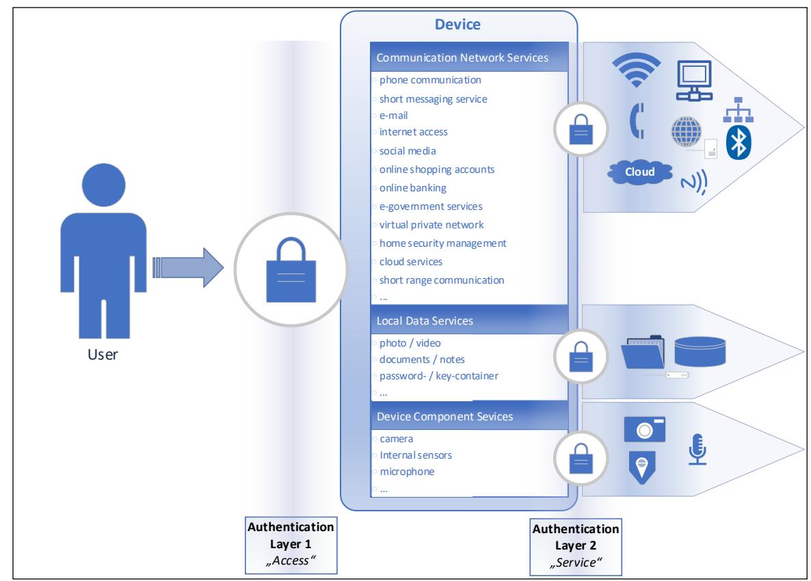
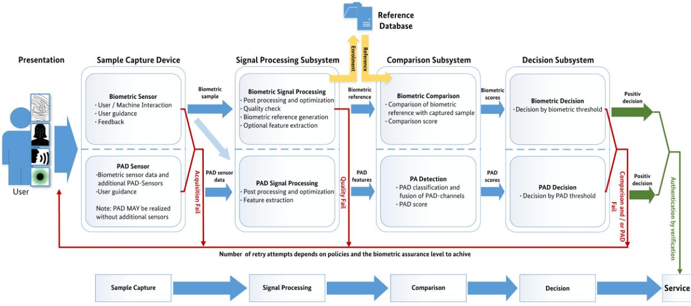
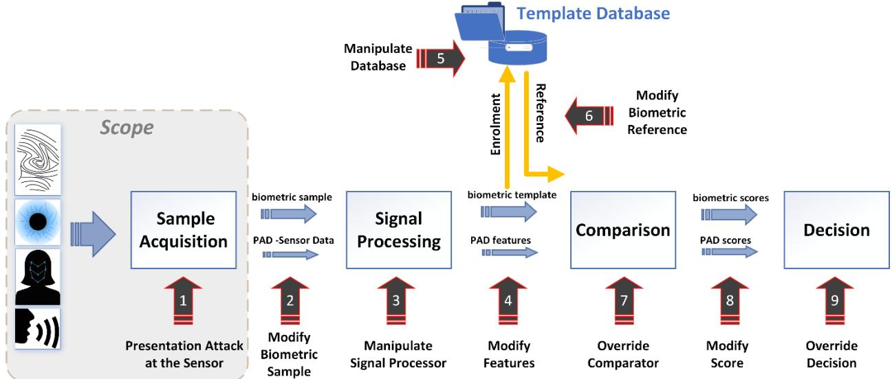

# BSI Technical Guideline TR-03166

Technical Guideline for Biometric Authentication Components in Devices for Authentication

Version 1.1 17 September 2024

# Version History

| Version | Date       | Editors | Description                                                                                                 |
|---------|------------|---------|-------------------------------------------------------------------------------------------------------------|
| 0.92    | 08.01.2021 | BSI     | First draft version for external revision                                                                |
| CD 1.0  | 23.06.2021 | BSI     | Added missing part Reference Creation. Adjusted wording regarding to ISO/IEC 2382-37-2017       |
| 1.1     | 17.09.2024 | BSI     | Changes regarding errors in header. Added literature. Changed requirements. Changed title page. |

Bundesamt für Sicherheit in der Informationstechnik Postfach 20 03 63 53133 Bonn Email: biometrie@bsi.bund.de Internet: https://www.bsi.bund.de © Bundesamt für Sicherheit in der Informationstechnik 2024

| 1 | Introduction 5 |                                                                                |    |
|---|----------------|--------------------------------------------------------------------------------|----|
|   | 1.1            | Motivation 5                                                                   |    |
|   | 1.2            | Scope 5                                                                        |    |
|   | 1.2.1          | Goals 5                                                                        |    |
|   | 1.2.2          | Target Audience and Applications 6                                             |    |
|   | 1.2.3          | Objectives 6                                                                   |    |
|   | 1.2.4          | System Model 6                                                                 |    |
|   | 1.3            | Overview 8                                                                     |    |
|   | 1.3.1          | How to use this Technical Guideline 8                                          |    |
|   | 1.4            | Key Words 9                                                                    |    |
|   | 1.5            | Key Documents 9                                                                |    |
|   | 1.5.1          | Authentication Methods According to Existing Standards and Documents 9         |    |
| 2 |                | Biometric Verification for Authentication14                                    |    |
|   | 2.1            | Biometric Verification in Single-Factor Authentication 14                      |    |
|   | 2.2            | Biometric Verification in Multi-Factor Authentication14                        |    |
|   | 2.2.1          | Biometric Verification in Multi-Stage Authentication14                         |    |
|   | 2.3            | Authentication Factors15                                                       |    |
|   | 2.3.1          | Biometric Verification for Authentication15                                    |    |
| 3 |                | General and Specific Requirements for Biometrics as an Authentication Factor27 |    |
|   | 3.1            | Recertification27                                                              |    |
|   | 3.2            | Enrolment Quality Recommendation27                                             |    |
|   | 3.3            | Re-enrolment and Suspension of a Biometric Characteristic 28                   |    |
|   | 3.4            | 29                                                                             |    |
|   | 3.4.1          | [GEN] General Requirements29                                                   |    |
|   | 3.4.2          | [MM] Multimodal 30                                                             |    |
|   | 3.4.3          | [FP] Modality: Finger31                                                        |    |
|   | 3.4.4          | [FA] Modality: Face 31                                                         |    |
|   | 3.4.5          | Combinations for Multi- 31                                                  |    |
|   | 3.4.6          | Application Modules32                                                          |    |
|   | 3.5            | 32                                                                             |    |
|   | 3.5.1          | [GEN] General Requirements32                                                   |    |
|   | 3.5.2          | [MM] Multimodal 33                                                             |    |
|   | 3.5.3          | [FP] Modality: Finger33                                                        |    |
|   | 3.5.4          | [FA] Modality: Face 33                                                         |    |
|   | 3.5.5          | Combinations for Multi-                                                        | 34 |
|   | 3.5.6          | Application Modules34                                                          |    |

|     | 3.6   | 34                                                                              |    |
|-----|-------|---------------------------------------------------------------------------------|----|
|     | 3.6.1 | [GEN] General Requirements34                                                    |    |
|     | 3.6.2 | [MM] Multimodal 35                                                              |    |
|     | 3.6.3 | [FP] Modality: Finger35                                                         |    |
|     | 3.6.4 | [FA] Modality: Face 36                                                          |    |
|     | 3.6.5 | Combinations for multi-                                                         | 36 |
|     | 3.6.6 | Application Modules36                                                           |    |
| A1. |       | Terms and Definitions37                                                         |    |
| A2. |       | Improving Biometrics Usability38                                                |    |
| A3. |       | Use Cases40                                                                     |    |
|     |       | UC1a. Unlocking a Device40                                                      |    |
|     |       | UC1b. Unlocking a Physical Lock via Biometric Verification for Authentication40 |    |
|     |       | UC.2 Running Applications on a Smartphone / Tablet41                            |    |
|     |       | UC.2a Running Applications without Internet Connection 41                       |    |
|     |       | UC.2b Running Applications with Internet Connection 43                          |    |
| A4. |       | Abbreviation List48                                                             |    |
| 4   |       | Bibliography49                                                                  |    |
|     |       |                                                                                 |    |

# 1 Introduction

## 1.1 Motivation

In the last decade, the development of computing devices has been focused on accessibility, usability and versatility; modern smartphones are the best example for this trend. Due to the availability of new technologies and a continuously growing variety of online services, our behaviour and daily life have changed significantly. In the context of digitalization, more and more services are offered over the internet. The increasing availability of internet access and the functionalities of current devices, especially mobile devices like smartphones, have transformed them into control centers for many applications. These manifold applications expose users to higher risks. Indeed, successful authentication on a single device is sufficient to access financial services, public authority services (eGovernment), communication and smart home functionalities.

Classic protection methods against unauthorized access are strong passwords or special hardware tokens, epitomizing the authentication factors knowledge and possession. As an alternative, biometric technologies like face or fingerprint recognition are steadily gaining attention as a more convenient and hence widely accepted authentication factor. Nowadays almost all devices like tablets, smartphones and laptops have some form of integrated biometric subsystem for enrolment and authentication on the device. Considering the increasing damage potential of current online services, it is vital to accurately assess the security level of the authentication technologies and processes, which are in use to protect the online services.

In contrast to the clear advantage of biometric technologies in terms of convenience and speed as compared to classic authentication methods, assessing their real-life security level is a highly complicated and still heavily debatable topic. Many current security standards and normative regulations consider only the robustness against a brute-force attack when evaluating the security level of an authentication method. Even for classic authentication methods like passwords, this focus on entropy neglects many practically relevant attack vectors, like easily guessable passwords, various snooping techniques, etc. For biometric methods, this simplified approach would definitely fall too short. Biometric performance always depends on several parameters like sensor properties, biometric comparison algorithms, environmental factors or the biometric features of the data subject. In addition, the overall security level of biometric methods in unsupervised settings is highly dependent on their resistance against various attacks based on artificial or augmented biometric characteristics.

### 1.2 Scope

### 1.2.1 Goals

The goal of this technical guideline is to define the requirements of a biometric verification / authentication subsystem (for 1:1 comparisons) for authentication processes regarding the biometric performance and the presentation attack detection (PAD) functionality, so that it can be used as an authentication factor with a -03107-1 [1] and BSI TR-03168 [2], which is currently in preparation. If necessary, additional modules can be added for further compatibility with other standards and normative regulations or for specific applications.

Further requirements for the three BALs are derived from the EU regulation on electronic IDentification, Authentication and trust Services (eIDAS) [3], BSI TR-03107-1 [1], BSI TR-03168 [2] and the Fast IDentity Online (FIDO) biometrics certification [4]. The evaluation of PAD functionality is partially in conformance with the Common Criteria (CC) certification framework [5] and will include protection profiles (PP) [6] [7] for the different biometric modalities used during the authentication process.

Overall establishing biometric performance and presentation attack detection requirements shall serve as an abuse detection mechanism to prevent fraudulent use of biometrics in authentication by verification processes.

This technical guideline does not apply to identification processes (1:N comparison) and biometric authentication scenarios regulated by BSI TR-03121 [8] and the corresponding conformity specifications defined in BSI TR-03122 [9]. Such scenarios are for example border control, German identity Documents, alien register enrolment and immigration authorities.

## 1.2.2 Target Audience and Applications

This technical guideline addresses hardware vendors, integrators and application developers integrating biometric components for authentication purposes. In this context, certified testing laboratories are mandatory for evaluation and certification processes. For this purpose, the BSI will define specific testing specifications in an additional document, which will be accessible only for certified testing laboratories. The minent biometric modalities, i.e. fingerprint and face image recognition, but in future versions the document will be extended to cover more biometric modalities and application modules.

### 1.2.3 Objectives

This technical guideline pursues the following objectives.

Modularity: The guideline is divided into guideline modules. For a specific application, only the respective modules have to be considered. A specific module can be used for certain applications, e.g. eGovernment applications referring to the BSI TR-03107-1.

Extensibility: In order to address future applications, the definition of new modules might be necessary. Therefore, the modularity facilitates extending the technical guideline to new features and techniques of biometric authentication.

Clarity: The concept of this guideline follows a well-structured framework. By means of this framework, it is easily understandable which kind of guideline modules are valid for the respective application scenario.

Compatibility to other Standards: The technical guideline takes national and international standards and guidelines into account and makes them applicable for hardware, software and app developers.

Testability for Certifications: The guideline modules are designed in such a way that requirements and test conditions for the devices are clearly defined in terms of the biometric performance and PAD functionality so that they can be tested and certified for conformance with this technical guideline.

Market orientation (see target audience / applications): The definition of functional subsystems is strongly correlated to the products that can be found on the market. Requirements of the guideline can be unambiguously mapped to the respective system and components.

### 1.2.4 System Model

The most prominent examples for biometric authentication processes in daily life are mobile devices and in particular smartphones. These complex systems are able to run a huge variety of services, which leads to many potential threats, if the security of such a device is compromised.

A combination of a biometric capture subsystem, a biometric enrolment database and an underlying comparison software is considered as a biometric verification subsystem for authentication. Therefore, the aim is not to evaluate the quality of the biometric data capture subsystem in isolation, but to evaluate the comparison performance of the biometric system defined by the false acceptance rate (FAR). The FAR is the proportion of transactions with false biometric claims erroneously accepted [10]. In contrast to the FAR is the false rejection rate (FRR) uncritical for the security of a biometric authentication subsystem, but a high FRR can weaken the usability and trust in biometric methods The FRR is the proportion of verification transactions with truthful claims of identity that are incorrectly denied [11].

Typically, a bona fide user [12] [13] can utilize authentication factors to gain access to something. This could be access to:

- specific locations (room, building)
- a device (smartphone, personal computer)
- services (login processes)

As a first step, a specific authentication factor has to be registered. This step is called enrolment. Afterwards, this authentication factor can be used for authentication purposes. The realization of authentication processes is described in BSI TR-03107-1 [1] and BSI TR-03168 [2].

[Fig. 1](#page-7-2) depicts a two-step authentication, which can be found for example on smartphones or other devices. In the first step (access-level), the data subject unlocks the device by means of an authentication factor, which can be a password / PIN (Personal Identification Number) or a hardware token (possession-based factor). The password / PIN can be substituted by a biometric modality. Biometrics can be used to improve the security, if used as an additional authentication factor in a multi-factor authentication process. Access to the device can be granted [\(Fig. 1](#page-7-2) Layer 1) as a result of these operations, and further services are accessible, depending on additional security measures [\(Fig. 1](#page-7-2) Layer 2 service-level). Additional security measures in the second layer can be authentication factors independent from the authentication factor of the first layer.

#### Example:

In the first instance, a smartphone has an activated display lock, which can be passed by entering a PIN. Typically, all applications and system services can be accessed. Often login information are stored during the installation and setup process. Access to applications and system services, depending on the data and service sensitivity, can demand a second authentication to the servicelevel, which can be independent from the authentication factor for unlocking the smartphone. In more detail, a different PIN, password or biometric characteristic can be used to access further applications and services.

The services are categorized as followed:

- communication and network / online services
- local data services
- device components

Fig. 1 Simplified model of systems that are in the scope of this technical guideline. Each lock in the model represents an authentication process, which can consist of a single- or a multi-factor authentication process.

The security measures for each authentication factor (possession, knowledge, biometrics) can be scaled depending on the required assurance level. The requirements for possession- and knowledge-based authentication factors are defined in BSI TR-03107-1 [1] and BSI TR-03168 [2]. The necessary subsystems for a biometric verification system for authentication are shown in [Fig. 2](#page-17-0) and are further described in subsectio[n 2.3.1.3](#page-16-0) [General Requirements for a Biometric System.](#page-16-0)

### 1.3 Overview

### 1.3.1 How to use this Technical Guideline

This technical guideline should serve as a for hardware manufacturers and software / application developers developing devices with authentication processes using biometrics.

This document considers a generic system, where the access to the system is restricted via an authentication process. This process can be built up of different authentication layers (access-level and service-level) as shown i[n Fig. 1.](#page-7-2) In general, the authentication process of each layer can be executed using a possession-, knowledge- or biometrics-based factor. For certain applications, regulations like BSI TR-03107-1 [1] and BSI TR-03168 [2] exist.

A successful first layer authentication enables a data subject / user to access different services. Depending on the sensitivity of the underlying data, information and online services, a second authentication process in the second authentication layer can be executed to call and execute these services, which may make use of multiple authentication factors. The strength of the authentication methods can be scaled based on the type of service called.

Hardware and software developers have to implement the hardware- and software-components and authentication processes necessary to fulfil the requirements defined for the targeted biometric assurance level (BAL)

For clarification: a device using a biometric verification as an authentication factor does not need to support all BALs. In consequence, only services up to the supported BAL can be used with the device.

The biometric functionality, performance and PAD functionality will be evaluated by an approved test laboratory. The testing specification defined for the different BALs in this technical guideline will be published in a separate document.

To demonstrate and illustrate different everyday life situations, different use cases are described in appendix [A3.](#page-39-0)

### 1.3.1.1 Hardware Developers

Hardware developers and manufacturers can check which requirements are defined for a certain BAL in terms of biometric performance and PAD functionality. With this knowledge, hardware developers and manufacturers can set up their hardware to be compliant to the desired BAL. However, this technical guideline does not allow testing or certification of single components. Instead, the whole product can be certified as a biometric verification subsystem for authentication.

If possible, the hardware developers can provide different configurations to match different BALs. Application developers shall call these configurations for their required BAL.

### 1.4 Key Words

interpreted as described in [14].

- SHALL indicates an absolute requirement, as does MUST and REQUIRED.
- SHALL NOT indicates an absolute prohibition, as does MUST NOT.
- SHOULD indicates a recommendation, as does RECOMMENDED.
- SHOULD NOT or NOT RECOMMENDED indicate the existence of valid reasons in particular circumstances to refrain from implementing technology, organisational measures or actions.
- MAY or OPTIONAL indicates an option.

Biometrics is the automated recognition of individuals based on their biological and behavioural characteristics.

### 1.5 Key Documents

The key documents considered in this technical guideline are the eIDAS [3] regulation with the German implementation BSI TR-03107 [1]. The technical guidelines BSI TR- 03107-1 and BSI TR-03168 [2] define general requirements for knowledge- and possession-based authentication systems and procedures.

### 1.5.1 Authentication Methods According to Existing Standards and Documents

For further details about authentication systems and procedures see BSI TR-03107-1 [1] and BSI TR-03168 [2].

Further related national and international standards or regulations are listed in [Tab.](#page-9-0) 2.

| Document                         | Scope                                                                                                                                                                                                                                                                                                                                      | Version        | Release Date                           |
|----------------------------------|--------------------------------------------------------------------------------------------------------------------------------------------------------------------------------------------------------------------------------------------------------------------------------------------------------------------------------------------|----------------|----------------------------------------|
| NISTSP800-63-3 [15]           | defines technical requirements in each of the areas of identity proofing, registration, authenticators, management processes, authentication protocols, federation, and related assertions                                                                                                                                     | June 2017      | March 2020                             |
| NISTSP800-63 A [16]           | focuses on the enrolment and verification of an identity for use in digital authentication                                                                                                                                                                                                                                           | June 2017      | March 2020                             |
| NISTSP800-63 B [17]           | focuses on the authentication of subjects interacting with government systems over open networks, establishing that a given claimant is a subscriber who has been previously authenticated                                                                                                                                        | June 2017      | March 2020                             |
| NISTSP800-63 C [18]           | provides technical and procedural guidelines to agencies for the implementation of federated identity systems and for assertions used by federations                                                                                                                                                                                 | June 2017      | March 2020                             |
| BSI TR-03121 [8]              | offers a basis for a consistent and comparable quality of public sector applications (biometrics) and for building a common architecture                                                                                                                                                                                             | Version 6.0    | November 2023                       |
| BSI TR-03122 [9]              | specifies test cases for hardware and software components testing according to BSI TR-03121                                                                                                                                                                                                                                             | Version 6.0    | November 2023                       |
| BSI TR-03107-1                   | [1]defines requirements around electronic identities for eGovernment. It also contains specific requirements on biometric authentication that should be considered by this guideline                                                                                                                                              | Version 1.1.1  | May 2019                               |
| BSI TR-03159 [19] [20]        | defines the level of assurance (LoA) "substantial" according to eIDAS regulation for mobile identities                                                                                                                                                                                                                            | Draft 2        | August 2019                            |
| ISO/IEC 2382- 37:2022 [21] | defines a harmonized vocabulary in the field of biometrics                                                                                                                                                                                                                                                                              | Edition 3      | March 2022                             |
| ISO/IEC 19795-1 [11]          | defines requirements on testing and reporting the performance of biometric systems                                                                                                                                                                                                                                                      | May 2021    | May 2021                               |
| ISO/IEC TS 19795- 9 [22]      | provides guidance for biometric performance testing on mobile devices with local biometric authentication                                                                                                                                                                                                                               | December 2019  | December 2019                          |
| ISO/IEC 19989-1 [23]          | defines criteria and methodology for the security evaluation of biometric systems                                                                                                                                                                                                                                                       | September 2020 | September 2020                      |
| ISO/IEC TR 24722 [24]         | describes and analyses current practices in multimodal and other multibiometric fusion approaches                                                                                                                                                                                                                                    | July 2007      | revised by ISO/IEC TR 24722:2015 |
| ISO/IEC 27001:2013 [25]    | specifies the requirements for establishing, implementing, maintaining and continually improving an information security management system within the context of an organization. It also includes requirements for the assessment and treatment of information security risks tailored to the needs of an organization. | October 2013   | Confirmed in 2019                   |

Tab. 2 Overview of national and international normative regulations and standards.

| Document                                      | Scope                                                                                                                                                                                                                                                                                     | Version        | Release Date         |
|-----------------------------------------------|-------------------------------------------------------------------------------------------------------------------------------------------------------------------------------------------------------------------------------------------------------------------------------------------|----------------|----------------------|
| ISO/IEC 30107-1 [12]                       | establishes a framework through which presentation attack events can be specified and detected so that they can be categorized                                                                                                                                                      | August 2023 | August 2023          |
| ISO / IEC 30107-3 [13]                     | defines testing methodologies for biometric presentation attack detection and the way to report the results.                                                                                                                                                                        | January 2023   | January 2023         |
| ISO / IEC 30107-4 [26]                     | defines a profile for mobile devices regarding their presentation attack detection capabilities                                                                                                                                                                                        | June 2020      | June 2020            |
| ISO / IEC TR 30125 [27]           | Guidance for developing a consistent and secure method of biometric personalization and authentication in a mobile environment for systems procured on the open market.                                                                                                          | May 2016       | Confirmed in 2022 |
| BSI-CC-PP-0063- 2010 [28]               | describes the functionality of a biometric system for presentation attack detection regarding the Common Criteria (CC 3.1 R3)                                                                                                                                                       | 1.8            | February 2010        |
| IT-Grundschutz Compendium [29]          | contains security recommendations on a wide variety of topics. Detailed advice and safeguards in the implementation guidelines for the IT-Grundschutz modules make it easier for information security officers to implement information security in their day-to-day work. | Edition 2020   | February 2020        |
| BSI Standard 200- 1 [30]                | defines the general requirements for an IT security management system (ISMS)                                                                                                                                                                                                           | 1.0            | October 2017         |
| BSI Standard 200- 2 [31]                | explains how an ISMS can be built based on one of three different approaches                                                                                                                                                                                                           | 1.0            | October 2017         |
| BSI Standard 200- 3 [32]                | contains all risk-related tasks                                                                                                                                                                                                                                                           | 1.0            | October 2017         |
| BSI Standard 200- 4 [33]                | covers Business Continuity Management                                                                                                                                                                                                                                                     | 1.0            | May 2023             |
| FIDO Biometrics Requirements [4]        | defines the requirements and test specification for the biometric certificate according to FIDO                                                                                                                                                                                     | 3.0            | January 2023         |
| PSD 2 [34]                                 | European act on definition and application of payment services                                                                                                                                                                                                                         |                | January 2016         |
| ETSI TS 103 732 [35]                       | defines a protection profile (PP) for consumer mobile devices, including smartphones and tablets. Security assurance requirements are specified and can be assessed in a Common Criteria security evaluation.                                                                    | 1.1.1          | November 2021     |
| ETSI TS 103 732-2 [36]                     | defines a PP-Module for Consumer Mobile Device (CMD) which adds the capability to use biometric characteristics for authentication.                                                                                                                                              | 1.1.1.         | October 2023         |
| NIAP Mobile Device Fundamentals [37] | this assurance standard specifies information security requirements for Mobile Devices for use in an enterprise.                                                                                                                                                                    | 3.2            | April 2021           |

| Document                                                              | Scope                                                                                                                                                                                                                                                                                                                                                                                                                                                              | Version                   | Release Date      |
|-----------------------------------------------------------------------|--------------------------------------------------------------------------------------------------------------------------------------------------------------------------------------------------------------------------------------------------------------------------------------------------------------------------------------------------------------------------------------------------------------------------------------------------------------------|---------------------------|-------------------|
| NIAP Mobile Device Fundamentals [38]                         | this assurance standard specifies information security requirements for Mobile Devices for use in an enterprise.                                                                                                                                                                                                                                                                                                                                          | 3.3                       | September 2022 |
| BIO-iTC [39]                                                          | collaborative PP-Module for Biometric enrolment and verification - for unlocking the device                                                                                                                                                                                                                                                                                                                                                                  | 1.1                       | November 2022  |
| eIDAS [3]                                                          | European act defining assurance levels for electronic identification purposes.                                                                                                                                                                                                                                                                                                                                                                                  |                           | July 2014         |
| eIDAS 2.0 [40]                                                        | Regulation (EU) 2024/1183 of the European Parliament and of the Council of 11 April 2024 amending Regulation (EU) No 910/2014 as regards establishing the European Digital Identity Framework                                                                                                                                                                                                                                                          |                           | May 2024          |
| eCH-0170 [41]                                                      | compares different standards and regulations related to digital identities                                                                                                                                                                                                                                                                                                                                                                                      | 2.0                       | September 2017 |
| BSI TR-03168 [2]                                                   | describes the possession and knowledge based authentication factors which can be used in authentication processes in BSI TR-03107-1.                                                                                                                                                                                                                                                                                                                         | In preparation            |                   |
| CCMB-2017-04- 001 [42] Also published as ISO/IEC 15408 | This part of the CC establishes the general concepts and principles of IT security evaluation and specifies the general model of evaluation given by various parts of the standard, which in its entirety is meant to be used as the basis for evaluation of security properties of IT products.                                                                                                                                     | Version 3.1 Revision 5 | April 2017        |
| CCMB-2017-04- 002 [43] Also published as ISO/IEC 15408 | This part of the CC defines the required structure and content of security functional components for the purpose of security evaluation. It includes a catalogue of functional components that will meet the common security functionality requirements of many IT products.                                                                                                                                                               | Version 3.1 Revision 5 | April 2017        |
| CCMB-2017-04- 003 [44] Also published as ISO/IEC 15408 | This CC Part 3 defines the assurance requirements of the CC. It includes the evaluation assurance levels (EALs) that define a scale for measuring assurance for component TOEs, the composed assurance packages (CAPs) that define a scale for measuring assurance for composed TOEs, the individual assurance components from which the assurance levels and packages are composed, and the criteria for evaluation of PPs and STs. | Version 3.1 Revision 5 | April 2017        |
| CCMB-2017-04- 004 [5] Also published as ISO/IEC 18045  | The Common Methodology for Information Technology Security Evaluation (CEM) is a companion document to the Common Criteria for Information Technology Security Evaluation (CC). The CEM defines the minimum actions to be performed by an evaluator in order to conduct a CC evaluation, using the criteria and evaluation evidence defined in the CC.                                                                                        | Version 3.1 Revision 5 | April 2017        |

| Document                                                                         | Scope                                                                                                                                                                                                                                                                                                                                                                                                                                                           | Version                | Release Date     |
|----------------------------------------------------------------------------------|-----------------------------------------------------------------------------------------------------------------------------------------------------------------------------------------------------------------------------------------------------------------------------------------------------------------------------------------------------------------------------------------------------------------------------------------------------------------|------------------------|------------------|
| CCMB-2022-11- 001 [45] Also published as ISO/IEC 15408- 1:2022    | This part of the CC establishes the general concepts and principles of IT security evaluation and specifies the general model of evaluation given by various parts of the standard, which in its entirety is meant to be used as the basis for evaluation of security properties of IT products.                                                                                                                                  | CC:2022 Revision 1  | November 2022 |
| CCMB-2022-11- 002 [46] Also published as ISO/IEC 15408- 2:2022    | This part of the CC defines the required structure and content of security functional components for the purpose of security evaluation. It includes a catalogue of functional components that will meet the common security functionality requirements of many IT products.                                                                                                                                                                  | CC:2022 Revision 1  | November 2022 |
| CCMB-2022-11- 003 [47] Also published as ISO/IEC 15408- 3:2022 | This CC Part 3 defines the assurance requirements of the CC. It includes the evaluation assurance levels (EALs) that define a scale for measuring assurance for component TOEs, the composed assurance packages (CAPs) that define a scale for measuring assurance for composed TOEs, the individual assurance components from which the assurance levels and packages are composed, and the criteria for evaluation of PPs and STs. | CC:2022 Revision 1  | November 2022 |
| CCMB-2022-11- 004 [48] Also published as ISO/IEC 15408- 4:2022    | This document describes a framework that can be used for deriving evaluation activities from work units of the CEM and grouping them into evaluation methods (EMs). In addition, a standardized framework for specifying objective, repeatable and reproducible evaluation methods and evaluation activities is introduced in this document.                                                                                         | CC:2022 Revision 1  | November 2022 |
| CCMB-2022-11- 001 [49] Also published as ISO/IEC 15408- 5:2022    | This document provides packages of security assurance and security functional requirements that have been identified as useful in support of common usage by stakeholders.                                                                                                                                                                                                                                                                       | CC:2022 Revision 1  | November 2022 |
| CCMB-2022-11- 006 [50] Also published as ISO/IEC 18045:2022       | This document defines the minimum actions to be performed by an evaluator in order to conduct a CC evaluation, using the criteria and evaluation evidence defined in the CC                                                                                                                                                                                                                                                                         | CEM:2022 Revision 1 | November 2022 |

# 2 Biometric Verification for Authentication

To achieve conformance with different standards and normative texts, this technical guideline needs to consider single- and multi-factor authentication processes. Possible authentication factors are based on possession, knowledge or biometrics. A detailed description for possession- and knowledge-based authentication factors can be found in BSI TR-03107-1 [1] and BSI TR-03168 [2].

## 2.1 Biometric Verification in Single-Factor Authentication

In a single-factor authentication process a single authentication factor from the category knowledge, possession or biometrics MAY be used.

Note: Depending on the field of application, the use of biometrics MAY be excluded.

An example is the BSI TR-03107-1 [1] (authentication processes for public authorities), where biometrics SHALL NOT be used as a single factor (see specific application modules for BSI TR-03107-1).

#### RECOMMENDATION:

- The authorized data subject SHOULD have exclusive access to the authentication factor.
	- o To improve the biometric performance and to increase the time an attacker needs to create successful presentation attack instruments (PAI), authentication modalities (e.g. finger and face) and instances (e.g. thumb and index) may be combined (see [2.3.1.1\)](#page-15-0). A PAI is an artificial object to represent biometric characteristics to a suitable capture device.

#### Example:

A door lock might be used with a single biometric authentication factor.

### 2.2 Biometric Verification in Multi-Factor Authentication

In a multi-factor authentication process, authentication factors of different categories (knowledge, possession, biometrics) SHALL be used to achieve a more secure authentication.

#### REQUIREMENTS:

- The authorized data subject SHOULD have exclusive access to the biometric authentication factor and SHALL have exclusive access to the authentication factors from the categories possession and knowledge.
- It SHALL NOT be allowed, within the multi-factor authentication, that factors belong to the same category (knowledge, possession, biometrics). At least two factors SHALL belong to different categories.
	- o To improve the biometric performance and to increase the time an attacker needs to create successful PAI, authentication modalities and instances MAY be combined (see 2.2.1.1. Multibiometrics). Still, at least two authentication factors of different categories MUST take part in the authentication process.

### 2.2.1 Biometric Verification in Multi-Stage Authentication

A multi-stage authentication is the sequential use of single- and / or multi-factor authentication processes. In contrast to multi-factor authentication, the different stages in multi-stage authentication are

independent of each other and different stages may belong to the same authentication factor category (knowledge, possession, biometrics).

#### Examples:

At the first stage, the access-level, access to a smartphone can be gained with a single biometric modality, e.g. face image or fingerprint. To access an application on the smartphone, the servicelevel, a second biometric characteristic SHOULD be used. So far, a single biometric characteristic is often used in multi-stage authentication.

Access to a personal computer is protected by a password / PIN, which would be the first stage, the access-level, of the authentication. To get access to a specially secured file, the service-level, a different password / PIN is recommended to decrypt and access the file.

### 2.3 Authentication Factors

Authentication factors can be grouped into three categories: knowledge, possession and biometrics. In other words, these three groups can be described as something you know, something you possess and something you are. The categories possession and knowledge are more precisely defined and described with their corresponding requirements in BSI TR-03107-1 [1] and BSI TR-03168 [2]. Biometrics as an authentication factor is addressed in this technical guideline in the following sections.

A general ranking of the different authentication factors across all authentication categories is not feasible, because every factor has its particular requirements regarding environment, usability, costs and the necessary level of security. The major advantage of biometrics, the convenience that natural features of a person cannot be lost or forgotten, is also its biggest disadvantage.

Due to the limited number of biometric characteristics, it is not possible to change biometric features arbitrarily often if a sample is stolen. A possibility to hamper attacks with stolen biometric references / templates MAY be the use of template protection mechanisms. Suitable methods are still under development and investigation.

In addition, the probabilistic character of biometric methods gives rise to the possibility that persons with similar biometric characteristics (for some modalities observable on twins) are recognized as the genuine data subject.

When aiming for a certain assurance level, single factor, multi-factor or multi-stage authentication processes can combine the authentication factors from the three categories in accordance with specific technical guidelines.

### 2.3.1 Biometric Verification for Authentication

Biometrics MAY be used as an authentication factor in a single- and a multi-factor authentication process.

Note: Depending on the application, a use of biometrics in a single-factor authentication MAY be excluded.

In the current version of this technical guideline, the static biometric modalities finger and face are considered. Additional static modalities like iris, retina or veins may be added in future versions. In future applications, dynamic / behaviour-based biometric modalities like voice or motion gait may be implemented to extend the number of usable verification modalities.

In comparison to knowledge-and possession-based factors, where the matching between the input and the true secret is deterministic, biometrics is a probabilistic method. The biometric input slightly changes with every presentation (e.g. position, tilt, angle) and, in addition, changes over time (e. g. ageing, injuries) or

temporarily (e.g. injuries, cosmetics). Therefore, thresholds are necessary to distinguish between a valid presentation by an authorized individual and attempted fraud.

Possible attack vectors within a biometric authentication system are shown in [Fig. 3](#page-20-0) in chapter [2.3.1.4.](#page-19-0)

### 2.3.1.1 Multibiometrics

Multibiometrics MAY be used to improve the biometric performance of a biometric system. Therefore, different approaches can be followed to achieve a lower FAR.

In a multi-modal authentication scheme, different biometric modalities (e.g. face and finger) MAY be combined during an authentication process, when biometrics is used. Even if several biometric characteristics and modalities are used, biometrics is still a single authentication factor and SHALL be combined with a possession- or knowledge-based factor for a multi-factor authentication process.

If only a single detector for a single modality is available at a device, the biometric performance MAY be enhanced with the multi-instance approach. Multiple biometric characteristics of the same modality are used for the verification. An addition to the multi-instance method MAY be the multi-presentation scheme, where the same biometric characteristic is presented multiple times to the capture device.

If possible, a biometric sample MAY be captured with multiple different sensors / detectors at the same time.

#### Example:

An example is the acquisition of a facial image with a standard camera to capture a 2D image and an additional camera, which records depth information.

The multi-algorithmic scheme analyses the same dataset with different algorithms.

Multibiometrics can be divided into five sub-categories, which are defined in ISO/IEC TR 24722 [24]:

- multi-modal usage of different biometric modalities such as face and fingerprint
- multi-algorithmic usage of two or more distinct algorithms for processing the same biometric sample
- multi-instance usage of at least two instances of the same biometric modality. e.g. left and right iris or left and right index
- multi-sensorial using multiple capture devices for capturing samples of one biometric instance
- multi-presentation using either multiple presentation samples of one instance of a biometric characteristic or a single presentation that results in the capture of multiple samples

Multibiometrics MAY be used to improve the performance of biometric systems in terms of error rates. If multi-modal biometric systems are used, data structures of several parts of ISO/IEC 39794 [51] MAY be involved in an authentication process. Multi-instance or multi-presentation data are stored in several biometric representations that are contained in one record.

### 2.3.1.2 Error Rates in Biometrics

In this section, a general introduction to error rates used in biometrics is given and is informative. The terms and definitions are in agreement with the metrics for presentation attack detection in ISO / IEC 30107-3:2017 [13] and the description of metrics for the evaluation of biometric performance in ISO/IEC 19795-1:2021 [10].

1. The false match rate (FMR) is the proportion of the completed biometric non-mated comparison trials that result in a false match.

2. The false non-match rate (FNMR) is the proportion of the completed biometric mated comparison trials that result in a false non-match.

Often the terms FMR / FNMR and FAR / FRR are used interchangeably, but there is a significant difference between them. On the one hand, FMR and FNMR can be related to the matching algorithm (algorithm level error). On the other hand, the FAR and FRR also take into account those attempts for which the system fails to generate a signal or fails to extract features. Therefore, the FAR and FRR describe the system as a whole

The biometric verification subsystem includes hardware and software. Therefore, the FAR and FRR have to be applied. Beside the overall error rates, specific error rates for PAD can be defined:

- 1. The attack presentation classification error rate (APCER) is defined by the proportion of attack presentations using the same PAI species which are incorrectly classified as genuine presentations in a specific scenario.
- 2. The bona fide presentation classification error rate (BPCER) is the proportion of bona fide presentations incorrectly classified as presentation attacks in a specific scenario. In a bona fide attempt, a valid identity claiming is performed with the genuine biometric characteristics belonging to this identity.
- 3. The attack presentation non-response rate (APNRR) is the proportion of attack presentations using the same PAI species that cause no response at the PAD subsystem or data capture subsystem.
- 4. The bona fide presentation non-response rate (BPNRR) is the proportion of bona fide presentations that cause no response at the PAD subsystem or data capture subsystem.
- 5. The attack presentation acquisition rate (APAR) is the proportion of attack presentations using the same PAI species from which the data capture subsystem acquires a biometric sample of sufficient quality.
- 6. The impostor attack presentation match rate (IAPMR) is the proportion of impostor attack presentations using the same PAI species in which the target reference is matched.
- 7. The concealer attack presentation non-match rate (CAPNMR) is the proportion of concealer attack presentations using the same PAI species in which the reference of the concealer is not matched. A concealer attack is an attack with the aim to evade from a recognition process e.g. by changing the facial expression or masquerade.
- 8. The impostor attack presentation identification rate (IAPIR) is the proportion of impostor attack presentations using the same PAI species in which the targeted reference identifier is among the identifiers returned or, depending on the intended use case, at least one identifier is returned by the system.
- 9. The concealer attack presentation non-identification rate (CAPNIR) is the proportion of concealer presentation attacks using the same PAI species in which the reference identifier of the concealer is not among the identifiers returned or, depending on the intended use case, in which no identifiers are returned.

#### 2.3.1.3 General Requirements for a Biometric System

Due to the variety of applications and technologies, where biometrics play an important role, it is hard to make general statements about what constitutes an optimal biometric system. However, all systems using biometrics for verification purposes have many components (se[e Fig. 2\)](#page-17-0) in common to ensure the required functionalities. A s characteristics are captured by a capture device. Several sensors / detectors MAY be implemented to realize a presentation attack detection (PAD) without necessarily contributing to the image creation. The information is transferred / streamed / transmitted to the signal processing subsystem, where an image quality assessment is done, PAD is executed and biometric features

are extracted. When the biometric characteristic is captured during an enrolment process, a biometric reference SHALL be created. The biometric reference MAY consist of one or more stored biometric samples or biometric templates to serve as a reference for future authentication processes. In an authentication process, the biometric probe is compared in the comparison subsystem with the biometric reference created in the enrolment process. As a result of the comparison, a score quantifying the similarities / matching quality between the biometric reference and biometric probe is calculated. A decision on the biometric verification request for the authentication is made based on the comparison score, the corresponding threshold and the PAD score and PAD threshold. The threshold MAY be adjusted to achieve the required FAR for a certain BAL.

Fig. 2 Schematic drawing of components in a generic biometric system for authentication purposes. Adapted from [52]. The blue text shows the name of the single subsystems.

#### Biometric Sample Capture Subsystem

The acquisition hardware (sensor / detector) assigned to the sample capture device captures a signal from the presented biometric modality and passes the raw signal with all presented biometric characteristics to the signal processing subsystem.

In addition to the biometric capture device used for the image capture process, optional components MAY be implemented for PAD.

The acquisition hardware for biometrics is not limited to any technique, but the biometric verification subsystem for authentication as a whole has to fulfil the requirements of the BAL required

#### Signal Processing Subsystem

The signal processing subsystem performs a quality check of the captured biometric data prior to further post processing and optimization steps. The essential biometric features MAY be recognized and extracted. Some algorithms MAY work without a feature extraction and use a biometric sample directly for the comparison step. In case of multiple biometric samples acquired from different body parts (multiple fingers on a single scanner), a segmentation of these biometric samples SHALL be performed, if the modality does not correspond to the body part as a whole (e.g. complete hand).

During the enrolment step, a biometric reference SHALL be created and stored in the biometric enrolment database for comparison in subsequent biometric verification requests for authentication. During an

authentication process, extracted and processed biometric features MAY be transferred to the comparison subsystem.

#### Presentation Attack Detection (PAD)

A PAD subsystem is a hardware and / or software system that implements a PAD mechanism and makes an explicit declaration regarding the detection of presentation attacks (PA). Results of the PAD mechanism are accessible to the evaluator and are an aspect of the evaluation. In case of a positive PAD (a PA was detected) it SHALL be decided if the biometric sample MAY be presented again or a fall-back to a different authentication factor SHALL be performed.

PAD SHALL be performed for every single biometric presentation and SHALL be synchronous to the biometric data acquisition process1 .

Note: The PAD mechanism makes a score accessible to the evaluator, which can be used by the evaluator during the pre-evaluation step to improve the presentation attack instruments. For example, a score which is only 0 or 1 is not useful and does not provide sufficient information to the evaluator.

#### Quality Control Subsystem

The quality control process SHALL decide if the quality of the captured biometric sample is sufficient for further processing steps. If the quality is not sufficient, the biometric characteristic SHALL be presented again.

Quality control SHALL be performed for every single biometric presentation.

#### Segmentation Subsystem

If more than a single biometric characteristic, e.g. four fingers of the right hand, is presented simultaneously to the biometric capture subsystem, the image SHALL be segmented into parts containing the single biometric instances.

Note: An exception MAY be a biometric presentation where the complete biometric characteristic is taken into account (e.g. complete hand).

#### Feature Extraction Subsystem

After a passed quality control, the biometric features are extracted from the biometric sample and transmitted to the comparison subsystem.

Note: During the enrolment process extracted features are not transmitted to the comparison subsystem. Instead the features are stored in a biometric reference.

Strongly recommended:

The feature extraction SHOULD work unidirectional. It SHOULD NOT be possible to reconstruct the original biometric sample from the extracted features. Suitable template protection methods are e.g. defined in ISO/IEC 24745:2011 [53].

#### Reference Creation

If the biometric characteristic is presented during an enrolment process, a biometric reference is created. The created reference will be transferred to the biometric enrolment database.

1 If the biometric capture process and the PAD are working subsequently, it might be possible that at first the presentation of an artefact results in a positive biometric comparison and afterwards an attacker presents his own face to circumvent the PAD mechanism, which might be realized via a liveness detection, as a subgroup of possible PAD mechanisms.

#### Biometric Enrolment Database

The storage of biometric references SHOULD work in accordance to ISO/IEC 24745 [53].

The biometric enrolment database SHALL provide sufficient protection of the biometric reference data. No manipulation, unauthorized insertion or deletion of templates SHALL be possible. In addition, it SHOULD NOT be possible to reconstruct a biometric sample with its characteristics from the stored biometric reference.

Therefore, the template SHOULD be unidirectional.

The biometric template protection SHOULD meet the requirements set out in ISO/IEC 24745 [53].

The performance testing of a biometric template protection system is described in ISO/IEC 30136 [54].

Note: The security of a biometric enrolment database is not in the focus of this technical guideline. Nevertheless, the mentioned features defined in the referenced ISO standards are important to achieve secure biometric authentication systems, where the biometric information is securely stored.

#### Comparison Subsystem

The comparison subsystem compares the biometric probe of a biometric reference enrolled by a genuine data subject with the biometric features extracted from the biometric sample presented by the identity claimant. The comparator generates a score, which is an assessment of the similarity of the sample and the reference. This similarity score, in combination with a predefined threshold, is the basis for the comparison decision for this modality. This score SHALL be accessible to the evaluator. The generated numeric comparison score is transmitted to the comparison decision subsystem.

Note: The comparison subsystem makes a score accessible to the evaluator, which can be used by the evaluator during the preparation phase to create a presentation attack instrument. For example, a biometric comparison score that is only 0 or 1 is not sufficient for an evaluator to create and improve presentation attack instruments for the evaluation.

#### Decision Subsystem

During the authentication process, the received numeric comparison score is compared to a pre-defined threshold. If the numeric value is above the threshold, verification is successful, and this information is passed on to the service. If the score is below the threshold, the verification of the biometric sample has failed.

A negative (no PA detected) PAD result is REQUIRED for a successful verification.

Depending on the BAL required, the device and software policy, biometric presentation MAY be retried or a fall-back to a different authentication method SHOULD be performed.

#### Connection to the System

The biometric system may pass the verification result to an external application or system via an application programming interface, hardware interface or protocol interface.

### 2.3.1.4 Attack Vectors

In general, attack vectors are mechanisms and methods to overcome security features and compromise a system. The consequence is a partial or complete control of the system / device by the attacker. That means, the attacker can fully use all or some of the services mentioned in section [System Model](#page-5-2) [1.2.4.](#page-5-2) The device can contain many different components and interfaces that may give rise to unauthorized access. The attack vectors in a generic device with a biometric authentication subsystem are described below.

Current consumer devices mainly use two types of biometric modalities for verification, namely face and finger. Therefore, after a general description, the attack vectors targeting the two biometric verification modalities face and finger for authentication processes are described.

Fig. 3 Attack vectors on biometric systems focus on presentation attacks. The scope of this technical guideline is the presentation attack at the capture device level for authentication purposes (dashed grey box, arrow 1).

#### General Biometric System

A potential attacker may use several attack vectors to target the biometric verification subsystem:

- Presentation of artificial / augmented biometric characteristics at the capture device level
- Recording and replay or manipulation of transmitted information within or between the subsystems
- Direct manipulation of the underlying algorithms (e.g. for template creation, feature extraction or similarity score calculation)
- Insertion, deletion, modification of biometric templates at the biometric enrolment database
- Threshold manipulation regarding similarity scores and PAD functionality

[Fig. 3](#page-20-0) provides an overview of the different attack vectors and the components where a potential manipulation can be done. The scope of this technical guideline is the attack at the capture device level (arrow 1, grey dashed box). All attack vectors are briefly described below for a generic biometric system.

#### Attack against the Biometric Data Capture Subsystem

This attack vector corresponds to arrow 1 in [Fig. 3,](#page-20-0) which is highlighted by the dashed grey line and grey background. The direct attack at the biometric capture device, by presenting an artefact (e.g. an replica of the biometric characteristic), is the easiest possibility to attack the device without further knowledge of subsequent signal transmission, signal processing, biometric enrolment database and evaluation steps, which lead to a final comparison decision of a successful or unsuccessful verification.

The biometric data capture subsystem is necessary to capture the data set for the enrolment step and for every attempt at verification for authentication. The attacker presents a presentation attack instrument (PAI) with the biometric characteristics of a genuine / authorized data subject to the capture device.

In addition to the image capture device / sample generator, further sensor channels for a potential PAD mechanism MAY be implemented. To overcome this security feature, special materials can be used, which would not be detected as an artificial material.

#### Zero Effort Impostor Attempt / Attack

In case of the zero effort impostor attempt / attack an attacker presents his biometric characteristics. The biometric probe will be compared against the biometric reference enrolled by an authorized data subject.

If the sensitivity / specificity of the capture device or the algorithm is not high enough or the biometric samples contain intrinsically comparable biometric features, presented biometric characteristics can impersonate another individual.

No PAD will be successful against this type of attack because e.g. a real finger from a live person is presented to the capture device.

Therefore, the matching algorithm MUST show a sufficient performance, e.g. by finding a sufficient numbers of matching biometric features to obtain an FAR that matches the requirements of the desired BAL.

#### Presentation Attack

According to ISO 30107-3 [13], a presentation attack is the attempt to present a biometric characteristic or object used in a presentation attack to the biometric data capture subsystem with the goal of interfering with the operation of the biometric system. A presentation attack instrument (PAI) SHALL be created using a common production method fitting the biometric modality to attack. The creation procedure SHALL be based on the assumption of a worst-case scenario. This means an attacker has access to the best and modality dependent data of the biometric subject to create the PAI. Other declarations MAY be done within the definition of the security target / target of evaluation, but this would affect the overall evaluation and security assessment.

Typically, the first step is the acquisition of the biometric characteristic. Latent analogue samples stemming from the target biometric characteristics can be found for example on the device to attack itself or can be publicly available on the internet or be created by recording videos, images or other information sources. The quality of the biometric representation obtained can be improved via post-processing steps. A digitized version of the biometric characteristic can be translated into different PAIs made of different materials. This easiest kind of attack includes 2D projection / images of the biometric sample. To achieve PAIs of a higher quality, high-quality images (2D) and 3D data sets are necessary. Using these data sets, it is also possible to create artificial 3D PAIs (masks, 3D finger artefacts).Depending on the materials used and the sensor technology embedded in the capture device, the artificial PAI will create an image / signal at the biometric data capture subsystem or it will fail to do so. Therefore, it is necessary to implement PAD to detect artificial PAIs, which create a signal at the capture device.

#### Information Transmission

Information has to be transmitted (see [Fig. 3](#page-20-0) arrow 2, 4, 6, 8) both between different subsystems in the biometric system and between processes within individual subsystem. A potential attacker can manipulate the information at each transmission in order to influence the final decision. As an alternative, the attacker can store the information from a genuine authentication process and can replay this information to bypass the input of the biometric sample presented at the capture device.

Based on the signal recorded during a genuine authentication process, this kind of replay attack can be performed between every pair of subsystems in order to achieve successful authentication.

#### Signal Processing Subsystem

The signal processing subsystem has multiple functions (PAD, quality control, feature extraction and segmentation). During an enrolment step, the biometric reference is created within the signal processor. Typically, PAD is one of the first steps in the signal processing subsystem. At this point, the attacker can change the PAD decision by tampering with the PAD subsystem. The signal of the PAI presented to the capture device is recognized for further processing.

Quality control might which would not have passed quality control.

A potential attacker can likewise modify the feature extraction. This can be used to generate biometric features, which are independent from or strongly uncorrelated with the presented biometric sample. Therefore, the verification can be granted or denied for arbitrary persons.

This can also influence the process of reference creation, which is executed inside the signal processing subsystem. The reference might be based on biometric features unrelated to the presented biometric sample.

#### Biometric Enrolment Database Attack

After successful enrolment, the created biometric reference is stored in the biometric enrolment database. Typically, the database does not store the captured biometric reference itself, but rather a template containing the biometric features that are recognized and extracted. These steps are performed in the signal processor subsystem.

At the biometric enrolment database level, different attacks can be executed. On the one hand, the attacker can add or modify biometric templates if the data format in which the biometric references are stored is known. On the other hand, the attacker can delete stored biometric references.

#### Comparison Subsystem Attack

The comparator in the comparison subsystem compares the stored biometric reference of the claimed identity with the biometric probe from the claimant. The comparator computes a numeric comparison score based on a specific metric. The comparator can be manipulated by an attacker to generate a false comparison score.

#### Comparison Decision Subsystem

The decision subsystem receives the comparison score from the comparison subsystem and decides, based on a pre-defined threshold, if the score is sufficiently high to accept it. This decision is binary. The final decision on the verification outcome for authentication is based on the verification policy. The verification decision for authentication is passed to the calling service.

An attacker can proceed in two different ways to influence the final verification decision. Either the threshold can be manipulated in order to obtain a positive decision on verification, or the final decision after the comparison between score and threshold is manipulated.

### 2.3.1.5 Modality: Finger

Fingerprints can be captured based on different technologies (e.g. ultra-sonic, optical, photo, resistance, heat transfer, capacity, mechanics), which are either contactless or require the fingers to be in contact with a surface. Depending on the technology used, acquired signals or images can differ from each other, but still remain unique and can be used to verify and distinguish different individuals. Therefore, it is necessary to consider the following key points for fingerprints.

#### Performance

To use fingerprints as a reliable verification mechanism for authentication, certain general requirements SHALL be fulfilled regarding the performance of the system:

- The characteristics (ground pattern, coarse pattern, and fine pattern; minutiae) identified within the fingerprint SHALL be sufficient for distinguishing two individuals from each other [1]. Therefore, requirements SHALL be fulfilled according to the BAL required, see chapter [3](#page-26-0) [General and Specific](#page-26-0)  [Requirements for Biometrics as an Authentication Factor,](#page-26-0) defined in this technical guideline.
- The biometric performance of the biometric system is defined in this technical guideline via the FAR. The required FAR values are derived from the recommendations of the BSI TR-03107 [1] and BSI TR-03168 [2] regarding the required entropy of a PIN.
- The biometric system SHALL provide an FAR, equal or better according to the BAL required,
- In case the required FAR cannot be achieved by a single biometric sample presentation, multimodal, multi-instance or multi-presentation approaches SHALL be used to achieve the required FAR. Definitions are given in the corresponding sections [\(3.4.2,](#page-29-0) [3.4.3.1,](#page-30-3) [3.4.3.2,](#page-30-4) [3.4.4.1,](#page-30-5) [3.4.4.2,](#page-30-6) [3.5.2,](#page-32-0)  [3.5.3.2,](#page-32-3) [3.5.3.3,](#page-32-4) [3.5.4.1,](#page-32-5) [3.5.4.2,](#page-33-4) [3.6.2,](#page-34-0) [3.6.3.2,](#page-34-2) [3.6.4.1\)](#page-35-3).

The procedure SHOULD have a feature for abuse detection. This includes all attack vectors shown in Fig. 3, except arrow number 1. The PAD functionality capabilities are defined more precisely in chapter 3. It can therefore detect that an attacker uses a biometric artefact. Furthermore, the biometric authentication subsystem SHOULD detect suspicious deviations from normal behaviour using heuristic methods. Examples of such deviations are frequent access from remote locations or frequent requests from a suspicious IP-address [1]. Biometric authentication events in short succession of the same person in several locations far away from each other are a clear indication of an abuse.

- Depending on the BAL required, PAD SHALL be implemented and has to exhibit resistance against different PAIs. A more detailed explanation can be found in the requirements corresponding to the biometric assurance levels, see chapte[r 3](#page-26-0) [General and Specific Requirements for Biometrics as an](#page-26-0)  [Authentication Factor.](#page-26-0)
- Repeated authentication failure SHOULD deactivate the authentication method of biometrics with the possibility to fall back to a different authentication method, which is in conformance with BSI TR-03107 [1]. The deactivation MAY be temporary, with the time interval until a new verification for authentication attempt increasing. Requirements regarding possession as an authentication factor and the implementation in a multi-factor authentication process are described in BSI TR-03107-1 [1] and BSI TR-03168 [2].

### Usability / Handling

- The owner is advised that the biometric recognition MAY only be used for the intended purpose of authentication. The biometric characteristic SHOULD NOT be used multiple times within a procedure (e.g. not for authentication and transaction release; or not for device unlocking and authentication within a procedure) [1]. A multi-presentation, multi-instance or multi-modal scheme MAY be used within a single authentication step to increase the overall biometric performance.
- Data subjects SHOULD remember which finger(s) they used for initial enrolment [17].
- Data subject SHOULD remember which presentation method was used at the initial enrolment [17].
- successful capture [17].
- Additional factors can influence the fingerprint capture quality:
	- o age
	- o gender
	- o occupation (e.g., users handling chemicals or working extensively with their hands may have degraded friction ridges) [17].

Differences in environmental conditions can affect recognition accuracy and PAD performance.

A rejected authentication by verification MAY NOT necessarily be a fraudulent use of biometrics. Rejections MAY originate from usage problems or special situations e.g. changing locations or devices.

#### Presentation Condition

Depending on the capture device technology used, the conditions to obtain a fingerprint of sufficient quality can differ. Therefore, it SHALL be verified that the external presentation conditions cannot induce a false acceptance. Such external conditions could be strong lighting on the capture device or, more generally, electromagnetic waves. Other external conditions can be temperature or humidity, which can have an influence on the capture device. Therefore, the technologies used MAY be more or less sensitive under different circumstances or MAY differ in image / signal quality independent from the captured sample.

#### Presentation Attack / Threat

Different capture device technologies are available on the market. To achieve a valid biometric verification decision between the enrolled fingerprint and the artefact finger used as an attack vector, several steps during the authentication process can be targeted. An attack vector, which is directly accessible without any deeper knowledge about the signal transmission or access to the other subsystems, is the presentation of a PAI to the biometric data capture subsystem.

For possible attack vectors, see [2.3.1.4](#page-19-0) [Attack Vectors.](#page-19-0)

#### 2.3.1.6 Modality: Face

State-of-the-art devices provide the possibility to capture face images via different camera systems in the enrolment step. The enrolled face image can be compared against a probe image acquired for verification purposes.

#### Performance

To use face recognition as a reliable authentication mechanism, certain general requirements SHALL be fulfilled regarding the performance of the system:

- The facial features / landmarks identified within the facial image SHALL be sufficient to distinguish two individuals from each other [1]. Therefore, thresholds in this technical guideline have to be fulfilled according to the required BAL. For requirements, see chapter [3](#page-26-0) [General and Specific](#page-26-0)  [Requirements for Biometrics as an Authentication Factor.](#page-26-0)
- The biometric performance of the biometric verification subsystem is defined in this technical guideline via the FAR. The required FAR values are derived from the recommendations of the BSI TR-03107 [1] and BSI TR-03168 [2] regarding the required entropy of a PIN.
- The biometric system SHALL provide an FAR, equal or better according to the BAL required,
- In case the required FAR cannot be achieved by a single biometric sample presentation, multimodal or multi-presentation approaches SHALL be used to achieve the required FAR. Definitions are given in the corresponding sections (3.3.2, 3.3.3.1, 3.3.3.2, 3.3.4.1, 3.3.4.2, 3.4.2, 3.4.3.2, 3.4.3.3, 3.4.4.1, 3.4.4.2, 3.5.2, 3.5.3.2, 3.5.4.1).
- The procedure SHOULD have a feature for abuse detection. This includes all attack vectors shown in [Fig. 3,](#page-20-0) except arrow number 1. The PAD functionality capabilities are more precise defined by chapter 3. It can therefore detect that an attacker uses a biometric artefact. Furthermore, it is able to detect suspicious deviations from normal behaviour using heuristic methods. Example of such deviations are frequent access from remote locations or frequent requests from a suspicious IPaddress [1].
- o Depending on the BAL required, PAD SHALL be implemented and SHALL exhibit resistance against different PAIs. Based on the BAL different PAIs can be used. A more detailed explanation can be found in the requirements corresponding to the biometric assurance levels, see chapter [3](#page-26-0) [General and Specific Requirements for Biometrics as an Authentication](#page-26-0)  [Factor.](#page-26-0)
- Repeated authentication failure SHOULD deactivate the authentication method of biometrics with the possibility to fall back to a different authentication method, which is in conformance with BSI TR-03107 [1]. The deactivation MAY be temporary with an increasing time interval until a new authentication attempt is allowed. Requirements regarding possession as an authentication factor and the implementation in a multi-factor authentication process are described in BSI TR-03107-1 [1] and BSI TR-03168 [2].

#### Usability / Handling

- Data subjects SHOULD remember whether they wore any objects covering the face (e.g., glasses, face cover) during enrolment because it affects facial recognition accuracy [17].
- Differences in environmental conditions can affect facial recognition accuracy [17] and PAD performance.
- Facial expressions affect facial recognition accuracy (e.g., smiling versus neutral expression) [17].
- Facial poses affect facial recognition accuracy (e.g., looking down or away from the camera) [17].
- The enrolled facial image SHOULD be updated on a regular basis to account for changes over time (ageing, injuries, [17] or when significant changes occur e.g. based on surgeries or injuries.

#### Presentation Condition

For authentication via facial recognition, the device which is used for the authentication process SHOULD recognize the capture subject within a specified distance range and under different angles. In addition, external conditions like illumination, humidity or temperature can have an influence on the acquired image. Objects covering the face like glasses, hats and scarfs as well as emotions and physical conditions SHALL be considered for the authentication process.

#### Presentation Attack / Threat

Similar to the modality finger, it is possible to use different attack vectors to get access to the device. For possible attack vectors, see [2.3.1.4](#page-19-0) [Attack Vectors.](#page-19-0)

In devices like smartphones, tablets or notebooks, the built-in camera can be used to capture an image. Without additional sensors or further post processing (e.g. using artificial intelligence), this image includes only 2D data and no further information (depth or spectral information). This enables the attacker e.g. to present a printed photo of the enrolled data subject to the capture device. If the enrolled subject is known, photos of the victim target can be found on the internet, or the attacker can acquire an image using a digital camera.

Additional components / sensors MAY be integrated to acquire 3D data of the presented face. In this case, 2D artefacts like photos etc. will typically not work anymore, and more sophisticated PAIs, e.g. 3D masks, are necessary to overcome this kind of countermeasure. Other technologies MAY acquire spectral information, some materials commonly used for PAI creation can be identified.

It is possible that a template for a 3D mask can be generated via post processing steps of a 2D image. Based on the template, the mask can be printed by the attacker or ordered via online shops.

# 3 General and Specific Requirements for Biometrics as an Authentication Factor

This chapter specifies general and application-specific requirements for biometrics used as an authentication factor. To this end, three different biometric assurance levels (BAL) are defined based on the Assurance Levels (AL) defined in the BSI TR-03107-1 [1].

At the beginning of each section, the general requirements of the BAL are defined, and application-specific requirements are defined later on. For some applications, the general requirements might be insufficient. Therefore, besides the general requirements, additional application module specific requirements are defined and have to be fulfilled as well. If the general requirements and the specific requirements diverge from each other, the application module specific requirements shall prevail.

For a multi-factor authentication process, the requirements defined in BSI TR-03107-1 [1] and BSI TR-03168 [2] for possession- and knowledge-based authentication factors shall be fulfilled according to the AL which matches the BAL required.

For the testing and certification process, it is required to apply a specific naming scheme to identify which BALs, biometric modalities and presentation methods and so on, are part of the testing and certification process. This specific scheme is defined in the testing specifications.

## 3.1 Recertification

The biometric performance and PAD capability may be influenced by hardware and software related updates / changes. Therefore, under the here defined constrains a recertification SHALL be performed:

- 1. If the device gets soft- or firmware updates directly related to the biometric verification / authentication system, the system MUST be recertified.
- 2. The device SHALL be recertified if the device gets a major release update of the operating system and / or the overlaid manufacturer UI added on top of the operating system.
- 3. It may be possible that the device manufacturer changes / adjusts the configuration of the software controlling the biometric system components. A recertification is REQUIRED:
	- a. If configuration changes only influence the biometric performance of the system, the PADcomponent does not need to be recertified.
	- b. Vice versa, if only configuration changes regarding the PAD-functionality are done, the biometric performance does not need to be recertified.
- 4. In case a device with integrated biometric verification / authentication system changes during the production biometric related components, the device MUST be certified with the changed components as well.

## 3.2 Enrolment Quality Recommendation

To use biometrics with different modalities and instances as an authentication factor, the initial step is the enrolment. The quality of the captured biometric sample is the fundamental basis for the overall success of a biometric verification. Therefore, the enrolment MAY be performed in a manner obtaining biometric samples providing as much biometric features as possible. An upper bound for the entropy contained in the enrolled biometric template for fingerprints MAY be calculated for the more realistic model as shown by Ratha et al. [55]. The theoretically achievable entropy of a biometric sample acquired in the enrolment process is not a measure for a security evaluation.

In practice, the number of recognized biometric features in a biometric capture represents only a subset of the reference biometric features in the most cases. Therefore, the entropy of every biometric capture will not exceed the entropy of the biometric reference. The captured area and the image quality effect the total number of recognizable biometric features. A lower bound for the entropy MAY be estimated on basis of the specific biometric modality used and the use case.

The given approximation by Ratha et al. [55] can only be applied to the biometric modality finger. A comparable estimation of the information of a frontal face for the modality face is still under debate. Adler et al. [56] estimate the relative entropy, better known as Kullback-Leibler divergence, of a facial image of ~ 55 bit. A similar relative entropy based estimation by Jassim et al. [57] taking different feature extraction techniques and image qualities into account. Depending on the applied feature extraction and the image quality, the relative entropy according to this publication is in the range of ~ 15 to 334 bits.

Due to different constrains and assumptions it is hard to generalize such findings for a requirement regarding the information content of a facial image. In the future new generalized approaches may be discovered, which can be applied and a requirement can be derived for the quality of biometric data. As stated before the relative entropy of the biometric characteristic is not a measure for the security of the device.

For devices with a long lifecycle, a regular re-enrolment MAY be an option to preserve the biometric performance.

#### RECOMMENDATION:

- Fingerprint re-enrolment at least every 1 year
- Facial image re-enrolment at least every 6 months

Note: The user SHALL be informed to execute a re-enrolment. An implicit re-enrolment MAY be done during each successful authentication, this process SHALL be made transparent to the user.

A developer MAY inform the data subject if any compensation algorithms against aging effects are implemented. Such algorithms MAY influence the biometric performance in terms of FAR and FRR.

### 3.3 Re-enrolment and Suspension of a Biometric Characteristic

#### Re-enrolment

A re-enrolment of a biometric characteristic MAY be useful to preserve the biometric performance of the biometric verification system for authentication. Initialization of a re-enrolment MAY be performed by presenting a former enrolled and still valid biometric characteristic or a valid knowledge- or possessionbased authentication factor with an equivalent or better assurance level, e.g. eIDAS or BAL. The enrolled data subject SHALL have the possibility to enrol a new biometric characteristic or the same instance.

#### Example:

The enrolled reference of the data subject MAY present a sufficient number of biometric characteristics, but due to temporal or permanent changes in the biometric characteristic the performance is not sufficient to verify the user with an existing reference. In addition it MAY be possible that the data subject enrols a biometric characteristic with a sufficient number of features, but in everyday life the data subject uses different parts of the characteristic for authentication by verification. In both cases a re-enrolment of the used characteristic MAY preserve the biometric performance and the usability of the biometric authentication subsystem.

#### Suspension

Suspension is a temporal action, which prohibit the use of the biometric reference and the corresponding biometric instance. The stored biometric reference SHALL NOT be deleted and MAY be re-activated by the user by presenting a different biometric characteristic, possession- or knowledge-based authentication factor from the same assurance level or higher.

#### Example:

The owner of the device MAY share a device with other user and restricts temporarily their authentication to the device and re-activates the authentication at a later date.

## 3.4

and are REQUIRED for certification purposes.

## 3.4.1 [GEN] General Requirements

- The biometric system SHALL operate with an FAR of 1 in 10,000 or better. This FAR SHALL be achieved under conditions of a zero-effort impostor attempt as defined in ISO/IEC 30107-1 [12] within a confidence interval of 90%.
- The hardware developer SHALL define work items. For these settings, the FRR SHALL be declared. The developer SHALL document the testing procedure for the FRR. The certification will be performed for the declared settings.
- The FRR and FAR limits that MUST be achieved SHALL be independent of the number of biometric references enrolled at the system [4].
- The biometric system SHALL implement PAD. Testing of the biometric system SHALL demonstrate [5] [7] for each pre-defined attack type (i.e., PAI species). BSI will provide a list of PAI species, which SHALL be tested during the PAD evaluation. Testing of presentation attack resistance SHALL be in accordance with Clause 12 of ISO/IEC 30107-3 [13].
- In case of inconclusive results for a verification / authentication attempt (including comparison score and / or PAD result) the biometric system SHALL NOT grant access via biometric verification /authentication (e.g. environmental influences direct sun light etc.).
- The biometric system SHALL NOT allow more than 5 consecutive failed biometrics-based authentication attempts. Once that threshold has been reached, the biometric authenticator SHALL either [17]:
	- o Disable the biometric data subject authentication and offer another authentication factor, or
	- o Impose a delay of at least 30 seconds before the next attempt, increasing exponentially, with the lower bound increasing by a factor of not less than 2 with each successive failed attempt (e.g., 1 minute before the following failed attempt, 2 minutes before the second following attempt). With this measure, the maximum number of biometric verification / authentications attempts is set to 10.
- Re-authentication SHALL be performed if one of the following conditions is met:
	- o > 18 h have elapsed since the last re-authentication / non-biometric authentication
		- o after an idle time of > 3 h
		- o after 50 biometric authentication / verification attempts
		- o re-establishing of a disconnected or lost connection to a service

The factor for re-authentication SHALL be knowledge-based or a separated possession-based factor. The combinations of authentication factors SHALL fulfil the requirements defined in BSI TR-03168 [2].

#### Example:

On current smartphones, a PIN is typically used for the initial unlocking and starting process. Subsequently, the PIN for unlocking the smartphone can be replaced by presenting a biometric characteristic. After 50 biometric authentication attempts, regardless of the results of the biometric authentication attempts, re-authentication shall take place. After 3 h display on-time without any input re-authentication is necessary. After 18 h since the last input of the PIN, the PIN has to be re-entered before biometrics can again be used instead of the PIN.

- The multi-instance or the multi-modal scheme MAY be used to replace a single biometric presentation, under the following conditions:
	- o If the multi-instance or the multi-modal scheme is used, every instance and modality SHALL meet at least the following requirements in terms of biometric performance (FAR) and PAD:
		- The biometric system SHALL operate with an FAR of 1 in 5,000 or better for each instance, modality or presentation. This FAR SHALL be achieved under conditions of a conformant zero-effort impostor attempt as defined in ISO/IEC 30107-1 [12] within a confidence interval of 90%.
		- The PAD SHALL perform on the same level as described in the general

If the multi-instance or multi-modal scheme is not available, the multi-presentation scheme MAY be used.

 The multi-presentation scheme MAY be used to authenticate services on the device. If the multipresentation scheme is used, the presented biometric characteristic SHALL provide new biometric features during each presentation attempt. The PAD functionality MUST perform on the level normal biometric instance are REQUIRED. The biometric verification subsystem SHALL operate with an FAR of 1 in 5,000. This FAR SHALL be achieved under conditions of a conformant zero-effort impostor attempt as defined in ISO/IEC 30107-1 [12] within a confidence interval of 90%.

#### Example:

This process can be compared to the enrolment processes for the face unlock function and fingerprint authentication in a smartphone. The face has to be presented from different angles. During the enrolment of a finger, the finger is presented multiple times and slightly shifted each time to capture most of the finger. The multi-presentation scheme enables a multi-PAD and contains a higher information content based on a larger number of extracted features.

### 3.4.2 [MM] Multimodal

Within the BAL , it is possible to combine different biometric modalities, which are defined below. To indicate what kind of modalities are used, the evaluation code has to include the tag MM\_Modality1\_Modality2. Modality 1 and 2 are identified by their names in alphabetical order.

### 3.4.3 [FP] Modality: Finger

### 3.4.3.1 [MP] Multi-presentation

The multi-presentation scheme MAY be implemented by repeated presentation of the biometric characteristics to the biometric data capture subsystem. The requirements for the multi-presentation scheme fro[m 3.4.1](#page-28-1) MUST be fulfilled.

### 3.4.3.2 [MI] Multi-instance

In the multi-instance scheme more than one biometric finger instance is presented to the capture device. The requirements for the multi-instance scheme fro[m 3.4.1](#page-28-1) MUST be fulfilled.

### [BTB] Back-to-back Presentation

Different fingers MUST be presented one after another to the capture device.

#### [SP] Simultaneous Presentation

In case of a sufficiently large sensor area, two or more fingerprints MAY be acquired at the same time. A segmentation of the captured fingerprints MAY be necessary depending on the enrolment process.

### 3.4.4 [FA] Modality: Face

### 3.4.4.1 [MP] Multi-presentation

The multi-presentation scheme MAY be implemented by repeated presentation of the biometric characteristics to the biometric data capture device. The requirements for the multi-presentation scheme fro[m 3.4.1](#page-28-1) MUST be fulfilled.

### 3.4.4.2 [MI] Multi-instance

This presentation scheme cannot be applied to the modality face.

### 3.4.5 Combinations for Multi-factor Authentication to Achieve Assurance

Allowed combinations to fulfil the requirements are:

- Possession / Knowledge and biometrics
	- o Biometric SHALL consist at least of a single modality and a single instance which fulfils the requirements described in [3.4.1.](#page-28-1)
- Possession / Knowledge and biometrics (multi-instance / multi-modal)
	- o See requirements for biometric multi-instance / multi-modal authentication i[n 3.4.1.](#page-28-1)
- Possession / Knowledge and biometrics (multi-presentation)
	- o See requirements for biometric multi-presentation authentication in [3.4.1.](#page-28-1)

In the current state, the technical guideline supports only fingerprints and face as verification modalities for authentication. Therefore, the multi-instance possibility is limited to fingerprints.

The possession or knowledge-based authentication factor SHOULD fulfil the requirements defined in BSI TR-03107 [1] / BSI TR-03168 [2]

## 3.4.6 Application Modules

In the following subsection, specific requirements for application modules will be defined if needed.

## 3.5

### 3.5.1 [GEN] General Requirements

- The biometric system SHALL operate with an FAR of 1 in 33,333 or better. This FAR SHALL be achieved under conditions of a conformant zero-effort impostor attempt as defined in ISO/IEC 30107-1 [12] within a confidence interval of 90%.
- The hardware developer SHALL define work items. For these settings, the FRR SHALL be declared. The developer SHALL document the testing procedure for the FRR. The certification will be performed for the declared settings.
- The FRR and FAR limits to be achieved SHALL be independent of the number of biometric references enrolled at the system [4].
- The biometric system SHALL implement PAD. Testing of the biometric system SHALL demonstrate resistance against all presentation attacks w enhanced-basic [5] [7] for each relevant attack type (i.e., species). BSI will provide a pre-defined list of artefact species for this BAL, which SHALL be tested during the PAD evaluation. The evaluator is free to create new presentation enhanced- [5] [7] independent from the BSI list. Testing of presentation attack resistance SHALL be in accordance with Clause 12 of ISO/IEC 30107-3 [13].
- In case of inconclusive results for a verification / authentication attempt (including comparison score and or PAD result) the biometric system SHALL NOT grant access via biometric verification / authentication (e.g. environmental influences direct sun light etc.).
- The biometric system SHALL NOT allow more than 4 consecutive failed biometrics-based authentication attempts. Once that threshold has been reached, the biometric authenticator SHALL [17] disable the biometric data subject authentication and offer another authentication factor.
- Re-authentication SHALL be performed if one of the following conditions is met:
	- o > 12 h have elapsed since the last re-authentication/non-biometric authentication
	- o after an idle time of > 30 min
	- o after 25 biometric authentication attempts
	- o re-establishing of a disconnected or lost connection to a service

The factor for re-authentication SHALL be knowledge-based or a separated possession-based factor. The combinations of authentication factors SHALL fulfil the requirements defined in BSI TR-03168 [2].

If the multi-instance or the multi-modal scheme is used, every instance and modality SHALL meet at least following requirements in terms of biometric performance (FAR) and PAD:

- The biometric system SHALL operate with an FAR of 1 in 10,000 or better for each instance, modality or presentation. This FAR SHALL be achieved under conditions of a zero-effort impostor attempt as defined in ISO/IEC 30107-1 [12] within a confidence interval of 90%.
- The PAD SHALL perform on the same level as described in the general requirements for the BAL

If the multi-instance or multi-modal scheme is not available, the multi-presentation scheme MAY be used.

 The multi-presentation scheme MAY be used to authenticate services on a device. If the multipresentation scheme is used, the presented biometric sample SHALL provide new biometric features during each presentation attempt. All attempts SHALL be successful regarding the The PAD functionality MUST successful presentations covering most of the biometric instance are REQUIRED. The biometric verification subsystem SHALL operate with an FAR of 1 in 10,000 or better.

## 3.5.2 [MM] Multimodal

Within the BAL , different biometric modalities MAY be combined, which are defined below. To indicate what kind of modalities are used, the evaluation code has to include the tag MM\_Modality1\_Modality2. Modality 1 and 2 are identified by their names in alphabetical order.

## 3.5.3 [FP] Modality: Finger

The biometric authentication subsystem MAY provide a sufficiently large sensor area in the capture device, which allows additional presentation methods.

### 3.5.3.1 [RFP] Rolled Fingerprint

Using a sufficiently large fingerprint sensor area, it is possible to capture a rolled fingerprint, which could contain a higher number of biometric features (i.e. minutiae), which could contribute to achieve a lower FAR. In addition to the lower FAR, the creation of an artefact is more challenging due to the necessary 3D information.

### 3.5.3.2 [MP] Multi-presentation

The multi-presentation scheme MAY be implemented by repeated presentation of the biometric characteristics to biometric data capture subsystem. The requirements for the multi-presentation scheme fro[m 3.5.1](#page-31-2) MUST be fulfilled.

### 3.5.3.3 [MI] Multi-instance

In the multi-instance scheme, more than one biometric characteristic is presented to the detector in the authentication process.

3.5.3.3.1 [BTB] Back-to-back Presentation

Different fingers MUST be presented one after another to the capture device.

3.5.3.3.2 [SP] Simultaneous Presentation

In case of a sufficiently large sensor capture device area, two or more fingerprints MAY be acquired at the same time.

## 3.5.4 [FA] Modality: Face

### 3.5.4.1 [MP] Multi-presentation

The multi-presentation scheme MAY be implemented by repeated presentation of the biometric characteristics to the biometric data capture subsystem. The requirements for the multi-presentation scheme fro[m 3.5.1](#page-31-2) MUST be fulfilled.

### 3.5.4.2 [MI] Multi-instance

This presentation scheme cannot be applied to the modality face.

### 3.5.5 Combinations for Multi-factor Authentication to Achieve Assurance

Allowed combinations to fulfil the requirements are:

- Possession / Knowledge and biometrics
	- o Biometric SHALL consist at least of a single modality and a single instance which fulfils the requirements described in [3.5.1.](#page-31-2)
- Possession / Knowledge and biometrics (multi-instance / multi-modal)
	- o See requirements for biometric multi-instance / multi-modal authentication in [3.5.1.](#page-31-2)
- Possession / Knowledge and biometrics (multi-presentation)
	- o See requirements for biometric multi-presentation authentication in [3.5.1.](#page-31-2)

In the current state, the technical guideline supports only fingerprints and face as verification modalities for authentication. Therefore, the multi-instance possibility is limited to fingerprints.

The possession or knowledge-based authentication factor SHOULD fulfil the requirements defined in BSI TR-03107 [1] / BSI TR-03168 [2]

### 3.5.6 Application Modules

In the following subsection, specific requirements for application modules will be defined if needed.

## 3.6

## 3.6.1 [GEN] General Requirements

- A biometric system SHALL operate with an FAR of 1 in 333,333 or better for a single biometric sample. This FAR SHALL be achieved under conditions of a conformant zero-effort impostor attempt as defined in ISO/IEC 30107-1 [12].
- The hardware developer SHALL define work items. For these settings, the FRR SHALL be declared. The developer SHALL document the testing procedure for the FRR. The certification will be performed for the declared settings.
- The FRR and FAR limits to be achieved SHALL be independent of the number of biometric references enrolled at the system [4].
- The biometric system SHALL implement PAD. Testing of the biometric system SHALL demonstrate [5] [7] for each relevant attack type (i.e., species). BSI will provide a pre-defined list of artefact species, which SHALL be tested during the PAD evaluation. The evaluator is free to create new presentation attack independent from the BSI list. Testing of presentation attack resistance SHALL be in accordance with Clause 12 of ISO/IEC 30107-3 [13].
- In case of inconclusive results for a verification / authentication attempt (including comparison score and or PAD result) the biometric system SHALL NOT grant access via biometric verification / authentication (e.g. environmental influences direct sun light etc.).
- The biometric system SHALL NOT allow more than 3 consecutive failed biometrics-based authentication attempts. Once that threshold has been reached, the biometric authenticator SHALL disable the biometric data subject authentication and offer another authentication factor.
- Re-authentication shall be performed if one of the following conditions is met:
	- o > 1 h has elapsed since the last re-authentication/non-biometric authentication
	- o after an idle time of > 15 min
	- o after 25 biometric authentication attempts
	- o re-establishing of a disconnected or lost connection to a service

The factor for re-authentication SHALL be knowledge-based or an external physical possession-based factor.

- The multi-presentation scheme SHALL NOT be used for authentication purposes.
- The multi-instance and the multi-modal scheme MAY be used separately or in combination instead of a single biometric sample with an FAR of 1 in 333,333.
	- o Every instance and modality SHALL exhibit an FAR of 1 in 100,000. The PAD functionality SHALL perform on the same level as described in the general requirements of biometric

### 3.6.2 [MM] Multimodal

Within the BAL , it is possible to combine different biometric modalities, which are defined below. To indicate what kind of modalities are used, the evaluation code has to include the tag MM\_Modality1\_Modality2. Modality 1 and 2 are identified by their names in alphabetical order.

### 3.6.3 [FP] Modality: Finger

The biometric verification subsystem used MAY provide a sufficiently large sensor area in the capture device, which allows additional presentation methods.

### 3.6.3.1 [RFP] Rolled Fingerprint

Using a sufficiently large fingerprint sensor, it is possible to capture a rolled fingerprint, which would contain a higher amount of biometric features, which MAY be used for achieving a lower FAR. In addition to the lower FAR, the creation of an artefact is more challenging due to the necessary 3D information. This

### 3.6.3.2 [MI] Multi-instance

In the multi-instance scheme, more than one biometric instance is presented to the biometric capture device in the authentication process.

#### [BTB] Back-to-back Presentation

Different fingers SHALL be presented one after another to the biometric capture device.

#### [SP] Simultaneous Presentation

In case of a sufficiently large sensor area in the capture device, two or more fingerprints can be acquired at the same time. This presentation method SHALL

### 3.6.4 [FA] Modality: Face

### 3.6.4.1 [MI] Multi-instance

This presentation scheme cannot be applied to the modality face.

### 3.6.5 Combinations for multi-factor authentication to achieve Assurance

Allowed combinations to fulfil the requirements are:

- Possession / Knowledge and biometrics
	- o Biometric SHALL consist at least of a single modality and a single instance which fulfils the requirements described in [3.6.1.](#page-33-3)
- Possession / Knowledge and Biometrics (multimodal)
	- o A single presentation of a biometric sample matching the requirements of biometric MAY be substituted with two presentations of biometric instances from different modalities exhibit biometric performance of an FAR of 1 in 100,000 and the PAD functionality each. Due to the different modalities, the attacker has to find methods and materials which work for different PAD mechanisms. Therefore, the time and effort to overcome both biometric
	- factors necessary for authentication increases.
- Possession / Knowledge and Biometrics (multi-instance)
	- o A single presentation of a biomet MAY be substituted with two presentations of at least three biometric samples of the same modality exhibit biometric performance of an FAR of 1 in 100,000 and the PAD functionality each.

The possession or knowledge-based authentication factor should fulfil the requirements defined in BSI TR-03107 [1] / BSI TR-03168 [2]

### 3.6.6 Application Modules

Biometrics SHALL be used only as part of multi-factor authentication with at least a possession-based factor (something you have) or a knowledge-based factor (something you know).

In the following subsection, specific requirements for application modules will be defined if needed.

# Appendix A

# A1. Terms and Definitions

Tab. 3 Table of relevant terms and definitions.

| Term                           | Source | Definition                                                                                                                                                                                                                                                                                                                                                                                                                                                                                                                                                                                                                                                                                                                            |
|--------------------------------|--------|---------------------------------------------------------------------------------------------------------------------------------------------------------------------------------------------------------------------------------------------------------------------------------------------------------------------------------------------------------------------------------------------------------------------------------------------------------------------------------------------------------------------------------------------------------------------------------------------------------------------------------------------------------------------------------------------------------------------------------------|
| Biometric enrolment            | [21]   | Act of creating and storing a biometric enrolment data record in accordance with an enrolment policy Note: Enrolment typically involves: sample acquisition, segmentation and feature extraction, quality checks, (which may reject the sample/features as being unsuitable for creating a template, and require acquisition of further samples), template creation (which may require features from multiple samples), possible conversion into a biometric data interchange format and storage, test verification or identification attempts to ensure that the resulting enrolment is usable and should the initial enrolment be deemed unsatisfactory, repeat enrolment attempts may be |
| Biometric Verification Attempt | [21]   | allowed (dependent on the enrolment policy). Biometric claim and capture attempt(s) that together provide the inputs for comparison(s).                                                                                                                                                                                                                                                                                                                                                                                                                                                                                                                                                                                   |
|                                |        | Note: Biometric verification will either accept or reject the claim. The verification decision outcome is considered to be erroneous if either a false claim is accepted (false accept) or a true claim is rejected (false reject).                                                                                                                                                                                                                                                                                                                                                                                                                                                                                          |
|                                |        | Biometric verification typically involves:                                                                                                                                                                                                                                                                                                                                                                                                                                                                                                                                                                                                                                                                                            |
|                                |        | sample acquisition, segmentation and feature extraction, quality checks, (which may reject the sample/features as being unsuitable for comparison, and require acquisition of further samples), comparison of the sample features against the template for the claimed identity producing a comparison score, judgement on whether the sample features match the                                                                                                                                                                                                                                                                                                                                                 |
|                                |        | template based on whether the comparison score exceeds a threshold, and a verification decision based on the match result of one or more attempts as dictated by the decision policy.                                                                                                                                                                                                                                                                                                                                                                                                                                                                                                                                        |
| Biometric capture device       | [21]   | Device that collects a signal from a biometric characteristic and converts it to a captured biometric sample                                                                                                                                                                                                                                                                                                                                                                                                                                                                                                                                                                                                                       |
| Presentation Attack Detection  | [12]   | Automated determination of a presentation attack.                                                                                                                                                                                                                                                                                                                                                                                                                                                                                                                                                                                                                                                                                     |
| Artefact                       | [12]   | Artificial object or representation presenting a copy of biometric characteristics or synthetic biometric patterns                                                                                                                                                                                                                                                                                                                                                                                                                                                                                                                                                                                                                 |

| Term                                    | Source | Definition                                                                                                                                                                          |
|-----------------------------------------|--------|-------------------------------------------------------------------------------------------------------------------------------------------------------------------------------------|
| Attempt                                 | [11]   | submission of one (or a sequence of) biometric samples to the system                                                                                                             |
| Confidence interval                     | [11]   | A lower estimate L and an upper estimate U for a parameter x such that the probability of the true value of x being between L and U is the stated value (e.g. 95 %)           |
| Biometric characteristic                | [21]   | Biological and behavioural characteristic of an individual from which distinguishing, repeatable biometric features can be extracted for the purpose of biometric recognition |
| Biometric features                      | [21]   | Numbers or labels extracted from and biometric samples used for comparison                                                                                              |
| Genuine attempt, also                   | [21]   | Single good-faith attempt by an enrolled data subject to match their own stored template                                                                                         |
| Acceptable biometric capture attempt | [11]   | Capture attempt that fulfils the requirements of a biometric capture process                                                                                                     |
| Comparison score                        | [21]   | Numerical value (or set of values) resulting from a biometric comparison                                                                                                         |
| Presentation attack                     | [12]   | Presentation to the biometric data capture subsystem with the goal of interfering with the operation of the biometric system                                                  |
| Presentation attack instrument          | [12]   | biometric characteristic or subject used in a presentation attack                                                                                                                |
| Biometric sample                        | [21]   | Analog or digital representation of biometric characteristics prior to biometric feature extraction                                                                              |
| Captured biometric sample               | [21]   | Biometric sample resulting from a biometric capture process.                                                                                                                        |
| Biometric template, also                | [21]   | Set of stored biometric features comparable directly to probe biometric features                                                                                                 |
| Template                                | [11]   | U from enrolment samples                                                                                                                                                         |
| Biometric data subject                  | [21]   | Individual whose individualized biometric data is within the biometric system                                                                                                    |
| Biometric capture subject               | [21]   | Individual who is the subject of a biometric capture process                                                                                                                        |
| Verification transaction                | [21]   | One or more verification attempts resulting in the resolution of a biometric claim.                                                                                              |

# A2. Improving Biometrics Usability

This subsection has an informative character and gives advice to hard- and software developers on which general factors can improve the usability of biometrics as an authentication factor. The usability of a biometric authentication system may be linked to the overall system security or at least to the system performance. A frustrated user may circumvent integrated security measures, which may break new attack vectors to the authentication device.

Ideally, if there is more than one biometric authentication modality available that fulfils the requirements of the BAL required, the data subject can choose which modality best suits them. Different biometric modalities can differ in public acceptance and perceived convenience.

The usability of the biometric modality might be increased by practicing the enrolment and authentication process with the biometric modality.

Device affordances (i.e., properties of a device that allow a data subject to perform an action), feedback, and clear instructions are critical to a capture subjects success with the biometric process. For example, clear instructions on the actions required for a successful enrolment and use of the biometric modality should be provided. The instructions may be supported by clear and meaningful pictograms, or, if possible, by explanations in video clips.

To avoid frustration, the system should give clear and meaningful feedback to the capture subject. During the authentication process, this could be done by displaying the remaining number of attempts before authentication will fall back to primary different authentication factor, or the remaining waiting time before the next attempt can be made.

In addition, the system should inform the user, if the biometric system has changed its behaviour due to switching to a different BAL (e.g. higher rejection rate due to increased biometric thresholds). This function might be implemented if different services requesting different BALs are accessed using the same biometric system.

#### Example:

The unlocking process of a mobile device implemented via a biometric authentication process tions become available. Due to their higher risk potential, services like eGovernment or banking applications user that the change of the BAL required might cause a higher rejection rate due to the adjustment

# A3. Use Cases

The following section is informative and provides some use cases where an authentication via biometrics is used.

The following use cases can be executed on devices with an integrated biometric authentication subsystem. The examples are taken mostly from everyday life scenarios where biometrics as an authentication factor is used on a smartphone. Therefore, this section gives suggestions how to implement a biometric authentication / verification steps for usage with local and online applications. Some applications may require a certain BAL, which must be achieved.

In addition to the responsibilities of the device user hardware and software developer should inform about potential risks using biometrics as an authentication factor. Measures as recommended in this section should be implemented by the developer and easily accessible and adjustable to the user. Therefore, the developer should inform the user about the implemented measures to protect sensible data and application access against unauthorized access.

## UC1a. Unlocking a Device

The most widely used biometrics application is the authentication process for gaining access to a device, here termed unlocking process. According to [21], a device has to be started and unlocked by entering a factor from the category knowledge. After a certain time interval or total number of biometric presentations to the biometric capture device, the knowledge-based factor must be repeated for re-authentication.

In the following scenarios, it is assumed, that the initial knowledge-based factor has been entered and the device can be accessed by a successful biometric verification for authentication.

Without additional security measures, most of the applications installed and configured on the device can directly be accessed and used by an attacker. A potential risk is direct access to the applications and connected services on the device because user names and password combinations are mostly stored.

The most prominent example is a smartphone with the ability to use fingerprints or face recognition as a biometric authentication modality. Even personal computers can be equipped with webcams or fingerprint sensors to use biometrics as an authentication factor to unlock the device.

#### Recommendation:

After a potential theft an attacker has a defined time interval to get access via biometrics to the device. This time interval has to be kept as short as possible. Therefore, optimally the device has possibilities to set up a re-authentication interval, with an upper unchangeable bound defined by the BAL and to increase the reauthentication interval by the user.

To increase the total number of biometric characteristics to gain total control over the device, a suitable solution is using multiple biometric characteristics to access local and online services on the device. This kind of realization is schematically drawn in Fig. 1, including the access-level which may be passed with a different biometric characteristic than the service-level.

## UC1b. Unlocking a Physical Lock via Biometric Verification for Authentication

A slightly different scenario is the authentication at a physical lock; this might be e.g. a door lock to access a building or a special secured room. The authentication might be a single- or a multi-factor authentication. In a single authentication process, only the biometric verification is used.

Without sufficient security measures, which might be implemented by PAD and a sufficient biometric performance, an attacker can get access to the locked space, which might be a room / building and has possibilities to produce or prepare further damage.

Potential damages are stolen objects of value, information or further preparations to create other damages (camera installation, key logger, screen capture etc.).

#### Recommendation:

In addition to the defined requirements for the different BALs, some organizational recommendations can be proposed. It may be necessary to access the lock with an additional authentication factor for setup and configuration purposes. Specific information about possession and knowledge based authentication solutions are not part of this Technical Guideline. Anyways, a key should be usable to open the door.

Beside the requirements define in the BALs it is possible to improve the security of a biometric lock, with a second authentication factor added; an example can be a hardware token, which communicates with the lock.

## UC.2 Running Applications on a Smartphone / Tablet

After a successful unlocking process, see UC1. Unlocking a Device, smartphones can execute different applications enabling local or online services. Such services are schematically shown in Fig.1. As mentioned in UC1. Unlocking a Device, the protection against an attacker is increased by using different biometric characteristics for the access- and the service-level. Due to the diversity of applications running on a smartphone and the different potential risks and related damages can vary in their extent.

#### Recommendation:

Different biometric characteristics as a verification for authentication should be used to unlock the device on the access-level and to run services on the service-level.

## UC.2a Running Applications without Internet Connection

Even for applications without a necessary internet connection different risk potentials can be found. Therefore, a user has to evaluate the sensitivity of the accessible data and information by running a specific where it might be useful to add a biometric verification step.

#### Device Settings

Hard- and Software related settings can be changed. Typically, only security and privacy settings are secured with the unlock PIN or password of the device and an access via the biometric characteristic is not possible.

Recommendation: Usage of an additional authentication factor, which may be biometrics. For a higher potential protection, the presented biometric characteristic should be different from the biometric characteristic presented for unlocking the device.

#### Data

Typically, by accessing different parts of memory, documents of varying level of confidentiality can be retrieved and used. The complexity of IT-systems enables an attacker to access data and also to modify and add files to run programs and scripts. In this way, approaches and methods to gain deeper access to the system can be implemented, which allows access to more information, services and the system itself.

Images, audio logs, videos and documents stored on a system might contain sexually explicit content, which is not meant to be for the public and can be used by an attacker to blackmail the victim and damage his social reputation. The data and information type can cover a wide range:

- **medical records**
- **information about family and relatives**
- **saved financial calculations**
- **saved letters**
- **password container**
- **photos**
- **videos**

By using information and image or video content, realistic fake accounts can be created. This might be an option if an attacker gains no access to social media accounts, or no social media accounts have been created by the victim. The quality of a fake social media account increases with its authenticity, as does the probability of falling prey to the fake account regarding misinformation or actions, which may cause loss of money. Furthermore, the rights of third parties might also be infringed, if personal data about them is accessible. The victim can be blackmailed by means of the accessible information. Documents like invoices can give information about planned travels and long absences from the place of residence, which facilitates a potential burglary.

Within the private documents, it might be possible to find tickets and access authorizations for exhibitions, cultural events and access-restricted areas.

Often software provider offer a virtual safe to store images, videos, documents and other files. Typically, to set up this virtual safe an authentication factor has to be registered, this may be a biometrics-, possession- or knowledge-based factor. From the convenience perspective, in combination with social media applications, the user has to decide about using this feature, especially if most of the data is publicly accessible e.g. in social networks.

Recommendation: The user should decide for himself which data may be used by an attacker for e.g. black-mailing, impersonation or fraud. To access the additionally secured data it is beneficial to use an authentication factor which differs from the one used for the access-level. Therefore, biometrics may be used with a different characteristic.

#### Photo gallery

The user may has decided, not to store all images on the device in the virtual safe, because the remaining images show up a low risk, because these images are e.g. public available via webpages or social media networks.

Recommendation: Nevertheless, even if only a low risk potential is related to the accessible images. It is recommended to use at least the same verification for authentication as used for the accesslevel to protect the images from unwished access, in case the device is unlocked.

#### Calendar

The user has to decide if the calendar includes critical information where access to the calendar may deliver information for an attacker regarding personal information or absence from home. This information may be used for crime preparation. If the device is in use job-related, an evaluation has to include this circumstance.

Recommendation: If the access-level to the device is protected via an authentication factor a calendar application may be secured with the same biometric characteristic as used for the accesslevel. The user has to evaluate the information stored in the calendar regarding the risks mentioned before.

#### Contacts

Contact information can be connected with other local applications like a calendar. Contact information like addresses and telephone numbers can be used e.g. for impersonation, blackmailing, stalking or to take possession of a mobile phone number.

Recommendation: If the access-level to the device is protected via an authentication factor a calendar application may be secured with the same biometric characteristic as used for the accesslevel. The user has to evaluate the information stored in the calendar regarding the risks mentioned before.

#### Notes

Notes can contain miscellaneous types of information and typically they have a temporary character.

Recommendation: Note applications are not the recommended applications to store information on long time scales. A user should transfer the information to a matching application. Due to the variety of the containing information the user has to evaluate if an additional authentication for this kind of service is necessary.

#### Short Messages

Short messages typically contain personal correspondences or a security channel in form of an authentication factor (mTAN / smsTAN). An attacker can use the personal information e.g. for blackmailing. A short message containing a TAN might be one of normally two authentication factors to access a 2-factor authentication protected account. For creation of new accounts a authentication via smsTAN is required.

Recommendation: Access to a SIM card is only possible with the corresponding PIN. Therefore, if the SMS is only stored on the SIM card biometrics, which is only functional on the specific device, cannot be used to protect SMS from being accessed. Biometrics can only be used to protect the SIM card being accessed after being unlocked in a device. Due to the integration of eSIM the use of biometrics as a verification for authentication may become more important. A SIM card cannot be removed easily from the device.

#### Call function

Tablets also may be used for phone calls. An attacker may use the this function for authentication via a phone call. Additionally, in combination with accessible contacts an attacker may perform phone calls misusing the identity. Phone calls can only be done after unlocking the SIM card. Access to a SIM card is only possible with the corresponding PIN. Therefore, biometrics can only be used to protect the SIM card being accessed after being unlocked in a device. Due to the integration of eSIM the use of biometrics as an verification for authentication may become more important. A SIM card cannot be removed easily from the device.

Recommendation: Biometrics may be used to verify a user on the access level instead of using a PIN. The unlocking process of the SIM card to access the call function is independent from the biometric verification.

#### Device Hardware Components

Hardware components like the camera, wireless connections or storage can be accessed after passing the access-level. Sometimes it may be possible to access over this function further services e.g. accessing the photo gallery from the photo application. Therefore, the software developer for a device should check if such an unauthorized access is not possible. An attacker may access data stored on the device over a wireless or a wired connection and may use this data for criminal activities.

Recommendation: Device hardware components should only be accessible at least after an authentication by verification on the access-level. This can be done by biometrics replacing PIN authentication. Photos and videos may be taken without authentication, but no access to the stored data should be possible.

### UC.2b Running Applications with Internet Connection

In contrast to the discussed applications without internet connection, the following examples require an internet connection. This section will give informative examples which kind of realizations of biometric authentication by verification are recommended to use for different types of applications.

#### Financial Banking Applications

This section shows user scenarios dealing with financial applications, like online-banking and -shopping.

#### Money Transfer

An online money transfer can be performed after accessing the bank account via entering a combination of login-name and a PIN or password. The final authentication for the money transfer typically is to enter a requested transaction authentication number (TAN). This TAN can be received

#### in different ways.

One option is to use a TAN-generator application which is linked to the bank account. This application has to be protected by a password, which can, however, be replaced by the usage of biometrics. For further information about TAN generation see BSI TR-03168 [2] chapter 5.2 One Time Passwords.

Recommendation: A general recommendation is not to use the TAN generator and the financial application on the same device. In case of a smartphone an attacker with a successful verification via biometrics might be able to access the financial application and generate a valid TAN on the same device under the usage of the same biometric characteristic. Therefore, in case the application and the TAN generator are used on the same device, it is recommended to use different biometric characteristics, satisfying the appropriate BAL, to access the device (access-level) and release in this case the payment (service-level). Due to the high financial risk potential, it would be favourable to access the financial application and the TAN generation with different biometric characteristics (e.g. right index for accessing the financial application and left index for accessing the TAN generator).

#### Payment Authorization at a Point of Sale

With this option, it is possible to mirror the physical electronic cash card (EC card) or a credit card by a mobile device with integrated near field communication (NFC). For initial configuration, the user identifier, the PIN / password and a transaction authentication number (TAN) are necessary. Using the physical card, every time, by presenting the card in front of the Point of Sale (PoS) terminal.

he activated application with enabled NFC in front of the PoS terminal. Payments exceeding this limit might be authenticated via entering the PIN at the PoS terminal or by presenting the enrolled biometric characteristic at the device. An attacker may use the digital copy of the electronic cash card or credit card for several small money transactions in local stores.

Recommendation: It is recommended to activate the NFC functionality only if necessary. Depending on the security settings of the application it might be possible to release transactions security settings of the applications should be set up, in the way, that at least a single authentication factor is necessary to release the transaction. Therefore, it is beneficial to require an authentication factor immediately before the transaction release. In the best case a PIN / password / biometric characteristic different from the PIN / password / biometric characteristic to unlock the device is used to authenticate the transaction release.

#### Balance Check

Typically, the balance check is performed within the banking application. Therefore, the same requirements to access the application have to be fulfilled. An attacker may use the information for preparing further criminal actions.

Recommendation: If biometrics is used for authentication by verification, the user should use different biometric characteristics for passing the access-level and the service-level.

#### UC2.d Checkout for Online-Shopping

A direct checkout at an online shop is typically only possible by using a credit card or a third party service (like PayPal, Amazon Pay) or a single-sign-on service (like Google, Facebook, AppleID). Recommendation: The access-level to the device should be separated from the service-level by means of using different biometric characteristics. Within such an application payment possibilities are often stored with in the account information. If no further authentication for checkout a shopping cart is necessary, it is recommended to apply at least an authentication, which may be a PIN / password or biometric characteristic to access the service-level.

#### Request Transaction Authentication Number (TAN) for Online Banking

Following the implementation of the Payment Services Directive 2 (PSD2) [34], the iTAN method for transaction authentication numbers shall not be used anymore. Therefore, new methods have to be

established. More and more mobile devices are i communication portal. For this purpose, mobile devices offer different channels like the short message service (SMS) and TAN applications. An attacker may use a TAN for transaction release. Recommendation: As stated under the point Money Transfer, it is recommended to use the applications to generate the TAN and execute the money transfer with different devices. Further, it is recommended in case the application for TAN generation and money transfer release is carried out on the same device to access the device and the two different applications with three different biometric characteristics.

Note: The BSI does not recommend to use SMS based TAN, also called mTAN or smsTAN, anymore. Therefore, financial institutes started to discontinue this method for requesting a TAN.

#### Stock Exchange Trading

In some banking applications, a service for stock exchange trading might also be implemented. In particular, stock exchange trading is a time-critical financial interaction, therefore stock exchange trading on a mobile device might be a relevant application due to the permanent accessibility of mobile devices in combination with access to the internet. An attacker may inflict a monetary damage to a single person or if planned on longer time scales in a coordinated action a bigger impact on the stock market.

Recommendation:

#### Communication- / Messaging-Applications

This section deals with the central functions of a device having communication and messaging functions. Nowadays, mobile devices are gaining importance due to the increasing availability of mobile internet access. Information can be shared faster and over different communication channels.

Different communication channels (e-mail, messenger) can also be used as an authentication channel.

#### E-mails

E-mails are gaining more importance in everyday communication, information exchange and as a channel to authenticate accounts via an e-mail address. Some e-mail providers require personal data, but verification of this data is not necessarily performed. Access to e-mails and the capability of writing e-mails under a fraud identity (in the name of the owner) presents a higher risk with respect to professional content. This kind of conversation can cover e-mails of different levels of confidentiality (e.g., company secrets, employee records). Depending on the misused identity, the attacker can give instructions to employees in a lower position in hierarchy. This can lead to further damages for a company or an institution, like monetary loss.

Recommendation: Passing the access-level of the device can be realized by biometrics. Typically, the service-level is not secured by an additional authentication factor. An exception may be the usage of encrypted e-mails via PGP or S/MIME. To enable the decryption an authentication factor may be necessary and can be realized with biometrics. It is beneficial to use different biometric characteristics for passing the authentication process at the access-level and the service level.

#### Social Media

In social media, thoughts, opinions and events can be shared using video, audio, images or text messages. Depending on the degree of popularity of the account owner, the range of the shared media can vary between a few persons and a huge crowd of several million persons.

Social media can be used quite efficiently to perform social engineering. A trustworthy social media account with large range can influence a large crowd without high effort. An example is provided by stolen accounts which were used by hackers to swindle bitcoins from victims.

In addition to stealing funds, social media accounts with a large range can be used to spread misinformation.

Depending on the type of social network, an attacker can see personal information only visible to the user and the provider. This can also be the case for direct messages and private classified images, which may contain confidential content and information. Control of the account can also enable an attacker to navigate users to a malicious webpage. Starting from there, further damage can be produced.

Recommendation: To access the service-level of the social media network, the user may use a biometric characteristic different from the characteristic used for verification at the access-level. Additionally, the access from an unknown device may require a 2-factor authentication.

#### Instant Messaging

Instant messing is a function implemented by many different applications. Some social media applications also have a functionality to send direct messages to individual persons within the network, or to specific groups. Instant messaging applications can also be stand-alone applications. It is likely that the instant messaging service is usable on different platforms. Some instant messaging services use their own services as a security channel to authenticate instances of the account running on different platforms. It might be possible that an initial authentication is performed using a mobile phone number. Contacts are identified and linked to phone numbers, email addresses or application-specific identifiers. Within the application, it is possible to send text and voice messages, images, videos and other data formats. Voice and video call functions can also be implemented.

By accessing instant messaging applications, user information from other contacts can be obtained by an attacker. An attacker can add devices under their control to maintain access to the instant messaging account. It is also possible that an attacker can send messages under the false identity. The kind of messages can vary from asking friends and family for financial support to spreading misinformation and hate speech in larger groups. Stored conversations, images or videos can be used for blackmailing people. Spreading malware is also possible.

Recommendation: To access the service-level of the social media network, the user may use a biometric characteristic different from the characteristic used for verification at the access-level. Sometimes an instant messaging service itself is used to authenticate new devices of the user. In case a system is compromised an attacker may add arbitrary devices under his control, without the knowledge of the victim.

#### Smart home

The number of so-called smart devices is increasing and moving past the stage of early adopters. As a result, demand for such devices and public acceptance is increasing. Mostly, integrated devices are controlled by a central device, which enables remote access over a gateway. Possible services performed by smart devices are:

- Control
- Lighting
- Temperature
- Energy consumption
- Cleaning
- Music
- Assistant
- News (Daily news, weather forecast)
- Information (street conditions)
- Appointments
- Navigation
- Shopping
- Security functions (cameras, locks, lighting, blinds)

Depending on the precautions taken by the smart home user, different scenarios can occur. The first scenario is that the smart home devices are connected to the same network that other private IT devices use. This enables an attacker to access other devices within the network by accessing the smart home devices through remote access. Consecutive damages on accessible devices can be inflicted by using the smart home devices as a gateway into the network.

The second option is having the smart home devices operate in a separated network, where the smart home devices cannot communicate with the network devices from other private local networks. Therefore, only the smart home devices can be controlled. The threat scales with the types of smart home devices installed. If security-relevant hardware, like cameras or locks, is connected to the smart home control panel, these devices can be deactivated and used for further actions. With smart home applications used for automation and control, only these functions are available, but an attacker can use such devices to create bot networks.

Recommendation: It is recommended to connect smart home devices only to a separated network. A control device with biometric authentication by verification may have an additional authentication step to access the service (service-level). It is beneficial to us a different biometric characteristic in comparison to the used biometric characteristic at the access-level.

# A4. Abbreviation List

Tab. 4 Abbreviation list of used terms in this technical guideline

| Abbreviation | Regular expression                                  |
|--------------|-----------------------------------------------------|
| AL           | Assurance level                                     |
| APAR         | Attack Presentation Acquisition Rate                |
| APCER        | Attack Presentation Classification Error Rate       |
| APNRR        | Attack Presentation Non-Response Rate               |
| BAL          | Biometric Assurance Level                           |
| BPCER        | Bona Fide Presentation Classification Error Rate    |
| BPNRR        | Bona Fide Presentation Non-Response Rate            |
| BSI          | Bundesamt für Sicherheit in der                     |
|              | Informationstechnik, Federal Office for Information |
|              | Security                                            |
| CAPNIR       | Concealer Attack Presentation Non-Identification    |
|              | Rate                                                |
| CAPNMR       | Concealer Attack Presentation Non-match Rate        |
| CC           | Common Criteria                                     |
| eIDAS        | electronic IDentification, Authentication and trust |
|              | Services                                            |
| FAR          | False Acceptance Rate                               |
| FMR          | False Match Rate                                    |
| FNMR         | False Non-match Rate                                |
| FRR          | False Rejection Rate                                |
| FIDO         | Fast IDentity Online                                |
| FMR          | False Match Rate                                    |
| IAL          | Identity Assurance Level                            |
| IAPAR        | Impostor Attack Presentation Accept Rate            |
| IAPIR        | Impostor Attack Presentation Identification Rate    |
| IAPMR        | Impostor Attack Presentation Match Rate             |
| ID           | Identifier                                          |
| IEC          | International Electrotechnical Commission           |
| ISO          | International Organization for Standardization      |
| LoA          | Level of Assurance                                  |
| NIST         | National Institute of Standards and Technology      |
| PA           | Presentation Attack                                 |
| PAD          | Presentation Attack Detection                       |
| PAI          | Presentation Attack Instrument                      |
| PIN          | Personal Identification Number                      |
| PP           | Protection Profile                                  |
| PSD2         | Payment Services - Directive 2                   |
| TR           | Technische Richtlinie, Technical Guideline          |

# 4 Bibliography

- [1] -03107-1 Elektronische Identitäten und Vertrauensdienste im E-Informationstechnik, Bonn, Germany, 2019.
- [2] -03168 Authentisierungsverfahren und formationstechnik, Bonn, Germany, in preparation 2021.
- [3] the European Parliament and of the Council of 23 July 2014 on electronic identification and trust se Brussels, Belgium, 2014.
- [4] California, United States, 2023.
- [5]
- [6] -CC-PP-0062-2010, Fingerprint Spoof Detection Pro 2010.
- [7] nstechnik, Bonn, Germany, 2019.
- [8] -03121 Biometrie in hoheitlichen
- [9] Bundesamt für Sicherheit in der -03122 Konformitätspezifikation zur Technischen Richtlinie TRin der Informationstechnik, Bonn, Germany, 2023.
- [10] International Organization for Standar -1 Information technology Biometric performance testing and reporting Organization for Standardization, Geneva, Switzerland, 2021.
- [11] International Organization for Stand Biometric performance testing and reporting Standardization, Geneva, Switzerland, 2022.
- [12] International Organization for Standardiza -1 Information technology Biometric presentation attack detection Standardization, Geneva, Switzerland, 2023.
- [13] -3:2023 Information technology Biometric presentation attack detection for Standardization, Geneva, Switzerland, 2023.
- [14] 1997.
- [15]
- [16] USA, 2017.
- [17] Gaithersburg, USA, 2017.
- [18]
- [19] Bundesamt fü -03159 Mobile Informationstechnik, Bonn, Germany, 2019.
- [20] Bundesamt für Sicherheit i -03159 Mobile Informationstechnik, Bonn, Germany, 2019.
- [21] IEC 2382-37, Information technology Vocabulary Switzerland, 2022.
- [22] Biometric performance testing and reporting Standardization, Geneva, Switzerland, 2019.
- [23] -1 Information security Criteria and methodology for security evaluation of biometric systems Organization for Standardization, Geneva, Switzerland, 2020.
- [24] Biometrics - Mult Standardization, Geneva, Switzerland, 2015.
- [25] International Organization for Standardization, Geneva, Switzerland, 2013.
- [26] -4:2020 Information technology Biometric presentation attack detection Organization for Standardization, Geneve, Switzerland, 2020.
- [27] Switzerland, 2016.
- [28] -CC-PP-0063-2010, Fingerprint Spoof 2010.
- [29] Bundesamt für Sicherheit in der Info
- [30] -Standard 200-1: Information Security 2018.
- [31] -Standard 200-2: IT-Grundschutz-
- [32] -Standard 200-3: Risk Analysis based on IT-
- [33] -4: Business Continuity icherheit in der Informationstechnik, Bonn, Germany, 2023.
- [34] on payment services in the internal market, amending Directives 2002/65/EC, 2009/110/EC and 2013/36/EU and Regulation (EU) No 1093/2010, and repealing Directive 2007/64/EC , 2015.
- [35] ETSI, Sophia Antipolis Cedex, France, 2021.
- [36] -2 Consumer Mobile Device; Part 2:
- [37] National Information Assurance Partne 2021.
- [38] 2022.
- [39] ps://biometricitc.github.io/. [Accessed 13 02 2023].
- [40] European Parliament and of the Council of 11 April 2024 amending Regulation (EU) No 910/2014 as reg
- [41]
- [42] tion, Version 3.1
- [43]
- [44] Common Crit
- [45] Introduction and g
- [46]
- [47] rity
- [48]
- [49] rmation Technology Security Evaluation Part 5: Pre-
- [50]
- [51] International Organization Extensible Switzerland, 2019.
- [52] Information Technology Biometric
- [53] Security techniques Bio Standardization, Geneva, Switzerland, 2011.
- [54] Performance testing of biometric template protect Standardization, Geneva, Switzerland, 2018.
- [55] IBM Systems Journal, March 2001.
- [56] A. Y. R. &. L. Adl Pattern Anal Applic, pp. 261- 270, 2009.
- [57] H. A.- In the Pattern Recognition for IT Security Workshop, Darmstadt, September 2010.
- [58] on electronic identification and trust services for electronic transactions in the internal market and repealing Directive 1999/93/EC, 2014.
- [59] -5:2019 Information technology Extensible biometric data interchange formats Part 5: F for Standardization, Geneva, Switzerland, 2019.
- [60] -2 , Information technology Extensible biometric data interchange formats Part 2: Finger Organization for Standardization, Geneva, Switzerland, 2021.
- [61] Biometric performance testing and reporting nternational Organization for Standardization, Geneva, Switzerland, 2019.