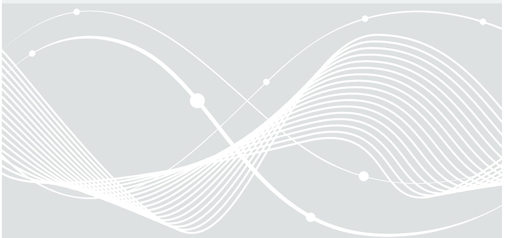
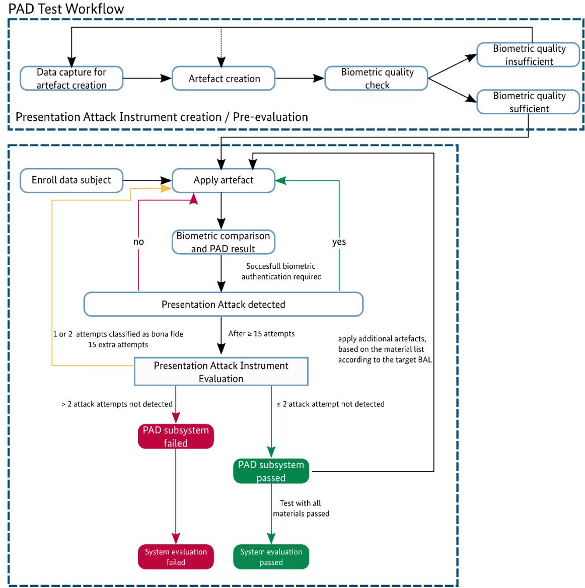

# Evaluation Guidance

BSI TR-03166 Date: 2024-10-16 Version: 1.1

# Document history

Table 1 Document history

| Version | Date       | Editor | Description   |
|---------|------------|--------|---------------|
| 1.1     | 2024-10-16 | BSI    | Final release |
|         |            |        |               |
|         |            |        |               |
|         |            |        |               |
|         |            |        |               |
|         |            |        |               |
|         |            |        |               |

Federal Office for Information Security P.O. Box 20 03 63 53133 Bonn E-Mail: biometrie@bsi.bund.de Internet: https://www.bsi.bund.de © Federal Office for Information Security 2024

| 1 |       | Introduction 4                                                                                                                               |    |
|---|-------|----------------------------------------------------------------------------------------------------------------------------------------------|----|
|   | 1.1   | Presentation Attack Instrument (PAI) Overview 4                                                                                              |    |
|   | 1.1.1 | Modality Face  5                                                                                                                             |    |
|   | 1.1.2 | Modality Finger 6                                                                                                                            |    |
| 2 |       | Pre-Evaluation Phase for Evaluating Presentation Attack Detection Mechanisms 7                                                               |    |
|   | 2.1   | Documentation 7                                                                                                                              |    |
|   | 2.2   | Initial Functional Test of the Biometric System 7                                                                                            |    |
|   | 2.3   | Pre-Evaluation Process 8                                                                                                                     |    |
|   | 2.3.1 | Modality Face  8                                                                                                                             |    |
|   | 2.3.2 | Modality Finger12                                                                                                                            |    |
| 3 |       | Evaluation Phase and Test Cases19                                                                                                            |    |
|   | 3.1   | Biometric Performance Evaluation 19                                                                                                          |    |
|   | 3.1.1 | Expected Result of the Biometric Performance Evaluation21                                                                                    |    |
|   | 3.2   | Presentation Attack Detection Evaluation 21                                                                                                  |    |
|   | 3.2.1 | Evaluation Metric 21                                                                                                                         |    |
|   | 3.2.2 | Minimal Test Coverage 22                                                                                                                     |    |
|   | 3.2.3 | Expected Result for the Presentation Attack Detection Evaluation22                                                                           |    |
| 4 |       | Material List Including Relevant Technologies Covering Different Presentation Attack Instruments (For communication with manufacturer) 23 |    |
|   | 4.1   | Modality Face23                                                                                                                              |    |
|   | 4.2   | Modality Finger23                                                                                                                            |    |
| 5 |       | 25                                                                                                                                           |    |
|   | 5.1   | Creating Artefacts for the Modality Face25                                                                                                   |    |
|   | 5.1.1 | PAIs Based on a Frontal Face Image Printout25                                                                                                |    |
|   | 5.1.2 |                                                                                                                                              | 26 |
|   | 5.1.3 | PAIs based on 3D-Masks Containing Facial Biometric Characteristics of an Identity27                                                          |    |
|   | 5.1.4 | Make-up Attack30                                                                                                                             |    |
|   | 5.2   | Build Artefacts for the Modality Finger31                                                                                                    |    |
|   | 5.2.1 | Recommend Materials and Tools31                                                                                                              |    |
|   | 5.2.2 | Source Information 32                                                                                                                        |    |
|   | 5.3   | Apply the Artefact to the TOE34                                                                                                              |    |
| 6 |       | Appendix: Minimal Information Requirements of a Testing Report 35                                                                            |    |
| 7 |       | Bibliography38                                                                                                                               |    |

# 1 Introduction

This document describes the evaluation process for biometric systems within the BSI TR-03166, currently supporting the modalities face and finger.

The certification process itself consists of two parts covering the biometric performance of the system and the resistance against defined Presentation Attack Instruments (PAIs) or attack potentials as defined by the Common Criteria Evaluation Methodology (CEM) (1).

This document does not specify new methods for the performance evaluation, rather international standards shall be used. The applied standards shall be justified by the evaluator and must be harmonized with the standard used by the manufacturer of the Target of Evaluation (TOE). Nevertheless, this document summarizes some key points for the biometric performance testing described by the ISO/IEC 19795-series.

Content of this toolbox is a brief description of a Presentation Attack Detection (PAD) pre-evaluation, where the evaluator creates initial PAI with the aim to create, from the given material characteristics / properties, artefacts with the highest potential to successfully circumvent the PAD and to be recognized as a valid biometric verification / authentication. In addition, the evaluator should gain knowledge about the TOE to reduce the probability of failed authentication processes due to insufficient knowledge about the TOE and how to present artefacts in a suitable manner.

setting. This could be for example the image resolution to capture a biometric image or the printing quality of the PAI. Due to the variety of devices and materials (e.g. printer, ink and paper) this document does not define specific brands or models / types of products. Instead, general requirements dealing with the artefact e and knowledge of biometric systems.

The overall intention of this toolbox is to cover state-of-the-art artefacts, published via legal and public sources, for evaluating the robustness against presentation attacks on fingerprint scanners and face recognition systems. In contrast to other established standards, this evaluation is based on the premise that an attacker is in possession of the best data to create biometric artefacts and to attack the biometric system on the sensor level. This assumption is con fact, that there is a huge number of potential materials, mixtures and variations for creating presentation attack instruments and that in general it is relatively easy to capture fingerprints and faces in many different ways and manufacture artefacts that produce high quality presentation attack instruments. Hence, in order to have a realistic chance to discover the vulnerabilities of a biometric system with a reasonable and practicable amount of effort, the evaluation should use the best available representations of each artefact species.

In particular, that includes for fingerprint artefacts using direct casts or other means to acquire similar quality fingerprints as the basis for manufacturing artefacts in contrast to using latent fingerprints, which quality data and essentially reduce the comparability between evaluations. In terms of face recognition, this means that an evaluator should use face images with the quality of biometric frontal face images and 3D face data with the best possible quality e.g. acquired via photogrammetry.

In conformance to the main document of the technical guideline BSI TR-03166 (2), only attacks with PAIs are part of the evaluation. The present discussions of video-injection attacks or attacks other than Presentation Attacks (PA) are not part of this evaluation, but may be discussed and evaluated in the context of resistance against high attack potentials.

# 1.1 Presentation Attack Instrument (PAI) Overview

The following subsection gives a general overview of the PAI Classes considered for the functional testing of the TOE. Exemplary materials, their properties and further possible modifications, for the modalities face

and finger are summarized in [Table 2](#page-4-1) and [Table 3](#page-5-1). This overview does not cover all possible PAI classes, materials with their different material properties or potential modifications of the created PAI. In conformance with the technical guideline an evaluator is free in his decision to create PAIs within the BALs attack potential resistance.

### 1.1.1 Modality Face

Table 2 Overview of PAI Classes for the Modality Face

| PAI Class                               | Materials / Material Properties                                                      | Modifications                                                                                                                                                                                                              |
|-----------------------------------------|--------------------------------------------------------------------------------------|----------------------------------------------------------------------------------------------------------------------------------------------------------------------------------------------------------------------------|
| Printed Photo of a Face              | Printer type • Printing stocks • Size •                               | Cut outs • Source image manipulation / • modification Full / partial faces •                                                                                                                             |
| Display to Present the Modality Face | Display technology • Display size • Framerate • Pixel density • | Static (Images) • Dynamic • Video (recorded or from other public • source) • software Image / video manipulation / • modification Projection surface • Full / partial faces • |
| 3D-Masks                                | Printer type / technology • Material •                                      | Cut outs • Colouring • Image texture • Full / partial faces •                                                                                                                                         |
| Non-permanent make up                | Different brands • Different Colour Schemes •                               | Face abstraction •                                                                                                                                                                                                      |

# 1.1.2 Modality Finger

Table 3 Overview of PAI Classes for the Modality Finger

| PAI Class                                        | Materials / Material Properties                                                     | Modifications (for all classes)                                   |
|--------------------------------------------------|-------------------------------------------------------------------------------------|----------------------------------------------------------------------|
| Latent Fingermark1                               | base material •                                                                  | additives •                                                       |
| Printed / Drawn Fingerprint Representation | base material • colour •                                                   |                                                                      |
| 2 -Artefact                                   | direct positive or moulding • technology base material • colour • | artefact thickness • additives • Mixture variations • |
| 3D-Artefact                                      | direct positive or moulding • technology base material • colour • | (if applicable)                                                      |

1 A simple attack method is to utilize the latent fingermark a previous user left on the sensor. The sample quality of fingermarks can be increased by using additives like powders to enhance the contrast.

2 The 2D information of fingerprints can also be used to generate so called 2.5D finger artefacts, where the 2D information is used to create a mould to cast fingerprint artefacts.

# 2 Pre-Evaluation Phase for Evaluating Presentation Attack Detection Mechanisms

# 2.1 Documentation

For the pre-evaluation of the biometric authentication / verification system the evaluator MUST document:

• The environment

Note: The environment may differ from the environment of the biometric performance testing.

• The Target of Evaluation including software and hardware version

Note: This information should be identical to the information regarding the system for the biometric performance evaluation, see. Appendix Chapte[r 6.](#page-34-0) During the evaluation of the Presentation Attack Detection capability of the system the evaluator may use different applications, which contain more information e.g. PAD score to perform Hill-Climbing-Attacks.

- PAI preparation and manufacturing processes including tools, materials and methods
- PAI presentation

Evaluator Note: The documentation SHALL be in a manner that the BSI is able to reproduce the evaluation including the environment and the artefacts types.

# 2.2 Initial Functional Test of the Biometric System

The testing facility SHALL evaluate the general functionality of the biometric system by bona fide tests. The environment for enrolment and the biometric authentication / verification SHALL be identical and well documented. The basic functional test SHALL be performed with a sufficiently large number of different identities to cover different aspects of an identity. This list is not complete and open for further aspects.

- Generals Aspects:
	- Gender
	- Age

- Ethnic groups
- Skin conditions due to occupation / hobbies / medical conditions

Device and biometric modality specific aspects:

| Face                              | Finger                                       |
|-----------------------------------|----------------------------------------------|
| Face hair (hair, eyebrows, beard) | Technology (optical, conductive, supersonic, |
| •                                 | •                                            |
| Glasses •                      | other)                                       |
| Make-up3                          | Sensor position on TOE                       |
| •                                 | •                                            |
| Tattoos                           | Sensor size on TOE4                          |
| •                                 | •                                            |

3 Evaluator Note: The make-up considered during the functionality is different from the mentioned Presentation Attack using make-up to impersonate a different identity.

4 The sensor size in relation to the way the finger covers the sensor area during the scan could have an impact on usability aspects and defines how environmental parameters like lightning conditions could potentially interfere with the scanning process.

| Face       | Finger                              |
|------------|-------------------------------------|
| Technology | Contactless or contact based sensor |
| •          | •                                   |

# 2.3 Pre-Evaluation Process

Prior to the evaluation for the product certification, the evaluator SHALL perform a preparation process.

Due to specific properties and characteristics of a TOE and the considered presentation attack instruments, the evaluator SHALL figure out the Presentation Attack Instrument classes, the materials and variants best suited to create the Presentation Attack Instruments, which may be successful in a biometric verification / authentication process.

Additionally, each PAI designated for the evaluation SHALL be optimized in the pre-evaluation process, so that:

- a sufficiently high biometric score can be achieved (quality)
- the chance to overcome the PAD-component has a high probability (relative for this PAI)
- changes in artefact quality based on age / time and wearing effects during testing SHALL be considered and minimized

As specified in the main document BSI TR-03166 (2), in addition to the Presentation Attack Instruments for the BAL normal, the evaluator is free to create new Presentation Attack Instruments, which would be classified in CEM (1) with an attack potential enhanced-basic for BAL substantial or moderate for BAL high.

### 2.3.1 Modality Face

#### 2.3.1.1 Pre-Evaluation Optimization

Table 4 Pre-Evaluation Optimization Aspects for each PAI Class of the Modality Face

| PAI Nr. | PAI Class        | Optimization Aspects                                                                   |
|------------|------------------|----------------------------------------------------------------------------------------|
| 01         | Paper            | try different paper types: •                                                        |
|            |                  | size •                                                                              |
|            |                  | paper weight / thickness •                                                          |
|            |                  | surface smoothness •                                                                |
|            |                  | amount of wood-contingent •                                                         |
|            |                  | amount of additives •                                                               |
|            |                  | paper colours •                                                                     |
|            |                  | transparency •                                                                      |
|            |                  | different toner / ink types (esp. for the wet paper variant) •                      |
|            |                  | presentation of real skin in combination with the PAI to attack PAD • mechanisms |
|            |                  | additives to mimic skin properties •                                                |
| 02         | Transparent Foil | ink or toner types •                                                                |
|            |                  | foil materials •                                                                    |
|            |                  | thickness •                                                                         |

|    |           | presentation of real skin in combination with the PAI to attack PAD • mechanisms |
|----|-----------|----------------------------------------------------------------------------------------|
| 03 | Fabric    | face image transfer method and material •                                           |
|    |           | different fabrics •                                                                 |
|    |           | base colour •                                                                       |
|    |           | material •                                                                          |
|    |           | weave density •                                                                     |
|    |           | additives to mimic skin properties •                                                |
| 04 | Display   | display technology •                                                                |
|    |           | brightness •                                                                        |
|    |           | refresh rates / repetition rates •                                                  |
|    |           | PWM flickering •                                                                    |
|    |           | resolution •                                                                        |
|    |           | Prevention / minimization of Moiré effect •                                         |
| 05 | Projector | Projector technology •                                                              |
|    |           | brightness •                                                                        |
|    |           | refresh rates / repetition rates •                                                  |
|    |           | PWM flickering •                                                                    |
|    |           | Resolution •                                                                        |
| 06 | 3D-Masks  | Base material •                                                                     |
|    |           | material •                                                                          |
|    |           | thickness •                                                                         |
|    |           | colour •                                                                            |
|    |           | texture •                                                                           |
|    |           | additional facial features •                                                        |
|    |           | eye brows •                                                                         |
|    |           | eye lashes •                                                                        |
|    |           | lipstick / lip gloss •                                                              |
|    |           | additives to mimic skin properties •                                                |
|    |           | fit •                                                                               |
|    |           |                                                                                        |

#### 2.3.1.2 Source for the Presentation Attack Instrument Manufacturing Process

For functional testing, the test laboratory SHALL create Presentation Attack Instruments (PAIs) under the assumption of a worst-case attack. This includes that an attacker has access to the best possible source data, which suits the attack and the functionality of the Presentation Attack Detection mechanisms / technologies.

#### 2.3.1.2.1 Source Requirements for 2D-Presentation Attack Instruments

A guidance for creating a frontal face images is described in ISO/IEC 19794-5:2011 (3), 29794-5:2010 (4) and 39794-5:2019 Annex D (5). An evaluator MUST define all acquisition settings to achieve an image as good as possible to achieve a live-like representation of the identity for the evaluation.

The source image SHOULD contain a suffic respect to the aspect ratio of the original image.

Example:

- 1. The presented image on a smartphone requires at least an image resolution matching the display resolution.
- 2. An image printed on a

#### 2.3.1.2.2 Source Requirements for 3D-Presentation Attack Instruments

The guidance to acquire a 2D image for the evaluation is defined in [2.3.1.2.1](#page-9-0) and can be used for the artefacts texture.

Evaluator Note: Due to the 3D characteristics, the evaluator should apply the guidance for 2D images to every image used to create the PAI, even if the acquired image is not a full frontal image of the identity.

The technology to acquire the 3D data SHOULD be state-of-the-art in order to provide a sufficient texture quality and 3D-accuracy. Therefore, this guideline does not define the use of a specific technology to acquire 3D-data of the identity to represent with a PAI.

Evaluator Note: A practical solution may be the use of photogrammetry to achieve a detailed texture and reconstruct 3D-data for creating a PAI.

#### 2.3.1.3 Presentation Attack Instrument Manufacturing

This section gives an overview and general requirements for specific manufacturing steps. The general definition for Presentation Attack Instruments is the characteristic that a PAI MUST biometrically match with the reference enrolled to the TOE. Additionally, the evaluator SHALL achieve the highest possible quality of a PAI for the evaluation. Indicators SHALL be identified during the pre-evaluation phase.

Additional information regarding tools, materials and tips and tricks for the PAI can be found in Chapter [5.](#page-24-0)

#### 2.3.1.3.1 2D-Presentation Attack Instruments

The subsection deals with the overview of requirements for the PAI manufacturing, variations and modifications to consider. The PAIs are limited to 2D materials / geometries and cover 2D identity representations on different materials and displays / projectors to present the PAI to the TOE.

#### 2.3.1.3.1.1 Print of a Frontal Face Image

The evaluator SHALL print the image with a colour calibrated printer using the best native printing quality. -evaluation process, see [2.3](#page-7-0) [Pre-](#page-7-0)[Evaluation Process.](#page-7-0) Aim of the PAI creation is to achieve a live-like presentation of the identity.

#### 2.3.1.3.1.2 Display to Present a Facial Image

The evaluator SHOULD present the facial representation on a colour calibrated display and SHALL additionally consider following points:

- The display SHALL be chosen in a way, that the TOE does not capture any artefacts (PWM-flickering, black stripes (display refresh rates) and strong visible Moiré pattern).
- The face presentation on the display SHOULD be performed with an optimized brightness of the PAI (display / projector).
- The displayed image SHOULD be recognized as a face and the biometric comparison must be successful. A possible parameter might be the size, which SHOULD be optimized in the pre-evaluation.
- The evaluator SHALL take care of effects with glare and non-glare displays. In case a display shows too strong reflection, an anti-glare foil MAY be applied to the display surface.
- The evaluator SHOULD use displays with common pixel densities.

#### 2.3.1.3.2 3D-Presentation Attack Instruments

This subsection deals with requirements and recommendations for 3D PAIs, which are created and presented to the TOE during the evaluation.

#### 2.3.1.3.2.1 3D-Masks

The geometry of the artefact SHOULD be as close as possible to the original form and size of the identities used in the evaluation. In addition, the evaluator SHOULD consider that it might be useful and may improve the biometric comparison score, if the 3D- inner part is customized for each evaluator.

3D-masks can be produced with different processes. These possibilities are summarized in Table 5 [Possible](#page-10-0)  [approaches to create a 3D mask from different sources with and without moulding process](#page-10-0).

the PAI should show a skin-like base colour, without further facial details that the mask SHALL contain the facial image texture, which might be part of the mask production step or due to a post-processing, where the evaluator or an expert adds a texture to the mask representing the identity presented to the TOE.

Evaluator reminder: The created masks MUST achieve a sufficiently high comparison score to be used as an artefact during the evaluation.

| Source                   | Mould (Negative)                                                                                                                                                                                                                                       | Artefact (Positive)                                                                                                                             |
|--------------------------|--------------------------------------------------------------------------------------------------------------------------------------------------------------------------------------------------------------------------------------------------------|-------------------------------------------------------------------------------------------------------------------------------------------------|
| Direct mould          | The face of the identity to represent during the evaluation and the evaluators face are necessary for the moulding process to achieve a tight fit between the mask and the evaluators face. The result will be two different moulds. | The positive can be casted based on the created moulds with different materials. By post can be done.                                     |
| Photos                   | ---                                                                                                                                                                                                                                                    | Via photogrammetry or other 3D reconstruction methods a directly usable 3D positive is created, which can be done e.g. with a 3D-printer. |
|                          | A mould is created based on the 3D reconstruction (photogrammetry or other)                                                                                                                                                                      | The positive can be casted with different materials.                                                                                         |
| 3D-scan                  | ---                                                                                                                                                                                                                                                    | Direct 3D-printed positive                                                                                                                      |
|                          | 3D-printed mould based on the 3D scan of the evaluator.                                                                                                                                                                                             | The positive can be casted with different materials                                                                                          |
| Handcrafte d positive | The handcrafted positive may be used to create a mould.                                                                                                                                                                                             | The result of the moulding process may be used with different materials to cast a positive mask                                              |

Table 5 Possible approaches to create a 3D mask from different sources with and without moulding process

The moulding process is a specialized process which cannot cover all possible methods to produce all kinds of 3D-Masks and may be used to create highly specialized 3D-masks e.g. created by make-up artists etc.

#### 2.3.1.3.3 Other / Various (out of scope)

Due to the quickly increasing number of biometric and PAD sensor technologies, application scenarios and attack tools, there exist many PAIs that are currently out of scope of this technical guideline, like e.g. Adversarial Attacks or Make-Up-Attacks, but have the potential to become relevant in the near future. In the following we want to address one of those as an example.

#### 2.3.1.3.3.1 Make-Up

#### Evaluator Note:

The usage of make-up to impersonate a different identity is currently out of scope, but may be considered in future releases of the evaluation guidance.

Exemplary Variations

- Make-up brand
- Make-up type
- Make-up thickness
- Partial make-up

Evaluator Note: Referring to the definition of a PAI the evaluator must check if the biometric comparison The evaluator achieves a real time comparison score between a reference image and a video input, e.g. a webcam.

### 2.3.2 Modality Finger

#### 2.3.2.1 Pre-Evaluation Optimization

Table 6 Pre-Evaluation Optimization Aspects for each PAI Class of the Modality Finger

| PAI Nr. | PAI Class        | Optimization Aspects                                                                                   |
|------------|------------------|--------------------------------------------------------------------------------------------------------|
| 01         | Fingermarks      | amount of powder •                                                                                  |
|            |                  | prepping the finger with a little bit of grease to produce a • more prominent fingermark         |
|            |                  | find an optimal way to leave a clear fingermark •                                                   |
|            |                  | try using similar techniques as they do in fingerprint • forensic procedures (brush, tape, etc.) |
|            |                  | try tape to protect the fingermark and real skin on top to • attack PAD mechanisms               |
| 02         | Paper [2D-print] | try different paper types: •                                                                        |
|            |                  | paper weight / thickness •                                                                          |
|            |                  | surface smoothness •                                                                                |
|            |                  | amount of wood-contingent •                                                                         |
|            |                  | amount of additives •                                                                               |
|            |                  | paper colours •                                                                                     |
|            |                  | different toner types (esp. for the wet paper variant) •                                            |
|            |                  | amount of water for the wet paper variant •                                                         |

| try real skin on top to attack PAD mechanisms • 03 Transparent Foil [2D-print] ink or toner types • foil materials • thickness • try real skin on top (without fingerprints) • to attack PAD mechanisms 04 Gelatine [casted] gelatine-glycerine (-water) mixing ratio • (mix with glycerine) time after creation of the artefact • reduce bubbles on the contact surface • try real skin on top to attack PAD mechanisms with thin • artefacts different artefact thickness >2mm up to a full finger • artefact • amount of additives 05 Gelafix [casted] time after creation of the artefact • (transparent) reduce bubbles on the contact surface • try real skin on top to attack PAD mechanisms with thin • artefacts different artefact thickness >2mm up to a full finger • artefact amount of additives • 06 Gelafix [casted] time after creation of the artefact • (coloured) reduce bubbles on the contact surface • try different available colours • try real skin on top to attack PAD mechanisms with thin • artefacts different artefact thickness >2mm up to a full finger • artefact amount of additives • 07 Silicone [casted] different silicone types • (transparent, 2-components) reduce bubbles on the contact surface • try real skin on top to attack PAD mechanisms with thin • artefacts amount of additives • | PAI Nr. | PAI Class | Optimization Aspects |
|---------------------------------------------------------------------------------------------------------------------------------------------------------------------------------------------------------------------------------------------------------------------------------------------------------------------------------------------------------------------------------------------------------------------------------------------------------------------------------------------------------------------------------------------------------------------------------------------------------------------------------------------------------------------------------------------------------------------------------------------------------------------------------------------------------------------------------------------------------------------------------------------------------------------------------------------------------------------------------------------------------------------------------------------------------------------------------------------------------------------------------------------------------------------------------------------------------------------------------------------------------------------------------------------------------------------------------------------------------------------------------------------------------------------------------------------------------------------------------------------------------------------------------------------------------------------|------------|-----------|----------------------|
|                                                                                                                                                                                                                                                                                                                                                                                                                                                                                                                                                                                                                                                                                                                                                                                                                                                                                                                                                                                                                                                                                                                                                                                                                                                                                                                                                                                                                                                                                                                                                                     |            |           |                      |
|                                                                                                                                                                                                                                                                                                                                                                                                                                                                                                                                                                                                                                                                                                                                                                                                                                                                                                                                                                                                                                                                                                                                                                                                                                                                                                                                                                                                                                                                                                                                                                     |            |           |                      |
|                                                                                                                                                                                                                                                                                                                                                                                                                                                                                                                                                                                                                                                                                                                                                                                                                                                                                                                                                                                                                                                                                                                                                                                                                                                                                                                                                                                                                                                                                                                                                                     |            |           |                      |
|                                                                                                                                                                                                                                                                                                                                                                                                                                                                                                                                                                                                                                                                                                                                                                                                                                                                                                                                                                                                                                                                                                                                                                                                                                                                                                                                                                                                                                                                                                                                                                     |            |           |                      |
|                                                                                                                                                                                                                                                                                                                                                                                                                                                                                                                                                                                                                                                                                                                                                                                                                                                                                                                                                                                                                                                                                                                                                                                                                                                                                                                                                                                                                                                                                                                                                                     |            |           |                      |
|                                                                                                                                                                                                                                                                                                                                                                                                                                                                                                                                                                                                                                                                                                                                                                                                                                                                                                                                                                                                                                                                                                                                                                                                                                                                                                                                                                                                                                                                                                                                                                     |            |           |                      |
|                                                                                                                                                                                                                                                                                                                                                                                                                                                                                                                                                                                                                                                                                                                                                                                                                                                                                                                                                                                                                                                                                                                                                                                                                                                                                                                                                                                                                                                                                                                                                                     |            |           |                      |
|                                                                                                                                                                                                                                                                                                                                                                                                                                                                                                                                                                                                                                                                                                                                                                                                                                                                                                                                                                                                                                                                                                                                                                                                                                                                                                                                                                                                                                                                                                                                                                     |            |           |                      |
|                                                                                                                                                                                                                                                                                                                                                                                                                                                                                                                                                                                                                                                                                                                                                                                                                                                                                                                                                                                                                                                                                                                                                                                                                                                                                                                                                                                                                                                                                                                                                                     |            |           |                      |
|                                                                                                                                                                                                                                                                                                                                                                                                                                                                                                                                                                                                                                                                                                                                                                                                                                                                                                                                                                                                                                                                                                                                                                                                                                                                                                                                                                                                                                                                                                                                                                     |            |           |                      |
|                                                                                                                                                                                                                                                                                                                                                                                                                                                                                                                                                                                                                                                                                                                                                                                                                                                                                                                                                                                                                                                                                                                                                                                                                                                                                                                                                                                                                                                                                                                                                                     |            |           |                      |
|                                                                                                                                                                                                                                                                                                                                                                                                                                                                                                                                                                                                                                                                                                                                                                                                                                                                                                                                                                                                                                                                                                                                                                                                                                                                                                                                                                                                                                                                                                                                                                     |            |           |                      |
|                                                                                                                                                                                                                                                                                                                                                                                                                                                                                                                                                                                                                                                                                                                                                                                                                                                                                                                                                                                                                                                                                                                                                                                                                                                                                                                                                                                                                                                                                                                                                                     |            |           |                      |
|                                                                                                                                                                                                                                                                                                                                                                                                                                                                                                                                                                                                                                                                                                                                                                                                                                                                                                                                                                                                                                                                                                                                                                                                                                                                                                                                                                                                                                                                                                                                                                     |            |           |                      |
|                                                                                                                                                                                                                                                                                                                                                                                                                                                                                                                                                                                                                                                                                                                                                                                                                                                                                                                                                                                                                                                                                                                                                                                                                                                                                                                                                                                                                                                                                                                                                                     |            |           |                      |
|                                                                                                                                                                                                                                                                                                                                                                                                                                                                                                                                                                                                                                                                                                                                                                                                                                                                                                                                                                                                                                                                                                                                                                                                                                                                                                                                                                                                                                                                                                                                                                     |            |           |                      |
|                                                                                                                                                                                                                                                                                                                                                                                                                                                                                                                                                                                                                                                                                                                                                                                                                                                                                                                                                                                                                                                                                                                                                                                                                                                                                                                                                                                                                                                                                                                                                                     |            |           |                      |
|                                                                                                                                                                                                                                                                                                                                                                                                                                                                                                                                                                                                                                                                                                                                                                                                                                                                                                                                                                                                                                                                                                                                                                                                                                                                                                                                                                                                                                                                                                                                                                     |            |           |                      |
|                                                                                                                                                                                                                                                                                                                                                                                                                                                                                                                                                                                                                                                                                                                                                                                                                                                                                                                                                                                                                                                                                                                                                                                                                                                                                                                                                                                                                                                                                                                                                                     |            |           |                      |
|                                                                                                                                                                                                                                                                                                                                                                                                                                                                                                                                                                                                                                                                                                                                                                                                                                                                                                                                                                                                                                                                                                                                                                                                                                                                                                                                                                                                                                                                                                                                                                     |            |           |                      |
|                                                                                                                                                                                                                                                                                                                                                                                                                                                                                                                                                                                                                                                                                                                                                                                                                                                                                                                                                                                                                                                                                                                                                                                                                                                                                                                                                                                                                                                                                                                                                                     |            |           |                      |
|                                                                                                                                                                                                                                                                                                                                                                                                                                                                                                                                                                                                                                                                                                                                                                                                                                                                                                                                                                                                                                                                                                                                                                                                                                                                                                                                                                                                                                                                                                                                                                     |            |           |                      |
|                                                                                                                                                                                                                                                                                                                                                                                                                                                                                                                                                                                                                                                                                                                                                                                                                                                                                                                                                                                                                                                                                                                                                                                                                                                                                                                                                                                                                                                                                                                                                                     |            |           |                      |
|                                                                                                                                                                                                                                                                                                                                                                                                                                                                                                                                                                                                                                                                                                                                                                                                                                                                                                                                                                                                                                                                                                                                                                                                                                                                                                                                                                                                                                                                                                                                                                     |            |           |                      |
|                                                                                                                                                                                                                                                                                                                                                                                                                                                                                                                                                                                                                                                                                                                                                                                                                                                                                                                                                                                                                                                                                                                                                                                                                                                                                                                                                                                                                                                                                                                                                                     |            |           |                      |
|                                                                                                                                                                                                                                                                                                                                                                                                                                                                                                                                                                                                                                                                                                                                                                                                                                                                                                                                                                                                                                                                                                                                                                                                                                                                                                                                                                                                                                                                                                                                                                     |            |           |                      |

| PAI Nr. | PAI Class                                                                                             | Optimization Aspects                                                                                                                                                                                                                                                                                                                                                  |
|------------|-------------------------------------------------------------------------------------------------------|-----------------------------------------------------------------------------------------------------------------------------------------------------------------------------------------------------------------------------------------------------------------------------------------------------------------------------------------------------------------------|
| 08         | Silicone [casted] (coloured)5                                                                      | different silicone types • reduce bubbles on the contact surface • try different colour mixtures • try real skin on top to attack PAD mechanisms with very • thin artefacts amount of additives •                                                                                                                                       |
| 09         | Latex [casted]                                                                                        | different latex types • reduce bubbles on the contact surface • (a vacuum chamber can help) try real skin on top to attack PAD mechanisms with very • thin artefacts amount of additives •                                                                                                                                                 |
| 10         | Wood Glue [casted] (added glycerine)                                                               | wood-glue-glycerine mixing ratio • time after creation of the artefact • (sometimes a dryer surface gets better results) reduce bubbles on the contact surface • try real skin on top to attack PAD mechanisms with thin • artefacts different artefact thickness >2mm up to a full finger • artefact amount of additives • |
| 11         | Window Colour [casted] (acrylic)                                                                   | different window colour types • reduce bubbles on the contact surface • (a vacuum chamber can help) try real skin on top to attack PAD mechanisms with very • thin artefacts amount of additives •                                                                                                                                         |
| 12         | Nanotips [casted] (conductive rubber)                                                              | different Nanotip types / colours • reduce bubbles in the material • amount of additives •                                                                                                                                                                                                                                                             |
| 13         | 3D-printed positive 6 (full colour print, flexible polymer material: shore hardness A10-A20) | material composition • artefact colour / texture • shore hardness • model resolution (e.g. with pores), smooth edges •                                                                                                                                                                                                                           |

6 Currently the only printer model available and tested for this PAI at BSI is the Stratasys J850 DAP, with Agilus30 and Tissue Matrix materials.

#### 2.3.2.2 Source Data for the Presentation Attack Instrument Manufacturing Process

For the evaluation, the test laboratory SHALL create Presentation Attack Instruments (PAIs) under the - attacker has access to the best possible source data, which suits the attack and the functionality of the fingerprint sensor and the implemented Presentation Attack Detection mechanisms / technologies.

#### 2.3.2.2.1 Source Requirements for 2D and 2.5D-Presentation Attack Instruments

Source images for the PAI manufacturing process can be acquired based on different methods:

- 1. Reference fingerprint images acquired with contacted-based fingerprint scanners fulfilling the following requirements:
	- a. Minimal image resolution 500 PPI
	- b. No image compression
	- c. No automatized image enhancement
- 2. Fingerprints digitalized from ink fingerprints
	- a. Minimal scanner resolution 600 DPI
	- b. No image compression
	- c. No automatized image enhancement
- 3. Contactless fingerprint acquisition with standard camera equipment
	- a. The evaluation facility MAY take images directly from the fingers and extract fingerprints via image analysis.
- 4. Contactless 3D fingerprint acquisition
	- a. Various technologies enable a contactless 3D acquisition of the fingerprint. A 2D fingerprint can be achieved with different projection methods.
- 5. Enhancement of latent fingermarks
	- a. By using different methods to enhance the visibility of a latent fingermarks, the ridge pattern MAY be digitized via a digital camera etc.

Image enhancing modifications on the fingerprint SHALL be documented in a way that the BSI can reproduce the steps.

artefact to attack the biometric system, but may be used as the simplest attack. Therefore, the use of latent fingerprint as source data for fingerprint artefacts is out of scope of this toolbox.

The 2D information of fingerprints can also be used to generate so called 2.5D finger artefacts, where the 2D information is used to create a mould to cast fingerprint artefacts.

#### 2.3.2.2.2 Source Requirements for 3D-Presentation Attack Instruments

Source data for the PAI manufacturing process can be acquired based on different methods:

- 1. Cooperative moulding with different materials may be a valid method to create a high quality 3Dfingerprint artefact
	- a. Level of detail (ridges, valleys, sweat pores)
	- b. Material durability
	- c. No alteration over time
- 2. Digital 3D-model acquisition
	- a. Region of interest of the finger
	- b. Achievable voxel resolution of the method, shall fit to the application For example isotropic resolution 25 µm

#### 2.3.2.3 Presentation Attack Instrument Manufacturing

This section gives an overview and general requirements for specific manufacturing steps.

#### 2.3.2.3.1 2D-Presentation Attack Instruments

The subsection deals with the overview of requirements for the PAI manufacturing, variations and modifications to consider. The PAIs are limited to 2D materials / geometries and cover 2D prints on different materials presented to the TOE.

#### 2.3.2.3.1.1 rface

For some fingerprint scanner technologies it may be sufficient to cover an old accepted genuine fingerprint with some sheet of plastics or paper. Additional enhancement steps like the use of fingerprint powder (possible use of different colours) to enhance the optical density of the latent fingerprint to achieve the necessary ridge pattern, may be performed. Different materials in different colours can act as background for the latent fingerprint.

#### 2.3.2.3.1.2 Print of a Fingerprint

Depending on the source information, the evaluator MUST scale the fingerprint image to the fingerprint image size of the enrolled identity.

The evaluator SHOULD print the image with a calibrated printer using the best native printing quality. The source image for a printed artefact SHALL be at least 1000 PPI (pixel per inch).

in the printing result. Therefore, the evaluation facility SHALL take care of the detail preservation of the final print. Depending of the technology used by the biometric system adding additives may be necessary to generate an image of the fingerprint.

As an example, conductive paint may be used to generate a fingerprint image on a fingerprint sensor based o

Exemplary Variations:

- Different printer technologies (e.g. inkjet / laser)
- Different pigment containing media / conductive additives
- Different printing targets (paper, transparent sheets, plastics) including base colour and thickness of the material
- Colour spaces (CMYK / BW / RGB)
- Wetting the artefact
- Partial artefacts

#### 2.3.2.3.2 2.5D-Presentation Attack Instruments

The evaluator SHALL present so called 2.5D fingerprint artefacts. This class of artefacts may be created based on the acquired fingerprints as described in [2.3.2.3.1](#page-15-0) [2D-Presentation Attack Instruments.](#page-15-0) In contrast to 2D artefacts this class of artefacts contains distinct depth information.

#### 2.3.2.3.2.1 Moulding Process

The 2D fingerprint may be used as source to achieve 2.5D moulds in various materials. The 2D fingerprint acts in this process as a template for e.g. exposure etching processes, engraving or 3D printed moulds.

Engraving can be done e.g. in plastic or metal (e.g. with laser engravers on Delrin or aluminium) or by using lithographic processes (e.g. for using UV-imprinting on Nyloprint plates as an alternative to using PCBs).

Depending on the processing method, the template SHOULD be mirrored along the vertical axis and the binarized presentation SHOULD be inverted.

#### 2.3.2.3.2.2 Casting Process

Due to material properties the moulding or the casting material may change in size during the drying processes. Therefore, the evaluator SHALL take care that the fingerprint artefacts enables a successful comparison with the enrolled fingerprint.

For the casting process, the created mould SHALL be cleaned from dust or remaining residuals of a previous casting process. The evaluator SHALL take care that only cleaning methods are used which do not alter, influence the mould or influence the casting material in its hardening crosslinking process.

Positive materials MUST be within in their use best before period. It is recommended to use always fresh components and materials.

his experience SHALL document the deviations.

Exemplary Variations:

- Different technologies / methods to create a 2.5D mould
- Different negative materials
- Different positive materials and additives

#### 2.3.2.3.3 3D-Presentation Attack Instruments

The evaluator SHALL present finger artefacts to the TOE containing a partial or the whole fingerprint information on the artefacts. Different methods and processes are possible to create such artefacts.

#### 2.3.2.3.3.1 Mould-based Artefact Creation

#### Mould Creation

 

The evaluation laboratory SHALL prepare the moulding material as described by the product manufacturer. Materials SHALL NOT be used after their best before date. It is recommended to always use fresh / new materials to exclude variations in the mould quality based on the materials.

Depending on the negative materials for the moulding process protective containers MAY be necessary in order to keep their physical properties. The fingerprints taken in a cooperative manner SHALL be taken from freshly washed hands. The evaluator must wait until the moulding material hardens, following the / exclude alterations of the fingerprint artefact and overall reduction of the artefact quality.

Release agents MAY help to remove the finger out of the moulding material. It is recommended to test several release agents, since some could prevent the proper curation of some artefact materials.

Besides the cooperative moulding process, the evaluation laboratory MAY create finger artefacts based on acquired 3D finger data with subsequent creation with 3D-printing or other technologies.

#### Casting Process

The evaluator SHALL only use materials and ingredients which have not reached their date of expiry and knowledge and experience SHALL be properly documented.

- Different negative materials for the moulding process (cooperative)
- Optional: Different negative materials for the moulding process (based on 3D finger data)
- Different positive materials
- Different additives, adjusted to the evaluated fingerprint sensor technology

#### 2.3.2.3.3.2 Direct Artefact Creation from 3D Fingerprint Data

In case 3D fingerprint data are acquired, the evaluator can directly create an artefact based on this data, for may be necessary. In addition, the evaluator MUST take care, that the used 3D printing technology fulfils necessary requirements to achieve a functional biometric artefact. The printing resolution MUST be high enough to replicate the ridge pattern of the finger.

#### 2.3.2.3.4 Quality Check

The created artefact SHALL be quality checked. Artefacts SHALL only be used for PAD-testing if the artefact has generated sufficient comparison scores in comparison to the enrolment data. This can be done based on ns during a deactivated PAD-mechanism or with established fingerprint comparison solutions, if the PAD-mechanisms cannot be deactivated.

# 3 Evaluation Phase and Test Cases

The following sections describe the Biometric Performance and the Presentation Attack Detection mechanism evaluation of the Target of Evaluation. Requirements regarding the biometric performance for the different Biometric Assurance Level are specified in the BSI TR-03166.

# 3.1 Biometric Performance Evaluation

For the biometric performance evaluation, the evaluator SHALL use the methodology described in ISO/IEC 19795-1:2021 (6), ISO/IEC 19795-2:2007 (7) and ISO/IEC TS 19795-9:2019 (8).

The performance testing SHALL be in a fashion of a scenario evaluation as described in subsection 6.5.3.3 of ISO / IEC19795-1:2021 (6). To achieve conformance to 19795-1:2021 (6) the Clauses 7 through 12 MUST be followed.

The evaluation methodology for a scenario evaluation is further described in ISO/IEC 19795-2 (7). Relevant clause from the standard are clause 5, 7 and 8 except 7.3.5.

Minimal Information which MUST be included in the testing report are given in the Appendix (Chapter [6\)](#page-34-0).

The following text passage are quotes from in ISO/IEC 19795-9:2019 (8) in 5.Overview of full-system evaluation of mobile devices and 6.Guidance for testing and reporting:

#### 5. Overview of full-system evaluation of mobile devices

#### 5.1 General description

process and subsystems in a realistic scenario. As such, an evaluation shall additionally conform to the requirements of ISO/IEC 19795-2:2007,

nge of a biometric evaluation of a mobile device for the evaluator is to assess that the observed errors rates, FAR and FRR, support a claimed performance with a sufficient statistical certainty. ISO/IEC 19795-1 recommends the use of Rule of 3 or Rule of 30 approaches to assess performance claims.

- Rule of 3 defines the minimum number of transactions required for the estimation of a minimum error rate at a 95 % confidence level when no errors are obtained during the evaluation.
- Rule of 30 states that to be 90 % confident that the true error rate is within ±30 % of the observed error rate, there should be at least 30 errors. Based on the predefined error rates and the number of errors, i.e. 30 errors, it is possible to define the minimum number of transactions.

The target requirement for an error will directly influence the number of independent tests required to have statistical significance, and thus the size of the test crew, the time spent and the cost of the evaluation. To reduce the duration and cost of executing a biometric performance evaluation, the number of recognition

For FAR evaluation, while the independence criteria would require that one test subject is only involved in one impostor transaction, it is commonly agreed that the statistical loss of computing all possible crosscomparisons between test subjects is acceptable. This approximation shall be considered relevant for a mobile device evaluation (i.e. with N test subjects, ( ⋅ ( − 1))/2 impostors tests can be made). In general, all possible cross-

A mobile device customized for evaluation could address these issues by offline testing:

 the reference and probe biometric templates acquired on the device can be exported from the customized mobile device and compared offline using a dedicated SDK.

 alternatively, the mobile-device manufacturer could provide a dataset and a dedicated SDK for offline testing. The evaluator should then assert the relevance of the provided data.

One way to limit the increase of size of the test crew and to achieve affordable and time efficient evaluations is to allow multiple transactions to be executed by the same test subject. However, this will decrease test independence and increase statistic uncertainty. To help mitigate the decrease of independence, one test subject should never proceed to more than five mated transactions.

In addition to Rule of 3 and Rule of 30, bootstrapping (sampling with replacement) is also a method to determine confidence particularly when a distribution cannot be assumed. Bootstrapping allows the use of the test data to determine the confidence depending on the test scenario, e.g. number of subjects and number of attempts (or transactions) per subject. When attempting to establish whether an error rate is below a threshold, it is appropriate to choose a one-sided upper bound. In this method, the statistical

#### 6 Guidance for testing and reporting

#### 6.3 Performance measurement

#### 6.3.2 Optional technology evaluation for lower FAR claims

For evaluation of FAR claims below 0.01 %, the evaluator may proceed to a technology evaluation of the matching component.

The ToE may then be tested in two stages:

- Stage 1: Scenario evaluation: the evaluator shall evaluate FAR with the data collected from the test crew. The test crew dataset shall be large enough to have at least statistical significance for evaluating a FAR claim of 0.01 % or below.
- Stage 2: Technology evaluation: If a FAR claim of 0.01 % or below is verified at stage 1, the evaluator may use a pre-existing dataset not acquired from the test crew for this second stage. This preexisting dataset may be provided by the supplier and shall be acquired with the same sensor. The pre-existing dataset should be large enough to allow using Rule of 30 when evaluating the FAR claim. The evaluator shall validate that the pre-existing dataset is consistent with the test crew dataset by sub-sampling the pre-existing dataset to the size of the test crew dataset and evaluating FAR by bootstrapping. The mean of the bootstrap distribution shall be below or equal to the value measured at stage 1.

| FAR target | Statistical approach                                                                | Test size                                                                                                                       |
|------------|-------------------------------------------------------------------------------------|---------------------------------------------------------------------------------------------------------------------------------|
| > 0.1 %    | Evaluator should use Rule of 30                                                     | Test size should follow Rule of 30 requirements                                                                              |
|            | Evaluator should use Rule of 3, if applicable Evaluator may use bootstrapping | Test size should follow Rule of 3 requirements                                                                               |
| <0.01 %    | Evaluator should use two-stage evaluation                                        | Test size shall at least be 246 (requirement for Rule of 3 at 0.01 %) If used, pre-existing dataset shall at least be 530 |

Table 7 Recommended statistical approaches to evaluate the biometric performance of a system

# 3.1.1 Expected Result of the Biometric Performance Evaluation

As described in [3.1](#page-18-1) [Biometric Performance Evaluation](#page-18-1) the evaluator SHALL use the referenced biometric performance standards to evaluate the biometric performance of the Target of Evaluation. If the biometric performance is sufficient for the aimed Biometric Assurance Level, the Target of Evaluation passes the test.

Evaluator Note: The required biometric performance for a single modality may be lower as required, if biometrics is realized with multi-modalities, -instances or presentations.

# 3.2 Presentation Attack Detection Evaluation

After creating the best suited Presentation Attack Instruments for evaluating the TOE in the initial preevaluation phase, the evaluator uses these instruments for the testing process. For the higher BALs the evaluator SHALL follow the rating scheme of attack potentials as defined in CEM (1) Every PAI is presented to the TOE and evaluated following the evaluation metric as described in [3.2.1](#page-20-2) [Evaluation Metric.](#page-20-2) The ng the testing.

# 3.2.1 Evaluation Metric

The evaluation metric for this technical guideline is very similar to established vulnerability analysis procedures in Common Criteria. Prior to the Evaluation Phase the evaluator MUST perform the steps described in chapte[r 2](#page-6-0) [Pre-Evaluation Phase for Evaluating Presentation Attack Detection Mechanisms.](#page-6-0) All steps of the evaluation, including the pre-evaluation phase, are depicted in [Figure 1.](#page-21-2)

Criteria for pass or fail within the PAD evaluation are defined in the following schema:

- Each artefact is applied at least 15 times with minimum 2 evaluators and 3 different identities. In the case that 3 presentation attacks are classified as bona-fide attempts for one evaluator (presented identity), the TOE has failed the test and the evaluator can stop testing with this artefact.
- If the TOE classifies a PA 1 or 2 times as bona-fide, the evaluator SHALL perform at least 15 additional attempts.
	- If only 1 attempt out of 30 was classified as bona-fide, the TOE passes the test (provided the evaluators have no reason to doubt the results - otherwise they can add more attempts with variations until they are confident with the outcome. The evaluators SHALL document their decision).
	- If two PAs were successful, the evaluator SHALL create new PAIs of the same species with varying parameters (see Toolbox) to optimize the PA further and to gain confidence about the reliability of the PA.

The evaluator SHALL repeat the evaluation with at least 1 new PAI.

- The TOE fails the test for an artefact if three or more attempts have been wrongly classified as bona-fide attempts.
- If the PAD-mechanism classifies all PA attempts correctly as PA, the system passes the test.
- If the TOE fails the test for a single artefact with an attack potential lower than the targeted BAL (esp. all PAIs of the functionality test), the TOE fails the evaluation and the evaluation lab can stop the tests.

Evaluator Note: The PA attempts SHOULD be comparable for all evaluators.

Figure 1 PAD Test Workflow including PAI creation during pre-evaluation and subsequent PAD evaluation

# 3.2.2 Minimal Test Coverage

The evaluation of the PAD functionality SHALL be performed with Presentation Attack Instruments showing at least three different identities presented by two evaluators. PAIs SHOULD be personalized and during the evaluation an evaluator MUST present a PAI to the TOE with an identity different from his own. The metric regarding passing or failing a test is defined in Section [3.2.1](#page-20-2) [Evaluation Metric.](#page-20-2)

# 3.2.3 Expected Result for the Presentation Attack Detection Evaluation

As described in [3.2.1](#page-20-2) [Evaluation Metric](#page-20-2) each Presentation Attack Instrument MUST be correctly classified, within the given tolerance of the defined schema, as a Presentation Attack.

For the higher BALs the evaluator MUST define, create and optimize additional Presentation Attack Instruments in conformance to BSI TR-03166.

# 4 Material List Including Relevant Technologies Covering Different Presentation Attack Instruments (For communication with manufacturer)

This chapter should outline the detail level of communication between an evaluation laboratory and the manufacturer of the biometric system during a certification process. The general idea behind this limited amount of information is that manufacturers are going to evaluate and test their solutions in a more extensive manner to succeed in the evaluation process. Speaking in terms of presentation attacks, a manufacturer would likely present more and different artefacts to the TOE, than the evaluation laboratory would do.

# 4.1 Modality Face

#### Print Frontal Face Images (PRT)

- Inkjet- / Laser printer
- Paper
- Fabrics
- Foils

#### Displays / Projectors Presenting a Frontal Face Image (DSP)

- Different display technologies
- Display Sizes
- Pixel densities

#### 3D-Masks (MSK)

- Different 3D-Printing technologies
- Materials usable for fused material deposition
- Resins
- Plaster
- Additives to fake skin properties
- Texture and coloration

# 4.2 Modality Finger

#### Fingermarks (FMA)

- Fingermark enhancement and digitization with post-processing
- Materials and methods to trigger the fingerprint acquisition, while no real finger is presented to the sensor

#### Fingerprint Print Outs (PRT)

- Inkjet- / Laser printer
- Paper / Foil type

#### Casted Finger Artefacts (CAS)

- Different materials and methods to create 2.5D and 3D moulds7
- Casting materials and additives
	- Gelatine like materials
	- Silicones
	- Latex
	- Glues
	- Polymers
	- Conductive materials
	- Variation in material thickness
	- Mixtures of different materials

7 A manufacturer SHALL follow the assumption of a worst-case scenario, where an attacker has access to the best biometric data to create present attack instruments.

# 5 Appendix: Instrument Construction

This chapter is informative and should give a general overview of tools, materials and methods to create Presentation Attack Instruments for the modalities Face and Finger, but is not encompassing. Evaluation facilities and their experts may have tools, materials and methods not mentioned in the following sections due to their expertise in the evaluation of biometric authentication components.

# 5.1 Creating Artefacts for the Modality Face

# 5.1.1 PAIs Based on a Frontal Face Image Printout

#### 5.1.1.1 Recommended Tools and Materials

The following enumeration gives an example of tools and materials to create PAI variations based on a print of a frontal face.

| 1. | camera                | 6. | photo printer      | 11. flashlight   |
|----|-----------------------|----|--------------------|------------------|
| 2. | diffused lights       | 7. | white paper DIN A4 | 12. scissors     |
| 3. | tripod                | 8. | photo paper DIN A4 | 13. cord         |
| 4. | laser printer colour  | 9. | tripod adapter     | 14. hole puncher |
| 5. | inkjet printer colour |    | 10. scalpel        |                  |

#### 5.1.1.2 Source Information

For artefacts of this class, high quality pictures of the enrolled user are needed. For requirements see [2.3.1.2.1](#page-9-0) [Source Requirements for 2D-Presentation Attack Instruments.](#page-9-0)

#### 5.1.1.3 Print the Picture

Depending on the PAD-technique used in the TOE, different sizes of prints may be recognized as a face. Therefore, different sizes of a printout may be necessary. A good starting point is an artefact that comes as close as possible to the realistic size of the person that is shown on the picture. The best way to achieve this, is to target on a full-size printout on DIN A4 paper.

#### 5.1.1.3.1 Possible Modifications

In the following, possible / exemplary modifications on a print are described to achieve a modification of the PAI.

Modifications:

- Use a different printer
- Print in black or colour
- Print on different materials
- Cut out the eye region of the printed face
- Cut out the mouth region of the printed face
- Cut out the shape of the face
- Take holes on each side of the cut of face with a hole puncher and draw one cord through each hole. The cord allows to carry the printout like a mask.

### 5.1.1.4 Artefact Application to the TOE

The evaluator should hold / wear the printed picture of the face in front of the TOE. It has to be ensured that only the PAI is recognized by the TOE and not the face of the evaluator.

As the PAI varies in size, the evaluator should evaluate the TOE using different distances between TOE and PAI, which is part of chapter [2 Pre-Evaluation Phase for Evaluating Presentation Attack Detection](#page-6-0)  [Mechanisms.](#page-6-0)

The evaluator should move / tilt / pan the PAI in front of the TOE to find a position where the face comparison is successful. To evaluate the PAD-functionality of the TOE, a single parameter should be varied in increments.

### 5.1.2 PAIs based on Video of an Identity

#### 5.1.2.1 Recommended Tools and Materials

1. camera

3. diffused lights

5. tripod adapter

2. tablet 4. tripod

#### 5.1.2.2 Source Information

For artefacts of this class, high quality pictures / videos of the enrolled user are needed. For requirements see [2.3.1.3.1.2](#page-9-1) [Display to Present a Facial Image](#page-9-1) and for the source dat[a 2.3.1.2.1](#page-9-0) [Source Requirements for 2D-](#page-9-0)[Presentation Attack Instruments.](#page-9-0)

#### Additional recommendations for videos

A facial video of the enrolled identity should be recorded with a resolution at least exceeding the native resolution of the displaying device. The framerate and bitrate of the video should fit the displaying device and the PAD-technology. To include potential challenge-response mechanisms the video may contain head movements in all directions, eye and eyelid movements and opening and closing of the mouth.

- 1. The face must be well illuminated without hotspots or shadows.
- 2. The background should have as few artefacts and distortions as possible.
- 3. The face must be in focus.
- 4. The person being filmed should look straight into the direction of the camera and move the head a little bit up, down and sideways during the video.
- 5. The person being filmed should look relaxed with neutral face expression. During the image acquisition the person can close the eyes and move the face muscles a little bit.

#### 5.1.2.2.1 Possible Modifications

In the following, possible / exemplary modifications on a static image are described to achieve a modification of the PAI.

- Animate the static image with an appropriate software
- Instead of a display, a projector may be used to project the image or video on a surface

Closely related to a single static image is the usage of several images in a video / video stream. With this option further modifications are available like:

• Video replay attack

• Manipulated video streams by deep fakes

### 5.1.2.3 Artefact Application to the TOE

- 1. The evaluator should hold a display presenting the target identity in front of the TOE. It may be necessary to use displays with different sizes and pixel densities. Too small displays present the frontal facial image too small to be recognized by the facial comparison algorithm.
- 2. Depending on the used display and camera / objective constellation, different distances between PAI and TOE may be necessary. The evaluator should test different distances between PAI and TOE for every PAI.
- 3. The evaluator should move / tilt / pan the PAI in front of the TOE to find a position where the face comparison is successful. To evaluate the PAD-functionality of the TOE, a single parameter should be varied in increments.

### 5.1.3 PAIs based on 3D-Masks Containing Facial Biometric Characteristics of an Identity

The following subchapters explain how to build artefacts from this class. A general overview of different data / information sources, intermediate steps and a potential post-processing is given in [2.3.1.2.2](#page-9-2) and [2.3.1.3.2.](#page-10-1)

The first step in the process is getting a digital copy of the enrollees face. This can be done in different ways, ranging from a completely manual process to a fully automated one. One can for example take pictures of the person who is to be impersonated or one can scan the face of the person by using a 3D laser scanner.

Several service providers are on the market to acquire the necessary data and create a 3D-modell of the enrolled identity. Further, 3D-printing services are on the market to print such artefacts. Due to the transfer of personal data, the GDPR must be taken into account.

The following subchapters explain how to generate a computer model of the head by photogrammetry and how to produce a 3D silicon mask as this is the process that showed the best results.

Alternatively, there is a description how to build a 3D positive model of the face of an evaluator.

#### 5.1.3.1 Recommend Tools and Materials

| 1. | camera           | 13. scale                 | 25. Super Baldiez        |
|----|------------------|---------------------------|--------------------------|
| 2. | diffused lights  | 14. bowls                 | 26. airbrush             |
| 3. | tripod           | 15. scoops                | 27. silicon adhesive neo |
| 4. | tripod adapter   | 16. vacuum pump           | 28. dust mask            |
| 5. | swivel chair     | 17. clamps                | 29. protection googles   |
| 6. | Photogrammetry   | 18. flocking color for    | 30. cotton buds          |
|    | software         | silicone                  | 31. jam jar small and    |
| 7. | 3D Model Editing | 19. silicone colorizer    | medium                   |
|    | software         | 20. silicone release anti | 32. hair clip            |
| 8. | 3D printer       | adhesive spray            | 33. Neo Adhesive         |
| 9. | PLA filament     | 21. isopropyl alcohol     | Remover                  |
|    | 10. towel        | 22. marker pen            | 34. sealer               |
|    | 11. softener     | 23. wrapping film         | 35. color for airbrush   |
|    | 12. silicone     | 24. Vaseline              | 36. Isopropylmyristate   |
|    |                  |                           |                          |

| 37. scalpel        | 41. big garbage bags | 45. powder              |
|--------------------|----------------------|-------------------------|
| 38. tissues        | 42. crepe tape       | 46. make-up sponge      |
| 39. medical gloves | 43. paintbrush       | 47. dust extraction for |
| 40. nail scissors  | 44. liquid make-up   | airbrush                |

#### 5.1.3.2 Source Information

For photogrammetry, as one possibility to generate a 3D-modell of a head, images from different angles of the head are necessary to calculate a 3D-modell. Therefore, different acquisition methods are mentioned in this description:

- move around the person with a camera taking pictures
- mount a camera on a tripod, and rotate the person using a swivel chair
- use a dedicated portrait studio with several cameras taking simultaneously pictures from different angles

For artefacts of this class, high quality pictures of the enrolled user are needed. For requirements see [2.3.1.2.1](#page-9-0) [Source Requirements for 2D-Presentation Attack Instruments](#page-9-0)

To minimize possible artefacts during the computational 3D-model generation process, the person should move as little as possible and face the (central) camera (at the beginning) with neutral expression. In addition to the recommendations mentioned i[n 5.1.2.2](#page-25-1) [Source Information,](#page-25-1) the evaluator must take care that a sufficient number of images are captured to generate a 3D-model.

- The person being photographed should look straight into one direction during the whole shooting.
- The person being photographed should look relaxed with neutral face expression. They shall hold the same expression during the whole shooting.
- The head must be well illuminated without hotspots or shadows.
- The background should have as few artefacts and distortions as possible.
- The face must be in focus.
- There should be a sufficient overlap between the pictures.

#### 5.1.3.3 3D-Model Generation, Mould and Mask Creation

Based on the captured images, a 3D-model can be generated with an appropriate photogrammetry software. Due to the variety of software solutions, the lab must figure out the settings to achieve the best generated 3D-model.

For further use post processing steps may be necessary to create a 3D-mask or a mould to cast a 3D-mask later on.

- Repair the mesh
- Simplify the mesh

To create a mould from the 3D-model, expertise in 3D-modelling is necessary. Therefore, no general description about the modelling process can be given.

To create the mould, or a 3D-mask directly, several options are available like:

- 3D-Printing
	- Fused Material Deposition (FMD)
	- Stereolithography (SLA)

• Digital Light Processing (DLP)

A directly printed 3D-mask may be coloured and painted to create a face-like texture of the face. High-end 3D-printers may support multi-colour 3D-printing, which may make the post processing with colouring and painting unnecessary.

The mould for the casting process should be prepared with a mould release agent to remove the casted mask from the mould. The mould can be used with different materials to create various masks.

#### 5.1.3.3.1 Colouring / Painting of the Mask

The pieces of the mould can be used as support during the colouring / painting process. Due to health risks it is not recommended to perform the airbrushing process while the evaluator wears the mask.

Based on experiences, painting the mask is a challenging process. It may be worth to consider asking a make-up artist for this step.

- 1. By airbrush:
	- a. The first step to paint the mask is to mix some isopropanol with colour for airbrush. It is recommended to choose the skin colour of the impersonated person. If the material s base tone of colour is not properly adjusted during the creation step, dispense it with a brush and mix it in a small jar with ca. 2 ml isopropanol.
	- b. Then, one has to apply the colour mixture with airbrush on the mask with 10 pounds of pressure.
- 2. By make-up
	- a. To colorize the mask it is recommend to make-up the mask with the non-permanent makeup.
	- b. For better results and easier removal of the make-up, one should moisturize the face and let it infiltrate into the skin for ca. 2 minutes.
	- c. After this, it is recommended to use primer before putting the make-up on. It makes the make-up application smoother and last longer.
	- d. Liquid contour make-up that matches the skin colour of the enrolee should be applied to the entire face and the neckline with a make-up sponge or the powder brush.
	- e. The next step is to apply highlighter to the parts of the face that should get accented. If needed, one has to mix up different colours of the cream colour make-up to find the right colour.
	- f. After this, darker cream colour make-up is applied with a small brush to the parts which should stay in the background. One has to blend over the edges of the different colours with the powder brush.

Example: To make a face appear smaller, one has to put darker colour on the side of the face and brighter colour on the forehead and the chin. To make a face appear shorter, one has to put darker colour on the forehead and the chin. The Tutorial (How to contour for beginners, 2016) is recommended.

- g. The next step is to shape the eyebrows and give them the needed contour with the eyelash comb. Then use cream color make-up with the trumpet paste brush and, if needed, fill it up with mascara.
- h. To remove small parts of make-up one can use cotton buds or tissues.
- i. After these steps, every further make-up depends on the face of the enrollee.

Further tutorials and information regarding the topic make-up can be found online.

#### 5.1.3.4 Artefact Application to the TOE

- 1. The evaluator should stay in front of the TOE. Basically, the evaluator should behave naturally as if they would normally use the TOE.
- 2. One has to try to find the optimal position. If possible, one can test the best position of the attack on every TOE with the enrollee in front of the system (i.e. by means of a genuine attempt).

#### 5.1.3.4.1 Hard 3D-Masks

A hard mask may be worn with attached straps to hold the mask in place of the evaluator s head. For a tighter fit between mask and evaluator, the inner part of the mask may be shaped with another inner stamp, showing the face shape of the evaluator. The big advantage of hard masks is, that the masks outer shape is independent of evaluator, which may be helpful for the evaluation of biometric systems taking 3D information into account.

#### 5.1.3.4.2 Flexible 3D-Masks

The application of flexible masks may require more effort and preparation steps depending on the PAD functionality.

- 1. Before the flexible mask can be applied to the evaluator s face, it is important to clean the face and remove cream and / or make-up from the skin.
- 2. To get the best result, one should start the application at the nose and then move outside in little steps in every direction.
- 3. The first step to apply the flexible mask on the evaluator s face is to put some material specific adhesive with a small brush on the tip of the nose and also in the inside tip of the mask nose.
- 4. Furthermore, one has to apply the mask step by step on the face of the evaluator. It is required to fix every little part with adhesive without air bubbles between mask and skin. To press the mask on the skin, one can use a small sponge ball.
- 5. When t buds.
- 6. Finally one has to paint sealer on the edges to smooth them down to the skin to fix the edges.

### 5.1.4 Make-up Attack

I[n 2.3.1.3.3](#page-11-1) [Other / Various \(out of scope\)](#page-11-1) an impersonation via creating contours and facial details with make-up is defined to be out of scope. Nevertheless, we want to mention this kind of attack to a biometric system, even it is currently out of scope. To receive an impression of this kind of attacks some videos are available on the internet, where historic person and celebrities are impersonated applying make-up and wigs.

- 1. For better results and easier remove of the make-up one should moisturize the face and let it infiltrate into the skin for ca. 2 minutes.
- 2. After this it is recommended to use primer before putting the make-up on. It makes the make-up application smoother and last longer.
- 3. Liquid contour make-up matching the skin color of the enrollee should be applied to the entire face and the neckline with a make-up sponge or a powder brush.
- 4. The next step is to apply highlighter to the parts of the face, that should get accented (cream color make-up applied with the eyeliner brush, brighter than the enrollees face color). If needed, one has to mix up different colors of the Cream Color make-up to find the right color.
- 5. After this, darker cream color make-up is applied with a small brush to the parts which should stay in the background. One has to blend over the edges of the different colors with the powder brush.
- 6. The next step is to shape the eye brows and give them the needed contour with the eyelash comb (. Than use cream color make-up with the trumpet paste brush and if needed to fill it up with mascara.
- 7. To remove small parts of make-up one can use cotton buds or tissues.
- 8. After these steps, every further make-up depends on the face of the enrollee.

#### 5.1.4.1 Recommend Tools and Materials

| 1. | tripod          | 7. | cream color make-up    | 12. stipple sponge  |
|----|-----------------|----|------------------------|---------------------|
| 2. | diffused lights | 8. | liquid contour make    | 13. mascara         |
| 3. | tripod adapter  |    | up                     | 14. cotton buds     |
| 4. | make-up brushes | 9. | make-up sponge         | 15. make-up remover |
| 5. | moisturizer     |    | 10. translucent powder | wipes               |
| 6. | primer          |    | 11. powder pad         | 16. tissues         |

Evaluator Note: If the expertise of the evaluator is insufficient, a make-up artist may be consulted to learn the necessary skills or to apply the make-up to the evaluator.

#### 5.1.4.2 Artefact Application to the TOE

This kind of artefact is highly dependent on the perspective of the biometric verification / authentication system. Therefore, the evaluator must figure out the right position in relation to the TOE to achieve a sufficient biometric score, which matches the requirements regarding the definition of a PAI.

- 1. The initial evaluation position should be a frontal image of the face.
- 2. One has to try to find the right position. If possible, one can test the best position of the attack on every TOE with the enrollee in front of the system (i.e. by means of a genuine attempt).

# 5.2 Build Artefacts for the Modality Finger

#### 5.2.1 Recommend Materials and Tools

The following list gives an example of recommended tools and materials to create PAI variations:

#### PAI-Materials:

 

- 1. Transparency film for laser and inkjet printers / coloured
- 2. Paper (white and coloured)
- 3. Latex (Latex Milk)
- 4. Wood glue (different brands, water based)
- 5. Silicone (e.g. Dragon Skin, Dermasil, CPFlesh)
- 6. Gelafix (different colours)
- 7. Window Colour (acrylic based)
- 8. Nanotips (different colours)

#### Mould-Materials:

- 1. Luxatemp (direct mould)
- 2. Cast silicone
- 3. Alabaster Plaster
- 4. Power Putty (Epoxy)
- 5. Nyloprint (with printed film)

#### Additives:

- 1. Distilled Water
- 2. Glycerine
- 3. Graphite powder
- 4. Iron powder

#### Tools:

- 1. Fingerprint Powder
- 2. Fingerprint paste (for pressed and scanned reference fingerprints)
- 3. Brush
- 4. Spatula
- 5. Lighter
- 6. High res Inkjet-Printer (different inks)
- 6. 3D-Print Materials (Resins, Polymers)
- 7. Laser engraver material (e.g. delrin)
- 8. Mould Silicone (different brands)
- 9. UV-Photopolymer strips for stabilization
- 5. Citric Acid (for preservation)
- 6. Isopropanol (for cleaning)
- 7. High res Laser-Printer (different toners)
- 8. Flat bed scanner (>1200 dpi)
- 9. 3D-Printer (resolution x/y:<30 µm, z:<15 µm)
- 10. Ideal: 3D-Measurement Tool (e.g.Profilometer)
- 11. Digital Scale
- 10. Impregum
- 11. Indurent Gel
- 12. Zetalabor Silicone Putty

- 7. Release Agents (for casting)
- 8. Silicone Colour
- 9. Water based Colour
- 12. Hygrometer
- 13. Heat gun
- 14. Oven / Microwave
- 15. Fridge / Freezer
- 16. UV-Lamp
- 17. Small Vacuum Chamber (to prevent bubbles)

### 5.2.2 Source Information

For artefacts of this class, high quality pictures / scans of the user s enrolled fingerprint are needed. For requirements see [2.3.1.2.1](#page-9-0) [Source Requirements for 2D-Presentation Attack Instruments.](#page-9-0) For this class, different ways to create the source image can be followed:

- Without cooperation
	- Photography of a latent fingerprint on a surface without enhancement (lightning powder)
	- Enhanced visibility of a latent fingerprint with lightning powder
		- Transfer the fingerprint via tape on a sheet of paper
			- Digitalize the latent fingerprint with a flat bed scanner Evaluator Note: With this approach the achieved fingerprint artefact will directly feature the correct size.
		- Direct photograph of the latent fingerprint Evaluator Note: It is recommended to have an object for scale in the photograph to scale the latent fingerprint to the correct size. The evaluator must account for changes of the fingerprint due to

the perspective or properties of the used camera. Depending on the camera used integrated enhancing algorithms are applied to the acquired image.

- In cooperation
	- Directly digitized fingerprint by using a fingerprint scanner, different technologies are possible
	- Cooperative mould creation
		- Pressing the finger in Play-doh etc.

Evaluators Note: Analog and / or digital post processing steps may be necessary to achieve a sufficient comparison score and to create another type of artefact e.g. 2.5D artefacts. Here, the 2D image will be processed in a manner to create a mould where the fingerprint can be casted.

#### 5.2.2.1 2D Printed Finger Artefacts

This subchapter contains information about the creation process of a 2D artefact, which may be printed with different printer technologies on different materials.

#### 5.2.2.1.1 Print the Fingerprint Artefact

To achieve a sufficient comparison score between the enrolled and the presented fingerprint it is necessary to print the artefact in the correct size. Further, a mirroring and / or an inversion of the image may be necessary.

A good starting point is a print with the printer s maximum native resolution on a white sheet of paper.

#### 5.2.2.1.2 Possible Modifications

In the following, possible / exemplary modifications on a print are described to achieve a modification of the PAI.

- Use a different printer / printer technology
- Print in black or colour
- Print on different materials
	- colour
	- thickness
	- surface properties
- Modify the printed artefact with additives like:
	- Water
	- Graphite
	- Glycerol
	- Contact Spray etc.
	- Oil

#### 5.2.2.2 Post Processing Steps for 2.5D-Artefact Creation

To create moulds from the captured 2D fingerprints it is possible to perform some easy post processing steps:

- Binarization via thresholding
- Line thinning

• Height map calculation

Based on these steps, moulds or fingerprint artefacts including the ridge / valley information of the fingerprint can be created. Moulds can be used with various castable materials.

#### 5.2.2.3 Moulds Taken in a Cooperative Scenario

In a cooperative scenario the evaluator creates a finger mould by pressing the target finger in some plasticine or other material. A drying process at room temperature or at higher temperature may be necessary. During this process, the material may change its dimension (shrinking).

Exemplary materials are plasticine, silicone with hardening additives, stearin, special plaster or pottery clay.

#### 5.2.2.4 Casting of Artefacts

The following aspects should be considered for casting processes:

- it is recommended to test the moulds for:
	- 3D-accuracy (compared to the original finger)
	- no surface distortions (e.g. bubbles, moulding/3D-printing artefacts)
	- changes of physical properties in time (e.g. shrinking, decomposition)
- in pre-evaluations it is recommended to test the chemical reaction between the artefact materials and the mould (also considering release agents), since some combinations would prevent the artefact from curing properly
- for mixed materials, a vacuum chamber can help to significantly reduce bubbles.
- the right temperature can help to control the curing process (e.g. cooler temperatures lead to longer curing times for most materials, hence there is more time for properly mixing and preparing the artefact material for casting)

# 5.3 Apply the Artefact to the TOE

The created artefact will be pressed on the scanner surface. For some materials, it may be necessary to apply some additives to the contact surface.

Using real skin behind the artefact can help attack certain PAD-technologies, especially with thin artefacts.

During pre-evaluation the evaluators should optimize their presentation technique for every artefact, regarding i.a. approach angle, pressure and speed.

# 6 Appendix: Minimal Information Requirements of a Testing Report

[Table 8](#page-34-1) in this chapter summarizes the minimal information that needs to be contained in the testing report within this Technical Guideline. Most parts of this testing report are based on the reporting result list for the biometric performance of a system published in ISO/IEC 19795-1:2021 (6) Clause 12.

| Test Details                 | Details to Report                                                                                                                                                                    | Information                                                                                                                                                 |
|------------------------------|--------------------------------------------------------------------------------------------------------------------------------------------------------------------------------------|-------------------------------------------------------------------------------------------------------------------------------------------------------------|
| The system(s) tested         | Including details of algorithms, biometric sensors, user interface, supporting hardware, etc.                                                                                  | 1. System Specification: Manufacturer, model, version, firmware, biometric modality 2. Application software: provider, title, version, build |
| Test organization details | Test organization, location, date of test.                                                                                                                                        | Company / Organization, Date evaluation completed, Date test report published                                                                            |
| Type of evaluation           | In the case of technology evaluation: details of the test corpus used.                                                                                                         | As defined in Chapter 3 the use case SHALL be a scenario evaluation.                                                                                     |
|                              | In the case of scenario evaluation: details of the test scenario.                                                                                                                 |                                                                                                                                                             |
|                              | In the case of operational evaluation: details of the operational application.                                                                                                 |                                                                                                                                                             |
| Size of evaluation           | Number of test subjects.                                                                                                                                                             |                                                                                                                                                             |
|                              | Number of instances (fingers, hands or eyes, etc.) enrolled by each test subject.                                                                                              |                                                                                                                                                             |
|                              | Number of visits made by test subject.                                                                                                                                            |                                                                                                                                                             |
|                              | Number of transactions per test subject (or test subject instance) at each visit.                                                                                              |                                                                                                                                                             |
| Test crew                    | Demographics of the test crew (age, gender, etc.)                                                                                                                                 |                                                                                                                                                             |
|                              | The manner in which the test crew was assembled, to include exclusions, volunteers etc., as well as the degree to which the test crew mirrored the target population. |                                                                                                                                                             |
|                              | The level of training, instruction, familiarization, and habituation of test crew in the use of the system.                                                                    |                                                                                                                                                             |

Table 8 Minimal Requirements of a Testing Report

| Test Details                                                            | Details to Report                                                                                                                                                    | Information                                                                                                                                                                                                                                                                                                                                                                                                                                                                                                                                                                                                                                                                                                                                                         |
|-------------------------------------------------------------------------|----------------------------------------------------------------------------------------------------------------------------------------------------------------------|---------------------------------------------------------------------------------------------------------------------------------------------------------------------------------------------------------------------------------------------------------------------------------------------------------------------------------------------------------------------------------------------------------------------------------------------------------------------------------------------------------------------------------------------------------------------------------------------------------------------------------------------------------------------------------------------------------------------------------------------------------------------|
| Test environment                                                        |                                                                                                                                                                      | Comparison trial data shall be collected under environmental conditions that closely approximate those of the target application. This test environment shall be consistent throughout the collection process. The motivation of test subjects, and their level of training and familiarity with the system, should also mirror that of the target application. Non-mated comparison trials shall be made under the same conditions as mated comparison trials.                                                                                                                                                                                                                                                                          |
|                                                                         |                                                                                                                                                                      | The collection process should ensure that presentation effects and channel effects are either uniform across all subjects or randomly varying across subjects. If the effects are held uniformly across subjects, then the same presentation and channel controls in place during enrolment should be in place for the collection of the test data. Systematic variation of presentation and channel effects between enrolment and test data can lead to results distorted by these factors. If the presentation and channel effects are allowed to vary randomly across test subjects, the experimenter should analyse results and report on any correlation in these effects between enrolment and comparison sessions. |
| Time separation between enrolment and recognition transactions |                                                                                                                                                                      |                                                                                                                                                                                                                                                                                                                                                                                                                                                                                                                                                                                                                                                                                                                                                                     |
| Quality and decision thresholds used during data collection       | The thresholds used, and those recommended for the target application (if different).                                                                          |                                                                                                                                                                                                                                                                                                                                                                                                                                                                                                                                                                                                                                                                                                                                                                     |
| Control of factors potentially affecting performance              |                                                                                                                                                                      |                                                                                                                                                                                                                                                                                                                                                                                                                                                                                                                                                                                                                                                                                                                                                                     |
| Test procedures                                                         | E.g. policies for determining enrolment failures. Details of any abnormal cases occurring during testing that are excluded from performance analysis. |                                                                                                                                                                                                                                                                                                                                                                                                                                                                                                                                                                                                                                                                                                                                                                     |

| Test Details                                                                   | Details to Report                                                                                                                                                                                                                                                                                                                              | Information                                                 |
|--------------------------------------------------------------------------------|------------------------------------------------------------------------------------------------------------------------------------------------------------------------------------------------------------------------------------------------------------------------------------------------------------------------------------------------|-------------------------------------------------------------|
| Deviation from guidelines                                                   | Deviations from the guidelines of this document should be explained. Sometimes it is necessary to compromise one aspect to achieve another; for example, randomizing the order of using fingers on a fingerprint device might lead to user confusion and a higher number of labelling errors.                       |                                                             |
| Reporting verification system performance                                | FAR and corresponding FRR shall be reported over the range of decision thresholds tested. A detection error trade-off (DET) plot is recommended in the case of multiple operating points.                                                                                                                                    | False Acceptance Rate (FAR) & False Rejection Rate (FRR) |
| Reporting verification system resistance against presentation attacks | Depending on the BAL to achieve, the minimal test extend is covered by the chapter 3. Documentation SHALL be in the manner, that the testing procedure can be reproduced by others with comparable expertise. For higher BALs the attack potential must be calculated according to CEM (1) for each successful PAI. |                                                             |

# 7 Bibliography

1. Common Criteria. Common Methodology for Information Technology Security Evaluation. Geneve, Switzerland : Common Criteria, 2022. CCMB-2022-11-006.

2. Bundesamt für Sicherheit in der Informationstechnik. Technische Richtlinie TR-03166: Technical Guideline for Biometric Authentication Components in Devices for Authentication. Bonn, Germany : s.n., 2024.

3. International Organization for Standardization. Information technology Biometric data interchange formats Part 5: Face image data. Geneva, Switzerland : International Organization for Standardization, 2011. ISO/IEC19794-5.

4. . Information technology Biometric sample quality Part 5: Face image data. Geneva, Switzerland : International Organization for Standardization, 2010. ISO/IEC TR 29794-5.

5. . ISO/IEC 39794-5:2019 Information technology Extensible biometric data interchange formats Part 5: Face image data. Geneva, Switzerland : International Organization for Standardization, International Organization for Standardization, 2019. ISO/IEC 39794-5:2019.

6. . ISO/IEC 19795 Information technology Biometric performance testing and reporting Part 1: Principles and framework. Geneva, Switzerland : International Organization for Standardization, International Organization for Standardization, 2021. ISO/IEC 19795-1:2021.

7. . Information technology Biometric performance testing and reporting Part 2: Testing methodologies for technology. Geneva, Switzerland : International Organization for Standardization, 2007. ISO/IEC 19795-2.

8. . Information technology Biometric performance testing and reporting Part 9: Testing on mobile devices. Geneva, Switzerland : International Organization for Standardization, 2019. ISO/IEC TS 19795- 9:2019.