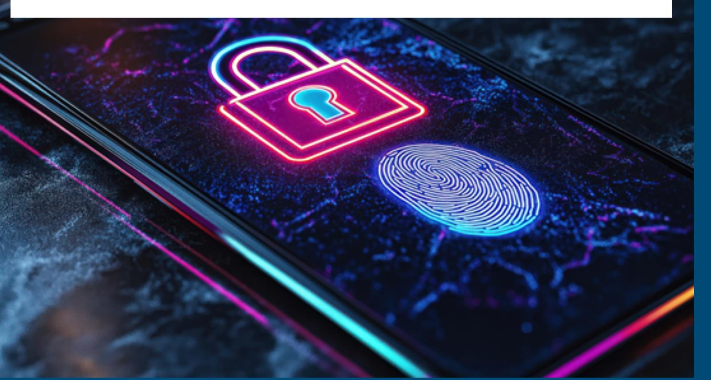
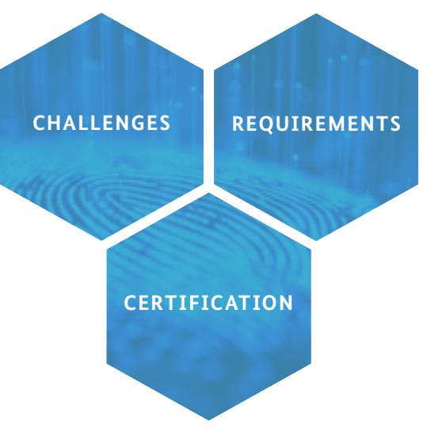
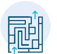
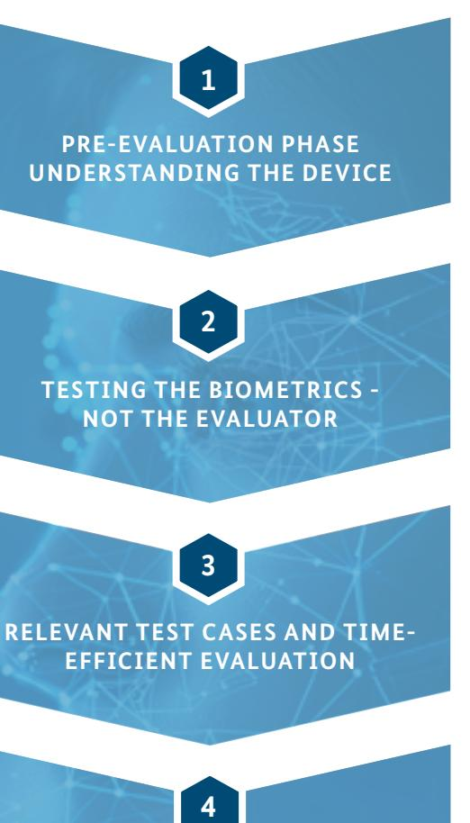

# *Certified Security for Biometric Devices*

### *Our vision:*

## *Biometrics as secure as a 6-digit PIN*

*Biometrics is by far the most popular method of authentication in numerous IT-security applications with rapidly increasing demands for security and reliability.*

*Compared to PINs, passwords or physical security tokens biometric authentication is fast and user friendly. But, is biometrics sufficiently secure?*

*To answer this question the BSI developed the Technical Guideline BSI TR-03166 for the certification of biometric device systems.*

*For security the customer wants and the application needs.*

### **Secure biometrics: A real challenge**

Biometric systems are integrated in nearly every current smartphone, for authentication purposes.

Security demanding applications need properly secure biometric solutions. How secure is your device?

There is often a competition between security measures vs. convenience and speed.

Assessing the security of biometric devices is challenging, including performance, presentation attacks and organisatorial measures.

Numerous different standards and nomenclatures make it difficult for manufacturers and users to keep track.

#### **Ingredients for a BSI Biometric Security Standard**

Based on existing standards and taking state-of-the-art attack vectors into account.

Focus on efficiency an reliability to make security evaluations as quick and comprehensive as possible.

Biometric assurance levels adressing performance and presentation attack detection for current applications.

Thinking multi-biometrics; for more security with existing devices, e.g. combining face and finger.

#### **Certified Biometric Security - Technical Guideline BSI TR-03166**

New certification framework based on eIDAS requirements with three security levels.

Comprehensive Evaluation Guidance balancing thoroughness and effort, featuring BSIs best practices.

Security assesment inspired by CC/CEM with smaller overhead for faster certification and recertification processes.

Adressing biometric performance, presentation attack detection and organisational measures.

**SECURE BIOMETRICS**

**METRICS MADE FOR RISK-ORIENTED SECURITY EVALUATIONS**

#### **Evaluation Process Testing for fast, usable and secure biometric devices**

**BSI TR-03166 compliance for trust in Biometrics**

#### *Impressum*

Federal Office for Information Security Postbox 20 03 63 53133 Bonn Tel.: 0800 274 1000 E-Mail: biometrie@bsi.bund.de www.bsi.bund.de

*Photo credit* Title: AdobeStock@Vadym; Page 1: GettyImages@ KTSDESIGN; Page 2: AdobeStock@Nelson *Status February* 2025

## *Technical Guideline for Biometric Devices*

Biometrics is a rapidly changing technology for applications with constantly rising security demands. To tackle these challenges, we continously improve our technical guideline to keep up with the latest developments.

For more details and newest updates scan the corresponding QR-Code to the BSI TR-03166. For further insights in our evaluation practices at the Biometric Evaluation Center (BEZ) visit the BEZ-QR-Code.

*BSI Technical Guideline TR-03166*

*Biometric Evaluation Center (BEZ)*

