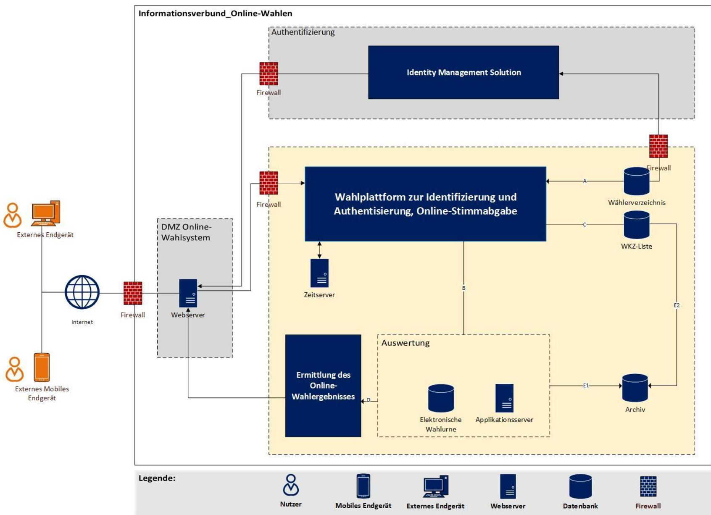
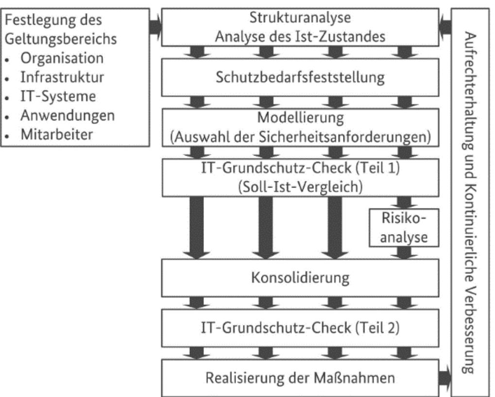
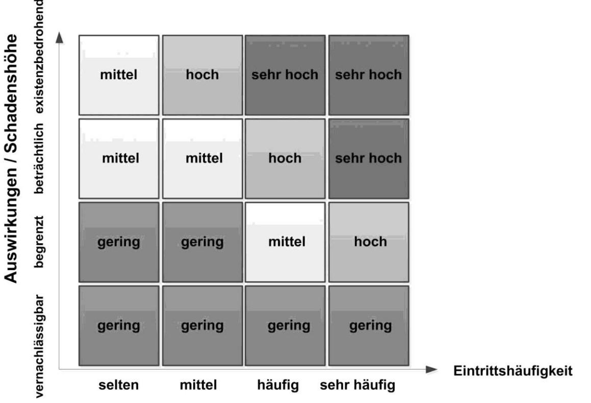

# Technische Richtlinie TR-03169

IT-sicherheitstechnische Anforderungen zur Durchführung von nichtpolitischen Online-Wahlen und -Abstimmungen

Version 1.0

# Änderungshistorie

| Version | Datum      | Name | Beschreibung                          |
|---------|------------|------|---------------------------------------|
| 0.6     | 08.12.2022 | BSI  | Entwurf                               |
| 0.7     | 31.03.2023 | BSI  | Erster veröffentlichter Entwurf |
| 1.0     | 19.09.2023 | BSI  | Redaktionelle Änderungen           |

Tabelle 1: Versionierung

#### Einleitung

Bundesamt für Sicherheit in der Informationstechnik Postfach 20 03 63 53133 Bonn Tel.: +49 22899 9582-0 abteilung-di@bsi.bund.de Internet: https://www.bsi.bund.de © Bundesamt für Sicherheit in der Informationstechnik 2020

| 1 |       | Einleitung 5                                   |  |
|---|-------|------------------------------------------------|--|
|   | 1.1   | Zielgruppe  5                                  |  |
|   | 1.2   | Geltungsbereich 6                              |  |
|   | 1.3   | Zielsetzung  6                                 |  |
|   | 1.4   | Formalia  6                                    |  |
| 2 |       | Regulatorisches und gesetzliches Umfeld  7     |  |
|   | 2.1   | Verschiedene Kontexte von Wahlen 7             |  |
|   | 2.2   | Angreifermodelle  8                            |  |
|   | 2.3   | Schutzbedarf 9                                 |  |
|   | 2.4   | Risiken 9                                      |  |
|   | 2.5   | Einordnung des Schutzprofils BSI-CC-PP-0121 11 |  |
| 3 |       | Online-Wahl 14                                 |  |
|   | 3.1   | Allgemeiner Ablauf einer Wahl14                |  |
|   | 3.2   | Vorbereitungsphase 15                          |  |
|   | 3.2.1 | Aspekte der Vorbereitungsphase15               |  |
|   | 3.2.2 | Anforderungen an die Vorbereitungsphase19      |  |
|   | 3.3   | Durchführungsphase25                           |  |
|   | 3.3.1 | Aspekte der Durchführungsphase 25              |  |
|   | 3.3.2 | Anforderungen an die Durchführungsphase 27     |  |
|   | 3.4   | Auswertungsphase27                             |  |
|   | 3.4.1 | Aspekte der Auswertungsphase 27                |  |
|   | 3.4.2 | Anforderungen an die Auswertungsphase28        |  |
|   | 3.5   | Nachbereitungsphase 29                         |  |
|   | 3.5.1 | Aspekte der Nachbereitungsphase29              |  |
|   | 3.5.2 | Anforderungen an die Nachbereitungsphase 29    |  |
| 4 |       | Schlusswort 30                                 |  |
| 5 |       | Anhang 31                                      |  |
|   | 5.1   | Umsetzungshinweise zum BSI IT-Grundschutz31    |  |
|   | 5.1.1 | Durchführung von BSI IT-Grundschutz32          |  |
|   | 5.1.2 | Notfallmanagement40                            |  |
| 6 |       | Glossar45                                      |  |

# 1 Einleitung

Die vorliegende Technische Richtlinie befasst sich mit der Umsetzung von nicht-politischen Online-Wahlen und Abstimmungen (siehe dazu auch Kapitel [1.2\)](#page-5-0). Bei einer Online-Wahl erfolgt die Stimmabgabe der Wahlberechtigten mittels elektronischer Eingabegeräte (z.B. Smartphone oder PC) über ein Rechnernetzwerk (z.B. Internet oder Intranet). Die Stimmen werden an ein Online-Wahlsystem geleitet und dort verarbeitet.

Grundsätzlich finden bei vielen Wahlen die fünf Wahlrechtsgrundsätze allgemein, unmittelbar, frei, gleich und geheim Anwendung. Neben den fünf Wahlrechtsgrundsätzen wird häufig noch von der Transparenz der Wahl gesprochen. Hierbei geht es darum, dass für einen Bürger die wesentlichen Schritte der Wahlhandlung und der Ergebnisermittlung zuverlässig und ohne besondere Sachkenntnis überprüfbar sein müssen (Bundesverfassungsgericht, 2009).

Die vorliegende Technische Richtlinie hat zum Ziel für Online-Wahlen und -Abstimmungen gleichermaßen zu gelten. Sie sagt jedoch nichts über die rechtliche Zulässigkeit der Durchführung von elektronischen Wahlen aus.

Die betroffenen Wahlrechtsgrundsätze können sich je nach Umstand und rechtlicher Grundlage unterscheiden. Durch Unterschiede in der Handhabung der Wahlgrundsätze zwischen Online-Wahlen und Online-Abstimmungen, kann es zu unterschiedlichen Anforderungen kommen. Generell gilt, dass die Umsetzung höherwertiger Anforderungen und Maßnahmen für Online-Wahlen auch die Absicherung von Online-Abstimmungen ermöglicht.

Für die Durchführung einer Online-Wahl empfehlen wir die Umsetzung von BSI IT-Grundschutz, zu der auch die Erstellung eines IT-Sicherheitskonzeptes gehört. Neben der eigentlichen Online-Wahl gehören auch technisch unterstützte vorgelagerte Prozesse der Wahlvorbereitung mit in das IT-Sicherheitskonzept, sofern diese im Verantwortungsbereich des Wahlvorstands liegen. Dies betrifft z.B. Vorschlagslisten, Wahlkalender, Stimmzettelerstellung, sowie Wählerverzeichnis und Wahlkennzeichen. Für diese Prozesse und die dort verarbeitenden Daten muss klar definiert sein, wer welche Rechte und Funktionen beim Zugriff auf diese Daten hat. Gibt es Schnittstellen über die für die Wahl relevante Inhalte z.B. im Rahmen der Wahlvorbereitung, in das Online-Wahlsystem übertragen werden, muss sowohl für diese Schnittstellen als auch für die angebundenen externen Systeme ein IT-Sicherheitskonzept nach BSI IT-Grundschutz vorliegen.

Alle Zielobjekte, die im Weiteren unter dem Informationsverbund für Online-Wahlen und -Abstimmungen erfasst werden, unterliegen ebenfalls dem IT-Grundschutz und seiner systematischen Methodik.

Das Online-Wahlsystem ist eine IT-Umgebung, die für die Durchführung einer Online-Wahl notwendig ist. Die detaillierten IT-Sicherheitsanforderungen an ein Online-Wahlprodukt werden im Schutzprofil CC-PP-0121 genannt. Es beinhaltet die notwendigen Daten und Anwendungen (wie die Wahlkennzeichen, das Wählerverzeichnis, das Wahlsystem, die elektronische Wahlurne, die elektronische Liste mit den Wahlkennzeichen, zu denen eine Online-Stimme abgegeben wurde. Darüber hinaus beinhaltet diese auch die Anwendungssoftware zur Einrichtung, Durchführung und Auswertung der Wahl und die Ermittlung des Online-Wahlergebnissessowie die dafür notwendigen IT-Systeme, Netze und Kommunikationsbeziehungen sowie Räume und Gebäude.

Die Wahlleitung wird angehalten, sich vor der Umsetzung einer Online-Wahl technischen Sachverstand hinzuzuziehen. Dies kann in einem Betrieb oder der Behörde der Informationssicherheitsbeauftragte sein.

### 1.1 Zielgruppe

Die TR richtet sich in erster Linie an den jeweiligen Wahlvorstand, bei einer durchzuführenden Online-Wahl. Das zugehörige Schutzprofil CC-PP-0121 adressiert Hersteller von Online-Wahlprodukten und enthalten Anforderungen an das eingesetzte Online-Wahlprodukt.

### 1.2 Geltungsbereich

Die vorliegende Technische Richtlinie adressiert geheime nicht-politische Online-Wahlen und - Abstimmungen.

Dazu gehört explizit die Wahl zur Gleichstellungsbeauftragten (gemäß § 19 Gleichstellungsbeauftragtenwahlverordnung). Weiterhin kann diese Technische Richtlinie auch für andere nicht-politische Online-Wahlen, wie Vereinswahlen oder nicht-politische Abstimmungen Anwendung finden.

Nicht betroffen sind politische Wahlen, wie Kommunal-, Landtags- oder Bundestagswahlen, politische Abstimmungen oder das Modellprojekt Online-Sozialwahl. Für letztere beinhaltet die BSI TR-03162 entsprechende IT-sicherheitstechnische Vorgaben.

Diese TR beinhaltet auch Umsetzungshinweise und vorlagen. Datenschutzrechtliche Anforderungen sind nicht Bestandteil der vorliegenden TR. Bei der Verarbeitung personenbezogener Daten sind die einschlägigen Bestimmungen zum Datenschutz (EU-DSGVO, BDSG) einzuhalten.

### 1.3 Zielsetzung

Um zu gewährleisten, dass sowohl die betroffenen Wahlrechtsgrundsätze als auch die Schutzziele Vertraulichkeit, Integrität und Verfügbarkeit ausreichend betrachtet und berücksichtigt werden, werden wir im Folgenden entsprechende Anforderungen an die Umsetzung einer Wahl formulieren, die diese Grundsätze und Ziele schützen.

### 1.4 Formalia

In der vorliegenden Technischen Richtlinie werden Anforderungen als Ausdruck normativer Festlegungen durch die in Großbuchstaben geschriebenen deutschen Schlüsselworte MUSS/MÜSSEN, DARF NICHT/DÜRFEN NICHT, DARF KEINE/DÜRFEN KEINE, SOLLTE/SOLLTEN, EMPFOHLEN, KANN/KÖNNEN, und OPTIONAL entsprechend gekennzeichnet.

| MUSS                  | Die Wahlleitung muss eine bestimmte Anforderung zwingend umsetzen.                                                                                                                                                                                                |
|-----------------------|-------------------------------------------------------------------------------------------------------------------------------------------------------------------------------------------------------------------------------------------------------------------|
| DARF NICHT/DARF KEINE | Die Wahlleitung muss dafür sorgen, dass eine bestimmte Eigenschaft unter keinen Umständen vorhanden ist.                                                                                                                                                       |
| SOLLTE                | Die Wahlleitung muss eine bestimmte Anforderung umsetzen, außer es wird dargelegt, dass durch ein Nicht-Umsetzen kein Risiko für den sicheren Betrieb besteht, bzw. eine Umsetzung, aufgrund von technischen Einschränkungen, derzeit nicht möglich ist. |
| KANN / OPTIONAL       | Eine Umsetzung kann eine bestimmte Anforderung erfüllen, wobei ein Umsetzen dieser Anforderung anzuzeigen ist.                                                                                                                                                 |

Die im Kapite[l 3](#page-13-0) beschriebenen Anforderungen werden nach Basisanforderungen (B) und Anforderungen für hohen Schutzbedarf (H) unterschieden und sind entsprechend Ihres Anforderungskürzels gekennzeichnet.

Diese Technische Richtlinie repräsentiert den Stand der Technik und wird fortlaufend aktualisiert.

# 2 Regulatorisches und gesetzliches Umfeld

Für alle Wahlen ist zu prüfen, welche gesetzlichen Anforderungen für die Durchführung einer Online-Wahl zum Einsatz kommen.

Neben gesetzlichen Vorgaben, durch z.B. eine Wahlverordnung und andere, muss man sich über den Kontext und mögliche Einflüsse auf die Wahl Gedanken machen.

### Wahl zur Gleichstellungsbeauftragten

Handelt es sich bei der durchzuführenden Online-Wahl um die Wahl zur Gleichstellungsbeauftragten in den Dienststellen des Bundes gelten die maßgeblichen regulatorischen Anforderungen:

- BSI IT-Grundschutz, 2020
- Art 38 GG i.V.m. Art. 20 Abs. 1 und 2 GG
- BGleiG Gesetz für die Gleichstellung von Frauen und Männern in der Bundesverwaltung und in den Gerichten des Bundes (Bundesgleichstellungsgesetz BGleiG)
- Gleichstellungsbeauftragtenwahlverordnung vom 17. Dezember 2015 (BGBl. I S. 2274), die durch Artikel 3 des Gesetzes vom 7. August 2021 (BGBl. I S. 3311) zuletzt geändert worden ist. Für die Online-Wahl ist insbesondere § 19 GleibWV maßgeblich.

Diese regulatorischen Anforderungen sind exemplarisch für eine Online-Wahl einer Gleichstellungsbeauftragten. Es gelten die regulatorischen Anforderungen gemäß der eigenen Wahlverordnung, sofern es diese gibt. Die hier aufgeführten regulatorischen Anforderungen können gegebenenfalls davon abweichen.

### 2.1 Verschiedene Kontexte von Wahlen

Es existieren unterschiedliche Abstimmungen und Wahlen. Beispielhaft seien genannt:

- Vereinswahlen
- Hauptversammlungen und General bzw. Vertreterversammlungen
- Gremienwahlen z.B. an Universitäten (Senat, Studierendenparlament, etc.)
- Sozialwahl
- Wahl von Vertretungen (Personal- oder Betriebsrat, Gleichstellungsbeauftragte, Schwerbehindertenvertretung, Jugend- und Auszubildendenvertretung, etc.)
- Politische Wahlen (Kommunalwahl, Landtagswahl, Bundestagswahl, Europawahl)

Durch unterschiedliche Abstimmungen und Wahlen ergeben sich unterschiedliche Wahlausrichter bzw Wahlverantwortliche:

- Vereine
- Institutionen und öffentliche Einrichtungen (z.B. Universitäten, Behörden, Kirchen)
- Unternehmen
- Kommune, Land, Bund

Ebenfalls kann sich der Kreis der Wählenden unterscheiden:

In der Regel werden diese Wahlen mit den jeweiligen Mitgliedern, Mitarbeitenden, Anteilseignern oder Bürgern durchgeführt.

### Abgrenzung

Im Fokus dieser Technischen Richtlinie, liegen geheime, nichtpolitische Wahlen und Abstimmungen (siehe dazu Kapitel [1.2\)](#page-5-0). Da die Anforderungen und Vorgehensweisen bei verschiedenen Abstimmungen und Wahlen stark voneinander abweichen können und hier auch für geheime Wahlen und Abstimmungen unterschiedliche Bedürfnisse zur Geltung kommen, wird sich die vorliegende TR im Folgenden auf Anforderungen und Hilfestellungen für die Umsetzung von geheimen Abstimmungen und Wahlen unter

Betrachtung unterschiedlicher Schutzbedarfe beschränken. Nicht betrachtet werden in dieser Technischen Richtlinie Öffentliche Abstimmungen und Live-Votings.

### 2.2 Angreifermodelle

Angreifer werden im Rahmen dieser Technischen Richtlinie nach Ursprung, Motivation und möglichem Vorwissen unterschieden.

### Externe Angreifer

Ein Externer Angreifer versucht ein System aus dem Internet anzugreifen. Dabei versucht er mögliche Sicherheitslücken auszunutzen, um beliebige Daten an die exponierten Systeme zu schicken, Zugriff auf deren Daten zu erhalten, deren Daten zu manipulieren oder die Verfügbarkeit des Systems zu stören.

### Interne Angreifer

Interne Angreifer haben dieselben Möglichkeiten wie externe Angreifer. Darüber hinaus haben Sie Zugriff auf das Interne Netzwerk eines Betreibers und ggf. auch auf besondere Kenntnisse oder Zugänge zu internen Systemen. Durch andere Einfallstore (z.B. infizierte Geräte), kann sich ein externer Angreifer ggf. Zugriff auf ein internes System verschaffen und damit unter Umständen auch auf die Möglichkeiten eines internen Angreifers. Unter interne Angreifer fallen auch böswillige Wahlberechtigte.

Zusätzlich zu der Aufteilung in externe und interne Angreifer können diese auch nach Ihren unterschiedlichen Zielen und Ihrem unterschiedlichen Vorwissen kategorisiert werden.

### Technikenthusiast

Ein Technikenthusiast ist ein weniger stark motivierter Angreifer mit begrenzter technischer Expertise auf dem Gebiet des Hackings und geringen finanziellen Mitteln. Darunter können auch Skripten und Anleitungen, um sich ein Grundwissen anzueignen, mit dem sie agieren können.

### Hacker

Dabei handelt es sich um motivierte Angreifer mit technischer Expertise auf dem Gebiet des Hackings, aber begrenzten Ressourcen, da für diesen Angreifer in der Regel die Kosten eines Angriffs im Verhältnis zu dessen Nutzen für ihn stehen müssen. Sie agieren häufiger mit einem konkreten Ziel/Motiv (z.B. Erpressung; im Kontext von Wahlen; ebenfalls denkbar wäre eine Manipulation der Wahlergebnisse oder eine Offenlegung der abgegebenen Stimmen). Im Gegensatz zum Technikenthusiast ist dieser Angreifer auch in der Lage Skripte und Exploits selbst zu schreiben oder vorhandene anzupassen.

### Staatlicher oder anderweitig unterstützter Akteur

Diese hochmotivierten Angreifer können sowohl auf exzellente Fachkenntnisse als auch auf umfangreiche finanzielle und technische Ressourcen zurückgreifen. Beispiele für diese Angreifer großen Konzerns. Für diese Art von Angreifer muss kein besonderes Kosten/Nutzen-Verhältnis gelten.

### 2.3 Schutzbedarf

Aus den vorangegangenen Überlegungen ergibt sich eine heterogene Mischung von Einflüssen. Akteure mit unterschiedlicher Motivation und Fähigkeit führen dazu, dass einheitliche Maßnahmen zur Absicherung aller Wahlen nicht ausreichend sind. Mit der Größe der Schadensauswirkungen, die beim Angriff auf eine Wahl eintreffen können, steigt die Motivation für mögliche Angreifer. Dementsprechend, kann davon ausgegangen werden, dass bei Wahlen mit besonders hoher Schadensauswirkung auch Angreifer mit größerer Motivation und entsprechend größerer fachlicher Expertise und mehr Ressourcen aktiv werden. Hieraus ergibt sich ein Zusammenhangzwischen Wahlen mit großer Schadensauswirkung, sprich hohem Schutzbedarf und den möglichen Angreifern für Wahlen aus dem Angreifermodell (siehe [2.2\)](#page-7-0). Es ist erforderlich dies bei der Bestimmung des Schutzbedarfes zur berücksichtigen, um die Wahl entsprechend abzusichern.

Im Rahmen der Umsetzung des IT-Grundschutz kann hier gezielt auf die Besonderheiten der jeweiligen Wahl eingegangen werden. Der Schutzbedarf nach IT-Grundschutz unterteilt sich in die Schutzbedarfe normal, hoch und sehr hoch, entsprechend der Schwere der Schadensauswirkungen, die im Rahmen der Schutzbedarfsfeststellung für die Zielobjekte ermittelt wurde. Im Anhang an diese Technische Richtlinie gibt es Hilfestellungen, Vorlagen und Beispiel zur Umsetzung von IT-Grundschutz.

Wenn Sie zu dem Ergebnis gekommen sind, dass Sie einen sehr hohen Schutzbedarf für die Durchführung Ihrer Online-Wahl haben, sollte in Erwägung gezogen werden, diese Wahl nicht online durchzuführen. Dies gilt insbesondere dann, wenn Sie als mögliche Angreifer staatlich oder anderweitig unterstützten Akteure (zum Beispiel Geheimdienste, aber auch Angreifer großen Konzerns) identifiziert haben. Können Sie auf die Online-Wahl nicht verzichten, sollten Sie sich an den Anforderungen für den hohen Schutzbedarf orientieren und zusätzliche Maßnahmen zur Absicherung der Wahl ergreifen, auf die hier nicht näher eingegangen werden kann.

Zusätzlich zur Schutzbedarfsfeststellung spielt es eine Rolle, ob es sich bei Ihnen als Wahlverantwortliche um eine Behörde handelt und/oder ob Sie gemäß der entsprechenden Verordnung verpflichtet sind, die Anforderungen aus dieser Technischen Richtlinie umzusetzen.

Handelt es sich bei Ihnen um ein Unternehmen, einen verpflichtet, die Anforderungen aus der vorliegenden Technischen Richtlinie umzusetzen, sind die vorliegenden Anforderungen und Hilfestellungen als Empfehlungen zu verstehen.

### 2.4 Risiken

Nach IT-Grundschutz wird eine Risikoanalyse immer dann vorgenommen, wenn:

- 
- wenn Zielobjekte nicht hinreichend durch die Bausteine aus dem IT-Grundschutz abgebildet werden können oder
- Zielobjekte in Einsatzszenarien betrieben werden, die der IT-Grundschutz nicht abdeckt

Da Online-Wahlen ein spezielles Einsatzszenario sind, für das kein eigener Baustein im IT-Grundschutz existiert, der es hinreichend beschreibt, empfehlen wir auf jeden Fall eine Risikoanalyse durchzuführen.

Dabei ist es wichtig die spezifischen Risiken für eine Online-Wahl zu betrachten, einzuschätzen und entsprechende Maßnahmen zu ergreifen. Da Online-Wahlen unter verschiedenen Bedingungen, in andersartigen Kontexten und mit unterschiedlichen Zielsetzungen durchgeführt werden können, muss die Risikoanalyse genauso wie der geeignete Umgang mit den Risiken im Kontext der jeweiligen Online-Wahl getroffen werden. Im Folgenden stellen wir deswegen eine Auflistung möglicher Risiken einer Online-Wahl zur Verfügung, mit der sich Wahlverantwortliche im Rahmen der Durchführung Ihrer Online-Wahl auseinandersetzen sollten:

|      | Risiken einer Online-Wahl                                                                                                                                                                                                                                                                                                                                                        |
|------|----------------------------------------------------------------------------------------------------------------------------------------------------------------------------------------------------------------------------------------------------------------------------------------------------------------------------------------------------------------------------------|
| 1    | Angriffe auf notwendige Daten des Wahlverfahrens                                                                                                                                                                                                                                                                                                                                 |
| 1.1  | Unberechtigtes Auslesen von Wählerverzeichnissen, Wahllisten, Berechtigungen                                                                                                                                                                                                                                                                                                     |
| 1.2  | Manipulation von Wählerverzeichnissen, Wahllisten, Berechtigungen                                                                                                                                                                                                                                                                                                                |
| 1.3  | Manipulation des Wahlzeitraums (Stimmabgabe nur im Wahlzeitraum möglich)                                                                                                                                                                                                                                                                                                         |
| 2    | Angriffe auf das Online-Wahlsystem                                                                                                                                                                                                                                                                                                                                               |
| 2.1  | Manipulation in der Entwicklung, Einrichtung und dem Betrieb des Online-Wahlsystems  Softwareentwicklung (Backdoors)  Manipulation von User Interfaces (Website Defacement)  Schadcode (Cross-Site-Skripting, Cross-Site-Request-Forgery, SQL Injection)                                                                                                    |
| 2.2  | Unberechtigte Stimmabgabe, z.B. durch Man-in-the-Middle Attacke, Malware oder mangelnde oder fehlende Authentifizierung der Wählenden                                                                                                                                                                                                                                         |
| 2.3  | Manipulation von (berechtigten) Stimmabgaben (Schnittstellen, Versand/Kommunikation, manipulierte Formulare, Änderung/Löschung/Hinzufügung gespeicherter Stimmen/Wählen im Namen Dritter)  Clash-Attacken  Ballot Stuffing (es gibt mehr abgegebene Stimmen als Wahlberechtigte)  Manipulierte oder fehlerhafte Endgeräte  Fehlerhafter Server |
| 2.4  | Manipulation von Ergebnissen/Ergebnislisten (Extrahieren, Versand)                                                                                                                                                                                                                                                                                                               |
| 2.5  | Einbruch in das Wahlsystem  Unberechtigter Zugriff auf das Online-Wahlsystem z. B. durch eine schwache Authentifizierung  Interne Angreifer                                                                                                                                                                                                                        |
| 2.6  | Angriff auf die Verfügbarkeit des Online-Wahlsystems  DDoS Attacken  Interne Angreifer                                                                                                                                                                                                                                                                             |
| 2.7  | Angriff auf Vertraulichkeit der Online-Stimme  Italienische Angriffe  Seitenkanalangriffe  Mangelhafte oder fehlende Verschlüsselung  Vote copying  Manipulierte Endgeräte                                                                                                                                                                    |
| 2.8  | Beeinflussung von verantwortlichen Personen  Manipulation von Schlüsselpersonen (Funktionsposten) durch Social Engineering  Erpressung oder Bestechung von Admins, sodass diese zu Innentätern werden                                                                                                                                                              |
| 2.9  | Beeinflussung der Wahlberechtigten  Social Engineering, Erpressung zur Abgabe eines bestimmten Votums                                                                                                                                                                                                                                                                     |
| 2.10 | Angriff auf die Wahlberechtigten  Phishing                                                                                                                                                                                                                                                                                                                                |

#### Tabelle 2: Risiken

Auf [www.bsi.bund.de](http://www.bsi.bund.de/) gibt es Hilfestellungen, Vorlagen und Beispiel zur Umsetzung von IT-Grundschutz, unter anderem auch zur Durchführung einer Risikoanalyse für Online-Wahlen.

## 2.5 Einordnung des Schutzprofils BSI-CC-PP-0121

Bei der Auswahl einer Anwendung zur Einrichtung, Durchführung und Auswertung einer Online-Wahl kann auf ein nach Common Criteria (CC) zertifiziertes Produkt zurückgegriffen werden. Hierbei muss allerdings beachtet werden, dass die Zertifizierung konkrete Anforderungen an ein Produkt stellt, die ggf. nur die Bedürfnisse einiger bestimmter Wahlen widerspiegeln.

Das Schutzprofil (engl. Protection Profile; PP) BSI-CC-PP-0121 betrachtet Online-Wahlen mit einem hohen Schutzbedarf gemäß BSI IT-Grundschutz. In diesem Kontext definiert es Sicherheitsanforderungen, die ein Online-Wahl-Produkt erfüllen muss, damit es nach diesem PP zertifiziert werden kann. Die Erfüllung der Sicherheitsanforderungen wird in einer Evaluierung überprüft, sodass das entsprechende Produkt nach dem Common-Criteria-Standard zertifiziert werden kann.

Für die Abwägung der Wahlrechtsgrundsätze geheim, frei und öffentlich, wird im Rahmen des PP von einer Einschätzung ausgegangen, bei der alle drei betroffenen Wahlrechtsgrundsätze möglichst gleichmäßig gewichtet werden. Es werden Funktionalitäten und Anforderungen vorgesehen, die beispielsweise zur Erpressungsresistenz beitragen sollen, gleichermaßen werden Maßnahmen für die Umsetzung von Ende-zu-Ende-Verifizierbarkeit gefordert, die die Transparenz und damit den Öffentlichkeitsgrundsatz in einer Wahl adressieren.

Da das Schutzprofil ausschließlich die Sicherheitsanforderungen an ein Online-Wahl-Produkt definiert, werden Briefwahlen oder Online-Wahlen in Kombination mit Briefwahlen, nicht explizit adressiert. Unter Abwägung der Risiken, gibt die Modellierung des Online-Wahl-Produkts vor, dass die per Online-Wahl abgegebene Stimme Vorrang gegenüber einer per Brief-Wahl abgegebenen Stimme hat. Das heißt, dass im Falle einer Stimmabgabe eines Wählers sowohl über das Online-Wahlsystem und als auch per Briefwahl, die Stimme aus dem Online-Wahlsystem gewertet werden muss, und die Stimme, die per Briefwahl eingegangen ist, nicht mit in die Auswertung einbezogen werden darf.

Das Schutzprofil stellt Anforderungen an die Umsetzung kryptographischer Wahlverfahren durch ein Online-Wahl-Produkt. Dazu werden im Schutzprofil konkrete Anforderungen für die Umsetzung von Online-Wahlverfahren unter Nutzung von Mix-Nets oder homomorpher Verschlüsselung zum Schutz der Online-Stimmen formuliert. Dies adressiert insbesondere die Wahlrechtsgrundsätze geheim und frei, sowie das Schutzziel der Vertraulichkeit.

Die Sicherheitsanforderungen des Schutzprofils werden anhand sogenannter SFRs (Security Functional Requirements) umgesetzt und lassen sich in folgenden Themen gliedern:

Zugriffskontrolle:

Das Schutzprofil verlangt, dass Ressourcen und Interaktionsmöglichkeiten mit dem zu zertifizierenden Produkt durch eine Zugriffskontrolle geschützt sein müssen. In Abhängigkeit von Wahlphasen, Nutzerrollen und dem internen Zustand lässt das Produkt den Zugriff auf Ressourcen und Funktionen zu oder verwehrt ihn.

- Datenimport und -export: Das Produkt muss vor Wahlbeginn einen Import von wahlbezogenen Konfigurationsdaten ermöglichen. Zudem müssen nach der Stimmauszählung sämtliche wahlrelevanten Daten kryptografisch gesichert exportierbar sein, um eine eigenständige Veröffentlichung der Daten außerhalb des Produkts zu ermöglichen. Dies dient auch der Möglichkeit einer unabhängigen Verifizierbarkeit der Wahl.
- Sichere Kommunikationskanäle: Sämtliche Kommunikationskanäle des Produkts müssen nach den Vorgaben der TR-02102-2 mittels TLS abgesichert sein.
- Gesicherte Verarbeitung und Verifizierung von wahlbezogenen Daten: Das Schutzprofil verlangt, dass alle wahlbezogenen Daten (inklusive der abgegebenen Stimmen) auf eine im Schutzprofil definierte Art und Weise verarbeitet werden, sodass es den Wählenden ermöglicht wird, im Sinne einer Ende-zu-Ende-Verifizierbarkeit die Berücksichtigung ihrer

abgegebenen Stimme zu verifizieren. Das Schutzprofil macht keine spezifischen Vorgaben dazu, wie die Verifizierbarkeit umgesetzt werden muss, da sich zum aktuellen Zeitpunkt noch keine klar zu präferierende Variante herauskristallisiert hat.

- Stimmauszählung: Das Produkt muss die Stimmauszählung gemäß einem importierbaren Wahlregelsatz ermöglichen. Zugleich verlangt das Schutzprofil, das die wahlbezogenen Daten integritätsgeschützt verarbeitet und gespeichert werden.
- Log-Daten-Generierung: Sämtliche wahlbezogenen Vorgänge müssen vom Produkt auf nachvollziehbare und integritätsgeschützte Weise protokolliert werden, sodass administratives Personal jederzeit über den internen Zustand des Produkts informiert ist. Dies umfasst auch die Erkennung von Fehlerzuständen.
- Nutzeridentifikation und -authentisierung: Das Schutzprofil verlangt, dass ein zu zertifizierendes Produkt administratives Personal, Wahlvorstände und Wählende identifizieren und authentisieren muss, bevor diese in Interaktion mit dem Wahlprodukt treten. Die Wahl der Authentifizierungsmethode lässt das Schutzprofil offen.
- Für die Wahl der Identifizierungs- und Authentifizierungsmechanismen SOLLTEN die Vorgaben der Technischen Richtlinie 03107- trauensniveau an dem Schutzbedarf der Wahl auszurichten. Dabei werden die Vertrauensniveaus in der TR-03107-1 wie folgt zugeordnet:
	- o normal: Die Schadensauswirkungen bei einer Kompromittierung sind begrenzt und überschaubar. Dieses Vertrauensniveau entspricht in etwa dem Sicherheitsniveau normal gemäß IT-Grundschutz [BSI 200-2].
	- o substantiell: Die Schadensauswirkungen bei einer Kompromittierung sind substantiell. Dieses Vertrauensniveau liegt zwischen den Sicherheitsniveaus normal und hoch gemäß IT-Grundschutz [BSI 200-2].
	- o hoch: Die Schadensauswirkungen bei einer Kompromittierung können beträchtlich sein. Dieses Vertrauensniveau entspricht in etwa dem Sicherheitsniveau hoch gemäß IT Grundschutz [BSI 200-2].

Für ein hohes Vertrauensniveau sollte bspw. die Online-Ausweisfunktion des deutschen Personalausweises genutzt werden.

### Die Annahmen des Schutzprofils BSI-CC-PP-0121

Das Schutzprofil beinhaltet Annahmen, die erfüllt sein müssen, damit das Online-Wahlprodukt eine sichere Online-Wahl durchführen kann (Siehe Kapitel 3.4 Assumptions im BSI-CC-PP-0121).

Beobachtung

Der Wähler kann seine Stimme unbeobachtet abgeben. Der Wahlveranstalter ist dafür verantwortlich, dem Wähler angemessene Anweisungen für die unbeobachtete Stimmabgabe zu geben.

A.AuthData

Die Nutzer des EVG haben alle für die Durchführung der Wahl erforderlichen Daten, insbesondere die Identifikationsdaten und die Authentifizierungsdaten, erhalten. Die Nutzer geben sie nicht an andere Personen weiter.

A.TerminalDevice

Für die Sicherung des Endgerätes ist der Wähler verantwortlich. Es wird davon ausgegangen, dass der Abstimmungsvorgang durch das Endgerät nicht beobachtet oder beeinflusst wird. Dazu gehört, dass der Wähler sein Endgerät nicht vorsätzlich zu solchen Zwecken manipuliert. Das Endgerät ist in der Lage, den Stimmzettel korrekt anzuzeigen, die Eingaben des Wählers korrekt und verschlüsselt an den EVG zu übermitteln und Daten zu löschen, die nach der Wahlaktion Rückschlüsse auf die abgegebene Stimme zulassen. Mithilfe der verwendeten Endgeräte können Nutzer die Echtheit des EVG überprüfen. Jeder Wahlberechtigte verfügt über ein Endgerät, das die oben genannten Eigenschaften erfüllt.

Hinweis 1: Aufgrund des Wahlprinzips kann es erforderlich sein, dass der Stimmzettel barrierefrei präsentiert wird. A.TerminalDevice geht davon aus, dass das Endgerät in solchen Fällen in der Lage ist, den Stimmzettel barrierefrei anzuzeigen.

Ein Netzwerk

Der Schutz der Server, auf denen der EVG läuft, wird durch die Implementierung eines Sicherheitskonzepts für die Netzwerkverbindung gewährleistet. Darüber hinaus ist eine ausreichende Dienstqualität und Verfügbarkeit des Netzes gewährleistet.

Ein Server

Die Server, auf denen der EVG läuft, sind frei von schädlicher Software, die die Sicherheitsfunktionen des EVG beeinträchtigen könnte. Die gesamte Software auf den Servern ist vertrauenswürdig und wurde ordnungsgemäß installiert und aktualisiert. Unberechtigte Zugriffe auf TOE-Funktionen, - Prozesse und -Daten werden durch die Sicherheitsmechanismen der Server verhindert. Darüber hinaus sind die Server vor unbefugtem physischem Zugriff und physischer Manipulation geschützt.

A.AuthServer

Abhängig von der Konfiguration des Endgeräts überprüft der Benutzer oder das Endgerät im Namen des Benutzers, ob das Endgerät mit dem richtigen EVG kommuniziert, bevor er mit dem EVG interagiert.

Sollte keine nach dem Schutzprofil BSI-CC-PP-0121 zertifizierte Anwendung zur Durchführung einer Wahl genutzt werden, aber eine Anwendung eingesetzt werden, die für die Umsetzung eines kryptographischen Wahlverfahrens Mix-Nets oder homomorphe Verschlüsselung nutzt, dann können die entsprechenden Anforderungen der SFRs aus Kapitel 6.1 des Schutzprofils übernommen werden. Diese sollten dann dem Anbieter vorgelegt und von diesem die Einhaltung der SFRs bestätigt werden. Da dies auf den eigenen Aussagen des Anbieters beruht, bietet dies jedoch nicht so viel Sicherheit wie der Einsatz eines zertifizierten Produktes.

# 3 Online-Wahl

Die im Folgenden beschriebenen Anforderungen werden nach Basisanforderungen (B) und Anforderungen für hohen Schutzbedarf (H) unterschieden und sind entsprechend Ihres Anforderungskürzels gekennzeichnet. Für die Einordnung des eigenen Bedarfs siehe Kapite[l 2.3](#page-8-0)

### 3.1 Allgemeiner Ablauf einer Wahl

Eine Online-Wahl bedarf einer gründlichen Vorbereitung, Durchführung, Auswertung sowie einer abgesicherten Archivierung im Anschluss der Wahl, um die Überprüfbarkeit der Integrität sicherzustellen. Grundsätzlich gliedert sich eine Online-Wahl in folgende vier Phasen:

- 1. Vorbereitungsphase
- 2. Durchführungsphase
- 3. Auswertungsphase
- 4. Nachbereitungsphase

Zur Wahl berechtigte Wähler können in einem Online-Wählerverzeichnis (OWV) mit einem Wahlkennzeichen (WKZ) gelistet werden. Ein solches WKZ sollte einmalig, eindeutig, alphanumerisch und zufällig generiert werden. Sie gelten als Pseudonyme für die Wahlberechtigten, so dass eine Verarbeitung der personenbezogenen Daten wie Name und Vorname minimiert wird und nur für die Identifikation genutzt wird. Wahlkennzeichen sind eine häufig genutzte mögliche Umsetzung für die Identifikation von Wählern. Der Wähler greift mithilfe seines Endgerätes auf das Online-Wahlsystem zu und kann nach erfolgreicher Authentifizierung seine Stimme als Online-Stimme abgeben. Im Anschluss wird die Stimme in der elektronischen Wahlurne gespeicherten, bevor die Auswertung der Stimmen vollzogen wird. Das Online-Wahlsystem wertet die Wahl aus und stellt die Wahlergebnisse bereit.

Hierzu sind verschiedene Aspekte und Anforderungen an die Organisation zu beachten. Im Zentrum dieser allgemeinen Anforderungen steht die Erstellung eines IT-Sicherheitskonzepts nach BSI IT-Grundschutz. Im Anhang wird der IT-Grundschutz im Detail näher erläutert.

Insgesamt wird für eine Online-Wahl ein Online-Wahlsystem mit Komponenten wie Wählerverzeichnis, Wählerkennzeichen, Wählerkennzeichen-Liste, elektronische Wahlurne, Archiv sowie weitere unterstützende Server benötigt. Dabei ist die Bedeutung des Online-Wahlsystems entscheidend. Anwendungsbestandteile, die Teil des Online-Wahlproduktes sind, können im Rahmen der Produktabnahme beim Dienstleister bzw. Hersteller durch eine Produktzertifizierung gemäß CC-PP-0121 geprüft werden (sieh[e 2.5\)](#page-10-0).

Aufgrund dessen, dass der Client des Wählers nicht Teil des Informationsverbundes Onlinewahl ist, kann diese Technische Richtlinie keine Vorgaben hinsichtlich des Clients machen. Jedoch sollten die Wahlvorstand im Rahmen einer Risikoanalyse den Schadcodebefall seitens des Clients mitbewerten. Dazu gehört auch eine Betrachtung anwendungsseitiger Maßnahme, wie beispielsweise die Nutzung eines zweiten Devices für die Prüfung der Ende-zu-Ende Verifizierbarkeit, bei der Auswahl eines Online-Wahlprodukts. Daneben sollten Wahlberechtigte für die Teilnahme an einer Online-Wahl sensibilisiert werden. Dies kann z.B. durch die Aushändigung der Empfehlungen des BSI zur Absicherung des lokalen Rechners (Installation einer Firewall, eines Virenscanners usw.) mit den Wahlunterlagen und einen Hinweis auf die Sensibilität der Wahlunterlagen geschehen.

Zudem müssen die Sicherheitsanforderungen, die an das Online-Wahlsystem gestellt werden, auf ihre Benutzbarkeit und Barrierefreiheit geprüft werden, sodass sichergestellt ist, dass das Online-Wahlsystem für jeden Wähler bedienbar ist.

### 3.2 Vorbereitungsphase

### 3.2.1 Aspekte der Vorbereitungsphase

Für die Durchführung einer Online-Wahl sind neben der Selektion und Konfiguration des Online-Wahlsystems viele weitere Maßnahmen und Prozesse für die Online-Wahl vorzubereiten. Zum Teil unterstützt das Online-Wahlsystem Aufgaben der Vorbereitung, während andere Aufgaben dagegen vollständig außerhalb und ohne Unterstützung des Systems durchgeführt werden. Zur Vorbereitung einer Wahl gehören zum Beispiel:

- Festlegen der relevanten Termine für den Wahlzeitraum
- Vorbereiten oder Erstellen der Wahlkennzeichen bzw. eines Wählerverzeichnisses
- Überprüfung des Online-Wahlsystems
- Ermitteln der Wahlkandidaten
- Erstellen der Wahllisten
- Vorbereiten oder Erstellen eines Stimmzettels für die Wahl
- Erstellung eines Löschkonzeptes

#### Erfassung der Wähler

Ein wichtiger Aspekt der Vorbereitungsphase ist, dass die Nutzer eindeutig identifiziert werden. Aus diesem Grund muss das Vertrauensniveau zur Identifizierung der mit dem Online-Wahlsystem interagierenden Personen mit dem ermittelten Schutzbedarf korrespondieren. Soweit gesetzlich nicht anders vorgegeben, muss mindestens ein NORMALES Vertrauensniveau nach der Technischen Richtlinie TR-03107 (BSI TR-03107-1, 2019) angenommen werden. Für eine angemessene Identifizierung des Nutzers empfehlen wir jedoch mindestens ein SUBSTANZIELLES Vertrauensniveau (BSI TR-03107-1, 2019). Der elektronische Identitätsnachweis kann unter Verwendung des deutschen Personalausweises gemäß (PAuswG, 2009), des elektronischen Aufenthaltstitels gemäß (AufenthG, 2020) oder der eID-Karte gemäß (eIDKG, 2019) zur elektronischen Identifizierung durchgeführt werden. Damit wird ein hohes Vertrauensniveau erreicht. Dabei muss die Identifizierung der Nutzer nicht Teil des Online-Wahlsystems sein. Daher ist dies nicht Teil der Zertifizierung nach CC-PP-0121 (siehe dazu auch Kapitel [2.5\)](#page-10-0).

Wenn die Daten des OWV und die WKZ nicht im Online-Wahlsystem selbst gepflegt werden, müssen diese in das Online-Wahlsystem übertragen werden. Für Abstimmungen oder Wahlen in kleinerem Umfang kann ggf. ein Wahlverzeichnis oder eine Liste der Teilnehmer der Abstimmung im Online-Wahlsystem selbst erstellt und gepflegt werden. In anderen Fällen wird das Wählerverzeichnis aber nicht im Online-Wahlsystem erzeugt, sondern aus einem anderen Register heraus erstellt und in das Online-Wahlsystem übertragen. In beiden Fällen gelten die gleichen Anforderungen an Vertraulichkeit, Integrität und Verfügbarkeit der Daten. Abbildung 1 zeigt beispielhaft, wie die Kommunikationswege innerhalb des Online-Wahlsystems aussehen könnten. In Fall einer Erstellung außerhalb und einer Übertragung in das Online-Wahlsystem sollte das Online-Wählerverzeichnis nach der Erstellung durch eine entsprechend nach dem im Rechte- und Rollenkonzept festgelegten Rolle beim Wahlvorstand qualifiziert elektronisch signiert und mit einem qualifizierten Zeitstempel versehen werden. Zusätzlich muss vor dem Versand des Wählerverzeichnisses Online eine geeignete Inhaltsverschlüsselung nach (BSI TR-02102-1) erfolgen. Dies bietet einen zusätzlichen Schutz des WVOs gegen unberechtigte Kenntnisnahme.

Im Folgenden soll eine detaillierte Sicht auf die Anwendungsbestandteile und die Kommunikationswege geworfen werden, welche die wesentlichen Geschäftsprozesse einer Online-Wahl abbilden und unabhängig von der Art der Online-Wahl und dem eingesetzten Online-Wahlprodukt sind. Anwendungsbestandteile, die Teil des Online-Wahlproduktes sind, können im Rahmen der Produktabnahme beim Dienstleister bzw. Hersteller durch eine Produktzertifizierung gemäß CC-PP-0121 geprüft werden.

#### Abnahmekriterien für die Auswahl und Beschaffung des Online-Wahlsystems

Ein Abnahmeplan kann bei der Auswahl und Beschaffung des Online-Wahlsystems helfen und sollte vorab durch den Wahlvorstand erstellt werden. Dieser Abnahmeplan sollte folgende Aspekte beinhalten:

- Testarten
- Testfälle
- Erwartete Ergebnisse
- Freigabekriterien
- Vorgehensweise bei Ablehnung der Freigabe

Hinsichtlich der Abnahme des ISMS und Sicherheitskonzept empfehlen wir generell die Zertifizierung eines ISMS und eines IT-Sicherheitskonzepts nach ISO 27001 auf Basis von IT-Grundschutz. Wenn keine Zertifizierung angestrebt wird, muss ein IS-Revisionsverfahren etabliert werden, bei dem regelmäßig und mindestens alle drei Jahre eine IS-Revision durchgeführt wird. Dabei muss der Leitfaden zur Informationssicherheitsrevision des BSI (BSI Leitfaden IS-Revision, 2018) beachtet werden.

Das Online-Wahlsystem muss durch geeignete IS-Penetrationstests und IS-Webchecks1 hinreichend auf Schwachstellen getestet werden. Dabei wird überprüft, ob das im Sicherheitskonzept vorgegebene Sicherheitsniveau auch tatsächlich erreicht und gehalten wird. Hierfür bietet es sich an, ein Penetrationstest-Konzept zu erstellen welches den BSI-Empfehlungen zu Penetrationstests (BSI-Studie "Durchführungskonzept für Penetrationstests", 2020) folgt. Es bleibt zu beachten, dass die Tests durch das BSI oder von einem BSI IT-Dienstleister2 durchgeführt werden müssen.

1 Weitere Informationen sind auf der BSI Website zu finden, https://www.bsi.bund.de/DE/Themen/Cyber-Sicherheit/Dienstleistungen/ISPentest\_ISWebcheck/ispentest\_iswebcheck\_node.html

2 Eine aktuelle Auflistung zertifizierter IT-Sicherheitsdienstleister in den Geltungsbereichen IS-Revision und IS-Penetrationstests finden sich auf der BSI Website, siehe https://www.bsi.bund.de/DE/Themen/ZertifizierungundAnerkennung/Stellen/IS\_REV\_PEN/IS\_REV\_D ienstleister/IS\_REV\_Dienstleister\_node.html

#### Online-Wahl

Abbildung 1 Beispielhafter Kommunikationsplan

### Überprüfung des Online-Wahlsystems

Wenn bei der Überprüfung des Online-Wahlsystems Fehler auffallen, kann es notwendig sein, bestimmte Schritte der Vorbereitung zu wiederholen oder aufwändige Analysen zu betreiben, um die Fehlerursache zu finden und zu beheben. Hierzu wird empfohlen alle Schritte der Vorarbeiten mit ausreichend Vorlaufzeit einzuplanen, damit es bei Problemen in der Abnahme nicht zu Verzögerungen im Ablauf der Wahl kommt und sich diese verzögert.

#### Integrität- und Authentizitätsüberprüfung des OWVs

Um die Manipulationssicherheit des OWVs zu garantieren, sind die elektronische Signatur und der Zeitstempel des OWVs bei Überführung in das Online-Wahlsystem zu validieren. Dazu sind die öffentlichen Schlüssel der Wahlvorstand vor Einbindung des OWV sicher in das Online-Wahlsystem zu importieren. Dabei sind die jeweiligen Vorschriften der Kommunikationsübertragung zu berücksichtigen.

Dabei darf das OWV lediglich zur Integration des OWV in das Online-Wahlsystem entschlüsselt werden. Der Zeitpunkt der Entschlüsselung muss dabei erfasst und dokumentiert werden. Ein Rechte- und Rollenkonzept regelt die Verantwortlichkeiten für die Kryptographie und die Besitzer des privaten Schlüssels unter einem 4-Augen-Prinzip.

Weiterhin muss das Rechte- und Rollenkonzept regeln, wer für die Eintragung und Pflege der Daten von Wahlberechtigten in das Wählerverzeichnis des Online-Wahlsystems verantwortlich ist. Dies gilt nur für den Fall, dass das Wählerverzeichnis direkt im Online-Wahlsystem erstellt wurde. Wurde das Wählerverzeichnis dagegen abschließend erstellt und bearbeitet, so muss es für die weitere Bearbeitung gesperrt werden.

#### Verfügbarkeitsüberprüfung des Online-Wahlsystems

Die Anforderung an die Verfügbarkeit eines Online-Wahlsystems richtet sich nach dem festgelegten Schutzbedarf. Die konkreten Anforderungen müssen mithilfe von Service-Level-Agreements (SLA) mit dem Online-Dienstleister vorab vertraglich definiert werden. Es muss insbesondere darauf geachtet werden, dass die Anforderungen von Notfall- und Sicherheitsmanagement in den Verträgen berücksichtigt werden. Beispiele für zu treffende Vereinbarungen sind z.B.: Berichtspflichten des Dienstleisters, Reaktions- und Erreichbarkeitszeiten ggf. bis zu 24/7, etc.

Um die Verfügbarkeit des Online-Wahlsystems zu gewährleisten,sollten die IT-Systeme redundant ausgelegt werden. Sollte es zu einem Ausfall eines IT-Systems kommen, so kann ein anderes IT-System die Aufgaben übernehmen und die Fortführung der Wahl sicherstellen.

#### Monitoring des Online-Wahlsystems

Das Online-Wahlsystem sollte dauerhaft überwacht werden, um potenzielle Cyber-Angriffe zu erkennen und im Anschluss entsprechende Maßnahmen einleiten zu können. Diese Maßnahmen sollten im Vorfeld definiert, dokumentiert und umgesetzt werden, um beispielsweise DDoS-Angriffe zu verhindern oder abschwächen. Dabei ist darauf zu achten, dass die Überwachung des Servers nicht zu einer Beeinträchtigung des Wahlgeheimnisses führen kann.

#### Verifizierbarkeit des Wahlergebnisses

Es muss die Möglichkeit gegeben werden, das Wahlergebnis nachvollziehen zu können. Hierbei werden folgende Ausprägungen der Verifizierbarkeit betrachtet:

- 1. Der Wähler kann nachvollziehen, dass seine Stimme korrekt in die Wahlurne eingegangen ist (individuelle Verifizierbarkeit).
- 2. Jeder kann nachvollziehen, dass alle Stimmen korrekt zum Wahlergebnis zusammengerechnet wurden (universelle Verifizierbarkeit).
- 3. Es soll möglich sein, dass jeder feststellen kann, dass alle Stimmen von berechtigten Wählern abgegeben wurden. (Verifizierbarkeit der Berechtigung).

Alle Punkte zusammen werden auch als Ende-zu-Ende Verifizierbarkeit bezeichnet.

Das Ziel der Verifizierbarkeit ist es dem Wähler die eigene Beteiligung an der Wahl und für jeden das Zustandekommen des Wahlergebnisses nachvollziehbar machen zu können. Zusätzlich gibt die Verifizierbarkeit den Wählern die Möglichkeit, Vertrauen in die Verarbeitung von Online-Stimmen bis hin zur Auszahlung des Wahlergebnisses zu gewinnen.

Mithilfe eines Nachweises zur Verifikation kann sichergestellt werden, dass Stimmen korrekt übertragen, aufgezeichnet und/oder gezählt wurden. Damit kann jeder überprüfen, ob das ermittelte Ergebnis korrekt die verschlüsselten Stimmen wiedergibt und ob die eigene Stimme korrekt abgespeichert wurde. Konkret können vom eigentlichen Abstimmungssystem unabhängige Tools die Ergebnisse überprüfen, ohne die Vertraulichkeit der individuellen Stimmabgabe aufzuheben. Bei der Prüfung der Korrektheit der eigenen Stimme kann - je nach angewendetem Verfahren die Möglichkeit genutzt werden, um gegenüber Dritten das Abstimmungsergebnis für die eigene Stimme nachzuweisen. Entsprechend müssen der für die Wahl ermittelte Schutzbedarf sowie die Ausprägungen der Wahlrechtsgrundsätze beachtet werden.

Maßnahmen der Ende-zu-Ende-Verifizierbarkeit spiegeln sich im eingesetzten Online-Wahlprodukt wieder. Informationen dazu, wie dies im PP umgesetzt ist finden sich in Kapite[l 2.5.](#page-10-0)

### Planung und Durchführung von Notfallübungen

Zur Sicherstellung eines geeigneten Notfallmanagements sollten vor der Durchführung einer Online-Wahl mindestens die folgenden Tests und Übungen aus dem Notfallmanagement durchgeführt werden:

- Tests der technischen Vorsorgemaßnahmen
- Funktionstests
- Simulation von Szenarien

Damit werden unter anderem technische Vorsorgemaßnahmen, Sofortmaßnahmen, Wiederanlaufpläne, sowie die Kommunikation aller Beteiligten im Rahmen von Alarmierung und Krisenarbeit ausreichend getestet.

### Sicherstellung der Mandantenfähigkeit

Die Mandantenfähigkeit beschreibt die Umsetzung des Mandantentrennungskonzepts zur getrennten Speicherung und Verarbeitung der Daten der einzelnen Mandanten, so dass nur der Mandant selbst sowie ausgewählte Personen Zugriff auf die Daten haben. Dies erfordert, dass mandantenabhängige und mandantenübergreifende Daten und Objekte initial getrennt werden. Für die Umsetzung dieser Mandantenfähigkeit des Online-Wahlsystems gibt es entsprechende Maßnahmen aus dem IT-Grundschutz zur Umsetzung. Der Mandantentrennung muss gemäß des durch den vom Wahlvorstand bestimmten Schutzbedarfs eine angemessene Sicherheit geboten werden.

#### Prüfung und Freigabe des Online-Wahlsystems durch den Wahlvorstand

Das Online-Wahlsystem muss Mechanismen umsetzen, welche dem Wahlausschuss ermöglichen, die Einhaltung der spezifischen Vorgaben und Besonderheiten nach dem Einrichten des Online-Wahlsystems zu überprüfen und zu protokollieren.

Der Freigabeprozess sollte organisatorisch ein 4-Augen-Prinzip vorsehen. Nach der Freigabe müssen die freigegebenen Elemente vor unbefugten Veränderungen geschützt werden, um Manipulationen auszuschließen und die Integrität sicherzustellen.

### 3.2.2 Anforderungen an die Vorbereitungsphase

- ALL.1.H Die Einhaltung der relevanten Wahlgrundsätze bei vorbereitenden Maßnahmen außerhalb des Online-Wahlsystems MUSS, unabhängig davon, ob diese in anderen Systemen oder in Papierform vorgenommen werden, abgesichert und kontrolliert werden.
- ALL.2.H Im Rechte- und Rollenkonzept MUSS festgelegt werden, welche Rolle innerhalb der Wahlvorstand für die Durchführung und Umsetzung des Abnahmeplans sowie für die Freigabe

zuständig ist. Für die Ergebnisse der Prüfung müssen Prüf- und Ergebnisprotokolle erstellt werden.

- ALL.3.B Bei Abstimmungen SOLLTEN sämtliche interne sowie externe Bedingungen, wie der rechtliche Rahmen, im Vorfeld festgelegt und für alle sichtbar dokumentiert werden. Ist für den Zeitraum einer Abstimmung eine feste Zeit vorgesehen, SOLLTE dieser exakt im Sinne eines Countdowns ermittelt werden.
- AUTH.1 Für die Wahl der Identifizierungs- und Authentifizierungsmechanismen SOLLTEN die Vorgaben der Technischen Richtlinie 03107- Vertrauensdienste im E- t werden. Wir empfehlen das gewählte Vertrauensniveau an dem Schutzbedarf der Wahl auszurichten.
- ISMS.1.1.B Ein IT-Sicherheitskonzept für den Geltungsbereich der Online-Wahl SOLLTE für ein vollständiges und zertifiziertes Informationssicherheitsmanagementsystem auf Basis von BSI IT-Grundschutz (BSI IT-Grundschutz, 2020) erstellt werden.
- ISMS 1.2.B Im IT-Sicherheitskonzept SOLLTEN sämtliche Schnittstellen betrachtet werden. Dies gilt für Schnittstellen zur manuellen Datenübertragung genauso wie für automatisierte Übertragung von Daten zwischen Systemen. Werden interne Prozesse und Aufgaben (z.B. Betrieb) durch einen Dienstleister wahrgenommen, dann SOLLTE sichergestellt werden, dass auch der Dienstleister BSI IT-Grundschutz oder ISO 27001 umgesetzt hat. Der Dienstleister kann die Umsetzung durch eine entsprechende Zertifizierung nachweisen.
- ISMS 1.3.B Es SOLLTE ein IT-Sicherheitskonzept nach BSI IT-Grundschutz für externe Systeme, welche für die Wahl relevante Inhalte sind, vorliegen oder vom Anbietenden eingefordert werden. Darüber hinaus SOLLTEN Prozesse zur Wahlvorbereitung, sofern diese im Verantwortungsbereich des Wahlvorstands liegen, mit in das IT-Sicherheitskonzept aufgenommen werden.
- ISMS.2.B Es SOLLTE eine Informationssicherheitsleitlinie gemäß der Anforderung des IT-Grundschutz Bausteins ISMS.1.A3 erstellt werden, die die wesentlichen Inhalte der Sicherheitsstrategie wiedergibt.
- ISMS.3.B Der Geltungsbereich der Wahl SOLLTE in der Leitlinie definiert sein.
- ISMS.4.B Der Geltungsbereich des ISMS SOLLTE alle Zielobjekte des Informationsverbundes für die Online-Wahlen und -Abstimmungen, wie in dieser Technischen Richtlinie betrachtet und vom Wahlvorstand identifizierten IT-Systeme (SYS), Netze und Kommunikation (NET) sowie Räume und Gebäude (INF), welche für den Betrieb der Anwendungen zu Grunde liegen, umfassen. Sind Prozessverantwortlicher und Betreiber unterschiedlich, bspw. aufgrund des Einsatzes eines Dienstleisters, SOLLTE auch der Dienstleister ein IT-Sicherheitskonzept im Rahmen des ISMS nach BSI IT-Grundschutz oder nach DIN ISO/IEC 27001 umsetzen. Zusätzlich SOLLTEN Geeignete Rollen- und Rechtekonzepte erstellt werden.
- ISMS.5.B Die Zuständigkeiten für den Informationssicherheitsprozess SOLLTEN definiert sein
- ISMS.6.H Falls externe Systeme im Informationsverbund Verwendung finden, MUSS im eigenen Konzept auf die konkreten IT-Sicherheitskonzepte der externen Systeme verwiesen werden.
- LOG.1.H Der Ablauf der Online-Wahl MUSS protokolliert werden. Dabei MUSS der Mindeststandard des BSI zur Protokollierung und Detektion von Cyberangriffen (BSI Mindeststandard, 2018) umgesetzt werden.
- PET.1.H Das Online-Wahlsystem MUSS durch geeignete IS-Penetrationstests und IS-Webchecks auf Schwachstellen getestet werden, ob das im Sicherheitskonzept vorgegebene Sicherheitsniveau auch tatsächlich erreicht und gehalten wird.
- PET.2.B Es SOLLTE ein Penetrationstest-Konzept erstellt werden. Dabei MÜSSEN die BSI-Empfehlungen zu Penetrationstests (BSI-Studie "Durchführungskonzept für Penetrationstests", 2020; BSI-Studie "Durchführungskonzept für Penetrationstests", 2020) umgesetzt werden. Im Penetrationstest-Konzept SOLLTEN neben den zu verwendenden Testmethoden auch die Erfolgskriterien dokumentiert werden. Der Penetrationstest SOLLTE nach den Rahmenbedingungen des Penetrationstest-Konzepts erfolgen. Die durch den Penetrationstest aufgefundenen Sicherheitslücken SOLLTEN klassifiziert und dokumentiert werden.
- PET.3.H Die Penetrationstests MÜSSEN durch das BSI oder einen vom BSI zertifizierten IT-Dienstleister durchgeführt werden. Vor der Freigabe des Online-Wahlsystems MÜSSEN die aus den Penetrations- und Webtests entstandenen Maßnahmen umgesetzt werden und die Penetrations- und Webtests DÜRFEN KEINE gravierenden Auffälligkeiten enthalten. Können nicht alle Schwachstellen beseitigt werden, MUSS in einer Risikoanalyse das Restrisiko dokumentiert werden.
- NFM.1.1.B Das Notfallmanagement SOLLTE nach dem BSI Standard 200-4 (BSI Notfallmanagement, 2023) umgesetzt werden.
- NFM.1.2.B Der Geltungsbereich für das IT-Sicherheitskonzept zu Online-Wahlen SOLLTE für das Notfallmanagement übernommen werden. Falls in der Organisation bereits ein Notfallmanagement existiert, SOLLTE dieses um die kritischen Geschäftsprozesse der Online-Wahl erweitert werden.
- NFM.1.3.B Es SOLLTE eine Leitlinie für das Notfallmanagement erstellt werden.
- NFM.1.4.B Die Rollen und Zuständigkeiten für den Notfallmanagement-Prozess SOLLTE definiert sein. Bei der Besetzung der Funktionen des Notfallmanagements SOLLTEN die besonderen Anforderungen bezüglich der Behandlung von Notfällen berücksichtigt und das Personal geeignet ausgewählt werden.
- NFM.1.5.H Im Rahmen des Notfallmanagements MUSS u. a. Notfallvorsorgekonzept, Notfall-, Wiederanlauf- und Wiederherstellungspläne erstellt
- NFM.1.6.B Ein Notfallhandbuch mit Szenarien und entsprechenden Sofortmaßnahmen SOLLTE erstellt werden.
- NFM.1.7.B Die besonderen Aspekte des Notfallmanagements SOLLTEN bei der Planung zukünftiger und vorhandener Outsourcing-Projekte sowie bei der Vertragsgestaltung berücksichtigt werden. Gleichwohl SOLLTEN ausgelagerte Geschäftsprozesse bzw. Teilprozesse an Dritte bei der Konzeption des Notfallmanagements berücksichtigt werden.
- NFM.1.8.B Es SOLLTE für alle kritischen Geschäftsprozesse, für die eine Risikoanalyse durchgeführt werden soll, auch Gefährdungen im Sinne des Notfallmanagements betrachtet wurden, um die Notfallvorsoge entsprechend zu gestalten.
- NFM.1.9.B Maßnahmen aus dem Notfallvorsorgekonzept SOLLTEN geplant und umgesetzt werden, um die wahldurchführende Organisation sowie die Mitarbeitenden auf eine Not- oder Krisensituation vorzubereiten.
- NFM.1.10.B Die Arbeit des Krisenstabs während der Notfall- oder Krisenbewältigung SOLLTE revisionssicher in einem Einsatztagebuch dokumentiert werden.
- NFM.1.11.B Für die Planung und Vorbereitung von Tests und Übungen SOLLTEN entsprechende Tests und Übungsdokumentationen erstellt werden.
- NFM.1.12.B Es SOLLTEN für alle Bereiche des Notfallmanagements Tests geplant und in regelmäßig wiederholt werden. Entsprechende gesetzliche Vorgaben für die Durchführung regelmäßiger Tests und Übungen MÜSSEN beachtet werden.
- NFM.1.13.B Notfallvorsorgemaßnahmen und -management SOLLEN regelmäßig auf ihre Wirksamkeit und Aktualität untersucht und ggf. angepasst werden. Werden im Rahmen der regelmäßigen Überprüfung Mängel oder Verbesserungspotential festgestellten, SOLLTEN die Maßnahmen oder Prozesse dahingehend angepasst werden.
- NFM.2.B In einer Business Impact Analyse (BIA) SOLLTEN mindestens die Geschäftsprozess zur Durchführung einer Online-Wahl mit allen seinen Teilprozessen betrachtet werden, um als Grundlage eines Notfallkonzeptes zu dienen.
- NFM.3.B Zur Sicherstellung eines geeigneten Notfallmanagements SOLLTE vor Durchführung einer Online-Wahl mindestens die folgenden Tests und Übungen aus dem Notfallmanagement durchgeführt werden:
	- Tests der technischen Vorsorgemaßnahmen
	- Funktionstests
	- Simulation von Szenarien

Damit werden unter anderem technische Vorsorgemaßnahmen, Sofortmaßnahmen, Wiederanlaufpläne, sowie die Kommunikation aller Beteiligten im Rahmen von Alarmierung und Krisenarbeit ausreichend getestet.

- NFM.4.B Die Folgen für den Fall, dass die Daten des Online-Wahlsystems abgeflossen sind und infolgedessen Verbindungen zwischen Wählern und Ihren abgegeben Online-Stimmen hergestellt werden können, MÜSSEN vor der Wahl abgeschätzt und bewertet werden. Dies kann im Rahmen der Risikoanalyse oder einer Datenschutzfolgeabschätzung erfolgen.
- WSW.1.B Für Online-Wahlen oder -Abstimmungen SOLLTE durch die (Wahl-)Leitung eine geeignete Anwendung ausgewählt und eingesetzt werden. Sind die Anforderungen der (Wahl-)Leitung deckungsgleich mit denen des CC-PP-0121, SOLLTE auf eine zertifizierte Anwendung zurückgegriffen werden.
- WSW.2.H Der eigenverantwortliche Betrieb eines Online-Wahlproduktes SOLL bei Online-Wahlen, die Bei Einsatz eines Online-Wahlsystems als verteiltes System ist zu berücksichtigen, dass diese durch verschiedene Betreiber gehostet werden SOLLTEN.
- WSW.3.B Bei Nutzung einer externen Betriebsdienstleistung oder einer Cloudlösung durch einen oder mehrere Anbieter SOLLTE dies spätestens in der Risikoanalyse gesondert sowie besonders betrachtet werden. Dazu SOLLTEN folgende Leitfragen beantwortet werden:
	- Wird die Anwendung in einer geteilten oder einer kundeneigenen Umgebung bzw. Infrastruktur betrieben.
	- Wie wird die Anbindung der Anwendung an die gewünschten Netze (z.B. Intranet der Organisation) umgesetzt.
- Wo stehen die für die Anwendung genutzten Server (Welche Rechtsvorschriften gelten? Europäisches Recht?).
- Gibt es begründete Bedenken bezüglich des Datenschutzes an dem Standort des Rechenzentrums oder gegen den Betreiber (Gilt die DSGVO?).
- Handelt es sich um die Umsetzung über verteilte Systeme, wobei ich durch die Aufteilung der Geheimnisse ein höheres Maß an Sicherheit erreichen kann.
- WSW.4.B Bei der Auswahl und Beschaffung des Online-Wahlsystems SOLLTE durch den Wahlvorstand ein Abnahmeplan erstellt werden. In einem Abnahmeplan SOLLTEN die durchzuführenden Testarten, Testfälle und die erwarteten Ergebnisse dokumentiert sein. Außerdem SOLLTE der Abnahmeplan die Freigabekriterien beinhalten. Es SOLLTE eine Vorgehensweise für die Situation festgelegt werden, wenn eine Freigabe abgelehnt wird.
- WSW.5.B Die Verfügbarkeit des Online-Wahlsystems richtet sich nach dem festgelegten Schutzbedarf. Konkrete Anforderungen hinsichtlich der Verfügbarkeit SOLLTEN mit dem Online-Dienstleister über den Abschluss von Service-Level-Agreements (SLA) definiert werden. Es SOLLTE darauf geachtet werden, dass die Anforderungen von Notfall- und Sicherheitsmanagement in den Verträgen berücksichtigt werden (Siehe NFM.1.6).
- WSW.6.B Um die Verfügbarkeit des Online-Wahlsystems zu gewährleisten, SOLLTE dieses redundant ausgelegt werden. Aus diesem Grund SOLLTE ein Redundanzkonzept erstellt werden, um die Redundanz von IT-Systemen und Anwendungen bei einem Ausfall ausreichend zu gewährleisten. Hierbei SOLLTE auch die Internetanbindung des Webservers und weiterer IT-Systeme, wie etwa der Webanwendungsserver redundant ausgelegt werden.
- WSW.7.B Das Online-Wahlsystem SOLLTE ständig überwacht werden. Des Weiteren SOLLTEN Maßnahmen definiert, dokumentiert und umgesetzt werden, die DDoS-Angriffe verhindern oder die Auswirkungen abschwächen (Siehe SYS.1.1.A23). Dabei ist darauf zu achten, dass die Überwachung des Servers nicht zu einer Beeinträchtigung des Wahlgeheimnisses führen kann.
- WSW.8.B Die Konfiguration des Online-Wahlsystems MUSS freigegeben werden. Dabei sind die wesentlichen Einstellungen in Bezug auf die Wahldurchführung zu dokumentieren, wie z.B. der eingerichtete Wahlzeitraum und die im System konfigurierten Regeln und Bedingungen der Online-Stimmabgabe. Die freigegebenen Elemente MÜSSEN nach der Freigabe vor unbefugten Veränderungen geschützt werden. Außerdem SOLLTE der Freigabeprozess organisatorisch nach dem 4-Augen-Prinzip durchgeführt werden, um Manipulationen auszuschließen. Die freigegebene Konfiguration des Online-Wahlsystems SOLLTE durch den Wahlvorstand qualifiziert elektronisch signiert und mit einem qualifizierten Zeitstempel versehen werden. Damit wird eine unbemerkte Veränderung des Systems nach der Freigabe ausgeschlossen. Die Zuständigkeiten für die Freigabe MÜSSEN im Vorfeld im Rechte- und Rollenkonzept festgelegt werden.
- IAM.1.B Das Vertrauensniveau zur Identifizierung der Nutzer SOLLTE mit dem ermittelten Schutzbedarf korrespondieren. Soweit gesetzlich nichts anderes vorgegeben ist, MUSS mindestens ein NORMALES Vertrauensniveau nach der BSI Technischen Richtlinie TR-03107 (BSI TR-03107-1, 2019) erreicht werden. Für eine angemessene Identifizierung des Nutzers empfehlen wird jedoch mindestens ein SUBSTANZIELLES Vertrauensniveau(BSI TR-03107-1, 2019) anzuwenden ( ). Dieses Identifizierungsverfahren SOLLTE nach den Vorgaben für das entsprechende Vertrauensniveau gemäß (BSI TR-03107- 1, 2019) durch das BSI bewertet sein und dieses Vertrauensniveau nachweisbar erreichen.
- IAM.2.B Das Verfahren zur elektronischen Identifizierung SOLLTE insbesondere die Anforderungen gemäß (BSI TR-03107 und gemäß (BSI TR-03107- Authentisierung während der Anmeldung des Nutzers am Online-Wahlsystem erfüllen.
- IAM.3.H Für ein hohes Vertrauensniveau MUSS der elektronische Identitätsnachweis unter Verwendung des deutschen Personalausweises gemäß PAuswG (2009), der elektronischen Aufenthaltstitels gemäß AufenthG (2020) oder der eID-Karte gemäß eIDKG (2019) für die Identifikation eingesetzt werden.
- IAM.4.B Für vorgelagerte und außerhalb des Online-Wahlsystems verarbeitete Prozesse und die dort verarbeitenden Daten SOLLTE im Rechte- und Rollenkonzept klar definiert sein, wer welche Rechte und Funktionen beim Zugriff und der Verarbeitung dieser Daten hat.
- IAM.5.B Eingesetzte Signaturen, Siegel und Zeitstempel sowie deren Validierung SOLLTEN die Anforderungen an qualifizierten Signaturen, Siegel und Zeitstempel der eIDAS Verordnung (EU eIDAS Verordnung 910/2014, 2014) erfüllen. Dazu KANN die BSI Leitlinie für digitale Signatur-/ Siegel-, Zeitstempelformate (BSI, Leitlinie, 2020) umgesetzt werden.
- IAM.6.B Der Zeitstempel SOLLTE auf einer korrekten Zeitquelle, die mit der koordinierten Weltzeit verknüpft ist, beruhen. Ein qualifizierter elektronischer Zeitstempel verknüpft Datum und Zeit mit den Daten sodass die Möglichkeit der unbemerkten Veränderung der Daten nach vernünftigem Ermessen ausgeschlossen ist.
- IAM.7.B Gemäß den Anforderungen nach (BSI TR-03107-1, 2019) gegenüber dem Online-Wahlsystem auf dem Ver einen Diebstahl durch das Versenden des OWV an einen gefälschten Empfänger zu vermeiden, SOLLTE auch die Identität des Online-Wahlsystems gegenüber der entsprechenden Stelle, auf en.
- IAM.8.H Vor dem Versand des Wählerverzeichnisses Online SOLLTE eine geeignete Inhaltsverschlüsselung nach (BSI TR-02102-1) erfolgen. Damit wird das Online-Wählerverzeichnis gegen unberechtigte Kenntnisnahme auf dem Transportweg geschützt. Die Entschlüsselung des OWV SOLLTE nur zur Integration des OWV in das Online-Wahlsystem erfolgen. Der Zeitpunkt SOLLTE dabei dokumentiert werden.
- IAM.9.B In einem Rechte- und Rollenkonzept SOLLTE geregelt werden, wer für die Verschlüsselung und Entschlüsselung des Wählerverzeichnisses Online zuständig und somit im Besitz des privaten Schlüssels ist. Hierbei SOLLTE das 4-Augen-Prinzip Anwendung finden.
- IAM.10.B Bei der direkten Erstellung des Wählverzeichnisses im Online-Wahlsystem SOLLTE in einem Rechte- und Rollenkonzept geregelt werden, wer für die Eintragung und Pflege der Daten von Wahlberechtigten in das Wählerverzeichnis des Online-Wahlsystems verantwortlich ist. Bei der Erstellung SOLLTE das 4-Augen-Prinzip Anwendung finden. Wurde das Wählerverzeichnis abschließend erstellt und bearbeitet, SOLLTE es für die weitere Bearbeitung gesperrt werden.
- IAM.11.B Das Online-Wählerverzeichnis SOLLTE nach der Erstellung, unabhängig davon ob außerhalb oder im Online-Wahlsystem, durch eine entsprechend nach dem im Rechte- und Rollenkonzept festgelegten Rolle beim Wahlvorstand qualifiziert elektronisch signiert und mit einem qualifizierten Zeitstempel versehen werden.
- KRY.1.B Es MÜSSEN Verfahren implementiert werden, um die Kommunikationswege und deren Integrität und Vertraulichkeit bei der Übertragung von Daten in das Online-Wahlsystem zu sichern. Für die Transportabsicherung sind die Vorgaben gemäß (BSI TR-03116-4, 2023) erfüllt werden.
- KRY.2.B Die inhaltliche Absicherung der Daten, die in das Online-Wahlsystem übertragen werden sollen (z.B. OWV oder Stimmzettel), MUSS mithilfe eines kryptographischen Verfahrens erfolgen. Für Verschlüsselung, Signatur und Zeitstempel MÜSSEN aktuelle kryptographische Methoden gemäß der BSI TR-02102-1 (BSI TR-02102-1) eingesetzt werden
- KRY.3.B Für die Inhaltsverschlüsselung MÜSSEN sichere Verfahren für den Schlüsselaustausch genutzt werden.
- KRY.4.B Ein unbefugter Zugriff auf geheimes Schlüsselmaterial MUSS sowohl technisch als auch organisatorisch verhindert werden. Dabei MUSS sichergestellt werden, dass es vor missbräuchlicher Nutzung und Manipulation geschützt ist. Zur sicheren Schlüsselspeicherung SOLLTE die Verwendung entsprechend zertifizierter Hardware (Chipkarte, HSM) gewährleistet sein. Ein Kopierschutz SOLLTE sichergestellt sein.
- KRY.5.B Es SOLLTE sichergestellt werden, dass ein Schlüsselrückruf (Revocation) für die Schlüssel möglich ist. Im Falle eines Schlüsselrückrufs SOLLTE sichergestellt werden, dass die direkten Kommunikationspartner unverzüglich darüber informiert werden. Ebenso SOLLTEN die Anforderungen gemäß der (BSI Key Lifecycle Security Requirements, 2018) umgesetzt werden.

### 3.3 Durchführungsphase

### 3.3.1 Aspekte der Durchführungsphase

Im Prozess der Wahlhandlung und der Interaktion mit dem Online-Wahlsystem wird im Folgenden zwischen -

Ein Nutzer ist eine Person, die sich im Prozess der Identifizierung und Authentisierung am Online-Wahlsystem befindet.

Ein Wahlberechtigter ist eine Person, die nach dem Prozess der Identifizierung und Authentisierung durch das Online-Wahlsystem als berechtigter Wähler bestätigt wurde. Dabei ist es unbedeutend, ob der Wähler bereits sein Wählervotum abgegeben hat oder nicht.

### Nutzungsumgebung der Organisation

Wird ein Online-Wahlsystem/-produkt im Arbeitgeberumfeld angeboten und kann diese dort genutzt werden, dann ist der Arbeitsplatz in einem IT-Sicherheitskonzept modellierbar. Der Arbeitsplatz muss dann entweder im Informationsverbund zur Online-Wahl oder in einem übergeordneten Informationsverbund der Organisation modelliert sein. Dafür werden im BSI IT-Grundschutz diverse Bausteine für Clientgeräte angeboten (SYS.2.1 SYS.3.2.4 (BSI IT-Grundschutz, 2021)). Nähere Informationen zum IT-Grundschutz befinden sich im Kapite[l 5.](#page-30-0)

### Nutzungsumgebung im privaten Umfeld

Das BSI gibt für Bürger Empfehlungen zur Absicherung des lokalen Rechners heraus (https://www.bsi.bund.de). Diese Empfehlungen umfassen unter anderem:

- Installation von Firewall, Virenscanner und aller Sicherheitsupdates
- Abschalten aktiver Inhalte im Browser soweit möglich
- Abschalten über die Sitzungsdauer hinaus persistenter Cookies im Browser

Diese Auflistung ist nicht umfassend, es gilt der jeweils aktuelle Stand nach [https://www.bsi.bund.de.](https://www.bsi.bund.de/) Diese Empfehlungen sollten dem Wahlberechtigten mit den Wahlunterlagen zur Verfügung gestellt werden, sodass dieser für den Umgang mit den Wahlunterlagen und die Teilnahme an der Online-Wahl sensibilisiert wird.

Aufgrund dessen, dass der Client des Wählers nicht Teil des Informationsverbundes Onlinewahl sein kann, kann diese Technische Richtlinie keine Vorgaben machen. Jedoch sollten die Wahlvorstand im Rahmen einer Risikoanalyse den Schadcodebefall seitens des Clients mitbewerten und bei der Auswahl eines Online-Wahlprodukts anwendungsseitige Maßnahmen, wie beispielsweise die Nutzung eines zweiten Devices für die Prüfung der Ende-zu-Ende Verifizierbarkeit, berücksichtigen. Zudem müssen die Sicherheitsanforderungen, die an das Online-Wahlsystem gestellt werden, auf ihre Benutzbarkeit und Barrierefreiheit geprüft werden, sodass sichergestellt ist, dass das Online-Wahlsystem für jeden Wähler bedienbar ist.

### Stimmabgabe per Online-Wahl

Es gibt unterschiedliche Schwierigkeiten die während des Wahlzeitraums, insbesondere in Zusammenhang mit der Abgabe der Online-Stimme auftreten könnten. Mögliche Probleme, die in Zusammenhang mit der Online-Wahl während oder nach dem Wahlzeitraum auftreten können, sind unter anderem:

- Das Online-Wahlsystem oder ein Bestandteil des Online-Wahlsystems ist nicht verfügbar
- Fehler auf Online-Stimmzettel, im OWV oder bei den WKZ werden erst während des Wahlvorgangs gefunden
- Die Vertraulichkeit von Online-Stimmen vor Ablauf der Wahlfristen ist beeinträchtigt
- Die Integrität der Online-Stimmen oder des Online-Wahlverzeichnisses ist beeinträchtigt
- Mögliche Zuordnung zwischen Identitäten und Online-Stimmen kann hergestellt werden

Grundsätzlich sollten bei Verfügbarkeitsproblemen die Sofortmaßnahmen und das Notfall- und Krisenmanagement greifen. Ist das Online-Wahlsystem dennoch nicht verfügbar, dann sollte dieses Problem im Zusammenhang mit dem gewählten Wahlzeitraum und den Gegebenheiten des Ausfalls betrachtet werden. Bei einem großzügig gewählten Wahlzeitraum von z.B. mehreren Wochen und einer verhältnismäßig zum Wahlzeitraum kurzzeitigen Nicht-Verfügbarkeit von z.B. 15 Minuten kurz nach Beginn des Wahlzeitraums, also zu einem vergleichbar weniger kritischen Zeitpunkt, kann dieser Ausfall ggf. ohne weitere Maßnahmen hingenommen werden. Ist das Online-Wahlsystem aber z.B. bei einem Wahlzeitraum von ein Tag, kurz vor Ende der Wahl für 1-2 Stunden nicht-verfügbar, dann sollten Maßnahmen zum Ausgleich erwogen werden. Dies könnte eine Verlängerung des Wahlzeitraums um eine angemessene Zusatzzeit sein, wobei die Bereitstellung der Information gegenüber dem Wähler bei diesem Zeitraum zu berücksichtigen ist, oder im schlimmsten Fall eine Wiederholung der Wahl.

Werden während des Wahlzeitraums noch Fehler auf dem Online-Stimmzettel oder im OWV bzw. bei den WKZ entdeckt, dann sind die abgegebenen Online-Stimmen ggf. nicht gültig und/oder nicht vollständig. In diesem Fall sind die Beeinträchtigungen der Wahl durch den Wahlvorstand zu beurteilen und entsprechende Maßnahmen zu ergreifen. Ein Fehler im Online-Stimmzettel, der z.B. weiterhin die gültige Auszählung der Stimmen erlaubt kann ggf. ignoriert werden, ansonsten ist die Wahl mit dem korrigierten Stimmzettel bzw. den korrigierten Registern zu wiederholen.

Bei unberechtigten Zugriffen auf Online-Stimmen ist zu prüfen, ob diese trotz der vorgesehenen Verschlüsselung unberechtigt gelesen oder manipuliert werden konnten (z.B., weil das Schlüsselmaterial kompromittiert ist). Diese Bewertung muss im Einzelfall erfolgen. Kann ein Angriff auf die Integrität und damit eine Manipulation der Stimmen ausgeschlossen werden, muss im Folgenden eine Einschätzung der Auswirkungen erfolgen. Dabei sind die Auswirkungen durch den Verlust der Vertraulichkeit der Online-Stimmen vor Auszählung und den entsprechenden Handlungsmaßnahmen abzuschätzen. Wenn eine Beeinträchtigung der Integrität von Online-Stimmen festgestellt wird, dann sind abgegebene Stimmen manipuliert worden. Dieser Fall ist zusätzlich auch für das OWV relevant, da hier ggf. die Daten von Wählern verändert oder das OWV und die WKZ erweitert wurden, um z.B. weitere, unberechtigte Online-Stimmen abgeben zu können. Jede Manipulation an Online-Stimmen, OWV oder WKZ sorgt dafür, dass die Wahlergebnisse ungültig werden. In diesem Fall muss der Wahlvorgang abgebrochen und das Online-Wahlsystem auf den Ursprung der Manipulationen hin untersucht werden. Die Wahl muss anschließend entweder nach abschließender Behebung gefundener Sicherheitslücken und vollständiger Kontrolle des Online-Wahlsystems oder über alternative Wege erneut durchgeführt werden.

Bei einer geheimen Wahl ist sicherzustellen, dass die Zuordnung einer Online-Stimme zu einem Wähler nicht vorgenommen werden. Aufgrund der Sicherstellung der Vertraulichkeitsollte es nicht möglich sein, dass eine Verbindung zwischen den Identitäten der Wähler und deren Stimmen herzustellen ist.

### 3.3.2 Anforderungen an die Durchführungsphase

- WSW.9.H Die Integrität eines freigegebenen Online-Stimmzettels MUSS durch eine qualifizierte Signatur sowie einen qualifizierten Zeitstempel durch eine entsprechend nach dem im Rechteund Rollenkonzept festgelegten Rolle beim Wahlvorstand abgesichert sein.
- WSW.10.H Wenn es im Rahmen einer Wahl zu mehreren Wahlgängen kommt, KÖNNEN Wählerverzeichnis-Online und Wahlkennzeichen oder andere Identifizierungsmittel auch für neue Wahlgänge verwendet werden. Für die erneute Verwendung MÜSSEN folgende Aspekte berücksichtigt werden:
	- Es DARF KEINEN Bezug zwischen den WKZ oder anderen Identifizierungsmitteln und bereits abgegebenen Online-Stimmen geben.
	- Die Elektronische Wahlurne und die Elektronische Liste mit Wahlkennzeichen MÜSSEN leer sein.
	- Jeder Wahlgang MUSS systemseitig voneinander getrennt sein
	- Die Daten des neuen Wahlvorgangs (z.B. Online-Stimmzettel, OWV, WKZ, etc.) MÜSSEN vor Beginn des nächsten Wahlgangs kontrolliert und für den Wahlgang freigegeben werden.
- WSW.11.B Um dem Nutzer Wahlfreiheit des eingesetzten lokalen Endgeräts zu geben und im Falle von Sicherheitswarnungen für bestimmte Systeme Alternativen zu bieten. SOLLTEN Technologien nach dem Stand der Technik bevorzugt werden, die mit möglichst vielen Betriebssystemen und Browsern zusammenarbeiten.
- WSW.12.B Bei der Arbeit an besonders sensiblen Systemen SOLLTE bei der Personalauswahl besonders auf die Vertrauenswürdigkeit des ausführenden Personals geachtet werden. Davon ist insbesondere auch die Administration von Datenbanken betroffen, da hier üblicherweise alle Daten eines Systems persistiert werden.
- WSW.13.H Wenn das Wahlsystem in einem Not- oder Krisenfall trotz Notfall- und Krisenmanagements nicht verfügbar ist, MÜSSEN die Auswirkung und Tolerierbarkeit auf den Wahlvorgang- und Zeitraum analysiert werden. Sollte die anzuwendende Verordnung nicht anwendbar sein, MUSS dies durch den Wahlvorstand bewertet werden
- WSW.14.B Wenn Fehler während des Wahlzeitraums auf dem Online-Stimmzettel oder im OWV bzw. bei den WKZ oder anderen Identifizierungsmitteln entdeckt werden, SOLLTE die Beeinträchtigung der Wahl hinsichtlich der Ungültigkeit oder Unvollständigkeit der Online-Stimmen durch den Wahlvorstand beurteilt und entsprechende Maßnahmen ergriffen werden.

### 3.4 Auswertungsphase

### 3.4.1 Aspekte der Auswertungsphase

Bei der - wird die elektronische Wahlurne ausgewertet und gibt das Online-Wahlergebnis aus.

Es sind folgende Schritte zu durchlaufen. Sofern eine WKZ-Liste-Online-Stimmabgabe existiert ist diese miteinzubeziehen:

### 1. Versiegelung der elektronischen Wahlurne

Die elektronische Wahlurne (und falls vorhanden die WKZ-Liste Online-Stimmabgabe) wird unmittelbar nach Ablauf des Wahlzeitraums versiegelt. Eine qualifizierte elektronische Signatur oder ein qualifiziertes elektronisches Siegel muss über alle in der Wahlurne gespeicherten Stimmen gebildet werden. Zusätzlich ist diese mit einem qualifizierter Zeitstempel zu versehen.

#### 2. Archivierung der elektronischen Wahlurne sowie weiterer zur Verifikation des Wahlergebnisses notwendiger Daten

Es ist eine Kopie der elektronischen Wahlurne (und falls vorhanden der WKZ-Liste Online-Stimmabgabe), sowie ein Paket mit den zur Verifikation im Rahmen der Ende-zu-Ende-Verifizierbarkeit notwendigen Daten durch den Wahlvorstand außerhalb des Online-Wahlsystems sicher zu archivieren. Die Abbildung 1 illustriert beispielhaft die Kommunikationsverbindung zum Archiv. Diese Kopien dienen dazu das Ergebnisses, das im Online-Wahlsystem ermittelt worden sein wird auch zu einem späteren Zeitpunkt erneut verifizieren zu können. Durch die vorherige Archivierung soll zudem sichergestellt werden, dass die Daten für eine spätere Wiederholung unverfälscht erhalten bleiben.

### 3. Entschlüsseln der Online-Stimmen und Ermitteln der Ergebnisse

Die elektronischen Wählerstimmen liegen verschlüsselt vor und müssen, je nach genutztem Verfahren für die Ermittlung des Wahlergebnisses zunächst entschlüsselt werden. Wird beispielsweise eine semihomomorphe Verschlüsselung genutzt, so kann dies die Auszählung der Stimmen, ohne dass sie vollständig entschlüsselt werden ermöglichen. Bei dieser Methode ist zusätzlich der ordnungsgemäße Ablauf der Auszählung der Stimmen mit zu überprüfen. Dies kann z.B. mit Zero-Knowledge-Proofs erreicht werden.

### 4. Wahlniederschrift erstellen

Die Wahlniederschrift muss als Bestandteil des Informationsverbundes Online-Wahl entsprechend abgesichert werden.

### 3.4.2 Anforderungen an die Auswertungsphase

- NFM.5.H Bei unberechtigten Zugriffen auf Online-Stimmen MUSS geprüft werden, ob diese trotz der vorgesehenen Verschlüsselung unberechtigt gelesen oder manipuliert werden konnten (z.B., weil das Schlüsselmaterial kompromittiert ist). Diese Bewertung MUSS im Einzelfall erfolgen. Kann ein Angriff auf die Integrität und damit eine Manipulation ausgeschlossen werden, MUSS abgeschätzt werden, welche Auswirkungen durch den Verlust der Vertraulichkeit der Online-Stimmen vor Auszählung zu erwarten sind und entsprechend gehandelt werden.
- NFM.6.H Wenn eine Beeinträchtigung der Integrität von Online-Stimmen, des OWV oder des WKZ oder eines anderen genutzten Identifizierungsmittels festgestellt wird, MUSS der Wahlvorgang abgebrochen und die Lage bewertet werden. Das Online-Wahlsystem MUSS auf den Ursprung der Manipulationen untersucht werden. Im Anschluss MUSS der Wahlvorstand im Einzelfall prüfen, ob und in welcher Form (digital oder analog) eine Neuwahl durchgeführt werden soll.
- All.4.H Nach dem Export MUSS die signierte und mit einem Zeitstempel versehene Kopie der elektronischen Wahlurne bzw. der WKZ-Liste Online-Stimmabgabe durch den Wahlvorstand außerhalb des Online-Wahlsystems sicher archiviert werden. Diese Kopie kann für eine spätere Verifizierung des Ergebnisses, das im Online-Wahlsystem ermittelt wird, genutzt werden.
- ALL.5.H Mit der Ermittlung des Wahlergebnisses MUSS begonnen werden, nachdem keine Beeinträchtigung der Grundwerte Vertraulichkeit und Integrität festgestellt worden ist und

die Archivierung der elektronischen Wahlurne sowie der WKZ-Liste-Online-Stimmabgabe abgeschlossen ist.

- ALL.6.H Die Wahlniederschrift MUSS als Bestandteil des Informationsverbundes Online-Wahl entsprechend abgesichert werden. Sie MUSS nach Fertigstellung mit einer elektronischen Signatur oder einem elektronischen Siegel versehen werden. Die Art der elektronischen Signatur bzw. des Siegels (einfach, erweitert, qualifiziert) richtet sich nach dem festgelegten Schutzbedarf.
- Prot.1.B Damit die Protokolldaten gegen Veränderungen und Austausch geschützt sind, SOLLTEN diese beweissicher abgelegt und aufbewahrt werden. Daher MÜSSEN Protokolldaten mit einer qualifizierten elektronischen Signatur und einem qualifizierten Zeitstempel versehen werden.
- Arch.1.H Die langfristige Beweiserhaltung von qualifiziert elektronisch signierten, gesiegelten oder zeitgestempelten Daten wird im Vertrauensdienstgesetz (VDG, 2017) geregelt. Dazu KANN ein nach der BSI Technischen Richtlinie zur Beweiswerterhaltung kryptographisch signierter Dokumente (TR-ESOR) (BSI TR-03125, 2018) zertifiziertes Produkt eingesetzt werden.
- Arch.2.B Es SOLLTEN mindestens die folgenden Dokumente aufbewahrt werden.
	- Die signierten Protokolle des Online-Wahlsystems
	- Der für die Wahl genutzte und signierte Online-Stimmzettel
	- Das für die Wahl genutzte und signierte OWV und die WKZ
	- Das signierte Freigabeprotokoll des Online-Wahlsystems
	- Die vollständige und signierte WKZ-Liste abgegebener Online-Stimmen
	- Die vollständige und signierte elektronische Wahlurne
	- Das signierte Wahlergebnis und die Niederschrift
	- Das signierte Vernichtungsprotokoll nach löschen der Daten aus dem Online-Wahlsystem
	- Das Paket mit den zur Verifikation im Rahmen der Ende-zu-Ende-Verifizierbarkeit notwendigen Daten

### 3.5 Nachbereitungsphase

### 3.5.1 Aspekte der Nachbereitungsphase

Die Nachbereitungsphase sieht Aufgaben, wie die fristgerechte Archivierung sowie Löschung von Daten vor. Hierfür ist ein Löschkonzept zu erstellen, dass auf den einschlägigen Gesetzen und Richtlinien beruht (z.B. DSGVO). Ein Vernichtungsprotokoll hat die irreversible Löschung der Daten bei den Wahlverantwortlichen als auch deren Dienstleister zu protokollieren.

### 3.5.2 Anforderungen an die Nachbereitungsphase

- LOG.2.H Ein Löschkonzept MUSS zur Sicherstellung der Archivierungsfristen und der anschließenden Löschung erstellt werden.
- LOG.3.H Ein Vernichtungsprotokoll MUSS bei der irreversiblen Löschung von Daten bei den Wahlverantwortlichen als auch für deren Dienstleister erstellt werden.

# 4 Schlusswort

Die vorliegende Technische Richtlinie wird weiterhin aktualisiert und gepflegt. Besonders hilfreich sind dabei Rückmeldungen von Wahlvorständen, die die Technische Richtlinie in ihrer bisher veröffentlichten Version angewandt haben. Damit soll sichergestellt werden, dass diese Technische Richtlinie den Stand der Technik berücksichtigt und gleichzeitig adressatengerecht bei der Umsetzung von Online-Wahlen unterstützt.

# 5 Anhang

## 5.1 Umsetzungshinweise zum BSI IT-Grundschutz

Bei der Erstellung eines IT-Sicherheitskonzepts nach IT-Grundschutz muss der Geltungsbereich auch Informationsverbund genannt, festgelegt werden, für den das IT-Sicherheitskonzept erstellt wird.

Der Informationsverbund für Online-Wahlen und -Abstimmungen beinhaltet das Online-Wahlprodukt (PP 0121), den Betrieb und den ggf. damit beauftragten Dienstleister, die organisatorischen Rahmenbedingungen wie Prozesse und Schlüsselmanagement und die Schnittstellen zum Online-Wahlprodukt.

Die IT-Grundschutz-Sicherheitskonzeption nach BSI-Standard 200-2 sieht im Schritt der Strukturanalyse vor, die notwendigen Geschäftsprozesse (GP), Anwendungen (AW), IT-Systeme (SYS), Netze und Kommunikation (NET) und Räume und Gebäude (INF) eines Informationsverbunds als Zielobjekte in einer Bestandsanalyse aufzunehmen. Hierbei muss abgegrenzt werden, welche Zielobjekte für den Informationsverbund und den damit betrachteten Geltungsbereich relevant sind und welche ggf. aus einem anderen Geltungsbereich kommen und dort betrachtet werden müssen.

Bei der Schutzbedarfsfeststellung wird zunächst der Schutzbedarf für die Zielobjekte bestimmt, indem die möglichen Schäden bei einer Verletzung der Vertraulichkeit, der Integrität und der Verfügbarkeit nachvollziehbar eingeschätzt werden. Die Vertraulichkeit beschäftigt sich damit, dass Daten nur denen bekannt werden, für die sie auch bestimmt sind. Die Integrität wiederum beschäftigt sich mit dem Schutz von Daten vor unbefugter Veränderung. Und die Verfügbarkeit beschäftigt sich mit der Erreichbarkeit von Daten innerhalb eines Zeitraums, für den dieses gewährleistet sein soll.

Für Online-Wahlen kann eine Verletzung der Schutzziele Vertraulichkeit, Verfügbarkeit und Integrität bedeuten, dass das Wahlergebnis ungültig ist und somit wiederholt werden muss. Beispiele für die Verletzung dieser Schutzziele sind:

- Vertraulichkeit: Online-Stimmen werden vor dem Ende der Wahl aus der elektronischen Wahlurne entnommen.
- Integrität: die Online-Stimmen werden ausgetauscht.
- Verfügbarkeit: das Online-Wahlsystem ist über einen kritischen Zeitraum nicht erreichbar.

Die Beschreibung der Geschäftsprozesse sowie die Feststellung des Schutzbedarfs obliegen den Prozessverantwortlichen. Nach Festlegung der Schutzbedarfe für die Geschäftsprozesse erfolgt nach dem Top-Down-Prinzip die Vererbung3 des Schutzbedarfes auf die darunter liegenden Schichten wie Anwendungen, IT-Systeme usw. Dabei vererbt ein Geschäftsprozess im Wesentlichen seinen Schutzbedarf auf eine oder mehrere Anwendungen. Bei der weiteren Ermittlung des Schutzbedarfs eines Objektes müssen die möglichen Schäden der relevanten Teilobjekte in ihrer Gesamtheit betrachtet werden.

Der ermittelte Schutzbedarf ist für die weitere Umsetzung bzw. Schritte des IT-Grundschutzes ausschlaggebend, u. a. zur Durchführung einer Risikoanalyse.

Die IT-sicherheitstechnischen Anforderungen für die Zielobjekte des definierten Informationsverbundes setzen sich aus den folgenden Quellen zusammen:

- Die entsprechende Verordnung bzw. Rechtsgrundlage über die technischen und organisatorischen Vorgaben für die Durchführung einer Online-Wahl oder Abstimmung
- BSI Technische Richtlinie BSI TR-03169 Teil 1 IT-sicherheitstechnische Anforderungen zur Durchführung einer Online-Wahl (vorliegendes Dokument)

3 Bei der Vererbung wird nach Maximumprinzip, Kumulationseffekt, Betrachtung von Abhängigkeiten oder Verteilungseffekt unterschieden.

- BSI Technische Richtlinie BSI TR-03169 Teil 2 IT-sicherheitstechnische Anforderungen an ein Online-Wahlprodukt
- IT-Grundschutzmethodik nach BSI-Standard zur Absicherung des Informationsverbundes gemäß Schutzbedarfsfeststellung

Werden Bestandteile oder Arbeiten, die im definierten Informationsverbund liegen an einen Dienstleister übertragen ist nachzuweisen, dass die Schritte gemäß BSI IT-Grundschutz erfolgt sind und vom Prozessverantwortlichen überprüft wurden.

Wir empfehlen grundsätzlich bei informationsverarbeitenden Tätigkeiten einer Organisation die Einführung eines ISMS und die Erstellung eines IT-Sicherheitskonzeptes, um die sichere und sachgerechte Verarbeitung von Informationen zu gewährleisten. Gibt es ein bestehendes ISMS, kann der Informationsverbund für das Online-Wahlprodukt dort integriert werden.

### 5.1.1 Durchführung von BSI IT-Grundschutz

In diesem Kapitel und den folgenden Unterkapiteln wird die Umsetzung von BSI-IT-Grundschutz entsprechend der Standards 200-1, 200-2, 200-3 und 200-4 skizziert. Es wird soweit möglich auf Besonderheiten in Bezug auf Online-Wahlen eingegangen. Eine vollständige und ausführliche Beschreibung befindet sich in den eben genannten BSI-Standards (BSI IT-Grundschutz, 2020) (BSI Notfallmanagement, 2023).

Für die Durchführung von IT-Grundschutz gibt es eine Reihe von Tools, die bei der Erfassung, Bearbeitung und Dokumentation der einzelnen Bearbeitungsschritte unterstützen und die Erstellung und Pflege aufwändiger und manchmal auch unübersichtlicher Dokumente überflüssig machen. Eine Liste von Tools finden Sie auf der BSI-Webseite[: IT-Grundschutztools](https://www.bsi.bund.de/DE/Themen/Unternehmen-und-Organisationen/Standards-und-Zertifizierung/IT-Grundschutz/IT-Grundschutz-Kompendium/Alternative-IT-Grundschutztools/alternative-it-grundschutztools_node.html)

Zu Beginn der Erstellung eines IT-Sicherheitskonzepts nach BSI IT-Grundschutz muss der Geltungsbereich, der sogenannte Informationsverbund festgelegt werden. Für das Thema Online-Wahlen, muss der Informationsverbund alle Bestandteile der Online-Wahl beinhalten, sofern diese im Verantwortungsbereich der durchführenden Organisation liegen. Schnittstellen und Kommunikationsbeziehungen zu Prozessen oder Systemen aus anderen Bereichen müssen aber ebenfalls betrachtet werden. Den Betrieb und den Einsatz einer bestimmten Software verantwortet immer der Nutzer, in diesem Sinne also die nutzende Organisation. Wenn z.B. eine Information durch eine andere Organisation erzeugt und dann in den Informationsverbund übertragen wird, dann kann die Erstellung dieser Information nicht betrachtet werden. Die Art und Weise der Übertragung und die weitere Verarbeitung im Informationsverbund müssen allerdings betrachtet werden.

Das Informationssicherheitsmanagement (ISMS) dient als übergeordnete Struktur innerhalb welcher der Informationssicherheitsprozess durchgeführt werden kann. Ein wesentlicher Faktor bei einem ISMS ist die Gesamtverantwortung der Leitung. Für die Initiierung des Informationssicherheitsprozesses muss eine entsprechende Strategie entwickelt werden, in deren Rahmen Regeln, Ziele, Verantwortlichkeiten, Prozesse und Strukturen für die Informationssicherheit der Organisation definiert sind. Dies legt man in der Informationssicherheitsleitlinie fest.

Der Aufbau eines ISMS ist im Rahmen der Erstellung eines IT-Sicherheitskonzepts nach BSI IT-Grundschutz möglich. Im IT-Grundschutz-Kompendium gibt es dazu insbesondere den Baustein ISMS.1 Sicherheitsmanagement (BSI IT-Grundschutz, 2023).

Der IT-Grundschutz ist grundsätzlich sehr flexibel anwendbar. Ein Informationsverbund kann mit dem IT-Grundschutz behandelt werden, wenn er sich gerade im Aufbau befindet, aber auch wenn er schon länger existiert. Außerdem gibt es für verschiedene Bedarfe unterschiedliche Herangehensweisen der Absicherung. Der Grundschutz kennt die Basis-, die Kern- und die Standardabsicherung. Im Folgenden gehen wir von einer Standardabsicherung für einen Informationsverbund zum Thema Online-Wahlen aus.

Abbildung 2: Vorgehensweise IT-Grundschutz 

### 5.1.1.1 Informationssicherheitsmanagement

### 5.1.1.1.1 IT-Sicherheitskonzept

Zur Vorgehensweise bietet der IT-Grundschutz verschiedene Modelle der Absicherung eines Informationsverbunds. Es gibt die Basis-, die Kern- und die Standardabsicherung. Eine Basisabsicherung dient einer breiten und grundlegenden Erstabsicherung eines Informationsverbunds, die dann in weiteren Schritten zu einer vollständigen Absicherung ausgebaut werden kann. Eine Kernabsicherung hat zum Ziel zuerst die wichtigsten bzw. kritischsten Geschäftsprozesse eines Informationsverbundes abzusichern und dies dann in weiteren Schritten davon ausgehend zu erweitern. Die Standardabsicherung ist die standardmäßige und vollständige Absicherung eines Informationsverbunds. Da Online-Wahlen an sich als wichtiger Geschäftsprozess zu sehen ist, sollte für einen Informationsverbund zu Online-Wahlen direkt die Standardabsicherung (siehe Abbildung unten) durchgeführt werden.

Die Strukturanalyse dient der Vorerhebung von Informationen, die für die weitere Vorgehensweise in der Erstellung eines Sicherheitskonzepts nach IT-Grundschutz benötigt werden. Dabei geht es um die Erfassung der Bestandteile (Geschäftsprozesse, Informationen, Anwendungen, IT- und ICS-Systeme, Räume, Kommunikationsnetze), die zur Betrachtung des Geltungsbereichs benötigt werden, sowie deren Zusammenspiel.

Auf Basis der Strukturanalyse muss eine Schutzbedarfsfeststellung durchgeführt werden. Hier wird ermittelt, welcher Schutz für die in der Strukturanalyse identifizierten Zielobjekte ausreichend und angemessen ist. Dabei werden die zu erwarteten (Folge-)Schäden für die Schutzziele Vertraulichkeit, Integrität und Verfügbarkeit betrachtet und in die drei Schutzbedarfskategorien "normal", "hoch" und "sehr hoch" eingeteilt.

### 5.1.1.1.2 Strukturanalyse

Bei der Strukturanalyse geht es um die Erfassung aller Bestandteile eines Informationsverbunds, wobei im IT-Grundschutz im Wesentlichen zwischen Geschäftsprozessen, Informationen, Anwendungen, IT- und ICS-Systemen, Räumen, Kommunikationsnetzen.

Die Strukturanalyse kann man mit der Analyse der Geschäftsprozesse und Informationen eines Informationsverbunds beginnen, um von dort aus die von den Geschäftsprozessen betroffenen Anwendungen zu identifizieren. Im nächsten Schritt kann man dann die IT-Systeme ermitteln, auf denen die Anwendungen betrieben werden, um dann wiederum zu ermitteln, in welchen Räumen und Gebäuden die IT-Systeme stehen und welche Netze diese angebunden haben. Diese Vorgehensweise ist der Standard, da bei der Schutzbedarfsfeststellung in gleicher Reihenfolge vorgegangen wird. Alternativ kann bei Informationsverbünden, deren Anwendungslandschaft in der Analyse abstrakt und schwer zu identifizieren ist, mit der Aufnahme der IT-Systeme begonnen werden, um von diesen ausgehend zu ermitteln, welche Anwendungen darauf betrieben werden etc.

Der Aufbau der genutzten Netzinfrastruktur muss mithilfe eines Netzplans erfasst und dokumentiert werden.

Um die Strukturanalyse und die anschließende Arbeit mit den identifizierten Zielobjekten zu vereinfachen, können hier gleichartige4 Zielobjekte zusammengruppiert werden. Hat man zum Beispiel mehrere IT-Systeme, die denselben Zweck erfüllen und auf dem dieselben Geschäftsprozesse und Anwendungen verarbeitet werden, so muss man die Schutzbedarfsfeststellung und Modellierung und ggf. die Risikoanalyse nicht für jedes dieser Systeme einzeln machen. Es muss allerdings darauf geachtet werden, dass die für die Gruppe von Zielobjekten herangezogen Bausteine und Anforderungen auf allen Zielobjekten der Gruppe gleichermaßen umgesetzt werden.

Für die nachfolgende Schutzbedarfsfeststellung ist vor allen Dingen wichtig, dass auch die Zusammenhänge zwischen den Geschäftsprozessen, Anwendungen, IT-Systemen, Netzen und der Infrastruktur erfasst werden, da diese Abhängigkeiten zur Vererbung von Schutzbedarfen führen.

Auf [www.bsi.bund.de](http://www.bsi.bund.de/) stellen wir Ihnen ein Muster zur Strukturanalyse im Bereich Online-Wahlen zur Verfügung.

### 5.1.1.1.3 Schutzbedarfsfeststellung

Bei der Schutzbedarfsfeststellung wird für jedes Zielobjekt des Informationsverbunds, bestimmt welche Schadenshöhe in Bezug auf eine Verletzung der Schutzziele Vertraulichkeit, Integrität und Verfügbarkeit zu -Grundschutz wird zur qualitativen Bewertung anhand der Schutzbedarfskategorien jeweils betrachtet, wie die Auswirkung der Schadensszenarien Verstoß gegen Gesetze/Vorschriften/Verträge, Beeinträchtigung des informationellen Selbstbestimmungsrechts, Beeinträchtigung der persönlichen Unversehrtheit, Beeinträchtigung der Aufgabenerfüllung, negative Innen- oder Außenwirkung oder finanzielle Auswirkungen in Bezug auf die jeweilige Schutzkategorie zu bemessen sind. Diese sollten auf die Gegebenheiten des zu Grunde liegenden Informationsverbunds angepasst werden.

Auf [www.bsi.bund.de](http://www.bsi.bund.de/) stellen wir Ihnen ein Muster zur Festlegung der Schutzbedarfskategorien im Bereich Online-Wahlen zur Verfügung.

Sind die Schutzbedarfskategorien definiert, kann mit der Schutzbedarfsfeststellung für Geschäftsprozesse und die darin verarbeiteten Informationen begonnen werden. Dabei wird für jeden Geschäftsprozess ermittelt, welche Schutzbedarfskategorie in Bezug auf die Schutzziele Vertraulichkeit, Integrität und Verfügbarkeit jeweils zutrifft. Hier muss man sich die Frage stellen, welche Schwere in einem Schadensfall bei einem der Schadensszenarien zu erwarten ist, wenn die im Geschäftsprozess verarbeiteten Daten bekannt werden, verändert werden oder für einen bestimmten Zeitraum nicht mehr zur Verfügung stehen.

4 Gleicher Typ, mit ähnlichen Aufgaben, ähnliche Rahmenbedingungen und gleichem Schutzbedarf.

Entsprechend der vorher definierten Bandbreite von Auswirkungen der Schadenszenarien lässt sich dann eine Schutzbedarfskategorie ermitteln. Hierbei ist entsprechend dem Maximumprinzip vorzugehen, das heißt, wenn auf die verschiedenen Schadensszenarien für eins der Schutzziele unterschiedliche Schutzbedarfskategorien zugeordnet werden, muss hier immer die höchste Schutzbedarfskategorie für das Schutzziel ausgewählt werden.

Hat man diese Zuordnung für alle Geschäftsprozesse durchgeführt, kann man den Schutzbedarf auf anliegenden/abhängigen Komponenten aus der Strukturanalyse vererben. Eine Anwendung bekommt so den Schutzbedarf der Geschäftsprozesse, IT-Systeme den Schutzbedarf der Anwendungen, die auf Ihnen Betrieben und/oder verarbeitet werden und Netze und Räume den Schutzbedarf, der IT-Systeme, die sie nutzen bzw. die dort untergebracht sind. Wenn bei dieser Vererbung ein Zielobjekt den Schutzbedarf von mehreren anderen Zielobjekten erbt, so wird auch hier das Maximumprinzip angewendet und der höchste Schutzbedarf für das jeweilige Schutzziel setzt sich durch. Zusätzlich können aber auch noch andere Effekte auftreten, die bei der Schutzbedarfsfeststellung zu beachten sind. Wenn viele Zielobjekte mit geringerem Schutzbedarf auf ein Zielobjekt vererben und der maximale Schutzbedarf von allen der geringere ist, kann es auf Grund der Ansammlung sinnvoll sein, trotzdem einen höheren Schutzbedarf anzuwenden, da bei der Verletzung eines Schutzziels alle vererbenden Zielobjekte auf einmal betroffen sind. Dies bezeichnet man als Kumulationseffekt. Konkret heißt das, dass wenn zum Beispiel auf einem Server viele Anwendungen laufen, vieler Anwendungen auf einmal in Summe zu einem größeren Problem werden könnte, als der Ausfall einer jeden Anwendung einzeln betrachtet. Verteilt man umgekehrt diese Anwendungen auf verschiedene Systeme kann durch den Verteilungseffekt der Schutzbedarf wieder auf das vorherige Niveau reduziert werden.

Auf [www.bsi.bund.de](http://www.bsi.bund.de/) stellen wir Ihnen ein Muster zur Schutzbedarfsfeststellung im Bereich Online-Wahlen zur Verfügung.

#### 5.1.1.1.4 Modellierung

Bei der Modellierung werden alle notwendigen Bausteine für einen Informationsverbund für die weitere Bearbeitung ausgewählt. Im IT-Grundschutz-Kompendium (BSI IT-Grundschutz, 2023) findet man eine Auflistung aller möglichen Bausteine und der zugeordneten Gefährdungen und Maßnahmen. Die Bausteine beinhalten auch jeweils eine Beschreibung und ein Kapitel zu Abgrenzung und Modellierung anhand dessen sich eine Zuordnung zu Zielobjekten ermöglichen lässt. Für jeden ausgewählten Baustein muss dokumentiert werden, welchen Zielobjekten er zugewiesen wurde. Einem Zielobjekt können auch mehrere Bausteine zugewiesen sein. Das ist zum Beispiel bei Virtualisierungsservern der Fall, bei denen der Baustein für Virtualisierung, ein Baustein für das entsprechende Betriebssystem und der Baustein für Allgemeine Server gleichermaßen verknüpft werden müssen.

Es gibt diverse Bausteine, die sich nur dem Informationsverbund und keinem konkreteren Zielobjekt zuweisen lassen. Diese müssen für den Informationsverbund einmal ausgewählt und bearbeitet werden. In Kapitel 1.3 Abgrenzung und Modellierung der entsprechenden Bausteine steht dann: den Informationsverbund einmal anzuwenden (BSI IT-Grundschutz, 2023). Wenn es in der Organisation, in der der Informationsverbund zum Thema Online-Wahl definiert wurde, bereits einen übergeordneten Informationsverbund (z.B. für die Organisation) gibt, für den diese Bausteine bereits bearbeitet wurden, kann für diese Bausteine und die damit verbundenen Maßnahmen auf das entsprechende IT-Sicherheitskonzept verwiesen werden. Ein solcher Baustein ist z.B. ISMS.1 Sicherheitsmanagement.

Bausteine, die weder dem Informationsverbund noch einem der in der Strukturanalyse ermittelten Zielobjekte zugeordnet werden können, müssen nicht zur Bearbeitung herangezogen werden.

Die Anforderungen der Bausteine sind unterteilt in die Kategorien Basis-Anforderungen, Standard-Anforderungen und Anforderungen bei erhöhtem Schutzbedarf. Die Aufteilung trägt zum einen der unterschiedlichen Methoden zu Basis- und Standard-Absicherung bei der Erstellung eines IT-Sicherheitskonzepts Rechnung, zum anderen dient sie aber auch dazu, eine Abstufung für die Umsetzung der Anforderungen und der daraus resultierenden Maßnahmen vorzugeben. Basis-Anforderungen sind entsprechend vorrangig umzusetzen und bieten meist einen großen Nutzen. Standard-Anforderungen sind nach den Basis-Anforderungen umzusetzen und können ggf. auch, wenn dies sinnvoll erscheint, durch andere geeignete Anforderungen ersetzt werden. Die Anforderungen bei erhöhtem Schutzbedarf sind Anforderungen sind auf Besonderheiten der Organisation bzw. des Informationsverbunds anzupassen. Bei der Anpassung der Anforderungen ist darauf zu achten, dass diese in Bezug auf ihre Wirksamkeit, Eignung, Praktikabilität, Akzeptanz und Wirtschaftlichkeit angemessen sind.

Aus den Anforderungen ergeben sich die Maßnahmen, deren Umsetzung im Rahmen des IT-Grundschutz-Checks geprüft und ggf. Planung vorgesehen wird.

Bei der Modellierung müssen auch Schnittstellen und betriebliche Dienstleistungsverhältnisse eines Informationsverbunds betrachtet werden. Der Baustein OPS.2.1 Outsourcing für Kunden wird genutzt, wenn betriebliche Dienstleistungen outgesourced werden und Baustein OPS.2.2 Cloud-Nutzung wird für die Nutzung von Dienstleistungen aus einer Cloud genutzt. Je Dienstleistungsverhältnis muss der passende Baustein jeweils einmal angewendet werden.

Auf [www.bsi.bund.de](http://www.bsi.bund.de/) stellen wir Ihnen ein Muster für eine exemplarische Modellierung im Bereich Online-Wahlen zur Verfügung.

### Baustein für die Online-Wahlplattform

Die Modellierung ist bezüglich der meisten Bestandteile des Informationsverbunds relativ naheliegend. Viele Bausteine werden einmal auf den gesamten Informationsverbund angewendet. Andere werden zu den betroffenen Zielobjekten zugeordnet und für jedes Zielobjekt bzw. jede Gruppe von Zielobjekten angewendet. Bei komplexeren Zielobjekten kann sich die Zuordnung des richtigen Bausteins schwieriger gestalten, weil der Grundschutz ggf. keinen Baustein beinhaltet, der auf das Zielobjekt zugeschnitten ist und dieses vollständig abbildet.

Online-Wahlen sind ein besonderes Einsatzszenario, bei dem besondere gesetzliche Vorgaben zum Tragen kommen können, besondere Prozesse und Anforderungen abgebildet werden müssen und für das es spezielle Gefährdungen und Schadensszenarien gibt. Im IT-Grundschutz gibt es für die Modellierung von -Wahlen herangezogen werden könnten, wobei APP.3.1 auch nur dann Sinn macht, wenn es sich bei dem eingesetzten Online-Wahl-Produkt tatsächlich um eine Webanwendung im Sinne des Bausteins handelt.

Die zur Verfügung stehenden Bausteine sind nur bedingt für eine Modellierung von Online-Wahlen geeignet und betrachten nicht alle möglicherweise relevanten Anwendungsfälle und Gefährdungen. Um mit dieser Problematik umzugehen, sieht der IT-Grundschutz vor für das betroffene Zielobjekt, also die Anwendung Online-Wahl, eine Risikoanalyse vorzunehmen, da es nicht hinreichend durch die Bausteine aus dem IT-Grundschutz abgebildet werden kann.

Bei der Modellierung der Anwendung zur Online-Wahl kann man die vorhandenen Bausteine passend heranziehen. Für die Anwendung zur Onlinegenentwicklung müssten noch weitere Bausteine herangezogen werden (siehe unten). Es gibt allerdings auch noch die Möglichkeit für eine Anwendung, für die kein passender Baustein im IT-Grundschutz existiert, einen eigenen benutzerdefinierten Baustein zu erstellen. Da mit der Erstellung eines benutzerdefinierten Bausteins ein gewisser Aufwand verbunden ist, sollte erwogen werden, ob der Baustein wiederholt Anwendung findet. Bei einem einmaligen oder seltenen Anwendungsfall lohnt sich die Erstellung eines eigenen benutzerdefinierten Bausteins ggf. nicht. Es gibt die Möglichkeit, sich bei der Erstellung Benutzerdefinierter Bausteine mit dem IT-Grundschutz-Referat im BSI abzustimmen. Eine Vorlage, Umsetzungshinweise und weitere Informationen zu benutzerdefinierten Bausteinen finden Sie auf unserer Webseite[: Benutzerdefinierte-Bausteine](https://www.bsi.bund.de/DE/Themen/Unternehmen-und-Organisationen/Standards-und-Zertifizierung/IT-Grundschutz/IT-Grundschutz-Kompendium/Hilfsmittel-und-Anwenderbeitraege/Benutzerdefinierte-Bausteine/benutzerdefinierte-bausteine_node.html)

Die Maßnahmen dieser TR dienen zur Absicherung von Online-Wahlen im Allgemeinen und sind eine gute Grundlage für Maßnahmen im Rahmen der Erstellung eines eigenen Bausteins oder der Risikoanalyse. Sie sind nicht als abschließend zu betrachten und es müssen weitere passende Maßnahmen für die gefundenen Gefährdungen gesucht und evaluiert werden. Dies ist insbesondere wichtig, da jedes Einsatzszenario, jede Betriebsumgebung und jede Anwendung sich voneinander unterscheidet und bei der Risikoanalyse diesen Unterschieden und den dadurch entstehenden unterschiedlichen Anforderungen, Rechnung getragen werden muss.

#### Anforderungen an die Entwicklung von Anwendungen

Wenn eine Standardanwendung für die Umsetzung einer Online-Wahl oder Abstimmung eingekauft wird, werden die Bausteine zur Modellierung der Anforderungen an die Entwicklung von Software für diesen Zusammenhang nicht herangezogen. Ziel der Bausteine CON.8 Software-Entwicklung, CON.10 Entwicklung von Webanwendungen und APP.7 Entwicklung von Individualsoftware ist es allgemeine und anwendungsbezogene Sicherheitsaspekte bei der Planung, Konzeption und Entwicklung von Software zu berücksichtigen. Diese sind natürlich auch für Software relevant, die nicht selbst entwickelt, sondern eingekauft wird. Das Schutzprofil CC-PP-0121 dient dem Zweck entsprechende Vorgaben an eine Zertifizierung zu definieren, die die Ziele dieser Bausteine und noch konkretere Maßnahmen für Online-Wahlen gewährleisten kann.

### 5.1.1.1.5 IT-Grundschutz-Check

Beim IT-Grundschutz-Check geht es darum, zu prüfen ob die Maßnahmen aus den in der Modellierung herangezogenen Bausteinen umgesetzt sind, den Zustand und falls notwendig eine entsprechende Begründung zu dokumentieren. Der Umsetzungszustand wird im IT-Grundschutz üblicherweise mit Ja, Nein oder teilweise angegeben. Ist eine Maßnahme in einem herangezogenen Baustein aus bestimmten Gründen nicht umsetzbar, kann diese Maßnahme auch als entbehrlich gekennzeichnet werden. Die Umsetzung von nicht oder nur teilweise umgesetzten Maßnahmen muss dann nach Konsolidierung mit den Ergebnissen aus der Risikoanalyse im Rahmen einer Realisierungsplanung geplant werden.

Ist ein Baustein mehreren Zielobjekten zugewiesen, die nicht Teil einer Gruppe sind, so muss der Baustein für jedes der Zielobjekte bearbeitet und der Umsetzungsstatus von Maßnahmen separat geprüft werden.

Für den IT-Grundschutz-Check müssen die Informationen aus verschiedenen Bereichen mit unterschiedlichen Ansprechpartnern im Rahmen von Befragungen/Interviews zusammengetragen werden. Um das Ganze effizient zu gestalten, ist es deswegen angeraten die Fragen zur Umsetzung von Maßnahmen aus den Bausteinen durchzugehen und entsprechend zu strukturieren und zuständige Interviewpartner für alle zu identifizieren. Im Interview muss dann für jede Maßnahme der Umsetzungsstatus und bei nicht oder teilweiser Umsetzung eine entsprechende Begründung eingetragen werden. Dies muss für alle Maßnahmen aus den herangezogenen Bausteinen durchgeführt werden.

Auf [www.bsi.bund.de](http://www.bsi.bund.de/) stellen wir Ihnen ein Muster für einen exemplarischen IT-Grundschutz-Check im Bereich Online-Wahlen zur Verfügung.

### 5.1.1.1.6 Risikoanalyse

Für die Analyse von Risiken müssen innerhalb der Organisation Vorbereitungen getroffen werden. Es gilt dabei zu definieren wie die Verantwortlichkeiten sind, wie die Methodik aus dem IT-Grundschutz auf die Bedürfnisse der Organisation angepasst werden kann und vor allem, wie Risiken zu bewerten sind und wie Risikobereitschaft und Risikoakzeptanz der Organisation sind. Wie schätzt man innerhalb der Organisation Risiken ein, wie bewertet man sie, wie behandelt man sie und unter welchen Bedingungen ist man bereit ein Risiko oder Restrisiko zu akzeptieren. Das ist besonders wichtig für die Einschätzung und Bewertung, sowie für die Behandlung von Risiken.

Die Einschätzung der Risiken sollte sinnvollerweise unter Einbeziehung von geeignetem Fachpersonal vorgenommen werden.

Eine Risikoanalyse muss durchgeführt werden, wenn es Schutzbedarf gibt, wenn Zielobjekte nicht hinreichend durch die Bausteine aus dem IT-Grundschutz abgebildet werden können oder Zielobjekte in Einsatzszenarien betrieben werden, die der IT-Grundschutz nicht ab Bausteine und Maßnahmen aus dem IT-Grundschutz zur Absicherung der Zielobjekte ausreichen.

Wurde für Zielobjekte festgestellt, dass eine Risikoanalyse vorgenommen werden muss, so muss für jedes Zielobjekt ermittelt werden, welchen Gefährdungen es unterliegt. Im IT-Grundschutz-Kompendium (BSI IT-Grundschutz, 2023) gibt es eine Liste aller elementarer Gefährdungen. Außerdem gibt es zu jedem Baustein eine Liste zusätzlicher bausteinspezifischer Gefährdungen und Liste zuzuordnender Gefährdungen. Hier sollte geprüft werden, ob weitere elementare Gefährdungen relevant sind. Existiert kein Baustein zu einem Zielobjekt muss die Zuordnung für jede elementare Gefährdung geprüft werden.

In einem weiteren Schritt sollten zusätzliche relevante Gefährdungen für die Zielobjekte ermittelt werden, aufweisen. Dieses Vorgehen ist besonders wichtig, wenn kein geeigneter Baustein für ein Zielobjekt existiert. In BSI-Standard 200-3 (BSI IT-Grundschutz, 2020) Kapitel 9.3 gibt es Fragenstellungen, die beim Finden zusätzlicher Gefährdungen helfen sollen.

#### Risikoeinschätzung und -bewertung

Zur Einschätzung eines Risikos wird dieses im IT-Grundschutz anhand der Schadenshöhe und Eintrittshäufigkeit bewertet. Für diese sind jeweils vier Kategorien definiert. Für die Eintrittshäufigkeit sind dies selten, mittel, häufig und sehr häufig und für die Schadenshöhe vernachlässigbar, begrenzt, beträchtlich und existenzbedrohend.

Mit der hier abgebildeten Risikomatrix aus dem IT-Grundschutz ist es dann möglich eine grobe Bewertung der Risiken vornehmen zu können. Auch die Risikomatrix und ihre Kategorien gering, mittel, hoch und selten sollten auf den Kontext der Organisation angepasst werden.

Abbildung 3: Einstufungsmatrix

Auf [www.bsi.bund.de](http://www.bsi.bund.de/) stellen wir Ihnen ein Muster zur Definition der Kategorien für die Risikoeinschätzung und die Risikobehandlung im Bereich Online-Wahlen zur Verfügung.

### Risikobehandlung

Es gibt vier grundsätzliche Möglichkeiten der Risikobehandlung. Risiken können vermieden, reduziert, transferiert oder akzeptiert werden. Die Vermeidung eines Risikos ist möglich, wenn zum Beispiel eine andere ggf. weniger risikobehaftete Methode gewählt wird. Durch entsprechende Maßnahmen kann ein Risiko reduziert werden, so dass zum Beispiel die Eintrittshäufigkeit seltener oder die Schadenshöhe geringer ausfällt. Dass nach den getroffenen Maßnahmen verbleibende Restrisiko muss dann weiter behandelt werden. Beim Risikotransfer wird ein Risiko in vertraglichem Rahmen auf eine dritte Partei übertragen (z.B. Versicherung). Risiken, die weder vermieden noch weiter reduziert noch transferiert werden können, müssen akzeptiert werden. Wichtig bei der Behandlung eines jeden Risikos ist es, die Entscheidung über den Umgang mit dem Risiko zu dokumentieren. Das Ziel der Risikobehandlung ist es, dass Risiko so weit verringern, dass das Restrisiko durch die Organisation, vertreten durch die jeweilige Leitung, akzeptiert werden kann.

Welcher Umgang mit einem Risiko gewählt wird obliegt der Organisation, die das Risiko trägt. Ob ein Risiko vermieden, reduziert oder transferiert werden kann hängt meistens an der Art des Risikos und den zu Grunde liegenden Möglichkeiten. Entsprechend ist es wichtig, dass durch die Organisation definiert ist, unter welche Bedingungen ein Risiko akzeptiert werden kann, damit hier keine unnötig hohen Risiken bestehen bleiben oder durch unnötige Risikoreduktion unverhältnismäßige Kosten und Aufwände entstehen. Letztendlich bleibt es bei der Risikoakzeptanz, aber bei einer Entscheidung, die nur entsprechend des jeweiligen Risikos und der äußeren Einflussfaktoren getroffen werden kann.

Risiken akzeptiert werden müssen, da keine aktuelle Möglichkeit zur Vermeidung, Reduktion oder zum Transfer des spezifischen Risikos existiert. Es sollten in diesem Fall Strategien erarbeitet werden, wie im Bedarfsfall mit dem konkreten Risiko umgegangen werden kann.

Auf [www.bsi.bund.de](http://www.bsi.bund.de/) stellen wir Ihnen ein Muster zur Risikoanalyse im Bereich Online-Wahlen zur Verfügung.

### 5.1.1.1.7 Konsolidierung des IT-Sicherheitskonzepts

Ist die Risikoanalyse abgeschlossen und wurden die zusätzlichen Maßnahmen identifiziert, müssen die Ergebnisse der Risikoanalyse mit den Ergebnissen aus der Modellierung konsolidiert werden. Neben zusätzlichen Maßnahmen aus der Risikoanalyse können auch weitere Maßnahmen z.B. aus den Penetrationstests, Technischen Richtlinien und Mindeststandards des BSI oder der Notfallplanung dazukommen. Dabei gilt es zu beachten, dass die neuen Maßnahmen geeignet sind, um den identifizierten Gefährdungen entgegenzuwirken, die neuen Maßnahmen, mit denen aus der Modellierung wirksam zusammenwirken, die Maßnahmen sich hinsichtlich Benutzerfreundlichkeit eignen, um auch Akzeptanz und Bedienbarkeit gewährleisten zu können, die Maßnahmen angemessen für die Gefährdungen sind und keine Widersprüche zwischen verschiedenen Maßnahmen auftreten. Stellt man bei der Zusammenführung der Maßnahmen fest, dass Maßnahmen ungeeignet, widersprüchlich oder unwirtschaftlich sind oder von Benutzern nicht akzeptiert werden, sollten die entsprechenden Maßnahmen nochmal überdacht und ggf. überarbeitet oder verworfen werden. Dies gilt insbesondere auch bei der regelmäßigen Prüfung der Wirksamkeit und Überarbeitung von Maßnahmen.

Nachdem die Inhalte aus der Risikoanalyse mit den Ergebnissen aus Modellierung und IT-Grundschutz-Check abgeglichen und in das IT-Sicherheitskonzept integriert wurden, müssen neue Maßnahmen, die im Rahmen der Risikoanalyse hinzugekommen sind wie in Kapitel [2.4](#page-8-1) geprüft werden.

Wenn Integration und IT-Grundschutz-Check der Risikoanalyse abgeschlossen sind, muss die Umsetzung aller nicht umgesetzter oder nur teilweise umgesetzter Maßnahmen geplant werden. Alle Maßnahmen sollten entsprechend einer sinnvollen Umsetzung konkretisiert und ausreichend dokumentiert werden. Für die Umsetzung sollten die Maßnahmen priorisiert werden. Dabei sollten generell zuerst Maßnahmen aus den Basis-Anforderungen, dann Maßnahmen aus den Standard-Anforderungen und dann Maßnahmen für erhöhten Schutzbedarf umgesetzt werden. Für jede Maßnahme sollte die Zuständigkeit geklärt, sowie Kosten und Aufwand geschätzt werden.

Im Rahmen eines ISMS müssen auch entsprechende Prozesse etabliert werden, die einen Rückfluss von Informationen zur für Informationssicherheit verantwortlichen Stelle ermöglichen, damit die notwendige Anpassung und Aktualität der IT-Sicherheitskonzeption gewährleistet ist.

Das IT-Sicherheitskonzept und alle damit verbundenen Anforderungen, Maßnahmen und alle Sicherheitsprozesse und Dokumentationen müssen regelmäßig geprüft und ggf. erweitert oder verbessert werden. Dabei gilt es neben der Aktualität auch die Wirksamkeit zu bewerten und kontinuierlich Verbesserungen durchzuführen. Die Wirksamkeit kann zum Beispiel durch die Auswertung von Kennzahlen oder Sicherheitsvorfällen, die Durchführung von Tests bzw. Simulationen zu getroffenen Maßnahmen oder Audits geprüft werden.

### Zertifizierung nach ISO 27001 auf Basis von IT-Grundschutz

Wenn man BSI IT-Grundschutz in der Kern- oder Standard-Absicherung umgesetzt hat, besteht die Möglichkeit sich zertifizieren zu lassen. Dafür gibt es die Zertifizierung nach ISO 27001 auf Basis von IT-Grundschutz (BSI ISO 27001 Zertifizierung auf Basis von IT-Grundschutz). Im Rahmen der Zertifizierung wird ein Audit durch einen zertifizierten Auditor vorgenommen, auf dessen Basis dann über die Zertifizierung entschieden wird. Das Zertifikat dient als Nachweis der Umsetzung von ISO 27001 und BSI IT-Grundschutz in einem Informationsverbund. Wir empfehlen grundsätzlich eine Zertifizierung nach ISO 27001 auf Basis von IT-Grundschutz für den Informationsverbund. Eine Zertifizierung ist drei Jahre gültig und wird durch jährliche Überwachungsaudits geprüft. Bei größeren Veränderungen im Informationsverbund kann eine Re-Zertifizierung notwendig werden. Eine Re-Zertifizierung wird auch dann notwendig, wenn ein Zertifikat nach Ablauf der dreijährigen Gültigkeitsdauer erneuert werden soll (BSI - Zertifizierungsschema, 2019).

### 5.1.2 Notfallmanagement

Zur Umsetzung eines Notfallmanagements gibt es den BSI Standard 200-4 (BSI Notfallmanagement, 2023). Für die Modellierung im Rahmen des IT-Sicherheitskonzepts gibt es den Baustein DER.4 Notfallmanagement (BSI IT-Grundschutz, 2023). Im aktuellen Sprachgebrauch wird das Notfallmanagement auch als Business Continuity Management oder kurz BCM bezeichnet.

Beim Notfallmanagement geht es darum die kritischen Geschäftsprozesse durch den Notfallmanagement-Prozess zu schützen. Eine Voraussetzung dafür ist die Identifizierung der kritischen Geschäftsprozesse für einen festgelegten Geltungsbereich. Im Zusammenhang dieser technischen Richtlinie zum Thema Online-Wahlen wurde bereits für die Umsetzung von BSI IT-Grundschutz auf die Formulierung eines Geltungsbereichs im Sinne des Informationsverbunds eingegangen. Dieser Geltungsbereich sollte für das Notfallmanagement übernommen werden. Wurde in einer Organisation ein Notfallmanagement etabliert muss dieses um die kritischen Geschäftsprozesse der Online-Wahl erweitert werden.

Das BSI bietet für die Umsetzung des Standard 200-4 umfangreiche Hilfsmittel mit vielen Dokumenten und Hilfestellungen: Hilfsmittel [zum Notfallmanagement](https://www.bsi.bund.de/DE/Themen/Unternehmen-und-Organisationen/Standards-und-Zertifizierung/IT-Grundschutz/BSI-Standards/BSI-Standard-200-4-Business-Continuity-Management/BSI-Standard-200-4_Hilfsmittel/BSI_Standard_200_4_Hilfsmittel_node.html) nach BSI-Standard 200-4

Für das Notfallmanagement einer jeden Organisation müssen Ziele und Strategie festgelegt werden. Dazu gehört eine Abgrenzung des Notfallmanagements von anderen Themenbereichen wie z.B. dem Risikomanagement oder dem IT-Sicherheitsmanagement, Festlegungen zu schützender Geschäftsziele und was im Rahmen der Geschäftsprozesse als existentielle Bedrohung betrachtet wird, sowie Maßnahmen im Rahmen einer Notfallbehandlung.

Wie bei einem ISMS, ist auch im Notfallmanagement die Verantwortung durch die Leitung ein wesentlicher Faktor. Es muss entsprechend eine Leitlinie für das Notfallmanagement erstellt werden. Außerdem müssen für den Notfallmanagement-Prozess die Rollen und Zuständigkeiten definiert sein, damit im Notfall alle Handlungsmöglichkeiten und Befugnisse gegeben sind. Dazu gehört die Einrichtung eines Notfallbeauftragten, eines Krisenentscheidungsgremiums für den strategischen Bereich, eines Krisenstabs für die Planung und Steuerung im Rahmen eines Notfalls und von Notfallteams für die operative Notfallbewältigung. Bei der Besetzung sollten die besonderen Anforderungen bezüglich der Behandlung von Notfällen berücksichtigt und das Personal geeignet ausgewählt werden.

Wurden Geschäftsprozesse oder Betrieb an Dienstleister ausgelagert, dann bedeutet dies erhöhte Risiken für das Notfallmanagement. Um den Verlust an Kontrolle durch die Auslagerung von Prozessen außerhalb des eigenen Einflussbereichs auszugleichen, müssen die Aspekte des Notfallmanagements bei der Planung zukünftiger und vorhandener Outsourcing-Projekte sowie bei der Vertragsgestaltung berücksichtigt werden.

Ausgelagerte Geschäftsprozesse müssen bei der Konzeption des Notfallmanagements beachtet werden. Insbesondere durch die Business Impact Analyse und die Risikoanalyse gewinnt man hierbei wichtige Informationen über die Geschäftsprozesse, die bei der Vertragsgestaltung mit dem Dienstleister oder bei der Betrachtung eines Outsourcing-Vorhabens berücksichtigt werden müssen.

Die Anforderungen von Notfall- und Sicherheitsmanagement müssen in den Verträgen mit Outsourcing-Dienstleistern berücksichtigt werden. Beispiele für zu treffende Vereinbarungen sind z.B.: Berichtspflichten des Dienstleisters, Reaktions- und Erreichbarkeitszeiten ggf. bis zu 24/7, Berechtigungen bezüglich der ausgelagerten Prozesse zur Weisung an den Dienstleister, etc.

#### Business Impact Analyse (BIA)

Die BIA dient dazu kritische Geschäftsprozesse, also Geschäftsprozesse, die für die Aufrechterhaltung des Kerngeschäfts einer Organisation von besonderer Bedeutung sind zu identifizieren, die Folgen eines Ausfalls dieser kritischen Geschäftsprozesse abzuschätzen und eine Priorität für deren Wiederanlauf zu ermitteln.

Um eine BIA durchführen zu können braucht man eine Übersicht über alle relevanten Geschäftsprozesse einer Organisation. Diese sollten für die weitere Analyse unter anderem jeweils einen Prozessverantwortlichen haben, sowie eine Zuordnung zu allen abhängigen Geschäftsprozessen und den mit Ihnen verbundenen Zielen der Organisation. Dies wird für eine Einordnung des Schadens und der Priorität des Wiederanlaufs benötigt.

Eine BIA kann dann in den folgenden Schritten ablaufen:

- Auswahl von Geschäftsprozessen für die BIA
- Schadensanalyse
- Festlegung von Wiederanlaufparametern
- Berücksichtigung von Abhängigkeiten
- Priorisierung und Einschätzung der Kritikalität der Geschäftsprozesse
- Ressourcenerhebung für Normal- und Notfallbetrieb
- Kritikalität und Wiederanlaufzeiten der Ressourcen

Bei der Auswahl der Geschäftsprozesse für die BIA muss mindestens der -Wahlsystems während des Wahlzeitraums relevant ist, betrachtet werden.

Für die Schadensanalyse kann die Einteilung der Schutzbedarfskategorien genutzt werden. Bei den Schadenskategorien kann hier noch die Kategorie niedrig für kaum spürbare Auswirkungen ergänzt werden. Man kann für die Schadenskategorien auch dieselben Schadensszenarien anlegen.

Im Rahmen der Festlegung von Wiederanlaufparametern werden für die Geschäftsprozesse maximal tolerierbare Ausfallzeit, Wiederanlaufzeit und Wiederanlauf-Niveau festgelegt. Bei der Wiederanlaufzeit handelt es sich um die angestrebte Zeit, in der der Wiederanlaufprozess erfolgt sein soll. Das Wiederanlauf-Niveau gibt die Kapazität an mit der ein stabiler Notbetrieb erfolgen kann.

Bei der Berücksichtigung von Abhängigkeiten geht es darum, mögliche Zusammenhänge für den Wiederanlauf eines Geschäftsprozesses zu anderen Prozessen, Geschäftszielen, Ressourcen oder anderer besonderer Ereignisse zu erkennen und einzuplanen.

Die Priorisierung ergibt sich grundsätzlich aus den festgelegten Wiederanlaufzeiten für die Geschäftsprozesse. Wenn ein Prozess schneller wieder angelaufen sein muss, dann ist naheliegend, dass er kritischer bzw. von höherer Priorität ist als ein anderer. Außerdem kann die Kritikalität eines jeden Geschäftsprozesses bewertet werden. Die Kritikalität kann anhand von Kritikalitätskategorien ermittelt werden, die sich z.B. an der Wiederanlaufzeit oder der Schadenshöhe orientieren.

Bei der Ressourcenerhebung wird ermittelt, welcher Bedarf an verschiedenen Ressourcen im Normal- und Notbetrieb für einen Geschäftsprozess erforderlich sind. Es werden folgende Ressourcen unterschieden und ermittelt:

- Personal
- Informationen (digitale und analoge Daten)
- IT (Anwendungen, Systeme und Netze)
- Spezialgeräte oder anlagen (z.B. Produktionsanlagen oder Sicherheitsschleusen)
- Dienstleistungen
- Infrastruktur (z.B. Gelände, Gebäude und Räume)
- Sonstige Betriebsmittel (Ressourcen die in keine der anderen Kategorien passen)

Die Ressourcenerhebung ist wichtig für eine spätere Notfallvorsorge und Notfallplanung

Die Kritikalität und Wiederanlaufzeiten der Ressourcen ergeben sich aus Kritikalität und Wiederanlaufzeiten der Geschäftsprozesse und vererben sich entsprechend. Für Ressourcen können allerdings zusätzliche Anlaufzeiten bis zur Bereitstellung einer jeweiligen Ressource notwendig werden. Hierbei ist auch auf Abhängigkeiten der Ressourcen untereinander und verschiedene Zusammenhänge zu mehreren Geschäftsprozessen zu achten. Es kann beispielweise sein, dass Systeme für einen ordnungsgemäßen Betrieb nur in einer bestimmten Reihenfolge wiederhergestellt werden dürfen.

#### Risikoanalyse im Rahmen von Notfallmanagement

Die Risikoanalyse im Rahmen des Notfallmanagements kann weitestgehend entfallen, wenn bereits eine Risikoanalyse im Rahmen der Erstellung des IT-Sicherheitskonzeptes durchgeführt wurde. Es sollte allerdings geprüft werden, ob für alle kritischen Geschäftsprozesse, für die eine Risikoanalyse durchgeführt werden sollte auch wirklich eine erfolgt ist und ob im Rahmen der Risikoanalyse auch Gefährdungen im Sinne des Notfallmanagements betrachtet wurden. Ansonsten müssen diese ergänzt werden.

### IST-Stand, Kontinuitätsstrategie und Notfallvorsorgekonzept

Für die Entwicklung eines Notfallvorsorgekonzepts wird als erster der IST-Stand an Notfallvorsorgemaßnahmen aufgenommen. Damit können mögliche Strategieoptionen auf Basis bereits getroffener Maßnahmen besser abgeschätzt und ausgewählt werden und die noch umzusetzenden Maßnahmen können mit einem Soll-Ist-Vergleich ermittelt werden.

Bei der Auswahl der Strategieoptionen für die Kontinuitätsstrategie spielen dann die in der BIA ermittelten Wiederanlaufzeiten und die für entsprechende Maßnahmen anfallenden Kosten eine Rolle. Zusätzlich müssen entsprechende Vorgaben (z.B. hausinterne Regelungen, Regelungen aus dem IT-Grundschutz etc.) beachtet werden. Die verschiedenen Strategieoptionen (z.B. Minimale bis große Lösung) werden in Kontext gesetzt zu genannten Faktoren und dem zu erwartenden Restrisiko. In Bezug auf die zu betrachtenden Ressourcen eines jeden Prozesses müssen Maßnahmen zu den Strategieoptionen existieren und die geeignete Option muss ausgewählt werden. Auf der Webseite des BSI zu den Hilfsmitteln für BSI-Standard 200-4 gibt es Beispiele dafür, wie Maßnahmen hierzu aussehen können.

Das Notfallvorsorgekonzept beinhaltet alle Informationen des Notfallkontextes, die nicht zur direkten Bewältigung eines Notfalls beitragen. Dies sind insbesondere vorbeugende Maßnahmen und Maßnahmen, die die Handlungsfähigkeit im Rahmen eines Notfalls ermöglichen oder verbessern. Alles was die direkte Bewältigung eines Notfalls betrifft, wird im Notfallhandbuch beschrieben. Auf Maßnahmen aus dem IT-Sicherheitskonzept, die für die Notfallvorsorge relevant sind sollte im Notfallvorsorgekonzept referenziert werden. Wie auch beim IT-Sicherheitskonzept müssen die Maßnahmen aus dem Notfallvorsorgekonzept geplant und umgesetzt werden.

#### Notfallbewältigung und Krisenmanagement

Durch geeignete Maßnahmen kann das Risiko für die Geschäftsprozesse meistens nicht vollständig vermieden werden. Um mit dem verbleibenden Restrisiko umzugehen, muss für einen entsprechenden Notfall oder eine Krise vorgesorgt werden. Im Folgenden die wesentlichen Punkte zum Ablauf der Notfallbewältigung, wobei die Zuständigkeit für die Behebung des Notfalls oder der Krise vom Krisenstabsleiter in Abhängigkeit zur schwere des Notfalls oder der Krise gewählt werden kann:

- Sofortmaßnahmen
- Alarmierung, Eskalation und Entscheidung (Fachabteilung < Notfallteams < Krisenstab)
- Arbeit des Krisenstabs: Lagefeststellung, Lagebeurteilung, Handlungsoptionen und Maßnahmen festlegen, Durchführung und Kontrolle
- Bei Behebung des Notfalls oder der Krise: Deeskalation
- Nacharbeiten

Sind die Sofortmaßnahmen bereits erfolgreich, dann muss der restliche Notfallbewältigungsprozess nicht mehr durchlaufen werden. Die Arbeit des Krisenstabs während der Notfall- oder Krisenbewältigung muss revisionssicher in einem Einsatztagebuch dokumentiert werden. Dies erleichtert die Lagebeurteilung sowie die Nachbereitung des Notfalls/der Krise im Rahmen der Verbesserung des Prozesses.

### Notfallhandbuch

Das Notfallhandbuch beinhaltet die für die Bewältigung von Notfällen wesentlichen Informationen. Es kann aus einem oder mehreren Dokumenten bestehen und hat zum Ziel als Hilfestellung bei der Bewältigung von Notfällen zu dienen. Im Wesentlichen geht es beim Notfallhandbuch um die folgenden Inhalte:

- Sofortmaßnahmenplan
- Krisenstabsleitfaden (Ziele, Grundsätze und Rahmenbedingungen für das strategische Handeln in einer Krise))
- Krisenkommunikationsplan (Interne und externe Kommunikation in einer Krise)
- Geschäftsfortführungspläne (Pläne zur Fortführung kritischer Geschäftsprozesse)
- Wiederanlaufpläne (Wiederherstellung von Ressourcen)

### Tests und Übungen

Test und Übungen dienen der Überprüfung von Funktionsfähigkeit von Maßnahmen und Notfallmanagement. Sie sorgen außerdem dafür, dass durch die Erprobung der Notfallvorsorge und der Notfallbewältigung und des Krisenmanagements im Ernstfall ein reibungsloserer Ablauf gewährleistet werden kann. Deswegen ist es wichtig entsprechende Tests und Übungen durchzuführen und zu planen und im Nachgang Verbesserungen in Bezug auf bei der Durchführung aufgefallene Schwierigkeiten vorzunehmen. Hierzu gibt es verschiedene Arten von Tests und Übungen:

- Test der technischen Vorsorgemaßnahmen (Tests der Funktionsfähigkeit und Angemessenheit von Notfallvorsorge-Maßnahmen)
- Funktionstest (Test von Abläufen und zusammenhängen Systemen (z.B. Wiederanlaufpläne, Sofortmaßnahmen, etc.)
- Plan-Review (Plausibilitätsprüfung aufgestellter Notfall- und Krisenbewältigungspläne)
- Planbesprechung (Gedankliches Durchspielen von z.B. Notfallszenarien zur Validierung von Plänen)
- Stabsübungen (Planbesprechungen im Rahmen des Krisenstabs, Prüfung der Zusammenarbeit)
- Stabsrahmenübungen (Planbesprechung zur Prüfung der Zusammenarbeit zwischen Krisenstab und operativen Notfallteams)
- Kommunikations- und Alarmierungsübung (Tests von Melde- und Eskalationswegen)
- Simulation von Szenarien (Umfangreicher Test zur Bewältigung von Notfällen über die einzelnen Schritte des Notfallmanagementprozesses)
- Ernstfall- oder Vollübung (Vollständiger Test des Notfallmanagements unter Einbeziehung aller möglichen ggf. auch externen Beteiligten)

Die Tests und Übungen müssen entsprechend geplant und vorbereitet werden. Dafür sollten entsprechende Tests und Übungsdokumentationen (Plan aller Tests und Übungen insgesamt (generelle Vorgaben und zeitliche Planung), sowie jeweils: eine Konzeption, ein Protokoll und bei umfangreichen Tests und Übungen ein detaillierter Durchführungsplan) erstellt werden, die die wesentlichsten Informationen zu den Tests und Übungen beinhalten. Dazu gehören z.B. Informationen zu Umfang und Häufigkeit der Tests, Zuständigkeiten für die Tests und Übungen, Inhalt der Tests und Übungen (Was wird getestet?), Art der Dokumentation der Test- und Übungsergebnisse, Auswertung der Tests und Übungen, etc. Es sollten für alle Bereiche des Notfallmanagements Tests geplant werden. Die Tests sollten regelmäßig wiederholt werden. Je nach Umfang des Tests oder der Übung jährlich oder alle 2-3 Jahre. Entsprechende gesetzliche Vorgaben, die für eine Organisation dazu existieren müssen beachtet werden.

#### Regelmäßige Kontrolle und Aktualisierung

Notfallvorsorgemaßnahmen und Notfallmanagement müssen regelmäßig auf ihre Wirksamkeit und Aktualität untersucht und ggf. angepasst werden, damit im Bedarfsfall eine funktionsfähige Notfallbewältigung vorgenommen werden kann. Werden Mängel oder Verbesserungspotential festgestellten, müssen die Maßnahmen oder Prozess dahingehend angepasst werden. Für die Aufrechterhaltung eines funktionsfähigen Notfallmanagements ist es unerlässlich, dass entsprechende Ergebnisse aus Tests, Übungen und Notfällen dokumentiert und ausgewertet werden.

# 6 Glossar

| Business Impact Anlayse        | Die Business Impact Analyse (BIA) betrachtet kleinste Prozessbestandteile und ihre Abhängigkeiten auf ihre individuellen Auswirkungen auf den Geschäftsprozess hinsichtlich der Verfügbarkeit. Dabei werden Kennzahlen, wie die Wiederherstellungszeit für die einzelnen Prozessbestandteile ermittelt.              |
|--------------------------------|----------------------------------------------------------------------------------------------------------------------------------------------------------------------------------------------------------------------------------------------------------------------------------------------------------------------------------|
| Cast-as-Intended               | Der Begriff beschreibt den Status, dass durch die Stimmgabe die Intention des Wählers erfasst wurde.                                                                                                                                                                                                                          |
| Cloudlösung                    | Der Anbieter stellt das Online-Wahlprodukt als Software-as-a-Service zur Verfügung, d. h. der Betrieb des Wahlprodukts wird durch den Anbieter selbst organisiert (in einer eigenen oder einer von einem dritten gehosteteten Cloud)                                                                                          |
| Counted-as-Recorded            | Der Begriff beschreibt den Status, dass die gespeicherte Stimme korrekt in das Wahlergebnis einbezogen wurde.                                                                                                                                                                                                                    |
| elektronische Wahlurne         | Die elektronische Wahlurne ist ein digitales Medium zur elektronischen Speicherung der Stimmdatensätze sowie Bestandteil des Online-Wahlprodukts                                                                                                                                                                              |
| Erpressungsresistenz           | Erpressungsresistenz bezeichnet die Forderung nach einer Möglichkeit die Stimme des Wählers durch einen Dritten in dessen Auftrag ohne Beeinflussung abgeben zu können.                                                                                                                                                    |
| EVG                            | Evaluierungsgegenstand des Common Criteria Schutzprofils = das Online-Wahlsystem                                                                                                                                                                                                                                                 |
| Endgerät                       | Das Gerät, von dem der Wähler eine Verbindung zum EVG herstellt und auf dem er die Wahlhandlung tätigt.                                                                                                                                                                                                                          |
| Ende-zu-Ende-Verifizierbarkeit | Ende-zu-Ende-Verifizierbarkeit ist eine übergeordnete Anforderung, welche die Teilanforderungen Cast as Intended, Recorded as Cast, Counted as Recorded, Individuelle Verifizierbarkeit, Universelle Verifizierbarkeit und Verifizierbarkeit der Berechtigung sammelt.                                                  |
| Individuelle Verifizierbarkeit | Der Begriff beschreibt den Status, dass der Wähler kann verifizieren, dass seine Stimme korrekt gezählt wurde.                                                                                                                                                                                                                   |
| Mandatenfähigkeit              | Die Mandantenfähigkeit beschreibt die Abgeschlossenheit eines Mandaten innerhalb eines Systems bei Soft- und Hardwaresystemen, dass mehrere Nutzer verwenden. Dabei werden die Daten des Mandanten nur innerhalb dieses Mandanten verarbeitet und gespeichert wird und unberechtigte Dritte keinen Zugriff haben. |
| Nutzer                         | Ein Nutzer ist im Kontext eines Online-Wahlsystems eine Person, die sich noch nicht als Wähler authentisiert hat.                                                                                                                                                                                                                |
| Online-Abstimmung              | Online-Abstimmungen sind Abstimmungen, die in elektronischer Form eine Stimmabgabe über das Internet oder ein anderes Kommunikationsnetz ermöglichen.                                                                                                                                                                         |
| Online-Stimmabgabe             | Die Zustimmung des Wählers zur endgültigen, unwiderruflichen Speicherung seiner Stimme in der elektronischen Wahlurne. Die Online-Stimmabgabe ist erfolgreich, wenn die Stimme fehlerfrei in der elektronischen Wahlurne gespeichert wurde.                                                                                   |
| Online-Umfragen                | Online-Umfragen sind Umfragen, die in elektronischer Form eine Stimmabgabe über das Internet oder ein anderes Kommunikationsnetz ermöglichen                                                                                                                                                                                  |
| Online-Wahlen                  | Online-Wahlen sind Wahlen, die den Wahlvorgang in elektronischer Form von Stimmabgabe über die Auszählung bis zur Bekanntgabe des Wahlergebnisses über das Internet oder ein anderes Kommunikationsnetz ermöglichen.                                                                                                          |

| Online-Wahlergebnis                | Das Online-Wahlergebnis ist das Resultat der Stimmauszählung der Online-Stimmzettel. Die Feststellung des Wahlergebnisses umfasst die Anzahl der ungültigen Stimmen, die Anzahl der gültigen Stimmen und die summarische Verteilung der gültigen Stimmen auf die einzelnen Wahlvorschläge. Der Zeitpunkt der Stimmauszählung bestimmt die Unterscheidung von Wahlergebnis und Zwischenergebnis. |
|------------------------------------|----------------------------------------------------------------------------------------------------------------------------------------------------------------------------------------------------------------------------------------------------------------------------------------------------------------------------------------------------------------------------------------------------------|
| Online-Wahlprodukt                 | Das Online-Wahlprodukt ist eine Anwendung, die Funktionen (Einrichtung, Durchführung und Auswertung) zur Durchführung einer Online-Wahl anbietet.                                                                                                                                                                                                                                                     |
| Online-Wahlsystem                  | Das Online-Wahlsystem ist eine IT-Umgebung, die für die Durchführung einer Online-Wahl notwendig ist. Es beinhaltet die notwendigen Daten (z.B. Wahlkennzeichen, Stimmzettel), das Online-Wahlprodukt, IT-Systeme, Netze und Kommunikationsbeziehungen, sowie Räume und Gebäude.                                                                                                                   |
| On-Premise                         | Dies beschreibt die Art der Bereitstellung des Online-Wahlproduktes über einen Server des Wahlveranstalters. Dabei wird der Betrieb wird durch den Wahlveranstalter oder einen von ihm beauftragten Dienstleister geleistet.                                                                                                                                                                          |
| Belegfreiheit                      | Belegfreiheit bezeichnet die Forderung, dass kein Nachweis über die Wahlentscheidung des einzelnen Wählers für den Wähler existieren darf.                                                                                                                                                                                                                                                         |
| Recorded-as-Cast                   | Der Begriff beschreibt den Status, dass die abgegebene Stimme korrekt erfasst und abgespeichert wurde.                                                                                                                                                                                                                                                                                                |
| Schnittstelle                      | Eine Schnittstelle ist eine Anbindungsmöglichkeit zur Übertragung von Daten durch oder an andere Systeme.                                                                                                                                                                                                                                                                                                |
| Stimmauszählung                    | Auszählung der in der elektronischen Wahlurne gespeicherten Stimmen. Dabei wird die Anzahl der gültigen sowie der ungültigen Stimmen ermittelt.                                                                                                                                                                                                                                                       |
| Stimmberechtigung                  | Das Recht zur Abgabe einer Stimme                                                                                                                                                                                                                                                                                                                                                                        |
| Stimmdatensatz                     | Für die Speicherung in der elektronischen Wahlurne aufbereitete, also z. B. verschlüsselte Darstellung einer Stimme.                                                                                                                                                                                                                                                                                     |
| Stimme                             | Inhalt eines ausgefüllten Stimmzettels, der einen Wählerwillen, d. h. die Wahlentscheidung eines Wählers zum Ausdruck bringt. Dies kann sowohl eine gültige als auch eine ungültige Stimme sein. Beispiele für ungültige Stimmen sind, dass der Wähler keine oder zu viele Wahlvorschläge ausgewählt hat.                                                                                       |
| Stimmverteilung                    | Die Verteilung der Stimmen, auf die verschiedenen Wahlmöglichkeiten.                                                                                                                                                                                                                                                                                                                                     |
| Stimmzettel                        | Der Stimmzettel ist eine Abbildung der Liste der Wahlvorschläge und weiterer Informationen, die zur Abgabe einer Stimme ausgefüllt werden müssen.                                                                                                                                                                                                                                                     |
| Universelle Verifizierbarkeit      | Der Begriff beschreibt den Status, dass jeder überprüfen kann, dass das Wahlergebnisse korrekt zustande gekommen ist.                                                                                                                                                                                                                                                                                    |
| Verifizierbarkeit der Berechtigung | Dies bedeutet, dass es Beobachtern möglich sein muss zu verifizieren, dass alle Stimmen von berechtigten Wählern abgegeben wurden. Dies beinhaltet unter anderem auch, um ausschließen zu können, dass Stimmen durch den Organisator der Wahl hinzugefügt wurden.                                                                                                                                  |
| Wahlberechtigter                   | Ein Wahlberechtigter ist eine Person, die nach dem geltenden Recht und unter Betrachtung des Grundsatzes der Allgemeinheit an einer Wahl teilnehmen darf.                                                                                                                                                                                                                                             |

| Wahlende                       | Das Wahlende bezeichnet den Zeitpunkt andem der Wahlvorstand die Wahldurchführung am EVG beendet.                                                                                                                                                                                                                                                                                                     |
|--------------------------------|-------------------------------------------------------------------------------------------------------------------------------------------------------------------------------------------------------------------------------------------------------------------------------------------------------------------------------------------------------------------------------------------------------|
| Wähler                         | Person, die am Endgerät Funktionalitäten des EVGs mit dem Ziel benutzt, eine Wahlhandlung oder Teile davon auszuführen. Wähler werden unterschieden in Wähler mit Stimmberechtigung und Wähler ohne Stimmberechtigung. Wenn der Begriff ohne den Zusatz mit oder ohne Stimmberechtigung verwendet wird, ist diese Information in dem jeweiligen Zusammenhang unbekannt und/oder unbedeutend. |
| Wählerverzeichnis              | Verzeichnis aller Personen, die zur Teilnahme an der Online-Wahl berechtigt sind.                                                                                                                                                                                                                                                                                                                     |
| Wahlgang                       | Die Durchführung des Prozesses einer Stimmabgabe                                                                                                                                                                                                                                                                                                                                                      |
| Wahlgeheimnis                  | Dies bezeichnet die Eigenschaft, dass die Wahlentscheidung des Wählers nicht beobachtet sowie durch Andere nicht rekonstruiert werden kann.                                                                                                                                                                                                                                                     |
| Wahlhandlung                   | Eine Wahlhandlung umfasst alle Phasen, die ein Wähler bei einer Online-Wahl durchläuft: - Identifizierung und Authentisierung mit Stimmberechtigungsprüfung, - Ausfüllen des Stimmzettels, - Korrektur und Einleitung der Stimmabgabe, - Anzeige der Stimme, Widerruf oder endgültige Abgabe der Stimme, - Rückmeldung an den Wähler.                                   |
| Wahlkalender                   | Liste von Terminen die im Kontext der Wahl relevant sind, wie z.B. die Fristen (Wahlende, etc.)                                                                                                                                                                                                                                                                                                       |
| Wahlkandidat                   | Ein Wahlkandidat ist eine Person, die im Rahmen einer Wahl gewählt werden kann.                                                                                                                                                                                                                                                                                                                       |
| Wahlkennzeichen                | Eindeutiges Kennzeichen zur Unterscheidung von Stimmberechtigungen.                                                                                                                                                                                                                                                                                                                                   |
| Wahlkennzeichen-Liste          | Liste aller Wahlkennzeichen die zur Online-Wahl stimmberechtigt sind.                                                                                                                                                                                                                                                                                                                                 |
| Wahlnachbereitung              | Durchführung diverser Aktivitäten zur Nachbereitung der Wahl. Dies betrifft neben anderen Aktivitäten in erster Linie die Archivierung relevanter Daten der Wahl (z.B. Stimmen, Wahlergebnis, etc.).                                                                                                                                                                                               |
| Wahlniederschrift              | Dies bezeichnet das Protokoll der Ergebnisse der Wahl.                                                                                                                                                                                                                                                                                                                                                |
| Wahlphase                      | Bezeichnet eine Phase im Rahmen einer Wahl, wie beispielsweise Vorbereitung, Durchführung, Auswertung und Nachbereitung.                                                                                                                                                                                                                                                                              |
| Wahlrechtsgrundsatz: Allgemein | Der Wahlrechtsgrundsatz der Allgemeinheit fordert, dass ein Zugang zur Wahl unabhängig von Merkmalen wie Geschlecht, Rasse, Vermögen oder Religionszugehörigkeit stets gewährleistet sein muss. Unabhängig davon kann es Einschränkungen geben, beispielsweise bei einer Vereinswahl, bei der nur Mitglieder wählen dürfen.                                                                     |
| Wahlrechtsgrundsatz: Frei      | Der Wahlrechtsgrundsatz der Freiheit fordert, dass die Wähler ihr Wahlrecht frei, das heißt ohne Zwang oder sonstige unzulässige Beeinflussung von außen, ausüben können.                                                                                                                                                                                                                          |
| Wahlrechtsgrundsatz: Geheim    | Dieser Wahlrechtsgrundsatz besagt, dass der Wahlvorgang so stattfinden muss, dass die eigene Wahlhandlung nur für den Wähler selbst nachvollziehbar ist.                                                                                                                                                                                                                                           |

| Wahlrechtsgrundsatz: Gleich            | Nach dem Wahlrechtsgrundsatz der Gleichheit muss jeder Wahlberechtigte die gleiche Stimmenanzahl besitzen und jede abgegebene Stimme muss das gleiche Gewicht bei der Zusammensetzung des Wahlergebnisses haben.                                                                                                                                                                                                                                                                                                                                                                                |
|----------------------------------------|----------------------------------------------------------------------------------------------------------------------------------------------------------------------------------------------------------------------------------------------------------------------------------------------------------------------------------------------------------------------------------------------------------------------------------------------------------------------------------------------------------------------------------------------------------------------------------------------------|
| Wahlrechtsgrundsatz: Öffentlichkeit | Dieser Wahlrechtsgrundsatz besagt, dass wesentliche Teile der Wahl, wie insbesondere die korrekte Auszählung, durch die Öffentlichkeit überprüfbar sein müssen.                                                                                                                                                                                                                                                                                                                                                                                                                                 |
| Wahlrechtsgrundsatz: Unmittelbar       | Dieser Wahlrechtsgrundsatz besagt bedeutet, dass die zu Wählenden durch die Wähler mittels Direktwahl gewählt werden und insbesondere nicht durch Mittelsmänner wie Wahlmänner.                                                                                                                                                                                                                                                                                                                                                                                                                 |
| Wahlrechtsgrundsätze                   | Wahlrechtsgrundsätze formulieren grundlegende Anforderungen an demokratische Wahlen. Es werden die folgenden Wahlrechtsgrundsätze unterschieden: Allgemein, Unmittelbar, Frei, Gleich, Geheim und den Grundsatz der Öffentlichkeit der Wahl.                                                                                                                                                                                                                                                                                                                                                 |
| Wahlveranstalter                       | Organisation die eine Wahl durchführen lässt. Im Sinne der Neutralität sollte eine Wahl nicht vom Wahlveranstalter organisiert werden. Die Organisation der Wahl obliegt dem Wahlvorstand.                                                                                                                                                                                                                                                                                                                                                                                                      |
| Wahlvorbereitung                       | Durchführung diverser Aktivitäten zur Vorbereitung einer Wahl. Darunter kann z.B. die Festlegung des Wahlzeitraums, die Erstellung eines Stimmzettels oder die Zusammenstellung der Wahlvorschlagsliste fallen.                                                                                                                                                                                                                                                                                                                                                                                 |
| Wahlvorschläge                         | Zur Wahl oder Abstimmung stehende Vorschläge (z.B. Kandidaten)                                                                                                                                                                                                                                                                                                                                                                                                                                                                                                                                     |
| Wahlvorstand                           | Eine Gruppe von Personen, die die organisatorische Verantwortung für die Online-Wahl haben und diese leiten. Dies beinhaltet auch alle "Erfüllungsgehilfen" (z. B. Mitarbeiter eines mit der Abwicklung beauftragten Wahldienstleisters), die im Auftrag und unter Kontrolle leitender Personen des Wahlvorstandes: - die Administration des Online-Wahlsystems durchführen, - die Wahldurchführung starten, - einen Wiederanlauf veranlassen, - die Wahldurchführung beenden, - sowie die Stimmauszählung mit Feststellung des Wahlergebnisses starten. |
| Wahlzeitraum                           | Gesamter Zeitraum in dem während einer Wahl, die Abgabe der Stimme möglich ist.                                                                                                                                                                                                                                                                                                                                                                                                                                                                                                                    |

Tabelle 3: Glossar

# 7 Literaturverzeichnis

AufenthG. 2020. Gesetz über den Aufenthalt, die Erwerbstätigkeit und die Integration von Ausländern im Bundesgebiet. 27. Juni 2020.

BSI - Zertifizierungsschema. 2019. Zertifizierung nach ISO 27001 auf der Basis von IT-Grundschutz - Zertifizierungsschema. Zertifizierung nach ISO 27001 auf der Basis von IT-Grundschutz - Zertifizierungsschema. [Online] 21. 05 2019. [Zitat vom: 22. 06 2021.] https://www.bsi.bund.de/SharedDocs/Downloads/DE/BSI/Grundschutz/Zertifikat/ISO27001/Zertifizierungsschema\_Kompendium.pdf.

BSI Benutzerdefinierte Bausteine. 21. Benutzerdefinierte Bausteine. Benutzerdefinierte Bausteine. [Online] 16. 06 21. https://www.bsi.bund.de/DE/Themen/Unternehmen-und-Organisationen/Standards-und-Zertifizierung/IT-Grundschutz/IT-Grundschutz-Kompendium/Hilfsmittel-und-Anwenderbeitraege/Benutzerdefinierte-Bausteine/benutzerdefinierte-bausteine\_node.html.

BSI ISO 27001 Zertifizierung auf Basis von IT-Grundschutz. ISO 27001 Zertifizierung auf Basis von IT-Grundschutz. ISO 27001 Zertifizierung auf Basis von IT-Grundschutz. [Online] https://www.bsi.bund.de/DE/Themen/Unternehmen-und-Organisationen/Standards-und-Zertifizierung/Zertifizierung-und-Anerkennung/Zertifizierung-von-Managementsystemen/ISO-27001-Basis-IT-Grundschutz/iso-27001-basis-it-grundschutz\_node.html.

BSI IT-Grundschutz. 2020. Informationssicherheit und IT-Grundschutz. BSI-Standards 200-1, 200-2, 200-3. [Online] 2020. https://www.bsi.bund.de/DE/Themen/Unternehmen-und-Organisationen/Standards-und-Zertifizierung/IT-Grundschutz/BSI-Standards/bsistandards\_node.html.

BSI IT-Grundschutz-Kompendium. 2023. IT-Grundschutz-Kompendium. [Online] 2023. https://www.bsi.bund.de/DE/Themen/Unternehmen-und-Organisationen/Standards-und-Zertifizierung/IT-Grundschutz/IT-Grundschutz-Kompendium/it-grundschutz-kompendium\_node.html.

BSI Key Lifecycle Security Requirements. 2018. BSI Key Lifecycle Security Requirements. [Online] 2. November 2018. https://www.bsi.bund.de/SharedDocs/Downloads/DE/BSI/ElekAusweise/CVCA/KeyLifecycleSecurityRequirements.pdf. Version 1.0.2.

BSI Leitfaden IS-Revision. 2018. Leitfaden IS-Revision. Leitfaden IS-Revision. [Online] 2018. [Zitat vom: 22. 06 2021.] https://www.bsi.bund.de/SharedDocs/Downloads/DE/BSI/ISRevision/Leitfaden\_IS-Revision-v3.pdf.

BSI Mindeststandard. 2018. Mindeststandard des BSI zur Protokollierung und Detektion von Cyber-Angriffen. [Online] 15. Oktober 2018. https://www.bsi.bund.de/SharedDocs/Downloads/DE/BSI/Mindeststandards/Mindeststandard\_BSI\_Protokollierung\_und\_Detektion\_Version\_1\_0.pdf?\_\_blob=publ icationFile&v=4. Version 1.0.

BSI Mindeststandard Web. 2020. Mindeststandard des BSI für sichere Web-Browser. [Online] 25. Juni 2020. https://www.bsi.bund.de/SharedDocs/Downloads/DE/BSI/Mindeststandards/Mindeststandard\_Sichere\_Web-Browser\_V2\_0.pdf?\_\_blob=publicationFile&v=3. Version 2.1.

BSI Notfallmanagement. 2023. BSI-Standard-200-4-Business Continuity Management. [Online] 2023. https://www.bsi.bund.de/DE/Themen/Unternehmen-und-Organisationen/Standards-und-Zertifizierung/IT-Grundschutz/BSI-Standards/BSI-Standard-200-4-Business-Continuity-Management/bsi-standard-200- 4\_Business\_Continuity\_Management\_node.html.

BSI TR-02102-1. Kryptographische Verfahren: Empfehlungen und Schlüssellängen. [Online] https://www.bsi.bund.de/SharedDocs/Downloads/DE/BSI/Publikationen/TechnischeRichtlinien/TR02102/BSI-TR-02102.html.

BSI TR-03107-1. 2019. BSI TR-03107 Elektronische Identitäten und Vertrauensdienste im E-Government. [Online] 7. Mai 2019. https://www.bsi.bund.de/DE/Publikationen/TechnischeRichtlinien/tr03107/index\_htm.html. Version 1.1.1.

BSI TR-03116-4. 2023. Kryptographische Vorgaben für Projekte der Bundesregierung Teil 4: Kommunikationsverfahren in Anwendungen. [Online] 07. März 2023. https://www.bsi.bund.de/SharedDocs/Downloads/DE/BSI/Publikationen/TechnischeRichtlinien/TR03116/BSI-TR-03116-4.html.

BSI TR-03125. 2018. Beweiswerterhaltung kryptographisch signierter Dokumente. [Online] 15. März 2018. https://www.bsi.bund.de/DE/Publikationen/TechnischeRichtlinien/tr03125/index\_htm.html. Version 1.2.1.

BSI, Leitlinie. 2020. Leitlinie für digitale Signatur-/ Siegel-, Zeitstempelformate sowietechnische Beweisdaten (Evidence Record). [Online] 26. März 2020. https://www.bsi.bund.de/SharedDocs/Downloads/DE/BSI/Publikationen/TechnischeRichtlinien/TR03125/BSI\_TR\_03125\_Leitlinie\_fuer\_digitale\_Signatur-Siegel-Zeitstempelformate.pdf?\_\_blob=publicationFile&v=3. Version 1.0.

BSI-Studie "Durchführungskonzept für Penetrationstests". 2020. [Online] 2020. https://www.bsi.bund.de/DE/Publikationen/Studien/Pentest/index\_htm.html.

Bundesverfassungsgericht. 2009. Verwendung von Wahlcomputern bei der Bundestagswahl 2005 verfassungswidrig. [Online] 3. März 2009. https://www.bundesverfassungsgericht.de/SharedDocs/Pressemitteilungen/DE/2009/bvg09-019.html.

eIDKG. 2019. Gesetz über eine Karte für Unionsbürger und Angehörige des Europäischen Wirtschaftsraums mit Funktion zum elektronischen Identitätsnachweis. 21. Juni 2019.

EinhZeitG. Gesetz über die Einheiten im Messwesen und die Zeitbestimmung (Einheiten- und Zeitgesetz - EinhZeitG). [Online] https://www.gesetze-iminternet.de/me\_einhg/EinhZeitG.pdf.

EU eIDAS Verordnung 910/2014. 2014. [Online] 23. Juli 2014. https://eur-lex.europa.eu/legal-content/DE/TXT/PDF/?uri=CELEX:32014R0910&from=EN.

PAuswG. 2009. Gesetz über Personalausweise und den elektronischen Identitätsnachweis. 18. Juni 2009.

VDG. 2017. Vertrauensdienstegesetz. [Online] 18. Juli 2017.