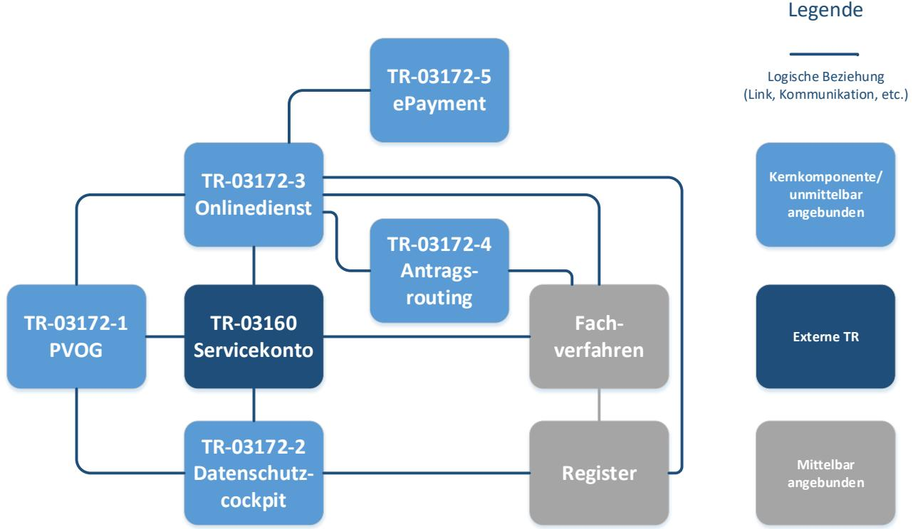
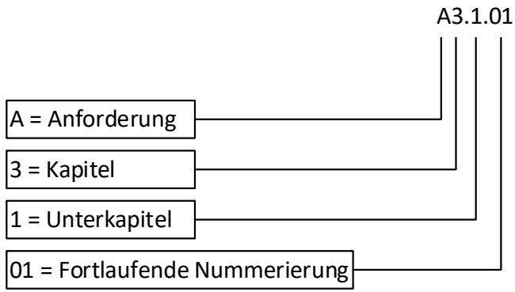
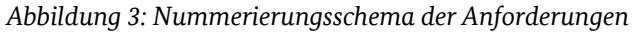

# Technische Richtlinie TR-03172 Portalverbund

Version 1.0 14.11.2024

# Änderungshistorie

*Tabelle 1: Änderungshistorie*

| Version | Datum      | Name | Beschreibung     |
|---------|------------|------|------------------|
| 1.0     | 14.11.2024 | BSI  | Veröffentlichung |

Bundesamt für Sicherheit in der Informationstechnik Postfach 20 03 63 53133 Bonn Tel.: +49 22899 9582-0 E-Mail: portalverbund@bsi.bund.de Internet: https://www.bsi.bund.de © Bundesamt für Sicherheit in der Informationstechnik 2024

| 1                      | Einleitung 4         |                                                 |   |  |
|------------------------|-------------------------|-------------------------------------------------|---|--|
|                        | 1.1                     | Zielsetzung der Technischen Richtlinie          | 4 |  |
|                        | 1.2                     | Aufbau der Technischen Richtlinie            | 4 |  |
|                        | 1.3                     | Exemplarischer Ablauf einer Antragsstellung  | 7 |  |
| 2                      | Anforderungsschema      |                                                 | 9 |  |
|                        | 2.1                     | Schlüsselbegriffe der Anforderungen             | 9 |  |
|                        | 2.2                     | Nummerierungsschema der Anforderungen           | 9 |  |
| 3                      | Glossar10               |                                                 |   |  |
| 4                      | Abkürzungsverzeichnis13 |                                                 |   |  |
| Literaturverzeichnis14 |                         |                                                 |   |  |

# 1 Einleitung

Am 18. August 2017 ist das *Gesetz zur Verbesserung des Onlinezugangs zu Verwaltungsleistungen*, auch Onlinezugangsgesetz (OZG) [1] genannt, in Kraft getreten. Das OZG-Änderungsgesetz [2] ist am 19.07.2024 in Kraft getreten. Das OZG verpflichtet Bund und Länder dazu, ihre Verwaltungsleistungen elektronisch über Verwaltungsportale verfügbar zu machen. Diese Verwaltungsportale sollen zusätzlich zu einem Portalverbund verknüpft werden, der es Nutzenden ermöglicht, von einem beliebigen Portal aus jede gewünschte elektronische Verwaltungsleistung zu erreichen und barrierefrei, medienbruchfrei und sicher in Anspruch zu nehmen. Die OZG-Umsetzung umfasst hierbei 575 unterschiedliche Leistungsbündel mit insgesamt über 6000 Verwaltungsleistungen. Die Zuständigkeiten der Verwaltungsleistungen überdecken sämtliche föderalen Ebenen: Bund, Länder und Kommunen. Um einen unnötigen Mehrfachaufwand durch eine parallele Digitalisierung derselben Verwaltungsleistung in mehreren Behörden zu vermeiden, werden im sogenannten Einer-für-Alle-Prinzip (EfA) viele der Leistungen von Behörden mit der Möglichkeit zur Nachnutzung durch andere Behörden entwickelt und bereitgestellt. Damit diese vielfältige Landschaft an Lösungen interoperabel zusammenwirken kann, nutzen sie zentral bereitgestellte Komponenten und damit verbunden gemeinsame Standards und Schnittstellen.

# 1.1 Zielsetzung der Technischen Richtlinie

Der Portalverbund ist ein Zusammenschluss von vielfältigen Komponenten mit unterschiedlichen Aufgaben und Anforderungen. Ziel der Technischen Richtlinie 03172 ist es die IT-Sicherheit im Portalverbund zu fördern und den Entwicklern Maßgaben an die Hand zu geben um sichere Anwendungen zu entwickeln. Eine grundsätzliche Sichtweise spiegelt sich dabei im Prinzip Security-by-Design wieder [3], welches den Fokus auf Sicherheitsaspekte während des gesamten Produktlebenszyklus fordert. Dieses Prinzip umfasst Softwarearchitektur und Hardwareinfrastruktur, aber auch Verantwortlichkeiten und Richtlinien. Um den vielfältigen und abstrakten Aspekten gerecht zu werden, sind die wichtigsten Empfehlungen aus Security-by-Design in die Sicherheitsanforderungen der einzelnen Technischen Richtlinien mit eingeflossen.

Ähnlich verhält es sich mit dem Zero-Trust Prinzip [4], welches aus Security-by-Design abgeleitet werden kann. Zu welchem Umfang Zero-Trust letztlich umgesetzt wird, muss im Entwicklungsprozess entschieden werden. Allerdings ist eine nachträgliche Umstellung unter Umständen mit großem Aufwand verbunden. Daher sind die wichtigsten Forderungen in den einzelnen Technischen Richtlinien als Sicherheitsanforderungen berücksichtigt.

Die BSI-TR-03172 Portalverbund umfasst ein Rahmendokument mit übergreifenden Aspekten sowie Teildokumente zu den einzelnen Komponenten. Das Rahmendokument enthält ein zentrales Glossar mit allen verwendeten Begriffsbestimmungen sowie ein zentrales Abkürzungsverzeichnis, daher sind die Dokumente stets in Kombination zu lesen.

## 1.2 Aufbau der Technischen Richtlinie

Durch die Vielzahl an verschiedenen Komponenten mit unterschiedlichen Funktionen und Anforderungen ist die vorliegende Technische Richtlinie in einer modularen Form aufgebaut, die es zum einen dem oder der Lesenden erlauben soll, die gesuchten Anforderungen schnell zu finden, zum anderen eine Abänderung oder Erweiterung erlaubt, ohne große inhaltliche oder redaktionelle Auswirkung auf das Gesamtdokument zu haben. Die Technische Richtlinie behandelt die zentralen Komponenten des Portalverbunds sowie die unmittelbar an diese angebundenen Komponenten nach IT-Sicherheitsverordnung Portalverbund (ITSiV-PV) [5]. Servicekonten als eine der Kernkomponenten des Portalverbunds werden in der Technischen Richtlinie BSI TR-03160 "Servicekonten" [6] behandelt. Die TR-03160 behält ihren eigenständigen Status und

ihre Gültigkeit. Der Aufbau und die Komponenten der Technischen Richtlinie Portalverbund sind in [Abbildung 1](#page-4-0) dargestellt.

*Abbildung 1: Aufbau und Umfang der Technischen Richtlinie BSI TR-03172 Portalverbund*

**Die Technische Richtlinie Portalverbund befindet sich aktuell in der Entstehung. Dies bedeutet, dass die Inhalte noch nicht abschließend feststehen und vorhandene Teile noch Änderungen unterliegen können. Dies gilt insbesondere für das Rahmendokument aufgrund seiner zentralen Funktion. Die Module der Technischen Richtlinie werden nacheinander veröffentlicht. Nachfolgend gelistet ist der vorläufig Umfang auf Basis der Dokumente, die aktuell in Erstellung oder in Vorbereitung sind.**

Die Technische Richtlinie besteht aus den nachfolgenden Teilen:

#### **BSI TR-03172: Rahmendokument**

Das vorliegende Dokument TR-03172 bildet den Rahmen der Technischen Richtlinie ab und dient als Anlaufpunkt zur schnellen Orientierung innerhalb der Technischen Richtlinie. Es enthält eine Einführung in die Thematik und formuliert den Rahmen der Technischen Richtlinie. Zusätzlich erklärt das Dokument Aufbau und Struktur der Technischen Richtlinie und verweist für die jeweiligen Komponenten und Fragestellungen auf die entsprechenden Teildokumente oder zusätzlichen Technischen Richtlinien. Abschließend enthält es das zentrale Glossar, sowie das zentrale Abkürzungsverzeichnis. Zum Verständnis der Technischen Richtlinie muss jeweils der relevante TR-Teil in Kombination mit dem Rahmendokument betrachtet werden.

#### **BSI TR-03172-1: PVOG**

Das Online-Gateway Portalverbund (PVOG) ist eine zentrale Komponente des Portalverbunds. Es dient dem Finden und Ansteuern von Verwaltungsleistungen. Hierfür kommuniziert es mit angeschlossenen Redaktionssystemen, welche Informationen zu Verwaltungsleistungen sowie Zuständigkeiten enthalten. Das PVOG kann in Verwaltungsportale eingebunden werden. Das Teildokument TR-03172-1 umfasst Anforderungen an das PVOG inklusive der Schnittstellen zu den angeschlossenen Redaktionssystemen.

#### **BSI TR-03172-2: Datenschutzcockpit**

Das Datenschutzcockpit ist eine zentrale Komponente, die es Nutzenden erlaubt, Auskunft über den Austausch ihrer Daten zwischen angeschlossenen Behörden nachzuvollziehen, sofern dieser unter Verwendung der Identifikationsnummer des Nutzenden stattgefunden hat. Das Teildokument beschreibt insbesondere die Anforderungen an die sichere Abfrage und Übertragung der besonders schützenswerten Informationen aus dem Datenschutzcockpit.

#### **BSI TR-03172-3: Onlinedienst**

Der Onlinedienst ist ein Service, mit dem die antragstellende Person interagiert und der die Antragsdaten entgegennimmt. Er erzeugt hieraus die Fachnachricht des Antrags zur Verwaltungsleistung und sendet diese Richtung Fachverfahren als empfangende Stelle ab. In der TR-03172-3 werden neben dem Betrieb des Onlinedienstes ebenfalls Anforderungen an die unterschiedlichen Funktionen, die im Rahmen der Antragsstellung möglich sind, etwa dem Dateiupload oder einer Zwischenspeicherung gestellt.

#### **BSI TR-03172-4: Antragsrouting**

Das Antragsrouting ist ein Dienst für die Zuständigkeitsfindung und Zustellung von Anträgen über eine eigene Komponente im Portalverbund. Dies ist für die korrekte Zustellung zwischen Onlinediensten und Fachverfahren relevant. Das zugehörige Teildokument formuliert informationssicherheitstechnische Anforderungen an den Ablauf des Routings und die Zustellung von Antragsdaten an die Fachverfahren.

#### **BSI TR-03172-5: ePayment**

Das Teildokument TR-03172-5 formuliert Anforderungen an die Bezahlkomponente des Portalverbunds, über die die Zahlungsinformationen für einen Antrag notwendig sind, also Ermittlung und Zuordnung der empfangenden Stelle, Vorgangszuordnung, Zahlungsmodalitäten und Weiterleitung auf angebundene Zahlungsverkehrsprovider.

Zusätzlich formuliert die Technische Richtlinie TR 03160 "Servicekonten" [6] in ihren Teil-Technischen Richtlinien Vorgaben zu Nutzerkonten, Interoperabilität und Postfächern.

### 1.3 Exemplarischer Ablauf einer Antragsstellung

Um die Komplexität des Portalverbunds zu verdeutlichen soll an dieser Stelle der Ablauf einer exemplarischen Antragsstellung dargestellt werden. Der Ablauf ist schematisch in [Abbildung 2](#page-6-1) dargestellt und soll für dieses Beispiel beschrieben werden. Grundsätzlich können für verschiedene Anträge Schritte wegfallen oder hinzukommen, anders ausgestaltet sein, eine andere Reihenfolge haben oder streckenweise parallele Abläufe haben.

*Abbildung 2: Beispiel des Ablaufs einer Antragsstellung*

### **1. Ansteuerung**

In einem ersten Schritt wird die benötigte Verwaltungsleistung ermittelt und der zuständige Onlinedienst angesteuert. Dies kann beispielsweise mittels einer Suche über eine internetbasierte Suchmaschine, über das Online-Gateway Portalverbund (PVOG) oder über eine Weiterleitung von einem Verwaltungsportal erfolgen.

#### **2. Authentifizierung**

Der überwiegende Teil der Verwaltungsleistungen benötigt eine Authentifizierung des Nutzers oder der Nutzerin. Sofern der Nutzer oder die Nutzerin sich für die ausgewählte Leistung authentisieren muss, kann dies über eine einmalige oder dauerhafte Authentifizierung am Bürgerkonto (bei Organisationen analog über das einheitliche Unternehmenskonto) erfolgen. Die Authentifizierung kann mit unterschiedlichen Authentisierungsmitteln auf dem, für die jeweilige Verwaltungsleistung notwendige Vertrauensniveau nach eIDAS-VO [7] erfolgen.

### **3. Antragsbefüllung**

Im Anschluss wird der Onlinedienst für die ausgewählte Verwaltungsleistung gestartet und das notwendige Formular kann mit Inhalten befüllt werden. Dabei können weitere Dienste eingebunden werden, etwa ein Kartendienst zur Einbindung von Kartenmaterial. Eventuell ist es notwendig, weitere Unterlagen und Dokumente, etwa Bescheide einzureichen. Dies kann durch einen Dateiupload eines Nutzers oder durch einen Registerabruf (Once-Only-Prinzip) erfolgen. Nach hinreichender Befüllung kann der Antrag dann wahlweise zur späteren Verwendung zwischengespeichert oder direkt an das Verwaltungsfachverfahren (Fachverfahren) übermittelt werden. Vor dem Absenden wird dem Nutzer oder der Nutzerin noch einmal die Gelegenheit gegeben, den vollständigen Antrag abschließend zu prüfen. Nach einer erneuten Bestätigung wird der Antrag verbindlich abgeschickt.

### **4. Online-Zahlung**

Für Anträge, bei denen eine Bezahlung erforderlich ist, muss eine Online-Zahlung ermöglicht werden. Hier muss das zuständige Fachverfahren und die von ihm hinterlegten Informationen hinsichtlich der Zahlungsmodalitäten ermittelt werden. Dies kann direkt im Onlinedienst hinterlegt sein, oder über antragsbezogene Informationen, wie z. B. den Wohnort der antragsstellenden Person unter Verwendung eines angebundenen Bezahldienstes. Die Zahlungsmodalitäten können z. B. Betrag, Zuordnungskennzeichen, erlaubte Zahlungsarten/-kanäle und Ziel enthalten. Die Online-Zahlung kann im Rahmen der Antragsübermittlung oder als nachgeschalteter Prozess (Post-Payment) umgesetzt sein.

### **5. Antragsübermittlung**

Wie für eine etwaige Online-Zahlung muss auch für die Zustellung des Antrags die Zuständigkeit geklärt werden d. h. das zuständige Fachverfahren und dessen Zielinformationen (z. B. Adresse der technischen Schnittstelle und für die Fachnachricht verwendeter Standard) müssen ermittelt werden. Dies kann schon während der Antragsbefüllung erfolgen oder vorab feststehen. Für die Ermittlung der Zuständigkeit kann bspw. der Wohnort des Nutzers oder der Nutzerin ausschlaggebend sein. Die notwendigen Informationen zur Ermittlung der Zuständigkeit und zur Zustellung der Fachnachricht werden von einem entsprechenden angebundenen Dienst (z. B. DVDV, PVOG oder Gebietsservice) abgerufen. Aus dem befüllten Antrag wird eine Fachnachricht erzeugt und inhaltsverschlüsselt an den, für das zuständige Fachverfahren hinterlegten, Zustellungspunkt übermittelt. Die Form der Fachnachricht oder der Übermittlungsweg kann sich hierbei zwischen den unterschiedlichen (Verwaltungs-) Fachverfahren im Aufbau stark unterscheiden. Beispielsweise kann der Onlinedienst die Fachnachricht direkt an das Fachverfahren übermitteln oder verwendet insbesondere bei nachgenutzten Onlinediensten einen Antragsroutingdienst, welcher die Übermittlung der Fachnachricht übernimmt und diese dafür zwischenspeichert. Parallel dazu wird eine Kopie des Antrags für den Nutzer oder die Nutzerin zum Download angeboten oder im Postfach des Nutzerkontos hinterlegt.

#### **6. Rückmeldung**

Nach dem Absenden des befüllten Antrags gibt es mehrere Prozesse, die eine Rückmeldung an den Nutzer oder die Nutzerin erfordern. Zum einen können Informationen zum Status des gestellten Antrags, etwa der Eingang im Fachverfahren, die Bestätigung der Zahlung oder etwaige Rückfragen bei Klärungsbedarf durch das Fachverfahren erfolgen. Letztes kann eine bidirektionale Kommunikation erforderlich machen. Parallel dazu könnte der Nutzer oder die Nutzerin auch Statusmeldungen über einen Statusmonitor abfragen. Zum anderen sollte nach abschließender Bearbeitung der Bescheid an den Nutzer oder die Nutzerin übermittelt werden, bspw. an das Postfach des Nutzerkontos. Zur Sicherung des Beweiswerts der Bescheide können im Fachverfahren diese mit einer qualifizierten elektronischen Signatur oder einem qualifizierten elektronischen Siegel versehen werden.

# 2 Anforderungsschema

In diesem Kapitel wird erklärt, wie die Anforderungen der Teildokumente zu lesen und zu verstehen sind.

### 2.1 Schlüsselbegriffe der Anforderungen

In den Anforderungen werden die in Versalien geschriebenen Modalverben "SOLLTE" und "MUSS" in ihren jeweiligen Formen sowie den zugehörigen Verneinungen genutzt, um zu verdeutlichen, wie die jeweiligen Anforderungen zu interpretieren sind. Die hier genutzte Definition basiert auf dem BSI IT-Grundschutz (BSI IT-Grundschutz, 2022) [8] und RFC 2119 [9].

| MUSS/DARF NUR:            | Dieser Ausdruck bedeutet, dass es sich um eine Anforderung handelt, die unbedingt erfüllt werden muss (uneingeschränkte Anforderung, für die keine Risikoübernahme möglich ist).                               |
|---------------------------|----------------------------------------------------------------------------------------------------------------------------------------------------------------------------------------------------------------------|
| DARF NICHT/DARF KEIN:     | Dieser Ausdruck bedeutet, dass etwas in keinem Fall getan werden darf (uneingeschränktes Verbot).                                                                                                                 |
| SOLLTE:                   | Dieser Ausdruck bedeutet, dass eine Anforderung normalerweise erfüllt werden muss, es aber Gründe geben kann, dies doch nicht zu tun. Dies muss aber sorgfältig abgewogen und stichhaltig begründet werden. |
| SOLLTE NICHT/SOLLTE KEIN: | Dieser Ausdruck bedeutet, dass etwas normalerweise nicht getan werden sollte, es aber Gründe gibt, dies doch zu tun. Dies muss aber sorgfältig abgewogen und stichhaltig begründet werden.                     |
| KANN:                     | Dieser Ausdruck bedeutet, dass eine bestimmte Umsetzung gewählt werden kann. Diese muss allerdings angezeigt werden.                                                                                              |

Die Technische Richtlinie repräsentiert den Stand der Technik und wird fortlaufend aktualisiert.

### 2.2 Nummerierungsschema der Anforderungen

Die im Rahmen der Technischen Richtlinie formulierten Anforderungen an die jeweiligen Komponenten sollen klar benennbar sein. Hierfür werden die Anforderungen eines jeden Teildokuments auf Grundlage eines einheitlichen Schemas nummeriert. Die Nummerierung der Anforderungen der Technischen Richtlinie basieren auf dem Ort und der Reihenfolge im jeweiligen Teildokument. Das Schema ist i[n Abbildung 3](#page-8-3) erklärt.

# 3 Glossar

Das Glossar wird fortlaufend mit der Erstellung von Teil-Technischen Richtlinien erweitert und stellt den aktuellen Arbeitsstand dar.

*Tabelle 2: Glossar*

| Begriff                  | Bedeutung, Beschreibung, Synonyme                                                                                                                                                                                                                                                                                                                                                                                                                                                  |
|--------------------------|------------------------------------------------------------------------------------------------------------------------------------------------------------------------------------------------------------------------------------------------------------------------------------------------------------------------------------------------------------------------------------------------------------------------------------------------------------------------------------|
| Antrag                   | Unter einem Antrag werden sämtliche Antrags-, Genehmigungs- und Verwaltungsanträge von Bürgern oder Organisationen nach einer Verwaltungsleistung verstanden. Ein Antrag kann über ein Portal mit einem Formularmanagementsystem eingegeben werden. Zusätzlich können Anhänge in Form weiterer Dateiformate dem Antrag beigefügt werden. Im Kontext des Portalverbunds ist ein Antrag die elektronische Version des analogen Antrags.                         |
|                          | Synonym: Online-Antrag                                                                                                                                                                                                                                                                                                                                                                                                                                                             |
| Antragsroutingdienst     | Dienst für das Routing und die Zustellung von Anträgen vom Onlinedienst an Fachverfahren.                                                                                                                                                                                                                                                                                                                                                                                       |
| Antragstellende Person   | Die Antragsstellende Person ist die (natürliche oder juristische) Person oder Personengesellschaft, die das Verwaltungsverfahren anstößt, indem sie ihre Antragsdaten in den Onlinedienst oder in eine Softwarelösung als Sendendes System eingibt.                                                                                                                                                                                                                       |
| Asynchrone Kommunikation | Siehe "Synchrone und asynchrone Kommunikation"                                                                                                                                                                                                                                                                                                                                                                                                                                     |
| Bürgerkonto              | Unter einem Bürgerkonto ist ein Nutzerkonto für eine natürliche Person zu verstehen.                                                                                                                                                                                                                                                                                                                                                                                            |
| Empfangendes System      | Ein digitales System, bspw. ein Fachverfahren, welches die inhaltsverschlüsselte Nachricht in Verbindung mit Metadaten weiterverarbeitet.                                                                                                                                                                                                                                                                                                                                    |
| Fachverfahren            | Ein Fachverfahren ist die empfangende Stelle einer Behörde. Es empfängt die Fachnachricht der Verwaltungsleistung, für die es zuständig ist. Anschließend wird diese anhand von zuvor in der Behörde definierten Prozessen im Fachverfahren weiterverarbeitet. Im Rahmen dieser Technischen Richtlinie wird die Grundannahme getroffen, dass Fachverfahren von OZG-Leistungen diese elektronisch entgegennehmen und den Bescheid auch digital ausstellen können. |
|                          | Synonym: Verwaltungsfachverfahren                                                                                                                                                                                                                                                                                                                                                                                                                                                  |
| Identitätsdaten          | Die Identität einer natürlichen oder juristischen Person oder Personengesellschaft wird durch verschiedene Eigenschaften beschrieben, wie beispielsweise Name, Anschrift, Geburtsdatum oder Pseudonym, oder auch Attribute wie z. B. Kontaktdaten oder weitere Parameter, die bei Inanspruchnahme einer Online-Leistung benötigt werden können.                                                                                                                     |

| Begriff            | Bedeutung, Beschreibung, Synonyme                                                                                                                                                                                                                                                                                                                                                                     |
|--------------------|-------------------------------------------------------------------------------------------------------------------------------------------------------------------------------------------------------------------------------------------------------------------------------------------------------------------------------------------------------------------------------------------------------|
| Nachweis           | Ein Nachweis ist ein Dokument oder eine Information, welche in der Antragstellung eingebracht werden kann. Der Nachweis belegt hierbei einen Sachverhalt. Nachweise können auf verschiedene Weisen in die Antragsstellung eingebracht werden, vornehmlich entweder per Datei-Upload durch die antragstellende Person, oder als Abruf der Informationen aus dem Register einer Behörde. |
| Nutzerkonto        | Ein Nutzerkonto (als Oberbegriff von Bürgerkonten und Unternehmens- bzw. Organisationskonten) ist ein Konto einer natürlichen oder juristischen Person bei einem Servicekonto.                                                                                                                                                                                                               |
| Once Only Prinzip  | Fokus auf zwischenbehördlichen Austausch, Registerabrufe und Wiederverwendung bereits vorliegender Daten unter explizitem Einverständnis der Nutzenden mit dem Ziel, Daten und Dokumente nur ein einziges Mal der öffentlichen Verwaltung mitteilen zu müssen.                                                                                                                               |
| Onlinedienst       | Ein Onlinedienst ist ein app- oder webbasierter Service, mit der die antragsstellende Person interagiert. Er nimmt die Antragsdaten inklusive Anhänge entgegen und bildet daraus die Fachnachricht. Der Onlinedienst übersendet die Fachnachricht zusammen mit weiteren Metadaten an ein empfangendes System.                                                                          |
|                    | Synonyme: Antragsassistent, Online-Antragsdienst, Antragsdienst                                                                                                                                                                                                                                                                                                                                       |
| Organisationskonto | Unter einem Organisationskonto ist ein Nutzerkonto für ein Unternehmen, eine Organisation oder eine Behörde zu verstehen.                                                                                                                                                                                                                                                                          |
| Postfach           | Elektronischer Zustellpunkt für eingehende Bescheide sowie antragsbezogene Kommunikation mit Behörden, der an das Nutzerkonto angebunden wird. Das Postfach ist, ebenso wie das Nutzerkonto, Bestandteil des Servicekontos.                                                                                                                                                               |
| Routingfunktion    | Die Routingfunktion ermittelt die Zuständigkeit und daraus folgend die Zieladresse des Fachverfahrens, an das ein Antrag gesendet wird. Neben den Verbindungsparametern können weitere Informationen wie bspw. zulässige Datenformate oder Zertifikate an das sendende System übermittelt werden (vgl. Zustellinformationen).                                                             |
| Rückkanal          | Der Rückkanal stellt den Kommunikationskanal im Nachgang der Antragsstellung dar. Er verläuft i. d. R. zwischen Fachverfahren und antragstellender Person. Als Beispiel dient die Bescheidzustellung des Fachverfahrens in das Postfach des Servicekontos der antragstellenden Person.                                                                                                    |
| Rückmeldung        | Die Rückmeldung ist eine system- oder prozessbezogene Meldung im Rahmen der aktiven Session einer Antragsstellung. Zu Rückmeldungen zählen technische Informationen, etwa Fehler- oder Erfolgsmeldungen.                                                                                                                                                                               |
| Sendendes System   | Ein digitales System, bspw. ein Onlinedienst oder eine Softwarelösung, welche Anträge und dazugehörige Dateianhänge entgegennimmt, mit Metadaten ergänzt und an ein empfangendes System übersendet.                                                                                                                                                                                             |

| Begriff                                   | Bedeutung, Beschreibung, Synonyme                                                                                                                                                                                                                                                                                                                                                                                                                                                                                                                                                                                    |
|-------------------------------------------|----------------------------------------------------------------------------------------------------------------------------------------------------------------------------------------------------------------------------------------------------------------------------------------------------------------------------------------------------------------------------------------------------------------------------------------------------------------------------------------------------------------------------------------------------------------------------------------------------------------------|
| Servicekonto                              | Als Servicekonten werden elektronische Komponenten bezeichnet, die die Identifizierung von Nutzern und die Anlage, Verwendung und Verwaltung von Nutzerkonten ermöglichen. Bestandteil von Servicekonten können zusätzliche Basisdienste für Nutzerkonten sein, wie bspw. Postfächer.                                                                                                                                                                                                                                                                                                                    |
| Synchrone und asynchrone Kommunikation | Der Datenaustausch durch den Antragsroutingdienst zwischen zwei Systemen kann entweder auf synchronem oder asynchronem Weg erfolgen. Unter synchroner Kommunikation wird der Datentransfer vom sendenden System zum empfangenden System ohne Zwischenspeicherung auf dem Kommunikationsweg verstanden. Bei der asynchronen Kommunikation werden die Daten auf dem Kommunikationsweg zwischengespeichert und müssen vom empfangenden System beim Zwischenspeicher angefordert/abgeholt werden. Eine Information über das Vorliegen von Antragsdaten an das empfangende System ist denkbar. |
| Verwaltungsportal                         | Ein Verwaltungsportal stellt ein digitales Angebot von Leistungen einer oder mehrerer föderaler Ebenen dar. Ein Portal besteht dabei aus unterschiedlichen, untereinander über Schnittstellen kommunizierenden Komponenten, über die die Verwaltungsleistungen des Portals abgewickelt werden können. Die Komponenten eines Portals unterscheiden sich in ihrer Beschaffenheit und Aufgabe. Es gibt spezialisierte Verwaltungsportale, etwa Fachportale oder Themenportale.                                                                                                                     |
| Webservice                                | Ein Webservice ein plattformunabhängiger Dienst, zum Datenaustausch von Maschine zu Maschine über Rechnernetze, wie beispielsweise das Internet.                                                                                                                                                                                                                                                                                                                                                                                                                                                               |
| Zustellfunktion                           | Mit den durch die Routingfunktion ermittelten Zustellinformationen kann die Übertragung des Fachdatensatzes an das zuständige Fachverfahren über eine Zustellfunktion realisiert werden                                                                                                                                                                                                                                                                                                                                                                                                                        |
| Zustellinformationen                      | Die Zustellinformationen enthalten die Verbindungsparameter des empfangenden Systems. Dazu zählen die technische Adresse nach dem Schema des Antragsroutingdienstes, der öffentlichen Schlüssel zur Verschlüsselung des Antrags und gegebenenfalls weitere Informationen wie Fachdatenschemata und zulässige Datenformate.                                                                                                                                                                                                                                                                               |

# 4 Abkürzungsverzeichnis

Das Abkürzungsverzeichnis wird fortlaufend mit der Erstellung von Teil-Technischen Richtlinien erweitert und stellt den aktuellen Arbeitsstand dar.

| Abkürzung | Begriff                                                                                                                                                                            |
|-----------|------------------------------------------------------------------------------------------------------------------------------------------------------------------------------------|
| DVDV      | Deutsches Verwaltungsdiensteverzeichnis                                                                                                                                            |
| EfA       | Einer-für-Alle, Nachnutzungsprinzip                                                                                                                                                |
| ITSiV-PV  | Verordnung zur Gewährleistung der IT-Sicherheit der im Portalverbund und zur Anbindung an den Portalverbund genutzten IT-Komponenten, IT-Sicherheitsverordnung Portalverbund |
| LeiKa     | Leistungskatalog der öffentlichen Verwaltung                                                                                                                                       |
| MFA       | Multi-Faktor-Authentisierung                                                                                                                                                       |
| NdB       | Netze des Bundes                                                                                                                                                                   |
| NOOTS     | Nationales Once-Only Technical System                                                                                                                                              |
| OOTS      | Once-Only Technical System                                                                                                                                                         |
| OZG       | Gesetz zur Verbesserung des Onlinezugangs zu Verwaltungsleistungen, Onlinezugangsgesetz                                                                                         |
| PVOG      | Portalverbund Online Gateway                                                                                                                                                       |
| SDG       | Single Digital Gateway                                                                                                                                                             |

# Literaturverzeichnis

- [1] Bundesamt für Justiz, BfJ, "Gesetz zur Verbesserung des Onlinezugangs zu Verwaltungsleistungen (Onlinezugangsgesetz - OZG)," 2017. [Online]. Available: https://www.gesetze-im-internet.de/ozg/. [Zugriff am 21 08 2023].
- [2] Bundesgesetzblatt, "Gesetz zur Änderung des Onlinezugangsgesetzes sowie weiterer Vorschriften zur Digitalisierung der Verwaltung (OZG-Änderungsgesetz — OZGÄndG)," 19 07 2024. [Online]. Available: https://www.recht.bund.de/bgbl/1/2024/245/VO.html. [Zugriff am 28 08 2024].
- [3] Cybersecurity & Infrastructure Security Agency, "Secure-by-Design," 25 10 2023. [Online]. Available: https://www.cisa.gov/resources-tools/resources/secure-by-design. [Zugriff am 24 07 2024].
- [4] Bundesamt für Sicherheit in der Informationspolitik, "Zero Trust," 26 06 2023. [Online]. Available: https://www.bsi.bund.de/dok/zero-trust. [Zugriff am 09 08 2024].
- [5] Bundesamt für Justiz, BfJ, "Verordnung zur Gewährleistung der IT-Sicherheit der im Portalverbund und zur Anbindung an den Portalverbund genutzten IT-Komponenten (IT-Sicherheitsverordnung Portalverbund - IT-SiV PV)," 2022. [Online]. Available: https://www.gesetze-im-internet.de/itsiv-pv/. [Zugriff am 21 08 2023].
- [6] Bundesamt für Sicherheit in der Informationstechnik, "BSI TR-03160 Servicekonten," 2023. [Online]. Available: https://www.bsi.bund.de/DE/Themen/Unternehmen-und-Organisationen/Standards-und-Zertifizierung/Technische-Richtlinien/TR-nach-Themasortiert/tr03160/tr03160\_node.html. [Zugriff am 21 08 2023].
- [7] Amtsblatt der Europäischen Union, "VERORDNUNG (EU) Nr. 910/2014 DES EUROPÄISCHEN PARLAMENTS UND DES RATES vom 23. Juli 2014," 28 08 2014. [Online]. Available: https://eurlex.europa.eu/legal-content/DE/TXT/PDF/?uri=CELEX:32014R0910. [Zugriff am 19 04 2024].
- [8] Bundesamt für Sicherheit in der Informationstechnik, BSI, IT-Grundschutz-Kompendium, Bonn: Reguvis Fachmedien GmbH, 2023.
- [9] RFC-Editor, "RFC 2119 Key words for use in RFCs to Indicate Requirement Levels," 1997. [Online]. Available: https://www.rfc-editor.org/info/rfc2119. [Zugriff am 21 08 2023].