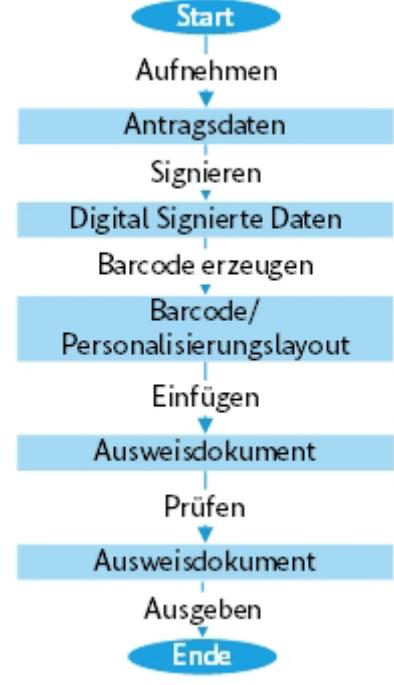
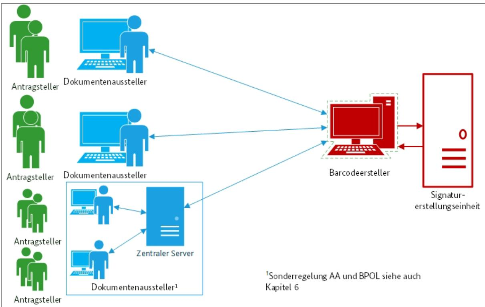
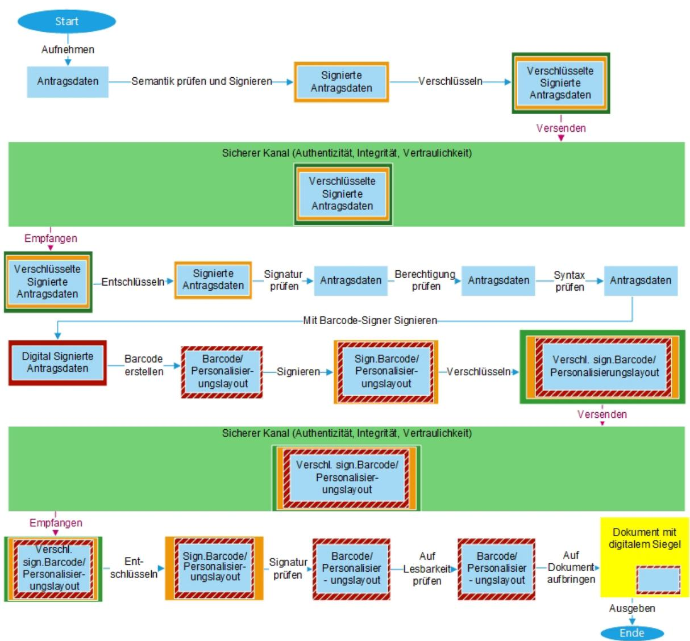

# Technische Richtlinie - Infrastruktur zur Absicherung von Dokumenten mit digitalen Siegeln

BSI TR-03175

## Änderungshistorie

| Version | Datum      | Name         | Beschreibung |
|---------|------------|--------------|--------------|
| 1.0     | 13.05.2022 | K. Schönherr | Version 1.0  |
|         |            |              |              |

*Tabelle 1: Änderungshistorie*

Bundesamt für Sicherheit in der Informationstechnik Postfach 20 03 63 53133 Bonn Tel.: +49 22899 9582-0 E-Mail: eID@bsi.bund.de Internet: https://www.bsi.bund.de © Bundesamt für Sicherheit in der Informationstechnik 2022

| 1  | Einleitung  5                                       |  |
|----|-----------------------------------------------------|--|
|    | 1.1 Glossar 5                                    |  |
|    | 1.2 Definitionen  6                              |  |
| 2  | Gesamtablauf  7                                     |  |
| 3  | Sicherheitsziele  8                                 |  |
| 4  | Rollen  10                                          |  |
| 5  | Architektur  11                                     |  |
| 6  | Zertifikate und Schlüssel  12                       |  |
| 7  | Registrierung im Online-Personalisierungssystem  14 |  |
| 8  | Nachrichten  15                                     |  |
| 9  | Ablauf im Detail  16                                |  |
| 10 | Literaturverzeichnis  18                            |  |

## 1 Einleitung

Heutzutage werden viele digitale Dokumente mittels einer digitalen Signatur kryptografisch gegen Fälschung und Verfälschung abgesichert. Durch einen aufgedruckten 2D-Barcode gemäß BSI TR "Optically Verifiable Cryptographic Protection of non-electronic Documents" (TR-03137), auch digitales Siegel genannt, können auch Papierdokumente[1](#page-4-2) kryptografisch abgesichert werden.

Ergänzend zur (TR-03137) beschreibt das vorliegende Dokument die Infrastruktur und deren Absicherung sowie die Nachrichten, welche zur Erstellung der Signatur und des 2D-Barcodes benötigt werden. Optional kann die beschriebene Infrastruktur neben dem 2D-Barcode auch das vollständige Personalisierungslayout erzeugen, was z.B. den Vorteil bietet, dass die personalisierten Datenfelder und der 2D-Barcode mit Sicherheit auf dem gleichen Antragsdatensatz basieren.

Die Erstellung des Barcode-Signer-Zertifikats inklusive der zugehörigen kryptografischen Schlüssel wird hier nicht betrachtet. Das Barcode-Signer-Zertifikat entstammt je nach Einsatzzweck des digitalen Siegels (2D-Barcode) aus einer bestimmten Public Key Infrastruktur, deren Certificate Policy die Vorgaben zur Erstellung des Schlüsselpaares sowie des Zertifikats macht. Sollten die Anforderungen an die Aufbewahrung und Verwendung des privaten Schlüssels des Barcode-Signer-Zertifikats zwischen Certificate Policy und der vorliegenden Technischen Richtlinie voneinander abweichen, gelten im Zweifel die höheren Anforderungen.

Das vorliegende Dokument ist wie folgt strukturiert: In Kapitel 2 wird der Gesamtablauf zur Erstellung eines 2D-Barcodes skizziert. Kapitel 3 erörtert die Sicherheitsziele für den Prozess. Kapitel 4 definiert die benötigten Rollen. In Kapitel 5 wird die für den Prozess erforderliche Gesamtarchitektur vorgestellt. Die Anforderungen für die im Prozess benötigten digitalen Zertifikate und zugehörigen Schlüssel werden in Kapitel 6 definiert. Kapitel 7 beinhaltet Vorgaben zur initialen Registrierung der Dokumentenersteller. In Kapitel 8 werden die für die Kommunikation notwendigen Kommandos definiert.

Kapitel 9 stellt dann noch einmal den Ablauf des Ausstellens im Detail dar.

### 1.1 Glossar

### **Antragsteller**

Der Antragsteller beantragt ein Dokument mit digitalem Siegel (2D-Barcode) beim Dokumentenaussteller und stellt diesem die notwendigen Antragsdaten zur Verfügung.

#### **Barcodeersteller**

Der Barcodeersteller betreibt und verwaltet die Signaturerstellungseinheit. Er nimmt die Daten vom Dokumentenaussteller entgegen und erstellt den 2D-Barcode für das digitale Siegel und ggf. das Personalisierungslayout und sendet diese an den Dokumentenaussteller.

#### **Digitales Siegel**

Das digitale Siegel ist ein 2D-Barcode gemäß (TR-03137), welcher eine digitale Signatur sowie die signierten Daten enthält.

#### **Dokumentenaussteller**

Der Dokumentenaussteller nimmt die Daten vom Antragsteller entgegen und stellt das Dokument mit dem Personalisierungslayout und dem digitalen Siegel aus. Der Dokumentenaussteller ist üblicherweise die Behörde, in der das Dokument mit dem digitalen Siegel beantragt wird.

#### **Signaturerstellungseinheit**

Die Signaturerstellungseinheit ist die Hardware, auf welcher die Signaturen über die Daten für die digitalen Siegel erstellt werden und auf der dementsprechend der private Schlüssel für die Signaturen gespeichert ist.

 1 Alternativ digitale Dokumente kryptografisch absichern und trotz Medienbruch prüfen. Z.B. ein PDF-Dokument wird mit digitalem Siegel gemäß (TR-03137) versehen und mittels Smartphone präsentiert, zur Prüfung des Dokuments wird der Barcode abfotografiert und geprüft.

### 1.2 Definitionen

Die in diesem Dokument in Großbuchstaben verwendeten Schlüsselworte sind auf Basis der folgenden Übersetzungstabelle gemäß (RFC2119) zu interpretieren:

| Deutsch                                                        | Englisch    |
|----------------------------------------------------------------|-------------|
| MUSS / MÜSSEN                                                  | MUST        |
| DARF KEIN(EN) / DÜRFEN KEIN(EN) / DARF NICHT / DÜRFEN NICHT | MUST NOT    |
| VORAUSGESETZT                                                  | REQUIRED    |
| SOLL / SOLLEN                                                  | SHALL       |
| SOLL NICHT / SOLLEN NICHT                                      | SHALL NOT   |
| SOLLTE / SOLLTEN                                               | SHOULD      |
| SOLLTE NICHT / SOLLTEN NICHT                                   | SHOULD NOT  |
| EMPFOHLEN                                                      | RECOMMENDED |
| KANN / KÖNNEN / DARF / DÜRFEN                                  | MAY         |
| OPTIONAL                                                       | OPTIONAL    |

### 2 Gesamtablauf

Der Gesamtablauf zur Erstellung des Dokuments mit digitalem Siegel (2D-Barcode) kann im Allgemeinen wie folgt zusammengefasst werden:

- 1. Die Antragsdaten des Antragstellers werden vom Dokumentenaussteller erfasst und über den Barcodeersteller an die Signaturerstellungseinheit übermittelt.
- 2. Die Antragsdaten werden durch die Signaturerstellungseinheit signiert und dem Barcodeersteller bereitgestellt.
- 3. Der 2D-Barcode wird vom Barcodeersteller inklusive der Signatur über den Antragsdaten erstellt und an den Dokumentenaussteller gesendet. Optional wird das vollständige Personalisierungslayout versandt, welches den 2D-Barcode beinhaltet.
- 4. Der 2D-Barcode bzw. das gesamte Personalisierungslayout (inkl. 2D-Barcode) wird vom Dokumentenaussteller auf das entsprechende Dokument aufgebracht.
- 5. Das Dokument mit 2D-Barcode wird bzgl. der Auslesbarkeit des Barcodes sowie der Übereinstimmung zwischen Siegel- und Dokumentendaten geprüft.
- 6. Das Ausweisdokument wird ausgegeben.

*Abbildung 1 Gesamtablauf der Erstellung eines Dokuments mit digitalem Siegel*

Die sich daraus ergebenden Fragestellungen bzgl. detailliertem Ablauf und Sicherheit werden im nächsten Kapitel erörtert.

## 3 Sicherheitsziele

Das primäre Sicherheitsziel beim Erstellen eines Dokuments mit digitalem Siegel gemäß (TR-03137) ist, eine kryptografisch gesicherte, vertrauenswürdige Signatur der Daten des Dokuments[2](#page-7-1) zu erzeugen. Entscheidend hierfür ist die Vertrauenswürdigkeit des Barcode-Signer-Zertifikats und des zugehörigen Schlüsselpaares, mit dessen privatem Schlüssel die Signatur im Barcode erzeugt wird, sowie die Sicherheit der Signaturerstellungseinheit, in welcher das Schlüsselpaar erzeugt, gespeichert und verwaltet wird.

Neben der sicheren Aufbewahrung und Verwendung des privaten Schlüssels im Sinne der Vertraulichkeit sind hierfür die sichere Erzeugung des Schlüsselpaares und des zugehörigen Barcode-Signer-Zertifikats im Sinne der Authentizität und Integrität von grundlegender Bedeutung.

Besonders zu beachten sind die folgenden Aspekte bei dem Ausstellen eines kryptografisch abgesicherten Papierdokuments:

1 Der private Schlüssel des Barcode-Signer-Zertifikats für die Signatur im Barcode muss sicher, d.h. geheim aufbewahrt werden und auch während der Verwendung gegen Angriffe auf die Vertraulichkeit des Schlüssels gesichert sein. Hierfür wird ein HSM (Hardware Security Module) empfohlen. Des Weiteren sollte die Anzahl der Schlüsselspeicher für die privaten Schlüssel geringgehalten werden, um die Möglichkeiten von Angriffen auf die privaten Schlüssel niedrig zu halten. Daher sollte der private Schlüssel zentral[3](#page-7-2) verwaltet werden. Aus dieser Anforderung ergibt sich, dass die abzusichernden Daten von der Stelle bzw. dem Bearbeiter, welcher die Daten entgegennimmt und letztendlich das Papierdokument mit dem Barcode druckt, zu einer zentralisierten Signaturerstellungseinheit gesendet werden müssen.

Des Weiteren empfiehlt sich ein regelmäßiges Wechseln der Schlüsselpaare, um die Anzahl der Signaturvorgänge pro Schlüssel zu begrenzen und damit Angriffe auf den privaten Schlüssel zu erschweren. Wie oft ein Schlüsselpaar gewechselt werden muss, hängt vom Einsatzzweck und Sicherheitsniveau des digitalen Siegels ab und wird daher in der entsprechenden Certificate Policy geregelt.

- 2 Beim Versenden der Antragsdaten zum Barcodeersteller müssen diese abgesichert werden.
	- a Integrität: Damit die Signatur des digitalen Siegels dazu dienen kann, später eine Verfälschung der Daten auf dem Dokument zu erkennen, muss sichergestellt werden, dass die Antragsdaten vom Dokumentenaussteller unverfälscht zum Barcodeersteller und dessen Signaturerstellungseinheit gelangen.
	- b Authentizität (Berechtigung Signatur zu erhalten/ Behörde): Um mit Hilfe der Signatur des digitalen Siegels eine Fälschung des Dokuments erkennen zu können, muss sichergestellt werden, dass nur eine berechtigte Person oder Institution die Erstellung einer Signatur für ein digitales Siegel veranlassen kann.
	- c Vertraulichkeit: Da zumeist persönliche Daten des Antragstellers auf das Dokument gedruckt und entsprechend durch den Barcode abgesichert werden sollen, muss beim Versenden der Antragsdaten z.B. zum Barcodeersteller auch die Vertraulichkeit der Antragsdaten gewährleistet werden.
- 3 Beim Versenden des Barcodes bzw. des Personalisierungslayouts (inkl. Barcode) zum Dokumentenaussteller muss der Barcode/ das Personalisierungslayout abgesichert werden.

 2 Gegebenenfalls sollen nicht alle Daten, welche auf das Papierdokument gedruckt werden, kryptografisch abgesichert werden. Der sprachlichen Einfachheit halber, sind im Folgenden aber mit den Daten des Papierdokuments die abzusichernden Daten gemeint. Details sind in der (TR-03137) definiert.

3 In der vorliegenden Technischen Richtlinie soll nicht festgelegt werden, ob nur ein zentraler Schlüssel für alle digitalen Siegel einer Art von Papierdokument verwendet werden soll oder ob mehrere Schlüsselpaare und Zertifikate erzeugt und verwendet werden, da dies von Art, Einsatz und Sicherheitsniveau des Papierdokuments abhängt.

- a Integrität / Authentizität: Die Integrität und Authentizität des Barcodes bzw. Personalisierungslayouts ist zwar durch die Signatur des Barcodes gesichert, sollte jedoch zusätzlich beim Senden an den Dokumentenaussteller gegen entsprechende Angriffe gesichert werden.
- b Vertraulichkeit: Da im digitalen Siegel bzw. im Personalisierungslayout ebenfalls die personenbezogenen Antragsdaten enthalten sind, müssen auch diese Datensätze beim Senden an den Dokumentenaussteller gegen Angriffe auf die Vertraulichkeit geschützt werden.

## 4 Rollen

Zum Erstellen eines Dokuments mit digitalem Siegel werden die folgenden Rollen benötigt:

- 1. Der **Antragsteller** gibt die Antragsdaten, welche auf das Dokument mit digitalem Siegel aufgebracht werden sollen, an den Dokumentenaussteller.
- 2. Der **Dokumentenaussteller** prüft die Antragsdaten auf semantische Korrektheit, signiert und verschlüsselt sie. Er baut einen sicheren Kanal zum Barcodeersteller auf und versendet darüber die signierten und verschlüsselten Antragsdaten. Später erstellt der Dokumentenaussteller letztendlich das Dokument mit digitalem Siegel.
- 3. Der **Barcodeersteller** errichtet mit dem Dokumentenersteller einen sicheren Kanal zur Versendung der Antragsdaten und des 2D-Barcodes bzw. des Personalisierungslayouts (inkl. 2D-Barcode). Des Weiteren entschlüsselt der Barcodeersteller die Antragsdaten und prüft die Signatur über die Antragsdaten und die syntaktische Korrektheit der Antragsdaten sowie die Berechtigung des Dokumentenausstellers, einen entsprechenden 2D-Barcode bzw. ein Personalisierungslayout anzufordern.
- 4. Danach lässt er von der **Signaturerstellungseinheit** die entsprechenden Antragsdaten signieren und generiert aus der Signatur und weiteren Antragsdaten den 2D-Barcode sowie optional das gesamte Personalisierungslayout.

## 5 Architektur

Durch die Anforderung, die Anzahl der Barcode-Signer-Zertifikate und der zugehörigen Schlüsselpaare gering zu halten, ergibt sich die folgende Architektur für das Erstellen eines Dokuments mit digitalem Siegel. Viele Dokumentenaussteller kommunizieren mit einem Barcodeersteller und dieser mit einer

Signaturerstellungseinheit. Ausnahme bilden hierbei das Auswärtige Amt und die Bundespolizei, die ihnen zugehörigen Dokumentenaussteller kommunizieren mit jeweils einem behördeninternen zentralen Server, welcher wiederum mit dem Barcodeersteller kommuniziert.

*Abbildung 2 Architektur für das Erstellen eines Dokuments mit digitalem Siegel*

## 6 Zertifikate und Schlüssel

Um die Sicherheit der Daten des Antragstellers und des 2D-Barcodes bzw. des Personalisierungslayouts (inkl. 2D-Barcode) zu gewährleisten, sollten zunächst die Antragsdaten bzw. der Barcode / das

Personalisierungslayout selbst signiert und verschlüsselt werden. Danach sollte auch der Kommunikationskanal zum Barcodeersteller bzgl. Authentizität, Integrität und Vertraulichkeit abgesichert werden, hierfür empfiehlt sich eine TLS-Verbindung mit gegenseitiger Authentisierung und Verschlüsselung.

Die Kommunikation zur Erstellung der Signatur und des 2D-Barcodes bzw. des Personalisierungslayouts (inkl. 2D-Barcode) soll synchron stattfinden.

Bei einem Verbindungsabbruch vor Zugang des 2D-Barcodes bzw. des Personalisierungslayouts (inkl. 2D-Barcode) beim Antragsteller soll der Dokumentenaussteller den Antrag erneut absenden. Sollte der Barcodeersteller die Daten aus dem ersten Antrag bereits erhalten haben, sollte er diese verwerfen, wenn er den 2D-Barcode bzw. das Personalisierungslayouts (inkl. 2D-Barcode) aufgrund eines Verbindungsabbruchs nicht zustellen kann.

Daher werden folgenden Zertifikate, sowie öffentliche und private Schlüssel benötigt:

- 4 Verschlüsselung und Signatur der Inhaltsdaten
	- a Schlüsselpaare des Dokumentenausstellers
		- i Der Dokumentenaussteller MUSS ein Schlüsselpaar zur Inhaltsdatensignatur der Antragsdaten des Antragstellers besitzen. Der private Schlüssel MUSS beim Dokumentenaussteller sicher verwahrt werden. Die Absicherung des privaten Schlüssels MUSS gemäß den Vorgaben aus (TR-03132) erfolgen. Der zugehörige öffentliche Schlüssel MUSS dem Barcodeersteller derart bekannt gemacht werden, dass dieser die Authentizität und Integrität des Schlüssels prüfen kann (siehe (TR-03132)).
		- ii Der Dokumentenaussteller MUSS ein Schlüsselpaar besitzen, welches zur Verschlüsselung und Entschlüsselung des 2D-Barcodes bzw. des Personalisierungslayouts (inkl. 2D-Barcode) während der Übertragung vom Barcodeersteller zum Dokumentenaussteller genutzt wird. Der öffentliche Schlüssel MUSS dem Barcodeersteller derart bekannt gemacht werden, dass dieser die Authentizität und Integrität des Schlüssels prüfen kann. Der Barcodeersteller benutzt diesen öffentlichen Schlüssel, um den erstellten Barcode bzw. das Personalisierungslayout zu verschlüsseln, bevor er dieses an den Dokumentenaussteller zurücksendet. Der zugehörige private Schlüssel dient dem Dokumentenaussteller zur Entschlüsselung des Barcodes bzw. des Personalisierungslayouts. Die Absicherung des privaten Schlüssels muss gemäß den Vorgaben aus (TR-03132) erfolgen.
	- b Schlüsselpaare des Barcodeerstellers
		- i Der Barcodeersteller MUSS ein Schlüsselpaar zur Inhaltsdatensignatur des Barcodes bzw. des Personalisierungslayouts besitzen. Der private Schlüssel muss beim Barcodeersteller sicher verwahrt werden. Die Absicherung des privaten Schlüssels muss gemäß den Vorgaben aus (TR-03132) erfolgen. Der zugehörige öffentliche Schlüssel muss dem Dokumentenaussteller derart bekannt gemacht werden, dass dieser die Authentizität und Integrität des Schlüssels prüfen kann.
		- ii Der Barcodeersteller muss ein Schlüsselpaar besitzen, welches zur Verschlüsselung der Antragsdaten genutzt wird. Der öffentliche Schlüssel MUSS dem Dokumentenaussteller derart bekannt gemacht werden, dass dieser die Authentizität und Integrität des Schlüssels prüfen kann. Der Dokumentenaussteller benutzt diesen öffentlichen Schlüssel, um die Antragsdaten zu verschlüsseln, bevor er diese an den Barcodeersteller sendet.

Der zugehörige private Schlüssel dient dem Barcodeersteller zur Entschlüsselung der Antragsdaten. Die Absicherung des privaten Schlüssels MUSS gemäß den Vorgaben aus (TR-03132) erfolgen.

5 TLS-Zertifikate für die synchrone Kommunikation zwischen Dokumentenaussteller und Barcodeersteller

- a TLS-Client Zertifikat Dokumentenaussteller
	- i Der private Schlüssel des TLS-Client-Zertifikats MUSS beim Dokumentenaussteller sicher verwahrt werden. Die Absicherung des privaten Schlüssels MUSS gemäß den Vorgaben für die Zertifikate auf Transportebene aus (TR-03132) erfolgen.
	- ii Der öffentliche Schlüssel des TLS-Client-Zertifikats MUSS dem Barcodeersteller derart bekannt gemacht werden, dass dieser die Integrität und Authentizität des Zertifikats prüfen kann.
- b TLS-Server Zertifikat Barcodeersteller
	- i Der private Schlüssel des TLS-Server-Zertifikats MUSS beim Barcodeersteller sicher verwahrt werden. Die Absicherung des privaten Schlüssels muss gemäß den Vorgaben für die Zertifikate auf Transportebene aus (TR-03132) erfolgen.
	- ii Der öffentliche Schlüssel des TLS-Server-Zertifikats MUSS dem Dokumentenaussteller derart bekannt gemacht werden, dass dieser die Integrität und Authentizität des Zertifikats prüfen kann.
- 6 Barcode-Signer-Zertifikat
	- a Der private Schlüssel des Barcode-Signer-Zertifikats MUSS bei der Signaturerstellungseinheit sicher gegen Angriffe auf die Vertraulichkeit des Schlüssels aufbewahrt werden. Hierfür MÜSSEN die Vorgaben aus dem BSI Dokument (KeyLifecycleSecurityRequirements) für Security Level 2 eingehalten werden[4.](#page-12-0)
	- b Der zugehörige öffentliche Schlüssel MUSS zumindest allen Adressaten der Dokumente mit digitalem Siegel, welche mit dem o.g. privaten Schlüssel signiert werden, sowie den Dokumentenausstellern derart bekannt gemacht werden, dass diese die Authentizität und Integrität des Schlüssels prüfen können.
- 7 Ausnahmeregelungen Auswärtige Amt (AA) und Bundespolizei (BPOL)
	- a Für das AA gilt in der TR-03132 die folgende Ausnahme "Das Auswärtige Amt kann SW-Zertifikate verwenden. Diese müssen durch entsprechende organisatorische Maßnahmen ein zu den Hardware-PSE'n äquivalentes Schutzniveau erreichen.". Diese Ausnahme DARF durch das AA auch für die Einsatzzwecke der vorliegenden Technischen Richtlinie angewendet werden. Dies setzt aber voraus, dass nur eine einzige Verbindung zwischen einem zentralen Server beim AA und dem Barcodeersteller eingerichtet wird, die Schlüssel für die Absicherung von Transport und Inhaltsdaten also zentral gespeichert und verwendet werden.
	- b Die Ausnahmeregelungen für AA DÜRFEN analog durch die BPOL unter den gleichen Voraussetzungen in Anspruch genommen werden.

 4 Sieh[e www.bsi.bund.de/cvca-eID](http://www.bsi.bund.de/cvca-eID) unter dem Absatz Certificate Policy

## 7 Registrierung im Online-Personalisierungssystem

Um sicherzustellen, dass nur berechtigte Stellen einen 2D-Barcode bzw. ein Personalisierungslayout (inkl. 2D-Barcode) beantragen können, MUSS es eine initiale Registrierung der Dokumentenaussteller beim Barcodeersteller im Online-Personalisierungssystem geben.

Dies kann als Registrierung der Dokumentenaussteller geschehen oder mittels deren Zuordnung zur Online-Personalisierung in bestehenden Systemen, wie z.B. dem des Deutschen Verwaltungsdienstverzeichnis (DVDV) [5.](#page-13-1)

Nach der initialen Registrierung MUSS der Barcodeersteller in der Lage sein, für jede eingehende Anfrage nach einem digitalen Siegel oder einem Personalisierungslayout zu erkennen, ob die anfragende Institution berechtigt ist, ein digitales Siegel bzw. ein entsprechendes Personalisierungslayout (inkl. 2D-Barcode) zu erhalten. Zum Beispiel kann der Barcodeersteller anhand des vom Dokumentenaussteller für die Anfrage verwendeten TLS-Zertifikats dessen Registrierung oder dessen Zugehörigkeit zu einer berechtigen Gruppe im DVDV prüfen.

Des Weiteren MÜSSEN die öffentlichen Schlüssel für TLS-Client bzw. TLS-Server dem jeweiligen Kommunikationspartner derart bekannt sein, dass dieser die Integrität und Authentizität der Schlüssel bei jedem Aufbau eines entsprechenden TLS-Kanals feststellen kann.

Auch die öffentlichen Schlüssel zur Inhaltsdatensignatur und –Verschlüsselung MÜSSEN dem jeweiligen Kommunikationspartner derart bekannt gemacht werden, dass dieser die Integrität und Authentizität der Schlüssel bei jeder Prüfung einer Inhaltsdatensignatur bzw. vor der Verwendung zur Verschlüsselung feststellen kann.

5 Im DVDV sind auch die Ausweisbehörden mit Berechtigung zur Beantragung von Reisepässen, Personalausweisen und Aufenthaltstiteln verzeichnet, siehe <https://www.itzbund.de/DE/itloesungen/standardloesungen/dvdv/dvdv.html>

## 8 Nachrichten

Für Kommunikation zwischen Dokumentenaussteller und Barcodeersteller werden zumindest die folgenden Nachrichten benötigt:

- 2D-Barcode/Personalisierungslayout (inkl. 2D-Barcode) beantragen
	- Beinhaltet: Antragsdaten (verschlüsselt und signiert), ggf. Kennung des Dokumentenausstellers (signiert)[6](#page-14-1)
- 2D-Barcode/Personalisierungslayout (inkl. 2D-Barcode) versenden
	- Beinhaltet: 2D-Barcode bzw. Personalisierungslayout inkl. 2D-Barcode (verschlüsselt und signiert)

 6 Die Kennung kann entweder Teil der Nachricht sein oder durch die Identifizierung im gesicherten Transportkanal (z.B. mittels entsprechend zugeordneter TLS-Zertifikate) erfolgen

## 9 Ablauf im Detail

Im Detail stellt sich der Ablauf zur Ausstellung eines Dokuments mit digitalem Siegel ist wie folgt dar:

- 1 Der Dokumentenaussteller wird initial beim Barcodeersteller als berechtigte Stelle zur Beantragung eines 2D-Barcodes bzw. Personalisierungslayouts (inkl. 2D-Barcode) identifiziert und gelistet[7](#page-15-1). Dieser Schritt wird einmalig durchgeführt.
- 2 Die zur Erstellung des Dokuments mit digitalem Siegel benötigten Daten des Antragstellers werden vom Dokumentenaussteller erfasst und auf semantische Korrektheit geprüft.
- 3 Die Antragsdaten werden vom Dokumentenaussteller signiert und verschlüsselt.
- 4 Der Dokumentenaussteller baut eine TLS-Verbindung mit gegenseitiger Authentisierung zum Barcodeersteller auf.
- 5 Der Dokumentenaussteller sendet die signierten und verschlüsselten Antragsdaten durch den TLS-Kanal an den Barcodeersteller. Der TLS-Kanal bleibt bestehen, bis der Barcodeersteller eine Antwort gesendet hat.
- 6 Der Barcodeersteller empfängt die Antragsdaten und prüft sie:
	- a Der Barcodeersteller entschlüsselt die Antragsdaten und prüft die Signatur.
	- b Der Barcodeersteller prüft die Berechtigung des Dokumentenausstellers zur Beantragung eines 2D-Barcodes bzw. Personalisierungslayouts (inkl. 2D-Barcode).
	- c Der Barcodeersteller prüft die syntaktische Korrektheit der Antragsdaten.
- 7 Haben die obigen Prüfungen ergeben, dass der Dokumentenaussteller berechtigt ist und die Antragsdaten sowie die Signatur korrekt sind, leitet der Barcodeersteller die zu signierenden Antragsdaten an die Signaturerstellungseinheit weiter.
	- a Ergibt die Prüfung, dass die Signatur der Nachricht nicht korrekt, der Dokumentenaussteller nicht berechtigt ist oder die Nachricht syntaktisch nicht korrekt ist, erhält der Dokumentenaussteller eine ablehnende Nachricht und der Barcodeersteller beendet die Verbindung.
- 8 Die Signaturerstellungseinheit signiert die Antragsdaten und sendet die Signatur an den Barcodeersteller.
- 9 Der Barcodeersteller erzeugt aus der Signatur und den zugehörigen Antragsdaten den 2D-Barcode bzw. optional das vollständige Personalisierungslayout (inkl. 2D-Barcode).
- 10 Der Barcodeersteller sendet den signierten und verschlüsselten 2D-Barcode bzw. das Personalisierungslayout (inkl. 2D-Barcode) über den bestehenden TLS-Kanal an den Dokumentenaussteller.
- 11 Der Dokumentenaussteller empfängt den 2D-Barcode bzw. das Personalisierungslayout (inkl. 2D-Barcode) und beendet den TLS-Kanal.
- 12 Der Dokumentenaussteller bringt den 2D-Barcode bzw. das Personalisierungslayout (inkl. 2D-Barcode) auf das beantragte Dokument auf.
- 13 Der Dokumentenaussteller prüft den 2D-Barcode auf dem Dokument auf Lesbarkeit.
- 14 Der Dokumentenaussteller übergibt das Dokument an den Antragsteller.

 7 Siehe Kapitel 7 "Identifizierung von Dokumentenausstellern"

*Abbildung 3: Ablauf der Erstellung eines Dokuments mit digitalem Siegel im Detail*

## 10 Literaturverzeichnis

**ICAO\_Doc\_9303.** ICAO Doc 9303, Machine Readable Travel Documents. Seventh Edition, 2015.

**KeyLifecycleSecurityRequirements.** "Key Lifecycle Security Requirements", BSI. Version 1.0.3.

**RFC2119.** RFC2119 Bradner, S.: Key words for use in RFCs to indicate requirement levels.

**TR-03132, BSI.** Technische Richtlinie TR-03132 Sichere Szenarien für Kommunikationsprozesse im Bereich hoheitlicher Dokumente, BSI. Version 1.8, 26.10.2018.

**TR-03137, BSI.** Technical Guideline TR-03137, Optically Verifiable Cryptographic Protection of non-electronic Documents (Digital Seal), BSI. Version 2.5, Dec 03, 2021.