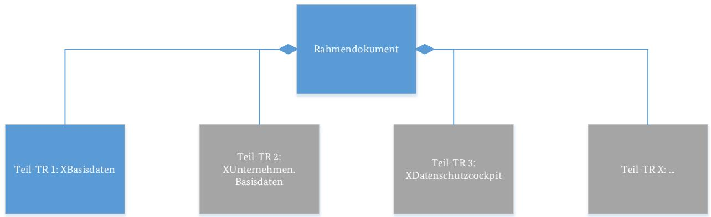

# Technische Richtlinie BSI TR-03176 Sichere Datenübermittlung in der Registermodernisierung

Version 0.9

04.12.2023

# Änderungshistorie

| Version | Datum      | Name               | Beschreibung         |
|---------|------------|--------------------|----------------------|
| 0.01    | 13.06.2022 | BSI, Referat DI 27 | Erster Entwurf       |
| 0.5     | 03.11.2022 | BSI, Referat DI 27 | Erste                |
|         |            |                    | Kommentierungsrunde  |
| 0.7     | 06.03.2023 | BSI, Referat DI 27 | Zweite               |
|         |            |                    | Kommentierungsrunde  |
| 0.9     | 04.12.2023 | BSI, Referat DI 27 | Version für die      |
|         |            |                    | öffentliche          |
|         |            |                    | Kommentierung,       |
|         |            |                    | Verbesserungen im    |
|         |            |                    | Glossar, Schärfungen |
|         |            |                    | von Ausdrücken       |

*Tabelle* 1*: Änderungshistorie*

Bundesamt für Sicherheit in der Informationstechnik

Postfach 20 03 63

53133 Bonn

Tel.: +49 22899 9582-0

E-Mail: referat-di27@bsi.bund.de

Internet: https://www.bsi.bund.de

© Bundesamt für Sicherheit in der Informationstechnik 2023

| 1 |                                                                                                                   | Einleitung 5                            |   |  |  |  |  |
|---|-------------------------------------------------------------------------------------------------------------------|--------------------------------------------|---|--|--|--|--|
|   | 1.1                                                                                                               | Thematische Einordnung  5            |   |  |  |  |  |
|   | 1.2                                                                                                               | Zielgruppe  5                        |   |  |  |  |  |
|   | 1.3                                                                                                               | Aufbau der Technischen Richtlinie  5 |   |  |  |  |  |
|   | 1.4                                                                                                               | Schlüsselwörter                            | 6 |  |  |  |  |
| 2 |                                                                                                                   | Begriffsdefinitionen 8                  |   |  |  |  |  |
| 3 | Anforderungen 10                                                                                               |                                            |   |  |  |  |  |
|   | 3.1                                                                                                               | Allgemeine Anforderungen10                 |   |  |  |  |  |
|   | 3.2                                                                                                               | Fehlerbehandlung10                         |   |  |  |  |  |
|   | 3.3                                                                                                               | Nachrichtenvalidierung 10               |   |  |  |  |  |
|   | 3.4                                                                                                               | Kryptografische Anforderungen11            |   |  |  |  |  |
|   | 3.5                                                                                                               | Protokollierung11                          |   |  |  |  |  |
|   | 3.5.1 Protokoll gemäß § 9 Identitätsnummerngesetz12                                                            |                                            |   |  |  |  |  |
|   | 3.5.2 Protokoll zu betriebs- und sicherheitsrelevanten Ereignissen12                                        |                                            |   |  |  |  |  |
|   | 3.5.3 Protokoll zur transparenten Nachvollziehbarkeit organisatorischer Aspekte der Datenübermittlung 12 |                                            |   |  |  |  |  |
|   | 3.6                                                                                                               | Monitoring12                               |   |  |  |  |  |
|   | 3.7                                                                                                               | Löschung von Daten13                       |   |  |  |  |  |
|   | Abkürzungsverzeichnis14                                                                                           |                                            |   |  |  |  |  |
|   | Literaturverzeichnis15                                                                                            |                                            |   |  |  |  |  |
|   | Abbildungsverzeichnis 16                                                                                       |                                            |   |  |  |  |  |

# **1 Einleitung**

#### **1.1** Thematische Einordnung

In der immer weiter voranschreitenden digitalisierten Welt steigt zunehmend auch das Interesse daran, die öffentlichen Verwaltungsleistungen digital erledigen zu können. Die Grundlage dafür bildet das Onlinezugangsgesetz (OZG). Darüber hinaus streben Bund, Länder und Kommunen eine Registermodernisierung an, welche als Ziel die Umsetzung des sogenannten "Once-Only-Prinzips" anstrebt. Dieses Prinzip soll es Behörden ermöglichen, bereits an anderer Stelle in der öffentlichen Verwaltung vorliegende Informationen zu dem Bürger bzw. Antragsteller im Zuge eines Onlineantrages automatisiert mit anderen Behörden auszutauschen. Dadurch können Anträge medienbruchfrei und digital vervollständigt werden, sodass das wiederholte Bereitstellen von Informationen durch den Bürger – bei entsprechender Zustimmung oder rechtlicher Ermächtigung - entfällt. In Rahmen des OZG 2.0 wird die gesetzliche Grundlage hierfür in Form einer Änderung des E-Government-Gesetzes (EGovG) geschaffen. Das technische Fundament für diesen automatisierten Datenaustausch bildet eine Modernisierung der Datenhaltung in den Behörden. Hierfür wurde am 6. April 2021 das Registermodernisierungsgesetz (kurz: RegMoG) verabschiedet, um eben diese Modernisierung der Register in Bund, Ländern und Kommunen voranzutreiben. Dieses Gesetz verlangt die Vernetzung der Register (digitale Verknüpfung) unter Zuhilfenahme der neuen Identifikationsnummer und ermöglicht die Etablierung neuer Standards zur Kommunikation und Datenübermittlung zwischen Registern bzw. zwischen Registern und Behörden.

Da diese Datenübermittlung ein gewisses Angriffspotential insbesondere auf dem Übertragungsweg bietet – beispielsweise das Abfangen und/oder Manipulieren der Registerdaten oder aber die widerrechtliche Zusammenführung verschiedener Registerdaten mithilfe der Identifikationsnummer –, ist es notwendig entsprechende Sicherheitsmechanismen gegen solcherlei Angriffe zu etablieren.

Ziel dieser Technischen Richtlinie (TR) ist es daher Anforderungen zu definieren, sodass bei deren korrekter Umsetzung Angriffe auf die Kommunikation in der Registermodernisierung nur noch mit vernachlässigbarem Risiko möglich sind und ein sicherer sowie nachvollziehbarer Datenaustausch gewährleistet ist. Die Sicherheit der einzelnen Komponenten der Registermodernisierung sind kein Bestandteil dieser Technischen Richtlinie1 . Darüber hinaus werden in dieser TR Anforderungen betrieblicher Natur nicht behandelt. Stattdessen wird angenommen, dass der Betreiber eines IT-Systems bereits notwendige betriebliche Maßnahmen zur Sicherstellung beispielsweise eines hohen Verfügbarkeitsniveaus getroffen hat.

#### **1.2** Zielgruppe

Diese TR richtet sich an alle Stellen, welche im Kontext der Registermodernisierung Daten speichern, anfragen oder übermitteln. Dies sind vor allem Register, (registerabfragende) Behörden und Betreiber von Onlinediensten, Intermediäre und Dienstleister, die an den genannten Aufgaben beteiligt werden sowie die Entwickler und Betreiber der einheitlichen Komponenten des "Nationalen Once-Only Technical Systems" (NOOTS). Ferner richtet sich die TR auch an die Betreiber und Entwickler der Anschlusssysteme an das EU-OOTS.

#### **1.3** Aufbau der Technischen Richtlinie

Diese Technische Richtlinie besteht aus mehreren Teilen: Das Rahmendokument führt in die Thematik der sicheren Datenübermittlung in der Registermodernisierung ein. Es beschreibt den Aufbau und die Zielsetzung der Technischen Richtlinie. Darüber hinaus werden dort grundlegende Anforderungen

1 Ausgewählte Komponenten wie beispielsweise das Datenschutzcockpit oder das Antragsrouting werden durch die TR-Portalverbund (TR-03172) und ihre Teil-TRn betrachtet.

aufgestellt, die im Kontext der TR stets zu erfüllen sind. Darüber hinaus werden für einzelne in der Registermodernisierung einzusetzende Fachstandards Teil-TRn aufgestellt. In diesen befinden sich für den jeweiligen Standard fachspezifische Anforderungen und Konkretisierungen. So beschäftigt sich beispielsweise die Teil-TR 1 mit XBasisdaten.

Abbildung 1: Aufbau der Technischen Richtlinie und Beziehungen der einzelnen Teile

Das Rahmendokument bildet zusammen mit der jeweils passenden Teil-TR den Gesamtumfang an Anforderungen an einen bestimmten Fachstandard. Während also die einzelnen Teil-TRn nicht direkt miteinander zusammenhängen, kann eine Teil-TR immer nur gemeinsam mit dem Rahmendokument betrachtet werden.

Diese Technische Richtlinie besteht – wie in der Abbildung 1 grafisch dargestellt – neben dem Rahmendokument aus folgenden Teil-TRn:

- In Teil 1 befinden sich Vorgaben, welche spezifisch für XBasisdaten gelten.
- In Teil 2 sind die Vorgaben enthalten, die sich spezifisch an XUnternehmen.Basisdaten richten (noch nicht veröffentlicht).
- In Teil 3 finden sich die spezifischen Vorgaben an XDatenschutzcockpit (noch nicht veröffentlicht).

Um die Anforderungen der verschiedenen Teil-TRn und des Rahmendokuments eindeutig unterscheiden zu können, wird jede Anforderung mit einer eindeutigen Nummer versehen, welche aus folgenden Bestandteilen besteht:

- 1. Einem Präfix zur Markierung des Teildokuments, in welcher die Anforderung enthalten ist, z.B. RaD für Rahmendokument oder XBd für XBasisdaten,
- 2. der Kapitelnummer und
- 3. einer fortlaufenden Nummer innerhalb des Kapitels, welche ggf. weitere Untergliederungen enthält.

Enthält diese TR Verweise auf das IT-Grundschutz-Kompendium, so beziehen sich diese auf die Edition 2023 [1].

#### **1.4** Schlüsselwörter

In der vorliegenden Technischen Richtlinie werden Anforderungen als Ausdruck normativer Festlegungen durch die in Großbuchstaben geschriebenen deutschen Schlüsselworte MUSS/MÜSSEN, DARF NICHT/DÜRFEN NICHT, SOLLTE/SOLLTEN entsprechend gekennzeichnet.

In den Anforderungen werden die in Versalien geschriebenen Modalverben "SOLLTE" und "MUSS" in ihren jeweiligen Formen sowie den zugehörigen Verneinungen genutzt, um deutlich zu machen, wie die jeweiligen Anforderungen zu interpretieren sind. Die hier genutzte Definition basiert auf [2].

| MUSS/DARF NUR:                                                                                                                                                             | Dieser Ausdruck bedeutet, dass es sich um eine Anforderung handelt, die unbedingt erfüllt werden muss (uneingeschränkte Anforderung).                                                                          |  |  |  |  |
|----------------------------------------------------------------------------------------------------------------------------------------------------------------------------|-------------------------------------------------------------------------------------------------------------------------------------------------------------------------------------------------------------------|--|--|--|--|
| DARF NICHT/DARF KEIN:                                                                                                                                                      | Dieser Ausdruck bedeutet, dass etwas in keinem Fall getan werden darf (uneingeschränktes Verbot).                                                                                                              |  |  |  |  |
| SOLLTE:                                                                                                                                                                    | Dieser Ausdruck bedeutet, dass eine Anforderung normalerweise erfüllt werden muss, es aber Gründe geben kann, dies doch nicht zu tun. Dies muss aber sorgfältig abgewogen und stichhaltig begründet werden. |  |  |  |  |
| SOLLTE NICHT/SOLLTE KEIN:Dieser Ausdruck bedeutet, dass etwas normalerweise nicht getan werden sollte, es aber Gründe gibt, dies doch zu tun. Dies muss aber sorgfältig |                                                                                                                                                                                                                   |  |  |  |  |
| KANN                                                                                                                                                                       | abgewogen und stichhaltig begründet werden. Dieser Ausdruck bedeutet, dass eine bestimmte Umsetzung gewählt werden kann. Diese muss allerdings angezeigt werden.                                            |  |  |  |  |

Die Technische Richtlinie repräsentiert den Stand der Technik und wird fortlaufend aktualisiert.

# **2 Begriffsdefinitionen**

|  |  |  |  | Im Rahmen dieser Technischen Richtlinie werden Begriffe verwendet, die wie folgt definiert werden: |  |  |
|--|--|--|--|----------------------------------------------------------------------------------------------------|--|--|
|  |  |  |  |                                                                                                    |  |  |

| Begriff                          | Definition                                                                                                                                                                                                                                                        |
|----------------------------------|-------------------------------------------------------------------------------------------------------------------------------------------------------------------------------------------------------------------------------------------------------------------|
| Basisdaten                       | Stammdatensatz über eine natürliche Person oder ein Unternehmen im Sinne des § 4 IDNrG oder § 3 UBRegG                                                                                                                                                |
| Basisregister                    | Register, welches Basisdaten vorhält. Es existiert das Basisregister des BZSt für natürliche Personen sowie das Basisregister des StBA für Unternehmen.                                                                                                     |
| Empfangssystem                   | Instanz, die Inhaltsdaten empfängt                                                                                                                                                                                                                                |
| Ende-zu-Ende                     | Wird von "Ende-zu-Ende" gesprochen, ist damit von Empfangssystem zu Sendesystem (beispielsweise von Fachverfahren zu Register) gemeint. Intermediärsysteme können hierbei kein Empfangs oder Sendesystem sein.                                     |
| Fachverfahren                    | Instanz zur Bearbeitung eines Antrags im Kontext der Antragstellung gemäß OZG                                                                                                                                                                                  |
| Identitätsdatenabruf (kurz: IDA) | System, welches eine Schnittstelle zwischen der Registermodernisierungsbehörde und dem Empfangssystem zum Abruf von Basisdaten und/oder IDNr zur Verfügung stellt                                                                                     |
| Fachdaten                        | Fachliche Daten; der genaue Aufbau wird durch das Protokoll (z.B. XBasisdaten) spezifiziert                                                                                                                                                                    |
| Fachdatenebene                   | Die Fachdatenebene ist die Ebene, auf der logisch zwei Systeme miteinander kommunizieren; logisch werden also Fachdaten ausgetauscht. Die hierzu technisch notwendigen Metadaten sind Teil der Transportebene.                                        |
| Fachdatenverschlüsselung         | Als Fachdatenverschlüsselung bezeichnet man eine Verschlüsselung der Fachnachricht. Ziel der Fachdatenverschlüsselung ist, dass keine andere Partei außer dem Empfangs- und Sendesystem Kenntnis über den Inhalt der Nachricht erwerben können. |
| Fachnachricht                    | Nachricht, die die Fachdaten enthält; in der Regel als Teil einer Transportnachricht übertragen                                                                                                                                                                |

| Begriff                        | Definition                                                                                                                                                                                                                                                                                                                                                                                                       |
|--------------------------------|------------------------------------------------------------------------------------------------------------------------------------------------------------------------------------------------------------------------------------------------------------------------------------------------------------------------------------------------------------------------------------------------------------------|
| Intermediärsystem              | Ein Intermediärsystem ist eine Instanz, welche an der Nachrichtenübermittlung beteiligt ist, ohne selbst Sende- oder Empfangssystem zu sein. Der klassische Fall eines Intermediärsystems ist ein Gateway, welches die Zuständigkeit hat, eine Nachricht entgegenzunehmen, auf Basis der Metadaten den weiteren Übertragungsweg zu bestimmen und die Nachricht weiterzuleiten (Routing). |
| Metadaten                      | Daten, die mit den Inhaltsdaten verbunden werden, um den korrekten Transport der Fachdaten zu gewährleisten; sie enthalten selber keine Fachdaten                                                                                                                                                                                                                                                          |
| Onlinedienst                   | Digitaler Service, um Verwaltungsleistungen zu beantragen. In der Regel werden die Eingaben durch ein Fachverfahren bearbeitet.                                                                                                                                                                                                                                                                            |
| Basisdaten-Quellregister       | Ein Basisdaten-Quellregister ist ein Register, von welchem ein Basisregister die notwendigen Informationen für die Führung und Pflege seiner Einträge bezieht. Ein Beispiel hierfür wären die Melderegister als Basisdaten-Quellregister für das Basisregister.                                                                                                                       |
| Register                       | Ein Register ist eine Komponente, welche in der öffentlichen Verwaltung die elektronische Führung der Datenbestände verantwortet.                                                                                                                                                                                                                                                                          |
| Registermodernisierungsbehörde | Die Behörde, die gemäß Gesetz damit beauftragt wurde, den Identitätsdatenabruf bereitzustellen; aktuell ist dies das BVA.                                                                                                                                                                                                                                                                                  |
| Sendesystem                    | Instanz, die Fachdaten bereitstellt                                                                                                                                                                                                                                                                                                                                                                              |
| Transportebene                 | Die Transportebene (auch Layer 4 im OSI Schichtenmodell) stellt eine Ebene dar, welche die Punkt-zu-Punkt-Kommunikation zwischen zwei miteinander verbundenen Systemen ermöglicht.                                                                                                                                                                                                                      |
| Transportnachricht             | Nachricht, welche die Fachnachricht enthält, sowie Metadaten, die für die Ausübung der Aufgaben der Transportebene notwendig sind                                                                                                                                                                                                                                                                          |
| XBasisdaten                    | Standard zum Abrufen von Basisdaten über natürliche Personen                                                                                                                                                                                                                                                                                                                                                  |
| XDatenschutzcockpit            | Standard zum Abrufen von Abrufprotokollen aus Registern zwecks Darstellung im Datenschutzcockpit                                                                                                                                                                                                                                                                                                              |
| XUnternehmen.Basisdaten        | Standard zum Abrufen von Basisdaten über Unternehmen                                                                                                                                                                                                                                                                                                                                                          |

# **3** Anforderungen

Die im Rahmen der Datenübermittlung eingesetzten Systeme MÜSSEN nach dem IT-Grundschutz-Kompendium [1] abgesichert werden. Die genaue Spezifikation erfolgt in den einzelnen Teil-TRn.

#### **3.1** Allgemeine Anforderungen

[RaD.3.1.1] OPS.1.1.3.A15 und CON.8.A20 des IT-Grundschutz-Kompendiums MÜSSEN eingehalten werden.

[RaD.3.1.2] Ein System, welches nicht Empfangssystem ist, MUSS eine Nachricht an das für den weiteren Transport zum Empfangssystem zuständige System oder das Empfangssystem weiterleiten. Für die Feststellung, welches System dies ist, MÜSSEN vertrauenswürdige Datenbanken verwendet werden.

#### **3.2** Fehlerbehandlung

- [RaD.3.2.1] Stellt eine der beteiligten Parteien fest, dass eine der MUSS-Anforderungen dieser Technischen Richtlinie im Rahmen der Übermittlung einer Nachricht verletzt wurde, so MUSS die Nachricht abgewiesen werden und DARF NICHT weiterverarbeitet werden. Dem Sendesystem der Nachricht MUSS eine Fehlermeldung zugeschickt werden. Die genaue Ausgestaltung der Fehlermeldung ergibt sich aus dem Standard auf Anwendungsebene.
- [RaD.3.2.2] Falls im Rahmen der Übermittlung der Nachricht der Verstoß gegen eine der MUSS-Anforderungen dieser TR bereits in der Auswertung der Transportnachricht festgestellt wurde, so KANN alternativ zu einer von dem Standard der Anwendungsebene ausgestalteten Fehlermeldung auch alternativ eine Fehlermeldung zugesendet werden, deren Ausgestaltung von dem Standard auf Transportebene vorgegeben wird.
- [RaD.3.2.3] Ein an der Datenübermittlung beteiligtes System MUSS eine Nachricht so lange aufbewahren, bis sie entweder das auf dem Datenübertragungsweg nächste zuständige System erreicht hat, oder eine Löschfrist eingetreten ist. Nachrichten DÜRFEN NICHT länger als notwendig aufbewahrt werden.
- [RaD.3.2.4] Findet ein Kommunikationsmodell Anwendung, bei dem ein System selbsttätig eine Nachricht an ein anderes System weiterreicht (symmetrische Kommunikation), so MUSS bei erfolgloser Nachrichtenübertragung bis zum Eintritt der für [\[RaD.3.2.3\]](#page-9-4) gültigen Löschfrist in regelmäßigen Abständen die Übertragung wiederholt werden.
- [RaD.3.2.5] Im Falle der Nichtzustellung wegen Löschung MUSS dem Sendesystem der Nachricht eine Fehlermeldung zugeschickt werden. Dies entfällt für Fehlermeldungen, die nicht zugestellt werden konnten.

#### **3.3** Nachrichtenvalidierung

In der öffentlichen Verwaltung werden verschiedene Standards zur Darstellung von Daten in maschinenlesbaren Formaten verwendet. Die Einhaltung dieser standardisierten Formate ist sehr wichtig, um eine fehlerfreie Datenverarbeitung durch andere Systeme sicherzustellen. Daher sind folgende Anforderungen zur Nachrichtenvalidierung zu erfüllen:

- [RaD.3.3.1] Alle eingesetzten Standards zur Übermittlung MÜSSEN eine Beschreibung des Nachrichtenaufbaus enthalten (z.B. ein Schema), die den Aufbau einer korrekten Nachricht sowie die hierfür zulässigen Datentypen beschreibt.
- [RaD.3.3.2] Jedes Empfangssystem MUSS vor der semantischen Auswertung einer Nachricht anhand der Beschreibung des Nachrichtenaufbaus eine Validierung der Korrektheit des Nachrichtenaufbaus und der Dateiformate durchführen.
- [RaD.3.3.3] Falls eine Inhaltsdatenverschlüsselung verwendet wird und die verschlüsselten Inhaltsdaten in einer Containernachricht transportiert werden, so MUSS vor der Entschlüsselung die

Containernachricht in Bezug auf die definierte Beschreibung des Nachrichtenaufbaus überprüft werden.

[RaD.3.3.4] Falls Inhaltsdaten mit Hilfe eines Transportprotokolls übertragen werden, das die Inhaltsdaten mit zusätzlichen Metadaten anreichert, so SOLLTEN alle an dem Transport beteiligten Systeme vor dem Verarbeiten der Metadaten des Transportprotokolls oder dem Auspacken der Inhaltsdaten aus dem Transportpaket das Paket mithilfe des Schemas oder Standards des Transportprotokolls validieren.

#### **3.4** Kryptografische Anforderungen

- [RaD.3.4.1] Es DÜRFEN NUR Protokolle eingesetzt werden, die kryptografische Algorithmen verwenden, welche in der TR-03116-4 2 [3] für den jeweils vorgesehenen Zweck zulässig sind. Diese Zwecke sind:
	- a) die Sicherstellung der Vertraulichkeit auf Inhaltsdatenebene (Ende-zu-Ende-Verschlüsselung),
	- b) die Sicherstellung der Vertraulichkeit auf Transportebene (Transportverschlüsselung),
	- c) die Sicherstellung der Integrität und Authentizität auf Inhaltsdatenebene (Ende-zu-Ende-Verifikation) sowie
	- d) die Sicherstellung der Integrität und Authentizität auf Transportebene (Transportverifikation).
- [RaD.3.4.2] Es MUSS eine Ende-zu-Ende-Verschlüsselung für die Verschlüsselung der Inhaltsdaten zwischen den beteiligten Akteuren eingesetzt werden. Kommen bei der Übermittlung der Inhaltsdaten mehr als zwei technische Systeme zum Einsatz, so MÜSSEN die zwischengeschalteten Systeme ihren Dienst ohne Kenntnis der Inhaltsdaten erfüllen können und DÜRFEN NICHT in die Lage versetzt werden, Inhaltsdaten im Klartext einzusehen.
- [RaD.3.4.3] Es MUSS ein Konzept entwickelt werden, welches für den Fall der Weiterentwicklung der Verschlüsselungs- bzw. Integritätssicherungsverfahren oder des Diebstahls von Schlüsseln oder Ähnlichem den Austausch der Verfahren und/oder des kryptografischen Materials ermöglicht und zwingend vorschreibt (Kryptoagilität).
- [RaD.3.4.4] Enthält eine Nachricht ein technisches Verfahren zur Integritätssicherung, so MUSS vor der Auswertung von Inhaltsdaten zunächst eine Überprüfung der Integrität erfolgen. Konnte die Prüfung nicht erfolgreich abgeschlossen werden, so MUSS die Nachricht abgewiesen und das Sendesystem informiert werden.
- [RaD.3.4.5] Für die Verwaltung des kryptografischen Materials MUSS mindestens das Security Level 13 gemäß der Key Lifecycle Security Requirements [3] eingehalten werden.

#### **3.5** Protokollierung

Zur Sicherstellung einer gesetzeskonformen, transparenten und nachvollziehbaren Datenverarbeitung sowie zur Möglichkeit der nachträglichen Detektion von sicherheitskritischen Ereignissen ist die Führung von Protokollen und Logs erforderlich. Diese Richtlinie betrachtet hierbei fokussiert Protokolle, welche in erster Linie der Informationssicherheit dienen.

Die folgenden Abschnitte beschreiben die Protokolle sowie Anforderungen, die an die einzelnen Protokolle gestellt werden.

 2 Welches Kapitel der TR-03116-4 konkret einschlägig ist, ist abhängig von dem in der Fachlichkeit genutzten Protokoll. So sind beispielsweise für mit TLS abgesicherte Transportkanäle die Vorgaben zum TLS-Kapitel einzuhalten. Werden beispielsweise XML-basierte Verfahren für die Inhaltsdaten verwendet, so ist für diese Inhaltsdaten das Kapitel zu XML Security einschlägig. Ob der genutzte Algorithmus nur auf der Transportebene oder Ende-zu-Ende wirksam ist, ist abhängig davon, in welchem Kontext der Algorithmus wirksam ist.

3 Hinweis: Teil-TRn können verschärfend für bestimmte Situationen Security Level 2 vorschreiben, wie beispielsweise in der Teil-TR XBasisdaten geschehen.

#### **3.5.1** Protokoll gemäß § 9 Identitätsnummerngesetz

[RaD.3.5.1.1] Sofern die gesetzlichen Anforderungen des § 9 IDNrG bei der Datenübermittlung zutreffen, MUSS ein dem § 9 IDNrG entsprechendes Protokoll geführt werden. Genaue Vorgaben ergeben sich aus den gesetzlichen Vorschriften und sind nicht Teil dieser Richtlinie.

#### **3.5.2** Protokoll zu betriebs- und sicherheitsrelevanten Ereignissen

[RaD.3.5.2.1] Es MUSS ein Protokoll über alle betriebs- und sicherheitsrelevanten Ereignisse geführt werden. Dabei MUSS der Mindeststandard des BSI zur Protokollierung und Detektion von Cyberangriffen [4] umgesetzt werden.

#### **3.5.3** Protokoll zur transparenten Nachvollziehbarkeit organisatorischer Aspekte der Datenübermittlung

- [RaD.3.5.3.1] Jede Stelle, die an einer Datenübermittlung beteiligt ist, MUSS ein Protokoll zur transparenten Nachvollziehbarkeit der organisatorischen Aspekte der Datenübermittlung führen. Die inhaltliche Ausgestaltung des Protokolls ergibt sich aus der Rolle in der Datenübermittlung und wird in der jeweiligen Teil-TR näher spezifiziert. Zur Führung des Protokolls MUSS der BSI-IT-Grundschutzbaustein OPS.1.1.5 umgesetzt werden. Hierbei MÜSSEN neben den Basis-Anforderungen auch die Standard-Anforderungen sowie die Anforderung OPS.1.1.5.A11 des IT-Grundschutz-Kompendiums umgesetzt werden. Die weiteren Anforderungen für erhöhten Schutzbedarf SOLLTEN umgesetzt werden, sofern hierfür im Rahmen der Risikoanalyse ein Bedarf gesehen wird. Die IDNr DARF NICHT im Rahmen dieses Protokolls gespeichert werden.
- [RaD.3.5.3.2] Die einzelnen bei den Stellen erstellten Protokolle zur transparenten Nachvollziehbarkeit der organisatorischen Aspekte der Datenübermittlung MÜSSEN bei einer Zentralstelle gesammelt werden. Wer die Aufgabe der Zentralstelle übernimmt, ergibt sich aus dem Fachstandard. Die Zentralstelle SOLLTE eine Meldestelle im Sinne der Anforderung DER.2.1.A20 des IT-Grundschutz-Kompendiums einrichten. Diese Zentralstelle MUSS die Protokolle im Hinblick auf mögliche IT-Sicherheitsverletzungen oder sonstige Diskrepanzen untersuchen. Hierbei MUSS die Anforderung DER.1.A14 des IT-Grundschutz-Kompendiums umgesetzt werden. Falls die Auswertung ein mögliches sicherheitsrelevantes Ereignis ergibt, MUSS die Zentralstelle in Zusammenarbeit mit den an der Kommunikation beteiligten Stellen das Ereignis überprüfen, möglicherweise existente Meldepflichten erfüllen und gegebenenfalls Maßnahmen zur Lösung des Problems koordinieren. Anforderung DER.2.1.A17 des IT-Grundschutz-Kompendiums MUSS umgesetzt werden.

#### **3.6** Monitoring

Auf Basis der Protokollierung ist es notwendig, eine aktive Detektion möglicher Angriffe durchzuführen. Dazu dient das Monitoring aktueller potentiell sicherheitsrelevanter Ereignisse. Hierbei sind die folgenden Anforderungen umzusetzen:

- [RaD.3.6.1] Ein Empfangssystem, welches einen Dienst in der Registermodernisierung bereitstellt, MUSS auf Grundlage der erwarteten sowie der maximal möglichen Last ein Rate-Limiting einführen. Das bedeutet, dass die Menge von Nachrichten, die von einem bestimmten Sender empfangen werden kann, in einer festzulegenden Zeitspanne begrenzt wird.
- [RaD.3.6.2] Wird diese Menge überschritten, so DARF NUR dann das Empfangssystem dem Sendesystem antworten, nachdem die Verantwortlichen beider Systeme die Rechtmäßigkeit der Nachrichtenübermittlung festgestellt haben. In diesem Fall KANN das Empfangssystem für dieses Sendesystem die Menge zulässiger Nachrichten pro Zeiteinheit je nach Notwendigkeit temporär oder dauerhaft erhöhen.

[RaD.3.6.3] Anforderung DER.1.A17 des IT-Grundschutz-Kompendiums MUSS umgesetzt werden.

#### **3.7** Löschung von Daten

Im Rahmen der Datenübermittlung auftretende Daten sind aus Datenschutzgründen nach einer bestimmten Zeit auszusondern. Neben den Anforderungen des IT-Grundschutz-Bausteins CON.6, der sich im Speziellen auf die Aussonderung von Datenträgern bezieht, gelten weitere Anforderungen zur Löschung im Betrieb:

- [RaD.3.7.1] Aufbewahrungsfristen für Daten ergeben sich in der Regel aus den gesetzlichen und/oder fachlichen Anforderungen.
- [RaD.3.7.2] Daten MÜSSEN mindestens durch einfaches Löschen im Dateisystem entfernt werden. Kopien MÜSSEN in die Löschung mit einbezogen werden (z.B. Backups oder andere Rücksicherungen).
- [RaD.3.7.3] Daten SOLLTEN vor dem Löschen vollständig mit einem Datenstrom aus Zufallswerten überschrieben werden. Es kann statt des Überschreibens auch ein anderes Verfahren eingesetzt werden, welches eine nicht wiederherstellbare Löschung mit mindestens identischer Sicherheit garantiert.
- [RaD.3.7.4] Hat ein System im Rahmen der Nachrichtenübermittlung eine Nachricht zwischengespeichert und erfolgreich weitergeleitet, so MUSS die Löschung gemäß Anforderung [\[RaD.3.7.2\]](#page-12-1) unverzüglich nach der erfolgreichen Weiterleitung erfolgen. Wird auch Anforderung [\[RaD.3.7.3\]](#page-12-2) umgesetzt, so MUSS diese Anforderung ebenfalls auf solche Nachrichten angewandt werden.
- [RaD.3.7.5] Ermöglicht ein eingesetztes Verfahren zur Integritätssicherung auch den nichtabstreitbaren Beweis der Autorenschaft, so MUSS unmittelbar nach erfolgreicher Übermittlung der Daten und erfolgreicher Protokollierung der erfolgreichen Prüfung der Integrität das Merkmal, welches der Integritätssicherung dient, gelöscht werden.
- [RaD.3.7.6] Gesetzliche Anforderungen für bestimmte Protokolle bleiben unberührt.

# **Abkürzungsverzeichnis**

| Abkürzung | Erklärung                                           |
|-----------|-----------------------------------------------------|
| BSI       | Bundesamt für Sicherheit in der Informationstechnik |
| BVA       | Bundesverwaltungsamt                                |
| BZSt      | Bundeszentralamt für Steuern                        |
| IDA       | Identitätsdatenabruf                                |
| IDNrG     | Identifikationsnummerngesetz                        |
| OZG       | Onlinezugangsgesetz                                 |
| StBA      | Statistisches Bundesamt                             |
| TR        | Technische Richtlinie                               |
| UBRegG    | Unternehmensbasisdatenregistergesetz                |

### **Literaturverzeichnis**

- [1] Bundesamt für Sicherheit in der Informationstechnik (Hrsg.), IT-Grundschutz-Kompendium, Edition 2023 Hrsg., Köln: Reguvis, 2023.
- [2] S. O. Bradner, "Key words for use in RFCs to Indicate Requirement Levels," März 1997. [Online]. Available: https://www.rfc-editor.org/info/rfc2119. [Zugriff am 2 Juni 2022].
- [3] Bundesamt für Sicherheit in der Informationstechnik, "Kryptographische Vorgaben für Projekte der Bundesregierung - Teil 4: Kommunikationsverfahren in Anwendungen," 24 Januar 2022. [Online]. Available: https://www.bsi.bund.de/SharedDocs/Downloads/DE/BSI/Publikationen/TechnischeRichtlinien/TR0 3116/BSI-TR-03116-4.pdf?\_\_blob=publicationFile&v=3. [Zugriff am 3 Juni 2022].
- [4] Bundesamt für Sicherheit in der Informationstechnik, "Key Lifecycle Security Requirements Version 1.0.3," 17 November 2021. [Online]. Available: https://www.bsi.bund.de/SharedDocs/Downloads/DE/BSI/ElekAusweise/CVCA/KeyLifecycleSecurity Requirements.pdf?\_\_blob=publicationFile&v=3.
- [5] Bundesamt für Sicherheit in der Informationstechnik, "Mindeststandard des BSI zur Protokollierung und Detektion von Cyber-Angriffen, Version 1.0a," 25 Februar 2021. [Online]. Available: https://www.bsi.bund.de/SharedDocs/Downloads/DE/BSI/Mindeststandards/Mindeststandard\_BSI\_P rotokollierung\_und\_Detektion\_Version\_1\_0a.pdf?\_\_blob=publicationFile&v=5. [Zugriff am 1 Juni 2022].

# **Abbildungsverzeichnis**

| Abbildung 1: Aufbau der Technischen Richtlinie und Beziehungen der einzelnen Teile |  |  |  6 |
|------------------------------------------------------------------------------------|--|--|-------|