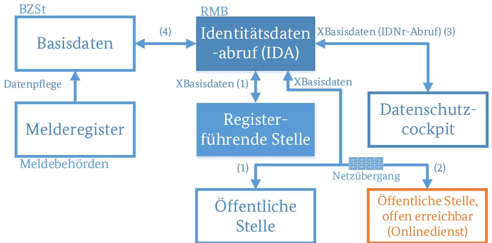
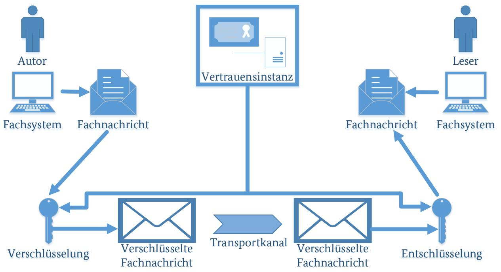

# Technische Richtlinie BSI TR-03176-1: Sichere Datenübermittlung in der Registermodernisierung Teil 1: XBasisdaten

Version 0.9

04.12.2023

# Änderungshistorie

| Version | Datum      | Name               | Beschreibung               |
|---------|------------|--------------------|----------------------------|
| 0.01    | 13.06.2022 | BSI, Referat DI 27 | Erster Entwurf             |
| 0.5     | 03.11.2022 | BSI, Referat DI 27 | Erste Kommentierungsrunde  |
| 0.7     | 06.03.2023 | BSI, Referat DI 27 | Zweite                     |
|         |            |                    | Kommentierungsrunde        |
| 0.9     | 04.12.2023 | BSI, Referat DI 27 | Öffentliche Kommentierung, |
|         |            |                    | Strukturelle Überarbeitung |
|         |            |                    | der Anforderungen,      |
|         |            |                    | Verbesserung von           |
|         |            |                    | Formulierungen in Details  |

*Tabelle 1: Änderungshistorie*

Bundesamt für Sicherheit in der Informationstechnik

Postfach 20 03 63

53133 Bonn

Tel.: +49 22899 9582-0

E-Mail: referat-di27@bsi.bund.de

Internet: https://www.bsi.bund.de

© Bundesamt für Sicherheit in der Informationstechnik 2023

| 1                       |                                           | Einleitung 5                             |  |  |
|-------------------------|-------------------------------------------|---------------------------------------------|--|--|
|                         | 1.1                                       | Abgrenzung 6                             |  |  |
|                         | 1.2                                       | Schlüsselwörter 7                        |  |  |
| 2                       |                                           | Grundlagen und Begriffe  8            |  |  |
|                         | 2.1                                       | Einführung in das Kommunikationsmodell 8 |  |  |
| 3                       | Spezielle Anforderungen für XBasisdaten10 |                                             |  |  |
|                         | 3.1                                       | Authentisierung und Autorisierung10         |  |  |
|                         | 3.2                                       | Vertraulichkeit 11                       |  |  |
|                         | 3.3                                       | Integrität11                                |  |  |
|                         | 3.4                                       | Protokollierung12                           |  |  |
|                         | 3.5                                       | Löschung von Daten12                        |  |  |
| Abkürzungsverzeichnis14 |                                           |                                             |  |  |
|                         | Literaturverzeichnis15                    |                                             |  |  |
|                         | Abbildungsverzeichnis 16               |                                             |  |  |

# **1** Einleitung

Die Technische Richtlinie BSI TR-03176 beschreibt Anforderungen für die Umsetzung der sicheren Datenübermittlung im Kontext der Registermodernisierung. Dabei definiert dieser Teil 1 die besonderen Anforderungen für die Kommunikation, die im Rahmen des Standards XBasisdaten gelten.

Im Rahmen der Registermodernisierung wurde durch das IDNrG festgelegt, dass die vorige Steuer-Identifikationsnummer zu einer allgemeinen Identifikationsnummer (IDNr) ausgebaut wird. Ziel ist die erleichterte Umsetzung des Once-Only-Prinzips: Da die IDNr nun als allgemeines Ordnungskriterium genutzt werden kann, erleichtert sie den Abruf von Nachweisen aus anderen Registern. Allerdings erfordert die Einführung der IDNr einen zusätzlichen Dienst, der einerseits ermöglicht, vertrauenswürdig die IDNr einer Person zu ermitteln, andererseits zu einer IDNr die Basisdaten einer Person zu erhalten. Zu diesem Zweck sieht das IDNrG die Einrichtung eines Identitätsdatenabrufs (IDA) vor. Dieser ermöglicht folgende Vorgänge:

- 1. Den Abruf der IDNr durch registerführende Stellen zu einem Datensatz zwecks Erstbefüllung eines Registers, die regelmäßige Korrektur des Datensatzes auf Basis des Basisdatenregisters durch registerführende Stellen und für den Abruf durch das Datenschutzcockpit (§ 6 Abs. 1 IDNrG) sowie
- 2. den Abruf der IDNr sowie der weiteren Basisdaten durch öffentliche Stellen zwecks Erfüllung einer Verwaltungsdienstleistung im Sinne des Onlinezugangsgesetzes (§ 6 Abs. 2 IDNrG).

Der Ablauf des Datenabrufs wird durch § 6 Abs. 3 sowie § 7 Abs. 1 IDNrG genauer spezifiziert.

XBasisdaten [1] ist der Standard zum Abruf von Basisregisterdatensätzen über natürliche Personen gemäß § 7 Abs. 1 IDNrG. Da es sich hierbei um personenbezogene Daten handelt, wurde in der XBasisdaten-Verordnung festgelegt, dass die Kommunikation unter Verwendung von XBasisdaten besonders gesicherte verwaltungseigene Netze zu nutzen sind oder anderweitig ein hoher Schutzbedarf sichergestellt werden muss. Zur Sicherstellung dieses hohen Schutzbedarfs definiert diese Technische Richtlinie Sicherheitsanforderungen mit dem Ziel, die Authentizität, Integrität und Vertraulichkeit von Basisdaten zu gewährleisten.

#### **1.1** Abgrenzung

Der Abruf der Basisdaten erfolgt ausgehend von einer berechtigten Stelle über die IDA-Komponente der Registermodernisierungsbehörde (RMB). IDA selbst speichert dabei keine Daten, sondern ruft diese anhand der IDNr aus der IDNr-Datenbank des Bundeszentralamts für Steuern (kurz: BZSt) ab. Demzufolge kann die Kommunikation mit dem Identitätsdatenabruf in vier Kommunikationsbeziehungen aufgeteilt werden, wie in Abbildung 1 dargestellt:

Abbildung 1: Kommunikationsbeziehungen des Identitätsdatenabrufs

- 1) Kommunikation Registerführende oder öffentliche Stelle1 Identitätsdatenabruf (IDA)
- 2) Kommunikation Onlinedienst2 Identitätsdatenabruf (IDA)
- 3) Kommunikation Datenschutzcockpit (DSC) Identitätsdatenabruf (IDA)
- 4) Kommunikation Identitätsdatenabruf (IDA) BZSt

Im Rahmen dieses Dokuments werden ausschließlich Komponenten und Systeme betrachtet, welche in direktem Bezug zu XBasisdaten stehen.

Demzufolge bezieht sich diese Teil-TR auf die Kommunikationsbeziehungen 1 und 2 sowie auf die Kommunikationsbeziehung 3, insofern der Standard XBasisdaten zum Abruf von Basisdaten oder der IDNr verwendet wird. Diese Teil-TR bezieht sich nicht auf Kommunikationsbeziehung 3, insofern das Datenschutzcockpit über den Standard XDatenschutzcockpit Protokolldaten aus dem IDA abruft. Auch die Kommunikationsbeziehung 4 wird von dieser Teil-TR nicht betrachtet. Auf Basis dieser Abgrenzung sind die Kommunikationsbeziehungen 2 und 3 als äquivalent zu betrachten, da das DSC einen Onlinedienst darstellt.

Im Zuge des Abrufs einer berechtigten Stelle ist der Abruf von Basisdaten durch eine öffentlich erreichbare Stelle gesondert zu betrachten (Kommunikationsbeziehung 2). Öffentlich erreichbare berechtigte Stellen können beispielsweise Onlinedienste sein, welche an ein Fachverfahren angebunden sind. Darüber hinaus zählen Stellen dazu, welche selbst keine Behörde sind, jedoch öffentliche Aufgaben wahrnehmen und ebenfalls von der Registermodernisierung betroffen sind. Solche Stellen besitzen in der Regel keinen direkten Anschluss an das Verbindungsnetz. Dieser Abruf muss im Folgenden als Spezialfall betrachtet werden, da hier eine Anbindung der berechtigten Stelle aus einem öffentlich erreichbaren Netzwerk an das

1 vgl. § 6 IDNrG, Abs. 1 und 2

2 vgl. § 6 IDNrG, Abs. 2

Verbindungsnetz, über die die IDA-Komponente erreichbar ist, ermöglicht werden muss. Demzufolge sind zusätzliche Anforderungen an die Schnittstelle zu definieren.

#### **1.2** Schlüsselwörter

In der vorliegenden Technischen Richtlinie werden Anforderungen als Ausdruck normativer Festlegungen durch die in Großbuchstaben geschriebenen deutschen Schlüsselworte MUSS/MÜSSEN, DARF NICHT/DÜRFEN NICHT, SOLLTE/SOLLTEN entsprechend gekennzeichnet.

In den Anforderungen werden die in Versalien geschriebenen Modalverben "SOLLTE" und "MUSS" in ihren jeweiligen Formen sowie den zugehörigen Verneinungen genutzt, um deutlich zu machen, wie die jeweiligen Anforderungen zu interpretieren sind. Die hier genutzte Definition basiert auf [2].

| MUSS/DARF NUR:        | Dieser Ausdruck bedeutet, dass es sich um eine Anforderung handelt, die unbedingt erfüllt werden muss (uneingeschränkte Anforderung).                                                                                  |
|-----------------------|---------------------------------------------------------------------------------------------------------------------------------------------------------------------------------------------------------------------------|
| DARF NICHT/DARF KEIN: | Dieser Ausdruck bedeutet, dass etwas in keinem Fall getan werden darf (uneingeschränktes Verbot).                                                                                                                      |
| SOLLTE:               | Dieser Ausdruck bedeutet, dass eine Anforderung normalerweise erfüllt werden muss, es aber Gründe geben kann, dies doch nicht zu tun. Dies muss aber sorgfältig abgewogen und stichhaltig begründet werden.         |
|                       | SOLLTE NICHT/SOLLTE KEIN:Dieser Ausdruck bedeutet, dass etwas normalerweise nicht getan werden sollte, es aber Gründe gibt, dies doch zu tun. Dies muss aber sorgfältig abgewogen und stichhaltig begründet werden. |
| KANN                  | Dieser Ausdruck bedeutet, dass eine bestimmte Umsetzung gewählt werden kann. Diese muss allerdings angezeigt werden.                                                                                                   |

Die Technische Richtlinie repräsentiert den Stand der Technik und wird fortlaufend aktualisiert.

# **2 Grundlagen und Begriffe**

Grundlagen und Begriffe sind dem Hauptdokument BSI TR-03176 zu entnehmen.

Benutzer sollten zunächst das Rahmendokument als Einstiegsdokument nutzen, um sich über die Inhalte, die generelle Struktur und allgemeingültige Anforderungen der TR-03176 zu informieren.

### **2.1** Einführung in das Kommunikationsmodell

Im Kontext von XBasisdaten wird als Kommunikationsmodell Folgendes angenommen:

Abbildung 2: Kommunikationsmodell von XBasisdaten

Abbildung 2 stellt die Kommunikationsbeziehungen in der Registermodernisierung dar. Wie dort zu sehen ist, existiert eine Kommunikation zwischen einem Autor und einem Leser. Autor und Leser kontrollieren jeweils ein Fachsystem. Dieses Fachsystem muss nicht zwangsläufig mit Autor und Leser identisch sein, so wird in der Praxis beispielsweise regelmäßig ein Onlinedienst durch einen Nutzer fernbedient, sodass der Nutzer eigentlicher Autor der Fachnachricht ist, logisch allerdings der Onlinedienst als Fachsystem die Fachnachricht erzeugt und die Antwort entgegennimmt. Das Fachsystem des Autors stellt hierbei das Sendesystem dar, das Fachsystem des Lesers nimmt die Rolle eines Empfangssystems ein. Das bedeutet, dass der Autor eine Inhaltsnachricht erzeugt und absendet, er also Ursprung der Datenübermittlung ist. Der Endpunkt der Datenübermittlung stellt der Leser dar, welcher finaler Adressat der Inhaltsnachricht ist. Der Autor legt den Leser einer Inhaltsnachricht fest. Sobald der Leser eine Antwort auf eine Nachricht generiert, sind die Rollen in Bezug auf die Antwort getauscht, der vormalige Leser ist also Autor der Antwort, der vorige Autor Leser der Antwort.

Zwischen den Fachsystemen von Autor und Leser existiert ein Transportkanal, welcher die Daten überträgt, ohne direkt die Inhaltsdaten selber einsehen zu können. Transport und Fachlichkeit sind also getrennt, sodass der Autor (bzw. sein Fachsystem) alleine für die Inhaltsnachricht zuständig ist. Das bedeutet, dass er für die Errichtung der Ende-zu-Ende-Sicherheit die Verantwortung übernehmen muss und die förmliche Korrektheit der Inhaltsnachricht gewährleistet. Der Transportkanal dagegen ist für die sichere Datenübermittlung verantwortlich. Er stellt die Authentizität, Integrität und Vertraulichkeit eventuell

notwendiger Transportnachrichten sicher. Der genaue Aufbau des Transportkanals ist hierbei unbestimmt; verschiedene Möglichkeiten kommen in Betracht. Neben einem direkten Kanal zwischen den Fachsystemen von Autor und Leser oder der Kommunikation über Intermediäre sind auch weitere Implementierungsmöglichkeiten denkbar. Diese Intermediäre übernehmen die verschlüsselte Fachnachricht und leiten sie entsprechend zu einer weiteren zuständigen Stelle weiter, bis ein Intermediär die Fachnachricht an den Leser zustellen kann. Um die korrekte Weiterleitung der Nachricht zu gewährleisten ist hierbei in der Regel die Anreicherung der Inhaltsdaten mit Metadaten notwendig. Die Metadaten werden von den Intermediären ausgewertet und zur Bestimmung des weiteren Transportpfades benutzt. Hierbei erfolgt eine Übersetzung von logischen Zieldaten (z.B. "Meldebehörde Musterhausen") zu den technischen Übertragungsparametern (z.B. IP-Adresse eines Intermediärs, an den die Systeme der Meldebehörde angebunden sind). Die hierbei notwendige Punkt-zu-Punkt-Sicherheit zwischen zwei Systemen wird von dem System errichtet, welches die Nachricht zu einem anderen System weiterleitet. Das andere System dagegen stellt sicher, dass es Transportnachrichten entgegennehmen, verarbeiten und gegebenenfalls korrekt weiterleiten kann.

Der Leser dagegen stellt sicher, dass er in der Lage ist, Nachrichten zu empfangen. Er ist verpflichtet, die Einhaltung der Anforderungen, die sich aus dieser Technischen Richtlinie ergeben, zu überprüfen. Darüber hinaus stellt er sicher, dass die notwendigen Informationen zur Errichtung einer Ende-zu-Ende-Sicherheit vorliegen.

Alle Komponenten haben die gemeinsame Verantwortung, die Einhaltung der TR durchzusetzen. Das bedeutet insbesondere, dass Verstöße entsprechend der TR behandelt werden müssen.

Der Informationsverbund von XBasisdaten umfasst alle infrastrukturellen und technischen Systeme, die im Rahmen der Datenübermittlung und –verarbeitung eingesetzt werden. Hierbei ist jede Stelle selbst verantwortlich, im eigenen Verantwortungsbereich den Informationsverbund korrekt abzugrenzen. Dies hängt damit zusammen, dass jede Stelle die eigenen Komponenten in eigener Verantwortung betreibt und keine Zentralinstanz existiert, die diese Festlegung zentral für alle Teilhaber an der Registermodernisierung verbindlich festlegt.

# **3** Spezielle Anforderungen für XBasisdaten

Es MÜSSEN die im Rahmendokument spezifizierten Anforderungen zusätzlich zu den hier genannten erfüllt werden.

Die im Rahmen der Datenübermittlung eingesetzten Systeme MÜSSEN gemäß der Standard-Absicherung des BSI-Grundschutz abgesichert werden. Bei der Absicherung MUSS nach XBasisdaten-Verordnung das Schutzniveau "hoch" erreicht werden. Darüber hinaus MÜSSEN Maßnahmen zur Gewährleistung einer hohen Verfügbarkeit und einer sicheren Datenhaltung getroffen werden.

### **3.1** Authentisierung und Autorisierung

Zum Schutz des Basisregisters vor unzulässigen Zugriffen ist es notwendig, den Zugriff auf den Identitätsdatenabruf auf Instanzen zu beschränken, welche tatsächlich berechtigt sind, auf Daten aus dem Basisregister zuzugreifen. Um dies sicherzustellen, sind folgende Anforderungen zu berücksichtigen:

- [XBd.3.1.1] Die Registermodernisierungsbehörde MUSS, bevor es ein Abrufersuchen einer anfragenden Stelle beantwortet, zunächst eine Prüfung der Zugriffs- und Abrufberechtigung (der anfragenden Stelle) durchführen. Unautorisierte oder unauthentisierte Anfragen MÜSSEN abgewiesen werden.
- [XBd.3.1.2] Bei der Erfüllung der Anforderungen dieses Kapitels SOLLTE von einem hohen Vertrauensniveau bei der Authentisierung des abfragenden Systems ausgegangen werden.
- [XBd.3.1.3] Stellt ein System (Autor) eine Anfrage an die Registermodernisierungsbehörde (Leser), so MÜSSEN sich beide Parteien authentisieren. Für die Authentisierung MÜSSEN die Anforderungen der TR-03107-1 [3] eingehalten werden.
- [XBd.3.1.4] Der Ablauf zur Identitätsbindung MUSS dokumentiert werden. Diese Dokumentation MUSS allen beteiligten Stellen zur Verfügung gestellt werden.
- [XBd.3.1.5] Zusätzlich zu den Anforderungen des Rahmendokuments MUSS bei dem kryptografischen Material der Registermodernisierungsbehörde das Security Level 2 gemäß der Key Lifecycle Security Requirements [4] umgesetzt werden.
- [XBd.3.1.6] Die Autorisierung MUSS auf Basis einer authentifizierten Identität erfolgen, die an die aktuelle Verbindungssitzung gebunden wurde.
- [XBd.3.1.7] Das Autorisierungssystem MUSS ein effektives Berechtigungsmanagement implementieren und durchsetzen. Insbesondere SOLLTE über das Rechte- und Rollenmanagement das Rate-Limiting im Sinne des Rahmendokuments parametrisiert sowie die Teilmenge der Basisdaten festgelegt werden, auf welche der Autor zugreifen darf (z.B. nur IDNr, nur IDNr und Straße oder Ähnliches).
- [XBd.3.1.8] Wird eine konkrete Abrufberechtigung durchgeführt, so MUSS das Autorisierungssystem überprüfen, ob die Person, die den konkreten Abruf angestoßen hat, tatsächlich zu dem Abruf berechtigt ist.
- [XBd.3.1.9] Sofern berechtigte Stellen (wie bspw. Behörden) miteinander interagieren, MUSS zur gegenseitigen Authentisierung die V-PKI verwendet werden.
- [XBd.3.1.10] Sofern eine berechtigte Stelle nicht berechtigt ist, ein Zertifikat aus der V-PKI zu beziehen, MUSS die hierfür eingesetzte alternative Identifizierungslösung den Anforderungen aus dem Kapitel zur "Identifizierung von Kommunikationspartnern" der TR-03116-4 [5] entsprechen. Genutzte Zertifizierungsstellen MÜSSEN nach TR-03145 [6] zertifiziert sein, sofern nicht die V-PKI zum Einsatz kommt.
- [XBd.3.1.11] Kryptografisches Material MUSS bezüglich der Gültigkeit der daran gebundenen Identität verifiziert werden. Hierzu MÜSSEN die Vorgaben der TR-03116-4 [5] werden, insbesondere ist das Gültigkeitsdatum und ein möglicher Rückruf zu überprüfen.
- [XBd.3.1.12] Erfolgt ein Abrufersuchen durch ein öffentlich erreichbares Empfangssystem (bspw. einem Onlinedienst), so MUSS eine Schnittstelle zu den Netzen des Bundes realisiert werden. Anforderungen an diese Schnittstelle gehen aus den "Anschlussbedingungen für das Verbindungsnetz" hervor.

[XBd.3.1.13] Zusätzlich zu den Anforderungen des Rahmendokuments MUSS das von öffentlich erreichbaren Systemen für die Erfüllung der Anforderungen dieser Technischen Richtlinie verwendete kryptografische Material entsprechend dem Security Level 2 der Key Lifecycle Security Requirements [4] gespeichert werden, um eine Kompromittierung über die öffentliche Schnittstelle zu erschweren.

- [XBd.3.1.14] Zusätzlich zu der durch das IDNrG geforderten abstrakten Prüfung der Abrufberechtigung SOLLTE eine konkrete Prüfung der Abrufberechtigung durchgeführt werden. Eine konkrete Prüfung der Abrufberechtigung erfüllt folgende Anforderungen:
	- a) Die abstrakte Abrufberechtigung MUSS ebenfalls überprüft werden.
	- b) Das anfragende System MUSS dem IDA zur Prüfung der konkreten Abrufberechtigung einen Nachweis über die Identität des Autors vorlegen oder alternativ den Autor zu einem von der RMB bestimmten vertrauenswürdigen Authentifizierungsdienst weiterleiten, sodass er sich direkt gegenüber dem IDA authentisiert.
	- c) Der vom Abruf Betroffene MUSS explizit in den Datenabruf einwilligen. Die Einwilligung MUSS protokolliert werden.
	- d) Es MUSS durch technische Maßnahmen sichergestellt sein, dass die konkrete Abrufberechtigung ausschließlich für einen einzigen Abruf berechtigt, für einen weiteren Abruf also eine neue Bestätigung der Abrufberechtigung erfolgt. Alternativ DARF auch zu mehreren Abrufen desselben Autors innerhalb einer kurz zu wählenden Zeit berechtigt werden.
	- e) Im Rahmen der konkreten Abrufberechtigung MUSS die festgestellte Identität des konkreten Abrufers protokolliert werden.
	- f) Die Authentisierung des konkreten Nutzers gegenüber dem IDA mindestens auf dem Vertrauensniveau erfolgen, den das Fachverfahren vorgibt, mindestens aber substantiell.

[XBd.3.1.15] Bei automatisierten Abrufen zur Erfüllung der Aufgaben einer registerführenden Stelle gemäß § 2 Nr. 1f. sowie für einen registerbasierten Zensus ist die Umsetzung der Anforderung [\[XBd.3.1.14\]](#page-10-2) in der Regel nicht möglich. Wird für andere Abrufe eine konkrete Abrufberechtigung durchgeführt, MUSS durch technische Maßnahmen sichergestellt werden, dass ein Abruf des Autors von dem Abruf durch andere Autoren unterschieden werden kann (z.B. durch die Ausstellung spezieller Authentisierungsmedien).

#### **3.2** Vertraulichkeit

Es ist sehr wichtig, dass in der Registermodernisierung bei der Übertragung von Daten die Vertraulichkeit gewahrt bleibt, da andernfalls die Gefahr besteht, dass personenbezogene Daten versehentlich an unbefugte Dritte gelangen könnten. Während die Ende-zu-Ende-Sicherheit bereits durch die Anforderungen des Rahmendokuments sichergestellt wird, fehlt noch die Absicherung des Transportkanals, auf welchem neben verschlüsselten Inhaltsdaten auch Metadaten übertragen werden. Daher ist die Vertraulichkeit wie folgt zusätzlich zu sichern:

[XBd.3.2.1] Es MUSS eine Verschlüsselung auf dem Transportkanal zwischen zwei Systemen die vertrauliche Übertragung sicherstellen (Transportverschlüsselung/Punkt-zu-Punkt-Verschlüsselung).

[XBd.3.2.2] Für die Punkt-zu-Punkt-Verschlüsselung MUSS ein von der TR-03116-4 [5] empfohlenes Verfahren eingesetzt werden.

#### **3.3** Integrität

Neben der Vertraulichkeit ist es ebenfalls sehr wichtig, eine manipulationsfreie Übertragung von Daten zwischen einem Register bzw. Onlinedienst und der Registermodernisierungsbehörde sicherzustellen. Daher werden auch Vorgaben getroffen, die die Integrität der Datenübertragung sichern sollen.

[XBd.3.3.1] Zwischen Sende- und Empfangssystem eines Datensatzes MUSS ein Datenauthentisierungsverfahren verwendet werden. Wird ein symmetrisches Datenauthentisierungsverfahren verwendet, MUSS es mit einem ephemeren Schlüsseleinigungsverfahren kombiniert werden.

- [XBd.3.3.2] Werden Intermediäre zur Kommunikation verwendet, so MUSS zwischen zwei Intermediären ein Integritätssicherungsverfahren verwendet werden, dass die Integrität der Transportnachricht auf dem Transportkanal sicherstellt.
- [XBd.3.3.3] Das Integritätssicherungsverfahren MUSS sicherstellen, dass sich das Empfangssystem vergewissern kann, dass die Nachricht tatsächlich vom Sendesystem abgeschickt wurde.

#### **3.4** Protokollierung

- [XBd.3.4.1] Das für XBasisdaten gemäß Rahmendokument zu führende Protokoll zur transparenten Nachvollziehbarkeit der organisatorischen Aspekte der Datenübermittlung ist wie folgt entsprechend der Rollen aufzuteilen:
	- a) Der Autor der Nachricht protokolliert:
		- i. Den Zeitpunkt, zu dem er die Nachricht Ende-zu-Ende-verschlüsselt oder den Ende-zu-Ende-Integritätsschutz angebracht hat,
		- ii. den Zeitpunkt, zu dem er die Nachricht an die nächste Stelle im Transportweg weitergeleitet hat, also beispielsweise an den Leser oder an ein Intermediärsystem auf dem Transportweg,
		- iii. den Zeitpunkt, zu dem eine Transportverschlüsselung oder –integritätssicherung an der Nachricht angebracht wurde sowie
		- iv. den Akteur, an welchen die Nachricht an das nächste System im Übertragungsweg übermittelt wurde.
	- b) Intermediärsysteme auf dem Transportkanal (sofern vorhanden) protokollieren:
		- i. Den Zeitpunkt, zu dem Nachrichten eingegangen oder weitergeleitet werden,
		- ii. den Zeitpunkt, zu dem eine Transportverschlüsselung oder –integritätssicherung an einer Nachricht angebracht, überprüft, oder entfernt wurde,
		- iii. im Falle einer Überprüfung der Integritätssicherung das Ergebnis sowie das hierfür angewandte Verfahren sowie
		- iv. die beteiligten Akteure, also Herkunft und Ziel einer Nachricht, sowie Autor und Leser einer Nachricht.
	- c) Der Leser der Nachricht protokolliert:
		- i. Den Zeitpunkt, zu dem eine Nachricht eingeht,
		- ii. den Zeitpunkt, zu dem eine Transportverschlüsselung oder –integritätssicherung an einer Nachricht angebracht, überprüft, oder entfernt wurde,
		- iii. den Zeitpunkt, zu dem die Ende-zu-Ende-Verschlüsselung einer Nachricht entfernt wurde,
		- iv. im Falle einer Überprüfung der Integritätssicherung das Ergebnis sowie das hierfür angewandte Verfahren,
		- v. die beteiligten Akteure, also der Autor sowie Intermediärsysteme, von denen die Nachricht empfangen wurde,
		- vi. das Ergebnis der Schemavalidierung und
		- vii. ob bei der Bearbeitung einer Nachricht Fehler aufgetreten sind. Falls ja, auch der Fehlertyp.
- [XBd.3.4.2] Für Antworten ist dementsprechend vorzugehen, wobei auf den Tausch der Rollen in der Kommunikation zu achten ist. Ferner haben Autor und Leser zu protokollieren, auf welche Anfrage sich eine Antwort bezieht.
- [XBd.3.4.3] Die Zentralstelle im Sinne des Rahmendokuments ist die Registermodernisierungsbehörde.

#### **3.5** Löschung von Daten

[XBd.3.5.1] Die Aufbewahrungsfrist von Protokollen im Sinne des Rahmendokuments beträgt mindestens und maximal zwei Jahre3 .

3 Diese Frist befindet sich in der Abstimmung mit dem BfDI.

[XBd.3.5.2] Die Löschfrist für nicht zugestellte Nachrichten im Sinne des Rahmendokuments beträgt 10 Tage4 .

4 Diese Frist befindet sich in der Abstimmung mit dem BfDI.

# **Abkürzungsverzeichnis**

| Abkürzung | Erklärung                                                                 |
|-----------|---------------------------------------------------------------------------|
| BSI       | Bundesamt für Sicherheit in der Informationstechnik                       |
| BfDI      | Der Bundesbeauftragte für den Datenschutz und die Informationsfreiheit |
| BZSt      | Bundeszentralamt für Steuern                                              |
| IDA       | Identitätsdatenabruf                                                      |
| PKI       | Public Key Infrastruktur                                                  |
| RMB       | Registermodernisierungsbehörde                                            |
| TR        | Technische Richtlinie                                                     |

## **Literaturverzeichnis**

- [1] Bundesverwaltungsamt, "Spezifikation XBasisdaten 1.0," 1 Februar 2022. [Online]. Available: https://www.xrepository.de/api/xrepository/urn:xoevde:bva:standard:xbasisdaten\_1.0:dokument:Spezifikation\_XBasisdaten\_V1.0. [Zugriff am 31 Mai 2022].
- [2] S. O. Bradner, "Key words for use in RFCs to Indicate Requirement Levels," März 1997. [Online]. Available: https://www.rfc-editor.org/info/rfc2119. [Zugriff am 2 Juni 2022].
- [3] Bundesamt für Sicherheit in der Informationstechnik, "Elektronische Identitäten und Vertrauensdienste im E-Government - Teil 1: Vertrauensniveaus und Mechanismen - Version 1.1.1," 7 Mai 2019. [Online]. Available: https://www.bsi.bund.de/SharedDocs/Downloads/DE/BSI/Publikationen/TechnischeRichtlinien/TR0 3107/TR-03107-1.pdf?\_\_blob=publicationFile&v=1. [Zugriff am 1 Juni 2022].
- [4] Bundesamt für Sicherheit in der Informationstechnik, "Key Lifecycle Security Requirements Version 1.0.3," 17 November 2021. [Online]. Available: https://www.bsi.bund.de/SharedDocs/Downloads/DE/BSI/ElekAusweise/CVCA/KeyLifecycleSecurity Requirements.pdf?\_\_blob=publicationFile&v=3.
- [5] Bundesamt für Sicherheit in der Informationstechnik, "Kryptographische Vorgaben für Projekte der Bundesregierung - Teil 4: Kommunikationsverfahren in Anwendungen," 24 Januar 2022. [Online]. Available: https://www.bsi.bund.de/SharedDocs/Downloads/DE/BSI/Publikationen/TechnischeRichtlinien/TR0 3116/BSI-TR-03116-4.pdf?\_\_blob=publicationFile&v=3. [Zugriff am 3 Juni 2022].
- [6] Bundesamt für Sicherheit in der Informationstechnik, "Secure CA operation, Part 1, Version 1.1," 27 März 2017. [Online]. Available: https://www.bsi.bund.de/SharedDocs/Downloads/EN/BSI/Publications/TechGuidelines/TR03145/TR 03145.pdf?\_\_blob=publicationFile&v=1.

# **Abbildungsverzeichnis**

| Abbildung 1: Kommunikationsbeziehungen des Identitätsdatenabrufs | 6 |
|------------------------------------------------------------------|---|
| Abbildung 2: Kommunikationsmodell von XBasisdaten                | 8 |