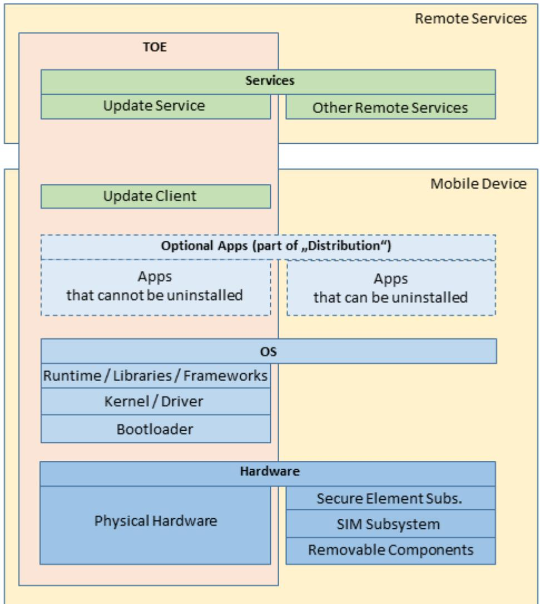
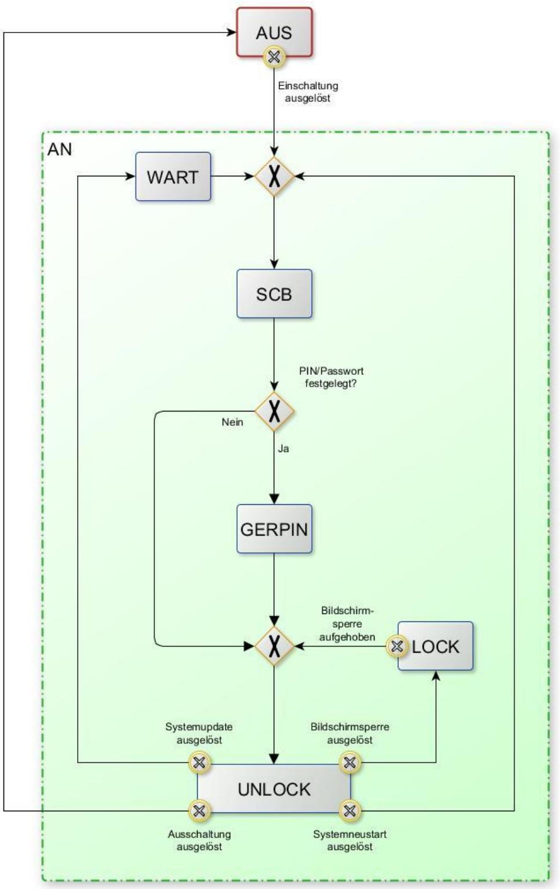

# TR-03180

*Kriterienkatalog zur Bewertung des IT-Sicherheitsniveaus von Smartphones & Tablets für den Einsatz im Verbraucherkontext*

# Änderungshistorie

| Version | Datum      | Name  | Beschreibung                                                                                                      |  |
|---------|------------|-------|-------------------------------------------------------------------------------------------------------------------|--|
| 0.9     | 04.12.2023 | TK 12 | Veröffentlichungsreife Version                                                                                    |  |
| 0.9a    | 10.04.2024 | TK 12 | Entfernung Kurzbezeichnung - Bereinigung Formatierungsfehler - Kriterien für BZS_LOCK & BSZ_UNLOCK |  |
| 1.0     | 30.07.2024 | TK 12 |                                                                                                                   |  |
|         |            |       |                                                                                                                   |  |

*Tabelle 1: Änderungshistorie*

Bundesamt für Sicherheit in der Informationstechnik Postfach 20 03 63 53133 Bonn Tel.: +49 22899 9582- 6034 E-Mail: referat-tk12@bsi.bund.de Internet: https://www.bsi.bund.de © Bundesamt für Sicherheit in der Informationstechnik 2023

| 1     | Einordnung des Dokuments |                                                                 |   |  |
|-------|--------------------------|-----------------------------------------------------------------|---|--|
|       | 1.1                      | Einleitung                                                   | 4 |  |
|       | 1.2                      | Zielgruppe                                                   | 5 |  |
|       | 1.3                      | Abgrenzung zum Ansatz der Common Criteria / Verwendete Sprache  | 5 |  |
| 1.3.1 |                          | Abgrenzung zum Ansatz der Common Criteria                       | 5 |  |
|       | 1.3.2                    | Verwendete Sprache                                              | 5 |  |
|       | 1.4                      | Verwendete Symbole                                           | 6 |  |
| 2     |                          | Evaluationsgegenstand                                        | 7 |  |
|       | 2.1                      | Was gehört zum TOE?                                             | 7 |  |
|       | 2.2                      | Was gehört nicht zum TOE?                                       | 8 |  |
|       | 2.3                      | Betriebszustände                                             | 8 |  |
|       | 2.3.1                    | Definition der Betriebszustände                                 | 8 |  |
|       | 2.3.2                    | Mögliche Zustandsübergänge10                                    |   |  |
| 3     |                          | Struktureller Ansatz11                                          |   |  |
|       | 3.1                      | Schützenswerte Güter ("Assets")11                               |   |  |
|       | 3.2                      | Bedrohungen ("Threats")12                                       |   |  |
|       | 3.3                      | Annahmen hinsichtlich der Einsatzumgebung ("Assumptions") 13 |   |  |
|       | 3.4                      | Grundvoraussetzungen bezüglich des TOE 14                    |   |  |
|       | 3.5                      | IT-Sicherheitsziele ("Security Objectives")15                   |   |  |
| 4     |                          | Kriterienkatalog17                                              |   |  |
|       | 4.1                      | Allgemeines (ALG) 17                                         |   |  |
|       | 4.2                      | Betriebszustände (BZS)18                                        |   |  |
|       | 4.3                      | Updates (UPD) 20                                             |   |  |
|       | 4.4                      | Installation von Apps (INS) 22                               |   |  |
|       | 4.5                      | Kryptografie (KRY)23                                            |   |  |
|       | 4.6                      | Benutzermanagement (USR)23                                      |   |  |
|       | 4.7                      | Datenmanagement (DAT)25                                         |   |  |
|       | 4.8                      | Datenübertragung (DUE) 28                                    |   |  |
|       | 4.9                      | Schnittstellen ("Interfaces") (INT)30                           |   |  |
|       | 4.10                     | Sensoren (SEN) 33                                         |   |  |
| 5     |                          | Begriffe, Abkürzungen und Symbole 35                         |   |  |
|       | 5.1                      | Begriffe35                                                      |   |  |
|       | 5.2                      | Abkürzungsverzeichnis38                                         |   |  |
| 6     |                          | Literaturverzeichnis39                                          |   |  |

# 1 Einordnung des Dokuments

### 1.1 Einleitung

Zur Beurteilung der Güte des IT-Sicherheitsniveaus eines mobilen IT-Gerätes braucht es definierte Kriterien (sowohl des Gerätes als auch der Unterstützungsprozesse seitens des Herstellers), deren Vorhandensein für ein bestimmtes Gerät geprüft/gemessen werden kann.

In der hier vorliegenden Fassung adressiert diese Technische Richtlinie (TR) ausschließlich die private Nutzung1 mobiler IT-Geräte (für die sie als reine Consumer-Produkte eigentlich auch konzipiert sind). Diese TR stellt Kriterien mobiler IT-Geräte und der sie unterstützenden Prozesse zusammen, die aus Sicht des BSI für ein angemessenes IT-Sicherheitsniveau mobiler IT-Geräte relevant sind, wenn diese im privaten Umfeld des Verbrauchers zum Einsatz kommen sollen. Diese TR enthält keine Hinweise an die Verbraucher zum Umgang mit mobilen IT-Geräten. Konfigurations- und Verhaltenshinweise für die Benutzer hält das BSI (2021) in der Veröffentlichung *Smartphone und Tablet effektiv schützen - Wichtige Sicherheitshinweise für die Nutzung Ihrer mobilen, internetfähigen Geräte* bereit.

Der Einsatz mobiler IT-Geräte im professionellen Umfeld erfordert zum einen eine Anpassung einiger der hier dokumentierten Kriterien und zum anderen eine Erweiterung des Katalogs beispielsweise um Aspekte bezüglich der Geräteverwaltung ("Mobile Device Management", MDM), die für den privaten Einsatz hingegen eher keine Rolle spielen dürften.

Wenn in dieser TR von "mobilen IT-Geräten" die Rede ist, sind ausschließlich Smartphones und Tablets gemeint - zwar zählen Laptops auch zu den mobilen IT-Geräten, sie weisen jedoch einige für Smartphones und Tablets typische Eigenschaften nicht auf (wie z. B. Software-Verteilstrukturen, in denen zentrale Marktplatzbetreiber mehr oder weniger Kontrolle über installierbare Programme haben). Zwar nähern sich die Welten der klassischen Betriebssysteme und der Betriebssysteme für Smartphones und Tablets inzwischen immer mehr an, derzeit sind Laptops jedoch den stationären IT-Geräten (PCs) eher verwandt, als den Smartphones bzw. Tablets.

Ein erheblicher Teil der Sicherheitsziele und Kriterien in dieser TR sind allerdings genau genommen nicht spezifisch für Smartphones und Tablets und können auch auf andere mobile IT-Geräte, wie z.B. Laptops, und stationäre bzw. klassische IT-Geräte angewendet werden.

In dieser TR werden datenschutzrechtliche Eigenschaften i. d. R. nicht betrachtet, wenngleich es zwischen einigen Kriterien in dieser TR und bestehenden datenschutzrechtlichen Forderungen Überschneidungen geben mag.

Anderweitig aufgestellte Forderungen aufgrund datenschutzrechtlicher oder verbraucherschutzrechtlicher Erfordernisse bleiben von den Kriterien in dieser TR unberührt; ihre Einhaltung muss durch den Hersteller des mobilen IT-Gerätes ggf. zusätzlich gewährleistet, geprüft und/oder nachgewiesen werden.

Die in dieser TR formulierten Kriterien sind nicht mit Anforderungen zu verwechseln die an das IT-Sicherheitsniveau mobiler IT-Geräte gestellt werden. Sie sind vielmehr ein Fundus an IT-Sicherheitseigenschaften aus dem ein je nach gewünschtem IT-Sicherheitsniveau speziell erstellter Anforderungskatalog diejenigen auswählt, die für das eben zu erreichende IT-Sicherheitsniveau relevant sind. In einer den Anforderungskatalog ergänzenden Prüfspezifikation kann dann festgelegt werden, unter welchen Bedingungen eine bestimmte technische Lösung den jeweiligen Anforderungskatalog erfüllt.

1 Zur "privaten Nutzung" in Sinne dieser TR zählen Verwendungen wie z.B.:

- Telefonieren

- SMS/MMS

- Terminverwaltung

- Internetrecherche

- Social Networking

- Fotografieren

- Speichern von Dateien

Das bedeutet, dass die Güte eines mobilen IT-Gerätes nicht (allein) durch die TR bestimmt wird, sondern immer in Kombination mit einem auf dieser TR aufbauenden Anforderungskatalog nebst Prüfspezifikation. Zum Thema "Anforderungskatalog" s. auch Kapite[l 3.](#page-10-0)

## 1.2 Zielgruppe

Mit dieser TR werden insbesondere die Hersteller mobiler IT-Geräte, sowie Prüfer, die die Güte des IT-Sicherheitsniveaus eines mobilen Gerätes beurteilen/bezeugen sollen, adressiert. Aber auch für die Benutzer dieser Geräte enthält diese TR nützliche Hintergrundinformationen, allerdings setzt sie dazu ein gewisses Maß an technischem Basiswissen über die Technologie mobiler IT-Geräte voraus.

Zu dem für das Verständnis dieses Dokuments benötigte bzw. hilfreiche Basiswissen gehören insbes. folgende Themenbereiche:

- Grundlagen der IT-Sicherheit (z. B. IT-Schutzziele, Charakteristika von IT-Bedrohungen)
- Angriffstechniken aus der Welt der Cyber-Bedrohungen (z. B. Phishing, Man In The Middle, etc.)
- Authentisierungstechniken und -mechanismen (z. B. 2-/Multifaktor-Authentisierung)
- Kommunikationsprotokolle & Übertragungsprotokolle
- Systemarchitekturen mobiler Betriebssysteme
- Grundbegriffe und -prinzipien der Informatik (z. B. ROM, Booten, Code, Programm)

### 1.3 Abgrenzung zum Ansatz der Common Criteria / Verwendete Sprache

### 1.3.1 Abgrenzung zum Ansatz der Common Criteria

Die TR orientiert sich in ihrer Struktur und Ausdrucksweise weitgehend am Ansatz der Common Criteria (CC), allerdings ohne eine tatsächliche bzw. lückenlose CC-Konformität anzustreben.

Zur Herleitung der Eigenschaften schlägt die TR ähnlich der CC den Weg über die Beschreibung der als relevant angesehenen Bedrohungen ("Threats"), über die Feststellung von Annahmen bezüglich der Einsatzumgebung ("Assumptions") und die Formulierung von IT-Sicherheitszielen ("Security Objectives") hin zu den Kriterien (ähnlich der "Security Functional Requirements") ein.

Dabei sind Abweichungen von den in den CC üblichen Designatoren bewusst gewählt, um nicht den Eindruck einer CC-Konformität zu simulieren (d.h., es wurden keine Klassen oder Familien - und deren Namen - der CC übernommen, sondern eigene gebildet).

### 1.3.2 Verwendete Sprache

Das Original der TR adressiert den deutschen Sprachraum (wiewohl es fremdsprachliche Übersetzungen geben kann) und bemüht sich, englische Begriffe nur dort zu benutzen, wo es keine deutschsprachige Übersetzung eines Fachbegriffs gibt, bzw. die englische Wendung im deutschen Sprachgebrauch etabliert ist.

Bei deutschsprachigen, aus den CC entlehnten Begriffen wird die englische Entsprechung (wenigstens bei der ersten Verwendung) beigestellt.

### 1.4 Verwendete Symbole

Der Zeigefinger weist auf Sachverhalte hin, die bei der Verwendung der TR unbedingt zu beachten sind.

 → Der Pfeil kennzeichnet einen Verweis auf einen Eintrag entweder in Kapitel [2.3](#page-7-1) "[Betriebszustände](#page-7-1)" oder in Kapite[l 5.1](#page-34-1) "[Begriffe](#page-34-1)".

Der rote Stift kennzeichnet eine Passage, die sich gegenüber der vorangegangenen Version des Dokuments geändert hat. Löschungen gegenüber der Vorversion sind daran zu erkennen, dass hinter dem Stift kein Text/Bild steht.

Rein redaktionelle Änderungen (Behebung von Schreibfehlern, Umformatierungen, u. Ä.) werden allerdings nicht gekennzeichnet.

# 2 Evaluationsgegenstand

Der Evaluationsgegenstand ("Target of Evaluation", TOE) sind die Bestandteile des mobilen IT-Gerätes, für die die Annahmen, Bedrohungen, Sicherheitsziele und Kriterien in diesem Dokument gelten.

Die Komposition eines mobilen IT-Gerätes lässt sich verallgemeinert wie folgt darstellen:

*Abbildung 1 Schematische Darstellung der Komponenten des TOE*

### 2.1 Was gehört zum TOE?

- Die Hardware, bspw. SOC ("System On Chip"), Touchscreen, Sensoren, Schnittstellen.
- Sämtliche Softwarekomponenten, die für den regulären Start (→**[Regulärer Start](#page-36-0)**) und den regulären Betrieb (→**[Regulärer Betrieb](#page-36-1)**) des mobilen IT-Gerätes sowie der einwandfreien Nutzung von Apps vorgesehen/notwendig sind.
- Alle Apps, die durch den Benutzer nicht deinstalliert werden können.
- Zum TOE gehören auch die Update-Services des Geräteherstellers und des Betriebssystemherstellers einschließlich der Update-Services derer Partner.
- Hierbei werden jedoch ausschließlich die Teile betrachtet, die serverseitig und auch auf Seiten des Mobilgerätes die Integrität einer bereitgestellten bzw. heruntergeladenen Software betreffen.

• Softwareschnittstellen ("Application Programming Interface", API), über die nicht zum TOE gehörende Komponenten (z. B. Wechselspeicher) angesprochen werden, sind in der Betrachtung enthalten.

### 2.2 Was gehört nicht zum TOE?

Von der Betrachtung ausgeschlossen sind:

- Hardwarekomponenten, die nicht fest im Mobilgerät verbaut sind, z.B. eine SD-Speicherkarte sowie die darauf befindlichen Benutzerdaten (der Gerätehersteller hat hier keine Möglichkeit der Einflussnahme).
- SIM-Subsystem bestehend aus Hardware (Controller, Antennen, usw.) sowie zugehörige Softwarekomponenten (Daten und SIM Card Applets).
- Secure Element (SE); im Kontext dieser TR (→**[Massenangriff](#page-35-0)**) sind keine Bedrohungen/Angriffe bekannt, daher keine Kriterien notwendig.
- Softwarekomponenten, die einen regulären Start (*→***[Regulärer Start](#page-36-0)**) bzw. regulären Betrieb ( *→***[Regulärer Betrieb](#page-36-1)**) abweichenden Zustand des mobilen IT-Gerätes realisieren.
- • Apps, die im Auslieferungszustand vorhanden, jedoch mit den Systemmitteln, die dem Benutzer im regulären Betrieb zur Verfügung stehen nicht deinstallierbar sind.
- Apps, die über den Auslieferungszustand hinaus durch den Benutzer nachträglich installiert wurden.
- Externe Dienste, die vom TOE genutzt werden; dazu zählen insbes. auch die Services zur Verteilung von Apps (landläufig "App-Store" / "Play-Store"). (**Ausnahme:** Update-Service des Geräteherstellers).

### 2.3 Betriebszustände

### 2.3.1 Definition der Betriebszustände

Ein mobiles IT-Gerät kann folgende Betriebszustände2 einnehmen:

AUS *AUS*

Der Betriebszustand AUS gilt als eingenommen, wenn keine informationstechnischen Prozesse ablaufen. Der Zustand wird erreicht, wenn die Stromversorgung des Hauptprozessors durch den Benutzer durch Betätigen des Ein-/Aus-Schalters (oder einer digitalen Repräsentanz desselben) unterbrochen wird, oder die Stromversorgung (hier: Akku) erschöpft ist.

Im Betriebszustand AUS liegt allenfalls eine basale Stromversorgung etwa zur Erhaltung der gespeicherten Informationen oder zur Steuerung des Wiederanschaltens des Gerätes vor.

AN *AN*

Der Betriebszustand AN gilt als eingenommen, sobald bzw. solange die Stromversorgung des Hauptprozessors besteht und mindestens rudimentäre informationstechnische Prozesse ablaufen.

Der Betriebszustand AN kann als übergeordneter Zustand verstanden werden, dem alle anderen Betriebszustände (SCB, SIMPIN, GERPIN, UNLOCK, LOCK und WART) subsumiert werden können.

#### SCB *Secure Boot*

In diesem Betriebszustand startet das Gerät aus dem Zustand AUS bis in einen Zustand, in dem die erste Benutzer-Interaktion verlangt wird.

2 Der →**[Recovery-Mode](#page-36-2)** ist kein Betriebszustand im Sinne dieser TR, da er nicht zur "privaten Nutzung" (s. Kap. 1) gezählt wird.

SIMPIN *Vor Eingabe der SIM-PIN* Dieser Betriebszustand kann verständlicherweise nur eingenommen werden, wenn eine PIN zur Zugriffssteuerung auf die SIM-Funktionalitäten überhaupt festgelegt wurde. Anmerkung: Dieser Betriebszustand wird nicht weiter betrachtet, da sich das SIM-Subsystem außerhalb des TOE befindet - und fehlt daher auch in der Grafik zu den Zustandsübergängen. GERPIN *Vor erstmaliger Eingabe der Geräte-PIN* Dieser Betriebszustand kann verständlicherweise nur eingenommen werden, wenn eine PIN oder ein Passwort zur Zugriffssteuerung auf die Gerätefunktionalitäten überhaupt festgelegt wurde. UNLOCK *Entsperrt* Im entsperrten Zustand stehen dem Benutzer alle Gerätefunktionalitäten zur Verfügung. LOCK *Gesperrt* Im gesperrten Zustand ist die Interaktion des Benutzers mit Apps unterbrochen, der Benutzer ist jedoch nach wie vor angemeldet. Allerdings erlaubt das User-Interface eine eingeschränkte Gerätebedienung bzw. -nutzung wie z. b. das Tätigen von Notrufen und die Auflösung von Rufnummern aus den Kontakten, das Steuern eines Musikspielers und die Alarmfunktion des Weckers oder des Kalenders. Sind eine oder mehrere Authentisierungsmethoden (Wissen, Besitz, Biometrie) festgelegt worden, kann der Benutzer erst nach erneuter Authentifizierung wieder weiter mit Apps arbeiten.

#### WART *Wartungsmodus*

Im Wartungsmodus wird ein vom Betriebssystem unabhängiger Kernel geladen, der einen schreibenden Zugriff auf die Betriebssystempartition erlaubt. Er wird in der Regel eingenommen, nachdem der Benutzer im Zustand Entsperrt ein Betriebssystemupdate ausgelöst hat.

### 2.3.2 Mögliche Zustandsübergänge

Die Zustandsübergänge sind dabei wie folgt definiert:

*Abbildung 2 Übergänge zwischen den Betriebszuständen des TOE*

# 3 Struktureller Ansatz

Die Basis für diese TR ist die "Technical Specification 103 732" (TS 103 732) des European Telecommunications Standards Institute (ETSI), die ihrerseits ein Protection Profile nach CC darstellt ("PP for Consumer Mobile Devices"). Zwar weicht diese TR von der TS des ETSI ab, sie folgt jedoch weiterhin dem Ansatz der CC (siehe Kapitel 1.3 ff). Das heißt, zunächst werden die schützenswerten Güter definiert. Danach werden für die schützenswerten Güter Bedrohungen benannt, die maßgebend im Sinne dieser Technischen Richtlinie sind. Mit IT-Sicherheitszielen werden indirekt Maßnahmen definiert, die diesen Bedrohungen (mittelbar oder unmittelbar) entgegenwirken - d. h. die IT-Sicherheitsziele sind so formuliert, dass jede Bedrohung durch mindestens ein IT-Sicherheitsziel adressiert wird. Aus den Sicherheitszielen werden dann Kriterien abgeleitet, deren Erfüllung dazu führt, dass die IT-Sicherheitsziele erreicht werden. Die Kriterien sind unabhängig von einer konkreten technischen Implementation. Die Festlegung von Bedingungen, unter denen eine bestimmte technische Lösung ein ausreichendes Sicherheitsniveau aufweist, erfolgt nicht in der TR selbst, sondern einem separaten Anforderungskatalog nebst Prüfspezifikation. Damit wird für ein TOE ein Bogen von den zu schützenden Gütern bis zu einer nachvollziehbaren Evaluation eines bestimmten mobilen Gerätes geschlagen.

### 3.1 Schützenswerte Güter ("Assets")

Schützenswerte Güter können sowohl unmittelbar wie mittelbar sein. Mittelbare schützenswerte Güter sind allgemeingültig und nicht direkt auf das TOE bezogen (z.B. Betriebssystem, Updates und Konfigurationen). Im Gegensatz dazu sind unmittelbare schützenswerte Daten auf das TOE bezogen, beispielsweise die Benutzer-Daten.

Zu den schützenswerten Gütern zählen insbesondere:

- Daten
	- App-Daten
		- Informationen über die installierten Apps
		- Benutzerdaten (Beispiele: Dateien, Standortdaten, Account-Informationen, Kommunikationsdaten, Anmeldename des Benutzers, Sensordaten, Clipboard-Daten, ...)
		- Nutzungsdaten in Apps (Beispiele: Zeitpunkt des Starts der App, geklickte Programmteile, ...)
	- Nutzungsdaten des BS (→**[Betriebssystem](#page-34-2)**)
- Betriebssystem und Apps des TOE
- Updates
- Konfiguration von Sicherheitsfunktionen

Bei den Daten werden folgende Schutzklassen unterschieden:

- 000 Die **Offenlegung, Verfälschun**g oder **Nichtverfügbarkeit** des Datums ist weder für ihren Eigentümer, noch für ihre(n) Benutzer von Bedeutung.
- 001 Die **Nichtverfügbarkeit** des Datums ist für ihren Eigentümer oder ihre(n) Benutzer eine Gefahr.
- 010 Die **Verfälschung** des Datums ist für ihren Eigentümer oder ihre(n) Benutzer eine Gefahr.
- 100 Die **Offenlegung** des Datums ist für ihren Eigentümer, oder ihre(n) Benutzer eine Gefahr.
- 999 Die Daten gehören zum **Sicherheitssystem** des TOE3 .

3 Das Sicherheitssystem des TOE besteht sowohl aus funktionalen Eigenschaften des TOE (beispielsweise dem Rechtemanagement) wie auch kritischen Benutzerdaten (beispielsweise Schlüsselmaterial oder digitale Abbilder der Fingerabdrücke und Gesichtsbilder).

Kombinationen der Schutzklassen sind dabei möglich:

- 011 Daten mit den Eigenschaften der Schutzklassen 001 und 010: Sowohl die **Verfälschung**, als auch die **Nichtverfügbarkeit** des Datums sind für ihren Eigentümer oder ihre(n) Benutzer eine Gefahr.
- 101 Daten mit den Eigenschaften der Schutzklassen 001 und 100: Sowohl die **Offenlegung**, als auch die **Nichtverfügbarkeit** des Datums sind für ihren Eigentümer, oder ihre(n) Benutzer eine Gefahr.
- 110 Daten mit den Eigenschaften der Schutzklassen 010 und 100: Sowohl die **Offenlegung**, als auch **Verfälschung** des Datums sind für ihren Eigentümer, oder ihre(n) Benutzer eine Gefahr.
- 111 Daten mit den Eigenschaften der Schutzklassen 001, 010 und 100: Sowohl die **Offenlegung**, als auch die **Verfälschung**, als auch die **Nichtverfügbarkeit** des Datums sind für ihren Eigentümer, oder ihre(n) Benutzer eine Gefahr.

### 3.2 Bedrohungen ("Threats")

Bei der Definition der Bedrohung spielen nur diejenigen eine Rolle, die für die schützenswerten Güter des Betrachtungsgegenstands maßgebend sind. Dabei kann unterschieden werden in Bedrohungen, die den eigentlichen Angriff auf die schützenswerten Güter vorbereiten (Vorbereitende Bedrohungen) und den Bedrohungen die sich dann tatsächlich gegen die schützenswerten Güter richten (Intendierte Bedrohungen).

Darüber hinaus gibt es selbstverständlich eine ganze Reihe weiterer Bedrohungen, die über die Gefährdung der o. g. schützenswerten Güter hinausgehen.

Für Smartphones und Tablets sind die folgenden Bedrohungen vorhanden:

#### **Vorbereitende Bedrohungen:**

- **T.PREP\_GERAET\_UEBERNAHME** Ein Angreifer verschafft sich physischen Zugriff auf das TOE.
- **T.PREP\_GERAET\_EIGENSCHAFTEN\_MANIPULATION** Ein Angreifer verschafft sich schreibenden Zugriff auf die (Sicherheits-)Eigenschaften des TOE und verändert sie.
- **T.PREP\_IDENTITAET\_UEBERNAHME** Ein Angreifer gibt sich dem TOE gegenüber als legitimer Benutzer des TOE aus.
- **T.PREP\_SCHWACHSTELLE\_GERAET** Ein Angreifer erlangt Zugriff auf das TOE durch die Ausnutzung von (informationstechnischen) Schwachstellen desselben.
- **T.PREP\_KOMMUNIKATION\_EINLEITUNG** Ein Angreifer bringt den Benutzer des TOE dazu, einen vom Angreifer kontrollierten Kommunikationskanal zu einer beliebigen (externen) Entität aufzubauen.
- **T.PREP\_APPS\_MALWARE\_INSTALLATION** Ein Angreifer bringt den Benutzer des TOE dazu, eine App mit Schadfunktion zu installieren.

Zu den Daten der Schutzklasse **999** gehören u.a.:

- Schlüssel, Zertifikate und/oder andere Daten, die für die initiale Integritätsprüfung beim Systemstart verwendet werden

- Zeichenkombinationen die eindeutig mit einem Gerät verknüpft sind

- Schlüssel, Zertifikate und/oder andere Daten, die für die Überprüfung der Integrität und Authentizität von Updates verwendet werden

#### • **T.PREP\_APPS\_MANIPULATION**

Ein Angreifer ändert das Verhalten einer auf dem TOE installierten App, obwohl er keine Berechtigung dazu hat.

#### **Intendierte Bedrohungen:**

#### • **T.KOMMUNIKATION\_MITLESEN**

Ein Angreifer hat lesenden Zugriff auf die Kommunikation zwischen dem TOE und einer anderen Entität.

#### • **T.KOMMUNIKATION\_MANIPULATION**

Ein Angreifer hat Zugriff auf die Kommunikation zwischen dem TOE und einer anderen Entität und verändert die übertragenen Daten auf dem Weg vom Sender zum Empfänger.

#### • **T.SPEICHER\_AUSLESEN**

Ein Angreifer hat lesenden Zugriff auf die im TOE gespeicherten Daten.

#### • **T.SPEICHER\_MANIPULATION**

Ein Angreifer hat (lesenden und) schreibenden Zugriff auf den Datenspeicher des TOE und verändert oder löscht gespeicherte Daten.

#### • **T.SPEICHER\_WIEDERHERSTELLUNG**

Ein Angreifer hat Zugriff auf gelöschte Bereiche des Datenspeichers des TOE (z. B. nach Übergabe eines Geräts von einem Benutzer auf einen Folgenutzer) und kann gelöschte Daten wiederherstellen.

#### • **T.UMGEBUNG\_UEBERWACHUNG**

Ein Angreifer hat Zugriff auf Sensoren des TOE (z. B. Kamera, Mikrofon) und überwacht mit ihrer Hilfe die Umgebung des Benutzers.

### 3.3 Annahmen hinsichtlich der Einsatzumgebung ("Assumptions")

Die "Annahmen hinsichtlich der Einsatzumgebung" sollen u.a. helfen, den Kriterienkatalog (s. Kap. 4) auf die Mechanismen/Eigenschaften des TOE fokussieren zu können, die der Gerätehersteller bzw. dessen Zulieferer unter Kontrolle hat/haben bzw. auf die er/sie Einfluss ausüben kann/können.

- 1. Dem Hersteller eines ausgewählten Mobilgeräts wird seitens des Benutzers ein grundsätzliches Vertrauen entgegengebracht. Das heißt, der Benutzer empfindet keinen (besonderen) Schutzbedarf gegenüber dem Hersteller als potentiellem Angreifer.
- 2. Das mobile IT-Gerät wird vorwiegend von Endverbrauchern privat verwendet. Die berufliche Nutzung und hieraus resultierenden weiteren Bedrohungen werden nicht betrachtet.
- 3. Auf Geräte und ihre Benutzer werden keine spezialisierten Angriffe durchgeführt. Die betrachteten Bedrohungen beziehen sich auf Massenangriffe (→**[Massenangriff](#page-35-0)**) und einfache Angriffe (→**[Einfacher](#page-35-1)  [Angriff](#page-35-1)**).
- 4. Es ist nicht sichergestellt, dass Benutzer mit ihren Daten nicht leichtfertig umgehen, indem sie beispielsweise Warnungen ignorieren oder Komfort vor Sicherheit stellen - auch wenn sie ihre Daten als schützenswert betrachten. Das gilt auch mittelbar, indem z. B. verfügbare Sicherheitsupdates nicht durchgeführt oder verzögert werden. Es ist nicht auszuschließen, dass der Benutzer im Zweifelsfall Komfort vor Sicherheit stellt.
- 5. Die Hersteller von Apps machen die Installations- bzw. Updatepakete ihrer Apps eindeutig in ihrer Version identifizierbar (s. **UPD\_UMG.1.1**).
- 6. Funktionalitäten wie Vorlesefunktion (Text-to-Speech) und Spracheingabe (Speech-to-Text) werden weder zur Kompensation motorischer und sensorischer Einschränkungen des Benutzers benötigt, noch als Assistenz- bzw. Komfortfunktionen genutzt.

7. Das Gerät wird ausschließlich von einem Benutzer genutzt d. h. ein Schutz von Daten verschiedener Benutzer auf einem Gerät gegeneinander ist nicht notwendig.

## 3.4 Grundvoraussetzungen bezüglich des TOE

In der Welt der mobilen IT-Geräte wurden in den vergangenen Jahren vielfältige sicherheitsbezogene Eigenschaften entwickelt. Diese sind inzwischen zu Anerkannten Regeln der Technik (→**[Anerkannte Regeln](#page-34-3)  [der Technik](#page-34-3)**) avanciert, so dass davon ausgegangen werden kann, dass sie auch weiterhin (und zukünftig auf eher verbessertem als verschlechtertem Niveau) Bestandteil der Architektur und Implementierung mobiler IT-Geräte sind bzw. sein werden.

Statt sie in diesen Katalog aufzunehmen, werden diese Eigenschaften zu Grundvoraussetzungen erklärt, da sie grundlegender Art sind und die Konstruktion der gesamten TR (IT-Sicherheitsziele, Bedrohungen, Kriterien) auf ihnen aufbaut.

**Können diese Eigenschaften für ein bestimmtes TOE als nicht zutreffend bzw. nicht vorhanden bezeichnet werden, oder werden diese Eigenschaften (unabhängig von einem bestimmten TOE) gar grundsätzlich infrage gestellt, ist die TR in weiten Teilen nicht anwendbar.**

Die Grundvoraussetzungen verteilen sich auf folgende Technologiebereiche:

- 1 Gerätesicherheit
	- a Vertrauen in den Gerätehersteller

Der Gerätehersteller arbeitet im Allgemeinen nicht gegen die IT-Sicherheitsbedürfnisse seiner Kunden. Er achtet z. B. darauf, dass sich der Zustand der Sicherheitsfunktionalität(en) des TOE, wie er im Rahmen einer Prüfung anhand dieser TR festgestellt wurde, durch Updates des TOE in seinem Lebenszyklus nicht verschlechtert.

Der Gerätehersteller achtet u. a. auch darauf, dass mit dem Gerät im Auslieferungszustand keine Malware enthält.

b Security by Design

Der Gerätehersteller ist über die aktuelle Cyber-Bedrohungslage und die mit der typischen Verwendung des TOE einhergehenden Cyber-Risiken im Bilde und berücksichtigt diese bei Design/Entwicklung und der Herstellung des TOE.

- c Bootprozess
	- i Der herstellerseitig mit dem TOE ausgelieferte **[Bootloader](#page-34-4)** enthält keine Funktionalitäten, die die Sicherheit des Bootprozesses gefährden bzw. in Frage stellen, d.h. der Gerätehersteller liefert keinen maliziösen Bootloader aus.
	- ii Es gibt auf dem TOE keine Instanz vor dem Bootloader, die seine Integrität prüfen kann. Der Bootloader ist nicht manipulierbar, d.h. der herstellerseitig mit dem TOE ausgelieferte Bootloader ist per se integer.
- 2 Kryptografie

Die Implementierung der kryptografischen Unterstützung (dazu zählt beispielsweise der Zufallszahlengenerator und die Schlüsselgenerierung) entspricht wenigstens den Anerkannten Regeln der Technik (→**[Anerkannte Regeln der Technik](#page-34-3)**)und folg im Wesentlichen den Empfehlungen der TR-02102 des BSI.

3 Biometrie

Ein Authentisierungsprozess mittels Biometrie besteht im Allgemeinen aus zwei Komponenten die zu prüfen sind. Diese wäre die biometrische Performanz des Systems, welche eine Aussage bzgl. der Trennschärfe der Vergleichsalgorithmik darstellt und der Präsentationsangriffserkennung. Letztere

spielt in Verbraucherendgeräten eine besondere Rolle, da es sich im Allgemeinen bei Authentisierungsprozessen am Smartphone oder Tablet um unbeaufsichtigte ("unsupervised") Szenarien handelt.

Durch die Heterogenität von Betriebssystemen, Geräten und Anwendungsszenarien kann keine pauschale Aussage getroffen werden, ob ein Gerät für eine spezifische Anwendung ausreichend sicher ist. Entsprechende Anforderungen werden in Standards und Richtlinien definiert (z.B. BSI TR-03161 oder allgemein BSI TR-03166).

4 Abstrahlung

Das Gerät ist so konzipiert und gebaut, dass es die EMV Vorschriften zum Schutz von Personen, z.B. "EMV-Richtlinie" (EU 2014), vollständig einhält.

### 3.5 IT-Sicherheitsziele ("Security Objectives")

Aus Sicht dieser TR geht es bei der IT-Sicherheit um den Schutz des Menschen/Verbrauchers in seiner Person und seinen intellektuellen und wirtschaftlichen Vermögenswerten.

In der digitalisierten Welt werden diese Vermögenswerte durch Daten repräsentiert, die der Verbraucher mitbringt (z. B. Name, Geschlecht, Monatseinkommen, Hobbys) und die er generiert (z. B. Liste besuchter Websites, Äußerungen in Foren/Chats, Messwerte eines smarten Schrittzählers). Zum Teil kann der Verbraucher über ein Set dieser Daten eindeutig identifiziert werden, d. h., diese Daten sind der Verbraucher in der digitalen Welt. Da ein Teil dieser Daten ausreichen kann, den Verbraucher eindeutig zu identifizieren, sind diese Daten als Stellvertreter für den Verbraucher in der digitalen Welt zu sehen.

Der Schutz des Verbrauchers bedeutet damit nichts anderes, als der Schutz der Daten, die der Verbraucher in die digitale Welt einbringt, die Daten, die auf Basis der eingebrachten Daten generiert werden und die durch das Verhalten des Verbrauchers in der digitalen Welt entstehen.

Daraus lässt sich unmittelbar ableiten, dass das mobile IT-Gerät geschützt werden muss, denn diese Geräte setzt der Verbraucher heutzutage hauptsächlich ein, um seine Daten zu verarbeiten, zu erzeugen und zu kommunizieren, bzw. zu speichern.

Die IT-Sicherheitsziele dieser TR müssen also den Schutz des mobilen IT-Gerätes adressieren und müssen sich dabei über seine Konfiguration, seinen Speicher und seine (Kommunikations-)Schnittstellen erstrecken. Dieser Schutz hat den günstigen Nebeneffekt, dass nicht nur Daten geschützt werden, sondern auch das mobile IT-Gerät an sich, um einem Missbrauch durch beispielsweise Bot-Netze zu begegnen.

Bei der Gestaltung von IT-Sicherheitseigenschaften mobiler IT-Geräte für Verbraucher ist die Nutzbarkeit und Umsetzbarkeit der Sicherheitsmechanismen von besonderer Bedeutung. Idealerweise mindern implementierte Sicherheitsmaßnahmen den Nutzerkomfort nicht (Prinzip der "Usable Security"). Sicherheitsfunktionalitäten sollten bereits bei der Auslieferung des Produkts aktiviert sein und nicht erst vom Benutzer eingerichtet werden müssen (Prinzip der "Security by Default"). Diese beiden Prinzipien können zu einem erhöhten Komfort im sicheren Umgang mit dem Gerät und insgesamt zu einem höheren Sicherheitsniveau führen und sind die Grundlage der nachfolgenden IT-Sicherheitsziele.

### • **O.KOMMUNIKATION\_SCHUTZ**

Kommunikationskanäle zwischen dem TOE und anderen Geräten/Diensten sind gegen Ausspähung/Enthüllung und Manipulation der darüber übertragenen Daten geschützt.

#### • **O.KOMMUNIKATION\_VERTRAUEN**

Das TOE authentifiziert ein Gerät/Dienst, bevor es den Datenaustausch mit ihm zulässt. Das TOE ermöglicht dem Gerät/Dienst, mit dem ein Datenaustausch geplant ist, das TOE zuvor seinerseits zu authentifizieren.

#### • **O.KOMMUNIKATION\_PEER\_DEVICE**

Dauerhafte Vertrauensbeziehungen zu Geräten in der Nähe (sog. "peer devices") sollen nach einmaliger Authentifizierung des peer devices gegenüber dem TOE (dem sog. "Pairing" 4 ) möglich sein,

4 Beim Pairing handelt es sich um eine bewusste Handlung des Benutzers des Gerätes.

sodass die Authentifizierung vor einer erneuten Kontaktaufnahme entfallen kann. Damit wird das peer device zu einem sogenannten "trusted peer device".

#### • **O.SW\_UPDATES**

Das TOE ist in der Lage, das Betriebssystem und Apps (durch Updates) zu aktualisieren.

#### • **O.SW\_VERTRAUEN**

Das TOE lässt Updates des Betriebssystems und von Apps nur zu, wenn diese von einer vertrauenswürdigen Quelle stammen.

#### • **O.SW\_INTEGRITAET**

Das TOE lässt die Installation bzw. Aktualisierung von Software (Betriebssystem und Apps) nur zu, wenn das zu installierende Paket ("Package") unverfälscht ist.

#### • **O.DATEN\_SCHUTZ**

Das TOE ist in der Lage Daten abhängig von ihrer Schutzklasse zu schützen.

#### • **O.DATEN\_ZUGRIFF**

Das TOE stellt sicher, dass Apps nur auf die Daten zugreifen können, für die ihnen eine Zugriffsberechtigung erteilt wurde und dass sie das auch nur in der Art (lesend/schreibend) können, die ihnen erlaubt wurde.

#### • **O.DATEN\_KRITISCHER\_SPEICHER**

Das TOE stellt einen besonders geschützten, persistenten Speicherbereich auf dem TOE bereit.

#### • **O.DATEN\_VERSCHLUESSELUNG**

Das TOE ermöglicht die verschlüsselte, persistente Speicherung von Daten auf dem TOE.

#### • **O.DATEN\_LÖSCHEN**

Das TOE ermöglicht den unwiderruflichen Entzug des Zugriffs ("**[Löschen](#page-35-2)**") für das Betriebssystem auf Daten.

#### • **O.DATEN\_WECHSELSPEICHER**

Das TOE unterstützt bei Nutzung eines Wechselspeichers die verschlüsselte Ablage von Daten auf diesem, sodass die Daten außerhalb des TOE nicht verwertbar sind.

#### • **O.BENUTZER\_AUTHENTIZITAET**

Das TOE ermöglicht eine Authentifizierung zugriffsberechtigter Benutzer auf der Basis von benutzerspezifischen Eigenschaften oder Geheimnisse.

#### • **O.BENUTZER\_RECHTE**

Das TOE authentifiziert den Benutzer bevor er ihm Zugriff auf Daten oberhalb der Schutzklasse **000** gewährt, bzw. auf Funktionalitäten gewährt, die Daten oberhalb der Schutzklasse **000** verarbeiten.

#### • **O.SYSTEM\_SECURE\_BOOT**

Das TOE hat einen vom Hersteller vorgesehenen Bootprozess und startet darüber in einen definierten Zustand. Das TOE ist dagegen geschützt, dass es in einem anderen als dem vorgesehenen Zustand gestartet und betrieben wird.

#### • **O.SYSTEM\_SCHUTZ**

Das TOE hat Schutzmechanismen gegen Manipulationen seines Sicherheitssystems, die auch nach dem Booten noch wirksam sind.

#### • **O.SYSTEM\_PERSISTENZ**

Das TOE erschwert die Verankerung von Malware im TOE.

#### • **O.SYSTEM\_SEPARATION**

Das TOE schützt Apps voreinander gegen unbefugte Manipulation oder unbefugten Zugriff auf Daten.

# 4 Kriterienkatalog

Die nachfolgenden Kriterien verstehen sich immer vor dem Hintergrund des Schutzbedarfs der verarbeiteten Daten, des Benutzers, der Einsatzumgebung, etc. und sind stets in einer diesen Schutzbedarfen angemessenen Ausprägung zu implementieren. Die Ausprägung wird in separaten Anforderungskatalogen und den dazugehörigen Prüfspezifikationen konkretisiert.

- 1. Allgemeines
- 2. Betriebszustände
- 3. Updates
- 4. Installation von Apps
- 5. Kryptografie
- 6. Benutzermanagement
- 7. Datenmanagement (Datenzugriff, Löschen, ...)
- 8. Datenübertragung
- 9. Schnittstellen
- 10. Sensoren

Die Kriterien werden mit einem zusammengesetzten Bezeichner versehen, der sich, dem CC-Ansatz folgend, wie folgt gebildet wird: <Klasse>\_<Familie>.<Komponente>.<Element>.

Das Kriterium *"Die Produktinformationen werden in so vielen verschiedenen Landessprachen bereitgestellt, dass alle erwarteten Zielgruppen abgedeckt sind."* ist demnach das **1. Element** der **1. Komponente** der **Familie SPR** in der **Klasse ALG**.

### 4.1 Allgemeines (ALG)

#### **ALG\_SPR.1 - Sprache**

#### **ALG\_SPR.1.1**

Die Produktinformationen werden in so vielen verschiedenen Landessprachen bereitgestellt, dass alle erwarteten Zielgruppen abgedeckt sind.

#### **ALG\_SPR.1.**2

Das TOE bietet dem Benutzer die Möglichkeit, die Sprache der Nutzerschnittstelle festzulegen.

#### **ALG\_SPR.1.3**

Das TOE verwendet die vom Benutzer eingestellte Sprache der Nutzerschnittstelle durchgängig.

#### **ALG\_ERG.1 - Ergonomie/Verständlichkeit**

#### **ALG\_ERG.1.1**

Die Gestaltung der Produktinformationen erfolgt in Hinblick auf die erwarteten Zielgruppen.

#### **ALG\_ERG.1.2**

Das TOE verwendet genormte Symbole/Warnzeichen.

#### **ALG\_ERG.1.3**

Das TOE verwendet für Signalisierungen und Zustandsbeschreibungen die üblichen Farbcodierungen (z.B. rot = schlecht; grün = gut).

#### **ALG\_ERG.1.4**

Das TOE verwendet für Signalisierungen und Zustandsbeschreibungen mindestens 2 Darstellungsformate (z. B. Sprache + Farbe oder Sprache + Bild).

#### **ALG\_ERG.1.5**

Für die Gestaltung der Produktinformationen werden bestehende Standards verwendet (z. B. ISO/IEC Guide 14:2003; CEN-CENELEC GUIDE 11, CEN-CENELEC GUIDE 6 (CEN/CENELEC 2003)).

### 4.2 Betriebszustände (BZS)

#### **BZS\_AUS.1 - Aus**

#### **BZS\_AUS.1**.1

Im Betriebszustand [AUS](#page-7-3) ...

- ist das Betriebssystem vollständig heruntergefahren und
- sämtliche Systemkomponenten und Schnittstellen sind abgeschaltet5 .

#### **BZS\_SCB.1 - Secure Boot: Absicherung des Bootstraps**

#### **BZS\_SCB.1.1**

Der Bootprozess ist so implementiert, dass jede Stufe des Bootstraps prüfen kann, ob die Integrität der nächste Stufe erhalten geblieben ist.

#### **BZS\_SCB.1.2**

Beginnend mit dem Bootloader wird auf jeder Stufe des Bootstraps geprüft, ob die nächste Stufe ("Folgestufe") integer ist. Eine Folgestufe wird nur ausgeführt, wenn ihre Integrität in diesem Sinne nachgewiesen ist. Der Bootstrap ist beendet, wenn der Kernel vollständig geladen ist6 .

#### **BZS\_SCB.2 - Secure Boot: Wiederherstellung**

#### **BZS\_SCB.2.1**

Schlägt die Integritätsprüfung nach **BZS\_SCB.1.2** fehl, bzw. ist das Prüfergebnis negativ, stellt das Sicherheitssystem des Gerätes den Originalzustand des Gerätes wieder her.

#### **BZS\_SCB.2.2**

Ist eine automatische Wiederherstellung des Originalzustands nach **BZS\_SCB.2.1** nicht möglich oder nicht vorgesehen, startet das Sicherheitssystem des Gerätes dieses in einem →**[Wartungsmodus](#page-37-1)** (→**[Recovery-Mode](#page-36-2)**) der die manuelle Wiederherstellung des Originalzustands des Gerätes ermöglicht.

#### **BZS\_GERPIN.1 - Vor erstmaliger Eingabe Geräte-PIN**

#### **BZS\_GERPIN.1.1**

Das TOE stellt sicher, dass im Betriebszustand [GERPIN](#page-8-0) ...

- verschlüsselte Daten nicht entschlüsselt vorliegen und
- kein Benutzer angemeldet ist (es also keinen aktiven Benutzerkontext gibt) und
- ausschließlich folgende Benutzerinteraktionen mit dem Gerät möglich sind:
	- (a) Notrufe (einschließlich der Nutzung sog. "Notfallkontakte"),
	- (b) Herunterfahren/Ausschalten des Gerätes und
	- (c) Eingabe der Geräte-PIN (und damit die Entsperrung des Gerätes).

5 Die Forderung nach der Abschaltung der Schnittstellen umfasst jedoch nicht das Abschalten der Ladefunktion der Kabelschnittstellen. D.h., das Laden via USB u. Ä. soll auch bei ausgeschaltetem Gerät möglich sein.

6 Dieses Kriterium soll nicht ausschließen, dass das TOE dem Benutzer die Möglichkeit lässt, den →**[Bootloader](#page-34-4)** zu entsperren, um das Gerät in einem vom regulären Start (→**[Regulärer Start](#page-36-0)**) bzw. regulären Betrieb (→**[Regulärer Betrieb](#page-36-1)**) abweichend Zustand zu betreiben.

#### **BZS\_UNLOCK.1 - Entsperrt**

#### **BZS\_UNLOCK.1.1**

Das TOE besitzt eine Funktion, mithilfe derer das Gerät nach einer bestimmten Zeitdauer automatisch vom Betriebszustan[d UNLOCK](#page-8-1) in den Betriebszustand [LOCK](#page-8-2) versetzt wird.

#### **BZS\_UNLOCK.1.2**

Das TOE ermöglicht, dass der Benutzer die Länge der Zeitdauer nach BZS\_UNLOCK.1.1 festlegen kann.

#### **BZS\_UNLOCK.1.3**

Das TOE ermöglicht, dass der Benutzer über eine einfache manuelle Aktion das Gerät unmittelbar vom Betriebszustand UNLOCK in den Betriebszustand LOCK versetzen kann.

"Einfache manuelle Aktionen" in diesem Sinne sind insbesondere:

- Einmaliges Drücken einer dedizierten Gerätetaste
- Zuklappen der Gerätehülle

#### **BZS\_UNLOCK.1.3**

Das Verhalten des TOE im Betriebszustand UNLOCK wird darüber hinaus durch die übrigen Kriterien dieser TR beschrieben.

#### **BZS\_LOCK.1 - Gesperrt**

#### **BZS\_LOCK.1.1**

Das TOE ermöglicht, dass im Betriebszustand LOCK folgende Sonderfunktionen genutzt werden können:

- Alarm-/Erinnerungsfunktion (Wecker, Kalender)
- Musikwiedergabe

#### **BZS\_LOCK.1.2**

Das TOE stellt sicher, dass im Betriebszustand LOCK über die Ausnahmen gem. **BZS\_LOCK.1.1** hinaus folgende Funktionalitäten genutzt werden können:

- Telefonie (Notrufe & Rufannahme) und
- ausschließlich die vom Benutzer für die Nutzung im Betriebszustand LOCK freigegebenen Apps bzw. Funktionalitäten

#### **BZS\_LOCK.1.3**

Das TOE ermöglicht, dass der Benutzer über eine einfache manuelle Aktion das Gerät vom Betriebszustand LOCK in den Betriebszustand UNLOCK versetzen kann.

"Einfache manuelle Aktionen" in diesem Sinne sind insbesondere:

- Einmaliges Drücken einer dedizierten Gerätetaste
- Aufklappen der Gerätehülle

#### **BZS\_LOCK.1.4**

Ist eine Geräte-PIN bzw. ein Geräte-Passwort festgelegt, vollzieht das TOE den Wechsel gem. BZS\_LOCK.1.3 nur nach erfolgreicher Eingabe der PIN/des Passworts durch den Benutzer; dabei gelten die Kriterien der Klass[e Benutzermanagement \(USR\).](#page-22-1)

#### **BZS\_WART - Wartungsmodus**

#### **BZS\_WART.1.1**

Das TOE stellt sicher, dass im Betriebszustand [WART](#page-8-3) verschlüsselte Benutzerdaten nicht entschlüsselt vorliegen.

#### **BZS\_WART.1.2**

Das TOE stellt sicher, dass nach dem Betriebszustand WART ausschließlich in den Betriebszustand SCB übergegangen wird.

### 4.3 Updates (UPD)

Die Sicherheitsfunktion zum Update-Management adressiert nicht ausschließlich nur das Verhalten des TOEs gegenüber Updates von Apps die zum TOE gehören, sondern auch zu Apps, die nicht zum TOE gehören. Dort, wo Kriterien allein das Verhalten gegenüber Apps beschreiben, die zum TOE gehören, ist dies ausdrücklich auch so formuliert.

Updates unterscheiden sich in funktionale Updates und Sicherheits-Updates. In der Praxis liefern Hersteller Updates aus, die funktionale Erweiterungen und Sicherheits-Updates gleichermaßen enthalten. In dieser TR werden nur die Aspekte betreffend das Sicherheits-Updates betrachtet.

#### **UPD\_ALG.1 - Allgemeines**

#### **UPD\_ALG.1.1**

Der Hersteller des TOE veröffentlicht, in welcher Frequenz das TOE innerhalb seines geplanten Lebenszyklus mit regulären Sicherheits-Updates versorgt wird.

#### **UPD\_ALG.1.2**

Der Hersteller des TOE veröffentlicht, wann die Versorgung mit regulären Sicherheits-Updates für das TOE endet (→**[EOL](#page-35-3)**).

#### **UPD\_ALG.1.3**

Der Hersteller des TOE stellt sicher, dass die Veröffentlichungen folgende Eigenschaften aufweisen:

- 1. allgemein und leicht zugänglich,
- 2. dauerhaft ab Markteinführung und auch über den Zeitraum →**[EOL](#page-35-3)** hinaus verfügbar,
- 3. stets auf dem aktuellen Stand und
- 4. mit einer konkreten Datumsangabe versehen.

#### **UPD\_VUL.1 - Schwachstellenmanagement ("Vulnerability Management")**

#### **UPD\_VUL.1.1**

Der Hersteller betreibt ein Schwachstellenmanagement, in dem er Schwachstellen mindestens registriert und dokumentiert.

#### **UPD\_VUL.1.2**

Der Hersteller des TOE unterzieht die gem. **UPD\_VUL.1.1** dokumentierten Schwachstellen einer Risikoanalyse hinsichtlich ihrer Auswirkung auf die auf dem TOE verarbeiteten bzw. gespeicherten Daten der Schutzklasse **001** und höher.

#### **UPD\_VUL.1.**3

Die Risikoanalyse gem. **UPD\_VUL.1.2** zieht alle technisch regulären Nutzungsszenarien des TOE in Betracht7 .

#### **UPD\_VUL.1.4**

Der Hersteller des TOE beseitigt Schwachstellen in den Software-Bestandteilen des TOE →**[unverzüglich](#page-36-3)**, wenn diese gem. Risikoanalyse nach **UPD\_VUL.1.2** Daten der Schutzklasse **001** und höher gefährden.

7 "Technisch regulär" bedeutet hier, dass z. B. bei Vorhandensein einer Bluetooth-Schnittstelle davon auszugehen ist, dass diese auch aktiviert und genutzt wird. Ist eine Schwachstelle im Bluetooth-Stack bekannt, MUSS sie in die Risikoanalyse aufgenommen werden.

#### **UPD\_SCH.1 - Planung/Terminierung von Updates**

#### **UPD\_SCH.1.1**

Hersteller von Betriebssystemkomponenten stellen Sicherheits-Updates in einer angemessenen Frist zur Verfügung.

Als angemessene Frist gelten:

- 1. für Updates, mit denen Schwachstellen geschlossen werden: spätestens mit dem nächsten regulären Sicherheits-Update gem. **UPD\_ALG.1.1**
- 2. für Updates, die Schwachstellen schließen, die bereits von Massenangriffen ausgenutzt werden: unverzüglich nachdem die Schwachstelle dem Hersteller oder der Öffentlichkeit bekannt wurde
- 3. für Updates, mit denen die allgemeinen Sicherheitsfunktionalitäten erweitert oder verbessert werden:

idealerweise mit dem nächsten Update gem. **UPD\_ALG.1.1**

#### **UPD\_SCH.1.2**

Hersteller der zum TOE gehörenden Apps stellen sicher, dass Sicherheits-Updates für diese in einer angemessenen Frist zur Verfügung stehen. Als angemessene Frist gelten

- 1. für Updates, mit denen Schwachstellen geschlossen werden: spätestens mit dem nächsten regulären Sicherheits-Update gem. **UPD\_ALG.1.1**
- 2. für Updates, die Schwachstellen schließen, die bereits von Massenangriffen ausgenutzt werden: unverzüglich, spätestens 72 Stunden nachdem die Schwachstelle dem Hersteller oder der Öffentlichkeit bekannt wurden

#### **UPD\_SCH.1.3**

Es sind Mechanismen aktiviert, die sämtliche Software (Betriebssystem und seine Komponenten, sowie Apps) in einem angemessenen zeitlichen Abstand regelmäßig auf das Vorhandensein von Updates überprüfen.

#### **UPD\_SCH.1.4**

Es sind Mechanismen aktiviert, die es dem Benutzer für sämtliche Software (Betriebssystem und seine Komponenten, sowie Apps) ermöglicht, diese spontan auf das Vorhandensein von Updates zu überprüfen.

#### **UPD\_SCH.1.5**

Es ist ein Mechanismus implementiert, der bei Verfügbarkeit eines Updates den Benutzer über die Verfügbarkeit informiert und ihm die Möglichkeit gibt das Update auszuführen.

#### **UPD\_UMG.1 - Update Management - Allgemeines**

#### **UPD\_UMG.1.1**

Der Hersteller eines Update-Pakets für Betriebssystemkomponenten oder von zum TOE gehörenden Apps macht das Update-Paket eindeutig (auch hinsichtlich seiner Version) identifizierbar. Er verwendet dazu wenigstens die folgenden Merkmale:

- Versionsnummer / Patch-Level
- Signatur
- Veröffentlichungsdatum

#### **UPD\_UMG.1.2**

Das TOE MUSS stellt sicher, dass Updates nicht ausgeführt werden, wenn die bereits installierte Version der App oder Betriebssystemkomponente jünger/neuer ist, als die als Update vorgesehene Version.

#### **UPD\_UMG.2 - Update Management - Sicherheits-Updates**

#### **UPD\_UMG.2.1**

Vor der Ausführung von Sicherheits-Updates von Software, die zum TOE gehört, informiert der Hersteller des TOE den Benutzer über die Hintergründe.

#### **UPD\_UMG.2.2**

Im TOE ist ein Mechanismus implementiert, der es dem Benutzer ermöglicht, festzulegen, ob Sicherheits-Updates immer automatisch ausgeführt werden, oder ob er den Ausführungszeitpunkt jeweils selbst bestimmen (also das Update aufschieben) kann.

#### **UPD\_UMG.2.3**

Im Falle des Aufschiebens eines Sicherheits-Updates, wird der Benutzer über die Konsequenzen der Ablehnung des sofortigen Updates umfassend informiert. (siehe dazu auch **UPD\_SCH.1.5**)

#### **UPD\_UMG.2.4**

Im TOE sind Mechanismen implementiert, die sicherstellen, dass der Benutzer die Ausführung von Sicherheits-Updates nur in einem angemessenen Zeitrahmen aufschieben kann. Das gilt insbesondere bei zeitkritischen Sicherheits-Updates.

#### **UPD\_AUT.1 - Authentizität von Updates**

#### **UPD\_AUT.1.1**

Vor der Ausführung eines Updates prüft das TOE mittels kryptografischer Prüfung die Integrität des Update-Pakets.

#### **UPD\_AUT.1.2**

Vor der Ausführung eines Updates prüft das TOE mittels kryptografischer Prüfung die Authentizität des Update-Pakets.

#### **UPD\_AUT.1.3**

Das Update wird nicht ausgeführt werden wenn die Prüfung des Update-Pakets nach **UPD\_AUT.1.1** oder **UPD\_AUT.1.2** gescheitert ist bzw. zu keinem positiven Ergebnis geführt hat.

#### **UPD\_AUT.1.4**

Update-Pakete zu Apps die zum TOE gehören werden nicht installiert, wenn sie aus anderen Quellen als dem Update-Service des TOE beziehungsweise dem offiziellen Vertriebskanal dieser Apps stammen.

### 4.4 Installation von Apps (INS)

#### **INS\_ALG.1 - Unterstützung der Installation von Apps**

#### **INS\_ALG.1.1**

Die Installation von Apps auf dem TOE durch den Benutzer ist möglich.

#### **INS\_ALG.2 - Unterstützung der Deinstallation von Apps**

#### **INS\_ALG.2.1**

Apps die der Benutzer auf dem TOE installiert hat können durch ihn auch wieder deinstalliert werden.

#### **INS\_ALG.2.2**

Nach der Deinstallation einer App sind alle Datenspuren dieser App im App-Verzeichnis des TOE gelöscht (→**[Löschen](#page-35-2)**).

#### **INS\_ALG\_2.3**

Sollen Informationen über die Deinstallation einer App an Dritte (z. B. Hersteller des TOE, Hersteller der App, Betreiber der Bezugsquelle der App) weitergegeben werden, wird der Benutzer im Vorfeld über die Hintergründe, die Bestandteile und die Adressaten der Information umfassend informiert. Ohne vorherige Zustimmung des Benutzers erfolgt keine Information Dritter über die Deinstallation.

#### **INS\_ALG\_2.4**

Die Deinstallation einer vom Benutzer auf dem TOE installierten App wird vom Betriebssystem nicht verhindert.

#### **INS\_AUT.1 - Authentizität von Apps**

#### **INS\_AUT.1.1**

Vor der Installation einer App prüft das TOE mittels kryptografischer Prüfung die Integrität des Installationspakets.

#### **INS\_AUT.1.2**

Vor der Installation einer App prüft das TOE mittels kryptografischer Prüfung die Authentizität des Installationspakets.

#### **INS\_AUT.1.3**

Apps werden nicht installiert, wenn die Prüfung des Installationspakets nach **INS\_AUT.1.1** oder **INS\_AUT.1.2** gescheitert ist bzw. zu keinem positiven Ergebnis geführt hat.

#### **INS\_ROL.1 - Rollback der Installation**

#### **INS\_ROL.1.1**

Im Falle eines Fehlers bei der Installation einer App werden alle bis dahin durchgeführten Installationsschritte rückgängig gemacht.

### 4.5 Kryptografie (KRY)

Mit Verweis auf Kapitel 3.4 Mindestvoraussetzungen bezüglich des TOE, werden in diesem Abschnitt nur allgemeine Kriterien für das Schlüsselmanagement formuliert.

#### **KRY\_KMG.1 - Schlüsselzugriff**

#### **KRY\_KMG.1.1**

Sämtliches Schlüsselmaterial ist vor unberechtigtem Zugriff geschützt.

#### **KRY\_KMG.2 - Schlüsselvernichtung**

#### **KRY\_KMG.2.1**

Für das Löschen von Schlüsselmaterial werden Mechanismen genutzt, die sicherstellen, dass auf das Schlüsselmaterial nach der Löschung nicht mehr zugegriffen werden kann.

### 4.6 Benutzermanagement (USR)

#### **USR\_AUT.1 - Authentifizierung**

#### **USR\_AUT.1.1**

Das TOE stellt folgende Methoden für die Benutzer-Authentifizierung gegenüber dem Gerät zur Verfügung:

- PIN und
- Passwort

#### **USR\_AUT.1.2**

Das TOE stellt folgende Methoden für die Benutzer-Authentifizierung gegenüber dem Gerät zur Verfügung:8

- Fingerabdruckerkennung
- Gesichtserkennung

#### **USR\_AUT.1.3**

Für jede im TOE enthaltene SIM-Karte bietet das TOE dem Benutzer die Möglichkeit, eine PIN zur Regelung des Zugriffs auf SIM-Funktionalitäten festzulegen (SIM-PIN)9 .

#### **USR\_AUT.1.4**

Das TOE informiert den Benutzer über die Konsequenzen der Ablehnung der Einrichtung einer PIN bzw. eines Passworts für die Authentifizierung gegenüber dem Gerät umfassend.

#### **USR\_PWL.1 - Passwortlänge**

#### **USR\_PWL.1.1**

Das TOE stellt sicher, dass PINs und Passwörter zur Sicherung des Gerätes mindestens vierstellig10 sind.

#### **USR\_AUF.1 - Fehlschläge bei der Authentifizierung**

#### **USR\_AUF.1.1**

- Das TOE stellt sicher, dass Fehlversuche bei der Anmeldung eines Benutzers erkannt werden.
- Die Anzahl erlaubter Anmeldeversuche ist begrenzt.
- Die Begrenzung der Anzahl ist konfigurierbar. Die maximal einstellbare Anzahl ist dabei nicht größer als 20.

#### **USR\_AUF.1.2**

Wird die erlaubte Anzahl von Anmeldeversuchen überschritten, reagiert das TOE wie folgt:

- Das Gerät wird neu gestartet oder
- bis zum nächsten Anmeldeversuch wird eine signifikante Wartezeit erzwungen oder
- alle Benutzer- und Nutzungsdaten werden sicher gelöscht

#### **USR\_AUF.1.3**

Wurde die erlaubte Anzahl von Anmeldeversuchen überschritten und wird als Authentifizierungsmethode eine Fingerabdruck- oder Gesichtserkennung verwendet, sind diese Authentifizierungsmethoden bis zur nächsten erfolgreichen PIN/Passwort-Eingabe deaktiviert.

#### **USR\_MGM.1 - Benutzerverwaltung**

#### **USR\_MGM.1.1**

Das TOE bietet dem Benutzer folgende Funktionen zur Verwaltung seiner PIN/seines Passworts an:

8 Die Authentifizierungsmethode "Mustererkennung" bzw. "Pattern" wird aus IT-Sicherheitssicht nicht als sicher erachtet, da das Muster durch Rückstände (Schlieren) auf der Bildschirmoberfläche u. U. leicht nachvollzogen werden kann. Sie wird aus diesem Grunde hier nicht betrachtet.

9 Funktionalitäten wie das Schreiben, Lesen, Speichern und Verarbeiten der SIM-PIN gehören zum SIM-Subsystem und damit nicht mehr zum TOE. Sie werden daher hier nicht mehr weiter betrachtet.

10 Die gering erscheinende Mindestzahl von Zeichen muss in Verbindung gesehen werden mit der Forderung nach einer Begrenzung der Fehlversuche auf höchstens 20 (**USR\_AUF.1**): Die Wahrscheinlichkeit, mit weniger als 21 Versuchen aus 10.000 Zahlenkombinationen bzw. 456.967 (bei Unterscheidung von Groß- und Kleinschreibung: 7,3 Mio.) Buchstabenkombinationen die richtige zu treffen ist aus Sicht des BSI hinreichend gering (Usable Security). (Vergleichbarer Ansatz wie in BSI TR-03107, Kap. 3.3.1.2)

- Initiale Einrichtung im Rahmen der Ersteinrichtung des Gerätes von PIN/Passwort und
- Ändern von PIN/Passwort.

#### **USR\_MGM.1.2**

Kann als Authentisierungsmethode Fingerabdruck- oder Gesichtserkennung genutzt werden, bietet das TOE dem Benutzer außerdem folgende Funktionen an:

- Initiale Einrichtung der Fingerabdrücke bzw. des Gesichtsbildes und
- Ändern der Fingerabdrücke bzw. Gesichtsbildes, sowie
- →**[Löschen](#page-35-2)** der Fingerabdrücke bzw. Gesichtsbildes.

### 4.7 Datenmanagement (DAT)

#### **DAT\_ALG.1 - Allgemeines**

#### **DAT\_ALG.1.1**

Im TOE sind Mechanismen zum Schutz gegen unberechtigte Verwendung des Gerätes und gegen unberechtigten Zugriff auf Daten implementiert.

#### **DAT\_ALG.1.2**

Überlässt das TOE dem Benutzer die Entscheidung, ob Schutzmechanismen nach **DAT\_ALG.1.1** genutzt werden sollen, klärt es den Benutzer darüber auf, welche Folgen der Verzicht auf Schutzmechanismen haben kann.

#### **DAT\_SKL.1 - Schutzklassenspezifika**

#### **DAT\_SKL.1.1**

Mit Ausnahme der Annahme von Anrufen erlaubt das TOE Aktionen im Zusammenhang mit Daten der Schutzklasse 001 und höher nur, wenn der Benutzer erfolgreich am Gerät angemeldet ist, also in den Betriebszustände[n LOCK](#page-8-2) oder [UNLOCK.](#page-8-1)

#### **DAT\_SKL.1.2**

Der Zugriff auf Notrufnummern (auch die vom Benutzer als Notfallkontakte ausgewiesenen Kontakte) ist auch dann zugelassen wenn kein Benutzer am Gerät angemeldet ist, da diese im Sinne dieser BSI TR-3180 explizit nicht zu den schützenswerten Daten gezählt werden.

#### **DAT\_SKL.1.3**

Das TOE stellt sicher, dass Daten der Schutzklasse **999** sicher gespeichert sind und nur privilegierten Systemprozessen zur Verfügung gestellt werden.

#### **DAT\_BER.1 - Berechtigungsmodell**

#### **DAT\_BER.1.1**

Im TOE ist ein Berechtigungsmodell für die Zugriffe von Apps und Betriebssystemkomponenten auf Objekte etabliert. Objekte in diesem Sinne sind Daten und Systemressourcen (Speicher, Schnittstellen, Sensoren, etc.).

#### **DAT\_BER.1.2**

Das Berechtigungsmodell wird auf alle Apps und Betriebssystemkomponenten angewendet.

#### **DAT\_BER.1.3**

Das Berechtigungsmodell kann zwischen lesendem und schreibendem Zugriff unterscheiden.

#### **DAT\_BER.1.4**

Das TOE unterscheidet Berechtigungen für folgende Objekte:

- Sensoren: z. B. Kamera, Mikrofon, Standortermittlungssensor
- Luftschnittstellen: z. B. Bluetooth, WLAN, NFC
- Benutzerdaten: z. B. Kontakte, Kalender, Anrufliste, Bilder, Textnachrichten, Gesundheitsdaten
- Systemdaten: z. B. Geräte-ID, Liste installierter Apps, System-Log
- Benachrichtigungssystem: z. B. Hinweise auf verfügbare Updates, Eingangsanzeige von e-Mails auf dem Sperrbildschirm.

#### **DAT\_BER.1.5**

Das TOE stellt sicher, dass jedwede Berechtigungen beim Betriebssystem angefordert werden müssen.

#### **DAT\_BER.1.6**

Zum TOE gehörende Apps fordern nur die Berechtigungen an, die zur Erfüllung ihres gegenüber dem Benutzer kommunizierten Zwecks unbedingt benötigt werden (Least-Privilege-Prinzip).

#### **DAT\_BER.2 - Berechtigungsverwaltung**

#### **DAT\_BER.2.**1

Das TOE stellt sicher, dass Berechtigungen ausschließlich durch das Betriebssystem erteilt werden.

#### **DAT\_BER.2.2**

Das TOE stellt sicher, dass der Benutzer seine Zustimmung gem. **DAT\_BER.3.1** jederzeit zurückziehen kann.

#### **DAT\_BER.2.3**

Das TOE stellt sicher, dass das Betriebssystem eine nach Zustimmung des Benutzers erteilte Berechtigung sofort entzogen wird, wenn der Benutzer seine Zustimmung gem. **DAT\_BER.2.2** zurückgezogen hat.

#### **DAT\_BER.2.4**

Das TOE bietet dem Benutzer die Möglichkeit, die Berechtigungen einer App anzuzeigen.

#### **DAT\_BER.3 - Berechtigungsanforderung**

#### **DAT\_BER.3.1**

Fordert eine zum TOE gehörende App Berechtigungen beim Betriebssystem für Objekte an, die Daten der Schutzklassen oberhalb **001** verarbeiten, fordert das Betriebssystem den Benutzer zur Freigabe dieser Berechtigungen auf.

Dieses Kriterium gilt nicht für den Speicherbereich der App selbst ("Installationsverzeichnis"); für dieses Objekt braucht die App beim Betriebssystem keine Berechtigung anfordern.

#### **DAT\_BER.3.2**

Das TOE erteilt angeforderte Berechtigungen gem. **DAT\_BER.3.1** nur, wenn der Benutzer dem zugestimmt hat.

#### **DAT\_BER.3.3**

Fordert eine zum TOE gehörende App vom Betriebssystem Berechtigungen an, die nicht zu denen gem**. DAT\_BER.3.1** gehören, erteilt das Betriebssystem die Berechtigungen auch ohne Zustimmung des Benutzers.

#### **DAT\_KRY.1 - Geräteverschlüsselung**

#### **DAT\_KRY.1.1**

Das TOE bietet eine Geräteverschlüsselung an, mit der sichergestellt werden kann, dass der nicht flüchtige Speicher des TOE im Betriebszustand AUS nicht im Klartext lesbar ist11 .

11 Vor dem Hintergrund des hier adressierten Angriffsszenarios (→**[Massenangriff](#page-35-0)**) stellt eine allgemeine bzw. grundsätzliche Verschlüsselung des Gerätespeichers (→**[Gerätespeicher](#page-35-4)**)eine über den Standardschutz (Zugriffsbeschränkung via Rollen- /Rechtemodell in Verbindung mit Benutzerauthentifizierung via Geräte-PIN/-Passwort) und die in DAT\_KRY.2 geforderte Verfügbarkeit von individueller Verschlüsselung hinausgehende Ergänzung dar. Insofern ist sie nicht zwingend erforderlich, aber wünschenswert.

#### **DAT\_KRY.2 - Individuelle Verschlüsselung**

#### **DAT\_KRY.2.1**

Das TOE stellt Funktionen zur Verfügung, mit denen Apps zu speichernde Daten (unabhängig von der Geräteverschlüsselung) verschlüsseln können.

#### **DAT\_KRY.2.2**

Das TOE stellt Funktionen zur Verfügung, mit denen Apps die für die fallweise Verschlüsselung verwendeten Geheimnisse zur sicheren Verwahrung an das TOE übergeben können.

#### **DAT\_KRY.2.3**

Das TOE zwingt Apps nicht, die für die fallweise Verschlüsselung verwendeten Geheimnisse zur sicheren Verwahrung an das TOE zu übergeben.

#### **DAT\_KRY.2.4**

Das TOE stellt sicher, dass biometrische Referenzen außerhalb der initialen Registrierung und dem Authentisierungsprozess nicht ausgelesen oder verändert werden können.

#### **DAT\_DEL.1 - Löschen**

#### **DAT\_DEL.1.1**

Im TOE sind Mechanismen zum →**[Löschen](#page-35-2)** von Daten auf dem →**[Gerätespeicher](#page-35-4)** implementiert.

#### **DAT\_TRK.1 - Pseudonyme IDs**

Das derzeit etablierte Verfahren, gerätebezogene IDs dazu zu nutzen, das Benutzerverhalten zu protokollieren ("Tracking") und mit diesen Daten ein Benutzerprofil zu Marketingzwecken zu erzeugen, kann von Cyber-Kriminellen dazu genutzt werden, Angriffe besonders gut zu personalisieren (etwa durch E-Mails oder SMS die durch Bezug auf das Benutzerverhalten vertrauenswürdig wirken). Aus Sicht des BSI ist es daher wichtig, dass dem Benutzer die Möglichkeit der Kontrolle über das Tracking seiner Aktivitäten gegeben wird, indem für das Tracking nicht Geräte-IDs verwendet werden, sondern pseudonyme IDs, die der Benutzer nach Belieben zurücksetzen oder löschen kann, um das Tracking zu stören oder zu unterbinden. Dazu formuliert die Familie **DAT\_TRK.1** Kriterien für die Erzeugung und das Management pseudonymer IDs.

Die Nutzung der Geräte-IDs muss aus Sicht des BSI zwar nicht grundsätzlich unterbunden sein, sollte allerdings vom Benutzer gezielt erlaubt oder verboten werden können. Um den Benutzer vor einem ungewollten Tracking mittels der Geräte-IDs zu schützen, enthält die Familie **DAT\_TRK.1** außerdem Kriterien zur Einschränkung der Verwendbarkeit von Geräte-IDs.

#### **DAT\_TRK.1.1**

Das TOE gibt dem Benutzer die Möglichkeit, Apps explizit die Berechtigung des Zugriffs auf Geräte-IDs zu erteilen oder zu entziehen.

#### **DAT\_TRK.1.2**

Das TOE stellt sicher, dass Dritte über auf dem TOE installierten Apps ohne explizite Berechtigung nach **DAT\_TRK.1.1** keinen Zugriff auf die Geräte-IDs haben.

#### **DAT\_TRK.1.3**

Das TOE ist in der Lage, mindestens eine gerätebezogene, pseudonyme ID zu erzeugen.

#### **DAT\_TRK.1.4**

Eine pseudonyme ID ermöglicht keinen Rückschluss auf die Geräte-ID.

#### **DAT\_TRK.1.5**

Das TOE gibt dem Benutzer die Möglichkeit, eine pseudonyme ID neu erzeugen zu lassen.

#### **DAT\_TRK.1.6**

Das TOE gibt dem Benutzer die Möglichkeit, eine pseudonyme ID zu löschen.

#### **DAT\_TRK.1.7**

Das TOE gibt dem Benutzer die Möglichkeit festzulegen, ob die vom Hersteller des TOE festgelegte MAC-Adresse verwendet werden soll, oder stattdessen eine zufällig generierte.

#### Zur Familie **DAT\_SEN**:

Über die in mobilen IT-Geräten verbauten Sensoren können Aufenthaltsort und Umfeld des Benutzers (Kamera, Mikrofon, Standortermittlungssensor), Eigenschaften des Benutzers (Fingerabdrucksensor, Kamera zur Gesichtsbilderfassung) und Benutzerverhalten (Beschleunigungssensor, Gyroskop) erfasst werden. Die Familie DAT\_SEN enthält Kriterien zum Schutz des Benutzers und seiner Daten gegen die unautorisierte Verwendung der Daten. Kriterien für die Sensortechnik behandelt die Klasse SEN.

#### **DAT\_SEN.1 - Fingerabdrücke**

#### **DAT\_SEN.1.1**

Das TOE stellt sicher, dass, die vom Fingerabdrucksensor erfassten Daten allein den Systemdiensten bzw. -funktionen zur Verfügung stehen, mithilfe derer die Funktionen der biometrischen Authentifizierung realisiert werden.

#### **DAT\_SEN.1.2**

Das TOE stellt sicher, dass die vom Fingerabdrucksensor erfassten Daten zur Realisierung der biometrischen Authentifizierung, nicht dauerhaft gespeichert werden und sofort verworfen werden, sobald die Authentifizierung abgeschlossen ist. Dies gilt nicht für die Daten, die im Rahmen der Registrierung der Fingerabdrücke als biometrisches Authentifizierungsmerkmals erfasst werden.

#### **DAT\_SEN.2 - Kamerabilder**

#### **DAT\_SEN.2.1**

Das TOE stellt sicher, dass, wenn die Kamera allein zur Erfassung der Umgebungshelligkeit oder der Gesichtsbildinformationen des Benutzers eingesetzt wird, die von der Kamera erfassten Daten allein den Systemdiensten bzw. -funktionen zur Verfügung stehen, mithilfe derer die Komfortfunktionen wie beispielsweise die automatische Anpassung der Bildschirmhelligkeit oder der biometrischen Authentifizierung realisiert werden. Dies gilt nicht für die Daten, die im Rahmen der Registrierung des Gesichtsbildes als biometrisches Authentifizierungsmerkmal erfasst werden.

#### **DAT\_SEN.2.2**

Das TOE stellt sicher, dass die von der Kamera erfassten Daten zur Steuerung der Komfortfunktionen nicht dauerhaft gespeichert, sondern vielmehr sofort verworfen werden, sobald die Daten für die Steuerung der Komfortfunktion ausgewertet wurden.

#### **DAT\_SEN.2.3**

Das TOE stellt sicher, dass Daten von Foto- oder Videoaufnahmen nur derjenigen App zur Verfügung stehen, die während der Erfassung der Daten im Vordergrund ist und die Berechtigung zum Zugriff auf die Kamera besitzt.

#### **DAT\_SEN.3 - Standortermittlung**

#### **DAT\_SEN.3.1**

Das TOE stellt sicher, dass keine Komponente des Gerätes Zugriff auf Daten erhält die der Standortermittlungssensor generiert, wenn dieser deaktiviert ist.

### 4.8 Datenübertragung (DUE)

Betrachtet wird die Übertragung von Daten in das TOE und aus dem TOE heraus. Die interprozessuale Datenübertragung wird dagegen hier nicht betrachtet.

#### **DUE\_ALG.1 - Allgemein**

#### **DUE\_ALG.1.1**

Das TOE stellt Funktionen zum Schutz von zu übertragenden Daten vor Veränderung und Offenlegung bereit.

#### **DUE\_ALG.1.2**

Daten der Schutzklassen oberhalb **001** und unterhalb **999**, deren Quelle oder Ziel eine zum TOE gehörenden App ist, werden ausschließlich verschlüsselt übertragen.

#### **DUE\_ALG.1.3**

Das TOE verhindert, dass Daten der Schutzklasse **999** übertragen werden.

#### **DUE\_ALG.1.4**

Zur Übertragung von Daten stellt das TOE Übertragungskanäle und -protokolle unterstützen und bereit und unterstützt diese, die eine Authentifizierung der Kommunikationspartner gewährleisten (sog. "Trusted Channels").

#### **DUE\_INT.1 - Mikrofon**

#### **DUE\_INT.1.1**

Das TOE stellt sicher, dass keine App Zugriff auf Signale erhält, die das Mikrofon erreichen, wenn dieses deaktiviert ist.

#### **DUE\_INT.2 - Bluetooth**

#### **DUE\_INT.2.1**

Das TOE stellt sicher, dass über die Bluetooth-Schnittstelle keine Daten übertragen werden, wenn sie deaktiviert ist.

#### **DUE\_INT.3 - NFC**

#### **DUE\_INT.3.1**

Das TOE stellt sicher, dass über die NFC-Schnittstelle keine Daten übertragen werden, wenn sie deaktiviert ist.

#### **DUE\_INT.4 - WLAN**

#### **DUE\_INT.4.1**

Das TOE stellt sicher, dass über die WLAN-Schnittstelle keine Daten übertragen werden, wenn sie deaktiviert ist.

#### **DUE\_INT.5 - Mobilfunk**

#### **DUE\_INT.5.1**

Das TOE stellt sicher, dass über die Mobilfunkschnittstelle keine Daten übertragen werden, wenn sie deaktiviert ist.

#### **DUE\_INT.6 - USB**

#### **DUE\_INT.6.1**

Das TOE stellt sicher, dass über die USB-Schnittstelle keinerlei Datenübertragung stattfindet, wenn der Benutzer der Datenübertragung nicht zugestimmt hat (s. **INT\_KAB.1.1**). In diesem Fall gewährleistet das TOE, dass die USB-Schnittstelle ausschließlich zum Laden des Akkus des Gerätes verwendet werden kann.

#### **DUE\_INT.7 - Klinkenstecker**

#### **DUE\_INT.7.1**

Das TOE stellt sicher, dass über den Klinkenstecker-Anschluss eingehende digitale Signale nicht weiter verarbeitet werden.

#### **DUE\_TPC.1 - HTTPS**

#### DUE\_TPC.1.1

Das TOE ist in der Lage, Verbindungen über "HTTP over TLS" (HTTPS) zu initiieren und zu betreiben.

#### **DUE\_TPC.2 - TLS**

#### **DUE\_TPC.2.1**

Beim Aufbau und Betrieb von TLS-Verbindungen hält sich das TOE nach die "anerkannten Regeln der Technik" (→**[Anerkannte Regeln der Technik](#page-34-3)**).

### 4.9 Schnittstellen ("Interfaces") (INT)

Schnittstellen sind grundsätzliche Schwachpunkte bei jedem IT-Gerät, da sie externen Entitäten (Geräten, Informationsinfrastrukturen, Benutzern, ...) Zugriff und damit Einfluss auf Daten, Einstellungen und Prozesse des IT-Gerätes ermöglichen können. Je weniger (aktive) Schnittstellen ein IT-Gerät besitzt, desto besser und "leichter" kann es gegen IT-Bedrohungen geschützt werden. Da insbes. mobile IT-Geräte ohne Schnittstellen mehr oder weniger untauglich sind, kommt es bei ihnen besonders darauf an, die eingebauten Schnittstellen durch IT-Sicherheitsmaßnahmen zu kontrollieren.

Die Klasse **INT** formuliert Kriterien für die Kontrolle der Schnittstellen während die Kommunikation über die Schnittstellen die Klasse **DUE** behandelt.

Neben den Schnittstellen für die Übertragung von Audio-Signalen sind für diese TR die folgenden Schnittstellen relevant:

- kabelgebundene Anschlüsse (z.B. USB, Klinkenstecker)12
- Bluetooth
- NFC
- WLAN
- Mobilfunk (2G, ..., 5G, ...)

Mit der Ausnahme von Mobilfunk können über die Schnittstellen Übertragungskanäle aufgebaut werden, die ihren Endpunkt in einem vertrauenswürdigen Gerät haben. Solche Geräte werden üblicherweise als "Trusted Peer Device" bezeichnet.

Das Konzept des "Trusted Peers" sorgt dafür, dass die regelmäßige Verbindung eines mobilen IT-Gerätes mit bestimmten externen Geräten ressourcenschonend und für den Benutzer bequem aber trotzdem sicher erfolgen kann, während die automatische Verbindung zu beliebig anderen externen Geräten unterbunden wird.

Für die übrigen Schnittstellen zur Kommunikation mit dem Benutzer (Touchscreen, intergierte physische Tastatur, Geräteschalter und -taster, ...) besteht es aus Sicht dieser TR keine Notwendigkeit zur Formulierung von Kriterien bezüglich der IT-Sicherheit.

#### **INT\_ALG.1 - Allgemeines**

#### **INT\_ALG.1.1**

Das TOE bietet die Möglichkeit zur Unterbindung von Kommunikation über eine gemeinsame Einstellung für alle Funkschnittstellen (sog. Flug-Modus).

12 Proprietäre Anschlüsse wie z.B. Lightning (Apple) werden hier nicht betrachtet, da aufgrund der EU-Direktive 2021/0291(COD) ("Radio Equipment Directive: common charger for electronic devices") zu erwarten ist, dass solche Lösungen in zukünftigen Gerätemodellen nicht mehr verbaut sein werden.

#### **INT\_TPD.1 - Trusted Peer Devices Allgemein**

#### **INT\_TPD.1.1**

Das TOE unterstützt den Verbindungsaufbau zu externen Geräten auf Basis einer Vertrauensbeziehung.

#### **INT\_TPD.1.2**

Das TOE baut keine Verbindungen zu externen Geräten auf, die nicht auf Basis einer Vertrauensbeziehung hergestellt werden.

#### **INT\_TPD.1.3**

Das TOE gibt dem Benutzer die Möglichkeit, ein externes Gerät als Trusted Peer Device zu autorisieren.

#### **INT\_TPD.1.4**

Das TOE lässt ausschließlich vom Benutzer autorisierte Verbindungen zu.

#### **INT\_TPD.1.5**

Das TOE gibt dem Benutzer die Möglichkeit, die Autorisierung eines externen Gerätes als Trusted Peer Device aufzuheben.

#### **INT\_TPD.2 - Peer Devices via Bluetooth**

#### **INT\_TPD.2.1**

Das TOE bietet dem Benutzer die Möglichkeit, die Bluetooth-Schnittstelle bewusst zu aktivieren bzw. deaktivieren.

#### **INT\_TPD.2.2**

Das TOE zeigt den Zustand der Bluetooth-Schnittstelle in der Statusleiste an, wenn über sie eine aktive Verbindung besteht.

#### **INT\_TPD.2.3**

Das TOE stellt sicher, dass die Verwendung der Bluetooth-Schnittstelle den "anerkannten Regeln der Technik" (→**[Anerkannte Regeln der Technik](#page-34-3)**) entspricht.

#### **INT\_TPD.2.4**

Das TOE stellt sicher, dass eine Verbindung zu einem Bluetooth-Gerät nur dann erfolgen kann, wenn dieses zuvor an das TOE gekoppelt wurde ("Pairing"), d.h., wenn die Verbindung zu diesem Gerät zuvor wenigstens einmal durch den Benutzer explizit autorisiert wurde.

#### **INT\_TPD.2.5**

Das TOE ermöglicht für das Pairing die Verwendung einer individuellen PIN. Es genügt, wenn die PIN durch das TOE (bzw. den Bluetooth-Master) vorgegeben wird und nicht durch den Benutzer bestimmt werden kann.

#### **INT\_TPD.2.6**

Die PIN zur Kopplung von Bluetooth-Geräten ist mindestens 4-stellig13 .

#### **INT\_TPD.2.7**

Das TOE stellt sicher, dass das Pairing mittels "Secure Simple Pairing" (SSP) erfolgt.

#### **INT\_TPD.2.8**

Das TOE verhindert, dass auf ein und demselben Bluetooth-Kanal gleichzeitig mehr als eine Verbindung zu einem Bluetooth-Gerät besteht.

13 Die gering erscheinende Mindestzahl von Zeichen muss in Verbindung gesehen werden mit der Forderung nach einer Begrenzung der Fehlversuche auf höchstens 3 (**INT\_TPD.2.10**): Die Wahrscheinlichkeit, mit weniger als 4 Versuchen aus 10.000 Zahlenkombinationen bzw. 456.967 (bei Unterscheidung von Groß- und Kleinschreibung: 7,3 Mio.) Buchstabenkombinationen die richtige zu treffen ist aus Sicht des BSI hinreichend gering (Usable Security).

#### **INT\_TPD.2.9**

Das TOE erzeugt in folgenden Fällen neue Schlüsselpaare für die Datenverbindung und wendet sie an:

- nach 3 gescheiterten Verbindungsversuchen mit einem BT-Gerät in Folge
- alle 24 Stunden
- nach der zehnten erfolgreichen Verbindung mit einem BT-Gerät

#### **INT\_TPD.2.10**

Das TOE gibt dem Benutzer die Möglichkeit festzulegen, in welchen Fällen das Gerät bei aktivierter Bluetooth-Schnittstelle für andere, nicht gekoppelte Bluetooth-Geräte sichtbar ist. Als sinnvoll erscheinende Konfigurationsoptionen sind:

- Sichtbarkeit für einen begrenzten Zeitraum nach dem Aktivieren der Bluetooth-Schnittstelle
- Sichtbarkeit für den Zeitraum, indem die Liste der um Umkreis gefundenen Bluetooth-Geräte angezeigt wird14, bis zur Wahl einer gewünschten Verbindung bzw. bis der Benutzer die Anzeige schließt
- generell keine Sichtbarkeit für nicht gekoppelte Bluetooth-Geräte

#### **INT\_TPD.3 - Peer Devices via NFC**

#### **INT\_TPD.3.1**

Das TOE bietet dem Benutzer die Möglichkeit, die NFC-Schnittstelle bewusst zu aktivieren bzw. deaktivieren.

#### **INT\_TPD.3.2**

Das TOE zeigt den Zustand der NFC-Schnittstelle in der Statusleiste an, wenn über sie eine aktive Verbindung besteht.

#### **INT\_TPD.3.3**

Das TOE stellt sicher, dass die Verwendung der NFC-Schnittstelle den "anerkannten Regeln der Technik" (→**[Anerkannte Regeln der Technik](#page-34-3)**) entspricht.

#### **INT\_TPD.3.4**

Das TOE gibt dem Benutzer die Möglichkeit festzulegen, ob NFC aktiviert ist wenn sich das Gerät im gesperrten Zustand befindet.

#### **INT\_TPD.4 - Peer Devices via WLAN**

#### **INT\_TPD.4.1**

Das TOE bietet dem Benutzer die Möglichkeit, die WLAN-Schnittstelle bewusst zu aktivieren bzw. deaktivieren.

#### **INT\_TPD.4.2**

Das TOE zeigt den Zustand der WLAN-Schnittstelle in der Statusleiste an, wenn über sie eine aktive Verbindung besteht.

#### **INT\_TPD.4.3**

Das TOE stellt sicher, dass die Verwendung der WLAN-Schnittstelle den "anerkannten Regeln der Technik" (→**[Anerkannte Regeln der Technik](#page-34-3)**) entspricht.

#### **INT\_TPD.4.4**

Ein Netzwerkschlüssel (auch "WLAN-Passwort") stellt ein Datum der Schutzklasse **999** dar. Das TOE speichert den Netzwerkschlüssel entsprechend dieser Schutzklasse sicher.

14 Hier wird implizit angenommen, dass das TOE das zeitgenössische Handling des Bluetooth-Betriebs beherrscht, also nach dem Aktivieren der Bluetooth-Schnittstelle nach im Umkreis befindlichen, aktivierten Bluetooth-Geräten sucht und dem Benutzer in einer Liste zur Wahl einer Verbindung anbietet.

#### **INT\_GSM.1 - Mobilfunkverbindung**

#### **INT\_GSM.1.1**

Das TOE bietet dem Benutzer die Möglichkeit, die Mobilfunk-Schnittstelle bewusst zu aktivieren bzw. zu deaktivieren.

#### **INT\_GSM.1.2**

Das TOE zeigt den Zustand der Mobilfunk-Schnittstelle in der Statusleiste an, wenn über sie eine aktive Verbindung besteht.

#### **INT\_GSM.1.3**

Das TOE stellt sicher, dass über die Mobilfunk-Schnittstelle keine Datenübertragung erfolgt, wenn diese deaktiviert ist.

#### **INT\_KAB.1 - USB**

#### **INT\_KAB.1.1**

Das TOE gibt dem Benutzer bei jeder physischen Verbindung über den USB-Anschluss die Möglichkeit zu bestimmen, ob die Schnittstelle für die Übertragung von Daten verwendet werden darf.

#### **INT\_KAB.2 - Klinkenstecker**

#### **INT\_KAB.2.1**

Das TOE stellt sicher, dass über den Klinkenstecker-Anschluss ausschließlich analoge Signale gesendet (also an das über den Klinkenstecker angeschlossene Gerät) werden.

#### **INT\_UI.1 - Audioschnittstellen - Mikrofon**

**INT\_UI.1.1** siehe **SEN\_MIK.1.2**

#### **INT\_UI.2 - Audioschnittstellen - Lautsprecher**

#### **INT\_UI.2.1**

Das TOE stellt sicher, dass der Lautsprecher keine an ihn gesendeten Signale veröffentlicht, wenn er deaktiviert ist.

### 4.10 Sensoren (SEN)

Moderne mobile Smartphones und Tablets können eine Reihe von Sensoren enthalten, auf die der Benutzer teilweise Einfluss über das Berechtigungssystem hat. Mögliche Sensoren sind:

- Mikrofon
- Kamera
- Standortsensor (zur Positionsbestimmung z. B. via GPS, GLONASS, Galileo)
- Annäherungssensor
- Helligkeitssensor
- Drei-Achsen-Beschleunigungssensor
- Fingerabdrucksensor
- Temperatursensor
- Luftdrucksensor
- QI-Sensor (kabelloses Laden)

Einige dieser Sensoren sind dazu geeignet, Informationen über den Aufenthaltsort des Benutzers zu erlangen, bzw. seine Umgebung akustisch oder visuell zu erfassen. Um eine ungewollte bzw. heimliche Überwachung oder Verfolgung des Benutzers zu erschweren, muss die Verwendbarkeit dieser Sensoren durch den Benutzer kontrollierbar und überwachbar sein. Zu den in diesem Sinne kritischen Sensoren zählen:

- Mikrofon
- Kamera
- Standortsensor

Zum Thema "Signalisieren in der Statusleiste" s. **[Statusanzeige](#page-36-4)** im Kapite[l Begriffe.](#page-34-1)

#### **SEN\_MIK.1 - Mikrofon**

#### **SEN\_MIK.1.1**

Wenn eine App die vom Mikrofon erfassten Daten beim Betriebssystem anfordert, signalisiert das TOE dies in der Statusleiste.

#### **SEN\_MIK.1.2**

Das TOE bietet dem Benutzer die Möglichkeit, die grundsätzliche Nutzbarkeit des Mikrofons bewusst zu aktivieren bzw. zu deaktivieren.

#### **SEN\_KAM.1 - Kamera**

#### **SEN\_KAM.1.1**

Wenn eine App die von der Kamera erfassten Daten beim Betriebssystem anfordert signalisiert das TOE dies in der Statusleiste.

#### **SEN\_KAM.1.2**

Das TOE bietet dem Benutzer die Möglichkeit, die grundsätzliche Nutzbarkeit der Kamera bewusst zu aktivieren bzw. zu deaktivieren.

#### **SEN\_LOC.1 - Standortsensor**

#### **SEN\_LOC.1.1**

Wenn eine App die vom Standortsensor erfassten Daten beim Betriebssystem anfordert, signalisiert das TOE dies in der Statusleiste.

#### **SEN\_LOC.1.2**

Das TOE bietet dem Benutzer die Möglichkeit, die grundsätzliche Nutzbarkeit des Standortsensors bewusst zu aktivieren bzw. zu deaktivieren.

# 5 Begriffe, Abkürzungen und Symbole

### 5.1 Begriffe

#### **Anerkannte Regeln der Technik**

In der Praxis gängige Umsetzung technischer Sachverhalte. Anerkannte Regeln der Technik sind eine Teilmenge des Stands der Technik (→**[Stand der Technik](#page-36-5)**).

#### **Angreifer**

Ein Dritter, der die Absicht hat, unbefugten Zugriff auf ein IT-System zu erlangen. Dieser Zugriff kann zielgerichtet und nicht zielgerichtet sein.

#### **App**

Ein Programm (Applikation, Anwendungssoftware) mit Benutzerschnittstelle das (nachträglich) auf einem Mobilgerät installiert werden kann und die Funktionalität des Gerätes über die reine Betriebssystem-Funktionalitäten hinaus erweitert.

#### **Auslieferungszustand**

#### →**[Originalzustand](#page-35-5)**

#### **Benutzer**

Der Mensch ("human user") der das mobile IT-Gerät bedient. Davon zu unterscheiden ist das Benutzerkonto ("user"), bei dem es sich um die digitale Repräsentanz des Benutzers auf dem Gerät handelt.

#### **Betriebssystem** (BS)

Ein Betriebssystem stellt zusammen mit der zugrundeliegenden Hardware eine Ablaufumgebung für Programme (oder Apps) dar, die vom Benutzer verwendet werden. Betriebssysteme bestehen in der Regel aus mehreren Softwareschichten (beispielsweise aus dem sogenannten Kernel, Hardwaretreibern, ...), die den Zugriff auf die Hardware (Kamera, Fingerabdrucksensor, etc.) regeln, sowie aus vielen weiteren Komponenten (bspw. Diensten) und Softwareschnittstellen für die Programme. Bei mobilen Geräten sind im "Betriebssystem" auch externe Dienste, wie der Update-Dienst oder Dienste eines Herstellers (im Falle von Android häufig Google-Dienste) enthalten. Darüber hinaus reichern Hersteller ihre Geräte gerne mit eigenen Apps an. Man sollte dann aber nicht mehr von "Betriebssystem", sondern von einer "Distribution" sprechen.

#### **Bootloader**

Ein Programm, das im →**[Bootstrap](#page-34-5)** zwischen dem Boot ROM Code und dem Kernel des Betriebssystems (→**[Betriebssystem](#page-34-2)**) eines IT-Gerätes angesiedelt ist. Er zeichnet sich insbes. durch die Nutzung einer abstrakten Programmiersprache und durch die Fähigkeit aus, die im weiteren Verlauf des Bootstraps aufzurufenden bzw. zu aktivierenden Prozesse und Programme auf ihre Integrität und Authentizität hin zu prüfen und zu bewerten.

#### **Bootstrap/Bootstrapping**

Das Verfahren, in einem IT-System nach dem rein elektrotechnischen Vorgang des Anschaltens (Schließen eines elektrischen Kontakts und damit Versorgung einer elektronischen Komponente mit Strom) stufenweise immer komplexere Programmstrukturen auszuführen, bis das System schließlich mit einem aufwändigen →**[Betriebssystem](#page-34-2)** läuft, das neben der Ansteuerung der Hardware z.B. auch Benutzerinteraktionen ermöglicht und Schutzmaßnahmen wie z.B. die Benutzerverwaltung realisiert, wird als Bootstrapping bezeichnet15. Das Bootstrapping beginnt bei mobilen IT-Geräten wie bei klassischen IT-Geräten mit einem unveränderlichen, maschinennah operierenden Code, der im ROM des Gerätes abgelegt ist (oftmals "Boot ROM Code" genannt). Dieser Code wird durch elektrische Schaltungen aktiviert und kann bereits auf den Gerätespeicher zugreifen, mit Speicherinhalten (Daten) Berechnungen anstellen und

15 Hinter diesem Begriff steckt eine englische Redewendung, der zufolge man sich an den Schlaufen ("straps") seiner Stiefel ("boots") aus eigener Kraft über einen Zaun hievt, also "aus dem Nichts" und ohne externe Hilfe/Einwirkung, etwas Komplexes bzw. Unmögliches zu erreichen.

datenabhängig Programmschritte auslassen oder ausführen. Die Aufgabe dieses Codes ist dabei "nur", den sogenannten →**[Bootloader](#page-34-4)** im Gerätespeicher zu lokalisieren und aufzurufen, der dann die weitere Steuerung des Bootstraps übernimmt.

#### **Einfacher Angriff**

Ein Angriff mittels physischem Zugriff (z. B. Zugriff auf ein gefundenes oder entwendetes Gerät) auf das Gerät mit vergleichsweise simplen Angriffstechniken (Ausprobieren, Inspizieren, u. Ä. des Gerätes), mit denen der Angreifer mit geringem Zeitaufwand erfolgreich ist; er kann dabei durchaus auch mit gezielten Schädigungsabsichten gegenüber dem (dem Täter bekannten) Besitzer bzw. legitimen Benutzer des Gerätes verbunden sein.

#### **Entität**

Eine neutrale Bezeichnung für (in der Regel externe) Einzelgeräte, Informationsinfrastrukturen, Benutzer, u. Ä., zu denen ein mobiles IT-Gerät eine (Kommunikations-)Beziehung aufbaut bzw. unterhält. Eine Entität kann technisch mehr oder weniger komplex aufgebaut sein und eine mehr oder weniger ausgeprägte Rechenleistung/Intelligenz besitzen.

#### **EOL**

Als "End of Life" (EOL) wird bei technischen Geräten der Zeitpunkt bezeichnet, ab dem der Hersteller die Versorgung mit Ersatzteilen und Updates einstellt.

#### **Geräte-ID**

Eine Zeichenfolge zur Identifizierung eines bestimmten mobilen IT-Gerätes, die der Benutzer nicht beeinflussen, d. h. ändern oder löschen kann. Einem mobilen IT-Gerät können für unterschiedliche Bedürfnisse mehrere Geräte-IDs gleichzeitig zugeordnet werden. Typische Geräte-IDs sind: IMEI16 , Seriennummer, MAC-Adresse u. Ä.

#### **Gerätespeicher**

Der interne, fest verlötete Massenspeicher.

#### **Löschen**

Löschen im Sinne dieser TR bedeutet den unwiederbringliche Entzug der Zugriffsmöglichkeit auf Daten. Dieser Entzug kann erfolgen entweder durch physikalisches ("echtes") Entfernen der Daten aus dem System (durch Überschreiben durch Null-Information oder zufällige Daten) oder durch logisches Löschen der Bezugspunkte auf Daten (z. B. durch Entfernen der Startadresse der Dateien in einer Zuordnungstabelle). Bei verschlüsselt gespeicherten Daten kann es zum Löschen der auch durch genügen, allein den Verschlüsselungsschlüssel zu löschen.

#### **Massenangriff**

Angriffe ohne physischen Zugriff auf das Gerät und ohne personenspezifische (also ohne Bezug zu einer bestimmten Person) oder gerätespezifische (also ohne Bezug auf zu einem physikalisch konkreten Gerät) Schädigungsabsichten17 .

#### **Originalzustand**

Der Gerätezustand unmittelbar nach Kauf, d.h. ohne jegliche Konfiguration oder funktionaler Veränderung durch den Benutzer. Sobald auf dem Gerät ein Betriebssystemupdate durchgeführt wurde, ist der Originalzustand nicht mehr wiederherstellbar.

16 Technisch ist die IMEI tatsächlich veränderbar. Die Manipulation der vergebenen IMEI durch Dritte kann jedoch ein Verstoß gegen geltendes Recht darstellen. Die Manipulationsmöglichkeit stellt in diesem Sinne kein Feature dar, womit die IMEI als (legal) unveränderlich betrachtet werden kann. Abgesehen davon gehört sie zum SIM-Subsystem und damit nicht zum TOE.

17 Angriffe auf die informationstechnische(!) Lieferkette:

Lieferkettenangriffe erfolgen zwar i. d. R. auch ohne personenspezifische Schädigungsabsichten (gehören in diesem Sinne also zu den von der TR betrachteten "Massenangriffen"), sie bedürfen allerdings einer besonderen technischen Basis (Know-How, Equipment) und bedrohen in erster Linie die Prozesse und Informationsinfrastrukturen der Gerätehersteller und nur mittelbar die Endgeräte. Gegen einen "gehackten" Gerätehersteller sind endgeräteseitig keine effektiven IT-Schutzmaßnahmen denkbar. Sie werden daher von der TR nicht adressiert (s[. Einleitung\).](#page-3-1)

Der Originalzustand kann auch als Auslieferungszustand bezeichnet werden. Darüber hinaus siehe auch Werkszustand.

#### **Pairing**

Die erstmalige Kopplung zweier Bluetooth-Geräte zum Aufbau einer Sicherheitsbeziehung, die der Benutzer manuell bestätigen muss. Nach dem Pairing-Vorgang kann die Verbindung der beiden Geräte automatisch erfolgen.

#### **Pseudonyme ID**

Eine Zeichenfolge, die ein konkretes mobiles IT-Gerät identifizierbar macht und die der Benutzer, im Gegensatz zur Geräte-ID, nach Belieben beeinflussen, d. h. ändern oder löschen kann. Einem mobilen IT-Gerät können für unterschiedliche Bedürfnisse mehrere pseudonyme IDs gleichzeitig zugeordnet werden.

#### **Recovery-Mode**

Ein spezieller Zustand außerhalb des regulären Betriebs (→**[Regulärer Betrieb](#page-36-1)**), in dem administrative Tätigkeiten wie z.B.

- Wiederherstellen
- Reparatur
- Nutzerdaten löschen ("Wipe")

ausgeführt werden können. Der Recovery-Mode gehört nicht zum Nutzungsszenario "private Nutzung" (s. Fußnote [1\)](#page-3-2) und wird daher in dieser TR nicht weiter betrachtet.

#### **Regulärer Betrieb**

In der Verbraucherwelt werden mobile IT-Geräte üblicherweise mit dem vom Gerätehersteller (vor- )installierten Betriebssystem (BS) betrieben - auch wenn es in der Regel technisch möglich ist, auf der Hardware eines konkreten Gerätes ein alternatives BS (bzw. Betriebssystemsetup) zu betreiben (sog. "Custom ROM"). Diese Nutzung wird in dieser TR als regulärer Betrieb bezeichnet. Der vom Gerätehersteller ausgelieferte →**[Bootloader](#page-34-4)** stellt sicher, dass das Gerät ausschließlich in den regulären Betrieb gestartet wird. Die Installation eines Custom ROMs - und damit die Deinstallation des vom Geräteherstellers (vor- )installierten BS - kann üblicherweise nicht aus dem regulären Betrieb heraus geschehen, sondern muss durch einen Eingriff in den Prozess zum Starten des Gerätes erfolgen, bei dem die Kontrollfunktion des Bootloaders deaktiviert wird (das sog. "Entsperren" des Bootloaders).

### **Regulärer Start**

→**[Regulärer Betrieb](#page-36-1)**

#### **Stand der Technik**

Der Stand der Technik spiegelt den technisch umsetzbaren Entwicklungsstand einer Technologie wider. Er ist in der Regel technisch weitreichender, als die Anerkannten Regeln der Technik (→**[Anerkannte Regeln](#page-34-3)  [der Technik](#page-34-3)**).

#### **Schwachstellen**

Schwachstellen im Sinne dieser TR sind ausschließlich solche, die sich in der Software des TOE befinden.

#### **Statusanzeige / Statusleiste**

Technische Geräte mit einem Bildschirm signalisieren häufig den Status bestimmter Komponenten am Bildschirm in der sog. "Statusleiste". Diese befindet sich bei Smartphones und Tablets in der Regel am oberen Bildschirmrand und enthält beispielsweise die Uhrzeit sowie Symbole für den Akkuladezustand, die Verbindungsqualität von WLAN und Mobilfunk, die Kamera- und Mikrofonverwendung, u. s. w.

#### **unverzüglich**

Unverzüglich heißt immer: "ohne **schuldhaftes** Zögern". Es bedeutet also nicht zwangsläufig "sofort", sondern "so schnell wie möglich". Im Falle von Updates zum Schließen einer Schwachstelle kann es z. B. notwendig sein, vor Auslieferung des Updates zeitintensive Qualitätskontrollen durchzuführen, sodass das Update nicht "am gleichen Tag" oder "12 Stunden später" zur Verfügung gestellt werden kann. Allerdings wäre ein nicht notwendiges zeitliches Ausweiten der Qualitätskontrollen hier ein schuldhaftes Zögern.

#### **Wartungsmodus**

Der Gerätezustand, der durch das Booten in einen alternativen, vom Betriebssystem unabhängigen Kernel entsteht. Dadurch kann die Betriebssystempartition repariert bzw. verändert werden.

#### **Werkszustand**/"Factory Reset"

In der Regel hat der Benutzer die Möglichkeit ein mobiles IT-Gerät in den sog. Werkzustand zurück zu versetzen ("Factory Reset").

Ein Rücksetzen auf den Werkszustand löscht sämtliche Benutzerdaten und stellt einen in diesem Sinne "auslieferungsähnlichen" Gerätezustand her. Dabei werden zwischenzeitlich erfolgte Betriebssystemupdates nicht rückgängig gemacht, womit der Werkszustand nicht dem →**[Originalzustand](#page-35-5)** entspricht. Insofern ist die übliche Bezeichnung als "Factory Reset" irreführend, da nicht der Auslieferungszustand wiederhergestellt wird.

Bei den heutzutage verbreiteten mobilen IT-Geräten ist mit "Factory Reset", "Zurücksetzen in den Auslieferungszustand", "Zurücksetzen in den Originalzustand", "Zurücksetzen auf Werkseinstellungen" u. Ä. immer das Zurücksetzen in den Werkszustand gemeint.

### 5.2 Abkürzungsverzeichnis

- **CC** "Common Criteria"
- **EOL** "End of Life"
- **IMEI** "International Mobile Equipment Identity"
- **IT** Informationstechnik
- **SE** "Secure Element"
- **SIM** "Subscriber Identity Module"
- **SOC** "System on Chip"
- **TOE** "Target of Evaluation"

# 6 Literaturverzeichnis

- BSI. (2011). *Biometrische Template-Protection-Verfahren*. Abgerufen am 21. 6 2023 von https://www.bsi.bund.de/SharedDocs/Downloads/DE/BSI/Publikationen/Studien/BioKeys/Biome trischeTemplate-Protection-Verfahren.pdf?\_\_blob=publicationFile&v=1
- BSI. (2019). BSI TR-03107-1: "Elektronische Identitäten und Vertrauensdienste im E-Government Teil 1".
- BSI. (2021). BSI TR-03166 "Technical Guideline for Biometric Authentication Components in Devices for Authentication"; CD.
- BSI. (2021). *Smartphone und Tablet effektiv schützen*. Abgerufen am 22. 5 2023 von https://www.bsi.bund.de/DE/Themen/Verbraucherinnen-und-Verbraucher/Informationen-und-Empfehlungen/Cyber-Sicherheitsempfehlungen/Basisschutz-fuer-Computer-Mobilgeraete/Schutz-fuer-Mobilgeraete/schutz-fuer-mobilgeraete\_node.html
- BSI. (2022). BSI TR-03161: "Anforderungen an Anwendungen im Gesundheitswesen".
- BSI. (2023). BSI TR-02102-1 "Kryptographische Verfahren: Empfehlungen und Schlüssellängen".
- CEN/CENELEC. (2012). CEN-CENELEC GUIDE 11 CEN-CENELEC GUIDE 11 "Product information relevant to consumers — Guidelines for standard developers".
- CEN/CENELEC. (2014). CEN-CENELEC GUIDE 6 "Guide for addressing accessibility in standards".
- ETSI. (2021). ETSI TS 103 732 "CYBER; Consumer Mobile Device Protection Profile", (DTS/CYBER-0052).
- EU. (2014). Richtlinie 2014/30/EU des Europäischen Parlaments und des Rates vom 26. Februar 2014 zur Harmonisierung der Rechtsvorschriften der Mitgliedstaaten über die elektromagnetische Verträglichkeit ("EMV-Richtlinie").
- FIDO Alliance. (2023). FIDO Biometrics Requirements.
- IETF. (1997). RFC 2119 "Key words for use in RFCs to Indicate Requirement Levels", (DOI: 10.17487/RFC2119).
- ISO/IEC. (2003). ISO/IEC Guide 14:2003 "Purchase information on goods and services intended for consumers".
- ISO/IEC. (2016, 2017, 2020). ISO/IEC 30107 Series; -4 Profile for testing of mobile devices.
- ISO/IEC. (2022). ISO/IEC 24745 Information security, cybersecurity and privacy protection Biometric information protection.
- NIAP. (2022). Protection Profile for Mobile Device Fundamentals v.3.3.