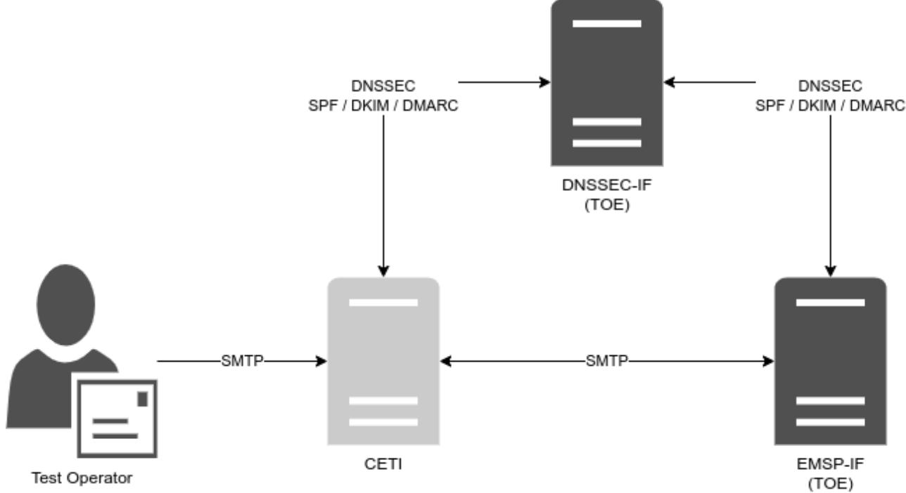
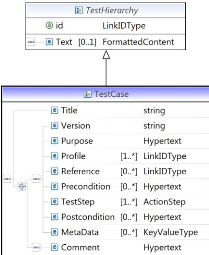

# BSI TR-03182-P: Testspecification

### Conformance Tests for Email Authentication in compliance with BSI TR-03182

# Document history

| Version | Date                 | Editor | Description   |
|---------|----------------------|--------|---------------|
| 1.0     | 24th January 2024 | BSI    | Final Version |

*Table 1 Document history*

Federal Office for Information Security P.O. Box 20 03 63 53133 Bonn Tel.: +49 22899 9582-0 E-Mail: e-mail-trsp@bsi.bund.de Internet: https://www.bsi.bund.de © Federal Office for Information Security 2024

| 1 |      | Introduction                                |   |  |  |
|---|------|---------------------------------------------|---|--|--|
| 2 |      | Testing                                  | 6 |  |  |
|   | 2.1  | Interfaces                                  | 6 |  |  |
|   | 2.2  | Target of Evaluation (TOE)                  | 7 |  |  |
|   | 2.3  | Conformity Email Test Infrastructure (CETI) | 7 |  |  |
|   | 2.4  | Test Tools                                  | 7 |  |  |
|   | 2.5  | Test Messages                               | 8 |  |  |
|   | 2.6  | DNS-Resolution                              | 8 |  |  |
|   | 2.7  | Authoritative DNSSEC                        | 8 |  |  |
|   | 2.8  | Test Operator                               | 8 |  |  |
| 3 |      | Profiles                                    | 9 |  |  |
| 4 |      | Implementation Conformance Statement11      |   |  |  |
|   | 4.1  | User Information Source 11               |   |  |  |
|   | 4.2  | Unused Domains11                            |   |  |  |
|   | 4.3  | Online Interfaces11                         |   |  |  |
|   | 4.4  | Operational Information 12               |   |  |  |
|   | 4.5  | DMARC Evaluation 12                      |   |  |  |
|   | 4.6  | DMARC Quarantine12                          |   |  |  |
|   | 4.7  | Profiles12                                  |   |  |  |
|   | 4.8  | DNS Resource Records14                      |   |  |  |
|   | 4.9  | Location14                                  |   |  |  |
|   | 4.10 | Certificate Information15                   |   |  |  |
| 5 |      | Configuration16                             |   |  |  |
|   | 5.1  | Test Setup 16                            |   |  |  |
|   | 5.2  | DNS Zone and Record Specification 17     |   |  |  |
| 6 |      | Test Cases18                                |   |  |  |
|   | 6.1  | Module A – User Interface18              |   |  |  |
|   | 6.2  | Module B – DNSSEC18                      |   |  |  |
|   | 6.3  | Module C – Inbound SPF19                 |   |  |  |
|   | 6.4  | Module D – Outbound SPF 19            |   |  |  |
|   | 6.5  | Module E – Inbound DKIM19                |   |  |  |
|   | 6.6  | Module F – Outbound DKIM 20           |   |  |  |
|   | 6.7  | Module G – Inbound DMARC20               |   |  |  |
|   | 6.8  | Module H – Outbound DMARC21              |   |  |  |
|   | 6.9  | Module I – Inbound DMARC Reports21       |   |  |  |
|   | 6.10 | Module J – Outbound DMARC Reports21      |   |  |  |
|   |      |                                             |   |  |  |

|   | 6.11               | Module K – DMARC Monitoring21 |  |
|---|--------------------|----------------------------------|--|
|   | 6.12               | Module L – Unused Domains22   |  |
|   | 6.13               | Security Concept 22           |  |
| 7 |                    | Test Case Notation23             |  |
| 8 |                    | Keywords25                       |  |
|   | Bibliography 26 |                                  |  |

# 1 Introduction

The Technical Guideline BSI TR-03182 (1) specifies requirements for email authentication. This document extends BSI TR-03182 (1) by defining conformity criteria for message handling services (MHS) and specifying tests which verify that the provided services fulfil the requirements defined in the Technical Guideline. The tests cover services to the end user as well as from and to other MHSs.

Since the objective of BSI TR-03182 (1) and the corresponding tests is improvement of authenticity, the tests focus on a secure DNS lookup using SPF, DKIM and DMARC. Further handling of email messages as well as functional tests, are out of scope of this document. Even though it is primarily focused on security, this guideline takes interoperability issues into account as well.

A variety of aspects has to be covered during the evaluation in order to take into consideration the complexity of the solutions to be tested. Therefore, following aspects must be taken into account:

- The requirements from BSI TR-03182 (1) are met.
- Including the configuration of TLS according to BSI TR-03116-4 (2).
- DNS lookups for SPF / DKIM / DMARC take place DNSSEC-enabled.
- The DKIM requirements as defined in RFC 6376 (3).
- The utilization of DMARC as described in RFC 7489 (4).
- The utilization of SPF as described in RFC 7208 (5).
- The DNSSEC requirements as defined in RFC 4033, RFC 4034 and RFC 4035.
- The tests defined in this document only focus on conformance to the respective requirements. They do not validate general security, functionality or availability.

# 2 Testing

The test series described in this document consider the email service providers (EMSP) already offering their services via the Internet. Therefore, the testing laboratory will have to take the existing infrastructure into account. This chapter describes the aspects to be regarded.

*Figure 1 Outline of a Generic Test Setup*

### 2.1 Interfaces

The test setup assumes that an EMSP handles several services (see: Figure 1 [Outline of a Generic Test Setup\)](#page-5-2). Those services are used to communicate with end users, DNS servers and other EMSPs. In the following, a short description and definition of those services is given:

|  | Table 2 Interfaces |
|--|--------------------|
|--|--------------------|

| Interface | Description                                                                       |
|-----------|-----------------------------------------------------------------------------------|
| EMSP-IF   | This interface is used for email exchange between EMSPs and will be denoted as    |
|           | EMSP-IF in this test specification.                                               |
| DNSSEC-IF | This interface is used to send and receive DNSSEC-enabled DNS queries and will be |
|           | denoted as DNSSEC-IF in this test specification.                                  |

Each interface can consist of several ports dedicated to specific protocols. The specific underlying protocol data is not part of this document and is therefore not covered by test cases. Nevertheless, the transport of emails is expected to take place encrypted and at a security level described in BSI TR-03108 (6). An exception is the connection towards the name resolvers, as DNSSEC does not enforce data encryption.

The tests specified for service have to be performed for each port that is offered by the EMSP relevant in the context of BSI TR-03182 (1). A generic setup is outlined in Figure 1 [Outline of a Generic Test Setup.](#page-5-2)

Based on Figure 1 [Outline of a Generic Test Setup](#page-5-2) it has to be verified that:

- RFC-conform SPF / DKIM / DMARC records are present.
- DNS lookups for SPF / DKIM / DMARC take place DNSSEC-enabled.
- The DMARC policy of allsenderdomain(s) is conform to BSI TR-03182 (1).
- DKIM algorithms specified in RFC 8301 (7) and RFC 8463 (8) are used in production.
- DMARC reports are received and sent.
- All emails are signed in accordance to RFC 6376 (3).
- All DMARC policies have to be evaluated.
- Furthermore, the respective negative tests are defined.

### 2.2 Target of Evaluation (TOE)

In this test specification, the Message Handling Service (MHS) to be tested is called Target of Evaluation (TOE) (see also[: Figure 1\)](#page-5-2). It is depicted in dark gray in [Figure 1.](#page-5-2) As a whole, it represents one or more servers offering one or more services and it is not considered to be an integral part of the test environment.

The tests defined in this document do not require any preparation of a dedicated test email infrastructure. This implies that the TOE represents all components and interfaces already used operationally. Taking this into account, the tests are intentionally designed not to perform any "destructive" steps or to require any TOE configuration leading to possible down time of its services.

In addition to the test interfaces mentioned in Section [2.1,](#page-5-1) the behavior of the TOE has to be tested for both incoming and outgoing connections. The connection is always looked at from the perspective of the TOE.

- Incoming connections imply queries received and processed by the TOE, but also queries sent by another EMSP in order to contact the TOE (e.g. DNS queries).
- Outgoing connections imply queries sent by the TOE (e.g. DNS query, Email delivery, etc.).

### 2.3 Conformity Email Test Infrastructure (CETI)

The complete infrastructure required for the test series is enclosed in the Conformity Email Test Infrastructure (CETI). It includes all components required to interact with the TOE. The CETI also includes a Test-DNS-Zone (see Sectio[n 2.7\)](#page-7-2) used to analyze the behavior of the TOE when testing inbound or outbound message transport. It exemplary comprises target email servers hosting the respective accounts. It may also comprise further tools and services required for conformity tests.

### 2.4 Test Tools

The current test specification does not restrict the test operators in their choice of tools. This means a test operator theoretically can use any tool he or she thinks is the most suitable. However, it has to be assured that the results achieved by a particular tool of choice are legitimate and verifiable (reproducible) by any other possible test operator.

### 2.5 Test Messages

Several test cases require the tester to send an email via the TOE to the CETI. In order to be able to uniquely identify each email sent in a particular test case, it is RECOMMENDED to include the test case ID in the subject field of the test email. Additionally, it may be necessary to include a sequence number in cases where multiple test cases with the same ID are run (templates).

The naming convention could be:

TR-03182-<module>\_<test case ID>\_<sequence number>

### 2.6 DNS-Resolution

Some tests require the TOE to retrieve the DNS information of a particular zone and to process it. Several of them must be performed repeatedly. This could potentially lead to the TOE utilizing its DNS cache entries instead of retrieving the information of the zone again. Even if the TOE does not operate any DNS caching mechanisms itself, it is still possible that it uses the DNS server which does. Therefore, the test laboratory MUST implement mechanisms preventing the reuse of cached DNS entries. It is essential that for any test concentrating on DNSSEC capability of the TOE the DNS resolution takes place pristine each time.

Unfortunately, it is not sufficient to only rely on the Time To Live-value (TTL) for that. Each TOE or an intermediate DNS server may disregard or overwrite these values. Therefore, it is RECOMMENDED to use a random ID in the name of the DNS zones used for tests. In this case, each run is performed with its own unique zone name or URL which is only utilized once. The next run of a test case is then performed using an URL with another random ID.

The characteristics are, however, the same as required for the scenario of the test case. Consequently, the TOE is forced to freshly resolve the new URL each time.

### 2.7 Authoritative DNSSEC

One of the topics discussed in the BSI TR-03182 is the ability of the EMSP to utilize the DNSSEC resource records (RRs) by resolving the remote domain name. The TOE MUST be able to process all SPF, DKIM and DMARC resource records. Therefore, it is essential that the testing laboratory prepares the respective DNS resource records.

On the other side, the TOE MUST maintain the respective DNSSEC resource records itself. This is necessary to enable the respective senders mail clients to connect to it. The availability and correctness of such resource records MUST also be verified in the respective test cases.

### 2.8 Test Operator

The test operator is responsible for initiating and supervising the test series. He or she plays the role of a remote sending platform. Any test unit which cannot be run automatically MUST be performed manually. The test operator MUST further observe the behavior and messages presented by the TOE and decide about conformity.

# 3 Profiles

Test profiles are used to assess the functionalities and capabilities of the TOE. Test profiles determine the applicability of concrete test cases. There are two kinds of profiles - mandatory and optional profiles.

• Mandatory profiles represent requirements which MUST be met by the TOE in order to successfully accomplish the certification.

A distinction is made between inbound and outbound connections. This distinction is made from the perspective of the TOE (see [2.2\)](#page-6-0).

The identifiers IN and OUT are respectively used for inbound (i.e. service accepts) and outbound (i.e. service sends) connections.

The following mandatory test profiles have been identified:

| Profile       | Description                                                                                                                                                                                                                                                                                                                                           | Testcases                                                                                              |
|---------------|-------------------------------------------------------------------------------------------------------------------------------------------------------------------------------------------------------------------------------------------------------------------------------------------------------------------------------------------------------|--------------------------------------------------------------------------------------------------------|
| SPF_IN        | This profile assesses the SPF capabilities of the TOE for inbound messages.                                                                                                                                                                                                                                                                        | TR-03182-C-01, TR-03182-C-02                                                                        |
| SPF_OUT       | This profile assesses the SPF capabilities of the TOE for outbound messages.                                                                                                                                                                                                                                                                       | TR-03182-B-01, TR-03182-D-01, TR-03182-D-02, TR-03182-D-03                                    |
| DKIM_IN       | This profile assesses the DKIM capabilities of the TOE for inbound messages.                                                                                                                                                                                                                                                                       | TR-03182-E-01, TR-03182-E-02, TR-03182-E-03, TR-03182-E-04 TR-03182-E-05                   |
| DKIM_OUT      | This profile assesses the DKIM capabilities of the TOE for outbound messages.                                                                                                                                                                                                                                                                      | TR-03182-B-01, TR-03182-F-01, TR-03182-F-02, TR-03182-F-03, TR-03182-F-04 TR-03182-F-05 |
| DMARC_IN      | This profile assesses the DMARC capabilities of the TOE for inbound messages.                                                                                                                                                                                                                                                                      | TR-03182-G-01, TR-03182-G-02, TR-03182-G-03 TR-03182-G-04                                     |
| DMARC_OUT     | This profile assesses the DMARC capabilities of the TOE for outbound messages.                                                                                                                                                                                                                                                                     | TR-03182-B-01, TR-03182-H-01, TR-03182-H-02, TR-03182-H-03                                    |
| DMARC_RPT_IN  | This profile assesses the DMARC capabilities of the TOE for inbound reports.                                                                                                                                                                                                                                                                       | TR-03182-I-01                                                                                          |
| DMARC_RPT_OUT | This profile assesses the DMARC capabilities of the TOE for outbound reports.                                                                                                                                                                                                                                                                      | TR-03182-B-01, TR-03182-J-01, TR-03182-J-02                                                      |
| DMARC_MONITOR | This profile assesses if the EMSP evaluates DMARC reports.                                                                                                                                                                                                                                                                                            | TR-03182-K-01                                                                                          |
| DNSSEC_CLIENT | This profile assesses the DNS / DNSSEC resolving capabilities of the TOE from zones served other MHS platforms (here: CETI). Prior to connection establishment to another MHS, the TOE MUST acquire its DNS information using DNSSEC validation. Therefore, a correct implementation of respective DNSSEC functionalities is required. | TR-03182-B-01, TR-03182-B-02, TR-03182-B-03                                                      |

*Table 3 Mandatory Profiles*

| Profile        | Description                                                           | Testcases      |
|----------------|-----------------------------------------------------------------------|----------------|
| UNUSED_DOMAINS | This profile assesses whether the TOE has marked all unused           | TR-03182-L-01, |
|                | domains not to send email.                                            | TR-03182-L-02, |
|                |                                                                       | TR-03182-L-03, |
|                |                                                                       | TR-03182-L-04, |
|                |                                                                       | TR-03182-L-05  |
| USER_INFO      | BSI TR-03182-14-M (1) requires EMSP to inform its users about      | TR-03182-A-01  |
|                | security incidents. Furthermore, it MUST inform them about            |                |
|                | security relevant topics. The tests assigned to this profile evaluate |                |
|                | the availability and suitability of such information.                 |                |

# 4 Implementation Conformance Statement

The purpose of the Implementation Conformance Statement (ICS) is the declaration of supported functionalities of the EMSP to be approved by the testing laboratory. The declarations of the applicant are used for the determination of test cases to be performed.

The Implementation Conformance Statement MUST be filled completely by the applicant. The information of the filled ICS MUST be documented in the test report.

### 4.1 User Information Source

According to BSI TR-03182-14-M (1) the EMSP has to inform the user about the IT security issues and educate on this topic. The applicant MUST provide in Table 4 [User information](#page-10-4) the sources that can be used by a user to access this information.

*Table 4 User information*

| Topic                 | Source Address |
|-----------------------|----------------|
| IT security issues    |                |
| IT security education |                |

### 4.2 Unused Domains

An applicant SHALL provide a declaration containing the list of ALL (sub)domains which do not send messages (unused domains). Table 5 Domains describes the required fields.

*Table 5 Domains*

| Domain name | Null MX Record in DNS | SPF record in DNS Zone     | DMARC policy reject in its |
|-------------|--------------------------|----------------------------|----------------------------|
|             | Zone                     | authorizing no one to send | DNS Zone and request       |
|             | (Yes / No)               | (Yes / No)                 | RUA reports                |
|             |                          |                            | (Yes / No)                 |
|             |                          |                            |                            |
|             |                          |                            |                            |
|             |                          |                            |                            |

### 4.3 Online Interfaces

An applicant SHALL provide a declaration containing the list of ALL interfaces served online. Those interfaces will be used to carry out the test cases defined in this document. Table 6 [Online Interfaces](#page-10-5) describes the required fields.

*Table 6 Online Interfaces*

| Element                             | Address |
|-------------------------------------|---------|
| Network interface(s) available for  |         |
| authoritative DNS queries for other |         |
| EMSP                                |         |
| Network interface(s) available for  |         |
| incoming messages from other        |         |
| EMSP                                |         |
| Network interface(s) available for  |         |
| incoming DMARC reports from         |         |
| other EMSP                          |         |

### 4.4 Operational Information

In order to define a clear test frame, an applicant SHALL provide information related to the operation of the underlying infrastructure. This information is mainly given in the form of parameters which will serve as input for specific test cases.

*Table 7 Operational Information* 

| Parameters | Description                                            | Value |
|------------|--------------------------------------------------------|-------|
| TIMEOUT    | Expected time limit for email delivery. This specifies |       |
|            | the maximum time expected between sending an           |       |
|            | email using the TOE services and receiving this email. |       |

#### 4.5 DMARC Evaluation

An applicant MUST provide a declaration containing information about the processes established for evaluation of DMARC reports it receives.

*Table 8 DMARC Evaluation*

| Short description of the evaluation process |  |
|---------------------------------------------|--|
|                                             |  |
|                                             |  |
|                                             |  |
|                                             |  |
|                                             |  |

### 4.6 DMARC Quarantine

An applicant MUST provide a declaration containing information about the processes established for handling messages that fail to fulfill a DMARC quarantine policy.

#### *Table 9 DMARC Quarantine*

| Short description of the quarantine process |  |
|------------------------------------------------|--|
|                                                |  |
|                                                |  |
|                                                |  |
|                                                |  |
|                                                |  |

### 4.7 Profiles

|  |  | Table 10 Mandatory Profiles |  |
|--|--|-----------------------------|--|
|--|--|-----------------------------|--|

| Profile ID | Description                                            | Yes / No |
|------------|--------------------------------------------------------|----------|
| SPF_IN     | This profile assesses the SPF capabilities of the TOE  |          |
|            | for inbound messages.                                  |          |
| SPF_OUT    | This profile assesses the SPF capabilities of the TOE  |          |
|            | for outbound messages.                                 |          |
| DKIM_IN    | This profile assesses the DKIM capabilities of the TOE |          |
|            | for inbound messages.                                  |          |
| DKIM_OUT   | This profile assesses the DKIM capabilities of the TOE |          |
|            | for outbound messages.                                 |          |
| DMARC_IN   | This profile assesses the DMARC capabilities of the    |          |
|            | TOE for inbound messages.                              |          |

| Profile ID     | Description                                            | Yes / No |
|----------------|--------------------------------------------------------|----------|
| DMARC_OUT      | This profile assesses the DMARC capabilities of the    |          |
|                | TOE for outbound messages.                             |          |
| DMARC_RPT_IN   | This profile assesses the DMARC capabilities of the    |          |
|                | TOE for inbound reports.                               |          |
| DMARC_RPT_OUT  | This profile assesses the DMARC capabilities of the    |          |
|                | TOE for outbound reports.                              |          |
| DMARC_MONITOR  | This profile assesses if the EMSP evaluates DMARC      |          |
|                | reports.                                               |          |
| DNSSEC_CLIENT  | This profile assesses the DNS / DNSSEC resolving       |          |
|                | capabilities of the TOE from zones served other MHS    |          |
|                | platforms (here: CETI). Prior to connection            |          |
|                | establishment to another MHS, the TOE MUST             |          |
|                | acquire its DNS information using DNSSEC               |          |
|                | validation. Therefore, a correct implementation of     |          |
|                | respective DNSSEC functionalities is required.         |          |
| UNUSED_DOMAINS | This profile assesses whether the TOE has marked all   |          |
|                | unused domains not to send email.                      |          |
| USER_INFO      | BSI TR-03182-14-M (1) requires EMSP to inform its   |          |
|                | users about security incidents. Furthermore, it MUST   |          |
|                | inform them about security relevant topics. The tests  |          |
|                | assigned to this profile evaluate the availability and |          |
|                | suitability of such information.                       |          |

### 4.8 DNS Resource Records

The EMSP or rather the TOE under test publishes several DNS resource records. An applicant SHALL provide a declaration containing (detailed) information on those records. If the test laboratory is able to determine further parameters or algorithms not declared here, a respective note MUST be delivered in the test report.

*Table 11 SPF DNS Resource Records*

| Domain / Subdomain | Record Label |
|--------------------|--------------|
|                    |              |
|                    |              |
|                    |              |
|                    |              |
|                    |              |

*Table 12 DKIM DNS Resource Records*

| Domain / Subdomain | Record Label | Algorithm |
|--------------------|--------------|-----------|
|                    |              |           |
|                    |              |           |
|                    |              |           |
|                    |              |           |
|                    |              |           |

*Table 13 DMARC DNS Resource Records*

| Domain / Subdomain | Record Label |
|--------------------|--------------|
|                    |              |
|                    |              |
|                    |              |
|                    |              |
|                    |              |

#### 4.9 Location

The applicant MUST list all physical locations (minimum: country) of all components which form the MHS in Table 14 [Locations.](#page-13-2) The test operator has to verify that the locations are in conformance with BSI TR-03182 (1).

*Table 14 Locations*

#### *Physical Locations of Email Servers*

### 4.10 Certificate Information

If the MHS uses a certificate authority that complies to BSI TR-03116-4 (2), the MHS MUST provide the information on this CA. The CETI MUST verify that all certificates used for communication with other MHSs are issued only by this CA. Certificates issued by other CAs MUST NOT be used.

*Table 15 BSI TR-03116-4 Certificate Information*

| Attribute                     | Value |
|-------------------------------|-------|
| Name of the BSI TR-03116-4 CA |       |
| Subject                       |       |
| Validity notBefore            |       |
| Validity notAfter             |       |
| Subject Key Identifier        |       |

# 5 Configuration

According to the test setup outlined in Figure 1 [Outline of a Generic Test Setup,](#page-5-2) several interfaces for different protocols have to be tested. This implies that different test parameters and data MUST be prepared prior to starting the test series. Such necessary parameters and data are described in this chapter.

### 5.1 Test Setup

The tests require specific parameters to be prepared by the test operator and may deviate from test laboratory to test laboratory. Therefore, they are only referred in test cases as variables. All required parameters are defined in Table 16 [Testing environment parameters.](#page-15-2)

| Name                   | Value                                                                 |  |
|------------------------|-----------------------------------------------------------------------|--|
| EMAIL_SUCCESS          | A successful email delivery originating at the CETI with its final    |  |
|                        | destination either at the TOE or passing the TOE and arriving back at |  |
|                        | the CETI.                                                             |  |
| SPF_VALID_IP           | An IP address which has been authorized to send on behalf of the      |  |
|                        | senderdomain used by the CETI when it connects to the TOE.         |  |
| SPF_INVALID_IP         | An IP address which has not been authorized to send on behalf of the  |  |
|                        | senderdomain used by the CETI when it connects to the TOE.            |  |
| DKIM_VALID_RSA_SIG     | A valid DKIM signature used by the CETI when it signs messages on     |  |
|                        | behalf of its senderdomain and sends them to the TOE.                 |  |
| DKIM_VALID_ED25519_SIG | A valid DKIM signature used by the CETI when it signs messages on     |  |
|                        | behalf of its senderdomain and sends them to the TOE.                 |  |
| DKIM_FAULTY_SIG        | A faulty DKIM signature created and used by the CETI on behalf of its |  |
|                        | senderdomain and sent to the TOE.                                     |  |
| DKIM_UNVERIFIABLE_SIG  | An unverifiable DKIM signature sent by the CETI to the TOE.           |  |
| NON_COMPLIANT_MSG      | An email message that is not compliant to RFC 5322.                |  |

*Table 16 Testing environment parameters*

### 5.2 DNS Zone and Record Specification

For the purpose of the test cases multiple DNS zones and records need to be prepared and made available to the TOE. Each zone has specific parameters relevant to the particular test case it is used in. Further, a zone described here may be understood as a set of zones with a required property. For example, if the zone [DNSSEC\_DEFAULT] is referenced in a test case, it can be necessary to prepare several zones with the properties described for [DNSSEC\_DEFAULT] below. This is due to the DNS caching problem described in Section [2.7.](#page-7-2)

| Name             | Description                                                              |
|------------------|--------------------------------------------------------------------------|
| ZONE_DNSSEC      | A set of DNS records of the CETI soundly protected by the DNSSEC         |
|                  | where different DNSSEC parameters are applied according to the           |
|                  | respective test case.                                                    |
| ZONE_EXPIRED_KSK | A set of DNS records of the CETI protected by DNSSEC where the           |
|                  | DNSKEY used as SEP is outdated.                                          |
| ZONE_KSK_BAD_SIG | A set of DNS records of the CETI protected by DNSSEC where the           |
|                  | signature of the DNSKEY used as SEP is manipulated.                      |
| ZONE_SF_NMATCH   | A set of DNS records of the CETI protected by DNSSEC where the value     |
|                  | of the Selector Field does not match the content of Certificate          |
|                  | Association Data Field.                                                  |
| SPF_RECORD       | A set of DNS TXT records in conformance with RFC 7208 (5) used by the |
|                  | CETI to publish its SPF policy.                                          |
| DKIM_RECORD      | A set of DNS TXT records in conformance with RFC 6376 (3) used by the |
|                  | CETI to publish its DKIM key material.                                   |
| DMARC_RECORD     | A set of DNS TXT records in conformance with RFC 7489 (4) used by the |
|                  | CETI to publish its DMARC policy.                                        |

*Table 17 DNS zones and records of the testing environment*

# 6 Test Cases

This chapter provides an overview of all tests conducted during the certification process. In order to improve the readability, the tests are aggregated into modules. These modules group each test by the interface and the technology it is using. Modules do not add any additional semantic meaning to the tests.

Test cases can belong to one of two categories. Positive tests evaluate the correct behavior of the test object during conform and expected interactions. Negative tests evaluate the correct behavior of the test object in case it is presented with incorrect or fraudulent inputs. Each test case which is not explicitly marked as positive test is considered to be a negative test case.

### 6.1 Module A – User Interface

BSI TR-03182 (1) requires from the EMSP to inform the user in several ways. The compliance to these requirements is evaluated in this module.

*Table 18 List of Testcases in Module A*

| ID            | Description                                                      | Reference     |
|---------------|------------------------------------------------------------------|---------------|
| TR-03182-A-01 | Positive test evaluating the ability of the EMSP to educate the  | TR-03182-14-M |
|               | user on IT security issues (using the source stated in the ICS). |               |

### 6.2 Module B – DNSSEC

Functional DNSSEC-enabled DNS resolution is a mandatory precondition for all service modules in this test specification. A TOE very likely consists of a number of separate and specialized components (e.g. Inbound SMTP, TLSRPT reporting, Mailbox delivery) who altogether represent the TOE. Since each component can run its own DNS resolver the DNSSEC tests specified in this section MUST be conducted for each service module separately in order to verify not only some, but each TOE component uses fully functional DNSSEC-enabled resolution.

| Table 19 List of Testcases in Module B |  |
|----------------------------------------|--|
|----------------------------------------|--|

| ID            | Description                                                     | Reference      |
|---------------|-----------------------------------------------------------------|----------------|
| TR-03108-B-01 | Positive test evaluating the ability of the TOE to successfully | TR-03182-02-M, |
|               | resolve and authenticate the address of a remote MHS using      | TR-03182-05-M, |
|               | DNSSEC.                                                         | TR-03182-07-M, |
|               |                                                                 | TR-03182-08-M  |
| TR-03108-B-02 | This test case checks the behavior of the TOE in case the       | TR-03182-02-M, |
|               | signature of the DNSKEY used as SEP is manipulated.             | TR-03182-05-M, |
|               |                                                                 | TR-03182-07-M, |
|               |                                                                 | TR-03182-08-M  |
| TR-03108-B-03 | This test case checks the behavior of the TOE in case the       | TR-03182-02-M, |
|               | signature of the DNSKEY used as SEP is outdated.                | TR-03182-05-M, |
|               |                                                                 | TR-03182-07-M, |
|               |                                                                 | TR-03182-08-M  |

### 6.3 Module C – Inbound SPF

BSI TR-03182 (1) requires the TOE to look up and verify SPF DNS resource records. This module probes the TOE for compliance with the requirements from BSI TR-03182 when it receives connections from the CETI.

*Table 20 List of Testcases in Module C*

| ID            | Description                                                  | Reference      |
|---------------|--------------------------------------------------------------|----------------|
| TR-03182-C-01 | This test evaluates the TOE's behavior when the CETI uses an | TR-03182-01-M, |
|               | SPF_VALID_IP.                                                | TR-03182-02-M  |
| TR-03182-C-02 | This test evaluates the TOE's behavior when the CETI uses an | TR-03182-02-M  |
|               | SPF_INVALID_IP.                                              |                |

### 6.4 Module D – Outbound SPF

BSI TR-03182 (1) requires the TOE to provide a SPF DNS resource record. This module probes the TOE for compliance with the requirements from BSI TR-03182 when it connects to the CETI.

*Table 21 List of Testcases in Module D*

| ID            | Description                                                     | Reference      |
|---------------|-----------------------------------------------------------------|----------------|
| TR-03182-D-01 | This test evaluates whether the TOE provides SPF records for    | TR-03182-01-M, |
|               | its senderdomain(s).                                            |                |
| TR-03182-D-02 | This test evaluates whether the IP addresses used by the TOE | TR-03182-01-M  |
|               | have been authorized to send on behalf of the                   |                |
|               | senderdomain(s) it sends for.                                   |                |
| TR-03182-D-03 | This test evaluates whether the TOE provides SPF records for    | TR-03182-01-M  |
|               | its senderdomain that either require SoftFail or Fail for all   |                |
|               | systems that have not been authorized to send.                  |                |

### 6.5 Module E – Inbound DKIM

BSI TR-03182 (1) requires the TOE to look up and verify DKIM DNS resource records. This module probes the TOE for compliance with the requirements from BSI TR-03182 when the CETI sends a DKIM signed message.

*Table 22 List of Testcases in Module E*

| ID            | Description                                                  | Reference     |
|---------------|--------------------------------------------------------------|---------------|
| TR-03182-E-01 | This test evaluates the TOE's behavior when the CETI uses a  | TR-03182-05-M |
|               | DKIM_VALID_RSA_SIG.                                          |               |
| TR-03182-E-02 | This test evaluates the TOE's behavior when the CETI uses a  | TR-03182-05-M |
|               | DKIM_VALID_ED25519_SIG.                                      |               |
| TR-03182-E-03 | This test evaluates the TOE's behavior when the CETI uses a  | TR-03182-05-M |
|               | DKIM_FAULTY_SIG.                                             |               |
| TR-03182-E-04 | This test evaluates the TOE's behavior when the CETI uses a  | TR-03182-05-M |
|               | DKIM_UNVERIFIABLE_SIG                                        |               |
| TR-03182-E-05 | This test evaluates the TOE's behavior when the CETI sends a | TR-03182-05-M |
|               | NON_COMPLIANT_MSG                                            |               |

### 6.6 Module F – Outbound DKIM

BSI TR-03182 (1) requires the TOE to provide DKIM DNS resource records and to DKIM sign outbound messages. This module probes the TOE for compliance with the requirements from BSI TR-03182.

| ID            | Description                                                         | Reference      |
|---------------|---------------------------------------------------------------------|----------------|
| TR-03182-F-01 | This test evaluates the presence of RSA-SHA256 DKIM key             | TR-03182-03-M, |
|               | material for all senderdomains the TOE applies for.                 | TR-03182-04-M  |
| TR-03182-F-02 | This test evaluates the presence of ED25519-SHA256 DKIM             | TR-03182-03-M, |
|               | key material for all senderdomains the TOE applies for.             | TR-03182-04-M  |
| TR-03182-F-03 | This test evaluates if the TOE adds a DKIM signature to | TR-03182-03-M, |
|               | outbound messages using the RSA-SHA256 signature                    | TR-03182-04-M  |
|               | algorithm.                                                          |                |
| TR-03182-F-04 | This test evaluates if the TOE signs outbound messages              | TR-03182-03-M, |
|               | using the ED25519-SHA256 algorithm.                                 | TR-03182-04-M  |
| TR-03182-F-05 | This test evaluates the TOE's behavior when a                       | TR-03182-04-M  |
|               | NON_COMPLIANT_MSG is tried to be signed                             |                |

### 6.7 Module G – Inbound DMARC

BSI TR-03182 (1) requires the TOE to look up and verify DMARC DNS resource records. This module probes the TOE for compliance with the requirements from BSI TR-03182 when the CETI sends messages to it. The following testcases in Table 24 [List of Testcases in Module G](#page-19-2) have to be carried out for the DMARC reject policy of the CETI.

|  |  | Table 24 List of Testcases in Module G |  |
|--|--|----------------------------------------|--|
|  |  |                                        |  |

| ID            | Description                                           | Reference     |
|---------------|-------------------------------------------------------|---------------|
| TR-03182-G-01 | This test evaluates the TOE's DMARC behavior when the | TR-03182-07-M |
|               | CETI uses SPF_VALID_IP and DKIM_VALID_SIG for its     |               |
|               | senderdomain.                                         |               |
| TR-03182-G-02 | This test evaluates the TOE's DMARC behavior when the | TR-03182-07-M |
|               | CETI uses SPF_INVALID_IP and DKIM_VALID_SIG for its   |               |
|               | senderdomain.                                         |               |
| TR-03182-G-03 | This test evaluates the TOE's DMARC behavior when the | TR-03182-07-M |
|               | CETI uses SPF_VALID_IP and DKIM_FAULTY_SIG for its    |               |
|               | senderdomain.                                         |               |
| TR-03182-G-04 | This test evaluates the TOE's DMARC behavior when the | TR-03182-07-M |
|               | senderdomain uses a DMARC quarantine policy.          |               |

### 6.8 Module H – Outbound DMARC

BSI TR-03182 (1) requires the TOE to provide a DMARC DNS resource record. This module probes the TOE for compliance with the requirements from BSI TR-03182 when it sends messages to the CETI.

*Table 25 List of Testcases in Module H*

| ID            | Description                                                   | Reference     |
|---------------|---------------------------------------------------------------|---------------|
| TR-03182-H-01 | This test evaluates if the TOE publishes DMARC policies for   | TR-03182-06-M |
|               | all the senderdomains and subdomains it applies for.          |               |
| TR-03182-H-02 | This test evaluates if the TOE enforces either a DMARC        | TR-03182-06-M |
|               | quarantine or reject policy for all the senderdomains and     |               |
|               | subdomains it applies for.                                    |               |
| TR-03182-H-03 | This test evaluates if the TOE requests DMARC reports for all | TR-03182-06-M |
|               | senderdomains and subdomains it applies for.                  |               |

### 6.9 Module I – Inbound DMARC Reports

BSI TR-03182 (1) requires the TOE to request and process DMARC reports. This module probes the TOE for compliance with the requirements from BSI TR-03182 when it receives DMARC reports from the CETI.

*Table 26 List of Testcases in Module I*

| ID            | Description                                           | Reference     |
|---------------|-------------------------------------------------------|---------------|
| TR-03182-I-01 | This test evaluates if the TOE accepts DMARC reports. | TR-03182-09-M |
|               |                                                       |               |

### 6.10 Module J – Outbound DMARC Reports

BSI TR-03182 (1) requires the TOE to generate and send DMARC reports. This module probes the TOE for compliance with the requirements from BSI TR-03182 when it sends DMARC reports to the CETI.

#### *Table 27 List of Testcases in Module J*

| ID            | Description                                                | Reference     |
|---------------|------------------------------------------------------------|---------------|
| TR-03182-J-01 | This test evaluates if the TOE generates and sends DMARC   | TR-03182-08-M |
|               | reports to remote senderdomains asking for RUA-reports.    |               |
| TR-03182-J-02 | This test evaluates if the TOE generates and sends DMARC   | TR-03182-08-M |
|               | reports to remote senderdomains asking for RUF-reports. |               |

### 6.11 Module K – DMARC Monitoring

BSI TR-03182 (1) requires the TOE to evaluate DMARC reports. This module probes the EMSP for compliance with the requirements from BSI TR-03182 when the TOE receives DMARC reports from the CETI.

*Table 28 List of Testcases in Module K*

| ID            | Description                                           | Reference     |
|---------------|-------------------------------------------------------|---------------|
| TR-03182-K-01 | This test evaluates if the TOE evaluates and monitors | TR-03182-10-M |
|               | DMARC reports for the senderdomains it applies to.    |               |

### 6.12 Module L – Unused Domains

BSI TR-03182 (1) requires the TOE to explicitly declare all of its (sub)domains that do not send email, not to send email. This module probes the TOE for compliance with the requirements from BSI TR-03182.

*Table 29 List of Testcases in Module L*

| ID                                                                         | Description                                                         | Reference     |
|----------------------------------------------------------------------------|---------------------------------------------------------------------|---------------|
| TR-03182-L-01 This test evaluates if the TOE has published DNS Null MX  |                                                                     | TR-03182-11-M |
|                                                                            | records for all of its (sub)domains that do not send email.         |               |
| TR-03182-L-02 This test evaluates if the TOE has published SPF records, |                                                                     | TR-03182-11-M |
|                                                                            | authorizing no one to send, for all of its (sub)domains that do     |               |
|                                                                            | not send email.                                                     |               |
| TR-03182-L-03                                                              | This test evaluates if the TOE has published SPF records,           | TR-03182-11-M |
|                                                                            | requiring Fail for the "all" mechanism, for all of its              |               |
|                                                                            | (sub)domains that do not send email.                                |               |
| TR-03182-L-04 This test evaluates if the TOE has published a DNS DMARC  |                                                                     | TR-03182-11-M |
|                                                                            | record, requiring a reject policy, for all of its (sub)domains that |               |
|                                                                            | do not send email.                                                  |               |
| TR-03182-L-05                                                              | This test evaluates if the TOE has published a DNS DMARC            | TR-03182-11-M |
|                                                                            | record, requiring a DMARC rua report, for all of its                |               |
|                                                                            | (sub)domains that do not send email.                                |               |

### 6.13 Security Concept

The auditor MUST verify that all systems and services involved in receiving, sending or storing mails are within the scope of the security concept. If the applicant is certified according to ISO 27001, the auditor MUST verify the scope of the certificate. In particular, all questions in Table 30 [Checklist for the Security](#page-21-2)  [Concept](#page-21-2) MUST be answered with yes for the applicant to pass the certification.

*Table 30 Checklist for the Security Concept*

| Question                                                                              | Answer (Yes / No / N/A) |
|---------------------------------------------------------------------------------------|-------------------------|
| Are all systems involved in receiving, sending or storing mails in the scope of the   |                         |
| certificate?                                                                          |                         |
| Does the scope contain all systems that are involved in the management of the         |                         |
| mail users and their credentials?                                                     |                         |
| Are all services involved in the mail transport in the scope of the certificate? This |                         |
| comprises in particular POP3, IMAP and SMTP in case they are provided by the          |                         |
| applicant.                                                                            |                         |
| Are all servers that receive, store or process mail data located in Europe?           |                         |

## 7 Test Case Notation

All test cases are described within a set of XML files. An overview over the corresponding XML scheme is given in the following.

As depicted in Figure 2, "XML Schema Test Case", each test is an object of the type TestCase. All test cases are organized hierarchically which is realized in XML using the abstract base type called TestHierarchy.

*Figure 2 XML Schema Test Case*

Each TestCase object has a unique id attribute and contains the following elements:

Title

title of the test case.

- Version current version of the test case.
- Purpose a short description of the intention of the test.
- Profile links to all relevant profiles.
- Reference optional reference to any kind of specification this test case is based on.
- Precondition all requirements which need to be fulfilled before running the test.
- TestStep

this XML element is a complex type and consists of the different sub-elements addressed below.

- Postcondition the description of conditions which may be met after the test completion
- MetaData optional elements in form of key-value pairs containing meta information.

If a test has been moved or deleted, the body of TestCase only contains a Title and a respective description in the Comment element.

The TestStep object of type ActionStep is used at least once and contains the elements from Figure 3, "XML Schema ActionStep".

In particular, it consists of:

| & ActionStep |                                |  |                 |  |
|--------------|--------------------------------|--|-----------------|--|
|              | e Command                      |  | Command         |  |
|              | E TechnicalCommand [01] string |  |                 |  |
|              | e TestDataReference            |  | [0*] LinkIDType |  |
|              | e Description                  |  | [0*] Hypertext  |  |
|              | 트 ExpectedResult               |  | [1*] Result     |  |

*Figure 3 XML Schema ActionStep*

Command

represents the actual action that is performed within a single step.

- TechnicalCommand can optionally be used to specify a technical representation of the command to be able to process the step automatically by some testing suite.
- TestDataReference If the step refers to some predefined test data, such as certificates, the data element is referred using this element.
- Description adds further information about the command that is performed in the step.
- ExpectedResult denotes the behavior of the test object in order to pass the test.

# 8 Keywords

The key words "MUST", "MUST NOT", "REQUIRED", "SHALL", "SHALL NOT", "SHOULD", "SHOULD NOT", "RECOMMENDED", "MAY", and "OPTIONAL" in this document are to be interpreted as described in RFC 2119.

The key word "CONDITIONAL" is to be interpreted as follows:

CONDITIONAL: The usage of an item is dependent on the usage of other items. It is therefore further qualified under which conditions the item is REQUIRED or RECOMMENDED.

# Bibliography

1. **Bundesamt für Sicherheit in der Informationstechnik (BSI).** Email Authentication. [Online] 1.0, July 2023. BSI TR-03182.

2. —. Kryptographische Vorgaben für Projekte der Bundesregierung, Teil 4: Kommunikationsverfahren. [Online] 2021.

https://www.bsi.bund.de/SharedDocs/Downloads/DE/BSI/Publikationen/TechnischeRichtlinien/TR03116 /BSI-TR-03116-4.pdf.

3. **Crocker, D. und Hansen, T. & Kucherawy, M.** DomainKeys Identified Mail (DKIM) Signatures. [Online] September 2011. RFC 6376.

4. **Kucherawy, M. und & Zwicky, E.** Domain-based Message Authentication, Reporting, and Conformance (DMARC). [Online] 2015. RFC7489.

5. **Kitterman, S.** Sender Policy Framework (SPF) for Authorizing Use of Domains in Email, Version 1. [Online] 2014. RFC7208.

6. **Bundesamt für Sicherheit in der Informationstechnik (BSI).** Testspecification - Conformance Tests for Secure E-Mail Transport in compliance to BSI TR-03108. [Online] 2.0, June 2023. BSI TR-03108-P.

7. **Kitterman, S.** Cryptographic Algorithm and Key Usage Update to DomainKeys Identified Mail (DKIM). [Online] 2018. RFC8301.

8. **Levine, J. R.** A New Cryptographic Signature Method for DomainKeys Identified Mail (DKIM). [Online] 2018. RFC8463.

9. **Rose, Scott., et al.** DNS Security Introduction and Requirements. [Online] 2005. RFC4033.

10. **RFC Editor.** Resource Records for the DNS Security Extensions. 2005. RFC4034.

11. **Rose, Scott, et al.** Protocol Modifications for the DNS Security Extensions. 2005.