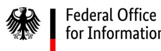
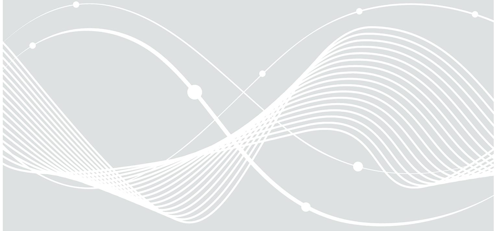
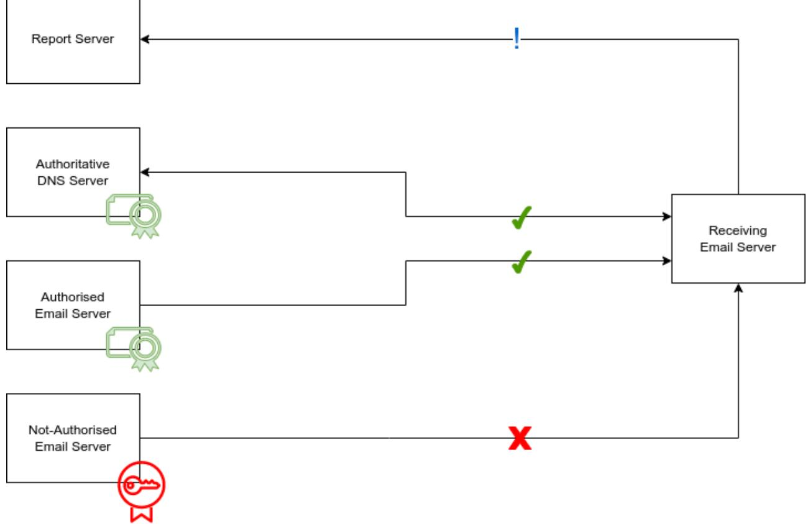

# BSI TR-03182 Email Authentication

## Document history

| Version | Date                    | Editor | Description   |
|---------|-------------------------|--------|---------------|
| 1.0     | 24th January 2024 | BSI    | Final version |

*Table 1: Document History*

Federal Office for Information Security P.O. Box 20 03 63 53133 Bonn Tel.: +49 22899 9582-0 E-Mail: e-mail-trsp@bsi.bund.de Internet: https://www.bsi.bund.de © Federal Office for Information Security 2024

| 1 | Introduction         |                                            |   |  |  |  |  |
|---|----------------------|--------------------------------------------|---|--|--|--|--|
| 2 | Email Authentication |                                            |   |  |  |  |  |
| 3 | Objectives           |                                            |   |  |  |  |  |
| 4 |                      | Requirements                               |   |  |  |  |  |
|   | 4.1                  | Functional Requirements                    |   |  |  |  |  |
|   | 4.1.1                | (TR-03182-01-M) SPF Record                 | 9 |  |  |  |  |
|   | 4.1.2                | (TR-03182-02-M) SPF Verification10         |   |  |  |  |  |
|   | 4.1.3                | (TR-03182-03-M) DKIM Key Material 11    |   |  |  |  |  |
|   | 4.1.4                | (TR-03182-04-M) Signing DKIM11             |   |  |  |  |  |
|   | 4.1.5                | (TR-03182-05-M) DKIM Verification12        |   |  |  |  |  |
|   | 4.1.6                | (TR-03182-06-M) DMARC Policy 13         |   |  |  |  |  |
|   | 4.1.7                | (TR-03182-07-M) Verifying DMARC13          |   |  |  |  |  |
|   | 4.1.8                | (TR-03182-08-M) Sending DMARC Reports14    |   |  |  |  |  |
|   | 4.1.9                | (TR-03182-09-M) Receiving DMARC Reports15  |   |  |  |  |  |
|   | 4.1.10               | (TR-03182-10-M) Evaluating DMARC Reports15 |   |  |  |  |  |
|   | 4.1.11               | (TR-03182-11-M) Unused Domains15           |   |  |  |  |  |
|   | 4.2                  | Non-Functional Requirements15              |   |  |  |  |  |
|   | 4.2.1                | (TR-03182-12-M) Security Concept15         |   |  |  |  |  |
|   | 4.2.2                | (TR-03182-13-M) Data Protection15          |   |  |  |  |  |
|   | 4.2.3                | (TR-03182-14-M) Mandatory Reporting 16  |   |  |  |  |  |
|   | 4.2.4                | (TR-03182-15-M) Transparency16             |   |  |  |  |  |
| 5 |                      | Proof of Compliance17                      |   |  |  |  |  |
|   | 5.1                  | IT Security Labels17                       |   |  |  |  |  |
|   | 5.2                  | Certification to Technical Guidelines17    |   |  |  |  |  |
| 6 |                      | Key Words for Requirement Levels18         |   |  |  |  |  |
| 7 | Glossary19           |                                            |   |  |  |  |  |
|   | Bibliography         | 21                                         |   |  |  |  |  |

## 1 Introduction

Authenticity of email, the traceability of the authenticity of the origin of a message from a specific sender, is of fundamental importance for the trustworthiness of an email and for the trustworthiness of the associated communication. If we trust the sender of a message, we are prepared to do things that require trust, such as passing on personal data or carrying out actions on behalf of the trusted person, like making a payment.

Email is one of the most important communication channels on the Internet. When email was invented, methods for verifying the authenticity of an email message were not a protection goal, and no such methods were specified or filters implemented to verify the authenticity of an incoming message.

Fraudsters are aware of both the lack of traceable authenticity embedded in the original specification of email and the importance of authenticity in email communication. They actively exploit this vulnerability and pretend to be a trusted person when communicating with potential victims, expecting in this way to achieve their fraudulent goal.

In an effort to prevent this form of identity abuse, various methods have been developed in recent years, which are now referred to as "Email Authentication". The technical guidelines specified in this document bring together the existing methods of "Email Authentication" and specify requirements that must be met for the implementation of "Email Authentication" so that recipients can be effectively protected against identity abuse.

## 2 Email Authentication

"Email Authentication" is a collective term that summarizes the Internet standards SPF (1), DKIM (2), and DMARC (3). The methods and procedures described in these standards are used to protect email recipients from identity abuse. Combined, they legitimize Message Handling Services (MHS) that are permitted to send messages on behalf of a sending domain (SPF), provide messages with cryptographic signatures that are not visible to recipients (DKIM) so that the identity of the sending domain can be verified, and establish rules for how violations of legitimacy and verification should be handled and where reports of policy violations should be sent (DMARC).

"Email Authentication" establishes a set of rules designed to prevent attackers from sending messages to potential victims via an unauthorized MHS, while pretending to originate from a sender domain in whose name they are not permitted to send. The following diagram illustrates how the different standards work together to counteract such abuse:

Figure 1 Detecting legitimate senders with Email Authentication

If an authorized MHS sends emails on behalf of a sender domain, a receiving MHS can verify both that the IP address of the sending server is part of the SPF policy and that the digital DKIM signature, which the sending server had affixed to the outgoing message (shown in the diagram as a rectangular green certificate) is intact. By means of the valid signature, the receiving server verifies that the sending system is authorized to send on behalf of the domain, that the message originates from the domain and that it has not been modified during transport.

This is possible because the receiving MHS can obtain the required SPF information and the DKIM key material from the DNS zone of the sender domain at the moment of receipt and compare this information with the actual email. The green ticks in the connection between the receiving server and both the authoritative DNS server and the authorized email server symbolizes the fact that the receiving email server is able to successfully verify the policies for SPF and DKIM and the message is therefore accepted based on these policies.

An unauthorized system cannot meet these policy requirements. Firstly, it sends using an IP address that is not listed in the SPF policy of the sender domain and, secondly, a successful DKIM verification is not possible.

Even if the unauthorized system arbitrarily adds a DKIM signature to the outgoing message using its own DKIM key (in the diagram: round, red certificate), verification will fail because the authoritative DNS server of the sender domain does not have the matching, public part of this (forged) DKIM key. It can therefore not be obtained and used by a verifying system as part of a DNS query. However, this is a prerequisite for successful verification and so DKIM verification must fail. The red "X" in the connection between the unauthorized and receiving systems symbolizes this failure.

The attempt to send an unauthorized email is recognized on the side of a receiving system, logged and delivered in a daily DMARC summary report to the report address of the self-protecting sender domain. The sender domain evaluates the report, becomes aware of the abuse and can take action. The blue exclamation mark in the connection between the receiving server and the report server symbolizes that the receiving server wants to report something.

## 3 Objectives

This Technical Guideline (BSI TR) defines specific requirements for anyone running an email service for authentic emails. The objective of this BSI TR is to increase the comparability and adoption of authentic email communication and thus to provide the best possible protection in digital communications.

The requirements described here aim to make authenticity as strong as possible when sending emails. In this way, identity abuse, i.e., the faking of someone else's identity, e.g., in spoofing and phishing attacks, is to be prevented. This is to be achieved without any additional effort on the part of the sender and recipient.

At the same time, by using this BSI TR as a basis for their work, for anyone running an email service will be afforded greater planning security and, e.g., within the framework of proof of compliance or accreditation procedures, will be able to demonstrate compliance with the requirements for authentic emails and prove this to third parties.

Additional benefits, such as preserving the positive image of a company (brand protection), are also viewed positively, but are secondary to the actual goal of protecting email communication. Ideally, the measures described here should be supplemented by additional protection at the transport level as described in BSI TR-03108 (4).

## 4 Requirements

This section of the document identifies all MUST, SHOULD, and MAY requirements relevant for a BSI TR-03182 proof of compliance (see also: [6](#page-17-0) [Key Words for Requirement Levels\)](#page-17-0). For a better overview, the requirements are divided into functional and non-functional requirements. Further on requirements are labeled with the suffix "M" in the case they are considered to be mandatory or "R" when considered to be recommended. The following table lists all requirements and the requirement levels required for BSI TR-03182 proof of compliance:

| Requirement Designation                | Type           | Requirement level |
|----------------------------------------|----------------|-------------------|
| TR-03182-01-M SPF Record               | Functional     | MUST              |
| TR-03182-02-M SPF Verification         | Functional     | MUST              |
| TR-03182-03-M DKIM Key Material        | Functional     | MUST              |
| TR-03182-04-M Signing DKIM             | Functional     | MUST              |
| TR-03182-05-M DKIM Verification        | Functional     | MUST              |
| TR-03182-06-M DMARC Policy             | Functional     | MUST              |
| TR-03182-07-M DMARC Verification       | Functional     | MUST              |
| TR-03182-08-M Sending DMARC Reports    | Functional     | MUST              |
| TR-03182-09-M Receiving DMARC Reports  | Functional     | MUST              |
| TR-03182-10-M Evaluating DMARC Reports | Functional     | MUST              |
| TR-03182-11-M Unused Domains           | Functional     | MUST              |
| TR-03182-12-M Security Concept         | Non-functional | MUST              |
| TR-03182-13-M Data Protection          | Non-functional | MUST              |
| TR-03182-14-M Mandatory Reporting      | Non-functional | MUST              |
| TR-03182-15-M Transparency             | Non-functional | MUST              |

*Table 1 Requirements and their Requirement Levels*

### 4.1 Functional Requirements

Basic remarks on policy design

Host-Identity

It is best practice that all MHS services sending messages use a consistent HELO name, DNS A- and PTR-Record. Consistent names become mandatory when sending messages via IPv6 as most platforms will not accept messages without consistent HELO name, DNS AAAA- and PTR-Record.

### DNSSEC

SPF, DKIM, and DMARC propagate rules from a sender domain through DNS. Receiving email platforms apply these rules. Anyone who spoofs a sender domain's DNS, e.g., in the form of a Manin-the-Middle (MITM) attack or DNS cache poisoning, can influence the SPF, DKIM, and DMARC ruleset.

Attacker systems can be legitimized to send on behalf of the sender domain, new DKIM key material can be added or existing key material can be invalidated, and the protection level of a DMARC policy can be lowered or a different report address can be introduced so that a sender domain under attack does not learn of the attack. Whenever DNS queries need to be executed to query SPF, DKIM, and DMARC policies, this BSI TR requires that a query must use a DNSSECvalidating DNS resolver to do so. This is to ensure on the receiver side that if the sender domain uses DNSSEC to protect its DNS Zone from forgery incorrect or erroneous DNS responses are detected and not used.

#### Valid algorithms

RSA-SHA1 was discontinued in early 2018 in RFC 8301 (5) and is still in use. RSA-SHA256 has been the standard since 2018, but ED25519-SHA256 was defined later that year in RFC 8463 (6) as a more secure algorithm that is more resource-efficient in everyday production.

Nevertheless, ED25519-SHA256 is not gaining the widespread adoption it should, even though there is much to be said for its use: the length of the public key is limited to 256 characters, it fits into a single TXT record, leads to fewer implementation issues, allows querying over the faster UDP rather than the slower TCP protocol, and to top it off the algorithm provides more cryptographic security.

A major reason for the reluctance to adopt it so far can be found in the original RFC, because when DKIM was specified, neither a method nor a process for switching from old to new algorithms was specified. In day-to-day life, the bridge from the old to the new algorithm is currently being built by providing a message with both an RSA-SHA256 and an ED25519-SHA256 signature. This is to be continued until ED25519-SHA256 has gained widespread adoption and RSA-SHA256 can also be discontinued.

Higher security and more performance and stability in everyday production serve the goals of this directive and therefore an MHS that wants to meet the requirements of this BSI TR must use the two algorithms RSA-SHA256 and ED25519-SHA256 and may no longer use RSA-SHA1.

#### Result of verification

Email is typically inspected at the perimeter of an MHS by the boundary filter and transported from there to a groupware. Both the boundary filter and the groupware inspect the messages and perform actions based on them.

This leads to problems if the boundary filter changes the message, e.g. by adding a note to the subject of an incoming message (example: [EXTERNAL]), because this change destroys the DKIM signature and downstream filters which are operated on the groupware, for example, now evaluate an originally valid DKIM signature as invalid and subsequently perform actions that were intended exclusively for DKIM signatures that were invalid from the outset.

This BSI TR therefore requires the entity performing verification (SPF, DKIM, DMARC) to include the result of its verification in the form of an authentication result: include the header, as specified in RFC 8601 (7), so that downstream filters that trust the upstream verifying filter can use its results as the basis for their own filter evaluation.

### **4.1.1 (TR-03182-01-M) SPF Record**

#### Remark on TR-03182-01-M

Although in practice SPF filters exist that tolerate and interpret a notational sequence of prescribed information that differs from the RFC, an entry must be RFC-compliant in order to be valid for this BSI TR. An SPF entry must start with the version record, and if the (optional) mechanism "all" is set, there must not be any other mechanism specified below.

A host/network should be noted as an IP address or range. This is for stability and performance, as it speeds up the query, because no names (MX, A) need to be resolved, and it prevents the DNS lookup limit specified in SPF from being reached, which would invalidate the record.

An SPF policy must provide protection, i.e. it must require either SoftFail or Fail with the all mechanism, otherwise it does not protect citizens. A sender domain that uses the qualifiers Pass or Neutral does not meet the requirements of this TR.

It is considered to be best practice to evaluate and verify whether the IP ranges listed in a SPF policy are still valid and also to keep the range as small as possible in order to avoid unnecessary abuse surface. Additionally, the abuse surface should be reduced by authentication of the users.

The DNS zone of a sender domain that publishes an SPF policy SHOULD be DNSSEC-secured according to RFC 4033 (8).

Each sender domain for which the MHS is responsible MUST publish an SPF record in the form of a TXT record as specified in RFC 7208 (1) in its DNS zone. The SPF record MUST be syntactically valid as specified in RFC 7208 (1). Wildcard subdomains MUST explicitly publish a SPF record to avoid spoofing messages from such subdomains.

Each MHS authorized to send email on behalf of the sender domain MUST be noted with its IP address or hostname in the sender domain's SPF policy. The specification of the MHS with its IP address SHOULD be preferred to the specification in the form of the host name.

The SPF policy of a sender domain MUST require that messages from an unauthorized MHS result in either SoftFail or Fail. This MUST NOT result in either Pass or a Neutral.

### **4.1.2 (TR-03182-02-M) SPF Verification**

Remarks on TR-03182-02-M

Following records

An SPF filter must follow references (SPF syntax: include) as required by the RFC, because references are the means of choice for specifying extensive networks or for separating administrative domains:

dig +short TXT bsi.bund.de | grep spf "v=spf1 include:\_spf1.bund.de ip4:93.190.68.25 -all"

The SPF policy of the bsi.bund.de subdomain refers to the policy of the bund.de gateway.

Complying with Policies

SPF is a method in which a policy is specified on the sender side. A receiving MHS should therefore implement the policy of the sender domain and not, for example, implement a predefined SoftFail as a fail on its own platform.

The MHS MUST use a DNSSEC-validating DNS resolver compliant with RFC 4033 (8) for DNS queries.

It MUST perform a thorough examination of whether a sending domain has an SPF TXT record as specified in RFC 7208 (1) and RFC 8616 (9). If a record exists and it references a record elsewhere, e.g., in a subdomain or another domain, the MHS MUST follow this reference.

The MHS MUST determine whether the sending email server is authorized to send on behalf of the sending domain. If it is not authorized and the sending domain's SPF policy requires Fail, the MHS SHOULD implement the instruction according to the sending domain's SPF policy.

The MHS MUST record the result of the verification in the email as specified in RFC 8601 (7).

### **4.1.3 (TR-03182-03-M) DKIM Key Material**

Remarks on TR-03182-03-M

### No reuse of the DKIM selector

The DNS label associated with the s-tag (selector) in the DKIM header, which is used to address and load key material, must be unique, just like the key material. Otherwise it is not possible to "stage" the key, to exchange it at short notice – because the DNS resolvers still use the old material associated with the label from the cache (TTL) – or to renew it unambiguously.

### DKIM Key Material

DKIM key material is crypto-material. It must use RSA and ED25519 algorithms. RSA key-length must not be shorter than 1024 Bit and, for practical reasons of interoperability, must not be longer than 2048 Bit. It should be renewed at least every three months.

Minimum Key Rotation Interval

The key rotation interval should not be shorter than a signing and sending systems hard bounce queue lifetime or it will risk verification failures due to the fact that the key material will be gone by the time the message is finally delivered to the receiving platform.

The DNS zone of a sending domain that publishes DKIM key material SHOULD be DNSSEC-secured according to RFC 4033 (8).

DKIM key material of a sending domain MUST be published in the DNS zone of the sending domain as specified in RFC 6376 (2). The TXT record of the key material MUST be syntactically valid as specified in the RFC.

A DKIM selector SHOULD be unique, it MAY be reused, and MUST be revocable.

A sending domain MUST provide DKIM key material for all valid algorithms listed in RFC 8301 (5) and RFC 8463 (6). The sending domain MUST NOT use DKIM key material of discontinued standards.

The key material MUST be unambiguously associated with a sending domain or subdomains of that domain. DKIM key material SHOULD NOT be used in other sending domains.

DKIM key material MUST be renewed every six months as specified in (10) or a justification MUST be documented. DKIM key material SHOULD be removed from the DNS zone when no longer in productive use.

### **4.1.4 (TR-03182-04-M) Signing DKIM**

Remarks on TR-03182-04-M

Consistent signing

This BSI TR requires the messages of a sending domain to be signed consistently, i.e. every message in the name of the sending domain, regardless of whether it was circulated via an SMTP connection and/or e.g. with the help of an application, and regardless of whether an application program (Mail User Agent, MUA) generated it or e.g. a contact form on a website.

Verifying one's own emails

Anyone who signs can make mistakes. Anyone who makes mistakes is very likely to generate invalid signatures. Anyone who generates invalid signatures is very likely to have their emails rejected at least temporarily, if not permanently. This may bring business-critical communication to a standstill. An in-house DKIM verification service should receive a copy of all outgoing signed messages and continuously check whether the messages meet the company's own standards. In case of problems, this service should raise an alarm so that the need for action is noticed.

### Prevent bypassing

To prevent attackers from bypassing the security mechanisms described in this technical guideline the MHS should ensure that the input for the DKIM signer is conform to all relevant message format standards.

The MHS MUST apply DKIM signatures to all outgoing emails from a sending domain on whose behalf email is transported. At a minimum, a DKIM-signed message MUST have signatures with valid RFC 8463 (6) algorithms.

A sending domain MUST implement DKIM Oversigning. Headers to be oversigned MUST be oversigned n + 1 times even if a header which is to be oversigned isn't present in the current message.

The signer SHOULD oversign all message headers carrying identity or security data and it MUST NOT sign trace headers.

The MHS SHOULD ensure that only content that implements a strict interpretation of the underlying email standards (e.g. RFC 5322 (11)) is signed.

### **4.1.5 (TR-03182-05-M) DKIM Verification**

Remarks on TR-03182-05-M

One or more DKIM signatures

A DKIM verifying program must be able to verify multiple signatures because, according to the RFC, an email can be signed multiple times. It can contain signatures for different identities (host, sending domain and/or sender), and the same identity (e.g. sending domain) can be signed with different algorithms. In both cases, an email contains more than one DKIM signature.

### ED25519-SHA256

The DKIM verifying software must be able to verify DKIM-signed messages using the ED25519- SHA256 algorithm, thus enabling RSA-SHA256 to be replaced in the medium to long term.

#### Prevent bypassing

To prevent attackers from bypassing the security mechanisms described in this technical guideline the MHS should validate messages only, if they comply to all relevant message format standards.

The MHS MUST use a DNSSEC-validating DNS resolver compliant with RFC 4033 (8) for DNS queries.

The MHS MUST verify that incoming messages have DKIM signatures conforming to the specification in RFC 6376 (2). If a message has one or more DKIM signatures, the MHS MUST verify them, also taking into account the specifications in RFC 8616 (9).

DKIM-signed messages that use the SHA-1 hash algorithm, which was discontinued in 2018 in RFC 8301 (5), MUST be treated by the MHS as invalid DKIM signatures. At a minimum, the MHS MUST be able to recognize, process, and verify the validity or invalidity of signatures using valid algorithms listed in RFC 8301 (5) and RFC 8463 (6).

The MHS MUST record the result of the verification in the email as specified in RFC 8601 (7).

The MHS SHOULD ensure that only content that implements a strict interpretation of the underlying email standards (e.g. RFC 5322 (11)) is verified.

### **4.1.6 (TR-03182-06-M) DMARC Policy**

### Remarks on TR-03182-06-M

### Adhering to RFC-compliant notation

In practice, DMARC rules are also notated in the DNS in a way that deviates from the DMARC standard. This forces verifiers to develop very flexible parsers, and it is to be feared that this will make programs more vulnerable because their parsers contain unnecessary code exhibiting vulnerabilities. Therefore, those who formulate a DMARC policy must adhere to the standard and must not offload the work of "conforming specification" onto others.

### Strict Alignment

"Strict Alignment" provides the best level of protection. However, it is difficult to implement for email marketers, for example, because they are supposed to name a sender of the policy domain in the "From:"-header, but themselves have to send as an envelope sender of a subdomain of the policy domain.

It makes sense to establish separate DMARC policies for the organizational domain and subdomain and, if necessary, even to delegate the subdomain to the email marketer so that the latter has full control over SPF, DKIM and DMARC in this DNS zone and can select the settings in such a way that strict alignment is achieved.

### Mail Receiver Policy

This BSI TR expects either quarantine or reject as the email receiver policy, because only these provide protection for the recipients. In the long term, a reject policy should be the goal.

### Report Address

The data sent in a report is personal and must therefore be processed within the EU. In addition, the jurisdiction of the country to which the processing company is subject must not be able to demand the release of the data, even if the data is located outside this country.

The DNS zone of a sending domain that publishes a DMARC policy SHOULD be DNSSEC-secured according to RFC 4033 (8).

A sending domain MUST publish a DMARC record as specified in RFC 7489 (3).

The sending domain's DMARC policy specified with the record SHOULD require strict alignment. The policy MAY allow relaxed alignment in exceptional cases, e.g., when an ESP provides bulk email delivery on behalf of the sending domain. In such exceptional cases, a subdomain of the sender domain SHOULD be used with its own isolated DMARC policy.

A sending domain SHOULD require an email receiver policy reject.

A sending domain's DMARC policy MUST designate at least one RUA address for receiving DMARC reports. The DMARC policy SHOULD NOT request RUF reports.

The report address MUST point to an email system and DMARC monitoring software. The processing of the data MUST be compliant with the requirements of the GDPR (12).

### **4.1.7 (TR-03182-07-M) Verifying DMARC**

Remarks on TR-03182-07-M

Local-overrides

Local-overrides are useful because they exert a local influence on an undesirable effect, but they do not solve the problem. Instead, they override the intent (policy) expressed in the sending domain's DMARC policy and do things differently locally.

Temporarily, this makes technical sense, e.g., when a message has to be routed internally through different systems on a large platform before it reaches its actual destination. In such cases, the non-legitimate hosts and their processing will in principle cause SPF and DKIM violations, and a DMARC-reject policy would cause the transport to be rejected.

In the long run, however, local-overrides deprive sending domain owners of the very control over transport for which DMARC was designed. Sending domain owners should instead be encouraged to design their email infrastructure in such a way that they can maintain their own guidelines.

The MHS MUST use a DNSSEC-validating DNS resolver compliant with RFC 4033 (8) for DNS queries.

The MHS MUST verify that a DMARC policy exists for incoming messages from a sending domain corresponding to the intent of RFC 7489 (3) and RFC 8616 (9). If a DMARC policy already exists, the MHS MUST check the policy. If there is a DMARC policy violation, the MHS SHOULD handle the message according to the DMARC policy of the sending domain. If the MHS deviates from the processing specifications, e.g., using local-overrides, the operator MUST justify and document this. The operator MUST record the result of the verification in the email as specified in RFC 8601 (7).

If no DMARC policy exists, the MHS SHOULD process the message normally.

### **4.1.8 (TR-03182-08-M) Sending DMARC Reports**

Remarks on TR-03182-08-M

### Enforced Reporting

DMARC is an ecosystem in which the sender and receiver are mutually supportive. Those who implement DMARC on the sender side are dependent on reports in order to be able to evaluate whether, for example, their own systems still have to be legitimized in SPF before the policy can be raised to fail or reject. If one cannot see what is happening with one's own emails, one sends blindly and risks losing important messages in the case of a reject policy.

Any MHS that wants to be compliant with this BSI TR must therefore send DMARC reports so that senders can learn the impact of their policies and adjust them if necessary.

### RUF vs. RUA Report

Report-generating software should refuse the request to generate and send RUF reports due to privacy considerations. The RUF (aka "forensic") format contains important detailed information for troubleshooting, but the transmission of this information is not permissible under the GDPR because personal data would be transmitted (13).

#### Requirements for Sending and Receiving

Reports must be sent by senders to whom replies can be sent. This is important because in the event of a report of DMARC abuse, the next step is usually to contact the sender of the report so that they can provide further details about the incident.

When implementing DMARC reports, it is therefore advisable to consciously ensure that the sender addresses are valid and deliverable, because some manufacturers provide their appliances/software with invalid addresses by default, e.g. report@localhost.localdomain. If the sender address is not syntactically valid, it is not possible to reply to this sender address and the report will most likely be rejected by the receiver because the sending domain is not resolvable (non-existent) in the DNS.

The MHS MUST use a DNSSEC-validating DNS resolver compliant with RFC 4033 (8) for DNS queries.

A certified MHS MUST generate DMARC reports and attempt to transmit them to the affected sender domains or to the report address(es) specified in the DMARC policy.

The report MUST comply with the formal requirements of Section 7.2.1.1 "Email" of RFC 7489 (3). The email containing the report MUST also have a valid DKIM signature from the system sending the report.

The report MUST be a RUA report and MUST NOT be a RUF report. If a DMARC policy requests a RUF report, the software generating the report MUST ignore this request, as this form of report is impermissible under the GDPR (12).

The envelope sender address used to send the report MUST be publicly reachable. A message containing a DMARC report addressed to the report address MUST be accepted and processed "without undue delay" unless it was sent as part of an attack or contains additional malicious routines.

### **4.1.9 (TR-03182-09-M) Receiving DMARC Reports**

Remarks on TR-03182-09-M

Anyone who wants to use DMARC to protect their domain from abuse must receive and evaluate reports for it. Those who use DMARC only to achieve higher delivery rates with the help of Email Authentication do not qualify for this BSI TR, which aims to detect abuse and protect recipients.

A sending domain that publishes a DMARC policy MUST also receive DMARC reports.

### **4.1.10 (TR-03182-10-M) Evaluating DMARC Reports**

A DMARC report MUST be evaluated. The evaluation MUST be performed regularly and in a timely manner. The evaluation SHOULD be performed by machine and in an automated manner if it can definitively identify and notify of possible abuse.

### **4.1.11 (TR-03182-11-M) Unused Domains**

A domain which is not used for sending email MUST publish a Null MX Record in its DNS Zone as specified in (14). It MUST publish a SPF record in its DNS Zone that authorizes no one to send and permanently fails all others. Finally, the domain MUST publish a DMARC policy reject in its DNS Zone and request RUA reports.

### 4.2 Non-Functional Requirements

### **4.2.1 (TR-03182-12-M) Security Concept**

The email service provider MUST have a security concept in accordance with the requirements of § 165 in conjunction with §§ 166 and 167 of the German Telecommunications Act (TKG) (15) or a similar law of the country in which the MHS is operated. If the email service provider operates its MHS across multiple countries, it MUST demonstrate the compliance of its security concept with the requirements in each country in which the MHS is operated. At any rate, the security concept MUST be updated on a regular basis according to the requirements of the respective country.

The email service provider SHOULD additionally operate an ISMS in accordance with the requirements of ISO/IEC 27001 (16). Thereby the ISMS MUST cover all systems and components that receive, process, store, send and deliver email relevant data and user data. It MUST cover all requirements of section [4.1](#page-7-1) [Functional](#page-7-1)  [Requirements.](#page-7-1)

### **4.2.2 (TR-03182-13-M) Data Protection**

If located in Germany, the MHS MUST be operated in accordance with the requirements of the Telecommunications Telemedia Data Protection Act (TTDSG) (17) and the EU General Data Protection Regulation (EU GDPR) (12). It MAY, in exceptional cases, be operated elsewhere within the EU under the same or stricter conditions, in which case the MHS MUST comply with the requirements of the EU GDPR.

### **4.2.3 (TR-03182-14-M) Mandatory Reporting**

An email service provider MUST notify its customers of security incidents in accordance with the requirements of § 169 of the German Telecommunications Act (TKG) (15) or in accordance with a similar law in the country in which the MHS is operated.

In addition, the email service provider commits to inform its customers on topics related to information security. It SHOULD fulfill this obligation by referring to relevant information provided by the German federal government.

### **4.2.4 (TR-03182-15-M) Transparency**

The email service provider MUST inform its customers to the best of its ability regarding other email service providers that meet the requirements of this TR with which it exchanges emails. In the simplest case, the email service provider can indicate a list of service providers that have declared their compliance with the TR or have demonstrated this compliance in a certification procedure. In addition, the email service provider MAY inform its customers about the security level of individual communication processes.

## 5 Proof of Compliance

An email service provider can use this BSI TR to demonstrate the particular trustworthiness of its MHS and to serve as a BSI TR-compliant MHS to others. The provider can therefore demonstrate compliance with this BSI TR in several ways.

The BSI envisages two methods of proof of compliance within the scope of this BSI TR. These are described in more detail in the following sections.

### 5.1 IT Security Labels

Email service providers can declare compliance within the framework of the IT Security Label (18) based on § 9c of the BSI Act (19) by proving compliance with the requirements in this BSI TR. The BSI website explains the steps required to obtain an IT Security Label.

## 5.2 Certification to Technical Guidelines

Operators of an MHS may seek an independent proof of compliance through a third party certification. Such a certification consists of an evaluation performed by a BSI accredited testing lab using BSI TR-03182- P (20). Based on the evaluation results the BSI will issue a certificate that confirms compliance to the present document. The BSI website explains the steps required to obtain a certification to Technical Guidelines.

## 6 Key Words for Requirement Levels

The key words "MUST", "MUST NOT", "REQUIRED", "SHALL", "SHALL NOT", "SHOULD", "SHOULD NOT", "RECOMMENDED", "MAY", and "OPTIONAL" in this document are to be interpreted as described in RFC 2119 (21). The key word "CONDITIONAL" is to be interpreted as follows:

### CONDITIONAL

The usage of an item is dependent on the usage of other items. It is therefore further qualified under which conditions the item is REQUIRED or RECOMMENDED.

## 7 Glossary

### Author

Author means a person, organization, or process as described in section 2.1.1. of RFC 5598 (22):

*The Author is responsible for creating the message, its contents, and its list of Recipient addresses.(...)*

### Boundary Filter

A Boundary filter is located at the boundary of an ADMD's network. It either accepts incoming email from boundary filters of another ADMD or transports email on behalf of its own ADMD to boundary MTAs of other ADMDs as described in section 4.3.2. of (22):

*An MTA that is part of an ADMD and interacts with MTAs in other ADMDs. This is also called a Border MTA. There can be different Boundary MTAs, according to the direction of mail-flow.*

### DNS

The Domain Name System (DNS) assigns the associated IP address to addresses and names used on the Internet, such as www.bsi.bund.de. This system was originally used only for name resolution on the Internet. It is now also used to distribute policies, e.g. in the form of TLSA RR. See also: RFC 1034 (23).

### DNSSEC

DNSSEC is a security extension for the Domain Name System (DNS). DNSSEC can be used to sign entries in the DNS cryptographically. This makes it possible to detect manipulations of these entries. See also: RFC 4033 (8).

### Identity Abuse

Identity abuse denotes the abusive use by third parties of the personal data (the identity) of a natural person. The goal of identity abuse is as a rule to achieve an advantage for the third party through fraudulent means.

### ISMS

An ISMS or "Information Security Management System" describes a control cycle and procedure within an organization that defines, controls and maintains IT security and aims to improve it continuously.

### Email Service Provider

An email service provider is a service provider that offers email services in the form of products on a commercial basis.

### Groupware

Groupware, in the context of email, is application software built to help people work together. Typically groupware provides email, calendaring and addressbook services.

### ISMS

*"An information security management system (ISMS) represents the collation of all the interrelated/interacting information security elements of an organization so as to ensure policies, procedures, and objectives can be created, implemented, communicated, and evaluated to better guarantee the organization's overall information security." (24)*

#### MHS

A "Message Handling Service" refers to the overall structure of an email service. It usually consists of various individual services, such as an SMTP, IMAP and Webmail service, as well as auxiliary services that store user data and/or filter messages. This service is defined in section 2.2 of RFC 5598 (22) as follows:

The Message Handling Service (MHS) performs a single end-to-end transfer on behalf of the Author to reach the Recipient addresses specified in the original RFC 5321.RcptTo commands.

#### MTA

The term MTA refers to a "Mail Transfer Agent" as described in section 4.3.2. of RFC 5598 (22):

*A Message Transfer Agent (MTA) relays mail for one application-level "hop". (...) Relaying is performed by a sequence of MTAs until the message reaches a destination MDA. Hence, an MTA implements both client and server MTA functionality;(...)*

#### MUA

The term MUA refers to "Mail User Agent" and describes an application program for sending or receiving emails.

#### MX

*"A mail exchanger record (MX record) specifies the mail server responsible for accepting email messages on behalf of a domain name. It is a resource record in the Domain Name System (DNS)." (25)*

#### Policy domain

The DNS zone of the domain to which SMTP TLS reports should be sent. This can be the "envelope recipient domain" (26) or the domain in which the MHS that provides email services for the domain is located.

#### Phishing

Phishing is a form of social engineering, as described in "Social Engineering – der Mensch als Schwachstelle" (27):

*In social engineering, human characteristics such as willingness to help, trust, fear or respect for authority are exploited in order to skillfully manipulate people. Cyber-criminals convince the victim in this way to, for example, disclose confidential information, override security functions, execute bank transfers, or install malware on their private device or a computer in the company network.*

#### Recipient

Recipient means a person, organization, or process as described in section 2.1.2. of RFC 5598 (22):

*The Recipient is a consumer of the delivered message.*

#### RUA Report

A RUA report is the aggregated form of a DMARC report in which all incidents are summarized in short form.

#### RUF Report

A RUF report is the extended (i.e. "forensic") form of a DMARC report in which an incident is described individually and in detail.

## Bibliography

1. **Kitterman, S.** Sender Policy Framework (SPF) for Authorizing Use of Domains in Email, Version 1. [Online] 2014. RFC7208.

2. **Kucherawy, M., Crocker, D. und & Hansen, T.** DomainKeys Identified Mail (DKIM) Signatures. [Online] 2011. RFC6376.

3. **Kucherawy, M. und & Zwicky, E.** Domain-based Message Authentication, Reporting, and Conformance (DMARC). [Online] 2015. RFC7489.

4. **Bundesamt für Sicherheit in der Informationstechnik (BSI).** Secure Email Transport. [Online] June 2023. BSI TR-03108.

5. **Kitterman, S.** Cryptographic Algorithm and Key Usage Update to DomainKeys Identified Mail (DKIM). [Online] 2018. RFC8301.

6. **Levine, J. R.** A New Cryptographic Signature Method for DomainKeys Identified Mail (DKIM). [Online] 2018. RFC8463.

7. **Kucherawy, M.** Message Header Field for Indicating Message Authentication Status. [Online] 2019. RFC8601.

8. **Rose, S., et al.** DNS Security Introduction and Requirements. [Online] 2005. RFC4033.

9. **Levine, J. R.** Email Authentication for Internationalized Mail. [Online] 2019. RFC8616.

10. **Messaging, Malware and Mobile Anti-Abuse Working Group (M3AAWG).** M3AAWG DKIM Key Rotation Best Common Practices. [Online] March 2019. http://www.m3aawg.org/DKIMKeyRotation.

11. **P. Resnick, Ed.** Internet Message Format. [Online] 2008. RFC5322.

12. **Europäische Union.** Verordnung zum Schutz natürlicher Personen bei der Verarbeitung personenbezogener Daten, zum freien Datenverkehr und zur Aufhebung der Richtlinie 95/46/EG (Datenschutz-Grundverordnung). [Online] 2016. https://eur-lex.europa.eu/legalcontent/DE/TXT/PDF/?uri=CELEX:32016R0679&from=DE.

13. **eco Kompetenzgruppe E-Mail.** Gutachten zur Vereinbarkeit von DMARC mit der EU-DSGVO. [Online] 28. 8 2018. https://www.eco.de/wpcontent/uploads/dlm\_uploads/2015/04/gutachten\_dmarc\_und\_dsgvo.pdf.

14. **Levine, J. und Delany, M.** "A "Null MX" No Service Resource Record for Domains That Accept No Mail. [Online] June 2015. https://www.rfc-editor.org/info/rfc7505. RFC7505.

15. **Telekommunikationsgesetz.** Telekommunikationsgesetz (TKG). [Online] 2021. https://www.gesetze-iminternet.de/tkg\_2021/TKG.pdf.

16. **ISO.** ISO/IEC 27001:2022 Information security management systems. [Online] October 2022. https://www.iso.org/standard/54534.html.

17. **Bundesministerium der Justiz.** Telekommunikation-Telemedien-Datenschutz-Gesetz - TTDSG. *Gesetze im Internet.* [Online] 23. June 2021. https://www.gesetze-im-internet.de/ttdsg/.

18. **Bundesamt für Sicherheit in der Informationstechnik (BSI).** Informationen für Hersteller. *ITSicherheitskennzeichen.* [Online] 2022. https://www.bsi.bund.de/DE/Themen/Unternehmen-und-Organisationen/IT-Sicherheitskennzeichen/fuer-Hersteller/IT-SiK-fuer-hersteller\_node.html.

19. **Bundesministerium für Justiz.** Gesetz über das Bundesamt für Sicherheit in der Informationstechnik (BSI-Gesetz - BSIG). *Gesetze im Internet.* [Online] 23. June 2021. https://www.gesetze-iminternet.de/bsig\_2009/.

20. **Bundesamt für Sicherheit in der Informationstechnik (BSI).** Testspecification - Conformance Tests for Secure Email Transport in compliance to BSI TR-03108. [Online] 2.0, 2022. BSI TR-03108-P.

21. **Bradner, S. O.** Key words for use in RFCs to Indicate Requirement Levels. [Online] 1997. RFC2119.

22. **Crocker, D.** Internet Mail Architecture. [Online] 2009. RFC5598.

23. **Mockapetris, P.** Domain names - concepts and facilities. [Online] 1987. https://doi.org/10.17487/RFC1034. RFC1034.

24. **Wikipedia.** Information security management. [Online] June 2023. https://en.wikipedia.org/wiki/Information\_security\_management.

25. —. MX record. *Wikipedia.* [Online] July 2022. https://en.wikipedia.org/wiki/MX\_record.

26. **Klensin, D. J. C.** Simple Mail Transfer Protocol. [Online] 2008. RFC5321.

27. **Bundesamt für Sicherheit in der Informationstechnik (BSI).** Social Engineering – der Mensch als Schwachstelle. [Online] 2022. https://www.bsi.bund.de/DE/Themen/Verbraucherinnen-und-Verbraucher/Cyber-Sicherheitslage/Methoden-der-Cyber-Kriminalitaet/Social-Engineering/socialengineering\_node.html.