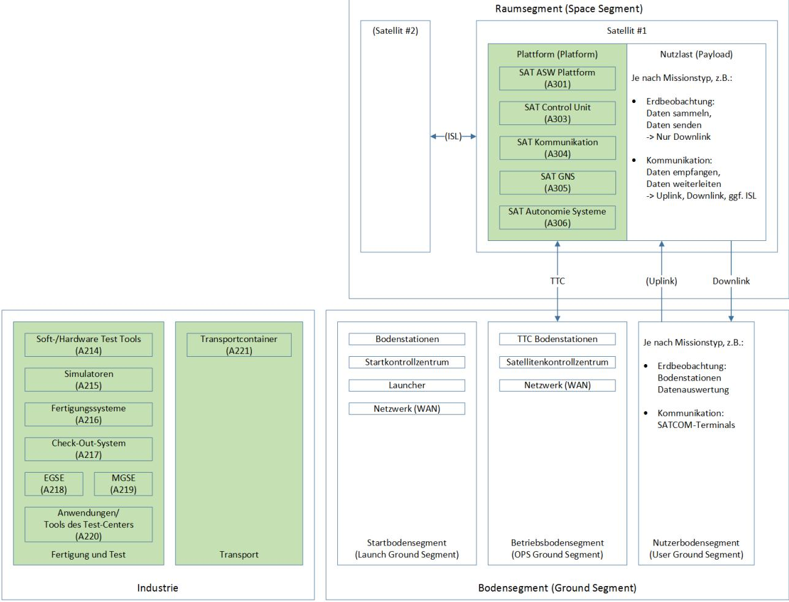
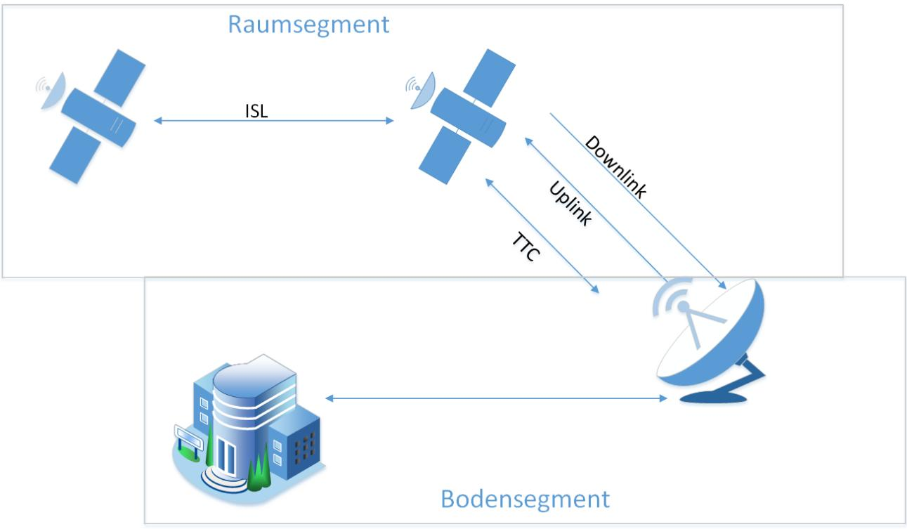
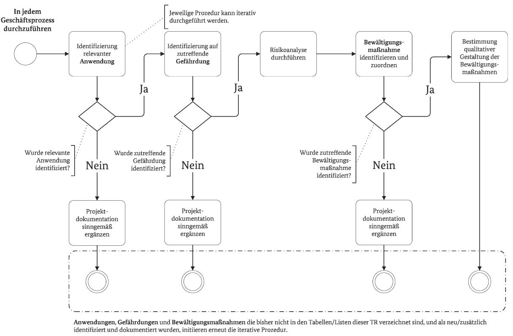

# Technische Richtlinie BSI TR-03184 Informationssicherheit für Weltraumsysteme

Teil 1: Raumsegment

Version: 1.0 Datum: 31.05.2023

# Änderungshistorie

#### *Tabelle 1: Änderungshistorie*

| Version          | Datum      | Beschreibung         |
|------------------|------------|----------------------|
| 1.0              | 31.05.2023 | Erstveröffentlichung |
|                  |            |                      |
| Revisionszyklus: |            | 2-jährlich           |

Bundesamt für Sicherheit in der Informationstechnik Postfach 20 03 63 53133 Bonn Tel.: +49 22899 9582-5812 itcssa@bsi.bund.de Internet: https://www.bsi.bund.de © Bundesamt für Sicherheit in der Informationstechnik 2021

# Liste der Autorinnen und Autoren

An der Erarbeitung des Dokuments beteiligt waren die Teilnehmerinnen und Teilnehmer der 2021 vom BSI initiierten Expertengruppe "Informationssicherheit für Weltraumsysteme".

| Name                      | Organisation                                        |
|---------------------------|-----------------------------------------------------|
| Dr. Johanna Niecknig      | Bundesamt für Sicherheit in der Informationstechnik |
| Wendel Lohmer             | Bundesamt für Sicherheit in der Informationstechnik |
| Dr. Max Gebhardt          | Bundesamt für Sicherheit in der Informationstechnik |
| Stefanie Grundner         | Panaglobo GbR                                       |
| Manuel Hoffmann           | OHB Digital Connect GmbH                            |
| André Penzien          | OHB Digital Connect GmbH                            |
| Prof. Dr. Steffen Kuntz   | Airbus Defence and Space GmbH                       |
| Miriam Goellner           | Airbus Defence and Space GmbH                       |
| Tarsicio López Delgado | Airbus Defence and Space GmbH                       |
| Frank Keck                | secunet Security Networks AG                        |
| Prof. Dr. Matthias Berger | Jade Hochschule Wilhelmshaven                       |
| Sascha Fankhänel          | Jade Hochschule Wilhelmshaven                       |

Für die fachliche Qualitätssicherung wurde das Dokument geprüft durch:

| Name              | Organisation                  |
|-------------------|-------------------------------|
| Stefan Langhammer | OHB Digital Connect GmbH      |
| Wim Fleischhauer  | Rheinmetall Electronics GmbH  |
| Peter Voigt       | Airbus Defence and Space GmbH |
| Tobias Kluge      | Airbus Defence and Space GmbH |
| Dr. Björn Appel   | INFODAS GmbH                  |
| Justus Bach       | INFODAS GmbH                  |
| Niels Lerch       | INFODAS GmbH                  |
| Daniel Grötsch    | INFODAS GmbH                  |

### Vorwort des Abteilungsleiters Krypto-Technik und IT-Management

Mit der Verabschiedung der EU-Richtlinie NIS 2 hat der Weltraum als Sektor seinen Platz als kritische Infrastruktur eingenommen. Dies betrifft zunächst das Bodensegment. Für das Raumsegment / die Satelliten selbst, in allen Lebensphasen, gibt es bislang keine gesetzlichen Vorgaben. Um Weltraumsysteme sicher zu gestalten, muss der Blick aber auf das Gesamtsystem gerichtet werden. So werden für das Raumsegment gleichwertige Anforderungen an die Informationssicherheit benötigt wie zur Absicherung kritischer Komponenten im Bodensegment.

Daher möchte das BSI mit der vorliegenden Technischen Richtlinie dem Anwender der Richtlinie Sicherheitsmaßnahmen an die Hand geben, die helfen, ein angemessenes Sicherheitsniveau für das Raumsegment zu erreichen. Im Rahmen einer Expertengruppe "Informationssicherheit für Weltraumsysteme" zwischen BSI und Vertretern der deutschen Raumfahrtindustrie wurden in zahlreichen Workshops Analysen durchgeführt, Risiken identifiziert und Best Practices gesammelt, mit dem Ergebnis einer umfangreichen Tabelle, die für verschiedene Prozesse identifizierten Gefährdungen Bewältigungsmechanismen zuordnet. Diese soll den Anwendern der Richtlinie als anwendbares Werkzeug für zukünftige Projekte dienen, um Gefährdungen zu identifizieren und Maßnahmen zuzuordnen. Ebenso soll durch die Hinweise, Kriterien und Methoden dieser Technischen Richtlinie das Bewusstsein für die Informationssicherheit und dessen mannigfaltige Ausprägungen bei den Verantwortlichen in diesem Bereich auf ein hohes Maß sensibilisiert werden.

Durch die Fokussierung auf hohen bis sehr hohen Schutzbedarf bei der Erstellung der Technischen Richtlinie gelingt eine Detaillierung der Empfehlungen, die bereits im Rahmen des IT-Grundschutzprofils für Weltrauminfrastrukturen empfohlen werden.

Ich danke den Mitgliedern der Expertengruppe für Ihre Mitwirkung an der Erstellung des Dokuments und wünsche viel Erfolg und guten Nutzen bei der Anwendung der Technischen Richtlinie.

Dr. Günther Welsch Leiter Abteilung Kryptotechnik und IT-Management

| Abkürzungsverzeichnis                                               | 6 |  |  |  |
|---------------------------------------------------------------------|---|--|--|--|
| Begriffe                                                            | 8 |  |  |  |
| Verweise 13                                                      |   |  |  |  |
| 1 Einleitung 14                                               |   |  |  |  |
| 2 Strukturbeschreibung Weltraumsysteme16                         |   |  |  |  |
| 3 Anwendungshinweise 18                                       |   |  |  |  |
| 3.1 Abgrenzung der Technischen Richtlinie 18                  |   |  |  |  |
| 3.2 Anwendung der Technischen Richtlinie 19                   |   |  |  |  |
| 4 Betrachtete Anwendungen 22                                  |   |  |  |  |
| 5 Schutzbedarfsfeststellung25                                    |   |  |  |  |
| 5.1 Festlegung des Schutzniveaus25                               |   |  |  |  |
| 5.2 Gefährdungen26                                               |   |  |  |  |
| 6 Risikobehandlung von Gefährdungen 27                        |   |  |  |  |
| 6.1 Bewältigungsmaßnahmen 27                                  |   |  |  |  |
| 6.2 Ausgewählte Szenarien 28                                  |   |  |  |  |
| 7 Kryptographische Hinweise 33                                |   |  |  |  |
| 8 Ausblick35                                                     |   |  |  |  |
| Anhang A: Liste der Gefährdungen36                                  |   |  |  |  |
| Anhang B: Liste der Bewältigungsmaßnahmen41                         |   |  |  |  |
| Anhang C: Zuordnung von Gefährdungen zu Bewältigungsmaßnahmen 53 |   |  |  |  |

### Abkürzungsverzeichnis

#### *Tabelle 3: Abkürzungsverzeichnis*

| Abkürzung | Bedeutung                                           |
|-----------|-----------------------------------------------------|
| AIS       | Anwendungshinweise und Interpretationen zum Schema  |
| AIT       | Assembly, Integration and Test                      |
| AIV       | Assembly, Integration and Verification              |
| ASW       | Application Software                                |
| BDSG      | Bundesdatenschutzgesetz                             |
| BM        | Bewältigungsmaßnahme                                |
| BSI       | Bundesamt für Sicherheit in der Informationstechnik |
| CCPA      | California Consumer Privacy Act                     |
| CCS       | Central Checkout Systems                            |
| CCSDS     | Consultative Committee for Space Data Systems       |
| DLR       | Deutsches Zentrum für Luft- und Raumfahrt           |
| DMS       | Dokumentenmanagementsystem                          |
| DNS       | Domain Name System                                  |
| DPA       | Data Processing Agreement                           |
| ECSS      | European Cooperation for Space Standardization      |
| EGSE      | Electrical Ground Support Equipment                 |
| ERP       | Enterprise Resource Planning                        |
| FPGA      | Field Programmable Gate Array                       |
| G         | Gefährdung                                          |
| GEO       | Geostationary Earth Orbit                           |
| GDPR      | General Data Protection Bill                        |
| GNSS      | Global Navigation Satellite System                  |
| GP        | Geschäftsprozess                                    |
| GPS       | Global Positioning System                           |
| IC        | Integrated Circuit                                  |
| IDS       | Intrusion Detection System                          |
| IoT       | Internet of Things                                  |
| IPS       | Intrustion Prevention System                        |
| ISL       | Inter-Satellite-Link                                |
| ISMS      | Information Security Management System              |
| KDF       | Key Derivation Function                             |
| KRITIS-V  | Kritische Infrastrukturen (KRITIS) Verordnung       |
| LDAP      | Lightweight Directory Access Protocol               |
| LEO       | Low Earth Orbit                                     |
| LEOP      | Launch and Early Operations Phase                   |
| MDM       | Mobile Device Management                            |
| MEO       | Medium Earth Orbit                                  |
| MGSE      | Mechanical Ground Support Equipment                 |
| NIST      | National Institute of Standards and Technology      |
| OBC       | On Board Computer                                   |
| OPS       | Operations                                          |
| OTRS      | Open Ticket Request System                          |
| PDPB      | Personal Data Protection Bill                       |
| PQ        | Post Quantum                                        |
| PL        | Payload                                             |

| Abkürzung           | Bedeutung                                                      |
|---------------------|----------------------------------------------------------------|
| Requirement-Eng/Mgt | Requirement Engineering and Management                         |
| RTOS                | Real Time Operating System                                     |
| SAT                 | Satellite                                                      |
| SAT ASW             | Anwendungsspezifische Satellitensoftware Plattform und Payload |
| SATCOM              | Satellite Communication                                        |
| SatDSiG             | Satellitendatensicherheitsgesetz                               |
| SCM                 | Supply Chain Management                                        |
| SCOE                | Special Checkout Equipment                                     |
| SLE                 | (CCSDS) Space Link Extension                                   |
| SQL                 | Structured Query Language                                      |
| STK                 | Systems Tool Kit                                               |
| TK                  | Telekommunikation                                              |
| TM/TC               | Telemetry & Telecommand                                        |
| TR                  | Technische Richtlinie                                          |
| TTC                 | Telemetry, Tracking and Command                                |
| VPN                 | Virtual Private Network                                        |
| VS                  | Verschlusssache                                                |
| WAN                 | Wide Area Network                                              |

# Begriffe

*Tabelle 4: Liste der verwendeten Begriffe*

| Begriff                | Beschreibung                                                                   |
|------------------------|--------------------------------------------------------------------------------|
| Akteur                 | Ein Akteur ist eine handelnde Person innerhalb eines Systems. Der Akteur    |
| (Actor)                | interagiert mit anderen Akteuren und mit der Infrastruktur des Systems.        |
| Angriff                | Ein Angriff ist eine vorsätzliche Form der Gefährdung, nämlich eine            |
| (Attack)               | unerwünschte oder unberechtigte Handlung mit dem Ziel, sich Vorteile zu        |
|                        | verschaffen bzw. einen Dritten zu schädigen.                                   |
| Anwendung              | Zum Informationsverbund gehören neben den Prozessen auch die                   |
|                        | Anwendungen, die eine Bearbeitung der Prozesse unterstützen. Dies sind im      |
|                        | Lebenszyklus des Satelliten neben allgemeinen Anwendungen bzw. Diensten        |
|                        | (z.B. E-Mail-Service oder Datenaustausch-Dienst) auch die für die Raumfahrt    |
|                        | spezifischen Anwendungen und Dienste (bspw. Analyse-Tools, EGSE,               |
|                        | Simulatoren), sowie Anwendungen, Komponenten und Geräte und Dienste,           |
|                        | die sich an Bord des Satelliten befinden (z.B. Plattform, Payload, SAT         |
|                        | Controller).                                                                   |
| Bedrohung              | Eine Bedrohung ist ganz allgemein ein Umstand oder Ereignis, durch den oder    |
| (Threat)               | durch das ein Schaden entstehen kann. Der Schaden bezieht sich dabei auf       |
|                        | einen konkreten Wert wie Vermögen, Wissen, Gegenstände oder Gesundheit.        |
|                        | Übertragen in die Welt der Informationstechnik ist eine Bedrohung ein          |
|                        | Umstand oder Ereignis, der oder das die Verfügbarkeit, Integrität oder         |
|                        | Vertraulichkeit von Informationen beeinträchtigen kann, wodurch dem            |
|                        | Besitzer bzw. Benutzer der Informationen ein Schaden entstehen kann.           |
|                        | Beispiele für Bedrohungen sind höhere Gewalt, menschliche Fehlhandlungen,      |
|                        | technisches Versagen oder vorsätzliche Handlungen. Trifft eine Bedrohung auf   |
|                        | eine Schwachstelle (insbesondere technische oder organisatorische Mängel), so  |
|                        | entsteht eine Gefährdung.                                                      |
| Bedrohungsakteur oder  | Ein Akteur wird zum Bedrohungsakteur oder Angreifer, wenn Motivation,          |
| Angreifer              | Rechtfertigung und Gelegenheit für negative Handlungen bestehen.               |
| (Threat Actor,         | Angreifer können auch im Auftrag von Dritten handeln, die sich Vorteile     |
| Attacker)              | verschaffen wollen.                                                            |
| Betreiber              | Im Kontext dieses Dokuments bezieht sich dieser Begriff auf den operativen     |
|                        | Betreiber eines Weltraumsystems.                                               |
| Bewältigungsmaßnahme   | Bewältigungsmaßnahmen sind Sicherheitsmaßnahmen sehr ähnlich, jedoch           |
| (Security Control,     | beziehen sie sich nicht strikt auf die Steuerung von Sicherheitsanforderungen, |
| Countermeasure)        | sondern dienen der Risikobehandlung von Gefährdungen.                       |
| und die Qualität deren | Die Qualität der Umsetzung einer Bewältigungsmaßnahme kann durch ein           |
| Umsetzung              | gefordertes VS-Sicherheitsniveau vorgegeben sein. Eine Zugangsbeschränkung     |
|                        | kann beispielsweise in folgenden Qualitäten umgesetzt werden: Drehkreuz,       |
|                        | Tür, Mantrap, Wachpersonal, Wachhunde, Videoüberwachung, etc.                  |
| Gefährdung             | Eine Gefährdung ist eine Bedrohung, die konkret über eine Schwachstelle auf    |
| (Applied Threat)       | ein Objekt einwirkt. Eine Bedrohung wird somit erst durch eine vorhandene      |
|                        | Schwachstelle zur Gefährdung für ein Objekt.                                   |
| Geschäftsprozess       | Ein Geschäftsprozess ist eine Menge logisch verknüpfter Einzeltätigkeiten      |
|                        | (Aufgaben, Arbeitsabläufe), die ausgeführt werden, um ein bestimmtes           |
|                        | geschäftliches oder betriebliches Ziel zu erreichen.                           |

| Begriff                   | Beschreibung                                                                                                                                                                                                                      |
|---------------------------|-----------------------------------------------------------------------------------------------------------------------------------------------------------------------------------------------------------------------------------|
| Informationssicherheit    | Informationssicherheit hat den Schutz von Informationen als Ziel. Dabei                                                                                                                                                           |
|                           | können Informationen sowohl auf Papier, in IT-Systemen oder auch in Köpfen                                                                                                                                                        |
|                           | gespeichert sein.                                                                                                                                                                                                                 |
|                           | Die Schutzziele oder auch Grundwerte der Informationssicherheit sind                                                                                                                                                              |
|                           | Vertraulichkeit, Integrität und Verfügbarkeit. Viele Anwender ziehen in ihre                                                                                                                                                      |
|                           | Betrachtungen weitere Grundwerte mit ein.                                                                                                                                                                                      |
| Infrastruktur             | Eine Infrastruktur umfasst alle physikalischen und technischen Anlagen eines                                                                                                                                                |
|                           | Systems.                                                                                                                                                                                                                          |
| IT-Infrastruktur          | IT-Infrastrukturen sind technische Anlagen, die der Informationsverarbeitung                                                                                                                                                      |
|                           | dienen und eine abgeschlossene Funktionseinheit bilden. Typische IT                                                                                                                                                               |
|                           | Infrastrukturen sind Server, Clients, Mobiltelefone, Smartphones, Tablets, IoT                                                                                                                                                    |
|                           | Komponenten, Router, Switches und Firewalls.                                                                                                                                                                                      |
| IT-Sicherheit             | IT-Sicherheit ist eine Unterdisziplin der Informationssicherheit und                                                                                                                                                              |
|                           | bezeichnet einen Zustand, in dem die Risiken, die beim Einsatz von                                                                                                                                                                |
|                           | Informationstechnik aufgrund von Bedrohungen und Schwachstellen                                                                                                                                                                   |
|                           | vorhanden sind, durch angemessene Maßnahmen reduziert sind.                                                                                                                                                                       |
| IT-System                 | Ein IT-System umfasst eine IT-Infrastruktur sowie die Verfahren zu deren                                                                                                                                                          |
|                           | Einsatz, Überwachung, Kontrolle, Betrieb, Nutzung und Schutz.                                                                                                                                                                     |
| Keying                    | Keying bezeichnet den Vorgang, Kryptoschlüssel in Kryptogeräte zu laden.                                                                                                                                                          |
|                           | Beim Satellitenbetrieb erfolgt die Verschlüsselung üblicherweise rein                                                                                                                                                             |
|                           | symmetrisch (siehe CCSDS/SDLS); hierfür wird ein Satz symmetrischer                                                                                                                                                               |
|                           | Master-Keys in die beiden Kryptogeräte – an Bord und im                                                                                                                                                                        |
|                           | Satellitenkontrollzentrum – geladen ("shared secrets"), so dass sich eine Ende                                                                                                                                                 |
|                           | zu-Ende Verschlüsselung ergibt.                                                                                                                                                                                                |
| (VS-)Kontrollzone         | Kontrollzonen sind Bereiche, in denen VS bearbeitet werden, wenn der                                                                                                                                                              |
|                           | persönliche Gewahrsam nicht gewährleistet werden kann. Die Aufbewahrung                                                                                                                                                           |
|                           | von VS außerhalb von VS-Verwahrgelassen ist hier nicht zulässig.                                                                                                                                                                  |
|                           | Kontrollzonen sind besondere Formen von Sicherheitsbereichen.                                                                                                                                                                  |
| Manipulation              | Eine nichtautorisierte Aktion an einem System, um eine Veränderung von                                                                                                                                                            |
| (Tamper)                  | Daten und/oder des vorgesehenen Verhaltens zu bewirken.                                                                                                                                                                           |
| Prozess                   | Prozesse beschreiben, wie die Komponenten eines Systems (Infrastruktur und                                                                                                                                                        |
|                           | Akteure) zusammenwirken sollen, damit das System seine Aufgaben erfüllt.                                                                                                                                                          |
| Risiko                    | Risiko wird häufig definiert als die Kombination (also dem Produkt) aus der                                                                                                                                                       |
| (Risk)                    | Wahrscheinlichkeit, mit der ein Schaden auftritt und dem Ausmaß dieses                                                                                                                                                            |
|                           | Schadens. Der Schaden wird häufig als Differenz zwischen einem geplanten                                                                                                                                                          |
|                           | und ungeplanten Ergebnis dargestellt.                                                                                                                                                                                             |
|                           | Im Unterschied zu "Gefährdung" umfasst der Begriff "Risiko" bereits eine Bewertung, inwieweit ein bestimmtes Schadensszenario im jeweils                                                                                       |
|                           | vorliegenden Fall relevant ist.                                                                                                                                                                                                   |
| Risikobehandlung (Risk | Mit Risikobehandlung wird der Prozess bezeichnet, bei dem Maßnahmen                                                                                                                                                               |
| Treatment)                | ausgewählt und eingerichtet werden, die sich auf die Risiken auswirken.                                                                                                                                                           |
|                           | Das Ziel ist in der Regel, das Risiko einer Gefährdung zu senken, indem z.B. die                                                                                                                                                  |
|                           | Eintrittswahrscheinlichkeit oder der mögliche Schaden des unerwünschten                                                                                                                                                        |
|                           | Ereignisses durch geeignete Maßnahmen reduziert wird (siehe                                                                                                                                                                       |
|                           | Bewältigungsmaßnahme).                                                                                                                                                                                                            |
|                           |                                                                                                                                                                                                                                   |
|                           |                                                                                                                                                                                                                                   |
|                           |                                                                                                                                                                                                                                   |
|                           |                                                                                                                                                                                                                                   |
|                           |                                                                                                                                                                                                                                   |
|                           | Die Risikobehandlung fällt typischerweise in eine der folgenden Gruppen: Risikovermeidung (Risk Prevention) Risikominderung (Risk Reduction/Control) Risikoakzeptanz (Risk Acceptance) Risikotransfer (Risk Transfer) |

| Begriff                | Beschreibung                                                                     |
|------------------------|----------------------------------------------------------------------------------|
| Risikomanagement       | Als Risikomanagement werden alle Aktivitäten mit Bezug auf die strategische      |
| (Risk Management)      | und operative Behandlung von Risiken bezeichnet, also alle Tätigkeiten, um       |
|                        | Risiken für eine Institution zu identifizieren, zu steuern und zu kontrollieren. |
|                        | Das strategische Risikomanagement beschreibt die wesentlichen                    |
|                        | Rahmenbedingungen, wie die Behandlung von Risiken innerhalb einer                |
|                        | Institution, die Kultur zum Umgang mit Risiken und die Methodik ausgestaltet     |
|                        | sind. Diese Grundsätze für die Behandlung von Risiken innerhalb eines ISMS       |
|                        | müssen mit den Rahmenbedingungen des organisationsweiten                         |
|                        | Risikomanagements übereinstimmen bzw. aufeinander abgestimmt sein.               |
|                        | Die Rahmenbedingungen des operativen Risikomanagements umfassen den              |
|                        | Regelprozess aus                                                                 |
|                        | Identifikation von Risiken,                                                      |
|                        | Einschätzung und Bewertung von Risiken,                                          |
|                        | Behandlung von Risiken,                                                          |
|                        | Überwachung von Risiken und                                                      |
|                        | Risikokommunikation.                                                             |
| Schwachstelle          | Eine Schwachstelle ist ein sicherheitsrelevanter Fehler eines IT-Systems oder    |
| (Vulnerability)        | einer Institution. Ursachen können in der Konzeption, den verwendeten            |
|                        | Algorithmen, der Implementation, der Konfiguration, dem Betrieb sowie der        |
|                        | Organisation liegen. Eine Schwachstelle kann dazu führen, dass eine              |
|                        | Bedrohung wirksam wird und eine Institution oder ein System geschädigt           |
|                        | wird. Durch eine Schwachstelle wird ein Objekt (eine Institution oder ein        |
|                        | System) anfällig für Bedrohungen.                                                |
| Sicherheitsanforderung | Als Sicherheitsanforderung werden Anforderungen für den organisatorischen,       |
| (Control)              | personellen, infrastrukturellen und technischen Bereich bezeichnet, deren        |
|                        | Erfüllung zur Erhöhung der Informationssicherheit notwendig ist bzw. dazu        |
|                        | beiträgt. Eine Sicherheitsanforderung beschreibt also, was getan werden muss,    |
|                        | um ein bestimmtes Niveau bezüglich der Informationssicherheit zu erreichen.      |
|                        | Wie die Anforderungen im konkreten Fall erfüllt werden können, ist in            |
|                        | entsprechenden Sicherheitsmaßnahmen beschrieben. Im englischen                   |
|                        | Sprachraum wird für Sicherheitsanforderungen häufig der Begriff "control"        |
|                        | verwendet.                                                                       |
|                        | Der IT-Grundschutz unterscheidet zwischen Basis-Anforderungen, Standard          |
|                        | Anforderungen und Anforderungen bei erhöhtem Schutzbedarf. Basis                 |
|                        | Anforderungen sind fundamental und stets umzusetzen, sofern nicht                |
|                        | gravierende Gründe dagegensprechen. Standard-Anforderungen sind für den          |
|                        | normalen Schutzbedarf grundsätzlich umzusetzen, sofern sie nicht durch           |
|                        | mindestens gleichwertige Alternativen oder die bewusste Akzeptanz des            |
|                        | Restrisikos ersetzt werden. Anforderungen bei erhöhtem Schutzbedarf sind         |
|                        | exemplarische Vorschläge, was bei entsprechendem Schutzbedarf zur                |
|                        | Absicherung sinnvoll umzusetzen ist.                                             |

| Begriff               | Beschreibung                                                                                                                                   |
|-----------------------|------------------------------------------------------------------------------------------------------------------------------------------------|
| Sicherheitsbereich    | Sicherheitsbereiche sind Bereiche, zu denen nur bestimmte Personenkreise                                                                    |
|                       | Zugang haben. Der Zugang ist durch technische und/oder organisatorische                                                                     |
|                       | Maßnahmen zu beschränken, um den Aufenthalt von Mitarbeitern, aber auch                                                                     |
|                       | von externen Dienstleistern und Besuchern zu regeln.                                                                                        |
|                       | Die Notwendigkeit kann sich z.B. aus Arbeitsschutzgründen ("safety") oder                                                                      |
|                       | Informationssicherheitsründen ("security") ergeben.                                                                                            |
|                       | Im Umgang mit VS sind besondere Formen von Sicherheitsbereichen                                                                                |
|                       | gefordert, da explizite Sicherheitsanforderungen an die Qualität der                                                                           |
|                       | Umsetzung bestehen.                                                                                                                            |
|                       | Aber auch ohne explizite VS-Anforderungen können Sicherheitsbereiche                                                                           |
|                       | notwendig sein (z.B. zum Schutz von Geschäftsgeheimnissen / Intellectual                                                                       |
|                       | Property).                                                                                                                                     |
| Sicherheitsmaßnahme   | Mit Sicherheitsmaßnahme (kurz Maßnahme) werden alle Aktionen bezeichnet,                                                                       |
| (Safeguard,           | die dazu dienen, um Sicherheitsrisiken zu steuern und um diesen                                                                                |
| Security Measure,     | entgegenzuwirken. Dies schließt sowohl organisatorische, als auch personelle,                                                                  |
| Measure)              | technische oder infrastrukturelle Sicherheitsmaßnahmen ein.                                                                                    |
|                       | Sicherheitsmaßnahmen dienen zur Erfüllung von Sicherheitsanforderungen.                                                                        |
| (VS-)Sperrzone        | VS der Geheimhaltungsgrade VS-VERTRAULICH oder höher dürfen außerhalb von VS-Verwahrgelassen in VS-Sperrzonen (Räume, Gebäude, Gebäudeteile |
|                       | oder abgegrenzte Freilandzonen) bearbeitet und verwahrt werden.                                                                                |
|                       | Sperrzonen sind besondere Formen von Sicherheitsbereichen mit höheren                                                                       |
|                       | Zutrittsbeschränkungen und Sicherheitsmaßnahmen.                                                                                               |
| System                | Ein System besteht aus verschiedenen Komponenten (Infrastruktur und                                                                            |
|                       | Akteuren), die miteinander interagieren (gemäß Prozessen), um bestimmte                                                                        |
|                       | Aufgaben zu erfüllen.                                                                                                                          |
| VS-Verwahrgelass      | VS-Verwahrgelasse sind besonders gesicherte Räume, Schränke oder sonstige                                                                      |
|                       | Behältnisse zur Aufbewahrung von Verschlusssachen.                                                                                             |
| Weltrauminfrastruktur | Unter dem Begriff Weltrauminfrastrukturen werden alle terrestrischen und                                                                       |
|                       | orbitalen Infrastrukturen (z.B. Satelliten, Kontrollzentren, Bodenstationen)                                                                   |
|                       | zusammengefasst, die mit den verschiedenen funktionalen Phasen von                                                                             |
|                       | Weltraumsystemen verbunden sind, wie Betrieb und Nutzung, Kontrolle,                                                                           |
|                       | Herstellung und Aspekte des Schutzes. Der gesamte Lebenszyklus wird dabei                                                                      |
|                       | betrachtet.                                                                                                                                    |
| Weltraumsystem        | Oberbegriff für sämtliche Komponenten von Satelliten- und                                                                                   |
|                       | Weltraumlagesystemen. Darunter fallen Weltrauminfrastrukturen selbst sowie                                                                     |
|                       | die Verfahren zu deren Einsatz, Überwachung, Kontrolle, Betrieb, Nutzung                                                                       |
|                       | und Schutz.                                                                                                                                    |
| Zugang (zu)           | Mit Zugang wird die Nutzung von IT-Systemen, System-Komponenten und                                                                            |
|                       | Netzen bezeichnet. Zugangsberechtigungen erlauben somit einer Person,                                                                          |
|                       | bestimmte Ressourcen wie IT-Systeme oder System-Komponenten und                                                                                |
|                       | Netze zu nutzen.                                                                                                                            |
| Zugriff (auf)         | Mit Zugriff wird die Nutzung von Informationen oder Daten bezeichnet. Über                                                                     |
|                       | Zugriffsberechtigungen wird geregelt, welche Personen im Rahmen ihrer                                                                       |
|                       | Funktionen oder welche IT-Anwendungen bevollmächtigt sind,                                                                                     |
|                       | Informationen, Daten oder auch IT-Anwendungen, zu nutzen oder                                                                                  |
|                       | Transaktionen auszuführen.                                                                                                                     |

| Begriff      | Beschreibung                                                                    |
|--------------|---------------------------------------------------------------------------------|
| Zutritt (zu) | Mit Zutritt wird das Betreten von abgegrenzten Bereichen wie z.B. Räumen        |
|              | oder geschützten Arealen in einem Gelände bezeichnet.                           |
|              | Zutrittsberechtigungen erlauben somit Personen, bestimmte Umgebungen zu         |
|              | betreten, also beispielsweise ein Gelände, ein Gebäude oder definierte Räume |
|              | eines Gebäudes.                                                                 |

### Verweise

- [1] Bundesamt für Sicherheit in der Informationstechnik, Cybersicherheit für Weltrauminfrastrukturen Positionierung des Bundesamts für Sicherheit in der Informationstechnik, 2022.
- [2] BSI, OHB, Airbus, DLR, IT-Grundschutz-Profil für Weltauminfrastrukturen Mindestabsicherung für den Satelliten über den gesamten Lebenszyklus, 2022.
- [3] Bundesamt für Sicherheit in der Informationstechnik, IT-Grundschutz-Kompendium, 2022.
- [4] DLR, Tailoring Catalogue Product Assurance, Safety & Sustainability Requirements for DLR Space Projects, DLR-RF-PS-001, 2019.
- [5] ISO International Standardization Organization, ISO/IEC 27005:2022 Information technology Security techniques — Information security risk management, 2022.
- [6] ISO International Standardization Organization, ISO.IEC 31010:2019 Risk management Risk assessment techniques, 2019.
- [7] Bundesamt für Sicherheit in der Informationstechnik, BSI-Standard 200-3 Risikoanalyse auf der Basis von IT-Grundschutz, 2017.
- [8] Bundesamt für Sicherheit in der Informationstechnik, BSI-Standard 200-2: IT-Grundschutz-Methodik, 2017.
- [9] Bundesamt für Sicherheit in der Informationstechnik, TR-02102 Kryptographische Verfahren: Empfehlungen und Schlüssellängen, 2023.
- [10] Bundesamt für Sicherheit in der Informationstechnik, AIS 20 Funktionalitätsklassen und Evaluationsmethodologie für deterministische Zufallszahlengeneratoren, 2013.
- [11] Bundesamt für Sicherheit in der Informationstechnik, AIS 31 Funktionalitätsklassen und Evaluationsmethodologie für physikalische Zufallszahlengeneratoren, 2011.
- [12] W. Schindler, Functionality Classes and Evaluation Methodology for Deterministic Random Number Generators. Version 2.0, 02.12.1999, ehemalige mathematisch-technische Anlage zur AIS20.
- [13] W. S. W. Killmann, A proposal for: Functionality classes and evaluation methodology fpr true (physical) random number generators, Version 3.1, 25.09.2001, ehemalige matematisch-technische Anlage zur AIS 31, 2001.
- [14] ISO International Organization for Standardization, ISO/IEC 27001:2022 Information technology Security techniques – Information security management systems – Requirements, 2022.

# 1 Einleitung

Weltraumgestützte Dienste sind ein unverzichtbarer Bestandteil unseres täglichen Lebens. In den Bereichen Navigation, Kommunikation und Erdbeobachtung leisten heutige Satelliten einzigartige Beiträge, z.B. zur Wettervorhersage, zum Katastrophenschutz, zur Klimaforschung, zur Unterstützung von Luft- und Boden-Transportsystemen, zum Betrieb von Notruf-Diensten und zum Management von intelligenten Stromnetzen. Die zuverlässige Verfügbarkeit dieser Dienste wird von unserer modernen Gesellschaft benötigt und liegt daher im wissenschaftlichen, im sozialen, im wirtschaftlichen und im innen- und außenpolitischen Interesse. Je umfangreicher die weltraumbasierten Dienste im alltäglichen Leben werden, desto wichtiger ist eine zuverlässige Bereitstellung dieser Dienste.

Wie jede andere IT-Infrastruktur, sind weltraumgestützte Systeme Ziele für Angriffe, um deren Nutzbarkeit einzuschränken. Angreifer bedrohen dabei sowohl das Raum-, als auch das Boden- und Nutzersegment. Um funktionstüchtige und zuverlässige weltraumgestützte Dienste zu gewährleisten, muss entsprechende Resilienz in allen Bereichen sowie in allen Lebensphasen aufgebaut und stetig sichergestellt werden.

Im BSI-Positionspapier "Cybersicherheit für Weltrauminfrastrukturen" [1] wurden Handlungsfelder identifiziert, aus denen die Entwicklung von Mindestanforderungen und Erstellung Technischer Richtlinien als Aufgabe für das BSI hervorgehen.

Diese Technische Richtlinie (TR) befasst sich mit dem Raumsegment1 , d.h. der Fokus liegt auf dem Satelliten über den gesamten Lebenszyklus.

Ziel der TR ist es, einen angemessenen Standard in der Informationssicherheit zu verbreiten. Es werden mögliche Gefährdungen der Schutzziele beschrieben und Maßnahmen definiert, die es dem Anwender der TR ermöglichen, projektspezifische Anforderungen zu formulieren. Notwendig hierfür ist eine missionsbzw. projektspezifische Anpassung (Tailoring). Die beschriebenen Gefährdungen und vorgeschlagenen Bewältigungsmaßnahmen (BM) sind dabei vom Anwender vollumfänglich zu prüfen bzw. anzuwenden und so auszugestalten, dass die Risiken aller identifizierten Gefährdungen auf ein akzeptables Restrisiko reduziert werden können. Durch Umsetzung der Maßnahmen, beginnend mit der Planung, der Herstellung und dem Betrieb, bis hin zur Außerbetriebnahme, soll ein ausreichender Schutz bewerkstelligt werden.

Diese TR ist ausgelegt für hohen und sehr hohen Schutzbedarf und wird von BSI für die Betrachtung von Weltraumsystemen dieses Schutzbedarfs empfohlen. Gegenüber dem IT-Grundschutz-Profil [2] ermöglicht sie außerdem eine stärkere Vertiefung und Detaillierung der Anforderungen an den Satelliten. Die TR kann dabei auch Wegweiser zur Erlangung einer (ggf. später geplanten) VS-Zulassung sein. Für eine solche werden einige der im vorliegenden Dokument formulierten Empfehlungen (soll), wie die kryptographischen Anforderungen, zu Verpflichtungen (muss).

Durch Anpassungen der Anforderungen kann diese TR auch auf Satelliten, deren Schutzbedarf niedriger eingestuft wird, angewendet werden. In diesem Fall sollten die beschriebenen Gefährdungen und Bewältigungsmaßnahmen dennoch vollumfänglich geprüft werden. Bestimmte Gefährdungen und damit Bewältigungsmaßnahmen können sich ggf. erübrigen; auch die Qualität der Umsetzung kann geringer ausfallen.

Damit kann diese TR, neben dem Grundschutz-Kompendium [3] und dem "IT-Grundschutz-Profil für Weltrauminfrastrukturen" [2], auch als ergänzender Beitrag zur Erstellung eines

1 Eine weitere TR zum Bodensegment ist zu einem späteren Zeitpunkt geplant.

Informationssicherheitskonzepts2 mit den Schutzzielen Vertraulichkeit, Integrität3 und Verfügbarkeit genutzt werden. Die TR richtet sich dabei sowohl an Auftragnehmer, als auch an Auftraggeber und Betreiber. Die TR ist außerdem kompatibel zu dem "Tailoring Catalogue – Product Assurance, Safety & Sustainability Requirements for DLR Space Projects" [4] bzw. kann als Ergänzung zu diesem angewendet werden.

Als Ausgangspunkt der Betrachtungen werden analog zum IT-Grundschutzprofil sieben Geschäftsprozesse als relevant betrachtet, d.h.4

- a GP01: Konzeption und Design
- b GP02: Herstellung
- c GP03: Test
- d GP04: Transporte
- e GP05: Inbetriebnahme
- f GP06: Betrieb

g GP07: Außerbetriebnahme

Ausgehend von diesen Geschäftsprozessen werden Anwendungen, Gefährdungen und Bewältigungsmaßnahmen erfasst und definiert. Diese Maßnahmen sind hergeleitet aus etablierten Standards und aus praktischer Erfahrung der Autoren (Best Practices).

Das Kernstück der TR ist eine umfangreiche Tabelle ("Zuordnungstabelle"), in der Gefährdungen und Bewältigungsmaßnahmen zur Risikominimierung dargestellt und den betrachteten Anwendungen zugeordnet sind.

Nach einem Grundlagenkapitel, in dem die Struktur eines Weltraumsystems und einige elementare Begriffe erläutert werden, sind in Kapite[l 3](#page-17-0) Hinweise zur Anwendung und Abgrenzung der TR zu finden. Kapite[l 3.2](#page-18-0) führt den Anwender der TR durch den Prozess, wie die präsentierten Ergebnisse zu nutzen sind, um projektspezifische Anforderungen zu extrahieren. In Kapite[l 4](#page-21-0) werden die betrachteten Anwendungen dargestellt. Kapitel [5](#page-24-0) diskutiert Schutzziele und Gefährdungen. In Kapite[l 6](#page-26-0) werden die Bewältigungsmaßnahmen eingeführt und die Anwendung der Zuordnungstabelle mithilfe ausgewählter Szenarien erläutert. Kryptographische Hinweise sind in Kapitel [7](#page-32-0) dargestellt und in Kapite[l 8](#page-34-0) findet der Leser einen kurzen Ausblick. Die vollständigen Tabellen zu Gefährdungen, Bewältigungsmaßnahmen und die Zuordnungstabelle befinden sich im Anhang siehe [Tabelle 12,](#page-35-1) [Tabelle 13](#page-40-1) un[d Tabelle 14.](#page-52-1)

2 Konzept der Informationssicherheit heißt, dass neben technischen Aspekten auch infrastrukturelle, organisatorische und personelle Themen betrachtet werden. Dies ermöglicht ein systematisches Vorgehen, um notwendige Sicherheitsmaßnahmen zu identifizieren und umzusetzen. Die BSI-Standards liefern hierzu bewährte Vorgehensweisen, das IT-Grundschutz-Kompendium konkrete Anforderungen. (aus BSI-Broschüre "Informationssicherheit mit System - Der IT-Grundschutz des BSI", 15.06.2021)

3 Authentizität ist ein Aspekt der Integrität und somit im Begriff Integrität enthalten.

4 Der Geschäftsprozess GP00 (Gemeinsame IT-Infrastruktur) wird nicht betrachtet, da der Geschäftsprozess i.d.R. Standard-IT nutzt und die Absicherung mit gängigen Standards, z.B. IT-Grundschutz, umgesetzt werden sollte.

# 2 Strukturbeschreibung Weltraumsysteme

Zur Vorbereitung auf die folgenden Kapitel werden die Struktur eines Weltraumsystems und einige grundlegende Begriffe erläutert.

[Abbildung 1](#page-15-1) veranschaulicht für ein Weltraum-System die in dieser TR berücksichtigten Elemente (grün markiert); die Beschreibung der Anwendungen finden sich in Kapite[l 4.](#page-21-0)

### **Raumsegment:**

Das Raumsegment umfasst alle Komponenten eines Weltraumsystems, welche ihre Aufgaben im Weltraum erfüllen; es besteht daher i.d.R. aus einem oder aus mehreren Satelliten. Mehrere Satelliten können Konstellationen bilden und kommunizieren ggf. auch untereinander mittels Inter-Satellite-Links (ISLs, per Funk oder Laser).

Der Aufbau jedes Satelliten kann grob in zwei typische Bereiche aufgeteilt werden: In die Plattform (engl. Platform) und in die Nutzlast (engl. Payload). Dabei hat die Plattform die Aufgabe, den Satelliten "am Leben zu erhalten" (z.B. Energieversorgung, Lagekontrolle, Kommunikation, Selbstüberwachung), damit die Nutzlast die Missionsaufgaben erfüllen kann.

*Abbildung 1: Struktur und Elemente eines Weltraumsystems*

### **Betriebsbodensegment und Telemetry, Tracking and Command (TTC) Kommunikation:**

Hautkomponenten im Betriebsbodensegment sind Satellitenkontrollzentren und TTC Bodenstationen, welche durch Netzwerke (WANs) verbunden werden. Ein etabliertes CCSDS-Protokoll für diese Verbindungen ist das Space-Link-Extension (SLE) Protokoll; das standardisierte Protokoll ermöglicht, zusätzliche TTC Bodenstationen relativ einfach dem eigenen Betriebsbodensegment hinzuzufügen. Das kann in Notfallsituationen sehr hilfreich sein, um zusätzliche Kontaktmöglichkeiten mit einem havarierten Satelliten zu erhalten.

Bei TTC steht Telemetry für die am Bodensegment empfangenen Daten (Downlink), steht Command für die vom Bodensegment gesendeten Daten (Uplink) und steht Tracking für die Bahnverfolgung eines Satelliten und Entfernungsmessung über die nachgeführte Antenne einer TTC Bodenstation.

Ziel der TTC Kommunikation ist eine sichere Verbindung zwischen dem Satellitenkontrollzentrum und der Plattform des Satelliten. Die sichere TTC Kommunikation ist das einzige Element des Betriebsbodensegments, welches in dieser TR berücksichtigt wird.

#### **Nutzerbodensegment:**

Das Nutzerbodensegment wird in dieser TR nicht berücksichtigt und ist lediglich vollständigkeitshalber aufgeführt.

#### **Startbodensegment:**

Das Startbodensegment wird in dieser TR nicht berücksichtigt und ist lediglich vollständigkeitshalber aufgeführt. Aufgabe des Startbodensegments ist es, Satelliten in den vorgesehenen Orbit zu transportieren. Dazu betreiben Launch Service Provider im Startbodensegment ebenfalls Kontrollzentren, Bodenstationen und Netzwerke.

#### **Fertigung, Test und Transport von Satelliten:**

Dieser Bereich des Bodensegments umfasst alle Räumlichkeiten und Anlagen, die zur Herstellung, Test und Transport eines Satelliten (bis zur Übergabe an den Launch Service Provider) benötigt werden.

Die in dieser TR berücksichtigten Elemente für Fertigung/Test/Transport sind in der oberen Grafik ebenfalls aufgelistet (die Beschreibung der Anwendungen finden sich in Kapitel [4\)](#page-21-0).

# 3 Anwendungshinweise

### 3.1 Abgrenzung der Technischen Richtlinie

Diese TR soll dabei unterstützen, für alle Beteiligten einer Weltraummission ein einheitliches Verständnis für Sicherheitsanforderungen eines Satelliten zu entwickeln, sodass dieses in allen Lebensphasen - von der Planung bis zur Außerbetriebnahme - berücksichtigt und angewendet werden kann. Dabei wird erläutert, welche Gefährdungen bestehen und mit welchen Maßnahmen diese reduziert werden können.

Der Fokus bei der Betrachtung möglicher Sicherheitsgefährdungen in dieser TR liegt auf dem Satelliten. Dabei werden auch die Entwicklungs-, Test- und Startprozesse am Boden betrachtet. Das Bodensegment, welches zum Betrieb des Satelliten benötigt wird, ist nicht Bestandteil des Dokuments und wird in einer separaten TR betrachtet.

[Abbildung 2](#page-17-2) zeigt die in dieser TR verwendete Aufteilung eines Weltraumsystems in Raum- und Bodensegment. Dabei wird der Bereich Kommunikationsverbindungen dem Raumsegment zugeschlagen, sodass sich als Schnittstelle zwischen Raum- und Bodensegment die Antennenspitzen der Bodenstationen ergeben.

Die Kommunikation zwischen Satelliten (ISLs) ist in der Betrachtung dem Raumsegment zugeordnet.

*Abbildung 2: Systemgrenzen und Übergänge*

Diese TR beschreibt Maßnahmen zur sicheren Herstellung und Betrieb der Satellitenplattform. Konkrete Sicherheitsanforderungen für die Satelliten-Nutzlast (engl. Payload) sind nicht Betrachtungsgegenstand. Die Payload trägt in der Regel spezifische Sensorik und weitere projektabhängige Systeme, welche im Rahmen dieser TR nicht behandelt werden können.

Basierend auf einer für die Nutzlast erstellten Risikoanalyse kann die Methodik der TR für jede Art von Mission angewendet werden. So können die in den folgenden Kapiteln beschriebenen Tabellen der Gefährdungen und Bewältigungsmaßnahmen analog auf die Nutzlast angewendet werden. Dabei werden sich Unterschiede zwischen Plattform und Nutzlast in den zu betrachtenden Anwendungen ergeben, insbesondere da sich das Schutzniveau der Nutzlast – je nach Mission – deutlich von dem der Plattform

unterscheiden kann. Folglich sollten Plattform und Nutzlast separat betrachtet und separat bewertet werden, und die TR sollte separat angewendet werden.

Die angewandte Methodik und Maßnahmen wurden unter der Annahme eines hohen bis sehr hohen Schutzbedarfs entwickelt. Durch Anpassungen der Anforderungen kann diese TR jedoch auch auf Satelliten, deren Schutzbedarf niedriger eingestuft wird, angewendet werden.

Die in diesem Dokument beschriebenen Gefährdungen und Bewältigungsmaßnahmen leisten nach Ansicht der Autoren einen Beitrag für zur Informationssicherheit und ein verbessertes Risikomanagement. Das Dokument erhebt jedoch keinen Anspruch auf Vollständigkeit bezüglich aller Gefährdungen und Bewältigungsmaßnahmen für die Informationssicherheit eines Weltraumsystems.

### 3.2 Anwendung der Technischen Richtlinie

Diese TR ist in Kombination mit einer durch den Anwender der TR (im Folgenden "Anwender" genannt) erstellten (missionsspezifischen) Risikoanalyse zu nutzen. Die Bewältigungsmaßnahmen sind als grundlegende Empfehlungen zu sehen. Aufgrund der unterschiedlichen (projektspezifischen, aber auch anwendungs-/geschäftsprozessabhängigen) Schutzbedarfe ist es dem Anwender überlassen, abhängig vom Ergebnis seiner Risikoanalyse, wie die empfohlenen Bewältigungsmaßnahmen zu konkreten Sicherheitsanforderungen ausgestaltet werden. Die qualitative Ausgestaltung kann organisatorisch, technisch oder infrastrukturell umgesetzt werden. Ferner können die Bewältigungsmaßnahmen angepasst bzw. erweitert werden, d.h.

- es kann die Entscheidung getroffen werden, dass eine Bewältigungsmaßnahme im betroffenen Geschäftsprozess nicht zutrifft oder obsolet ist,
- es können für den betrachteten Geschäftsprozess nicht berücksichtigte Bewältigungsmaßnahmen hinzugefügt werden,
- es können Bewältigungsmaßnahmen angewendet werden, die nicht in der Tabelle beschrieben sind.

Die i[n Abbildung 3](#page-19-0) präsentierte Abfolge der einzelnen Prozeduren ist stark vereinfacht dargestellt, diese soll nur die wesentlichen Schritte zur Methodikanwendung visualisieren.

#### *Abbildung 3: Vereinfachte Darstellung der Prozedur (Workflow) zur Methodikanwendung*

Einen Entscheidungscharakter haben in [Abbildung 3](#page-19-0) die Prozeduren *"Identifizierung relevanter Anwendung*", "*Identifizierung auf zutreffende Gefährdung*" und "*Bewältigungsmaßnahme identifizieren und zuordnen*". Die Prozedur "*Projektdokumentation sinngemäß ergänzen*" dient dazu, alle Entscheidungen zu dokumentieren, welche den Kommunikationsfluss und die Transparenz fördern sollen. Die Prozedur "*Risikoanalyse durchführen*" und die daraus resultierende Nutzung entsprechender Methoden, obliegt dem Anwender und seinem Risikomanagement; die Beschreibung dieser Prozedur ist nicht Teil der TR. Die Prozedur "*Bestimmung qualitativer Gestaltung der Bewältigungsmaßnahme*" bildet den Abschluss dieser Darstellung und leitet weitere Prozessketten zur Umsetzung beim Anwender ein.

• Wie aus der Abbildung 3 hervorgeht, startet der erste Schritt der vorgeschlagenen Methodik mit der Prozedur "*Identifizierung relevanter Anwendung*" für den jeweiligen GP (siehe Kapitel [4\)](#page-21-0). In dieser Prozedur wird für den GP durch den Anwender geprüft, ob die in der TR identifizierten *Anwendungen* zutreffen, und passt diese für das spezifische Projekt an. *Anwendungen*, welche im betrachteten GP als "nicht relevant" identifiziert wurden, müssen entsprechend dokumentiert und können verworfen werden. Relevante *Anwendungen*, welche im betrachteten GP in der TR fehlen, müssen identifiziert, ergänzt und berücksichtigt werden.

Der Schutzbedarf einer jeden *Anwendung* im jeweiligen GP, wird im Risikomanagement festgelegt.

- Nach der "*Identifizierung der Anwendung*", erfolgt im zweiten Schritt die Prozedur "*Identifizierung auf zutreffende Gefährdung*". Die *Gefährdungen* für die projektspezifischen *Anwendungen* im GP sind vom Anwender dieser TR zu identifizieren, ggf. zu ergänzen oder können verworfen werden. Eine entsprechende Dokumentation erfolgt wie in der vorangegangenen Prozedur.
- Dem zweiten Schritt anschließend, soll die Prozedur "Risikoanalyse" auf die Durchführung einer standardisierten Risikoanalyse (z.B. wie aus der ISO 27005 [5], 31010 [6] oder BSI-Standard 200-3 [7]) der identifizierte(n) *Gefährdung(en)* hinweisen. Eine Risikoanalyse ist obligatorisch. Jeder GP sollte unabhängig voneinander betrachtet werden, da sich die jeweiligen Risiken in der Infrastruktur, dem Personal und den Prozessen voneinander unterscheiden. Dabei können die GP zeitlich parallel, aber auch aufeinanderfolgend ablaufen und die Gewichtung (oder ggf. "die Höhe der Einstufung") der Schutzziele in den GP voneinander abweichen.
- Nachfolgend der "*Risikoanalyse*", muss im vierten Schritt in der Prozedur "*Bewältigungsmaßnahme identifizieren und zuordnen*" die Zuordnung der *Bewältigungsmaßnahmen* zu den *Gefährdungen* erfolgen. Dabei ist vom Anwender (je GP) zu prüfen, ob alle *Gefährdungen* identifiziert sind und welche *Bewältigungsmaßnahme(n)* das Risiko der Gefährdung reduzieren; diese sind der *Gefährdung* entsprechend zuzuordnen.Wurden *Bewältigungsmaßnahmen* für eine *Anwendung* als "nicht relevant" identifiziert, können diese nach entsprechender Dokumentation verworfen werden. Relevante *Bewältigungsmaßnahmen*, welche im betrachteten GP in der TR fehlen, müssen identifiziert, ergänzt und berücksichtigt werden.
- Im fünften Schritt ist in der Prozedur "*Bestimmung qualitativer Gestaltung der Bewältigungsmaßnahme*" zu prüfen, ob die vorgeschlagene(n) *Bewältigungsmaßnahme(n)* entsprechend der erstellten Risikoanalyse ausreichen, um die *Gefährdung* zu mitigieren, bzw. wie diese *Bewältigungsmaßnahme(n)* qualitativ bzgl. ihrer Umsetzung auszugestalten ist.

Mittels Risikomanagementmethoden ist zu prüfen, ob alle *Gefährdungen* mitigiert wurden und ggf. ein vorhandenes Restrisiko akzeptiert werden kann, oder muss.

Sicherheitsanforderungen sind maßgeblich und können sowohl unternehmensintern, als auch unternehmensextern vorgegeben sein. Diese können u.a. durch geltendes Recht (Gesetzgeber), oder vertragliche Anforderung des Auftraggebers, z.B. durch eine Leistungsbeschreibung bzw. durch den vom Auftraggeber festgelegten Schutzbedarf, definiert sein. Hierbei ist eine Abstimmung zwischen Auftragnehmer und Auftraggeber nötig, um die *Bewältigungsmaßnahmen,* entsprechend der Gewichtung der Schutzziele, qualitativ umsetzen zu können. Der Auftragnehmer muss diese Anforderungen an potentielle Unterauftragnehmer und Zulieferer kommunizieren bzw. vertraglich regeln und ggf. die Umsetzung auditieren.

# 4 Betrachtete Anwendungen

Im Folgenden sind die in dieser TR betrachteten Anwendungen beschrieben. Gegenüber der im BSI-Dokument "IT-Grundschutz-Profil für Weltrauminfrastrukturen" vorzufindenden Auflistung relevanter Anwendungen haben sich die Autoren hier auf die Betrachtung jener Anwendungen beschränkt, die nicht bereits ausreichend in den IT-Grundschutz-Bausteinen des BSI behandelt werden.

Die Anwendungen werden den folgenden sieben Geschäftsprozessen, die an die Lebensphasen eines Satelliten angelehnt sind, zugeordnet:

GP01: Konzeption und Design GP02: Herstellung GP03: Test GP04: Transporte GP05: Inbetriebnahme GP06: Betrieb GP07: Außerbetriebnahme

Diese Zuordnung ist in [Abbildung 4](#page-23-0) dargestellt. Zu beachten ist, dass Anwendungen häufig in mehreren Geschäftsprozessen zu finden sind.

Folgende Anwendungen werden betrachtet5 :

• A214 Soft-/Hardware Test Tools

Soft-/Hardware Test Tools sind alle Werkzeuge um Soft-/Hardware zu testen. Dies können stationäre, aber auch ortsveränderbare Werkzeuge sein. Beispiele sind vernetzbare Oszilloskope oder digitale Multimeter.

Diese Anwendung wird den Geschäftsprozessen GP02, GP03, GP05 und GP06 zugeordnet.

• A215 Simulatoren

Simulatoren werden i.d.R. im Entwicklungsnetzwerk verwendet. Simulatoren in den Integrationshallen werden durch EGSE dargestellt. Beispiele für Simulatoren: Flugdynamik mit MATLAB, Simulink, AGI's Systems ToolKit (STK), ESA's GODOT, GMAT, Orekit.

Diese Anwendung wird dem Geschäftsprozess GP02 zugeordnet.

• A216 Fertigungssysteme

Fertigungssysteme sind proprietäre Systeme u.a. auf Basis Windows/Linux/RTOS, ggf. ergänzt durch proprietäre und offene Prozessleittechnik.

Diese Anwendung wird dem Geschäftsprozess GP02 zugeordnet.

• A217 Check-Out-System

Das Check-Out-System wird ggf. auch beim Start für z.B. das Aufladen der Batterien genutzt. Beispiele für Check-Out-Systeme: Terma CCS, SCOS-2000.

Diese Anwendung wird den Geschäftsprozessen GP02, GP03 und GP05 zugeordnet.

• A218 Electrical Ground Support Equipment (EGSE)

5 Die Nummerierung der Anwendungen ist aus der Strukturanalyse des "IT-Grundschutz-Profils für Weltrauminfrastrukturen" übernommen.

EGSE-Systeme bestehen häufig aus Custom-Hardware mit EGSE Controller auf der Basis eines Industrie-PCs mit Windows/Linux. Beispiele für EGSE-Systeme: S-Band SCOE, Ka-Band SCOE, EPS SCOE, AOCS SCOE, PL SCOE, Crypto SCOE.

Diese Anwendung wird den Geschäftsprozessen GP02, GP03, GP04 und GP05 zugeordnet.

• A219 Mechanical Ground Support Equipment (MGSE)

In Abgrenzung zu EGSE-Systemen handelt es sich bei MGSE hauptsächlich um mechanische Hilfsmittel, die aber über elektronische und ggf. vernetzte Steuerungen verfügen. Beispiele: Trolley, Kräne mit vernetzter Steuerung.

Diese Anwendung wird den Geschäftsprozessen GP02, GP03, GP04 und GP05 zugeordnet.

• A220 Anwendungen/Tools des Test-Centers

Anwendungen/Tools des Test-Centers sind alle Systeme, die in der Testanlage Verwendung finden.

Hierzu zählen unter anderem EGSE und MGSE, diese werden bereits in den dedizierten Anwendungen behandelt. Zusätzlich sind hier Bestrahlungsanlagen, Vibrationstestanlagen, Anlagen zur thermischen Belastung, etc. zu betrachten.

Diese Anwendung wird dem Geschäftsprozess GP03 zugeordnet.

• A221 Transportcontainer

Transportcontainer für SAT und Komponenten sind als mobile Räume mit Klima-, Alarm und Haustechnik zu betrachten. Die Container können dazu Stromgeneratoren enthalten bzw. daran angeschlossen werden. In Transportcontainern eingesetzte Software dient beispielsweise der Klimatisierung, Transportlokalisierung, Alarmierung oder der Sicherstellung der Energieversorgung.

In Bezug auf Sicherheitsbereich und Sperrzone gilt hier die Annahme, dass ein definierter Bereich um den Container als Sicherheitszone angesehen werden kann und der Container als solches die Sperrzone darstellt. Diese Sperrzone ist nur beim Be- und Entladen durch autorisiertes Personal zu betreten.

Diese Anwendung wird dem Geschäftsprozess GP04 zugeordnet.

• A301 SAT ASW Plattform

SAT ASW (anwendungsspezifische Satellitensoftware Plattform und Payload): Anwendungssoftware für die Payload kann bei kleinen Missionen auf dem On-Board Computer (OBC, speziell Prozessormodul) der Plattform integriert sein. Bei größeren Anforderungen bzw. Missionen kann ein eigenständiger OBC bzw. Prozessormodul für die Payload vorgesehen werden.

Diese Anwendung wird den Geschäftsprozessen GP02, GP03, GP04, GP05, GP06 und GP07 zugeordnet.

• A303 SAT Control Unit/Controller

SAT Control Unit/Controller: In Subsystemen (z.B. Thermal, Power) können Microcontroller eingesetzt sein, die z.B. Sensordaten dezentral verarbeiten und Aktionen auslösen.

Diese Anwendung wird den Geschäftsprozessen GP02, GP03, GP04, GP05, GP06 und GP07 zugeordnet.

• A304 SAT Kommunikation

SAT Kommunikation: Die SAT Kommunikation kann in verschiedenen Units eines Satelliten integriert sein: TTC, Crypto Unit, On-Board Computer/Data Handling System. Bei spezifischen Payloads (z.B. Telekom-Sat) hat die Payload dedizierte Systeme für die SAT Kommunikation.

Diese Anwendung wird den Geschäftsprozessen GP02, GP03, GP04, GP05, GP06 und GP07 zugeordnet.

• A305 SAT GNSS

Hier geht es nicht um den Prozess der Positionsbestimmung, sondern nur um den GNSS Empfänger an Board. Alle anderen Elemente des Prozesses (TM Erzeugung durch SAT ASW und Kommunikation zum Boden sind bereits entsprechend in anderen Anwendungen abgedeckt).

Diese Anwendung wird den Geschäftsprozessen GP02, GP03, GP04, GP05, GP06 und GP07 zugeordnet.

• A306 SAT Autonomie Systeme

Die Autonomie wird durch Software und Hardware Elemente realisiert. Da jedoch ab Inbetriebnahme des Satelliten Manipulation des Systems nur über Software erfolgen kann, wird der Fokus bei der Betrachtung auf Application Software gelegt (ähnlich wie A301).

Diese Anwendung wird den Geschäftsprozessen GP05, GP06 und GP07 zugeordnet.

*Abbildung 4: Zuordnung der Anwendungen zu Geschäftsprozessen*

### 5 Schutzbedarfsfeststellung

Für die Schutzbedarfsfeststellung kann der BSI Standard 200-2 IT-Grundschutz-Methodik [8] angewendet werden6 . Dieses Kapitel ist demnach an den IT-Grundschutz angelehnt. Werden alternative Methoden angewandt, z.B. ISO27k, kann von diesem Kapitel abgewichen werden.

### 5.1 Festlegung des Schutzniveaus

Grundsätzlich sollte das einzuhaltende Schutzniveau durch den Auftraggeber vorgegeben werden. Dazu werden die Schutzziele Vertraulichkeit, Integrität und Verfügbarkeit in Schutzbedarfskategorien eingeordnet, um eine Bewertung vorzunehmen. Diese Bewertung sollte für jeden Geschäftsprozess anwendungsspezifisch betrachtet und zwischen Auftraggeber und Auftragnehmer abgestimmt werden.

Dabei ist zu beachten, dass die Schutzbedarfe der Schutzziele je nach Geschäftsprozessen aufgrund unterschiedlicher Parameter in der Infrastruktur, dem Personal, den Prozessen und Zielen anders bewertet werden können, wie folgendes Beispiel anhand der Geschäftsprozesse "GP03 - Test" und "GP06 – Betrieb" verdeutlichen soll, siehe hierzu auch [Tabelle 5.](#page-24-2)

Beispiel:

*In GP03 sind Fehler und Ausfälle tolerierbar und werden bei einigen Tests sogar bewusst provoziert, so dass ein möglichst ausfallsicheres System hergestellt wird. Ausfälle können behoben werden und sind bis zu einem gewissen Fortschritt tolerierbar. Die Anforderungen an die Verfügbarkeit (z.B. an TTC) sind normal. Die Informationen über das System sind über den Entwicklungsprozess und auch beim Test hoch bis sehr hoch einzustufen. Es muss verhindert werden, dass Unbefugte an systemrelevante Informationen kommen können. Die Vertraulichkeit ist daher (projektabhängig) hoch bis sehr hoch. Die Daten aus den Tests müssen immer korrekt und unverfälscht sein. Hier ist der Anspruch an die Integrität als sehr hoch einzustufen.*

*In GP06 Betrieb ist die Verfügbarkeit des Systems immer zu gewährleisten, daher ist die Verfügbarkeit als sehr hoch einzustufen. Anders als in GP03 sind die Anforderungen an die Vertraulichkeit des Systems im Orbit nicht mehr von höchster Priorität; viele Informationen und Parameter sind bereits bekannt. Die Informationen, die zwischen Raum- und Bodensegment ausgetauscht werden, können i.d.R. auf Korrektheit geprüft werden. Die Integrität (inkl. Authentizität) muss dennoch als sehr hoch eingestuft werden.* 

| GP03 Test       |        |      |              | GP06 Betrieb    |        |      |      |
|-----------------|--------|------|--------------|-----------------|--------|------|------|
|                 | normal | hoch | sehr hoch |                 | normal | hoch | sehr |
| Vertraulichkeit |        | X    |              | Vertraulichkeit | X      |      |      |
| Integrität      |        |      | X            | Integrität      |        |      | X    |
| Verfügbarkeit   | X      |      |              | Verfügbarkeit   |        |      | X    |

| GP03 Test |      |              |  | GP06 Betrieb  |        |      |              |  |
|-----------|------|--------------|--|---------------|--------|------|--------------|--|
| normal    | hoch | sehr hoch |  |               | normal | hoch | sehr hoch |  |
|           |      |              |  |               |        |      |              |  |
|           |      | X            |  | Integrität    |        |      | X            |  |
| X         |      |              |  | Verfügbarkeit |        |      | X            |  |

Tabelle 5: Beispielhafte Schutzbedarfsfeststellung für GP03 und GP06

6 Die Standard-Absicherung ist kompatibel zur ISO 27001-Zertifizierung [11].

### 5.2 Gefährdungen

Basierend auf Annahmen und Erfahrungen der Autoren7 und Inhalten des BSI-Grundschutzes, werden in diesem Kapitel die relevanten Gefährdungen der Schutzziele Vertraulichkeit, Integrität und Verfügbarkeit identifiziert und in einer Liste zusammengetragen.

Dabei wurden die elementaren Gefährdungen des BSI-Grundschutz-Kompendiums bzgl. Relevanz für Satellitensysteme geprüft, abgeglichen und ergänzt.

[Tabelle 6](#page-25-1) stellt exemplarisch einen Ausschnitt der Liste aller Gefährdungen dar; eine vollständige Liste der Gefährdungen befindet sich im Anhang, siehe [Tabelle 12.](#page-35-1)

*Tabelle 6: Auszug aus Liste der Gefährdungen*

| Nummer Gefährdung | Beschreibung der Gefährdung | Erläuterung                                                                    | Kategorie Vorsatz, Fahrlässigkeit Defekt, | Betroffene Schutzziele |
|----------------------|--------------------------------|--------------------------------------------------------------------------------|----------------------------------------------------|---------------------------|
| G01                  | Verlust/Veränderung            | Informationen werden                                                           | Umwelteinfluss V, F, D                          | C, I, A                   |
|                      | von Informationen              | gewonnen/gespeichert/verarbeitet; diese Informationen können verloren gehen |                                                    |                           |
|                      |                                | oder verändert werden                                                          |                                                    |                           |

Da die Gefährdungen je nach Anwendung im Geschäftsprozess Relevanz erhalten, erfolgt die Zuordnung von Gefährdungen zu Bewältigungsmaßnahmen auf Ebene der Anwendungen. Diese Vorgehensweise in Bezug auf die Anwendungen wurde gewählt, da die Angriffe zur Störung der Geschäftsprozesse direkt auf die Anwendungen erfolgen.

7 Siehe auch IT-Grundschutz-Profil für Weltrauminfrastrukturen

## 6 Risikobehandlung von Gefährdungen

### 6.1 Bewältigungsmaßnahmen

Bewältigungsmaßnahmen können das Risiko nicht vollständig eliminieren, sondern nur so weit verringern, dass das verbleibende Restrisiko akzeptiert werden kann. Es sind meist mehrere Bewältigungsmaßnahmen, die einer Gefährdung zugeordnet sind. Eine Bewältigungsmaßnahme kann das Risiko für eine oder mehrere Gefährdungen reduzieren.

Die Bewältigungsmaßnahmen müssen entsprechend an die Sicherheitsanforderung des Projekts, der Lebensphasen und der Schutzbedarfe angepasst werden. Im Unterschied zur Arbeitsweise mit z.B. dem Grundschutzkompendium, in dem mit Anforderungen gearbeitet wird, müssen bei der Anwendung von Bewältigungsmaßnahmen diese durch die qualitative, projektspezifische Ausgestaltung in Anforderungen formuliert werden.

[Tabelle 7](#page-26-2) stellt einen Ausschnitt der Tabelle aller betrachteten Bewältigungsmaßnahmen dar, die vollständige Tabelle befindet sich im Anhang, siehe [Tabelle 13.](#page-40-1) 

| BM  | Bewältigungs     |                                 |                                       |
|-----|------------------|---------------------------------|---------------------------------------|
|     | maßnahme         | Erläuterung                     | Beschreibung                          |
| BM1 | Einrichten eines | Einrichtung eines               | Sicherheitsbereiche sind Bereiche, in |
|     | Sicherheits      | Sicherheitsbereich/einer        | denen nur ein bestimmter              |
|     | bereichs/einer   | Sperrzone für Bürogebäude,      | Personenkreis Zugang hat. In diesem   |
|     | Sperrzone        | Integrationshalle,              | Bereich gibt es Vorgaben, die den     |
|     |                  | Transportcontainer, Archiv,     | Aufenthalt der Mitarbeiter, von       |
|     |                  | Testanlage und Starteinrichtung | externen Arbeitern und Besuchern      |
|     |                  |                                 | regeln.                               |
|     |                  |                                 |                                       |

*Tabelle 7: Ausschnitt aus Tabelle der Bewältigungsmaßnahmen*

Für jede Anwendung wurden mögliche Gefährdungen identifiziert und jeder Gefährdung wurden wiederum BM zur Risikobehandlung zugewiesen. Ergebnis ist eine Tabelle, die für jede Anwendung mögliche Gefährdungen aufführt und für jede Gefährdung eine Liste von BM aufzeigt. Diese sogenannte Zuordnungstabelle ist nach Anwendungen gegliedert, die Geschäftsprozesse ordnen sich entsprechend unter. Sie zeigt auf, welche BM geeignet sind, um entsprechenden Gefährdungen zu begegnen.

Wie bereits in Kapite[l 3.2](#page-18-0) erläutert, prüft der Anwender, ob im jeweiligen Geschäftsprozess die Anwendung tatsächlich genutzt wird (bzw. es weitere Anwendungen gibt). Wird sie genutzt, sind die Gefährdungen zu bewerten und die Bewältigungsmaßnahmen zu prüfen. Die Zuordnungstabelle mit den bereits zugeordneten Bewältigungsmaßnahmen dient hier als Hilfestellung.

[Tabelle 8](#page-26-3) zeigt einen beispielhaften Ausschnitt der Zuordnungstabelle. Die vollständige Zuordnungstabelle ist im Anhang zu finden, sieh[e Tabelle 14.](#page-52-1)

| Geschäftsprozesse | Anwendung Anwendung |            | G   | Gefährdung          | BM                       |
|-------------------|------------------------|------------|-----|---------------------|--------------------------|
| (GP)              | NR                     | Name       |     |                     |                          |
| GP02 Herstellung, | A214                   | Soft-      | G01 | Verlust/Veränderung | BM1, BM2, BM3, BM4, BM7, |
| GP03 Test,        |                        | /Hardware  |     | von Informationen   | BM8, BM12, BM 14, BM15,  |
| GP05              |                        | Test Tools |     |                     | BM16, BM18, BM19, BM20,  |
| Inbetriebnahme    |                        |            |     |                     | BM21, BM23, BM24, BM25,  |
|                   |                        |            |     |                     | BM26, BM27, BM28, BM29,  |
|                   |                        |            |     |                     | BM31, BM32, BM33, BM34,  |
|                   |                        |            |     |                     | BM36, BM40, BM42, BM43,  |

*Tabelle 8: Auszug aus Zuordnungstabelle*

| Geschäftsprozesse | Anwendung | Anwendung | G   | Gefährdung                                                          | BM                                                                                                        |
|-------------------|-----------|-----------|-----|---------------------------------------------------------------------|-----------------------------------------------------------------------------------------------------------|
| (GP)              | NR        | Name      |     |                                                                     |                                                                                                           |
|                   |           |           |     |                                                                     | BM44, BM45, BM46, BM47, BM48                                                                           |
|                   |           |           | G02 | Verlust/Diebstahl von Geräten und/oder Medien                 | BM1, BM3, BM4, BM6, BM12, BM15, BM16, BM23, BM26, BM27, BM31, BM32, BM33, BM42, BM43, BM45, BM46 |
|                   |           |           | G03 | Verlust/Diebstahl während des Versands                        | BM4, BM31, BM32                                                                                           |
|                   |           |           | G04 | Unberechtigter Zugriff auf recycelte oder entsorgte Medien | BM12, BM15, BM23, BM25, BM31, BM32, BM43, BM46                                                         |
|                   |           |           | G05 | Physischer Zugriff durch Unbefugte                               | BM1, BM2, BM3, BM4, BM22, BM23, BM26, BM27, BM31, BM32, BM33, BM42, BM43, BM45, BM47             |

Dabei kann je Anwendung – wie in [Abbildung 3,](#page-19-0) siehe Kapitel [3.2,](#page-18-0) dargestellt – vorgegangen werden.

### 6.2 Ausgewählte Szenarien

Mittels ausgewählter Szenarien wird im Folgenden dargestellt, wie Gefährdungen möglicherweise ausgenutzt werden können. Außerdem sollen die Szenarien bei der qualitativen Bewertung der Bewältigungsmaßnahmen unterstützen. Hierzu wird eine Anwendung in einem ausgewählten Geschäftsprozess (in den Übersichtstabellen in grün) mit einer konkreten Gefährdung betrachtet. Das Szenario zeigt exemplarisch auf, welche Angriffe möglich sind und wie diese durch verschiedene BM abgewehrt werden können. Die Szenarien beinhalten lediglich ausgewählte BM, sie beschreiben nicht die Wirksamkeit aller zugeordneten BM. Sie bilden Maßnahmen ab, die die Eintrittswahrscheinlichkeit des beschriebenen Szenarios so weit wie möglich reduzieren. Die im konkreten Szenario beschriebenen BM sind in der jeweiligen Tabelle grün markiert.

Folgende Szenarien werden betrachtet:

- 1 Szenario 1: Angriff auf den Prozess der Inbetriebnahme mittels Störung der Hard-/Software
- 2 Szenario 2: Verfälschung von Daten der Simulatoren
- 3 Szenario 3: Zerstörung von Ausrüstung und Medien beim Betrieb des MGSE

### Szenario 1: Angriff auf den Prozess der Inbetriebnahme mittels Störung der Hard-/Software

Zur besseren Übersicht wird in Tabelle 10 die betrachtete Anwendung, der betroffene Geschäftsprozess (grün) aus der Liste der möglichen Geschäftsprozesse (schwarz), die betrachtete Gefährdung und die beschriebene BM (grün) aus der Liste der möglichen BM (schwarz) für Szenario 1 erläutert.

*Tabelle 9: Zusammenfassung Szenario 1: betrachtete Gefährdung, betroffener Geschäftsprozesse [grün] und beschriebene Bewältigungsmaßnahmen [grün]*

| Anwendung                             | A214 Soft-/Hardware Test Tools       |  |
|---------------------------------------|--------------------------------------|--|
| Mögliche betroffene Geschäftsprozesse | GP02, GP03, GP05, GP06               |  |
| Gefährdung                            | G22: Sabotage mittels Hard-/Software |  |

| Anwendung                     | A214 Soft-/Hardware Test Tools                                                                          |  |
|-------------------------------|---------------------------------------------------------------------------------------------------------|--|
| Bewältigungsmaßnahmen für G22 | BM1, BM3, BM8, BM17, BM18, BM19, BM24, BM26, BM27, BM28, BM29, BM31, BM33, BM37, BM40, BM47, BM48 |  |
| Ursache                       | Vorsatz                                                                                                 |  |

#### **Betroffene Geschäftsprozesse/Risikobeschreibung**

Im Geschäftsprozess GP05 Inbetriebnahme soll die Hard-/Software gestört werden, wobei das Ziel des Akteurs darin besteht, das Projekt mindestens zeitlich zu verzögern oder zu verhindern.

Zur Inbetriebnahme gehören Aktivitäten wie die Startvorbereitung, die Aktivierung der Instrumente, Leistungschecks der Rakete, das Keying, die Absicherung des Startplatzes, der Start des Satelliten bzw. der Rakete und die LEOP-Phase.

Der Akteur kann dabei selbst aktiv eingreifen oder Personal zu negativen Handlungen beeinflussen. Die Beeinflussung kann für den Mitarbeiter bewusst (intrinsisch sowie extrinsisch) aber auch unbewusst durch geschickte Manipulation geschehen.

#### **Beteiligte Personen**

Als Akteure kommen sowohl dem produzierenden Unternehmen angehörige Personen als auch externe Personen in Frage. Extern Beteiligte sind u.a. Mitarbeiter der Starteinrichtung und Personal, das das Gelände und die Liegenschaft absichert.

#### **Beschreibung des Szenarios**

Der Akteur verschafft sich Zutritt zum Gelände und in relevante Gebäude. Handelt es sich um einen externen Akteur, so muss er die Sicherheitseinrichtungen überwinden, die durch das Sicherheits- und Kontrollpersonal, weitere organisatorische Maßnahmen und technische Einrichtungen bereitgestellt werden.

Ist der Akteur beteiligt am Projekt und hat dadurch Zutrittsberechtigung, kann er das Sicherheitspersonal und die Sicherheitseinrichtungen ungehindert passieren.

Hat sich der Akteur physischen Zutritt verschafft, benötigt er Zugang zu für ihn relevante Systeme. Hier kann er Hardware einsetzen, die Systeme stört bzw. außer Kraft setzt oder Schadsoftware einbringen. Auch die Manipulation von Konfigurationen im System ist möglich.

#### **Wirken der Bewältigungsmaßnahmen**

Im besten Fall scheitert der Akteur an den eingerichteten Sicherheitsbereichen/Sperrzonen (BM1).

Die Verpflichtung des Personals, Ausweise offen und jederzeit sichtbar innerhalb des Sicherheitsbereiches zu tragen, erhöht die Erkennungswahrscheinlichkeit eines unberechtigten Zutritts nach Überwinden der Einlasskontrollen (BM26).

Besucherausweise (immer sichtbar zu tragen) und das dauerhafte Begleiten durch einen Projektangehörigen minimieren die Möglichkeiten der Akteure Manipulationen durchzuführen (BM26/BM33). Ergänzenden Schutz, bieten Versammlungsorte für Personal (Kaffee-, Raucherbereiche etc.) innerhalb der Sicherheitsbereiche. Dies verhindert, dass sich Unbefugte in eine Gruppe integrieren und die Sicherheitseinrichtungen somit durchdringen können (BM27).

Wirken die genannten Bewältigungsmaßnahmen nicht, so muss sichergestellt sein, dass Anomalien im System und an Anlagen festgestellt werden können.

Hier schützen IDS/IPS Systeme (BM8), die Anomalien im Netzwerk aufdecken und ggf. verhindern, aber auch Monitoring- (BM17) und Loggingsysteme (BM19) vor Manipulationen.

Gelingt es dem Akteur Systeme zu manipulieren, ist ein gut geschultes und auf Störmeldungen bzw. Störungen sensibilisiertes Personal wichtig, um Schäden sowie Veränderungen schnell zu erkennen (BM48). Mithilfe eines Konfigurationsmanagements (BM18) mit aktueller Versions- und Änderungsverfolgung (BM24) können die betroffenen Systeme schnellstmöglich wiederhergestellt werden.

Sabotage bzw. Veränderungen an Hardware, speziell am Satelliten, können durch geeigneten Tamperschutz (BM47) mit definierten Prüfprozessen vor dem Start erkannt und behoben werden.

### Szenario 2: Verfälschung von Daten der Simulatoren

Zur besseren Übersicht wird in [Tabelle 10](#page-29-0) die betrachtete Anwendung, der betroffene Geschäftsprozess, die betrachtete Gefährdung und die beschriebenen BM (grün) aus der Liste der möglichen BM (schwarz) für Szenario 2 erläutert.

*Tabelle 10: Zusammenfassung Szenario 2: betrachtete Gefährdung, betroffener Geschäftsprozess [grün] und beschriebene Bewältigungsmaßnahmen [grün]*

| Anwendung                             | A215 Simulatoren                                       |  |
|---------------------------------------|--------------------------------------------------------|--|
| Mögliche betroffene Geschäftsprozesse | GP02                                                   |  |
| Gefährdung                            | G30: Verfälschung von Daten                            |  |
| Bewältigungsmaßnahmen für G30         | BM1, BM2, BM3, BM7, BM8, BM18, BM19, BM24, BM42, BM43, |  |
|                                       | BM44, BM46, BM48, BM49, BM57                           |  |
| Ursache                               | Vorsatz, Fahrlässigkeit, Defekt                        |  |

#### **Betroffene Geschäftsprozesse/Risikobeschreibung**

Im Geschäftsprozess GP02 Herstellung werden die Simulatoren innerhalb der Integrationshallen durch die EGSE dargestellt. Hier werden Szenarien modelliert, um verschiedenste Einwirkungen auf den Satelliten zu simulieren. Diese beeinflussen u.a. die Entwicklung von Verfahren mit Hilfe von Software, die Einfluss auf den Satelliten in definierten Situationen nehmen können. Auch können die Ergebnisse der Simulationen Material- und oder Designänderungen bzw. Anpassungen bedingen.

Die Informationen können durch Vorsatz, Fahrlässigkeit oder Defekte manipuliert werden.

Greift hier ein Akteur ein und verfälscht die Ergebnisse aus den Simulationen, verändert dies mögliche Parameter, die zum Unterlassen von Anpassungen oder negativen Anpassungen führen können. Es können sowohl Simulationsergebnisse als auch Parameter der Simulation geändert werden.

Auch ist es möglich, dass durch Fahrlässigkeit oder Defekten an der Simulationseinheit oder den angeschlossenen Sensoren fehlerhafte Informationen generiert werden oder falsche Testparameter eingestellt werden.

#### **Beteiligte Personen**

Als Akteure kommen sowohl ein Angreifer, manipulierte/beeinflusste Mitarbeiter aber auch unautorisiertes oder schlecht ausgebildetes, unachtsames Personal in Frage. Das Wartungspersonal für Anlagenteile kann durch falsche oder unterlassene Wartung Einfluss auf die Simulationsergebnisse nehmen.

Personal, das an den Geräten arbeitet oder für die Wartung und Pflege zuständig ist, kann das System ebenfalls negativ beeinflussen.

#### **Beschreibung des Szenarios**

Will ein Akteur das System manipulieren, so muss er die örtlichen, personellen, technischen und organisatorischen Sicherheitsmaßnahmen durchdringen. Hat er sich Zugang zur EGSE und somit den Simulationsprogrammen verschafft, wofür er die systemseitigen Authentifizierungs- und Authentisierungsmaßnahmen brechen muss, kann er Simulationsparameter aber auch Simulationsergebnisse verändern.

Können die Systeme auch von extern bedient und verändert werden, muss der Akteur sich Zugang zu den angeschlossenen Systemen verschaffen. Diese sollten im besten Fall nur innerhalb eines lokalen Netzwerkes oder auch innerhalb des Unternehmensnetzes erreichbar sein.

Wird der Angriff auf das System durch einen Innentäter durchgeführt, so können die Sicherheitsmaßnahmen verhältnismäßig leicht, schnell und unerkannt durchbrochen werden. Der Akteur muss entweder selbst aktiv werden oder einen Projektbeteiligten, der Zugang zum Zielsystem hat, so beeinflussen, dass dieser das System wie gewünscht manipuliert.

#### **Wirken der Bewältigungsmaßnahme**

Um einen Zugang zum Unternehmensgelände und in für den Akteur relevante Bereiche zu gelangen (BM1), kann der Akteur Mitarbeiter- bzw. Besucherausweise fälschen (BM26) oder unter Vortäuschen falscher Tatsachen die Kontrollmechanismen erfüllen (BM23). Ein Eindringen abseits der regulären Zugänge ist eine weitere Möglichkeit das Gelände zu betreten.

Befindet sich der Akteur auf dem Gelände, kann er sich beispielsweise innerhalb einer Gruppe in Gebäude einschleusen oder durch Techniken wie die Ausnutzung sozialer Gepflogenheiten (Social Engineering) sein Opfer so manipulieren, dass er sogar die Tür aufgehalten bekommt und somit Zugang zu Sperrzonen erlangt (BM23, BM27). Hat sich der Akteur Zugang verschafft, kann er nicht gesicherte Systeme manipulieren oder sich weiteren Zugang zu gesicherten Systemen verschaffen (BM2). Hier kann er nicht gesperrte Geräte verwenden, Mitarbeiter bei der Eingabe ihrer Zugangsinformationen beobachten oder technische Mittel einsetzen, um Zugänge zu brechen.

Sobald der Zugang in die Systeme erfolgt ist, können diese manipuliert werden.

Sind die Systeme an ein Netzwerk angeschlossen, ist es möglich, von weniger gesicherten Einrichtungen des Unternehmens aus auf die Systeme zuzugreifen. Auch ein externer Zugriff ist möglich, falls die Systeme an das Internet angeschlossen sind (BM8, BM28).

Fehler durch Manipulationen der Ergebnisse und Parameter durch Anwendungs- und Wartungspersonal können durch geeignete Schulung und qualifiziertes Personal minimiert werden (BM48, BM49).

### Szenario 3: Zerstörung von Ausrüstung und Medien beim Betrieb des MGSE

Zur besseren Übersicht wird in [Tabelle 11](#page-30-0) die betrachtete Anwendung, die betroffenen Geschäftsprozesse, die betrachtete Gefährdung und die beschriebenen BM (grün) aus der Liste der möglichen BM (schwarz) für Szenario 3 erläutert.

| Anwendung                             | A219 MGSE                                                |
|---------------------------------------|----------------------------------------------------------|
| Mögliche betroffene Geschäftsprozesse | GP02, GP03, GP04, GP05                                   |
| Gefährdung                            | G12: Zerstörung von Ausrüstung und Medien                |
| Bewältigungsmaßnahmen für G22         | BM1, BM2, BM9, BM10, BM11, BM13, BM17, BM18, BM21,       |
|                                       | BM23, BM24, BM26, BM27, BM33, BM37, BM38, BM39, BM40, |
|                                       | BM41, BM45, BM47, BM48, BM49, BM50, BM55, BM48, BM50     |
| Ursache                               | Vorsatz, Fahrlässigkeit, Defekt                          |

*Tabelle 11: Zusammenfassung Szenario 3: betrachtete Gefährdung, betroffene Geschäftsprozesse [grün] und beschriebene Bewältigungsmaßnahmen [grün]*

**Betroffene Geschäftsprozesse/Risikobeschreibung**

In den Geschäftsprozessen GP02, GP03, GP04, GP05 werden Teile des Satelliten oder der Satellit im Gesamten in mechanischen Vorrichtungen eingespannt. Dies ermöglicht das Zusammensetzten der Baugruppen und das daraus notwendige Bewegen des Satelliten sowie das Transportieren. Beim Testen wird der Satellit ebenfalls i.d.R. an der Testeinrichtung befestigt. Diese Vorrichtungen sind die MGSE.

Dadurch, dass der Satellit bewegt wird, besteht zu jeder Zeit das Risiko, dass der Satellit beschädigt wird. Beschädigungen im Zusammenhang mit der MGSE können vorsätzlich, fahrlässig oder durch Defekte hervorgerufen werden.

#### **Beteiligte Personen**

Das fahrlässige oder vorsätzliche Beschädigen oder Zerstören des Satelliten oder der Bauteile kann durch externe Akteure, die sich Zugang verschaffen, aber auch durch Innentäter verursacht werden.

Fahrlässige Handlungen, die zu Beschädigungen führen, können durch Fremdpersonal, Wartungsarbeiter, Reinigungskräfte, etc. hervorgerufen werden, aber auch durch Unachtsamkeit des Fachpersonals in der Integration und den Testanlagen.

#### **Beschreibung des Szenarios**

Hat ein Akteur vor, den Satellit vorsätzlich zu beschädigen, so muss dieser sich Zugang zum Satelliten verschaffen. Dafür kann er sich Zutritt zur Integrationshalle, während des Transports oder auf der Testanlage verschaffen.

Ein Innentäter kann durch vorsätzliches Handeln den Satelliten beschädigen. Dies kann durch geschicktes Vorgehen nahezu unbemerkt und schwer rückverfolgbar geschehen.

Der Akteur kann beispielsweise durch das Manipulieren von Sicherungsbolzen, Schrauben oder anderen Einrichtungen den Satelliten von der MGSE so trennen, dass er beschädigt wird. Auch können Endanschläge, Endlageschalter oder Konfigurationen verändert werden, sodass der Satellit über die Endpunkte hinaus gesteuert werden kann. Sind die Steuerungseinheiten der MGSE vernetzt, so kann ein Akteur, von exponierter Stelle, den Satelliten oder Bauteile des Satelliten über mögliche Endpunkte hinausbewegen oder Sperrbolzen lösen.

Auch kann ein Akteur Fach- oder Fremdpersonal beeinflussen, sodass diese schädliche Handlungen in Bezug auf die MGSE durchführen.

Beschädigungen durch Fahrlässigkeit können hervorgerufen werden durch unsachgemäßen Umgang mit der MGSE und den dort angebrachten Bauteilen. Fehler bei der Anbringung der Komponenten an die MGSE, das Lösen von Sicherungsbolzen, unzureichende Übergaben und Dokumentationen, mangelnde Wartung/TÜV Prüfungen durch das Fachpersonal oder Materialermüdung können zu Beschädigungen führen.

Fremdpersonal, das in den Räumlichkeiten unterwegs ist, kann durch unautorisierte Handlungen an der MGSE oder den daran befestigten Bauteilen Schäden verursachen.

#### **Wirken der Bewältigungsmaßnahmen**

Zum Schutz vor Eindringen eines Akteurs in Sperrzonen sind mögliche Maßnahmen bereits in Szenario 1 beschrieben (BM1, BM23, BM26).

Innentäter können nur sehr schwer erkannt werden. Hier ist ein feines Gespür der Mitarbeiter und ein hohes Maß an Informationssicherheitsbewusstsein und –verhalten nötig, um verdächtiges Verhalten zu erkennen und an die richtigen Stellen zu melden (BM23).

Klar definierte Prozesse und gut bzw. regelmäßig geschultes Personal (BM21) bereiten die Mitarbeiter an sensiblen Anlagen auf die besonderen Gefahren und einzuhaltenden Prozesse vor. Warn- und Störmeldungen an der Anlage und die entsprechenden Reaktionen sowie Meldeketten sollten dem Fachpersonal bekannt und Informationen darüber in der Nähe der Anlage einsehbar abgelegt sein (BM48, BM50). Markierungen an Sicherungsbolzen und Verriegelungen können eine Veränderung an der Anbringung schnell erkenntlich machen (BM47). Ein Nutzer- und Rollenkonzept, welches die Bedienung der Anlage regelt, Authentifizierungssysteme an den Anlagen (BM45) und das offene Tragen von Ausweisen (Mitarbeiter und Besucher) (BM26) können vor unsachgemäßer/unautorisierter Nutzung der Anlagen schützen.

Ein Konfigurationsmanagement (BM18) stellt sicher, dass nachfolgendes Personal, das an den Anlagen arbeiten muss, über Veränderungen informiert wird und so Unfälle und Beschädigungen vermieden bzw. die Eintrittswahrscheinlichkeit deutlich gesenkt wird.

# 7 Kryptographische Hinweise

Das kryptographische Konzept zur Absicherung eines Satelliten muss abhängig von der geplanten Mission definiert werden, wobei einige Aspekte üblicherweise für fast alle Missionen gleich sind. Das Konzept muss an das Bedrohungsszenario, an die funktionalen Anforderungen, an den Schutzbedarf und die Elemente des geplanten Systems angepasst werden. 8

Eine Ende-zu-Ende Sicherheit von Satellitenkontrollzentrum zu Satellit ist erforderlich, da eine Fremdsteuerung, mit all ihren möglichen Auswirkungen, als maximal möglicher Schaden (Totalverlust) angenommen wird.

Die Ende-zu-Ende Sicherheit wird dabei durch Verwendung eines Verschlüsselungsgerätes (diese kann auch die Integrität und Authentizität von Informationen schützen) im Satelliten und im Bodensegment durchgesetzt. So kann der TM/TC Link geschützt werden.

Darüberhinausgehend sollte auch die Kommunikationsverbindung Satellitenkontrollzentrum zur Bodenstation (SLE Link) geschützt sein. Dies ist aber weniger sicherheitsrelevant, da bei Ausfall und Störung einer Bodenstationsantenne ggfs. eine andere Bodenstationsantenne genutzt werden kann. Um die öffentliche Netzwerkverbindung von Satellitenkontrollzentrum zur Bodenstation zu schützen wird empfohlen, zertifizierte VPN Produkte für den SLE Link zu nutzen.

Die Sicherheitsanforderungen des Nutzlastkommunikationskanals (P-Link) unterscheiden sich deutlich von Mission zu Mission, die minimale Anforderung ist der Schutz von Vertraulichkeit/Authentizität/Integrität. Auch für die Nutzlast ist eine missionsspezifische Risikoanalyse durchzuführen, um die Qualität der Maßnahmen festzulegen. Es ist zu beachten, dass die unbemerkte Kompromittierung asymmetrischen Schlüsselmaterials i.a. nur aktive kryptographische Angriffe auf die Vertraulichkeit von Daten erlaubt, während die unbemerkte Kompromittierung symmetrischer Schlüssel auch passive (und damit deutlich schwerer zu erkennende) Angriffe ermöglicht.

Das Laden der Schlüssel in den Satelliten ist ein weiterer kritischer Aspekt, da dies ggfs. nicht in einer vom Kunden bzw. vom Betreiber des Satelliten kontrollierten Umgebung erfolgt. Restrisiken lassen sich durch Verwendung asymmetrischer Verfahren zur Schlüsseleinigung zwischen Bodensegment und Satellit reduzieren, da z.B. wie oben beschrieben auch im Fall einer Kompromittierung lediglich aktive Angriffe ermöglicht werden. Die Authentizität des Schlüsselmaterials sollte aber auch in diesem Fall entsprechend geschützt werden.

Insbesondere bei symmetrischen Systemen ist zu beachten, dass durch geeignete Verwendung von Key-Derivation-Funktionen (KDFs) die Anforderung an die Menge des bereitzustellenden Schlüsselmaterials signifikant reduziert werden kann.

Satellitensysteme erfordern meist am Boden die Lagerung und den Schutz von Langzeitschlüsseln über die gesamte Lebenszeit des Systems oder zumindest einzelner Satelliten des Systems. Dies sollte beim Design des Systems berücksichtigt werden.

Es existieren zugelassene Algorithmen, Mechanismen, Verfahren und Protokolle die vom BSI empfohlen werden, diese sind in der Technischen Richtlinie TR-02102-1 [9] beschrieben. Abweichungen hiervon sollten mit dem Auftraggeber abgestimmt werden. Insbesondere für hohes Schutzniveau können die BSI-Anforderungen über das oben gesagte hinausgehen. Daher muss sich insbesondere in diesem Fall frühzeitig mit dem BSI in Verbindung gesetzt werden.

8 Setzt das Projekt die Umsetzung Kryptografischer Verfahren für den Satelliten voraus, so ist dieses Kapitel obligatorisch. Zusätzlich kann festgelegt werden, dass ein durch das BSI zertifizierbares kryptographisches Konzept implementiert werden muss, dann ist die technische Richtlinie TR-02102-1 anzuwenden.

Weiterhin ist immer ein Schutz vor quantenkryptographischen Angriffen vorzusehen. Dies ist insbesondere bei der Verwendung asymmetrischer Kryptoverfahren zu beachten. Informationen und Anforderungen zu geeigneten Verfahren, Schlüssellängen etc. finden sich in der TR-02102-1 und auch in den einschlägigen Veröffentlichungen des BSI. (Veröffentlichung des BSI zu Quantentechnologien und Post-Quanten-Kryptografie)

Aufgrund der üblicherweise langen Entwicklungs- und Lebenszeiten von Satellitensystemen wird stark empfohlen für alle Schutzniveaus über das in der TR-02102-1 zu Grunde gelegte Sicherheitsniveau hinauszugehen und kryptographische Primitive und Schlüssellängen so zu wählen, dass sie mit einem Sicherheitsniveau von mindestens 192 Bit korrespondieren.

Ferner muss, aufgrund dieser langen Zeiten, die Änderung der verwendeten Kryptoverfahren möglich sein. Diese sogenannte Kryptoagilität des Systems (insbesondere des Space-Anteils) muss vorgesehen werden, wobei die Authentizität von Software-/Firmware-Updates mit PQ-geeigneten kryptographischen Mechanismen gesichert werden muss. Der Mechanismus bzw. Sicherheitsanker zum Austausch der Firmware/Software muss nicht änderbar sein.

Es müssen Zufallszahlengeneratoren für die Erzeugung kryptographischer Schlüssel und weiterer notwendiger Zufallszahlen verwendet werden. Es existieren Anforderungen des BSI an die Qualität der Zufallszahlen, diese werden empfohlen. Eine Spezifikation von Funktionalitätsklassen von Zufallszahlengeneratoren ist in den Dokumenten AIS 20 [10] und AIS 31 [11] bzw. der gemeinsamen mathematisch-technischen Anlage [12] und [13] enthalten. Es sollte ein PTG.3- oder DRG.4-Generator eingesetzt werden. (Aus einem PTG.2 konformen Zufallszahlengenerator kann durch geeignete kryptographische Nachbearbeitung ein Zufallszahlengenerator konstruiert werden, der den Anforderungen der Funktionalitätsklasse PTG.3 genügt.) Für hohes Schutzniveau müssen aus Redundanzgründen zwei solche Generatoren geeignet kombiniert werden. Zusätzliche Informationen zu Zufallszahlengeneratoren und den zuvor genannten Anforderungen finden sich in der Technischen Richtlinie TR-02102-1.

### 8 Ausblick

Dieses Dokument wird einer regelmäßigen Überprüfung unterzogen um auf neue Technologien, Anwendungsfälle und Risiken reagieren zu können. Auch ist die stetige Verbesserung der Richtlinie und deren Anwendungshilfen ein verfolgtes Ziel. In einer nachfolgenden Version dieser TR ist beispielsweise angedacht, die identifizierten Bewältigungsmaßnahmen in Kategorien (z.B. "Infrastruktur", "Organisatorisch") zusammenzufassen. Das BSI nimmt gerne Anregungen und Verbesserungsvorschläge in allen Belangen dieser TR entgegen.

Die Erstellung weiterer TRs, in denen z.B. das Bodensegment oder durch "New Space" bedingte Besonderheiten berücksichtigt werden, ist geplant.

### Anhang A: Liste der Gefährdungen

*Tabelle 12: Liste der Gefährdungen*

| Nummer | Beschreibung der Gefährdung                                      | Erläuterung                                                                                                                                                                              | Kategorie             | Betroffene             |
|--------|------------------------------------------------------------------|------------------------------------------------------------------------------------------------------------------------------------------------------------------------------------------|-----------------------|------------------------|
| Gefähr |                                                                  |                                                                                                                                                                                          | Vorsatz [V]        | Schutzziele            |
| dung   |                                                                  |                                                                                                                                                                                          | Fahrlässigkeit [F] | Vertraulichkeit [C] |
|        |                                                                  |                                                                                                                                                                                          | Defekt [D]         | Integrität [I]         |
|        |                                                                  |                                                                                                                                                                                          | Umwelteinfluss [U] | Verfügbarkeit [A]      |
| G01    | Verlust/Veränderung von Informationen                         | Informationen werden gewonnen/gespeichert/verarbeitet; diese Informationen können verloren gehen oder verändert werden                                                                | V, F, D               | C, I, A                |
| G02    | Verlust/Diebstahl von Geräten und/oder Medien                 | Geräte oder Medien sind mit unterschiedlichem Aufwand ortsveränderbar; verschiedene Geräte müssen veränderbar sein (z.B. Testgeräte/Messgeräte)                                    | V, F                  | C, A                   |
| G03    | Verlust/Diebstahl während des Versands                        | Geräte können intern an andere Standorte oder extern versendet werden z.B. zur Kalibrierung/Eichung oder auch zur Reparatur oder Nutzung an anderen Standorten versendet werden | V, F                  | C, I, A                |
| G04    | Unberechtigter Zugriff auf recycelte oder entsorgte Medien | Dritte bekommen Zugriff auf Informationen von entsorgten/recycelten Medien                                                                                                            | V, F, D               | C                      |
| G05    | Physischer Zugriff durch Unbefugte                            | Unberechtigter Zugriff/Unbefugtes Eindringen in Gebäude, Räumlichkeiten und Systeme                                                                                                   | V, D                  | C, I, A                |
| G06    | unbemerkter Informationsdiebstahl                             | Integriert in anderen Gefährdungen.                                                                                                                                                      |                       |                        |
| G07    | Logische Kompromittierung vernetzter Geräte                   | Kompromittierung von Geräten mit Kommunikationsschnittstelle über das Netzwerk                                                                                                        | V, D                  | C, I, A             |
| G08    | Kompromittierung der Updates durch Schadsoftware           | Integriert in anderen Gefährdungen.                                                                                                                                                   |                       |                        |

| G09 | Ausnutzung von Schwachstellen der Anwendungssysteme               | Ausnutzung von Zero-Day-Schwachstellen, die dem Anwender unbekannt sind                                                                                                                                                                                                                          | V, D       | C, I, A |
|-----|-------------------------------------------------------------------------|-----------------------------------------------------------------------------------------------------------------------------------------------------------------------------------------------------------------------------------------------------------------------------------------------------|------------|---------|
| G10 | Diebstahl von Anmeldeinformationen                                   | Physischer oder logischer Diebstahl z.B. über Keylogger/PIN Brief                                                                                                                                                                                                                                | V          | C, I, A |
| G11 | Schaden durch Umwelteinflüsse                                        | Schädigung der Informationssysteme/ Informationen durch z.B. Feuer, Wasser, Umweltverschmutzung, Staub, Korrosion, Frost                                                                                                                                                                         | U, V, F    | A       |
| G12 | Zerstörung von Geräten und Medien                                    | Zerstörung durch Naturgefahr, menschliches Handeln oder durch Defekte                                                                                                                                                                                                                            | V, D       | A       |
| G13 | Ausfall der Stromversorgung                                             | (siehe Erläuterung Elementare Gefährdungen G 0.8 Ausfall oder Störung der Stromversorgung)                                                                                                                                                                                                       | U, V, F, D | C, I, A |
| G14 | Ausfall der Telekommunikations verbindungen                       | (siehe Erläuterung Elementare Gefährdungen G 0.9 Ausfall oder Störung von Kommunikationsnetzen)                                                                                                                                                                                                  | U, V, F, D | A       |
| G15 | Ausfall des Systems                                                     | Systeme sind in Abhängigkeit der Geschäftsprozesse zu betrachten                                                                                                                                                                                                                                 | U, V, F, D | I, A    |
| G16 | Beschädigung durch elektromagnetische/ thermische Strahlung/Pulse | Elektromagnetische-/thermische Strahlung bezeichnet die Übertragung von Energie durch elektromagnetische Wellen. Beschädigungen an Systemen können durch zu große Strahlungsbelastung entstehen. Strahlung kann sowohl in der Testumgebung als auch im Orbit auf die Systeme einwirken. | U, V, F, D | I, A    |
| G17 | Fernspionage, Lauschangriff                                             | Die Methoden von Lauschangriffen reichen von manipulierten Telefonen und Funkwanzen, Einsatz von Laserabhörgeräten bis hin zu IP-basierten und drahtlosen IT- und TK-Systemen.                                                                                                             | V          | C       |
| G18 | Offenlegung von Informationen                                        | Dritte erlangen Kenntnis von schützenswerten Informationen                                                                                                                                                                                                                                          | V, F, D    | C       |
| G19 | Diebstahl/Manipulation von Medien oder Dokumenten                    | Diebstahl/Manipulation von Datenträgern, IT-Systemen, Zubehör, Daten oder Dokumenten                                                                                                                                                                                                             | V          | C, I, A |
| G20 | Diebstahl von Ausrüstung                                                |                                                                                                                                                                                                                                                                                                     | V          | A       |

| G21 | Nutzung von Daten nicht                   | Verwendung nicht vertrauenswürdiger interner oder externer                                                       | V, F       | C, I, A |
|-----|-------------------------------------------|------------------------------------------------------------------------------------------------------------------|------------|---------|
|     | vertrauenswürdiger Quellen                | Werte                                                                                                            |            |         |
| G22 | Sabotage mittels Hard-                    | Gezielter bzw. heimlicher Eingriff, um Zielobjekte aller Art                                                  | V          | C, I, A |
|     | /Software                                 | unbemerkt zu verändern, z.B. DVDs, USB-Sticks, Applikationen, Datenbanken, etc.                               |            |         |
| G23 | Ausfall/Fehlfunktion von                  |                                                                                                                  | U, V, F, D | I, A    |
|     | Geräten                                   |                                                                                                                  |            |         |
| G24 | Sättigung des                             | Volle Auslastung von Hardwarelimit oder Speicherkapazität                                                        | V, F, D    | C, I, A |
|     | Informationssystems                       | erreicht z.B. DoS                                                                                                |            |         |
| G25 | Fehlfunktion einer Software               |                                                                                                                  | V, F, D    | C, I, A |
| G26 | Verletzung der                            | Schaden durch fehlende Wartung oder Hardwareregeneration                                                         | V, F       | C, I, A |
|     | Instandhaltung von                        | wegen EoL                                                                                                        |            |         |
|     | Informationssystemen                      |                                                                                                                  |            |         |
| G27 | Nicht-autorisierte Nutzung von Geräten | Unbefugter Zugriff auf bzw. Missbrauch von Geräte(n)                                                             | V          | C, I, A |
| G28 | Nutzung nicht-autorisierter               | Nutzung gefälschter oder kopierter Software z.B. Raubkopie,                                                      | V          | C, I, A |
|     | Software                                  | welche Malware enthalten könnte                                                                                  |            |         |
|     |                                           |                                                                                                                  |            |         |
| G29 | Fremdsteuerung der Mikrocontroller     | Beeinträchtigung der Steuerung oder Steuerungseinheiten (MGSE) durch Fernkontrolle oder über vernetzte Geräte | V          | C, I, A |
|     |                                           |                                                                                                                  |            |         |
| G30 | Verfälschung von Daten                    | Verfälschung von Daten durch Messfehler, Fehler in der                                                           | V, F, D    | I, A    |
|     |                                           | Datenverarbeitung und Manipulation                                                                               |            |         |
| G31 | Bedienungsfehler                          | Fehlerhafte Behandlung von Systemen oder Anwendungen                                                             | F, D       | C, I, A |
| G32 | Missbrauch/Fälschung von                  | Missbrauch und Änderung von Zugriffsrechten und                                                                  | V          | C, I, A |
|     | Rechten                                   | Berechtigungen                                                                                                   |            |         |
| G33 | Ablehnung von Aktionen                    | z.B. Verschieben oder Ignorieren von Updates                                                                     | V, F       | C, I, A |
| G34 | Social Engineering                        | (siehe Erläuterung Elementare Gefährdungen G 0.42 Social                                                         | V          | C, I, A |
|     |                                           | Engineering): Gezielte Täuschung hinsichtlich Identität und                                                   |            |         |
|     |                                           | Absicht des Täters, um Zugang zu gewünschten Räumlichkeiten                                                   |            |         |
|     |                                           | oder Informationen zu erhalten.                                                                                  |            |         |

| G35 | Schadprogramme                                           | (siehe Erläuterung Elementare Gefährdungen G 0.39 Schadprogramme): Einsatz von Software mit dem Ziel unerwünschte und meist schädliche Funktionen auf einem IT System auszuführen; in der Regel ohne Wissen des Benutzers. | V, D       | C, I, A |
|-----|----------------------------------------------------------|-------------------------------------------------------------------------------------------------------------------------------------------------------------------------------------------------------------------------------------|------------|---------|
| G36 | Vortäuschen von Umweltereignissen/-alarmen            | Anzeigen falscher Werte z.B. Raumtemperatur                                                                                                                                                                                         | V, D       | A       |
| G37 | Zerstörung/Beschädigung des Satelliten                | Fahrlässigkeit, unsachgemäße Behandlung, ungeschulter Umgang und gezielte Beschädigung des Satelliten                                                                                                                            | V, F, D    | A       |
| G38 | Ausfall von Klimaanlage oder Wasserversorgung         | Hervorrufen ungünstiger Klimabedingungen für Mensch und Systeme durch Ausfall von Klimaanlage und Wasserversorgung (z.B. Hitze, Frost)                                                                                        | U, V, F, D | A       |
| G39 | Abhören von kompromittierenden Interferenzsignalen | Elektronische Kampfführung z.B. Aufzeichnung von Frequenzbändern                                                                                                                                                                 | V          | C       |
| G40 | Positionsdetektion (Telemetrie/Leistungsdaten)        | Ableitung von Informationen zur Ausrichtung des Satelliten, um Schlüsse zur Funktion dessen zu erlangen                                                                                                                          | V, D       | C       |
| G41 | Personalausfall                                          | Verlust von Informationen, Nicht-Erfüllung der Aufgaben, Nicht-Einhaltung des Vier-Augen-Prinzips oder Nicht Durchsetzbarkeit des Rollen- und Rechtekonzepts z.B. durch Personalausfall                                 | V, F       | C, A    |
| G42 | Veränderung von Parametern                            | Bewusste oder fehlerhafte Veränderung der Parameter des Satelliten oder Testprozeduren                                                                                                                                           | V, F, D    | C, I, A |
| G43 | Entladen der Batterien                                   | Fehlerhaftes oder vorsätzliches Entladen der Batterien des Satelliten                                                                                                                                                            | V, F, D    | A       |
| G44 | Ausfall der Überwachungssysteme                       |                                                                                                                                                                                                                                     | V, F, D    | A       |
| G45 | Beschädigung/Zerstörung durch Fehler beim Verladen    | Beschädigung/Zerstörung beim Verladen des Satelliten zwischen Reinraum – Container – Teststation/Starteinrichtung                                                                                                          | V, F, D    | I, A    |
| G46 | Beschädigung/Verspätung beim Transport                | Beschädigungen des Satelliten oder Verspätung beim Transport                                                                                                                                                                        | V, F, D    | A       |

| G47 | Jamming, Spoofing          | Störung von Funksignalen durch die Verwendung eines            | V    | I, A    |
|-----|----------------------------|----------------------------------------------------------------|------|---------|
|     |                            | überstarken Signals im gleichen Frequenzbereich bzw.           |      |         |
|     |                            | Aussenden von Störsignalen, welche das GNSS-Signal imitieren.  |      |         |
| G48 | Anschlag                   | (siehe Erläuterung Elementare Gefährdungen G 0.34 Anschlag)    | V    | A       |
| G49 | Nötigung, Erpressung oder  | (siehe Erläuterung Elementare Gefährdungen G.035 Nötigung,     | V    | C, I, A |
|     | Korruption                 | Erpressung oder Korruption) Androhung von Gewalt oder          |      |         |
|     |                            | anderen Nachteilen, um Zugang zu gewünschten                   |      |         |
|     |                            | Räumlichkeiten oder Informationen zu erhalten.                 |      |         |
| G50 | Identitätsdiebstahl        | (siehe Erläuterung Elementare Gefährdungen G0.36               | V    | C, I, A |
|     |                            | Identitätsdiebstahl) gezielte Übernahme der Identität einer    |      |         |
|     |                            | Person durch Diebstahl von persönlichen Gegenständen oder      |      |         |
|     |                            | Informationen.                                                 |      |         |
| G51 | Verhinderung von Diensten  | Deaktivierung oder Nicht-Verfügbarkeit von                     | V, F | C, I, A |
|     |                            | Sicherheitsdiensten z.B. Abbrechen von Virenscan, Deaktivieren |      |         |
|     |                            | der Firewall etc.                                              |      |         |
| G52 | Einspielen von Nachrichten | (siehe Erläuterung Elementare Gefährdungen G.043 Einspielen    | V, F | C, I, A |
|     |                            | von Nachrichten)                                               |      |         |
| G53 | Unbefugtes Eindringen in   | (siehe Erläuterung Elementare Gefährdungen G 0.44 Unbefugtes   | V, D | C, I, A |
|     | Räumlichkeiten             | Eindringen in Räumlichkeiten) Unbefugtes Eindringen in      |      |         |
|     |                            | Gebäude oder Räumlichkeiten mit dem Ziel unberechtigten        |      |         |
|     |                            | Zugang zu Informationen, Systemen zu erhalten.                 |      |         |

Die Gefährdungen G06 und G08 wurden im späteren Verlauf des Analyseprozesses als obsolet betrachtet, da diese Gefährdungen bereits an anderer Stelle berücksichtigt sind.

### Anhang B: Liste der Bewältigungsmaßnahmen

*Tabelle 13: Liste der Bewältigungsmaßnahmen*

| BM  | Bewältigungsmaßnahme   | Erläuterung                                        | Beschreibung                                                             |
|-----|------------------------|----------------------------------------------------|--------------------------------------------------------------------------|
| BM1 | Einrichten eines       | Einrichtung eines Sicherheitsbereich/ einer        | Sicherheitsbereiche sind Bereiche, in denen nur ein bestimmter        |
|     | Sicherheitsbereichs/   | Sperrzone für Bürogebäude, Integrationshalle,      | Personenkreis Zutritt hat. In diesem Bereich gibt es Vorgaben, die    |
|     | einer Sperrzone        | Transportcontainer, Archiv, Testanlage und         | den Aufenthalt der Mitarbeiter, von externen Arbeitern und            |
|     |                        | Starteinrichtung                                   | Besuchern regeln.                                                        |
|     |                        |                                                    | Sperrzonen befinden sich innerhalb der Sicherheitsbereiche und           |
|     |                        | siehe Definition des Begriffs in Beschreibung:     | schränken den Zutritt auf einen kleineren Personenkreis ein, hier     |
|     |                        | Zutritt sollte reglementiert werden über ein | gelten höhere, zu definierende Sicherheitsmaßnehmen.                  |
|     |                        | elektronisches Zutrittssystem (oder mittels        | Sicherheitsbereiche können bereits am Eingang zum Gelände                |
|     |                        | Wachpersonal), Zutritt sollte protokolliert     | beginnen, Sperrzonen sind Gebäude/Räume innerhalb der                    |
|     |                        | werden (Logbuch), Sicherung mittels                | Sicherheitsbereiche.                                                     |
|     |                        | Videoüberwachung/ physischem Schutz (z.B.          | Das Einrichten und Definieren von Regeln für die Bereiche schützt     |
|     |                        | Zaun), Personen ohne eigene                        | vor unerlaubtem Betreten und unberechtigtem Aufenthalt.               |
|     |                        | Zutrittsberechtigung müssen begleitet werden,      | Sicherheitsbereiche und Sperrzonen können auch während des               |
|     |                        | Bekanntmachung und Beachtung von                   | Transports zur Testanlage oder der Starteinrichtung eingerichtet         |
|     |                        | Prozeduren und Vorgaben (z.B. Beachtung des        | werden. Denkbar ist hier, einen Sicherheitsbereich zu definieren, der |
|     |                        | VS-NfD-Merkblatts)                                 | beispielsweise den LKW inkl. des Aufliegers inkludiert und die           |
|     |                        |                                                    | Sperrzone der Transportcontainer an sich.                                |
|     |                        |                                                    | Sperrzonen und Sicherheitsbereiche können durch technische und           |
|     |                        |                                                    | organisatorische Maßnahmen geschützt werden.                             |
|     |                        |                                                    | Maßnahmen sind unter anderem Zutrittsüberwachung (baulich             |
|     |                        |                                                    | und/oder organisatorisch), Protokollierung, Überwachung etc.             |
| BM2 | Definition und         | Logische und physische Zugriffs-                   | Ein Rollen- und Rechtekonzept regelt sowohl den logischen als auch    |
|     | Umsetzung eines Rollen | /Zugangsregelungen, z.B. Durchsetzung von          | den physischen Zugang. Wer hat wo Zugangsberechtigungen, wie ist         |
|     | und Rechtekonzepts     | Least-Privilege-Prinzip, Need-To-Know              | mit externen Personen umzugehen, aber auch Zugriffsrechte auf         |
|     |                        | Prinzip                                            | Dateien. Es regelt die Verantwortlichkeiten und Aufgaben von             |
|     |                        |                                                    | Personen und Personengruppen.                                            |

| BM3 | Mobile Geräte unter      | Sicherstellung des kontrollierten Zugriffs auf | Mobile Geräte sind sowohl Notebooks, Tablets und Mobiltelefone als            |
|-----|--------------------------|---------------------------------------------------|----------------------------------------------------------------------------------|
|     | Verschluss halten        | mobile Geräte (z.B. Messgeräte, Rechner,          | auch Mess- und Prüfgeräte. Der Umgang mit den Geräten muss                    |
|     |                          | Tablets, Mobiltelefone) nur für befugte           | geregelt sein, Geräte des nicht täglichen Gebrauchs sollten unter                |
|     |                          | Personen                                          | Verschluss gehalten werden, die Ausgabe könnte dokumentiert                      |
|     |                          |                                                   | erfolgen. Der Personenkreis, der Zugang erhalten darf, muss                      |
|     |                          |                                                   | definiert werden.                                                                |
| BM4 | Fernzugriff/             | Umsetzung von Fernzugriff/Fernlöschung bei        | Gehen Geräte verloren, so ist – wenn technisch möglich – der Zugriff |
|     | Fernlöschung bei Verlust | stationären und insbesondere mobilen Geräten      | auf die Geräte aus der Ferne zu sperren oder bestenfalls sind die                |
|     | von Geräten              |                                                   | Geräte zu löschen.                                                               |
| BM5 | Integritätscheck der     | Sicherstellung der Integrität durch technische    | Sind Prozesse definiert, die die Integrität der gelieferten Software          |
|     | Software-Lieferkette     | Maßnahmen (z.B. Hashsumme) und                    | sicherstellt, so werden Risiken der Infizierung betroffener Systeme              |
|     |                          | organisatorische Maßnahmen (z.B. versiegelte      | minimiert. Prozesse können organisatorische Maßnahmen wie z.B.                   |
|     |                          | Briefe, persönliche Übergabe) sowie               | versiegelte Versandumschläge aber auch technische Maßnahmen                      |
|     |                          | Auditierung der Zulieferer                        | wie Hashsummen sein.                                                             |
|     |                          |                                                   | Zusätzlich zu den organisatorischen und technischen Maßnahmen                 |
|     |                          |                                                   | können die Zulieferer durch Auditprozesse geprüft und sensibilisiert             |
|     |                          |                                                   | werden.                                                                          |
|     |                          |                                                   | Wird kommerzielle oder open source Software verwendet oder wird                  |
|     |                          |                                                   | Software von anderen Standorten versendet, so ist die                            |
|     |                          |                                                   | Unversehrtheit ohne entsprechende Prozesse nicht oder nur wenig                  |
|     |                          |                                                   | geschützt und die Software könnte manipuliert werden. Dies betrifft           |
|     |                          |                                                   | alle Prozesse, bei denen Software eingebracht wird.                              |
|     |                          |                                                   | Supply-Chain Policies: SLA mit Software Lieferanten sollte klären,            |
|     |                          |                                                   | wie Software entwickelt wird, und ob Sicherheit von Anfang an in              |
|     |                          |                                                   | der Entwicklung, Test, Integration und Validierung berücksichtigt                |
|     |                          |                                                   | wird. Parallel kann man Software-Audits von Dritten als Option                   |
|     |                          |                                                   | berücksichtigen.                                                                 |

| BM6 | Geräte an ihrem Arbeitsplatz fixieren                              | Diebstahlschutz mobiler Geräte durch zeitweise Fixierung der Geräte am Arbeitsort                                                                                             | Mobile Geräte, die nicht zwingend transportabel sein müssen, können dauerhaft oder auch temporär fixiert werden. Dauerhafte Fixierung ist eine bauliche Maßnahme, um die Geräte ortsfest zu installieren. Dabei kann es sich beispielsweise um Tablets handeln, die fest in Tische eingelassen oder in Konsolen eingebaut werden, da die Option der Mobilität des Gerätes nicht benötigt wird. Temporäre Fixierung ist eine für zeitweise Nutzung der Geräte an fest definierten dennoch wechselnden Orten zu verstehen. Hierbei können Halterungen und Sicherungseinrichtungen genutzt werden, sodass die Geräte vor Herunterfallen und Entwendung geschützt sind.                                                                                                                             |
|-----|-----------------------------------------------------------------------|----------------------------------------------------------------------------------------------------------------------------------------------------------------------------------|----------------------------------------------------------------------------------------------------------------------------------------------------------------------------------------------------------------------------------------------------------------------------------------------------------------------------------------------------------------------------------------------------------------------------------------------------------------------------------------------------------------------------------------------------------------------------------------------------------------------------------------------------------------------------------------------------------------------------------------------------------------------------------------------------------------------------------------|
| BM7 | Implementierung eines Protokollierungs- und Auditingkonzepts | Zugriff auf Informationen aufzeichnen mittels System-, Sicherheits- und Verfahrensprotokollierung (z.B. Geheimschutz, Datenschutz) und anschließender Auditierung | Das Protokollierungs- und Auditingkonzept gibt verfahrenssichere Vorgaben zur Protokollierung und zum Auditing vor. Es werden Prozesse, Verantwortlich- und Zuständigkeiten definiert. Beim Auditing werden i.d.R. drei Formen von Audits unterschieden: - das Systemauditing dient der Auditierung der Normkonformität der vorhandenen Systeme und prüft die Umsetzung der festgelegten Regelungen und Vorgaben. - durch das Sicherheitsaudit werden Maßnahmen zur Risiko- und Schwachstellenanalyse der Systeme überprüft. Es sollen Bedrohungen betrachtet werden, die durch organisatorische Mängel, technische Unfälle oder auch kriminelle Handlungen eintreten können. Von einer Gefährdung eines Systems spricht man, wenn eine Bedrohung auf eine Schwachstelle trifft. |

| BM8  | IDS/IPS Systeme nutzen                                                 | Nutzung von Host- oder Netzwerk-Intrusion Detection/Prevention Systemen (signaturbasiert oder anomaliebasiert)                                                                                                                                                | Zur Überwachung des Datenverkehrs im Netzwerk und um bekannte schädliche Verhaltensmuster zu identifizieren, können IDS/IPS Systeme eingesetzt werden. IDS Systeme dienen der Erkennung von bekannten, schädlichen Verhaltensmustern in Netzwerken und informiert den Administrator und/oder Anwender des betroffenen Systems. IPS Systeme identifizieren schädliche Aktivitäten, zusätzlich werden bei Auftreten einer schädlichen Aktivität Maßnahmen zur Verhinderung eines Schadenseintritts eingeleitet. |
|------|------------------------------------------------------------------------|------------------------------------------------------------------------------------------------------------------------------------------------------------------------------------------------------------------------------------------------------------------------|---------------------------------------------------------------------------------------------------------------------------------------------------------------------------------------------------------------------------------------------------------------------------------------------------------------------------------------------------------------------------------------------------------------------------------------------------------------------------------------------------------------------------------------|
| BM9  | Brandmelde-/ Feuerlöschanlagen installieren                      | Je nach Umgebungsbedingungen sind geeignete Brandmeldeverfahren und -anlagen zu wählen (z.B. Nutzung nicht invasiver Mittel und Feuerlöschmittel in der Integrationshalle) sowie Einsetzung von Wartungsmaßnahmen und regelmäßige Prüfung der Maßnahmen | Brandmelde- und Feuerlöschanlagen stellen die Verfügbarkeit sicher. Eine geeignete Wahl der Brandmelde- bzw. Feuerlöschanlagen ist nach Umgebung zu wählen. In einem Reinraum beispielsweise ist ein Feuerlöschmedium zu wählen, welches bestenfalls die Bedingungen des Reinraumes nicht negativ beeinflussen und Material sowie Personal bestmöglich schützt. Regelmäßige Prüfung- und Wartungsarbeiten müssen durch Fachpersonal durchgeführt und dokumentiert werden.                               |
| BM10 | Geräte gegen Feuchtigkeit schützen                                  | Schutz der Geräte gegen Feuchtigkeit am Herstellungsort/ im Transportcontainer/ am Lagerort                                                                                                                                                                      | Empfindliche Geräte sind gegen Feuchtigkeit zu schützen. In den verschiedenen Lebensphasen kann Feuchtigkeit aus unterschiedlichen Quellen auf das Projekt einwirken. Materielle und organisatorische Maßnahmen können die Geräte schützen.                                                                                                                                                                                                                                                                                  |
| BM11 | Geräte in sauberer und klimatisch überwachter Umgebung betreiben | Schutz der Geräte gegen Umwelteinflüsse (z.B. Staub, Korrosion)                                                                                                                                                                                                     | Empfindliche Geräte sollten in einer klimatisch geregelten und überwachten Umgebung aufbewahrt werden, bis hin zur Nutzung von Reinräumen nach entsprechenden Normen. Dies beinhaltet den Reinraum mit allen dazugehörigen organisatorischen Maßnahmen und Kontrollen sowie einer regelmäßigen Überprüfung/Wartung.                                                                                                                                                                                                       |
| BM12 | Definition und Umsetzung eines Datensicherungs konzepts       | Prozesse zur Sicherung der Informationen definieren (z.B. regelmäßige Erstellung von Backups)                                                                                                                                                                    | Ein Datensicherungskonzept regelt die technische und organisatorische Umsetzung der Datensicherung, mit dem Ziel Informationen gegen Verlust zu schützen. Sicherungszyklen müssen festgelegt werden, Verantwortlich- und Zuständigkeiten müssen definiert werden und es muss sichergestellt sein, dass die Rekonstruktion der gesicherten Daten und Informationen zu jeder Zeit durchführbar ist.                                                                                                                |

| BM13 | Strahlungsgeschützte Umgebung herstellen | Beachtung der kompromittierenden Abstrahlung, Installation von Sensoren und Warnsystemen | Strahlung kann sowohl vom Projekt ausgehen und für einen Angreifer der Informationsbeschaffung dienen (Abstrahlung). Auch kann Strahlung auf das Projekt einwirken und Informationen verändern, unbrauchbar machen oder Material beschädigen. Um das Risiko des Abhörens von Informationen zu minimieren, kann man spezielle Hardware, die auf Abstrahlsicherheit getestet ist, nutzen. Hierfür ist die BSI Technische Leitlinie - 03305 anzuwenden. Das Nationale Zonenmodell der Abstrahlsicherheit behandelt die Einschätzung von Gebäuden und Liegenschaften hinsichtlich ihrer Abstrahleigenschaften. Strahlung, die auf das Projekt einwirkt, kann durch Sensoren und Warnsysteme erkannt werden. Spezieller Schutz vor Strahlung von empfindlichen Bauteilen kann durch abschirmende Materialien hergestellt werden. |
|------|---------------------------------------------|------------------------------------------------------------------------------------------------|-----------------------------------------------------------------------------------------------------------------------------------------------------------------------------------------------------------------------------------------------------------------------------------------------------------------------------------------------------------------------------------------------------------------------------------------------------------------------------------------------------------------------------------------------------------------------------------------------------------------------------------------------------------------------------------------------------------------------------------------------------------------------------------------------------------------------------------------------------------------------|
| BM14 | Checksummenprüf                             | Manipulationsschutz und Sicherstellung der                                                     | Das Checksummenprüfverfahren berechnet anhand der                                                                                                                                                                                                                                                                                                                                                                                                                                                                                                                                                                                                                                                                                                                                                                                                                     |
|      | verfahren nutzen                            | Authentizität bei Transfer von Informationen auf externe Medien                             | Ausgangsdaten einen bestimmten Wert, anhand dieses Wertes kann die Integrität der Dateien überprüft werden. Die Komplexität der                                                                                                                                                                                                                                                                                                                                                                                                                                                                                                                                                                                                                                                                                                                                    |
|      |                                             |                                                                                                | Berechnungsvorschrift bestimmt den Umfang und die Genauigkeit                                                                                                                                                                                                                                                                                                                                                                                                                                                                                                                                                                                                                                                                                                                                                                                                         |
|      |                                             |                                                                                                | der Fehlererkennung.                                                                                                                                                                                                                                                                                                                                                                                                                                                                                                                                                                                                                                                                                                                                                                                                                                                  |
|      |                                             |                                                                                                | Werden Informationen übertragen – denkbar sind alle im Projekt zugelassene Übertragungswege – können diese vor der Übertragung                                                                                                                                                                                                                                                                                                                                                                                                                                                                                                                                                                                                                                                                                                                            |
|      |                                             |                                                                                                | mit einer Checksumme markiert werden, sodass der Empfänger die                                                                                                                                                                                                                                                                                                                                                                                                                                                                                                                                                                                                                                                                                                                                                                                                     |
|      |                                             |                                                                                                | Daten auf Konsistenz und Integrität überprüfen kann.                                                                                                                                                                                                                                                                                                                                                                                                                                                                                                                                                                                                                                                                                                                                                                                                                  |
|      |                                             |                                                                                                | Es können auch Hash-basierte Verfahren genutzt werden.                                                                                                                                                                                                                                                                                                                                                                                                                                                                                                                                                                                                                                                                                                                                                                                                                |
| BM15 | Speicherort von                             | Speichern von Dateien in zuvor definierten                                                  | Informationen können zentralisiert auf einem Server, der die                                                                                                                                                                                                                                                                                                                                                                                                                                                                                                                                                                                                                                                                                                                                                                                                          |
|      | Informationen auf                           | sicheren Speicherorten anstelle von z.B.                                                    | Informationen redundant speichert, abgelegt werden. Dadurch                                                                                                                                                                                                                                                                                                                                                                                                                                                                                                                                                                                                                                                                                                                                                                                                           |
|      | gesichertem Server                          | Mobilgeräten, sowie Treffen von geeigneten                                                     | müssen auf mobilen Geräten keine Informationen lokal gespeichert                                                                                                                                                                                                                                                                                                                                                                                                                                                                                                                                                                                                                                                                                                                                                                                                      |
|      |                                             | Maßnahmen,, z.B. Verschlüsselung,                                                           | werden, sodass bei Verlust eines Geräts keine Informationen                                                                                                                                                                                                                                                                                                                                                                                                                                                                                                                                                                                                                                                                                                                                                                                                           |
|      |                                             | Zugangstoken, verwahrsichere Aufbewahrung                                                      | verloren gehen bzw. missbräuchlich verwendet werden können.                                                                                                                                                                                                                                                                                                                                                                                                                                                                                                                                                                                                                                                                                                                                                                                                           |
|      |                                             |                                                                                                | Dies schützt die Informationen, die auf mobilen Geräten gesichert                                                                                                                                                                                                                                                                                                                                                                                                                                                                                                                                                                                                                                                                                                                                                                                                  |
|      |                                             |                                                                                                | werden, bei Verlust/Diebstahl der Geräte.                                                                                                                                                                                                                                                                                                                                                                                                                                                                                                                                                                                                                                                                                                                                                                                                                             |

| BM16 | Redundanzsysteme vorhalten | Sicherstellung der Verfügbarkeit und Funktionsfähigkeit z.B. Wiederherstellung von Datenbeständen; Beachtung von zeitlichen Vorgaben z.B. Wiederherstellungszeit sowie Redundanzarten z.B. High-Availability Verbund, Dieselgenerator, Klimaanlagen | Redundanzen stellen einen schnellen Wechsel von Systemen sicher. Es werden verschiedene Redundanzarten unterschieden, diese unterscheiden sich in der Art des Systems und der Wechselgeschwindigkeit zwischen den Systemen. Von sofortigem Wechsel ohne Ausfallzeiten bis hin zum Austausch vorgehaltener Systeme/Bauteile, welche bei einem Vorfall gewechselt werden müssen. Es werden nicht nur Computer- oder Speichersysteme redundant vorgehalten. Auch Geräte, die zur Durchführung des Projektes notwendig sind, wie z.B. Stromversorgung in Form von USVs/Generatoren oder Klimageräten etc., können redundant ausgelegt sein. Messinstrumente können ebenfalls redundant betrieben werden, um die Integrität der Messergebnisse sicherzustellen. |
|------|-------------------------------|--------------------------------------------------------------------------------------------------------------------------------------------------------------------------------------------------------------------------------------------------------------------|------------------------------------------------------------------------------------------------------------------------------------------------------------------------------------------------------------------------------------------------------------------------------------------------------------------------------------------------------------------------------------------------------------------------------------------------------------------------------------------------------------------------------------------------------------------------------------------------------------------------------------------------------------------------------------------------------------------------------------------------------------------------------------------------------------------|
| BM17 | Monitoringsysteme             | z.B. Überwachung von Systemparametern/                                                                                                                                                                                                                             | Monitoringsysteme dienen der Systemüberwachung und schnellen                                                                                                                                                                                                                                                                                                                                                                                                                                                                                                                                                                                                                                                                                                                                                     |
|      | einsetzen                     | Systembedingungen/Produktionsbedingungen                                                                                                                                                                                                                           | Identifizierung und Lokalisierung von Ausfällen/Problemen.                                                                                                                                                                                                                                                                                                                                                                                                                                                                                                                                                                                                                                                                                                                                                 |
|      |                               | / Wetterbedingungen, Standortlokalisierung                                                                                                                                                                                                                         | Überwacht werden Computersysteme, Speicher, Netzwerke aber                                                                                                                                                                                                                                                                                                                                                                                                                                                                                                                                                                                                                                                                                                                                                       |
|      |                               | eines Transportcontainers                                                                                                                                                                                                                                          | auch die Umwelt- und Umgebungsparameter wie Luftfeuchtigkeit,                                                                                                                                                                                                                                                                                                                                                                                                                                                                                                                                                                                                                                                                                                                                                 |
|      |                               |                                                                                                                                                                                                                                                                    | Temperatur, etc., um mögliche regulierende Geräte optimal auf die                                                                                                                                                                                                                                                                                                                                                                                                                                                                                                                                                                                                                                                                                                                                          |
|      |                               |                                                                                                                                                                                                                                                                    | äußeren Anforderungen einzustellen.                                                                                                                                                                                                                                                                                                                                                                                                                                                                                                                                                                                                                                                                                                                                                                              |
| BM18 | Definition und                | Überwachung der Konfiguration und des                                                                                                                                                                                                                              | Das Konfigurationsmanagement stellt sicher, dass die aktuellen                                                                                                                                                                                                                                                                                                                                                                                                                                                                                                                                                                                                                                                                                                                                                   |
|      | Umsetzung eines               | Konfigurationswechsels von Geräten mittels                                                                                                                                                                                                                         | Konfigurationen der Systeme dokumentiert werden. Die                                                                                                                                                                                                                                                                                                                                                                                                                                                                                                                                                                                                                                                                                                                                                             |
|      | Konfigurations                | z.B. Lebenszeitdatenblätter, Versionskontrolle                                                                                                                                                                                                                     | Konfigurationen werden hierbei überwacht und                                                                                                                                                                                                                                                                                                                                                                                                                                                                                                                                                                                                                                                                                                                                                                     |
|      | managements                   | zum Informationserhalt (insbesondere                                                                                                                                                                                                                               | Konfigurationswechsel bzw. -änderungen dokumentiert. Die                                                                                                                                                                                                                                                                                                                                                                                                                                                                                                                                                                                                                                                                                                                                                      |
|      |                               | Kryptogeräte)                                                                                                                                                                                                                                                      | dokumentierte Konfiguration unterstützt auch die                                                                                                                                                                                                                                                                                                                                                                                                                                                                                                                                                                                                                                                                                                                                                                 |
|      |                               |                                                                                                                                                                                                                                                                    | Wiederherstellung von Systemen, z.B. beim Einspielen von Backups.                                                                                                                                                                                                                                                                                                                                                                                                                                                                                                                                                                                                                                                                                                                                                |
| BM19 | Regelmäßiges Prüfen von       | Implementierung und Umsetzung der                                                                                                                                                                                                                                  | Regelmäßiges Prüfen von Logginginformationen in Form eines                                                                                                                                                                                                                                                                                                                                                                                                                                                                                                                                                                                                                                                                                                                                                       |
|      | Logginginformationen/-        | entsprechenden Prozesse zu Art und Häufigkeit                                                                                                                                                                                                                      | internen Audits (anlassbezogenes Auditieren, wenn erforderlich);                                                                                                                                                                                                                                                                                                                                                                                                                                                                                                                                                                                                                                                                                                                                              |
|      | protokollen                   | des Auditings sowie toolgestützte Überprüfung                                                                                                                                                                                                                      | Verantwortlichkeiten des Auditierens werden definiert (Auditor                                                                                                                                                                                                                                                                                                                                                                                                                                                                                                                                                                                                                                                                                                                                                   |
|      |                               | und Auswertung von Logginginformationen im                                                                                                                                                                                                                         | Rolle); es werden unter anderem Anmeldevorgänge, System-Logs                                                                                                                                                                                                                                                                                                                                                                                                                                                                                                                                                                                                                                                                                                                                                     |
|      |                               | Rahmen des Auditings                                                                                                                                                                                                                                               | sowie jegliche Arten von sicherheitsrelevanten Log-Informationen                                                                                                                                                                                                                                                                                                                                                                                                                                                                                                                                                                                                                                                                                                                                                 |
|      |                               |                                                                                                                                                                                                                                                                    | aufgezeichnet                                                                                                                                                                                                                                                                                                                                                                                                                                                                                                                                                                                                                                                                                                                                                                                                    |

| BM20 | Installation nur von geprüfter und freigegebener Software zulassen             | Freigabe und Installation unter Einhaltung festgelegter Rechte und Prozesse nur durch autorisiertes Personal z.B. Einsetzen einer Testumgebung            | Neue Software oder Softwareupdates/-patches sollten vor Inbetriebnahme im System geprüft, getestet und freigegeben werden. Hier sollten Prozesse sowie Verantwortlich- und Zuständigkeiten definiert werden. Es kann zusätzlich eine Testumgebung eingerichtet werden, so kann neue Software sowie Patches/Updates und Änderungen der Konfiguration auf Ihre Funktionalität und mögliche Auswirkungen getestet werden. So können Systemausfälle während des Einspielens der Software sowie Konfigurationen dokumentiert werden, um die Installation auf dem Live-System zeitlich einzuplanen, sodass die Einschränkungen so klein wie möglich gehalten werden können. |
|------|-----------------------------------------------------------------------------------------|--------------------------------------------------------------------------------------------------------------------------------------------------------------------|--------------------------------------------------------------------------------------------------------------------------------------------------------------------------------------------------------------------------------------------------------------------------------------------------------------------------------------------------------------------------------------------------------------------------------------------------------------------------------------------------------------------------------------------------------------------------------------------------------------------------------------------------------------------------------------------------------------|
| BM21 | Personal ist umfassend auf die zu nutzenden Anlagen zu schulen                    | Bereitstellung von Handbüchern und Schulungsunterlagen sowie regelmäßige Schulungen bezüglich zu nutzender Anlagen z.B. Use-Case-Modellierung          | Personal, das sich in sensiblen Umgebungen bewegt und Anlagen bedient, ist regelmäßig auf ihre Tätigkeiten hin zu unterweisen.                                                                                                                                                                                                                                                                                                                                                                                                                                                                                                                                                                            |
| BM22 | Definition eines Notfallvorsorgekon-zepts und Umsetzung eines Notfallhandbuchs | Beachtung des BSI 200-4 Standards; gelebte Umsetzung des Konzepts z.B. Sensibilisieren des Personals                                                         | Es ist ein Notfallvorsorgekonzept zu erstellen, das organisatorische, personelle und technische Maßnahmen berücksichtigt. Abgeleitet aus dem Notfallvorsorgekonzept ist ein Notfallhandbuch zu erstellen, das die reaktiven Maßnahmen beschreibt.                                                                                                                                                                                                                                                                                                                                                                                                                                                   |
| BM23 | Regelmäßiges Schulen von Informationssicherheits themen                        | Sicherstellung eines aktuellen Umfangs der Schulungsinhalte und der Nachweisbarkeit der Schulungsteilnahme z.B. Live-Tests mittels Phishing-Simulation | Regelmäßige Sensibilisierungen des Personals helfen Informationssicherheitsvorfälle zu bemerken. Nur regelmäßige Unterweisungen zur Informationssicherheit stärken die Resilienz einer Organisation.                                                                                                                                                                                                                                                                                                                                                                                                                                                                                                |
| BM24 | Änderungsverfolgung / Dokumentation bei (System-)Änderungen                    | Nutzung von sowohl toolgestütztem Change Management als auch Versionsmanagement (z.B. Softwareversion)                                                    | Die Änderungsverfolgung und Dokumentation von Systemänderungen bietet einen Aufschluss über die genutzten Versionshistorien von Hard- oder Softwarekomponenten und welche Änderungen wann an Systemen konkret durchgeführt wurden.                                                                                                                                                                                                                                                                                                                                                                                                                                                            |
| BM25 | Definition der Prozesse zur Vernichtung von Informationen/Daten trägern        | Definition der Prozesse und Sicherstellung der Schulung des Personals und Bereitstellung der nötigen Hilfsmittel und Geräte                                  | Informationen sind zunächst über alle Prozesse und in allen Lebenszyklen hinweg zu identifizieren und zu beschreiben. Es ist wichtig in jedem Prozess und somit in jeder Phase genau festzulegen, wann eine Information wie genau zu vernichten ist, z.B. Regelungen zum Umgang mit Informationen auf einem defekten Datenträger. Bei hoch sensiblen Informationen hat eine Zerstörung                                                                                                                                                                                                                                                                                                     |

|      |                                                                  |                                                                                                                                                                                                                                                                                                                                                                                                                          | des (defekten) Datenträgers zu erfolgen. Hierzu sind prozessuale Beschreibungen in zentral zugänglichen Dokumentationen vorzunehmen.                                                                                                                       |
|------|------------------------------------------------------------------|--------------------------------------------------------------------------------------------------------------------------------------------------------------------------------------------------------------------------------------------------------------------------------------------------------------------------------------------------------------------------------------------------------------------------|------------------------------------------------------------------------------------------------------------------------------------------------------------------------------------------------------------------------------------------------------------------|
| BM26 | Sichtbares Tragen von Mitarbeiter-/ Besucherausweisen      | Ausweispflicht für Mitarbeiter und Besucher sowie Empfangen und Begleiten zur durchgehenden Kontrolle von Mitarbeitern und Besuchern; Beachtung weiterer Maßnahmen z.B. Einrichten einer Sperrzone                                                                                                                                                                                                        | Es bedarf klarer und eindeutiger Vorgaben/Anweisungen, dass Dienst- und Besucherausweise sichtbar zu tragen sind. Autorisierte Personen sind durch das Tragen von Dienst- und Besucherausweisen zu erkennen.                                |
| BM27 | Vermeidung unberechtigten Zutritts in die Sperrzone        | Etablieren von Versammlungsorten innerhalb der Sperrzone (Kaffee-, Raucherecken etc.) mittels Minimierung des Zutritts z.B. zur Vermeidung von Tailgating                                                                                                                                                                                                                                                       | Sperrzonen dürfen nur durch autorisierte Personen aufgesucht werden. Dies wird u.a. über Zutrittskontrollsysteme sichergestellt.                                                                                                                              |
| BM28 | Netzwerk als Sicherheitszone einrichten                    | Netzsegmentierung auf Basis der Spezifikationen zu Netzarchitektur und -design                                                                                                                                                                                                                                                                                                                                        | Die Schaffung von unterschiedlichen Sicherheitszonen innerhalb eines Netzwerkes bis hin zur physikalischen Abtrennung/Abschottung von dedizierten Netzsegmenten.                                                                                           |
| BM29 | Nutzen getrennter (aufgabenspezifischer Netze)             | Netzsegmentierung auf Basis des Anforderungsprofils und Sicherheitsniveaus                                                                                                                                                                                                                                                                                                                                            | Innerhalb eines Netzwerkes sind Zonen für Services und weitere aufgabenspezifische Nutzungen zu definieren und einzurichten.                                                                                                                               |
| BM30 | Definition und Umsetzung eines Patchmanagement Konzepts | Softwareupdates regelmäßig durchführen/ kontrollieren                                                                                                                                                                                                                                                                                                                                                              | Es ist ein Patchmanagement Konzept zu erstellen, das die Verantwortlichkeiten, Patchzyklen sowie Prozesse regelt und dokumentiert.                                                                                                                      |
| BM31 | Geeignete Transportunternehmen/ -mittel nutzen             | Die von den Transportunternehmen angebotenen Dienstleistungen, zur Verfügung gestellten Transportmittel oder beauftragten Kurierdienste sind hinsichtlich ihres Leistungsumfanges sowie Ausführung - gemessen an vertraglich gestellte Anforderungen - zu überprüfen. Auch die Durchführung von Audits oder Self Assessments bei einem Kurier- /Transportunternehmen können ein wertvolles | Bei sicherheitsempfindlichen kritischen Transporten werden geeignete Transportunternehmen und -mittel (z.B. gesicherte Container, Kurierdienst) ausgewählt unter Berücksichtigung von Kunden- und Projektanforderungen (z.B. Sicherheitsüberprüfung) |

|      |                                                                                       | Hilfsmittel sein, um die Transportanforderungen in der Praxis kontrollieren zu können.                                                                                                                            |                                                                                                                                                                                                                                                                                                                                                                      |
|------|---------------------------------------------------------------------------------------|----------------------------------------------------------------------------------------------------------------------------------------------------------------------------------------------------------------------------|----------------------------------------------------------------------------------------------------------------------------------------------------------------------------------------------------------------------------------------------------------------------------------------------------------------------------------------------------------------------|
| BM32 | Transport von Hardware/Dokumenten durch vertrauenswürdiges Personal       | Die Vertrauenswürdigkeit kann durch Sicherheitsüberprüfungen des eingesetzten Personals erzielt werden.                                                                                                              | Einsatz von vertrauenswürdigem Personal für den Transport unter Beachtung zeitlicher und sicherheitsrelevanter Rahmenbedingungen für den Transport. Beim Versenden von Dokumenten in elektronischer Form können geschützte Kommunikationskanäle oder Verschlüsselung der Information zur Übertragung über offene Kommunikationskanäle genutzt werden. |
| BM33 | Beaufsichtigtes Aufhalten in einer Sperrzone von Besuchern/ Fremdpersonal    | Registrierung/ Ausweisen/ Kontrolle von Besuchern                                                                                                                                                                       | Besucher und Fremdpersonal sind dauerhaft zu beaufsichtigen.                                                                                                                                                                                                                                                                                                      |
| BM34 | Virenschutzprogramme nutzen/regelmäßig aktualisieren                            | Definition und Einhaltung von Anforderungen bzw. Vorgaben zu Virenschutzprogrammen z.B. Lizenzvorgaben, Vorgaben für nicht-vernetzte Systeme und Berücksichtigung von Prüf- und Updatezyklen                | Ein Virenschutzkonzept ist zu erstellen. In diesem werden insbesondere die Verantwortlichkeiten, Prozesse, AV-Programme, Updatezyklen, anzuwendenden Systeme samt Virendefinitionen festgelegt.                                                                                                                                                             |
| BM35 | Cyber Threat Intelligence (CTI) nutzen                                          | Prozesse und Aktionsketten (z.B. Zuständigkeiten festlegen Einsatz eines CERTs) definieren bei der Nutzung von CTI zum Empfangen von Indicators of Compromise (IOCs) und Einspielen in die Systeme (z.B. IDPS) | Zum Schutz bei neuartigen Bedrohungen notwendig.                                                                                                                                                                                                                                                                                                               |
| BM36 | Softwarelieferanten prüfen                                                         | Überprüfung der Software-Lieferkette z.B. VS Belehrung                                                                                                                                                                  | Festlegung und Umsetzung eines anzuwendenden Sicherheitsstandards beim Softwareentwickler/Softwarezulieferer.                                                                                                                                                                                                                                                     |
| BM37 | Überwachung der Luftqualität (Temperatur, Luftfeuchtigkeit, Schmutzpartikel) | Umfasst auch den Transport                                                                                                                                                                                                 | Es ist sicherzustellen, dass keine Schäden durch Umwelteinflüsse oder Über-/Unterschreitungen definierter Grenzwerte entstehen.                                                                                                                                                                                                                                   |
| BM38 | Nutzen von Reinräumen                                                                 | Umfasst auch den Transport                                                                                                                                                                                                 | Es ist sicherzustellen, dass keine Schäden durch Verschmutzung entstehen.                                                                                                                                                                                                                                                                                         |
| BM39 | Klimatisierung mittels Einsatz von Klimageräten                                    | Umfasst auch den Transport                                                                                                                                                                                                 | Es ist sicherzustellen, dass keine Schäden durch Umwelteinflüsse oder Über-/Unterschreitungen definierter Grenzwerte entstehen.                                                                                                                                                                                                                                   |

| BM40 | Nutzung von Notstromaggregaten und USV-Anlagen                                               | Definition der Anforderungen für definierte Anlagen und Räumlichkeiten vor Projektbeginn und Umsetzung                                                                                                  | Es ist sicherzustellen, dass bei Stromausfällen die Funktion von Sicherheitseinrichtungen und die Verfügbarkeit kritischer Anlagen gewährleistet wird. Schäden durch unkontrollierte Stromausfälle sollen vermieden werden.                                                   |
|------|----------------------------------------------------------------------------------------------------|---------------------------------------------------------------------------------------------------------------------------------------------------------------------------------------------------------------|----------------------------------------------------------------------------------------------------------------------------------------------------------------------------------------------------------------------------------------------------------------------------------------|
| BM41 | Strahlungsüber-wachung in gefährdeten Bereichen                                                 | Definition von radiation hazard Stufen zum Schutz von Anlagen und Personal; Schutz des Personals oder der Beschädigung der Geräte vor Strahlung (z.B. Abschirmung eines Sensors eines Messgeräts) | Einsatz von Geräten, Instrumenten und anderen Verbrauchsmaterialien zur Erkennung, Überwachung, Quantifizierung und/oder Eindämmung gefährlicher Strahlung in gefährdeten Bereichen.                                                                                          |
| BM42 | Dokumente und Medien unter Verschluss halten                                                    | Erstellung von Vorgaben bzgl. Clean desk; Bereitstellung von Aktensicherungsräumlichkeiten und/oder Tresoren, die den Kunden- /Projektanforderungen entsprechen                                | Anwendung der jeweils gültigen projektspezifischen Vorgaben; bei VS-Projekten gilt die Verschlusssachenanweisung.                                                                                                                                                             |
| BM43 | Ausgabe von Dokumenten und Medien dokumentieren                                              | Inventarisierung von Dokumenten; Zugangsberechtigungen festlegen, Festlegung von Rückgabezeiträumen; Seriennummern, zugelassene Nutzer, VS-Registratur                                               | Anwendung der jeweils gültigen projektspezifischen Vorgaben; bei VS-Projekten gilt die Verschlusssachenanweisung.                                                                                                                                                             |
| BM44 | Regelmäßige Prüfung der Integrität und Vollzählig- / Vollständigkeit von Informationen | Regelmäßige Inventarkontrolle                                                                                                                                                                                 | Definition und Umsetzung von Prozessen zur regelmäßigen Überprüfung des Bestandes.                                                                                                                                                                                                  |
| BM45 | Richtlinien zur Passwortsicherheit                                                              | siehe Grundschutzkompendium                                                                                                                                                                                   |                                                                                                                                                                                                                                                                                        |
| BM46 | Inventarisierung von Geräten, Dokumenten und Datenträgern                                    | Seriennummern, zugelassene Nutzer, VS Registratur                                                                                                                                                          | Es sollten Prozesse für die Inbetriebnahme, die Inventarisierung, den Betrieb und die Außerbetriebnahme definiert und etabliert werden.                                                                                                                                          |
| BM47 | Maßnahmen zum Schutz vor Veränderung in Geräten und deren Informationen (Tamper)       | Prozesse definieren, Schulung zur Erkennung von Angriffen Maßnahmen: z.B. Siegelschutz, elektronische Sicherung, Alarm, ggf. Reaktion wie z.B. Datenlöschung, Abschalten                             | Prozesse zur Erkennung von Veränderungen sollten definiert und umgesetzt werden. Im Rahmen der Prozesse könnten folgende Maßnahmen Anwendung finden: Schulungen zur Erkennung von Angriffen und entsprechende Maßnahmen wie z.B. Siegelschutz, elektronische Sicherung, |

|      |                                                                                         |                                                                                                                                                                                                                                                                                                                                                                                                              | Alarmdetektion und ggf. gleichzeitige Reaktion in Form von Datenlöschung oder Abschaltung der Geräte.                                                                                                                                              |
|------|-----------------------------------------------------------------------------------------|--------------------------------------------------------------------------------------------------------------------------------------------------------------------------------------------------------------------------------------------------------------------------------------------------------------------------------------------------------------------------------------------------------------|-------------------------------------------------------------------------------------------------------------------------------------------------------------------------------------------------------------------------------------------------------|
| BM48 | Sensibilisierung beim Umgang mit Störmeldungen und Störungen                   | Schulung auf rechtzeitige Erkennung und geeignete Reaktion auf Störmeldungen gemäß Vorgaben aus dem Rollen- und Rechtekonzept                                                                                                                                                                                                                                                                       | Schulung auf rechtzeitige Erkennung und geeignete Reaktion auf Störmeldungen gemäß Vorgaben aus dem Notfallvorsorgekonzept.                                                                                                                        |
| BM49 | Schulungen/Unter weisungen kritischer Anlagen                                     | Definition und Benennung kritischer Anlagen zu Projektbeginn (z.B. Messgeräte, die zu Überspannung führen können); Bereitstellung von Handbüchern und Schulungsunterlagen sowie regelmäßiges Schulen bezüglich kritischer Anlagen (katastrophale Auswirkung und existenzbedrohender Schaden bei falscher Nutzung); Nutzung der Anlagen ist nur nach Nachweis der Schulung zugelassen | Benennung von kritischen Anlagen, Bereitstellung von Handbüchern und Schulungsunterlagen sowie regelmäßiges Schulen zum Umgang mit kritischen Anlagen.                                                                                          |
| BM50 | Unfallverhütungsvor schriften (UVV) regelmäßig schulen                            |                                                                                                                                                                                                                                                                                                                                                                                                              |                                                                                                                                                                                                                                                       |
| BM51 | geeignetes Frequenzbandmanage ment                                                |                                                                                                                                                                                                                                                                                                                                                                                                              | Sicherstellung der Kommunikation z.B. durch Vorhalten redundanter Frequenzen und Festlegung von Prozessen zum Frequenzwechsel im laufenden Betrieb.                                                                                             |
| BM53 | Kommunikation mit dem Satelliten in mehreren Kommunikations kanälen/-medien | Sicherstellung der Kommunikation z.B. durch Vorhalten redundanter Übertragungswege                                                                                                                                                                                                                                                                                                                        | Es sollte eine redundante Kommunikationshardware zur Verfügung stehen; beispielsweise zählt hierzu die Nutzung eines optischen Links via Laser Communication. Dieser kann als zusätzlicher Übertragungsweg zum Satelliten genutzt werden. |
| BM54 | Verschlüsselte Kommunikation nutzen                                                  | Auf der Basis eines Verschlüsselungskonzepts Vertraulichkeit/Integrität/Authentizität sicherstellen; siehe auch Grundschutzkompendium (CON 1)                                                                                                                                                                                                                                                       | Erstellung und Umsetzung eines Kryptokonzeptes zur Absicherung der Kommunikationskanäle.                                                                                                                                                           |

| BM55 | Erkennung von Kommunikations störungen |                                      | Sicherstellung der Kommunikation durch geeignete Maßnahmen gegen Jamming. |
|------|----------------------------------------------|--------------------------------------|------------------------------------------------------------------------------|
| BM56 | Integritätsüberprüfung                       |                                      | Sicherstellung der Integrität von Kommunikation durch geeignete              |
|      | gesendeter/empfangener                       |                                      | Maßnahmen gegen Spoofing und Replay-Angriffe.                                |
|      | Informationen                                |                                      |                                                                              |
| BM57 | Durchführung von                             | Anwendungen der Maßnahmen aus dem IT | Planung und Durchführung regelmäßiger Penetration Tests                      |
|      | Penetrationstests                            | Grundschutzkompendium                | entsprechend aktueller Bedrohung und Bedrohungsszenarien                     |
| BM58 | Durchführung von                             | Anwendungen der Maßnahmen aus dem IT | Regelmäßige interne Checks der verwendeten S/W zur Erkennung                 |
|      | Schwachstellenscans                          | Grundschutzkompendium                | von Konfigurationsschwachstellen um z.B. Systemänderungen                    |
|      |                                              |                                      | durchzuführen                                                                |
| BM59 | Security Information and                     | siehe Grundschutzkompendium (DER 1)  | Die Protokollierung von sicherheitsrelevanten Ereignissen des                |
|      | Event Management                             |                                      | Systemmanagements sollte in ein Security Information and Event               |
|      | (SIEM) / Security                            |                                      | Management (SIEM) eingebunden werden                                         |
|      | Operations Center (SOC)                      |                                      |                                                                              |

### Anhang C: Zuordnung von Gefährdungen zu Bewältigungsmaßnahmen

*Tabelle 14: Zuordnungstabelle: Zuordnung von Gefährdung zu Bewältigungsmaßnahmen*

| Geschäfts prozesse (GP) | Anwen dung NR | Anwendung Name | G   | Gefährdung             | BM                                                            |
|----------------------------|------------------|-------------------|-----|------------------------|---------------------------------------------------------------|
|                            | A214             | Soft-             | G01 | Verlust/Veränderung    | BM1, BM2, BM3, BM4, BM7, BM8, BM12, BM 14, BM15, BM16, BM18,  |
|                            |                  | /Hardware         |     | von Informationen      | BM19, BM20, BM21, BM23, BM24, BM25, BM26, BM27, BM28, BM29,   |
|                            |                  | Test Tools        |     |                        | BM31, BM32, BM33, BM34, BM36, BM40, BM42, BM43, BM44, BM45,   |
|                            |                  |                   |     |                        | BM46, BM47, BM48                                              |
|                            |                  |                   | G02 | Verlust/Diebstahl von  | BM1, BM3, BM4, BM6, BM12, BM15, BM16, BM23, BM26, BM27, BM31, |
|                            |                  |                   |     | Geräten und/oder       | BM32, BM33, BM42, BM43, BM45, BM46                            |
|                            |                  |                   |     | Medien                 |                                                               |
|                            |                  |                   | G03 | Verlust/Diebstahl      | BM4, BM31, BM32                                               |
|                            |                  |                   |     | während des Versands   |                                                               |
|                            |                  |                   | G04 | Unberechtigter Zugriff | BM12, BM15, BM23, BM25, BM31, BM32, BM43, BM46                |
|                            |                  |                   |     | auf recycelte oder     |                                                               |
|                            |                  |                   |     | entsorgte Medien       |                                                               |
|                            |                  |                   | G05 | Physischer Zugriff     | BM1, BM2, BM3, BM4, BM22, BM23, BM26, BM27, BM31, BM32, BM33, |
|                            |                  |                   |     | durch Unbefugte        | BM42, BM43, BM45, BM47                                        |
|                            |                  |                   | G06 | unbemerkter            | BM1, BM2, BM3, BM7, BM8, BM12, BM15, BM19, BM23, BM25, BM26,  |
|                            |                  |                   |     | Informationsdiebstahl  | BM27, BM28, BM29, BM33, BM34, BM35, BM42, BM43, BM44, BM45    |
|                            |                  |                   | G07 | Logische               | BM1, BM2, BM3, BM5, BM7, BM8, BM12, BM15, BM17, BM18, BM19,   |
|                            |                  |                   |     | Kompromittierung       | BM20, BM22, BM23, BM26, BM27, BM28, BM29, BM30, BM33, BM34,   |
| me                         |                  |                   |     | vernetzter Geräte      | BM35, BM36, BM45, BM47, BM48, BM57, BM58, BM59                |
| h ng, na             |                  |                   | G12 | Zerstörung von Geräten | BM1, BM3, BM6, BM9, BM10, BM13, BM21, BM22, BM23, BM26, BM27, |
| u                          |                  |                   |     | und Medien             | BM31, BM32, BM33, BM40, BM41, BM42, BM43, BM48                |
| nbetrieb                   |                  |                   | G13 | Ausfall der            | BM12, BM15, BM21, BM22, BM33, BM40, BM48, BM49                |
| Herstell Test,          |                  |                   |     | Stromversorgung        |                                                               |
| P05 I P02 P03        |                  |                   | G17 | Fernspionage,          | BM1, BM2, BM3, BM5, BM7, BM8, BM15, BM17, BM19, BM20, BM23,   |
| G G G                |                  |                   |     | Lauschangriff          | BM28, BM29, BM30, BM34, BM35, BM36, BM54, BM58                |

| G18 | Offenlegung von Informationen                             | BM1, BM2, BM3, BM4, BM15, BM19, BM21, BM23, BM25, BM26, BM27, BM28, BM29, BM31, BM32, BM33, BM42, BM43, BM44, BM45, BM47, BM54                                            |
|-----|--------------------------------------------------------------|---------------------------------------------------------------------------------------------------------------------------------------------------------------------------------|
| G21 | Nutzung von Daten nicht vertrauenswürdiger Quellen  | BM5, BM14, BM20, BM23, BM24, BM30, BM31, BM32, BM34, BM36, BM44, BM46, BM47, BM54, BM56                                                                                      |
| G22 | Sabotage mittels Hard- /Software                          | BM1, BM2, BM5, BM8, BM14, BM17, BM18, BM19, BM20, BM23, BM24, BM26, BM27, BM28, BM29, BM30, BM31, BM32, BM33, BM34, BM35, BM36, BM45, BM46, BM47, BM48, BM58, BM59 (SIEM) |
| G23 | Ausfall/Fehlfunktion von Geräten                          | BM6, BM7, BM8, BM10, BM16, BM17, BM18, BM19, BM20, BM21, BM22, BM23, BM24, BM28, BM29, BM30, BM34, BM35, BM36, BM40, BM48, BM49, BM50                                     |
| G24 | Sättigung des Informationssystems                         | BM7, BM8, BM17, BM18, BM19, BM20, BM21, BM28, BM29, BM30, BM34, BM35, BM48, BM56, BM57, BM58                                                                                 |
| G25 | Fehlfunktion einer Software                               | BM5, BM7, BM17, BM18, BM19, BM20, BM24, BM30, BM36, BM48, BM59                                                                                                               |
| G26 | Verletzung der Instandhaltung von Informationssystemen | BM7, BM18, BM21, BM23, BM24, BM30, BM34, BM46, BM48, BM58                                                                                                                       |
| G27 | Nicht-autorisierte Nutzung von Geräten                    | BM1, BM2, BM3, BM19, BM23, BM26, BM27, BM33, BM45, BM59                                                                                                                         |
| G28 | Nutzung nicht autorisierter Software                      | BM5, BM7, BM14, BM19, BM20, BM23, BM34                                                                                                                                          |
| G30 | Verfälschung von Daten                                       | BM1, BM2, BM3, BM7, BM15, BM19, BM21, BM23, BM24, BM26, BM27, BM28, BM29, BM33, BM42, BM43, BM44, BM45, BM46                                                                 |
| G34 | Social Engineering                                           | BM1, BM2, BM3, BM23, BM25, BM26, BM27, BM32, BM33, BM42, BM43, BM45, BM57                                                                                                    |
| G35 | Schadprogramme                                               | BM2, BM5, BM8, BM14, BM17, BM20, BM22, BM23, BM28, BM29, BM30, BM34, BM35, BM36, BM48, BM58, BM59                                                                            |

|  | A215 | Simulatoren | G01 | Verlust/Veränderung von Informationen                            | BM1, BM2, BM3, BM4, BM6, BM7, BM8, BM12, BM 14, BM15, BM16, BM19, BM20, BM23, BM24, BM25, BM27, BM28, BM32, BM33, BM34, BM35, BM36, BM42, BM43, BM44, BM45, BM46, BM47 |
|--|------|-------------|-----|---------------------------------------------------------------------|------------------------------------------------------------------------------------------------------------------------------------------------------------------------------|
|  |      |             | G04 | Unberechtigter Zugriff auf recycelte oder entsorgte Medien | BM12, BM15, BM23, BM31, BM25, BM32                                                                                                                                           |
|  |      |             | G06 | unbemerkter Informationsdiebstahl                                | BM1, BM2, BM3, BM7, BM8, BM12, BM15, BM19, BM23, BM25, BM26, BM27, BM28, BM29, BM33, BM34, BM35, BM42, BM43, BM44, BM45                                                   |
|  |      |             | G07 | Logische Kompromittierung vernetzter Geräte                   | BM1, BM2, BM3, BM5, BM8, BM15, BM17, BM19, BM20, BM23, BM28, BM29, BM30, BM34, BM35, BM36, BM45                                                                           |
|  |      |             | G08 | Kompromittierung der Updates durch Schadsoftware              | BM1, BM2, BM5, BM14, BM20, BM23, BM27, BM28, BM30, BM31, BM32, BM33, BM34, BM36, BM42, BM45, BM47                                                                         |
|  |      |             | G12 | Zerstörung von Geräten und Medien                                | BM1, BM3, BM9, BM10, BM11, BM13, BM21, BM23, BM26, BM27, BM33, BM37, BM38, BM39, BM40, BM41, BM48, BM50                                                                   |
|  |      |             | G13 | Ausfall der Stromversorgung                                      | BM1, BM21, BM22, BM26, BM27, BM33, BM40, BM48, BM49                                                                                                                          |
|  |      |             | G14 | Ausfall der Telekommunikations verbindungen                   | BM1, BM2, BM16, BM17, BM18, BM22, BM23, BM26, BM27, BM29, BM33, BM48                                                                                                      |
|  |      |             | G17 | Fernspionage, Lauschangriff                                      | BM1, BM8, BM15, BM17, BM19, BM20, BM23, BM25, BM28, BM29,                                                                                                                    |
|  |      |             | G18 | Offenlegung von Informationen                                    | BM1, BM2, BM3, BM4, BM7, BM8, BM15, BM23, BM25, BM26, BM27, BM28, BM29, BM31, BM32, BM33, BM42, BM43, BM44, BM45, BM47, BM54, BM55                                     |
|  |      |             | G21 | Nutzung von Daten nicht vertrauenswürdiger Quellen         | BM5, BM14, BM20, BM23, BM30, BM34, BM36, BM47                                                                                                                                |
|  |      |             | G22 | Sabotage mittels Hard- /Software                                 | BM1, BM2, BM3, BM5, BM8, BM17, BM18, BM19, BM20, BM23, BM24, BM26, BM27, BM28, BM29, BM30, BM31, BM33, BM34, BM35, BM36, BM45, BM47, BM48                              |

|                                 |      |                       | G23 | Ausfall/Fehlfunktion von Geräten                          | BM6, BM8, BM9, BM10, BM16, BM17, BM18, BM20, BM21, BM23, BM24, BM28, BM29, BM30, BM34, BM36, BM40, BM48, BM49, BM50                                                                                            |
|---------------------------------|------|-----------------------|-----|--------------------------------------------------------------|-------------------------------------------------------------------------------------------------------------------------------------------------------------------------------------------------------------------|
|                                 |      |                       | G26 | Verletzung der Instandhaltung von Informationssystemen | BM7, BM18, BM21, BM23, BM24, BM30, BM34, BM46, BM48, BM58                                                                                                                                                         |
|                                 |      |                       | G27 | Nicht-autorisierte Nutzung von Geräten                    | BM1, BM2, BM3, BM23, BM26, BM27, BM33, BM45, BM59                                                                                                                                                                 |
|                                 |      |                       | G28 | Nutzung nicht autorisierter Software                      | BM5, BM7, BM14, BM19, BM20, BM23, BM34, BM36, BM47                                                                                                                                                                |
|                                 |      |                       | G30 | Verfälschung von Daten                                       | BM1, BM2, BM3, BM7, BM8, BM15, BM18, BM19, BM21, BM23, BM24, BM26, BM27, BM28, BM29, BM33, BM42, BM43, BM44, BM46, BM57                                                                                     |
|                                 |      |                       | G31 | Bedienungsfehler                                             | BM17, BM18, BM21, BM48, BM49                                                                                                                                                                                      |
|                                 |      |                       | G32 | Missbrauch/Fälschung von Rechten                          | BM2, BM3, BM4, BM7, BM8, BM17, BM18, BM23, BM24, BM29, BM45                                                                                                                                                       |
|                                 |      |                       | G33 | Ablehnung von Aktionen                                    | BM18, BM21, BM30, BM34, BM48, BM49                                                                                                                                                                                |
| ng u Herstell P02 G | A216 | Fertigungs systeme | G01 | Verlust/Veränderung von Informationen                     | BM1, BM2, BM3, BM4, BM7, BM8, BM12, BM 14, BM15, BM16, BM18, BM19, BM20, BM21, BM23, BM24, BM25, BM26, BM27, BM28, BM28, BM32, BM33, BM34, BM36, BM40, BM41, BM42, BM43, BM44, BM45, BM46, BM47 |
|                                 |      |                       | G02 | Verlust/Diebstahl von Geräten und/oder Medien          | BM1, BM3, BM4, BM6, BM23, BM25, BM26, BM27, BM31, BM32, BM33, BM42, BM43, BM45, BM46                                                                                                                           |
|                                 |      |                       | G05 | Physischer Zugriff durch Unbefugte                        | BM1, BM2, BM3, BM4, BM6, BM22, BM23, BM26, BM27, BM29, BM30; BM31, BM32, BM33, BM42, BM43, BM44, BM45, BM47                                                                                                    |
|                                 |      |                       | G08 | Kompromittierung der Updates durch Schadsoftware       | BM20, BM23, BM28, BM30, BM34, BM36                                                                                                                                                                                |
|                                 |      |                       | G09 | Ausnutzung von Schwachstellen der Anwendungssysteme    | BM5, BM8, BM17, BM18, BM20, BM23, BM24, BM28, BM29, BM30, BM34, BM35, BM36, BM46, BM48, BM57, BM58, BM59                                                                                                       |

| G10 | Diebstahl von Anmeldeinformationen                        | BM1, BM2, BM18, BM23, BM26, BM27, BM33, BM42, BM43, BM44, BM45, BM46                                                                                                                                  |
|-----|--------------------------------------------------------------|----------------------------------------------------------------------------------------------------------------------------------------------------------------------------------------------------------|
| G11 | Schaden durch Umwelteinflüsse                             | BM1 BM9, BM10, BM11, BM12, BM13, BM15, BM31, BM37, BM38, BM39                                                                                                                                         |
| G13 | Ausfall der Stromversorgung                               | BM9, BM10, BM12, BM15, BM21, BM22, BM33, BM40, BM48, BM49                                                                                                                                             |
| G14 | Ausfall der Telekommunikations verbindungen            | BM16, BM17, BM18, BM22, BM48                                                                                                                                                                             |
| G17 | Fernspionage, Lauschangriff                               | BM1, BM2, BM3, BM5, BM7, BM8, BM15, BM17, BM19, BM20, BM22, BM23, BM28, BM29, BM30, BM34, BM35, BM36, BM48, BM54, BM58                                                                             |
| G18 | Offenlegung von Informationen                             | BM1, BM2, BM3, BM4, BM15, BM19, BM21, BM22, BM23, BM25, BM26, BM27, BM29, BM30, BM31, BM32, BM33, BM34, BM42, BM43, BM44, BM45, BM46, BM47, BM54                                                |
| G19 | Diebstahl/Manipulation von Medien oder Dokumenten      | BM1, BM2, BM3, BM4, BM7, BM15, BM19, BM23, BM25, BM26, BM27, BM28, BM29, BM31, BM32, BM33, BM42, BM43, BM44, BM45                                                                                     |
| G20 | Diebstahl von Ausrüstung                                  | BM1, BM2, BM3, BM6, BM12, BM15, BM26, BM27, BM31, BM32, BM33                                                                                                                                             |
| G21 | Nutzung von Daten nicht vertrauenswürdiger Quellen  | BM5, BM7, BM14, BM19, BM20, BM21, BM22, BM23, BM28, BM29, BM30, BM34, BM36                                                                                                                            |
| G22 | Sabotage mittels Hard- /Software                          | BM1, BM2, BM3, BM5, BM8, BM14, BM16, BM17, BM18, BM19, BM20, BM21, BM22, BM23, BM24, BM26, BM27, BM28, BM29, BM30, BM31, BM32, BM33, BM34, BM35, BM36, BM43, BM45, BM46, BM47, BM48, BM58, BM59 |
| G23 | Ausfall/Fehlfunktion von Geräten                          | BM5, BM7, BM8, BM10, BM17, BM18, BM19, BM20, BM21, BM23, BM24, BM29                                                                                                                                   |
| G26 | Verletzung der Instandhaltung von Informationssystemen | BM2, BM7, BM15, BM17, BM18, BM21, BM23, BM24, BM30, BM34, BM46, BM48, BM58                                                                                                                   |

|                                                                  |      |                     | G27 | Nicht-autorisierte Nutzung von Geräten                        | BM1, BM2, BM3, BM4, BM7, BM8, BM19, BM20, BM23, BM26, BM27, BM28, BM29, BM30, BM33                                                                                                     |
|------------------------------------------------------------------|------|---------------------|-----|------------------------------------------------------------------|-------------------------------------------------------------------------------------------------------------------------------------------------------------------------------------------|
|                                                                  |      |                     | G28 | Nutzung nicht autorisierter Software                          | BM1, BM2, BM5, BM7, BM14, BM19, BM20, BM23, BM34, BM36                                                                                                                                    |
|                                                                  |      |                     | G30 | Verfälschung von Daten                                           | BM1, BM2, BM3, BM7, BM14, BM15, BM17, BM19, BM20, BM21, BM22, BM23, BM24, BM26, BM27, BM28, BM29, BM33, BM36, BM42, BM43, BM44, BM45, BM46                                       |
|                                                                  |      |                     | G31 | Bedienungsfehler                                                 | BM2, BM17, BM18, BM20, BM21, BM43, BM48, BM49                                                                                                                                             |
|                                                                  |      |                     | G32 | Missbrauch/Fälschung von Rechten                              | BM2, BM7, BM8, BM17, BM18, BM19, BM23, BM24, BM33, BM45                                                                                                                                   |
|                                                                  |      |                     | G33 | Ablehnung von Aktionen                                        | BM21, BM23                                                                                                                                                                                |
|                                                                  |      |                     | G36 | Schadprogramme                                                   | BM1, BM2, BM10, BM11, BM21, BM22, BM23, BM26, BM27, BM31, BM32, BM33, BM37, BM38, BM39, BM48, BM49                                                                                  |
| n, Desig nd me n u h na nzeptio nbetrieb | A217 | Check-out system | G01 | Verlust/Veränderung von Informationen                         | BM1, BM2, BM3, BM4, BM7, BM8, BM12, BM 14, BM15, BM16, BM18, BM19, BM20, BM21, BM23, BM24, BM25, BM26, BM27, BM28, BM32, BM33, BM34, BM36, BM40, BM42, BM43, BM44, BM45, BM46, BM47 |
|                                                                  |      |                     | G04 | Unberechtigter Zugriff auf recycelte oder entsorgte Medien | BM12, BM15, BM23, BM25, BM31, BM32, BM46                                                                                                                                                  |
|                                                                  |      |                     | G05 | Physischer Zugriff durch Unbefugte                            | BM1, BM2, BM3, BM4, BM22, BM23, BM26, BM27, BM31, BM32, BM33, BM42, BM43, BM45, BM47                                                                                                   |
|                                                                  |      |                     | G11 | Schaden durch Umwelteinflüsse                                 | BM1, BM2, BM3, BM4, BM5, BM7, BM8, BM11, BM12, BM13, BM14, BM15, BM16, BM18, BM19, BM20, BM23, BM30, BM34, BM36, BM37, BM38, BM39, BM45, BM46, BM57                                 |
|                                                                  |      |                     | G12 | Zerstörung von Geräten und Medien                             | BM1, BM3, BM6, BM9, BM10, BM13, BM21, BM22, BM23, BM26, BM27, BM30, BM31, BM32, BM33, BM40, BM41, BM42, BM43, BM48                                                                  |
|                                                                  |      |                     | G13 | Ausfall der Stromversorgung                                   | BM1, BM21, BM22, BM33, BM40, BM48, BM49                                                                                                                                                   |
| Test, Ko P05 I P01 P03 G G G                |      |                     | G14 | Ausfall der Telekommunikations verbindungen                | BM8, BM16, BM17, BM18, BM20, BM22, BM48                                                                                                                                                   |

| G17 | Fernspionage, Lauschangriff                               | BM1, BM2, BM3, BM5, BM7, BM8, BM15, BM17, BM19, BM20, BM23, BM28, BM29, BM30, BM34, BM35, BM36, BM54, BM55, BM58                                              |
|-----|--------------------------------------------------------------|------------------------------------------------------------------------------------------------------------------------------------------------------------------|
| G18 | Offenlegung von Informationen                             | BM1, BM4, BM7, BM8, BM15, BM18, BM23, BM25, BM26, BM27, BM28, BM29, BM33, BM42, BM43, BM44, BM46                                                              |
| G19 | Diebstahl/Manipulation von Medien oder Dokumenten      | BM1, BM2, BM3, BM4, BM7, BM15, BM19, BM23, BM25, BM26, BM27, BM28, BM29, BM31, BM32, BM33, BM42, BM43, BM44, BM45                                             |
| G20 | Diebstahl von Ausrüstung                                  | BM1, BM2, BM3, BM4, BM26, BM27, BM31, BM32, BM33                                                                                                                 |
| G21 | Nutzung von Daten nicht vertrauenswürdiger Quellen  | BM5, BM14, BM20, BM23, BM28, BM29, BM30, BM34, BM35, BM36                                                                                                        |
| G22 | Sabotage mittels Hard- /Software                          | BM1, BM2, BM3, BM5, BM7, BM8, BM15, BM16, BM17, BM18, BM19, BM20, BM22, BM23, BM26, BM27, BM28, BM29, BM30, BM31, BM32, BM33, BM34, BM36, BM45, BM47, BM48 |
| G23 | Ausfall/Fehlfunktion von Geräten                          | BM6, BM7, BM8, BM10, BM16, BM17, BM18, BM19, BM20, BM21, BM22, BM23, BM24, BM28, BM28, BM30, BM35, BM36, BM40, BM48, BM49, BM50                            |
| G25 | Fehlfunktion einer Software                               | BM5, BM7, BM17, BM18, BM19, BM20, BM21, BM30, BM48, BM49, BM59                                                                                                |
| G26 | Verletzung der Instandhaltung von Informationssystemen | BM7, BM18, BM21, BM23, BM24, BM30, BM34, BM46, BM48, BM58                                                                                                        |
| G27 | Nicht-autorisierte Nutzung von Geräten                    | BM1, BM2, BM3, BM19, BM23, BM26, BM27, BM33, BM45, BM59                                                                                                          |
| G28 | Nutzung nicht autorisierter Software                      | BM5, BM7, BM14, BM19, BM20, BM23, BM34                                                                                                                           |
| G30 | Verfälschung von Daten                                       | BM1, BM2, BM3, BM7, BM15, BM19, BM21, BM23, BM24, BM26, BM27, BM28, BM29, BM33, BM42, BM43, BM44, BM45, BM46                                               |
| G31 | Bedienungsfehler                                             | BM17, BM18, BM48, BM49                                                                                                                                        |

|                                                                               |      |      | G32 | Missbrauch/Fälschung von Rechten                              | BM2, BM3, BM7, BM8, BM23, BM26, BM27, BM33, BM45                                                                                                                        |
|-------------------------------------------------------------------------------|------|------|-----|------------------------------------------------------------------|-------------------------------------------------------------------------------------------------------------------------------------------------------------------------|
|                                                                               |      |      | G33 | Ablehnung von Aktionen                                        | BM21, BM23                                                                                                                                                              |
|                                                                               |      |      | G37 | Zerstörung/ Beschädigung des Satelliten                    | BM1, BM2, BM9, BM10, BM11, BM13, BM17, BM18, BM19, BM21, BM22, BM23, BM26, BM27, BM28, BM29, BM31, BM32, BM33, BM37, BM38, BM39, BM40, BM48, BM49                 |
|                                                                               |      |      | G38 | Ausfall von Klimaanlage oder Wasserversorgung              | BM11, BM16, BM17, BM21, BM22, BM37, BM39, BM40, BM48, BM49                                                                                                              |
|                                                                               |      |      | G39 | Abhören von kompromittierenden Interferenzsignalen         | BM1, BM47, BM52, BM53, BM54, BM55                                                                                                                                       |
| me h ng, nsporte, na u nbetrieb Herstell Test, Tra | A218 | EGSE | G01 | Verlust/Veränderung von Informationen                         | BM1, BM2, BM3, BM7, BM8, BM12, BM14, BM15, BM19, BM20, BM23, BM24, BM25, BM26, BM27, BM31, BM32, BM33, BM34, BM35, BM36, BM42, BM43, BM44, BM45, BM46, BM47, BM54 |
|                                                                               |      |      | G04 | Unberechtigter Zugriff auf recycelte oder entsorgte Medien | BM12, BM15, BM23, BM31, BM32                                                                                                                                            |
|                                                                               |      |      | G05 | Physischer Zugriff durch Unbefugte                            | BM1, BM2, BM3, BM4, BM25, BM26, BM27, BM31, BM32, BM33, BM42, BM43, BM45, BM47                                                                                       |
|                                                                               |      |      | G11 | Schaden durch Umwelteinflüsse                                 | BM9, BM10, BM11, BM12, BM13, BM15, BM16, BM18, BM22, BM37, BM38, BM39, BM41, BM48, BM49,                                                                          |
|                                                                               |      |      | G12 | Zerstörung von Geräten und Medien                             | BM1, BM3, BM9, BM10, BM11, BM13, BM21, BM26, BM27, BM33, BM37, BM38, BM39, BM40, BM41, BM42, BM48,                                                                   |
|                                                                               |      |      | G13 | Ausfall der Stromversorgung                                   | BM22, BM40, BM48                                                                                                                                                        |
|                                                                               |      |      | G14 | Ausfall der Telekommunikations verbindungen                | BM16, BM22, BM48, BM55                                                                                                                                                  |
| P05 I P02 P03 P04 G G G G                                |      |      | G17 | Fernspionage, Lauschangriff                                   | BM8, BM15, BM17, BM19, BM20, BM23, BM28, BM29, BM30, BM34, BM36, BM54, BM57, BM58                                                                                 |

| G18 | Offenlegung von Informationen                             | BM1, BM2, BM3, BM4, BM15, BM19, BM23, BM25, BM26, BM27, BM28, BM29, BM30, BM31, BM32, BM33, BM34, BM42, BM43, BM44, BM45, BM46, BM54                                          |
|-----|--------------------------------------------------------------|-------------------------------------------------------------------------------------------------------------------------------------------------------------------------------------|
| G19 | Diebstahl/Manipulation von Medien oder Dokumenten      | BM1, BM3, BM4, BM12, BM15, BM23, BM25, BM26, BM27, BM28, BM29, BM31, BM32, BM33, BM42, BM43, BM44                                                                                |
| G20 | Diebstahl von Ausrüstung                                  | BM1, BM3, BM6, BM16, BM23, BM26, BM27, BM33, BM46                                                                                                                                   |
| G21 | Nutzung von Daten nicht vertrauenswürdiger Quellen  | BM5, BM8, BM14, BM20, BM23, BM30, BM31, BM32, BM34, BM35, BM36, BM44, BM46, BM47, BM54, BM56,                                                                                    |
| G22 | Sabotage mittels Hard- /Software                          | BM1, BM2, BM3, BM5, BM8, BM14, BM17, BM18, BM19, BM20, BM23, BM24, BM26, BM27, BM28, BM29, BM30, BM31, BM32, BM33, BM34, BM35, BM36, BM45, BM46, BM47, BM48, BM57, BM58, BM59 |
| G23 | Ausfall/Fehlfunktion von Geräten                          | BM10, BM11, BM13, BM16, BM17, BM18, BM20, BM21, BM23, BM24, BM29, BM30, BM37, BM38, BM39, BM41, BM48, BM49                                                                       |
| G25 | Fehlfunktion einer Software                               | BM2, BM5, BM7, BM8, BM14, BM18, BM20, BM23, BM24, BM30, BM34, BM36, BM48,                                                                                                        |
| G26 | Verletzung der Instandhaltung von Informationssystemen | BM7, BM18, BM20, BM23, BM24, BM30, BM34, BM35, BM46, BM48                                                                                                                           |
| G27 | Nicht-autorisierte Nutzung von Geräten                    | BM1, BM2, BM3, BM8, BM17, BM19, BM23, BM26, BM27, BM28, BM29, BM31, BM32, BM33, BM45, BM47,                                                                                      |
| G28 | Nutzung nicht autorisierter Software                      | BM5, BM8, BM14, BM20, BM23, BM59                                                                                                                                                    |
| G30 | Verfälschung von Daten                                       | BM1, BM2, BM3, BM7, BM8, BM15, BM18, BM19, BM21, BM24, BM26, BM27, BM33, BM42, BM43, BM44, BM46, BM47, BM54                                                                   |
| G31 | Bedienungsfehler                                             | BM2, BM17, BM18, BM21, BM48, BM49                                                                                                                                                   |
| G32 | Missbrauch/Fälschung von Rechten                          | BM2, BM3, BM7, BM8, BM17, BM19, BM23, BM24, BM28, BM29, BM35, BM45                                                                                                               |

| me h ng, nsporte, na u nbetrieb Herstell  |      |      | G33 | Ablehnung von Aktionen                               | BM8, BM17, BM21, BM23, BM30, BM34, BM35, BM48,                                                                                                   |
|----------------------------------------------------------------|------|------|-----|---------------------------------------------------------|--------------------------------------------------------------------------------------------------------------------------------------------------|
|                                                                |      |      | G36 | Vortäuschen von Umweltereignissen/- alarmen       | BM1, BM17, BM21, BM23, BM26, BM27, BM33, BM37, BM48,                                                                                             |
|                                                                |      |      | G38 | Zerstörung/Beschädi gung des Satelliten              | BM11, BM16, BM17, BM21, BM22, BM37, BM39, BM48                                                                                                |
|                                                                |      |      | G39 | Ausfall von Klimaanlage oder Wasserversorgung     | BM1, BM52, BM54, BM55,                                                                                                                           |
|                                                                |      |      | G42 | Veränderung von Parametern                           | BM1, BM2, BM3, BM7, BM8, BM15, BM17, BM18, BM19, BM23, BM24, BM29, BM32, BM33, BM35, BM42, BM45, BM48,                                        |
|                                                                |      |      | G43 | Entladen der Batterien                                  | BM1, BM11, BM12, BM15, BM17, BM18, BM21, BM22, BM24, BM26, BM27, BM31, BM32, BM33, BM37, BM39, BM40, BM48, BM49                               |
|                                                                | A219 | MGSE | G05 | Physischer Zugriff durch Unbefugte                   | BM1, BM2, BM3, BM4, BM7, BM8, BM23, BM25, BM26, BM27, BM31, BM32, BM33, BM42, BM43, BM45, BM47                                                |
|                                                                |      |      | G07 | Logische Kompromittierung vernetzter Geräte       | BM1, BM2, BM3, BM5, BM8, BM15, BM17, BM19, BM20, BM23, BM26, BM27, BM28, BM29, BM30, BM34, BM35, BM36, BM45, BM47, BM58                       |
|                                                                |      |      | G11 | Schaden durch Umwelteinflüsse                        | BM9, BM10, BM11, BM12, BM13, BM15, BM16, BM22, BM37, BM38, BM39, BM41, BM48,                                                               |
|                                                                |      |      | G12 | Zerstörung von Geräten und Medien                    | BM1, BM3, BM9, BM10, BM11, BM13, BM21, BM26, BM27, BM31, BM32, BM33, BM37, BM38, BM39, BM40, BM41, BM42, BM48,                                |
|                                                                |      |      | G13 | Ausfall der Stromversorgung                          | BM12, BM15, BM21, BM22, BM33, BM40, BM48, BM49                                                                                                   |
|                                                                |      |      | G18 | Offenlegung von Informationen                        | BM1, BM2, BM3, BM4, BM15, BM19, BM23, BM25, BM26, BM27, BM28, BM29, BM31, BM32, BM33, BM34, BM42, BM43, BM44, BM45, BM46, BM47, BM54, BM55 |
| Test, Tra P05 I P02 P03 P04 G G G G |      |      | G20 | Diebstahl/Manipulation von Medien oder Dokumenten | BM1, BM3, BM6, BM16, BM23, BM25, BM26, BM27, BM31, BM32, BM33, BM42, BM46                                                                     |

|                  |      |                                           | G22 | Sabotage mittels Hard- /Software                              | BM1, BM2, BM3, BM5, BM8, BM14, BM17, BM18, BM19, BM20, BM23, BM24, BM26, BM27, BM28, BM29, BM30, BM31, BM32, BM33, BM34, BM35, BM36, BM40, BM42, BM45, BM47, BM48, BM57, BM58, BM59 |
|------------------|------|-------------------------------------------|-----|------------------------------------------------------------------|-------------------------------------------------------------------------------------------------------------------------------------------------------------------------------------------|
|                  |      |                                           | G23 | Ausfall/Fehlfunktion von Geräten                              | BM6, BM10, BM11, BM13, BM16, BM17, BM18, BM20, BM21, BM22, BM23, BM24, BM28, BM29, BM30, BM34, BM37, BM38, BM39, BM40, BM41, BM48, BM49,                                            |
|                  |      |                                           | G25 | Fehlfunktion einer Software                                   | BM2, BM5, BM7, BM8, BM12, BM18, BM20, BM24, BM30, BM34, BM36, BM48,                                                                                                                    |
|                  |      |                                           | G27 | Verletzung der Instandhaltung von Informationssystemen     | BM1, BM2, BM3, BM8, BM17, BM18, BM19, BM23, BM24, BM26, BM27, BM31, BM33, BM45, BM47,                                                                                                  |
|                  |      |                                           | G29 | Fremdsteuerung der Mikrocontroller                            | BM1, BM2, BM8, BM17, BM18, BM19, BM22, BM23, BM26, BM27, BM33, BM45, BM47, BM48, BM49, BM58                                                                                            |
|                  |      |                                           | G30 | Verfälschung von Daten                                           | BM1, BM2, BM3, BM7, BM8, BM15, BM18, BM19, BM21, BM23, BM24, BM26, BM27, BM28, BM29, BM33, BM42, BM43, BM44, BM46, BM47,                                                               |
|                  |      |                                           | G31 | Bedienungsfehler                                                 | BM2, BM17, BM18, BM21, BM48, BM49                                                                                                                                                         |
|                  |      |                                           | G33 | Ablehnung von Aktionen                                        | BM2, BM8, BM17, BM18, BM21, BM22, BM23, BM30, BM34, BM35, BM48, BM49, BM58                                                                                                             |
|                  | A220 | Anwendun gen/Tools des Test-Centers | G04 | Unberechtigter Zugriff auf recycelte oder entsorgte Medien | BM12, BM23, BM25, BM31, BM32                                                                                                                                                              |
|                  |      |                                           | G05 | Physischer Zugriff durch Unbefugte                            | BM1, BM2, BM3, BM4, BM7, BM8, BM25, BM26, BM27, BM28, BM31, BM32, BM33, BM42, BM43, BM47                                                                                               |
| Test P03 G |      |                                           | G11 | Schaden durch Umwelteinflüsse                                 | BM9, BM10, BM11, BM12, BM13, BM16, BM37, BM38, BM39, BM40, BM41, BM42, BM48                                                                                                            |
|                  |      |                                           | G12 | Zerstörung von Geräten und Medien                             | BM1, BM3, BM6, BM9, BM10, BM11, BM13, BM31, BM32, BM37, BM38, BM39, BM40, BM41, BM42, BM48, BM49                                                                                       |
|                  |      |                                           | G13 | Ausfall der Stromversorgung                                   | BM22, BM40, BM48                                                                                                                                                                          |
|                  |      |                                           | G14 | Ausfall der Telekommunikations verbindungen                | BM16, BM22, BM48                                                                                                                                                                          |

|  | G17 | Fernspionage, Lauschangriff                              | BM8, BM15, BM17, BM19, BM20, BM23, BM28, BM29, BM30, BM34, BM45, BM48, BM54, BM57, BM58, BM59                                                                           |
|--|-----|-------------------------------------------------------------|----------------------------------------------------------------------------------------------------------------------------------------------------------------------------|
|  | G18 | Offenlegung von Informationen                            | BM1, BM2, BM3, BM4, BM7, BM8, BM15, BM18, BM19, BM20, BM23, BM25, BM26, BM27, BM28, BM29, BM30, BM31, BM32, BM33, BM34, BM42, BM43, BM44, BM46, BM54, BM57           |
|  | G19 | Diebstahl/Manipulation von Medien oder Dokumenten     | BM1, BM2, BM3, BM4, BM12, BM14, BM15, BM23, BM25, BM26, BM27, BM28, BM29, BM31, BM32, BM33, BM42, BM43, BM44                                                            |
|  | G20 | Diebstahl von Ausrüstung                                 | BM1, BM2, BM3, BM6, BM16, BM23, BM26, BM27, BM33, BM46                                                                                                                     |
|  | G21 | Nutzung von Daten nicht vertrauenswürdiger Quellen | BM5, BM2, BM8, BM14, BM20, BM23, BM30, BM34, BM35, BM36                                                                                                                    |
|  | G22 | Sabotage mittels Hard- /Software                         | BM1, BM2, BM3, BM5, BM8, BM14, BM17, BM18, BM19, BM20, BM24, BM26, BM27, BM28, BM29, BM30, BM31, BM33, BM34, BM35, BM36, BM40, BM45, BM47, BM48, BM57, BM58, BM59 |
|  | G23 | Ausfall/Fehlfunktion von Geräten                         | BM6, BM10, BM11, BM13, BM15, BM16, BM17, BM18, BM20, BM21, BM23, BM24, BM29, BM31, BM37, BM38, BM39, BM40, BM41, BM48, BM49                                          |
|  | G27 | Nicht-autorisierte Nutzung von Geräten                   | BM1, BM2, BM3, BM4, BM6, BM8, BM19, BM26, BM27, BM28, BM29, BM31, BM33, BM47, BM48                                                                                   |
|  | G28 | Nutzung nicht autorisierter Software                     | BM2, BM5, BM8, BM14, BM18, BM19, BM20, BM23, BM24, BM29, BM34, BM59                                                                                                     |
|  | G29 | Fremdsteuerung der Mikrocontroller                       | BM1, BM2, BM8, BM17, BM19, BM23, BM26, BM27, BM33, BM45, BM47, BM48, BM49                                                                                               |
|  | G30 | Verfälschung von Daten                                      | BM1, BM2, BM3, BM7, BM8, BM18, BM19, BM24, BM26, BM27, BM32, BM33, BM42, BM43, BM44, BM46, BM47                                                                         |
|  | G31 | Bedienungsfehler                                            | BM2, BM17, BM40, BM21, BM48, BM49, BM50                                                                                                                                    |
|  | G32 | Missbrauch/Fälschung von Rechten                         | BM2, BM3, BM7, BM8, BM17, BM18, BM19, BM20, BM23, BM24, BM28, BM29, BM35, BM45, BM59                                                                                    |

|                            |      |                        | G33 | Ablehnung von Aktionen                                | BM8, BM17, BM18, BM21, BM23, BM30, BM48, BM49, BM58                                                                               |
|----------------------------|------|------------------------|-----|----------------------------------------------------------|-----------------------------------------------------------------------------------------------------------------------------------|
|                            |      |                        | G36 | Vortäuschen von Umweltereignissen/- alarmen        | BM1, BM2, BM8, BM21, BM23, BM26, BM27, BM33, BM48, BM59                                                                           |
|                            |      |                        | G38 | Ausfall von Klimaanlage oder Wasserversorgung      | BM11, BM16, BM17, BM21, BM22, BM37, BM40, BM48, BM49                                                                              |
|                            |      |                        | G39 | Abhören von kompromittierenden Interferenzsignalen | BM1, BM26, BM27, BM33, BM53, BM54                                                                                                 |
|                            |      |                        | G42 | Veränderung von Parametern                            | BM2, BM3, BM7, BM8, BM14, BM17, BM18, BM19, BM23, BM24, BM29, BM47, BM48                                                       |
|                            | A221 | Transportcon tainer | G05 | Physischer Zugriff durch Unbefugte                    | BM1, BM2, BM3, BM17, BM19, BM21, BM22, BM23, BM26, BM27, BM31, BM32, BM33, BM35, BM37, BM40, BM45, BM47, BM48, BM49            |
|                            |      |                        | G11 | Schaden durch Umwelteinflüsse                         | BM9, BM10, BM11, BM17, BM21, BM22, BM23, BM31, BM37, BM38, BM39, BM40, BM48, BM58                                              |
|                            |      |                        | G12 | Zerstörung von Geräten und Medien                     | BM1, BM9, BM10, BM11, BM12, BM17, BM21, BM22, BM23, BM26, BM27, BM31, BM32, BM33, BM37, BM38, BM39, BM40, BM47, BM48, BM49, |
|                            |      |                        | G13 | Ausfall der Stromversorgung                           | BM1, BM9, BM10, BM16, BM17, BM21, BM22, BM23, BM26, BM27, BM31, BM33, BM40, BM48, BM49                                         |
|                            |      |                        | G18 | Offenlegung von Informationen                         | BM1, BM2, BM17, BM22, BM23, BM26, BM27, BM31, BM32, BM33                                                                          |
| nsporte Tra P04 G |      |                        | G19 | Diebstahl/Manipulation von Medien oder Dokumenten  | BM1, BM3, BM4, BM17, BM19, BM22, BM23, BM24, BM26, BM27, BM29, BM31, BM32, BM33, BM42, BM43, BM46, BM45, BM47                  |
|                            |      |                        | G20 | Diebstahl von Ausrüstung                              | BM1, BM17, BM21, BM22, BM23, BM26, BM27, BM31, BM32, BM33                                                                         |
|                            |      |                        | G22 | Sabotage mittels Hard- /Software                      | BM1, BM10, BM11, BM12, BM16, BM17, BM21, BM22, BM23, BM31, BM32, BM33, BM37, BM38, BM40, BM42, BM47, BM48, BM49                |

|                                                                                                                                                  |      |                      | G23 | Ausfall/Fehlfunktion von Geräten                              | BM9, BM10, BM11, BM12, BM16, BM17, BM19, BM21, BM22, BM23, BM24, BM31, BM32, BM37, BM38, BM39, BM40, BM48, BM49        |
|--------------------------------------------------------------------------------------------------------------------------------------------------|------|----------------------|-----|------------------------------------------------------------------|------------------------------------------------------------------------------------------------------------------------------|
|                                                                                                                                                  |      |                      | G27 | Nicht-autorisierte Nutzung von Geräten                        | BM1, BM17, BM21, BM22, BM23, BM26, BM27, BM31, BM32, BM47                                                                    |
|                                                                                                                                                  |      |                      | G30 | Verfälschung von Daten                                        | BM1, BM12, BM21, BM22, BM23, BM26, BM27, BM31, BM32, BM33, BM37, BM38, BM39, BM47, BM48, BM49, BM55                       |
| GP03 nsporte, me, me P07 ng, h na h u na G nbetrieb Herstel-l Tra P06 Betrieb, ßerbetrieb P04 |      |                      | G32 | Missbrauch/Fälschung von Rechten                              | BM1, BM2, BM6, BM21, BM23, BM26, BM27, BM31, BM32, BM33, BM42, BM45, BM48, BM50                                           |
|                                                                                                                                                  |      |                      | G36 | Vortäuschen von Umweltereignissen/- alarmen                | BM1, BM2, BM17, BM18, BM19, BM21, BM22, BM23, BM26, BM27, BM33, BM45, BM47, BM48, BM49                                 |
|                                                                                                                                                  |      |                      | G38 | Ausfall von Klimaanlage oder Wasserversorgung              | BM1, BM16, BM17, BM18, BM19, BM21, BM22, BM23, BM26, BM27, BM31, BM32, BM33, BM40, BM45, BM47, BM48, BM49, BM56           |
|                                                                                                                                                  |      |                      | G43 | Entladen der Batterien                                           | BM1, BM16, BM17, BM18, BM19, BM21, BM22, BM23, BM26, BM27, BM31, BM32, BM33, BM40, BM47, BM48, BM50                       |
|                                                                                                                                                  |      |                      | G44 | Ausfall der Überwachungssysteme                               | BM1, BM2, BM5, BM7, BM10, BM11, BM15, BM16, BM19, BM21, BM26, BM27, BM30, BM33, BM34, BM40, BM47, BM48, BM49              |
|                                                                                                                                                  |      |                      | G45 | Beschädigung/Zerstö rung durch Fehler beim Verladen        | BM1, BM21, BM22, BM23, BM27, BM31, BM32, BM33, BM48, BM49, BM50                                                           |
|                                                                                                                                                  |      |                      | G46 | Beschädigung/Verspä tung beim Transport                       | BM1, BM6, BM9, BM12, BM16, BM17, BM21, BM22, BM23, BM26, BM27, BM31, BM32, BM33, BM46, BM47, BM48, BM49, BM50             |
|                                                                                                                                                  | A301 | Sat ASW Plattform | G01 | Verlust/Veränderung von Informationen                         | BM1, BM2, BM5, BM12, BM14, BM15, BM20, BM23, BM24, BM25, BM30, BM36, BM42, BM43, BM46, BM48, BM52, BM53, BM55, BM56, BM59 |
|                                                                                                                                                  |      |                      | G04 | Unberechtigter Zugriff auf recycelte oder entsorgte Medien | BM1, BM2, BM3, BM5, BM7, BM12, BM15, BM23, BM25, BM32, BM33                                                                  |
| G P05 I P02 Test, Au G G G                                                                                                  |      |                      | G05 | Physischer Zugriff durch Unbefugte                            | BM1, BM2, BM3, BM4, BM6, BM8, BM15, BM18, BM20, BM21, BM23, BM25, BM26, BM27, BM29, BM33, BM42, BM43, BM45, BM47          |

|  |          | G11 | Schaden durch Umwelteinflüsse                                           | BM9, BM10, BM11, BM12, BM13, BM15, BM16, BM21, BM23, BM27, BM33, BM37, BM38, BM39, BM40, BM41, BM48, BM49                                                                                                                 |
|--|----------|-----|----------------------------------------------------------------------------|------------------------------------------------------------------------------------------------------------------------------------------------------------------------------------------------------------------------------|
|  |          | G12 | Zerstörung von Geräten und Medien                                       | BM1, BM3, BM6, BM9, BM10, BM11, BM13, BM21, BM23, BM26, BM27, BM31, BM32, BM33, BM37, BM38, BM39, BM40, BM41, BM48, BM49, BM57, BM58, BM59                                                                             |
|  |          | G13 | Ausfall der Stromversorgung                                             | BM1, BM9, BM10, BM17, BM21, BM22, BM23, BM26, BM27                                                                                                                                                                           |
|  |          | G14 | Ausfall der Telekommunikations verbindungen                          | BM16, BM17, BM22, BM48, BM55                                                                                                                                                                                                 |
|  | Nur GP06 | G15 | Ausfall des Systems                                                        | BM13, BM16, BM17                                                                                                                                                                                                             |
|  |          | G16 | Beschädigung durch elektromagnetische/ thermische Strahlung/Pulse | BM13, BM14                                                                                                                                                                                                                   |
|  |          | G17 | Fernspionage, Lauschangriff                                             | BM1, BM2, BM4, BM5, BM7, BM8, BM14, BM15, BM16, BM17, BM18, BM19, BM20, BM21, BM22, BM23, BM24, BM25, BM26, BM27, BM28, BM29, BM33, BM34, BM35, BM36, BM42, BM43, BM44, BM46, BM48, BM49, BM52, BM55, BM56, BM58 |
|  |          | G18 | Offenlegung von Informationen                                           | BM1, BM2, BM3, BM4, BM15, BM19, BM23, BM25, BM26, BM27, BM28, BM29, BM32, BM42, BM43, BM44, BM54                                                                                                                          |
|  |          | G19 | Diebstahl/Manipulation von Medien oder Dokumenten                    | BM1, BM2, BM3, BM4, BM12, BM14, BM15, BM23, BM24, BM25, BM27, BM28, BM29, BM31, BM32, BM33, BM43, BM44                                                                                                                 |
|  |          | G20 | Diebstahl von Ausrüstung                                                | BM1, BM3, BM6, BM17, BM23, BM26, BM31, BM32, BM33, BM46                                                                                                                                                                      |
|  |          | G21 | Nutzung von Daten nicht vertrauenswürdiger Quellen                | BM5, BM14, BM20, BM23, BM30, BM31, BM32, BM34, BM36, BM44, BM47, BM54, BM56                                                                                                                                               |

|                                                                                                                                                 |      |                                    | G22 | Sabotage mittels Hard- /Software                              | BM1, BM2, BM3, BM5, BM8, BM14, BM17, BM18, BM19, BM20, BM23, BM26, BM27, BM28, BM29, BM30, BM31, BM32, BM33, BM35, BM36, BM45, BM47, BM48, BM57, BM58, BM59                                                 |
|-------------------------------------------------------------------------------------------------------------------------------------------------|------|------------------------------------|-----|------------------------------------------------------------------|-------------------------------------------------------------------------------------------------------------------------------------------------------------------------------------------------------------------|
|                                                                                                                                                 |      |                                    | G23 | Ausfall/Fehlfunktion von Geräten                              | BM7, BM10, BM11, BM13, BM16, BM17, BM18, BM21, BM23, BM24, BM29, BM30, BM37, BM38, BM39, BM41, BM48, BM49                                                                                                      |
|                                                                                                                                                 |      |                                    | G25 | Fehlfunktion einer Software                                   | BM2, BM5, BM14, BM18, BM20, BM23, BM24, BM30, BM34, BM36, BM48                                                                                                                                                 |
|                                                                                                                                                 |      |                                    | G26 | Verletzung der Instandhaltung von Informationssystemen     | BM7, BM18, BM20, BM23, BM24, BM30, BM34, BM35, BM46, BM48                                                                                                                                                      |
|                                                                                                                                                 |      |                                    | G27 | Nicht-autorisierte Nutzung von Geräten                        | BM1, BM2, BM3, BM17, BM19, BM23, BM26, BM27, BM31, BM32, BM33, BM45, BM47                                                                                                                                      |
|                                                                                                                                                 |      |                                    | G28 | Nutzung nicht autorisierter Software                          | BM5, BM8, BM14, BM20, BM23, BM59                                                                                                                                                                                  |
|                                                                                                                                                 |      |                                    | G31 | Bedienungsfehler                                                 | BM2, BM17, BM21, BM48, BM49                                                                                                                                                                                       |
|                                                                                                                                                 |      |                                    | G32 | Missbrauch/Fälschung von Rechten                              | BM2, BM3, BM7, BM8, BM17, BM19, BM23, BM24, BM28, BM29, BM35, BM45                                                                                                                                             |
|                                                                                                                                                 |      |                                    | G33 | Ablehnung von Aktionen                                        | BM8, BM17, BM21, BM23, BM30, BM34, BM35, BM48                                                                                                                                                                     |
| Test, me P03 me, h na G ßerbetrieb h ng, nsporte, na u nbetrieb P06 Betrieb, Herstell Tra Au | A303 | SAT Control Unit/ Controller | G04 | Unberechtigter Zugriff auf recycelte oder entsorgte Medien | BM1, BM15, BM23, BM25, BM26, BM27, BM31, BM32, BM33, BM42, BM43, BM44, BM46                                                                                                                                 |
|                                                                                                                                                 |      |                                    | G05 | Physischer Zugriff durch Unbefugte                            | BM1, BM2, BM3, BM15, BM23, BM25, BM26, BM27, BM31, BM32, BM33, BM42, BM43, BM47                                                                                                                                |
|                                                                                                                                                 |      |                                    | G11 | Schaden durch Umwelteinflüsse                                 | BM9, BM10, BM11, BM13, BM21, BM22, BM23, BM31, BM37, BM38, BM39, BM40, BM41, BM42, BM48, BM53, BM55                                                                                                            |
|                                                                                                                                                 |      |                                    | G12 | Zerstörung von Geräten und Medien                             | BM1, BM2, BM3, BM6, BM9, BM10, BM11, BM17, BM20, BM21, BM22, BM23, BM24, BM25, BM26, BM27, BM28, BM29, BM30, BM31, BM32, BM33, BM34, BM35, BM36, BM37, BM38, BM39, BM40, BM41, BM48, BM49, BM55, BM56 |
| P05 I P02 P04 P07 G G G G G                                                                                             |      |                                    | G13 | Ausfall der Stromversorgung                                   | BM1, BM16, BM21, BM22, BM23, BM26, BM27, BM31, BM33, BM40, BM48                                                                                                                                                |

|  |  | G14 | Ausfall der Telekommunikations verbindungen                          | BM1, BM8, BM16, BM17, BM20, BM21, BM22, BM23, BM26, BM27, BM29, BM36, BM34, BM40, BM51, BM53, BM55                                                                                                                                        |
|--|--|-----|----------------------------------------------------------------------------|----------------------------------------------------------------------------------------------------------------------------------------------------------------------------------------------------------------------------------------------|
|  |  | G15 | Ausfall des Systems                                                        | BM1, BM5, BM8, BM9, BM10, BM11, BM16, BM17, BM20, BM22, BM23, BM26, BM27, BM31, BM33, BM34, BM35, BM36, BM37, BM39 BM40, BM41, BM48, BM49, BM58, BM59                                                                                  |
|  |  | G16 | Beschädigung durch elektromagnetische/ thermische Strahlung/Pulse | BM13, BM21, BM22, BM41, BM47, BM48, BM49, BM55                                                                                                                                                                                               |
|  |  | G17 | Fernspionage, Lauschangriff                                             | BM5, BM7, BM8, BM14, BM15, BM17, BM19, BM20, BM22, BM23, BM28, BM29, BM30, BM34, BM35, BM36, BM42, BM43, BM45, BM48, BM53, BM54, BM55, BM56, BM57, BM58, BM59                                                                          |
|  |  | G18 | Offenlegung von Informationen                                           | BM1, BM2, BM3, BM4, BM6, BM8, BM15, BM17, BM19, BM20, BM23, BM26, BM27, BM31, BM32, BM33, BM35, BM36, BM42, BM43, BM44, BM45, BM46, BM47, BM48, BM57, BM58, BM59                                                                       |
|  |  | G19 | Diebstahl/Manipulation von Medien oder Dokumenten                    | BM1, BM2, BM3, BM5, BM6, BM8, BM17, BM19, BM20, BM23, BM25, BM26, BM27, BM31, BM32, BM33, BM35, BM36, BM42, BM43, BM44, BM45, BM46, BM47, BM48, BM51, BM53, BM54, BM55, BM56, BM57, BM58, BM59                                      |
|  |  | G20 | Diebstahl von Ausrüstung                                                | BM1, BM3, BM6, BM15, BM23, BM26, BM27, BM31, BM32, BM33, BM46                                                                                                                                                                                |
|  |  | G21 | Nutzung von Daten nicht vertrauenswürdiger Quellen                | BM2, BM5, BM14, BM15, BM18, BM20, BM22, BM23, BM34, BM36, BM42, BM43, BM44, BM48, BM58                                                                                                                                                    |
|  |  | G22 | Sabotage mittels Hard- /Software                                        | BM1, BM2, BM3, BM5, BM8, BM14, BM15, BM16, BM17, BM19, BM20, BM22, BM23, BM24, BM25, BM26, BM27, BM28, BM29, BM30, BM31, BM32, BM33, BM34, BM35, BM36, BM42, BM43, BM45, BM46, BM47, BM48, BM51, BM53, BM54, BM55, BM56, BM58, BM59 |

| G23 | Ausfall/Fehlfunktion von Geräten                          | BM5, BM8, BM9, BM10, BM11, BM13, BM16, BM17, BM18, BM20, BM21, BM22, BM23, BM24, BM31, BM34, BM36, BM37, BM38, BM40, BM41, BM47, BM48, BM49, BM50, BM53, BM55, BM58 |
|-----|--------------------------------------------------------------|---------------------------------------------------------------------------------------------------------------------------------------------------------------------------|
| G24 | Sättigung des Informationssystems                         | BM7, BM8, BM12, BM16, BM17, BM18, BM19, BM20, BM21, BM23, BM28, BM29, BM30, BM35, BM48, BM57, BM58, BM59                                                               |
| G25 | Fehlfunktion einer Software                               | BM5, BM7, BM17, BM18, BM19, BM20, BM22, BM23, BM24, BM30, BM36, BM48, BM58, BM59                                                                                       |
| G26 | Verletzung der Instandhaltung von Informationssystemen | BM7, BM18, BM21, BM22, BM23, BM24, BM30, BM34, BM46, BM48, BM58                                                                                                        |
| G27 | Nicht-autorisierte Nutzung von Geräten                    | BM1, BM2, BM3, BM4, BM6, BM17, BM19, BM22, BM23, BM33, BM45, BM47, BM58                                                                                             |
| G28 | Nutzung nicht autorisierter Software                      | BM2, BM5, BM7, BM14, BM19, BM20, BM23, BM34, BM36, BM57                                                                                                                   |
| G29 | Fremdsteuerung der Mikrocontroller                        | BM1, BM2, BM8, BM17, BM18, BM21, BM22, BM23, BM26, BM27, BM28, BM29, BM33, BM45, BM48, BM49, BM57                                                                      |
| G30 | Verfälschung von Daten                                       | BM1, BM2, BM3, BM7, BM15, BM19, BM21, BM23, BM24, BM26, BM27, BM28, BM29, BM32, BM33, BM42, BM43, BM44, BM45, BM46, BM47, BM53, BM54, BM55, BM56                 |
| G31 | Bedienungsfehler                                             | BM2, BM21, BM22, BM23, BM24, BM48, BM49, BM50                                                                                                                             |
| G32 | Missbrauch/Fälschung von Rechten                          | BM2, BM7, BM8, BM17, BM23, BM24, BM26, BM27, BM28, BM29, BM32, BM33, BM45, BM48, BM49, BM56, BM57                                                                   |
| G33 | Ablehnung von Aktionen                                    | BM2, BM17, BM18, BM22, BM23, BM48, BM49, BM50, BM55                                                                                                                       |
| G38 | Ausfall von Klimaanlage oder Wasserversorgung          | BM16, BM17, BM21, BM22, BM37, BM40, BM48, BM49                                                                                                                            |
| G39 | Abhören von kompromittierenden Interferenzsignalen     | BM8, BM35, BM51, BM53, BM54, BM55                                                                                                                                         |

|                                                                                                                                                                                                    |      |                          | G40 | Positionsdetektion (Telemetrie/Leistungs daten)                      | BM8, BM19, BM20, BM23, BM28, BM29, BM35, BM45, BM54, BM55, BM58                                                                                                            |
|----------------------------------------------------------------------------------------------------------------------------------------------------------------------------------------------------|------|--------------------------|-----|----------------------------------------------------------------------------|-------------------------------------------------------------------------------------------------------------------------------------------------------------------------------|
|                                                                                                                                                                                                    |      |                          | G42 | Veränderung von Parametern                                              | BM1, BM2, BM3, BM5, BM8, BM14, BM15, BM17, BM18, BM19, BM20, BM21, BM22, BM23, BM24, BM26, BM27, BM28, BM29, BM32, BM33, BM35, BM44, BM45, BM47, BM49, BM55, BM56, BM57 |
|                                                                                                                                                                                                    | A304 | SAT Kommunika tion | G01 | Verlust/Veränderung von Informationen                                   | BM1, BM3, BM4, BM5, BM8, BM12, BM15, BM16, BM20, BM22, BM23, BM32, BM33, BM34, BM35, BM36, BM42, BM43, BM44, BM45, BM46, BM47, BM54, BM55, BM56, BM58                   |
|                                                                                                                                                                                                    |      |                          | G04 | Unberechtigter Zugriff auf recycelte oder entsorgte Medien           | BM1, BM12, BM15, BM23, BM25, BM26, BM27, BM31, BM32, BM33, BM42, BM43, BM46                                                                                                |
|                                                                                                                                                                                                    |      |                          | G05 | Physischer Zugriff durch Unbefugte                                      | BM1, BM2, BM3, BM15, BM23, BM25, BM26, BM27, BM31, BM32, BM33, BM42, BM43, BM45, BM47                                                                                      |
| nsporte, me me, h na Tra ßerbetrieb h ng, na GP04 u nbetrieb P06 Betrieb, Herstell Test, Au P05 I P02 P03 P07 G G G G G |      |                          | G13 | Ausfall der Stromversorgung                                             | BM1, BM9, BM10, BM16, BM19, BM21, BM22, BM23, BM26, BM27, BM31, BM33, BM37, BM40, BM48                                                                                     |
|                                                                                                                                                                                                    |      |                          | G14 | Ausfall der Telekommunikations verbindungen                          | BM1, BM8, BM16, BM17, BM20, BM22, BM23, BM26, BM27, BM29, BM36, BM40, BM48, BM51, BM53, BM58                                                                               |
|                                                                                                                                                                                                    |      |                          | G16 | Beschädigung durch elektromagnetische/ thermische Strahlung/Pulse | BM1, BM13, BM21, BM22, BM23, BM26, BM27, BM33, BM41, BM49, BM55                                                                                                            |
|                                                                                                                                                                                                    |      |                          | G17 | Fernspionage, Lauschangriff                                             | BM5, BM7, BM8, BM15, BM17, BM19, BM20, BM22, BM23, BM28, BM29, BM30, BM34, BM35, BM36, BM45, BM48, BM53, BM54, BM55, BM58, BM59                                         |
|                                                                                                                                                                                                    |      |                          | G18 | Offenlegung von Informationen                                           | BM1, BM2, BM3, BM4, BM6, BM8, BM15, BM19, BM23, BM25, BM26, BM27, BM28, BM29, BM31, BM32, BM33, BM36, BM42, BM43, BM45, BM47, BM54, BM55                             |
|                                                                                                                                                                                                    |      |                          | G19 | Diebstahl/Manipulation von Medien oder Dokumenten                    | BM1, BM2, BM3, BM4, BM6, BM15, BM23, BM25, BM26, BM27, BM31, BM32, BM33, BM34, BM35, BM36, BM42, BM43, BM44, BM45, BM47                                                    |

| G21 | Nutzung von Daten nicht vertrauenswürdiger Quellen  | BM2, BM3, BM5, BM14, BM18, BM20, BM22, BM23, BM30, BM32, BM34, BM36, BM42, BM44, BM47, BM56, BM58                                                                                                                       |
|-----|--------------------------------------------------------------|----------------------------------------------------------------------------------------------------------------------------------------------------------------------------------------------------------------------------|
| G22 | Sabotage mittels Hard- /Software                          | BM1, BM2, BM3, BM5, BM8, BM14, BM15, BM17, BM19, BM20, BM22, BM23, BM24, BM26, BM27, BM28, BM29, BM30, BM31, BM32, BM33, BM34, BM35, BM36, BM42, BM44, BM45, BM46, BM47, BM48, BM53, BM54, BM55, BM56, BM58, BM59 |
| G25 | Fehlfunktion einer Software                               | BM5, BM7, BM17, BM18, BM19, BM20, BM21, BM23, BM24, BM30, BM36, BM44, BM48, BM49, BM58,                                                                                                                                 |
| G26 | Verletzung der Instandhaltung von Informationssystemen | BM7, BM18, BM21, BM23, BM24, BM30, BM34, BM46, BM48, BM58                                                                                                                                                                  |
| G27 | Nicht-autorisierte Nutzung von Geräten                    | BM1, BM2, BM3, BM19, BM23, BM24, BM26, BM27, BM28, BM29, BM31, BM33, BM45,                                                                                                                                              |
| G28 | Nutzung nicht autorisierter Software                      | BM2, BM5, BM7, BM14, BM18, BM19, BM20, BM23, BM34, BM36                                                                                                                                                                    |
| G29 | Fremdsteuerung der Mikrocontroller                        | BM1, BM2, BM8, BM17, BM18, BM21, BM22, BM23, BM26, BM27, BM28, BM29, BM33, BM45, BM48, BM49, BM58                                                                                                                       |
| G30 | Verfälschung von Daten                                       | BM1, BM2, BM3, BM7, BM8, BM15, BM19, BM21, BM23, BM24, BM26, BM27, BM28, BM29, BM32, BM33, BM42, BM43, BM44, BM45, BM46, BM47, BM54, BM55, BM56,                                                                     |
| G32 | Missbrauch/Fälschung von Rechten                          | BM2, BM3, BM8, BM18, BM23, BM24, BM26, BM27, BM28, BM29, BM32, BM33, BM42, BM45, BM56                                                                                                                                   |
| G33 | Ablehnung von Aktionen                                    | BM2, BM17, BM18, BM22, BM23, BM48, BM49, BM50, BM55                                                                                                                                                                        |
| G34 | Social Engineering                                           | BM1, BM2, BM6, BM23, BM26, BM27, BM31, BM43, BM45, BM48, BM49                                                                                                                                                              |
| G39 | Abhören von kompromittierenden Interferenzsignalen     | BM8, BM35, BM51, BM53, BM54, BM55                                                                                                                                                                                          |

|                                                                                                                                                       |      |                             | G40 | Positionsdetektion (Telemetrie/Leistungs daten)                      | BM8, BM19, BM20, BM23, BM28, BM29, BM35, BM45, BM48, BM54, BM55, BM58                                                                                                                                             |
|-------------------------------------------------------------------------------------------------------------------------------------------------------|------|-----------------------------|-----|----------------------------------------------------------------------------|----------------------------------------------------------------------------------------------------------------------------------------------------------------------------------------------------------------------|
|                                                                                                                                                       |      |                             | G42 | Veränderung von Parametern                                              | BM1, BM2, BM3, BM5, BM8, BM14, BM15, BM17, BM18, BM19, BM20, BM21, BM22, BM23, BM24, BM26, BM27, BM28, BM29, BM30, BM32, BM33, BM34, BM35, BM42, BM44, BM45, BM46, BM47, BM49, BM54, BM55, BM56, BM57, BM58 |
|                                                                                                                                                       |      |                             | G47 | Jamming, Spoofing                                                          | BM8, BM17, BM22, BM28, BM29, BM35, BM45, BM48, BM51, BM53, BM54, BM55, BM56, BM57, BM58                                                                                                                           |
| me                                                                                                                                                    | A305 | SAT GNSS                    | G16 | Beschädigung durch elektromagnetische/ thermische Strahlung/Pulse | BM13, BM16, BM41                                                                                                                                                                                                     |
|                                                                                                                                                       |      |                             | G21 | Nutzung von Daten nicht vertrauenswürdiger Quellen                | BM55, BM56                                                                                                                                                                                                           |
| me, h na h                                                                                                                                   |      |                             | G23 | Ausfall/Fehlfunktion von Geräten                                        | BM12, BM22, BM24, BM30, BM34, BM35, BM44,                                                                                                                                                                            |
| ßerbetrieb na nsporte, nbetrieb                                                                                                              |      |                             | G25 | Fehlfunktion einer Software                                             | BM5, BM7, BM18, BM19, BM20, BM24, BM30, BM48                                                                                                                                                                      |
| P06 Betrieb, Au Tra P05 I P07                                                                                                             |      |                             | G28 | Nutzung nicht autorisierter Software                                    | BM5, BM18, BM20, BM24, BM30, BM36                                                                                                                                                                                    |
| G04 G G G                                                                                                                                    |      |                             | G47 | Jamming, Spoofing                                                          | BM22, BM51, BM56                                                                                                                                                                                                     |
| me ng, GP04 GP06 h na u P07 Herstell ßerbetrieb nsporte, Test, G Betrieb, P02 P03 Tra Au G G | A306 | SAT Autonomie Systeme | G01 | Verlust/Veränderung von Informationen                                   | BM1, BM2, BM5, BM12, BM14, BM15, BM20, BM23, BM24, BM25, BM30, BM36, BM42, BM43, BM46, BM48, BM52, BM53, BM55, BM56, BM59                                                                                      |
|                                                                                                                                                       |      |                             | G04 | Unberechtigter Zugriff auf recycelte oder entsorgte Medien           | BM1, BM2, BM3, BM5, BM7, BM12, BM15, BM23, BM25, BM32, BM33                                                                                                                                                          |
|                                                                                                                                                       |      |                             | G05 | Physischer Zugriff durch Unbefugte                                      | BM1, BM2, BM3, BM4, BM6, BM8, BM15, BM18, BM20, BM21, BM23, BM25, BM26, BM27, BM29, BM33, BM42, BM43, BM45, BM47                                                                                                  |

| G11 | Schaden durch Umwelteinflüsse                                           | BM9, BM10, BM11, BM12, BM13, BM15, BM16, BM21, BM23, BM27, BM33, BM37, BM38, BM39, BM40, BM41, BM48, BM49                                                                                                                 |
|-----|----------------------------------------------------------------------------|------------------------------------------------------------------------------------------------------------------------------------------------------------------------------------------------------------------------------|
| G12 | Zerstörung von Geräten und Medien                                       | BM1, BM3, BM6, BM9, BM10, BM11, BM13, BM21, BM23, BM26, BM27, BM31, BM32, BM33, BM37, BM38, BM39, BM40, BM41, BM48, BM49, BM57, BM58, BM59                                                                          |
| G13 | Ausfall der Stromversorgung                                             | BM1, BM9, BM10, BM17, BM21, BM22, BM23, BM26, BM27                                                                                                                                                                           |
| G14 | Ausfall der Telekommunikations verbindungen                          | BM16, BM17, BM22, BM48, BM55                                                                                                                                                                                                 |
| G15 | Ausfall des Systems                                                        | BM13, BM16, BM17                                                                                                                                                                                                             |
| G16 | Beschädigung durch elektromagnetische/ thermische Strahlung/Pulse | BM13, BM14                                                                                                                                                                                                                   |
| G17 | Fernspionage, Lauschangriff                                             | BM1, BM2, BM4, BM5, BM7, BM8, BM14, BM15, BM16, BM17, BM18, BM19, BM20, BM21, BM22, BM23, BM24, BM25, BM26, BM27, BM28, BM29, BM33, BM34, BM35, BM36, BM42, BM43, BM44, BM46, BM48, BM49, BM52, BM55, BM56, BM58 |
| G18 | Offenlegung von Informationen                                           | BM1, BM2, BM3, BM4, BM15, BM19, BM23, BM25, BM26, BM27, BM28, BM29, BM32, BM42, BM43, BM44, BM54                                                                                                                          |
| G19 | Diebstahl/Manipulation von Medien oder Dokumenten                    | BM1, BM2, BM3, BM4, BM12, BM14, BM15, BM23, BM24, BM25, BM27, BM28, BM29, BM31, BM32, BM33, BM43, BM44                                                                                                                    |
| G20 | Diebstahl von Ausrüstung                                                | BM1, BM3, BM6, BM17, BM23, BM26, BM31, BM32, BM33, BM46                                                                                                                                                                      |
| G21 | Nutzung von Daten nicht vertrauenswürdiger Quellen                | BM5, BM14, BM20, BM23, BM30, BM31, BM32, BM34, BM36, BM44, BM47, BM54, BM56                                                                                                                                               |

|  | G22 | Sabotage mittels Hard- /Software                          | BM1, BM2, BM3, BM5, BM8, BM14, BM17, BM18, BM19, BM20, BM23, BM26, BM27, BM28, BM29, BM30, BM31, BM32, BM33, BM35, BM36, BM45, BM47, BM48, BM57, BM58, BM59 |
|--|-----|--------------------------------------------------------------|-------------------------------------------------------------------------------------------------------------------------------------------------------------------|
|  | G23 | Ausfall/Fehlfunktion von Geräten                          | BM7, BM10, BM11, BM13, BM16, BM17, BM18, BM21, BM23, BM24, BM29, BM30, BM37, BM38, BM39, BM41, BM48, BM49                                                      |
|  | G25 | Fehlfunktion einer Software                               | BM2, BM5, BM14, BM18, BM20, BM23, BM24, BM30, BM34, BM36, BM48                                                                                                 |
|  | G26 | Verletzung der Instandhaltung von Informationssystemen | BM7, BM18, BM20, BM23, BM24, BM30, BM34,BM35, BM46, BM48                                                                                                          |
|  | G27 | Nicht-autorisierte Nutzung von Geräten                    | BM1, BM2, BM3, BM17, BM19, BM23, BM26, BM27, BM31, BM32, BM33, BM45, BM47                                                                                      |
|  | G28 | Nutzung nicht autorisierter Software                      | BM5, BM8, BM14, BM20, BM23, BM59                                                                                                                                  |
|  | G30 | Verfälschung von Daten                                       | BM1, BM2, BM3, BM7, BM8, BM15, BM18, BM19, BM21, BM24, BM26, BM27, BM33, BM44, BM47                                                                            |
|  | G31 | Bedienungsfehler                                             | BM2, BM17, BM21, BM48, BM49                                                                                                                                       |
|  | G32 | Missbrauch/Fälschung von Rechten                          | BM2, BM3, BM7, BM8, BM17, BM19, BM23, BM24, BM28, BM29, BM35, BM45                                                                                             |
|  | G33 | Ablehnung von Aktionen                                    | BM8, BM17, BM21, BM23, BM30, BM34, BM35, BM48                                                                                                                     |