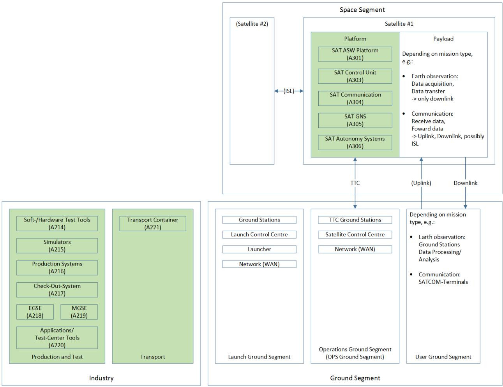
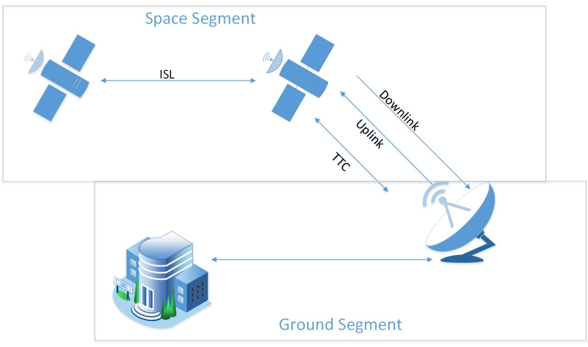
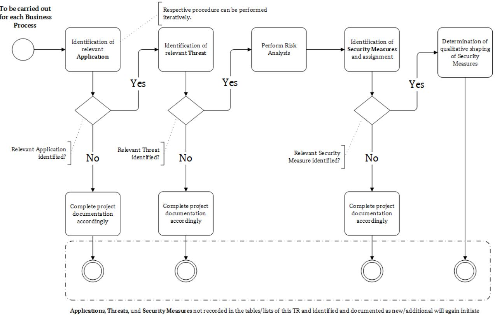
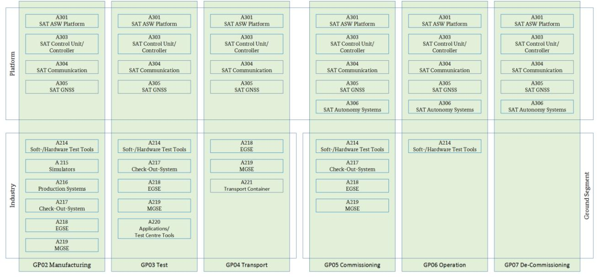

# Technical Guideline BSI TR-03184 Information Security for Space Systems

Part 1: Space segment

Version: 1.0 Date: 28.07.2023

## Change history

### *Table 1: Change history*

| Version            | Date       | Description       |
|--------------------|------------|-------------------|
| 1.0                | 28.07.2023 | First publication |
|                    |            |                   |
| Revision cycle: |            | 2-yearly          |

Federal Office for Information Security PO Box 20 03 63 53133 Bonn Tel.: +49 22899 9582-5812 itcssa@bsi.bund.de Internet: https://www.bsi.bund.de © Bundesamt für Sicherheit in der Informationstechnik 2021

## List of authors

The members of the expert group "Information Security for Space Systems" initiated by the BSI in 2021 were involved in the development of the document.

| Table 2: List of authors |  |  |
|--------------------------|--|--|
|--------------------------|--|--|

| Name                      | Organisation                                        |
|---------------------------|-----------------------------------------------------|
| Dr. Johanna Niecknig   | Bundesamt für Sicherheit in der Informationstechnik |
| Wendel Lohmer             | Bundesamt für Sicherheit in der Informationstechnik |
| Dr. Max Gebhardt          | Bundesamt für Sicherheit in der Informationstechnik |
| Stefanie Grundner         | Panaglobo GbR                                       |
| Manuel Hoffmann           | OHB Digital Connect GmbH                            |
| André Penzien             | OHB Digital Connect GmbH                            |
| Prof. Dr. Steffen Kuntz   | Airbus Defence and Space GmbH                       |
| Miriam Goellner           | Airbus Defence and Space GmbH                       |
| Tarsicio López Delgado | Airbus Defence and Space GmbH                       |
| Frank Keck                | secunet Security Networks AG                        |
| Prof. Dr. Matthias Berger | Jade Hochschule Wilhelmshaven                       |
| Sascha Fankhänel          | Jade Hochschule Wilhelmshaven                       |

For professional quality assurance, the document was reviewed by:

| Name              | Organisation                  |
|-------------------|-------------------------------|
| Stefan Langhammer | OHB Digital Connect GmbH      |
| Wim Fleischhauer  | Rheinmetall Electronics GmbH  |
| Peter Voigt       | Airbus Defence and Space GmbH |
| Tobias Kluge      | Airbus Defence and Space GmbH |
| Dr. Björn Appel   | INFODAS GmbH                  |
| Justus Bach       | INFODAS GmbH                  |
| Niels Lerch       | INFODAS GmbH                  |
| Daniel Grötsch    | INFODAS GmbH                  |

## Foreword by the Head of the Crypto-Technology and IT-Management

With the adoption of the EU's NIS 2 Directive, space as a sector has taken its place as critical infrastructure. This concerns the ground segment first. For the space segment / the satellites themselves, in all phases of life, there are no legal requirements so far. However, in order to design space systems securely, the focus must be on the system as a whole. Thus, equivalent information security requirements are needed for the space segment as for securing critical components in the ground segment.

Therefore, with this Technical Guideline, the BSI would like to provide the user of the guideline with security measures that help to achieve an appropriate level of security for the space segment. Within the framework of the expert group "Information Security for Space Systems" between the BSI and representatives of the German space industry, analyses were carried out in numerous workshops, risks identified and best practices collected, resulting in a comprehensive table that assigns security measures to identified threats for various processes. This is intended to serve the users of the guideline as an applicable tool for future projects to identify threats and assign measures. Likewise, the information, criteria and methods of this Technical Guideline are intended to raise awareness of information security and its manifold aspects to a high level among those responsible in this area.

By focusing on high to very high protection needs in the technical guideline, a refinement of the minimum protection already recommended in the framework of the basic IT-Grundschutz Profile for Space Infrastructures is achieved.

I would like to thank the members of the expert group for their participation in the preparation of the Technical Guideline and wish them every success and good use in applying the Technical Guideline.

Dr. Günther Welsch Head of Crypto Technology and IT Management Department

| List of Abbreviations                                    | 6 |
|----------------------------------------------------------|---|
| Terms                                                    | 8 |
| References12                                             |   |
| 1 Introduction13                                      |   |
| 2 Structure Description - Space Systems15       |   |
| 3 Application17                                       |   |
| 3.1 Scope of the Technical Guideline17                |   |
| 3.2 Application of the Technical Guideline18          |   |
| 4 Applications under Consideration 20              |   |
| 5 Defining Protection Needs23                         |   |
| 5.1 Determining level of security23                   |   |
| 5.2 Threats24                                         |   |
| 6 Risk Treatment of Threats25                         |   |
| 6.1 Security Measures25                               |   |
| 6.2 Selected Scenarios26                              |   |
| 7 Cryptographic Notes31                               |   |
| 8 Outlook33                                           |   |
| Appendix A: List of Threats34                            |   |
| Appendix B: List of Security Measures39                  |   |
| Appendix C: Assignment of Threats to Security Measures51 |   |

## List of Abbreviations

#### *Table 3: List of Abbreviations*

| Abbreviation              | Meaning                                              |
|---------------------------|------------------------------------------------------|
| AIS                       | Application notes and interpretations for the scheme |
| AIT                       | Assembly, Integration and Test                       |
| AIV                       | Assembly, Integration and Verification               |
| ASW                       | Application Software                                 |
| BDSG                      | Federal Data Protection Act                          |
| BM (Bewältigungsmaßnahme) | Security Measure                                  |
| BSI                       | Federal Office for Information Security              |
| CCPA                      | California Consumer Privacy Act                      |
| CCS                       | Central Checkout Systems                             |
| CCSDS                     | Consultative Committee for Space Data Systems        |
| DLR                       | German Aerospace Centre                              |
| DMS                       | Document Management System                           |
| DNS                       | Domain Name System                                   |
| DPA                       | Data Processing Agreement                            |
| ECSS                      | European Cooperation for Space Standardisation       |
| EGSE                      | Electrical Ground Support Equipment                  |
| ERP                       | Enterprise Resource Planning                         |
| FPGA                      | Field Programmable Gate Array                        |
| G (Gefährdung)            | Threat                                               |
| GEO                       | Geostationary Earth Orbit                            |
| GDPR                      | General Data Protection Bill                         |
| GNSS                      | Global Navigation Satellite System                   |
| GP (Geschäftsprozess)     | Business Process                                     |
| GPS                       | Global Positioning System                            |
| IC                        | Integrated Circuit                                   |
| IDS                       | Intrusion Detection System                           |
| IoT                       | Internet of Things                                   |
| IPS                       | Intrusion Prevention System                          |
| ISL                       | Inter-Satellite Link                                 |
| ISMS                      | Information Security Management System               |
| KDF                       | Key Derivation Function                              |
| KRITIS-V                  | Critical Infrastructures (KRITIS) Regulation         |
| LDAP                      | Lightweight Directory Access Protocol                |
| LEO                       | Low Earth Orbit                                      |
| LEOP                      | Launch and Early Operations Phase                    |
| MDM                       | Mobile Device Management                             |
| MEO                       | Medium Earth Orbit                                   |
| MGSE                      | Mechanical Ground Support Equipment                  |
| NIST                      | National Institute of Standards and Technology       |
| OBC                       | On Board Computer                                    |
| OPS                       | Operations                                           |
| OTRS                      | Open Ticket Request System                           |
| PDPB                      | Personal Data Protection Bill                        |
| PQ                        | Post Quantum                                         |
| PL                        | Payload                                              |

| Abbreviation        | Meaning                                                      |  |  |  |  |
|---------------------|--------------------------------------------------------------|--|--|--|--|
| Requirement-Eng/Mgt | Requirement Engineering and Management                       |  |  |  |  |
| RTOS                | Real Time Operating System                                   |  |  |  |  |
| SAT                 | Satellite                                                    |  |  |  |  |
| SAT ASW             | Application Specific Satellite Software Platform and Payload |  |  |  |  |
| SATCOM              | Satellite Communication                                      |  |  |  |  |
| SatDSiG             | Satellite Data Security Act                                  |  |  |  |  |
| SCM                 | Supply Chain Management                                      |  |  |  |  |
| SCOE                | Special Checkout Equipment                                   |  |  |  |  |
| SLE                 | (CCSDS) Space Link Extension                                 |  |  |  |  |
| SQL                 | Structured Query Language                                    |  |  |  |  |
| STK                 | Systems Tool Kit                                             |  |  |  |  |
| TK                  | Telecommunications                                           |  |  |  |  |
| TM/TC               | Telemetry & Telecommand                                      |  |  |  |  |
| TR                  | Technical Guideline                                          |  |  |  |  |
| TTC                 | Telemetry, Tracking and Command                              |  |  |  |  |
| VPN                 | Virtual Private Network                                      |  |  |  |  |
| VS                  | Classified information                                       |  |  |  |  |
| WAN                 | Wide Area Network                                            |  |  |  |  |

## Terms

*Table 4: List of Terms used*

| Term                     | Meaning                                                                             |
|--------------------------|-------------------------------------------------------------------------------------|
| Actor                    | An actor is an acting person within a system. The actor interacts with other        |
|                          | actors and with the infrastructure of the system.                                   |
| Attack                   | An attack is an intentional form of endangerment, namely an unwanted or          |
|                          | unauthorised act with the aim of gaining an advantage or harming a third         |
|                          | party.                                                                              |
| Application              | In addition to the processes, the information network also includes the             |
|                          | applications that support the processing of the processes. In the life cycle of the |
|                          | satellite, these are general applications and services (e.g. e-mail service or data |
|                          | exchange service) as well as applications and services specific to spaceflight      |
|                          | (e.g. analysis tools, EGSE, simulators), and applications, components, devices      |
|                          | and services located on board the satellite (e.g. platform, payload, SAT            |
|                          | controller).                                                                        |
| Threat                   | In general, a threat is a circumstance or event that can cause damage. The          |
|                          | damage refers to a concrete value such as assets, knowledge, objects or health.     |
|                          | Translated into the world of information technology, a threat is a circumstance     |
|                          | or event that can affect the availability, integrity or confidentiality of          |
|                          | information, which can cause damage to the owner or user of the information.        |
|                          | Examples of threats are force majeure, human error, technical failure or            |
|                          | intentional acts. If a threat encounters a vulnerability (in particular technical   |
|                          | or organisational deficiencies), a threat is created.                         |
| Threat actor,         | An actor becomes a threat actor or attacker when there is motivation,               |
| Attacker                 | justification and opportunity for negative action.                                  |
|                          | Attackers can also act on behalf of third parties who want to gain advantages.      |
| Operator                 | In the context of this document, this term refers to the operational operator of    |
|                          | a space system.                                                                     |
| Security measure      | Security measures are very similar to counter measures, but they do not          |
| (Security Control,       | strictly relate to the control of security requirements, but are used to address |
| countermeasure)          | the risks of threats.                                                               |
| and the quality of their | The quality of implementation of a security measure may be dictated by a         |
| implementation           | required classified security level. For example, an access restriction can be    |
|                          | implemented in the following qualities: Turnstile, door, mantrap, security          |
|                          | guards, guard dogs, video surveillance, etc.                                        |
| Applied Threat           | An applied threat is a threat that has a concrete effect on an object via a   |
|                          | vulnerability. A threat thus only becomes an applied threat for an object     |
|                          | through an existing vulnerability.                                                  |
| Business process         | A business process is a set of logically linked individual activities (tasks,       |
|                          | workflows) that are executed to achieve a specific business or operational goal.    |
| Information security     | Information security aims to protect information. Information can be stored         |
|                          | on paper, in IT systems or in people's heads.                                       |
|                          | The protection goals or basic values of information security are confidentiality,   |
|                          | integrity and availability. Many users include other basic values in their          |
|                          | considerations.                                                                     |
| Infrastructure           | An infrastructure comprises all physical and technical installations of a system.   |

| Term                      | Meaning                                                                                    |
|---------------------------|--------------------------------------------------------------------------------------------|
| IT infrastructure      | IT infrastructures are technical systems that serve information processing and             |
|                           | form a self-contained functional unit. Typical IT infrastructures are servers,             |
|                           | clients, mobile phones, smartphones, tablets, IoT components, routers,                     |
|                           | switches and firewalls.                                                                    |
| IT security               | IT security is a sub-discipline of information security and refers to a state in           |
|                           | which the risks present in the use of information technology due to threats                |
|                           | and vulnerabilities are reduced through appropriate measures.                              |
| IT system                 | An IT system comprises an IT infrastructure and the procedures for its                     |
|                           | deployment, monitoring, control, operation, use and protection.                            |
| Keying                    | Keying is the process of loading crypto keys into crypto devices. In satellite             |
|                           | operations, encryption is usually purely symmetrical (see CCSDS/SDLS); for                 |
|                           | this purpose, a set of symmetrical master keys is loaded into the two crypto               |
|                           | devices - on board and in the satellite control centre - ("shared secrets"),      |
|                           | resulting in end-to-end encryption.                                                        |
| (Classified) Control zone | Control zones are areas where classified information is processed, if personal |
|                           | custody cannot be guaranteed. The storage of classified information outside             |
|                           | classified safe custody is not permitted here.                                          |
|                           | Control areas are special forms of security areas.                                         |
| Manipulation              | An unauthorised action on a system to cause a change in data and/or intended               |
| (Tamper)                  | behaviour.                                                                                 |
| Process                   | Processes describe how the components of a system (infrastructure and actors)              |
|                           | should interact in order for the system to fulfil its tasks.                               |
| Risk                      | Risk is often defined as the combination (i.e. the product) of the probability of a        |
|                           | damage occurring and the severity of that damage. Damage is often presented             |
|                           | as the difference between a planned and unplanned outcome.                                 |
|                           | In contrast to "threat", the term "risk" already includes an assessment of the             |
|                           | extent to which a particular damage scenario is relevant in the case at hand.              |
| Risk Treatment            | Risk treatment refers to the process of selecting and establishing measures that           |
|                           | affect risks.                                                                              |
|                           | The aim is usually to reduce the risk of a threat, e.g. by reducing the probability        |
|                           | of occurrence or the potential damage of the adverse event through                         |
|                           | appropriate measures (see security measure).                                            |
|                           | Risk treatment typically falls into one of the following groups:                           |
|                           | Risk avoidance (Risk Prevention)                                                           |
|                           | Risk Reduction/Control                                                                     |
|                           | Risk Acceptance                                                                            |
|                           | Risk Transfer                                                                              |

| Term                    | Meaning                                                                                                                                                  |
|-------------------------|----------------------------------------------------------------------------------------------------------------------------------------------------------|
| Risk Management         | Risk management refers to all activities related to the strategic and operational                                                                        |
|                         | handling of risks, i.e. all activities to identify, manage and control risks for an institution.                                                      |
|                         | Strategic risk management describes the essential framework conditions, how                                                                              |
|                         | the treatment of risks within an institution, the culture for dealing with risks                                                                         |
|                         | and the methodology are designed. These principles for the treatment of risks                                                                            |
|                         | within an ISMS must be consistent or aligned with the framework of                                                                                       |
|                         | organisation-wide risk management.                                                                                                                       |
|                         | The framework of operational risk management comprises the control process                                                                               |
|                         | of                                                                                                                                                       |
|                         | Risk identification,                                                                                                                                     |
|                         | Risk assessment and evaluation,                                                                                                                          |
|                         | Risk treatment,                                                                                                                                          |
|                         | Risk monitoring and                                                                                                                                      |
|                         | Risk communication.                                                                                                                                      |
| Vulnerability           | A vulnerability is a security-relevant error in an IT system or an institution.                                                                          |
|                         | Causes can lie in the design, the algorithms used, the implementation, the                                                                               |
|                         | configuration, the operation as well as the organisation. A vulnerability can                                                                            |
|                         | cause a threat to take effect and damage an institution or system. A                                                                                     |
|                         | vulnerability makes an object (an institution or a system) susceptible to threats.                                                                       |
| Security requirement | Security requirements are requirements of organisational, personnel,                                                                                     |
| (Control)               | infrastructural and technical areas, of which the fulfilment is necessary to                                                                       |
|                         | increase information security or contributes to it. A security requirement thus                                                                          |
|                         | describes what must be done to achieve a certain level of information security.                                                                       |
|                         | How the requirements can be fulfilled in a specific case is described in                                                                                 |
|                         | corresponding security measures. In the English-speaking world, the term                                                                                 |
|                         | "control" is often used for security requirements.                                                                                                       |
|                         | IT-Grundschutz distinguishes between basic requirements, standard                                                                                     |
|                         | requirements and requirements for higher protection needs. Basic                                                                                      |
|                         | requirements are fundamental and must always be implemented unless there                                                                                 |
|                         | are serious reasons for not doing so. Standard requirements must always be                                                                               |
|                         | implemented for normal protection needs, unless they are replaced by at least                                                                            |
|                         | equivalent alternatives or the deliberate acceptance of the residual risk.                                                                            |
|                         | Requirements for higher protection needs are exemplary suggestions as to                                                                        |
|                         | what is reasonable to implement for achieving an adequate protection in                                                                               |
|                         | accordance to the protection needs.                                                                                                                      |
| Security area           | Security areas are areas to which only certain groups of people have access.                                                                             |
|                         | Access must be restricted by technical and/or organisational measures in order                                                                        |
|                         | to regulate the stay of employees, but also of external service providers and                                                                            |
|                         | visitors.                                                                                                                                                |
|                         | This may be necessary, for example, for reasons of occupational health and                                                                               |
|                         | safety or information security.                                                                                                                          |
|                         | When dealing with classified information, special forms of security areas are                                                                            |
|                         |                                                                                                                                                          |
|                         | required because explicit security requirements exist for the quality of implementation.                                                              |
|                         |                                                                                                                                                          |
|                         | However, security areas may also be necessary without explicit 'classified information' requirements (e.g. to protect business secrets / intellectual |
|                         | property).                                                                                                                                               |
|                         |                                                                                                                                                          |

| Term                      | Meaning                                                                                |
|---------------------------|----------------------------------------------------------------------------------------|
| Safeguard,                | Security measure (short, measure) refers to all actions that serve to control and      |
| Security Measure,         | counteract security risks. This includes organisational, personnel, technical or       |
| Measure                   | infrastructural security measures.                                                     |
|                           | Security measures serve to fulfil security requirements.                               |
| Classified information    | 'Classified information', classified as CONFIDENTIAL or higher may be                  |
| restricted zone           | processed and stored outside 'classified information' facilities, in restricted        |
|                           | areas (rooms, buildings, parts of buildings or demarcated outdoor areas).              |
|                           | Restricted zones are special forms of security areas with higher access                |
|                           | restrictions and security measures.                                                    |
| System                    | A system consists of different components (infrastructure and actors) that             |
|                           | interact with each other (according to processes) to perform certain tasks.            |
| Classified information    | 'Classified information' storage facilities are specially secured rooms, cabinets      |
| depository                | or other containers for the storage of classified information.                         |
| Space infrastructure      | The term space infrastructures covers all terrestrial and orbital infrastructures      |
|                           | (e.g. satellites, control centres, ground stations) associated with the different      |
|                           | functional phases of space systems, such as operation and utilisation, control,        |
|                           | manufacturing and protection aspects. The entire life cycle is considered.             |
| Space system              | Generic term for all components of satellite and space positioning systems.         |
|                           | This includes space infrastructures themselves as well as the procedures for           |
|                           | their deployment, monitoring, control, operation, use and protection.                  |
| Access (to IT          | Access (to IT infrastructure) refers to the use of IT systems, system components |
| infrastructure)           | and networks. Access authorisations thus allow a person to use certain              |
|                           | resources such as IT systems or system components and networks.                        |
| Access (to information | Access (to information etc.) refers to the use of information or data. Access    |
| etc.)                     | authorisations regulate which persons are authorised to use information, data    |
|                           | or IT applications within the scope of their functions or to carry out              |
|                           | transactions.                                                                          |
| Admission (to)         | Admission refers to the entering of demarcated areas such as rooms or               |
|                           | protected areas on a site. Access authorisations allow people to enter certain      |
|                           | locations, e.g. a site, a building or defined rooms in a building.                     |

## References

[1] Federal Office for Information Security, Cybersecurity for Space Infrastructures - Positioning of the Federal Office for Information Security, 2022.

[2] BSI, OHB, Airbus, DLR, IT-Grundschutz Profile for Space Infrastructures - Minimum Protection for Satellites Covering their Entire Life Cycle, 2022.

[3] Federal Office for Information Security, IT-Grundschutz Compendium, 2021.

[4] DLR, Tailoring Catalogue – Product Assurance, Safety & Sustainability Requirements for DLR Space Projects, DLR-RF-PS-001, 2019.

[5] ISO - International Standardization Organization, ISO/IEC 27005:2022 Information technology — Security techniques — Information security risk management, 2022.

[6] ISO - International Standardization Organization, ISO.IEC 31010:2019 – Risk management – Risk assessment techniques, 2019.

[7] Federal Office for Information Security, BSI-Standard 200-3 Risk Analysis based on IT-Grundschutz, 2017.

[8] Federal Office for Information Security, BSI-Standard 200-2: IT-Grundschutz Methodology, 2017.

[9] Federal Office for Information Security, TR-02102 Cryptographic Mechanisms: Recommendations and Key Lengths, 2023.

[10] Federal Office for Information Security, AIS 20; A proposal for: Functionality classes for random number generators - Version 2.35 - Draft, 2022.

[11] Federal Office for Information Security, AIS 31, Functionality Classes and Evaluation Methodology for Physical Random Number Generators, 2001.

[12] W. Schindler, Functionality Classes and Evaluation Methodology for Deterministic Random Number Generators. Version 2.0, Mathematical-technical reference of AIS20, 1999.

[13] W. S. W. Killmann, A proposal for: Functionality classes and evaluation methodology for true (physical) random number generators, Version 3.1, Mathematical-technical reference of AIS31, 2001.

[14] ISO - International Organization for Standardization, ISO/IEC 27001:2022 Information technology – Security techniques – Information security management systems – Requirements, 2022.

## 1 Introduction

Space-based services are an indispensable part of our daily lives. In the fields of navigation, communication and Earth observation, today's satellites make unique contributions, e.g., to weather forecasting, disaster prevention, climate research, support of air and ground transport systems, operation of emergency services and management of smart power grids. The reliable availability of these services is needed by our modern society and is therefore in the scientific, social, economic and domestic and foreign policy interest. The more extensive space-based services become in everyday life, the more important the reliable provision of these services becomes.

Like any other IT infrastructure, space-based systems are targets for attacks to limit their usability. Attackers threaten the space segment as well as the ground and user segments. In order to ensure functional and reliable space-based services, resilience must be built up and continuously ensured in all areas and at all stages of life.

In the BSI position paper "Cybersecurity for Space Infrastructures" [1], fields of action were identified from which the development of minimum requirements and the creation of technical guidelines emerge as tasks for the BSI.

This Technical Guideline (TR = Technische Richtlinie) deals with the space segment1 , i.e., the focus is on the satellite over the entire life cycle.

The aim of the TR is to propagate an appropriate standard in information security. Possible threats to the protection goals are described and measures are defined that enable the user of the TR to formulate projectspecific requirements. This requires a mission- or project-specific adaptation (tailoring). The described threats and proposed security measures (BM = Bewältigungsmassnahmen) are to be fully examined or applied by the user and designed in such a way that the risks of all identified threats can be reduced to an acceptable residual risk. Adequate protection is to be achieved by implementing the measures, starting with the planning, manufacture and operation and ending with decommissioning.

This TR is designed for high and very high protection needs and is recommended by BSI for the consideration of space systems of this protection need. Compared to the IT-Grundschutz Profile [2], it also enables a greater depth and refinement of the requirements for the satellite. The TR can also be a guide for obtaining a (possibly later planned) 'classified information' approval. For such an approval, some of the recommendations formulated in this document (shall), such as the cryptographic requirements, become obligations (must).

By adapting the requirements, this TR can also be applied to satellites whose protection needs are rated lower. In this case, the described threats and measures should nevertheless be fully examined. Certain threats and thus security measures may become obsolete; the quality of implementation may also be lower.

Thus, in addition to the IT-Grundschutz Compendium [3] and the IT Grundschutz Profile for Space Infrastructures [2], this TR can also be used as a supplementary contribution to the creation of an information security concept2 with the protection goals of confidentiality, integrity3 and availability. The TR is aimed at contractors as well as clients and operators. The TR is also compatible with the "Tailoring Catalogue - Product Assurance, Safety & Sustainability Requirements for DLR Space Projects" [4] or can be used as a supplement to it.

1 Another TR on the ground segment is planned at a later point in time.

2 Concept of information security means that in addition to technical aspects, infrastructural, organisational and personnel issues are also considered. This enables a systematic approach to identifying and implementing necessary security measures. The BSI standards provide proven procedures for this, the IT-Grundschutz compendium provide concrete requirements. (From BSI-Broschure

&quot;Informationssicherheit mit System - Der IT-Grundschutz des BSI", 15.06.2021)

3 Authenticity is an aspect of integrity and thus included in the term integrity.

As a starting point for the considerations, seven business processes are considered relevant, analogous to the IT-Grundschutz Profile, i.e.4

- a GP01: Concept and design
- b GP02: Manufacturing
- c GP03: Test
- d GP04: Transports
- e GP05: Launch
- f GP06: Operation
- g GP07: Decommissioning

Based on these business processes, applications, threats and security measures are identified and determined. These measures are derived from established standards and from the practical experience of the authors (best practices).

The core of the TR is an extensive table ("allocation table") in which threats and security measures for minimising risks are presented and allocated to the applications under consideration.

After a basic chapter explaining the structure of a space system and some elementary terms, Chapter 3 provides guidance on the application and delineation of the TR. Chapter [3.2](#page-17-0) guides the user of the TR through the process of how to use the presented results to extract project-specific requirements. Chapter [4](#page-19-0) presents the applications considered. Chapte[r 5](#page-22-0) discusses protection goals and threats. Chapter [6](#page-24-0) introduces the measures and explains the application of the allocation table with the help of selected scenarios. Cryptographic guidance is presented in Chapter [7](#page-30-0) and Chapte[r 8](#page-32-0) provides the reader with a brief outlook. The complete tables on threats, security measures and the allocation table can be found in the appendix, see [Table 12,](#page-33-1) [Table 13](#page-38-1) and [Table 14.](#page-50-1)

4 The business process GP00 (common IT infrastructure) is not considered, as the business process usually uses standard IT and the protection should be implemented with common standards, e.g. IT-Grundschutz.

## 2 Structure Description - Space Systems

In preparation for the following chapters, the structure of a space system and some basic terms are explained.

[Figure 1](#page-14-1) illustrates for a space system the elements considered in this TR (marked in green); the description of the applications can be found in Chapter [4.](#page-19-0)

### **Space segment:**

The space segment comprises all components of a space system that fulfil their tasks in space; it therefore usually consists of one or more satellites. Several satellites can form constellations and may also communicate with each other by means of inter-satellite links (ISLs, by radio or laser).

The structure of each satellite can be roughly divided into two typical areas: The platform and the payload. The platform has the task of "keeping the satellite alive" (e.g., energy supply, position control, communication, self-monitoring) so that the payload can fulfil the mission tasks.

*Figure 1: Structure and elements of a space system*

### **Operation Ground Segment and Telemetry, Tracking and Command (TTC) Communication:**

The main components of the Operation Ground Segment are Satellite Control Centres and TTC Ground Stations, which are connected by networks (WANs). An established CCSDS protocol for these connections is the Space Link Extension (SLE) protocol; the standardised protocol makes it relatively easy to add additional TTC Ground Stations to one's own Operation Ground Segment. This can be very useful in emergency situations to provide additional means of contact with a damaged satellite.

In TTC, Telemetry stands for the data received at the Ground Segment (Downlink), Command stands for the data sent from the Ground Segment (Uplink) and Tracking stands for the tracking of a satellite and distance measurement via the tracked antenna of a TTC Ground Station.

The objective of TTC communication is to provide a secure link between the Satellite Control Centre and the platform of the satellite. Secure TTC communication is the only element of the Operation Ground Segment considered in this TR.

### **User Ground Segment:**

The User Ground Segment is not considered in this TR and is only listed for the sake of completeness.

### **Launch Ground Segment:**

The Launch Ground Segment is not considered in this TR and is only listed for the sake of completeness. The task of the Launch Ground Segment is to transport satellites into the intended orbit. For this purpose, Launch Service Providers also operate control centres, ground stations and networks in the Launch Ground Segment.

### **Satellite manufacturing, testing and transport:**

This area of the Ground Segment includes all the premises and facilities needed to manufacture, test and transport a satellite (until it is handed over to the Launch Service Provider).

The manufacturing/testing/transport elements considered in this TR are also listed in the figure above (the description of the applications can be found in Chapte[r 4\)](#page-19-0).

## 3 Application

## 3.1 Scope of the Technical Guideline

This TR is intended to support the development of a uniform understanding of the security requirements of a satellite for all parties involved in its space mission, so that this can be taken into account and applied in all phases of its life - from planning to decommissioning. It explains which threats exist and with which measures they can be reduced.

The focus in the consideration of possible security threats in this TR is on the satellite. The development, test and launch processes on the ground are also considered. The Ground Segment, which is required to operate the satellite, is not part of the document and is considered in a separate TR.

[Figure 2](#page-16-2) shows the division of a space system into Space and Ground Segment used in this TR. The area of communication links is added to the Space Segment, resulting in the antenna tips of the Ground Stations as the interface between the Space and Ground Segments.

In this analysis communication between satellites (ISLs) is assigned to the Space Segment.

*Figure 2: System boundaries and transitions*

This TR describes measures for secure manufacturing and operation of satellite platforms. Specific security requirements for the satellite payload are not the subject of discussion. The payload usually carries specific sensors and other project-dependent systems that cannot be addressed within the scope of this TR.

Based on a risk analysis prepared for the payload, the TR methodology can be applied to any type of mission. As such, the tables of threats and security measures described in the following chapters can be applied analogously to the payload. There will be differences between the platform and payload in the applications under consideration, especially since the level of protection of the payload - depending on the mission - may differ significantly from that of the platform. Consequently, platform and payload should be considered and assessed separately, and the TR should be applied separately.

The methodology and measures applied have been developed under the assumption of high to very high protection needs. However, by adapting the requirements, this TR can also be applied to satellites whose protection needs are rated lower.

The threats and security measures described in this document are considered by the authors to contribute to information security and improved risk management. However, the document does not claim to be complete with regard to all threats and security measures for the information security of a space system.

## 3.2 Application of the Technical Guideline

This TR is to be used in combination with a (mission-specific) risk analysis prepared by the user of the TR (hereinafter referred to as "user"). The security measures are to be seen as basic recommendations. Due to the different (project-specific, but also application/business process-dependent) protection needs, it is up to the user, depending on the result of his risk analysis, how the recommended security measures are shaped into concrete security requirements. The qualitative design can be implemented organisationally, technically or infrastructurally. Furthermore, the security measures can be adapted or extended, i.e.

- a decision can be taken that a security measure does not apply or is obsolete in the business process concerned,
- a security measure not considered for the business process under consideration can be added,
- security measures may be applied that are not described in the table.

The sequence of the individual procedures presented in [Figure 3](#page-17-1) is highly simplified; it is only intended to visualise the essential steps for applying the method.

### *Figure 3: Simplified representation of the procedure (workflow) for method application*

I[n Figure 3,](#page-17-1) the procedures *"Identification of relevant Application", "Identification of relevant Threat"* and *"Identification and assignment of security measure"* have a decision character. The procedure "Complete project documentation accordingly" is used to document all decisions, which should promote the flow of communication and transparency. The procedure "*Perform Risk Analysis*" and the resulting use of appropriate methods is the responsibility of the user and his risk management; the description of this procedure is not part of the TR. The procedure "*Determination of qualitative shaping of Security Measures*" concludes this presentation and introduces further process chains for implementation by the user.

• As shown in [Figure 3](#page-17-1), the first step of the proposed methodology starts with the procedure *"Identification of relevant Application"* for the respective business process (see Chapte[r 4\)](#page-19-0). In this procedure, the user checks for the business process whether the applications identified in the TR apply and adapts them for the specific project. *Applications* that have been identified as "not relevant" in the business process under consideration must be documented accordingly and can be discarded. Relevant *applications* that are missing from the TR in the business process under consideration must be identified, added and taken into account.

The protection requirements of each *application* in the respective business process are defined in the risk management.

- After *"Identification of relevant Application"*, the second step is the procedure *"Identification of relevant Threat"*. The *threats* for the project-specific *applications* in the business process are to be identified, added if necessary or rejected by the user of this TR. The corresponding documentation is done as in the previous procedure.
- Following the second step, the procedure "Perform Risk Analysis" should indicate the performance of a standardised risk analysis (e.g., as from ISO 27005 [5], 31010 [6] or BSI standard 200-3 [7]) of the identified *threat(s).* A risk analysis is mandatory. Each business process should be considered independently, as the respective risks differ in relation to infrastructure, personnel and processes. In this context, the business process may run in parallel, but also consecutively, and the weighting (or "the level of classification", if applicable) of the security objectives in the business process may differ.
- Following the *"Risk Analysis"*, the fourth step in the procedure *"Identification of Security Measures and assignment"* is to assign the security measures to the threats. The user (for each business process) has to check whether all *threats* have been identified and which *security measure(s)* reduce the risk of the *threat*; these have to be assigned to the *threat* accordingly. If *security measures* have been identified as "not relevant" for an *application*, they can be discarded after appropriate documentation. Relevant *security measures* that are missing from the TR in the business process under consideration must be identified, added and taken into account.
- In the fifth step, the procedure *"Determination of the qualitative shaping of Security Measures"* must be used to check whether the proposed *security measure(s)* are sufficient to mitigate the *threat* according to the risk analysis performed, or how this *security measure(s)* should be qualitatively shaped with regard to its implementation.

Risk management methods must be used to check whether all threats have been mitigated and whether any residual risk can or must be accepted.

Security requirements are crucial and can be specified both internally and externally. These can be defined, among other things, by applicable law (legislator) or contractual requirements of the client, e.g., by a service description or by the protection needs defined by the client. Here, coordination between the contractor and the client is necessary in order to be able to implement the *security measures* in a qualitative manner according to the weighting of the security objectives. The contractor must communicate these requirements to potential subcontractors and suppliers or regulate them contractually and audit their implementation if necessary.

## 4 Applications under Consideration

The applications considered in this TR are described below. In comparison to the list of relevant applications found in the BSI document "IT-Grundschutz Profile for Space Infrastructures", the authors have limited themselves here to considering those applications that have not yet been adequately addressed in the BSI's IT-Grundschutz building blocks.

The applications are assigned to the following seven business processes, which are based on the life phases of a satellite:

GP01: Concept and design

GP02: Manufacturing

GP03: Test

GP04: Transports

GP05: Commissioning

GP06: Operation

GP07: Decommissioning

This assignment is shown i[n Figure 4.](#page-21-0) It should be noted that applications are often found in multiple business processes.

The following applications are considered5 :

• A214 Soft-/Hardware Test Tools

Software/hardware test tools are all tools for testing software/hardware. These can be stationary, but also mobile tools. Examples are networkable oscilloscopes or digital multimeters.

This application is assigned to the business processes GP02, GP03, GP05 and GP06.

• A215 Simulators

Simulators are usually used in the development network. Simulators in the integration halls are represented by EGSE. Examples of simulators: Flight dynamics with MATLAB, Simulink, AGI's Systems ToolKit (STK), ESA's GODOT, GMAT, Orekit.

This application is assigned to business process GP02.

• A216 Manufacturing systems

Manufacturing systems are proprietary systems based on Windows/Linux/RTOS, among others, supplemented by proprietary and open process control technology where applicable.

This application is assigned to business process GP02.

• A217 Check-Out-System

The check-out system may also be used during take-off, e.g., for charging the batteries. Examples of check-out systems: Terma CCS, SCOS-2000.

This application is assigned to the business processes GP02, GP03 and GP05.

• A218 Electrical Ground Support Equipment (EGSE)

5 The numbering of the applications is taken from the Structure Analysis of the "IT-Grundschutz Profile for Space Infrastructures".

EGSE systems often consist of custom hardware with EGSE controller based on an industrial PC with Windows/Linux. Examples of EGSE systems: S-Band SCOE, Ka-Band SCOE, EPS SCOE, AOCS SCOE, PL SCOE, Crypto SCOE.

This application is assigned to the business processes GP02, GP03, GP04 and GP05.

• A219 Mechanical Ground Support Equipment (MGSE)

In distinction to EGSE systems, MGSE are mainly mechanical aids but have electronic and possibly networked controls. Examples: Trolley, cranes with networked controls.

This application is assigned to the business processes GP02, GP03, GP04 and GP05.

• A220 Applications/Tools of the Test Centre

Applications/tools of the test centre are all systems that are used in the test facility.

These include EGSE and MGSE, which are already dealt with in the dedicated applications. In addition, radiation facilities, vibration test facilities, thermal stress facilities, etc. should be considered here.

This application is assigned to business process GP03.

• A221 Transport container

Transport containers for SAT and components are to be regarded as mobile rooms with air-conditioning, alarm and building services. The containers may contain or be connected to power generators for this purpose. Software used in transport containers is used, for example, for air-conditioning, transport localisation, alarming or ensuring the power supply.

With regard to the security area and restricted zone, the assumption applies here that a defined area around the container can be regarded as the security zone and the container as such represents the restricted zone. This restricted zone is only to be entered by authorised personnel during loading and unloading.

This application is assigned to business process GP04.

• A301 SAT ASW Platform

SAT ASW (application-specific satellite software platform and payload): Application software for the payload can be integrated on the on-board computer (OBC, especially processor module) of the platform for small missions. For larger requirements or missions, a separate OBC or processor module can be provided for the payload.

This application is assigned to business processes GP02, GP03, GP04, GP05, GP06 and GP07.

• A303 SAT Control Unit/Controller

SAT Control Unit/Controller: In subsystems (e.g., thermal, power), microcontrollers can be used which, for example, process sensor data decentral and trigger actions.

This application is assigned to business processes GP02, GP03, GP04, GP05, GP06 and GP07.

• A304 SAT Communication

SAT communication: SAT communication can be integrated in different units of a satellite: TTC, Crypto Unit, On-Board Computer/Data Handling System. For specific payloads (e.g. Telekom-Sat), the payload has dedicated systems for SAT communication.

This application is assigned to business processes GP02, GP03, GP04, GP05, GP06 and GP07.

• A305 SAT GNSS

This is not about the positioning process, but only about the GNSS receiver on board. All other elements of the process (TM generation by SAT ASW and communication to the ground are already covered accordingly in other applications).

This application is assigned to business processes GP02, GP03, GP04, GP05, GP06 and GP07.

• A306 SAT Autonomy systems

The autonomy is realised through software and hardware elements. However, as the system can only be manipulated via software once the satellite has been put into operation, the focus is placed on application software (similar to A301).

This application is assigned to the business processes GP05, GP06 and GP07.

*Figure 4: Allocation of applications to business processes*

## 5 Defining Protection Needs

The BSI Standard 200-2 IT-Grundschutz Methodology [8] can be used to determine the protection needs6 . This chapter is therefore based on IT-Grundschutz. If alternative methods are used, e.g., ISO27k, it is possible to deviate from this chapter.

## 5.1 Determining level of security

In principle, the level of security to be maintained should be specified by the client. For this purpose, the security objectives of confidentiality, integrity and availability are classified into categories of protection needs in order to carry out an evaluation. This evaluation should be considered application-specific for each business process and agreed between the client and the contractor.

It should be noted that protection needs of the security objectives can be assessed differently depending on the business processes due to different parameters in the infrastructure, the personnel, the processes and the goals, as the following example using the business processes "GP03 - Test" and "GP06 - Operation" should illustrate, see als[o Table 5.](#page-22-2) 

Example:

*In GP03, errors and failures are tolerable and are even deliberately provoked in some tests so that the most failsafe system possible is produced. Failures can be fixed and are tolerable up to a certain level of progress. Requirements on the availability (e.g., for TTC) are normal. The information about the system is to be classified as high to very high throughout the development process and also during testing. It must be prevented that unauthorised persons obtain system-relevant information. Confidentiality is therefore (depending on the project) high to very high. The data derived from testing must always be correct and unaltered. Here, the requirement on integrity is to be classified as very high.*

*In GP06 operation, the availability of the system is always to be guaranteed, therefore the availability is to be classified as very high. Unlike in GP03, the requirements for the confidentiality of the system in orbit are no longer of the highest priority; there is already a lot of information and parameters known. The information exchanged between the Space and Ground Segment can usually be checked for correctness. The integrity (incl. authenticity) must nevertheless be classified as very high.* 

| GP03 Test       |        |      |              | GP06 Operation  |        |      |      |
|-----------------|--------|------|--------------|-----------------|--------|------|------|
|                 | normal | high | very high |                 | normal | high | very |
| Confidentiality |        | X    |              | Confidentiality | X      |      |      |
| Integrity       |        |      | X            | Integrity       |        |      | X    |
| Availability    | X      |      |              | Availability    |        |      | X    |

| GP03 Test |      |              | GP06 Operation |        |      |              |
|-----------|------|--------------|----------------|--------|------|--------------|
| normal    | high | very high |                | normal | high | very high |
|           |      |              |                |        |      |              |
|           |      | X            | Integrity      |        |      | X            |
| X         |      |              | Availability   |        |      | X            |

*Table 5: Exemplary Definition of Protection Needs for GP03 and GP06*

6 The Standard Protection is compatible with ISO 27001 certification [5].

## 5.2 Threats

Based on the assumptions and experiences of the authors7 and the contents of the BSI-Grundschutz, this chapter identifies the relevant threats for the security objectives of confidentiality, integrity and availability and compiles them in a list.

In the process, the Elementary Threats of the BSI IT-Grundschutz Compendium were checked, compared and added with regard to their relevance for satellite systems.

[Table 6](#page-23-1) presents an excerpt of the list of all threats as an example; a complete list of threats can be found in the appendix, see [Table 12.](#page-33-1)

| Threat number | Description of the threat  | Explanation                                                                             | Category Intent, Negligence Defect, Environmental impact | Protection goals affected |
|------------------|-------------------------------|-----------------------------------------------------------------------------------------|-------------------------------------------------------------------------|---------------------------------|
| G01              | Loss/change of information | Information is obtained/stored/processed; this information can be lost or changed | V, F, D                                                                 | C, I, A                         |

*Table 6: Extract from the List of Threats*

Since the threats are given relevance depending on the application in the business process, the assignment of threats to security measures is done on the level of the applications. This approach in relation to the applications was chosen because the attacks to disrupt the business processes occur directly against the applications.

7 See also IT-Grundschutz Profile for Space Infrastructures

## 6 Risk Treatment of Threats

### 6.1 Security Measures

Security measures cannot completely eliminate the risk, but only reduce it to the extent that the remaining residual risk can be accepted. There are usually several security measures assigned to a threat. A security measure can reduce the risk for one or several threats.

The security measures must be adapted accordingly to the security requirement of the project, the life phases and the protection needs. In contrast to the approach with e.g. IT-Grundschutz Compendium which uses requirements, in the application of security measures they have to be formulated into requirements through the qualitative, project-specific design.

[Table 7](#page-24-2) presents an excerpt of the table of all security measures considered, the complete table can be found in the appendix, see [Table 13.](#page-38-1) 

| BM  | Security measure | Explanation                        | Description                                 |  |  |
|-----|---------------------|------------------------------------|---------------------------------------------|--|--|
| BM1 | Setting up a        | Establishment of a security        | Security areas are areas where only a       |  |  |
|     | security            | area/restricted zone for office    | certain group of people has access. For     |  |  |
|     | area/restricted     | building, integration hall,        | this area, there are specifications that |  |  |
|     | zone                | transport container, archive, test | regulate the stay of employees, external    |  |  |
|     |                     | facility and launch facility.      | workers and visitors.                       |  |  |
|     |                     |                                    |                                             |  |  |

*Table 7: Extract from table of security measures*

For each application, potential threats were identified and each threat was in turn assigned security measures to address the risk. The result is a table that lists possible threats for each application and for each threat assigns a list of security measures. This so-called allocation table is structured according to applications, and the business processes are subordinated accordingly. It shows which security measures are suitable for counteracting the corresponding threats.

As already explained in Chapte[r 3.2,](#page-17-0) the user checks whether the application is actually used in the respective business process (or whether there are other applications). If it is used, the threats are to be assessed and the security measures are to be checked. The allocation table with the already assigned security measures is for assistance.

[Table 8](#page-24-3) shows an exemplary excerpt of the allocation table. The complete allocation table can be found in the appendix, se[e Table 14.](#page-50-1)

| Table 8: Extract from Allocation Table |  |
|----------------------------------------|--|
|                                        |  |

| Business Processes | Application | Application | G   | Threat           | BM                        |
|--------------------|-------------|-------------|-----|------------------|---------------------------|
| (GP)               | NR          | Name        |     |                  |                           |
| GP02               | A214        | Soft-       | G01 | Loss/change of   | BM1, BM2, BM3, BM4, BM7,  |
| Manufacturing,     |             | /Hardware   |     | information      | BM8, BM12, BM 14, BM15,   |
| GP03 Test,         |             | Test Tools  |     |                  | BM16, BM18, BM19, BM20,   |
| GP05               |             |             |     |                  | BM21, BM23, BM24, BM25,   |
| Commissioning      |             |             |     |                  | BM26, BM27, BM28, BM29,   |
|                    |             |             |     |                  | BM31, BM32, BM33, BM34,   |
|                    |             |             |     |                  | BM36, BM40, BM42, BM43,   |
|                    |             |             |     |                  | BM44, BM45, BM46, BM47,   |
|                    |             |             |     |                  | BM48                      |
|                    |             |             | G02 | Loss/theft of    | BM1, BM3, BM4, BM6, BM12, |
|                    |             |             |     | equipment and/or | BM15, BM16, BM23, BM26,   |
|                    |             |             |     | media            |                           |

| Business Processes | Application | Application | G   | Threat                 | BM                        |
|--------------------|-------------|-------------|-----|------------------------|---------------------------|
| (GP)               | NR          | Name        |     |                        |                           |
|                    |             |             |     |                        | BM27, BM31, BM32, BM33,   |
|                    |             |             |     |                        | BM42, BM43, BM45, BM46    |
|                    |             |             | G03 | Loss/theft during      | BM4, BM31, BM32           |
|                    |             |             |     | shipment               |                           |
|                    |             |             | G04 | Unauthorised access | BM12, BM15, BM23, BM25,   |
|                    |             |             |     | to recycled or         | BM31, BM32, BM43, BM46 |
|                    |             |             |     | disposed media         |                           |
|                    |             |             | G05 | Physical access by     | BM1, BM2, BM3, BM4, BM22, |
|                    |             |             |     | unauthorised           | BM23, BM26, BM27, BM31,   |
|                    |             |             |     | persons                | BM32, BM33, BM42, BM43,   |
|                    |             |             |     |                        | BM45, BM47                |

This can be done for each application as shown i[n Figure 3,](#page-17-1) see Chapte[r 3.2.](#page-17-0)

### 6.2 Selected Scenarios

By means of selected scenarios, the following illustrates how threats can possibly be exploited. In addition, the scenarios are intended to support the qualitative assessment of the security measures. For this purpose, an application in a selected business process (in the overview tables marked in green) is considered with a specific threat. The scenario exemplifies which attacks are possible and how they can be fended off by using different security measures. The scenarios only contain selected security measures, they do not describe the effectiveness of all assigned security measures. They represent measures that reduce the probability of occurrence of the described scenario as far as possible. The security measures described in the specific scenario are marked in green in the respective table.

The following scenarios are being considered:

- 1 Scenario 1: Attack on the commissioning process by means of a hardware/software malfunction
- 2 Scenario 2: Manipulation of data from the simulators
- 3 Scenario 3: Destruction of equipment and media during operation of the MGSE

### Scenario 1: Attack on the process of commissioning by means of disruption of the hardware/software functions

For a better overview, [Table 9Table 10: Summary scenario 2: considered threat, affected business process](#page-25-1)  [\[green\] and described security measures \[green\].](#page-27-0) explains the considered application, the affected business process (green) from the list of possible business processes (black), the considered threat and the described security measures (green) from the list of possible security measures (black) for scenario 1.

*Table 9: Summary scenario 1: considered threat, affected business process [green] and described security measures [green].*

| Application                             | A214 Soft-/Hardware Test Tools                     |  |
|-----------------------------------------|----------------------------------------------------|--|
| Possible business processes affected | GP02, GP03, GP05, GP06                             |  |
| Threat                                  | G22: Sabotage by means of hardware/software        |  |
| Security measures for G22         | BM1, BM3, BM8, BM17, BM18, BM19, BM24, BM26, BM27, |  |
|                                         | BM28, BM29, BM31, BM33, BM37, BM40, BM47, BM48     |  |
| Cause                                   | Intent                                             |  |

### **Affected business processes/risk description**

In the business process GP05 Commissioning, the hardware/software is to be disrupted and the goal of the actor is to at least delay or prevent the project.

Commissioning includes activities such as launch preparation, instrument activation, rocket performance checks, keying, securing the launch site, launching the satellite or rocket and the LEOP phase.

The actor can actively intervene himself or influence personnel to take negative actions. The influence can happen consciously for the employee (intrinsic as well as extrinsic), but also unconsciously through skilful manipulation.

### **Persons involved**

Both persons belonging to the production company and external persons can be considered as actors. External persons involved include employees of the start-up facility and personnel who secure the site and property.

### **Description of the scenario**

The actor gains access to the premises and relevant buildings. If it is an external actor, he must overcome the security facilities provided by the security and control staff, further organisational measures and technical facilities.

If the actor is involved in the project and thus has access authorisation, he can pass the security personnel and security facilities unhindered.

Once the actor has gained physical access, he needs access to relevant systems. Here he can use hardware that disrupts or disables systems or introduce malware. It is also possible to manipulate configurations in the system.

### **Effectiveness of security measures**

In the best case, the actor fails to pass the established security areas/restricted zones (BM1).

Requiring staff to wear badges openly and visibly at all times within the security area increases the likelihood of detection of unauthorised access, once entry controls have been bypassed (BM26).

Visitor badges (to be worn visibly at all times) and permanent escort by a project member minimise the possibility of manipulation by the actors (BM26/BM33). Additional protection is provided by established meeting places for staff (coffee, smoking areas, etc.) within the security areas. This prevents unauthorised persons from integrating into a group and thus penetrating the security facilities (BM27).

If the above-mentioned security measures do not work, it must be ensured that anomalies in the system and on equipment can be detected.

Here, IDS/IPS systems (BM8), which detect and, if necessary, prevent anomalies in the network, but also monitoring (BM17) and logging systems (BM19) protect against manipulation.

If the actor succeeds in manipulating systems, it is important to have well-trained personnel who are aware of malfunction reports or malfunctions in order to quickly detect damage and changes (BM48). With the help of configuration management (BM18) including version and change tracking (BM24), the affected systems can be restored as quickly as possible.

Sabotage or changes to hardware, especially on the satellite, can be detected and corrected by suitable tamper protection (BM47) with defined test processes before launch.

### Scenario 2: Corrupting simulator data

For a better overview, [Table 10](#page-27-0) explains the considered application, the affected business process, the considered threat and the described security measures (green) from the list of possible security measures (black) for scenario 2.

*Table 10: Summary scenario 2: considered threat, affected business process [green] and described security measures [green].*

| Application                          | A215 Simulators                                        |
|--------------------------------------|--------------------------------------------------------|
| Possible business processes affected | GP02                                                   |
| Threat                               | G30: Corrupting of data                             |
| Security measures for G30      | BM1, BM2, BM3, BM7, BM8, BM18, BM19, BM24, BM42, BM43, |
|                                      | BM44, BM46, BM48, BM49, BM57                           |
| Cause                                | Intent, negligence, defect                             |

### **Affected business processes/risk description**

In the business process GP02 Manufacturing, the simulators within the integration halls are represented by the EGSE. Scenarios are modelled here to simulate a wide variety of impacts on the satellite. Among other things, these influence the development of processes using software that can have an impact on the satellite in defined situations. The results of the simulations can also necessitate material and/or design changes or adjustments.

The information can be manipulated by intent, negligence or defects.

If an actor intervenes here and corrupts the results from the simulations, this changes possible parameters that can lead to the omission of adjustments or negative adjustments. Both simulation results and parameters of the simulation can be changed.

It is also possible that incorrect information is generated or incorrect test parameters are set due to negligence or defects in the simulation unit or the connected sensors.

### **Persons involved**

Possible actors include an attacker, manipulated/influenced employees, but also unauthorised or poorly trained, careless personnel. The maintenance personnel for plant components can influence the simulation results through incorrect or neglected maintenance.

Personnel working on the equipment or responsible for maintenance and care can also negatively affect the system.

### **Description of the scenario**

If an actor wants to manipulate the system, he must penetrate the local, personnel, technical and organisational security measures. Once he has gained access to the EGSE and thus the simulation programmes, for which he must break the system's authentication and authentication measures, he can change simulation parameters but also simulation results.

If the systems can also be operated and changed externally, the actor must gain access to the connected systems. In the best case, these should only be accessible within a local network or also within the company network.

If the attack on the system is carried out by an internal perpetrator, the security measures can be breached relatively easily, quickly and undetected. The actor must either become active himself or influence a project participant who has access to the target system so that he manipulates the system as desired.

### **Effectiveness of the security measure**

In order to gain access to the company premises and to areas relevant to the actor (BM1), the actor can forge employee or visitor badges (BM26) or comply with control mechanisms under false pretences (BM23). Intrusion away from the regular access points is another way to enter the premises.

If the actor is on the premises, he can, for example, infiltrate buildings within a group or, through techniques such as exploiting social customs (social engineering), manipulate his victim so that he even gets the door held open and thus gains access to restricted zones (BM23, BM27). Once the actor has gained access, he can manipulate unsecured systems or gain further access to secured systems (BM2). Here he can use unlocked devices, observe employees entering their access information or use technical means to break access.

Once access has been gained into the systems, they can be manipulated.

If the systems are connected to a network, it is possible to access the systems from less secure facilities in the company. External access is also possible, if the systems are connected to the internet (BM8, BM28).

Errors due to manipulation of results and parameters by application and maintenance personnel can be minimised by appropriate training and qualified personnel (BM48, BM49).

### Scenario 3: Destruction of equipment and media during operation of the MGSE

For a better overview, [Table](#page-28-0) 11 explains the considered application, the affected business processes, the considered threat and the described security measures (green) from the list of possible security measures (black) for scenario 3.

*Table 11: Summary scenario 3: considered threat, affected business processes [green] and described security measures [green].*

| Application                                       | A219 MGSE                                                |  |
|---------------------------------------------------|----------------------------------------------------------|--|
| Potential business processes affected             | GP02, GP03, GP04, GP05                                   |  |
| Threat G12: Destruction of equipment and media |                                                          |  |
| Security measures for G22                      | BM1, BM2, BM9, BM10, BM11, BM13, BM17, BM18, BM21,       |  |
|                                                   | BM23, BM24, BM26, BM27, BM33, BM37, BM38, BM39, BM40, |  |
|                                                   | BM41, BM45, BM47, BM48, BM49, BM50, BM55, BM48, BM50     |  |
| Cause                                             | Intent, negligence, defect                               |  |

#### **Affected business processes/risk description**

In the business processes GP02, GP03, GP04, GP05, parts of the satellite or the satellite as a whole are clamped in mechanical devices. This enables the assembling of the components and the necessary movement of the satellite as well as the transport. During testing, the satellite is also usually attached to the test fixture. These fixtures are the MGSE.

The fact that the satellite is moved means that there is always a risk of the satellite being damaged. Damage in connection with the MGSE can be caused intentionally, negligently or by defects.

#### **Persons involved**

The negligent or intentional damage or destruction of the satellite or components can be caused by external actors gaining access, but also by internal perpetrators.

Negligent actions leading to damage can be caused by external personnel, maintenance workers, cleaners, etc., but also by carelessness on the part of specialist personnel in the integration and test facilities.

#### **Description of the scenario**

If an actor intends to damage the satellite intentionally, he must gain access to the satellite. To do this, he can gain access to the integration hall, during transport or at the test facility.

An inside perpetrator can damage the satellite through deliberate action. This can be done almost unnoticed and difficult to trace through skilful action.

For example, by manipulating locking bolts, screws or other devices, the actor can separate the satellite from the MGSE in such a way that it is damaged. Also, end stops, end stop switches or configurations can be changed so that the satellite can be controlled beyond the end points. If the control units of the MGSE are networked, an actor, from an exposed position, can move the satellite or components of the satellite beyond possible end points or release locking bolts.

Also, an actor may influence professional or outside personnel to perform harmful acts in relation to the MGSE.

Damage due to negligence can be caused by improper handling of the MGSE and the components attached to it. Errors in attaching the components to the MGSE, loosening of securing bolts, inadequate handovers and documentation, lack of maintenance/TÜV (Technical Inspection Agency) inspections by the specialist personnel or material fatigue can lead to damage.

External personnel operating on the premises may cause damage to the MGSE or components attached to it by unauthorised actions.

### **Effectiveness of the security measure**

Possible measures to protect against an actor entering restricted zones are already described in scenario 1 (BM1, BM23, BM26).

Inside perpetrators can be very difficult to detect. A fine sense of staff and a high level of information security awareness and behaviour is needed here to recognise suspicious behaviour and report it to the right authorities (BM23).

Clearly defined processes and well-trained or regularly trained personnel (BM21) prepare the employees at sensitive installations for the special threats and processes to be observed. Warning and fault messages on the system and the corresponding reactions as well as reporting chains should be known to the skilled personnel and information about them should be stored in a visible place near the system (BM48, BM50). Markings on safety bolts and interlocks can make a change in the installation quickly recognisable (BM47). A user and role concept that regulates the operation of the system, authentication systems (BM45) and the open wearing of ID cards (employees and visitors) (BM26) can protect against improper/unauthorised use of the systems.

A configuration management system (BM18) ensures that subsequent personnel working on the equipment are informed about changes, thus avoiding accidents and damage or significantly reducing the probability of incidents.

## 7 Cryptographic Notes

The cryptographic concept for securing a satellite must be defined depending on the planned mission, although some aspects are usually the same for almost all missions. The concept must be adapted to the threat scenario, the functional requirements, the protection needs and the elements of the planned system. 8

End-to-end security from Satellite Control Centre to satellite is required, since third-party control, with all its possible effects, is assumed to be the maximum possible damage (total loss).

End-to-end security is enforced by using an encryption device (which can also protect the integrity and authenticity of information) in the satellite and Ground Segment. In this way, the TM/TC link can be protected.

In addition, the communication link between the Satellite Control Centre and the ground station (SLE Link) should also be protected. However, this is less relevant to security, as another ground station antenna can be used in the event of a failure or malfunction of a ground station antenna. To protect the public network connection from the Satellite Control Centre to the ground station, it is recommended to use certified VPN products for the SLE Link.

The security requirements of the payload communication channel (P-link) differ significantly from mission to mission, the minimum requirement being the protection of confidentiality/authenticity/integrity. A mission-specific risk analysis must also be carried out for the payload in order to determine the quality of the measures. It should be noted that the unnoticed compromise of asymmetric key material generally only allows active cryptographic attacks on the confidentiality of data, while the unnoticed compromise of symmetric keys also allows passive (and thus much more difficult to detect) attacks.

Loading the keys into the satellite is another critical aspect, as this may not take place in an environment controlled by the customer or the satellite operator. Residual risks can be reduced by using asymmetric procedures for key agreement between the Ground Segment and the satellite, since, for example, as described above, only active attacks are made possible even in the event of compromise. However, the authenticity of the key material should also be protected accordingly in this case.

Especially for symmetric systems, it should be noted that the requirement for the amount of key material to be provided can be significantly reduced through the appropriate use of key derivation functions (KDFs).

Satellite systems usually require on the ground storage and protection of long-term keys over the lifetime of the system or at least individual satellites of the system. This should be taken into account in the design of the system.

There are approved algorithms, mechanisms, procedures and protocols recommended by the BSI, which are described in the Technical Guideline TR-02102-1 [9]. Deviations from these should be agreed with the client. Especially for high level of protection, the BSI requirements can go beyond the above. Therefore, especially in this case, the BSI must be contacted at an early stage.

Furthermore, protection against quantum cryptographic attacks must always be provided. This is particularly important when using asymmetric cryptographic methods. Information and requirements on suitable procedures, key lengths, etc. can be found in TR-02102-1 and also in the relevant BSI publications. (BSI publication on quantum technologies and post-quantum cryptography)

Due to the typically long development and lifetime of satellite systems, it is strongly recommended to go beyond the security level of TR-02102-1 for all protection levels and to choose cryptographic primitives and key lengths that correspond to a security level of at least 192 bits.

8 If the project requires the implementation of cryptographic procedures for the satellite, this chapter is mandatory. In addition, it may be specified that a cryptographic concept certifiable by the BSI must be implemented, in which case the Technical Guideline TR-02102-1 shall be applied.

Furthermore, due to these long times, it must be possible to change the crypto procedures used. This socalled crypto-agility of the system (especially of the space part) must be provided for, whereby the authenticity of software/firmware updates must be secured with PQ-suitable cryptographic mechanisms. The mechanism or security anchor for replacing the firmware/software must not be changeable.

Random number generators must be used to generate cryptographic keys and other necessary random numbers. There are BSI requirements for the quality of the random numbers; these are recommended. A specification of functionality classes of random number generators is contained in the documents AIS 20 [10] and AIS 31 [11] or the common mathematical-technical annex [12] and [13]. A PTG.3 or DRG.4 generator should be used. (A PTG.2 compliant random number generator can be used to construct a random number generator that meets the requirements of functionality class PTG.3 through appropriate cryptographic postprocessing). For a high level of security, two such generators must be suitably combined for redundancy reasons. Additional information on random number generators and the above-mentioned requirements can be found in Technical Guideline TR-02102-1.

## 8 Outlook

This document is subject to regular review in order to be able to react to new technologies, use cases and risks. The continuous improvement of the guideline and its application notes is also a pursued goal. In a subsequent version of this TR, for example, it is planned to group the identified security measures into categories (e.g., "infrastructure", "organisational"). The BSI welcomes suggestions and ideas for improvement in all aspects of this TR.

The creation of further TRs, in which e.g., the Ground Segment or special features caused by "New Space" are taken into account, is planned.

## Appendix A: List of Threats

*Table 12: List of Threats*

| Number | Description of threat                                            | Explanation                                                                                                                                                      | Category       | Protection          |
|--------|------------------------------------------------------------------|------------------------------------------------------------------------------------------------------------------------------------------------------------------|----------------|---------------------|
| Threat |                                                                  |                                                                                                                                                                  | Intent [V]     | goals affected      |
|        |                                                                  |                                                                                                                                                                  | Negligence [F] | Confidentiality [C] |
|        |                                                                  |                                                                                                                                                                  | Defect [D]     | Integrity [I]       |
|        |                                                                  |                                                                                                                                                                  | Environmental  | Availability [A]    |
|        |                                                                  |                                                                                                                                                                  | influence [U]  |                     |
| G01    | Loss/alteration of information                                | Information is obtained/stored/processed; this information can be lost or changed                                                                             | V, F, D        | C, I, A             |
| G02    | Loss/theft of equipment and/or media                          | Devices or media are changeable in location with varying degrees of effort; different devices must be changeable (e.g., test devices/measuring devices) | V, F           | C, A                |
| G03    | Loss/theft during shipping                                       | Devices can be sent internally to other locations or externally e.g., for calibration/verification or also sent for repair or use at other locations | V, F           | C, I, A             |
| G04    | Unauthorised access to recycled or disposed media             | Third parties get access to information from disposed/recycled media                                                                                          | V, F, D        | C                   |
| G05    | Physical access by unauthorised persons                       | Unauthorised access/intrusion into buildings, premises and systems                                                                                         | V, D           | C, I, A             |
| G06    | Unnoticed information theft                                      | Integrated with other threats.                                                                                                                                   |                |                     |
| G07    | Logical compromise of networked devices                       | Compromise of devices with communication interface via the network                                                                                            | V, D           | C, I, A          |
| G08    | Compromise of updates through malware                         | Integrated with other threats.                                                                                                                                   |                |                     |
| G09    | Exploitation of vulnerabilities in the application systems | Exploitation of zero-day vulnerabilities unknown to the user                                                                                                     | V, D           | C, I, A             |

| G10 | Theft of authentication information                        | Physical or logical theft e.g., via keylogger/PIN letter                                                                                                                                                                                             | V          | C, I, A |
|-----|---------------------------------------------------------------|---------------------------------------------------------------------------------------------------------------------------------------------------------------------------------------------------------------------------------------------------------|------------|---------|
| G11 | Damage due to environmental influences                     | Damage of information systems/information by e.g., fire, water, environmental pollution, dust, corrosion, frost                                                                                                                                   | U, V, F    | A       |
| G12 | Destruction of equipment and media                         | Destruction by natural threat, human action or defects                                                                                                                                                                                                  | V, D       | A       |
| G13 | Failure of power supply                                    | (See explanation Elementary Threats G 0.8 Failure or Disruption of the Power Supply)                                                                                                                                                           | U, V, F, D | C, I, A |
| G14 | Failure of communication networks                          | (See explanation Elementary Threats G 0.9 Failure or disruption of Communication Networks)                                                                                                                                                        | U, V, F, D | A       |
| G15 | System failure                                                | Systems must be examined in relation to the business processes                                                                                                                                                                                          | U, V, F, D | I, A    |
| G16 | Damage due to electromagnetic/ thermal radiation/pulses | Electromagnetic/thermal radiation refers to the transmission of energy by electromagnetic waves. Damage to systems can result from excessive exposure to radiation. Radiation can affect systems both in the test environment and in orbit. | U, V, F, D | I, A    |
| G17 | Remote spying, eavesdropping                               | The methods of eavesdropping range from manipulated telephones and radio bugs, use of laser eavesdropping devices to IP-based and wireless IT and TC systems.                                                                                  | V          | C       |
| G18 | Disclosure of information                                     | Third parties gain knowledge of sensitive information                                                                                                                                                                                                   | V, F, D    | C       |
| G19 | Theft/manipulation of media or documents                   | Theft/manipulation of data carriers, IT systems, accessories, data or documents                                                                                                                                                                      | V          | C, I, A |
| G20 | Theft of equipment                                            |                                                                                                                                                                                                                                                         | V          | A       |
| G21 | Use of data from non-trusted sources                       | Use of untrusted internal or external values                                                                                                                                                                                                            | V, F       | C, I, A |
| G22 | Sabotage through hardware/software                         | Targeted or secret intervention to change target objects of all kinds unnoticed, e.g., DVDs, USB sticks, applications, databases, etc.                                                                                                         | V          | C, I, A |
| G23 | Failure/malfunction of equipment                           |                                                                                                                                                                                                                                                         | U, V, F, D | I, A    |

| G24 | Saturation of the information system    | Full utilisation of hardware limit or storage capacity reached e.g., DoS                                                                                                                                          | V, F, D | C, I, A |
|-----|--------------------------------------------|----------------------------------------------------------------------------------------------------------------------------------------------------------------------------------------------------------------------|---------|---------|
| G25 | Malfunction of software                    |                                                                                                                                                                                                                      | V, F, D | C, I, A |
| G26 | Failure to maintain information systems | Damage due to lack of maintenance or hardware regeneration because of EoL                                                                                                                                         | V, F    | C, I, A |
| G27 | Non-authorised use of equipment         | Unauthorised access to or misuse of device(s)                                                                                                                                                                        | V       | C, I, A |
| G28 | Use of non-authorised software          | Use of counterfeit or copied software, e.g., pirated software that may contain malware.                                                                                                                        | V       | C, I, A |
| G29 | External control of the microcontroller | Tampering with the control or control units (MGSE) by remote control or via networked devices                                                                                                                     | V       | C, I, A |
| G30 | Corruption of data                         | Corruption of data due to measurement errors, errors in data processing and manipulation                                                                                                                          | V, F, D | I, A    |
| G31 | Operating errors                           | Incorrect handling of systems or applications                                                                                                                                                                        | F, D    | C, I, A |
| G32 | Abuse/falsification of rights              | Misuse and modification of access rights and permissions                                                                                                                                                             | V       | C, I, A |
| G33 | Refusal of actions                         | e.g., postponing or ignoring updates                                                                                                                                                                              | V, F    | C, I, A |
| G34 | Social engineering                         | (See explanation Elementary Threats G 0.42 Social engineering): Deliberate deception regarding the identity and intention of the perpetrator in order to gain access to desired premises or information. | V       | C, I, A |
| G35 | Malware                                    | (See explanation Elementary Threats G 0.39 Malware): Use of software with the aim of executing unwanted and usually harmful functions on an IT system; usually without the user's knowledge.             | V, D    | C, I, A |
| G36 | Faking environmental events/alarms      | Displaying incorrect values e.g., room temperature                                                                                                                                                                | V, D    | A       |
| G37 | Destruction/damage of the satellite     | Negligence, improper handling, untrained handling and deliberate damage of the satellite                                                                                                                          | V, F, D | A       |

| G38 | Failure of air conditioning or water supply          | Causing unfavourable climatic conditions for people and systems due to failure of air conditioning and water supply (e.g., heat, frost).                                               | U, V, F, D | A       |
|-----|------------------------------------------------------------|----------------------------------------------------------------------------------------------------------------------------------------------------------------------------------------------|------------|---------|
| G39 | Interception of compromising interference signals | Electronic warfare e.g., recording of frequency bands                                                                                                                                     | V          | C       |
| G40 | Position detection (telemetry/power data)               | Derive information on the orientation of the satellite in order to draw conclusions on its function.                                                                                      | V, D       | C       |
| G41 | Personnel absence                                          | Loss of information, non-fulfilment of tasks, non-compliance with the four-eyes principle or non-enforceability of the roles and rights concept, e.g., due to personnel absence.    | V, F       | C, A    |
| G42 | Change of parameters                                       | Deliberate or incorrect modification of the satellite's parameters or test procedures                                                                                                     | V, F, D    | C, I, A |
| G43 | Discharge of the batteries                                 | Faulty or deliberate discharge of the satellite's batteries                                                                                                                                  | V, F, D    | A       |
| G44 | Failure of monitoring systems                           |                                                                                                                                                                                              | V, F, D    | A       |
| G45 | Damage/destruction due to errors during loading         | Damage/destruction during loading of the satellite between clean room - container - test station/launch facility.                                                                   | V, F, D    | I, A    |
| G46 | Damage/delay during transport                           | Damage of the satellite or delay during transport                                                                                                                                            | V, F, D    | A       |
| G47 | Jamming, Spoofing                                          | Interference with radio signals by using an overly strong signal in the same frequency range or emitting interference signals that imitate the GNSS signal.                            | V          | I, A    |
| G48 | Assault                                                    | (See explanation Elementary Threats G 0.34 Assault)                                                                                                                                       | V          | A       |
| G49 | Coercion, Blackmail or Corruption                       | (See explanation Elementary Threats G.035 Coercion, Blackmail V or Corruption) The threat of violence or other harms in order to gain access to desired premises or information. |            | C, I, A |
| G50 | Identity theft                                             | (See explanation Elementary Threats G0.36 Identity theft) targeted take-over of a person's identity by stealing personal items or information.                                      | V          | C, I, A |

| G51 | Preventing services                       | Deactivation or unavailability of security services e.g., cancellation of virus scan, deactivation of firewall, etc.                                                                                   | V, F | C, I, A |
|-----|-------------------------------------------|-----------------------------------------------------------------------------------------------------------------------------------------------------------------------------------------------------------|------|---------|
| G52 | Attack with Specially Crafted Messages | (See explanation Elementary Threats G.043 Attack with Specially Crafted Messages)                                                                                                                   | V, F | C, I, A |
| G53 | Unauthorised entry to premises         | (See explanation Elementary threats G 0.44 Unauthorised entry to premises) Unauthorised entry into buildings or premises with the aim of gaining unauthorised access to information, systems. | V, D | C, I, A |

Threats G06 and G08 were considered obsolete later in the analysis process, as these threats are already considered elsewhere.

## Appendix B: List of Security Measures

*Table 13: List of Security Measures*

| BM  | Security measure                                                  | Explanation                                                                                                                                                                                                                                                                                                                                                                                                                                                                                                                                                                                            | Description                                                                                                                                                                                                                                                                                                                                                                                                                                                                                                                                                                                                                                                                                                                                                                                                                                                                                                                                                                                                                                                                                                                    |
|-----|-------------------------------------------------------------------|--------------------------------------------------------------------------------------------------------------------------------------------------------------------------------------------------------------------------------------------------------------------------------------------------------------------------------------------------------------------------------------------------------------------------------------------------------------------------------------------------------------------------------------------------------------------------------------------------------|--------------------------------------------------------------------------------------------------------------------------------------------------------------------------------------------------------------------------------------------------------------------------------------------------------------------------------------------------------------------------------------------------------------------------------------------------------------------------------------------------------------------------------------------------------------------------------------------------------------------------------------------------------------------------------------------------------------------------------------------------------------------------------------------------------------------------------------------------------------------------------------------------------------------------------------------------------------------------------------------------------------------------------------------------------------------------------------------------------------------------------|
| BM1 | Setting up a security area/ restricted zone                    | Setting up a security area/restricted zone for office building, integration hall, transport container, archive, test facility and launch facility See definition of the term in the description: Access should be regulated by an electronic access system (or by guards), access should be logged (logbook), security by means of video surveillance/physical protection (e.g., fence), persons without their own access authorisation must be accompanied, announcement and observance of procedures and guidelines (e.g., observance of the VS-NfD leaflet). | Security areas are areas where only a certain group of people has access. In this area, there are specifications that regulate the stay of employees, external workers and visitors. Restricted zones are located within the security areas and restrict access to a smaller group of people; higher security measures, which must be defined, apply here. Security areas can start at the entrance to the site, exclusion zones are buildings/rooms within the security areas. Setting up and defining rules for the areas protects against unauthorised entry and stay. Security areas and exclusion zones can also be set up during transport to the test facility or the launch facility. It is conceivable here to define a security area that includes, for example, the truck including the trailer and the restricted zone of the transport container itself. Restricted zones and security areas can be protected by technical and organisational measures. Measures include access control (structural and/or organisational), logging, monitoring, etc. |
| BM2 | Definition and implementation of a roles and rights concept | Logical and physical access/access regulations, e.g. enforcement of least privilege principle, need-to-know principle                                                                                                                                                                                                                                                                                                                                                                                                                                                                            | A role and rights concept regulates both logical and physical access. Who has access rights where, how to deal with external persons, but also access rights to files. It regulates the responsibilities and tasks of persons and groups of persons.                                                                                                                                                                                                                                                                                                                                                                                                                                                                                                                                                                                                                                                                                                                                                                                                                                                               |
| BM3 | Mobile devices under lock and key                           | Ensure controlled access to mobile devices (e.g., measuring devices, computers, tablets, cell phones) for authorized personnel only.                                                                                                                                                                                                                                                                                                                                                                                                                                                             | Mobile devices are notebooks, tablets and mobile phones as well as measuring and testing devices. The handling of the devices must be regulated, devices for non-daily use should be kept under lock and key, and the issue could be documented. The group of people who may have access must be defined.                                                                                                                                                                                                                                                                                                                                                                                                                                                                                                                                                                                                                                                                                                                                                                                                          |

| BM4 | Remote access/ remote deletion in case of loss of equipment | Implementation of remote access/remote deletion for stationary and especially mobile devices                                                                                   | If devices are lost, remote access to the devices must be blocked - if technically possible - or, at best, the devices must be deleted.                                                                                                                                                                                                                                                                                                                                                                                                                                                                                                                                                                                                                                                                                                                                                                                                                                                     |
|-----|-------------------------------------------------------------------|--------------------------------------------------------------------------------------------------------------------------------------------------------------------------------------|------------------------------------------------------------------------------------------------------------------------------------------------------------------------------------------------------------------------------------------------------------------------------------------------------------------------------------------------------------------------------------------------------------------------------------------------------------------------------------------------------------------------------------------------------------------------------------------------------------------------------------------------------------------------------------------------------------------------------------------------------------------------------------------------------------------------------------------------------------------------------------------------------------------------------------------------------------------------------------------------------|
| BM5 | Integrity check of the software supply chain                   | Ensuring integrity through technical measures (e.g., hash sum) and organisational measures (e.g., sealed letters, personal handover) as well as auditing of suppliers | If processes are defined that ensure the integrity of the delivered software, the risks of infecting affected systems are minimised. Processes can be organisational measures such as sealed shipping envelopes, but also technical measures such as hash sums. In addition to organisational and technical measures, suppliers can be audited and sensitised through audit processes. If commercial or open-source software is used or if software is shipped from other locations, the integrity is not or only minimally protected without appropriate processes and the software could be manipulated. This applies to all processes where software is brought in. Supply chain policies: SLAs with software suppliers should clarify how software is developed and whether security is considered from the outset in development, testing, integration and validation. In parallel, third-party software audits can be considered as an option. |

| BM6 | Fixing devices at their workplace                   | Theft protection of mobile devices by temporarily fixating the devices in place at the place of work                                           | Mobile equipment that does not necessarily have to be transportable can be fixated permanently or temporarily. Permanent fixation is a structural measure to install the devices in a fixed location. This can be, for example, tablets that are firmly embedded in tables or built into consoles, as the option of mobility of the device is not needed. Temporary fixation is to be understood as the temporary use of the devices in fixed but changing locations. Here, holders and safety devices can be used so that the devices are protected from falling down and being stolen.                                                                                                                                   |
|-----|--------------------------------------------------------|------------------------------------------------------------------------------------------------------------------------------------------------------------|-------------------------------------------------------------------------------------------------------------------------------------------------------------------------------------------------------------------------------------------------------------------------------------------------------------------------------------------------------------------------------------------------------------------------------------------------------------------------------------------------------------------------------------------------------------------------------------------------------------------------------------------------------------------------------------------------------------------------------------------------------|
| BM7 | Implementation of a logging and auditing concept | Record access to information by means of system, security and procedure logging (e.g., confidentiality, data protection) and subsequent auditing. | The logging and auditing concept provides procedurally secure specifications for logging and auditing. Processes, responsibilities and competences are defined. In auditing, a distinction is generally made between three forms of audits: - System auditing serves to audit the conformity of existing systems to standards and checks the implementation of the defined regulations and specifications. - the security audit checks measures for risk and vulnerability analysis of the systems. Threats that can occur due to organisational deficiencies, technical accidents or even criminal acts are to be considered. A system is said to be compromised when a threat encounters a vulnerability. |

| BM8  | Use of IDS/IPS systems                                                      | Use of host or network intrusion detection/prevention systems (signature-based or anomaly-based)                                                                                                                                                                               | IDS/IPS systems can be used to monitor data traffic in the network and to identify known harmful behaviour patterns. IDS systems are used to detect known malicious behaviour patterns in networks and inform the administrator and/or user of the affected system. IPS systems identify malicious activities, and in addition, when a malicious activity occurs, measures are initiated to prevent the occurrence of damage.                                                                   |
|------|-----------------------------------------------------------------------------|--------------------------------------------------------------------------------------------------------------------------------------------------------------------------------------------------------------------------------------------------------------------------------------|----------------------------------------------------------------------------------------------------------------------------------------------------------------------------------------------------------------------------------------------------------------------------------------------------------------------------------------------------------------------------------------------------------------------------------------------------------------------------------------------------------------------|
| BM9  | Installing fire alarm/fire extinguishing systems                      | Depending on the environmental conditions, choose appropriate fire detection methods and systems (e.g., use of non-invasive means and fire extinguishing means in the integration hall) as well as use of maintenance measures and regular testing of the measures | Fire alarm and fire extinguishing systems ensure availability. A suitable choice of fire alarm or fire extinguishing systems must be made according to the environment. In a clean room, for example, a fire extinguishing medium must be selected which, at best, does not negatively affect the conditions of the clean room and protects material and personnel in the best possible way. Regular inspection and maintenance work must be carried out and documented by qualified personnel. |
| BM10 | Protect equipment against moisture                                       | Protection of the units against humidity at the place of manufacture/ in the transport container/ at the place of storage.                                                                                                                                                     | Sensitive equipment must be protected against moisture. In the different phases of life, moisture can affect the project from different sources. Material and organisational measures can protect the equipment.                                                                                                                                                                                                                                                                                            |
| BM11 | Operate equipment in a clean and climatically controlled environment. | Protection of the units against environmental influences (e.g., dust, corrosion)                                                                                                                                                                                               | Sensitive equipment should be kept in a climatically controlled and monitored environment, up to and including the use of clean rooms in accordance with appropriate standards. This includes the clean room with all associated organisational measures and controls as well as regular inspection/maintenance.                                                                                                                                                                                         |
| BM12 | Definition and implementation of a data backup concept                | Define processes for securing the information (e.g., regular creation of backups).                                                                                                                                                                                          | A data backup concept regulates the technical and organisational implementation of data backup with the aim of protecting information against loss. Backup cycles must be defined, responsibilities and competences must be defined and it must be ensured that the reconstruction of the backed-up data and information is feasible at any time.                                                                                                                                                     |

| BM13 | Create a radiation protected environment  | Attention to compromising radiation, installation of sensors and warning systems                                                                                          | Radiation can emanate from the project and be used by an attacker to obtain information (radiation). Radiation can also affect the project and alter information, render it unusable or damage material. To minimise the risk of interception of information, one can use special hardware that has been tested for radiation resistance. BSI Technical Guideline - 03305 should be used for this purpose. The National Zone Model of Radiation Security deals with the assessment of buildings and properties in terms of their radiation properties. Radiation affecting the project can be detected by sensors and warning systems. Special protection from radiation of sensitive components can be established by shielding materials. |
|------|----------------------------------------------|------------------------------------------------------------------------------------------------------------------------------------------------------------------------------|------------------------------------------------------------------------------------------------------------------------------------------------------------------------------------------------------------------------------------------------------------------------------------------------------------------------------------------------------------------------------------------------------------------------------------------------------------------------------------------------------------------------------------------------------------------------------------------------------------------------------------------------------------------------------------------------------------------------------------------------------------------------------------------|
| BM14 | Use checksum test method                  | Tamper protection and ensuring authenticity when transferring information to external media                                                                            | The checksum check procedure calculates a certain value based on the output data; this value can be used to check the integrity of the files. The complexity of the calculation rule determines the scope and accuracy of the error detection. If information is transmitted - conceivably all transmission paths permitted in the project - it can be marked with a checksum before transmission so that the recipient can check the data for consistency and integrity. Hash-based procedures can also be used.                                                                                                                                                                                                                                          |
| BM15 | Location of information on secured server | Storing files in pre-defined secure locations instead of e.g., mobile devices, and taking appropriate measures, e.g., encryption, access tokens, safekeeping. | Information can be stored centrally on a server that stores the information redundantly. This means that information does not have to be stored locally on mobile devices, so that if a device is lost, no information can be lost or misused. This protects the information stored on mobile devices in case of loss/theft of the devices.                                                                                                                                                                                                                                                                                                                                                                                                                                  |

| BM16 | Have redundancy systems in place                                | Ensuring availability and functionality e.g., recovery of data stocks; observance of time specifications e.g., recovery time as well as types of redundancy e.g., high-availability network, diesel generator, air-conditioning systems | Redundancies ensure a fast change of systems. There are different types of redundancy, which differ in the type of system and the speed of change between systems. From immediate change without downtimes to the exchange of systems/components that are kept in stock and have to be changed in the event of an incident. Not only computer or storage systems are kept redundant. Devices that are necessary for the implementation of the project, such as power supply in the form of UPSs/generators or air-conditioning units, etc., can also be designed redundantly. Measuring instruments can also be operated redundantly to ensure the integrity of the measurement results. |
|------|--------------------------------------------------------------------|-----------------------------------------------------------------------------------------------------------------------------------------------------------------------------------------------------------------------------------------------------------|------------------------------------------------------------------------------------------------------------------------------------------------------------------------------------------------------------------------------------------------------------------------------------------------------------------------------------------------------------------------------------------------------------------------------------------------------------------------------------------------------------------------------------------------------------------------------------------------------------------------------------------------------------------------------------------------------------------------|
| BM17 | Implement monitoring systems                                    | e.g., monitoring of system parameters/ system conditions/ production conditions/ weather conditions, localisation of a transport container                                                                                                       | Monitoring systems are used for system monitoring and quick identification and localisation of failures/problems. Computer systems, storage, networks, but also environmental and ambient parameters such as humidity, temperature, etc. are monitored in order to optimally adjust possible regulating devices to the external requirements.                                                                                                                                                                                                                                                                                                                                                           |
| BM18 | Definition and implementation of configuration management | Monitoring the configuration and configuration change of devices by means of e.g., lifetime data sheets, version control for information preservation (especially crypto devices)                                                          | Configuration management ensures that the current configurations of the systems are documented. The configurations are monitored and configuration changes are documented. The documented configuration also supports the restoration of systems, e.g., when importing backups.                                                                                                                                                                                                                                                                                                                                                                                                                         |
| BM19 | Regularly check logging information/logs                        | Implementation and realisation of the corresponding processes regarding the type and frequency of auditing as well as tool-supported review and evaluation of logging information within the scope of auditing                                | Regular checking of logging information in the form of an internal audit (event-related auditing, if required); auditing responsibilities are defined (auditor role); among other things, logging processes, system logs and all types of security-relevant log information are recorded.                                                                                                                                                                                                                                                                                                                                                                                                               |

| BM20 | Allow installation only of tested and approved software                                         | Release and installation in compliance with defined rights and processes only by authorised personnel e.g., use of a test environment      | New software or software updates/patches should be checked, tested and released before going into operation in the system. Processes as well as responsibilities and competences should be defined here. A test environment can also be set up so that new software, patches/updates and changes to the configuration can be tested for their functionality and possible effects. In this way, system failures during the installation of the software and configurations can be documented in order to schedule the installation on the live system so that the restrictions can be kept as small as possible. |
|------|-------------------------------------------------------------------------------------------------------|-----------------------------------------------------------------------------------------------------------------------------------------------------|-----------------------------------------------------------------------------------------------------------------------------------------------------------------------------------------------------------------------------------------------------------------------------------------------------------------------------------------------------------------------------------------------------------------------------------------------------------------------------------------------------------------------------------------------------------------------------------------------------------------------------------------|
| BM21 | Staff must be fully trained on the equipment to be used.                                        | Provision of manuals and training materials as well as regular training on the equipment to be used, e.g., use case modelling.             | Personnel who move around in sensitive environments and operate equipment must be regularly instructed on their activities.                                                                                                                                                                                                                                                                                                                                                                                                                                                                                                          |
| BM22 | Definition of an emergency preparedness concept and implementation of an emergency manual | Observance of the BSI 200-4 standard; practical implementation of the concept, e.g., awareness raising among staff.                        | An emergency preparedness concept shall be drawn up that takes into account organisational, personnel and technical measures. Derived from the emergency preparedness concept, an emergency manual shall be prepared that describes the reactive measures.                                                                                                                                                                                                                                                                                                                                                                     |
| BM23 | Regular training on information security topics                                                 | Ensuring that the training content is up to date and that training participation can be proven, e.g., live tests using phishing simulation | Regular staff sensibilisation helps to notice information security incidents. Only regular information security briefings strengthen the resilience of an organisation.                                                                                                                                                                                                                                                                                                                                                                                                                                                           |
| BM24 | Change tracking / documentation for (system) changes                                            | Use of both tool-based change management and version management (e.g., software version)                                                   | Change tracking and documentation of system changes provides information about the version histories of hardware or software components used and which specific changes were made to systems and when.                                                                                                                                                                                                                                                                                                                                                                                                                         |
| BM25 | Definition of the processes for the destruction of information/data carriers                 | Defining the processes and ensuring the training of the staff and provision of the necessary tools and equipment                              | Information must first be identified and described across all processes and in all life cycles. It is important to specify in each process and thus in each phase exactly when and how information is to be destroyed, e.g., regulations for handling information on a defective data carrier. In the case of highly sensitive information, the (defective) data carrier must be destroyed. For this purpose,                                                                                                                                                                                                         |

|      |                                                                      |                                                                                                                                                                                                                                                                                                                                                                                                                                                     | procedural descriptions are to be made in centrally accessible documentation.                                                                                                                                                          |
|------|----------------------------------------------------------------------|-----------------------------------------------------------------------------------------------------------------------------------------------------------------------------------------------------------------------------------------------------------------------------------------------------------------------------------------------------------------------------------------------------------------------------------------------------|-------------------------------------------------------------------------------------------------------------------------------------------------------------------------------------------------------------------------------------------|
| BM26 | Visible wearing of employee/visitor badges                        | Mandatory identification of staff and visitors as well as receiving and escorting for continuous control of staff and visitors; observance of further measures e.g., setting up a restricted zone                                                                                                                                                                                                                                    | Clear and precise guidelines/instructions are needed that service and visitor badges are to be worn visibly. Authorised persons are to be identified by wearing service and visitor badges.                                      |
| BM27 | Prevention of unauthorised access to the restricted zone       | Establish meeting places within the restricted zone (coffee, smoking corners, etc.) by minimising access, e.g., to avoid tailgating.                                                                                                                                                                                                                                                                                                       | Restricted zones may only be entered by authorised persons. This is ensured by access control systems, among other things.                                                                                                          |
| BM28 | Setting up the network as a security zone                         | Network segmentation based on the specifications for network architecture and design                                                                                                                                                                                                                                                                                                                                                          | The creation of different security zones within a network up to the physical separation/separation of dedicated network segments.                                                                                                      |
| BM29 | Use of separate (task specific networks)                          | Network segmentation based on the requirement profile and security level                                                                                                                                                                                                                                                                                                                                                                         | Within a network, zones for services and other task-specific uses are to be defined and set up.                                                                                                                                        |
| BM30 | Definition and implementation of a patch management concept | Carry out/check software updates regularly                                                                                                                                                                                                                                                                                                                                                                                                          | A patch management concept must be created that regulates and documents the responsibilities, patch cycles and processes.                                                                                                              |
| BM31 | Use suitable transport companies/means                            | The services offered by the transport companies, the means of transport provided or the courier services commissioned must be checked with regard to their scope of services and execution - measured against contractually specified requirements. Conducting audits or self-assessments at a courier/transport company can also be a valuable tool to be able to control the transport requirements in practice. | For security-sensitive critical transports, suitable transport companies and means (e.g., secured containers, courier service) are selected, taking into account customer and project requirements (e.g., security check). |

| BM32 | Transport of hardware/documents by trusted personnel                       | Trustworthiness can be achieved through security checks of the staff employed.                                                                                                                                                           | Use of trustworthy personnel for transport, taking into account time and security-related general conditions for transport. When sending documents in electronic form, protected communication channels or encryption of the information for transmission via open communication channels can be used. |
|------|----------------------------------------------------------------------------------|---------------------------------------------------------------------------------------------------------------------------------------------------------------------------------------------------------------------------------------------|--------------------------------------------------------------------------------------------------------------------------------------------------------------------------------------------------------------------------------------------------------------------------------------------------------------------|
| BM33 | Supervised presence in a restricted zone of visitors/external personnel | Registration/ identification/ control of visitors                                                                                                                                                                                           | Visitors and outside personnel must be supervised at all times.                                                                                                                                                                                                                                                    |
| BM34 | Use virus protection programmes/update regularly                           | Definition of and compliance with requirements and specifications for virus protection programmes, e.g., licensing requirements, specifications for non networked systems and consideration of testing and update cycles. | A virus protection concept must be drawn up. In particular, the responsibilities, processes, AV programmes, update cycles, systems to be used including virus definitions are defined in this concept.                                                                                                       |
| BM35 | Use Cyber Threat Intelligence (CTI)                                           | Define processes and action chains (e.g., define responsibilities Use of a CERT) when using CTI to receive Indicators of Compromise (IOCs) and import them into the systems (e.g., IDPS).                                    | Necessary to protect against new types of threats.                                                                                                                                                                                                                                                                 |
| BM36 | Check software suppliers                                                         | Checking the software supply chain e.g., VS instruction                                                                                                                                                                               | Determination and implementation of an applicable security standard at the software developer/software supplier.                                                                                                                                                                                                |
| BM37 | Air quality monitoring (temperature, humidity, dirt particles)             | Also includes transport                                                                                                                                                                                                                     | It must be ensured that no damage occurs due to environmental influences or exceeding/falling below defined limits.                                                                                                                                                                                             |
| BM38 | Use of clean rooms                                                               | Use of clean rooms                                                                                                                                                                                                                          | It must be ensured that no damage is caused by contamination.                                                                                                                                                                                                                                                      |
| BM39 | Air conditioning through the use of air conditioning units                 | Also includes transport                                                                                                                                                                                                                     | It must be ensured that no damage occurs due to environmental influences or exceeding/falling below defined limit values.                                                                                                                                                                                       |
| BM40 | Use of emergency power generators and UPS systems                          | Definition of requirements for defined facilities and premises before project start and implementation                                                                                                                                | It shall be ensured that the function of security equipment and the availability of critical installations are guaranteed in the event of power failures. Damage due to uncontrolled power failures shall be avoided.                                                                                  |

| BM41 | Radiation monitoring in threatous areas                                             | Definition of radiation threat levels to protect equipment and personnel; protection of personnel or damage to equipment from radiation (e.g., shielding of a sensor of a measuring device). | Use of equipment, instruments and other consumables to detect, monitor, quantify and/or contain threatous radiation in threatous areas.                                                                                                                                                                                                                          |
|------|----------------------------------------------------------------------------------------|----------------------------------------------------------------------------------------------------------------------------------------------------------------------------------------------------------------|------------------------------------------------------------------------------------------------------------------------------------------------------------------------------------------------------------------------------------------------------------------------------------------------------------------------------------------------------------------------|
| BM42 | Keep documents and media under lock and key                                      | Preparation of clean desk specifications; provision of file storage rooms and/or safes that meet client/project requirements.                                                                            | Application of the respective valid project-specific specifications; in the case of VS (classified information) projects, the classified information instruction applies.                                                                                                                                                                                        |
| BM43 | Documenting the output of documents and media                                       | Inventory of documents; define access authorisations, define return periods; serial numbers, authorised users, VS (classified information) registry                                                   | Application of the respective valid project-specific specifications; in the case of VS (classified information) projects, the classified information instruction applies.                                                                                                                                                                                        |
| BM44 | Regular checking of the integrity and completeness of information             | Regular inventory control                                                                                                                                                                                      | Define and implement processes for regular review of the inventory.                                                                                                                                                                                                                                                                                                    |
| BM45 | Guidelines for password security                                                    | See It-Grundschutz Compendium                                                                                                                                                                                  |                                                                                                                                                                                                                                                                                                                                                                        |
| BM46 | Inventory of equipment, documents and data carriers                              | Serial numbers, authorised users, VS (classified information) registry                                                                                                                                      | Processes should be defined and established for commissioning, inventory, operation and decommissioning.                                                                                                                                                                                                                                                            |
| BM47 | Measures to protect against changes in devices and their information (tamper) | Define processes, training to detect attacks Measures: e.g., seal protection, electronic security, alarm, if necessary, reaction such as data deletion, shutdown                                | Processes for change detection should be defined and implemented. The following measures could be applied as part of the processes: Training to detect attacks and corresponding measures such as seal protection, electronic security, alarm detection and, if necessary, simultaneous reaction in the form of data deletion or equipment shutdown. |

| BM48 | Sensitisation in dealing with fault messages and malfunctions               | Training on timely recognition and appropriate reaction to fault messages in accordance with specifications from the role and rights concept                                                                                                                                                                                                                                                           | Training on timely detection and appropriate response to fault messages according to specifications from the emergency preparedness concept.                                                 |
|------|-----------------------------------------------------------------------------------|--------------------------------------------------------------------------------------------------------------------------------------------------------------------------------------------------------------------------------------------------------------------------------------------------------------------------------------------------------------------------------------------------------------|----------------------------------------------------------------------------------------------------------------------------------------------------------------------------------------------------|
| BM49 | Training/instruction of critical installations                                 | Definition and designation of critical equipment at the beginning of the project (e.g., measuring devices that can lead to overvoltage); provision of manuals and training documents as well as regular training regarding critical equipment (catastrophic effect and existence threatening damage if used incorrectly); use of equipment is only permitted after proof of training | Designation of critical equipment, provision of manuals and training materials, and regular training on the handling of critical equipment.                                                     |
| BM50 | Regular training in accident prevention regulations (UVV)                   |                                                                                                                                                                                                                                                                                                                                                                                                              |                                                                                                                                                                                                    |
| BM51 | Suitable frequency band management                                             |                                                                                                                                                                                                                                                                                                                                                                                                              | Ensure communication, e.g., by maintaining redundant frequencies and defining processes for changing frequencies during operation.                                                           |
| BM53 | Communication with the satellite in several communication channels/media | Ensuring communication, e.g., by providing redundant transmission paths.                                                                                                                                                                                                                                                                                                                               | Redundant communication hardware should be available; for example, the use of an optical link via laser communication. This can be used as an additional transmission path to the satellite. |
| BM54 | Using encrypted communication                                                  | Ensure confidentiality/integrity/authenticity on the basis of an encryption concept; see also IT-Grundschutz Compendium (CON 1).                                                                                                                                                                                                                                                                    | Creation and implementation of a crypto concept to secure the communication channels.                                                                                                           |

| BM55 | Detection of communication problems                                                    |                                                                       | Ensure communication through appropriate measures against jamming.                                                                                       |
|------|----------------------------------------------------------------------------------------------|-----------------------------------------------------------------------|-------------------------------------------------------------------------------------------------------------------------------------------------------------|
| BM56 | Integrity check of sent/received information                                           |                                                                       | Ensuring the integrity of communications through appropriate measures against spoofing and replay attacks.                                               |
| BM57 | Carrying out penetration tests                                                            | Applications of the measures from the IT Grundschutz Compendium | Planning and execution of regular penetration tests according to current threats and threat scenarios                                                    |
| BM58 | Conducting vulnerability scans                                                            | Applications of the measures from the IT Grundschutz Compendium | Regular internal checks of the S/W used to detect configuration vulnerabilities, e.g., in order to make system changes.                            |
| BM59 | Security Information and Event Management (SIEM) / Security Operations Center (SOC) | see Grundschutz Compendium (DER 1)                           | The logging of security-relevant events of the system management should be integrated into a Security Information and Event Management (SIEM) system. |

## Appendix C: Assignment of Threats to Security Measures

*Table 14: Allocation Table: Assignment of Threats to Security Measures*

| Business Processes (GP) | Applicati on NR | Application Name | G   | Threat                  | BM                                                            |
|----------------------------|--------------------|---------------------|-----|-------------------------|---------------------------------------------------------------|
|                            | A214               | Soft-               | G01 | Loss/alteration of      | BM1, BM2, BM3, BM4, BM7, BM8, BM12, BM 14, BM15, BM16, BM18,  |
|                            |                    | /Hardware           |     | information             | BM19, BM20, BM21, BM23, BM24, BM25, BM26, BM27, BM28, BM29,   |
|                            |                    | Test Tools          |     |                         | BM31, BM32, BM33, BM34, BM36, BM40, BM42, BM43, BM44, BM45,   |
|                            |                    |                     |     |                         | BM46, BM47, BM48                                              |
|                            |                    |                     | G02 | Loss/theft of equipment | BM1, BM3, BM4, BM6, BM12, BM15, BM16, BM23, BM26, BM27, BM31, |
|                            |                    |                     |     | and/or media            | BM32, BM33, BM42, BM43, BM45, BM46                            |
|                            |                    |                     | G03 | Loss/theft during       | BM4, BM31, BM32                                               |
|                            |                    |                     |     | shipment                |                                                               |
|                            |                    |                     | G04 | Unauthorised access to  | BM12, BM15, BM23, BM25, BM31, BM32, BM43, BM46                |
|                            |                    |                     |     | recycled or disposed    |                                                               |
|                            |                    |                     |     | media                   |                                                               |
|                            |                    |                     | G05 | Physical access by      | BM1, BM2, BM3, BM4, BM22, BM23, BM26, BM27, BM31, BM32, BM33, |
|                            |                    |                     |     | unauthorised persons    | BM42, BM43, BM45, BM47                                        |
|                            |                    |                     | G06 | unnoticed information   | BM1, BM2, BM3, BM7, BM8, BM12, BM15, BM19, BM23, BM25, BM26,  |
|                            |                    |                     |     | theft                   | BM27, BM28, BM29, BM33, BM34, BM35, BM42, BM43, BM44, BM45    |
|                            |                    |                     | G07 | Logical compromise of   | BM1, BM2, BM3, BM5, BM7, BM8, BM12, BM15, BM17, BM18, BM19,   |
|                            |                    |                     |     | networked devices       | BM20, BM22, BM23, BM26, BM27, BM28, BM29, BM30, BM33, BM34,   |
|                            |                    |                     |     |                         | BM35, BM36, BM45, BM47, BM48, BM57, BM58, BM59                |
|                            |                    |                     | G12 | Destruction of          | BM1, BM3, BM6, BM9, BM10, BM13, BM21, BM22, BM23, BM26, BM27, |
|                            |                    |                     |     | equipment and media     | BM31, BM32, BM33, BM40, BM41, BM42, BM43, BM48                |
| ng ng,                  |                    |                     | G13 | Power supply failure    | BM12, BM15, BM21, BM22, BM33, BM40, BM48, BM49                |
| ni                         |                    |                     |     |                         |                                                               |
| nufacturi missio        |                    |                     | G17 | Remote spying,          | BM1, BM2, BM3, BM5, BM7, BM8, BM15, BM17, BM19, BM20, BM23,   |
| m                          |                    |                     |     | eavesdropping           | BM28, BM29, BM30, BM34, BM35, BM36, BM54, BM58                |
| Test, Ma Co          |                    |                     | G18 | Disclosure of           | BM1, BM2, BM3, BM4, BM15, BM19, BM21, BM23, BM25, BM26, BM27, |
| P02 P03 P05          |                    |                     |     | information             | BM28, BM29, BM31, BM32, BM33, BM42, BM43, BM44, BM45, BM47,   |
| G G G                |                    |                     |     |                         | BM54                                                          |

GP02

|                           |      |            | G21 | Use of data from non trusted sources  | BM5, BM14, BM20, BM23, BM24, BM30, BM31, BM32, BM34, BM36, BM44, BM46, BM47, BM54, BM56                                                                                      |
|---------------------------|------|------------|-----|---------------------------------------------|---------------------------------------------------------------------------------------------------------------------------------------------------------------------------------|
|                           |      |            | G22 | Sabotage by means of hardware/software   | BM1, BM2, BM5, BM8, BM14, BM17, BM18, BM19, BM20, BM23, BM24, BM26, BM27, BM28, BM29, BM30, BM31, BM32, BM33, BM34, BM35, BM36, BM45, BM46, BM47, BM48, BM58, BM59 (SIEM) |
|                           |      |            | G23 | Failure/malfunction of equipment         | BM6, BM7, BM8, BM10, BM16, BM17, BM18, BM19, BM20, BM21, BM22, BM23, BM24, BM28, BM29, BM30, BM34, BM35, BM36, BM40, BM48, BM49, BM50                                     |
|                           |      |            | G24 | Saturation of the information system     | BM7, BM8, BM17, BM18, BM19, BM20, BM21, BM28, BM29, BM30, BM34, BM35, BM48, BM56, BM57, BM58                                                                                 |
|                           |      |            | G25 | Malfunction of software                     | BM5, BM7, BM17, BM18, BM19, BM20, BM24, BM30, BM36, BM48, BM59                                                                                                               |
|                           |      |            | G26 | Breach of information system maintenance | BM7, BM18, BM21, BM23, BM24, BM30, BM34, BM46, BM48, BM58                                                                                                                       |
|                           |      |            | G27 | Non-authorised use of equipment          | BM1, BM2, BM3, BM19, BM23, BM26, BM27, BM33, BM45, BM59                                                                                                                         |
|                           |      |            | G28 | Use of unauthorised software             | BM5, BM7, BM14, BM19, BM20, BM23, BM34                                                                                                                                          |
|                           |      |            | G30 | Corruption of data                          | BM1, BM2, BM3, BM7, BM15, BM19, BM21, BM23, BM24, BM26, BM27, BM28, BM29, BM33, BM42, BM43, BM44, BM45, BM46                                                                 |
|                           |      |            | G34 | Social engineering                          | BM1, BM2, BM3, BM23, BM25, BM26, BM27, BM32, BM33, BM42, BM43, BM45, BM57                                                                                                    |
|                           |      |            | G35 | Malware                                     | BM2, BM5, BM8, BM14, BM17, BM20, BM22, BM23, BM28, BM29, BM30, BM34, BM35, BM36, BM48, BM58, BM59                                                                            |
| nufa ng cturi Ma | A215 | Simulators | G01 | Loss/alteration of information           | BM1, BM2, BM3, BM4, BM6, BM7, BM8, BM12, BM 14, BM15, BM16, BM19, BM20, BM23, BM24, BM25, BM27, BM28, BM32, BM33, BM34, BM35, BM36, BM42, BM43, BM44, BM45, BM46, BM47    |

| G04 Unauthorised access to recycled or discarded media | BM12, BM15, BM23, BM31, BM25, BM32                                                                                                              |
|-----------------------------------------------------------------|-------------------------------------------------------------------------------------------------------------------------------------------------|
| G06 Unnoticed information theft                           | BM1, BM2, BM3, BM7, BM8, BM12, BM15, BM19, BM23, BM25, BM26, BM27, BM28, BM29, BM33, BM34, BM35, BM42, BM43, BM44, BM45                      |
| G07 Logical compromise of networked devices               | BM1, BM2, BM3, BM5, BM8, BM15, BM17, BM19, BM20, BM23, BM28, BM29, BM30, BM34, BM35, BM36, BM45                                              |
| G08 Compromise of updates through malware                 | BM1, BM2, BM5, BM14, BM20, BM23, BM27, BM28, BM30, BM31, BM32, BM33, BM34, BM36, BM42, BM45, BM47                                            |
| G12 Destruction of devices and media                      | BM1, BM3, BM9, BM10, BM11, BM13, BM21, BM23, BM26, BM27, BM33, BM37, BM38, BM39, BM40, BM41, BM48, BM50                                      |
| G13 Power supply failure                                     | BM1, BM21, BM22, BM26, BM27, BM33, BM40, BM48, BM49                                                                                             |
| G14 Failure of telecommunication connections           | BM1, BM2, BM16, BM17, BM18, BM22, BM23, BM26, BM27, BM29, BM33, BM48                                                                         |
| G17 Remote espionage, eavesdropping                       | BM1, BM8, BM15, BM17, BM19, BM20, BM23, BM25, BM28, BM29,                                                                                       |
| G18 Disclosure of information                             | BM1, BM2, BM3, BM4, BM7, BM8, BM15, BM23, BM25, BM26, BM27, BM28, BM29, BM31, BM32, BM33, BM42, BM43, BM44, BM45, BM47, BM54, BM55        |
| G21 Use of data from non trustworthy sources              | BM5, BM14, BM20, BM23, BM30, BM34, BM36, BM47                                                                                                   |
| G22 Sabotage by means of hardware/software                | BM1, BM2, BM3, BM5, BM8, BM17, BM18, BM19, BM20, BM23, BM24, BM26, BM27, BM28, BM29, BM30, BM31, BM33, BM34, BM35, BM36, BM45, BM47, BM48 |
| G23 Failure / malfunction of equipment                    | BM6, BM8, BM9, BM10, BM16, BM17, BM18, BM20, BM21, BM23, BM24, BM28, BM29, BM30, BM34, BM36, BM40, BM48, BM49, BM50                          |

|               |      |                           | G26 | Violation of information system maintenance        | BM7, BM18, BM21, BM23, BM24, BM30, BM34, BM46, BM48, BM58                                                                                                                                             |
|---------------|------|---------------------------|-----|----------------------------------------------------------|----------------------------------------------------------------------------------------------------------------------------------------------------------------------------------------------------------|
|               |      |                           | G27 | Non-authorised use of equipment                       | BM1, BM2, BM3, BM23, BM26, BM27, BM33, BM45, BM59                                                                                                                                                        |
|               |      |                           | G28 | Use of unauthorised software                          | BM5, BM7, BM14, BM19, BM20, BM23, BM34, BM36, BM47                                                                                                                                                       |
|               |      |                           | G30 | Corruption of data                                       | BM1, BM2, BM3, BM7, BM8, BM15, BM18, BM19, BM21, BM23, BM24, BM26, BM27, BM28, BM29, BM33, BM42, BM43, BM44, BM46, BM57                                                                               |
|               |      |                           | G31 | Operator error                                           | BM17, BM18, BM21, BM48, BM49                                                                                                                                                                             |
|               |      |                           | G32 | Misuse/falsification of rights                        | BM2, BM3, BM4, BM7, BM8, BM17, BM18, BM23, BM24, BM29, BM45                                                                                                                                              |
|               |      |                           | G33 | Refusal of actions                                       | BM18, BM21, BM30, BM34, BM48, BM49                                                                                                                                                                       |
|               | A216 | Manufacturin g systems | G01 | Loss/alteration of information                        | BM1, BM2, BM3, BM4, BM7, BM8, BM12, BM 14, BM15, BM16, BM18, BM19, BM20, BM21, BM23, BM24, BM25, BM26, BM27, BM28, BM28, BM32, BM33, BM34, BM36, BM40, BM41, BM42, BM43, BM44, BM45, BM46, BM47 |
|               |      |                           | G02 | Loss/theft of equipment and/or media                  | BM1, BM3, BM4, BM6, BM23, BM25, BM26, BM27, BM31, BM32, BM33, BM42, BM43, BM45, BM46                                                                                                                  |
|               |      |                           | G05 | Physical access by unauthorised persons               | BM1, BM2, BM3, BM4, BM6, BM22, BM23, BM26, BM27, BM29, BM30; BM31, BM32, BM33, BM42, BM43, BM44, BM45, BM47                                                                                           |
|               |      |                           | G08 | Compromise of updates by malware                      | BM20, BM23, BM28, BM30, BM34, BM36                                                                                                                                                                       |
| ng            |      |                           | G09 | Exploitation of application system vulnerabilities | BM5, BM8, BM17, BM18, BM20, BM23, BM24, BM28, BM29, BM30, BM34, BM35, BM36, BM46, BM48, BM57, BM58, BM59                                                                                              |
| u Herstell |      |                           | G10 | Theft of login information                            | BM1, BM2, BM18, BM23, BM26, BM27, BM33, BM42, BM43, BM44, BM45, BM46                                                                                                                                  |
| P02 G      |      |                           | G11 | Damage due to environmental influences             | BM1 BM9, BM10, BM11, BM12, BM13, BM15, BM31, BM37, BM38, BM39                                                                                                                                            |

|  | G13 | Power supply failure                           | BM9, BM10, BM12, BM15, BM21, BM22, BM33, BM40, BM48, BM49                                                                                                                                                |
|--|-----|------------------------------------------------|----------------------------------------------------------------------------------------------------------------------------------------------------------------------------------------------------------|
|  | G14 | Failure of telecommunication connections | BM16, BM17, BM18, BM22, BM48                                                                                                                                                                             |
|  | G17 | Remote espionage, eavesdropping             | BM1, BM2, BM3, BM5, BM7, BM8, BM15, BM17, BM19, BM20, BM22, BM23, BM28, BM29, BM30, BM34, BM35, BM36, BM48, BM54, BM58                                                                                |
|  | G18 | Disclosure of information                   | BM1, BM2, BM3, BM4, BM15, BM19, BM21, BM22, BM23, BM25, BM26, BM27, BM29, BM30, BM31, BM32, BM33, BM34, BM42, BM43, BM44, BM45, BM46, BM47, BM54                                                   |
|  | G19 | Theft/manipulation of media or documents    | BM1, BM2, BM3, BM4, BM7, BM15, BM19, BM23, BM25, BM26, BM27, BM28, BM29, BM31, BM32, BM33, BM42, BM43, BM44, BM45                                                                                     |
|  | G20 | Theft of equipment                             | BM1, BM2, BM3, BM6, BM12, BM15, BM26, BM27, BM31, BM32, BM33                                                                                                                                             |
|  | G21 | Use of data from non trustworthy sources    | BM5, BM7, BM14, BM19, BM20, BM21, BM22, BM23, BM28, BM29, BM30, BM34, BM36                                                                                                                            |
|  | G22 | Sabotage by means of hardware/software      | BM1, BM2, BM3, BM5, BM8, BM14, BM16, BM17, BM18, BM19, BM20, BM21, BM22, BM23, BM24, BM26, BM27, BM28, BM29, BM30, BM31, BM32, BM33, BM34, BM35, BM36, BM43, BM45, BM46, BM47, BM48, BM58, BM59 |
|  | G23 | Failure/malfunction of equipment            | BM5, BM7, BM8, BM10, BM17, BM18, BM19, BM20, BM21, BM23, BM24, BM29                                                                                                                                   |
|  | G26 | Breach of information system maintenance    | BM2, BM7, BM15, BM17, BM18, BM21, BM23, BM24, BM30, BM34, BM46, BM48, BM58                                                                                                                            |
|  | G27 | Non-authorised use of equipment             | BM1, BM2, BM3, BM4, BM7, BM8, BM19, BM20, BM23, BM26, BM27, BM28, BM29, BM30, BM33                                                                                                                    |
|  | G28 | Use of unauthorised software                | BM1, BM2, BM5, BM7, BM14, BM19, BM20, BM23, BM34, BM36                                                                                                                                                   |

|                                                                            |      |                     | G30 | Corruption of data                                      | BM1, BM2, BM3, BM7, BM14, BM15, BM17, BM19, BM20, BM21, BM22, BM23, BM24, BM26, BM27, BM28, BM29, BM33, BM36, BM42, BM43, BM44, BM45, BM46                                          |
|----------------------------------------------------------------------------|------|---------------------|-----|---------------------------------------------------------|-------------------------------------------------------------------------------------------------------------------------------------------------------------------------------------------|
|                                                                            |      |                     | G31 | Operating errors                                        | BM2, BM17, BM18, BM20, BM21, BM43, BM48, BM49                                                                                                                                             |
|                                                                            |      |                     | G32 | Misuse/falsification of rights                       | BM2, BM7, BM8, BM17, BM18, BM19, BM23, BM24, BM33, BM45                                                                                                                                   |
|                                                                            |      |                     | G33 | Refusal of actions                                      | BM21, BM23                                                                                                                                                                                |
|                                                                            |      |                     | G36 | Malware                                                 | BM1, BM2, BM10, BM11, BM21, BM22, BM23, BM26, BM27, BM31, BM32, BM33, BM37, BM38, BM39, BM48, BM49                                                                                     |
|                                                                            | A217 | Check-out system | G01 | Loss/alteration of information                       | BM1, BM2, BM3, BM4, BM7, BM8, BM12, BM 14, BM15, BM16, BM18, BM19, BM20, BM21, BM23, BM24, BM25, BM26, BM27, BM28, BM32, BM33, BM34, BM36, BM40, BM42, BM43, BM44, BM45, BM46, BM47 |
|                                                                            |      |                     | G04 | Unauthorised access to recycled or disposed media | BM12, BM15, BM23, BM25, BM31, BM32, BM46                                                                                                                                                  |
|                                                                            |      |                     | G05 | Physical access by unauthorised persons              | BM1, BM2, BM3, BM4, BM22, BM23, BM26, BM27, BM31, BM32, BM33, BM42, BM43, BM45, BM47                                                                                                   |
|                                                                            |      |                     | G11 | Damage due to environmental influences            | BM1, BM2, BM3, BM4, BM5, BM7, BM8, BM11, BM12, BM13, BM14, BM15, BM16, BM18, BM19, BM20, BM23, BM30, BM34, BM36, BM37, BM38, BM39, BM45, BM46, BM57                                 |
|                                                                            |      |                     | G12 | Destruction of equipment and media                   | BM1, BM3, BM6, BM9, BM10, BM13, BM21, BM22, BM23, BM26, BM27, BM30, BM31, BM32, BM33, BM40, BM41, BM42, BM43, BM48                                                                     |
| n,                                                                         |      |                     | G13 | Power supply failure                                    | BM1, BM21, BM22, BM33, BM40, BM48, BM49                                                                                                                                                   |
| nd desig ng n a ni missio nceptio Test, m Co Co |      |                     | G14 | Failure of telecommunications connections         | BM8, BM16, BM17, BM18, BM20, BM22, BM48                                                                                                                                                   |
| P01 P03 P05 G G G                                           |      |                     | G17 | Remote espionage, eavesdropping                      | BM1, BM2, BM3, BM5, BM7, BM8, BM15, BM17, BM19, BM20, BM23, BM28, BM29, BM30, BM34, BM35, BM36, BM54, BM55, BM58                                                                       |

| G18 Disclosure of information                      | BM1, BM4, BM7, BM8, BM15, BM18, BM23, BM25, BM26, BM27, BM28, BM29, BM33, BM42, BM43, BM44, BM46                                                              |
|----------------------------------------------------------|------------------------------------------------------------------------------------------------------------------------------------------------------------------|
| G19 Theft/manipulation of media or documents       | BM1, BM2, BM3, BM4, BM7, BM15, BM19, BM23, BM25, BM26, BM27, BM28, BM29, BM31, BM32, BM33, BM42, BM43, BM44, BM45                                             |
| G20 Theft of equipment                                | BM1, BM2, BM3, BM4, BM26, BM27, BM31, BM32, BM33                                                                                                                 |
| G21 Use of data from untrusted sources             | BM5, BM14, BM20, BM23, BM28, BM29, BM30, BM34, BM35, BM36                                                                                                        |
| G22 Sabotage by means of hardware/software         | BM1, BM2, BM3, BM5, BM7, BM8, BM15, BM16, BM17, BM18, BM19, BM20, BM22, BM23, BM26, BM27, BM28, BM29, BM30, BM31, BM32, BM33, BM34, BM36, BM45, BM47, BM48 |
| G23 Failure/malfunction of equipment               | BM6, BM7, BM8, BM10, BM16, BM17, BM18, BM19, BM20, BM21, BM22, BM23, BM24, BM28, BM28, BM30, BM35, BM36, BM40, BM48, BM49, BM50                            |
| G25 Malfunction of software                           | BM5, BM7, BM17, BM18, BM19, BM20, BM21, BM30, BM48, BM49, BM59                                                                                                |
| G26 Violation of information system maintenance | BM7, BM18, BM21, BM23, BM24, BM30, BM34, BM46, BM48, BM58                                                                                                        |
| G27 Non-authorised use of equipment                | BM1, BM2, BM3, BM19, BM23, BM26, BM27, BM33, BM45, BM59                                                                                                          |
| G28 Use of unauthorised software                   | BM5, BM7, BM14, BM19, BM20, BM23, BM34                                                                                                                           |
| G30 Corruption of data                                | BM1, BM2, BM3, BM7, BM15, BM19, BM21, BM23, BM24, BM26, BM27, BM28, BM29, BM33, BM42, BM43, BM44, BM45, BM46                                                  |
| G31 Operator error                                    | BM17, BM18, BM48, BM49                                                                                                                                        |
| G32 Misuse / falsification of rights               | BM2, BM3, BM7, BM8, BM23, BM26, BM27, BM33, BM45                                                                                                                 |
| G33 Refusal to take action                            | BM21, BM23                                                                                                                                                       |

|                                                                                                                                           |      |      | G37 | Destruction/damage of the satellite                      | BM1, BM2, BM9, BM10, BM11, BM13, BM17, BM18, BM19, BM21, BM22, BM23, BM26, BM27, BM28, BM29, BM31, BM32, BM33, BM37, BM38, BM39, BM40, BM48, BM49                 |
|-------------------------------------------------------------------------------------------------------------------------------------------|------|------|-----|-------------------------------------------------------------|-------------------------------------------------------------------------------------------------------------------------------------------------------------------------|
|                                                                                                                                           |      |      | G38 | Failure of air conditioning or water supply           | BM11, BM16, BM17, BM21, BM22, BM37, BM39, BM40, BM48, BM49                                                                                                              |
|                                                                                                                                           |      |      | G39 | Interception of compromising interference signals  | BM1, BM47, BM52, BM53, BM54, BM55                                                                                                                                       |
|                                                                                                                                           | A218 | EGSE | G01 | Loss/alteration of information                           | BM1, BM2, BM3, BM7, BM8, BM12, BM14, BM15, BM19, BM20, BM23, BM24, BM25, BM26, BM27, BM31, BM32, BM33, BM34, BM35, BM36, BM42, BM43, BM44, BM45, BM46, BM47, BM54 |
|                                                                                                                                           |      |      | G04 | Unauthorised access to recycled or discarded media | BM12, BM15, BM23, BM31, BM32                                                                                                                                            |
|                                                                                                                                           |      |      | G05 | Physical access by unauthorised persons                  | BM1, BM2, BM3, BM4, BM25, BM26, BM27, BM31, BM32, BM33, BM42, BM43, BM45, BM47                                                                                       |
|                                                                                                                                           |      |      | G11 | Damage due to environmental influences                | BM9, BM10, BM11, BM12, BM13, BM15, BM16, BM18, BM22, BM37, BM38, BM39, BM41, BM48, BM49,                                                                             |
|                                                                                                                                           |      |      | G12 | Destruction of equipment and media                       | BM1, BM3, BM9, BM10, BM11, BM13, BM21, BM26, BM27, BM33, BM37, BM38, BM39, BM40, BM41, BM42, BM48,                                                                   |
|                                                                                                                                           |      |      | G13 | Power supply failure                                        | BM22, BM40, BM48                                                                                                                                                        |
| ng, ng ni nufacturi missio nsport, ng, Testi m Tra Ma Co P02 P03 P04 P05 G G G G |      |      | G14 | Failure of telecommunications connections             | BM16, BM22, BM48, BM55                                                                                                                                                  |
|                                                                                                                                           |      |      | G17 | Remote espionage, eavesdropping                          | BM8, BM15, BM17, BM19, BM20, BM23, BM28, BM29, BM30, BM34, BM36, BM54, BM57, BM58                                                                                    |
|                                                                                                                                           |      |      | G18 | Disclosure of information                                | BM1, BM2, BM3, BM4, BM15, BM19, BM23, BM25, BM26, BM27, BM28, BM29, BM30, BM31, BM32, BM33, BM34, BM42, BM43, BM44, BM45, BM46, BM54                              |

|  | G19 | Theft/manipulation of media or documents       | BM1, BM3, BM4, BM12, BM15, BM23, BM25, BM26, BM27, BM28, BM29, BM31, BM32, BM33, BM42, BM43, BM44                                                                                |
|--|-----|---------------------------------------------------|-------------------------------------------------------------------------------------------------------------------------------------------------------------------------------------|
|  | G20 | Theft of equipment                                | BM1, BM3, BM6, BM16, BM23, BM26, BM27, BM33, BM46                                                                                                                                   |
|  | G21 | Use of data from untrusted sources             | BM5, BM8, BM14, BM20, BM23, BM30, BM31, BM32, BM34, BM35, BM36, BM44, BM46, BM47, BM54, BM56,                                                                                    |
|  | G22 | Sabotage by means of hardware/software         | BM1, BM2, BM3, BM5, BM8, BM14, BM17, BM18, BM19, BM20, BM23, BM24, BM26, BM27, BM28, BM29, BM30, BM31, BM32, BM33, BM34, BM35, BM36, BM45, BM46, BM47, BM48, BM57, BM58, BM59 |
|  | G23 | Failure/malfunction of equipment               | BM10, BM11, BM13, BM16, BM17, BM18, BM20, BM21, BM23, BM24, BM29, BM30, BM37, BM38, BM39, BM41, BM48, BM49                                                                       |
|  | G25 | Malfunction of software                           | BM2, BM5, BM7, BM8, BM14, BM18, BM20, BM23, BM24, BM30, BM34, BM36, BM48,                                                                                                        |
|  | G26 | Violation of information system maintenance | BM7, BM18, BM20, BM23, BM24, BM30, BM34, BM35, BM46, BM48                                                                                                                           |
|  | G27 | Non-authorised use of equipment                | BM1, BM2, BM3, BM8, BM17, BM19, BM23, BM26, BM27, BM28, BM29, BM31, BM32, BM33, BM45, BM47,                                                                                      |
|  | G28 | Use of unauthorised software                   | BM5, BM8, BM14, BM20, BM23, BM59                                                                                                                                                    |
|  | G30 | Corruption of data                                | BM1, BM2, BM3, BM7, BM8, BM15, BM18, BM19, BM21, BM24, BM26, BM27, BM33, BM42, BM43, BM44, BM46, BM47, BM54                                                                      |
|  | G31 | Operator error                                    | BM2, BM17, BM18, BM21, BM48, BM49                                                                                                                                                   |
|  | G32 | Misuse/falsification of rights                 | BM2, BM3, BM7, BM8, BM17, BM19, BM23, BM24, BM28, BM29, BM35, BM45                                                                                                               |
|  | G33 | Refusal of actions                                | BM8, BM17, BM21, BM23, BM30, BM34, BM35, BM48,                                                                                                                                      |
|  | G36 | Faking environmental events/alarms             | BM1, BM17, BM21, BM23, BM26, BM27, BM33, BM37, BM48,                                                                                                                                |

|                                                                               |      |      | G38 | Destruction/damage of the satellite            | BM11, BM16, BM17, BM21, BM22, BM37, BM39, BM48                                                                                                                                            |
|-------------------------------------------------------------------------------|------|------|-----|---------------------------------------------------|-------------------------------------------------------------------------------------------------------------------------------------------------------------------------------------------|
|                                                                               |      |      | G39 | Failure of air conditioning or water supply | BM1, BM52, BM54, BM55,                                                                                                                                                                    |
|                                                                               |      |      | G42 | Change of parameters                              | BM1, BM2, BM3, BM7, BM8, BM15, BM17, BM18, BM19, BM23, BM24, BM29, BM32, BM33, BM35, BM42, BM45, BM48,                                                                                 |
|                                                                               |      |      | G43 | Discharging the batteries                      | BM1, BM11, BM12, BM15, BM17, BM18, BM21, BM22, BM24, BM26, BM27, BM31, BM32, BM33, BM37, BM39, BM40, BM48, BM49                                                                        |
|                                                                               | A219 | MGSE | G05 | Physical access by unauthorised persons        | BM1, BM2, BM3, BM4, BM7, BM8, BM23, BM25, BM26, BM27, BM31, BM32, BM33, BM42, BM43, BM45, BM47                                                                                         |
|                                                                               |      |      | G07 | Logical compromise of networked devices        | BM1, BM2, BM3, BM5, BM8, BM15, BM17, BM19, BM20, BM23, BM26, BM27, BM28, BM29, BM30, BM34, BM35, BM36, BM45, BM47, BM58                                                                |
|                                                                               |      |      | G11 | Damage due to environmental influences      | BM9, BM10, BM11, BM12, BM13, BM15, BM16, BM22, BM37, BM38, BM39, BM41, BM48,                                                                                                           |
|                                                                               |      |      | G12 | Destruction of devices and media               | BM1, BM3, BM9, BM10, BM11, BM13, BM21, BM26, BM27, BM31, BM32, BM33, BM37, BM38, BM39, BM40, BM41, BM42, BM48,                                                                         |
|                                                                               |      |      | G13 | Power supply failure                              | BM12, BM15, BM21, BM22, BM33, BM40, BM48, BM49                                                                                                                                            |
| ng, ng                                                                     |      |      | G18 | Disclosure of information                      | BM1, BM2, BM3, BM4, BM15, BM19, BM23, BM25, BM26, BM27, BM28, BM29, BM31, BM32, BM33, BM34, BM42, BM43, BM44, BM45, BM46, BM47, BM54, BM55                                          |
| ni nufacturi missio nsport, ng,                                   |      |      | G20 | Theft/manipulation of media or documents       | BM1, BM3, BM6, BM16, BM23, BM25, BM26, BM27, BM31, BM32, BM33, BM42, BM46                                                                                                              |
| Testi m Tra Ma Co P02 P03 P04 P05 G G G G |      |      | G22 | Sabotage by means of hardware/software         | BM1, BM2, BM3, BM5, BM8, BM14, BM17, BM18, BM19, BM20, BM23, BM24, BM26, BM27, BM28, BM29, BM30, BM31, BM32, BM33, BM34, BM35, BM36, BM40, BM42, BM45, BM47, BM48, BM57, BM58, BM59 |

|          |      |                                              | G23 | Failure/malfunction of equipment                     | BM6, BM10, BM11, BM13, BM16, BM17, BM18, BM20, BM21, BM22, BM23, BM24, BM28, BM29, BM30, BM34, BM37, BM38, BM39, BM40, BM41, BM48, BM49, |
|----------|------|----------------------------------------------|-----|---------------------------------------------------------|------------------------------------------------------------------------------------------------------------------------------------------------|
|          |      |                                              | G25 | Malfunction of software                                 | BM2, BM5, BM7, BM8, BM12, BM18, BM20, BM24, BM30, BM34, BM36, BM48,                                                                         |
|          |      |                                              | G27 | Violation of information system maintenance       | BM1, BM2, BM3, BM8, BM17, BM18, BM19, BM23, BM24, BM26, BM27, BM31, BM33, BM45, BM47,                                                       |
|          |      |                                              | G29 | External control of microcontrollers                 | BM1, BM2, BM8, BM17, BM18, BM19, BM22, BM23, BM26, BM27, BM33, BM45, BM47, BM48, BM49, BM58                                                 |
|          |      |                                              | G30 | Corruption of data                                      | BM1, BM2, BM3, BM7, BM8, BM15, BM18, BM19, BM21, BM23, BM24, BM26, BM27, BM28, BM29, BM33, BM42, BM43, BM44, BM46, BM47,                    |
|          |      |                                              | G31 | Operating errors                                        | BM2, BM17, BM18, BM21, BM48, BM49                                                                                                              |
|          |      |                                              | G33 | Refusal of actions                                      | BM2, BM8, BM17, BM18, BM21, BM22, BM23, BM30, BM34, BM35, BM48, BM49, BM58                                                                  |
|          | A220 | Applications/t ools of the test centre | G04 | Unauthorised access to recycled or disposed media | BM12, BM23, BM25, BM31, BM32                                                                                                                   |
|          |      |                                              | G05 | Physical access by unauthorised persons              | BM1, BM2, BM3, BM4, BM7, BM8, BM25, BM26, BM27, BM28, BM31, BM32, BM33, BM42, BM43, BM47                                                    |
| Test     |      |                                              | G11 | Damage due to environmental influences            | BM9, BM10, BM11, BM12, BM13, BM16, BM37, BM38, BM39, BM40, BM41, BM42, BM48                                                                 |
|          |      |                                              | G12 | Destruction of equipment and media                   | BM1, BM3, BM6, BM9, BM10, BM11, BM13, BM31, BM32, BM37, BM38, BM39, BM40, BM41, BM42, BM48, BM49                                            |
|          |      |                                              | G13 | Power supply failure                                    | BM22, BM40, BM48                                                                                                                               |
|          |      |                                              | G14 | Failure of telecommunications connections         | BM16, BM22, BM48                                                                                                                               |
| P03 G |      |                                              | G17 | Remote spying, eavesdropping                         | BM8, BM15, BM17, BM19, BM20, BM23, BM28, BM29, BM30, BM34, BM45, BM48, BM54, BM57, BM58, BM59                                               |

| G18 Disclosure of information                | BM1, BM2, BM3, BM4, BM7, BM8, BM15, BM18, BM19, BM20, BM23, BM25, BM26, BM27, BM28, BM29, BM30, BM31, BM32, BM33, BM34, BM42, BM43, BM44, BM46, BM54, BM57        |
|----------------------------------------------------|-------------------------------------------------------------------------------------------------------------------------------------------------------------------------|
| G19 Theft/manipulation of media or documents | BM1, BM2, BM3, BM4, BM12, BM14, BM15, BM23, BM25, BM26, BM27, BM28, BM29, BM31, BM32, BM33, BM42, BM43, BM44                                                         |
| G20 Theft of equipment                          | BM1, BM2, BM3, BM6, BM16, BM23, BM26, BM27, BM33, BM46                                                                                                                  |
| G21 Use of data from untrusted sources       | BM5, BM2, BM8, BM14, BM20, BM23, BM30, BM34, BM35, BM36                                                                                                                 |
| G22 Sabotage by means of hardware/software   | BM1, BM2, BM3, BM5, BM8, BM14, BM17, BM18, BM19, BM20, BM24, BM26, BM27, BM28, BM29, BM30, BM31, BM33, BM34, BM35, BM36, BM40, BM45, BM47, BM48, BM57, BM58, BM59 |
| G23 Equipment failure/malfunction            | BM6, BM10, BM11, BM13, BM15, BM16, BM17, BM18, BM20, BM21, BM23, BM24, BM29, BM31, BM37, BM38, BM39, BM40, BM41, BM48, BM49                                       |
| G27 Unauthorised use of equipment            | BM1, BM2, BM3, BM4, BM6, BM8, BM19, BM26, BM27, BM28, BM29, BM31, BM33, BM47, BM48                                                                                   |
| G28 Use of unauthorised software             | BM2, BM5, BM8, BM14, BM18, BM19, BM20, BM23, BM24, BM29, BM34, BM59                                                                                                  |
| G29 External control of microcontrollers     | BM1, BM2, BM8, BM17, BM19, BM23, BM26, BM27, BM33, BM45, BM47, BM48, BM49                                                                                            |
| G30 Corruption of data                          | BM1, BM2, BM3, BM7, BM8, BM18, BM19, BM24, BM26, BM27, BM32, BM33, BM42, BM43, BM44, BM46, BM47                                                                      |
| G31 Operating errors                            | BM2, BM17, BM40, BM21, BM48, BM49, BM50                                                                                                                                 |
| G32 Misuse/Falsification of rights           | BM2, BM3, BM7, BM8, BM17, BM18, BM19, BM20, BM23, BM24, BM28, BM29, BM35, BM45, BM59                                                                                 |
| G33 Refusal of actions                          | BM8, BM17, BM18, BM21, BM23, BM30, BM48, BM49, BM58                                                                                                                     |
| G36 Faking environmental events/alarms       | BM1, BM2, BM8, BM21, BM23, BM26, BM27, BM33, BM48, BM59                                                                                                                 |

|                            |      |                        | G38 | Failure of air conditioning or water supply          | BM11, BM16, BM17, BM21, BM22, BM37, BM40, BM48, BM49                                                                              |
|----------------------------|------|------------------------|-----|------------------------------------------------------------|-----------------------------------------------------------------------------------------------------------------------------------|
|                            |      |                        | G39 | Interception of compromising interference signals | BM1, BM26, BM27, BM33, BM53, BM54                                                                                                 |
|                            |      |                        | G42 | Modification of parameters                              | BM2, BM3, BM7, BM8, BM14, BM17, BM18, BM19, BM23, BM24, BM29, BM47, BM48                                                       |
|                            | A221 | Transport container | G05 | Physical access by unauthorised persons                 | BM1, BM2, BM3, BM17, BM19, BM21, BM22, BM23, BM26, BM27, BM31, BM32, BM33, BM35, BM37, BM40, BM45, BM47, BM48, BM49            |
|                            |      |                        | G11 | Damage due to environmental influences               | BM9, BM10, BM11, BM17, BM21, BM22, BM23, BM31, BM37, BM38, BM39, BM40, BM48, BM58                                              |
|                            |      |                        | G12 | Destruction of equipment and media                      | BM1, BM9, BM10, BM11, BM12, BM17, BM21, BM22, BM23, BM26, BM27, BM31, BM32, BM33, BM37, BM38, BM39, BM40, BM47, BM48, BM49, |
|                            |      |                        | G13 | Power supply failure                                       | BM1, BM9, BM10, BM16, BM17, BM21, BM22, BM23, BM26, BM27, BM31, BM33, BM40, BM48, BM49                                         |
|                            |      |                        | G18 | Disclosure of information                               | BM1, BM2, BM17, BM22, BM23, BM26, BM27, BM31, BM32, BM33                                                                          |
| nsports Tra P04 G |      |                        | G19 | Theft/manipulation of media or documents                | BM1, BM3, BM4, BM17, BM19, BM22, BM23, BM24, BM26, BM27, BM29, BM31, BM32, BM33, BM42, BM43, BM46, BM45, BM47                  |
|                            |      |                        | G20 | Theft of equipment                                         | BM1, BM17, BM21, BM22, BM23, BM26, BM27, BM31, BM32, BM33                                                                         |
|                            |      |                        | G22 | Sabotage by means of hardware/software                  | BM1, BM10, BM11, BM12, BM16, BM17, BM21, BM22, BM23, BM31, BM32, BM33, BM37, BM38, BM40, BM42, BM47, BM48, BM49                |
|                            |      |                        | G23 | Failure/malfunction of equipment                        | BM9, BM10, BM11, BM12, BM16, BM17, BM19, BM21, BM22, BM23, BM24, BM31, BM32, BM37, BM38, BM39, BM40, BM48, BM49                |
|                            |      |                        | G27 | Non-authorised use of equipment                         | BM1, BM17, BM21, BM22, BM23, BM26, BM27, BM31, BM32, BM47                                                                         |

|                                                                              |      |                     | G30 | Corruption of data                                       | BM1, BM12, BM21, BM22, BM23, BM26, BM27, BM31, BM32, BM33, BM37, BM38, BM39, BM47, BM48, BM49, BM55                       |
|------------------------------------------------------------------------------|------|---------------------|-----|----------------------------------------------------------|------------------------------------------------------------------------------------------------------------------------------|
| Manufacturing, GP03 Testing, Operation, GP07 missioning, missioning |      |                     | G32 | Misuse/falsification of rights                        | BM1, BM2, BM6, BM21, BM23, BM26, BM27, BM31, BM32, BM33, BM42, BM45, BM48, BM50                                           |
|                                                                              |      |                     | G36 | Faking environmental events/alarms                    | BM1, BM2, BM17, BM18, BM19, BM21, BM22, BM23, BM26, BM27, BM33, BM45, BM47, BM48, BM49                                    |
|                                                                              |      |                     | G38 | Failure of air conditioning or water supply        | BM1, BM16, BM17, BM18, BM19, BM21, BM22, BM23, BM26, BM27, BM31, BM32, BM33, BM40, BM45, BM47, BM48, BM49, BM56           |
|                                                                              |      |                     | G43 | Discharge of batteries                                   | BM1, BM16, BM17, BM18, BM19, BM21, BM22, BM23, BM26, BM27, BM31, BM32, BM33, BM40, BM47, BM48, BM50                       |
|                                                                              |      |                     | G44 | Failure of monitoring systems                         | BM1, BM2, BM5, BM7, BM10, BM11, BM15, BM16, BM19, BM21, BM26, BM27, BM30, BM33, BM34, BM40, BM47, BM48, BM49              |
|                                                                              |      |                     | G45 | Damage/destruction due to loading errors              | BM1, BM21, BM22, BM23, BM27, BM31, BM32, BM33, BM48, BM49, BM50                                                           |
|                                                                              |      |                     | G46 | Damage/delay during transport                         | BM1, BM6, BM9, BM12, BM16, BM17, BM21, BM22, BM23, BM26, BM27, BM31, BM32, BM33, BM46, BM47, BM48, BM49, BM50             |
|                                                                              | A301 | Sat ASW Platform | G01 | Loss/alteration of information                        | BM1, BM2, BM5, BM12, BM14, BM15, BM20, BM23, BM24, BM25, BM30, BM36, BM42, BM43, BM46, BM48, BM52, BM53, BM55, BM56, BM59 |
|                                                                              |      |                     | G04 | Unauthorised access to recycled or discarded media | BM1, BM2, BM3, BM5, BM7, BM12, BM15, BM23, BM25, BM32, BM33                                                                  |
|                                                                              |      |                     | G05 | Physical access by unauthorised persons               | BM1, BM2, BM3, BM4, BM6, BM8, BM15, BM18, BM20, BM21, BM23, BM25, BM26, BM27, BM29, BM33, BM42, BM43, BM45, BM47          |
| GP04 Transport, m GP05 Co m GP02 GP06 Deco                 |      |                     | G11 | Damage due to environmental influences             | BM9, BM10, BM11, BM12, BM13, BM15, BM16, BM21, BM23, BM27, BM33, BM37, BM38, BM39, BM40, BM41, BM48, BM49                 |

|              | G12 | Destruction of equipment and media                         | BM1, BM3, BM6, BM9, BM10, BM11, BM13, BM21, BM23, BM26, BM27, BM31, BM32, BM33, BM37, BM38, BM39, BM40, BM41, BM48, BM49, BM57, BM58, BM59                                                                          |
|--------------|-----|------------------------------------------------------------------|---------------------------------------------------------------------------------------------------------------------------------------------------------------------------------------------------------------------------|
|              | G13 | Power supply failure                                             | BM1, BM9, BM10, BM17, BM21, BM22, BM23, BM26, BM27                                                                                                                                                                        |
|              | G14 | Failure of telecommunications connections                  | BM16, BM17, BM22, BM48, BM55                                                                                                                                                                                              |
| Only GP06 | G15 | System failure                                                   | BM13, BM16, BM17                                                                                                                                                                                                          |
|              | G16 | Damage due to electromagnetic/ thermal radiation/pulses | BM13, BM14                                                                                                                                                                                                                |
|              | G17 | Remote espionage, eavesdropping                               | BM1, BM2, BM4, BM5, BM7, BM8, BM14, BM15, BM16, BM17, BM18, BM19, BM20, BM21, BM22, BM23, BM24, BM25, BM26, BM27, BM28, BM29, BM33, BM34, BM35, BM36, BM42, BM43, BM44, BM46, BM48, BM49, BM52, BM55, BM56, BM58 |
|              | G18 | Disclosure of information                                     | BM1, BM2, BM3, BM4, BM15, BM19, BM23, BM25, BM26, BM27, BM28, BM29, BM32, BM42, BM43, BM44, BM54                                                                                                                       |
|              | G19 | Theft/manipulation of media or documents                      | BM1, BM2, BM3, BM4, BM12, BM14, BM15, BM23, BM24, BM25, BM27, BM28, BM29, BM31, BM32, BM33, BM43, BM44                                                                                                                 |
|              | G20 | Theft of equipment                                               | BM1, BM3, BM6, BM17, BM23, BM26, BM31, BM32, BM33, BM46                                                                                                                                                                   |
|              | G21 | Use of data from untrusted sources                            | BM5, BM14, BM20, BM23, BM30, BM31, BM32, BM34, BM36, BM44, BM47, BM54, BM56                                                                                                                                            |
|              | G22 | Sabotage by means of hardware/software                        | BM1, BM2, BM3, BM5, BM8, BM14, BM17, BM18, BM19, BM20, BM23, BM26, BM27, BM28, BM29, BM30, BM31, BM32, BM33, BM35, BM36, BM45, BM47, BM48, BM57, BM58, BM59                                                         |
|              | G23 | Failure/malfunction of equipment                              | BM7, BM10, BM11, BM13, BM16, BM17, BM18, BM21, BM23, BM24, BM29, BM30, BM37, BM38, BM39, BM41, BM48, BM49                                                                                                              |

|                                                                                                                                  |      |                                    | G25 | Malfunction of software                                 | BM2, BM5, BM14, BM18, BM20, BM23, BM24, BM30, BM34, BM36, BM48                                                                                                                                              |
|----------------------------------------------------------------------------------------------------------------------------------|------|------------------------------------|-----|---------------------------------------------------------|----------------------------------------------------------------------------------------------------------------------------------------------------------------------------------------------------------------|
|                                                                                                                                  |      |                                    | G26 | Violation of information system maintenance       | BM7, BM18, BM20, BM23, BM24, BM30, BM34, BM35, BM46, BM48                                                                                                                                                      |
|                                                                                                                                  |      |                                    | G27 | Non-authorised use of equipment                      | BM1, BM2, BM3, BM17, BM19, BM23, BM26, BM27, BM31, BM32, BM33, BM45, BM47                                                                                                                                   |
|                                                                                                                                  |      |                                    | G28 | Use of unauthorised software                         | BM5, BM8, BM14, BM20, BM23, BM59                                                                                                                                                                               |
|                                                                                                                                  |      |                                    | G31 | Operator error                                          | BM2, BM17, BM21, BM48, BM49                                                                                                                                                                                    |
|                                                                                                                                  |      |                                    | G32 | Misuse/falsification of rights                       | BM2, BM3, BM7, BM8, BM17, BM19, BM23, BM24, BM28, BM29, BM35, BM45                                                                                                                                          |
|                                                                                                                                  |      |                                    | G33 | Refusal of actions                                      | BM8, BM17, BM21, BM23, BM30, BM34, BM35, BM48                                                                                                                                                                  |
| ng, Testi P03 ng G ng, ng, ni missio ni nufacturi n, missio nsport, Operatio m m | A303 | SAT Control Unit/ Controller | G04 | Unauthorised access to recycled or disposed media | BM1, BM15, BM23, BM25, BM26, BM27, BM31, BM32, BM33, BM42, BM43, BM44, BM46                                                                                                                                 |
|                                                                                                                                  |      |                                    | G05 | Physical access by unauthorised persons              | BM1, BM2, BM3, BM15, BM23, BM25, BM26, BM27, BM31, BM32, BM33, BM42, BM43, BM47                                                                                                                             |
|                                                                                                                                  |      |                                    | G11 | Damage due to environmental influences            | BM9, BM10, BM11, BM13, BM21, BM22, BM23, BM31, BM37, BM38, BM39, BM40, BM41, BM42, BM48, BM53, BM55                                                                                                         |
|                                                                                                                                  |      |                                    | G12 | Destruction of equipment and media                   | BM1, BM2, BM3, BM6, BM9, BM10, BM11, BM17, BM20, BM21, BM22, BM23, BM24, BM25, BM26, BM27, BM28, BM29, BM30, BM31, BM32, BM33, BM34, BM35, BM36, BM37, BM38, BM39, BM40, BM41, BM48, BM49, BM55, BM56 |
|                                                                                                                                  |      |                                    | G13 | Power supply failure                                    | BM1, BM16, BM21, BM22, BM23, BM26, BM27, BM31, BM33, BM40, BM48                                                                                                                                             |
| Deco Tra Ma Co P02 P04 P05 P06 P07 G G G G G                                              |      |                                    | G14 | Failure of telecommunications connections         | BM1, BM8, BM16, BM17, BM20, BM21, BM22, BM23, BM26, BM27, BM29, BM36, BM34, BM40, BM51, BM53, BM55                                                                                                          |

|  | G15 | System failure                                                   | BM1, BM5, BM8, BM9, BM10, BM11, BM16, BM17, BM20, BM22, BM23, BM26, BM27, BM31, BM33, BM34, BM35, BM36, BM37, BM39 BM40, BM41, BM48, BM49, BM58, BM59                                                                                  |
|--|-----|------------------------------------------------------------------|----------------------------------------------------------------------------------------------------------------------------------------------------------------------------------------------------------------------------------------------|
|  | G16 | Damage due to electromagnetic/ thermal radiation/pulses | BM13, BM21, BM22, BM41, BM47, BM48, BM49, BM55                                                                                                                                                                                               |
|  | G17 | Remote espionage, eavesdropping                               | BM5, BM7, BM8, BM14, BM15, BM17, BM19, BM20, BM22, BM23, BM28, BM29, BM30, BM34, BM35, BM36, BM42, BM43, BM45, BM48, BM53, BM54, BM55, BM56, BM57, BM58, BM59                                                                       |
|  | G18 | Disclosure of information                                     | BM1, BM2, BM3, BM4, BM6, BM8, BM15, BM17, BM19, BM20, BM23, BM26, BM27, BM31, BM32, BM33, BM35, BM36, BM42, BM43, BM44, BM45, BM46, BM47, BM48, BM57, BM58, BM59                                                                       |
|  | G19 | Theft/manipulation of media or documents                      | BM1, BM2, BM3, BM5, BM6, BM8, BM17, BM19, BM20, BM23, BM25, BM26, BM27, BM31, BM32, BM33, BM35, BM36, BM42, BM43, BM44, BM45, BM46, BM47, BM48, BM51, BM53, BM54, BM55, BM56, BM57, BM58, BM59                                      |
|  | G20 | Theft of equipment                                               | BM1, BM3, BM6, BM15, BM23, BM26, BM27, BM31, BM32, BM33, BM46                                                                                                                                                                                |
|  | G21 | Use of data from non trusted sources                          | BM2, BM5, BM14, BM15, BM18, BM20, BM22, BM23, BM34, BM36, BM42, BM43, BM44, BM48, BM58                                                                                                                                                    |
|  | G22 | Sabotage by means of hardware/software                        | BM1, BM2, BM3, BM5, BM8, BM14, BM15, BM16, BM17, BM19, BM20, BM22, BM23, BM24, BM25, BM26, BM27, BM28, BM29, BM30, BM31, BM32, BM33, BM34, BM35, BM36, BM42, BM43, BM45, BM46, BM47, BM48, BM51, BM53, BM54, BM55, BM56, BM58, BM59 |
|  | G23 | Failure/malfunction of equipment                              | BM5, BM8, BM9, BM10, BM11, BM13, BM16, BM17, BM18, BM20, BM21, BM22, BM23, BM24, BM31, BM34, BM36, BM37, BM38, BM40, BM41, BM47, BM48, BM49, BM50, BM53, BM55, BM58                                                                    |
|  | G24 | Saturation of the information system                          | BM7, BM8, BM12, BM16, BM17, BM18, BM19, BM20, BM21, BM23, BM28, BM29, BM30, BM35, BM48, BM57, BM58, BM59                                                                                                                                  |
|  | G25 | Software malfunction                                             | BM5, BM7, BM17, BM18, BM19, BM20, BM22, BM23, BM24, BM30, BM36, BM48, BM58, BM59                                                                                                                                                          |

| G26 | Violation of information system maintenance       | BM7, BM18, BM21, BM22, BM23, BM24, BM30, BM34, BM46, BM48, BM58                                                                                                            |
|-----|---------------------------------------------------------|-------------------------------------------------------------------------------------------------------------------------------------------------------------------------------|
| G27 | Non-authorised use of equipment                      | BM1, BM2, BM3, BM4, BM6, BM17, BM19, BM22, BM23, BM33, BM45, BM47, BM58                                                                                                    |
| G28 | Use of unauthorised software                         | BM2, BM5, BM7, BM14, BM19, BM20, BM23, BM34, BM36, BM57                                                                                                                       |
| G29 | External control of microcontrollers                 | BM1, BM2, BM8, BM17, BM18, BM21, BM22, BM23, BM26, BM27, BM28, BM29, BM33, BM45, BM48, BM49, BM57                                                                          |
| G30 | Corruption of data                                      | BM1, BM2, BM3, BM7, BM15, BM19, BM21, BM23, BM24, BM26, BM27, BM28, BM29, BM32, BM33, BM42, BM43, BM44, BM45, BM46, BM47, BM53, BM54, BM55, BM56                        |
| G31 | Operating errors                                        | BM2, BM21, BM22, BM23, BM24, BM48, BM49, BM50                                                                                                                                 |
| G32 | Abuse/falsification of rights                        | BM2, BM7, BM8, BM17, BM23, BM24, BM26, BM27, BM28, BM29, BM32, BM33, BM45, BM48, BM49, BM56, BM57                                                                          |
| G33 | Refusal of actions                                      | BM2, BM17, BM18, BM22, BM23, BM48, BM49, BM50, BM55                                                                                                                           |
| G38 | Failure of air conditioning or water supply       | BM16, BM17, BM21, BM22, BM37, BM40, BM48, BM49                                                                                                                                |
| G39 | Interception of compromising interference signals | BM8, BM35, BM51, BM53, BM54, BM55                                                                                                                                             |
| G40 | Position detection (telemetry/performanc e data)  | BM8, BM19, BM20, BM23, BM28, BM29, BM35, BM45, BM54, BM55, BM58                                                                                                            |
| G42 | Modification of parameters                           | BM1, BM2, BM3, BM5, BM8, BM14, BM15, BM17, BM18, BM19, BM20, BM21, BM22, BM23, BM24, BM26, BM27, BM28, BM29, BM32, BM33, BM35, BM44, BM45, BM47, BM49, BM55, BM56, BM57 |

|                                                                                                             | A304 | SAT Communicati on | G01 | Loss/alteration of information                             | BM1, BM3, BM4, BM5, BM8, BM12, BM15, BM16, BM20, BM22, BM23, BM32, BM33, BM34, BM35, BM36, BM42, BM43, BM44, BM45, BM46, BM47, BM54, BM55, BM56, BM58 |
|-------------------------------------------------------------------------------------------------------------|------|--------------------------|-----|---------------------------------------------------------------|-------------------------------------------------------------------------------------------------------------------------------------------------------------|
|                                                                                                             |      |                          | G04 | Unauthorised access to recycled or discarded media      | BM1, BM12, BM15, BM23, BM25, BM26, BM27, BM31, BM32, BM33, BM42, BM43, BM46                                                                              |
|                                                                                                             |      |                          | G05 | Physical access by unauthorised persons                    | BM1, BM2, BM3, BM15, BM23, BM25, BM26, BM27, BM31, BM32, BM33, BM42, BM43, BM45, BM47                                                                    |
|                                                                                                             |      |                          | G13 | Loss of power supply                                          | BM1, BM9, BM10, BM16, BM19, BM21, BM22, BM23, BM26, BM27, BM31, BM33, BM37, BM40, BM48                                                                   |
| nsport, ng ng, ni Tra missio ni n,                                                     |      |                          | G14 | Failure of telecommunication links                      | BM1, BM8, BM16, BM17, BM20, BM22, BM23, BM26, BM27, BM29, BM36, BM40, BM48, BM51, BM53, BM58                                                             |
|                                                                                                             |      |                          | G16 | Damage due to electromagnetic/therm al radiation/pulses | BM1, BM13, BM21, BM22, BM23, BM26, BM27, BM33, BM41, BM49, BM55                                                                                          |
|                                                                                                             |      |                          | G17 | Remote espionage, eavesdropping                            | BM5, BM7, BM8, BM15, BM17, BM19, BM20, BM22, BM23, BM28, BM29, BM30, BM34, BM35, BM36, BM45, BM48, BM53, BM54, BM55, BM58, BM59                       |
|                                                                                                             |      |                          | G18 | Disclosure of information                                  | BM1, BM2, BM3, BM4, BM6, BM8, BM15, BM19, BM23, BM25, BM26, BM27, BM28, BM29, BM31, BM32, BM33, BM36, BM42, BM43, BM45, BM47, BM54, BM55              |
|                                                                                                             |      |                          | G19 | Theft/manipulation of media or documents                | BM1, BM2, BM3, BM4, BM6, BM15, BM23, BM25, BM26, BM27, BM31, BM32, BM33, BM34, BM35, BM36, BM42, BM43, BM44, BM45, BM47                                  |
| missio GP04 Operatio m Test, Deco m Co P03 P05 P06 P07 G G G G |      |                          | G21 | Use of data from untrustworthy sources                     | BM2, BM3, BM5, BM14, BM18, BM20, BM22, BM23, BM30, BM32, BM34, BM36, BM42, BM44, BM47, BM56, BM58                                                        |

GP02 Manufacturing,

|  | G22 | Sabotage by means of hardware/software               | BM1, BM2, BM3, BM5, BM8, BM14, BM15, BM17, BM19, BM20, BM22, BM23, BM24, BM26, BM27, BM28, BM29, BM30, BM31, BM32, BM33, BM34, BM35, BM36, BM42, BM44, BM45, BM46, BM47, BM48, BM53, BM54, BM55, BM56, BM58, BM59 |
|--|-----|---------------------------------------------------------|----------------------------------------------------------------------------------------------------------------------------------------------------------------------------------------------------------------------------|
|  | G25 | Malfunction of software                                 | BM5, BM7, BM17, BM18, BM19, BM20, BM21, BM23, BM24, BM30, BM36, BM44, BM48, BM49, BM58,                                                                                                                                 |
|  | G26 | Violation of information system maintenance       | BM7, BM18, BM21, BM23, BM24, BM30, BM34, BM46, BM48, BM58                                                                                                                                                                  |
|  | G27 | Non-authorised use of equipment                      | BM1, BM2, BM3, BM19, BM23, BM24, BM26, BM27, BM28, BM29, BM31, BM33, BM45,                                                                                                                                              |
|  | G28 | Use of non-authorised software                       | BM2, BM5, BM7, BM14, BM18, BM19, BM20, BM23, BM34, BM36                                                                                                                                                                    |
|  | G29 | External control of microcontrollers                 | BM1, BM2, BM8, BM17, BM18, BM21, BM22, BM23, BM26, BM27, BM28, BM29, BM33, BM45, BM48, BM49, BM58                                                                                                                       |
|  | G30 | Corruption of data                                      | BM1, BM2, BM3, BM7, BM8, BM15, BM19, BM21, BM23, BM24, BM26, BM27, BM28, BM29, BM32, BM33, BM42, BM43, BM44, BM45, BM46, BM47, BM54, BM55, BM56,                                                                     |
|  | G32 | Misuse/Falsification of rights                       | BM2, BM3, BM8, BM18, BM23, BM24, BM26, BM27, BM28, BM29, BM32, BM33, BM42, BM45, BM56                                                                                                                                   |
|  | G33 | Refusal of actions                                      | BM2, BM17, BM18, BM22, BM23, BM48, BM49, BM50, BM55                                                                                                                                                                        |
|  | G34 | Social engineering                                      | BM1, BM2, BM6, BM23, BM26, BM27, BM31, BM43, BM45, BM48, BM49                                                                                                                                                              |
|  | G39 | Interception of compromising interference signals | BM8, BM35, BM51, BM53, BM54, BM55                                                                                                                                                                                          |
|  | G40 | Position detection (telemetry/performanc e data)  | BM8, BM19, BM20, BM23, BM28, BM29, BM35, BM45, BM48, BM54, BM55, BM58                                                                                                                                                |

|                                                                                                    |      |                     | G42 | Modification of parameters                                 | BM1, BM2, BM3, BM5, BM8, BM14, BM15, BM17, BM18, BM19, BM20, BM21, BM22, BM23, BM24, BM26, BM27, BM28, BM29, BM30, BM32, BM33, BM34, BM35, BM42, BM44, BM45, BM46, BM47, BM49, BM54, BM55, BM56, BM57, BM58 |
|----------------------------------------------------------------------------------------------------|------|---------------------|-----|---------------------------------------------------------------|-------------------------------------------------------------------------------------------------------------------------------------------------------------------------------------------------------------------------|
|                                                                                                    |      |                     | G47 | Jamming, spoofing                                             | BM8, BM17, BM22, BM28, BM29, BM35, BM45, BM48, BM51, BM53, BM54, BM55, BM56, BM57, BM58                                                                                                                              |
|                                                                                                    | A305 | SAT GNSS            | G16 | Damage due to electromagnetic/therm al radiation/pulses | BM13, BM16, BM41                                                                                                                                                                                                        |
|                                                                                                    |      |                     | G21 | Use of data from untrustworthy sources                     | BM55, BM56                                                                                                                                                                                                              |
| ng ng, ni ni                                                                              |      |                     | G23 | Failure/malfunction of equipment                           | BM12, BM22, BM24, BM30, BM34, BM35, BM44,                                                                                                                                                                               |
| missio missio n, nsports, Operatio m Deco m Co Tra P05 P06 P07 |      |                     | G25 | Malfunction of software                                       | BM5, BM7, BM18, BM19, BM20, BM24, BM30, BM48                                                                                                                                                                         |
|                                                                                                    |      |                     | G28 | Use of unauthorised software                               | BM5, BM18, BM20, BM24, BM30, BM36                                                                                                                                                                                       |
| G04 G G G                                                                                 |      |                     | G47 | Jamming, spoofing                                             | BM22, BM51, BM56                                                                                                                                                                                                        |
|                                                                                                    | A306 | SAT                 | G01 | Loss/alteration of                                            | BM1, BM2, BM5, BM12, BM14, BM15, BM20, BM23, BM24, BM25, BM30,                                                                                                                                                          |
| ng ng, ni missio nufacturi n, nsport, Operatio m                           |      | Autonomy systems |     | information                                                   | BM36, BM42, BM43, BM46, BM48, BM52, BM53, BM55, BM56, BM59                                                                                                                                                              |
|                                                                                                    |      |                     | G04 | Unauthorised access to recycled or discarded media      | BM1, BM2, BM3, BM5, BM7, BM12, BM15, BM23, BM25, BM32, BM33                                                                                                                                                             |
|                                                                                                    |      |                     | G05 | Physical access by unauthorised persons                    | BM1, BM2, BM3, BM4, BM6, BM8, BM15, BM18, BM20, BM21, BM23, BM25, BM26, BM27, BM29, BM33, BM42, BM43, BM45, BM47                                                                                                     |
| Test, Deco Tra Ma P02 P03 P04 P06 P07 G G G G G             |      |                     | G11 | Damage due to environmental influences                  | BM9, BM10, BM11, BM12, BM13, BM15, BM16, BM21, BM23, BM27, BM33, BM37, BM38, BM39, BM40, BM41, BM48, BM49                                                                                                            |

|  | G12 | Destruction of equipment and media                         | BM1, BM3, BM6, BM9, BM10, BM11, BM13, BM21, BM23, BM26, BM27, BM31, BM32, BM33, BM37, BM38, BM39, BM40, BM41, BM48, BM49, BM57, BM58, BM59                                                                          |
|--|-----|---------------------------------------------------------------|---------------------------------------------------------------------------------------------------------------------------------------------------------------------------------------------------------------------------|
|  | G13 | Failure of power supply                                       | BM1, BM9, BM10, BM17, BM21, BM22, BM23, BM26, BM27                                                                                                                                                                        |
|  | G14 | Failure of telecommunication links                      | BM16, BM17, BM22, BM48, BM55                                                                                                                                                                                              |
|  | G15 | System failure                                                | BM13, BM16, BM17                                                                                                                                                                                                          |
|  | G16 | Damage due to electromagnetic/therm al radiation/pulses | BM13, BM14                                                                                                                                                                                                                |
|  | G17 | Remote espionage, eavesdropping                            | BM1, BM2, BM4, BM5, BM7, BM8, BM14, BM15, BM16, BM17, BM18, BM19, BM20, BM21, BM22, BM23, BM24, BM25, BM26, BM27, BM28, BM29, BM33, BM34, BM35, BM36, BM42, BM43, BM44, BM46, BM48, BM49, BM52, BM55, BM56, BM58 |
|  | G18 | Disclosure of information                                  | BM1, BM2, BM3, BM4, BM15, BM19, BM23, BM25, BM26, BM27, BM28, BM29, BM32, BM42, BM43, BM44, BM54                                                                                                                       |
|  | G19 | Theft/manipulation of media or documents                   | BM1, BM2, BM3, BM4, BM12, BM14, BM15, BM23, BM24, BM25, BM27, BM28, BM29, BM31, BM32, BM33, BM43, BM44                                                                                                                 |
|  | G20 | Theft of equipment                                            | BM1, BM3, BM6, BM17, BM23, BM26, BM31, BM32, BM33, BM46                                                                                                                                                                   |
|  | G21 | Use of data from untrusted sources                         | BM5, BM14, BM20, BM23, BM30, BM31, BM32, BM34, BM36, BM44, BM47, BM54, BM56                                                                                                                                            |
|  | G22 | Sabotage by means of hardware/software                     | BM1, BM2, BM3, BM5, BM8, BM14, BM17, BM18, BM19, BM20, BM23, BM26, BM27, BM28, BM29, BM30, BM31, BM32, BM33, BM35, BM36, BM45, BM47, BM48, BM57, BM58, BM59                                                         |

|  | G23 | Equipment failure/malfunction                          | BM7, BM10, BM11, BM13, BM16, BM17, BM18, BM21, BM23, BM24, BM29, BM30, BM37, BM38, BM39, BM41, BM48, BM49 |
|--|-----|-----------------------------------------------------------|--------------------------------------------------------------------------------------------------------------|
|  | G25 | Malfunction of software                                   | BM2, BM5, BM14, BM18, BM20, BM23, BM24, BM30, BM34, BM36, BM48                                            |
|  | G26 | Violation of the maintenance of information systems | BM7, BM18, BM20, BM23, BM24, BM30, BM34, BM35, BM46, BM48                                                 |
|  | G27 | Non-authorised use of equipment                        | BM1, BM2, BM3, BM17, BM19, BM23, BM26, BM27, BM31, BM32, BM33, BM45, BM47                                 |
|  | G28 | Use of unauthorised software                           | BM5, BM8, BM14, BM20, BM23, BM59                                                                             |
|  | G30 | Corruption of data                                        | BM1, BM2, BM3, BM7, BM8, BM15, BM18, BM19, BM21, BM24, BM26, BM27, BM33, BM44, BM47                       |
|  | G31 | Operator error                                            | BM2, BM17, BM21, BM48, BM49                                                                                  |
|  | G32 | Misuse/falsification of rights                         | BM2, BM3, BM7, BM8, BM17, BM19, BM23, BM24, BM28, BM29, BM35, BM45                                        |
|  | G33 | Refusal of actions                                        | BM8, BM17, BM21, BM23, BM30, BM34, BM35, BM48                                                                |