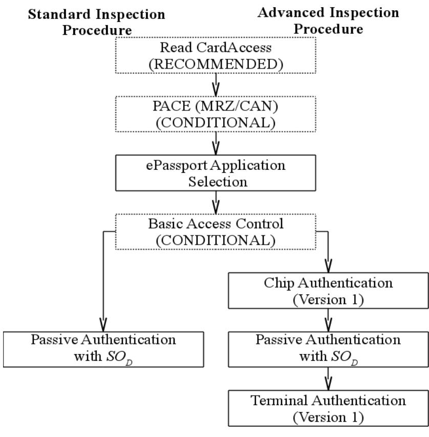
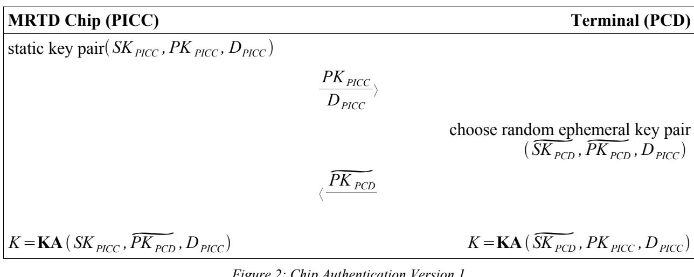

## Technical Guideline TR-03110-1

# **Advanced Security Mechanisms for Machine Readable Travel Documents –**

Part 1 – eMRTDs with BAC/PACEv2 and EACv1

Version 2.10 20. March 2012

#### **History**

| Version | Date       | Comment                                                                                                                             |
|---------|------------|-------------------------------------------------------------------------------------------------------------------------------------|
| 1.00    | 2006-02-08 | Initial public version.                                                                                                             |
| 1.01    | 2006-11-02 | Minor corrections and clarifications.                                                                                               |
| 1.10    | 2007-08-20 | Revised version.                                                                                                                    |
| 1.11    | 2008-02-21 | Minor corrections and clarifications.                                                                                               |
| 2.00    | 2008-10-27 | Enhanced version.                                                                                                                   |
| 2.01    | 2009-05-05 | Minor corrections and clarifications. Additional Mapping for PACE.                                                                  |
| 2.02    | 2009-11-09 | Adjustments to PACE required due to international standardization.                                                                  |
| 2.03    | 2010-03-24 | Clarification on the definition of a session. Standardization of domain parameters. Introduction of a secondary security object. |
| 2.04    | 2010-09-15 | Clarifications on certificate extensions. Improved handling of chip specific keys for privileged terminals.                      |
| 2.05    | 2010-10-14 | Clarifications on RFU-bits, "Read access to eID" deprecated                                                                         |
| 2.10    | 2012-03-20 | Split into three parts                                                                                                              |

Bundesamt für Sicherheit in der Informationstechnik Postfach 20 03 63 53133 Bonn

E-Mail: [ExtendedAccessControl@bsi.bund.de](mailto:ExtendedAccessControl@bsi.bund.de) Internet: [https://www.bsi.bund.de](https://www.bsi.bund.de/) © Bundesamt für Sicherheit in der Informationstechnik 2012

| 1    | Introduction5                              |  |
|------|--------------------------------------------|--|
| 1.1  | Passive Authentication5                    |  |
| 1.2  | Active Authentication6                     |  |
| 1.3  | Access Control6                            |  |
| 1.4  | Enhancements7                              |  |
| 1.5  | Requirements for MRTD Chips and Terminals7 |  |
| 1.6  | Terminology7                               |  |
| 2    | MRTD Applications9                         |  |
| 2.1  | ePassport Application9                     |  |
| 2.2  | Inspection System9                         |  |
| 2.3  | Passwords10                                |  |
| 2.4  | Inspection Procedures10                    |  |
| 3    | Protocol Specifications15                  |  |
| 3.1  | Cryptographic Algorithms and Notation15    |  |
| 3.2  | BAC17                                      |  |
| 3.3  | PACE17                                     |  |
| 3.4  | Chip Authentication Version 117            |  |
| 3.5  | Terminal Authentication Version 119        |  |
| A.   | Basic Access Control (Informative)21       |  |
| A.1. | Document Basic Access Keys21               |  |
| A.2. | Protocol Specification21                   |  |
| B.   | Challenge Semantics (Informative)23        |  |

| Figure 1: Authentication procedures for the ePassport Application11 |  |
|---------------------------------------------------------------------|--|
| Figure 2: Chip Authentication Version 118                           |  |
| Figure 3: Terminal Authentication Version 119                       |  |
| Figure 4: Basic Access Control22                                    |  |

| Table 1: ICAO Security Mechanisms5                  |  |
|-----------------------------------------------------|--|
| Table 2: Key words8                                 |  |
| Table 3: Data Groups of the ePassport Application 9 |  |
| Table 4: Inspection Procedures10                    |  |

| Contents |  |
|----------|--|
|----------|--|

| Table 5: Overview of key pairs used15 |
|---------------------------------------|
|---------------------------------------|

# **1 Introduction**

The International Civil Aviation Organization (ICAO) standardizes machine readable travel documents in ICAO Doc 9303. This standard consists of three parts:

**Part 1**: Machine Readable Passports

- **•** Volume 1: Passports with Machine Readable Data Stored in Optical Character Recognition Format
- **•** Volume 2: Specifications for Electronically Enabled Passports with Biometric Identification Capability

**Part 2**: Machine Readable Visa

**Part 3**: Machine Readable Official Travel Documents

- **•** Volume 1: Official Travel Documents with Machine Readable Data Stored in Optical Character Recognition Format
- **•** Volume 2: Specifications for Electronically Enabled Official Travel Documents with Biometric Identification Capability

This Technical Guideline mainly focuses on and extends the electronic security mechanisms for electronic travel documents described in Doc 9303 Part 1 Volume 2 [2] and Doc 9303 Part 3 Volume 2 [3] to protect the authenticity (including integrity), originality, and confidentiality of the data stored on the radio frequency chip embedded in the travel document (MRTD chip). In a nutshell the security mechanisms specified in [2], [3], [4] are *Passive Authentication*, *Active Authentication*, and *Access Control* (i.e. *Basic Access Control* and *Password Authenticated Connections Establishment*) as summarized in Table [1.](#page-4-1)

| Mechanism              | Protection      | Cryptographic Technique          |
|------------------------|-----------------|----------------------------------|
| Passive Authentication | Authenticity    | Digital Signature                |
| Active Authentication  | Originality     | Challenge-Response               |
| Access Control         | Confidentiality | Authentication & Secure Channels |

*Table 1: ICAO Security Mechanisms*

While the implementation of Passive Authentication is mandatory, Active Authentication and Access Control are both optional. It directly follows that without implementing those or equivalent mechanisms the originality and confidentiality of the stored data cannot be guaranteed. This guideline focuses on those aspects and specifies supplementary mechanisms for authentication and access control that are important for a secure MRTD chip.

## **1.1 Passive Authentication**

The ICAO ePassport application basically consists of 16 data groups (DG1-DG16) and a Document Security Object for Passive Authentication. An overview on the usage of those data groups is given in Table [3.](#page-8-1)

Passive Authentication uses a digital signature to authenticate data stored in the data groups on the MRTD chip. This signature is generated by a Document Signer (e.g. the MRTD producer) in the personalization phase of the MRTD chip over a Document Security Object containing the hash values of all data groups stored on the chip. For details on the Document Security Object, Document Signers, and Country Signing CAs the reader is referred to [2], [3].

To verify data stored on an MRTD chip using Passive Authentication the terminal has to perform the following steps:

- 1. Read the Document Security Object from the MRTD chip.
- 2. Retrieve the corresponding Document Signer Certificate, the trusted Country Signing CA Certificate, and the corresponding Certificate Revocation List.
- 3. Verify the Document Signer Certificate and the signature of the Document Security Object.
- 4. Compute hash values of read data groups and compare them to the hash values in the Document Security Object.

Passive Authentication enables a terminal to detect manipulated data groups, but it does not prevent cloning of MRTD chips, i.e. copying the complete data stored on one MRTD chip to another MRTD chip.

## **1.2 Active Authentication**

Active Authentication is a digital security feature that prevents cloning by introducing a chip-individual key pair:

- **•** The public key is stored in data group DG15 and thus protected by Passive Authentication.
- **•** The corresponding private key is stored in secure memory and may only be used internally by the MRTD chip and cannot be read out.

Thus, the chip can prove knowledge of this private key in a challenge-response protocol, which is called Active Authentication. In this protocol the MRTD chip digitally signs a challenge randomly chosen by the terminal. The terminal recognizes that the MRTD chip is genuine if and only if the returned signature is correct. Active Authentication is a straightforward protocol and prevents cloning very effectively, but introduces a privacy threat: Challenge Semantics (see Appendix [B](#page-22-0) for a discussion on Challenge Semantics).

## **1.3 Access Control**

Access Control is not only required for privacy reasons but also mitigates the risk of cloning attacks. The MRTD chip protects the stored data against unauthorized access by applying appropriate access control mechanisms as described below:

- **•** Less-sensitive data (e.g. the MRZ, the facial image and other data that is relatively easy to acquire from other sources) required for global interoperable border crossing is protected by *Basic Access Control*. For the reader's convenience, Basic Access Control is described in Appendix [A.](#page-20-0)
- **•** To facilitate implementation, Basic Access Control is based on symmetric cryptography only, thereby limiting the strength of the derived session keys by the strength of the input, i.e. the printed MRZ. Therefore the protocol *Password Authenticated Connection Establishment* (PACE) was introduced. This protocol is based on asymmetric cryptography and

provides session keys with strength is independent of the entropy of the input. For migration, the ICAO defines *Supplemental Access Control* (see [4]), which requires passports implementing PACE also to implement BAC.

**•** Sensitive data (e.g. fingerprints and other data that cannot be obtained easily from other sources at a large scale) must only be available to authorized terminals. Such data is additionally protected by *Extended Access Control*.

Basic Access Control only checks that the terminal has physical access to the travel document by requiring the MRZ to be read optically. Extended Access Control should additionally check that the terminal is entitled to read sensitive data. Therefore, strong authentication of the terminal is required. However, as Extended Access Control is not required for global interoperable border crossing, this protocol is not (yet) specified by ICAO.

The Password Authenticated Connection Establishment (PACE) introduced in this specification may be used as a more secure and more convenient replacement for Basic Access Control.

## **1.4 Enhancements**

As compared to version 1.xx of this Technical Guideline, version 2.xx includes the following enhancements in the scope of passports:

- **•** Integration of PACE in the Advanced Inspection Procedure.
- **•** Extension of Secure Messaging of Chip Authentication to AES.

Throughout this Part of this Guideline, PACE refers to PACEv2 as defined in [4].

## **1.5 Requirements for MRTD Chips and Terminals**

This Technical Guideline specifies requirements for implementations of MRTD chips and terminals. While MRTD chips must comply with those requirements according to the terminology described in Section [1.6,](#page-6-0) requirements for terminals are to be interpreted as guidance, i.e. interoperability of MRTD chip and terminal are only guaranteed if the terminal complies with those requirements, otherwise the interaction with the MRTD chip will either fail or the behavior of the MRTD chip is undefined. In general, the MRTD chip need not enforce requirements related to terminals unless the security of the MRTD chip is directly affected.

## **1.6 Terminology**

The key words "MUST", "MUST NOT", "REQUIRED", "SHALL", "SHALL NOT", "SHOULD", "SHOULD NOT", "RECOMMENDED", "MAY", and "OPTIONAL" in this document are to be interpreted as described in RFC 2119 [1]. The key word "CONDITIONAL" is to be interpreted as follows:

**CONDITIONAL:** The usage of an item is dependent on the usage of other items. It is therefore further qualified under which conditions the item is REQUIRED or RECOMMENDED.

When used in tables (profiles), the key words are abbreviated as shown in Table [2.](#page-7-0)

| Key word             | Abbrev.     |   |
|----------------------|-------------|---|
| MUST / SHALL         | REQUIRED    | m |
| MUST NOT / SHALL NOT | –           | x |
| SHOULD               | RECOMMENDED | r |
| MAY                  | OPTIONAL    | o |
| –                    | CONDITIONAL | c |

*Table 2: Key words*

# **2 MRTD Applications**

## **2.1 ePassport Application**

The ePassport application is defined by ICAO [2], [3], [4], [5]. To read data from the ePassport application, the MRTD chip SHOULD require the terminal to be authenticated as inspection system. The different authentication procedures for the ePassport application are illustrated in Figure [1.](#page-10-0)

## **2.2 Inspection System**

An inspection system is an official terminal that is always operated by a governmental organization (i.e. a Domestic or Foreign Document Verifier). The MRTD chip SHALL require an inspection system to authenticate itself before access according to the effective authorization is granted. This Part of the Technical Guideline defines two alternatives to authenticate a terminal as inspection system: The Standard Inspection Procedure and the Advanced Inspection Procedure .

For reading an ICAO compliant ePassport Application the Standard or the Advanced Inspection Procedure (cf. Section [2.4\)](#page-9-0) MUST be used. The Standard ePassport Inspection Procedure does not authenticate the terminal as inspection system. This specification therefore distinguishes between a *basic inspection system* and an *extended inspection system*.

- **• Basic inspection system:** A terminal that uses the Standard Inspection Procedure to authenticate itself to the MRTD chip.
- **• Extended Inspection System:** A terminal that uses the Advanced ePassport Inspection Procedure.

| DG   | Content                  | Read/Write | Mandatory/ | Access Control |        |
|------|--------------------------|------------|------------|----------------|--------|
|      |                          |            | Optional   | BAC/PACE       | EAC v1 |
| DG1  | MRZ                      | R          | m          | m              | x      |
| DG2  | Biometric: Face          | R          | m          | m              | x      |
| DG3  | Biometric: Finger        | R          | o          | m              | m      |
| DG4  | Biometric: Iris          | R          | o          | m              | m      |
|      |                          | R          | o          | m              | o      |
| DG14 | SecurityInfos            | R          | c          | m              | x      |
| DG15 | Active Authentication    | R          | o          | m              | x      |
| DG16 |                          | R          | o          | m              | x      |
| SOD  | Document Security Object | R          | m          | m              | x      |

DG14 is defined in Part 3. The abbreviations (o,c,r,m,x) are described in Table [2.](#page-7-0)

*Table 3: Data Groups of the ePassport Application*

A basic inspection system is only authorized to access less-sensitive data contained in an ICAO compliant ePassport Application. The authorization level of an extended inspection system SHALL be determined by the effective authorization calculated from the certificate chain.

## **2.3 Passwords**

To allow the holder of the MRTD to control access to the applications implemented on the contactless MRTD chip, Basic and Extended Access Control have been specified. Due to the limitations of Basic Access Control, this specification introduces PACE as a secure and practical mechanism to restrict access to applications based on knowledge, i.e. based on passwords that are either printed on the document or only known to the legitimate holder of the document.

While Basic Access Control only supports one "password", i.e. a symmetric key derived from the MRZ, PACE protocol supports multiple passwords. The different types of passwords used in this part of the specification are:

- **CAN:** The Card Access Number (CAN) is a short password that is printed or displayed on the document. The CAN is a non-blocking password, i.e. the MRTD chip MUST NOT block the CAN after failed authentications. The CAN may be static (printed on the MRTD), semi-static (e.g. printed on a label on the MRTD) or dynamic (randomly chosen by the MRTD chip and displayed on the MRTD using e.g. ePaper, OLED or similar technologies).
- **MRZ:** The MRZ-Password is a non-blocking static secret key that is derived from the machine readable zone and may be used for both PACE and BAC.

**Note:** While this Technical Guideline does not recommend any specific size for passwords, each non-blocking password MUST contain sufficient entropy or the MRTD chip MUST employ additional countermeasures to protect against brute-force attacks. Countermeasures MAY include delays but MUST NOT block the password after incorrect trials.

## **2.4 Inspection Procedures**

Depending on whether or not a device (i.e. an MRTD chip or a terminal) is compliant to this specification the device is called *compliant* or *noncompliant*, respectively. Depending on the combination of a terminal and an MRTD chip, either the *standard inspection procedure* or the *advanced inspection procedure* is used:

**•** A non-compliant inspection system uses the standard inspection procedure. Less-sensitive data stored on a compliant MRTD chip MUST be readable by every non-compliant inspection system.

| Inspection System | MRTD chip |               |  |
|-------------------|-----------|---------------|--|
|                   | compliant | non-compliant |  |
| compliant         | Advanced  | Standard      |  |
| non-compliant     | Standard  | Standard      |  |

*Table 4: Inspection Procedures*

**•** A compliant inspection system SHALL use the advanced inspection procedure if the MRTD chip is compliant. Otherwise the standard inspection procedure SHALL be used.

Table [4](#page-9-1) gives an overview on the inspection procedures to be used.

A terminal may use either the standard inspection procedure to access less-sensitive data contained in the ePassport application or the advanced inspection procedure to access less-sensitive and sensitive data in the ePassport application.

For the standard inspection procedure the MRZ SHOULD be known to the terminal (as Basic Access Control is RECOMMENDED for MRTD chips). Either the MRZ or the CAN MUST be known to the terminal for the advanced inspection procedure.

**Note:** As described in Section [1.1](#page-4-2) Passive Authentication is a continuous process that requires the computation of a hash value of each data group read from the chip and its comparison to the corresponding hash value contained in the Document Security Object. While this continuous process is assumed to be applied in the following procedures, it is not explicitly described.

## **2.4.1 Open ePassport Application**

The ePassport application MUST be opened as part of the standard and advanced ePassport inspection procedure. Opening the ePassport application consists of selecting the ePassport application and performing access control as required by the MRTD chip, i.e. Basic Access Contol or PACE. If

Either PACE or Basic Access Control MUST be used if enforced by the MRTD chip. *Figure 1: Authentication procedures for the ePassport Application*

the MRTD chip supports both PACE and Basic Access Control the inspection system SHOULD use PACE instead of Basic Access Control. The opening procedure consists of the following steps:

#### **1. Read CardAccess (RECOMMENDED)**

The terminal SHOULD try to read CardAccess to determine the parameters (i.e. symmetric ciphers, key agreement algorithms, domain parameters, and mappings) supported by the MRTD chip. The terminal may select any of those parameters.

If the file CardAccess is not available, the terminal SHOULD try to read the ePassport with Basic Access Control.

#### **2. PACE (CONDITIONAL)**

This step is RECOMMENDED if PACE is supported by the MRTD chip.

The MRTD chip SHALL accept the following passwords for PACE:

- **•** MRZ (support by MRTD chip is REQUIRED),
- **•** CAN (support by MRTD chip is OPTIONAL).

If successful, the MRTD chip performs the following:

- **•** It SHALL start Secure Messaging.
- **•** It SHALL grant access to less-sensitive data (e.g. DG1, DG2, DG14, DG15, etc. and the Document Security Object).
- **•** It SHALL restrict access rights to require Secure Messaging.

#### **3. Select ePassport Application (REQUIRED)**

#### **4. Basic Access Control (CONDITIONAL)**

This step is REQUIRED if access control is enforced by the MRTD chip and PACE has not been used.

If successful, the MRTD chip performs the following:

- **•** It SHALL start Secure Messaging.
- **•** It SHALL grant access to DG14 (containing the Chip Authentication Public Key).
- **•** It SHOULD grant access to less-sensitive data (e.g. DG1, DG2, DG15, etc. and the Document Security Object).[1](#page-11-0)
- **•** It SHALL restrict access rights to require Secure Messaging.

## **2.4.2 Standard Inspection Procedure**

The standard inspection procedure can be used for all ICAO-compliant ePassport applications. If the MRTD chip supports both PACE and Basic Access Control the inspection system SHALL use PACE instead of Basic Access Control. The standard inspection procedure consists of the following steps:

1 For an ICAO-compliant ePassport application the MRTD chip MUST grant access to all less-sensitive data. If compliance to ICAO standards is not required, the MRTD chip MAY deny access to certain data groups until Chip Authentication is performed.

#### **1. Open ePassport Application (REQUIRED)**

#### **2. Passive Authentication (started) (REQUIRED)**

The terminal MUST read and verify the Document Security Object. If CardAccess was read, the terminal SHALL compare the unsecured SecurityInfos read from CardAccess to the secured contents of DG14.

#### **3. Active Authentication (OPTIONAL)**

If available, the terminal MAY read and verify DG15 and perform Active Authentication.

#### 4. **Read and authenticate data**

The terminal MAY read and verify read data groups containing less-sensitive data.

## **2.4.3 Advanced Inspection Procedure**

The advanced inspection procedure can only be used for ICAO/EAC1-compliant ePassport applications. The advanced inspection procedure consists of the following steps:

#### **1. Open ePassport Application (REQUIRED)**

#### **2. Chip Authentication Version 1 (REQUIRED)**

The terminal SHALL read DG14 and perform Chip Authentication.

The MRTD chip performs the following:

- **•** It SHALL restart Secure Messaging.
- **•** It SHALL grant access to less-sensitive data (e.g. DG1, DG2, DG15, etc. and the Document Security Object).
- **•** It SHALL restrict access rights to require Secure Messaging established by Chip Authentication.

## **3. Passive Authentication (started) (REQUIRED)**

The terminal performs the following:

- **•** It SHALL read and verify the Document Security Object.
- **•** It SHALL verify DG14. If CardAccess was read, the terminal SHALL compare the unsecured SecurityInfos read from CardAccess to the secured contents of DG14.

## **4. Active Authentication (OPTIONAL)**

If available, the terminal MAY read and verify DG15 and perform Active Authentication.

## **5. Terminal Authentication Version 1 (CONDITIONAL)**

This step is REQUIRED to access sensitive ePassport data.

If successful the MRTD chip performs the following:

- **•** It SHALL additionally grant access to data groups according the terminal's access rights.
- **•** It SHALL restrict all access rights to require Secure Messaging established by Chip Authentication using the ephemeral public key authenticated by Terminal Authentication.

#### **6. Read and authenticate data**

The terminal MAY read and verify read data groups according to the terminal's access rights.

# **3 Protocol Specifications**

In this section cryptographic protocols for PACE, Chip Authentication and Terminal Authentication are specified assuming an arbitrary communication infrastructure. A mapping to ISO 7816 commands is given in Part 3 of this Technical Guideline.

# **3.1 Cryptographic Algorithms and Notation**

The protocols are executed between two parties: the MRTD chip (PICC) and the terminal (PCD). Table [5](#page-14-1) gives an overview on the key pairs used. The following cryptographic operations and notations are used.

## **3.1.1 Hash and Compression Algorithms**

The operations for computing a cryptographic hash and compressing a public key are described in an algorithm-independent way.

#### **3.1.1.1 Operations**

- **•** The operation for computing a hash over a message *m* is denoted by **H***m*.
- **•** The operation for computing a compressed representation of a public key *PK* is denoted by **Comp** *PK* .

## **3.1.2 Symmetric Key Algorithms**

The keys and operations for symmetric key encryption and authentication are described in an algorithm-independent way.

## **3.1.2.1 Keys**

Symmetric keys are derived from a shared secret *K* and an OPTIONAL nonce *r* or from a password using a Key Derivation Function (KDF):

|  Deriving a key for message encryption is denoted by KEnc=KDFEnc K ,[r]. • |                           |                              |                                                                                                                 |
|-------------------------------------------------------------------------------------------|---------------------------|------------------------------|-----------------------------------------------------------------------------------------------------------------|
| Protocol                                                                                  | MRTD Chip                 | Terminal                     | Note                                                                                                            |
| Chip Authentication                                                                    | PKPICC , SK PICC |  PKPCD , SK PCD | The key pair used by the terminal is an ephemeral key pair different from the ephemeral PACE key pair.    |
| Terminal Authentication                                                                | PKCVCA                    | PKPCD , SK PCD      | The MRTD chip verifies the certificate chain received from the terminal using the public key of the CVCA. |

| Table 5: Overview of key pairs used |  |  |
|-------------------------------------|--|--|
|-------------------------------------|--|--|

**•** Deriving a key for message authentication is denoted by *K MAC*=**KDFMAC***K ,*[*r*].

#### **3.1.3 Key Agreement**

The keys and operations for key agreement are described in an algorithm-independent way. A mapping to DH and ECDH can be found in Part 3 of this Technical Guideline.

#### **3.1.3.1 Keys**

For Chip Authentication the MRTD chip uses a static Diffie-Hellman key pair and the terminal generates an ephemeral key pair based on the MRTD chip's static domain parameters *DPICC* . **•** The terminal's ephemeral public key is *PK PCD*, the corresponding private key is *SKPCD*.

- **•** The MRTD chip's static public key is *PKPICC*, the corresponding private key is *SKPICC*.
- *PKPCD* .
- **•** The terminal's compressed ephemeral public key is denoted by **Comp**

It is RECOMMENDED that the MRTD chip validates public keys received from the terminal.

#### **3.1.3.2 Operations**

The operation for generating a shared secret *K* is denoted by *K*=**KA***SK , PK , D* , where *SK* is a (ephemeral or static) secret key, *PK* is a (ephemeral or static) public key and *D* are the (ephemeral or static) domain parameters.

#### **3.1.4 Signatures**

The keys and operations for signatures are described in an algorithm-independent way. A mapping to RSA and ECDSA can be found in Part 3 of this Technical Guideline.

## **3.1.4.1 Keys**

For Terminal Authentication the following key pair is used:

**•** The terminal has a static authentication key pair. The public key is *PK PCD*, the corresponding private key is *SKPCD*.

## **3.1.4.2 Operations**

The operations for signing and verifying a message are denoted as follows:

- **•** Signing a message *m* with private key *SKPCD* is denoted by *s*=**Sign** *SK PCD ,m*.
- **•** Verifying the resulting signature *s* with public key *PKPCD* is denoted by **Verify** *PKPCD ,s,m* .

# **3.2 BAC**

Basic Access Control is specified in [2]. For informational purposes, the specification and a discussion on the limitations is also given in Appendix [A.](#page-20-0)

# **3.3 PACE**

The PACE Protocol is a password authenticated Diffie-Hellman key agreement protocol that provides secure communication and explicit password-based authentication of the MRTD chip and the terminal (i.e. MRTD chip and terminal share the same password ).

The protocol establishes Secure Messaging between an MRTD chip and a terminal based on weak (short) passwords. PACE is an alternative to Basic Access Control, i.e. it enables the MRTD chip to verify that the terminal is authorized to access stored less-sensitive data but has two advantages:

- **•** Strong session keys are provided independent of the strength of the password.
- **•** The entropy of the password(s) used to authenticate the terminal can be very low (e.g. 6 digits are sufficient in general).

PACE is specified in [4]. For informational purposes, refer also to Part 3 of this Technical Guideline.

# **3.4 Chip Authentication Version 1**

The Chip Authentication Protocol is an ephemeral-static Diffie-Hellman key agreement protocol that provides secure communication and unilateral authentication of the MRTD chip.

The protocol establishes Secure Messaging between an MRTD chip and a terminal based on a static key pair stored on the MRTD chip. Chip Authentication is an alternative to the optional ICAO Active Authentication, i.e. it enables the terminal to verify that the MRTD chip is genuine but has two advantages over the original protocol:

- **•** Challenge Semantics are prevented because the transcripts produced by this protocol are non-transferable.
- **•** Besides authentication of the MRTD chip this protocol also provides strong session keys.

Details on Challenge Semantics are described in Appendix [B.](#page-22-0)

The protocol in version 1 provides implicit authentication of both the MRTD chip itself and the stored data by performing Secure Messaging using the new session keys.

#### **3.4.1 Protocol Specification**

The following steps are performed by the terminal and the MRTD chip, a simplified version is also shown in Figure [2.](#page-17-0)

- 1. The MRTD chip sends its static Diffie-Hellman public key *PKPICC* , and the domain parameters *DPICC* to the terminal.
- 2. The terminal generates an ephemeral Diffie-Hellman key pair *SKPCD ,PKPCD , DPICC* , and sends the ephemeral public key *PK PCD* to the MRTD chip. a) The shared secret *K*=**KA** *SKPICC ,PKPCD , DPICC* =**KA** *SK*
- 3. Both the MRTD chip and the terminal compute the following:
	- *PCD , PKPICC , DPICC*
	- b) The session keys *K MAC*=**KDFMAC** *K* and *KEnc*=**KDFEnc** *K* derived from *K* for Secure Messaging.
	- c) The terminal's compressed ephemeral public key **Comp** *PKPCD* for Terminal Authentication.

To verify the authenticity of the *PKPICC* the terminal SHALL perform Passive Authentication.

#### **3.4.2 Security Status**

If Chip Authentication was successfully performed, Secure Messaging is restarted using the derived session keys *K MAC* and *KEnc* . Otherwise, Secure Messaging is continued using the previously established session keys (PACE or Basic Access Control).

**Note:** Passive Authentication MUST be performed in combination with Chip Authentication. Only after a successful validation of the respective Security Object the MRTD chip may be considered genuine.

*Figure 2: Chip Authentication Version 1*

| MRTD Chip (PICC)                                                           |             | Terminal (PCD)                                                            |
|----------------------------------------------------------------------------|-------------|---------------------------------------------------------------------------|
| choose rPICC randomly                                                      | r PICC 〉 |                                                                           |
|                                                                            | sPCD 〈   |  sPCD=SignSKPCD , IDPICC∣∣r PICC∣∣ Comp PK PCD  |
|  VerifyPKPCD ,sPCD , IDPICC∣∣rPICC∣∣ Comp PKPCD  |             |                                                                           |

*Figure 3: Terminal Authentication Version 1*

# **3.5 Terminal Authentication Version 1**

The Terminal Authentication Protocol is a two move challenge-response protocol that provides explicit unilateral authentication of the terminal.

This protocol enables the MRTD chip to verify that the terminal is entitled to access sensitive data. As the terminal may access sensitive data afterwards, all further communication MUST be protected appropriately. Terminal Authentication therefore also authenticates an ephemeral public key chosen by the terminal that was used to set up Secure Messaging with Chip Authentication. The MRTD chip MUST bind the terminal's access rights to Secure Messaging established by the authenticated ephemeral public key of the terminal.

In this protocol *IDPICC* is an identifier of the MRTD chip:

- **•** If BAC is used *IDPICC* is the MRTD chip's Document Number as contained in the MRZ including the check digit.
- **•** If PACE is used *IDPICC* is computed using the MRTD chip's ephemeral PACE public key, i.e. *IDPICC*=**Comp** *PK PICC* . This is called *dynamic binding*.

Note that some States have issued MRTDs using a *static binding* for the combination of PACE and Terminal Authentication, i.e. *IDPICC* is

- **•** the MRTD chip's Document Number as contained in the MRZ including the check digit, if the MRZ used as password for PACE, or
- **•** the CAN if the CAN is used as password.

If Terminal Authentication with the dynamic binding fails, Inspection Systems SHOULD therefore try to access the document with static binding. The static binding MUST NOT be used in newly issued documents.

**Note:** All messages MUST be transmitted with Secure Messaging in Encrypt-then-Authenticate mode using session keys derived from BAC or PACE.

## **3.5.1 Protocol Specification**

The following steps are performed by the terminal and the MRTD chip, a simplified version is also shown in Figure [3.](#page-18-0)

- 1. The terminal sends a certificate chain to the MRTD chip. The chain starts with a certificate verifiable with the CVCA public key stored on the chip and ends with the Terminal Certificate.
- 2. The MRTD chip verifies the certificates and extracts the terminal's public key *PK PCD* .
- 3. The MRTD chip randomly chooses a challenge *r PICC* and sends it to the terminal.
- 4. The terminal responds with the signature

*sPCD*=**Sign** *SK PCD , IDPICC*∣∣*rPICC*∣∣**Comp** *PK PCD* .

5. The MRTD chip checks that

**Verify** *PK PCD ,s PCD , IDPICC*∣∣*r PICC*∣∣**Comp** *PKPCD* =true .

**Note:** In version 1 Chip Authentication MUST be performed before Terminal Authentication, i.e. **Comp** *PKPCD* is calculated by both the MRTD chip and terminal as part of Chip Authentication.

#### **3.5.2 Security Status**

If Terminal Authentication was successfully performed, the MRTD chip SHALL grant access to stored sensitive data according to the effective authorization of the authenticated terminal. The MRTD chip SHALL however restrict the terminal's access rights to Secure Messaging established by the authenticated ephemeral public key, i.e. the MRTD chip SHALL compare the compressed representation of the terminal's ephemeral public key received as part of Terminal Authentication with the compressed representation of the ephemeral public key provided by the terminal as part of Chip Authentication. The MRTD chip MUST NOT accept more than one execution of Terminal Authentication within the same session (cf. Section "Secure Messaging" in Part 3 of this Technical Guideline on the definition of "session").

**Note:** Secure Messaging is not affected by Terminal Authentication. The MRTD chip SHALL retain Secure Messaging even if Terminal Authentication fails (unless a Secure Messaging error occurs).

# **A. Basic Access Control (Informative)**

The protocol for Basic Access Control is specified by ICAO [2], [3]. Basic Access Control checks that the terminal has *physical* access to the MRTD's data page. This is enforced by requiring the terminal to derive an authentication key from the *optically* read MRZ of the MRTD. The protocol for Basic Access Control is based on ISO/IEC 11770-2 [6] key establishment mechanism 6. This protocol is also used to generate session keys that are used to protect the confidentiality (and integrity) of the transmitted data.

## **A.1. Document Basic Access Keys**

The Document Basic Access Keys *KBEnc* and *KBMAC* stored on the RF-chip in secure memory, have to be derived by the terminal from the MRZ of the MRTD prior to accessing the RF-chip. Therefore, the terminal optically reads the MRZ and generates the Document Basic Access Keys by applying the ICAO KDF [2], [3] to the most significant 16 bytes of the SHA-1 [7] hash of some fields of the MRZ. As reading the MRZ optically is error-prone, only the fields protected by a check-digit are used to generate the Basic Access Key(s): Document Number, Date of Birth, and Date of Expiry. As a consequence the resulting authentication key has a relatively low entropy. The actual entropy mainly depends on the type of the Document Number. For 10 year valid travel document the **maximum** strength of the authentication key is approximately:

- **•** 56 Bit for a numeric Document Number ( 3652⋅1012 possibilities)
- **•** 73 Bit for an alphanumeric Document Number ( 3652 ⋅369 ⋅103 possibilities)

Especially in the second case this estimation requires the Document Number to be randomly and uniformly chosen. Depending on the knowledge of the attacker, the actual entropy of the Document Basic Access Key may be lower, e.g. if the attacker knows all Document Numbers in use or is able to correlate Document Numbers and Dates of Expiry.

Given that in the first case the maximum entropy (56 Bit) is relatively low, calculating the authentication key from an eavesdropped session is possible. On the other hand, this still requires more effort than to obtain the same (less-sensitive) data from another source.

## **A.2. Protocol Specification**

Basic Access Control is shown in Figure [4.](#page-21-0) For better readability encryption and message authentication are combined into a single authenticated encryption primitive **EM** *K ,S* =**E** *KBEnc ,S* ∣∣**MAC** *K MAC ,***E** *KBEnc ,S ,* where *K*={*KBEnc , KB MAC* }. The corres-

ponding operation **DM***K ,C* is defined analogous, i.e. as verification and decryption.

- 1. The MRTD chip sends the nonce *r PICC* to the terminal.
- 2. The terminal sends the encrypted challenge *e PCD*=**EM** *K ,r PCD*∣∣*r PICC*∣∣*K PCD* to the MRTD chip, where *r PICC* is the MRTD chip's nonce, *r PCD* is the terminal's randomly chosen nonce, and *KPCD* is keying material for the generation of the session keys.
- 3. The MRTD chip performs the following actions:
- a) It decrypts the received challenge to *r PCD ′* ∣∣*r PICC ′* ∣∣*K PCD ′* =**DM** *K , e PCD* and verifies that *r PICC ′* =*r PICC* .
- b) It responds with the encrypted challenge *e PICC*=**EM***K ,r PICC*∣∣*r PCD ′* ∣∣*KPICC* , where *r PICC* is the MRTD chip's randomly chosen nonce and *KPICC* is keying material for the generation of the session keys.
- 4. The terminal decrypts the encrypted challenge to *r PICC ′* ∣∣*r PCD ″* ∣∣*K PICC ′* =**DM***K , e PICC* and verifies that *r PCD ″* =*r PCD* .
- 5. After a successful authentication all further communication MUST be protected by Secure Messaging in Encrypt-then-Authenticate mode using session keys *KEnc* and *K MAC* derived according to [2], [3] from the common master secret *K Master*=*KPICC ⊕ K PCD* and a Send Sequence Counter *SSC* derived from *r PICC* and *rPCD* .

| MRTD Chip (PICC)                                                        |             | Terminal (PCD)                                                    |
|-------------------------------------------------------------------------|-------------|-------------------------------------------------------------------|
|                                                                         |             | Read MRZ optically and derive K                                   |
| Choose rPICC and KPICC randomly                                         |             | Choose rPCD and KPCD randomly                                     |
|                                                                         | r PICC  |                                                                   |
|                                                                         | e PCD   | ePCD=EMK ,rPCD∣∣rPICC∣∣KPCD                               |
| ′ ′ ′ rPCD ∣∣r ∣∣KPCD =DM K ,ePCD  PICC |             |                                                                   |
| ′ Check rPICC =rPICC                                           |             |                                                                   |
| ′ ePICC=EM K ,r PICC∣∣r ∣∣KPICC  PCD             | e PICC  |                                                                   |
|                                                                         |             | ′ ″ ′ rPICC ∣∣rPCD ∣∣KPICC =DMK ,ePICC  |
|                                                                         |             | ″ Check rPCD =rPCD                                       |

*Figure 4: Basic Access Control*

# **B. Challenge Semantics (Informative)**

Consider a signature based challenge-response protocol between an MRTD chip (PICC) and a terminal (PCD), where the MRTD chip wants to prove knowledge of its private key *SK PICC* :

- 1. The terminal sends a randomly chosen challenge *c* to the MRTD chip.
- 2. The MRTD chip responds with the signature *s*=**Sign** *SK PICC , c* .

While this is a very simple and efficient protocol, the MRTD chip in fact signs the message *c* without knowing the semantic of this message. As signatures provide a transferable proof of authenticity, any third party can – in principle – be convinced that the MRTD chip has indeed signed this message.

Although *c* should be a random bit string, the terminal can as well generate this bit string in an unpredictable but (publicly) verifiable way, e.g. let *SK PCD* be the terminal's private key and

*c*=**Sign** *SKPCD , IDPICC* ||Date||Time||Location

be the challenge generated by using a signature scheme with message recovery. The signature guarantees that the terminal has indeed generated this challenge. Due to the transferability of the terminal's signature, any third party having trust in the terminal and knowing the corresponding public key *PKPCD* can check that the challenge was created correctly by verifying this signature. Furthermore, due to the transferability of MRTD chip's signature on the challenge, the third party can conclude that the assertion became true: The MRTD chip was indeed at a certain date and time at a certain location.

On the positive side, countries may use Challenge Semantics for their internal use, e.g. to prove that a certain person indeed has immigrated. On the negative side such proves can be misused to track persons. In particular since Active Authentication is not restricted to authorized terminals misuse is possible. The worst scenario would be MRTD chips that provide Active Authentication without Basic Access Control. In this case a very powerful tracking system may be set up by placing secure hardware modules at prominent places. The resulting logs cannot be faked due to the signatures. Basic Access Control diminishes this problem to a certain extent, as interaction with the bearer is required. Nevertheless, the problem remains, but is restricted to places where the travel document of the bearer is read anyway, e.g. by airlines, hotels etc.

One might object that especially in a contactless scenario, challenges may be eavesdropped and reused at a different date, time or location and thus render the proof at least unreliable. While eavesdropping challenges is technically possible, the argument is still invalid. By assumption a terminal is trusted to produce challenges correctly and it can be assumed that it has checked the MRTD chip's identity before starting Active Authentication. Thus, the eavesdropped challenge will contain an identity different from the prover's identity who signs the challenge.

#### Bibliography

## **Bibliography**

| [1] | Bradner, Scott. Key words for use in RFCs to indicate requirement levels, RFC 2119, 1997                                                                                                                                                                       |
|-----|-------------------------------------------------------------------------------------------------------------------------------------------------------------------------------------------------------------------------------------------------------------------|
| [2] | ICAO, Machine Readable Travel Documents - Part 1: Machine Readable Passport, Specifications for electronically enabled passports with biometric identification capabilities (including supplement), ICAO Doc 9303, 2006                                     |
| [3] | ICAO, Machine Readable Travel Documents - Part 3: Machine Readable Official Travel Documents, Specifications for electronically enabled official travel documents with biometric identification capabilities (including supplement), ICAO Doc 9303, 2008 |
| [4] | ICAO. Supplemental Access Control for Machine Readable Travel Documents, Technical Report, 2010                                                                                                                                                                |
| [5] | ICAO. LDS and PKI Maintenance, Technical Report, 2011                                                                                                                                                                                                             |
| [6] | ISO 11770-2. Information technology − Security techniques − Key management − Part 2: Mechanisms using symmetric techniques, 1996                                                                                                                               |
| [7] | NIST. Secure hash standard (and Change Notice to include SHA-224), FIPS PUB 180-2, 2002                                                                                                                                                                        |