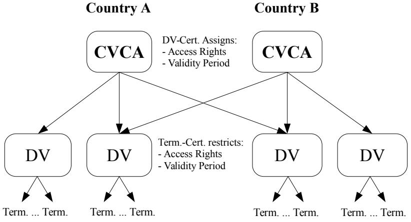
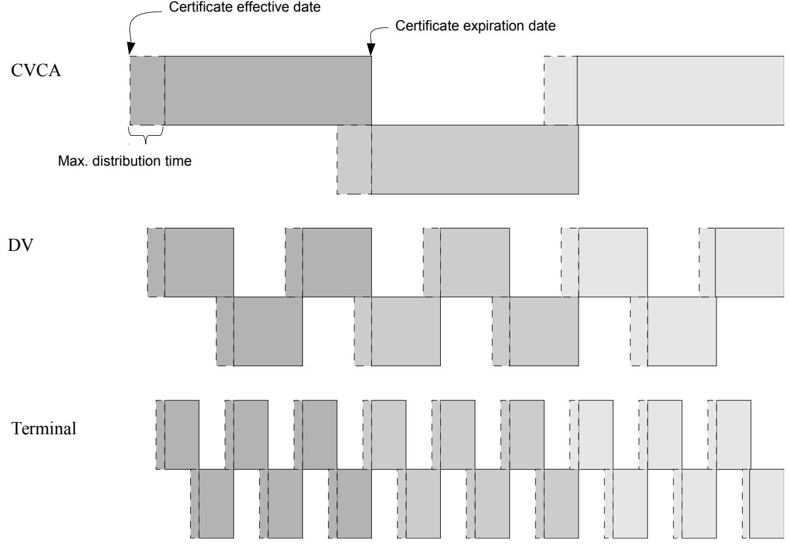
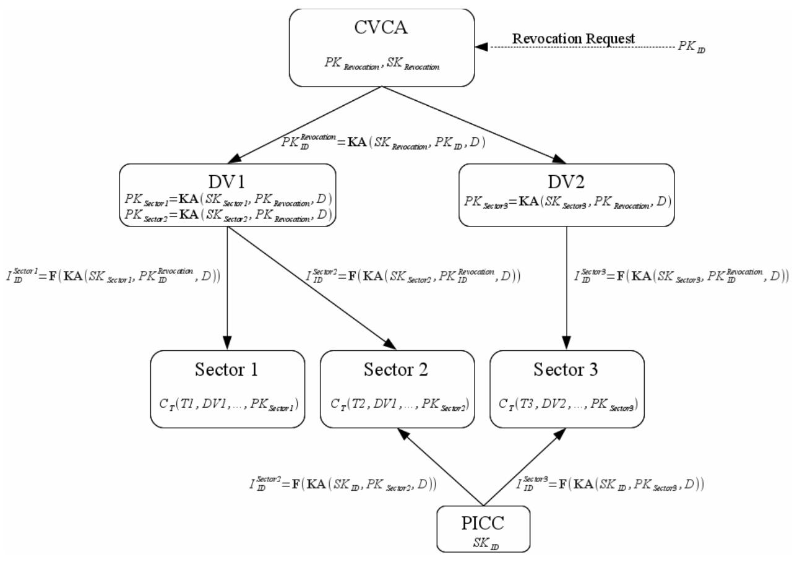
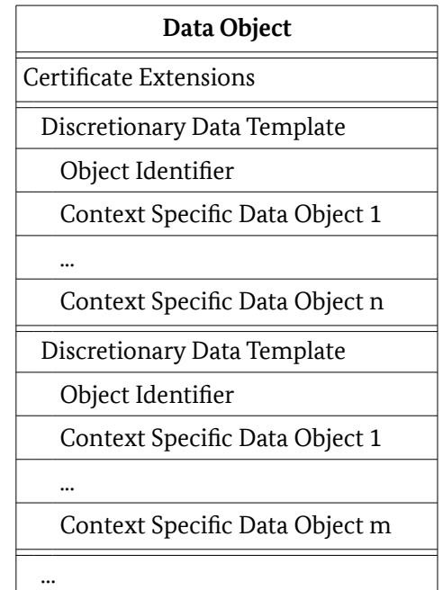
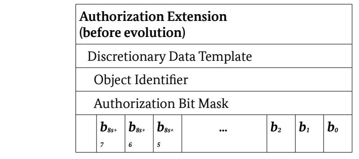
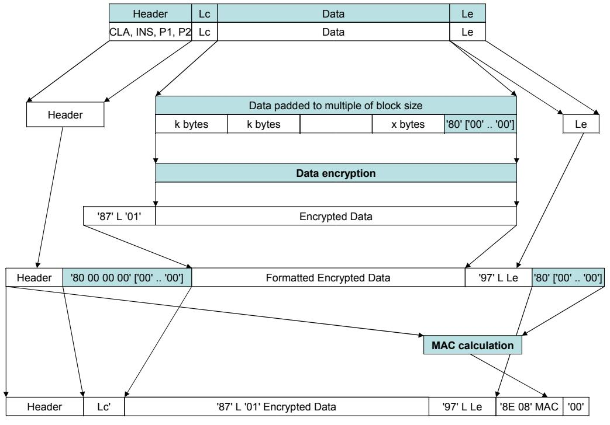
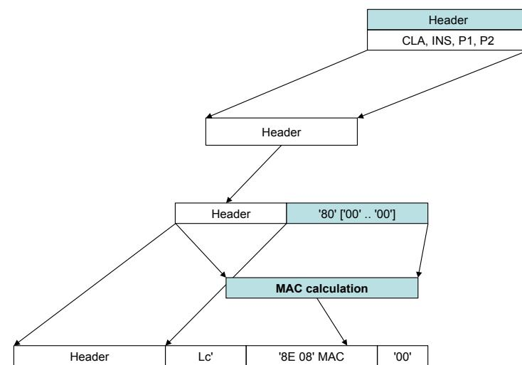
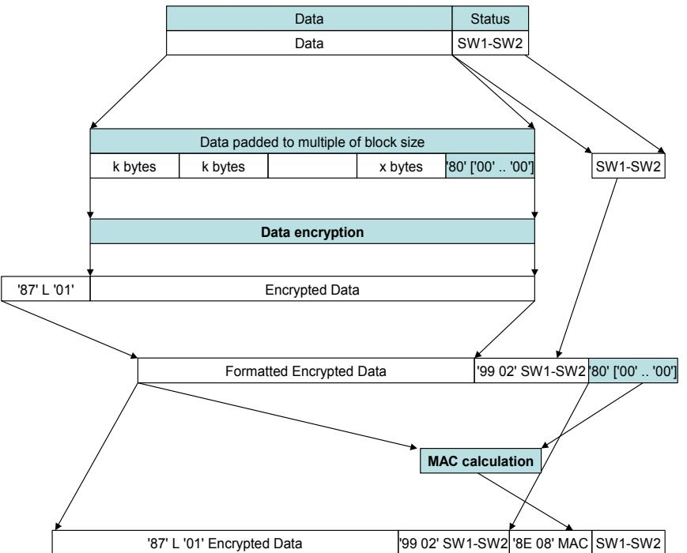

# Technical Guideline TR-03110

# Advanced Security Mechanisms for Machine Readable Travel Documents and eIDAS Token –

Part 3: Common Specifications

Version 2.21 21. December 2016


#### **History**

| Version | Date       | Comment                                                                                                                             |
|---------|------------|-------------------------------------------------------------------------------------------------------------------------------------|
| 1.00    | 2006-02-08 | Initial public version.                                                                                                             |
| 1.01    | 2006-11-02 | Minor corrections and clarifications.                                                                                               |
| 1.10    | 2007-08-20 | Revised version.                                                                                                                    |
| 1.11    | 2008-02-21 | Minor corrections and clarifications.                                                                                               |
| 2.00    | 2008-10-27 | Enhanced version.                                                                                                                   |
| 2.01    | 2009-05-05 | Minor corrections and clarifications. Additional Mapping for PACE.                                                                  |
| 2.02    | 2009-11-09 | Adjustments to PACE required due to international standardization.                                                                  |
| 2.03    | 2010-03-24 | Clarification on the definition of a session. Standardization of domain<br>parameters. Introduction of a secondary security object. |
| 2.04    | 2010-09-15 | Clarifications on certificate extensions. Improved handling of chip-specific keys<br>for privileged terminals.                      |
| 2.05    | 2010-10-14 | Clarifications on RFU-bits, "Read access to eID" deprecated                                                                         |
| 2.10    | 2012-03-20 | Split into three parts                                                                                                              |
| 2.11    | 2013-07-12 | Minor clarifications, addition of Envelope/Get Response                                                                             |
| 2.20    | 2015-02-03 | Enhanced version with additional mechanisms. Split into four parts.                                                                 |
| 2.21    | 2016-12-21 | Clarifications, minor corrections and optimizations. Simplification of<br>authorization handling.                                   |

Federal Office for Information Security Post Box 20 03 63 D-53133 Bonn

Phone: +49 22899 9582-0 E-Mail: [ExtendedAccessControl@bsi.bund.de](mailto:ExtendedAccessControl@bsi.bund.de) Internet: [https://www.bsi.bund.de](https://www.bsi.bund.de/) © Federal Office for Information Security 2016

| 1     | Introduction 7                                      |  |
|-------|-----------------------------------------------------|--|
| 1.1   | Requirements for ICCs and Terminals 7               |  |
| 1.2   | Cryptography requirements 7                         |  |
| 1.3   | Terminology 8                                       |  |
| 1.4   | Abbreviations 8                                     |  |
| 2     | Public Key Infrastructure 10                        |  |
| 2.1   | Country Verifying CA 10                             |  |
| 2.2   | Document Verifiers 11                               |  |
| 2.3   | Card Verifiable Certificates 11                     |  |
| 2.4   | Certificate Scheduling 11                           |  |
| 2.5   | Certificate Validation 12                           |  |
| 2.6   | Initial State of the ICC's trust-point(s)14         |  |
| 2.7   | Effective Authorization 14                          |  |
| 2.8   | Terminal Sector 15                                  |  |
| 3     | Management of Attributes 19                         |  |
| 3.1   | Specific Attributes 19                              |  |
| 3.2   | Generic Attributes 20                               |  |
| 3.3   | Attribute Requests 20                               |  |
| A.    | ASN.1 Specifications (Normative) 22                 |  |
| A.1.  | Information on Supported Security Protocols22       |  |
| A.2.  | Key Agreement 41                                    |  |
| A.3.  | PACE 46                                             |  |
| A.4.  | Chip Authentication 48                              |  |
| A.5.  | Restricted Identification 50                        |  |
| A.6.  | Pseudonymous Signatures 51                          |  |
| A.7.  | Terminal Authentication 53                          |  |
| A.8.  | Enhanced Role Authentication 60                     |  |
| B.    | ISO 7816 Mapping (Normative) 61                     |  |
| B.1.  | PACE 61                                             |  |
| B.2.  | Chip Authentication 62                              |  |
| B.3.  | Terminal Authentication 65                          |  |
| B.4.  | Restricted Identification 66                        |  |
| B.5.  | Pseudonymous Signature of Messages or Credentials66 |  |
| B.6.  | Auxiliary Data Verification 68                      |  |
| B.7.  | PIN Management 68                                   |  |
| B.8.  | eSign Application 69                                |  |
| B.9.  | Reading Data Groups 69                              |  |
| B.10. | Enhanced Role Authentication 69                     |  |
| B.11. | Switching of Session Context 71                     |  |
| B.12. | Extended Length 72                                  |  |

| B.13. | Command Chaining 72                                            |  |
|-------|----------------------------------------------------------------|--|
| B.14. | APDU Specification 73                                          |  |
| C.    | CV Certificates (normative) 86                                 |  |
| C.1.  | Certificate Profile 86                                         |  |
| C.2.  | Certificate Requests 87                                        |  |
| C.3.  | Certificate Extensions for Terminal Authentication Version 289 |  |
| C.4.  | Certificate Policy 91                                          |  |
| D.    | DER Encoding (Normative) 93                                    |  |
| D.1.  | ASN.1 93                                                       |  |
| D.2.  | Data Objects 93                                                |  |
| D.3.  | Public Key Data Objects 96                                     |  |
| E.    | Envelope/Get Response (Normative) 98                           |  |
| E.1.  | Envelope 99                                                    |  |
| E.2.  | Get Response 99                                                |  |
| F.    | Secure Messaging (Normative) 100                               |  |
| F.1.  | Session 100                                                    |  |
| F.2.  | Session Context 100                                            |  |
| F.3.  | Message Structure of Secure Messaging APDUs100                 |  |
| F.4.  | Cryptographic Algorithms 102                                   |  |
| F.5.  | Send Sequence Counter 103                                      |  |
| F.6.  | Secure Messaging Termination 103                               |  |

| Figure 1: Public Key Infrastructure 10                                |  |
|-----------------------------------------------------------------------|--|
| Figure 2: Certificate Scheduling 12                                   |  |
| Figure 3: Revocation 17                                               |  |
| Figure 4: Transformation of a command APDU 104                        |  |
| Figure 5: Transformation of a command APDU if no data is available104 |  |
| Figure 6: Transformation of a response APDU 105                       |  |

| Table 1: Key words 8                                                        |  |
|-----------------------------------------------------------------------------|--|
| Table 2: Elementary Files CardAccess, CardSecurity and ChipSecurity37       |  |
| Table 3: Algorithms and Formats for Key Agreement41                         |  |
| Table 4: Standardized Domain Parameters 42                                  |  |
| Table 5: Encoding of Passwords 45                                           |  |
| Table 6: Object Identifiers for PACE with DH 46                             |  |
| Table 7: Object Identifiers for PACE with ECDH46                            |  |
| Table 8: Object Identifiers for Chip Authentication with DH48               |  |
| Table 9: Object Identifiers for Chip Authentication with ECDH49             |  |
| Table 10: Object Identifiers for PSA based on ECSchnorr with ECDH50         |  |
| Table 11: Object Identifiers for Restricted Identification with DH50        |  |
| Table 12: Object Identifiers for Restricted Identification with ECDH51      |  |
| Table 13: Object Identifiers for PSM and PSC based on ECSchnorr with ECDH52 |  |
| Table 14: Credential data format for PSC 53                                 |  |
|                                                                             |  |

| Table 15: Certificate Holder Reference 53                                                  |  |
|--------------------------------------------------------------------------------------------|--|
| Table 16: Elementary File EF.CVCA 55                                                       |  |
| Table 17: Object Identifiers for Terminal Authentication with RSA56                        |  |
| Table 18: Object Identifiers for Terminal Authentication with ECDSA57                      |  |
| Table 19: Authenticated Auxiliary Data 58                                                  |  |
| Table 20: Chip Authentication Version 3 - General Authenticate command for Key Agreement63 |  |
| Table 21: Chip Authentication Version 3 - General Authenticate command for PSA64           |  |
| Table 22: Pseudonymous Signature of Messages - PSO:Compute Digital Signature command67     |  |
| Table 23: CV Certificate Profile 86                                                        |  |
| Table 24: CV Certificate Request Profile 88                                                |  |
| Table 25: Certificate Extensions 89                                                        |  |
| Table 26: Evolution of Authorization Extensions90                                          |  |
| Table 27: Overview on Data Objects (sorted by Tag)93                                       |  |
| Table 28: ISO/IEC 8859-1 Character Set 95                                                  |  |
| Table 29: RSA Public Key 96                                                                |  |
| Table 30: DH Public Key 97                                                                 |  |
| Table 31: EC Public Keys 97                                                                |  |
| Table 32: Usage of Secure Messaging Data Objects 101                                       |  |
|                                                                                            |  |

# <span id="page-5-0"></span>1 Introduction

This Part of the Technical Guideline gives the common specifications, comprising the PKI used for Access Control as well as a mapping of the protocols to ASN.1- and APDU-specifications, for the protocols defined in Part 1 and Part 2:

- **•** Part 1:
	- **◦** Terminal Authentication version 1
	- **◦** Chip Authentication version 1
- **•** Part 2:
	- **◦** Password Authenticated Connection Establishment (PACE)
	- **◦** Chip Authentication version 2
	- **◦** Chip Authentication version 3
	- **◦** Terminal Authentication version 2
	- **◦** Restricted Identification
	- **◦** Pseudonymous Signature

Although the specifications of PACEv2 in [8] are compatible to the specifications in this document, please refer to [8] for an implementation of PACE according to Part 1.

In this Technical Guideline, documents which only implement the protocols described in Part 1 of this Guideline are designated "MRTDs", while documents implementing protocols from Part 2 or from both Parts are designated "eIDAS token".

## 1.1 Requirements for ICCs and Terminals

This Technical Guideline specifies requirements for implementations of ICCs and terminals. While ICCs must comply with those requirements according to the terminology described in Section [1.3,](#page-6-0) requirements for terminals are to be interpreted as guidance, i.e. interoperability of ICC and terminal are only guaranteed if the terminal complies with those requirements, otherwise the interaction with the ICC will either fail or the behavior of the ICC is undefined. In general, the ICC need not enforce requirements related to terminals unless the security of the ICC is directly affected.

## 1.2 Cryptography requirements

This Technical Guideline specifies objects identifiers of the protocols for different cryptographic parameters. Furthermore, this Technical Guideline defines IDs for different domain parameters that can be used within the protocols.

It should be noted that the selection of suitable key lengths is up to the document issuer and not within the scope of this Technical Guideline. Suitable standards and algorithm catalogues from IT security authorities should be taken into account for selection of appropriate algorithms and key lengths. Guidance on suitable cryptographic algorithms may also be found in [28].

## <span id="page-6-0"></span>1.3 Terminology

The key words "MUST", "MUST NOT", "REQUIRED", "SHALL", "SHALL NOT", "SHOULD", "SHOULD NOT", "RECOMMENDED", "MAY", and "OPTIONAL" in this document are to be interpreted as described in RFC 2119 [2]. The key word "CONDITIONAL" is to be interpreted as follows:

**CONDITIONAL:** The usage of an item is dependent on the usage of other items. It is therefore further qualified under which conditions the item is REQUIRED or RECOMMENDED.

When used in tables (profiles), the key words are abbreviated as shown in Table [1.](#page-6-1)

| Key word             |             | Abbrev. |  |
|----------------------|-------------|---------|--|
| MUST / SHALL         | REQUIRED    | m       |  |
| MUST NOT / SHALL NOT | –           | x       |  |
| SHOULD               | RECOMMENDED | r       |  |
| MAY                  | OPTIONAL    | o       |  |
| –                    | CONDITIONAL | c       |  |

<span id="page-6-1"></span>*Table 1: Key words*

## 1.4 Abbreviations

The following abbreviations are commonly used throughout this specification.

| Name                             | Abbreviation |
|----------------------------------|--------------|
| Binary Coded Digit               | BCD          |
| Card Verifiable                  | CV           |
| Card/Chip Security Object        | SOC          |
| Certification Authority          | CA           |
| Chip Identifier                  | IDICC        |
| Chip Authentication Public Key   | PKICC        |
| Chip Authentication Private Key  | SK ICC       |
| Country Signing CA               | CSCA         |
| Country Verifying CA             | CVCA         |
| Country Verifying CA Certificate | CCVCA        |
| Document Security Object         | SOD          |
| Data Group                       | DG           |
| Document Verifier                | DV           |
| Document Verifier Certificate    | C DV         |
| Domain Parameters                | D            |
| Ephemeral Private Key            | <br><br>SK |
| Ephemeral Public Key             | PK           |

| Name                                              | Abbreviation             |
|---------------------------------------------------|--------------------------|
| Hash Function                                     | H                        |
| International Civil Aviation Organization         | ICAO                     |
| Key Agreement Function                            | KA                       |
| Key Derivation Function                           | KDF                      |
| Logical Data Structure                            | LDS                      |
| Machine Readable Travel Document                  | MRTD                     |
| Proximity Integrated Circuit Chip                 | PICC                     |
| Proximity Coupling Device                         | PCD                      |
| Restricted Identification Public Key              | PKID                     |
| Restricted Identification Private Key             | SKID                     |
| Sector Public Key                                 | PKSector                 |
| Sector Private Key                                | SKSector                 |
| Sector-specific Identifier                        | Sector<br>I ID           |
| Terminal Authentication Public Key                | PK PCD                   |
| Terminal Authentication Private Key               | SKPCD                    |
| Terminal Certificate                              | CT                       |
| Pseudonymous Signature Group Public Key           | PKICC                    |
| Pseudonymous Signature Individual Public Keys     | PKICC<br>,1, PKICC<br>,2 |
| Pseudonymous Signature Sector-specific Identifier | Sector<br>I ICC<br>,i    |
| Identifier of the Pseudonymous Signature variant  | IDDSI                    |

# <span id="page-8-0"></span>2 Public Key Infrastructure

Terminal Authentication requires the terminal to prove to the ICC that it is entitled to access sensitive data. Such a terminal is equipped with at least one *Terminal Certificate,* encoding the terminal's public key and access rights, and the corresponding private key. After the terminal has proven knowledge of this private key, the ICC grants the terminal access to sensitive data as indicated in the Terminal Certificate.

The PKI required for issuing and validating Terminal Certificates consists of the following entities:

- 1. Country Verifying CAs (CVCAs)
- 2. Document Verifiers (DVs)
- 3. Terminals

This PKI forms the basis of Extended Access Control and is also abbreviated by EAC-PKI. It is illustrated in Figure [1.](#page-8-1)

## 2.1 Country Verifying CA

Every State is required to set up one trust-point that issues Document Verifier Certificates: the *Country Verifying CA* (CVCA).

**Note:** The Country Signing CA issuing certificates for Document Signers (cf. [8]) and the Country Verifying CA MAY be integrated into a single entity, e.g. a Country CA. However, even in this case, separate key pairs MUST be used for different roles.

A CVCA determines the access rights to national ICCs for all DVs (i.e. official domestic DVs as well as the foreign/commercial DVs) by issuing certificates for DVs entitled to access some sensitive data. The conditions under which a CVCA grants a DV access to sensitive data is out of the scope of this document and SHOULD be stated in a certificate policy (cf. Appendix [C.4\)](#page-89-0).

Document Verifier Certificates MUST contain information, such as which data a certain DV is entitled to access. To diminish the potential risk introduced by lost or stolen terminals Document Verifier



*Arrows denote certification*

<span id="page-8-1"></span>*Figure 1: Public Key Infrastructure*

Certificates MUST contain a short validity period. The validity period is assigned by the issuing CVCA at its own choice and this validity period may differ depending on the Document Verifier the certificate is issued to.

## 2.2 Document Verifiers

A *Document Verifier* (DV) is an organizational unit that manages a group of terminals (e.g. terminals operated by a State's border police) by – inter alia – issuing Terminal Certificates. A Document Verifier is therefore a CA, authorized by at least the national CVCA to issue certificates for its terminals. The Terminal Certificates issued by a DV usually inherit both the access rights and the validity period from the Document Verifier Certificate, however, the Document Verifier MAY choose to further **restrict** the access rights or the validity period depending on the terminal the certificate is issued for.

If a Document Verifier requires its terminals to access sensitive data stored on other States' ICCs, it MUST apply for a DV Certificate issued by the CVCA of the respective States. The Document Verifier MUST also ensure that all received Document Verifier Certificates are forwarded to the terminals within its domain.

## 2.3 Card Verifiable Certificates

CVCA Link Certificates, DV Certificates, and Terminal Certificates are to be validated by ICCs. Due to the computational restrictions of those chips, the certificates MUST be in a card verifiable format:

- **•** The certificate format and profile specified in Appendix [C.1](#page-84-1) SHALL be used.
- **•** The signature algorithm, domain parameters, and key sizes to be used are determined by the CVCA of the issuing State, i.e. the same signature algorithm, domain parameters and key sizes MUST be used within a certificate chain.[1](#page-9-0)
- **•** CVCA Link Certificates MAY include a public key that deviates from the current parameters, i.e. the CVCA MAY switch to a new signature algorithm, new domain parameters, or key sizes.

## 2.4 Certificate Scheduling

Each certificate MUST contain a validity period. This validity period is identified by two dates, the *certificate effective date* and the *certificate expiration date.*

**Certificate Effective Date:** The certificate effective date SHALL be the date of the certificate generation.

**Certificate Expiration Date:** The certificate expiration date SHALL be the date after which the certificate expires. It may be arbitrarily chosen by the certificate issuer.

When generating certificates, the issuer MUST carefully plan the roll-over of certificates, as sufficient time for propagation of certificates and set up of certificate chains MUST be provided. Obviously, a new certificate must be generated before the current certificate expires. To realize the link of trust between consecutive CVCA certificates, CVCA Link Certificates have to be produced. CVCA Link Certificates MUST be signed with the previous CVCA key, i.e. the CVCA key with the most recent effective date.

In each case, the resulting *maximum distribution time* equals the certificate expiration date of the old certificate minus the certificate effective date of the new certificate. For the application and

<span id="page-9-0"></span><sup>1</sup> As a consequence Document Verifiers and terminals will have to be provided with several key pairs.

distribution of certificates, the communication protocols specified in TR-03129 [3] are RECOMMENDED. Certificate scheduling is illustrated in Figure [2.](#page-10-0)



<span id="page-10-0"></span>*Figure 2: Certificate Scheduling*

## <span id="page-10-1"></span>2.5 Certificate Validation

To validate a Terminal Certificate, the ICC MUST be provided with a certificate chain starting at a trust-point stored on the ICC. Those trust-points are more or less recent public keys of the ICC's CVCA. The initial trust-point(s) SHALL be stored securely in the ICC's memory in the production or (pre-) personalization phase.

As the key pair used by the CVCA changes over time, the ICC is REQUIRED to internally update its trust-point(s) according to received valid link certificates.

The ICC MUST be able to store up to two trust-points per application.

**Note:** Due to the scheduling of CVCA Link Certificates (cf. Figure [2\)](#page-10-0), at most two trust-points per application need to be stored on the ICC.

The ICC MUST accept expired CVCA Link Certificates but it MUST NOT accept expired DV and Terminal Certificates. To determine whether a certificate is expired, the ICC SHALL use its *current date*.

**Current Date:** If the ICC has no internal clock, the current date of the ICC SHALL be approximated as described in the following. The date is autonomously approximated by the ICC using the most recent certificate effective date contained in a valid CVCA Link Certificate, a DV Certificate or an *Accurate Terminal Certificate*.

**Accurate Terminal Certificate:** A Terminal Certificate is accurate, if the issuing Document Verifier is trusted by the ICC to produce Terminal Certificates with the correct certificate effective date. A valid Terminal Certificate MUST be accepted as accurate by the ICC if it was issued by an official domestic DV and SHOULD NOT be accepted as accurate otherwise.

A terminal MAY send CVCA Link Certificates, DV Certificates, and Terminal Certificates to an ICC to update the current date and the trust-point stored on the ICC even if the terminal does not intend to or is not able to continue with Terminal Authentication.

**Note:** The ICC only verifies that a certificate is *apparently* recent (i.e. with respect to the approximated current date).

#### <span id="page-11-0"></span>2.5.1 General Procedure

The certificate validation procedure consists of three steps:

- 1. **Certificate Verification:** The signature MUST be valid and unless the certificate is a CVCA Link Certificate, the certificate MUST NOT be expired. If the verification fails, the procedure SHALL be aborted.
- 2. **Internal Status Update:** The current date MUST be *updated*, the public key and the attributes (including relevant certificate extensions) MUST be imported, new trust-points MUST be *enabled*, expired trust-points MUST be *disabled* for the verification of DV Certificates.
- 3. **Cleanup:** The chip SHALL provide at most two enabled trust-points per application. If more than two trust-points for an application remain enabled after the internal status update, the trust-point with the least recent effective date SHALL be *disabled*.

The operation of *updating* the current date and the operations of *enabling* and *disabling* a trust-point MUST be implemented as an atomic operation.

**Enabling a trust-point:** The new trust-point SHALL be added to the list of trust-points.

**Disabling a trust-point:** Expired trust-points MUST NOT be used for the verification of DV Certificates. In case of ICCs where the current date may be advanced beyond the expiry date of a trust-point, e.g. ICCs with more than one application or ICCs using an internal clock, expired trust-points MUST remain usable for the verification of CVCA Link Certificates. Disabled trust-points MAY be deleted after the successful import of the successive Link Certificate.

**Note:** In case of single-application ICCs with no internal clock, the above specification is equivalent to the specification in version 1.11 of this Guideline.

#### 2.5.2 Example Procedure

The following validation procedure, provided as an example, MAY be used to validate a certificate chain. For each received certificate the ICC performs the following steps:

- 1. The ICC verifies the signature on the certificate. If the signature is incorrect, the verification fails.
- 2. If the certificate is not a CVCA Link Certificate, the certificate expiration date is compared to the ICC's current date. If the expiration date is before the current date, the verification fails.
- 3. The certificate is accepted as valid and the public key and the attributes (including relevant certificate extensions) contained in the certificate are imported.
- i For CVCA, DV, and Accurate Terminal Certificates: The certificate effective date is compared to the ICC's current date. If the current date is before the effective date, the current date is updated to the effective date.
- ii For CVCA Link Certificates: The new CVCA public key is added to the list of trust-points stored securely in the ICC's memory. The new trust-point is then enabled.
- iii For DV and Terminal Certificates: The new DV or terminal public key is temporarily imported for subsequent certificate verification or Terminal Authentication, respectively.
- 4. Expired trust-points stored securely in the ICC's memory are disabled for the verification of DV Certificates and may be removed from the list of trust-points.

## 2.6 Initial State of the ICC's trust-point(s)

The (pre-)personalization agent SHALL

- **•** set the current date of the ICC to the date of the (pre-)personalization, and
- **•** personalize the CVCA key with the most recent effective date as trust-point.

The (pre-)personalization agent MAY additionally personalize the previous CVCA key as trust-point.

## <span id="page-12-0"></span>2.7 Effective Authorization

Each certificate SHALL contain a *Certificate Holder Authorization Template (CHAT)* (cf. Appendix [C.1.5\)](#page-85-0) and MAY contain *Authorization Extensions* (cf. Appendix [C.3.1\)](#page-88-0).

- **•** The Certificate Holder Authorization Template identifies the terminal type (cf. Parts 1 and 2 of this Technical Guideline).
- **•** The Certificate Holder Authorization Template and the Authorization Extensions determine the *relative authorization* of the certificate holder assigned by the issuing certificate authority.

To determine the *effective authorization* of a certificate holder, the ICC MUST perform the following:

- 1. If an Authorization Extension supported by the ICC is missing in a certificate of the certificate chain, the corresponding relative authorization of the certificate holder SHALL be set all to '0' for calculation of the effective authorization.
- 2. For the CHAT and for each supported Authorization Extension, the ICC MUST calculate a bitwise Boolean 'and' of the relative authorization contained in the Terminal Certificate, the referenced Document Verifier Certificate, and the referenced CVCA Certificate.

#### 2.7.1 Confined Authorization (eIDAS token only)

The effective authorization may be further restricted by using the General Authentication Procedure (cf. Part 2 of this Technical Guideline). In this case, the terminal performing the General Authentication Procedure (cf. Part 2) MUST indicate the terminal type and the *confined authorization* (i.e. the effective authorization required by the terminal) as part of PACE. If the ICC supports Authorization Extensions, the confined authorization SHALL include the relevant Authorization Extensions of the Terminal Certificate. Otherwise, the Authorization Extension SHALL be omitted by the terminal.

The confined authorization SHALL be used by the ICC to compute the effective authorization as part of Terminal Authentication of the General Authentication Procedure phase (i.e. the first Terminal Authentication of a session). For that purpose, the ICC SHALL include the confined authorization by calculating a bitwise Boolean 'and' in step 2. of Section [2.7](#page-12-0) for the computation of the effective authorization.

If switching of session contexts is supported and Terminal Authentication is performed as part of Enhanced Role Authentication, the confined authorization SHALL be omitted by the ICC to compute the effective authorization of an Attribute Provider.

**Note:** The ICC MUST verify that the terminal type indicated in the confined authorization and the terminal type in the relative authorization of each certificate of the certificate chain are equal. If a mismatch is detected, the ICC SHALL reset the access rights and indicate an error (cf. Appendix [B.14.7\)](#page-77-0).

#### 2.7.2 Interpretation (all document types)

The effective authorization SHALL be interpreted by the ICC as follows:

- **•** The effective role is a CVCA:
	- **◦** This link certificate was issued by the national CVCA.
	- **◦** The ICC MUST update its internal trust-point, i.e. the public key and the relative authorization.
	- **◦** The certificate issuer is a trusted source of time. If the ICC has no internal clock, the ICC MUST update its current date using the Certificate Effective Date.
	- **◦** The ICC MUST NOT grant the CVCA access to sensitive data (i.e. the effective authorization SHOULD be ignored).
- **•** The effective role is a DV:
	- **◦** The certificate was issued by the national CVCA for an authorized DV.
	- **◦** The certificate issuer is a trusted source of time. If the ICC has no internal clock, the ICC MUST update its current date using the Certificate Effective Date.
	- **◦** The ICC MUST NOT grant a DV access to sensitive data (i.e. the effective authorization SHOULD be ignored).
- **•** The effective role is a Terminal:
	- **◦** The certificate was issued by either an official domestic, a foreign, or a non-official DV.
	- **◦** If the certificate is an accurate terminal certificate (cf. Section [2.5\)](#page-10-1), the issuer is a trusted source of time. If the ICC has no internal clock, the ICC MUST update its current date using the Certificate Effective Date.
	- **◦** The ICC MUST grant the authenticated terminal access to sensitive data according to the effective authorization.

## 2.8 Terminal Sector

To support

- **•** Restricted Identification
- **•** Pseudonymous Signatures
- **•** Enhanced Role Authentication

terminals MUST be assigned a Terminal Sector. The Terminal Sector SHALL be contained in the Terminal Certificate and thus, it is RECOMMENDED that the Terminal Sector is generated by the certifying Document Verifier. In any case, the Terminal Sector MUST NOT be chosen by the terminal itself.

The Terminal Sector is always a public key. It MAY be chosen either verifiably at random with an unknown private key to disable tracing completely (in this case linking sector-specific identifiers across sectors is computationally impossible) or as key pair to enable revocation based on sector-specific identifiers.

The definition of a Sector is up to the policy of the Issuer of the ICC.

#### 2.8.1 Sector Key Pair

Sector Key Pairs MUST be generated by all Document Verifiers that support sector-specific revocation of ICCs.

Each Document Verifier SHALL perform the following steps for every subordinated sector:

- 1. Generate a new Sector Key Pair based on the Revocation Sector Public Key.
- 2. Store the Sector Private Key securely (at the Document Verifier).
- 3. Include the Sector Public Key in every Terminal Certificate of all terminals belonging to the corresponding sector.

The Revocation Sector Key Pair SHALL be generated by the CVCA. The CVCA MAY delegate the revocation service to a service provider.

#### 2.8.2 Sector-Specific Revocation of ICCs

At the (pre-) personalization of the ICC, a key pair for Restricted Identification SHALL be generated. For Chip Authentication version 3, the ICC's private key is part of the ICC's private keys for Chip Authentication Version 3 or Pseudonymous Signatures described in [A.4.2.1.](#page-47-0)

The private key SHALL be stored in the ICC. If the public key is used to enable revocation of the ICC (i.e. *PK ID* for Restricted Identification or *PKICC ,i* for Pseudonymous Signatures), the public key SHALL be stored in a database together with other data identifying the holder of the MRTD .

**Note:** The generation of the key pair for Restricted Identification MAY be performed within the ICC or externally. The key pair MUST be chosen to be unique and MAY be either chip-specific or holder-specific (i.e. the same key pair will be used on subsequent ICCs). At least one key pair used for Restricted Identification MUST be chip-specific.

To revoke the ICC, the chip-specific public key of the ICC is looked up in the database and transferred to the CVCA. The CVCA then transforms the public key using its Revocation Sector Private Key. The transformed public key is then transferred to all subordinated Document Verifiers. Each Document Verifier calculates the sector-specific identifiers using the Sector Private Keys for all subordinated Terminal Sectors. Finally, the sector-specific identifier is transferred to all terminals of the corresponding sector.



*Figure 3: Revocation*

#### 2.8.3 Generation of Revocation Lists

The CVCA publishes the Revocation Sector Public Key *PK Revocation* and the domain parameters *D*. Each Document Verifier randomly chooses a Sector Private Key *SKSector* for every subordinated sector and calculates the Sector Public Key as *PKSector*=**KA***SKSector , PKRevocation , D*.

To revoke an ICC, a revocation request is sent to the CVCA containing the Restricted Identification *PKID* or Pseudonymous Signature Public Key *PKID* :=*PKICC , <sup>i</sup>* . The sector-specific identities are calculated as follows:

- 1. The CVCA calculates *PKID Revocation*=**KA***SKRevocation , PKID , D* using its private key *SKRevocation* and the Restricted Identification Public Key *PKID* received with the revocation request. The transformed public key *PKID Revocation* is forwarded to all subordinated Document Verifiers.
- 2. Each Document Verifier calculates the sector-specific identifier for all subordinated sectors. For each sector the Document Verifier calculates *I ID Sector*=**F**(**KA**(*SKSector , PKID Revocation , D*)) using the corresponding Sector Private Key *SKSector* , the received public key *PK ID Revocation* of the ICC to be

revoked and the hash function of the protocol object identifier as F for Restricted Identification sector-specific identifiers or identity function as F for Pseudonymous Signature sector-specific identifiers. The sector-specific identifier *I ID Sector* is then forwarded to the terminals of the corresponding sector.

### 2.8.4 Sector-specific Whitelisting of ICCs

The sector-specific identifiers generated with Chip Authentication version 3 or Pseudonymous Signatures can also be used for the generation of Whitelists. In this case, the same procedure as for revoking ICC's is performed with the generated ICCs. If an ICC is revoked, the corresponding sector-specific identifier SHALL be deleted from the Whitelist.

#### 2.8.5 Validity Period

In contrast to the Terminal Key Pair (for Terminal Authentication), the Sector Key Pair is valid for a long time and MUST be chosen appropriately.

#### 2.8.6 Migrating Terminals

To migrate a terminal from one Document Verifier to another Document Verifier, the sector key pair of the terminal MUST be transferred securely to the new Document Verifier.

**Note:** Migrating a terminal to a Document Verifier supervised by another CVCA is not possible.

# <span id="page-17-0"></span>3 Management of Attributes

Enhanced Role Authentication (if supported by the ICC) enables Attribute Terminals manage additional attributes on the ICC.

Management of attributes consists of the following functions:

- **•** Requesting Attributes
- **•** Reading Attribute Requests
- **•** Writing Attributes
- **•** Reading Attributes
- **•** Deleting Attributes

The following classes of attributes are defined:

- **•** *Specific Attributes*
- **•** *Generic Attributes*

## 3.1 Specific Attributes

Specific Attributes are attributes that are stored in data containers, each bijectively linked to the hash of a Sector Public Key contained in the Terminal Sector as defined in [C.3.2.1](#page-89-1) of requesting terminal's CV Certificate.

The ASN.1 structure for Specific Attributes is specified in [A.8.2.](#page-58-0) Commands for management of Specific Attributes are specified in Appendix [B.](#page-59-0)

Data containers nest data and their corresponding security attributes. However, the inherent structure of data containers is out of scope of this document, i.e. containers can be files of self-controlled data objects.

If the ICC supports Specific Attributes, it MUST also support Attribute Requests.

#### 3.1.1 Reading and deleting Specific Attributes

The ICC SHALL restrict read and delete access to Specific Attribute containers to authenticated terminals with the corresponding access right of the terminal.

If the terminal has effective authorization for reading/deleting Specific Attributes of all Terminal Sectors, the ICC SHALL grant access to all Specific Attribute containers and MUST respond/delete all Specific Attributes upon request of the terminal.

If the terminal's effective authorization is restricted to reading/deleting of Specific Attributes linked to the hash of a Sector Public Key of the terminal's CV Certificate, the following steps MUST be performed to read/delete Specific Attributes:

- **•** The terminal MUST present the hash of its Sector Public Key to be used as user ID to the ICC.
- **•** The ICC MUST verify that the hash of the Sector Public Key is contained in the Terminal Sector of the terminal's CV Certificate sent during Terminal Authentication.

**•** If the verification was successful, the ICC SHALL grant read/delete access to the Specific Attribute container linked to the terminal's presented user ID and MUST respond/delete the Specific Attributes upon request of the terminal.

If the terminal has no effective authorization for reading/deleting Specific Attributes, the ICC SHALL NOT grant access to read/delete Specific Attributes.

#### 3.1.2 Writing Specific Attributes

The ICC SHALL restrict read access to the Attribute Request container and write access to a Specific Attribute container to authenticated terminals with the corresponding effective authorization (Attribute Provider).

If no Attribute Request is present on the ICC, writing Specific Attribute MUST be denied by the ICC. If the terminal writes a Specific Attribute to the ICC, the attribute MUST be added to the data container that is linked to the user ID of the Attribute Request.

**Note:** In order to avoid that single data containers take too much storage on the ICC, it can be advisable to limit the maximum size of a data container taking into account the expected number and sizes of relevant Specific Attributes.

## 3.2 Generic Attributes

Generic Attributes are attributes that are not linked to the Terminal Sector of the requesting terminal. Each Generic Attribute is stored in a file, identified by a file identifier.

The ICC SHALL restrict read or write access or deletion of Generic Attributes to authenticated terminals with the corresponding effective authorization.

If the ICC supports Generic Attributes, it MAY also support Attribute Requests. The ICC SHOULD allow writing of Generic Attributes without Attribute Request stored on the ICC.

A Logical Data Structure and access rights for Generic Attributes are described in Part 4 of this Technical Guideline. Commands for the management of Generic Attributes are specified in Appendix [B.](#page-59-0)

## 3.3 Attribute Requests

If a terminal needs additional attributes not available on the ICC, it MAY write an Attribute Request to the ICC. Attribute Requests are stored in a particular Attribute Request container.

Writing of Attribute Requests SHALL be restricted to authenticated terminals with the effective authorization for writing Attribute Requests.

The following steps MUST be performed to write an Attributes Request on the ICC:

- **•** The terminal SHALL present the hash of the Sector Public Key to be used as user ID to the ICC.
- **•** The ICC MUST verify that the hash of the Sector Public Key Data is contained in the Terminal Sector of the terminal's CV Certificate sent during Terminal Authentication. If the verification was successful, the ICC SHALL grant write access to the Attribute Request container.
- **•** The terminal MAY store an Attribute Request to the ICC's Attribute Request container. The ICC SHALL make an internal link between the Attribute request and the user ID of the requesting terminal.

Reading of Attribute Requests SHALL be restricted to authenticated terminals with the effective authorization for reading Attribute Requests. A terminal with effective authorization MAY read an Attribute Request stored on the ICC (without presentation of its user ID).

The ICC SHALL provide only one data container for storage of Attribute Requests that must be shared by all terminals. If a previous request is already stored on the ICC, the stored Attribute Request MUST be replaced with the new one, i.e. the previous request is deleted.

The ASN.1 structure to be used for Attribute Requests is defined in Appendix [A.8.1.](#page-58-1)

# <span id="page-20-0"></span>A. ASN.1 Specifications (Normative)

The object identifiers used in this Technical Guideline are contained in the subtree of bsi-de:

```
bsi-de OBJECT IDENTIFIER ::= {
 itu-t(0) identified-organization(4) etsi(0) 
 reserved(127) etsi-identified-organization(0) 7 
}
```
## A.1. Information on Supported Security Protocols

The ASN.1 data structure SecurityInfos SHALL be provided by the ICC to indicate supported security protocols. The data structure is specified as follows:

```
SecurityInfos ::= SET OF SecurityInfo
SecurityInfo ::= SEQUENCE {
 protocol OBJECT IDENTIFIER,
 requiredData ANY DEFINED BY protocol,
 optionalData ANY DEFINED BY protocol OPTIONAL
}
```
The elements contained in a SecurityInfo data structure have the following meaning:

- **•** The object identifier protocol identifies the supported protocol.
- **•** The open type requiredData contains protocol specific mandatory data.
- **•** The open type optionalData contains protocol specific optional data.

#### A.1.1. Supported Protocols

The ASN.1 specifications for the protocols provided in this specification are described in the following.

**Note:** ICCs implemented according to Version 1.0.x of this specification will only provide a ChipAuthenticationPublicKeyInfo.

In this case, the terminal SHOULD assume the following:

- **•** The ICC supports Chip Authentication in version 1.
- **•** The ICC may support Terminal Authentication in version 1.

To determine whether or not sensitive data protected by Terminal Authentication is stored on the ICC, the terminal may consult the Document Security Object and the elementary file EF.CVCA.

#### A.1.1.1. PACE

To indicate support for PACE SecurityInfos may contain the following entries:

- **•** At least one PACEInfo using a standardized domain parameter MUST be present.
- **•** For each supported set of explicit domain parameters a PACEDomainParameterInfo MUST be present.
- **•** For each supported global user credential, a PasswordInfo MAY be present.

**PACEInfo:** This data structure provides detailed information on an implementation of PACE.

- **•** The object identifier protocol SHALL identify the algorithms to be used (i.e. key agreement, symmetric cipher and MAC).
- **•** The integer version SHALL identify the version of the protocol. Version 1 is deprecated and it is RECOMMENDED to only use version 2.
- **•** The integer parameterId is used to indicate the domain parameter identifier. It MUST be used if the ICC uses standardized domain parameters (cf. Table [4\)](#page-40-0) or provides multiple explicit domain parameters for PACE.

```
id-PACE OBJECT IDENTIFIER ::= {
 bsi-de protocols(2) smartcard(2) 4
}
id-PACE-DH-GM OBJECT IDENTIFIER ::= {id-PACE 1}
id-PACE-DH-GM-3DES-CBC-CBC OBJECT IDENTIFIER ::= {id-PACE-DH-GM 1}
id-PACE-DH-GM-AES-CBC-CMAC-128 OBJECT IDENTIFIER ::= {id-PACE-DH-GM 2}
id-PACE-DH-GM-AES-CBC-CMAC-192 OBJECT IDENTIFIER ::= {id-PACE-DH-GM 3}
id-PACE-DH-GM-AES-CBC-CMAC-256 OBJECT IDENTIFIER ::= {id-PACE-DH-GM 4}
id-PACE-ECDH-GM OBJECT IDENTIFIER ::= {id-PACE 2}
id-PACE-ECDH-GM-3DES-CBC-CBC OBJECT IDENTIFIER ::= {id-PACE-ECDH-GM 1}
id-PACE-ECDH-GM-AES-CBC-CMAC-128 OBJECT IDENTIFIER ::= {id-PACE-ECDH-GM 2}
id-PACE-ECDH-GM-AES-CBC-CMAC-192 OBJECT IDENTIFIER ::= {id-PACE-ECDH-GM 3}
id-PACE-ECDH-GM-AES-CBC-CMAC-256 OBJECT IDENTIFIER ::= {id-PACE-ECDH-GM 4}
id-PACE-DH-IM OBJECT IDENTIFIER ::= {id-PACE 3}
id-PACE-DH-IM-3DES-CBC-CBC OBJECT IDENTIFIER ::= {id-PACE-DH-IM 1}
id-PACE-DH-IM-AES-CBC-CMAC-128 OBJECT IDENTIFIER ::= {id-PACE-DH-IM 2}
id-PACE-DH-IM-AES-CBC-CMAC-192 OBJECT IDENTIFIER ::= {id-PACE-DH-IM 3}
id-PACE-DH-IM-AES-CBC-CMAC-256 OBJECT IDENTIFIER ::= {id-PACE-DH-IM 4}
id-PACE-ECDH-IM OBJECT IDENTIFIER ::= {id-PACE 4}
id-PACE-ECDH-IM-3DES-CBC-CBC OBJECT IDENTIFIER ::= {id-PACE-ECDH-IM 1}
id-PACE-ECDH-IM-AES-CBC-CMAC-128 OBJECT IDENTIFIER ::= {id-PACE-ECDH-IM 2}
id-PACE-ECDH-IM-AES-CBC-CMAC-192 OBJECT IDENTIFIER ::= {id-PACE-ECDH-IM 3}
id-PACE-ECDH-IM-AES-CBC-CMAC-256 OBJECT IDENTIFIER ::= {id-PACE-ECDH-IM 4}
PACEInfo ::= SEQUENCE {
 protocol OBJECT IDENTIFIER(
 id-PACE-DH-GM-3DES-CBC-CBC | 
 id-PACE-DH-GM-AES-CBC-CMAC-128 | 
 id-PACE-DH-GM-AES-CBC-CMAC-192 | 
 id-PACE-DH-GM-AES-CBC-CMAC-256 | 
 id-PACE-ECDH-GM-3DES-CBC-CBC | 
 id-PACE-ECDH-GM-AES-CBC-CMAC-128 | 
 id-PACE-ECDH-GM-AES-CBC-CMAC-192 | 
 id-PACE-ECDH-GM-AES-CBC-CMAC-256 |
 id-PACE-DH-IM-3DES-CBC-CBC | 
 id-PACE-DH-IM-AES-CBC-CMAC-128 | 
 id-PACE-DH-IM-AES-CBC-CMAC-192 | 
 id-PACE-DH-IM-AES-CBC-CMAC-256 | 
 id-PACE-ECDH-IM-3DES-CBC-CBC | 
 id-PACE-ECDH-IM-AES-CBC-CMAC-128 | 
 id-PACE-ECDH-IM-AES-CBC-CMAC-192 | 
 id-PACE-ECDH-IM-AES-CBC-CMAC-256),
 version INTEGER, -- SHOULD be 2
 parameterId INTEGER OPTIONAL
}
```
**PACEDomainParameterInfo:** This data structure provides one set of explicit domain parameters for PACE of the ICC.

- **•** The object identifier protocol SHALL identify the type of the domain parameters (i.e. DH or ECDH).
- **•** The sequence domainParameter SHALL contain the domain parameters.
- **•** The integer parameterId MAY be used to indicate the local domain parameter identifier. It MUST be used if the ICC provides multiple explicit domain parameters for PACE.

```
PACEDomainParameterInfo ::= SEQUENCE {
 protocol OBJECT IDENTIFIER(
 id-PACE-DH-GM |
 id-PACE-ECDH-GM |
 id-PACE-DH-IM |
 id-PACE-ECDH-IM),
 domainParameter AlgorithmIdentifier,
 parameterId INTEGER OPTIONAL
}
```
**PasswordInfo:** This data structure provides information about the passwords supported by the ICC[2](#page-22-0) .

- **•** The object identifier protocol SHALL identify the password.
- **•** The integer pwdId SHALL contain the identifier of the password.
- **•** If optionalPwdData is present, the bit string pwdFlags SHALL be used to indicate whether the password is
	- **◦** local, meaning that the password is a local password, i.e. a password specific to a particular application,
	- **◦** unblocks-others, meaning that the password may be used to unblock other passwords,
	- **◦** is-blocking, meaning that the password has a retry counter and is blocked if the counter has reached the value *RC*=0.
	- **◦** is-suspending, meaning that the password has to be resumed before usage if the retry counter has reached the value *RC*=1,
	- **◦** limited-resetUT, meaning that the password is assigned with a reset counter for unauthenticated terminals,
	- **◦** unblock-allowedUT, meaning that if the password is blocked and the reset counter is non-zero, it may be unblocked by an unauthenticated terminal,
	- **◦** unblock-allowedAT, meaning that if the password is blocked and the reset counter is non-zero, it may be unblocked by an authenticated terminal with effective authorization for PIN management,
	- **◦** change-allowedUT, meaning that the password may be changed by an unauthenticated terminal,
	- **◦** change-allowedAT, meaning that the password may be changed by an authenticated terminal with effective authorization for PIN management,.
	- **◦** activation-allowedAT, meaning that the password may be activated (if deactive) by an authenticated terminal with effective authorization for PIN management,

<span id="page-22-0"></span><sup>2</sup> The data structure is designed to allow the description of various passwords, not necessarily specified within this Technical Guideline.

- **◦** deactivation-allowedAT, meaning the the password may be deactivated (if active) by an authenticated terminal with effective authorization for PIN management,
- **◦** needs-padding, meaning that, depending on the length of the given password and the stored length, the password may need to be padded before presentation to the ICC.
- **•** The set of integers resuming-Pwds MAY be used to indicate the IDs of the passwords that can be used to resume the password.
- **•** The set of integers resetting-Pwds MAY be used to indicate the IDs of the passwords that can be used by unauthenticated terminals to reset the password if the reset counter is non-zero.
- **•** The set of integers change-Pwds MAY be used to indicate the IDs of the passwords that can be used by unauthenticated terminals to change the password if the reset counter is non-zero.
- **•** The field pwdType MAY be used to indicate type of the password (see [10] for details on PasswordType).
- **•** The integer minLength MAY be used to indicate the minimum length (in characters) of new passwords (if allowed to change).
- **•** The integer storedLength MAY be used to indicate the stored length on the ICC (in bytes). It can be used to deduce the number of padding characters needed.
- **•** The integer maxLength MAY be used to indicate the maximum password length (in characters) allowed.
- **•** The octet string padChar MAY be used to indicate the character to be used for padding. It MUST be omitted if the password needs no padding. If present and the password is of type bcd, then padChar should consist of two nibbles of the same value, any nibble could be used as the "padding nibble" (e.g. '55' is allowed, meaning padding with '0101', but '34' is illegal).

```
id-PasswordType OBJECT IDENTIFIER ::= { 
     bsi-de protocols(2) smartcards(2) 12
}
id-MRZ OBJECT IDENTIFIER ::= { id-PasswordType 1 }
id-CAN OBJECT IDENTIFIER ::= { id-PasswordType 2 }
id-PIN OBJECT IDENTIFIER ::= { id-PasswordType 3 }
id-PUK OBJECT IDENTIFIER ::= { id-PasswordType 4 }
PasswordInfo ::= SEQUENCE {
     protocol OBJECT IDENTIFIER, 
     requiredPwdData RequiredPwdData,
     optionalPwdData OptionalPwdData
}
RequiredPwdData ::= SEQUENCE {
     pwdId PwdId 
}
PwdId ::= INTEGER
OptionalPwdData ::= SEQUENCE {
     pwdFlags PwdFlags,
     resuming-Pwds [0] IMPLICIT SET OF PwdId OPTIONAL,
     resetting-Pwds [1] IMPLICIT SET OF PwdId OPTIONAL,
     changing-PwdsUT [2] IMPLICIT SET OF PwdId OPTIONAL,
     pwdType [3] IMPLICIT PasswordType OPTIONAL,
     minLength [4] IMPLICIT INTEGER OPTIONAL,
```

```
storedLength [5] IMPLICIT INTEGER OPTIONAL,
     maxLength [6] IMPLICIT INTEGER OPTIONAL,
     padChar [7] IMPLICIT OCTET STRING (SIZE(1)) OPTIONAL,
     ... –- For future extensions
}
PwdFlags ::= BIT STRING {
     local (0)
     unblocks-others (1),
     is-blocking (2),
     is-suspending (3),
     limited-resetUT (4),
     unblock-allowedUT (5),
     unblock-allowedAT (6),
     change-allowedUT (7),
     change-allowedAT (8),
     activation-allowedAT (9),
     deactivation-allowedAT (10),
     needs-padding (11)
}
PasswordType ::= ENUMERATED {bcd, ascii-numeric, utf8, half-nibble-bcd, 
iso9564-1, ...}
```
If the PasswordInfo structure is absent for a password, the following options of the description in Part 2 SHOULD be implemented:

- **•** The PIN is assigned with a reset counter.
- **•** The PUK is non-blocking.
- **•** For unauthenticated terminals, the function Change PIN after PACE with PUK is not allowed.

```
Note: Usage of the algorithm 3DES is deprecated, hence the object identifiers
id-PACE-DH-GM-3DES-CBC-CBC, id-PACE-ECDH-GM-3DES-CBC-CBC,
id-PACE-DH-IM-3DES-CBC-CBC and id-PACE-DH-IM-3DES-CBC-CBC SHOUL NOT be used
```
#### <span id="page-24-0"></span>A.1.1.2. Chip Authentication

To indicate support for Chip Authentication Version 1 or Version 2 SecurityInfos may contain the following entries:

- **•** At least one ChipAuthenticationPublicKeyInfo MUST be present.
- **•** At least one ChipAuthenticationInfo MUST be present.
- **•** At least one ChipAuthenticationDomainParameterInfo MUST be present for Chip Authentication in version 2.

To indicate support for Chip Authentication Version 3 SecurityInfos may contain the following entries:

- **•** At least one ChipAuthenticationInfo MUST be present.
- **•** At least one ChipAuthenticationDomainParameterInfo MUST be present.
- **•** At least one PSAInfo MUST be present.
- **•** At least one PSPublicKeyInfo MUST be present.

The usage of the keyId within the SecurityInfos is CONDITIONAL. In case Chip Authentication version 3 is supported by the ICC or more than one Chip Authentication Public Key is present on the ICC, the optional keyId MUST be used in all data structures to indicate the local key identifier and domain parameters.

**Note:** For Chip Authentication Version 3, the domain parameters for the ephemeral key agreement are contained in ChipAuthenticationDomainParameterInfo, while the domain parameters to be used for the Pseudonymous Signature are contained in PSPublicKeyInfo. Hence, the keyId does not only indicate the local key identifier for Pseudonymous Signature Authentication, but also the domain parameters to be used within the ephemeral key agreement for secure messaging.

**ChipAuthenticationInfo:** This data structure provides detailed information on an implementation of Chip Authentication.

- **•** The object identifier protocol SHALL identify the algorithms to be used (i.e. key agreement, symmetric cipher and MAC).
- **•** The integer version SHALL identify the version of the protocol. Currently, versions 1, 2 and 3 are supported.
- **•** The integer keyId MAY be used to indicate the local key identifier (and domain parameters for key agreement). It MUST be used if the condition listed above is satisfied.

```
id-CA OBJECT IDENTIFIER ::= {
 bsi-de protocols(2) smartcard(2) 3
}
id-CA-DH OBJECT IDENTIFIER ::= {id-CA 1}
id-CA-DH-3DES-CBC-CBC OBJECT IDENTIFIER ::= {id-CA-DH 1}
id-CA-DH-AES-CBC-CMAC-128 OBJECT IDENTIFIER ::= {id-CA-DH 2}
id-CA-DH-AES-CBC-CMAC-192 OBJECT IDENTIFIER ::= {id-CA-DH 3}
id-CA-DH-AES-CBC-CMAC-256 OBJECT IDENTIFIER ::= {id-CA-DH 4}
id-CA-ECDH OBJECT IDENTIFIER ::= {id-CA 2}
id-CA-ECDH-3DES-CBC-CBC OBJECT IDENTIFIER ::= {id-CA-ECDH 1}
id-CA-ECDH-AES-CBC-CMAC-128 OBJECT IDENTIFIER ::= {id-CA-ECDH 2}
id-CA-ECDH-AES-CBC-CMAC-192 OBJECT IDENTIFIER ::= {id-CA-ECDH 3}
id-CA-ECDH-AES-CBC-CMAC-256 OBJECT IDENTIFIER ::= {id-CA-ECDH 4}
ChipAuthenticationInfo ::= SEQUENCE {
 protocol OBJECT IDENTIFIER(
 id-CA-DH-3DES-CBC-CBC | 
 id-CA-DH-AES-CBC-CMAC-128 | 
 id-CA-DH-AES-CBC-CMAC-192 | 
 id-CA-DH-AES-CBC-CMAC-256 | 
 id-CA-ECDH-3DES-CBC-CBC | 
 id-CA-ECDH-AES-CBC-CMAC-128 | 
 id-CA-ECDH-AES-CBC-CMAC-192 | 
 id-CA-ECDH-AES-CBC-CMAC-256),
 version INTEGER, -- MUST be 1 for CAv1 or 2 for CAv2 or 3 for CAv3
 keyId INTEGER OPTIONAL
```
}

**ChipAuthenticationDomainParameterInfo:** This data structure provides one set of domain parameters for Chip Authentication version 2 and version 3 of the ICC.

**•** The object identifier protocol SHALL identify the type of the domain parameters (i.e. DH or ECDH).

- **•** The sequence domainParameter SHALL contain the domain parameters.
- **•** The integer keyId MAY be used to indicate the local key identifier (and domain parameters for key agreement). It MUST be used if the condition listed above is satisfied.

```
ChipAuthenticationDomainParameterInfo ::= SEQUENCE {
 protocol OBJECT IDENTIFIER(id-CA-DH | id-CA-ECDH),
 domainParameter AlgorithmIdentifier,
 keyId INTEGER OPTIONAL
}
```
**ChipAuthenticationPublicKeyInfo:** This data structure provides a public key for Chip Authentication of the ICC.

- **•** The object identifier protocol SHALL identify the type of the public key (i.e. DH or ECDH).
- **•** The sequence chipAuthenticationPublicKey SHALL contain the public key in encoded form.
- **•** The integer keyId MAY be used to indicate the local key identifier. It MUST be used if the condition listed above is satisfied.

```
id-PK OBJECT IDENTIFIER ::= {
 bsi-de protocols(2) smartcard(2) 1
}
id-PK-DH OBJECT IDENTIFIER ::= {id-PK 1}
id-PK-ECDH OBJECT IDENTIFIER ::= {id-PK 2}
ChipAuthenticationPublicKeyInfo ::= SEQUENCE {
 protocol OBJECT IDENTIFIER(id-PK-DH | id-PK-ECDH),
 chipAuthenticationPublicKey SubjectPublicKeyInfo,
 keyId INTEGER OPTIONAL
}
```
**PSAInfo:** This data structure provides detailed information on an implementation of Pseudonymous Signature Authentication and is of the following form:

```
PSAInfo ::= SEQUENCE {
     protocol OBJECT IDENTIFIER (
                           id-PSA-ECDH-ECSchnorr-SHA-256 |
                           id-PSA-ECDH-ECSchnorr-SHA-384 |
                           id-PSA-ECDH-ECSchnorr-SHA-512),
     requiredData PSARequiredData,
     keyId INTEGER OPTIONAL
}
PSARequiredData ::= SEQUENCE {
     version INTEGER, –- MUST be 1
     ps1-authInfo INTEGER (0 | 1 | 2),
     ps2-authInfo INTEGER (0 | 1 | 2)
}
id-PS OBJECT IDENTIFIER ::= { bsi-de protocols(2) smartcards(2) 11 }
id-PSA OBJECT IDENTIFIER ::= { id-PS 1 }
id-PSA-ECDH-ECSchnorr OBJECT IDENTIFIER ::= { id-PSA 2 }
id-PSA-ECDH-ECSchnorr-SHA-256 OBJECT IDENTIFIER ::= { PSA-ECDH-ECSchnorr 3 }
id-PSA-ECDH-ECSchnorr-SHA-384 OBJECT IDENTIFIER ::= { PSA-ECDH-ECSchnorr 4 }
id-PSA-ECDH-ECSchnorr-SHA-512 OBJECT IDENTIFIER ::= { PSA-ECDH-ECSchnorr 5 }
```
The fields in the data structure contain the following information:

- **•** The object identifier protocol SHALL identify the Pseudonymous Signature Authentication Protocol.
- **•** The integer version SHALL identify the version of the supported protocol. Currently, version 1 is supported.
- **•** The integer ps1-authInfo SHALL indicate the terminal's effective authorization required to get the Pseudonym *IICC ,* <sup>1</sup> *Sector* during Pseudonymous Signature Authentication. The value
	- **◦** '0' indicates that no explicit authorization is required,
	- **◦** '1' indicates that explicit authorization is required and
	- **◦** '2' indicates that a terminal is not authorized to obtain *IICC ,* <sup>1</sup> *Sector* .
- **•** The integer ps2-authInfo SHALL indicate the required terminal's effective authorization to obtain the Pseudonym *I ICC ,* <sup>2</sup> *Sector* during Pseudonymous Signature Authentication. The value
	- **◦** '0' indicates that no explicit authorization is required,
	- **◦** '1' indicates that explicit authorization is required and
	- **◦** '2' indicates that a terminal is not authorized to obtain *I ICC ,* <sup>2</sup> *Sector* .
- **•** The integer keyId MUST be used to indicate the local key identifier and domain parameters for key agreement.

**PSPublicKeyInfo:** This data structure provides detailed information on a public key for the Pseudonymous Signature and is of the following form:

```
PSPublicKeyInfo ::= SEQUENCE {
     protocol OBJECT IDENTIFIER (id-PS-PK-ECDH-ECSchnorr),
     requiredData PSPKRequiredData,
     optionalData PSPKOptionalData OPTIONAL
}
PSPKRequiredData ::= SEQUENCE {
     pSPublicKey SubjectPublicKeyInfo,
}
PSPKOptionalData ::= SEQUENCE {
     pSParameterID [1] IMPLICIT INTEGER OPTIONAL,
     keyId [2] IMPLICIT INTEGER OPTIONAL
id-PS-PK OBJECT IDENTIFIER ::= { bsi-de protocols(2) smartcards(2) PK(1) 3 }
id-PS-PK-ECDH-ECSchnorr OBJECT IDENTIFIER ::= { id-PS-PK 2 }
```
The fields in the data structures contain the following information:

- **•** The object identifier protocol SHALL identify the public key type,
- **•** The sequence pSPublicKey SHALL contain the ICC's public key and the underlying extended domain parameters in encoded form. The algorithm identifiers of section [A.6.1](#page-49-0) SHALL be used.
- **•** The integer pSParameterID MAY be used to indicate the (local) ID of the domain parameters (excluding the domain parameters). It MUST be present if explicit domain parameters are used. Otherwise, the field SHOULD be omitted.

**•** The integer keyId MUST be used to indicate the local key identifier and domain parameters for key agreement.

**Note:** Usage of the algorithm 3DES is deprecated, hence, the object identifiers id-CA-DH-3DES-CBC-CBC and id-CA-ECDH-GM-3DES-CBC-CBC SHOULD NOT be used.

#### A.1.1.3. Terminal Authentication

To indicate support for Terminal Authentication SecurityInfos may contain the following entry:

**•** At least one TerminalAuthenticationInfo SHOULD be present.

**TerminalAuthenticationInfo:** This data structure provides detailed information on an implementation of Terminal Authentication.

- **•** The object identifier protocol SHALL identify the *general* Terminal Authentication Protocol as the specific protocol may change over time.
- **•** The integer version SHALL identify the version of the protocol. Currently, versions 1 and 2 are supported.
- **•** The sequence efCVCA MAY be used in version 1 to indicate a (short) file identifier of the file EF.CVCA. It MUST be used, if the default (short) file identifier is not used. In version 2, the field MUST be absent.

```
id-TA OBJECT IDENTIFIER ::= {
 bsi-de protocols(2) smartcard(2) 2
}
id-TA-RSA OBJECT IDENTIFIER ::= {id-TA 1}
id-TA-RSA-v1-5-SHA-1 OBJECT IDENTIFIER ::= {id-TA-RSA 1}
id-TA-RSA-v1-5-SHA-256 OBJECT IDENTIFIER ::= {id-TA-RSA 2}
id-TA-RSA-PSS-SHA-1 OBJECT IDENTIFIER ::= {id-TA-RSA 3}
id-TA-RSA-PSS-SHA-256 OBJECT IDENTIFIER ::= {id-TA-RSA 4}
id-TA-RSA-v1-5-SHA-512 OBJECT IDENTIFIER ::= {id-TA-RSA 5}
id-TA-RSA-PSS-SHA-512 OBJECT IDENTIFIER ::= {id-TA-RSA 6}
id-TA-ECDSA OBJECT IDENTIFIER ::= {id-TA 2}
id-TA-ECDSA-SHA-1 OBJECT IDENTIFIER ::= {id-TA-ECDSA 1}
id-TA-ECDSA-SHA-224 OBJECT IDENTIFIER ::= {id-TA-ECDSA 2}
id-TA-ECDSA-SHA-256 OBJECT IDENTIFIER ::= {id-TA-ECDSA 3}
id-TA-ECDSA-SHA-384 OBJECT IDENTIFIER ::= {id-TA-ECDSA 4}
id-TA-ECDSA-SHA-512 OBJECT IDENTIFIER ::= {id-TA-ECDSA 5}
TerminalAuthenticationInfo ::= SEQUENCE {
 protocol OBJECT IDENTIFIER(id-TA),
 version INTEGER, -- MUST be 1 for TAv1 or 2 for TAv2
 efCVCA FileID OPTIONAL -- MUST NOT be used for version 2
}
FileID ::= SEQUENCE {
 fid OCTET STRING (SIZE(2)),
 sfid OCTET STRING (SIZE(1)) OPTIONAL
}
```

```
Note: Usage of the hash function SHA-1 is deprecated, hence the object identifiers
id-TA-RSA-v1-5-SHA-1, id-TA-RSA-PSS-SHA-1 and id-TA-ECDSA-SHA-1 SHOULD NOT be
used.
```
#### A.1.1.4. Restricted Identification

To indicate support for Restricted Identification SecurityInfos may contain the following entry:

- **•** At least one RestrictedIdentificationInfo MUST be present.
- **•** At most one RestrictedIdentificationDomainParameterInfo MAY be present.

**RestrictedIdentificationInfo:** This data structure provides detailed information on an implementation of Restricted Identification.

- **•** The object identifier protocol SHALL identify the algorithms to be used (i.e. key agreement).
- **•** The integer version SHALL identify the version of the protocol. Currently, only version 1 is supported.
- **•** The integer keyId SHALL identify the private key to be used.
- **•** The boolean authorizedOnly SHALL indicate whether explicit authorization is REQUIRED to use the corresponding secret key.
- **•** The integer maxKeyLen MAY be used to indicate the maximum length of the supported sector specific public keys.

```
id-RI OBJECT IDENTIFIER ::= {
 bsi-de protocols(2) smartcard(2) 5
}
id-RI-DH OBJECT IDENTIFIER ::= {id-RI 1}
id-RI-DH-SHA-1 OBJECT IDENTIFIER ::= {id-RI-DH 1}
id-RI-DH-SHA-224 OBJECT IDENTIFIER ::= {id-RI-DH 2}
id-RI-DH-SHA-256 OBJECT IDENTIFIER ::= {id-RI-DH 3}
id-RI-DH-SHA-384 OBJECT IDENTIFIER ::= {id-RI-DH 4}
id-RI-DH-SHA-512 OBJECT IDENTIFIER ::= {id-RI-DH 5}
id-RI-ECDH OBJECT IDENTIFIER ::= {id-RI 2}
id-RI-ECDH-SHA-1 OBJECT IDENTIFIER ::= {id-RI-ECDH 1}
id-RI-ECDH-SHA-224 OBJECT IDENTIFIER ::= {id-RI-ECDH 2}
id-RI-ECDH-SHA-256 OBJECT IDENTIFIER ::= {id-RI-ECDH 3}
id-RI-ECDH-SHA-384 OBJECT IDENTIFIER ::= {id-RI-ECDH 4}
id-RI-ECDH-SHA-512 OBJECT IDENTIFIER ::= {id-RI-ECDH 5}
RestrictedIdentificationInfo ::= SEQUENCE {
 protocol OBJECT IDENTIFIER(
 id-RI-DH-SHA-1 |
 id-RI-DH-SHA-224 |
 id-RI-DH-SHA-256 |
 id-RI-DH-SHA-384 |
 id-RI-DH-SHA-512 |
 id-RI-ECDH-SHA-1 |
 id-RI-ECDH-SHA-224 |
 id-RI-ECDH-SHA-256 |
 id-RI-ECDH-SHA-384 |
 id-RI-ECDH-SHA-512),
 params ProtocolParams,
```

```
 maxKeyLen INTEGER OPTIONAL
}
ProtocolParams ::= SEQUENCE {
 version INTEGER, -- MUST be 1
 keyId INTEGER,
 authorizedOnly BOOLEAN
}
```
**RestrictedIdentificationDomainParameterInfo:** This data structure provides the set of domain parameters that have been used for the generation of the public key *PK ID* for revocation of the ICC.

- **•** The object identifier protocol SHALL identify the type of the domain parameters (i.e. DH or ECDH).
- **•** The sequence domainParameter SHALL contain the domain parameters.

```
RestrictedIdentificationDomainParameterInfo ::= SEQUENCE {
 protocol OBJECT IDENTIFIER(id-RI-DH | id-RI-ECDH),
 domainParameter AlgorithmIdentifier
}
```
**Note:** Usage of the hash function SHA-1 is deprecated, hence the object identifiers id-RI-DH-SHA-1 and id-RI-ECDH-SHA-1 SHOULD NOT be used.

#### A.1.1.5. Pseudonymous Signatures of Messages (PSM)

To indicate support for Pseudonymous Signature of Messages, SecurityInfos may contain the following entries:

- **•** At least one PSMInfo MUST be present.
- **•** At least one PSPublicKeyInfo MUST be present.

**PSMInfo:** This data structure provides detailed information on an implementation of PSM and is of the following form:

```
PSMInfo ::= SEQUENCE {
     protocol OBJECT IDENTIFIER (
                      id-PSM-ECDH-ECSchnorr-SHA-256 |
                      id-PSM-ECDH-ECSchnorr-SHA-384 |
                      id-PSM-ECDH-ECSchnorr-SHA-512), 
     requiredData PSMRequiredData,
     keyId INTEGER OPTIONAL 
}
PSMRequiredData ::= SEQUENCE {
     version INTEGER, –- MUST be 1
     ps1-authInfo INTEGER (0 | 1 | 2),
     ps2-authInfo INTEGER (0 | 1 | 2)
}
id-PSM OBJECT IDENTIFIER ::= { id-PS 2 }
id-PSM-ECDH-ECSchnorr OBJECT IDENTIFIER ::= { id-PSM 2 }
id-PSM-ECDH-ECSchnorr-SHA-256 OBJECT IDENTIFIER ::= { PSM-ECDH-ECSchnorr 3 }
id-PSM-ECDH-ECSchnorr-SHA-384 OBJECT IDENTIFIER ::= { PSM-ECDH-ECSchnorr 4 }
id-PSM-ECDH-ECSchnorr-SHA-512 OBJECT IDENTIFIER ::= { PSM-ECDH-ECSchnorr 5 }
```
The fields in the data structure contain the following information:

- **•** The object identifier protocol SHALL identify the PSM Protocol.
- **•** The integer version SHALL identify the version of the supported protocol. Currently, version 1 is supported.
- **•** The integer ps1-authInfo SHALL indicate the required terminal's effective authorization to get the Pseudonym *IICC ,* <sup>1</sup> *Sector* during Pseudonymous Signature of a Message. The value
	- **◦** '0' indicates that no explicit authorization is required,
	- **◦** '1' indicates that explicit authorization is required and
	- **◦** '2' indicates that a terminal is not authorized to obtain *IICC ,* <sup>1</sup> *Sector* .
- **•** The integer ps2-authInfo SHALL indicate the required terminal's effective authorization to get the Pseudonym *I ICC ,* <sup>2</sup> *Sector* during Pseudonymous Signature of a Message. The value
	- **◦** '0' indicates that no explicit authorization is required,
	- **◦** '1' indicates that explicit authorization is required and
	- **◦** '2' indicates that a terminal is not authorized to obtain *I ICC ,* <sup>2</sup> *Sector* .
- **•** The integer keyId MUST be used to indicate the local key identifier.

#### A.1.1.6. Pseudonymous Signatures of Credentials (PSC)

To indicate support for Pseudonymous Signature of Credentials, SecurityInfos may contain the following entries:

- **•** At least one PSCInfo MUST be present.
- **•** At least one PSPublicKeyInfo MUST be present.

**PSCInfo:** This data structure provides detailed information on an implementation of PSC and is of the following form:

```
PSCInfo ::= SEQUENCE {
     protocol OBJECT IDENTIFIER (
                      id-PSC-ECDH-ECSchnorr-SHA-256 |
                      id-PSC-ECDH-ECSchnorr-SHA-384 |
                      id-PSC-ECDH-ECSchnorr-SHA-512), 
     requiredData PSCRequiredData,
     keyId INTEGER OPTIONAL 
}
PSCRequiredData ::= SEQUENCE {
     version INTEGER, –- MUST be 1
     ps1-authInfo INTEGER (0 | 1 | 2),
     ps2-authInfo INTEGER (0 | 1 | 2) 
}
id-PSC OBJECT IDENTIFIER ::= { id-PS 3 }
id-PSC-ECDH-ECSchnorr OBJECT IDENTIFIER ::= { id-PSC 2 }
id-PSC-ECDH-ECSchnorr-SHA-256 OBJECT IDENTIFIER ::= { PSC-ECDH-ECSchnorr 3 }
id-PSC-ECDH-ECSchnorr-SHA-384 OBJECT IDENTIFIER ::= { PSC-ECDH-ECSchnorr 4 }
```

```
A. ASN.1 Specifications (Normative)
```

```
id-PSC-ECDH-ECSchnorr-SHA-512 OBJECT IDENTIFIER ::= { PSC-ECDH-ECSchnorr 5 }
```
The fields in the data structure contain the following information:

- **•** The object identifier protocol SHALL identify the PSC Protocol.
- **•** The integer version SHALL identify the version of the supported protocol. Currently, version 1 is supported.
- **•** The integer ps1-authInfo SHALL indicate the required terminal's effective authorization to get the Pseudonym *IICC ,* <sup>1</sup> *Sector* during Pseudonymous Signature of Credentials. The value
	- **◦** '0' indicates that no explicit authorization is required,
	- **◦** '1' indicates that explicit authorization is required and
	- **◦** '2' indicates that a terminal is not authorized to obtain *IICC ,* <sup>1</sup> *Sector* .
- **•** The integer ps2-authInfo SHALL indicate the required terminal's effective authorization to get the Pseudonym *I ICC ,* <sup>2</sup> *Sector* during Pseudonymous Signature of Credentials. The value
	- **◦** '0' indicates that no explicit authorization is required,
	- **◦** '1' indicates that explicit authorization is required and
	- **◦** '2' indicates that a terminal is not authorized to obtain *I ICC ,* <sup>2</sup> *Sector* .
- **•** The integer keyId MUST be used to indicate the local key identifier.

#### A.1.1.7. CardInfo (eIDAS token only)

To provide information about card capabilities and the structure of the card SecurityInfos may contain the following entry:

**•** Exactly one CardInfo SHOULD be present. It MUST be present if the ICC supports authorization extensions or storing/restoring of the session context.

**CardInfo:** This data structure provides detailed information about the applications supported by the ICC.

- **•** The object identifier protocol SHALL identify the CardInfo structure.
- **•** The string urlCardInfo SHALL define the location that provides the most recent CardInfo file [5] for the respective ICC type and version.
- **•** The choice optionalCardInfoData MAY contain optional CardInfo data. If the ICC supports Authorization Extensions or storing/restoring of Session Contexts or the compare command for auxilliary data verification, the choice ExtCardInfoData MUST be present.
	- **◦** The sequence efCardInfo MAY be used to indicate a (short) file identifier of the file EF.CardInfo containing a CardInfo file [5].
	- **◦** If present, supportedTRVersion SHALL contain the version of this Technical Guideline. Compliance to this version SHALL be indicated by 'Version 2.21'.
	- **◦** If the ICC supports Authorization Extensions, the set of suppTerminalTypes MUST be present.
		- **▪** If present, the object identifier supportedTerminalType SHALL contain a terminal type supported by the ICC a terminal type supported by the ICC indicated by the

corresponding OBJECT IDENTIFIER. See Part 4 for the Terminal Types defined in this Technical Guideline.

- **▪** If the ICC supports Authorization Extensions for the terminal type, these extensions SHALL be indicated by the corresponding object identifier in the set of supportedAuthorizationExtensions.
- **◦** The integer maxSCNo MAY indicate the maximum number of Session Contexts that can be handled by the ICC in addition to the default session context. It MUST be present if the ICC supports switching of session contexts. The value MUST NOT exceed 127. The value of 0x00 indicates that the ICC supports the default session context only.
- **◦** The boolean envInfo MAY be used to indicate if the ICC supports Envelope/GetResponse TPDUs.

```
id-CI OBJECT IDENTIFIER ::= {
 bsi-de protocols(2) smartcard(2) 6
}
CardInfo ::= SEQUENCE {
 protocol OBJECT IDENTIFIER(id-CI),
 urlCardInfo IA5String,
 optionalCardInfoData OptionalCardInfoData OPTIONAL,
}
FileID ::= SEQUENCE {
 fid OCTET STRING (SIZE(2)),
 sfid OCTET STRING (SIZE(1)) OPTIONAL
}
OptionalCardInfoData ::= CHOICE {
 efCardInfo EfCardInfo,
 extCardInfoData [0] IMPLICIT ExtCardInfoData
}
EfCardInfo ::= FileID
ExtCardInfoData ::= SEQUENCE {
 efCardInfo [0] IMPLICIT FileID OPTIONAL,
 supportedTRVersion [1] IMPLICIT UTF8String OPTIONAL,
 suppTerminalTypes [2] IMPLICIT SET OF SupportedTerminalTypes 
OPTIONAL,
 maxSCNo [3] IMPLICIT INTEGER OPTIONAL,
 envInfo [4] IMPLICIT BOOLEAN OPTIONAL
}
SupportedTerminalTypes ::=SEQUENCE {
 supportedTerminalType OBJECT IDENTIFIER,
 supportedAuthorizations SET OF OBJECT IDENTIFIER OPTIONAL
}
```
#### A.1.1.8. EIDSecurityInfo (eIDAS token only)

To protect data stored in the eID application SecurityInfos may contain the following entry:

**•** Exactly one EIDSecurityInfo SHOULD be present.

**EIDSecurityInfo:** This data structure provides hash values of selected data groups of the eID application.

- **•** The sequence eIDSecurityObject SHALL define the hash values of selected data groups.
- **•** The sequence eIDVersionInfo MAY be used to identify the version of the eID Application.

```
id-eIDSecurity OBJECT IDENTIFIER ::= {
 bsi-de protocols(2) smartcard(2) 7
}
EIDSecurityInfo ::= SEQUENCE {
 protocol OBJECT IDENTIFIER(id-eIDSecurity),
 eIDSecurityObject EIDSecurityObject,
 eIDVersionInfo EIDVersionInfo OPTIONAL
}
EIDSecurityObject ::= SEQUENCE {
 hashAlgorithm AlgorithmIdentifier,
 dataGroupHashValues SEQUENCE OF DataGroupHash 
}
DataGroupHash ::= SEQUENCE {
 dataGroupNumber INTEGER,
 dataGroupHashValue OCTET STRING
}
EIDVersionInfo ::= SEQUENCE {
 eIDVersion PrintableString,
 unicodeVersion PrintableString
}
```
#### A.1.1.9. PrivilegedTerminalInfo (eIDAS token only)

To provide additional information about Chip Authentication keys restricted to privileged terminals SecurityInfos may contain the following entry:

**•** Exactly one PrivilegedTerminalInfo MUST be present, if some Chip Authentication keys are only available to privileged terminals.

**PrivilegedTerminalInfo:** This data structure provides SecurityInfos related to Chip Authentication using chip-individual keys that are only available to privileged terminals.

**•** The set privilegedTerminalInfos SHALL encapsulate SecurityInfos corresponding to Chip Authentication keys that are only available to privileged terminals.

```
id-PT OBJECT IDENTIFIER ::= {
 bsi-de protocols(2) smartcard(2) 8
}
PrivilegedTerminalInfo ::= SEQUENCE {
 protocol OBJECT IDENTIFIER(id-PT),
 privilegedTerminalInfos SecurityInfos
}
```

| File Name     | EF.CardAccess                | EF.CardSecurity                                            | EF.ChipSecurity                                            |  |
|---------------|------------------------------|------------------------------------------------------------|------------------------------------------------------------|--|
| File ID       | 0x011C                       | 0x011D                                                     | 0x011B                                                     |  |
| Short File ID | 0x1C                         | 0x1D                                                       | 0x1B                                                       |  |
| Read Access   | ALWAYS                       | PACE<br>(m)<br>+ TA<br>(o)                                 | PACE<br>+ TA[authenticated privileged<br>terminals]        |  |
| Write Access  | NEVER                        | NEVER                                                      | NEVER                                                      |  |
| Size          | variable                     | variable                                                   | variable                                                   |  |
| Content       | DER encoded<br>SecurityInfos | DER encoded ContentInfo<br>structure of type id-SignedData | DER encoded ContentInfo<br>structure of type id-SignedData |  |

<span id="page-35-0"></span>*Table 2: Elementary Files CardAccess, CardSecurity and ChipSecurity*

#### A.1.1.10. Other Protocols

SecurityInfos MAY contain references to protocols that are not contained in this specification (including Active Authentication and Basic Access Control).

#### <span id="page-35-1"></span>A.1.2. Storage on the Chip

The ICC SHALL provide SecurityInfos in the following transparent elementary files contained in the master file (cf. Table [2\)](#page-35-0):

- **•** *CardAccess* (CONDITIONAL) SHALL be present if PACE, Chip Authentication version 2 and/or Terminal Authentication version 2 are implemented by the chip. SHALL be readable by all terminals.
- 

**•** *CardSecurity* (CONDITIONAL) SHALL be present if Chip Authentication version 2 or 3, Terminal Authentication version 2, Restricted Identification or PSM are implemented by the chip. Read access to CardSecurity SHALL be restricted to terminals having successfully performed PACE and MAY be further restricted to authenticated terminals.

**•** *ChipSecurity* (OPTIONAL) Read access to ChipSecurity SHALL be restricted to authenticated privileged terminals. If this optional file is available, all privacy-relevant SecurityInfos SHOULD be stored in ChipSecurity and SHOULD NOT be included in CardSecurity.

If PACE according [8], Terminal Authentication version 1 or Chip Authentication version 1 are implemented, the ICC SHALL provide SecurityInfos in the elementary file DG14 contained in the ePassport application.

#### A.1.2.1. CardAccess (CONDITIONAL)

If present, the file CardAccess shall contain the relevant SecurityInfos that are required to access applications:

- **•** PACEInfo (REQUIRED)
- **•** PACEDomainParameterInfo (CONDITIONAL)
	- **◦** This structure(s) MUST be present if explicit domain parameters are used.
- **•** PasswordInfo (OPTIONAL)
	- **◦** This structure MAY be present to provide information about supported passwords.
- **•** ChipAuthenticationInfo (CONDITIONAL)
	- **◦** This structure(s) MUST be present if Chip Authentication in version 2 or 3 is supported and read access to CardSecurity is restricted to authenticated terminals.
- **•** ChipAuthenticationDomainParameterInfo (CONDITIONAL)
	- **◦** This structure(s) MUST be present if Chip Authentication in version 2 or 3 is supported and read access to CardSecurity is restricted to authenticated terminals.
- **•** PSAInfo (CONDITIONAL)
	- **◦** This structure MUST be present if Chip Authentication in version 3 is supported and read access to CardSecurity is restricted to authenticated terminals.
- **•** TerminalAuthenticationInfo (CONDITIONAL)
	- **◦** This structure MUST be present if Terminal Authentication in version 2 is supported.
- **•** PSMInfo (CONDITIONAL)
	- **◦** This structure MUST be present if Pseudonymous Signature of Messages is supported and read access to CardSecurity is restricted to authenticated terminals.
- **•** CardInfo (RECOMMENDED)
- **•** PrivilegedTerminalInfo (CONDITIONAL)
	- **◦** This structure MUST be present if some Chip Authentication version 2 keys are only available to privileged terminals and read access to CardSecurity is restricted to authenticated terminals.
	- **◦** It SHALL encapsulate the corresponding SecurityInfos, i.e. for each Chip Authentication key that is restricted to privileged terminals a ChipAuthenticationInfo and ChipAuthenticationDomainParameterInfo MUST be included referencing the key identifier.

#### A.1.2.2. CardSecurity (CONDITIONAL)

If present, the file CardSecurity

**•** SHALL contain all SecurityInfos supported by the ICC (except for PrivilegedTerminalInfo and EIDSecurityInfo for which the conditions as described below apply)

- **•** SHALL contain all SecurityInfos contained in CardAccess except PrivilegedTerminalInfo,
- **•** if some Chip Authentication version 2 keys are only available to privileged terminals and no PrivilegedTerminalInfo is contained in CardAccess, SHALL contain a PrivilegedTerminalInfo, which encapsulates the corresponding SecurityInfos,
- **•** SHALL contain the corresponding ChipAuthenticationPublicKeyInfo for each key referenced by a ChipAuthenticationInfo of version 1 or 2 (**excluding** keys encapsulated in PrivilegedTerminalInfo). Generation-specific keys SHOULD be used instead of chip-individual keys, and
- **•** SHOULD NOT contain EIDSecurityInfo.

The SecurityInfos contained in CardSecurity MUST be signed using the data structure specified in [A.1.2.5.](#page-37-0)

#### A.1.2.3. ChipSecurity (OPTIONAL)

If present, the file ChipSecurity

- **•** SHALL contain all SecurityInfos supported by the ICC. In particular, the file
	- **◦** SHALL contain all SecurityInfos contained in CardAccess, and
	- **◦** SHALL contain the corresponding ChipAuthenticationPublicKeyInfo for each key referenced by a ChipAuthenticationInfo. For each ChipAuthenticationInfo encapsulated in PrivilegedTerminalInfo, the corresponding ChipAuthenticationPublicKeyInfo MUST also be included in PrivilegedTerminalInfo. All keys encapsulated in PrivilegedTerminalInfo SHOULD be chip-individual keys.
- **•** It is RECOMMENDED that EIDSecurityInfo is used to provide hashes of (static) data groups related to personal data of the holder.

The SecurityInfos contained in ChipSecurity MUST be signed using the data structure specified in [A.1.2.5.](#page-37-0)

#### A.1.2.4. ePassport DG14 (CONDITIONAL)

If PACE according to [8], Terminal Authentication version 1 or Chip Authentication version 1 are implemented by the chip, the ICC SHALL also provide SecurityInfos in data group DG14 of the ePassport application. It is RECOMMENDED that DG14 and ChipSecurity (if present) contain the same keys.

#### <span id="page-37-0"></span>A.1.2.5. Signature Format for CardSecurity and ChipSecurity

The files CardSecurity and ChipSecurity SHALL be implemented as SignedData according to [7][3](#page-37-1) with content type id-SecurityObject within the field encapContentInfo. The Security Objects SHALL be signed by the Document Signer. The Document Signer Certificate MUST be included in SignedData. The following Object Identifier SHALL be used to identify the content type:

id-SecurityObject OBJECT IDENTIFIER ::= {

<span id="page-37-1"></span><sup>3</sup> i.e. a ContentInfo structure with content type id-signed-data and content of type SignedData.

```
 bsi-de applications(3) eID(2) 1 
}
```
The data structure SignedData is defined as follows; more details can be found in [7]:

```
SignedData ::= SEQUENCE{ 
 version CMSVersion, 
 digestAlgorithms DigestAlgorithmIdentifiers, 
 encapContentInfo EncapsulatedContentInfo, 
 certificates [0] IMPLICIT CertificateSet OPTIONAL, 
 crls [1] IMPLICIT RevocationInfoChoices OPTIONAL,
 signerInfos SignerInfos 
}
DigestAlgorithmIdentifiers ::= SET OF DigestAlgorithmIdentifier
EncapsulatedContentInfo ::= SEQUENCE { 
 eContentType ContentType, 
 eContent [0] EXPLICIT OCTET STRING OPTIONAL
}
ContentType ::= OBJECT IDENTIFIER
SignerInfos ::= SET OF SignerInfo
SignerInfo ::= SEQUENCE { 
 version CMSVersion, 
 sid SignerIdentifier, 
 digestAlgorithm DigestAlgorithmIdentifier, 
 signedAttrs [0] IMPLICIT SignedAttributes OPTIONAL,
 signatureAlgoritm SignatureAlgorithmIdentifier,
 signature SignatureValue, 
 unsignedAttrs [1] IMPLICIT UnsignedAttributes OPTIONAL
}
SignerIdentifier ::= CHOICE { 
 issuerAndSerialNumber IssuerAndSerialNumber, 
 subjectKeyIdentifier [0] SubjectKeyIdentifier 
}
SignatureValue ::= OCTET STRING
```
Within SignerInfos, the field signedAttrs SHALL consist of the content-type attribute and the field unsignedAttrs SHALL NOT be present.

| Algorithm / Format                 | DH                      | ECDH                    |
|------------------------------------|-------------------------|-------------------------|
| Key Agreement Algorithm            | PKCS#3 [26]             | ECKA [4]                |
| X.509 Public Key Format            | X9.42 [1]               | ECC [4]                 |
| TLV Public Key Format              | TLV, cf. Appendix D.3.2 | TLV, cf. Appendix D.3.3 |
| Public Key Compression             | SHA-1 [24]              | X-Coordinate            |
| Ephemeral Public Key<br>Validation | RFC 2631 [25]           | ECC [4]                 |

<span id="page-39-0"></span>*Table 3: Algorithms and Formats for Key Agreement*

## <span id="page-39-3"></span>A.2. Key Agreement

PACE, Chip Authentication, Restricted Identification and the pseudonym generation within Pseudonymous Signatures are based on key agreement protocols. This appendix specifies the general algorithms, formats and protocols. An overview can be found in table [3.](#page-39-0)

#### <span id="page-39-2"></span>A.2.1. Domain Parameters

With the exception of domain parameters contained in PACEInfo, all domain parameters SHALL be provided as AlgorithmIdentifier, the data structure is defined as follows; more details can be found in [6]:

```
AlgorithmIdentifier ::= SEQUENCE {
 algorithm OBJECT IDENTIFIER,
 parameters ANY DEFINED BY algorithm OPTIONAL
}
```
Within PACEInfo, the ID of standardized domain parameters described in Table [4](#page-40-0) SHALL be referenced directly. Explicit domain parameters provided in the field parameterID by PACEDomainParameterInfo or in pSParameterID by PSPublicKeyInfo MUST NOT use those IDs reserved for standardized domain parameters.

#### A.2.1.1. Standardized Domain Parameters

Standardized domain parameters described in Table [4](#page-40-0) SHOULD be used[4](#page-39-1) . The following object identifier SHOULD be used to reference standardized domain parameters in an AlgorithmIdentifier:

```
standardizedDomainParameters OBJECT IDENTIFIER ::= {
 bsi-de algorithms(1) 2
}
```
<span id="page-39-1"></span><sup>4</sup> The selection of suitable key lengths is not within the scope of this Technical Guideline.

| ID    | Name                                                  | Size     | Type | Reference  |
|-------|-------------------------------------------------------|----------|------|------------|
| 0     | 1024-bit MODP Group with 160-bit Prime Order Subgroup | 1024/160 | GFP  | [18]       |
| 1     | 2048-bit MODP Group with 224-bit Prime Order Subgroup | 2048/224 | GFP  | [18]       |
| 2     | 2048-bit MODP Group with 256-bit Prime Order Subgroup | 2048/256 | GFP  | [18]       |
| 3 - 7 | RFU                                                   |          |      |            |
| 8     | NIST P-192 (secp192r1)                                | 192      | ECP  | [23], [18] |
| 9     | BrainpoolP192r1                                       | 192      | ECP  | [19]       |
| 10    | NIST P-224 (secp224r1)*                               | 224      | ECP  | [23], [18] |
| 11    | BrainpoolP224r1                                       | 224      | ECP  | [19]       |
| 12    | NIST P-256 (secp256r1)                                | 256      | ECP  | [23], [18] |
| 13    | BrainpoolP256r1                                       | 256      | ECP  | [19]       |
| 14    | BrainpoolP320r1                                       | 320      | ECP  | [19]       |
| 15    | NIST P-384 (secp384r1)                                | 384      | ECP  | [23], [18] |
| 16    | BrainpoolP384r1                                       | 384      | ECP  | [19]       |
| 17    | BrainpoolP512r1                                       | 512      | ECP  | [19]       |
| 18    | NIST P-521 (secp521r1)                                | 521      | ECP  | [23], [18] |
| 19-31 | RFU                                                   |          |      |            |

\* This curve cannot be used with the integrated mapping.

<span id="page-40-0"></span>

Within an AlgorithmIdentifier this object identifier SHALL reference the ID of the standardized domain parameter as contained in Table [4](#page-40-0) as INTEGER.

**Note:** Usage of the standardized domain parameter IDs 0, 8 and 9 is deprecated.

#### A.2.1.2. Explicit Domain Parameters

Explicit domain parameters may be contained in the following structures:

- **•** PACEDomainParameterInfo,
- **•** ChipAuthenticationPublicKeyInfo,
- **•** ChipAuthenticationDomainParameterInfo,
- **•** PSPublicKeyInfo, and
- **•** RestrictedIdentificationDomainParameterInfo

The object identifier dhpublicnumber or id-ecPublicKey for DH or ECDH, respectively, SHALL be used to reference explicit domain parameters in an AlgorithmIdentifier:

```
dhpublicnumber OBJECT IDENTIFIER ::= {
 iso(1) member-body(2) us(840) ansi-x942(10046) number-type(2) 1
}
```

```
id-ecPublicKey OBJECT IDENTIFIER ::= {
 iso(1) member-body(2) us(840) ansi-x962(10045) keyType(2) 1
}
```
In the case of elliptic curves domain parameters MUST be described explicitly in the ECParameters structure, i.e. named curves and implicit domain parameters MUST NOT be used.

#### A.2.1.3. PACE, Chip Authentication and Pseudonymous Signatures

The ICC MAY support more than one set of domain parameters (i.e. the chip may support different algorithms and/or key lengths) for PACE, Chip Authentication version 1, 2 and 3, PSM and PSC.

- **•** Domain parameters contained in EF.CardAccess, i.e. PACEDomainParameterInfo, ChipAuthenticationDomainParameterInfo (for Chip Authentication version 2 or 3), are unprotected and may be insecure. Using insecure domain parameters may lead to attacks, e.g. using insecure domain parameters for PACE will leak the used password.
	- **◦** ICCs MUST support at least one set of standardized domain parameters for PACE and Chip Authentication version 2 and 3, if the respective protocols are implemented, as specified in table [4.](#page-40-0)
	- **◦** Terminals MUST NOT use unverified domain parameters for PACE or Chip Authentication version 2 and 3, i.e. only standardized domain parameters or domain parameters explicitly known by the terminal to be secure are to be used.
- **•** Domain parameters contained in ChipAuthenticationDomainParameterInfo and ChipAuthenticationPublicKeyInfo and PSPublicKeyInfo are protected by the Security Object.
	- **◦** Chip Authentication in version 1 MUST provide at least one set of explicit domain parameters.

#### A.2.1.4. Restricted Identification

The domain parameters for Restricted Identification are defined by the Document Verifier and MUST be provided together with the Sector Public Key in a public key data object as part of Restricted Identification (cf. Appendix [D.3](#page-94-1) and Appendix [B.4.1\)](#page-64-0). The hash of this public key data object MUST be contained in the Terminal Certificate as Terminal Sector extension (cf. Appendix [C.3.2\)](#page-89-2). The ICC MUST verify the Sector Public Key using the Terminal Sector extension.

#### <span id="page-41-0"></span>A.2.2. Ephemeral Public Keys

#### A.2.2.1. PACE and Chip Authentication

The domain parameters contained in PACEInfo or PACEDomainParameterInfo and ChipAuthenticationDomainParameterInfo or ChipAuthenticationPublicKeyInfo MUST be used by the terminal for the generation of an ephemeral public key for PACE and Chip Authentication, respectively. Ephemeral public keys MUST be exchanged as plain public key values. More information on the encoding can be found in Appendix [D.3.4.](#page-95-1)

**Note:** The validation of ephemeral public keys is REQUIRED. For DH, the validation algorithm requires the ICC to have a more detailed knowledge of the domain parameters (i.e. the order of the used subgroup) than usually provided by PKCS#3.

#### A.2.2.2. Restricted Identification

For Restricted Identification ephemeral public keys are not used.

#### A.2.2.3. Public Key Compression

The terminal's compressed ephemeral public key **Comp**( ~*PKPCD*) as required for Terminal Authentication is defined as follows:

- **•** For DH the compressed ephemeral public key is the SHA-1 hash of the DH public value, i.e. an octet string of fixed length 20.
- **•** For ECDH the compressed ephemeral public key is the x-coordinate of the ECDH public point, i.e. an octet string of fixed length ⌈log<sup>256</sup> *p*⌉ .

#### <span id="page-42-0"></span>A.2.3. Key Derivation Function

Let **KDFEnc** (*K ,*[*r*])=**KDF**(*K ,*[*r*],1), **KDFMAC** (*K ,*[*r*])=**KDF**(*K ,*[*r*],2), be key derivation functions to derive encryption and authentication keys, respectively, from a shared secret *K* and an optional nonce *r* . Let **KDF**<sup>π</sup> (π)=**KDF**( *f* (π),3), be a key derivation function to derive encryption keys from a password . The encoding of passwords, i.e. *K*= *f* (π) is specified in Table [5.](#page-43-0)

The key derivation function **KDF**(*K ,*[*r*]*,c*), is defined as follows:

**Input:** The following inputs are required:

| • | The shared secret value K              | (REQUIRED) |
|---|----------------------------------------|------------|
| • | A nonce r                              | (OPTIONAL) |
| • | A 32-bit, big-endian integer counter c | (REQUIRED) |

**Output:** An octet string keydata.

**Actions:** The following actions are performed:

- 1. keydata=**H**(*K*∥*r*∥*c* )
- 2. Output octet string keydata

The key derivation function **KDF**(*K ,*[*r*]*,c*) requires a suitable hash function denoted by **H**(), i.e the bit-length of the hash function SHALL be greater or equal to the bit-length of the derived key. The hash value SHALL be interpreted as big-endian byte output.

The nonce *r* is used for Chip Authentication version 2 only.

**Note:** The shared secret *K* is defined as an octet string. If the shared secret is generated with ECKA [4], the x-coordinate of the generated point SHALL be used.

| Password | Encoding                                                |
|----------|---------------------------------------------------------|
| MRZ      | SHA-1(Serial Number    Date of Birth    Date of Expiry) |
| CAN      | Character String (cf. Appendix D.2.1.4)                 |
| PIN      | Character String (cf. Appendix D.2.1.4)                 |
| PUK      | Character String (cf. Appendix D.2.1.4)                 |

<span id="page-43-0"></span>*Table 5: Encoding of Passwords*

#### A.2.3.1. 3DES

To derive 112-bit 3DES [20] keys the hash function SHA-1 [24] SHALL be used and the following additional steps MUST be performed:

- **•** Use octets 1 to 8 of keydata to form keydataA and octets 9 to 16 of keydata to form keydataB; additional octets are not used.
- **•** Adjust the parity bits of keydataA and keydataB to form correct DES keys (OPTIONAL).

#### A.2.3.2. AES

To derive 128-bit AES [21] keys the hash function SHA-1 [24] SHALL be used and the following additional step MUST be performed:

**•** Use octets 1 to 16 of keydata; additional octets are not used.

To derive 192-bit and 256-bit AES [21] keys SHA-256 [24] SHALL be used. For 192-bit AES keys the following additional step MUST be performed:

<span id="page-43-1"></span>**•** Use octets 1 to 24 of keydata; additional octets are not used.

#### A.2.4. Authentication Token

The authentication token used in PACE and Chip Authentication in version 2 SHALL be computed over a public key data object (cf. Appendix [D.3\)](#page-94-1) containing the object identifier of the protocol used, i.e. PACE or Chip Authentication (as indicated in MSE:Set AT, cf. Appendix [B.14.1\)](#page-71-0), and the received ephemeral public key using an authentication code and the key *K MAC* derived from the key agreement.

#### A.2.4.1. 3DES

3DES [20] SHALL be used in Retail-mode according to ISO/IEC 9797-1 [15] MAC algorithm 3 / padding method 2 with block cipher DES and *IV*=0.

#### A.2.4.2. AES

AES [21] SHALL be used in CMAC-mode [22] with a MAC length of 8 bytes.

# A.3. PACE

## A.3.1. PACE with DH

For PACE with DH the respective algorithms and formats from Table [3](#page-39-0) and Table [6](#page-44-1) MUST be used.

| OID                            | Mapping    | Sym.   | Key | Secure     | Auth. |
|--------------------------------|------------|--------|-----|------------|-------|
|                                |            | Cipher | Len | Messaging  | Token |
| id-PACE-DH-GM-3DES-CBC-CBC     | Generic    | 3DES   | 112 | CBC / CBC  | CBC   |
| id-PACE-DH-GM-AES-CBC-CMAC-128 | Generic    | AES    | 128 | CBC / CMAC | CMAC  |
| id-PACE-DH-GM-AES-CBC-CMAC-192 | Generic    | AES    | 192 | CBC / CMAC | CMAC  |
| id-PACE-DH-GM-AES-CBC-CMAC-256 | Generic    | AES    | 256 | CBC / CMAC | CMAC  |
| id-PACE-DH-IM-3DES-CBC-CBC     | Integrated | 3DES   | 112 | CBC / CBC  | CBC   |
| id-PACE-DH-IM-AES-CBC-CMAC-128 | Integrated | AES    | 128 | CBC / CMAC | CMAC  |
| id-PACE-DH-IM-AES-CBC-CMAC-192 | Integrated | AES    | 192 | CBC / CMAC | CMAC  |
| id-PACE-DH-IM-AES-CBC-CMAC-256 | Integrated | AES    | 256 | CBC / CMAC | CMAC  |

<span id="page-44-1"></span>*Table 6: Object Identifiers for PACE with DH*

## A.3.2. PACE with ECDH

For PACE with ECDH the respective algorithms and formats from Table [3](#page-39-0) and Table [7](#page-44-0) MUST be used.

| OID                              | Mapping    | Sym.   | Key | Secure     | Auth. |
|----------------------------------|------------|--------|-----|------------|-------|
|                                  |            | Cipher | Len | Messaging  | Token |
| id-PACE-ECDH-GM-3DES-CBC-CBC     | Generic    | 3DES   | 112 | CBC / CBC  | CBC   |
| id-PACE-ECDH-GM-AES-CBC-CMAC-128 | Generic    | AES    | 128 | CBC / CMAC | CMAC  |
| id-PACE-ECDH-GM-AES-CBC-CMAC-192 | Generic    | AES    | 192 | CBC / CMAC | CMAC  |
| id-PACE-ECDH-GM-AES-CBC-CMAC-256 | Generic    | AES    | 256 | CBC / CMAC | CMAC  |
| id-PACE-ECDH-IM-3DES-CBC-CBC     | Integrated | 3DES   | 112 | CBC / CBC  | CBC   |
| id-PACE-ECDH-IM-AES-CBC-CMAC-128 | Integrated | AES    | 128 | CBC / CMAC | CMAC  |
| id-PACE-ECDH-IM-AES-CBC-CMAC-192 | Integrated | AES    | 192 | CBC / CMAC | CMAC  |
| id-PACE-ECDH-IM-AES-CBC-CMAC-256 | Integrated | AES    | 256 | CBC / CMAC | CMAC  |

<span id="page-44-0"></span>*Table 7: Object Identifiers for PACE with ECDH*

### <span id="page-44-2"></span>A.3.3. Encrypted Nonce

The ICC SHALL randomly and uniformly select the nonce *s*∈*<sup>R</sup>* {02 *<sup>l</sup>*−1} as a binary bit string of length *l*, where *l* is a positive multiple of the block size in bits of the respective block cipher **E** chosen by the ICC.

- **•** The nonce *s* SHALL be encrypted in CBC mode according to ISO 10116 [9] using the key *K* =**KDF** derived from the password and *IV* =0.
- **•** The nonce *s* SHALL be converted to a random generator using an algorithm-specific mapping function **Map**.

**Note:** Several different algorithms exist for implementing the mapping of the nonce to ephemeral domain parameters. Currently, all specified mappings implementing *<sup>D</sup>*=**Map** *<sup>D</sup>PICC ,s* map the nonce to an ephemeral generator. It is RECOMMENDED to implement the mapping as a randomized function.

#### A.3.4. ECDH Mapping

Let *G* and ~*<sup>G</sup> Mapped* be the static and an ephemeral base point on the elliptic curve.

#### A.3.4.1. Generic Mapping

The function **Map**: *G* ↦ ~*<sup>G</sup>Mapped* is defined as ~*<sup>G</sup>Mapped*=*s*⋅*G*<sup>+</sup> *<sup>H</sup>* , where *<sup>H</sup>* ∈〈*<sup>G</sup>* 〉 is chosen s.t. log*<sup>G</sup> H* is unknown. The point *H* SHALL be calculated by an anonymous Diffie-Hellman Key Agreement [4].

**Note:** The key agreement algorithm ECKA prevents small subgroup attacks by using compatible cofactor multiplication.

#### A.3.4.2. Integrated Mapping

The Integrated ECDH Mapping is specified by ICAO [8].

#### A.3.5. DH Mapping

Let *g* and ~*<sup>g</sup> Mapped* be the static and an ephemeral generator.

#### A.3.5.1. Generic Mapping

The function **Map**: *<sup>g</sup>*↦~*<sup>g</sup> Mapped* is defined as ~*<sup>g</sup>Mapped*=*<sup>g</sup> s* ⋅*h*, where *h*∈⟨ *g* ⟩ is chosen s.t. log*<sup>g</sup> h* is unknown. The group element *h* SHALL be calculated by an anonymous Diffie-Hellman Key Agreement.

**Note:** The public key validation method described in RFC 2631 [25] MUST be used to prevent small subgroup attacks.

#### A.3.5.2. Integrated Mapping

The Integrated DH Mapping is specified by ICAO [8].

## A.4. Chip Authentication

#### A.4.1. Chip Authentication version 1 and 2

#### <span id="page-46-1"></span>A.4.1.1. Chip Authentication Key Pair

The Key Pair(s) for Chip Authentication version 1 and 2 MUST be stored on the ICC.

- **•** The private key SHALL be stored securely in the ICC's memory.
- **•** The public key SHALL be provided as SubjectPublicKeyInfo in the ChipAuthenticationPublicKeyInfo structure.
- **•** The domain parameters MAY be additionally provided as AlgorithmIdentifier in the ChipAuthenticationDomainParameterInfo structure.

The data structures SubjectPublicKeyInfo and AlgorithmIdentifier are defined as follows; more details can be found in [6]:

```
SubjectPublicKeyInfo ::= SEQUENCE {
 algorithm AlgorithmIdentifier,
 subjectPublicKey BIT STRING
}
AlgorithmIdentifier ::= SEQUENCE {
 algorithm OBJECT IDENTIFIER,
 parameters ANY DEFINED BY algorithm OPTIONAL
}
```
The ICC MAY support more than one Chip Authentication Key Pair (i.e. the chip may support different algorithms and/or key lengths). In this case the local key identifier MUST be disclosed in the corresponding ChipAuthenticationInfo, ChipAuthenticationPublicKeyInfo, and ChipAuthenticationDomainParameterInfo (cf. [A.1.1.2](#page-24-0) for further details on the keyId).

#### A.4.1.2. Chip Authentication version 1 and 2 with DH

For Chip Authentication version 1 and 2 with DH the respective algorithms and formats from Table [3](#page-39-0) and Table [8](#page-46-0) MUST be used. For Chip Authentication in version 1 PKCS#3 [26] MUST be used instead of X9.42 [1].

| OID                       | Sym.   | Key    | Secure     | Auth. |
|---------------------------|--------|--------|------------|-------|
|                           | Cipher | Length | Messaging  | Token |
| id-CA-DH-3DES-CBC-CBC     | 3DES   | 112    | CBC / CBC  | CBC   |
| id-CA-DH-AES-CBC-CMAC-128 | AES    | 128    | CBC / CMAC | CMAC  |
| id-CA-DH-AES-CBC-CMAC-192 | AES    | 192    | CBC / CMAC | CMAC  |
| id-CA-DH-AES-CBC-CMAC-256 | AES    | 256    | CBC / CMAC | CMAC  |

<span id="page-46-0"></span>*Table 8: Object Identifiers for Chip Authentication with DH*

#### A.4.1.3. Chip Authentication version 1 and 2 with ECDH

For Chip Authentication version 1 and 2 with ECDH the respective algorithms and formats from Table [3](#page-39-0) and Table [9](#page-47-1) MUST be used.

| OID                         | Sym.   | Key    | Secure     | Auth. |
|-----------------------------|--------|--------|------------|-------|
|                             | Cipher | Length | Messaging  | Token |
| id-CA-ECDH-3DES-CBC-CBC     | 3DES   | 112    | CBC / CBC  | CBC   |
| id-CA-ECDH-AES-CBC-CMAC-128 | AES    | 128    | CBC / CMAC | CMAC  |
| id-CA-ECDH-AES-CBC-CMAC-192 | AES    | 192    | CBC / CMAC | CMAC  |
| id-CA-ECDH-AES-CBC-CMAC-256 | AES    | 256    | CBC / CMAC | CMAC  |

<span id="page-47-1"></span>*Table 9: Object Identifiers for Chip Authentication with ECDH*

#### A.4.2. Chip Authentication Version 3

#### <span id="page-47-0"></span>A.4.2.1. Static keys for Chip Authentication version 3

Chip Authentication version 3 requires static keys on the ICC for Pseudonymous Signature Authentication. See [A.6](#page-49-2) for the requirements.

The ICC MAY support more than one set of static keys for Pseudonymous Signature Authentication or domain parameters for key agreement during Chip Authentication version 3 (i.e. the chip may support different algorithms and/or key lengths). In this case, the local key identifier MUST be disclosed in the corresponding ChipAuthenticationInfo, ChipAuthenticationDomainParameterInfo, PSAInfo, and PSPublicKeyInfo (cf. [A.1.1.2](#page-24-0) for further details on the keyId).

For each supported set of static keys for Pseudonymous Signature Authentication, the ICC SHALL grant access to at least one pseudonym without explicit authorization of the terminal (i.e. ps1-authInfo or ps2-authInfo SHALL have value '0' in PSAInfo).

#### A.4.2.2. Sector Public Keys

The Sector Public Keys for Chip Authentication version 3 are used within Pseudonymous Signature Authentication. See [A.6.2](#page-49-1) for the requirements.

#### A.4.2.3. Chip Authentication version 3 based on ECDH and ECSchnorr

For the Diffie Hellman Key Agreement during Chip Authentication version 3, the respective algorithms of Table [3](#page-39-0) and Table [9](#page-47-1) MUST be used.

For Pseudonymous Signature Authentication the algorithms and formats of Table [3](#page-39-0) and Table [10](#page-48-0) SHALL be used. The Pseudonymous Signature MUST be of plain signature format as defined in Appendix [A.6.5.](#page-50-0)

| OID                           | Hash    |
|-------------------------------|---------|
| id-PSA-ECDH-ECSchnorr-SHA-256 | SHA-256 |
| id-PSA-ECDH-ECSchnorr-SHA-384 | SHA-384 |
| id-PSA-ECDH-ECSchnorr-SHA-512 | SHA-512 |

<span id="page-48-0"></span>*Table 10: Object Identifiers for PSA based on ECSchnorr with ECDH*

## A.5. Restricted Identification

#### A.5.1. ICC Private Key

The generation of the private key *SK ID* is out of the scope of this specification. If *SKID* is generated as encrypted sequential counter or as encrypted document number, the secret encryption key SHALL be generated and stored securely by a third party.

#### A.5.2. Sector Public Keys

The Sector Public Keys MUST be generated by a (trusted) third party.

- **•** If the third party MUST be able to link sector-specific identifier across sectors, then the third party SHALL generate Sector Key Pairs and store the Sector Private Keys securely.
- **•** If the third party MUST NOT be able to link sector-specific identifier across sectors, then the third party SHALL generate Sector Public Keys in a way that the corresponding private keys are unknown.

#### A.5.3. Restricted Identification with DH

For Restricted Identification with DH the respective algorithms and formats from Table [3](#page-39-0) and Table [11](#page-48-1) MUST be used.

| OID              | Hash    |
|------------------|---------|
| id-RI-DH-SHA-1   | SHA-1   |
| id-RI-DH-SHA-224 | SHA-224 |
| id-RI-DH-SHA-256 | SHA-256 |
| id-RI-DH-SHA-384 | SHA-384 |
| id-RI-DH-SHA-512 | SHA-512 |

<span id="page-48-1"></span>*Table 11: Object Identifiers for Restricted Identification with DH*

## A.5.4. Restricted Identification with ECDH

For Restricted Identification with ECDH the respective algorithms and formats from Table [3](#page-39-0) and Table [12](#page-49-3) MUST be used. Input to the hash function SHALL be the x-coordinate of the point generated by ECKA [4].

| OID                | Hash    |
|--------------------|---------|
| id-RI-ECDH-SHA-1   | SHA-1   |
| id-RI-ECDH-SHA-224 | SHA-224 |
| id-RI-ECDH-SHA-256 | SHA-256 |
| id-RI-ECDH-SHA-384 | SHA-384 |
| id-RI-ECDH-SHA-512 | SHA-512 |

<span id="page-49-3"></span>*Table 12: Object Identifiers for Restricted Identification with ECDH*

## <span id="page-49-2"></span>A.6. Pseudonymous Signatures

#### <span id="page-49-0"></span>A.6.1. Static keys for Pseudonymous Signatures

The static keys for Pseudonymous signatures MUST be stored on the ICC.

- **•** The private keys SHALL be stored securely in the ICC's memory.
- **•** The ICC's public key including the domain parameters and the group manager's public key SHALL be provided as SubjectPublicKeyInfo in the PSPublicKeyInfo structure.

To indicate public keys for Pseudonymous Signatures, the following algorithm identifier SHALL be used within the SubjectPublicKeyInfo:

- **•** The algorithm SHALL be of type ecPSPublicKey.
- **•** The parameters SHALL indicate the associated cryptographic parameters and MUST consist of a sequence containing
	- **◦** the domain parameters encoded as algorithm identifier according appendix [A.2.1.](#page-39-2)
	- **◦** the group manager public key encoded as ECPoint.

```
ecPSPublicKey OBJECT IDENTIFIER ::= { bsi-de algorithms(1) ecc(1) keytype(2) 
3 }
```
The ICC MAY support more than one set of static keys for Pseudonymous Signatures (i.e. the chip may support different algorithms and/or key lengths). In this case, the local key identifier MUST be disclosed in the corresponding PSAInfo, PSMInfo, PSCInfo and PSPublicKeyInfo (cf. also [A.1.1.2](#page-24-0) for further details on the keyId for PSA).

#### <span id="page-49-1"></span>A.6.2. Sector Public Keys

The Sector Public Keys for Chip Authentication version 3 and Pseudonymous Signatures MUST be generated by a (trusted) third party.

If the third party must be able to link sector-specific identifier across sectors, then the third party SHALL generate Sector Key Pairs and store the Sector Private Keys securely.

If the third party must not be able to link sector-specific identifier across sectors, then the third party SHALL generate Sector Public Keys in a way that the corresponding private keys are unknown.

#### A.6.3. Digital Signature Information

As part of the pseudonymous signature protocol, the ICC SHALL include the object identifier (including tag 0x06 and length) of the protocol that is used as signature information *IDDSI* into signature computation.

#### A.6.4. Projected representation of a public key

For computation and verification of Pseudonymous Signatures, projected representations of public keys are used as described in the following:

**•** For ECSchnorr, the projected representation Π(*PK* ) of a public key is the x-coordinate of the public point, i.e. an octet string of fixed length ⌈log<sup>256</sup> *p*⌉ .

#### <span id="page-50-0"></span>A.6.5. Pseudonymous Signatures of Messages or Credentials based on ECSchnorr

The algorithms and formats of Table [3](#page-39-0) and Table [13](#page-50-1) SHALL be used for Pseudonymous Signature of Messages and Credentials, respectively.

| OID                           | Hash    |
|-------------------------------|---------|
| id-PSM-ECDH-ECSchnorr-SHA-256 | SHA-256 |
| id-PSM-ECDH-ECSchnorr-SHA-384 | SHA-384 |
| id-PSM-ECDH-ECSchnorr-SHA-512 | SHA-512 |
| id-PSC-ECDH-ECSchnorr-SHA-256 | SHA-256 |
| id-PSC-ECDH-ECSchnorr-SHA-384 | SHA-384 |
| id-PSC-ECDH-ECSchnorr-SHA-512 | SHA-512 |

<span id="page-50-1"></span>*Table 13: Object Identifiers for PSM and PSC based on ECSchnorr with ECDH*

For the Pseudonymous Signature based on EC-Schnorr, the plain signature format SHALL be used, i.e. the signature (*e ,s*1,*s*<sup>2</sup> ) SHALL be encoded as an octet string as octet string *e*||*S*<sup>1</sup> ||*S*<sup>2</sup> format, where *e* is of hash length and *S* <sup>1</sup> and *S* <sup>2</sup> are the integers *s*<sup>1</sup> and *s*<sup>2</sup> encoded as octet string with length equal to the length of the order of the base point, respectively.

#### <span id="page-50-2"></span>A.6.5.1. Credentials for PSC

The data that is signed by the ICC during Pseudonymous Signature of Credentials MUST have the following structure

- **•** A discretionary data template containing a sequence of discretionary data objects with order as given by the file IDs or data object tags as specified in the command data field of the corresponding command APDU.
- **•** Each discretionary data object contains the logical content of the corresponding data group or Specific Attribute, respectively.

| Data Object                 |
|-----------------------------|
| Discretionary Data Template |
| Discretionary Data          |
|                             |

*Table 14: Credential data format for PSC*

## A.7. Terminal Authentication

#### <span id="page-51-1"></span>A.7.1. Public Key References

Public keys to be used for Terminal Authentication MUST be contained in CV Certificates according to the certificate profile defined in Appendix [C.1.](#page-84-1) Each CV Certificate MUST contain two public key references, a *Certificate Holder Reference* and a *Certification Authority Reference*:

**Certificate Holder Reference:** The Certificate Holder Reference is an identifier for the public key provided in the certificate that SHALL be used to reference this public key.

**Certification Authority Reference:** The Certification Authority Reference is a reference to the (external) public key of the certification authority that SHALL be used to verify the signature of the certificate.

**Note:** As a consequence, the Certification Authority Reference contained in a certificate MUST be equal to the Certificate Holder Reference in the corresponding certificate of the issuing certification authority.

|                 | Encoding           | Length |
|-----------------|--------------------|--------|
| Country Code    | ISO 3166-1 ALPHA-2 | 2F     |
| Holder Mnemonic | ISO/IEC 8859-1     | 9V     |
| Sequence Number | ISO/IEC 8859-1     | 5F     |

F: fixed length (exact number of octets)

V: variable length (up to number of octets)

<span id="page-51-0"></span>*Table 15: Certificate Holder Reference*

The Certificate Holder Reference SHALL consist of the following concatenated elements: *Country Code*, *Holder Mnemonic*, and *Sequence Number.* Those elements MUST be chosen according to Table [15](#page-51-0) and the following rules:

#### **1. Country Code**

The Country Code SHALL be the ISO 3166-1 ALPHA-2 code of the certificate holder's country.

#### **2. Holder Mnemonic**

The Holder Mnemonic SHALL be assigned as unique identifier as follows:

- The Holder Mnemonic of a CVCA SHALL be assigned by the CVCA itself.
- The Holder Mnemonic of a DV SHALL be assigned by the *domestic* CVCA.
- The Holder Mnemonic of an IS SHALL be assigned by the supervising DV.

#### **3. Sequence Number**

The Sequence Number SHALL be assigned by the certificate holder.

- The Sequence Number MUST be numeric or alphanumeric:
	- **–** A numeric Sequence Number SHALL consist of the characters "0"..."9".
	- **–** An alphanumeric Sequence Number SHALL consist of the characters "0"..."9" and "A"..."Z".
- The Sequence Number MAY start with the ISO 3166-1 ALPHA-2 country code of the certifying certification authority, the remaining three characters SHALL be assigned as alphanumeric Sequence Number.
- The Sequence Number MAY be reset if all available Sequence Numbers are exhausted.

#### A.7.2. Public Key Import

Public keys imported by the certificate validation procedure (cf. Section [2.5\)](#page-10-1) are either *permanently* or *temporarily* stored on the ICC.

**Note:** The ICC SHOULD reject to import a public key, if the Certificate Holder Reference is already known to the ICC.

#### A.7.2.1. Permanent Import

Public keys contained in CVCA Link Certificates SHALL be permanently imported by the ICC and MUST be stored securely in the ICC's memory. A permanently imported public key and its metadata SHALL fulfill the following conditions:

- **•** It MAY be overwritten *after expiration* by a subsequent permanently imported public key.
- **•** It MUST
	- **◦** either be overwritten by a subsequent permanently imported public key with the same Certificate Holder Reference
	- **◦** or the import MUST be rejected.
- **•** It MUST NOT be overwritten by a temporarily imported public key.

Enabling and disabling a permanently imported public key MUST be an atomic operation.

#### A.7.2.2. Temporary Import

Public keys contained in DV and Terminal Certificates SHALL be temporarily imported by the ICC. A temporarily imported public key and its metadata SHALL fulfill the following conditions:

**•** It SHALL NOT be selectable or usable after a power down of the ICC.

- **•** It MUST remain usable until the subsequent cryptographic operation is successfully completed (i.e. PSO:Verify Certificate or External Authenticate).
- **•** It MAY be overwritten by a subsequent temporarily imported public key.

A terminal MUST NOT make use of any temporarily imported public key but the most recently imported.

#### A.7.2.3. Imported Metadata

For each permanently or temporarily imported public key the following additional data contained in the certificate (cf. Appendix [C.1\)](#page-84-1) MUST be stored:

- **•** Certificate Holder Reference
- **•** Certificate Holder Authorization (effective role and effective authorization)
- **•** Certificate Effective Date
- **•** Certificate Expiration Date
- **•** Certificate Extensions (where applicable)

The calculation of the effective role (CVCA, DV, or Terminal) and the effective authorization of the certificate holder is described in Section [2.7.](#page-12-0)

**Note:** The format of the stored data is operating system dependent and out of the scope of this specification.

#### A.7.2.4. EF.CVCA

Support for the elementary file EF.CVCA is CONDITIONAL. If the ICC supports Terminal Authentication in version 1 it MUST make the references of CVCA public keys suitable for inspection systems available in a transparent elementary file EF.CVCA contained in the ePassport application as specified in Table [16.](#page-53-0)

| File Name     | EF.CVCA                                           |
|---------------|---------------------------------------------------|
| File ID       | 0x011C (default)                                  |
| Short File ID | 0x1C (default)                                    |
| Read Access   | BAC or PACE (conditional to protocol support)     |
| Write Access  | NEVER (internally updated only)                   |
| Size          | 36 bytes (fixed) padded with octets of value 0x00 |
| Content       | [CARi ][  CARi-1][  0x0000]                       |

<span id="page-53-0"></span>*Table 16: Elementary File EF.CVCA*

This file SHALL contain a sequence of Certification Authority Reference (CAR) data objects (cf. Appendix [D.2\)](#page-91-1) suitable for Terminal Authentication.

- **•** It SHALL contain at most two Certification Authority Reference data objects.
- **•** The most recent Certification Authority Reference SHALL be the first data object in this list.

**•** The file MUST be padded by appending octets of value 0x00.

The file EF.CVCA has a default file identifier and short file identifier. If the default values cannot be used, the (short) file identifier SHALL be specified in the OPTIONAL parameter efCVCA of the TerminalAuthenticationInfo. If efCVCA is used to indicate the file identifier to be used, the default file identifier is overridden. If no short file identifier is given in efCVCA, the file EF.CVCA MUST be explicitly selected using the given file identifier.

#### A.7.3. Terminal Authentication with RSA

For Terminal Authentication with RSA the following algorithms and formats MUST be used.

#### A.7.3.1. Signature Algorithm

RSA [17], [27] as specified in Table [17](#page-54-0) SHALL be used. The default parameters to be used with RSA-PSS are defined as follows:

- **•** Hash Algorithm: The hash algorithm is selected according to Table [17.](#page-54-0)
- **•** Mask Generation Algorithm: MGF1 [17], [27] using the selected hash algorithm.
- **•** Salt Length: Octet length of the output of the selected hash algorithm.
- **•** Trailer Field: 0xBC

#### A.7.3.2. Public Key Format

The TLV-Format [14] as described in Appendix [D.3.1](#page-94-2) SHALL be used.

- **•** The object identifier SHALL be taken from Table [17.](#page-54-0)
- **•** The bit length of the modulus SHALL be 1024, 1280, 1536, 2048, or 3072.
- **•** The bit length of the exponent SHALL be at most 32.

| OID                    | Signature         | Hash    | Parameters |
|------------------------|-------------------|---------|------------|
| id-TA-RSA-v1-5-SHA-1   | RSASSA-PKCS1-v1_5 | SHA-1   | N/A        |
| id-TA-RSA-v1-5-SHA-256 | RSASSA-PKCS1-v1_5 | SHA-256 | N/A        |
| id-TA-RSA-v1-5-SHA-512 | RSASSA-PKCS1-v1_5 | SHA-512 | N/A        |
| id-TA-RSA-PSS-SHA-1    | RSASSA-PSS        | SHA-1   | default    |
| id-TA-RSA-PSS-SHA-256  | RSASSA-PSS        | SHA-256 | default    |
| id-TA-RSA-PSS-SHA-512  | RSASSA-PSS        | SHA-512 | default    |

<span id="page-54-0"></span>*Table 17: Object Identifiers for Terminal Authentication with RSA*

### A.7.4. Terminal Authentication with ECDSA

For Terminal Authentication with ECDSA the following algorithms and formats MUST be used.

#### A.7.4.1. Signature Algorithm

| OID                 | Signature | Hash    |
|---------------------|-----------|---------|
| id-TA-ECDSA-SHA-1   | ECDSA     | SHA-1   |
| id-TA-ECDSA-SHA-224 | ECDSA     | SHA-224 |
| id-TA-ECDSA-SHA-256 | ECDSA     | SHA-256 |
| id-TA-ECDSA-SHA-384 | ECDSA     | SHA-384 |
| id-TA-ECDSA-SHA-512 | ECDSA     | SHA-512 |

<span id="page-55-0"></span>*Table 18: Object Identifiers for Terminal Authentication with ECDSA*

ECDSA with plain signature format [4] as specified in Table [18](#page-55-0) SHALL be used.

#### A.7.4.2. Public Key Format

The TLV-Format [14] as described in Appendix [D.3.3](#page-95-0) SHALL be used.

- **•** The object identifier SHALL be taken from Table [18.](#page-55-0)
- **•** The bit length of the curve SHALL be 160, 192, 224, 256, 320, 384 or 512.
- **•** Domain Parameters SHALL be compliant to [4].

#### A.7.5. Authenticated Auxiliary Data for Terminal Authentication Version 2

Usage of auxiliary data *APCD* in Terminal Authentication is CONDITIONAL. It MUST be used if further operations performed by the terminal require authenticated auxiliary data (details can be found in the following sections):

- **•** For age verification, the terminal MUST commit to the required date of birth.
- **•** For document validity verification, the terminal MUST commit to the current date.
- **•** For municipality ID verification, the terminal MUST commit to (parts of) the municipality ID.
- **•** For PSM, the terminal MUST commit to the messages to be signed.
- **•** For Data Group Content verification, the terminal MUST commit to the required data to be verified.

Authenticated auxiliary data MUST be structured as specified in Table [19:](#page-56-0)

- **•** An authentication data object that contains a sequence of discretionary data templates.
- **•** Each discretionary data template contains an object identifier and a discretionary data object. The content of the discretionary data object is defined by the object identifier.

| Data Object                 |  |
|-----------------------------|--|
| Authentication              |  |
| Discretionary Data Template |  |
| Object Identifier           |  |
| Discretionary Data          |  |
| Discretionary Data Template |  |
| Object Identifier           |  |
| Discretionary Data          |  |
|                             |  |

<span id="page-56-0"></span>*Table 19: Authenticated Auxiliary Data*

This structure SHALL be used as input for the signature computation during Terminal Authentication. Only after a successful authentication of the terminal, the ICC SHALL interpret and make the data contained in the discretionary data object available for further operations. Depending of the application, the terminal MAY transmit additional discretionary data templates than listed in the following. Discretionary data templates with unknown object identifier SHOULD be ignored by the ICC.

**Note:** If the authentication data object contains more than one discretionary data template with the same object identifier, the data of the last discretionary data template SHALL be made available for further operations.

#### A.7.5.1. Object Identifier

The following object identifier SHALL be used to identify authenticated auxiliary data:

```
id-AuxiliaryData OBJECT IDENTIFIER ::= {
 bsi-de applications(3) mrtd(1) 4
}
```
#### A.7.5.2. Age Verification

The following object identifier SHALL be used for age verification:

id-DateOfBirth OBJECT IDENTIFIER ::= {id-AuxiliaryData 1}

The discretionary data object SHALL contain the date of birth encoded as Date (cf. Part 2) that is *required* by the terminal. The ICC SHALL compare the stored date of birth to the required date of birth. Age Verification is successful if the stored date of birth is not after the required date of birth.

#### A.7.5.3. Document Validity Verification

The following object identifier SHALL be used for document validity verification:

```
id-DateOfExpiry OBJECT IDENTIFIER ::= {id-AuxiliaryData 2}
```
The discretionary data object SHALL contain the current date of the terminal encoded as Date (cf. Part 2). The ICC SHALL compare the stored date of expiry to the current date. Document Validity Verification is successful if the stored date of expiry is not before the given current date.

#### A.7.5.4. Municipality ID Verification

The following object identifier SHALL be used for municipality ID verification:

```
id-MunicipalityID OBJECT IDENTIFIER ::= {id-AuxiliaryData 3}
```
The discretionary data object SHALL contain (parts of) the municipality ID encoded as OctetString (cf. Part 2). The ICC SHALL compare the leftmost octets of the stored municipality ID to the transmitted (part of the) requested municipality ID. Municipality ID Verification is successful if the leftmost octets of the stored data are identical to the transmitted data.

#### A.7.5.5. Pseudonymous Signature of Messages

The following object identifier SHALL be used to authenticate a message to be signed by the ICC via PSM:

id-PSM-Message OBJECT IDENTIFIER ::= {id-AuxiliaryData 4}

The discretionary data object SHALL contain the hash value of the input to be signed encoded as Octet String. When a Pseudonymous Signature is requested by the Terminal after authentication, the ICC SHALL verify that the hash of the transmitted input was contained in the authenticated auxiliary data using the hash function defined by Terminal Authentication. If this verification fails, the ICC MUST deny to sign the input via PSM.

#### A.7.5.6. Data Group Content Verification

The following object identifiers SHALL be used for Data Group Content verification

```
id-DGContent OBJECT IDENTIFIER ::= {id-AuxiliaryData 5}
id-DGContent-DG1 OBJECT IDENTIFIER ::= {id-DGContent 1}
id-DGContent-DG2 OBJECT IDENTIFIER ::= {id-DGContent 2}
id-DGContent-DG3 OBJECT IDENTIFIER ::= {id-DGContent 3}
id-DGContent-DG4 OBJECT IDENTIFIER ::= {id-DGContent 4}
id-DGContent-DG5 OBJECT IDENTIFIER ::= {id-DGContent 5}
id-DGContent-DG6 OBJECT IDENTIFIER ::= {id-DGContent 6}
id-DGContent-DG7 OBJECT IDENTIFIER ::= {id-DGContent 7}
id-DGContent-DG8 OBJECT IDENTIFIER ::= {id-DGContent 8}
id-DGContent-DG9 OBJECT IDENTIFIER ::= {id-DGContent 9}
id-DGContent-DG10 OBJECT IDENTIFIER ::= {id-DGContent 10}
id-DGContent-DG11 OBJECT IDENTIFIER ::= {id-DGContent 11}
id-DGContent-DG12 OBJECT IDENTIFIER ::= {id-DGContent 12}
id-DGContent-DG13 OBJECT IDENTIFIER ::= {id-DGContent 13}
id-DGContent-DG14 OBJECT IDENTIFIER ::= {id-DGContent 14}
id-DGContent-DG15 OBJECT IDENTIFIER ::= {id-DGContent 15}
id-DGContent-DG16 OBJECT IDENTIFIER ::= {id-DGContent 16}
id-DGContent-DG17 OBJECT IDENTIFIER ::= {id-DGContent 17}
id-DGContent-DG18 OBJECT IDENTIFIER ::= {id-DGContent 18}
id-DGContent-DG19 OBJECT IDENTIFIER ::= {id-DGContent 19}
```

```
id-DGContent-DG20 OBJECT IDENTIFIER ::= {id-DGContent 20}
id-DGContent-DG21 OBJECT IDENTIFIER ::= {id-DGContent 21}
id-DGContent-DG22 OBJECT IDENTIFIER ::= {id-DGContent 22}
```
The discretionary data object SHALL contain the data encoded as BIT STRING. The ICC SHALL compare the data with the binary logical content of the corresponding data group. Data Group Verification is successful if the transmitted data is identical with the logical content of the corresponding data group.

**Note:** To support Data Group Content Verification for further data groups in future, the list of object identifiers will be continued accordingly.

## A.8. Enhanced Role Authentication

#### <span id="page-58-1"></span>A.8.1. Data format of Attribute Request

```
For Enhanced Role Authentication, Attribute Requests stored on the ICC SHALL be of the following type. 
  RequestInfos ::= SET OF RequestInfo
```

```
RequestInfo ::= SEQUENCE {
     requestType OBJECT IDENTIFIER,
     requiredData ANY DEFINED BY requestType,
     optionalData ANY DEFINED BY requestType OPTIONAL
}
```
#### <span id="page-58-0"></span>A.8.2. Data format of Specific Attributes

The following ASN.1 structure SHALL be used to store Attributes for Enhanced Role Authentication on the ICC.

```
Attribute ::= SEQUENCE {
     attributeType OBJECT IDENTIFIER,
     requiredData ANY DEFINED BY attributeType
     optionalData ANY DEFINED BY attributeType
```
}

# <span id="page-59-0"></span>B. ISO 7816 Mapping (Normative)

In this Appendix the protocols for PACE, Chip Authentication and Terminal Authentication are mapped to ISO 7816 APDUs (Application Protocol Data Units).

## B.1. PACE

The following sequence of commands SHALL be used to implement PACE. Secure messaging is CONDITIONAL. It MUST be used for the second execution of PACE if the protocol is executed twice:

- 1. MSE:Set AT
- 2. General Authenticate

The command MSE:Set AT contains the following data objects (see [B.14.1](#page-71-0) for details).

| Tag    | Comment                                   |             |
|--------|-------------------------------------------|-------------|
| 0x80   | Cryptographic mechanism reference         | REQUIRED    |
| 0x83   | Password reference                        | REQUIRED    |
| 0x84   | Reference for computing a session key     | CONDITIONAL |
| 0x7F4C | Certificate Holder Authorization Template | CONDITIONAL |
| 0x65   | Certificate Extensions                    | CONDITIONAL |

The protocol specific data objects SHALL be exchanged in a chain of General Authenticate commands as shown below:

| Step | Description           | Protocol Command Data |                      | Protocol Response Data |                                                       |
|------|-----------------------|-----------------------|----------------------|------------------------|-------------------------------------------------------|
| 1.   | Encrypted Nonce       | -                     | Absent5              | 0x80                   | Encrypted Nonce                                       |
| 2.   | Map Nonce             | 0x81                  | Mapping Data         | 0x82                   | Mapping Data                                          |
| 3.   | Perform Key Agreement | 0x83                  | Ephemeral Public Key | 0x84                   | Ephemeral Public Key                                  |
| 4.   | Mutual Authentication | 0x85                  | Authentication Token | 0x86                   | Authentication Token                                  |
|      |                       |                       |                      | 0x87                   | Certification Authority<br>Reference<br>(CONDITIONAL) |
|      |                       |                       |                      | 0x88                   | Certification Authority<br>Reference<br>(CONDITIONAL) |

The Certificate Authority Reference(s) are REQUIRED if PACE is used with a Certificate Holder Authorization Template, i.e. if PACE is to be followed by Terminal Authentication version 2. In this case the data object 0x87 SHALL contain the most recent Certificate Authority Reference with respect to the terminal type indicated in the Certificate Holder Authorization Template. The data object 0x88 MAY contain the previous Certificate Authority Reference.

<span id="page-59-1"></span><sup>5</sup> This implies an empty Dynamic Authentication Data Object.

**Note:** The domain parameters for PACE supported by the chip are made available in EF.CardAccess (cf. Appendix [A.1.2\)](#page-35-1). If more than one set of domain parameters is supported, the terminal MUST select the domain parameters to be used within MSE:Set AT.

#### B.1.1. Encrypted Nonce

The encrypted nonce (cf. Appendix [A.3.3\)](#page-44-2) SHALL be encoded as octet string.

#### B.1.2. Mapping Data

The exchanged data is specific to the used mapping.

#### B.1.2.1. Generic Mapping

The ephemeral public keys (cf. Appendix [A.2.2](#page-41-0) and Appendix [D.3.4\)](#page-95-1) SHALL be encoded as elliptic curve point (ECDH) or unsigned integer (DH).

#### B.1.2.2. Integrated Mapping

The Integrated Mapping is specified by ICAO [8].

#### B.1.3. Authentication Token

The authentication token (cf. Appendix [A.2.4\)](#page-43-1) SHALL be encoded as octet string.

#### B.1.4. Certification Authority Reference

The ICC SHALL return the Certificate Authority References of *appropriate* CVCA public keys stored on the ICC:

- **•** The references MUST be dynamically chosen to suit the terminal type indicated by PACE.
- **•** It SHALL return at most two Certification Authority Reference data objects.
- **•** The most recent Certification Authority Reference SHALL be contained in data object 0x87.

## B.2. Chip Authentication

The following command SHALL be used with secure messaging to implement Chip Authentication in version 1 with 3DES Secure Messaging:

1. MSE:Set KAT

**Note:** MSE:Set KAT MUST NOT be used for any other algorithms than id-CA-DH-3DES-CBC-CBC and id-CA-ECDH-3DES-CBC-CBC, i.e. Secure Messaging is restricted to 3DES.

The following sequence of commands SHALL be used with secure messaging

- **•** to implement Chip Authentication in version 1 with AES and
- **•** to implement Chip Authentication in version 2.

Additionally, this sequence MAY be used to implement Chip Authentication version 1 with 3DES.

- 1. MSE:Set AT
- 2. General Authenticate

The command MSE:Set AT contains the following data objects (see [B.14.1](#page-71-0) for details).

| Tag  | Comment                                 |             |
|------|-----------------------------------------|-------------|
| 0x80 | Cryptographic mechanism reference       | REQUIRED    |
| 0x84 | Reference of a private key              | CONDITIONAL |
| 0xE0 | Template for Session Context Identifier | CONDITIONAL |

The protocol specific data objects SHALL be exchanged with a General Authenticate command as shown below:

| Step | Description         | Protocol Command Data |                      | Protocol Response Data |                      |
|------|---------------------|-----------------------|----------------------|------------------------|----------------------|
| 1.   | Chip Authentication | 0x80                  | Ephemeral Public Key | 0x81                   | Nonce                |
|      |                     |                       |                      | 0x82                   | Authentication Token |

**Note:** Support of Protocol Response Data is CONDITIONAL: It MUST be provided for version 2 but MUST NOT be provided for version 1.

**Note:** The public keys for Chip Authentication supported by the chip are made available in the Security Objects (cf. Appendix [A.1.2\)](#page-35-1). If more than one public key is supported, the terminal MUST select the corresponding private key of the chip to be used within MSE:Set AT.

The following sequence of commands SHALL be used with secure messaging to implement Chip Authentication Version 3:

- 1. MSE:Set AT
- 2. General Authenticate
- 3. MSE:Set AT
- 4. General Authenticate

The first MSE:Set AT command of step 1 contains the following data objects (see [B.14.1](#page-71-0) for details).

| Tag  | Comment                                 |             |
|------|-----------------------------------------|-------------|
| 0x80 | Cryptographic mechanism reference       | REQUIRED    |
| 0x84 | Reference of a private key              | REQUIRED    |
| 0xE0 | Template for Session Context Identifier | CONDITIONAL |

The protocol specific data objects for the key agreement during Chip Authentication Version 3 SHALL be exchanged in command number 2 by means of a General Authenticate command as shown below.

| Step | Description           | Protocol Command Data |                      | Protocol Response Data |                      |
|------|-----------------------|-----------------------|----------------------|------------------------|----------------------|
| 1.   | Perform Key Agreement | 0x80                  | Ephemeral Public Key | 0x81                   | Ephemeral Public Key |

*Table 20: Chip Authentication Version 3 - General Authenticate command for Key Agreement*

| Tag  | Comment                           |          |
|------|-----------------------------------|----------|
| 0x80 | Cryptographic mechanism reference | REQUIRED |
| 0x84 | Reference of a private key        | REQUIRED |

The MSE:Set AT command of step 3 contains the following data objects (see [B.14.1](#page-71-0) for details).

The protocol specific data objects for PSA during Chip Authentication Version 3 SHALL be exchanged in command number 4 with a General Authenticate command as shown below.

| Step | Description                       | Protocol Command Data |                   | Protocol Response Data |                                           |
|------|-----------------------------------|-----------------------|-------------------|------------------------|-------------------------------------------|
| 1.   | Compute Pseudonymous<br>Signature | 0x80                  | Sector Public Key | 0x82                   | 1st Pseudonym Public<br>Key (CONDITIONAL) |
|      |                                   |                       |                   | 0x83                   | 2nd Pseudonym Public<br>Key (CONDITIONAL) |
|      |                                   |                       |                   | 0x84                   | Pseudonymous<br>Signature                 |

*Table 21: Chip Authentication Version 3 - General Authenticate command for PSA* 

The ICC MUST compute the Pseudonymous Signature over the context-specific data object 0x81 of step 2 (including tag 0x81 and length) encapsulating the ICC's ephemeral public key.

If applicable, the steps 3. and 4. MAY be repeated with a different ICC's private key and/or different Terminal Sector Public keys.

**Note:** The ICC's private key pair for Chip Authentication Version 3 supported by the chip are indicated in the relevant Security Objects. If more than one private key is supported, the Terminal MUST select the private key to be used within MSE:Set AT.

**Note:** If Chip Authentication Version 3 is supported by the ICC, this protocol SHALL be available in the Master File. Availability on application level is application-specific.

#### B.2.1. Ephemeral Public Key

The ephemeral public keys (cf. Appendix [A.2.2](#page-41-0) and Appendix [D.3.4\)](#page-95-1) SHALL be encoded as elliptic curve point (ECDH) or unsigned integer (DH).

#### B.2.2. Nonce

The nonce SHALL be encoded as octet string of size 8 octets.

#### B.2.3. Authentication Token

The authentication token (cf. Appendix [A.2.4\)](#page-43-1) SHALL be encoded as octet string.

#### B.2.4. Sector Public Key

The Sector Public Key *PKSector* for Chip Authentication Version 3 SHALL be encoded as elliptic curve point (cf. [D.2.1.2\)](#page-92-0). The domain parameters SHALL NOT be included.

#### B.2.5. Pseudonym Public Key

The Pseudonym Public Key SHALL be encoded as an elliptic curve point (cf. A.2.2 and D.3.4). The domain parameters SHALL NOT be included.

#### B.2.6. Pseudonymous signature

The pseudonymous signature SHALL be encoded as an octet string according to [A.6.5.](#page-50-0)

## B.3. Terminal Authentication

The following sequence of commands SHALL be used with secure messaging to implement Terminal Authentication:

- 1. MSE:Set DST
- 2. PSO:Verify Certificate
- 3. MSE:Set AT
- 4. Get Challenge
- 5. External Authenticate

Steps 1 and 2 are repeated for every CV certificate to be verified (CVCA Link Certificates, DV Certificate, Terminal Certificate).

The command MSE:Set DST contains the following data objects (see [B.14.4](#page-75-0) for details).

| Tag  | Comment                   |          |
|------|---------------------------|----------|
| 0x83 | Reference of a public key | REQUIRED |

The Command MSE:Set AT contains the following data objects (see [B.14.1](#page-71-0) for details).

| Tag  | Comment                           |             |
|------|-----------------------------------|-------------|
| 0x80 | Cryptographic mechanism reference | REQUIRED    |
| 0x83 | Reference of a public key         | REQUIRED    |
| 0x67 | Auxiliary authenticated data      | CONDITIONAL |
| 0x91 | Ephemeral Public Key              | REQUIRED    |

For Terminal Authentication in version 2 the ICC MUST in addition support the usage of Get Challenge before step 1, i.e. the ICC MUST keep a generated challenge upon usage by External Authenticate.

## B.4. Restricted Identification

The following sequence of commands SHALL be used with secure messaging to implement Restricted Identification:

- 1. MSE:Set AT
- 2. General Authenticate

The command MSE:Set AT contains the following data objects (see [B.14.1](#page-71-0) for details).

| Tag  | Comment                           |          |  |
|------|-----------------------------------|----------|--|
| 0x80 | Cryptographic mechanism reference | REQUIRED |  |

The protocol specific data objects SHALL be exchanged with General Authenticate commands as shown below, command chaining MUST NOT be used. At least one of the steps MUST be executed:

| Step | Description                                | Protocol Command Data |                           | Protocol Response Data |                                       |
|------|--------------------------------------------|-----------------------|---------------------------|------------------------|---------------------------------------|
| 1.   | Restricted Identification<br>(CONDITIONAL) | 0xA0                  | st Sector Public Key<br>1 | 0x81                   | st Sector-specific<br>1<br>Identifier |
| 2.   | Restricted Identification<br>(CONDITIONAL) | 0xA2                  | nd Sector Public Key<br>2 | 0x83                   | nd Sector-specific<br>2<br>Identifier |

**Note:** The private keys for Restricted Identification supported by the chip are indicated in the relevant Security Objects (cf. Appendix [A.1.2\)](#page-35-1). If more than one private key is supported, the terminal MUST select the private key to be used within MSE:Set AT.

**Note:** If Restricted Identification is supported by the ICC, availability of the protocol is application-specific.

#### <span id="page-64-0"></span>B.4.1. Public Key

The Sector Public Key *PK Sector* SHALL be encoded as public key data object without tag 0x7F49 (i.e. 0x7F49 is replaced by 0xA0/0xA2, respectively) (cf. Appendix [D.3\)](#page-94-1), the domain parameters MUST be included.

#### B.4.2. Sector-specific Identifier

The sector-specific identifier *I ID Sector* SHALL be encoded as octet string.

## B.5. Pseudonymous Signature of Messages or Credentials

The following sequence of commands SHALL be used to implement the Pseudonymous Signature of a Message:

- 1. MSE:Set DST
- 2. PSO: Compute Digital Signature

The Command MSE:Set DST contains the following data objects (see [B.14.4](#page-75-0) for details).

| Tag  | Comment                           |            |
|------|-----------------------------------|------------|
| 0x80 | Cryptographic mechanism reference | REQUIRED   |
| 0xE1 | File Reference                    | CONDITONAL |
| x84  | Reference of a private key        | REQUIRED   |

The protocol specific data objects SHALL be exchanged in a PSO:Compute Digital Signature command as shown below.

| Step | Description                                    | Protocol Command Data |                                     | Protocol Response Data |                                       |
|------|------------------------------------------------|-----------------------|-------------------------------------|------------------------|---------------------------------------|
| 1.   | Compute Pseudonymous<br>Signature of a Message | 0x80                  | Sector Public Key                   | 0x82                   | Pseudonym Public Key<br>(CONDITIONAL) |
|      |                                                | 0x81                  | Input to be signed<br>(CONDITIONAL) | 0x83                   | Pseudonym Public Key<br>(CONDITIONAL) |
|      |                                                |                       |                                     | 0x84                   | Pseudonymous<br>Signature             |

*Table 22: Pseudonymous Signature of Messages - PSO:Compute Digital Signature command*

The input to be signed MUST be present if PSM is performed. In this case, the hash value of the input using the hash function of Terminal Authentication MUST have been sent to the ICC by the terminal in authenticated auxiliary data as part of Terminal Authentication. The ICC MUST compute the Pseudonymous Signature over plain value of tag 0x81.

For PSC, the input MUST be absent. In this case, the ICC MUST compute the Pseudonymous Signature over the data template defined in [A.6.5.1](#page-50-2) encapsulating the content of the files and Attributes as indicated in the MSE:Set DST command.

**Note:** If the terminal requests a Specific Attribute to be included into the Pseudonymous Signature of Credentials computation and the terminal is not authorized to get access to all Terminal Sectors, the ICC MUST require the terminal to present its user ID before execution of the protocol.

**Note:** If the terminal requests Specific Attributes to be included into the Pseudonymous Signature of Credentials computation and the terminal is authorized to get access to all Terminal Sectors, the ICC MUST include the Specific Attributes in the same order into the data template of case, the ICC MUST compute the Pseudonymous Signature over the data template defined in [A.6.5.1](#page-50-2) as in the Get Data response according to [B.10.5.](#page-68-0)

**Note:** The private keys for Pseudonymous Signature supported by the chip are indicated in the relevant Security Objects. If more than one private key is supported, the Terminal MUST select the private key to be used within MSE:Set DST.

**Note:** If Pseudonymous Signatures of Messages and/or Pseudonymous Signatures of Credentials are supported by the ICC, availability of PSM and/or PSC is application-specific.

#### B.5.1. Sector Public Key

The Sector Public Key *PK Sector* SHALL be encoded as elliptic curve point (ECDH) (cf. A.2.2 and D.3.4). The domain parameters SHALL NOT be included.

#### B.5.2. Pseudonym Public Key

The Pseudonym Public Key SHALL be encoded as an elliptic curve point (cf. A.2.2 and D.3.4). The domain parameters SHALL NOT be included.

#### B.5.3. Pseudonymous signature

The pseudonymous signature SHALL be encoded as an octet string according to Appendix [A.6.5](#page-50-0) (ECDH).

## B.6. Auxiliary Data Verification

One or both of the following commands SHALL be used with secure messaging to implement Age Verification, Document Validity Verification and Municipality ID Verification:

- **•** Verify
- **•** Compare

For the remaining verification functions, the following command MUST be used with secure messaging for implementation:

**•** Compare

The following authenticated auxiliary data MUST have been sent to the ICC as part of Terminal Authentication:

- **•** For Age Verification the terminal MUST have sent the required date of birth.
- **•** For Document Validity Verification, the terminal MUST have sent the current date.
- **•** For Municipality ID Verification, the terminal MUST have sent the (part of the) municipality ID.
- **•** For Data Group Content Verification, the terminal MUST have sent the required data to be compared with a data group.

## B.7. PIN Management

#### B.7.1. Unblock or Change PIN

The following command SHALL be used with secure messaging to implement unblocking and/or changing of the PIN:

- 1. Reset Retry Counter
	- To set a new PIN and reset the retry counter the terminal SHALL use Reset Retry Counter with the new PIN as data.
	- To reset the retry counter the terminal SHALL use Reset Retry Counter with no data.

Usage of the command SHALL be restricted to authorized terminals: Before using this command the terminal must either authenticate as Authentication Terminal with effective authorization for PIN Management or by using PACE with the PUK/PIN.

### B.7.2. Activate or Deactivate PIN

The following command SHALL be used with secure messaging to activate the PIN:

1. Activate

The following command SHALL be used with secure messaging to deactivate the PIN:

1. Deactivate

Usage of the command SHALL be restricted to authorized terminals: Before using this command the terminal must authenticate as Authentication Terminal with effective authorization for PIN Management.

## B.8. eSign Application

Commands for installing, updating, and using the eSign Application are out of scope of this specification.

## B.9. Reading Data Groups

The APDUs for selecting and reading EAC-protected data groups already specified by ICAO [8] SHALL be used (i.e. Select File and Read Binary). In accordance with ICAO specifications any unauthorized access to EAC-protected data groups SHALL be denied and the ICC MUST respond with status bytes 0x6982 ("Security status not satisfied").

## B.10. Enhanced Role Authentication

Usage of the commands of this section SHALL be restricted to authenticated terminals.

**Note:** Within this section, the commands Put Data/Get Data/Delete Data are specified only as interfaces for Enhanced Role Authentication. It is not required to support the whole functionalities of data objects (e.g. access control management).

#### B.10.1. User Presentation

The following commands SHALL be used with secure messaging to implement the presentation of the user for writing Attribute Requests or reading/deleting Specific Attributes.

- 1. Perform User Operation:Present User
	- **•** The terminal SHALL present the hash of its Sector Public key as user ID in the data field of the command APDU
	- **•** The ICC MUST verify that the received hash is contained in the Terminal Sector extension as defined in [C.3.2.1](#page-89-1) of the terminal's CV Certificate.

If the user ID is unknown to the ICC, the ICC MUST return a warning 0x62XX to the terminal. In this case, the ICC SHALL create the respective user by assigning an accessible data container to the user ID and personalizing the access conditions of the data container.

**Note:** The moment when a data container is created is implementation specific and out of scope of this document.

**Note:** The presentation of the user ID MUST only be valid within the corresponding session context.

#### B.10.2. Writing Attribute Requests

The following commands SHALL be used with secure messaging to implement writing of an Attribute Request into the ICC's Attribute Request Container:

- 1. Put Data
	- **•** The terminal SHALL send the RequestInfos in the data field of the command APDU

**Note:** The ICC MUST require the terminal to present its user ID before writing an Attribute Request. Writing Attribute Requests SHALL be restricted to authorized terminals.

#### B.10.3. Reading Attribute Requests

The following command SHALL be used with secure messaging to implement reading of an Attribute Request from the ICC

- 1. Get Data
	- **•** The ICC's response APDU MUST contain the RequestInfos in the data field.

Reading Attribute Requests SHALL be restricted to authorized terminals (Attribute Providers).

#### B.10.4. Writing Specific Attributes

The following command SHALL be used with secure messaging to implement writing of Attributes on the ICC

- 1. Put Data
	- **•** The terminal SHALL use the tag P1/P2=0x00FF with a list of discretionary data tags 0x53 each containing a Specific Attribute in the command data field.

Writing Attribute SHALL be restricted to authorized terminals (Attribute Providers).

#### <span id="page-68-0"></span>B.10.5. Reading Specific Attributes

The following command SHALL be used with secure messaging to implement reading of an Attribute from the ICC

- 1. Get Data
	- **•** If the terminal has effective authorization to access to Specific Attributes for all Terminal Sectors, the response data field MUST contain the Specific Attributes for each Terminal Sector contained in a discretionary data template 0x73. Otherwise, the response MUST contain the Specific Attributes linked to the presented terminal's Sector Public Key.

**Note:** If the terminal's effective authorization is restricted to read Specific Attributes linked to the Terminal Sector, the ICC MUST require the terminal to present its user ID before execution of the command.

Usage of this command SHALL be restricted to authenticated terminals with effective authorization for reading Specific Attributes.

#### B.10.6. Deleting Specific Attributes

The following command SHALL be used with secure messaging to implement deleting of an Attribute from the ICC

- 1. Delete Data
	- **•** If the terminal has effective authorization to delete to Specific Attributes for all Terminal Sectors, the ICC MUST delete the Specific Attributes for each Terminal Sector. Otherwise, the ICC MUST delete only the Specific Attributes linked to the presented terminal's Sector Public Key.

**Note:** If the terminal's effective authorization is restricted to delete Specific Attributes linked to the Terminal Sector, the ICC MUST require the terminal to present its user ID before execution of the command.

Usage of this command SHALL be restricted to authenticated terminals with effective authorization for deleting Specific Attributes.

#### B.10.7. Writing and Reading and Erasing Generic Attributes

For reading and writing Generic Attributes the commands Read Binary, Update Binary and Erase Binary are specified in [12].

## B.11. Switching of Session Context

If switching of Session Context is supported by the ICC, the PACE Session Context MUST be stored immediately before restarting secure messaging or switching from PACE session context to another session context.

The storage of the Chip Authentication Session Context is indicated within the command MSE: Set AT of Chip Authentication Version 2 or Version 3.

To restore a stored Session Context, the following command SHALL be used with Secure Messaging:

1. MSE:Set AT

The command MSE:Set AT contains the following data objects.

| Tag  | Comment                                 |          |
|------|-----------------------------------------|----------|
| 0xE1 | Template for Session Context Identifier | REQUIRED |

**Note:** The current DF and current EF (and for Chip Authentication Session Context also a presented user ID) are part of the session context and MUST be updated by the ICC as part of restoring the session context accordingly.

## B.11.1. Session Context Identifier

The Session Context identifier is an integer encoded as single octet(see [D.2.1.1\)](#page-92-1) that MAY have values between 0 and maxSCNo. The identifier 0 is reserved for the default Session Context and MUST NOT be used for storing a Chip Authentication Session Context.

## B.12. Extended Length

Depending on the size of the cryptographic objects (e.g. public keys, signatures), APDUs with extended length fields MUST be used to send this data to the ICC. For details on extended length see [12].

### B.12.1. ICCs

For ICCs support of extended length is CONDITIONAL. If the cryptographic algorithms and key sizes selected by the issuing state require the use of extended length, the ICCs SHALL support extended length. In this case, to support terminals without extended length transport capability, ICCs of eIDAS token SHOULD additionally support receiving extended length APDUs using Envelope/Get Response TPDUs as specified in Appendix [E.](#page-96-0)

If the ICC supports extended length, this MUST be indicated in the ATR/ATS or in EF.ATR/INFO as specified in [12].

#### B.12.2. Terminals

For terminals support of extended length is REQUIRED. A terminal SHOULD examine whether or not support for extended length is indicated in the ICC's ATR/ATS or in EF.ATR/INFO before using this option. The terminal MUST NOT use extended length for APDUs other than the following commands unless the exact input and output buffer sizes of the ICC are explicitly stated in the ATR/ATS or in EF.ATR/INFO.

- **•** PSO:Verify Certificate
- **•** PSO:Compute Digital Signature
- **•** MSE:Set KAT
- **•** General Authenticate
- **•** External Authenticate

#### B.12.3. Errors

The ICC SHALL indicate extended length errors with status bytes 0x6700.

## B.13. Command Chaining

Command chaining is only used for the General Authenticate command. For details on command chaining see [12].

## B.13.1. ICCs

For ICCs support of command chaining is REQUIRED and support for command chaining MUST be indicated in the historical bytes of the ATR/ATS or in the EF.ATR/INFO as specified in [12].

#### B.13.2. Terminals

For terminals support of command chaining is REQUIRED. A terminal SHOULD test whether or not the ICC supports command chaining before using this option.

#### B.13.3. Errors

If the ICC expects the end of the chain, but receives a command that is not marked as the last command, the ICC SHALL indicate that the last command in a chain was expected with status bytes 0x6883.

## B.14. APDU Specification

In the following, the APDUs required to implement the protocols are described. The ICC SHALL implement the APDUs as described but MAY deviate from the description if the APDUs are used in other contexts.

The omitted CLA byte SHALL be set to indicate secure messaging with authenticated header, command chaining and application specific encoding as required by the protocols (cf. Appendix [F.3\)](#page-98-1).

The sender of a command or response APDU MUST transmit the data objects in the data field in the order as defined in the following. The receiver SHOULD be capable to process APDUs with data objects given in any order.

#### <span id="page-71-0"></span>B.14.1. MSE:Set AT

The command MSE:Set AT is used to select and initialize the following protocols: PACE, Chip Authentication, Terminal Authentication, and Restricted Identification.

| Command |        |                                                                                                                                                             |             |
|---------|--------|-------------------------------------------------------------------------------------------------------------------------------------------------------------|-------------|
| INS     | 0x22   | Manage Security Environment                                                                                                                                 |             |
| P1/P2   | 0xC1A4 | PACE:<br>Set Authentication Template for mutual authentication.                                                                                             |             |
|         | 0x41A4 | Chip Authentication / Restricted Identification:<br>Set Authentication Template for internal authentication.                                                |             |
|         | 0x81A4 | Terminal Authentication:<br>Set Authentication Template for external authentication.                                                                        |             |
|         | 0x01A4 | Restoring Session Context:<br>Used to indicate restoring of a stored Session Context                                                                        |             |
| Data    | 0x80   | Cryptographic mechanism reference<br>Object Identifier of the protocol to select (value only, Tag<br>0x06 is omitted). This data object is REQUIRED for all | CONDITIONAL |

|        | protocols except Terminal Authentication in version 1.                                                                                                                                                                                                                                                                                                                                                                                                                                                                                                                                                                                                                                                                                                 |             |
|--------|--------------------------------------------------------------------------------------------------------------------------------------------------------------------------------------------------------------------------------------------------------------------------------------------------------------------------------------------------------------------------------------------------------------------------------------------------------------------------------------------------------------------------------------------------------------------------------------------------------------------------------------------------------------------------------------------------------------------------------------------------------|-------------|
| 0x83   | Reference of a public key / secret key<br>This data object is REQUIRED for the following protocols:<br>–<br>For PACE to indicate the password to be used:<br>0x01: MRZ<br>0x02: CAN<br>0x03: PIN<br>0x04: PUK<br>–<br>For Terminal Authentication to select the public key of<br>the terminal by its ISO 8859-1 encoded name.                                                                                                                                                                                                                                                                                                                                                                                                                          | CONDITIONAL |
| 0x84   | Reference of a private key / Reference for computing a session<br>key<br>This data object is REQUIRED for the following protocols<br>(cf. Appendix A.2):<br>–<br>For PACE to indicate the identifier of the domain<br>parameters to be used if the domain parameters are<br>ambiguous, i.e. more than one set of domain parameters<br>is available for PACE.<br>–<br>For Chip Authentication to indicate the identifier of the<br>private key (including protocol version) to be used if<br>Chip Authentication Version 3 is supported or the<br>private key is ambiguous (cf. A.1.1.2).<br>–<br>For Restricted Identification to indicate the private key<br>to be used i.e. more than one private key is available for<br>Restricted Identification. | CONDITIONAL |
| 0x67   | Auxiliary authenticated data<br>This data object is REQUIRED for Terminal Authentication<br>(version 2) if auxiliary data verification or PSM shall be<br>used.                                                                                                                                                                                                                                                                                                                                                                                                                                                                                                                                                                                        | CONDITIONAL |
| 0x91   | <br><br>Ephemeral Public Key<br>This data object is REQUIRED for Terminal Authentication<br>PKPCD is unknown<br>if the terminal's ephemeral public key<br>or ambiguous to the ICC when Terminal Authentication is<br>performed (i.e. version 2). In this case the terminal's<br>compressed ephemeral public key Comp<br>PKPCD<br> MUST<br>be sent to the ICC.                                                                                                                                                                                                                                                                                                                                                                                      | CONDITIONAL |
| 0x7F4C | Certificate Holder Authorization Template<br>This data object (defined in C.1.5) is REQUIRED for PACE if<br>Terminal Authentication version 2 shall be used after<br>PACE.                                                                                                                                                                                                                                                                                                                                                                                                                                                                                                                                                                             | CONDITIONAL |
| 0x65   | Certificate Extensions<br>This data object is REQUIRED for PACE if Terminal<br>Authentication version 2 shall be used after PACE and the<br>ICC supports Authorization Extensions.<br>In this case, it MUST encapsulate a sequence of<br>Authorization Extensions.                                                                                                                                                                                                                                                                                                                                                                                                                                                                                     | CONDITIONAL |
|        | If the ICC does not support Authorization Extensions, this<br>data object SHOULD be omitted.                                                                                                                                                                                                                                                                                                                                                                                                                                                                                                                                                                                                                                                           |             |

| 0xE0 | If the ICC supports switching of Session Contexts, this<br>template MUST be present for Chip Authentication Version<br>2 and the Key Agreement phase of Chip Authentication<br>Version 3 in case the corresponding Session Context shall<br>be stored immediately before switching to another Session<br>Context.<br>In this case, the template MUST encapsulate a tag 0x81<br>containing the identifier of the Session Context.<br>If the ICC does not support switching of Session Contexts,<br>this template SHOULD be omitted. | CONDITIONAL |
|------|------------------------------------------------------------------------------------------------------------------------------------------------------------------------------------------------------------------------------------------------------------------------------------------------------------------------------------------------------------------------------------------------------------------------------------------------------------------------------------------------------------------------------------|-------------|
| 0xE1 | This REQUIRED for Restoring Session Context to indicate<br>that a stored Session Context shall be restored.<br>In this case, the template SHALL encapsulate a data object<br>0x81 containing the identifier of the Session Context to be<br>restored.<br>Otherwise, this template MUST be omitted.                                                                                                                                                                                                                                 | CONDITIONAL |

**Response**

| Data            | –      | Absent                                                                                                                                                                                                                                                                     |  |
|-----------------|--------|----------------------------------------------------------------------------------------------------------------------------------------------------------------------------------------------------------------------------------------------------------------------------|--|
| Status<br>Bytes | 0x9000 | Normal operation<br>The protocol has been selected and initialized.                                                                                                                                                                                                        |  |
|                 | 0x6A80 | Incorrect parameters in the command data field<br>–<br>Algorithm not supported or initialization failed.<br>–<br>Terminal Type indicated by Certificate Holder Authorization Template is not<br>authorized to use referenced password. (PACE)                              |  |
|                 | 0x6A88 | Referenced data not found<br>The referenced data (i.e. password, private key, public key, domain parameter) is not<br>available.                                                                                                                                           |  |
| PACE            | 0x63CX | Warning<br>The password has been selected. X indicates the number of remaining verification<br>tries, if not equal to the initial value:<br>X=1: The password is suspended. The password MUST be resumed.<br>X=0: The password is blocked. The password MUST be unblocked. |  |
| PACE            | 0x6283 | Warning<br>The password is deactivated.                                                                                                                                                                                                                                    |  |
|                 | other  | Operating system dependent error<br>The initialization of the protocol failed.                                                                                                                                                                                             |  |

**Note:**

- **•** Some operating systems accept the selection of an unavailable public key and return an error only when the public key is used for the selected purpose.
- **•** Resuming and unblocking a password requires explicitly setting the CAN or the PUK using MSE:Set AT.

## B.14.2. General Authenticate

The command General Authenticate is used to perform the following protocols: PACE, Chip Authentication, and Restricted Identification.

| Command                                                             |                                                                                                                                                                 |                                                                                                                                                                                                                                                |                           |  |
|---------------------------------------------------------------------|-----------------------------------------------------------------------------------------------------------------------------------------------------------------|------------------------------------------------------------------------------------------------------------------------------------------------------------------------------------------------------------------------------------------------|---------------------------|--|
| INS                                                                 | 0x86                                                                                                                                                            | General Authenticate                                                                                                                                                                                                                           |                           |  |
| P1/P2                                                               | 0x0000                                                                                                                                                          | Keys and protocol implicitly known.                                                                                                                                                                                                            |                           |  |
| Data                                                                | 0x7C                                                                                                                                                            | Dynamic Authentication Data<br>Protocol specific data objects.                                                                                                                                                                                 | REQUIRED                  |  |
|                                                                     | Response                                                                                                                                                        |                                                                                                                                                                                                                                                |                           |  |
| Data                                                                | 0x7C                                                                                                                                                            | Dynamic Authentication Data<br>Protocol specific data objects.                                                                                                                                                                                 | CONDITIONAL, see<br>below |  |
| Status<br>Bytes                                                     | 0x9000                                                                                                                                                          | Normal operation<br>The protocol (step) was successful.                                                                                                                                                                                        |                           |  |
|                                                                     | 0x6300                                                                                                                                                          | Authentication failed<br>The protocol (step) failed.                                                                                                                                                                                           |                           |  |
|                                                                     | 0x63CX                                                                                                                                                          | Authentication failed<br>The protocol (step) failed. X indicates the number of remaining verification tries:<br>X=1: The password is suspended. The password MUST be resumed.<br>X=0: The password is blocked. The password MUST be unblocked. |                           |  |
|                                                                     | 0x6982<br>Security status not satisfied<br>The terminal is not authorized to perform the protocol (e.g. the password is blocked,<br>deactivated, or suspended). |                                                                                                                                                                                                                                                |                           |  |
| 0x6983<br>Authentication method blocked<br>The password is blocked. |                                                                                                                                                                 |                                                                                                                                                                                                                                                |                           |  |
|                                                                     | 0x6984                                                                                                                                                          | Reference data not usable<br>The password is deactivated.                                                                                                                                                                                      |                           |  |
|                                                                     | 0x6985                                                                                                                                                          | Conditions of use not satisfied<br>The password is suspended.                                                                                                                                                                                  |                           |  |
|                                                                     | 0x6A80                                                                                                                                                          | Incorrect parameters in data field<br>Provided data is invalid.                                                                                                                                                                                |                           |  |
|                                                                     | other                                                                                                                                                           | Operating system dependent error<br>The protocol (step) failed.                                                                                                                                                                                |                           |  |

**Note:** The ICC MAY indicate a blocked, deactivated, or suspended password by responding with status bytes 0x6982 instead of using status bytes 0x6983, 0x6984, or 0x6985, respectively.

The response *Dynamic Authentication Data* object 0x7C

- **•** MUST be present if the operation is successful, i.e. the Status Bytes are 0x9000,
- **•** MUST be absent in case of an execution error or checking error, i.e. if the Status Bytes are in the range 0x6400 - 0x6FFF, and
- **•** MAY be absent in case of a warning, i.e. if the Status Bytes are in the range 0x6200 0x63FF.

**Note:** The General Authenticate command with TPDU chaining is not supported for communication protocol T=0 according to [11].

#### B.14.3. MSE:Set KAT

|  | The command MSE:Set KAT is used to perform Chip Authentication version 1 with 3DES. |
|--|-------------------------------------------------------------------------------------|
|--|-------------------------------------------------------------------------------------|

| Command                                                                                                                                                                 |        |                                                                                                                                                                                                                                      |             |
|-------------------------------------------------------------------------------------------------------------------------------------------------------------------------|--------|--------------------------------------------------------------------------------------------------------------------------------------------------------------------------------------------------------------------------------------|-------------|
| INS                                                                                                                                                                     | 0x22   | Manage Security Environment                                                                                                                                                                                                          |             |
| P1/P2                                                                                                                                                                   | 0x41A6 | Set Key Agreement Template for computation.                                                                                                                                                                                          |             |
| Data                                                                                                                                                                    | 0x91   | <br>Ephemeral Public Key<br>PKPCD (cf. Appendix A.2) encoded<br>Ephemeral public key<br>as plain public key value.                                                                                                                  | REQUIRED    |
|                                                                                                                                                                         | 0x84   | Reference of a private key<br>This data object is REQUIRED if the private key is<br>ambiguous, i.e. more than one key pair is available for Chip<br>Authentication (cf. Appendix A.1.1.2, Appendix A.4.1.1 and<br>Appendix A.4.2.1). | CONDITIONAL |
| Response                                                                                                                                                                |        |                                                                                                                                                                                                                                      |             |
| Data                                                                                                                                                                    | –      | Absent                                                                                                                                                                                                                               |             |
| Status<br>Bytes                                                                                                                                                         | 0x9000 | Normal operation<br>The key agreement operation was successfully performed. New session keys have<br>been derived.                                                                                                                   |             |
| 0x6A80<br>Incorrect Parameters in the command data field<br>The validation of the ephemeral public key failed. The previously established session<br>keys remain valid. |        |                                                                                                                                                                                                                                      |             |
|                                                                                                                                                                         | other  | Operating system dependent error<br>The previously established session keys remain valid.                                                                                                                                            |             |

#### <span id="page-75-0"></span>B.14.4. MSE:Set DST

The command MSE:Set DST is used to setup certificate verification for Terminal Authentication and to setup signature computation for PSM or PSC .

| Command  |        |                                                                                                                                                                                                                                                                                                                                                                                                                                                                                             |             |
|----------|--------|---------------------------------------------------------------------------------------------------------------------------------------------------------------------------------------------------------------------------------------------------------------------------------------------------------------------------------------------------------------------------------------------------------------------------------------------------------------------------------------------|-------------|
| INS      | 0x22   | Manage Security Environment                                                                                                                                                                                                                                                                                                                                                                                                                                                                 |             |
| P1/P2    | 0x81B6 | Set Digital Signature Template for verification.                                                                                                                                                                                                                                                                                                                                                                                                                                            |             |
|          | 0x41B6 | Set Digital Signature Template for computation                                                                                                                                                                                                                                                                                                                                                                                                                                              |             |
| Data     | 0x80   | Cryptographic mechanism reference<br>This data object is REQUIRED for PSM or PSC to indicate<br>the object identifier of the protocol to select (value only,<br>Tag 0x06 is omitted).                                                                                                                                                                                                                                                                                                       | CONDITIONAL |
|          | 0xE1   | File reference<br>The data object is REQUIRED for PSC and MUST contain<br>the following content:<br>•<br>0x80: MAY be present and encapsulate the<br>concatenation of two byte file IDs for data group<br>content to be integrated into the signature<br>computation.<br>•<br>0x81: MAY be present and contain the content<br>0x00FF encoded as plain octet string (without tag<br>and length) if the Specific Attribute of the terminal<br>is to be integrated into signature computation. | CONDITIONAL |
|          | 0x83   | Reference of a public key<br>This data object is REQUIRED for Terminal Authentication<br>and contains the ISO 8859-1 encoded name of the public<br>key to be set                                                                                                                                                                                                                                                                                                                            | CONDITIONAL |
|          | 0x84   | Reference of a private key<br>This data object is REQUIRED for PSM or PSC                                                                                                                                                                                                                                                                                                                                                                                                                   | CONDITIONAL |
| Response |        |                                                                                                                                                                                                                                                                                                                                                                                                                                                                                             |             |
|          |        |                                                                                                                                                                                                                                                                                                                                                                                                                                                                                             |             |

| Response        |        |                                                                                       |
|-----------------|--------|---------------------------------------------------------------------------------------|
| Data            | –      | Absent                                                                                |
| Status<br>Bytes | 0x9000 | Normal Operation<br>The key has been selected for the given purpose.                  |
|                 | 0x6A88 | Referenced data not found<br>The selection failed as the public key is not available. |
|                 | other  | Operating system dependent error<br>The key has not been selected.                    |

**Note:** Some operating systems accept the selection of an unavailable public key and return an error only when the public key is used for the selected purpose.

## B.14.5. PSO:Verify Certificate

The command PSO:Verify Certificate is used to verify and import certificates for Terminal Authentication.

| Command |        |                                                                 |          |
|---------|--------|-----------------------------------------------------------------|----------|
| INS     | 0x2A   | Perform Security Operation                                      |          |
| P1/P2   | 0x00BE | Verify self-descriptive certificate.                            |          |
| Data    | 0x7F4E | Certificate body<br>The body of the certificate to be verified. | REQUIRED |
|         | 0x5F37 | Signature<br>The signature of the certificate to be verified.   | REQUIRED |

#### **Response**

| Data            | –      | Absent                                                                                                            |
|-----------------|--------|-------------------------------------------------------------------------------------------------------------------|
| Status<br>Bytes | 0x9000 | Normal operation<br>The certificate was successfully validated and the public key has been imported.              |
|                 | other  | Operating system dependent error<br>The public key could not be imported (e.g. the certificate was not accepted). |

#### B.14.6. Get Challenge

The command Get Challenge is used to perform Terminal Authentication.

| Command  |           |                                  |          |
|----------|-----------|----------------------------------|----------|
| INS      | 0x84      | Get Challenge                    |          |
| P1/P2    | 0x0000    |                                  |          |
| Data     | –         | Absent                           |          |
| Le       | 0x08      |                                  | REQUIRED |
| Response |           |                                  |          |
| Data     | r<br>PICC | 8 bytes of randomness.           |          |
| Status   | 0x9000    | Normal operation                 |          |
| Bytes    | other     | Operating system dependent error |          |

#### <span id="page-77-0"></span>B.14.7. External Authenticate

The command External Authenticate is used to perform Terminal Authentication.

| Command         |        |                                                                                                                                                                                     |          |
|-----------------|--------|-------------------------------------------------------------------------------------------------------------------------------------------------------------------------------------|----------|
| INS             | 0x82   | External Authenticate                                                                                                                                                               |          |
| P1/P2           | 0x0000 | Keys and Algorithms implicitly known.                                                                                                                                               |          |
| Data            |        | Signature generated by the terminal.                                                                                                                                                | REQUIRED |
| Response        |        |                                                                                                                                                                                     |          |
| Data            | –      | Absent                                                                                                                                                                              |          |
| Status<br>Bytes | 0x9000 | Normal operation<br>The authentication was successful. Access to data groups will be granted according to<br>the effective authorization of the corresponding verified certificate. |          |

| Response |        |                                                                                                                                                                                                                                |
|----------|--------|--------------------------------------------------------------------------------------------------------------------------------------------------------------------------------------------------------------------------------|
|          | 0x6300 | Warning<br>Signature verification failed.                                                                                                                                                                                      |
|          | 0x6982 | Security status not satisfied<br>The authentication failed as the current authentication level of the terminal does not<br>allow to use Terminal Authentication (e.g. Terminal Authentication was already<br>performed, etc.). |
|          | 0x6985 | Conditions of use not satisfied<br>Terminal type set by PACE does not match terminal type contained in certificate<br>chain.                                                                                                   |
|          | other  | Operating system dependent error<br>The authentication failed.                                                                                                                                                                 |

#### B.14.8. PSO: Compute Digital Signature

| Command         |        |                                                                                         |                           |
|-----------------|--------|-----------------------------------------------------------------------------------------|---------------------------|
| INS             | 0x2B   | Perform Security Operation                                                              |                           |
| P1/P2           | 0x0200 | Compute Digital Signature                                                               |                           |
| Data            | 0x73   | Discretionary Data Template<br>Protocol specific data objects.                          | REQUIRED                  |
| Response        |        |                                                                                         |                           |
| Data            | 0x73   | Discretionary Data Template<br>Protocol specific data objects.                          | CONDITIONAL, see<br>below |
| Status<br>Bytes | 0x9000 | Normal operation<br>The protocol (step) was successful.                                 |                           |
|                 | 0x6982 | Security status not satisfied<br>The terminal is not authorized to perform the protocol |                           |
|                 | 0x6A80 | Incorrect parameters in data field<br>Provided data is invalid.                         |                           |
|                 | other  | Operating system dependent error<br>The protocol (step) failed.                         |                           |

The command PSO:Compute Digital Signature is used to perform PSM or PSC.

The response *Discretionary Data Template* 0x73

- **•** MUST be present if the operation is successful, i.e. the Status Bytes are 0x9000,
- **•** MUST be absent in case of an execution error or checking error, i.e. if the Status Bytes are in the range 0x6400 - 0x6FFF, and
- **•** MAY be absent in case of a warning, i.e. if the Status Bytes are in the range 0x6200 0x63FF.

#### B.14.9. Compare

The command Compare is used to verify authenticated auxiliary data, i.e. to perform age verification, document validity verification, Municipality ID verification, phone number verification, email address verification, or data group content verification.

| Command |      |                                                        |          |
|---------|------|--------------------------------------------------------|----------|
| INS     | 0x33 | Compare                                                |          |
| P1      | 0x00 | Compare Binary                                         |          |
| P2      | 0x00 | Comparison defined by OID                              |          |
| Data    |      | Object Identifier of the auxiliary data to be compared | REQUIRED |

| Response        |        |                                                                                          |
|-----------------|--------|------------------------------------------------------------------------------------------|
| Data            | –      | Absent                                                                                   |
| Status<br>Bytes | 0x9000 | Normal operation<br>Comparison successful.                                               |
|                 | 0x6340 | Comparison failed<br>Comparison failed.                                                  |
|                 | 0x6A88 | Referenced data not found<br>The referenced data was not found.                          |
|                 | 0x6982 | Security status not satisfied<br>The terminal is not authorized to perform verification. |
|                 | other  | Operating system dependent error<br>The protocol (step) failed.                          |

#### B.14.10. Verify

The command Verify is used to verify authenticated auxiliary data, i.e. to perform age verification, document validity verification, or Municipality ID verification.

**Note:** Due to the application specific coding the proprietary class (with secure messaging and no chaining) MUST be used, i.e. CLA=0x8C.

| Command |        |                                                         |          |
|---------|--------|---------------------------------------------------------|----------|
| INS     | 0x20   | Verify                                                  |          |
| P1/P2   | 0x8000 | Verify authenticated auxiliary data.                    |          |
| Data    |        | Object Identifier of the auxiliary data to be verified. | REQUIRED |

**Response**

| Data            | –      | Absent                                                                                   |
|-----------------|--------|------------------------------------------------------------------------------------------|
| Status<br>Bytes | 0x9000 | Normal operation<br>Verification successful.                                             |
|                 | 0x6300 | Verification failed<br>Verification failed.                                              |
|                 | 0x6A88 | Referenced data not found<br>The referenced data was not found.                          |
|                 | 0x6982 | Security status not satisfied<br>The terminal is not authorized to perform verification. |
|                 | other  | Operating system dependent error<br>The protocol (step) failed.                          |

## B.14.11. Reset Retry Counter

| The command Reset Retry Counter | is used to unblock or change the PIN. |
|---------------------------------|---------------------------------------|

| Command         |           |                                                                                               |          |
|-----------------|-----------|-----------------------------------------------------------------------------------------------|----------|
| INS             | 0x2C      | Reset Retry Counter                                                                           |          |
| P1              | 0x02-0x03 | see below                                                                                     |          |
| P2              |           | 0x03: PIN                                                                                     |          |
| Data            |           | Context specific reset data depending on P1:<br>P1=0x02: new PIN<br>P1=0x03: Absent           | REQUIRED |
| Response        |           |                                                                                               |          |
| Data            | –         | Absent                                                                                        |          |
| Status<br>Bytes | 0x9000    | Normal operation<br>Unblocking or changing of the PIN was successful.                         |          |
|                 | 0x6982    | Security status not satisfied<br>The terminal is not authorized to unblock or change the PIN. |          |
|                 | other     | Operating system dependent error<br>Unblocking or changing of the PIN failed.                 |          |

#### B.14.12. Activate

The command Activate is used to set the PIN to the state activated.

| Command  |      |                                          |
|----------|------|------------------------------------------|
| INS      | 0x44 | Activate                                 |
| P1       | 0x10 | Activate PIN referenced by parameter P2. |
| P2       |      | 0x03: PIN                                |
| Data     |      | Absent                                   |
| Response |      |                                          |

| Data            | –      | Absent                                                                                   |
|-----------------|--------|------------------------------------------------------------------------------------------|
| Status<br>Bytes | 0x9000 | Normal operation<br>PIN state has been set to activated.                                 |
|                 | 0x6982 | Security status not satisfied<br>The terminal is not authorized to change the PIN state. |
|                 | other  | Operating system dependent error<br>Changing of the PIN state failed.                    |

#### B.14.13. Deactivate

The command Deactivate is used to set the PIN to the state deactivated.

| Command         |        |                                                                                          |  |
|-----------------|--------|------------------------------------------------------------------------------------------|--|
| INS             | 0x04   | Deactivate                                                                               |  |
| P1              | 0x10   | Deactivate PIN referenced by parameter P2.                                               |  |
| P2              |        | 0x03: PIN                                                                                |  |
| Data            |        | Absent                                                                                   |  |
| Response        |        |                                                                                          |  |
| Data            | –      | Absent                                                                                   |  |
| Status<br>Bytes | 0x9000 | Normal operation<br>PIN state has been set to deactivated.                               |  |
|                 | 0x6982 | Security status not satisfied<br>The terminal is not authorized to change the PIN state. |  |
|                 | other  | Operating system dependent error<br>Changing of the PIN state failed.                    |  |

#### B.14.14. Perform User Operation:Present User

The command Perform User Operation:Present User is used to present the user for writing Attribute Requests and reading Attributes.

| Command         |        |                                                                                                                                                 |  |  |
|-----------------|--------|-------------------------------------------------------------------------------------------------------------------------------------------------|--|--|
| INS             | 0x14   | Perform User Operation                                                                                                                          |  |  |
| P1/P2           | 0x0080 | Present User                                                                                                                                    |  |  |
| Data            | 0x7F21 | The data object MUST contain a Discretionary Data Template 0x73 encapsulating the<br>following content:<br>•<br>0x80: Hash of Sector Public key |  |  |
| Response        |        |                                                                                                                                                 |  |  |
| Data            | –      | Absent                                                                                                                                          |  |  |
| Status<br>Bytes | 0x9000 | Normal operation<br>Operation successful                                                                                                        |  |  |

#### B.14.15. Put Data

The command Put Data is used for Enhanced Role Authentication to store attribute requests and specific attributes on the ICC.

| Command |        |                                                                                 |  |  |
|---------|--------|---------------------------------------------------------------------------------|--|--|
| INS     | 0xDA   | Put Data                                                                        |  |  |
| P1/P2   | 0xFF01 | Store attribute request                                                         |  |  |
|         | 0x00FF | Store specific attribute                                                        |  |  |
| Data    |        | Context-specific data depending on P1/P2 and the effective authorization of the |  |  |

|                 |        | terminal<br>P1/P2=0xFF01: Tag 0x53 containing the ASN.1 structure Attribute Request.<br>P1/P2=0x00FF: Concatenation of tags 0x53 each containing a specific attribute to be<br>stored on the ICC. |
|-----------------|--------|---------------------------------------------------------------------------------------------------------------------------------------------------------------------------------------------------|
| Response        |        |                                                                                                                                                                                                   |
| Data            | –      | Absent                                                                                                                                                                                            |
| Status<br>Bytes | 0x9000 | Normal operation<br>Operation successful                                                                                                                                                          |
|                 | 0x6982 | Security status not satisfied<br>The terminal is not authorized to perform the operation                                                                                                          |

other *Operating system dependent error*

**Note:** The Coding of P1/P2=0x00FF appends the content of the currently selected EF supporting DOs or currently selected DO, respectively.

#### B.14.16. Get Data

The command Get Data is used for Enhanced Role Authentication to read attribute requests and specific attributes from the ICC.

| Command                                                               |        |                                                                                                                                                                                                                                                                                                                                                                                                                                             |  |  |  |  |  |
|-----------------------------------------------------------------------|--------|---------------------------------------------------------------------------------------------------------------------------------------------------------------------------------------------------------------------------------------------------------------------------------------------------------------------------------------------------------------------------------------------------------------------------------------------|--|--|--|--|--|
| INS                                                                   | 0xCA   | Get Data                                                                                                                                                                                                                                                                                                                                                                                                                                    |  |  |  |  |  |
| P1/P2                                                                 | 0xFF01 | Get attribute request                                                                                                                                                                                                                                                                                                                                                                                                                       |  |  |  |  |  |
|                                                                       | 0x00FF | Read Specific Attributes: Get Current Template                                                                                                                                                                                                                                                                                                                                                                                              |  |  |  |  |  |
| Data                                                                  |        | Absent                                                                                                                                                                                                                                                                                                                                                                                                                                      |  |  |  |  |  |
| Response                                                              |        |                                                                                                                                                                                                                                                                                                                                                                                                                                             |  |  |  |  |  |
| Data                                                                  |        | Context-specific data depending on P1/P2 and the effective authorization of the<br>terminal<br>P1/P2=0xFF01: ASN.1 structure RequestInfos<br>P1/P2=0x00FF: Concatenation of Discretionary Data Templates 0x73 encapsulating<br>•<br>0x80: Terminal Sector (CONDITIONAL)<br>MUST be present if and only if the terminal is authorized to access all<br>Specific Attributes<br>•<br>Concatenation of tags 0x53: Specific Attribute (REQUIRED) |  |  |  |  |  |
| Status<br>0x9000<br>Normal operation<br>Bytes<br>Operation successful |        |                                                                                                                                                                                                                                                                                                                                                                                                                                             |  |  |  |  |  |
|                                                                       | 0x6982 | Security status not satisfied<br>The terminal is not authorized to perform the operation                                                                                                                                                                                                                                                                                                                                                    |  |  |  |  |  |
|                                                                       | other  | Operating system dependent error                                                                                                                                                                                                                                                                                                                                                                                                            |  |  |  |  |  |

**Note:** The Coding of P1/P2=0x00FF retrieves the content of the currently selected EF supporting DOs or currently selected DO, respectively.

### B.14.17. Delete Data

The command Delete Data is used for Enhanced Role Authentication to delete Specific Attributes from the ICC.

| Command         |        |                                                                                          |  |  |  |
|-----------------|--------|------------------------------------------------------------------------------------------|--|--|--|
| INS             | 0xEE   | Delete Data                                                                              |  |  |  |
| P1/P2           | 0x0000 |                                                                                          |  |  |  |
| Data            |        | Absent                                                                                   |  |  |  |
| Response        |        |                                                                                          |  |  |  |
| Data            | –      | Absent                                                                                   |  |  |  |
| Status<br>Bytes | 0x9000 | Normal operation<br>Operation successful                                                 |  |  |  |
|                 | 0x6982 | Security status not satisfied<br>The terminal is not authorized to perform the operation |  |  |  |
|                 | other  | Operating system dependent error                                                         |  |  |  |

# <span id="page-84-0"></span>C. CV Certificates (normative)

## <span id="page-84-1"></span>C.1. Certificate Profile

Self-descriptive card verifiable (CV) certificates according to ISO 7816 (cf. [12], [13], [14]) and the certificate profile specified in Table [23](#page-84-2) SHALL be used. Details on the encoding of the data objects used in the certificate profile can be found in Appendix [D.2.](#page-91-1)

#### C.1.1. Certificate Profile Identifier

The version of the profile is indicated by the Certificate Profile Identifier. Version 1 as specified in Table [23](#page-84-2) is identified by a value of 0.

| Data Object                               |   |  |  |  |  |
|-------------------------------------------|---|--|--|--|--|
| CV Certificate                            |   |  |  |  |  |
| Certificate Body                          |   |  |  |  |  |
| Certificate Profile Identifier            | m |  |  |  |  |
| Certification Authority Reference         |   |  |  |  |  |
| Public Key                                |   |  |  |  |  |
| Certificate Holder Reference              |   |  |  |  |  |
| Certificate Holder Authorization Template |   |  |  |  |  |
| Certificate Effective Date                |   |  |  |  |  |
| Certificate Expiration Date               |   |  |  |  |  |
| Certificate Extensions                    |   |  |  |  |  |
| Signature                                 |   |  |  |  |  |

<span id="page-84-2"></span>*Table 23: CV Certificate Profile*

#### C.1.2. Certification Authority Reference

The Certification Authority Reference is used to identify the public key to be used to verify the signature of the certification authority (CVCA or DV). The Certification Authority Reference MUST be equal to the Certificate Holder Reference in the corresponding certificate of the certification authority (CVCA Link Certificate or DV Certificate). Details on the Certification Authority Reference can be found in Appendix [A.7.1.](#page-51-1)

#### C.1.3. Public Key

Details on the encoding of public keys can be found in Appendix [D.3.](#page-94-1)

## C.1.4. Certificate Holder Reference

The Certificate Holder Reference is used to identify the public key contained in the certificate. Details on the Certificate Holder Reference can be found in Appendix [A.7.1.](#page-51-1)

#### <span id="page-85-0"></span>C.1.5. Certificate Holder Authorization Template

The role and authorization of the certificate holder SHALL be encoded in the Certificate Holder Authorization Template. This template is a sequence that consists of the following data objects:

- 1. An object identifier that specifies the terminal type and the format of the template.
- 2. A discretionary data object that encodes the relative authorization, i.e. the role and authorization of the certificate holder relative to the certification authority.

The content and evaluation of the Certificate Holder Authorization Template is described in Appendix Part 4 of this Technical Guideline.

#### C.1.6. Certificate Effective/Expiration Date

Indicates the validity period of the certificate. The Certificate Effective Date MUST be the date of the certificate generation.

#### C.1.7. Certificate Extensions for Terminal Authentication Version 2

Certificates MAY contain extensions as defined in Appendix [C.3.](#page-87-0)

#### C.1.8. Signature

The signature on the certificate SHALL be created over the encoded certificate body (i.e. including tag and length). The Certification Authority Reference SHALL identify the public key to be used to verify the signature.

## C.2. Certificate Requests

Certificate requests are reduced CV certificates that may carry an additional signature. The certificate request profile specified in Table [24](#page-86-0) SHALL be used. Details on the encoding of the data objects used in the certificate request profile can be found in Appendix [D.2.](#page-91-1)

#### C.2.1. Certificate Profile Identifier

The version of the profile is identified by the Certificate Profile Identifier. Version 1 as specified in Table [24](#page-86-0) is identified by a value of 0.

| Data Object                       | Req |
|-----------------------------------|-----|
| Authentication                    | c   |
| CV Certificate                    | m   |
| Certificate Body                  | m   |
| Certificate Profile Identifier    | m   |
| Certification Authority Reference | r   |
| Public Key                        | m   |
| Certificate Holder Reference      | m   |
| Certificate Extensions            | o   |
| Signature                         | m   |
| Certification Authority Reference | c   |
| Signature                         | c   |

<span id="page-86-0"></span>*Table 24: CV Certificate Request Profile*

### C.2.2. Certification Authority Reference

The Certification Authority Reference SHOULD be used to inform the certification authority about the private key that is **expected** by the applicant to be used to sign the certificate. If the Certification Authority Reference contained in the request deviates from the Certification Authority Reference contained in the issued certificate (i.e. the issued certificate is signed by a private key that is **not expected** by the applicant), the corresponding certificate of the certification authority SHOULD also be provided to the applicant in response.

Details on the Certification Authority Reference can be found in Appendix [A.7.1.](#page-51-1)

#### C.2.3. Public Key

Details on the encoding of public keys can be found in Appendix [D.3.](#page-94-1)

#### C.2.4. Certificate Holder Reference

The Certificate Holder Reference is used to identify the public key contained in the request and the resulting certificate. Details on the Certificate Holder Reference can be found in Appendix [A.7.1.](#page-51-1)

#### C.2.5. Certificate Extensions for Terminal Authentication Version 2

Requests for certificates MAY contain extensions as defined in Appendix [C.3.](#page-87-0)

#### C.2.6. Signature(s)

A certificate request may have two signatures, an *inner signature* and an *outer signature*:

#### **Inner Signature (REQUIRED)**

The certificate body is self-signed, i.e. the inner signature SHALL be verifiable with the public key contained in the certificate request. The signature SHALL be created over the encoded certificate

body (i.e. including tag and length).

#### **Outer Signature (CONDITIONAL)**

- The signature is OPTIONAL if an entity applies for the initial certificate. In this case the request MAY be additionally signed by another entity trusted by the receiving certification authority (e.g. the national CVCA may authenticate the request of a DV sent to a foreign CVCA).
- The signature is REQUIRED if an entity applies for a successive certificate. In this case the request MUST be additionally signed by the applicant using a recent key pair previously registered with the receiving certification authority.

If the outer signature is used, an authentication data object SHALL be used to nest the CV Certificate (Request), the Certification Authority Reference and the additional signature. The Certification Authority Reference SHALL identify the public key to be used to verify the additional signature. The signature SHALL be created over the concatenation of the encoded CV Certificate *and* the encoded Certification Authority Reference (i.e. both including tag and length).



<span id="page-87-1"></span>*Table 25: Certificate Extensions*

## <span id="page-87-0"></span>C.3. Certificate Extensions for Terminal Authentication Version 2

The certificate extension is a sequence of discretionary data templates, where every discretionary data template SHALL contain a sequence of the following data objects also shown in Table [25:](#page-87-1)

- 1. An object identifier that specifies the content and the format of the extension.
- 2. One or more context specific data objects that contain the encoded extension.

The following base object identifier is used to identify the certificate extensions:

```
id-extensions OBJECT IDENTIFIER ::= {
 bsi-de applictions(3) mrtd(1) 3
}
```
This Part of the Technical Guideline defines application independent extensions. Additional application specific extensions are defined in Part 4.

**Note:** The certificate validation procedure described in Section [2.5.1](#page-11-0) does not take certificate extensions into account. Thus, extensions are uncritical attributes and the ICC MUST NOT reject certificates due to unknown extensions. Unknown extensions and extensions irrelevant for the ICC SHOULD NOT be imported.

#### <span id="page-88-0"></span>**C.3.1. Authorization Extensions**

A special type of certificate extension are *Authorization Extensions*. These extensions convey authorizations additional to those in the Certificate Holder Authorization Template contained in the certificate. Authorization Extensions contain exactly one discretionary data object that encodes the relative authorization.

Authorization Extensions SHALL be evolving, i.e. new authorization bits MAY be appended to the leftmost authorization bit in future versions of this Technical Guideline (cf. Table [26\)](#page-88-1). Appended authorization bits that are not supported by the ICC SHALL be ignored by the ICC.



Bits to be appended

*c8t+7 c8t+6 c8t+5 ... c<sup>2</sup> c<sup>1</sup> c<sup>0</sup>*

↓

| Authorization Extension<br>(after evolution) |                             |  |    |    |           |           |  |    |    |
|----------------------------------------------|-----------------------------|--|----|----|-----------|-----------|--|----|----|
|                                              | Discretionary Data Template |  |    |    |           |           |  |    |    |
|                                              | Object Identifier           |  |    |    |           |           |  |    |    |
| Authorization Bit Mask                       |                             |  |    |    |           |           |  |    |    |
|                                              | c8t+7                       |  | c2 | c1 | b8s+<br>7 | b8s+<br>6 |  | b1 | b0 |

<span id="page-88-1"></span>*Table 26: Evolution of Authorization Extensions*

#### <span id="page-89-2"></span>C.3.2. Terminal Sector

#### <span id="page-89-1"></span>C.3.2.1. Terminal Sector for Restricted Identification

The following object identifier SHALL be used for this extension:

id-sector OBJECT IDENTIFIER ::= {id-extensions 2}

This extension MUST be supported for Restricted Identification and Enhanced Role Authentication.

The following context specific data objects are used to encode the terminal sector:

- **•** 0x80: Hash of 1st sector public key data object (cf. Appendix [D.3\)](#page-94-1).
- **•** 0x81: Hash of 2nd sector public key data object (cf. Appendix [D.3\)](#page-94-1).

The hash function to be used SHALL be defined by the hash function used to sign the certificate. The public key itself is not contained in the certificate and MUST be provided by the terminal as part of Restricted Identification. The ICC SHALL compute the hash over the received public key and compare it to the received hash.

**Note:** Context-specific tagging is used for the sector public key in Restricted Identification (cf. Appendix [B.4.1\)](#page-64-0). The ICC MUST replace the context-specific tag 0xA0 by the application-specific tag 0x7F49 before computing the hash value.

#### C.3.2.2. Terminal Sector for Pseudonymous Signatures

The following object identifier SHALL be used to identify the terminal sector extension for the Pseudonymous Signature (PS terminal sector):

id-PS-Sector OBJECT IDENTIFIER ::= { id-extensions 3 }

A concatenation of the following context-specific data object is used to encode the PS terminal sector. The data object MAY occur more than once.

- **•** 0xA0: Discretionary Data Template consisting of
	- **◦** 0x80: ID of the domain parameters for Pseudonymous Signature
	- **◦** 0x81: Hash of Sector Public Key encoded as elliptic curve point, i.e. (without domain parameters).

The hash function to be used SHALL be defined by the hash function used to sign the certificate. The public key itself is not contained in the certificate and MUST be provided by the terminal as part of the Pseudonymous Signature.

The ICC SHALL compute the hash of the received Sector Public Key and SHALL verify that the hash value matches with the hash value encoded in one of the corresponding data templates of the certificate extension.

## <span id="page-89-0"></span>C.4. Certificate Policy

It is RECOMMENDED that each CVCA and every DV publishes a certificate policy and/or a certification practice statement.

### C.4.1. Procedures

The certificate policy SHOULD specify the following procedures:

- **•** Entity identification, authentication, and registration;
- **•** Certificate application, issuance, and distribution;
- **•** Compromise and disaster recovery;
- **•** Auditing.

#### C.4.2. Usage Restrictions

The certificate policy SHOULD imply restrictions on the devices used to store/process corresponding private keys and other sensitive (personal) data:

- **•** Physical and operational security;
- **•** Access control mechanisms;
- **•** Evaluation and certification (e.g. Common Criteria Protection Profiles);
- **•** Data Protection.

# <span id="page-91-0"></span>D. DER Encoding (Normative)

The Distinguished Encoding Rules (DER) according to X.690 [16] SHALL be used to encode both ASN.1 data structures and (application specific) data objects. The encoding results in a Tag-Length-Value (TLV) structure as follows:

**Tag:** The tag is encoded in one or two octets and indicates the content.

**Length:** The length is encoded as unsigned integer in one, two, or three octets resulting in a maximum length of 65535 octets. The minimum number of octets SHALL be used.

**Value:** The value is encoded in zero or more octets.

## D.1. ASN.1

The encoding of data structures defined in ASN.1 syntax is described in X.690 [16].

## <span id="page-91-1"></span>D.2. Data Objects

Table [27](#page-91-2) gives an overview on the tags, lengths, and values of the data objects used in this specification.

| Name                                         | Tag    | Len | Value             | Comment                                                                                                       |
|----------------------------------------------|--------|-----|-------------------|---------------------------------------------------------------------------------------------------------------|
| Object Identifier                            | 0x06   | V   | Object Identifier | –                                                                                                             |
| Certification Authority<br>Reference         | 0x42   | 16V | Character String  | Identifies the public key of the issuing certification authority<br>in a certificate.                         |
| Discretionary Data                           | 0x53   | V   | Octet String      | Contains arbitrary data.                                                                                      |
| Certificate Holder Reference                 | 0x5F20 | 16V | Character String  | Associates the public key contained in a certificate with an<br>identifier.                                   |
| Certificate Expiration Date                  | 0x5F24 | 6F  | Date              | The date after which the certificate expires.                                                                 |
| Certificate Effective Date                   | 0x5F25 | 6F  | Date              | The date of the certificate generation.                                                                       |
| Certificate Profile Identifier               | 0x5F29 | 1F  | Unsigned Integer  | Version of the certificate and certificate request format.                                                    |
| Signature                                    | 0x5F37 | V   | Octet String      | Digital signature produced by an asymmetric cryptographic<br>algorithm.                                       |
| Certificate Extensions                       | 0x65   | V   | Sequence          | Nests certificate extensions.                                                                                 |
| Authentication                               | 0x67   | V   | Sequence          | Contains authentication related data objects.                                                                 |
| Discretionary Data Template                  | 0x73   | V   | Sequence          | Nests arbitrary data objects.                                                                                 |
| CV Certificate                               | 0x7F21 | V   | Sequence          | Nests certificate body and signature.                                                                         |
| Public Key                                   | 0x7F49 | V   | Sequence          | Nests the public key value and the domain parameters.                                                         |
| Certificate Holder<br>Authorization Template | 0x7F4C | V   | Sequence          | Encodes the role of the certificate holder (i.e. CVCA, DV,<br>Terminal) and assigns read/write access rights. |
| Certificate Body                             | 0x7F4E | V   | Sequence          | Nests data objects of the certificate body.                                                                   |

F: fixed length (exact number of octets), V: variable length (up to number of octets)

<span id="page-91-2"></span>*Table 27: Overview on Data Objects (sorted by Tag)*

#### D.2.1. Encoding of Values

The basic value types used in this specification are the following: (unsigned) integers, elliptic curve points, dates, character strings, octet strings, object identifiers, and sequences.

#### <span id="page-92-1"></span>D.2.1.1. Unsigned Integers

All integers used in this specification are unsigned integers. An unsigned integer SHALL be converted to an octet string using the binary representation of the integer in big-endian format. The minimum number of octets SHALL be used, i.e. leading octets of value 0x00 MUST NOT be used.

**Note:** In contrast the ASN.1 type INTEGER is always a signed integer.

#### <span id="page-92-0"></span>D.2.1.2. Elliptic Curve Points

The conversion of Elliptic Curve Points to octet strings is specified in [4]. The uncompressed format SHALL be used.

#### D.2.1.3. Dates

A date is encoded in 6 digits *d* <sup>1</sup>⋯*d* <sup>6</sup> in the format YYMMDD using timezone GMT. It is converted to an octet string *o*1⋯*o*6 by encoding each digit *d <sup>j</sup>* to an octet *o<sup>j</sup>* as unpacked BCDs 1≤ *j*≤6 .

The year YY is encoded in two digits and to be interpreted as 20YY, i.e. the year is in the range of 2000 to 2099.

#### <span id="page-93-0"></span>D.2.1.4. Character Strings

A character string *c*1⋯*c<sup>n</sup>* is a concatenation of *n* characters *c <sup>j</sup>* with 1≤ *j*≤*n* . It SHALL be converted to an octet string *o*1⋯*o<sup>n</sup>* by converting each character *c <sup>j</sup>* to an octet *o<sup>j</sup>* using the ISO/IEC 8859-1 character set. For informational purposes the character set can be found in Table [28.](#page-93-1)

The character codes 0x00-0x1F and 0x7F-0x9F are unassigned and MUST NOT be used. The conversion of an octet to an unassigned character SHALL result in an error.

| Code | 0    | 1 | 2 | 3 | 4  | 5 | 6 | 7 | 8 | 9 | A | B | C | D   | E | F |
|------|------|---|---|---|----|---|---|---|---|---|---|---|---|-----|---|---|
| 0    |      |   |   |   |    |   |   |   |   |   |   |   |   |     |   |   |
| 1    |      |   |   |   |    |   |   |   |   |   |   |   |   |     |   |   |
| 2    | SP   | ! | " | # | \$ | % | & | ' | ( | ) | * | + | , | -   |   | / |
| 3    | 0    | 1 | 2 | 3 | 4  | 5 | 6 | 7 | 8 | 9 | : | ; | < | =   | > | ? |
| 4    | @    | A | B | C | D  | E | F | G | H | I | J | K | L | M   | N | O |
| 5    | P    | Q | R | S | T  | U | V | W | X | Y | Z | [ | \ | ]   | ^ | _ |
| 6    | '    | a | b | c | d  | e | f | g | h | i | j | k | l | m   | n | o |
| 7    | p    | q | r | s | t  | u | v | w | x | y | z | { |   | }   | ~ |   |
| 8    |      |   |   |   |    |   |   |   |   |   |   |   |   |     |   |   |
| 9    |      |   |   |   |    |   |   |   |   |   |   |   |   |     |   |   |
| A    | NBSP | ¡ | ¢ | £ | ¤  | ¥ | ¦ | § | ¨ | © | ª | « | ¬ | SHY | ® | ¯ |
| B    | °    | ± | ² | ³ | ´  | µ | ¶ | · |   | ¹ | º | » | ¼ | ½   | ¾ | ¿ |
| C    | À    | Á | Â | Ã | Ä  | Å | Æ | Ç | È | É | Ê | Ë | Ì | Í   | Î | Ï |
| D    | Ð    | Ñ | Ò | Ó | Ô  | Õ | Ö | × | Ø | Ù | Ú | Û | Ü | Ý   | Þ | ß |
| E    | à    | á | â | ã | ä  | å | æ | ç | è | é | ê | ë | ì | í   | î | ï |
| F    | ð    | ñ | ò | ó | ô  | õ | ö | ÷ | ø | ù | ú | û | ü | ý   | þ | ÿ |

<span id="page-93-1"></span>SP: Space, NBSP: Non-breaking Space, SHY: Soft Hyphen *Table 28: ISO/IEC 8859-1 Character Set*

#### D.2.1.5. Octet Strings

An octet string *o*1⋯*o<sup>n</sup>* is a concatenation of *n* octets *o<sup>j</sup>* with 1≤ *j*≤*n* . Every octet *o<sup>j</sup>* consists of 8 bits.

#### D.2.1.6. Object Identifiers

An object identifier *i*<sup>1</sup> .*i*2 .⋯.*in* is encoded as an ordered list of *n* unsigned integers *i <sup>j</sup>* with 1≤ *j*≤*n* . It SHALL be converted to an octet string *o*1⋯*o<sup>n</sup>*−<sup>1</sup> using the following procedure:

1. The first two integers *i*1 and *i*2 are packed into a single integer *i* that is then converted to the octet string *o*<sup>1</sup> . The value *i* is calculated as follows:

$$i = i\_1 \cdot 4 \,\mathrm{0} + i\_2 \,\mathrm{0}$$

2. The remaining integers *i <sup>j</sup>* are directly converted to octet strings *o<sup>j</sup>*−<sup>1</sup> with 3≤ *j*≤*n* .

More details on the encoding can be found in [16].

**Note:** The unsigned integers are encoded as octet strings using the big-endian format as described in Appendix [D.2.1.1,](#page-92-1) however only bits 1-7 of each octet are used. Bit 8 (the leftmost bit) set to one is used to indicate that this octet is *not* the last octet in the string.

#### D.2.1.7. Sequences

A sequence *D*1⋯*Dn* is an ordered list of *n* data objects *D <sup>j</sup>* with 1≤ *j*≤*n* . The sequence SHALL be converted to a concatenated list of octet strings *O*1⋯*O<sup>n</sup>* by DER encoding each data object *D <sup>j</sup>* to an octet string *O <sup>j</sup>* .

## <span id="page-94-1"></span>D.3. Public Key Data Objects

A public key data object contains a sequence of an object identifier and several context specific data objects:

- **•** The object identifier is application specific and refers not only to the public key format (i.e. the context specific data objects) but also to its usage.
- **•** The context specific data objects are defined by the object identifier and contain the public key value and the domain parameters.

The format of public keys data objects used in this specification is described below.

#### <span id="page-94-2"></span>D.3.1. RSA Public Keys

The data objects contained in an RSA public key are shown in Table [29.](#page-94-3) The order of the data objects is fixed.

| Data Object       | Abbrev. | Tag | Type                   | CV Certificate |
|-------------------|---------|-----|------------------------|----------------|
| Object Identifier |         |     | 0x06 Object Identifier | m              |
| Composite modulus | n       |     | 0x81 Unsigned Integer  | m              |
| Public exponent   | e       |     | 0x82 Unsigned Integer  | m              |

<span id="page-94-3"></span>*Table 29: RSA Public Key*

#### <span id="page-94-0"></span>D.3.2. Diffie Hellman Public Keys

The data objects contained in a DH public key are shown in Table [30.](#page-95-2) The order of the data objects is fixed.

**Note:** The encoding of key components as unsigned integer implies that each of them is encoded over the least number of bytes possible, i.e. without preceding bytes set to 0x00. In particular, a DH public key may be encoded over a number of bytes smaller than the number of bytes of the prime.

| Data Object           | Abbrev. | Tag | Type                   |
|-----------------------|---------|-----|------------------------|
| Object Identifier     |         |     | 0x06 Object Identifier |
| Prime modulus         | p       |     | 0x81 Unsigned Integer  |
| Order of the subgroup | q       |     | 0x82 Unsigned Integer  |
| Generator             | g       |     | 0x83 Unsigned Integer  |
| Public value          | y       |     | 0x84 Unsigned Integer  |

<span id="page-95-2"></span>*Table 30: DH Public Key*

#### <span id="page-95-0"></span>D.3.3. Elliptic Curve Public Keys

The data objects contained in an EC public key are shown in Table [31.](#page-95-3) The order of the data objects is fixed, CONDITIONAL domain parameters MUST be either all present, except the cofactor, or all absent as follows:

- **•** Self-signed CVCA Certificates SHALL contain domain parameters.
- **•** CVCA Link Certificates MAY contain domain parameters.
- **•** DV and Terminal Certificates MUST NOT contain domain parameters. The domain parameters of DV and terminal public keys SHALL be inherited from the respective CVCA public key.
- **•** Certificate Requests MUST always contain domain parameters.

| Data Object             | Abbrev. | Tag | Type                      | CV Certificate |
|-------------------------|---------|-----|---------------------------|----------------|
| Object Identifier       |         |     | 0x06 Object Identifier    | m              |
| Prime modulus           | p       |     | 0x81 Unsigned Integer     | c              |
| First coefficient       | a       |     | 0x82 Unsigned Integer     | c              |
| Second coefficient      | b       |     | 0x83 Unsigned Integer     | c              |
| Base point              | G       |     | 0x84 Elliptic Curve Point | c              |
| Order of the base point | r       |     | 0x85 Unsigned Integer     | c              |
| Public point            | Y       |     | 0x86 Elliptic Curve Point | m              |
| Cofactor                | f       |     | 0x87 Unsigned Integer     | c              |

<span id="page-95-3"></span>*Table 31: EC Public Keys*

#### <span id="page-95-1"></span>D.3.4. Ephemeral Public Keys

For ephemeral public keys the format and the domain parameters are already known. Therefore, only the plain public key value, i.e. the public value *y* for Diffie-Hellman public keys and the public point *Y* for Elliptic Curve public keys, is used to convey the ephemeral public key in a context specific data object.

# <span id="page-96-0"></span>E. Envelope/Get Response (Normative)

To support terminals without extended length transport capability, chips of part-2 documents SHOULD support receiving extended length command APDUs/transmitting extended length response APDUs via Envelope/Get Response as a transport mechanism. The mechanism is designed to separate the construction of (secured) APDUs from the transport of the APDUs between chip and (local) terminal, allowing a (remote) terminal to construct APDUs without knowledge about the transport capabilities of the (local) terminal.

A terminal MAY support this mechanism.

To convey an extended length command APDU via Envelope, the following steps are performed:

- 1. The terminal constructs the APDU, including applying Secure Messaging, if applicable. The terminal SHALL split the APDU in chunks, such that each chunk fits into the data field of a standard length command TPDU.
- 2. The chunks SHALL be transmitted as data fields of a chain of Envelope TPDUs to the chip. The terminal SHALL NOT apply Secure Messaging to the Envelope TPDUs and SHALL set the Chaining Bit of CLA for all but the last Envelope of the chain.
- 3. The chip receives the chain of the Envelope TPDUs and SHALL reconstruct the extended length APDU from the data fields. The resulting APDU SHALL be processed by the chip. This includes processing Secure Messaging, if applicable.

If a command APDU is received via Envelope as described above, the chip SHALL transmit the response APDU via Get Response as specified below.

- 1. The response APDU SHALL be transformed into a Secure Messaging response, if applicable.
- 2. The (transformed) APDU SHALL be transmitted in chunks as data fields of response TPDUs to Get Response command TPDUs. The status words of these Get Response response TPDUs SHALL be set to 0x9000 for the last chunk and to 0x61XX for all other chunks, respectively.

The terminal MUST send appropriate Get Response TPDUs immediately after the last Envelope TPDU. The chip MAY dispose the response data if the terminal sends any other command.

**Note:** If the terminal is not capable of transporting extended length APDUs and the response to a command APDU is to be expected to exceed the length of a standard length APDU, the terminal SHOULD transmit the command APDU via Envelope TPDUs, in order to trigger the chip to use the Get Response TPDU mechanism for transporting the response APDU.

**Note:** The security status is not affected by the usage of Envelope/Get Response, e.g. Secure Messaging is not affected by using plain Envelope/Get Response TPDUs.

## E.1. Envelope

| Command         |              |                                                                                                                               |                |  |  |  |  |
|-----------------|--------------|-------------------------------------------------------------------------------------------------------------------------------|----------------|--|--|--|--|
| CLA             | 0x00<br>0x10 | Last command TPDU of a chain<br>Any other command TPDU of a chain                                                             |                |  |  |  |  |
| INS             | 0xC2         | Envelope                                                                                                                      |                |  |  |  |  |
| P1/P2           | 0x0000       |                                                                                                                               |                |  |  |  |  |
| Lc              |              | Length of Data field                                                                                                          | REQUIRED       |  |  |  |  |
| Data            |              | Part of a command APDU, such that the resulting<br>Envelope TPDU is a standard length TPDU.                                   | REQUIRED       |  |  |  |  |
| Le              |              |                                                                                                                               | MUST be absent |  |  |  |  |
| Response        |              |                                                                                                                               |                |  |  |  |  |
| Data            |              |                                                                                                                               | MUST be absent |  |  |  |  |
| Status<br>Bytes | 0x9000       | Normal operation                                                                                                              |                |  |  |  |  |
|                 | 0x61XX       | More response data available<br>SW2 MUST be equal to '00' or optionally encode the number of response data bytes<br>available |                |  |  |  |  |
|                 | other        | Operating system dependent error                                                                                              |                |  |  |  |  |

## E.2. Get Response

| Command         |          |                                                                                                                            |                |  |  |  |  |
|-----------------|----------|----------------------------------------------------------------------------------------------------------------------------|----------------|--|--|--|--|
| CLA             | 0x00     |                                                                                                                            |                |  |  |  |  |
| INS             | 0xC0     | Get Response                                                                                                               |                |  |  |  |  |
| P1/P2           | 0x0000   |                                                                                                                            |                |  |  |  |  |
| Lc              |          |                                                                                                                            | MUST be absent |  |  |  |  |
| Data            |          |                                                                                                                            | MUST be absent |  |  |  |  |
| Le              |          | Maximum length of response data field expected                                                                             | REQUIRED       |  |  |  |  |
|                 | Response |                                                                                                                            |                |  |  |  |  |
| Data            |          | Part of Response APDU                                                                                                      | REQUIRED       |  |  |  |  |
| Status<br>Bytes | 0x9000   | Normal operation<br>The complete response APDU has been transmitted, no more data available                                |                |  |  |  |  |
|                 | 0x61XX   | More response data available<br>SW2 MUST be equal to '00' or optionally encode the number of data bytes still<br>available |                |  |  |  |  |
|                 | other    | Operating system dependent error                                                                                           |                |  |  |  |  |

# <span id="page-98-0"></span>F. Secure Messaging (Normative)

Secure Messaging provides a secure channel (i.e. encrypted and authenticated) between ICC and terminal. Secure Messaging can be set up by Chip Authentication, PACE, or Basic Access Control. The provided security level however depends on the mechanism used to set up Secure Messaging.

## F.1. Session

A *session* is started when secure messaging is established. The session only ends with the release of secure messaging, e.g. by sending a command APDU without secure messaging. The state of a session is not changed by using Envelope/Get Response TPDUs.

Within a session the secure messaging keys (i.e. established by Chip Authentication, PACE, or Basic Access Control) may be changed.

**Note:** The ICC MAY implicitly select the Master File when a session is terminated.

## F.2. Session Context

The ICC MAY support switching of Session Contexts. Support is REQUIRED if the ICC supports multiple Extended Access Control executions in one session.

The PACE Session Context SHALL comprise at least:

- **•** the verification state of passwords
- **•** the Secure Messaging state, i.e. Secure Messaging keys and Send Sequence Counter
- **•** the confined authorization
- **•** the Terminal Certificates of the session for which Terminal Authentication was already performed.
- **•** The current DF and the current EF.

The CA Session Context SHALL comprise at least:

- **•** the verification state of passwords
- **•** the Secure Messaging state, i.e. Secure Messaging keys and Send Sequence Counter
- **•** effective access rights
- **•** Authenticated Auxiliary Data
- **•** the Terminal Sector.
- **•** The current DF and the current EF.
- <span id="page-98-1"></span>**•** A presented user ID.

## F.3. Message Structure of Secure Messaging APDUs

As this guideline only considers command APDUs with even instruction byte, this Appendix solely takes into account Secure Messaging for command/response pairs where the command APDU has an even INS byte.

Secure Messaging Data Objects SHALL be used according to Table [32](#page-99-0) in the following order:

| • | Command APDU:  | [DO'87'] | [DO'97']     | DO'8E' |  |
|---|----------------|----------|--------------|--------|--|
| • | Response APDU: | [DO'87'] | DO'99'DO'8E' |        |  |

All secure messaging data objects SHALL be encoded in DER (cf. Appendix [D.2\)](#page-91-1). The actual value of Lc will be modified to Lc' after application of secure messaging. If required, an appropriate data object may optionally be included into the APDU data part in order to convey the original value of Le. In the protected command APDU the *new Le* byte SHALL be set to '00'.

**Note:** Secure messaging MUST be indicated by using class byte CLA = 'XC', with a bit mask X, where bit 8 (set to 0) indicates the interindustry class and bit 5 (set to 1) indicates command chaining.

#### F.3.1. Command APDU

The command with applied Secure Messaging therefore SHALL have the following structure, depending on the case of the respective unsecured command:

**Case 1:** CH || Lc' || DO'8E' || new Le

**Case 2:** CH || Lc' || DO'97' || DO'8E' || new Le

**Case 3:** CH || Lc' || DO'87' || DO'8E' || new Le

**Case 4:** CH || Lc' || DO'87' || DO'97' || DO'8E' || new Le

with CH: Command Header (CLA INS P1 P2)

#### F.3.2. Response APDU

The response with applied Secure Messaging SHALL have the following structure, depending on the case of the respective unsecured command:

**Case 1:** DO'99' || DO'8E' || SW1SW2

**Case 2:** DO'87' || DO'99' || DO'8E' || SW1SW2

**Case 3:** DO'99' || DO'8E' || SW1SW2

**Case 4:** DO'87' || DO'99' || DO'8E' || SW1SW2

| Name                                             | Tag  | Len | Command | Response |
|--------------------------------------------------|------|-----|---------|----------|
| Padding-content indicator followed by cryptogram | 0x87 | V   | c       | c        |
| Protected Le                                     | 0x97 | 2V  | c       | x        |
| Processing Status                                | 0x99 | 2F  | x       | m        |
| Cryptographic Checksum                           | 0x8E | 8F  | m       | m        |

F: fixed length (exact number of octets), V: variable length (up to number of octets)

<span id="page-99-0"></span>*Table 32: Usage of Secure Messaging Data Objects*

#### F.3.3. Padding

The data to be encrypted SHALL be padded according to ISO 7816-4 [12] using padding-content indicator 0x01. For the calculation of the cryptographic checksum the APDU SHALL be padded according to ISO 7816-4 [12].

**Note:** Padding is always performed by the secure messaging layer not by the underlying cryptographic algorithm.

#### F.3.4. Examples

Three Examples are provided at the end of this section:

- **•** Figure [4](#page-102-1) shows the transformation of an unprotected command APDU to a protected command APDU in the case Data and/or Le are available. If no Data is available, leave building DO '87' out. If Le is not available, leave building DO '97' out.
- **•** Figure [5](#page-102-0) shows the transformation of an unprotected command APDU to a protected command APDU in the case Data and Le are not available.
- **•** Figure [6](#page-103-0) shows the transformation of an unprotected response APDU to a protected response APDU in the case Data are available. If no Data is available, leave building DO '87' out.

## F.4. Cryptographic Algorithms

Secure Messaging is based on either 3DES [20] or AES [21] in encrypt-then-authenticate mode, i.e. data is encrypted first and afterwards the formatted encrypted data is input to the authentication calculation. The session keys SHALL be derived from PACE or Chip Authentication using the key derivation function described in Appendix [A.2.3.](#page-42-0)

**Note:** If a command does not contain command data, no encryption applies for the command. If a response does not contain response data, no encryption applies for the response.

#### F.4.1. 3DES

3DES is specified in [20].

#### F.4.1.1. 3DES Encryption

For message encryption two key 3DES SHALL be used in CBC-mode according to ISO 10116 [9] with key *KEnc* and *IV*=0.

#### F.4.1.2. 3DES Authentication

For message authentication 3DES SHALL be used in Retail-mode according to ISO/IEC 9797-1 [15] MAC algorithm 3 with block cipher DES, key *K MAC* and *IV* =0. The datagram to be authenticated SHALL be prepended by the Send Sequence Counter.

#### F.4.2. AES

AES is specified in [21].

#### F.4.2.1. AES Encryption

For message encryption AES SHALL be used in CBC-mode according to ISO 10116 [9] with key *KEnc* and *IV*=**E***KEnc , SSC* .

#### F.4.2.2. AES Authentication

For message authentication AES SHALL be used in CMAC-mode [22] with *K MAC* with a MAC length of 8 bytes. The datagram to be authenticated SHALL be prepended by the Send Sequence Counter.

## F.5. Send Sequence Counter

An unsigned integer SHALL be used as Send Sequence Counter (SSC). The bitsize of the SSC SHALL be equal to the blocksize of the block cipher used for Secure Messaging, i.e. 64 bit for 3DES and 128 bit for AES.

The SSC SHALL be increased every time before a command or response APDU is generated, i.e. if the starting value is *x*, in the next command the value of the SSC is *x*1. The value of SSC for the first response is *x*2.

If Secure Messaging is restarted, the SSC is used as follows:

- **•** The commands used for key agreement are protected with the old session keys and old SSC. This applies in particular for the response of the last command used for session key agreement.
- **•** The Send Sequence Counter is set to its new start value, i.e. within this specification the SSC is set to 0.
- **•** The new session keys and the new SSC are used to protect subsequent commands/responses.

## F.6. Secure Messaging Termination

The ICC MUST abort Secure Messaging if and only if a plain APDU is received or a Secure Messaging error occurs:

- **•** If expected Secure Messaging data objects are missing, the ICC SHALL respond with status bytes 0x6987
- **•** If Secure Messaging data objects are incorrect, the ICC SHALL respond with status bytes 0x6988

If Secure Messaging is aborted, the ICC SHALL delete the stored session keys and reset the terminal's access rights.



<span id="page-102-1"></span>*Figure 4: Transformation of a command APDU*



<span id="page-102-0"></span>*Figure 5: Transformation of a command APDU if no data is available*



<span id="page-103-0"></span>*Figure 6: Transformation of a response APDU*

### **Bibliography**

| [1]  | ANSI. Public Key Cryptography for the Financial Services Industry: Agreement of              |
|------|----------------------------------------------------------------------------------------------|
|      | Symmetric Keys Using Discrete Logarithm Cryptography, ANSI X9.42-2003, 2003                  |
| [2]  | Bradner, Scott. Key words for use in RFCs to indicate requirement levels, RFC 2119, 1997     |
| [3]  | BSI. PKIs for Machine Readable Travel Documents – Protocols for the Management of            |
|      | Certificates and CRLs, TR-03129, 2009                                                        |
| [4]  | BSI. Elliptic Curve Cryptography (ECC), TR-03111,                                            |
| [5]  | BSI. eCard-API-Framework - ISO24727-3 Interface, TR-03112-4,                                 |
| [6]  | Cooper, David; Santesson, Stefan; Farrell, Stephen; Boeyen, Sharon; Housley, Russell and     |
|      | Polk, Tim. Internet X.509 public key infrastructure - certificate and certificate revocation |
|      | list (CRL) profile, RFC 5280, 2008                                                           |
| [7]  | Housley, Russel. Cryptographic message syntax (CMS), RFC 5652, 2009                          |
| [8]  | ICAO. Machine Readable Travel Documents, ICAO Doc 9303, 2015                                 |
| [9]  | ISO/IEC 10116:2006. Information technology − Security techniques − Modes of operation        |
|      | for an n-bit block cipher, 2006                                                              |
| [10] | ISO/IEC 7816-15. Identification cards – Integrated circuit cards – Part 15: Cryptographic    |
|      | Information Application, 2004                                                                |
| [11] | ISO/IEC 7816-3:2006. Identification cards – Integrated circuit cards – Part 3: Cards with    |
|      | contacts — Electrical interface and transmission protocols, 2006                             |
| [12] | ISO/IEC 7816-4:2013. Identification cards – Integrated circuit cards – Part 4:               |
|      | Organization, security and commands for interchange, 2013                                    |
| [13] | ISO/IEC 7816-6:2004. Identification cards – Integrated circuit cards – Part 6: Interindustry |
|      | data elements for interchange, 2004                                                          |
| [14] | ISO/IEC 7816-8:2004. Identification cards – Integrated circuit cards – Part 8: Commands      |
|      |                                                                                              |
|      | for security operations, 2004                                                                |
| [15] | ISO/IEC 9797-1:1999. Information technology − Security techniques − Message                  |
|      | Authentication Codes (MACs) − Part 1: Mechanisms using a block cipher, 1999                  |
| [16] | ITU-T. Information Technology – ASN.1 encoding rules: Specification of Basic Encoding        |
|      | Rules(BER), Canonical Encoding Rules (CER) and Distinguished Encoding Rules (DER),           |
|      | X.690, 2002                                                                                  |
| [17] | Jonsson, Jakob and Kaliski, Burt. Public-key cryptography standards (PKCS)#1: RSA            |
|      | cryptography specifications version 2.1, RFC 3447, 2003                                      |
| [18] | Lepinski, Matt; Kent, Stephen. Additional Diffie-Hellman Groups for Use with IETF            |
|      | Standards, RFC 5114, 2008                                                                    |
| [19] | Lochter, Manfred; Merkle, Johannes. Elliptic Curve Cryptography (ECC) Brainpool              |
|      | Standard Curves and Curve Generation, RFC 5639, 2010                                         |
| [20] | NIST. Data Encryption Standard (DES), FIPS PUB 46-3, 1999                                    |
| [21] | NIST. Specification for the Advanced Encryption Standard (AES), FIPS PUB 197, 2001           |
| [22] | NIST. Recommendation for Block Cipher Modes of Operation: The CMAC Mode for                  |
|      | Authentication, Special Publication 800-38B, 2005                                            |
| [23] | NIST. Digital Signature Standard (DSS), FIPS 186-4, 2013                                     |
| [24] | NIST. Secure hash standard, FIPS PUB 180-4, 2015                                             |
| [25] | Rescorla, Eric. Diffie-Hellman key agreement method, RFC 2631, 1999                          |
| [26] | RSA Laboratories. PKCS#3: Diffie-Hellman key-agreement standard, RSA Laboratories            |
|      | Technical Note, 1993                                                                         |
| [27] | RSA Laboratories. PKCS#1 v2.2: RSA cryptography standard, RSA Laboratories Technical         |
|      | Note, 2012                                                                                   |
| [28] | SOG-IS. Crypto Evaluation Scheme - Agreed Cryptographic Mechanisms, Crypto                   |
|      | Working Group,                                                                               |
|      |                                                                                              |