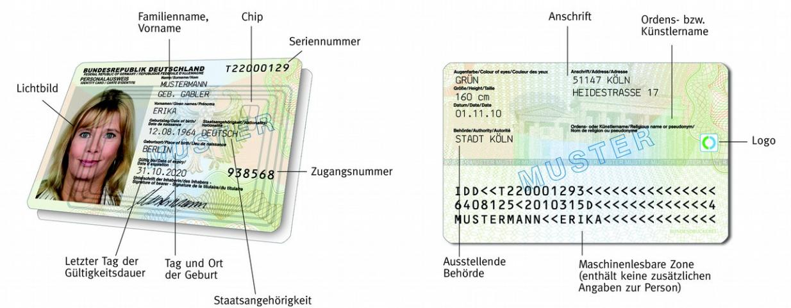

# Technische Richtlinie TR-03128 Diensteanbieter für die eID-Funktion

Teil 1: Elektronischer Identitätsnachweis und Vor-Ort-Auslesen

Version 1.0 25. Oktober 2017

Bundesamt für Sicherheit in der Informationstechnik Postfach 20 03 63 53133 Bonn

E-Mail: [eid@bsi.bund.de](mailto:eid@bsi.bund.de) Internet:<https://www.bsi.bund.de> © Bundesamt für Sicherheit in der Informationstechnik 2017

| 1              | Einleitung 5                                       |  |  |
|----------------|----------------------------------------------------|--|--|
| 2              | Elektronischer Identitätsnachweis 7                |  |  |
| 2.1            | Diensteanbieter 7                                  |  |  |
| 2.2            | Identifizierungsdiensteanbieter 7                  |  |  |
| 2.3            | Vergabestelle für Berechtigungszertifikate 8       |  |  |
| 2.4            | Technische Integration 10                          |  |  |
| 2.4.1          | Serverseitige Integration 10                       |  |  |
| 2.4.2          | Clientseitige Integration 11                       |  |  |
| 2.5            | eIDAS 12                                           |  |  |
| 2.5.1          | Metadaten und Metadaten-Zertifikate13              |  |  |
| 2.5.2          | Minimum Data Set 13                                |  |  |
| 2.6            | Nutzerführung 13                                   |  |  |
| 2.6.1 2.6.2 | Download eID-Client 14 Webseitenempfehlungen 14 |  |  |
| 2.6.3          | eIDAS 14                                           |  |  |
| 2.7            | Sicherheitskonzept und Überprüfung14               |  |  |
| 3              | Vor-Ort-Auslesen 15                                |  |  |
| 3.1            | Vergabestelle für Berechtigungszertifikate15       |  |  |
| 3.2            | Identifizierung des Ausweisinhabers 15             |  |  |
| 3.3            | Technische Integration 15                          |  |  |
| 3.3.1          | Client-Server Variante 15                          |  |  |
| 3.3.2          | Semi-offline Variante 16                           |  |  |
| 3.3.3          | Zugangsnummer 16                                   |  |  |
| 3.4            | Sicherheitskonzept und Überprüfung16               |  |  |
|                | Literaturverzeichnis 17                            |  |  |

# 1 Einleitung

Dokumente mit eID-Funktion basierend auf Extended Access Control (elektronischer Personalausweis und elektronischer Aufenthaltstitel) bieten verschiedene Möglichkeiten zur elektronischen Identifizierung des Inhabers für eGovernment und eBusiness:

- **•** Elektronischer Identitätsnachweis sichere Zwei-Faktor-Authentisierung des Ausweisinhabers in Form einer gegenseitigen Authentisierung (Abschnitt [2\)](#page-6-2), und
- **•** Vor-Ort-Auslesen medienbruchfreie Übernahme der Ausweisdaten in elektronische Formulare (Abschnitt [3\)](#page-14-4).

Ein Überblick über das Gesamtsystem findet sich in [TR-03127].

Die hier vorliegende Technische Richtlinie gibt einen Überblick über die rechtlichen und technischen Voraussetzungen, die bei Anbietern von eGovernment oder eBusiness Prozessen für die Nutzung der eID-Funktion erfüllt sein müssen. Dazu werden die wichtigsten Vorgaben aus dem Personalausweisgesetz [PAuswG], der Personalausweisverordnung [PAuswV] sowie den Technischen Richtlinien des BSI zusammengefasst und die Details der entsprechenden Vorgaben referenziert.

Zur Unterscheidung werden Zitate aus rechtlichen Vorgaben in *kursiv* und eingerückt dargestellt.

Im zweiten Teil dieser Richtlinie werden Sicherheitsanforderungen für Diensteanbieter festgelegt.

Für diese Einsatzbereiche stehen eine Reihe von Dokumenten- und Identitätsattributen zur Verfügung:

- 1. Dokumentenart,
- 2. ausstellendes Land ("D"),
- 3. letzter Tag der Gültigkeitsdauer,
- 4. Familienname,
- 5. Geburtsname,
- 6. Vornamen,
- 7. Doktorgrad,
- 8. Ordensname / Künstlername,
- 9. Tag der Geburt,
- 10. Ort der Geburt,

#### 11. Anschrift,

sowie die folgenden zusätzlichen Funktionen:

- 12. dienste- und kartenspezifisches Kennzeichen ("Pseudonym"),
- 13. Altersverifikation, und
- 14. Wohnortabfrage;

für Diensteanbieter, die qualifizierte Signaturzertifikate nach [eIDAS] auf dem Ausweis installieren, gibt es noch das weitere Recht

15. Installation eines qualifizierten Zertifikates.

Die zum sicheren Auslesen und Verifizieren der Attribute notwendigen Voraussetzungen werden in Kapitel [2](#page-6-2) (Elektronischer Identitätsnachweis) und Kapitel [3](#page-14-4) (Vor-Ort-Auslesen) vorgestellt.

**Hinweis: Die Referenzen dienen – soweit nicht anders angegeben – der weiterführenden Information und deren Kenntnis sind für den Diensteanbieter nicht zwingend notwendig bzw. nur relevant für die Hersteller entsprechender Komponenten.**

**Für alle Anforderungen gilt, dass diese auch für einen ggf. beauftragten Auftragsdatenverarbeiter nach § 11 BDSG gelten.**

# 2 Elektronischer Identitätsnachweis

Der elektronische Identitätsnachweis dient der sicheren Identifizierung / Authentisierung des Ausweisinhabers. Über den Besitz des Ausweises und das Wissen der zugehörigen PIN ist der elektronische Identitätsnachweis eine Zwei-Faktor-Identifizierung/-Authentisierung auf hohem Vertrauensniveau gemäß [TR-03107] und [eIDAS].

Für Details siehe [TR-03127].

#### 2.1 Diensteanbieter

Gemäß § 2 (3) [PAuswG] sind

*Diensteanbieter […] natürliche und juristische Personen, die zur Wahrnehmung von Aufgaben der öffentlichen Verwaltung oder zur Erfüllung eigener Geschäftszwecke den Nachweis der Identität oder einzelner Identitätsmerkmale des Ausweisinhabers benötigen […]*

Der elektronische Identitätsnachweis ist als direkte Übermittlung von Identitätsdaten vom Chip des Ausweises zum Diensteanbieter gestaltet, eine Verarbeitung der Daten durch Dritte findet nicht statt. Der Diensteanbieter steht somit in einer direkten Beziehung zum Ausweisinhaber und ist die verantwortliche Stelle im Sinne des Datenschutzes.

#### 2.2 Identifizierungsdiensteanbieter

Ein besonderer Diensteanbieter ist der *Identifizierungsdiensteanbieter* nach § 2 (3a) [PAuswG]:

*Identifizierungsdiensteanbieter sind Diensteanbieter, deren Dienst darin besteht, für einen Dritten eine einzelfallbezogene Identifizierungsdienstleistung mittels des elektronischen Identitätsnachweises nach § 18 zu erbringen.*

Als Besonderheit führt dieser den elektronischen Identitätsnachweis nicht für eigene Zwecke durch, sondern bietet dies als Dienstleistung in eigener Verantwortung für Dritte an. Diese Dienstleistung darf nur einzelfallbezogen erfolgen, d.h. für die einmalige Identifizierung des Ausweisinhabers, nicht jedoch etwa für ein Login[1](#page-6-3) .

Da der Identifizierungsdiensteanbieter im Allgemeinen seine Dienste für viele Auftraggeber zur Verfügung stellt, gelten für diesen besondere Anforderungen in Bezug auf die Datensicherheit und den Datenschutz gemäß § 19a [PAuswG]:

*§ 19a Speicherung durch Identifizierungsdiensteanbieter*

*(1) Ein Identifizierungsdiensteanbieter darf die personenbezogenen Daten des Ausweisinhabers ausschließlich zum Zwecke der bei ihm in Auftrag gegebenen Identifizierung sowie nach § 19 Absatz 6 zum Ausfüllen eines elektronischen Formulars verwenden, das ihm hierfür von seinem Auftraggeber zur Verfügung gestellt wurde. Das Anbringen eines elektronischen Vermerks nach § 19 Absatz 6 Satz 2 ist zulässig. Gesetzliche Aufzeichnungspflichten bleiben unberührt.*

*(2) Der Identifizierungsdiensteanbieter hat die personenbezogenen Daten des Ausweisinhabers zu löschen, sobald die Identifizierung abgeschlossen und gegebenenfalls das elektronische Formular sowie die auf Grund gesetzlicher Aufzeichnungspflichten aufgezeichneten Daten an den Auftraggeber übermittelt wurden.*

1 Die Weitergabe von personenbezogenen Daten an den Dritten muss sich dabei auf die für den jeweiligen Geschäftszweck des Dritten notwendigen Daten beschränken.

Weitere Anforderungen werden in § 29 [PAuswV] festgelegt:

*(2) Die nach § 21b Absatz 2 Satz 1 Nummer 1 des Personalausweisgesetzes einzuhaltenden technisch-organisatorischen Maßnahmen und die weiteren Anforderungen an die Datensicherheit nach § 21 Absatz 2 Satz 1 Nummer 2 des Personalausweisgesetzes legt das Bundesamt für Sicherheit in der Informationstechnik im Benehmen mit der oder dem Bundesbeauftragten für den Datenschutz und die Informationsfreiheit in einer Technischen Richtlinie fest. Dies umfasst insbesondere Anforderungen an die Datenspeicherung und -löschung, das einzusetzende Verschlüsselungsverfahren sowie an das Informationssicherheitsmanagement.*

*(3) Die Einhaltung der in Absatz 2 genannten Voraussetzungen hat der Antragsteller durch Vorlage eines Zertifikats des Bundesamts für Sicherheit in der Informationstechnik nachzuweisen. Das Bundesamt für Sicherheit in der Informationstechnik darf sich bei seiner Überprüfung externer Dienstleister bedienen. Die hierbei anfallenden Kosten trägt der Antragsteller.*

Die konkreten organisatorischen und technischen Anforderungen an den Identifizierungsdiensteanbieter in Bezug auf die Datensicherheit nach dem zitierten Absatz (2) und die Vorgaben zur Zertifizierung nach Absatz (3) werden im Teil 2 dieser Richtlinie festgelegt, siehe auch Abschnitt [2.7.](#page-13-0)

#### 2.3 Vergabestelle für Berechtigungszertifikate

Diensteanbieter benötigen für die Verwendung des elektronischen Identitätsnachweises eine Berechtigung, die von der beim Bundesverwaltungsamt angesiedelten Vergabestelle für Berechtigungszertifikate erteilt wird. Die Voraussetzungen für den Erhalt einer Berechtigung sind in § 21 [PAuswG] festgelegt:

*§ 21 Berechtigungen für Diensteanbieter*

*(1) Um Daten im Wege des elektronischen Identitätsnachweises anzufragen, benötigen Diensteanbieter eine Berechtigung. Die Berechtigung lässt datenschutzrechtliche Vorschriften unberührt. Das Vorliegen einer Berechtigung ist durch die Vergabe von Berechtigungszertifikaten technisch abzusichern.*

*(2) Die Berechtigung wird auf Antrag erteilt. Die antragstellende Person muss die Daten nach § 18 Absatz 4 Satz 2 Nummer 1, 2 und 4 angeben. Die Berechtigung ist zu erteilen, wenn*

*1. der Diensteanbieter seine Identität gegenüber der Vergabestelle für Berechtigungszertifikate nachweist,*

*2. der Diensteanbieter das dem Antrag zu Grunde liegende Interesse an einer Berechtigung, insbesondere zur geplanten organisationsbezogenen Nutzung, darlegt,* 

*3. der Diensteanbieter die Einhaltung des betrieblichen Datenschutzes versichert und*

*4. der Vergabestelle für Berechtigungszertifikate keine Anhaltspunkte für eine missbräuchliche Verwendung der Daten vorliegen.*

*[…]*

Die Voraussetzungen werden in § 28 [PAuswV] weiter ausgeführt:

*(1) Der Antrag auf Erteilung einer Berechtigung nach § 21 Absatz 2 des Personalausweisgesetzes oder der Antrag auf Erteilung einer Vor-Ort-Berechtigung nach § 21a des Personalausweisgesetzes muss folgende Angaben enthalten:*

- 1. *Angaben, die zur Feststellung der Identität von juristischen und natürlichen Personen notwendig sind,*
	- a) *bei natürlichen Personen insbesondere der Familienname, die Vornamen, der Tag und der Ort der Geburt sowie die Anschrift der Hauptwohnung,*
	- b) *bei juristischen Personen insbesondere der Name, die Anschrift des Sitzes, die Rechtsform und die Bevollmächtigten; außerdem ist in diesem Fall eine Kopie des Handelsregisterauszugs oder der Errichtungsurkunde beizufügen;*
- 2. *Kontaktdaten, insbesondere die telefonische oder elektronische Erreichbarkeit;*
- 3. *Angaben zu antragstellenden Personen mit Wohnung oder Sitz außerhalb Deutschlands, soweit zur eindeutigen länderspezifischen Identifizierung erforderlich, einschließlich einer ladungsfähigen Anschrift; soweit eine Niederlassung in Deutschland besteht, sind auch deren Angaben nach den Nummern 1 und 2 aufzunehmen;*
- 4. *eine kurze Beschreibung des Diensteanbieters und seiner Tätigkeitsfelder sowie die Angabe der Unternehmenswebsite, soweit vorhanden;*
- 5. *eine kurze Beschreibung des dem Antrag zu Grunde liegenden Interesses an einer Berechtigung; darzulegen ist, welche Funktion*
	- a) *im Falle eines Antrags auf Erteilung einer Berechtigung nach § 21 Absatz 2 des Personalausweisgesetzes der elektronische Identitätsnachweis oder*
	- b) *im Falle eines Antrags auf Erteilung einer Vor-Ort-Berechtigung nach § 21a des Personalausweisgesetzes das Vor-Ort-Auslesen im Rahmen der behördlichen Aufgabenwahrnehmung oder der vorgesehenen Geschäftszwecke der antragstellenden Person erfüllen soll;*
- 6. *die Angabe der Datenkategorien nach § 18 Absatz 3 des Personalausweisgesetzes, auf die die antragstellende Person zugreifen möchte;*
- 7. *die Erklärung, dass der Diensteanbieter den betrieblichen Datenschutz einhält;*
- 8. *die Angabe, ob die antragstellende Person sich eines Auftragnehmers nach § 11 des Bundesdatenschutzgesetzes zur Durchführung des elektronischen Identitätsnachweises oder des Vor-Ort-Auslesens bedienen wird und in diesem Fall die Angaben nach Nummer 1 für diesen Auftragnehmer; ist diese Angabe zum Zeitpunkt des Antrages noch nicht bekannt, so ist sie sobald bekannt unverzüglich nachzuliefern.*
- *(2) Der Antrag bedarf der Schriftform.*

Für die Beantragung einer Berechtigung ist die Verfahrensbeschreibung [VfB] der Vergabestelle für Berechtigungszertifikate maßgeblich.

### 2.4 Technische Integration

Die technische Integration der Online-Ausweisfunktion erfolgt auf Seiten des Ausweisinhabers durch einen *eID-Client* (siehe [TR-03124], Teil 1) und auf Seiten des Diensteanbieters durch einen *eID-Server* (siehe [TR-03130], Teil 1).

#### 2.4.1 Serverseitige Integration

*Abbildung 1: Komponenten und Kommunikationsbeziehungen für den elektronischen Identitätsnachweis*

#### 2.4.1.1 eID-Server

Der eID-Server kapselt die Kommunikation mit dem eID-Client / dem Ausweis und der Hintergrundinfrastruktur (Berechtigungs-CAs). Die Anbindung an die Systeme des Diensteanbieters kann über eine standardisierte SOAP- oder SAML-Schnittstelle oder eine direkte Integration in den Dienst ("Attached eID-Server") erfolgen. Bei Nutzung der SOAP-Schnittstelle kommunizieren eID-Server und Diensteanbieter direkt miteinander, bei Nutzung der SAML-Schnittstelle erfolgt die (verschlüsselte und authentisierte) Kommunikation mittels Vermittlung durch den eID-Client.

Die Kommunikation zwischen eID-Client und eID-Server ist in [TR-03124] standardisiert. Daher können beliebige eID-Clients (nach Wahl des Ausweisinhabers) mit beliebigen eID-Servern (nach Wahl des Diensteanbieters) miteinander kommunizieren. Um die Interoperabilität sicherzustellen, wird der Einsatz von konformitätszertifizierten eID-Clients / eID-Servern (vgl. [TR-03124], Teil 2 und [TR-03130], Teil 4) empfohlen.

Für Details siehe [TR-03130], Teil 1. Eine (nicht abschließende) Liste von eID-Server-Herstellern findet sich auf dem Personalausweisportal[2](#page-9-2) .

#### 2.4.1.2 eID-Service

Der eID-Server kann durch den Diensteanbieter selbst betrieben werden oder durch einen beauftragten Dritten (*eID-Service*).

Wird der eID-Server durch einen eID-Service betrieben, so muss zwischen Diensteanbieter und eID-Service ein Auftragsverhältnis im Sinne des § 11 BDSG bestehen. In jedem Fall ist der Diensteanbieter der Inhaber der Berechtigung, die die Vergabestelle für Berechtigungszertifikate (VfB) ausstellt, und damit für die Einhaltung sämtlicher Vorgaben und Anforderungen im eigenen Haus sowie im Falle der Aufgabenübertragung an einen Dritten verantwortlich.

2 [http://www.personalausweisportal.de/DE/Wirtschaft/Technik/eID-Server/eID-Server\\_node.html](http://www.personalausweisportal.de/DE/Wirtschaft/Technik/eID-Server/eID-Server_node.html)

Eine (nicht abschließende) Liste von eID-Services findet sich auf dem Personalausweisportal[3](#page-10-1) .

#### 2.4.1.3 Schlüssel und PKI-Anbindung

Voraussetzung für die Nutzung des elektronischen Identitätsnachweises sind Berechtigungszertifikate, die auf Basis der durch die Vergabestelle für Berechtigungszertifikate erteilten Berechtigung (siehe Abschnitt [2.3\)](#page-7-0) über eine Berechtigungs-CA bezogen werden. Die Zertifikate müssen täglich (automatisiert) erneuert werden, ebenso müssen die von den Berechtigungs-CAs bezogenen eID-Sperrlisten regelmäßig aktualisiert werden.

Die zu den Berechtigungszertifikaten gehörenden Schlüssel werden im eID-Server gespeichert. Für einen selbstbetriebenen eID-Server reicht dazu eine Speicherung im System des eID-Servers aus (Sicherheitslevel 1 nach [Lifecycle]), für einen eID-Service und für Identifizierungsdiensteanbieter ist die Nutzung sicherer Hardware für die Schlüsselspeicherung vorgegeben (Sicherheitslevel 2 nach [Lifecycle]).

Die Kommunikation mit der Hintergrundinfrastruktur zum regelmäßigen Erneuern der Berechtigungszertifikate und der Ausweissperrlisten erfolgt automatisiert durch den eID-Server. Der Betreiber muss sicherstellen, dass die Kommunikation mit der Berechtigungs-CA möglich ist.

Für Details zu diesem Abschnitt siehe [CP-eID].

#### 2.4.1.4 Webseite / Applicationserver

Die Integration des elektronischen Identitätsnachweises erfolgt über die Webseite bzw. den Applicationserver. Für die Verbindung zwischen eID-Client und Webseite/Applicationserver muss https genutzt werden. Empfohlen wird für Webseiten die Verwendung von Extended Validation-Zertifikaten bzw. qualifizierten Webseitenzertifikaten für die Authentisierung der TLS-Verbindung.

Für die TLS-Konfiguration und das Webseitenzertifikat sind die Vorgaben aus [TR-03116], Teil 4 einzuhalten. Zur Unterstützung bei der Konfiguration steht eine TLS-Checkliste ([TLS-Check]) zur Verfügung.

#### 2.4.2 Clientseitige Integration

Öffentlich verfügbare Dienste, die den elektronischen Identitätsnachweis verwenden, können als webbasierte Dienste (d.h. der Dienst wird über eine Webseite zur Verfügung gestellt) oder als app-basierte Dienste (d.h. für den Dienst wird eine dedizierte App genutzt) realisiert werden.

#### 2.4.2.1 Webseiten-basierte Integration

Für die Nutzung des elektronischen Identitätsnachweises im Rahmen einer Webseite ist auf Seiten des Ausweisinhabers ein *eID-Client* notwendig, der üblicherweise als lokale Anwendung auf dem Rechner oder einem mobilen Gerät (Smartphone, Tablet) des Ausweisinhabers installiert wird. Der Diensteanbieter muss sicherstellen, dass sich eID-Clients nach [TR-03124] für den Dienst nutzen lassen. Dies ist bei einer Integration in die Webseite wie unten dargestellt der Fall.

Der Aufruf des eID-Clients erfolgt durch einen eingebetteten Link in der Webseite der Form [protocol]://127.0.0.1:24727/eID-Client?tcTokenURL=[URL]. Dabei zeigt URL auf eine Adresse des Diensteanbieters, unter der das TC Token (siehe Abschnitt [2.4.2.3\)](#page-11-1) durch den eID-Client abgerufen werden kann. Die URL muss sessionspezifisch und unvorhersagbar sein, damit verschiedene gleichzeitig laufende Nutzungen des elektronischen Identitätsnachweises unterschieden werden können, und um ein Raten der URL durch einen Angreifer zu verhindern.

Durch Anklicken des Links durch den Nutzer wird der lokale eID-Client aufgerufen und der elektronische Identitätsnachweis gestartet.

3 [http://www.personalausweisportal.de/DE/Wirtschaft/Technik/eID-Service/eID-Service\\_node.html](http://www.personalausweisportal.de/DE/Wirtschaft/Technik/eID-Service/eID-Service_node.html)

Es wird empfohlen, als [protocol] für Webseiten für klassische Betriebssysteme (Windows, MacOS, Linux, …) "http" zu nutzen, für mobile Betriebssysteme (android, iOS, …) "eid". Der Protokollidentifier http wird betriebssystemseitig für diesen Anwendungszweck nicht von allen mobilen Plattformen unterstützt, umgekehrt wird eid nicht von klassischen Systemen unterstützt. Der Protokollidentifier dient hier nur der betriebssystemseitigen Zuordnung des Aufrufs zum eID-Client, technisch wird in beiden Fällen http als Kommunikationsprotokoll genutzt.

Für Details siehe [TR-03124], Teil 1, Abschnitt 2.2.

#### 2.4.2.2 App-basierte Integration

Bei der Nutzung des elektronischen Identitätsnachweises über eine App kann der eID-Client als separate App installiert und aus der Anwendungsapp heraus aufgerufen werden oder der eID-Client wird direkt in die Anwendungsapp integriert.

Im ersten Fall übernimmt die Anwendungsapp die Rolle des Browsers und die Integration erfolgt wie in Abschnitt [2.4.2.1](#page-10-2) beschrieben, wobei der Aufruf des eID-Clients statt über einen eingebetteten Link über einen intent der gleichen Form erfolgt.

Im zweiten Fall wird ein eID-Client direkt in die Anwendungsapp integriert (zusammen *Integrated Client* im Sinne der [TR-03124]). Dadurch ist eine integrierte / einheitliche Nutzerführung möglich. Eine Integration ist durch eine vollständige Integration etwa als Bibliothek möglich oder durch eine Zwischenschicht, die mit einem separat installierten eID-Client kommuniziert.

Wird der eID-Client zusammen mit der Anwendungsapp ausgeliefert, so ist der Hersteller der Anwendungsapp für die Aktualisierung (Sicherheitsupdates) des integrierten eID-Clients verantwortlich.

Die Anforderungen an die URL zum Abruf des TC Token (sessionspezifisch, unvorhersagbar) aus Abschnitt [2.4.2.1](#page-10-2) gelten entsprechend.

Für Details siehe [TR-03124], Teil 1, Abschnitt 2.2.

#### 2.4.2.3 TC Token

Als Teil der Sicherheitsfunktionalität des elektronischen Identitätsnachweises bezieht der eID-Client eine Datenstruktur ("TC Token") von der Webseite bzw. dem Applicationserver, die nähere Angaben zum eID-Server macht. Dabei erhält der eID-Client auch das TLS-Zertifikat der Webseite/des Servers, um dieses im Rahmen der Durchführung des elektronischen Identitätsnachweises gegen das Berechtigungszertifikat des Diensteanbieters prüfen zu können. Dadurch wird eine höhere Sicherheit der Identifizierung des Diensteanbieters als durch eine reine TLS-Zertifikatsprüfung im Browser/der App erreicht.

Die Webseite sollte

- **•** bei der Auslieferung des TC Token an den eID-Client keine Cookies mit ausliefern; und
- **•** den im TC Token enthaltenen SessionIdentifier zufällig und unabhängig von jeglichen Daten, die zwischen Webseite/App und Browser/Applicationserver ausgetauscht werden, erzeugen.

Hinweis: Der SessionIdentifier wird auch zum Aufbau des TLS-Kanals zwischen eID-Client und eID-Server als psk\_identity genutzt, d.h. im Klartext übertragen. Der SessionIdentifier darf daher keine vertraulichen Informationen enthalten bzw. auf solche Informationen schließen lassen.

Für Details siehe [TR-03124], Teil 1, Abschnitt 2.4.

#### 2.5 eIDAS

Mit der eIDAS-Verordnung ([eIDAS]) wurden erstmals einheitliche Rahmenbedingungen für die grenzüberschreitende Nutzung elektronischer Identifizierungsmittel und Vertrauensdienste innerhalb der EU geschaffen. Im Bereich der elektronischen Identifizierung können die Mitgliedstaaten des europäischen Wirtschaftsrtaums ihre elektronischen Identifizierungssysteme der EU-Kommission notifizieren.

Gemäß eIDAS-Verordnung müssen Online-Dienste öffentlicher Stellen, die eine elektronische Identifizierung benötigen, alle notifizierten elektronischen Identifizierungsmittel anderer Mitgliedstaaten anerkennen, die mindestens das Vertrauensniveau haben, das für die Nutzung des jeweiligen Online-Dienstes notwendig ist.

Die Pflicht zur Anerkennung beginnt ein Jahr nach der Veröffentlichung der Notifizierung durch die EU-Kommission, frühestens jedoch ab dem 29. September 2018. Für den nicht-öffentlichen Sektor ist die Anerkennung freiwillig.

#### 2.5.1 Metadaten und Metadaten-Zertifikate

Die grenzüberschreitende Kommunikation mit eID-Systemen anderer Mitgliedstaaten wird über das *eIDAS Interoperability Framework* ([eIDAS Arch]) realisiert. Die technische Anbindung erfolgt über den eID-Server via SAML-basierter Kommunikation, vgl. [TR-03130]. Die Identifizierung der Knoten des eIDAS-Netzwerks erfolgt über signierte SAML-Metadaten.

Um eIDAS-konforme Anwendungen anzubieten, benötigt der Diensteanbieter ein Metadaten-Signer-Zertifikat und Metadaten. Die Ausstellung von Metadaten-Signer-Zertifikaten erfolgt zusätzlich zu den Berechtigungs-Zertifikaten durch die jeweilige Berechtigungs-CA in der Berechtigungs-PKI. Die Details sind in [CP-eID] geregelt.

Der private Schlüssel des Metadatensigner-Zertifikats dient zur Signierung der Metadaten des Diensteanbieters. Die signierten Metadaten werden dann vom Diensteanbieter unter einer öffentlichen URL zur Verfügung gestellt.

#### 2.5.2 Minimum Data Set

Im Rahmen der Nutzung elektronischer Identifizierungsmittel anderer Mitgliedstaaten erhält der Diensteanbieter einen Mindestdatensatz. Der Mindestdatensatz besteht aus folgenden Datenfeldern:

- **•** Aktuelle(r) Nachname(n)
- **•** Aktuelle(r) Vorname(n)
- **•** Geburtsdatum
- **•** Eindeutige Kennung (entsprechend dem dienste- und kartenspezifischen Kennzeichen)

Zusätzlich können folgende Daten nach Wahl des notifizierenden Mitgliedstaates Teil des mitgliedstaatenspezifischen Mindestdatensatzes sein:

- **•** Vorname(n) und Nachname(n) zum Zeitpunkt der Geburt
- **•** Geburtsort
- **•** Adresse
- **•** Geschlecht

Wird eine eIDAS-konforme Authentisierung benötigt, sollte der Diensteanbieter alle möglichen Datenfelder des Mindestdatensatzes anfragen und muss alle Datenfelder des spezifischen Mindestdatensatzes des sendenden Mitgliedsstaates annehmen und verarbeiten.

#### 2.6 Nutzerführung

Die Nutzerführung auf der Webseite bzw. in der Anwendungsapp obliegt dem Diensteanbieter. Für webseitenbasierte Dienste wird empfohlen, die im Folgenden dargestellten Punkte zu beachten.

#### 2.6.1 Download eID-Client

Bei Verwendung nicht-integrierter eID-Clients wird empfohlen, den Nutzer auf Downloadmöglichkeiten für eID-Clients hinzuweisen. Eine (nicht abschließende) Liste befindet sich auf dem Personalausweisportal[4](#page-13-4) . Der Bund stellt kostenlos die "AusweisApp2" als eID-Client zur Verfügung[5](#page-13-5) .

#### 2.6.2 Webseitenempfehlungen

Das BSI empfiehlt, die Diensteanbieter-Webseite so zu gestalten, dass sie von einem Benutzer, der sich an die Sicherheitsempfehlungen des BSI hält, ohne Einschränkungen nutzbar ist. Die Empfehlungen finden sich auf der Webseite https://www.bsi-fuer-buerger.de und umfassen insbesondere:

- **•** Verwendung eines aktuellen Virenschutzes und Firewall
- **•** Vermeidung aktiver Inhalte
- **•** Einsatz geeigneter Komponenten (Lesegerät, eID-Client) für die Ausweisnutzung.

Die Nutzung von aktiven Inhalten auf der Webseite sollte auf das fachlich Notwendige beschränkt werden. Sofern aktive Inhalte zum Einsatz kommen, sollten ausschließlich verbreitete aktive Webtechniken verwendet werden, deren Unterstützung bereits in modernen Browsern in Verbindung mit geeigneten Sicherheitsmaßnahmen integriert ist.

Es sollte dabei beachtet werden, dass die Ausführung von aktiven Inhalten u.a. durch den Nutzer blockiert werden kann. Die Nutzung des elektronischen Identitätsnachweises sollte daher auch ohne die Verwendung aktiver Inhalte auf Seiten des Nutzers ermöglicht werden.

#### 2.6.3 eIDAS

Im Falle von grenzüberschreitenden Anwendungen nach eIDAS muss die eIDAS-Integration diensteanbieterseitig bei der Nutzerführung (z.B. Auswahl des Mitgliedstaates) berücksichtigt werden.

### 2.7 Sicherheitskonzept und Überprüfung

**Diensteanbietern** wird empfohlen, für die Integration des elektronischen Identitätsnachweises ein Sicherheitskonzept zu erstellen oder ein bestehendes Sicherheitskonzept entsprechend zu ergänzen. Sicherheitsanforderungen für den Betrieb des eID-Servers finden sich in [TR-03130], Teil 2.

Für **Identifizierungsdiensteanbieter** ist eine Zertifizierung nach Teil 2 dieser Richtlinie verpflichtend (vgl. § 29 (3) [PAuswV]). Dies umfasst auch eine Zertifizierung nach ISO/IEC 27001 oder nach ISO/IEC 27001 auf Basis IT-Grundschutz. Das Zertifikat muss bei der Beantragung der Berechtigung bei der Vergabestelle für Berechtigungszertifikate vorgelegt werden.

5 https://www.ausweisapp.bund.de

4 [http://www.personalausweisportal.de/DE/Buergerinnen-und-Buerger/Online-Ausweisen/das-brauchen-](http://www.personalausweisportal.de/DE/Buergerinnen-und-Buerger/Online-Ausweisen/das-brauchen-Sie/Software/software-node.html)[Sie/Software/software-node.html](http://www.personalausweisportal.de/DE/Buergerinnen-und-Buerger/Online-Ausweisen/das-brauchen-Sie/Software/software-node.html)

# 3 Vor-Ort-Auslesen

Das *Vor-Ort-Auslesen unter Anwesenden* bezeichnet das Auslesen von eID-Daten aus dem Ausweischip nicht zum Zwecke der Identifizierung / Authentisierung des Ausweisinhabers, sondern zur medienbruchfreien Übernahme der Ausweisdaten etwa in ein elektronisches Formular (§ 18a (1) [PAuswG]):

*Der Ausweisinhaber kann seinen Personalausweis ferner dazu verwenden, die in § 18 Absatz 3 Satz 2 genannten Daten zum Zwecke der medienbruchfreien Übernahme von Formulardaten unter Anwesenden zu übermitteln.*

Die Identifizierung des Ausweisinhabers muss vor dem Auslesen der Daten über eine Identifizierung über das aufgedruckte Lichtbild erfolgen[6](#page-14-5) . Die beim Vor-Ort-Auslesen nicht notwendige PIN-Eingabe wird ersetzt durch eine Eingabe oder anderweitige Erfassung der Zugangsnummer (Card Access Number – CAN), die auf dem Ausweis aufgedruckt ist.

Für Details siehe [TR-03127].

#### 3.1 Vergabestelle für Berechtigungszertifikate

Für das Vor-Ort-Auslesen ist eine Berechtigung durch die Vergabestelle für Berechtigungszertifikate notwendig. Abschnitt [2.3](#page-7-0) gilt entsprechend.

#### 3.2 Identifizierung des Ausweisinhabers

Das Vor-Ort-Auslesen selbst dient nicht der Identifizierung des Ausweisinhabers. Daher muss dies vorab durch den Vor-Ort-Diensteanbieter durch einen klassischen Lichtbildabgleich erfolgen (§ 18a (2) [PAuswG]):

*Vor dem Vor-Ort-Auslesen der Daten ist der Vor-Ort-Diensteanbieter verpflichtet, anhand des Personalausweises per Lichtbildabgleich zu prüfen, ob die den Personalausweis vorlegende Person der Ausweisinhaber ist. Die Daten werden nur übermittelt, wenn der Vor-Ort-Anbieter mit Einverständnis des Ausweisinhabers die Zugangsnummer ausliest und diese zusammen mit einem gültigen Vor-Ort-Zertifikat an das Speicher- und Verarbeitungsmedium des Personalausweises übermittelt.*

Die Identifizierung des Ausweisinhabers durch den Vor-Ort-Diensteanbieter muss unter physisch Anwesenden erfolgen. Ein Abgleich etwa per Videolink ist nicht ausreichend.

#### 3.3 Technische Integration

Aus technischer Sicht entspricht das Vor-Ort-Auslesen weitestgehend dem elektronischen Identitätsnachweis, wobei die PIN durch die CAN ersetzt wird[7](#page-14-6) . Die entsprechende Berechtigung wird über das Berechtigungszertifikat erteilt.

#### 3.3.1 Client-Server Variante

Die Umsetzung des Vor-Ort-Auslesens in einer Client-Server-Variante unterscheidet sich technisch kaum vom elektronischen Identitätsnachweis.

- 6 Aus der Gesetzesbegründung: "*Die Identifizierung erfolgt anhand eines Lichtbildabgleichs unter Anwesenden, also unter Ausschluss von Fernkommunikationsmitteln.*"
- 7 Insbesondere werden die gleichen kryptographischen Protokolle genutzt, ebenso erfolgt die Sperrlistenabfrage ebenfalls über diensteanbieterspezifische Sperrlisten, die über die Berechtigungs-CAs verteilt werden.

Die serverseitige Integration entspricht Abschnitt [2.4.1,](#page-9-0) hierbei ist jedoch durch geeignete Maßnahmen sicherzustellen, dass der verwendete eID-Server (bzw. bei mandantenfähigen eID-Servern der für die Vor-Ort-Funktion genutzte Mandant) nicht durch Dritte genutzt werden kann (bzw. das entsprechende Berechtigungszertifikat nicht genutzt werden kann), sondern nur durch den berechtigten Vor-Ort-Anbieter angesteuert werden kann[8](#page-15-3) . Dies kann z.B. durch den Vor-Ort-Diensteanbieter sichergestellt werden, indem gültige Pre-Shared-Keys (vgl. [TR-03124], Abschnitt 2.4) für den Aufbau der Client-Server-Kommunikation nur an berechtigte eID-Clients unter Kontrolle des Vor-Ort-Anbieters ausgegeben werden, oder der Zugriff durch entsprechende Filterregeln beschränkt wird.

Auf der Clientseite wird beim Vor-Ort-Auslesen der eID-Client ebenfalls durch den Diensteanbieter betrieben und bedient. Die Anbindung an den eID-Server kann dabei analog zu Abschnitt [2.4.2](#page-10-0) erfolgen oder durch einen angepassten Aufruf direkt erfolgen.

Der vom Diensteanbieter zum Vor-Ort-Auslesen verwendete Vor-Ort-eID-Client muss das Recht "CAN Allowed" aus dem Berechtigungszertifikat verarbeiten können und entsprechend die Eingabe/Erfassung der CAN anfordern. Dies gilt im Allgemeinen nicht für alle verfügbaren eID-Clients.

#### 3.3.2 Semi-offline Variante

Eine alternative Umsetzungsvariante ist die Integration der Client- und Backendfunktionalität in einem integrierten Gerät, d.h. ohne dedizierten eID-Server. In diesem Fall wird der zum Berechtigungszertifikat gehörige private Schlüssel direkt in diesem Gerät gespeichert. Hierfür gelten die Sicherheitsanforderungen aus [CP-eID].

Zum Auslesen eines Ausweises benötigt das Gerät keine Online-Anbindung. Zur Erneuerung des Berechtigungszertifikates und Aktualisieren der Sperrliste ist eine regelmäßige Verbindung zur Berechtigungs-CA notwendig.

#### 3.3.3 Zugangsnummer

Vor Auslesen der Daten aus dem Ausweis muss die Kenntnis der Zugangsnummer durch das PACE-Protokoll gegenüber dem Ausweis nachgewiesen werden. Da die CAN lediglich dem Nachweis dient, dass der Auslesende physischen Zugriff auf den Ausweis hat, und nicht zur Authentisierung des Nutzers, kann die CAN auch ohne Nutzerinteraktion automatisch erfasst werden, z.B. durch einen Scanner. Ein sicheres PIN-Pad ist nicht notwendig.

### 3.4 Sicherheitskonzept und Überprüfung

**Vor-Ort-Ausleseanbietern** wird empfohlen, für die Integration des Vor-Ort-Auslesens ein Sicherheitskonzept zu erstellen oder ein bestehendes Sicherheitskonzept entsprechend zu ergänzen. Sicherheitsanforderungen für den Betrieb des eID-Servers finden sich in [TR-03130], Teil 2.

8 Dies ist notwendig, damit sichergestellt ist, dass Ausweise nur mit Zustimmung des Inhabers gegenüber dem Zertifikatsinhaber ausgelesen werden können. Können Dritte das Berechtigungszertifikat nutzen, so könnte dieser ein Auslesen ohne Identifizierung und Zustimmung des Inhabers auslösen.

## Literaturverzeichnis

| CP-eID     | BSI: Certificate Policy für die Country Verifying Certification Authority -- eID Anwendung                                                                                                                                                         |
|------------|-------------------------------------------------------------------------------------------------------------------------------------------------------------------------------------------------------------------------------------------------------|
| Lifecycle  | BSI: Key Lifecycle Security Requirements                                                                                                                                                                                                              |
| TR-03107   | BSI: Technische Richtlinie TR-03107, Elektronische Identitäten und Vertrauensdienste im E-Government                                                                                                                                               |
| TR-03116   | BSI: Technische Richtlinie TR-03116, Kryptographische Vorgaben für Projekte der Bundesregierung                                                                                                                                                    |
| TR-03124   | BSI: Technische Richtlinie TR-03124, eID-Client                                                                                                                                                                                                       |
| TR-03127   | BSI: Technische Richtlinie TR-03127, eID-Karten mit eID- und eSign-Anwendung                                                                                                                                                                          |
|            | basierend auf Extended Access Control                                                                                                                                                                                                                 |
| TR-03130   | BSI: Technische Richtlinie TR-03130, eID-Server                                                                                                                                                                                                       |
| TLS-Check  | BSI: TLS nach TR-03116-4: Checkliste für Diensteanbieter                                                                                                                                                                                              |
| VfB        | BVA: Beantragung eines Berechtigungszertifikates                                                                                                                                                                                                      |
| eIDAS Arch | eIDAS: Interoperability Architecture                                                                                                                                                                                                                  |
| PAuswG     | Personalausweisgesetz vom 18. Juni 2009 (BGBl. I S. 1346), das zuletzt durch Artikel 4 des Gesetzes vom 18. Juli 2017 (BGBl. I S. 2745) geändert worden ist                                                                                        |
| PAuswV     | Personalausweisverordnung vom 1. November 2010 (BGBl. I S. 1460), die zuletzt durch Artikel 1 der Verordnung vom 1. Juli 2015 (BGBl. I S. 1101) geändert worden ist                                                                                |
| eIDAS      | VERORDNUNG (EU) Nr. 910/2014 DES EUROPÄISCHEN PARLAMENTS UND DES RATES vom 23. Juli 2014 über elektronische Identifizierung und Vertrauensdienste für elektronische Transaktionen im Binnenmarkt und zur Aufhebung der Richtlinie 1999/93/EG |