# Leitlinie für die beweiswerterhaltende Aufbewahrung gemäß BSI TR-03125 TR-ESOR – Eine Handlungshilfe für Behörden und Unternehmen –

Kürzel BSI TR-ESOR-LEIT Version: v1.2.1 und v1.2.2 Datum: 09.04.2021

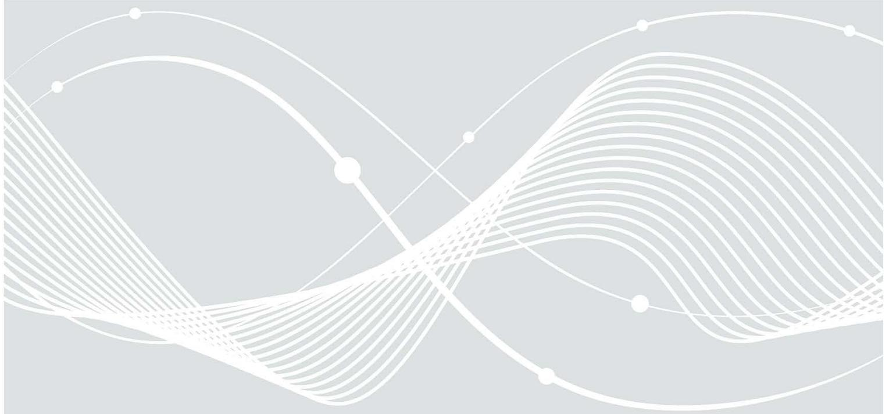

Bundesamt für Sicherheit in der Informationstechnik Postfach 20 03 63 53133 Bonn Tel.: +49 228 99 9582-0

E-Mail: [tresor@bsi.bund.de](mailto:tresor@bsi.bund.de)

Internet: https://www.bsi.bund.de

© Bundesamt für Sicherheit in der Informationstechnik 2021

| 1. |       | Grundlagen beweiswerterhaltende Aufbewahrung 5                                                                 |  |
|----|-------|----------------------------------------------------------------------------------------------------------------|--|
|    | 1.1   | Einführung 5                                                                                                   |  |
|    | 1.2   | eIDAS-Verordnung 6                                                                                             |  |
|    | 1.2.1 | Einführung  6                                                                                                  |  |
|    | 1.2.2 | Vertrauensliste mit qualifizierten Vertrauensdiensteanbietern und Vertrauensdiensten 7                         |  |
|    | 1.3   | Relevante Standards 8                                                                                          |  |
| 2  |       | Die BSI TR-03125 TR-ESOR10                                                                                     |  |
|    | 2.1   | Zielgruppen der Dokumente10                                                                                    |  |
|    | 2.2   | Hauptdokument11                                                                                                |  |
|    | 2.3   | Die IT-Referenzarchitektur 13                                                                                  |  |
|    | 2.3.1 | Module der Referenzarchitektur14                                                                               |  |
|    | 2.3.2 | Welche Komponenten zählen nicht zur TR-ESOR-Middleware?15                                                      |  |
|    | 2.4   | Kernmodule der TR-ESOR15                                                                                       |  |
|    | 2.4.1 | M.1: ArchiSafe Modul15                                                                                         |  |
|    | 2.4.2 | M.2: Krypto Modul15                                                                                            |  |
|    | 2.4.3 | M.3: ArchiSig Modul15                                                                                          |  |
|    | 2.4.4 | Optionales Upload-/Download-Modul17                                                                            |  |
|    | 2.4.5 | Optionaler XML-Adapter17                                                                                       |  |
|    | 2.4.6 | Optionaler "ETSI TS119512 TR-ESOR Transformator"17                                                             |  |
|    | 2.4.7 | Optionaler AIP-eIDAS-Signatur-Validator18                                                                      |  |
|    | 2.5   | Die Prozesse der TR-ESOR18                                                                                     |  |
|    | 2.5.1 | Bewahrung – Funktionstyp: ArchiveSubmission20                                                                  |  |
|    | 2.5.2 | Aktualisierung bereits archivierter Daten – Funktionstyp: ArchiveUpdate20                                      |  |
|    | 2.5.3 | Abfrage archivierter Daten – Funktionstyp: ArchiveRetrieval- / ArchiveData21                                   |  |
|    | 2.5.4 | Rückgabe technischer Beweisdaten – Funktionstyp: ArchiveEvidenceRequest22                                      |  |
|    | 2.5.5 | Löschen von Archivdaten – Funktionstyp: ArchiveDeletion 22                                                     |  |
|    | 2.5.6 | Prüfen von Archivdatencontainern samt der enthaltenen oder zusätzlich übergebenen                              |  |
|    |       | beweisrelevanten Daten und technischen Beweisdaten – Funktionstyp Verify 23                                    |  |
|    | 2.6   | Formate und Schnittstellen23                                                                                   |  |
|    | 2.6.1 | Formate und Datencontainer23                                                                                   |  |
|    | 2.6.2 | Ablage von elektronischen Signaturen, Siegeln, Zeitstempeln und technischen Beweisdaten (Evidence Record)26 |  |
|    | 2.6.3 | Konkretisierung der Schnittstellen27                                                                           |  |
|    | 2.6.4 | Evidence Record gem. RFC4998 oder RFC6283 als Technischer Beweisdatensatz28                                    |  |
|    | 2.6.5 | Prüfberichte29                                                                                                 |  |
|    | 2.7.  | Zertifizierung 29                                                                                              |  |
|    | 2.8.  | Anwendungshinweise31                                                                                           |  |

| Abkürzungsverzeichnis36 |  |
|-------------------------|--|
| Bibliographie37         |  |

# Abbildungsverzeichnis

| Abbildung 1: Standards und Normen für die Informationserhaltung und Beweiswerterhaltung                       | 8 |
|---------------------------------------------------------------------------------------------------------------|---|
| Abbildung 2: Die Dokumente der TR-ESOR V1.2.210                                                               |   |
| Abbildung 3: Referenzarchitektur der TR-ESOR mit der TR-ESOR-Eingangsschnittstelle TR-S.413                   |   |
| Abbildung 4: Referenzarchitektur der TR-ESOR mit der TR-ESOR-Eingangsschnittstelle TR-S.51213                 |   |
| Abbildung 5: Hashbaum nach TR-ESOR auf Basis von RFC4998 bzw. RFC628316                                       |   |
| Abbildung 6: Die Schnittstellen und Funktionen der TR-ESOR IT-Referenzarchitektur auf Basis des eCard-API     |   |
| 19 Frameworks [TR-eCARD]                                                                                   |   |
| Abbildung 7: Die Schnittstellen und Funktionen der TR-ESOR IT-Referenzarchitektur auf Basis [ETSI TS 119 512] |   |
| 19                                                                                                            |   |
| Abbildung 8: Grundstruktur (L)XAIP 24                                                                         |   |
| Abbildung 9: XAIP mit einer Version und den mittels des Evidence Record geschützten Daten D1 und C1 sowie     |   |
| den ungeschützten Daten M126                                                                                  |   |
| Abbildung 10: Aufbewahrung digitaler Signaturtechniken in (L)XAIP27                                           |   |
| Abbildung 11: Zusammenspiel zwischen den Zertifizierungsverfahren von (Q)PSP und TR-ESOR-Produkten30          |   |
| Abbildung 12: Funktionsumfang der E-Akte bei verspäteter Beweiswerterhaltung im TR-ESOR-System33              |   |
| Abbildung 13: Beispiel des Ausgestalten des ECM-/Langzeitspeichers einer TR-ESOR-Architektur35                |   |

# Tabellenverzeichnis

| Tabelle 1: Zielgruppen der Dokumente der TR-ESOR11 |  |
|----------------------------------------------------|--|
| Tabelle 2: Anlagen zur TR-ESOR12                   |  |
| Tabelle 3: Tools zur TR-ESOR12                     |  |
| Tabelle 4: Aufbau (L)XAIP25                        |  |
| Tabelle 5: Optionen zur Datenhaltung 34            |  |
| Tabelle 6: Abkürzungsverzeichnis36                 |  |

# 1. Grundlagen beweiswerterhaltende Aufbewahrung

# 1.1 Einführung

Die Nutzung der Informationstechnologie für Abwicklungen von Geschäftsprozessen ist in Behörden und Unternehmen allgemein etabliert. Geschäftsrelevante Dokumente/Daten liegen zunehmend ausschließlich elektronisch vor. Elektronische Dokumente können jedoch aus sich heraus weder wahrgenommen noch gelesen werden. Sie liefern aus sich heraus auch keine Hinweise für ihre Integrität und Authentizität sowie die Ordnungsmäßigkeit im elektronischen Rechts- und Geschäftsverkehr. Gleichzeitig bestehen jedoch umfassende Dokumentations- und Aufbewahrungspflichten, deren Dauer zwischen zwei und 110 Jahre oder dauernd umfasst.

Innerhalb dieser Zeit ist der eindeutige wie verlustfreie Nachweis von Authentizität, Integrität und Nachvollziehbarkeit der Unterlagen gegenüber Prüfbehörden, Gerichten, Dritten zu erbringen. Teilweise beginnen diese Fristen erst zu einem Zeitpunkt in der Zukunft, so z.B., wenn das Produkt, auf das sich die Unterlagen beziehen, vom Markt genommen wird, wie dies im Bereich europäischer Zulassungsverfahren in Luftfahrt, Pharma oder Pflanzenschutzmittel der Fall ist. Um die erforderlichen Nachweise führen zu können, sind die Unterlagen inklusive Meta- und Prozessdaten dem Gericht resp. der Prüfbehörde vorzulegen, was deren Verkehrsfähigkeit erfordert. Die zum Nachweis notwendigen Informationen, also deren Beweiswert, sind inhärente Bestandteile der Unterlagen selbst.

Darüber hinaus ist die Verfügbarkeit, also Lesbarkeit der Aufzeichnungen zu gewährleisten. Branchenspezifisch kommen, neben der reinen, originären Visualisierung der Daten, spezifische technische Vorgaben hinzu wie deren maschinelle Auswertbarkeit oder die Reproduzierung in den Unterlagen dokumentierter Analyseergebnisse etc. Der Einsatz kryptographischer Mittel wie fortgeschrittener bzw. qualifizierter elektronischer Signaturen, Siegel sowie qualifizierter Zeitstempel (QZS) ermöglicht nach aktueller Rechtslage die Erhaltung des Beweiswerts geschäftsrelevanter digitaler Unterlagen, der für die Nachweisführung notwendig ist. Die Signaturen, Siegel und Zeitstempel werden direkt an den Unterlagen angebracht oder fälschungssicher damit verknüpft und zusammen mit den so kryptographisch signierten Dokumenten bewahrt, um so die Beweiswerterhaltung in verkehrsfähiger Form zu gewährleisten.

Mit der TR-03125 TR-ESOR des BSI [TR-ESOR] liegt ein Standard vor, der eine beweiswerterhaltende Bewahrung geschäftsrelevanter elektronischer Daten, Dokumente bzw. Akten unter Verwendung beliebiger stabiler Datenformate (z.B. PDF, Binärdaten, XML-Formate (z.B. XDOMEA, XRechnung, etc.) sowie Archivinformationspaket -Formate,(L)XAIP[1](#page-4-3) , ASiC-AI[P1](#page-4-2) ) bis zum Ablauf der Aufbewahrungsfristen nach dem Stand der Technik sicherstellt und so den verlustfreien Nachweis von Authentizität, Integrität und Nachvollziehbarkeit der Geschäfts-Unterlagen und -Prozesse ermöglicht. Die TR-ESOR beschreibt eine IT-Referenzarchitektur mit den dazu gehörigen Modulen, Funktionen, Prozessen, Formaten, Schnittstellen als "TR-

1 Siehe [ETSI TS119512].

ESOR-Middleware" sowie Anforderungen an die technische Interoperabilität und Zertifizierung konkreter "TR-ESOR-Middleware-Produkte zur Beweiswerterhaltung.

"Eine derartige Komponente umfasst weder die Fachanwendungen noch die eigentlichen ECM/Langzeitspeicher[2](#page-5-2) , sondern bündelt die notwendigen Funktionen zur kryptographischen Beweiswerterhaltung. Eine zu dieser Richtlinie konforme TR-ESOR-Middleware ist imstande, den beweisrechtlichen Wert signierter und unsignierter elektronischer Daten. Dokumente oder Akten über die gesamte Dauer des Aufbewahrungszeitraumes zu erhalten."[3](#page-5-3)

#### Die TR-03125 gilt insbesondere als Stand der Technik zur Beweiswerterhaltung gemäß [VDG].

#### Was ist die aktuelle Fassung?

Die aktuelle Fassung ist die TR-ESOR v1.2.2, siehe Abschnitt "Die Dokumente der BSI TR-03125 Version 1.2.2" unter den folgenden Kurzlinks:

- deutsch: [https://www.bsi.bund.de/tr-esor,](https://www.bsi.bund.de/tr-esor)
- englisch: [https://www.bsi.bund.de/EN/tr-esor.](https://www.bsi.bund.de/EN/tr-esor)

### 1.2 eIDAS-Verordnung

#### 1.2.1 Einführung

"Seit dem 1. Juli 2016 wird der rechtliche Rahmen der elektronischen Signatur, des elektronischen Siegels sowie des elektronischen Zeitstempels durch die Verordnung (EU Nr.) 910/2014 über elektronische Identifizierung und Vertrauensdienste für elektronische Transaktionen im Binnenmarkt und zur Aufhebung der Richtlinie 1999/93/EG (kurz [eIDAS-VO\)](http://eur-lex.europa.eu/legal-content/DE/TXT/?uri=CELEX:32014R0910) bestimmt. Die Verordnung sowie die hierauf basierenden Durchführungsrechtsakte dienen unter anderem der Harmonisierung des Binnenmarkts für elektronische Signaturen, Siegel, Zeitstempel und der darauf basierenden Vertrauensdienste in der Europäischen Union (EU) und in der Europäischen Freihandelszone (EFTA).

Demgemäß sind ab 01.07.2016 neben elektronischen Signaturen für natürliche Personen sowie elektronischen Zeitstempeln auch [elektronische Siegel](https://www.bsi.bund.de/DE/Themen/Oeffentliche-Verwaltung/eIDAS-Verordnung/Elektronische-Signaturen-Siegel-und-Zeitstempel/elektronische-signaturen-siegel-und-zeitstempel_node.html) für juristische Personen verfügbar. Das Siegel ist insofern eine Erweiterung zur bisherigen Rechtslage in Deutschland. Weiterhin sind gemäß der [eIDAS-VO](http://eur-lex.europa.eu/legal-content/DE/TXT/?uri=CELEX:32014R0910) nun auch "qualifizierte Fernsignaturen" und entsprechende "qualifizierte Fernsiegel" möglich, bei denen ein Vertrauensdiensteanbieter die privaten Schlüssel in einer dafür geeigneten, auf einem Hardware-Sicherheitsmodul basierenden qualifizierten Signatur- oder Siegelerstellungseinheit aufbewahrt, so dass die Erstellung von qualifizierten elektronischen Signaturen und Siegeln zum Beispiel mit mobilen Endgeräten ausgelöst werden kann. Darüber hinaus legt die [eIDAS-VO](http://eur-lex.europa.eu/legal-content/DE/TXT/?uri=CELEX:32014R0910) einen Rechtsrahmen für Vertrauensdienste für die Zustellung elektronischer Einschreiben, für Zertifizierungsdienste für die Website-Authentifizierung sowie für die Bewahrung des Beweiswerts von elektronischen Signaturen und Siegeln durch (qualifizierte) Bewahrungsdienste fest.

2 Die TR-ESOR-Komponente ist sowohl von den Fachanwendungen als auch dem ECM/Langzeitspeicher entkoppelt.

3 Siehe [TR-ESOR], Kap. 3.2

Während die Europäische Richtlinie [1999/93/EG](http://data.europa.eu/eli/dir/1999/93/oj) sowie das darauf basierende Signaturgesetz (SigG) und die Signaturverordnung (SigV) weitgehend technologieneutral waren, schreibt die Europäische Verordnung (EU Nr.) 910/2014 (eIDAS-VO) mit dem Ziel der europaweiten Interoperabilität in bestimmten Durchführungsrechtsakten bisweilen den Einsatz von konkreten technischen Standards vor. Dies umfasst beispielsweise:

- [\(EU\) 2015/806](http://data.europa.eu/eli/reg_impl/2015/806/oj/) über die Form des EU-Vertrauenssiegels für qualifizierte Vertrauensdienste,
- [\(EU\) 2015/1505](http://eur-lex.europa.eu/legal-content/DE/ALL/?uri=CELEX:32015D1505) über technische Spezifikationen und Formate in Bezug auf Vertrauenslisten,
- [\(EU\) 2015/1506](http://eur-lex.europa.eu/legal-content/DE/TXT/?uri=CELEX:32015D1506) zur Festlegung von Spezifikationen für Formate fortgeschrittener elektronischer Signaturen und fortgeschrittener Siegel, die von öffentlichen Stellen für elektronische Transaktionen im Binnenmarkt anerkannt werden müssen,
- (EU) [2016/650](http://eur-lex.europa.eu/legal-content/DE/TXT/?toc=OJ:L:2016:109:FULL&uri=uriserv:OJ.L_.2016.109.01.0040.01.DEU) zur Festlegung von Normen für die Sicherheitsbewertung qualifizierter Signatur- und Siegelerstellungseinheiten.

Die TR-03125 des BSI definiert keine eigenen Signaturformate, sondern setzt bezüglich der Signatur-Formate auf den entsprechenden ETSI-Standards auf, die sowohl in Anhang F der TR-ESOR als auch im Durchführungsrechtsakt (EU) 2015/1506 zur ["Festlegung von Spezifikationen für Formate fortgeschrittener](http://eur-lex.europa.eu/legal-content/DE/TXT/?uri=CELEX:32015D1506)  [elektronischer Signaturen und fortgeschrittener Siegel"](http://eur-lex.europa.eu/legal-content/DE/TXT/?uri=CELEX:32015D1506) vorgeschrieben werden.

Ab dem 01.07.2016 sind im Rahmen von TR-ESOR auch eIDAS-konforme, von qualifizierten Vertrauensdiensteanbietern erzeugte qualifizierte Zeitstempel (siehe Artikel 41 und 42 der [eIDAS-VO\)](https://www.bsi.bund.de/DE/Das-BSI/Auftrag/Gesetze-und-Verordungen/eIDAS-Verordnung/eidas-verordnung_node.html) für den Erhalt des Beweiswerts kryptographisch signierter Dokumente einsetzbar. Auf dieser Basis können seit dem Inkrafttreten des Vertrauensdienstegesetzes auf Basis der TR-ESOR qualifizierte Bewahrungsdienste für qualifizierte elektronische Signaturen beziehungsweise Siegel gemäß Artikel 34 bzw. 40 der eIDAS-VO für den Erhalt des Beweiswerts von elektronischen Signaturen oder elektronischen Siegeln über den Zeitraum ihrer technologischen Geltung hinaus genutzt werden. …"[4](#page-6-1)

Details zur elektronischen Signatur, Siegel, Zeitstempel finden sich auf der Website der Bundesnetzagentur: <https://www.bundesnetzagentur.de/EVD/DE/Verbraucher/Vertrauensdienste/Vertrauensdienste-start.html> .

#### 1.2.2 Vertrauensliste mit qualifizierten Vertrauensdiensteanbietern und Vertrauensdiensten

"Gemäß Artikel 22 (1) eIDAS-VO[5](#page-6-2) müssen von jedem Mitgliedstaat so genannte Vertrauenslisten bereitgestellt werden, die Angaben zu den qualifizierten Vertrauensdiensteanbietern im jeweiligen Mitgliedsstaat sowie zu den von diesen erbrachten Vertrauensdiensten machen. Die Veröffentlichung muss auf einer gesicherten Weise in einer elektronisch unterzeichneten bzw. besiegelten Form erfolgen, die für eine automatisierte Verarbeitung geeignet ist (vgl. Artikel 22 (2) eIDAS-VO). Die Informationen über die erstellenden nationalen Stellen werden gemäß Artikel 22 (3) eIDAS-VO an die Kommission übermittelt. Die Kommission dagegen publiziert eine

 4 Siehe BSI-Webseite "bsi.bund.de/tr-esor"

5 Vgl. https://eur-lex.europa.eu/legal-content/DE/TXT/PDF/?uri=CELEX:32014R0910&from=EN

Bundesamt für Sicherheit in der Informationstechnik 7

Vertrauensliste mit der Zusammenstellung der Eingaben über die einzelnen nationalen Stellen, zumindest den Ort der Herausgabe sowie die zur Unterzeichnung oder Besiegelung verwendeten Zertifikate (vgl. Artikel 22 (4) eIDAS-VO).

Für Deutschland verantwortlicher Herausgeber ist die [Bundesnetzagentur](https://www.bundesnetzagentur.de/DE/Home/home_node.html) für Elektrizität, Gas, Telekommunikation, Post und Eisenbahnen (BNetzA) und die korrespondierende Vertrauensliste wird hier veröffentlicht:

<https://www.bundesnetzagentur.de/EVD/DE/Fachkreis/DeutscheVertrauensliste/DeutscheVertrauensliste.html>

Die entsprechende Vertrauensliste der Europäischen Kommission, die auf die nationalen Vertrauenslisten verweist, ist unter folgendem Link zu beziehen:"[6](#page-7-2)

[https://digital-strategy.ec.europa.eu/en/policies/eu-trusted-lists,](https://digital-strategy.ec.europa.eu/en/policies/eu-trusted-lists)

bzw[. https://www.eid.as/tsp-map/#/](https://www.eid.as/tsp-map/#/) .

Detaillierte Informationen zu Vertrauensdiensten finden sich auf der Website der [Bundesnetzagentur.](https://www.bundesnetzagentur.de/EVD/DE/Verbraucher/Vertrauensdienste/Vertrauensdienste-start.html)

## 1.3 Relevante Standards

Eine grundlegende Übersicht über die generell im Kontext der beweiswerthaltenden Aufbewahrung relevanten Standards zeigt nachstehende Abbildung

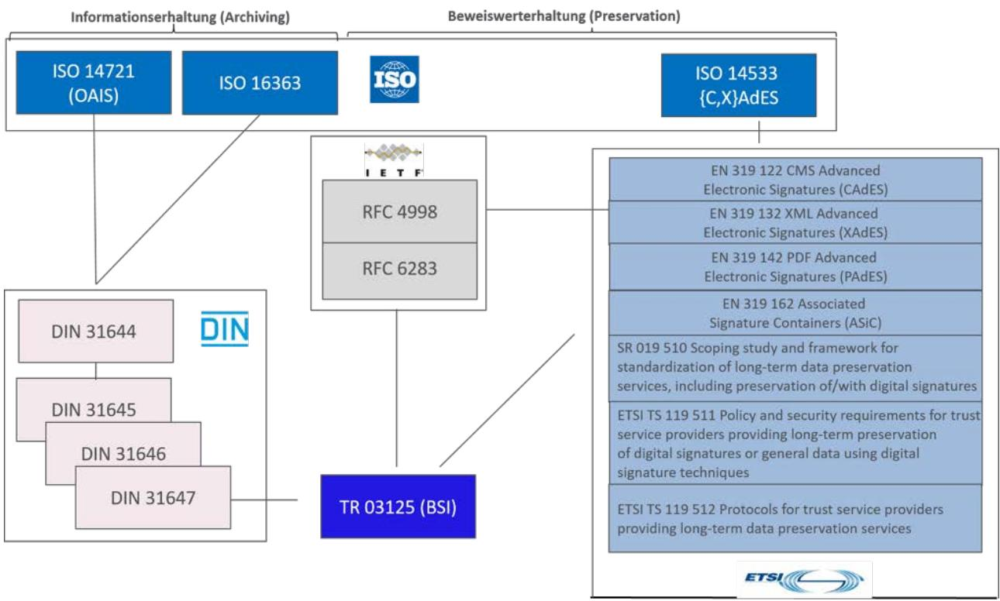

Abbildung 1: Standards und Normen für die Informationserhaltung und Beweiswerterhaltung

 6 Siehe BSI-Webseite BSI-Webseite "bsi.bund.de/tr-esor"

"Die abgebildeten Normen und Standards decken vollständig den Life-Cycle der elektronischen Signaturen und Siegel sowie die Beweiswerterhaltung kryptographisch signierter Dokumente ab.

[ISO 14721,](https://www.iso.org/standard/57284.html) [ISO 16363](https://www.iso.org/standard/56510.html) zusammen mit [DIN 31644 bis DIN 31646](https://www.din.de/de/meta/suche/62730!search?query=Informations%C3%BCbernahme) beschäftigen sich mit den Aspekten der Informationserhaltung der elektronischen Dokumente. Die korrespondierenden europäischen Normen (EN) sowie ETSI Spezifikationen gehen auf die Aspekte der technischen Ausgestaltung der Signaturen und Siegel.

[RFC4998](https://tools.ietf.org/html/rfc4998) und [RFC6283](https://tools.ietf.org/html/rfc6283) spezifizieren die Syntax von Evidence Records und die dazugehörigen Prozesse zur Bewahrung der Integrität, Authentizität und "Proof of Existence" für ein oder mehrere Dokumente.

Der ISO-Standard 14533 besteht aus vier Teilen:

- Part 1: Long term signature profile for CMS-Advanced Electronic Signatures (CAdES),
- Part 2: Long term signature profile for XML-Advanced Electronic Signatures (XAdES),
- Part 3: Long term signature profiles for PDF Advanced Electronic Signatures (PAdES),
- Part 4: Attributes pointing to (external) Proof of Existence objects used in Long term signature formats (PoEAttributes).

Das Ziel dieses Standards ISO-14533 ist es, die Elemente zu spezifizieren, die eine Verifikation von elektronischen Signaturen über einen langen Zeitraum, basiert auf CAdES/XAdES/PAdES and Evidence Records, ermöglichen.

Die [DIN 31647:2015](https://www.beuth.de/de/norm/din-31647/229134562) sowie die technische Richtlinie des [BSI TR-03125 \(TR-ESOR\)](https://www.bsi.bund.de/DE/Publikationen/TechnischeRichtlinien/tr03125/index_htm.html) als eine Ausprägung der DIN 31647 beschreiben Maßnahmen auf Basis von [RFC4998](https://tools.ietf.org/html/rfc4998) und [RFC6283,](https://tools.ietf.org/html/rfc6283) die für die Beweiswerterhaltung der kryptographisch geschützten Daten notwendig sind. Bzgl. der Signatur- und Zeitstempel-Formate setzt die TR 03125 TR-ESOR des BSI auf dem aktuelle[n "DURCHFÜHRUNGSBESCHLUSS \(EU\) 2015/1506 DER KOMMISSION](https://eur-lex.europa.eu/legal-content/DE/TXT/PDF/?uri=CELEX:32015D1506&from=DE)  [vom 8. September 2015"](https://eur-lex.europa.eu/legal-content/DE/TXT/PDF/?uri=CELEX:32015D1506&from=DE) zur Festlegung von Spezifikationen für Formate fortgeschrittener elektronischer Signaturen und fortgeschrittener Siegel" gemäß eIDAS auf"[7](#page-8-0) .

Als Weiterentwicklung der im Durchführungsbeschluss 2015/1506 aufgeführten ETSI-Standards wurden die ETSI-Standards EN 319 122, 319 132, 319 142 und 319 162 von ETSI veröffentlicht.

Die Technische Spezifikatio[n ETSI TS 119 511](https://www.etsi.org/deliver/etsi_ts/119500_119599/119511/01.01.01_60/ts_119511v010101p.pdf) definiert die Anforderungen an einen (qualifizierte) Bewahrungsdienstanbieter und die Technische Spezifikation [ETSI TS 119 512](https://www.etsi.org/deliver/etsi_ts/119500_119599/119512/01.01.02_60/ts_119512v010102p.pdf) ein Schnittstellenprotokoll und normierte Bewahrungsobjekt-Formate für die Langzeit-Bewahrung kryptographischer Signaturen, Siegel und Zeitstempel sowie für signierte und nicht signierte Daten unter Verwendung digitaler Signaturtechnikengem. [\[eIDAS-VO\]](https://www.bsi.bund.de/DE/Das-BSI/Auftrag/Gesetze-und-Verordungen/eIDAS-Verordnung/eidas-verordnung_node.html).

 7 Siehe https://www.bsi.bund.de/DE/Themen/Oeffentliche-Verwaltung/Moderner-Staat/ElektronischeSignatur/Standards/standards\_node.html

# 2 Die BSI TR-03125 TR-ESOR

Die TR-ESOR V1.2.2 gliedert sich in die folgenden Dokumente

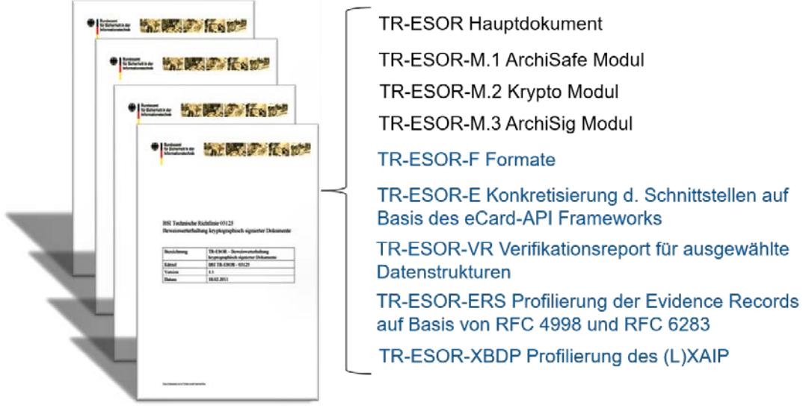

#### Abbildung 2: Die Dokumente der TR-ESOR V1.2.2

Die Technische Richtlinie besteht aus

- einem Hauptdokument,
- drei Anhängen, die die wesentlichen Komponenten der TR-ESOR-IT-Referenzarchitektur in Form von Modulen beschreiben und
- fünf Anhängen, die die technischen Spezifikationen für die Interoperabilität (z.B. Formate, Schnittstellen, Prüfbericht (Verifikationsreport), Profilierung des Beweisdatensatzes (Evidence Record), Profilierung des Bewahrungs-Objekt-Formates XAIP) spezifizieren.

# 2.1 Zielgruppen der Dokumente

Die TR-ESOR Dokumente richten sich an Entscheider, Projektleiter, Fachexperten, IT-Abteilungen und weitere Organisationsabteilungen sowie Anwender. Je nach Rolle kann sich die Detailtiefe der Lektüre ändern. Die Dokumente richten sich primär an Personen, die eine TR-ESOR Middleware oder vergleichbare Lösung entwickeln wollen. Aufgrund des komplexen Sachverhaltes und der Verwendung von Fachbegriffen kann die Technische Richtlinie insbesondere bzgl. der technischen Spezifikationen für Anwender und Fachfremde zunächst schwer verständlich sein.

| Dokument      | Zielgruppe                        |
|---------------|-----------------------------------|
| Hauptdokument | Entscheider                       |
|               | IT-Entwickler                     |
|               | Produktanbieter, Service Provider |

| Dokument              | Zielgruppe                        |
|-----------------------|-----------------------------------|
|                       | Fachanwender                      |
| Module M1-M3          | IT                                |
|                       | Produktanbieter, Service Provider |
| Anhänge E, VR, ERS, F | IT                                |
|                       | Produktanbieter, Service Provider |

Tabelle 1: Zielgruppen der Dokumente der TR-ESOR

## 2.2 [Hauptdokument](https://www.bsi.bund.de/SharedDocs/Downloads/DE/BSI/Publikationen/TechnischeRichtlinien/TR03125/BSI_TR_03125_V1_2_2.pdf;jsessionid=D23C7BF4D2C60F9AB932EB97D6B4A30D.1_cid360?__blob=publicationFile&v=3)

Das Hauptdokument der Technischen Richtlinie beschreibt:

- Ziele der TR,
- Grundlegende regulatorische Anforderungen an eine beweiswerterhaltende Aufbewahrung,
- Fachlich-technischen Rahmen der Technischen Richtlinie
	- o Funktionen einer Middleware zum Beweiswerterhalt,
	- o Organisatorische Anforderungen,
	- o Technische Anforderungen, u.a.
		- Daten- und Dokumentenformate,
		- Austausch- und Speicherformate,
- Empfohlene Referenzarchitektur,
- Basisanforderungen an Module und Prozesse incl. XML-Adapter,
- Grundlegende Sicherheitsanforderungen und
- Zertifizierungsverfahren der TR-03125 (TR-ESOR).

Die Anlagen dienen als Ergänzung und Vertiefung zum Hauptdokument hinsichtlich Modulen, Formaten, Schnittstellen, Prüfberichten, Technischen Beweisdaten oder Zertifizierung.

Nähere Informationen zum Hauptdokument finden Sie hier:

<https://www.bsi.bund.de/tr-esor/> "Die Dokumente der BSI TR-03125 Version 1.2.2" [\(Direktlink: BSI TR-](https://www.bsi.bund.de/SharedDocs/Downloads/DE/BSI/Publikationen/TechnischeRichtlinien/TR03125/BSI_TR_03125_V1_2_2.pdf?__blob=publicationFile&v=3)

[03125\)](https://www.bsi.bund.de/SharedDocs/Downloads/DE/BSI/Publikationen/TechnischeRichtlinien/TR03125/BSI_TR_03125_V1_2_2.pdf?__blob=publicationFile&v=3) bzw.

[https://www.bsi.bund.de/SharedDocs/Downloads/DE/BSI/Publikationen/TechnischeRichtlinien/TR03125/BSI](https://www.bsi.bund.de/SharedDocs/Downloads/DE/BSI/Publikationen/TechnischeRichtlinien/TR03125/BSI_TR_03125_V1_2_2.pdf) [\\_TR\\_03125\\_V1\\_2\\_2.pdf](https://www.bsi.bund.de/SharedDocs/Downloads/DE/BSI/Publikationen/TechnischeRichtlinien/TR03125/BSI_TR_03125_V1_2_2.pdf) .

| Themenschwerpunkt          | Dokument                                                                                                                                                                                              |
|----------------------------|-------------------------------------------------------------------------------------------------------------------------------------------------------------------------------------------------------|
| Module                     | TR-ESOR M1: ArchiSafe-Modul                                                                                                                                                                           |
|                            | TR-ESOR M2: Krypto-Modul                                                                                                                                                                              |
|                            | TR-ESOR M3: ArchiSig-Modul                                                                                                                                                                            |
| Interoperabilität: u.a.    | TR-ESOR F: Formate einschl. der Schemadateien                                                                                                                                                         |
| Formate und Schnittstellen | TR-ESOR E: Konkretisierung der Schnittstellen auf Basis des eCard- API-Frameworks [TR-eCARD]                                                                                                       |
|                            | TR-ESOR ERS: Profilierung der Evidence Records auf Basis von RFC 4998 und 6273                                                                                                                     |
|                            | TR-ESOR TRANS: Grobkonzept ETSI TS119512 TR-ESOR (Transformatorkonzept zur Übersetzung der Preservation API Schnittstelle aus [ETSI TS 119 512] auf die TR-ESOR Eingangsschnittstelle TR-S.4 |
| Prüfbericht                | TR-ESOR VR: Verifikationsreport für ausgewählte Datenstrukturen                                                                                                                                    |
| Zertifizierung             | TR-ESOR C.1: Functional Conformity Test Specification                                                                                                                                                 |

Aus dem Hauptdokument leiten sich die einzelnen Anlagen ab:

#### Tabelle 2: Anlagen zur TR-ESOR

Darüber hinaus stellt das BSI für die Umsetzung der TR-ESOR verschiedene OpenSouce-Tools bereit.

| Tool                                                    | Fokus                                                                                                                                          |
|---------------------------------------------------------|------------------------------------------------------------------------------------------------------------------------------------------------|
| ERS-Prüfwerkzeug: "ERVerify"                            | Prüfung der Konformität technischer Beweisdaten (Evidence Records) gegen RFC4998/6283 bzw. TR-ESOR ERS zum Zweck der Interoperabilität   |
| Transformator: "ETSI TS119512 TR-ESOR-Transformator" | Transformation der Preservation API-Schnittstelle TR-S.512 aus [ETSI TS 119 512] auf die TR-ESOR-Eingangsschnittstelle TR-S.4               |
| (L)XAIP-Prüfwerkzeug: "AIP eIDAS-Signatur-Validator" | Validierung von (L)XAIP incl. der darin enthaltenen Signaturen, Siegeln und Zeitstempeln zum Zweck der Korrektheit und Interoperabilität |

Tabelle 3: Tools zur TR-ESOR

### 2.3 Die IT-Referenzarchitektur

Ein Herzstück der TR-ESOR ist die empfohlene modulare und skalierbare IT-Referenzarchitektur für die Middleware, die in [Abbildung 3](#page-12-1) und Abbildung 4 dargestellt ist. Die Ausführungen in den Dokumenten der Technischen Richtlinie fokussieren auf eine Umsetzung dieser IT-Architektur. Die IT-Architektur bleibt dabei anwendungs-, hersteller- und produktunabhängig und kann so als Basis für eine TR-ESOR Implementierung dienen.

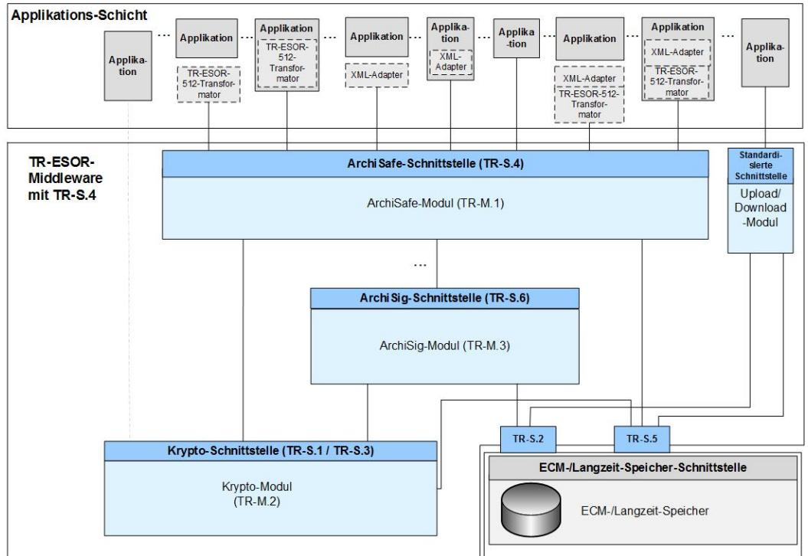

Abbildung 3: Referenzarchitektur der TR-ESOR mit der TR-ESOR-Eingangsschnittstelle TR-S.4

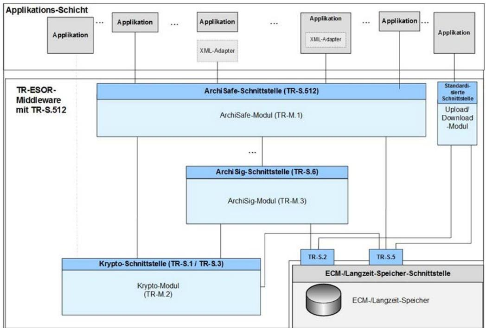

Abbildung 4: Referenzarchitektur der TR-ESOR mit der TR-ESOR-Eingangsschnittstelle TR-S.512

#### 2.3.1 Module der Referenzarchitektur

Die in der TR-ESOR beschriebene Middleware umfasst drei Kernmodule:

- ArchiSafe-Modul,
- Krypto-Modul,
- ArchiSig-Modul,
- Optionales Upload-/Downloadmodul.

Die Middleware ist von den Geschäftsanwendungen entkoppelt und ebenso vom ECM/Langzeitspeicher zu trennen.

#### 2.3.2 Welche Komponenten zählen nicht zur TR-ESOR-Middleware?

Nicht Teil der Middleware sind:

- Geschäftsanwendung (z.B. E-Akte, ERP, eRechnung, Fachverfahren etc.),
- XML-Adapter,
- ECM/Langzeitspeicher (z.B. Speichersysteme, Datenbank),
- Vertrauensdiensteanbieter zur Erzeugung oder Verifizierung qualifizierter elektronischer Signaturen, Siegel und/oder Zeitstempel.

## 2.4 Kernmodule der TR-ESOR

#### 2.4.1 [M.1: ArchiSafe Modul](https://www.bsi.bund.de/SharedDocs/Downloads/DE/BSI/Publikationen/TechnischeRichtlinien/TR03125/BSI_TR_03125_Anlage_M1_V1_2_1.pdf;jsessionid=D23C7BF4D2C60F9AB932EB97D6B4A30D.1_cid360?__blob=publicationFile&v=2)

Beschreibt das zentrale Modul der Referenzarchitektur, das den Informationsfluss regelt, Sicherheitsanforderungen an die Schnittstellen zu den IT-Anwendungen umsetzt und für eine Entkopplung von Anwendungssystemen und ECM/Langzeitspeicher sorgt.

Das Dokument erläutert Aufbau und Abgrenzung des Moduls und beschreibt funktionale Anforderungen und Sicherheitsanforderungen, die an dieses Modul gestellt werden.

Die Details zum ArchiSafe-Module finden in [\[TR-ESOR-M1\]](https://www.bsi.bund.de/SharedDocs/Downloads/DE/BSI/Publikationen/TechnischeRichtlinien/TR03125/BSI_TR_03125_Anlage_M1_V1_2_1.pdf?__blob=publicationFile&v=1).

### 2.4.2 [M.2: Krypto Modul](https://www.bsi.bund.de/SharedDocs/Downloads/DE/BSI/Publikationen/TechnischeRichtlinien/TR03125/BSI_TR_03125_Anlage_M2_V1_2_1.pdf;jsessionid=D23C7BF4D2C60F9AB932EB97D6B4A30D.1_cid360?__blob=publicationFile&v=2)

Das Krypto-Modul deckt im Wesentlichen die kryptographischen Funktionen zur Hashwert-(Prüfsummen-) Berechnung über vorgelegte elektronische Dokumente, Prüfung von elektronischen Signaturen (elektronische Unterschrift), Siegeln (elektronische Bestätigung), Zeitstempeln (Nachweis, dass Daten zu einem bestimmten Zeitpunkt vorlagen) und Zertifikate sowie zur Einholung von qualifizierten Zeitstempeln. Dabei ist seit Version 1.2.1 zu beachten, dass das Modul bei der Signatur-/ Siegelvalidierung mindestens beide gängigen Validierungsmodelle, Kettenmodell und Schalenmodell, beinhalten muss. Die Erzeugung/Einholung qualifizierter elektronischer Signaturen ist optional.

Die Details zum Krypto-Modul finden sich in [\[TR-ESOR-M2\]](https://www.bsi.bund.de/SharedDocs/Downloads/DE/BSI/Publikationen/TechnischeRichtlinien/TR03125/BSI_TR_03125_Anlage_M2_V1_2_1.pdf?__blob=publicationFile&v=1).

### 2.4.3 [M.3: ArchiSig Modul](https://www.bsi.bund.de/SharedDocs/Downloads/DE/BSI/Publikationen/TechnischeRichtlinien/TR03125/BSI_TR_03125_Anlage_M3_V1_2_1.pdf;jsessionid=D23C7BF4D2C60F9AB932EB97D6B4A30D.1_cid360?__blob=publicationFile&v=2)

Das ArchiSig Modul stellt die Funktionen für die Beweiswerterhaltung signierter wie unsignierter Dokumente auf Basis von Merkle Hashbäumen bereit, so dass Authentizität und Integrität der auf wirtschaftliche Weise erhalten bleiben. Für diesen Zweck spezifiziert der ERS-Standard RFC4998 und RFC6283 einen "reduzierten Hashbaum", der alle Daten aus dem Hashbaum enthält, die für die Verifikation der Authentizität, Integrität und Existenz eines solchen Archivdatenobjekts erforderlich sind und als verkehrsfähige technische Beweisdaten gegenüber Dritten dienen können. Daneben kann das ArchiSig-Modul die eindeutige ArchivObjektID (AOID) je Archivdatenobjekt resp. VersionsID je Version eines Archivdatenobjekts erzeugen.

- Wenn nur der eingesetzte Signaturalgorithmus absehbar seine Sicherheitseignung verliert, aber der eingesetzte Hashalgorithmus beibehalten werden kann, ist es ausreichend, eine Zeitstempelerneuerung durchzuführen. Für diesen Zweck wird vor Eintritt dieses Zustandes ein neuer Zeitstempel über dem zuletzt erzeugten Zeitstempel erzeugt. Auf Basis dieses Prozesses entsteht mit der Zeit eine Folge von Archivzeitstempel, die in einer "ArchiveTimeStampChain" enthalten sind.
- Falls der eingesetzte Hash-Algorithmus in absehbarer Zeit seine Sicherheitseigenschaften verliert, muss eine Hashbaum-Erneuerung durchgeführt werden. Hierzu werden für alle Archivdatenobjekte neue Hashwerte berechnet und mit einem neu erzeugten Archivzeitstempel versehen.
- Darüber hinaus unterstützt das ArchiSig-Modul u.a. auch die Erzeugung, den Abruf und Prüfung technischer Beweisdaten für den Nachweis der Integrität und Authentizität eines gespeicherten elektronischen Dokumentes und dessen Existenz zu einer bestimmten Zeit mittels der im Anhang TR-ESOR-ERS auf Basis von [RFC 4998] bzw. [RFC 6283] profilierten oder gemäß [RFC 4998] bzw. [RFC 6283] standardisierten, wie interoperablen technischen Beweisdaten (engl. Evidence Record). Bei der Erzeugung eines Evidence Records wird aus dem gesamten Hashbaum der reduzierter Hashbaum (siehe [RFC4998], [RFC6283]) un[d Abbildung 5](#page-15-0) für das entsprechende Archivdatenobjekt oder die entsprechende Archivdatenobjekt-Gruppe gewonnen und in einen reduzierten Hash-Baum integriert. Das Ergebnis wird als "Evidence Record" bezeichnet.

Das freie BSI-Prüfwerkzeug für Evidence Records unter einer Open Source Lizenz ist unter dem Link <https://github.com/de-bund-bsi-tr-esor/ERVerifyTool>

zu finden. Das nachstehende Bild [\(Abbildung 5\)](#page-15-0) verdeutlicht das Prinzip.

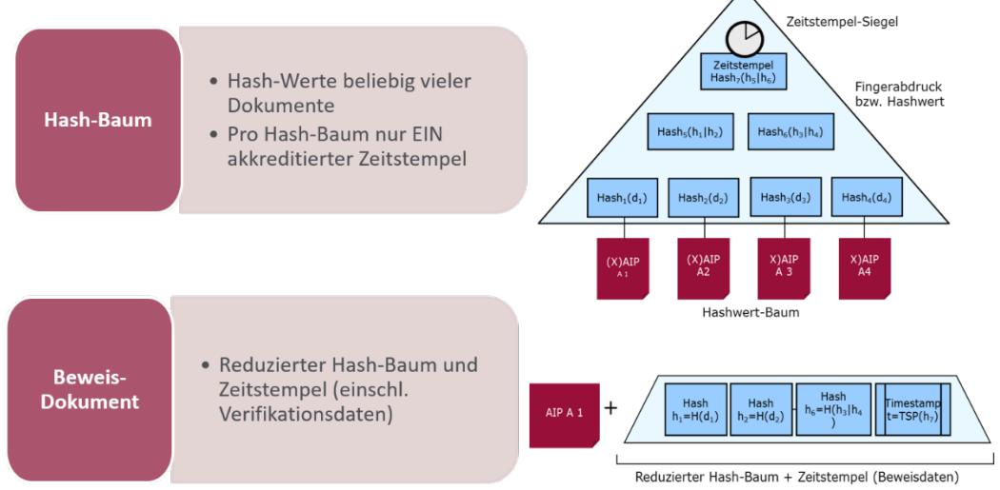

Abbildung 5: Hashbaum nach TR-ESOR auf Basis von RFC4998 bzw. RFC6283

Das Dokument M3 beschreibt die funktionale und technische Anforderungen des ArchiSig-Moduls.

Die Details zum ArchiSig-Modul finden sich in [\[TR-ESOR-M3\]](https://www.bsi.bund.de/SharedDocs/Downloads/DE/BSI/Publikationen/TechnischeRichtlinien/TR03125/BSI_TR_03125_Anlage_M3_V1_2_1.pdf?__blob=publicationFile&v=1).

### 2.4.4 Optionales Upload-/Download-Modul

Das optionale Upload-/Download-Modul wird nur benötigt, sofern für große Datenmengen ein logischer Archivdatencontainer (LXAIP s. Anhang F, Kap. 3.2) verwendet wird. In dem Fall ermöglicht es das optionale Upload-Modul, dass die Geschäftsanwendung oder der XML-Adapter (siehe Hauptdokument Kap. 7.4.6) die zu einem LXAIP zugehörigen Inhaltsdaten über dieses Upload-/Download-Modul extern in den ECM/Langzeitspeicher hochladen (speichern) resp. downloaden können.

Die Module sind im [Hauptdokument der TR-ESOR](https://www.bsi.bund.de/SharedDocs/Downloads/DE/BSI/Publikationen/TechnischeRichtlinien/TR03125/BSI_TR_03125_V1_2_2.pdf?__blob=publicationFile&v=1) im Kap. 7.4.4 bzw. 7.4.5 beschrieben.

## 2.4.5 Optionaler XML-Adapter

Der XML-Adapter ist eine optionale Komponente, die der Anbindung von Geschäftsanwendungen an die TR-ESOR Middleware dient und eine Archivierungsschnittstelle zwischen den Anwendungen der Applikationsschicht und dem ArchiSafe-Modul darstellt.

Es gibt u.a. die folgenden möglichen Funktionen des XML-Adapters:

- Erzeugung des (L)XAIP-Containers gem. TR-ESOR F,
- Konvertierung von Inhaltsdaten in langzeitaufbewahrungsfähige Formate,
- Anbindung der Geschäftsanwendung unter Kapselung der eigentlichen Middleware,
- Mapping der Identifier der TR-ESOR-Middlware (AOID/Versions-ID) auf Identifier der Geschäftsanwendungen.

Sofern ein XML-Adapter besteht, muss dieser die standardisierte Kommunikation zum ArchiSafe-Modul (Konnektor) übernehmen.

Der XML-Adapter ist typischerweise mandantenfähig kann wie folgt implementiert sein:

- als (fester) Bestandteil der Anwendung, d. h. als anwendungsintegrierte Archivierungsschnittstelle,
- als eigenständiger Dienst, der Datenstrukturen und Kommunikationsprotokoll in die standardisierten Formate des elektronischen Archivs überführt.

Der XML-Adapter ist der Konnektor zwischen Applikation und Middleware (sofern implementiert). Dieser XML-Adapter ist bei der Ablage oder der Änderung elektronischer Unterlagen beteiligt. Dabei erzeugt er aus den Anwendungsdaten einen (L)-XAIP-Container und meldet der Anwendung die, vorzugsweise von der Middleware erzeugte, AOID oder die Versions ID zurück.

### 2.4.6 Optionaler "ETSI TS119512 TR-ESOR Transformator"

"Das Open-Source-Werkzeug ["ETSI TS119512 T](https://github.com/de-bund-bsi-tr-esor/tresor-ETSITS119512-transformator)R-ESOR Transformator" ist in der Lage, im Rahmen eines Bewahrungsproduktes bzw. Bewahrungsdienstes gemäß [eIDAS](https://eur-lex.europa.eu/legal-content/EN/TXT/?uri=CELEX:32014R0910) eingehende Nachrichten im [ETSI TS 119 512 -](https://www.etsi.org/deliver/etsi_ts/119500_119599/119512/01.01.01_60/ts_119512v010101p.pdf) Schnittstellenformat auf da[s TR-ESOR S4 -](https://www.bsi.bund.de/SharedDocs/Downloads/DE/BSI/Publikationen/TechnischeRichtlinien/TR03125/BSI_TR_03125_Anlage_E_V1_2_1.pdf) Nachrichtenformat zu transformieren und an ein angeschlossene[s TR-](https://www.bsi.bund.de/tr-esor)[ESOR-](https://www.bsi.bund.de/tr-esor) System weiter zu leiten. So kann ein TR-ESOR konformes System mit der ETSI TS 119512 - Schnittstelle in Europa genutzt werden, ohne dass vorher Änderung an dem TR-ESOR- System vorgenommen werden müssen."[8](#page-17-2)

Das Grobkonzept zu "ETSI TS119512 TR-ESOR Transformator" findet sich hier:

[https://www.bsi.bund.de/SharedDocs/Downloads/DE/BSI/Publikationen/TechnischeRichtlinien/TR03125/BSI](https://www.bsi.bund.de/SharedDocs/Downloads/DE/BSI/Publikationen/TechnischeRichtlinien/TR03125/BSI_TR_03125_Anlage_E_V1_2_2-Appendix.pdf) [\\_TR\\_03125\\_Anlage\\_E\\_V1\\_2\\_2-Appendix.pdf](https://www.bsi.bund.de/SharedDocs/Downloads/DE/BSI/Publikationen/TechnischeRichtlinien/TR03125/BSI_TR_03125_Anlage_E_V1_2_2-Appendix.pdf) 

und das freie BSI-Tool "ETSI TS 119512 TR-ESOR Transformator unter einer Open Source Lizenz" liegt hier:

<https://github.com/de-bund-bsi-tr-esor/tresor-ETSITS119512-transformator> .

### 2.4.7 Optionaler AIP-eIDAS-Signatur-Validator

Das Open-Source-Werkzeug AIP-eIDAS-Signatur-Validator ist in der Lage zum einen die Syntax von (L)XAIP-Container gegen die Vorgaben von TR-ESOR Anhang F zu prüfen sowie die enthaltenen elektronischen Signaturen, Siegel und Zeitstempel zu validieren und einen interoperablen Prüfbericht auszugeben.

### 2.5 Die Prozesse der TR-ESOR

Die Fach-Anwendungen bzw. der XML-Adapter bzw. der "ETSI TS119512 TR-ESOR Transformator" rufen eine abstrakte, möglichst einfache Anwendungsschnittstelle, um eine der folgenden Prozesse auszuführen:

- 1) Bewahrung von kryptographisch signierten oder nicht signierten Daten,
	- a. Upload,
	- b. Download,
- 2) Änderung von bereits gespeicherten (L)XAIP-Containern,
- 3) Abruf ganzer (L)XAIP-Container oder Teile davon,
- 4) Löschen von (L)XAIP-Containern,
- 5) Abruf von technischen Beweisdaten (Evidence Records),
- 6) Prüfen einer (L)XAIP inkl. den darin enthaltenen oder separat übergebenen beweisrelevanten Daten (elektronische Signaturen, Siegel, Zeitstempel, etc.) oder technischen Beweisdaten.

Alle Schnittstellen sind als Web-Service realisiert, basierend auf [TR-ESOR-E] bzw. [ETSI TS119512] sowie auf den in [TR-ESOR-F] definierten Datentypen.

Diese einfachen Anwendungsschnittstellen werden im folgenden Text näher dargestellt.

 8 Siehe [TR-ESOR], V1.3

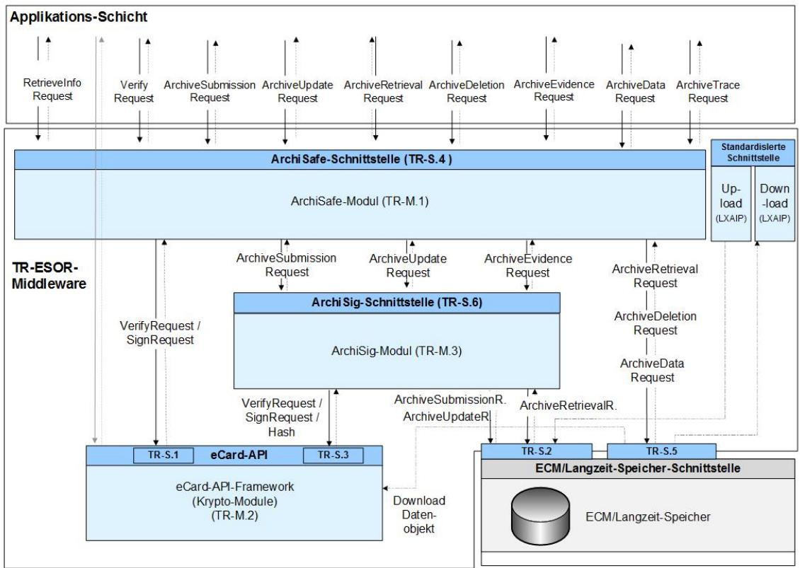

Abbildung 6: Die Schnittstellen und Funktionen der TR-ESOR IT-Referenzarchitektur auf Basis des eCard-API-Frameworks [TR-eCARD]

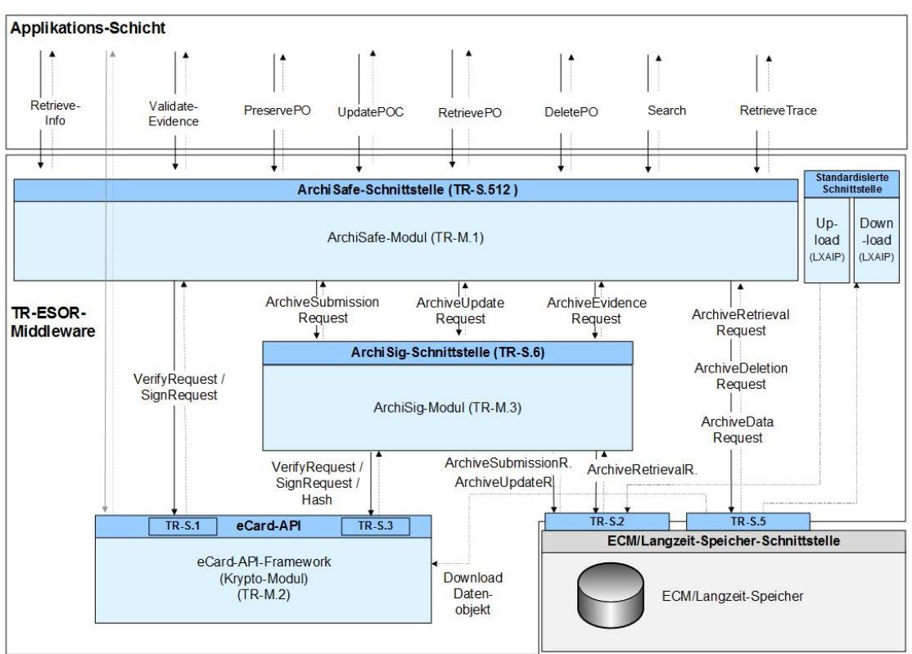

Abbildung 7: Die Schnittstellen und Funktionen der TR-ESOR IT-Referenzarchitektur auf Basis [ETSI TS 119 512]

#### 2.5.1 Bewahrung – Funktionstyp: ArchiveSubmission

Der Bewahrungsprozess, der mit dem Funktionstyp ArchiveSubmission aufgerufen wird, ermöglicht die beweiswerterhaltende Einlagerung aufzubewahrender Daten als (L)XAIP-Archivdatencontainern in der TR-ESOR-Middleware.

Im Wesentlichen wird dabei ein (L)XAIP übergeben. Zurück erhält man im Erfolgsfall eine eindeutige Bezeichnung des (L)XAIP, genannt AOID (engl. Archive Object Identifier) (siehe [TR-ESOR-E, Kap. 3.1]).

Alternativ kann ab [TR-ESOR-E V1.3, Kap. 4] auch der Aufruf PreservePO gemäß Abschnitt 5.3.3 gemäß dem Europäischen ETSI-Standard [ETSI TS 119 512, Kap. 5.3.3] verwendet werden.

Mit dem AOID kann man später das dadurch eindeutig bezeichnete (L)XAIP wieder auslesen (vgl. Abschnitt [2.5.3\)](#page-20-0), ändern (vgl. Abschnitt [2.5.2\)](#page-19-1), . löschen (vgl. Abschnitt [2.5.5\)](#page-21-1) oder zugehörige technischen Beweisdaten dazu (vgl. Abschnit[t 2.5.4\)](#page-21-0) anfordern kann.

Wenn das übergebene (L)XAIP elektronische Signaturen, Siegel oder Zeitstempel enthält, werden diese unter Verwendung der Verify-Funktion gemäß Teil 2 des eCard-API-Frameworks [TR-eCARD] vor der Archivierung geprüft (vgl. Abschnit[t 2.5.6](#page-22-0) ).

#### 2.5.1.1. Upload

"Im Fall eines logischen XAIP (LXAIP) gemäß ([TR-ESOR-F], Kap. 3.2) ermöglicht es das optionale Upload-Modul, dass die IT-Anwendung oder der XML-Adapter die zu einem LXAIP zugehörigen Archivdatenobjekte über dieses Upload-Modul extern in den ECM/Langzeitspeicher hochladen (speichern) können."[9](#page-19-2)

#### 2.5.1.2. Download

"Das optionale Download-Modul ermöglicht es, dass die IT-Anwendung oder der XML-Adapter im Fall eines logischen XAIP (LXAIP) gemäß ([TR-ESOR-F], Kap. 3.2) die zu einem LXAIP zugehörigen extern im ECM/Langzeitspeicher abgelegten Datenobjekte über das Download-Modul abrufen können."[10](#page-19-3)

### 2.5.2 Aktualisierung bereits archivierter Daten – Funktionstyp: ArchiveUpdate

Die TR-ESOR Middleware bietet auch die Möglichkeit der Aktualisierung des (L)XAIP-Containers, indem eine neue Version des (L)XAIP erzeugt wird, die die ursprünglich enthaltenen Objekte und zusätzlich die zusätzlich übergebenen Datenobjekte enthält.

Der Aufruf ArchiveUpdateRequest muss mindestens die folgenden Sub-Komponenten enthalten:

 9 Siehe [TR-ESOR], Kap. 7.4.4.

10 Siehe [TR-ESOR], Kap. 8.4.5.

Ein ergänzendes XML-basiertes Delta-XAIP gemäß ([TR-ESOR-F], Abs. 3.1.6) bzw. Delta-LXAIP gemäß ([TR-ESOR-F], Abs. 3.2.2), das u.a. die AOID des (L)XAIP, die Vorgänger-VersionID, Verweise auf unverändert aus dieser übernommene Objekte und die zu ergänzenden Elemente enthält, die in einer neuen Version eines bereits abgelegten (L)XAIP ergänzt werden sollen.

Unter einer Änderung wird in diesem Zusammenhang das Hinzufügen von Daten, Dokumenten, Metadaten und beweisrelevanter Daten, sowie die Änderung von Metadaten verstanden.

Als Antwort auf einen ArchiveUpdateRequest wird ein entsprechendes ArchiveUpdateResponse-Element zurückgegeben, das im Erfolgsfall als Identifikator der neuen Version des (L)XAIPs, der neue Versions-Identifikator VersionID, enthält, bezogen auf die neu erzeugte Version in dem ursprünglich gespeicherten (L)XAIP ([TR-ESOR-E, Kap. 3.2]).

Alternativ kann ab [TR-ESOR-E V1.3, Kap. 4] auch der Aufruf UpdatePOC gemäß Abschnitt 5.3.3 gemäß dem Europäischen ETSI-Standard [ETSI TS 119 512, Kap. 5.3.6] verwendet werden.

Der Änderungsprozess unterstützt vor allem bei der frühzeitigen beweissichernden Speicherung, z.B. beim ersetzenden Scannen nach TR-RESISCAN. So können Dokumente frühzeitig beweiswerterhaltend und sicher aufbewahrt, später entstehende Teile der zugehörigen Akte per Update dem Archivdatencontainer einfach hinzugefügt und daher eine Aufbewahrung im logischen Geschäftszusammenhang sichergestellt werden. Damit wird ein exponentielles Wachstum einzelner Archivdatencontainer mit wenigen Dateien und hiermit verbunden absehbar hohen Migrationsaufwänden und Performanceaufwänden vermieden. Ähnliche Fragen stellen sich bspw. bei elektronischen Rechnungen oder Vorgängen, deren eigentliche Aufbewahrungsfrist erst bspw. zu einem späteren Zeitpunkt (z.B. 01.01. des Folgejahres nach Rechnungsausgleich) oder nach Jahrzehnten beginnt, diese aus Nachweis-/Sicherheitsgründen oder aufgrund ersetzenden Scannens jedoch frühzeitig beweissicher abgelegt werden sollen.

### 2.5.3 Abfrage archivierter Daten – Funktionstyp: ArchiveRetrieval- / ArchiveData

#### 2.5.3.1. ArchiveRetrieval

Um ein Lesen bereits archivierter (L)XAIPs möglich zu machen, bietet die TR-ESOR Middleware Prozesse zur Abfrage von archivierten (L)XAIPs oder (optional) einzelner Datenobjekte davon an.

Mit dem Funktionseingabeparameter ArchiveRetrievalRequest wird das zu einer übergebenen AOID und VersionID gehörende physische XAIP-Archivdatenobjekt gemäß [TR-ESOR-F] (Abs. 3.1), das logische XAIP gemäß [TR-ESOR-F] (Abs. 3.2) über die TR-ESOR-Middleware aus dem ECM-/Langzeitspeichersystem ausgelesen. Dabei kann eine Folge von Versions-Identifikatoren VersionID oder alle Versionen angefordert werden.

Sofern das VersionID-Element nicht angegeben ist, werden die zur letzten Version gehörigen Datenobjekte und Verwaltungsinformationen eines XAIPs bzw. LXAIPs zurückgeliefert.

Durch die Angabe von all (optionaler Parameter des Funktionsaufrufs ArchiveRetrievalRequest) werden alle existierenden Versionen eines Archivdatenobjektes zurückgeliefert." (siehe [TR-ESOR-E, Kap. 3.3]).

Alternativ kann ab [TR-ESOR-E V1.3, Kap. 4] auch der Aufruf RetrievePO gemäß Abschnitt 5.3.3 gemäß dem Europäischen ETSI-Standard [ETSI TS 119 512, Kap. 5.3.4] verwendet werden.

#### 2.5.3.2. ArchiveData

Die Funktion ArchiveDataRequest ermöglicht lesenden Zugriff auf einzelne diskrete Datenelemente aus einem im zuvor abgelegten (L)XAIP ohne Rücklieferung des gesamten (L)XAIP (siehe [TR-ESOR-E, Kap. 3.6]).

Alternativ kann ab [TR-ESOR-E V1.3, Kap. 4] auch der Aufruf Search gemäß Abschnitt 5.3.3 gemäß dem Europäischen ETSI-Standard [ETSI TS 119 512, Kap. 5.3.9] verwendet werden.

#### 2.5.3.3. Sonstige lesende Zugriffe

Daneben lässt es die TR-ESOR zu, von den Geschäftsanwendungen lesend auch direkt auf die im Speicher abgelegten Daten zuzugreifen, ohne die Middleware zu nutzen. Dies ist jedoch nur für lesenden Zugriff möglich – erleichtert jedoch den Abruf einzelner Datenobjekte.

#### 2.5.4 Rückgabe technischer Beweisdaten – Funktionstyp: ArchiveEvidenceRequest

Die TR-ESOR Middleware ermöglicht es, dass bei Bedarf mittels des Aufrufs ArchiveEvidenceRequest für ein durch den Aufruf ArchiveSubmissionRequest (vgl. Abschnitt [2.5.1\)](#page-19-0) gespeichertes (L)XAIP (siehe Abschnitt [2.6.1\)](#page-22-2) ein entsprechender technische Beweisdatendatz "EvidenceRecord" gemäß [RFC 4998] bzw. [RFC 6283] angefordert werden kann, durch den die Integrität und Authentizität des (L)XAIPs langfristig gewahrt und somit die Beweiskraft erhalten werden kann.

Die Rückgabe der technischen Belege auf Echtheit und Unverfälschtheit (Authentizität und Integrität) als "Evidence Records" erfolgt mittels des ArchiveEvidenceResponse. (siehe [TR-ESOR-E, Kap. 3.4]).

Alternativ kann ab [TR-ESOR-E V1.3, Kap. 4] auch der Aufruf RetrievePO gemäß dem Europäischen ETSI-Standard [ETSI TS 119 512, Kap. 5.3.4] verwendet werden.

### 2.5.5 Löschen von Archivdaten – Funktionstyp: ArchiveDeletion

Zum endgültigen Entfernen der aufbewahrten Archivdatencontainer bietet die TR-ESOR Middleware die Funktion ArchiveDeletion zur Löschung des (L)XAIPs und der referenzierten Nutzdaten an.

Beim Löschen werden sämtliche Informations- und Metadaten sowie alle Versionen des Archivdatenobjektes und referenzierte Nutzdaten gelöscht. Da es sich hierbei um einen sehr kritischen Prozess handelt, kann dieser nur durch löschberechtigte Nutzer angestoßen werden. Es wird ein 4-Augen-Prinzip empfohlen.

Es kann jedoch auch eine Automatisierung des Prozesses für Archivdatenobjekte, deren gesetzliche Mindestaufbewahrungsfrist abgelaufen ist, implementiert werden.

Vor Ablauf der gesetzlichen Mindestaufbewahrungsfrist kann eine Löschung nur durch organisatorisch autorisierte Nutzer erfolgen und nur mit Angabe einer Begründung im Löschauftrag. Zur Nachvollziehbarkeit werden alle Löschvorgänge protokolliert. Die Löschung vor Ablauf der Mindestaufbewahrungsfrist kann zum Beispiel nötig werden, wenn es sich um personenbezogene Daten handelt und die betreffende Person der Speicherung der Daten nicht (oder nicht mehr) zustimmt. (DSGVO Konformität!).

Nach Übergabe des AOIDs und ggf. einer entsprechenden Begründung inklusive der Authentisierungsinformationen des Aufrufers für das Löschen wird das entsprechende (L)XAIP im Langzeitspeicher gelöscht. Die Bestimmung der zur Löschung autorisierten Personen muss durch Sicherheitsmerkmale in der vorgelagerten Geschäftsanwendung erwirkt werden und ist nicht Aufgabe der TR-ESOR-Middleware.

(siehe [TR-ESOR-E, Kap. 3.5])

Alternativ kann ab [TR-ESOR-E V1.3, Kap. 4] auch der Aufruf DeletePO gemäß dem Europäischen ETSI-Standard [ETSI TS 119 512, Kap. 5.3.5] verwendet werden.

#### 2.5.6 Prüfen von Archivdatencontainern samt der enthaltenen oder zusätzlich übergebenen beweisrelevanten Daten und technischen Beweisdaten – Funktionstyp Verify

Zur Prüfung eines (L)XAIP und darin enthaltener oder zusätzlich übergebener beweisrelevanter Daten (Signaturen, Siegel, Zeitstempel, Zertifikate, Sperrlisten, OCSP-Responses) sowie technischer Beweisdaten (Evidence Record) bietet die TR-ESOR Middleware die Funktion Verify (siehe [TR-ESOR-E, Kap. 3.7]).

Alternativ kann ab [TR-ESOR-E V1.3, Kap. 4] auch der Aufruf ValidateEvidence gemäß Abschnitt 5.3.3 gemäß dem Europäischen ETSI-Standard [ETSI TS 119 512, Kap. 5.3.8] verwendet werden.

## 2.6 Formate und Schnittstellen

Die TR-ESOR spezifiziert zum einen dezidierte Formate für Archivdatenobjekte und zum anderen eine Konkretisierung der Schnittstellen, so insbesondere die zentralen Eingangsschnittstelle TR-S.4 auf Basis des eCard-API-Frameworks[11](#page-22-3) (sieh[e Abbildung 3\)](#page-12-1) bzw. die [ETSI TS 119 512]-Schnittstelle TR-S.512 in der Profilierung [TR-ESOR-TRANS] (siehe [Abbildung 4\)](#page-12-2) mit dem Ziel der technischen Interoperabilität.

### 2.6.1 Formate und Datencontainer

#### 2.6.1.1. Grundsatz

Anhang F spezifiziert vor allem die verbindlichen Datencontainer als Austauschformate zur beweiswerterhaltenden Aufbewahrung sowohl signierter als auch unsignierter Dokumente in Form

 11 Siehe https://www.bsi.bund.de/DE/Themen/Unternehmen-und-Organisationen/Standards-und-Zertifizierung/Technische-Richtlinien/TR-nach-Thema-sortiert/tr03112/TR-03112\_node.html

selbsttragender Archivinformationspakete. Ziel ist es, alle zur Nachweisführung entsprechend den geltenden Aufbewahrungspflichten notwendigen Daten in einem Datencontainer in standardisierter wie herstellerneutraler Form verkehrsfähig aufzubewahren und so deren langfristigen Nachweis wie Nutzbarkeit zu ermöglichen.

Gemäß TR-ESOR sind folgende Containerformate möglich (Import und Export)

- Physischer XML-basierter "Archive Information Package(AIP)"[12](#page-23-1) -Container XAIP,
- Logisches (L)XAIP.

Das ZIP-basierte Containerformat ASiC-AIP ist informativ beschrieben und für einen zukünftigen Einsatz angekündigt.

Die Umsetzung der Containerformate ist eine Voraussetzung zur technischen Interoperabilität der TR-ESOR-Middleware und für die TR-ESOR-Produkt Zertifizierung ab TR-ESOR V1.3.

Darüber hinaus beinhaltet die TR-ESOR F Empfehlungen für langfristig verfügbare und verkehrsfähige Datenformate für Informations- und Metadaten, z.B. ASCI, TIFF, PDF/A und XML, etc. Sie beschreibt detailliert Strukturen, Formate und Algorithmen für die Erzeugung und Interpretation kryptographischer Daten.

#### 2.6.1.2. Aufbau (L)XAIP

Die nachstehende Grafik zeigt den Aufbau des (L)XAIP. Der Unterschied zwischen physischem XAIP und logischem Container (L)XAIP besteht darin, dass beim logischen Container in der DataObjectsSection nur Links auf die außerhalb des Containers abgelegten Inhaltsdaten enthalten sind.

Mit (L)XAIP wird XAIP oder LXAIP bezeichnet.

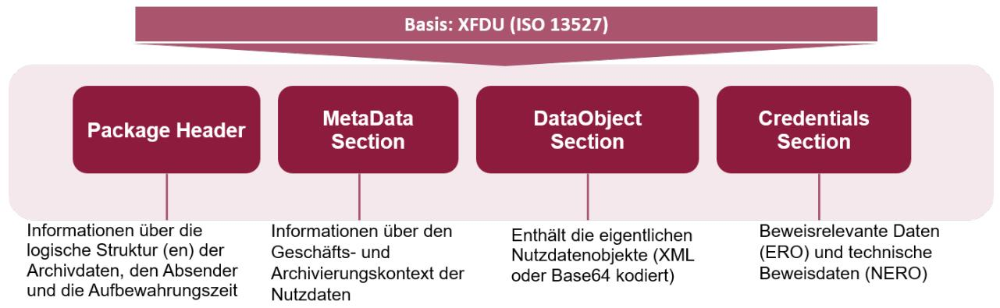

Abbildung 8: Grundstruktur (L)XAIP

Den Aufbau des (L)XAIP zeigt folgende Tabelle im Überblick:

 12 Siehe [ISO14533-3]

| Sektion               | Kerninhalt                                                                             |
|-----------------------|----------------------------------------------------------------------------------------|
| Package Header        | generelle Informationen zum Archivdatenobjekt und zum Beispiel die                  |
|                       | Beschreibung der logischen Struktur des Objektes. Weiterer wichtiger Inhalt            |
|                       | dieses Teils sind die AOID und das Versions-Manifest, das ein Protokoll der            |
|                       | Versionswechsel darstellt.                                                             |
| MetaDataSection       | Hier finden sich Folgen von Daten, die der Beschreibung des |
|                       | Geschäftskontextes oder des Archivierungskontextes dienen. Die Metadaten               |
|                       | können verschiedenen Typen, Klassen und Kategorien zugehören. Es wird auch             |
|                       | definiert, auf welches Nutzdatenobjekt sich die Metadateninformationen                 |
|                       | beziehen.                                                                              |
| DataObjectionsSection | beinhaltet die Binärdaten und/oder XML-Daten des Archivdatenobjekts. Die               |
|                       | hier vorhandenen Daten können durch die Informationen im          |
|                       | Metadatenabschnitt genauer beschrieben werden. In diesem Abschnitt könnten             |
|                       | zum Beispiel Inhaltsdaten in verschieden Datenformaten und auch ganze Akten            |
|                       | unterschiedlicher Dokumente gespeichert werden.                                        |
| CredentialSection     | enthalten beweisrelevante Daten verschiedener Formen (z.B. elektronische               |
|                       | Signaturen, Siegel, Zeitstempel, Zertifikate, Prüferergebnisse und -berichte)          |
|                       | und technische Beweisdaten (Evidence Record) enthalten. Hier werden zum                |
|                       | Beispiel auch die Prüfergebnisse und Protokolle abgelegt, die das Krypto-Modul         |
|                       | bei Validierung der beweisrelevanten Daten oder technischen Beweisdaten                |
|                       | erzeugt.                                                                               |
|                       |                                                                                        |

#### Tabelle 4: Aufbau (L)XAIP

Über sog. Protected Pointer im Package Header kann definiert werden, welche Teile (sog. Evidence Record relevant Objects [ERO] und Non-Evidence-Records-Relevant-Objects [NERO]) des (L)XAIP in die Hashberechnung zur Beweiswerterhaltung einbezogen werden.

Eine nähere Darstellung des XAIP zeigt folgende [Abbildung 9](#page-25-1) (Copyright: [ETSI TS119512, Anhang E) .

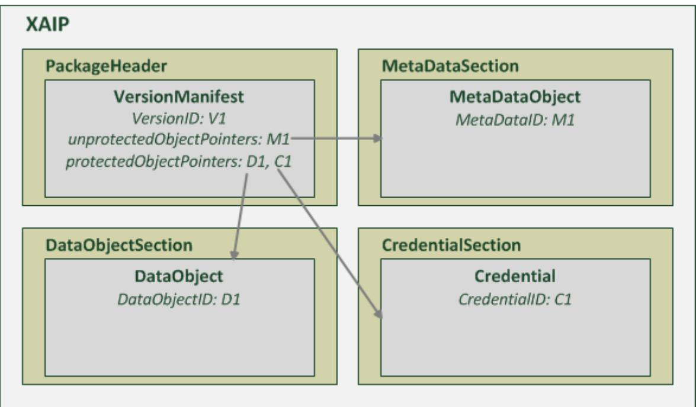

Abbildung 9: XAIP mit einer Version und den mittels des Evidence Record geschützten Daten D1 und C1 sowie den ungeschützten Daten M1.

Die Details finden sich i[n Anhang F zur TR-ESOR.](https://www.bsi.bund.de/SharedDocs/Downloads/DE/BSI/Publikationen/TechnischeRichtlinien/TR03125/BSI_TR_03125_Anlage_F_V1_2_2.pdf?__blob=publicationFile&v=1)

#### 2.6.2 Ablage von elektronischen Signaturen, Siegeln, Zeitstempeln und technischen Beweisdaten (Evidence Record)

Aufgrund des Durchführungsbeschluss 2015/1506 [(EU) 2015/1506] sind die folgenden elektronischen Signaturund Siegel-Formate zu unterstützen:

- CAdES, gem. CAdES Baseline Profile (ETSI TS 103173 v2.2.1),
- XAdES, gem. XAdES Baseline Profile (ETSI TS 103171 v.2.1.1),
- PAdES, gem. PAdES Baseline Profile (ETSI TS 103172 v.2.2.2),
- ASiC, gem. ASiC Baseline Profile (ETSI TS 103174 v.2.2.1).[13](#page-25-2)

Dabei können neben den o.g. elektronischen Signaturen/Siegel können auch weitere beweisrelevante kryptographische Artefakte innerhalb eines (L)XAIP abgelegt werden. Dazu gehören:

- Zeitstempel, gem. RFC3161
- Evidence Records, gem. RFC4998 oder RFC6283 als Technischer Beweisdatensatz.

 13 Siehe auch [LeitLieSig].

Hinweis[14](#page-26-2): Grundsätzlich wird bei der Ablage der signierten Daten und Signaturen innerhalb von XAIP folgende Grundregel stets angewandt:

- Handelt sich dabei um die abgesetzte (detached) Signatur, so werden die signierten Daten innerhalb der Dataobjects-Section und die Signatur innerhalb der Credential-Section abgelegt.
- Im Falle von verbundenen (attached, embedding, embedded) Signaturen werden die Daten in Abhängigkeit dessen, ob die Signatur oder die signierten Daten die äußere Hülle bilden abgelegt. Bilden die signierten Daten die äußere Hülle, so werden die Daten (hier Daten zusammen mit Signatur) innerhalb Dataobjects-Section abgelegt, andererseits (die Signatur bildet die äußere Hülle) sind die Daten innerhalb der Credential-Section abzulegen.

Die folgende Abbildung gibt einen Überblick der Ablage der möglichen Signatur- und Siegel-Varianten.

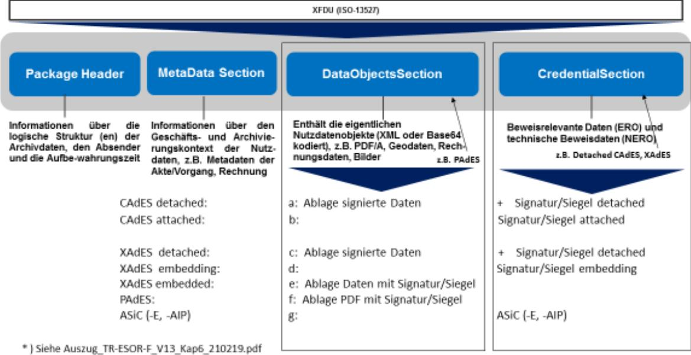

Abbildung 10: Aufbewahrung digitaler Signaturtechniken in (L)XAIP

### 2.6.3 [Konkretisierung der Schnittstellen](https://www.bsi.bund.de/SharedDocs/Downloads/DE/BSI/Publikationen/TechnischeRichtlinien/TR03125/BSI_TR_03125_Anlage_E_V1_2_2.pdf;jsessionid=D23C7BF4D2C60F9AB932EB97D6B4A30D.1_cid360?__blob=publicationFile&v=2)

Anhang E spezifiziert die [TR-ESOR]-Eingangs-Schnittstelle TR-S.4 (Kap. 3) oder die [ETSI TS119512]-Schnittstelle TR-S.512 (Kap. 4) sowie die inneren Schnittstellen zwischen den in der IT-Referenzarchitektur beschriebenen Modulen gemäß Kap[. 2.3.1](#page-13-0) und gewährleistet so die technische Interoperabilität der Middleware.

Die Umsetzung der TR-ESOR E ist eine wesentliche Voraussetzung zur technischen Interoperabilität einer TR-ESOR-Middleware und für die TR-ESOR-Produkt Zertifizierung ab TR-ESOR V1.3.

 14 Siehe [TR-ESOR-F], V1.3, Kap. 6.

Die Details finden sich i[n Anhang E zur TR-ESOR.](https://www.bsi.bund.de/SharedDocs/Downloads/DE/BSI/Publikationen/TechnischeRichtlinien/TR03125/BSI_TR_03125_Anlage_E_V1_2_1.pdf?__blob=publicationFile&v=2)

### 2.6.4 Evidence Record gem. RFC4998 oder RFC6283 als Technischer Beweisdatensatz

"Vor dem Hintergrund, dass einerseits nicht nur elektronische, sondern auch elektronisch signierte Dokumente aufbewahrt werden müssen und andererseits der Einsatz qualifizierter Signaturen beweis-rechtliche Vorteile mit sich bringen, kommen elektronischen Signaturen als Sicherungsmittel für die Aufbewahrung von Daten eine immer größere Bedeutung zu." [15](#page-27-1)

Dabei können elektronische Signaturen bzw. Siegel bzw. Zeitstempel im Laufe der Zeit einem "technischen Verfall" unterliegen.

"Das ArchiSig-Modul TR-ESOR-Middleware implementiert für diesen Zweck eine kryptographische Lösung, "die insbesondere sicherstellt, dass das durch § 15 des Vertrauensdienstegesetzes [VDG, § 15][16](#page-27-2) normierte Verfahren zur Aufrechterhaltung der Sicherheit und Vertrauenswürdigkeit elektronischer Signaturen, Siegel bzw. Zeitstempel durch geeignete Beweiswerterhaltungsmaßnahmen, z.B. erneuter qualifizierter elektronischer Zeitstempel, zuverlässig und wirtschaftlich, d. h. auch für große Datenmengen, erfüllt werden kann. …Grundlage des ArchiSig-Moduls ist die informationstechnische Umsetzung des Evidence Record Syntax (kurz: ERS) Standards der IETF ([RFC4998] bzw. [RFC6283]). ERS definiert im Detail, wie geeignete Beweiserhaltungsmaßnahmen für große Dokumentenmengen automatisch durchgeführt werden können. Darüber hinaus legt der Standard die Datenformate fest, in denen die technischen Beweisdaten über einen unbegrenzten Zeitraum bereitgestellt und ausgetauscht werden. Datenschutz-technische Aspekte werden ebenso berücksichtigt, da mit dem ERS-Standard auch Teile aus dem Dokumentenbestand gelöscht werden können, ohne die Beweiskraft der übrigen Teile zu beeinträchtigen."[17](#page-27-3)

Weitere Details sind auch dem Kap[. 2.4.3](#page-14-4) zu entnehmen.

Die Details zum Evidence Record finden sich in [RFC 4998] bzw. [RFC6283] und in [Anlage TR-ESOR-ERS:](https://www.bsi.bund.de/SharedDocs/Downloads/DE/BSI/Publikationen/TechnischeRichtlinien/TR03125/BSI_TR_03125_Anlage_ERS_V1_2_1.pdf)  [Profilierung der Evidence Records gemäß RFC4998 und RFC6283.](https://www.bsi.bund.de/SharedDocs/Downloads/DE/BSI/Publikationen/TechnischeRichtlinien/TR03125/BSI_TR_03125_Anlage_ERS_V1_2_1.pdf)

Das freie BSI-Prüfwerkzeug für Evidence Records unter einer Open Source Lizenz ist unter dem Link <https://github.com/de-bund-bsi-tr-esor/ERVerifyTool> zu finden.

 15 Siehe [FiKoHü09].

16 Siehe auch **[ETSI SR 019 510], [ETSI TS 119 511]** und **[ETSI TS 119 512].**

17 Siehe [TR-ESOR], Kap. 10.3.

### 2.6.5 Prüfberichte

Die englischsprachige Anlage VR spezifiziert die Prüfberichte (engl. Verification Reports) auf Basis von [OASIS] bei der Prüfung von Signaturen, der im (L)XAIP einschließlich der enthaltenen beweisrelevanten Daten (Signaturen, Siegel, Zeitstempel etc.) sowie der technischen Beweisdaten (Evidence Records) zur Gewährleistung der technischen Interoperabilität.

Anhang ERS spezifiziert die technischen Beweisdaten (Evidence Records) nach [TFC4998] und [RFC6283] näher und ermöglicht so die system- und plattformunabhängige Interpretierbarkeit der Daten sowie Interoperabilität.

Die Details finden sich i[m Anhang VR zur TR-ESOR.](https://www.bsi.bund.de/SharedDocs/Downloads/DE/BSI/Publikationen/TechnischeRichtlinien/TR03125/BSI_TR_03125_Anlage_VR_V1_2_1.pdf) 

# 2.7. Zertifizierung

"Aktuell wurden von ETSI auf Basis von [eIDAS-VO] die zwei Standards für qualifizierte und nicht-qualifizierte Bewahrungsdienste (engl: "Preservation Trust Service") veröffentlicht:

- ETSI TS 119 511 Policy and security requirements for trust service providers providing long-term preservation of digital signatures or general data using digital signature techniques [ETSI TS 119 511],
- ETSI TS 119 512 Protocols for trust service providers providing long-term data preservation services [ETSI TS 119 512].

[eIDAS-VO] und die ETSI-Standards unterscheiden dabei zwischen zwei Vertrauens-Leveln bzgl. Vertrauensdienste und Vertrauensdienstbetreiber:

- normaler Vertrauensdienst und Vertrauensdienstbetreiber (TSP) und
- qualifizierter Vertrauensdienst und Vertrauensdienstbetreiber (QTSP), der zusätzliche gesetzliche Vorgaben erfüllen muss und der Gegenstand von sich periodisch wiederholenden "independent third party conformity assessments by accredited conformity assessment bodies (CAB)" [ASS 119 511, Anhang 1] ist.

(Q)TSP bezeichnet TSP oder QTSP. (Qualifizierte oder nicht qualifizierte) Bewahrungs-Vertrauensdienstbetreiber (engl.: preservation service providers) werden mit (Q)PSP abgekürzt.

Die Zertifizierungsverfahren von (Q)PSP und TR-ESOR-Produkten in Deutschland greifen unmittelbar ineinander – ein TR-ESOR-zertifiziertes Produkt und dessen Einsatz nach dem Stand der Technik ist eine wesentliche technische Grundlage zur Zertifizierung des (Q)TSP.

Die folgende [Abbildung 11](#page-29-0) zeigt das Zusammenspiel zwischen den Zertifizierungsverfahren von Bewahrungs-Vertrauensdienstbetreiber (Q)PSP und TR-ESOR-Produkten.

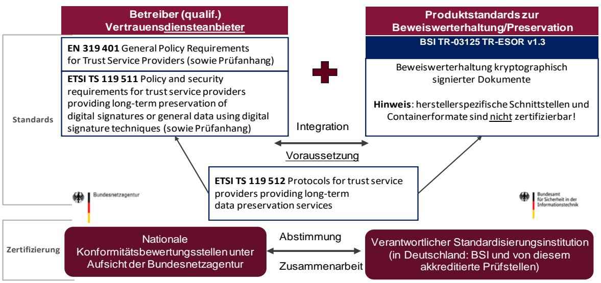

Abbildung 11: Zusammenspiel zwischen den Zertifizierungsverfahren von (Q)PSP und TR-ESOR-Produkten

Dabei wird die Zertifizierung von (qualifizierten) Bewahrungsdiensteanbietern durch nationale Konformitätsbewertungsstellen unter der Aufsicht der Bundesnetzagentur durchgeführt (siehe [ETSI EN 319 403] und [eIDAS-VO]. Für diese Zertifizierung wurden vom BSI in Abstimmung mit der Bundesnetzagentur die folgenden Prüfkriterien erstellt:

- BSI Criteria for Assessing: Criteria for Assessing Trust Service Providers against ETSI Policy Requirements, Part 1: Assessment Criteria for all TSP - ETSI EN 319 401 ([ASS 319 401]) sowie
- BSI Criteria for Assessing: Criteria for Assessing Trust Service Providers against ETSI Policy Requirements, Part 2: Assessment Criteria providing long-term preservation of digital signatures or general data using digital signature techniques - ETSI TS 119 511 ([ASS 119 511]).

Nähere Angaben zum Zusammenspiel zwischen den Zertifizierungsverfahren von (Q)TSP und TR-ESOR-Produkten im Detail sind im Assessment-Handbuch [ASS 119 511] zu finden. Das Zertifizierungsverfahren von TR-ESOR-Produkten wird im folgenden Text dargestellt.

#### Hinweis:

Falls ein (qualifizierter) Bewahrungsdienst ein TR-ESOR zertifiziertes Produkt

- ab V1.2.1 oder V1.2.1 gemäß [TR-ESOR-C.1] und [TR-ESOR-APP] oder
- ab V1.3

einsetzt, entfallen die Assessment-Testschritte in [ASS 119 511], die äquivalent zu entsprechenden TR-ESOR-Testschritten sind, unter den folgenden Bedingungen:

a) Es liegt der Konformitätsbewertungsstelle der Prüfbericht der Zertifizierung des TR-ESOR-Produktes sowie im Bedarfsfall auch das zugehörige Prüfprotokoll nach Anfrage vor.

b) Anhand eines Vergleichs der digitalen "Fingerabdrücke (engl. Fingerprints)" der relevanten Programme des TR-ESOR-Produkts in Produktion mit denen der TR-ESOR-Zertifizierung (siehe auch Kapitel 8.1) kann die Konformitätsbewertungsstelle prüfen, dass das zertifizierte TR-ESOR-Produkt tatsächlich in Produktion eingesetzt ist."[18](#page-30-1)

Weitere Details zur TR-ESOR-Konformitätsprüfung TR-ESOR V1.2.2, sowie TR-ESOR V1.3 bzw. zur Zertifizierung von Bewahrungsdiensten gemäß [eIDAS-VO], [ETSI TS 119 511] sowie [TR-ESOR] sind in den folgenden Dokumenten und Links zu finden:

- TR-ESOR V1.2.1:
	- o [TR-ESOR-C.1] BSI TR 03125: [Preservation of Evidence of Cryptographically Signed Documents](https://www.bsi.bund.de/SharedDocs/Downloads/DE/BSI/Publikationen/TechnischeRichtlinien/TR03125/BSI_TR_03125_Anlage_C1_V1_2_1.pdf): [Annex TR-ESOR-C.1: Conformity Test Specification](https://www.bsi.bund.de/SharedDocs/Downloads/DE/BSI/Publikationen/TechnischeRichtlinien/TR03125/BSI_TR_03125_Anlage_C1_V1_2_1.pdf) (Level 1 - Functional Conformity), V1.2.1
- TR-ESOR V1.2.2:
	- o [TR-ESOR-C.1] BSI TR 03125: Preservation of Evidence of Cryptographically Signed Documents: Annex TR-ESOR-C.1: Conformity Test Specification (Level 1 - Functional Conformity), V1.2.2
	- o [TR-ESOR-APP] BSI TR 03125: Profilierungen im Rahmen der BSI Technischen Richtlinie 03125: Beweiswerterhaltung kryptographisch signierter Dokumente, Anlage TR-ESOR-Profile-APP: Appendix für TR-ESOR V1.2.1 und TR-ESOR V1.2.2 – Profilierung einiger Assessment-Kriterien auf Basis von ETSI TS 119 511, V1.2.1 und V1.2.2
- Bewahrungsdienste gemäß [eIDAS-VO], [ ETSI TS 119 401] und [ETSI TS 119 511]
	- o [ASS 319 401] BSI, [Criteria for Assessing: Criteria for Assessing Trust Service Providers against](https://www.bundesnetzagentur.de/EVD/SharedDocuments/Downloads/QES/Assessment-Handbuch_ETSI_319_401.pdf)  [ETSI Policy Requirements, Part 1: Assessment Criteria for all TSP -](https://www.bundesnetzagentur.de/EVD/SharedDocuments/Downloads/QES/Assessment-Handbuch_ETSI_319_401.pdf) ETSI EN 319 401, 2020.
	- o [ASS 119 511] BSI, [Criteria for Assessing: Criteria for Assessing Trust Service Providers against](https://www.bundesnetzagentur.de/EVD/SharedDocuments/Downloads/QES/Assessment-Handbuch_ETSI_119_511.pdf)  [ETSI Policy Requirements, Part 2: Assessment Criteria providing long-term preservation of digital](https://www.bundesnetzagentur.de/EVD/SharedDocuments/Downloads/QES/Assessment-Handbuch_ETSI_119_511.pdf)  [signatures or general data using digital signature techniques -](https://www.bundesnetzagentur.de/EVD/SharedDocuments/Downloads/QES/Assessment-Handbuch_ETSI_119_511.pdf) ETSI TS 119 511, 2020.

## 2.8. Anwendungshinweise

#### 2.8.1. Grundsatz

Maßnahmen zur Beweiswerterhaltung (gem. (61) und Art. 34 [eIDAS-VO] sowie gemäß des relevanten ETSI-Standards [ETSI TS 119 511], der auch in die [TR-ESOR] eingeflossen ist) sind notwendig, bevor eines der folgenden Kriterien für Signatur/Siegel/Zeitstempel eintritt.

- Die Sicherheitseignung der zugrundeliegenden Algorithmen ist nicht mehr gegeben.
- Die Gültigkeit der zugrundeliegenden Zertifikate läuft aus.
- Die elektronischen Signaturen, Siegel bzw. Zeitstempel sind nicht mehr prüfbar.

 18 Auszug aus [TR-ESOR], V1.3, Kap. 9

Wenn das kryptographisch signierter Dokumente erst kurz vor Ablauf der Sicherheitseignung der Signatur- bzw. Hash-Algorithmen in ein TR-ESOR-System abgelegt wird und vorher in der E-Akte verwaltet wird, kann der Signatur-Zeitpunkt nicht mehr bewiesen werden und überhaupt ein "Proof of Existence" des signierten Dokumentes für den vorgegebenen damaligen Signaturzeitpunkt nicht vorgelegt werden, wenn nicht vorher zusätzliche Maßnahmen ergriffen werden.

Ansonsten ist eine nachträgliche erfolgreiche Validierung der (qualifizierten) Signatur somit unter diesen Umständen nicht mehr möglich.

#### Daher gilt:

Sollte die Umsetzung der Ablage in ein TR-ESOR-System erst kurz vor Ablauf der Sicherheitseignung der kryptographischen Algorithmen bzw. der Zertifikats-Gültigkeit erfolgen, so muss die E-Akte-Anwendung in Hinblick auf die Notwendigkeit des "Beweis der Existenz und Gültigkeit" in jedem Fall

• nach Erzeugung einer elektronischen Signatur, Siegel bzw. Zeitstempel jeweils die digitalen Signaturtechniken auf Ihre Gültigkeit prüfen lassen und einen Zeitstempel erstellen lassen und die Validierungsdaten und den Zeitstempel mit abspeichern,

um die Voraussetzung für die Fähigkeiten zur

- Prüfung der eingesetzten digitalen Signaturen,
- Bewahrung des Gültigkeitsstatus der digitalen Signaturen
- Erzeugung des "Beweis der Existenz und Gültigkeit" der signierten Daten zum Zeitpunkt der Signaturerstellung

zu erhalten.

Daher wären, neben dem aus gesetzlichen Gründen ohnehin notwendigen TR-ESOR-System, folgende zusätzliche Investitionen in das E-Akte-System erforderlich, wie in der folgenden [Abbildung 12](#page-32-0) dargestellt:

- Anbindung an einen (qualifizierten) Vertrauensdienst zur Erzeugung von qualifizierten Zeitstempeln oder grundsätzliche Erzeugung einer AdES-T-Signatur wie dies auch die Leitlinie von BSI und BNetzA ausführt[19](#page-31-0)
- Anbindung an einen (qualifizierten) Vertrauensdienst zur Prüfung von Signaturen, Siegeln und (qualifizierten) Zeitstempeln

19 BSI:

[https://www.bsi.bund.de/SharedDocs/Downloads/DE/BSI/Publikationen/TechnischeRichtlinien/TR03125/BSI\\_TR\\_03125\\_Lei](https://www.bsi.bund.de/SharedDocs/Downloads/DE/BSI/Publikationen/TechnischeRichtlinien/TR03125/BSI_TR_03125_Leitlinie_fuer_digitale_Signatur-Siegel-Zeitstempelformate.pdf) [tlinie\\_fuer\\_digitale\\_Signatur-Siegel-Zeitstempelformate.pdf](https://www.bsi.bund.de/SharedDocs/Downloads/DE/BSI/Publikationen/TechnischeRichtlinien/TR03125/BSI_TR_03125_Leitlinie_fuer_digitale_Signatur-Siegel-Zeitstempelformate.pdf) und

BNetzA:

https://www.elektronische-vertrauensdienste.de/EVD/SharedDocuments/Downloads/QES/BSI\_TR\_03125.pdf

- Anbindung einer Signaturprüfsoftware (z.B. Krypto-Modul in TR-ESOR) incl. Abruf der Zertifikatsstatusinformationen (z.B. Sperrlisten, OCSP) bei den (qualifizierten) Vertrauensdiensten zur Prüfung des Status der Zertifikate der jeweiligen qualifizierten elektronischen Signatur/Siegel
- Betrieb einer Komponente zur Überwachung und Erneuerung der Algorithmen

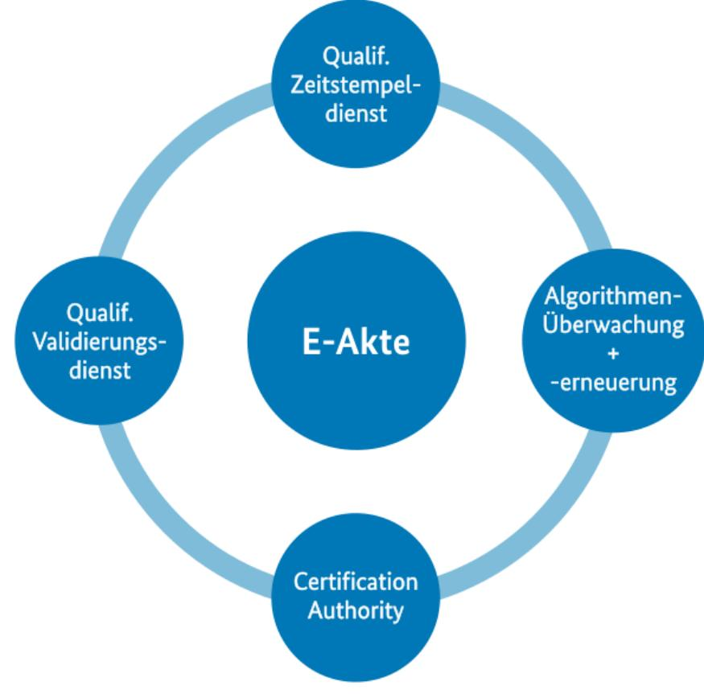

Abbildung 12: Funktionsumfang der E-Akte bei verspäteter Beweiswerterhaltung im TR-ESOR-System

Da zum einen nicht vorhersehbar ist, wann die Sicherheitseignung der verwandten Signaturtechnologien ausläuft, birgt die Aufbewahrung kryptographisch signierter Dokumente ohne Beweiswerterhaltung ein hohes Risiko bzgl.

- a) des Verlustes des Beweiswerts oder
- b) eines sehr hohen Aufwands, bei kurzfristigem Ablauf der Sicherheitseignung.

Fazit: Da eine E-Akte-Anwendung die Funktionen zur Beweiswerterhaltung nicht beinhaltet, ist auch aus diesem Grund die frühzeitige Ablage kryptographisch signierte Dokumente über ein TR-ESOR-System empfehlenswert.

### 2.8.2. Lösungsempfehlung

Der in TR-ESOR für Behörden verbindlich vorgesehene (L-)XAIP-Container ermöglicht die Ablage der Dokumente im Aktenzusammenhang. Über den Update-Prozess können dem (L-)XAIP-Container einer Akte/eines Vorgangs, über die gesamte Lebensdauer der Akte/dem Vorgang weitere Dokumente hinzugefügt werden. Der Zugriff auf die beweiswerterhaltend aufbewahrten Dokumente erfolgt in jedem Fall durch das E-Akte-System. Für den Nutzer im E-Akte-System ändert sich insofern an der Arbeit mit der E-Akte erfahrungsgemäß nichts, da der Zugriff weiterhin über die E-Akte erfolgen kann.

#### Aus der Praxis empfiehlt sich folgende Lösungsoption

Frühzeitige beweissichere Ablage aller:

- signierten/gesiegelten/zeitgestempelten Dokumente,
- abgeschlossenen Dokumente.

im Aktenzusammenhang im (L-)XAIP:

Je Akte/Vorgang wird 1 (L-)XAIP gebildet. Die Dokumente einer Akte/eines Vorgangs finden sich immer in einem (L-)XAIP). Die Dokumente werden mit einem Minimalset an Metadaten im zugehörigen (L-)XAIP abgelegt. Sobald ein neues Dokument zum entsprechenden (L-)XAIP hinzukommt, wird eine neue Version angelegt, so dass die quasi archivierte Akte bzw. der Vorgang sukzessive wächst. Sobald die Akte/der Vorgang abgeschlossen, also z.d.A-verfügt wurde, können die übrigen Dokumente einschl. Metadaten ebenso dem zugehörigen (L-)XAIP hinzugefügt werden.

Als Beispiel kann hier ersetzendes Scannen nach TR-RESISCAN gelten, dabei würde das gescannte Dokument zunächst über [TR-ESOR] abgelegt und der E-Akte ein Link oder, je nach Leistungsfähigkeit der Infrastruktur, eine Kopie des Dokuments übergeben. Alle weiteren Dokumente des Vorgangs können sukzessive durch Update dem zugehörigen (L-)XAIP über [TR-ESOR] hinzugefügt werden.

Hinsichtlich der Datenhaltung bestehen dabei zwei Alternativen, jeweils abhängig von der vorhandenen Infrastruktur:

| Hohe Performance                              |                 |       |             | Begrenzte Performance                          |
|-----------------------------------------------|-----------------|-------|-------------|------------------------------------------------|
| Keine                                         | Datenredundanz, | daher | archivierte | Kopie der archivierten Dokumente in der E-Akte |
| Dokumente werden nur in [TR-ESOR] aufbewahrt, |                 |       |             |                                                |
| ohne zusätzliche Kopie in E-Akte              |                 |       |             |                                                |

#### Tabelle 5: Optionen zur Datenhaltung

Hinsichtlich der doppelten Datenhaltung ist zu beachten, dass die [TR-ESOR] keine Vorgaben an den ECM/Langzeitspeicher enthält. Wie in [Abbildung 13](#page-34-0) dargestellt, ist der Anwender hinsichtlich der Ausgestaltung des ECM/Langzeitspeicher also frei. Dabei kann es sich z.B. um:

- Datenbank der E-Akte,
- Drittspeichersystem,
- Cloud,
- etc.

handeln. Es ist lediglich zu beachten:

- Schreibende/ändernde/löschende Zugriffe auf (L-)XAIP bzw. Dokumente, die via [TR-ESOR] abgelegt wurden sowie zur Beweiswerterhaltung (Neusignierung/Neuverhashung) nur über [TR-ESOR],
- Lesende Zugriffe auf (L-)XAIP bzw. Dokumente, auch direkt, ohne [TR-ESOR] möglich.

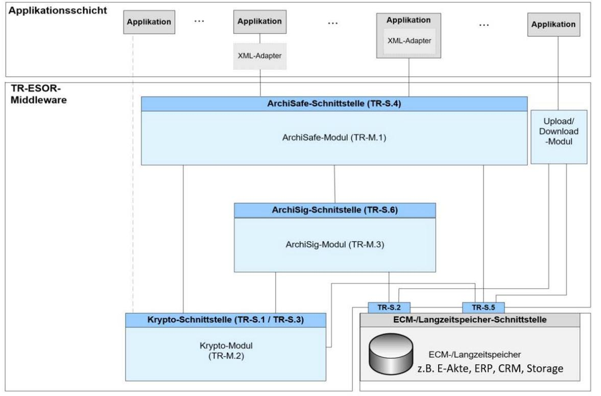

Abbildung 13: Beispiel des Ausgestalten des ECM-/Langzeitspeichers einer TR-ESOR-Architektur

# Abkürzungsverzeichnis

| Abkürzung | Bedeutung                                             |
|-----------|-------------------------------------------------------|
| AOID      | Archivobjekt ID                                       |
| CRM       | Customer Relationship Management                      |
| ECM       | Enterprise Content Management                         |
| ERO       | Evidence Record relevant Objects                      |
| ERS       | Evidence Record Syntax                                |
| LXAIP     | Logisches XML-formatiertes Archivinformationspaket |
| NERO      | Non Evidence Record relevant Objects                  |
| QES       | Qualifizierte elektronische Signatur                  |
| QESI      | Qualifiziertes elektronisches Siegel                  |
| QZS       | Qualifizierter elektronischer Zeitstempel             |
| TR        | Technische Richtlinie                                 |
| VDG       | Vertrauensdienstegesetz                               |
| VDV       | Vertrauensdiensteverordnung                           |
| VO        | Verordnung                                            |
| XAIP      | XML-formatiertes Archivinformationspaket              |

Tabelle 6: Abkürzungsverzeichnis

# Bibliographie

| [2015/1506/EU]   | DURCHFÜHRUNGSBESCHLUSS (EU) 2015/1506 DER KOMMISSION zur Festlegung von Spezifikationen für Formate fortgeschrittener elektronischer Signaturen und fortgeschrittener Siegel, die von öffentlichen Stellen gemäß Artikel 27 Absatz 5 und Artikel 37 Absatz 5 der Verordnung (EU) Nr. 910/2014 des Europäischen Parlaments und des Rates über elektronische Identifizierung und Vertrauensdienste für elektronische Transaktionen im Binnenmarkt anerkannt werden, 8. September 2015     |
|------------------|--------------------------------------------------------------------------------------------------------------------------------------------------------------------------------------------------------------------------------------------------------------------------------------------------------------------------------------------------------------------------------------------------------------------------------------------------------------------------------------------------------|
| [Ahm18]          | Ahmad, J.; Korte, U.; Schumacher: Sicherheitsrelevante Module der eAkte: TR-RESISCAN und TR-ESOR in der praktischen Umsetzung, 2018                                                                                                                                                                                                                                                                                                                                                                 |
| [AhKo18]         | Ahmad, J.; Korte, Dr. U. Vertrauenswürdige E-Akte auf Basis von TR-RESISCAN & TR-ESOR, 2018.                                                                                                                                                                                                                                                                                                                                                                                                        |
| [Ahmad19]        | Ahmad, J.; Schwalm, S. Sicherheitsrelevante Module der E-Akte: TR-RESISCAN und TR ESOR in der Umsetzung, 2019                                                                                                                                                                                                                                                                                                                                                                                       |
| [Ass 319 401]    | BSI, Criteria for Assessing Trust Service Providers against ETSI Policy Requirements, Part 1: Assessment Criteria for all TSP - ETSI EN 319 401                                                                                                                                                                                                                                                                                                                                                     |
| [Ass 119 511]    | BSI, Criteria for Assessing Trust Service Providers against ETSI Policy Requirements, Part 2: Assessment Criteria providing long-term preservation of digital signatures or general data using digital signature techniques - ETSI TS 119 511                                                                                                                                                                                                                                                    |
| [BMI12]          | Bundesministerium des Innern (Hrsg): Organisationskonzept elektronische Verwaltungsarbeit. Baustein E-Akte., Berlin 2012.                                                                                                                                                                                                                                                                                                                                                                           |
|                  | https://www.verwaltunginnovativ.de/DE/Verwaltungsdigitalisierung/orgkonzept_everwaltu ng/orgkonzept_everwaltung_node.html                                                                                                                                                                                                                                                                                                                                                                           |
| [BNetzA-TSP]     | Bundesnetzagentur (BNetzA): Elektronische Vertrauensdienste. https://www.bundesnetzagentur.de/EVD/DE/Verbraucher/Vertrauensdienste/Vertrauensdi enste-start.html                                                                                                                                                                                                                                                                                                                                 |
| [BSI-GSK]        | Bundesamt für Sicherheit in der Informationstechnik (BSI): IT-Grundschutz-Kompendium, https://www.bsi.bund.de/DE/Themen/ITGrundschutz/ITGrundschutzKompendium/itgrun dschutzKompendium_node.html                                                                                                                                                                                                                                                                                                 |
| [BSIRilieSig]    | Bundesamt für Sicherheit in der Informationstechnik (BSI): Leitlinie für digitale Signatur-/ Siegel-, Zeitstempelformate sowie technische Beweisdaten (Evidence Record)                                                                                                                                                                                                                                                                                                                             |
|                  | https://www.bsi.bund.de/SharedDocs/Downloads/DE/BSI/Publikationen/TechnischeRichtl inien/TR03125/BSI_TR_03125_Leitlinie_fuer_digitale_Signatur-Siegel Zeitstempelformate.pdf                                                                                                                                                                                                                                                                                                                     |
| [DIN31644]       | DIN 31644:2012 Information und Dokumentation – Kriterien für vertrauenswürdige digitale Langzeitarchive. 2012                                                                                                                                                                                                                                                                                                                                                                                       |
| [DIN31647]       | DIN 31647:2015 Beweiswerterhalt kryptografisch signierter Dokumente, 201                                                                                                                                                                                                                                                                                                                                                                                                                               |
| [(EU) 2015/1506] | Durchführungsbeschluss (EU) 2015/1506 der Kommission vom 8. September 2015 zur Festlegung von Spezifikationen für Formate fortgeschrittener elektronischer Signaturen und fortgeschrittener Siegel, die von öffentlichen Stellen gemäß Artikel 27 Absatz 5 und Artikel 37 Absatz 5 der Verordnung (EU) Nr. 910/2014 des Europäischen Parlaments und des Rates über elektronische Identifizierung und Vertrauensdienste für elektronische Transaktionen im Binnenmarkt anerkannt werden. |
| [EGovG]          | Gesetz zur Förderung der elektronischen Verwaltung (E-Government-Gesetz - EGovG) vom 25.07.2013                                                                                                                                                                                                                                                                                                                                                                                                     |
| [eIDAS-VO]       | Verordnung (EU) Nr. 910/2014 des Europäischen Parlaments und des Rates über elektronische Identifizierung und Vertrauensdienste für elektronische Transaktionen im Binnenmarkt und zur Aufhebung der Richtlinie 1999/93/EG" vom 23.07.2014                                                                                                                                                                                                                                                       |

010101p.pdf

| [eIDAS-DG] | Gesetz zur Durchführung der Verordnung (EU) Nr. 910/2014 des Europäischen Parlaments         |
|------------|----------------------------------------------------------------------------------------------|
|            | und des Rates vom 23. Juli 2014 über elektronische Identifizierung und Vertrauensdienste für |
|            | elektronische Transaktionen im Binnenmarkt und zur Aufhebung der Richtlinie 1999/93/EG.      |
|            | Bundesgesetzblatt Jahrgang 2017 Teil I Nr. 52, ausgegeben zu Bonn am 28. Juli 2017           |

[ETSI EN 319 102-1]ETSI EN 319 102 – 1, Electronic Signatures and Infrastructers (ESI); Procedures for Creation and Validation of AdES Digital Signatures; Part 1: Creation and Validation, v1.1.1, (2016-05), siehe unter http://www.etsi.org/deliver/etsi\_en/319100\_319199/31910201/01.01.01\_60/en\_31910201v

[ETSI EN 319 122-1] ETSI EN 319 122 – 1, Electronic Signatures and Infrastructers (ESI); CAdES digital signatures, Part 1: Building blocks and CAdES baseline signatures, v1.1.1, (2016-04), siehe unter http://www.etsi.org/deliver/etsi\_en/319100\_319199/31912201/01.01.01\_60/en\_31912201v 010101p.pdf

[ETSI EN 319 132-1] ETSI EN 319 132 – 1, Electronic Signatures and Infrastructures (ESI); XAdES digital signatures, Part 1: Building blocks and XAdES baseline signatures, v1.1.1, (2016-04), siehe unter

> [http://www.etsi.org/deliver/etsi\\_en/319100\\_319199/31913201/01.01.01\\_60/en\\_31913201v](http://www.etsi.org/deliver/etsi_en/319100_319199/31913201/01.01.01_60/en_31913201v010101p.pdf) [010101p.pdf](http://www.etsi.org/deliver/etsi_en/319100_319199/31913201/01.01.01_60/en_31913201v010101p.pdf)

- [ETSI EN 319 142-1] ETSI EN 319 142 1, Electronic Signatures and Infrastructeres (ESI); PAdES digital Signatures, Part 1: Building blocks and PAdES baseline signatures, v1.1.1 (2016-04), siehe unter [http://www.etsi.org/deliver/etsi\\_en/319100\\_319199/31914201/01.01.01\\_60/en\\_31914201v](http://www.etsi.org/deliver/etsi_en/319100_319199/31914201/01.01.01_60/en_31914201v010101p.pdf) [010101p.pdf](http://www.etsi.org/deliver/etsi_en/319100_319199/31914201/01.01.01_60/en_31914201v010101p.pdf)
- [ETSI EN 319 162-1] ETSI EN 319 162 1, Electronic Signatures and Infrastrucutres (ESI); Associated Signature Containers (ASiC), Part 1: Building blocks and ASiC baseline containers, v1.1.1 (2016-04), siehe unter http://www.etsi.org/deliver/etsi\_en/319100\_319199/31916201/01.01.01\_60/en\_31916201v 010101p.pdf
- [ETSI EN 319 401] ETSI EN 319 401, Electronic Signatures and Infrastructures (ESI); General Policy Requirements for Trust Service Providers. ETSI v2.2.1 (2018-04)
- [ETSI TS 103 171] ETSI TS 103 173, Electronic Signatures and Infrastructures (ESI); XAdES Baseline Profile, v.2.1.1 (2012-03),

[http://www.etsi.org/deliver/etsi\\_ts/103100\\_103199/103171/02.01.01\\_60/ts\\_103171v02010](http://www.etsi.org/deliver/etsi_ts/103100_103199/103171/02.01.01_60/ts_103171v020101p.pdf) [1p.pdf](http://www.etsi.org/deliver/etsi_ts/103100_103199/103171/02.01.01_60/ts_103171v020101p.pdf)

[ETSI TS 103 172] ETSI TS 103 172, Electronic Signatures and Infrastructures (ESI); PAdES Baseline Profile, v.2.2.2 (2013-04),

> [https://www.etsi.org/deliver/etsi\\_ts/103100\\_103199/103172/02.02.02\\_60/ts\\_10312v02020](https://www.etsi.org/deliver/etsi_ts/103100_103199/103172/02.02.02_60/ts_10312v020202p.pdf) [2p.pdf](https://www.etsi.org/deliver/etsi_ts/103100_103199/103172/02.02.02_60/ts_10312v020202p.pdf)

[ETSI TS 103 173] ETSI TS 103 173, Electronic Signatures and Infrastructures (ESI); CAdES Baseline Profile, v.2.2.1 (2013-04),

> [http://www.etsi.org/deliver/etsi\\_ts/103100\\_103199/103173/02.02.01\\_60/ts\\_10317v020201](http://www.etsi.org/deliver/etsi_ts/103100_103199/103173/02.02.01_60/ts_10317v020201p.pdf) [p.pdf](http://www.etsi.org/deliver/etsi_ts/103100_103199/103173/02.02.01_60/ts_10317v020201p.pdf)

[ETSI TS 103 174] ETSI TS 103 174, Electronic Signatures and Infrastructures (ESI); ASiC Baseline Profile, v.2.2.1 (2013-06),

> [https://www.etsi.org/deliver/etsi\\_ts/103100\\_103199/103174/02.02.01\\_60/ts\\_10314v02020](https://www.etsi.org/deliver/etsi_ts/103100_103199/103174/02.02.01_60/ts_10314v020201p.pdf) [1p.pdf](https://www.etsi.org/deliver/etsi_ts/103100_103199/103174/02.02.01_60/ts_10314v020201p.pdf)

[ETSI TS 119 511] ETSI TS 119 511, Electronic Signatures and Infrastructures (ESI); Policy and security requirements for trust service providers providing long-term preservation of digital signatures or general data using digital signature techniques, V1.1.1 (2019-06)

|                   | https://www.etsi.org/deliver/etsi_ts/119500_119599/119511/01.01.01_60/ts_119511v0101 01p.pdf                                                                                                                                         |
|-------------------|-----------------------------------------------------------------------------------------------------------------------------------------------------------------------------------------------------------------------------------------|
| [ETSI TS 119 512] | ETSI TS 119 512, Electronic Signatures and Infrastructures (ESI); Protocols for trust service providers providing long-term data preservation services, V1.1.1 (2020-01),                                                            |
|                   | https://www.etsi.org/deliver/etsi_ts/119500_119599/119512/01.01.01_60/ts_119512v0101 01p.pdf                                                                                                                                         |
| [F06]             | S. Fischer-Dieskau: Das elektronisch signierte Dokument als Mittel zur Beweissicherung, Baden-Baden, 2006.                                                                                                                           |
| [Gia11]           | David Giaretta: Advanced digital preservation. London 2011                                                                                                                                                                              |
| [Hue18]           | D. Hühnlein; J. Ahmad, U. Korte: Vertrauenswürdige Digitalisierung auf Basis von TR RESISCAN und TR-ESOR, DACH-Security 2018. Gelsenkirchen 2018                                                                                     |
| [Hue19]           | D. Hühnlein; J. Ahmad, U. Korte: Sichere Digitalisierung mit TR-RESISCAN und TR-ESOR - Auf dem Weg zur digitalen Bundesverwaltung, DUD 4/2019                                                                                        |
| [IETF RFC2119]    | IETF RFC 2119, Key words for use in RFCs to Indicate Requirement Levels, https://www.ietf.org/rfc/rfc2119.txt                                                                                                                        |
| [IETF RFC3161]    | IETF RFC 3161, Time-Stamp Protocol (TSP), https://www.ietf.org/rfc/rfc3161.txt                                                                                                                                                          |
| [IETF RFC4998]    | IETF RFC 4998, Evidence Record Syntax (ERS), https://www.ietf.org/rfc/rfc4998.txt                                                                                                                                                       |
| [IETF RFC5816]    | IETF RFC 5816, ESSCertIDv2 Update for RFC 3161, https://www.ietf.org/rfc/rfc5816.txt                                                                                                                                                    |
| [IETF RFC6283]    | IETF RFC 6283, Extensible Markup Language Evidence Record Syntax (XMLERS), https://www.ietf.org/rfc/rfc6283.txt                                                                                                                      |
| [ISO13527]        | ISO 13527:2010, Space data and information transfer systems -- XML formatted data unit (XFDU) structure and construction rules, 2010                                                                                                 |
| [ISO15489]        | ISO 15489-1:2016: Information and documentation - Records management - Part 1: Concepts and principles. 2016                                                                                                                         |
| [ISO14533-1]      | ISO 14533-1:2014, Processes, data elements and documents in commerce, industry and administration -- Long term signature profiles -- Part 1: Long term signature profiles for CMS Advanced Electronic Signatures (CAdES)          |
| [ISO14533-2]      | ISO 14533-2:2012 Processes, data elements and documents in commerce, industry and administration -- Long term signature profiles -- Part 2: Long term signature profiles for XML Advanced Electronic Signatures (XAdES)           |
| [ISO14533-3]      | ISO 14533-3:2017 Processes, data elements and documents in commerce, industry and administration -- Long term signature profiles -- Part 3: Long term signature profiles for PDF Advanced Electronic Signatures (PAdES)           |
| [ISO14721]        | ISO 14721, Space data and information transfer systems -- Open archival information system (OAIS) -- Reference model, 2012                                                                                                           |
| [ISO30300]        | ISO 30300:2020. Information and documentation - Management systems for records - Fundamentals and vocabulary                                                                                                                         |
| [Ko13]            | U. Korte, D. Hühnlein, S. Schwalm: Vertrauenswürdige und beweiswerterhaltende elektronische Langzeitspeicherung auf Basis von DIN 31647 und BSI-TR-03125, Informatik 2013, GI-LNI, P220, ISBN 978-3-88579-614-5, S. 550-566, 2013 |
| [Ko14]            | U. Korte, D. Hühnlein, S. Schwalm: Standards for the preservation of evidence and trust. Proceedings Archiving 2014, Springfield 2014 S. 9-14                                                                                        |
| [KoHu14]          | U. Korte, D. Hühnlein, S. Schwalm: Standards und Lösungen zur langfristigen Beweiswerterhaltung. Proceedings DACH-Security 2014. S. 46-58. Frechen 2014                                                                              |

| [Ko15]        | U. Korte, D. Hühnlein, S. Schwalm: Ersetzendes Scannen und Beweiswerterhaltung mit SAP. Proceedings DACH-Security 2015. S. 72-85. Frechen 2015                                                                                                                                                                       |
|---------------|-------------------------------------------------------------------------------------------------------------------------------------------------------------------------------------------------------------------------------------------------------------------------------------------------------------------------|
| [Ko16]        | U. Korte, D. Hühnlein, S. Schwalm, T. Kusber: Beweiswerterhaltung im Kontext eIDAS - eine Case Study. DACH-Security 2016, Frechen 2016 S. 379-392                                                                                                                                                                    |
| [Ko17]        | U. Korte, D. Hühnlein, S. Schwalm, T. Kusber, M. Prechtl, B. Wild: Datenpakete zur Informations- und Beweiswerterhaltung. Ein Vergleich. DACH-Security 2017. Frechen 2017 S. 291-303                                                                                                                              |
| [Ko18]        | U. Korte, T. Kusber, S. Schwalm: Vertrauenswürdiges E-Government – Anforderungen und Lösungen zur beweiswerterhaltenden Langzeitspeicherung. 23. Archivwissenschaftliches Kolloqium. Marburg 2018                                                                                                                 |
| [Ku16]        | T. Kusber, S. Schwalm: Elektronische Langzeitspeicherung als SOA-Dienst – Kernelement eines vertrauenswürdigen Informationsmanagements. INFORMATIK 2016 S. 869-882                                                                                                                                                   |
| [KuKo19]      | U. Korte, T. Kusber, S. Schwalm: Aktuelle Standards und Normen in Records Management und beweissicherer Langzeitspeicherung. in: 23. Tagung des Arbeitskreises "Archivierung von Unterlagen aus digitalen Systemen. Prag 2019                                                                                     |
| [Merk]        | R. Merkle: Protocols for Public Key Cryptosystems, Proceedings of the 1980 IEEE Symposium on Security and Privacy (Oakland, CA, USA), SS. 122-134, 1980                                                                                                                                                              |
| [MiniKGovG]   | Bundesministerium des Innern, Minikommentar zum Gesetz zur Förderung der elektronischen Verwaltung sowie zur Änderung weiterer Vorschriften, Berlin 2013                                                                                                                                                             |
| [OASIS VR]    | Hühnlein, D., OASIS DSS v1.0 Profile for Comprehensive Multi-Signature Verification Reports Version 1.0, Committee Specification 01, 12 November 2010, http://docs.oasis-open.org/dss-x/profiles/verificationreport/oasis-dssx-1.0-profiles-vr cs01.pdf                                                        |
| [RFC4998]     | IETF, T. Gondrom, R. Brandner, U. Pordesch, Evidence Record Syntax, 2007                                                                                                                                                                                                                                                |
| [RFC6283]     | IETF, A. J. Blazic, S. Saljic, T. Gondrom, Extensible Markup Language Evidence Record Syntax (XMLERS), 2011                                                                                                                                                                                                          |
| [Ro07]        | A. Rossnagel: Langfristige Aufbewahrung elektronischer Dokumente, Anforderungen und Trends, Baden-Baden, 2007                                                                                                                                                                                                        |
| [Sc17]        | S. Schwalm: A service for the preservation of evidence and data – a key for a trustworthy & sustainable electronic business. Open Identity Summit 2017. Lecture Notes in Informatics (LNI). Proceedings. Bonn 2017 S. 131-144                                                                                     |
| [SigG]        | Gesetz über die Rahmenbedingungen für elektronische Signaturen und zur Änderung weiterer Vorschriften (SigG), vom 16.5.2001, BGBl. 2001, Teil I Nr. 22, S. 876 ff., geändert durch Art 1 G v. 4.1.2005 I 2, zuletzt durch Art. 4 G v. 17.07.2009                                                                  |
| [SigV]        | Verordnung zur elektronischen Signatur (Signaturverordnung – SigV), vom 16.11.2001, BGBl. 2001, Teil I Nr. 59, S. 3075 ff., geändert durch Art 2 G v. 4.1.2005 I 2, zuletzt durch Art. 1 ÄndVO v. 15.11.2010                                                                                                      |
| [SOG-IS]      | SOG-IS Crypto Working Group: SOG-IS Crypto Evaluation Scheme – Agreed Cryptographic Mechanisms, https://www.sogis.org/uk/supporting_doc_en.html                                                                                                                                                                      |
| [TR-eCARD]    | BSI TR 03112-1: eCard-API-Framework - Part 1- Overview and general definitions,                                                                                                                                                                                                                                         |
| [TR-ESOR]     | BSI TR 03125: Beweiswerterhaltung kryptographisch signierter Dokumente, Hauptdokument, V1.2.1 und höher, https://www.bsi.bund.de/tr-esor                                                                                                                                                                             |
| [TR-ESOR-APP] | BSI TR 03125: Profilierungen im Rahmen der BSI Technischen Richtlinie 03125: Beweiswerterhaltung kryptographisch signierter Dokumente, Anlage TR-ESOR-Profile-APP: Appendix für TR-ESOR V1.2.1 und TR-ESOR V1.2.2 – Profilierung einiger Assessment Kriterien auf Basis von ETSI TS 119 511, V1.2.1 und V1.2.2 |
| [TR-ESOR-C.1] | BSI TR 03125: Preservation of Evidence of Cryptographically Signed Documents: Annex TR ESOR-C.1: Conformity Test Specification (Level 1 - Functional Conformity), V1.2.1                                                                                                                                             |

| [TR-ESOR-C.1]                                                                                                                                                                                                                                                             | BSI TR 03125: Preservation of Evidence of Cryptographically Signed Documents: Annex TR ESOR-C.1: Conformity Test Specification (Level 1 - Functional Conformity), V1.2.2            |
|---------------------------------------------------------------------------------------------------------------------------------------------------------------------------------------------------------------------------------------------------------------------------|----------------------------------------------------------------------------------------------------------------------------------------------------------------------------------------|
| [TR-ESOR-E]                                                                                                                                                                                                                                                               | BSI TR 03125: Beweiswerterhaltung kryptographisch signierter Dokumente: Anlage TR ESOR-E Konkretisierung der Schnittstelle auf Basis des eCard-API-Frameworks, v 1.2.1 und höher |
| [TR-ESOR-ERS]                                                                                                                                                                                                                                                             | BSI TR 03125: Beweiswerterhaltung kryptographisch signierter Dokumente: Anlage TR ESOR-ERS Evidence Record gemäß RFC4998 und RFC6283, v1.2.1 und höher                              |
| [TR-ESOR-E-TRANS] BSI TR 03125: Beweiswerterhaltung kryptographisch signierter Dokumente, Appendix zu Anlage TR-ESOR-E; Konkretisierung der Schnittstellen auf Basis des eCard-API-Frameworks – Grobkonzept ETSI TS119512 TR-ESOR Transformator, v1.2.1 und v1.2.2, |                                                                                                                                                                                        |
| [TR-ESOR-F]                                                                                                                                                                                                                                                               | BSI TR 03125: Beweiswerterhaltung kryptographisch signierter Dokumente: Anlage TR ESOR-F Formate und Protokolle, v1.2.1 und höher                                                   |
| [TR-ESOR-M.1                                                                                                                                                                                                                                                              | [BSI TR 03125: Beweiswerterhaltung kryptographisch signierter Dokumente: Anlage TR ESOR-M.1 ArchiSafe-Modul, v1.2.1 und höher                                                       |
| [TR-ESOR-M.2]                                                                                                                                                                                                                                                             | BSI TR 03125: Beweiswerterhaltung kryptographisch signierter Dokumente: Anlage TR ESOR-M.2 Krypto-Modul, v1.2.1 und höher                                                           |
| [TR-ESOR-M.3]                                                                                                                                                                                                                                                             | BSI TR 03125: Beweiswerterhaltung kryptographisch signierter Dokumente: Anlage TR ESOR-M.3 ArchiSig-Modul, v1.2.1 und höher                                                         |
| [TR-ESOR-VR]                                                                                                                                                                                                                                                              | BSI TR 03125: Preservation of Evidence of Cryptographically Signed Documents: Annex TR ESOR-VR: Verification Reports for Selected Data Structures, v1.2.1 und höher                 |
| [XFDU]                                                                                                                                                                                                                                                                    | ISO 13527:2010, Space data and information transfer systems – XML formatted data unit (XFDU) structure and construction rules, 2010                                                 |
| [VDG]                                                                                                                                                                                                                                                                     | Vertrauensdienstegesetz vom 18. Juli 2017 (BGBl. I S. 2745), das durch Artikel 2 des Gesetzes vom 18. Juli 2017 (BGBl. I S. 2745) geändert worden ist                               |
| [VDV]                                                                                                                                                                                                                                                                     | Verordnung zu Vertrauensdiensten (Vertrauensdiensteverordnung - VDV) vom 15. Februar 2019. (BGBl. I S. 114-115)                                                                     |
| [We18]                                                                                                                                                                                                                                                                    | M. Weber, T Vogt, W. Krogel, S. Schwalm c/o DIN NID 15 WG 2: Records Management nach ISO 15489. Einführung und Anleitung. Berlin 2018                                               |