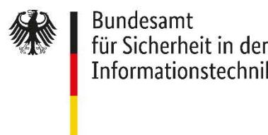

# Leitlinie für die langfristige Beweiswerterhaltung von digitalen Signaturen oder elektronischen Dokumenten oder Daten entsprechend BSI TR-03125 TR-ESOR

Ein Leitfaden für Behörden und Unternehmen

Kurzform BSI TR-ESOR-LEIT

Fassung v1.3

Datum 14. August 2024

### Dokumentenhistorie

| Version | Datum      | Redakteur | Beschreibung            |
|---------|------------|-----------|-------------------------|
| 1.3     | 12.01.2024 | BSI       | Deutsche Version        |
| 1.3     | 14.08.2024 | BSI       | Editorielle Korrekturen |

*Tabelle 1 Dokumentenhistorie*

Bundesamt für Sicherheit in der Informationstechnik Postfach 20 03 63 53133 Bonn Tel.: +49 22899 9582-0 E-Mail: tresor@bsi.bund.de Internet: https://www.bsi.bund.de © Bundesamt für Sicherheit in der Informationstechnik 2023

| 1 |       | Grundlagen der langfristigen Beweiserhaltung von digitalen Signaturen oder Daten oder Dokumenten gemäß TR-ESOR 6                                                             |  |
|---|-------|---------------------------------------------------------------------------------------------------------------------------------------------------------------------------------|--|
|   | 1.1   | Einführung 6                                                                                                                                                                    |  |
|   | 1.2   | eIDAS-Verordnung 7                                                                                                                                                              |  |
|   | 1.2.1 | Einführung 7                                                                                                                                                                    |  |
|   | 1.2.2 | Trusted List mit qualifizierten Vertrauensdiensteanbietern und Vertrauensdiensten 8                                                                                             |  |
|   | 1.3   | Relevante Standards 9                                                                                                                                                           |  |
| 2 |       | BSI TR-03125 TR-ESOR 11                                                                                                                                                      |  |
|   | 2.1   | Wesentliche Änderungen der TR-ESOR v1.3 11                                                                                                                                   |  |
|   | 2.2   | Zielgruppen für die Dokumente11                                                                                                                                                 |  |
|   | 2.3   | Hauptdokument12                                                                                                                                                                 |  |
|   | 2.4   | IT-Referenzarchitektur15                                                                                                                                                        |  |
|   | 2.4.1 | Referenzarchitekturmodule16                                                                                                                                                     |  |
|   | 2.4.2 | Welche Komponenten sind nicht Teil der TR-ESOR Middleware?16                                                                                                                    |  |
|   | 2.5   | TR-ESOR Kernmodule 17                                                                                                                                                        |  |
|   | 2.5.1 | M.1: ArchiSafe-Modul17                                                                                                                                                          |  |
|   | 2.5.2 | M.2: Krypto-Module17                                                                                                                                                            |  |
|   | 2.5.3 | M.3: ArchiSig-Modul17                                                                                                                                                           |  |
|   | 2.6   | Optionale TR-ESOR Module19                                                                                                                                                      |  |
|   | 2.6.1 | Optional Upload/Download-Modul 19                                                                                                                                            |  |
|   | 2.6.2 | Optionaler XML-Adapter19                                                                                                                                                        |  |
|   | 2.6.3 | Optional "ETSI TS119512 TR-ESOR Transformator"19                                                                                                                                |  |
|   | 2.7   | Interoperabilitätsplattform-Tools20                                                                                                                                             |  |
|   | 2.7.1 | ER Verify Tool 20                                                                                                                                                            |  |
|   | 2.7.2 | C.2 Testbed20                                                                                                                                                                   |  |
|   | 2.7.3 | AIP-eIDAS-Signature-Validator20                                                                                                                                                 |  |
|   | 2.8   | TR-ESOR-Prozesse 20                                                                                                                                                          |  |
|   | 2.8.1 | Preservation – function type: ArchivSubmission oder PreservePO 22                                                                                                               |  |
|   | 2.8.2 | Aktualisierung bereits archivierter Daten – Funktion type: ArchivUpdate oder UpdatePOC23                                                                                        |  |
|   | 2.8.3 | Abfrage archivierter Daten – Funktionstyp: ArchiveRetrieval/ArchiveData oder RetrievePO24                                                                                       |  |
|   | 2.8.4 | Überprüfung von Archivinformationspaketen einschließlich der zusätzlich enthaltenen oder übergebenen beweisrelevanten Daten und Evidence Records – Funktionstyp: Verify oder |  |
|   |       | ValidateEvidence25                                                                                                                                                              |  |
|   | 2.8.5 | RetrieveInfo26                                                                                                                                                                  |  |
|   | 2.8.6 | ArchivTrace (optional)26                                                                                                                                                        |  |
|   | 2.9   | Formate und Schnittstellen 26                                                                                                                                                |  |
|   | 2.9.1 | Formate und Datencontainer26                                                                                                                                                    |  |

| 2.9.2  | Formate 27                                                                                                          |  |
|--------|------------------------------------------------------------------------------------------------------------------------|--|
| 2.9.3  | Speicherung von elektronischen Signaturen, Siegeln, Zeitstempeln und Technische Beweisdaten (Evidence Record) 29 |  |
| 2.9.4  | Konkretisierung der Schnittstellen30                                                                                   |  |
| 2.9.5  | Evidence Record gemäß [RFC4998] oder [RFC6283] als technischer Beweisdatensatz30                                       |  |
| 2.9.6  | Prüfberichte31                                                                                                         |  |
| 2.10   | Zertifizierung 31                                                                                                   |  |
| 2.11   | Anwendungshinweise für E-Akten 33                                                                                      |  |
| 2.11.1 | Grundsatz33                                                                                                            |  |
| 2.11.2 | Lösungsempfehlung35                                                                                                    |  |
|        | Liste der Abkürzungen37                                                                                                |  |
|        | Bibliographie38                                                                                                        |  |

## Abbildungsverzeichnis

| Abbildung 1 Relevante Standards für die Bewahrung von Informationen und Beweiswert 9                   |  |
|--------------------------------------------------------------------------------------------------------|--|
| Abbildung 2 TR-ESOR Referenzarchitektur mit TR-ESOR Eingangsschnittstelle TR-S. 415                    |  |
| Abbildung 3 TR-ESOR Referenzarchitektur mit TR-ESOR Eingangsschnittstelle TR-S. 51216                  |  |
| Abbildung 4 TR-ESOR Hashbaum basierend auf RFC4998 und RFC628318                                       |  |
| Abbildung 5 Schnittstellen und Funktionen in der TR-ESOR IT-Referenzarchitektur basierend auf dem      |  |
| eCard API-Framework [TR-eCARD]21                                                                       |  |
| Abbildung 6 Schnittstellen und Funktionen in der TR-ESOR IT-Referenzarchitektur basierend auf [ETSI TS |  |
| 119 512]22                                                                                             |  |
| Abbildung 7 Grundstruktur (L)XAIP Struktur 27                                                          |  |
| Abbildung 8 XAIP mit einer Version und die durch den Nachweisdatensatz geschützten Daten D1 und C1     |  |
| sowie die ungeschützten Daten M1. 29                                                                |  |
| Abbildung 9 Ablage digitaler Signaturmethoden in (L)XAIP 30                                         |  |
| Abbildung 10 Zusammenspiel zwischen den Zertifizierungsprozessen für (Q)PSP- und TR-ESOR-Produkte      |  |
| 32                                                                                                     |  |
| Abbildung 11 Funktionsumfang der E-Akte bei verspäteter Beweiswerterhaltung im TR-ESOR-System34        |  |

### Tabellen

| Tabelle 1 Dokumentenhistorie 2                    |  |
|---------------------------------------------------|--|
| Tabelle 2 Zielgruppen für die TR-ESOR-Dokumente12 |  |
| Tabelle 3 TR-ESOR Anhänge14                       |  |
| Tabelle 4 TR-ESOR Werkzeuge 14                 |  |
| Tabelle 5 (L)XAIP-Struktur28                      |  |
| Tabelle 6 Optionen zur Datenhaltung 35         |  |
| Tabelle 7 Liste der Abkürzungen37                 |  |

### 1 Grundlagen der langfristigen Beweiserhaltung von digitalen Signaturen oder Daten oder Dokumenten gemäß TR-ESOR

#### 1.1 Einführung

Der Einsatz von Informationstechnologie für die Durchführung von Geschäftsprozessen ist in der Regel in Behörden und Unternehmen etabliert. Geschäftsrelevante Dokumente/Daten sind zunehmend in elektronischen Formaten verfügbar. Für sich allein kann ein elektronisches Dokument jedoch weder bearbeitet noch gelesen werden. Diese Dokumente selbst liefern auch keine Hinweise auf ihre Integrität und Authentizität sowie auf ihre Eignung für die Verwendung in elektronischen Rechts- und Geschäftsvorgängen. Gleichzeitig bestehen aber auch umfangreiche Dokumentations- und Aufbewahrungspflichten mit Laufzeiten zwischen 2 und 110 Jahren oder unbefristet.

Innerhalb dieser Frist muss es möglich sein, den Prüfbehörden, Gerichten und Dritten einen eindeutigen und **verlustfreien Nachweis der Authentizität, Integrität** und **Lesbarkeit** dieser Dokumente zu erbringen. In einigen Fällen gelten diese Aufbewahrungsfristen nur zu einem späteren Zeitpunkt, z. B. wenn das Produkt, auf das sich die Dokumente beziehen, vom Markt genommen wird – wie dies bei EU-Zulassungsverfahren für Luftfahrt, Arzneimittel oder Pflanzenschutzmittel der Fall ist. Um die erforderlichen Nachweise vorlegen zu können, sind die Unterlagen einschließlich ihrer Meta-/Prozessdaten dem Gericht oder der Prüfbehörde vorzulegen, was deren **Verhandelbarkeit** erfordert. Die zum Nachweis erforderlichen Informationen, d. h. der Beweiswert, sind integraler Bestandteil der Unterlagen selbst.

Die Verfügbarkeit und die Lesbarkeit der Aufzeichnungen ist ebenfalls zu gewährleisten. Neben der einfachen, originalgetreuen Visualisierung der Daten gelten auch branchenspezifische technische Anforderungen, wie z. B. die Sicherstellung der maschinenlesbaren Daten oder die Vervielfältigung von in den Dateien dokumentierten Analyseergebnissen, etc. Der Einsatz von kryptographischen Werkzeugen wie fortgeschrittenen oder qualifizierten elektronischen Signaturen, Siegeln und Qualifizierten Zeitstempeln (QTS) ermöglicht die Sicherung des Beweiswerts geschäftsrelevanter digitaler Dokumente bei Bedarf zur Beweisführung nach geltendem Recht. Signaturen, Siegel und Zeitstempel werden direkt an den Dateien angebracht oder mit ihnen in einer Weise verknüpft, die nicht gefälscht werden kann, und auf diese Weise mit den kryptographisch signierten Dokumenten gespeichert, um sicherzustellen, dass der Beweiswert in einem verhandelbaren Format erhalten bleibt.

Die BSI TR-03125 [TR-ESOR] ist ein Standard, der die Speicherung von geschäftsrelevanten elektronischen Daten, Dokumenten und Dateien sicherstellt, um ihren Beweiswert zu erhalten und dabei etablierte Datenformate (z. B. PDF, Binärdaten, XML-Formate (z. B. XDOMEA, XRechnung**,** etc.) und Archivierungspaketformate, (L)XAIP[1,](#page-5-2) ASiC-AIP, bis zum Ablauf der Aufbewahrungsfrist gemäß dem Stand der Technik zu verwenden und so einen verlustfreien Nachweis von Authentizität, Integrität und Verträglichkeit der Geschäftsdokumente und Prozesse zu ermöglichen. TR-ESOR definiert eine IT-Referenzarchitektur zusammen mit seinen Modulen, Funktionen, Prozessen, Formaten und Schnittstellen als "TR-ESOR Middleware", sowie Anforderungen an die technische Interoperabilität und die Zertifizierung spezifischer TR-ESOR Middleware-Produkte zur Bewahrung des Beweiswerts.

"Eine solche Komponente umfasst weder die Fachanwendungen noch die eigentliche ECM-/Langzeit-Speicherung[2](#page-5-3), sondern bündelt die notwendigen Funktionen für die kryptographische Bewahrung des

 1 Siehe [ETSI TS119512].

2 Die TR-ESOR-Komponente ist sowohl von den Geschäftsanwendungen als auch von der ECM- /Langzeitspeicherung entkoppelt.

Beweiswerts."[3](#page-6-2) Eine zertifizierte TR-ESOR Middleware, ist in der Lage den Beweiswert zu erhalten. Dies gilt für elektronisch

signierte (unterzeichnete) und nicht-signierten elektronischen Daten, Dokumenten oder Dateien für die gesamte Dauer des Aufbewahrungszeitraums.

TR-03125 gilt als State-of-the-Art-Technologie, insbesondere in Bezug auf die Bewahrung des Beweiswerts nach [VDG].

Die aktuelle Version ist TR-ESOR v1.3, siehe Abschnitt "Dokumente für BSI TR-03125 Version 1.3" unter den folgenden kurzen Links:

- Deutsch[: https://www.bsi.bund.de/tr-esor,](https://www.bsi.bund.de/tr-esor)
- Englisch[: https://www.bsi.bund.de/EN/tr-esor.](https://www.bsi.bund.de/EN/tr-esor)

#### 1.2 eIDAS-Verordnung

#### 1.2.1 Einführung

Seit dem 1. Juli 2016 wurde der Rechtsrahmen für elektronische Signaturen, elektronische Siegel und elektronische Zeitstempel durch die Verordnung (EU) Nr. 910/2014 über elektronische Identifizierung und Vertrauensdienste für elektronische Transaktionen im Binnenmarkt und zur Aufhebung der Richtlinie 1999/93/EG (eIDAS-VO) festgelegt. Die Verordnung und die darauf beruhenden Durchführungsrechtsakte dienen unter anderem der Harmonisierung des Binnenmarkts für elektronische Signaturen, Siegel und Zeitstempel sowie die darauf beruhenden Vertrauensdienste innerhalb der Europäischen Union (EU) und der Europäischen Freihandelsassoziation (EFTA).

Entsprechend stehen seit dem 1. Juli 2016 neben elektronischen Signaturen für natürliche Personen und elektronischen Zeitstempeln auch elektronische Siegel für juristische Personen zur Verfügung. Das Siegel ist daher eine Erweiterung der bisherigen Rechtslage in Deutschland. Darüber hinaus sind gemäß eIDAS-VO "qualifizierte Fernsignaturen" und entsprechende "qualifizierte Fernsiegel" nun auch möglich: dabei handelt es sich um einen Vertrauensdiensteanbieter, der die privaten Schlüssel in einem geeigneten Signatur- oder Siegelerstellungsgerät auf Basis eines Hardware-Sicherheitsmoduls speichert, so dass beispielsweise die Erstellung qualifizierter elektronischer Signaturen und Siegel durch mobile Endgeräte ausgelöst werden kann. Darüber hinaus schafft die eIDAS-VO einen Rechtsrahmen für Vertrauensdienste für die Zustellung eingeschriebener elektronischer Post, für Zertifizierungsdienste für die Website-Authentifizierung und für die Bewahrung des Beweiswerts elektronischer Signaturen und Siegel durch (qualifizierte) Aufbewahrungsdienste.

Während die EU-Richtlinie 1999/93/EG, das Signaturgesetz (SigG) und die Signaturverordnung (SigV), die sie in deutsches Recht umgesetzt haben, weitgehend technologieneutral waren, schreibt die Verordnung (EU) Nr. 910/2014 (eIDAS-Verordnung) die Einführung spezifischer technischer Standards durch bestimmte Durchführungsrechtsakte vor, um die Interoperabilität in der gesamten Europäischen Union zu gewährleisten.

Zum Beispiel:

- (EU) 2015/806 zur Form des EU-Vertrauenszeichens für qualifizierte Vertrauensdienste
- (EU) 2015/1505 Technische Spezifikationen und Formate in Bezug auf vertrauenswürdige Listen

• (EU) 2015/1506 – Festlegung von Spezifikationen für Formate fortgeschrittener elektronischer Signaturen und fortgeschrittener Siegel, die von öffentlichen Stellen für elektronische Transaktionen im Binnenmarkt anerkannt werden müssen

 3 Siehe [TR-ESOR], Kap. 3.2

• (EU) 2016/650 – Festlegung von Normen für die Sicherheitsbewertung qualifizierter Signatur- und Siegelerstellungseinheiten

TR-03125 aus dem BSI definiert keine eigenen Signaturformate, sondern stützt sich stattdessen auf die entsprechenden ETSI-Standards ab, die sowohl in Anhang F des TR-ESOR als auch im Durchführungsbeschluss (EU) 2015/1506 der Kommission vom 8. September 2015 [""zur Festlegung von](http://eur-lex.europa.eu/legal-content/EN/TXT/?uri=CELEX:32015D1506)  [Spezifikationen für Formate fortgeschrittener elektronischer Signaturen und fortgeschrittener Siegel, \[...\]""](http://eur-lex.europa.eu/legal-content/EN/TXT/?uri=CELEX:32015D1506) vorgeschrieben sind.

Ab dem 1. Juli 2016 erlaubt TR-ESOR auch die Verwendung von eIDAS-konformen qualifizierten Zeitstempeln, die von qualifizierten Vertrauensdienstleistern generiert werden (siehe Artikel 41 und 42 eIDAS-VO), um den Beweiswert kryptographisch signierter Dokumente zu erhalten. Qualifizierte Aufbewahrungsdienste können für qualifizierte elektronische Signaturen oder Siegel gemäß Artikel 34 oder 40 der eIDAS-Verordnung zur Erhaltung des Beweiswerts elektronischer Signaturen oder elektronischer Siegel verwendet werden. Das Deutsche Vertrauensdienstegesetz (VDG) definiert Die Technischen Richtlinien des BSI als Stand der Technik und somit TR-ESOR als Standard für die langfristige Aufbewahrung. Um über den Zeitraum ihrer technologischen Anwendung hinauszugehen, kümmert sich der TR-ESOR um die Erhaltung des Beweiswerts.

Details zu elektronischen Signaturen, Siegeln und Zeitstempeln finden Sie auf der Website der Bundesnetzagentur:

[https://www.elektronische-vertrauensdienste.de/cln\\_112/EVD/DE/Home/start.html.](https://www.elektronische-vertrauensdienste.de/cln_112/EVD/DE/Home/start.html)

#### 1.2.2 Trusted List mit qualifizierten Vertrauensdiensteanbietern und Vertrauensdiensten

Gemäß Artikel 22 Absatz 1 der eIDAS-Verordnung[4](#page-7-1), führt und veröffentlicht jeder Mitgliedstaat "vertrauenswürdige Listen", die Angaben zu den qualifizierten Vertrauensdiensteanbietern des jeweiligen Mitgliedstaats sowie zu den von ihnen erbrachten Vertrauensdiensten enthalten. Die Veröffentlichung muss in gesicherter Weise und in elektronisch unterzeichneter oder gestempelter Form, die für eine automatisierte Verarbeitung geeignet ist, erstellt, gepflegt und veröffentlicht werden (vgl. Artikel 22 Absatz 2 eIDAS-VO). Informationen über die für die Erstellung dieser nationalen Vertrauenslisten zuständigen Stellen werden der Kommission gemäß Artikel 22 Absatz 3 der eIDAS-Verordnung mitgeteilt. Die Kommission veröffentlicht ihrerseits eine Vertrauensliste, in der die Angaben der einzelnen nationalen Stellen zusammengefasst werden, einschließlich des Ortes der Veröffentlichung sowie der Bescheinigungen zur Unterzeichnung oder Versiegelung der Listen (vgl. eIDAS-VO, Art. 22).

Verantwortlich für Deutschland ist di[e Bundesnetzagentur](https://www.bundesnetzagentur.de/EN/Home/home_node.html) für Elektrizität, Gas, Telekommunikation, Post und Bahn (BNetzA), und die entsprechende Vertrauensliste wird hier veröffentlicht:

[https://www.elektronische-](https://www.elektronische-vertrauensdienste.de/cln_112/EVD/DE/Anbieter/DeutscheVertrauensliste/start.html)

[vertrauensdienste.de/cln\\_112/EVD/DE/Anbieter/DeutscheVertrauensliste/start.html](https://www.elektronische-vertrauensdienste.de/cln_112/EVD/DE/Anbieter/DeutscheVertrauensliste/start.html)

Die entsprechende Trusted List der Europäischen Kommission, die auf die nationalen Vertrauenslisten verweist, kann unter folgendem Link abgerufen werden:

<https://digital-strategy.ec.europa.eu/en/policies/eu-trusted-lists>

und<https://www.eid.as/tsp-map/#/>

Detaillierte Informationen zu Vertrauensdiensten finden Sie auf der Website der [Bundesnetzagentur.](https://www.bundesnetzagentur.de/EN/Home/home_node.html)

 4 Vgl[. https://eur-lex.europa.eu/legal-content/EN/TXT/PDF/?uri=CELEX:32014R0910](https://eur-lex.europa.eu/legal-content/EN/TXT/PDF/?uri=CELEX:32014R0910)

### 1.3 Relevante Standards

Die folgende Abbildung gibt einen grundlegenden Überblick über die Standards, die im Zusammenhang mit der Erhaltung des Beweiswerts allgemein relevant sind:

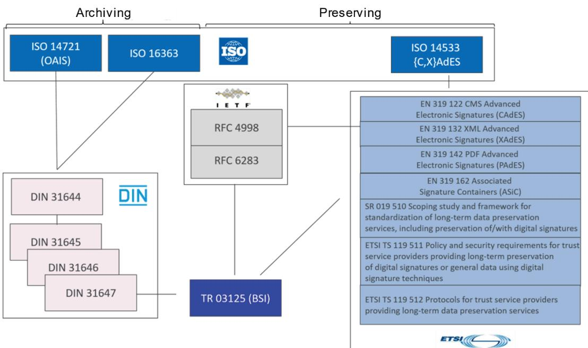

*Abbildung 1 Relevante Standards für die Bewahrung von Informationen und Beweiswert*

Die gezeigten Standards bieten eine vollständige Abdeckung für den gesamten Lebenszyklus elektronischer Signaturen und Siegel sowie die Bewahrung des Beweiswerts für kryptographisch signierte Dokumente.

Die ISO 14721 und ISO 16363 sowie die DIN 31644 bis DIN 31647 befassen sich mit Aspekten der Aufbewahrung der in elektronischen Dokumenten enthaltenen Informationen. Die entsprechenden europäischen (EN) Normen und ETSI-Spezifikationen betreffen Aspekte der technischen Gestaltung der Signaturen und Siegel.

RFC4998 und RFC6283 enthalten Spezifikationen für die Syntax von Evidence Records und die entsprechenden Prozesse zur Wahrung der Integrität, Authentizität und des Existenznachweises für ein oder mehrere Dokumente.

Die Norm ISO 14533 besteht aus vier Teilen:

- Part 1: Long term signature profile for CMS-Advanced Electronic Signatures (CAdES),
- Part 2: Long term signature profile for XML-Advanced Electronic Signatures (XAdES),
- Part 3: Long term signature profiles for PDF Advanced Electronic Signatures (PAdES),
- Part 4: Attributes pointing to (external) Proof of Existence objects used in Long term signature formats (PoEAttributes).

Diese Norm ISO 14533 zielt darauf ab, die Elemente festzulegen, die die Überprüfung elektronischer Signaturen über einen langen Zeitraum ermöglichen, basierend auf CAdES/XAdES/PAdES und Evidence Records.

DIN 31647:2015 und die Technische Richtlinie BSI TR-03125 (TR-ESOR) als Manifestation der DIN 31647 beschreiben Maßnahmen auf Basis von RFC4998 und RFC6283, die für die Erhaltung des Beweiswerts für kryptographisch geschützte Daten notwendig sind. In Bezug auf Signatur- und Zeitstempelformate stützt sich die TR 03125 TR-ESOR des BSI auf den aktuellen "Durchführungsrechtsakt (EU) 2015/1506 der Kommission vom 8. September 2015 zur Festlegung von Spezifikationen für die Formate fortgeschrittener elektronischer Signaturen und fortgeschrittener Siegel[…]" nach eIDAS[5](#page-9-0).

Als Weiterentwicklung der ETSI-Standards, die im Durchführungsrechtsakt (EU) 2015/1506 der Kommission aufgeführt sind, hat ETSI die ETSI-Standards EN 319122, 319132, 319142 und 319162 veröffentlicht.

Die Technische Spezifikation ETSI TS 119511 definiert die Anforderungen an einen (qualifizierten) Bewahrungsdienstleister (engl. preservation trust service provider), während die Technische Spezifikation ETSI TS 119512 ein Schnittstellenprotokoll und standardisierte Bewahrungsobjektformate für die langfristige Bewahrung kryptographischer Signaturen, Siegel und Zeitstempel sowie von signierten und nicht signierten Daten mit dem Einsatz digitaler Signaturtechnologien definiert. [eIDAS-VO].

 5 Siehe: [https://www.bsi.bund.de/DE/Themen/Oeffentliche-Verwaltung/Moderner-](https://www.bsi.bund.de/DE/Themen/Oeffentliche-Verwaltung/Moderner-Staat/ElektronischeSignatur/Standards/standards_node.html)[Staat/ElektronischeSignatur/Standards/standards\\_node.html](https://www.bsi.bund.de/DE/Themen/Oeffentliche-Verwaltung/Moderner-Staat/ElektronischeSignatur/Standards/standards_node.html)

### 2 BSI TR-03125 TR-ESOR

Die Technische Richtlinie TR-ESOR V1.3 besteht aus den folgenden Dokumenten:

- einem Hauptdokument
- drei Anhängen, die die Schlüsselkomponenten der TR-ESOR IT-Referenzarchitektur in Form von Modulen beschreiben
- fünf Anhängen, in denen die technischen Spezifikationen für die Interoperabilität festgelegt sind (z. B. Formate, Schnittstellen, Prüfbericht, Evidence Record Profiling und Profilerstellung des XAIP-Bewahrungsobjektformats)

Weitere Einzelheiten finden Sie in [Tabelle 2](#page-11-1) .

### 2.1 Wesentliche Neuerungen der TR-ESOR v1.3

- Neue Anlage TR-ESOR-C.2 mit Bereitstellung von BSI Referenztestdaten und Einbindung der neuen Open Source Testtools:
	- (X)AIP-Signature-Validation-Tool, "tr-esor-AIP-eIDAS-SigValidator",
	- TR-ESOR-Eingangs-Schnittstellentesttool, "TR-ESOR-C.2-Testbed",
	- Evidence Record Prüftool v1.3 "ERVerifyTool",
	- ETSI 119 512 Schnittstellen Transformator v1.3 "tresor-ETSITS119512-transformator";
- Fortschreibung der Anlage TR-ESOR-C.1 unter Beibehaltung der Grundstruktur, aber mit editoriellen Präzisierungen und der Integration der Testfälle aus der Anlage TR-ESOR-APP, V1.2.1 und V1.2.2;
- Fortschreibung der Schema Spezifikationen;
- Fortschreibung der "TR-ESOR Preservation Profile" für TR-ESOR V1.3;
- Einführung zweier neuer Funktionen gemäß ETSI TS 119 511 und ETSI TS 119 512 zum Abruf von "TR-ESOR Preservation Profile" (verpflichtend) und Abruf von Logdaten (optional);
- Bereitstellung der Anlage TR-ESOR-PEPT "Preservation Evidence Policy Templates" für TR-ESOR-Produkthersteller und Bewahrungsdienste gemäß ETSI TS 119 511 und ETSI TS 119 512;
- Die Anlage TR-ESOR-B und die Anlage TR-ESOR-XBDP sind auf den Status "historisch" gesetzt worden und werden nicht mehr fortgeschrieben.

#### 2.2 Zielgruppen für die Dokumente

TR-ESOR-Dokumente richten sich an Entscheidungsträger, Projektmanager, Fachexperten, IT-Abteilungen und andere Abteilungen in der Organisation sowie an Anwender. Der Detaillierungsgrad, der zu lesenden Dokumente kann je nach Rolle variieren. In erster Linie sollen die Dokumente von denjenigen gelesen werden, die die TR-ESOR Middleware oder eine ähnliche Lösung entwickeln wollen. Aufgrund des komplexen Sachverhalts und der Verwendung von technischen Fachbegriffen kann die Technische Richtlinie zunächst für Anwender und Nichtfachleute, insbesondere in Bezug auf die technischen Spezifikationen, schwer verständlich sein.

| Dokumente                             | Zielgruppe                          |
|---------------------------------------|-------------------------------------|
| Hauptdokument                         | Entscheidungsträger                 |
|                                       | IT                                  |
|                                       | Produkthersteller, Service Provider |
|                                       | Fachanwender                        |
| Module M1 bis M3                      | IT                                  |
|                                       | Produkthersteller, Service Provider |
| Anhänge E, VR, ERS, F                 | IT                                  |
|                                       | Produkthersteller, Service Provider |
| Zertifizierungsanhänge C1 und C2      | Produktanbieter, Service Provider   |
|                                       | Prüfstellen                         |
| Preservation Evidence Policy Template | Produktanbieter, Service Provider   |
|                                       | Prüfstellen                         |

*Tabelle 2 Zielgruppen für die TR-ESOR-Dokumente*

#### 2.3 Hauptdokument

Das Hauptdokument in der Technischen Richtlinie beschreibt Folgendes:

- Ziele der TR
- Grundlegende regulatorische Anforderungen an eine beweiswerterhaltende Bewahrung
- Fachlich-technischer Rahmen der Technischen Richtlinie
	- Middleware-Funktionen zum Beweiswerterhalt
	- Organisatorische Anforderungen
	- Technische Anforderungen, z. B.
		- Daten- und Dokumentenformate
		- Austausch- und Speicherformate
- Empfohlene Referenzarchitektur
- Grundlegende Anforderungen an Module und Prozesse, incl. XML-Adapter
- Grundlegende Sicherheitsanforderungen
- Zertifizierungsverfahren der TR-03125 (TR-ESOR)

Die Anlagen dienen als Ergänzung und Vertiefung zum Hauptdokument hinsichtlich derModule, Formate, Schnittstellen, Prüfberichte, Technischen Beweisdaten oder Zertifizierung.

Weitere Informationen zu den TR-ESOR-Dokumenten finden Sie hier:

in englischer Sprache: <http://www.bsi.bund.de/EN/tr-esor>

in deutscher Sprache: <http://www.bsi.bund.de/tr-esor>

| Aspekt                                                                  | Dokumente                                                                                                                                                                                                                            |
|-------------------------------------------------------------------------|--------------------------------------------------------------------------------------------------------------------------------------------------------------------------------------------------------------------------------------|
| Module                                                                  | TR-ESOR-M1: ArchiSafe-Modul                                                                                                                                                                                                          |
|                                                                         | TR-ESOR-M2: Krypto-Modul                                                                                                                                                                                                             |
|                                                                         | TR-ESOR-M3: ArchiSig-Modul                                                                                                                                                                                                           |
| Interoperabilität, z. B.                                             | TR-ESOR-F: Formate, einschließlich der Schemadateien                                                                                                                                                                                 |
| Formate und Schnittstellen                                              | TR-ESOR-E: Konkretisierung der Schnittstellen auf Basis des eCard API Frameworks [TR-eCARD] und [ETSI TS 119512]                                                                                                               |
|                                                                         | TR-ESOR-ERS: Profiling von Evidence Eecords basierend auf RFC 4998 und 6273                                                                                                                                                       |
|                                                                         | TR-ESOR-TRANS: Allgemeine Spezifikation des ETSI TS119512 TR ESOR Transformators (zur Übersetzung der Preservation-API Schnittstelle TR-S. 512 von [ETSI TS 119 512] in die TR-ESOR Eingangsschnittstelle TR-S. 4) |
| Prüfbericht                                                             | TR-ESOR-VR: Verification Reports for Selected Data Structures Version 1.3                                                                                                                                                         |
| Zertifizierung                                                          | TR-ESOR-C.1: Conformity Test Specification (Level 1 Functional Conformity)                                                                                                                                                        |
|                                                                         | TR-ESOR-C.2: Conformity Test Specification (Level 2 Technical Conformity)                                                                                                                                                         |
| Vorlage für Bewahrungsnachweise (engl. Preservation Evidence Policy) | TR-ESOR-PEPT: Preservation Evidence Policy Template TR-ESOR (PEPT) v1.3                                                                                                                                                        |
| XML-Schemata                                                            | In BSI-TR-ESOR-Schema-1.3.0+Profile.zip6                                                                                                                                                                                             |
| Preservation Profile                                                    | BSI-TR-ESOR-Schema-1.3.0+Profil.zip enthält:                                                                                                                                                                                      |
|                                                                         | • BSI-TR-ESOR-v1.3-S4-v1.0-Profile_MAX_LOCAL.xml                                                                                                                                                                                  |
|                                                                         | • BSI-TR-ESOR-v1.3-S4-v1.0-Profile_MIN_LOCAL.xml                                                                                                                                                                                  |
|                                                                         | • BSI-TR-ESOR-v1.3-ETSI-TS-119512-v1.1.2- Profile_MAX_LOCAL.xml                                                                                                                                                                |
|                                                                         | • BSI-TR-ESOR-v1.3-ETSI-TS-119512-v1.1.2- Profile_MIN_LOCAL.xml                                                                                                                                                                |
| [BSIRilieSig]                                                           | Leitlinie für digitale Signatur-, Siegel-, Zeitstempel-formate sowie technische Beweisdaten (Evidence Record) Version 1.07                                                                                                        |

 6 Siehe

[https://www.bsi.bund.de/SharedDocs/Downloads/DE/BSI/Publikationen/TechnischeRichtlinien/TR03](https://www.bsi.bund.de/SharedDocs/Downloads/DE/BSI/Publikationen/TechnischeRichtlinien/TR03125/BSI-TR-ESOR-Schema-1_3_0_Profile.zip?__blob=publicationFile&v=2) [125/BSI-TR-ESOR-Schema-1\\_3\\_0\\_Profile.zip?\\_\\_blob=publicationFile&v=2](https://www.bsi.bund.de/SharedDocs/Downloads/DE/BSI/Publikationen/TechnischeRichtlinien/TR03125/BSI-TR-ESOR-Schema-1_3_0_Profile.zip?__blob=publicationFile&v=2)

7

[https://www.bsi.bund.de/SharedDocs/Downloads/DE/BSI/Publikationen/TechnischeRichtlinien/TR03](https://www.bsi.bund.de/SharedDocs/Downloads/DE/BSI/Publikationen/TechnischeRichtlinien/TR03125/BSI_TR_03125_Leitlinie_fuer_digitale_Signatur-Siegel-Zeitstempelformate.pdf?__blob=publicationFile&v=1) [125/BSI\\_TR\\_03125\\_Leitlinie\\_fuer\\_digitale\\_Signatur-Siegel-](https://www.bsi.bund.de/SharedDocs/Downloads/DE/BSI/Publikationen/TechnischeRichtlinien/TR03125/BSI_TR_03125_Leitlinie_fuer_digitale_Signatur-Siegel-Zeitstempelformate.pdf?__blob=publicationFile&v=1)[Zeitstempelformate.pdf?\\_\\_blob=publicationFile&v=1](https://www.bsi.bund.de/SharedDocs/Downloads/DE/BSI/Publikationen/TechnischeRichtlinien/TR03125/BSI_TR_03125_Leitlinie_fuer_digitale_Signatur-Siegel-Zeitstempelformate.pdf?__blob=publicationFile&v=1)

| Aspekt           | Dokumente                                                                                                                                                                                                                                         |
|------------------|---------------------------------------------------------------------------------------------------------------------------------------------------------------------------------------------------------------------------------------------------|
| [TR-ESOR-LEIT]   | Leitlinie für die langfristige Aufbewahrung digitaler Signaturen oder Daten oder Dokumente gemäß TR-ESOR – Leitfaden für Behörden und Unternehmen (dieses Dokument)                                                                         |
| [ASS 319 401] | Criteria for Assessing Trust Service Providers against ETSI Policy Requirements - Part 1: Assessment Criteria for all TSP – ETSI EN 319 401                                                                                                 |
| [ASS 119 511] | Criteria for Assessing Trust Service Providers against ETSI Policy Requirements - Part 2 Assessment Criteria providing long-term preservation of digital signatures or general data using digital signature techniques – ETSI TS 119 511 |

*Tabelle 3 TR-ESOR Anhänge*

Darüber hinaus bietet das BSI auch eine Reihe von Open-Source-Tools für die Implementierung von TR-ESOR und für die Prüfung der Interoperabilität verschiedener TR-ESOR-Produkte.

| Open Source Werkzeuge                                   | Fokussierung                                                                                                                                                                                                                                               |
|---------------------------------------------------------|------------------------------------------------------------------------------------------------------------------------------------------------------------------------------------------------------------------------------------------------------------|
| Evidence Record Prüftool: "ERVerify"                    | Überprüfung der Konformität der Evidence Records gemäß RFC4998/6283 und TR-ESOR ERS zum Zwecke der Interoperabilität                                                                                                                                 |
| Transformator: "ETSI TS119512 TR-ESOR Transformator" | Transformation der Preservation-API-Schnittstelle TR-S. 512 von [ETSI TS 119 512] in die TR-ESOR Eingangsschnittstelle TR-S. 4                                                                                                                 |
| (L)XAIP-Validator: "AIP eIDAS Signature Validator"      | Validierung der (logischen) XML-basierten ArchiveInformationPackages (L)XAIP und ASiC-8 AIPs, einschließlich der darin enthaltenen Signaturen, Siegel und Zeitstempel und Evidence Records zum Zwecke der Korrektheit und Interoperabilität |
| TR-ESOR-C.2-Testbed                                     | Prüfstand gemäß TR-ESOR Anhang C.2 https://github.com/de-bund-bsi-tr-esor/TR-ESOR C.2-Testbed                                                                                                                                                        |

*Tabelle 4 TR-ESOR Werkzeuge*

8 Gemäß [TR-ESOR-F] Abschnitt 3 und [ETSI TS 119 512], Anhang A und [ETSI EN 319162]

### 2.4 IT-Referenzarchitektur

Ein Schlüsselelement innerhalb von TR-ESOR ist die empfohlene modulare und skalierbare IT-Referenzarchitektur für die Middleware, die in Abbildung 2 und Abbildung 3 gezeigt wird. Die in der Technischen Richtlinie enthaltenen Spezifikationen konzentrieren sich auf die Implementierung dieser IT-Architektur. Die IT-Architektur bleibt anwendungs-, hersteller- und produktunabhängig und kann daher als Basis für eine TR-ESOR-Implementierung genutzt werden.

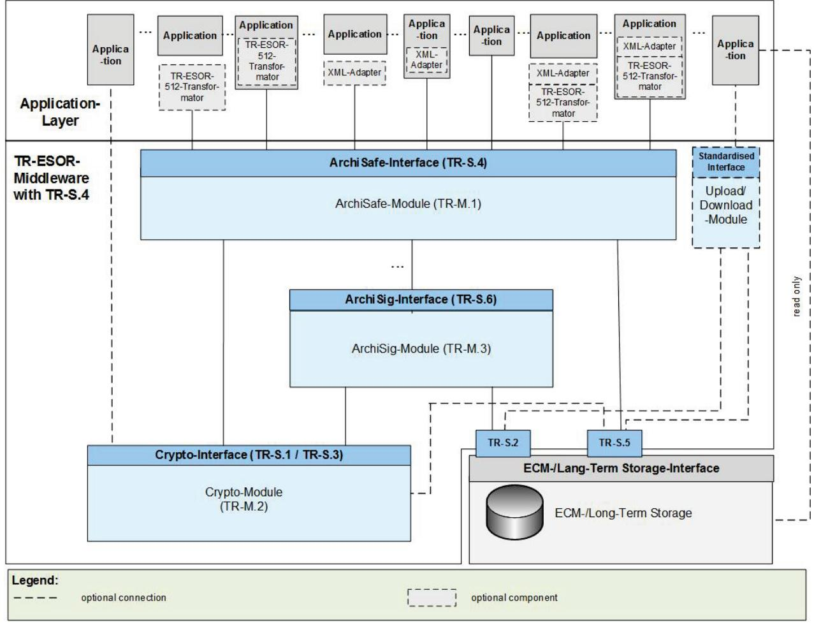

*Abbildung 2 TR-ESOR Referenzarchitektur mit TR-ESOR Eingangsschnittstelle TR-S. 4*

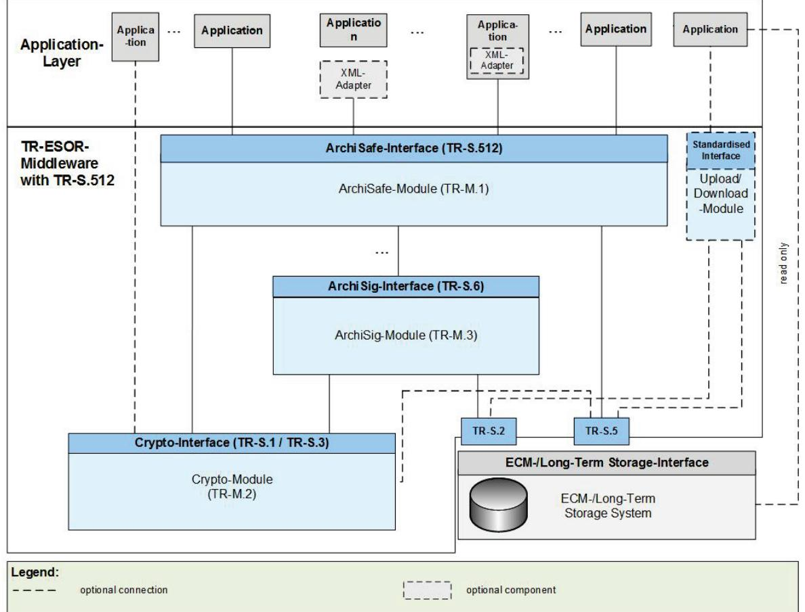

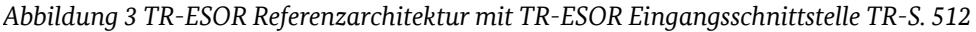

#### 2.4.1 Referenzarchitekturmodule

Die in TR-ESOR beschriebene Middleware besteht aus drei Kernmodulen:

- ArchiSafe-Modul
- Krypto-Modul
- ArchiSig-Modul

plus

• optionales Upload-/Download-Modul

Die Middleware wird von der Geschäftsanwendung (Application Layer) entkoppelt und auch vom ECM- /Langzeit-Speicher System getrennt.

#### 2.4.2 Welche Komponenten sind nicht Teil der TR-ESOR Middleware?

NICHT Teil der Middleware:

- Geschäftsanwendung (z. B. E-Akte, E-Rechnung, ERP, Geschäftsprozess usw.)
- XML-Adapter
- ECM-/Langzeit-Speicher (z. B. Speichersysteme, Datenbank)

• Vertrauensdiensteanbieter für die Generierung oder Überprüfung qualifizierter elektronischer Signaturen, Siegel und/oder Zeitstempel

#### 2.5 TR-ESOR Kernmodule

#### 2.5.1 M.1: ArchiSafe-Modul

Definiert das zentrale Modul der Referenzarchitektur, das den Informationsfluss regelt, die Sicherheitsanforderungen an die IT-Anwendungsschnittstellen umsetzt und dafür sorgt, dass Applikationssysteme und ECM-/Langzeit-Speicher entkoppelt werden.

Das Dokument erläutert die Struktur und den Umfang des Moduls und beschreibt die funktionalen Anforderungen und Sicherheitsanforderungen, die dieses Modul erfüllen muss.

Einzelheiten zum ArchiSafe-Modul finden Sie unter [\[TR-ESOR-M1\]](https://www.bsi.bund.de/SharedDocs/Downloads/DE/BSI/Publikationen/TechnischeRichtlinien/TR03125/BSI_TR_03125_Anlage_M1_V1_3.pdf).

#### 2.5.2 M.2: Krypto-Module

Das Krypto-Modul deckt im Wesentlichen die kryptographischen Funktionen zur Hashwert- (Prüfsummen-) Berechnung über vorgelegte elektronische Dokumente, Prüfung von elektronischen Signaturen, Siegeln (elektronische Bestätigung), Zeitstempeln (Nachweis, dass Daten zu einem bestimmten Zeitpunkt vorlagen) und Zertifikate sowie zur Einholung von qualifizierten Zeitstempeln ab. Ab Version 1.2.1 ist auch anzumerken, dass das Modul für die Signatur-/Siegelvalidierung beide Validierungsmodelle umfassen muss, die typischerweise verwendet werden: das Kettenmodell und das Schalenmodell[9](#page-16-4). Dabei müssen die digitalen Signaturen eines AIP mindesten in einem der beiden Validierungsmodelle erfolgreich geprüft werden können. Die Erzeugung/Einholung qualifizierter elektronischer Signaturen ist optional.

Einzelheiten zum Krypto-Modul finden Sie unter [\[TR-ESOR-M2\]](https://www.bsi.bund.de/SharedDocs/Downloads/DE/BSI/Publikationen/TechnischeRichtlinien/TR03125/BSI_TR_03125_Anlage_M2_V1_3.pdf).

#### 2.5.3 M.3: ArchiSig-Modul

Das ArchiSig-Modul bietet die Funktionen zur Bewahrung des Beweiswerts für signierte und nicht signierte Dokumente auf Basis von Merkle-Hashbäumen, so dass Authentizität und Integrität kosteneffizient erhalten bleiben können. Zu diesem Zweck legen die ERS-Standards [RFC4998] und [RFC6283] einen "reduzierten Hashbaum" fest, der alle Daten aus dem Hashbaum enthält, die zur Überprüfung der Authentizität, Integrität und Existenz eines solchen Archivdatenobjekts erforderlich sind und die als verkehrsfähige technische Beweisdaten (Evidence Record) gegenüber Dritten verwendet werden können. Das ArchiSig-Modul kann auch die eindeutige Archivobjekt-ID (AOID) pro Archivdatenobjekt und Versions-ID pro Version eines Archivdatenobjekts erstellen.

- Wenn nur der Signaturalgorithmus seine Eignung als Sicherheitsmechanismus vorhersehbar verliert, aber der eingesetzte Hash-Algorithmus beibehalten werden kann, dann ist die Durchführung einer Zeitstempelverlängerung ausreichend. Bevor dieser Zustand entsteht , wird zu diesem Zweck ein neuer Zeitstempel unter Einbeziehung des letzten Zeitstempels erstellt. Als Ergebnis dieses Prozesses wird im Laufe der Zeit eine Abfolge von Archivzeitstempeln erstellt, die in einer "ArchiveTimeStampChain" enthalten sind.
- Wenn der eingesetzte Hash-Algorithmus in absehbarer Zeit seine Eignung als Sicherheitsmechanismus verliert, muss die Hashbaumerneuerung durchgeführt werden. Dazu werden für alle Archivdatenobjekte neue Hashwerte berechnet auf dessen Basis ein neuer Merkle-Hashbaum erzeugt wird, der dann einen neu erstellten qualifizierten Zeitstempel erhält.

Darüber hinaus unterstützt das ArchiSig-Modul u.a. auch die Erzeugung, den Abruf und die Prüfung technischer Beweisdaten (Evidence Records). Die technischen Beweisdaten beinhalten den Nachweis der

 9 Siehe [BSI-DSig]

Integrität und Authentizität eines gespeicherten elektronischen Dokumentes und dessen Existenz zu einer bestimmten Zeit. Anhang TR-ESOR-ERS auf Basis von [RFC 4998] (Pflicht) bzw. [RFC 6283] (optional) profiliert den Aufbau der technischen Beweisdaten.

Mit der Erstellung eines Evidence Records wird der reduzierte Hashbaum (siehe [RFC4998], [RFC6283] und [Abbildung 4\)](#page-17-0) aus dem gesamten Hashbaum für das entsprechende Archivdatenobjekt oder die entsprechende Archivdatenobjektgruppe abgeleitet. Das Ergebnis wird dann als "Evidence Record" bezeichnet.

Das Verifizierungstool des BSI für Evidence Records ist, als kostenloser Download (Open Source Lizenz), abrufbar unter

<https://github.com/de-bund-bsi-tr-esor/ERVerifyTool>

Die folgende Abbildung (Abbildung 4) veranschaulicht dieses Prinzip.

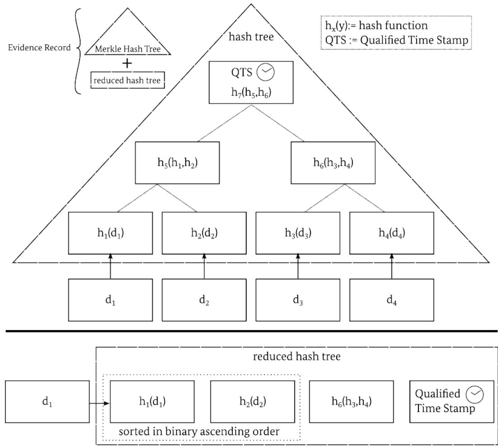

*Abbildung 4 TR-ESOR Hashbaum basierend auf RFC4998 und RFC6283*

Dokument M3 beschreibt die funktionalen und technischen Anforderungen an das ArchiSig-Modul. Einzelheiten zum ArchiSig-Modul finden Sie unter [TR-ESOR-M3].

### 2.6 Optionale TR-ESOR Module

#### 2.6.1 Optional Upload/Download-Modul

Das optionale Upload/Download-Modul ist nur erforderlich, wenn für große Datenmengen ein logisches Archivinformationspaket (LXAIP, siehe Anhang F, Kap. 3.2) verwendet wird. In diesem Fall ermöglicht das **optionale** Upload-Modul der Geschäfts-Anwendung oder dem XML-Adapter (siehe Hauptdokument, Kap. 7.4.6), die zu einem LXAIP gehörenden Inhaltsdaten (siehe Hauptdokument, Kap. 7.4.6) über dieses Upload/Download-Modul hochzuladen oder herunterzuladen. Das Upload-/Download-Modul muss eine Schnittstelle auf Basis offener, wohldokumentierter, internationaler Standards aufweisen. Es ist nicht möglich über das Upload-/Download-Modul XAIP/LXAIP oder ASiC-AIP zu verarbeiten.

Die Module sind im [TR-ESOR](https://www.bsi.bund.de/SharedDocs/Downloads/DE/BSI/Publikationen/TechnischeRichtlinien/TR03125/BSI_TR_03125_V1_2_2.pdf) Hauptdokument in den Kapiteln 7.4.4 und 7.4.5 beschrieben.

#### 2.6.2 Optionaler XML-Adapter

Der XML-Adapter ist eine optionale Komponente, der die Verbindung von Geschäftsanwendungen zur TR-ESOR Middleware herstellt und eine Archivierungsschnittstelle zwischen den Anwendungen in der Applikations-Schicht und dem ArchiSafe-Modul bereitstellt.

XML-Adapterfunktionen umfassen folgende Funktionen:

- Erstellung des (L)XAIP-Containers nach TR-ESOR-F
- Konvertierung von Inhaltsdaten in langzeitaufbewahrungsfähige Formate
- Anbindung der Geschäftsanwendung unter Kapselung der eigentlichen Middleware
- Mapping der Identifier der TR-ESOR-Middleware (AOID/Versions-ID) auf Identifier der Geschäftsanwendungen.

Sofern ein XML-Adapter besteht, ist dieser in der Regel mandantenfähig und kann wie folgt implementiert werden:

- Jeweils eigenständige Komponente mit Schnittstellen zur Geschäftsanwendung sowie zum ArchiSafe-Modul
- Jeweils eigenständige Komponente, jedoch Teil der Geschäftsanwendung mit Schnittstelle zum ArchiSafe-Modul

Der XML-Adapter (sofern implementiert) ist der Konnektor zwischen Applikationsschicht und Middleware. Dieser XML-Adapter ist bei der Ablage oder der Änderung elektronischer Unterlagen beteiligt. Dabei erzeugt der Adapter aus den Anwendungsdaten einen (L)XAIP-Container und schickt diesen Container über die TR-S.4 oder S.512 Schnittstelle an die Middleware. Von der Middleware wird eine AOID oder Versions-ID an die Geschäftsanwendung zurückgegeben.

#### 2.6.3 Optional "ETSI TS119512 TR-ESOR Transformator"

"Das Open-Source-Werkzeug "ETSI TS119512 TR-ESOR Transformator" ist in der Lage, im Rahmen eines Bewahrungsproduktes bzw. Bewahrungsdienstes gemäß eIDAS eingehende Nachrichten im ETSI TS 119 512 - Schnittstellenformat auf das TR-ESOR S4 - Nachrichtenformat zu transformieren und an ein angeschlossenes TR-ESOR- System weiter zu leiten. So kann ein TR-ESOR konformes System mit der ETSI

TS 119512 - Schnittstelle in Europa genutzt werden, ohne dass vorher Änderung an dem TR-ESOR- System vorgenommen werden müssen ."[10](#page-19-5)

Die Spezifikationen für den "ETSI TS119512 TR-ESOR Transformator" finden Sie hier:

[https://github.com/de-bund-bsi-tr-esor/tresor-ETSITS119512-transformator/blob/master/BSI-TR-03125-](https://github.com/de-bund-bsi-tr-esor/tresor-ETSITS119512-transformator/blob/master/BSI-TR-03125-512-S4-TRANSFORMATOR-V1_3_0.pdf) [512-S4-TRANSFORMATOR-V1\\_3\\_0.pdf](https://github.com/de-bund-bsi-tr-esor/tresor-ETSITS119512-transformator/blob/master/BSI-TR-03125-512-S4-TRANSFORMATOR-V1_3_0.pdf) 

Das kostenlose (Open-Source) BSI Tool "ETSI TS 119512 TR-ESOR Transformator" ist unter folgendem Link verfügbar: <https://github.com/de-bund-bsi-tr-esor/tresor-ETSITS119512-transformator>

#### 2.7 Interoperabilitätsplattform-Tools

#### 2.7.1 ER Verify Tool

Das Open-Source ER Verify Tool wird verwendet, um die Konformität eines Nachweisdatensatzes anhand der Anforderungen von TR-ESOR-ERS in Version 1.3 bzw. RFC 4998 zu überprüfen.

Das Tool ist auf GitHub verfügbar.

<https://github.com/de-bund-bsi-tr-esor/ERVerifyTool>

#### 2.7.2 C.2 Testbed

Mit dem Open-Source C.2 Testbed können die Testfälle nach TR-ESOR-C.2 für die TR-ESOR-Schnittstelle S. 4 und die ETSI TS 119512-Schnittstelle S.512 verifiziert werden.

Das Tool ist auf GitHub verfügbar.

<https://github.com/de-bund-bsi-tr-esor/TR-ESOR-C.2-Testbed>

#### 2.7.3 AIP-eIDAS-Signature-Validator

Das Open-Source-Tool "tr-esor-AIP-eIDAS-SigValidator" ist in der Lage, die Syntax von (L)XAIP, ASiC-Containern anhand der Spezifikationen in TR-ESOR Anhang F zu überprüfen und die darin enthaltenen Signaturen, Siegel und Zeitstempel zu validieren und einen interoperablen Validierungsbericht auszugeben.

Das Tool ist auf GitHub verfügbar<https://github.com/de-bund-bsi-tr-esor/tr-esor-AIP-eIDAS-SigValidator>

#### 2.8 TR-ESOR-Prozesse

Die Geschäftsanwendungen, XML-Adapter oder "ETSI TS119512 TR-ESOR Transformator" rufen eine abstrakte, möglichst einfache Anwendungsschnittstelle (TR-S.4 bzw. TR-S.512) auf, um einen der folgenden Prozesse auszuführen:

- 1. Bewahrung kryptographisch signierter oder nicht signierter Daten
- 2. Update der bereits gespeicherten (L)XAIP-Container
- 3. Abruf Vollständiger (L)XAIP-Container (Pflicht) oder Teile davon (optional)
- 4. Löschen (L)XAIP-Container
- 5. Evidence Records abrufen
- 6. Prüfen einer (L)XAIP inkl. den darin enthaltenen oder separat übergebenen beweisrelevanten Daten (elektronische Signaturen, Siegel, Zeitstempel, etc.) oder technischen Beweisdaten (Evidence Record)

 10 Siehe [TR-ESOR], V1.3

- 7. Abruf Preservation Evidence Profiles (RetrieveInfo)
- 8. Abruf Protokolldaten (ArchivTrace) (optional)

Alle Schnittstellen werden als Webdienste auf der Grundlage von [TR-ESOR-E] (siehe Abbildung 5) oder auf [ETSI TS119512] (siehe Abbildung 6) und den Datentypen gemäß [TR-ESOR-F] oder [ETSI TS119512] implementiert.

Sehr große Datenobjekte können mittels des optionales Upload-/Download-Moduls (anstelle der TR-S.4 bzw. TR-S.512) hoch oder runtergeladen werden.

Diese einfachen Anwendungsschnittstellen werden im folgenden Abschnitt näher beschrieben.

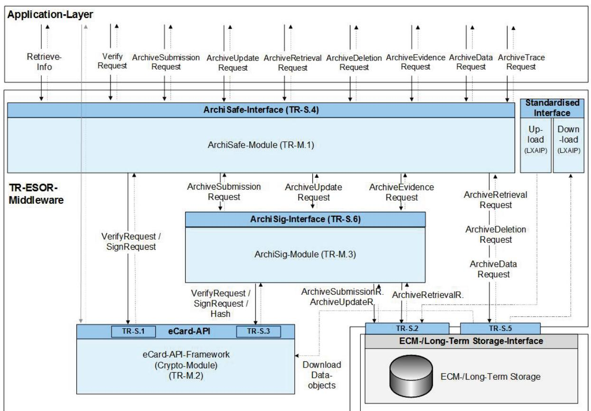

*Abbildung 5 Schnittstellen und Funktionen in der TR-ESOR IT-Referenzarchitektur basierend auf dem eCard API-Framework [TR-eCARD]* 

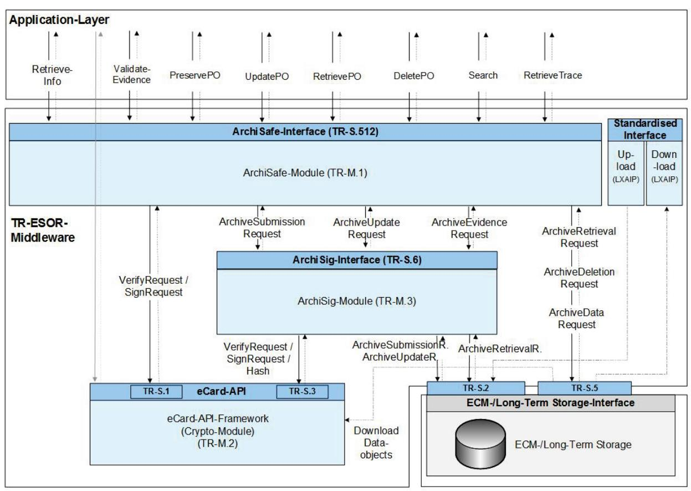

*Abbildung 6 Schnittstellen und Funktionen in der TR-ESOR IT-Referenzarchitektur basierend auf [ETSI TS 119 512]*

#### 2.8.1 Preservation – function type: ArchivSubmission[11](#page-21-1) oder PreservePO[12](#page-21-2)

Der mit ArchiveSubmission aufgerufene Bewahrungsprozess ermöglicht die beweiswerterhaltende Einlagerung von Daten als (L)XAIP bzw. ASiC-AIP-Archivinformationspaket in der TR-ESOR Middleware.

Im Wesentlichen wird ein (L)XAIP bzw. ASiC-AIP übergeben und (wenn der Aufruf erfolgreich ist) eine eindeutige Bezeichnung für den (L)XAIP bzw. ASiC-AIP, bekannt als AOID (Archive Object Identifier) (siehe [TR-ESOR-E, Kap. 3.1]) zurückgegeben.

Alternativ kann ab [TR-ESOR-E V1.3, Kap. 4] auch der Aufruf PreservePO gemäß der ETSI-Standard [ETSI TS 119512, Kap. 5.3.3] verwendet werden.

Diese AOID kann dann später verwendet werden, um die (L)XAIP bzw. ASiC-AIP, die der AOID eindeutig identifiziert (vgl. Abschnitt [2.5.3\)](#page-16-3), auszulesen, zu ändern oder zu löschen oder um zusätzliche Evidence Records anzufordern.

Enthält das übergebene (L)XAIP bzw. ASiC-AIP elektronische Signaturen, Siegel oder Zeitstempel, werden diese vor der Archivierung mit der Funktion Verify gemäß Teil 2 des eCard API Frameworks [TR-eCARD] überprüft (vgl. Abschnitt [2.8.4\)](#page-24-0).

11 Siehe [TR-ESOR-E], Klausel 3 mit der TR-ESOR-Schnittstelle TR-S. 4 12 Siehe [TR-ESOR-E], Abschnitt 4 mit der TR-ESOR-Schnittstelle TR-S. 512

#### 2.8.1.1 Upload

"Im Fall eines logischen XAIP (LXAIP) gemäß ([TR-ESOR-F], Kap. 3.2) ermöglicht es das optionale Upload-Modul, dass die IT-Anwendung oder der XML-Adapter die zu einem LXAIP zugehörigen Archivdatenobjekte über dieses Upload-Modul extern in den ECM-/Langzeit-Speicher hochladen (speichern) können."[13](#page-22-1)

#### 2.8.1.2 Download

"Das optionale Download-Modul ermöglicht es, dass die IT-Anwendung oder der XML-Adapter im Fall eines logischen XAIP (LXAIP) gemäß ([TR-ESOR-F], Kap. 3.2) die zu einem LXAIP zugehörigen extern im ECM-/Langzeit-Speicher abgelegten Datenobjekte über das Download-Modul abrufen können."[14](#page-22-2)

#### 2.8.2 Aktualisierung bereits archivierter Daten – Funktion type: ArchivUpdate[15](#page-22-3) oder UpdatePOC[16](#page-22-4)

Die TR-ESOR Middleware bietet auch die Möglichkeit, den (L)XAIP-Container zu aktualisieren, indem eine neue Version des (L)XAIP erzeugt wird, die die ursprünglich enthaltenen Objekte sowie die zusätzlich an die Middleware übergebenen Datenobjekte enthält.

Der Aufruf ArchiveUpdateRequest muss mindestens die folgenden Unterkomponenten enthalten.

Ein zusätzliches XML-basiertes Delta-XAIP gemäß ([TR-ESOR-F], Abs. 3.1.6) oder Delta-LXAIP gemäß ([TR-ESOR-F], Sek. 3.2.2) einschließlich der AOID des (L)XAIP, der Vorgänger-VersionID, Verweise auf aus dieser Version übernommene Objekte unverändert und die hinzuzufügenden Elemente, die zu einer neuen Version eines bereits gespeicherten (L)XAIP hinzugefügt werden sollen.

Unter einer Änderung in diesem Zusammenhang versteht man das Hinzufügen von:

- Daten, Dokumenten und Metadaten,
- technische Beweisdaten (Evidence Record),
- beweisrelevanten Daten (Signaturen, Siegel, Zeitstempel, ValidationReports)

Als Antwort auf ein ArchiveUpdateRequest wird ein entsprechendes ArchiveUpdateResponse-Element zurückgegeben, das bei Erfolg die neue Versionskennung VersionID des (L)XAIP enthält, um diese neue Version zu identifizieren, die auf die neu erstellte Version in der (L)XAIP als ursprünglich gespeichert ([TR-ESOR-E, Kap. 3.2] verweist).

Alternativ kann ab [TR-ESOR-E V1.3, Kap. 4] auch ein Aufruf an UpdatePOC gemäß Abschnitt 5.3.6 der EU ETSI-Standard [ETSI TS 119512, Kap. 5.3.6] verwendet werden.

Der Änderungsprozess unterstützt insbesondere die frühzeitige beweissichernde Speicherung, z. B. beim ersetzendes Scannen mit TR-RESISCAN. Auf diese Weise können Dokumente frühzeitig, sicher und beweiswerterhaltend gespeichert werden. Teile der entsprechenden Datei, die später erstellt wurden, können dann einfach mit einem Update in den Archivdaten-Container aufgenommen werden, wodurch die Bewahrung im logischen Geschäftszusammenhang gewährleistet wird. Dadurch wird das exponentielle Wachstum einzelner Archivinformationspaket mit nur wenigen Dateien sowie der damit verbundene hohe Aufwand durch Migration und Performance vermieden. Ähnliche Fragen stellen sich bspw. bei elektronischen Rechnungen oder Vorgängen, deren eigentliche Bewahrungsfrist erst bspw. zu einem späteren Zeitpunkt (z.B. 01.01. des Folgejahres nach Rechnungsausgleich) oder nach Jahrzehnten beginnt, diese aus Nachweis-/Sicherheitsgründen oder aufgrund ersetzenden Scannens jedoch frühzeitig beweissicher abgelegt werden sollen.

 13 Siehe [TR-ESOR], Kap. 7.4.4.

14 Siehe [TR-ESOR], Kap. 8.4.5.

15 Siehe [TR-ESOR-E], Klausel 3 mit der TR-ESOR-Schnittstelle TR-S. 4

16 Siehe [TR-ESOR-E], Abschnitt 4 mit der TR-ESOR-Schnittstelle TR-S. 512

#### 2.8.3 Abfrage archivierter Daten – Funktionstyp: ArchiveRetrieval/ArchiveData[17](#page-23-1) oder RetrievePO[18](#page-23-2)

#### 2.8.3.1 ArchiveRetrieval oder RetrievePO

Damit bereits archivierte (L)XAIPs gelesen werden können, bietet die TR-ESOR Middleware Prozesse zur Abfrage von archivierten (L)XAIPs oder ASiC an.

"Mit dem Funktionseingabeparameter ArchiveRetrievalRequest wird das zu einer übergebenen AOID und VersionID gehörende physische XAIP-Archivdatenobjekt gemäß [TR-ESOR-F], Abs. 3.1, das logische XAIP gemäß [TR-ESOR-F], Abs. 3.2, oder das ASiC-AIP gemäß [TR-ESOR-F], Abs. 3.3 über die TR-ESOR Middleware aus dem ECM--/Langzeit-Speichersystem ausgelesen." [TR-ESOR-E, Abs. 3.3]

Anforderung der Datenobjekte erfolgt für

- eine Abfolge von Versionskennungen (VersionIDs) oder
- alle Versionen.

"Sofern das VersionID-Element nicht angegeben ist, werden die zur letzten Version gehörigen Datenobjekte und Verwaltungsinformationen eines XAIPs bzw. LXAIPs zurückgeliefert. Durch die Angabe von 'all' (optionaler Parameter des Funktionsaufrufs ArchiveRetrievalRequest) werden alle existierenden Versionen eines Archivdatenobjektes zurückgeliefert." (siehe [TR-ESOR-E, Kap. 3.3])

Alternativ kann ab [TR-ESOR-E v1.3, Kap. 4] auch ein Aufruf an RetrievePO gemäß Abschnitt 5.3.4 des ETSI-Standards [ETSI TS 119512, Kap. 5.3.4] verwendet werden.

#### 2.8.3.2 ArchiveData oder Search (optional)

Die Funktion ArchiveDataRequest ermöglicht lesenden Zugriff auf einzelne diskrete Datenelemente eines zuvor gespeicherten (L)XAIP bzw. ASiC-AIP, ohne den gesamten (L)XAIP bzw. ASiC-AIP zurückzugeben (siehe [TR-ESOR-E, Kap. 3.6]).

Alternativ kann ab [TR-ESOR-E V1.3, Kap. 4] auch ein Aufruf Search gemäß des ETSI-Standards [ETSI TS 119512, Kap. 5.3.9] verwendet werden.

#### 2.8.3.3 Andere Formen des lesenden Zugriffs

Daneben lässt es die TR-ESOR zu, von den Geschäftsanwendungen **lesend** auch direkt auf die im Speicher abgelegten Daten zuzugreifen, ohne die Middleware zu nutzen. Dies ist jedoch nur für lesenden Zugriff möglich – erleichtert jedoch den Abruf einzelner Datenobjekte.

#### 2.8.3.4 Rückgabe Evidence Record – Funktionstyp: ArchiveEvidenceRequest[19](#page-23-3) oder RetrievePO[20](#page-23-4)

Die TR-ESOR Middleware ermöglicht es, dass bei Bedarf mittels des Aufrufs ArchiveEvidenceRequest für ein gespeichertes (L)XAIP (siehe Abschnitt [2.6.1\)](#page-18-1) ein entsprechender technischer Beweisdatensatz "EvidenceRecord" gemäß [RFC 4998] bzw. [RFC 6283] angefordert werden kann, durch den die Integrität und Authentizität des (L)XAIPs langfristig gewahrt und somit die Beweiskraft erhalten werden kann.

Die Rückgabe von technischen Nachweisen der Authentizität und Integrität als Evidence Records erfolgt mittels ArchiveEvidenceResponse. (Siehe [TR-ESOR-E, Kap. 3.4].)

 17 Siehe [TR-ESOR-E], Klausel 3 mit der TR-ESOR-Schnittstelle TR-S. 4

18 Siehe [TR-ESOR-E], Abschnitt 4 mit der TR-ESOR-Schnittstelle TR-S. 512

19 Siehe [TR-ESOR-E], Klausel 3 mit der TR-ESOR-Schnittstelle TR-S. 4

20 Siehe [TR-ESOR-E], Abschnitt 4 mit der TR-ESOR-Schnittstelle TR-S. 512

Alternativ kann ab [TR-ESOR-E V1.3, Kap. 4] auch ein Aufruf zu RetrievePO gemäß des ETSI-Standards [ETSI TS 119512, Kap. 5.3.4] verwendet werden.

#### 2.8.3.5 Archivdaten löschen – Funktionstyp: ArchivDeletion[21](#page-24-1) oder DeletePO[22](#page-24-2)

Für die entgültige Entfernung von gespeicherten Archivinformationspaketen bietet die TR-ESOR Middleware die Funktion ArchiveDeletion an, um sowohl die (L)XAIP bzw. ASiC-AIP als auch die referenzierten Nutzdaten zu löschen.

Beim Löschen werden alle Informations- und Metadaten sowie alle Versionen des Archivdatenobjekts und referenzierte Nutzdaten gelöscht. Da dies ein sehr kritischer Prozess ist, kann das Löschen nur von ordnungsgemäß autorisierten Benutzern durchgeführt werden. Es wird ein 4-Augen-Prinzip empfohlen .

Eine Automatisierung dieses Prozesses kann bei Archivdatenobjekten implementiert werden, deren gesetzliche Mindestspeicherfrist abgelaufen ist.

Vor Ablauf der gesetzlichen Mindestbewahrungsfrist kann eine Löschung nur durch organisatorisch autorisierte Nutzer erfolgen und nur mit Angabe einer Begründung im Löschauftrag. Zur Nachvollziehbarkeit werden alle Löschvorgänge protokolliert. Die Löschung vor Ablauf der Mindestbewahrungsfrist kann zum Beispiel nötig werden, wenn es sich um personenbezogene Daten handelt und die betreffende Person der Speicherung der Daten nicht (oder nicht mehr) zustimmt. (DSGVO Konformität!).

Nachdem die AOIDs und gegebenenfalls eine zugehörige Begründung einschließlich der Authentifizierungsdaten des Aufrufers zum Löschen übergeben wurden, wird das entsprechende (L)XAIP bzw. ASiC-AIP aus dem Langzeitspeicher gelöscht.

Die Bestimmung der zur Löschung autorisierten Personen muss durch Sicherheitsmerkmale in der vorgelagerten Geschäftsanwendung erwirkt werden und ist nicht Aufgabe der TR-ESOR-Middleware.

(Siehe [TR-ESOR-E, Kap. 3.5].)

Alternativ kann ab [TR-ESOR-E V1.3, Kap. 4] auch ein Aufruf von DeletePO gemäß des ETSI-Standards [ETSI TS 119512, Kap. 5.3.5] verwendet werden.

#### 2.8.4 Überprüfung von Archivinformationspaketen einschließlich der zusätzlich enthaltenen oder übergebenen beweisrelevanten Daten und Evidence Records – Funktionstyp: Verify[23](#page-24-3) oder ValidateEvidence[24](#page-24-4)

Um eine (L)XAIP bzw. ASiC-AIP und die darin enthaltenen beweisrelevanten Daten (Signaturen, Siegel, Zeitstempel, Zertifikate, Sperrlisten, OCSP-Antworten) sowie Evidence Records zu verifizieren, bietet die TR-ESOR Middleware die Verify-Funktion an (siehe [TR-ESOR-E, Kap. 3.7]).

Alternativ kann ab [TR-ESOR-E V1.3, Kap. 4] auch ein Aufruf von ValidateEvidence gemäß des ETSI-Standards [ETSI TS 119512, Kap. 5.3.8] verwendet werden.

 21 Siehe [TR-ESOR-E], Klausel 3 mit der TR-ESOR-Schnittstelle TR-S. 4

22 Siehe [TR-ESOR-E], Abschnitt 4 mit der TR-ESOR-Schnittstelle TR-S. 512

23 Siehe [TR-ESOR-E], Klausel 3 mit der TR-ESOR-Schnittstelle TR-S. 4

24 Siehe [TR-ESOR-E], Abschnitt 4 mit der TR-ESOR-Schnittstelle TR-S. 512

#### 2.8.5 RetrieveInfo[25](#page-25-4)

Durch Aufruf der Funktion RetrieveInfo ist es möglich, die Beschreibung der Eigenschaften des Bewahrungsprodukts oder der Bewahrungsdienstleistung in Form eines Bewahrungsprofil (engl. Preservation Profile) anzufordern.

#### 2.8.6 ArchivTrace[26](#page-25-5) (optional)

Die Funktion ArchiveTrace erlaubt es, eine Dokumentation der bei der Verarbeitung eines Archivdatenobjekts innerhalb des Bewahrungsproduktes bzw. -diensts ausgeführten Schritte abzurufen.

#### 2.9 Formate und Schnittstellen

TR-ESOR legt nicht nur ein dediziertes Format für Archivdatenobjekte fest, sondern liefert auch Details zu den Schnittstellen, insbesondere der zentralen Eingangsschnittstelle TR-S. 4, die auf dem eCard API Framework TR-S. 4[27](#page-25-6) (siehe Abbildung 2) sowie der [ETSI TS 119 512] Schnittstelle TR-S. 512 in der Profilierung- Spezifikation [TR-ESOR-TRANS] (siehe Abbildung 3) mit dem Ziel der technischen Interoperabilität basiert.

#### 2.9.1 Formate und Datencontainer

#### 2.9.1.1 Grundprinzip

Anhang [TR-ESOR-F] spezifiziert vor allem die verbindlichen Datencontainer als Austauschformate zur beweiswerterhaltenden Bewahrung sowohl signierter als auch unsignierter Dokumente in Form selbsttragender Archivinformationspakete. Ziel ist es, alle zur Nachweisführung entsprechend den geltenden Bewahrungspflichten notwendigen Daten in einem Datencontainer in standardisierter wie herstellerneutraler Form verkehrsfähig aufzubewahren und so deren langfristigen Nachweis wie Nutzbarkeit zu ermöglichen.

Gemäß TR-ESOR sind folgende Containerformate und Binärdaten möglich (Import/Export):

- Physisches XML-basiertes Archivinformationspaket[28](#page-25-7) XAIP gemäß [TR-ESOR-F, Abschnitt 3.1] und [ETSI TS119512, Annex A.1.5, A.3.2];
- Logische LXAIP gemäß [TR-ESOR-F, Abschnitt 3.2] und [ETSI TS119512, Annex A.3.2];
- ZIP-basierter ASiC-AIP-Container, auch ASiC-ERS gemäß [TR-ESOR-F], Abschnitt 3.3 und [ETSI TS119512, Annex A.3.1] genannt, unterstützt durch [TR-ESOR] v1.3;
- Binärdaten (BIN) als "Octet Stream", siehe Kapitel [2.9.2.3.](#page-26-1)

Die Implementierung der Containerformate ist Voraussetzung für die technische Interoperabilität der TR-ESOR Middleware und für die TR-ESOR Produktzertifizierung von TR-ESOR v1.3.

Darüber hinaus beinhaltet die TR-ESOR F Empfehlungen für langfristig verfügbare und verkehrsfähige Datenformate für Informations- und Metadaten, z.B. ASCI, TIFF, PDF/A und XML, etc. Sie beschreibt detailliert Strukturen, Formate und Algorithmen für die Erzeugung und Interpretation kryptographischer Daten.

 25 Siehe [TR-ESOR-E V1.3, Kap. 3.8]

26 Siehe [TR-ESOR-E V1.3, Kap. 3.9]

27 Siehe: https://www.bsi.bund.de/DE/Themen/Unternehmen-und-Organisationen/Standards-und-Zertifizierung/Technische-Richtlinien/TR-nach-Thema-sortiert/tr03112/TR-03112\_node.html 28 Siehe [ISO13527, ISO14721].

#### 2.9.2 Formate

#### 2.9.2.1 XAIP und LXAIP

Ein Archivdatenobjekt (auch (logical) XML-formated Archival Information Package oder kurz (L)XAIP genannt) im Sinne dieser Technischen Richtlinie zur Langzeitbewahrung in einem elektronischen Bewahrungs- oder Archivsystem, ist ein selbsttragendes und gut geformtes XML-Dokument, das anhand eines gültigen und autorisierten XML-Schemas verifiziert werden kann.

#### 2.9.2.2 ASIC-AIP

ASIC-AIP im Sinne der Technischen Richtlinie TR-ESOR ist eine ASiC-E Profilierung gemäß [TR-ESOR-F, Kap. 3.3] bzw. [ETSI TS119512, Annex A.1.4].

#### 2.9.2.3 BIN

Binärdaten (BIN) als "Octet Stream", die ausschließlich in den ECM--/Langzeit-Speicher mit "UploadRequest" gespeichert werden, – aber nur sofern:

- a verbunden mit einem korrespondierenden LXAIP und dort referenziert gem. [TR-ESOR-F], Kap. 3.2,
- b ggf. mit "Download-Request" ausgelesen werden, verbunden mit einem korrespondierenden LXAIP, das mit der "ArchiveRetrieval"-Funktion ausgelesen wurde,– oder eingebettet in einem XAIP und ausgelesen mit der"ArchivRetrieval"-Funktion.
- c Der Upload von XAIP oder LXAIP oder ASiC-AIP ist nicht zugelassen

#### 2.9.2.4 (L)XAIP-Struktur

Der Begriff (L)XAIP, abgeleitet von XDFU [ISO 13527], bezieht sich entweder auf XAIP oder LXAIP.

Abbildung 7 veranschaulicht den Aufbau des (L)XAIP, d. h. XAIP oder LXAIP. Der Unterschied zwischen einem physischen XAIP und einem logischen Container LXAIP besteht darin, dass die metaDataSection, dataObjectSection bzw. credentialsSection im LXAIP auch Links zu den außerhalb gespeicherten Inhaltsdaten enthalten können.

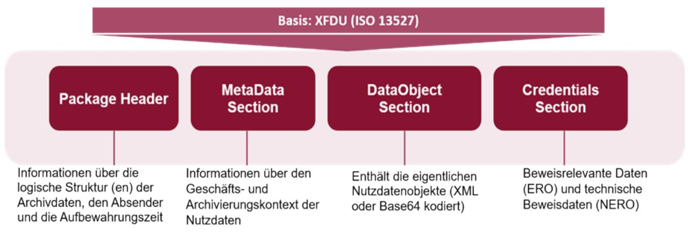

*Abbildung 7 Grundstruktur (L)XAIP Struktur*

Die folgende Tabelle gibt einen Überblick über die (L)XAIP-Struktur:

| Abschnitt          | Kerninhalte                                                                                                                                                                                                                                                                                                                                                                                                                                             |
|--------------------|---------------------------------------------------------------------------------------------------------------------------------------------------------------------------------------------------------------------------------------------------------------------------------------------------------------------------------------------------------------------------------------------------------------------------------------------------------|
| packageHeader      | Allgemeine Informationen zum Archivdatenobjekt und eine Beschreibung der logischen Struktur des Objekts. Weitere wichtige Inhalte in diesem Teil umfassen unter anderem die AOID und das versionManifest, das ein Protokoll der Versionsänderungen darstellt.                                                                                                                                                                      |
|                    | Im packageHeader können protectedObjectPointer verwendet werden, um die (L)XAIP-Teile ("evidence record-relevante Objekte" [ERO]) zu definieren, die in die Hashwert Berechnung zur Beweiswerterhaltung einbezogen werden. Sofern "non-evidence record-relevante Objekte" [NERO]) existieren, werden diese mit unprotectedObjectPointern gekennzeichnet. Diese werden nicht mit in die Hashwert-Berechnung einbezogen. |
| metaDataSection    | Hier finden sich Folgen von Daten, die der Beschreibung des Geschäftskontextes oder des Archivierungskontextes dienen. Die Metadaten können verschiedenen Typen, Klassen und Kategorien zugehören. Es wird auch definiert, auf welches Nutzdatenobjekt sich die Metadateninformationen beziehen.                                                                                                                                      |
| dataObjectsSection | Enthält die Binärdaten und/oder XML-Daten des Archivdatenobjekts. Die hier enthaltenen Daten lassen sich mit den Informationen im metaDataSection genauer beschreiben. In diesem Abschnitt können zum Beispiel Inhaltsdaten in verschiedenen Datenformaten und sogar ganze Akten mit unterschiedlichen Dokumenten gespeichert werden.                                                                                           |
| credentialsSection | Dieser Abschnitt enthält beweisrelevante Daten in verschiedenen Formaten (z. B. elektronische Signaturen, Siegel, Zeitstempel, Zertifikate, Prüfergebnisse und Berichte) sowie technische Beweisdaten (Evidence Records). Zum Beispiel enthält dieser Abschnitt auch die Prüfergebnisse und Prüfberichte, die das Krypto-Modul bei der Validierung der beweisrelevanten Daten oder Evidence Records erstellt.                |

*Tabelle 5 (L)XAIP-Struktur*

Eine detailliertere Darstellung des XAIP ist in Abbildung 8 dargestellt (Urheberrecht: [ETSI TS119512, Anhang E]. äußere Hülle, so werden die Daten (hier D[aten zusamm](#page-28-1)en mit Signatur) innerhalb

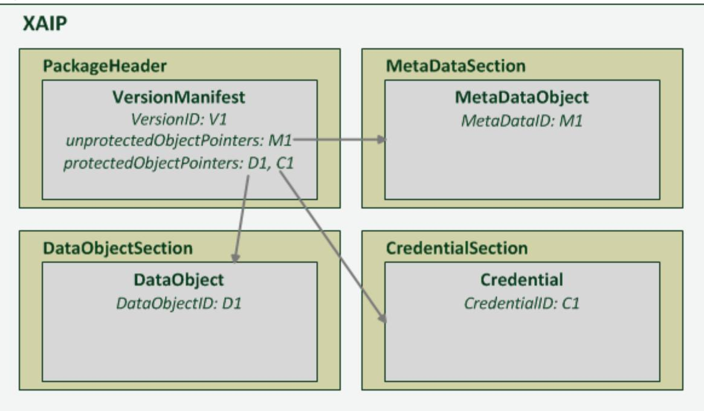

*Abbildung 8 XAIP mit einer Version und die durch den Nachweisdatensatz geschützten Daten D1 und C1 sowie die ungeschützten Daten M1.*

Einzelheiten sind in Anhang [TR-ESOR-F] enthalten.

#### 2.9.3 Speicherung von elektronischen Signaturen, Siegeln, Zeitstempeln und Technische Beweisdaten (Evidence Record)

Infolge des Durchführungsbeschlusses (EU) 2015/1506 der Kommission sind folgende elektronische Signatur- und Siegelformate zu unterstützen:

- Cades gemäß CadES-Basisprofil [ETSI TS 103173 v2.2.1]
- XadES gemäß XadES-Basisprofil [ETSI TS 103171 v.2.1.1]
- PadES gemäß PadES-Basisprofil [ETSI TS 103172 v.2.2.2]
- ASiC, gemäß ASiC-Basisprofil [ETSI TS 103174 v.2.2.1].[29](#page-28-2)

Dabei können neben den oben genannten elektronischen Signaturen/Siegeln auch andere beweisrelevante, kryptographische Artefakte in einem (L)XAIP gespeichert werden. Dazu gehören:

- Zeitstempel gemäß [RFC3161]
- Evidence Records gemäß [RFC4998] oder [RFC6283] als technischer Beweisdatensatz.

Anmerkung[30:](#page-28-3) Grundsätzlich wird bei der Ablage von signierten Daten und Signaturen in einem XAIP immer die folgende Grundregel angewendet:

- Bei abgesetzten (detachted) Signaturen werden die signierten Daten in der dataObjectsSection und die Signatur in der credentialsSection gespeichert.
- Im Falle von verbundenen (attached) Signaturen werden die Daten in Abhängigkeit dessen, ob die Signatur oder die signierten Daten die äußere Hülle bilden, abgelegt. Bilden die signierten Daten die

29 Siehe auch [LeitLieSig].

30 Siehe [TR-ESOR-F], v1.3, Kap. 6.

dataObjectsSection abgelegt, andererseits (die Signatur bildet die äußere Hülle) sind die Daten innerhalb der credentialsSection abzulegen.

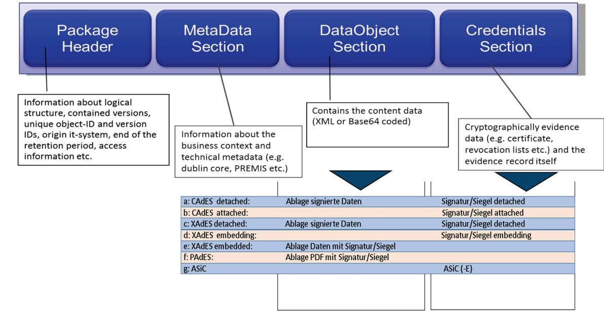

[Abbildung 9](#page-29-2) bietet einen Überblick über die Ablage der möglichen Signatur- und Siegelvarianten.

*Abbildung 9 Ablage digitaler Signaturmethoden in (L)XAIP*

#### 2.9.4 Konkretisierung der Schnittstellen

Anhang [TR-ESOR-E] legt die Eingangsschnittstelle TR-S. 4 [TR-ESOR-E, Kapitel 3] oder die [ETSI TS119512] Schnittstelle TR-S. 512 [TR-ESOR-E, Kapitel 4] sowie die internen Schnittstellen zwischen den in der IT-Referenzarchitektur gemäß Kap. [2.4](#page-14-0) beschriebenen Modulen fest und garantiert somit die technische Interoperabilität der Middleware.

Die Implementierung von [TR-ESOR-E] ist eine wichtige Voraussetzung für die technische Interoperabilität von TR-ESOR Middleware sowie für die TR-ESOR Produktzertifizierung von [TR-ESOR v1.3].

Einzelheiten sind in [\[TR-ESOR-E\] angegeben.](https://www.bsi.bund.de/SharedDocs/Downloads/DE/BSI/Publikationen/TechnischeRichtlinien/TR03125/BSI_TR_03125_Anlage_E_V1_3.pdf?__blob=publicationFile&v=3)

#### 2.9.5 Evidence Record gemäß [RFC4998] oder [RFC6283] als technischer Beweisdatensatz

"Vor dem Hintergrund, dass einerseits nicht nur elektronische, sondern auch elektronisch signierte Dokumente bewahrt werden müssen und andererseits der Einsatz qualifizierter Signaturen beweisrechtliche Vorteile mit sich bringen, kommen elektronischen Signaturen als Sicherungsmittel für die Aufbewahrung von Daten eine immer größere Bedeutung zu." [31](#page-29-3)

Dabei können elektronische Signaturen bzw. Siegel bzw. Zeitstempel im Laufe der Zeit einem "technischen Verfall" unterliegen.

"Das ArchiSig-Modul implementiert für diesen Zweck eine kryptographische Lösung, die insbesondere sicherstellt, dass das durch § 15 des Vertrauensdienstegesetzes [VDG] […] normierte Verfahren zur

31 Siehe [FiKoHü09].

Aufrechterhaltung der Sicherheit und Vertrauenswürdigkeit elektronischer Signaturen, Siegel bzw. Zeitstempel durch geeignete Beweiswerterhaltungsmaßnahmen, z. B. erneuter qualifizierter elektronischer Zeitstempel, zuverlässig und wirtschaftlich, d. h. auch für große Datenmengen, erfüllt werden kann.[…]

Grundlage des ArchiSig-Moduls ist die informationstechnische Umsetzung des Evidence Record Syntax (kurz: ERS) Standards der IETF [RFC4998] bzw. [RFC6283]. ERS definiert im Detail, wie geeignete Beweiserhaltungsmaßnahmen für große Dokumentenmengen automatisch durchgeführt werden können. Darüber hinaus legt der Standard die Datenformate fest, in denen die technischen Beweisdaten über einen unbegrenzten Zeitraum bereitgestellt und ausgetauscht werden. Datenschutz-technische Aspekte werden ebenso berücksichtigt, da mit dem ERS-Standard auch Teile aus dem Dokumentenbestand gelöscht werden können, ohne die Beweiskraft der übrigen Teile zu beeinträchtigen" [TR-ESOR, Kap. 10.3]

Weitere Details finden Sie im Kapitel [2.5.3.](#page-16-3)

Einzelheiten zu den Nachweisen finden sich auch in [RFC 4998] und [RFC6283] sowie in Anhang

[TR-ESOR-ERS: Profilierung der Evidence Records gemäß RFC4998 und RFC6283](https://www.bsi.bund.de/SharedDocs/Downloads/DE/BSI/Publikationen/TechnischeRichtlinien/TR03125/BSI_TR_03125_Anlage_ERS_V1_3.pdf?__blob=publicationFile&v=3)

Das Verifizierungstool des BSI für Evidence Records ist als kostenloser Download (Open Source Lizenz) abrufbar unter

<https://github.com/de-bund-bsi-tr-esor/ERVerifyTool>

#### 2.9.6 Prüfberichte

Der englischsprachige Anhang [TR-ESOR-VR] enthält Spezifikationen für die auf [OASIS] beruhenden Prüfberichte (engl. Verification Reports) für die Überprüfung von Signaturen, die (L)XAIP-Daten sowie die enthaltenen beweisrelevanten Daten (Signaturen, Siegel, Zeitstempel etc.) und der technischen Beweisdaten (Evidence Records) zur Gewährleistung der technischen Interoperabilität.

#### 2.10 Zertifizierung

Seitens des europäischen Standardisierungsgremiums ETSI wurden auf Basis von [eIDAS-VO] die zwei Standards für qualifizierte und nicht-qualifizierte Bewahrungsdienste (engl: "Preservation Trust Service") veröffentlicht:

- ETSI TS 119 511 Policy and security requirements for trust service providers providing long-term preservation of digital signatures or general data using digital signature techniques [ETSI TS 119 511],
- ETSI TS 119 512 Protocols for trust service providers providing long-term data preservation services [ETSI TS 119 512].

Zwei Vertrauensebenen werden durch [eIDAS-VO] und die ETSI-Standards in Bezug auf Vertrauensdienste und Vertrauensdiensteanbieter definiert:

- **Normaler** Vertrauensdienst und Vertrauensdienstanbieter (TSP)
- **Qualifizierte** Vertrauensdienste (QTS) und qualifizierte Vertrauensdiensteanbieter (QTSP), die zusätzliche gesetzliche Anforderungen erfüllen müssen und die Gegenstand von sich periodisch wiederholenden "independent third party conformity assessments by accredited **Conformity Assessment Bodies (CAB)**" [ASS 119511, Anhang 1] sind.

Der Begriff (Q)TSP bezieht sich entweder auf TSP oder QTSP.

In Deutschland sind die Zertifizierungsverfahren für (qualifizierte) Bewahrungs-Diensteanbieter (Q)PSPund TR-ESOR-Produkte direkt miteinander verbunden: ein TR-ESOR-zertifiziertes Produkt und sein Einsatz nach dem Stand der Technik führt zu einer erheblichen Reduktion der Testfälle im Rahmen der Zertifizierung des (Q)TSP.

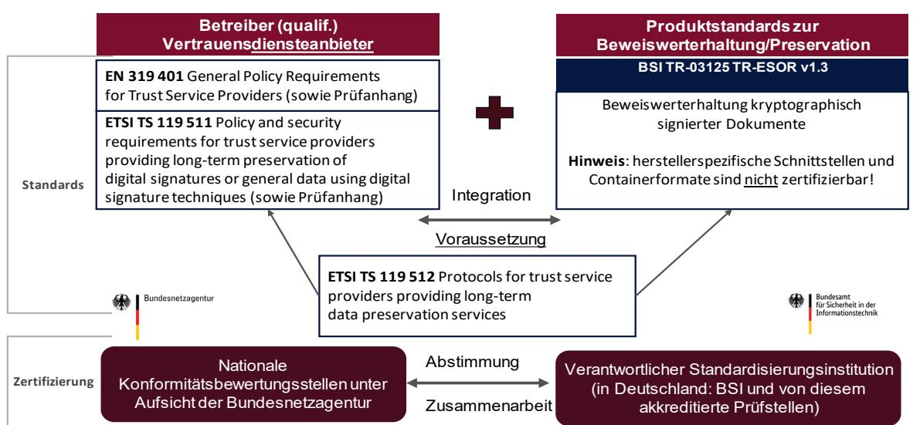

*Abbildung 10 Zusammenspiel zwischen den Zertifizierungsprozessen für (Q)PSP- und TR-ESOR-Produkte*

[Abbildung 10](#page-31-0) veranschaulicht das Zusammenspiel zwischen den Zertifizierungsprozessen für (qualifizierte) Bewahrungs-Diensteanbieter (Q)PSP- und TR-ESOR-Produkte.

In diesem Fall erfolgt die Zertifizierung von (qualifizierten) Bewahrungs-Diensteanbietern durch nationale Konformitätsbewertungsstellen unter der Aufsicht der Bundesnetzagentur (siehe [ETSI EN 319 403] und [eIDAS-VO]). Für diese Zertifizierung wurden vom BSI in Abstimmung mit der Bundesnetzagentur folgende Prüfkriterien festgelegt:

BSI Criteria for Assessing Trust Service Providers against ETSI Policy Requirements

- Part 1: Assessment Criteria for all TSP ETSI EN 319 401 ([ASS 319 401])
- Part 2: Assessment Criteria providing long-term preservation of digital signatures or general data using digital signature techniques – ETSI TS 119 511 ([ASS 119 511])

Weitere Einzelheiten zum Zusammenspiel der Zertifizierungsverfahren für (Q)TSP- und TR-ESOR-Produkte befinden sich im Assessment-Handbuch [ASS 119 511]. Der Zertifizierungsprozess für TR-ESOR-Produkte wird im folgenden Abschnitt vorgestellt.

#### Anmerkung:

"Falls ein (qualifizierter) Bewahrungsdienst ein TR-ESOR zertifiziertes Produkt

- ab V1.2.1 oder V1.2.1 gemäß [TR-ESOR-C.1] und [TR-ESOR-APP] oder
- ab V1.3 einsetzt, entfallen die Assessment-Testschritte in [ASS 119 511], die äquivalent zu

entsprechenden TR-ESOR-Testschritten sind, unter den folgenden Bedingungen:

- a Es liegt der Konformitätsbewertungsstelle der Prüfbericht der Zertifizierung des TR-ESOR-Produktes sowie im Bedarfsfall auch das zugehörige Prüfprotokoll nach Anfrage vor.
- b Anhand eines Vergleichs der digitalen "Fingerabdrücke (engl. Fingerprints)" der relevanten Programme des TR-ESOR-Produkts in Produktion mit denen der TR-ESOR-Zertifizierung (siehe Prüfbericht und auch Kapitel 8.1) kann die Konformitätsbewertungsstelle prüfen, dass das zertifizierte TR-ESOR-Produkt tatsächlich in Produktion eingesetzt ist ."[32](#page-31-1)

Weitere Einzelheiten zur TR-ESOR-Konformitätsprüfung für TR-ESOR v1.3 und zur Zertifizierung von Bewahrungsdiensten gemäß [eIDAS-VO], [ETSI TS 119 511] und [TR-ESOR] finden sich in den folgenden Dokumenten und Links:

32 Auszug aus [TR-ESOR v1.3, Hinweis 19]

- TR-ESOR v1.3:
	- [TR-ESOR-C.1] BSI TR 03125: Bewahrung des Beweiswerts von kryptographisch signierten Dokumenten: Anhang [TR-ESOR-C.1: Conformity Test Specification \(Level 1 Functional Conformity\)](https://www.bsi.bund.de/SharedDocs/Downloads/DE/BSI/Publikationen/TechnischeRichtlinien/TR03125/BSI_TR_03125_Anlage_C1_V1_3.pdf?__blob=publicationFile&v=3)
	- [TR-ESOR-C.2] BSI TR 03125: Bewahrung des Beweiswerts von kryptographisch signierten Dokumenten: Anhang [TR-ESOR-C.2: Conformity Test Specification \(Level 2 Technical Conformity\)](https://www.bsi.bund.de/SharedDocs/Downloads/DE/BSI/Publikationen/TechnischeRichtlinien/TR03125/BSI_TR_03125_Anlage_C2_V1_3.pdf?__blob=publicationFile&v=3)
- Bewahrungsdienste nach [eIDAS-VO], [ETSI TS 119 401] und [ETSI TS 119 511]
	- [ASS 319 401] BSI, Criteria for Assessing Trust Service Providers against ETSI Policy Requirements, Part 1: Assessment Criteria for all TSP – ETSI EN 319 401,
	- [ASS 119 511] BSI, Criteria for Assessing Trust Service Providers against ETSI Policy Requirements, Part 2: Assessment Criteria providing long-term preservation of digital signatures or general data using digital signature techniques – ETSI TS 119 511.

#### 2.11 Anwendungshinweise für E-Akten

#### 2.11.1 Grundsatz

Maßnahmen zur Beweiswerterhaltung (gem. (61) und Art. 34 [eIDAS-VO] sowie gemäß des relevanten ETSI-Standards [ETSI TS 119 511], der auch in die [TR-ESOR] eingeflossen ist) sind notwendig, bevor eines der folgenden Kriterien für Signatur/Siegel/Zeitstempel eintritt.

- Die zugrundeliegenden Algorithmen weisen keine gegebene Sicherheitseignung mehr auf.
- Die Gültigkeit der zugrundeliegenden Zertifikate läuft aus.
- Die elektronischen Signaturen, Siegel bzw. Zeitstempel sind nicht mehr prüfbar.

Wenn das kryptographisch signierte Dokumente erst kurz vor Ablauf der Sicherheitseignung der Signaturbzw. Hash-Algorithmen in ein TR-ESOR-System abgelegt wird und vorher in der E-Akte verwaltet wird, kann der Signatur-Zeitpunkt nicht mehr bewiesen werden und überhaupt ein "Proof of Existence" des signierten Dokumentes für den vorgegebenen damaligen Signaturzeitpunkt nicht vorgelegt werden, wenn nicht vorher zusätzliche Maßnahmen ergriffen werden.

Ansonsten ist eine nachträgliche erfolgreiche Validierung der (qualifizierten) Signatur somit unter diesen Umständen nicht mehr möglich.

#### 2.11.1.1 Ablage der E-Akte in ein TR-ESOR System (kurz vor Ablauf der Sicherheitseignung)

Sollte die Umsetzung der Ablage in ein TR-ESOR-System erst kurz vor Ablauf der Sicherheitseignung der kryptographischen Algorithmen bzw. der Zertifikats-Gültigkeit erfolgen, so muss die E-Akte-Anwendung in Hinblick auf die Notwendigkeit des "Beweis der Existenz und Gültigkeit" in jedem Fall nach Erzeugung einer elektronischen Signatur, Siegel bzw. Zeitstempel jeweils die digitalen Signaturtechniken auf Ihre Gültigkeit prüfen lassen und einen Zeitstempel erstellen lassen und die Validierungsdaten und den Zeitstempel mit abspeichern, um die Voraussetzung für die Fähigkeiten zur

- Prüfung der eingesetzten digitalen Signaturen,
- Bewahrung des Gültigkeitsstatus der digitalen Signaturen
- Erzeugung des "Beweis der Existenz und Gültigkeit" der signierten Daten zum Zeitpunkt der Signaturerstellung

zu erhalten. [Abbildung 11](#page-33-0)

veranschaulicht diesen Prozess.

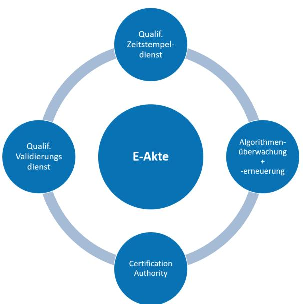

*Abbildung 11 Funktionsumfang der E-Akte bei verspäteter Beweiswerterhaltung im TR-ESOR-System*

Daher wären, neben dem aus gesetzlichen Gründen empfohlenen Einsatz des TR-ESOR-System, folgende zusätzliche Investitionen in das E-Akte-System erforderlich, wie in [Abbildung 11](#page-33-0) und im Folgenden dargestellt:

- Anbindung an einen (qualifizierten) Vertrauensdienst zur Erzeugung von qualifizierten Zeitstempeln (Qualif. Zeitstempeldienst) oder grundsätzliche Erzeugung einer AdES-T-Signatur wie dies auch die Leitlinie von BSI und BnetzA ausführt[33](#page-33-1)
- Anbindung an einen (qualifizierten) Vertrauensdienst zur Prüfung von Signaturen, Siegeln und (qualifizierten) Zeitstempeln (Qualif. Validierungsdienst)
- Anbindung einer Signaturprüfsoftware (z.B. Krypto-Modul in TR-ESOR) incl. Abruf der Zertifikatsstatusinformationen (z.B. Sperrlisten, OCSP) bei den (qualifizierten) Vertrauensdiensten zur Prüfung des Status der Zertifikate der jeweiligen qualifizierten elektronischen Signatur/Siegel (Certification Authority)
- Betrieb einer Komponente zur Algorithmen -Überwachung und -Erneuerung.

[https://www.elektronische-](https://www.elektronische-vertrauensdienste.de/EVD/SharedDocuments/Downloads/QES/BSI_TR_03125.pdf)

33 BSI:

[https://www.bsi.bund.de/SharedDocs/Downloads/DE/BSI/Publikationen/TechnischeRichtlinien/TR03](https://www.bsi.bund.de/SharedDocs/Downloads/DE/BSI/Publikationen/TechnischeRichtlinien/TR03125/BSI_TR_03125_Leitlinie_fuer_digitale_Signatur-Siegel-Zeitstempelformate.pdf) [125/BSI\\_TR\\_03125\\_Leitlinie\\_fuer\\_digitale\\_Signatur-Siegel-Zeitstempelformate.pdf](https://www.bsi.bund.de/SharedDocs/Downloads/DE/BSI/Publikationen/TechnischeRichtlinien/TR03125/BSI_TR_03125_Leitlinie_fuer_digitale_Signatur-Siegel-Zeitstempelformate.pdf) und BNetzA:

[vertrauensdienste.de/EVD/SharedDocuments/Downloads/QES/BSI\\_TR\\_03125.pdf](https://www.elektronische-vertrauensdienste.de/EVD/SharedDocuments/Downloads/QES/BSI_TR_03125.pdf)

Da zum einen nicht vorhersehbar ist, wann die Sicherheitseignung der verwandten Signaturtechnologien ausläuft, birgt die Aufbewahrung kryptographisch signierter Dokumente ohne Beweiswerterhaltung ein hohes Risiko bzgl.

a) des Verlustes des Beweiswerts oder

b) eines sehr hohen Aufwands, bei kurzfristigem Ablauf der Sicherheitseignung.

Fazit: Da eine E-Akte-Anwendung die Funktionen zur Beweiswerterhaltung nicht beinhaltet, ist auch aus diesem Grund die **frühzeitige Ablage** kryptographisch signierter Dokumente über ein TR-ESOR-System empfehlenswert.

#### 2.11.2 Lösungsempfehlung

Der in TR-ESOR für Behörden verbindlich vorgesehene (L)XAIP-Container ermöglicht die Ablage der Dokumente im Aktenzusammenhang. Über den Update-Prozess können dem (L)XAIP-Container einer Akte/eines Vorgangs, über die gesamte Lebensdauer der Akte/dem Vorgang weitere Dokumente hinzugefügt werden. Der Zugriff auf die beweiswerterhaltend aufbewahrten Dokumente erfolgt in jedem Fall durch das E-Akte-System. Für den Nutzer im E-Akte-System ändert sich insofern an der Arbeit mit der E-Akte erfahrungsgemäß nichts, da der Zugriff weiterhin über die E-Akte erfolgen kann.

Aus der Praxis empfiehlt sich folgende Lösungsoption

Frühzeitige beweissichere Ablage aller:

- signierten/gesiegelten/zeitgestempelten Dokumente,
- abgeschlossenen Dokumente.

Im Aktenzusammenhang im (L)XAIP:

Je Akte/Vorgang wird jeweils ein (L)XAIP gebildet. Die Dokumente einer Akte/eines Vorgangs finden sich immer in einem (L)XAIP. Die Dokumente werden mit einem Minimalset an Metadaten im zugehörigen (L)XAIP abgelegt. Sobald ein neues Dokument zum entsprechenden (L)XAIP hinzukommt, wird eine neue Version angelegt, so dass der quasi archivierte Akte/Vorgang sukzessive wächst. Sobald die Akte/der Vorgang abgeschlossen, also z.d.A-verfügt wurde, können die übrigen Dokumente einschl. Metadaten ebenso dem zugehörigen (L)XAIP hinzugefügt werden.

Als Beispiel kann hier ersetzendes Scannen nach TR-RESISCAN gelten, dabei würde das gescannte Dokument zunächst über [TR-ESOR] abgelegt und der E-Akte ein Link oder, je nach Leistungsfähigkeit der Infrastruktur, eine Kopie des Dokuments übergeben. Alle weiteren Dokumente des Vorgangs können sukzessive durch Update dem zugehörigen (L)XAIP über [TR-ESOR] hinzugefügt werden.

Hinsichtlich der Datenhaltung bestehen dabei zwei Alternativen, jeweils abhängig von der vorhandenen Infrastruktur:

| Hohe Performance                                                                                                       | Begrenzte Performance                          |
|------------------------------------------------------------------------------------------------------------------------|------------------------------------------------|
| Keine Datenredundanz, archivierte Dokumente werden nur in [TR-ESOR] aufbewahrt, ohne zusätzliche Kopie in E-Akte | Kopie der archivierten Dokumente in der E-Akte |

*Tabelle 6 Optionen zur Datenhaltung*

Hinsichtlich der doppelten Datenhaltung ist zu beachten, dass die [TR-ESOR] keine Vorgaben an den ECM- /Langzeit-Speicher enthält. Wie in dargestellt, ist der Anwender hinsichtlich der Ausgestaltung des ECM- /Langzeit-Speicher also frei. Dabei kann es sich z.B. um:

• Datenbank der E-Akte,

- Drittspeichersystem,
- Cloud,
- etc.

handeln. Es ist lediglich zu beachten:

- Schreibende/ändernde/löschende Zugriffe auf (L)XAIP bzw. Dokumente, die via [TR-ESOR] abgelegt wurden sowie zur Beweiswerterhaltung (Neusignierung/Neuverhashung) nur über [TR-ESOR],
- Lesende Zugriffe auf (L)XAIP bzw. Dokumente, auch direkt, ohne [TR-ESOR] möglich.

## Liste der Abkürzungen

| Abkürzung | Bedeutung                                                     |
|-----------|---------------------------------------------------------------|
| AOID      | Objekt-ID archivieren                                         |
| CRM       | Kundenbeziehungsmanagement                                    |
| ECM       | Management von Unternehmensinhalten                           |
| ERO       | Beweisaufzeichnungsrelevantes Objekt                          |
| ERS       | Beweisaufzeichnung Syntax                                     |
| LXAIP     | Logisches XML-formatiertes Archivinformationspaket         |
| (L)XAIP   | XAIP oder LXAIP                                               |
| NERO      | Non-evidence record-relevantes Objekt                         |
| QES       | Qualifizierte elektronische Signatur                          |
| QESI      | Qualifizierte elektronische Dichtung                          |
| QZS       | Qualifizierter elektronischer Zeitstempel                     |
| TR        | Technische Richtlinie (Deutsch: "Technische Richtlinie" |
| PSP       | Preservation Service Provider (Bewahrungsdiensteanbieter)  |
| QPSP      | Qualified Preservation Service Provider                       |
| TS        | Trust Service (Vertrauensdienst)                              |
| TSP       | Trust Service Provider (Vertrauensdiensteanbieter)         |
| QTSP      | Qualified Trust Service Provider                              |
| (Q)PSP    | PSP or QPSP                                                   |
| (Q)TSP    | TSP or QTSP                                                   |
| VDG       | Deutsches Treuhanddienstleistungsgesetz                       |
| VDV       | Deutsche Vertrauensdiensteverordnung                          |
| VO        | Verordnung (Deutsch: "Verordnung"                             |
| XAIP      | XML-formatiertes Archivinformationspaket                      |

*Tabelle 7 Liste der Abkürzungen*

### Bibliographie

| [Ahm18]          | J. Ahmad, U. Korte, A. Schumacher: Sicherheitsrelevante Module der eAkte: TR RESISCAN und TR-ESOR in der praktischen Umsetzung, 2018                                                                                                                                                                                                                                                                                                                                                                     |
|------------------|-------------------------------------------------------------------------------------------------------------------------------------------------------------------------------------------------------------------------------------------------------------------------------------------------------------------------------------------------------------------------------------------------------------------------------------------------------------------------------------------------------------|
| [AhKo18]         | J. Ahmad, U. Korte: E-Akte auf Basis von TR-RESISCAN & TR-ESOR, 2018.                                                                                                                                                                                                                                                                                                                                                                                                                                       |
| [Ahmad19]        | J. Ahmad, S. Schwalm: Sicherheitsrelevante Module der E-Akte: TR-RESISCAN und TR ESOR in der Umsetzung, 2019                                                                                                                                                                                                                                                                                                                                                                                             |
| [Ass 319 401] | BSI, Criteria for Assessing Trust Service Providers against ETSI Policy Requirements, Part 1: Assessment Criteria for all TSP - ETSI EN 319 401                                                                                                                                                                                                                                                                                                                                                       |
| [Ass 119 511] | BSI, Criteria for Assessing Trust Service Providers against ETSI Policy Requirements, Part 2: Assessment Criteria providing long-term preservation of digital signatures or general data using digital signature techniques - ETSI TS 119 511                                                                                                                                                                                                                                                      |
| [BMI12]          | Bundesministerium des Innern (Hrsg.): Organisationskonzept elektronische Verwaltungsarbeit. Baustein E-Akte, Berlin 2012.                                                                                                                                                                                                                                                                                                                                                                                |
|                  | https://www.verwaltunginnovativ.de/DE/Verwaltungsdigitalisierung/orgkonzept_eve rwaltung/orgkonzept_everwaltung_node.html                                                                                                                                                                                                                                                                                                                                                                                |
| [BNetzA-TSP]     | Bundesnetzagentur (BNetzA): elektronische Vertrauensdienste. https://www.elektronische-vertrauensdienste.de/cln_131/EVD/DE/Home/start.html                                                                                                                                                                                                                                                                                                                                                               |
| [BSI-GSK]        | Bundesamt für Sicherheit in der Informationstechnik (BSI): IT-Grundschutz Kompendium.                                                                                                                                                                                                                                                                                                                                                                                                                    |
|                  | https://www.bsi.bund.de/EN/Themen/Unternehmen-und-Organisationen/Standards und-Zertifizierung/IT-Grundschutz/it-grundschutz_node.html                                                                                                                                                                                                                                                                                                                                                                    |
| [BSI-DSig]       | BSI, Basics of Digital Signature Techniques and Trust Services 2023 https://www.bsi.bund.de/SharedDocs/Downloads/DE/BSI/ElekSignatur/esig_pdf.pdf? __blob=publicationFile&v=6                                                                                                                                                                                                                                                                                                                   |
| [BSIRilieSig]    | Bundesamt für Sicherheit in der Informationstechnik (BSI): Leitlinie für digitale Signatur-/Siegel-/Zeitstempelformate und Evidence Records                                                                                                                                                                                                                                                                                                                                                              |
|                  | https://www.bsi.bund.de/SharedDocs/Downloads/DE/BSI/Publikationen/Technische Richtlinien/TR03125/BSI_TR_03125_Leitlinie_fuer_digitale_Signatur-Siegel Zeitstempelformate.pdf                                                                                                                                                                                                                                                                                                                          |
| [DIN31644]       | DIN 31644:2012 Information und Dokumentation – Kriterien für vertrauenswürdige digitale Archive. 2012                                                                                                                                                                                                                                                                                                                                                                                                 |
| [DIN31647]       | DIN 31647:2015 Beweiserhaltung kryptographisch signierter Dokumente                                                                                                                                                                                                                                                                                                                                                                                                                                         |
| [(EU) 2015/1506] | Durchführungsbeschluss (EU) 2015/1506 DER KOMMISSION vom 8. September 2015 zur Festlegung von Spezifikationen für Formate fortgeschrittener elektronischer Signaturen und fortgeschrittener Siegel, die von öffentlichen Stellen gemäß Artikel 27 Absatz 5 und Artikel 37 Absatz 5 der Verordnung (EU) Nr. 910/2014 des Europäischen Parlaments und des Rates über elektronische Identifizierungs- und Vertrauensdienste für elektronische Transaktionen im Binnenmarkt anzuerkennen sind |
| [EGovG]          | Deutsches Gesetz zur Förderung der elektronischen Regierung (E-Government Act, EGovG) vom 25. Juli 2013                                                                                                                                                                                                                                                                                                                                                                                               |

| [eIDAS-VO]                           | Verordnung (EU) Nr. 910/2014 DES EUROPÄISCHEN PARLAMENTS UND DES RATES vom 23. Juli 2014 über elektronische Identifizierung und Vertrauensdienste für elektronische Transaktionen im Binnenmarkt und zur Aufhebung der Richtlinie 1999/93/EG                                                                                                            |
|--------------------------------------|---------------------------------------------------------------------------------------------------------------------------------------------------------------------------------------------------------------------------------------------------------------------------------------------------------------------------------------------------------------------|
| [eIDAS-DG]                           | Gesetz zur Umsetzung in deutsches Recht VERORDNUNG (EU) Nr. 910/2014 DES EUROPÄISCHEN PARLAMENTS UND DES RATES vom 23. Juli 2014 über elektronische Identifizierung und Vertrauensdienste für elektronische Transaktionen im Binnenmarkt und zur Aufhebung der Richtlinie 1999/93/EG BGBl. 2017, Teil I Nr. 52, veröffentlicht am 28. Juli 2017 in Bonn |
| [ETSI EN 319102-1] ETSI EN 319 102 – | 1, Electronic Signatures and Infrastructers (ESI); Procedures for Creation and Validation of AdES Digital Signatures; Part 1: Creation and Validation, v1.3.1, (2021-11), siehe: https://www.etsi.org/deliver/etsi_en/319100_319199/31910201/01.03.01_60/en_319102 01v010301p.pdf                                                                    |
| [ETSI EN 319122-1] ETSI EN 319 122 – | 1, Electronic Signatures and Infrastructers (ESI); CAdES digital signatures, Part 1: Building blocks and CAdES baseline signatures, , v1.3.1, (2023-06), siehe: https://www.etsi.org/deliver/etsi_en/319100_319199/31912201/01.03.01_60/en_319122 01v010301p.pdf                                                                                        |
| [ETSI EN 319132-1] ETSI EN 319 132 – | 1, Electronic Signatures and Infrastructures (ESI); XAdES digital signatures, Part 1: Building blocks and XAdES baseline signatures , v1.2.1, (2022-02), siehe: https://www.etsi.org/deliver/etsi_en/319100_319199/31913201/01.02.01_60/en_319132 01v010201p.pdf                                                                                  |
| [ETSI EN 319142-1] ETSI EN 319 142 – | 1, Electronic Signatures and Infrastructeres (ESI); PAdES digital Signatures, Part 1: Building blocks and PAdES baseline signatures , v1.1.1 (2016-04), siehe: http://www.etsi.org/deliver/etsi_en/319100_319199/31914201/01.01.01_60/en_3191420 1v010101p.pdf                                                                                       |
| [ETSI EN 319162-1] ETSI EN 319 162 – | 1, Electronic Signatures and Infrastrucutres (ESI); Associated Signature Containers (ASiC), Part 1: Building blocks and ASiC baseline containers, v1.1.1 (2016-04), siehe: http://www.etsi.org/deliver/etsi_en/319100_319199/31916201/01.01.01_60/en_3191620 1v010101p.pdf                                                                              |
| [ETSI EN 319 401]                 | ETSI EN 319 401, Electronic Signatures and Infrastructures (ESI); General Policy Requirements for Trust Service Providers . ETSI v2.3.1 (2021-05)                                                                                                                                                                                                             |
| [ETSI TS 103 171]                 | ETSI TS 103 173, Electronic Signatures and Infrastructures (ESI); XAdES Baseline Profile, v.2.1.1 (2012-03):                                                                                                                                                                                                                                                     |
|                                      | https://www.etsi.org/deliver/etsi_ts/103100_103199/103171/02.01.01_60/ts_103171v02 0101p.pdf                                                                                                                                                                                                                                                                     |
| [ETSI TS 103 172]                 | ETSI TS 103 172, Electronic Signatures and Infrastructures (ESI); PAdES Baseline Profile, v.2.2.2 (2013-04):                                                                                                                                                                                                                                                     |
|                                      | https://www.etsi.org/deliver/etsi_ts/103100_103199/103172/02.02.02_60/ts_103172v02 0202p.pdf                                                                                                                                                                                                                                                                     |

[ETSI TS 119 511] ETSI TS 119 511, Electronic Signatures and Infrastructures (ESI); Policy and security requirements for trust service providers providing long-term preservation of digital signatures or general data using digital signature techniques, V1.1.1 (2019-06):

[https://www.etsi.org/deliver/etsi\\_ts/119500\\_119599/119511/01.01.01\\_60/ts\\_119511v010101p.pdf](https://www.etsi.org/deliver/etsi_ts/119500_119599/119511/01.01.01_60/ts_119511v010101p.pdf)

| [ETSI TS 119 512] | ETSI TS 119512, Electronic Signatures and Infrastructures (ESI); Protocols for trust service providers providing long-term data preservation services , V1.2.1 (2023-05): https://www.etsi.org/deliver/etsi_ts/119500_119599/119512/01.02.01_60/ts_119512v01 0201p.pdf |
|----------------------|---------------------------------------------------------------------------------------------------------------------------------------------------------------------------------------------------------------------------------------------------------------------------------------|
| [F06]                | S. Fischer-Dieskau: Das elektronisch signierte Dokument als Mittel zur Beweissicherung, Baden-Baden, 2006.                                                                                                                                                                         |
| [Gia11]              | David Giaretta: Advanced digital preservation . London 2011                                                                                                                                                                                                                        |
| [Hue18]              | D. Hühnlein, J. Ahmad, U. Korte: Vertrauenswürdige Digitalisierung auf Basis von TR RESISCAN und TR-ESOR, DACH-Security 2018. Gelsenkirchen 2018                                                                                                                                   |
| [Hue19]              | D. Hühnlein, J. Ahmad, U. Korte: Sichere Digitalisierung mit TR-RESISCAN und TR ESOR – Auf dem Weg zur digitalen Bundesverwaltung, DUD 4/2019                                                                                                                                   |
| [IETF RFC2119]       | IETF RFC 2119, Key words for use in RFCs to Indicate Requirement Levels, https://www.ietf.org/rfc/rfc2119.txt                                                                                                                                                                      |
| [IETF RFC3161]       | IETF RFC 3161, Time-Stamp Protocol (TSP), https://www.ietf.org/rfc/rfc3161.txt                                                                                                                                                                                                        |
| [IETF RFC4998]       | IETF RFC 4998, Evidence Record Syntax (ERS), https://www.ietf.org/rfc/rfc4998.txt                                                                                                                                                                                                     |
| [IETF RFC5816]       | IETF RFC 5816, ESSCertIDv2 Update for RFC 3161, https://www.ietf.org/rfc/rfc5816.txt                                                                                                                                                                                               |
| [IETF RFC6283]       | IETF RFC 6283, Extensible Markup Language Evidence Record Syntax (XMLERS), https://www.ietf.org/rfc/rfc6283.txt                                                                                                                                                                    |
| [ISO13527]           | ISO 13527:2010, Space data and information transfer systems -- XML formatted data unit (XFDU) structure and construction rules, 2010                                                                                                                                            |
| [ISO15489]           | ISO 15489-1:2016: Information and documentation - Records management - Part 1: Concepts and principles. 2016                                                                                                                                                                 |
| [ISO14533-1]         | ISO 14533-1:2014, Prozesse, Datenelemente und Dokumente in Handel, Industrie und Verwaltung – Langfristige Signaturprofile – Teil 1: Langfristige Signaturprofile für CMS Advanced Electronic Signatures (CAdES)                                                          |
| [ISO14533-2]         | ISO 14533-2:2012 Processes, data elements and documents in commerce, industry and administration -- Long term signature profiles -- Part 2: Long term signature profiles for XML Advanced Electronic Signatures (XAdES)                                                |
| [ISO14533-3]         | ISO 14533-3:2017 Processes, data elements and documents in commerce, industry and administration -- Long term signature profiles -- Part 3: Long term signature profiles for PDF Advanced Electronic Signatures (PAdES)                                                |
| [ISO14721]           | ISO 14721, Space data and information transfer systems -- Open archival information system (OAIS) -- Reference model, 2012                                                                                                                                                   |
| [ISO30300]           | ISO 30300:2020. Information and documentation - Management systems for records - Fundamentals and vocabulary                                                                                                                                                                    |
| [Ko13]               | U. Korte, D. Hühnlein, S. Schwalm: Vertrauenswürdige und beweiswerterhaltende elektronische Langzeitspeicherung auf Basis von DIN 31647 und BSI-TR-03125, Informatik 2013, GI-LNI, P220, ISBN 978-3-88579-614-5, S. 550-566, 2013                                            |

| [Ko14]      | U. Korte, D. Hühnlein, S. Schwalm: Standards for the preservation of evidence and trust. Proceedings Archiving 2014, Springfield 2014 S. 9-14                                                                                                                                                            |
|-------------|-------------------------------------------------------------------------------------------------------------------------------------------------------------------------------------------------------------------------------------------------------------------------------------------------------------|
| [KoHu14]    | U. Korte, D. Hühnlein, S. Schwalm: Standards und Lösungen zur langfristigen Beweiswerterhaltung. Proceedings DACH-Security 2014. S. 46-58. Frechen 2014                                                                                                                                                  |
| [Ko15]      | U. Korte, D. Hühnlein, S. Schwalm: Ersetzendes Scannen und Beweiswerterhaltung mit SAP. Verfahren DACH-Security 2015. S. 72–85. Frechen 2015                                                                                                                                                          |
| [Ko16]      | U. Korte, D. Hühnlein, S. Schwalm, T. Kusber: Beweiswerterhaltung im Kontext eIDAS – eine Case Study. DACH-Security 2016, Frechen 2016, S. 379–392                                                                                                                                                    |
| [Ko17]      | U. Korte, D. Hühnlein, S. Schwalm, T. Kusber, M. Prechtl, B. Wild: Datenpakete zur Informations- und Beweiswerterhaltung. Ein Vergleich. DACH-Security 2017. Frechen 2017, S. 291–303                                                                                                           |
| [Ko18]      | U. Korte, T. Kusber, S. Schwalm: Vertrauenswürdiges E-Government – Anforderungen und Lösungen zur beweiswerterhaltenden Langzeitspeicherung. 23. Archivwissenschaftliches Kolloqium. Marburg 2018                                                                                                  |
| [Ku16]      | T. Kusber, S. Schwalm: Elektronische Langzeitspeicherung als SOA-Dienst – Kernelement eines vertrauenswürdigen Informationsmanagements. Informatik 2016, S. 869–882                                                                                                                                |
| [KuKo19]    | U. Korte, T. Kusber, S. Schwalm: Aktuelle Standards und Normen in Records Management und beweissicherer Langzeitspeicherung. In: 23. Sitzung der Arbeitsgruppe "Archivierung von Unterlagen aus digitalen Systemen". Prag 2019                                                                        |
| [Merk]      | R. Merkle: Protokolle für Public Key Cryptosystems, Proceedings of the 1980 IEEE Symposium on Security and Privacy (Oakland, CA, USA), S. 122-134, 1980                                                                                                                                               |
| [MiniKGovG] | Bundesministerium für Inneres, Bauwesen und Gemeinschaft: Kleiner Kommentar zum Gesetz zur Förderung der elektronischen Regierung und zur Änderung anderer Rechtsvorschriften, Berlin 2013                                                                                                            |
| [OASIS VR]  | D. Hühnlein: Oasis DSS v1.0 Profile for Comprehensive Multi-Signature Verification Reports, Version 1.0, Committee Specification 01, 12. November 2010, http://docs.oasis open.org/dss-x/profiles/verificationreport/oasis-dssx-1.0-profiles-vr-cs01.pdf                                              |
| [RFC4998]   | IETF, T. Gondrom, R. Brandner, U. Pordesch: Evidence Record Syntax, 2007                                                                                                                                                                                                                                    |
| [RFC6283]   | IETF, A. J. Blazic, S. Saljic, T. Gondrom: Extensible Markup Language Evidence Record Syntax (XMLERS), 2011                                                                                                                                                                                              |
| [Ro07]      | A. Rossnagel: Langfristige Aufbewahrung elektronischer Dokumente, Anforderungen und Trends, Baden-Baden, 2007                                                                                                                                                                                            |
| [Sc17]      | S. Schwalm: A service for the preservation of evidence and data – a key for a trustworthy & sustainable electronic business. Open Identity Summit 2017. Lecture Notes in Informatics (LNI). Proceedings. Bonn 2017 S. 131-144                                                                      |
| [SigG]      | Gesetz über die Allgemeinen Bedingungen für elektronische Signaturen und Änderung anderer Rechtsvorschriften (Signaturgesetz, SigG), vom 16. Mai 2001, BGBl. 2001, Teil I Nr. 22, S. 876 ff., geändert durch Art. 1 G vom 4. Januar 2005 I 2, zuletzt geändert durch Art. 4 G vom 17. Juli 2009 |
| [SigV]      | Verordnung über elektronische Signaturen (Signaturverordnung, SigV), vom 16. November 2001, BGBl. 2001, Teil I, Nr. 59, S. 3075 ff., geändert durch Art. 2 G vom 4. Jan 2005 I 2, zuletzt geändert durch Änderungsverordnung Art. 1 vom 15.11.2010                                                 |

| [SOG-IST]      | SOG-IS Crypto Working Group: SOG-IS Crypto Evaluation Scheme – Agreed Cryptographic Mechanisms, https://www.sogis.org/uk/supporting_doc_en.html                                                                                                                                |
|----------------|--------------------------------------------------------------------------------------------------------------------------------------------------------------------------------------------------------------------------------------------------------------------------------------|
| [TR-eCARD]     | BSI TR 03112-1: eCard-API-Framework - Part 1- Overview and general definitions                                                                                                                                                                                                 |
| [TR-ESOR]      | BSI TR 03125: Beweiswerterhaltung kryptographisch signierter Dokumente, Hauptdokument, v1.3 und neuer, https://www.bsi.bund.de/EN/tr-esor                                                                                                                                         |
| [TR-ESOR-C.1]  | BSI TR 03125: Beweiswerterhaltung kryptographisch signierter Dokumente: Anhang TR-ESOR-C.1: Conformity Test Specification (Level 1 Functional Conformity, v1.3 und höher                                                                                                       |
| [TR-ESOR-C.2]  | BSI TR 03125: Beweiswerterhaltung kryptographisch signierter Dokumente: Anhang TR-ESOR-C.2: Conformity Test Specification (Level 2 Technical Conformity), v1.3 und höher                                                                                                       |
| [TR-ESOR-E]    | BSI TR 03125: Beweiswerterhaltung kryptographisch signierter Dokumente: Anhang TR-ESOR-E, Bereitstellung von Details für Schnittstellen auf der Grundlage des eCard API-Frameworks und ETSI TS 119512, v1.3 und neuer                                                          |
| [TR-ESOR-ERS]  | BSI TR 03125: Beweiswerterhaltung kryptographisch signierter Dokumente: Anhang TR-ESOR-ERS, Profilierung der Evidence Records gemäß RFC4998 und RFC6283, v1.3 und neuer                                                                                                     |
|                | [TR-ESOR-TRANS] BSI TR 03125: Beweiswerterhaltung kryptographisch signierter Dokumente, Anlage zu Anhang TR-ESOR-E, Konkretisierung der Schnittstellen auf der Grundlage des eCard API-Frameworks – Allgemeine Spezifikationen ETSI TS119512 TR-ESOR Transformator, v1.3 |
| [TR-ESOR-F]    | BSI TR 03125: Beweiswerterhaltung kryptographisch signierter Dokumente: Anhang TR-ESOR-F, Formate, v1.3 und neuer                                                                                                                                                                 |
| [TR-ESOR-M.1   | [BSI TR 03125: Beweiswerterhaltung kryptographisch signierter Dokumente: Anhang TR-ESOR-M.1, ArchiSafe-Module, v1.3 und neuer                                                                                                                                                     |
| [TR-ESOR-M.2]  | BSI TR 03125: Beweiswerterhaltung kryptographisch signierter Dokumente: Anhang TR-ESOR-M.2, Crypto-Module, v1.3 und neuer                                                                                                                                                         |
| [TR-ESOR-M.3]  | BSI TR 03125: Beweiswerterhaltung kryptographisch signierter Dokumente: Anhang TR-ESOR-M.3, ArchiSig-Module, v1.3 und neuer                                                                                                                                                       |
| [TR-ESOR-PEPT] | BSI TR 03125: Beweiswerterhaltung kryptographisch signierter Dokumente: Anhang TR-ESOR-PEPT: Preservation Evidence Policy Template für TR-ESOR (PEPT), v1.2.1 und höher                                                                                                     |
| [TR-ESOR-VR]   | BSI TR 03125: Preservation of Evidence of Cryptographically Signed Documents: Annex TR-ESOR-VR: Verification Reports for Selected Data Structures, v1.3 und höher                                                                                                                 |
| [XFDU]         | ISO 13527:2010, Space data and information transfer systems – XML formatted data unit (XFDU) structure and construction rules, 2010                                                                                                                                            |
| [VDG]          | Gesetz über Vertrauensdienste vom 18. Juli 2017 (BGBl. I S. 2745), geändert durch Art. 2 des Gesetzes vom 18. Juli 2017 (BGBl. I S. 2745)                                                                                                                                   |
| [VDV]          | Verordnung über Vertrauensdienste (Vertrauensdiensteverordnung, VDV) vom 15. Februar 2019. (BGBl. I, S. 114–115)                                                                                                                                                               |
| [We18]         | M. Weber, T Vogt, W. Krogel, S. Schwalm c/o DIN NID 15 WG 2: Records Management nach ISO 15489. Einführung und Anleitung. Berlin 2018                                                                                                                                             |