# Technical Guideline TR-03131 EAC-Box Architecture and Interfaces Version 1.2

2011-05-26

#### **History**

| Version   | Date       | Comment                                                   |  |
|-----------|------------|-----------------------------------------------------------|--|
| 1.0       | 2009-08-07 | Publication                                               |  |
| 1.1 Draft | 2010-05-03 | Updated chapter 3 and the authenticate calls              |  |
| 1.1       | 2010-05-28 | deleted chapter 4.3, editorial changes and clarifications |  |
| 1.2       | 2011-05-13 | Added command "getMultipleData" (chapter 4.1.6)           |  |

Bundesamt für Sicherheit in der Informationstechnik Postfach 20 03 63 53133 Bonn Internet: https://www.bsi.bund.de © Bundesamt für Sicherheit in der Informationstechnik 2010

| 1   | Introduction4                    |  |
|-----|----------------------------------|--|
| 1.1 | Security Environment4            |  |
| 1.2 | Terminology5                     |  |
| 1.3 | Abbreviations6                   |  |
| 2   | EAC-Box layered architecture7    |  |
| 3   | Functional requirements9         |  |
| 3.1 | Secure Token9                    |  |
| 3.2 | Start up procedure9              |  |
| 3.3 | Logging11                        |  |
| 4   | Interfaces12                     |  |
| 4.1 | EAC-Box SOAP-Interface12         |  |
| 4.2 | Interface Device API (IFD-API)37 |  |
| 4.3 | PKI communication interfaces39   |  |
| 5   | Bibliography41                   |  |

| Figure 1: Overview of the range of applications4                                |  |
|---------------------------------------------------------------------------------|--|
| Figure 2: Components of the EAC-Box7                                            |  |
| Figure 3: EAC-Box State Diagram11                                               |  |
| Figure 4: Direct access of an EAC-Box to the designated distribution server39   |  |
| Figure 5: Indirect access of an EAC-Box to the designated distribution server39 |  |

# <span id="page-3-0"></span>**1 Introduction**

Advanced security mechanisms are significant for the new generation of electronic Machine Readable Travel Documents (eMRTDs) and eID cards. Protocol specifications such as Password Authenticated Connection Establishment (PACE), Chip Authentication, and Terminal Authentication have been specified in the Technical Guideline TR-03110 [1].

The EAC-Box provides these functions encapsulate in an evaluated and certificated environment and communicates with external components and services over a standardized interfaces. TR-03131 describes these architecture and interfaces.

# **1.1 Security Environment**

In order to achieve an adequate security level for the applied cryptographic keys within the scope of the afore described protocols an EAC-Box is specified in this technical guideline which ensures authentic and confidential communication with electronic identity documents.

For the application of the EAC-Box different kinds of interfaces and connected hardware and software devices have to be considered. Figure [1](#page-3-1) gives an overview of the system environment.

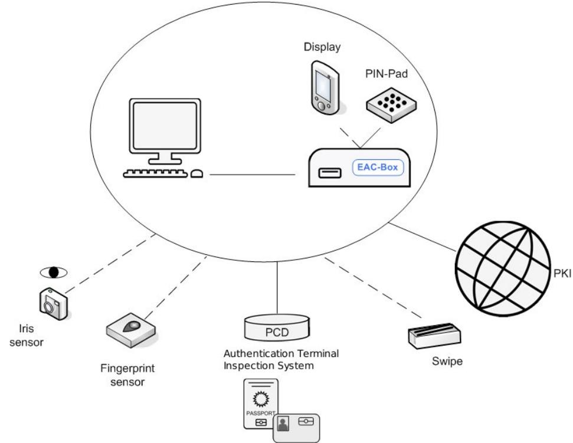

<span id="page-3-1"></span>*Figure 1: Overview of the range of applications*

The objective of this document is to introduce the architecture and functionality of the EAC-Box. In principle the EAC-Box can be used in different environments and use cases for example border control or document amendment[1](#page-3-2) within a municipality.

<span id="page-3-2"></span><sup>1</sup> The service of *document amendment* consists of the following functions: change of address, change of collateral clauses for residence permits, change of PIN, activation and deactivation of the eID function.

The EAC-Box provides all security services that are necessary to perform the general authentication procedure for terminals as described in [1] which require access to applications and data stored on electronic ID cards. After secure messaging has been established for communication different operations can be performed according to the interfaces that are defined in this technical guideline. Thereby, a secured (authentic and encrypted) connection SHALL be established between the EAC-Box and the PC on which an application (e.g. application for document amendment) is running.

Besides the security protocols and mechanisms of the EAC-Box is a core layer that contains services which require a high security level. A key storage is necessary for the private keys that is used for authentication of the terminal for example in context with Terminal Authentication as specified in [1]. Furthermore a certificate storage is essential for the implementation of the Public Key Infrastructure (PKI). In connection with these components security services such as key generation and signature generation are also part of the core layer.

Further handling and processing of data for example biometric information that is encoded within a data group or handling of partial data group information is not part of the EAC-Box functionality and is therefore excluded from this document.

# **1.2 Terminology**

The key words "MUST", "MUST NOT", "REQUIRED", "SHALL", "SHALL NOT", "SHOULD", "SHOULD NOT", "RECOMMENDED", "MAY", and "OPTIONAL" in this document are to be interpreted as described in RFC 2119 [2].

## **1.3 Abbreviations**

The following abbreviations are commonly used throughout this specification.

| Name                                            | Abbreviation |
|-------------------------------------------------|--------------|
| Application Programming Interface               | API          |
| Authentication Terminal                         | AT           |
| Basic Access Control                            | BAC          |
| Card Access Number                              | CAN          |
| Card Verifiable                                 | CV           |
| Certificate Revocation List                     | CRL          |
| Country Signing CA                              | CSCA         |
| Country Verifying CA                            | CVCA         |
| Document Signer                                 | DS           |
| Document Verifier                               | DV           |
| Electronic Identity Document                    | eID          |
| Electronic Machine Readable Travel Document     | eMRTD        |
| Elektronischer Personalausweis                  | ePA          |
| Extended Access Control                         | EAC          |
| Data Group                                      | DG           |
| International Civil Aviation Organisation       | ICAO         |
| Inspection System                               | IS           |
| Interface Device                                | IFD          |
| Machine Readable Zone                           | MRZ          |
| Password Authenticated Connection Establishment | PACE         |
| Personal Identification Number                  | PIN          |
| Public Key Directory                            | PKD          |
| Public Key Infrastructure                       | PKI          |
| Proximity Coupling Device                       | PCD          |
| Protection Profile                              | PP           |
| PIN Unblock Key                                 | PUK          |
| Reset Counter                                   | RC           |
| Secure Signature Creation Device                | SSCD         |
| Transport Layer Security                        | TLS          |
| Uniform Resource Locator                        | URL          |

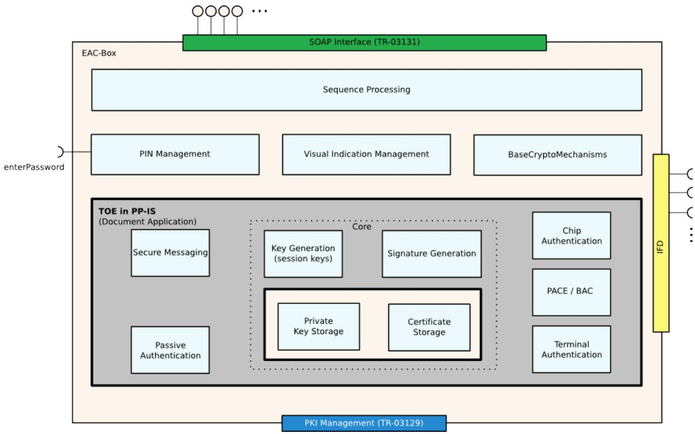

# <span id="page-6-0"></span>**2 EAC-Box layered architecture**

<span id="page-6-1"></span>*Figure 2: Components of the EAC-Box*

The design of the EAC-Box according to figure [2](#page-6-1) is based on a layered architecture.

Outwards the EAC-Box offers:

- **•** SOAP interface to call EAC-Box functions (see chapter [4.1\)](#page-11-1)
- **•** terminal interface to communicate with electronic ID documents (see chapter [4.2\)](#page-36-0)
- **•** PKI interface for the request of of necessary certificates and CRLs (see [4])
- **•** interface for secure password input (Secure Token PIN, eID PIN, CAN, etc.)

Within the EAC-Box different layers are provided. The layered architecture reflects the different kind of security levels:

- **• Sequence Processing**, which controls the intern procedures
- **• Protocols**, containing all security mechanisms that are necessary for secure communication with an electronic ID document such as Basic Access Control (BAC), Password Authenticated Connection Establishment (PACE), Passive Authentication, Terminal Authentication and Chip Authentication
- **• PIN Management**, which encloses all functionality regarding the password handling. For the eID application a password can be a PIN, PUK, CAN or MRZ[2](#page-6-2) .

<span id="page-6-2"></span><sup>2</sup> For the EAC-Box the automated reading of optical features like the optical MRZ are not considered.

- **• Visual Indication Management**: The EAC-Box can indicate status information or input requests for PIN or CAN on a display or other visual indicators. These visual information MUST be authenticate and protected against manipulation.
- **• Base Crypto Mechanisms** containing standard crypto algorithms and protocols
- **• Core**, that contains all components such as the private key storage, the certificate storage, the session key generation and the signature generation which have to be protected especially against fraud. The private key storage contains the private keys of the certificates.

The EAC-Box is based on the following Protection Profiles:

**•** PP-IS [5], encapsulating the Sequence Processing, the protocols (regarding Secure Messaging in particular the PACE-Module, Passive Authentication, Terminal Authentication, and Chip Authentication) and the core layer (Key-Storage, Certificate Storage, Key Generation, and Signature Generation).

# <span id="page-8-0"></span>**3 Functional requirements**

# **3.1 Secure Token**

For the operation of an EAC-Box special attention has to be drawn to the initialisation and usage process. For the purpose of Terminal Authentication (i.e. presenting its own access rights to the electronic identity document) the terminal (i.e. the EAC-Box) needs respective access rights in order to be allowed to read or write data. Thus, corresponding private keys and certificate chains need to be available within the EAC-Box.

Due to the requirements of anti-theft protection and to ensure that only an authorized user can start up an EAC-Box the possession of a Secure Token and the corresponding PIN is necessary. During the start up procedure the operator attaches the Secure Token to the EAC-Box and enters the PIN. After this step the EAC-Box is ready for operation. Furthermore the EAC-Box internally enabled access to the private key storage and the certificate storage.

The Secure Token is equipped with a certificate, that is used for TLS client authentication in order to be able to establish a secure communication channel between the EAC-Box and the DV. The communication is performed based on the protocols defined in [4]. The certificate of the secure token SHALL contain an extension with the information about the URL(s) of the respective certification authority.

The main function of the Secure Token are:

- **•** authorize a user role and switch the EAC-Box to an operational state
- **•** keep the certificates for a secured channel to the DVCA
- **•** provide the URL to the DVCA

The EAC-Box SHOULD support three different user roles as described in the IS PP [5]:

- **• Operator**: The operator is the normal user of the EAC-Box (e.g. employee of a governmental organization). Operators are can bring the EAC-Box into an operational state. Operators are not able to change the configuration or settings of an EAC-Box.
- **• Administrator**: The administrator is a person who administrates the EAC-Box. Administrators are able to access the EAC-Box on a service interface to change configuration and security settings of the EAC-Box.
- **• Revisor**: The revisor is a person who is able to access the EAC-Box on a dedicated service interface to inspect the saved log files.

# **3.2 Start up procedure**

If the EAC-Box is powered up the System MUST be locked (state "**Locked**").In this state there is no access to the private key storage and the system is not accessible. The EAC-Box MAY download CRLs to ensure that revoked Secure Token certificates can't be used to unlock the EAC-Box.

To get the EAC-Box in an operable state, an operator has to insert the Secure Token and enter the PIN for this card. After the authentication performs correct, the EAC-Box unlocks the private key storage. The URL to the DV encapsulated in the Secure Token certificate MAY be stored in the working memory of the EAC-Box.

- **•** Start up: If the EAC-Box already has a valid (not expired) CV certificate in its storage, this certificate MAY be used.
- **•** Initial start up: If the EAC-Box has an expired CV certificate in its storage the EAC-Box SHALL generate a new private key pair, generate a CV certificate request which is signed with an EAC-Box specific private key and send it to the DV. After the DV has signed the certificate request and has sent it back, the EAC-Box stores the certificate into the certificate storage.

The EAC-Box is now in the state "**Initialized**". In the following the CV certificate can be used even if no online connection to the certificate distribution server (DV) is available.

The Box MUST stay in the state "**Initialized**" until a user removes the Secure Token. Only if the Token was removed the Box will switch to the state "**Ready**" and will process procedure calls via the SOAP interface as described in chapter [4.1.](#page-11-1)

As an theft protection the EAC-Box MUST lock the secure key storage and switch to the "**Locked**" status in the case of powering down the EAC-Box or in the case of an unauthorized action. To bring back the EAC-Box to an operable state, the described start up procedure has to be performed again.

As long as the EAC-Box stays powered, the EAC-Box SHOULD renew the CV certificate regularly and download DS certificates, certificate revocation lists (CRL), defect list and master lists to the EAC-Box.

To renew the CV certificate the EAC-Box MUST sign the request with a CV certificate which is still valid. If the CV certificate is expired the request MUST be signed with the EAC-Box specific private key (see "Initial start up").

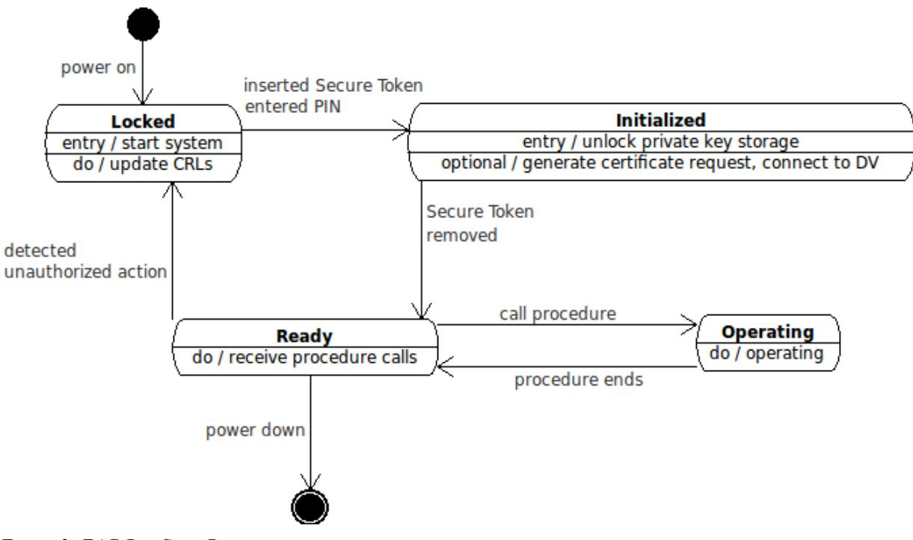

*Figure 3: EAC-Box State Diagram*

# **3.3 Logging**

The EAC-Box SHOULD have a logging function. The system MUST write a log entry whenever the configuration of the EAC-Box is changed or new updates are installed. Only an authorised user MUST be able to read the logs and delete old loggings. The authorisation of an user SHOULD be handled via the Secure Token.

# <span id="page-11-0"></span>**4 Interfaces**

In order to integrate an EAC-Box in a system architecture such as a municipality or a border control scenario interfaces and function calls have to be specified. This is done in the following sections.

In general the following public interfaces are provided:

- SOAP-Interface for the communication between external applications and the EAC-Box as described in this document
- Terminal connection via an Interface Device API (IFD-API) according to ISO/IEC 24727-4 [3]
- SOAP-Interface for the connection to the PKI according to TR-03129 [4]
- A secured connection for password input (Secure Token PIN, eID PIN, CAN, ...)

# <span id="page-11-1"></span>**4.1 EAC-Box SOAP-Interface**

The interface between an external application and the EAC-Box is specified by service oriented interfaces based on SOAP.

## **4.1.1 Base types**

Within the scope of the SOAP-Interfaces the definition of base types is necessary. This section defines the structures and data types *errorInfo*, *statusInfo*, *passAuthResult*, *validateResult, application* and *fileIdentifier*.

#### **4.1.1.1 errorInfo**

<span id="page-12-0"></span>

| errorInfo |                                |           |     |
|-----------|--------------------------------|-----------|-----|
|           | e errorCode                    | [11]      | int |
|           | e errorDescription [01] string |           |     |
|           | e errorvalue                   | [01] long |     |

#### **Description**

The structure *errorInfo* is used in SOAP-Responses to return information about the success or failure of a SOAP-Request.

#### **Struct elements**

*errorCode* – Return value of the success of the function, whereas

**0** identifies the successful case,

**1** identifies a warning and

**- 1** identifies the unsuccessful case.

*errorDescription* – Textual description of the error case.

*errorValue* – Error value for individual error description of the function. Further errorValues can be defined as they are needed. Self defined errorValues SHOULD be contain at least 4 digits.

In the successful case possible errorValues are:

- 000 EAC has been performed successfully
- 001 EAC Version 1 has been performed successfully
- 002 EAC Version 1 with PACE has been performed successfully
- 003 EAC Version 2 has been performed successfully

In the unsuccessful case possible errorValues are:

- 100 An undefined error has occurred
- 101 No eID card available
- 102 EAC Version2 PIN blocked
- 103 EAC Version 2 PIN suspended
- 104 EAC Version 2 PIN deactivated
- 105 Specification of MRZ is necessary, because an EAC V.1 document has been detected
- 106 eID application cannot be selected, because an EAC V1 document has been detected
- 107 The submission of the PIN was cancelled
- 108 The application is unknown
- 109 A SOAP error has occurred
- 110 An error has occurred within the PACE protocol
- 111 An error has occurred within the TA protocol
- 112 An error has occurred within the CA protocol
- 113 An error has occurred within the PA protocol

#### **WSDL Definition**

```
<complexType name="errorInfo">
<sequence>
 <element name="errorCode" type="xsd:int"
 minOccurs="1" maxOccurs="1"/>
 <element name="errorDescription" type="xsd:string"
 minOccurs="0" maxOccurs="1"/>
 <element name="errorValue" type="xsd:long"
 minOccurs="0" maxOccurs="1"/>
</sequence>
</complexType>
```
#### **4.1.1.2 statusInfo**

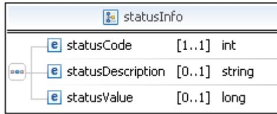

#### **Description**

The structure *statusInfo* is used in SOAP-Responses to return information about the current status of the card, the EAC-Box system and the Secure Token.

#### **Struct elements**

*statusCode* – Return value of the success of the function, whereas **0** identifies the successful case, **1** identifies a warning and **- 1** identifies the unsuccessful case.

*statusDescription* – Textual description of the error case.

*statusValue* – Further status value for individual status information of the system.

The *statusValue* always return the the status of the card, the system and the Secure Token. The lower digit returns the card status, the second digit returns the system status and the third digit returns the status of the secure token. Further statusValues can be defined as they are needed. Self defined statusValues SHOULD be contain at least 4 digits.

The following values are defined:

Card status:

xx0 – no card available

xx1 – EAC 1 card available

xx2 – EAC 2 card available

xx3 – EAC Version2 PIN blocked

xx4 – EAC Version 2 PIN suspended

xx5 – EAC Version 2 PIN deactivated

System status:

x0x – System locked

x1x – System initialized

x2x – System ready

Secure Token status:

0xx – secure token removed

1xx – secure token connected

```
<complexType name="statusInfo">
<sequence>
 <element name="statusCode" type="xsd:int"
 minOccurs="1" maxOccurs="1"/>
 <element name="statusDescription" type="xsd:string"
 minOccurs="0" maxOccurs="1"/>
 <element name="statusValue" type="xsd:long"
 minOccurs="0" maxOccurs="1"/>
</sequence>
</complexType>
```
#### **4.1.1.3 passAuthResult**

|       | ം passAuthResult                              |      |                       |  |
|-------|-----------------------------------------------|------|-----------------------|--|
|       | e digest                                      |      | [11] validationResult |  |
| 0-0-0 | e<br>signature                                | 1.11 | validationResult      |  |
|       | certificateSignature<br>e                     |      | [1] validationResult  |  |
|       | e   certificateValidity                       |      | [11] validationResult |  |
|       | e certificateRevocation [11] validationResult |      |                       |  |
|       | e  algorithm                                  |      | [11] validationResult |  |

| & validationResult |                             |  |  |  |
|--------------------|-----------------------------|--|--|--|
| 日本日                | e validationCode [11] int   |  |  |  |
|                    | e validationValue [0 ] long |  |  |  |

#### **Description**

The data type *passAuthResult* encloses the results from Passive Authentication based on the Document Security Object respective the Card Security Object security mechanisms in the Document. Note: The check for integrity of a specific data group is separated from this check (compare *[getData](#page-26-0)* section [4.1.5\)](#page-26-0).

#### **Struct Elements**

All following elements are described by a total validation result and in the unsuccessful case additional validation results are given. Possible *validationValues* for each single criterion are specified in the following:

*digest* – Contains the result of the hash value comparison of the Security Object.

Possible *validationValue*s:

000 – different hash values achieved

001 – different size of hash values

002 – only one hash value available

*signature* – Contains the result of the signature check of the Security Object.

Possible *validationValue*s:

100 – signature verification failed

101 – Security object not available

102 – wrong key length

*certificateSignature* – Contains the result of the signature validation of the certificates.

Possible *validationValue*s:

- 200 verification of Document Signer certificate failed
- 201 verification of Country Signing CA certificate failed
- 202 verification of Country Signing CA Link certificate failed
- 203 Document Signer certificate not available
- 204 Country Signing CA certificate not available
- 205 Document Signer certificate could not be parsed
- 206 Country Signing CA certificate could not be parsed
- 207 Country Signing CA Link certificate could not be parsed
- 208 wrong key length

*certificateValidity* – Contains the result of the validity check of the certificates.

Possible *validationValue*s:

- 300 validity of Document Signer certificate is expired
- 301 validity of Country Signing CA certificate is expired
- 302 validity of Country Signing CA Link certificate is expired
- 303 Document Signer certificate not available
- 304 Country Signing CA certificate not available
- 305 Document Signer certificate could not be parsed
- 306 Country Signing CA certificate could not be parsed
- 307 Country Signing CA Link certificate could not be parsed

*certificateRevocation* – Contains the result of the certificate revocation list checks.

Possible *validationValue*s:

- 400 no certificate revocation list available
- 401 Document Signer certificate revoked
- 402 Certificate revocation list could not be parsed
- *algorithm* Contains the result of the algorithm check.
	- Possible *validationValue*s:
	- 500 algorithm check failed
	- 501 algorithm not known

#### **WSDL Definition**

```
<complexType name="passAuthResult">
 <sequence>
 <element name="digest" type="eacbox:validationResult"
 minOccurs="1" maxOccurs="1"/>
 <element name="signature" type="eacbox:validationResult"
 minOccurs="1" maxOccurs="1"/>
 <element name="certificateSignature" type="eacbox:validationResult"
 minOccurs="1" maxOccurs="1"/>
 <element name="certificateValidity" type="eacbox:validationResult"
 minOccurs="1" maxOccurs="1"/>
 <element name="certificateRevocation" type="eacbox:validationResult"
 minOccurs="1" maxOccurs="1"/>
 <element name="algorithm" type="eacbox:validationResult"
 minOccurs="1" maxOccurs="1"/>
 </sequence>
</complexType>
```
#### **4.1.1.4 validationResult**

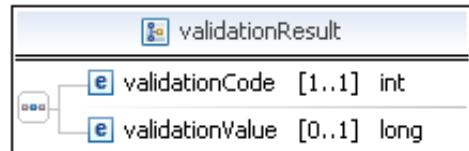

#### **Description**

The data type *validationResult* describes the possible result collection. Passive Authentication on a data group can correct (respective successful) or not correct (respective failure).

#### **Struct Elements**

*validationCode* - Return value of the success of the function, whereas **0** identifies the successful case, **1** identifies a warning and **- 1** identifies the unsuccessful case.

*validationValue* - Validation value for individual validation description of the function.

```
<complexType name="validationResult">
<sequence>
 <element name="validationCode" type="xsd:int"
 minOccurs="1" maxOccurs="1"/>
 <element name="validationValue" type="xsd:long"
 minOccurs="0" maxOccurs="1"/>
</sequence>
</complexType>
```
#### <span id="page-18-0"></span>**4.1.1.5 application**

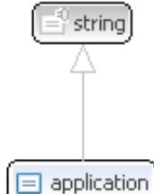

#### **Description**

The enumeration *application* identifies the application that is selected within the general authentication procedure [1]. Possible values are **ePassport** (enum const = 0), **eID** (enum const = 1), or **eSign** (enum const = 2).

```
<simpleType name="application">
 <restriction base="xsd:string">
 <enumeration value="ePassport"/><!-- enum const = 0 -->
 <enumeration value="eID"/><!-- enum const = 1 -->
 <enumeration value="eSign"/><!-- enum const = 2 -->
 </restriction>
</simpleType>
```
#### **4.1.1.6 fileIdentifier**

<span id="page-19-0"></span>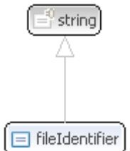

#### **Description**

The enumeration *fileIdentifier* specifies the file or data group that is to be read within the *getData* function. Possible values are:

- **•** Data Groups 1 to 21
- **•** EF\_COM File
- **•** EF\_SOD File
- **•** EF\_CVCA
- **•** EF\_CardAccess
- **•** EF\_CardSecurity

#### **WSDL Definition**

#### **<simpleType name=***"fileIdentifier"***>**

```
 <restriction base="xsd:string">
 <enumeration value="DG1"/><!-- enum const = 0 -->
 <enumeration value="DG2"/><!-- enum const = 1 -->
 <enumeration value="DG3"/><!-- enum const = 2 -->
 <enumeration value="DG4"/><!-- enum const = 3 -->
 <enumeration value="DG5"/><!-- enum const = 4 -->
 <enumeration value="DG6"/><!-- enum const = 5 -->
 <enumeration value="DG7"/><!-- enum const = 6 -->
 <enumeration value="DG8"/><!-- enum const = 7 -->
 <enumeration value="DG9"/><!-- enum const = 8 -->
 <enumeration value="DG10"/><!-- enum const = 9 -->
 <enumeration value="DG11"/><!-- enum const = 10 -->
 <enumeration value="DG12"/><!-- enum const = 11 -->
 <enumeration value="DG13"/><!-- enum const = 12 -->
 <enumeration value="DG14"/><!-- enum const = 13 -->
 <enumeration value="DG15"/><!-- enum const = 14 -->
 <enumeration value="DG16"/><!-- enum const = 15 -->
 <enumeration value="DG17"/><!-- enum const = 16 -->
 <enumeration value="DG18"/><!-- enum const = 17 -->
 <enumeration value="DG19"/><!-- enum const = 18 -->
 <enumeration value="DG20"/><!-- enum const = 19 -->
 <enumeration value="DG21"/><!-- enum const = 20 -->
 <enumeration value="EF-COM"/><!-- enum const = 21 -->
 <enumeration value="EF-SOD"/><!-- enum const = 22 -->
 <enumeration value="EF-CVCA"/><!-- enum const = 23 -->
 <enumeration value="EF-CardAccess"/><!-- enum const = 24 -->
```

```
 <enumeration value="EF-CardSecurity"/><!-- enum const = 25 -->
 </restriction>
 </simpleType>
```
### **4.1.2 authenticate**

| ം authenticate |              |                          |
|----------------|--------------|--------------------------|
| [>] input      | r parameters | e authenticate           |
| output         | r parameters | e   authenticateResponse |

#### **Description**

The function *authenticate* provides the functionality that is needed for the EAC General Authentication Procedure defined in [1]. It performs PACE, Terminal Authentication, Passive Authentication and Chip Authentication. It has to be performed before a terminal can access applications on the electronic ID document chip.

Note: The password which is necessary for PACE as well as the (CSCA-, DS-, CV-) certificates which are necessary for Passive Authentication and Terminal Authentication are provided to the EAC-Box through other internal i.e. not public interfaces.

#### **Input parameters**

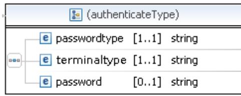

*passwordtype* – Specification of the password type i.e. **CAN**, **MRZ**, **PIN**, and **PUK**.

*terminaltype* – Terminal type that is used in the general authentication procedure. Possible values are **IS** or **AT.**

*password* – Within the ePassport application the MRZ can be necessary for the access to the eMRTD chip (in the case that Basic Access Control is to be performed). In case of passwordtype PIN or PUK this parameter MUST NOT be used.

#### **Output parameters**

| & (authenticateResponseType) |                             |  |                      |
|------------------------------|-----------------------------|--|----------------------|
|                              | e authSuccess [1.1] boolean |  |                      |
|                              | e error                     |  | [1.1] errorInfo      |
|                              | el paResult                 |  | [1 1] passAuthResult |

*authSuccess* – Result of the General Authentication Procedure.

*error* – Result description of the function execution.

*paResult* – Result of the Passive Authenticate check.

#### **WSDL Definition**

```
<!-- operation request element -->
<element name="authenticate">
 <complexType>
 <sequence>
 <element name="passwordtype" type="xsd:string" minOccurs="1"
 maxOccurs="1"/>
 <element name="terminaltype" type="xsd:string" minOccurs="1"
 maxOccurs="1"/>
 <element name="password" type="xsd:string" minOccurs="0"
maxOccurs="1"/>
 </sequence>
 </complexType>
</element>
<!-- operation response element -->
<element name="authenticateResponse">
 <complexType>
 <sequence>
 <element name="authSuccess" type="xsd:boolean" minOccurs="1"
 maxOccurs="1"/>
 <element name="error" type="eacbox:ErrorInfo" minOccurs="1"
 maxOccurs="1"/>
 <element name="paResult" type="eacbox:passAuthResult" minOccurs="1"
 maxOccurs="1"/>
 </sequence>
 </complexType>
</element>
```
#### **4.1.3 selectApplication**

| selectApplication |              |                               |  |
|-------------------|--------------|-------------------------------|--|
| [>] input         | u parameters | e  selectApplication          |  |
| output            | r parameters | [e] selectApplicationResponse |  |

#### **Description**

The function *selectApplication* is used after successful authentication with an according authorisation certificate in order to select application(s).

#### **Input Parameters**

*application* – Application that is selected. Possible values are defined by the enumeration application (compare section [4.1.1.5\)](#page-18-0).

#### **Output Parameters**

| [selectApplicationResponseType) |                                 |  |                 |
|---------------------------------|---------------------------------|--|-----------------|
| 000                             | e selectAppSuccess [11] boolean |  |                 |
|                                 | e error                         |  | [1.1] errorInfo |

*selectAppSuccess* – Result of the application selection.

*error* – Result description of the function execution.

#### **WSDL**

```
<!-- operation request element -->
<element name="selectApplication">
<complexType>
 <sequence>
 <element name="application" type="eacbox:application"
 minOccurs="1" maxOccurs="1"/>
 </sequence>
</complexType>
</element>
<!-- operation response element -->
<element name="selectApplicationResponse">
<complexType>
 <sequence>
 <element name="selectAppSuccess" type="xsd:boolean"
 minOccurs="1" maxOccurs="1"/>
 <element name="error" type="eacbox:errorInfo"
 minOccurs="1" maxOccurs="1"/>
 </sequence>
</complexType>
</element>
```
## **4.1.4 getInfo**

| 载 getInfo |              |                   |
|-----------|--------------|-------------------|
| [)] input | r parameters | e getInfo         |
| Oloutput  | r parameters | e getInfoResponse |

#### **Description**

The function *getInfo* returns status information regarding the electronic identity document, the system and the secure token. This can be important in order to check if a PIN has been suspended or to verify if an electronic identity document is even available on the reading device.

#### **Input Parameters**

This function has got no input parameters.

#### **Output Parameters**

| (getInfoResponseType) |                               |               |                 |
|-----------------------|-------------------------------|---------------|-----------------|
|                       | e getInfoSuccess [11] boolean |               |                 |
|                       | date<br>e                     |               | [1 1] dateTime  |
| 0-0-0 -               | el hwVersion                  | [11]          | string          |
|                       | swVersion<br>e                | [1  1] string |                 |
|                       | status                        |               | [11] statusInfo |

*getInfoSuccess* – Result of the *getInfo* request. *date* – current EAC-Box system date and time *hwVersion* – current EAC-Box hardware Version *swVersion* – current EAC-Box software Version *status* – Result description of the function execution.

```
<!-- operation request element -->
<element name="getInfo">
 <complexType>
 <sequence>
 </sequence>
 </complexType>
</element>
<!-- operation response element -->
<element name="getInfoResponse">
 <complexType>
```

```
 <sequence>
 <element name="getInfoSuccess" type="xsd:boolean"
 minOccurs="1" maxOccurs="1"/>
 <element name="date" type="xsd:dateTime"
 minOccurs="1" maxOccurs="1"/>
 <element name="hwVersion" type="xsd:string"
 minOccurs="1" maxOccurs="1"/>
 <element name="swVersion" type="xsd:string"
 minOccurs="1" maxOccurs="1"/>
 <element name="status" type="eacbox:statusInfo"
 minOccurs="1" maxOccurs="1"/>
 </sequence>
</complexType>
</element>
```
#### **4.1.5 getData**

<span id="page-26-0"></span>

| 载 getData |              |                     |
|-----------|--------------|---------------------|
| ()) input | r parameters | e getData           |
| output    | r parameters | e   getDataResponse |

#### **Description**

The function *getData* reads and returns a specific file or data group from an eID document, if available.

#### **Input Parameters**

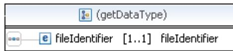

*fileIdentifier* – Specification of the data to be read. Possible values are defined by the enumeration *fileIdentifier* (compare section [4.1.1.6\)](#page-19-0).

#### **Output Parameters**

| 1 (getDataResponseType) |                                  |  |                        |
|-------------------------|----------------------------------|--|------------------------|
|                         | e getSuccess [1.1] boolean       |  |                        |
|                         | e dataContent [0.1] base64Binary |  |                        |
|                         | e paResult                       |  | [0.1] validationResult |
|                         | error                            |  | [1.1] errorInfo        |

*getSuccess* – Result of the getData function.

*dataContent* – Requested data that is encoded in base64. (only if *getSuccess* is *true*) *paResult* – Result of the Passive Authentication check of this data. (only if *getSuccess* is *true*)

*error* – Result description of the function execution.

#### **WSDL Definition**

```
<!-- operation request element -->
<element name="getData">
 <complexType>
 <sequence>
 <element name="fileIdentifier" type="eacbox:fileIdentifier"
 minOccurs="1" maxOccurs="1"/>
 </sequence>
 </complexType>
</element>
<!-- operation response element -->
<element name="getDataResponse">
 <complexType>
 <sequence>
 <element name="getSuccess" type="xsd:boolean" minOccurs="1"
 maxOccurs="1"/>
 <element name="dataContent" type="xsd:base64Binary" minOccurs="0"
 maxOccurs="1" nillable="true"/>
 <element name="paResult" type="eacbox:validationResult"
 minOccurs="0" maxOccurs="1"/>
 <element name="error" type="eacbox:errorInfo" minOccurs="1"
 maxOccurs="1"/>
 </sequence>
 </complexType>
</element>
```
#### **4.1.6 getMultipleData**

| 織 getMultipleData |              |                                |
|-------------------|--------------|--------------------------------|
| [>] input         | r parameters | e getMultipleData              |
| output            | r parameters | e   get Multiple Data Response |

#### **Description**

The function *getMultipleData* reads and returns one or more files or data groups from an eID document depending on the specified application.

#### **Input parameters**

| getMultipleData |                                      |  |  |
|-----------------|--------------------------------------|--|--|
|                 | e application [1.1] application      |  |  |
| 0-0-0           | e fileIdentifier [1*] fileIdentifier |  |  |

*application* – Application that is selected. Possible values are defined by the enumeration application (compare section [4.1.1.5\)](#page-18-0).

*fileIdentifier* – Specification of the data to be read. Possible values are defined by the enumeration fileIdentifier (compare section [4.1.1.6\)](#page-19-0).

#### **Output parameters**

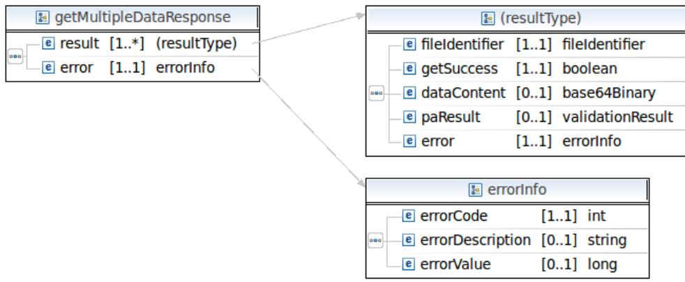

*result* – A set of output parameters for each file or data group that includes the following sub-parameters:

- **•** *fileIdentifier* Specification of the data to be read. Possible values are defined by the enumeration *fileIdentifier* (compare section [4.1.1.6\)](#page-19-0).
- **•** *getSuccess* Result of the reading process for the specified file or data group.
- **•** *dataContent* Requested data that is encoded in base64 (only if *getSuccess* is *true*).
- **•** *paResult* Result of the Passive Authentication check of this data (only if *getSuccess* is *true*).
- **•** *error* Result description of the reading process

*error* – Result description of the request

```
<!-- operation request element -->
 <element name="getMultipleData">
 <complexType>
 <sequence>
 <element name="application" type="eacbox:application"
 minOccurs="1" maxOccurs="1"/>
 <element name="fileIdentifier" type="eacbox:fileIdentifier"
 minOccurs="1" maxOccurs="unbounded"/>
 </sequence>
 </complexType>
 </element>
<!-- operation response element -->
 <element name="getMultipleDataResponse">
 <complexType>
 <sequence>
 <element name="result" minOccurs="1" maxOccurs="unbounded">
 <complexType>
 <sequence>
```

```
 <element name="fileIdentifier" type="eacbox:fileIdentifier"
 minOccurs="1" maxOccurs="1" />
 <element name="getSuccess" type="xsd:boolean" minOccurs="1"
 maxOccurs="1" />
 <element name="dataContent" type="xsd:base64Binary"
 minOccurs="0" maxOccurs="1" nillable="true" />
 <element name="paResult" type="eacbox:validationResult"
 minOccurs="0" maxOccurs="1" />
 <element name="error" type="eacbox:errorInfo" minOccurs="1"
 maxOccurs="1" />
 </sequence>
 </complexType>
 </element>
 <element name="error" type="eacbox:errorInfo" minOccurs="1"
 maxOccurs="1"/>
 </sequence>
 </complexType>
 </element>
```
## **4.1.7 writeDataGroup**

| ▒ writeDataGroup |              |                            |
|------------------|--------------|----------------------------|
| [>] input        | r parameters | e  writeDataGroup          |
| output           | r parameters | e   writeDataGroupResponse |

#### **Description**

The function *writeDataGroup* writes a specified data group on the eID document if the effective authorization has been proven before.

#### **Input Parameters**

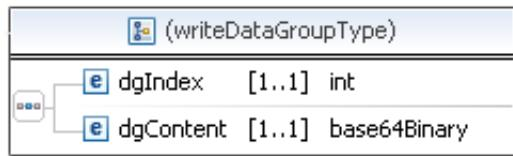

*dgIndex* – Index of the requested data group that is to be written. For the eID application only the data group indexes 17 to 21 are valid to be written.

*dgContent* – To be written binary data group encoded in base64.

#### **Output Parameters**

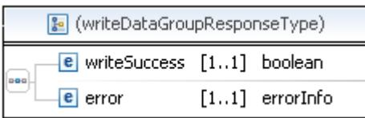

*writeSuccess* – Result of the write data group request.

*error* – Result description of the function execution.

```
<!-- operation request element -->
<element name="writeDataGroup">
<complexType>
 <sequence>
 <element name="dgIndex" type="xsd:int"
 minOccurs="1" maxOccurs="1"/>
 <element name="dgContent" type="xsd:base64Binary"
 minOccurs="1" maxOccurs="1" nillable="false"/>
 </sequence>
</complexType>
</element>
<!-- operation response element -->
<element name="writeDataGroupResponse">
<complexType>
 <sequence>
 <element name="writeSuccess" type="xsd:boolean"
 minOccurs="1" maxOccurs="1"/>
 <element name="error" type="eacbox:errorInfo"
 minOccurs="1" maxOccurs="1"/>
 </sequence>
</complexType>
</element>
```
#### **4.1.8 activateeID**

| 發 activateeID |              |                         |
|---------------|--------------|-------------------------|
| [>] input     | r parameters | e activateeID           |
| output        | r parameters | e   activateeIDResponse |

#### **Description**

The function *activateeID* activates the eID application (compare B.6.2 in [1]).

#### **Input Parameters**

The function has got no input parameters.

#### **Output Parameters**

| (activateeIDResponseType) |                               |  |                 |
|---------------------------|-------------------------------|--|-----------------|
| nad                       | e acteIDSuccess [1.1] boolean |  |                 |
|                           | e error                       |  | [1.1] errorInfo |

*acteIDSuccess* – Result of the *activateeID* request.

*error* – Result description of the function execution.

```
<!-- operation request element -->
<element name="activateeID">
<complexType>
 <sequence>
 </sequence>
</complexType>
</element>
<!-- operation response element -->
<element name="activateeIDResponse">
<complexType>
 <sequence>
 <element name="acteIDSuccess" type="xsd:boolean"
 minOccurs="1" maxOccurs="1"/>
 <element name="error" type="eacbox:errorInfo"
 minOccurs="1" maxOccurs="1"/>
 </sequence>
</complexType>
</element>
```
### **4.1.9 deactivateeID**

| 泰 deactivateeID |              |                           |
|-----------------|--------------|---------------------------|
| [>] input       | r parameters | e deactivateeID           |
| output          | u parameters | e   deactivateeIDResponse |

#### **Description**

The function *deactivateeID* deactivates the eID application (compare B.6.2 in [1]).

#### **Input Parameters**

The function has got no input parameters.

#### **Output Parameters**

| (deactivateeIDResponseType) |                               |  |                  |
|-----------------------------|-------------------------------|--|------------------|
|                             | e deaeIDSuccess [1.1] boolean |  |                  |
|                             | el error                      |  | [1  1] errorInfo |

*deaeIDSuccess –* Result of the *deactivateeID* request.

*error* – Result description of the function execution.

```
<!-- operation request element -->
<element name="deactivateeID">
<complexType>
 <sequence>
 </sequence>
</complexType>
</element>
<!-- operation response element -->
<element name="deactivateeIDResponse">
<complexType>
 <sequence>
 <element name="deaeIDSuccess" type="xsd:boolean"
 minOccurs="1" maxOccurs="1"/>
 <element name="error" type="eacbox:errorInfo"
 minOccurs="1" maxOccurs="1"/>
 </sequence>
</complexType>
</element>
```
#### **4.1.10 changePIN**

| / changePIN |              |                       |
|-------------|--------------|-----------------------|
| [)] input   | J parameters | e  changePIN          |
| output      | r parameters | e   changePINResponse |

#### **Description**

This function changes the PIN that is required for the eID application.

#### **Input Parameters**

The function has got no input parameters.

#### **Output Parameters**

| (changePINResponseType) |                                   |  |                 |
|-------------------------|-----------------------------------|--|-----------------|
| පිහිට                   | e  changePINSuccess [1.1] boolean |  |                 |
|                         | e error                           |  | [1.1] errorInfo |

*changePINSuccess* – Result of the *changePIN* request.

*error* – Result description of the function execution.

```
<!-- operation request element -->
<element name="changePIN">
<complexType>
 <sequence>
 </sequence>
</complexType>
</element>
<!-- operation response element -->
<element name="changePINResponse">
<complexType>
 <sequence>
 <element name="changePINSuccess" type="xsd:boolean"
 minOccurs="1" maxOccurs="1"/>
 <element name="error" type="eacbox:errorInfo"
 minOccurs="1" maxOccurs="1"/>
 </sequence>
</complexType>
</element>
```
### **4.1.11 unblockPIN**

| / unblockPIN |              |                      |
|--------------|--------------|----------------------|
| [)}] input   | r parameters | e  unblockPIN        |
| output       | u parameters | e unblockPINResponse |

#### **Description**

The function *unblockPIN* is used to unblock the blocked PIN and reset the retry counter. Note: Within this scope it is the PUK as a long secret user password that is used to access the unblock mechanism of the PIN.

#### **Input Parameters**

The function has got no input parameters.

#### **Output Parameters**

| [8] (unblockPINResponseType) |                                   |  |                 |  |
|------------------------------|-----------------------------------|--|-----------------|--|
| 0-0-0                        | e unblockPINSuccess [1.1] boolean |  |                 |  |
|                              | e error                           |  | [1.1] errorInfo |  |

*unblockPINSuccess* – Result of the *unblockPIN* request.

*error* – Result description of the function execution.

```
<!-- operation request element -->
<element name="unblockPIN">
<complexType>
 <sequence>
 </sequence>
</complexType>
</element>
<!-- operation response element -->
<element name="unblockPINResponse">
<complexType>
 <sequence>
 <element name="unblockPINSuccess" type="xsd:boolean"
 minOccurs="1" maxOccurs="1"/>
 <element name="error" type="eacbox:errorInfo"
 minOccurs="1" maxOccurs="1"/>
 </sequence>
</complexType>
</element>
```
# <span id="page-36-0"></span>**4.2 Interface Device API (IFD-API)**

For the communication between the electronic Identity Document and the EAC-Box a terminal (compare section 3.2 in [1]) is required. Due to the fact that the terminal is not necessarily directly connected to the EAC-Box an adequate interface has to be defined. In order to be able to allow different concrete types of terminals and to specify the communication with the chip of the electronic Identity Document the IFD-Interface [3] has been published by ISO. Thus different technologies such as PC/SC or a vendor specific interface can be used.

This section gives an overview of the IFD-functions. For the concrete interface description the user is referred to [3] whereas the status output shall follow the *errorInfo* in section [4.1.1.1.](#page-12-0)

### **4.2.1 Slot terminal related requests**

#### **4.2.1.1 EstablishContext**

A session is established by the function *EstablishContext* so that further instructions commands can be transmitted (compare section 3.1.1 in [3]).

#### **4.2.1.2 ReleaseContext**

As opposite to the function *EstablishContext* the function *ReleaseContext* terminates an established session (compare section 3.1.2 in [3]).

#### **4.2.1.3 ListIFDs**

The function *ListIFDs* returns a list of all terminals (interface devices) that are connected to the system at the moment (compare section 3.1.3 in [3]).

#### **4.2.1.4 GetIFDCapabilities**

With the function *GetIFDCapabilities* detailed information regarding the connected terminals can be achieved in particular the capabilities and the connected functional units (compare section 3.1.4 in [3]).

#### **4.2.1.5 GetStatus**

In order to retrieve the current status of the terminal (respective interface device) the function *GetStatus* can be called (compare section 3.1.5 in [3]).

#### **4.2.1.6 Wait**

It is the purpose of the function *Wait* to inform the client-application that some event has occurred at an indicated list of IFDs (compare section 3.1.6 in [3]).

#### **4.2.1.7 Cancel**

The function *Cancel* is used to terminate the command that is performed with a terminal at the moment (compare section 3.1.7 in [3]).

#### **4.2.1.8 ControlIFD**

A direct transmission of commands to the terminal can be achieved by using the *ControlIFD* function (compare section 3.1.8 in [3]).

#### **4.2.2 Slot related requests**

#### **4.2.2.1 Connect**

The activation of an eID card and the establishment of a communication channel is performed by the function *Connect* (compare section 3.2.1 in [3]).

#### **4.2.2.2 Disconnect**

In opposite to the function Connect the function *Disconnect* is used to terminate the communication with the eID card and can execute further action (compare section 3.2.2 in [3]).

#### **4.2.2.3 BeginTransaction**

Within the function *BeginTransaction* a transaction is started that allows to send a series of linked requests that can be sent to the indicated slot. Furthermore rollback facilities are available that are used in case a request is not completed successfully (compare section 3.2.3 in [3]).

#### **4.2.2.4 EndTransaction**

In opposite to the Function *BeginTransaction* the function *EndTransaction* terminates the recent transaction with the indicated eID card (compare section 3.2.4 in [3]).

#### **4.2.2.5 Transmit**

The function *Transmit* is used for the purpose of sending APDUs to the eID card (compare section 3.2.5 in [3]).

# **4.3 PKI communication interfaces**

Two different scenarios are possible in order to update the certificate and CRL information of an EAC-Box. The EAC-Box can either have direct access to the certificate distribution server (compare figure [4\)](#page-38-1) or the EAC-Box receives the certificates and CRLs through the connection to the PC for example in a municipality (compare figure [5\)](#page-38-0).

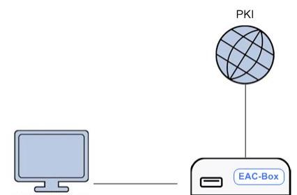

<span id="page-38-1"></span>*Figure 4: Direct access of an EAC-Box to the designated distribution server*

In the case of direct access the EAC-Box is connected to the PKI and the TLS connection is established directly between the EAC-Box and the PKI server based on the PKI for Extended Access Control [4]. Certificates and CRLs are downloaded and stored in the secure certificate storage. The PC has no direct access to the certificate data. After updating of the certificate storage the data is used within the general authentication procedure.

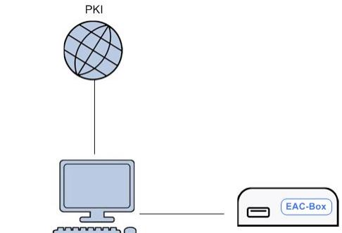

<span id="page-38-0"></span>*Figure 5: Indirect access of an EAC-Box to the designated distribution server*

In the case of indirect access the PC is connected to the PKI and serves as a proxy for the EAC-Box. Thus, the PC can inform the EAC-Box by using the interface *updateCertificates* (compare the last paragraph of this section) that new certificates respectively that an internet connection are available. Afterwards the EAC-Box can initiate the corresponding PKI communication as defined in in TR-03129 [4]. The PC in the municipality offers an interface that passes the communication from the EAC-Box to the PKI.

| ▒ updateCertficates |                |                                |  |
|---------------------|----------------|--------------------------------|--|
| [>] input           | r parameters   | e  updateCertficates           |  |
| < ]] output =       | lr" parameters | e   updateCertificatesResponse |  |

#### **Description**

The function *updateCertificates* allows a PC to work as a Proxy for the EAC-Box and to provide the according certificates i.e. for Terminal Authentication and Passive Authentication.

#### **Input parameters**

This function has got no input parameters.

#### **Output parameters**

|      | & (updateCertificatesResponseType) |  |                 |  |  |
|------|------------------------------------|--|-----------------|--|--|
| පසුන | e updateCertificates [11] boolean  |  |                 |  |  |
|      | e error                            |  | [1.1] errorInfo |  |  |

*updateCertificates* – Boolean Result of the update process of certificates.

*error* – Result description of the function execution.

#### **WSDL Description**

```
<!-- operation request element -->
<element name="updateCertficates">
<complexType>
 <sequence>
 </sequence>
</complexType>
</element>
<!-- operation response element -->
<element name="updateCertificatesResponse">
<complexType>
 <sequence>
 <element name="updateCertificates" type="xsd:boolean"
 minOccurs="1" maxOccurs="1"/>
 <element name="error" type="eacbox:errorInfo"
 minOccurs="1" maxOccurs="1"/>
 </sequence>
</complexType>
</element>
```
# <span id="page-40-0"></span>**5 Bibliography**

- [1] BSI, TR-3110: Advanced Security Mechanisms for Machine Readable Travel Documents, Version 2.03,2010
- [2] Bradner, Scott, Key words for use in RFCs to indicate requirement levels, RFC 2119,1997
- [3] ISO/IEC 24727-4: Identification cards Integrated circuit card programming interfaces - Part 4: Application programming interface (API) administration, , 2008
- [4] BSI, TR-03129: PKIs for Machine Readable Travel Documents Protocols for the Management of Certificates and CRLs, Version 1.0,2009
- [5] BSI, BSI-CC-PP-0064: Common Criteria Protection Profile for Inspection Systems