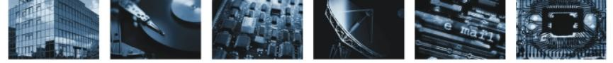

# **Prüfspezifikationen zur Technische Richtlinie zur Produktionsdatenerfassung, -qualitätsprüfung und -übermittlung für Pässe**

Prüfspezifikation Biometrie I: Hardwarekomponenten

# **BSI TR-03118-1 (PS Biometrie I)**

Version 2.1 Datum 17.10.2007

BSI TR-03118-1 (PS-Biometrie I) Version 2.1

Bundesamt für Sicherheit in der Informationstechnik Postfach 20 03 63 53133 Bonn Tel.: +49 (0) 1888 9582 0 E-Mail[: tr-pdu@bsi.bund.de](mailto: tr-pdu@bsi.bund.de)  Internet: http://www.bsi.bund.de © Bundesamt für Sicherheit in der Informationstechnik 2007

| 1.    | Vorbemerkungen                                                                                   | 5  |
|-------|--------------------------------------------------------------------------------------------------|----|
| 1.1   | Titel und Einordnung                                                                             | 5  |
| 1.2   | Kennzeichnung                                                                                    | 5  |
| 1.3   | Fachlich zuständige Stelle                                                                       | 5  |
| 1.4   | Aufbau des Dokuments                                                                             | 5  |
| 2.    | Komponenten für die Erfassung der Gesichtsbilddaten                                              | 6  |
| 2.1   | Fotomustertafel                                                                                  | 6  |
| 2.2   | Schablone                                                                                        | 11 |
| 2.3   | Scanner                                                                                          | 14 |
| 3.    | Komponenten für die Erfassung der Fingerabdruckbilddaten                                         | 16 |
| 3.1   | Optische Fingerprint Live-Scanner                                                                | 16 |
| 3.1.1 | Optische Fingerprint Live-Scanner nach dem Prinzip der gestörten Totalreflexion im Hellfeld      | 18 |
| 3.1.2 | Optische Fingerprint Live-Scanner nach dem Prinzip der gestörten Totalreflexion im Dunkelfeld.29 |    |
| 3.1.3 | Wertetabellen                                                                                    | 40 |
| 4.    | Referenzen                                                                                       | 41 |

Inhaltsverzeichnis

Vorbemerkungen

# **1. Vorbemerkungen**

Kapitel [1](#page-4-0) enthält Angaben zur Bezeichnung dieser Prüfspezifikation und zur fachlich zuständigen Stelle.

# **1.1 Titel und Einordnung**

Dieses Dokument trägt den Titel "Prüfspezifikation Biometrie I: Hardwarekomponenten". Es ist normativer Teil der Prüfspezifikationen zur TR 03104 "Technische Richtlinie zur Produktionsdatenerfassung, -qualitätsprüfung und -übermittlung für Pässe" [TR\_PDÜ].

Die TR macht Vorgaben für alle Systeme, die für die Erfassung, Qualitätsprüfung und Übermittlung der Produktionsdaten für Pässe eingesetzt werden. Der Anwendungsbereich dieses Dokuments gilt entsprechend der TR.

### **1.2 Kennzeichnung**

Dieses Dokument wird gekennzeichnet mit "BSI TR-03118-1 (PS Biometrie I)"

### **1.3 Fachlich zuständige Stelle**

Fachlich zuständig für die Formulierung und Betreuung dieses Anhangs der TR ist das Bundesamt für Sicherheit in der Informationstechnik (BSI).

Anschrift: Bundesamt für Sicherheit in der Informationstechnik (BSI) Abteilung 3 Postfach 20 03 63 53133 Bonn

E-Mail: [tr-pdu@bsi.bund.de](mailto:tr-pdu@bsi.bund.de)

Für inhaltliche Änderungen am Dokument ist das Bundeskriminalamt (BKA), Abteilung KT43 zu konsultieren.

### **1.4 Aufbau des Dokuments**

Kapitel [2](#page-5-0) beinhaltet die Prüffälle zur Konformitätsprüfung von Hardwarekomponenten bei der Erfassung von Gesichtsbilddaten gemäß [QS\_Gesicht].

Kapitel [3](#page-15-0) umfasst die Prüffälle zur Konformitätsprüfung von Hardwarekomponenten bei der Erfassung von Fingerabdrücken gemäß [QS\_Finger].

# **2. Komponenten für die Erfassung der Gesichtsbilddaten**

# **2.1 Fotomustertafel**

Die Prüfung und Freigabe dieser Komponente erfolgt durch das BSI (ggf. unter Einbeziehung einer vom BSI beauftragten Instanz oder einer vom BSI anerkannten Prüfstelle).

|  |  | Tabelle 1: Anforderungen an die Prüfstelle |  |  |  |
|--|--|--------------------------------------------|--|--|--|
|--|--|--------------------------------------------|--|--|--|

| Prüfumgebung                          | -                                                                                                                      |
|---------------------------------------|------------------------------------------------------------------------------------------------------------------------|
| Prüfwerkzeuge                         | [ISO_Face] •                                                                                                        |
|                                       | [QS_Gesicht] •                                                                                                      |
|                                       | Messwerkzeug (z.B. Lineal) •                                                                                        |
| Qualifikation des Prüfpersonals | Umfangreiche Erfahrungen mit Anforderungen des Standards ISO/IEC 19794-5 [ISO_Face] und der Richtlinie [QS_Gesicht] |

### **Tabelle 2: Anforderungen an das Prüfobjekt**

| Hersteller nachweise | -                                                                                                                                                                                           |
|-------------------------|---------------------------------------------------------------------------------------------------------------------------------------------------------------------------------------------|
| Schnittstellen          | -                                                                                                                                                                                           |
| Funktionalität          | Die Fotomustertafel muss in der Form vorliegen, wie sie im Antragsprozess eingesetzt wird, d.h. maßstäblich gedruckt in der Qualität, in der sie für den Echteinsatz produziert wird. |

### **Tabelle 3: Prüffall PSBioI-FMT-001**

| Prüffall-ID          | Prüffall PSBioI-FMT-001                                                                                                                                                      |                     |                    |  |
|----------------------|------------------------------------------------------------------------------------------------------------------------------------------------------------------------------|---------------------|--------------------|--|
| Prüfzweck            | Vollständigkeit der Fotomustertafel • Sind Beispielbilder (Gutfälle und Schlechtfälle) für alle in Tabelle 6 von [QS_Gesicht] gekennzeichneten Kriterien vorhanden? |                     |                    |  |
| Start bedingungen |                                                                                                                                                                              |                     |                    |  |
| Prüfschritte         | Beschreibung                                                                                                                                                                 | Erwartetes Resultat | Erzieltes Resultat |  |

Komponenten für die Erfassung der Gesichtsbilddaten

| 1. | Identifikation der für das Kriterium "Kopfhaltung/Pose" relevanten Beispielbilder        | Es ist mindestens ein Beispielbild enthalten, welches als Schlechtfall bzgl. dieses Kriteriums markiert ist. Zum Vergleich ist ein Beispielbild enthalten, welches als Gutfall markiert ist. |  |
|----|---------------------------------------------------------------------------------------------------|----------------------------------------------------------------------------------------------------------------------------------------------------------------------------------------------------------------------|--|
| 2. | Identifikation der für das Kriterium "Gesichtsausdruck" relevanten Beispielbilder        | Es ist mindestens ein Beispielbild enthalten, welches als Schlechtfall bzgl. dieses Kriteriums markiert ist. Zum Vergleich ist ein Beispielbild enthalten, welches als Gutfall markiert ist. |  |
| 3. | Identifikation der für das Kriterium "Mund geschlossen" relevanten Beispielbilder        | Es ist mindestens ein Beispielbild enthalten, welches als Schlechtfall bzgl. dieses Kriteriums markiert ist. Zum Vergleich ist ein Beispielbild enthalten, welches als Gutfall markiert ist. |  |
| 4. | Identifikation der für das Kriterium "Augen sichtbar" relevanten Beispielbilder          | Es ist mindestens ein Beispielbild enthalten, welches als Schlechtfall bzgl. dieses Kriteriums markiert ist. Zum Vergleich ist ein Beispielbild enthalten, welches als Gutfall markiert ist. |  |
| 5. | Identifikation der für das Kriterium "Augen nicht geschlossen" relevanten Beispielbilder | Es ist mindestens ein Beispielbild enthalten, welches als Schlechtfall bzgl. dieses Kriteriums markiert ist. Zum Vergleich ist ein Beispielbild enthalten, welches als Gutfall markiert ist. |  |

| 6.  | Identifikation der für das Kriterium "Keine Verdeckung der Augen" relevanten Beispielbilder | Es ist mindestens ein Beispielbild enthalten, welches als Schlechtfall bzgl. dieses Kriteriums markiert ist. Zum Vergleich ist ein Beispielbild enthalten, welches als Gutfall markiert ist. |  |
|-----|------------------------------------------------------------------------------------------------------|----------------------------------------------------------------------------------------------------------------------------------------------------------------------------------------------------------------------|--|
| 7.  | Identifikation der für das Kriterium "Blick zur Kamera" relevanten Beispielbilder           | Es ist mindestens ein Beispielbild enthalten, welches als Schlechtfall bzgl. dieses Kriteriums markiert ist. Zum Vergleich ist ein Beispielbild enthalten, welches als Gutfall markiert ist. |  |
| 8.  | Identifikation der für das Kriterium "Kopfverdeckungen" relevanten Beispielbilder           | Es ist mindestens ein Beispielbild enthalten, welches als Schlechtfall bzgl. dieses Kriteriums markiert ist. Zum Vergleich ist ein Beispielbild enthalten, welches als Gutfall markiert ist. |  |
| 9.  | Identifikation der für das Kriterium "Einfarbiger Hintergrund" relevanten Beispielbilder    | Es ist mindestens ein Beispielbild enthalten, welches als Schlechtfall bzgl. dieses Kriteriums markiert ist. Zum Vergleich ist ein Beispielbild enthalten, welches als Gutfall markiert ist. |  |
| 10. | Identifikation der für das Kriterium "Schatten im Hintergrund" relevanten Beispielbilder    | Es ist mindestens ein Beispielbild enthalten, welches als Schlechtfall bzgl. dieses Kriteriums markiert ist. Zum Vergleich ist ein Beispielbild enthalten, welches als Gutfall markiert ist. |  |

Komponenten für die Erfassung der Gesichtsbilddaten

| 11. | Identifikation der für das Kriterium "Keine weiteren Personen/Objekte im Hintergrund" relevanten Beispielbilder | Es ist mindestens ein Beispielbild enthalten, welches als Schlechtfall bzgl. dieses Kriteriums markiert ist. Zum Vergleich ist ein Beispielbild enthalten, welches als Gutfall markiert ist. |  |
|-----|--------------------------------------------------------------------------------------------------------------------------------|----------------------------------------------------------------------------------------------------------------------------------------------------------------------------------------------------------------------|--|
| 12. | Identifikation der für das Kriterium "Schatten im Gesicht" relevanten Beispielbilder                                  | Es ist mindestens ein Beispielbild enthalten, welches als Schlechtfall bzgl. dieses Kriteriums markiert ist. Zum Vergleich ist ein Beispielbild enthalten, welches als Gutfall markiert ist. |  |
| 13. | Identifikation der für das Kriterium "Hot Spots" relevanten Beispielbilder                                               | Es ist mindestens ein Beispielbild enthalten, welches als Schlechtfall bzgl. dieses Kriteriums markiert ist. Zum Vergleich ist ein Beispielbild enthalten, welches als Gutfall markiert ist. |  |
| 14. | Identifikation der für das Kriterium "Brilleneffekte" relevanten Beispielbilder                                       | Es ist mindestens ein Beispielbild enthalten, welches als Schlechtfall bzgl. dieses Kriteriums markiert ist. Zum Vergleich ist ein Beispielbild enthalten, welches als Gutfall markiert ist. |  |
| 15. | Identifikation der für das Kriterium "Korrekte Belichtung" relevanten Beispielbilder                                  | Es ist mindestens ein Beispielbild enthalten, welches als Schlechtfall bzgl. dieses Kriteriums markiert ist. Zum Vergleich ist ein Beispielbild enthalten, welches als Gutfall markiert ist. |  |

| 16.                | Identifikation der für das Kriterium "Kontrast" relevanten Beispielbilder                                     | Es ist mindestens ein Beispielbild enthalten, welches als Schlechtfall bzgl. dieses Kriteriums markiert ist. Zum Vergleich ist ein Beispielbild enthalten, welches als Gutfall markiert ist. |  |
|--------------------|---------------------------------------------------------------------------------------------------------------------|----------------------------------------------------------------------------------------------------------------------------------------------------------------------------------------------------------------------|--|
| 17.                | Identifikation der für das Kriterium "Fokus und Schärfentiefe" relevanten Beispielbilder                   | Es ist mindestens ein Beispielbild enthalten, welches als Schlechtfall bzgl. dieses Kriteriums markiert ist. Zum Vergleich ist ein Beispielbild enthalten, welches als Gutfall markiert ist. |  |
| 18.                | Identifikation der für das Kriterium "Unnatürliche Farben (inkl. rote Augen)" relevanten Beispielbilder | Es ist mindestens ein Beispielbild enthalten, welches als Schlechtfall bzgl. dieses Kriteriums markiert ist. Zum Vergleich ist ein Beispielbild enthalten, welches als Gutfall markiert ist. |  |
| End bedingungen | -                                                                                                                   |                                                                                                                                                                                                                      |  |
| Prüfurteil         |                                                                                                                     |                                                                                                                                                                                                                      |  |
| Bemerkungen        |                                                                                                                     |                                                                                                                                                                                                                      |  |

### **Tabelle 4: Prüffall PSBioI-FMT-002**

| Prüffall-ID                          | Prüffall PSBioI-FMT-002                                                                                                                                                                                                                                                                                              |                     |                    |
|--------------------------------------|----------------------------------------------------------------------------------------------------------------------------------------------------------------------------------------------------------------------------------------------------------------------------------------------------------------------|---------------------|--------------------|
| Prüfzweck                            | Korrektheit der Fotomustertafel Ist die verbale Beschreibung korrekt? • • Sind die als Gutfälle markierten Beispielbilder korrekt hinsichtlich [ISO_Face]? • Sind die als Schlechtfälle markierten Beispielbilder unkorrekt hinsichtlich [ISO_Face] (mindestens für das bezeichnete Kriterium)? |                     |                    |
| Start bedingungen Prüfschritte | - Beschreibung                                                                                                                                                                                                                                                                                                    | Erwartetes Resultat | Erzieltes Resultat |

Komponenten für die Erfassung der Gesichtsbilddaten

| 1.                 | Vergleich der verbalen Beschreibungen mit den entsprechenden Formulierungen von [ISO_Face] und [QS_Gesicht]                                                                                                                  | Der Text ist widerspruchsfrei zu den entsprechenden Beschreibungen in [ISO_Face] und [QS_Gesicht].                                                                                |  |
|--------------------|---------------------------------------------------------------------------------------------------------------------------------------------------------------------------------------------------------------------------------------------|--------------------------------------------------------------------------------------------------------------------------------------------------------------------------------------------------|--|
| 2.                 | Visuelle Prüfung aller als Gutfall markierten Beispielbilder anhand aller Kriterien der Tabelle 6 von [QS_Gesicht] (nicht nur der mit "FMT" markierten Kriterien); ggf. unter Zuhilfenahme geeigneter Messwerkzeuge | Jedes als Gutfall markierte Beispielbild ist bezüglich aller in Tabelle 6 von [QS_Gesicht] aufgelisteten Kriterien konform zu [ISO_Face] und [QS_Gesicht].                     |  |
| 3.                 | Visuelle Prüfung aller als Schlechtfall markierten Beispielbilder anhand des jeweiligen Kriteriums, das aus der Bildbeschriftung hervorgeht; ggf. unter Zuhilfenahme geeigneter Messwerkzeuge                          | Jedes als Schlechtfall markierte Beispielbild ist bezüglich des jeweiligen aus der Bildbeschriftung hervorgehenden Kriteriums nicht konform zu [ISO_Face] und [QS_Gesicht]. |  |
| End bedingungen | -                                                                                                                                                                                                                                           |                                                                                                                                                                                                  |  |
| Prüfurteil         |                                                                                                                                                                                                                                             |                                                                                                                                                                                                  |  |
| Bemerkungen        |                                                                                                                                                                                                                                             |                                                                                                                                                                                                  |  |

# **2.2 Schablone**

Die Prüfung und Freigabe dieser Komponente erfolgt durch das BSI (ggf. unter Einbeziehung einer vom BSI beauftragten Instanz oder einer vom BSI anerkannten Prüfstelle).

**Tabelle 5: Anforderungen an die Prüfstelle**

| Prüfumgebung                       | -                                                                                                                      |  |
|------------------------------------|------------------------------------------------------------------------------------------------------------------------|--|
| Prüfwerkzeuge                      | • [ISO_Face]                                                                                                        |  |
|                                    | [QS_Gesicht] •                                                                                                      |  |
|                                    | Beispiellichtbild •                                                                                                 |  |
|                                    | Messwerkzeug (z.B. Lineal) •                                                                                        |  |
| Qualifikation des Prüfpersonals | Umfangreiche Erfahrungen mit Anforderungen des Standards ISO/IEC 19794-5 [ISO_Face] und der Richtlinie [QS_Gesicht] |  |

| Hersteller nachweise | -                                                                                                                                                                                                           |
|-------------------------|-------------------------------------------------------------------------------------------------------------------------------------------------------------------------------------------------------------|
| Schnittstellen          | -                                                                                                                                                                                                           |
| Funktionalität          | Die Schablone muss in der Form vorliegen, wie sie im Antragsprozess eingesetzt wird, d.h. maßstäblich gedruckt in der Qualität und auf dem Material, mit dem sie für den Echteinsatz produziert wird. |

### **Tabelle 6: Anforderungen an das Prüfobjekt**

### **Tabelle 7: Prüffall PSBioI-LBS-001**

| Prüffall-ID      | Prüffall PSBioI-LBS-001                                                                                                       |                                                                                       |                    |
|------------------|-------------------------------------------------------------------------------------------------------------------------------|---------------------------------------------------------------------------------------|--------------------|
| Prüfzweck        | Zweckmäßige Einsetzbarkeit • Kann die Schablone derart auf ein Lichtbild aufgelegt werden, dass dieses durchscheint? |                                                                                       |                    |
| Startbedingungen | -                                                                                                                             |                                                                                       |                    |
| Prüfschritte     | Beschreibung                                                                                                                  | Erwartetes Resultat                                                                   | Erzieltes Resultat |
| 1.               | Auflegen der Schablone auf das Beispiellichtbild                                                                        | Die Konturen des Bildes und des Gesichtes sind durch die Schablone sichtbar. |                    |
| Endbedingungen   | -                                                                                                                             |                                                                                       |                    |
| Prüfurteil       |                                                                                                                               |                                                                                       |                    |
| Bemerkungen      |                                                                                                                               |                                                                                       |                    |

### **Tabelle 8: Prüffall PSBioI-LBS-002**

| Prüffall-ID      | Prüffall PSBioI-LBS-002                                                                                                           |                                                                                               |                    |
|------------------|-----------------------------------------------------------------------------------------------------------------------------------|-----------------------------------------------------------------------------------------------|--------------------|
| Prüfzweck        | Vollständigkeit Können mit der Schablone alle in Tabelle 6 von [QS_Gesicht] • gekennzeichneten Kriterien geprüft werden? |                                                                                               |                    |
| Startbedingungen | -                                                                                                                                 |                                                                                               |                    |
| Prüfschritte     | Beschreibung                                                                                                                      | Erwartetes Resultat                                                                           | Erzieltes Resultat |
| 1.               | Identifikation der für das Kriterium "Bildhöhe" relevanten Markierungen                                               | Es sind Markierungen vorhanden, welche die zulässigen Maße für die Bildhöhe angeben. |                    |

Komponenten für die Erfassung der Gesichtsbilddaten

| 2.             | Identifikation der für das Kriterium "Bildbreite" relevanten Markierungen                | Es sind Markierungen vorhanden, welche die zulässigen Maße für die Bildbreite angeben.      |  |
|----------------|------------------------------------------------------------------------------------------------------|------------------------------------------------------------------------------------------------------|--|
| 3.             | Identifikation der für das Kriterium "Kopfhöhe" relevanten Markierungen                  | Es sind Markierungen vorhanden, welche die zulässigen Maße für die Kopfhöhe angeben.        |  |
| 4.             | Identifikation der für das Kriterium "Augenposition" relevanten Markierungen             | Es sind Markierungen vorhanden, welche die zulässigen Maße für die Augenpositionen angeben. |  |
| 5.             | Identifikation der für das Kriterium "Zentrierung horizontal" relevanten Markierungen | Es sind Markierungen vorhanden, welche die zulässigen Maße für die Zentrierung angeben.     |  |
| Endbedingungen | -                                                                                                    |                                                                                                      |  |
| Prüfurteil     |                                                                                                      |                                                                                                      |  |
| Bemerkungen    |                                                                                                      |                                                                                                      |  |

### **Tabelle 9: Prüffall PSBioI-LBS-003**

| Prüffall-ID      | Prüffall PSBioI-LBS-003                                                                                                                                                                                                   |                                                                   |                    |
|------------------|---------------------------------------------------------------------------------------------------------------------------------------------------------------------------------------------------------------------------|-------------------------------------------------------------------|--------------------|
| Prüfzweck        | Korrektheit Stellt die Schablone das korrekte Format hinsichtlich ISO dar? • Gibt die Schablone die Anforderungen aus der Mustertafel korrekt wieder • (sofern die Schablone diese Anforderungen enthält)? |                                                                   |                    |
| Startbedingungen | -                                                                                                                                                                                                                         |                                                                   |                    |
| Prüfschritte     | Beschreibung                                                                                                                                                                                                              | Erwartetes Resultat                                               | Erzieltes Resultat |
| 1.               | Ausmessen der Markierungen für die Bildhöhe                                                                                                                                                                         | Abstand zwischen Ober und Unterkante des Bildes: 45 mm      |                    |
| 2.               | Ausmessen der Markierungen für die Bildbreite                                                                                                                                                                       | Abstand zwischen linker und rechter Kante des Bildes: 35 mm |                    |

| 3.             | Ausmessen der Markierungen für die maximale Kopfhöhe                                                                                                                                               | Abstand zwischen Ober und Unterkante des Kopfes: 36 mm                                                                             |  |
|----------------|-------------------------------------------------------------------------------------------------------------------------------------------------------------------------------------------------------------|------------------------------------------------------------------------------------------------------------------------------------------|--|
| 4.             | Ausmessen der Markierungen für die minimale Kopfhöhe                                                                                                                                               | Abstand zwischen Ober und Unterkante des Kopfes: 31,5 mm (bzw. 22,5 mm für Kinderschablone)                                  |  |
| 5.             | Ausmessen der oberen Markierung für die Augenposition                                                                                                                                              | Abstand zwischen Unterkante des Bildes und oberer Markierung für Augenposition: 31,5 mm                                         |  |
| 6.             | Ausmessen der unteren Markierung für die Augenposition                                                                                                                                             | Abstand zwischen Unterkante des Bildes und unterer Markierung für Augenposition: 22,5 mm (bzw. 18 mm für Kinderschablone) |  |
| 7.             | Ausmessen der Markierungen für die Zentrierung                                                                                                                                                        | Abstand zwischen linker Kante des Bildes und Markierung: 17,5 mm                                                                   |  |
| 8.             | Nur durchführen, falls Schablone weitere Beschrei bungen enthält: Vergleich der verbalen Beschreibungen mit den entsprechenden Formulierungen von [ISO_Face] und [QS_Gesicht] | Der Text ist widerspruchsfrei zu den entsprechenden Beschreibungen in [ISO_Face] und [QS_Gesicht].                        |  |
| Endbedingungen | -                                                                                                                                                                                                           |                                                                                                                                          |  |
| Prüfurteil     |                                                                                                                                                                                                             |                                                                                                                                          |  |
| Bemerkungen    |                                                                                                                                                                                                             |                                                                                                                                          |  |

### **Anmerkung:**

Für das Messen der Werte wird eine Messtoleranz von ± 5% erlaubt.

### **2.3 Scanner**

Es erfolgt keine Prüfung und Freigabe dieser Komponente durch das BSI. Vor Einsatz eines Scanners prüft der Betreiber die Freigabe des Scanners durch den Passproduzenten.

Komponenten für die Erfassung der Gesichtsbilddaten

| Prüfumgebung                       | -                                                        |
|------------------------------------|----------------------------------------------------------|
| Prüfwerkzeuge                      | Liste der vom Passproduzenten freigegebenen Scanner • |
| Qualifikation des Prüfpersonals | -                                                        |

#### **Tabelle 10: Anforderungen an die Prüfstelle**

### **Tabelle 11: Anforderungen an das Prüfobjekt**

| Herstellernachweise | - |
|---------------------|---|
| Schnittstellen      | - |
| Funktionalität      | - |

### **Tabelle 12: Prüffall PSBioI-GesScan-001**

| Prüffall-ID      | Prüffall PSBioI-GesScan-001                                                |                                                 |                    |
|------------------|----------------------------------------------------------------------------|-------------------------------------------------|--------------------|
| Prüfzweck        | Einsetzbarkeit Ist das Prüfobjekt vom Passproduzenten freigegeben? • |                                                 |                    |
| Startbedingungen | -                                                                          |                                                 |                    |
| Prüfschritte     | Beschreibung                                                               | Erwartetes Resultat                             | Erzieltes Resultat |
| 1.               | Prüfen der Liste der vom Passproduzenten freigegebenen Scanner | Das Prüfobjekt ist auf der Liste aufgeführt. |                    |
| Endbedingungen   | -                                                                          |                                                 |                    |
| Prüfurteil       |                                                                            |                                                 |                    |
| Bemerkungen      |                                                                            |                                                 |                    |

Die Prüfung und Freigabe dieser Komponenten erfolgt durch das BSI (ggf. unter Einbeziehung einer vom BSI beauftragten Instanz oder einer vom BSI anerkannten Prüfstelle).

# **3.1 Optische Fingerprint Live-Scanner**

Die Prüfung und Freigabe dieser Komponente erfolgt durch das BSI (ggf. unter Einbeziehung einer vom BSI beauftragten Instanz oder einer vom BSI anerkannten Prüfstelle).

**Tabelle 13: Anforderungen an die Prüfstelle**

| Prüfumgebung  | Alle Messungen sind im abgedunkelten Labor ohne den Einfluss externer Störlichtquellen durchzuführen. Die Unempfindlichkeit der Scanner gegenüber Störlicht von außen ist nicht Gegenstand der hier durchgeführten Prüfungen. Zudem ist für einige der durchgeführten Messungen die Auskopplung von Licht mittels Prismen notwendig, was umgekehrt die Störlichtempfindlichkeit der Scanner stark erhöhen und die Messergebnisse verfälschen kann. Eine Ausnahme bildet die Aufnahme von Fingerabdrücken zur Prüfung des Grauwertbereichs. Hierzu ist die normale Raumbeleuchtung einzuschalten bzw. die Fensterverdunklung zu öffnen, um die Verhältnisse beim Endanwender nachzubilden. Bei der Durchführung der Messung ist darauf zu achten, dass die Aufnahmefläche des Scanners gereinigt ist und sich keine Staubpartikel darauf befinden. |  |  |
|---------------|---------------------------------------------------------------------------------------------------------------------------------------------------------------------------------------------------------------------------------------------------------------------------------------------------------------------------------------------------------------------------------------------------------------------------------------------------------------------------------------------------------------------------------------------------------------------------------------------------------------------------------------------------------------------------------------------------------------------------------------------------------------------------------------------------------------------------------------------------------------------------------|--|--|
| Prüfwerkzeuge | • PC mit USB- bzw. Firewire-Schnittstelle                                                                                                                                                                                                                                                                                                                                                                                                                                                                                                                                                                                                                                                                                                                                                                                                                                    |  |  |
|               | FBI IQS-CD mit Software zur Datenauswertung gemäß [EFTS/F], US • Department of Justice, Federal Bureau of Investigation (WinMTF V6.1, WinGEO V4.0.1, SNR V2.5.1)                                                                                                                                                                                                                                                                                                                                                                                                                                                                                                                                                                                                                                                                                                       |  |  |
|               | Bildanalyse und –bearbeitungssoftware ImageJ V1.37, W. Rasband, • National Institutes of Health, USA, http://rsb.info.nih.gov/ij/                                                                                                                                                                                                                                                                                                                                                                                                                                                                                                                                                                                                                                                                                                                                         |  |  |
|               | Tabellenkalkulationsprogramm (z.B. Microsoft Excel) •                                                                                                                                                                                                                                                                                                                                                                                                                                                                                                                                                                                                                                                                                                                                                                                                                        |  |  |
|               | • Folgende Dokumente müssen vorhanden und bekannt sein:                                                                                                                                                                                                                                                                                                                                                                                                                                                                                                                                                                                                                                                                                                                                                                                                                      |  |  |
|               | BSI TR-03104, "Technische Richtlinie zur o                                                                                                                                                                                                                                                                                                                                                                                                                                                                                                                                                                                                                                                                                                                                                                                                                                   |  |  |
|               | Produktionsdatenerfassung, -qualitätsprüfung und -übermittlung für Pässe", Version 2.1, Bundesamt für Sicherheit in der Informationstechnik,                                                                                                                                                                                                                                                                                                                                                                                                                                                                                                                                                                                                                                                                                                                              |  |  |
|               | http://www.bsi.bund.de/literat/tr/tr03104/index.htm                                                                                                                                                                                                                                                                                                                                                                                                                                                                                                                                                                                                                                                                                                                                                                                                                             |  |  |
|               | Anhang 2 "QS-Finger" der BSI TR-03104 "Qualitätsanforderungen o bei der Erfassung und Übertragung der Fingerabdrücke als biometrische Merkmale für elektronische Pässe", Version 2.1, Bundesamt für Sicherheit in der Informationstechnik, http://www.bsi.bund.de/literat/tr/tr03104/index.htm                                                                                                                                                                                                                                                                                                                                                                                                                                                                                                                                                                   |  |  |
|               | FBI Dokument IAFIS-DOC-01078-7.1: "Electronic Fingerprint o Transmission Specification" (EFTS), US Department of Justice, Federal Bureau of Investigation, 2. Mai 2005, http://www.fbi.gov/filelink.html?file=/hq/cjisd/iafis/efts71/efts71.pd f                                                                                                                                                                                                                                                                                                                                                                                                                                                                                                                                                                                                                 |  |  |
|               | MITRE Technical Report "Test procedures for verifying IAFIS o                                                                                                                                                                                                                                                                                                                                                                                                                                                                                                                                                                                                                                                                                                                                                                                                                |  |  |

|                                    | image quality requirements for fingerprint scanners and printers", MITRE Center for Integrated Intelligence Systems, April 2005, http://www.mitre.org/tech/mtf/spec_test.zip |  |  |
|------------------------------------|------------------------------------------------------------------------------------------------------------------------------------------------------------------------------------|--|--|
|                                    | Geeignete Testtargets (Spezifikationen gem. nachfolgenden Tabellen) •                                                                                                           |  |  |
| Qualifikation des Prüfpersonals | Fundierte Kenntnisse in der Prüfung optischer Systeme/Instrumente, insbesondere Kenntnis der Prüfungen von Fingerprintscannern gem. der oben genannten Dokumente.            |  |  |

### **Tabelle 14: Anforderungen an das Prüfobjekt**

| Hersteller nachweise | Für die Prüfung hat der Hersteller das optische Prinzip des Scanners, ggf. mit erläuternden Skizzen, darzulegen. Der Hersteller hat im Vorfeld alle nachfolgenden Prüffälle selbst durchzuführen und muss die geforderten Parameter erreichen.                                                                                                                                                                                                                                                                                                                                                                                                                                                                                                                                                                                                       |
|-------------------------|------------------------------------------------------------------------------------------------------------------------------------------------------------------------------------------------------------------------------------------------------------------------------------------------------------------------------------------------------------------------------------------------------------------------------------------------------------------------------------------------------------------------------------------------------------------------------------------------------------------------------------------------------------------------------------------------------------------------------------------------------------------------------------------------------------------------------------------------------------|
| Schnittstellen          | USB oder Firewire                                                                                                                                                                                                                                                                                                                                                                                                                                                                                                                                                                                                                                                                                                                                                                                                                                          |
| Funktionalität          | Der Scanner muss voll funktionsfähig vorliegen. Adaptive oder dynamische Anpassungs- bzw. Kalibrieralgorithmen im Scanner bzw. in der Scannersoftware, die je nach Bildinhalt unterschiedliche Filterungen, Kompensationen oder Optimierungen vornehmen, sind während der Messungen zu vermeiden. Zu diesem Zweck muss vom Hersteller eine angepasste Messsoftware geliefert werden, die die entsprechenden Programmteile deaktiviert und gleich bleibende Einstellungen gewährleistet. Die Scanner verfügen im Normalbetrieb häufig über eine dynamische Kontrastanpassung. Diese muss für die Messungen deaktiviert sein. Ausnahme ist die Aufnahme von Fingerabdrücken zur Prüfung des Grauwertbereichs. Hier können und sollen die dynamischen Algorithmen, die später auch beim Endanwender genutzt werden, aktiv sein. |

### **3.1.1 Optische Fingerprint Live-Scanner nach dem Prinzip der gestörten Totalreflexion im Hellfeld**

| Grundlegendes Prinzip der Targets und deren Verwendung | Es werden Targets verwendet, die nah am Funktionsprinzip des Scanners im Anwendungsfall bleiben, so dass nach Möglichkeit keine Eingriffe in den Strahlengang der Scanner vorgenommen werden müssen. Für diese Scanner werden alle Targets auf die Aufnahmefläche des Scanners aufgelegt. Die Targets werden als gerichtet reflektierende, strukturierte oder unstrukturierte Spiegel ausgeführt. Da das aus dem Scanner austretende Licht an der Rückseite des Targetglasträgers ebenfalls reflektiert würde, muss auf diese Fläche ein Prisma aufgesetzt werden, um das Licht auszukoppeln. Hierbei muss jeweils zwischen Target und Scanner sowie zwischen Target und Prisma eine Immersionsflüssigkeit gebracht werden, deren Brechzahl der der beiden zu koppelnden Gläser entspricht. Zwischen Scanner und Target sowie |
|--------------------------------------------------------------------|----------------------------------------------------------------------------------------------------------------------------------------------------------------------------------------------------------------------------------------------------------------------------------------------------------------------------------------------------------------------------------------------------------------------------------------------------------------------------------------------------------------------------------------------------------------------------------------------------------------------------------------------------------------------------------------------------------------------------------------------------------------------------------------------------------------------------------------------------------|
|                                                                    | Target und Prisma dürfen sich hierbei weder Luftblasen noch Staubpartikel befinden. Als Flüssigkeit zur Ankopplung wird ein Immersionsöl mit einer Brechzahl von                                                                                                                                                                                                                                                                                                                                                                                                                                                                                                                                                                                                                                                                                      |
|                                                                    | n ~ 1,51 empfohlen.                                                                                                                                                                                                                                                                                                                                                                                                                                                                                                                                                                                                                                                                                                                                                                                                                                      |

### **Tabelle 15: Anforderungen an die Testtargets**

#### **Tabelle 16: Prüffall PSBioI-OFLSHell-001**

| Prüffall-ID                           | PSBioI-OFLSHell-001                                                                                                                                                                                                                                                                                                                                                                                                                                                                                                                                                                                                                     |                                                                                                                                             |                    |
|---------------------------------------|-----------------------------------------------------------------------------------------------------------------------------------------------------------------------------------------------------------------------------------------------------------------------------------------------------------------------------------------------------------------------------------------------------------------------------------------------------------------------------------------------------------------------------------------------------------------------------------------------------------------------------------------|---------------------------------------------------------------------------------------------------------------------------------------------|--------------------|
| Prüfzweck                             | Linearität der Grauwerte                                                                                                                                                                                                                                                                                                                                                                                                                                                                                                                                                                                                                |                                                                                                                                             |                    |
| Start bedingungen (Testtargets) | Für diesen Prüffall kommen Targets mit metallbedampfter Oberfläche, die unterschiedliche Reflexionsgrade realisieren, zum Einsatz. Als Metalle werden hier sowohl Chrom als auch Aluminium eingesetzt, da sich Chrom sehr gut in unterschiedlicher Dichte abscheiden lässt, aber einen maximalen Reflexionsgrad von nur 50% ergibt. Aluminium hingegen weist einen maximalen Reflexionsgrad von 85- 92% auf, lässt sich aber schlecht in unterschiedlicher Dichte abscheiden. Da Reflexionsgrad der Metallschichten nicht genau vorhergesagt werden kann, müssen alle Targets vor der Verwendung vermessen werden. |                                                                                                                                             |                    |
| Prüfschritte                          | Beschreibung                                                                                                                                                                                                                                                                                                                                                                                                                                                                                                                                                                                                                            | Erwartetes Resultat                                                                                                                         | Erzieltes Resultat |
| 1.                                    | Es wird eine Reihe von Feldern mit unterschiedlichem Reflexionsgrad mit dem Scanner aufgenommen. Die Targets werden nacheinander auf den Scanner aufgelegt. Von jedem Target wird ein Bild mit dem Scanner aufgenommen. Es sind mindestens neun unterschiedlich reflektierende Targets                                                                                                                                                                                                                                                                                                           | Keine der ermittelten Differenzen der Grauwerte zur resultierenden Regressionsgeraden darf mehr als 7,65 Grauwerte betragen. |                    |

|                | aufzunehmen, die den Dynamikbereich des Scanners im Wesentlichen abdecken.                                                                                                                                  |
|----------------|----------------------------------------------------------------------------------------------------------------------------------------------------------------------------------------------------------------------|
| 2.             | Anschließend wird mit der Software ImageJ der mittlere Grauwert des Targetbildes bestimmt. Reflexionsgrad der Targets und resultierender Grauwert im Bild werden als Wertepaar ermittelt. |
| 3.             | Über die ermittelten Wertepaare wird eine lineare Regression durchgeführt. Für jeden der Messwerte wird die Differenz der Grauwerte zur resultierenden Regressionsgeraden ermittelt.      |
| Endbedingungen | -                                                                                                                                                                                                                    |
| Prüfurteil     |                                                                                                                                                                                                                      |
| Bemerkungen    |                                                                                                                                                                                                                      |

### **Tabelle 17: Prüffall PSBioI-OFLSHell-002**

| Prüffall-ID                           | PSBioI-OFLSHell-002        |                                                                                                                                                                                                                                                                                                                                                                                                                                                                                                               |           |
|---------------------------------------|----------------------------|---------------------------------------------------------------------------------------------------------------------------------------------------------------------------------------------------------------------------------------------------------------------------------------------------------------------------------------------------------------------------------------------------------------------------------------------------------------------------------------------------------------|-----------|
| Prüfzweck                             | Auflösung und Verzeichnung |                                                                                                                                                                                                                                                                                                                                                                                                                                                                                                               |           |
| Start bedingungen (Testtargets) | von 1mm.                   | Das Target muss mindestens 70% der Aufnahmefläche eines Live-Scanners abdecken. Die Teststruktur ist ein Gitter konstanter Periode mit einer Periodenlänge                                                                                                                                                                                                                                                                                                                                                 |           |
|                                       |                            | Das Target kann aus direkt reflektierenden Strukturen, zum Beispiel Chromstreifen auf einem Glasträger bestehen. Das Licht lässt sich mit einem Prisma aus dem Glas träger auskoppeln, so dass die unverspiegelten Bereiche des Targets dunkel erscheinen, während sich die verspiegelten Strukturen als helle Flächen abzeichnen.                                                                                                                                                                   |           |
|                                       |                            | Alternativ zu chrombedampftem Glas kann auch eine mit dunklen Streifen bedruckte dünne Kunststofffolie als Target dienen. In diesem Fall wird kein Prisma zur Auskopplung aufgesetzt. Die Reflexion erfolgt an der Rückseite der Folie, die auch die aufgedruckten Strukturen trägt. An den bedruckten Stellen wird das Licht absorbiert und gestreut, so dass diese im Bild schwarz erscheinen. Die Verwendung dieses Targetmaterials ist insbesondere bei großen Scannerflächen vorzuziehen. |           |
| Prüfschritte                          | Beschreibung               | Erwartetes Resultat                                                                                                                                                                                                                                                                                                                                                                                                                                                                                           | Erzieltes |

|    |                                                                                                                                                                                                                                                                                                                                                                                                                                                                                                                                                                                                                                                                                                                                                                                                                                                                                                                                                                                                                                                                                                                                           |                                                                                                                                                                                                                                                                                                                                                                                                                                                                                                                                                                                                                                                                                                                                                                                                                                                                                                                                                                                                                                                                                                                                                                                                                                                           | Resultat |
|----|-------------------------------------------------------------------------------------------------------------------------------------------------------------------------------------------------------------------------------------------------------------------------------------------------------------------------------------------------------------------------------------------------------------------------------------------------------------------------------------------------------------------------------------------------------------------------------------------------------------------------------------------------------------------------------------------------------------------------------------------------------------------------------------------------------------------------------------------------------------------------------------------------------------------------------------------------------------------------------------------------------------------------------------------------------------------------------------------------------------------------------------------|-----------------------------------------------------------------------------------------------------------------------------------------------------------------------------------------------------------------------------------------------------------------------------------------------------------------------------------------------------------------------------------------------------------------------------------------------------------------------------------------------------------------------------------------------------------------------------------------------------------------------------------------------------------------------------------------------------------------------------------------------------------------------------------------------------------------------------------------------------------------------------------------------------------------------------------------------------------------------------------------------------------------------------------------------------------------------------------------------------------------------------------------------------------------------------------------------------------------------------------------------------------|----------|
| 1. | Die Targets werden mit Immersionsöl oder einem anderen geeigneten Koppelmedium auf den Scanner aufgelegt. Im Fall von Glastargets muss auf die Rückseite des Targets ein Prisma aufgesetzt werden, um unerwünschtes Licht auszukoppeln. Bei Targets aus dünner Kunststofffolie ist die Reflexion an der Rückseite erforderlich, daher wird kein Prisma zur Auskopplung aufgesetzt. Jedes Target wird vier Mal aufgelegt, zweimal mit den Steifen in vertikaler Richtung (jeweils um 180° gedreht) und zweimal in horizontaler Richtung (jeweils um 180° gedreht). Auf diese Weise kann gleichzeitig mit dem Scanner das Target geprüft werden. Fehler, die auf einer Seite festgestellt werden und nach dem Drehen des Targets auf der anderen Seite auftreten, sind nicht vom Scanner verursacht, sondern vom Target. Nach dem Auflegen des Targets müssen die Streifen so gut wie möglich zu den Pixelreihen des Bildes ausgerichtet werden. Dazu können zum Beispiel Aliasing Effekte an den | Auflösung Das Bild, das vom Scanner ausgegeben wird, muss eine Auflösung von 500 Pixel pro Zoll (ppi) haben. Die zulässige Abweichung der tatsächlichen Auflösung beträgt ±1% vom Sollwert. Verzeichnung "Across-Bar" Bei einer vom Scanner aufgenommenen Gitterstruktur mit einer Periodenlänge von 1mm darf der Betrag der Differenz D zwischen dem tatsächlichen Abstand der parallelen Streifen X und dem entsprechenden aus dem Bild ermittelten Abstand Y bei einer Auflösung von 500 ppi nicht größer sein als D ≤ 0,0007", für 0,00" ≤ X ≤ 0,07" D ≤ 0,01*X, für 0,07" ≤ X ≤ 1,50" X = Abstand auf dem Target in Zoll Y = im Bild gemessener Abstand in Zoll D =  Y-X  Diese Bedingungen müssen für >99% der gemessenen Abstände erfüllt sein, sowohl für horizontal, wie auch für vertikal verlaufende Streifen. Verzeichnung "Along-Bar" Bei der gleichen Struktur wie im vorangegangenen Abschnitt werden entlang der Streifenrichtung die Mittelpunkte jedes Streifens ermittelt. Die maximale Differenz der Lage zweier beliebiger Punkte auf der Mittellinie des Streifens senkrecht zur Streifenrichtung muss kleiner sein als 0,016 Zoll. |          |
|    | Streifenkanten im Live Bild des Scanners beobachtet werden.                                                                                                                                                                                                                                                                                                                                                                                                                                                                                                                                                                                                                                                                                                                                                                                                                                                                                                                                                                                                                                                                         |                                                                                                                                                                                                                                                                                                                                                                                                                                                                                                                                                                                                                                                                                                                                                                                                                                                                                                                                                                                                                                                                                                                                                                                                                                                           |          |

|    | Bildschirme, die scharfe Pixelbegrenzungen liefern – wie z.B. TFT Monitore – sind dafür besonders geeignet.                                                                                                                                                                                                                                                                                           |
|----|-------------------------------------------------------------------------------------------------------------------------------------------------------------------------------------------------------------------------------------------------------------------------------------------------------------------------------------------------------------------------------------------------------------------|
| 2. | Es werden die Pixel Koordinaten der Eckpunkte des Streifenfeldes im Bild bestimmt. Mit diesen Informationen und der Größe des Bildes wird mittels des Hilfsprogramms CreateGeoFile (IQS Test Tools CD) die Steuerdatei für das eigentliche Auswerteprogramm WinGeo (IQS Test Tools CD) erzeugt.                                                                      |
| 3. | Mit dem Programm WinGeo findet die Auswertung statt. Dieses Programm bestimmt innerhalb der angegebenen Messfelder die Abstände zwischen jeweils benachbarten Streifen, den mittleren Abstand zwischen jeweils sechs Streifen sowie die Lage der Mittellinie jedes der Streifen (Einheit: Pixel).                                                                          |
| 4. | Aus dem Abstand über sechs Streifen lässt sich mit der bekannten Gitterperiode (1mm) die Auflösung des Scanners an verschiedenen Stellen berechnen. Mit der ermittelten Auflösung lassen sich die in Pixeln gemessenen Abstände zwischen den Streifen in Millimeter umrechnen, und es kann die Differenz zwischen dem Abstand der Streifen auf dem Target (Soll) und |

|                | dem Abstand der Streifen im Bild (Ist) berechnet werden. Aus der ermittelten Lage der Streifen in verschiedenen Messfeldern kann zudem über die Länge des Streifens dessen seitliche Verbiegung durch die Scannerverzeichnung gemessen werden. |  |
|----------------|------------------------------------------------------------------------------------------------------------------------------------------------------------------------------------------------------------------------------------------------------------------------------------|--|
| Endbedingungen | -                                                                                                                                                                                                                                                                                  |  |
| Prüfurteil     |                                                                                                                                                                                                                                                                                    |  |
| Bemerkungen    |                                                                                                                                                                                                                                                                                    |  |

### **Tabelle 18: Prüffall PSBioI-OFLSHell-003**

| Prüffall-ID                           | PSBioI-OFLSHell-003                                                                                                                                                                                                                                                                                                                                                                                                                                                                                                                                                                                                                                                                                                                                                                                                                                                                                                                                                                                                                                                                                                                                                                                                                                                                                                                                                                                                                                                                                                                                                                                                                                                                                                                                                                                                                                                                                                                                                                                                                                                             |
|---------------------------------------|---------------------------------------------------------------------------------------------------------------------------------------------------------------------------------------------------------------------------------------------------------------------------------------------------------------------------------------------------------------------------------------------------------------------------------------------------------------------------------------------------------------------------------------------------------------------------------------------------------------------------------------------------------------------------------------------------------------------------------------------------------------------------------------------------------------------------------------------------------------------------------------------------------------------------------------------------------------------------------------------------------------------------------------------------------------------------------------------------------------------------------------------------------------------------------------------------------------------------------------------------------------------------------------------------------------------------------------------------------------------------------------------------------------------------------------------------------------------------------------------------------------------------------------------------------------------------------------------------------------------------------------------------------------------------------------------------------------------------------------------------------------------------------------------------------------------------------------------------------------------------------------------------------------------------------------------------------------------------------------------------------------------------------------------------------------------------------|
| Prüfzweck                             | Kontrastübertragungsfunktion                                                                                                                                                                                                                                                                                                                                                                                                                                                                                                                                                                                                                                                                                                                                                                                                                                                                                                                                                                                                                                                                                                                                                                                                                                                                                                                                                                                                                                                                                                                                                                                                                                                                                                                                                                                                                                                                                                                                                                                                                                                    |
| Start bedingungen (Testtargets) | Da für Live-Scanner die Verwendung von Targets mit sinusförmigen Intensitätsverläufen oft nicht praktikabel ist, sind vorzugsweise binäre Streifenmuster (Ronchi-Gitter) unterschiedlicher Gitterperiode bzw. Ortsfrequenz zu verwenden. Die Teststrukturen zur Ermittlung der Kontrastübertragungsfunktion sind Ronchi Gitter mit Ortsfrequenzen von 1mm-1 bis 10mm-1, die auf einem Target vorhanden sein müssen. Zusätzlich muss das Target großflächige helle und dunkle Strukturen aufweisen, um die Modulation bei einer Ortsfrequenz von annähernd 0mm-1 zu ermitteln. Die Ortsfrequenz dieser Strukturen sollte nicht größer sein als 3% der Nyquist-Frequenz. Für einen Scanner mit 500ppi Auflösung sind dies helle und dunkle Streifen mit mindestens 1,7mm Breite. Zur exakten Bestimmung der Modulation und der Analyse von eventuell auftretendem Aliasing muss jedes der Testfelder eine ausreichende Anzahl an Streifen aufweisen. Die geforderte Mindestanzahl und -länge der Streifen kann im Anhang entnommen werden. Für Scanner nach dem Prinzip der gestörten Totalreflexion im Hellfeld muss das Target aus direkt reflektierenden Strukturen, zum Beispiel Chromstrukturen auf einem Glasträger bestehen. Das Licht lässt sich aus dem Glasträger auskoppeln, so dass die unverspiegelten Bereiche des Targets dunkel erscheinen, während sich die verspiegelten Strukturen als helle Flächen abzeichnen. Alternativ zu chrombedampftem Glas kann auch eine mit dunklen Streifen bedruckte dünne Kunststofffolie als Target dienen. In diesem Fall wird kein Prisma zur Auskopplung aufgesetzt. Die Reflexion erfolgt an der Rückseite der Folie, die auch die aufgedruckten Strukturen trägt. An den bedruckten Stellen wird das Licht absorbiert und gestreut, so dass diese im Bild schwarz erscheinen. Bei der Ermittlung der Kontrastübertragungsfunktion ist zu beachten, dass das Target bereits selbst einen gewissen Frequenzgang aufweisen kann. Dies kann mit dem |

|              | Verlauf der Modulationsübertragungsfunktion der erzeugenden Optik bzw. mit dem Fertigungsprozess zusammenhängen. Daher muss für die einzelnen Targetfelder geprüft werden, ob ein Abfall der Modulation vorliegt und gegebenenfalls mit dem Mikroskop die tatsächlich vorhandene Modulation der einzelnen Targetfelder ermittelt werden. Deckt das Target mehr als 25% der Aufnahmefläche des Scanners ab muss es nur in der Mitte aufgelegt werden. Ansonsten muss das Target jeweils links und rechts der Mitte aufgelegt werden. |                                                                                                                                                                                                                                                                                                                                                                                                                            |                       |
|--------------|----------------------------------------------------------------------------------------------------------------------------------------------------------------------------------------------------------------------------------------------------------------------------------------------------------------------------------------------------------------------------------------------------------------------------------------------------------------------------------------------------------------------------------------------------------|----------------------------------------------------------------------------------------------------------------------------------------------------------------------------------------------------------------------------------------------------------------------------------------------------------------------------------------------------------------------------------------------------------------------------|-----------------------|
| Prüfschritte | Beschreibung                                                                                                                                                                                                                                                                                                                                                                                                                                                                                                                                             | Erwartetes Resultat                                                                                                                                                                                                                                                                                                                                                                                                        | Erzieltes Resultat |
| 1.           | Die Targets werden auf den Scanner aufgelegt. Nach dem Auflegen des Targets müssen die Streifen besser als 0,5° zu den Pixelreihen des Bildes ausgerichtet werden. Von jedem Target werden zwei Bilder mit dem Scanner aufgenommen, einmal mit den Streifen in horizontaler und einmal in vertikaler Richtung.                                                                                                                                                                                                    | Die Kontrastübertragungsfunktion (CTF) muss im Rahmen der spezifizierten zulässigen minimalen und maximalen Werte liegen (siehe im Anhang). Die ermittelten Werte der CTF müssen sowohl in horizontaler Richtung als auch in vertikaler Richtung im zulässigen Bereich liegen. Das vom Scanner ausgegebene Bild des Targets soll darüber hinaus keine signifikanten Aliasing-Effekte zeigen. |                       |
| 2.           | Anschließend werden in den aufgenommenen Bildern die Pixelkoordinaten der Eckpunkte des die Testfelder umschließenden Rechtecks bestimmt. Mit diesen Informationen und der Target Datendatei, die Art Lage und Größe der Testfelder enthält, wird vom Programm WinMTF (IQS Test Tools CD) die Modulation der einzelnen Felder ermittelt.                                                                                                                                                              |                                                                                                                                                                                                                                                                                                                                                                                                                            |                       |
| 3.           | Die erhaltenen Modulationswerte müssen mit der tatsächlichen Targetmodulation korrigiert werden, da das Targetmaterial weder                                                                                                                                                                                                                                                                                                                                                                                                           |                                                                                                                                                                                                                                                                                                                                                                                                                            |                       |

|                | perfekt weiß noch perfekt schwarz ist, die Targetmodulation also kleiner als Eins ist. Zu diesem Zweck werden die Grauwerte der auf dem Target enthaltenen großflächigen schwarzen und weißen Felder bestimmt und daraus die Modulation berechnet. Die für die Testfelder ermittelten Modulationswerte müssen danach durch die ermittelte Targetmodulation dividiert werden. Je nach Target ist es zudem notwendig, einen bereits auf dem Target vorhandenen Modulationsabfall der Felder zu berücksichtigen. |  |
|----------------|---------------------------------------------------------------------------------------------------------------------------------------------------------------------------------------------------------------------------------------------------------------------------------------------------------------------------------------------------------------------------------------------------------------------------------------------------------------------------------------------------------------------------------------------------------------------------------------|--|
| Endbedingungen | -                                                                                                                                                                                                                                                                                                                                                                                                                                                                                                                                                                                     |  |
| Prüfurteil     |                                                                                                                                                                                                                                                                                                                                                                                                                                                                                                                                                                                       |  |
| Bemerkungen    |                                                                                                                                                                                                                                                                                                                                                                                                                                                                                                                                                                                       |  |

| Prüffall-ID                           | PSBioI-OFLSHell-004                                                                                                                                                                                                                                                                                                                                                                                                                                                                                                                                                                                                                                                                                                                                                                                                                                                                                                                                                                                                                                                                                                                                                                                                                                                                                              |                                                                                                                                                                                                                                                                                                                                                                                                                                                                                                                                                                                                                                                                                                                                                                                                                                                                                                                                                                                                                                                                                                                                                                                                                                                                             |                       |  |
|---------------------------------------|------------------------------------------------------------------------------------------------------------------------------------------------------------------------------------------------------------------------------------------------------------------------------------------------------------------------------------------------------------------------------------------------------------------------------------------------------------------------------------------------------------------------------------------------------------------------------------------------------------------------------------------------------------------------------------------------------------------------------------------------------------------------------------------------------------------------------------------------------------------------------------------------------------------------------------------------------------------------------------------------------------------------------------------------------------------------------------------------------------------------------------------------------------------------------------------------------------------------------------------------------------------------------------------------------------------|-----------------------------------------------------------------------------------------------------------------------------------------------------------------------------------------------------------------------------------------------------------------------------------------------------------------------------------------------------------------------------------------------------------------------------------------------------------------------------------------------------------------------------------------------------------------------------------------------------------------------------------------------------------------------------------------------------------------------------------------------------------------------------------------------------------------------------------------------------------------------------------------------------------------------------------------------------------------------------------------------------------------------------------------------------------------------------------------------------------------------------------------------------------------------------------------------------------------------------------------------------------------------------|-----------------------|--|
| Prüfzweck                             | Signal-Rausch-Verhältnis und Grauwerthomogenität                                                                                                                                                                                                                                                                                                                                                                                                                                                                                                                                                                                                                                                                                                                                                                                                                                                                                                                                                                                                                                                                                                                                                                                                                                                                 |                                                                                                                                                                                                                                                                                                                                                                                                                                                                                                                                                                                                                                                                                                                                                                                                                                                                                                                                                                                                                                                                                                                                                                                                                                                                             |                       |  |
| Start bedingungen (Testtargets) | Für die Messung von Grauwerthomogenität und Signal-Rausch-Verhältnis kann die Verwendung reflektierender Targets, die auf die Aufnahmefläche des Scanners aufgelegt werden und sehr homogene Reflexionseigenschaften aufweisen, ausgeschlossen werden. Für diesen Test müssen homogene Abschwächungsfilter konstanter optischer Dichte in den Strahlengang des Scanners eingebracht werden. Das Resultat muss ein gleichmäßig helles oder dunkles Bild sein, dessen mittlerer Grauwert mindestens vier Grauwerte über dem minimalen bzw. mindestens vier Grauwerte unter dem maximalen Grauwert des Scanners liegt. Werden Filter in den Strahlengang des Scanners eingebracht, dürfen diese nur aus sehr dünnen Filtermaterialien bestehen, um einen Strahlversatz zu vermeiden, der zu Inhomogenitäten und erhöhtem Rauschen führen kann. Ist durch den Aufbau des Scanners diese Prüfmethode nicht möglich, kann der Scannerhersteller eine Funktion zur Steuerung der Shutterzeit in der Messsoftware vorsehen, mit der sich die Belichtungszeit auf definierte Bruchteile des Kalibrierwertes einstellen lässt. Dann ist die Erzeugung von Hell- und Dunkelbildern mittels unterschiedlicher Shutterzeiten die einzig verbleibende Möglichkeit der Prüfung. |                                                                                                                                                                                                                                                                                                                                                                                                                                                                                                                                                                                                                                                                                                                                                                                                                                                                                                                                                                                                                                                                                                                                                                                                                                                                             |                       |  |
| Prüfschritte                          | Beschreibung                                                                                                                                                                                                                                                                                                                                                                                                                                                                                                                                                                                                                                                                                                                                                                                                                                                                                                                                                                                                                                                                                                                                                                                                                                                                                                     | Erwartetes Resultat                                                                                                                                                                                                                                                                                                                                                                                                                                                                                                                                                                                                                                                                                                                                                                                                                                                                                                                                                                                                                                                                                                                                                                                                                                                         | Erzieltes Resultat |  |
| 1.                                    | Die Filter werden in den optischen Strahlengang des Scanners (bei abgenommenem Gehäuse) eingebracht bzw. die Belichtungszeit des Empfängers wird entsprechend eingestellt. Für jedes eingebrachte Filter bzw. jede Einstellung wird ein Bild der freien Scannerfläche aufgenommen, so dass ein Hellbild und ein Dunkelbild                                                                                                                                                                                                                                                                                                                                                                                                                                                                                                                                                                                                                                                                                                                                                                                                                                                                                                               | Signal-Rausch-Verhältnis Das Signal-Rausch-Verhältnis wird in über den gesamten Aufnahmebereich des Scanners verteilten Prüffeldern von 6,35 x 6,35mm² (0,25 x 0,25in²) Größe ermittelt. Das Signal wird als Differenz der mittleren Grauwerte in den Prüffeldern des Hell- und Dunkelbildes definiert. Zur Ermittlung des Signal-Rausch-Verhältnisses im Hell bzw. Dunkelbild wird jeweils der Quotient mit der Standardabweichung der Grauwerte im Hell- bzw. Dunkelbild gebildet. Das Signal-Rausch-Verhältnis muss sowohl für das Hellbild als auch für das Dunkelbild über 125 liegen. Die Forderung muss für >97% der Messfelder erfüllt sein. Grauwerthomogenität Die Prüfungen der Grauwerthomogenität werden wie beim Signal-Rausch-Verhältnis in 6,35 x 6,35mm² (0,25 x 0,25in²) großen Prüffeldern verteilt über den gesamten Aufnahmebereich des Scanners durchgeführt. Dabei müssen die folgenden Anforderungen erfüllt werden: 1. Der mittlere Grauwert jeder 6,35mm langen Zeile bzw. Spalte darf um nicht mehr als einen Grauwert (Dunkelbild) bzw. zwei Grauwerte (Hellbild) von dem der benachbarten Zeile bzw. Spalte abweichen. Die Forderung muss in >99% der Fälle erfüllt sein. |                       |  |

**Tabelle 19: Prüffall PSBioI-OFLSHell-004**

|      | vorliegen.                                                                                                                                                                                                                                                                                                                                                                                                                                                                                                                                                                                 | 2. In jedem Prüffeld dürfen nicht mehr als 16 Pixel vorhanden sein, die vom mittleren Grauwert um mehr als acht Grauwerte (Dunkelbild) bzw. 22 Grauwerte (Hellbild) abweichen. 3. Die maximale Differenz der mittleren Grauwerte zweier Prüffelder darf um nicht mehr als drei Grauwerte (Dunkelbild) bzw. zwölf Grauwerte (Hellbild) abweichen. |  |
|------|--------------------------------------------------------------------------------------------------------------------------------------------------------------------------------------------------------------------------------------------------------------------------------------------------------------------------------------------------------------------------------------------------------------------------------------------------------------------------------------------------------------------------------------------------------------------------------------------|-----------------------------------------------------------------------------------------------------------------------------------------------------------------------------------------------------------------------------------------------------------------------------------------------------------------------------------------------------------------------|--|
| 2.   | Mit Hilfe der Software SNR (IQS Test Tools CD) werden die beiden Bilder ausgewertet. Das Programm unterteilt die Bilder in Prüffelder zu je 6,35 x 6,35mm² und bestimmt die mittleren Grauwerte der Felder, die mittleren Grauwerte der Zeilen und Spalten sowie die Anzahl der Fehlerpixel und die Standardabweic hung der Grauwerte. Mit diesen Größen werden die notwendigen Prüfungen durchgeführt und das Signal Rausch Verhältnis sowie die Grauwerthomog enität berechnet. |                                                                                                                                                                                                                                                                                                                                                                       |  |
| End­ | -                                                                                                                                                                                                                                                                                                                                                                                                                                                                                                                                                                                          |                                                                                                                                                                                                                                                                                                                                                                       |  |

| bedingungen |  |
|-------------|--|
| Prüfurteil  |  |
| Bemerkungen |  |

| Prüffall-ID                           | PSBioI-OFLSHell-005                                                                                                                                                                                                                                                                                                                 |                                                                                                                                                                                                                                                                                                                                                                                                                      |                    |  |  |
|---------------------------------------|-------------------------------------------------------------------------------------------------------------------------------------------------------------------------------------------------------------------------------------------------------------------------------------------------------------------------------------|----------------------------------------------------------------------------------------------------------------------------------------------------------------------------------------------------------------------------------------------------------------------------------------------------------------------------------------------------------------------------------------------------------------------|--------------------|--|--|
| Prüfzweck                             | Grauwertbereich von Fingerabdrücken                                                                                                                                                                                                                                                                                                 |                                                                                                                                                                                                                                                                                                                                                                                                                      |                    |  |  |
| Start bedingungen (Testtargets) | Für die Prüfung der Grauwerte von aufgenommenen Fingerabdrücken werden von zehn unterschiedlichen Personen Einzelfingerbilder von zehn verschiedenen Fingern aufgenommen. Handelt es sich bei dem Scanner um einen Vier-Finger-Scanner, so sind zudem auch Vier-Finger-Bilder der linken und der rechten Hand aufzunehmen. |                                                                                                                                                                                                                                                                                                                                                                                                                      |                    |  |  |
| Prüfschritte                          | Beschreibung                                                                                                                                                                                                                                                                                                                        | Erwartetes Resultat                                                                                                                                                                                                                                                                                                                                                                                                  | Erzieltes Resultat |  |  |
| 1.                                    | Die Testpersonen legen nacheinander die Finger auf die Scannerfläche auf. Von jedem Finger wird ein Einzelfingerbild aufgenommen. Ist der Scanner in der Lage Vier-Finger-Bilder aufzunehmen, werden darüber hinaus Vier Finger-Bilder jeder Hand aufgenommen.                                     | In den Histogrammen der aufgenommenen Bilder werden die Grauwerte gezählt, die mit mindestens fünf Pixeln im Bild vertreten sind. Hierbei darf das Histogramm keine Lücken oder andere Auffälligkeiten aufweisen. Mindestens 80% der Bilder müssen einen Grauwertumfang von mindestens 200 Graustufen haben, 99% der Bilder müssen mindestens 128 Graustufen aufweisen. |                    |  |  |
| 2.                                    | Die Histogramme der aufgenommenen Bilder werden mit Hilfe des Bildanalyse- und – bearbeitungsprogramms ImageJ ausgewertet. Es werden die mit mindestens fünf Pixeln besetzten Graustufen gezählt und es wird nach Lücken und Sprüngen im Histogramm gesucht.                                       |                                                                                                                                                                                                                                                                                                                                                                                                                      |                    |  |  |
| End bedingungen                    |                                                                                                                                                                                                                                                                                                                                     |                                                                                                                                                                                                                                                                                                                                                                                                                      |                    |  |  |
| Prüfurteil                            |                                                                                                                                                                                                                                                                                                                                     |                                                                                                                                                                                                                                                                                                                                                                                                                      |                    |  |  |
| Bemerkungen                           |                                                                                                                                                                                                                                                                                                                                     |                                                                                                                                                                                                                                                                                                                                                                                                                      |                    |  |  |

#### **Tabelle 20: Prüffall PSBioI-OFLSHell-005**

### **3.1.2 Optische Fingerprint Live-Scanner nach dem Prinzip der gestörten Totalreflexion im Dunkelfeld**

| Funktionalität (Grundlegend es Prinzip der Targets und deren Verwendung) | Es werden Targets verwendet, die nah am Funktionsprinzip des Scanners im Anwendungsfall bleiben, so dass nach Möglichkeit keine Eingriffe in den Strahlengang der Scanner vorgenommen werden müssen. Für diese Scanner müssen die Targets das auftreffende Licht diffus reflektieren. Zum Einsatz kommt dabei zum einen Mylar, ein Kunststoffsubstrat mit Fotoemulsion, auf das die Strukturen durch Belichtung aufgebracht werden können, zum anderen Fotopapier, auf dem definierte Schwärzungen (Graustufen) ebenfalls durch Belichtung erzeugbar sind. Targets, die vom Immersionsöl angegriffen oder durchdrungen werden können, müssen zuvor mit transparenter Kunststofffolie laminiert werden. Nach dem Laminieren ist eine Vermessung der Targets erforderlich, um eine eventuelle Veränderung der Eigenschaften beim Laminieren zu erfassen und bei der Messung und Auswertung berücksichtigen zu können. |
|-----------------------------------------------------------------------------------------|------------------------------------------------------------------------------------------------------------------------------------------------------------------------------------------------------------------------------------------------------------------------------------------------------------------------------------------------------------------------------------------------------------------------------------------------------------------------------------------------------------------------------------------------------------------------------------------------------------------------------------------------------------------------------------------------------------------------------------------------------------------------------------------------------------------------------------------------------------------------------------------------------------------------------------------------------|
|                                                                                         | Auch bei diesem Scannertyp muss eine optische Ankopplung der Targets an das Prisma des Scanners erfolgen. Dazu muss zusätzlich eine Flüssigkeit zur Anpassung der Brechzahl des Zwischenraumes zwischen Prisma und Target eingesetzt werden. Als Flüssigkeit zur Ankopplung wird ein Immersionsöl mit einer Brechzahl von n ~ 1,51 empfohlen.                                                                                                                                                                                                                                                                                                                                                                                                                                                                                                                                                                                            |

| Prüffall-ID                           | PSBioI-OFLSDunkel-001: Linearität der Grauwerte                                                                                                                                                                                                                                                                                                                                                                                                                                                                                                                                                                                                   |                                                                                |                    |  |  |
|---------------------------------------|---------------------------------------------------------------------------------------------------------------------------------------------------------------------------------------------------------------------------------------------------------------------------------------------------------------------------------------------------------------------------------------------------------------------------------------------------------------------------------------------------------------------------------------------------------------------------------------------------------------------------------------------------|--------------------------------------------------------------------------------|--------------------|--|--|
| Prüfzweck                             | 03104                                                                                                                                                                                                                                                                                                                                                                                                                                                                                                                                                                                                                                             | Erfüllung der Anforderungen an die Erfassungshardware gem. Anhang 2 der BSI TR |                    |  |  |
| Start bedingungen (Testtargets) | Für diesen Prüffall müssen die Targets diffus reflektierende Felder mit unterschiedlicher Schwärzung sein. Solche Felder finden sich unter anderem auf für die Prüfung der Modulationsübertragungsfunktion von Flachbettscannern verwendeten Targets (z.B. M 13-60, EdmundOptics Nr. NT54-804). Das Material dieses Targets ist ein feinkörniges Fotopapier, auf das die Testfelder fotografisch aufgebracht wurden. Die Graustufenfelder werden je nach Größe der Scannerfläche in Gruppen zu je zwei oder mehr Feldern geschnitten. Auf diese Weise können mehrere Felder gleichzeitig mit dem Scanner aufgenommen werden. |                                                                                |                    |  |  |
|                                       | Fotopapier wird bei der Ankopplung an den Scanner mittels Immersionsöl von diesem sehr schnell durchdrungen und damit unbrauchbar. Deshalb müssen Targets aus diesem Material mit transparenter Kunststofffolie laminiert werden. Weil nicht ausgeschlossen werden kann, dass während des Laminationsprozesses durch Druck oder Hitze Veränderungen in der Fotoemulsion stattfinden, ist eine nachträgliche Vermessung des Reflexionsgrades erforderlich.                                                                                                                                                                          |                                                                                |                    |  |  |
| Prüfschritte                          | Beschreibung                                                                                                                                                                                                                                                                                                                                                                                                                                                                                                                                                                                                                                      | Erwartetes Resultat                                                            | Erzieltes Resultat |  |  |

### **Tabelle 22: Prüffall PSBioI-OFLSDunkel-001**

| 1.                 | Es wird eine Reihe von Feldern mit unterschiedlichem Reflexionsgrad mit dem Scanner aufgenommen. Die Targets werden nacheinander auf den Scanner aufgelegt. Von jedem Target wird ein Bild mit dem Scanner aufgenommen. Es sind mindestens neun unterschiedlich reflektierende Targets aufzunehmen, die den Dynamikbereich des Scanners im Wesentlichen abdecken. | Keine der ermittelten Differenzen der Grauwerte zur resultierenden Regressionsgeraden darf mehr als 7,65 Grauwerte betragen |  |
|--------------------|----------------------------------------------------------------------------------------------------------------------------------------------------------------------------------------------------------------------------------------------------------------------------------------------------------------------------------------------------------------------------------------------------------------------|--------------------------------------------------------------------------------------------------------------------------------------------|--|
| 2.                 | Anschließend wird mit der Software ImageJ der mittlere Grauwert des Targetbildes bestimmt. Reflexionsgrad der Targets und resultierender Grauwert im Bild werden als Wertepaar ermittelt.                                                                                                                                                                                                       |                                                                                                                                            |  |
| 3.                 | Über die ermittelten Wertepaare wird eine lineare Regression durchgeführt. Für jeden der Messwerte wird die Differenz der Grauwerte zur resultierenden Regressionsgeraden ermittelt.                                                                                                                                                                                                         |                                                                                                                                            |  |
| End bedingungen |                                                                                                                                                                                                                                                                                                                                                                                                                      |                                                                                                                                            |  |
| Prüfurteil         |                                                                                                                                                                                                                                                                                                                                                                                                                      |                                                                                                                                            |  |
| Bemerkungen        |                                                                                                                                                                                                                                                                                                                                                                                                                      |                                                                                                                                            |  |

### **Tabelle 23: Prüffall PSBioI-OFLSDunkel-002**

| Prüffall-ID          | PSBioI-OFLSDunkel-002                                                                                                                                                  |
|----------------------|------------------------------------------------------------------------------------------------------------------------------------------------------------------------|
| Prüfzweck            | Auflösung und Verzeichnung                                                                                                                                             |
| Start bedingungen | Das Target muss mindestens 70% der Aufnahmefläche eines Live-Scanners abdecken. Die Teststruktur ist ein Gitter konstanter Periode mit einer Periodenlänge von 1mm. |

| (Testtargets) | Das Target muss aus einem hellen, diffus reflektierenden Material bestehen, auf das dunkle Strukturen aufgebracht sind. Die Strukturen lassen sich am genauesten fotografisch aufbringen, eventuell auch über einen Druckprozess. Fotopapier bzw. beschichtetes Papier ist im Allgemeinen als Basis ungeeignet. Es wird vom Immersions öl, das zur optischen Ankopplung notwendig ist, durchdrungen und ändert damit seine optischen Eigenschaften. Besser ist die Verwendung von Kunststoffsubstraten mit Fotoemulsion, die sich wie Fotopapier belichten, entwickeln und fixieren lassen, aber unempfindlich gegenüber Immersionsöl sind.                                                                                                                                                                                                                                                                                                                                              |                                                                                                                                                                                                                                                                                                                                                                                                                                                                                                                                                                                                                                                                                                                                                                                                                                                                                                                                                |                    |  |
|---------------|---------------------------------------------------------------------------------------------------------------------------------------------------------------------------------------------------------------------------------------------------------------------------------------------------------------------------------------------------------------------------------------------------------------------------------------------------------------------------------------------------------------------------------------------------------------------------------------------------------------------------------------------------------------------------------------------------------------------------------------------------------------------------------------------------------------------------------------------------------------------------------------------------------------------------------------------------------------------------------------------------------------|------------------------------------------------------------------------------------------------------------------------------------------------------------------------------------------------------------------------------------------------------------------------------------------------------------------------------------------------------------------------------------------------------------------------------------------------------------------------------------------------------------------------------------------------------------------------------------------------------------------------------------------------------------------------------------------------------------------------------------------------------------------------------------------------------------------------------------------------------------------------------------------------------------------------------------------------|--------------------|--|
| Prüfschritte  | Beschreibung                                                                                                                                                                                                                                                                                                                                                                                                                                                                                                                                                                                                                                                                                                                                                                                                                                                                                                                                                                                                  | Erwartetes Resultat                                                                                                                                                                                                                                                                                                                                                                                                                                                                                                                                                                                                                                                                                                                                                                                                                                                                                                                            | Erzieltes Resultat |  |
| 1.            | Die Targets werden mit Immersionsöl oder einem anderen geeigneten Koppelmedium auf den Scanner aufgelegt. Jedes Target wird vier Mal aufgelegt, zweimal mit den Steifen in vertikaler Richtung (jeweils um 180° gedreht) und zweimal in horizontaler Richtung (jeweils um 180° gedreht). Auf diese Weise kann gleichzeitig mit dem Scanner das Target geprüft werden. Fehler, die auf einer Seite festgestellt werden und nach dem Drehen des Targets auf der anderen Seite auftreten, sind nicht vom Scanner verursacht, sondern vom Target. Nach dem Auflegen des Targets müssen die Streifen so gut wie möglich zu den Pixelreihen des Bildes ausgerichtet werden. Dazu können zum Beispiel Aliasing-Effekte an den Streifenkanten im Live Bild des Scanners beobachtet werden. Bildschirme, die scharfe Pixelbegrenzungen liefern – wie z.B. TFT-Monitore – sind dafür besonders geeignet. | Auflösung Das Bild, das vom Scanner ausgegeben wird, muss eine Auflösung von 500 Pixel pro Zoll (ppi) haben. Die zulässige Abweichung der tatsächlichen Auflösung beträgt ±1% vom Sollwert. Verzeichnung "Across Bar" Bei einer vom Scanner aufgenommenen Gitterstruktur mit einer Periodenlänge von 1mm darf der Betrag der Differenz D zwischen dem tatsächlichen Abstand der parallelen Streifen X und dem entsprechenden aus dem Bild ermittelten Abstand Y bei einer Auflösung von 500 ppi nicht größer sein als D ≤ 0,0007", für 0,00" ≤ X ≤ 0,07" D ≤ 0,01*X, für 0,07" ≤ X ≤ 1,50" X = Abstand auf dem Target in Zoll Y = im Bild gemessener Abstand in Zoll D =  Y-X  Diese Bedingungen müssen für >99% der gemessenen Abstände erfüllt sein, sowohl für horizontal, wie auch für vertikal verlaufende Streifen. |                    |  |

Bundesamt für Sicherheit in der Informationstechnik 31

|    |                                                                                                                                                                                                                                                                                                                                        | Verzeichnung "Along-Bar" Bei der gleichen Struktur wie im vorangegangenen Abschnitt werden entlang der Streifenrichtung die Mittelpunkte jedes Streifens ermittelt. Die maximale Differenz der Lage zweier beliebiger Punkte auf der Mittellinie des Streifens senkrecht zur Streifenrichtung muss kleiner sein als 0,016 Zoll. |  |
|----|----------------------------------------------------------------------------------------------------------------------------------------------------------------------------------------------------------------------------------------------------------------------------------------------------------------------------------------|---------------------------------------------------------------------------------------------------------------------------------------------------------------------------------------------------------------------------------------------------------------------------------------------------------------------------------------------------------------------|--|
| 2. | Es werden die Pixel Koordinaten der Eckpunkte des Streifenfeldes im Bild bestimmt. Mit diesen Informationen und der Größe des Bildes wird mittels des Hilfsprogramms CreateGeoFile (IQS Test Tools CD) die Steuerdatei für das eigentliche Auswerteprogramm WinGeo (IQS Test Tools CD) erzeugt. |                                                                                                                                                                                                                                                                                                                                                                     |  |
| 3. | Mit dem Programm WinGeo findet die Auswertung statt. Dieses Programm bestimmt innerhalb der angegebenen Messfelder die Abstände zwischen jeweils benachbarten Streifen, den mittleren Abstand zwischen jeweils sechs Streifen sowie die Lage der Mittellinie jedes der Streifen (Einheit: Pixel).  |                                                                                                                                                                                                                                                                                                                                                                     |  |
| 4. | Aus dem Abstand über sechs Streifen lässt sich mit der bekannten Gitterperiode (1mm) die Auflösung des Scanners an verschiedenen Stellen berechnen. Mit der ermittelten Auflösung lassen sich die in Pixeln                                                                                                    |                                                                                                                                                                                                                                                                                                                                                                     |  |

|                    | gemessenen Abstände zwischen den Streifen in Millimeter umrechnen, und es kann die Differenz zwischen dem Abstand der Streifen auf dem Target (Soll) und dem Abstand der Streifen im Bild (Ist) berechnet werden. Aus der ermittelten Lage der Streifen in verschiedenen Messfeldern kann zudem über die Länge des Streifens dessen seitliche Verbiegung durch die Scannerverzeichnung gemessen werden. |
|--------------------|---------------------------------------------------------------------------------------------------------------------------------------------------------------------------------------------------------------------------------------------------------------------------------------------------------------------------------------------------------------------------------------------------------------------------------------------------------|
| End bedingungen | -                                                                                                                                                                                                                                                                                                                                                                                                                                                       |
| Prüfurteil         |                                                                                                                                                                                                                                                                                                                                                                                                                                                         |
| Bemerkungen        |                                                                                                                                                                                                                                                                                                                                                                                                                                                         |

### **Tabelle 24: Prüffall PSBioI-OFLSDunkel-003**

| Prüffall-ID                           | PSBioI-OFLSDunkel-003                                                                                                                                                                                                                                                                                                                                                                                                                                                                                                                                                                                                                                                                                                                                                                                                                                                                                                                                                                                                                                                                                                                                                                                                                                                                                                                                                                                                                                                                                                                                                                                                |
|---------------------------------------|----------------------------------------------------------------------------------------------------------------------------------------------------------------------------------------------------------------------------------------------------------------------------------------------------------------------------------------------------------------------------------------------------------------------------------------------------------------------------------------------------------------------------------------------------------------------------------------------------------------------------------------------------------------------------------------------------------------------------------------------------------------------------------------------------------------------------------------------------------------------------------------------------------------------------------------------------------------------------------------------------------------------------------------------------------------------------------------------------------------------------------------------------------------------------------------------------------------------------------------------------------------------------------------------------------------------------------------------------------------------------------------------------------------------------------------------------------------------------------------------------------------------------------------------------------------------------------------------------------------------|
| Prüfzweck                             | Kontrastübertragungsfunktion                                                                                                                                                                                                                                                                                                                                                                                                                                                                                                                                                                                                                                                                                                                                                                                                                                                                                                                                                                                                                                                                                                                                                                                                                                                                                                                                                                                                                                                                                                                                                                                         |
| Start bedingungen (Testtargets) | Da für Live-Scanner die Verwendung von Targets mit sinusförmigen Intensitätsverläufen oft nicht praktikabel ist, sind vorzugsweise binäre Streifenmuster (Ronchi-Gitter) unterschiedlicher Gitterperiode bzw. Ortsfrequenz zu verwenden. Die Teststrukturen zur Ermittlung der Kontrastübertragungsfunktion sind Ronchi-Gitter mit Ortsfrequenzen von 1mm-1 bis 10mm-1, die auf einem Target vorhanden sein müssen. Zusätzlich muss das Target großflächige helle und dunkle Strukturen aufweisen, um die Modulation bei einer Ortsfrequenz von annähernd 0mm-1 zu ermitteln. Die Ortsfrequenz dieser Strukturen sollte nicht größer sein als 3% der Nyquist-Frequenz. Für einen Scanner mit 500ppi Auflösung sind dies helle und dunkle Streifen mit mindestens 1,7mm Breite. Zur exakten Bestimmung der Modulation und der Analyse von eventuell vorhandenem Aliasing muss jedes der Testfelder eine ausreichende Anzahl an Streifen aufweisen. Die geforderte Mindestanzahl und -länge der Streifen kann im Anhang entnommen werden. Für Scanner nach dem Prinzip der gestörten Totalreflexion im Dunkelfeld besteht das Target aus einem diffus reflektierenden Material. Die Strukturen lassen sich am genauesten fotografisch aufbringen. Allerdings ist die Verwendung von Fotopapier in Verbindung mit Immersionsöl ungeeignet, da es vom Öl durchdrungen wird und seine optischen Eigenschaften ändert. Besser ist die Verwendung eines Kunststoffsubstrates mit Fotoemulsion, das sich wie Fotopapier belichten, entwickeln und fixieren lässt, aber |
|                                       | unempfindlich gegenüber Immersionsöl ist. Bei der Ermittlung der Kontrastübertragungsfunktion ist zu beachten, dass das Target                                                                                                                                                                                                                                                                                                                                                                                                                                                                                                                                                                                                                                                                                                                                                                                                                                                                                                                                                                                                                                                                                                                                                                                                                                                                                                                                                                                                                                                                                    |

|              | bereits selbst einen gewissen Frequenzgang aufweisen kann. Dies kann mit dem Verlauf der Modulationsübertragungsfunktion der erzeugenden Optik bzw. mit dem Fertigungsprozess zusammenhängen. Daher muss für die einzelnen Targetfelder geprüft werden, ob ein Abfall der Modulation vorliegt und gegebenenfalls mit dem Mikroskop die tatsächlich vorhandene Modulation der einzelnen Targetfelder ermittelt werden. Deckt das Target mehr als 25% der Aufnahmefläche des Scanners ab muss es nur in der Mitte aufgelegt werden. Ansonsten muss das Target jeweils links und rechts der Mitte aufgelegt werden. |                                                                                                                                                                                                                                                                                                                                                                                                                                               |                    |  |
|--------------|---------------------------------------------------------------------------------------------------------------------------------------------------------------------------------------------------------------------------------------------------------------------------------------------------------------------------------------------------------------------------------------------------------------------------------------------------------------------------------------------------------------------------------------------------------------------------------------------------------------------------------------|-----------------------------------------------------------------------------------------------------------------------------------------------------------------------------------------------------------------------------------------------------------------------------------------------------------------------------------------------------------------------------------------------------------------------------------------------|--------------------|--|
| Prüfschritte | Beschreibung                                                                                                                                                                                                                                                                                                                                                                                                                                                                                                                                                                                                                          | Erwartetes Resultat                                                                                                                                                                                                                                                                                                                                                                                                                           | Erzieltes Resultat |  |
| 1.           | Die Targets werden auf den Scanner aufgelegt. Nach dem Auflegen des Targets müssen die Streifen besser als 0,5° zu den Pixelreihen des Bildes ausgerichtet werden. Von jedem Target werden zwei Bilder mit dem Scanner aufgenommen, einmal mit den Streifen in horizontaler und einmal in vertikaler Richtung.                                                                                                                                                                                                                                                                                    | Die Kontrastübertragungsfunkti on (CTF) muss im Rahmen der spezifizierten zulässigen minimalen und maximalen Werte liegen (siehe im Anhang). Die ermittelten Werte der CTF müssen sowohl in horizontaler Richtung als auch in vertikaler Richtung im zulässigen Bereich liegen. Das vom Scanner ausgegebene Bild des Targets soll darüber hinaus keine signifikanten Aliasing-Effekte zeigen. |                    |  |
| 2.           | Anschließend werden in den aufgenommenen Bildern die Pixelkoordinaten der Eckpunkte des die Testfelder umschließenden Rechtecks bestimmt. Mit diesen Informationen und der Target-Datendatei, die Art Lage und Größe der Testfelder enthält, wird vom Programm WinMTF (IQS Test Tools CD) die Modulation der einzelnen Felder ermittelt.                                                                                                                                                                                                                                                    |                                                                                                                                                                                                                                                                                                                                                                                                                                               |                    |  |
| 3.           | Die erhaltenen Modulationswerte müssen mit der tatsächlichen Targetmodulation korrigiert werden, da das Targetmaterial weder perfekt weiß noch perfekt schwarz ist, die                                                                                                                                                                                                                                                                                                                                                                                                                                          |                                                                                                                                                                                                                                                                                                                                                                                                                                               |                    |  |

|                    | Targetmodulation also kleiner als Eins ist. Zu diesem Zweck werden die Grauwerte der auf dem Target enthaltenen großflächigen schwarzen und weißen Felder bestimmt und daraus die Modulation berechnet. Die für die Testfelder ermittelten Modulationswerte müssen danach durch die ermittelte Targetmodulation dividiert werden. Je nach Target ist es zudem notwendig, einen bereits auf dem Target vorhandenen Modulationsabfall der Felder zu berücksichtigen. |  |
|--------------------|-----------------------------------------------------------------------------------------------------------------------------------------------------------------------------------------------------------------------------------------------------------------------------------------------------------------------------------------------------------------------------------------------------------------------------------------------------------------------------------------------------------------------------|--|
| End bedingungen | -                                                                                                                                                                                                                                                                                                                                                                                                                                                                                                                           |  |
| Prüfurteil         |                                                                                                                                                                                                                                                                                                                                                                                                                                                                                                                             |  |
| Bemerkungen        |                                                                                                                                                                                                                                                                                                                                                                                                                                                                                                                             |  |

| Prüffall-ID                           | PSBioI-OFLSDunkel-004                                                                                                                                                                                                                                                                                                                                                                                                                                                                                                                                                                                                                                                                                                                                                                                                          |                                                                                                                                                                                                                                                                                                                                                                                                                                                                                                                                                                                                                                                                                                                                                                                                                                                              |                    |  |
|---------------------------------------|--------------------------------------------------------------------------------------------------------------------------------------------------------------------------------------------------------------------------------------------------------------------------------------------------------------------------------------------------------------------------------------------------------------------------------------------------------------------------------------------------------------------------------------------------------------------------------------------------------------------------------------------------------------------------------------------------------------------------------------------------------------------------------------------------------------------------------|--------------------------------------------------------------------------------------------------------------------------------------------------------------------------------------------------------------------------------------------------------------------------------------------------------------------------------------------------------------------------------------------------------------------------------------------------------------------------------------------------------------------------------------------------------------------------------------------------------------------------------------------------------------------------------------------------------------------------------------------------------------------------------------------------------------------------------------------------------------|--------------------|--|
| Prüfzweck                             | Signal-Rausch-Verhältnis und Grauwerthomogenität                                                                                                                                                                                                                                                                                                                                                                                                                                                                                                                                                                                                                                                                                                                                                                               |                                                                                                                                                                                                                                                                                                                                                                                                                                                                                                                                                                                                                                                                                                                                                                                                                                                              |                    |  |
| Start bedingungen (Testtargets) | Dem Funktionsprinzip des Scanners entsprechend muss die Prüfung mit diffus streuenden hellen und dunklen Targets erfolgen. Die Targets selbst müssen homogen genug sein, um im Zusammenspiel mit dem Scanner die Anforderungen an Grauwerthomogenität und Signal-Rausch-Verhältnis erfüllen zu können. In dem zugrundelegenden Empfehlungen des MITRE-Dokuments werden für die genannten Prüfungen die Munsell-Prüfnormale N3 (dunkel, 7% Reflexion) und N9 (hell, 79% Reflexion) empfohlen. Bei der Verwendung muss darauf geachtet werden, dass das Trägermaterial vom Immersionsöl durchdrungen wird. Die optischen Eigenschaften der Beschichtung werden davon zwar nicht beeinflusst, jedoch ist die Prüfung damit nicht beliebig oft möglich und sollte möglichst schnell vorgenommen werden. |                                                                                                                                                                                                                                                                                                                                                                                                                                                                                                                                                                                                                                                                                                                                                                                                                                                              |                    |  |
| Prüfschritte                          | Beschreibung                                                                                                                                                                                                                                                                                                                                                                                                                                                                                                                                                                                                                                                                                                                                                                                                                   | Erwartetes Resultat                                                                                                                                                                                                                                                                                                                                                                                                                                                                                                                                                                                                                                                                                                                                                                                                                                          | Erzieltes Resultat |  |
| 1.                                    | Die Targets werden mit Immersionsöl als Koppelmedium auf den Scanner aufgelegt. Von jedem der zwei Targets wird ein Bild mit dem Scanner aufgenommen, so dass ein Hellbild und ein Dunkelbild vorliegen.                                                                                                                                                                                                                                                                                                                                                                                                                                                                                                                                                                                               | Signal-Rausch-Verhältnis Das Signal-Rausch Verhältnis wird in über den gesamten Aufnahmebereich des Scanners verteilten Prüffeldern von 6,35 x 6,35mm² (0,25 x 0,25in²) Größe ermittelt. Das Signal wird als Differenz der mittleren Grauwerte in den Prüffeldern des Hell- und Dunkelbildes definiert. Zur Ermittlung des Signal Rausch-Verhältnisses im Hell- bzw. Dunkelbild wird jeweils der Quotient mit der Standardabweichung der Grauwerte im Hell bzw. Dunkelbild gebildet. Das Signal-Rausch Verhältnis muss sowohl für das Hellbild als auch für das Dunkelbild über 125 liegen. Die Forderung muss für >97% der Messfelder erfüllt sein. Grauwerthomogenität Die Prüfungen der Grauwerthomogenität werden wie beim Signal Rausch-Verhältnis in 6,35 |                    |  |

**Tabelle 25: Prüffall PSBioI-OFLSDunkel-004**

|    |                                                                                                                                                                                                                                                                                                                                                                                                                 | x 6,35mm² (0,25 x 0,25in²) großen Prüffeldern verteilt über den gesamten Aufnahmebereich des Scanners durchgeführt. Dabei müssen die folgenden Anforderungen erfüllt werden: 1.Der mittlere Grauwert jeder 6,35mm langen Zeile bzw. Spalte darf um nicht mehr als einen Grauwert (Dunkelbild) bzw. zwei Grauwerte (Hellbild) von dem der benachbarten Zeile bzw. Spalte abweichen. Die Forderung muss in >99% der Fälle erfüllt sein. 2.In jedem Prüffeld dürfen nicht mehr als 16 Pixel vorhanden sein, die vom mittleren Grauwert um mehr als acht Grauwerte (Dunkelbild) bzw. 22 Grauwerte (Hellbild) abweichen. 3.Die maximale Differenz der mittleren Grauwerte zweier Prüffelder darf um nicht mehr als drei Grauwerte (Dunkelbild) bzw. zwölf Grauwerte (Hellbild) abweichen. |  |
|----|-----------------------------------------------------------------------------------------------------------------------------------------------------------------------------------------------------------------------------------------------------------------------------------------------------------------------------------------------------------------------------------------------------------------|-----------------------------------------------------------------------------------------------------------------------------------------------------------------------------------------------------------------------------------------------------------------------------------------------------------------------------------------------------------------------------------------------------------------------------------------------------------------------------------------------------------------------------------------------------------------------------------------------------------------------------------------------------------------------------------------------------------------------------------------------------------------------------------------------------------------------------------------------------------------------------------------|--|
| 2. | Mit Hilfe der Software SNR (IQS Test Tools CD) werden die beiden Bilder ausgewertet. Das Programm unterteilt die Bilder in Prüffelder zu je 6,35 x 6,35mm² und bestimmt die mittleren Grauwerte der Felder, die mittleren Grauwerte der Zeilen und Spalten sowie die Anzahl der Fehlerpixel und die Standardabweichung der Grauwerte. Mit diesen Größen werden die |                                                                                                                                                                                                                                                                                                                                                                                                                                                                                                                                                                                                                                                                                                                                                                                                                                                                                         |  |

|                    | notwendigen Prüfungen durchgeführt und das Signal-Rausch-Verhältnis sowie die Grauwerthomogenität berechnet. |
|--------------------|-----------------------------------------------------------------------------------------------------------------------------|
| End bedingungen |                                                                                                                             |
| Prüfurteil         |                                                                                                                             |
| Bemerkungen        |                                                                                                                             |

| Prüffall-ID                           | PSBioI-OFLSDunkel-005                                                                                                                                                                                                                                                                                                               |                                                                                                                                                                                                                                                                                                                                                                                                                      |                    |  |
|---------------------------------------|-------------------------------------------------------------------------------------------------------------------------------------------------------------------------------------------------------------------------------------------------------------------------------------------------------------------------------------|----------------------------------------------------------------------------------------------------------------------------------------------------------------------------------------------------------------------------------------------------------------------------------------------------------------------------------------------------------------------------------------------------------------------|--------------------|--|
| Prüfzweck                             | Grauwertbereich von Fingerabdrücken                                                                                                                                                                                                                                                                                                 |                                                                                                                                                                                                                                                                                                                                                                                                                      |                    |  |
| Start bedingungen (Testtargets) | Für die Prüfung der Grauwerte von aufgenommenen Fingerabdrücken werden von zehn unterschiedlichen Personen Einzelfingerbilder von zehn verschiedenen Fingern aufgenommen. Handelt es sich bei dem Scanner um einen Vier-Finger-Scanner, so sind zudem auch Vier-Finger-Bilder der linken und der rechten Hand aufzunehmen. |                                                                                                                                                                                                                                                                                                                                                                                                                      |                    |  |
| Prüfschritte                          | Beschreibung                                                                                                                                                                                                                                                                                                                        | Erwartetes Resultat                                                                                                                                                                                                                                                                                                                                                                                                  | Erzieltes Resultat |  |
| 1.                                    | Die Testpersonen legen nacheinander die Finger auf die Scannerfläche auf. Von jedem Finger wird ein Einzelfingerbild aufgenommen. Ist der Scanner in der Lage Vier Finger-Bilder aufzunehmen, werden darüber hinaus Vier Finger-Bilder jeder Hand aufgenommen.                                     | In den Histogrammen der aufgenommenen Bilder werden die Grauwerte gezählt, die mit mindestens fünf Pixeln im Bild vertreten sind. Hierbei darf das Histogramm keine Lücken oder andere Auffälligkeiten aufweisen. Mindestens 80% der Bilder müssen einen Grauwertumfang von mindestens 200 Graustufen haben, 99% der Bilder müssen mindestens 128 Graustufen aufweisen. |                    |  |
| 2.                                    | Die Histogramme der aufgenommenen Bilder werden mit Hilfe des Bildanalyse- und – bearbeitungsprogramms ImageJ ausgewertet. Es werden die mit mindestens fünf Pixeln besetzten Graustufen gezählt und es wird nach Lücken und Sprüngen im Histogramm gesucht.                                       |                                                                                                                                                                                                                                                                                                                                                                                                                      |                    |  |
| End bedingungen                    | Das erwartete Resultat muss erreicht werden.                                                                                                                                                                                                                                                                                        |                                                                                                                                                                                                                                                                                                                                                                                                                      |                    |  |
| Prüfurteil                            |                                                                                                                                                                                                                                                                                                                                     |                                                                                                                                                                                                                                                                                                                                                                                                                      |                    |  |
| Bemerkungen                           |                                                                                                                                                                                                                                                                                                                                     |                                                                                                                                                                                                                                                                                                                                                                                                                      |                    |  |

**Tabelle 26: Prüffall PSBioI-OFLSDunkel-005**

### **3.1.3 Wertetabellen**

| Ortsfrequenz |            | min. Anzahl | Streifenbreite |                              |
|--------------|------------|-------------|----------------|------------------------------|
| R [mm-1]     | R/RNyquist | Streifen    | [mm]           | min. Länge der Streifen [mm] |
| 0,3          | 3%         | 1           | >1,700         | 2,50                         |
| 1            | 10%        | 4           | 0,500          | 2,50                         |
| 2            | 20%        | 5           | 0,250          | 1,25                         |
| 3            | 30%        | 5           | 0,167          | 0,85                         |
| 4            | 40%        | 5           | 0,125          | 0,63                         |
| 5            | 50%        | 10          | 0,100          | 0,50                         |
| 6            | 60%        | 10          | 0,083          | 0,42                         |
| 7            | 70%        | 10          | 0,071          | 0,36                         |
| 8            | 80%        | 10          | 0,063          | 0,32                         |
| 9            | 90%        | 10          | 0,056          | 0,28                         |
| 10           | 100%       | 10          | 0,050          | 0,25                         |

**Tabelle 27: Mindestanforderungen an die Gitterstrukturen der Testfelder.**

#### **Tabelle 28: Minimal und maximal zulässige Werte für die Kontrastübertragungsfunktion (CTF).**

| R           | min.  | max  |
|-------------|-------|------|
| [mm--1 ] | CTF   | CTF  |
| 1           | 0,948 | 1,05 |
| 2           | 0,869 | 1,05 |
| 3           | 0,791 | 1,05 |
| 4           | 0,713 | 1,05 |
| 5           | 0,636 | 1,05 |
| 6           | 0,559 | 1,05 |
| 7           | 0,483 | 1,05 |
| 8           | 0,408 | 1,05 |
| 9           | 0,333 | 1,05 |
| 10          | 0,259 | 1,05 |

Referenzen

# **4. Referenzen**

| [EFTS/F]     | FBI Electronic Fingerprint Transmission Specification 7.1, Appendix F                                                                                                                           |
|--------------|-------------------------------------------------------------------------------------------------------------------------------------------------------------------------------------------------|
| [ISO_FACE]   | ISO/IEC 19794-5:2005                                                                                                                                                                            |
| [ISO_FINGER] | ISO/IEC 19794-4:2005                                                                                                                                                                            |
| [QS_Finger]  | BSI TR-03104 Anhang 2 (QS-Finger), Qualitätsanforderungen bei der Erfassung und Übertragung der Fingerabdrücke als biometrische Merkmale für elektronische Personaldokumente, Version 2.1 |
| [QS_Gesicht] | BSI TR-03104 Anhang 1 (QS-Gesicht), Qualitätsanforderungen bei der Erfassung und Übertragung der Lichtbilder als biometrische Merkmale für elektronische Personaldokumente, Version 2.1   |
| [TR_PDÜ]     | BSI-TR-03104, Technische Richtlinie zur Produktionsdatenerfassung, -qualitätsprüfung und -übermittlung                                                                                       |