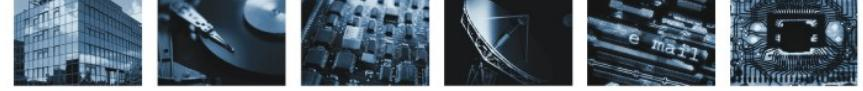

# **Prüfspezifikationen zur Technische Richtlinie zur Produktionsdatenerfassung, -qualitätsprüfung und -übermittlung für Pässe**

Prüfspezifikation Biometrie II: Softwarekomponenten

**BSI TR-03118-2 (PS Biometrie II)**

Version 2.1.1 Datum 13.08.2009

BSI TR-03118-1 (PS-Biometrie I) Version 2.1.1

Bundesamt für Sicherheit in der Informationstechnik Postfach 20 03 63 53133 Bonn Tel.: +49 (0) 1888 9582 0 E-Mail: tr-pdu@bsi.bund.de Internet: http://www.bsi.bund.de © Bundesamt für Sicherheit in der Informationstechnik 2009

| 1.    | Vorbemerkungen5                                                            |  |
|-------|----------------------------------------------------------------------------|--|
| 1.1   | Titel und Einordnung5                                                      |  |
| 1.2   | Kennzeichnung5                                                             |  |
| 1.3   | Fachlich zuständige Stelle5                                                |  |
| 1.4   | Aufbau des Dokuments5                                                      |  |
| 2.    | Komponenten für die Erfassung und Übertragung der Gesichtsbilddaten6       |  |
| 2.1   | Scan-Software6                                                             |  |
| 2.2   | Fotokabinen-Aufnahmesoftware7                                              |  |
| 2.3   | QS-Modul9                                                                  |  |
| 2.4   | Applikation26                                                              |  |
| 2.5   | Kompression27                                                              |  |
| 2.6   | Kodierung biometrische Daten29                                             |  |
| 2.7   | Zentrale Statistik31                                                       |  |
| 3.    | Komponenten für die Erfassung und Übertragung der Fingerabdruckbilddaten32 |  |
| 3.1   | Basisfunktionen der Aufnahmesoftware32                                     |  |
| 3.2   | Aufnahmeapplikation34                                                      |  |
| 3.3   | Kompression37                                                              |  |
| 3.4   | Kodierung biometrische Daten39                                             |  |
| 3.5   | Zentrale Statistik42                                                       |  |
| 4.    | Anforderungen an das Prüfobjekt "Aufnahmeapplikation Finger"44             |  |
| 4.1   | API-Schnittstelle44                                                        |  |
| 4.1.1 | SetConformityTest44                                                        |  |
| 4.1.2 | RunConformityTest45                                                        |  |
| 4.2   | Kommandozeilen – Schnittstelle46                                           |  |
| 4.2.1 | CLI - Aufrufsyntax46                                                       |  |
| 4.2.2 | Testfall – Verzeichnis47                                                   |  |
| 5.    | Referenzen48                                                               |  |

Inhaltsverzeichnis

Vorbemerkungen

### <span id="page-4-0"></span>**1. Vorbemerkungen**

Kapitel [1](#page-4-0) enthält Angaben zur Bezeichnung dieser Prüfspezifikation und zur fachlich zuständigen Stelle.

### **1.1 Titel und Einordnung**

Dieses Dokument trägt den Titel "Prüfspezifikation Biometrie II: Softwarekomponenten". Es ist normativer Teil der Prüfspezifikationen zur TR 03104 "Technische Richtlinie zur Produktionsdatenerfassung, -qualitätsprüfung und -übermittlung für Pässe" [TR\_PDÜ]. Die TR macht Vorgaben für alle Systeme, die für die Erfassung, Qualitätsprüfung und Übermittlung der Produktionsdaten für Pässe eingesetzt werden. Der Anwendungsbereich dieses Dokuments gilt entsprechend der TR 03104.

### **1.2 Kennzeichnung**

Dieser Teil der TR wird gekennzeichnet mit "BSI TR-03118-2 (PS Biometrie II)"

### **1.3 Fachlich zuständige Stelle**

Fachlich zuständig für die Formulierung und Betreuung dieses Dokuments ist das Bundesamt für Sicherheit in der Informationstechnik (BSI).

Anschrift: Bundesamt für Sicherheit in der Informationstechnik (BSI) Abteilung 3 Postfach 20 03 63 53133 Bonn

E-Mail: [tr-pdu@bsi.bund.de](mailto:tr-pdu@bsi.bund.de)

Für inhaltliche Änderungen am Dokument ist das Bundeskriminalamt (BKA), Abteilung KT43 zu konsultieren.

### **1.4 Aufbau des Dokuments**

Kapitel [2](#page-5-0) beinhaltet die Prüffälle für die Software-Komponenten, die in den Prozess der Erfassung und Übertragung der Gesichtsbilddaten involviert sind.

Kapitel [3](#page-18-0) beinhaltet die Prüffälle für die Software-Komponenten, die in den Prozess der Erfassung und Übertragung der Fingerabdruckbilddaten involviert sind.

Kapitel [4](#page-30-0) beinhaltet Schnittstellenanforderungen an die Aufnahmeapplikation, die für die Durchführung der Prüfung benötigt werden.

### <span id="page-5-0"></span>**2.1 Scan-Software**

Die Prüfung und Freigabe dieser Komponente erfolgt durch das BSI (ggf. unter Einbeziehung einer vom BSI beauftragten Instanz oder einer vom BSI anerkannten Prüfstelle).

| Prüfumgebung                          | PC<br>•                                                                                                                                                                                                                                                                                                                                     |
|---------------------------------------|---------------------------------------------------------------------------------------------------------------------------------------------------------------------------------------------------------------------------------------------------------------------------------------------------------------------------------------------|
| Prüfwerkzeuge                         | Vom Passproduzenten freigegebener Scanner<br>•<br>•<br>Passantragsformulare<br>3 mit Farb-Lichtbild<br>o<br>3 mit Schwarz/Weiß-Lichtbild<br>o<br>Bildbearbeitungssoftware, die Bildgröße, Bildauflösung und Farbtiefe misst<br>•<br>Die Software darf die Daten nicht aus dem Bildheader übernehmen,<br>o<br>sondern muss sie selbst messen |
| Qualifikation<br>des<br>Prüfpersonals | -                                                                                                                                                                                                                                                                                                                                           |

**Tabelle 1: Anforderungen an die Prüfstelle**

### **Tabelle 2: Anforderungen an das Prüfobjekt**

| Hersteller<br>nachweise | -                                                         |
|-------------------------|-----------------------------------------------------------|
| Schnittstellen          | Dateischnittstelle zur Ausgabe der gescannten Lichtbilder |
| Funktionalität          | Ansteuerung eines freigegebenen Scanners                  |

### **Tabelle 3: Prüffall PSBioII-GesScan-001**

| Prüffall-ID                  | PSBioII-GesScan-001                                                                                                                                                                                                  |                                                                            |                    |  |  |
|------------------------------|----------------------------------------------------------------------------------------------------------------------------------------------------------------------------------------------------------------------|----------------------------------------------------------------------------|--------------------|--|--|
| Prüfzweck                    | Korrektheit<br>•<br>Kontrolle der Eigenschaften (Größe, Auflösung, Farbumfang) des<br>resultierenden Bildes<br>•<br>Kontrolle des korrekten Ausschneidens der Bilder<br>Kontrolle des Bildformats (Kompression)<br>• |                                                                            |                    |  |  |
| Start<br>bedingungen         | Der Scanner und die Scan-Software sind in einem betriebsbereiten Zustand.                                                                                                                                            |                                                                            |                    |  |  |
| Prüfschritte<br>Beschreibung |                                                                                                                                                                                                                      | Erwartetes Resultat                                                        | Erzieltes Resultat |  |  |
| 1.                           | Einscannen der Passanträge<br>und Speichern der durch die<br>Scan-Software übergebenen<br>Dateien                                                                                                                    | Für jedes eingescannte<br>Passantragsformular liegt<br>eine Bilddatei vor. |                    |  |  |

| 2.                 | Ermitteln von Bildbreite und<br>Bildhöhe für alle Bilddateien<br>(mit Hilfe der<br>Bildbearbeitungssoftware)                                                   | 35 mm x 45 mm<br>(Breite x Höhe)                                                                         |  |
|--------------------|----------------------------------------------------------------------------------------------------------------------------------------------------------------|----------------------------------------------------------------------------------------------------------|--|
| 3.                 | Ermittlung der Auflösung für<br>alle Bilddateien (mit Hilfe der<br>Bildbearbeitungssoftware)                                                                   | 300 dpi                                                                                                  |  |
| 4.                 | Ermittlung des Farbumfangs<br>für alle Bilddateien, die auf<br>gescannten Farb-Lichtbildern<br>beruhen (mit Hilfe der<br>Bildbearbeitungssoftware)             | 24 Bit RGB                                                                                               |  |
| 5.                 | Ermittlung des Farbumfangs<br>für alle Bilddateien, die auf<br>gescannten Schwarz/Weiß<br>Lichtbildern beruhen (mit<br>Hilfe der Bildbearbeitungs<br>software) | 24 Bit RGB oder<br>8 Bit Graustufen                                                                      |  |
| 6.                 | Visueller Vergleich aller<br>Bilddateien mit den<br>zugehörigen Lichtbildern,<br>Prüfung hinsichtlich der<br>Freistellung des Bildes                           | Das übergebene Bild<br>entspricht dem originalen<br>Lichtbild (keine Ränder<br>im digitalisierten Bild). |  |
| 7.                 | Prüfung des Bildformats der<br>Bilddateien                                                                                                                     | Es wird ein Bildformat<br>verwendet, welches keine<br>verlustbehaftete<br>Kompression beinhaltet.1       |  |
| End<br>bedingungen | -                                                                                                                                                              |                                                                                                          |  |
| Prüfurteil         |                                                                                                                                                                |                                                                                                          |  |
| Bemerkungen        |                                                                                                                                                                |                                                                                                          |  |

### **Anmerkung:**

Für das Messen der Werte wird eine Messtoleranz von ± 5% erlaubt.

### **2.2 Fotokabinen-Aufnahmesoftware**

Die Prüfung und Freigabe dieser Komponente erfolgt durch das BSI (ggf. unter Einbeziehung einer vom BSI beauftragten Instanz oder einer vom BSI anerkannten Prüfstelle).

#### **Tabelle 4: Anforderungen an die Prüfstelle**

| Prüfumgebung | • | PC |
|--------------|---|----|
|--------------|---|----|

<span id="page-6-0"></span>**<sup>1</sup>** Alternativ kann die Bilddatei auch in einem komprimierten Format bereitgestellt werden. In diesem Fall muss die Komponente Scan-Software mit der Testfällen für "Kompression" (siehe Abschnitt [2.5\)](#page-13-0) zusammen geprüft werden.

Bundesamt für Sicherheit in der Informationstechnik 7

| Prüfwerkzeuge                         | Bildbearbeitungssoftware, die Bildgröße, Bildauflösung und Farbtiefe misst<br>•<br>Die Software darf die Daten nicht aus dem Bildheader übernehmen,<br>o<br>sondern muss sie selbst messen |
|---------------------------------------|--------------------------------------------------------------------------------------------------------------------------------------------------------------------------------------------|
| Qualifikation<br>des<br>Prüfpersonals | -                                                                                                                                                                                          |

### **Tabelle 5: Anforderungen an das Prüfobjekt**

| Hersteller<br>nachweise | -                                        |
|-------------------------|------------------------------------------|
| Schnittstellen          | Dateischnittstelle zur Ausgabe der Fotos |
| Funktionalität          | -                                        |

### **Tabelle 6: Prüffall PSBioII-FK-001**

| Prüffall-ID          | PSBioII-FK-001                                                                                                                                              |                                                                                                    |                    |
|----------------------|-------------------------------------------------------------------------------------------------------------------------------------------------------------|----------------------------------------------------------------------------------------------------|--------------------|
| Prüfzweck            | Korrektheit<br>Kontrolle der Eigenschaften (Größe, Auflösung, Farbumfang) des<br>•<br>resultierenden Bildes<br>•<br>Kontrolle des Bildformats (Kompression) |                                                                                                    |                    |
| Start<br>bedingungen | Die Fotokabine ist in einem betriebsbereiten Zustand.                                                                                                       |                                                                                                    |                    |
| Prüfschritte         | Beschreibung                                                                                                                                                | Erwartetes Resultat                                                                                | Erzieltes Resultat |
| 1.                   | Erstellen von drei (3)<br>Bildaufnahmen und<br>Speichern der durch die<br>Fotokabine übergebenen<br>Dateien                                                 | Für jedes aufgenommene<br>Foto liegt eine Bilddatei<br>vor.                                        |                    |
| 2.                   | Ermitteln von Bildbreite<br>und Bildhöhe für alle<br>Bilddateien (mit Hilfe der<br>Bildbearbeitungssoftware)                                                | 35 mm x 45 mm<br>(Breite x Höhe)                                                                   |                    |
| 3.                   | Ermittlung der Auflösung<br>für alle Bilddateien (mit<br>Hilfe der<br>Bildbearbeitungssoftware)                                                             | 300 dpi                                                                                            |                    |
| 4.                   | Ermittlung des Farb<br>umfangs für alle Bild<br>dateien (mit Hilfe der<br>Bildbearbeitungssoftware)                                                         | 24 Bit RGB                                                                                         |                    |
| 5.                   | Prüfung des Bildformats<br>der Bilddateien                                                                                                                  | Es wird ein Bildformat<br>verwendet, welches keine<br>verlustbehaftete<br>Kompression beinhaltet.2 |                    |

<span id="page-7-0"></span>**<sup>2</sup>** Alternativ kann die Bilddatei auch in einem komprimierten Format bereitgestellt werden. In diesem Fall muss die Komponente Scan-Software mit der Komponente "Kompression" (siehe Abschnitt [2.5\)](#page-13-0) zusammen

| End<br>bedingungen | - |
|--------------------|---|
| Prüfurteil         |   |
| Bemerkungen        |   |

#### **Anmerkung:**

Für das Messen der Werte wird eine Messtoleranz von ± 5% erlaubt.

### **2.3 QS-Modul**

Die Prüfung und Freigabe dieser Komponente erfolgt durch das BSI (ggf. unter Einbeziehung einer vom BSI beauftragten Instanz oder einer vom BSI anerkannten Prüfstelle).

### **Tabelle 7: Anforderungen an die Prüfstelle**

| Prüfumgebung                          | •<br>PC<br>•<br>Prüfapplikation zum Ansprechen des QS-Moduls (ggf. ist eine Software<br>Adaptierung des Prüftools notwendig). |
|---------------------------------------|-------------------------------------------------------------------------------------------------------------------------------|
| Prüfwerkzeuge                         | Vom BSI als Prüfmittel zugelassene Prüfdatenbank<br>•                                                                         |
| Qualifikation<br>des<br>Prüfpersonals | -                                                                                                                             |

#### **Tabelle 8: Anforderungen an das Prüfobjekt**

| Hersteller<br>nachweise | Dokumentation des QS-Moduls mit detaillierter Beschreibung des<br>•<br>Funktionsaufrufs und der Rückgabeparameter sowie ggf. Beschreibung der<br>Teilkomponenten.               |  |
|-------------------------|---------------------------------------------------------------------------------------------------------------------------------------------------------------------------------|--|
| Schnittstellen          | Funktionsaufruf mit Bilddatei als Inputparameter<br>•<br>Rückgabeparameter: QS-Daten (Formate gemäß [QS_Gesicht] Tabelle 7)<br>•                                                |  |
| Funktionalität          | Das QS-Modul muss einen Modus bereitstellen, welcher die Abarbeitung von<br>•<br>Bilddaten ohne weitere Anwenderaktionen ermöglicht (nicht-interaktiver<br>Modus, silent mode). |  |

### **Tabelle 9: Prüffall PSBioII-GesQSM-001**

| Prüffall-ID | PSBioII-GesQSM-001                                                                                                                                                                                                                                                            |
|-------------|-------------------------------------------------------------------------------------------------------------------------------------------------------------------------------------------------------------------------------------------------------------------------------|
| Prüfzweck   | Vollständigkeit bezüglich Kriterien der Priorität 13<br>Können mit dem QS-Modul alle in Tabelle 6 von [QS_Gesicht]<br>•<br>gekennzeichneten Kriterien geprüft werden?<br>•<br>Werden durch das QS-Modul die Informationen gemäß Tabelle 7 von [QS<br>Gesicht] bereitgestellt? |

<span id="page-8-0"></span>geprüft werden.

**<sup>3</sup>** Kriterien höherer Priorität werden in den vorliegenden Prüffällen nicht berücksichtigt, können aber ggf. (nach Maßgabe und mit Absprache zwischen Zertifizierungs- und Prüfstelle sowie Hersteller geprüft werden).

|  |  | Komponenten für die Erfassung und Übertragung der Gesichtsbilddaten |
|--|--|---------------------------------------------------------------------|
|  |  |                                                                     |

| Start<br>bedingungen | Identifikation aller für das QS-Modul relevanten Pflichtkriterien ("mandatory") der<br>Priorität 1 aus Tabelle 6 von [QS-Gesicht] (Spalte "QSM"); ergibt Kriterienliste 1…n |                                                                                                         |                    |  |
|----------------------|-----------------------------------------------------------------------------------------------------------------------------------------------------------------------------|---------------------------------------------------------------------------------------------------------|--------------------|--|
| Prüfschritte         | Beschreibung                                                                                                                                                                | Erwartetes Resultat                                                                                     | Erzieltes Resultat |  |
| 1.                   | Aufruf des QS-Moduls mit<br>einer Bilddatei und<br>Speichern der zurück<br>gelieferten Qualitätswerte                                                                       | Für die Input-Bilddatei wird<br>ein Datensatz von<br>Qualitätswerten<br>zurückgegeben.                  |                    |  |
| 2.                   | Prüfung des Datensatzes<br>auf den Parameter<br>"Bezeichner QS-Modul"                                                                                                       | Der Datensatz enthält den<br>Parameter "Bezeichner QS<br>Modul" vom Typ String.                         |                    |  |
| 3.                   | Prüfung des Datensatzes<br>auf den Parameter<br>"Versionsnr. QS-Modul"                                                                                                      | Der Datensatz enthält den<br>Parameter "Versionsnr. QS<br>Modul" vom Typ String.                        |                    |  |
| 4.                   | Nur durchführen, falls<br>QS-Modul aus<br>Teilkomponenten besteht:<br>Prüfung des Datensatzes<br>auf den Parameter "QS<br>Teilkomponente - Name"                            | In dem Datensatz besitzt<br>der Parameter "QS<br>Teilkomponente - Name"<br>den Typ String.              |                    |  |
| 5.                   | Nur durchführen, falls<br>QS-Modul aus<br>Teilkomponenten besteht:<br>Prüfung des Datensatzes<br>auf den Parameter "QS<br>Teilkomponente -<br>Versionsnummer"               | In dem Datensatz besitzt<br>der Parameter "QS<br>Teilkomponente -<br>Versionsnummer" den Typ<br>String. |                    |  |
| 6.                   | Prüfung des Datensatzes<br>auf den Parameter<br>"Bezeichner<br>Aufnahmegerät"                                                                                               | Der Datensatz enthält den<br>Parameter "Bezeichner<br>Aufnahmegerät" vom Typ<br>String.                 |                    |  |
| 7.                   | Prüfung des Datensatzes<br>auf den Parameter<br>"Versionsnummer<br>Aufnahmegerät"                                                                                           | Der Datensatz enthält den<br>Parameter<br>"Versionsnummer<br>Aufnahmegerät" vom Typ<br>String.          |                    |  |
| 8.                   | Prüfung des Datensatzes<br>auf den Parameter<br>"Versionsnr. Sollwerte"                                                                                                     | Der Datensatz enthält den<br>Parameter "Versionsnr.<br>Sollwerte" vom Typ String.                       |                    |  |
| 9.                   | Prüfung des Datensatzes<br>auf den Parameter<br>"Gesamtergebnis der<br>Qualitätsbewertung"                                                                                  | Der Datensatz enthält den<br>Parameter "Gesamtergebnis<br>der Qualitätsbewertung "<br>vom Typ Boolean.  |                    |  |

| 10.                | Prüfung des Datensatzes<br>auf die "Qualitätswert"-<br>Parameter                                                                          | Der Datensatz enthält für<br>jedes der Kriterien 1…n<br>die Parameter:<br>"ID" (Typ String)<br>•<br>"Bewertungsergebnis"<br>•<br>(Typ Float)<br>"minimaler Wert des<br>•<br>Wertebereichs" (Typ<br>Float oder String="u")<br>•<br>"maximaler Wert des<br>Wertebereichs" (Typ<br>Float oder String="u")<br>"minimaler Wert des<br>•<br>zulässigen Toleranz<br>bereichs" (Typ Float<br>oder String="u")<br>"maximaler Wert des<br>•<br>zulässigen Toleranz<br>bereichs" (Typ Float<br>oder String="u") |  |
|--------------------|-------------------------------------------------------------------------------------------------------------------------------------------|------------------------------------------------------------------------------------------------------------------------------------------------------------------------------------------------------------------------------------------------------------------------------------------------------------------------------------------------------------------------------------------------------------------------------------------------------------------------------------------------------|--|
| 11.                | Prüfung des Datensatzes<br>auf den Parameter<br>"Zeitstempel QS"                                                                          | Der Datensatz enthält den<br>Parameter "Zeitstempel"<br>vom Typ Datetime.                                                                                                                                                                                                                                                                                                                                                                                                                            |  |
| 12.                | Nur durchführen, falls<br>QS-Modul Kommentar<br>feld zurückliefert:<br>Prüfung des Datensatzes<br>auf den Parameter "Freier<br>Kommentar" | In dem Datensatz besitzt<br>der Parameter "Freier<br>Kommentar" den Typ<br>String.                                                                                                                                                                                                                                                                                                                                                                                                                   |  |
| End<br>bedingungen | -                                                                                                                                         |                                                                                                                                                                                                                                                                                                                                                                                                                                                                                                      |  |
| Prüfurteil         |                                                                                                                                           |                                                                                                                                                                                                                                                                                                                                                                                                                                                                                                      |  |
| Bemerkungen        |                                                                                                                                           |                                                                                                                                                                                                                                                                                                                                                                                                                                                                                                      |  |

### **Tabelle 10: Prüffall PSBioII-GesQSM-002**

| Prüffall-ID | PSBioII-GesQSM-002 |                                                                                                                                                                             |  |
|-------------|--------------------|-----------------------------------------------------------------------------------------------------------------------------------------------------------------------------|--|
| Prüfzweck   | •                  | Prüfung der softwaregebundenen Qualitätssicherung für Gesichtsbilder                                                                                                        |  |
|             | •                  | Geprüft werden die Kriterien der Kategorie M und Priorität 1                                                                                                                |  |
|             | •                  | Der Testobjekt besteht aus der Qualitätssicherungssoftware und einer<br>festgelegte Liste von Parametern, die die Toleranzschwellen für die<br>Prüfungskriterien beinhaltet |  |

| Start<br>bedingungen | -<br>Eine Dokumentation und Adaption des Prüfobjekts an die genutzte SW-Umgebung<br>stehen für die Prüfung zur Verfügung.                                                                                                                                                                |                                                                                                                                                              |                       |  |  |
|----------------------|------------------------------------------------------------------------------------------------------------------------------------------------------------------------------------------------------------------------------------------------------------------------------------------|--------------------------------------------------------------------------------------------------------------------------------------------------------------|-----------------------|--|--|
|                      | -<br>Das Modul akzeptiert Gesichtbilder aus einer angemessenen Konformitäts<br>testdatenbank. Es muss Bilder im JPEG2000 Format verarbeiten können.                                                                                                                                      |                                                                                                                                                              |                       |  |  |
|                      | -<br>Das Modul stellt die Ergebnisse der Prüfung zur Verfügung.                                                                                                                                                                                                                          |                                                                                                                                                              |                       |  |  |
|                      | -<br>Die Datenbank beinhaltet:<br>-<br>konforme und nicht konforme Bilder für alle zu prüfenden Kriterien<br>-<br>Toleranzwerte und Kriterienart<br>-<br>Akzeptanzbedingungen (zulässige Fehlerraten) für jedes Kriterium (diese sind<br>i.a. abhängig von der Größe der Datenbank).     |                                                                                                                                                              |                       |  |  |
| Prüfschritte         | Beschreibung                                                                                                                                                                                                                                                                             | Erwartetes Resultat                                                                                                                                          | Erzieltes<br>Resultat |  |  |
| 1.                   | Start des Moduls,<br>indem fortlaufend konforme                                                                                                                                                                                                                                          | -<br>Für jedes Gesichtsbild wird ein<br>Ergebnis zurückgegeben.                                                                                              |                       |  |  |
|                      | Gesichtsbild aus der<br>Prüfdatenbank übergeben<br>werden                                                                                                                                                                                                                                | -<br>Die Akzeptanzbedingungen der zu<br>Grunde liegenden Prüfdatenbank<br>werden erreicht.                                                                   |                       |  |  |
| 2.                   | Start des Moduls,<br>indem fortlaufend nicht                                                                                                                                                                                                                                             | -<br>Für jedes Gesichtsbild wird ein<br>Ergebnis zurückgegeben.                                                                                              |                       |  |  |
|                      | konforme Gesichtsbilder aus<br>der Prüfdatenbank übergeben<br>werden<br>Dieser Prüfschritt ist für alle zu<br>prüfenden Kriterien der Kategorie<br>M/1 durchzuführen.                                                                                                                    | -<br>Die Akzeptanzbedingungen der zu<br>Grunde liegenden Prüfdatenbank<br>werden erreicht                                                                    |                       |  |  |
| 3.                   | Start des Moduls,<br>indem fortlaufend nicht<br>konforme Gesichtsbilder aus<br>der Prüfdatenbank übergeben<br>werden<br>Dieser Prüfschritt ist für alle nicht<br>in Schritt 2 geprüften, aber vom<br>Prüfobjekt unterstützten Kriterien<br>aus [QS_Gesicht], Tabelle 6<br>durchzuführen. | -<br>Für jedes Gesichtsbild wird ein<br>Ergebnis zurückgegeben.<br>-<br>Die Akzeptanzbedingungen der zu<br>Grunde liegenden Prüfdatenbank<br>werden erreicht |                       |  |  |
| End<br>bedingungen   | -                                                                                                                                                                                                                                                                                        |                                                                                                                                                              |                       |  |  |
| Prüfurteil           |                                                                                                                                                                                                                                                                                          |                                                                                                                                                              |                       |  |  |
| Bemerkungen          |                                                                                                                                                                                                                                                                                          |                                                                                                                                                              |                       |  |  |

### **Anmerkungen:**

- Die Freigabe des QS-Moduls erfolgt für eine feste Konfiguration der Toleranzbereiche der Bewertungskriterien. Prinzipiell kann ein QS-Modul für mehrere Konfigurationen freigegeben werden**.**
- Ein Fehlschlagen der Prüfung in Schritt 1 und 2 führt zum Fehlschlagen des Gesamtprüffalls.

• Ein Fehlschlagen der Prüfung in Schritt 3 führt ebenfalls zum Fehlschlagen des Gesamtprüffalls, kann aber dadurch kompensiert werden, dass die fehlgeschlagenen Kriterien entfernt bzw. aus der Gesamtbewertung des Bildes ausgeklammert werden (dadurch wird beispielsweise die Pilotierung neuer Kriterien und Algorithmen ermöglicht, ohne die Konformität zur Richtlinie zu unterlaufen). Alle Prüfschritte sind dann erneut zu durchlaufen.

### **2.4 Applikation**

Die Prüfung und Freigabe dieser Komponente erfolgt durch das BSI (ggf. unter Einbeziehung einer vom BSI beauftragten Instanz oder einer vom BSI anerkannten Prüfstelle).

### **Tabelle 11: Anforderungen an die Prüfstelle**

| Prüfumgebung         | -                                                                                            |
|----------------------|----------------------------------------------------------------------------------------------|
| Prüfwerkzeuge        | -                                                                                            |
| Qualifikation<br>des | Umfangreiche Kenntnisse der durch [QS-Gesicht] geforderten Funktionalität der<br>Applikation |
| Prüfpersonals        |                                                                                              |

### **Tabelle 12: Anforderungen an das Prüfobjekt**

| Hersteller<br>nachweise | Herstellererklärung zum Funktionsumfang<br>•<br>Dokumentation der Applikation, aus der die Umsetzung der erforderlichen<br>•<br>Funktionalität hervorgeht |
|-------------------------|-----------------------------------------------------------------------------------------------------------------------------------------------------------|
| Schnittstellen          | -                                                                                                                                                         |
| Funktionalität          | -                                                                                                                                                         |

### **Tabelle 13: Prüffall PSBioII-GesApp-001**

| Prüffall-ID          | Prüffall PSBioII-GesApp-001                                                                                 |                                                                                                                                                                                                                                                                                          |                    |
|----------------------|-------------------------------------------------------------------------------------------------------------|------------------------------------------------------------------------------------------------------------------------------------------------------------------------------------------------------------------------------------------------------------------------------------------|--------------------|
| Prüfzweck            | Prüfung der Funktionalität der Applikation/GUI                                                              |                                                                                                                                                                                                                                                                                          |                    |
| Start<br>bedingungen |                                                                                                             |                                                                                                                                                                                                                                                                                          |                    |
| Prüfschritte         | Beschreibung                                                                                                | Erwartetes Resultat                                                                                                                                                                                                                                                                      | Erzieltes Resultat |
| 1.                   | Ermitteln der durch die<br>Applikation bereitgestellten<br>Funktionalität anhand der<br>Herstellererklärung | Die Herstellererklärung<br>bestätigt, dass die<br>Applikation eine GUI mit<br>folgenden Funktionen<br>bereitstellt:<br>•<br>Anzeige Lichtbild<br>Anzeige QS-Metrik<br>•<br>Anzeige<br>•<br>Gesamtergebnis (inkl.<br>Begründung im<br>Ablehnungsfall)<br>Vetorecht<br>•<br>Sachbearbeiter |                    |

| 2.                 | Prüfung der Realisierung<br>der durch die Applikation<br>bereitgestellten<br>Funktionalität anhand der<br>Dokumentation | Aus der Dokumentation<br>geht plausibel die korrekte<br>Umsetzung der<br>bereitgestellten Funktionen<br>hervor. |  |
|--------------------|-------------------------------------------------------------------------------------------------------------------------|-----------------------------------------------------------------------------------------------------------------|--|
| End<br>bedingungen | -                                                                                                                       |                                                                                                                 |  |
| Prüfurteil         |                                                                                                                         |                                                                                                                 |  |
| Bemerkungen        |                                                                                                                         |                                                                                                                 |  |

### <span id="page-13-0"></span>**2.5 Kompression**

Die Prüfung und Freigabe dieser Komponente erfolgt durch das BSI (ggf. unter Einbeziehung einer vom BSI beauftragten Instanz oder einer vom BSI anerkannten Prüfstelle).

**Tabelle 14: Anforderungen an die Prüfstelle**

| Prüfumgebung                          | PC<br>•                                                                                                                                                                                                                                                                                                                                                                                                                                                |
|---------------------------------------|--------------------------------------------------------------------------------------------------------------------------------------------------------------------------------------------------------------------------------------------------------------------------------------------------------------------------------------------------------------------------------------------------------------------------------------------------------|
| Prüfwerkzeuge                         | Liste anerkannter JPEG2000-Implementierungen (Beispielliste aus<br>•<br>[QS_Gesicht] zzgl. einer aktuell zu erstellenden Liste marktüblicher<br>Implementierungen)<br>Software zur Messung der Dateigröße<br>•<br>•<br>Software zur Feststellung des Formates einer Bilddatei<br>Drei (3) unkomprimierte Beispielbilddateien im Bitmap-Format (24Bit-RGB<br>•<br>Windows-Bitmap (Version 3) bzw. 8Bit-Graustufen-Windows-Bitmap-Format<br>(Version 3)) |
| Qualifikation<br>des<br>Prüfpersonals | -                                                                                                                                                                                                                                                                                                                                                                                                                                                      |

### **Tabelle 15: Anforderungen an das Prüfobjekt**

| Hersteller<br>nachweise | Herstellererklärung zur eingesetzten JPEG2000-Implementierung<br>•                                                                                                                                                              |
|-------------------------|---------------------------------------------------------------------------------------------------------------------------------------------------------------------------------------------------------------------------------|
| Schnittstellen          | Inputparameter: Unkomprimierte Bilddatei im Bitmap-Format (24Bit-RGB<br>•<br>Windows-Bitmap (Version 3) bzw. 8Bit-Graustufen-Windows-Bitmap-Format<br>(Version 3))<br>•<br>Rückgabeparameter: Komprimierte Bilddatei (JPEG2000) |
| Funktionalität          | -                                                                                                                                                                                                                               |

### **Tabelle 16: Prüffall PSBioII-GesKomp-001**

| Prüffall-ID          | PSBioII-GesKomp-001     |
|----------------------|-------------------------|
| Prüfzweck            | Verwendeter Algorithmus |
| Start<br>bedingungen |                         |

|  |  | Komponenten für die Erfassung und Übertragung der Gesichtsbilddaten |
|--|--|---------------------------------------------------------------------|
|  |  |                                                                     |
|  |  |                                                                     |
|  |  |                                                                     |

| Prüfschritte       | Beschreibung                                                                                                                             | Erwartetes Resultat                                                                                                                                       | Erzieltes Resultat |
|--------------------|------------------------------------------------------------------------------------------------------------------------------------------|-----------------------------------------------------------------------------------------------------------------------------------------------------------|--------------------|
| 1.                 | Abgleich des gemäß<br>Herstellererklärung<br>eingesetzten JPEG2000-<br>Algorithmus mit der Liste<br>der anerkannten<br>Implementierungen | Die im Kompressionsmodul<br>eingesetzte JPEG2000-<br>Implementierung ist auf der<br>Liste der anerkannten<br>JPEG2000-<br>Implementierungen<br>vorhanden. |                    |
| End<br>bedingungen | -                                                                                                                                        |                                                                                                                                                           |                    |
| Prüfurteil         |                                                                                                                                          |                                                                                                                                                           |                    |
| Bemerkungen        |                                                                                                                                          |                                                                                                                                                           |                    |

#### **Tabelle 17: Prüffall PSBioII-GesKomp-002**

| Prüffall-ID          | Prüffall PSBioII-GesKomp-002                                                           |                                                                                       |                    |  |
|----------------------|----------------------------------------------------------------------------------------|---------------------------------------------------------------------------------------|--------------------|--|
| Prüfzweck            | Format und Größe der resultierenden Bilddatei                                          |                                                                                       |                    |  |
| Start<br>bedingungen |                                                                                        |                                                                                       |                    |  |
| Prüfschritte         | Beschreibung                                                                           | Erwartetes Resultat                                                                   | Erzieltes Resultat |  |
| 1.                   | Erzeugung von<br>komprimierten Bilddateien<br>für die drei vorliegenden<br>Bilddateien | Für jede unkomprimierte<br>Input-Bilddatei liegt eine<br>resultierende Bilddatei vor. |                    |  |
| 2.                   | Ermittlung des Formats<br>der resultierenden<br>Bilddateien                            | Jede der drei Bilddateien ist<br>im Format JPEG2000.                                  |                    |  |
| 3.                   | Ermittlung der Größe der<br>resultierenden Bilddateien                                 | Jede der drei Bilddateien<br>besitzt die Größe 15 kB.                                 |                    |  |
| End<br>bedingungen   | -                                                                                      |                                                                                       |                    |  |
| Prüfurteil           |                                                                                        |                                                                                       |                    |  |
| Bemerkungen          |                                                                                        |                                                                                       |                    |  |

### **Anmerkung:**

Für das Messen der Werte wird eine Messtoleranz von ± 5% erlaubt.

### **2.6 Kodierung biometrische Daten**

Die Prüfung und Freigabe dieser Komponente erfolgt durch das BSI (ggf. unter Einbeziehung einer vom BSI beauftragten Instanz oder einer vom BSI anerkannten Prüfstelle).

### Prüfumgebung • PC Prüfwerkzeuge • BSI DG2-Parser • Drei (3) Beispielbilddateien (JPEG2000) mit den zugehörigen Zusatzinformationen Qualifikation des Prüfpersonals -

#### **Tabelle 18: Anforderungen an die Prüfstelle**

### **Tabelle 19: Anforderungen an das Prüfobjekt**

| Hersteller<br>nachweise | Dokumentation des Kodierungs-Moduls mit detaillierter Beschreibung des<br>•<br>Funktionsaufrufs und der Rückgabeparameter |
|-------------------------|---------------------------------------------------------------------------------------------------------------------------|
| Schnittstellen          | Inputparameter: Bilddatei (JPEG2000) und Zusatzinformationen<br>•<br>Rückgabeparameter: DG2-Datei<br>•                    |
| Funktionalität          | -                                                                                                                         |

### **Tabelle 20: Prüffall PSBioII-GesKod-001**

| Prüffall-ID          | PSBioII-GesKod-001                                              |                                                                                         |                    |  |
|----------------------|-----------------------------------------------------------------|-----------------------------------------------------------------------------------------|--------------------|--|
| Prüfzweck            | Funktionalität Kodierungs-Modul                                 |                                                                                         |                    |  |
| Start<br>bedingungen |                                                                 |                                                                                         |                    |  |
| Prüfschritte         | Beschreibung                                                    | Erwartetes Resultat                                                                     | Erzieltes Resultat |  |
| 1.                   | Aufruf des Kodierungs<br>Moduls mit den drei<br>Beispieldateien | Für jede Input-Bilddatei<br>wird vom Kodierungs<br>Modul ein DG2-File<br>zurückgegeben. |                    |  |
| End<br>bedingungen   | -                                                               |                                                                                         |                    |  |
| Prüfurteil           |                                                                 |                                                                                         |                    |  |
| Bemerkungen          |                                                                 |                                                                                         |                    |  |

### **Tabelle 21: Prüffall PSBioII-GesKod-002**

| Prüffall-ID          | PSBioII-GesKod-002                                                    |                                                                            |                    |
|----------------------|-----------------------------------------------------------------------|----------------------------------------------------------------------------|--------------------|
| Prüfzweck            | Korrekte Kodierung der DG2                                            |                                                                            |                    |
| Start<br>bedingungen |                                                                       |                                                                            |                    |
| Prüfschritte         | Beschreibung                                                          | Erwartetes Resultat                                                        | Erzieltes Resultat |
|                      | Die folgenden Prüfschritte sind für alle drei DG2-Files durchzuführen |                                                                            |                    |
| 1.                   | Dekodierung des DG2-<br>Files mit dem DG2-Parser                      | Das DG2-File wird durch<br>den DG2-Parser ohne<br>Fehlermeldung dekodiert. |                    |

| 2.                 | Prüfung CBEFF-Header                                                                                                                        | Siehe Teilschritte                                                     |  |
|--------------------|---------------------------------------------------------------------------------------------------------------------------------------------|------------------------------------------------------------------------|--|
| 2.1                | Ermittlung des Inhalts des<br>Feldes "Biometric<br>Information Templates"                                                                   | Wert = 1                                                               |  |
| 2.2                | Nur durchführen, falls<br>das optionale Feld<br>"Biometric Type"<br>vorhanden ist:<br>Ermittlung des Inhalts des<br>Feldes "Biometric Type" | Wert = 02<br>(Facial Features)                                         |  |
| 2.3                | Ermittlung des Inhalts des<br>Feldes "Format Owner"                                                                                         | Wert = 0x0101<br>(ISO SC37)                                            |  |
| 2.4                | Ermittlung des Inhalt des<br>Feldes "Format Type"                                                                                           | Wert = 0x0008<br>(ISO 19794-5)                                         |  |
| 3.                 | Prüfung Face Header<br>Block                                                                                                                | Siehe Teilschritte                                                     |  |
| 3.1                | Ermittlung des Inhalts des<br>Feldes "Format Identifier"                                                                                    | Wert = 0x46414300<br>(face image data)                                 |  |
| 3.2                | Ermittlung des Inhalts des<br>Feldes "Version Number"                                                                                       | Wert = 0x30313000<br>("010" in ASCII)                                  |  |
| 3.3                | Ermittlung des Inhalts des<br>Feldes "Number of Facial<br>Images"                                                                           | Wert = 1                                                               |  |
| 4.                 | Prüfung Image<br>Information Block                                                                                                          | Siehe Teilschritte                                                     |  |
| 4.1                | Ermittlung des Inhalts des<br>Feldes "Face Image Type"                                                                                      | Wert = 0x01<br>(Full Frontal)                                          |  |
| 4.2                | Ermittlung des Inhalts des<br>Feldes "Image Data Type"                                                                                      | Wert = 0x01<br>(JPEG2000)                                              |  |
| 4.3                | Ermittlung des Inhalts des<br>Feldes "Width"                                                                                                | Wert = 4134<br>(Anzahl Pixel)                                          |  |
| 4.4                | Ermittlung des Inhalts des<br>Feldes "Height"                                                                                               | Wert = 5315<br>(Anzahl Pixel)                                          |  |
| 5.                 | Ermittlung des Inhalts des<br>Feldes "Image Data<br>Block" und Ermittlung des<br>Bildformats der in diesem<br>Feld enthaltenen Daten        | Das Feld enthält Bilddaten,<br>die im JPEG2000-Format<br>kodiert sind. |  |
| End<br>bedingungen | -                                                                                                                                           |                                                                        |  |
| Prüfurteil         |                                                                                                                                             |                                                                        |  |

<span id="page-16-0"></span>**<sup>4</sup>** Aufgrund der Messtoleranz von 5% für die Eingangsbilder kann dieser Wert x in einem Bereich von 392<x<434 liegen.

<span id="page-16-1"></span>**<sup>5</sup>** Aufgrund der Messtoleranz von 5% für die Eingangsbilder kann dieser Wert x in einem Bereich von 504<x<558 liegen.

Bemerkungen

### **2.7 Zentrale Statistik**

Für diese Komponente erfolgt keine formale Prüfung. Das BSI (oder eine vom BSI autorisierte Instanz) nimmt eine Begutachtung der zentralen Statistik vor.

Dabei werden folgende Punkte analysiert:

- Als Referenz-QS-Modul wird ein geprüftes QS-Modul eingesetzt
- Werden alle erforderlichen Daten erhoben?
	- Behördenkennzahl
	- Qualitätsinformationen aus Passantrag
	- Qualitätsinformationen des Referenz-QS-Modul
- Export und Übertragungsformat (XML bzw. CSV)
- Sind alle gemäß QS-Annex vorgeschriebenen Auswertungen korrekt implementiert?

## <span id="page-18-0"></span>**3. Komponenten für die Erfassung und Übertragung der Fingerabdruckbilddaten**

### **3.1 Basisfunktionen der Aufnahmesoftware**

Die Prüfung und Freigabe dieser Komponente erfolgt durch das BSI (ggf. unter Einbeziehung einer vom BSI beauftragten Instanz oder einer vom BSI anerkannten Prüfstelle).

| Prüfumgebung                          | PC<br>•                                                   |
|---------------------------------------|-----------------------------------------------------------|
| Prüfwerkzeuge                         | •<br>Testperson mit mind. vier geeigneten Fingerabdrücken |
| Qualifikation<br>des<br>Prüfpersonals | Kenntnis der korrekten Aufnahme von Fingerabdrücken       |

#### **Tabelle 22: Anforderungen an die Prüfstelle**

#### **Tabelle 23: Anforderungen an das Prüfobjekt**

| Hersteller<br>nachweise | •<br>Angabe des Time-out (in Sekunden), nach dem die Aufnahme ausgelöst wird<br>Dokumentation der Segmentierungsfunktion mit detaillierter Beschreibung<br>•<br>des Funktionsaufrufs und der Rückgabeparameter |
|-------------------------|----------------------------------------------------------------------------------------------------------------------------------------------------------------------------------------------------------------|
| Schnittstellen          | -                                                                                                                                                                                                              |
| Funktionalität          | Manueller Start der Aufnahme<br>•<br>Visualisierung des vom Sensor aufgenommenen Bildes<br>•                                                                                                                   |

#### **Tabelle 24: Prüffall PSBioII-FPScan-001**

| Prüffall-ID          | PSBioII-FPScan-001                                                                                                                                             |                                                                                                                                              |                    |
|----------------------|----------------------------------------------------------------------------------------------------------------------------------------------------------------|----------------------------------------------------------------------------------------------------------------------------------------------|--------------------|
| Prüfzweck            | Automatisches Auslösen der Aufnahme                                                                                                                            |                                                                                                                                              |                    |
| Start<br>bedingungen | Der Sensor ist initialisiert.                                                                                                                                  |                                                                                                                                              |                    |
| Prüfschritte         | Beschreibung                                                                                                                                                   | Erwartetes Resultat                                                                                                                          | Erzieltes Resultat |
| 1.                   | Start der Aufnahme und<br>korrektes Auflegen eines<br>Fingers einer Testperson<br>auf die Sensorfläche                                                         | Innerhalb des Time-out<br>oder bei Ablauf des Time<br>out wird die Aufnahme<br>beendet und das Bild des<br>aufgelegten Fingers<br>angezeigt. |                    |
| 2.                   | Start der Aufnahme und<br>korrektes Auflegen eines<br>Fingers einer Testperson<br>auf die Sensorfläche und<br>vor Ablauf des Time-out<br>Entfernen des Fingers | Innerhalb des Time-out<br>oder bei Ablauf des Time<br>out wird die Aufnahme<br>beendet und das Bild des<br>aufgelegten Fingers<br>angezeigt. |                    |
| End<br>bedingungen   | -                                                                                                                                                              |                                                                                                                                              |                    |

| Prüfurteil  |  |
|-------------|--|
| Bemerkungen |  |

#### **Tabelle 25: Prüffall PSBioII-FPScan-002**

| Prüffall-ID          | Prüffall PSBioII-FPScan-002                                                                                                                                     |                                                                                                                                                                                                                                                                                         |                    |
|----------------------|-----------------------------------------------------------------------------------------------------------------------------------------------------------------|-----------------------------------------------------------------------------------------------------------------------------------------------------------------------------------------------------------------------------------------------------------------------------------------|--------------------|
| Prüfzweck            | Segmentierung (für Multifinger-Sensor und ggf. auch Einzelfinger-Sensor, falls eine<br>Segmentierung implementiert ist)                                         |                                                                                                                                                                                                                                                                                         |                    |
| Start<br>bedingungen | Der Sensor ist initialisiert.                                                                                                                                   |                                                                                                                                                                                                                                                                                         |                    |
| Prüfschritte         | Beschreibung                                                                                                                                                    | Erwartetes Resultat                                                                                                                                                                                                                                                                     | Erzieltes Resultat |
| 1.                   | Auflegen eines Fingers auf<br>dem Sensor und sofern<br>erforderlich Angabe, dass<br>ein Finger zu segmentieren<br>ist.                                          | Rückgabe eines Bildes mit<br>dem segmentierten Finger<br>und/oder<br>Rückgabe der Koordinaten,<br>mit welchen ein Segment<br>im Gesamtbild zu<br>identifizieren ist.<br>Das Bild bzw. das<br>angegebene Segment<br>enthält einen<br>Fingerabdruck.                                      |                    |
| 2.                   | Nur für Multifinger<br>Sensoren:<br>Auflegen von zwei<br>Fingern auf dem Sensor<br>und sofern erforderlich<br>Angabe, dass zwei Finger<br>zu segmentieren sind. | Rückgabe von zwei Bildern<br>und/oder<br>Rückgabe der Koordinaten,<br>mit welchen zwei Segmente<br>im Gesamtbild zu<br>identifizieren sind.<br>Die Bilder bzw. die<br>angegebenen Segmente<br>enthalten je einen<br>verschiedenen<br>Fingerabdruck.                                     |                    |
| 3.                   | Nur für Multifinger<br>Sensoren:<br>Auflegen von drei Fingern<br>auf dem Sensor und sofern<br>erforderlich Angabe, dass<br>drei Finger zu<br>segmentieren sind. | Rückgabe von drei Bildern<br>mit den segmentierten<br>Fingern<br>und/oder<br>Rückgabe der Koordinaten,<br>mit welchen drei Segmente<br>im Gesamtbild zu<br>identifizieren sind.<br>Die Bilder bzw. die<br>angegebenen Segmente<br>enthalten je einen<br>verschiedenen<br>Fingerabdruck. |                    |

| 4.                 | Nur für Multifinger<br>Sensoren:<br>Auflegen von vier Fingern<br>auf dem Sensor und sofern<br>erforderlich Angabe, dass<br>vier Finger zu<br>segmentieren sind. | Rückgabe von vier Bildern<br>mit den segmentierten<br>Fingern<br>und/oder<br>Rückgabe der Koordinaten,<br>mit welchen vier Segmente<br>im Gesamtbild zu<br>identifizieren sind.<br>Die Bilder bzw. die<br>angegebenen Segmente<br>enthalten je einen<br>verschiedenen<br>Fingerabdruck. |  |
|--------------------|-----------------------------------------------------------------------------------------------------------------------------------------------------------------|-----------------------------------------------------------------------------------------------------------------------------------------------------------------------------------------------------------------------------------------------------------------------------------------|--|
| End<br>bedingungen | -                                                                                                                                                               |                                                                                                                                                                                                                                                                                         |  |
| Prüfurteil         |                                                                                                                                                                 |                                                                                                                                                                                                                                                                                         |  |
| Bemerkungen        |                                                                                                                                                                 |                                                                                                                                                                                                                                                                                         |  |

### **3.2 Aufnahmeapplikation**

Die Prüfung und Freigabe dieser Komponente erfolgt durch das BSI (ggf. unter Einbeziehung einer vom BSI beauftragten Instanz oder einer vom BSI anerkannten Prüfstelle).

**Tabelle 26: Anforderungen an die Prüfstelle**

| Prüfumgebung                          | •<br>PC<br>•<br>Fingerabdrucksensor<br>Prüfapplikation zum Ansprechen des zu prüfenden Aufnahmeapplikation<br>•<br>Moduls |
|---------------------------------------|---------------------------------------------------------------------------------------------------------------------------|
| Prüfwerkzeuge                         | BSI Prüfdatenbank QS-Finger<br>•<br>Testperson<br>•                                                                       |
| Qualifikation<br>des<br>Prüfpersonals | -                                                                                                                         |

### **Tabelle 27: Anforderungen an das Prüfobjekt**

| Hersteller<br>nachweise | Dokumentation des Aufnahmeapplikation-Moduls<br>•                                                                                       |
|-------------------------|-----------------------------------------------------------------------------------------------------------------------------------------|
| Schnittstellen          | Im Prüfmodus muss das Prüfobjekt definierte Schnittstellen bereitstellen<br>Detaillierte Beschreibung in Kapitel 4<br>•                 |
| Funktionalität          | Das Prüfobjekt ist in zwei Modi bereitzustellen<br>•<br>Prüfmodus: Detaillierte Beschreibung in Kapitel 4<br>•<br>Modus für Echtbetrieb |

| Prüffall-ID          | PSBioII-FPApp-001                                                                                                                                                                                                                           |                                                                                                                                                                                                                                          |  |  |
|----------------------|---------------------------------------------------------------------------------------------------------------------------------------------------------------------------------------------------------------------------------------------|------------------------------------------------------------------------------------------------------------------------------------------------------------------------------------------------------------------------------------------|--|--|
| Prüfzweck            | Funktionsprüfung                                                                                                                                                                                                                            |                                                                                                                                                                                                                                          |  |  |
| Start<br>bedingungen | Fingerabdrucksensor ist initialisiert und wird durch die Aufnahmeapplikation<br>angesprochen                                                                                                                                                |                                                                                                                                                                                                                                          |  |  |
| Prüfschritte         | Beschreibung                                                                                                                                                                                                                                | Erwartetes Resultat<br>Erzieltes Resultat                                                                                                                                                                                                |  |  |
| 1.                   | Start Aufnahmeprozess<br>Durchlaufen des<br>Regelprozesses:<br>Dreimaliges korrektes<br>Auflegen des Zeigefingers<br>der rechten Hand und<br>dreimaliges korrektes<br>Auflegen des Zeigefingers<br>der linken Hand durch eine<br>Testperson | Die Aufnahmeapplikation<br>endet ohne Fehlermeldung<br>und gibt zwei Finger (in<br>DG3 kodiert) und die<br>zugehörigen<br>Qualitätsinformationen<br>(XML-kodiert) zurück.                                                                |  |  |
| 2.                   | Start Aufnahmeprozess<br>Simulation fehlender<br>Finger                                                                                                                                                                                     | In der GUI gibt es eine<br>Funktion (z.B. via Button<br>oder Auswahlfeld), mit der<br>anstelle des Zeigefingers<br>direkt zum nächsten Finger<br>(Daumen) gewechselt<br>werden kann.                                                     |  |  |
| 3.                   | Start Aufnahmeprozess<br>Simulation fehlende Hand                                                                                                                                                                                           | In der GUI gibt es eine<br>Funktion (z.B. via Button<br>oder Auswahlfeld), mit der<br>anstelle der Aufnahme der<br>Finger von zwei<br>verschiedenen Händen die<br>Aufnahme von zwei<br>Fingern von einer Hand<br>veranlasst werden kann. |  |  |

**Tabelle 28: Prüffall PSBioII-FPApp-001**

| 4.                 | Start Aufnahmeprozess<br>Wiederholung einer<br>Fingerabdruckaufnahme:<br>Dreimaliges unkorrektes<br>Auflegen eines Fingers<br>(Erzwingen von qualitativ<br>schlechten Aufnahmen,<br>z.B. durch schwaches<br>Aufsetzen der<br>Fingerspitze)                                                                                                                                                                                           | In der GUI wird angezeigt,<br>dass keiner der<br>aufgenommenen<br>Fingerabdrücke die<br>erforderliche Qualität<br>aufweist. Es wird eine<br>Funktion bereit gestellt<br>(z.B. via Button oder<br>Auswahlfeld), mit der die<br>Aufnahme des gleichen<br>Fingers erneut gestartet<br>werden kann.<br>Die GUI bietet keine<br>Möglichkeit, den<br>Aufnahmeprozess für die<br>erste Hand zu beenden und<br>zur nächsten Hand zu<br>wechseln. |  |
|--------------------|--------------------------------------------------------------------------------------------------------------------------------------------------------------------------------------------------------------------------------------------------------------------------------------------------------------------------------------------------------------------------------------------------------------------------------------|------------------------------------------------------------------------------------------------------------------------------------------------------------------------------------------------------------------------------------------------------------------------------------------------------------------------------------------------------------------------------------------------------------------------------------------|--|
| 5.                 | Start Aufnahmeprozess<br>Prüfung der<br>Ausstiegsoption:<br>Dreimaliges unkorrektes<br>Auflegen eines Fingers<br>(Erzwingen von qualitativ<br>schlechten Aufnahmen,<br>z.B. durch schwaches<br>Aufsetzen der<br>Fingerspitze)<br>Wechsel zum nächsten<br>Finger<br>Dreimaliges unkorrektes<br>Auflegen eines Fingers<br>(Erzwingen von qualitativ<br>schlechten Aufnahmen,<br>z.B. durch schwaches<br>Aufsetzen der<br>Fingerspitze) | In der GUI wird angezeigt,<br>dass von dieser Hand keiner<br>der aufgenommenen<br>Fingerabdrücke die<br>erforderliche Qualität<br>aufweist. Es wird eine<br>Funktion bereit gestellt<br>(z.B. via Button oder<br>Auswahlfeld), mit der der<br>Aufnahmeprozess für die<br>erste Hand beendet und zur<br>nächsten Hand gewechselt<br>werden kann.                                                                                          |  |
| End<br>bedingungen | -                                                                                                                                                                                                                                                                                                                                                                                                                                    |                                                                                                                                                                                                                                                                                                                                                                                                                                          |  |
| Prüfurteil         |                                                                                                                                                                                                                                                                                                                                                                                                                                      |                                                                                                                                                                                                                                                                                                                                                                                                                                          |  |
| Bemerkungen        |                                                                                                                                                                                                                                                                                                                                                                                                                                      |                                                                                                                                                                                                                                                                                                                                                                                                                                          |  |

#### **Tabelle 29: Prüffall PSBioII-FPApp-002**

| Prüffall-ID | Prüffall PSBioII-FPApp-002 |
|-------------|----------------------------|
|             |                            |

| Prüfzweck            | Korrektheit der Implementierung des QS-Bewertungsalgorithmus und des<br>Verifikationsalgorithmus<br>•<br>Werden durch die Aufnahmeapplikation die korrekten Fingerabdrücke aus<br>einer Sequenz von Fingerabdrücken selektiert?                                                                                                                                                                                                                       |                                                                                                                                                                     |                    |
|----------------------|-------------------------------------------------------------------------------------------------------------------------------------------------------------------------------------------------------------------------------------------------------------------------------------------------------------------------------------------------------------------------------------------------------------------------------------------------------|---------------------------------------------------------------------------------------------------------------------------------------------------------------------|--------------------|
| Start<br>bedingungen | wird in den Prüfmodus versetzt.                                                                                                                                                                                                                                                                                                                                                                                                                       | Das Aufnahmeapplikation-Modul wird in die Prüfapplikation eingebunden, sodass die<br>vom Modul übergebenen Rückgabeparameter geeignet gespeichert werden. Das Modul |                    |
| Prüfschritte         | Beschreibung                                                                                                                                                                                                                                                                                                                                                                                                                                          | Erwartetes Resultat                                                                                                                                                 | Erzieltes Resultat |
| 1.                   | Aufruf des<br>Aufnahmeapplikation<br>Moduls mit allen in der<br>BSI Prüfdatenbank QS<br>Finger enthaltenen<br>Fingerabdruck-Sequenzen                                                                                                                                                                                                                                                                                                                 | Für jede Input-Sequenz<br>werden vom<br>Aufnahmeapplikations<br>Modul zwei DG3-Files und<br>zwei XML-Files mit den<br>Qualitätswerten<br>zurückgegeben.             |                    |
| 2.                   | Ermittlung Fehlerrate:<br>a.<br>Basismenge: alle in<br>der Prüfdatenbank<br>vorhandenen<br>Fingerabdruck<br>sequenzen<br>b.<br>Zählen der<br>Fingerabdruck<br>sequenzen für die gilt:<br>(Erwartete<br>Fingercodes ≠<br>Protokollierte<br>Fingercodes) oder<br>(Erwartete Indizes ≠<br>Protokollierter Indizes)<br>c.<br>Berechnen des<br>Quotienten aus der in<br>b) ermittelten Anzahl<br>und der Gesamtzahl<br>der Sequenzen aus der<br>Basismenge | Fehlerrate = 0                                                                                                                                                      |                    |
| End<br>bedingungen   | -                                                                                                                                                                                                                                                                                                                                                                                                                                                     |                                                                                                                                                                     |                    |
| Prüfurteil           |                                                                                                                                                                                                                                                                                                                                                                                                                                                       |                                                                                                                                                                     |                    |
| Bemerkungen          |                                                                                                                                                                                                                                                                                                                                                                                                                                                       |                                                                                                                                                                     |                    |

### **3.3 Kompression**

Die Prüfung und Freigabe dieser Komponente erfolgt durch das BSI (ggf. unter Einbeziehung einer vom BSI beauftragten Instanz oder einer vom BSI anerkannten Prüfstelle).

| Prüfumgebung                          | PC<br>•                                                                                                                                                                                                                                                                                                                                                                                                                                                                                                                                                                               |
|---------------------------------------|---------------------------------------------------------------------------------------------------------------------------------------------------------------------------------------------------------------------------------------------------------------------------------------------------------------------------------------------------------------------------------------------------------------------------------------------------------------------------------------------------------------------------------------------------------------------------------------|
| Prüfwerkzeuge                         | Software zur Messung der Dateigröße<br>•<br>Software zur Feststellung des Formates einer Bilddatei<br>•<br>•<br>Drei (3) unkomprimierte Beispielfingerabdruckdateien (8Bit-Graustufen<br>Windows-Bitmap-Format (Version 3)), die bei Verwendung einer<br>Kompressions-Bitrate von 0,75 zu WSQ-Dateien mit einer Größe < 18kB<br>führen (Set a)<br>•<br>Drei (3) unkomprimierte Beispielfingerabdruckdateien (8Bit-Graustufen<br>Windows-Bitmap-Format (Version 3)), die bei Verwendung einer<br>Kompressions-Bitrate von 0,75 zu WSQ-Dateien mit einer Größe > 18kB<br>führen (Set b) |
| Qualifikation<br>des<br>Prüfpersonals | -                                                                                                                                                                                                                                                                                                                                                                                                                                                                                                                                                                                     |

**Tabelle 30: Anforderungen an die Prüfstelle**

### **Tabelle 31: Anforderungen an das Prüfobjekt**

| Hersteller<br>nachweise | FBI-Zertifikat für die verwendete WSQ-Implementierung<br>•                                                                                                   |
|-------------------------|--------------------------------------------------------------------------------------------------------------------------------------------------------------|
| Schnittstellen          | Inputparameter: Unkomprimierte Bilddatei (8Bit-Graustufen-Windows<br>•<br>Bitmap-Format (Version 3))<br>Rückgabeparameter: Komprimierte Bilddatei (WSQ)<br>• |
| Funktionalität          | -                                                                                                                                                            |

#### **Tabelle 32: Prüffall PSBioII-FPKomp-001**

| Prüffall-ID          | PSBioII-FPKomp-001                                                          |                                                      |                    |
|----------------------|-----------------------------------------------------------------------------|------------------------------------------------------|--------------------|
| Prüfzweck            | Verwendeter Algorithmus                                                     |                                                      |                    |
| Start<br>bedingungen |                                                                             |                                                      |                    |
| Prüfschritte         | Beschreibung                                                                | Erwartetes Resultat                                  | Erzieltes Resultat |
| 1.                   | Prüfung des FBI<br>Zertifikats für die<br>verwendete WSQ<br>Implementierung | Die WSQ-Implementierung<br>ist vom FBI zertifiziert. |                    |
| End<br>bedingungen   | -                                                                           |                                                      |                    |
| Prüfurteil           |                                                                             |                                                      |                    |
| Bemerkungen          |                                                                             |                                                      |                    |

#### **Tabelle 33: Prüffall PSBioII-FPKomp-002**

| Prüffall-ID | PSBioII-FPKomp-002                            |
|-------------|-----------------------------------------------|
| Prüfzweck   | Format und Größe der resultierenden Bilddatei |

| Start<br>bedingungen |                                                                                                               |                                                                                       |                    |
|----------------------|---------------------------------------------------------------------------------------------------------------|---------------------------------------------------------------------------------------|--------------------|
| Prüfschritte         | Beschreibung                                                                                                  | Erwartetes Resultat                                                                   | Erzieltes Resultat |
| 1.                   | Erzeugung von<br>komprimierten Bilddateien<br>für die alle vorliegenden<br>Bilddateien von Set a und<br>Set b | Für jede unkomprimierte<br>Input-Bilddatei liegt eine<br>resultierende Bilddatei vor. |                    |
| 2.                   | Ermittlung des Formats der<br>resultierenden Bilddateien<br>von Set a und Set b                               | Jede der drei Bilddateien ist<br>im Format WSQ.                                       |                    |
| 3.                   | Ermittlung der Größe der<br>resultierenden Bilddateien<br>von Set a                                           | Jede der drei Bilddateien<br>besitzt eine Größe von<br>maximal 18 kB.                 |                    |
| 4.                   | Ermittlung der Größe der<br>resultierenden Bilddateien<br>von Set b                                           | Jede der drei Bilddateien<br>besitzt eine Größe x für die<br>gilt: 17 kB ≤ x ≤ 18 kB. |                    |
| End<br>bedingungen   | -                                                                                                             |                                                                                       |                    |
| Prüfurteil           |                                                                                                               |                                                                                       |                    |
| Bemerkungen          |                                                                                                               |                                                                                       |                    |

### **Anmerkung:**

Für das Messen der Werte wird eine Messtoleranz von ± 5% erlaubt.

### **3.4 Kodierung biometrische Daten**

Die Prüfung und Freigabe dieser Komponente erfolgt durch das BSI (ggf. unter Einbeziehung einer vom BSI beauftragten Instanz oder einer vom BSI anerkannten Prüfstelle).

**Tabelle 34: Anforderungen an die Prüfstelle**

| Prüfumgebung                          | PC<br>•                                                                                          |
|---------------------------------------|--------------------------------------------------------------------------------------------------|
| Prüfwerkzeuge                         | BSI DG3-Parser<br>•<br>•<br>Drei (3) Beispielbilddateien mit den zugehörigen Zusatzinformationen |
| Qualifikation<br>des<br>Prüfpersonals | -                                                                                                |

### **Tabelle 35: Anforderungen an das Prüfobjekt**

| Hersteller<br>nachweise | Dokumentation des Kodierungs-Moduls mit detaillierter Beschreibung des<br>•<br>Funktionsaufrufs und der Rückgabeparameter |
|-------------------------|---------------------------------------------------------------------------------------------------------------------------|
| Schnittstellen          | Inputparameter: Bilddatei und Zusatzinformationen<br>•<br>•<br>Rückgabeparameter: DG3-Datei                               |
| Funktionalität          | -                                                                                                                         |

| Prüffall-ID          | PSBioII-FPKod-001                                                      |                                                                                               |                    |
|----------------------|------------------------------------------------------------------------|-----------------------------------------------------------------------------------------------|--------------------|
| Prüfzweck            | Funktionalität Kodierungs-Modul6                                       |                                                                                               |                    |
| Start<br>bedingungen |                                                                        |                                                                                               |                    |
| Prüfschritte         | Beschreibung                                                           | Erwartetes Resultat                                                                           | Erzieltes Resultat |
| 1.                   | Aufruf des Kodierungs<br>Moduls mit den drei<br>Beispieldateien        | Für jede Input-Bilddatei<br>wird vom Kodierungs<br>Modul ein DG3-File<br>zurückgegeben.       |                    |
| 2.                   | Aufruf des Kodierungs<br>Moduls mit den drei<br>leeren Beispieldateien | Für jede leere Input<br>Bilddatei wird vom<br>Kodierungs-Modul ein<br>DG3-File zurückgegeben. |                    |
| End<br>bedingungen   | -                                                                      |                                                                                               |                    |
| Prüfurteil           |                                                                        |                                                                                               |                    |
| Bemerkungen          |                                                                        |                                                                                               |                    |

**Tabelle 36: Prüffall PSBioII-FPKod-001**

### **Tabelle 37: Prüffall PSBioII-FPKod-002**

| Prüffall-ID          | PSBioII-FPKod-002                                                                                                                           |                                                                            |                    |
|----------------------|---------------------------------------------------------------------------------------------------------------------------------------------|----------------------------------------------------------------------------|--------------------|
| Prüfzweck            | Korrekte Kodierung der DG3 im Standardfall                                                                                                  |                                                                            |                    |
| Start<br>bedingungen |                                                                                                                                             |                                                                            |                    |
| Prüfschritte         | Beschreibung                                                                                                                                | Erwartetes Resultat                                                        | Erzieltes Resultat |
|                      | Die folgenden Prüfschritte sind für alle drei DG3-Files durchzuführen, die ein<br>Fingerbild enthalten                                      |                                                                            |                    |
| 1.                   | Dekodierung des DG3-<br>Files mit dem DG3-Parser                                                                                            | Das DG3-File wird durch<br>den DG3-Parser ohne<br>Fehlermeldung dekodiert. |                    |
| 2.                   | Prüfung CBEFF-Header                                                                                                                        | Siehe Teilschritte                                                         |                    |
| 2.1                  | Ermittlung der Anzahl an<br>"Biometric Information<br>Templates"                                                                            | Wert = 1                                                                   |                    |
| 2.2                  | Nur durchführen, falls<br>das optionale Feld<br>"Biometric Type"<br>vorhanden ist:<br>Ermittlung des Inhalts des<br>Feldes "Biometric Type" | Wert = 08<br>(Fingerprint)                                                 |                    |

<span id="page-26-0"></span>**<sup>6</sup>** Die Kodierungsfunktionalität ist auch Bestandteil der Komponente "Aufnahmeapplikation". Wird die Kodierungsfunktionalität nicht als separates Modul geprüft, sondern in Verbindung mit der Komponente "Aufnahmeapplikation", dann entfällt dieser Prüffall.

| 2.3 | Nur durchführen, falls<br>das optionale Feld<br>"Biometric Subtype"<br>vorhanden ist:<br>Ermittlung des Inhalts des<br>Feldes "Biometric<br>Subtype" | Beide Felder kodieren den<br>gleichen Finger                      |  |
|-----|------------------------------------------------------------------------------------------------------------------------------------------------------|-------------------------------------------------------------------|--|
|     | Ermittlung des Inhalts des<br>Feldes "Finger Position<br>Code" im Finger Record                                                                      |                                                                   |  |
| 2.4 | Ermittlung des Inhalts des<br>Feldes "Format Owner"                                                                                                  | Wert = 0x0101<br>(ISO SC37)                                       |  |
| 2.5 | Ermittlung des Inhalts des<br>Feldes "Format Type"                                                                                                   | Wert = 0x0007<br>(ISO 19794-4)                                    |  |
| 3.  | Prüfung General Record<br>Header                                                                                                                     | Siehe Teilschritte                                                |  |
| 3.1 | Ermittlung des Inhalts des<br>Feldes "Format Identifier"                                                                                             | Wert = 0x46495200<br>(finger image record)                        |  |
| 3.2 | Ermittlung des Inhalts des<br>Feldes "Version Number"                                                                                                | Wert = 0x30313000<br>("010" in ASCII)                             |  |
| 3.3 | Ermittlung des Inhalts des<br>Feldes "Number of<br>fingers"                                                                                          | Wert = 1                                                          |  |
| 3.4 | Ermittlung des Inhalts des<br>Feldes "Pixel depth"                                                                                                   | Wert = 0x08<br>(bits)                                             |  |
| 3.5 | Ermittlung des Inhalts des<br>Feldes "Image<br>compression Algorithm"                                                                                | Wert = 0x02<br>(WSQ)                                              |  |
| 4.  | Prüfung Finger Record                                                                                                                                | Siehe Teilschritte                                                |  |
| 4.1 | Ermittlung des Inhalts des<br>Feldes "Finger Position"                                                                                               | Wert in {1,2,3,4,6,7,8,9}<br>(Finger code)                        |  |
| 4.2 | Ermittlung des Inhalts des<br>Feldes "Count of views"                                                                                                | Wert = 0x01                                                       |  |
| 4.3 | Ermittlung des Inhalt des<br>Feldes "View number"                                                                                                    | Wert = 0x01                                                       |  |
| 4.4 | Ermittlung des Inhalts des<br>Feldes "Finger image<br>quality"                                                                                       | Wert in {0,25,50,75,100}                                          |  |
| 4.5 | Ermittlung des Inhalts des<br>Feldes "Impression type"                                                                                               | Wert = 0<br>(Live-scan plain)                                     |  |
| 5.  | Prüfung Finger image data                                                                                                                            | Siehe Teilschritte                                                |  |
| 5.1 | Ermittlung des Inhalts des<br>Feldes "Finger image<br>data" und Ermittlung des<br>Bildformats der in diesem<br>Feld enthaltenen Daten                | Das Feld enthält Bilddaten,<br>die im WSQ-Format kodiert<br>sind. |  |

| 5.2                | Ermittlung des Wertes<br>"Sf-Number" aus dem<br>Bildheader | Es ist ein Wert Sf-Number<br>im Bildheader kodiert. Der<br>Wert ist ungleich 0. |  |
|--------------------|------------------------------------------------------------|---------------------------------------------------------------------------------|--|
|                    |                                                            |                                                                                 |  |
| End<br>bedingungen | -                                                          |                                                                                 |  |
| Prüfurteil         |                                                            |                                                                                 |  |
| Bemerkungen        |                                                            |                                                                                 |  |

### **Tabelle 38: Prüffall PSBioII-FPKod-003**

| Prüffall-ID          | Prüffall PSBioII-FPKod-003                                                                              |                                                                            |                    |
|----------------------|---------------------------------------------------------------------------------------------------------|----------------------------------------------------------------------------|--------------------|
| Prüfzweck            | Korrekte Kodierung der DG3 im Sonderfall                                                                |                                                                            |                    |
| Start<br>bedingungen |                                                                                                         |                                                                            |                    |
| Prüfschritte         | Beschreibung                                                                                            | Erwartetes Resultat                                                        | Erzieltes Resultat |
|                      | Die folgenden Prüfschritte sind für alle drei DG3-Files durchzuführen, die kein<br>Fingerbild enthalten |                                                                            |                    |
| 1.                   | Dekodierung des DG3-<br>Files mit dem DG3-Parser                                                        | Das DG3-File wird durch<br>den DG3-Parser ohne<br>Fehlermeldung dekodiert. |                    |
| 2.                   | Prüfung CBEFF-Header                                                                                    | Siehe Teilschritte                                                         |                    |
| 2.1                  | Ermittlung der Anzahl der<br>"Biometric Information<br>Templates"                                       | Wert = 0                                                                   |                    |
| End<br>bedingungen   | -                                                                                                       |                                                                            |                    |
| Prüfurteil           |                                                                                                         |                                                                            |                    |
| Bemerkungen          |                                                                                                         |                                                                            |                    |

### **3.5 Zentrale Statistik**

Für diese Komponente erfolgt keine formale Prüfung. Das BSI (oder eine vom BSI autorisierte Instanz) nimmt eine Begutachtung der zentralen Statistik vor.

Dabei werden folgende Punkte analysiert:

- Berechnung der Impostor-Matchscores mittels Referenz-Matching-Algorithmus
- Werden alle erforderlichen Daten erhoben?
	- Behördenkennzahl
	- Qualitätsinformationen aus Passantrag
	- Qualitätsinformationen des Referenz-QS-Modul und Matchscores des Referenz-Matching-Moduls
- Export und Übertragungsformat (XML bzw. CSV)

Bundesamt für Sicherheit in der Informationstechnik 29

• Sind alle gemäß QS-Annex vorgeschriebenen Auswertungen korrekt implementiert?

Anforderungen an das Prüfobjekt "Aufnahmeapplikation Finger"

### <span id="page-30-0"></span>**4. Anforderungen an das Prüfobjekt "Aufnahmeapplikation Finger"**

Im Rahmen der Aufnahme der Fingerabdrücke kann es erforderlich sein, bis zu 24 Fingerabdrücke zu verarbeiten. Das Prüfobjekt muss zum Zweck der Prüfung einen speziellen Prüfmodus unterstützen. In diesem Prüfmodus werden die Fingerabdrücke aus einem externen Datenspeicher (Datei oder Arbeitsspeicher) anstelle eines Fingerabdrucklesers bezogen. Zudem muss das Prüfobjekt im Prüfmodus bei der Durchführung der Prüffälle ohne Nutzerinteraktion arbeiten. Zu diesem Zweck werden im Folgenden zwei unterschiedliche Schnittstellen spezifiziert, von denen das Prüfobjekt mindestens eine implementieren muss.

Es gibt grundsätzlich zwei Optionen, die Qualitätswerte im XPASS-Format zu kodieren:

- 1. Als zwei xinfo-Strukturen mit je einem bild-Tag
- 2. Als eine xinfo-Struktur mit bis zu zwei bild-Tags

Wird die zweite Variante gewählt, so ist an den entsprechenden Stellen die zweite Komponente entsprechend (Details siehe unten) nicht zu befüllen.

### **4.1 API-Schnittstelle**

Liegt der Prüfgegenstand in Form einer Programmbibliothek vor, so muss er die API-Schnittstelle implementieren. Die API-Schnittstelle muss zwei Funktionen implementieren, eine zum Setzen der Testparameter und Aktivieren des Testmodus sowie eine zweite zum Ausführen des Testfalls. Die API-Schnittstelle muss die Aufrufkonvention \_stdcall verwenden.

### **4.1.1 SetConformityTest**

Die Funktion SetConformityTest initialisiert das Prüfobjekt und übermittelt die Prüfdaten an das Prüfobjekt. Die Prüfdaten werden in Form von Bildern im RAW-Format übergeben. Jedes Bild wird mit seiner Breite und seiner Höhe übermittelt. Es können bis zu 24 Bilder (drei Bilder der vier Finger einer jeden Hand) übergeben werden. Der Rückgabewert der Funktion ist ein Handle zu der initialisierten Instanz. Bei nicht erfolgter Initialisierung ist hier Null zurückzugeben.

### **4.1.1.1 Prototyp**

```
struct ConformityFingerData { unsigned char* fingerImage,
                              unsigned long width,
                              unsigned long height};
```
void\* SetConformityTest( const ConformityFingerData\* fingerData);

### **4.1.1.2 Parameter**

Jede Struktur beinhaltet die folgenden Werte:

• fingerImage(input/optional)

Das Bild des Fingerabdrucks im Raw-Format. Sollte das Bild für diesen Testfall nicht vorliegen, wird hier NULL übergeben. Die Länge des Datenblocks ergibt sich aus der Breite und der Höhe des Bildes.

• width (input)

Die Breite des Bildes des Fingerabdrucks. Wenn der Testfall dieses Bild nicht beinhaltet, dann ist der Wert 0.

• height (input)

Die Höhe des Bildes des Fingerabdrucks. Wenn der Testfall dieses Bild nicht beinhaltet, dann ist der Wert 0.

Das in der Funktion SetConformityTest übergebene Feld ist wie folgt definiert:

ConformityFingerData[24] fingerData

Es handelt sich immer um ein Array mit 24 Fingerbildstrukturen. Die Reihenfolge der Finger in dem Array ist konstant.

Sie lautet:

- 1. rechter Zeigefinger Bild 1
- 2. rechter Zeigefinger Bild 2
- 3. rechter Zeigefinger Bild 3
- 4. rechter Daumen Bild 1

…

…

…

- 7. rechter Mittelfinger Bild 1
- 12. rechter Ringfinger Bild 3
- 13. linker Zeigefinger Bild 1

… 24. linker Ringfinger Bild 3

#### **4.1.1.3 Rückgabewert**

Der Rückgabewert ist ein Anker, der dem Prüfobjekt dazu dient, bei weiteren Funktionen die intern angelegten Strukturen zu identifizieren.

### **4.1.2 RunConformityTest**

Die Funktion RunConformityTest führt den durch SetConformityTest übergebenen Testfall durch, erzeugt die Ergebnisse und kann zur Deinitalisierung des Prüfgegenstands genutzt werden. Die Ergebnisse werden in Form zweier Datengruppen (DG3 mit je einem Fingerabdruck) und zwei XPASSkodierten (xinfo) XML-Strukturen zur Verfügung gestellt.

#### **4.1.2.1 Prototyp**

```
void RunConformityTest( void* handle,
                             char** firstXPASSXML,
                             unsigned char** firstFinger,
                             unsigned long* firstFingerSize,
                             char** secondXPASSXML,
                             unsigned char** secondFinger,
                             unsigned long* secondFingerSize);
FreeConformityData(unsigned char* data);
FreeConformityString(char* data);
```
Anforderungen an das Prüfobjekt "Aufnahmeapplikation Finger"

### **4.1.2.2 Parameter**

• handle(input)

Der Anker, den das Prüfobjekt zur Identifizierung interner Strukturen benutzen kann.

• firstXPASSXML(output)

Eine Null-terminierte Zeichenkette, in der in dem xinfo-Tag die Qualitätsdaten für den ersten ausgewählten Fingerabdruck gemäß XPASS kodiert sind (bzw. in der in dem xinfo-Tag die Qualitätsdaten für beide ausgewählten Fingerabdrücke kodiert sind). Die Größe des Datenblocks ist auf 10 kB begrenzt.

• firstFinger(output)

Die Datengruppe (DG3) für den ersten ausgewählten Fingerabdruck. Die Größe des Datenblocks ist auf 20 kB beschränkt.

• firstFingerSize(output)

Die Größe der Datengruppe zum ersten Fingerabdruck. Wurde kein Fingerabdruck ausgewählt, so ist der Wert 0 einzutragen.

• secondXPASSXML(output)

Eine Null-terminierte Zeichenkette, in der in dem xinfo-Tag die Qualitätsdaten für den zweiten ausgewählten Fingerabdruck gemäß XPASS kodiert sind. Die Größe des Datenblocks ist auf 10 kB begrenzt.

Wählt das Prüfobjekt die Variante, lediglich eine xinfo-Struktur mit bis zu zwei enthaltenen bild-Tags zurückzuliefern, so ist für secondXPASSXML eine Null-terminierte leere Zeichenkette zurückzuliefern.

• secondFinger(output)

Die Datengruppe (DG3) für den zweiten ausgewählten Finger. Die Größe des Datenblocks ist auf 20 kB beschränkt.

• secondFingerSize(output)

Die Größe der Datengruppe zum zweiten Fingerabdruck. Wurde kein Fingerabdruck ausgewählt, so ist der Wert 0 einzutragen.

Die beiden Funktionen FreeConformityData und FreeConformityString geben den Speicher für die Datengruppen und die XML-Strings frei.

### **4.2 Kommandozeilen – Schnittstelle**

Liegt der Prüfgegenstand nicht in Form einer Programmbibliothek vor, sondern als ausführbares Programm, so ist die Kommandozeilen-Schnittstelle (CLI) zu implementieren. Das CLI muss den Prüfgegenstand in den nichtinteraktiven Modus schalten und ein Testfallverzeichnis als Parameter akzeptieren.

### **4.2.1 CLI - Aufrufsyntax**

program [options] TestCaseDirectory

Der Programmname und die Optionen sind dem Prüfobjekt freigestellt, müssen jedoch für die gesamte Prüfung konstant sein und vom Prüfobjekt vorgeben werden. Der Parameter TestCaseDirectory beinhaltet einen absoluten Pfad zu einem Verzeichnis. Dieser Pfadname variiert mit den Testfällen.

### **4.2.2 Testfall – Verzeichnis**

Zum Zeitpunkt des Aufrufs des Prüfgegenstands mittels CLI existiert ein Verzeichnis mit dem im Parameter TestCaseDirectory übergebenen Pfad. Dieses Verzeichnis beinhaltet bis zu 24 Bilddateien im Bitmap-Format (8Bit-Graustufen-Windows-Bitmap-Format (Version 3)). Die Dateinamen der Bilddateien lauten wie folgt:

firstRightIndexfingerImg.bmp, secondRightIndexfingerImg.bmp, thirdRightIndexfingerImg.bmp,

firstRightThumbImg.bmp, secondRightThumbImg.bmp, thirdRightThumbImg.bmp, firstRightMiddlefingerImg.bmp, secondRightMiddlefingerImg.bmp, thirdRightMiddlefingerImg.bmp firstRightRingfingerImg.bmp, secondRightRingfingerImg.bmp, thirdRightRingfingerImg.bmp, firstLeftIndexfingerImg.bmp, secondLeftIndexfingerImg.bmp, thirdLeftIndexfingerImg.bmp, firstLeftThumbImg.bmp, secondLeftThumbImg.bmp, thirdLeftThumbImg.bmp, firstLeftMiddlefingerImg.bmp, secondLeftMiddlefingerImg.bmp, thirdLeftMiddlefingerImg.bmp firstLeftRingfingerImg.bmp, secondLeftRingfingerImg.bmp, thirdLeftRingfingerImg.bmp

Diese Dateien sind vom Prüfobjekt einzulesen und anstelle der vom Sensor gelesenen Daten zu verwenden. Das Prüfobjekt erzeugt als Resultat die Dateien firstFinger.dat, secondFinger.dat, firstXPASS.xml und secondXPASS.xml. In den beiden ersten Dateien sind die Datengruppen (DG3) mit den beiden ausgewählten Fingerabdrücken. Wenn nur ein oder kein Finger ausgewählt wurde, sind die DG3s ohne biometrische Daten zu erzeugen. In den beiden XPASS.xml Dateien befinden sich die XPASSkodierten (xinfo) Daten der Qualitätsbewertung beider Finger. Die Datei firstXPASS.xml enthält das xinfo-Tag zu dem ersten ausgewählten Finger (bzw. das xinfo-Tag mit den Qualitätswerten für beide Finger). Die Datei secondXPASS.xml enthält das xinfo-Tag zu dem zweiten ausgewählten Finger. Wählt das Prüfobjekt die Variante, lediglich eine xinfo-Struktur mit bis zu zwei enthaltenen bild-Tags zurückzuliefern, so ist secondXPASS.xml als leere Datei zu erstellen.

Referenzen

### **5. Referenzen**

| [CBEFF]      | ISO/IEC CD 19785-1 (ISO/IEC JTC 1/SC 37 N312)                                                                                                                                                  |  |
|--------------|------------------------------------------------------------------------------------------------------------------------------------------------------------------------------------------------|--|
| [ICAO9303]   | ICAO Document 9303, part 1, 6. edition, vol. 2, 2005                                                                                                                                           |  |
| [ISO_FACE]   | ISO/IEC 19794-5:2005                                                                                                                                                                           |  |
| [ISO_FINGER] | ISO/IEC 19794-4:2005                                                                                                                                                                           |  |
| [ISO_7816]   | ISO/IEC 7816-11:2004                                                                                                                                                                           |  |
| [QS_Finger]  | BSI TR-03104 Annex 2 (QS-Finger), Qualitätsanforderungen bei der<br>Erfassung und Übertragung der Fingerabdrücke als biometrische<br>Merkmale für elektronische Personaldokumente, Version 2.1 |  |
| [QS_Gesicht] | BSI TR-03104 Annex 1 (QS-Gesicht), Qualitätsanforderungen bei der<br>Erfassung und Übertragung der Lichtbilder als biometrische Merkmale<br>für elektronische Personaldokumente, Version 2.1   |  |
| [TR_PDÜ]     | BSI-TR-03104, Technische Richtlinie zur Produktionsdatenerfassung,<br>-qualitätsprüfung und -übermittlung für Pässe, Version 2.1                                                               |  |
| [XPASS]      | BSI TR-03104 Annex 3 (XPass-Datenmodell), Datenaustauschformat für<br>die Übermittlung von Daten deutscher Personaldokumente, Version 2.1                                                      |  |