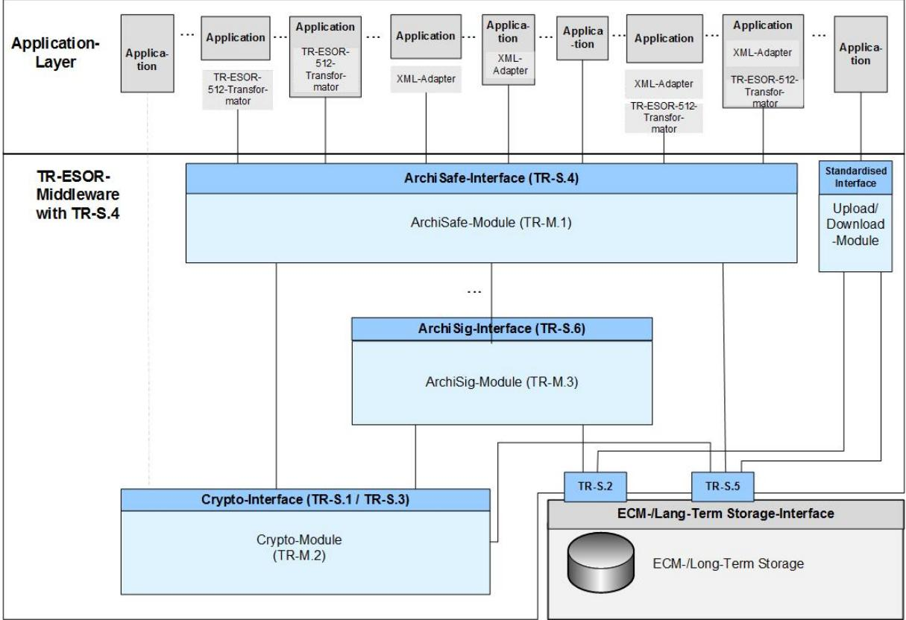
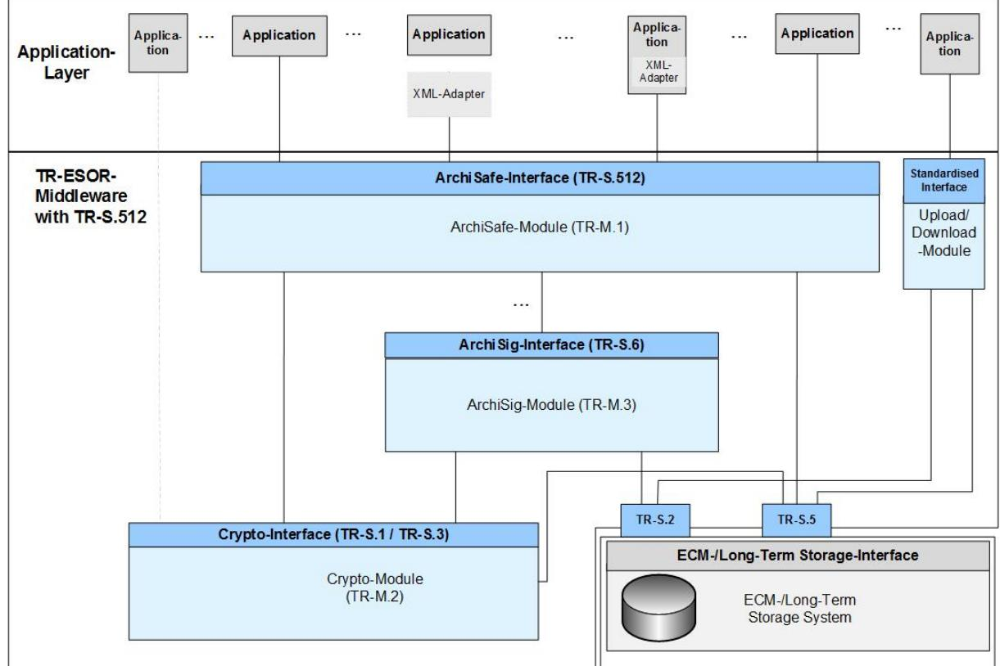

# BSI Technical Guideline 03125 Preservation of Evidence of Cryptographically Signed Documents

# **Annex TR-ESOR-C.1: Conformity Test Specification (Level 1 - Functional Conformity)**

Designation Functional Conformity Test Specification (Level 1)

Abbreviation BSI TR-ESOR-C.1

Version 1.2.2 (on base of the eIDAS-Regulation, ETSI Preservation, NEW: LXAIP and Upload-/Download-Module, TS119512-Interface)

Datum 15.03.2021

Federal Office for Information Security Post Box 20 03 63 53133 Bonn Phone: +49 228 99 9582-0 E-Mail: [tresor@bsi.bund.de](mailto:tresor@bsi.bund.de) Internet: [https://www.bsi.bund.de](https://www.bsi.bund.de/) © Federal Office for Information Security 2021

# Inhalt

|    | 1. INTRODUCTION                                                                                                                                   | 6        |
|----|------------------------------------------------------------------------------------------------------------------------------------------------------|----------|
| 2. | OVERVIEW                                                                                                                                             | 9        |
| 3. | TEST APPROACH                                                                                                                                        | 11       |
|    | 3.1 Structure of the Test Case Specifications                                                                                                     | 11       |
|    | 3.2 Strictness of Test Result Assessment                                                                                                          | 11       |
|    | 3.3 Baseline for all Test Cases                                                                                                                   | 12       |
|    | 3.3.1 Standard Test Configurations                                                                                                                | 12       |
|    | 3.3.2 Standard Test Objects                                                                                                                       | 13       |
|    | 3.4 Occurring Abbreviations                                                                                                                       | 20       |
| 4. | THE TEST CASES FOR CONFORMITY LEVEL 1 – FUNCTIONAL CONFORMITY                                                                                        | 23       |
|    | 4.1 Tests for all products                                                                                                                        | 23       |
|    | 4.1.1 A-01 – Middleware modules should be realised as separate modules                                                                            | 23       |
|    | 4.1.2 A-02 – The upper Interfaces (inbound and outbound) of the TR-ESOR-Middleware shall be the XML                                               |          |
|    | based S.4- or S.512-Interfaces, based on open, standardised data formats, or in case of Upload-/Download                                             |          |
|    | Module shall be based on open, standardised cryptographically protocols with standardised data formats                                               |          |
|    | and interfaces                                                                                                                                       | 25       |
|    | 4.1.3 A-03 – No access without mutual authentication                                                                                              | 27       |
|    | 4.1.4 A-04 – Authentication procedure shall be resistant against replay attacks                                                                   | 37       |
|    | 4.1.5 A-05 – Protection of communication channel and interface shall be robust against DoS-attacks                                                | 38       |
|    | 4.1.6 A-06 – A secure tunnel can be maintained after successful authentication                                                                    | 40       |
|    | 4.1.7 A-07 – Secure administration interfaces                                                                                                     | 42       |
|    | 4.1.8 A-08 – No security breach induced by administration interfaces or components                                                                | 44       |
|    | 4.1.9 A-09 – Administration interfaces shall be available for authorised accounts only                                                            | 45       |
|    | 4.1.10 A-10 – Additional interfaces shall not compromise security                                                                                 | 46       |
|    | 4.2 Module 1 – ArchiSafe                                                                                                                          | 47       |
|    | 4.2.1 M.1-01 – Preservation Services conform to [eIDAS-VO], [ETSI TS 119 401], [ETSI TS 119 511] and                                              |          |
|    | using the preservation product [TR-ESOR] should fulfil the security objectives and requirements of [ASS 319                                          |          |
|    | 401] and [ASS 119 511]                                                                                                                               | 47       |
|    | 4.2.2 M.1-02 – ArchiSafe-module shall be separated and deployed on a trustworthy IT system                                                        | 49       |
|    | 4.2.3 M.1-03 – Access to ECM storage shall be claimed to be controlled by ArchiSafe module and if                                                 |          |
|    | existent, also by the Upload- and Download-Module                                                                                                    | 50       |
|    | 4.2.4 M.1-04 – Support of specified functions                                                                                                     | 52       |
|    | 4.2.5 M.1-05 – Using interfaces S.1 and S.6 is possible 4.2.6 M.1-06 – Comprehensive and configurable options for logging shall be offered. | 56 57 |
|    | 4.2.7 M.1-07 – Access to log files shall be possible by authorized persons only                                                                   | 60       |
|    | 4.2.8 M.1-08 – Changing metadata or data objects results in a new version of stored (L)XAIP or XAIP(BIN)                                          |          |
|    | 61 4.2.9 M.1-09 – ArchiSafe-module should be capable of serving and separating multiple clients                                                | 63       |
|    | 4.2.10 M.1-10 – ArchiSafe-Module shall be thread safe                                                                                             | 65       |
|    | 4.2.11 M.1-11 – Access rights are enforced for individual archive objects                                                                         | 67       |
|    |                                                                                                                                                      |          |

| 4.3              | Module 2 – Crypto-Module                                                                                                                                                                  | 70         |
|------------------|-------------------------------------------------------------------------------------------------------------------------------------------------------------------------------------------|------------|
| 4.3.1            | M.2-01 – Crypto- Module may request digital signatures from a Trust Service Provider according to                                                                                         |            |
|                  | [eIDAS-VO]                                                                                                                                                                                | 70         |
| 4.3.2            | M.2-02 – Cryptographic algorithms shall be exchangeable                                                                                                                                   | 74         |
| 4.3.3            | M.2-03 – Crypto-Module should fulfil the requirements of TR-03112                                                                                                                         | 75         |
| 4.3.4            | M.2-04 – Random number generators fulfil the BSI requirements                                                                                                                             | 76         |
| 4.3.5            | M.2-05 – Support of Hash functions                                                                                                                                                        | 77         |
| 4.3.6            | M.2-06 – Crypto-Module supports canonicalisation for the validation of XML digital signatures                                                                                             | 79         |
| 4.3.7            | M.2-07 – Canonicalisation procedures do not change the content data                                                                                                                       | 81         |
| 4.3.8            | M.2-08 – Reliable validation of digital signatures by itself or by a Trust Service Provider                                                                                               | 83         |
| 4.3.9            | M.2-09 – Crypto-Module shall have function to validate certificate chains by itself or by a Trust                                                                                         |            |
|                  | Service Provider                                                                                                                                                                          | 88         |
| 4.3.10           | M.2-10 – Validation of digital signatures and evidence records yields standardised and                                                                                                    |            |
|                  | comprehensive Verification Report                                                                                                                                                         | 91         |
| 4.3.11           | M.2-11 – Suitability of cryptographic algorithms should be defined by policy file                                                                                                         | 94         |
| 4.3.12           | M.2-12 – Protect its own security                                                                                                                                                         | 95         |
| 4.3.13           | M.2-13 – Recording security functions                                                                                                                                                     | 96         |
| 4.3.14           | M.2-14 – Responsivity to unauthorized access                                                                                                                                              | 97         |
| 4.3.15           | M.2-15 – Configuration of cryptographic functions                                                                                                                                         | 98         |
| 4.3.16           | M.2-16 – Validation of certificates based on a standardized protocol                                                                                                                      | 99         |
| 4.3.17           | M.2-17 – Crypto-Module is able to request qualified electronic time stamps from a qualified Trust                                                                                         |            |
|                  | Service Provider                                                                                                                                                                          | 100        |
| 4.3.18           | M.2-18 – Crypto-Module supports [RFC 3161, [RFC5816], [RFC5652] and [EN 319 422] and                                                                                                      |            |
|                  | suitable algorithms                                                                                                                                                                       | 103        |
| 4.3.19           | M.2-19 – Qualified Electronic Time Stamps fulfil the requirements of [eIDAS-VO, article 42]                                                                                               | 105        |
| 4.3.20           | M.2-20 – Crypto-Module shall validate digital signatures of received electronic time stamps or                                                                                            |            |
| 4.3.21           | hash values (or another cryptographic security element) in <asic:DataObjectReference> of a LXAIP M.2-21 – The Cryptographic Module shall have a trustworthy communication channel to a | 108        |
|                  | qualified Trust Service Provider in order to request qualified electronic time stamps according to [eIDAS-VO,                                                                             |            |
|                  | Article 3 (34)]                                                                                                                                                                           | 111        |
|                  |                                                                                                                                                                                           |            |
| 4.4              | Module 3 – ArchiSig-Module                                                                                                                                                                | 113        |
| 4.4.1            | M.3-01 – ArchiSig-Module should be realised as a separate module                                                                                                                          | 114        |
| 4.4.2            | M.3-02 – Using interface S.3 is possible                                                                                                                                                  | 116        |
| 4.4.3            | M.3-03 – ArchiSig-Module implements specified functions                                                                                                                                   | 117        |
| 4.4.4            | M.3-04 – Creation of Initial Archive Timestamps according to [RFC4998] or [RFC6283]                                                                                                       | 119        |
| 4.4.5            | M.3-05 – AOID shall be unique                                                                                                                                                             | 121        |
| 4.4.6            | M.3-06 – ArchiSig-Module creates Evidence Records according to RFC4998 or RFC6283                                                                                                         | 122        |
| 4.4.7            | M.3-07 – ArchiSig-Module should not implement cryptographic functions                                                                                                                     | 124        |
| 4.4.8            | M.3-08 – ArchiSig-Module should be thread safe                                                                                                                                            | 126        |
| 4.4.9            | M.3-09 – Instances of ArchiSig-Module should be deployable on different machines                                                                                                          | 128        |
| 4.4.10           | M.3-10 – ArchiSig-Module uses a secure storage for electronic time stamps and AOIDs                                                                                                       | 129        |
| 4.4.11           | M.3-11 – Canonicalisation of XML is performed prior to hashing and noted in XAIP                                                                                                          | 131        |
| 4.4.12           | M.3-12 – Hashing of relevant parts is performed with suitable algorithms                                                                                                                  | 132        |
| 4.4.13           | M.3-13 – ArchiSig-Module supports Timestamp Renewal and Hash-Tree Renewal                                                                                                                 | 133        |
| 4.4.14           | M.3-14 – Timestamp Renewal                                                                                                                                                                | 137        |
| 4.4.15           | M.3-15 – ArchiSig-Module shall validate requested electronic time stamps                                                                                                                  | 139        |
|                  | 4.4.16 M.3-16 – Time stamps shall be verified prior to renewal                                                                                                                         | 142        |
|                  | M.3-17 – Timestamp Renewal can only be requested by authorised users through administrative                                                                                               |            |
| 4.4.17           | interfaces 144                                                                                                                                                                            |            |
|                  | M.3-18 – Hash-tree Renewal can only be requested through administrative interface                                                                                                         |            |
| 4.4.18           |                                                                                                                                                                                           | 145        |
| 4.4.19           | M.3-19 – Authenticity and integrity of ArchiSig-Module needs to be guaranteed                                                                                                             | 147        |
| 4.4.20           | M.3-20 – ArchiSig-Module should be able to maintain parallel hash-trees                                                                                                                   | 148        |
| 4.4.21 4.4.22 | M.3-21 – Resigning-procedure is efficient and compatible with ERS M.3-22 – Deletion of an archive object shall not impair the conclusiveness of others                                 | 149 150 |

| 4.5   | Interface functions | 153 |
|-------|---------------------|-----|
| 4.5.1 | Interface S.1       | 153 |
| 4.5.2 | Interface S.2       | 160 |
| 4.5.3 | Interface S.3       | 160 |
| 4.5.4 | Interface S4        | 161 |
| 4.5.5 | Interface S.5       | 248 |
| 4.5.6 | Interface S.6       | 248 |
| 4.6   | Annex TR-ESOR-F     | 248 |

# **Illustration Index**

| Figure 1: Schematic Depiction of the IT Reference Architecture with TR-S.47   |  |
|-------------------------------------------------------------------------------|--|
| Figure 2: Schematic Depiction of the IT Reference Architecture with TR-S.5127 |  |

# **Index of Tables**

| Table 1: Definition of test objects18            |  |
|--------------------------------------------------|--|
| Table 2: Definition of test data in detail 19 |  |
| Table 3: Occurring Abbreviations 20           |  |

# **1. Introduction**

The goal of the Technical Guideline "Preservation of Evidence of Cryptographically Signed Documents" is to specify technical security requirements for the long-term preservation of evidence of cryptographically signed electronic documents and data along with associated electronic administrative data (meta data).

A Middleware defined for this purpose (TR-ESOR-Middleware) in the sense of this Guideline includes all of the modules (**M**) and interfaces (**S**) [for the German "*Schnittstellen*"] used for securing and preserving the authenticity and proving the integrity of the stored documents and data.

The Reference Architecture introduced in the Main Document of this Technical Guideline consists of the interfaces, functions and logical units described in the following:

- the S.4 and the TS119512 input interface S.512 in the profiling [TR-ESOR-TRANS] of the TR-ESOR-Middleware, which serves to embed the TR-ESOR-Middleware in the existing IT and infrastructure landscape;
- the "ArchiSafe-Module" (**[TR-ESOR-M.1]**), which regulates the flow of information in the Middleware, implements the security requirements for the interfaces with the IT applications and ensures that the application systems are decoupled from the ECM/long-term storage;
- the "Cryptographic"-Module (**[TR-ESOR-M.2]**) and the associated interfaces S.1 and S.3 that provide the required functions for creating hash values, verifying electronic signatures or seals or time stamps, verifying electronic certificates, and for obtaining qualified electronic time stamps or (optional) of electronic signatures or seals for the Middleware. Furthermore, it can provide the functions for the encryption and decryption of data and documents;
- the "ArchiSig"-Module (**[TR-ESOR-M.3]**) with the S.6 interface that provides the required functions for the preservation of evidence of the digitally signed documents;
- an ECM/Long-Term Storage with the S.2 and S.5 interfaces that assumes the physical archiving/storage and also the storage of the meta data that preserve evidence. *This ECM/long-term storage is no longer directly a part of the Technical Guideline, but requirements will be set for it through the two interfaces that are still part of the TR-ESOR-Middleware.*

*The application layer that can include an XML-Adapter is not a direct part of this Technical Guideline, either, even though this XML-Adapter can be implemented as part of a Middleware.*

The IT Reference Architecture depicted in Figure 1 and Figure 2 is based on the ArchiSafe Reference Architecture and is supposed to enable and support the logical (functional) interoperability of future products with the objectives and requirements of the Technical Guideline. In principle, the upper interface of the TR-ESOR-Middleware is either the S.4-Interface (TR-S.4) pursuant to **[TR-ESOR-E],** according to Figure 1 or the S.512-Interface (TR-S.512) pursuant to **[ETSI TS 119 512]** in the profiling of **[TR-ESOR-TRANS]** according to [Figure 2.](#page-6-2)

*Figure 1: Schematic Depiction of the IT Reference Architecture with TR-S.4* 

*Figure 2: Schematic Depiction of the IT Reference Architecture with TR-S.512* 

The optional XML-Adapter and/or the optional TR-ESOR-512-Transformator[1](#page-7-0) may be integrated under the following circumstances only:

- - Both as separate components with two interfaces to the IT-application and the ArchiSafe-Module,
- Both as separate components, but as parts of the IT-application with interfaces to the ArchiSafe-Modul
- One common component, separate from the IT-application and including the XML-Adapter and TR-ESOR-512-Transformator as parts, with two interfaces to the IT-application and the ArchiSafe-Module,
- One common component including the XML-Adapter and TR-ESOR-512-Transformator as parts, which is part of the IT-application, with an interface to the ArchiSafe-Module.

This ["ETSI TS119512 TR-ESOR Transformator"](https://github.com/de-bund-bsi-tr-esor/tresor-ETSITS119512-transformator) enables preservation services pursuant to [eIDAS](https://eur-lex.europa.eu/legal-content/EN/TXT/?uri=CELEX:32014R0910) to transform incoming [ETSI TS119512 \(V1.1.1\)](https://www.etsi.org/deliver/etsi_ts/119500_119599/119512/01.01.01_60/ts_119512v010101p.pdf) messages[2](#page-7-1) into [TR-ESOR S4](https://www.bsi.bund.de/SharedDocs/Downloads/EN/BSI/Publications/TechGuidelines/TR03125/TR-03125_E_v1_2_2.pdf) messages. These messages can be sent to an attached [TR-ESOR](http://www.bsi.bund.de/EN/tr-esor) system without any need for changing the system.

The usage of the [ETSI TS119512 TR-ESOR Transformator](https://github.com/de-bund-bsi-tr-esor/tresor-ETSITS119512-transformator) is recommended in case that a TR-ESOR-Product with a TR-S.4-Interface should be used in Europe supporting interoperability with other European (qualified) Preservation Services or Preservation Products.

This Technical Guideline is modularly structured, and the individual annexes to the Main Document specify the functional and technological security requirements for the needed IT components and interfaces of the TR-ESOR-Middleware. The specifications are strictly platform, product, and manufacturer independent.

The document at hand bears the designation "Annex TR-ESOR-C.1" and describes and specifies the conformity tests for the conformity level 1 "Functional Conformity" for TR-ESOR V1.2.2 supporting also the archive information package LXAIP and the Upload- and Download-interface and the upper ETSI TS119512-interface TR-S.512 in the profiling of **[TR-ESOR-TRANS]**, alternatively to the TR-ESOR upper interface S.4, but not yet the archive information package ASiC-AIP.

1 Se[e ETSI TS 119512 TR-ESOR Transformator](https://github.com/de-bund-bsi-tr-esor/tresor-ETSITS119512-transformator) under Open Source License

2 In the profiling of **[TR-ESOR-TRANS]**

# **2. Overview**

Products or systems which want to get certified according to this Technical Guideline have to demonstrate their conformance to the specifications. There are three conformance levels defined which mainly differ in the technical detail specifications of interfaces and data formats used.

- Conformity Level 1 Functional Conformity
- Conformity Level 2 Technical Conformity
- Conformity Level 3 Recommendations for Federal Agencies

The three levels are built on top of each other. This means e.g. in order to demonstrate conformity to level 2 all conformance criteria for level 1 have to be passed in addition to the conformance criteria for level 2.

This document specifies the functional conformity criteria (tests) derived from the requirements specified in the documents of the Technical Guideline.

In order to become certified according to a conformity level, a product or system must pass all conformity criteria (tests) for this conformity level and for all lower conformity levels. If one or more tests are not successful, the conformity cannot be certified.

In the following chapter the test criteria will be derived from the requirements defined of the TR. Furthermore, the requirements and therefore also the test criteria are assigned to a conformity level.

Based on these assignments the subsequent chapters define the test cases for the conformity levels in detail. Red headlined (marked) test cases MUST be passed for fulfilling the conformity criteria.

The test case specifications are written in such a way that this document (or the respective parts of it) could be used as template for the documentation of the final results of actual testing.

## *NOTICE 1:*

*In TR-ESOR-Version1.3 the two terms "Archive Information Package (AIP)" and "Archive Data Object" are used synonymously.*

## *NOTICE 2:*

*The TR-ESOR input interface S.4 or the TS119512 input interface S.512 pursuant to the preservation-API of [ETSI TS 119 512] in the profiling of [TR-ESOR-TRANS[\]](#page-7-2)1 shall be used which logically corresponds to the input-interface S.4 of the TR-ESOR-Middleware [TR-ESOR-E], as shown in the table 1 of [TR-ESOR-E, clause 4.1]. Another input interface instead of S.4 or S.512 is not allowed.*

*To improve readability, the insertion of the TS119512-function calls, equivalent to S.4, is renounced, at several places in this document and the footnote "Either S.4 or S.512 shall be supported." is added to each test case concerning "S.4"/TS119152.*

## *NOTICE 3:*

*In this TR-ESOR- Version, the word "AIP"means in all TR-ESOR-Annexes:*

*a) the XML-based archival information package "XAIP" pursuant to [TR-ESOR V1.2.2 and higher, Annex F, clause 3.1] as well as* 

*b) the logical XAIP "LXAIP" pursuant to [TR-ESOR V1.2.2 and higher, Annex F, clause 3.2] as well as c) the "ASiC-AIP" pursuant to [TR-ESOR V1.2.2 and higher, Annex F, clause 3.3] on base of [ETSI EN 319162-1].*

*In this TR-ESOR Version, the main document MD, the Annex F and E differentiate in detail between "XAIP", "LXAIP" and "ASiC-AIP".*

*To improve readability, at several places in this document, the insertion of "LXAIP" and "ASiC-AIP" is renounced, and the footnote ""XAIP" shall be supported, "LXAIP" and "ASiC-AIP, if implemented"*  *may be supported" is added to each "XAIP".*

*NOTICE 4: In this TR-ESOR- Version, BIN is restricted to the following preservation object formats: -ASiC-ERS pursuant to [ETSI TS 119 512] Annex A.3.1 and A.3.1.3 [\(http://uri.etsi.org/ades/ASiC/type/ASiC-ERS\)](http://uri.etsi.org/ades/ASiC/type/ASiC-ERS) and pursuant to [BSI TR-03125-F] Clause 3.3);*

*-CAdES pursuant to [ETSI TS 119 512] Annex A.1.1 [\(http://uri.etsi.org/ades/CAdES\)](http://uri.etsi.org/ades/CAdES). If there is no MIME type filled, then the default application/cms is used;*

*-XAdES pursuant to [ETSI TS 119 512] Annex A.1.2 [\(http://uri.etsi.org/ades/XAdES\)](http://uri.etsi.org/ades/XAdES). If there is no MIME type filled, then the default application/xml is used;*

*-PAdES pursuant to [ETSI TS 119 512] Annex A.1.3 [\(http://uri.etsi.org/ades/PAdES\)](http://uri.etsi.org/ades/PAdES). If there is no MIME Type filled, then the default application/pdf is used;*

*-ASiC-E pursuant to [ETSI TS 119 512] Annex A.1.4 (http://uri.etsi.org/ades/ASiC/type/ASiC-E). If there is no MIME type filled, then the default application/vnd.etsi.asic-e+zip is used;*

*-DigestList pursuant to [ETSI TS 119 512] Annex A.1.6 (http://uri.etsi.org/19512/format/DigestList). If there is no MIME Type filled, then the default application/xml is used;*

*-Binary Data (BIN) as Octet Stream, which is stored in the ECM/long-term storage by an "Upload-Request" and retrieved by a "Download-Request" – linked to a corresponding LXAIP only*

## *NOTICE 5:*

*In the following text the term "digital signature" covers "advanced electronic signatures" pursuant to [eIDAS-VO, Article 3(11)], "qualified electronic signatures" pursuant to [eIDAS-VO, Article 3(12)], "advanced electronic seals" pursuant to [eIDAS-VO, Article 3(26)] and "qualified electronic seals" pursuant to [eIDAS-VO, Article 3(27)]. Insofar, the term "digital signed document" covers as well documents signed by advanced electronic signatures or seals as documents signed by qualified electronic signatures or seals.*

*In this TR the term "cryptographic signed documents" covers not only qualified signed documents pursuant to [eIDAS-VO, Article 3(12)] or qualified sealed documents pursuant to [eIDAS-VO, Article 3(27)] or qualified time-stamped documents pursuant to [eIDAS-VO, Article 3(34)] (within the meaning of the eIDAS regulation) ) but also documents with advanced electronic signatures pursuant to [eIDAS-VO, Article 3(11)] or with advanced electronic seals pursuant to [eIDAS-VO, Article 3(26)] or with electronic time stamps pursuant to [eIDAS-VO, Article 3(33)], as they are often used in the internal communication of public authorities. What is not meant here are documents with simple signatures or seals based on other (e.g. noncryptographic) technologies.*

# **3. Test Approach**

The following test specifications are based on the recommended reference architecture in chapter 7.1 of the main document of this technical guideline. Thus, in the following differences between expected and observed test results should be carefully interpreted by the testers respecting the fact that actual implementations of components and / or modules of the middleware may deviate from the recommended reference architecture. This may result also in different characteristics of implemented and provided interfaces.

Besides this testing the conformity to this guideline may refer to a single module only. This may result also in different characteristics and expected results of implemented and provided features and interfaces.

In the following text we use the wording "S.4 Interface" instead of "S.4 Interface or functionally analogous interfaces". It is worth noting, therefore, that testing the conformity level 1 the referred interfaces are required in a logical functional manner only and not in a technical interoperable characteristic.

The TR-ESOR interfaces S.2 and S.5 are actually not part of the TR-ESOR middleware because they will be provided by the storage system. Therefore, no conformity tests will be specified here.

For fulfilling the required conformity in general, the red marked test specifications in this document shall be tested and passed.

For fulfilling the required conformity in compliance with the pre-suppositions written down before the test cases, the yellow marked test specifications in this document shall be tested and passed.

All other test specifications shall be passed or the non-fulfilment must be justified.

## **3.1 Structure of the Test Case Specifications**

Some test cases are ordered according to the modules M.1 – M.3 and "all products". These test cases cannot be assigned to the certain interface of the module but check general properties of the module.

The other test cases are ordered according to the interface specifications S.1 – S.6. The reason for that is that these tests will only be performed on the level of external interfaces of a certain product. If a product claims compliance with the module specified in the Technical Guideline, the respective interfaces of the module (product) will be tested or the product proves that it supports functional analogous interfaces.

Below this structural level, the test cases are ordered according to the logical functions of this interface, e.g. "Archive Submission" or "Archive Deletion". For each logical function of the interface a set of test cases test all relevant requirements.

Each test case is identified by a unique ID. The test case description also refers to the respective requirements, which will be (partly) tested with this test case. The test case also states the purpose of the test as a summary of the test case. The baseline configuration of the test system will be stated as well as all pre-conditions, which must exist prior performance of the test. The test case defines the single test steps, which must be performed in the given order. Per test step the expected result is defined and there is space that the tester could document the actual findings. Finally, the tester can state the final verdict of the test case (PASS/FAIL).

FAIL shall be assigned if any of the test steps does not match the expected result and a justification for this difference is not possible.

## **3.2 Strictness of Test Result Assessment**

The Technical Guideline differs between three major classes of requirements (cf. **[RFC 2119**])

• CAN (or synonymously MAY, COULD) : These requirements are just hints or optional features. These requirements will not be tested.

- SHOULD: These requirements are strong recommendations. Respective test cases should demonstrate the specified behaviour. Alternatively, the vendor explains why its product uses another approach and why the resulting security level is equal to the security level described in the Technical Guideline.
- MUST (or synonymously SHALL): These are strict requirements. It is not allowed to use another approach or alternative techniques.

Test cases which tests MUST requirements are identified with a red coloured title line. The expected results of these test cases must exactly be the actual results.

Test cases identified by a grey coloured title line are pure SHOULD requirements. The expected test results may differ from the actual test results, if the vendor can demonstrate the same or higher security level.

## **3.3 Baseline for all Test Cases**

This section describes the basics valid and usable for all test cases.

## **3.3.1 Standard Test Configurations**

Here, a set of standard configurations of the test setup will be described. These setups are referenced in the test cases and should be used to actually perform the tests.

## **3.3.1.1 CONFIG\_Common**

This is the standard configuration for all tests.

- The test setup shall contain the product to be tested (Target of Testing, TOT).
- The user manual in the test setup shall refer at least to one Preservation Profile pursuant to **[ETSI TS 119 512, clause 5.4.7],** to one actual Preservation Evidence Policy pursuant to **[ETSI TS 119 511, clause 6.5]** and to one actual signature validation policy and time-stamp validation policy pursuant to **[ETSI TS 119 511, clause 6.6]**.
- The test setup shall contain all other modules of the reference architecture (including the storage) functionally not covered by the TOT. The purpose is that a functionally complete system can be tested.
- The TOT and all other modules required shall be installed and configured according to the respective guidance including all security recommendations.
- The TOT and all other modules shall be physically and logically interconnected. The connections shall be secured as described in the respective guidance documents (e.g. enabling encryption, explicit physical connection).
- The test system shall be connected to an external Trust Service Provider as required by the TOT or the tests.
- At least it is recommended to install three different client applications for using and testing the multi-client-capability of the middleware (if the TOT supports/provides a multi-client-capability).

In this case the middleware in turn shall be configured to handle these three applications as different clients (multi-client-capability). Per client application at least two user accounts and an administrator account shall be configured.

• The BSI ERVerifyTool is installed and running in a proper working mode.

The complete test setup shall be started and running in a proper operational and working mode.

## **3.3.1.2 CONFIG\_ArchiSafe**

This configuration includes CONFIG\_Common.

Additionally, the ArchiSafe-Module (if TOT) shall be configured as follows:

- XAIP shall be mandatory.
	- The default value in case of "no-input of the PO-Format" is "XAIP".
	- If configurable, LXAIP shall be optional and may be enabled and used in parallel with XAIP.
- A XSD defining the XAIPs or LXAIPs pursuant to TR-ESOR-F V1.2.2 shall be configured. Preferable, the XAIP described in Annex TR-ESOR-F should be used.
- The XSD verification of (L)XAIP containers during Archive Submission and Archive Update shall be enabled.
- The validation of digital signatures and electronic time stamps[3](#page-12-1) and (L)XAIP during Archive Submission and Archive Update shall be enabled.
- The requesting of qualified time-stamps from a qualified Trust Service Provider and of verification of (qualified) time-stamps (doing by itself or upon request from an external Trust Service Provider) shall be enabled.
- Either the S.4 interface or the TS119512 interface S.512 in the profiling of **[TR-ESOR-TRANS]** shall be configured.
	- The default value in case of "no interface configuration" is the interface "S.4".
- The S.4 interface or the TS119512 interface S.512 in the profiling of **[TR-ESOR-TRANS]** shall only be accessible using a secure Channel (e.g. TLS tunnel) with certificatebased mutual authentication.
- If configurable, OptionalInput and OptionalOutput pursuant to **[TR-ESOR-E]** may be supported.

## **3.3.1.3 CONFIG\_Upload**

• If configurable, CONFIG\_Upload is defined and Upload shall be enabled, but usable for BIN *linked to a corresponding LXAIP* only.

## **3.3.1.4 CONFIG\_Download**

• If configurable, CONFIG\_Download is defined and Download shall be enabled.

## **3.3.2 Standard Test Objects**

For most of the tests test data is required. In order to make the tests repeatable, this section defines some standard test objects.

## *NOTICE 4:*

*The word "XAIP" in the following table names represents "XAIP" or "LXAIP" pursuant to [TR-ESOR-F] V1.2.2. The word "DXAIP" in the following container names represents "DXAIP" or "DLXAIP"" pursuant to [TR-ESOR-F] V1.2.2.*

## **The following test objects are available for the three Conformity Levels 1, 2 and 3.**

| No. | Container Name | Used in Conformity Level | Description                                  |
|-----|----------------|--------------------------------|----------------------------------------------|
| 1   | XAIP_OK        | 1, 2, 3                        | The XAIP is syntactically correct and passes |

3 The validation of digital signatures or electronic time stamps of documents included in the XAIP or passed over as binary.

| No. | Container Name    | Used in Conformity Level | Description                                                                                                                                                                                                                                                                                                                                                                                                                                                                                                      |  |
|-----|-------------------|--------------------------------|------------------------------------------------------------------------------------------------------------------------------------------------------------------------------------------------------------------------------------------------------------------------------------------------------------------------------------------------------------------------------------------------------------------------------------------------------------------------------------------------------------------|--|
|     |                   |                                | the defined consistency checks.                                                                                                                                                                                                                                                                                                                                                                                                                                                                                  |  |
| 2   | LXAIP_OK          | 1, 2, 3                        | The LXAIP is syntactically correct and passes the defined consistency checks.                                                                                                                                                                                                                                                                                                                                                                                                                                 |  |
| 3   | XAIP_OK_SIG       | 1                              | The XAIP is syntactically correct and passes the defined consistency checks and there is a valid digital signature or electronic time stamp.                                                                                                                                                                                                                                                                                                                                                               |  |
| 4   | LXAIP_OK_SIG      | 1                              | The LXAIP is syntactically correct and passes the defined consistency checks and there is a valid digital signature or electronic time stamp.                                                                                                                                                                                                                                                                                                                                                              |  |
| 5   | (L)XAIP_OK_SIG    | 1                              | A XAIP_OK_SIG or a LXAIP_OK_SIG.                                                                                                                                                                                                                                                                                                                                                                                                                                                                                 |  |
| 6   | XAIP_NOK          | 1, 2, 3                        | The schema validation of the XAIP fails.                                                                                                                                                                                                                                                                                                                                                                                                                                                                         |  |
| 7   | LXAIP_NOK         | 1, 2, 3                        | The schema validation of the LXAIP fails.                                                                                                                                                                                                                                                                                                                                                                                                                                                                        |  |
| 8   | XAIP_NOK_EXPIRED  | 1,2                            | The schema validation for the XAIP succeeds, but the preservationInfo-element indicates a preservation date, which is already exceeded.                                                                                                                                                                                                                                                                                                                                                                    |  |
| 9   | XAIP_NOK_SUBMTIME | 2                              | The schema validation for the XAIP succeeds, but the submissionTime-element deviates from the current time beyond a reasonable tolerance range. The documentation of the middleware or the module, which shall be tested, shall contain some assertions and related conditions or constraints indicating when the submissionTime contained in the provided XAIP deviates too much from the current time.                                                                           |  |
| 10  | XAIP_NOK_SIG      | 1, 2,                          | The XAIP is syntactically correct and passes the defined consistency checks, but the XAIP contains an invalid digital signature or electronic time stamp. Invalid digital signature or electronic time stamp means that the digital signature or electronic time stamp is syntactically not correct or at least one of the evidence relevant data, for example a digital signature or electronic time stamp or certificate or revocation list or OCSP-response, etc., is wrong. |  |
| 11  | XAIP_NOK_ER       | 1, 2                           | The XAIP is syntactically correct and passes the defined consistency checks, but the XAIP contains an invalid Evidence Record. Invalid Evidence Record means, that the Evidence Record is syntactically not correct or does not pass the defined consistency checks                                                                                                                                                                                                                               |  |

| No. | Container Name     | Used in Conformity Level | Description                                                                                                                                                                                                                                                                                                                 |
|-----|--------------------|--------------------------------|-----------------------------------------------------------------------------------------------------------------------------------------------------------------------------------------------------------------------------------------------------------------------------------------------------------------------------|
|     |                    |                                | according to annex C.2, chapter 4.1. or annex ERS.                                                                                                                                                                                                                                                                       |
| 12  | XAIP_NOK_SIG_OK_ER | 1, 2                           | The XAIP is syntactically correct and passes the defined consistency checks and there is a correct Evidence Record or a number of correct Evidence Records, but the XAIP contains a digital signature or electronic time stamp, which was not correct at the time of its archiving.                       |
| 13  | XAIP_OK_SIG_OK_ER  | 1, 2                        | The XAIP is syntactically correct and passes the defined consistency checks and there is a valid digital signature or electronic time stamp and a valid Evidence Record or a number of correct Evidence Records.                                                                                                |
| 14  | BIN                | 1, 2, 3                        | This test object is a binary document restricted to the preservation object formats described in clause 2, Notice 4, which is provided in the ArchiveData-element.                                                                                                                                              |
| 15  | XAIP(BIN)          | 1, 2                           | The XAIP(BIN) is a XAIP, which is part of the response of a successful ArchiveRetrievalRequest or a RetrievePO Request concerning an archive data object, which was previously inserted as a BIN in the long-term storage by an ArchiveSubmissionRequest or a PreservePO-Request ([TR-ESOR TRANS]). |
| 16  | DXAIP              | 1, 2, 3                        | The DXAIP represents an update container ("Delta XAIP") for XAIP, which contains the corresponding AOID.                                                                                                                                                                                                              |
| 17  | DLXAIP             | 1,2,3                          | The DLXAIP represents an update container ("Delta LXAIP") for LXAIP, which contains the corresponding AOID.                                                                                                                                                                                                           |
| 18  | DXAIP_OK           | 1, 2, 3                        | The DXAIP is syntactically correct and represents a valid update container ("Delta XAIP") for XAIP_OK, which contains the corresponding AOID.                                                                                                                                                                      |
| 19  | DXAIP_OK_SIG       | 1                              | The DXAIP is syntactically correct and represents a valid update container ("Delta XAIP") for XAIP_OK, which contains the corresponding AOID and contains a valid digital signature or electronic time stamp.                                                                                                   |
| 20  | DXAIP_NOK          | 1, 2, 3                        | The DXAIP is syntactically not correct because the schema validation fails.                                                                                                                                                                                                                                              |

| No. | Container Name     | Used in Conformity Level | Description                                                                                                                                                                                                                                                                                                                                                                                                                                  |  |
|-----|--------------------|--------------------------------|----------------------------------------------------------------------------------------------------------------------------------------------------------------------------------------------------------------------------------------------------------------------------------------------------------------------------------------------------------------------------------------------------------------------------------------------|--|
| 21  | DXAIP_NOK_AOID     | 2                              | The schema validation for the Delta XAIP succeeds, but the update container ("Delta XAIP") contains a not yet assigned AOID.                                                                                                                                                                                                                                                                                                           |  |
| 22  | DXAIP_NOK_EXPIRED  | 2                              | The schema validation for the Delta XAIP succeeds, but the preservationInfo-element indicates a point in time in the past.                                                                                                                                                                                                                                                                                                             |  |
| 23  | DXAIP_NOK_SUBMTIME | 2                              | The schema validation for the Delta XAIP succeeds, but the submissionTime-element deviates from the current time beyond a reasonable tolerance range. The documentation of the middleware or the module, which shall be tested, shall contain some assertions and related conditions or constraints indicating when the submissionTime contained in the provided XAIP deviates too much from the current time. |  |
| 24  | DXAIP_NOK_SIG      | 1, 2                           | The schema validation for the Delta XAIP succeeds, but the XAIP contains an invalid digital signature or electronic time stamp.                                                                                                                                                                                                                                                                                                        |  |
| 25  | DXAIP_NOK_ER       | 2                              | The schema validation for the Delta XAIP succeeds, but the XAIP contains an invalid Evidence Record.                                                                                                                                                                                                                                                                                                                                   |  |
| 26  | DXAIP_NOK_VERSION  | 2                              | The schema validation for the XAIP succeeds, but there is a syntactical collision with the original XAIP such that the schema validation for the compound XAIP fails, for example the element prevVersion in the updateSection of the DXAIP is not the latest version of this XAIP.                                                                                                                                        |  |
| 27  | TST_OK             | 2                              | The time stamp token is syntactically correct and based on a valid digital signature.                                                                                                                                                                                                                                                                                                                                                     |  |
| 28  | TST_OK_VALINFO     | 2                              | This time stamp token is based on TST_OK and contains the validation information, which has been collected during validation.                                                                                                                                                                                                                                                                                                          |  |
| 29  | TST_NOK            | 2                              | The time stamp token is syntactically incorrect.                                                                                                                                                                                                                                                                                                                                                                                             |  |
| 30  | TST_NOK_SIG        | 2                              | The time stamp token is syntactically correct, but the digital signature does not verify correctly.                                                                                                                                                                                                                                                                                                                                    |  |
| 31  | TST_NOK_VALINFO    | 2                              | This time stamp token is based on TST_OK and contains validation information, which has been collected during validation, but are not complete.                                                                                                                                                                                                                                                                                     |  |

| No. | Container Name                | Used in Conformity Level | Description                                                                                                                                                                                   |  |
|-----|-------------------------------|--------------------------------|-----------------------------------------------------------------------------------------------------------------------------------------------------------------------------------------------|--|
| 32  | TST_BASIS_ERS_OK              | 2                              | The time stamp token is based on ([TR ESOR-ERS], Profile BASIS_ERS) and is syntactically correct and based on a valid digital signature.                                             |  |
| 33  | TST_BASIS_ERS_OK_VA LINFO  | 2                              | This time stamp token is based on ([TR ESOR-ERS], Profile BASIS_ERS) and contains the validation information, which has been collected during validation.                            |  |
| 34  | TST_BASIS_ERS_NOK             | 2                              | The time stamp token is based on ([TR ESOR-ERS], Profile BASIS_ERS) and is syntactically incorrect.                                                                                     |  |
| 35  | TST_BASIS_ERS_NOK_SI G     | 2                              | The time stamp token is based on ([TR ESOR-ERS], Profile BASIS_ERS) and is syntactically correct, but the digital signature does not verify correctly.                               |  |
| 36  | TST_BASIS_ERS_NOK_V ALINFO | 2                              | This time stamp token is based on ([TR ESOR-ERS], Profile BASIS_ERS) and contains validation information, which has been collected during validation, but are not complete.       |  |
| 37  | ER_OK_INIT                    | 2                              | The Evidence Record according [RFC4998] and [TR-ESOR-ERS]/Basic-ERS-Profile and based on XAIP_OK contains only an initial Archive Timestamp.                                         |  |
| 38  | ER_NOK_INIT                   | 2                              | The initial Archive Timestamp of the Evidence Record according [RFC4998] and [TR ESOR-ERS]/Basic-ERS-Profile and based on XAIP_OK can not be validated.                           |  |
| 39  | ER_OK_CHAIN                   | 2                              | The Evidence Record according to [TR ESOR-ERS]/Basic-ERS-Profile is based on XAIP_OK and includes an Archive Timestamp Chain according to [RFC4998].                                 |  |
| 40  | ER_NOK_CHAIN                  | 2                              | The Evidence Record according to [TR ESOR-ERS]/Basic-ERS-Profile and based on XAIP_OK, includes an Archive Timestamp Chain according to [RFC4998], which can not be validated. |  |
| 41  | ER_OK_SEQ                     | 2                              | The Evidence Record according to [TR ESOR-ERS]/Basic-ERS-Profile is based on XAIP_OK and includes an Archive Timestamp Sequence according to [RFC4998].                              |  |
| 42  | ER_NOK_SEQ                    | 2                              | The Evidence Record according to [TR ESOR-ERS]/Basic-ERS-Profile and based on                                                                                                              |  |

| No. | Container Name | Used in Conformity Level | Description                                                                                                  |  |
|-----|----------------|--------------------------------|--------------------------------------------------------------------------------------------------------------|--|
|     |                |                                | XAIP_OK, includes an Archive Timestamp Sequence according to [RFC4998], which can not be validated. |  |

## *Table 1: Definition of test objects*

These test objects are referred in the test cases by their unique name.

The actual test objects (the files) for this annex are provided as appendix to this document.

- "Container Name" contains the unique name of the container and is identical to the file name.
- "XML Schema"
	- "valid" means that a XML-based object conforms with the specified XML Schema.
	- "not valid" means that a XML-based object does not conform with the specified XML Schema.
	- "---" means that this is a binary object which does not claim conformance to a XML schema.
- "Binary"
	- "no" means that this is an XML object.
	- "yes" means that this is a binary (a non-XML) object.
- "Preservation Time"
	- "Future" means that the minimum retention date is somewhere in the future (e.g. 01.01.2100).
	- "Past" means that the minimum retention date is somewhere in the past (e.g. 01.01.2000).
- "Signature"
	- "No signature" means that the user data contained in the test object does not contain a digital signature or electronic time stamp.
	- "Valid" means that the user data contained in the test object contains a digital signature or electronic time stamp which is mathematically correct, produced with an approved algorithm and with a valid (neither expired nor revoked) certificate issued by a known and trustworthy Trust Service Provider. It does not need to be a qualified electronic signature or seal or time stamp.
	- "Not Valid" means that the user data contained in the test object contains a digital signature or electronic time stamp which is mathematically not correct but produced with an approved algorithm and with a valid (neither expired nor revoked) certificate issued by a known and trustworthy Trust Service Provider. It does not need to be a qualified electronic signature or seal or time stamp.

| Container Name                                                                                                       | XML Schema | Binary | Preservation Time | Digital Signature or Electronic Time Stamp             |
|----------------------------------------------------------------------------------------------------------------------|------------|--------|----------------------|-----------------------------------------------------------|
| XAIP_OK                                                                                                              | Valid      | No     | Future               | No digital Signature and no Electronic time stamp      |
| XAIP_OK_SIG                                                                                                          | Valid      | No     | Future               | Valid                                                     |
| XAIP_NOK_EXPIRED                                                                                                     | Valid      | No     | Past                 | undefined                                                 |
| XAIP_NOK                                                                                                             | Not Valid  | No     | Future               | undefined                                                 |
| XAIP_NOK_SIG                                                                                                         | Valid      | No     | Future               | Not Valid                                                 |
| XAIP_NOK_ER                                                                                                          | Valid      | No     | Future               | Evidence Record NOT Valid                              |
|                                                                                                                      |            |        |                      | Digital Signature / Electronic time stamp undefined |
| XAIP_NOK_SIG_OK_ER                                                                                                   | Valid      | No     | Future               | Evidence Record Valid                                     |
|                                                                                                                      |            |        |                      | Digital Signature / Electronic time stamp Not Valid |
| XAIP_OK_SIG_OK_ER                                                                                                    | Valid      | No     | Future               | Evidence Record Valid                                     |
|                                                                                                                      |            |        |                      | Digital Signature / Electronic time stamp Valid        |
| XAIP(BIN)                                                                                                            | Valid      | No     | Future               | Evidence Record Valid                                     |
|                                                                                                                      |            |        |                      | Digital Signature / Electronic time stamp Valid        |
| BIN restricted to the preservation object formats described in clause 2, Notice 4                     | ---        | Yes    | undefined            | Digital Signature / Electronic time stamp valid        |
| BIN_NOK_SIG restricted to the preservation object formats described pursuant to clause 2, Notice 4 | ---        | Yes    | undefined            | Digital Signature / Electronic time stamp Not Valid |
| DXAIP_OK                                                                                                             | Valid      | No     | Future               | No Digital Signature and no Electronic time stamp      |
| DXAIP_OK_SIG                                                                                                         | Valid      | No     | Future               | Valid Digital Signature / Electronic time stamp        |
| DXAIP_NOK                                                                                                            | Not Valid  | No     | Future               | undefined                                                 |
| DXAIP_NOK_SIG                                                                                                        | Valid      | No     | Future               | Not Valid                                                 |

Table 1: Definition of test data in detail

*Table 2: Definition of test data in detail*

## **3.4 Occurring Abbreviations**

| Abbreviation | Meaning                                       |
|--------------|-----------------------------------------------|
| AES-128      | Advanced Encryption Standard (128 bits)       |
| AOID         | Archive Object Identifier                     |
| ATS          | Archive Time Stamp                            |
| BIN          | Binary                                        |
| BSI          | Federal Office for Information Security       |
| C14N         | Canonical XML Version 1.0                     |
| C14N11       | Canonical XML Version 1.1                     |
| C14N20       | Canonical XML Version 2.0                     |
| CMS          | Cryptographic Message Syntax                  |
| CRL          | Certificate Revocation List                   |
| DES          | Data Encryption Standard                      |
| DoS          | Denial of Service                             |
| DLXAIP       | Delta-LXAIP                                   |
| D(L)XAIP     | Delta-LXAIP or Delta-XAIP                     |
| DXAIP        | Delta-XAIP                                    |
| e.g.         | for example (exempli gratia)                  |
| EC14N        | Exclusive XML Canonicalization                |
| ECM          | Enterprise Content Management                 |
| ERS          | Evidence Record Syntax                        |
| ETSI         | European Telecommunication Standard Institute |
| HTTP         | Hypertext Transfer Protocol                   |
| i.e.         | in other words (id est)                       |
| ID           | Identifier                                    |
| IT           | Information Technology                        |
| LXAIP        | Logical XAIP                                  |
| (L)XAIP      | XAIP or LXAIP                                 |
| M            | Modules                                       |

*Table 3: Occurring Abbreviations*

| Abbreviation | Meaning                                                  |  |
|--------------|----------------------------------------------------------|--|
| MER          | Merkle hash trees                                        |  |
| n/a          | not applicable                                           |  |
| No.          | Number                                                   |  |
| OCSP         | Online Certificate Status Protocol                       |  |
| Par.         | Paragraph                                                |  |
| PKCS         | Public Key Cryptographic Standard                        |  |
| PKI          | Public Key Infrastructure                                |  |
| RC2          | Rivest Cipher 2                                          |  |
| resp.        | respectively                                             |  |
| RFC          | Request for Comments                                     |  |
| RMI          | Remote Method Invocation                                 |  |
| RPC          | Remote Procedure Call                                    |  |
| S            | Interfaces                                               |  |
| SASL         | Simple Authentication and Security Layer                 |  |
| SCVP         | Server-based Certification Validation Protocol           |  |
| Sig          | Signature                                                |  |
| SOAP         | Simple Object Access Protocol                            |  |
| SQL          | Structured Query Language                                |  |
| ST           | Security Target                                          |  |
| TCP          | Transmission Control Protocol                            |  |
| TLS          | Transport Layer Security                                 |  |
| TSP          | Trust Service Provider                                   |  |
| TOT          | Target of Testing, here the to be tested TR-ESOR Product |  |
| TR           | Technical Guideline (German: Technische Richtlinie)      |  |
| Transformer  | "ETSI TS119512 TR-ESOR Transformator"              |  |
| TSP          | Time Stamp Protocol                                      |  |
| USB          | Universal Serial Bus                                     |  |
| WSDL         | Web Services Description Language                        |  |
| XAIP         | XML-based Archive Information Package                    |  |

| Abbreviation | Meaning                    |  |
|--------------|----------------------------|--|
| XML          | Extensible Markup Language |  |
| XSD          | XML Schema Description     |  |

# **4. The Test Cases for Conformity Level 1 – Functional Conformity**

## **4.1 Tests for all products**

## **4.1.1 A-01 – Middleware modules should be realised as separate modules**

| Identifier                     |                                                                                                                                                                                                              |                                                  | A-01                                                                                                                                                                                                                                                                                                                    |              |  |
|--------------------------------|--------------------------------------------------------------------------------------------------------------------------------------------------------------------------------------------------------------|--------------------------------------------------|-------------------------------------------------------------------------------------------------------------------------------------------------------------------------------------------------------------------------------------------------------------------------------------------------------------------------|--------------|--|
|                                | Requirement                                                                                                                                                                                                  | M1:A3.2-1 M1:A3.1-1 M2:A3.2-1 M3:A3.1-4 |                                                                                                                                                                                                                                                                                                                         |              |  |
| The test shall Test Purpose |                                                                                                                                                                                                              | compatible implementations at any time.          | verify that the middleware or middleware components runs as independent applications or independent (functionally delimited) parts of an application on a trustworthy IT system. They are neither a logical nor functional component of upstream IT specialist applications and can be replaced by new, functionally |              |  |
| CONFIG_Common Configuration |                                                                                                                                                                                                              |                                                  |                                                                                                                                                                                                                                                                                                                         |              |  |
| • Pre-test conditions •  |                                                                                                                                                                                                              | User manual is present.                          | The middleware documentation is available                                                                                                                                                                                                                                                                               |              |  |
| Step                           | Test sequence                                                                                                                                                                                                |                                                  | Expected Results                                                                                                                                                                                                                                                                                                        | Observations |  |
| 1.                             | Check the definition of the modules in the middleware documentation. Check especially the interface definitions and whether there is a guidance for upgrading the modules to a new product version. |                                                  | The middleware is based on modular components, which can be replaced by new implementations or there are explanations why this is not necessary. The interfaces and upgrade strategies are documented.                                                                                                         |              |  |
| 2.                             | Check, whether the IT system is trustworthy, on which the module is implemented.                                                                                                                    |                                                  | There are vendor statements about the trustworthy IT system, which serves as a platform for the execution of the modules.                                                                                                                                                                                            |              |  |
|                                | For this purpose, the vendor could provide an especially hardened system or could assume an especially hardened system.                                                                       |                                                  |                                                                                                                                                                                                                                                                                                                         |              |  |
|                                | The test fails, if no settings for the baseline system are assumed or already provided.4                                                                                                                  |                                                  |                                                                                                                                                                                                                                                                                                                         |              |  |

4 For example, if the vendor just states that the product runs on the platform XYZ, the test fails. If the vendor states that the products runs on the platform XYZ and a security white paper of the vendor of this platform may be considered, the test passes.

|         | Identifier | A-01                                                                                                                                                                                                                                                               |  |
|---------|------------|--------------------------------------------------------------------------------------------------------------------------------------------------------------------------------------------------------------------------------------------------------------------|--|
| 3.      |            | Check the TOT and/or the user manual, whether the The Modules are neither a logical nor functional component of Modules are neither a logical or functional component of upstream IT specialist applications. an upstream IT specialized applications. |  |
| Verdict |            |                                                                                                                                                                                                                                                                    |  |

**4.1.2 A-02 – The upper Interfaces (inbound and outbound) of the TR-ESOR-Middleware shall be the XML-based S.4- or S.512-Interfaces, based on open, standardised data formats, or in case of Upload-/Download-Module shall be based on open, standardised cryptographically protocols with standardised data formats and interfaces**

|                     | Identifier    | A-02                                                                                                                                                                                                                                                                                                                                                                                                             |                                                                                               |
|---------------------|---------------|------------------------------------------------------------------------------------------------------------------------------------------------------------------------------------------------------------------------------------------------------------------------------------------------------------------------------------------------------------------------------------------------------------------|-----------------------------------------------------------------------------------------------|
| Requirement         |               | MD:A4.3-1                                                                                                                                                                                                                                                                                                                                                                                                        |                                                                                               |
|                     |               | MD:A6.1-1                                                                                                                                                                                                                                                                                                                                                                                                        |                                                                                               |
|                     |               | MD:A6.1-2                                                                                                                                                                                                                                                                                                                                                                                                        |                                                                                               |
|                     |               | MD:A6.2-1                                                                                                                                                                                                                                                                                                                                                                                                        |                                                                                               |
|                     |               | MD:A6.3-3                                                                                                                                                                                                                                                                                                                                                                                                        |                                                                                               |
|                     |               | MD:A7.2-7                                                                                                                                                                                                                                                                                                                                                                                                        |                                                                                               |
|                     |               | MD:A7.2-8                                                                                                                                                                                                                                                                                                                                                                                                        |                                                                                               |
|                     |               | MD:A7.4-12                                                                                                                                                                                                                                                                                                                                                                                                       |                                                                                               |
|                     |               | MD:A7.4-14                                                                                                                                                                                                                                                                                                                                                                                                       |                                                                                               |
| M1:A3.2-1           |               |                                                                                                                                                                                                                                                                                                                                                                                                                  |                                                                                               |
|                     |               | M1:A3.2-2                                                                                                                                                                                                                                                                                                                                                                                                        |                                                                                               |
| Test Purpose        |               | The test shall verify that the interfaces for the exchange of data between the                                                                                                                                                                                                                                                                                                                             |                                                                                               |
|                     |               | - client application or XML-Adapter or Transformer Module and - the TR-ESOR-Middleware                                                                                                                                                                                                                                                                                                                  |                                                                                               |
| are                 |               | generally described in the user manual and realised as XML-based S.4-                                                                                                                                                                                                                                                                                                                                            | or S.512-interfaces with corresponding schema definitions.                                 |
|                     |               | If the Upload- and Download-Modules are also implemented, it shall data formats and interfaces.                                                                                                                                                                                                                                                                                                      | also to be checked wheter these interfaces are also based on open, standardised protocols and |
| Configuration       |               | CONFIG_Common                                                                                                                                                                                                                                                                                                                                                                                                    |                                                                                               |
|                     |               | Conditional: CONFIG_Uplaod,                                                                                                                                                                                                                                                                                                                                                                                   |                                                                                               |
|                     |               | Conditional: CONFIG_Download.                                                                                                                                                                                                                                                                                                                                                                                 |                                                                                               |
| Pre-test conditions |               | • Test user has user manual.                                                                                                                                                                                                                                                                                                                                                                                  |                                                                                               |
|                     |               | • Conditional: If existent, the Upload- and Download-Module are installed and configured. Upload-Module shall be configured in such a way that only Upload of BIN, linked to a LXAIP and referenced there acc. to [TR-ESOR-F Sec. 3.2], is possible. The Upload-/Download-Module shall use standardised, non-proprietary and published cryptographical protocols only. |                                                                                               |
| Step                | Test sequence | Expected Results                                                                                                                                                                                                                                                                                                                                                                                                 | Observations                                                                                  |

|         | Identifier                                                                                                                                                                                                   |                                                                                                            | A-02                                                                                                                                                                                                                                                 |  |
|---------|--------------------------------------------------------------------------------------------------------------------------------------------------------------------------------------------------------------|------------------------------------------------------------------------------------------------------------|------------------------------------------------------------------------------------------------------------------------------------------------------------------------------------------------------------------------------------------------------|--|
| 1.      | Check in the user manual, whether the TOT external defined as XML-based S.4- a look at the interface definitions within the annex ESOR-E]).                                                         | upper interfaces for data exchange are described and or S.512-interfaces (e.g. take [TR              | All interfaces are defined as XML-based S.4- or S.512-interfaces.                                                                                                                                                                                 |  |
| 2.      | their definitions described in the user manual.                                                                                                                                                              | Compare the implemented data exchange interfaces with                                                      | The interfaces are implemented the way they have been defined and fulfil the requirements of the TR.                                                                                                                                              |  |
| 3.      | Conditional: If the Upload- implemented, check in the user manual, whether the interfaces of the Upload- open, standardised interfaces of standardised cryptographical protocols data formats | and Download-Module are and Download-Module, use and interfaces.                                     | The interfaces of the Upload- and Download-Interface are standardised, non-proprietary and published interfaces of standardised cryptographical protocols. The used standards are documented in the user manual of the middleware. |  |
| 4.      | If the Upload- Conditional: the Upload- and Download-Module described in the user manual.                                                                                                        | and Download-Module are implemented, compare the implemented data exchange of with their definitions | The interfaces and protocols are implemented the way they have been defined and fulfil the requirements of the TR.                                                                                                                                |  |
| Verdict |                                                                                                                                                                                                              |                                                                                                            |                                                                                                                                                                                                                                                      |  |

| Identifier                                                                                                                                          |               | A-03                                                                                                                                                                                                                                                                                                                                                                                                                                                                       |                                                                                                            |              |  |
|-----------------------------------------------------------------------------------------------------------------------------------------------------|---------------|----------------------------------------------------------------------------------------------------------------------------------------------------------------------------------------------------------------------------------------------------------------------------------------------------------------------------------------------------------------------------------------------------------------------------------------------------------------------------|------------------------------------------------------------------------------------------------------------|--------------|--|
| Requirement                                                                                                                                         |               | MD:A7.2-2 MD:A7.2-4 MD:A7.2-5 MD:A7.2-6 MD:A7.2-7                                                                                                                                                                                                                                                                                                                                                                                                              |                                                                                                            |              |  |
|                                                                                                                                                     |               | M1:A4.0-5 M3:A5.1-1 M3:A5.1-2 OVR-7.16-03 PRP-8.1-01 PRP-8.1-03 The test shall                                                                                                                                                                                                                                                                                                                                                                           |                                                                                                            |              |  |
| Test Purpose                                                                                                                                        |               | verify (i) that any access from a source module to a target module can only take place via defined interfaces and is impossible without prior mutual authentication, (ii) that the mutual authentication between source and target module is cryptographically sufficient so that it is impossible to exchange individual components without being noticed and (iii) that it is impossible to bypass authentication mechanisms of two components by a replay attack. |                                                                                                            |              |  |
| Configuration                                                                                                                                       |               | CONFIG_Common                                                                                                                                                                                                                                                                                                                                                                                                                                                              |                                                                                                            |              |  |
| Pre-test conditions                                                                                                                                 |               | Source and target module are not mutually authenticated. • • User manual is present.                                                                                                                                                                                                                                                                                                                                                                              |                                                                                                            |              |  |
| Step                                                                                                                                                | Test sequence |                                                                                                                                                                                                                                                                                                                                                                                                                                                                            | Expected Results                                                                                           | Observations |  |
| 1. Check the user manual for information about standardised interfaces.                                                                       |               |                                                                                                                                                                                                                                                                                                                                                                                                                                                                            | The list of interfaces and authentications possibilities pursuant to a standardised protocol is stated. |              |  |
| 2. Check the user manual for information about the used standard, which is fulfilled by the protocol between the source and target module. |               |                                                                                                                                                                                                                                                                                                                                                                                                                                                                            | A standardised protocol is in usage.                                                                       |              |  |

## **4.1.3 A-03 – No access without mutual authentication[5](#page-26-1)**

5 The following test course assumes that the mutual authentication of the entities can be separated. In fact, there are situations where for security reasons such a separation isn't possible. In such cases the test course must be anticipated.

|         | Identifier                                                                                                                                                                               |                                                                                                                | A-03                                                                                                                                                                                                                   |  |
|---------|------------------------------------------------------------------------------------------------------------------------------------------------------------------------------------------|----------------------------------------------------------------------------------------------------------------|------------------------------------------------------------------------------------------------------------------------------------------------------------------------------------------------------------------------|--|
| 3.      | Send requests to the target module (the TOT6) without any identification or authentication at all.                                                                                    |                                                                                                                | One of the following results is expected: - A response is given that the request couldn't be executed.                                                                                                           |  |
| 4.      | Send requests to the target module (the TOT) after the valid authentication of the source module only.                                                                             |                                                                                                                | One of the following results is expected: - A response is given that the request couldn't be executed.                                                                                                           |  |
| 5.      | Send requests to the target module (the TOT) after the valid authentication of source and target module.                                                                              |                                                                                                                | A valid response is sent back by the target module.                                                                                                                                                                 |  |
| 6.      | After step 4 send another request to the target module (the TOT) without mutual authentication.                                                                                       |                                                                                                                | If there is no secured tunnel established: - A response is given that the request couldn't be executed. If there is a secured tunnel established: - A valid response is sent back by the target module. |  |
| 7.      | Replace the source module by a fake. Do not take over the authentication credentials of the source module.                                                                            |                                                                                                                | n/a                                                                                                                                                                                                                    |  |
| 8.      | Try to establish a connection between source and target component (the TOT) without authentication.                                                                                   |                                                                                                                | - A response is given that the request couldn't be executed.                                                                                                                                                        |  |
| 9.      | Try to establish a connection between source and target component (the TOT) with authentication. Try to also fake the authentication credentials of the faked source module. |                                                                                                                | - A response is given that the request couldn't be executed.                                                                                                                                                        |  |
| 10.     | Start logging the data traffic between the TOT and another component.                                                                                                                 |                                                                                                                | The data logging process has been started.                                                                                                                                                                             |  |
| 11.     | source to target module (TOT).                                                                                                                                                           | Establish a valid and mutually authenticated connection between the two components and place a request from | A valid connection is established and a valid answer from the TOT is received.                                                                                                                                      |  |
| 12.     | Close the connection of the two components.                                                                                                                                              |                                                                                                                | The complete data exchange between the components has been intercepted and logged.                                                                                                                                  |  |
| Verdict |                                                                                                                                                                                          |                                                                                                                |                                                                                                                                                                                                                        |  |

6 TOT = ArchiSafe or Upload-Module or Download-Module or ECM/Liong-Term Storage (see also A-03.1 and A-03.2)

| Identifier | A-03 |
|------------|------|
|            |      |

#### **4.1.3.1 A-03.1 – Mutual authenticated secure communication channel between client application and ArchiSafe-Module or Upload-Module or Download-Module**

#### **Pre-supposition:**

An ArchiSafe-Module or Upload- or Download-Module, which has an interface to a Client application.

| Identifier                                                                                                           |               |                                                                                                                                                                                                                                                                                                                                                                                                                                                                                                                                                                                                                                                                                                                                                                                                                                                                                                                                                                                                                                                    | A-03.1                                                                                                                                                                                                         |              |
|----------------------------------------------------------------------------------------------------------------------|---------------|----------------------------------------------------------------------------------------------------------------------------------------------------------------------------------------------------------------------------------------------------------------------------------------------------------------------------------------------------------------------------------------------------------------------------------------------------------------------------------------------------------------------------------------------------------------------------------------------------------------------------------------------------------------------------------------------------------------------------------------------------------------------------------------------------------------------------------------------------------------------------------------------------------------------------------------------------------------------------------------------------------------------------------------------------|----------------------------------------------------------------------------------------------------------------------------------------------------------------------------------------------------------------|--------------|
| MD:A.5.1-28 Requirement MD:A.7.2-2 MD:A.7.2-5 MD:A.7.2-6 MD:A.7.2-7 PRP-8.1-01                     |               | PRP-8.1-03                                                                                                                                                                                                                                                                                                                                                                                                                                                                                                                                                                                                                                                                                                                                                                                                                                                                                                                                                                                                                                         |                                                                                                                                                                                                                |              |
| Test Purpose                                                                                                         |               | The test shall verify whether a secure communication channel with certificate-based, mutual authentication is used for each transmission between the ArchiSafe module or Upload-Module or Download-Module and the XML module and the client application.                                                                                                                                                                                                                                                                                                                                                                                                                                                                                                                                                                                                                                                                                                                                                                               |                                                                                                                                                                                                                |              |
| Configuration                                                                                                        |               | CONFIG_ArchiSafe (includes secure Channel enforcement by ArchiSafe) if an ArchiSafe Module is present CONFIG_Upload (with secure Channel, e.g. TLS or other enforcement by Upload) if an Upload-Module is present Conditional: Conditional: CONFIG_Download ( with secure Channel, e.g. TLS or other enforcement by Download) if an Download-Module is present                                                                                                                                                                                                                                                                                                                                                                                                                                                                                                                                                                                                                                                             |                                                                                                                                                                                                                |              |
| Pre-test conditions                                                                                                  |               | • The IT system documentation is available • If required, perform identification and authentication • Administration access to the IT systems is needed • "XAIP" shall be supported, "LXAIP" may be supported, if configured (only via a secure communication channel between client application and ArchiSafe). • Either the S.4 interface or the TS119512 interface S.512 in the profiling of shall be configured. [TR-ESOR-TRANS] • BIN shall be restricted to the preservation object formats described in clause 2, Notice 4. • Conditional: If existent, the Upload- and Download-Module are installed and configured. Upload-Module is configured in such a way that only Upload of BIN linked to a LXAIP and referenced there acc. to [TR-ESOR-F Sec. 3.2] is possible. The Upload-/Download-Module uses standardised, non-proprietary and publishedcryptographical protocols only. • The test dispenses if the pre-supposition is not valid. |                                                                                                                                                                                                                |              |
| Step                                                                                                                 | Test sequence |                                                                                                                                                                                                                                                                                                                                                                                                                                                                                                                                                                                                                                                                                                                                                                                                                                                                                                                                                                                                                                                    | Expected Results                                                                                                                                                                                               | Observations |
| 1. Verify that the client application also use a secure channel for the communication with the S.4 or S.512 of |               |                                                                                                                                                                                                                                                                                                                                                                                                                                                                                                                                                                                                                                                                                                                                                                                                                                                                                                                                                                                                                                                    | The client application is configured in such a way that a secure channel with certificate-based mutual authentication will be used. The client application and the Upload-Module, if implemented, are |              |

| Identifier |                                                                                                                                                                                   | A-03.1                                                                                                                                                                                                                                     |                                                                                                                                                                                                                                                                        |  |
|------------|-----------------------------------------------------------------------------------------------------------------------------------------------------------------------------------|--------------------------------------------------------------------------------------------------------------------------------------------------------------------------------------------------------------------------------------------|------------------------------------------------------------------------------------------------------------------------------------------------------------------------------------------------------------------------------------------------------------------------|--|
|            | [ETSI TS119512] Upload-Module or the Download-Module, Upload BIN to [TR-ESOR-F Sec. 3.2]; standardised, non-proprietary and published cryptographical protocols | 7 interface of ArchiSafe or the if implemented. The Upload-Module is usable only for linked to a LXAIP and referenced there acc. no Upload of XAIP nor LXAIP is possible. The Upload-/Download-Module use only. | configured in such a way that only Upload of BIN linked to a LXAIP and referenced there acc. to [TR-ESOR-F Sec. 3.2] is possible. Upload-/Download-Module uses standardised, non proprietary and published cryptographical protocols only.              |  |
| 2.         | BIN, XAIP(BIN).                                                                                                                                                                | Try to store a XAIP_OK_SIG or LXAIP_OK_SIG or and then retrieve a new (L)XAIP_OK_SIG or                                                                                                                                              | Data can be transmitted and the function be called. The XAIP/BIN can be stored. Only TR-ESOR S.4 or the S.512 of [ETSI TS 119 8 - 512] interface is used.                                                                                            |  |
| 3.         |                                                                                                                                                                                   | Disable the authentication on the client application site.                                                                                                                                                                                 | Data encryption is not active any more on client application site. ArchiSafe or the equivalent middleware interface still requires a mutual authentication.                                                                                                      |  |
| 4.         | Try to store a XAIP_OK_SIG or BIN XAIP(BIN). Try to update an existing archive object. Try to delete an existing archive object.                                      | LXAIP_OK_SIG or and then retrieve a new XAIP_OK_SIG or                                                                                                                                                                                  | No data is transmitted because no encryption tunnel is active. ArchiSafe or the equivalent middleware interface does not accept any unencrypted connection. 9 -interface Only TR-ESOR S.4 or the S.512 of [ETSI TS 119 512] of ArchiSafe is used. |  |
| 5.         | Conditional: If from No. 2 to No. 4 are to be repeated for LXAIP.                                                                                                              | LXAIP is implemented, the test steps                                                                                                                                                                                                    | See expected results of the test cases from No. 2 to No. 4 for LXAIP.                                                                                                                                                                                            |  |
| 6.         | Conditional: Module implemented, Upload- and Download-Module.                                                                                                            | If the Upload-Module and the Download verify that the client application also use a secure channel for the communication with the                                                                                                    | The client application is configured in such a way that a secure channel with certificate-based mutual authentication will be used.                                                                                                                                 |  |
| 7.         | Conditional: Module are implemented,                                                                                                                                           | If the Upload-Module and the Download verify that the client application is not allowed to upload XAIP nor LXAIP in                                                                                                                  | The client application is configured in such a way that a secure channel with certificate-based mutual authentication will be used. No XAIP or LXAIP is transmitted by Upload-Module, because no                                                                 |  |

7 Either S.4 or S.512 shall be supported.

8 Either S.4 or S.512 shall be supported.

9 Either S.4 or S.512 shall be supported.

| Identifier |                                                                                                                                                                                                                                                                 | A-03.1                                                                                                                                                                                    |  |
|------------|-----------------------------------------------------------------------------------------------------------------------------------------------------------------------------------------------------------------------------------------------------------------|-------------------------------------------------------------------------------------------------------------------------------------------------------------------------------------------|--|
|            | communication with the Upload -Module.                                                                                                                                                                                                                       | XAIP nor LXAIP are allowed to be stored by Upload-Module.                                                                                                                              |  |
| 8.         | Conditional: If the Upload-Module and the Download Module are implemented, try to upload a BIN linked to a LXAIP and referenced there acc. to [TR-ESOR-F Sec. 3.2] and then to download this BIN and to retrieve XAIP(BIN).          | Data can be transmitted and the function be called. The BIN can be stored. Then, the BIN is downloaded successfully and the XAIP(BIN) is also retrieved sucessfully.             |  |
| 9.         | Conditional: If the Upload-Module and the Download Module are implemented, disable the authentication on the client application site.                                                                                                         | Data encryption is not active any more on client application site. Upload Module and Download-Module still require a mutual authentication.                                         |  |
| 10.        | Conditional: If the Upload-Module and the Download Module are implemented, try to store a BIN linked to aLXAIP and referenced there acc. to [TR-ESOR-F Sec. 3.2] and then then to download this BIN and retrieve a new XAIP(BIN). | No data is transmitted by Upload- or Download-Modul, because no encryption tunnel is active. The Upload-Module and the Download-Module do not accept any unencrypted connection. |  |
| Verdict    |                                                                                                                                                                                                                                                                 |                                                                                                                                                                                           |  |
|            |                                                                                                                                                                                                                                                                 |                                                                                                                                                                                           |  |

## **4.1.3.2 A-03.2 – Mutual authenticated secure communication between (XML Adapter or Transformer-Module) and (ArchiSafe-Module or Upload-Module or Download-Module) and between (Upload- or Download-Module) and the ECM/Long-Term Storage**

**Pre-supposition:**

• An ArchiSafe-Module or Upload- or Download-Module, which has an interface to an XML-Adapter or Transformer-Module

and/or

• An Upload- or Download-Module, which has an interface to the ECM/Long-Term Storage.

| Identifier                                                                                                                                                                                                                                                                      | A-03.2                                                                                                                                                                                                                                                                                                                                                                         |                                                                                                                                                                                                                                                                                                                                                                                                                                                                                                                                                                                                                                                                                                                                                                                                                                                              |              |  |
|---------------------------------------------------------------------------------------------------------------------------------------------------------------------------------------------------------------------------------------------------------------------------------|--------------------------------------------------------------------------------------------------------------------------------------------------------------------------------------------------------------------------------------------------------------------------------------------------------------------------------------------------------------------------------|--------------------------------------------------------------------------------------------------------------------------------------------------------------------------------------------------------------------------------------------------------------------------------------------------------------------------------------------------------------------------------------------------------------------------------------------------------------------------------------------------------------------------------------------------------------------------------------------------------------------------------------------------------------------------------------------------------------------------------------------------------------------------------------------------------------------------------------------------------------|--------------|--|
| MD:A.7.2-2 Requirement PRP-8.1-01 PRP-8.1-03                                                                                                                                                                                                                           |                                                                                                                                                                                                                                                                                                                                                                                |                                                                                                                                                                                                                                                                                                                                                                                                                                                                                                                                                                                                                                                                                                                                                                                                                                                              |              |  |
| The test shall verify that when using a secure communication channel without certificate-based authentication, a transmission between the ArchiSafe Module or Test Purpose Upload- or Download-Module and the XML Adapter or Transformer-Module is not possible. |                                                                                                                                                                                                                                                                                                                                                                                |                                                                                                                                                                                                                                                                                                                                                                                                                                                                                                                                                                                                                                                                                                                                                                                                                                                              |              |  |
| Configuration                                                                                                                                                                                                                                                                   | CONFIG_ArchiSafe (includes secure Channel enforcement by ArchiSafe) if an ArchiSafe Module is present Conditional: CONFIG_Upload (includes e.g. TLS or other standardized enforcement by Upload) if an Upload-Module is present Conditional: CONFIG_Download (includes e.g. TLS or other standardized enforcement by Download) if an Download-Module is present |                                                                                                                                                                                                                                                                                                                                                                                                                                                                                                                                                                                                                                                                                                                                                                                                                                                              |              |  |
| Pre-test conditions                                                                                                                                                                                                                                                             | • • • • • • •                                                                                                                                                                                                                                                                                                                                                | The IT system documentation is available. If required, perform identification and authentication. Administration access to the IT systems is needed. nor a Transformer-Module This test dispenses if neither a XML Adapter nor an Upload-/Download-Module is implemented. Either the S.4 interface or the TS119512 interface S.512 in the profiling of [TR-ESOR-TRANS] shall be configured. Conditional: If existent, the Upload- and Download-Module are installed and configured. Upload-Module is configured in such a way that only Upload of BIN linked to LXAIP and referenced there acc. to [TR-ESOR-F Sec. 3.2] is possible. The Upload-/Download-Module uses standardised, non-proprietary and published cryptographical protocols only. The test dispenses if the pre-supposition is not valid. |              |  |
| Step Test sequence                                                                                                                                                                                                                                                           |                                                                                                                                                                                                                                                                                                                                                                                | Expected Results                                                                                                                                                                                                                                                                                                                                                                                                                                                                                                                                                                                                                                                                                                                                                                                                                                             | Observations |  |

|         | Identifier                                                                                                                                                                                                                                                                                                                          | A-03.2                                                                                                                                                                                                                                                                          |  |
|---------|-------------------------------------------------------------------------------------------------------------------------------------------------------------------------------------------------------------------------------------------------------------------------------------------------------------------------------------|---------------------------------------------------------------------------------------------------------------------------------------------------------------------------------------------------------------------------------------------------------------------------------|--|
| 1.      | Verify that, if existent, the XML-Adapter and if existend, the Transformer-Module uses a secure channel tunnel for the communication with the S.4 or S.512 of 10 interface of ArchiSafe. [ETSI TS119512]                                                                                                    | If existent, the XML-Adapter and if existent, the Transformer Module is configured in such a way that a communication channel with certificate-based mutual authentication with the S.4 or S.512 11 interface of ArchiSafe will be used. of [ETSI TS 119 512] |  |
| 2.      | Establish a communication channel without using a certificate on client application site.                                                                                                                                                                                                                                        | A secure channel cannot be established.                                                                                                                                                                                                                                         |  |
| 3.      | Establish a communication channel without using a valid certificate on client application site.                                                                                                                                                                                                                                  | A channel cannot be established.                                                                                                                                                                                                                                                |  |
| 4.      | Conditional: If the Upload-Module and the Download Module are implemented, verify that the Upload Module or Download-Module also use a secure channel tunnel for the communication with the ECM/long-term storage by using standardised, non-proprietary and published cryptographic protocols. | Upload-Module or Download-Module are configured in such a way that a secure channel enforcement will be used by using standardised, non-proprietary and published cryptographical protocols.                                                               |  |
| 5.      | Conditional: If the Upload-Module and the Download Module or Transformer-Module are implemented, establish a communication channel by using standardised, non-proprietary and published cryptographic protocols without using a certificate on client application site.                                        | A secure channel cannot be established.                                                                                                                                                                                                                                         |  |
| 6.      | Conditional: If the Upload-Module and the Download Module or Transformer-Module are implemented, establish a communication channel by using standardised, non-proprietary and published cryptographic protocols without using a valid certificate on client application site.                            | A channel cannot be established.                                                                                                                                                                                                                                                |  |
| Verdict |                                                                                                                                                                                                                                                                                                                                     |                                                                                                                                                                                                                                                                                 |  |

10 Either S.4 or S.512 shall be supported.

11 Either S.4 or S.512 shall be supported.

| Identifier          |                                                                                                                                                 | A-03.3                                                                                                                                                                                                                   |                                                                                                                                                                                                                                                               |              |  |  |
|---------------------|-------------------------------------------------------------------------------------------------------------------------------------------------|--------------------------------------------------------------------------------------------------------------------------------------------------------------------------------------------------------------------------|---------------------------------------------------------------------------------------------------------------------------------------------------------------------------------------------------------------------------------------------------------------|--------------|--|--|
| Requirement         |                                                                                                                                                 | MD:A7.2-3 PRP-8.1-01                                                                                                                                                                                                  |                                                                                                                                                                                                                                                               |              |  |  |
| Test Purpose        |                                                                                                                                                 | The test shall verify that secure communication channels use cryptographic procedures that are strong enough to ensure data integrity and confidentiality.                                                            |                                                                                                                                                                                                                                                               |              |  |  |
| Configuration       |                                                                                                                                                 | CONFIG_ArchiSafe (includes secure channel (e.g. TLS) enforcement by ArchiSafe) if an ArchiSafe Module is present                                                                                                      |                                                                                                                                                                                                                                                               |              |  |  |
| Pre-test conditions |                                                                                                                                                 | • The middleware documentation is available • The IT system documentation is available • If required, perform identification and authentication • Administration access to the IT systems is needed |                                                                                                                                                                                                                                                               |              |  |  |
| Step                | Test sequence                                                                                                                                   |                                                                                                                                                                                                                          | Expected Results                                                                                                                                                                                                                                              | Observations |  |  |
| 1.                  | Verify that the client application also uses an encrypted communication tunnel for the communication with the S.4 interface of ArchiSafe. |                                                                                                                                                                                                                          | The client application is configured in such a way that an encrypted communication tunnel with certificate-based mutual authentication will be used. The used algorithms are sufficiently strong cryptographic procedures pursuant to [TR 02102]. |              |  |  |
| 2.                  | Try to establish an encrypted communication tunnel using a weak encryption algorithm (e.g. RC2, DES) on client application site.          |                                                                                                                                                                                                                          | A communication tunnel cannot be established.                                                                                                                                                                                                                 |              |  |  |
| 3.                  | Try to establish an encrypted communication tunnel using a strong encryption algorithm (e.g. AES-128) on client application site.         |                                                                                                                                                                                                                          | A communication tunnel can be established.                                                                                                                                                                                                                    |              |  |  |
| 4.                  | Try to establish an encrypted tunnel with illegal parameters in the handshake message                                                        |                                                                                                                                                                                                                          | A tunnel cannot be established.                                                                                                                                                                                                                               |              |  |  |
| 5.                  | Try to establish an encrypted tunnel with a wrong or incomplete certificate                                                                  |                                                                                                                                                                                                                          | A tunnel cannot be established.                                                                                                                                                                                                                               |              |  |  |
| 6.                  | Try to establish an encrypted tunnel with a certificate expired.                                                                          |                                                                                                                                                                                                                          | A tunnel cannot be established.                                                                                                                                                                                                                               |              |  |  |
| 7.                  | Try to establish an encrypted tunnel with a wrong MAC algorithm.                                                                             |                                                                                                                                                                                                                          | A tunnel cannot be established.                                                                                                                                                                                                                               |              |  |  |

#### **4.1.3.3 A-03.3 – secure communication channels are based on suitable cryptographic procedures**

| Identifier | A-03.3 |
|------------|--------|
| Verdict    |        |
|            |        |

## **4.1.4 A-04 – Authentication procedure shall be resistant against replay attacks**

| Identifier    |                                                                                                                                                  | A-04                                                                                                                     |                                                                                       |              |  |  |
|---------------|--------------------------------------------------------------------------------------------------------------------------------------------------|--------------------------------------------------------------------------------------------------------------------------|---------------------------------------------------------------------------------------|--------------|--|--|
| Requirement   |                                                                                                                                                  | MD:A7.4-21 MD:A7.4-22                                                                                                 |                                                                                       |              |  |  |
| Test Purpose  |                                                                                                                                                  | The test shall verify that it is impossible to bypass authentication mechanisms of two components by a replay attack. |                                                                                       |              |  |  |
| Configuration |                                                                                                                                                  | CONFIG_Common                                                                                                            |                                                                                       |              |  |  |
|               | Pre-test conditions                                                                                                                              |                                                                                                                          |                                                                                       |              |  |  |
| Step          | Test sequence                                                                                                                                    |                                                                                                                          | Expected Results                                                                      | Observations |  |  |
| 1.            | another component.                                                                                                                               | Start logging the data traffic between the TOT12 and                                                                     | The data logging process has been started.                                            |              |  |  |
| 2.            | Establish a valid and mutually authenticated connection between the two components and place a request from source to target module (TOT). |                                                                                                                          | A valid connection is established and a valid answer from the TOT is received.     |              |  |  |
| 3.            | Close the connection of the two components.                                                                                                      |                                                                                                                          | The complete data exchange between the components has been intercepted and logged. |              |  |  |
| 4.            | Replay the intercepted data in order to establish a valid authenticated connection between the attacker and the TOT.                       |                                                                                                                          | No connection is established.                                                         |              |  |  |
| Verdict       |                                                                                                                                                  |                                                                                                                          |                                                                                       |              |  |  |

12 TOT = ArchiSafe or Upload-Module or Download-Module or ECM/Liong-Term Storage (see also A-03.1 and A-03.2)

## **4.1.5 A-05 – Protection of communication channel and interface shall be robust against DoS-attacks**

| Identifier    |                                                                                                                                                                                                                                                                                                                                | A-05                                                                                                                                                                                                                                                                                                           |                                                                                                                                                                 |              |
|---------------|--------------------------------------------------------------------------------------------------------------------------------------------------------------------------------------------------------------------------------------------------------------------------------------------------------------------------------|----------------------------------------------------------------------------------------------------------------------------------------------------------------------------------------------------------------------------------------------------------------------------------------------------------------|-----------------------------------------------------------------------------------------------------------------------------------------------------------------|--------------|
| Requirement   |                                                                                                                                                                                                                                                                                                                                | MD:7.4-26                                                                                                                                                                                                                                                                                                      |                                                                                                                                                                 |              |
| Test Purpose  |                                                                                                                                                                                                                                                                                                                                | The test shall verify that any unauthorised access to authentication or payload data during communication is reliably prevented and that the interface is implemented in such a way that denial of service (DoS) or consequential errors, such as buffer overflow or SQL injections are not possible. |                                                                                                                                                                 |              |
| Configuration |                                                                                                                                                                                                                                                                                                                                | CONFIG_Common                                                                                                                                                                                                                                                                                                  |                                                                                                                                                                 |              |
|               | Pre-test conditions                                                                                                                                                                                                                                                                                                            | • If required, perform identification and authentication.                                                                                                                                                                                                                                                   |                                                                                                                                                                 |              |
| Step          | Test sequence                                                                                                                                                                                                                                                                                                                  |                                                                                                                                                                                                                                                                                                                | Expected Results                                                                                                                                                | Observations |
| 1.            | Start logging the data traffic between the TOT and another component.                                                                                                                                                                                                                                                       |                                                                                                                                                                                                                                                                                                                | The data logging process has been started.                                                                                                                      |              |
| 2.            | Establish a valid and mutually authenticated connection between the two components and place a request from source to target module (TOT).                                                                                                                                                                               |                                                                                                                                                                                                                                                                                                                | A valid connection is established and a valid answer from the TOT is received.                                                                               |              |
| 3.            | Close the connection of the two components.                                                                                                                                                                                                                                                                                    |                                                                                                                                                                                                                                                                                                                | The complete data exchange between the components has been intercepted and logged.                                                                           |              |
| 4.            | Check if the logged traffic data reveals any authorisation or payload data.                                                                                                                                                                                                                                                 |                                                                                                                                                                                                                                                                                                                | No authorisation or payload data is revealed.                                                                                                                   |              |
| 5.            | Automatically send a large amount of small requests to the TOT interface in a short period of time and check if its availability is affected (DoS). Use several client applications on several computers in parallel in order to completely fill the network bandwidth of at least 10 Mbit provided to the TOT. |                                                                                                                                                                                                                                                                                                                | The availability is not affected in a negative way. The TOT responses to all the requests or identify the DoS targets and block them.                     |              |
| 6.            | Establish a valid connection between the components and place requests to the TOT with large amounts of data to provoke buffer overflows.                                                                                                                                                                                |                                                                                                                                                                                                                                                                                                                | - The sent data is properly processed and checked for plausibility. - Invalid data is rejected - No buffer overflow will occur                   |              |
| 7.            | command sequences.                                                                                                                                                                                                                                                                                                             | Establish a valid connection between the components and place requests to the TOT with included database                                                                                                                                                                                                    | - The sent data is properly processed and checked for plausibility. - Invalid data is rejected - The included database commands are not executed |              |
| Verdict       |                                                                                                                                                                                                                                                                                                                                |                                                                                                                                                                                                                                                                                                                |                                                                                                                                                                 |              |

| Identifier | A-05 |
|------------|------|
|            |      |

## **4.1.6 A-06 – A secure tunnel can be maintained after successful authentication**

| Identifier          |                                                                                                                                                                                                                                                                                                                                           |                                                                                                                                                                                                                                                                                                                                                                                                                                                                                                                                                                                                                                                                                                                                                                                 | A-06                                                                                                                                                                                                                                                 |              |  |  |
|---------------------|-------------------------------------------------------------------------------------------------------------------------------------------------------------------------------------------------------------------------------------------------------------------------------------------------------------------------------------------|---------------------------------------------------------------------------------------------------------------------------------------------------------------------------------------------------------------------------------------------------------------------------------------------------------------------------------------------------------------------------------------------------------------------------------------------------------------------------------------------------------------------------------------------------------------------------------------------------------------------------------------------------------------------------------------------------------------------------------------------------------------------------------|------------------------------------------------------------------------------------------------------------------------------------------------------------------------------------------------------------------------------------------------------|--------------|--|--|
| Requirement         |                                                                                                                                                                                                                                                                                                                                           | M2:A6.2-1 MD:7.2-4 MD:7.2-6                                                                                                                                                                                                                                                                                                                                                                                                                                                                                                                                                                                                                                                                                                                                               |                                                                                                                                                                                                                                                      |              |  |  |
| Test                | Purpose                                                                                                                                                                                                                                                                                                                                   |                                                                                                                                                                                                                                                                                                                                                                                                                                                                                                                                                                                                                                                                                                                                                                                 | A secure tunnel can be maintained after successful authentication                                                                                                                                                                                    |              |  |  |
| Configuration       |                                                                                                                                                                                                                                                                                                                                           | CONFIG_ArchiSafe                                                                                                                                                                                                                                                                                                                                                                                                                                                                                                                                                                                                                                                                                                                                                                |                                                                                                                                                                                                                                                      |              |  |  |
| Pre-test conditions |                                                                                                                                                                                                                                                                                                                                           | • Tester has access rights to the Cryptographic Module • No mutual authentication between the Cryptographic Module and the interface partner was made • M.2 is configured to use a secure tunnel • The hash of XAIP_OK_SIG or XAIP(BIN) or BIN is present • XAIP means "XAIP" or "LXAIP" pursuant to [TR-ESOR-F] V1.2.2, • DXAIP means "DXAIP" or "DLXAIP" pursuant to [TR-ESOR-F] V1.2.2. • XAIP shall be supported, "LXAIP" may be supported, if configured. • Either the S.4 interface or the TS119512 interface S.512 in the profiling of [TR-ESOR-TRANS] shall be configured. • BIN shall be restricted to the preservation object formats described in clause 2, Notice 4. • |                                                                                                                                                                                                                                                      |              |  |  |
| Step                | Test sequence                                                                                                                                                                                                                                                                                                                             |                                                                                                                                                                                                                                                                                                                                                                                                                                                                                                                                                                                                                                                                                                                                                                                 | Expected Results                                                                                                                                                                                                                                     | Observations |  |  |
| 1.                  | Transfer the archival information package XAIP_OK_SIG or XAIP(BIN) or BIN or DXAIP_OK_SIG to the TOT using the interface (S1) function "VerifyRequest" or "ValidateEvidence" ([TS 119 512]) Request. Observe the output of the interface function "VerifyResponse" or "ValidateEvidence" Response. |                                                                                                                                                                                                                                                                                                                                                                                                                                                                                                                                                                                                                                                                                                                                                                                 | The call of the function with this XAIP / XAIP(BIN) / BIN / DXAIP_OK_SIG as parameter is possible but a negative feedback will be received or the call of the function is not possible at all because Crypto-Module declined connection. |              |  |  |
| 2.                  | Perform the mutual authentication.                                                                                                                                                                                                                                                                                                        |                                                                                                                                                                                                                                                                                                                                                                                                                                                                                                                                                                                                                                                                                                                                                                                 | Performing of the authentication is possible.                                                                                                                                                                                                        |              |  |  |
| 3.                  | Transfer the archival information package XAIP_OK_SIG or XAIP(BIN) or BIN to the TOT using the interface (S1) function "VerifyRequest" in case of S.x- or S.512-interfaces.                                                                                                                                       |                                                                                                                                                                                                                                                                                                                                                                                                                                                                                                                                                                                                                                                                                                                                                                                 | The call of the function with this XAIP / XAIP(BIN) / BIN /DXAIP_OK_SIG as parameter is possible.                                                                                                                                              |              |  |  |

| Identifier |                                                                                                                                                                                                       |                                             | A-06                                                                                                                    |
|------------|-------------------------------------------------------------------------------------------------------------------------------------------------------------------------------------------------------|---------------------------------------------|-------------------------------------------------------------------------------------------------------------------------|
| 4.         | Observe the output of the interface function "VerifyResponse" or "ValidateEvidence" Response.                                                                                                |                                             | A positive feedback will be received; no error message or error code.                                                |
| 5.         | Transfer the archival information package XAIP_OK or XAIP(BIN) or BIN or DXAIP_OK_SIG to the TOT using the interface (S1) function "SignRequest" (if the function exists). |                                             | If the function exists, the call of the function with this XAIP / X(BIN)/ BIN/DXAIP_OK_SIG as parameter is possible. |
| 6.         | Observe the output of the interface function "SignResponse".                                                                                                                                       |                                             | A positive feedback will be received; no error message or error code.                                                |
| 7.         | Transfer the hash of the archival information package XAIP_OK or XAIP(BIN) or BIN or DXAIP_OK_SIG to the TOT using the interface (S3) function "TimestampRequest".               |                                             | The call of the function with this hash as parameter is possible.                                                       |
| 8.         | Observe the output of the interface function "TimestampResponse".                                                                                                                                  |                                             | A positive feedback will be received; no error message or error code.                                                |
| 9.         | Transfer the archival information package XAIP_OK or r XAIP(BIN) or BIN or DXAIP_OK_SIG to the TOT using the interface (S3) function "HashRequest".                                 |                                             | The call of the function with this XAIP / X(BIN)/ BIN/DXAIP_OK_SIG as parameter is possible.                         |
| 10.        | Observe the output of the interface function "HashResponse".                                                                                                                                       |                                             | A positive feedback will be received; no error message or error code.                                                |
| 11.        | Conditional: If 1 to No. 10 are repeated for LXAIP.                                                                                                                                                | LXAIP is implemented, the test steps No. | See expected results of No. 1 to No. 10.                                                                                |
| Verdict    |                                                                                                                                                                                                       |                                             |                                                                                                                         |

## **4.1.7 A-07 – Secure administration interfaces**

| Identifier                         |                                                                                                                                 |                  | A-07                                                                                                                                        |              |
|------------------------------------|---------------------------------------------------------------------------------------------------------------------------------|------------------|---------------------------------------------------------------------------------------------------------------------------------------------|--------------|
|                                    | Requirement                                                                                                                     | MD:A6.1-5        |                                                                                                                                             |              |
| The test shall Test Purpose     |                                                                                                                                 |                  | verify that the middleware supports secure administration and configuration.                                                                |              |
|                                    | Configuration                                                                                                                   | CONFIG_ArchiSafe |                                                                                                                                             |              |
| • Pre-test conditions • • |                                                                                                                                 |                  | The middleware is installed and configured The middleware documentation is available The user has administration rights on the system |              |
| Step                               | Test sequence                                                                                                                   |                  | Expected Results                                                                                                                            | Observations |
| 1.                                 | Check the middleware documentation for the possibilities of administration and configuration.                                |                  | The documentation states that secure administration and configuration is possible.                                                       |              |
| 2.                                 | Check the middleware's administration and configuration features.                                                            |                  | The middleware supports secure administration and configuration.                                                                         |              |
| 3.                                 | Start a data traffic capture tool to record the data between client application and middleware.                              |                  | Data traffic capturing is started.                                                                                                          |              |
| 4.                                 | Try to connect remotely to the middleware administration and configuration interface.                                        |                  | The credentials of an authorised user are needed to access the administration and configuration interface.                               |              |
| 5.                                 | Try to log in to the middleware administration and configuration interface using the credentials of an unauthorised user. |                  | Access is denied.                                                                                                                           |              |
| 6.                                 | Try to log in to the middleware administration and configuration interface using the credentials of an authorised user.   |                  | Access is granted.                                                                                                                          |              |
| 7.                                 | Change several options and save the current settings.                                                                        |                  | It is possible to change the configuration and save the new settings.                                                                       |              |
| 8.                                 | Stop the data traffic capture tool.                                                                                             |                  | Data traffic capturing is stopped.                                                                                                          |              |
| 9.                                 | Check the captured traffic log file.                                                                                            |                  | All the data that was transmitted during the administration process is encrypted.                                                     |              |
| Verdict                            |                                                                                                                                 |                  |                                                                                                                                             |              |

| Identifier | A-07 |
|------------|------|
|            |      |

## **4.1.8 A-08 – No security breach induced by administration interfaces or components**

| Identifier          |                                                                                                                                                                | A-08                                                                                                                                                                                                                                                                                                                      |                                                                                                                  |              |
|---------------------|----------------------------------------------------------------------------------------------------------------------------------------------------------------|---------------------------------------------------------------------------------------------------------------------------------------------------------------------------------------------------------------------------------------------------------------------------------------------------------------------------|------------------------------------------------------------------------------------------------------------------|--------------|
| Requirement         |                                                                                                                                                                | MD:A7.4-18 M2:A6.3-4                                                                                                                                                                                                                                                                                                   |                                                                                                                  |              |
| Test Purpose        |                                                                                                                                                                | The test shall verify, that security characteristics of the middleware overall and of individual components, as well as the integrity and the authenticity of the stored data and documents can not compromised by an administration interface of the middleware or individual components without being noticed. |                                                                                                                  |              |
| Configuration       |                                                                                                                                                                | CONFIG_Common                                                                                                                                                                                                                                                                                                             |                                                                                                                  |              |
| Pre-test conditions |                                                                                                                                                                |                                                                                                                                                                                                                                                                                                                           |                                                                                                                  |              |
| Step                | Test sequence                                                                                                                                                  |                                                                                                                                                                                                                                                                                                                           | Expected Results                                                                                                 | Observations |
| 1.                  | Check whether the access to administration interfaces is possible without any means of identification and authentication.                                |                                                                                                                                                                                                                                                                                                                           | When accessing the administration interfaces, the user is asked for authentication.                           |              |
| 2.                  | Check whether any archive data can be accessed using the administrative interfaces that should not be accessible for the authenticated administrator. |                                                                                                                                                                                                                                                                                                                           | No unauthorised access to any documents is possible.                                                             |              |
| 3.                  | Check whether any administration settings can be accessed that should not be accessible for an authenticated non-administrative user.                 |                                                                                                                                                                                                                                                                                                                           | No unauthorised access to any administration setting is possible.                                                |              |
| 4.                  | Check whether the administrative interface can still be used for administration after logging out.                                                          |                                                                                                                                                                                                                                                                                                                           | After logging out of any administration interface none of its functions are available any more.               |              |
| 5.                  | Check whether the actions performed by the administration interfaces are recorded in a log file.                                                            |                                                                                                                                                                                                                                                                                                                           | The log file shows the performed administrative actions.                                                         |              |
| 6.                  | Check whether the administration interfaces allow altering digitally signed documents while bypassing the required cryptographic functions.              |                                                                                                                                                                                                                                                                                                                           | It is not possible to alter a digitally signed document while bypassing the required cryptographic functions. |              |
| Verdict             |                                                                                                                                                                |                                                                                                                                                                                                                                                                                                                           |                                                                                                                  |              |
|                     |                                                                                                                                                                |                                                                                                                                                                                                                                                                                                                           |                                                                                                                  |              |

| Identifier                     |                                                                                                                                  |                                                           | A-09                                                                                                                                    |              |
|--------------------------------|----------------------------------------------------------------------------------------------------------------------------------|-----------------------------------------------------------|-----------------------------------------------------------------------------------------------------------------------------------------|--------------|
|                                | Requirement                                                                                                                      | MD:A7.4-17 M1:A4.0-4 PRP-8.1-01 PRP-8.1-03       |                                                                                                                                         |              |
|                                | Test Purpose                                                                                                                     | The test shall                                            | verify that any administration interfaces of the middleware or of any individual components are accessible to authorised accounts only. |              |
| CONFIG_Common Configuration |                                                                                                                                  |                                                           |                                                                                                                                         |              |
| Pre-test conditions •       |                                                                                                                                  |                                                           | The middleware is installed and configured. The middleware documentation is available.                                               |              |
| Step                           | Test sequence                                                                                                                    |                                                           | Expected Results                                                                                                                        | Observations |
| 1.                             | account.                                                                                                                         | Check if there is an official definition of an authorised | The authorised accounts are defined.                                                                                                    |              |
| 2.                             | Try to access the administration interfaces without authentication.                                                           |                                                           | It is not possible to access the administration interfaces without authentication.                                                   |              |
| 3.                             | Try to intercept the authentication of an authorised person to perform a replay attack.                                       |                                                           | The administration interfaces cannot be accessed.                                                                                       |              |
| 4.                             | Try to access the administration interfaces by guessing administrator credentials or unchanged system default credentials. |                                                           | The administration interfaces cannot be accessed.                                                                                       |              |
| Verdict                        |                                                                                                                                  |                                                           |                                                                                                                                         |              |
|                                |                                                                                                                                  |                                                           |                                                                                                                                         |              |

## **4.1.9 A-09 – Administration interfaces shall be available for authorised accounts only**

## **4.1.10 A-10 – Additional interfaces[13](#page-45-1) shall not compromise security**

| Identifier          |                                                                                                 | A-10                                                                                                                                                                                                                                                                                                                 |              |  |
|---------------------|-------------------------------------------------------------------------------------------------|----------------------------------------------------------------------------------------------------------------------------------------------------------------------------------------------------------------------------------------------------------------------------------------------------------------------|--------------|--|
| Requirement         |                                                                                                 | M1:A3.2-3                                                                                                                                                                                                                                                                                                            |              |  |
| Test Purpose        |                                                                                                 | The test shall verify that the implementation of additional interfaces do not compromise the guarantee of basic security-relevant requirements (see Chapter 5).                                                                                                                                                |              |  |
| Configuration       |                                                                                                 | CONFIG_Common                                                                                                                                                                                                                                                                                                        |              |  |
| Pre-test conditions |                                                                                                 | • The test dispenses if no additional interfaces are implemented. • User manual is present                                                                                                                                                                                                                  |              |  |
| Step                | Test sequence                                                                                   | Expected Results                                                                                                                                                                                                                                                                                                     | Observations |  |
| 1.                  | additional interfaces of the spoof another secure module (e.g. ArchiSafe or the storage). | Perform test cases A-4 and A-5, and check whether the The additional interfaces do not provide such a capability or do TOT enables an attacker to even not provide the property to connect from or to other modules.                                                                                        |              |  |
| 2.                  | circumventing security features.                                                                | Perform test cases A-4 and A-5, and check whether the The additional interfaces do not provide such a capability or do additional interfaces of the TOT enables an attacker to even not provide the property to connect from or to other modules. submit a data object or to request Evidence Records by |              |  |
| 3.                  | circumvent the self-test function.                                                              | Perform test cases A-4 and A-5, and check whether the The additional interfaces do not provide such a capability. additional interfaces of the TOT enables an attacker to                                                                                                                                      |              |  |
| Verdict             |                                                                                                 |                                                                                                                                                                                                                                                                                                                      |              |  |
|                     |                                                                                                 |                                                                                                                                                                                                                                                                                                                      |              |  |

13 Other than the S.4- or S.512 interface

## **4.2 Module 1 – ArchiSafe**

#### **Pre-supposition**:

A product, which claims to comply with the M.1 ArchiSafe specification of this TR, has to pass

- all test cases in this section and
- all test cases for the interface S.4 specified in Section 4.5.4 or prove that it supports functional analogous interfaces.

## **4.2.1 M.1-01 – Preservation Services conform to [eIDAS-VO], [ETSI TS 119 401], [ETSI TS 119 511] and using the preservation product [TR-ESOR] should fulfil the security objectives and requirements of [ASS 319 401] and [ASS 119 511]**

## *NOTICE 5:*

The following assessment-criteria for ETSI 319 401 and ETSI TS 119 511 are developed as **Assessment/Audit Manuals for Conformity Assessment Bodies (CABs):**

| Short Name    | Title                                                                                                                                                                                                                                                     |
|---------------|-----------------------------------------------------------------------------------------------------------------------------------------------------------------------------------------------------------------------------------------------------------|
| [ASS 319 401] | BSI, Criteria for Assessing Trust Service Providers against ETSI Policy Requirements, Part 1: Assessment Criteria for all TSP - ETSI EN 319 401                                                                                                  |
| [ASS 119 511] | BSI, Criteria for Assessing Trust Service Providers against ETSI Policy Requirements, Part 2: Assessment Criteria providing long-term preservation of digital signatures or general data using digital signature techniques - ETSI TS 119 511 |

and are to be found under the link [https://www.bundesnetzagentur.de/cln\\_121/EVD/DE/Fachkreis/Empfehlungen/Empfehlungen-node.html](https://www.bundesnetzagentur.de/cln_121/EVD/DE/Fachkreis/Empfehlungen/Empfehlungen-node.html) .

"If the PSP claims to use a certified **TR-ESOR product [TR-ESOR] of version V1.2.1 or higher** and the claimed **[TR-ESOR]** certified product is in fact deployed for providing this service, proved e.g. by comparing the digital fingerprint of relevant executables, then the assessment result of the equivalent **[ETSI TS 119 511]** test case is substituted by the TR-ESOR-certification result and this **[ETSI TS 119 511]** - assessment test step SHALL be omitted." (see **[ASS 119 511]**, clause 3.4.1)

The Federal Office for Information Security **recommends** that the certification of Preservation Services pursuant to **[eIDAS-VO]**, **[ETSI TS 119 401]**, **[ETSI TS 119 511]** is based on these Criteria for Assessing Trust Service Providers **[ASS 319 401]** and **[ASS 319 401]** including the **Integration of TR-ESOR Products in the ETSI TS 119 511 certification process, as described in [ASS 119 511]**.

| Identifier          |                                                                                                                | M.1-02                                                                                                                                                                                                                            |                                                                                                                                                                                                  |              |
|---------------------|----------------------------------------------------------------------------------------------------------------|-----------------------------------------------------------------------------------------------------------------------------------------------------------------------------------------------------------------------------------|--------------------------------------------------------------------------------------------------------------------------------------------------------------------------------------------------|--------------|
| Requirement         |                                                                                                                | M1:A3.1-2                                                                                                                                                                                                                         |                                                                                                                                                                                                  |              |
| Test Purpose        |                                                                                                                | The test shall verify that the ArchiSafe module is a component of the middleware and runs as an independent application or as an independent (functionally separated) part of an application on a trustworthy IT system. |                                                                                                                                                                                                  |              |
| Configuration       |                                                                                                                | CONFIG_ArchiSafe                                                                                                                                                                                                                  |                                                                                                                                                                                                  |              |
| Pre-test conditions |                                                                                                                | • The middleware documentation is available • The IT system documentation is available                                                                                                                                   |                                                                                                                                                                                                  |              |
| Step                | Test sequence                                                                                                  |                                                                                                                                                                                                                                   | Expected Results                                                                                                                                                                                 | Observations |
| 1.                  | Check the IT system documentation about the implemented security mechanisms for the underlying platform. |                                                                                                                                                                                                                                   | There are recommendations or requirements to ensure the trustworthiness of the platform ArchiSafe is running on. Alternatively, ArchiSafe is delivered on a security enhanced platform. |              |
| 2.                  | Check the middleware documentation for a description of the design of the ArchiSafe module.                 |                                                                                                                                                                                                                                   | The ArchiSafe module is designed as an independent module or is at least functionally separated from other parts of the product.                                                              |              |
| Verdict             |                                                                                                                |                                                                                                                                                                                                                                   |                                                                                                                                                                                                  |              |
|                     |                                                                                                                |                                                                                                                                                                                                                                   |                                                                                                                                                                                                  |              |

## **4.2.2 M.1-02 – ArchiSafe-module shall be separated and deployed on a trustworthy IT system**

**4.2.3 M.1-03 – Access to ECM storage shall be claimed to be controlled by ArchiSafe module and if existent, also by the Upload- and Download-Module**

| Identifier                                                         | M.1-03                                                                                                                                                                                                                                                                                                                                                                                                                                                                                                                                           |              |  |
|--------------------------------------------------------------------|--------------------------------------------------------------------------------------------------------------------------------------------------------------------------------------------------------------------------------------------------------------------------------------------------------------------------------------------------------------------------------------------------------------------------------------------------------------------------------------------------------------------------------------------------|--------------|--|
| Requirement                                                        | MD:A7.4-1                                                                                                                                                                                                                                                                                                                                                                                                                                                                                                                                        |              |  |
|                                                                    | MD:A7.4-12                                                                                                                                                                                                                                                                                                                                                                                                                                                                                                                                       |              |  |
|                                                                    | MD:A7.4-13                                                                                                                                                                                                                                                                                                                                                                                                                                                                                                                                       |              |  |
|                                                                    | M1:A3.1-1                                                                                                                                                                                                                                                                                                                                                                                                                                                                                                                                        |              |  |
|                                                                    | M1:A3.1-3                                                                                                                                                                                                                                                                                                                                                                                                                                                                                                                                        |              |  |
|                                                                    | M1:A5.0-2                                                                                                                                                                                                                                                                                                                                                                                                                                                                                                                                        |              |  |
| Test Purpose                                                       | The test shall verify that any application access to the data on the ECM/long-term storage via the TOT (TR-ESOR Middleware) is claimed to be controlled and performed by the ArchiSafe module and if existent, also by the Upload- or Download-Module                                                                                                                                                                                                                                                                                |              |  |
| CONFIG_ArchiSafe Configuration Conditional: CONFIG_Upload |                                                                                                                                                                                                                                                                                                                                                                                                                                                                                                                                                  |              |  |
|                                                                    |                                                                                                                                                                                                                                                                                                                                                                                                                                                                                                                                                  |              |  |
|                                                                    | Conditional: CONFIG_Download                                                                                                                                                                                                                                                                                                                                                                                                                                                                                                                  |              |  |
| Pre-test conditions                                                | • The ArchiSafe module is installed and configured • The middleware documentation is available • The user has administration rights on the system • Conditional: If existent, the Upload- and Download-Module are installed and configured. Upload-Module is configured in such a way that only Upload of BIN linked to a LXAIP and referenced there acc. to [TR-ESOR-F Sec. 3.2] is possible. The Upload-/Download-Module use standardised, non-proprietary and publishedcryptographical protocols only. |              |  |
| Step Test sequence                                              | Expected Results                                                                                                                                                                                                                                                                                                                                                                                                                                                                                                                                 | Observations |  |

|         | Identifier                       |                                                        | M.1-03                                                                                                                                                                                                                                                                                                                                                                                                                                                                                                                   |  |
|---------|----------------------------------|--------------------------------------------------------|--------------------------------------------------------------------------------------------------------------------------------------------------------------------------------------------------------------------------------------------------------------------------------------------------------------------------------------------------------------------------------------------------------------------------------------------------------------------------------------------------------------------------|--|
| 1.      | of the data storage process.     | Check the middleware documentation for the description | New data objects are not sent to the ECM/long-term storage directly but only by using the middleware function calls "ArchiveSubmissionRequest" or the "PreservePO" of the ArchiSafe module or, if existent, the protocols and interfaces of the Upload- and Download-Module. Upload-Module is only allowed to upload BIN linked to a LXAIP and referenced there acc. to [TR-ESOR-F Sec. 3.2] by using standardised, non-proprietary and published cryptographical protocols only. |  |
| 2.      | of the data change process.      | Check the middleware documentation for the description | Existing data objects are not changed on the ECM/long-term storage directly but only by using the middleware function calls "ArchiveUpdateRequest" or the "UpdatePOC" of the ArchiSafe module.                                                                                                                                                                                                                                                                                                               |  |
| 3.      | of the data deletion process. | Check the middleware documentation for the description | Existing data objects are not deleted from the ECM/long-term storage directly but only by using the middleware function calls "ArchiveDeletionRequest" or the "DeletePO Request" of the ArchiSafe module.                                                                                                                                                                                                                                                                                                 |  |
| Verdict |                                  |                                                        |                                                                                                                                                                                                                                                                                                                                                                                                                                                                                                                          |  |

## **4.2.4 M.1-04 – Support of specified functions**

| Identifier          | M.1-04                                                                                                                                                                                                                                                                                                                                                                                                                                                                                                                                                                                                                                                                                                                                                                                                                                                                                                                                                                                                                                                                                                              |  |
|---------------------|---------------------------------------------------------------------------------------------------------------------------------------------------------------------------------------------------------------------------------------------------------------------------------------------------------------------------------------------------------------------------------------------------------------------------------------------------------------------------------------------------------------------------------------------------------------------------------------------------------------------------------------------------------------------------------------------------------------------------------------------------------------------------------------------------------------------------------------------------------------------------------------------------------------------------------------------------------------------------------------------------------------------------------------------------------------------------------------------------------------------|--|
| Requirement         | MD:A5.1-1 MD:A4.3-1 MD:A6.1-1 MD:A6.2-1 MD:A6.3-3 M1:A4.0-1 AF:A3-1                                                                                                                                                                                                                                                                                                                                                                                                                                                                                                                                                                                                                                                                                                                                                                                                                                                                                                                                                                                                                               |  |
| Test Purpose        | The test shall verify that the only interface TR-ESOR-S.4 or the TS119512 interface S.512 in the profiling of [TR-ESOR-TRANS] provides at least the following functions: • A function for the secure and reliable storage of archival information packages • A function for retrieving archival information packages (in (L)XAIP format) • A function for retrieving technical (cryptographic) Evidence Records • A function for deleting archived data • A function for updating archival information packages that have already been archived The test should verify that the interface TR-ESOR-S.4 or the TS119512 interface S.512 in the profiling of provides the following functions, if [TR-ESOR-TRANS] implemented: • A function for retrieving data elements of individual archival information packages • A function to verify an archive data object with evidence relevant data (digital signature, electronic time stamp, certificate, revocation lists, OCSP responses, ) and technical evidence data (evidence record) |  |
| Configuration       | CONFIG_ArchiSafe                                                                                                                                                                                                                                                                                                                                                                                                                                                                                                                                                                                                                                                                                                                                                                                                                                                                                                                                                                                                                                                                                                    |  |
| Pre-test conditions | or a functional analogous interface is • User manual for S.4 interface or for the TS119512 interface S.512 in the profiling of [TR-ESOR-TRANS] accessible or the functional analogous interface • Developer documents of S.4 interface or of the TS119512 interface S.512 in the profiling of [TR-ESOR-TRANS] are accessible • XAIP means "XAIP" or "LXAIP" pursuant to [TR-ESOR-F], • DXAIP means "DXAIP" or "DLXAIP"" pursuant to [TR-ESOR-F]. • XAIP shall be supported, "LXAIP" may be supported, if configured. • Either the S.4 interface or the TS119512 interface S.512 in the profiling of [TR-ESOR-TRANS] shall be configured. • BIN shall be restricted to the preservation object formats described in clause 2, Notice 4.                                                                                                                                                                                                                                                                                          |  |

| Identifier |                                                                                                                                                                                                                                                           |                                                                   | M.1-04                                                                                                                               |              |  |
|------------|-----------------------------------------------------------------------------------------------------------------------------------------------------------------------------------------------------------------------------------------------------------|-------------------------------------------------------------------|--------------------------------------------------------------------------------------------------------------------------------------|--------------|--|
|            |                                                                                                                                                                                                                                                           | •                                                                 |                                                                                                                                      |              |  |
| Step       | Test sequence                                                                                                                                                                                                                                             |                                                                   | Expected Results                                                                                                                     | Observations |  |
| 1.         | Check if the middleware documentation contains the description of the necessary functions, either pursuant to S.4 or S.512.                                                                                                                         |                                                                   | The necessary functions are defined in the documentation.                                                                            |              |  |
| 2.         | Store an XAIP_OK_SIG or BIN using the "ArchiveSubmissionRequest" or the "PreservePO" function pursuant to S. 4 or S.512.                                                                                                                |                                                                   | The function call is possible.                                                                                                       |              |  |
| 3.         | Check the output of the "ArchiveSubmissionResponse" or the "PreservePOResponse" function.                                                                                                                                                           |                                                                   | The XAIP/BIN object is assigned to an AOID and returned successfully.                                                             |              |  |
| 4.         | , Use the "ArchiveUpdateRequest" or the "UpdatePOC" function with the AOID from step 3 and a DXAIP_OK to change the data stored within the XAIP/ XAIP(BIN) pursuant to S.4 or S.512,                                              |                                                                   | The function call is possible.                                                                                                       |              |  |
| 5.         | Check the output of the "ArchiveUpdateResponse" or the "UpdatePOCResponse" function.                                                                                                                                                             |                                                                   | A new version ID is received.                                                                                                        |              |  |
| 6.         | Use the "ArchiveRetrievalRequest" or the "RetrievePO with SubjectOfRetrieval "PO"" function with the AOID from step 3 to retrieve a XAIP with all versions (e.g. Version Id = "all") from the storage pursuant to S.4 or S.512          |                                                                   | The function call is possible.                                                                                                       |              |  |
| 7.         | Check the output of the "ArchiveRetrievalResponse" or the "RetrievePOResponse" function.                                                                                                                                                            |                                                                   | The archive data object is received in XAIP format.                                                                               |              |  |
| 8.         | Use the "ArchiveEvidenceRequest" or the "RetrievePO with SubjectOfRetrieval "Evidence" " the function with the AOID from step 3 to check the XAIP / BIN authenticity and integrity concerning all versions pursuant to S.4 or S.512. |                                                                   | The function call is possible.                                                                                                       |              |  |
| 9.         | the "RetrievePOResponse"                                                                                                                                                                                                                                  | Check the output of the "ArchiveEvidenceResponse" or function. | If there exist only one version of the archive data object, one Evidence Record is received. Otherwise, for each existing version |              |  |

| Identifier |                                                                                                                                                                                                                                                                                                                                                     | M.1-04                                                                                             |  |
|------------|-----------------------------------------------------------------------------------------------------------------------------------------------------------------------------------------------------------------------------------------------------------------------------------------------------------------------------------------------------|----------------------------------------------------------------------------------------------------|--|
|            |                                                                                                                                                                                                                                                                                                                                                     | an Evidence Record is received.                                                                    |  |
| 10.        | If the "ArchiveDataRequest" or the "Search request" is implemented, use the "ArchiveDataRequest" or the "Search request" function with the AOID from step 3 and a valid dataLocation parameter to identify an individual data element within the XAIP or BIN pursuant to S.4 or S.512                                          | The function call is possible.                                                                     |  |
| 11.        | If the "ArchiveDataRequest" or the "Search request" is implemented, check the output of the "ArchiveDataResponse" or the "SearchResponse" function.                                                                                                                                                                                        | The requested data value and the original location value are received.                          |  |
| 12.        | Use the "ArchiveDeletionRequest" or the "DeletePO Request" function with the AOID from step 3 to delete the XAIP or the BIN pursuant to S.4 or S.512.                                                                                                                                                                                   | The function call is possible.                                                                     |  |
| 13.        | Check the output of the "ArchiveDeletionResponse" or the "DeletePOResponse" function.                                                                                                                                                                                                                                                      | The XAIP or BIN has been deleted from the storage.                                              |  |
| 14.        | If the "VerifyRequest" or the "ValidateEvidence Request" is implemented, use the "Verify Request" or the "ValidateEvidence Request" function with the XAIP/BIN from step 7 and the evidence records from step 9 to check the XAIP, the evidence relevant data and the evidence record(s) pursuant to S.4 or S.512. | The function call is possible.                                                                     |  |
| 15.        | If the "VerifyRequest" or the "ValidateEvidence Request" is implemented, check the output of the "VerifyResponse" or the ValidateEvidenceResponse function.                                                                                                                                                                             | The "VerifyRequest" is possible and returns a return code or a verification report, if ordered. |  |
| 16.        | Check the results of the test cases S.4.1-01 – S.4.1-07 S.4.2-01 – S.4.2-03 S.4.3-02 S.4.4-02, S.4.4-03 S.4.5-01 – S.4.5-04                                                                                                                                                                                              | The tests are performed successfully                                                               |  |

|         | Identifier                                                                                                    |  | M.1-04                                                                       |  |
|---------|---------------------------------------------------------------------------------------------------------------|--|------------------------------------------------------------------------------|--|
|         | S.4.6-01 or functional analogous test cases                                                                |  |                                                                              |  |
| 17.     | Conditional: If LXAIP is implemented, the test steps from No. 1 to No. 16 are to be repeated for LXAIP. |  | See expected results of the test cases from No. 1 to No. 16 for LXAIP. |  |
| Verdict |                                                                                                               |  |                                                                              |  |

## **4.2.5 M.1-05 – Using interfaces S.1 and S.6 is possible**

#### **Pre-supposition:**

A product, which claims to functionally comply with the interfaces specification S.1 and S.6 of this TR or part of it, has to pass the following test case or part of it or prove that it supports functional analogous interfaces.

| Identifier          |                                                                                                                       | M.1-05                                                                                                                                                                                                                                      |                                                  |              |  |
|---------------------|-----------------------------------------------------------------------------------------------------------------------|---------------------------------------------------------------------------------------------------------------------------------------------------------------------------------------------------------------------------------------------|--------------------------------------------------|--------------|--|
| Requirement         |                                                                                                                       | M1:A4.1-6 M1:A3.2-2 M1:A3.1-4                                                                                                                                                                                                         |                                                  |              |  |
| Test Purpose        |                                                                                                                       | The test shall verify that the ArchiSafe module is able to access the other modules of the middleware via dedicated interfaces as described in the annexes TR-ESOR M.2, TR-ESOR-M.3 and TR-ESOR--E of this technical guideline. |                                                  |              |  |
| Configuration       |                                                                                                                       | CONFIG_ArchiSafe                                                                                                                                                                                                                            |                                                  |              |  |
| Pre-test conditions |                                                                                                                       | • The tests of test case M.1-01 have been successfully completed • The middleware documentation is available • The test dispenses if the pre-supposition is not valid.                                                       |                                                  |              |  |
| Step                | Test sequence                                                                                                         |                                                                                                                                                                                                                                             | Expected Results                                 | Observations |  |
| 1.                  | Check if the ArchiSafe documentation contains the description of how to connect to the interface S.1.              |                                                                                                                                                                                                                                             | The interface is described in the documentation. |              |  |
| 2.                  | Check if the ArchiSafe documentation contains the description of how to connect to the interface S.6.              |                                                                                                                                                                                                                                             | The interface is described in the documentation. |              |  |
| 3.                  | Check if it is possible for the ArchiSafe module to communicate with the Crypto-Module via the S.1 interface.   |                                                                                                                                                                                                                                             | Communication is possible.                       |              |  |
| 4.                  | Check if it is possible for the ArchiSafe module to communicate with the ArchiSig module via the S.6 interface. |                                                                                                                                                                                                                                             | Communication is possible.                       |              |  |
| Verdict             |                                                                                                                       |                                                                                                                                                                                                                                             |                                                  |              |  |

| Identifier                                                                                                                |                                                                                                                                    | M.1-06                                                                                                                                  |                                                                                                                                                                                                                                                                                                                                                                                                             |                                                                                |  |
|---------------------------------------------------------------------------------------------------------------------------|------------------------------------------------------------------------------------------------------------------------------------|-----------------------------------------------------------------------------------------------------------------------------------------|-------------------------------------------------------------------------------------------------------------------------------------------------------------------------------------------------------------------------------------------------------------------------------------------------------------------------------------------------------------------------------------------------------------|--------------------------------------------------------------------------------|--|
| MD:A5.1-1 Requirement MD:A5.1-17 MD:A5.1-33 MD:A5.2-1 M1:A4.0-3 M1:A4.4-6 OVR-7.10-02 OVR-7.16-04 |                                                                                                                                    | PRP-8.1-06                                                                                                                              |                                                                                                                                                                                                                                                                                                                                                                                                             |                                                                                |  |
| Test Purpose                                                                                                              |                                                                                                                                    | The test shall verify that the ArchiSafe module offers comprehensive and configurable options for logging any access to the archive. |                                                                                                                                                                                                                                                                                                                                                                                                             |                                                                                |  |
| Configuration                                                                                                             |                                                                                                                                    | CONFIG_ArchiSafe                                                                                                                        |                                                                                                                                                                                                                                                                                                                                                                                                             |                                                                                |  |
|                                                                                                                           | Pre-test conditions                                                                                                                | • User manual is present. • • • • • XAIP shall be • • BIN shall be restricted                       | The ArchiSafe module is installed and configured. The user has administration rights on the system. XAIP means "XAIP" or "LXAIP" pursuant to [TR-ESOR-F]. DXAIP means "DXAIP" or "DLXAIP" pursuant to [TR-ESOR-F]. supported, "LXAIP" may be supported, if configured. Either the S.4 interface or the TS119512 interface S.512 in the profiling of to the preservation object formats | [TR-ESOR-TRANS] shall be configured. described in clause 2, Notice 4. |  |
| Step                                                                                                                      | Test sequence                                                                                                                      |                                                                                                                                         | Expected Results                                                                                                                                                                                                                                                                                                                                                                                            | Observations                                                                   |  |
| 1.                                                                                                                        | Check the user manual of the software for logging options.                                                                      |                                                                                                                                         | Comprehensive and configurable logging options are described in the user manual.                                                                                                                                                                                                                                                                                                                         |                                                                                |  |
| 2.                                                                                                                        | Configure the log function to the most comprehensive level.                                                                     |                                                                                                                                         | Any kind of access to the archive will be logged to the log file.                                                                                                                                                                                                                                                                                                                                        |                                                                                |  |
| 3.                                                                                                                        | Store an XAIP_OK_SIG or BIN using the "ArchiveSubmissionRequest" or "PreservePO" function pursuant to S.4 or S.512. |                                                                                                                                         | The function call is possible. The XAIP / BIN object is assigned an AOID and stored successfully.                                                                                                                                                                                                                                                                                                        |                                                                                |  |

## **4.2.6 M.1-06 – Comprehensive and configurable options for logging shall be offered.**

|     | Identifier                                                                                                                                                                                                                                                                                                                             | M.1-06                                                                                                                                                                                                    |  |
|-----|----------------------------------------------------------------------------------------------------------------------------------------------------------------------------------------------------------------------------------------------------------------------------------------------------------------------------------------|-----------------------------------------------------------------------------------------------------------------------------------------------------------------------------------------------------------|--|
| 4.  | Use the "ArchiveUpdateRequest" or "UpdatePOC" function with the AOID from step 3 and a DXAIP_OK to change the data contained within the XAIP or XAIP(BIN) pursuant to S.4 or S.512.                                                                                                                            | The function call is possible. A new version ID is received.                                                                                                                                              |  |
| 5.  | Use the "ArchiveRetrievalRequest" or "RetrievePO with SubjectOfRetrieval "PO"" function with the AOID from step 3 to retrieve the XAIP/XAIP(BIN) from the storage pursuant to S.4 or S.512.                                                                                                                          | The function call is possible. The archive data object is received in XAIP format.                                                                                                                     |  |
| 6.  | Use the "ArchiveEvidenceRequest" or "RetrievePO with SubjectOfRetrieval "Evidence" " function with the AOID from step 3 to check the XAIP / BIN authenticity and integrity for all versions pursuant to S.4 or S.512.                                                                                             | The function call is possible. If there exist only one version of the archive data object, one Evidence Record is received. Otherwise, for each existing version an Evidence Record is received. |  |
| 7.  | If implemented, use the "ArchiveDataRequest" or "Search" function with the AOID from step 3 and the dataLocation parameter to identify an individual data element within the XAIP / BIN pursuant to S.4 or S.512.                                                                                                    | The function call is possible. The requested data value and the original locationValue are received.                                                                                                   |  |
| 8.  | Use the "ArchiveDeletionRequest" or "DeletePO" function with the AOID from step 3 to delete the XAIP / BIN pursuant to S.4 or S.512.                                                                                                                                                                                 | The function call is possible.                                                                                                                                                                            |  |
| 9.  | Check the deletion by calling the "ArchiveRetrievalRequest" or "RetrievePO with SubjectOfRetrieval "PO"" Request with AOID from step 3 and SubjectOfRetrieval "PO".                                                                                                                                         | The "ArchiveRetrievalResponse" or "RetrievePOResponse" indicates that no stored object with corresponding AOID can be found in the storage                                                          |  |
| 10. | If the "VerifyRequest" or "ValidateEvidence"-Request is implemented, use the "Verify Request" or "ValidateEvidence" Response function with the XAIP / BIN from step 3 and the evidence records from step 6 to check the XAIP/BIN, the evidence relevant data and the evidence record(s) pursuant to S.4 or S.512. | The function call is possible.                                                                                                                                                                            |  |
| 11. | If the "VerifyRequest" or                                                                                                                                                                                                                                                                                                              | The "VerifyRequest" or "ValidateEvidence"-Request is                                                                                                                                                   |  |

|     | Identifier                                                                                                                                         |                                                                       | M.1-06                                                                                                                                             |  |  |
|-----|----------------------------------------------------------------------------------------------------------------------------------------------------|-----------------------------------------------------------------------|----------------------------------------------------------------------------------------------------------------------------------------------------|--|--|
|     | "ValidateEvidence"-Request is implemented, check the output of the "VerifyResponse" or "ValidateEvidence" Response function S.4 or S.512. | pursuant to                                                           | possible and returns a return code or a verification report, if ordered.                                                                        |  |  |
| 12. | Check the log file for logs of all the access procedures from the previous steps.                                                               |                                                                       | The log file contains all the access procedures from the previous steps and also the return codes (error, success) and actual return values. |  |  |
| 13. | Conditional: If from No. 1 to No. 12                                                                                                         | LXAIP is implemented, the test steps are to be repeated for LXAIP. | See expected results of the test cases from No. 1 to No. 13 for LXAIP.                                                                          |  |  |
|     | Verdict                                                                                                                                            |                                                                       |                                                                                                                                                    |  |  |
|     |                                                                                                                                                    |                                                                       |                                                                                                                                                    |  |  |

## **4.2.7 M.1-07 – Access to log files shall be possible by authorized persons only**

| Identifier          |                                                                                                                                                                                             | M.1-07                                                                                                                                 |                                                                                                                                                                                                                                                                                                   |              |  |
|---------------------|---------------------------------------------------------------------------------------------------------------------------------------------------------------------------------------------|----------------------------------------------------------------------------------------------------------------------------------------|---------------------------------------------------------------------------------------------------------------------------------------------------------------------------------------------------------------------------------------------------------------------------------------------------|--------------|--|
| Requirement         |                                                                                                                                                                                             | MD:A5.1-1 M1:A4.0-4 PRP-8.1-03                                                                                                   |                                                                                                                                                                                                                                                                                                   |              |  |
| Test Purpose        |                                                                                                                                                                                             | The test shall verify that only authorised persons are able to access the log files that have been created by the ArchiSafe-Module. |                                                                                                                                                                                                                                                                                                   |              |  |
| Configuration       |                                                                                                                                                                                             | CONFIG_ArchiSafe                                                                                                                       |                                                                                                                                                                                                                                                                                                   |              |  |
| Pre-test conditions |                                                                                                                                                                                             | • The ArchiSafe-Module is installed and configured. • The user has administration rights on the system.                       |                                                                                                                                                                                                                                                                                                   |              |  |
| Step                | Test sequence                                                                                                                                                                               |                                                                                                                                        | Expected Results                                                                                                                                                                                                                                                                                  | Observations |  |
| 1.                  | Check the vendor documentation whether there is a description how to restrict the access to the log records.                                                                             |                                                                                                                                        | There is such a description or the documentation refers to the access control mechanism of the underlying platform.                                                                                                                                                                            |              |  |
| 2.                  | Check the vendor documentation whether there are recommendations regarding the access control restrictions for the log files.                                                         |                                                                                                                                        | There are such recommendations. It is recommended that only the authorized persons shall be able to access (read) the log files. Nobody shall be able to modify the log files. Only administrators are allowed to delete the log files after archiving or after the end of use. |              |  |
| 3.                  | Configure access restrictions as recommended in the guidance.                                                                                                                            |                                                                                                                                        | Successfully possible.                                                                                                                                                                                                                                                                            |              |  |
| 4.                  | Verify that an unauthorized person is not able to access the log records. Please take all recommended security mechanisms into account, also the organizational and physical ones. |                                                                                                                                        | Access is not possible.                                                                                                                                                                                                                                                                           |              |  |
|                     | Verdict                                                                                                                                                                                     |                                                                                                                                        |                                                                                                                                                                                                                                                                                                   |              |  |
|                     |                                                                                                                                                                                             |                                                                                                                                        |                                                                                                                                                                                                                                                                                                   |              |  |

## **4.2.8 M.1-08 – Changing metadata or data objects results in a new version of stored (L)XAIP or XAIP(BIN)**

| Identifier          |                                                                                                                                                                                                                                                                                                                                                     | M.1-08                                                              |                                                                                                                                                                                                                                                                                                                                                                                                                                                                                                                                                                                                             |                                                                                                                                       |  |
|---------------------|-----------------------------------------------------------------------------------------------------------------------------------------------------------------------------------------------------------------------------------------------------------------------------------------------------------------------------------------------------|---------------------------------------------------------------------|-------------------------------------------------------------------------------------------------------------------------------------------------------------------------------------------------------------------------------------------------------------------------------------------------------------------------------------------------------------------------------------------------------------------------------------------------------------------------------------------------------------------------------------------------------------------------------------------------------------|---------------------------------------------------------------------------------------------------------------------------------------|--|
| Requirement         |                                                                                                                                                                                                                                                                                                                                                     | M1:A4.2-6                                                           |                                                                                                                                                                                                                                                                                                                                                                                                                                                                                                                                                                                                             |                                                                                                                                       |  |
| Test Purpose        |                                                                                                                                                                                                                                                                                                                                                     | The test shall                                                      |                                                                                                                                                                                                                                                                                                                                                                                                                                                                                                                                                                                                             | verify that any changes of metadata or data objects within an XAIP or BIN is based on the principles defined in the TR documentation. |  |
|                     | Configuration                                                                                                                                                                                                                                                                                                                                       | CONFIG_ArchiSafe                                                    |                                                                                                                                                                                                                                                                                                                                                                                                                                                                                                                                                                                                             |                                                                                                                                       |  |
| Pre-test conditions |                                                                                                                                                                                                                                                                                                                                                     | • • • • • • • XAIP shall • • BIN • | The middleware documentation is available The user has administration rights on the system Test case S.4-24 has been tested successfully (L)XAIP means "XAIP" or "LXAIP". XAIP means "XAIP" or "LXAIP" pursuant to [TR-ESOR-F]. DXAIP means "DXAIP" or "DLXAIP" pursuant to [TR-ESOR-F]. be supported, "LXAIP" may be supported, if configured. Either the S.4 interface or the TS119512 interface S.512 in the profiling of [TR-ESOR-TRANS] shall be configured. shall be restricted to the preservation object formats described in clause 2, Notice 4 |                                                                                                                                       |  |
| Step                | Test sequence                                                                                                                                                                                                                                                                                                                                       |                                                                     | Expected Results                                                                                                                                                                                                                                                                                                                                                                                                                                                                                                                                                                                            | Observations                                                                                                                          |  |
| 1.                  | Check the middleware documentation for the procedure of the update process. It is important that per update (version) a new version manifest will be created, new/updated data will be added, for "removed" data just the links in the new version manifest will be removed – the data keeps stored in the (L)XAIP / XAIP(BIN) |                                                                     | The data update function is documented as defined in the TR.                                                                                                                                                                                                                                                                                                                                                                                                                                                                                                                                                |                                                                                                                                       |  |
| 2.                  | Store an XAIP_OK or BIN using the interface function "ArchiveSubmissionRequest" or "PreservePO" pursuant to S.4 or S.512.                                                                                                                                                                                                            |                                                                     | The call is successful, a valid AOID is returned                                                                                                                                                                                                                                                                                                                                                                                                                                                                                                                                                            |                                                                                                                                       |  |
| 3.                  | Use the "ArchiveRetrievalRequest" or "RetrievePO with SubjectOfRetrieval "PO"" with returned                                                                                                                                                                                                                                               |                                                                     | The call is successful.                                                                                                                                                                                                                                                                                                                                                                                                                                                                                                                                                                                     |                                                                                                                                       |  |

| Identifier |                                                                                                                                                                                                                |                                                                                                                                                                                                  | M.1-08                                                        |  |
|------------|----------------------------------------------------------------------------------------------------------------------------------------------------------------------------------------------------------------|--------------------------------------------------------------------------------------------------------------------------------------------------------------------------------------------------|---------------------------------------------------------------|--|
|            | AOID from step 2 to request an XAIP_OK or an XAIP(BIN) pursuant to S.4 or S.512.                                                                                                                      |                                                                                                                                                                                                  |                                                               |  |
| 4.         | Use the "ArchiveUpdateRequest" or "UpdatePOC" with the returned AOID and a DXAIP_OK to create a new version with updated metadata in the archived XAIP_OK / XAIP(BIN) pursuant to S.4 or S.512. |                                                                                                                                                                                                  | The call is possible, no error is returned                    |  |
| 5.         | with SubjectOfRetrieval AOID to request an XAIP_OK manifest has been changed                                                                                                                             | Use the "ArchiveRetrievalRequest" or "RetrievePO "PO"" with returned and check if the version using S.4 or S.512.                                                                    | The call is successful, the version manifest has been changed |  |
| 6.         | in the archived XAIP_OK S.512.                                                                                                                                                                              | Use the "ArchiveUpdateRequest" or "UpdatePOC" with the returned AOID and the returned VersionID of step 5 to create a new version with updated data objects / XAIP(BIN) using S.4 or | The call is possible, no error is returned                    |  |
| 7.         | with SubjectOfRetrieval manifest has been changed using S.4 or S.512.                                                                                                                                       | Use the "ArchiveRetrievalRequest" or "RetrievePO "PO"" with returned AOID to request an XAIP_OK and check if the version                                                                | The call is successful, the version manifest has been changed |  |
|            | Verdict                                                                                                                                                                                                        |                                                                                                                                                                                                  |                                                               |  |

|                                                           | Identifier  | M.1-09                                                                                                                          |  |  |  |
|-----------------------------------------------------------|-------------|---------------------------------------------------------------------------------------------------------------------------------|--|--|--|
|                                                           | Requirement | MD:A6.1-3                                                                                                                       |  |  |  |
|                                                           |             | MD:A7.4-15                                                                                                                      |  |  |  |
|                                                           |             |                                                                                                                                 |  |  |  |
| Test Purpose                                              |             | The test should check whether the middleware is able to manage multiple clients and separate the different clients' data.    |  |  |  |
| Configuration                                             |             | CONFIG_ArchiSafe                                                                                                                |  |  |  |
|                                                           |             | Conditional: CONFIG_Upload                                                                                                   |  |  |  |
|                                                           |             | CONFIG_Download Conditional:                                                                                                 |  |  |  |
| Pre-test conditions                                       |             | • The middleware documentation is available                                                                                  |  |  |  |
|                                                           |             | • If required, perform identification and authentication                                                                     |  |  |  |
|                                                           |             | • XAIP means "XAIP" or "LXAIP" pursuant to [TR-ESOR-F].                                                                |  |  |  |
|                                                           |             | • XAIP shall be supported, "LXAIP" may be supported, if configured.                                              |  |  |  |
|                                                           |             | • Either the S.4 interface or the TS119512 interface S.512 in the profiling of shall be configured. [TR-ESOR-TRANS] |  |  |  |
|                                                           |             | • BIN shall be restricted to the preservation object formats described in clause 2, Notice 4.                       |  |  |  |
|                                                           |             | • Conditional: If existent, the Upload- and Download-Module are installed and configured                                  |  |  |  |
| Step Test sequence Expected Results Observations |             |                                                                                                                                 |  |  |  |

**4.2.9 M.1-09 – ArchiSafe-module should be capable of serving and separating multiple clients**

| Identifier |                                                                                                                                                                                                                                                                      | M.1-09                                                                                               |  |
|------------|----------------------------------------------------------------------------------------------------------------------------------------------------------------------------------------------------------------------------------------------------------------------|------------------------------------------------------------------------------------------------------|--|
| 1.         | Check the middleware documentation for the management of multiple clients.                                                                                                                                                                                        | It is possible to manage multiple clients simultaneously while storing their data separately.     |  |
| 2.         | Authenticate with valid user credentials of client A.                                                                                                                                                                                                                | The authentication is successful.                                                                    |  |
| 3.         | Store an XAIP_OK or BIN using the interface function "ArchiveSubmissionRequest" or a BIN using the Upload-Function or "PreservePO"" or a BIN, using the Upload-Function                                                                   | The call of the function with this XAIP / BIN as a parameter is possible.                         |  |
| 4.         | Observe the output of the interface function "ArchiveSubmissionResponse" or "PreservePOResponse"                                                                                                                                                            | A positive feedback is received. No error message or error code is returned. An AOID is assigned. |  |
| 5.         | Authenticate with valid user credentials of client B.                                                                                                                                                                                                                | The authentication is successful.                                                                    |  |
| 6.         | Attempt to get an "ArchiveRetrievalRequest" or "RetrievePO with SubjectOfRetrieval "PO"" with the AOID from client A.                                                                                                                                    | The access will be denied.                                                                           |  |
| 7.         | Repeat the test sequence storing first an XAIP_OK or BIN assigned to client B and then attempt to access stored data ("ArchiveRetrievalRequest" or "RetrievePO with SubjectOfRetrieval "PO"" Request) with an authentication of client A. | The access will be denied.                                                                           |  |
| 8.         | Conditional: If LXAIP is implemented, the test steps from No. 1 to No. 7 are to be repeated for LXAIP.                                                                                                                                                   | See expected results for the test cases from No. 1 to No. 7 for LXAIP.                         |  |
| Verdict    |                                                                                                                                                                                                                                                                      |                                                                                                      |  |

## **4.2.10 M.1-10 – ArchiSafe-Module shall be thread safe**

| Identifier          |                                                                                                                                                                                                      | M.1-10                                                                                                                                                                |                                                                                                                                                                                                                                                                                                                                                                                                                                                                                                                                                                                                                                                                                                                                                                                                                                                 |                                                                                                                                                                                                          |  |
|---------------------|------------------------------------------------------------------------------------------------------------------------------------------------------------------------------------------------------|-----------------------------------------------------------------------------------------------------------------------------------------------------------------------|-------------------------------------------------------------------------------------------------------------------------------------------------------------------------------------------------------------------------------------------------------------------------------------------------------------------------------------------------------------------------------------------------------------------------------------------------------------------------------------------------------------------------------------------------------------------------------------------------------------------------------------------------------------------------------------------------------------------------------------------------------------------------------------------------------------------------------------------------|----------------------------------------------------------------------------------------------------------------------------------------------------------------------------------------------------------|--|
|                     | Requirement                                                                                                                                                                                          | MD:A7.2-9                                                                                                                                                             |                                                                                                                                                                                                                                                                                                                                                                                                                                                                                                                                                                                                                                                                                                                                                                                                                                                 |                                                                                                                                                                                                          |  |
|                     | Test Purpose                                                                                                                                                                                         | The test shall                                                                                                                                                        | verify that the ArchiSafe module can process several transactions simultaneously.                                                                                                                                                                                                                                                                                                                                                                                                                                                                                                                                                                                                                                                                                                                                                               |                                                                                                                                                                                                          |  |
| Configuration       |                                                                                                                                                                                                      | CONFIG_ArchiSafe Conditional: CONFIG_Upload CONFIG_Download Conditional:                                                                                  |                                                                                                                                                                                                                                                                                                                                                                                                                                                                                                                                                                                                                                                                                                                                                                                                                                                 |                                                                                                                                                                                                          |  |
| Pre-test conditions |                                                                                                                                                                                                      | • • • • • • ECM/long-term • XAIP means "XAIP" • XAIP shall be • • Conditional: If existent, the Upload- and published | The middleware documentation is available The IT system documentation is available The application documentation is available If required, establish a session with the TOT in order to perform the following tests If required, perform identification and authentication A sufficient amount of XAIPs or BINs, restricted to the preservation object formats storage to perform the technical tests or "LXAIP" pursuant to [TR-ESOR-F]. supported, "LXAIP" may be supported, if configured. Either the S.4 interface or the TS119512 interface S.512 in the profiling of [TR-ESOR-TRANS] and Download-Module are installed and configured. Upload-Module is configured in such a way that BIN linked to a LXAIP and referenced there acc. to [TR-ESOR-F cryptographical protocols only. | described in clause 2, Notice 4, have already been stored on the shall be configured. only Upload of Sec. 3.2] is possible. The Upload-/Download-Module use standardised, non-proprietary |  |
| Step                | Test sequence                                                                                                                                                                                        |                                                                                                                                                                       | Expected Results                                                                                                                                                                                                                                                                                                                                                                                                                                                                                                                                                                                                                                                                                                                                                                                                                                | Observations                                                                                                                                                                                             |  |
| 1.                  | Use a number of "ArchiveRetrievalRequests" or "PreservePO Requests with valid AOIDs to request a number (at least 20) of XAIPs from one client application pursuant to S. 4 or S.512. |                                                                                                                                                                       | The function calls with the given AOIDs are possible.                                                                                                                                                                                                                                                                                                                                                                                                                                                                                                                                                                                                                                                                                                                                                                                           |                                                                                                                                                                                                          |  |
| 2.                  | Observe the output of the severeal interface functions "ArchiveRetrievalResponse" or "RetrievePOResponse".                                                                                  |                                                                                                                                                                       | Positive feedbacks are received. No error messages or error codes occur. The requested XAIPs are retrieved successfully.                                                                                                                                                                                                                                                                                                                                                                                                                                                                                                                                                                                                                                                                                                                     |                                                                                                                                                                                                          |  |
| 3.                  |                                                                                                                                                                                                      |                                                                                                                                                                       | If possible use a number of "ArchiveRetrievalRequests" The function calls with the given AOIDs are possible.                                                                                                                                                                                                                                                                                                                                                                                                                                                                                                                                                                                                                                                                                                                                    |                                                                                                                                                                                                          |  |

| Identifier |                                                                                                                                                                                                                                                               | M.1-10                                                                                                                                                                                  |  |
|------------|---------------------------------------------------------------------------------------------------------------------------------------------------------------------------------------------------------------------------------------------------------------|-----------------------------------------------------------------------------------------------------------------------------------------------------------------------------------------|--|
|            | r "RetrievePO with SubjectOfRetrieval "PO"" Request with valid AOIDs to request a number (at least 20) of XAIPs from at least 2 client applications simultaneously. (Request the same XAIPs from both clients) pursuant to S.4 or S.512. |                                                                                                                                                                                         |  |
| 4.         | Observe the output of the several interface functions "ArchiveRetrievalResponse" or "PreservePOResponse"                                                                                                                                          | Positive feedbacks are received. No error messages or error codes occur. The requested XAIPs are retrieved successfully by both client applications.                              |  |
| 5.         | Conditional: If LXAIP is implemented, the test steps from No. 1 to No. 4 are to be repeated for LXAIP.                                                                                                                                               | See expected results for the test cases from No. 1 to No. 4 for LXAIP.                                                                                                               |  |
| 6.         | Conditional: Use a number of "Download-Requests" with valid AOIDs to request a number (at least 20) of BINs from one client application.                                                                                                                | The function calls with the given AOIDs are possible. The Download-Module uses standardised, non-proprietary and published cryptographical protocols and interfaces only |  |
| 7.         | Conditional: Observe the output of the severeal interface functions "Download-Response".                                                                                                                                                                   | Positive feedbacks are received. No error messages or error codes occur. The requested BINs are retrieved successfully.                                                              |  |
| Verdict    |                                                                                                                                                                                                                                                               |                                                                                                                                                                                         |  |

| 4.2.11 M.1-11 – Access rights are enforced for individual archive objects |  |
|------------------------------------------------------------------------------------|--|
|------------------------------------------------------------------------------------|--|

|                                                                                                             | Identifier                                         | M.1-11                                                                                                                                                                                                                                                                                              |                                                                                                                                                                                                                                                                                                                                                                                                                                                                                                                                                                                                                                                                                                                                                                                                                                                                                                                                                                                                                                                                                                                                                                                                                                                                                                                                                                                                                                                            |              |
|-------------------------------------------------------------------------------------------------------------|----------------------------------------------------|-----------------------------------------------------------------------------------------------------------------------------------------------------------------------------------------------------------------------------------------------------------------------------------------------------|------------------------------------------------------------------------------------------------------------------------------------------------------------------------------------------------------------------------------------------------------------------------------------------------------------------------------------------------------------------------------------------------------------------------------------------------------------------------------------------------------------------------------------------------------------------------------------------------------------------------------------------------------------------------------------------------------------------------------------------------------------------------------------------------------------------------------------------------------------------------------------------------------------------------------------------------------------------------------------------------------------------------------------------------------------------------------------------------------------------------------------------------------------------------------------------------------------------------------------------------------------------------------------------------------------------------------------------------------------------------------------------------------------------------------------------------------------|--------------|
|                                                                                                             | Requirement                                        | MD: A5.1-1 M1:A3.1-1 M1:A4.0-6 M1:A5.0-1 M1:A5.0-3 OVR-7.16-03 PRP-8.1-03                                                                                                                                                                                                         |                                                                                                                                                                                                                                                                                                                                                                                                                                                                                                                                                                                                                                                                                                                                                                                                                                                                                                                                                                                                                                                                                                                                                                                                                                                                                                                                                                                                                                                            |              |
|                                                                                                             | Test Purpose                                       | The test shall verify that client software can only access archive objects for which it has access rights. This is also stringently enforced when several archival information packages are requested simultaneously and, as applicable, there are only access rights to a few of them. |                                                                                                                                                                                                                                                                                                                                                                                                                                                                                                                                                                                                                                                                                                                                                                                                                                                                                                                                                                                                                                                                                                                                                                                                                                                                                                                                                                                                                                                            |              |
|                                                                                                             |                                                    | CONFIG_ArchiSafe (including at least two different and separated clients configured)                                                                                                                                                                                                                |                                                                                                                                                                                                                                                                                                                                                                                                                                                                                                                                                                                                                                                                                                                                                                                                                                                                                                                                                                                                                                                                                                                                                                                                                                                                                                                                                                                                                                                            |              |
| Configuration • Pre-test conditions • • • • XAIP shall • BIN • • • • |                                                    | shall be restricted preservation object formats occurs. An AOID A1 is assigned. preservation object formats occurs. An AOID A2 is assigned. preservation object formats occurs. An AOID B1 is assigned.                                                                           | If required, perform identification and authentication If required, the tester has to manually simulate access requests as if they were issued by client applications XAIP means "XAIP" or "LXAIP" pursuant to [TR-ESOR-F]. DXAIP means "DXAIP" or "DLXAIP" pursuant to [TR-ESOR-F] be supported, "LXAIP" may be supported, if configured. to the preservation object formats described in clause 2, Notice 4 Either the S.4 interface or the TS119512 interface S.512 in the profiling of [TR-ESOR-TRANS] shall be configured. The call of the function "ArchiveSubmissionRequest" or "PreservePO"-Request by a client application A with a XAIP_OK or BIN restricted to the described in clause 2, Notice 4 as a parameter is possible. A positive feedback is received. No error message or error code The call of the function "ArchiveSubmissionRequest" or "PreservePO"-Request by a client application A with another XAIP_OK or BIN restricted to the described in clause 2, Notice 4 as a parameter is possible. A positive feedback is received. No error message or error code The call of the function "ArchiveSubmissionRequest" or "PreservePO"-Request by a client application B with a XAIP_OK or BIN restricted to the described in clause 2, Notice 4 as a parameter is possible. A positive feedback is received. No error message or error code |              |
| Step                                                                                                        | Test sequence                                      |                                                                                                                                                                                                                                                                                                     | Expected Results                                                                                                                                                                                                                                                                                                                                                                                                                                                                                                                                                                                                                                                                                                                                                                                                                                                                                                                                                                                                                                                                                                                                                                                                                                                                                                                                                                                                                                           | Observations |
| 1.                                                                                                          | By using client application A: Using the interface |                                                                                                                                                                                                                                                                                                     | The call of the function with this AOID as a parameter is possible.                                                                                                                                                                                                                                                                                                                                                                                                                                                                                                                                                                                                                                                                                                                                                                                                                                                                                                                                                                                                                                                                                                                                                                                                                                                                                                                                                                                        |              |

|    | Identifier                                                                                                                                                                                                                                            | M.1-11                                                                                                                                      |  |
|----|-------------------------------------------------------------------------------------------------------------------------------------------------------------------------------------------------------------------------------------------------------|---------------------------------------------------------------------------------------------------------------------------------------------|--|
|    | function "ArchiveRetrievalRequest""or "RetrievePO with SubjectOfRetrieval "PO"" Request and the AOID A1 to request the XAIP pursuant to S.4 or S.512.                                                                            |                                                                                                                                             |  |
| 2. | Observe the output of the interface function "ArchiveRetrievalResponse" or "RetrievePO" Response.                                                                                                                                         | A positive feedback is received. No error message or error code occurs. An XAIP is received.                                             |  |
| 3. | By using client application B: Using the interface function "ArchiveUpdateRequest" or "UpdatePOC" and the AOID A1 with any DXAIP_OK as update data to update the XAIP or XAIP(BIN) pursuant to S.4 or S.512.               | The call of the function with this AOID as a parameter is possible.                                                                         |  |
| 4. | Observe the output of the interface function "ArchiveUpdateResponse" or "UpdatePOC".                                                                                                                                                         | A negative feedback is received. An error message or error code occurs because access is denied. The XAIP / XAIP(BIN) is not updated. |  |
| 5. | By using client application B: Using the interface function "ArchiveRetrievalRequest"or "RetrievePO with SubjectOfRetrieval "PO"" Request and the AOID A1 to request the XAIP/XAIP(BIN) pursuant to S.4 or S.512.       | The call of the function with this AOID as a parameter is possible.                                                                         |  |
| 6. | Observe the output of the interface function "ArchiveRetrievalResponse" or "RetrievePO" Response.                                                                                                                                            | A negative feedback is received. An error message or error code occurs because access is denied. No XAIP is received.                    |  |
| 7. | By using client application B: Using the interface function "ArchiveDeletionRequest"or "DeletePO" Request and the AOID A1 to delete the XAIP or BIN pursuant to S.4 or S.512.                                                          | The call of the function with this AOID as a parameter is possible.                                                                         |  |
| 8. | Observe the output of the interface function "ArchiveDeletionResponse" or "DeletePO" Response                                                                                                                                                | A negative feedback is received. An error message or error code occurs because access is denied. The XAIP / BIN is not deleted.          |  |
| 9. | By using client application A: Using the interface function "ArchiveRetrievalRequest" or "RetrievePO with SubjectOfRetrieval "PO"" Request and the AOID A1, A2 and B1 to request the XAIPs pursuant to S.4 or S.512. | The call of the function with this AOID as a parameter is possible.                                                                         |  |

|     | Identifier                                                                                                                                                                                                                                                     | M.1-11                                                                                                                                        |  |
|-----|----------------------------------------------------------------------------------------------------------------------------------------------------------------------------------------------------------------------------------------------------------------|-----------------------------------------------------------------------------------------------------------------------------------------------|--|
| 10. | Observe the output of the interface function "ArchiveRetrievalResponse" or "RetrievePO" Response                                                                                                                                                      | A mixed feedback is received. The XAIP's A1 and A2 could be retrieved, for B1 an error was received.                              |  |
| 11. | By using client application B: Using the interface function "ArchiveRetrievalRequest" or "RetrievePO with SubjectOfRetrieval "PO"" Request and the AOID A1, A2 and B1 to request the XAIPs pursuant to S.4 or S.512.          | The call of the function with this AOID as a parameter is possible.                                                                           |  |
| 12. | Observe the output of the interface function "ArchiveRetrievalResponse" or "RetrievePO" Response.                                                                                                                                                     | A mixed feedback is received. The XAIP B1 could be retrieved, for A1 and A2, an error was received.                               |  |
| 13. | Try to use a client application C, which is not an authorized archive application, to submit a XAIP or BIN to update a XAIP or XAIP(BIN), to retrieve a XAIP or to delete a XAIP or BIN of another client pursuant to S.4 or S.512. | A negative feedback is received. An error message or error code occurs. Access to the middleware and the storage is denied in any case. |  |
| 14. | LXAIP is implemented, test steps from Conditional: If No. 1 to No. 13 are to be repeated for LXAIP.                                                                                                                                                | See expected results of the test cases from No. 1 to No. 13 for LXAIP.                                                                     |  |
|     | Verdict                                                                                                                                                                                                                                                        |                                                                                                                                               |  |

## **4.3 Module 2 – Crypto-Module**

A product which claims to comply with the M.2 Crypto-Module specification of this TR has to pass

- all test cases in this section and
- all test cases for the interface S.1 and S.3 specified in section 4.5.1 and 4.5.3 respectively or prove that it supports functional analogous interfaces.

## **4.3.1** M.2-01 – Crypto- Module may request digital signatures from a Trust Service Provider according to [eIDAS-VO]

## **Pre-supposition**:

A product which claims to comply the M.2 Crypto-Module specification of this TR and which intends to request digital signatures from a trust service provider according to **[eIDAS-VO, Article 3(19) or 3(20)]** has to pass the following test case.

|                                                                                                                                                                                                                                                                                                                                                                                                                                                                                                                                                                                                                                                                                                                                                                                                                                                                                                                                                                                                                                                                                                                                                                       | Identifier | M.2-01                                                                                                                                                                                                                                                                                                                      |                  |              |
|-----------------------------------------------------------------------------------------------------------------------------------------------------------------------------------------------------------------------------------------------------------------------------------------------------------------------------------------------------------------------------------------------------------------------------------------------------------------------------------------------------------------------------------------------------------------------------------------------------------------------------------------------------------------------------------------------------------------------------------------------------------------------------------------------------------------------------------------------------------------------------------------------------------------------------------------------------------------------------------------------------------------------------------------------------------------------------------------------------------------------------------------------------------------------|------------|-----------------------------------------------------------------------------------------------------------------------------------------------------------------------------------------------------------------------------------------------------------------------------------------------------------------------------|------------------|--------------|
| Requirement                                                                                                                                                                                                                                                                                                                                                                                                                                                                                                                                                                                                                                                                                                                                                                                                                                                                                                                                                                                                                                                                                                                                                           |            | MD:A4.3-1 M2:A3.4-2, M2:A3.4-3 M2:A5.1-1, M2:A5.1-2, M2:A5.1-3, M2:A5.1-4, M2:A5.1-5, M2:A5.1-6, M2:A5.1-7                                                                                                                                                                                                            |                  |              |
| If the Crypto-Module intends to request digital signatures from a trust service provider according to [eIDAS-VO, article 3(19) or 3(20)], the Crypto-Module shall Test Purpose fulfil the requirements of M2:A3.4-2 and M2:A3.4-3 The digital signature format generated by a trust service provider shall fulfil one of the following digital signature formats. The trust service provider shall be able to generate the following digital signature formats. • XadES-signatures according to the actual COMMISSION IMPLEMENTING DECISION (EU) [2015/1506/EU] and ◦ the requirements in [TR-ESOR-F, (A5.1-2)]; ◦ • CAdES-signatures according to ◦ the actual COMMISSION IMPLEMENTING DECISION (EU) [2015/1506/EU] and the requirements in [TR-ESOR-F, (A5.1-1)]; ◦ • PAdES-signatures according to ◦ the actual COMMISSION IMPLEMENTING DECISION (EU) [2015/1506/EU] and the requirements in [TR-ESOR-F, (A5.1-3)].; ◦ • ASiC-Container with AdES-signatures, time stamps and Evidence Records according to ◦ the actual COMMISSION IMPLEMENTING DECISION (EU) [2015/1506/EU] and |            |                                                                                                                                                                                                                                                                                                                             |                  |              |
| CONFIG_Common Configuration                                                                                                                                                                                                                                                                                                                                                                                                                                                                                                                                                                                                                                                                                                                                                                                                                                                                                                                                                                                                                                                                                                                                        |            |                                                                                                                                                                                                                                                                                                                             |                  |              |
| Pre-test conditions                                                                                                                                                                                                                                                                                                                                                                                                                                                                                                                                                                                                                                                                                                                                                                                                                                                                                                                                                                                                                                                                                                                                                   |            | 1. User manual is present 2. If the Crypto-Module requests digital signatures from a trust service provider, install a trustworthy communication channel to a trust service provider, e.g. according to [TR 03116] (Part 4) and [TR 02102]. 3. The test dispenses if the pre-supposition is not valid. |                  |              |
| Step                                                                                                                                                                                                                                                                                                                                                                                                                                                                                                                                                                                                                                                                                                                                                                                                                                                                                                                                                                                                                                                                                                                                                                  |            | Test sequence                                                                                                                                                                                                                                                                                                               | Expected Results | Observations |

| Identifier |                                                                                                                                                  |                                                                                                                                                                                   | M.2-01                                                                                                                                                                                                                                                                                                                                                                                                                                                                                                                                                                                                                                                                                                                                                                                                                                                                            |  |
|------------|--------------------------------------------------------------------------------------------------------------------------------------------------|-----------------------------------------------------------------------------------------------------------------------------------------------------------------------------------|-----------------------------------------------------------------------------------------------------------------------------------------------------------------------------------------------------------------------------------------------------------------------------------------------------------------------------------------------------------------------------------------------------------------------------------------------------------------------------------------------------------------------------------------------------------------------------------------------------------------------------------------------------------------------------------------------------------------------------------------------------------------------------------------------------------------------------------------------------------------------------------|--|
| 1.         | according to [eIDAS-VO, article 3(19) or 3(20)] trustworthy communication channel.                                                            | Check the user manual and related documentation, if there is described that the Cryptographic Module may request a digital signature from a trust service provider via a | In the user manual there is a confirmation, that the Cryptographic Module may request a digital signature from a trust service provider according to [eIDAS-VO, article 3(19) or 3(20)] via a trustworthy communication channel according to [eIDAS-VO, 52] .and e.g. according to [TR 03116] (Part 4) and [TR 02102]. T                                                                                                                                                                                                                                                                                                                                                                                                                                                                                                                                        |  |
| 2.         | Check the user manual for information about which digital signature formats are supported by the Cryptographic Module.                     |                                                                                                                                                                                   | The Cryptographic Module - by requesting a signature generation service from a trust service provider - supports • XadES-signatures according to the actual COMMISSION IMPLEMENTING ◦ DECISION (EU) [2015/1506/EU] and ◦ the requirements in [TR-ESOR-F, (A5.1-2)]; • CAdES-signatures according to the actual COMMISSION IMPLEMENTING ◦ DECISION (EU) [2015/1506/EU] and ◦ the requirements in [TR-ESOR-F, (A5.1-1)]; • PAdES-signatures according to ◦ the actual COMMISSION IMPLEMENTING DECISION (EU) [2015/1506/EU] and the requirements in [TR-ESOR-F, (A5.1-3)].; ◦ • SiC-Container with AdES-signatures, time stamps and Evidence Records according to ◦ the actual COMMISSION IMPLEMENTING DECISION (EU) [2015/1506/EU] and the requirements in [TR-ESOR-F, (A5.1-4)]. ◦ |  |
| 3.         | according to e.g. provider is configured and activated.                                                                                       | Check whether a secure communication channel, e.g. [TR 03116] (Part 4) and [TR 02102]), between the Cryptographic Module and the trust service                        | A secure communication channel, e.g. according to e.g. [TR 03116] (Part 4) and [TR 02102]), is set up and active.                                                                                                                                                                                                                                                                                                                                                                                                                                                                                                                                                                                                                                                                                                                                                  |  |
| 4.         | Module and the trust service provider.                                                                                                           | Start logging the data traffic between the Cryptographic                                                                                                                          | The data logging process has been started.                                                                                                                                                                                                                                                                                                                                                                                                                                                                                                                                                                                                                                                                                                                                                                                                                                        |  |
| 5.         | Request a digital signature using the corresponding interface functions from a (qualified) trust service provider according to [eIDAS-VO]. |                                                                                                                                                                                   | The request of a digital signature is possible.                                                                                                                                                                                                                                                                                                                                                                                                                                                                                                                                                                                                                                                                                                                                                                                                                                   |  |

| Identifier |                                                                                                                                                                                    | M.2-01                                                                                                                                                    |  |
|------------|------------------------------------------------------------------------------------------------------------------------------------------------------------------------------------|-----------------------------------------------------------------------------------------------------------------------------------------------------------|--|
| 6.         | Observe the output of the interface function.                                                                                                                                      | A positive feedback will be received; no error message or error code. The digital signature shall be received.                                |  |
| 7.         | Check the digital signature whether it is a valid one using a common certified tool or product or a validation function of a (qualified) trust service provider.             | The digital signature is a valid signature.                                                                                                               |  |
| 8.         | Check that the generated digital signature fulfils one of the digital signature formats according to test step 2.                                                               | The digital signature format of the received generated digital signature. fulfils one of the digital signature formats according to test step 2. |  |
| 9.         | Check the IT system documentation for the used protocol within the secure communication channel protocol between the Cryptographic Module and the trust service provider. | The documentation states which protocol is used (e.g. HTTP, RPC, RMI,).                                                                                |  |
| 10.        | Check the documentation for this protocol whether technical confirmations of receipts are implemented.                                                                          | The protocol implements such confirmations (e.g. TCP ACK, HTTP Return codes,).                                                                         |  |
| 11.        | Close the connection of the two components. Stop logging the data traffic.                                                                                                      | The complete data exchange between the components has been intercepted and logged.                                                                     |  |
| 12.        | Check the data traffic log file for unprotected document data.                                                                                                                  | No document data (in clear text) can be accessed.                                                                                                         |  |
| Verdict    |                                                                                                                                                                                    |                                                                                                                                                           |  |
|            |                                                                                                                                                                                    |                                                                                                                                                           |  |

## **4.3.2 M.2-02 – Cryptographic algorithms shall be exchangeable**

| Identifier          |                                                                                                                                                                                                                                                                  | M.2-02                                                                                                                                                 |                                                                                                                                                                                                                                   |              |
|---------------------|------------------------------------------------------------------------------------------------------------------------------------------------------------------------------------------------------------------------------------------------------------------|--------------------------------------------------------------------------------------------------------------------------------------------------------|-----------------------------------------------------------------------------------------------------------------------------------------------------------------------------------------------------------------------------------|--------------|
| Requirement         |                                                                                                                                                                                                                                                                  | MD:A7.4-5 M2:A3.2-1 OVR-7.14-01 OVR-7.14-02 OVR-7.15-03                                                                                    |                                                                                                                                                                                                                                   |              |
| Test Purpose        |                                                                                                                                                                                                                                                                  | The algorithms and parameters of the Cryptographic Module that are suitable for security shall be exchanged in a quick and uncomplicated manner. |                                                                                                                                                                                                                                   |              |
| Configuration       |                                                                                                                                                                                                                                                                  | CONFIG_Common                                                                                                                                          |                                                                                                                                                                                                                                   |              |
| Pre-test conditions |                                                                                                                                                                                                                                                                  | • User has administrator rights on the system • User manual is present                                                                        |                                                                                                                                                                                                                                   |              |
| Step                | Test sequence                                                                                                                                                                                                                                                    |                                                                                                                                                        | Expected Results                                                                                                                                                                                                                  | Observations |
| 1.                  | Check, whether a hash-algorithm and parameters can be changed in a quick and uncomplicated manner, before the preservation evidence cannot be used anymore to achieve the corresponding preservation goal.                                              |                                                                                                                                                        | The hash-algorithm and parameters can be changed in a quick and uncomplicated manner, before the preservation evidence cannot be used anymore to achieve the corresponding preservation goal.                            |              |
| 2.                  | Check, whether a digital signature- or electronic time stamp algorithm and parameters can be changed in a quick and uncomplicated manner, before the preservation evidence cannot be used anymore to achieve the corresponding preservation goal. |                                                                                                                                                        | The digital signature-or time stamp algorithm and parameters can be changed in a quick and uncomplicated manner, before the preservation evidence cannot be used anymore to achieve the corresponding preservation goal. |              |
| Verdict             |                                                                                                                                                                                                                                                                  |                                                                                                                                                        |                                                                                                                                                                                                                                   |              |

**4.3.3 M.2-03 – Crypto-Module should fulfil the requirements of TR-03112**

| Identifier          |                                                                                                        | M.2-03                                                                                                                                      |                                                                                  |              |  |
|---------------------|--------------------------------------------------------------------------------------------------------|---------------------------------------------------------------------------------------------------------------------------------------------|----------------------------------------------------------------------------------|--------------|--|
| Requirement         |                                                                                                        | MD:A7.4-6                                                                                                                                   |                                                                                  |              |  |
| Test Purpose        |                                                                                                        | The interfaces of the Cryptographic Module should fulfil the requirements of the BSI Technical Guideline TR-03112 (eCard-API-Framework). |                                                                                  |              |  |
| Configuration       |                                                                                                        | CONFIG_Common                                                                                                                               |                                                                                  |              |  |
| Pre-test conditions |                                                                                                        | • User manual is present                                                                                                                 |                                                                                  |              |  |
| Step                | Test sequence                                                                                          |                                                                                                                                             | Expected Results                                                                 | Observations |  |
| 1.                  | Check, if at least the external interfaces of the Cryptographic Module are implemented in software. |                                                                                                                                             | The external interfaces may be implemented in software (e.g. libraries, API). |              |  |
| 2.                  | If step 1 passed: Check whether there is a conformity statement to TR                               |                                                                                                                                             | A conformity statement to TR-03112 exist.                                        |              |  |
| 03112.              |                                                                                                        |                                                                                                                                             |                                                                                  |              |  |
| Verdict             |                                                                                                        |                                                                                                                                             |                                                                                  |              |  |
|                     |                                                                                                        |                                                                                                                                             |                                                                                  |              |  |

## **4.3.4 M.2-04 – Random number generators fulfil the BSI requirements**

| Identifier                                                                                                                                                                                                                                                                                                                                                                                                         |               | M.2-04                                                                                                                                                                                                                                                                                         |              |  |
|--------------------------------------------------------------------------------------------------------------------------------------------------------------------------------------------------------------------------------------------------------------------------------------------------------------------------------------------------------------------------------------------------------------------|---------------|------------------------------------------------------------------------------------------------------------------------------------------------------------------------------------------------------------------------------------------------------------------------------------------------|--------------|--|
| Requirement                                                                                                                                                                                                                                                                                                                                                                                                        |               | M2:A4.1-2                                                                                                                                                                                                                                                                                      |              |  |
| Test Purpose                                                                                                                                                                                                                                                                                                                                                                                                       |               | The random number generators used by the Cryptographic Module fulfil the requirements set forth in the BSI Technical Guidelines [TR 03116] and [TR 02102] pursuant to [AIS 20] for pseudo random number generators or according to [AIS 31] for physical random number generators. |              |  |
| Configuration                                                                                                                                                                                                                                                                                                                                                                                                      |               | CONFIG_Common                                                                                                                                                                                                                                                                                  |              |  |
| Pre-test conditions                                                                                                                                                                                                                                                                                                                                                                                                |               | User manual is present                                                                                                                                                                                                                                                                         |              |  |
| Step                                                                                                                                                                                                                                                                                                                                                                                                               | Test sequence | Expected Results                                                                                                                                                                                                                                                                               | Observations |  |
| 1. Check user manual and developer documents, whether The random number generators fulfil the defined requirements set. the random number generators fulfil the requirements defined by set for the BSI Technical Guidelines [TR 03116] and [TR 02102] pursuant to [AIS20] for pseudo random number generators or according to [AIS 31] for physical random number generators. |               |                                                                                                                                                                                                                                                                                                |              |  |
| Verdict                                                                                                                                                                                                                                                                                                                                                                                                            |               |                                                                                                                                                                                                                                                                                                |              |  |
|                                                                                                                                                                                                                                                                                                                                                                                                                    |               |                                                                                                                                                                                                                                                                                                |              |  |

## **4.3.5 M.2-05 – Support of Hash functions**

#### **Attention:**

For usage of this TR-ESOR-Product by a Preservation Services pursuant to [ETSI TS 119 511] and for substituting equivalent **[ETSI TS 119 511]** - test cases by [TR-ESOR] test cases in an assessment, then this test case is to be replaced by the test case **[TR-ESOR-C.1-APP]** in clause 8, test case M.2-11.

| Identifier                                                                                                                                                                                                                                                                            |               | M.2-05                                                                                                                                                                                                                                                                                                                                                                                |                                                                            |              |
|---------------------------------------------------------------------------------------------------------------------------------------------------------------------------------------------------------------------------------------------------------------------------------------|---------------|---------------------------------------------------------------------------------------------------------------------------------------------------------------------------------------------------------------------------------------------------------------------------------------------------------------------------------------------------------------------------------------|----------------------------------------------------------------------------|--------------|
| Requirement                                                                                                                                                                                                                                                                           |               | M2:A4.2-1 M2:A4.2-2 M2:A4.2-3 M2:A5.3-1 OVR-6.5-04 OVR-7.14-03                                                                                                                                                                                                                                                                                                         |                                                                            |              |
| Test Purpose                                                                                                                                                                                                                                                                          |               | The Cryptographic Module shall have functions to calculate hash values for information packages. In doing so, the requirements for hash procedures shall be fulfilled.14                                                                                                                                                                                                     |                                                                            |              |
| Configuration                                                                                                                                                                                                                                                                         |               | CONFIG_ArchiSafe                                                                                                                                                                                                                                                                                                                                                                      |                                                                            |              |
| Pre-test conditions                                                                                                                                                                                                                                                                   |               | • The list of hash algorithms and parameters recommended by [ETSI TS 119 312] and [SOG-IS]is accessible • User manual is present • XAIP means "XAIP" or "LXAIP" pursuant to [TR-ESOR-F] V1.2.2. • DXAIP means "DXAIP" or "DLXAIP" pursuant to [TR-ESOR-F] V1.2.2. • XAIP shall be supported, "LXAIP" may be supported, if configured. |                                                                            |              |
| Step                                                                                                                                                                                                                                                                                  | Test sequence |                                                                                                                                                                                                                                                                                                                                                                                       | Expected Results                                                           | Observations |
| 1. Check the user manual for the hash algorithms, which are used by the Cryptographic Module. The Cryptographic Module shall support at least two hash algorithms which have been assessed by [ETSI TS 119 312] and [SOG-IS] and [TR 03116] and [TR 02102] as |               |                                                                                                                                                                                                                                                                                                                                                                                       | The used hash algorithms are in the list of the recommended algorithms. |              |

14 Exclusively those hash algorithms and parameters recommended by **[ETSI TS 119 312]** and **[SOG-IS]** shall be used to form hash values. However, the Cryptographic Module shall continue to support all hash algorithms previously used by the Cryptographic Module in order to enable validation of hash values generated in the past according to **[ALGCAT]**, **[ETSI TS 119 312]/[SOG-IS]** and **[TR-ESOR-ERS, chapter 5.2.1])**.

| Identifier |                                                                                                                                                                                                                               |                                                                                                             | M.2-05                                                                                                        |  |
|------------|-------------------------------------------------------------------------------------------------------------------------------------------------------------------------------------------------------------------------------|-------------------------------------------------------------------------------------------------------------|---------------------------------------------------------------------------------------------------------------|--|
|            | suitable for security and published.                                                                                                                                                                                          |                                                                                                             |                                                                                                               |  |
| 2.         | Check the user Module continues to support all hash algorithms previously used pursuant to[ALGCAT] hash values computed in the past.                                                                                 | manual whether the Cryptographic or ([TR-ESOR ERS], Chap. 5.2.1) in order to enable the validation of | The used hash algorithms are in the list of the supported algorithms.                                   |  |
| 3.         | Check the user manual algorithms.                                                                                                                                                                                          | for the supported hash                                                                                      | The Cryptographic Module supports all previously used hash algorithms.                                     |  |
| 4.         | Transfer the signed XAIP_OK or DXAIP_OK or BIN to the Cryptographic Module using the interface function "Hash".                                                                                                |                                                                                                             | The call of the function with this XAIP / DXAIP_OK / BIN as parameter is possible.                      |  |
| 5.         | Observe the output of the interface function "Hash".                                                                                                                                                                          |                                                                                                             | A positive feedback and a HashResponse-Element will be received.                                           |  |
| 6.         | Check the Hash-Element in the HashResponse Element certified tool or product, e.g. a certified eCard Cryptomodul, for comparison of the Hash-value calculated on base of the signed XAIP_OK DXAIP_OK or BIN | whether the Hash-value is correct by using a or                                                          | The received Hash-value was verified by comparison of the hash calculations with a certified Crypto-Modul. |  |
| 7.         | Conditional: If No. 1 to No. 6 are to be repeated for LXAIP.                                                                                                                                                               | LXAIP is implemented, test steps from                                                                       | See expected results of the test cases from No. 1 to No. 6 for LXAIP.                                      |  |
| Verdict    |                                                                                                                                                                                                                               |                                                                                                             |                                                                                                               |  |
|            |                                                                                                                                                                                                                               |                                                                                                             |                                                                                                               |  |

## **4.3.6 M.2-06 – Crypto-Module supports canonicalisation for the validation of XML digital signatures**

## **Pre-supposition**:

A product, which supports XML digital signatures, and especially the validation of XML digital signatures, has to pass the following test case.

|                     | Identifier                                                                                                                                                                                                                  |                                                                                                                                                                                                                                                                                                                                                            | M.2-06                                                                                                                                                                                                                                                                                                                 |              |  |
|---------------------|-----------------------------------------------------------------------------------------------------------------------------------------------------------------------------------------------------------------------------|------------------------------------------------------------------------------------------------------------------------------------------------------------------------------------------------------------------------------------------------------------------------------------------------------------------------------------------------------------|------------------------------------------------------------------------------------------------------------------------------------------------------------------------------------------------------------------------------------------------------------------------------------------------------------------------|--------------|--|
|                     | Requirement                                                                                                                                                                                                                 | M2:A4.4-2 M2:A4.4-4                                                                                                                                                                                                                                                                                                                                     |                                                                                                                                                                                                                                                                                                                        |              |  |
| Test Purpose        |                                                                                                                                                                                                                             | Support of canonicalisation procedures for the validation of of XML digital signatures. The support of canonicalisation procedure C14N - Canonical XML Version 1.0 [C14N] - is supported at a minimum. Note: If the TOT does not support XMLdigital signatures the test case can be passed as fulfilled.                                 |                                                                                                                                                                                                                                                                                                                        |              |  |
|                     | Configuration                                                                                                                                                                                                               | CONFIG_ArchiSafe                                                                                                                                                                                                                                                                                                                                           |                                                                                                                                                                                                                                                                                                                        |              |  |
| Pre-test conditions |                                                                                                                                                                                                                             | • User manual is present • Security architecture design is present • A valid signed XML object, e.g. XAIP or BIN, is present. • XAIP means "XAIP" or "LXAIP" pursuant to [TR-ESOR-F], • XAIP shall be supported, "LXAIP" may be supported, if configured. • The test dispenses if the pre-supposition is not valid. |                                                                                                                                                                                                                                                                                                                        |              |  |
| Step                | Test sequence                                                                                                                                                                                                               |                                                                                                                                                                                                                                                                                                                                                            | Expected Results                                                                                                                                                                                                                                                                                                       | Observations |  |
| 1.                  | Check the user manual and security architecture design, whether the support of canonicalisation procedures at least for the validation of digital signatures of XML contents by the Cryptographic Module is given. |                                                                                                                                                                                                                                                                                                                                                            | The support of canonicalisation procedures for the validation of digital signatures of XML contents by the Cryptographic Module is present.                                                                                                                                                                      |              |  |
| 2.                  | Check the developer documents for information about how the canonicalisation procedure was implemented.                                                                                                                  |                                                                                                                                                                                                                                                                                                                                                            | The implementation of the canonicalisation procedure support C14N – Canonical XML Version 1.0 [C14N] at a minimum. C14N11 – Canonical XML Version 1.1 [C14N11], C14N20 – Canonical XML Version 2.0 [C14N20] and EC14N - Exclusive XML Canonicalization – should also be supported. |              |  |
| 3.                  | If the pre-supposition of chapter 4.3.1 request to a Trust Service Provider to generate                                                                                                                                  | is fulfilled, send a a signed                                                                                                                                                                                                                                                                                                                           | A positive feedback will be received; no error message or error code. The signed XAIP or BIN with a valid digital signature shall                                                                                                                                                                                |              |  |

|         | Identifier                                                                                                                                     |                                       | M.2-06                                                                                     |  |
|---------|------------------------------------------------------------------------------------------------------------------------------------------------|---------------------------------------|--------------------------------------------------------------------------------------------|--|
|         | XML, e.g. a signed XAIP or BIN.                                                                                                                |                                       | be received.                                                                               |  |
| 4.      | Verify the digital signature of the XAIP / BIN.                                                                                                |                                       | The validation result should show a positive result. Digital signature is valid.     |  |
| 5.      | Modify the signed XAIP/BIN in such a way so that it is not canonicalised (e.g. by entering empty lines and spaces between the XML tags). |                                       | ---                                                                                        |  |
|         | Do not modify or remove the digital                                                                                                            | signature.                            |                                                                                            |  |
| 6.      | Verify the digital signature of the XAIP/BIN.                                                                                                  |                                       | The validation result should show a positive result. The digital signature is valid. |  |
| 7.      | Conditional: If No. 1 to No. 5 are to be repeated for LXAIP.                                                                                | LXAIP is implemented, test steps from | See expected results of the test cases from No. 1 to No. 5 for LXAIP.                   |  |
| Verdict |                                                                                                                                                |                                       |                                                                                            |  |
|         |                                                                                                                                                |                                       |                                                                                            |  |
|         |                                                                                                                                                |                                       |                                                                                            |  |

## **4.3.7 M.2-07 – Canonicalisation procedures do not change the content data**

#### **Pre-supposition**:

A product which supports "VerifyRequests" with XML data as parameters has to pass the following test case.

| Identifier            | M.2-07                                                                                                                                                                                                                                                                                                                                                                                                                                                                                          |                  |              |
|-----------------------|-------------------------------------------------------------------------------------------------------------------------------------------------------------------------------------------------------------------------------------------------------------------------------------------------------------------------------------------------------------------------------------------------------------------------------------------------------------------------------------------------|------------------|--------------|
| Requirement           | M2:A4.4-3                                                                                                                                                                                                                                                                                                                                                                                                                                                                                       |                  |              |
| Test Purpose          | The implemented canonicalisation procedures shall not change the content data. Note: if the TOT doesn't support "VerifyRequests" with XML data as parameters the test case can be passed as fulfilled.                                                                                                                                                                                                                                                                                    |                  |              |
| Configuration         | CONFIG_Common                                                                                                                                                                                                                                                                                                                                                                                                                                                                                   |                  |              |
| Pre-test conditions   | • XML-data with empty tags, additional white spaces, wrong order of XML-tags and digital signature is present, e.g. from test case M.2-09. • XML_data means "XAIP" or "LXAIP" pursuant to [TR-ESOR-F]. • XAIP shall be supported, "LXAIP" may be supported, if configured. • Either the S.4 interface or the TS119512 interface S.512 in the profiling of [TR-ESOR-TRANS] shall be configured. • The test dispenses if the pre-supposition is not valid. |                  |              |
| Step Test sequence |                                                                                                                                                                                                                                                                                                                                                                                                                                                                                                 | Expected Results | Observations |

|         | Identifier                                                                                                                                                               |                                       | M.2-07                                                                                                                                             |  |
|---------|--------------------------------------------------------------------------------------------------------------------------------------------------------------------------|---------------------------------------|----------------------------------------------------------------------------------------------------------------------------------------------------|--|
| 1.      | Using the interface function "VerifyRequest" or "ValidateEvidence" Request send XML-data to the Cryptographic Module.                                        |                                       | The sending of the XML-data is possible.                                                                                                           |  |
| 2.      | Observe the output of the interface function "VerifyResponse" or "ValidateEvidence" Response.                                                                   |                                       | A positive feedback will be received; no error message or error code.                                                                           |  |
| 3.      | Check the field "responseData".                                                                                                                                          |                                       | The field "responseData" contains • no XML-data but only the results of the validation OR • XML-data and the results of the validation |  |
| 4.      | If XML-data are returned, compare the received XML data with original XML data.                                                                                       |                                       | The contents of both XML-files are equal (unmodified) or the XML-data is modified (assumed: canonicalised).                                     |  |
| 5.      | Check the result of canonicalisation whether the unmodified and the modified XML-data is equal related to the content and mappable for XML syntax and XSD used. |                                       | The canonicalisation is correct.                                                                                                                   |  |
| 6.      | Conditional: If No. 1 to No. 5 are to be repeated for LXAIP.                                                                                                          | LXAIP is implemented, test steps from | See expected results of the test cases from No. 1 to No. 5 for LXAIP.                                                                           |  |
| Verdict |                                                                                                                                                                          |                                       |                                                                                                                                                    |  |
|         |                                                                                                                                                                          |                                       |                                                                                                                                                    |  |

**4.3.8 M.2-08 – Reliable validation of digital signatures by itself or by a Trust Service Provider** 

| Identifier    | M.2-08                                                                                                                                                                                                                                                                                                                                                                                                                                                                                                                                                                                                                                                                                                                                                                                                                                                                                                                                                                                                                                                                                                                                                                                                                                                                                   |
|---------------|------------------------------------------------------------------------------------------------------------------------------------------------------------------------------------------------------------------------------------------------------------------------------------------------------------------------------------------------------------------------------------------------------------------------------------------------------------------------------------------------------------------------------------------------------------------------------------------------------------------------------------------------------------------------------------------------------------------------------------------------------------------------------------------------------------------------------------------------------------------------------------------------------------------------------------------------------------------------------------------------------------------------------------------------------------------------------------------------------------------------------------------------------------------------------------------------------------------------------------------------------------------------------------------|
| Requirement   | MD:A4.3-1 MD:A7.4-3 M2:A5.1-8 M2:A5.1-9 M2:A5.1-11 M2:A5.1-13 M2:A3.4-2 M2:A3.4-3                                                                                                                                                                                                                                                                                                                                                                                                                                                                                                                                                                                                                                                                                                                                                                                                                                                                                                                                                                                                                                                                                                                                                                                   |
| Test Purpose  | The Cryptographic Module that conforms to this Guideline shall provide functions • for the reliable validation of digital advanced and qualified signatures by itself or ◦ ◦ by requesting the validation of digital signatures from a Trust Service Provider according to [eIDAS-VO Article 3(19) or 3(20)] The digital signature validation function of the Cryptographic Module shall support by itself or by the aid of a Trust Service Provider at least the following signature formats • for XAdES-signatures according to ◦ the actual COMMISSION IMPLEMENTING DECISION (EU) [2015/1506/EU] and the requirements in [TR-ESOR-F, (A5.1-2)]; ◦ for CAdES-signatures according to • the actual COMMISSION IMPLEMENTING DECISION (EU) [2015/1506/EU] and ◦ ◦ the requirements in [TR-ESOR-F, (A5.1-1)]; for PAdES-signatures according to • ◦ the actual COMMISSION IMPLEMENTING DECISION (EU) [2015/1506/EU] and the requirements in [TR-ESOR-F, (A5.1-3)].; ◦ for ASiC-Container with AdES-signatures, time stamps and Evidence Records according to • ◦ the actual COMMISSION IMPLEMENTING DECISION (EU) [2015/1506/EU] and the requirements in [TR-ESOR-F, (A5.1-4)]. ◦ |
| Configuration | CONFIG_ArchiSafe                                                                                                                                                                                                                                                                                                                                                                                                                                                                                                                                                                                                                                                                                                                                                                                                                                                                                                                                                                                                                                                                                                                                                                                                                                                                         |

|                                                                                                                         | Identifier                                                                                                                                                                                                                                                                              | M.2-08                                                                                                              |                                                                                                                                                                                                                                                                                                                                                                                                                                                                                                                                                                                                                                                                                                                                                                                                                                                                                                                                  |  |
|-------------------------------------------------------------------------------------------------------------------------|-----------------------------------------------------------------------------------------------------------------------------------------------------------------------------------------------------------------------------------------------------------------------------------------|---------------------------------------------------------------------------------------------------------------------|----------------------------------------------------------------------------------------------------------------------------------------------------------------------------------------------------------------------------------------------------------------------------------------------------------------------------------------------------------------------------------------------------------------------------------------------------------------------------------------------------------------------------------------------------------------------------------------------------------------------------------------------------------------------------------------------------------------------------------------------------------------------------------------------------------------------------------------------------------------------------------------------------------------------------------|--|
| • User manual is present Pre-test conditions • Service Provider • XAIP shall be supported, "LXAIP" |                                                                                                                                                                                                                                                                                         | •                                                                                                                   | If the Crypto-Module requests the validation of digital signatures from a Trust Service Provider instead of doing it by itself, install an access to a Trust may be supported, if configured. Either the S.4 interface or the TS119512 interface S.512 in the profiling of [TR-ESOR-TRANS] shall be configured.                                                                                                                                                                                                                                                                                                                                                                                                                                                                                                                                                                                                   |  |
| Step                                                                                                                    | Test sequence                                                                                                                                                                                                                                                                           |                                                                                                                     | Expected Results Observations                                                                                                                                                                                                                                                                                                                                                                                                                                                                                                                                                                                                                                                                                                                                                                                                                                                                                                 |  |
| 1.                                                                                                                      | Check the user manual if the Cryptographic Module provides a function for the reliable validation of digital signatures by itself or if it requests the validation of a digital signature from a Trust Service Provider according to [eIDAS-VO, Article 3(19) or 3(20)]. |                                                                                                                     | The Cryptographic Module provides such a function.                                                                                                                                                                                                                                                                                                                                                                                                                                                                                                                                                                                                                                                                                                                                                                                                                                                                               |  |
| 2.                                                                                                                      | digital signature formats are supported by the Cryptographic Module.                                                                                                                                                                                                                 | Check the user manual for information about which                                                                   | The Cryptographic Module by itself or by requesting a validation service from a Trust Service Provider supports at least the following digital signature formats: • XAdES-signatures according to ◦ the actual COMMISSION IMPLEMENTING DECISION (EU) [2015/1506/EU] and ◦ the requirements in [TR-ESOR-F, (A5.1-2)]; • CAdES-signatures according to ◦ the actual COMMISSION IMPLEMENTING DECISION (EU) [2015/1506/EU] and ◦ the requirements in [TR-ESOR-F, (A5.1-1)]; • PAdES-signatures according to the actual COMMISSION IMPLEMENTING ◦ DECISION (EU) [2015/1506/EU] and the requirements in [TR-ESOR-F, (A5.1-3)].; ◦ • ASiC-Container with AdES-signatures, time stamps and Evidence Records according to the actual COMMISSION IMPLEMENTING ◦ DECISION (EU) [2015/1506/EU] and the requirements in [TR-ESOR-F, (A5.1-4)]. ◦ |  |
| 3.                                                                                                                      | signatures from a Trust Service Provider instead of                                                                                                                                                                                                                                     | If the Crypto-Module requests the validation of digital doing it by itself, check whether a secure communication | A secure communication channel e.gaccording to [TR 03116] (Part 4) and [TR 02102]), is set up and active.                                                                                                                                                                                                                                                                                                                                                                                                                                                                                                                                                                                                                                                                                                                                                                                                      |  |

| Identifier |                                                                                                                                           |                                                                                                                    | M.2-08                                                                                                         |  |
|------------|-------------------------------------------------------------------------------------------------------------------------------------------|--------------------------------------------------------------------------------------------------------------------|----------------------------------------------------------------------------------------------------------------|--|
|            | Service Provider e.g. according to [TR 03116] (Part and [TR 02102]), is configured and activated.                                   | channel between the Cryptographic Module and the Trust 4)                                                       |                                                                                                                |  |
| 4.         | signatures from a Trust Service Provider instead of doing it by itself, the Cryptographic Module and the Trust Service Provider. | If the Crypto-Module requests the validation of digital start logging the data traffic between                  | The data logging process has been started.                                                                     |  |
| 5.         | Use "VerifyRequest" - function to verify XML signatures [2015/1506/EU] ESOR-M.2, A5.1-8]                                         | or "ValidateEvidence"- according to and [TR-ESOR-F, A5.1-2], [TR                                             | Validation of these XML signatures are supported by that function.                                             |  |
| 6.         | Compare signature validation results of the tool or product. TR-03112. Then, this test step is not required.                        | Cryptographic module with results of a common certified Alternatively: the TOT15 is certified according to BSI  | The signature validations offer identical results OR the product is certified according to BSI TR-03112. |  |
| 7.         | Use "VerifyRequest" - function to verify CMS signatures according to [RFC3275], [2015/1506/EU] 1], [TR-ESOR-M.2, A5.1-8]         | or "ValidateEvidence"- and [TR-ESOR-F, A5.1-                                                                    | Validation of these CMS signatures are supported by that function.                                             |  |
| 8.         | Compare signature validation results of the tool or product. 03112. Then, this test step is not required.                        | Cryptographic module with results of a common certified Alternatively: the TOT is certified according to BSI TR | The signature validations offer identical results OR the product is certified according to BSI TR-03112. |  |
| 9.         | Use "VerifyRequest" - function to verify PAdES signatures [RFC3275], [2015/1506/EU] 3], [TR-ESOR-M.2, A5.1-8]                    | or "ValidateEvidence"- according to and [TR-ESOR-F, A5.1-                                                    | Validation of these PAdES signatures are supported by that function.                                        |  |
| 10.        | Compare signature validation results of the tool or product. 03112. Then, this test step is not required.                           | Cryptographic module with results of a common certified Alternatively: the TOT is certified according to BSI TR | The signature validations offer identical results OR the product is certified according to BSI TR-03112. |  |

15 TOT means here Crypto-Modul

| Identifier |                                                                                                                                                          |                                                                                                                                                                               | M.2-08                                                                                                         |  |
|------------|----------------------------------------------------------------------------------------------------------------------------------------------------------|-------------------------------------------------------------------------------------------------------------------------------------------------------------------------------|----------------------------------------------------------------------------------------------------------------|--|
| 11.        | Use "VerifyRequest" - function to verify ASIC Container according to [RFC3275], [2015/1506/EU] 4]. [TR-ESOR-M.2, A5.1-8]                        | or "ValidateEvidence"- and [TR-ESOR-F, A5.1-                                                                                                                               | Validation of these ASiC containers are supported by that function.                                            |  |
| 12.        | Compare signature validation results of the tool or product. 03112. Then, this test step is not required.                                          | Cryptographic module with results of a common certified Alternatively: the TOT is certified according to BSI TR                                                            | The signature validations offer identical results OR the product is certified according to BSI TR-03112. |  |
| 13.        | signatures from a Trust Service Provider instead of the used protocol within the secure communication the Trust Service Provider.                  | If the Crypto-Module requests the validation of digital doing it by itself, check the IT system documentation for channel protocol between the Cryptographic Module and | The documentation states which protocol is used (e.g. HTTP, RPC, RMI,).                                     |  |
| 14.        | signatures from a Trust Service Provider instead of doing it by itself, check the documentation for this implemented.                              | If the Crypto-Module requests the validation of digital protocol whether technical confirmations of receipts are                                                           | The protocol implements such confirmations (e.g. TCP ACK, HTTP Return codes,).                              |  |
| 15.        | signatures from a Trust Service Provider instead of doing it by itself, close the connection of the two components. Stop logging the data traffic. | If the Crypto-Module requests the validation of digital                                                                                                                       | The complete data exchange between the components has been intercepted and logged.                          |  |
| 16.        | signatures from a Trust Service Provider instead of doing it by itself, check the data traffic log file for unprotected document data.             | If the Crypto-Module requests the validation of digital                                                                                                                       | No document data can be accessed.                                                                              |  |
| Verdict    |                                                                                                                                                          |                                                                                                                                                                               |                                                                                                                |  |
|            |                                                                                                                                                          |                                                                                                                                                                               |                                                                                                                |  |

| Identifier                                                                                                                                                                                                                                                                                                                                                                                                                                                                                                                                                                                                                                                                                                      | M.2-09                                                                                                                                                                                                                                                                                                                                                                                                  |                                                                                                                       |              |
|-----------------------------------------------------------------------------------------------------------------------------------------------------------------------------------------------------------------------------------------------------------------------------------------------------------------------------------------------------------------------------------------------------------------------------------------------------------------------------------------------------------------------------------------------------------------------------------------------------------------------------------------------------------------------------------------------------------------|---------------------------------------------------------------------------------------------------------------------------------------------------------------------------------------------------------------------------------------------------------------------------------------------------------------------------------------------------------------------------------------------------------|-----------------------------------------------------------------------------------------------------------------------|--------------|
| Requirement                                                                                                                                                                                                                                                                                                                                                                                                                                                                                                                                                                                                                                                                                                     | MD:A4.3-2 M2:A5.1-8 M2:A5.1-10 M2:A5.1-14 M2:A5.1-19 M2:A3.4-2 M2:A3.4-3 OVR-9.3-01                                                                                                                                                                                                                                                                                                |                                                                                                                       |              |
| Test Purpose                                                                                                                                                                                                                                                                                                                                                                                                                                                                                                                                                                                                                                                                                                    | OVR-9.3-02 The Cryptographic Module shall have a function to validate certificate chains by itself or by using a Trust Service Provider according to [eIDAS-VO, article 3(19) or 3(20)], in order to verify the integrity of archived certificate chains and archived packages (see [RFC5280, Section 6] and [TR-ESOR-M.3]). The list of trusted certificates can be configurable. |                                                                                                                       |              |
| Configuration                                                                                                                                                                                                                                                                                                                                                                                                                                                                                                                                                                                                                                                                                                   | CONFIG_ArchiSafe                                                                                                                                                                                                                                                                                                                                                                                        |                                                                                                                       |              |
| • Pre-test conditions User manual is present. • If the Crypto-Module requests the validation of certificates from a Trust Service Provider instead of doing it by itself, the Trust Service Provider shall be listed in the trust list according to [TR-ESOR-M.2, chapter 33] and has the status "granted" ◦ ◦ The TOT shall install an access to a Trust Service Provider • XAIP means "XAIP" or "LXAIP" pursuant to [TR-ESOR-F]. • DXAIP means "DXAIP" or "DLXAIP" pursuant to [TR-ESOR-F]. • XAIP shall be supported, "LXAIP" may be supported, if configured. • Either the S.4 interface or the TS119512 interface S.512 in the profiling of |                                                                                                                                                                                                                                                                                                                                                                                                         | [TR-ESOR-TRANS] shall be configured.                                                                            |              |
| Step Test sequence                                                                                                                                                                                                                                                                                                                                                                                                                                                                                                                                                                                                                                                                                           |                                                                                                                                                                                                                                                                                                                                                                                                         | Expected Results                                                                                                      | Observations |
| 1. A Trust Service Provider signs the XAIP_OK or DXAIP_OK or BIN archival information package using a valid and not expired certificate issued by a Trust Center.                                                                                                                                                                                                                                                                                                                                                                                                                                                                                                                          |                                                                                                                                                                                                                                                                                                                                                                                                         | The signed XAIP_OK / DXAIP_OK / BIN was created successfully.                                             |              |
| 2. If the Crypto-Module requests the Conditional: validation of certificates from a Trust Service Provider                                                                                                                                                                                                                                                                                                                                                                                                                                                                                                                                                                                             |                                                                                                                                                                                                                                                                                                                                                                                                         | A secure communication channel, e.g. according to [TR 03116] 4) and [TR 02102]), is set up and active. (Part |              |

## **4.3.9 M.2-09 – Crypto-Module shall have function to validate certificate chains by itself or by a Trust Service Provider**

| Identifier |                                                                                                                                                              |                                                                                                                                                                                                                          | M.2-09                                                                                                                                                             |  |
|------------|--------------------------------------------------------------------------------------------------------------------------------------------------------------|--------------------------------------------------------------------------------------------------------------------------------------------------------------------------------------------------------------------------|--------------------------------------------------------------------------------------------------------------------------------------------------------------------|--|
|            | instead of doing it by itself, check whether a secure communication channel between the Cryptographic e.g. [TR 03116] (Part 4) and activated. | Module and the Trust Service Provider, e.g. according to and [TR 02102]), is configured                                                                                                                               |                                                                                                                                                                    |  |
| 3.         | Conditional: instead of doing it by itself, Provider.                                                                                                  | If the Crypto-Module requests the validation of certificates from a Trust Service Provider start logging the data traffic between the Cryptographic Module and the Trust Service                                | The data logging process has been started.                                                                                                                         |  |
| 4.         | Transfer the signed XAIP_OK "ValidateEvidence" Request                                                                                                    | or DXAIP_OK or BIN to the TOT using the interface function "VerifyRequest"or                                                                                                                                    | The call of the function with this XAIP / DXAIP_OK / BIN as parameter is possible.                                                                           |  |
| 5.         | Observe the output of the interface function "VerifyResponse"                                                                                             | or "ValidateEvidence" Response.                                                                                                                                                                                          | A positive feedback will be received; the digital signature has been verified.                                                                                  |  |
| 6.         | was verified.                                                                                                                                                | Check the validation results whether the certificate used for the digital signature of the XAIP / DXAIP_OK / BIN                                                                                                      | The certificate used for the digital signature was verified. The validation results are included.                                                               |  |
| 7.         | Check the validation results whether the CA certificate used for the digital signature of the certificate was verified.                                |                                                                                                                                                                                                                          | The CA certificate was verified. The validation results are included. There must be an indication that this certificate is a trusted root CA certificate. |  |
| 8.         | Conditional: instead of doing it by itself, check the IT system communication channel protocol between the                                             | If the Crypto-Module requests the validation of certificates from a Trust Service Provider documentation for the used protocol within the secure Cryptographic Module and the Trust Service Provider.           | The documentation states which protocol is used (e.g. HTTP, RPC, RMI,).                                                                                         |  |
| 9.         | Conditional: are implemented.                                                                                                                             | If the Crypto-Module requests the validation of certificates from a Trust Service Provider instead of doing it by itself, check the documentation for this protocol whether technical confirmations of receipts | The protocol implements such confirmations (e.g. TCP ACK, HTTP Return codes,).                                                                                  |  |
| 10.        | Conditional:                                                                                                                                                 | If the Crypto-Module requests the validation of certificates from a Trust Service Provider                                                                                                                            | The complete data exchange between the components has been intercepted and logged.                                                                              |  |

|         | Identifier                                                                                                                                                                                                               |  | M.2-09                                                                           |  |
|---------|--------------------------------------------------------------------------------------------------------------------------------------------------------------------------------------------------------------------------|--|----------------------------------------------------------------------------------|--|
|         | instead of doing it by itself, close the connection of the two components. Stop logging the data traffic.                                                                                                          |  |                                                                                  |  |
|         | 11. Conditional: If the Crypto-Module requests the validation of certificates from a Trust Service Provider instead of doing it by itself, check the data traffic log file for unprotected document data. |  | No document data can be accessed.                                                |  |
|         | 12.Check the user manual if the list of trusted certificates may be configured.                                                                                                                                       |  | The list of trusted certificates may be configured.                              |  |
|         | 13.Perform a test with a configured list of trusted certificates                                                                                                                                                   |  | The Cryptographic Module can check a configured list of trusted certificates. |  |
|         | 14.In case of a qualified certificate according to [eIDAS VO, Article 3(15)], check, whether the qualified certificate used for signature or seal full-fills the requirements of [eIDAS-VO, Annex I or III]     |  | The certificate full-fills the requirements of [eIDAS-VO, annex I or III].    |  |
|         | 15.Conditional: If LXAIP is implemented, test steps from No. 1 to No. 14 are to be repeated for LXAIP.                                                                                                          |  | See expected results of the test cases from No. 1 to No. 14 for LXAIP.        |  |
| Verdict |                                                                                                                                                                                                                          |  |                                                                                  |  |
|         |                                                                                                                                                                                                                          |  |                                                                                  |  |

| Identifier                                                                                                                                                                                                                                                                                                                                                                                    | M.2-10                                                                                        |                                                                                                                                                                                                                                                                                                                                                                                                                                                                                                                                                                                                                                                                                |              |
|-----------------------------------------------------------------------------------------------------------------------------------------------------------------------------------------------------------------------------------------------------------------------------------------------------------------------------------------------------------------------------------------------|-----------------------------------------------------------------------------------------------|--------------------------------------------------------------------------------------------------------------------------------------------------------------------------------------------------------------------------------------------------------------------------------------------------------------------------------------------------------------------------------------------------------------------------------------------------------------------------------------------------------------------------------------------------------------------------------------------------------------------------------------------------------------------------------|--------------|
| Requirement                                                                                                                                                                                                                                                                                                                                                                                   | MD:A5.1-10 M2:A5.1-10 M2:A5.1-11 M2:A5.1-12 M2:A5.2-1 OVR-6.2-06 OVR-9.3-01 |                                                                                                                                                                                                                                                                                                                                                                                                                                                                                                                                                                                                                                                                                |              |
|                                                                                                                                                                                                                                                                                                                                                                                               | OVR-9.3-02 PRP-8.1-08                                                                      |                                                                                                                                                                                                                                                                                                                                                                                                                                                                                                                                                                                                                                                                                |              |
| Test Purpose The Cryptographic Module shall The Cryptographic Module shall root.                                                                                                                                                                                                                                                                                                     |                                                                                               | The Cryptographic Module is able to validate digital (advanced and qualified) signatures and evidence records generating digital signature validation results in standardised formats by itself or by requesting a (qualified) Trust Service Provider with the status "granted". be able to return digital signature and evidence record validation results, including related certificate information and further supplemental evidence data including e.g. signatures, seals, time stamps, CRLs, OCSP-Responses etc. offer a function that is able to validate user certificates for digital signatures. The validation shall be complete up to a trustworthy |              |
| CONFIG_ArchiSafe Configuration                                                                                                                                                                                                                                                                                                                                                             |                                                                                               |                                                                                                                                                                                                                                                                                                                                                                                                                                                                                                                                                                                                                                                                                |              |
| • Pre-test conditions User manual is present •                                                                                                                                                                                                                                                                                                                                    |                                                                                               | Either the S.4 interface or the TS119512 interface S.512 in the profiling of [TR-ESOR-TRANS] shall be configured.                                                                                                                                                                                                                                                                                                                                                                                                                                                                                                                                                     |              |
| Step Test sequence                                                                                                                                                                                                                                                                                                                                                                         |                                                                                               | Expected Results                                                                                                                                                                                                                                                                                                                                                                                                                                                                                                                                                                                                                                                               | Observations |
| 1. Check the user manual whether the cryptographic module has a function that is able to demonstrably verify the presence and validity status of user certificates for digital advanced and qualified signatures and time stamps at the time of signature creation by itself or by requesting a (qualified) trust validation service provider with the status "granted". |                                                                                               | The cryptographic module provides such a function.                                                                                                                                                                                                                                                                                                                                                                                                                                                                                                                                                                                                                             |              |
| 2. Transfer the archival information package interface function "VerifyRequest"                                                                                                                                                                                                                                                                                                         | XAIP_OK_SIG and / or BIN16to the TOT using the or                                          | The call of the function with this signed object as parameter is possible.                                                                                                                                                                                                                                                                                                                                                                                                                                                                                                                                                                                                  |              |

## **4.3.10 M.2-10 – Validation of digital signatures and evidence records yields standardised and comprehensive Verification Report**

16 restricted to the *preservation object formats* described in claus[e 2,](#page-8-1) Notice 4

|     | Identifier                                                                                                                                                                                                                                                                                                                                | M.2-10                                                                                                                                                                                                                                                                     |  |
|-----|-------------------------------------------------------------------------------------------------------------------------------------------------------------------------------------------------------------------------------------------------------------------------------------------------------------------------------------------|----------------------------------------------------------------------------------------------------------------------------------------------------------------------------------------------------------------------------------------------------------------------------|--|
|     | "ValidateEvidence"-Request using S.4 or 512                                                                                                                                                                                                                                                                                            |                                                                                                                                                                                                                                                                            |  |
| 3.  | Observe the output of the verify- function "VerifyResponse" or "ValidateEvidence"-Response                                                                                                                                                                                                                                       | A positive feedback will be received; no error message or error code.                                                                                                                                                                                                   |  |
| 4.  | Check, whether validation information is missing. The complete validation information of the digital signature, the certificate and all certificates back to a trustworthy root CA must be present.                                                                                                                              | All the digital signature validation results, including related certificate information, are returned without changes to the module making the request.                                                                                                           |  |
| 5.  | Check the format for the validation results. Check the user guidance to determine the format used.                                                                                                                                                                                                                                     | The results are documented in a standardized format. Preferably the "VerificationReport" of the [OASIS-VR] or [TR-ESOR-VR] is used.                                                                                                                            |  |
| 6.  | transfer the archival information package If implemented, XAIP_OK_SIG and / or BIN (see clause 2, Notice 4) to the TOT using the interface function "VerifyRequest" or "ValidateEvidence"- Request and asking for a ReturnVerificationReport using S.4 or 512.                                                    | The call of the function with this signed object as parameter is possible.                                                                                                                                                                                              |  |
| 7.  | Observe the output of the interface function "VerifyResponse" or "ValidateEvidence"-Response.".                                                                                                                                                                                                                                     | A positive feedback will be received; no error message or error code.                                                                                                                                                                                                   |  |
| 8.  | Check, whether validation information is missing. The complete validation information of the digital signature, the certificate and all certificates back to a trustworthy root CA must be present.                                                                                                                              | All the digital signature validation results, including related certificate information, are returned without changes to the module making the request. A ReturnVerificationReport element according [OASIS VR], [eCard-2] and [TR-ESOR-VR] is returned. |  |
| 9.  | Check the format for the validation results. Check the user guidance to determine the format used.                                                                                                                                                                                                                                     | The results are documented in a standardized format of a "VerificationReport" of the eCard-API-Framework ([OASIS VR], [eCard-2] and [TR-ESOR-VR]).                                                                                                                |  |
| 10. | If implemented, transfer the archival information package XAIP_OK_SIG and / or BIN (see clause 2, Notice 4) together with at least one evidence record to the TOT using the interface function "VerifyRequest" or "ValidateEvidence"-Request and asking for a ReturnVerificationReport using S.4 or 512. | The call of the function with this signed object as parameter is possible.                                                                                                                                                                                              |  |
| 11. | Observe the output of the interface function "VerifyResponse" or "ValidateEvidence"-Response                                                                                                                                                                                                                                        | A positive feedback will be received; no error message or error code.                                                                                                                                                                                                   |  |

|         | Identifier M.2-10                                                                                  |                                                                                                                                                                                  |                                                                                                                                                                                                                                                                                                                                 |
|---------|-------------------------------------------------------------------------------------------------------|----------------------------------------------------------------------------------------------------------------------------------------------------------------------------------|---------------------------------------------------------------------------------------------------------------------------------------------------------------------------------------------------------------------------------------------------------------------------------------------------------------------------------|
| 12.     | root CA must be present.                                                                              | Check, whether validation information is missing. The complete validation information of the digital signature, the certificate and all certificates back to a trustworthy | All the digital signature validation results, including related certificate information, and evidence record validation results are returned without changes to the module making the request. At least one ReturnVerificationReport-element according [OASIS VR], [eCard-2] and [TR-ESOR-VR] is returned. |
| 13.     | Check the format for the validation results. Check the user guidance to determine the format used. |                                                                                                                                                                                  | The results are documented in a standardized format of a "VerificationReport" of the eCard-API-Framework ([OASIS VR], [eCard-2] and [TR-ESOR-VR]).                                                                                                                                                                     |
| Verdict |                                                                                                       |                                                                                                                                                                                  |                                                                                                                                                                                                                                                                                                                                 |
|         |                                                                                                       |                                                                                                                                                                                  |                                                                                                                                                                                                                                                                                                                                 |

## **4.3.11 M.2-11 – Suitability of cryptographic algorithms should be defined by policy file**

#### **Attention:**

For usage of this TR-ESOR-Product by a Preservation Services pursuant to [ETSI TS 119 511] and for substituting equivalent **[ETSI TS 119 511]** - test cases by [TR-ESOR] test cases in an assessment, then this test case is to be replaced by the test case **[TR-ESOR-C.1-APP]** in clause 8, test case M.2-11.

| Identifier                                                                                                                   | M.2-11 |                                                                                                                                   |              |  |
|------------------------------------------------------------------------------------------------------------------------------|--------|-----------------------------------------------------------------------------------------------------------------------------------|--------------|--|
| M3:A5.3-2 Requirement                                                                                                     |        |                                                                                                                                   |              |  |
| Test Purpose                                                                                                                 |        | Check whether the validity periods of hash and digital signature algorithms are stored and managed in the form of a policy file.  |              |  |
| CONFIG_Common Configuration                                                                                               |        |                                                                                                                                   |              |  |
| • Pre-test conditions User manual is present                                                                           |        |                                                                                                                                   |              |  |
| Step Test sequence                                                                                                        |        | Expected Results                                                                                                                  | Observations |  |
| 1. Check the user manual, how the validity periods of hash and digital signature algorithms are stored and managed. |        | The validity periods of hash and digital signature algorithms should be stored and managed in the form of a policy file. |              |  |
| Verdict                                                                                                                      |        |                                                                                                                                   |              |  |
|                                                                                                                              |        |                                                                                                                                   |              |  |

## **4.3.12 M.2-12 – Protect its own security**

| Identifier                                         |                                                                                                                                        |                                                                                   | M.2-12                                                                                                                                                                                       |              |  |
|----------------------------------------------------|----------------------------------------------------------------------------------------------------------------------------------------|-----------------------------------------------------------------------------------|----------------------------------------------------------------------------------------------------------------------------------------------------------------------------------------------|--------------|--|
| MD:A7.4-2 Requirement M2:A3.2-1 M2:A6.2-2 |                                                                                                                                        |                                                                                   |                                                                                                                                                                                              |              |  |
| Test Purpose                                    |                                                                                                                                        |                                                                                   | Check whether the Cryptographic Module includes a function to verify its own integrity as internal defence against manipulation.                                                             |              |  |
| Configuration                                      |                                                                                                                                        | CONFIG_Common                                                                     |                                                                                                                                                                                              |              |  |
| Pre-test conditions                                |                                                                                                                                        | • Developer documents are present. • Design documents are present. |                                                                                                                                                                                              |              |  |
| Step                                               | Test sequence                                                                                                                          |                                                                                   | Expected Results                                                                                                                                                                             | Observations |  |
| 1.                                                 | Check the middleware documentation for a description of the design of the Cryptographic-Module module.                           |                                                                                   | The Cryptographic-Module module is designed as an independent module or is at least functionally separated from other parts of the product pursuant to [TR-ESOR-M2], clause 3.1. |              |  |
| 2.                                                 | Check the vendor documentation for information whether the Cryptographic Module includes a function to verify its own integrity. |                                                                                   | The Cryptographic Module includes a function to verify its own integrity.                                                                                                                 |              |  |
| Verdict                                            |                                                                                                                                        |                                                                                   |                                                                                                                                                                                              |              |  |
|                                                    |                                                                                                                                        |                                                                                   |                                                                                                                                                                                              |              |  |

## **4.3.13 M.2-13 – Recording security functions**

| Identifier                                            |                                                                                                                                                                                     |                                                                 | M.2-13                                                                                                                                                             |              |  |
|-------------------------------------------------------|-------------------------------------------------------------------------------------------------------------------------------------------------------------------------------------|-----------------------------------------------------------------|--------------------------------------------------------------------------------------------------------------------------------------------------------------------|--------------|--|
| M2:A6.2-3 Requirement OVR-7.10-02 PRP-8.1-06 |                                                                                                                                                                                     |                                                                 |                                                                                                                                                                    |              |  |
| Test Purpose                                       |                                                                                                                                                                                     |                                                                 | Check whether the Cryptographic Module has functions to record all security functions in a meaningful and traceable manner.                                        |              |  |
| CONFIG_Common Configuration                        |                                                                                                                                                                                     |                                                                 |                                                                                                                                                                    |              |  |
| • Pre-test conditions •                         |                                                                                                                                                                                     | Developer documents are present Design documents are present |                                                                                                                                                                    |              |  |
| Step                                                  | Test sequence                                                                                                                                                                       |                                                                 | Expected Results                                                                                                                                                   | Observations |  |
| 1.                                                    | Check the vendor documentation for information whether the Cryptographic Module includes a function to record all security functions in a meaningful and traceable manner. |                                                                 | The Cryptographic Module includes a function, which records the administration and the exchange of software or keys in a meaningful and traceable manner. |              |  |
| 2.                                                    | Check the log files (records) of the Cryptographic module.                                                                                                                       |                                                                 | The log files record the execution of the security functions in a meaningful and traceable manner.                                                              |              |  |
|                                                       | Verdict                                                                                                                                                                             |                                                                 |                                                                                                                                                                    |              |  |
|                                                       |                                                                                                                                                                                     |                                                                 |                                                                                                                                                                    |              |  |

|                                                     | Identifier M.2-14                                                                                                                                                                                                                                        |                                                           |                                                                                                                                                                                                                           |              |
|-----------------------------------------------------|-------------------------------------------------------------------------------------------------------------------------------------------------------------------------------------------------------------------------------------------------------------|-----------------------------------------------------------|---------------------------------------------------------------------------------------------------------------------------------------------------------------------------------------------------------------------------|--------------|
| M2:A6.2-4 Requirement M2:A3.4-3 PRP-8.1-01 |                                                                                                                                                                                                                                                             | PRP-8.1-03                                                |                                                                                                                                                                                                                           |              |
| Test Purpose                                     |                                                                                                                                                                                                                                                             |                                                           | Check whether the Cryptographic Module is capable of cancelling the execution of a function with a meaningful and comprehensible error message in the event of unauthorised access in the module's security functions. |              |
|                                                     | Configuration                                                                                                                                                                                                                                               |                                                           | CONFIG_Common                                                                                                                                                                                                             |              |
| • Pre-test conditions •                       |                                                                                                                                                                                                                                                             | Developer documents are present User manual is present |                                                                                                                                                                                                                           |              |
| Step                                                | Test sequence                                                                                                                                                                                                                                               |                                                           | Expected Results                                                                                                                                                                                                          | Observations |
| 1.                                                  | Check the vendor documentation for information whether the Cryptographic Module is capable of cancelling the execution of a function.                                                                                                                 |                                                           | The Cryptographic Module is capable of cancelling the execution of functions.                                                                                                                                          |              |
| 2.                                                  | Check the vendor documentation for information if the capability of cancelling the execution of a function produces a meaningful and comprehensible error message in the event of unauthorised access in the module's security functions. |                                                           | of the execution of a function produces The cancellation meaningful and comprehensible error message in the event of unauthorised access in the module's security functions.                                     | a            |
| 3.                                                  | Check the error messages produced during test case A-03 due to unauthorized access. Are these error messages meaningful and comprehensible?                                                                                                        |                                                           | All these error messages are meaningful and comprehensible.                                                                                                                                                               |              |
| Verdict                                             |                                                                                                                                                                                                                                                             |                                                           |                                                                                                                                                                                                                           |              |
|                                                     |                                                                                                                                                                                                                                                             |                                                           |                                                                                                                                                                                                                           |              |

## **4.3.14 M.2-14 – Responsivity to unauthorized access**

## **4.3.15 M.2-15 – Configuration of cryptographic functions**

| Identifier                     |                                                                                                                                                                                                                                      |                                                                                                               | M.2-15                                                                                                                                                                                                                                                                                                                                                      |              |
|--------------------------------|--------------------------------------------------------------------------------------------------------------------------------------------------------------------------------------------------------------------------------------|---------------------------------------------------------------------------------------------------------------|-------------------------------------------------------------------------------------------------------------------------------------------------------------------------------------------------------------------------------------------------------------------------------------------------------------------------------------------------------------|--------------|
|                                | Requirement                                                                                                                                                                                                                          | M2:A6.3-1 M2:A6.3-2 M2:A6.3-3 OVR-6.5-04 OVR-7.14-01 OVR-7.14-03 OVR-7.15-01 OVR-7.15-03 |                                                                                                                                                                                                                                                                                                                                                             |              |
| Test Purpose                |                                                                                                                                                                                                                                      |                                                                                                               | Check whether the Cryptographic Module has a central function to configure cryptographic functions. Check whether the configuration is managed by a configuration file and whether this file complies with [RFC5698].                                                                                                                                    |              |
| CONFIG_Common Configuration |                                                                                                                                                                                                                                      |                                                                                                               |                                                                                                                                                                                                                                                                                                                                                             |              |
| • Pre-test conditions •  |                                                                                                                                                                                                                                      | User manual is present Product design documents are present                                                |                                                                                                                                                                                                                                                                                                                                                             |              |
| Step                           | Test sequence                                                                                                                                                                                                                        |                                                                                                               | Expected Results                                                                                                                                                                                                                                                                                                                                            | Observations |
| 1.                             | Check the vendor documentation and assess the Crypto Module to identify how the Cryptographic Module realises the configuration of cryptographic functions, especially the algorithms and parameters used for operation. |                                                                                                               | The Cryptographic Module has a central function to configure cryptographic functions, preferably in a configuration file. or the Crypto-Module just supports those algorithms and parameters assessed as suitable for [eIDAS-VO] with [EN 119 312] (hard wired) and the Crypto-Modules needs to be updated in order to change that. |              |
| 2.                             | If a configuration file is used, check whether this files complies with [DSSC].                                                                                                                                                   |                                                                                                               | The [DSSC] format is used.                                                                                                                                                                                                                                                                                                                               |              |
| Verdict                        |                                                                                                                                                                                                                                      |                                                                                                               |                                                                                                                                                                                                                                                                                                                                                             |              |

## **4.3.16 M.2-16 – Validation of certificates based on a standardized protocol**

|                                                                         | Identifier                                                                                                                                                  | M.2-16                                                    |                                                                                                                          |              |  |
|-------------------------------------------------------------------------|-------------------------------------------------------------------------------------------------------------------------------------------------------------|-----------------------------------------------------------|--------------------------------------------------------------------------------------------------------------------------|--------------|--|
|                                                                         | Requirement                                                                                                                                                 | M2:A5.1-16 OVR-6.2-06 OVR-9.3-01 OVR-9.3-02      |                                                                                                                          |              |  |
| The validation of the validity of the certificate shall Test Purpose |                                                                                                                                                             |                                                           | occur based on a standardized protocol. (see A5.1-16 in M.2)                                                             |              |  |
| CONFIG_Common Configuration                                          |                                                                                                                                                             |                                                           |                                                                                                                          |              |  |
| • Pre-test conditions •                                           |                                                                                                                                                             | User manual is present Developer documents are present |                                                                                                                          |              |  |
| Step                                                                    | Test sequence                                                                                                                                               |                                                           | Expected Results                                                                                                         | Observations |  |
| 1.                                                                      | Check the user manual and developer documents for information about which protocols for the validation of the validity of certificates are supported. |                                                           | The list of supported protocols for the validation of the validity of the certificate is given. OCSP is supported. |              |  |
| 2.                                                                      | Check each other supported validation protocol, if it is standardized.                                                                                   |                                                           | All other supported protocols for the validation of the validity of the certificate are standardized.                 |              |  |
| Verdict                                                                 |                                                                                                                                                             |                                                           |                                                                                                                          |              |  |
|                                                                         |                                                                                                                                                             |                                                           |                                                                                                                          |              |  |

**4.3.17 M.2-17 – Crypto-Module is able to request qualified electronic time stamps from a qualified Trust Service Provider**

| Identifier                                                                                                                                                                                                                          | M.2-17        |                                                                                                                                                                                                                           |              |  |
|-------------------------------------------------------------------------------------------------------------------------------------------------------------------------------------------------------------------------------------|---------------|---------------------------------------------------------------------------------------------------------------------------------------------------------------------------------------------------------------------------|--------------|--|
| M2:A5.4-1 Requirement M2:A3.4-1 OVR-A-03                                                                                                                                                                                   |               |                                                                                                                                                                                                                           |              |  |
| Test Purpose                                                                                                                                                                                                                        |               | The Cryptographic Module has a function to request a qualified electronic time stamp according to [eIDAS-VO, article 42] from a qualified Trust Service Provider.                                                      |              |  |
| Configuration                                                                                                                                                                                                                       | CONFIG_Common |                                                                                                                                                                                                                           |              |  |
| • Pre-test conditions User manual is present •                                                                                                                                                                             |               | The Cryptographic module is configured to request an electronic time stamp by a qualified Trust Service Provider                                                                                                          |              |  |
| Step Test sequence                                                                                                                                                                                                               |               | Expected Results                                                                                                                                                                                                          | Observations |  |
| 1. Check the user manual whether the Cryptographic Module has a function to request a qualified electronic time stamp.                                                                                                     |               | The Cryptographic Module has a function to request a qualified electronic time stamp.                                                                                                                                  |              |  |
| 2. Check whether a secure communication channel between the Cryptographic Module and the Trust Service Provider is configured and activated.                                                                               |               | A secure communication channel is set up and active.                                                                                                                                                                      |              |  |
| 3. Start logging the data traffic between the Cryptographic Module and the Trust Service Provider.                                                                                                                            |               | The data logging process has been started.                                                                                                                                                                                |              |  |
| 4. Request a qualified electronic time stamp using the corresponding interface function from a qualified Trust Service Provider according to eIDAS (according to [eIDAS-VO, article 42c])                               |               | The request of the qualified electronic time stamp is possible.                                                                                                                                                           |              |  |
| 5. Observe the output of the interface function.                                                                                                                                                                                 |               | A positive feedback will be received; no error message or error code. The electronic time stamp shall be received.                                                                                                  |              |  |
| 6. Check the electronic time stamp whether it is a qualified one.                                                                                                                                                             |               | The electronic time stamp is a qualified electronic time stamp.                                                                                                                                                           |              |  |
| 7. Check whether the Trust Service Provider is listed in the trust list of the European Commission according to [eIDAS-VO, article 22 (4)] for providing qualified electronic time stamps with the status "granted". |               | The qualified Trust Service Provider is listed in the trust list of the European Commission according to [eIDAS-VO, article 22 (4)] for providing qualified electronic time stamps with the status "granted". |              |  |

|    | Identifier                                                                                                                                                                         | M.2-17                                                                                |  |  |
|----|------------------------------------------------------------------------------------------------------------------------------------------------------------------------------------|---------------------------------------------------------------------------------------|--|--|
| 8. | Check the IT system documentation for the used protocol within the secure communication channel protocol between the Cryptographic Module and the Trust Service Provider. | The documentation states which protocol is used (e.g. HTTP, RPC, RMI,).            |  |  |
| 9. | Check the documentation for this protocol whether technical confirmations of receipts are implemented.                                                                          | The protocol implements such confirmations (e.g. TCP ACK, HTTP Return codes,).     |  |  |
| 10 | Close the connection of the two components. Stop logging the data traffic.                                                                                                      | The complete data exchange between the components has been intercepted and logged. |  |  |
| 11 | Check the data traffic log file for unprotected document data.                                                                                                                  | No document data can be accessed.                                                     |  |  |
|    | Verdict                                                                                                                                                                            |                                                                                       |  |  |
|    |                                                                                                                                                                                    |                                                                                       |  |  |

## **4.3.18 M.2-18 – Crypto-Module supports [RFC 3161, [RFC5816], [RFC5652] and [EN 319 422] and suitable algorithms Attention:**

For usage of this TR-ESOR-Product by a Preservation Services pursuant to [ETSI TS 119 511] and for substituting equivalent **[ETSI TS 119 511]** - test cases by [TR-ESOR] test cases in an assessment, then this test case is to be replaced by the test case **[TR-ESOR-C.1-APP]** in clause 8, test case M.2-18.

| Identifier                                                                                                                                                                                         |                                                                                                                                                                                                                                             |  | M.2-18                                                                                                                                                                                                                                                                                                       |              |  |
|----------------------------------------------------------------------------------------------------------------------------------------------------------------------------------------------------|---------------------------------------------------------------------------------------------------------------------------------------------------------------------------------------------------------------------------------------------|--|--------------------------------------------------------------------------------------------------------------------------------------------------------------------------------------------------------------------------------------------------------------------------------------------------------------|--------------|--|
| M2:A5.4-3 Requirement M3:A4.7-4 OVR-9.2-01                                                                                                                                                |                                                                                                                                                                                                                                             |  |                                                                                                                                                                                                                                                                                                              |              |  |
| The Cryptographic Module shall Test Purpose pursuant to [RFC3161], [RFC5816], [RFC5652] and according to [ETSI TS 119 312] and [SOG-IS]                                                   |                                                                                                                                                                                                                                             |  | check whether requested electronic time stamp fulfils the requirements and specifications of the electronic time stamp protocol and whether the limitations for algorithms and parameters assessed as suitable for security [EN 319 422]] are implemented.                                          |              |  |
| CONFIG_Common Configuration                                                                                                                                                                     |                                                                                                                                                                                                                                             |  |                                                                                                                                                                                                                                                                                                              |              |  |
| • Pre-test condition • •                                                                                                                                                                  |                                                                                                                                                                                                                                             |  | Install an access to a qualified time stamp Trust Service Provider which accepts requests compliant with TSP (RFC 3161) Configure the Crypto-Module to use this Time Stamp Service Supply the list of algorithms and parameters assessed as suitable according to [ETSI TS 119 312] and [SOG-IS] |              |  |
| Step                                                                                                                                                                                               | Test sequence                                                                                                                                                                                                                               |  | Expected Results                                                                                                                                                                                                                                                                                             | Observations |  |
| 1. Configure the Crypto-Module according to the guidance; especially the protocol used to access the qualified time stamp trust service provider according to [eIDAS-VO, Articel 42c]. |                                                                                                                                                                                                                                             |  | It is expected that there are at least some hints regarding the configuration of algorithms according to the eIDAS recommendations of [ETSI TS 119 312] and [SOG-IS].                                                                                                                               |              |  |
|                                                                                                                                                                                                    | Check also whether there are guidance hints regarding the configuration of algorithms and other cryptographic parameters.                                                                                                             |  |                                                                                                                                                                                                                                                                                                              |              |  |
| 2.                                                                                                                                                                                                 | Request the qualified electronic time stamp using the interface function "TimestampRequest" for each hash algorithm supported by the Cryptographic Module. The requestData contain the corresponding hash-algorithm identifier. |  | The request of the qualified electronic time stamp with algorithm identifier in requestData as parameter is possible. A positive feedback will be received; no error message or error code. The electronic time stamp shall be received for at least one algorithm.                           |              |  |
| 3.                                                                                                                                                                                                 | Check whether the time stamp protocol is pursuant to [RFC3161], [RFC5816], [RFC5652] and [EN 319 422].                                                                                                                          |  | The time stamp protocol, used in step 2, has an allowed format pursuant to [RFC3161], [RFC5816], [RFC5652] and [EN 319 422].                                                                                                                                                                     |              |  |

|    | Identifier                                                                                                                                                                                                                                          | M.2-18                                                                                                                                                                |  |  |
|----|-----------------------------------------------------------------------------------------------------------------------------------------------------------------------------------------------------------------------------------------------------|-----------------------------------------------------------------------------------------------------------------------------------------------------------------------|--|--|
| 4. | Check whether the cryptographic algorithms and parameters used in the time stamp protocol are suitable for security according to [ETSI TS 119 312] and [SOG IS].                                                                        | The cryptographic algorithms and parameters used in the time stamp protocol in step 2 are suitable for security according to [ETSI TS 119 312] and [SOG-IS]. |  |  |
| 5. | Request a qualified electronic time stamp using the interface function "TimestampRequest" where the time of the executing the request has been manipulated in such a manner that it differs substantial from the moment of the request. | The Crypto-Module returns an error message indicating that the returned time is incorrect.                                                                         |  |  |
| 6. | Request an electronic time stamp using the interface function "TimestampRequest" where the digital signature of the electronic time stamp is invalid.                                                                                         | The Crypto-Module returns an error message indicating that the digital signature of the electronic time stamp is invalid.                                          |  |  |
|    | Verdict                                                                                                                                                                                                                                             |                                                                                                                                                                       |  |  |
|    |                                                                                                                                                                                                                                                     |                                                                                                                                                                       |  |  |

| Identifier                                                                                                                                                                                                                                                                                                                                                                                                                                            |                                                                                                                   |                          | M.2-19                                                                                                                                                                                                                                                                                                                                                                                                                                                                                                                                                                                                                                                                                                                                                                                                                                                                                                                                                                                                        |              |
|-------------------------------------------------------------------------------------------------------------------------------------------------------------------------------------------------------------------------------------------------------------------------------------------------------------------------------------------------------------------------------------------------------------------------------------------------------|-------------------------------------------------------------------------------------------------------------------|--------------------------|---------------------------------------------------------------------------------------------------------------------------------------------------------------------------------------------------------------------------------------------------------------------------------------------------------------------------------------------------------------------------------------------------------------------------------------------------------------------------------------------------------------------------------------------------------------------------------------------------------------------------------------------------------------------------------------------------------------------------------------------------------------------------------------------------------------------------------------------------------------------------------------------------------------------------------------------------------------------------------------------------------------|--------------|
| M2:A3.4-1 Requirement M2:A3.4-3 M2:A5.4-2 OVR-7.14-0 OVR-7.5-02 OVR-7.15-01 OVR-7.15-03 OVR-A-03                                                                                                                                                                                                                                                                                                                              |                                                                                                                   |                          |                                                                                                                                                                                                                                                                                                                                                                                                                                                                                                                                                                                                                                                                                                                                                                                                                                                                                                                                                                                                               |              |
| The Cryptographic Module Test Purpose • 42] . • CONFIG_Common Configuration Pre-test conditions • • •                                                                                                                                                                                                                                                                                                                   |                                                                                                                   | User manuals are present | shall check whether the qualified electronic time stamp requested and received from a qualified Trust Service Provider with status "granted" on base of § 17 [VDG] (see also [TR-ESOR-M.3), including a valid digital signature created by this qualified Trust Service Provider, fulfils the requirements of o [eIDAS-VO, Article requested qualified electronic Time-Stamps include an advanced electronic signature or an advanced electronic seal from the qualified Trust Service Provider issuing qualified electronic time stamp according to [eIDAS-VO, article 42]. Install an access to a qualified time stamp Trust Service Provider which accepts requests compliant with TSP (RFC 3161) Cryptographic Module is configured (if possible) to check whether requested qualified electronic time stamps for re-signing include an advanced electronic signature or an advanced electronic seal from a qualified Trust Service Provider issuing qualified electronic time stamp |              |
| Step                                                                                                                                                                                                                                                                                                                                                                                                                                                  | Test sequence                                                                                                     |                          | Expected Results                                                                                                                                                                                                                                                                                                                                                                                                                                                                                                                                                                                                                                                                                                                                                                                                                                                                                                                                                                                              | Observations |
| 1. Check the user manual and related documentation, if there is described that the Cryptographic Module has a trustworthy communication channel, e.g. according to e.g. [TR 03116] (Part 4) and [TR 02102]), to a qualified Trust Service Provider with status "granted" according to [eIDAS-VO, Article 2 (20)] in order to request qualified electronic time stamps according to [eIDAS-VO, Article 3 (34)]. |                                                                                                                   |                          | In the user manual there is a confirmation, that the Cryptographic Module has a trustworthy communication channel, e.g. according to e.g. [TR 03116] (Part 4) and [TR 02102]), to a qualified Trust Service Provider with status "granted" according to [eIDAS-VO, Article 2 (20)] in order to request qualified electronic time stamps according to [eIDAS-VO, Article 3 (34)].                                                                                                                                                                                                                                                                                                                                                                                                                                                                                                                                                                                                   |              |
| 2.                                                                                                                                                                                                                                                                                                                                                                                                                                                    | Check the user manual and related documentation, if the qualified electronic time stamp requested and received |                          | In the user manuals there is a confirmation, that the qualified electronic time stamp requested and received from a qualified Trust                                                                                                                                                                                                                                                                                                                                                                                                                                                                                                                                                                                                                                                                                                                                                                                                                                                                        |              |

## **4.3.19 M.2-19 – Qualified Electronic Time Stamps fulfil the requirements of [eIDAS-VO, article 42]**

|    | Identifier                                                                                                                                                                                | M.2-19                                                                                                                                                                                                              |  |
|----|-------------------------------------------------------------------------------------------------------------------------------------------------------------------------------------------|---------------------------------------------------------------------------------------------------------------------------------------------------------------------------------------------------------------------|--|
|    | from a qualified Trust Service Provider on base of § 17 [VDG] (see also [TR-ESOR-M.3) fulfils the requirements of o [eIDAS-VO, Article 42].                                         | Service Provider on base of § 17 [VDG] (see also [TR-ESOR M.3) fulfils the requirements of o [eIDAS-VO, Article 42].                                                                                             |  |
| 3. | If possible, configure the electronic time stamp Trust Service Provider in such a way that the electronic time stamps will be qualified signed.                                     | The test set-up is possible.                                                                                                                                                                                        |  |
|    | Otherwise, use an electronic time stamp Trust Service Provider actually generating qualified signed time stamps.                                                                    |                                                                                                                                                                                                                     |  |
| 4. | The Cryptographic Module requests a qualified electronic time stamp from the qualified time stamp Trust Service Provider.                                                           | The Cryptographic Module requests the qualified electronic time stamp.                                                                                                                                           |  |
| 5. | Observe the output of the Cryptographic Module.                                                                                                                                           | A positive feedback will be received; no error message or error code. The Cryptographic Module accepts the qualified electronic time stamp.                                                                   |  |
| 6. | If possible, configure the qualified Trust Service Provider issuing qualified electronic time stamps in such a way that the electronic time stamps will be not qualified signed. | The test set-up is possible.                                                                                                                                                                                        |  |
|    | Otherwise, use an electronic time stamp service provider actually generating signed electronic time stamps but not qualified signed.                                                |                                                                                                                                                                                                                     |  |
| 7. | Let the Cryptographic Module request an electronic time stamp from the Trust Service Provider issuing electronic time stamps.                                                       | The Cryptographic Module requests the electronic time stamp.                                                                                                                                                        |  |
| 8. | Observe the output of the Cryptographic Module.                                                                                                                                           | A negative feedback will be received; an error message or error code on display or in error log will appear. The Cryptographic Module doesn't accept not qualified signed qualified electronic time stamp. |  |
| 9. | If possible, configure the time stamp Trust Service Provider or the requesting middleware in such a way that the electronic time stamps will be not signed.                         | The test set-up is possible.                                                                                                                                                                                        |  |
|    | Otherwise, use a time stamp Trust Service Provider actually generating not signed electronic time stamps.                                                                              |                                                                                                                                                                                                                     |  |

|     | Identifier                                                                                                   | M.2-19                                                                                                                                                                                                 |  |  |  |
|-----|--------------------------------------------------------------------------------------------------------------|--------------------------------------------------------------------------------------------------------------------------------------------------------------------------------------------------------|--|--|--|
| 10. | Let the Cryptographic Module request an electronic time stamp from the time stamp Trust Service Provider. | The Cryptographic Module requests the electronic time stamp.                                                                                                                                           |  |  |  |
| 11. | Observe the output of the Cryptographic Module.                                                              | A negative feedback will be received; an error message or error code on display or in error log will appear. The Cryptographic Module doesn't accept not signed qualified electronic time stamp. |  |  |  |
|     | Verdict                                                                                                      |                                                                                                                                                                                                        |  |  |  |

## **4.3.20 M.2-20 – Crypto-Module shall validate digital signatures of received electronic time stamps or hash values (or another cryptographic security element) in <asic:DataObjectReference> of a LXAIP**

#### **Attention:**

For usage of this TR-ESOR-Product by a Preservation Services pursuant to [ETSI TS 119 511] and for substituting equivalent **[ETSI TS 119 511]** - test cases by [TR-ESOR] test cases in an assessment, then this test case is to be replaced by the test case **[TR-ESOR-C.1-APP]** in clause 8, test case M.2-20.

| Identifier                    |                                                                                                                                                                                                                                                                                         | M.2-20                                                                                                                                                                                                                                                                                                                                                        |                                                                                                                                                                           |              |  |
|-------------------------------|-----------------------------------------------------------------------------------------------------------------------------------------------------------------------------------------------------------------------------------------------------------------------------------------|---------------------------------------------------------------------------------------------------------------------------------------------------------------------------------------------------------------------------------------------------------------------------------------------------------------------------------------------------------------|---------------------------------------------------------------------------------------------------------------------------------------------------------------------------|--------------|--|
|                               | Requirement                                                                                                                                                                                                                                                                             | MD: A7.4-4 MD: A7.4-7 M2:A5.4-4 M2:A5.4-5 OVR-7.10-02 PRP-8.1-06 OVR-9.3-01 OVR-9.3-02                                                                                                                                                                                                                                                   |                                                                                                                                                                           |              |  |
| Test Purpose                  |                                                                                                                                                                                                                                                                                         | Check whether the Cryptographic Module validates the authenticity and integrity of received qualified electronic time stamps immediately upon receipt and prior to further processing including the validation of the certificate chain back to a trustworthy root TSP by itself17 or by requesting a validation service from a Trust Service Provider. |                                                                                                                                                                           |              |  |
| Configuration                 |                                                                                                                                                                                                                                                                                         | CONFIG_Common                                                                                                                                                                                                                                                                                                                                                 |                                                                                                                                                                           |              |  |
| • Pre-test conditions • |                                                                                                                                                                                                                                                                                         |                                                                                                                                                                                                                                                                                                                                                               | Configure Crypto-Module to maximum verbose logging The Cryptographic module may be configured to ask for a time stamp validation service from a Trust Service Provider |              |  |
| Step                          | Test sequence                                                                                                                                                                                                                                                                           |                                                                                                                                                                                                                                                                                                                                                               | Expected Results                                                                                                                                                          | Observations |  |
| 1.                            | Request a qualified electronic time stamp using the functions of the Crypto-Module.                                                                                                                                                                                                  |                                                                                                                                                                                                                                                                                                                                                               | The Crypto-Module performs the request.                                                                                                                                   |              |  |
| 2.                            | Check log files or other evidences whether the Crypto Module has verified the authenticity and integrity of the received qualified electronic time stamp (the digital signature) by itself or by a connected time-stamp validation service from a Trust Service Provider |                                                                                                                                                                                                                                                                                                                                                               | The Crypto-Module or the connected Time-Stamp Validation Trust Service Provider has successfully verified the mathematical correctness of the digital signature.    |              |  |

17 See See http://www.bsi.bund.de/DE/tr-esor/sigpolicy/verify-timestamp

| Identifier |                                                                                                                       |                                                                                                                                                                                                                                                    | M.2-20                                                                                                                                                                                                                                                                                             |  |
|------------|-----------------------------------------------------------------------------------------------------------------------|----------------------------------------------------------------------------------------------------------------------------------------------------------------------------------------------------------------------------------------------------|----------------------------------------------------------------------------------------------------------------------------------------------------------------------------------------------------------------------------------------------------------------------------------------------------|--|
| 3.         | Service Provider has verified the certificate used for digital signature.                                          | Check log files or other evidences whether the Crypto Module or the connected Time-Stamp Validation Trust                                                                                                                                       | The Crypto-Module or the connected Time-Stamp Validation Trust Service Provider has verified successfully the digital signature certificate.                                                                                                                                                 |  |
| 4.         | sign the certificate used for digital signature.                                                                      | Check log files or other evidences whether the Crypto Module or the connected Time-Stamp Validation Trust Service Provider has verified the CA certificate used to                                                                           | The Crypto-Module or the connected Time-Stamp Validation Trust Service Provider has verified successfully the CA certificate                                                                                                                                                                    |  |
| 5.         | Emulate the check of invalid digital signatures and certificates.                                                  |                                                                                                                                                                                                                                                    | The Cryptographic module detects and logs the failures with its reason codes.                                                                                                                                                                                                                |  |
| 6.         | Conditional: If Store an LXAIP_OK using the function.                                                        | LXAIP is implemented: "ArchiveSubmissionRequest" or the "PreservePO"                                                                                                                                                                            | The function call is possible.                                                                                                                                                                                                                                                                     |  |
| 7.         | Conditional: If or the "PreservePOResponse"                                                                        | LXAIP is implemented: Check the output of the "ArchiveSubmissionResponse" function.                                                                                                                                                          | The XAIP/BIN object is assigned to an AOID and returned successfully.                                                                                                                                                                                                                           |  |
| 8.         | Conditional: If <asic:DataObjectReference> cryptographic security element) <asic:DataObjectReference> of the | LXAIP is implemented: Check log files or other evidences whether the Crypto Module has retrieved the data object, referenced in in the from the ECM-/ Long Term Storage and verified the hash value (or another in the LXAIP_OK. | The Crypto-Module has retrieved the data object, referenced in in the <asic:DataObjectReference> from the ECM-/ Long-Term Storage and has verified successfully the hash value (or another cryptographic security element) in the <asic:DataObjectReference> of the LXAIP_OK. |  |
| 9.         | Conditional: If Store an LXAIP_NOK the LXAIP_NOK is wrong.                                                   | LXAIP is implemented: using the "ArchiveSubmissionRequest" or the "PreservePO" function, where the hash value or another cryptographic security element in the <asic:DataObjectReference> of                                           | The function call is possible.                                                                                                                                                                                                                                                                     |  |
| 10.        | Conditional: If or the "PreservePOResponse"                                                                     | LXAIP is implemented: Check the output of the "ArchiveSubmissionResponse" function.                                                                                                                                                          | The XAIP/BIN object is not assigned to an AOID and a negative feedback will be received with error message and error code.                                                                                                                                                                      |  |

|         | Identifier                                                                                                            |                                                                                                                                                                                                                                                    | M.2-20                                                                                                                                                                                                                                                                                                                                                            |  |
|---------|-----------------------------------------------------------------------------------------------------------------------|----------------------------------------------------------------------------------------------------------------------------------------------------------------------------------------------------------------------------------------------------|-------------------------------------------------------------------------------------------------------------------------------------------------------------------------------------------------------------------------------------------------------------------------------------------------------------------------------------------------------------------|--|
| 11.     | Conditional: If <asic:DataObjectReference> cryptographic security element) <asic:DataObjectReference> of the | LXAIP is implemented: Check log files or other evidences whether the Crypto Module has retrieved the data object, referenced in in the from the ECM-/ Long Term Storage and verified the hash value (or another in the LXAIP_OK. | The Crypto-Module has retrieved the data object, referenced in in the <asic:DataObjectReference> from the ECM-/ Long-Term Storage and has not verified successfully the hash value (or another cryptographic security element) in the <asic:DataObjectReference> of the LXAIP_OK. The Cryptographic module detects and logs the failures. |  |
| Verdict |                                                                                                                       |                                                                                                                                                                                                                                                    |                                                                                                                                                                                                                                                                                                                                                                   |  |

**4.3.21 M.2-21 – The Cryptographic Module shall have a trustworthy communication channel to a qualified Trust Service Provider in order to request qualified electronic time stamps according to [eIDAS-VO, Article 3 (34)]**

| Identifier          |                                                                                                                                                                                                                                                                                                                                                                                                                           | M.2-21                                                                                                                                                                                                                                                      |                                                                                                                                                                                                                                                                                                                                                                                       |              |  |
|---------------------|---------------------------------------------------------------------------------------------------------------------------------------------------------------------------------------------------------------------------------------------------------------------------------------------------------------------------------------------------------------------------------------------------------------------------|-------------------------------------------------------------------------------------------------------------------------------------------------------------------------------------------------------------------------------------------------------------|---------------------------------------------------------------------------------------------------------------------------------------------------------------------------------------------------------------------------------------------------------------------------------------------------------------------------------------------------------------------------------------|--------------|--|
| Requirement         |                                                                                                                                                                                                                                                                                                                                                                                                                           | M2:A3.4-1 M2:A3.4-3 M2:A5.1-15 OVR-7.5-02 PRP-8.1-01                                                                                                                                                                                            |                                                                                                                                                                                                                                                                                                                                                                                       |              |  |
| Test Purpose        |                                                                                                                                                                                                                                                                                                                                                                                                                           | The Cryptographic Module shall have a trustworthy communication channel to a qualified Trust Service Provider according to [eIDAS-VO, Article 2 (20)] in order to request qualified electronic time stamps according to [eIDAS-VO, Article 3 (34)] |                                                                                                                                                                                                                                                                                                                                                                                       |              |  |
|                     | Configuration                                                                                                                                                                                                                                                                                                                                                                                                             | CONFIG_Common                                                                                                                                                                                                                                               |                                                                                                                                                                                                                                                                                                                                                                                       |              |  |
| Pre-test conditions |                                                                                                                                                                                                                                                                                                                                                                                                                           | • User manual is present. • Install an access to two qualified time stamp Trust Service Providers, which accepts requests compliant with TSP (RFC 3161).                                                                                        |                                                                                                                                                                                                                                                                                                                                                                                       |              |  |
| Step                | Test sequence                                                                                                                                                                                                                                                                                                                                                                                                             |                                                                                                                                                                                                                                                             | Expected Results                                                                                                                                                                                                                                                                                                                                                                      | Observations |  |
| 1.                  | Check the user manual and related documentation, if there is described that the Cryptographic Module has a trustworthy communication channel, e.g. according to e.g. [TR 03116] (Part 4) and [TR 02102]), to a qualified Trust Service Provider according to [eIDAS VO, Article 2 (20)] in order to request qualified electronic time stamps according to [eIDAS-VO, Article 3 (34)]. |                                                                                                                                                                                                                                                             | In the user manual there is a confirmation, that the Cryptographic Module has a trustworthy communication channel, e.g. according to e.g. [TR 03116] (Part 4) and [TR 02102]), to a qualified Trust Service Provider according to [eIDAS-VO, Article 2 (20)] in order to request qualified electronic time stamps according to [eIDAS VO, Article 3 (34)]. |              |  |
| 2.                  | If possible, configure the electronic time stamp Trust Service Provider or the requesting middleware in such a way that the electronic time stamps will be qualified signed. Otherwise, use an electronic time stamp Trust Service Provider actually generating qualified electronic time stamps.                                                                                                       |                                                                                                                                                                                                                                                             | The test set-up is possible.                                                                                                                                                                                                                                                                                                                                                          |              |  |
| 3.                  | The Cryptographic Module requests a qualified electronic time stamp from the qualified time stamp Trust Service Provider.                                                                                                                                                                                                                                                                                           |                                                                                                                                                                                                                                                             | The Cryptographic Module receives the qualified electronic time stamp.                                                                                                                                                                                                                                                                                                             |              |  |

| Identifier |                                                                                                      |                                                                                                            | M.2-21                                                                                                                                            |  |
|------------|------------------------------------------------------------------------------------------------------|------------------------------------------------------------------------------------------------------------|---------------------------------------------------------------------------------------------------------------------------------------------------|--|
| 4.         | Observe the output of the Cryptographic Module.                                                      |                                                                                                            | A positive feedback will be received; no error message or error code. The Cryptographic Module accepts the qualified electronic time stamp. |  |
| 5.         | electronic time stamp to an Validation Trust Service Provider qualified electronic time stamp. | The Cryptographic Module sends the received qualified external (qualified) (VAL) to validate this | The Cryptographic Module receives a response of the qualified Trust Service Provider.                                                          |  |
| 6.         | Observe the output from the qualified Trust Service Provider.                                     |                                                                                                            | A positive feedback will be received; no error message or error code. The qualified electronic time stamp is valid.                            |  |
|            | Verdict                                                                                              |                                                                                                            |                                                                                                                                                   |  |

## **4.4 Module 3 – ArchiSig-Module**

## **Pre-supposition**:

A product which claims to be conform to the M.3 ArchiSig specification of this TR has to pass

- all test cases in this section and
- • all test cases for the interface S.6 specified in section [4.5.6](#page-247-3) or prove that it supports functional analogous interfaces.

## **4.4.1 M.3-01 – ArchiSig-Module should be realised as a separate module**

| Identifier          |               | M.3-01                      |                                                                                                                                                                                                                                                             |              |  |  |
|---------------------|---------------|-----------------------------|-------------------------------------------------------------------------------------------------------------------------------------------------------------------------------------------------------------------------------------------------------------|--------------|--|--|
| Requirement         |               | MD:A7.4-8                   |                                                                                                                                                                                                                                                             |              |  |  |
|                     |               | MD:A7.4-11                  |                                                                                                                                                                                                                                                             |              |  |  |
|                     |               | M3:A3.1-1                   |                                                                                                                                                                                                                                                             |              |  |  |
|                     |               | M3:A3.1-4                   |                                                                                                                                                                                                                                                             |              |  |  |
| Test Purpose        |               | The test shall              | verify that the ArchiSig-Module runs as an independent application or independent (functionally delimited) part of an application on a trustworthy IT system18 and is neither a logical nor functional component of upstream IT specialist applications. |              |  |  |
| Configuration       |               | CONFIG_Common               |                                                                                                                                                                                                                                                             |              |  |  |
| Pre-test conditions |               | • User manual is present |                                                                                                                                                                                                                                                             |              |  |  |
| Step                | Test sequence |                             | Expected Results                                                                                                                                                                                                                                            | Observations |  |  |

18 The term trustworthy has been applied to IT systems that are inherently secure, available and reliable.

|    | Identifier                                                                                                             |                                                                                                                                                                                             | M.3-01                                                                                                       |  |
|----|------------------------------------------------------------------------------------------------------------------------|---------------------------------------------------------------------------------------------------------------------------------------------------------------------------------------------|--------------------------------------------------------------------------------------------------------------|--|
| 1. | (functionally delimited) part of an application.                                                                       | Check TOT and the user manual, whether the ArchiSig Module is an independent application or independent                                                                                  | The ArchiSig-Module is an independent application or independent part of an application.                  |  |
| 2. | module is implemented. For this purpose the vendor could provide an system. or already provided.19 assumed | Check whether the IT system is trustworthy on which the especially hardened system or could assume a specially hardened The test fails, if no settings for the baseline system are | There are statements about the trustworthy IT system.                                                        |  |
| 3. | Check the TOT and/or the user manual, whether the ArchiSig-Module is either a logical or functional                 | component of the upstream IT specialist applications.                                                                                                                                       | The ArchiSig-Module is neither a logical nor functional component of upstream IT specialist applications. |  |
|    | Verdict                                                                                                                |                                                                                                                                                                                             |                                                                                                              |  |
|    |                                                                                                                        |                                                                                                                                                                                             |                                                                                                              |  |

19 For example, if the vendor just states that the product runs on the platform XYZ, the test fails.

If the vendor states that the products runs on the platform XYZ and the security white paper of the vendor of this platform have to be considers, the test passes.

## **4.4.2 M.3-02 – Using interface S.3 is possible**

#### **Pre-supposition**:

A product which claims to comply with the interfaces specification S.3, of this TR or part of it has to pass the following test case or part of it or prove that they support functional analogous interfaces.

| Identifier          | M.3-02                                                                                                                                                                                                                    |                                                  |              |  |
|---------------------|---------------------------------------------------------------------------------------------------------------------------------------------------------------------------------------------------------------------------|--------------------------------------------------|--------------|--|
| Requirement         | M3:A3.2-2                                                                                                                                                                                                                 |                                                  |              |  |
| Test Purpose        | The test shall verify that the ArchiSig module is able to access the other modules of the middleware via dedicated interfaces as described in the annexes TR-ESOR-M.2 and TR-ESOR-E of this technical guideline. |                                                  |              |  |
| Configuration       | CONFIG_ArchiSig                                                                                                                                                                                                           |                                                  |              |  |
| Pre-test conditions | • The middleware documentation is available • The test dispenses if the pre-supposition is not valid.                                                                                                            |                                                  |              |  |
| Step                | Test sequence                                                                                                                                                                                                             | Expected Results                                 | Observations |  |
| 1.                  | Check whether the ArchiSig documentation contains the description of how to connect to the interface S.3 interface.                                                                                                 | The interface is described in the documentation. |              |  |
| 2.                  | Check whether it is possible for the ArchiSig module to communicate with the Crypto Module via the S.3 interface.                                                                                                   | Communication is possible.                       |              |  |
| Verdict             |                                                                                                                                                                                                                           |                                                  |              |  |
|                     |                                                                                                                                                                                                                           |                                                  |              |  |

## **4.4.3 M.3-03 – ArchiSig-Module implements specified functions**

| Identifier                     |                                                                                                                                                                                         | M.3-03                                                                                                                                                                                                                                                                                                                                                                                                                                                                                                                    |                                                                                         |              |  |
|--------------------------------|-----------------------------------------------------------------------------------------------------------------------------------------------------------------------------------------|---------------------------------------------------------------------------------------------------------------------------------------------------------------------------------------------------------------------------------------------------------------------------------------------------------------------------------------------------------------------------------------------------------------------------------------------------------------------------------------------------------------------------|-----------------------------------------------------------------------------------------|--------------|--|
| Requirement                    |                                                                                                                                                                                         | M3:A4.0-1                                                                                                                                                                                                                                                                                                                                                                                                                                                                                                                 |                                                                                         |              |  |
| Test Purpose                   |                                                                                                                                                                                         | The test shall verify that an ArchiSig-Module provides at least the following functions: • Archive Submission • Generation of an AOID • Performing canonicalisation • Generating hash values (using a Crypto-Module) • Generating an initial electronic time stamp (using a Crypto-Module) • Passing archive objects to the storage • Renewal of Archive Time Stamps • Renewal of hash trees • Generating an Evidence Record (ER) for a specified archive object |                                                                                         |              |  |
| CONFIG_Common Configuration |                                                                                                                                                                                         |                                                                                                                                                                                                                                                                                                                                                                                                                                                                                                                           |                                                                                         |              |  |
| Pre-test conditions            |                                                                                                                                                                                         | • User manual is present                                                                                                                                                                                                                                                                                                                                                                                                                                                                                               |                                                                                         |              |  |
| Step                           | Test sequence                                                                                                                                                                           |                                                                                                                                                                                                                                                                                                                                                                                                                                                                                                                           | Expected Results                                                                        | Observations |  |
| 1.                             | Check whether a "Archive Submission" function exists.                                                                                                                                   |                                                                                                                                                                                                                                                                                                                                                                                                                                                                                                                           | Yes, such a function exists.                                                            |              |  |
| 2.                             | Check whether a function for the generation of AOIDs exists or the guidance states that this function shall be provided by other modules like the storage.                     |                                                                                                                                                                                                                                                                                                                                                                                                                                                                                                                           | Yes, such a function exists or the feature is declares to be done by another module. |              |  |
| 3.                             | Check whether a function for XML canonicalisation exists. Note: For products which supports the storage (processing) of BIN data only this step may be passed as fulfilled. |                                                                                                                                                                                                                                                                                                                                                                                                                                                                                                                           | Yes, ArchiSig ensures that all XML objects are canonicalised before hashed.          |              |  |
| 4.                             | Check whether ArchiSig is able to generate hash values, by using a Crypto-Module.                                                                                                    |                                                                                                                                                                                                                                                                                                                                                                                                                                                                                                                           | Yes, ArchiSig is able to calculate hash values by using a Crypto Module.             |              |  |
| 5.                             | Check whether ArchiSig is able to generate initial Archive Timestamps (ATS), by using a Crypto-Module.                                                                               |                                                                                                                                                                                                                                                                                                                                                                                                                                                                                                                           | Yes, ArchiSig is able to calculate ATS by using a Crypto-Module.                        |              |  |
| 6.                             | Check whether ArchiSig passes the archive objects to the storage system.                                                                                                             |                                                                                                                                                                                                                                                                                                                                                                                                                                                                                                                           | Yes, ArchiSig passes all objects to the storage after hashing.                          |              |  |

|         | Identifier                                                                                                                                          | M.3-03                                                                                                           |  |
|---------|-----------------------------------------------------------------------------------------------------------------------------------------------------|------------------------------------------------------------------------------------------------------------------|--|
| 7.      | Check whether ArchiSig renews the Archive Timestamps.                                                                                            | Yes, ArchiSig is able to calculate and renew ATS by using a Crypto-Module.                                    |  |
| 8.      | Check whether ArchiSig is able to renew the hash trees. For this purpose, ArchiSig must be able to read the archive objects from the storage. | Yes, ArchiSig is able to renew hash trees. For this purpose it reads the archive objects from the storage. |  |
| 9.      | Check whether ArchiSig is able to generate an ERS record conform to RFC 499820 or RFC 6283 for a specific archive object.                     | Yes, ArchiSig is able to generate an ERS record conform to RFC 4998 or RFC 6283 for every archive object.     |  |
| Verdict |                                                                                                                                                     |                                                                                                                  |  |

20 **[RFC4998]** must be supported, **[RFC6283]** can be supported.

## **4.4.4 M.3-04 – Creation of Initial Archive Timestamps according to [RFC4998] or [RFC6283]**

#### **Attention:**

For usage of this TR-ESOR-Product by a Preservation Services pursuant to [ETSI TS 119 511] and for substituting equivalent **[ETSI TS 119 511]** - test cases by [TR-ESOR] test cases in an assessment, then this test case is to be replaced by the test case **[TR-ESOR-C.1-APP]** in clause 8, test case M.3-04.

|                                                                   | Identifier    | M.3-04                                                                                                                                                                             |                  |              |
|-------------------------------------------------------------------|---------------|------------------------------------------------------------------------------------------------------------------------------------------------------------------------------------|------------------|--------------|
| M3:A4.5-1 Requirement M3:A4.5-4 OVR-9.3-03 OVR-9.3-04 |               |                                                                                                                                                                                    |                  |              |
| Test Purpose                                                      |               | The test shall verify that the creation of the Initial Archive Timestamp is automated and take place according to configurable rules reliably stored in the ArchiSig Module. |                  |              |
| Configuration                                                     |               | CONFIG_Common                                                                                                                                                                      |                  |              |
| Pre-test conditions                                               |               | • User has administrator rights on the system • If required, perform identification and authentication • At least one archive object is already archived            |                  |              |
| Step                                                              | Test sequence |                                                                                                                                                                                    | Expected Results | Observations |

|    | Identifier                                                                                                                                         | M.3-04                                                                                                                     |  |  |
|----|----------------------------------------------------------------------------------------------------------------------------------------------------|----------------------------------------------------------------------------------------------------------------------------|--|--|
| 1. | Check the ArchiSig-Module, whether there are configurable rules for the creation of Initial Archive Timestamps.                           | There are configurable rules for the creation of Initial Archive Timestamps.                                            |  |  |
| 2. | Configure the ArchiSig-Module in such a way that every 10 minutes (or another short time period) a new Archive Timestamp will be created. | Configuration is possible.                                                                                                 |  |  |
| 3. | Request every 10 minutes (or the configured period of time) a new ER of an already archived object (3 or 4 times).                        | ER can be retrieved.                                                                                                       |  |  |
| 4. | Check the last Initial Archive Timestamp.                                                                                                          | The check is performed successfully. The Initial Archive Timestamp is created according to [RFC4998]21 or [RFC6283]. |  |  |
|    | Verdict                                                                                                                                            |                                                                                                                            |  |  |
|    |                                                                                                                                                    |                                                                                                                            |  |  |

21 **[RFC4998]** must be supported, **[RFC6283]** can be supported.

## **4.4.5 M.3-05 – AOID shall be unique**

| Identifier          |                          |                                                                                                                                                                                                                                              | M.3-05                  |              |  |
|---------------------|--------------------------|----------------------------------------------------------------------------------------------------------------------------------------------------------------------------------------------------------------------------------------------|-------------------------|--------------|--|
| Requirement         |                          | M3:A4.2-2                                                                                                                                                                                                                                    |                         |              |  |
| Test Purpose        |                          | The test shall verify that the generation of an AOID shall be unique (collision free).                                                                                                                                                 |                         |              |  |
| Configuration       |                          | CONFIG_Common                                                                                                                                                                                                                                |                         |              |  |
| Pre-test conditions |                          | • User has administrator rights on the system • If required, perform identification and authentication in this test case.22 • Test case S.4.1-02 was performed successfully and the AOIDs were given back and are known |                         |              |  |
| Step                | Test sequence            |                                                                                                                                                                                                                                              | Expected Results        | Observations |  |
| 1.                  | Compare the known AOIDs. |                                                                                                                                                                                                                                              | No two AOIDs are equal. |              |  |
|                     | Verdict                  |                                                                                                                                                                                                                                              |                         |              |  |

• 22 There are XAIPs or LXAIPs or BINs restricted to the *preservation object formats* described in clause [2,](#page-8-1) Notice 4, which were successfully stored in the ECM/long-term storage and their AOID's were given back by the Response –Messages and therefore are "known" in this test case.

| 4.4.6 M.3-06 – | ArchiSig-Module creates Evidence Records according to RFC4998 or RFC6283 |  |
|-------------------|--------------------------------------------------------------------------|--|
|-------------------|--------------------------------------------------------------------------|--|

| Identifier                                                                                                                |                                                                                                                                                                                                                                              | M.3-06                                                                                                                                                                                                                                                                                                                                                                                                                                                                                                                                                 |                                                                                              |              |  |
|---------------------------------------------------------------------------------------------------------------------------|----------------------------------------------------------------------------------------------------------------------------------------------------------------------------------------------------------------------------------------------|--------------------------------------------------------------------------------------------------------------------------------------------------------------------------------------------------------------------------------------------------------------------------------------------------------------------------------------------------------------------------------------------------------------------------------------------------------------------------------------------------------------------------------------------------------|----------------------------------------------------------------------------------------------|--------------|--|
| MD:A5.1-24 Requirement MD:A5.1-8 M3:A3.1-1 M3:A4.10-1 OVR-9.2-03 OVR-6.5-08 PRP-8.1-10 OVR-9.3-03 |                                                                                                                                                                                                                                              | OVR-9.3-04                                                                                                                                                                                                                                                                                                                                                                                                                                                                                                                                             |                                                                                              |              |  |
| Test Purpose                                                                                                              |                                                                                                                                                                                                                                              | Check whether the Middleware is able to provide technical evidence for the authenticity and unsophisticatedness of the archival information packages upon request as well as all electronic Evidence Records needed for this purpose. The function shall calculate all Evidence Records (ERs) pursuant to the ERS standard for an Archival Information Package identified uniquely by the AOID, and [RFC6283]23 to the application or module making the request. the result shall be returned in an allowed format [RFC4998] / |                                                                                              |              |  |
|                                                                                                                           | Configuration                                                                                                                                                                                                                                | CONFIG_ArchiSafe                                                                                                                                                                                                                                                                                                                                                                                                                                                                                                                                       |                                                                                              |              |  |
| Pre-test conditions                                                                                                       |                                                                                                                                                                                                                                              | • user manual is present • Tester has read/write permissions on the Middleware • If required, perform identification and authentication • Either the S.4 interface or the TS119512 interface S.512 in the profiling of [TR-ESOR-TRANS] shall be configured. • The BSI-ERVerifyTool under an Open Source License (Apache 2.0) is installed and the tester has access rights to it.                                                                                                                |                                                                                              |              |  |
| Step                                                                                                                      | Test sequence                                                                                                                                                                                                                                |                                                                                                                                                                                                                                                                                                                                                                                                                                                                                                                                                        | Expected Results                                                                             | Observations |  |
| 1.                                                                                                                        | Check the user manual if an Evidence Record is calculated pursuant to the ERS standard for an Archival Information Package identified uniquely by the AOID.                                                                            |                                                                                                                                                                                                                                                                                                                                                                                                                                                                                                                                                        | The Evidence Record is calculated pursuant to the ERS standard [RFC4998] or [RFC6283]. |              |  |
| 2.                                                                                                                        | Using the interface function "ArchiveEvidenceRequest"or the "RetrievePO with SubjectOfRetrieval "Evidence"" and an existing AOID request all Evidence Records identified uniquely by the AOID pursuant to S.4 or S.512. |                                                                                                                                                                                                                                                                                                                                                                                                                                                                                                                                                        | The call of the function with this AOID as parameter is possible.                            |              |  |

23 **[RFC4998]** must be supported, **[RFC6283]** can be supported.

|         | Identifier                                                                                                                                                                                                      | M.3-06                                                                                                                                                                                         |
|---------|-----------------------------------------------------------------------------------------------------------------------------------------------------------------------------------------------------------------|------------------------------------------------------------------------------------------------------------------------------------------------------------------------------------------------|
| 3.      | Observe the output of the interface function "ArchiveEvidenceResponse" or the "RetrievePOResponse.                                                                                                     | A positive feedback will be received; no error message or error code. All Evidence Records idenified uniquely by the AOID will be received.                                              |
| 4.      | Check whether each Evidence Record contains the hash values according to the version of the archive object.                                                                                                  | Each Evidence Record contains the hash values according the version.                                                                                                                        |
| 5.      | Check whether each Evidence Record contains an Archive Timestamp Sequence which demonstrates the integrity of the archive object.                                                                         | Each Evidence Record contains such a sequence.                                                                                                                                                 |
| 6.      | Check whether the electronic time stamps of the Archive Timestamp Sequence are qualified electronic time stamps, which demonstrates the integrity and possibly the authenticity of the archive object. | All electronic time stamps are qualified electronic time stamps, i.e. time stamps completed by an advanced digital signature (signature or seal) according to [eIDAS-VO, article 42]. |
| 7.      | Check whether the Evidence Record has an allowed format [RFC4998] / [RFC6283], using the BSI ERVerifyTool.                                                                                             | The BSI-ERVerifyTool returns a Verification Report with a positive result. The Evidence Record has an allowed format [RFC4998] / [RFC6283].                                           |
| Verdict |                                                                                                                                                                                                                 |                                                                                                                                                                                                |

## **4.4.7 M.3-07 – ArchiSig-Module should not implement cryptographic functions**

|                     | Identifier    | M.3-07                                                                                                                                                                                                                                                                                                                                                                                                                                                                                                                                                                                                          |                  |              |
|---------------------|---------------|-----------------------------------------------------------------------------------------------------------------------------------------------------------------------------------------------------------------------------------------------------------------------------------------------------------------------------------------------------------------------------------------------------------------------------------------------------------------------------------------------------------------------------------------------------------------------------------------------------------------|------------------|--------------|
|                     | Requirement   | M3:A3.1-5 M3:A4.4-3                                                                                                                                                                                                                                                                                                                                                                                                                                                                                                                                                                                          |                  |              |
|                     | Test Purpose  | The test shall verify that the ArchiSig-Module itself has not implemented cryptographic functions for the protection of the authenticity or validation of the integrity and authenticity with the exception of the canonicalisation functions and the functions for generation of Merkle hash trees.                                                                                                                                                                                                                                                                                                      |                  |              |
| Configuration       |               | CONFIG_ArchiSafe                                                                                                                                                                                                                                                                                                                                                                                                                                                                                                                                                                                                |                  |              |
| Pre-test conditions |               | • Disconnect the Crypto-Module from the ArchiSig Module • User manual is present • User has administrator rights on the system • If required, perform identification and authentication • XAIP means "XAIP" or "LXAIP" pursuant to [TR-ESOR-F]. • XAIP shall be supported, "LXAIP" may be supported, if configured. • Either the S.4 interface or the TS119512 interface S.512 in the profiling of [TR-ESOR-TRANS] shall be configured. • BIN shall be restricted to the preservation object formats described in clause 2, Notice 4 |                  |              |
| Step                | Test sequence |                                                                                                                                                                                                                                                                                                                                                                                                                                                                                                                                                                                                                 | Expected Results | Observations |

|    | Identifier                                                                               |                                                                                                                                          | M.3-07                                                                                                                                                                                                                                               |  |
|----|------------------------------------------------------------------------------------------|------------------------------------------------------------------------------------------------------------------------------------------|------------------------------------------------------------------------------------------------------------------------------------------------------------------------------------------------------------------------------------------------------|--|
| 1. | way that no Crypto-Module needs to be used.                                              | Check, whether ArchiSig could be configured in such a                                                                                    | The TOT may or may not have such a configuration option. If it does not, this test case is finished and considered to be passed. If it does, the security guidance of the vendor clearly states that this configuration is not recommended. |  |
| 2. | Call the "ArchiveSubmissionRequest" or or BIN, as parameter                     | "PreservePO" function of ArchiSafe using XAIP_OK pursuant to S.4 or S.512. If required, perform identification and authentication. | The call of the function with this XAIP / BIN as parameter is possible.                                                                                                                                                                           |  |
| 3. | Observe the output of the interface function "ArchiveSubmissionResponse" Response. | or "PreservePO"-                                                                                                                         | A negative feedback will be received; an error message or error code should show that the digital signature or electronic time stamp cannot be verified because a hash value for the XAIP / BIN couldn't be calculated.                  |  |
| 4. | Conditional: If No. 1 to No. 3 are to be repeated for LXAIP.                          | LXAIP is implemented, test steps from                                                                                                    | See expected results of the test cases from No. 1 to No. 3 for LXAIP.                                                                                                                                                                             |  |
|    | Verdict                                                                                  |                                                                                                                                          |                                                                                                                                                                                                                                                      |  |
|    |                                                                                          |                                                                                                                                          |                                                                                                                                                                                                                                                      |  |

## **4.4.8 M.3-08 – ArchiSig-Module should be thread safe**

|                     | Identifier                                                                                                                                                                                                                                                                                                         |                                                                                                                                                                                                                                                                                                                                                                                                                                                      | M.3-08                                                                                                                             |              |  |
|---------------------|--------------------------------------------------------------------------------------------------------------------------------------------------------------------------------------------------------------------------------------------------------------------------------------------------------------------|------------------------------------------------------------------------------------------------------------------------------------------------------------------------------------------------------------------------------------------------------------------------------------------------------------------------------------------------------------------------------------------------------------------------------------------------------|------------------------------------------------------------------------------------------------------------------------------------|--------------|--|
|                     | Requirement                                                                                                                                                                                                                                                                                                        | MD:A7.2-9                                                                                                                                                                                                                                                                                                                                                                                                                                            |                                                                                                                                    |              |  |
|                     |                                                                                                                                                                                                                                                                                                                    | MD:A7.4-9 MD:A7.4-10 MD:A7.4-11                                                                                                                                                                                                                                                                                                                                                                                                                |                                                                                                                                    |              |  |
| Test Purpose        |                                                                                                                                                                                                                                                                                                                    | The ArchiSig-Module should be able to work parallel in multiple entities, in particular with regard to the case when all archival information packages present in the ECM/long-term storage have to be re-signed and/or to be re-hashed.                                                                                                                                                                                                       |                                                                                                                                    |              |  |
| Configuration       |                                                                                                                                                                                                                                                                                                                    | CONFIG_ArchiSafe If possible, configure ArchiSig to work parallel in multiple entities on one computer; consult the guidance for that purpose.                                                                                                                                                                                                                                                                                                    |                                                                                                                                    |              |  |
| Pre-test conditions |                                                                                                                                                                                                                                                                                                                    | • Test case S.4.1-02 was performed successful and the AOID is noted • User has administrator rights on the system • User manual is present • If required, perform identification and authentication • Ensure that there are a lot (several thousand) of archive objects in the archive • Either the S.4 interface or the TS119512 interface S.512 in the profiling of shall be configured. [TR-ESOR-TRANS] |                                                                                                                                    |              |  |
| Step                | Test sequence                                                                                                                                                                                                                                                                                                      |                                                                                                                                                                                                                                                                                                                                                                                                                                                      | Expected Results                                                                                                                   | Observations |  |
| 1.                  | Start a complete resigning of the archival information packages.                                                                                                                                                                                                                                                |                                                                                                                                                                                                                                                                                                                                                                                                                                                      | The resigning of the archival information packages starts.                                                                         |              |  |
| 2.                  | This must be done during the resigning Request some archival information package from the TOT using the interface function "ArchiveRetrievalRequest" or "RetrievePO" with SubjectOfRetrieval "PO"" Request and the noted AOID from the test case S.4-14 pursuant to S.4 or S.512. |                                                                                                                                                                                                                                                                                                                                                                                                                                                      | The call of the function with this AOID as parameter is possible. The results were received in an acceptable amount of time. |              |  |
| 3.                  | This must be done during the resigning Submit some archival information package to the TOT using the interface function "ArchiveSubmissionRequest" or "PreservePO"- Request pursuant to S.4 or S.512.                                                                                            |                                                                                                                                                                                                                                                                                                                                                                                                                                                      | The call of the function is possible. The results (the AOID) were received in an acceptable amount of time.                     |              |  |

|         | Identifier                                                                                                                                                                            |                                                                                                                           | M.3-08                                                                                                                          |  |
|---------|---------------------------------------------------------------------------------------------------------------------------------------------------------------------------------------|---------------------------------------------------------------------------------------------------------------------------|---------------------------------------------------------------------------------------------------------------------------------|--|
| 4.      | packages.                                                                                                                                                                             | Start a complete rehashing of the archival information                                                                    | The rehashing of the archival information packages starts.                                                                      |  |
| 5.      | This must be done during the rehashing TOT using the interface function "ArchiveRetrievalRequest" SubjectOfRetrieval "PO"" noted AOID from the test case S.4-14 S.512. | Request some archival information package from the or "RetrievePO" with Request and the pursuant to S.4 or | The call of the function with this AOID as parameter is possible. The results were received in an acceptable amount of time. |  |
| 6.      | This must be done during the rehashing using the interface function "ArchiveSubmissionRequest" Request pursuant to S.4 or S.512.                                          | Submit some archival information package to the TOT or "PreservePO"-                                                   | The call of the function is possible. The results (the AOID) were received in an acceptable amount of time (<= 2 Min).       |  |
| Verdict |                                                                                                                                                                                       |                                                                                                                           |                                                                                                                                 |  |

## **4.4.9 M.3-09 – Instances of ArchiSig-Module should be deployable on different machines**

| Identifier          |                                                                                                                                                    |                                                                                     | M.3-09                                                                   |              |  |
|---------------------|----------------------------------------------------------------------------------------------------------------------------------------------------|-------------------------------------------------------------------------------------|--------------------------------------------------------------------------|--------------|--|
| Requirement         |                                                                                                                                                    | MD:A7.4-10 MD:A7.4-11                                                            |                                                                          |              |  |
| Test Purpose        |                                                                                                                                                    | The individual entities of ArchiSig should be able to run on different machines. |                                                                          |              |  |
| Configuration       |                                                                                                                                                    | CONFIG_Common                                                                       |                                                                          |              |  |
| Pre-test conditions |                                                                                                                                                    | •                                                                                   | If required, perform identification and authentication                   |              |  |
| Step                | Test sequence                                                                                                                                      |                                                                                     | Expected Results                                                         | Observations |  |
| 1.                  | Perform test case M.3-01                                                                                                                           |                                                                                     | This demonstrates that multiple entities on one computer work.           |              |  |
| 2.                  | Configure ArchiSig in such a way that the multiple entities are running on different computers. Consulting the guidance for that purpose. |                                                                                     | That should be possible.                                              |              |  |
| 3.                  | Perform test case M.3-01 again.                                                                                                                    |                                                                                     | This demonstrates that multiple entities on different computers work. |              |  |
|                     | Verdict                                                                                                                                            |                                                                                     |                                                                          |              |  |

| Identifier                                                                                                                                                                                                                               |                                                                                                                                                                                                                                    |                                                         | M.3-10                                                                                                                                                                                                                                                                                                                                                                                                                                                                                                                                                         |                                                                                                                 |  |
|------------------------------------------------------------------------------------------------------------------------------------------------------------------------------------------------------------------------------------------|------------------------------------------------------------------------------------------------------------------------------------------------------------------------------------------------------------------------------------|---------------------------------------------------------|----------------------------------------------------------------------------------------------------------------------------------------------------------------------------------------------------------------------------------------------------------------------------------------------------------------------------------------------------------------------------------------------------------------------------------------------------------------------------------------------------------------------------------------------------------------|-----------------------------------------------------------------------------------------------------------------|--|
|                                                                                                                                                                                                                                          | Requirement                                                                                                                                                                                                                        | M3:A3.1-6 M3:A4.4-4                                  |                                                                                                                                                                                                                                                                                                                                                                                                                                                                                                                                                                |                                                                                                                 |  |
|                                                                                                                                                                                                                                          | Test Purpose                                                                                                                                                                                                                       | The test shall absolute certainty at any time.       | verify that the calculated hash value HXAIP or HBIN and the AOID and, if applicable, version ID that is part of or allocated to the ArchiSig-Module in such a way that a hash value corresponding to an AOID                                                                                                                                                                                                                                                                                                                                          | will be stored and preserved in secure data storage and, if applicable, version ID can be identified with |  |
| Configuration                                                                                                                                                                                                                            |                                                                                                                                                                                                                                    | CONFIG_Common                                           |                                                                                                                                                                                                                                                                                                                                                                                                                                                                                                                                                                |                                                                                                                 |  |
| Pre-test conditions                                                                                                                                                                                                                      |                                                                                                                                                                                                                                    | • XAIP_OK • XAIP(BIN) • • • • • | was archived successful and updated several times to obtain several versions was archived successful and updated several times to obtain several versions The versionIDs were noted If required, establish a session with the TOT in order to perform the following tests If required, perform identification and authentication Either the S.4 interface or the TS119512 interface S.512 in the profiling of [TR-ESOR-TRANS] shall be configured. The BSI-ERVerifyTool is accessible and the tester has access rights to it. |                                                                                                                 |  |
| Step                                                                                                                                                                                                                                     | Test sequence                                                                                                                                                                                                                      |                                                         | Expected Results                                                                                                                                                                                                                                                                                                                                                                                                                                                                                                                                               | Observations                                                                                                    |  |
| 1. Use the interface function "ArchiveRetrievalRequest" or "RetrievePO" with SubjectOfRetrieval "PO"" Request and the AOID from the archived XAIP_OK or XAIP(BIN) pursuant to S.4 or S.512.                   |                                                                                                                                                                                                                                    |                                                         | The call of the function with this AOID as parameter is possible and the latest version of XAIP_OK or XAIP(BIN) will be received.                                                                                                                                                                                                                                                                                                                                                                                                                     |                                                                                                                 |  |
| 2.                                                                                                                                                                                                                                       | Use the interface function "ArchiveRetrievalRequest" or "RetrievePO" with SubjectOfRetrieval "PO"" Request, the AOID from the archived XAIP_OK or XAIP(BIN) and an older versionID, pursuant to S.4 or S.512. |                                                         | The call of the function with this AOID and versionID as parameters is possible and the appropriate version of XAIP_OK or XAIP(BIN) will be received.                                                                                                                                                                                                                                                                                                                                                                                              |                                                                                                                 |  |
| 3. Use the interface function "ArchiveEvidenceRequest" or the "RetrievePO with SubjectOfRetrieval "Evidence"", the AOID from the archived XAIP_OK or XAIP(BIN) and an older versionID, pursuant to S.4 or S.512. |                                                                                                                                                                                                                                    |                                                         | The call of the function with this AOID and versionID as parameters is possible and the appropriate Evidence Records of XAIP_OK or XAIP(BIN) will be received. • The retrieved Evidence Records should be positively verified by the BSI-ERVerifyTool.                                                                                                                                                                                                                                                                                 |                                                                                                                 |  |

## **4.4.10 M.3-10 – ArchiSig-Module uses a secure storage for electronic time stamps and AOIDs**

| Identifier                                                  |                           | M.3-10                                                                                                                                                                                                                                                                                                                                                                                                                                                                                                                       |  |
|-------------------------------------------------------------|---------------------------|------------------------------------------------------------------------------------------------------------------------------------------------------------------------------------------------------------------------------------------------------------------------------------------------------------------------------------------------------------------------------------------------------------------------------------------------------------------------------------------------------------------------------|--|
| "RetrievePO" "PO"" Request XAIP_OK or XAIP(BIN) | pursuant to S.4 or S.512. | The call of the function with this AOID as parameter is possible and the latest version of XAIP_OK or BIN embedded in an XAIP ( XAIP(BIN)) will be received                                                                                                                                                                                                                                                                                                                                                      |  |
| "RetrievePO" "PO"" or S.512.                          | or pursuant to S.4     | The call of the function with this AOID and versionID as parameters is possible and the appropriate version of XAIP_OK or XAIP(BIN) embedded in an XAIP will be received                                                                                                                                                                                                                                                                                                                                         |  |
| the "RetrievePO or S.512.                                | or pursuant to S.4     | The call of the function with this AOID and versionID as parameters is possible and the appropriate Evidence Records of XAIP_OK or XAIP(BIN) will be received. • The retrieved Evidence Records should be positively verified by the the BSI-ERVerifyTool                                                                                                                                                                                                                                            |  |
|                                                             |                           | The hash values of the two quantities of Evidence Records are not equal. This demonstrates that per archive object and also per version of archive object unique hash values will be generated.                                                                                                                                                                                                                                                                                                                     |  |
|                                                             |                           | Use the interface function "ArchiveRetrievalRequest" or with SubjectOfRetrieval and the AOID from the archived Use the interface function "ArchiveRetrievalRequest" with SubjectOfRetrieval Request, the AOID from the archived XAIP_OK or XAIP(BIN) and an older versionID Use the interface function "ArchiveEvidenceRequest" with SubjectOfRetrieval "Evidence", the AOID from the archived XAIP_OK or XAIP(BIN) and an older versionID Compare the hash values of the Evidence Records. |  |

| Identifier          |                                                                                                                                                                                                                                                                   | M.3-11                                                                                                                                                                                                                                |                                                                                                                                                          |              |  |
|---------------------|-------------------------------------------------------------------------------------------------------------------------------------------------------------------------------------------------------------------------------------------------------------------|---------------------------------------------------------------------------------------------------------------------------------------------------------------------------------------------------------------------------------------|----------------------------------------------------------------------------------------------------------------------------------------------------------|--------------|--|
| Requirement         |                                                                                                                                                                                                                                                                   | M3:A4.3-1 M3:A4.3-2                                                                                                                                                                                                                |                                                                                                                                                          |              |  |
| Test Purpose        |                                                                                                                                                                                                                                                                   | The test shall verify that the algorithm used for the canonicalisation is entered into the corresponding field of the Package Headers of the XAIP before the canonicalisation and hash value calculation.                       |                                                                                                                                                          |              |  |
| Configuration       |                                                                                                                                                                                                                                                                   | CONFIG_ArchiSafe                                                                                                                                                                                                                      |                                                                                                                                                          |              |  |
| Pre-test conditions |                                                                                                                                                                                                                                                                   | • Developer documents are present • XAIP means "XAIP" or "LXAIP" pursuant to [TR-ESOR-F], • Either the S.4 interface or the TS119512 interface S.512 in the profiling of [TR-ESOR-TRANS] shall be configured. |                                                                                                                                                          |              |  |
| Step                | Test sequence                                                                                                                                                                                                                                                     |                                                                                                                                                                                                                                       | Expected Results                                                                                                                                         | Observations |  |
| 1.                  | Prepare an XAIP_OK in such a way that it is not canonicalised (e.g. entering some blanks between tags) Check that no AOID and no canonicalisation algorithm is stated in the XAIP.                                                                       |                                                                                                                                                                                                                                       | ---                                                                                                                                                      |              |  |
| 2.                  | Submit this special XAIP to the archive using the respective S.4 function or TS119512 function S.512.                                                                                                                                                       |                                                                                                                                                                                                                                       | This works without error.                                                                                                                                |              |  |
| 3.                  | Retrieve this special XAIP using the respective S.4 function or TS119512 function S.512.                                                                                                                                                                    |                                                                                                                                                                                                                                       | This works. The XAIP is retrieved.                                                                                                                       |              |  |
| 4.                  | Compare the retrieved XAIP and the original XAIP.                                                                                                                                                                                                                 |                                                                                                                                                                                                                                       | The retrieved XAIP is canonicalised and the AOID and the canonicalisation algorithm is stated in the XAIP                                             |              |  |
| 5.                  | Retrieve the ERs for the special XAIP using the respective S.4 function or TS119512 function S.512. Calculate the hash values for the special XAIP and the XAIP retrieved in step 3 manually (see annex TR-ESOR M.3 chapter 2.4.1 for details). |                                                                                                                                                                                                                                       | The ERs can be retrieved. The hash value used in the ERs matches to the canonicalised XAIP containing the AOID and the canonicalisation algorithm. |              |  |
|                     | Verdict                                                                                                                                                                                                                                                           |                                                                                                                                                                                                                                       |                                                                                                                                                          |              |  |

## **4.4.11 M.3-11 – Canonicalisation of XML is performed prior to hashing and noted in XAIP**

## **4.4.12 M.3-12 – Hashing of relevant parts is performed with suitable algorithms**

| Identifier          |                                                                                                                                                                                                                                                                                                                | M.3-12                                                                                                                                                                                                                        |                                                                                                                                                                                                                                                                      |              |
|---------------------|----------------------------------------------------------------------------------------------------------------------------------------------------------------------------------------------------------------------------------------------------------------------------------------------------------------|-------------------------------------------------------------------------------------------------------------------------------------------------------------------------------------------------------------------------------|----------------------------------------------------------------------------------------------------------------------------------------------------------------------------------------------------------------------------------------------------------------------|--------------|
| Requirement         |                                                                                                                                                                                                                                                                                                                | MD:7.4-12 M3:A4.4-1 M3:A4.4-2                                                                                                                                                                                           |                                                                                                                                                                                                                                                                      |              |
| Test Purpose        |                                                                                                                                                                                                                                                                                                                | The test shall verify that the calculation of the hash value for the relevant parts of the Archival Information Package is based on algorithms and parameters which are capable to protect the security for long-terms. |                                                                                                                                                                                                                                                                      |              |
| Configuration       |                                                                                                                                                                                                                                                                                                                | Config_Common                                                                                                                                                                                                                 |                                                                                                                                                                                                                                                                      |              |
| Pre-test conditions |                                                                                                                                                                                                                                                                                                                | • User manual is present                                                                                                                                                                                                   |                                                                                                                                                                                                                                                                      |              |
| Step                | Test sequence                                                                                                                                                                                                                                                                                                  |                                                                                                                                                                                                                               | Expected Results                                                                                                                                                                                                                                                     | Observations |
| 1.                  | Check the user manual, whether the calculation of the hash value, done by the Cryptographic Module in order of the ArchiSafe-module or ArchiSig-Module, is done on the basis of suitable algorithms and parameters as recommended by [eIDAS-VO] and [ETSI TS 119 312] and [SOG-IS]. |                                                                                                                                                                                                                               | The calculatation of the hash value is done on the basis of at least one of the recommended algorithms and parameters according to [eIDAS-VO] and [ETSI TS 119 312] and [SOG-IS], which can be configured in the ArchiSigModule or Cryptographic Module. |              |
| Verdict             |                                                                                                                                                                                                                                                                                                                |                                                                                                                                                                                                                               |                                                                                                                                                                                                                                                                      |              |

# **4.4.13 M.3-13 – ArchiSig-Module supports Timestamp Renewal and Hash-Tree Renewal**

## **Attention:**

For usage of this TR-ESOR-Product by a Preservation Services pursuant to [ETSI TS 119 511] and for substituting equivalent **[ETSI TS 119 511]** - test cases by [TR-ESOR] test cases in an assessment, then this test case is to be replaced by the test case **[TR-ESOR-C.1-APP]** in clause 8, test case M.3-13.

| Identifier          |                                                                                                                                                                                                                                          | M.3-13                                                                                                                                                                                                                                                               |                                                                                                                                                                                                                                                                                                                                                                                                                                                                                                                                                                                                                                        |              |  |
|---------------------|------------------------------------------------------------------------------------------------------------------------------------------------------------------------------------------------------------------------------------------|----------------------------------------------------------------------------------------------------------------------------------------------------------------------------------------------------------------------------------------------------------------------|----------------------------------------------------------------------------------------------------------------------------------------------------------------------------------------------------------------------------------------------------------------------------------------------------------------------------------------------------------------------------------------------------------------------------------------------------------------------------------------------------------------------------------------------------------------------------------------------------------------------------------------|--------------|--|
| Requirement         |                                                                                                                                                                                                                                          | MD:A5.1-6 MD:A5.1-7 MD:A5.1-8 MD:A8.2-6 MD:A8.2-7 OVR-6.5-08 OVR-7.14-01 OVR-7.14-02 OVR-7.14-03 OVR-7.15-01 OVR-7.15-03 OVR-9.2-03                                                                                                 |                                                                                                                                                                                                                                                                                                                                                                                                                                                                                                                                                                                                                                        |              |  |
| Test Purpose        |                                                                                                                                                                                                                                          | verify that pursuant to § 15 of the "Vertrauensdienstegesetz" The test shall the signed data can be re-signed and re-hashed by augmenting the preservation evidence in order to "achieve the corresponding preservation goal" (OVR-7.15-01, OVR-7.15-03) |                                                                                                                                                                                                                                                                                                                                                                                                                                                                                                                                                                                                                                        |              |  |
|                     | Configuration                                                                                                                                                                                                                            | CONFIG_Common                                                                                                                                                                                                                                                        |                                                                                                                                                                                                                                                                                                                                                                                                                                                                                                                                                                                                                                        |              |  |
| Pre-test conditions |                                                                                                                                                                                                                                          | • • • • •                                                                                                                                                                                                                                                | Test user has administrative rights on the system There are XAIPs or LXAIPs or BINs restricted to the preservation object formats described in clause 2, Notice 4, which were successfully stored in the ECM/long-term storage and their AOID's were given back by the Response –Messages and therefore are now "known" in this test case. If required, perform identification and authentication Either the S.4 interface or the TS119512 interface S.512 in the profiling of [TR-ESOR-TRANS] shall be configured. The BSI-ERVerify-Tool is accessible and the tester has access rights to it. |              |  |
| Step                | Test sequence                                                                                                                                                                                                                            |                                                                                                                                                                                                                                                                      | Expected Results                                                                                                                                                                                                                                                                                                                                                                                                                                                                                                                                                                                                                       | Observations |  |
| 1.                  | Use several interface functions "ArchiveEvidenceRequest" or "RetrievePO" with SubjectOfRetrieval "Evidence"" with the known AOIDs pursuant to S.4 or S.512. If required, perform identification and authentication. |                                                                                                                                                                                                                                                                      | Several calls of the function with the AOIDs as parameters are possible. Appropriate Evidence Records will be received.                                                                                                                                                                                                                                                                                                                                                                                                                                                                                                          |              |  |
| 2.                  | Start the the re-sign (Timestamp Renewal) process based on interfaces provided by the ArchiSig module.                                                                                                                                |                                                                                                                                                                                                                                                                      | The initiation of the re-sign process is possible. No error is indicated.                                                                                                                                                                                                                                                                                                                                                                                                                                                                                                                                                           |              |  |

|     | Identifier                                                                                                                                                                    |                                                       | M.3-13                                                                                                                                                          |  |
|-----|-------------------------------------------------------------------------------------------------------------------------------------------------------------------------------|-------------------------------------------------------|-----------------------------------------------------------------------------------------------------------------------------------------------------------------|--|
| 3.  | Check log for information about the re-sign process.                                                                                                                          |                                                       | No error messages or error codes for the re-signing are in the log.                                                                                             |  |
| 4.  | Use several interface functions "ArchiveEvidenceRequest" or "RetrievePO" with SubjectOfRetrieval "Evidence"" with the known AOIDs pursuant to S.4 or S.512. |                                                       | Appropriate Evidence Records will be received.                                                                                                                  |  |
| 5.  | Compare the new Evidence Records with the old Evidence Records of the XAIPs or BINs from step 1.                                                                           |                                                       | The new and the old Evidence Records are not equal. The new Evidence Records base on the new digital signature algorithms.                                   |  |
| 6.  | Change old hash-algorithm against                                                                                                                                             | new one.                                              | The change of Hash-Algorithm is possible.                                                                                                                       |  |
| 7.  | Initiate re-hash (Hash-tree Renewal) process.                                                                                                                                 |                                                       | The initiation of the re-hash process is possible.                                                                                                              |  |
| 8.  |                                                                                                                                                                               | Check log for information about the re-hash process.  | No error messages or error codes for the re-hashing are in the log.                                                                                             |  |
| 9.  | Start the the re-sign (Timestamp Renewal) process based on interfaces provided by the ArchiSig module.                                                                     |                                                       | The initiation of the re-sign process is possible. No error is indicated.                                                                                    |  |
| 10. | Check log for information about the re-sign process.                                                                                                                          |                                                       | No error messages or error codes for the re-signing are in the log.                                                                                             |  |
| 11. | Use several interface functions "ArchiveEvidenceRequest" or "RetrievePO" with SubjectOfRetrieval "Evidence"" with the known AOIDs pursuant to S.4 or S.512. |                                                       | Appropriate Evidence Records will be received.                                                                                                               |  |
| 12. | Compare the new Evidence Records with the old Evidence Records of the XAIPs or BINs from step 1 and step 4.                                                             |                                                       | The new and the old Evidence Records from step 1, 4 and 12 are not equal. The new Evidence Records base on the new hash and digital signature algorithms. |  |
| 13. | Use several interface functions "ArchiveRetrievalRequest" or "RetrievePO" with SubjectOfRetrieval "PO"" Request with the known AOIDs pursuant to S.4 or S.512. |                                                       | The XAIP's are retrieved from the storage.                                                                                                                      |  |
| 14. | Check the credential section of the XAIPs.                                                                                                                                    |                                                       | The respective "old" Evidence Records with old hash value are included in the credential section.                                                            |  |
| 15. | BSI-ERVerify-Tool.                                                                                                                                                            | Check the new Evidence Record of test step 4 with the | The verification report, returned from the BSI-ERVerify-Tool, shows no errors.                                                                               |  |

|     | Identifier         |                                                        | M.3-13                                                                            |  |  |
|-----|--------------------|--------------------------------------------------------|-----------------------------------------------------------------------------------|--|--|
| 16. | BSI-ERVerify-Tool. | Check the new Evidence Record of test step 11 with the | The verification report, returned from the BSI-ERVerify-Tool, shows no errors. |  |  |
|     | Verdict            |                                                        |                                                                                   |  |  |

## **4.4.14 M.3-14 – Timestamp Renewal**

#### **Attention:**

For usage of this TR-ESOR-Product by a Preservation Services pursuant to [ETSI TS 119 511] and for substituting equivalent **[ETSI TS 119 511]** - test cases by [TR-ESOR] test cases in an assessment, then this test case is to be replaced by the test case **[TR-ESOR-C.1-APP]** in clause 8, test case M.3-14.

|                                | Identifier    | M.3-14                                                                                                                                                                                                                                                                                                                                                              |                                                                                                                               |              |  |
|--------------------------------|---------------|---------------------------------------------------------------------------------------------------------------------------------------------------------------------------------------------------------------------------------------------------------------------------------------------------------------------------------------------------------------------|-------------------------------------------------------------------------------------------------------------------------------|--------------|--|
|                                | Requirement   | M3:A4.7-1 M3:A4.7-3 OVR-6.5-07 OVR-7.14-02 OVR-7.15-01 OVR-7.15-03                                                                                                                                                                                                                                                                                   |                                                                                                                               |              |  |
| The test shall Test Purpose |               |                                                                                                                                                                                                                                                                                                                                                                     | verify that when the function for renewal of the Archive Timestamp is requested, the latest Archive Timestamp will be renewed |              |  |
| Configuration                  |               | CONFIG_Common                                                                                                                                                                                                                                                                                                                                                       |                                                                                                                               |              |  |
| Pre-test conditions            |               | • User manual is present • User has administrator rights on the system • If required, perform identification and authentication • There are already archived Archival Information Packages without Archive Timestamp in the ECM/long-term storage • The BSI-ERVerify-Tool is accessible and the tester has access rights to it. |                                                                                                                               |              |  |
| Step                           | Test sequence |                                                                                                                                                                                                                                                                                                                                                                     | Expected Results                                                                                                              | Observations |  |

|         | Identifier                                                                                 | M.3-14                                                                                                                                                                                                                    |
|---------|--------------------------------------------------------------------------------------------|---------------------------------------------------------------------------------------------------------------------------------------------------------------------------------------------------------------------------|
| 1.      | Use the function for renewal of the Archive Timestamp.                                     | The renewal of the latest Archive Timestamps is done.                                                                                                                                                                     |
| 2.      | Request the ERs for the archive object archived or updated at the very last.            | The ERs must contain the hash value of the archive object and an initial Archive Timestamp. The electronic time stamp should show the time of calling the function in step 1 or an earlier time.                 |
| 3.      | Check the new Evidence Record of test step 2 with the BSI-ERVerify-Tool.             | The verification report, returned from the BSI-ERVerify-Tool, shows no errors. Therefore, the solution for re-signing is compatible with the "Evidence Record Syntax" according to [RFC4998] or [RFC6283]. |
| 4.      | Disconnect the Crypto-Module from the ArchiSig Module and perform this test case again. | The calculation of the initial Archive Timestamp (the hash value) is not possible because ArchiSig itself does not have this functionality.                                                                         |
| Verdict |                                                                                            |                                                                                                                                                                                                                           |

## **4.4.15 M.3-15 – ArchiSig-Module shall validate requested electronic time stamps**

#### **Attention:**

For usage of this TR-ESOR-Product by a Preservation Services pursuant to [ETSI TS 119 511] and for substituting equivalent **[ETSI TS 119 511]** - test cases by [TR-ESOR] test cases in an assessment, then this test case is to be replaced by the test case **[TR-ESOR-C.1-APP]** in clause 8, test case M.3-15.

| Identifier          | M.3-15                                                                                                                                                                                                                                                                                                                                                                                                                                                                                                                                     |  |  |  |
|---------------------|--------------------------------------------------------------------------------------------------------------------------------------------------------------------------------------------------------------------------------------------------------------------------------------------------------------------------------------------------------------------------------------------------------------------------------------------------------------------------------------------------------------------------------------------|--|--|--|
| Requirement         | MD:A5.1-26                                                                                                                                                                                                                                                                                                                                                                                                                                                                                                                                 |  |  |  |
|                     | M3:A4.5-3                                                                                                                                                                                                                                                                                                                                                                                                                                                                                                                                  |  |  |  |
|                     | M3:A4.7-5                                                                                                                                                                                                                                                                                                                                                                                                                                                                                                                                  |  |  |  |
|                     | M3:A4.8-2                                                                                                                                                                                                                                                                                                                                                                                                                                                                                                                                  |  |  |  |
|                     | M3:A4.8-5                                                                                                                                                                                                                                                                                                                                                                                                                                                                                                                                  |  |  |  |
|                     | OVR-9.3-01                                                                                                                                                                                                                                                                                                                                                                                                                                                                                                                                 |  |  |  |
|                     | OVR-9.3-02                                                                                                                                                                                                                                                                                                                                                                                                                                                                                                                                 |  |  |  |
|                     | OVR-9.3-03                                                                                                                                                                                                                                                                                                                                                                                                                                                                                                                                 |  |  |  |
|                     | OVR-9.3-04                                                                                                                                                                                                                                                                                                                                                                                                                                                                                                                                 |  |  |  |
|                     | OVR-7.5-03                                                                                                                                                                                                                                                                                                                                                                                                                                                                                                                                 |  |  |  |
|                     | OVR-7.15-03                                                                                                                                                                                                                                                                                                                                                                                                                                                                                                                                |  |  |  |
| Test Purpose        | The ArchiSig-Module shall in case of generating new electronic time stamps ensure that the electronic time stamp contains all information required for validation of the electronic time stamp, including the advanced digital signatures contained therein.                                                                                                                                                                                                                                                                      |  |  |  |
|                     | In case of renewal of the hash trees the electronic time stamp shall contain all information required for validation of the electronic time stamp, including the advanced digital signatures contained therein.                                                                                                                                                                                                                                                                                                                      |  |  |  |
|                     | The concluding Archive Timestamp of the hash trees to be renewed will be re-verified for integrity and authenticity before these Archive Timestamps are transferred into a new hash tree or included there. To do so, the digital signature of this Archive Timestamp and the associated certificate chain will be re-verified with the help of the functions of the TR-ESOR-M.2 Cryptographic Module. An inclusion of this Archive Timestamp in the new hash tree only takes place if this validation has had a positive result. |  |  |  |
| Configuration       | CONFIG_Common                                                                                                                                                                                                                                                                                                                                                                                                                                                                                                                              |  |  |  |
| Pre-test conditions | • ECM/long-term storage contains already some objects and their AOIDs are known                                                                                                                                                                                                                                                                                                                                                                                                                                                         |  |  |  |
|                     | • Tester emulate a TR-ESOR M.2 Cryptographic Module                                                                                                                                                                                                                                                                                                                                                                                                                                                                                     |  |  |  |
|                     | • Test case M.3-16 was performed successfully                                                                                                                                                                                                                                                                                                                                                                                                                                                                                           |  |  |  |
|                     | • Some archive objects are already archived                                                                                                                                                                                                                                                                                                                                                                                                                                                                                             |  |  |  |
|                     | • The BSI-ERVerifyTool is accessible and the tester has access rights to it.                                                                                                                                                                                                                                                                                                                                                                                                                                                      |  |  |  |

|      | Identifier                                                                                                                                                                 | M.3-15                                                                                                                                                                                                                                                                                                                      |              |  |
|------|----------------------------------------------------------------------------------------------------------------------------------------------------------------------------|-----------------------------------------------------------------------------------------------------------------------------------------------------------------------------------------------------------------------------------------------------------------------------------------------------------------------------|--------------|--|
| Step | Test sequence                                                                                                                                                              | Expected Results                                                                                                                                                                                                                                                                                                            | Observations |  |
| 1.   | Ensure that ArchiSig creates a new Archive Timestamp (e.g. by using a Crypto-Module).                                                                                   | ATS is generated.                                                                                                                                                                                                                                                                                                           |              |  |
| 2.   | Request an Evidence Records for one known AOID.                                                                                                                            | Requesting of an Evidence Record was performed successfully.                                                                                                                                                                                                                                                                |              |  |
| 3.   | Check the Evidence Record for information about time stamps and validations (including OCSP Responses, CRL-Reports) of digital signatures of time stamps.            | The information about the time stamps, its digital signatures and the validation information of the digital signatures are present (including OCSP Responses with reason code, CRL-Reports) and show all information required for validation of the time stamp up to the certificate of a trustworthy root TSP. |              |  |
| 4.   | Start the Hash-tree Renewal process.                                                                                                                                       | The Hash-tree Renewal process was started successfully.                                                                                                                                                                                                                                                                     |              |  |
| 5.   | Observe the requests of the ArchiSig module to the Cryptographic Module.                                                                                                | ArchiSig will request validation of the very last Archive Timestamp with its digital signature.                                                                                                                                                                                                                          |              |  |
| 6.   | Emulation: the Cryptographic Module send negative response.                                                                                                             | Sending of negative response was performed successfully.                                                                                                                                                                                                                                                                    |              |  |
| 7.   | Check the log files of the ArchiSig-Module or observe otherwise the reaction of ArchiSig.                                                                               | ArchiSig should at least mention the failed validation of the qualified time stamp. The ArchiSig module must stop the hash tree renewal and log an exception.                                                                                                                                                   |              |  |
| 8.   | Request an Evidence Record for one known AOID.                                                                                                                             | Requesting of an Evidence Record was performed successfully.                                                                                                                                                                                                                                                                |              |  |
| 9.   | Check the Evidence Records by the BSI-ERVerifyTool 24 for information about the Archive Timestamp and digital signature validation (OCSP Responses, CRL Reports). | The check of the tool shows that the ERs resp. the Archive Timestamp Chain is not integer.                                                                                                                                                                                                                               |              |  |
| 10.  | Start the Hash-tree Renewal process manually or wait the preconfigured period of time till automatic renewal process.                                                | The Hash-tree Renewal process was started successfully.                                                                                                                                                                                                                                                                     |              |  |
| 11.  | Observe the requests of the ArchiSig module to the Cryptographic Module.                                                                                             | ArchiSig will request validation of the very last Archive Timestamp with its digital signature.                                                                                                                                                                                                                          |              |  |
| 12.  | Emulation: the Cryptographic Module sends positive                                                                                                                         | Sending of positive response was performed successfully.                                                                                                                                                                                                                                                                    |              |  |

24 The only appropriate tool is the ERVerifyTool from the Federal Office of Information Security see: https://github.com/de-bund-bsi-tr-esor/ERVerifyTool

| Identifier |                                                                                                                                                                                                   | M.3-15                                                                                                                                                            |  |
|------------|---------------------------------------------------------------------------------------------------------------------------------------------------------------------------------------------------|-------------------------------------------------------------------------------------------------------------------------------------------------------------------|--|
|            | response.                                                                                                                                                                                         |                                                                                                                                                                   |  |
| 13.        | Check the log files of the ArchiSig-Module or observe otherwise the reaction of ArchiSig.                                                                                                      | ArchiSig should continue and finish the Hash-tree Renewal.                                                                                                     |  |
| 14.        | Request an Evidence Record for one known AOID.                                                                                                                                                    | Requesting of an Evidence Record was performed successfully.                                                                                                      |  |
| 15.        | Check the Evidence Records by the appropriate tool25 for information about the Archive Timestamp and the digital signature validation of steps 11./12./13. (OCSP Responses, CRL-Reports) | The check of the tool26 shows that the ERs resp. the Arhive Timestamp chain for the steps 11./12./13. is integer and for the steps 5./6./7. is not integer. |  |
| Verdict    |                                                                                                                                                                                                   |                                                                                                                                                                   |  |

25 See footnote 19

26 See footnote 19

## **4.4.16 M.3-16 – Time stamps shall be verified prior to renewal**

#### **Attention:**

For usage of this TR-ESOR-Product by a Preservation Services pursuant to [ETSI TS 119 511] and for substituting equivalent **[ETSI TS 119 511]** - test cases by [TR-ESOR] test cases in an assessment, then this test case is to be replaced by the test case **[TR-ESOR-C.1-APP]** in clause 8, test case M.3-16.

| Identifier          |                                                                                                                 | M.3-16                                                                                                                                                                                                                                                                                                                                                                                                                                                        |                                                                                                                                   |              |  |
|---------------------|-----------------------------------------------------------------------------------------------------------------|---------------------------------------------------------------------------------------------------------------------------------------------------------------------------------------------------------------------------------------------------------------------------------------------------------------------------------------------------------------------------------------------------------------------------------------------------------------|-----------------------------------------------------------------------------------------------------------------------------------|--------------|--|
| Requirement         |                                                                                                                 | M3:A4.7-2 M3:A4.7-3                                                                                                                                                                                                                                                                                                                                                                                                                                        |                                                                                                                                   |              |  |
| Test Purpose        |                                                                                                                 | Check, whether a complete Archive Timestamp Renewal verifies the integrity and authenticity of the Archive Timestamps to be renewed and whether the hash values of these Archive Timestamps are included in the new Archive Timestamp.                                                                                                                                                                                                                     |                                                                                                                                   |              |  |
| Configuration       |                                                                                                                 | CONFIG_Common                                                                                                                                                                                                                                                                                                                                                                                                                                                 |                                                                                                                                   |              |  |
| Pre-test conditions |                                                                                                                 | • Submit several archive objects to the storage and configure the automatic Archive Timestamping in such a way, that several Archive Timestamps will be generated in parallel and they are not "covered" by a superior Archive Timestamp • If required, perform identification and authentication The timestamp validation policy27 is present. • • The BSI-ERVerify-Tool is accessible and the tester has access rights to it. |                                                                                                                                   |              |  |
| Step                | Test sequence                                                                                                   |                                                                                                                                                                                                                                                                                                                                                                                                                                                               | Expected Results                                                                                                                  | Observations |  |
| 1.                  | Request the ERs of these archive objects, which are covered by the mentioned parallel Archive Timestamps. |                                                                                                                                                                                                                                                                                                                                                                                                                                                               | The hash value of each of the parallel Archive Timestamps is documented in one ERS.                                            |              |  |
| 2.                  |                                                                                                                 |                                                                                                                                                                                                                                                                                                                                                                                                                                                               | Start the complete Archive Timestamp Renewal process. The complete Archive Timestamp Renewal process was started successfully. |              |  |
| 3.                  | Observe the requests of the ArchiSig module to the Cryptographic Module.                                     |                                                                                                                                                                                                                                                                                                                                                                                                                                                               | ArchiSig will request validation of the very last Archive Timestamp signature.                                                 |              |  |
| 4.                  | Emulation: the Cryptographic Module sends a negative response.                                               |                                                                                                                                                                                                                                                                                                                                                                                                                                                               | Sending of negative response was performed successfully.                                                                          |              |  |
| 5.                  | Check the log files of the ArchiSig-Module or observe otherwise the reaction of ArchiSig.                    |                                                                                                                                                                                                                                                                                                                                                                                                                                                               | ArchiSig shall mention the failed validation of the qualified time stamp and stop the complete Archive Timestamp Renewal.   |              |  |

27 See ttp://www.bsi.bund.de/DE/tr-esor/sigpolicy/verify-timestamp.

| Identifier |                                                                                                                             |                                                                                                             | M.3-16                                                                                                                                                      |  |
|------------|-----------------------------------------------------------------------------------------------------------------------------|-------------------------------------------------------------------------------------------------------------|-------------------------------------------------------------------------------------------------------------------------------------------------------------|--|
| 6.         | Request an Evidence Records for one known AOID.                                                                             |                                                                                                             | Requesting of an Evidence Records was performed successfully.                                                                                               |  |
| 7.         | the Archive Timestamp and its digital signature validation of steps 3./4./5. (OCSP Responses, CRL Reports).           | Check the Evidence Records (ERs) for information about                                                      | The ERs should contain no new Archive Timestamp.                                                                                                         |  |
| 8.         | again and start the complete Archive Timestamp Renewal process.                                                          | Start the connection to the true Cryptographic Module                                                       | The complete Archive Timestamp Renewal process was started successfully.                                                                                 |  |
| 9.         | Observe the requests of the ArchiSig module to the Cryptographic Module.                                                 |                                                                                                             | ArchiSig will request validation of the very last Archive Timestamp with its digital signature.                                                          |  |
| 10.        | response.                                                                                                                   | Emulation: The Cryptographic Module sends a positive                                                        | Sending of positive response was performed successfully.                                                                                                    |  |
| 11.        | otherwise the reaction of ArchiSig.                                                                                         | Check the log files of the ArchiSig-Module or observe                                                       | ArchiSig should continue and finish the complete Archive Timestamp Renewal.                                                                           |  |
| 12.        | Request an Evidence Records for one known AOID                                                                              |                                                                                                             | Requesting of an Evidence Records was performed successfully.                                                                                               |  |
| 13.        | Archive Timestamp and check its digital signature concerning the check of steps 9./10./11. (OCSP for this time stamp. | Check the Evidence Records for information about the Responses, CRL-Reports) and the hash algorithm used | The ERs should contain the new Archive Timestamp. All the hash values of the parallel Archive Timestamps are covered by the new Archive Timestamp. |  |
| 14.        | Check the new Evidence Record of test step 12 BSI-ERVerify-Tool.                                                         | with the                                                                                                    | The verification report, returned from the BSI-ERVerify-Tool, shows no errors.                                                                           |  |
| Verdict    |                                                                                                                             |                                                                                                             |                                                                                                                                                             |  |

## **4.4.17 M.3-17 – Timestamp Renewal can only be requested by authorised users through administrative interfaces**

| Identifier    |                                                                                                                         | M.3-17                                                                                                                                                                                                                        |                                                                                                                                              |              |  |
|---------------|-------------------------------------------------------------------------------------------------------------------------|-------------------------------------------------------------------------------------------------------------------------------------------------------------------------------------------------------------------------------|----------------------------------------------------------------------------------------------------------------------------------------------|--------------|--|
| Requirement   |                                                                                                                         | M3:A4.7-6 M3:A4.8-6 PRP-8.1-03                                                                                                                                                                                          |                                                                                                                                              |              |  |
| Test Purpose  |                                                                                                                         | The test shall verify that the function "Renewal of Archive Timestamp" can – beside the automated function – only be requested manually by authorised users through administrative interfaces and will be logged. |                                                                                                                                              |              |  |
| Configuration |                                                                                                                         | CONFIG_Common                                                                                                                                                                                                                 |                                                                                                                                              |              |  |
|               | Pre-test conditions                                                                                                     | • If required, perform identification and authentication                                                                                                                                                                   |                                                                                                                                              |              |  |
| Step          | Test sequence                                                                                                           |                                                                                                                                                                                                                               | Expected Results                                                                                                                             | Observations |  |
| 1.            | Check whether there is a function "Renewal of Archive Timestamp" for manual start of the renewal process at all.  |                                                                                                                                                                                                                               | There may be a function or not. If not, the remaining test steps do not need to be performed, and the test is considered to be passed. |              |  |
| 2.            | Use the function "Renewal of Archive Timestamp" with an user who has administrator rights on the system.             |                                                                                                                                                                                                                               | A positive feedback will be received; no error message or error code.                                                                     |              |  |
| 3.            | Check the log files of the ArchiSig-Module, if there is information about the renewal of Archive Timestamps.         |                                                                                                                                                                                                                               | There is information about the renewal of Archive Timestamps.                                                                                |              |  |
| 4.            | Use the function "Renewal of Archive Timestamp" with a user who has no administrator rights on the system.           |                                                                                                                                                                                                                               | A call of the function is not possible and a clear and understandable error message or error code will be received.                       |              |  |
| 5.            | Check the log files of the ArchiSig-Module, if there is information about the try of renewing Archive Timestamps. |                                                                                                                                                                                                                               | There is no information that the function was performed successfully, but there shall be information about the failed request.         |              |  |
|               | Verdict                                                                                                                 |                                                                                                                                                                                                                               |                                                                                                                                              |              |  |

| Identifier          |                                                                                                                                                   | M.3-18                                                                                                                                                                                                                                                                                                                                                                                                                                                                                                                                                                                                                                                                                                                                                                                                          |                                                                                                     |              |  |  |
|---------------------|---------------------------------------------------------------------------------------------------------------------------------------------------|-----------------------------------------------------------------------------------------------------------------------------------------------------------------------------------------------------------------------------------------------------------------------------------------------------------------------------------------------------------------------------------------------------------------------------------------------------------------------------------------------------------------------------------------------------------------------------------------------------------------------------------------------------------------------------------------------------------------------------------------------------------------------------------------------------------------|-----------------------------------------------------------------------------------------------------|--------------|--|--|
|                     | Requirement                                                                                                                                       | M3:A4.8-6 OVR-6.5-07                                                                                                                                                                                                                                                                                                                                                                                                                                                                                                                                                                                                                                                                                                                                                                                         |                                                                                                     |              |  |  |
| Test Purpose        |                                                                                                                                                   | The test shall check whether the function "Renewal of Hash Tree" calculates new hash values on the basis of configured hash algorithm for all archival information packages stored in the ECM/long-term storage that have been registered by the TR-ESOR-Middleware as well as the Archive Timestamp Sequences stored in the data storage of the ArchiSig-Module.                                                                                                                                                                                                                                                                                                                                                                                                                                   |                                                                                                     |              |  |  |
| Configuration       |                                                                                                                                                   | CONFIG_ArchiSafe                                                                                                                                                                                                                                                                                                                                                                                                                                                                                                                                                                                                                                                                                                                                                                                                |                                                                                                     |              |  |  |
| Pre-test conditions |                                                                                                                                                   | • Test user has administrative rights on the system • There are XAIPs / BINs restricted to the preservation object formats described in clause 2, Notice 4, registered by the TR-ESOR-Middleware, stored in ECM/long-term storage • There are XAIPs / BINs restricted to the preservation object formats described in clause 2, Notice 4, stored in ECM/long-term storage, which are not registered by the TR-ESOR-Middleware • If required, perform identification and authentication • XAIP means "XAIP" or "LXAIP" pursuant to [TR-ESOR-F]. • XAIP shall be supported, "LXAIP" may be supported, if configured. • BIN shall be restricted to the preservation object formats described in clause 2, Notice 4. • |                                                                                                     |              |  |  |
| Step                | Test sequence                                                                                                                                     |                                                                                                                                                                                                                                                                                                                                                                                                                                                                                                                                                                                                                                                                                                                                                                                                                 | Expected Results                                                                                    | Observations |  |  |
| 1.                  | Change the hash algorithm configuration of the Crypto Module so that another algorithm will be used since now.                                 |                                                                                                                                                                                                                                                                                                                                                                                                                                                                                                                                                                                                                                                                                                                                                                                                                 | Configuration is possible (even if the complete CryptoModule must be replaced for that purpose). |              |  |  |
| 2.                  | Configure the storage in such a way that the access to objects can be traced (e.g. activate detailed logging).                                 |                                                                                                                                                                                                                                                                                                                                                                                                                                                                                                                                                                                                                                                                                                                                                                                                                 | Tracing of every object access is activated.                                                        |              |  |  |
| 3.                  | Use the function "Renewal of Archive Timestamp" (with an administrative user).                                                                 |                                                                                                                                                                                                                                                                                                                                                                                                                                                                                                                                                                                                                                                                                                                                                                                                                 | A positive feedback will be received; no error message or error code.                            |              |  |  |
| 4.                  | Check the ECM/long-term storage, whether objects, which are not registered by the TR-ESOR-Middleware, can be accessed by the middleware. |                                                                                                                                                                                                                                                                                                                                                                                                                                                                                                                                                                                                                                                                                                                                                                                                                 | The middleware should not have accessed these objects.                                           |              |  |  |
| 5.                  | Check the ECM/long-term storage, if XAIPs / BINs, which are registered by the TR-ESOR-Middleware, get a new hash value.                  |                                                                                                                                                                                                                                                                                                                                                                                                                                                                                                                                                                                                                                                                                                                                                                                                                 | The middleware should have accessed these objects.                                               |              |  |  |

## **4.4.18 M.3-18 – Hash-tree Renewal can only be requested through administrative interface**

|         | Identifier                                                                                                  |  | M.3-18                                                                                                                                                                                                                      |  |
|---------|-------------------------------------------------------------------------------------------------------------|--|-----------------------------------------------------------------------------------------------------------------------------------------------------------------------------------------------------------------------------|--|
| 6.      | Request the ERs for all these objects.                                                                      |  | It can be demonstrated that every XAIP / BIN got a new hash value with the new configured algorithm and that the "old" Archive Timestamp Sequences are also covered by the Hash-tree Renewal (see M.3 sec. 2.4.4). |  |
| 7.      | Conditional: If LXAIP is implemented, test steps from No. 1 to No. 6 are to be repeated for LXAIP. |  | See expected results of the test cases from No. 1 to No. 6 for LXAIP.                                                                                                                                                    |  |
| Verdict |                                                                                                             |  |                                                                                                                                                                                                                             |  |

| Identifier          |                                                                                                                                                          | M.3-19                                                                                                        |                                                                                                              |              |  |
|---------------------|----------------------------------------------------------------------------------------------------------------------------------------------------------|---------------------------------------------------------------------------------------------------------------|--------------------------------------------------------------------------------------------------------------|--------------|--|
| Requirement         |                                                                                                                                                          | M3:A5.1-3 OVR-9.3-02                                                                                       |                                                                                                              |              |  |
| Test Purpose        |                                                                                                                                                          | Check whether the authenticity and integrity of the installed ArchiSig-Module is guaranteed during operation. |                                                                                                              |              |  |
| Configuration       |                                                                                                                                                          | CONFIG_Common                                                                                                 |                                                                                                              |              |  |
| Pre-test conditions |                                                                                                                                                          | • User manual is present • Development and design documents are present                              |                                                                                                              |              |  |
| Step                | Test sequence                                                                                                                                            |                                                                                                               | Expected Results                                                                                             | Observations |  |
| 1.                  | Check the user manual whether there are statements how to ensure the authenticity and integrity of the installed ArchiSig-Module during operation. |                                                                                                               | The guidance contains such statements and the statements are clear and intelligible.                      |              |  |
| 2.                  | Check whether the ArchiSig-Module is a signed software module.                                                                                        |                                                                                                               | The ArchiSig-Module is signed or otherwise integrity-proteced (e.g. hardware sealed).                     |              |  |
| 3.                  | Check the user manual whether the ArchiSig-Module includes a function to verify its own integrity as self defence against manipulation.            |                                                                                                               | The ArchiSig-Module includes a function to verify its own integrity as self-defence against manipulation. |              |  |
|                     | Verdict                                                                                                                                                  |                                                                                                               |                                                                                                              |              |  |

## **4.4.20 M.3-20 – ArchiSig-Module should be able to maintain parallel hash-trees**

#### **Pre-supposition:**

An ArchiSig-Module, which manages parallel hash-trees.

| Identifier          |                                                                                                   | M.3-20                                                                                                                                                                                                                                                                                                                     |                                                                                                       |              |  |  |
|---------------------|---------------------------------------------------------------------------------------------------|----------------------------------------------------------------------------------------------------------------------------------------------------------------------------------------------------------------------------------------------------------------------------------------------------------------------------|-------------------------------------------------------------------------------------------------------|--------------|--|--|
| Requirement         |                                                                                                   | M3:A5.2-2 M3:A4.8-7                                                                                                                                                                                                                                                                                                     |                                                                                                       |              |  |  |
| Test Purpose        |                                                                                                   | Check whether the ArchiSig-Module returns several reduced Evidence Records when parallel hash-trees are managed.                                                                                                                                                                                                           |                                                                                                       |              |  |  |
| Configuration       |                                                                                                   | CONFIG_Common                                                                                                                                                                                                                                                                                                              |                                                                                                       |              |  |  |
| Pre-test conditions |                                                                                                   | • Configure ArchiSig in such a way that at least two parallel hash-trees are managed • Archive (submit) several archive objects to build up the trees • Ensure that at least one initial Archive Timestamp is created to build up the trees • The test dispenses if the pre-supposition is not valid. |                                                                                                       |              |  |  |
| Step                | Test sequence                                                                                     |                                                                                                                                                                                                                                                                                                                            | Expected Results                                                                                      | Observations |  |  |
| 1.                  | Request the ERs of archive objects submitted to the archive.                                   |                                                                                                                                                                                                                                                                                                                            | The ERs for these archive objects can be retrieved.                                                |              |  |  |
| 2.                  | Check the ERs whether there are reduced Evidence Records for every managed hash-tree included. |                                                                                                                                                                                                                                                                                                                            | For every managed hash-tree a separate Evidence Record proofs the integrity of the archive object. |              |  |  |
| Verdict             |                                                                                                   |                                                                                                                                                                                                                                                                                                                            |                                                                                                       |              |  |  |

## **4.4.21 M.3-21 – Resigning-procedure is efficient and compatible with ERS**

| Identifier          |                                            |                                                                                                                                   | M.3-21                                                                                                                                                                                                                                              |              |  |
|---------------------|--------------------------------------------|-----------------------------------------------------------------------------------------------------------------------------------|-----------------------------------------------------------------------------------------------------------------------------------------------------------------------------------------------------------------------------------------------------|--------------|--|
| Requirement         |                                            | MD:A5.1-8 OVR-9.2-03 OVR-6.5-08                                                                                             |                                                                                                                                                                                                                                                     |              |  |
| Test Purpose        |                                            | The test shall verify that the solution for re-signing shall be efficient and compatible with the "Evidence Record Syntax". |                                                                                                                                                                                                                                                     |              |  |
| Configuration       |                                            | CONFIG_Common                                                                                                                     |                                                                                                                                                                                                                                                     |              |  |
| Pre-test conditions |                                            | • User manual and developer documents are present                                                                              |                                                                                                                                                                                                                                                     |              |  |
| Step                | Test sequence                              |                                                                                                                                   | Expected Results                                                                                                                                                                                                                                    | Observations |  |
| 1.                  | Check user manual for re-signing solution. |                                                                                                                                   | The solution for re-signing is efficient while it preserves the marketability of the protected documents. Especially the algorithm used has a much better runtime cost model than O(n) when n is the number of documents in the storage.28 |              |  |
| 2.                  | Check user manual for re-signing solution. |                                                                                                                                   | The solution for re-signing is compatible with the "Evidence Record Syntax" according to [RFC4998] or [RFC6283].                                                                                                                              |              |  |
|                     | Verdict                                    |                                                                                                                                   |                                                                                                                                                                                                                                                     |              |  |

28 [http://en.wikipedia.org/wiki/Big\\_O\\_notation#Use\\_in\\_computer\\_science](http://en.wikipedia.org/wiki/Big_O_notation#Use_in_computer_science)

## **4.4.22 M.3-22 – Deletion of an archive object shall not impair the conclusiveness of others**

| Identifier          |                                                                                                                                                                       | M.3-22                                                                                                                                                                                                                                                                                                                                                                                                                                                                                                                      |                                                                                                                                           |              |  |  |
|---------------------|-----------------------------------------------------------------------------------------------------------------------------------------------------------------------|-----------------------------------------------------------------------------------------------------------------------------------------------------------------------------------------------------------------------------------------------------------------------------------------------------------------------------------------------------------------------------------------------------------------------------------------------------------------------------------------------------------------------------|-------------------------------------------------------------------------------------------------------------------------------------------|--------------|--|--|
| Requirement         |                                                                                                                                                                       | MD:A5.1-32                                                                                                                                                                                                                                                                                                                                                                                                                                                                                                                  |                                                                                                                                           |              |  |  |
| Test Purpose        |                                                                                                                                                                       | The test shall                                                                                                                                                                                                                                                                                                                                                                                                                                                                                                              | verify that the conclusiveness of the remaining documents in the ECM storage is not affected by the deletion of individual XAIPs or BINs. |              |  |  |
| Configuration       |                                                                                                                                                                       | CONFIG_ArchiSafe                                                                                                                                                                                                                                                                                                                                                                                                                                                                                                            |                                                                                                                                           |              |  |  |
| Pre-test conditions |                                                                                                                                                                       | • Tester has read/write permissions on the middleware • If required, perform identification and authentication • XAIP means "XAIP" or "LXAIP" pursuant to [TR-ESOR-F]. • XAIP shall be supported, "LXAIP" may be supported, if configured. • Either the S.4 interface or the TS119512 interface S.512 in the profiling of [TR-ESOR-TRANS] shall be configured. • BIN shall be restricted to the preservation object formats described in clause 2, Notice 4. |                                                                                                                                           |              |  |  |
| Step                | Test sequence                                                                                                                                                         |                                                                                                                                                                                                                                                                                                                                                                                                                                                                                                                             | Expected Results                                                                                                                          | Observations |  |  |
| 1.                  | Store an XAIP_OK_SIG or BIN, using the interface function "ArchiveSubmissionRequest" or "PreservePO"-Request pursuant to S.4 or S.512.                 |                                                                                                                                                                                                                                                                                                                                                                                                                                                                                                                             | The call of the function with this XAIP / BIN as a parameter is possible.                                                           |              |  |  |
| 2.                  | Observe the output of the interface function "ArchiveSubmissionResponse" or "PreservePO"- Response.                                                          |                                                                                                                                                                                                                                                                                                                                                                                                                                                                                                                             | A positive feedback is received. No error message or error code occurs. An AOID is assigned.                                           |              |  |  |
| 3.                  | Store another XAIP_OK_SIG or BIN, using the interface function "ArchiveSubmissionRequest" or "PreservePO"-Request pursuant to S.4 or S.512.            |                                                                                                                                                                                                                                                                                                                                                                                                                                                                                                                             | The call of the function with this XAIP / BIN as a parameter is possible.                                                           |              |  |  |
| 4.                  | Observe the output of the interface function "ArchiveSubmissionResponse" or "PreservePO"- Response.                                                          |                                                                                                                                                                                                                                                                                                                                                                                                                                                                                                                             | A positive feedback is received. No error message or error code occurs. Another AOID is assigned.                                      |              |  |  |
| 5.                  | Perform an "ArchiveEvidenceRequest" or "RetrievePO" with SubjectOfRetrieval "Evidence" " with the AOID received in step 2 pursuant to S.4 or S.512. |                                                                                                                                                                                                                                                                                                                                                                                                                                                                                                                             | The function call is possible.                                                                                                            |              |  |  |
| 6.                  | Observe the output of the interface function "ArchiveEvidenceResponse" or "RetrievePO" Response                                                              |                                                                                                                                                                                                                                                                                                                                                                                                                                                                                                                             | An Evidence Record for the XAIP / BIN that has been stored in step 1 is received.                                                      |              |  |  |

| Identifier                                                                                                                                                                      | M.3-22                                                                                                                                                                            |  |
|---------------------------------------------------------------------------------------------------------------------------------------------------------------------------------|-----------------------------------------------------------------------------------------------------------------------------------------------------------------------------------|--|
| Perform an "ArchiveEvidenceRequest" or "RetrievePO" with SubjectOfRetrieval "Evidence" " with the AOID received in step 4 pursuant to S.4 or S.512.              | The function call is possible.                                                                                                                                                    |  |
| Observe the output of the interface function "ArchiveEvidenceResponse" or "RetrievePO" Response.                                                                       | An archive Evidence Record for the XAIP / BIN that has been stored in step 3 is received.                                                                                      |  |
| Using the interface function "ArchiveDeletionRequest" or "DeletePO" Request and the AOID from step 2, delete the XAIP_OK_SIG or BIN pursuant to S.4 or S.512. | The call of the function with this AOID as a parameter is possible.                                                                                                               |  |
| Observe the output of the interface function "ArchiveDeletionResponse" or "DeletePO" Response.                                                                            | A positive feedback is received. No error message or error code occurs. The XAIP / BIN is deleted.                                                                             |  |
| Perform an "ArchiveEvidenceRequest" or "RetrievePO" with SubjectOfRetrieval "Evidence" with the AOID received in step 4 pursuant to S.4 or S.512.                   | The function call is possible.                                                                                                                                                    |  |
| Observe the output of the interface function "ArchiveEvidenceResponse" or "RetrievePO" Response pursuant to S.4 or S.512.                                           | An Evidence Record for the XAIP / BIN that has been stored in step 3 is received.                                                                                              |  |
| Compare the two Evidence Records of the XAIP / BIN that was stored in step 3.                                                                                                | The Evidence Records are equal. It may be possible that in the meantime an automated Timestamp Renewal of a Hash-tree Renewal occurred. This would be reflected in the ERS. |  |
| Conditional: If LXAIP is implemented, test steps from No. 1 to No. 13 are to be repeated for LXAIP.                                                                       | See expected results of the test cases from No. 1 to No. 13 for LXAIP.                                                                                                         |  |
|                                                                                                                                                                                 |                                                                                                                                                                                   |  |

## **4.5 Interface functions**

Note: The following test specifications are based on the recommended reference architecture in chapter 7.1 of the main document of this technical guideline. It is worth noting, that testing the conformity level 1 the referred interfaces are required in a logical functional manner only and not in a technical interoperable characteristic.

## **4.5.1 Interface S.1**

A product, which claims to comply

- with TR-ESOR V1.2.2 and with the Interface S.1 specification of this TR , has to pass
- the following test cases concerning the interface functions Interface S.1

The primary purpose of the TR-ESOR-S.1 interface between the ArchiSafe module and the Cryptographic module is the validation and creation of digital signatures that were or should be attached to electronic data to be archived ((L)XAIP or BIN documents). BIN documents shall be restricted to the *preservation object formats* described in clause [2,](#page-8-1) Notice 4,

## **Pre-supposition**:

A product which claims to functionally comply with the Interface S.1 specification of this TR has to pass all test cases in this section or prove that it supports functional analogous interfaces.

## **4.5.1.1 VerifyRequest or ValidateEvidence Request**

*4.5.1.1.1 S.1.1-01 VerifyRequest or ValidateEvidence Request– Validation of digital signature, of Evidence Records and supplemented evidence data (including certificates, certificate status information and certificate path validation according to the signature validation policy)* 

| Identifier   | S.1.1-01                                                                                                                                                                                                                                                                                                                                                                  |  |
|--------------|---------------------------------------------------------------------------------------------------------------------------------------------------------------------------------------------------------------------------------------------------------------------------------------------------------------------------------------------------------------------------|--|
| Requirement  | M2:A5.1-10                                                                                                                                                                                                                                                                                                                                                                |  |
|              | M2:A5.1-9                                                                                                                                                                                                                                                                                                                                                                 |  |
|              | PRP-8.1-08                                                                                                                                                                                                                                                                                                                                                                |  |
|              | OVR-9.3-02                                                                                                                                                                                                                                                                                                                                                                |  |
| Test Purpose | The function is able to verify whether the user certificate used to generate the digital signature was valid at the time the digital signature was generated (see Chapter 5.1.3). Validity validation shall be complete, i.e. it includes the entire certificate chain back to a trustworthy root certificate according to the Signature Validation Policy29. |  |
|              | The Cryptographic Module shall be able to verify digital signatures (advanced and qualified electronic signatures and seals).                                                                                                                                                                                                                                       |  |

29 See http://www.bsi.bund.de/DE/tr-esor/sigpolicy/verify-xaip.

|      | Identifier          | S.1.1-01                                                                                                                                                                                                                                                                                                                                                                                                                                                                                                                                                                                                                                                                                                                                                                                                                                                                                                                                                                                                                                                                                                                                                                                                                                                                                                                                                                                                                                                                                                                                                                                                                                                                                                                                                                                                                                                                                                                                                                                                                                                                                                                                           |                                                                                                                                                                                                                                                                                                                                                                                                                                                                                                                                                                                                                                                                                                                                                      |  |
|------|---------------------|----------------------------------------------------------------------------------------------------------------------------------------------------------------------------------------------------------------------------------------------------------------------------------------------------------------------------------------------------------------------------------------------------------------------------------------------------------------------------------------------------------------------------------------------------------------------------------------------------------------------------------------------------------------------------------------------------------------------------------------------------------------------------------------------------------------------------------------------------------------------------------------------------------------------------------------------------------------------------------------------------------------------------------------------------------------------------------------------------------------------------------------------------------------------------------------------------------------------------------------------------------------------------------------------------------------------------------------------------------------------------------------------------------------------------------------------------------------------------------------------------------------------------------------------------------------------------------------------------------------------------------------------------------------------------------------------------------------------------------------------------------------------------------------------------------------------------------------------------------------------------------------------------------------------------------------------------------------------------------------------------------------------------------------------------------------------------------------------------------------------------------------------------|------------------------------------------------------------------------------------------------------------------------------------------------------------------------------------------------------------------------------------------------------------------------------------------------------------------------------------------------------------------------------------------------------------------------------------------------------------------------------------------------------------------------------------------------------------------------------------------------------------------------------------------------------------------------------------------------------------------------------------------------------|--|
|      |                     | Qualified time stamps with digital signatures as well as Evidence Records shall stamp generation must be verified.                                                                                                                                                                                                                                                                                                                                                                                                                                                                                                                                                                                                                                                                                                                                                                                                                                                                                                                                                                                                                                                                                                                                                                                                                                                                                                                                                                                                                                                                                                                                                                                                                                                                                                                                                                                                                                                                                                                                                                                                                              | be verifiable, i.e. the validity of the time stamp digital signature at the time of time                                                                                                                                                                                                                                                                                                                                                                                                                                                                                                                                                                                                                                                             |  |
|      | Configuration       | CONFIG_ArchiSafe                                                                                                                                                                                                                                                                                                                                                                                                                                                                                                                                                                                                                                                                                                                                                                                                                                                                                                                                                                                                                                                                                                                                                                                                                                                                                                                                                                                                                                                                                                                                                                                                                                                                                                                                                                                                                                                                                                                                                                                                                                                                                                                                   |                                                                                                                                                                                                                                                                                                                                                                                                                                                                                                                                                                                                                                                                                                                                                      |  |
|      | Pre-test conditions | Signature Validation Policy and Timestamp Validation Policy30 are present. • • An XAIP_OK_Sig_Q / BIN_OK_Sig_Q is present. XAIP_OK_Sig_Q / BIN_OK_Sig_Q is a XAIP_OK_SIG or time stamp • An XAIP_OK_Sig_A / BIN_OK_Sig_A is present. XAIP_OK_Sig_A / BIN_OK_Sig_A is a XAIP_OK_SIG seal or time stamp • An XAIP_OK_Sig_Q_ERS is present. XAIP_OK_Sig_Q_ERS is a XAIP_OK_SIG_OK_ER least one evidence record • An XAIP_OK_Sig_A_ERS is present. XAIP_OK_Sig_A_ERS is a XAIP_OK_SIG_OK_ER least one evidence record • An XAIP_NOK_Sig_Q / BIN_NOK_Sig_Q is present. XAIP_NOK_Sig_Q / BIN_NOK_Sig_Q is a XAIP_NOK_SIG electronic signature or seal or time stamp • An XAIP_NOK_Sig_A / BIN_NOK_Sig_A is present. XAIP_NOK_Sig_A / BIN_NOK_Sig_A is a XAIP_NOK_SIG electronic signature or seal or time stamp • An XAIP_NOK_Sig_Q_ERS is present. XAIP_NOK_Sig_Q_ERS is a XAIP_NOK_SIG_OK_ER and at least one evidence record • An XAIP_NOK_Sig_A_ERS is present. XAIP_NOK_Sig_A_ERS is a XAIP_NOK_SIG_OK_ER and at least one evidence record • An XAIP_NOK_ERS is present. XAIP_NOK_ERS is a XAIP_NOK_ER with qualified record • A DXAIP_OK_SIG is present. DXAIP_OK_SIG is a DXAIP_OK_SIG with qualified referenced to an XAIP_OK_SIG • A DXAIP_NOK_SIG is present. DXAIP_NOK_SIG is a DXAIP_NOK_SIG with qualified referenced to an XAIP_OK_SIG or XAIP_NOK_SIG • developer documents are present • if the Cryptographic Module isn't a certified signature product (e. g. according to BSI-TR-03112) a suitable test-bed should the implementation of the signature-related functionality. • XAIP means "XAIP" or "LXAIP" pursuant to [TR-ESOR-F]. • XAIP shall be supported, "LXAIP" may be supported, if configured. • Either the S.4 interface or the TS119512 interface S.512 in the profiling of [TR-ESOR-TRANS] • BIN is restricted to the preservation object formats described in clause 2, Notice 4. • The test dispenses if the pre-supposition is not valid. | / BIN with qualified electronic signature or seal / BIN with advanced electronic signature or with qualified electronic signature or seal or time stamp and at with advanced electronic signature or seal or time stamp and at / BIN_NOK_SIG with qualified / BIN_NOK_SIG with advanced with qualified electronic signature or seal or time stamp with advanced electronic signature or seal or time stamp electronic signature or seal or time stamp and at least one evidence or advanced electronic signature or seal or (qualified) time stamp or advanced electronic signature or seal or (qualified) time stamp be used to verify the correctness of shall be configured. |  |
| Step | Test sequence       | Expected Results                                                                                                                                                                                                                                                                                                                                                                                                                                                                                                                                                                                                                                                                                                                                                                                                                                                                                                                                                                                                                                                                                                                                                                                                                                                                                                                                                                                                                                                                                                                                                                                                                                                                                                                                                                                                                                                                                                                                                                                                                                                                                                                                   | Observations                                                                                                                                                                                                                                                                                                                                                                                                                                                                                                                                                                                                                                                                                                                                         |  |

30 See http://www.bsi.bund.de/DE/tr-esor/sigpolicy/verify-timestamp.

| Identifier |                                                                                                                                                                       |                                                                                                                                        | S.1.1-01                                                                                                                                                               |  |
|------------|-----------------------------------------------------------------------------------------------------------------------------------------------------------------------|----------------------------------------------------------------------------------------------------------------------------------------|------------------------------------------------------------------------------------------------------------------------------------------------------------------------|--|
| 1.         | Transfer the archival information package XAIP_OK_Sig_Q / BIN_OK_Sig_Q (see pre-test conditions) "VerifyRequest" pursuant to S.4 or S.512.                | to the TOT using the interface function or "ValidateEvidence" Request                                                               | The call of the function with this XAIP / BIN as parameter is possible.                                                                                             |  |
| 2.         | Observe the output of the interface function "VerifyResponse" or "ValidateEvidence" Response.                                                                |                                                                                                                                        | A positive feedback will be received; no error message or error code. A Verification Report is included in "VerifyResponse" or "ValidateEvidence" Response.   |  |
| 3.         | would be done by the Cryptographic Module.                                                                                                                            | Examine the Verification Report if the validity validation                                                                             | The validity validation shall be correct and complete, i.e. it includes the entire certificate chain back to a trustworthy root certificate.                  |  |
| 4.         | Transfer the archival information package XAIP_OK_Sig_A / BIN_OK_Sig_A (see pre-test conditions) to the TOT, "VerifyRequest" pursuant to S.4 or S.512. | using the interface function or "ValidateEvidence" Request                                                                          | The call of the function with this XAIP / BIN as parameter is possible.                                                                                          |  |
| 5.         | Observe the output of the interface function "VerifyResponse" Response.                                                                                         | or "ValidateEvidence"                                                                                                                  | A positive feedback will be received; no error message or error code. A Verification Report is included in "VerifyResponse" or "ValidateEvidence" Response.   |  |
| 6.         | would be done by the Cryptographic Module.                                                                                                                            | Examine the Verification Report if the validity validation                                                                             | The validity validation shall be correct and complete, i.e. it includes the entire certificate chain back to a trustworthy root certificate.                  |  |
| 7.         | Transfer the archival information package XAIP_NOK_Sig_Q / BIN_NOK_SIG conditions) asking for a Verification Report                                          | (see pre-test to the TOT using the interface function "VerifyRequest" or "ValidateEvidence" Request pursuant to S.4 or S.512. | The call of the function with this XAIP / BIN as parameter is possible.                                                                                             |  |
| 8.         | Observe the output of the interface function "VerifyResponse" Response.                                                                                         | or "ValidateEvidence"                                                                                                                  | A negative feedback will be received with error message and error code. A Verification Report is included in "VerifyResponse" or "ValidateEvidence" Response. |  |
| 9.         | would be done by the Cryptographic Module.                                                                                                                            | Examine the Verification Report if the validity validation                                                                             | The Verification Reports includes verification report structures for the digital signatures, Evidence Records and the XAIP.                                         |  |
| 10.        | Transfer the archival information package                                                                                                                             |                                                                                                                                        | The call of the function with this XAIP / BIN as parameter is                                                                                                          |  |

| Identifier |                                                                                                                                                                                                                                   |                                                            | S.1.1-01                                                                                                                                                                                                               |  |
|------------|-----------------------------------------------------------------------------------------------------------------------------------------------------------------------------------------------------------------------------------|------------------------------------------------------------|------------------------------------------------------------------------------------------------------------------------------------------------------------------------------------------------------------------------|--|
|            | XAIP_NOK_Sig_A / BIN_NOK_SIG (see pre-test conditions) to the TOT. using the interface function "VerifyRequest" or "ValidateEvidence" Request asking for a Verification Report pursuant to S.4 or S.512.        |                                                            | possible.                                                                                                                                                                                                              |  |
| 11.        | Observe the output of the interface function "VerifyResponse" or "ValidateEvidence" Response.                                                                                                                            |                                                            | A negative feedback will be received with error message and error code. A Verification Report is included in "VerifyResponse" or "ValidateEvidence" Response.                                                 |  |
| 12.        | Examine the Verification Report if the validity validation would be done by the Cryptographic Module.                                                                                                                          |                                                            | The Verification Reports includes verification report structures for the digital signatures, Evidence Records and the XAIP.                                                                                      |  |
| 13.        | Transfer the archival information package XAIP_OK_Sig_Q_ERS (see pre-test conditions) to the TOT using the interface function "VerifyRequest" or "ValidateEvidence" Request pursuant to S.4 or S.512.     |                                                            | The call of the function with this XAIP as parameter is possible.                                                                                                                                                      |  |
| 14.        | Observe the output of the interface function "VerifyResponse" Response.                                                                                                                                                     | or "ValidateEvidence"                                      | A positive feedback will be received; no error message or error code. A Verification Report is included in "VerifyResponse" or "ValidateEvidence" Response. The validation of the ERs was also successful. |  |
| 15.        | would be done by the Cryptographic Module.                                                                                                                                                                                        | Examine the Verification Report if the validity validation | The validity validation shall be correct and complete, i.e. it includes the entire certificate chain back to a trustworthy root certificate.                                                                  |  |
| 16.        | Transfer the archival information package XAIP_OK_Sig_A_ERS (see pre-test conditions) to the TOT, using the interface function "VerifyRequest" or "ValidateEvidence" Request pursuant to S.4 or S.512. |                                                            | The call of the function with this XAIP as parameter is possible.                                                                                                                                                      |  |
| 17.        | Observe the output of the interface function "VerifyResponse" or "ValidateEvidence" Response.                                                                                                                            |                                                            | A positive feedback will be received; no error message or error code. A Verification Report is included in "VerifyResponse" or "ValidateEvidence" Response. The validation of the ERs was also successful. |  |
| 18.        | would be done by the Cryptographic Module.                                                                                                                                                                                        | Examine the Verification Report if the validity validation | The validity validation shall be correct and complete, i.e. it includes the entire certificate chain back to a trustworthy root certificate.                                                                  |  |
| 19.        | Transfer the archival information package                                                                                                                                                                                         |                                                            | The call of the function with this XAIP as parameter is possible.                                                                                                                                                      |  |

| Identifier |                                                                                                                                                                                                                                                              |                                                            | S.1.1-01                                                                                                                                                                  |  |  |
|------------|--------------------------------------------------------------------------------------------------------------------------------------------------------------------------------------------------------------------------------------------------------------|------------------------------------------------------------|---------------------------------------------------------------------------------------------------------------------------------------------------------------------------|--|--|
|            | XAIP_NOK_Sig_Q_ERS (see pre-test conditions) to the TOT using the interface function "VerifyRequest" or "ValidateEvidence" Request asking for a Verification Report or "ValidateEvidence" Request pursuant to S.4 or S.512.          |                                                            |                                                                                                                                                                           |  |  |
| 20.        | Observe the output of the interface function "VerifyResponse" or "ValidateEvidence" Response                                                                                                                                                        |                                                            | A negative feedback will be received with error message and error code. A Verification Report is included in "VerifyResponse" or "ValidateEvidence" Response.    |  |  |
| 21.        | Examine the Verification Report if the validity validation would be done by the Cryptographic Module.                                                                                                                                                     |                                                            | The Verification Reports includes verification report structures for the digital signatures, Evidence Records and the XAIP.                                            |  |  |
| 22.        | Transfer the archival information package XAIP_NOK_Sig_A_ERS (see pre-test conditions) to the TOT using the interface function "VerifyRequest" or "ValidateEvidence" Request.asking for a Verification Report pursuant to S.4 or S.512. |                                                            | The call of the function with this XAIP as parameter is possible.                                                                                                         |  |  |
| 23.        | Observe the output of the interface function "VerifyResponse" Response.                                                                                                                                                                                | or "ValidateEvidence"                                      | A negative feedback will be received with error message and error code. A Verification Report is included in "VerifyResponse" or "ValidateEvidence" Response. |  |  |
| 24.        | would be done by the Cryptographic Module.                                                                                                                                                                                                                   | Examine the Verification Report if the validity validation | The Verification Reports includes verification report structures for the digital signatures, Evidence Records and the XAIP.                                            |  |  |
| 25.        | Transfer the archival information package XAIP_NOK_ERS (see pre-test using the interface function "VerifyRequest" or "ValidateEvidence" Request.asking for a Verification Report                                                                 | conditions) to the TOT pursuant to S.4 or S.512.     | The call of the function with this XAIP as parameter is possible.                                                                                                         |  |  |
| 26.        | Observe the output of the interface function "VerifyResponse" Response.                                                                                                                                                                                | or "ValidateEvidence"                                      | A negative feedback will be received with error message and error code. A Verification Report is included in "VerifyResponse" or "ValidateEvidence" Response.    |  |  |
| 27.        | would be done by the Cryptographic Module.                                                                                                                                                                                                                   | Examine the Verification Report if the validity validation | The Verification Reports includes verification report structures for the digital signatures, Evidence Records and the XAIP.                                            |  |  |
| 28.        | Transfer the archival information package DXAIP_OK_SIG (see pre-test using the interface function "VerifyRequest" "ValidateEvidence" Request                                                                                                        | conditions) to the TOT, or pursuant to S.4 or     | The call of the function with this DXAIP_OK_SIG as parameter is possible.                                                                                              |  |  |

| Identifier |                                                                                                                                                                                                |                                                                                                 | S.1.1-01                                                                                                                                                                                                                        |  |  |
|------------|------------------------------------------------------------------------------------------------------------------------------------------------------------------------------------------------|-------------------------------------------------------------------------------------------------|---------------------------------------------------------------------------------------------------------------------------------------------------------------------------------------------------------------------------------|--|--|
|            | S.512.                                                                                                                                                                                         |                                                                                                 |                                                                                                                                                                                                                                 |  |  |
| 29.        | Observe the output of the interface function "VerifyResponse" or "ValidateEvidence" Response.                                                                                         |                                                                                                 | A positive feedback will be received; no error message or error code. A Verification Report is included in "VerifyResponse" or "ValidateEvidence" Response. The validation of the DXAIP_OK_SIG was also successful. |  |  |
| 30.        | would be                                                                                                                                                                                       | Examine the Verification Report if the validity validation done by the Cryptographic Module. | The validity validation shall be correct and complete, i.e. it includes the entire certificate chain back to a trustworthy root certificate.                                                                           |  |  |
| 31.        | Transfer the archival information package DXAIP_NOK_SIG (see pre-test using the interface function "VerifyRequest" or "ValidateEvidence" Request.asking for a Verification Report. | conditions) to the TOT pursuant to S.4 or S.512.                                          | The call of the function with this DXAIP_NOK_OK as parameter is possible.                                                                                                                                                    |  |  |
| 32.        | Observe the output of "VerifyResponse" Response.                                                                                                                                         | the interface function or "ValidateEvidence"                                                 | A negative feedback will be received with error message and error code. A Verification Report is included in "VerifyResponse" or "ValidateEvidence" Response.                                                          |  |  |
| 33.        | would be done by the Cryptographic Module.                                                                                                                                                     | Examine the Verification Report if the validity validation                                      | The Verification Reports includes verification report structures for the digital signatures, Evidence Records and the XAIP.                                                                                                  |  |  |
| 34.        | Conditional: If No. 1 to No. 33 are to be repeated for LXAIP.                                                                                                                               | LXAIP is implemented, test steps from                                                           | See expected results of the test cases from No. 1 to No. 33 for LXAIP.                                                                                                                                                       |  |  |
| Verdict    |                                                                                                                                                                                                |                                                                                                 |                                                                                                                                                                                                                                 |  |  |

## *4.5.1.1.2 S.1.1-02 Verify Request or ValidateEvidence Request - Unavailable CRL results in invalid certificate*

#### **Pre-supposition**:

A product which claims to use CRLs for certificate validation instead of OCSPs has to pass this test case.

| Identifier          |                                                                                                                                                                                 | S.1.1-02                                                                                                                                                                                                                                                                                                                                       |                                                                                                                                  |              |  |
|---------------------|---------------------------------------------------------------------------------------------------------------------------------------------------------------------------------|------------------------------------------------------------------------------------------------------------------------------------------------------------------------------------------------------------------------------------------------------------------------------------------------------------------------------------------------|----------------------------------------------------------------------------------------------------------------------------------|--------------|--|
| Requirement         |                                                                                                                                                                                 | M2:A5.1-18                                                                                                                                                                                                                                                                                                                                     |                                                                                                                                  |              |  |
| Test Purpose        |                                                                                                                                                                                 | If CRLs are used for certificate validation instead of OCSPs and the CRL is not available or CRL inquiries failed (or the repository, which hosts the CRL cannot accept inquiries), then the respective certificate will be classified as invalid.                                                                                          |                                                                                                                                  |              |  |
|                     | Configuration                                                                                                                                                                   | CONFIG_ArchiSafe                                                                                                                                                                                                                                                                                                                               |                                                                                                                                  |              |  |
| Pre-test conditions |                                                                                                                                                                                 | • Certificate of a Trust Service Provider, which supports CRLs instead of OCSPs, is present • Either the S.4 interface or the TS119512 interface S.512 in the profiling of [TR-ESOR-TRANS] shall be configured. • BIN is restricted to the preservation object formats described in clause 2, Notice 4. |                                                                                                                                  |              |  |
| Step                | Test sequence                                                                                                                                                                   |                                                                                                                                                                                                                                                                                                                                                | Expected Results                                                                                                                 | Observations |  |
| 1.                  | Sign the XAIP_OK / DXAIP_OK_SIG / BIN archival information package using a valid and not expired certificate issued by a Trust Service Provider which offers CRL.   |                                                                                                                                                                                                                                                                                                                                                | The signed XAIP_OK / DXAIP_OK_SIG / BIN was created successfully.                                                       |              |  |
| 2.                  | Configure the Cryptographic Module for using CRL.                                                                                                                               |                                                                                                                                                                                                                                                                                                                                                | Configuration of the Cryptographic Module was successful.                                                                        |              |  |
| 3.                  | Block the network connection to the repository, which hosts the CRL.                                                                                                         |                                                                                                                                                                                                                                                                                                                                                | The network connection to CRL is blocked.                                                                                        |              |  |
| 4.                  | Transfer the signed XAIP_OK / DXAIP_OK_SIG / BIN to the TOT using the interface function "VerifyRequest" or "ValidateEvidence" Request pursuant to S.4 or S.512. |                                                                                                                                                                                                                                                                                                                                                | The call of the function with this XAIP_OK / DXAIP_OK_SIG / BIN as parameter is possible.                               |              |  |
| 5.                  | Observe the output of the interface function "VerifyResponse" or "ValidateEvidence" Response.                                                                          |                                                                                                                                                                                                                                                                                                                                                | A negative feedback will be received in form of an error message or error code. The certificate was classified as invalid. |              |  |
|                     | Verdict                                                                                                                                                                         |                                                                                                                                                                                                                                                                                                                                                |                                                                                                                                  |              |  |

## **4.5.1.2 Sign Request**

The test cases M.2-05 (sec. [4.3.5](#page-76-2) Support of Hash functions M.2-05 – [Support of Hash functions\)](#page-76-2), M.2-06 (sec. [4.3.6](#page-78-1) Crypto-Module supports canonicalisation for the validation of XML digital signatures), M.2-07 (sec. [4.3.7](#page-80-1) M.2-07 – [Canonicalisation procedures do not change the content dataC](#page-80-1)anonicalisation procedures do not change the content data), and M.2-08 (sec. [4.3.8](#page-82-1) M.2-08 – [Reliable validation of digital signatures by itself or by a Trust Service Provider R](#page-82-1)eliable validation of digital **signatures** by itself or by a Trust Service Provider ) are also relevant here.

## **4.5.2 Interface S.2**

The main purpose of the TR-ESOR-S.2 interface between the ArchiSig-Module and the ECM/long-term storage is to make the necessary read and write access to ArchiSig's own database and the archive database in the ECM/long-term storage possible for the ArchiSig-Module.

This is an interface of a component which is not part of the TR-ESOR Middle-Ware. Therefore, no conformity tests will be specified here.

## **4.5.3 Interface S.3**

The primary purpose of the TR-ESOR-S.3 interface between the ArchiSig-Module and the Cryptographic-Module is the generation of hash values and the generation and validation of qualified time stamps. Both kinds of data are needed for the development of the Merkle hash trees **[MER 1980].**

## **Pre-supposition**:

A product which claims to functionally comply with the Interface S.3 specification of this TR has to pass

• all test cases in this section or prove that it supports functional analogous interfaces.

## **4.5.3.1 Timestamp Request**

The test cases M.2-17 (sec. [4.3.17](#page-99-1) M.2-17 – [Crypto-Module is able to request qualified electronic time stamps from a Trust Service Provider\)](#page-99-1), M.2-18 (sec[.4.3.18](#page-102-1) M.2-18 – [Crypto-Module supports RFC 3161, \[RFC5816\], \[RFC5652\] and \[EN 319 422\] and suitable algorithms \)](#page-102-2), M.2-19 (sec. [4.3.19](#page-104-1) M.2-19 – [Qualified](#page-104-1)  [Electronic Time Stamps fulfil the requirements of](#page-104-2) **[eIDAS-VO, article 42]** ) and M.2-20 (sec. [4.3.20](#page-107-2) M.2-20 – Crypto-Module shall [validate digital signatures of](#page-107-2)  [received electronic time stamps \)](#page-107-2) are also relevant here.

## **4.5.3.2 Verify Request**

The test cases of the "VerifyRequest" - function of the interface S.1 (sec. [4.5.1.1](#page-152-3) [VerifyRequest](#page-152-3) [VerifyRequest\)](#page-152-3) are also relevant here.

## **4.5.3.3 Hash Request**

The test cases M.2-05 (sec. [4.3.5](#page-76-2) M.2-05 – [Support of Hash functions\)](#page-76-2), M.2-09 (sec[.4.3.9](#page-87-1) M.2-09 – Crypto-Module shall have function [to validate certificate chains](#page-87-1)  [by itself or by a Trust Service Provider,](#page-87-1) and M.2-07 (sec. [4.3.7](#page-80-1) M.2-07 – [Canonicalisation procedures do not change the content data](#page-80-1) [\)](#page-80-1) are also relevant here.

## **4.5.4 Interface S4**

The TR-ESOR-interface S.4 or TS119512 interface S.512 in the profiling of **[TR-ESOR-TRANS]** interface shall make it possible for the business applications to access the TR-ESOR-Middleware in a standardised and functional manner. Furthermore, the interface shall reliably prevent unauthorised access to the ECM/longterm storage.

*Note: The term "ArchiSafe" in the following means the logical entry in the TR-ESOR-Middleware.* 

## **Pre-supposition**:

A product, which claims to functionally comply with TR-ESOR V1.2.2, has to pass all test cases in this section.

#### **4.5.4.1 Archive Submission Request or PreservePO Request**

| Identifier                                                            |                                                                                                                                                    | S.4.1-01                                                                                                                                                                                                                                                                                                                                                                                                                                                                                 |                                                                                                                                                                                                                                                                    |              |  |
|-----------------------------------------------------------------------|----------------------------------------------------------------------------------------------------------------------------------------------------|------------------------------------------------------------------------------------------------------------------------------------------------------------------------------------------------------------------------------------------------------------------------------------------------------------------------------------------------------------------------------------------------------------------------------------------------------------------------------------------|--------------------------------------------------------------------------------------------------------------------------------------------------------------------------------------------------------------------------------------------------------------------|--------------|--|
| Requirement                                                           |                                                                                                                                                    | AF:A3-1 MD:A4.3-1 MD:A6.1-1 MD:A6.1-2 MD:A6.2-1 MD:A6.3-3 MD:A7.2-1 M1:A4.0-1 M1:A3.2-1 M1:A3.2-2                                                                                                                                                                                                                                                                                                                                                             |                                                                                                                                                                                                                                                                    |              |  |
| Test Purpose                                                          |                                                                                                                                                    | PRP-8.1-05 The test shall verify that the "ArchiveSubmissionRequest" or "PreservePO Request" works well with (L)XAIP format and D(L)XAIP format or modified XML formats with the same functionality.                                                                                                                                                                                                                                                                            |                                                                                                                                                                                                                                                                    |              |  |
|                                                                       | Configuration                                                                                                                                      | CONFIG_ArchiSafe                                                                                                                                                                                                                                                                                                                                                                                                                                                                         |                                                                                                                                                                                                                                                                    |              |  |
| Pre-test conditions                                                   |                                                                                                                                                    | • The middleware's user manual is available. • If required, perform identification and authentication. • XAIP means "XAIP" or "LXAIP" pursuant to [TR-ESOR-F] V1.2.2, • DXAIP means "DXAIP" or "DLXAIP" pursuant to [TR-ESOR-F] V1.2.2. • XAIP shall be supported, "LXAIP" may be supported, if configured. • Either the S.4 interface or the TS119512 interface S.512 in the profiling of [TR-ESOR-TRANS] shall be configured. |                                                                                                                                                                                                                                                                    |              |  |
| Step                                                                  | Test sequence                                                                                                                                      |                                                                                                                                                                                                                                                                                                                                                                                                                                                                                          | Expected Results                                                                                                                                                                                                                                                   | Observations |  |
| 1.                                                                    | Compare the description of the XML data format in the middleware's user manual with the XAIP structure described in TR-ESOR Annex TR-ESOR-F. |                                                                                                                                                                                                                                                                                                                                                                                                                                                                                          | The implemented XML format complies with the structure defined in TR-ESOR Annex TR-ESOR-F. Deviations are explained and equal functionality is provided. If required, it is explained how a transformation of XAIP to the present XML-format is possible. |              |  |
| 2. Check the interface functions and their possible parameters. |                                                                                                                                                    |                                                                                                                                                                                                                                                                                                                                                                                                                                                                                          | Data and metadata to be archived shall always be contained in an XML-container and only be passed in this container to the                                                                                                                                   |              |  |

| Identifier |                                                                                                                                                                                                                                                                                                                 | S.4.1-01                                                         |  |
|------------|-----------------------------------------------------------------------------------------------------------------------------------------------------------------------------------------------------------------------------------------------------------------------------------------------------------------|------------------------------------------------------------------|--|
|            |                                                                                                                                                                                                                                                                                                                 | ArchiSafe.                                                       |  |
| 3.         | Store an XAIP_OK_SIG (transformed in the respective XML format) using the "ArchiveSubmissionRequest" function or "PreservePO"-Request pursuant to S.4 or S.512.                                                                                                                               | The function call is possible.                                   |  |
| 4.         | Check the output of the "ArchiveSubmissionResponse" or "PreservePO"-Response.function.                                                                                                                                                                                                                       | The XAIP object is assigned an AOID and stored successfully.     |  |
| 5.         | Use the "ArchiveUpdateRequest" or "UpdatePOC" function with the AOID from step 3 to change the data contained within the XAIP pursuant to S.4 or S.512.                                                                                                                                          | The function call is possible.                                   |  |
| 6.         | Check the output of the "ArchiveUpdateResponse" or "UpdatePOC" Response.function.                                                                                                                                                                                                                            | A new version ID is received. The AOID kept identical.           |  |
| 7.         | Use the "ArchiveRetrievalRequest" or "RetrievePO with SubjectOfRetrieval "PO"" Request function with the AOID from step 3 to retrieve the XAIP from the storage pursuant to S.4 or S.512.                                                                                                     | The function call is possible.                                   |  |
| 8.         | Check the output of the "ArchiveRetrievalResponse" or "RetrievePO" Response.function.                                                                                                                                                                                                                        | The archive data object is received in the specified XML format. |  |
| 9.         | Use the "ArchiveEvidenceRequest" or the "RetrievePO with SubjectOfRetrieval "Evidence" " function with the AOID from step 3 to check the XAIPs authenticity and integrity pursuant to S.4 or S.512.                                                                                        | The function call is possible.                                   |  |
| 10.        | Check the output of the "ArchiveEvidenceResponse" or the "RetrievePOResponse" function.                                                                                                                                                                                                                   | An Evidence Record is received.                                  |  |
| 11.        | If the "ArchiveDataRequest" or the "Search" Request function is impelmented, use the "ArchiveDataRequest" or the "Search" Request function with the AOID from step 3 and the dataLocation parameter to identify an individual data element within the XAIP pursuant to S.4 or S.512. | The function call is possible.                                   |  |

|     | Identifier                                                                                                                              |                                                                                                                                                 | S.4.1-01                                                                      |  |
|-----|-----------------------------------------------------------------------------------------------------------------------------------------|-------------------------------------------------------------------------------------------------------------------------------------------------|-------------------------------------------------------------------------------|--|
| 12. | If the "ArchiveDataRequest" or the "Search" function is impelmented, check the output of the "ArchiveDataResponse" function.      | Response                                                                                                                                        | The requested data value and the corresponding locationValue are received. |  |
| 13. | XAIP pursuant to S.4 or S.512.                                                                                                       | Use the "ArchiveDeletionRequest" or "DeletePO" Request function with the AOID from step 3 to delete the                                      | The function call is possible.                                                |  |
| 14. | "DeletePO" Response retrieve the deleted XAIP calling the SubjectOfRetrieval "PO"" Request corresponding AOID as parameter. | Check the result of the "ArchiveDeletionResponse" or function by attempting to "ArchiveRetrievalRequest" or "RetrievePO" with with the | The XAIP has been deleted from the storage.                                   |  |
| 15. | Conditional: If from No. 1 to No. 14 are to be repeated for LXAIP.                                                                   | LXAIP is implemented, the test steps                                                                                                            | See expected results of the test cases from No. 1 to No. 14 for LXAIP.     |  |
|     | Verdict                                                                                                                                 |                                                                                                                                                 |                                                                               |  |

| Identifier          |                                                                                                                                                                                                                                    |                                                                                                                                                                                                                                                                                                                                                                                                                                                                                                                                                                                             | S.4.1-02                                                                                                          |              |  |
|---------------------|------------------------------------------------------------------------------------------------------------------------------------------------------------------------------------------------------------------------------------|---------------------------------------------------------------------------------------------------------------------------------------------------------------------------------------------------------------------------------------------------------------------------------------------------------------------------------------------------------------------------------------------------------------------------------------------------------------------------------------------------------------------------------------------------------------------------------------------|-------------------------------------------------------------------------------------------------------------------|--------------|--|
|                     | Requirement                                                                                                                                                                                                                        | MD:A5.1-3 M1:A4.1-7 M1:A4.1-8 M3:A4.2-2 PRP-8.1-05                                                                                                                                                                                                                                                                                                                                                                                                                                                                                                                              |                                                                                                                   |              |  |
| Test Purpose        |                                                                                                                                                                                                                                    | The test shall verify that a unique, unchangeable AOID is assigned to each archive data object that is stored in the ECM. The test shall verify that an already archived object will not be overwritten or changed by an "ArchiveSubmissionRequest" or "PreservePO" Request.                                                                                                                                                                                                                                                                                                    |                                                                                                                   |              |  |
|                     | Configuration                                                                                                                                                                                                                      | CONFIG_ArchiSafe                                                                                                                                                                                                                                                                                                                                                                                                                                                                                                                                                                            |                                                                                                                   |              |  |
| Pre-test conditions |                                                                                                                                                                                                                                    | • Tester has write permissions on the system • If required, perform identification and authentication • XAIP means "XAIP" or "LXAIP" pursuant to [TR-ESOR-F] V1.2.2, • DXAIP means "DXAIP" or "DLXAIP" pursuant to [TR-ESOR-F] V1.2.2. • XAIP shall be supported, "LXAIP" may be supported, if configured. • Either the S.4 interface or the TS119512 interface S.512 in the profiling of [TR-ESOR-TRANS] shall be configured. • BIN is restricted to the preservation object formats described in clause 2, Notice 4. |                                                                                                                   |              |  |
| Step                | Test sequence                                                                                                                                                                                                                      |                                                                                                                                                                                                                                                                                                                                                                                                                                                                                                                                                                                             | Expected Results                                                                                                  | Observations |  |
| 1.                  | Transfer an XAIP_OK or BIN to the TOT using the interface function "ArchiveSubmissionRequest" or "RetrievePO" with SubjectOfRetrieval "PO"" Request pursuant to S.4 or S.512.                                 |                                                                                                                                                                                                                                                                                                                                                                                                                                                                                                                                                                                             | The call of the function with this XAIP / BIN as a parameter is possible.                                      |              |  |
| 2.                  | Observe the output of the interface function "ArchiveSubmissionResponse" or "RetrievePO" Response.                                                                                                                        |                                                                                                                                                                                                                                                                                                                                                                                                                                                                                                                                                                                             | A positive feedback is received. No error message or error code occurs. An AOID is assigned to the XAIP / BIN. |              |  |
| 3.                  | Transfer the archival information package XAIP_OK / BIN to the TOT using the interface function "ArchiveSubmissionRequest" or "RetrievePO" with SubjectOfRetrieval "PO"" Request pursuant to S.4 or S.512. |                                                                                                                                                                                                                                                                                                                                                                                                                                                                                                                                                                                             | The call of the function with this XAIP / BIN as a parameter is possible.                                      |              |  |
| 4.                  | Observe the output of the interface function                                                                                                                                                                                       |                                                                                                                                                                                                                                                                                                                                                                                                                                                                                                                                                                                             | A positive feedback is received. No error message or error code                                                   |              |  |

## *4.5.4.1.2 S.4.1-02 – Archive Submission or PreservePO yields unique AOID*

| Identifier |                                                                                                                                                                                                                                                                                                              | S.4.1-02                                                                                                                                    |  |
|------------|--------------------------------------------------------------------------------------------------------------------------------------------------------------------------------------------------------------------------------------------------------------------------------------------------------------|---------------------------------------------------------------------------------------------------------------------------------------------|--|
|            | "ArchiveSubmissionResponse" or "RetrievePO" Response.                                                                                                                                                                                                                                                  | occurs. An AOID is assigned to the XAIP.                                                                                                    |  |
| 5.         | Compare the AOIDs.                                                                                                                                                                                                                                                                                           | The AOIDs are not equal.                                                                                                                    |  |
| 6.         | Transfer the very same XAIP_OK or BIN from step 1 to the TOT using the interface function "ArchiveSubmissionRequest" or "RetrievePO" with SubjectOfRetrieval "PO"" Request pursuant to S.4 or S.512.                                                                                    | The call of the function with this XAIP as a parameter is possible.                                                                         |  |
| 7.         | Observe the output of the interface function "ArchiveSubmissionResponse" or "RetrievePO" Response.                                                                                                                                                                                                  | A positive feedback is received. No error message or error code occurs. Another AOID is assigned to the XAIP / BIN than in step 2.    |  |
| 8.         | Retrieve the XAIP_OK's with the AOID's from step 2 and 4 pursuant to S.4 or S.512.                                                                                                                                                                                                                     | Both XAIP's could be retrieved. They are identical except the AOID (and maybe some other metadata like date and time of archival).    |  |
| 9.         | Update one XAIP_OK or XAIP(BIN) by using the "ArchiveUpdateRequest" " or "UpdatePOC" Request and the AOID from step 2 pursuant to S.4 or S.512.                                                                                                                                            | The update is successful.                                                                                                                   |  |
| 10.        | Retrieve the XAIP_OK's with the AOID's from step 2 and 7 pursuant to S.4 or S.512.                                                                                                                                                                                                                     | Both XAIPs could be retrieved. They are not identical. The second XAIP includes the update whereas the first XAIP is still unchanged. |  |
| 11.        | Transfer an XAIP_OK or BIN to the TOT using the interface function "ArchiveSubmissionRequest" or "RetrievePO" with SubjectOfRetrieval "PO"" Request pursuant to S.4 or S.512 together with another collision free AOID, created by the client application, which was not used before | The call of the function with this XAIP / BIN as a parameter is possible.                                                                |  |
| 12.        | Observe the output of the interface function "ArchiveSubmissionResponse" or "RetrievePO" Response.                                                                                                                                                                                                  | A positive feedback is received. No error message or error code occurs. The AOID from step 11 is assigned to the XAIP / BIN.             |  |
| 13.        | Use the "ArchiveRetrievalRequest" or "RetrievePO" with SubjectOfRetrieval "PO"" Request function with the AOID from step 11 to retrieve the XAIP_OK or XAIP(BIN) from the storage pursuant to                                                                                              | The function call is possible without an error message. The stored XAIP_OK or XAIP(BIN) will be returned in a XAIP format.         |  |

|         | Identifier                                                            |                                      | S.4.1-02                                                                  |
|---------|-----------------------------------------------------------------------|--------------------------------------|---------------------------------------------------------------------------|
|         | S.4 or S.512.                                                         |                                      |                                                                           |
| 14.     | Conditional: If from No. 1 to No. 13 are to be repeated for LXAIP. | LXAIP is implemented, the test steps | See expected results of the test cases from No. 1 to No. 13 for LXAIP. |
| Verdict |                                                                       |                                      |                                                                           |

|                     | Identifier S.4.1-03 |                                                                                                                                                                                                                                                                                                                                                                                                                                                                                                                                                             |              |  |  |
|---------------------|------------------------|-------------------------------------------------------------------------------------------------------------------------------------------------------------------------------------------------------------------------------------------------------------------------------------------------------------------------------------------------------------------------------------------------------------------------------------------------------------------------------------------------------------------------------------------------------------|--------------|--|--|
|                     | Requirement            | MD:A5.1-4 M1:A4.1-2 M1:A4.1-8 M3:A4.2-2 PRP-8.1-05                                                                                                                                                                                                                                                                                                                                                                                                                                                                                              |              |  |  |
|                     | Test Purpose           | The test shall verify that a binary document, restricted to the preservation object formats described in clause 2, Notice 4, can be stored in the ECM/long-term storage and the call returns a unique AOID. Note: If the interface S.4 supports "ArchiveSubmissionRequests" or "PreservePO" Request for (L)XAIPs only, the test will be considered as successfully passed.                                                                                                                                                             |              |  |  |
| Configuration       |                        | CONFIG_ArchiSafe                                                                                                                                                                                                                                                                                                                                                                                                                                                                                                                                            |              |  |  |
| Pre-test conditions |                        | • If required, establish a session with the TOT in order to perform the following tests • If required, perform identification and authentication • XAIP means "XAIP" or "LXAIP" pursuant to [TR-ESOR-F] V1.2.2, • XAIP shall be supported, "LXAIP" may be supported, if configured. • Either the S.4 interface or the TS119512 interface S.512 in the profiling of shall be configured. [TR-ESOR-TRANS] • BIN is restricted to the preservation object formats described in clause 2, Notice 4. |              |  |  |
| Step                | Test sequence          | Expected Results                                                                                                                                                                                                                                                                                                                                                                                                                                                                                                                                            | Observations |  |  |

*4.5.4.1.3 S.4.1-03 – Archive Submission or PreservePO with valid binary object is possible*

| Identifier |                                                                                                                                                                         |                                                                                                                                                              | S.4.1-03                                                                                                                        |
|------------|-------------------------------------------------------------------------------------------------------------------------------------------------------------------------|--------------------------------------------------------------------------------------------------------------------------------------------------------------|---------------------------------------------------------------------------------------------------------------------------------|
| 1.         | Transfer several documents BIN to the TOT using the interface function "ArchiveSubmissionRequest" " or "PreservePO" Request pursuant to S.4 or S.512. |                                                                                                                                                              | The call of the function with this document as a parameter is possible.                                                      |
| 2.         | Observe the output of the interface function "ArchiveSubmissionResponse" or "PreservePO" Response.                                                          |                                                                                                                                                              | A positive feedback is received. No error message or error code occurs. An unique AOID is assigned to each and every object. |
| 3.         | Check the log files of the TOT for a XML schema check.                                                                                                               | record about an                                                                                                                                              | There is no record about an XML schema validation of this document.                                                          |
| 4.         | with SubjectOfRetrieval object from the storage                                                                                                                      | Use the "ArchiveRetrievalRequest" or "RetrievePO" "PO"" Request function with the AOID from step 2 to retrieve the binary pursuant to S.4 or S.512. | The function call is possible without an error message. The stored binary object will be returned as an XAIP(BIN).           |
| 5.         | Conditional: If from No. 1 to No. 4 are to be repeated for LXAIP.                                                                                                    | LXAIP is implemented, the test steps                                                                                                                         | See expected results of the test cases from No. 1 to No. 4 for LXAIP.                                                        |
| Verdict    |                                                                                                                                                                         |                                                                                                                                                              |                                                                                                                                 |

|                     | Identifier    | S.4.1-04                                                                                                                                                                                                                                                                                                                                                                                                                                                                                                                                                                 |              |  |  |
|---------------------|---------------|--------------------------------------------------------------------------------------------------------------------------------------------------------------------------------------------------------------------------------------------------------------------------------------------------------------------------------------------------------------------------------------------------------------------------------------------------------------------------------------------------------------------------------------------------------------------------|--------------|--|--|
|                     | Requirement   | MD:A5.1-2 PRP-8.1-01                                                                                                                                                                                                                                                                                                                                                                                                                                                                                                                                                  |              |  |  |
| Test Purpose        |               | The test shall verify whether the storage of electronic documents and data from external IT applications is always possible via a secure communication channel.                                                                                                                                                                                                                                                                                                                                                                                                       |              |  |  |
|                     | Configuration | CONFIG_ArchiSafe                                                                                                                                                                                                                                                                                                                                                                                                                                                                                                                                                         |              |  |  |
| Pre-test conditions |               | • The IT system documentation is available • If required, perform identification and authentication • Administration access to the IT systems is needed • XAIP means "XAIP" or "LXAIP" pursuant to [TR-ESOR-F] V1.2.2, • XAIP shall be supported, "LXAIP" may be supported, if configured. • Either the S.4 interface or the TS119512 interface S.512 in the profiling of [TR-ESOR-TRANS] shall be configured. • BIN is restricted to the preservation object formats described in clause 2, Notice 4. |              |  |  |
| Step                | Test sequence | Expected Results                                                                                                                                                                                                                                                                                                                                                                                                                                                                                                                                                         | Observations |  |  |

#### *4.5.4.1.4 S.4.1-04 – Archive Submission or PreservePO is always possible via a secure communication channel*

| Identifier |                                                                                                                                                                 |                                                                                          | S.4.1-04                                                                                                       |  |
|------------|-----------------------------------------------------------------------------------------------------------------------------------------------------------------|------------------------------------------------------------------------------------------|----------------------------------------------------------------------------------------------------------------|--|
| 1.         | Check whether a secure communication channel between upstream application and TOT is configured and activated by using the S.4 or S.512 interface only |                                                                                          | A secure communication channel is set up and active. Only S.4 or S. 512 is used.                         |  |
| 2.         | Start logging the data traffic between the external IT application and the middleware by using the S.4 or S.512 interface only                         |                                                                                          | The data logging process has been started. Only S.4 or S. 512 is used.                                   |  |
| 3.         | Store an XAIP_OK_SIG or BIN from the external IT application via the middleware to the ECM by using the S.4 or S.512 interface only.             |                                                                                          | The function call is possible. Only S.4 or S. 512 is used.                                               |  |
| 4.         | Close the connection of the two components. Stop logging the data traffic.                                                                                   |                                                                                          | The complete data exchange between the components has been intercepted and logged.                          |  |
| 5.         | data.                                                                                                                                                           | Check the data traffic log file for unprotected document                                 | No document data can be accessed.                                                                              |  |
| 6.         | Store an XAIP_OK_SIG S. 4 or S.512.                                                                                                                          | or BIN from the external IT application via the middleware to the ECM by not using | The request will be rejected by ArchiSafe-Module including an error message documenting the failed request. |  |
| 7.         | Conditional: If from No. 1 to No. 5 are to be repeated for LXAIP.                                                                                            | LXAIP is implemented, the test steps                                                     | See expected results of the test cases from No. 1 to No. 5 for LXAIP.                                       |  |
| Verdict    |                                                                                                                                                                 |                                                                                          |                                                                                                                |  |

## *4.5.4.1.5 S.4.1-05 – Archive Submission or PresrevePO includes the validation of supplemental evidence data and evidence records validation and storage of results*

## **Attention:**

For usage of this TR-ESOR-Product by a Preservation Services pursuant to [ETSI TS 119 511] and for substituting equivalent **[ETSI TS 119 511]** - test cases by [TR-ESOR] test cases in an assessment, then this test case is to be replaced by the test case **[TR-ESOR-C.1-APP]** in clause 8, test case S.4.1-05.

| Identifier    | S.4.1-05                                                                                                                                                                                                                                                                                                                                                                                                                                                                                                                                                                                                                                                                                                                                                                                                                                                                                                                                     |
|---------------|----------------------------------------------------------------------------------------------------------------------------------------------------------------------------------------------------------------------------------------------------------------------------------------------------------------------------------------------------------------------------------------------------------------------------------------------------------------------------------------------------------------------------------------------------------------------------------------------------------------------------------------------------------------------------------------------------------------------------------------------------------------------------------------------------------------------------------------------------------------------------------------------------------------------------------------------|
| Requirement   | MD:A5.1-5 M1:A4.1-3 M1:A4.1-4 M2:A5.2-1 M2:A5.2-2 M2:A5.2-3 M3:A4.1-1 OVR-6.2-06 OVR-7.5-03 PRP-8.1-05 PRP-8.1-08                                                                                                                                                                                                                                                                                                                                                                                                                                                                                                                                                                                                                                                                                                                                                                                              |
|               | OVR-9.3-01 OVR-9.3-02                                                                                                                                                                                                                                                                                                                                                                                                                                                                                                                                                                                                                                                                                                                                                                                                                                                                                                                     |
| Test Purpose  | The test shall verify that the ArchiSafe module is able to initiate the validation of the supplemental evidence data (e.g. signatures, seals, timestamps, certificates, revocation lists, ocsp responses, etc.) and technical evidence records of the XAIPs or BINs before they are stored and that an error message is received in the case of a failed validation of supplemental evidence data (e.g. signatures, seals, timestamps, certificates, revocation lists, ocsp responses, etc.) and/or technical evidence records. The test shall verify that it is possible for the ArchiSafe module to enter all validation results including the associated certificate information into the archive object. The validation results shall be returned either in the form of a Verification Report pursuant to [TR-ESOR-VR] or as a supplement of the XAIP container handed over pursuant to [TR-ESOR-F]. |
| Configuration | CONFIG_ArchiSafe                                                                                                                                                                                                                                                                                                                                                                                                                                                                                                                                                                                                                                                                                                                                                                                                                                                                                                                             |

| Identifier                                             |                                                                                                                                                                                                                                                                                                       | S.4.1-05                                   |                                                                                                                                                                                                                                                                                                                                                                                                                                                                                                                                                                 |              |  |
|--------------------------------------------------------|-------------------------------------------------------------------------------------------------------------------------------------------------------------------------------------------------------------------------------------------------------------------------------------------------------|--------------------------------------------|-----------------------------------------------------------------------------------------------------------------------------------------------------------------------------------------------------------------------------------------------------------------------------------------------------------------------------------------------------------------------------------------------------------------------------------------------------------------------------------------------------------------------------------------------------------------|--------------|--|
| • Pre-test conditions • • • • • • |                                                                                                                                                                                                                                                                                                       | XAIP shall be • BIN is restricted | "Signature Validation Policy" and "Time-Stamp Validation Policy"are present31. Tester has Read/Write permissions on the system Perform authentication if necessary XAIP means "XAIP" or "LXAIP" pursuant to [TR-ESOR-F]. DXAIP means "DXAIP" or "DLXAIP" pursuant to [TR-ESOR-F]. supported, "LXAIP" may be supported, if configured. Either the S.4 interface or the TS119512 interface S.512 in the profiling of [TR-ESOR-TRANS] shall be configured. to the preservation object formats described in clause 2, Notice 4. |              |  |
| Step                                                   | Test sequence                                                                                                                                                                                                                                                                                         |                                            | Expected Results                                                                                                                                                                                                                                                                                                                                                                                                                                                                                                                                                | Observations |  |
| 1.                                                     | Verify that the configuration of the ArchiSafe module enables the automatic validation of the supplemental evidence data (e.g. signatures, seals, timestamps, certificates, revocation lists, OCSP responses, etc.) and technical evidence records while submitting an archive object. |                                            | The automatic validation of the supplemental evidence data (e.g. signatures, seals, timestamps, certificates, revocation lists, OCSP responses, etc.) and technical evidence records can be enabled and is enabled. The validation results will be returned either in the form of a Verification Report pursuant to [TR-ESOR-VR] or as a supplement of the XAIP container.                                                                                                                                                           |              |  |
| 2.                                                     | Store an XAIP_OK_SIG or BIN to the TOT using the interface function "ArchiveSubmissionRequest" or "PreservePO".                                                                                                                                                                        |                                            | The call of the function is possible.                                                                                                                                                                                                                                                                                                                                                                                                                                                                                                                           |              |  |
| 3.                                                     | Observe the output of the interface function "ArchiveSubmissionResponse" or "PreservePO" Response.                                                                                                                                                                                           |                                            | A positive feedback is received. No error message or error code occurs. An AOID is assigned to the stored archive object.                                                                                                                                                                                                                                                                                                                                                                                                                                    |              |  |
| 4.                                                     | Store an XAIP_NOK_SIG or BIN_NOK_SIG to the TOT using the interface function "ArchiveSubmissionRequest" or "PreservePO".                                                                                                                                                               |                                            | The call of the function is possible.                                                                                                                                                                                                                                                                                                                                                                                                                                                                                                                           |              |  |
| 5.                                                     | Observe the output of the interface function "ArchiveSubmissionResponse" or "PreservePO" Response.                                                                                                                                                                                           |                                            | A negative feedback will be received. An error message or error code occurs. The log file contains an error message. The archive object may be stored and an AOID may be returned.                                                                                                                                                                                                                                                                                                                                                                        |              |  |
| 6.                                                     | Retrieve the XAIP_OK_SIG by using the                                                                                                                                                                                                                                                              |                                            | The XAIP_OK_SIG is retrieved.                                                                                                                                                                                                                                                                                                                                                                                                                                                                                                                                |              |  |

31 Se[e http://www.bsi.bund.de/DE/tr-esor/sigpolicy/verify-xaip](http://www.bsi.bund.de/DE/tr-esor/sigpolicy/verify-xaip) and http://www.bsi.bund.de/DE/tr-esor/sigpolicy/verify-timestamp.

| Identifier |                                                                                                                                                                                             | S.4.1-05                                                                                                                                                 |                                                                                                                                                                                                                                                                                              |  |
|------------|---------------------------------------------------------------------------------------------------------------------------------------------------------------------------------------------|----------------------------------------------------------------------------------------------------------------------------------------------------------|----------------------------------------------------------------------------------------------------------------------------------------------------------------------------------------------------------------------------------------------------------------------------------------------|--|
|            | "ArchiveRetrievalRequest" or "RetrievePO" the AOID from step 3.                                                                                                                          | with SubjectOfRetrieval "PO"" Request function and                                                                                                    |                                                                                                                                                                                                                                                                                              |  |
| 7.         | Check the XAIP_OK_SIG, especially the credential signatures, seals, timestamps, certificates, revocation lists, OCSP responses, etc.) and technical evidence records are included. | section, whether the supplemental evidence data (e.g.                                                                                                    | The certificates, certification validation information and if existent, further supplemental evidence data (e.g. signatures, seals, timestamps, certificates, revocation lists, OCSP responses, etc.) and technical evidence records are included in the retrieved XAIP_OK_SIG.  |  |
| 8.         | If archived/stored, retrieve the XAIP_NOK_SIG using the "ArchiveRetrievalRequest" or "RetrievePO" "PO"" Request function and the AOID from step 5.                                 | by with SubjectOfRetrieval                                                                                                                            | The XAIP_NOK_SIG is retrieved.                                                                                                                                                                                                                                                            |  |
| 9.         | signatures, seals, timestamps, certificates, revocation lists, OCSP responses, etc.) and technical evidence records are included.                                                     | Check the XAIP_NOK_SIG, especially the credential section, whether the supplemental evidence data (e.g.                                               | The certificates, certification validation information and if existent, further supplemental evidence data (e.g. signatures, seals, timestamps, certificates, revocation lists, OCSP responses, etc.) and technical evidence records are included in the retrieved XAIP_NOK_SIG. |  |
| 10.        | Retrieve the XAIP(BIN) "ArchiveRetrievalRequest" or "RetrievePO" the AOID from step 7.                                                                                                | by using the with SubjectOfRetrieval "PO"" Request function and                                                                                    | The XAIP(BIN) is retrieved in the XAIP format including all assigned metadata and the BIN data as content.                                                                                                                                                                             |  |
| 11.        | timestamps, certificates, revocation lists, OCSP responses, etc.) and technical evidence included.                                                                                    | Check the retrieved XAIP and all the metadata whether the supplemental evidence data (e.g. signatures, seals, records are                          | The certificates, certification validation information and the supplemental evidence data (e.g. signatures, seals, timestamps, certificates, revocation lists, OCSP responses, etc.) and technical evidence records are included in the retrieved XAIP                           |  |
| 12.        | the "ArchiveRetrievalRequest" or "RetrievePO" the AOID from step 9.                                                                                                                      | If archived/stored, retrieve the BIN_NOK_SIG by using with SubjectOfRetrieval "PO"" Request function and                                           | The BIN_NOK_SIG is retrieved in the XAIP format including all assigned metadata and the BIN data as content.                                                                                                                                                                              |  |
| 13.        | timestamps, responses, etc.) and technical evidence records are included.                                                                                                             | Check the retrieved XAIP and all the metadata whether the supplemental evidence data (e.g. signatures, seals, certificates, revocation lists, OCSP | The certificates, certification validation information and the supplemental evidence data (e.g. signatures, seals, timestamps, certificates, revocation lists, OCSP responses, etc.) and technical evidence records are included in the retrieved XAIP                           |  |

|     | Identifier                                                                                                                                                                                       |                                                                                                                  | S.4.1-05                                                                                                                                                                                                                                                                                        |
|-----|--------------------------------------------------------------------------------------------------------------------------------------------------------------------------------------------------|------------------------------------------------------------------------------------------------------------------|-------------------------------------------------------------------------------------------------------------------------------------------------------------------------------------------------------------------------------------------------------------------------------------------------|
| 14. | Store an XAIP_OK_SIG_OK_ER interface function "ArchiveSubmissionRequest" "PreservePO".                                                                                                     | to the TOT using the or                                                                                       | The call of the function is possible.                                                                                                                                                                                                                                                           |
| 15. | Observe the output of the interface function "ArchiveSubmissionResponse" Response.                                                                                                         | or "PreservePO"                                                                                                  | A positive feedback is received. No error message or error code occurs. An AOID is assigned to the stored archive object.                                                                                                                                                                    |
| 16. | Retrieve the XAIP_OK_SIG_OK_ER by using the "ArchiveRetrievalRequest" or "RetrievePO" with SubjectOfRetrieval "PO"" Request function and the AOID from step 15.                   |                                                                                                                  | The XAIP_OK_SIG_OK_ER is retrieved.                                                                                                                                                                                                                                                          |
| 17. | Check the XAIP_OK_SIG_OK_ER, especially the data (e.g. signatures, seals, timestamps, certificates, revocation lists, OCSP responses, etc.) record validation information are included. | credential section, whether the supplemental evidence and evidence                                            | The certificates, certification validation information and the supplemental evidence data (e.g. signatures, seals, timestamps, certificates, revocation lists, OCSP responses, etc.) and evidence record validation information are included in the retrieved XAIP_OK_SIG_OK_ER. |
| 18. | the interface function "ArchiveSubmissionRequest" "PreservePO".                                                                                                                               | Store an XAIP_NOK_SIG_OK_ER to the TOT using or                                                               | The call of the function is possible.                                                                                                                                                                                                                                                           |
| 19. | Observe the output of the interface function "ArchiveSubmissionResponse" or "PreservePO" Response.                                                                                      |                                                                                                                  | A negative feedback will be received. An error message or error code occurs. The log file contains an error message with a digital signature and an evidence record. The archive object may be stored and an AOID may be returned.                                                     |
| 20. | If archived/stored, retrieve the XAIP_NOK_SIG_OK_ER "ArchiveRetrievalRequest" or "RetrievePO" the AOID from step 19.                                                                    | by using the with SubjectOfRetrieval "PO"" Request function and                                            | The XAIP_NOK_SIG_OK_ER is retrieved in the XAIP format.                                                                                                                                                                                                                                      |
| 21. | timestamps, certificates, revocation lists, OCSP responses, etc.) and the evidence record validation information are included.                                                             | Check the retrieved XAIP and all the metadata whether the supplemental evidence data (e.g. signatures, seals, | The certificates, certification validation information and the supplemental evidence data (e.g. signatures, seals, timestamps, certificates, revocation lists, OCSP responses, etc.) and the evidence record validation information are included in the retrieved XAIP           |
| 22. | function "ArchiveSubmissionRequest"                                                                                                                                                              | Store an XAIP_NOK_ER to the TOT using the interface or                                                        | The call of the function is possible.                                                                                                                                                                                                                                                           |

| Identifier |                                                                                                                                                                                                                                                                                 | S.4.1-05                                                                                                                                                                                                                                                                                                     |  |
|------------|---------------------------------------------------------------------------------------------------------------------------------------------------------------------------------------------------------------------------------------------------------------------------------|--------------------------------------------------------------------------------------------------------------------------------------------------------------------------------------------------------------------------------------------------------------------------------------------------------------|--|
|            | "PreservePO".                                                                                                                                                                                                                                                                   |                                                                                                                                                                                                                                                                                                              |  |
| 23.        | Observe the output of the interface function "ArchiveSubmissionResponse" or "PreservePO" Response.                                                                                                                                                                     | A negative feedback will be received. An error message or error code occurs. The log file contains an error message with an evidence record. The archive object may be stored and an AOID may be returned.                                                                                          |  |
| 24.        | If archived/stored, retrieve the XAIP_NOK_ER by using the "ArchiveRetrievalRequest" or "RetrievePO" with SubjectOfRetrieval "PO"" Request function and the AOID from step 23.                                                                                    | The XAIP_NOK_ER is retrieved in the XAIP format.                                                                                                                                                                                                                                                          |  |
| 25.        | Check the retrieved XAIP and all the metadata whether the supplemental evidence data (e.g. signatures, seals, timestamps, certificates, revocation lists, OCSP responses, etc.) and technical evidence and the evidence record validation information are included. | The certificates, certification validation information and the supplemental evidence data (e.g. signatures, seals, timestamps, certificates, revocation lists, OCSP responses, etc.) and technical evidence and the evidence record validation information are included in the retrieved XAIP |  |
| 26.        | Repeat 2, 4, 6, 8, 10 12, 14, 16, 18, 20, 24 without using S. 4 or S. 512.                                                                                                                                                                                                   | The request will be rejected by ArchiSafe-Module including an error message documenting the failed request.                                                                                                                                                                                               |  |
| 27.        | Conditional: If LXAIP is implemented, test steps from No. 1 to No. 26 are to be repeated for LXAIP.                                                                                                                                                                       | See expected results of the test cases from No. 1 to No. 25 for LXAIP.                                                                                                                                                                                                                                    |  |
| Verdict    |                                                                                                                                                                                                                                                                                 |                                                                                                                                                                                                                                                                                                              |  |

|      | Identifier          |                                                                     | S.4.1-06                                                                                                                                                                                                                                                                                                                                                                                                           |                         |
|------|---------------------|---------------------------------------------------------------------|--------------------------------------------------------------------------------------------------------------------------------------------------------------------------------------------------------------------------------------------------------------------------------------------------------------------------------------------------------------------------------------------------------------------|-------------------------|
|      | Requirement         | M1:A4.1-6 PRP-8.1-05                                             |                                                                                                                                                                                                                                                                                                                                                                                                                    |                         |
|      | Test Purpose        | The test shall                                                      | verify that the ArchiSafe module does not change the primary data objects within the XAIPs or BINs.                                                                                                                                                                                                                                                                                                                |                         |
|      | Configuration       | CONFIG_ArchiSafe                                                    |                                                                                                                                                                                                                                                                                                                                                                                                                    |                         |
|      | Pre-test conditions | • • • • XAIP shall be • • BIN is restricted | If required, perform identification and authentication XAIP means "XAIP" or "LXAIP" pursuant to [TR-ESOR-F]. DXAIP means "DXAIP" or "DLXAIP" pursuant to [TR-ESOR-F]. supported, "LXAIP" may be supported, if configured. Either the S.4 interface or the TS119512 interface S.512 in the profiling of [TR-ESOR-TRANS] to the preservation object formats described in clause 2, Notice 4. | shall be configured. |
| Step | Test sequence       |                                                                     | Expected Results                                                                                                                                                                                                                                                                                                                                                                                                   | Observations            |

*4.5.4.1.6 S.4.1-06 – Archive Submission or PreservePO Request does not change the data objects within the XAIP or BIN*

| Identifier |                                                                                                                                                                                                      | S.4.1-06                                                                                                          |  |
|------------|------------------------------------------------------------------------------------------------------------------------------------------------------------------------------------------------------|-------------------------------------------------------------------------------------------------------------------|--|
| 1.         | Store an XAIP_OK_SIG or BIN using the interface function "ArchiveSubmissionRequest" or "PreservePO".                                                                                  | The call of the function is possible.                                                                             |  |
| 2.         | Observe the output of the interface function "ArchiveSubmissionResponse" or "PreservePO" Response.                                                                                          | A positive feedback is received. No error message or error code occurs. An AOID is assigned to the XAIP / BIN. |  |
| 3.         | Request the XAIP with the "ArchiveRetrievalRequest" or "RetrievePO" with SubjectOfRetrieval "PO"" Request function and the AOID from step 2.                                             | The call of the function is possible.                                                                             |  |
| 4.         | Compare the data objects of the retrieved XAIP with the data objects of the XAIP / BIN that has originally been stored in step 1.                                                              | The data objects are identical.                                                                                   |  |
| 5.         | Check vendor documentation whether ArchiSafe resp. the TOT provides any function to modify the actual primary data content or whether a conversion of the primary data content is required. | No such function or requirement exists.                                                                           |  |
| 6.         | Conditional: If LXAIP is implemented, test steps from No. 1 to No. 5 are to be repeated for LXAIP.                                                                                             | See expected results of the test cases from No. 1 to No. 5 for LXAIP.                                          |  |
| Verdict    |                                                                                                                                                                                                      |                                                                                                                   |  |

|      | Identifier          | S.4.1-07                                                                                                                                                                                                                                           |                         |
|------|---------------------|----------------------------------------------------------------------------------------------------------------------------------------------------------------------------------------------------------------------------------------------------|-------------------------|
|      | Requirement         | MD:A5.1-4 M1:A4.1-2 PRP-8.1-05                                                                                                                                                                                                               |                         |
|      | Test Purpose        | The test shall verify that it is not possible to store an archival information package with a wrong XML syntax.                                                                                                                                 |                         |
|      | Configuration       | CONFIG_ArchiSafe (includes XSD schema validation enabled).                                                                                                                                                                                         |                         |
|      | Pre-test conditions | • If required, establish a session with the TOT in order to perform the following tests • If required, perform identification and authentication • XAIP means "XAIP" or "LXAIP" pursuant to [TR-ESOR-F].                            |                         |
|      |                     | • DXAIP means "DXAIP" or "DLXAIP" pursuant to [TR-ESOR-F]. • XAIP shall be supported, "LXAIP" may be supported, if configured. • Either the S.4 interface or the TS119512 interface S.512 in the profiling of [TR-ESOR-TRANS] | shall be configured. |
| Step | Test sequence       | Expected Results                                                                                                                                                                                                                                   | Observations            |

## *4.5.4.1.7 S.4.1-07 – Archive Submission or PreservePO of invalid XML data is not possible*

|         | Identifier                                                                                               |                                                                        | S.4.1-07                                                                                |
|---------|----------------------------------------------------------------------------------------------------------|------------------------------------------------------------------------|-----------------------------------------------------------------------------------------|
| 1.      | to the TOT using the interface function "ArchiveSubmissionRequest"                                    | Transfer the archival information package XAIP_NOK or "PreservePO". | The call of the function with this XAIP as a parameter is possible.                     |
| 2.      | Observe the output of the interface function "ArchiveSubmissionResponse" Response.                 | or "PreservePO"                                                        | A clear and understandable error message or error code will be received.             |
| 3.      | Check the log files of the TOT for an error record about the XML schema check.                        |                                                                        | There is an error record showing that the XML schema validation of this XAIP failed. |
| 4.      | Check whether the XAIP is stored.                                                                        |                                                                        | The XAIP is not stored.                                                                 |
| 5.      | Conditional: If LXAIP is implemented, test steps from No. 1 to No. 4 are to be repeated for LXAIP. |                                                                        | See expected results of the test cases from No. 1 to No. 4 for LXAIP.                |
| Verdict |                                                                                                          |                                                                        |                                                                                         |
|         |                                                                                                          |                                                                        |                                                                                         |
|         |                                                                                                          |                                                                        |                                                                                         |

| Identifier          |                                                                                                              | S.4.1-08                                                                                                                                                                                             |                                                                                   |              |  |  |
|---------------------|--------------------------------------------------------------------------------------------------------------|------------------------------------------------------------------------------------------------------------------------------------------------------------------------------------------------------|-----------------------------------------------------------------------------------|--------------|--|--|
| Requirement         |                                                                                                              | AF:A5.6-7 PRP-8.1-05                                                                                                                                                                              |                                                                                   |              |  |  |
| Test Purpose        |                                                                                                              | The test shall verify that a protocol within the secure Communication Channel is used by which, among other things, the technical confirmation of the receipt of a client request is realised. |                                                                                   |              |  |  |
| Configuration       |                                                                                                              | CONFIG_ArchiSafe                                                                                                                                                                                     |                                                                                   |              |  |  |
| Pre-test conditions |                                                                                                              | • The IT system documentation is available • If required, perform identification and authentication • Administration access to the IT systems is needed                               |                                                                                   |              |  |  |
| Step                | Test sequence                                                                                                |                                                                                                                                                                                                      | Expected Results                                                                  | Observations |  |  |
| 1.                  | Check the IT system documentation for the used protocol within the secure communication channel protocol. |                                                                                                                                                                                                      | The documentation states which protocol is used (e.g. HTTP, RPC, RMI,).        |              |  |  |
| 2.                  | Check the documentation for this protocol whether technical confirmations of receipts are implemented.    |                                                                                                                                                                                                      | The protocol implements such confirmations (e.g. TCP ACK, HTTP Return codes,). |              |  |  |
| Verdict             |                                                                                                              |                                                                                                                                                                                                      |                                                                                   |              |  |  |

| Identifier          |                                                                                      | S.4.1-10                                                                                                                                                        |                                                                                      |              |  |  |
|---------------------|--------------------------------------------------------------------------------------|-----------------------------------------------------------------------------------------------------------------------------------------------------------------|--------------------------------------------------------------------------------------|--------------|--|--|
| Requirement         |                                                                                      | MD:A7.2-8 PRP-8.1-05                                                                                                                                         |                                                                                      |              |  |  |
| Test Purpose        |                                                                                      | The test shall verify whether SOAP Document Literal Encoding is used and if the external interfaces of all archive system components are published via WSDL. |                                                                                      |              |  |  |
| Configuration       |                                                                                      | CONFIG_ArchiSafe                                                                                                                                                |                                                                                      |              |  |  |
| Pre-test conditions |                                                                                      | • The middleware documentation is available. • The application documentation is available.                                                             |                                                                                      |              |  |  |
| Step                | Test sequence                                                                        |                                                                                                                                                                 | Expected Results                                                                     | Observations |  |  |
| 1.                  | Check the middleware documentation for the use of WSDL.                           |                                                                                                                                                                 | WSDL is used to publish the external interfaces of all archive system components. |              |  |  |
| 2.                  | Check the middleware documentation for the use of SOAP Document Literal Encoding. |                                                                                                                                                                 | SOAP Document Literal Encoding is used.                                              |              |  |  |
| Verdict             |                                                                                      |                                                                                                                                                                 |                                                                                      |              |  |  |

*4.5.4.1.9 S.4.1-09 – WSDL and Document literal encoding for SOAP should be used*

## **4.5.4.2 ArchiveUpdate or UpdatePOC Request**

| Identifier          |                                                                                                                                                                                                                                                                                                                                                                                                                                                                                       | S.4.2-01                                                                                                                                                                                                                                                                                                                                                                                                                                                                                                                                                                                                                                                                         |              |  |  |
|---------------------|---------------------------------------------------------------------------------------------------------------------------------------------------------------------------------------------------------------------------------------------------------------------------------------------------------------------------------------------------------------------------------------------------------------------------------------------------------------------------------------|----------------------------------------------------------------------------------------------------------------------------------------------------------------------------------------------------------------------------------------------------------------------------------------------------------------------------------------------------------------------------------------------------------------------------------------------------------------------------------------------------------------------------------------------------------------------------------------------------------------------------------------------------------------------------------|--------------|--|--|
|                     | Requirement                                                                                                                                                                                                                                                                                                                                                                                                                                                                           | MD:A5.1-4 MD:A5.1-11 MD:A4.3-1 MD:A6.1-1 MD:A6.1-2 MD:A6.2-1 MD:A6.3-3 M1:A3.2-1 M1:A3.2-2 M1:A4.0-1 M1:A4.1-8 M1:A4.2-1 M1:A4.2-8 PRP-8.1-14                                                                                                                                                                                                                                                                                                                                                                                                                                                                                             |              |  |  |
|                     | The test shall verify that an XAIP with a correct XML structure or a BIN archive object are correctly stored in the ECM/long-term storage. Test Purpose The test shall check that an XAIP / BIN will be send to the ArchiSig module before it will be stored in the ECM/long-term storage. (Archive Submission & Archive Update). The test shall check, if for each XAIP / BIN stored in the ECM/long-term storage a unique AOID will be generated and returned. |                                                                                                                                                                                                                                                                                                                                                                                                                                                                                                                                                                                                                                                                                  |              |  |  |
| Configuration       |                                                                                                                                                                                                                                                                                                                                                                                                                                                                                       | CONFIG_ArchiSafe                                                                                                                                                                                                                                                                                                                                                                                                                                                                                                                                                                                                                                                                 |              |  |  |
| Pre-test conditions |                                                                                                                                                                                                                                                                                                                                                                                                                                                                                       | • If required, establish a session with the TOT in order to perform the following tests • If required, perform identification and authentication • The test dispenses if the pre-supposition is not valid. • XAIP means "XAIP" or "LXAIP" pursuant to [TR-ESOR-F]. • DXAIP means "DXAIP" or "DLXAIP"" pursuant to [TR-ESOR-F]. • XAIP shall be supported, "LXAIP" may be supported, if configured. • Either the S.4 interface or the TS119512 interface S.512 in the profiling of [TR-ESOR-TRANS] shall be configured. • BIN is restricted to the preservation object formats described in clause 2, Notice 4. |              |  |  |
| Step                | Test sequence                                                                                                                                                                                                                                                                                                                                                                                                                                                                         | Expected Results                                                                                                                                                                                                                                                                                                                                                                                                                                                                                                                                                                                                                                                                 | Observations |  |  |

| Identifier |                                                                                                                                                                                                                                                                                                                                                                                                                                                               | S.4.2-01                                                                                                                                                                              |  |
|------------|---------------------------------------------------------------------------------------------------------------------------------------------------------------------------------------------------------------------------------------------------------------------------------------------------------------------------------------------------------------------------------------------------------------------------------------------------------------|---------------------------------------------------------------------------------------------------------------------------------------------------------------------------------------|--|
| 1.         | Transfer several XAIP_OK / BIN to the TOT using the interface function "ArchiveSubmissionRequest" or "PreservePO".                                                                                                                                                                                                                                                                                                                                | The call of the function with this XAIP / BIN as a parameter is possible.                                                                                                       |  |
| 2.         | Observe the output of the interface function "ArchiveSubmissionResponse" or "PreservePO" Response.                                                                                                                                                                                                                                                                                                                                                   | A positive feedback is received. No error message or error code occurs. A unique AOID is assigned to each and every XAIP / BIN.                                                    |  |
| 3.         | Check the log files of the TOT for a record about the XML schema check. In the case of storing BINs skip this step.                                                                                                                                                                                                                                                                                                                                     | There is a record showing the positive XML schema validation of the XAIP.                                                                                                          |  |
| 4.         | Use a number of "ArchiveRetrievalRequest" or "RetrievePO" with SubjectOfRetrieval "PO"" Request functions with the AOIDs from step 2 as parameters.                                                                                                                                                                                                                                                                                               | The call of the functions with this AOIDs as parameters is possible.                                                                                                                  |  |
| 5.         | Observe the output of the interface functions "ArchiveRetrievalResponse" or "RetrievePO" Response.                                                                                                                                                                                                                                                                                                                                                   | A positive feedback is received. No error message or error code occurs. The originally stored XAIPs or XAIPs which embody the BINs were retrieved XAIP(BIN)s).                  |  |
| 6.         | Compare the retrieved XAIPs and the XAIPs, resp. the embodied BINs and the BINs stored in step 1.                                                                                                                                                                                                                                                                                                                                                          | The contents are identical. The retrieved XAIPs contain additionally the respective AOID. The original XAIPs do not contain this AOID.                                          |  |
| 7.         | Between execution of step 1 and step 7 must be less time as ArchiSig is configured to perform automated Timestamp Renewalrenewal because it should be checked whether newly submitted archive objects run through the ArchiSig module and initial Archive Timestamps will be generated immediately. Using several calls, request the ERS records for the XAIPs / BINs stored in step 1 using the AOIDs from step 2 as a parameter. | The ERS records can be received, even if the archive object was submitted just very shortly before this test step.                                                                 |  |
| 8.         | Check whether the hash values in the ERs for the XAIPs / BINs refer to the XAIPs/BINs with the AOID included. In case of doubt, recalculate the hash values for the XAIPs / BINs with the AOID (see M.3 sec. 2.4.1 for details) and compare that with the hash values listed in the ERS records.                                                                                                                                            | The hash values listed in the ERS records refer to the XAIPs / BINs with the AOIDs included. The hash values for this XAIPs/BINs are correctly mentioned in the ERS records. |  |

|         | Identifier                                                                                                                                  |                                                 | S.4.2-01                                                                                                                                                                                                                                                                                                                                                                            |
|---------|---------------------------------------------------------------------------------------------------------------------------------------------|-------------------------------------------------|-------------------------------------------------------------------------------------------------------------------------------------------------------------------------------------------------------------------------------------------------------------------------------------------------------------------------------------------------------------------------------------|
| 9.      | Repeat the steps 1-8 immediately in order to be sure that ArchiSig did not perform an Archive Timestamp Renewal between step 1 and 7. |                                                 | Same results as expected above.                                                                                                                                                                                                                                                                                                                                                     |
| 10.     | Repeat the steps 1-9 but instead of submit use the                                                                                          | "ArchiveUpdateRequest" or "UpdatePOC" function. | Update is successful, a version ID will be issued and returned. The log records show the XML schema check for storing each XAIP/XAIP(BIN) The updated XAIPs will be retrieved. The retrieved XAIPs contain the requested changes/updates. The ERSs can be retrieved. The hash values identifie the updated XAIPs / XAIP(BIN)s. Same results in the repetition. |
| 11.     | Repeat 1 and 4 without using S. 4 or S. 512.                                                                                                |                                                 | The request will be rejected by ArchiSafe-Module including an error message documenting the failed request.                                                                                                                                                                                                                                                                      |
| 12.     | Conditional: If No. 1 to No. 10 are to be repeated for LXAIP.                                                                            | LXAIP is implemented, test steps from           | See expected results of the test cases from No. 1 to No. 10 for LXAIP.                                                                                                                                                                                                                                                                                                           |
| Verdict |                                                                                                                                             |                                                 |                                                                                                                                                                                                                                                                                                                                                                                     |

## *4.5.4.2.2 S.4.2-02 – Archive Update or UpdatePOC requires existing AOID*

| Identifier          |                                                                                                     | S.4.2-02                                                                                                                                                                                       |                                             |              |  |
|---------------------|-----------------------------------------------------------------------------------------------------|------------------------------------------------------------------------------------------------------------------------------------------------------------------------------------------------|---------------------------------------------|--------------|--|
| Requirement         |                                                                                                     | M1:A4.2-1 PRP-8.1-14                                                                                                                                                                        |                                             |              |  |
| Test Purpose        |                                                                                                     | The test shall verify that the ArchiSafe module can only update an archive data object when a valid and existing AOID is part of the update request.                                        |                                             |              |  |
| Configuration       |                                                                                                     | CONFIG_ArchiSafe                                                                                                                                                                               |                                             |              |  |
| Pre-test conditions |                                                                                                     | • If required, perform identification and authentication • Either the S.4 interface or the TS119512 interface S.512 in the profiling of shall be configured. [TR-ESOR-TRANS] |                                             |              |  |
| Step                | Test sequence                                                                                       |                                                                                                                                                                                                | Expected Results                            | Observations |  |
| 1.                  | Try to issue an "ArchiveUpdateRequest" or "UpdatePOC" with an AOID that does not exist.          |                                                                                                                                                                                                | The function call is possible.              |              |  |
| 2.                  | Observe the output of the interface function "ArchiveUpdateResponse" or "UpdatePOC" Response. |                                                                                                                                                                                                | An error message or error code is received. |              |  |
|                     | Verdict                                                                                             |                                                                                                                                                                                                |                                             |              |  |

| Identifier          |                                                                                                                                                            |                                                                                                                                                                                                                                                                                                                                                                                                                                                                                                                                                                               | S.4.2-03                                                                                        |              |  |  |
|---------------------|------------------------------------------------------------------------------------------------------------------------------------------------------------|-------------------------------------------------------------------------------------------------------------------------------------------------------------------------------------------------------------------------------------------------------------------------------------------------------------------------------------------------------------------------------------------------------------------------------------------------------------------------------------------------------------------------------------------------------------------------------|-------------------------------------------------------------------------------------------------|--------------|--|--|
|                     | Requirement                                                                                                                                                | MD:A5.1-11 MD:A5.1-14 M1:A4.2-5 M1:A4.2-9 PRP-8.1-14                                                                                                                                                                                                                                                                                                                                                                                                                                                                                                              |                                                                                                 |              |  |  |
| Test Purpose        |                                                                                                                                                            | The test shall verify whether it is possible to change documents and data including the associated meta data. If archive objects are updated, a new version ID is to be issued.                                                                                                                                                                                                                                                                                                                                                                                         |                                                                                                 |              |  |  |
|                     | Configuration                                                                                                                                              | CONFIG_ArchiSafe                                                                                                                                                                                                                                                                                                                                                                                                                                                                                                                                                              |                                                                                                 |              |  |  |
| Pre-test conditions |                                                                                                                                                            | • Tester has read / write permissions on the Middleware • If required, perform identification and authentication • XAIP means "XAIP" or "LXAIP" pursuant to [TR-ESOR-F]. • DXAIP means "DXAIP" or "DLXAIP"" pursuant to [TR-ESOR-F]. • XAIP shall be supported, "LXAIP" may be supported, if configured. • Either the S.4 interface or the TS119512 interface S.512 in the profiling of [TR-ESOR-TRANS] shall be configured. • BIN is restricted to the preservation object formats described in clause 2, Notice 4. |                                                                                                 |              |  |  |
| Step                | Test sequence                                                                                                                                              |                                                                                                                                                                                                                                                                                                                                                                                                                                                                                                                                                                               | Expected Results                                                                                | Observations |  |  |
| 1.                  | Check if the interface function "ArchiveUpdateRequest" or "UpdatePOC" exists.                                                                           |                                                                                                                                                                                                                                                                                                                                                                                                                                                                                                                                                                               | The function exists.                                                                            |              |  |  |
| 2.                  | Submit an XAIP_OK or BIN with data to the TOT using the interface function "ArchiveSubmissionRequest" or "PreservePO".                   |                                                                                                                                                                                                                                                                                                                                                                                                                                                                                                                                                                               | The call of the function with this XAIP / BIN as a parameter is possible.                    |              |  |  |
| 3.                  | Observe the output of the interface function "ArchiveSubmissionResponse" or "PreservePO" Response.                                                |                                                                                                                                                                                                                                                                                                                                                                                                                                                                                                                                                                               | A positive feedback is received. No error message or error code occurs. An AOID is assigned. |              |  |  |
| 4.                  | Using the interface function "ArchiveUpdateRequest" or "UpdatePOC" and the AOID from step 3 to add additional content to the XAIP / XAIP(BIN). |                                                                                                                                                                                                                                                                                                                                                                                                                                                                                                                                                                               | The call of the function with this binary data and the AOID as parameters is possible.       |              |  |  |
| 5.                  | Observe the output of the interface function                                                                                                               |                                                                                                                                                                                                                                                                                                                                                                                                                                                                                                                                                                               | A positive feedback is received. No error message or error code                                 |              |  |  |

## *4.5.4.2.3 S.4.2-03 – Archive Update or UpdatePOC results in a new version ID*

|     | Identifier                                                                                                                                                                                       |                                                                                                                                                                                                                          | S.4.2-03                                                                                                                                                   |  |
|-----|--------------------------------------------------------------------------------------------------------------------------------------------------------------------------------------------------|--------------------------------------------------------------------------------------------------------------------------------------------------------------------------------------------------------------------------|------------------------------------------------------------------------------------------------------------------------------------------------------------|--|
|     | "ArchiveUpdateResponse"                                                                                                                                                                          | or "UpdatePOC" Response.                                                                                                                                                                                                 | occurs. A new Version ID is received.                                                                                                                      |  |
| 6.  | Using the interface function "ArchiveUpdateRequest" or "UpdatePOC" and the AOID from step 3 and the Version ID from step 5 to add additional metadata to the XAIP / XAIP(BIN). |                                                                                                                                                                                                                          | The call of the function with this data and the AOID as parameters is possible.                                                                         |  |
| 7.  | Observe the output of the interface function "ArchiveUpdateResponse"                                                                                                                          | or "UpdatePOC" Response.                                                                                                                                                                                                 | A positive feedback is received. No error message or error code occurs. A new Version ID is received.                                                   |  |
| 8.  | "UpdatePOC" Version ID from step 7 to update XAIP(BIN).                                                                                                                                    | Using the interface function "ArchiveUpdateRequest" or and the AOID from step 3 and the content of the XAIP /                                                                                                   | The call of the function with this data and the AOID as parameters is possible.                                                                         |  |
| 9.  | Observe the output of the interface function "ArchiveUpdateResponse"                                                                                                                          | or "UpdatePOC" Response.                                                                                                                                                                                                 | A positive feedback is received. No error message or error code occurs. A new Version ID is received.                                                   |  |
| 10. | Version ID from step 9 to update XAIP(BIN).                                                                                                                                                   | Using the interface function "ArchiveUpdateRequest" or "UpdatePOC" and the AOID from step 3 and the new metadata of the XAIP /                                                                                     | The call of the function with this data and the AOID as parameters is possible.                                                                         |  |
| 11. | Observe the output of the interface function "ArchiveUpdateResponse"                                                                                                                          | or "UpdatePOC" Response.                                                                                                                                                                                                 | A positive feedback is received. No error message or error code occurs. A new Version ID is received.                                                   |  |
| 12. |                                                                                                                                                                                                  | Using the interface function "ArchiveUpdateRequest" or "UpdatePOC" and the AOID from step 3 and the new Version ID from step 11 to remove32 one piece of data from the XAIP / XAIP(BIN), not the complete XAIP. | The call of the function with this data and the AOID as parameters is possible.                                                                         |  |
| 13. | Version ID from step 7 to update XAIP(BIN).                                                                                                                                                   | Using the interface function "ArchiveUpdateRequest" or "UpdatePOC" and the AOID from step 3 and the new metadata of the XAIP /                                                                                     | The call of the function with this data and the AOID as parameters is possible.                                                                         |  |
| 14. | Observe the output of the interface function "ArchiveUpdateResponse"                                                                                                                          | or "UpdatePOC" Response.                                                                                                                                                                                                 | A negative feedback will be received. An error message or error code occurs. The log file contains an error message indicating the wrong Version ID. |  |

32 This "remove" means that the element is not longer part of the most current version of the XAIP. Nevertheless, the element is still stored in the XAIP for evidence purposes. If an older version of the XAIP would be requested, the element would be included and available.

| Identifier |                                                                                                           | S.4.2-03                                                                                                                                      |
|------------|-----------------------------------------------------------------------------------------------------------|-----------------------------------------------------------------------------------------------------------------------------------------------|
|            |                                                                                                           | The updated archive object is not stored.                                                                                                     |
| 15.        | Observe the output of the interface function "ArchiveUpdateResponse" or "UpdatePOC" Response.    | A positive feedback is received. No error message or error code occurs. A new Version ID is received.                                      |
| 16.        | Retrieve the XAIP using the the AOID from step 3 and check whether all changes are reflected.          | The retrieved versions of the XAIP reflect all changes made in the XAIP or XAIP(BIN). Especially a version manifest per version exists. |
| 17.        | Check the log file for logs of the changes and update procedures.                                      | The log files contain messages about all the changes.                                                                                      |
| 18.        | Conditional: If LXAIP is implemented, test steps from No. 1 to No. 17 are to be repeated for LXAIP. | See expected results of the test cases from No. 1 to No. 17 for LXAIP.                                                                     |
| Verdict    |                                                                                                           |                                                                                                                                               |

## *S.4.2-04 – Archive Update or UpdatePOC requires data and creates new version*

| Identifier          |                                                                                                                                                                              | S.4.2-04                                                                                                                                                                                                                                                                                                                                                                           |                                                                                                                            |              |  |
|---------------------|------------------------------------------------------------------------------------------------------------------------------------------------------------------------------|------------------------------------------------------------------------------------------------------------------------------------------------------------------------------------------------------------------------------------------------------------------------------------------------------------------------------------------------------------------------------------|----------------------------------------------------------------------------------------------------------------------------|--------------|--|
| Requirement         |                                                                                                                                                                              | MD:A5.1-14 M1:A4.2-2 M1:A4.2-5 M1:A4.2-7 PRP-8.1-14                                                                                                                                                                                                                                                                                                                    |                                                                                                                            |              |  |
| Test Purpose        |                                                                                                                                                                              | The test shall verify that the ArchiSafe module can only update an archive data object when the data object or meta data that should be updated are part of the request and not empty and that the original data object is not changed but a new version of the XAIP is created.                                                                                          |                                                                                                                            |              |  |
| Configuration       |                                                                                                                                                                              | CONFIG_ArchiSafe                                                                                                                                                                                                                                                                                                                                                                   |                                                                                                                            |              |  |
| Pre-test conditions |                                                                                                                                                                              | • If required, perform identification and authentication • XAIP means "XAIP" or "LXAIP" pursuant to [TR-ESOR-F].                                                                                                                                                                                                                                                          |                                                                                                                            |              |  |
|                     |                                                                                                                                                                              | • DXAIP means "DXAIP" or "DLXAIP"" pursuant to [TR-ESOR-F]. • XAIP shall be supported, "LXAIP" may be supported, if configured. • Either the S.4 interface or the TS119512 interface S.512 in the profiling of [TR-ESOR-TRANS] shall be configured. • BIN is restricted to the preservation object formats described in clause 2, Notice 4. |                                                                                                                            |              |  |
| Step                | Test sequence                                                                                                                                                                |                                                                                                                                                                                                                                                                                                                                                                                    | Expected Results                                                                                                           | Observations |  |
| 1.                  | Store an XAIP_OK_SIG or BIN function "ArchiveSubmissionRequest" "PreservePO".                                                                                          | using the interface or                                                                                                                                                                                                                                                                                                                                                          | The call of the function is possible.                                                                                      |              |  |
| 2.                  | Observe the output of the interface function "ArchiveSubmissionResponse" or "PreservePO" Response.                                                                  |                                                                                                                                                                                                                                                                                                                                                                                    | A positive feedback is received. No error message or error code occurs. An AOID is assigned to the archived XAIP / BIN. |              |  |
| 3.                  | Try to update this XAIP or BIN using the interface function "ArchiveUpdateRequest" or "UpdatePOC" with the AOID from step 2 without any data object as a parameter. |                                                                                                                                                                                                                                                                                                                                                                                    | The call of the function should be possible.                                                                            |              |  |
| 4.                  | Observe the output of the interface function "ArchiveUpdateResponse" or "UpdatePOC" Response.                                                                          |                                                                                                                                                                                                                                                                                                                                                                                    | An error message or error code will be received.                                                                           |              |  |
| 5.                  | Try to update the archived data object using the interface function "ArchiveUpdateRequest" or "UpdatePOC"                                                                 |                                                                                                                                                                                                                                                                                                                                                                                    | The call of the function should be possible.                                                                            |              |  |

| Identifier |                                                                                                                                                                                                                          | S.4.2-04                                                                                                           |  |
|------------|--------------------------------------------------------------------------------------------------------------------------------------------------------------------------------------------------------------------------|--------------------------------------------------------------------------------------------------------------------|--|
|            | with the AOID from step 2 with an empty DXAIP_NOK                                                                                                                                                                     |                                                                                                                    |  |
| 6.         | Observe the output of the interface function "ArchiveUpdateResponse" or "UpdatePOC" Response.                                                                                                                      | An error message or error code will be received.                                                                   |  |
| 7.         | Try to update the archived data object using the interface function "ArchiveUpdateRequest" or "UpdatePOC" on with the AOID from step 2 with a valid DXAIP_OK base of a valid XAIP_OK/ XAIP(BIN).             | The call of the function should be possible.                                                                    |  |
| 8.         | Observe the output of the interface function "ArchiveUpdateResponse" or "UpdatePOC" Response.                                                                                                                      | A positive feedback is received. No error message or error code occurs. A new Version ID is received.           |  |
| 9.         | Retrieve the originally stored version by issuing an "ArchiveRetrievalRequest" or "RetrievePO" with SubjectOfRetrieval "PO"" Request with the AOID from step 2 with the very first version ID (e.g. v1 ). | The call of the function is possible.                                                                              |  |
| 10.        | Observe the output of the interface function "ArchiveRetrievalResponse" or "UpdatePOC" Response.                                                                                                                | The original, unchanged version of the XAIP / BIN (embedded in an XAIP (XAIP(BIN)) ) is successfully retrieved. |  |
| 11.        | Retrieve the originally stored version by issuing an "ArchiveRetrievalRequest" or "RetrievePO" with SubjectOfRetrieval "PO"" Request with the AOID from step 2 without a version ID.                   | The call of the function is possible.                                                                              |  |
| 12.        | Observe the output of the interface function "ArchiveRetrievalResponse" or "RetrievePO" Response.                                                                                                               | The most current, changed version of the XAIP/ XAIP(BIN) (embedded in an XAIP) is successfully retrieved.       |  |
| 13.        | Retrieve all stored versions by issuing an "ArchiveRetrievalRequest" or "RetrievePO" with SubjectOfRetrieval "PO"" Request with the AOID from step 2 with the version ID "all".                              | The call of the function is possible.                                                                              |  |
| 14.        | Observe the output of the interface function "ArchiveRetrievalResponse" or "RetrievePO" Response.                                                                                                               | All versions of the XAIP/ XAIP(BIN) (embedded in an XAIP) is successfully retrieved.                            |  |

|         | Identifier                                                       |                                       | S.4.2-04                                                                  |  |
|---------|------------------------------------------------------------------|---------------------------------------|---------------------------------------------------------------------------|--|
| 15.     | Conditional: If No. 1 to No. 14 are to be repeated for LXAIP. | LXAIP is implemented, test steps from | See expected results of the test cases from No. 1 to No. 14 for LXAIP. |  |
| Verdict |                                                                  |                                       |                                                                           |  |
|         |                                                                  |                                       |                                                                           |  |

| 4.5.4.2.4 | S.4.2-05 – |  |  | Only authorised entities can change data |
|-----------|------------|--|--|------------------------------------------|
|-----------|------------|--|--|------------------------------------------|

| Identifier                                                                                                                                                                          |                                                                                                                                                                                     | S.4.2-05                                                                 |                                                                                                                                                                                                                                                                                                                                                                                                                                                                                                      |                                                                                                                                      |  |
|-------------------------------------------------------------------------------------------------------------------------------------------------------------------------------------|-------------------------------------------------------------------------------------------------------------------------------------------------------------------------------------|--------------------------------------------------------------------------|------------------------------------------------------------------------------------------------------------------------------------------------------------------------------------------------------------------------------------------------------------------------------------------------------------------------------------------------------------------------------------------------------------------------------------------------------------------------------------------------------|--------------------------------------------------------------------------------------------------------------------------------------|--|
| Requirement                                                                                                                                                                         |                                                                                                                                                                                     | MD:A5.1-12 PRP-8.1-01 PRP-8.1-14                                   |                                                                                                                                                                                                                                                                                                                                                                                                                                                                                                      |                                                                                                                                      |  |
| Test Purpose                                                                                                                                                                        |                                                                                                                                                                                     | The test shall                                                           |                                                                                                                                                                                                                                                                                                                                                                                                                                                                                                      | verify that changes to documents and data including the associated meta data is not possible for unauthorised users or applications. |  |
|                                                                                                                                                                                     | Configuration                                                                                                                                                                       | CONFIG_ArchiSafe                                                         |                                                                                                                                                                                                                                                                                                                                                                                                                                                                                                      |                                                                                                                                      |  |
| Pre-test conditions                                                                                                                                                                 |                                                                                                                                                                                     | • • • • • XAIP shall be • • BIN is restricted | Tester has no read/write permissions on the middleware Do not perform any authentication against ArchiSafe XAIP means "XAIP" or "LXAIP" pursuant to [TR-ESOR-F]. DXAIP means "DXAIP" or "DLXAIP" pursuant to [TR-ESOR-F]. supported, "LXAIP" may be supported, if configured. Either the S.4 interface or the TS119512 interface S.512 in the profiling of [TR-ESOR-TRANS] shall be configured. to the preservation object formats described in clause 2, Notice 4. |                                                                                                                                      |  |
| Step                                                                                                                                                                                | Test sequence                                                                                                                                                                       |                                                                          | Expected Results                                                                                                                                                                                                                                                                                                                                                                                                                                                                                     | Observations                                                                                                                         |  |
| 1.                                                                                                                                                                                  | Submit a XAIP_OK or BIN to the middleware using an account A from a client A (if TOT is multi-client capable). Perform authentication when required.                 |                                                                          | The XAIP / BIN was archived. An AOID was returned.                                                                                                                                                                                                                                                                                                                                                                                                                                                   |                                                                                                                                      |  |
| 2.                                                                                                                                                                                  | Retrieve a XAIP using the AOID and an account A from a client A (if TOT is multi-client-capable). Perform authentication when required.                                    |                                                                          | XAIP could be retrieved.                                                                                                                                                                                                                                                                                                                                                                                                                                                                             |                                                                                                                                      |  |
| 3. Update the XAIP / XAIP(BIN) several times using the AOID and an account A from a client A (if TOT is multi-client-capable). Perform authentication when required. |                                                                                                                                                                                     |                                                                          | All updates are successfully performed.                                                                                                                                                                                                                                                                                                                                                                                                                                                              |                                                                                                                                      |  |
| 4.                                                                                                                                                                                  | Disconnect from the TOT.                                                                                                                                                            |                                                                          | Any existing secure channels are terminated.                                                                                                                                                                                                                                                                                                                                                                                                                                                         |                                                                                                                                      |  |
| 5.                                                                                                                                                                                  | Reconnect to the TOT and try to retrieve a XAIP using the AOID and an account B from a client A (if TOT is multi-client-capable). Perform authentication when required. |                                                                          | Access denied.                                                                                                                                                                                                                                                                                                                                                                                                                                                                                       |                                                                                                                                      |  |

|         | Identifier                                                                                     |                                                                                              | S.4.2-05                                                                 |  |
|---------|------------------------------------------------------------------------------------------------|----------------------------------------------------------------------------------------------|--------------------------------------------------------------------------|--|
| 6.      | account B capable). Perform authentication when required.                                   | Update the XAIP / XAIP(BIN) using the AOID and an from a client A (if TOT is multi-client | Access denied.                                                           |  |
| 7.      | Retrieve a XAIP using the AOID and an account A a client B authentication when required. | from (if TOT is multi-client-capable). Perform                                            | Access denied.                                                           |  |
| 8.      | from a client B account A capable). Perform authentication when required.                | Update the XAIP / XAIP(BIN) using the AOID and an (if TOT is multi-client                 | Access denied.                                                           |  |
| 9.      | Conditional: If No. 1 to No. 8 are to be repeated for LXAIP.                                | LXAIP is implemented, test steps from                                                        | See expected results of the test cases from No. 1 to No. 8 for LXAIP. |  |
| Verdict |                                                                                                |                                                                                              |                                                                          |  |

| Identifier          |                                                                                                                                                                                                                                                               |                                                                                                                                                                                                                                                       | S.4.2-06                                                                       |              |  |
|---------------------|---------------------------------------------------------------------------------------------------------------------------------------------------------------------------------------------------------------------------------------------------------------|-------------------------------------------------------------------------------------------------------------------------------------------------------------------------------------------------------------------------------------------------------|--------------------------------------------------------------------------------|--------------|--|
| Requirement         |                                                                                                                                                                                                                                                               | MD:A5.1-13 M1:A4.2-3 M1:A4.2-4 M1:A4.2-7 PRP-8.1-14                                                                                                                                                                                       |                                                                                |              |  |
| Test Purpose        |                                                                                                                                                                                                                                                               | The test shall verify that the same data format and digital signature and time stamp validations that are performed for the archival of documents and XAIPs are also performed when already archived XAIPs are changed.                         |                                                                                |              |  |
|                     | Configuration                                                                                                                                                                                                                                                 | CONFIG_ArchiSafe                                                                                                                                                                                                                                      |                                                                                |              |  |
| Pre-test conditions |                                                                                                                                                                                                                                                               | • Tester has write permissions on the Middleware • If required, perform identification and authentication • Either the S.4 interface or the TS119512 interface S.512 in the profiling of [TR-ESOR-TRANS] shall be configured. |                                                                                |              |  |
| Step                | Test sequence                                                                                                                                                                                                                                                 |                                                                                                                                                                                                                                                       | Expected Results                                                               | Observations |  |
| 1.                  | Perform test case S.4.1-07 but with "ArchiveUpdateRequest" or "UpdatePOC" Request instead of "ArchiveSubmissionRequest" or "PreservePO" Request.                                                                                                  |                                                                                                                                                                                                                                                       | For updates also the XML schema validation will be performed.                  |              |  |
| 2.                  | Perform test case S.4.1-05 but with "ArchiveUpdateRequest" or "UpdatePOC" Request instead of "ArchiveSubmissionRequest" or "PreservePO" Request. Add a digitally signed and electronic timestamped data object to an already archived XAIP. |                                                                                                                                                                                                                                                       | The added digital signatures of signed data objects will also be validated. |              |  |
|                     | Verdict                                                                                                                                                                                                                                                       |                                                                                                                                                                                                                                                       |                                                                                |              |  |

*4.5.4.2.5 S.4.2-06 – Digital Signature, electronic time stamp and data format validation are also performed on update*

| Identifier          |                                                                                                                                                                                                                       | S.4.2-07                                                                                                                                                                                                                                                                                                                                                                                                                                                                                                                                                                                |                                                                                                          |              |  |
|---------------------|-----------------------------------------------------------------------------------------------------------------------------------------------------------------------------------------------------------------------|-----------------------------------------------------------------------------------------------------------------------------------------------------------------------------------------------------------------------------------------------------------------------------------------------------------------------------------------------------------------------------------------------------------------------------------------------------------------------------------------------------------------------------------------------------------------------------------------|----------------------------------------------------------------------------------------------------------|--------------|--|
| Requirement         |                                                                                                                                                                                                                       | MD:A5.1-14 M1:A4.2-7 PRP-8.1-14                                                                                                                                                                                                                                                                                                                                                                                                                                                                                                                                                   |                                                                                                          |              |  |
| Test Purpose        |                                                                                                                                                                                                                       | The test shall verify whether all changes are traceable and that changes to archived XAIPs/BINs are only applied to the new versions while leaving the existing versions untouched.                                                                                                                                                                                                                                                                                                                                                                                               |                                                                                                          |              |  |
| Configuration       |                                                                                                                                                                                                                       | CONFIG_ArchiSafe                                                                                                                                                                                                                                                                                                                                                                                                                                                                                                                                                                        |                                                                                                          |              |  |
| Pre-test conditions |                                                                                                                                                                                                                       | • The tester has read/write permissions on the middleware • If required, perform identification and authentication • XAIP means "XAIP" or "LXAIP" pursuant to [TR-ESOR-F]. • DXAIP means "DXAIP" or "DLXAIP" pursuant to [TR-ESOR-F]. • XAIP shall be supported, "LXAIP" may be supported, if configured. • Either the S.4 interface or the TS119512 interface S.512 in the profiling of [TR-ESOR-TRANS] shall be configured. • BIN is restricted to the preservation object formats described in clause 2, Notice 4. |                                                                                                          |              |  |
| Step                | Test sequence                                                                                                                                                                                                         |                                                                                                                                                                                                                                                                                                                                                                                                                                                                                                                                                                                         | Expected Results                                                                                         | Observations |  |
| 1.                  | Store an XAIP_OK_SIG / BIN with data to the TOT using the interface function "ArchiveSubmissionRequest" or "PreservePO"                                                                                   |                                                                                                                                                                                                                                                                                                                                                                                                                                                                                                                                                                                         | The call of the function with this XAIP / BIN as a parameter is possible.                             |              |  |
| 2.                  | Observe the output of the interface function "ArchiveSubmissionResponse" or "PreservePO" Response.                                                                                                           |                                                                                                                                                                                                                                                                                                                                                                                                                                                                                                                                                                                         | A positive feedback is received. No error message or error code occurs. An AOID is assigned.          |              |  |
| 3.                  | Using the interface function "ArchiveUpdateRequest" or "UpdatePOC" Request and the AOID from step 2, add a few changes to the XAIP_OK_SIG / XAIP(BIN) .                                                |                                                                                                                                                                                                                                                                                                                                                                                                                                                                                                                                                                                         | The call of the function with this XAIP / XAIP(BIN) and the AOID as parameters is possible.           |              |  |
| 4.                  | Observe the output of the interface function "ArchiveUpdateResponse" or "UpdatePOC" Response.                                                                                                                   |                                                                                                                                                                                                                                                                                                                                                                                                                                                                                                                                                                                         | A positive feedback is received. No error message or error code occurs. A new Version ID is received. |              |  |
| 5.                  | Request a XAIP from the TOT using the interface function "ArchiveRetrievalRequest" or "RetrievePO" with SubjectOfRetrieval "PO"" Request with the AOID from step 2 and the version ID as parameters |                                                                                                                                                                                                                                                                                                                                                                                                                                                                                                                                                                                         | The call of the function with this AOID and the Version ID as parameters is possible.                 |              |  |

| Identifier |                                                                                                                                                                                                                                                                                |                                                         | S.4.2-07                                                                                                                                                                                                       |  |
|------------|--------------------------------------------------------------------------------------------------------------------------------------------------------------------------------------------------------------------------------------------------------------------------------|---------------------------------------------------------|----------------------------------------------------------------------------------------------------------------------------------------------------------------------------------------------------------------|--|
|            | which indicates the very first version.                                                                                                                                                                                                                                        |                                                         |                                                                                                                                                                                                                |  |
| 6.         | Observe the output of the interface function "ArchiveRetrievalResponse" or "RetrievePO" Response.                                                                                                                                                                     |                                                         | A positive feedback is received. No error message or error code occurs. An XAIP is received.                                                                                                                |  |
| 7.         | Compare the retrieved XAIP with the XAIP stored in step 1.                                                                                                                                                                                                                  |                                                         | The XAIP, resp. the BIN embedded in the retrieved XAIP, is the same file that was stored in step 1.                                                                                                         |  |
| 8.         | Request the XAIP from the TOT using the interface function "ArchiveRetrievalRequest" or "RetrievePO" with SubjectOfRetrieval "PO"" Request with the AOID from step 2 and a valid version ID which is not the very first and not the very last version ID. |                                                         | The call of the function with this AOID as a parameter is possible.                                                                                                                                            |  |
| 9.         | Observe the output of the interface function "ArchiveRetrievalResponse" Response.                                                                                                                                                                                        | or "RetrievePO"                                         | A positive feedback is received. No error message or error code occurs. An XAIP is received.                                                                                                             |  |
| 10.        | step 1 and all the changes done in step 3.                                                                                                                                                                                                                                     | Compare the retrieved XAIP with the XAIP stored in      | The XAIP reflects all changes done in step 3 as appropriate for the selected version ID. Especially, XAIP does not contain the changes which are applied to newer versions that the version selected. |  |
| 11.        | Request the XAIP from the TOT using the interface function "ArchiveRetrievalRequest" with SubjectOfRetrieval the AOID from step 2 and without a                                                                                                                       | or "RetrievePO" "PO"" Request with version ID. | The call of the function with this AOID as a parameter is possible.                                                                                                                                            |  |
| 12.        | Observe the output of the interface function "ArchiveRetrievalResponse" Response.                                                                                                                                                                                        | or "RetrievePO"                                         | A positive feedback is received. No error message or error code occurs. An XAIP is received.                                                                                                             |  |
| 13.        | step 1 and all the changes done in step 3.                                                                                                                                                                                                                                     | Compare the retrieved XAIP with the XAIP stored in      | The XAIP reflects all changes done in step 3.                                                                                                                                                                  |  |
| 14.        | Conditional: If No. 1 to No. 13 are to be repeated for LXAIP.                                                                                                                                                                                                               | LXAIP is implemented, test steps from                   | See expected results of the test cases from No. 1 to No. 13 for LXAIP.                                                                                                                                      |  |
| Verdict    |                                                                                                                                                                                                                                                                                |                                                         |                                                                                                                                                                                                                |  |

| Identifier          |                                                                                              | S.4.2-08                                                                                                                                                                                                                                                                                                                                                                                                                                                                                                                                                                                                                                                                                                                                           |              |  |  |
|---------------------|----------------------------------------------------------------------------------------------|----------------------------------------------------------------------------------------------------------------------------------------------------------------------------------------------------------------------------------------------------------------------------------------------------------------------------------------------------------------------------------------------------------------------------------------------------------------------------------------------------------------------------------------------------------------------------------------------------------------------------------------------------------------------------------------------------------------------------------------------------|--------------|--|--|
| Requirement         |                                                                                              | MD:A5.1-15 M1:A4.2-7 PRP-8.1-14                                                                                                                                                                                                                                                                                                                                                                                                                                                                                                                                                                                                                                                                                                              |              |  |  |
| Test Purpose        |                                                                                              | The test shall verify that the probative value is not compromised by changes.                                                                                                                                                                                                                                                                                                                                                                                                                                                                                                                                                                                                                                                                   |              |  |  |
| Configuration       |                                                                                              | CONFIG_ArchiSafe                                                                                                                                                                                                                                                                                                                                                                                                                                                                                                                                                                                                                                                                                                                                   |              |  |  |
| Pre-test conditions |                                                                                              | • Tester has read/write and administrative permissions on the Middleware • Test S.4.2-07 has been performed successfully • If required, perform identification and authentication • XAIP means "XAIP" or "LXAIP" pursuant to [TR-ESOR-F]. • DXAIP means "DXAIP" or "DLXAIP" pursuant to [TR-ESOR-F]. • XAIP shall be supported, "LXAIP" may be supported, if configured. • Either the S.4 interface or the TS119512 interface S.512 in the profiling of [TR-ESOR-TRANS] shall be configured. • The BSI-ERVerifyTool is accessible and the tester has access rights to it. • BIN is restricted to the preservation object formats described in clause 2, Notice 4. |              |  |  |
| Step                | Test sequence                                                                                | Expected Results                                                                                                                                                                                                                                                                                                                                                                                                                                                                                                                                                                                                                                                                                                                                   | Observations |  |  |
| 1.                  | Store an XAIP_OK or BIN interface function "ArchiveSubmissionRequest" "PreservePO". | to the TOT using the The call of the function with this XAIP / BIN as a parameter is or possible.                                                                                                                                                                                                                                                                                                                                                                                                                                                                                                                                                                                                                                      |              |  |  |
| 2.                  | Observe the output of the interface function "ArchiveSubmissionResponse" Response.     | A positive feedback is received. No error message or error code occurs. An AOID is assigned. or "PreservePO"                                                                                                                                                                                                                                                                                                                                                                                                                                                                                                                                                                                                                                 |              |  |  |
| 3.                  | "RetrievePO" with SubjectOfRetrieval "Evidence".                                          | Request Evidence Records using the AOID from step 2 The call of the function with this AOID as a parameter is possible. and the interface function "ArchiveEvidenceRequest" or                                                                                                                                                                                                                                                                                                                                                                                                                                                                                                                                                            |              |  |  |
| 4.                  | Observe the output of the interface function "ArchiveEvidenceResponse" Response.       | A positive feedback is received. No error message or error code occurs. An Evidence Record is received for the first version ID or "RetrievePO" (e.g. "v1").                                                                                                                                                                                                                                                                                                                                                                                                                                                                                                                                                                              |              |  |  |

*4.5.4.2.7 S.4.2-08 – Update shall not impair the probative value*

| Identifier |                                                                                                                                                                   |                                                                      | S.4.2-08                                                                                                                                                   |  |
|------------|-------------------------------------------------------------------------------------------------------------------------------------------------------------------|----------------------------------------------------------------------|------------------------------------------------------------------------------------------------------------------------------------------------------------|--|
| 5.         | Verify the retrieved ERs by using the BSI ERVerifyTool.                                                                                                        |                                                                      | The tool shows that the ERs is upright.                                                                                                                 |  |
| 6.         | Change the hash algorithm.                                                                                                                                        |                                                                      | The hash algorithm is changed.                                                                                                                             |  |
| 7.         | Initiate the Hash-tree Renewal process.                                                                                                                           |                                                                      | The re-hash process is initiated.                                                                                                                          |  |
| 8.         | Using the interface function "ArchiveUpdateRequest" or "UpdatePOC" Request and the AOID from step 2 add additional changes to XAIP_OK / XAIP(BIN). |                                                                      | The call of the function with this AOID and binary data as parameters is possible.                                                                   |  |
| 9.         | Observe the output of the interface function "ArchiveUpdateResponse"                                                                                           | or "UpdatePOC" Response.                                             | A positive feedback is received. No error message or error code occurs. A new augmented Version ID is assigned (e.g. "v2").                             |  |
| 10.        | Request the XAIP using the AOID from step 2 and the interface function "ArchiveRetrievalRequest" "RetrievePO" with SubjectOfRetrieval "PO"" Request.  | or                                                                   | The call of the function with this AOID as a parameter is possible.                                                                                        |  |
| 11.        | Observe the output of the interface function "ArchiveRetrievalResponse" Response.                                                                           | or "RetrievePO"                                                      | A positive feedback is received. No error message or error code occurs. An XAIP is received.                                                            |  |
| 12.        | Request Evidence Records using the AOID from step 2 and the interface function "ArchiveEvidenceRequest" "RetrievePO" with SubjectOfRetrieval "Evidence". | or                                                                   | The call of the function with this AOID as a parameter is possible.                                                                                        |  |
| 13.        | Observe the output of the interface function "ArchiveEvidenceResponse" Response.                                                                            | or "RetrievePO"                                                      | A positive feedback is received. No error message or error code occurs. An Evidence Record is received for the new augmented version ID (e.g. "v2"). |  |
| 14.        | Verify the retrieved ERs by using the BSI ERVerifyTool.                                                                                                        |                                                                      | The tool shows that the ERs are upright.                                                                                                                   |  |
| 15.        | Using the interface function "ArchiveUpdateRequest" "UpdatePOC" Request change the XAIP_OK DXAIP_OK.                                                     | or and the AOID from step 2 to /XAIP(BIN) (add metadata) using | The call of the function with this AOID and the DXAIP_OK as parameters is possible.                                                                     |  |
| 16.        | Observe the output of the interface function "ArchiveUpdateResponse"                                                                                           | or "UpdatePOC" Response.                                             | A positive feedback is received. No error message or error code occurs. A new Version ID is assigned.                                                   |  |

|     | Identifier                                                                                                                                                                         | S.4.2-08                                                                                                                                                   |  |
|-----|------------------------------------------------------------------------------------------------------------------------------------------------------------------------------------|------------------------------------------------------------------------------------------------------------------------------------------------------------|--|
| 17. | Request the XAIP with the AOID from step 2 and the interface function "ArchiveRetrievalRequest" or "RetrievePO" with SubjectOfRetrieval "PO"" Request.           | The call of the function with this AOID as a parameter is possible.                                                                                        |  |
| 18. | Observe the output of the interface function "ArchiveRetrievalResponse" or "RetrievePO" Response.                                                                         | A positive feedback is received. No error message or error code occurs. An XAIP is received.                                                            |  |
| 19. | Request Evidence Records using the AOID from step 2 and the interface function "ArchiveEvidenceRequest" or "RetrievePO" with SubjectOfRetrieval "Evidence".            | The call of the function with this AOID as a parameter is possible.                                                                                        |  |
| 20. | Observe the output of the interface function "ArchiveEvidenceResponse" or "RetrievePO" Response.                                                                          | A positive feedback is received. No error message or error code occurs. An Evidence Record is received for the new augmented version ID (e.g. "v3"). |  |
| 21. | Verify the retrieved ERs by using the BSI ERVerifyTool.                                                                                                                         | The tool shows that the ERs are integer.                                                                                                                   |  |
| 22. | Compare the ERs from step 17 with the ERs from step 10.                                                                                                                         | The evidence data from step 17 differs from the evidence data retrieved in step 10.                                                                     |  |
| 23. | Using the interface function "ArchiveUpdateRequest" or "UpdatePOC" Request and the AOID from step 2 to delete the changes to XAIP_OK /XAIP(BIN) added in step 5. | The call of the function with this AOID and binary data as parameters is possible.                                                                      |  |
| 24. | Observe the output of the interface function "ArchiveUpdateResponse" or "UpdatePOC" Response.                                                                                | A positive feedback is received. No error message or error code occurs. A new Version ID is assigned.                                                   |  |
| 25. | Request the XAIP with the AOID from step 2 and the interface function "ArchiveRetrievalRequest" or "RetrievePO" with SubjectOfRetrieval "PO"" Request.              | The call of the function with this AOID as a parameter is possible.                                                                                        |  |
| 26. | Observe the output of the interface function "ArchiveRetrievalResponse" or "RetrievePO" Response.                                                                         | A positive feedback is received. No error message or error code occurs. An XAIP is received.                                                            |  |
| 27. | Request Evidence Records using the AOID from step 2                                                                                                                                | The call of the function with this AOID as a parameter is possible.                                                                                        |  |

| Identifier |                                                                                                                                                                                                                      | S.4.2-08                                                                                                                                                  |  |
|------------|----------------------------------------------------------------------------------------------------------------------------------------------------------------------------------------------------------------------|-----------------------------------------------------------------------------------------------------------------------------------------------------------|--|
|            | and the interface function "ArchiveEvidenceRequest" or "RetrievePO" with SubjectOfRetrieval "Evidence".                                                                                                     |                                                                                                                                                           |  |
| 28.        | Observe the output of the interface function "ArchiveEvidenceResponse" or "RetrievePO" Response.                                                                                                            | A positive feedback is received. No error message or error code occurs. An Evidence Record is received for new augmented version ID (e.g. "v4").    |  |
| 29.        | Calculate manually the evidence data for the updated XAIP / XAIP(BIN). For this purpose use the time stamp information provided in the ERs retrieved in the previous step.                                  | The evidence data has been calculated.                                                                                                                    |  |
| 30.        | Compare the manually calculated evidence data with the evidence data of the requested Evidence Record.                                                                                                            | The evidence data is equal but differs from the evidence data retrieved in step 18.                                                                    |  |
| 31.        | Request Evidence Records using the AOID from step 2 and the interface function "ArchiveEvidenceRequest"or "RetrievePO" with SubjectOfRetrieval "Evidence" for all Version Ids (e.g. Version ID = "all"). | The call of the function with this AOID as a parameter is possible.                                                                                       |  |
| 32.        | Observe the output of the interface function "ArchiveEvidenceResponse" or "RetrievePO" Response.                                                                                                            | A positive feedback is received. No error message or error code occurs. The Evidence Records for the previously created four versions are received. |  |
| 33.        | Conditional: If LXAIP is implemented, test steps from No. 1 to No. 32 are to be repeated for LXAIP.                                                                                                            | See expected results of the test cases from No. 1 to No. 32 for LXAIP.                                                                              |  |
| Verdict    |                                                                                                                                                                                                                      |                                                                                                                                                           |  |

## *4.5.4.2.8 S.4.2-09 – Update cannot delete data / Versions can be retrieved separately*

| Identifier          |                                                                                                                                                                                         |                                                                                                                                                                                                                                                                                                                                                                                                                                                                                                                                                                                  | S.4.2-09                                                                                                     |              |
|---------------------|-----------------------------------------------------------------------------------------------------------------------------------------------------------------------------------------|----------------------------------------------------------------------------------------------------------------------------------------------------------------------------------------------------------------------------------------------------------------------------------------------------------------------------------------------------------------------------------------------------------------------------------------------------------------------------------------------------------------------------------------------------------------------------------|--------------------------------------------------------------------------------------------------------------|--------------|
| Requirement         |                                                                                                                                                                                         | MD:A5.1-16 MD:A5.1-20 M1:A4.2-2 M1:A4.2-7 PRP-8.1-14                                                                                                                                                                                                                                                                                                                                                                                                                                                                                                                 |                                                                                                              |              |
| Test Purpose        |                                                                                                                                                                                         | The test shall verify that the update function cannot be used to completely and ultimately delete any data, meta data or complete XAIPs/BINs. The test shall verify that it is possible to retrieve each version of a changed data structure individually by using the version ID as a parameter when issuing the archive retrieval request.                                                                                                                                                                                                                      |                                                                                                              |              |
| Configuration       |                                                                                                                                                                                         | CONFIG_ArchiSafe                                                                                                                                                                                                                                                                                                                                                                                                                                                                                                                                                                 |                                                                                                              |              |
| Pre-test conditions |                                                                                                                                                                                         | • Tester has read/write permissions on the Middleware • If required, perform identification and authentication • XAIP means "XAIP" or "LXAIP" pursuant to [TR-ESOR-F]. • DXAIP means "DXAIP" or "DLXAIP" pursuant to [TR-ESOR-F]. • XAIP shall be supported, "LXAIP" may be supported, if configured. • Either the S.4 interface or the TS119512 interface S.512 in the profiling of [TR-ESOR-TRANS] shall be configured. • BIN is restricted to the preservation object formats described in clause 2, Notice 4. |                                                                                                              |              |
| Step                | Test sequence                                                                                                                                                                           |                                                                                                                                                                                                                                                                                                                                                                                                                                                                                                                                                                                  | Expected Results                                                                                             | Observations |
| 1.                  | Store an XAIP_OK or BIN with data to the TOT using the interface function "ArchiveSubmissionRequest" or "PreservePO".                                                 |                                                                                                                                                                                                                                                                                                                                                                                                                                                                                                                                                                                  | The call of the function with this XAIP / BIN as a parameter is possible.                                 |              |
| 2.                  | Observe the output of the interface function "ArchiveSubmissionResponse" or "PreservePO" Response.                                                                             |                                                                                                                                                                                                                                                                                                                                                                                                                                                                                                                                                                                  | A positive feedback is received. No error message or error code occurs. An AOID is assigned and returned. |              |
| 3.                  | Using the interface function "ArchiveUpdateRequest" or "UpdatePOC" Request and the AOID from step 2 add an additional data element to the already existing archive data object |                                                                                                                                                                                                                                                                                                                                                                                                                                                                                                                                                                                  | The call of the function with a data element and the AOID as parameters is possible.                      |              |
| 4.                  | Observe the output of the interface function "ArchiveUpdateResponse" or "UpdatePOC" Response.                                                                                     |                                                                                                                                                                                                                                                                                                                                                                                                                                                                                                                                                                                  | A positive feedback is received. No error message or error code occurs. A new Version ID <n> is assigned. |              |

|         | Identifier                                                                                                                                                                          | S.4.2-09                                                                                                                    |  |
|---------|-------------------------------------------------------------------------------------------------------------------------------------------------------------------------------------|-----------------------------------------------------------------------------------------------------------------------------|--|
| 5.      | By using the interface function "ArchiveUpdateRequest" or "UpdatePOC" Request and the AOID from step 2, try to replace the existing data element with an empty element. | The call of the function with this AOID and the empty data element as parameters is possible.                            |  |
| 6.      | Observe the output of the interface function "ArchiveUpdateResponse" or "UpdatePOC" Response.                                                                                 | A positive feedback is received. No error message or error code occurs. A new Version ID <n+1> is assigned and returned. |  |
| 7.      | Using the interface function "ArchiveRetrievalRequest" or "RetrievePO" with SubjectOfRetrieval "PO"" Request, the AOID from step 2 and the Version ID from step 6.   | The call of the function with this AOID and Version ID as parameters is possible.                                        |  |
| 8.      | Observe the output of the interface function "ArchiveRetrievalResponse" or "RetrievePO" Response.                                                                          | A positive feedback is received. No error message or error code occurs. An XAIP is received.                             |  |
| 9.      | Check whether the data element is included and whether this data element is identical to the data element used in step 3.                                                     | The data element is not included.                                                                                           |  |
| 10.     | Using the interface function "ArchiveRetrievalRequest" or "RetrievePO" with SubjectOfRetrieval "PO"" Request, the AOID from step 2 and the Version ID from step 4.   | The call of the function with this AOID and Version ID as parameters is possible.                                        |  |
| 11.     | Observe the output of the interface function "ArchiveRetrievalResponse" or "RetrievePO" Response.                                                                          | A positive feedback is received. No error message or error code occurs. An XAIP is received.                             |  |
| 12.     | Check whether the data element is included and whether this data element is identical to the data element used in step 3.                                                  | The data element is included and is identical to the data element used in step 3.                                        |  |
| 13.     | Conditional: If LXAIP is implemented, test steps from No. 1 to No. 12 are to be repeated for LXAIP.                                                                        | See expected results of the test cases from No. 1 to No. 12 for LXAIP.                                                   |  |
| Verdict |                                                                                                                                                                                     |                                                                                                                             |  |

#### *4.5.4.2.9 S.4.2-10 – All updates are logged*

| Identifier          |                                                                                     | S.4.2-10                                                                                                                                                         |                                                                                                                                                                           |              |  |
|---------------------|-------------------------------------------------------------------------------------|------------------------------------------------------------------------------------------------------------------------------------------------------------------|---------------------------------------------------------------------------------------------------------------------------------------------------------------------------|--------------|--|
| Requirement         |                                                                                     | MD:A5.1-17 OVR-7.10-02 PRP-8.1-01 PRP-8.1-06 PRP-8.1-14                                                                                              |                                                                                                                                                                           |              |  |
| Test Purpose        |                                                                                     | The test shall verify that all changes are logged to a log file.                                                                                              |                                                                                                                                                                           |              |  |
| Configuration       |                                                                                     | CONFIG_ArchiSafe                                                                                                                                                 |                                                                                                                                                                           |              |  |
| Pre-test conditions |                                                                                     | • Tester has read permissions on the file system • Test case S.4.2-03 has been performed • If required, perform identification and authentication |                                                                                                                                                                           |              |  |
| Step                | Test sequence                                                                       |                                                                                                                                                                  | Expected Results                                                                                                                                                          | Observations |  |
| 1.                  | Check the vendor documentation how and where the middleware records the updates. |                                                                                                                                                                  | A log file exists, the updates are recorded directly within the XAIPs or there is any other type of records, especially for the BINs.                            |              |  |
| 2.                  | Check the log records for update events triggered in test case S.4.2-09.         |                                                                                                                                                                  | All the updates have been logged, incl. the time when the updates were performed, the changed data and the user name of the person/account who updated the data. |              |  |
| Verdict             |                                                                                     |                                                                                                                                                                  |                                                                                                                                                                           |              |  |

## **4.5.4.3 Archive Retrieval or RetrievePO Request**

#### *4.5.4.3.1 S.4.3-01 – AOID and secure channel is required for retrieval*

|                     | Identifier                                                                                                     |                                                                                                                                                                                                                                                                                                                                                                                                                                                                                                                                                                            | S.4.3-01                                                                                                          |              |
|---------------------|----------------------------------------------------------------------------------------------------------------|----------------------------------------------------------------------------------------------------------------------------------------------------------------------------------------------------------------------------------------------------------------------------------------------------------------------------------------------------------------------------------------------------------------------------------------------------------------------------------------------------------------------------------------------------------------------------|-------------------------------------------------------------------------------------------------------------------|--------------|
| Requirement         |                                                                                                                | MD:A5.1-19 MD:A5.1-18 M1:A4.0-5 M1:A4.3-1 M1:A4.3-2 PRP-8.1-01 PRP-8.1-10                                                                                                                                                                                                                                                                                                                                                                                                                                                                                |                                                                                                                   |              |
| Test Purpose        |                                                                                                                | The test shall verify that the upstream IT applications can send and retrieve any data only through a secure communication channel and only if a valid AOID (if required) is used as a parameter.                                                                                                                                                                                                                                                                                                                                                                    |                                                                                                                   |              |
| Configuration       |                                                                                                                | CONFIG_ArchiSafe                                                                                                                                                                                                                                                                                                                                                                                                                                                                                                                                                           |                                                                                                                   |              |
| Pre-test conditions |                                                                                                                | • Tester has read permissions on the Middleware • If required, perform identification and authentication • XAIP means "XAIP" or "LXAIP" pursuant to [TR-ESOR-F]. • DXAIP means "DXAIP" or "DLXAIP" pursuant to [TR-ESOR-F]. • XAIP shall be supported, "LXAIP" may be supported, if configured. • Either the S.4 interface or the TS119512 interface S.512 in the profiling of [TR-ESOR-TRANS] shall be configured. • BIN is restricted to the preservation object formats described in clause 2, Notice 4. |                                                                                                                   |              |
| Step                | Test sequence                                                                                                  |                                                                                                                                                                                                                                                                                                                                                                                                                                                                                                                                                                            | Expected Results                                                                                                  | Observations |
| 1.                  | Start a data traffic capture tool to monitor the traffic between upstream client application and ArchiSafe. |                                                                                                                                                                                                                                                                                                                                                                                                                                                                                                                                                                            | Data traffic capturing is started.                                                                                |              |
| 2.                  | Store some XAIP_OKs or BINs using the interface function "ArchiveSubmissionRequest" or "PreservePO".  |                                                                                                                                                                                                                                                                                                                                                                                                                                                                                                                                                                            | The calls of the function with this XAIP / BIN as a parameter are possible.                                    |              |
| 3.                  | Observe the output of the interface functions "ArchiveSubmissionResponse" or "PreservePO" Response.   |                                                                                                                                                                                                                                                                                                                                                                                                                                                                                                                                                                            | A positive feedback is received. No error message or error code occurs. An AOID is assigned per stored object. |              |
| 4.                  | Use the interface function "ArchiveRetrievalRequest"                                                           |                                                                                                                                                                                                                                                                                                                                                                                                                                                                                                                                                                            | or The call of the function with this AOID as a parameter is possible.                                            |              |

|     | Identifier                                                                                                                                                                             |                                                                                                  | S.4.3-01                                                                                                                       |
|-----|----------------------------------------------------------------------------------------------------------------------------------------------------------------------------------------|--------------------------------------------------------------------------------------------------|--------------------------------------------------------------------------------------------------------------------------------|
|     | "RetrievePO" "PO"" Request XAIP.                                                                                                                                                 | with SubjectOfRetrieval and one AOID from step 2 to request the                               |                                                                                                                                |
| 5.  | Observe the output of the interface function "ArchiveRetrievalResponse" or "RetrievePO" Response.                                                                             |                                                                                                  | A positive feedback is received. No error message or error code occurs. An XAIP is received.                                |
| 6.  | Use several interface functions "ArchiveRetrievalRequest" or "RetrievePO" with SubjectOfRetrieval "PO"" Request and several AOIDs from step 2 to request some XAIPs. |                                                                                                  | The calls of the function with these AOIDs as a parameter are possible.                                                     |
| 7.  | Observe the output of the interface functions "ArchiveRetrievalResponse" or "RetrievePO" Response.                                                                            |                                                                                                  | A positive feedback is received. No error message or error code occurs. All the requested XAIPs are received.               |
| 8.  | Use the interface function "ArchiveRetrievalRequest" or "RetrievePO" with SubjectOfRetrieval "PO"" Request and an AOID which does not exist to request an XAIP.      |                                                                                                  | The call of the function with this AOID as a parameter is possible.                                                            |
| 9.  | Observe the output of the interface function "ArchiveRetrievalResponse" or "RetrievePO" Response.                                                                             |                                                                                                  | A negative feedback will be received. An error message or error code occurs. No XAIP is received.                           |
| 10. | Use several "ArchiveUpdateRequests"or "UpdatePOC" Requests" functions with the AOIDs from step 2 to change the data contained within all the XAIP or XAIP(BIN).         |                                                                                                  | The function calls are possible.                                                                                               |
| 11. | Check the output of the "ArchiveUpdateResponse" or "UpdatePOC" Response functions.                                                                                                  |                                                                                                  | A new version ID per XAIP / XAIP(BIN) is received.                                                                             |
| 12. | Use several interface functions "ArchiveRetrievalRequest" SubjectOfRetrieval "PO"" Request IDs from step 11 to request some XAIPs.                                            | or "RetrievePO" with and several AOIDs from step 2 together with the respective version | The calls of the function with these AOIDs as a parameter are possible.                                                     |
| 13. | Observe the output of the interface functions "ArchiveRetrievalResponse"                                                                                                            | or "RetrievePO"                                                                                  | A positive feedback is received. No error message or error code occurs. The correct versions of all the requested XAIPs are |

|     | Identifier                                                                                                                                                                                                                                                   | S.4.3-01                                                                                                                                                                                                         |  |
|-----|--------------------------------------------------------------------------------------------------------------------------------------------------------------------------------------------------------------------------------------------------------------|------------------------------------------------------------------------------------------------------------------------------------------------------------------------------------------------------------------|--|
|     | Response.                                                                                                                                                                                                                                                    | received.                                                                                                                                                                                                        |  |
| 14. | Use the "ArchiveUpdateRequest" or "UpdatePOC" Request" function with an AOID which does not exist.                                                                                                                                                     | The function call is possible.                                                                                                                                                                                   |  |
| 15. | Check the output of the "ArchiveUpdateResponse" or "UpdatePOC" Response function.                                                                                                                                                                         | A negative feedback will be received. An error message or error code occurs.                                                                                                                                  |  |
| 16. | Use the interface function "ArchiveRetrievalRequest" or "RetrievePO" with SubjectOfRetrieval "PO"" Request using the AOID from step 4 for all versions (e.g. with Version ID = "all").                                                           | The call of the function with this AOID as a parameter is possible.                                                                                                                                              |  |
| 17. | Observe the output of the interface function "ArchiveRetrievalResponse" or "RetrievePO" Response.                                                                                                                                                   | A positive feedback is received. No error message or error code occurs. The XAIP with the AOID of step 4 with all versions is received.                                                                    |  |
| 18. | Use"ArchiveEvidenceRequest" or "RetrievePO" with SubjectOfRetrieval "Evidence" function with the AOID from step 4 to check the XAIP / XAIP(BIN) authenticity and integrity for all versions (e.g. with Version ID = "all").                      | The function call is possible.                                                                                                                                                                                   |  |
| 19. | Check the output of the "ArchiveEvidenceResponse" or "RetrievePO" Response functions.                                                                                                                                                               | For each existing version of this AOID an Evidence Record is received.                                                                                                                                        |  |
| 20. | Use the interface function "ArchiveRetrievalRequest" or "RetrievePO" with SubjectOfRetrieval "PO"" Request using the AOID from step 4 for all versions (e.g. with Version ID = "all") demanding also all Evidence Records (e.g. "IncludeERS") | The call of the function with this AOID as a parameter is possible.                                                                                                                                              |  |
| 21. | Observe the output of the interface function "ArchiveRetrievalResponse" or "RetrievePO" Response.                                                                                                                                                   | A positive feedback is received. No error message or error code occurs. The XAIP with the AOID of step 4 with all versions is received. Furthermore for each Version ID an Evidence Record is received. |  |
| 22. | Check the output of the "ArchiveEvidenceResponse" or "RetrievePO" Response.functions.                                                                                                                                                                     | For each version of the archive data object, one Evidence Record is received. The Evidence Records of this step are equal to the Evidence Records of step 19.                                              |  |
| 23. | Use the "ArchiveEvidenceRequest" or "RetrievePO" The function call is possible.                                                                                                                                                                              |                                                                                                                                                                                                                  |  |

|     | Identifier                                                                                                                                                                                                                 | S.4.3-01                                                                                                                |
|-----|----------------------------------------------------------------------------------------------------------------------------------------------------------------------------------------------------------------------------|-------------------------------------------------------------------------------------------------------------------------|
|     | with SubjectOfRetrieval "Evidence" function with an AOID, which does not exist.                                                                                                                                   |                                                                                                                         |
| 24. | Check the output of the "ArchiveEvidenceResponse" or "RetrievePO" Response.function.                                                                                                                                    | A negative feedback will be received. An error message or error code occurs.                                         |
| 25. | If supported, use the "ArchiveDataRequest" or the "Search" Request function with one AOID from step 2 and the dataLocation parameter to identify an individual data element within the XAIP / XAIP(BIN). | The function call is possible.                                                                                          |
| 26. | Check the output of the "ArchiveDataResponse" or the "Search" Response function.                                                                                                                                  | The requested data value and the original locationValue are received.                                                |
| 27. | If supported, use the "ArchiveDataRequest" or the "Search" Request function with an AOID which does not exist.                                                                                                 | The function call is possible.                                                                                          |
| 28. | Check the output of the "ArchiveDataResponse" or the "Search" Response function.                                                                                                                                  | A negative feedback will be received. An error message or error code occurs.                                         |
| 29. | Use the "ArchiveDeletionRequest" or "DeletePO" Request function with an AOID which does not exist.                                                                                                                      | The function call is possible.                                                                                          |
| 30. | Check the output of the "ArchiveDeletionResponse" or "DeletePO" Response function.                                                                                                                                      | A negative feedback will be received. An error message or error code occurs.                                      |
| 31. | Use the "ArchiveDeletionRequest" or "DeletePO" Request function with one AOID from step 2 to delete the XAIP / BIN.                                                                                                  | The function call is possible.                                                                                          |
| 32. | Check the output of the "ArchiveDeletionResponse" or "DeletePO" Response function.                                                                                                                                      | The XAIP / BIN has been deleted from the storage.                                                                       |
| 33. | Stop the data traffic capture tool.                                                                                                                                                                                        | Data traffic capturing is stopped.                                                                                      |
| 34. | Check the captured data.                                                                                                                                                                                                   | The captured data is encrypted or otherwise protected. No references to the previous access procedures can be found. |
| 35. | Repeat 2,3, 4, 5, 8, 12, 16, 20, 23 without using S. 4 or S. 512.                                                                                                                                                    | The request will be rejected by ArchiSafe-Module including an error message documenting the failed request.          |
| 36. | Conditional: If LXAIP is implemented, test steps from                                                                                                                                                                   | See expected results of the test cases from No. 1 to No. 34 for                                                         |

|         | Identifier                                    |  |        | S.4.3-01 |  |
|---------|-----------------------------------------------|--|--------|----------|--|
|         | No. 1 to No. 34 are to be repeated for LXAIP. |  | LXAIP. |          |  |
| Verdict |                                               |  |        |          |  |

## *4.5.4.3.2 S.4.3-02 – Archive Retrieval or RetrievePO returns XAIP or LXAIP*

| Identifier            |                                                                                                                                                                                                                                                                                                                                                                                                                                                                                                                                                                                                                                                                                                                                                                                                                                                                                                                                                                                                                                                                                                                                                                                                                                                                                                                                                                                                                                                                                                                                            | S.4.3-02         |              |
|-----------------------|--------------------------------------------------------------------------------------------------------------------------------------------------------------------------------------------------------------------------------------------------------------------------------------------------------------------------------------------------------------------------------------------------------------------------------------------------------------------------------------------------------------------------------------------------------------------------------------------------------------------------------------------------------------------------------------------------------------------------------------------------------------------------------------------------------------------------------------------------------------------------------------------------------------------------------------------------------------------------------------------------------------------------------------------------------------------------------------------------------------------------------------------------------------------------------------------------------------------------------------------------------------------------------------------------------------------------------------------------------------------------------------------------------------------------------------------------------------------------------------------------------------------------------------------|------------------|--------------|
| Requirement           | MD:A4.3-1 MD:A6.1-1 MD:A6.1-2 MD:A6.3-2 M1:A4.0-1 M1:A3.2-1 M1:A3.2-2 M1:A4.3-3 PRP-8.1-09 PRP-8.1-10                                                                                                                                                                                                                                                                                                                                                                                                                                                                                                                                                                                                                                                                                                                                                                                                                                                                                                                                                                                                                                                                                                                                                                                                                                                                                                                                                                                                           |                  |              |
| Test Purpose          | The test shall verify that requested data is always returned in an XAIP-based container.                                                                                                                                                                                                                                                                                                                                                                                                                                                                                                                                                                                                                                                                                                                                                                                                                                                                                                                                                                                                                                                                                                                                                                                                                                                                                                                                                                                                                                                |                  |              |
| Configuration         | CONFIG_ArchiSafe                                                                                                                                                                                                                                                                                                                                                                                                                                                                                                                                                                                                                                                                                                                                                                                                                                                                                                                                                                                                                                                                                                                                                                                                                                                                                                                                                                                                                                                                                                                           |                  |              |
| Pre-test conditions   | • Middleware documentation is available • If required, perform identification and authentication • XAIP means "XAIP" or "LXAIP" pursuant to [TR-ESOR-F]. • DXAIP means "DXAIP" or "DLXAIP" pursuant to [TR-ESOR-F]. • XAIP shall be supported, "LXAIP" may be supported, if configured. • Either the S.4 interface or the TS119512 interface S.512 in the profiling of shall be configured. [TR-ESOR-TRANS] • BIN is restricted to the preservation object formats described in clause 2, Notice 4. The following steps must be accomplished before starting the test: • The call of the function "ArchiveSubmissionRequest" or "PreservePO" with a XAIP_OK as a parameter is possible. A positive feedback is received. No error message or error code occurs. An AOID is assigned. • The call of the function "ArchiveSubmissionRequest" or "PreservePO"with a XAIP_OK_Sig as a parameter is possible. A positive feedback is received. No error message or error code occurs. An AOID is assigned. • The call of the function "ArchiveSubmissionRequest" or "PreservePO"with a BIN_OK as a parameter is possible. A positive feedback is received. No error message or error code occurs. An AOID is assigned. • The call of the function "ArchiveSubmissionRequest" or "PreservePO"with a BIN_OK_Sig as a parameter is possible. A positive feedback is received. No error message or error code occurs. An AOID is assigned. |                  |              |
| Step Test sequence |                                                                                                                                                                                                                                                                                                                                                                                                                                                                                                                                                                                                                                                                                                                                                                                                                                                                                                                                                                                                                                                                                                                                                                                                                                                                                                                                                                                                                                                                                                                                            | Expected Results | Observations |

| Identifier |                                                                                                            |                                                                                              | S.4.3-02                                                                                                                            |  |
|------------|------------------------------------------------------------------------------------------------------------|----------------------------------------------------------------------------------------------|-------------------------------------------------------------------------------------------------------------------------------------|--|
| 1.         | Using the interface function "ArchiveRetrievalRequest" SubjectOfRetrieval "PO"" Request the XAIP. | or "RetrievePO" with and the AOID from step 1 in the pre-test conditions to request | The call of the function with this AOID as a parameter is possible.                                                                 |  |
| 2.         | Observe the output of the interface function "ArchiveRetrievalResponse" Response.                    | or "RetrievePO"                                                                              | A positive feedback is received. No error message or error code occurs. An XAIP is received.                                     |  |
| 3.         | Using the interface function "ArchiveRetrievalRequest" SubjectOfRetrieval "PO"" Request the XAIP. | or "RetrievePO" with and the AOID from step 2 in the pre-test conditions to request | The call of the function with this AOID as a parameter is possible.                                                                 |  |
| 4.         | Observe the output of the interface function "ArchiveRetrievalResponse" Response.                    | or "RetrievePO"                                                                              | A positive feedback is received. No error message or error code occurs. An XAIP is received.                                     |  |
| 5.         | Using the interface function "ArchiveRetrievalRequest" SubjectOfRetrieval "PO"" Request the XAIP. | or "RetrievePO" with and the AOID from step 3 in the pre-test conditions to request | The call of the function with this AOID as a parameter is possible.                                                                 |  |
| 6.         | Observe the output of the interface function "ArchiveRetrievalResponse" Response.                    | or "RetrievePO"                                                                              | A positive feedback is received. No error message or error code occurs. An XAIP is received.                                     |  |
| 7.         | Using the interface function "ArchiveRetrievalRequest" SubjectOfRetrieval "PO"" Request the XAIP. | or "RetrievePO" with and the AOID from step 4 in the pre-test conditions to request | The call of the function with this AOID as a parameter is possible.                                                                 |  |
| 8.         | Observe the output of the interface function "ArchiveRetrievalResponse" Response.                    | or "RetrievePO"                                                                              | A positive feedback is received. No error message or error code occurs. An XAIP is received.                                     |  |
| 9.         | Check the retrieved XAIPs.                                                                                 |                                                                                              | All data objects can successfully be retrieved from the archive system, encapsulated in valid XAIPs as defined in the middleware |  |

|     | Identifier                                                                                                | S.4.3-02                                                                                                       |  |  |  |
|-----|-----------------------------------------------------------------------------------------------------------|----------------------------------------------------------------------------------------------------------------|--|--|--|
|     |                                                                                                           | documentation.                                                                                                 |  |  |  |
| 10. | Check the XML schema of the retrieved XAIPs.                                                              | The XML schema of all the XAIPs must comply with an XSD configured by the user or a default XSD of the TOT. |  |  |  |
| 11. | Conditional: If LXAIP is implemented, test steps from No. 1 to No. 10 are to be repeated for LXAIP. | See expected results of the test cases from No. 1 to No. 10 for LXAIP.                                      |  |  |  |
|     | Verdict                                                                                                   |                                                                                                                |  |  |  |

## **4.5.4.4 Archive Evidence Request or RetrivePO Request with SubjectOfRetrieval "Evidence"**

| Identifier          |                                                                                                                                                                                | S.4.4-01                                                                                                                                                                                                                                                                                                                                                                                                                                                                                                                                                                                                                                                                                                                                                                                                                                                               |                                                                                                 |              |
|---------------------|--------------------------------------------------------------------------------------------------------------------------------------------------------------------------------|------------------------------------------------------------------------------------------------------------------------------------------------------------------------------------------------------------------------------------------------------------------------------------------------------------------------------------------------------------------------------------------------------------------------------------------------------------------------------------------------------------------------------------------------------------------------------------------------------------------------------------------------------------------------------------------------------------------------------------------------------------------------------------------------------------------------------------------------------------------------|-------------------------------------------------------------------------------------------------|--------------|
| Requirement         |                                                                                                                                                                                | MD:A6.1-2                                                                                                                                                                                                                                                                                                                                                                                                                                                                                                                                                                                                                                                                                                                                                                                                                                                              |                                                                                                 |              |
| Test Purpose        |                                                                                                                                                                                | The test shall verify that the procedures used for the preservation of evidence of signed electronic documents do not impair the ability to continue using the electronic documents from the archive.                                                                                                                                                                                                                                                                                                                                                                                                                                                                                                                                                                                                                                                            |                                                                                                 |              |
| Configuration       |                                                                                                                                                                                | CONFIG_ArchiSafe                                                                                                                                                                                                                                                                                                                                                                                                                                                                                                                                                                                                                                                                                                                                                                                                                                                       |                                                                                                 |              |
| Pre-test conditions |                                                                                                                                                                                | • If required, perform identification and authentication • The call of the function "ArchiveSubmissionRequest" or "PreservePO" with a XAIP_OK _Sig as a parameter is possible. A positive feedback is received. No error message or error code occurs. An AOID is assigned. • The call of the function "ArchiveSubmissionRequest" or "PreservePO" with a BIN_OK_Sig as a parameter is possible. A positive feedback is received. No error message or error code occurs. An AOID is assigned. • XAIP means "XAIP" or "LXAIP" pursuant to [TR-ESOR-F]. • DXAIP means "DXAIP" or "DLXAIP" pursuant to [TR-ESOR-F]. • XAIP shall be supported, "LXAIP" may be supported, if configured. • Either the S.4 interface or the TS119512 interface S.512 in the profiling of [TR-ESOR-TRANS] shall be configured. |                                                                                                 |              |
| Step                | Test sequence                                                                                                                                                                  |                                                                                                                                                                                                                                                                                                                                                                                                                                                                                                                                                                                                                                                                                                                                                                                                                                                                        | Expected Results                                                                                | Observations |
| 1.                  | Start the Timestamp Renewal process.                                                                                                                                           |                                                                                                                                                                                                                                                                                                                                                                                                                                                                                                                                                                                                                                                                                                                                                                                                                                                                        | The Timestamp Renewal is in process.                                                            |              |
| 2.                  | Use the interface function "ArchiveRetrievalRequest" or "RetrievePO" with SubjectOfRetrieval "PO"" Request to request an XAIP.                                  |                                                                                                                                                                                                                                                                                                                                                                                                                                                                                                                                                                                                                                                                                                                                                                                                                                                                        | The call of the function is possible.                                                           |              |
| 3.                  | Observe the output of the interface function "ArchiveRetrievalResponse" or "RetrievePO" Response.                                                                     |                                                                                                                                                                                                                                                                                                                                                                                                                                                                                                                                                                                                                                                                                                                                                                                                                                                                        | A positive feedback is received. No error message or error code occurs. An XAIP is received. |              |
| 4.                  | Using the interface function "ArchiveRetrievalRequest" or "RetrievePO" with SubjectOfRetrieval "PO"" Request to request the binary object in form of a XAIP. |                                                                                                                                                                                                                                                                                                                                                                                                                                                                                                                                                                                                                                                                                                                                                                                                                                                                        | The call of the function is possible.                                                           |              |
| 5.                  | Observe the output of the interface function "ArchiveRetrievalResponse" or "RetrievePO"                                                                                  |                                                                                                                                                                                                                                                                                                                                                                                                                                                                                                                                                                                                                                                                                                                                                                                                                                                                        | A positive feedback is received. No error message or error code occurs. An XAIP is received. |              |

|         | Identifier                                                                                                                                                | S.4.4-01                                                                                                                                                                                                                   |
|---------|-----------------------------------------------------------------------------------------------------------------------------------------------------------|----------------------------------------------------------------------------------------------------------------------------------------------------------------------------------------------------------------------------|
|         | Response.                                                                                                                                                 |                                                                                                                                                                                                                            |
| 6.      | Check the retrieved XAIPs and especially the content data.                                                                                             | All data objects can successfully be retrieved from the archive system, encapsulated in valid XAIPs as defined in the middleware documentation. The actual content data is not modified and can be used as usual. |
| 7.      | Start the Hash-tree Renewal process.                                                                                                                      | The Hash-tree Renewal is in process.                                                                                                                                                                                       |
| 8.      | Using the interface function "ArchiveRetrievalRequest" or "RetrievePO" SubjectOfRetrieval "PO"" Request an XAIP.                              | The call of the function is possible. with to request                                                                                                                                                                |
| 9.      | Observe the output of the interface function "ArchiveRetrievalResponse" or "RetrievePO" Response.                                                | A positive feedback is received. No error message or error code occurs. An XAIP is received.                                                                                                                            |
| 10.     | Using the interface function "ArchiveRetrievalRequest" or "RetrievePO" SubjectOfRetrieval "PO"" Request the binary object in form of an XAIP. | The call of the function is possible. with to request                                                                                                                                                                |
| 11.     | Observe the output of the interface function "ArchiveRetrievalResponse" or "RetrievePO" Response.                                                | A positive feedback is received. No error message or error code occurs. An XAIP is received.                                                                                                                            |
| 12.     | Check the retrieved XAIPs and especially the content data.                                                                                             | All data objects can successfully be retrieved from the archive system, encapsulated in valid XAIPs as defined in the middleware documentation. The actual content data is not modified and can be used as usual. |
| 13.     | Conditional: If LXAIP is implemented, test steps from No. 1 to No. 12 are to be repeated for LXAIP.                                                 | See expected results of the test cases from No. 1 to No. 12 for LXAIP.                                                                                                                                                  |
| Verdict |                                                                                                                                                           |                                                                                                                                                                                                                            |

| Identifier                        |                                                                                                                                                                              |                                                                                                                   | S.4.4-02                                                                                                                                                                                                                                                                                                                 |                         |
|-----------------------------------|------------------------------------------------------------------------------------------------------------------------------------------------------------------------------|-------------------------------------------------------------------------------------------------------------------|--------------------------------------------------------------------------------------------------------------------------------------------------------------------------------------------------------------------------------------------------------------------------------------------------------------------------|-------------------------|
|                                   | Requirement                                                                                                                                                                  | MD:A4.3-1 MD:A6.1-1 MD:A6.1-2 M1:A3.2-1 M1:A3.2-2 M1:A4.0-1 M1:A4.5-1 M1:A4.5-2 M1:A4.5-3 |                                                                                                                                                                                                                                                                                                                          |                         |
| The test shall Test Purpose    |                                                                                                                                                                              |                                                                                                                   | verify that requesting Evidence Records for a valid AOID the Evidence Records are correct, i. e. conform with ERs specified in RFC 4998 or RFC 6283 and for each Version ID of an AOID there is an Evidence Record assigned to the AOID.                                                                           |                         |
| CONFIG_ArchiSafe Configuration |                                                                                                                                                                              |                                                                                                                   |                                                                                                                                                                                                                                                                                                                          |                         |
| Pre-test conditions               |                                                                                                                                                                              | • • • • The BSI-ERVerifyTool is accessible •                                                       | Tester has read/write permissions on the Middleware If required, perform identification and authentication Test case M.3-06 has already been successfully checked and the tester has access rights to it. Either the S.4 interface or the TS119512 interface S.512 in the profiling of [TR-ESOR-TRANS] | shall be configured. |
| Step                              | Test sequence                                                                                                                                                                |                                                                                                                   | Expected Results                                                                                                                                                                                                                                                                                                         | Observations            |
| 1.                                | Using several interface functions "ArchiveEvidenceRequest" or "RetrievePO" with SubjectOfRetrieval "Evidence" with valid AOIDs without Version IDs as parameter. |                                                                                                                   | The calls of the function with an AOID as a parameter are possible.                                                                                                                                                                                                                                                      |                         |
| 2.                                | Observe the output of the interface function "ArchiveEvidenceResponse" or "RetrievePO" Response.                                                                    |                                                                                                                   | A positive feedback is received. No error message or error code occurs. Evidence Records per AOID are received.                                                                                                                                                                                                       |                         |
| 3.                                | Check the retrieved Evidence Records with the ERVerifyTool.                                                                                                               |                                                                                                                   | There are correct Evidence Records in ERS notation as specified in RFC 4998 or RFC 6283 for the last Version ID of each XAIP/AOID or BIN/AOID. The AOIDs are exactly these AOIDs passed over as parameters.                                                                                                     |                         |
|                                   |                                                                                                                                                                              |                                                                                                                   |                                                                                                                                                                                                                                                                                                                          |                         |

*4.5.4.4.2 S.4.4-02 – Middleware returns correct Evidence Records for each requested AOID*

| Identifier |                                                                                                                                                                                                          | S.4.4-02                                                                                                                                                                                                                                                                                                                                                            |  |
|------------|----------------------------------------------------------------------------------------------------------------------------------------------------------------------------------------------------------|---------------------------------------------------------------------------------------------------------------------------------------------------------------------------------------------------------------------------------------------------------------------------------------------------------------------------------------------------------------------|--|
| 4.         | Using several interface functions "ArchiveEvidenceRequest" or "RetrievePO" with SubjectOfRetrieval "Evidence" with valid AOIDs for all versions (e.g. Version ID ="all") as parameters.   | The calls of the function with these AOIDs and Version IDs as parameters are possible.                                                                                                                                                                                                                                                                           |  |
| 5.         | Observe the output of the interface function "ArchiveEvidenceResponse" or "RetrievePO" Response.                                                                                                | A positive feedback is received. No error message or error code occurs. Evidence Records per AOID are received.                                                                                                                                                                                                                                               |  |
| 6.         | Check the retrieved Evidence Records with the BSI ERVerifyTool.                                                                                                                                       | There is a correct Evidence Record in ERS notation as specified in RFC 4998 or RFC 6283 for each Version ID of each XAIP/AOID or BIN/AOID. The AOIDs are exactly these AOIDs passed over as parameters.                                                                                                                                                 |  |
| 7.         | Using the interface function "ArchiveEvidenceRequest" or "RetrievePO" with SubjectOfRetrieval "Evidence" with one valid AOID and one valid Version ID as parameters in one function call. | The call of the function with one AOID as a parameter is possible.                                                                                                                                                                                                                                                                                                  |  |
| 8.         | Observe the output of the interface function "ArchiveEvidenceResponse" or "RetrievePO" Response.                                                                                                | A positive feedback is received. No error message or error code occurs. An Evidence Record is received.                                                                                                                                                                                                                                                          |  |
| 9.         | Check the retrieved Evidence Record by the BSI ERVerifyTool.                                                                                                                                          | There is a correct Evidence Record in ERS notation as specified in RFC 4998 or RFC 6283 and contains one Evidence Records in ERS notation associated to the valid Version ID of the valid AOID of step 7. The AOID and Version ID are exactly the AOID and Version ID passed over as parameter. The tool shows that the ERs are formed correctly. |  |
| 10.        | Use the interface function "ArchiveEvidenceRequest" or "RetrievePO" with SubjectOfRetrieval "Evidence" and an AOID which does not exist to request an Evidence Record.                       | The call of the function with this AOID as a parameter is possible.                                                                                                                                                                                                                                                                                                 |  |
| 11.        | Observe the output of the interface function "ArchiveEvidenceResponse" or "RetrievePO" Response.                                                                                                | A negative feedback is received. An error message or error code occurs. No Evidence Record is received.                                                                                                                                                                                                                                                          |  |

|         | Identifier                                                                                  |                                                                                                               | S.4.4-02                                                                                                   |  |
|---------|---------------------------------------------------------------------------------------------|---------------------------------------------------------------------------------------------------------------|------------------------------------------------------------------------------------------------------------|--|
| 12.     | "RetrievePO" with SubjectOfRetrieval which does not exist to request an Evidence Record. | Use the interface function "ArchiveEvidenceRequest" or "Evidence" and an existing AOID and a Version ID | The call of the function with this AOID as a parameter is possible.                                        |  |
| 13.     | Observe the output of the interface function "ArchiveEvidenceResponse" Response.      | or "RetrievePO"                                                                                               | A negative feedback is received. An error message or error code occurs. No Evidence Record is received. |  |
| Verdict |                                                                                             |                                                                                                               |                                                                                                            |  |

| Identifier          |                                                                                                                                                                                                                                                                        | S.4.4-03                                                                                                                                                                                                                                                                 |                                                                                                                                                                                                                                                                                                                                                                                                                                                                                                                                                                                                                                                                                                                                                                                                                                                                                                       |              |  |
|---------------------|------------------------------------------------------------------------------------------------------------------------------------------------------------------------------------------------------------------------------------------------------------------------|--------------------------------------------------------------------------------------------------------------------------------------------------------------------------------------------------------------------------------------------------------------------------|-------------------------------------------------------------------------------------------------------------------------------------------------------------------------------------------------------------------------------------------------------------------------------------------------------------------------------------------------------------------------------------------------------------------------------------------------------------------------------------------------------------------------------------------------------------------------------------------------------------------------------------------------------------------------------------------------------------------------------------------------------------------------------------------------------------------------------------------------------------------------------------------------------|--------------|--|
| Requirement         |                                                                                                                                                                                                                                                                        | MD:A5.1-26 M1:A4.5-4                                                                                                                                                                                                                                                  |                                                                                                                                                                                                                                                                                                                                                                                                                                                                                                                                                                                                                                                                                                                                                                                                                                                                                                       |              |  |
| Test Purpose        |                                                                                                                                                                                                                                                                        | The test shall verify that the middleware is able to create correct electronic Evidence Records for each version of an XAIP or BIN so that their authenticity and integrity since the time of archiving is ensured even if changes were performed in the meantime. |                                                                                                                                                                                                                                                                                                                                                                                                                                                                                                                                                                                                                                                                                                                                                                                                                                                                                                       |              |  |
| Configuration       |                                                                                                                                                                                                                                                                        | CONFIG_ArchiSafe                                                                                                                                                                                                                                                         |                                                                                                                                                                                                                                                                                                                                                                                                                                                                                                                                                                                                                                                                                                                                                                                                                                                                                                       |              |  |
| Pre-test conditions |                                                                                                                                                                                                                                                                        | • • • • • XAIP shall be • • •                                                                                                                                                                                                                 | Tester has read/write permissions on the Middleware If required, perform identification and authentication XAIP means "XAIP" or "LXAIP" pursuant to [TR-ESOR-F]. DXAIP means "DXAIP" or "DLXAIP" pursuant to [TR-ESOR-F]. supported, "LXAIP" may be supported, if configured. The call of the function "ArchiveSubmissionRequest" or "PreservePO" with a XAIP_OK_Sig as a parameter is possible. A positive feedback is received. No error message or error code occurs. An AOID A1 is assigned. The call of the function "ArchiveUpdateRequest" or "UpdatePOC" with a valid AOID and for adding a DXAIP_OKas a parameter is possible. A positive feedback is received. No error message or error code occurs. A new Version ID is received. Either the S.4 interface or the TS119512 interface S.512 in the profiling of [TR-ESOR-TRANS] shall be configured. |              |  |
| Step                | Test sequence                                                                                                                                                                                                                                                          |                                                                                                                                                                                                                                                                          | Expected Results                                                                                                                                                                                                                                                                                                                                                                                                                                                                                                                                                                                                                                                                                                                                                                                                                                                                                      | Observations |  |
| 1.                  | Using the interface function "ArchiveEvidenceRequest" or "RetrievePO" with SubjectOfRetrieval "Evidence" and a valid AOID to request the Evidence Records for the XAIP/BIN.                                                                          |                                                                                                                                                                                                                                                                          | The call of the function with this AOID as parameter is possible                                                                                                                                                                                                                                                                                                                                                                                                                                                                                                                                                                                                                                                                                                                                                                                                                                      |              |  |
| 2.                  | Observe and check the output of the interface function "ArchiveEvidenceResponse" or "RetrievePO" Response with the BSI-ERVerifyTool.                                                                                                                          |                                                                                                                                                                                                                                                                          | A positive feedback is received. No error message or error code occurs. The correct Evidence Records in ERS as specified in RFC 4998 or RFC 6283 is received.                                                                                                                                                                                                                                                                                                                                                                                                                                                                                                                                                                                                                                                                                                                                |              |  |
| 3.                  | Using the interface function "ArchiveEvidenceRequest" or "RetrievePO" with SubjectOfRetrieval "Evidence" with a valid AOID and an assigned version ID indicating the very first version to request the Evidence Record for the archived XAIP/BIN. |                                                                                                                                                                                                                                                                          | The call of the function with this AOID and the Version ID as parameters is possible.                                                                                                                                                                                                                                                                                                                                                                                                                                                                                                                                                                                                                                                                                                                                                                                                              |              |  |

#### *4.5.4.4.3 S.4.4-03 – Middleware creates correct Evidence Records for specific XAIP or BIN versions*

| Identifier |                                                                                                                                            | S.4.4-03                                                                                                                                                                                 |  |
|------------|--------------------------------------------------------------------------------------------------------------------------------------------|------------------------------------------------------------------------------------------------------------------------------------------------------------------------------------------|--|
| 4.         | Observe and check the output of the interface function "ArchiveEvidenceResponse" or "RetrievePO" Response.with the BSI-ERVerifyTool. | A positive feedback will be received; no error message or error code. A correct Evidence Record in ERS as specified in RFC 4998 or RFC 6283 is received.                        |  |
| 5.         | Evaluate the received Evidence Records from step 2 and 4 by using the BSI-ERVerifyTool.                                                 | The Evidence Records are valid with respect to specification in RFC 4998 or RFC 6283, and contain the necessary data to prove the integrity and authenticity of the XAIP versions. |  |
|            |                                                                                                                                            | The hash values of the Evidence Records from step 4 and one Evidence Record of step 2 are equal and cover therefore the same version of the XAIP/BIN.                              |  |
|            |                                                                                                                                            | In step 4 there is one Evidence Record for one Version ID.                                                                                                                               |  |
|            |                                                                                                                                            | In step 2 for each Version ID of the AOID, there is one Evidence Record which contains evidences for this version of the XAIP/BIN.                                                    |  |
|            |                                                                                                                                            | The integrity and authenticity can be proven back to the time of first archival.                                                                                                      |  |
| 6.         | Conditional: If LXAIP is implemented, test steps from No. 1 to No. 5 are to be repeated for LXAIP.                                   | See expected results of the test cases from No. 1 to No. 5 for LXAIP.                                                                                                                 |  |
| Verdict    |                                                                                                                                            |                                                                                                                                                                                          |  |
|            |                                                                                                                                            |                                                                                                                                                                                          |  |

## **4.5.4.5 Archive Deletion or DeletePO Request**

## *4.5.4.5.1 S.4.5-01 – Deletion is only possible by authorised entities and with included reason*

| Identifier          |                                                                                                                                                                                                                 | S.4.5-01                                                                                                                                                                                                                                                                                                                                                                                                                                                                                                                                                                                                                                                                                                                                                                                                                                                                                                                                                                      |                                                                                                           |              |  |
|---------------------|-----------------------------------------------------------------------------------------------------------------------------------------------------------------------------------------------------------------|-------------------------------------------------------------------------------------------------------------------------------------------------------------------------------------------------------------------------------------------------------------------------------------------------------------------------------------------------------------------------------------------------------------------------------------------------------------------------------------------------------------------------------------------------------------------------------------------------------------------------------------------------------------------------------------------------------------------------------------------------------------------------------------------------------------------------------------------------------------------------------------------------------------------------------------------------------------------------------|-----------------------------------------------------------------------------------------------------------|--------------|--|
| Requirement         |                                                                                                                                                                                                                 | MD:A5.1-29 MD:A5.1-30 M1:A4.4-3 M1:A5.0-3 PRP-8.1-11                                                                                                                                                                                                                                                                                                                                                                                                                                                                                                                                                                                                                                                                                                                                                                                                                                                                                                              |                                                                                                           |              |  |
| Test Purpose        |                                                                                                                                                                                                                 | The test shall verify that deletion of data before their expiry date can only be performed by authorised users of an authorised IT application when the reason for deletion is contained in the deletion request.                                                                                                                                                                                                                                                                                                                                                                                                                                                                                                                                                                                                                                                                                                                                                       |                                                                                                           |              |  |
| Configuration       |                                                                                                                                                                                                                 | CONFIG_ArchiSafe                                                                                                                                                                                                                                                                                                                                                                                                                                                                                                                                                                                                                                                                                                                                                                                                                                                                                                                                                              |                                                                                                           |              |  |
| Pre-test conditions |                                                                                                                                                                                                                 | • Tester has read/write permissions on the middleware • Authentication against the application with the credentials of a user who is authorised to access that just submitted XAIP/BIN but not authorised to delete data before it is expired, is successfully. • XAIP means "XAIP" or "LXAIP" pursuant to [TR-ESOR-F]. • DXAIP means "DXAIP" or "DLXAIP" pursuant to [TR-ESOR-F]. • XAIP shall be supported, "LXAIP" may be supported, if configured. • The call of the function "ArchiveSubmissionRequest" or "PreservePO" with a XAIP_OK_Sig or BIN_OK_Sig as a parameter is possible. A positive feedback is received. No error message or error code occurs. An AOID is assigned. • Either the S.4 interface or the TS119512 interface S.512 in the profiling of [TR-ESOR-TRANS] shall be configured. • BIN is restricted to the preservation object formats described in clause 2, Notice 4. |                                                                                                           |              |  |
| Step                | Test sequence                                                                                                                                                                                                   |                                                                                                                                                                                                                                                                                                                                                                                                                                                                                                                                                                                                                                                                                                                                                                                                                                                                                                                                                                               | Expected Results                                                                                          | Observations |  |
| 1.                  | Using the interface function "ArchiveDeletionRequest" or "DeletePO" Request and a valid AOID to request the deletion of an archived XAIP_OK_SIG or BIN. Do not provide a reason for deletion. |                                                                                                                                                                                                                                                                                                                                                                                                                                                                                                                                                                                                                                                                                                                                                                                                                                                                                                                                                                               | The call of the function with this AOID as a parameter is possible.                                       |              |  |
| 2.                  | Observe the output of the interface function "ArchiveDeletionResponse" or "DeletePO" Response.                                                                                                      |                                                                                                                                                                                                                                                                                                                                                                                                                                                                                                                                                                                                                                                                                                                                                                                                                                                                                                                                                                               | A negative feedback is received. An error message or error code occurs. The XAIP / BIN is not deleted. |              |  |
| 3.                  | Using the interface function "ArchiveDeletionRequest" or "DeletePO" Request and the AOID to request the deletion of the archived XAIP_OK_SIGorBIN . Provide a reason for deletion.               |                                                                                                                                                                                                                                                                                                                                                                                                                                                                                                                                                                                                                                                                                                                                                                                                                                                                                                                                                                               | The call of the function with this AOID as a parameter is possible.                                       |              |  |

|         | Identifier                                                                                                                                                                                              |                                       | S.4.5-01                                                                                                  |  |
|---------|---------------------------------------------------------------------------------------------------------------------------------------------------------------------------------------------------------|---------------------------------------|-----------------------------------------------------------------------------------------------------------|--|
| 4.      | Observe the output of the interface function "ArchiveDeletionResponse" or "DeletePO" Response.                                                                                                 |                                       | A negative feedback is received. An error message or error code occurs. The XAIP / BIN is not deleted. |  |
| 5.      | Authenticate against the application with the credentials of a user who is authorised not only to access the XAIP submitted but also to delete data before it is expired.                         |                                       | The user has been authenticated successfully.                                                             |  |
| 6.      | Using the interface function "ArchiveDeletionRequest" or "DeletePO" Request and the AOID to request the deletion of the XAIP_OK_SIG or BIN . Do not provide a reason for deletion. |                                       | The call of the function with this AOID as a parameter is possible.                                       |  |
| 7.      | Observe the output of the interface function "ArchiveDeletionResponse" or "DeletePO" Response.                                                                                                 |                                       | A negative feedback is received. An error message or error code occurs. The XAIP / BIN is not deleted. |  |
| 8.      | Using the interface function "ArchiveDeletionRequest" or "DeletePO" Request and the AOID to request the deletion of the XAIP_OK_SIG or BIN . Provide a reason for deletion.           |                                       | The call of the function with this AOID as a parameter is possible.                                       |  |
| 9.      | Observe the output of the interface function "ArchiveDeletionResponse"                                                                                                                               | or "DeletePO" Response.            | A positive feedback is received. No error message or error code occurs. The XAIP / BIN is deleted.     |  |
| 10.     | Conditional: If No. 1 to No. 9 are to be repeated for LXAIP.                                                                                                                                         | LXAIP is implemented, test steps from | See expected results of the test cases from No. 1 to No. 9 for LXAIP.                                  |  |
| Verdict |                                                                                                                                                                                                         |                                       |                                                                                                           |  |

| Identifier                                                                                                |                                                                                                                                                                             | S.4.5-02                                                                                                                                                                                                                                                                                                                                                                                                                                                                                                                                                                      |                                                                                                             |              |  |
|-----------------------------------------------------------------------------------------------------------|-----------------------------------------------------------------------------------------------------------------------------------------------------------------------------|-------------------------------------------------------------------------------------------------------------------------------------------------------------------------------------------------------------------------------------------------------------------------------------------------------------------------------------------------------------------------------------------------------------------------------------------------------------------------------------------------------------------------------------------------------------------------------|-------------------------------------------------------------------------------------------------------------|--------------|--|
| MD:A4.3-1 Requirement MD:A6.1-1 MD:A6.1-2 M1:A3.2-1 M1:A3.2-2 M1:A4.0-1 MD:A5.1-30   |                                                                                                                                                                             | PRP-8.1-11                                                                                                                                                                                                                                                                                                                                                                                                                                                                                                                                                                    |                                                                                                             |              |  |
| Test Purpose                                                                                              |                                                                                                                                                                             | The test shall verify that a deletion is always performed for the complete XAIP / BIN, including all versions of data objects.                                                                                                                                                                                                                                                                                                                                                                                                                                             |                                                                                                             |              |  |
| Configuration                                                                                             |                                                                                                                                                                             | CONFIG_ArchiSafe                                                                                                                                                                                                                                                                                                                                                                                                                                                                                                                                                              |                                                                                                             |              |  |
| Pre-test conditions                                                                                       |                                                                                                                                                                             | • Tester has read/write permissions on the middleware • If required, perform identification and authentication • XAIP means "XAIP" or "LXAIP" pursuant to [TR-ESOR-F]. • DXAIP means "DXAIP" or "DLXAIP" pursuant to [TR-ESOR-F]. • XAIP shall be supported, "LXAIP" may be supported, if configured. • Either the S.4 interface or the TS119512 interface S.512 in the profiling of [TR-ESOR-TRANS] shall be configured. • BIN is restricted to the preservation object formats described in clause 2, Notice 4. |                                                                                                             |              |  |
| Step                                                                                                      | Test sequence                                                                                                                                                               |                                                                                                                                                                                                                                                                                                                                                                                                                                                                                                                                                                               | Expected Results                                                                                            | Observations |  |
| 1.                                                                                                        | Store an XAIP_OK or BIN using the interface function "ArchiveSubmissionRequest" or "PreservePO".                                                                |                                                                                                                                                                                                                                                                                                                                                                                                                                                                                                                                                                               | The call of the function with this XAIP / BIN as a parameter is possible.                             |              |  |
| 2.                                                                                                        | Observe the output of the interface function "ArchiveSubmissionResponse" or "PreservePO" Response.                                                                 |                                                                                                                                                                                                                                                                                                                                                                                                                                                                                                                                                                               | A positive feedback is received. No error message or error code occurs. An AOID is assigned.             |              |  |
| 3.                                                                                                        | Using the interface function "ArchiveUpdateRequest" or "UpdatePOC" Request and the AOID from step 2 add a DXAIP_OK to the previously stored XAIP_OK / XAIP(BIN) |                                                                                                                                                                                                                                                                                                                                                                                                                                                                                                                                                                               | The call of the function with this DXAIP_OK and the AOID as parameters is possible.                      |              |  |
| 4. Observe the output of the interface function "ArchiveUpdateResponse" or "UpdatePOC" Response. |                                                                                                                                                                             |                                                                                                                                                                                                                                                                                                                                                                                                                                                                                                                                                                               | A positive feedback is received. No error message or error code occurs. A new Version ID is received. |              |  |

|         | Identifier                                                                                                                                                                                                                                                                       | S.4.5-02                                                                                                              |  |
|---------|----------------------------------------------------------------------------------------------------------------------------------------------------------------------------------------------------------------------------------------------------------------------------------|-----------------------------------------------------------------------------------------------------------------------|--|
| 5.      | Using the interface function "ArchiveUpdateRequest" or "UpdatePOC" Request and the AOID from step 2, to change the XAIP_OK or / XAIP(BIN)(e.g. changing metadata).                                                                                             | The call of the function with this XAIP and the AOID as parameters is possible.                                    |  |
| 6.      | Observe the output of the interface function "ArchiveUpdateResponse" or "UpdatePOC" Response.                                                                                                                                                                              | A positive feedback is received. No error message or error code occurs. A new Version ID is received.              |  |
| 7.      | Using the interface function "ArchiveDeletionRequest" or "DeletePO" Request and the AOID from step 2 to delete the XAIP_OK / BIN.                                                                                                                                       | The call of the function with this AOID as a parameter is possible.                                                   |  |
| 8.      | Observe the output of the interface function "ArchiveDeletionResponse" or "DeletePO" Response.                                                                                                                                                                          | A positive feedback is received. No error message or error code occurs. The XAIP/BIN is deleted.                   |  |
| 9.      | Try to retrieve an earlier version of the XAIP / BIN by using an "ArchiveRetrievalRequest" or "RetrievePO" with SubjectOfRetrieval "PO"" Request with the AOID from step 2 without a Version ID and with all possible and valid version ID's (see steps 4 and 6). | The call of the function is possible.                                                                                 |  |
| 10.     | Observe the output of the interface function "ArchiveRetrievalResponse" or "RetrievePO" Response.                                                                                                                                                                       | A negative feedback will be received. An error message or error code occurs. No XAIP/BIN is retrieved in any case. |  |
| 11.     | Conditional: If LXAIP is implemented, test steps from No. 1 to No. 10 are to be repeated for LXAIP.                                                                                                                                                                        | See expected results of the test cases from No. 1 to No. 10 for LXAIP.                                             |  |
| Verdict |                                                                                                                                                                                                                                                                                  |                                                                                                                       |  |

| 4.5.4.5.3 S.4.5-03 – |  | Deletion requires reason, expiration and AOID |
|-------------------------|--|-----------------------------------------------|
|-------------------------|--|-----------------------------------------------|

| Identifier                                                                                                                                                                                                            |                                                                                                                     | S.4.5-03                                                                                                                                                                                                                                                                                                                                                                                                                                                                                                                                                                                                                                             |                                                                                                 |              |
|-----------------------------------------------------------------------------------------------------------------------------------------------------------------------------------------------------------------------|---------------------------------------------------------------------------------------------------------------------|------------------------------------------------------------------------------------------------------------------------------------------------------------------------------------------------------------------------------------------------------------------------------------------------------------------------------------------------------------------------------------------------------------------------------------------------------------------------------------------------------------------------------------------------------------------------------------------------------------------------------------------------------|-------------------------------------------------------------------------------------------------|--------------|
| Requirement                                                                                                                                                                                                           |                                                                                                                     | MD:A5.1-29 MD:A5.1-30 M1:A4.4-4 M1:A4.4-6 PRP-8.1-11 PRP-8.1-12                                                                                                                                                                                                                                                                                                                                                                                                                                                                                                                                                                       |                                                                                                 |              |
| Test Purpose                                                                                                                                                                                                          |                                                                                                                     | The test shall verify that an "ArchiveDeletionRequest" or "DeletePO" will not delete an XAIP/BIN before its expiration, if the AOID is invalid or there is no reason given for the deletion and that the log file will always log the deletion including the reason.                                                                                                                                                                                                                                                                                                                                                                           |                                                                                                 |              |
| Configuration                                                                                                                                                                                                         |                                                                                                                     | CONFIG_ArchiSafe                                                                                                                                                                                                                                                                                                                                                                                                                                                                                                                                                                                                                                     |                                                                                                 |              |
| Pre-test conditions                                                                                                                                                                                                   |                                                                                                                     | • Tester has read/write permissions on the middleware • Tests S.4.5-01 and S.4.5-03 have been performed successfully • If required, perform identification and authentication • XAIP means "XAIP" or "LXAIP" pursuant to [TR-ESOR-F]. • DXAIP means "DXAIP" or "DLXAIP" pursuant to [TR-ESOR-F]. • XAIP shall be supported, "LXAIP" may be supported, if configured • Either the S.4 interface or the TS119512 interface S.512 in the profiling of shall be configured. [TR-ESOR-TRANS] • BIN is restricted to the preservation object formats described in clause 2, Notice 4. |                                                                                                 |              |
| Step                                                                                                                                                                                                                  | Test sequence                                                                                                       |                                                                                                                                                                                                                                                                                                                                                                                                                                                                                                                                                                                                                                                      | Expected Results                                                                                | Observations |
| 1.                                                                                                                                                                                                                    | Store an XAIP_OK_SIG or BIN using the interface function "ArchiveSubmissionRequest" or "PreservePO". |                                                                                                                                                                                                                                                                                                                                                                                                                                                                                                                                                                                                                                                      | The call of the function with this XAIP / BIN as a parameter is possible.                    |              |
| 2.                                                                                                                                                                                                                    | Observe the output of the interface function "ArchiveSubmissionResponse" or "PreservePO" Response.         |                                                                                                                                                                                                                                                                                                                                                                                                                                                                                                                                                                                                                                                      | A positive feedback is received. No error message or error code occurs. An AOID is assigned. |              |
| 3. Using the interface function "ArchiveDeletionRequest" or "DeletePO" Request and the AOID from step 2 to request the deletion of the XAIP_OK_SIG or BIN. Do not provide a reason for deletion. |                                                                                                                     |                                                                                                                                                                                                                                                                                                                                                                                                                                                                                                                                                                                                                                                      | The call of the function with this AOID as a parameter is possible.                             |              |

| Identifier |                                                                                                                                                                                                    | S.4.5-03                                                                                                       |  |
|------------|----------------------------------------------------------------------------------------------------------------------------------------------------------------------------------------------------|----------------------------------------------------------------------------------------------------------------|--|
| 4.         | Observe the output of the interface function "ArchiveDeletionResponse" or "DeletePO" Response.                                                                                               | A negative feedback is received. An error message or error code occurs. The XAIP / BIN is not deleted.   |  |
| 5.         | Using the interface function "ArchiveDeletionRequest" or "DeletePO" Request and an invalid AOID request the deletion of an XAIP or BIN. Provide a reason for deletion.                 | The call of the function with this AOID as a parameter is possible.                                            |  |
| 6.         | Observe the output of the interface function "ArchiveDeletionResponse" or "DeletePO" Response.                                                                                               | A negative feedback is received. An error message or error code occurs. No XAIP / BIN is deleted.           |  |
| 7.         | Using the interface function "ArchiveDeletionRequest" or "DeletePO" Request and the AOID from step 2 request the deletion of the XAIP_OK_SIG or BIN. Provide a reason for deletion. | The call of the function with this AOID as a parameter is possible.                                            |  |
| 8.         | Observe the output of the interface function "ArchiveDeletionResponse" or "DeletePO" Response.                                                                                               | A positive feedback is received. No error message or error code occurs. The XAIP / BIN is deleted.          |  |
| 9.         | Check the log file for the deletion procedure.                                                                                                                                                     | The log file contains all the data about the deletion of this XAIP / BIN including the reason for deletion. |  |
| 10.        | Conditional: If LXAIP is implemented, test steps from No. 1 to No. 9 are to be repeated for LXAIP.                                                                                           | See expected results of the test cases from No. 1 to No. 9 for LXAIP.                                       |  |
| Verdict    |                                                                                                                                                                                                    |                                                                                                                |  |

| Identifier            | S.4.5-04                                                                                                                                                                                                                                                                                                                                                                                                                                                                                                                                                                           |                  |              |
|-----------------------|------------------------------------------------------------------------------------------------------------------------------------------------------------------------------------------------------------------------------------------------------------------------------------------------------------------------------------------------------------------------------------------------------------------------------------------------------------------------------------------------------------------------------------------------------------------------------------|------------------|--------------|
| Requirement           | MD:A5.1-32 OVR-7.10-02 PRP-8.1-01 PRP-8.1-06 PRP-8.1-11 PRP-8.1-12                                                                                                                                                                                                                                                                                                                                                                                                                                                                                                  |                  |              |
| Test Purpose          | The test shall verify that every deletion is logged.                                                                                                                                                                                                                                                                                                                                                                                                                                                                                                                            |                  |              |
| Configuration         | CONFIG_ArchiSafe                                                                                                                                                                                                                                                                                                                                                                                                                                                                                                                                                                   |                  |              |
| Pre-test conditions   | • Tester has read/write permissions on the middleware. • If required, perform identification and authentication. • XAIP means "XAIP" or "LXAIP" pursuant to [TR-ESOR-F]. • DXAIP means "DXAIP" or "DLXAIP" pursuant to [TR-ESOR-F]. • XAIP shall be supported, "LXAIP" may be supported, if configured. • Either the S.4 interface or the TS119512 interface S.512 in the profiling of [TR-ESOR-TRANS] shall be configured. • BIN is restricted to the preservation object formats described in clause 2, Notice 4. |                  |              |
| Step Test sequence |                                                                                                                                                                                                                                                                                                                                                                                                                                                                                                                                                                                    | Expected Results | Observations |

| Identifier |                                                                                                                                                                                   | S.4.5-04                                                                                                       |  |
|------------|-----------------------------------------------------------------------------------------------------------------------------------------------------------------------------------|----------------------------------------------------------------------------------------------------------------|--|
| 1.         | Check for the existence of a log file or any other type of records that is used by the middleware to log deletions.                                                            | There is such an event log.                                                                                    |  |
| 2.         | Store an XAIP_OK_SIG or BIN using the interface function "ArchiveSubmissionRequest" or "PreservePO".                                                               | The call of the function with this XAIP / BIN as a parameter is possible.                                   |  |
| 3.         | Observe the output of the interface function "ArchiveSubmissionResponse" or "PreservePO" Response.                                                                       | A positive feedback is received. No error message or error code occurs. An AOID is assigned.                |  |
| 4.         | Using the interface function "ArchiveDeletionRequest" or "DeletePO" Request and the AOID from step 3, delete the XAIP_OK_SIG or theBIN with a reason for deletion. | The call of the function with this AOID as a parameter is possible.                                            |  |
| 5.         | Observe the output of the interface function "ArchiveDeletionResponse" or "DeletePO" Response.                                                                              | A positive feedback is received. No error message or error code occurs. The XAIP / BIN is deleted.          |  |
| 6.         | Check the log for the log data of the deletion procedure.                                                                                                                         | The log contains all the data about the deletion of the XAIP / BIN including the reason why it was deleted. |  |
| 7.         | Conditional: If LXAIP is implemented, test steps from No. 1 to No. 6 are to be repeated for LXAIP.                                                                          | See expected results of the test cases from No. 1 to No. 6 for LXAIP.                                       |  |
| Verdict    |                                                                                                                                                                                   |                                                                                                                |  |

|                                                                   | Identifier                                                                                                                                                                         |                                          | S.4.5-05                                                                                                                                                                                                                                                                                                                                                                       |              |  |
|-------------------------------------------------------------------|------------------------------------------------------------------------------------------------------------------------------------------------------------------------------------|------------------------------------------|--------------------------------------------------------------------------------------------------------------------------------------------------------------------------------------------------------------------------------------------------------------------------------------------------------------------------------------------------------------------------------|--------------|--|
| M1:A4.4-2 Requirement PRP-8.1-11                            |                                                                                                                                                                                    |                                          |                                                                                                                                                                                                                                                                                                                                                                                |              |  |
| The test shall Test Purpose                                    |                                                                                                                                                                                    |                                          | verify that the ArchiSafe module replies to an "ArchiveDeletionRequest" with an error message if the ECM/long-term storage has no deletion function or the used storage media does not allow deletion.                                                                                                                                                                      |              |  |
| Configuration                                                     |                                                                                                                                                                                    | CONFIG_ArchiSafe                         |                                                                                                                                                                                                                                                                                                                                                                                |              |  |
| • Pre-test conditions • • • • BIN is restricted |                                                                                                                                                                                    | Tester has read/write/delete permissions | The user manual for the ECM/long-term storage is available A storage system which supports deletion and a storage system which doesnt support deletion are present. Either the S.4 interface or the TS119512 interface S.512 in the profiling of [TR-ESOR-TRANS] shall be configured. to the preservation object formats described in clause 2, Notice 4. |              |  |
| Step                                                              | Test sequence                                                                                                                                                                      |                                          | Expected Results                                                                                                                                                                                                                                                                                                                                                               | Observations |  |
| 1.                                                                | Use a storage for the test, which supports deletion.                                                                                                                            |                                          | ---                                                                                                                                                                                                                                                                                                                                                                            |              |  |
| 2.                                                                | Store an XAIP_OK_SIG or BIN using the interface function "ArchiveSubmissionRequest" or "PreservePO".                                                                |                                          | The call of the function with this XAIP / BINas a parameter is possible.                                                                                                                                                                                                                                                                                                    |              |  |
| 3.                                                                | Observe the output of the interface function "ArchiveSubmissionResponse" or "PreservePO" Response.                                                                        |                                          | A positive feedback is received. No error message or error code occurs. An AOID is assigned.                                                                                                                                                                                                                                                                                |              |  |
| 4.                                                                | Using the interface function "ArchiveDeletionRequest"33 or "DeletePO" Request and the AOID from step 2 request the deletion of the XAIP_OK_SIG or BIN of step 2. |                                          | The call of the function with this AOID as a parameter is possible.                                                                                                                                                                                                                                                                                                            |              |  |
| 5.                                                                | Observe the output of the interface function "ArchiveDeletionResponse" or "DeletePO" Response.                                                                            |                                          | A positive feedback is received. No error message or error code occurs. The XAIP / BIN is deleted.                                                                                                                                                                                                                                                                       |              |  |
| 6.                                                                | Use a storage for the test which does not support                                                                                                                                  |                                          | ---                                                                                                                                                                                                                                                                                                                                                                            |              |  |

| 4.5.4.5.5 | S.4.5-05 – |  |  | Error message if deletion is not supported |
|-----------|------------|--|--|--------------------------------------------|
|-----------|------------|--|--|--------------------------------------------|

33 The XAIP or BIN has become an expired XAIP or XAIP(BIN).

|         | Identifier                                                                               |                                                                               | S.4.5-05                                                                                        |  |
|---------|------------------------------------------------------------------------------------------|-------------------------------------------------------------------------------|-------------------------------------------------------------------------------------------------|--|
|         | deletion.                                                                                |                                                                               |                                                                                                 |  |
| 7.      | Store an XAIP_OK_SIG function "ArchiveSubmissionRequest" "PreservePO".             | or BIN using the interface or                                           | The call of the function with this XAIP / BIN as a parameter is possible.                    |  |
| 8.      | Observe the output of the interface function "ArchiveSubmissionResponse" Response. | or "PreservePO"                                                               | A positive feedback is received. No error message or error code occurs. An AOID is assigned. |  |
| 9.      | Using the interface function "ArchiveDeletionRequest"                                 | or "DeletePO" Request and the AOID from step 8 to delete the XAIP / BIN34. | The call of the function with this AOID as a parameter is possible.                             |  |
| 10.     | Observe the output of the interface function "ArchiveDeletionResponse"                | or "DeletePO" Response.                                                    | An error message or error code is received.                                                     |  |
| Verdict |                                                                                          |                                                                               |                                                                                                 |  |

34 The XAIP or BIN has become an expired XAIP or XAIP(BIN).

| Identifier          |                                                                                                                                                                      | S.4.5-06                                                                                                                                                                                                                                                                                                                                                                                                                                                                                                                                                                                                                                                                                                                                                                                                                 |                                                                                                                       |              |  |
|---------------------|----------------------------------------------------------------------------------------------------------------------------------------------------------------------|--------------------------------------------------------------------------------------------------------------------------------------------------------------------------------------------------------------------------------------------------------------------------------------------------------------------------------------------------------------------------------------------------------------------------------------------------------------------------------------------------------------------------------------------------------------------------------------------------------------------------------------------------------------------------------------------------------------------------------------------------------------------------------------------------------------------------|-----------------------------------------------------------------------------------------------------------------------|--------------|--|
| Requirement         |                                                                                                                                                                      | M1:A4.4-5 PRP-8.1-11                                                                                                                                                                                                                                                                                                                                                                                                                                                                                                                                                                                                                                                                                                                                                                                                  |                                                                                                                       |              |  |
|                     | Test Purpose                                                                                                                                                         | The test shall                                                                                                                                                                                                                                                                                                                                                                                                                                                                                                                                                                                                                                                                                                                                                                                                           | verify that the ArchiSafe module is able to initiate a permanent deletion of XAIPs/BINs in the ECM/long-term storage. |              |  |
|                     | Configuration                                                                                                                                                        | CONFIG_ArchiSafe                                                                                                                                                                                                                                                                                                                                                                                                                                                                                                                                                                                                                                                                                                                                                                                                         |                                                                                                                       |              |  |
| Pre-test conditions |                                                                                                                                                                      | • Tester has administration permissions on the file system • The middleware user manual is available • The user manual for the ECM/long-term storage is available • The ECM/long-term storage supports permanent deletion • Check the ArchiSafe documentation how the permanent deletion in the storage can be configured/initiated. • Configure ArchiSafe and the storage in such a way that the permanent deletion will be used. • XAIP means "XAIP" or "LXAIP" pursuant to [TR-ESOR-F]. • DXAIP means "DXAIP" or "DLXAIP" pursuant to [TR-ESOR-F]. • XAIP shall be supported, "LXAIP" may be supported, if configured. • Either the S.4 interface or the TS119512 interface S.512 in the profiling of [TR-ESOR-TRANS] shall be configured. |                                                                                                                       |              |  |
| Step                | Test sequence                                                                                                                                                        |                                                                                                                                                                                                                                                                                                                                                                                                                                                                                                                                                                                                                                                                                                                                                                                                                          | Expected Results                                                                                                      | Observations |  |
| 1.                  | Store an XAIP_OK or BIN using the interface function "ArchiveSubmissionRequest" or "PreservePO".                                                         |                                                                                                                                                                                                                                                                                                                                                                                                                                                                                                                                                                                                                                                                                                                                                                                                                          | The call of the function with this XAIP / BIN as a parameter is possible.                                          |              |  |
| 2.                  | Observe the output of the interface function "ArchiveSubmissionResponse" or "PreservePO" Response.                                                          |                                                                                                                                                                                                                                                                                                                                                                                                                                                                                                                                                                                                                                                                                                                                                                                                                          | A positive feedback is received. No error message or error code occurs. An AOID is assigned.                       |              |  |
| 3.                  | Using the interface function "ArchiveDeletionRequest" or "DeletePO" Request and the AOID from step 2 to request the deletion of the XAIP_OK / BIN. |                                                                                                                                                                                                                                                                                                                                                                                                                                                                                                                                                                                                                                                                                                                                                                                                                          | The call of the function with this AOID as a parameter is possible.                                                   |              |  |
| 4.                  | Observe the output of the interface function "ArchiveDeletionResponse" or "DeletePO" Response.                                                                 |                                                                                                                                                                                                                                                                                                                                                                                                                                                                                                                                                                                                                                                                                                                                                                                                                          | A positive feedback is received. No error message or error code occurs. The XAIP / BIN is deleted.                 |              |  |
| 5.                  | Use all available (administration) functions of ArchiSafe and the storage for attempting to recover the XAIP.                                                     |                                                                                                                                                                                                                                                                                                                                                                                                                                                                                                                                                                                                                                                                                                                                                                                                                          | The deleted XAIPs / BINs cannot be recovered.                                                                         |              |  |

*4.5.4.5.6 S.4.5-06 – Deletion should be possible in an irreversible manner*

|         | Identifier                                                                                               | S.4.5-06                                                                 |  |
|---------|----------------------------------------------------------------------------------------------------------|--------------------------------------------------------------------------|--|
| 6.      | Conditional: If LXAIP is implemented, test steps from No. 1 to No. 5 are to be repeated for LXAIP. | See expected results of the test cases from No. 1 to No. 5 for LXAIP. |  |
| Verdict |                                                                                                          |                                                                          |  |

## **4.5.4.6 ArchiveData or Search Request**

## **Pre-supposition**:

A product which claims to to comply with the "ArchiveDataRequest/-Response" - or the "Search Request/Response" functionality according to M.1-04 of this TR has to pass the following test case or prove that it supports functional analogous functions.

| Identifier          |                                                                                                                                                                                                     | S.4.6-01                                                                                                                                                                                                                                                                                                                                                                                                                                                                                                                                                                  |              |  |  |
|---------------------|-----------------------------------------------------------------------------------------------------------------------------------------------------------------------------------------------------|---------------------------------------------------------------------------------------------------------------------------------------------------------------------------------------------------------------------------------------------------------------------------------------------------------------------------------------------------------------------------------------------------------------------------------------------------------------------------------------------------------------------------------------------------------------------------|--------------|--|--|
|                     | Requirement                                                                                                                                                                                         | M1:A3.2-1 M1:A3.2-2 M1:A4.0-1 M1:A4.6-1 M1:A4.6-2 M1:A4.6-3 PRP-8.1-09 PRP-8.1-10                                                                                                                                                                                                                                                                                                                                                                                                                                                                    |              |  |  |
| Test Purpose        |                                                                                                                                                                                                     | The test shall verify that the "ArchiveDataRequest" or "Search" will retrieve and return a data element from an XAIP/BIN, if the request is performed with a valid AOID and at least one valid dataLocation parameter. The test shall verify that data elements that are retrieved with an "ArchiveDataRequest" or "Search" are returned as they have been stored originally without being changed. The test shall verify that an "ArchiveDataRequest" or "Search" with an invalid AOID returns an understandable error code or error message.    |              |  |  |
| Configuration       |                                                                                                                                                                                                     | CONFIG_ArchiSafe                                                                                                                                                                                                                                                                                                                                                                                                                                                                                                                                                          |              |  |  |
| Pre-test conditions |                                                                                                                                                                                                     | • If required, perform identification and authentication • XAIP means "XAIP" or "LXAIP" pursuant to [TR-ESOR-F]. • DXAIP means "DXAIP" or "DLXAIP" pursuant to [TR-ESOR-F]. • XAIP shall be supported, "LXAIP" may be supported, if configured. • BIN is restricted to the preservation object formats described in clause 2, Notice 4. • Either the S.4 interface or the TS119512 interface S.512 pursuant to [TR-ESOR-TRANS] shall be configured. • The test dispenses if the pre-supposition is not valid. |              |  |  |
| Step                | Test sequence                                                                                                                                                                                       | Expected Results                                                                                                                                                                                                                                                                                                                                                                                                                                                                                                                                                          | Observations |  |  |
| 1.                  | Store several XAIP_OK's or BIN's using the interface The calls of the function with this XAIP as a parameter are functions "ArchiveSubmissionRequest"or possible. "PreservePO"-Request. |                                                                                                                                                                                                                                                                                                                                                                                                                                                                                                                                                                           |              |  |  |

*4.5.4.6.1 S.4.6-01 – Archive Data or Search Request shall require valid AOID and dataLocation*

|     | Identifier                                                                                                                                                                                                                                                                                                                                          | S.4.6-01                                                                                                                                          |  |
|-----|-----------------------------------------------------------------------------------------------------------------------------------------------------------------------------------------------------------------------------------------------------------------------------------------------------------------------------------------------------|---------------------------------------------------------------------------------------------------------------------------------------------------|--|
| 2.  | Observe the output of the interface functions "ArchiveSubmissionResponse" or "PreservePO" Response.                                                                                                                                                                                                                                        | Positive feedbacks are received. No error messages or error codes are returned. A list of AOIDs has been assigned.                          |  |
| 3.  | If the interface function "ArchiveDataRequest" or the "Search" Request is implemented, use the interface function "ArchiveDataRequest" or the "Search" Request with one AOID from step 2 with one valid dataLocation parameter to retrieve a data element that has been stored in the XAIP_OK / BIN in step 1.     | The call of the function with these parameters is possible.                                                                                       |  |
| 4.  | Observe the output of the interface function "ArchiveDataResponse" or the "Search" Response.                                                                                                                                                                                                                                               | A positive feedback is received. No error message or error code is returned. The intended data element is received.                            |  |
| 5.  | Compare the retrieved data element with the version that has originally been stored in the XAIP / BIN in step 1.                                                                                                                                                                                                                                 | The data elements are equal.                                                                                                                      |  |
| 6.  | Use the interface function "ArchiveDataRequest" or the "Search" Request with all the AOIDs from step 2 with one valid dataLocation parameter to retrieve the data elements that has been stored in the XAIP_OK's / BIN's in step 1.                                                                                         | The call of the function with these parameters is not possible at all or an error occurs.                                                      |  |
| 7.  | If the interface function "ArchiveDataRequest" or the "Search" Request is implemented, use the interface function "ArchiveDataRequest" or the "Search" Request with one AOID from step 2 with two valid dataLocation parameters to retrieve a data element that has been stored in the XAIP_OK / BIN in step 1. | The call of the function with these parameters is possible.                                                                                       |  |
| 8.  | Observe the output of the interface function "ArchiveDataResponse" or the "Search" Response.                                                                                                                                                                                                                                               | A positive feedback is received. No error message or error code is returned. The data elements of the addressed XAIP / BIN are received. |  |
| 9.  | Compare the retrieved data element with the version that has originally been stored in the XAIP / BIN in step 1.                                                                                                                                                                                                                                 | The data elements are equal.                                                                                                                   |  |
| 10. | If the interface function "ArchiveDataRequest" or the "Search" Request, use the interface function "ArchiveDataRequest" or the "Search" Request with an invalid AOID and an arbitrary dataLocation parameter.                                                                                                               | The call of the function with these parameters is possible.                                                                                       |  |

|         | Identifier                                                                                                                                                                                                                                   |  | S.4.6-01                                                                                                     |  |
|---------|----------------------------------------------------------------------------------------------------------------------------------------------------------------------------------------------------------------------------------------------|--|--------------------------------------------------------------------------------------------------------------|--|
| 11.     | Observe the output of the interface function "ArchiveDataResponse" or the "Search" Response.                                                                                                                                        |  | A negative feedback is received. An error message or error code is returned. No data element is received. |  |
| 12.     | If the interface function "ArchiveDataRequest" or the "Search" Request, use the interface function "ArchiveDataRequest" or the "Search" Request with one AOID from step 2 with an invalid dataLocation parameter. |  | The call of the function with these parameters is possible.                                                  |  |
| 13.     | Observe the output of the interface function "ArchiveDataResponse" or the "Search" Response.                                                                                                                                        |  | A negative feedback is received. An error message or error code is returned. No data element is received. |  |
| 14.     | Conditional: If LXAIP is implemented, test steps from No. 1 to No. 13 are to be repeated for LXAIP.                                                                                                                                    |  | See expected results of the test cases from No. 1 to No. 13 for LXAIP.                                    |  |
| Verdict |                                                                                                                                                                                                                                              |  |                                                                                                              |  |

| Identifier          |                                                                                                                                                     | S.4.7-01                                                                                                                                                                                                                                                                                                                                     |                                                                                                                           |              |
|---------------------|-----------------------------------------------------------------------------------------------------------------------------------------------------|----------------------------------------------------------------------------------------------------------------------------------------------------------------------------------------------------------------------------------------------------------------------------------------------------------------------------------------------|---------------------------------------------------------------------------------------------------------------------------|--------------|
| Requirement         |                                                                                                                                                     | M1:A4.0-2                                                                                                                                                                                                                                                                                                                                    |                                                                                                                           |              |
| Test Purpose        |                                                                                                                                                     | The test shall verify that the ArchiSafe Module's functionality is not negatively affected by false or incorrectly parametrised requests. Note: Keep in mind to skip any step which will not supported by the TOT, especially regarding the "ArchiveSubmissionRequests" or "PreservePO" Request                                     |                                                                                                                           |              |
| Configuration       |                                                                                                                                                     | CONFIG_ArchiSafe                                                                                                                                                                                                                                                                                                                             |                                                                                                                           |              |
| Pre-test conditions |                                                                                                                                                     | • If required, perform identification and authentication • Developer documentation is available, which contains information about existing restrictions for the length and admissible characters of an AOID • Either the S.4 interface or the TS119512 interface S.512 pursuant to [TR-ESOR-TRANS] shall be configured. |                                                                                                                           |              |
| Step                | Test sequence                                                                                                                                       |                                                                                                                                                                                                                                                                                                                                              | Expected Results                                                                                                          | Observations |
| 1.                  | Use the interface function "ArchiveSubmissionRequest" or "PreservePO" with no parameters.                                                        |                                                                                                                                                                                                                                                                                                                                              | The request is answered with a clear and understandable error message or an error code.                                |              |
| 2.                  | Use the interface function "ArchiveSubmissionRequest" or "PreservePO" with a binary data object with 0 bytes length.                       |                                                                                                                                                                                                                                                                                                                                              | The request is performed correctly. An AOID is returned. The object can be retrieved without errors and modifications. |              |
| 3.                  | Use the interface function "ArchiveSubmissionRequest" or "PreservePO" with a very large archive object (several Gigabytes, at least four). |                                                                                                                                                                                                                                                                                                                                              | The request is performed correctly. An AOID is returned. The object can be retrieved without errors and modifications. |              |
| 4.                  | Use the interface function "ArchiveSubmissionRequest" or "PreservePO" with an archive object which contains nested XAIPs (at least 5 levels). |                                                                                                                                                                                                                                                                                                                                              | The request is performed correctly. An AOID is returned. The object can be retrieved without errors and modifications. |              |
| 5.                  | Use the interface function "ArchiveUpdateRequest" or "UpdatePOC" Request with no parameters.                                                     |                                                                                                                                                                                                                                                                                                                                              | The request is answered with a clear and understandable error message or an error code.                                |              |
| 6.                  | Use the interface function "ArchiveUpdateRequest" or "UpdatePOC" Request with an AOID that contains invalid characters.                       |                                                                                                                                                                                                                                                                                                                                              | The request is answered with a clear and understandable error message or an error code.                                |              |
| 7.                  | Use the interface function "ArchiveUpdateRequest" or "UpdatePOC" Request with an AOID that contains too many characters.                      |                                                                                                                                                                                                                                                                                                                                              | The request is answered with a clear and understandable error message or an error code.                                |              |

| Identifier |                                                                                                      | S.4.7-01                                                                                                                                     |                                                                                                                                             |  |
|------------|------------------------------------------------------------------------------------------------------|----------------------------------------------------------------------------------------------------------------------------------------------|---------------------------------------------------------------------------------------------------------------------------------------------|--|
| 8.         | sections of an archived XAIP which do not exist yet.                                                 | Use the interface function "ArchiveUpdateRequest" or "UpdatePOC" Request and try to update elements and                                   | The update will be performed. The elements and sections will added only to the XAIP. Existing elements/sections will not be modified. |  |
| 9.         | "RetrievePO" "PO"" Request with no parameters.                                                    | Use the interface function "ArchiveRetrievalRequest" or with SubjectOfRetrieval                                                           | The request is answered with a clear and understandable error message or an error code.                                                  |  |
| 10.        | "RetrievePO" "PO"" Request with an AOID that contains invalid characters.                      | Use the interface function "ArchiveRetrievalRequest" or with SubjectOfRetrieval                                                           | The request is answered with a clear and understandable error message or an error code.                                                  |  |
| 11.        | "RetrievePO" characters.                                                                          | Use the interface function "ArchiveRetrievalRequest" or with SubjectOfRetrieval "PO"" Request with an AOID that contains too many      | The request is answered with a clear and understandable error message or an error code.                                                  |  |
| 12.        | "RetrievePO" characters.                                                                          | Use the interface function "ArchiveRetrievalRequest" or with SubjectOfRetrieval "PO"" Request with a version ID that contains invalid  | The request is answered with a clear and understandable error message or an error code.                                                  |  |
| 13.        | "RetrievePO" characters.                                                                          | Use the interface function "ArchiveRetrievalRequest" or with SubjectOfRetrieval "PO"" Request with a version ID that contains too many | The request is answered with a clear and understandable error message or an error code.                                                  |  |
| 14.        | "RetrievePO" with SubjectOfRetrieval "Evidence" with no parameters.                               | Use the interface function "ArchiveEvidenceRequest" or                                                                                       | The request is answered with a clear and understandable error message or an error code.                                                  |  |
| 15.        | "RetrievePO" with SubjectOfRetrieval "Evidence" with an AOID that contains invalid characters. | Use the interface function "ArchiveEvidenceRequest" or                                                                                       | The request is answered with a clear and understandable error message or an error code.                                                  |  |
| 16.        | "RetrievePO" with SubjectOfRetrieval characters.                                                  | Use the interface function "ArchiveEvidenceRequest" or "Evidence" with an AOID that contains too many                                     | The request is answered with a clear and understandable error message or an error code.                                                  |  |

|     | Identifier                                                                                                                       |                                                                                                               | S.4.7-01                                                                                   |  |
|-----|----------------------------------------------------------------------------------------------------------------------------------|---------------------------------------------------------------------------------------------------------------|--------------------------------------------------------------------------------------------|--|
| 17. | "RetrievePO" with SubjectOfRetrieval characters.                                                                              | Use the interface function "ArchiveEvidenceRequest" or "Evidence" with a version ID that contains invalid  | The request is answered with a clear and understandable error message or an error code. |  |
| 18. | "RetrievePO" with SubjectOfRetrieval characters.                                                                              | Use the interface function "ArchiveEvidenceRequest" or "Evidence" with a version ID that contains too many | The request is answered with a clear and understandable error message or an error code. |  |
| 19. | If implemented, use the interface function "ArchiveDataRequest" or the "Search" an AOID that contains invalid characters.  | Request with                                                                                               | The request is answered with a clear and understandable error message or an error code. |  |
| 20. | If implemented, use the interface function "ArchiveDataRequest" or the "Search" an AOID that contains too many characters. | Request with                                                                                               | The request is answered with a clear and understandable error message or an error code. |  |
| 21. | If implemented, use the interface function "ArchiveDataRequest" or the "Search" invalid characters.                        | Request with a valid AOID and a dataLocation parameter that contains                                    | The request is answered with a clear and understandable error message or an error code. |  |
| 22. | If implemented, use the interface function "ArchiveDataRequest" or the "Search" too many characters.                       | Request with a valid AOID and a dataLocation parameter that contains                                    | The request is answered with a clear and understandable error message or an error code. |  |
| 23. | "DeletePO" Request with no parameters.                                                                                           | Use the interface function "ArchiveDeletionRequest" or                                                        | The request is answered with a clear and understandable error message or an error code. |  |
| 24. | "DeletePO" Request with an AOID that contains invalid characters.                                                             | Use the interface function "ArchiveDeletionRequest" or                                                        | The request is answered with a clear and understandable error message or an error code. |  |
| 25. | many characters.                                                                                                                 | Use the interface function "ArchiveDeletionRequest" or "DeletePO" Request with an AOID that contains too   | The request is answered with a clear and understandable error message or an error code. |  |
| 26. |                                                                                                                                  | Use the interface function "ArchiveDeletionRequest" or "DeletePO" Request with an AOID that contains wild  | The request is answered with a clear and understandable error message or an error code. |  |

| Identifier |                                  | S.4.7-01 |  |
|------------|----------------------------------|----------|--|
|            | card characters like "*" or "?". |          |  |
| Verdict    |                                  |          |  |

#### *4.5.4.6.3 S.4.8-01 – Performance Requirements*

| Identifier                                                                                                                                                                                                                                            |                                                                                                                                                                                                                                                                                                                                               | S.4.8-01                                                                                                                                                |                                                                                                                                                                                                                                                                                                                                                                                                                                                                                                                                                                                                                                                                                                                                                                                              |                         |  |
|-------------------------------------------------------------------------------------------------------------------------------------------------------------------------------------------------------------------------------------------------------|-----------------------------------------------------------------------------------------------------------------------------------------------------------------------------------------------------------------------------------------------------------------------------------------------------------------------------------------------|---------------------------------------------------------------------------------------------------------------------------------------------------------|----------------------------------------------------------------------------------------------------------------------------------------------------------------------------------------------------------------------------------------------------------------------------------------------------------------------------------------------------------------------------------------------------------------------------------------------------------------------------------------------------------------------------------------------------------------------------------------------------------------------------------------------------------------------------------------------------------------------------------------------------------------------------------------------|-------------------------|--|
| Requirement                                                                                                                                                                                                                                           |                                                                                                                                                                                                                                                                                                                                               | There is actually no requirement in the TR, but the TOT shall ensure a suitable performance while executing Archive Requests                         |                                                                                                                                                                                                                                                                                                                                                                                                                                                                                                                                                                                                                                                                                                                                                                                              |                         |  |
| Test Purpose                                                                                                                                                                                                                                          |                                                                                                                                                                                                                                                                                                                                               | The test shall verify that the TOT is able to ensure a suitable performance while executing Archive Requests.                                        |                                                                                                                                                                                                                                                                                                                                                                                                                                                                                                                                                                                                                                                                                                                                                                                              |                         |  |
|                                                                                                                                                                                                                                                       | Configuration                                                                                                                                                                                                                                                                                                                                 | CONFIG_ArchiSafe                                                                                                                                        |                                                                                                                                                                                                                                                                                                                                                                                                                                                                                                                                                                                                                                                                                                                                                                                              |                         |  |
|                                                                                                                                                                                                                                                       | Pre-test conditions                                                                                                                                                                                                                                                                                                                           | • • • • • XAIP shall be • • BIN is restricted • • • < 50 MB < 100 MB < 500 MB < 1 GB MB > 1 GB. • | The middleware documentation /user manual is available The documentation / user manual for the ECM/long-term storage is available XAIP means "XAIP" or "LXAIP" pursuant to [TR-ESOR-F]. DXAIP means "DXAIP" or "DLXAIP" pursuant to [TR-ESOR-F]. supported, "LXAIP" may be supported, if configured. Either the S.4 interface or the TS119512 interface S.512 in the profiling of [TR-ESOR-TRANS] to the preservation object formats described in clause 2, Notice 4. The execution of the necessary Archive Requests is possible with the help of a configurable time control. About 30 threads can be started for about 60 seconds. There are 5 types of (L)XAIPs ready to be used for a PreservePO-Request (S512) or ArchiveSubmisseionRequest (S.4): | shall be configured. |  |
| Step                                                                                                                                                                                                                                                  | Test sequence                                                                                                                                                                                                                                                                                                                              |                                                                                                                                                         | Expected Results                                                                                                                                                                                                                                                                                                                                                                                                                                                                                                                                                                                                                                                                                                                                                                             | Observations            |  |
| 1.                                                                                                                                                                                                                                                    | Check the documentation of the TOT and (optionally) of the ECM/long-term storage, if there are any assertions and related conditions or constraints regarding the performance of the TOT while executing Archive Requests (means for example: how long does proceeding of a request with an archive object of the size x take) |                                                                                                                                                         | The documentation of ArchiSafe and (optional) of the ECM/long term storage contain some assertions and related conditions or constraints regarding the performance of the TOT while executing Archive Requests                                                                                                                                                                                                                                                                                                                                                                                                                                                                                                                                                                      |                         |  |
| 2. Store an XAIP_OK or BIN_OK using the interface function "ArchiveSubmissionRequest" or "PreservePO" and measure the assured performance for executing the request, i.e. the time the "ArchiveSubmissionRequest" or "PreservePO" will |                                                                                                                                                                                                                                                                                                                                               |                                                                                                                                                         | The measure confirms the assured performance                                                                                                                                                                                                                                                                                                                                                                                                                                                                                                                                                                                                                                                                                                                                                 |                         |  |

| Identifier |                                                                                                                                                                                                                                                                                                                                                                                                                                                                                                                                                                       | S.4.8-01                                     |  |
|------------|-----------------------------------------------------------------------------------------------------------------------------------------------------------------------------------------------------------------------------------------------------------------------------------------------------------------------------------------------------------------------------------------------------------------------------------------------------------------------------------------------------------------------------------------------------------------------|----------------------------------------------|--|
|            | be answered by an "ArchiveSubmissionResponse" or "PreservePO" Response Please take care to just measure the TOT performance, not other modules/systems.                                                                                                                                                                                                                                                                                                                                                                                                   |                                              |  |
| 3.         | Store a XAIP_OK_Sig or BIN_OK_Sig using the interface function "ArchiveSubmissionRequest" or "PreservePO" and measure the assured performance to execute the request, i.e. the time the "ArchiveSubmissionRequest" or "PreservePO" will be answered by an "ArchiveSubmissionResponse" or "PreservePO" Response. Please take care to just measure the TOT performance, not other modules/systems.                                                                                                                                        | The measure confirms the assured performance |  |
| 4.         | Repeat steps 2 and 3 at least with the 5 data objects which differ types, defined in the pre-test-conditions notably in the size.                                                                                                                                                                                                                                                                                                                                                                                                                      | The measure confirms the assured performance |  |
| 5.         | Use the AOID retrieved in step 2 for calling an "ArchiveRetrievalRequest" or "RetrievePO" with SubjectOfRetrieval "PO"" Request for the retrieval of the corresponding XAIP_OK / BIN_OK and measure the assured performance to execute the request, i. e. measure the time the "ArchiveRetrievalRequest" or "RetrievePO" with SubjectOfRetrieval "PO"" Request will be answered by an "ArchiveRetrievalResponse" or "RetrievePO" Response. Please take care to just measure the TOT performance, not other modules/systems. | The measure confirms the assured performance |  |
| 6.         | Use the AOID retrieved in step for calling an "ArchiveRetrievalRequest" or "RetrievePO" with SubjectOfRetrieval "PO"" Request for the retrieval of the corresponding XAIP_OK_Sig or BIN_OK_Sig and measure the assured performance to execute the request, i. e. measure the time the "ArchiveRetrievalRequest" or "RetrievePO" with SubjectOfRetrieval "PO"" Request will be answered by an "ArchiveRetrievalResponse" or                                                                                                           | The measure confirms the assured performance |  |

|         | Identifier                                                                                                    | S.4.8-01                                                                    |  |
|---------|---------------------------------------------------------------------------------------------------------------|-----------------------------------------------------------------------------|--|
|         | "RetrievePO" Response. Please take care to just measure the TOT performance, not other modules/systems. |                                                                             |  |
| 7.      | Repeat steps 5 and 6 with the AOID's retrieved in step 4                                                      | The measure confirms the assured performance                                |  |
| 8.      | Conditional: If LXAIP is implemented, test steps from No. 1 to No. 7 are to be repeated for LXAIP.   | See expected results of the test cases from No. 1 to No. 7 for LXAIP. |  |
| Verdict |                                                                                                               |                                                                             |  |

#### **4.5.4.7 Verify Request or ValidateEvidence Request**

The test cases of the "VerifyRequest" or "ValidateEvidence Request"- function of the interface S.1 (sec. [4.5.1.1](#page-152-3) [VerifyRequest\)](#page-152-3) are also relevant here.

*4.5.4.7.1 S.4.9-01 – Verify or ValidateEvidence Request – Validation of digital signature, of Evidence Records and supplemented evidence data (including certificates, certificate status information and certificate path validation according to the signature validation policy) and of Archive Information Package (AIP)*

| Identifier          | S.1.1-01                                                                                                                                                                                                                                                                                                                |  |  |
|---------------------|-------------------------------------------------------------------------------------------------------------------------------------------------------------------------------------------------------------------------------------------------------------------------------------------------------------------------|--|--|
| Requirement         | M1:A3.2-1                                                                                                                                                                                                                                                                                                               |  |  |
|                     | M1:A3.2-2                                                                                                                                                                                                                                                                                                               |  |  |
|                     | M1:A4.0-1                                                                                                                                                                                                                                                                                                               |  |  |
|                     | M2:A5.1-10                                                                                                                                                                                                                                                                                                              |  |  |
|                     | M2:A5.1-11                                                                                                                                                                                                                                                                                                              |  |  |
|                     | OVR-6.2-06                                                                                                                                                                                                                                                                                                              |  |  |
|                     | OVR-7.5-01                                                                                                                                                                                                                                                                                                              |  |  |
|                     | PRP-8.1-08                                                                                                                                                                                                                                                                                                              |  |  |
|                     | OVR-9.3-01                                                                                                                                                                                                                                                                                                              |  |  |
|                     | OVR-9.3-02                                                                                                                                                                                                                                                                                                              |  |  |
| Test Purpose        | The function is able to verify whether the user certificate used to generate the digital signature was valid at the time the digital signature was generated (see Chapter 5.1.3). Validity validation shall be complete, i.e. it includes the entire certificate chain back to a trustworthy root certificate. |  |  |
|                     | The Cryptographic Module shall be able to verify digital signatures (advanced and qualified electronic signatures and seals).                                                                                                                                                                                        |  |  |
|                     | Qualified time stamps with digital signatures as well as Evidence Records as DXAIPs shall be verifiable, i.e. the validity of the time stamp digital signature at the time of time stamp generation shall be verified.                                                                                      |  |  |
| Configuration       | CONFIG_Common                                                                                                                                                                                                                                                                                                           |  |  |
| Pre-test conditions | • An XAIP_OK_Sig_Q / BIN_OK_Sig_Q is present. XAIP_OK_Sig_Q / BIN_OK_Sig_Q is a XAIP_OK_SIG / BIN with qualified electronic signature or seal or time stamp                                                                                                                                                 |  |  |
|                     | • An XAIP_OK_Sig_A / BIN_OK_Sig_A is present. XAIP_OK_Sig_A / BIN_OK_Sig_A is a XAIP_OK_SIG / BIN with advanced electronic signature or seal or time stamp                                                                                                                                                  |  |  |
|                     | • An XAIP_OK_Sig_Q_ERS is present. XAIP_OK_Sig_Q_ERS is a XAIP_OK_SIG_OK_ER with qualified electronic signature or seal or time stamp and at least one evidence record                                                                                                                                      |  |  |
|                     | • An XAIP_OK_Sig_A_ERS is present. XAIP_OK_Sig_A_ERS is a XAIP_OK_SIG_OK_ER with advanced electronic signature or seal or time stamp and at least one evidence record                                                                                                                                       |  |  |
|                     | • An XAIP_NOK_Sig_Q / BIN_NOK_Sig_Q is present. XAIP_NOK_Sig_Q / BIN_NOK_Sig_Q is a XAIP_NOK_SIG / BIN_NOK_SIG with qualified electronic signature or seal or time stamp                                                                                                                                    |  |  |

|                                                                                                                                                                                                                                                                                                                    | Identifier                                                                                                                                                                                             |                                                                                                                                                                             | S.1.1-01                                                                                                                                                                                                                           |                         |  |
|--------------------------------------------------------------------------------------------------------------------------------------------------------------------------------------------------------------------------------------------------------------------------------------------------------------------|--------------------------------------------------------------------------------------------------------------------------------------------------------------------------------------------------------|-----------------------------------------------------------------------------------------------------------------------------------------------------------------------------|------------------------------------------------------------------------------------------------------------------------------------------------------------------------------------------------------------------------------------|-------------------------|--|
| • • stamp and at least one evidence record • stamp and at least one evidence record • evidence record • developer documents are present • referenced to an XAIP_OK • stamp referenced to an XAIP_OK • developer documents are present • • • XAIP shall be |                                                                                                                                                                                                        | An XAIP_NOK_Sig_A / BIN_NOK_Sig_A is present. XAIP_NOK_Sig_A / BIN_NOK_Sig_A is a XAIP_NOK_SIG / BIN_NOK_SIG with advanced electronic signature or seal or time stamp |                                                                                                                                                                                                                                    |                         |  |
|                                                                                                                                                                                                                                                                                                                    |                                                                                                                                                                                                        |                                                                                                                                                                             | An XAIP_NOK_Sig_Q_ERS is present. XAIP_NOK_Sig_Q_ERS is a XAIP_NOK_SIG_OK_ER with qualified electronic signature or seal or time                                                                                             |                         |  |
|                                                                                                                                                                                                                                                                                                                    |                                                                                                                                                                                                        |                                                                                                                                                                             | An XAIP_NOK_Sig_A_ERS is present. XAIP_NOK_Sig_A_ERS is a XAIP_NOK_SIG_OK_ER with advanced electronic signature or seal or time                                                                                              |                         |  |
|                                                                                                                                                                                                                                                                                                                    |                                                                                                                                                                                                        |                                                                                                                                                                             | An XAIP_NOK_ERS is present. XAIP_NOK_ERS is a XAIP_NOK_ER with qualified electronic signature or seal or time stamp and at least one                                                                                         |                         |  |
|                                                                                                                                                                                                                                                                                                                    |                                                                                                                                                                                                        |                                                                                                                                                                             |                                                                                                                                                                                                                                    |                         |  |
|                                                                                                                                                                                                                                                                                                                    |                                                                                                                                                                                                        |                                                                                                                                                                             | A DXAIP_OK_SIG is present. DXAIP_OK_SIG is a DXAIP_OK_SIG with qualified or advanced electronic signature or seal or (qualified) time stamp                                                                                  |                         |  |
|                                                                                                                                                                                                                                                                                                                    |                                                                                                                                                                                                        |                                                                                                                                                                             | A DXAIP_NOK_SIG is present. DXAIP_NOK_SIG is a DXAIP_NOK_SIG with qualified or advanced electronic signature or seal or (qualified) time                                                                                     |                         |  |
|                                                                                                                                                                                                                                                                                                                    |                                                                                                                                                                                                        |                                                                                                                                                                             |                                                                                                                                                                                                                                    |                         |  |
|                                                                                                                                                                                                                                                                                                                    |                                                                                                                                                                                                        | XAIP means "XAIP" or "LXAIP" pursuant to [TR-ESOR-F].                                                                                                                       |                                                                                                                                                                                                                                    |                         |  |
|                                                                                                                                                                                                                                                                                                                    |                                                                                                                                                                                                        | DXAIP means "DXAIP" or "DLXAIP" pursuant to [TR-ESOR-F].                                                                                                                 |                                                                                                                                                                                                                                    |                         |  |
|                                                                                                                                                                                                                                                                                                                    |                                                                                                                                                                                                        | supported, "LXAIP" may be supported, if configured.                                                                                                                         |                                                                                                                                                                                                                                    |                         |  |
|                                                                                                                                                                                                                                                                                                                    |                                                                                                                                                                                                        | • • BIN is restricted                                                                                                                                                 | Either the S.4 interface or the TS119512 interface S.512 in the profiling of [TR-ESOR-TRANS] to the preservation object formats described in clause 2, Notice 4.                                                          | shall be configured. |  |
|                                                                                                                                                                                                                                                                                                                    | •                                                                                                                                                                                                      |                                                                                                                                                                             | if the Cryptographic Module isn't a certified signature product (e. g. according to BSI-TR-03112) a suitable test-bed should be used to verify the correctness of the implementation of the signature-related functionality. |                         |  |
| Step                                                                                                                                                                                                                                                                                                               | Test sequence                                                                                                                                                                                          |                                                                                                                                                                             | Expected Results                                                                                                                                                                                                                   | Observations            |  |
| 1.                                                                                                                                                                                                                                                                                                                 | Transfer the archival information package XAIP_OK_Sig_Q / BIN_OK_Sig_Q (see pre-test conditions) to the TOT using the interface function "VerifyRequest" or "ValidateEvidence" Request. |                                                                                                                                                                             | The call of the function with this XAIP / BIN as parameter is possible.                                                                                                                                                         |                         |  |
| 2.                                                                                                                                                                                                                                                                                                                 | Observe the output of the interface function "VerifyResponse" or "ValidateEvidence" Response.                                                                                                 |                                                                                                                                                                             | A positive feedback will be received; no error message or error code. A Verification Report is included in "VerifyResponse" or "ValidateEvidence" Response.                                                               |                         |  |
| 3.                                                                                                                                                                                                                                                                                                                 | Examine the Verification Report if the validity validation would be done by the Cryptographic Module.                                                                                               |                                                                                                                                                                             | The validity validation shall be correct and complete, i.e. it includes the entire certificate chain back to a trustworthy root certificate.                                                                              |                         |  |

|     | Identifier                                                                                                                                                                                                                                 | S.1.1-01                                                                                                                                                               |
|-----|--------------------------------------------------------------------------------------------------------------------------------------------------------------------------------------------------------------------------------------------|------------------------------------------------------------------------------------------------------------------------------------------------------------------------|
| 4.  | Transfer the archival information package XAIP_OK_Sig_A / BIN_OK_Sig_A (see pre-test conditions) to the TOT, using the interface function "VerifyRequest" or "ValidateEvidence" Request.                                 | The call of the function with this XAIP / BIN as parameter is possible.                                                                                             |
| 5.  | Observe the output of the interface function "VerifyResponse" or "ValidateEvidence" Response.                                                                                                                                     | A positive feedback will be received; no error message or error code. A Verification Report is included in "VerifyResponse" or "ValidateEvidence" Response.   |
| 6.  | Examine the Verification Report if the validity validation would be done by the Cryptographic Module.                                                                                                                                   | The validity validation shall be correct and complete, i.e. it includes the entire certificate chain back to a trustworthy root certificate.                  |
| 7.  | Transfer the archival information package XAIP_NOK_Sig_Q / BIN_NOK_Sig_Q (see pre-test conditions) to the TOT using the interface function "VerifyRequest" or "ValidateEvidence" Request.asking for a Validation Report.    | The call of the function with this XAIP / BIN as parameter is possible.                                                                                          |
| 8.  | Observe the output of the interface function "VerifyResponse" or "ValidateEvidence" Response.                                                                                                                                     | A negative feedback will be received with error message and error code. A Verification Report is included in "VerifyResponse" or "ValidateEvidence" Response. |
| 9.  | Examine the Verification Report if the validity validation would be done by the Cryptographic Module.                                                                                                                                   | The Verification Reports includes Verification Report structures for the digital signatures, time stamps, Evidence Records and the XAIP.                         |
| 10. | Transfer the archival information package XAIP_NOK_Sig_A / BIN_NOK_Sig_A (see pre-test conditions) to the TOT using the interface function "VerifyRequest" or "ValidateEvidence" Request.asking for a Validation Report. | The call of the function with this XAIP / BIN as parameter is possible.                                                                                             |
| 11. | Observe the output of the interface function "VerifyResponse" or "ValidateEvidence" Response.                                                                                                                                     | A negative feedback will be received with error message and error code. A Verification Report is included in "VerifyResponse" or "ValidateEvidence" Response. |
| 12. | Examine the Verification Report if the validity validation would be done by the Cryptographic Module.                                                                                                                                | The Verification Reports includes verification report structures for the digital signatures, time stamps, Evidence Records and the XAIP.                         |
| 13. | Transfer the archival information package                                                                                                                                                                                                  | The call of the function with this XAIP as parameter is possible.                                                                                                      |

|     | Identifier                                                                                                                                                                                                                       |                       | S.1.1-01                                                                                                                                                                                                                 |  |
|-----|----------------------------------------------------------------------------------------------------------------------------------------------------------------------------------------------------------------------------------|-----------------------|--------------------------------------------------------------------------------------------------------------------------------------------------------------------------------------------------------------------------|--|
|     | XAIP_OK_Sig_Q_ERS (see pre-test conditions) to the TOT using the interface function "VerifyRequest" or "ValidateEvidence" Request.                                                                                |                       |                                                                                                                                                                                                                          |  |
| 14. | Observe the output of the interface function "VerifyResponse" or "ValidateEvidence" Response.                                                                                                                           |                       | A positive feedback will be received; no error message or error code. A Verification Report is included in "VerifyResponse" or "ValidateEvidence" Response. The validation of the ER was also successful.    |  |
| 15. | Examine the Verification Report if the validity validation would be done by the Cryptographic Module.                                                                                                                         |                       | The validity validation shall be correct and complete, i.e. it includes the entire certificate chain back to a trustworthy root certificate.                                                                    |  |
| 16. | Transfer the archival information package XAIP_OK_Sig_A_ERS (see pre-test conditions) to the TOT, using the interface function "VerifyRequest" or "ValidateEvidence" Request.                               |                       | The call of the function with this XAIP as parameter is possible.                                                                                                                                                        |  |
| 17. | Observe the output of the interface function "VerifyResponse" or "ValidateEvidence" Response.                                                                                                                           |                       | A positive feedback will be received; no error message or error code. A Verification Report is included in "VerifyResponse" or "ValidateEvidence" Response. The validation of the ER was also successful. |  |
| 18. | Examine the Verification Report if the validity validation would be done by the Cryptographic Module.                                                                                                                         |                       | The validity validation shall be correct and complete, i.e. it includes the entire certificate chain back to a trustworthy root certificate.                                                                    |  |
| 19. | Transfer the archival information package XAIP_NOK_Sig_Q_ERS (see pre-test conditions) to the TOT using the interface function "VerifyRequest" or "ValidateEvidence" Request asking for a Verification Report. |                       | The call of the function with this XAIP as parameter is possible.                                                                                                                                                        |  |
| 20. | Observe the output of the interface function "VerifyResponse" or "ValidateEvidence" Response.                                                                                                                           |                       | A negative feedback will be received with error message and error code. A Verification Report is included in "VerifyResponse" or "ValidateEvidence" Response.                                                |  |
| 21. | Examine the Verification Report if the validity validation would be done by the Cryptographic Module.                                                                                                                         |                       | The Verification Reports includes verification report structures for the digital signatures, time stamps, Evidence Records and the XAIP.                                                                           |  |
| 22. | Transfer the archival information package XAIP_NOK_Sig_A_ERS (see pre-test                                                                                                                                                    | conditions) to the | The call of the function with this XAIP as parameter is possible.                                                                                                                                                        |  |

|     | Identifier                                                                                                                                                                                                                | S.1.1-01                                                                                                                                                                                                                        |  |
|-----|---------------------------------------------------------------------------------------------------------------------------------------------------------------------------------------------------------------------------|---------------------------------------------------------------------------------------------------------------------------------------------------------------------------------------------------------------------------------|--|
|     | TOT using the interface function "VerifyRequest" or "ValidateEvidence" Request asking for a Vvalidation Report.                                                                                                     |                                                                                                                                                                                                                                 |  |
| 23. | Observe the output of the interface function "VerifyResponse" or "ValidateEvidence" Response.                                                                                                                    | A negative feedback will be received with error message and error code. A Verification Report is included in "VerifyResponse" or "ValidateEvidence" Response.                                                          |  |
| 24. | Examine the Verification Report if the validity validation would be done by the Cryptographic Module.                                                                                                               | The Verification Reports includes verification report structures for the digital signatures, time stamps, Evidence Records and the XAIP.                                                                                  |  |
| 25. | Transfer the archival information package XAIP_NOK_ERS (see pre-test conditions) to the TOT using the interface function "VerifyRequest" or "ValidateEvidence" Request asking for a Vvalidation Report. | The call of the function with this XAIP as parameter is possible.                                                                                                                                                               |  |
| 26. | Observe the output of the interface function "VerifyResponse" or "ValidateEvidence" Response.                                                                                                                    | A negative feedback will be received with error message and error code. A Verification Report is included in "VerifyResponse" or "ValidateEvidence" Response.                                                          |  |
| 27. | Examine the Verification Report if the validity validation would be done by the Cryptographic Module.                                                                                                               | The Verification Reports includes verification report structures for the digital signatures, time stamps, Evidence Records and the XAIP.                                                                                  |  |
| 28. | Transfer the archival information package DXAIP_OK_SIG (see pre-test conditions) to the TOT, using the interface function "VerifyRequest" or "ValidateEvidence" Request.                                | The call of the function with this DXAIP_OK_SIG as parameter is possible.                                                                                                                                                    |  |
| 29. | Observe the output of the interface function "VerifyResponse" or "ValidateEvidence" Response.                                                                                                                    | A positive feedback will be received; no error message or error code. A Verification Report is included in "VerifyResponse" or "ValidateEvidence" Response. The validation of the DXAIP_OK_SIG was also successful. |  |
| 30. | Examine the Verification Report if the validity validation would be done by the Cryptographic Module.                                                                                                                  | The validity validation shall be correct and complete, i.e. it includes the entire certificate chain back to a trustworthy root certificate.                                                                           |  |
| 31. | Transfer the archival information package DXAIP_NOK_SIG (see pre-test conditions) to the TOT using the interface function "VerifyRequest" or                                                                  | The call of the function with this DXAIP_NOK_OK as parameter is possible.                                                                                                                                                    |  |

|         | Identifier                                                                                             |                                                            | S.1.1-01                                                                                                                                                               |
|---------|--------------------------------------------------------------------------------------------------------|------------------------------------------------------------|------------------------------------------------------------------------------------------------------------------------------------------------------------------------|
|         | "ValidateEvidence" Request asking for a Vvalidation Report                                          |                                                            |                                                                                                                                                                        |
| 32.     | Observe the output of the interface function "VerifyResponse" or "ValidateEvidence" Response. |                                                            | A negative feedback will be received with error message and error code. A Verification Report is included in "VerifyResponse" or "ValidateEvidence" Response. |
| 33.     | would be done by the Cryptographic Module.                                                             | Examine the Verification Report if the validity validation | The Verification Reports includes verification report structures for the digital signatures, time stamps, Evidence Records and the XAIP.                         |
| 34.     | Conditional: If No. 1 to No. 33 are to be repeated for LXAIP.                                       | LXAIP is implemented, test steps from                      | See expected results of the test cases from No. 1 to No. 33 for LXAIP.                                                                                              |
| Verdict |                                                                                                        |                                                            |                                                                                                                                                                        |

## **4.5.5 Interface S.5**

The TR-ESOR-S.5 interface enables accesses from the ArchiSafe module to the ECM/long-term storage without technical dependence of the cryptographically secured Evidence Records.

This is an interface of a component not part of the TR-ESOR middleware. Therefore, no conformity tests can be specified here.

## **4.5.6 Interface S.6**

The archiving of (new) archival information packages is possible with the TR-ESOR-S.6 interface described here, which can be used to include the ArchiSig-Module directly in the archiving procedure. This is a direct way to generate the securing hash values. Thus, it is impossible to circumvent this security function.

## **Pre-supposition**:

A product which claims to functionally comply with the Interface S.6 specification of this TR has to pass all test cases in this section or prove that it supports functional analogous interfaces.

#### **4.5.6.1 Archive Submission Request**

The test cases of the "ArchiveSubmissionRequest" - function of the interface S.4 (sec. [4.5.4.1](#page-160-1) [Archive](#page-160-1)  [Submission Request\)](#page-160-1) are also relevant here.

## **4.5.6.2 Archive Update Request**

The test cases of the "ArchiveUpdateRequest" - function of the interface S.4 (sec[. 4.5.4.2](#page-182-0) [Archive](#page-182-0)  [Update Request\)](#page-182-0) are also relevant here.

#### **4.5.6.3 Archive Evidence Request**

The test cases of the "ArchiveEvidenceRequest" - function of the interface S.4 (sec[. 4.5.4.4](#page-212-0) [Archive](#page-212-0)  [Evidence Request\)](#page-212-0) are also relevant here.

## **4.6 Annex TR-ESOR-F**

All requirements of Annex TR-ESOR-F are tested at the respective modules or interfaces.